<!-- Generated from Growth CMS by templates/readme.md. Edit content in CMS; run npm run sync. -->

# Awesome 3D Prompts

[](https://github.com/sindresorhus/awesome) [](https://github.com/TripoGrowthLab/awesome-3d-prompts/stargazers) [](LICENSE) [](https://github.com/TripoGrowthLab/awesome-3d-prompts/actions/workflows/sync-prompts.yml) [](CONTRIBUTING.md)

<p>
  <a href="README.md"></a>
  <a href="README.zh-CN.md"></a>
  <a href="docs/catalog.zh-Hant.md"></a>
  <a href="docs/catalog.ja.md"></a>
  <a href="docs/catalog.ko.md"></a>
  <a href="docs/catalog.es.md"></a>
  <a href="docs/catalog.pt.md"></a>
  <a href="docs/catalog.de.md"></a>
  <a href="docs/catalog.fr.md"></a>
  <a href="docs/catalog.it.md"></a>
  <a href="docs/catalog.ru.md"></a>
  <a href="docs/catalog.tr.md"></a>
  <a href="docs/catalog.uk.md"></a>
  <a href="docs/catalog.vi.md"></a>
</p>

> Have a model in mind? Jump into [Awesome Astra Prompts](https://github.com/TripoGrowthLab/awesome-astra-prompts) or [Awesome Opus 5.5 Prompts](https://github.com/TripoGrowthLab/awesome-opus-5-5-prompts).

<a href="https://www.tripo3d.ai/3d-prompts?utm_source=github&amp;utm_medium=referral&amp;utm_campaign=awesome_3d_prompts&amp;utm_content=readme_hero">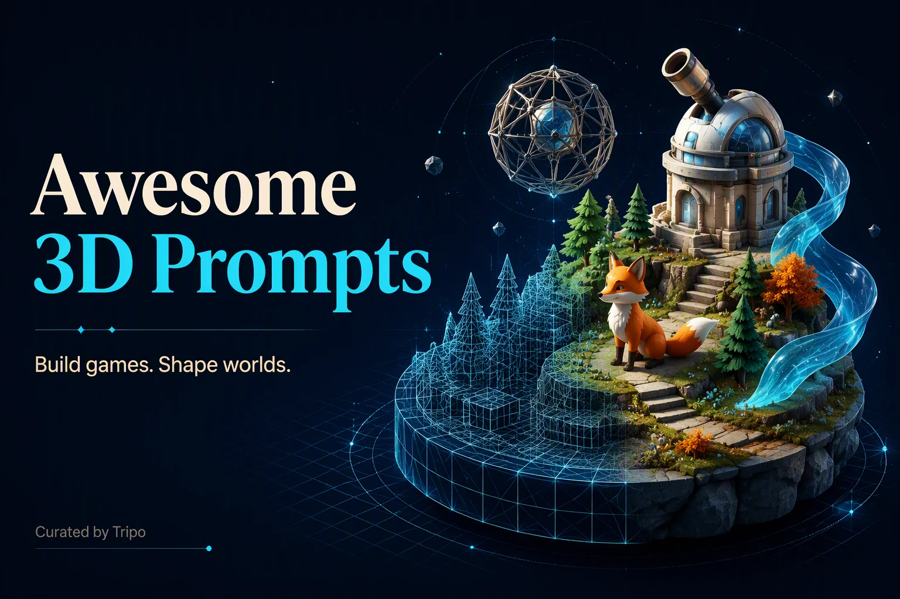</a>

**A good example is the beginning of your next 3D project.**

3D prompts across Astra, Claude and Kimi: games, scenes, assets, animation and interactive experiences. See the result, read the source, then adapt the prompt. Every example keeps its creator credit.

**496 examples · 6 models · 14 languages · 17 with source code**

[Start here](#start-here) · [Browse by category](#browse) · [Latest examples](#latest) · [Complete catalog](docs/catalog.en.md) · [Source code](docs/with-code.md)

<a id="start-here"></a>

## Start here

1. **Choose a result.** Browse by category or model. Click a preview to inspect the project on its detail page.
2. **Adapt the prompt.** Expand and copy the prompt, then change the subject, style and interaction. Include reference images when required; the detail page provides the shared workflow and full reference context.
3. **Build your version.** Run it in the appropriate coding assistant or 3D workflow. Test visuals, controls and performance. When source code is available, start with the linked project.

<a id="browse"></a>

## Browse by category

| Browse by category | Examples |
| :--- | ---: |
| [Games](docs/catalog.en.md#category-games) | 129 |
| [Scenes](docs/catalog.en.md#category-3d-scenes) | 108 |
| [Assets](docs/catalog.en.md#category-3d-assets) | 59 |
| [Interactive](docs/catalog.en.md#category-interactive-3d) | 101 |
| [Animation](docs/catalog.en.md#category-animation-simulation) | 95 |
| [Other](docs/catalog.en.md#category-other) | 4 |

### Browse by model

| Browse by model | Examples |
| :--- | ---: |
| [GPT-6 Astra](docs/catalog.en.md#model-gpt-6-astra) | 310 |
| [Claude Fable 5.1](docs/catalog.en.md#model-claude-fable-5-1) | 79 |
| [Claude Opus 5.5](docs/catalog.en.md#model-claude-opus-5-5) | 63 |
| [Kimi K3](docs/catalog.en.md#model-kimi-k3) | 20 |
| [Claude Fable 5](docs/catalog.en.md#model-claude-fable-5) | 18 |
| [Claude Opus 5](docs/catalog.en.md#model-claude-opus-5) | 13 |

## Featured projects

<table>
<tr>
<td width="50%" valign="top"><a href="https://www.tripo3d.ai/3d-prompts/wright-flyer-through-a-japanese-forest-2096467585785286808">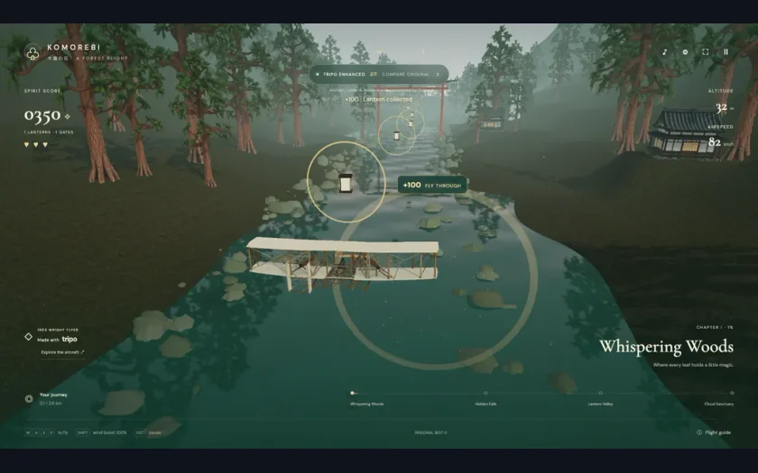</a><br><strong><a href="docs/catalog.en.5.md#wright-flyer-through-a-japanese-forest-2096467585785286808">Wright Flyer Through a Japanese Forest</a></strong><br><sub><a href="https://x.com/jaredliu_bravo">Jared</a></sub><br><a href="docs/catalog.en.5.md#wright-flyer-through-a-japanese-forest-2096467585785286808">Prompt →</a></td>
<td width="50%" valign="top"><a href="https://www.tripo3d.ai/3d-prompts/jelly-jungle-3d-browser-game-2081024333120733188">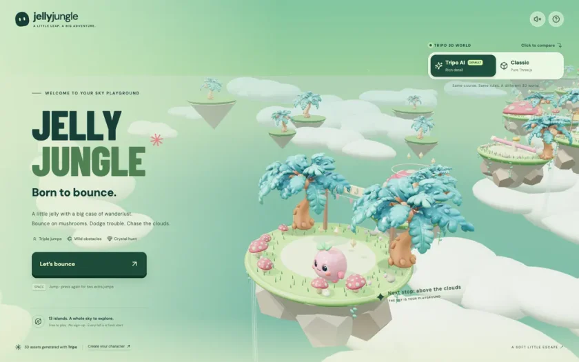</a><br><strong><a href="docs/catalog.en.10.md#jelly-jungle-3d-browser-game-2081024333120733188">Jelly Jungle: 3D Platformer</a></strong><br><sub><a href="https://x.com/jaredliu_bravo">Jared</a></sub><br><a href="docs/catalog.en.10.md#jelly-jungle-3d-browser-game-2081024333120733188">Prompt →</a></td>
</tr>
<tr>
<td width="50%" valign="top"><a href="https://www.tripo3d.ai/3d-prompts/akari-nagoya-rooftop-flame-relay">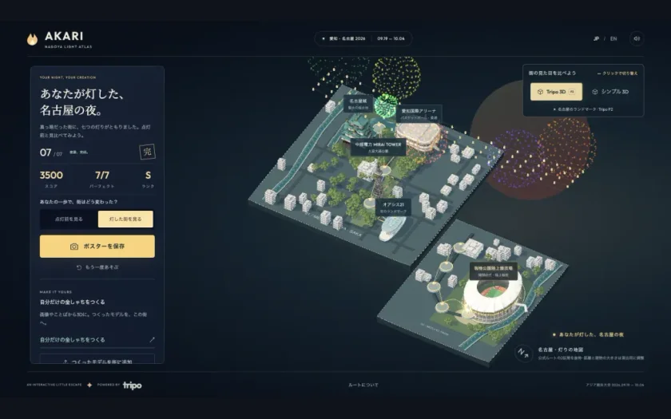</a><br><strong><a href="docs/catalog.en.3.md#akari-nagoya-rooftop-flame-relay">AKARI: Nagoya Rooftop Flame Relay</a></strong><br><sub><a href="https://growthengineer.space/">Jared</a></sub><br><a href="docs/catalog.en.3.md#akari-nagoya-rooftop-flame-relay">Prompt →</a></td>
<td width="50%" valign="top"><a href="https://www.tripo3d.ai/3d-prompts/cyclops-island-threejs-game">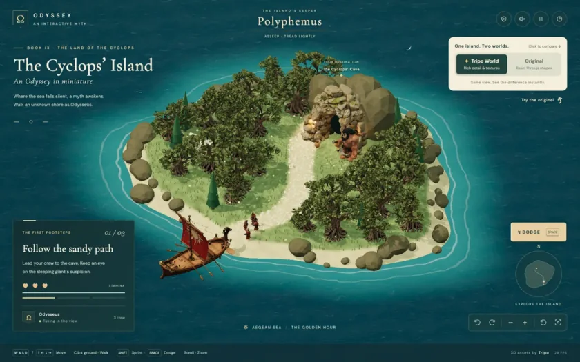</a><br><strong><a href="docs/catalog.en.3.md#cyclops-island-threejs-game">The Cyclops' Island</a></strong><br><sub><a href="https://x.com/jaredliu_bravo">Jared</a></sub><br><a href="docs/catalog.en.3.md#cyclops-island-threejs-game">Prompt →</a></td>
</tr>
</table>

<a id="latest"></a>

## Latest examples

[Complete catalog (496) →](docs/catalog.en.md)

<a id="claude-opus-5-5-2105672081358876788"></a>

### Animated floating mine mini-world

[Koldo Huici](https://x.com/koldo2k) · 2026-10-01 · Claude Opus 5.5 · Scenes

<a href="https://www.tripo3d.ai/3d-prompts/claude-opus-5-5-2105672081358876788">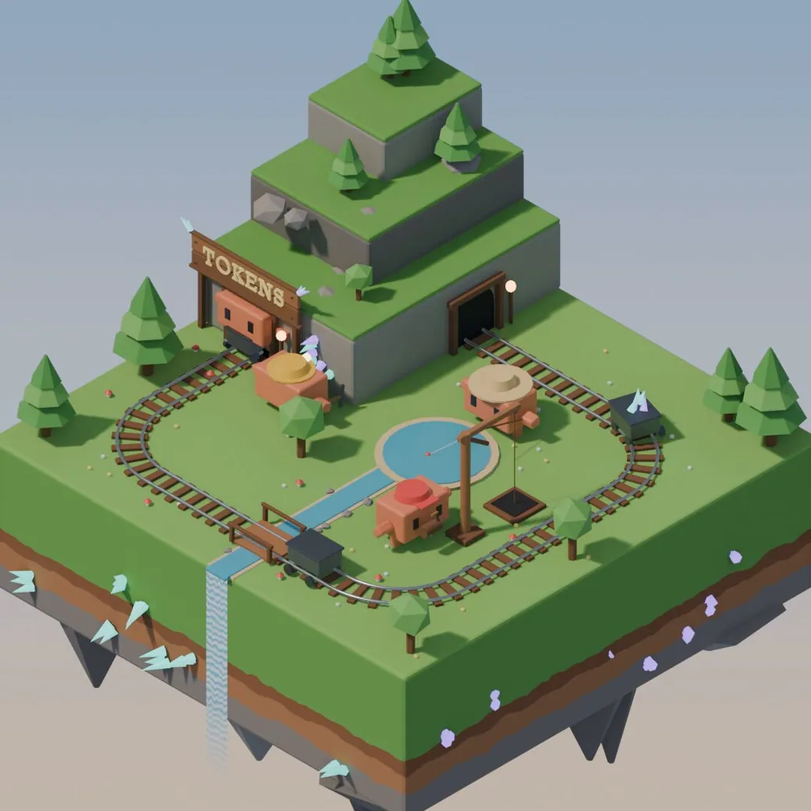</a>

<details>
<summary>Prompt</summary>

```text
Make an isometric floating mini-world in Blender, animated with Python, as a seamless loop: a small mine island with a terraced mountain, two tunnels and a railway that loops through the mountain, a pond whose stream falls off the edge as a waterfall, and rock layers with glowing crystals on the cut sides. The workers are little Claude bots: one mines a crystal vein and gets startled by a bat, one runs a crane that dumps crystals into each passing cart, one fishes in the pond, and one rides a cart. Put a wooden "TOKENS" sign over the mine entrance. Sound synced to every action.
```

</details>

[View detail ↗](https://www.tripo3d.ai/3d-prompts/claude-opus-5-5-2105672081358876788) · [Original post](https://x.com/koldo2k/status/2105672083908825404) · [Back to examples](#latest)

---

<a id="claude-opus-5-5-2105669581226570012"></a>

### Blockworld

[semperphoenix.com](https://semperphoenix.com/) · 2026-10-01 · Claude Opus 5.5 · Games

<a href="https://www.tripo3d.ai/3d-prompts/claude-opus-5-5-2105669581226570012">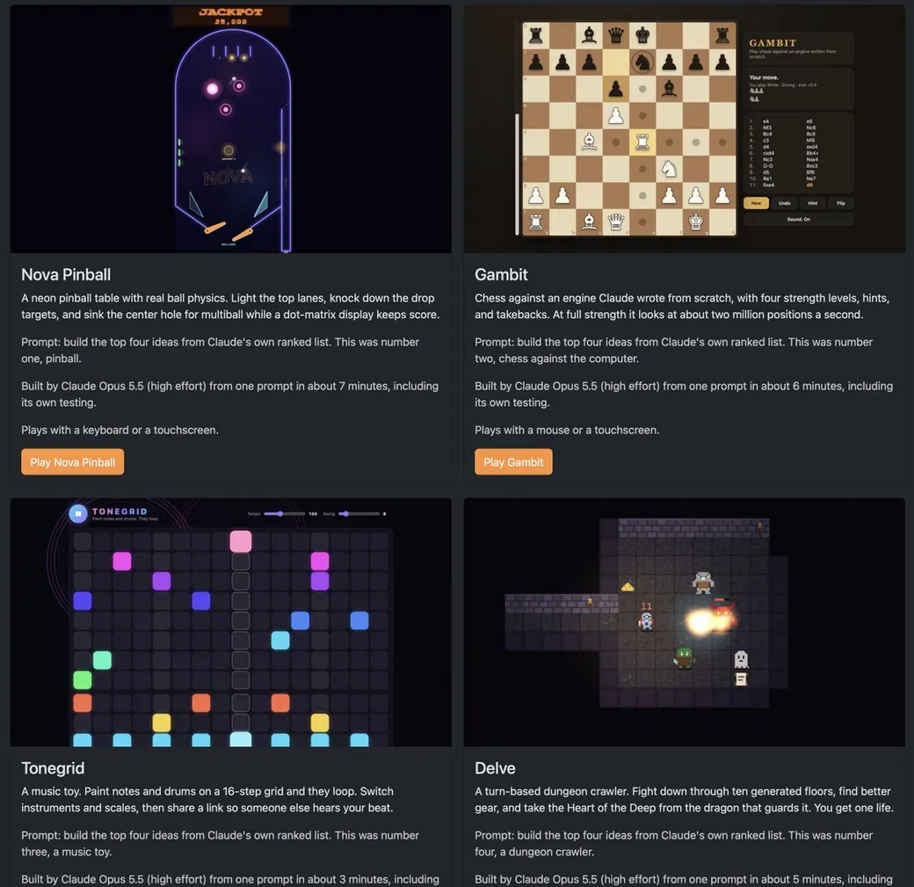</a>

<details>
<summary>Prompt</summary>

```text
Can you create a Minecraft clone?
```

</details>

[View detail ↗](https://www.tripo3d.ai/3d-prompts/claude-opus-5-5-2105669581226570012) · [Original post](https://semperphoenix.com/lab) · [Back to examples](#latest)

---

<a id="claude-opus-5-5-2105659005817462972"></a>

### Giant dragon attacking a medieval castle in Three.js

[ReconScribe](https://x.com/ReconScribe) · 2026-10-01 · Claude Opus 5.5 · Scenes

<a href="https://www.tripo3d.ai/3d-prompts/claude-opus-5-5-2105659005817462972"></a>

<details>
<summary>Prompt</summary>

```text
a giant dragon attacking a medieval castle and its village, built in Three.js.
```

</details>

[View detail ↗](https://www.tripo3d.ai/3d-prompts/claude-opus-5-5-2105659005817462972) · [Original post](https://x.com/ReconScribe/status/2105659005817462972) · [Back to examples](#latest)

---

<a id="gpt-6-astra-2105644436659290409"></a>

### 3D asteroid-dodging game

[dubspeak.com](https://dubspeak.com/) · 2026-10-01 · GPT-6 Astra · Games

<a href="https://www.tripo3d.ai/3d-prompts/gpt-6-astra-2105644436659290409">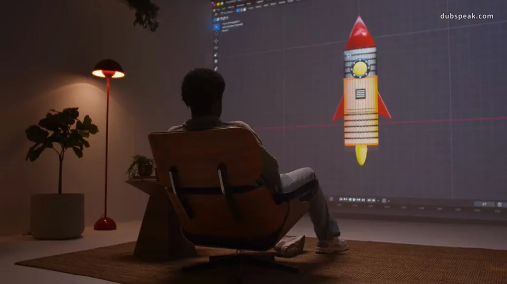</a>

<details>
<summary>Prompt</summary>

```text
Now, I want you to make a 3D game where I'm ducking asteroids, using the arrow keys to move around, and I'm using space to boost.
```

</details>

[View detail ↗](https://www.tripo3d.ai/3d-prompts/gpt-6-astra-2105644436659290409) · [Original post](https://dubspeak.com/gpt-6-astra-intro-20260928-v5/) · [Back to examples](#latest)

---

<a id="claude-opus-5-5-2105607558467559666"></a>

### A Grab-and-Stretch WebGPU 3D Gummy Octopus

[林悦己Cheer](https://x.com/cheerselflin) · 2026-10-01 · Claude Opus 5.5 · Interactive

<a href="https://www.tripo3d.ai/3d-prompts/claude-opus-5-5-2105607558467559666"></a>

<details>
<summary>Prompt</summary>

```text
Create a Goal with a token budget of 200,000. At the end, report the actual token usage, budget utilization, and runtime; if input, cached input, and output token breakdowns are available, estimate the cost in USD using the current model pricing and clearly list the calculation basis. I understand this uses subscription quotas, but we can convert them to API billing

Create “Octo Jelly” - a beautiful, interactive 3D gummy octopus that users can grab, stretch, and squish directly in their browser. Deliver a complete single-file HTML experience using genuine WebGPU.
ART DIRECTION
Make the octopus look like a premium translucent gummy candy: a rounded head, eight curled tentacles, small suction cups, and a cute, understated face.
Use a warm off-white background, soft studio lighting, and a subtle ground shadow. Keep the scene elegant and uncluttered, with the octopus large and centered.
GEOMETRY AND MATERIAL

* Generate all geometry procedurally. No external models or image files.
* Connect all eight tentacles smoothly to the body, without visible gaps or floating parts.
* Add rounded suction cups that stay attached as the tentacles deform.
* Use glossy, translucent jelly with thickness-dependent color absorption, refraction, soft internal light scattering, and delicate rim highlights.
* Thick areas should have richer color; thin tentacle tips should transmit more light.
* Avoid opaque plastic, blown-out highlights, and visible mesh seams.

SOFT-BODY PHYSICS
Use a stable mass-spring or position-based dynamics system with elastic constraints and approximate volume preservation.

* The head should feel soft but substantial.
* Tentacles should be more flexible than the head, especially near their tips.
* Allow users to grab the head or any tentacle at the clicked location.
* Pulling should deform the nearby geometry first, then elastically pull the rest of the body.
* On release, the octopus should wobble and gradually settle into its original shape.
* Tentacles should react independently, with slightly delayed motion.
* Include gravity, floor collisions, friction, and damping.
* Prevent tentacles from passing through the floor.
* Clamp extreme stretching and use fixed simulation steps so strong pulls do not break the model.
* Do not fake softness by scaling or rotating the entire octopus.

INTERACTION

* Left-click or touch the octopus to grab and stretch it.
* Right-drag or drag empty space to gently orbit the camera.
* Support a limited zoom range.
* Keep camera gestures separate from object dragging.
* Add “Give it a nudge,” “Reset,” “Pause,” and “Reset view” buttons.
* Include Firmness and Internal damping sliders.
* Add “¼ speed” and “Show mesh” toggles.
* Provide three color presets: Coral, Lagoon, and Grape. Change the material colors without resetting the simulation.

INTERFACE
Use a minimal editorial layout:

* Top left: small “MATERIAL STUDIES” label.
* Large italic serif heading: “Octo Jelly.”
* Caption: “Eight arms. A little wobble. A very soft creature.”
* Top right: a WebGPU status indicator.
* Right side: a compact “THE SPECIMEN” control panel.
* Bottom left: “Grab a tentacle. Pull gently. Let go.”

Use clean sans-serif text for controls, thin borders, and generous whitespace. Avoid heavy panels or decorative UI effects.
PERFORMANCE AND QUALITY

* Use real WebGPU rendering, not a 2D canvas imitation or prerecorded animation.
* Reuse geometry and buffers; do not rebuild meshes during dragging.
* Keep suction cups, eyes, and other details attached to the deforming body.
* Handle transparency without flickering, disappearing surfaces, or harsh black edges.
* Support desktop and mobile layouts.
* Show a clear fallback message if WebGPU is unavailable.
* Test repeated grabs, strong pulls, releases, floor collisions, palette changes, pause, and reset.

The result should feel like a little living gummy toy - glossy, squishy, expressive, and satisfying to stretch. Deliver the full working HTML, not a mockup or a code fragment.
```

</details>

<details>
<summary>Original prompt</summary>

```text
创建一个 token 预算为 200,000 的 Goal。结束时报告实际消耗 token、预算使用率和运行时间；如果能够获得输入、缓存输入、输出 token 的拆分，则按照当前模型价格估算美元费用，并明确列出计算依据。我知道是订阅额度，但是我们可以换算成api计费

Create “Octo Jelly” - a beautiful, interactive 3D gummy octopus that users can grab, stretch, and squish directly in their browser. Deliver a complete single-file HTML experience using genuine WebGPU.
ART DIRECTION
Make the octopus look like a premium translucent gummy candy: a rounded head, eight curled tentacles, small suction cups, and a cute, understated face.
Use a warm off-white background, soft studio lighting, and a subtle ground shadow. Keep the scene elegant and uncluttered, with the octopus large and centered.
GEOMETRY AND MATERIAL

* Generate all geometry procedurally. No external models or image files.
* Connect all eight tentacles smoothly to the body, without visible gaps or floating parts.
* Add rounded suction cups that stay attached as the tentacles deform.
* Use glossy, translucent jelly with thickness-dependent color absorption, refraction, soft internal light scattering, and delicate rim highlights.
* Thick areas should have richer color; thin tentacle tips should transmit more light.
* Avoid opaque plastic, blown-out highlights, and visible mesh seams.

SOFT-BODY PHYSICS
Use a stable mass-spring or position-based dynamics system with elastic constraints and approximate volume preservation.

* The head should feel soft but substantial.
* Tentacles should be more flexible than the head, especially near their tips.
* Allow users to grab the head or any tentacle at the clicked location.
* Pulling should deform the nearby geometry first, then elastically pull the rest of the body.
* On release, the octopus should wobble and gradually settle into its original shape.
* Tentacles should react independently, with slightly delayed motion.
* Include gravity, floor collisions, friction, and damping.
* Prevent tentacles from passing through the floor.
* Clamp extreme stretching and use fixed simulation steps so strong pulls do not break the model.
* Do not fake softness by scaling or rotating the entire octopus.

INTERACTION

* Left-click or touch the octopus to grab and stretch it.
* Right-drag or drag empty space to gently orbit the camera.
* Support a limited zoom range.
* Keep camera gestures separate from object dragging.
* Add “Give it a nudge,” “Reset,” “Pause,” and “Reset view” buttons.
* Include Firmness and Internal damping sliders.
* Add “¼ speed” and “Show mesh” toggles.
* Provide three color presets: Coral, Lagoon, and Grape. Change the material colors without resetting the simulation.

INTERFACE
Use a minimal editorial layout:

* Top left: small “MATERIAL STUDIES” label.
* Large italic serif heading: “Octo Jelly.”
* Caption: “Eight arms. A little wobble. A very soft creature.”
* Top right: a WebGPU status indicator.
* Right side: a compact “THE SPECIMEN” control panel.
* Bottom left: “Grab a tentacle. Pull gently. Let go.”

Use clean sans-serif text for controls, thin borders, and generous whitespace. Avoid heavy panels or decorative UI effects.
PERFORMANCE AND QUALITY

* Use real WebGPU rendering, not a 2D canvas imitation or prerecorded animation.
* Reuse geometry and buffers; do not rebuild meshes during dragging.
* Keep suction cups, eyes, and other details attached to the deforming body.
* Handle transparency without flickering, disappearing surfaces, or harsh black edges.
* Support desktop and mobile layouts.
* Show a clear fallback message if WebGPU is unavailable.
* Test repeated grabs, strong pulls, releases, floor collisions, palette changes, pause, and reset.

The result should feel like a little living gummy toy - glossy, squishy, expressive, and satisfying to stretch. Deliver the full working HTML, not a mockup or a code fragment.
```

</details>

[View detail ↗](https://www.tripo3d.ai/3d-prompts/claude-opus-5-5-2105607558467559666) · [Original post](https://x.com/cheerselflin/status/2105607558467559666) · [Back to examples](#latest)

---

<a id="claude-opus-5-5-2105439105798513059"></a>

### Volcano simulation with a 5 km-deep magma chamber

[Konstantin Saifoulline](https://x.com/konstantinsaifo) · 2026-09-30 · Claude Opus 5.5 · Animation

<a href="https://www.tripo3d.ai/3d-prompts/claude-opus-5-5-2105439105798513059">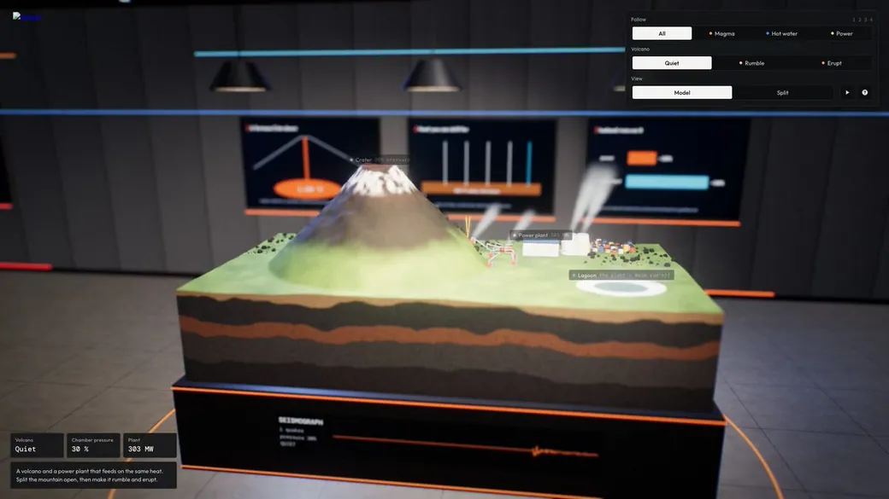</a>

<details>
<summary>Prompt</summary>

```text
Build with Opus 5.5 a volcano simulation. Magma chamber 5 km down.
```

</details>

[View detail ↗](https://www.tripo3d.ai/3d-prompts/claude-opus-5-5-2105439105798513059) · [Original post](https://x.com/konstantinsaifo/status/2105439105798513059) · [Back to examples](#latest)

---

<a id="gpt-6-astra-2105412081692352654"></a>

### Golden miniature 3D pyramid diorama

[demon](https://x.com/demonugc) · 2026-09-30 · GPT-6 Astra · Scenes

<a href="https://www.tripo3d.ai/3d-prompts/gpt-6-astra-2105412081692352654">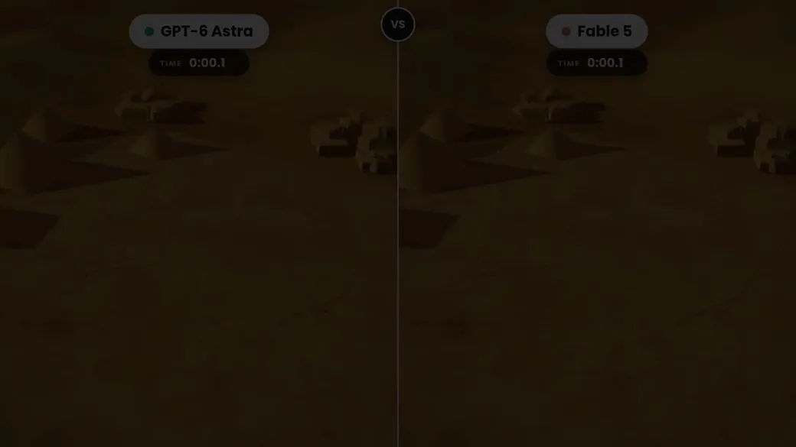</a>

<details>
<summary>Prompt</summary>

```text
{
  "task": "build the pyramids in 3D. rotate the camera",
  "video": { "duration": "15s", "ratio": "16:9", "layout": "split screen, 1 model per side" },
  "scene": "golden miniature diorama, tilt-shift, dark dusk lighting, smooth carved pyramid, temple, small pyramids, cracked plaza, contour terrain",
  "animation": "pyramid morphs in from base to tip, no workers, no ramps, no blocks",
  "camera": "continuous 150 degree orbit, synced on both sides",
  "overlay": "model name + timer only"
}
```

</details>

[View detail ↗](https://www.tripo3d.ai/3d-prompts/gpt-6-astra-2105412081692352654) · [Original post](https://x.com/demonugc/status/2105412081692352654) · [Back to examples](#latest)

---

<a id="claude-opus-5-5-2105353400040964192"></a>

### Jelly Press

[Vib3Coded](https://x.com/vib3coded) · 2026-09-30 · Claude Opus 5.5 · Interactive

<a href="https://www.tripo3d.ai/3d-prompts/claude-opus-5-5-2105353400040964192">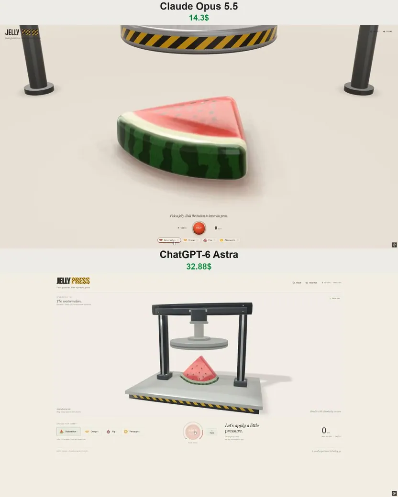</a>

<details>
<summary>Prompt</summary>

```text
Create "Jelly Press": a single-file interactive 3D toy in HTML (all JS, CSS and WGSL shaders inline, no external assets except Google Fonts). Render with WebGPU; if WebGPU or an adapter is missing, show a clean fallback message instead of a blank page.  CONCEPT Four translucent gummy jellies shaped like fruit slices sit one at a time on the steel bed of a hydraulic press. The player holds a big red button to lower the press. The jelly squashes and spreads, the pressure gauge climbs, and somewhere past half its height it bursts into pieces. After the burst the game does NOT end: the player can grab the pieces, drag them, throw them around, and squash them again.  THE JELLIES (chips at the bottom, keys 1–4) 1. Watermelon wedge (half-disc slab): red flesh with dark teardrop seeds, a pale rind band, a green striped skin. 2. Orange slice (half-disc): orange pulp segments separated by thin white membranes, pale pith, orange peel. 3. Fig half: pink flesh full of small golden seeds, a cream layer, a dark purple skin. 4. Pineapple ring: golden fibrous flesh with radial streaks and a hole in the middle. Each jelly should look like real gummy candy: subsurface scattering, soft translucency, glossy specular highlights, soft shadows on a warm studio floor (cream/beige, tone-mapped).  PHYSICS (CPU, fixed 60 Hz step) - XPBD tetrahedral soft body with 8 substeps: co-rotational per-tet shape matching, per-tet volume constraints, hard edge strain limits (0.35×–1.8×), edge velocity damping, floor contact with Coulomb friction, rolling resistance, and gentle settling when nearly still. - Render mesh skinned on the CPU through barycentric embedding in the tets; normals recomputed from triangles every frame. - The press die is a kinematic round platen (radius ~1.05, rounded edge, a thickness, a ram above it). It acts as a ceiling with friction below, a shelf on top, and a side wall at its rim. The two press posts are solid. - Pressure readout in bar comes from the platen's contact load, scaled per fruit.  THE BURST - Break at a random squash between 52% and 66% of the jelly's height. - Plan the fracture in the background shortly after each round starts, so the burst itself is instant. - 5–7 big pieces from 3D Voronoi cells with slightly tilted walls. On 3–4 of them, a far corner is chipped off by two cutting planes and split further into 2–4 small chips, which leaves jagged, notched edges. - Assign tets to cells by centroid. Duplicate particles per chunk. Merge tiny islands into their neighbours. - The new body adopts the old positions and velocities. - Clip the skin triangles against each cell's half-spaces, and fill every cut face with a clean flat cap showing the fruit's interior (flesh, seeds, membranes). No stretched triangles, no holes. - Kick pieces outward and upward from the press. Small chips fly faster and higher and tumble with random spin. - Show a big italic verdict for about 2.5 s, then fade it: "Splat." (melon), "Squeezed." (orange), "Well, that's jam." (fig), "Crushed." (pineapple). Include a stat line: "Gave up at N bar and N% of its height."  AFTER THE BURST: PLAY MODE - Picking: ray/triangle test against the skinned mesh, with a forgiving screen-space fallback for touch. - Grabbing pins the grabbed patch (radius ~0.4, only particles of that chunk) to a target on a camera-facing drag plane. Small chips move whole; big pieces stretch and swing like jelly. - Releasing throws the piece with the pointer's velocity. - Pieces collide with each other. A particle found inside another chunk's tet is pushed out through that chunk's nearest skin face, with friction. Use a chunk AABB broad phase and a spatial hash of skin tets. - Pieces stay on stage: side walls, plus an invisible front edge so nothing ends up under the controls or behind the camera. - The press still works: hold to squash the pieces again (no second fracture); Raise lifts the platen. - Wet "plop" sounds on landings; a small squelch on grab. - Cursor: open hand over pieces, closed hand while dragging. Dragging empty space orbits the camera.  UI (editorial, minimal) - Masthead top-left: "JELLY PRESS" in bold condensed caps, with "PRESS" filled in yellow/black hazard stripes. Subtitle: "Four gummies. One hydraulic press." - Top-right: Reset and Sound toggle. - Bottom deck:   - Caption line with escalating captions while pressing: "Contact." → "It's fine. It's jelly." → "Getting wider." → "That's a pancake now." → "It's making a noise." → "Please."   - Circular pressure dial (0–400 bar arc, red zone) around a red HOLD button, a Raise button, and a big numeric bar readout.   - Fruit chips with icons. - In play mode the caption slot shows "Grab a piece. Throw it." with small "Press again" and "Next jelly" buttons. - Controls: hold Space or ArrowDown to press, ArrowUp to raise, R to reset, 1–4 to pick a fruit. Wheel zooms; double-click resets the view. - Camera: low bench-level view; the press frame yaws per fruit so the posts never block the jelly. Framing adapts so the jelly sits between masthead and deck; works on phones (portrait) with a narrower stage.  SOUND (procedural Web Audio, no files) Hydraulic motor hum that rises with pressure, wet squelches, occasional creaks at high pressure, a valve clunk when the platen stops, a loud burst, soft plops on landing. Unlock on first interaction.  QUALITY BAR - Smooth 60 fps on a laptop. - Background warm-up of the other fruits' meshes and shaders so switching is instant. - Respect prefers-reduced-motion. - Accessible labels, a gauge with role=meter, focus-visible outlines. - No console errors. The page never goes blank.
```

</details>

[View detail ↗](https://www.tripo3d.ai/3d-prompts/claude-opus-5-5-2105353400040964192) · [Original post](https://x.com/vib3coded/status/2105353559327887843) · [Back to examples](#latest)

---

<a id="gpt-6-astra-2105323534398763307"></a>

### Recreate a scene in Isaac Sim

[Charles Wong](https://x.com/charleswongzx) · 2026-09-30 · GPT-6 Astra · Scenes

<a href="https://www.tripo3d.ai/3d-prompts/gpt-6-astra-2105323534398763307">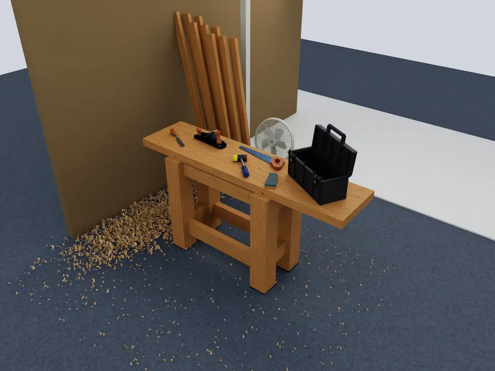</a>

**Reference images:** [1](https://media.tripogrowth.space/media/da6263bd-ac07-41bb-93ad-a997394635c6.jpg) · [2](https://pbs.twimg.com/media/HTcFeb4aIAADxvZ.jpg)

<details>
<summary>Prompt</summary>

```text
Recreate this scene in Isaac Sim for the purposes of manipulation policy evaluation. Don't use Manifold.
```

</details>

[View detail ↗](https://www.tripo3d.ai/3d-prompts/gpt-6-astra-2105323534398763307) · [Original post](https://x.com/charleswongzx/status/2105323534398763307) · [Back to examples](#latest)

---

<a id="claude-opus-5-5-2105315982525014067"></a>

### SPARK — Painterly 3D Animated Shot

[Shikhar](https://x.com/xikhar) · 2026-09-30 · Claude Opus 5.5 · Animation

<a href="https://www.tripo3d.ai/3d-prompts/claude-opus-5-5-2105315982525014067">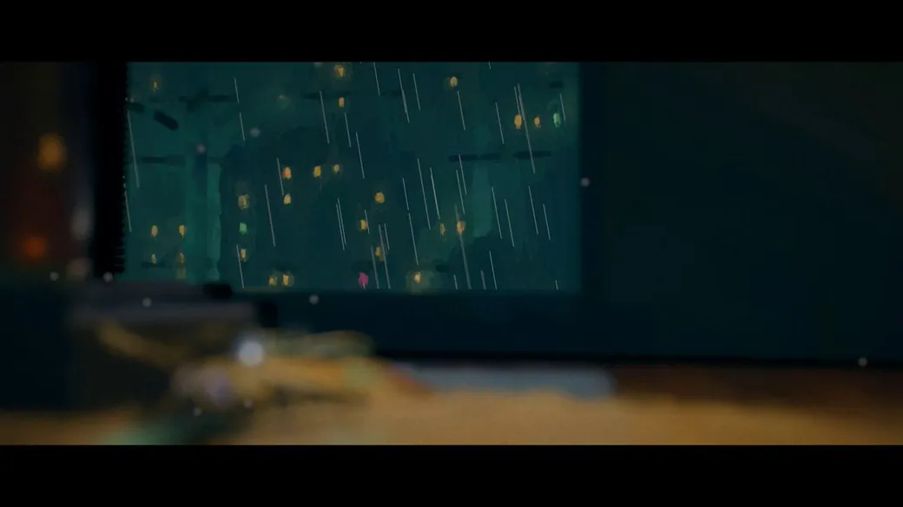</a>

<details>
<summary>Prompt</summary>

```text
TITLE: "SPARK"

An around 15-second 3D animated shot in the painterly style of the show Arcane (Fortiche).

Made in Blender, or any other tool if superior. Widescreen, no dialogue.

GOAL

The top priority is replicating Arcane's visual and animation style as perfectly as possible, in every way. Someone watching should believe it came from the same studio.

Take as much time and effort as needed. Replicate the technique and look perfectly. Spend as much time as needed, ensuring it's perfect in every way.

SCENE (loose — adapt freely)

A small mechanical creature (not humanoid), something like a brass-and-crystal moth, wakes up on a cluttered inventor's workbench at night. Its crystal core ignites with glowing energy, and it bursts into the air in a swirl of sparks. Change the details, framing, or action if something else shows off the style better. You can animate something else completely different if you want—anything you pick, whatever you can do best—that will also look identical to Arcane.

PROCESS

1. RESEARCH: Before building anything, study Arcane's style in depth. Find references and breakdowns of Fortiche's technique (interviews, making-of material, artist breakdowns). Write down every defining element: textures, shading, line work, color, lighting, frame rate, effects, camera, compositing.

2. STYLE GUIDE: Turn that into a written checklist and a small style frame (a single still image) before animating. Compare it side by side with reference stills and revise until it matches.

3. BUILD: Model, texture, light, and animate following the checklist.

4. REVIEW: Compare frames against Arcane references repeatedly. List every difference you can see and fix it. Repeat until no noticeable differences remain.

STYLE ELEMENTS TO MATCH (at minimum)

- Hand-painted textures with visible brushstrokes on every surface; nothing looks procedural or photographic.

- Stylized, painterly shading with designed light/shadow shapes, not realistic falloff.

- Animation on 2s for characters/objects, with strong poses, snappy timing, anticipation, and smear frames; camera moves smooth on 1s.

- Hand-drawn 2D effects (sparks, energy, smoke, glints, glow) layered over the 3D, animated on 2s with graphic shape language.

- Bold, moody color: warm light vs. saturated glowing accents, rich colored shadows, strong rim light, bloom.

- Painterly compositing: brush-like filtering, grain, subtle texture over the image.

- Cinematic camera: shallow depth of field, purposeful movement, weight on impacts.

SOUND

Detailed, cinematic sound design that matches the action and mood.

Make everything as good as possible: animation, models, textures, effects, lighting, and sound. Use any tools or programs needed. You may study references online and imitate techniques, and copy things, but do not directly use assets you did not create. Keep the whole shot in one consistent style so the 3D, painted textures, and 2D effects feel like a single hand-crafted image.

Do not use memory or previous chats.

You can use any other tools, programs, plugins, literally anything. Use anything at your disposal.

You can use different processes than outlined in this, or animate something else than described, but it should absolutely look as close as possible to the TV show Arcane. Make it perfect in every way and identical.
```

</details>

[View detail ↗](https://www.tripo3d.ai/3d-prompts/claude-opus-5-5-2105315982525014067) · [Original post](https://x.com/xikhar/status/2105317581695623329) · [Back to examples](#latest)

---

<a id="claude-opus-5-5-2105302007896797351"></a>

### Beat-Synced 3D Sphere Drop Animation Video

[Gorden Sun](https://x.com/Gorden_Sun) · 2026-09-30 · Claude Opus 5.5 · Animation

<a href="https://www.tripo3d.ai/3d-prompts/claude-opus-5-5-2105302007896797351"></a>

<details>
<summary>Prompt</summary>

```text
Create a beat-synced 3D sphere drop animation video with results comparable to a professional Blender production. Use multiple classic instrumental tracks, switching scenes with the music. As the 3D sphere falls, it should bounce off objects in each 3D scene, with objects lighting up in time with the beat. Include some humorous elements.
Use three.js, not Blender.
```

</details>

<details>
<summary>Original prompt</summary>

```text
卡点的3D球体下坠的动画视频：对标专业的Blender做的效果，音乐是多首经典的纯音乐，场景按音乐切换，3D球体下坠时在3D场景的物件中弹跳，按音乐的节奏点亮物件。带一些幽默的元素。
使用three.js制作，不要使用Blender制作
```

</details>

[View detail ↗](https://www.tripo3d.ai/3d-prompts/claude-opus-5-5-2105302007896797351) · [Original post](https://x.com/Gorden_Sun/status/2105302007896797351) · [Back to examples](#latest)

---

<a id="gpt-6-astra-2105298955307303100"></a>

### Create a 3D Minion Character in Blender

[EvoLink.ai](https://x.com/EvoLinkAi) · 2026-09-30 · GPT-6 Astra · Assets

<a href="https://www.tripo3d.ai/3d-prompts/gpt-6-astra-2105298955307303100">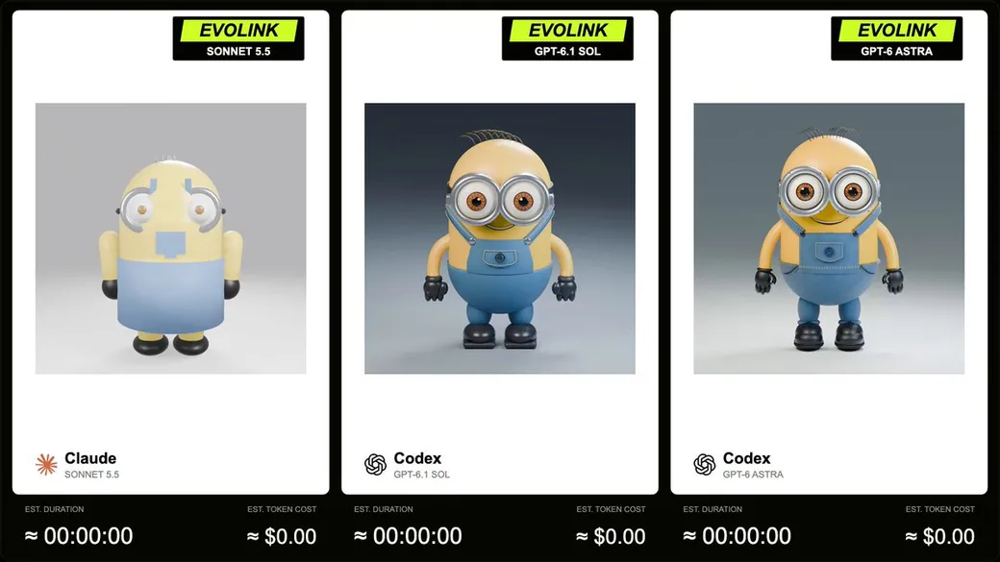</a>

<details>
<summary>Prompt</summary>

```text
Write a complete, executable Python script using Blender's bpy module to create a 3D Minion character, set up a 360-degree turntable camera animation, and render a 5-second 1:1 video.
Animation & Render Specifications:

Frame Rate & Duration: Set frame rate to 30 fps and render frame range from frame 1 to 150 (exactly 5 seconds).
Aspect Ratio: Set render resolution to 1080x1080 pixels (1:1 square ratio).
Camera Turntable Animation:Animate the camera (or an empty controller object parented to the camera) to perform a seamless 360-degree rotation around the Minion over the 150 frames.
Set keyframe interpolation to LINEAR to ensure smooth, constant-speed rotation.

Output Settings: Set output format to FFmpeg video (H.264 / MP4 container).
Technical Requirements & Model Structure:
Base Body:Create a capsule-like mesh for the main body (yellow material, subsurface scattering/roughness ~0.3).
Add sparse, thin strands of black hair on top of the head.

Goggles & EyesBuild dual-lens goggles using extruded cylinders/toruses.
Goggle Frame Material: Metallic (~0.9), Roughness (~0.2) to simulate brushed aluminum/metal.
Add a black elastic strap wrapping around the body.
Generate two eyeball meshes inside the frame (white sclera, brown iris, shiny pupil).

Clothing - Overalls:Model the denim overalls using separate mesh geometry or extruded body segments.
Material: Blue denim color, higher roughness (~0.6).
Include shoulder straps and a front pocket on the chest.

Appendages & DetailsAdd arms and legs with black gloved hands and black shoes.
Use Mirror Modifier (bpy.ops.object.modifier_add(type='MIRROR')) where applicable (e.g., eyes, goggles frame, arms, straps, legs) to ensure symmetry and clean code.

Lighting & Scene:Place a three-point lighting setup (Key, Fill, Rim lights) parented to the camera or placed uniformly so the lighting stays consistent during rotation.
Set render engine to Cycles or EEVEE with a clean studio background.
Ensure all materials are created using Nodes (use_nodes = True).

Return ONLY valid Python code inside a markdown block with no surrounding text or markdown explanations.
```

</details>

[View detail ↗](https://www.tripo3d.ai/3d-prompts/gpt-6-astra-2105298955307303100) · [Original post](https://x.com/EvoLinkAi/status/2105298964027265295) · [Back to examples](#latest)

---

<a id="claude-opus-5-5-2105285992865272110"></a>

### Jelly Press

[Vib3Coded](https://x.com/vib3coded) · 2026-09-30 · Claude Opus 5.5 · Interactive

<a href="https://www.tripo3d.ai/3d-prompts/claude-opus-5-5-2105285992865272110">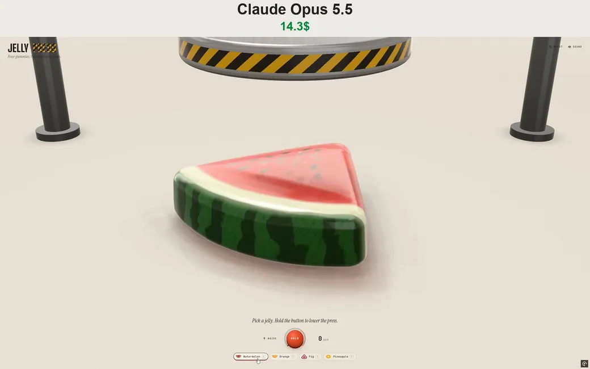</a>

<details>
<summary>Prompt</summary>

```text
Create "Jelly Press": a single-file interactive 3D toy in HTML (all JS, CSS and WGSL shaders inline, no external assets except Google Fonts). Render with WebGPU; if WebGPU or an adapter is missing, show a clean fallback message instead of a blank page.

CONCEPT
Four translucent gummy jellies shaped like fruit slices sit one at a time on the steel bed of a hydraulic press. The player holds a big red button to lower the press. The jelly squashes and spreads, the pressure gauge climbs, and somewhere past half its height it bursts into pieces. After the burst the game does NOT end: the player can grab the pieces, drag them, throw them around, and squash them again.

THE JELLIES (chips at the bottom, keys 1–4)
1. Watermelon wedge (half-disc slab): red flesh with dark teardrop seeds, a pale rind band, a green striped skin.
2. Orange slice (half-disc): orange pulp segments separated by thin white membranes, pale pith, orange peel.
3. Fig half: pink flesh full of small golden seeds, a cream layer, a dark purple skin.
4. Pineapple ring: golden fibrous flesh with radial streaks and a hole in the middle.
Each jelly should look like real gummy candy: subsurface scattering, soft translucency, glossy specular highlights, soft shadows on a warm studio floor (cream/beige, tone-mapped).

PHYSICS (CPU, fixed 60 Hz step)
- XPBD tetrahedral soft body with 8 substeps: co-rotational per-tet shape matching, per-tet volume constraints, hard edge strain limits (0.35×–1.8×), edge velocity damping, floor contact with Coulomb friction, rolling resistance, and gentle settling when nearly still.
- Render mesh skinned on the CPU through barycentric embedding in the tets; normals recomputed from triangles every frame.
- The press die is a kinematic round platen (radius ~1.05, rounded edge, a thickness, a ram above it). It acts as a ceiling with friction below, a shelf on top, and a side wall at its rim. The two press posts are solid.
- Pressure readout in bar comes from the platen's contact load, scaled per fruit.

THE BURST
- Break at a random squash between 52% and 66% of the jelly's height.
- Plan the fracture in the background shortly after each round starts, so the burst itself is instant.
- 5–7 big pieces from 3D Voronoi cells with slightly tilted walls. On 3–4 of them, a far corner is chipped off by two cutting planes and split further into 2–4 small chips, which leaves jagged, notched edges.
- Assign tets to cells by centroid. Duplicate particles per chunk. Merge tiny islands into their neighbours.
- The new body adopts the old positions and velocities.
- Clip the skin triangles against each cell's half-spaces, and fill every cut face with a clean flat cap showing the fruit's interior (flesh, seeds, membranes). No stretched triangles, no holes.
- Kick pieces outward and upward from the press. Small chips fly faster and higher and tumble with random spin.
- Show a big italic verdict for about 2.5 s, then fade it: "Splat." (melon), "Squeezed." (orange), "Well, that's jam." (fig), "Crushed." (pineapple). Include a stat line: "Gave up at N bar and N% of its height."

AFTER THE BURST: PLAY MODE
- Picking: ray/triangle test against the skinned mesh, with a forgiving screen-space fallback for touch.
- Grabbing pins the grabbed patch (radius ~0.4, only particles of that chunk) to a target on a camera-facing drag plane. Small chips move whole; big pieces stretch and swing like jelly.
- Releasing throws the piece with the pointer's velocity.
- Pieces collide with each other. A particle found inside another chunk's tet is pushed out through that chunk's nearest skin face, with friction. Use a chunk AABB broad phase and a spatial hash of skin tets.
- Pieces stay on stage: side walls, plus an invisible front edge so nothing ends up under the controls or behind the camera.
- The press still works: hold to squash the pieces again (no second fracture); Raise lifts the platen.
- Wet "plop" sounds on landings; a small squelch on grab.
- Cursor: open hand over pieces, closed hand while dragging. Dragging empty space orbits the camera.

UI (editorial, minimal)
- Masthead top-left: "JELLY PRESS" in bold condensed caps, with "PRESS" filled in yellow/black hazard stripes. Subtitle: "Four gummies. One hydraulic press."
- Top-right: Reset and Sound toggle.
- Bottom deck:
  - Caption line with escalating captions while pressing: "Contact." → "It's fine. It's jelly." → "Getting wider." → "That's a pancake now." → "It's making a noise." → "Please."
  - Circular pressure dial (0–400 bar arc, red zone) around a red HOLD button, a Raise button, and a big numeric bar readout.
  - Fruit chips with icons.
- In play mode the caption slot shows "Grab a piece. Throw it." with small "Press again" and "Next jelly" buttons.
- Controls: hold Space or ArrowDown to press, ArrowUp to raise, R to reset, 1–4 to pick a fruit. Wheel zooms; double-click resets the view.
- Camera: low bench-level view; the press frame yaws per fruit so the posts never block the jelly. Framing adapts so the jelly sits between masthead and deck; works on phones (portrait) with a narrower stage.

SOUND (procedural Web Audio, no files)
Hydraulic motor hum that rises with pressure, wet squelches, occasional creaks at high pressure, a valve clunk when the platen stops, a loud burst, soft plops on landing. Unlock on first interaction.

QUALITY BAR
- Smooth 60 fps on a laptop.
- Background warm-up of the other fruits' meshes and shaders so switching is instant.
- Respect prefers-reduced-motion.
- Accessible labels, a gauge with role=meter, focus-visible outlines.
- No console errors. The page never goes blank.
```

</details>

[View detail ↗](https://www.tripo3d.ai/3d-prompts/claude-opus-5-5-2105285992865272110) · [Original post](https://x.com/vib3coded/status/2105286092651999619) · [Back to examples](#latest)

---

<a id="gpt-6-astra-2105278999861526953"></a>

### Blender render of the Golden Gate Bridge

[EvoLink.ai](https://x.com/EvoLinkAi) · 2026-09-30 · GPT-6 Astra · Scenes

<a href="https://www.tripo3d.ai/3d-prompts/gpt-6-astra-2105278999861526953">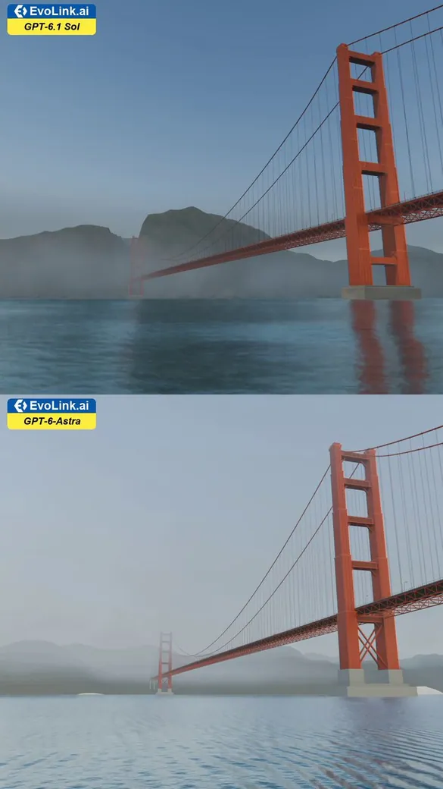</a>

<details>
<summary>Prompt</summary>

```text
A Blender render of the Golden Gate Bridge.  A sweeping, extreme low-angle shot from the surface of San Francisco Bay, looking up at the colossal, intricate steel-truss towers piercing the foggy morning sky. The expansive roadway stretches across the span with countless tiny, detailed vehicles, highlighting the bridge's grand, imposing scale against the rugged coastal headlands.
```

</details>

[View detail ↗](https://www.tripo3d.ai/3d-prompts/gpt-6-astra-2105278999861526953) · [Original post](https://x.com/EvoLinkAi/status/2105279002793345069) · [Back to examples](#latest)

---

<a id="claude-opus-5-5-2105246199653482872"></a>

### Turn-based ASCII roguelike in one HTML file

[kriptoleidi](https://x.com/kriptoleidi) · 2026-09-30 · Claude Opus 5.5 · Games

<a href="https://www.tripo3d.ai/3d-prompts/claude-opus-5-5-2105246199653482872"></a>

<details>
<summary>Prompt</summary>

```text
Act as a lead game designer. Build a complete, turn-based ASCII roguelike in a single self-contained HTML/JS/CSS file with zero external dependencies.
1. Visual: 1980s CRT monitor, phosphor green text (#00FF66) on black, soft scanline glow.
2. Procedural generation: 40x22 map, connected rooms and corridors.
3. Entities: @ hero, # wall, . floor, g goblin (5 HP), $ gold, > stairs down.
4. Mechanics: turn-based movement and combat, track HP and gold.
5. HUD: floor number, HP bar, combat log. Permadeath with restart.
Output only the working HTML code.
```

</details>

[View detail ↗](https://www.tripo3d.ai/3d-prompts/claude-opus-5-5-2105246199653482872) · [Original post](https://x.com/kriptoleidi/status/2105246199653482872) · [Back to examples](#latest)

---

<a id="claude-opus-5-5-2105245648723562584"></a>

### Create Game of Thrones world

[DrstaOne](https://x.com/DrstaOne) · 2026-09-30 · Claude Opus 5.5 · Scenes

<a href="https://www.tripo3d.ai/3d-prompts/claude-opus-5-5-2105245648723562584"></a>

<details>
<summary>Prompt</summary>

```text
&lt;create Game of thrones world&gt;
```

</details>

[View detail ↗](https://www.tripo3d.ai/3d-prompts/claude-opus-5-5-2105245648723562584) · [Original post](https://x.com/DrstaOne/status/2105245648723562584) · [Back to examples](#latest)

---

<a id="gpt-6-astra-2105047166733746209"></a>

### Cinematic photorealistic rocket launch scene

[Matthew Lebo](https://x.com/MatthewLebo_) · 2026-09-29 · GPT-6 Astra · Scenes

<a href="https://www.tripo3d.ai/3d-prompts/gpt-6-astra-2105047166733746209">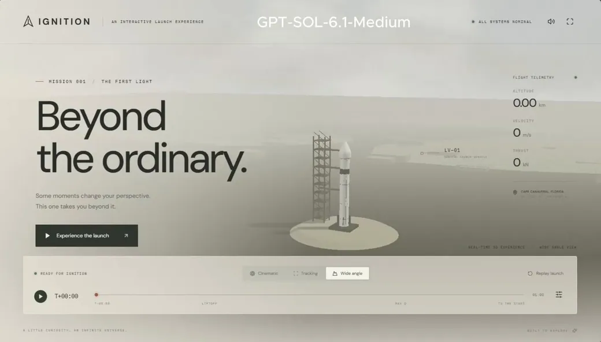</a>

<details>
<summary>Prompt</summary>

```text
Build a cinematic, photorealistic, beautifully textured rocket launch scene using Three.js
```

</details>

[View detail ↗](https://www.tripo3d.ai/3d-prompts/gpt-6-astra-2105047166733746209) · [Original post](https://x.com/MatthewLebo_/status/2105047166733746209) · [Back to examples](#latest)

---

<a id="claude-opus-5-5-2105029713445949521"></a>

### Interactive tectonic sandbox earthquake video

[Ege](https://x.com/egeberkina) · 2026-09-29 · Claude Opus 5.5 · Animation

<a href="https://www.tripo3d.ai/3d-prompts/claude-opus-5-5-2105029713445949521">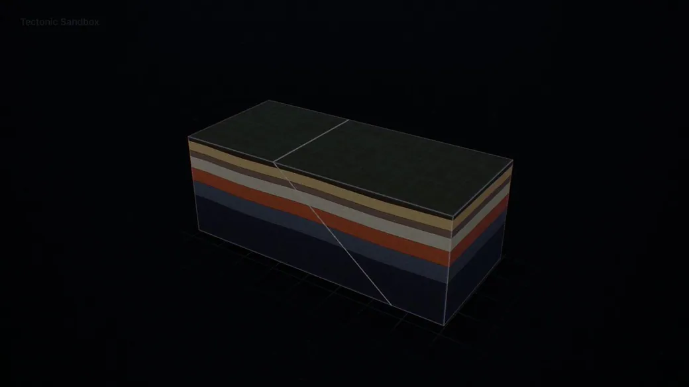</a>

<details>
<summary>Prompt</summary>

```text
Create a visually stunning 60-second video explaining how an earthquake happens through an interactive tectonic sandbox.

Make it feel like we are watching someone explore a beautiful real-time simulation, not a slideshow or traditional educational video.

Start with a clean 3D cross-section of Earth’s crust. Two tectonic plates slowly move against each other. Visualize the fault between them and show friction locking the plates while stress gradually builds.

As pressure increases, make the simulation more intense: rock layers deform, stress zones glow, subtle vibrations begin, and a live seismograph starts reacting.

Then trigger the earthquake. The fault suddenly slips and releases a massive burst of energy. Show seismic waves radiating outward through the ground, then transition upward to the surface where the landscape and a small city begin shaking.

Visualize P-waves and S-waves traveling differently through the Earth, followed by the strongest surface waves. Show buildings reacting differently depending on distance from the epicenter.

End by zooming back underground to reveal smaller aftershocks around the fault, then pull out to show the complete tectonic system.

Use cinematic motion graphics, satisfying physics simulations, dramatic scale transitions, premium 3D scientific visualization, minimal typography, dynamic labels, smooth UI overlays and seamless transitions.

The pacing should constantly evolve and reveal something new every few seconds so the full 60 seconds stays visually engaging.

Make it feel like an Apple-quality interactive science visualization turned into a cinematic motion-design video.
```

</details>

[View detail ↗](https://www.tripo3d.ai/3d-prompts/claude-opus-5-5-2105029713445949521) · [Original post](https://x.com/egeberkina/status/2105029713445949521) · [Back to examples](#latest)

---

<a id="gpt-6-astra-2105027152617918852"></a>

### Realistic F-22 Raptor model and Godot flight video

[Demetrius Greses Jr](https://x.com/dgresesjr) · 2026-09-29 · GPT-6 Astra · Other

<a href="https://www.tripo3d.ai/3d-prompts/gpt-6-astra-2105027152617918852">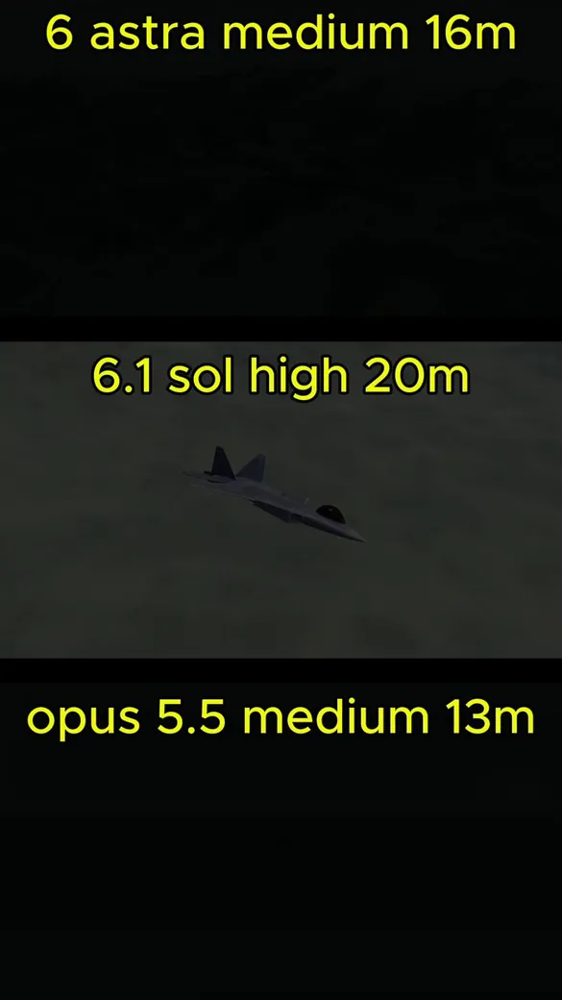</a>

<details>
<summary>Prompt</summary>

```text
Using blender mcp. Make me a realistic 3d model of the: Lockheed Martin F-22 Raptor (US only). Then create me 60 second mp4 of it flying around in Godot that I can upload to X.
```

</details>

[View detail ↗](https://www.tripo3d.ai/3d-prompts/gpt-6-astra-2105027152617918852) · [Original post](https://x.com/dgresesjr/status/2105027152617918852) · [Back to examples](#latest)

---

<a id="gpt-6-astra-2105009377002299711"></a>

### Time, Undone.

[Paruchh](https://x.com/theparuchh) · 2026-09-29 · GPT-6 Astra · Interactive

<a href="https://www.tripo3d.ai/3d-prompts/gpt-6-astra-2105009377002299711">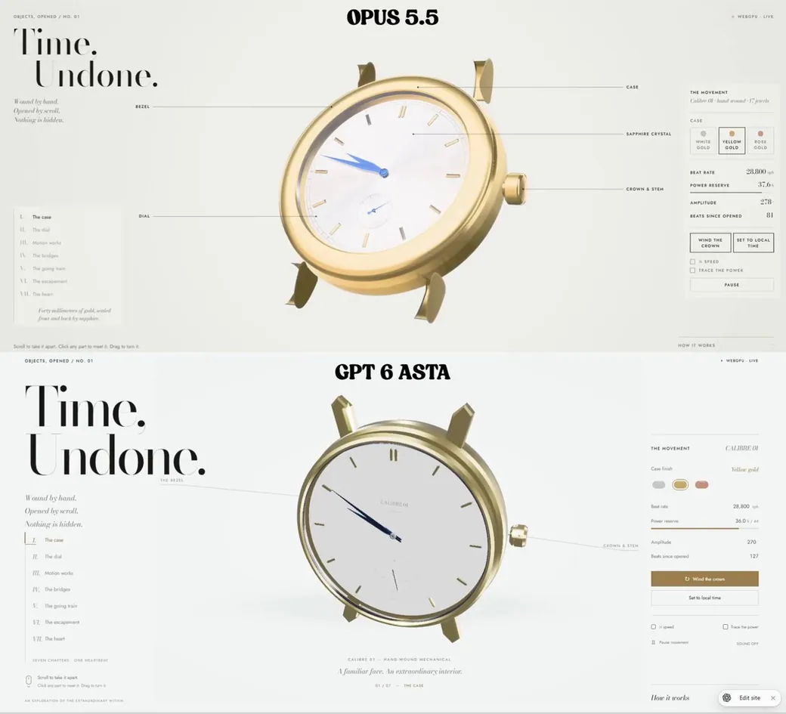</a>

<details>
<summary>Prompt</summary>

```text
Build "Time, Undone." - a single self-contained HTML file (embedded JS and CSS) running a genuine WebGPU + WGSL interactive 3D mechanical watch that takes itself apart as you scroll, while it keeps running. No 3D engine libraries; all geometry is generated in code. This is issue No. 01 of a series about objects everyone has seen from the outside and almost no one has seen from the inside.
THE OBJECT
An original, unbranded, hand-wound mechanical watch in a round 40 mm case, with a classic Swiss-lever movement about 30 mm across.
Layout: centre hours and minutes; small seconds sub-dial at 6 o'clock; crown at 3 o'clock.
Dial: silver-opaline with a fine guilloché sunburst, applied polished indices, dauphine hands, a railroad minute track.
Case: front sapphire crystal and a display caseback, so the movement is visible from behind.
No brand names, logos or real calibre names anywhere. Call it "Calibre 01".
THE MECHANISM (must be internally correct, not decorative)
Beat rate 28,800 vph (4 Hz balance).
Build a real going train with consistent tooth counts:mainspring barrel 96 teeth → centre pinion 12; the centre wheel turns once an hour and carries the minute hand;
centre wheel 80 → third pinion 10;
third wheel 75 → fourth pinion 10; the fourth wheel turns once a minute and carries the small seconds hand;
fourth wheel 84 → escape pinion 7;
escape wheel 20 teeth, turning once every 5 s.

Motion works under the dial: cannon pinion 12 → minute wheel 36; minute pinion 10 → hour wheel 40 (12:1).
Keyless works: crown, stem, crown wheel, ratchet wheel, click with spring.
Escapement: escape wheel, pallet fork with two ruby pallet stones and banking pins, balance wheel with hairspring and impulse roller.
Structure: mainplate, barrel bridge, train bridge, balance cock, ruby jewel bearings, blued screws.
Gears: watch-style cycloidal tooth profiles, spoked wheel crossings, pinions with leaves, arbors and pivots. Centre distances are derived from a common module so every pair meshes visibly correctly when assembled.
Motion, driven from ONE master clock:the balance oscillates as θ(t) = A·sin(2π·4·t), with amplitude A around 270° at full power;
at each beat, the pallet fork flicks between its banking pins and the escape wheel advances half a tooth in a short eased impulse, then locks;
every other wheel steps exactly by its ratio from the escape wheel;
the seconds hand ticks 8 times per second; the minute and hour hands follow the train.
On load, set the hands to the viewer's local time.

Power: a power reserve of about 44 h that drains in real time.Amplitude falls from 290° to 180° as the reserve empties; at 0 the watch stops, the balance settling rather than freezing.
Winding raises the reserve, with visible ratchet and click motion and a soft click sound (Web Audio, muted until the first user interaction).

The mechanism keeps running in every exploded state: wheels spin in mid-air, the balance keeps beating, the seconds hand keeps ticking.
THE EXPLODE (scroll-driven, with stops)
Page scroll maps to a progress value from 0 to 1, split into seven chapters. Each chapter eases into a resting "stop" where scroll briefly settles (a soft snap, never a hard lock). The camera moves smoothly between chapters.
Chapters:
I. The case: front 3/4 view, assembled.
II. The dial: the crystal and bezel lift away; the hands and dial rise.
III. Motion works: the wheels under the dial separate.
IV. The bridges: the watch turns over to show the back; the caseback lifts; the bridges and the balance cock rise, with their screws floating just above their holes.
V. The going train: barrel, centre, third and fourth wheels spread upward along their own axes like a technical drawing.
VI. The escapement: escape wheel, pallet fork and balance separate a little further, and the camera closes in.
VII. The heart: a macro view of the beating balance and hairspring, with the full exploded column behind.
Every part moves along a clear axis, mostly its own arbor axis or straight up from the plate. Parts that belong together stay together. Nothing intersects during the explode, and nothing leaves the frame.
Thin hairline leader lines with small caps labels appear for the main parts at each stop, and fade between stops.
INTERACTION
Scroll (wheel, trackpad, touch swipe) drives the explode.
Dragging on empty space turns the watch within limits; it eases back when released.
Hovering a part outlines it softly with its name.
Clicking a part:the part is highlighted, other parts dim to about 35%, and the camera eases to frame it;
a card opens beside it, joined by a hairline leader. The card shows: name; role in one or two plain sentences; one precise fact (for example: "Escape wheel · 20 teeth · one turn every 5 s"); and one live value (current speed, angle, or beats so far).
Esc, a close button, or clicking empty space returns.

Dragging the crown sideways winds the watch (a tactile ratchet), when the crown is visible.
Pointer capture, mouse and touch. Picking by an object-ID render pass or exact ray tests; no approximate bounding spheres.
RENDERING (real metals, macro-photography feel — not a cartoon)
Physically based materials, with a procedural studio environment (large softboxes, a strip light and a dim warm fill) for reflections.
Finishes:Côtes de Genève stripes on the bridges (anisotropic brushed specular aligned to the stripes);
perlage (circular graining) on the mainplate;
mirror-polished bevels (anglage) catching bright edge highlights;
thin-film heat-blued screws and hands;
ruby jewels that are translucent red with internal sparkle;
rhodium-plated steel parts;
sapphire crystals with faint blue-violet reflections and a slight edge thickness.

Case in the selected gold.
Highlights: controlled bloom on specular highlights only; small star glints on jewels and polished edges that appear as the light or the watch moves. Glamour, not glitter.
Soft contact shadows, gentle ambient occlusion, subtle depth of field that follows the focused part.
Filmic tonemap with no clipped highlights; 4x MSAA or equivalent.
Background: pale porcelain white with a soft vignette, like a seamless photo studio. Not yellow, not cream.
UI (aristocratic, editorial, generous whitespace)
Fonts: "Bodoni Moda" for display and numerals, "Jost" for UI text (Google Fonts, with serif and sans fallbacks). Small caps labels with 0.16em tracking; tabular numerals.
Colours:ink #1B1A17 on the porcelain background;
hairlines 1px at 15% ink;
the accent follows the selected gold.

No gradients on UI elements, no heavy shadows, no emoji.
Top-left:kicker "OBJECTS, OPENED / NO. 01";
large Bodoni heading on two lines, "Time," / "Undone.";
three caption lines in Bodoni italic: "Wound by hand." "Opened by scroll." "Nothing is hidden."

Top-right: status "WEBGPU · LIVE" with a small dot.
Left edge, vertically centred: the chapter index "I. The case", "II. The dial", "III. Motion works", "IV. The bridges", "V. The going train", "VI. The escapement", "VII. The heart".The current chapter is highlighted, with a hairline progress rule; clicking a chapter scrolls to it.

Right panel "THE MOVEMENT":three case presets: White gold, Yellow gold, Rose gold, with small metal swatches;
live readouts: Beat rate "28,800 vph", Power reserve (h, with a thin bar), Amplitude (°), Beats since opened;
buttons "Wind the crown" and "Set to local time";
checkboxes "¼ speed" and "Trace the power". Trace the power makes a slow line of light flow along the energy path: mainspring → barrel → centre → third → fourth → escape wheel → pallet fork → balance, with each part glowing as it passes;
a Pause/Resume button.

Bottom-left hint: "Scroll to take it apart. Click any part to meet it. Drag to turn it."
Bottom-right: a collapsible "How it works", with a short, accurate explanation of the going train, the escapement, the balance and the power reserve, plus a short note on how this page renders it.
Mobile: the canvas fills the top about 65% of the screen, and the chapter index becomes a horizontal row of Roman numerals. The panel flows below; part cards become a bottom sheet. Nothing covers the watch.
ENGINEERING
Build all geometry once at start-up. Instance repeated parts (screws, jewels, teeth where useful). Update only transforms per frame; no shader compilation or buffer rebuilds during interaction.
Animation time comes from one clock with ¼-speed scaling. Pause freezes the mechanism, not the UI.
Respect prefers-reduced-motion: instant chapter transitions, no camera flights, no glints animation.
If WebGPU is unavailable, show a clear, well-designed explanation. No fake fallback renderer.
Handle device loss. Cap the pixel ratio at 2. Aim for 60 fps on a laptop and a smooth experience on a recent phone.
VALIDATE BEFORE DELIVERING
In code, assert the train ratios: the seconds hand turns once per 60 s, the minute hand once per 3600 s, the hour hand once per 12 h, the escape wheel once per 5 s. Log the check to the console.
Every meshing pair is at the correct centre distance and visibly meshed when assembled.
No part intersects another at any explode progress; no z-fighting.
Scroll stops, chapter jumps, part picking, cards, winding, presets, trace-the-power, pause, ¼ speed and the mobile layout all work.
Card texts are horologically accurate.
No console errors.
```

</details>

[View detail ↗](https://www.tripo3d.ai/3d-prompts/gpt-6-astra-2105009377002299711) · [Original post](https://x.com/theparuchh/status/2105009470292013286) · [Back to examples](#latest)

---

<a id="claude-opus-5-5-2104953406708175097"></a>

### Mechanical Rube Goldberg machine in Blender

[Atarax](https://x.com/Kwazikot) · 2026-09-29 · Claude Opus 5.5 · Scenes

<a href="https://www.tripo3d.ai/3d-prompts/claude-opus-5-5-2104953406708175097"></a>

<details>
<summary>Prompt</summary>

```text
Create a mechanical Rube Goldberg machine in Blender. Use gears, ramps, balls, and moving platforms. Build it procedurally, inspect the scene after each major step, and fix obvious geometry issues.
```

</details>

[View detail ↗](https://www.tripo3d.ai/3d-prompts/claude-opus-5-5-2104953406708175097) · [Original post](https://x.com/Kwazikot/status/2104953406708175097) · [Back to examples](#latest)

---

<a id="claude-opus-5-5-2104947552328261810"></a>

### Build a Mario Kart-style racer with 3JS

[Tony](https://x.com/EnvolDev) · 2026-09-29 · Claude Opus 5.5 · Games

<a href="https://www.tripo3d.ai/3d-prompts/claude-opus-5-5-2104947552328261810"></a>

<details>
<summary>Prompt</summary>

```text
I need you to launch five(Model) sub-agents and help me build a triple A quality game that is a clone of Mario Kart. What I want you to do is I want you to launch these sub-agents, build the game without asking me any questions at all, and use 3JS to build the game. And once you're done, report back to me.
```

</details>

[View detail ↗](https://www.tripo3d.ai/3d-prompts/claude-opus-5-5-2104947552328261810) · [Original post](https://x.com/EnvolDev/status/2104947905442505205) · [Back to examples](#latest)

---

<a id="claude-opus-5-5-2104919117262389255"></a>

### Interactive cartoony 3D planet

[Aman](https://x.com/mdaman010) · 2026-09-29 · Claude Opus 5.5 · Interactive

<a href="https://www.tripo3d.ai/3d-prompts/claude-opus-5-5-2104919117262389255"></a>

<details>
<summary>Prompt</summary>

```text
Output a ThreeJS 3D cartoony/comics-like planet, with vibrant life on it: clouds, mountains, city buildings, cars and plane romaing it. It should be possible to orbit around and zoom and see the details. No harness is to be used
```

</details>

[View detail ↗](https://www.tripo3d.ai/3d-prompts/claude-opus-5-5-2104919117262389255) · [Original post](https://x.com/mdaman010/status/2104919846953869421) · [Back to examples](#latest)

---

<a id="claude-opus-5-5-2104896325255037196"></a>

### 30-second branded 3D motion graphics video

[Awa K. Penn](https://x.com/TawohAwa) · 2026-09-29 · Claude Opus 5.5 · Animation

<a href="https://www.tripo3d.ai/3d-prompts/claude-opus-5-5-2104896325255037196">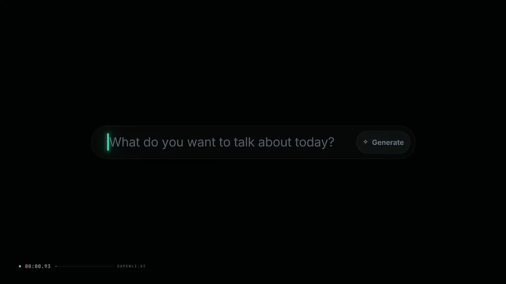</a>

<details>
<summary>Prompt</summary>

```text
Create a stunning 30-second motion graphics video for https://t.co/71rvEGmB6D that feels like an elite motion designer’s showreel. Study the website first and use the real brand, product UI, colours, and messaging. Use bold typography, 3D motion, animated UI, fast transitions, and a strong logo reveal.
```

</details>

[View detail ↗](https://www.tripo3d.ai/3d-prompts/claude-opus-5-5-2104896325255037196) · [Original post](https://x.com/TawohAwa/status/2104896328300134868) · [Back to examples](#latest)

---

<a id="gpt-6-astra-2104841727496323479"></a>

### Highly detailed 3D human eye

[Simonas](https://x.com/SimonasLTU1) · 2026-09-29 · GPT-6 Astra · Assets

<a href="https://www.tripo3d.ai/3d-prompts/gpt-6-astra-2104841727496323479">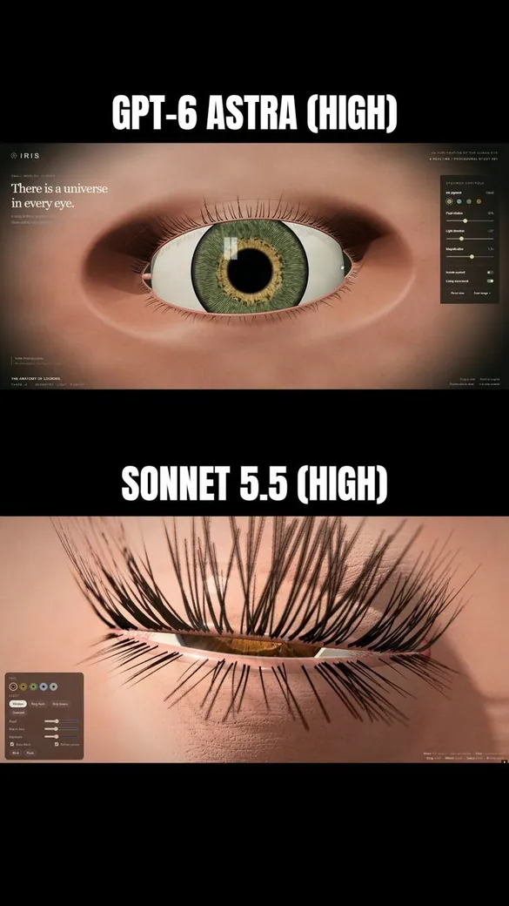</a>

<details>
<summary>Prompt</summary>

```text
Create a local HTML/CSS/JS file using Three.js. Make a highly detailed 3D model of a human eye that looks like a macro photograph of a real eye. Everything must be created from scratch.
```

</details>

[View detail ↗](https://www.tripo3d.ai/3d-prompts/gpt-6-astra-2104841727496323479) · [Original post](https://x.com/SimonasLTU1/status/2104841727496323479) · [Back to examples](#latest)

---

<a id="claude-opus-5-5-2104837836507955401"></a>

### EARTH ATLAS: THE LIVING PLANET

[Gadgetify](https://x.com/Gdgtify) · 2026-09-29 · Claude Opus 5.5 · Interactive

<a href="https://www.tripo3d.ai/3d-prompts/claude-opus-5-5-2104837836507955401"></a>

<details>
<summary>Prompt</summary>

```text
Create an extraordinary interactive SVG experience titled “EARTH ATLAS: THE LIVING PLANET.”  Build a complete, deeply explorable Earth science observatory in ONE self-contained HTML file. I must be able to paste your entire output into a file, open it directly in Chrome, and use it without a server or network connection.  Use whatever libraries help, but bundle all required runtime code and curated data inside that one HTML file. The globe, regional maps, terrain, seafloor, cutaways, instruments, charts, annotations, and close-up illustrations must be rendered primarily in SVG.  Return ONLY the complete working HTML in ONE code block.  THE AMBITION  Create the visual quality of a flagship NASA Earth-science exhibition combined with the depth of an interactive atlas.  The viewer begins in orbit before a magnificent Earth. They can rotate the globe, move through daylight and darkness, choose a real place, zoom into its geography, draw a transect, descend through its surface or ocean, and understand how that location fits into the whole planet.  The experience must reward ten minutes of exploration. It should contain striking reveals, precise interactions, and connected views—not merely a rotating globe with informational popups.  The first frame must be beautiful enough to serve as a standalone scientific illustration.  A TRUE MULTISCALE EXPLORATION SYSTEM  Build an authored hierarchy of scales:  1. ORBITAL EARTH — the full globe, atmosphere, day–night boundary, large geographic forms, and global overlays. 2. CONTINENTAL — recognizable coastlines, relief, major rivers, ocean basins, and selected scientific features. 3. REGIONAL — detailed terrain, bathymetry, contours, labels, and measurement tools. 4. LOCAL SCENE — a richly illustrated landscape or ocean environment specific to the selected place. 5. SECTIONAL VIEW — a geographically linked cross-section through land, ice, ocean, or crust. 6. DETAIL VIEW — close examination of a feature such as a glacier layer, river channel, fault, sediment bed, or seafloor formation.  Each zoom level must reveal newly authored SVG detail appropriate to its scale. Do not simply magnify the same low-resolution geometry until it becomes empty.  Preserve geographic identity across transitions. A selected point on the globe must correspond to the regional map, the local scene, its transect, and its section.  Implement zoom toward the pointer, drag-to-rotate the globe, drag-to-pan regional views, pinch zoom, keyboard navigation, Back, Home, and Reset View. Keep camera movement bounded and smooth.  Show a discreet scale bar and location breadcrumb. Manual interaction must interrupt any automated camera journey gracefully.  VISUAL DIRECTION  Make Earth the dominant visual element.  Use deep ocean blue, shallow-water turquoise, varied vegetation greens, desert ochre, volcanic charcoal, mineral grays, glacial white, and fine warm-white annotation lines.  Build convincing planetary volume through projected coastline geometry, changing illumination, atmospheric scattering effects, cloud layers, and a carefully controlled night-light treatment where an appropriate dated source is embedded.  Use precise cartographic linework, elegant contours, subtle material patterns, readable depth shading, and thin leader lines. Make information appear when useful at the current zoom level rather than covering the globe with labels.  The interface should feel like a refined scientific instrument. Avoid generic dashboard cards, excessive neon, and large floating text panels.  GLOBAL EARTH  Provide a rotatable SVG globe with consistent geographic projection and coordinate handling.  As the globe turns, correctly project landforms, ocean features, labels, selected markers, routes, and the terminator. Hide geometry on the far side rather than drawing it through the planet.  Include switchable overlays for:  • Physical relief. • Ocean depth and seafloor structure. • Major rivers and drainage basins. • Plate boundaries. • Selected historical earthquake events from an embedded dated sample. • Latitude–longitude grid. • Dated Earth-observation samples, only where embedded data supports them. • Clean cinematic view.  Every overlay must use the same coordinate system. Include its source, date, resolution, units, and legend.  Do not call any layer “live” or “current” when the file uses an embedded snapshot.  SIX FULLY AUTHORED EXPEDITIONS  Build complete, distinct experiences for:  HIMALAYA Layered mountain ranges, valleys, glaciers, a sourced regional elevation profile, and a visually clear section through the terrain.  AMAZON BASIN Recognizable river structure, floodplain and tributaries, an illustrated forest cross-section, and an educational water-path demonstration.  SAHARA Dunes, rocky terrain, dry channels, distinct surface materials, and a terrain transect. Distinguish illustrated dune detail from sourced large-scale elevation.  EAST AFRICAN RIFT Regional lakes and terrain, a fault-oriented cross-section, and a clearly labeled conceptual tectonic demonstration.  MARIANA TRENCH REGION Ocean surface, shelf and deep-ocean geometry where appropriate to the chosen transect, a draggable depth profile, a descent through the water column, and a detailed illustrated seafloor scene.  ANTARCTICA Ice surface, a sourced ice/terrain context where available, a sectional interpretation, and a seasonal sunlight demonstration.  Give every expedition:  • A strong authored opening composition. • Correct placement on the globe. • A regional map. • At least one local scene. • At least one linked cross-section or profile. • A unique working interaction. • A smooth journey back to orbit.  Do not reuse a generic mountain, forest, desert, or ocean drawing as a substitute for geographic identity.  FIVE CONNECTED VIEW MODES  SURFACE Explore topography, terrain features, rivers, ice, and coastlines with zoom-dependent detail.  ABOVE Explore sunlight, seasonal geometry, atmosphere, and any embedded dated observation. If clouds or weather are illustrative, label them as an illustrative scenario.  BELOW Open a section through terrain, ice, crust, or ocean along the selected geographic transect.  PLANET Pull back to a global cutaway showing how the selected point relates to Earth’s layers. Show the selected location’s corresponding position on the globe and cutaway.  EVIDENCE Reveal the data sample, source, date, resolution, uncertainty or known limitation, and calculation behind the selected feature or measurement.  Changing modes must preserve the selected location, zoom context where sensible, and timeline state.  LINKED EXPLORATION TOOLS  MEASURE Select two points on the globe or a supported regional map. Draw the great-circle route, display coordinates and distance, and keep the route correctly projected during globe rotation.  TRANSECT Draw or adjust a line across a supported region. Sample its embedded elevation or bathymetry data to produce a profile. Moving a cursor on the map must move its counterpart on the profile and sectional view.  COMPARE Place two selected locations side by side. Use matching units and explicit scale controls. Compare their elevation or depth, latitude, regional context, and supported environmental data.  TIME AND SUNLIGHT Scrub time of day and day of year. Update the global illumination and seasonal sun geometry with a documented model. Keep illustrative weather independent of this clock.  GUIDED EXPEDITION Offer a short cinematic journey through the six environments. Each stop must reveal an interaction, not merely display a caption. The tour must be skippable.  ANNOTATION DENSITY Switch between cinematic, guided, and technical label levels without altering the underlying geography.  OCEAN EXPLORATION  Treat the seafloor as a complete landscape.  Reveal shelves, slopes, abyssal regions, ridges, and trenches where supported by the embedded relief sample. Use an explicit vertical scale and label any exaggeration.  In the Mariana expedition, let the viewer descend through the water column. Update depth, light, color, pressure estimate under a stated simplified model, and the location cursor together.  The deep-sea close-up may contain beautiful illustrated life and geology, but its exact organisms and microterrain must be identified as interpretation. Sourced bathymetry and illustrated local scenery must remain distinguishable.  EARTH’S INTERIOR  Provide a 0–100% cutaway slider that smoothly reveals the crust, mantle, outer core, and inner core. The globe should remain visually coherent at intermediate slider positions.  Show the selected geographic location on the outer surface and an aligned radial guide into the interior.  Include an educational seismic-wave demonstration with a clearly stated simplified model. Its wave paths, moving markers, and timing readouts must derive from the same demonstration state.  Label exaggerated layer thickness, material colors, or compressed time explicitly.  THREE INTERACTIVE SCIENCE EXPERIMENTS  1. SUNLIGHT LAB Choose two latitudes and compare the modeled daily solar path and length of daylight across the year. Link the diagrams to the illuminated globe.  2. RELIEF AND SEA-LEVEL LAB At a supported coastal region, adjust a hypothetical water level and compare it with the embedded elevation profile. Label this a static topographic demonstration; do not present it as a coastal flood forecast.  3. SEISMIC PATH LAB Choose a source and observation points for a simplified educational wave demonstration. Show paths and relative arrival timing according to the stated model. Keep historical earthquake markers separate from the hypothetical experiment.  Each experiment must have Reset, reproducible inputs, consistent units, and a clear link back to the globe or selected place.  DATA AND SCIENTIFIC HONESTY  Use authoritative, cited sources for numerical claims and embedded samples. Appropriate sources include NASA Earthdata for selected dated observations, NOAA ETOPO for land and ocean relief, and USGS for selected historical earthquake records.  Use curated, downsampled data that fits inside one HTML file. Show the actual embedded resolution. Never claim that a regional illustration has the precision of the source dataset when its detail was authored or simplified.  Keep three categories visible:  OBSERVED DATA — a sourced measurement or published dataset sample. DERIVED VALUE — calculated from named inputs and an inspectable method. ILLUSTRATION OR EXPERIMENT — authored scenery or a hypothetical model.  Do not invent precise elevations, depths, earthquake positions, live cloud patterns, or measured environmental values.  Include a Sources and Methods panel with links, dataset versions and dates, coordinate reference, units, downsampling method, equations, uncertainty or limitations, and attribution.  Use a consistent latitude–longitude convention across every feature. Keep geographic coordinates, physical measurements, and exaggerated display geometry separate.  SMALL DETAILS AND VISUAL REVEALS  Include carefully choreographed discoveries:  • Orbit-to-region transitions that keep the chosen point in view. • Contours and labels that emerge only when the viewer reaches their useful scale. • A river that remains recognizable from global map to local basin. • An elevation cursor moving in synchrony across map, profile, and landscape. • A coastline that transforms visually when the bathymetry layer activates. • Ice layers that reveal themselves progressively in the Antarctic section. • A deep-ocean descent in which the seafloor appears gradually rather than as a sudden scene swap. • A globe-to-interior cutaway that preserves the selected geographic location. • A changing terminator that casts the chosen expedition into daylight or night. • An evidence reveal connecting a beautiful visual element to the data or model behind it.  Prioritize details that deepen exploration over decorative particles.  PERFORMANCE AND VERIFICATION  Use a bounded SVG scene graph, reusable symbols, clipping, masks, and zoom-dependent rendering. Avoid keeping all six high-detail scenes active when only one is visible.  Support desktop, touch devices, keyboard navigation, visible focus, and reduced-motion preferences.  Verify that:  • Every featured location is geographically placed correctly. • Hidden-side globe features are actually hidden. • Routes remain attached to their coordinates through rotation. • Measurement distances use the selected coordinates. • Transect values come from the embedded samples. • Map, profile, and section cursors remain synchronized. • Reset returns experiments to their initial states. • Time controls alter the intended model without silently modifying unrelated data. • Source and date labels match the embedded layers.  Show actual results for any automated checks. Do not hardcode a row of “passed” labels.  Make the complete path from globe to local scene to section work for all six expeditions. If implementation scope forces a tradeoff, complete that connected journey and the essential science tools before adding optional visual effects.  FINAL DELIVERY  The finished result should feel like an explorable planet inside a single file: stunning from orbit, rewarding at close range, and clear about what is observed, calculated, or illustrated.  Return ONLY ONE code block containing the ENTIRE working HTML document, beginning with <!DOCTYPE html>.  I should be able to paste it into one .html file, open it in Chrome, rotate and zoom Earth, enter any of the six expeditions, draw a linked transect, explore the ocean and interior, compare locations, run the three experiments, inspect the sources, and return smoothly to orbit.
```

</details>

[View detail ↗](https://www.tripo3d.ai/3d-prompts/claude-opus-5-5-2104837836507955401) · [Original post](https://x.com/Gdgtify/status/2104837836507955401) · [Back to examples](#latest)

---

<a id="claude-opus-5-5-2104831049020674144"></a>

### Interactive Serial Production Line Simulation Lab

[أ.د. عبدالرحمن بن مشبب الأحمري](https://x.com/am_alahmari) · 2026-09-29 · Claude Opus 5.5 · Animation

<a href="https://www.tripo3d.ai/3d-prompts/claude-opus-5-5-2104831049020674144"></a>

<details>
<summary>Prompt</summary>

```text
Build an animated, interactive discrete-event simulation of a serial production line as a single self-contained HTML file (vanilla JS + Canvas, no external libraries except Chart.js from cdnjs). Purpose: teaching [Manufacturing Systems] students how variability, buffers, and breakdowns affect line performance.

LINE CONFIGURATION (user-adjustable)
- Number of stations: [2–6], default [3], each with a name (e.g., Machining, Assembly, Inspection)
- Per station: mean cycle time, distribution (Deterministic, Uniform, Normal, Triangular, Exponential, Lognormal), CV
- Breakdowns per station: MTBF and MTTR (exponential), on/off toggle
- Quality per station: defect rate (%), with scrap or rework-loop option
- Buffers between stations: capacity 0–10 (0 = blocking after service)
- Arrivals: unlimited raw material OR Poisson arrivals with rate λ
- Customer demand to compute takt time

ANIMATION
- Parts move along conveyors and change color by stage (raw, WIP, finished, scrap)
- Machine borders show state colors: Working (green), Blocked (amber), Starved (red), Down (gray), plus a rotating gear icon and a progress bar
- Buffer slots show occupancy and highlight when full
- Controls: Play/Pause, Step, Reset, speed 1x–50x, warm-up period

KEY PERFORMANCE MEASURES (live dashboard)
1. Throughput (parts/hr) vs theoretical bottleneck rate
2. Average WIP and WIP over time
3. Flow time / manufacturing lead time (mean and 95th percentile)
4. Little's Law check: WIP ≈ Throughput × Flow time
5. Per-station utilization with a time breakdown: working / blocked / starved / down (stacked bar)
6. OEE per station = Availability × Performance × Quality
7. Bottleneck detection (active-period method) and highlight the bottleneck
8. Takt time vs station cycle times (line balance chart)
9. Line balance efficiency = Σ cycle times / (N × max cycle time)
10. First-pass yield, rolled throughput yield, scrap count
11. Average buffer occupancy per buffer
12. Observed vs set cycle-time mean and CV per station

ANALYSIS FEATURES
- Replication mode: run N replications of length T after warm-up, report mean ± 95% confidence interval for throughput, WIP, and flow time
- Experiment mode: sweep buffer size (or one station's CV) and plot throughput vs parameter
- Export results to CSV
- Preset scenarios: Balanced line, Clear bottleneck, High variability, Unreliable machine

DESIGN
- Clean, responsive layout that works on mobile; light/dark mode
- Brief tooltip explaining each KPI and its formula
- Bilingual labels (English/Arabic) toggle
```

</details>

[View detail ↗](https://www.tripo3d.ai/3d-prompts/claude-opus-5-5-2104831049020674144) · [Original post](https://x.com/am_alahmari/status/2104831051776335994) · [Back to examples](#latest)

---

<a id="gpt-6-astra-2104654448878387313"></a>

### Transforming sports car with x-ray exploded view

[Marcel](https://x.com/marcthecreatorr) · 2026-09-28 · GPT-6 Astra · Interactive

<a href="https://www.tripo3d.ai/3d-prompts/gpt-6-astra-2104654448878387313">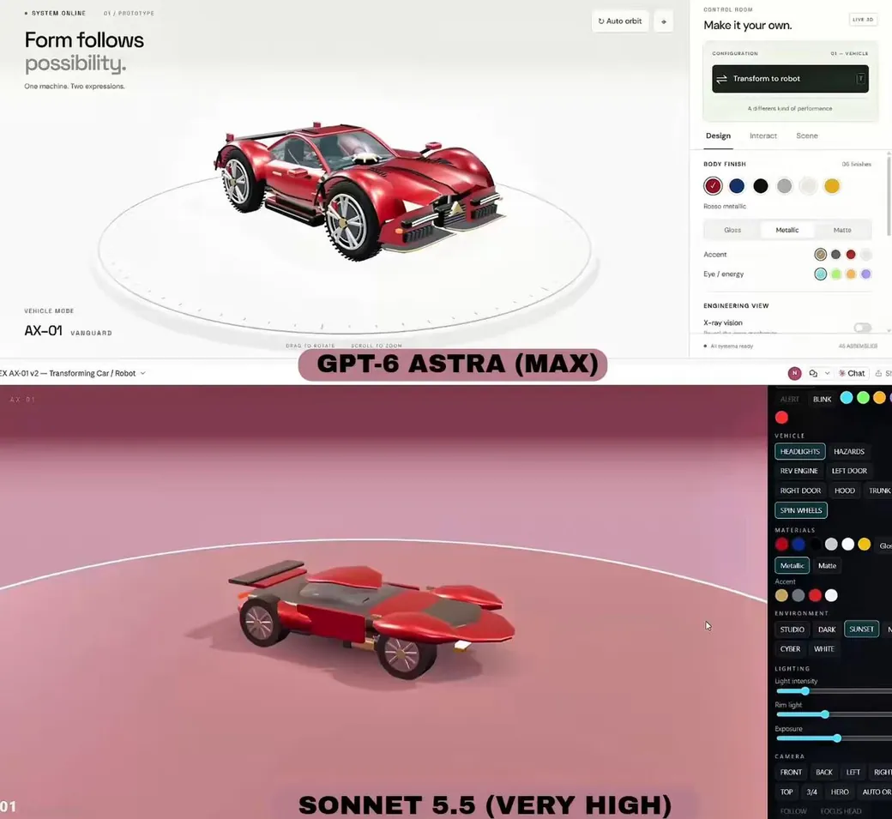</a>

<details>
<summary>Prompt</summary>

```text
Build a detailed sports car that transforms into a humanoid robot, with an x-ray mode and interactive exploded view
```

</details>

[View detail ↗](https://www.tripo3d.ai/3d-prompts/gpt-6-astra-2104654448878387313) · [Original post](https://x.com/marcthecreatorr/status/2104654448878387313) · [Back to examples](#latest)

---

<a id="gpt-6-astra-2104613125093998674"></a>

### Interactive moonlit jungle boat ride

[Fazley](https://x.com/itsfazley) · 2026-09-28 · GPT-6 Astra · Interactive

<a href="https://www.tripo3d.ai/3d-prompts/gpt-6-astra-2104613125093998674">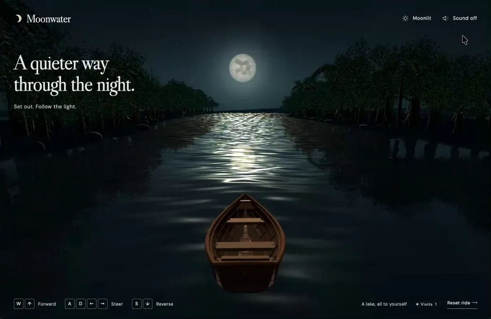</a>

<details>
<summary>Prompt</summary>

```text
Build a fullscreen, responsive Three.js boat ride set in a narrow jungle waterway. Use a third-person camera following an empty wooden rowboat with a pointed bow, broad sides, flat stern, visible floorboards and seats, no oars, a dry interior, and a hull slightly submerged in the water. Let users steer with WASD or arrow keys and touch controls. Make the scene nocturnal and mystical: dense, varied, realistic dark-green trees on both banks, subtle wind, a detailed full moon, and broken moonlight reflected across animated water. Use convincing moving waves, distorted reflections of the boat and trees, and a wake that follows the boat’s traveled path and fades naturally no fixed glowing marks or hard circular borders. Add a weather toggle for moonlit night, warm dawn, and overcast rain; in rain mode, show falling drops and small, short-lived impact ripples shaped by the water’s waves. Add optional, subtle water, jungle, and rain ambience. Keep the interface minimal. Verify the visuals, controls, audio, counter, and all three weather modes on desktop and mobile.
```

</details>

[View detail ↗](https://www.tripo3d.ai/3d-prompts/gpt-6-astra-2104613125093998674) · [Original post](https://x.com/itsfazley/status/2104613128017522813) · [Back to examples](#latest)

---

<a id="gpt-6-astra-2104605522640970208"></a>

### Interactive educational 3D CRISPR representation

[Alejandro](https://x.com/AlejandroRomaan) · 2026-09-28 · GPT-6 Astra · Interactive

<a href="https://www.tripo3d.ai/3d-prompts/gpt-6-astra-2104605522640970208">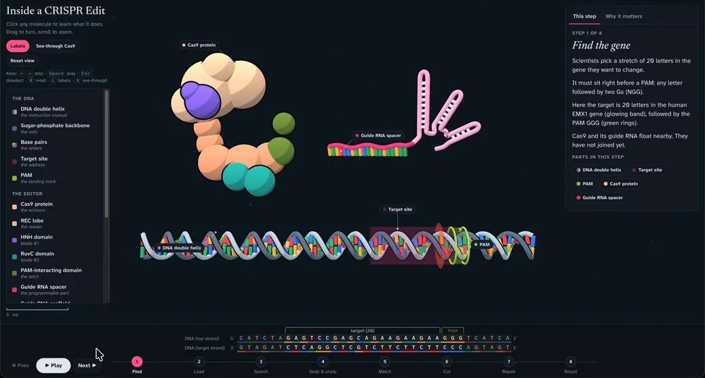</a>

<details>
<summary>Prompt</summary>

```text
I want you to create an interactive educational 3d represenation how CRISPR DNA technology works. You can choose what ever technology you want as long as its clear readable and has a dna strand, you can see a full work of gene editing and what each piece is, I should be able to select any relevant part of it and learn something
```

</details>

[View detail ↗](https://www.tripo3d.ai/3d-prompts/gpt-6-astra-2104605522640970208) · [Original post](https://x.com/AlejandroRomaan/status/2104605522640970208) · [Back to examples](#latest)

---

<a id="gpt-6-astra-2104590493191479337"></a>

### 3D-printable J-hook for a strength test

[Wësche](https://x.com/WescheNex1q) · 2026-09-28 · GPT-6 Astra · Assets

<a href="https://www.tripo3d.ai/3d-prompts/gpt-6-astra-2104590493191479337">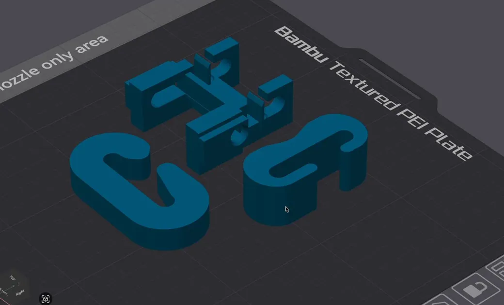</a>

<details>
<summary>Prompt</summary>

```text
Design one 3D-printable J-hook for a strength test.
The hook hangs from an 8 mm steel bar. An 8 mm pin sits in the bill and we hang weight from that pin. I want the highest breaking load I can get without the bar or the pin slipping out.
Rules:
- One printed part. No screws, inserts, glue, or extra pieces.
- Must clip onto the bar and the pin by hand. No closed rings.
- Pin seats 40 mm apart, center to center.
- PLA. Max 35 g as printed.
- Must fit 80 x 60 x 25 mm.
- The pin should have to lift at least 10 mm to come out. If it can roll out the side, that design is invalid.
Give me:
1. A short explanation of the shape.
2. A complete OpenSCAD file I can compile and export to STL for Bambu Studio.
No STL text. No G-code. OpenSCAD only. If the first idea would slip off, replace it in the same answer.
```

</details>

[View detail ↗](https://www.tripo3d.ai/3d-prompts/gpt-6-astra-2104590493191479337) · [Original post](https://x.com/WescheNex1q/status/2104590493191479337) · [Back to examples](#latest)

---

<a id="claude-opus-5-5-2104590334152056983"></a>

### Walking Architecture

[KOBATAKA｜Vibe Modeling](https://x.com/shion_takk) · 2026-09-28 · Claude Opus 5.5 · Animation

<a href="https://www.tripo3d.ai/3d-prompts/claude-opus-5-5-2104590334152056983">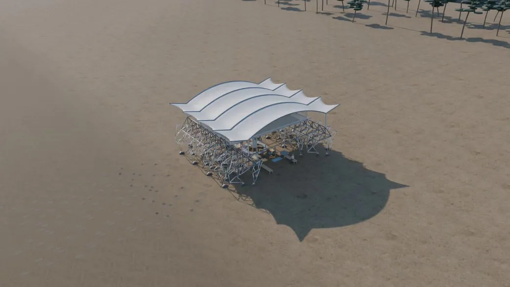</a>

<details>
<summary>Prompt</summary>

```text
Create a walking building.
```

</details>

<details>
<summary>Original prompt</summary>

```text
歩く建築作って
```

</details>

[View detail ↗](https://www.tripo3d.ai/3d-prompts/claude-opus-5-5-2104590334152056983) · [Original post](https://x.com/shion_takk/status/2104590334152056983) · [Back to examples](#latest)

---

<a id="claude-opus-5-5-2104571944842498150"></a>

### Playable pixel-art Ancient Rome beat ’em up

[Koldo Huici](https://x.com/koldo2k) · 2026-09-28 · Claude Opus 5.5 · Games

<a href="https://www.tripo3d.ai/3d-prompts/claude-opus-5-5-2104571944842498150">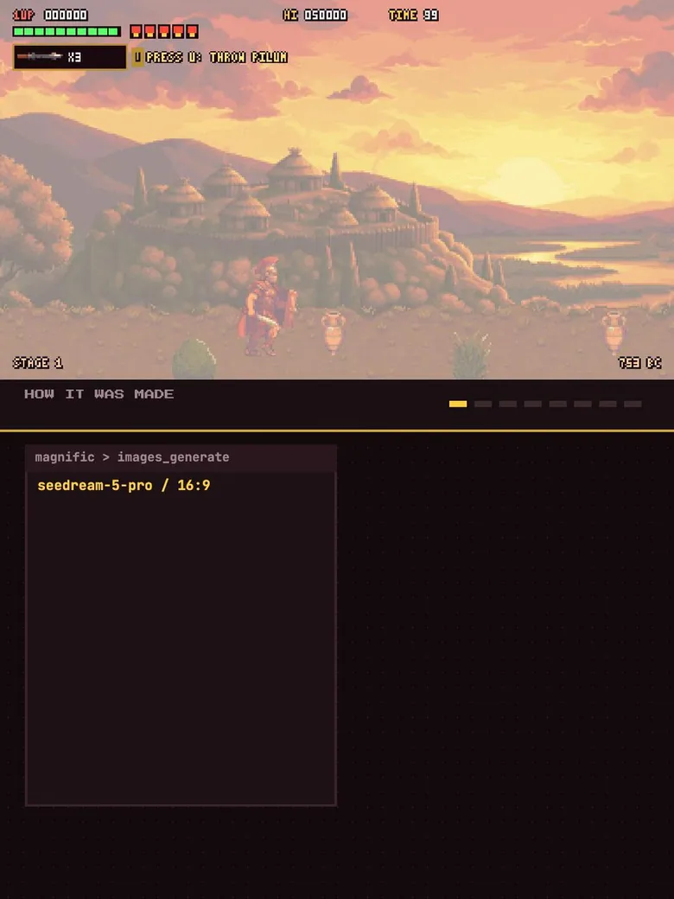</a>

<details>
<summary>Prompt</summary>

```text
Using the Magnific MCP, build a playable pixel-art beat 'em up set in ancient Rome, as one HTML file that works on mobile. Generate a key art first and use it as style reference for every asset: stage, hero, enemies, a war-elephant boss, items. Animate the characters with image-to-video on green screen, pick the frames that loop, key out the green and keep every animation on the same scale and palette. Add touch controls, combos, shield, dodge, a throwable pilum, pickups, a 1-minute demo mode and a chiptune soundtrack. Tell me the credit cost before each generation.
```

</details>

[View detail ↗](https://www.tripo3d.ai/3d-prompts/claude-opus-5-5-2104571944842498150) · [Original post](https://x.com/koldo2k/status/2104571946989985812) · [Back to examples](#latest)

---

<a id="gpt-6-astra-2104531704740512143"></a>

### Genshin-Style Game and Terrain Editor

[ふぐあい(ふぐおん)](https://x.com/fuguai1) · 2026-09-28 · GPT-6 Astra · Games

<a href="https://www.tripo3d.ai/3d-prompts/gpt-6-astra-2104531704740512143">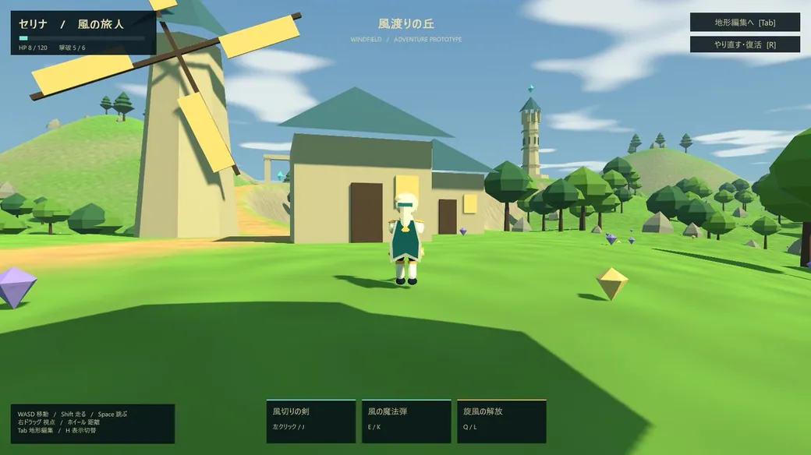</a>

<details>
<summary>Prompt</summary>

```text
Create a Genshin-like game and a tool for editing its terrain.
```

</details>

<details>
<summary>Original prompt</summary>

```text
原神みたいなゲームとそれを地形編集できるツールを作って
```

</details>

[View detail ↗](https://www.tripo3d.ai/3d-prompts/gpt-6-astra-2104531704740512143) · [Original post](https://x.com/fuguai1/status/2104531704740512143) · [Back to examples](#latest)

---

<a id="claude-opus-5-5-2104514806443303238"></a>

### Interactive WebGPU Strawberry Cake

[Ima Studio](https://x.com/ImaStudio_ai) · 2026-09-28 · Claude Opus 5.5 · Interactive

<a href="https://www.tripo3d.ai/3d-prompts/claude-opus-5-5-2104514806443303238"></a>

<details>
<summary>Prompt</summary>

```text
Build immediately a complete interactive WebGPU site called “Strawberry Cake.” 
Use genuine WebGPU + WGSL, procedural geometry, mouse/touch, and real-time volumetric soft-body physics. No Three.js/Babylon.js, Canvas2D, external assets, video/GIF, or CSS-only deformation.
Visual: premium Korean/Japanese strawberry shortcake—low, wide, rounded, pillow-soft, with pink sponge, cream layers, pale frosting, piped cream, and strawberries. Warm ivory background, soft studio light, edible moist materials.
Layout: top-left “SOFT STUDIES / NO.001” + italic “Strawberry Cake.” Top-right “WEBGPU · LIVE”. Large centered cake. Right controls: Hand/Knife, presets, Firmness, Damping, Drop, Reset, Pause, ¼ speed, Show mesh. Bottom-left: Mass, Volume, Kinetic, Pieces.
Physics: stable XPBD/co-rotational soft body with tetrahedral sim mesh, smooth render mesh, volume preservation, damping, gravity, floor friction, and piece collisions. Cake feels soft/heavy and wobbles after release.
Hand: hold=Press, inward drag=Squeeze, outward drag=Grab, fast release=Throw. Use weighted grabs, smoothed 3D target, pointer velocity and momentum. Cake remains free; cake input overrides orbit.
Knife: procedural 3D knife. Draw a cut line; animate contact→compression→penetration→breakthrough→lift. Deform before splitting; keep seam thin.
Repeated cutting is mandatory: use a dynamic pieces list; every piece stays cuttable. Convert strokes to vertical cut planes, split crossed pieces, create new soft-body/render meshes, transfer deformation/velocity, preserve toppings, keep halves aligned, update Pieces. Support 14+ pieces and multi-piece cuts. No fixed whole/left/right states.
Drop releases all pieces. Reset restores one intact cake and Pieces=1. Use fixed timestep/substeps, DPR≤2, clamp instability, avoid NaNs/GPU errors. Expose window.__cake.
Run locally, test interactions and repeated cutting, and iterate until polished.
```

</details>

[View detail ↗](https://www.tripo3d.ai/3d-prompts/claude-opus-5-5-2104514806443303238) · [Original post](https://x.com/ImaStudio_ai/status/2104517586092458039) · [Back to examples](#latest)

---

<a id="gpt-6-astra-2104504957173153951"></a>

### Interactive 3D Melon Jelly Slice

[基恩-Keane 🌊](https://x.com/esrhengwu) · 2026-09-28 · GPT-6 Astra · Animation

<a href="https://www.tripo3d.ai/3d-prompts/gpt-6-astra-2104504957173153951">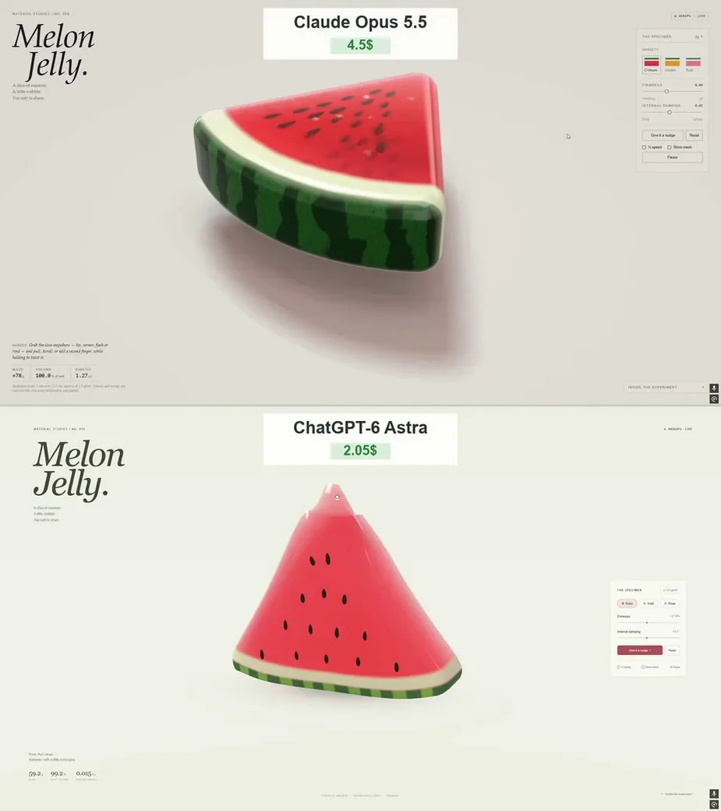</a>

<details>
<summary>Prompt</summary>

```text
Create “Melon Jelly” — a polished, interactive 3D watermelon jelly slice that runs directly in the browser using genuine WebGPU and WGSL shaders.
Deliver a single, self-contained HTML file with embedded JavaScript and CSS. This must be an actual interactive 3D simulation, not a static render, video, or 2D imitation.
THE WATERMELON
Create a thick, rounded triangular watermelon wedge with:
Translucent ruby-red jelly flesh.
A pale, slightly translucent layer between the flesh and rind.
A glossy green outer rind with irregular dark-green stripes.

Individually modeled dark seeds embedded in both exposed sides.
Softly rounded corners and an appealing, substantial thickness.
Make it look like an expensive gummy candy photographed in a studio. It should feel juicy, soft, and almost edible. Keep the colors rich without overexposing the highlights.
SOFT-BODY PHYSICS
Use a volumetric soft-body simulation, such as a tetrahedral mesh with XPBD elastic and volume-preservation constraints.
The user must be able to:
Grab the tip, a corner, the flesh, or the rind.
Stretch, bend, lift, and gently twist the slice.

Release it and watch it wobble before gradually settling.
The slice must visibly deform locally, not simply move or scale as one rigid object. Make the rind slightly firmer than the flesh while keeping the whole slice flexible.
Preserve volume reasonably during stretching. Prevent inverted elements, explosive motion, and permanent collapse. Use a fixed simulation timestep and bounded substeps for stability.
After release, the motion should decay naturally — no instant snapping back and no endless oscillation.
Keep seeds attached to the deforming flesh. They must move and rotate with the surface rather than float independently or remain fixed in space.
Include ground contact, gentle friction, and soft bouncing. Avoid visible floor penetration.
RENDERING
Use native WebGPU with WGSL shaders.
Include:
Thickness-dependent light absorption.
Refraction through the jelly.

Fresnel reflections and glossy highlights.
Soft transmitted light through thin edges.
Subtle internal details and a few tiny air bubbles.

Soft contact shadows beneath the slice.
A light, neutral studio background.
The flesh, pale rind, and green skin should have distinct material responses. Avoid making everything look like clear glass or opaque plastic.
Keep the slice large and easy to inspect, with a three-quarter camera angle that reveals the flesh, seeds, and thickness.
INTERFACE
Use a minimal editorial layout with generous whitespace, thin borders, restrained controls, and no decorative UI gradients.
Top left:
“MATERIAL STUDIES / NO. 009”
A large italic serif heading split across two lines: “Melon” and “Jelly.”
Small caption:
“A slice of summer.”
“A little wobble.”
“Too soft to share.”
Top right:
A small status indicator showing “WEBGPU · LIVE” when the renderer is running.

Right-side panel:
“THE SPECIMEN”
Three coordinated watermelon-inspired color presets.
Firmness slider with its current value.
Internal damping slider with its current value.
“Give it a nudge” and “Reset” buttons.
“¼ speed” and “Show mesh” checkboxes.

Pause / Resume button.
Bottom left:
A short hint explaining that the slice can be grabbed and stretched.
Live mass, relative volume, and kinetic-energy readouts derived from the simulation. Clearly describe illustrative units or approximate values where appropriate.
Bottom right:

A collapsible “Inside the experiment” section briefly explaining the physics and rendering.
BEHAVIOR AND PERFORMANCE
Support both mouse and touch input. Use pointer capture so dragging remains reliable when the pointer leaves the object.
Make the layout work on desktop and mobile without controls covering the slice.
Reuse buffers and avoid rebuilding geometry or compiling shaders during dragging. Keep interaction smooth and responsive.
Respect reduced-motion preferences. If WebGPU is unavailable, display a clear explanation instead of silently substituting a fake renderer.
VALIDATION
Test dragging from several locations, strong stretches, repeated releases, ground collisions, all sliders, presets, pause, reset, and slow motion.
Check that the model returns to a stable resting shape, seeds stay attached, the mesh remains intact, and there are no rendering errors.
Prioritize the quality of the jelly response and lighting. The result should be something people want to keep grabbing and playing with.
```

</details>

<details>
<summary>Original prompt</summary>

```text
Create “Melon Jelly” - a polished, interactive 3D watermelon jelly slice that runs directly in the browser using genuine WebGPU and WGSL shaders.
Deliver a single, self-contained HTML file with embedded JavaScript and CSS. This must be an actual interactive 3D simulation, not a static render, video, or 2D imitation.
THE WATERMELON
Create a thick, rounded triangular watermelon wedge with:
Translucent ruby-red jelly flesh.
A pale, slightly translucent layer between the flesh and rind.
A glossy green outer rind with irregular dark-green stripes.

Individually modeled dark seeds embedded in both exposed sides.
Softly rounded corners and an appealing, substantial thickness.
Make it look like an expensive gummy candy photographed in a studio. It should feel juicy, soft, and almost edible. Keep the colors rich without overexposing the highlights.
SOFT-BODY PHYSICS
Use a volumetric soft-body simulation, such as a tetrahedral mesh with XPBD elastic and volume-preservation constraints.
The user must be able to:
Grab the tip, a corner, the flesh, or the rind.
Stretch, bend, lift, and gently twist the slice.

Release it and watch it wobble before gradually settling.
The slice must visibly deform locally, not simply move or scale as one rigid object. Make the rind slightly firmer than the flesh while keeping the whole slice flexible.
Preserve volume reasonably during stretching. Prevent inverted elements, explosive motion, and permanent collapse. Use a fixed simulation timestep and bounded substeps for stability.
After release, the motion should decay naturally - no instant snapping back and no endless oscillation.
Keep seeds attached to the deforming flesh. They must move and rotate with the surface rather than float independently or remain fixed in space.
Include ground contact, gentle friction, and soft bouncing. Avoid visible floor penetration.
RENDERING
Use native WebGPU with WGSL shaders.
Include:
Thickness-dependent light absorption.
Refraction through the jelly.

Fresnel reflections and glossy highlights.
Soft transmitted light through thin edges.
Subtle internal details and a few tiny air bubbles.

Soft contact shadows beneath the slice.
A light, neutral studio background.
The flesh, pale rind, and green skin should have distinct material responses. Avoid making everything look like clear glass or opaque plastic.
Keep the slice large and easy to inspect, with a three-quarter camera angle that reveals the flesh, seeds, and thickness.
INTERFACE
Use a minimal editorial layout with generous whitespace, thin borders, restrained controls, and no decorative UI gradients.
Top left:
“MATERIAL STUDIES / NO. 009”
A large italic serif heading split across two lines: “Melon” and “Jelly.”
Small caption:
“A slice of summer.”
“A little wobble.”
“Too soft to share.”
Top right:
A small status indicator showing “WEBGPU · LIVE” when the renderer is running.

Right-side panel:
“THE SPECIMEN”
Three coordinated watermelon-inspired color presets.
Firmness slider with its current value.
Internal damping slider with its current value.
“Give it a nudge” and “Reset” buttons.
“¼ speed” and “Show mesh” checkboxes.

Pause / Resume button.
Bottom left:
A short hint explaining that the slice can be grabbed and stretched.
Live mass, relative volume, and kinetic-energy readouts derived from the simulation. Clearly describe illustrative units or approximate values where appropriate.
Bottom right:

A collapsible “Inside the experiment” section briefly explaining the physics and rendering.
BEHAVIOR AND PERFORMANCE
Support both mouse and touch input. Use pointer capture so dragging remains reliable when the pointer leaves the object.
Make the layout work on desktop and mobile without controls covering the slice.
Reuse buffers and avoid rebuilding geometry or compiling shaders during dragging. Keep interaction smooth and responsive.
Respect reduced-motion preferences. If WebGPU is unavailable, display a clear explanation instead of silently substituting a fake renderer.
VALIDATION
Test dragging from several locations, strong stretches, repeated releases, ground collisions, all sliders, presets, pause, reset, and slow motion.
Check that the model returns to a stable resting shape, seeds stay attached, the mesh remains intact, and there are no rendering errors.
Prioritize the quality of the jelly response and lighting. The result should be something people want to keep grabbing and playing with.
```

</details>

[View detail ↗](https://www.tripo3d.ai/3d-prompts/gpt-6-astra-2104504957173153951) · [Original post](https://x.com/esrhengwu/status/2104505413857415515) · [Back to examples](#latest)

---

<a id="claude-opus-5-5-2104232297167716457"></a>

### Feature-complete LEGO Ford Model T set

[Alex Lieberman](https://x.com/businessbarista) · 2026-09-27 · Claude Opus 5.5 · Assets

<a href="https://www.tripo3d.ai/3d-prompts/claude-opus-5-5-2104232297167716457"></a>

<details>
<summary>Prompt</summary>

```text
I want to build a lego set of the original ford motel T.

I want it to be feature complete, include motion/interactivity where possible, and be of the quality a lego master builder would be proud of.

I want the final output to include a rendering of the lego set, all of the pieces i need to order from lego, and the instruction manual to build it.
```

</details>

[View detail ↗](https://www.tripo3d.ai/3d-prompts/claude-opus-5-5-2104232297167716457) · [Original post](https://x.com/businessbarista/status/2104233375791718456) · [Back to examples](#latest)

---

<a id="claude-opus-5-5-2104232013578617241"></a>

### Hyper-realistic multiplayer FPS in a snowy alleyway

[Zen](https://x.com/zenvnt) · 2026-09-27 · Claude Opus 5.5 · Games

<a href="https://www.tripo3d.ai/3d-prompts/claude-opus-5-5-2104232013578617241"></a>

<details>
<summary>Prompt</summary>

```text
Build me a hyper-realistic multiplayer FPS. Set it in a snowy city alleyway with brick buildings. Give me an assault rifle with crispy recoil and flying bullet casings. Add enemies to shoot, vaulting mechanics, and bloody screen damage effects. Make the gunplay hit-reg immaculate and just vibe it out into a full game.
```

</details>

[View detail ↗](https://www.tripo3d.ai/3d-prompts/claude-opus-5-5-2104232013578617241) · [Original post](https://x.com/zenvnt/status/2104232358811676833) · [Back to examples](#latest)

---

<a id="claude-opus-5-5-2104223449849761837"></a>

### 55-second data center-to-atom 3D scene

[Crane](https://x.com/Cranefomo) · 2026-09-27 · Claude Opus 5.5 · Scenes

<a href="https://www.tripo3d.ai/3d-prompts/claude-opus-5-5-2104223449849761837"></a>

<details>
<summary>Prompt</summary>

```text
Give me a 55 second 3D scene. Camera flies into a data center, opens a rack, disassembles a GPU, zooms into the chip, passes through the transistors, lands on a single silicon atom. Scale rail on the right in meters. Labels in the client's language. Runs in a browser, one file, no dependencies.
```

</details>

[View detail ↗](https://www.tripo3d.ai/3d-prompts/claude-opus-5-5-2104223449849761837) · [Original post](https://x.com/Cranefomo/status/2104223449849761837) · [Back to examples](#latest)

---

<a id="claude-opus-5-5-2104204312624918810"></a>

### Dynamic 30-second Kiiwi motion-graphics promo

[Iniyan (ini)](https://x.com/iniyanai) · 2026-09-27 · Claude Opus 5.5 · Animation

<a href="https://www.tripo3d.ai/3d-prompts/claude-opus-5-5-2104204312624918810"></a>

<details>
<summary>Prompt</summary>

```text
make a dynamic 30-second motion graphics video that shows what an incredible motion designer you are for https://t.co/fCRvqmOamH.
```

</details>

[View detail ↗](https://www.tripo3d.ai/3d-prompts/claude-opus-5-5-2104204312624918810) · [Original post](https://x.com/iniyanai/status/2104204318085931054) · [Back to examples](#latest)

---

<a id="claude-opus-5-5-2104193522715029657"></a>

### Anime-style 3D CG of three vehicles transforming and combining

[風の民@](https://x.com/allforbigfire) · 2026-09-27 · Claude Opus 5.5 · Animation

<a href="https://www.tripo3d.ai/3d-prompts/claude-opus-5-5-2104193522715029657"></a>

<details>
<summary>Prompt</summary>

```text
Could you also create an anime-style 3D CG scene, like a robot anime, where three vehicles transform and combine to become a robot?
```

</details>

<details>
<summary>Original prompt</summary>

```text
もしかしてロボットアニメみたいな3機の乗り物が変形合体してロボットになるシーンもアニメ風3D CGで作れますか。
```

</details>

[View detail ↗](https://www.tripo3d.ai/3d-prompts/claude-opus-5-5-2104193522715029657) · [Original post](https://x.com/allforbigfire/status/2104193522715029657) · [Back to examples](#latest)

---

<a id="claude-opus-5-5-2104162483888062945"></a>

### AI orb UI motion for Claude Code — Opus 5.5

[leolee](https://x.com/listudio) · 2026-09-27 · Claude Opus 5.5 · Animation

<a href="https://www.tripo3d.ai/3d-prompts/claude-opus-5-5-2104162483888062945"></a>

<details>
<summary>Prompt</summary>

```text
Ask me for: the task the AI agent completes for the user (default: plan + book a 3-day Kyoto trip), the palette (default: warm-gray canvas #E6E3DE, pure black/white UI, the orb is the only colored thing — pearl iridescent blue → violet → peach), and a royalty-free song around 120 BPM (search Mixkit yourself, measure BPM with numpy, show me 3 candidates with preview links before downloading the full track). Use AskUserQuestion, max 4 questions per round, recommended option first. Dribbble-level UI concept motion for an AI chat agent tool. One white shape, never cut: every state is the same element morphing its size, radius and color while its content swaps with a short blur. The star is a GLSL "AI orb" (fluid, breathing, iridescent blob — like the ChatGPT / Siri voice orb) that lives OUTSIDE the shape as a continuity element and changes role through the film: idle hero → reacts to voice while listening → shrinks into the input bar as an avatar → swirls faster while thinking → avatar on the answer → blooms when the task completes → back to idle. A cursor drives every change with real clicks and drags. One clean UI font (Geist). Springs everywhere, a tiny overshoot at most. The camera zooms so each state fills ~60–75% of the frame. The orb pulses subtly on every beat. The last frame is the first frame, so it loops. Banned: bouncy easing, particle bursts, glows or gradients on UI chrome (the orb is content, not chrome), mismatched icon strokes, dead time, anything that looks like a template. 120 BPM, 8 bars = 32 beats = 16s, something happens on every beat (beat n at (n-1)*0.5s): Bar 1: orb idle, cursor approaches | click orb → shape stretches into a "LISTENING" pill, orb moves to its left and wobbles with a syllable envelope | live transcript types "Plan 3 days in Kyoto" | "…under 1,500, the value rolls live | drag past the 1,248 "cheapest plan" Bar 6: slider → black swipe-to-confirm "Book trip · $1,248" | grab the knob, drag right | past the end → rubber band | release → snaps to the end, arrow becomes a spinner Bar 7: → toast "Trip booked" | chips "Flights ✓" "Ryokan ✓" pop in | orb blooms (color + scale) | toast collapses toward the orb Bar 8: shape fades, orb grows back to hero size | settles | breathes on the beat, cursor drifts out | back to idle (loop) 1. One self-contained HTML file, square 1440x1440, fonts and audio-free assets inlined as data URIs. Every style is computed from time inside a pure `seek(t)`: no CSS transitions, no timers, no state carried between frames, never create tracks inside seek. 2. Springs are closed-form step responses. A value that changes target many times is the sum of one spring per change; to loop, take the LAST target as the start value and also add the spring tails of the previous two cycles (t + L, t + 2L) so position AND velocity match at the seam. Damping ratio ≥ 0.72. 3. Content layers have their own enter/exit windows: exit lands exactly on the beat, enter starts ~80ms later (opacity + ~12px screen blur + 0.965→1 scale), or text overlaps. 4. Drags are direct manipulation: while held, the value = start + (cursorX − cursorX at press); past a limit apply rubber(over, R) = R·(1 − e^(−over/R)); on release a free spring runs from the release position AND velocity to the snap target. Cursor waypoints are [departure time, x, y] on a spring; the final waypoint equals the first so the cursor's position and speed are continuous across the loop. 5. The orb: WebGL fragment shader drawn on an OFFSCREEN 640×640 canvas, then synchronously drawImage'd into a visible 2D canvas inside seek (screenshotting the WebGL canvas directly is unreliable headless). Time must be periodic: uniforms (cos, sin)(2π·k·t/L) with integer k (e.g. k=2 and k=5), never raw t. Silhouette radius = 0.74 + amp·noise(direction·1.4 + T) sampled on the unit direction vector (no center seam); surface = low-frequency domain-warped 3D noise on the sphere normal → large smooth color bands; 16% pearl white, a bright inner core, a small sharp specular (pow 70), a pale lilac fresnel rim; darker lower half for volume; soft elliptical shadow under the idle orb. Uniforms: amp (idle 0.08, + syllable envelope while listening, + a bit while thinking), think (stronger/faster warp), bloom (completion color burst). Keep ≤5 noise calls per pixel. 6. Audio: analyze the song with numpy (spectral-flux onset, phase-locked BPM, downbeat by kick + chroma change, per-bar RMS). Start on the downbeat of a full-energy 8-bar phrase so the audio loop lands on a phrase boundary. Large analysis windows estimate beats ~15–25ms early: re-measure the cut with a 256-sample window and shift the start until the median residual is < 2ms. Crossfade the last 60ms with the 60ms before the start. Synthesize UI sounds with numpy (click, send swoosh, grab/drop, tick, success, chime) and place each by its MEASURED PEAK on the event time; multi-note sounds keep the first note loudest. 7. Render with Playwright Chromium: 4 subframes per frame spread over half a frame (180° shutter, centered on the frame time), 16 parallel workers. After each seek, await two requestAnimationFrames before the screenshot; do NOT use screenshot(animations='disabled'). Because the scene uses WebGL, launch with --use-gl=angle --use-angle=swiftshader --enable-unsafe-swiftshader --disable-gpu-watchdog (the default SwiftShader-Vulkan path loses the WebGL context most of the time). Convert any RGBA screenshot to RGB. 8. Encode with ffmpeg: -reinit_filter 0, tmix=frames=4 then select every 4th frame, 60fps, libx264 -crf 10 -x264-params aq-mode=3, AAC 256k, -t exactly the duration. Verify which subframes tmix actually averages on your ffmpeg version before choosing the select offset. Also make a crf 20 share version and a 3× looped copy. 9. Before the full render: render one frame on each beat and one 0.3s after it, tile them into contact sheets, and fix anything off the grid, cramped, clipped, unreadable, or with the orb missing. Then spot-check transition frames at full resolution. 10. Verify and report: t=0 and t=L screenshots are pixel-identical; frame count = 960 and video/audio are exactly 16.000s; seam frame-diff is the same order as its neighbors; no RGBA subframes; beat offset of the final audio < 10ms; sample the idle frames to confirm the orb is present in every one. - smoothstep(e0, e1, x) with e0 > e1 is undefined in GLSL — SwiftShader returns 0 and the orb vanishes. Always write 1.0 - smoothstep(lo, hi, x). - A heavy shader on software GL triggers the GPU watchdog (CONTEXT_LOST_WEBGL): keep the canvas at 640² and the noise count low; listen for console context-loss messages in every test. - Never put will-change on anything the camera scales, or text renders blurry. - Followers (the orb, avatars) use a slightly slower spring than the shape so they never get clipped by its edge. - Layer order: anything with a background plate goes BEFORE the text/icons that sit on it. - Don't override a centering translate() with an animated transform — wrap it in a layer instead. - ffmpeg -shortest can drop the last frame; set -t explicitly. - Make the last frame identical to the first, cursor position and speed included, or the loop stutters. Ask me for the inputs, prototype the orb shader alone first (render t=0, t=4, t=8 and prove t=0 == t=16 pixel-for-pixel, with no context loss across 8 fresh page loads), then show me the state list on the 8-bar beat grid as a table and wait for my OK before writing the full scene.
```

</details>

[View detail ↗](https://www.tripo3d.ai/3d-prompts/claude-opus-5-5-2104162483888062945) · [Original post](https://x.com/listudio/status/2104162483888062945) · [Back to examples](#latest)

---

<a id="gpt-6-astra-2104077535315144878"></a>

### Interactive 3D camera lens light-path demo

[noah helms](https://x.com/haonv2) · 2026-09-27 · GPT-6 Astra · Interactive

<a href="https://www.tripo3d.ai/3d-prompts/gpt-6-astra-2104077535315144878"></a>

<details>
<summary>Prompt</summary>

```text
i want you to create an interactive 3d render of how light travels through a camera lens and gets to the sensor. make the demo use a beautiful mountain scape with waterfalls and beautiful green grass
```

</details>

[View detail ↗](https://www.tripo3d.ai/3d-prompts/gpt-6-astra-2104077535315144878) · [Original post](https://x.com/haonv2/status/2104077535315144878) · [Back to examples](#latest)

---

<a id="gpt-6-astra-2103966922127630820"></a>

### Super Heavy booster catch in Blender

[Vortlyn](https://x.com/Vortlyn) · 2026-09-26 · GPT-6 Astra · Assets

<a href="https://www.tripo3d.ai/3d-prompts/gpt-6-astra-2103966922127630820"></a>

<details>
<summary>Prompt</summary>

```text
build a Super Heavy booster catch in Blender using only Python. no downloaded models, no textures, no HDRIs, everything generated by code
```

</details>

[View detail ↗](https://www.tripo3d.ai/3d-prompts/gpt-6-astra-2103966922127630820) · [Original post](https://x.com/Vortlyn/status/2103966922127630820) · [Back to examples](#latest)

---

<a id="gpt-6-astra-2103860776419111285"></a>

### Forest lake village environment

[Givros](https://x.com/givros) · 2026-09-26 · GPT-6 Astra · Scenes

<a href="https://www.tripo3d.ai/3d-prompts/gpt-6-astra-2103860776419111285"></a>

<details>
<summary>Prompt</summary>

```text
A forest with a lake in the center. In the middle of the lake, an abandoned house. Around the lake, a flower-filled French village. Paths connecting the important points.
```

</details>

[View detail ↗](https://www.tripo3d.ai/3d-prompts/gpt-6-astra-2103860776419111285) · [Original post](https://x.com/givros/status/2103860776419111285) · [Back to examples](#latest)

---

<a id="gpt-6-astra-2103855977376125161"></a>

### Voxel ship-in-a-bottle WebGL scene

[PEP PEPICH](https://x.com/Artless101) · 2026-09-26 · GPT-6 Astra · Scenes

<a href="https://www.tripo3d.ai/3d-prompts/gpt-6-astra-2103855977376125161"></a>

<details>
<summary>Prompt</summary>

```text
Design and create a very creative, elaborate, and detailed voxel art scene of a intricate ship sailing through the ocean inside of a bottle. Include waves and realistic physics, with the whole scene encapsulated inside of the bottle. Make the scene impressive and varied and use colorful voxels, modeled physics, and interesting props / landscapes all encapsulated inside of the bottle. Use WebGL and whatever libraries to get this done but make sure I can paste it all into a single HTML file and open it in Chrome
```

</details>

[View detail ↗](https://www.tripo3d.ai/3d-prompts/gpt-6-astra-2103855977376125161) · [Original post](https://x.com/Artless101/status/2103856049925071141) · [Back to examples](#latest)

---

<a id="claude-opus-5-5-2103846630088716687"></a>

### Polished 15-second motion-design graphic video

[Tasher](https://x.com/Dannnnnok) · 2026-09-26 · Claude Opus 5.5 · Animation

<a href="https://www.tripo3d.ai/3d-prompts/claude-opus-5-5-2103846630088716687"></a>

<details>
<summary>Prompt</summary>

```text
I’m curious to see how strong you are as a motion designer. To prove it, create a polished 15-second animated graphic video that showcases your motion design skills. This piece will be presented to 10,000 people on X, so make it visually compelling, professional, and memorable. Take full creative freedom and make the strongest result you can
```

</details>

[View detail ↗](https://www.tripo3d.ai/3d-prompts/claude-opus-5-5-2103846630088716687) · [Original post](https://x.com/Dannnnnok/status/2103847239885939019) · [Back to examples](#latest)

---

<a id="claude-opus-5-5-2103822946800165270"></a>

### Minecraft-style voxel game with advanced shaders

[DreykØ](https://x.com/dreyk0o0) · 2026-09-26 · Claude Opus 5.5 · Games

<a href="https://www.tripo3d.ai/3d-prompts/claude-opus-5-5-2103822946800165270"></a>

<details>
<summary>Prompt</summary>

```text
Build a Minecraft-style voxel game in a single HTML file that runs in the browser.
- First-person controls: WASD, mouse look, jump
- Procedural terrain with hills, water and trees
- Place and break blocks with the mouse, 5 block types
- Advanced shaders: moving sun, soft shadows, ambient occlusion, fog, water reflections
- Smooth 60 fps on a laptop
Use Three.js from a CDN. Test it, fix every bug, then keep improving the visuals until it looks as realistic as possible.
```

</details>

[View detail ↗](https://www.tripo3d.ai/3d-prompts/claude-opus-5-5-2103822946800165270) · [Original post](https://x.com/dreyk0o0/status/2103822946800165270) · [Back to examples](#latest)

---

<a id="claude-opus-5-5-2103801834930606193"></a>

### Spotify-themed motion graphics video

[Brain](https://x.com/brainextends) · 2026-09-26 · Claude Opus 5.5 · Animation

<a href="https://www.tripo3d.ai/3d-prompts/claude-opus-5-5-2103801834930606193"></a>

<details>
<summary>Prompt</summary>

```text
Create a complete, polished Spotify-themed motion graphics video from the following brief. This prompt is self-contained: no reference video or supplied assets are required.

<deliverables> An 18-second MP4 at 1920×1080 and true 60 fps, with music and subtle sound effects Complete editable source Build, render, inspect, and refine the animation before delivering it Do not stop at a storyboard, still images, or an implementation plan </deliverables>
<art_direction>
A premium music-product film presented inside a large, nearly black rounded rectangular stage
The stage occupies roughly 80% of the canvas width and 75% of its height, centered horizontally and slightly below the vertical center
Outside the stage, use a soft atmospheric green background: luminous emerald near the upper-left corner, deeper forest green toward the sides, fading to near-black at the bottom
Inside the stage:
Near-black background
White primary typography
Muted gray secondary text
Spotify green # 1ED760 for emphasis and controls
One clean sans-serif font, such as Geist or Inter
Consistent icon strokes and restrained shadows
Keep compositions compact and centered, with substantial negative space
Text should feel like music-product advertising, not oversized presentation headings
Do not add an outer caption, creator watermark, decorative footer, or progress counter
</art_direction>

<artwork> Create original square album artwork for a fictional track called “Glass Tides” by “AURA”
The hero cover is an abstract macro image of flowing pearlescent liquid silk and molten glass
Use pastel lavender, powder cyan, blush pink, champagne gold, and subtle mint
Include broad three-dimensional folds, realistic reflective highlights, delicate striations, and a prominent sweeping S-shaped fold
Fill the square edge to edge
No text, logo, or border on this hero artwork
Use this same artwork consistently throughout the film

Create additional designed playlist sleeves:
“Late Nights” in mustard yellow
“Good Energy” in pink
“Deep Focus” in blue
“Daily Mix 1”, “Daily Mix 2”, and “Daily Mix 3” in complementary colors

These should look like finished graphic-design covers, with bold typography and simple geometric motifs
</artwork>

<timeline> 0.0–0.6 seconds: A green Spotify icon grows smoothly into the center of the dark stage Give it a confident arrival with minimal overshoot
0.6–1.5 seconds:
The icon transitions into a small Spotify identity above two centered lines:
“Discover”
“new music”
The first line is white; the second is green
Reveal them with short masked vertical movements
1.5–2.4 seconds:
A stylized Spotify desktop interface rises into view
Show a slim sidebar, “Made for you”, three album cards, and small supporting rows
Use a subtle perspective tilt during the entrance, settling toward a frontal view
2.4–3.2 seconds:
Move closer to the three featured covers
Show “New for you” above them
Keep the artwork crisp, with short album titles beneath
A narrow rounded player bar now anchors the bottom of the stage
3.2–4.0 seconds:
The featured cards withdraw into a compact “Fresh finds” list
Reveal four song rows with a slight stagger
Each row contains a thumbnail, short track title, artist, and a small menu icon
4.0–4.9 seconds:
Transition into a horizontal strip of colorful playlist covers
Heading: “Every mood”
Supporting line: “Find what moves you”
The strip slides smoothly sideways, with edge cards partially cropped by the stage
4.9–5.8 seconds:
A compact search field appears
Type “Glass Tides”
Reveal one selected result beneath it, with the iridescent artwork, “AURA”, and a green play icon

5.8–6.6 seconds:
The selected artwork expands into a large centered cover
Reveal “Glass Tides” underneath, followed by “AURA” in green
Keep the player bar visible
6.6–7.5 seconds:
The same cover slides left
Track information appears on the right:
“Glass Tides”
“AURA”
“A new frequency”
Add a rounded green Play button
Coordinate the cover movement and text reveals
7.5–8.3 seconds:
A brief brand-color transformation fills the inner stage with green
The artwork contracts into a smaller centered tile
Place a small dark Spotify identity underneath
The player briefly recedes
8.3–9.8 seconds:
Return to the dark stage
The same artwork expands dramatically toward the camera, becoming oversized and cropped by the rounded stage
Restore the player at the bottom
Use controlled motion blur during the fastest part of the zoom

9.8–11.2 seconds:
The artwork clears into a centered typographic statement:
“Find your”
“rhythm”
Use white for the first line and green for the second
The player remains visible and stable beneath it
11.2–12.5 seconds:
Show “Made for your every day”
Three playlist sleeves enter with gentle perspective and small opposing tilts
They spread into six smaller sleeves across the stage
Supporting line: “Your sound, always evolving”

12.5–14.0 seconds:
The playlist layout transitions into four floating album covers
Include the iridescent hero artwork
Use restrained rotation, perspective, depth ordering, and overlap
Keep their movement coordinated rather than randomly floating
14.0–15.2 seconds:
The covers converge toward the center and fold around a green Spotify icon
The artwork withdraws as the icon becomes the focal point
Fade the player away
The Spotify icon must emerge from the same central position as the converging covers
15.2–18.0 seconds:
The icon moves slightly left and settles beside a large white “Spotify” wordmark
Keep the icon and letters separated throughout the movement
Reveal:
“Discover new music”
“every day”
The first line is white; the second is green
Hold the finished composition cleanly through the end
</timeline>
<persistent_player>
For most of the middle sequence, keep one narrow rounded player bar near the bottom of the inner stage
Include:
Small hero-art thumbnail
“Glass Tides” and “AURA”
Play and skip controls
A thin progress track
A small volume icon
Subdued dark translucent styling with a fine border
This recurring player connects the changing shots
It must remain visually secondary to the artwork
</persistent_player>

<motion_quality>
Match the energy of a tightly edited premium product film
Most visual ideas last approximately one second, but transitions remain smooth
Use continuous acceleration and deceleration
Favor critically damped springs or carefully tuned smooth easing
No repeated bouncing or large elastic overshoots
Preserve the hero artwork’s identity and position relationships through search, album detail, brand tile, and zoom
Use match-position transitions, coordinated scaling, masked reveals, and perspective
Outgoing titles must disappear before incoming titles occupy the same space
Avoid overlapping text, sudden camera resets, long blank intervals, and arbitrary full-frame crossfades
Clip every oversized cover and camera move cleanly to the rounded stage
No particles, shockwave rings, lens flares, camera shake, or unrelated stock footage
</motion_quality>

<audio> Create or select commercially usable electronic music around 120 BPM Use a clean pulse, warm bass, restrained melodic elements, and subtle transition accents Align important entrances, selections, zooms, and the logo reveal with musical events Keep effects quieter than the music No voiceover Do not use copyrighted commercial tracks without permission </audio>
<implementation_and_validation>
Build a deterministic animation driven by absolute time through an async window. seek(t) function
Every transform, opacity, mask, and UI state must be reproducible when seeking frames in any order
Do not depend on live timers, accumulated physics, or CSS transition state during export

Render true 60 fps with spatial antialiasing
Use 3–5 temporal subframe samples per output frame for restrained motion blur
Keep stationary text and artwork sharp
Inspect contact sheets and moving playback
Check the fast heading changes, artwork handoffs, zoom, cover convergence, and final wordmark spacing
Verify evenly spaced frame timestamps and the full 18-second duration
Fix visual defects before delivering the final MP4 and editable source
</implementation_and_validation>
```

</details>

[View detail ↗](https://www.tripo3d.ai/3d-prompts/claude-opus-5-5-2103801834930606193) · [Original post](https://x.com/brainextends/status/2103801834930606193) · [Back to examples](#latest)

---

<a id="claude-opus-5-5-2103504887439065439"></a>

### Dynamic 15-second motion-design showreel

[ajith\_io](https://x.com/ajith_io) · 2026-09-25 · Claude Opus 5.5 · Animation

<a href="https://www.tripo3d.ai/3d-prompts/claude-opus-5-5-2103504887439065439"></a>

<details>
<summary>Prompt</summary>

```text
make a dynamic 15-second motion graphics video that shows what an incredible motion designer you are, like it's your showreel for a résumé. go all out.
```

</details>

[View detail ↗](https://www.tripo3d.ai/3d-prompts/claude-opus-5-5-2103504887439065439) · [Original post](https://x.com/ajith_io/status/2103449416325890146) · [Back to examples](#latest)

---


<p align="center"><strong><a href="https://www.tripo3d.ai/3d-prompts?utm_source=github&amp;utm_medium=referral&amp;utm_campaign=awesome_3d_prompts&amp;utm_content=catalog_footer">Explore all 496 examples and live previews →</a></strong></p>

## Give your world its own characters and props

Once the interaction works, replace placeholder shapes with your own designs. [Create a 3D asset from text or an image](https://studio.tripo3d.ai/workspace/generate?utm_source=github&utm_medium=referral&utm_campaign=awesome_3d_prompts&utm_content=readme_assets), inspect the result, choose a download option, and bring it into your game or scene.

## Share something worth building

[Suggest an example](https://github.com/TripoGrowthLab/awesome-3d-prompts/issues/new?template=suggest-example.yml) with its creator, original source, reusable prompt and preview. Content and translations are curated in CMS and synchronized here automatically. See [contributing](CONTRIBUTING.md) and [maintenance](docs/maintaining.md).

Curated by [TripoGrowthLab](https://github.com/TripoGrowthLab). The cover is conceptual artwork; example previews belong to their credited creators. The [MIT license](LICENSE) covers our tooling and original documentation. Third-party material retains its owners’ rights. [Attribution and removal requests](RIGHTS.md).
