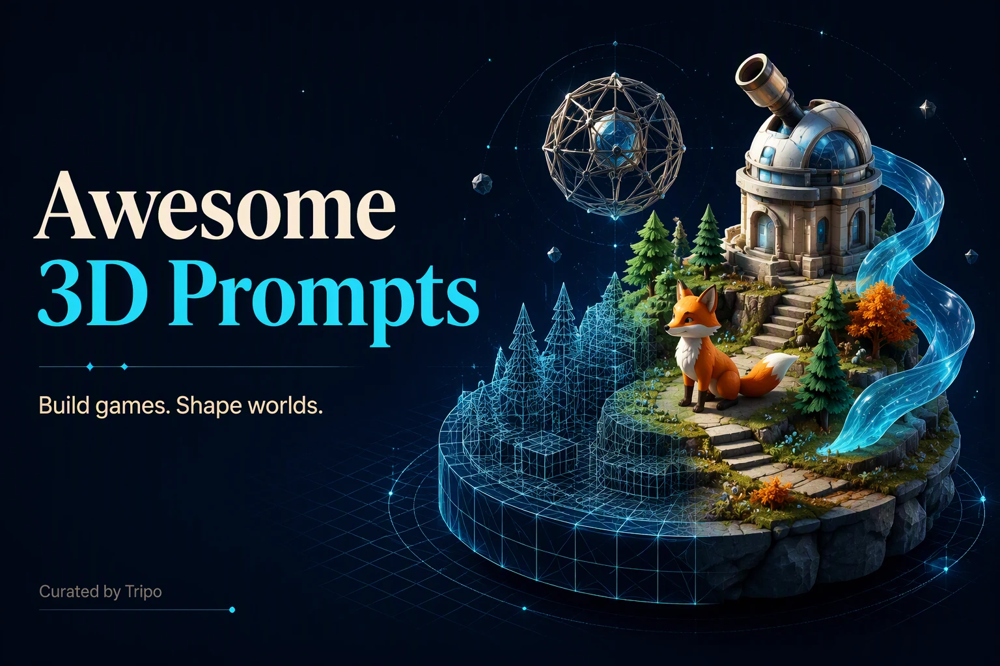
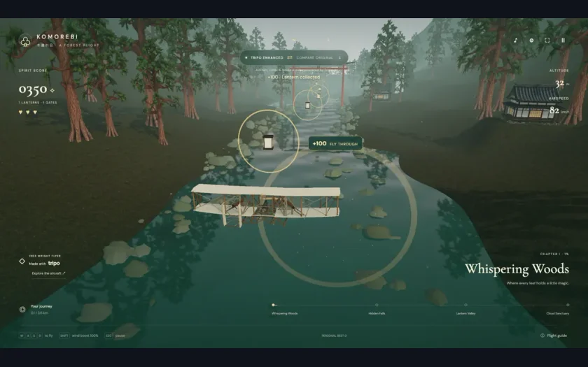
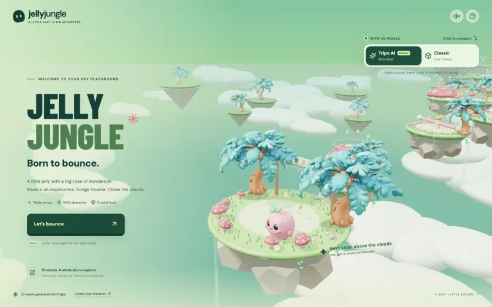
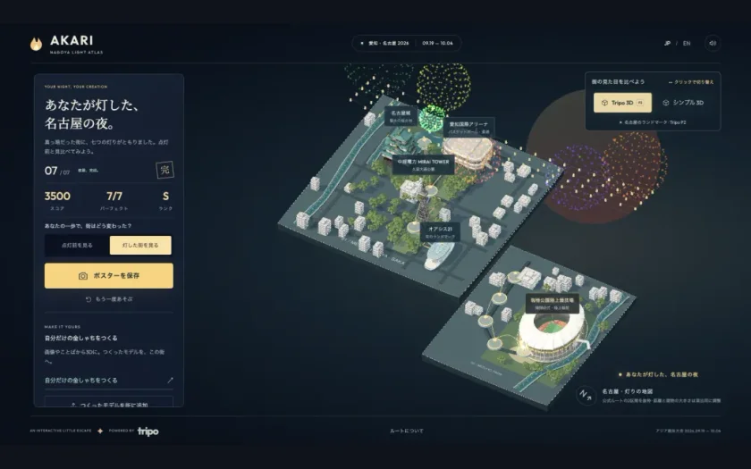
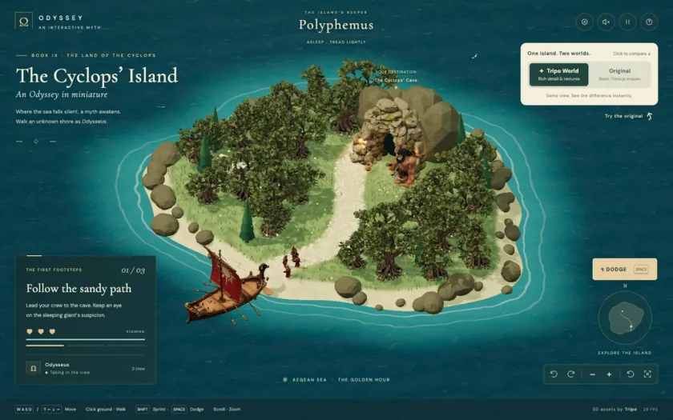

<!-- Generated from Growth CMS by templates/readme.md. Edit content in CMS; run npm run sync. -->

# Awesome 3D Prompts

[](https://github.com/sindresorhus/awesome) [](https://github.com/TripoGrowthLab/awesome-3d-prompts/stargazers) [](LICENSE) [](https://github.com/TripoGrowthLab/awesome-3d-prompts/actions/workflows/sync-prompts.yml) [](CONTRIBUTING.md)

<p>
  <a href="README.md"></a>
  <a href="README.zh-CN.md"></a>
  <a href="docs/catalog.zh-Hant.md"></a>
  <a href="docs/catalog.ja.md"></a>
  <a href="docs/catalog.ko.md"></a>
  <a href="docs/catalog.es.md"></a>
  <a href="docs/catalog.pt.md"></a>
  <a href="docs/catalog.de.md"></a>
  <a href="docs/catalog.fr.md"></a>
  <a href="docs/catalog.it.md"></a>
  <a href="docs/catalog.ru.md"></a>
  <a href="docs/catalog.tr.md"></a>
  <a href="docs/catalog.uk.md"></a>
  <a href="docs/catalog.vi.md"></a>
</p>

> 已经选好模型？直接打开 [Astra 提示词库](https://github.com/TripoGrowthLab/awesome-astra-prompts) 或 [Opus 5.5 提示词库](https://github.com/TripoGrowthLab/awesome-opus-5-5-prompts)。

<a href="https://www.tripo3d.ai/zh/3d-prompts?utm_source=github&amp;utm_medium=referral&amp;utm_campaign=awesome_3d_prompts&amp;utm_content=readme_hero"></a>

**从一个好案例出发，做出你的下一个 3D 游戏、场景或交互作品。**

汇集 Astra、Claude、Kimi 等模型的 3D 创作案例，覆盖游戏、场景、模型资产、动画与互动体验。 每条案例保留作者与来源；先看效果，再复制提示词，改成自己的作品。

**417 条案例 · 6 个模型 · 14 种语言 · 16 条附源码**

[开始使用](#start-here) · [按用途浏览](#browse) · [最新案例](#latest) · [完整目录](docs/catalog.zh.md) · [项目源码](docs/with-code.md)

<a id="start-here"></a>

## 开始使用

1. **先选效果。** 按用途或模型挑一个案例，点击预览图进入详情，体验作品。
2. **再改提示词。** 展开下方提示词并复制，替换主题、风格和交互。需要参考图的案例请一起提供参考素材；通用流程和完整参考上下文见详情页。
3. **做出自己的版本。** 在相应的编程助手或 3D 工作流中运行，检查画面、操作和性能。有项目源码时，可先从原项目开始。

<a id="browse"></a>

## 按用途浏览

| 按用途浏览 | 案例 |
| :--- | ---: |
| [游戏](docs/catalog.zh.md#category-games) | 115 |
| [场景](docs/catalog.zh.md#category-3d-scenes) | 92 |
| [资产](docs/catalog.zh.md#category-3d-assets) | 49 |
| [互动](docs/catalog.zh.md#category-interactive-3d) | 83 |
| [动画](docs/catalog.zh.md#category-animation-simulation) | 75 |
| [其他](docs/catalog.zh.md#category-other) | 3 |

### 按模型浏览

| 按模型浏览 | 案例 |
| :--- | ---: |
| [GPT-6 Astra](docs/catalog.zh.md#model-gpt-6-astra) | 276 |
| [Claude Fable 5.1](docs/catalog.zh.md#model-claude-fable-5-1) | 79 |
| [Kimi K3](docs/catalog.zh.md#model-kimi-k3) | 20 |
| [Claude Fable 5](docs/catalog.zh.md#model-claude-fable-5) | 18 |
| [Claude Opus 5.5](docs/catalog.zh.md#model-claude-opus-5-5) | 18 |
| [Claude Opus 5](docs/catalog.zh.md#model-claude-opus-5) | 13 |

## 精选作品

<table>
<tr>
<td width="50%" valign="top"><a href="https://www.tripo3d.ai/zh/3d-prompts/wright-flyer-through-a-japanese-forest-2096467585785286808"></a><br><strong><a href="docs/catalog.zh.4.md#wright-flyer-through-a-japanese-forest-2096467585785286808">莱特飞行器穿越日本森林</a></strong><br><sub><a href="https://x.com/jaredliu_bravo">Jared</a></sub><br><a href="docs/catalog.zh.4.md#wright-flyer-through-a-japanese-forest-2096467585785286808">提示词 →</a></td>
<td width="50%" valign="top"><a href="https://www.tripo3d.ai/zh/3d-prompts/jelly-jungle-3d-browser-game-2081024333120733188"></a><br><strong><a href="docs/catalog.zh.8.md#jelly-jungle-3d-browser-game-2081024333120733188">果冻丛林：3D 平台跳跃游戏</a></strong><br><sub><a href="https://x.com/jaredliu_bravo">Jared</a></sub><br><a href="docs/catalog.zh.8.md#jelly-jungle-3d-browser-game-2081024333120733188">提示词 →</a></td>
</tr>
<tr>
<td width="50%" valign="top"><a href="https://www.tripo3d.ai/zh/3d-prompts/akari-nagoya-rooftop-flame-relay"></a><br><strong><a href="docs/catalog.zh.2.md#akari-nagoya-rooftop-flame-relay">AKARI：名古屋屋顶火炬接力</a></strong><br><sub><a href="https://growthengineer.space/">Jared</a></sub><br><a href="docs/catalog.zh.2.md#akari-nagoya-rooftop-flame-relay">提示词 →</a></td>
<td width="50%" valign="top"><a href="https://www.tripo3d.ai/zh/3d-prompts/cyclops-island-threejs-game"></a><br><strong><a href="docs/catalog.zh.2.md#cyclops-island-threejs-game">独眼巨人之岛</a></strong><br><sub><a href="https://x.com/jaredliu_bravo">Jared</a></sub><br><a href="docs/catalog.zh.2.md#cyclops-island-threejs-game">提示词 →</a></td>
</tr>
</table>

<a id="latest"></a>

## 最新案例

[完整目录 (417) →](docs/catalog.zh.md)

<a id="claude-opus-5-5-2102788371114246177"></a>

### Claude 成长训练蒙太奇

[Ishu Agrawal](https://x.com/ishuagra02) · 2026-09-23 · Claude Opus 5.5 · 动画

<a href="https://www.tripo3d.ai/zh/3d-prompts/claude-opus-5-5-2102788371114246177"></a>

<details>
<summary>提示词</summary>

```text
完全使用代码创建一段 30 秒动画，呈现一场成长训练蒙太奇。以《功夫熊猫》的训练片段为灵感，让 Claude 吉祥物担任主角，展示它自首次发布以来能力不断提升，涵盖互联网搜索、编写代码、创建 3D 模型以及解决人类最棘手的问题，并配以富有情感冲击力的音乐。
```

</details>

<details>
<summary>作者原始提示词</summary>

```text
Create a 30 second animation entirely in code featuring a growth montage, inspired by Kung Fu Panda's training sequence, with the Claude mascot as the main character, showcasing it getting more capable since its initial release across its skillset, such as searching the internet, writing code, creating 3D models, and solving humanity's hardest problems, with emotionally impactful music.
```

</details>

[查看详情 ↗](https://www.tripo3d.ai/zh/3d-prompts/claude-opus-5-5-2102788371114246177) · [查看原帖](https://x.com/ishuagra02/status/2102788832273801700) · [返回案例导航](#latest)

---

<a id="claude-opus-5-5-2102788223835463902"></a>

### 使用 Three.js 制作皮克斯级别的 90 年代卡通动画

[Shimecki](https://x.com/scheemunai) · 2026-09-23 · Claude Opus 5.5 · 动画

<a href="https://www.tripo3d.ai/zh/3d-prompts/claude-opus-5-5-2102788223835463902"></a>

<details>
<summary>提示词</summary>

```text
我希望你构思一个故事，然后使用 Three.js，根据你构思的故事制作一部完整动画，呈现皮克斯级别的 90 年代卡通品质。
```

</details>

<details>
<summary>作者原始提示词</summary>

```text
I want you to imagine a story. And then using threejs I want you to create full animation, Pixar-level quality 90s cartoon out of the story you imagine.
```

</details>

[查看详情 ↗](https://www.tripo3d.ai/zh/3d-prompts/claude-opus-5-5-2102788223835463902) · [查看原帖](https://x.com/scheemunai/status/2102788223835463902) · [返回案例导航](#latest)

---

<a id="gpt-6-astra-2102788013902213508"></a>

### 用于学习国际象棋弃兵的互动式 3D 棋盘

[Diogo Santos](https://x.com/diogosantosbr) · 2026-09-23 · GPT-6 Astra · 互动

<a href="https://www.tripo3d.ai/zh/3d-prompts/gpt-6-astra-2102788013902213508"></a>

<details>
<summary>提示词</summary>

```text
创建一个带有互动式 3D 棋盘的 Web 应用，用于学习国际象棋中的主要弃兵开局。加入走法动画、前进和后退控制、变化分支，以及对每种开局背后思路的讲解。
```

</details>

<details>
<summary>作者原始提示词</summary>

```text
Crie uma aplicação web com um tabuleiro 3D interativo para estudar os principais gambitos do xadrez. Inclua animação dos movimentos, controles para avançar e voltar, variantes e explicações das ideias por trás de cada abertura.
```

</details>

[查看详情 ↗](https://www.tripo3d.ai/zh/3d-prompts/gpt-6-astra-2102788013902213508) · [查看原帖](https://x.com/diogosantosbr/status/2102788013902213508) · [返回案例导航](#latest)

---

<a id="claude-opus-5-5-2102781807179735211"></a>

### 无缝循环的代码水循环动画

[Higgsfield AI 🧩](https://x.com/higgsfield_ai) · 2026-09-23 · Claude Opus 5.5 · 动画

<a href="https://www.tripo3d.ai/zh/3d-prompts/claude-opus-5-5-2102781807179735211"></a>

<details>
<summary>提示词</summary>

```text
创建一个完全通过代码实现的水循环无缝循环动画。
```

</details>

<details>
<summary>作者原始提示词</summary>

```text
Create a seamless looping animation of the water cycle, entirely in code.
```

</details>

[查看详情 ↗](https://www.tripo3d.ai/zh/3d-prompts/claude-opus-5-5-2102781807179735211) · [查看原帖](https://x.com/higgsfield_ai/status/2102781807179735211) · [返回案例导航](#latest)

---

<a id="gpt-6-astra-2102780850706567390"></a>

### 可在浏览器中操作的中世纪欧洲风格 3D 城堡

[もぎ＠ボードゲーム](https://x.com/luxurytax150) · 2026-09-23 · GPT-6 Astra · 场景

<a href="https://www.tripo3d.ai/zh/3d-prompts/gpt-6-astra-2102780850706567390"></a>

<details>
<summary>提示词</summary>

```text
制作一座可在浏览器中操作的中世纪欧洲风格 3D 城堡。加入护城河、吊桥、塔楼、石墙、旗帜、森林和昼夜切换。 
这是一个基准测试，因此请尽可能丰富视觉效果，最大限度优先保证 3D 模型的品质。
```

</details>

<details>
<summary>作者原始提示词</summary>

```text
ブラウザで操作できる3Dの中世ヨーロッパ風の城を作る。水堀、跳ね橋、塔、石壁、旗、森、昼夜切替を入れる。 
これはベンチマークの一種であるから、どこまで見た目を盛れるか、3Dモデルの品質を最大限優先して。
```

</details>

[查看详情 ↗](https://www.tripo3d.ai/zh/3d-prompts/gpt-6-astra-2102780850706567390) · [查看原帖](https://x.com/luxurytax150/status/2102780850706567390) · [返回案例导航](#latest)

---

<a id="claude-opus-5-5-2102775461701091531"></a>

### CatWalk：奔跑在夜色街头的 3D 横版猫咪游戏

[BLITAST STUDIO](https://x.com/blitast_studio) · 2026-09-23 · Claude Opus 5.5 · 游戏

<a href="https://www.tripo3d.ai/zh/3d-prompts/claude-opus-5-5-2102775461701091531"></a>

<details>
<summary>提示词</summary>

```text
开始开发这款游戏吧
图形表现不限定使用 2D 还是 3D，请分析游戏系统等内容，选择更易于开发的方案即可
我个人倾向于 3D，但希望画面呈现横版动作游戏的感觉
我想通过照明等效果营造时尚的氛围，因此认为使用 3D 应该能实现更出色的画面表现（例如街灯或灯笼等效果）
我想制作的游戏名为 CatWalk
顾名思义
猫咪向侧面前进
猫步走台不断延伸，画面会自动滚动，玩家需要跟上滚动速度，仅通过跳跃等简单操作越过障碍物和缺口。这种玩法在紧张感和系统机制上，或许有些接近《Flappy Bird》。
不过，我希望画面成熟、酷帅，打造一款注重氛围的游戏
如果可以表现出猫咪柔韧优雅的行走、奔跑和跳跃动作，就再好不过了
关卡世界观由你决定，起初采用普通的夜晚街头之类的场景也可以
如果整体调暗一些，能够更好地表现间接照明等效果，我会非常满意
我知道有些内容可以实现，有些不行，也有些比较困难
请以我的这些需求为参考，开发出你认为可行的方案
首先实现一个关卡完整游玩一轮
```

</details>

<details>
<summary>作者原始提示词</summary>

```text
ゲームを開発しましょう
グラフィックは2D、3Dを問いませんがゲームのシステムなどを分析し開発しやすい方でいいです
個人的には3Dだが画面は横スクロールアクションみたいなものを想定してます
照明などでおしゃれな雰囲気などを出したいので3Dを使うことで美しい表現ができるのではないかと思っています（例：街灯やランタンのような表現など）
作りたいゲームは CatWalk というゲーム
名前の通りです
猫が横に進む
キャットウォークが続いており、画面は自動スクロールするので、その速さに合わせて障害物や穴をジャンプなどのシンプルな操作のみで越えていくスタイル。ある意味でフラッピー的な緊張感とシステムに近いかもしれない。
ただしグラフィックは大人かっこいい、雰囲気ゲーを目指したい
可能であれば猫のしなやかな歩き、走り、ジャンプが表現できればうれしい
ステージの世界観はお任せするが、最初は無難な夜のストリートなどでもいいかと
暗めにすることで間接照明などが美ししく表現できればかなり嬉しい
できることできないこと難しいことがあると思うので
この私の要望をヒントにあなたなりにできそうなものを開発してほしい
まずは１ステージのワンループができるように
```

</details>

[查看详情 ↗](https://www.tripo3d.ai/zh/3d-prompts/claude-opus-5-5-2102775461701091531) · [查看原帖](https://x.com/blitast_studio/status/2102775632933654585) · [返回案例导航](#latest)

---

<a id="gpt-6-astra-2102752217375899659"></a>

### Orbit Lab：太阳、地球与月球 3D 模拟

[technewsradio.tokyo](https://technewsradio.tokyo/) · 2026-09-23 · GPT-6 Astra · 互动

<a href="https://www.tripo3d.ai/zh/3d-prompts/gpt-6-astra-2102752217375899659"></a>

<details>
<summary>提示词</summary>

```text
这是一次对比实验。请在你的工作目录中实现并完成以下规格完全相同的 Web 应用。名称为“Orbit Lab”。使用 Three.js 0.186.0，并加载相同版本的核心库和 OrbitControls（可以使用 CDN import map，也可以使用 npm）。无需发布或部署。

要求：
1. 使用程序化几何体和材质表现太阳、地球和月球的 3D 模型。不要使用外部图片或 3D 资源。将太阳设置为点光源，确保通过镜头操作可以看出地球和月球的明暗变化。
2. 使用 delta time 驱动地球公转与自转、地轴倾斜以及月球公转。将轨道面的倾角可视化，并显示地球和月球的轨道线。比例和速度可以为了教学效果进行夸张处理。
3. 使用可复现的随机数生成恒星背景。使用 OrbitControls 实现旋转和缩放。点击天体后，切换其选中状态和说明面板。
4. 提供播放/暂停、速度滑块、轨道线显示切换、聚焦太阳/地球/月球的镜头功能，以及恢复初始状态的按钮。也应支持使用键盘播放/暂停和重置。
5. 确保在手机屏幕宽度下也能操作，加入 WebGL 不受支持时的提示、窗口大小变化适配，以及限制像素比以避免过高的渲染负载。
6. 在 README 中写明启动步骤和操作方法。如有可能，请实际启动并确认运行情况；如果无法启动，请明确说明原因。在完成报告中简要列出创建的文件、已实现的功能和确认结果。

无需中途提问，请合理判断并完成全部实现。
```

</details>

<details>
<summary>作者原始提示词</summary>

```text
比較実験です。次の同一仕様のWeb作品を、あなたの作業ディレクトリに実装して完成させてください。名称は「Orbit Lab」。Three.js 0.186.0を使用し、同一バージョンの本体とOrbitControlsを読み込んでください（CDNのimport mapでもnpmでも可）。公開・デプロイは不要です。

要件:
1. 太陽・地球・月の3Dモデルを手続き的なジオメトリとマテリアルで表現。外部画像・3Dアセットは使わない。太陽を点光源とし、地球と月の明暗がカメラ操作で分かること。
2. 地球の公転と自転、地軸の傾き、月の公転をdelta timeで動かす。軌道面の傾きを視覚化し、地球と月の軌道線を表示する。スケールと速度は教育用の誇張でよい。
3. 恒星背景を再現可能な乱数で生成する。OrbitControlsで回転・ズーム。天体をクリックすると選択状態と説明パネルが切り替わる。
4. 再生/停止、速度スライダー、軌道線表示切替、太陽/地球/月へのカメラフォーカス、初期状態に戻すボタンを備える。キーボードでも再生/停止とリセットができる。
5. スマホ幅でも操作できる見た目、WebGL非対応時の案内、リサイズ対応、過剰な描画負荷を避けるピクセル比制限を入れる。
6. READMEに起動手順と操作方法を書く。可能なら実際に起動して動作確認し、できなければ理由を明記する。完了報告には作成ファイル、実装済み項目、確認結果を簡潔に書く。

途中で質問せず、合理的に判断して最後まで実装してください。
```

</details>

[查看详情 ↗](https://www.tripo3d.ai/zh/3d-prompts/gpt-6-astra-2102752217375899659) · [查看原帖](https://technewsradio.tokyo/lab/gpt6-vs-opus55) · [返回案例导航](#latest)

---

<a id="claude-opus-5-5-2102740078347087940"></a>

### 《末班列车》赛博朋克巨型城市基准项目

[BuilderHelm](https://x.com/builderhelmai) · 2026-09-23 · Claude Opus 5.5 · 场景

<a href="https://www.tripo3d.ai/zh/3d-prompts/claude-opus-5-5-2102740078347087940"></a>

<details>
<summary>提示词</summary>

```text
在 Blender 中构建一座完整的赛博朋克巨型城市，包括主角列车、程序化建筑、高架轨道系统、雨景、体积氛围、电影感灯光、多组摄像机设置，以及一段完整的动画序列。
```

</details>

<details>
<summary>作者原始提示词</summary>

```text
build a complete cyberpunk megacity inside Blender with a hero train, procedural architecture, elevated rail systems, rain, volumetric atmosphere, cinematic lighting, multiple camera setups, and a full animated sequence.
```

</details>

[查看详情 ↗](https://www.tripo3d.ai/zh/3d-prompts/claude-opus-5-5-2102740078347087940) · [查看原帖](https://x.com/builderhelmai/status/2102740078347087940) · [返回案例导航](#latest)

---

<a id="claude-opus-5-5-2102739444256383089"></a>

### 体素风足球动画

[Delusionals](https://x.com/AGI_FromWalmart) · 2026-09-23 · Claude Opus 5.5 · 动画

<a href="https://www.tripo3d.ai/zh/3d-prompts/claude-opus-5-5-2102739444256383089"></a>

<details>
<summary>提示词</summary>

```text
使用 Three.js（CDN）创建一个单独的 HTML 文件，实现简单的体素风足球动画。一名方块风格球员带球突破 2 名防守球员，以精彩进球得分，并触发庆祝粒子效果。整体呈现色彩缤纷的体育场风格。仅输出完整的 HTML 代码。
```

</details>

<details>
<summary>作者原始提示词</summary>

```text
Create a single HTML file with Three.js (CDN) for a simple voxel-style soccer animation. A blocky player dribbles past 2 defenders and scores a spectacular goal with celebration particles. Colorful stadium look. Output ONLY the full HTML code.
```

</details>

[查看详情 ↗](https://www.tripo3d.ai/zh/3d-prompts/claude-opus-5-5-2102739444256383089) · [查看原帖](https://x.com/AGI_FromWalmart/status/2102739444256383089) · [返回案例导航](#latest)

---

<a id="claude-opus-5-5-2102729710174196022"></a>

### 虚构行星互动网站

[Kappaemme](https://x.com/Kappaemme1926) · 2026-09-23 · Claude Opus 5.5 · 互动

<a href="https://www.tripo3d.ai/zh/3d-prompts/claude-opus-5-5-2102729710174196022"></a>

<details>
<summary>提示词</summary>

```text
构建一个关于虚构行星的互动网站。
```

</details>

<details>
<summary>作者原始提示词</summary>

```text
build an interactive website about imaginary planets.
```

</details>

[查看详情 ↗](https://www.tripo3d.ai/zh/3d-prompts/claude-opus-5-5-2102729710174196022) · [查看原帖](https://x.com/Kappaemme1926/status/2102729710174196022) · [返回案例导航](#latest)

---

<a id="gpt-6-astra-2102672926285713456"></a>

### 中世纪城堡浏览器动画

[juhapalomaki.fi](https://juhapalomaki.fi/) · 2026-09-23 · GPT-6 Astra · 场景

<a href="https://www.tripo3d.ai/zh/3d-prompts/gpt-6-astra-2102672926285713456"></a>

<details>
<summary>提示词</summary>

```text
创建一个完全在浏览器中运行的 3D 动画。动画场景为一座中世纪城堡，城堡坐落在一片广袤森林中的山顶上。不要添加任何键盘控制，只需让镜头围绕城堡旋转，使我们能够从各个角度看到城堡。城堡塔楼顶部应有一面随风飘动的旗帜。

输出应包含一个 index.html 文件，执行该文件后显示城堡并开始循环播放动画。
```

</details>

<details>
<summary>作者原始提示词</summary>

```text
Create a 3d animation that runs completely in browser. The animation features a medieval castle, sitting on top of a hill that is located on large forest. Do not add any keyboard controls, just make the camera spin around the castle so that we see it from all sides. On top of the castle tower there should be a flag that waves in the wind.

The output should contain index.html file that when executed shows the castle and starts the looping animation.
```

</details>

[查看详情 ↗](https://www.tripo3d.ai/zh/3d-prompts/gpt-6-astra-2102672926285713456) · [查看原帖](https://juhapalomaki.fi/blog/castle-model-comparison/) · [返回案例导航](#latest)

---

<a id="tripo-claude-opus-5-5-paper-cut-3d-short"></a>

### 使用 Claude Opus 5 制作的 Tripo 3D 宣传片

[tripo3d](https://x.com/tripoai) · 2026-09-23 · Claude Opus 5 · 动画

<a href="https://www.tripo3d.ai/zh/3d-prompts/tripo-claude-opus-5-5-paper-cut-3d-short"></a>

<details>
<summary>提示词</summary>

```text
1. 项目目标
制作一部约 44 秒、可交互的动画短片，标题为“Claude × Tripo”。一颗橙色的小 Claude 火花落在手工纸艺书桌上，在 Tripo 品牌笔记本电脑中绘制或输入五个有趣的想法，并见证这些创作逐一获得生命。观众可以观看、暂停、拖动进度、重播、切换画面比例、开启声音或录制动画。这是一部经过编排的短片，不包含配乐、战斗或胜负条件。复现所提供的视频和场景构图。

2. 视觉风格
使用层叠式纸艺立体场景，呈现撕纸质感的奶油色边缘、油画棒颗粒、涂鸦、方格纸细节和午夜蓝天空。在牛皮纸书桌后方叠放弦月、暖黄色星星、蓝色纸艺山丘和一座小镇。将打开的笔记本电脑放在左侧，Claude 放在中央附近，右侧放置一个小型圆形展示台。保持暖橙色、淡紫色、薄荷绿、奶油黄和奶油色点缀。使用透视摄像机，在远景和特写之间平缓移动；通过按深度分层的平面剪纸元素制造视差。采用分层的卡通光照、冷色轮廓光、克制的描边、柔和阴影，并在最后添加纸张颗粒和暗角效果。结尾使用白色相机闪光，随后出现一张略微倾斜、用胶带贴住的宝丽来照片，展示全体角色。开场、每次创作揭示以及全员登场结尾的构图都要匹配参考画面。

3. 场景与故事
让所有姿态和摄像机状态都由单一的确定性 update(t) 驱动，从而直接跳转到任意时间戳时，无需重放之前的画面就能得到正确帧。在一份共享时间表中定义所有故事节点。Claude 约在 0.55 秒时出现，约在 1.7 秒时落地，并在 2.92 秒时唤醒笔记本电脑。约在 7.2 秒揭示面包猫，13.85 秒揭示蜗牛小屋，19.8 秒揭示烤面包机火箭，26.1 秒揭示茶壶章鱼，33.3 秒揭示天空鲸鱼。火箭约在 21.25 秒发射，并在 24.05 秒返回。鲸鱼在约 35–37 秒时游过全员上方。相机闪光发生在 40.5 秒，44.2 秒结束。平滑衔接镜头，并使用缓动式预备动作、弹簧式过冲、挤压与拉伸、小幅跳跃和逐渐衰减的摇摆。切换场景时避免突然重置。

4. 资产列表
- claude-spark：一个扁平的橙色十二射线火花，带奶油色撕纸边缘和友好的动画表情。它会眨眼、看向当前动作、微笑、脸红，并切换开心、眩晕和闪光眼睛。两条射线会伸展成手臂，触碰按键、图画和其他角色。将其面部和手臂行为保留为程序化着色器；静态导出无法体现这个角色的身份特征或表演效果。
- cat：一个金色面包形猫咪，身体圆润，带烘烤焦痕、小耳朵、爪子、尾巴、亮晶晶的眼睛、粉色脸颊和胡须。它出现在展示台上，旋转供人查看，接受抚摸，最后在书桌前方安定下来。
- snail：一只淡绿色蜗牛，背着一座奶油色小屋；小屋带珊瑚色屋顶、烟囱、发光窗户和迷你花箱。抬起和滑动过程中，要保持眼柄清晰可辨、房屋直立且面部可见。
- toaster：一台薄荷绿色烤面包机，带珊瑚色饰边和拉杆、圆润的奶油色细节、小型火箭翼以及底部喷口。它伴随橙色火焰、喷气 puff 轨迹和掠过摄像机的音效升空，随后返回。火焰和烟雾必须作为独立效果处理。
- octopus：一个粉色与淡紫色相间的茶壶生物，带六条柔韧触手、壶嘴和把手、欢快的表情、金色单片眼镜和紫色领结。为触手制作动画，加入倾斜动作和小步行走。触手姿态要与僵硬的茶壶主体分开控制。
- whale：一条蓝色天空鲸鱼，带奶油色腹部、鳍和富有表情的面孔，背着一座长满青草的迷你小镇，以及彩色小屋、树木和条纹灯塔。它是体型最大的创作，必须在结尾全员登场时保持突出。灯塔光束作为独立的透明效果处理。
- environment：书桌、笔记本电脑、台灯、铅笔杯、盆栽、展示台、纸艺天空与小镇层、便签和铅笔。全程重复使用这些元素。纸张背景、笔记本电脑界面、涂鸦、粒子、烟雾、光束和后期处理都保持为程序化效果。
保持稳定的资产标识符，并分别为世界空间摆放、自转/挤压以及可活动部件设置独立变换。保留源项目的比例和配色。便携式 GLB 版本可以使用标准材质和静态姿势；不要声称其中包含自定义揭示着色器、角色表演或完整动画。

5. 交互与反馈
提供播放/暂停、重播、带已用时长/总时长的进度条、1:1 / 16:9 / 9:16 画面比例选项、声音开关、纯净视图和录制功能。空格键切换播放；R 键重播；H 键或 C 键切换纯净视图；Escape 键恢复控件；M 键切换声音；左右方向键按 1 秒跳转，Shift 键将步长缩短至 0.1 秒。确保控件在窄屏触摸设备上也易于使用。声音只能在用户手势后启动；浏览器阻止自动播放音频时，提供“带声音播放”选项。拖动进度和重播时，要从正确时间点重新启动声音。结束时停止播放并提供重播选项。
笔记本电脑显示当前绘制或输入的想法、动画进度条和完成标记。屏幕上的 Generate 操作属于预先编排好的动画：现有短片使用程序化几何体，并不会调用模型生成 API。每个创作都从底部向上揭示，最初呈淡紫色黏土质感，随后用暖色发光扫描带为其填充颜色。让 Claude 的视线和手臂动作与这些事件同步。

6. 技术实现与音频
使用 JavaScript ES 模块和基于 WebGL 的 Three.js r170、自定义着色器、CanvasTexture 以及 Web Audio API。将应用和字体打包为同源静态资源，并采用可复现构建；不得使用运行时 CDN 或私有服务凭据。控件使用本地 Fredoka 字体，手写文本使用 Caveat 字体。适配三种画面比例下的摄像机距离和渲染尺寸，限制过高的像素密度，并将导出资源排除在页面初始网络请求之外。
使用 Web Audio 合成配乐和音效。配乐包含音乐盒 FM 音色、经滤波的拨弦三角波贝斯、木琴、轻柔的失谐铺底、底鼓、拍手/沙锤、生成式混响和最终压缩。让第 0 小节与笔记本电脑在 2.92 秒唤醒的时间点对齐，让第 16 小节与 40.5 秒的闪光对齐，速度约为 102 BPM；循环和弦为 F–Dm–B-flat–C。在指定故事节点加入铅笔、键盘、呼啸、啵声、弹簧声、猫、鲸鱼、火箭和快门音效。根据火箭相对于摄像机的运动为引擎声进行声像定位和塑形。将配乐分成较小的离线片段渲染后组装成一个缓冲区；由活动音频时钟驱动画面，并在音频时钟卡顿时提供回退机制。录制时应将画布视频与配乐合并，并导出浏览器支持的格式。正常播放或浏览器录制不得依赖源项目中可选的本地 Python 捕获服务器。

7. 完成标准
交付可编辑源文件、固定版本的依赖、静态构建、启动说明和可用的短片。验证在 8、15、22、28、36 和 41 秒附近直接跳转；重播和暂停必须保持确定性状态。将全员登场构图与参考视频进行比对。确认音频解锁、静音、重播同步，以及包含两条轨道的实际录制下载。检查正方形、横屏和竖屏构图，以及桌面端和窄屏控件。在父站点的隔离 iframe 中验证托管页面，确保没有缺失字体、被阻止的脚本或外部资源错误。独立检查可复用 GLB 的几何体、朝向、材质和包围盒是否正确；其封面必须展示实际文件。记录便携式资产与动画着色器版本之间的所有差异。

```

</details>

[查看详情 ↗](https://www.tripo3d.ai/zh/3d-prompts/tripo-claude-opus-5-5-paper-cut-3d-short) · [返回案例导航](#latest)

---

<a id="claude-opus-5-5-2102565611473661963"></a>

### 交互式欧拉霓虹流体模拟

[theailoser](https://x.com/theailoser) · 2026-09-23 · Claude Opus 5.5 · 动画

<a href="https://www.tripo3d.ai/zh/3d-prompts/claude-opus-5-5-2102565611473661963"></a>

<details>
<summary>提示词</summary>

```text
编写一个完整的单文件 HTML 文档，其中包含高性能、GPU 加速的交互式欧拉霓虹流体模拟。

严格的技术与美术要求：

1. 架构与性能：
   - 单文件：所有 HTML、CSS 以及 JavaScript/GLSL 着色器均须内联。
   - 零外部依赖：使用纯 WebGL 1.0 或 2.0（不得使用 Three.js、Pixi 或其他外部库）。
   - GPU 流体动力学计算：模拟必须完全通过乒乓式帧缓冲对象（FBO）运行，并使用自定义片元着色器实现：
     a) 平流（速度与染料）
     b) 散度计算
     c) 压力泊松求解器（雅可比迭代，每帧迭代 20–30 次）
     d) 梯度减法 / 速度投影
     e) 涡量约束（增加湍流旋涡，防止流体变成沉闷、模糊的一团）。

2. 视觉效果（“霓虹烟雾”风格）：
   - 漆黑如墨的虚空背景（`#050508`）。
   - 为染料注入启用加法 / 高动态范围混合。
   - 动态调色板：每次光标快速划动或触摸拖拽都要注入高亮度霓虹染料，并在鲜艳的赛博色调之间平滑循环（电光青 `#00F0FF`、炽热洋红 `#FF007F`、深紫外和 radiant gold）。
   - 显示着色器增强：在最终渲染着色器中直接加入后处理阶段，为流体翻涌的边缘应用细微的泛光、色调映射和色差效果。

3. 交互：
   - 鼠标与触摸：快速移动光标或拖拽时，注入与鼠标速度成正比的速度，同时注入高密度发光染料。
   - 被动环境运动：闲置时生成细微的程序化卷曲噪声或缓慢漂移的涡旋，使画布不会完全静止。
   - 控件：在角落放置简洁利落、极简至上的玻璃拟态 HUD（无操作时自动隐藏）：
     * 黏度滑块
     * 染料耗散 / 持久度滑块
     * 喷溅半径滑块
     * “清空画布”按钮
     * 用于循环切换配色主题的按钮（赛博朋克、热能炼狱、生物荧光深海）。

4. 生产级打磨：
   - 自动处理高 DPI 显示屏和 `resize` 事件，不得拉伸画面或清空 FBO 纹理。
   - 优雅地检测浮点纹理支持情况（`OES_texture_float` / `OES_texture_half_float`）。
   - 代码整洁、无错误且完整实现，不得包含任何占位内容或截断的注释。

只返回完整填充、可直接在 Chrome/Safari/Firefox 中运行的 HTML 文件。
```

</details>

<details>
<summary>作者原始提示词</summary>

```text
Write a complete, single-file HTML document containing a high-performance, GPU-accelerated interactive Eulerian Neon Fluid Simulation.

Strict Technical & Aesthetic Requirements:

1. Architecture & Performance:
   - Single-file: All HTML, CSS, and JavaScript/GLSL shaders inline.
   - Zero external dependencies: Pure WebGL 1.0 or 2.0 (no Three.js, no Pixi, no external libraries).
   - GPU-Computed Fluid Dynamics: The simulation must run entirely via ping-pong Framebuffer Objects (FBOs) using custom fragment shaders for:
     a) Advection (velocity & dye)
     b) Divergence calculation
     c) Pressure Poisson solver (Jacobi iteration, 20-30 iterations per frame)
     d) Gradient subtraction / velocity projection
     e) Vorticity confinement (adds turbulent swirls and prevents the fluid from turning into dull, blurry mush).

2. Visual Fidelity (The "Neon Smoke" Look):
   - Pitch-black void background (`#050508`).
   - Additive / High-Dynamic-Range blending for dye injection.
   - Dynamic palette: Each cursor flick or touch drag injects high-luminosity neon dye that cycles smoothly through vivid cyber hues (electric cyan `#00F0FF`, hot magenta `#FF007F`, deep ultraviolet, and radiant gold).
   - Display shader enhancements: Include a post-processing pass directly in the final render shader that applies subtle bloom/glow, tone mapping, and chromatic aberration around the swirling edges of the fluid.

3. Interaction:
   - Mouse & Touch: Rapid cursor movement or dragging injects velocity proportional to mouse speed, along with dense glowing dye.
   - Passive Ambient Motion: When idle, generate subtle procedural curl noise or gentle drifting vortices so the canvas is never completely static.
   - Controls: A sleek, ultra-minimal glassmorphism HUD tucked into a corner (with auto-hide on inactivity):
     * Viscosity slider
     * Dye dissipation / persistence slider
     * Splat radius slider
     * "Clear Canvas" button
     * Toggle button to cycle color themes (Cyberpunk, Thermal Inferno, Bioluminescent Deep).

4. Production Polish:
   - Automatically handle high-DPI displays and `resize` events without stretching or clearing the FBO textures.
   - Graceful fallback check for floating-point texture support (`OES_texture_float` / `OES_texture_half_float`).
   - Clean, bug-free, fully implemented code with zero placeholders or truncated comments.

Return only the fully populated HTML file ready to run directly in Chrome/Safari/Firefox.
```

</details>

[查看详情 ↗](https://www.tripo3d.ai/zh/3d-prompts/claude-opus-5-5-2102565611473661963) · [查看原帖](https://x.com/theailoser/status/2102565612874596411) · [返回案例导航](#latest)

---

<a id="claude-opus-5-5-2102565403109085669"></a>

### 日式樱花山谷交互式 3D 景观网页

[宝玉](https://x.com/dotey) · 2026-09-23 · Claude Opus 5.5 · 互动

<a href="https://www.tripo3d.ai/zh/3d-prompts/claude-opus-5-5-2102565403109085669"></a>

<details>
<summary>提示词</summary>

```text
请直接制作一个可以在浏览器中实时交互的高完成度 3D 景观网页。

主题：日式樱花山谷。
使用 HTML、CSS、JavaScript 实现。不要生成图片，不要只给设计方案，
不要用一张背景图加视差效果冒充 3D。我要的是实际可运行、可游览的成品。

【一、作品定位】

这是一片完整、连续、有远近层次的山谷景观，
不是孤立的小摆件、悬浮岛、带底座的沙盘，也不是单纯的技术演示。

风格是现代精细体素 / voxel art：
保留立方体几何的造型语言，但画面应高分辨率、抗锯齿、光影细腻。
不要复古低分辨率像素化，不要粗大积木堆砌，不要给画面套像素滤镜。

视觉质量优先。宁可少几个功能，也不要牺牲构图、材质和光照。

【二、参考图的使用方式】

如果附有参考图，请先理解它的构图层次、尺度、光线和色彩关系。
仅借鉴氛围与视觉语言，重新设计场景，
不要照搬建筑、树木、山体和道路的位置，不要 1:1 复刻。

参考图不是网页里的背景素材。场景本身必须由真实 3D 几何构成。

【三、场景构图】

默认打开时就应呈现一幅完整、有吸引力的画面，
不需要用户先旋转镜头才能找到好看的角度。

采用透视相机，而不是沙盘式等距俯视相机。
画面有明确的前景、中景、远景：

前景：
一株有存在感的古老樱花树，配合岩石、草木、石灯笼和少量落花，
形成画面边缘的自然框景，但不能挡住河流、桥和主要建筑。

中景：
一条蜿蜒河流引导视线进入画面，红色木桥横跨河面；
村落、茶屋、神社和小径顺着地势分布，建筑之间有真实的通行关系。
地面有起伏、岸线和自然过渡，不是平面上均匀摆放模型。

远景：
山坡上的多层塔、不同距离的森林和山脊，以及远处的雪山。
用尺度变化、遮挡、冷暖变化和空气透视表现距离，
而不是仅仅把远处物体缩小。

不要把所有元素均匀铺满。需要主次、疏密、留白和清楚的视觉焦点。

【四、造型与画面质量】

樱花树：
树干有转折、分叉和根部，树冠由不规则花簇组成，
有间隙、厚薄变化和可见枝条。不要做成几个规则球体或方块团。

建筑：
屋顶有层叠瓦片、挑檐、梁柱和窗格；
不同建筑有用途、体量和高度差异，不要复制同一栋房子铺满山谷。

地形：
岸边有湿润石块、草丛和植被过渡。
避免过于规律的台阶、重复条纹、棋盘格和明显的程序生成网格。

水面：
必须能够反映周围景物，具有适度的波纹、深浅变化和岸边过渡。
尽量使用实际场景反射；需要性能降级时也应保持视觉可信。
不要用闪烁噪声、强烈扭曲或一整块蓝色平面代替水。

细节：
可以有少量锦鲤、落花、萤火虫、瀑布和远处飞鸟，
但都应服务于氛围，不能让画面显得嘈杂。
不要为了宣称模型数量而堆砌细节。

【五、色彩与氛围】

默认是蓝调时刻：
偏冷的山谷与远山，柔和的粉色樱花，温暖但不过曝的灯笼和窗光。
暖光集中在有人活动的地方，不要把整个环境染成橙色。

需要柔和阴影、物体接触处的明暗、合理的曝光、
克制的泛光、抗锯齿和有距离层次的薄雾。

避免发白、灰蒙、过度饱和、满屏浓雾、过曝灯光和明显锯齿。
方块几何可以清晰，但渲染本身不能粗糙。

另提供“清晨”和“雨中”两种氛围；
切换时应同步改变天空、环境光、雾和局部效果，
不是仅仅修改背景颜色。

【六、交互与界面】

提供四个经过设计的镜头：
山谷全景、河边低机位、寺庙小径、山坡俯瞰。
切换应平滑，每个镜头都需要有独立的构图价值。

基础交互：
鼠标拖动观察、滚轮缩放或前进，触屏支持拖动和双指缩放。
提供重置视角、隐藏界面和保存当前画面的功能。

可选增强：
自由探索、缓慢镜头巡游、环境音。
环境音默认关闭，只在用户主动点击后播放。
额外功能不能影响默认画面的完成度。

界面要克制、有设计感，以景观为主。
标题和控制条放在边缘，不遮挡视觉焦点。
桌面和手机都不能出现按钮越界、文字重叠或无法操作的问题。

【七、工程与性能】

允许使用 Three.js / WebGL，以及版本固定、互相兼容的 CDN 依赖。
优先使用成熟渲染能力，不要为了“零依赖”重写整套引擎。

自写的 HTML、CSS、JavaScript 尽量整理在一个 HTML 文件中。
景物由程序化几何和材质生成，不依赖外部图片或 3D 模型资源。

重复物体采用适合的批量或实例化绘制方式；
合理控制细分、阴影、反射和渲染分辨率。
提供高画质和轻量模式，手机默认使用较轻设置。
不要靠无限增加体素数量换取细节。

加入加载提示、WebGL 不支持时的提示和必要的错误处理。
没有开启声音时不要自动播放；尊重减少动态效果的系统偏好。

【八、交付前验收】

不要写完代码就立即交付。

如果当前环境支持浏览器运行和截图，请先实际打开页面，
检查默认镜头、四个视角、氛围切换、桌面和手机布局，
再根据截图修正明显的构图、曝光、遮挡和渲染问题。

重点检查：
是否存在空白画面、加载失败、控制台错误；
是否有穿模、闪烁、阴影条纹、过曝、水面异常；
默认画面是否真正像完整景观，而不是小型沙盘；
功能按钮是否实际可用，移动端是否越界。

可以使用浏览器截图验收，但不要调用图像生成工具。
没有完成的测试要如实说明，不要声称已经验证。

最终交付：
1. 实际存在、可以打开的 HTML 文件，或当前环境支持的交互预览。
2. 如能截图，附一张真实浏览器渲染截图。
3. 简短说明操作方式和必要的运行条件。

请直接完成制作；非关键细节自行作出一致的设计选择，
不要把可以自行解决的实现问题反复交给我决定。
```

</details>

[查看详情 ↗](https://www.tripo3d.ai/zh/3d-prompts/claude-opus-5-5-2102565403109085669) · [查看原帖](https://x.com/dotey/status/2102565403109085669) · [返回案例导航](#latest)

---

<a id="claude-opus-5-5-2102547809140355250"></a>

### Hundenberg 事故模型与逼真视频

[AImanhasnoname](https://x.com/aimanhasnoname) · 2026-09-22 · Claude Opus 5.5 · 动画

<a href="https://www.tripo3d.ai/zh/3d-prompts/claude-opus-5-5-2102547809140355250"></a>

<details>
<summary>提示词</summary>

```text
在 Blender 中制作 Hundenberg 的模型，并生成一段逼真的事故视频。
```

</details>

<details>
<summary>作者原始提示词</summary>

```text
make me a model of the Hundenberg on blender make me a realistic video of the accident.
```

</details>

[查看详情 ↗](https://www.tripo3d.ai/zh/3d-prompts/claude-opus-5-5-2102547809140355250) · [查看原帖](https://x.com/aimanhasnoname/status/2102547809140355250) · [返回案例导航](#latest)

---

<a id="claude-opus-5-5-2102544406117286004"></a>

### 基于图片的手球场 360° 3D 渲染

[ハンドボール人「布施千佳純」](https://x.com/chikaidev) · 2026-09-22 · Claude Opus 5.5 · 场景

<a href="https://www.tripo3d.ai/zh/3d-prompts/claude-opus-5-5-2102544406117286004"></a>

**参考图片:** [1](https://media.tripogrowth.space/media/6a116b62-88ce-491b-b4ba-eed6d9c9f168.jpg) · [2](https://pbs.twimg.com/media/HS29xCPaYAAcMmd.jpg)

<details>
<summary>提示词</summary>

```text
将图片中的手球场、球门、裁判、球员和手球进行 3D 渲染，使其支持 360°自由视角查看。请准确还原每个人物的姿势以及各物体的颜色。
```

</details>

<details>
<summary>作者原始提示词</summary>

```text
画像内のハンドボールコート、ゴール、レフェリー、プレイヤー、ボールを3dレンダリングして、360度自由角度から見れるようにして。各人物の姿勢まで、また物体の色まで正確に再現して。
```

</details>

[查看详情 ↗](https://www.tripo3d.ai/zh/3d-prompts/claude-opus-5-5-2102544406117286004) · [查看原帖](https://x.com/chikaidev/status/2102545257372213581) · [返回案例导航](#latest)

---

<a id="claude-opus-5-5-2102544196808667471"></a>

### 根据图片制作程序化 Three.js 3D 主菜单背景

[Majid Manzarpour](https://x.com/majidmanzarpour) · 2026-09-22 · Claude Opus 5.5 · 场景

<a href="https://www.tripo3d.ai/zh/3d-prompts/claude-opus-5-5-2102544196808667471"></a>

**参考图片:** [1](https://media.tripogrowth.space/media/de4534b1-fda8-4736-8558-09b7283f646a.jpg) · [2](https://pbs.twimg.com/media/HS28q6mWMAAxONB.jpg)

<details>
<summary>提示词</summary>

```text
在单个 HTML 文件中，使用 Three.js 3D 完美重现这个完全程序化、带动画的主菜单背景
```

</details>

<details>
<summary>作者原始提示词</summary>

```text
recreate this perfectly, fully procedural, animated, main menu background in three.js 3D single HTML file
```

</details>

[查看详情 ↗](https://www.tripo3d.ai/zh/3d-prompts/claude-opus-5-5-2102544196808667471) · [查看原帖](https://x.com/majidmanzarpour/status/2102544198335373576) · [返回案例导航](#latest)

---

<a id="claude-opus-5-5-2102544078927741369"></a>

### 自动运行的 3D 鲁布·戈德堡机械装置

[leo](https://x.com/leogao25) · 2026-09-22 · Claude Opus 5.5 · 动画

<a href="https://www.tripo3d.ai/zh/3d-prompts/claude-opus-5-5-2102544078927741369"></a>

<details>
<summary>提示词</summary>

```text
在当前目录中创建一台会自动运行的 3D 鲁布·戈德堡机械装置，所有内容放在一个自包含的 index.html 文件中。

链式触发顺序如下：
1. 从顶部释放一颗弹珠，让它沿一系列之字形斜坡滚下。
2. 弹珠撞倒一排至少 12 块多米诺骨牌。
3. 最后一块多米诺骨牌压下跷跷板，将一颗小球弹入悬挂的桶中。
4. 桶的重量将其向下拉；桶绳绕过滑轮并猛地拉动一口铃，铃要有明显的摆动。
5. 同一动作将旗帜沿旗杆升起。旗帜升到顶端即为完成。

规则：
- 物理系统必须自行编写：不得使用物理库。弹珠释放后，所有运动都必须来自你的模拟系统（刚体、碰撞、约束、绳索/滑轮）。机械装置的任何部件都不得使用关键帧动画或补间动画驱动运动。
- 可以从 CDN 加载 three.js 用于渲染。不得使用其他外部资源：不能加载图片、模型或字体。
- 必须无需用户输入即可运行：页面加载时自动开始，使用跟随动作的电影级镜头，并在约 15–20 秒内完成整个链式流程。旗帜升起后保持 2 秒，然后重置并重新播放。
- 确定性：使用固定时间步长，禁止使用未设定种子的随机数，确保每次运行的效果完全一致。
- 填满浏览器窗口。视频将以 1280×720 分辨率录制。
- 屏幕上不得显示任何文字或任何形式的 UI。
- 注重视觉效果：加入灯光、阴影、材质，并设计一个让装置看起来真实可信的场景。
```

</details>

<details>
<summary>作者原始提示词</summary>

```text
Build a 3D Rube Goldberg machine that runs itself, as a single self-contained index.html in the current directory.

The chain, in order:
1. A marble is released at the top and rolls down a series of zig-zag ramps.
2. It knocks over a line of at least 12 dominoes.
3. The last domino tips a seesaw, which launches a small ball into a hanging bucket.
4. The bucket's weight pulls it down; its rope runs over a pulley and yanks a bell, which visibly swings.
5. The same motion raises a flag up a pole. The flag reaching the top is the finish.

Rules:
- Write the physics yourself: no physics library. Every motion after the marble is released must come from your simulation (rigid bodies, collisions, constraints, rope/pulley). No keyframed animation or tweened motion of any machine part.
- You may load three.js from a CDN for rendering. Nothing else external: no images, models, or fonts.
- It must run with no user input: start automatically on page load, use a cinematic camera that follows the action, and complete the whole chain in about 15–20 seconds. After the flag is up, hold for 2 seconds, then reset and replay.
- Deterministic: fixed timestep and no unseeded randomness, so every run looks the same.
- Fill the browser window. It will be screen-recorded at 1280×720.
- No on-screen text or UI of any kind.
- Make it look good: lighting, shadows, materials, and a setting that makes it feel like a real contraption.
```

</details>

[查看详情 ↗](https://www.tripo3d.ai/zh/3d-prompts/claude-opus-5-5-2102544078927741369) · [查看原帖](https://x.com/leogao25/status/2102544081863717153) · [返回案例导航](#latest)

---

<a id="claude-opus-5-5-2102538762731565085"></a>

### 彼得兔风格的互动农场动物游戏

[mblaso](https://x.com/blaso96) · 2026-09-22 · Claude Opus 5.5 · 游戏

<a href="https://www.tripo3d.ai/zh/3d-prompts/claude-opus-5-5-2102538762731565085"></a>

<details>
<summary>提示词</summary>

```text
"使用“彼得兔”的设计和美术风格，制作一款互动农场动物游戏
主菜单 = 声音开/关 + 动物选择器（马、猪、牛、猫、狗）
Esc = 暂停：重置回出生点/主菜单/
使用 WASD 移动
按空格键跳跃；靠近其他动物时可与它们互动
检测到距离接近后，随机触发互动
互动可以是对另一只动物发出声音（不同于它们平时发出的声音），也可以“轻轻碰它们”
可互动对象：水（饮用）、干草（食用）、水果（食用）。
第三人称视角，但镜头应略微位于动物后方并高于动物
环境中的动物包括鸟类；天空中随机出现飞机
场景 = 农田、谷仓，以及有房屋的农业村庄（无法进入房屋）
准备足够的资产来吸引注意力，但不必达到生产级别；这只是为了每天抽出 15 分钟和女儿一起玩得开心
使用 react、svg、js、webgl、threejs，以及一切必要的技术，让整体体验感觉“不错”"
```

</details>

<details>
<summary>作者原始提示词</summary>

```text
"Create a interactive farm animal game using the design/art style of "Peter Rabbit"
main menu = sounds on/off + animal picker (horse, pig, cow, cat, dog)
esc = pause: reset back to spawn/main menu/
wasd to move around
spacebar to jump and to interact with other animals when near
interactions are randomized upon proximity detection
interactions can be make sounds at the other animal (unique from their passive sounds) "boop them"
interactible with: water to drink, hay to eat, fruit to eat. 
3rd person but as if the camera was slightly behind the animal and above it
ambience animals are birds, airplanes in the sky (randomly)
setting= farmland, barn, farming village with houses (cant enter houses)
Enough assets to capture attention, but not enough that it needs to be deemed production grade, this is just to capture 15 minutes out of my day with my daughter and have fun
react, svg, js, webgl, threejs, whatever is necessary to make it feel "good""
```

</details>

[查看详情 ↗](https://www.tripo3d.ai/zh/3d-prompts/claude-opus-5-5-2102538762731565085) · [查看原帖](https://x.com/blaso96/status/2102538764749037738) · [返回案例导航](#latest)

---

<a id="claude-opus-5-5-2102533729746882985"></a>

### 日落时分的电影感互动海盗船

[Vib3Coded](https://x.com/vib3coded) · 2026-09-22 · Claude Opus 5.5 · 场景

<a href="https://www.tripo3d.ai/zh/3d-prompts/claude-opus-5-5-2102533729746882985"></a>

<details>
<summary>提示词</summary>

```text
从零开始创建一个完全可交互的 3D 场景：一艘海盗船在日落时分的动态海面上航行。视觉风格应具有电影感和风格化特征，而非追求写实，同时还要极其丰富、细致、精致且具备成熟的视觉表现力。构建船体、海洋、天空、灯光、材质、帆、索具、火炮、结构细节、海浪泡沫、航迹、粒子、动画、镜头语言、构图、景深氛围和色彩分级。最终效果应像高端、高制作规格的 3D 艺术作品，而不是原型、技术演示或低质量场景。从完全空白的页面开始。不得复用或依赖任何既有项目或场景。必要时，可以自行制作资源，或使用可靠、可信的开源资源和库。强制要求：场景中的任何位置都不得出现任何形式的文字。不得出现标题、名称、徽标、描述、署名、标签或任何语言的控制说明。将整个项目交付为一个最终的独立页面文件，可直接在网页浏览器中打开，并在合理可行的范围内将资源嵌入其中。海洋、船只、帆和摄像机都必须自然、流畅地进行动画。避免人为的慢动作或迟滞的移动。船只应让人真实感受到它正在水面上航行。最终结果不得依赖基础几何体。制作一个视觉上可信且细节丰富的海盗船，包括经过精心塑造的船体、桅杆、帆、索具、绳索、火炮、栏杆、提灯、甲板结构，以及清晰可见的微小细节。灯光必须清楚展现船只的几何结构和材质。营造浓郁的日落氛围、深邃的海洋阴影、反射效果、可信的海浪泡沫，以及船只后方和周围细致的航行尾流。在视觉质量与实时性能之间保持良好平衡，在不明显牺牲质量的前提下，确保交互和动画流畅。自动使用实现最佳效果所需的最合适技能、工具、库、技术和可用资源。不要等待我指定应使用哪些技术。完成后，务必在桌面网页浏览器中实际测试。截取视觉截图，检查浏览器控制台中的错误，并修复发现的所有视觉或技术问题，包括几何体变形、黑屏、资源加载失败、动画失效、构图不佳、渲染瑕疵或摄像机问题。最后，确认最终文件可以直接打开并正常运行，场景中完全没有任何文字，并且不再存在运行时错误或加载错误。然后仅用简短回复结束任务。
```

</details>

<details>
<summary>作者原始提示词</summary>

```text
Create from scratch a fully interactive 3D scene of a pirate ship sailing across a dynamic ocean at sunset. The visual style should be cinematic and stylized rather than photorealistic, while still being exceptionally rich, detailed, polished, and visually sophisticated. Build the ship, ocean, sky, lighting, materials, sails, rigging, cannons, small structural details, sea foam, wake, particles, animation, camera work, composition, atmospheric depth, and color grading. The final result should feel like a premium, high-production 3D artwork, not a prototype, technical demo, or low-quality scene. Start from a completely blank page. Do not reuse or depend on any previous project or scene. You may create the assets yourself or use reliable, trusted, open-source assets and libraries when necessary. Mandatory requirements: No text of any kind may appear anywhere inside the scene. No titles, names, logos, descriptions, credits, labels, or control instructions in any language. Deliver the entire project as one final standalone page file that can be opened directly in a web browser, with assets embedded inside it as much as reasonably possible. The ocean, ship, sails, and camera must all be animated naturally and smoothly. Avoid artificial slow motion or sluggish movement. The ship should feel like it is genuinely moving through the water. Do not rely on primitive geometric shapes as the finished result. Build a visually convincing and detailed pirate ship, including a carefully shaped hull, masts, sails, rigging, ropes, cannons, railings, lanterns, deck structures, and clearly visible small-scale details. Lighting must reveal the ship's geometry and materials clearly. Create a rich sunset atmosphere, deep ocean shading, reflections, convincing sea foam, and a detailed sailing wake behind and around the vessel. Maintain a strong balance between visual quality and real-time performance, preserving smooth interaction and animation without making an obvious sacrifice in quality. Automatically use the most appropriate skills, tools, libraries, techniques, and available assets needed to achieve the best result. Do not wait for me to specify which technologies to use. Actually test the finished result in a desktop web browser. Capture visual screenshots, inspect the browser console for errors, and fix every visible or technical issue you find, including distorted geometry, black screens, failed asset loading, broken animation, poor composition, rendering artifacts, or camera problems. At the end, verify that the final file opens and works directly, that the scene contains no text whatsoever, and that there are no remaining runtime or loading errors. Then finish the task with only a brief response.
```

</details>

[查看详情 ↗](https://www.tripo3d.ai/zh/3d-prompts/claude-opus-5-5-2102533729746882985) · [查看原帖](https://x.com/vib3coded/status/2102534606121746589) · [返回案例导航](#latest)

---

<a id="claude-opus-5-5-2102529695908806728"></a>

### 无限程序生成的 Three.js 世界

[🥔🥔🥔](https://x.com/argofowl) · 2026-09-22 · Claude Opus 5.5 · 游戏

<a href="https://www.tripo3d.ai/zh/3d-prompts/claude-opus-5-5-2102529695908806728"></a>

<details>
<summary>提示词</summary>

```text
在我的 projects 文件夹中创建一个名为“endless-game”的新项目：这是一个基于浏览器、使用 Three.js 构建的无限程序生成世界，我可以在其中自由漫游，单纯享受探索的过程。每个区域都应随机生成，无论我玩多久，都能在各处发现惊喜。整体氛围应宁静、放松且真正有趣，像超市模拟器那种舒适而令人满足的感觉，但不要把它做成超市游戏。我希望这是一个非常有趣、值得四处探索的世界，里面有我可以遇见并与之互动的实体，并且拥有非常酷的画面。为项目设定一个明确的目标，持续完成开发，直到达成该目标；项目完成并准备好让我游玩和测试时，播放一段提示音。
```

</details>

<details>
<summary>作者原始提示词</summary>

```text
create a new project in my projects folder called "endless-game": an endless, procedurally generated world built with three.js in the browser that i can roam freely and just enjoy. every area should be randomly generated, with surprises everywhere no matter how long i play. it should feel calm, relaxing and genuinely fun, like the cozy, satisfying vibe of a supermarket simulator, but it shouldn't be a supermarket game. i want a really interesting world to walk around in, with entities i can meet and interact with, and really cool graphics. set a clear goal for the project, keep working until you reach it, and play a sound chime when it's done and ready for me to play and test.
```

</details>

[查看详情 ↗](https://www.tripo3d.ai/zh/3d-prompts/claude-opus-5-5-2102529695908806728) · [查看原帖](https://x.com/argofowl/status/2102529695908806728) · [返回案例导航](#latest)

---

<a id="gpt-6-astra-2102473710724919614"></a>

### 带室内空间的两层郊区住宅

[Azer](https://x.com/azer0lxm) · 2026-09-22 · GPT-6 Astra · 场景

<a href="https://www.tripo3d.ai/zh/3d-prompts/gpt-6-astra-2102473710724919614"></a>

<details>
<summary>提示词</summary>

```text
你好。请使用 Blender 设计一个尽可能完善的两层郊区住宅 3D 模型，并包含完整的室内空间。
```

</details>

<details>
<summary>作者原始提示词</summary>

```text
Hello. Please design the best possible 3D model using Blender of a two-story suburban house, interior and everything included.
```

</details>

[查看详情 ↗](https://www.tripo3d.ai/zh/3d-prompts/gpt-6-astra-2102473710724919614) · [查看原帖](https://x.com/azer0lxm/status/2102473781830909995) · [返回案例导航](#latest)

---

<a id="claude-opus-5-5-2102467667978572092"></a>

### 交互式人群疏散模拟

[Dom](https://x.com/dominikmartn) · 2026-09-22 · Claude Opus 5.5 · 动画

<a href="https://www.tripo3d.ai/zh/3d-prompts/claude-opus-5-5-2102467667978572092"></a>

<details>
<summary>提示词</summary>

```text
构建一个交互式人群疏散模拟，看看哪里会出现拥堵
```

</details>

<details>
<summary>作者原始提示词</summary>

```text
build an interactive crowd evacuation sim and see where it jams
```

</details>

[查看详情 ↗](https://www.tripo3d.ai/zh/3d-prompts/claude-opus-5-5-2102467667978572092) · [查看原帖](https://x.com/dominikmartn/status/2102467667978572092) · [返回案例导航](#latest)

---

<a id="battle-city-3d"></a>

### Battle City 3D：无尽坦克防御

[jared](https://x.com/jaredliu_bravo) · 2026-09-22 · GPT-6 Astra · 游戏

<a href="https://www.tripo3d.ai/zh/3d-prompts/battle-city-3d"></a>

<details>
<summary>提示词</summary>

```text
1. 项目目标
构建 Battle City 3D：一款受 1985 年红白机经典作品启发的浏览器坦克防守游戏。玩家驾驶坦克，消灭一波 20 个敌人，收集补给并保护鹰总部。重现参考媒体中展示的当前透视 3D 版本，包括可无限游玩的种子战役和 35 张可选经典布局。在保留易读街机规则的同时，让坦克、墙体和场景真正具备空间深度。

2. 视觉风格
使用 Three.js PerspectiveCamera，视野角度为 60 度。默认战场视角位于玩家后上方，距离约 13 个世界单位，高度为 0.43 弧度。平滑跟随坦克位置及其前方一点；坦克转向时，摄像机不得自动旋转。提供更高的战术视角、手动拖拽环绕和滚轮缩放。移动和开火使用地图的四个正交轴。环绕视角后，将方向键映射到相对于摄像机最近的正交方向；键盘输入不得转换为斜向移动。让车体朝向立即匹配射击方向，并根据每个模型的实际炮管校准炮弹和炮口闪光的高度。
使用贴地的履带坦克、金属炮塔、赤陶砖、深色钢块、蓝色水面、低矮植被和反光冰面。将地面延伸到可玩区域之外，连接树木、废墟建筑和雾气。使用暖色方向光、柔和阴影、环境补光和 ACES 色调映射，并克制地表现炮口闪光、后坐力、火花和弹跳碎屑。雪地改变地面与树木的色彩；工业关卡突出钢材和废墟建筑。
使用深橄榄色指挥界面框住游戏，突出暖黄色主操作按钮、分数、共享生命数、剩余敌人图标、关卡名称和雷达。将大型 Tripo 3D / Three.js 模型切换控件置于战场上方，显示当前模式和旋转中的坦克预览。使用本地化的插画式补给指南和限时效果指示器。在窄屏上保持游戏区域和必要的触控操作可见。

3. 世界与场景
将战场表示为 26×26 的瓦片网格，坦克碰撞半宽为 0.72。将鹰放置在 (13,25)，周围环绕可破坏的 U 形砖墙防御。玩家出生点为 (9,25) 和 (17,25)；敌方闸门位于 (1,1)、(13,1) 和 (25,1)。
提供两种战役：包含全部 35 张经典布局及其 20 敌人波次表的经典战役，以及在草地、雪地和工业生物群系之间循环的无限种子生成器。生成足够容纳完整车体的连通通道，并确保玩家出生点、敌方闸门和拾取物位置之间存在可通行连接。以交错方式布置中央钢制掩体，阻止从出生点直线射向鹰的火力通道，同时保留横向街道的通行。允许选择起始生物群系或经典关卡，并重新生成随机地图。将本局种子、分数、生命数和存活玩家的升级带入下一关。
砖墙可破坏；钢块可抵挡普通炮弹和坦克；水会阻挡坦克但允许炮弹通过；植被会遮挡敌方模型；冰面会降低抓地力。将远景环境作为装饰，与游戏碰撞分离。

4. 资产清单
使用以下稳定且可独立替换的 3D 模型插槽。优先制作玩家、敌人、重型坦克和鹰，然后制作全部十种补给模型。让每个资产以最低点贴地，并统一朝向、中心点和缩放。使用模板复用，不要为每个敌人单独加载模型。
- player：芥末黄色履带坦克，炮塔清晰可辨，配有前置炮管；用于玩家坦克，第二名玩家使用独立的环形颜色。
- enemy：紧凑型履带敌方坦克，通过不同色调复用于普通、快速和强力变体。
- heavy：明显更厚重的装甲坦克，使用独立于标准敌人的网格，其上方有四个可见的装甲段。
- eagle：置于总部底座上的金色金属鹰雕像。
- pickup-star：金色五角升级星。
- pickup-helmet：用于临时护盾的防护军用头盔。
- pickup-clock：用于冻结敌人移动的易读时钟。
- pickup-shovel：用于加固总部的铲子。
- pickup-life：代表一条额外生命的迷你坦克。
- pickup-grenade：用于消灭当前敌人的手榴弹。
- pickup-ammo：用于快速射击的弹药箱。
- pickup-repair：用于恢复装甲的维修工具箱。
- pickup-magnet：用于远距离收集补给的马蹄磁铁。
- pickup-boost：用于临时加速的能量电池。
- environment-building：风化的废弃公寓楼，Tripo P2.0，目标预算 1,800 个三角面。
- environment-tree：带明显树干的不规则松树，Tripo P2.0，目标预算 1,100 个三角面。
- environment-bush：低矮多叶灌木和草丛，Tripo P2.0，目标预算 650 个三角面。
将补给显示为旋转、悬浮的可收集模型，配以彩色环和匹配的指南缩略图。使用共享几何体和材质实例渲染重复出现的建筑、树木和灌木。让建筑和树木根部贴地；将灌木底部略微埋入，以融入地形。在雪地关卡中为朝上的表面添加积雪。瓦片墙、水面、冰面、炮弹网格、UI、灯光、粒子和碰撞代理均保持程序化生成。使用世界空间流动波浪制作水面动画，改变法线并产生轻微表面位移，且在相邻瓦片之间连续衔接。Tripo 版本使用 17 个生成模型；对比版本按照相同规则和碰撞逻辑，将坦克与环境都切换为代码构建的几何体。两者均使用 Three.js 渲染。

5. 游戏玩法与反馈
支持单人和本地双人合作，共享三条生命。单人模式使用 WASD 或方向键移动，使用 Space/J 开火。合作模式中，玩家一使用 WASD 和 Space/J；玩家二使用方向键和 Enter/数字键盘 0。P/Escape 暂停；C 切换摄像机；1/2 选择模型模式。在触屏设备上，允许同时按住方向键盘和开火按钮；指针取消时释放输入；无需滚动即可使用暂停、继续、下一关和重试操作。
玩家速度为每秒 4.2 个单位，使用加速时为 6.3。敌人包括普通、快速、强力和重型类型；重型坦克有四点生命值，未受护盾保护时可承受前三次命中。单人模式同时存在四名敌人，合作模式为六名，并采用错峰生成。消灭普通、快速、强力或重型敌人分别获得 100、200、300 或 400 分；收集任意补给获得 500 分。消灭 20 个敌人后完成关卡。鹰被摧毁，或共享生命耗尽且没有存活玩家时失败。提供立即重试、明确的下一关流程，以及本地保存的最高分。
实现全部十种补给：星星可升级三次，依次获得更快炮弹、同时发射两枚炮弹，以及可击穿钢块的炮弹；头盔提供 12 秒护盾；时钟冻结敌人 9 秒；铲子加固基地 16 秒；迷你坦克增加一条生命；手榴弹消灭当前敌人；弹药提供 14 秒快速射击，最多同时存在四枚炮弹；维修补给增加两点生命值，上限为三点；磁铁在 20 秒内收集五个单位范围内可见的补给；加速效果持续 12 秒。补给模型持续 25 秒，并出现在可到达的位置；使用洗牌牌组改变补给类型。磁铁收集必须遵守实体障碍物限制。
使用收集的 NES 风格音频样本，用于时长 4.333 秒的关卡开场、开火、行驶和待机、砖墙/钢块碰撞、敌人/玩家爆炸、补给出现与收集、额外生命、装甲受击、冰面、暂停和游戏结束。当前项目使用 JustoSenka/BattleCity 的 15 个 OGG 音频片段，提交版本为 3a07004ba8e53baea74ff70d2ecc22b017eb9b20。保留其署名和仓库许可证声明；将其描述为收集的重制版音频，不得声称是逐位准确的硬件录音。通过用户手势解锁音频，校准样本音量，提供音量/静音控制，并将声音与事件同步。不要添加无关的持续战斗音乐。

6. 技术实现
使用 TypeScript、Three.js 0.180.0 和 Vite 7，并配备独立的 package.json 与锁文件。让模拟逻辑独立于渲染，以 120 Hz 步进。使用实体车体 AABB、轴向分离移动、边界与坦克分离，以及连续的最近接触炮弹扫掠检测，包括敌我炮弹之间基于相对运动的碰撞。炮弹从车体位置生成并向前扫掠，以防止近距离穿过墙体。这是街机式地面物理，不是悬挂系统模拟器。
通过 GLTFLoader 加载同源 GLB 资产。让碰撞代理独立于资产几何体。当前运行时使用量化属性和 WebP 纹理（载具/基地 1024 像素；补给和环境 512 像素），不进行几何简化，也不使用 WASM 解码器。将加载限制为四个 worker，使用带哈希版本的 URL，并以 256 KiB 分段加载；每个分段超时 20 秒，最多尝试三次。四个核心模型和音频就绪后解锁游戏；在后台加载补给和环境资产，并且只生成模型已就绪的补给类型。切换模型模式时保留游戏状态。
提供英语、简体中文、日语和韩语 UI。根据设备语言选择默认语言，但 zh-TW、zh-HK、zh-MO 和 zh-Hant 默认使用英语；显式选择的语言需要持久化。支持键盘、桌面指针和多点触控，并在失去焦点时暂停。将所有资产、致谢信息和可复现脚本保留在源项目本地，并发布不含私密凭据且不依赖运行时后端的静态 dist 目录。

7. 完成标准
交付可编辑源代码、资产来源和许可证声明、npm 开发/构建工作流，以及可玩的静态预览。验证默认 Tripo 场景、模型对比、所有生物群系、重型坦克承受四次命中、每种补给效果、暂停/继续、失败/重试和关卡推进。测试 1,000 张带种子的地图，验证车体宽度的连通性和安全出生点；同时测试所有经典地图、穿墙、斜向射击、坦克分离、冰面惯性、多个偏航角下相对于摄像机的输入，以及保留状态的模式切换。在仅使用模拟测试而非实体设备测试时，验证本地化 UI 和窄屏双指操作，但不得声称进行了实体设备测试。将实际开场和战斗画面与参考图片/视频进行对比；确认全部 17 个模型和 15 个音频片段均能加载。通过现有 CMS Web Page 工作流发布，并验证最终公开页面，而不是将已保存的 CMS 记录视为部署完成。

```

</details>

[查看详情 ↗](https://www.tripo3d.ai/zh/3d-prompts/battle-city-3d) · [在线演示](https://battle-city-3d.tripo.page/) · [返回案例导航](#latest)

---

<a id="claude-opus-5-5-2102450239923720440"></a>

### 交互式 3D 史前岛屿

[Vib3Coded](https://x.com/vib3coded) · 2026-09-22 · Claude Opus 5.5 · 互动

<a href="https://www.tripo3d.ai/zh/3d-prompts/claude-opus-5-5-2102450239923720440"></a>

<details>
<summary>提示词</summary>

```text
使用 Three.js 和 WebGL 创建一个精美、细节丰富且完全可交互的 3D 史前岛屿。将所有内容交付在一个可直接用 Chrome 打开的独立 HTML 文件中。尽可能将资源内嵌其中。

视觉方向
构建一座大型圆润岛屿，四周环绕海洋，并通过透明的水下剖面展示水下环境。整体应呈现高端微缩世界的质感：繁茂的植被、富有表现力的恐龙、丰富的材质、具有氛围感的灯光，以及精致流畅的动画。采用统一的风格化美术方向，不要只使用基础几何体。
ISLAND
打造多样化地形，包括海滩、岩石峭壁、茂密的史前森林、巨型蕨类植物、瀑布、淡水池塘和火山。加入一座小型研究站、木制栈道、观景平台、补给箱和恐龙巢穴。岛屿要足够宽敞，让恐龙能够在不同区域之间自然移动。

水下剖面
水体必须以深邃、圆润的体积包围岛屿，并能通过水体侧面清楚看到水下景观。加入带纹理的海床、岩石、水生植物、鱼群、气泡，以及一只在水面下游动的绿色海洋爬行动物。不要把普通的陆地恐龙放在水下，也不要添加潜水艇。
使用带动画的波浪、菲涅耳反射、水下光纹、岸边泡沫和飞溅效果。避免透明度排序伪影，以及岛屿与水体之间出现明显缝隙。

DINOSAURS
加入多个外形各异的物种，例如长颈蜥脚类恐龙、三角龙、剑龙、大型兽脚类恐龙和较小的群居动物。加入在空中盘旋的翼龙。
为每个物种赋予可辨识的解剖结构、经过塑形的身体、分节的四肢、细致的头部和尾巴，以及符合物种特征的皮肤纹理。不要用明显的方块或彼此分离的球体拼装出最终恐龙。

自然动画
使用层级骨骼，并正确设置关节位置。行走必须包含清晰的支撑相和摆动相：脚部接触地面时保持踩实，每一步抬脚时都要自然离地。让步幅与移动速度相匹配。

使用地形采样和反向运动学，让脚部始终贴合地面。加入重心转移、细微的身体运动、平衡的尾部摆动、头部转动和呼吸动作。恐龙绝不能悬浮、滑步、穿入地面，或穿过建筑物、岩石、树木和彼此。
使用障碍物规避和安全路径。不同物种应拥有不同的移动速度、步态模式和行为。海洋动物必须朝向自身的移动方向。

INTERACTION
允许用户：

自由旋转摄像机、缩放，并查看水下剖面。
选择一只恐龙，并让摄像机平滑跟随它移动。

在合适的位置放置食物，观察附近的恐龙靠近并进食。

触发饮水、休息、鸣叫和群体移动。

探索巢穴，观察幼体破壳而出。
触发海洋爬行动物跃出水面并溅起水花。
在白天、日落和夜晚之间切换。
调节降雨、风力和火山活动。
暂停模拟并重置场景。
确保每个控件都能产生清晰、可见的反馈。保持交互可重复，并防止动画相互叠加而破坏角色姿势。
氛围与音频
加入随风摆动的植被、飘动的云朵、鸟类、昆虫、雨滴粒子，以及夜间研究站温暖的灯光。加入安静的氛围音乐和环境音效，并提供可正常使用的音乐开关和音量滑块。只有在用户交互后才开始播放音频。
INTERFACE
使用紧凑、优雅的界面，标签采用英文。让场景占据视觉主体，避免大面积面板遮挡岛屿。让布局适配桌面端和移动端。
技术质量
对重复的植被和道具使用实例化，采用高效几何体、适当的阴影和克制的后期处理。在丰富的视觉效果与流畅的实时性能之间取得平衡。
构建完整场景，而不是演示样机。直接在桌面浏览器中测试最终 HTML，检查截图和控制台，逐一验证所有交互，并在交付前修复加载错误、恐龙悬浮、脚步滑动、碰撞失效、水体伪影和摄像机问题。
```

</details>

<details>
<summary>作者原始提示词</summary>

```text
Create a beautiful, highly detailed, fully interactive 3D prehistoric island using Three.js and WebGL. Deliver everything in a single standalone HTML file that opens directly in Chrome. Embed assets wherever possible.

VISUAL DIRECTION
Build a large, rounded island surrounded by an ocean with a transparent underwater cross-section. The result should feel like a premium miniature world: lush vegetation, expressive dinosaurs, rich materials, atmospheric lighting, and polished animation. Use a cohesive, stylized art direction rather than basic geometric shapes.
ISLAND
Create varied terrain with beaches, rocky cliffs, dense prehistoric forests, giant ferns, a waterfall, a freshwater pond, and a volcano. Add a small research station, wooden walkways, observation platforms, supply crates, and dinosaur nests. Make the island spacious enough for dinosaurs to move naturally between distinct areas.

WATER CROSS-SECTION
The water must form a deep, rounded volume around the island, with clearly visible underwater scenery through its sides. Include a textured seabed, rocks, aquatic plants, fish, bubbles, and a green marine reptile swimming beneath the surface. Do not place ordinary land dinosaurs underwater, and do not add a submarine.
Use animated waves, Fresnel reflections, underwater light patterns, shoreline foam, and splashes. Avoid transparency sorting artifacts and visible gaps between the island and water.

DINOSAURS
Include several distinct species, such as a long-necked sauropod, Triceratops, Stegosaurus, a large theropod, and smaller herd animals. Add pterosaurs circling overhead.
Give every species recognizable anatomy, shaped bodies, articulated limbs, detailed heads, tails, and appropriate skin patterns. Avoid assembling the finished dinosaurs from obvious boxes or disconnected spheres.

NATURAL ANIMATION
Use hierarchical skeletons with correctly positioned joints. Walking must have distinct stance and swing phases: feet stay planted during contact and lift cleanly during each step. Match stride length to movement speed.

Use terrain sampling and inverse kinematics to keep feet on the ground. Add weight shifts, subtle body movement, balanced tail motion, head turns, and breathing. Dinosaurs must never float, slide, intersect the ground, or walk through buildings, rocks, trees, or each other.
Use obstacle avoidance and safe paths. Different species should have different movement speeds, gait patterns, and behaviors. Marine animals must face their direction of travel.

INTERACTION
Allow users to:

Rotate the camera freely, zoom, and inspect the underwater cross-section.
Select a dinosaur and follow it with a smoothly moving camera.

Place food in suitable locations and watch nearby dinosaurs approach and eat.

Trigger drinking, resting, calling, and herd movement.

Explore nests and watch a hatchling emerge.
Trigger a marine reptile surfacing with a splash.
Switch between daylight, sunset, and night.
Adjust rain, wind, and volcanic activity.
Pause the simulation and reset the scene.
Make every control produce a clear, visible response. Keep interactions repeatable and prevent overlapping animations from breaking character poses.
ATMOSPHERE AND AUDIO
Add moving foliage, drifting clouds, birds, insects, rain particles, and warm research-station lights at night. Include quiet atmospheric music and environmental sounds with a working music toggle and volume slider. Start audio only after user interaction.
INTERFACE
Use a compact, elegant interface with English labels. Keep the scene dominant and avoid large panels covering the island. Make the layout responsive for desktop and mobile.
TECHNICAL QUALITY
Use instancing for repeated vegetation and props, efficient geometry, appropriate shadows, and restrained post-processing. Balance visual richness with smooth real-time performance.
Build a complete scene, not a mockup. Test the final HTML directly in a desktop browser, inspect screenshots and the console, exercise every interaction, and fix loading errors, floating dinosaurs, foot sliding, broken collisions, water artifacts, and camera problems before delivery.
```

</details>

[查看详情 ↗](https://www.tripo3d.ai/zh/3d-prompts/claude-opus-5-5-2102450239923720440) · [查看原帖](https://x.com/vib3coded/status/2102450842070569099) · [返回案例导航](#latest)

---

<a id="gpt-6-astra-2102411087002112256"></a>

### 类似《Sir, We Have Orc Problems》的塔防游戏

[nkz/ぴたすぽ](https://x.com/nikzu_) · 2026-09-22 · GPT-6 Astra · 游戏

<a href="https://www.tripo3d.ai/zh/3d-prompts/gpt-6-astra-2102411087002112256"></a>

<details>
<summary>提示词</summary>

```text
做一个类似《Sir, We Have Orc Problems》的塔防游戏
```

</details>

<details>
<summary>作者原始提示词</summary>

```text
Sir, we have orc problemsみたいなTDゲーム作って
```

</details>

[查看详情 ↗](https://www.tripo3d.ai/zh/3d-prompts/gpt-6-astra-2102411087002112256) · [查看原帖](https://x.com/nikzu_/status/2102411087002112256) · [返回案例导航](#latest)

---

<a id="gpt-6-astra-2102276620124062065"></a>

### 东京塔昼夜 3D 场景与视频

[Wafffle](https://x.com/wafffle_dev) · 2026-09-22 · GPT-6 Astra · 场景

<a href="https://www.tripo3d.ai/zh/3d-prompts/gpt-6-astra-2102276620124062065"></a>

<details>
<summary>提示词</summary>

```text
请制作一件以东京塔为主角、具有观赏性的 3D 作品，以及一段用于发布到 X 的约 30 秒视频。

你是制作总监。请创建必要的子任务并安排调研与制作。由你负责细化需求、管理进度、检查成果、提出修改意见并最终汇总交付。

【制作内容】
制作一座东京塔，既要呈现从地面仰望时的高度，也要让人感受到近距离观察时钢结构的细节。
同时制作白天和夜晚两个版本：白天展现结构与涂装，夜晚展现灯光亮化的美感。

希望作品能让人感到“确实认真观察并制作了东京塔”。除了塔身轮廓，还请调研并还原塔脚的张开方式、钢结构的组装方式、展望台、塔底建筑等具有代表性的细节。周边街区只需做到能够传达塔的规模和所在地点氛围即可。

【制作流程】
・调研官方资料和照片，确定需要还原的特征及其优先级。
・根据调研结果，为各个子任务下达具体的制作指示。
・尽早检查实际的 3D 预览，调整形体、构图和亮度。
・由主负责人亲自查看完成的图片和视频，发现违和或不足之处后提出修改要求。
・自主判断具体的技术方案和镜头编排，持续推进直至完成。

不要只用贴有照片或生成图的背景来替代，应通过真实的 3D 几何和摄像机运动来表现。请记录已确认的事实，以及因资料不足而做出的推测部分。

【视频】
时长约 30 秒。请结合从地面仰拍、钢结构和展望台的近距离镜头，以及能够看清整座塔的远景镜头，同时展现昼夜变化。
具体的秒数分配请根据完成的模型，判断最能展现其魅力的镜头编排。

【交付内容】
・可编辑的 Blender 数据
・用于发布到 X 的 MP4 视频
・昼夜全景及细节确认图片
・简短的发布文案
・README，记录素材来源、还原范围和验证结果
```

</details>

<details>
<summary>作者原始提示词</summary>

```text
東京タワーを主役にした、見応えのある3D作品とX投稿用の約30秒動画を作ってください。

あなたは制作ディレクターです。必要なサブタスクを作成し、調査・制作を依頼してください。依頼内容の具体化、進行管理、成果物の確認、修正指示、最終的な取りまとめまで任せます。

【作ってほしいもの】
地上から見上げた高さと、近づいたときの鉄骨の細かさが伝わる東京タワーです。
昼と夜の両方を用意し、昼は構造や塗装、夜はライトアップの美しさを見せてください。

「東京タワーをよく見て作っている」と感じられる作品にしたいです。塔の形だけでなく、脚の開き方、鉄骨の組み方、展望台、足元の建物など、特徴的な細部を調べて反映してください。周辺の街は、塔の大きさと場所の雰囲気が伝わる範囲に絞って構いません。

【制作の進め方】
・公式資料や写真を調査し、再現する特徴と優先順位を決める。
・その調査を基に、各サブタスクへ具体的な制作指示を出す。
・早い段階で実際の3D試写を確認し、形・構図・明るさを調整する。
・完成画像や動画をメイン自身が見て、違和感や不足を見つけ、修正を依頼する。
・細かな技術選択や撮影構成は自主的に判断して、完成まで進める。

写真や生成画像を貼った背景だけで代用せず、実際の3D形状とカメラ移動で表現してください。確認できた事実と、資料不足による推定部分は記録してください。

【動画】
約30秒。地上からの見上げ、鉄骨や展望台の近接、塔全体が分かる引きを組み合わせ、昼夜の変化も見せてください。
細かな秒割りは、完成したモデルを見て最も魅力が伝わる構成を判断してください。

【納品】
・編集可能なBlenderデータ
・X投稿用MP4動画
・昼夜の全景と細部の確認画像
・短い投稿文案
・素材の出典、再現範囲、検証結果を記したREADME
```

</details>

[查看详情 ↗](https://www.tripo3d.ai/zh/3d-prompts/gpt-6-astra-2102276620124062065) · [查看原帖](https://x.com/wafffle_dev/status/2102276620124062065) · [返回案例导航](#latest)

---

<a id="bubble-bay"></a>

### 泡泡小镇：3D 水球大战

[jared](https://x.com/jaredliu_bravo) · 2026-09-22 · GPT-6 Astra · 游戏

<a href="https://www.tripo3d.ai/zh/3d-prompts/bubble-bay"></a>

**参考图片:** [1](https://media.tripogrowth.space/media/c478b28a-c7c6-4b6d-8ab5-e9814ab00549.png)

<details>
<summary>提示词</summary>

```text
制作 Bubble Bay：这是一个可玩的 Three.js 水球竞技场，采用经典泡泡游戏中常见的大头短身、露出面部的服装角色风格。默认使用精细的 Tripo 模型，并提供明显的 Three.js 几何体对比开关，切换时保留当前对局。使用三个新角色：浪芽、珊桃和团栗。遵循提供的新角色概念图和模型参考，保留他们的轮廓、面部、配色和服装。

浪芽是一个活泼的人类男孩，戴着绿松石色兜帽，连接成一体的侧向波浪形冠饰，橙色衣领和袖口，藏青色短裤，以及带橙色鞋底的绿松石色鞋子。珊桃是一个娇小的人类女孩，留深梅色波波头，戴桃粉色软帽，两侧各有三个短花瓣装饰，穿薄荷色夹克、梅色短款背带裤和淡黄色靴子。团栗是一个胖乎乎的人类男孩，身体宽阔、呈梨形，戴焦糖色圆形软垫帽，帽子带奶油色面部包边，穿青绿色短夹克、奶油色下腹部服装和藏青色靴子。三人的儿童面部都使用温暖的肤色，搭配简洁的深色椭圆眼睛和小小的微笑。他们是穿着全新设计服装的儿童；不要把他们变成字面意义上的水生生物，也不要复用之前那些容易辨认的角色服装。通过 Tripo CLI 分别生成每个角色，明确使用 tripo-p2，并分别提供正面/背面图片，然后绑定有效的双足骨骼和蒙皮。待机、跑步和跳跃必须驱动实际关节；检查动作，修正头饰、鞋子和身体的权重，并准确保留来源信息。如果动作是在本地制作的，要明确标注为本地制作。

本地化名称：浪芽 / 랑야 / Langya，珊桃 / 산타오 / Shantao，团栗 / 퇀리 / Tuanli。初始容量/范围/速度等级：1/1/6、1/2/5、2/1/4；上限：6/7/9、6/7/8、9/8/8。将速度换算为每秒 0.25 + 等级*0.8 个世界单位；每个地块为 2 个单位。选择一个角色后，将另外两个角色设为具有不同身份、属性匹配的对手。无论角色外观多么圆胖，都要保持相同的实际命中半径。

默认提供 15×13 的 Pirate/Patrit14 和 Village10 地图。保留易于辨认的金色甲板、黄色货物、木箱、四门大炮和中央桅杆；村庄地图包含四个不同颜色的住宅区、中央道路、树篱和玩具积木。以发布方地图为参考，自行构建运行时美术资源，并记录连续 3D 移动和 AI 逃生所需的小型路线开口。提供明亮的材质、阴影、海洋场景、清晰的镜头跟随和全景视图。

一名玩家对战两个协作型 AI 对手。使用 WASD/方向键移动，F 放置一个持续 2.5 秒的水泡，空格键跳上真实平台，Shift 冲刺，Q/E 环绕，V 切换视角，Escape 暂停。十字形水流遵循障碍物，会破坏第一个软方块，并串联引爆水泡。实现困住、逃脱、捕获敌人、重生，以及可选的 3、6、9 或 12 次捕获目标（默认 6 次），或 180 秒计分模式，并提供结果和重试功能。触摸摇杆和动作按钮必须支持同时操作。

使用六种通过 Tripo 生成的道具：气球、范围药水、旱冰鞋、投掷手套、踢球靴和救援针。木箱有 85% 的概率掉落道具。条件道具权重：30/30/30/2.5/3.5/4%。手套增加三次投掷次数，上限为六次。G 键可将附近的水泡向上投掷，越过障碍最多四个地块，同时保留水泡的归属者和原有引线时间，预留落点并显示投掷弧线。飞行中的水泡若引线结束，会落地并爆炸。K 键可让水泡滑行，直到被阻挡，但不会重置引线时间。X 键使用救援针，初始数量为 1，上限为 3。清晰显示道具栏和可用操作。

提供中文、英文和韩文界面：来自中国大陆的 IANA 时区选择中文，韩国/朝鲜选择韩文，其他所有地区（包括中国香港、中国澳门和中国台湾）选择英文。手动选择始终优先。仅允许上传包含嵌入式纹理、标准未压缩、真正完成蒙皮的 GLB，大小不超过 40 MB、三角形不超过 15 万。验证骨骼、关节和权重，拒绝静态模型；有内嵌动画时使用这些动画；没有动画片段时，为可识别的人形模型提供基础关节动作。无法识别的骨架必须提供动画。清楚解释骨骼绑定和动画的区别，提供 90 度方向调整，在浏览器本地处理，并根据文件哈希分配稳定且平衡的属性。

创建 CTA 时必须完全使用 https://studio.tripo3d.ai/?utm_source=satellite_invite&utm_medium=bubble-bay&utm_campaign=create-character。将 jared 署名链接到 https://x.com/jaredliu_bravo 。

集成 13 种 ElevenLabs 音效，并支持标准化、短衰减、距离/声像、复音数限制、音量和静音：放置、爆裂、木箱、拾取、稀有道具、投掷、落地、困住、救援、跳跃、胜利、失败、踢击。使用 ElevenLabs music_v2_5 制作两首原创器乐曲，每首 90 秒，分别匹配海盗主题地图和阳光明媚的社区场景。将它们标准化至克制的 -20 LUFS 目标值，并对循环边界进行交叉淡化。为音乐设置独立音量控制，按地图切换曲目，暂停时淡出，并遵循主静音设置。不要复刻原游戏配乐。

将独立源码、依赖、测试和资源来源信息保存在 CMS 平台应用之外。将同源静态资源和 MIT 许可声明打包在一起。在 Ego Lite 中验证实际的桌面端和触摸操作、上传变体、语言和视觉切换。创建一个附加到现有 CMS Web Page 12 的不可变审查版本；审查期间保留现有线上版本。只有在源码真实有效且资产权利获得许可后才能发布，然后验证公开 URL、模型哈希和实际行为。保留历史记录，并区分已保存的 CMS 记录、预览版本和公开发布版本。

加载模型资源时显示进度，最多同时下载三个资源，空闲超时为 30 秒，最多尝试两次。重试时保留已成功下载的资源。在所有模型准备就绪前，隐藏整个 Tripo / Three.js 标签切换；准备完成后再显示。不要把程序化加载占位模型标记为已加载的 Tripo 模型。


使用近距离透视跟随镜头，初始位置在出生点外侧并朝向竞技场中心。保留 Q/E 环绕、鼠标拖拽俯仰和 V 键全景视图。顶部放置紧凑的计分板，左上角放置模式切换，底部附近显示简短提示。在鼠标桌面端隐藏摇杆和大型触摸操作按钮，但保留小型稀有道具控件；在窄屏上支持紧凑的同时触摸操作。添加带青绿色深度变化的动态海浪着色器、带弧形棕榈树和岩石的自然沙质小岛、细微木纹和草地纹理。每个被困角色都放入与其体型匹配的半透明气泡中，气泡带彩虹色菲涅耳边缘、轻柔漂浮效果、小气泡和地面涟漪。验证姿态下的蒙皮顶点贴合度，救援时重置抬升状态，并检查反复切换后的资源释放。避免为水膜使用昂贵的全场景透射渲染；将窄屏像素比上限设为 1.5。


提供清晰可见的 Follow / Overview 镜头控件和 V 键切换。在 Overview 视图中，支持使用 +/− 按钮、鼠标滚轮和双指捏合，将缩放范围设为 100% 至 300%；支持有边界的地图拖动，以及 Fit map 重置。切换镜头或渲染版本时保留缩放比例和正在进行的对局。在中文、英文和韩文界面中，保持稀有道具控件紧凑且互不重叠。

```

</details>

[查看详情 ↗](https://www.tripo3d.ai/zh/3d-prompts/bubble-bay) · [查看原帖](https://x.com/jaredliu_bravo/status/2102300855387205871) · [在线演示](https://bubble-bay.tripo.page/) · [返回案例导航](#latest)

---

<a id="gpt-6-astra-2102215638311694336"></a>

### 交互式 3D 直升机设计展示

[Vib3Coded](https://x.com/vib3coded) · 2026-09-22 · GPT-6 Astra · 互动

<a href="https://www.tripo3d.ai/zh/3d-prompts/gpt-6-astra-2102215638311694336"></a>

<details>
<summary>提示词</summary>

```text
使用 Three.js 和 WebGL，在单个 HTML 文件中创建一个细节丰富的现代直升机交互式 3D 场景。构建可从各个角度查看的真实 3D 几何体，而不是图片。

视觉风格：
高级航空设计展示，采用浅灰色摄影棚背景、圆形展示台、柔和阴影和逼真反射。
直升机：

流畅、线条简洁的机身，设计灵感来自 H145 等轻型双发直升机。
白色机身，深海军蓝色底部搭配蓝色装饰条。
弧形有色座舱玻璃，带有反射效果和严丝合缝的窗框密封条。
侧舱门、把手、面板接缝、铆钉、登机踏板和天线。
两个发动机舱，配备进气口、通风格栅和排气口。
五叶主旋翼，包含细节丰富的桨毂、连接硬件和桨距控制连杆。
渐缩式尾梁、安定面，以及带整流罩的尾旋翼；整流罩内部必须有真实贯通的开口。
通过结构支撑件连接到机身的弧形滑橇式起落架。
导航灯和闪烁信标灯。
所有组件都必须实现物理连接。避免出现悬空部件、分段之间的缝隙、旋翼桨叶穿入机身，或悬浮在机身上方的舷窗。

交互：

拖动鼠标旋转视角，滚动缩放，并支持触控操作。
启动和停止两组旋翼，并实现平滑加速和减速。
可调节旋翼速度。
悬停模式：平稳升离展示台，在空中轻柔摆动；关闭模式后缓慢降落并柔和着陆。
摄像机自动环绕。
前视、侧视和尾部视角预设。
重置摄像机和全屏控制。
三种涂装：冰川蓝白、救援橙和石墨色。
界面：

左上角：小号的“AERONAUT / OBJECT STUDIES”标签，以及大号“Horizon 05.”标题。
右侧：紧凑面板，显示规格、直升机状态、涂装选择和旋翼速度。
底部：控制项和交互提示。
采用克制的字体设计、细边框和充足留白。不要遮挡直升机。
所有界面文本使用英文。
技术要求：

程序化生成几何体，不要下载预制直升机模型。
使用 PBR 材质、摄影棚反射环境和柔和阴影。
让动画不受帧率影响。
在适当情况下复用几何体和材质，并限制像素比以提升性能。
支持桌面端和移动端布局，确保初始视图中完整显示旋翼跨度。
如果可行，将依赖项嵌入 HTML，使文件能够离线运行。
如果 WebGL 不可用，显示有帮助的备用提示信息。
完成前，从各个侧面检查模型，测试每项控制，并检查控制台错误。特别注意轮廓、结构连接、玻璃和旋翼机构。

交付可运行的 HTML 文件，而不只是说明。
```

</details>

<details>
<summary>作者原始提示词</summary>

```text
Create a detailed, interactive 3D scene of a modern helicopter in a single HTML file using Three.js and WebGL. Build genuine 3D geometry that can be viewed from every angle, not an image.

Visual style:
A premium aviation design presentation with a light gray studio background, a circular display platform, soft shadows, and realistic reflections.
Helicopter:

A smooth, streamlined fuselage inspired by light twin-engine helicopters such as the H145.
A white body with a dark navy underside and blue accent stripe.
Curved, tinted cockpit windows with reflections and carefully fitted window seals.
Side doors, handles, panel seams, rivets, boarding steps, and antennas.
Two engine housings with air intakes, ventilation grilles, and exhaust outlets.
A five-bladed main rotor with a detailed hub, attachment hardware, and pitch-control linkages.
A tapered tail boom, stabilizers, and a shrouded tail rotor with a genuine opening through its housing.
Curved landing skids attached to the fuselage with structural supports.
Navigation lights and a blinking beacon.
All components must connect physically. Avoid floating parts, gaps between sections, rotor blades intersecting the fuselage, or windows hovering above the body.

Interactions:

Mouse drag to orbit, scroll to zoom, and touch controls.
Start and stop both rotors with gradual acceleration and deceleration.
Adjustable rotor speed.
Hover mode: smoothly lift off the platform, gently sway in the air, and land softly when disabled.
Automatic camera orbit.
Front, side, and tail camera presets.
Reset camera and fullscreen controls.
Three liveries: glacier blue and white, rescue orange, and graphite.
Interface:

Top left: a small “AERONAUT / OBJECT STUDIES” label and a large “Horizon 05.” heading.
Right side: a compact panel with specifications, helicopter status, livery selection, and rotor speed.
Bottom: controls and interaction hints.
Restrained typography, thin borders, and generous whitespace. Keep the helicopter unobstructed.
All interface text in English.
Technical requirements:

Generate the geometry procedurally without downloading a prebuilt helicopter model.
Use PBR materials, a studio reflection environment, and soft shadows.
Make animation independent of frame rate.
Reuse geometry and materials where appropriate, and cap pixel ratio for performance.
Support desktop and mobile layouts, keeping the full rotor span visible in the initial view.
If possible, embed dependencies in the HTML so the file works offline.
Display a helpful fallback message if WebGL is unavailable.
Before finishing, inspect the model from every side, test every control, and check for console errors. Pay particular attention to the silhouette, structural connections, glazing, and rotor mechanisms.

Deliver the working HTML file, not just an explanation.
```

</details>

[查看详情 ↗](https://www.tripo3d.ai/zh/3d-prompts/gpt-6-astra-2102215638311694336) · [查看原帖](https://x.com/vib3coded/status/2102217028052377910) · [返回案例导航](#latest)

---

<a id="gpt-6-astra-2102150615635816866"></a>

### Spline Rush 程序化浏览器赛车游戏

[Maharajahu🪢](https://x.com/ToolBraidComp) · 2026-09-21 · GPT-6 Astra · 游戏

<a href="https://www.tripo3d.ai/zh/3d-prompts/gpt-6-astra-2102150615635816866"></a>

<details>
<summary>提示词</summary>

```text
使用最新版本的 Three.js（尽可能采用 WebGPURenderer + TSL），构建一款完整、达到商用品质的浏览器赛车游戏，名为 Spline Rush。100% 程序化生成：不使用外部模型、纹理、音频文件或字体，所有内容都在运行时通过代码生成。

核心玩法
- 6 条独特赛道，包含高低起伏、倾斜弯道、隧道、回头弯、命名弯道，以及风格各异的生物群系（海岸白天、山地黄昏、沙漠日落、森林雨景、霓虹都市夜景、高速椭圆赛道）。
- 冠军赛模式（排位赛 + 3 场正赛）、带幽灵车的计时赛、快速比赛。
- 8 名具有不同性格的 AI 对手，具备赛车线、刹车点、超车和防守能力。
- 最佳单圈纪录、分段用时、实时赛事播报、回放镜头。
- 车库：5 辆参数化赛车，配备清漆层 + 金属闪光漆、车身接缝、可工作的车灯、动画悬挂和损伤状态。

图形目标（Ultra，达到 4K 分辨率下 RTX 5090 的表现水平）
渲染器：THREE.WebGPURenderer。基于物理的渲染管线。
光照：
- 基于物理的 Rayleigh/Mie 天空 + 星空 + 月亮 + 驱动完整昼夜循环的动态太阳。
- 级联阴影贴图（4 级级联、稳定的纹素对齐、高分辨率）。
- 使用 PMREM 实现 IBL，并随时间变化更新。
- 体积雾 + 丁达尔光 + 热浪扭曲。
材质：
- MeshPhysicalMaterial / TSL 节点：清漆层、各向异性、玻璃透射、金属闪光漆，以及能对雨水产生反应的湿路面着色器。
后处理链（RenderPipeline / TSL 或 postprocessing 库）：
GTAO 或高质量 SSAO → SSR → 泛光（Karis）→ 运动模糊（速度）→ 景深 → 丁达尔光 → 自动曝光 → 色彩分级 + 胶片颗粒 + 暗角 → SMAA 或 TAA。
特效：
- GPU 粒子池：轮胎烟雾、火花、尘土、雨水飞溅、草屑/碎石扬尘、热浪扭曲。
- 会持续存在并逐渐消退的刹车痕。
- 下雨时动态生成湿润效果和积水倒影。

物理与驾驶感受
- 固定步长 120 Hz 模拟。
- 光线投射或支柱式悬挂、载荷转移、组合滑移轮胎、ABS/TC，以及不同路面类型（沥青、路缘、草地、碎石、湿地）。
- 镜头：电影感追逐镜头 + 引擎盖视角 + 车内视角，并带有运动和碰撞抖动。

AUDIO
- 完全通过 Web Audio 合成：根据转速/负载变化的多层引擎声、风声、轮胎尖啸、路缘震动声、观众欢呼声、动态音乐。

质量系统
- 预设：Low / Medium / High / Ultra。
- Ultra 以 RTX 5090 级别 GPU 为目标：4K、高分辨率阴影贴图、最大粒子数量、开启全部后处理效果，不使用激进的 LOD。
- 自适应画质：当帧耗时超过目标值时，可以降低特效质量。

先完成一个可玩的初始版本（1 条赛道、1 辆车、基础光照），然后严格按照要求逐项迭代功能。将所有内容放在一个简洁的 HTML/JS（或 Vite）项目中，确保可在本地运行。为主要系统添加注释。整体观感要有高级感，不要做得可爱。
```

</details>

<details>
<summary>作者原始提示词</summary>

```text
Build a complete, production-quality browser racing game called Spline Rush using the latest Three.js (WebGPURenderer + TSL where possible). 100% procedural: no external models, textures, audio files or fonts. Everything generated in code at runtime.

CORE GAME
- 6 unique tracks with elevation, banking, tunnels, hairpins, named corners and distinct biomes (coastal day, mountain dusk, desert sunset, forest rain, night city neon, high-speed oval).
- Championship mode (qualifying + 3 races), Time Trial with ghosts, Quick Race.
- 8 AI opponents with personality, racing line, braking points, overtaking and defending.
- Best lap records, sector times, live event feed, replay camera.
- Garage: 5 parametric cars with clearcoat + metal-flake paint, panel gaps, working lights, animated suspension, damage states.

GRAPHICS TARGET (Ultra, worthy of RTX 5090 at 4K)
Renderer: THREE.WebGPURenderer. Physically based pipeline.
Lighting:
- Rayleigh/Mie physically based sky + starfield + moon + dynamic sun that drives a full day/night cycle.
- Cascaded shadow maps (4 cascades, stable texel snapping, high-res).
- IBL via PMREM updated with time of day.
- Volumetric fog + god rays + heat haze.
Materials:
- MeshPhysicalMaterial / TSL nodes: clearcoat, anisotropy, transmission on glass, metal-flake paint, wet-road shader that reacts to rain.
Post-processing chain (RenderPipeline / TSL or postprocessing library):
GTAO or high-quality SSAO → SSR → bloom (Karis) → motion blur (velocity) → DOF → god rays → auto-exposure → color grading + film grain + vignette → SMAA or TAA.
Effects:
- GPU particle pools: tyre smoke, sparks, dust, rain spray, grass/gravel kick-up, heat distortion.
- Skid marks that persist and fade.
- Dynamic wetness and puddle reflections when raining.

PHYSICS & FEEL
- Fixed-step 120 Hz simulation.
- Raycast or strut suspension, load transfer, combined-slip tyres, ABS/TC, surface types (asphalt, kerb, grass, gravel, wet).
- Camera: cinematic chase + hood + onboard with motion and collision shake.

AUDIO
- Fully synthesised Web Audio: multi-layer engine by RPM/load, wind, tyre screech, kerb rumble, crowd, dynamic music.

QUALITY SYSTEM
- Presets: Low / Medium / High / Ultra.
- Ultra assumes RTX 5090-class GPU: 4K, high shadow maps, max particles, all post effects on, no aggressive LOD.
- Adaptive quality that can drop effects if frame time exceeds target.

Start with a playable first version (one track, one car, basic lighting), then iterate feature-by-feature exactly as requested. Keep everything in a single clean HTML/JS (or Vite) project that runs locally. Comment major systems. Make it look expensive, not cute.
```

</details>

[查看详情 ↗](https://www.tripo3d.ai/zh/3d-prompts/gpt-6-astra-2102150615635816866) · [查看原帖](https://x.com/ToolBraidComp/status/2102150671340327384) · [返回案例导航](#latest)

---

<a id="gpt-6-astra-2102038136725377200"></a>

### 交互式 3D 太阳模型网站

[HIX.AI](https://x.com/HIX_AI_) · 2026-09-21 · GPT-6 Astra · 互动

<a href="https://www.tripo3d.ai/zh/3d-prompts/gpt-6-astra-2102038136725377200"></a>

<details>
<summary>提示词</summary>

```text
我想使用 Three.js 构建一个交互式 3D 太阳模型网站。

首先，请编写一个可直接在 Blender 中运行的 Python 脚本，用于创建高度逼真的 3D 太阳模型。模型应基于太阳真实的物理和视觉特征，包括球形外观、表面纹理、色彩、类似等离子体的外观、太阳米粒组织以及发光大气层。模型不应看起来只是一个简单的橙色球体。请使用合适的材质、着色器、纹理和灯光效果，打造逼真的太阳外观。

然后，使用 Three.js 编写完整的网站代码。太阳应占据主视觉区域约 80% 的空间。用户应能够旋转太阳、移动视角，并进行放大和缩小。场景应包含逼真的灯光和发光效果，让太阳呈现出动态且立体的视觉效果。

添加一个放大按钮，让用户能够靠近太阳，观察其表面细节。

网站还应包含有关太阳及其在太阳系中作用的科普信息。整体背景应为逼真的宇宙星系/太空环境。

此外，添加一个按钮，用于打开太阳的交互式内部结构视图。该视图应展示太阳的主要层次，例如核心、辐射区、对流区、光球层、色球层和日冕。每个层次都应配有对应的标签和简短的文字说明。理想情况下，用户应能够与示意图交互，选择不同层次来查看相关信息。

请将网站打造得具有视觉冲击力、兼具科学信息价值，并通过现代化的太空主题 UI 实现完整交互。
```

</details>

<details>
<summary>作者原始提示词</summary>

```text
I want to build an interactive 3D Sun model website using Three.js.

First, please write a Python script that can be run directly in Blender to create a highly realistic 3D model of the Sun. The model should be based on the Sun's real physical and visual characteristics, including its spherical shape, surface texture, color, plasma-like appearance, solar granulation, and glowing atmosphere. It should not look like a simple orange sphere. Please use appropriate materials, shaders, textures, and lighting effects to create a realistic solar appearance.

Then, write the complete website code using Three.js. The Sun should occupy approximately 80% of the main visual area. Users should be able to rotate the Sun, move the view, and zoom in and out. The scene should include realistic lighting and glowing effects to make the Sun look dynamic and three-dimensional.

Add a zoom-in button that allows users to get closer to the Sun and observe its surface details.

The website should also include informative content about the Sun and its role in the solar system. The overall background should be a realistic cosmic galaxy/space environment.

In addition, add a button that opens an interactive internal anatomy view of the Sun. This view should show the major layers of the Sun, such as the core, radiative zone, convection zone, photosphere, chromosphere, and corona. Each layer should have a corresponding label and a short text description. Ideally, users should be able to interact with the diagram and select different layers to view their information.

Please make the website visually impressive, scientifically informative, and fully interactive, with a modern space-themed UI.
```

</details>

[查看详情 ↗](https://www.tripo3d.ai/zh/3d-prompts/gpt-6-astra-2102038136725377200) · [查看原帖](https://x.com/HIX_AI_/status/2102038474752766239) · [返回案例导航](#latest)

---

<a id="gpt-6-astra-2101730386711634251"></a>

### Verdant——互动式 3D 恐龙岛

[vib3coded](https://x.com/vib3coded) · 2026-09-20 · GPT-6 Astra · 互动

<a href="https://www.tripo3d.ai/zh/3d-prompts/gpt-6-astra-2101730386711634251"></a>

<details>
<summary>提示词</summary>

```text
创建 Verdant——一个使用 Three.js + WebGL 构建的互动式 3D 微缩场景

打造一座郁郁葱葱的岛屿，其中有自由漫游的恐龙、瀑布，以及带剖切面的泻湖，泻湖中还有一只游动的海生爬行动物。喂食恐龙群，孵化一只幼年恐龙，并将镜头带入水下

调整潮汐、风力和时间，或开启热带降雨，同时播放舒缓的音乐

所有内容都直接在浏览器中运行，并封装在单个 HTML 文件内
```

</details>

<details>
<summary>作者原始提示词</summary>

```text
create Verdant - an interactive 3D diorama built with Three.js + WebGL

A lush island with roaming dinosaurs, a waterfall, and a cutaway lagoon with a swimming marine reptile. Feed the herd, hatch a baby dinosaur, and take the camera underwater

Adjust the tide, wind, and time of day, or bring in tropical rain while relaxing music plays

Everything runs right in your browser, in a single HTML file
```

</details>

[查看详情 ↗](https://www.tripo3d.ai/zh/3d-prompts/gpt-6-astra-2101730386711634251) · [查看原帖](https://x.com/vib3coded/status/2101570806702559235) · [返回案例导航](#latest)

---

<a id="gpt-6-astra-2101687900723106104"></a>

### 在 Three.js 中创建 WALL-E 3D 模型

[Marcel](https://x.com/marcthecreatorr) · 2026-09-20 · GPT-6 Astra · 资产

<a href="https://www.tripo3d.ai/zh/3d-prompts/gpt-6-astra-2101687900723106104"></a>

<details>
<summary>提示词</summary>

```text
在 Three.js 中创建 WALL-E 3D 模型。
```

</details>

<details>
<summary>作者原始提示词</summary>

```text
create a 3d model of wall-e in three.js.
```

</details>

[查看详情 ↗](https://www.tripo3d.ai/zh/3d-prompts/gpt-6-astra-2101687900723106104) · [查看原帖](https://x.com/marcthecreatorr/status/2101687900723106104) · [返回案例导航](#latest)

---

<a id="gpt-6-astra-2101616345720787130"></a>

### 开阔水域上的帆船

[www.aicontenders.dev](https://www.aicontenders.dev/) · 2026-09-20 · GPT-6 Astra · 互动

<a href="https://www.tripo3d.ai/zh/3d-prompts/gpt-6-astra-2101616345720787130"></a>

<details>
<summary>提示词</summary>

```text
创建一个单独的 HTML 文件，制作一个 3D 场景，展示一艘小帆船在开阔水域上航行，支持原生转向控制，并规划一条绕过两座可见岛屿的航线，类似近期模型测试中常见的对比“船只游戏”演示。

功能要求：

水面必须使用动画波浪网格渲染（程序化水体着色器、动态波浪、会随观察角度变化的光线反射，以及船后的尾流），不能是平面静态纹理。
帆船模型由简单形状构成（船体、桅杆和受风鼓起的帆），船只应在波浪上明显上下起伏并轻微倾斜，与下方水面的运动保持同步。
场景中应在不同位置放置两座具有明显区别的岛屿，每座岛屿都应进行简单的地形塑造（隆起、沙滩，可选择添加植被），并在周围水面上投下阴影。
船只应沿一条真正避开两座岛屿的航线行驶（不能穿过岛屿轮廓或陆地），转向要平滑，不能在不同角度之间瞬间跳变。
镜头应带有轻微延迟地跟随船只（平滑镜头跟随），营造动态追逐感，而不是僵硬绑定的俯视视角。
天空应使用渐变效果（例如日落或日间蓝天，由模型自行选择），并在水面上呈现太阳光或光线反射，其方向应与岛屿上的阴影保持一致。

技术要求：

使用单个 .html 文件，允许从 cdnjs 加载 three.js；不得使用其他外部资源或纹理，所有水面和地形都必须通过代码或着色器程序化生成。
绕岛航线可以是预先规划的路径（例如穿行于两座岛屿之间的贝塞尔曲线），也可以是根据位置做出反应的简单转向逻辑，由模型自行选择，但不得与陆地发生碰撞。
动画必须至少连续流畅运行 20 秒，可循环或持续播放；在普通笔记本电脑上最低达到 30fps，并将画布分辨率限制在窗口大小以内，同时将 devicePixelRatio 限制为不高于 1.5，以避免高 DPI 屏幕负载过高。

评判重点是：水面是否具有令人信服的流体运动效果（不能只是通过动画 UV 偏移实现的纹理），船只是否真正对波浪做出响应，以及绕岛航线是否体现出明确的主动导航意图，而不是随机擦边而过。
```

</details>

<details>
<summary>作者原始提示词</summary>

```text
Build a single HTML file with a 3D scene showing a small sailboat moving across open water, with native steering and a course that navigates around two visible islands, similar to the comparison "boat game" demos seen in recent model tests.

Functional requirements:

A water surface rendered as an animated wave mesh (procedural water shader, moving waves, light reflections that shift with viewing angle, a wake trail behind the boat), not a flat, static texture.
A sailboat model built from simple shapes (hull, mast, sail filled by the wind), with visible bobbing and slight tilting on the waves, synchronized with the motion of the water beneath it.
Two distinct islands placed at different points in the scene, each with simple terrain shaping (a rise, a beach, optionally vegetation) and a shadow cast onto the water around it.
The boat should follow a route that genuinely avoids both islands (never clipping through their silhouette or crossing through the land), turning smoothly rather than snapping between angles.
The camera follows the boat with a slight lag (smoothed camera follow), giving the impression of a dynamic chase rather than a rigidly attached top down view.
A gradient sky (e.g. sunset or daytime blue, model's choice) with a sun or light reflection on the water, directionally consistent with the shadows on the islands.

Technical requirements:

A single .html file, three.js from cdnjs is allowed, no other external assets or textures, all water and terrain generated procedurally in code/shader.
The route around the islands can be a pre-planned path (e.g. a Bezier curve threading between the islands) or simple steering that reacts to position, model's choice, but no collision with land is allowed.
The animation must run smoothly for at least 20 seconds, looping or continuous, minimum 30fps on a typical laptop, canvas resolution capped to window size with a devicePixelRatio no higher than 1.5 to avoid overloading hidpi screens.

Judged primarily on whether the water looks convincingly like a fluid in motion (not a texture with animated UV offset), whether the boat genuinely reacts to the waves, and whether the route around the islands reads as intentional navigation rather than a random near miss.
```

</details>

[查看详情 ↗](https://www.tripo3d.ai/zh/3d-prompts/gpt-6-astra-2101616345720787130) · [查看原帖](https://www.aicontenders.dev/c/a_TRQpq3LoNVd-M7Xy2DHg) · [返回案例导航](#latest)

---

<a id="titanic-the-last-light"></a>

### 泰坦尼克号——最后的光芒

[jared](https://x.com/jaredliu_bravo) · 2026-09-20 · GPT-6 Astra · 动画

改编自: [notjazii / Titanic reference](https://x.com/notjazii/status/2101007819592085586)

<a href="https://www.tripo3d.ai/zh/3d-prompts/titanic-the-last-light"></a>

<details>
<summary>提示词</summary>

```text
1. 项目目标
创作《TITANIC — THE LAST LIGHT》：一段时长 264 秒的互动电影之旅，从船只最后的日落开始，经历碰撞、撤离与沉没，直至黎明纪念场景。访客可以观看导演剪辑的影片，探索不断运动的 3D 世界，跳转到指定章节，保存静帧或下载完整电影。将其呈现为艺术化诠释，不宣称具备法证级准确性，也不暗示与官方机构存在关联。

2. 视觉方向
采用克制的电影感调色：以温暖的奶油色和琥珀色船灯映衬深邃的大西洋蓝，随后过渡到繁星点缀的暗夜和清冷的黎明。使用透视场景和 2.39:1 电影构图，加入柔和泛光、细微颗粒和暗角。为人物肖像和黎明场景使用景深，同时保持遇险信号火箭的粒子清晰。海洋主体使用深蓝色，加入世界空间波浪、较小且使用 mipmap 的涟漪法线，以及菲涅耳反射；温暖的日落色彩主要来自反射光。使用附着于船体、跟随相同海洋位移的尾流带，边缘柔和并带有断续泡沫。水平平铺全景纹理时避免出现 fract 不连续，以防止天空产生垂直接缝和反射条纹。避免橙色的浅水着色、细小且均匀的涟漪，以及发光的圆形泡沫贴花。移除隐藏的相互重叠的屋顶顶面，防止深度冲突；根据镜头距离设置合适的相机近裁剪面。沉没过程中让窗光单调变暗，不要加入高频闪烁。使用安静的衬线标题、英中双语控件，以及沿底部排列的窄时间线。

3. 世界、地理与镜头剪辑
使用统一且连续的坐标系：船体长 269 米，船首朝向 +X，冰山固定在 (275, 0, 57)。船只前进，在 96.727 秒时接触冰山，滑行至停止，然后分为船首和船尾两段下沉。冰山必须一直保留到结尾，并在黎明构图中清晰可见。保留六个章节，起始时间分别为 0、63、110、163、211 和 241 秒。

设计 23 个经过规划的镜头。船首相拥段落持续 29–61 秒：先是建立镜头中的接近过程，然后是双人近景肖像、从身后望向海面的视角，以及一个斜角肖像。让 Rose 站在前方、Jack 站在她身后，两人都面向船首外侧。整个段落保持日落光照。从 127–158 秒使用三个绑定到救生艇实际世界变换的镜头：从船艇甲板出发、近距离拍摄乘客和悬挂绳索，以及接近水面的过程。随后安排广角撤离、船体倾斜、断裂和沉没镜头。黎明时展示幸存的救生艇与远处的冰山，最后呈现克制的纪念标题。

4. 资产清单
- titanic-vessel：在 Blender 中制作长 269 米的主体结构，包括连续的井甲板、封闭式艏楼、分层的 прогулenade 甲板、四个中空的后掠式浅黄色烟囱、黑色上部船体和红色下部船体。为 864 个舷窗使用真实圆形窗沿，并为 360 个窗户制作窗框。仅允许实际玻璃材质使用自发光。对材质进行批处理，并在 x=-32 处分割，以支持沉没过程。添加桅杆、索具、吊艇架、吊索、青铜螺旋桨和舵。生成一个带柚木门和黄铜细节的 P2 甲板楼梯间，将其标准化后在制作好的甲板上复用两次。组装 GLB 时保留节点变换。
- atlantic-iceberg：一座不规则、经过侵蚀的蓝白色冰山，带有分层霜层、粗糙度变化、克制的法线贴图和可信的水线。它是固定的地理对象。
- lifeboat：一艘白星航运划艇，配有白色木质船壳、深色舷缘、长凳和桨，并实例化为 16 艘可独立移动的救生艇。
- bow-embrace：一个独立的双人物资产，人物服装和姿势参考所要求的 1997 年电影：Rose 为红棕色头发，身穿海军蓝与象牙白服装，披着带图案的披肩，双臂展开；Jack 紧贴其后，穿深色外套和象牙白衬衫。在转换到 H v3.1 之前，先生成干净的全身参考图，确保每个人物的头部、颈部、肩部和服装保持连贯。使用单独的特写参考图和 H 面部细节供体来优化 Rose：对齐眼睛、鼻子、嘴唇和下巴，将局部形状与颜色转移到连续的全身网格上，并对 UV 过渡进行融合和修饰。为 Jack 生成肤色自然、眼睛和嘴唇轮廓清晰的干净肖像。保留完整头部和上颈部，将视线和比例匹配到 H 身体，贴合下颈部并焊接两条边界环。烘焙并修饰狭窄的颈部过渡，同时不要抹平面部细节。在 Blender 中校正站姿和手部接触。检查正面、侧面和背面视图，排查黑色污痕、纹理接缝、孔洞、切边和服装穿插。为皮肤和布料使用独立的着色。保留自然的基础表情，仅加入克制的身体和布料运动；除非确实实现了面部动画骨骼，否则不要暗示存在面部动画绑定。
- seated-woman 和 seated-man：两个独立的成年乘客模型，穿 1912 年服装和浅色软木救生衣，屈膝坐姿，双手放在膝上。在不同救生艇之间共享几何体和材质；略微改变摆放位置与朝向。使用可按每艘船切换的实例数量控制登艇人数。

主体船只使用 Blender，甲板楼梯间、冰山、救生艇和坐姿乘客使用 Tripo P2.0，两个完整的主角人物及其特写肖像优化使用 H v3.1。海洋、天空渐变、星空、灯光、烟雾、遇险信号火箭、泡沫、飞溅和碎片均作为场景效果保留。提供带压缩纹理的轻量网页模型变体，同时保留详细源资产以便编辑。网站和离线电影导出使用同一对经批准并优化的主角模型。

5. 播放与反馈
显示船只、救生艇、天空和海面法线等必要资产的真实加载进度。第一场景准备就绪后启用开始按钮；其他模型和音乐延后加载。如果所需人物或冰山模型加载较晚，应在其场景边界处暂停，待资源就绪后继续，而不是悄无声息地跳过该镜头。音频在用户交互后开始播放。

时间线必须支持前后搜索和快速拖拽，且不能因此重置到零点。搜索时保留播放/暂停和静音状态；不要让旧的音频时钟覆盖请求的位置。为 MP3 和 MP4 提供字节范围请求。章节导航应包含 29 秒船首相拥和 127 秒救生艇下放的直接入口；这些入口要恢复导演镜头，同时保留播放状态。

探索模式支持环绕、拖拽和缩放，同时世界、船只和配乐继续运行。跟随船只平移，但不要突然改变观察方向。暂停状态保持独立；返回影片时保留当前时间。空格键播放/暂停，方向键跳转十秒，M 键切换声音，E 键切换探索模式，F 键打开全屏。支持触摸环绕/双指缩放和点击时间线。

救生艇开始时为空。112 秒后乘客分批登艇，并在每艘船下放前完成登艇。绳索连接移动中的吊艇架与救生艇实际连接点，释放后消失。向后搜索时恢复较早的乘客占用状态和绳索状态。碰撞必须协调船体/相机震动、冰屑、刮擦飞溅，以及钢铁与冰接触时的瞬态音效。遇险信号火箭使用白色燃烧星体、短促的独立轨迹、重力、阻力和逐渐消散的烟雾。沉没扰动应是不规则、跟随波浪且逐渐衰减的斑块；沿船尾真实水线分布飞溅，绝不能从远处的点状喷泉发射。

6. 技术实现与交付物
使用 Vite、JavaScript 模块和 Three.js，实现基于确定性时间的动画。将相机/时间线、船只资产、人物、环境、效果和场景就绪状态分离。网页播放、搜索和离线捕捉使用相同的时间模型。将网页渲染控制在明确的像素、反射和阴影预算内；更高开销的环境光遮蔽延后到离线配置。编译并解码资产时不要进行长时间阻塞式启动预热。脚本、模型、图像、字体和音频部署在同一源下，并将密钥排除在静态构建之外。

使用原创配乐和付费 ElevenLabs Foley：一段完整、自然的口哨烟花音效，在实际空爆处切分为上升飞行声，以及带有噼啪余音的尖锐爆炸声；另包含钢铁/冰接触与刮擦声、救生艇绳索与入水声、船体应力/断裂声，以及船尾排水声。导出源 WAV 文件，保留提示词/历史记录 ID，并将其剪辑为带时间点的音频提示。将发射时间对齐到 119、151 和 183 秒，空爆分别延后 3.15 秒发生。保留原始爆炸起始冲击，并让管弦配乐短暂压低音量。混音中保持安静的海面、风声和引擎环境音。未经授权，不得在公开网站和可下载电影中使用参考电影的配乐。记录实际的资产和声音来源，不要把备用方案描述成服务生成的资产。

提供确定性的导出结果：共 6,336 帧，分辨率 3840×2160，帧率 24 fps，使用三个时间采样，烧录英文标题，并输出 2.39:1 信箱式画面。编码一份 4K H.264/AAC 母版和一份小于 100 MiB 的 1080p 网页版，两者时长均为 264 秒，并使用 48 kHz 立体声音频。保留可选的中英字幕、音频母版和可编辑源文件。通过现有 CMS Web Pages 托管发布静态构建，不新增平台应用或逐页 Worker。

7. 验收
检查开场、两个人物肖像、碰撞、遇险信号火箭、全部三个下放镜头、断裂、船尾消失和黎明场景。确认冰山在 244 秒时不会消失，海水呈现深蓝色，沉没过程没有规律的白色圆环，人物在其制作好的镜头中始终存在，救生艇绳索和乘客在整个下放过程中保持对齐。测试模型延迟加载、前后搜索、快速拖动、暂停/静音、动态探索、直接进入特写镜头，以及触摸模拟。核验每一帧导出画面，完整解码两部影片，将浏览器实际下载内容与交付文件进行对比，并验证公开构建和 CMS 关联。区分浏览器移动端模拟与在实体手机上的测试。

```

</details>

[查看详情 ↗](https://www.tripo3d.ai/zh/3d-prompts/titanic-the-last-light) · [在线演示](https://titanic-the-last-light.tripo.page/) · [返回案例导航](#latest)

---

<a id="gpt-6-astra-2101325346427842909"></a>

### Waymo Jaguar I-Pace 3D 模型

[Harshith](https://x.com/HarshithLucky3) · 2026-09-19 · GPT-6 Astra · 资产

<a href="https://www.tripo3d.ai/zh/3d-prompts/gpt-6-astra-2101325346427842909"></a>

<details>
<summary>提示词</summary>

```text
使用 Three.js 制作 Waymo Jaguar I-Pace 的 3D 模型
```

</details>

<details>
<summary>作者原始提示词</summary>

```text
3d model of Waymo Jaguar i-Pace using three js
```

</details>

[查看详情 ↗](https://www.tripo3d.ai/zh/3d-prompts/gpt-6-astra-2101325346427842909) · [查看原帖](https://x.com/HarshithLucky3/status/2101325346427842909) · [返回案例导航](#latest)

---

<a id="gpt-6-astra-2101310374033428642"></a>

### 功夫猫 3D 动画与视频工作流

[PixVerse](https://x.com/PixVerse) · 2026-09-19 · GPT-6 Astra · 动画

<a href="https://www.tripo3d.ai/zh/3d-prompts/gpt-6-astra-2101310374033428642"></a>

<details>
<summary>提示词</summary>

```text
照片级真实感电影画面，单镜头，10 秒，16:9，24fps，固定机位，无剪辑。
一只橘白相间的虎斑猫（白色口鼻、胸口和爪子，橘色虎斑纹，额头上有一个“M”字纹）端坐在画面正中央，面朝镜头，保持僵硬的武术姿势——目光平淡、冷峻、毫不在意，双眼半睁，嘴巴闭合，头部始终不动。它戴着一条黑色缠头带，低低系在眉毛上方，结在后脑，耳朵从头带上方竖起。
场景：传统日本寺庙庭院——温暖的木柱、屋檐和栏杆——融入奶油般柔和的黄金时刻散景中。85mm 镜头，f/1.8，极浅景深，焦点锁定在猫的眼睛上。温暖的 3500K 色调，右前方柔和主光，阴影轻微补光，细腻的胶片颗粒。
动作：一条裸露的人类手臂从画面左侧快速伸入，张开的手掌带着强烈运动模糊直冲猫的脸；猫从容抬起右前爪格挡，拦住手掌并消解冲击——是挡，不是拍。手臂带着模糊效果水平扫过猫脸，随后第二只手从右侧劈下；猫用短促、极简的爪挡逐一化解，身体和头部完全不动，视线始终不离镜头。主动进攻的是双手——猫始终只是被动应对，毫不在意。双手从左右两侧不断虚晃进出；猫滑入胸口高度的双爪拳击架势，爪子弯曲，手肘内收，并保持姿势等待。它以功夫风格快速打出带模糊效果的单爪反击，在半空截住袭来的双手，头部仍锁定正前方。最后，它将右爪直推向镜头，粉色肉垫朝向镜头，直到爪子充满画面，成为前景中柔和的失焦形状——后方的脸部保持极致清晰，冷峻的目光不变。
运动：自然速度，飞来的双手和快速爪挡带有真实运动模糊。防御性、极简且经济的猫式动作——猫几乎不动，所有动作都由双手完成，且全部失败。无镜头移动，无变焦，无文字。
负面提示：多余肢体，融合或变异的爪子，多余手指，脸部变形，头带与毛发融合，塑料质感皮肤，颜色过度饱和，文字，字幕，标志，水印，剪辑，镜头抖动，嬉戏或庆祝式肢体语言，击掌动作。
简短版本：
一只戴着黑色缠头带的橘白虎斑猫坐在阳光照耀的日本寺庙庭院中，面无表情地注视镜头，85mm f/1.8 浅景深，黄金时刻，胶片颗粒。人类双手从左右两侧快速劈向并推向它的脸，带有运动模糊——猫从容地用极简爪挡化解每次攻击，头部始终不动。它摆出双爪功夫架势，快速打出带模糊效果的反击，随后将爪子推向镜头，直到肉垫充满画面。固定机位单镜头，10 秒，16:9，24fps，照片级真实感，无文字。
画面小提示：双手主要从左侧进入（下劈 + 水平横扫），接触点位于手腕/手掌——不是爪对爪。双爪防守架势出现在约 4.0-5.6 秒，5.6-8 秒为模糊反击，8-10 秒以爪子推向镜头收尾。你的任务是使用 Blender MCP 制作 3D 网格和动画，输出 10 秒、24fps 的视频，并使用 PixVerse CLI，以 Seedance 2.5 作为视频生成模型，将其渲染为超高真实感场景
智能体步骤：检查 Blender MCP、PixVerse CLI 身份验证、模型能力和可用额度。在付费生成前披露预估费用并获得消费批准。将提示词整理为带时间点的节拍表，通过官方 Blender MCP 构建轻量级 3D 网格和动画，渲染动作参考 MP4，并检查构图、运动、接触点、时长和帧率。在提交视频前，单独生成并检查外观参考图。使用该图片引导角色身份、风格和灯光，使用 Blender 视频引导运动和时序。生成后下载结果，核验技术规格，检查关键帧，如实报告偏差，并计算实际额度消耗。保留原始文件；绝不静默切换模型或重新生成。
PIXVERSE 调用：使用 pixverse create image 和 gpt-image-2.0，在已确认的画幅比例下创建 1080p、高细节外观参考图。然后使用已确认的视频模型调用 pixverse create reference，同时传入 --images and --videos to将外观图片与 Blender 动作参考合并。对于 Seedance 2.5，使用 --model seedance-2.5 --task-type auto、已确认的时长/画幅比例，以及 --quality 1080p --count 1.提交前核验当前能力，使用唯一幂等键，并通过 pixverse task status / pixverse task wait 跟踪完成状态。
最终输出：返回符合已确认画幅比例和时长的完整视频，目标规格为 1080p、24fps，另外提供外观参考图、Blender .blend 项目和动作参考 MP4。提供本地绝对路径或可下载 URL。最终报告保持以下格式：视频、参考图、Blender 网格 + 动画、检查、外观、已用额度。报告实际分辨率、帧率、帧数、时长、画面偏差、图片/视频额度费用、总支出、剩余额度，以及是否发生过重新生成。
```

</details>

<details>
<summary>作者原始提示词</summary>

```text
Photorealistic cinematic single take, 10 seconds, 16:9, 24fps, locked-off camera, no cuts.
A ginger-and-white tabby cat (white muzzle, chest and paws, orange tabby stripes with an "M" on the forehead) sits upright, dead center, facing the lens in a rigid martial-arts posture — flat, stoic, unimpressed stare, eyes half-lidded, mouth closed, head never moving. It wears a black hachimaki headband tied low across the brow, knot at the back, ears sticking up above the band.
Setting: traditional Japanese temple courtyard — warm wooden pillars, eaves and railings — melted into creamy golden-hour bokeh. 85mm lens, f/1.8, extremely shallow depth of field, focus locked on the cat's eyes. Warm 3500K grade, soft key light from front-right, gently filled shadows, fine film grain.
ACTION: a bare human arm drives in from frame left, open palm thrusting fast at the cat's face with strong motion blur; the cat calmly lifts its right front paw and parries, intercepting the palm and killing the strike's momentum — it blocks, it doesn't slap. The arm sweeps horizontally across the cat's face in a blur, then a second hand chops down from the right; the cat deflects each one with a short minimal paw block, body and head completely still, eyes never leaving the lens. The hands are the aggressors — the cat is purely reactive and unbothered. The hands feint in and out from both sides; the cat slides into a two-paw boxing guard at chest height, paws curled, elbows in, and holds it, waiting. It snaps out quick blurred single-paw counters, kung-fu style, catching the incoming hands mid-air, head still locked forward. Finally it drives its right paw straight into the lens, pink pad facing camera, until the paw fills the frame as a soft out-of-focus foreground shape — the face stays razor sharp behind it, cold stare intact.
Motion: natural speed, real motion blur on the flying hands and the fast paw blocks. Defensive, minimal, economical cat movement — it barely moves, the hands do all the work and fail. No camera movement, no zoom, no text.
NEGATIVE: extra limbs, fused/mutated paws, extra fingers, distorted face, headband merging into fur, plastic skin, oversaturated color, text, subtitles, logo, watermark, cuts, camera shake, playful/celebratory body language, high-five gesture.
SHORT VERSION:
Ginger-and-white tabby cat in a black hachimaki headband sits in a sunlit Japanese temple courtyard, deadpan stare at camera, 85mm f/1.8 shallow DOF, golden hour, film grain. Human hands chop and thrust in fast at its face from both sides in motion blur — the cat calmly parries each strike with a minimal paw block, never moving its head. It drops into a two-paw kung-fu guard, throws fast blurred counters, then drives its paw into the lens until the pad fills the frame. Locked-off single take, 10s, 16:9, 24fps, photorealistic, no text.
Catatan kecil dari frame: tangannya dominan masuk dari kiri (chop descending + sweep horizontal), kontak terjadi di wrist/palm — bukan paw-to-paw. Guard dua paw ada di ~4.0-5.6s, counter blur di 5.6-8s, finish paw ke lensa 8-10s. your job is to make 3d mashed with blender mcp and make 10s 24fps output amd render it to super realistic scene with pixverse cli using seedance 2.5 as video model generation
AGENT STEPS: Check Blender MCP, PixVerse CLI authentication, model capabilities, and available credits. Disclose estimated costs and obtain spending approval before paid generation. Turn the prompt into a timed beat sheet, build lightweight 3D meshes and animation through official Blender MCP, render a motion-reference MP4, and inspect framing, motion, contacts, duration, and frame rate. Generate and inspect a separate appearance-reference image before submitting the video. Use the image to guide identity, style, and lighting, and the Blender video to guide movement and timing. After generation, download the result, verify technical specs, inspect key frames, report deviations honestly, and calculate actual credit usage. Preserve originals; never silently switch models or regenerate.
PIXVERSE CALL: Use pixverse create image with gpt-image-2.0 to create the appearance reference at the confirmed aspect ratio, 1080p, high detail. Then use pixverse create reference with the confirmed video model, passing both --images and --videos to combine the appearance image with the Blender motion reference. For Seedance 2.5, use --model seedance-2.5 --task-type auto, the confirmed duration/aspect ratio, and --quality 1080p --count 1. Verify current capabilities before submission, use unique idempotency keys, and track completion through pixverse task status / pixverse task wait.
FINAL OUTPUT: Return the completed video at the confirmed aspect ratio and duration, targeting 1080p and 24fps, plus the appearance-reference image, Blender .blend project, and motion-reference MP4. Provide absolute local paths or downloadable URLs. Keep the final report format: Video, Gambar referensi, Blender mesh + animasi, Check, Look, and Kredit terpakai. Report actual resolution, frame rate, frame count, duration, visual deviations, image/video credit costs, total spent, remaining balance, and whether any regeneration occurred.
```

</details>

[查看详情 ↗](https://www.tripo3d.ai/zh/3d-prompts/gpt-6-astra-2101310374033428642) · [查看原帖](https://x.com/PixVerse/status/2101310387081908606) · [返回案例导航](#latest)

---

<a id="gpt-6-astra-2101271938706685991"></a>

### 交互式 3D 航空发动机展示

[YouWare](https://x.com/YouWareAI) · 2026-09-19 · GPT-6 Astra · 互动

<a href="https://www.tripo3d.ai/zh/3d-prompts/gpt-6-astra-2101271938706685991"></a>

<details>
<summary>提示词</summary>

```text
使用 three.js 在网页上构建航空发动机的 3D 交互式展示。
请参考 Jigspace 的交互设计理念，实现接近 1:1 的高保真模型还原，完整保留金属、管路和叶片等材质与纹理细节。交互功能必须包括：分步骤拆解动画、组件爆炸视图，以及通过点击或悬停触发的部件说明和工作原理讲解。
整体上必须支持流畅的镜头控制和友好的人机交互，确保网页端体验顺畅，充分展示发动机的结构和工作原理。
```

</details>

<details>
<summary>作者原始提示词</summary>

```text
Use three.js to build a 3D interactive display of an aircraft engine on a webpage. 
Please refer to Jigspace's interaction design philosophy to achieve a realistic model with near 1:1 high-fidelity restoration, fully preserving material and texture details such as metal, pipelines, and blades. Interactive features must include: step-by-step disassembly animation, exploded view of components, and part descriptions and principle explanations triggered by click or hover. 
Overall, it must support smooth camera control and friendly human-computer interaction, ensuring a smooth experience on the web that fully showcases the engine's structure and working principles.
```

</details>

[查看详情 ↗](https://www.tripo3d.ai/zh/3d-prompts/gpt-6-astra-2101271938706685991) · [查看原帖](https://x.com/YouWareAI/status/2101272224435253432) · [返回案例导航](#latest)

---

<a id="gpt-6-astra-2101224659861590399"></a>

### 完整的照片级写实 3D 环境

[Julian Goldie SEO](https://x.com/JulianGoldieSEO) · 2026-09-19 · GPT-6 Astra · 场景

<a href="https://www.tripo3d.ai/zh/3d-prompts/gpt-6-astra-2101224659861590399"></a>

<details>
<summary>提示词</summary>

```text
构建一个完整的照片级写实 3D 环境。自由发挥，给我一个惊喜。
```

</details>

<details>
<summary>作者原始提示词</summary>

```text
Build a complete photorealistic 3D environment. Surprise me.
```

</details>

[查看详情 ↗](https://www.tripo3d.ai/zh/3d-prompts/gpt-6-astra-2101224659861590399) · [查看原帖](https://x.com/JulianGoldieSEO/status/2101224659861590399) · [返回案例导航](#latest)

---

<a id="gpt-6-astra-2101055500599054437"></a>

### 基于真实轨道物理的星系

[Argona](https://x.com/Argona0x) · 2026-09-18 · GPT-6 Astra · 动画

<a href="https://www.tripo3d.ai/zh/3d-prompts/gpt-6-astra-2101055500599054437"></a>

<details>
<summary>提示词</summary>

```text
一个基于真实轨道物理的星系，包含 320,000 颗恒星，在其中完成一次飞行，持续 30 秒
```

</details>

<details>
<summary>作者原始提示词</summary>

```text
a galaxy from real orbital physics, 320,000 stars, one flight through it, 30 seconds
```

</details>

[查看详情 ↗](https://www.tripo3d.ai/zh/3d-prompts/gpt-6-astra-2101055500599054437) · [查看原帖](https://x.com/Argona0x/status/2101055500599054437) · [返回案例导航](#latest)

---

<a id="monster-block"></a>

### 怪兽街区——45 秒摧毁城市

[Tony](https://x.com/abc30037274) · 2026-09-18 · GPT-6 Astra · 游戏

<a href="https://www.tripo3d.ai/zh/3d-prompts/monster-block"></a>

**参考图片:** [1](https://media.tripogrowth.space/media/ab5439fe-bc9f-4cde-8713-20e1b0caf7a6.png) · [2](https://media.tripogrowth.space/media/94648b5c-c804-46bd-a2b1-c684b25bd848.png) · [3](https://media.tripogrowth.space/media/4405e75a-c387-44cb-b63c-d8503454b422.png)

<details>
<summary>提示词</summary>

```text
# 怪兽街区——重建规格

## 1. 项目目标

构建一款名为 Monster Block 的可玩浏览器游戏。让玩家选择一只玩具怪兽，进入微缩城市，在 45 秒内尽可能摧毁更多建筑。移动、挥爪攻击建筑、投掷汽车和连续拆除都必须提供即时反馈。结束时显示分数、称号、重试操作，以及让好友在同一街区游玩的挑战链接。提供英文和简体中文界面，以及键盘和触控操作。

## 2. 视觉风格

在奶油色背景前的厚实方形平台上，打造温暖的桌游场景微缩模型。使用低细节的粉彩建筑、深青色小窗、浅色屋顶边框、宽阔的低饱和绿灰色道路、斑马线、圆润的树木、小汽车和温暖柔和的阴影。建筑配色包括陶土色、芥末黄、灰调青色、玫瑰色、蓝灰色、奶油色和鼠尾草绿。材质应呈现哑光彩绘玩具的质感，而不是金属般的光泽。

使用高位三分之四视角摄像机，不要使用平直的俯视摄像机。参考摄像机从 (35, 37, 41) 开始，朝向 (0, 0.4, 0)，宽屏使用 38 度视野，中等屏幕使用 44 度视野，窄屏使用 51 度视野。游戏过程中平滑跟随怪兽，同时确保附近目标可见。使用温暖的半球光、会投射柔和阴影的方向光，以及冷色补光照亮场景。

大号英文标题使用紧凑厚重的展示字体，说明文字使用易读的无衬线字体。搭配深绿色文字、奶油色表面、橙色游玩操作和黄色 Tripo 创建操作。在首页上，让“开始游戏”和“使用 Tripo 创建”具有同等的视觉突出度。在暂停对话框中，将带有三个角色缩略图和黄色创建按钮的深绿色 Tripo 卡片放在描边样式的“继续游戏”按钮上方。确保手机上的帮助文字易于阅读。

使用由输入触发的短时效果：挥爪划痕、建筑短暂回弹、清晰可辨的命中和拆除冲击、扩散的跺地环、小型碎片爆发、分数弹出、连击变化，以及克制的定向摄像机抖动。将抓起的汽车在约 220 毫秒内抬到手中。遵循减少动态效果偏好：移除抖动、碎片爆发和 UI 缩放，但保留分数、目标提示和破坏结果。

## 3. 世界与场景

将 16 栋可破坏建筑排列成 4×4 网格。街区间距为 10.4，街区中心位于该间距的 -1.5、-0.5、0.5 和 1.5 倍位置，沿每条轴线设置五条大道。平台宽度为 52.6 个单位。建筑包含两到五层，采用不同的占地形状，配有屋顶细节、少量雨棚，以及小型 HOTEL 或 NOODS 标牌。根据种子以确定性方式生成布局。

沿道路放置 12 辆汽车，并在初始游玩位置附近确保有一辆可投掷的黄色汽车。建筑地块和平台边缘周围放置树木、四盏角落路灯、车道标线和中央人行横道。让怪兽从 (0, 0.2, 10.4) 的开阔大道开始；首页使用 z=20.8 作为前景待机位置。

相同的街区参数必须复现相同的建筑布局。缺少街区种子时，根据 UTC 日期推导。beat 参数用于提供好友的目标分数。重试时保留所选街区。随机碎片无需保持确定性。

## 4. 资产清单

保持稳定的资产 ID，并将视觉模型与游戏碰撞代理分开。

- munch：Munch / 阿猛，默认的绿色恐龙。保留原有的圆润口鼻、奶油色腹部和角、橙色背刺、短手、大脚和长尾巴。加载 /assets/monster-animated.glb，并将其高度归一化为 5.6 个单位。保留 /assets/monster.glb 作为静态备用模型。
- bongo：Bongo / 橘拳，一只拥有超大拳头和宽阔身形的橙色玩具猩猩。加载 /assets/bongo-animated.glb，并将其高度归一化为 4.5 个单位。
- bolt：Bolt / 蓝电，一台四肢敦实、轮廓亲切的蓝色玩具机器人。加载 /assets/bolt-animated.glb，并将其高度归一化为 4.9 个单位。
- 每个角色都有对应的预览 PNG，以及待机、奔跑和挥砍动画片段。保留实际的三个可选角色；切换角色时，必须同时更新预览和下一回合使用的模型。
- city_building：可程序化复用的建筑组，分别追踪生命值、碰撞器边界、命中回弹和拆除状态。屋顶边框、底座和雨棚都属于碰撞包围范围。
- city_car：可程序化复用的可投掷汽车。分别维护手持、空中和摧毁状态。三辆汽车带有黄色 Tripo 品牌标识。
- city_decor：程序化生成的树木、路灯、人行道、标牌和道路涂装。保持轻量，并复用几何体和材质。
- tripo_scenery：一个屋顶 Logo 雕塑、两个屋顶标牌、一个工作室店面和三辆品牌汽车。使用提供的 Tripo Logo 和程序化网格构建。这些是场景装饰，不是额外的 API 生成模型，也不是游戏强化道具。

三个角色模型是优先使用的 Tripo 资产。可用时复用提供的生成式和已绑定骨骼的 GLB 文件。创建新角色时，生成匹配的玩具风格模型，检查其骨骼适配性，为其绑定骨骼并制作待机、奔跑和挥砍动画，然后在加入角色阵容前验证其比例。玩家开始回合时不要调用生成 API。角色上传和自动导入玩家自行创建的作品不属于此版本。

## 5. 游戏玩法与反馈

支持使用 WASD 或方向键移动，按住 Space 连续挥爪攻击，按 E 抓取附近汽车，再按一次 E 投掷，按 R 跺地，按 Escape 暂停。在触摸屏上提供虚拟摇杆，以及分开的攻击、抓取/投掷和跺地按钮。暂停或失去焦点时清除持续按下的输入。

使用以下规则：

- 每回合持续 45 秒。建筑的生命值等于楼层数加一，即 3–6 点生命值。
- 一次挥爪命中造成 1 点伤害，攻击间隔为 0.42 秒。
- 跺地对范围内每栋建筑造成 3 点伤害，冷却时间为 7 秒。
- 投掷汽车对冲击范围内的建筑造成 4 点伤害，并为投掷冲击奖励 75 点基础分。
- 命中建筑奖励当前倍率的 20 倍分数。拆除建筑时，先增加拆除连击，再奖励 round(180 + building height × 50) 乘以当前倍率的分数。
- 在 3.5 秒内再次拆除建筑即可延续连击。普通命中不会延长这段时间。倍率为 min(5, 1 + floor(combo / 2))。
- 摧毁全部 16 栋建筑后结束回合，并奖励 ceil(剩余秒数) × 100 分。否则在时间归零时结束，并阻止之后继续得分。

游戏中没有敌人、Boss 战、玩家生命值或死亡惩罚。挑战在于规划路线、高效使用汽车和跺地，并维持拆除连击。显示剩余时间、分数、已摧毁建筑数、倍率和跺地冷却时间。让不可用的操作易于理解，但不要阻挡移动。通过声音和视觉反馈区分挥空与成功命中。

根据每个角色采样后的动画占地范围（包括手臂和尾巴）处理移动和旋转碰撞。使用完整的建筑边界，并保留少量间隙。怪兽必须能够从合法站立位置发动攻击。建筑拆除后，允许玩家穿过原建筑地块。避免玩家被困在角落，也不要让转身时扫动的尾巴穿过未拆除的建筑。

在按下 Escape、暂停按钮、窗口失焦或标签页隐藏时暂停计时器和输入。提供“继续游戏”“重试”和“返回首页”流程。结束时显示分数、拆除数量、最高连击、趣味称号和同地图挑战链接。提供可下载的 1080×1350 分数卡；在 MediaRecorder 支持的情况下，以受支持的 MP4 或 WebM 格式录制本回合。可用时使用原生分享功能，挑战链接则提供剪贴板备用方案。绝不要将浏览器计算出的分数呈现为安全可靠的竞技排行榜。

## 6. 技术实现

使用 Three.js、TypeScript 和 Vite，并生成静态 dist 构建。将世界生成、规则、碰撞、角色、渲染、音频、录制、分析和 UI 放在独立模块中。将字体和所需解码器资源打包到本地。对重复的窗户和道路标线使用实例化，并复用材质和几何体。将渲染像素比上限设为 1.65。限制临时效果的数量，并在效果完成或重置时释放其资源。

使用 GLTFLoader、骨骼动画混合器和提供的 GLB 动画片段。将每个模型围绕居中的地面枢轴归一化。参考导出模型朝向 +X；将视觉枢轴绕 Y 轴旋转 -90 度，使其与游戏的 +Z 前进方向一致。显示加载完成的模型前先评估待机动画，并让动画脚部保持接近地面。加载失败时使用可见的程序化备用模型；如实呈现加载失败状态。保护异步角色选择流程，避免较早的加载结果覆盖最新选择。

保持角色碰撞数据独立于渲染网格，并在切换角色或动画时重新烘焙采样占地范围。测试靠近墙壁时的平移和旋转。保持稳定的键盘/触控输入、响应式对话框、本地化文案、焦点行为、静音音频控件、减少动态效果和 WebGL 恢复行为。

将 Tripo 创建操作链接到 https://www.tripo3d.ai/，并附加 utm_source=monster_block、utm_medium=referral、utm_campaign=monster_block_game，以及与位置对应的 utm_content：header_logo、hero_create、pause_create、result_create 或 footer_logo。在新标签页中打开这些操作，并先暂停正在进行的游戏。说明 Tripo 用于创建 3D 资产；不要承诺会自动导入本游戏。

在托管策略允许的情况下，保留现有的 Pageview 和 PostHog 事件集成。静态构建中仅使用公开的浏览器数据采集配置。将生成、CMS、部署和个人分析凭据置于源代码和构建产物之外。记录页面进入、角色选择、开始游戏、首次操作、回合结果、重试、分享/导出和 Tripo 外链点击，但不要将点击视为已验证的注册或付款。

## 7. 完成标准

交付可运行的源代码、本地资产、生产环境静态构建，以及清晰的安装/启动/构建说明。验证三个角色的选择、完整的限时回合、建筑摧毁、抓取和投掷、跺地冷却、连击过期、暂停/继续、重试和回合结束计分。验证原始恐龙仍可选择，并确保三个角色都能在建筑附近移动和转身，不出现明显穿模或卡住。

在桌面端和窄屏移动端检查英文和中文布局，包括易读的帮助文案、触控操作、暂停操作和结果分享。验证 Tripo CTA 目标地址和 UTM 位置参数、分数卡导出及录制备用行为。在实际 CMS iframe 环境中测试已部署页面的模型加载、输入、外部链接和下载功能。报告浏览器或设备限制；没有证据时，不要声称普遍支持或经过测量的稳定帧率。

```

</details>

[查看详情 ↗](https://www.tripo3d.ai/zh/3d-prompts/monster-block) · [查看原帖](https://x.com/abc30037274/status/2100636075039629796) · [在线演示](https://monster-block.tripo.page/) · [返回案例导航](#latest)

---

<a id="gpt-6-astra-2100956517633761447"></a>

### IWC 沙夫豪森互动腕表模型

[YouWare](https://x.com/YouWareAI) · 2026-09-18 · GPT-6 Astra · 互动

<a href="https://www.tripo3d.ai/zh/3d-prompts/gpt-6-astra-2100956517633761447"></a>

<details>
<summary>提示词</summary>

```text
使用 Three.js 开发一款高度还原的 IWC 沙夫豪森腕表 3D 互动模型。要求：1）表盘结构必须高度精确，每个机械组件都应单独建模并清晰可辨；2）表镜采用蓝宝石玻璃材质，并呈现逼真的透明、折射和反射效果；3）分针和秒针必须为真实指针，遵循实际计时逻辑，并自动连续扫动；4）支持腕表的拆解与重新组装，每个部件都能够单独分离和查看；5）整体细节等级必须极高，尽可能贴近真实腕表的结构与比例，并为螺丝、金属部件及其他组件制作逼真的材质纹理，体现精细做工。请确保模型能在浏览器中流畅运行，并支持自然的交互。
```

</details>

<details>
<summary>作者原始提示词</summary>

```text
Use Three.js to develop a highly faithful 3D interactive watch model of an IWC Schaffhausen timepiece. Requirements: 1) The dial structure must be highly precise, with every mechanical component individually rendered and clearly distinguishable; 2) The watch face must use a sapphire glass material with realistic transparency, refraction, and reflection effects; 3) The minute hand and second hand must be correct hands that follow real timekeeping logic, with automatic continuous hand-sweep animation; 4) Support disassembly and reassembly of the watch, with each part able to be separated and viewed individually; 5) The overall level of detail must be extremely high, closely matching the structure and proportions of a real watch, with realistic material textures for screws, metal parts, and other components, and fine craftsmanship. Please ensure the model runs smoothly in the browser and interacts naturally.
```

</details>

[查看详情 ↗](https://www.tripo3d.ai/zh/3d-prompts/gpt-6-astra-2100956517633761447) · [查看原帖](https://x.com/YouWareAI/status/2100958838350643553) · [返回案例导航](#latest)

---

<a id="odd-arms"></a>

### ODD ARMS——奇趣武器生存游戏

[Deniffer](https://x.com/lumina__team) · 2026-09-18 · GPT-6 Astra · 游戏

<a href="https://www.tripo3d.ai/zh/3d-prompts/odd-arms"></a>

<details>
<summary>提示词</summary>

```text
# ODD ARMS——你的创意，你的英雄。

## 1. 目标
所有游戏界面均使用英文（添加日语作为可选语言）。
制作一款完整的三分钟浏览器生存游戏，类型为“自动攻击割草”：玩家选择一个玩具大小的英雄和两件充满奇趣的武器，在工匠工作台上从怪物群的围攻中存活 180 秒。武器会自动攻击；玩家只需移动、冲刺、收集水晶、选择升级，并释放蓄力新星。游戏的核心乐趣在于个性化：玩家可以在 Tripo 中创建自己的英雄或武器，下载 GLB 文件并将其放入游戏。使用 https://odd-arms.tripo.page/ 和提供的参考素材完成最终效果。鸣谢 Deniffer：https://x.com/lumina__team.

## 2. 视觉方向
将游戏呈现为微缩玩具立体场景，使用固定的四分之三俯视摄像机跟随英雄。游戏区域是一张深海军蓝裁切垫，带有淡淡的网格和印刷的“ODD ARMS”角标，铺在温暖色调的木质桌面上。桌边摆满超大的手工道具（线轴、华丽黄铜玫瑰饰盒、皮革工具卷、黄铜台灯、木制玩具火车和玩具零件），让竞技场看起来确实位于真实桌面上。使用来自台灯一侧的暖色主光、柔和的环境补光、接触阴影和轻微泛光；角色采用光泽感强、造型厚实的收藏玩偶风格，并使用高饱和度色彩。

界面：奶油白色圆角卡片搭配海军蓝文字和珊瑚橙强调色；标题使用厚重、窄体的展示字体（“LET'S MAKE SOME TROUBLE.”），正文使用简洁的窄体无衬线字体。战斗中：左上角显示生命值卡片，其下方显示连杀计数；顶部中央显示“SURVIVE THE WEIRD”倒计时；右上角显示波次标签、声音、设置和暂停；右侧显示击败数；底部中央显示等级/经验值胶囊；左下角显示三个武器标签（环绕型 / 返回型 / 射击型及其等级）；右下角显示操作提示和冲刺冷却；其上方显示“Q NOVA READY!”胶囊。战斗反馈：伤害数字、暴击、敌人的挤压与拉伸、击退、弹出式粒子和轻微镜头抖动（启用 prefers-reduced-motion 时禁用抖动）。

## 3. 世界
设置一个方形竞技场，将英雄限制在两个轴向 ±23 个单位的范围内。裁切垫铺满游戏区域；桌面和道具位于限制范围之外，仅作为场景装饰（不参与碰撞）。竞技场开始时为空，敌人从边缘涌入：敌人在距离英雄 12–16 个单位的环形区域生成（第一秒内为 8–11 个单位），并直线向英雄移动。每 22 秒会出现一次突袭，在半径 13 个单位的位置生成一整圈敌人。红色预警圈显示在英雄当前位置下方（第一次在 28 秒时出现，之后每隔 max(4.4, 9 − t/50) 秒出现一次），并在 2 秒后爆炸。

## 4. 资产清单
准备稳定的模型槽位；每个槽位都必须加载单个 GLB，将其居中，自动缩放至目标高度，并在加载失败时回退到简单占位模型。

英雄（10 个，`hero:<id>`），每个都是轮廓鲜明、造型厚实的玩具人偶：
- `cat`太空猫——穿白色太空服、戴玻璃头盔的橙色虎斑猫。生命值 100，速度 6.8，磁吸范围 ×1.35，冲刺冷却 2.4 秒。
- `frog`青蛙斗士——戴红色拳击手套的绿色青蛙。生命值 130，速度 6.8，冲刺伤害 135。
- `shroom`蘑菇英雄——戴红色帽子的蘑菇，披着一件小斗篷。生命值 90，速度 7.6，冲刺冷却 1.8 秒。
- `capybara`悠闲水豚——泡温泉的悠闲水豚。生命值 160，速度 5.8，磁吸范围 ×1.15，冲刺冷却 3 秒，冲刺伤害 110。
- `ramen`拉面浪人——手捧一碗热气腾腾拉面的武士。生命值 105，速度 7.2，冲刺冷却 2.2 秒，冲刺伤害 120。
- `penguin`办公室企鹅——穿衬衫打领带的企鹅。生命值 80，速度 7.1，冲刺冷却 1.5 秒，冲刺伤害 75。
- `axolotl`蝾螈——粉色的蝾螈探险家。生命值 85，速度 7.3，磁吸范围 ×1.6，冲刺伤害 75。
- `avocado`牛油果拳手——以果核为核心的牛油果拳击手。生命值 120，速度 6.4，冲刺冷却 2.1 秒，冲刺伤害 130。
- `robot`发条机器人——带钥匙的发条锡制机器人。生命值 115，速度 6.2，冲刺冷却 2.8 秒，冲刺伤害 165。
- `snail`蜗牛骑士——背着房屋大小外壳的骑士蜗牛。生命值 190，速度 5.2，磁吸范围 ×1.2，冲刺冷却 3.2 秒，冲刺伤害 120。
未列出时，默认冲刺伤害为 90。

武器（12 件，`weapon:<id>`），按攻击槽位分组：
- 环绕型：`sardine`沙丁鱼链锯（3 条鱼，半径 2.9，伤害 1，速度 1.2）；`cactus`仙人掌棍（2 根棍，半径 3.3，伤害 1.65，速度 0.78，命中半径 1.25，击退 1.5）；`plunger`马桶吸巡逻队（4 个马桶吸，半径 2.25，伤害 0.85，速度 1.5）。
- 返回型：`banana`香蕉刀（2 把，伤害 1，速度 1.25）；`pizza`披萨切割轮（1 个大型圆盘，伤害 1.5，速度 0.82，命中半径 1.65）；`croissant`羊角面包刀（3 把，伤害 0.75，速度 1.45）；`boomerang`回旋镖（1 个，伤害 1.15，速度 1.6）；`donut-disc`甜甜圈圆盘（1 个，伤害 1.5，速度 0.9，命中半径 1.3）。
- 射击型：`duck`鸭子火箭（追踪，范围伤害 2，间隔 0.42 秒）；`toaster`愤怒烤面包机（三发穿透扇形弹，伤害 0.7）；`teapot`暴走茶壶（2 发慢速子弹，范围伤害 2.8，间隔 0.8 秒）；`bubble-gun`泡泡枪（2 个穿透泡泡，伤害 0.45，间隔 0.3 秒）。
默认配置：太空猫、香蕉刀、愤怒烤面包机；环绕型武器在第一次升级时解锁。

敌人（3 种，`enemy:<id>`），发条玩具怪物：`red-chomper`（红色圆滚滚的啃咬玩具，基础型，基础生命值 30，速度 2.35）；`spring-rabbit`（黄色弹簧腿兔子，快速型，基础生命值 23，速度 3.5）；`crown-bear`（戴王冠的大型拼布熊，坦克型，基础生命值 130，速度 1.7，在 60 秒后以 17% 的概率出现，掉落 3 点经验值）。

场景道具（`prop:<id>`）：工作台桌面、裁切垫边框和角板、台灯、玩具火车、线轴、华丽玫瑰饰盒、工具卷、玩具零件托盘。裁切垫、网格、水晶、投射物、预警圈、粒子、灯光和界面均使用程序化生成。

## 5. 游戏玩法与反馈
流程：角色 → 配置（一个返回型 + 一个射击型）→ 准备（展示装备所选武器的英雄 3D 转台预览，可拖动旋转）→“开始游戏”。每个引导步骤只显示对应类别，并提供描述、玩法风格和弱点文本。记住上次使用的配置。

操作：使用 WASD/方向键移动；空格键沿移动方向冲刺（速度 ×3.7，短暂无敌，每次冲刺对 2 个单位范围内的敌人造成一次伤害）；能量达到 100 时按 Q 释放新星（半径 11，伤害 200，强力击退，并吸入水晶）；按 1/2/3 或点击选择升级；按 Esc 暂停；窗口失去焦点时自动暂停。移动端：左侧使用虚拟摇杆（模拟输入），右侧使用带冷却/蓄力环的冲刺和新星按钮；支持多点触控，使摇杆和按钮可以同时操作；竖屏时升级选项位于摇杆上方，横屏时位于双手拇指之间。

规则：敌人生命值 = 基础值 × (1 + t/260) × 1.3。生成间隔为 max(0.18, 0.52 − 0.0016·t) 秒，敌人数量上限为 180。接触伤害为 9（熊为 18），受击后获得 0.85 秒无敌时间。每击败一个敌人增加 2 点能量并掉落一枚水晶；每件武器每命中第 9 次时触发 ×1.7 暴击。连杀达到 25 时触发持续 5 秒的狂热状态（攻击速度 ×1.65，冷却 13 秒）；受到伤害会重置连杀。升级所需经验：首次为 20，之后为 round(need × 1.4 + 10)。升级不会暂停游戏：升级选项会以非阻塞选择卡片的形式排队显示。第一次升级提供三种环绕型武器；之后从以下三项中提供三种选择：环绕过载（环绕物 +1，最多 7 个，伤害 +22%）、再来一轮（返回速度更快、距离更远、威力更强）、火力全开（射击更快，伤害 +20%，投射物更多）、及时行乐（速度 +10%，生命值 +30）。每次选择都会恢复 8 点生命值。

结局：存活 180 秒 →“奇异得漂亮。都是你创造的。”；生命值降至 0 →“这真是一场壮丽的混乱。”两种结局都显示击败敌人数、最佳连杀数和存活时间，并提供“再来一次 / 更改配置”以及创建自定义内容的提示。

打造专属内容：在配置、暂停和结果界面中，点击“在 Tripo 中创建我的英雄 / 武器”会在新标签页打开 https://studio.tripo3d.ai/；“导入 GLB”可加载本地 .glb 文件（≤15 MB，仅支持内嵌纹理，在浏览器中解析，绝不上传），并将其居中、缩放，只替换所选英雄或武器的外观，同时保留原有属性。针对无效文件显示明确的错误提示，并保留原始模型。

模型对比：顶部切换按钮“Tripo3D ⇄ Simple3D (Blender)”可将所有英雄、武器、敌人和道具切换为对应的简单基础几何体集合，且不会重置当前游戏。切换前先加载完整的替代模型集合；若任意文件加载失败，则保留当前模型集合。

## 6. 技术实现
使用 Vite + 原生 JavaScript + Three.js，并配合 GLTFLoader、RoomEnvironment 光照和 ACES 色调映射。将模拟逻辑放在纯粹的固定时间步模块中，并注入可替换的随机源，以便在测试中模拟完整流程；渲染器只读取状态。每个 GLB 只缓存一次，并为实例创建克隆；重复装饰物使用实例化或 LOD。限制像素比（移动端为 1.5，在密集波次时降至 1），阴影刷新频率最高为每秒 30 次，并仅在数值变化时更新 HUD 文本。将碰撞（简单圆形）与视觉网格分离。字体、模型和纹理均从同源打包，使构建结果为静态文件夹。目标平台为桌面和手机浏览器，支持宽度 320 像素及以上的设备，包括横屏手机和安全区域。模型复杂度应根据屏幕显示尺寸调整，不设固定面数上限。

## 7. 完成标准
- 完整流程可正常运行：引导、战斗胜利与失败、暂停/继续、使用相同配置重新开始、更改配置。
- 全部 10 个英雄和 12 件武器均能加载，并按照上述数值正常运行；使用任意配置完成 180 秒游戏时不会出现错误。
- 键盘和触控操作均可用，包括同时使用摇杆和冲刺。
- GLB 导入可以替换所选英雄或武器的外观，并能优雅地拒绝无效文件。
- Tripo3D / Simple3D 切换可以在游戏进行中替换全部模型。
- 开始界面、战斗中界面和结果界面均与参考素材一致；提供可运行的源代码、启动命令和静态生产构建。

```

</details>

[查看详情 ↗](https://www.tripo3d.ai/zh/3d-prompts/odd-arms) · [查看原帖](https://odd-arms.tripo.page/) · [在线演示](https://odd-arms.tripo.page/) · [返回案例导航](#latest)

---

<a id="gpt-6-astra-2100844566718926949"></a>

### 构建照片级真实感的 3D 世界

[Julian Goldie SEO](https://x.com/JulianGoldieSEO) · 2026-09-18 · GPT-6 Astra · 场景

<a href="https://www.tripo3d.ai/zh/3d-prompts/gpt-6-astra-2100844566718926949"></a>

<details>
<summary>提示词</summary>

```text
构建一个照片级真实感的 3D 世界。给我一个惊喜。
```

</details>

<details>
<summary>作者原始提示词</summary>

```text
Build a photorealistic 3D world. Surprise me.
```

</details>

[查看详情 ↗](https://www.tripo3d.ai/zh/3d-prompts/gpt-6-astra-2100844566718926949) · [查看原帖](https://x.com/JulianGoldieSEO/status/2100844566718926949) · [返回案例导航](#latest)

---

<a id="gpt-6-astra-2100838090210431302"></a>

### 漂浮群岛间的 3D 空中电车游戏

[YouWare](https://x.com/YouWareAI) · 2026-09-18 · GPT-6 Astra · 游戏

<a href="https://www.tripo3d.ai/zh/3d-prompts/gpt-6-astra-2100838090210431302"></a>

<details>
<summary>提示词</summary>

```text
创建一个单文件 HTML/JS 3D 游戏（Three.js），打开浏览器即可直接游玩。整体采用温暖、低多边形但精致的独立游戏风格，营造类似吉卜力海滨小镇的氛围，并结合《塞尔达传说》矿车轨道般的顺滑感。     
【核心玩法】玩家驾驶一辆复古空中电车，在漂浮于云海和海面上方的群岛之间行驶。  - 轨道是一条连续的 3D 铁路，包含直线路段、上坡、下坡、高架弯道，以及横跨海面的长桥  - 操作：W 加速（动力），S 刹车（制动），左右方向键用于微调或切换视角  - 实时显示：速度（km/h）、车上乘客人数（例如 12/16 人）、路况（平稳 / 侧风）  - 乘客舒适度系统：突然加速、急刹车、过快转弯和侧风都会降低“乘坐舒适度”；平稳抵达目的地可获得额外分数（例如抵达时 +75）  - 连胜：驾驶过于颠簸时显示消息“连胜中断。找到平衡，重新赚取小费。”  - 抵达车站后打开车门，让乘客上下车。站台上有排队等候的居民，并显示“车门开启——Mango Tide”“请稍候……”等字幕     【世界与车站】至少包含两条线路/两座岛屿：  1. Saltlight Terminus  2. Mango Tide  岛屿是一座漂浮在云层上方的岩石岛，岛上有带红瓦屋顶的地中海/南欧风格小屋、灯塔、码头、绿树、路灯，以及夜晚亮着温暖黄色灯光的窗户。远处还有更多漂浮岛屿和环绕运行的轨道。天空从黄昏到夜晚呈蓝紫渐变，有星星和厚重的云层，下方是湛蓝的海水。     【电车外观】复古电车：深绿色车身、木色底盘、弧形玻璃车窗、车顶行李、绿色遮篷/藤蔓装饰，以及坐在车内的各式乘客。行驶时加入轻微摇摆动作，并表现出轨道行驶的声音感（可通过简单音效或视觉提示传达）。     【场景 2：工坊改装】切换到工坊“Cloudworks / Oliver Cloudworks / Oliver 的家乡岛”的俯视等距视角。玩家可以为电车更换部件，界面类似升级弹窗：  - 炉火叶片——拆下旧部件  - 小小伙伴——准备电车  进度条 +“坐好，看工坊完成改装。”  改装后改变电车外观（例如绿色车顶、加装行李架、灯笼和藤蔓），随后电车驶出工坊，并显示字幕“全员上车。”/“下一站：海岸线。”     【UI】简洁现代的休闲游戏 UI：左上角显示目的地和货币/连胜，底部显示速度条以及动力/制动按钮，中间用乘客舒适度进度条连接两个车站名称。避免界面杂乱，不要做成恐怖或赛博朋克风格。     【技术要求】  - 单文件或尽量少量文件，使用 Three.js  - 使用曲线（CatmullRom 等）制作轨道，使电车沿铁轨行驶；摄像机跟随电车，并带有轻微的轨道行驶感  - 具备简单的物理感：加速惯性、刹车减速、转弯时车身侧倾  - 移动端也尽量支持点击加速/刹车  - 代码易读并附带注释，打开后即可游玩。
```

</details>

<details>
<summary>作者原始提示词</summary>

```text
Create a single-file HTML/JS 3D game (Three.js) that can be played directly in the browser, with a warm, low-poly but polished indie game style, evoking the feel of a Ghibli seaside town combined with the smoothness of Zelda's mine cart tracks.     
【Core Gameplay】  The player drives a retro aerial tram, traveling between islands floating above a sea of clouds and the ocean surface.  - The track is a continuous 3D railway, featuring straight sections, uphill slopes, downhill slopes, elevated curves, and long bridges across the sea  - Controls: W to accelerate (Power), S to brake (Brake), left and right for fine-tuning or switching the view  - Real-time display: speed in km/h, number of passengers on board (e.g., 12/16 aboard), road conditions (Steady / Crosswind)  - Passenger comfort system: sudden acceleration, hard braking, taking corners too fast, and crosswinds all reduce "leg comfort"; arriving at the destination smoothly earns bonus points (e.g., +75 at arrival)  - Streak: driving too bumpily will trigger the message "Streak broken. Find your balance to rebuild your tips."  - Arrive at the station, open the doors for passengers to get on and off. On the platform, there are townsfolk queuing up, with subtitles such as "Doors opening - Mango Tide," "Please wait…"     [World and Stations]  At least two routes/two islands:  1. Saltlight Terminus  2. Mango Tide  The island is a rocky island floating above the clouds, with small Mediterranean/Southern European-style houses with red-tiled roofs, a lighthouse, a dock, green trees, streetlights, and warm yellow windows at night. In the distance, there are more floating islands and circling orbits. The sky is a blue-purple gradient from dusk to night, with stars and thick clouds, and below is azure seawater.     [Tram Exterior]  Retro tram: dark green body, wood-colored chassis, curved glass windows, roof luggage, green awning/vine decorations, and various passengers sitting inside. While moving, there is a slight swaying motion and a sense of track sounds (which can be conveyed with simple sound effects or visual cues).     [Scene 2: Workshop Modification]  Switch to the top-down isometric view of the workshop "Cloudworks / Oliver Cloudworks / Oliver's home island."  Players can swap parts for the tram, with an interface like an upgrade pop-up:  - Hearth leaves — Lifting the old part  - Little Companion — Preparing the tram  Progress bar + "Sit back and watch the workshop."  Changes to the tram's appearance after modification (e.g., green roof, added luggage rack, lanterns, vines), then it drives out of the workshop, subtitles "All aboard." / "Next stop: the Coastal Line."     [UI]  Clean modern casual game UI: destination and currency/streak in the top-left, speed bar and Power/Brake buttons at the bottom, comfort progress bar connecting the two station names. No clutter, don't make it horror or cyberpunk.     [Technical Requirements]  - Single file or minimal files, Three.js  - Use curves for the track (CatmullRom, etc.) so the tram follows the rails, camera follows with a slight rail feel  - Simple physics feel: acceleration inertia, braking deceleration, body roll when cornering  - On mobile, try to also support tap to accelerate/brake  - Readable code, with comments, playable as soon as it's opened.
```

</details>

[查看详情 ↗](https://www.tripo3d.ai/zh/3d-prompts/gpt-6-astra-2100838090210431302) · [查看原帖](https://x.com/YouWareAI/status/2100838828433179037) · [返回案例导航](#latest)

---

<a id="gpt-6-astra-2100751369619820923"></a>

### 使用 Sharpa 灵巧手训练转笔策略

[AI Will](https://x.com/FinanceYF5) · 2026-09-18 · GPT-6 Astra · 动画

<a href="https://www.tripo3d.ai/zh/3d-prompts/gpt-6-astra-2100751369619820923"></a>

<details>
<summary>提示词</summary>

```text
让灵巧手完成转笔。使用 Isaac Lab 进行强化学习，采用 Sharpa hand，并自行创建笔的 3D 网格。最终交付训练好的策略和可视化视频。可以自由联网搜索、下载论文及所需资料。
```

</details>

[查看详情 ↗](https://www.tripo3d.ai/zh/3d-prompts/gpt-6-astra-2100751369619820923) · [查看原帖](https://x.com/FinanceYF5/status/2100751369619820923) · [返回案例导航](#latest)

---

<a id="gpt-6-astra-2100614534423540102"></a>

### 用 CAD 设计身体

[vitalduval](https://x.com/vitalduval) · 2026-09-17 · GPT-6 Astra · 资产

<a href="https://www.tripo3d.ai/zh/3d-prompts/gpt-6-astra-2100614534423540102"></a>

<details>
<summary>提示词</summary>

```text
我让 Astra 用 CAD 为自己设计一个身体。
```

</details>

<details>
<summary>作者原始提示词</summary>

```text
I told Astra to CAD itself a body.
```

</details>

[查看详情 ↗](https://www.tripo3d.ai/zh/3d-prompts/gpt-6-astra-2100614534423540102) · [查看原帖](https://x.com/vitalduval/status/2100343136077877251) · [返回案例导航](#latest)

---

<a id="gpt-6-astra-2100595652703199281"></a>

### 逃离封闭研究设施的浏览器 3D 游戏

[forest.watch.impress.co.jp](https://forest.watch.impress.co.jp/) · 2026-09-17 · GPT-6 Astra · 游戏

<a href="https://www.tripo3d.ai/zh/3d-prompts/gpt-6-astra-2100595652703199281"></a>

<details>
<summary>提示词</summary>

```text
请制作一款可在浏览器中游玩的 3D 逃脱游戏。游戏内容是从一座封闭的研究设施中逃脱，游玩时长控制在 5～10 分钟左右。请加入钥匙、开关等机关，确保玩家能理解玩法并顺利通关。请将游戏整合为一个 HTML 文件，让玩家只需在浏览器中打开文件即可游玩。
```

</details>

<details>
<summary>作者原始提示词</summary>

```text
ブラウザーで遊べる3D脱出ゲームを作ってください。閉鎖された研究施設から脱出する内容で、5～10分程度で遊べるものにしてください。鍵やスイッチなどの仕掛けを入れ、遊び方がわかり、最後までクリアできる状態にしてください。HTMLファイル1つにまとめ、ブラウザーで開くだけで遊べるようにしてください。
```

</details>

[查看详情 ↗](https://www.tripo3d.ai/zh/3d-prompts/gpt-6-astra-2100595652703199281) · [查看原帖](https://forest.watch.impress.co.jp/docs/serial/yaaiwatch/2141084.html) · [返回案例导航](#latest)

---

<a id="gpt-6-astra-2100526922770026874"></a>

### 制作 3D 赛车游戏

[たい焼き｜Claude Codeの人](https://x.com/taiyaki_ai3) · 2026-09-17 · GPT-6 Astra · 游戏

<a href="https://www.tripo3d.ai/zh/3d-prompts/gpt-6-astra-2100526922770026874"></a>

<details>
<summary>提示词</summary>

```text
制作赛车游戏
```

</details>

<details>
<summary>作者原始提示词</summary>

```text
レーシングゲーム作って
```

</details>

[查看详情 ↗](https://www.tripo3d.ai/zh/3d-prompts/gpt-6-astra-2100526922770026874) · [查看原帖](https://x.com/taiyaki_ai3/status/2100526934082105683) · [返回案例导航](#latest)

---

<a id="gpt-6-astra-2100519026720231698"></a>

### 为护栏添加维护链条

[きのした](https://x.com/ujiden_type0) · 2026-09-17 · GPT-6 Astra · 资产

<a href="https://www.tripo3d.ai/zh/3d-prompts/gpt-6-astra-2100519026720231698"></a>

<details>
<summary>提示词</summary>

```text
给护栏加上维护用链条！
```

</details>

<details>
<summary>作者原始提示词</summary>

```text
手摺にメンテ用のチェーン付けて！
```

</details>

[查看详情 ↗](https://www.tripo3d.ai/zh/3d-prompts/gpt-6-astra-2100519026720231698) · [查看原帖](https://x.com/ujiden_type0/status/2100519026720231698) · [返回案例导航](#latest)

---


<p align="center"><strong><a href="https://www.tripo3d.ai/zh/3d-prompts?utm_source=github&amp;utm_medium=referral&amp;utm_campaign=awesome_3d_prompts&amp;utm_content=catalog_footer">查看全部 417 条案例与在线演示 →</a></strong></p>

## 给你的作品补上角色和道具

交互已经跑通，接下来把占位物体换成你的设计。[用文字或图片制作 3D 资产](https://studio.tripo3d.ai/workspace/generate?utm_source=github&utm_medium=referral&utm_campaign=awesome_3d_prompts&utm_content=readme_assets)，检查模型效果，选择合适的下载方案，再导入游戏或场景继续创作。

## 分享好作品

[推荐一个案例](https://github.com/TripoGrowthLab/awesome-3d-prompts/issues/new?template=suggest-example.yml)，附上原作者、来源、可复用的提示词和效果预览。内容与翻译由 CMS 维护，仓库自动同步。参见[贡献指南](CONTRIBUTING.md)和[同步说明](docs/maintaining.md)。

由 [TripoGrowthLab](https://github.com/TripoGrowthLab) 整理。封面为概念插画，案例预览来自已署名创作者。[MIT 许可](LICENSE)适用于本仓库工具与原创文档；第三方材料保留原有权利。[署名与移除请求](RIGHTS.md)。
