<!-- Generated from Growth CMS by templates/catalog.md. Edit content in CMS; run npm run sync. -->

# Awesome 3D Prompts — 4 / 9

[← Awesome 3D Prompts](../README.md)

<p>
  <a href="../docs/catalog.en.4.md"></a>
  <a href="../docs/catalog.zh.4.md"></a>
  <a href="../docs/catalog.zh-Hant.4.md"></a>
  <a href="../docs/catalog.ja.4.md"></a>
  <a href="../docs/catalog.ko.4.md"></a>
  <a href="../docs/catalog.es.4.md"></a>
  <a href="../docs/catalog.pt.4.md"></a>
  <a href="../docs/catalog.de.4.md"></a>
  <a href="../docs/catalog.fr.4.md"></a>
  <a href="../docs/catalog.it.4.md"></a>
  <a href="../docs/catalog.ru.4.md"></a>
  <a href="../docs/catalog.tr.4.md"></a>
  <a href="../docs/catalog.uk.4.md"></a>
  <a href="../docs/catalog.vi.4.md"></a>
</p>

[Vollständiger Katalog](catalog.de.md) · [←](catalog.de.3.md) · **4 / 9** · [→](catalog.de.5.md)

<a id="all-prompts"></a>

<details>
<summary>Beispiele ansehen (50)</summary>

- [Spielablauf für Sammelkartenkämpfe](#trading-card-battle-game-loop-2096555856204644550)
- [Interaktiver Energiekern mit zwei Ringen](#interactive-dual-ring-energy-core-2096551010089263181)
- [Ezechiels Tempelvision in 3D](#gpt-6-astra-2096547658164834788)
- [Umschaltbare Gesichtsausdrücke in Blender](#switchable-character-expressions-in-blender-2096525100518453342)
- [Wasser in Endlosschleife mit Geometry Nodes](#looping-water-with-geometry-nodes-2096521798150242631)
- [Von One Piece inspirierte Segelwelt](#one-piece-inspired-sailing-world-2096518775042707700)
- [Das eigene Zimmer als interaktives Portfolio](#personal-room-as-an-interactive-portfolio-2096506357868642342)
- [Vollständiger Rätselspiel-Level in Three.js](#complete-three-js-puzzle-level-2096505740643246231)
- [YF-24-Boot auf einer ruhigen 3D-See](#yf-24-boat-on-a-gentle-3d-sea-2096503275910832461)
- [Vom Grundriss des obersten Stockwerks zur Blender-Vorschau](#top-floor-plan-to-blender-preview-2096501340889374883)
- [Begehbares Low-Poly-Dorf nach dem Vorbild Gwacheons](#walkable-low-poly-gwacheon-village-2096490395614019793)
- [Generierte 3D-Assets zusammensetzen und animieren](#assemble-and-animate-generated-3d-assets-2096481425050743048)
- [Wright Flyer durch einen japanischen Wald](#wright-flyer-through-a-japanese-forest-2096467585785286808)
- [Prozedurales Insekt, das an Oberflächen klettert](#surface-climbing-procedural-insect-2096460081982304546)
- [Lego 1999 Racers neu entwickeln](#gpt-6-astra-2096438110095585753)
- [Spielbare Wohnung nach dem Vorbild von D4](#playable-d4-inspired-apartment-2096413869841473930)
- [Ein Schwarzes Loch in Blender erstellen und rendern](#gpt-6-astra-2096391653669953761)
- [Eisenbahnnetz als Simulationsspiel](#railway-network-simulation-game-2096362653480562751)
- [Taverne mit aktivem Personal und Gästen](#tavern-with-working-staff-and-guests-2096358854275543457)
- [Spielbares 3D-Ensemble mit audiosynchroner Animation](#gpt-6-astra-2096354461652488562)
- [Vom Charakterkonzept zum geriggten 3D-Modell und Cartoon](#gpt-6-astra-2096342420543660277)
- [Orbitaler Sonnensystem-Explorer](#orbital-solar-system-explorer-2096339041679442428)
- [Krabbenspiel mit aktionsbasierten Spielmechaniken](#a-crab-game-with-action-driven-mechanics-2096337879173591171)
- [Fotorealistische, editierbare Drachenrekonstruktion in Blender](#gpt-6-astra-2096335588727349434)
- [Warcraft-inspirierte Charakterszene in Unity](#warcraft-inspired-character-scene-in-unity-2096308567863079420)
- [Lissabons Terreiro do Paço in Blender](#lisbon-s-terreiro-do-paco-in-blender-2096298425914450021)
- [Biolumineszente Tiefsee-Landingpage](#bioluminescent-deep-sea-landing-page-2096269057544831175)
- [Dichter prozeduraler Wald in Three.js](#dense-procedural-forest-in-three-js-2096263046918197609)
- [Unionsplatz von Cluj-Napoca in Voxeln](#cluj-napoca-union-square-in-voxels-2096262733259837681)
- [Browser-Rennphysik in C# und WASM](#browser-racing-physics-in-c-and-wasm-2096258619574513880)
- [Kaiju-Kampf in der Stadt](#kaiju-city-battle-2096251574918013135)
- [Interaktive Hyperloop-Demo](#interactive-hyperloop-demo-2096250748099068377)
- [Scrollgesteuerte 3D-Studiowebsite](#scroll-driven-3d-studio-website-2096245759121277132)
- [Komorebi: Kajakfahrt auf dem Fluss](#komorebi-river-kayaking-2096244208533455049)
- [Produktgeschichte mit lichtbrechender Flasche](#refractive-bottle-product-story-2096243989439713677)
- [Erinnerungskapselmaschine](#memory-capsule-machine-2096241295949975602)
- [Browser-Flugsimulator mit vollständigem Flugablauf](#gpt-6-astra-2096236137266512181)
- [Prozedurale Napoleon-Büste](#procedural-napoleon-bust-2096234355395903672)
- [Bahnhofshalle](#railway-station-concourse-2096226711222546461)
- [Simulator für orbitale Rendezvous](#orbital-rendezvous-simulator-2096225621303042258)
- [Animiertes Onboarding-Diorama](#animated-onboarding-diorama-2096222790894661841)
- [Interaktive Anatomie in Explosionsansicht](#exploded-interactive-human-anatomy-2096221988763173186)
- [Ein Sturm in einem Würfel](#a-storm-trapped-in-a-cube-2096220264413409648)
- [Spielbares Roblox-Kart-Rennspiel mit individuellen 3D-Assets](#gpt-6-astra-2096219700879331665)
- [Interaktiver Pelikan auf einem Fahrrad](#gpt-6-astra-2096213850383331489)
- [OX Vice Drive: Rennen in einer offenen Stadt](#ox-vice-drive-open-city-racer-2096206082712768897)
- [Verspielte Kleinkind-Spielzeugwelt](#a-playful-toddler-toy-world-2096201415051911597)
- [Schlepperbaugruppe nach Referenzbildern](#reference-image-tugboat-assembly-2096180220839760375)
- [Zubli: eine reaktionsfähige WebGL-Figur](#zubli-a-responsive-webgl-character-2096180133803561376)
- [Meeresleben in einer Kaffeetasse](#marine-life-in-a-coffee-cup-2096174858837074198)

</details>
<a id="trading-card-battle-game-loop-2096555856204644550"></a>

### Spielablauf für Sammelkartenkämpfe

[FaryaBlender3D](https://x.com/FaryaBlender3D) · 2026-09-06 · GPT-6 Astra · Spiele

<a href="https://www.tripo3d.ai/de/3d-prompts/trading-card-battle-game-loop-2096555856204644550"></a>

*Arbeitsanweisung auf Grundlage des verlinkten Werks*

**Prompt**

```text
Erstelle einen Sammelkarten-Prototyp in Three.js: Decks und Booster kaufen, ein Deck zusammenstellen, eine Kampfarena betreten und Belohnungen verdienen. Halte Platzhalter-Meshes durch fertige Assets austauschbar.
```

[Details ansehen ↗](https://www.tripo3d.ai/de/3d-prompts/trading-card-battle-game-loop-2096555856204644550) · [Originalbeitrag](https://x.com/FaryaBlender3D/status/2096555856204644550) · [Zurück zu den Beispielen](#all-prompts)

---

<a id="interactive-dual-ring-energy-core-2096551010089263181"></a>

### Interaktiver Energiekern mit zwei Ringen

[ruofeng](https://x.com/oneruofeng) · 2026-09-06 · GPT-6 Astra · Interaktiv

<a href="https://www.tripo3d.ai/de/3d-prompts/interactive-dual-ring-energy-core-2096551010089263181"></a>

*Arbeitsanweisung auf Grundlage des verlinkten Werks*

**Prompt**

```text
Modelliere einen Energiekern, zwei Ringe und einen Metallsockel in Blender. Exportiere die Materialien in einen Three.js-Viewer mit Steuerung für Drehung, Zoom, automatischen Umlauf und Pulsieren.
```

[Details ansehen ↗](https://www.tripo3d.ai/de/3d-prompts/interactive-dual-ring-energy-core-2096551010089263181) · [Originalbeitrag](https://x.com/oneruofeng/status/2096551010089263181) · [Quellcode](https://github.com/wangruofeng/orbital-core-showcase) · [Live-Demo](https://orbital-core-showcase.wangruofeng007.workers.dev/) · [Zurück zu den Beispielen](#all-prompts)

---

<a id="gpt-6-astra-2096547658164834788"></a>

### Ezechiels Tempelvision in 3D

[KrixAi](https://x.com/KrixOnok) · 2026-09-06 · GPT-6 Astra · Szenen

<a href="https://www.tripo3d.ai/de/3d-prompts/gpt-6-astra-2096547658164834788"></a>

**Prompt**

```text
Wie würde Ezechiels Tempelvision in 3D aussehen?
```

<details>
<summary>Original-Prompt</summary>

```text
What would Ezekiel’s temple vision look like in 3D?
```

</details>

[Details ansehen ↗](https://www.tripo3d.ai/de/3d-prompts/gpt-6-astra-2096547658164834788) · [Originalbeitrag](https://x.com/KrixOnok/status/2096547658164834788) · [Zurück zu den Beispielen](#all-prompts)

---

<a id="switchable-character-expressions-in-blender-2096525100518453342"></a>

### Umschaltbare Gesichtsausdrücke in Blender

[Nano(ナノ)](https://x.com/Dstudio_ai) · 2026-09-06 · GPT-6 Astra · Assets

<a href="https://www.tripo3d.ai/de/3d-prompts/switchable-character-expressions-in-blender-2096525100518453342"></a>

*Arbeitsanweisung auf Grundlage des verlinkten Werks*

**Prompt**

```text
Bereite vor dem Rigging mehrere Ausdrucksvarianten einer Tripo-Figur in Blender vor. Richte die Meshes aus und schalte ohne Interpolation zwischen ihnen um; verkleinere inaktive Varianten ins Innere des Kopfes. Stelle das nicht als weiche Überblendung oder als VRM-kompatibel dar.
```

[Details ansehen ↗](https://www.tripo3d.ai/de/3d-prompts/switchable-character-expressions-in-blender-2096525100518453342) · [Originalbeitrag](https://x.com/Dstudio_ai/status/2096525100518453342) · [Zurück zu den Beispielen](#all-prompts)

---

<a id="looping-water-with-geometry-nodes-2096521798150242631"></a>

### Wasser in Endlosschleife mit Geometry Nodes

[黒曜陣](https://x.com/uB95A7tobA17057) · 2026-09-06 · GPT-6 Astra · Assets

<a href="https://www.tripo3d.ai/de/3d-prompts/looping-water-with-geometry-nodes-2096521798150242631"></a>

*Arbeitsanweisung auf Grundlage des verlinkten Werks*

**Prompt**

```text
Erstelle mit Blender Geometry Nodes einen periodischen Wasseroberflächeneffekt ohne Baking. Halte den Node-Aufbau bearbeitbar und beschreibe ihn als Oberflächenmodell, nicht als vollständige Flüssigkeitssimulation.
```

[Details ansehen ↗](https://www.tripo3d.ai/de/3d-prompts/looping-water-with-geometry-nodes-2096521798150242631) · [Originalbeitrag](https://x.com/uB95A7tobA17057/status/2096521798150242631) · [Zurück zu den Beispielen](#all-prompts)

---

<a id="one-piece-inspired-sailing-world-2096518775042707700"></a>

### Von One Piece inspirierte Segelwelt

[Yash](https://x.com/yash_yk45) · 2026-09-06 · GPT-6 Astra · Spiele

<a href="https://www.tripo3d.ai/de/3d-prompts/one-piece-inspired-sailing-world-2096518775042707700"></a>

*Arbeitsanweisung auf Grundlage des verlinkten Werks*

**Prompt**

```text
Erstelle eine spielbare Segelwelt mit einem Blender-Schiff und einem Three.js-Ozean. Ergänze wechselndes Wetter, Unterwassererkundung, Kielwasser, Schaum, Gischt und bewegte Segel.
```

[Details ansehen ↗](https://www.tripo3d.ai/de/3d-prompts/one-piece-inspired-sailing-world-2096518775042707700) · [Originalbeitrag](https://x.com/yash_yk45/status/2096518775042707700) · [Live-Demo](https://one-piece-sea-world.vercel.app/) · [Zurück zu den Beispielen](#all-prompts)

---

<a id="personal-room-as-an-interactive-portfolio-2096506357868642342"></a>

### Das eigene Zimmer als interaktives Portfolio

[Kalan ◂Ⓘ▸](https://x.com/kalanyei) · 2026-09-06 · GPT-6 Astra · Interaktiv

<a href="https://www.tripo3d.ai/de/3d-prompts/personal-room-as-an-interactive-portfolio-2096506357868642342"></a>

*Arbeitsanweisung auf Grundlage des verlinkten Werks*

**Prompt**

```text
Verwandle ein persönliches Zimmer in eine interaktive Vorstellungswebsite. Baue die Szene in Blender und führe das Baking durch. Ergänze anschließend Kaffeedampf, eine Animation im Matrix-Stil und subtile Shader-Effekte.
```

[Details ansehen ↗](https://www.tripo3d.ai/de/3d-prompts/personal-room-as-an-interactive-portfolio-2096506357868642342) · [Originalbeitrag](https://x.com/kalanyei/status/2096506357868642342) · [Live-Demo](https://room.kalan.dev/) · [Zurück zu den Beispielen](#all-prompts)

---

<a id="complete-three-js-puzzle-level-2096505740643246231"></a>

### Vollständiger Rätselspiel-Level in Three.js

[Steve的花园儿](https://x.com/TvWoo) · 2026-09-06 · GPT-6 Astra · Spiele

<a href="https://www.tripo3d.ai/de/3d-prompts/complete-three-js-puzzle-level-2096505740643246231"></a>

*Arbeitsanweisung auf Grundlage des verlinkten Werks*

**Prompt**

```text
Erstelle einen vollständigen 3D-Rätselspiel-Level in Three.js samt spielbarer Mechaniken. Binde die bereitgestellten Audiodateien ein, sobald Level und Interaktionen funktionieren.
```

[Details ansehen ↗](https://www.tripo3d.ai/de/3d-prompts/complete-three-js-puzzle-level-2096505740643246231) · [Originalbeitrag](https://x.com/TvWoo/status/2096505740643246231) · [Zurück zu den Beispielen](#all-prompts)

---

<a id="yf-24-boat-on-a-gentle-3d-sea-2096503275910832461"></a>

### YF-24-Boot auf einer ruhigen 3D-See

[Yohei Matsumoto](https://x.com/yhmtmt1) · 2026-09-06 · GPT-6 Astra · Assets

<a href="https://www.tripo3d.ai/de/3d-prompts/yf-24-boat-on-a-gentle-3d-sea-2096503275910832461"></a>

*Arbeitsanweisung auf Grundlage des verlinkten Werks*

**Prompt**

```text
Modelliere ein YF-24-Boot in Blender und animiere seine Fahrt über eine dreidimensionale See bei Windstärke 2 nach Beaufort. Verbessere die Form anhand von Bootsreferenzen.
```

[Details ansehen ↗](https://www.tripo3d.ai/de/3d-prompts/yf-24-boat-on-a-gentle-3d-sea-2096503275910832461) · [Originalbeitrag](https://x.com/yhmtmt1/status/2096503275910832461) · [Zurück zu den Beispielen](#all-prompts)

---

<a id="top-floor-plan-to-blender-preview-2096501340889374883"></a>

### Vom Grundriss des obersten Stockwerks zur Blender-Vorschau

[indigo](https://x.com/indigox) · 2026-09-06 · GPT-6 Astra · Szenen

<a href="https://www.tripo3d.ai/de/3d-prompts/top-floor-plan-to-blender-preview-2096501340889374883"></a>

*Arbeitsanweisung auf Grundlage des verlinkten Werks*

**Prompt**

```text
Erstelle anhand des Grundrisses des obersten Stockwerks eines Hauses eine Blender-Szene und rendere eine 10-sekündige Vorschau mit wenigen Samples. Priorisiere eine klare Raumaufteilung, bevor du die Materialien verfeinerst.
```

[Details ansehen ↗](https://www.tripo3d.ai/de/3d-prompts/top-floor-plan-to-blender-preview-2096501340889374883) · [Originalbeitrag](https://x.com/indigox/status/2096501340889374883) · [Zurück zu den Beispielen](#all-prompts)

---

<a id="walkable-low-poly-gwacheon-village-2096490395614019793"></a>

### Begehbares Low-Poly-Dorf nach dem Vorbild Gwacheons

[Manas Joshi](https://x.com/ManasJoshi76254) · 2026-09-06 · GPT-6 Astra · Szenen

<a href="https://www.tripo3d.ai/de/3d-prompts/walkable-low-poly-gwacheon-village-2096490395614019793"></a>

*Arbeitsanweisung auf Grundlage des verlinkten Werks*

**Prompt**

```text
Erstelle in einer einzigen HTML-Datei ein gemütliches, erkundbares Low-Poly-Dorf, das von Gwacheon inspiriert ist. Verbinde prozedurale 3D-Landschaft, Atmosphäre, Oberfläche und Interaktionen.
```

[Details ansehen ↗](https://www.tripo3d.ai/de/3d-prompts/walkable-low-poly-gwacheon-village-2096490395614019793) · [Originalbeitrag](https://x.com/ManasJoshi76254/status/2096490395614019793) · [Zurück zu den Beispielen](#all-prompts)

---

<a id="assemble-and-animate-generated-3d-assets-2096481425050743048"></a>

### Generierte 3D-Assets zusammensetzen und animieren

[Stefan 3D AI](https://x.com/Stefan_3D_AI) · 2026-09-06 · GPT-6 Astra · Assets

<a href="https://www.tripo3d.ai/de/3d-prompts/assemble-and-animate-generated-3d-assets-2096481425050743048"></a>

*Arbeitsanweisung auf Grundlage des verlinkten Werks*

**Prompt**

```text
Generiere optimierte 3D-Assets mit Tripo P2, setze sie in Blender zusammen und rigge und animiere die Figuren. Prüfe, wie Figuren und Szene räumlich zusammenpassen.
```

[Details ansehen ↗](https://www.tripo3d.ai/de/3d-prompts/assemble-and-animate-generated-3d-assets-2096481425050743048) · [Originalbeitrag](https://x.com/Stefan_3D_AI/status/2096481425050743048) · [Zurück zu den Beispielen](#all-prompts)

---

<a id="wright-flyer-through-a-japanese-forest-2096467585785286808"></a>

### Wright Flyer durch einen japanischen Wald

[Jared](https://x.com/jaredliu_bravo) · 2026-09-06 · GPT-6 Astra · Spiele

Remix von: [The Bugged Dev](https://x.com/thebuggeddev/status/2096467585785286808)

<a href="https://www.tripo3d.ai/de/3d-prompts/wright-flyer-through-a-japanese-forest-2096467585785286808"></a>

**Prompt**

```text
# KOMOREBI — Ein Flug über den Wald

## 1. Ziel
Alle UI-Texte im Spiel bleiben auf Englisch.
Erstelle ein vollständiges Browser-Flugspiel: Steuere einen unverkennbaren Wright Flyer von 1903 entlang eines japanischen Waldflusses, sammle Geisterlaternen ein, durchfliege Torii-Tore und erreiche ein Bergheiligtum. Verwende https://komorebi-forest-flight.tripo.page/ und die bereitgestellten Referenzen für die fertige Komposition. Nenne Jared (https://x.com/jaredliu_bravo) als Autor und The Bugged Dev (https://x.com/thebuggeddev/status/2096467585785286808) als Inspiration.

## 2. Visuelle Ausrichtung
Erstelle einen ruhigen, filmischen Miniaturwald mit tiefen Zedernwäldern in Grüntönen, türkisfarbenem Wasser, warmem elfenbeinfarbenem Leinen, verwittertem Holz, moosbewachsenen Steinen und zurückhaltendem bernsteinfarbenem Licht. Zeige das Flugzeug klar aus einer ruhigen Verfolgerkamera von hinten, sodass das nächste Sammelobjekt über seinen Tragflächen sichtbar ist. Verwende weiches Sonnenlicht außerhalb des vorderen Sichtfelds, Umgebungsaufhellung, Kontaktschatten, neblige Berge, Wasserreflexionen, treibende Partikel und ein dezentes Bloom. Vermeide Überbelichtung, schwebende Häuser, übergroße Lichtflecken und kantige Felswände.

Verwende warmen, gebrochen weißen Text, dünne durchscheinende Rahmen, Serifenschriften im Stil von Cormorant Garamond für lokale Überschriften und Bedienelemente im Stil von DM Sans. Oben links: KOMOREBI, 木漏れ日 und A FOREST FLIGHT. Platziere Kompass und Compare-Steuerung oben, Utility-Schaltflächen oben rechts, Punktestand und Herzen links, Höhe und Geschwindigkeit rechts sowie den Kapitel-Fortschritt am unteren Rand. Die einleitende Einladung lautet „Lass dich vom Wald tragen.“ mit „Flug starten“. Verdichte das Overlay auf Smartphones, ohne das Flugzeug zu verdecken.

## 3. Welt
Erstelle eine deterministische Route über 3,6 km mit vier gleichmäßig verteilten Kapiteln: Flüsternder Wald, Verborgene Wasserfälle, Laternen-Tal und Wolkenheiligtum. Streame oder recycle Szenerieabschnitte. Ein sanft geschwungener türkisfarbener Fluss definiert den Korridor; verwende x(z) = sin(0.006z) × 19 + sin(0.017z) × 5 als Ausgangskurve. Platziere Torii-Öffnungen entlang der unterstützten Flugroute und staffele Wald, Holzhäuser, Wasserfälle, runde Flusssteine und neblige Berge darum. Terrassiere die Grundfläche jedes Hauses und bette sein Fundament an allen vier Ecken ein.

## 4. Asset-Inventar
Bereite stabile Modell-Slots in dieser Reihenfolge vor:
- `aircraft`: offener Wright Flyer von 1903 mit zwei breiten Tragflächen aus elfenbeinfarbenem Leinen, freiliegendem schlankem Holzrahmen, Streben und Spannseilen, vorderem Höhenruder und zwei hinteren Druckpropellern. Halte die Propeller als separate animierte Teile ohne doppelte Blätter.
- `cedar`: hoher rötlich-brauner Stamm, unregelmäßig geschichtetes tiefgrünes Laub, zusammenhängende Äste und verwurzelter Stand; mit variierter Skalierung und Rotation wiederverwenden.
- `minka`: dunkles verwittertes Holz, verputzte Gefache, breites geneigtes Ziegeldach, großzügige Dachüberstände, warme Shoji-Fenster und Steinfundament.
- `torii`: verwittertes japanisches Holztor mit zwei Pfosten und breitem, geschwungenem oberen Querbalken; seine offene Durchflugpassage muss zum vorhandenen Kollisionsbereich passen.
- `lantern`: warme Geisterlaterne aus Papier und Holz; für wiederholte Sammelobjekte und kleinere dekorative Lichter dieselbe Modellfamilie verwenden, ihre Funktionen jedoch sichtbar unterscheiden.
- `rock`: runder, moosbewachsener Flussstein mit standsicherer Basis; entlang der Ufer instanziieren, ohne den Flugkorridor zu blockieren.
Fluss, Gelände, Berge, Wasserfallflächen, Leuchtringe, Nebel, Partikel und UI prozedural erzeugen. Jeden Slot im Registry auflisten und bei Änderungen am Modell alle wiederholten Instanzen aktualisieren.

## 5. Flug und Feedback
Nach „Flug starten“ automatisch vorwärts fliegen. W/S oder Auf/Ab passen die Höhe an; A/D oder Links/Rechts steuern und neigen das Flugzeug. Shift verbraucht einen sichtbaren, sich wieder aufladenden Windboost-Vorrat. Sanfte Beschleunigung und eine nachlaufende Kamera müssen reaktionsfähig bleiben. Die standardmäßige Flugassistenz führt das Flugzeug nach Ende der Eingabe sanft zurück zum Fluss und zur Zielhöhe; eine Assistenz-Umschaltung und Qualitätseinstellungen anbieten. Touch-Steuerung und Boost bereitstellen. Esc pausiert; Hilfe, Einstellungen und der Flugzeug-Viewer pausieren den Flug und stellen den vorherigen Zustand wieder her. Bei Fokusverlust alle gehaltenen Eingaben zurücksetzen.

Vergib drei Herzen. Jede Geisterlaterne bringt 100 Punkte, ein erfolgreich durchflogenes Torii 250 Punkte – jeweils nur einmal pro Ziel. Kollisionen mit Boden, Ufer und Balken entfernen ein Herz und gewähren kurzzeitig Unverwundbarkeit. Den Flug nach 3,6 km mit Punktestand, Bestwert und erneutem Spielen beenden; bei null Herzen einen Neustart anbieten. Den Bestwert lokal speichern und einen Fallback für Speicherfehler vorsehen.

Laternen befinden sich in großen ovalen goldenen Sammelringen mit schwebenden, pulsierenden Leuchthöfen und Funken. Das nächste Ziel mit „+100 · DURCHFLIEGEN“ beschriften. Sein großzügiges Treffer-Volumen am animierten Ring ausrichten. Einsammeln erzeugt einen sich ausdehnenden Ring, warme Partikel, eine aufsteigende Punktzahl und einen HUD-Impuls. Durchflogene Tore ausblenden, bevor sie die Verfolgerkamera verdecken.

## 6. Implementierung
Vite, Three.js und JavaScript-ES-Module verwenden und Route/Kollision/Punktwertung, Szenerie, Modelle, Effekte und UI voneinander trennen. Abhängigkeiten, Schriften und Laufzeit-Assets lokal bündeln; eine statische Website ausliefern. GLTFLoader sowie ein Asset-Manifest mit Bounds, Ausrichtung, Herkunft und Fallback-Factories pro Slot verwenden. Kollisionen unabhängig von der Form importierter Meshes halten. Die beiden Propeller mit Delta-Zeit rotieren lassen; sie aus der Verfolgerkamera sowie einem dreh- und zoombaren Flugzeug-Viewer prüfen. Einen Download der tatsächlich lokal verfügbaren Flugzeugdatei anbieten. Blender ist optional, um fest eingebaute Propeller zu trennen, Drehpunkte zu korrigieren oder bei gemessenen Performance-Anforderungen ein leichteres Mesh zu erzeugen.

Die ursprüngliche visuelle Basis beibehalten. Sobald ein importierter Slot vorhanden ist, schaltet Compare oder C zwischen dieser Basis und verfügbaren Ersatzmodellen um, ohne Navigation oder Zurücksetzen von Flug, Kamera, Herzen, Boost, Punktestand oder Sammelobjekten. Den Fortschritt während des Übergangs einfrieren, bis zur nächsten bereiten Szene das letzte vollständige Bild beibehalten und anschließend über etwa 650 ms überblenden. Reduced Motion respektieren; wiederholte Klicks abfangen und bei Fehlern die vorherige Szene wiederherstellen. Einen dunklen Inline-Startbildschirmhintergrund, begrenztes DPR, eine begrenzte Partikelzahl und höchstens zwei gecachte Szenenvarianten verwenden.

## 7. Abnahme
Quellcode, Lockfile, npm run dev, npm run build und statische dist-Ausgabe bereitstellen. Einen vollständigen Flug, Boost, das Einsammeln von Laternen und das Durchfliegen von Torii, Kollisionsimmunität, Pausieren/Fortsetzen, Touch-Steuerung, erneutes Spielen, Viewer und unabhängige Slot-Imports überprüfen. Prüfen, dass beide Compare-Richtungen den Zustand ohne weiße Frames oder wachsenden GPU-Ressourcenverbrauch beibehalten. Erdung der Häuser, Flugzeugsilhouette, Propellerbewegung, lesbare Beleuchtung und Wiederherstellung nach langsamen Ladevorgängen kontrollieren. Tatsächlich ausgeführte Tests und Performance-Bedingungen dokumentieren. Den folgenden gemeinsamen Workflow für die Asset-Generierung befolgen und zurückgeben.
```

[Details ansehen ↗](https://www.tripo3d.ai/de/3d-prompts/wright-flyer-through-a-japanese-forest-2096467585785286808) · [Originalbeitrag](https://x.com/thebuggeddev/status/2096467585785286808) · [Live-Demo](https://komorebi-forest-flight.tripo.page/) · [Zurück zu den Beispielen](#all-prompts)

---

<a id="surface-climbing-procedural-insect-2096460081982304546"></a>

### Prozedurales Insekt, das an Oberflächen klettert

[XiaoLei Liu](https://x.com/leo_xiaolei) · 2026-09-06 · GPT-6 Astra · Animation

<a href="https://www.tripo3d.ai/de/3d-prompts/surface-climbing-procedural-insect-2096460081982304546"></a>

*Arbeitsanweisung auf Grundlage des verlinkten Werks*

**Prompt**

```text
Erstelle ein mehrbeiniges 3D-Insekt, das beim Laufen an verschiedenen Oberflächen haftet. Koordiniere Beine und Körper beim Überqueren von Höhenunterschieden.
```

[Details ansehen ↗](https://www.tripo3d.ai/de/3d-prompts/surface-climbing-procedural-insect-2096460081982304546) · [Originalbeitrag](https://x.com/leo_xiaolei/status/2096460081982304546) · [Live-Demo](https://threerocks.github.io/web-3d-pages/) · [Zurück zu den Beispielen](#all-prompts)

---

<a id="gpt-6-astra-2096438110095585753"></a>

### Lego 1999 Racers neu entwickeln

[Mo Elgaraihy](https://x.com/EngMoElgaraihy) · 2026-09-06 · GPT-6 Astra · Spiele

<a href="https://www.tripo3d.ai/de/3d-prompts/gpt-6-astra-2096438110095585753"></a>

**Prompt**

```text
Das bekannte Rennspiel Lego 1999 Racers vollständig neu entwickeln.
```

<details>
<summary>Original-Prompt</summary>

```text
إعادة بناء لعبة السيارات الشهيرة Lego 1999 Racers بالكامل.
```

</details>

[Details ansehen ↗](https://www.tripo3d.ai/de/3d-prompts/gpt-6-astra-2096438110095585753) · [Originalbeitrag](https://x.com/EngMoElgaraihy/status/2096438110095585753) · [Zurück zu den Beispielen](#all-prompts)

---

<a id="playable-d4-inspired-apartment-2096413869841473930"></a>

### Spielbare Wohnung nach dem Vorbild von D4

[Hidetaka SWERY SueHERO](https://x.com/Swery65) · 2026-09-06 · GPT-6 Astra · Interaktiv

<a href="https://www.tripo3d.ai/de/3d-prompts/playable-d4-inspired-apartment-2096413869841473930"></a>

*Arbeitsanweisung auf Grundlage des verlinkten Werks*

**Prompt**

```text
Recherchiere die Wohnung des Protagonisten aus D4 und baue sie als spielbaren 3D-Prototyp nach. Prüfe Raumaufteilung und Interaktionen anhand der Referenzen, statt eine exakte Nachbildung vorauszusetzen.
```

[Details ansehen ↗](https://www.tripo3d.ai/de/3d-prompts/playable-d4-inspired-apartment-2096413869841473930) · [Originalbeitrag](https://x.com/Swery65/status/2096413869841473930) · [Zurück zu den Beispielen](#all-prompts)

---

<a id="gpt-6-astra-2096391653669953761"></a>

### Ein Schwarzes Loch in Blender erstellen und rendern

[John Kler](https://x.com/JohnKlerAI) · 2026-09-06 · GPT-6 Astra · Szenen

<a href="https://www.tripo3d.ai/de/3d-prompts/gpt-6-astra-2096391653669953761"></a>

**Prompt**

```text
Erstelle und rendere in Blender ein beeindruckendes Schwarzes Loch, ähnlich dem aus Interstellar.
```

<details>
<summary>Original-Prompt</summary>

```text
Make and render a beautiful black hole, like the one from Interstellar, in Blender.
```

</details>

[Details ansehen ↗](https://www.tripo3d.ai/de/3d-prompts/gpt-6-astra-2096391653669953761) · [Originalbeitrag](https://x.com/JohnKlerAI/status/2096391653669953761) · [Zurück zu den Beispielen](#all-prompts)

---

<a id="railway-network-simulation-game-2096362653480562751"></a>

### Eisenbahnnetz als Simulationsspiel

[Tom Krcha](https://x.com/tomkrcha) · 2026-09-05 · GPT-6 Astra · Animation

<a href="https://www.tripo3d.ai/de/3d-prompts/railway-network-simulation-game-2096362653480562751"></a>

*Arbeitsanweisung auf Grundlage des verlinkten Werks*

**Prompt**

```text
Erweitere ein Three.js-Zugmodell zu einer Eisenbahnsimulation mit Städten, Knotenpunkten, Flüssen und Brücken. Ergänze Zugverfolgungs-, freie 3D- und isometrische Kameras sowie Raucheffekte.
```

[Details ansehen ↗](https://www.tripo3d.ai/de/3d-prompts/railway-network-simulation-game-2096362653480562751) · [Originalbeitrag](https://x.com/tomkrcha/status/2096362653480562751) · [Zurück zu den Beispielen](#all-prompts)

---

<a id="tavern-with-working-staff-and-guests-2096358854275543457"></a>

### Taverne mit aktivem Personal und Gästen

[Rogue](https://x.com/Rogue0114) · 2026-09-05 · GPT-6 Astra · Animation

<a href="https://www.tripo3d.ai/de/3d-prompts/tavern-with-working-staff-and-guests-2096358854275543457"></a>

*Arbeitsanweisung auf Grundlage des verlinkten Werks*

**Prompt**

```text
Baue eine Taverne anhand eines Referenzbildes nach und bevölkere sie mit Gästen und Mitarbeitenden. Gäste bestellen Essen und Getränke, das Personal bereitet sie zu. Ergänze Kollisionserkennung und Wegfindung.
```

[Details ansehen ↗](https://www.tripo3d.ai/de/3d-prompts/tavern-with-working-staff-and-guests-2096358854275543457) · [Originalbeitrag](https://x.com/Rogue0114/status/2096358854275543457) · [Zurück zu den Beispielen](#all-prompts)

---

<a id="gpt-6-astra-2096354461652488562"></a>

### Spielbares 3D-Ensemble mit audiosynchroner Animation

[Generator](https://x.com/groovestreetgen) · 2026-09-05 · GPT-6 Astra · Interaktiv

<a href="https://www.tripo3d.ai/de/3d-prompts/gpt-6-astra-2096354461652488562"></a>

**Prompt**

```text
Komponiere ein eigenes kurzes Stück und erstelle ein spielbares 3D-Ensemble. Steuere die Animation anhand der Audioposition. Integriere das Springen in der Wiedergabe, Zeitlupe, Kamerasteuerung, MIDI und Quellcode.
```

<details>
<summary>Original-Prompt</summary>

```text
Compose an original short piece and build a playable 3D ensemble. Drive animation from audio time. Include seeking, slow motion, camera controls, MIDI and source.
```

</details>

[Details ansehen ↗](https://www.tripo3d.ai/de/3d-prompts/gpt-6-astra-2096354461652488562) · [Originalbeitrag](https://x.com/groovestreetgen/status/2096354461652488562) · [Zurück zu den Beispielen](#all-prompts)

---

<a id="gpt-6-astra-2096342420543660277"></a>

### Vom Charakterkonzept zum geriggten 3D-Modell und Cartoon

[Higgsfield AI 🧩](https://x.com/higgsfield_ai) · 2026-09-05 · GPT-6 Astra · Assets

<a href="https://www.tripo3d.ai/de/3d-prompts/gpt-6-astra-2096342420543660277"></a>

**Prompt**

```text
Übernimm mit GPT-6 Astra die Kontrolle über meinen Computer und führe Folgendes aus: 

1. Erstelle mit Higgsfield Soul 2.0 ein Charakterkonzept, 

2. erstelle daraus ein texturiertes 3D-Modell, 

3. importiere es in Blender, 

4. führe eine Retopologie des Meshes durch, 

5. erstelle eine UV-Map, 

6. erstelle ein Charakter-Rig, 

7. bewerte, wie produktionsreif das Modell ist, 

8. wiederhole vorherige Schritte, wenn du mit den Ergebnissen nicht zufrieden bist,

9. und verwandle es anschließend mit Seedance 2.5 in Higgsfield in einen Cartoon.
```

<details>
<summary>Original-Prompt</summary>

```text
Take control of my computer using GPT-6 Astra and do the following: 

1. design a character concept using Higgsfield Soul 2.0, 

2. build a textured 3D model of it, 

3. import it into Blender, 

4. retopologize the mesh, 

5. create a UV map, 

6. build a character rig, 

7. evaluate how production-ready the model is, 

8. redo previous steps if you're not satisfied with results,

9. and then turn it into a cartoon using Seedance 2.5 on Higgsfield
```

</details>

[Details ansehen ↗](https://www.tripo3d.ai/de/3d-prompts/gpt-6-astra-2096342420543660277) · [Originalbeitrag](https://x.com/higgsfield_ai/status/2096342420543660277) · [Zurück zu den Beispielen](#all-prompts)

---

<a id="orbital-solar-system-explorer-2096339041679442428"></a>

### Orbitaler Sonnensystem-Explorer

[Andromedus](https://x.com/dzhohola) · 2026-09-05 · GPT-6 Astra · Interaktiv

<a href="https://www.tripo3d.ai/de/3d-prompts/orbital-solar-system-explorer-2096339041679442428"></a>

*Arbeitsanweisung auf Grundlage des verlinkten Werks*

**Prompt**

```text
Erstelle einen Sonnensystem-Explorer für den Browser in Three.js mit acht Planeten und zwanzig Monden. Ermögliche Kamerabewegungen und eine vereinfachte Raumflugplanung.
```

[Details ansehen ↗](https://www.tripo3d.ai/de/3d-prompts/orbital-solar-system-explorer-2096339041679442428) · [Originalbeitrag](https://x.com/dzhohola/status/2096339041679442428) · [Zurück zu den Beispielen](#all-prompts)

---

<a id="a-crab-game-with-action-driven-mechanics-2096337879173591171"></a>

### Krabbenspiel mit aktionsbasierten Spielmechaniken

[ZEUS⚡️](https://x.com/zeuuss_01) · 2026-09-05 · GPT-6 Astra · Spiele

<a href="https://www.tripo3d.ai/de/3d-prompts/a-crab-game-with-action-driven-mechanics-2096337879173591171"></a>

*Arbeitsanweisung auf Grundlage des verlinkten Werks*

**Prompt**

```text
Erstelle ein Three.js-Krabbenspiel anhand eines strukturierten Briefings zu Aussehen, Figur, Welt, Aktionen, Zielen, Oberfläche und Kamera. Lass Münzen aufsteigen und zur vorbeilaufenden Krabbe fliegen; kennzeichne widersprüchliche Anforderungen.
```

[Details ansehen ↗](https://www.tripo3d.ai/de/3d-prompts/a-crab-game-with-action-driven-mechanics-2096337879173591171) · [Originalbeitrag](https://x.com/zeuuss_01/status/2096337879173591171) · [Live-Demo](https://beach-crab-game.netlify.app/) · [Zurück zu den Beispielen](#all-prompts)

---

<a id="gpt-6-astra-2096335588727349434"></a>

### Fotorealistische, editierbare Drachenrekonstruktion in Blender

[Sarang Borude](https://x.com/doomdave) · 2026-09-05 · GPT-6 Astra · Assets

<a href="https://www.tripo3d.ai/de/3d-prompts/gpt-6-astra-2096335588727349434"></a>

**Referenzbilder:** [1](https://media.tripogrowth.space/media/4d0bd23e-3879-4052-9e83-5c70656c5dc5.jpg) · [2](https://pbs.twimg.com/media/HReuaRUacAAtOFF.jpg)

**Prompt**

```text
Erstelle in Blender anhand des beigefügten Referenzbogens eine fotorealistische, vollständig editierbare 3D-Rekonstruktion des abgebildeten Drachens.

Verwende alle bereitgestellten Ansichten – einschließlich Seiten-, Front-, Drauf-, Rückansicht, der Kopfansichten, der Kopf-Nahaufnahme, der Augen-Nahaufnahme sowie der Detailansichten von Schuppen und Flügeln –, um einen einheitlichen und anatomisch glaubwürdigen Drachen zu rekonstruieren.

Stimme das Modell so genau wie möglich auf die Referenz ab, insbesondere:

- Proportionen und Silhouette des gesamten Körpers
- Langer, muskulöser Hals und sich verjüngender Schwanz
- Vier Beine und zwei große, fledermausartige Flügel
- Form von Kopf und Kiefer
- Anzahl, Form und Position der Hörner
- Rückenkämme entlang von Hals, Rücken und Schwanz
- Dunkel-kohlefarbene und erdbraune Schuppenmuster
- Geschichtete, rüstungsähnliche Schuppen
- Gold-bernsteinfarbene Augen mit vertikalen Pupillen
- Klauen, Zähne und Flügelmembranen
- Antikes, realistisches und bedrohliches Erscheinungsbild

Die Referenztafeln können kleinere Widersprüche enthalten. Führe sie zu einem physisch schlüssigen, symmetrischen Basismodell zusammen und bewahre dabei die visuelle Identität des Drachens. Verwende die Seitenansicht für die Gesamtproportionen, die Frontansicht für Breite und Stand, die Drauf- und Rückansicht für Flügel und Schwanz sowie die Nahaufnahmen für Kopf, Augen, Schuppen und Flügelmaterialien.

Erstelle den Drachen von Grund auf als echte, editierbare Blender-Geometrie. Lade kein vorhandenes Drachenmodell herunter und importiere keines. Verwende keine Billboards, 2D-Projektionen, Tiefenkartenillusionen oder generierte Videos anstelle von Geometrie.

Verwende modulare Blender-Python- (`bpy`) Skripte und Blenders ausführbare Datei im Hintergrund- bzw. Headless-Modus als primäre Konstruktionsmethode. Halte die Skripte reproduzierbar und bewahre erfolgreiche Versionen der `.blend`-Datei auf. Verwende Computer Use, um die Blender-Szene zu öffnen und zu prüfen, wann eine visuelle Kontrolle hilfreich ist. Installiere keinen Blender-MCP-Server und stütze dich nicht darauf.

MODELLIERANSATZ

Beginne mit einem anatomischen Blockout, bevor du Details hinzufügst. Lege Folgendes fest:

- Schädel, Kiefer und Augenhöhlen
- Hals, Brustkorb, Rippen und Becken
- Vier anatomisch überzeugende Beine
- Getrennte Zehen und gebogene Klauen
- In den Rumpf integrierte Flügelansätze
- Gelenkige Flügelarme und Fingerknochen
- Korrekt verbundene Flügelmembranen
- Langer Schwanz, der natürlich aus dem Becken hervorgeht
- Primärhörner und Rückendornen

Vermeide zusätzliche Gliedmaßen, doppelte Hörner, nicht verbundene Membranen, beschädigte Gelenke, schwebende Schuppen, Überschneidungen, papierdünne Formen, unbeabsichtigte Asymmetrie und spielzeugartige Proportionen.

Nachdem du das Blockout validiert hast, füge sekundäre und tertiäre Details hinzu:

- Geschichtete Brust- und Halsplatten
- Anatomisch ausgerichtete Schuppen
- Brauenwülste und Augenlider
- Echte Nasenöffnungen
- Innenraum des Mauls, Zahnfleisch und einzelne Zähne
- Hornrillen, Absplitterungen und abgenutzte Spitzen
- Beinpanzerung und Knöchelplatten
- Flügelsehnen, Falten, Adern und zurückhaltende Narben
- Rückendornen, die sich am Schwanz entlang fortsetzen
- Subtile natürliche Asymmetrie

Verwende für alles, was die Silhouette beeinflusst, Geometrie – einschließlich Hörnern, Klauen, Zähnen, großen Schuppen, Rückendornen, Flügelfingern und wichtigen Membranfalten. Verwende Normal-Maps, Bump oder maßvolle Displacement-Details nur für Mikrodetaillierung.

MATERIALIEN

Erstelle physikalisch basierte, fotorealistische Materialien.

Die Schuppen sollten überwiegend kohleschwarz sein, mit subtilen Variationen in Graphit- und Erdbrauntönen. Füge zurückhaltende Variationen bei Farbe, Rauheit und Mikro-Normalen hinzu. Erhabene Schuppen, eingesunkene Haut und gepanzerte Platten sollten Licht unterschiedlich reflektieren. Vermeide einen gleichmäßigen Plastikglanz und wahlloses prozedurales Rauschen.

Die Flügelmembranen sollten wie verwittertes Reptilienleder wirken. Zwischen den tragenden Knochen sollten sie dünner und in Gelenknähe sowie an den Vorderkanten dicker erscheinen. Füge subtile Adern, Falten, Spannung, Narben, Transluzenz und Farbvariationen hinzu, ohne sie wie Stoff, Gummi oder Papier wirken zu lassen.

Erstelle keratinähnliche Hörner und Klauen mit dunklen Ansätzen, helleren abgenutzten Spitzen, Längsrillen und subtilen Beschädigungen.

Die Augen sollten Folgendes aufweisen:

- Gold-bernsteinfarbene Iris
- Schwarze vertikale Pupillen
- Detaillierte Irisstrukturen
- Dunkle Limbusringe
- Korrekt dreidimensional modellierte Augäpfel
- Realistische Augenlider
- Feuchte Glanzlichter auf der Hornhaut
- Subtile Feuchtigkeit an den Lidrändern

Lass die Augen nicht selbstleuchtend oder künstlich glühend erscheinen.

BELEUCHTUNG UND UMGEBUNG

Erstelle eine zurückhaltende cineastische Umgebung ähnlich der Referenz:

- Dunkles Felsenpodest oder felsiger Bergausläufer
- Entfernte atmosphärische Berge
- Dramatischer bedeckter Himmel
- Kühle Umgebungsbeleuchtung
- Subtil wärmeres gerichtetes Licht, das Gesicht und Schuppen sichtbar macht
- Leichter atmosphärischer Nebel
- Keine ablenkenden Bauwerke oder zusätzlichen Kreaturen

Positioniere den Drachen in einer stabilen, gebieterischen Haltung:

- Aufgerichteter, wachsamer Kopf
- Leicht gekrümmter Hals
- Vollständig oder nahezu vollständig ausgebreitete Flügel
- Glaubwürdige Gewichtsverteilung auf allen vier Füßen
- Hinter dem Körper ruhender oder natürlich gekrümmter Schwanz
- Geschlossenes oder leicht geöffnetes Maul
- Augen, die in Richtung Kamera oder knapp daran vorbei blicken

VISUELLE ÜBERPRÜFUNG

Erstelle abgestimmte Validierungskameras für:

- Seitenansicht
- Frontansicht
- Draufsicht
- Rückansicht
- Linkes und rechtes Kopfprofil
- Dreiviertel-Heldenansicht
- Kopf-Nahaufnahme
- Augen-Nahaufnahme
- Schuppen-Nahaufnahme
- Flügel-Nahaufnahme

Führe mindestens drei Durchläufe aus Bewertung und Korrektur durch.

Gehe in jedem Durchlauf folgendermaßen vor:

1. Rendere jede Validierungskamera.
2. Vergleiche jedes Rendering mit der entsprechenden Referenztafel.
3. Bewerte Silhouette, Anatomie, Proportionen, Kopfwiedererkennung, Hörner, Flügel, Beine, Füße, Schwanz, Schuppenfluss, Materialien, Symmetrie, Überschneidungen, Shading und Normalen.
4. Erstelle eine nach Priorität geordnete Liste der Abweichungen.
5. Korrigiere die visuell wichtigsten Probleme.
6. Rendere dieselben Kameras erneut.
7. Bewahre Vorher-Nachher-Vergleiche auf.

Behaupte nicht allein deshalb, dass die Arbeit abgeschlossen ist, weil die Objekte erstellt wurden. Der Abschluss erfordert die Prüfung der tatsächlichen Renderings und die Korrektur sichtbarer Probleme.

10-SEKÜNDIGE KAMERAFAHRT

Erstelle eine cineastische Kamerafahrt um den fertigen Drachen mit folgenden Anforderungen:

- Genau 10 Sekunden
- Auflösung 1920 × 1080
- 30 Bilder pro Sekunde
- Genau 300 Bilder
- Gleichmäßige, kontinuierliche Kamerabewegung
- Keine Schnitte
- Ungefähr eine vollständige 360-Grad-Umlaufbahn
- Start in einer markanten Front-Dreiviertel-Komposition
- Bewegung an der Seite, am Rücken und an der gegenüberliegenden Seite entlang
- Ende in einer Komposition, die nahtlos an das erste Bild anschließt
- Maßvolle Höhenänderung, um Rücken- und Flügelkonstruktion zu zeigen
- Der vollständige Drache bleibt im Bild
- Kopf und Rumpf bleiben der visuelle Schwerpunkt
- Verwende eine weiche Bézier-Interpolation
- Vermeide abrupte Beschleunigung und Kamerarollen
- Vermeide Durchdringungen von Flügeln, Schwanz, Gelände oder Körper durch die Kamera
- Verwende ein natürliches Perspektivobjektiv ohne starke Weitwinkelverzerrung
- Halte die Tiefenschärfe so dezent, dass der Drache klar erkennbar bleibt
- Verwende zurückhaltende Bewegungsunschärfe

Erzeuge vor dem finalen Rendering eine schnelle Vorschau der gesamten Animation in 1080p mit geringer Sample-Anzahl. Prüfe die vollständige Vorschau und korrigiere ungünstige Bildausschnitte, Kamerakollisionen, unvorteilhafte Silhouetten, verdeckte Ansichten, abrupte Bewegungen, Shading-Fehler und sichtbare Geometrieüberschneidungen.

FINALES RENDERING

Nachdem die Bewertungsschleifen abgeschlossen und die Animationsvorschau freigegeben wurde:

- Rendere die finale Animation mit 1920 × 1080.
- Verwende Cycles mit GPU-Beschleunigung, sofern verfügbar.
- Rendere mit 30 fps genau 300 Bilder.
- Verwende adaptives Sampling und Denoising.
- Rendere zunächst einzelne Bild-Frames, damit ein unterbrochenes Rendering fortgesetzt werden kann.
- Verwende 16-Bit-PNG oder OpenEXR für die Master-Frames.
- Füge die gerenderten Frames zu einem hochwertigen H.264-MP4 zusammen.
- Verwende keine KI-Frame-Interpolation.
- Bewahre die einzelnen Frames nach dem Zusammenstellen des Videos auf.

LIEFERUMFANG

Liefere Folgendes:

1. Finale editierbare `.blend`-Datei
2. Alle reproduzierbaren `bpy`-Skripte
3. README mit Anweisungen zum erneuten Aufbau und Rendern
4. Bericht zur Referenzanalyse und zu den getroffenen Annahmen
5. Vergleiche mit Referenzen aus abgestimmten Ansichten
6. Vorher-Nachher-Vergleiche der Bewertungsschleifen
7. Hochwertige Standbilder des vollständigen Drachens und wichtiger Details
8. Vollständige Bildsequenz mit 300 Frames
9. Finales 10-sekündiges 1080p-H.264-Video
10. Validierungsbericht zu Geometrie und Materialien
11. Manifest mit allen zulässigen externen Umgebungsressourcen und ihren Lizenzen

ERFOLGSKRITERIEN

Erfolg bedeutet:

- Das Ergebnis ist eindeutig derselbe Drache wie in der Referenz.
- Seine Anatomie bleibt aus jedem Blickwinkel schlüssig.
- Kopf, Hörner, bernsteinfarbene Augen, Flügel, Rückendornen und dunkle, geschichtete Schuppen entsprechen eng der Referenz.
- Der Drache ist vollständig dreidimensional und editierbar.
- Große und mittlere Details sind modelliert und nicht nur vorgetäuscht.
- Die Materialien reagieren bei der Kamerabewegung natürlich.
- Es gibt keine offensichtlichen Überschneidungen, schwebenden Schuppen, doppelten Anatomieelemente oder fehlerhaften Normalen.
- Das Ergebnis wirkt wie ein fotografiertes, physisch existierendes Wesen und nicht wie ein Spielzeug, eine Skulptur, ein generisches prozedurales Modell oder ein gewöhnliches Game-Asset.
- Die Kamerabewegung ist weich und cineastisch und dauert genau 10 Sekunden.

Arbeite diese Phasen autonom ab. Beginne mit der Referenzanalyse und dem anatomischen Blockout. Wenn eine wichtige Unklarheit auftritt, die sich anhand der Referenz nicht auflösen lässt, triff die anatomisch plausibelste Entscheidung, dokumentiere die Annahme und arbeite weiter.
```

<details>
<summary>Original-Prompt</summary>

```text
Create a photorealistic, fully editable 3D reconstruction of the dragon shown in the attached reference sheet inside Blender.

Use every supplied view—including the side, front, top, back, head angles, head closeup, eye closeup, scale detail and wing detail—to reconstruct one coherent and anatomically believable dragon.

Match the reference as closely as possible, especially:

- Overall body proportions and silhouette
- Long muscular neck and tapering tail
- Four legs and two large bat-like wings
- Head and jaw shape
- Horn number, shape and placement
- Dorsal spikes along the neck, back and tail
- Dark charcoal and earthy-brown scale patterns
- Layered armor-like scales
- Golden-amber eyes with vertical pupils
- Claws, teeth and wing membranes
- Ancient, realistic and threatening appearance

The reference panels may contain small inconsistencies. Reconcile them into a physically coherent, symmetrical base creature while preserving the dragon’s visual identity. Use the side view for overall proportions, the front view for width and stance, the top and back views for wings and tail, and the closeups for the head, eyes, scales and wing materials.

Build the dragon from scratch as actual editable Blender geometry. Do not download or import an existing dragon model. Do not use billboards, 2D projections, depth-map illusions or generated video in place of geometry.

Use modular Blender Python (`bpy`) scripts and Blender’s executable in background/headless mode as the primary construction method. Keep the scripts reproducible and preserve successful versions of the `.blend` file. Use computer use to open and inspect the Blender scene whenever visual inspection is helpful. Do not install or rely on a Blender MCP server.

MODELING APPROACH

Begin with an anatomical blockout before adding detail. Establish:

- Skull, jaw and eye sockets
- Neck, chest, rib cage and pelvis
- Four anatomically convincing legs
- Separated toes and curved claws
- Wing shoulders integrated into the torso
- Articulated wing arms and finger bones
- Properly connected wing membranes
- Long tail continuing naturally from the pelvis
- Primary horns and dorsal spines

Avoid extra limbs, duplicated horns, disconnected membranes, broken joints, floating scales, intersections, paper-thin forms, accidental asymmetry and toy-like proportions.

After validating the blockout, add secondary and tertiary details:

- Layered chest and neck plates
- Directional scales that follow the anatomy
- Brow ridges and eyelids
- Real nostril openings
- Mouth interior, gums and individual teeth
- Horn ridges, chips and worn tips
- Leg armor and knuckle plates
- Wing tendons, folds, veins and restrained scars
- Dorsal spikes continuing down the tail
- Subtle natural asymmetry

Use geometry for anything affecting the silhouette, including horns, claws, teeth, major scales, dorsal spines, wing fingers and important membrane folds. Use normal maps, bump or restrained displacement only for micro-detail.

MATERIALS

Create physically based, photorealistic materials.

The scales should be predominantly charcoal-black with subtle graphite and earthy-brown variation. Add restrained color, roughness and micro-normal variation. Raised scales, recessed skin and armored plates should reflect light differently. Avoid uniform plastic shine and indiscriminate procedural noise.

The wing membranes should look like weathered reptilian leather. They should appear thinner between the supporting bones and thicker near joints and leading edges. Include subtle veins, folds, tension, scars, translucency and color variation without making them resemble cloth, rubber or paper.

Create keratin-like horns and claws with dark bases, lighter worn tips, lengthwise ridges and subtle damage.

The eyes should have:

- Golden-amber irises
- Vertical black pupils
- Detailed iris structures
- Dark limbal regions
- Proper three-dimensional eyeballs
- Realistic eyelids
- Wet corneal highlights
- Subtle moisture along the eyelid edges

Do not make the eyes emissive or artificially glowing.

LIGHTING AND ENVIRONMENT

Create a restrained cinematic environment similar to the reference:

- Dark rocky pedestal or mountain outcrop
- Distant atmospheric mountains
- Dramatic overcast sky
- Cool ambient illumination
- Subtle warmer directional light revealing the face and scales
- Light atmospheric mist
- No distracting structures or additional creatures

Pose the dragon in a stable, commanding stance:

- Head raised and alert
- Neck slightly curved
- Wings fully or nearly fully displayed
- Weight distributed credibly across all four feet
- Tail resting or curving naturally behind it
- Mouth closed or slightly parted
- Eyes directed toward or just past the camera

VISUAL VERIFICATION

Create matched validation cameras for:

- Side view
- Front view
- Top view
- Back view
- Left and right head profiles
- Three-quarter hero view
- Head closeup
- Eye closeup
- Scale closeup
- Wing closeup

Perform at least three critic-and-correction loops.

During each loop:

1. Render every validation camera.
2. Compare each render with the corresponding reference panel.
3. Evaluate silhouette, anatomy, proportions, head identity, horns, wings, legs, feet, tail, scale flow, materials, symmetry, intersections, shading and normals.
4. Produce a ranked list of discrepancies.
5. Correct the most visually important problems.
6. Rerender the same cameras.
7. Preserve before-and-after comparisons.

Do not claim completion merely because the objects were created. Completion requires inspecting the actual renders and correcting visible problems.

10-SECOND CAMERA FLYAROUND

Create a cinematic camera flyaround of the completed dragon with these requirements:

- Exactly 10 seconds
- 1920 × 1080 resolution
- 30 frames per second
- Exactly 300 frames
- Smooth continuous camera movement
- No cuts
- Approximately one complete 360-degree orbit
- Start from a strong front three-quarter composition
- Travel around the side, back and opposite side
- End in a composition that connects smoothly with the opening frame
- Add a restrained elevation change to reveal the back and wing construction
- Keep the complete dragon inside the frame
- Keep the head and torso as the main visual focus
- Use smooth Bézier interpolation
- Avoid sudden acceleration and camera roll
- Avoid clipping through the wings, tail, terrain or body
- Use a natural perspective lens without strong wide-angle distortion
- Keep depth of field subtle enough that the dragon remains readable
- Use restrained motion blur

Before the final render, generate a fast, low-sample 1080p preview of the entire animation. Inspect the complete preview and correct bad framing, camera collisions, awkward silhouettes, obstructed views, abrupt motion, shading defects and visible geometry intersections.

FINAL RENDER

After completing the critic loops and approving the animation preview:

- Render the final animation at 1920 × 1080.
- Use Cycles with GPU acceleration when available.
- Render at 30 fps for exactly 300 frames.
- Use adaptive sampling and denoising.
- Render to individual image frames first so an interrupted render can be resumed.
- Use 16-bit PNG or OpenEXR for the master frames.
- Assemble the rendered frames into a high-quality H.264 MP4.
- Do not use AI frame interpolation.
- Retain the individual frames after assembling the video.

DELIVERABLES

Provide:

1. Final editable `.blend` file
2. All reproducible `bpy` scripts
3. README with rebuild and rendering instructions
4. Reference-analysis and assumptions report
5. Matched-view reference comparisons
6. Before-and-after critic-loop comparisons
7. High-quality still renders of the complete dragon and important details
8. Complete 300-frame image sequence
9. Final 10-second 1080p H.264 video
10. Geometry and material validation report
11. A manifest identifying any permitted external environment resources and their licenses

SUCCESS CRITERIA

Success means:

- The result is recognizably the same dragon as the reference.
- Its anatomy remains coherent from every angle.
- The head, horns, amber eyes, wings, dorsal spines and dark layered scales closely match the reference.
- The dragon is fully three-dimensional and editable.
- Major and medium details are modeled rather than faked.
- Materials respond naturally as the camera moves.
- There are no obvious intersections, floating scales, duplicated anatomy or broken normals.
- It resembles a photographed physical creature rather than a toy, sculpture, generic procedural model or ordinary game asset.
- The camera movement is smooth, cinematic and exactly 10 seconds long.

Work autonomously through these stages. Begin with reference analysis and the anatomical blockout. If you encounter a major ambiguity that cannot be resolved from the reference, make the most anatomically plausible choice, document the assumption and continue.
```

</details>

[Details ansehen ↗](https://www.tripo3d.ai/de/3d-prompts/gpt-6-astra-2096335588727349434) · [Originalbeitrag](https://x.com/doomdave/status/2096335588727349434) · [Zurück zu den Beispielen](#all-prompts)

---

<a id="warcraft-inspired-character-scene-in-unity-2096308567863079420"></a>

### Warcraft-inspirierte Charakterszene in Unity

[Lucca Cerf ➔ Pluma Finance](https://x.com/luccacerf) · 2026-09-05 · GPT-6 Astra · Spiele

<a href="https://www.tripo3d.ai/de/3d-prompts/warcraft-inspired-character-scene-in-unity-2096308567863079420"></a>

*Arbeitsanweisung auf Grundlage des verlinkten Werks*

**Prompt**

```text
Erstelle mit Astra, Tripo P2, Blender und Unity eine von Warcraft inspirierte Charakterszene. Generiere die Figur, bereite sie in Blender vor und setze in Unity eine spielbare Szene zusammen.
```

[Details ansehen ↗](https://www.tripo3d.ai/de/3d-prompts/warcraft-inspired-character-scene-in-unity-2096308567863079420) · [Originalbeitrag](https://x.com/luccacerf/status/2096308567863079420) · [Zurück zu den Beispielen](#all-prompts)

---

<a id="lisbon-s-terreiro-do-paco-in-blender-2096298425914450021"></a>

### Lissabons Terreiro do Paço in Blender

[Gonçalo Canhoto 🇵🇹](https://x.com/goncalo_canhoto) · 2026-09-05 · GPT-6 Astra · Szenen

<a href="https://www.tripo3d.ai/de/3d-prompts/lisbon-s-terreiro-do-paco-in-blender-2096298425914450021"></a>

*Arbeitsanweisung auf Grundlage des verlinkten Werks*

**Prompt**

```text
Baue den Terreiro do Paço in Lissabon als bearbeitbare Blender-Szene nach. Recherchiere Referenzen als Grundlage für Architektur, Materialien und Beleuchtung des Platzes.
```

[Details ansehen ↗](https://www.tripo3d.ai/de/3d-prompts/lisbon-s-terreiro-do-paco-in-blender-2096298425914450021) · [Originalbeitrag](https://x.com/goncalo_canhoto/status/2096298425914450021) · [Zurück zu den Beispielen](#all-prompts)

---

<a id="bioluminescent-deep-sea-landing-page-2096269057544831175"></a>

### Biolumineszente Tiefsee-Landingpage

[Himanshu Hingorani](https://x.com/himanshubuildss) · 2026-09-05 · GPT-6 Astra · Interaktiv

<a href="https://www.tripo3d.ai/de/3d-prompts/bioluminescent-deep-sea-landing-page-2096269057544831175"></a>

*Arbeitsanweisung auf Grundlage des verlinkten Werks*

**Prompt**

```text
Erstelle eine Tiefsee-Landingpage mit Three.js-Wassereffekten, einer dunklen glasartigen Oberfläche und scrollgesteuerten Bewegungen. Verbinde die 3D-Atmosphäre mit klaren, responsiven Website-Interaktionen.
```

[Details ansehen ↗](https://www.tripo3d.ai/de/3d-prompts/bioluminescent-deep-sea-landing-page-2096269057544831175) · [Originalbeitrag](https://x.com/himanshubuildss/status/2096269057544831175) · [Zurück zu den Beispielen](#all-prompts)

---

<a id="dense-procedural-forest-in-three-js-2096263046918197609"></a>

### Dichter prozeduraler Wald in Three.js

[Leon Lin](https://x.com/LexnLin) · 2026-09-05 · GPT-6 Astra · Szenen

<a href="https://www.tripo3d.ai/de/3d-prompts/dense-procedural-forest-in-three-js-2096263046918197609"></a>

*Arbeitsanweisung auf Grundlage des verlinkten Werks*

**Prompt**

```text
Erstelle einen detaillierten Three.js-Wald mit Tausenden Bäumen, dichtem Gras und Farnen. Verwende eigene Shader und effizient wiederverwendete Geometrie, um den Detailgrad in der gesamten Szene zu erhalten.
```

[Details ansehen ↗](https://www.tripo3d.ai/de/3d-prompts/dense-procedural-forest-in-three-js-2096263046918197609) · [Originalbeitrag](https://x.com/LexnLin/status/2096263046918197609) · [Zurück zu den Beispielen](#all-prompts)

---

<a id="cluj-napoca-union-square-in-voxels-2096262733259837681"></a>

### Unionsplatz von Cluj-Napoca in Voxeln

[Dan Manastireanu](https://x.com/danmana) · 2026-09-05 · GPT-6 Astra / Claude Fable 5.1 · Szenen

<a href="https://www.tripo3d.ai/de/3d-prompts/cluj-napoca-union-square-in-voxels-2096262733259837681"></a>

*Arbeitsanweisung auf Grundlage des verlinkten Werks*

**Prompt**

```text
Erstelle eine interaktive Voxel-Welt der Piața Unirii in Cluj-Napoca. Übertrage die wiedererkennbare Anordnung und die Wahrzeichen des Platzes in eine erkundbare Miniatur.
```

[Details ansehen ↗](https://www.tripo3d.ai/de/3d-prompts/cluj-napoca-union-square-in-voxels-2096262733259837681) · [Originalbeitrag](https://x.com/danmana/status/2096262733259837681) · [Quellcode](https://github.com/danmana/piata-unirii) · [Live-Demo](https://piata-unirii.vercel.app/runs/gpt-astra-xhigh-01/) · [Zurück zu den Beispielen](#all-prompts)

---

<a id="browser-racing-physics-in-c-and-wasm-2096258619574513880"></a>

### Browser-Rennphysik in C# und WASM

[achepta](https://x.com/achepta_tm) · 2026-09-05 · GPT-6 Astra · Animation

<a href="https://www.tripo3d.ai/de/3d-prompts/browser-racing-physics-in-c-and-wasm-2096258619574513880"></a>

*Arbeitsanweisung auf Grundlage des verlinkten Werks*

**Prompt**

```text
Rekonstruiere ein Trackmania-artiges Fahrphysiksystem in C#, führe es über WASM aus und rendere die Strecke in Three.js. Nutze kollidierbare Streckenmeshes und teste das Fahrzeughandling.
```

[Details ansehen ↗](https://www.tripo3d.ai/de/3d-prompts/browser-racing-physics-in-c-and-wasm-2096258619574513880) · [Originalbeitrag](https://x.com/achepta_tm/status/2096258619574513880) · [Zurück zu den Beispielen](#all-prompts)

---

<a id="kaiju-city-battle-2096251574918013135"></a>

### Kaiju-Kampf in der Stadt

[Majid Manzarpour](https://x.com/majidmanzarpour) · 2026-09-05 · GPT-6 Astra · Spiele

<a href="https://www.tripo3d.ai/de/3d-prompts/kaiju-city-battle-2096251574918013135"></a>

*Arbeitsanweisung auf Grundlage des verlinkten Werks*

**Prompt**

```text
Baue ein Kaiju-inspiriertes Three.js-Spiel mit generierten Kreaturenmodellen und Soundeffekten. Sorge für verständliche Riesenkämpfe und eine Umgebung, die die Größe der Kreaturen vermittelt.
```

[Details ansehen ↗](https://www.tripo3d.ai/de/3d-prompts/kaiju-city-battle-2096251574918013135) · [Originalbeitrag](https://x.com/majidmanzarpour/status/2096251574918013135) · [Live-Demo](https://stormcolossus.netlify.app/) · [Zurück zu den Beispielen](#all-prompts)

---

<a id="interactive-hyperloop-demo-2096250748099068377"></a>

### Interaktive Hyperloop-Demo

[Amir](https://x.com/hbanay98) · 2026-09-05 · GPT-6 Astra · Interaktiv

<a href="https://www.tripo3d.ai/de/3d-prompts/interactive-hyperloop-demo-2096250748099068377"></a>

*Arbeitsanweisung auf Grundlage des verlinkten Werks*

**Prompt**

```text
Baue eine interaktive Three.js-Hyperloop-Demonstration mit Transportkapsel, Röhreninfrastruktur und Bewegung durch das System.
```

[Details ansehen ↗](https://www.tripo3d.ai/de/3d-prompts/interactive-hyperloop-demo-2096250748099068377) · [Originalbeitrag](https://x.com/hbanay98/status/2096250748099068377) · [Zurück zu den Beispielen](#all-prompts)

---

<a id="scroll-driven-3d-studio-website-2096245759121277132"></a>

### Scrollgesteuerte 3D-Studiowebsite

[ui.debbie](https://x.com/mx_debbiee) · 2026-09-05 · GPT-6 Astra · Interaktiv

<a href="https://www.tripo3d.ai/de/3d-prompts/scroll-driven-3d-studio-website-2096245759121277132"></a>

*Arbeitsanweisung auf Grundlage des verlinkten Werks*

**Prompt**

```text
Verwandle das Referenzbild in eine Three.js-Szene innerhalb einer flüssig scrollgesteuerten Studiowebsite. Stimme Kamerabewegung, Typografie und Abschnittsübergänge aufeinander ab.
```

[Details ansehen ↗](https://www.tripo3d.ai/de/3d-prompts/scroll-driven-3d-studio-website-2096245759121277132) · [Originalbeitrag](https://x.com/mx_debbiee/status/2096245759121277132) · [Zurück zu den Beispielen](#all-prompts)

---

<a id="komorebi-river-kayaking-2096244208533455049"></a>

### Komorebi: Kajakfahrt auf dem Fluss

[AJ](https://x.com/ItsmeAjayKV) · 2026-09-05 · GPT-6 Astra · Spiele

<a href="https://www.tripo3d.ai/de/3d-prompts/komorebi-river-kayaking-2096244208533455049"></a>

*Arbeitsanweisung auf Grundlage des verlinkten Werks*

**Prompt**

```text
Baue ein 3D-Flusskajakspiel mit Anime-inspirierter Ästhetik. Spieler sollen links und rechts paddeln, um Hindernissen auszuweichen. Erzeuge fließendes Wasser, Landschaft, Musik und Soundeffekte per Code.
```

[Details ansehen ↗](https://www.tripo3d.ai/de/3d-prompts/komorebi-river-kayaking-2096244208533455049) · [Originalbeitrag](https://x.com/ItsmeAjayKV/status/2096244208533455049) · [Zurück zu den Beispielen](#all-prompts)

---

<a id="refractive-bottle-product-story-2096243989439713677"></a>

### Produktgeschichte mit lichtbrechender Flasche

[Himanshu Hingorani](https://x.com/himanshubuildss) · 2026-09-05 · GPT-6 Astra · Interaktiv

<a href="https://www.tripo3d.ai/de/3d-prompts/refractive-bottle-product-story-2096243989439713677"></a>

*Arbeitsanweisung auf Grundlage des verlinkten Werks*

**Prompt**

```text
Baue eine interaktive Produktwebsite um eine fotorealistische WebGL-Glasflasche. Nutze lichtbrechende Flüssigkeit, scrollgesteuerte Rotation und markante Typografie, ohne die Browserperformance zu beeinträchtigen.
```

[Details ansehen ↗](https://www.tripo3d.ai/de/3d-prompts/refractive-bottle-product-story-2096243989439713677) · [Originalbeitrag](https://x.com/himanshubuildss/status/2096243989439713677) · [Zurück zu den Beispielen](#all-prompts)

---

<a id="memory-capsule-machine-2096241295949975602"></a>

### Erinnerungskapselmaschine

[Gloria Zhang](https://x.com/gloria_zwq) · 2026-09-05 · GPT-6 Astra · Interaktiv

<a href="https://www.tripo3d.ai/de/3d-prompts/memory-capsule-machine-2096241295949975602"></a>

*Arbeitsanweisung auf Grundlage des verlinkten Werks*

**Prompt**

```text
Baue eine 3D-Erinnerungskapselmaschine. Ein Drehknopf gibt eine Erinnerung frei. Modelliere die Mechanik in Blender und gib fallenden Kapseln plausible Bewegung und Geräusche.
```

[Details ansehen ↗](https://www.tripo3d.ai/de/3d-prompts/memory-capsule-machine-2096241295949975602) · [Originalbeitrag](https://x.com/gloria_zwq/status/2096241295949975602) · [Zurück zu den Beispielen](#all-prompts)

---

<a id="gpt-6-astra-2096236137266512181"></a>

### Browser-Flugsimulator mit vollständigem Flugablauf

[aditya](https://x.com/adxtyahq) · 2026-09-05 · GPT-6 Astra / Claude Fable 5.1 / Kimi K3 · Spiele

<a href="https://www.tripo3d.ai/de/3d-prompts/gpt-6-astra-2096236137266512181">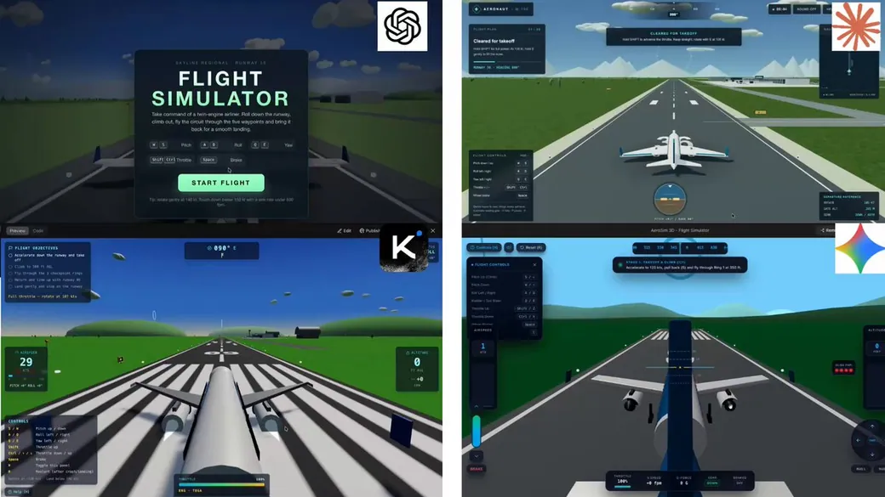</a>

**Prompt**

```text
Erstelle von Grund auf ein ausgearbeitetes, spielbares 3D-Flugsimulatorspiel für den Browser.

Ziel ist ein kleines, aber wirklich spielbares Flugsimulationserlebnis – keine statische 3D-Szene.

GAMEPLAY
- Erstelle einen Flughafen mit detaillierter Start- und Landebahn, Rollweg, Terminal/Gebäuden, Gras/Gelände, Bahnmarkierungen und -beleuchtung sowie Himmel und Wolken.
- Platziere ein gut erkennbares Passagierflugzeug am Flughafen.
- Das Flugzeug muss sich mit der Tastatur steuern lassen.
- Implementiere Schub, Nick-, Roll- und Gierbewegung sowie Bremsen.
- Das Flugzeug muss über grundlegende, glaubwürdige Flugphysik, Trägheit und Beschleunigung verfügen.
- Der Spieler soll auf der Startbahn beschleunigen, abheben, um den Flughafen fliegen, die Start- und Landebahn anfliegen und landen können.
- Füge ein einfaches Ziel hinzu: abheben, einen kurzen Flug rund um den Flughafen absolvieren und sicher landen.
- Integriere eine Erkennung von Abstürzen/Fehlschlägen und eine Neustartoption.

CONTROLS
Zeige die Steuerung übersichtlich an:
- W/S: Nicken
- A/D: Rollen
- Q/E: Gieren
- Umschalttaste/Strg: Schub
- Leertaste: Bremsen

CAMERA
- Verwende eine flüssige Verfolgerkamera in der Third-Person-Perspektive hinter dem Flugzeug.
- Das Flugzeug muss während des Flugs gut sichtbar bleiben.
- Die Kamera soll der Bewegung flüssig folgen und subtil auf Beschleunigung reagieren.

HUD
Erstelle ein ausgearbeitetes HUD im Stil der Luftfahrt mit folgenden Anzeigen:
- Fluggeschwindigkeit
- Flughöhe
- Kurs
- Schub
- Vertikalgeschwindigkeit
- Flugstatus
- Aktuelles Ziel

Füge ein kompaktes Steuerungs-/Hilfefenster hinzu, das ausgeblendet werden kann.

START + ERGEBNISSE
Erstelle einen Startbildschirm mit:
„FLUGSIMULATOR“
und einer gut sichtbaren Schaltfläche „FLUG STARTEN“.

Zeige nach einer erfolgreichen Landung Folgendes an:
- Flug abgeschlossen
- Landungsqualität
- Flugzeit
- Endpunktzahl
- Erneut spielen

VISUELLE QUALITÄT
Es soll sich wie ein echtes Spiel anfühlen:
- Einheitliche, stilisierte 3D-Optik
- Detailliertes Flugzeug
- Attraktive Flughafenumgebung
- Gute Beleuchtung, Schatten und Materialien
- Wolken/Atmosphäre
- Flughafengebäude, Fahrzeuge, Schilder, Bäume und weitere Umgebungsdetails, sofern passend
- Vermeide eine leere oder offensichtlich unfertige Szene

FEEDBACK
Füge hilfreiches Feedback zu folgenden Punkten hinzu:
- Schub-/Triebwerksstatus
- Start
- Landung
- Geschwindigkeitswarnungen
- Flughöhe
- Abstürze
- Erfolgreiche Landung

TECHNICAL
- Erstelle das vollständige, funktionierende Spiel im Browser.
- Lass keine Platzhalter-Schaltflächen oder vorgetäuschten Interaktionen zurück.
- Priorisiere reaktionsschnelle Steuerung und flüssige Performance.
- Verwende geeignete verfügbare Web-/3D-Technologien.

WICHTIG:
Verwende nicht die gesamte Aufgabe darauf, eine schöne statische Szene zu erstellen. Das Flugzeug MUSS tatsächlich steuerbar sein, und der vollständige Ablauf muss funktionieren:

START → BESCHLEUNIGEN → ABHEBEN → FLIEGEN → ANFLUG → LANDEN → PUNKTZAHL → ERNEUT SPIELEN

Führe das Spiel vor dem Abschluss im Browser aus und teste den gesamten Spielablauf selbst. Behebe dabei gefundene Probleme mit Steuerung, Physik, Darstellung und Interaktionen.
```

<details>
<summary>Original-Prompt</summary>

```text
Build a polished, playable browser-based 3D flight simulator game from scratch.

The goal is to create a small but genuinely playable flight-sim experience, not a static 3D scene.

GAMEPLAY
- Create an airport with a detailed runway, taxiway, terminal/buildings, grass/terrain, runway markings/lights, sky and clouds.
- Place a recognizable passenger airplane at the airport.
- The player must be able to control the aircraft with the keyboard.
- Implement throttle, pitch, roll, yaw and braking.
- The aircraft must have basic believable flight physics, momentum and acceleration.
- The player should be able to accelerate down the runway, take off, fly around the airport, approach the runway and land.
- Add a simple objective: take off, complete a short flight around the airport and land safely.
- Include crash/failure detection and a restart option.

CONTROLS
Display controls clearly:
- W/S: Pitch
- A/D: Roll
- Q/E: Yaw
- Shift/Ctrl: Throttle
- Space: Brake

CAMERA
- Use a smooth third-person chase camera behind the aircraft.
- Keep the aircraft clearly visible during flight.
- Camera should smoothly follow movement and respond subtly to acceleration.

HUD
Create a polished aviation-style HUD showing:
- Airspeed
- Altitude
- Heading
- Throttle
- Vertical speed
- Flight status
- Current objective

Include a compact controls/help panel that can be hidden.

START + RESULTS
Create a start screen with:
"FLIGHT SIMULATOR"
and a prominent "START FLIGHT" button.

After a successful landing, show:
- Flight completed
- Landing quality
- Flight time
- Final score
- Play Again

VISUAL QUALITY
Make it feel like a real game:
- Cohesive stylized 3D visuals
- Detailed aircraft
- Attractive airport environment
- Good lighting, shadows and materials
- Clouds/atmosphere
- Airport buildings, vehicles, signs, trees and other environmental details where appropriate
- Avoid an empty or obviously unfinished scene

FEEDBACK
Add useful feedback for:
- Throttle/engine state
- Takeoff
- Landing
- Speed warnings
- Altitude
- Crashes
- Successful landing

TECHNICAL
- Build the complete working game in the browser.
- Do not leave placeholder buttons or fake interactions.
- Prioritize responsive controls and smooth performance.
- Use whatever appropriate web/3D technologies are available.

IMPORTANT:
Do not spend the entire task making a beautiful static scene. The aircraft MUST actually be controllable and the complete loop must work:

START → ACCELERATE → TAKE OFF → FLY → APPROACH → LAND → SCORE → PLAY AGAIN

Before finishing, run the game in the browser and test the entire gameplay loop yourself. Fix broken controls, physics, visual bugs and interaction issues you find.
```

</details>

[Details ansehen ↗](https://www.tripo3d.ai/de/3d-prompts/gpt-6-astra-2096236137266512181) · [Originalbeitrag](https://x.com/adxtyahq/status/2096236137266512181) · [Zurück zu den Beispielen](#all-prompts)

---

<a id="procedural-napoleon-bust-2096234355395903672"></a>

### Prozedurale Napoleon-Büste

[Le PLOUTOS](https://x.com/leploutos) · 2026-09-05 · GPT-6 Astra · Assets

<a href="https://www.tripo3d.ai/de/3d-prompts/procedural-napoleon-bust-2096234355395903672">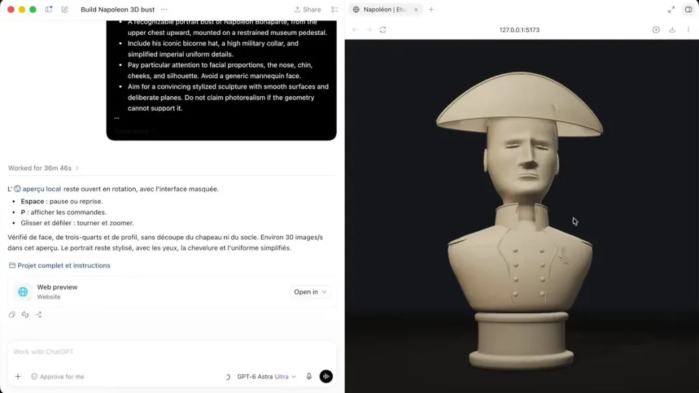</a>

*Arbeitsanweisung auf Grundlage des verlinkten Werks*

**Prompt**

```text
Programmiere eine 3D-Büste Napoleons in Three.js. Baue sie schrittweise, prüfe unterschiedliche Ansichten und verbessere Gesichtsproportionen und Kleidungsdetails.
```

[Details ansehen ↗](https://www.tripo3d.ai/de/3d-prompts/procedural-napoleon-bust-2096234355395903672) · [Originalbeitrag](https://x.com/leploutos/status/2096234355395903672) · [Zurück zu den Beispielen](#all-prompts)

---

<a id="railway-station-concourse-2096226711222546461"></a>

### Bahnhofshalle

[Wormhole404](https://x.com/0xWormhole404) · 2026-09-05 · GPT-6 Astra · Szenen

<a href="https://www.tripo3d.ai/de/3d-prompts/railway-station-concourse-2096226711222546461">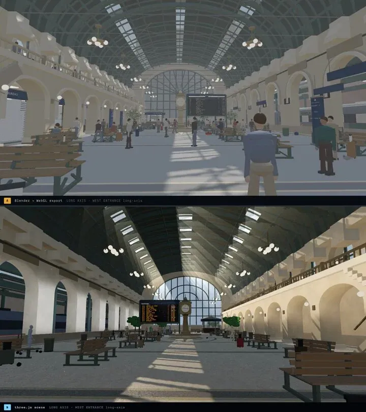</a>

*Arbeitsanweisung auf Grundlage des verlinkten Werks*

**Prompt**

```text
Erstelle eine Bahnhofshalle mit starkem architektonischem Rhythmus, glaubwürdigem Maßstab und überzeugenden Materialien. Liefere eine untersuchbare 3D-Szene mit sorgfältig komponierten Bahnhofsansichten.
```

[Details ansehen ↗](https://www.tripo3d.ai/de/3d-prompts/railway-station-concourse-2096226711222546461) · [Originalbeitrag](https://x.com/0xWormhole404/status/2096226711222546461) · [Zurück zu den Beispielen](#all-prompts)

---

<a id="orbital-rendezvous-simulator-2096225621303042258"></a>

### Simulator für orbitale Rendezvous

[Alican Kiraz](https://x.com/AlicanKiraz0) · 2026-09-05 · GPT-6 Astra · Animation

<a href="https://www.tripo3d.ai/de/3d-prompts/orbital-rendezvous-simulator-2096225621303042258">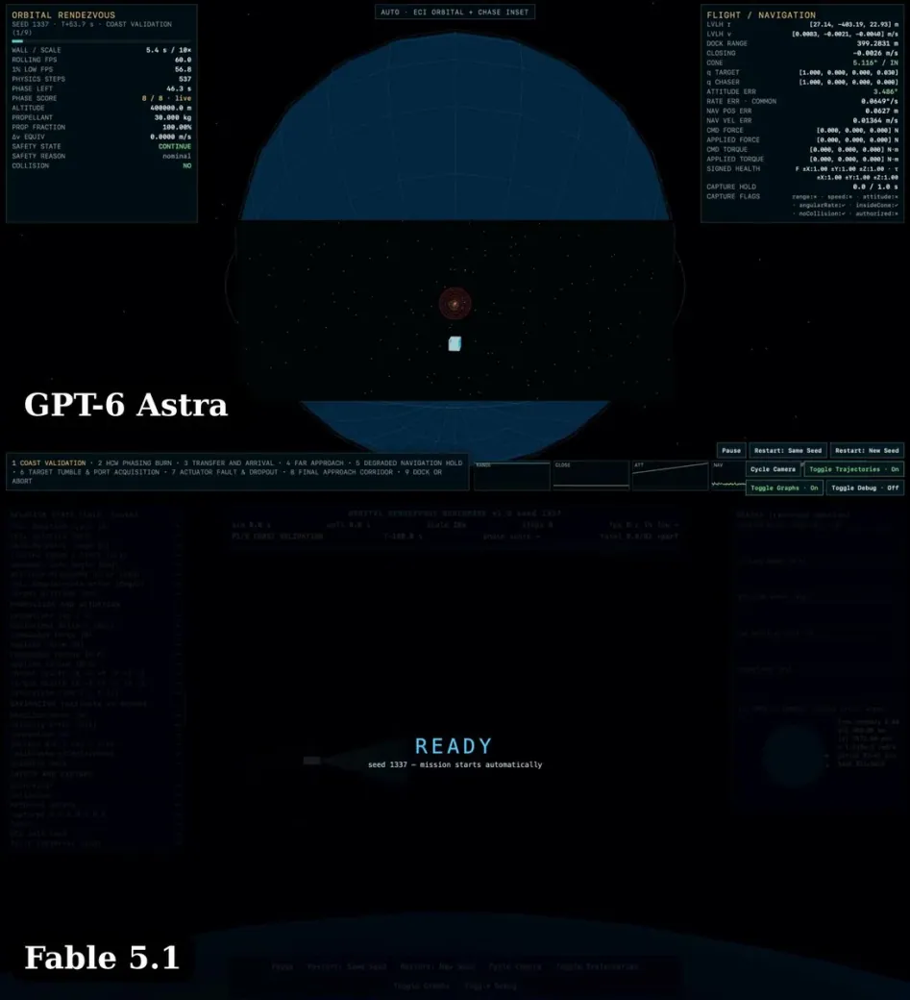</a>

*Arbeitsanweisung auf Grundlage des verlinkten Werks*

**Prompt**

```text
Baue eine Echtzeit-Rendezvous-Simulation mit Zweikörper-ECI-Propagation und HCW-Führung. Integriere Orientierung mit sechs Freiheitsgraden, Treibstoffverbrauch, Kraftgrenzen und ein Andockziel.
```

[Details ansehen ↗](https://www.tripo3d.ai/de/3d-prompts/orbital-rendezvous-simulator-2096225621303042258) · [Originalbeitrag](https://x.com/AlicanKiraz0/status/2096225621303042258) · [Zurück zu den Beispielen](#all-prompts)

---

<a id="animated-onboarding-diorama-2096222790894661841"></a>

### Animiertes Onboarding-Diorama

[Emil](https://x.com/EmilHovv) · 2026-09-05 · GPT-6 Astra · Interaktiv

<a href="https://www.tripo3d.ai/de/3d-prompts/animated-onboarding-diorama-2096222790894661841">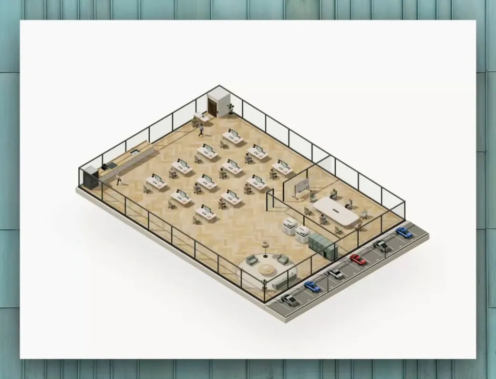</a>

*Arbeitsanweisung auf Grundlage des verlinkten Werks*

**Prompt**

```text
Baue ein kleines Onboarding-Diorama in Blender und belebe es in Three.js. Erkläre die ersten Nutzeraktionen mit klaren Blickpunkten und kurzen Animationssequenzen.
```

[Details ansehen ↗](https://www.tripo3d.ai/de/3d-prompts/animated-onboarding-diorama-2096222790894661841) · [Originalbeitrag](https://x.com/EmilHovv/status/2096222790894661841) · [Zurück zu den Beispielen](#all-prompts)

---

<a id="exploded-interactive-human-anatomy-2096221988763173186"></a>

### Interaktive Anatomie in Explosionsansicht

[ashe](https://x.com/ashebytes) · 2026-09-05 · GPT-6 Astra · Interaktiv

<a href="https://www.tripo3d.ai/de/3d-prompts/exploded-interactive-human-anatomy-2096221988763173186">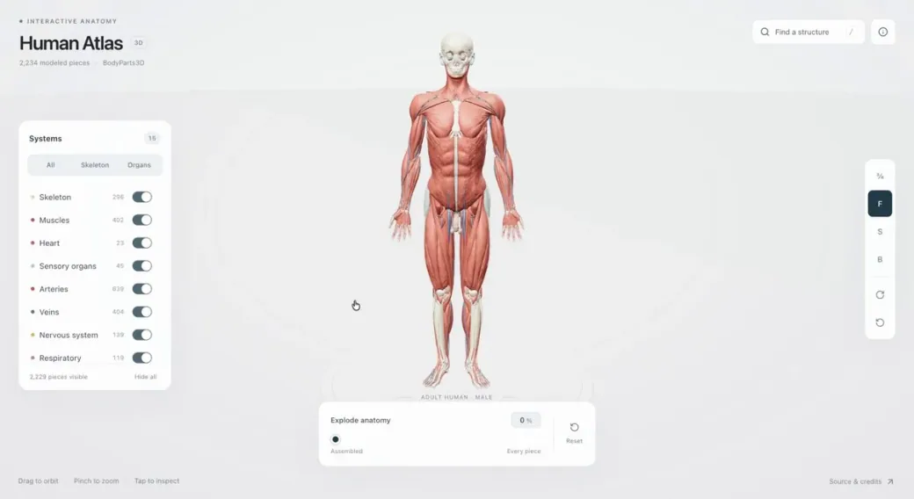</a>

*Arbeitsanweisung auf Grundlage des verlinkten Werks*

**Prompt**

```text
Baue eine 3D-Anatomiewebsite, auf der sich der menschliche Körper in einzeln untersuchbare Strukturen zerlegt. Mache die Explosionsansicht navigierbar und ordne Teile sinnvollen Organsystemen zu.
```

[Details ansehen ↗](https://www.tripo3d.ai/de/3d-prompts/exploded-interactive-human-anatomy-2096221988763173186) · [Originalbeitrag](https://x.com/ashebytes/status/2096221988763173186) · [Zurück zu den Beispielen](#all-prompts)

---

<a id="a-storm-trapped-in-a-cube-2096220264413409648"></a>

### Ein Sturm in einem Würfel

[zcw](https://x.com/zwb44) · 2026-09-05 · GPT-6 Astra · Animation

<a href="https://www.tripo3d.ai/de/3d-prompts/a-storm-trapped-in-a-cube-2096220264413409648">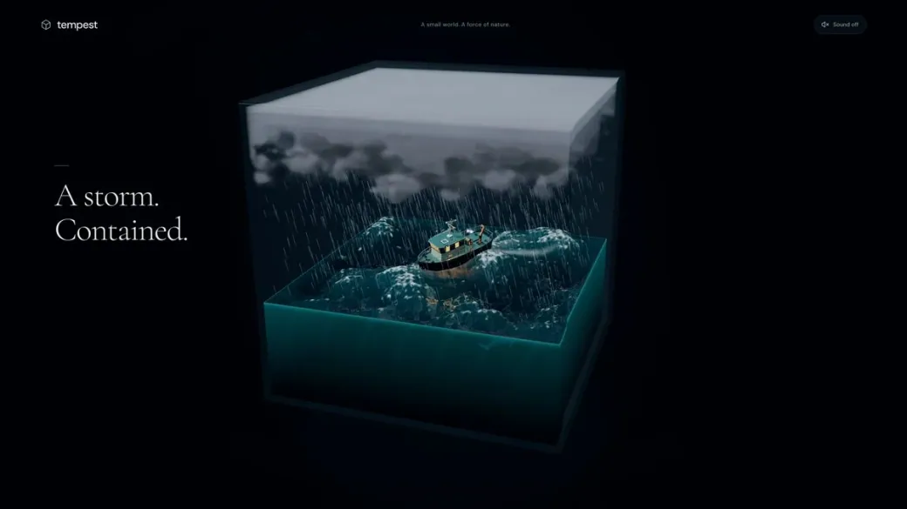</a>

*Arbeitsanweisung auf Grundlage des verlinkten Werks*

**Prompt**

```text
Generiere in Three.js einen in einem Würfel gefangenen Sturm mit steuerbarem Wetter.
```

[Details ansehen ↗](https://www.tripo3d.ai/de/3d-prompts/a-storm-trapped-in-a-cube-2096220264413409648) · [Originalbeitrag](https://x.com/zwb44/status/2096220264413409648) · [Zurück zu den Beispielen](#all-prompts)

---

<a id="gpt-6-astra-2096219700879331665"></a>

### Spielbares Roblox-Kart-Rennspiel mit individuellen 3D-Assets

[Givros](https://x.com/givros) · 2026-09-05 · GPT-6 Astra · Spiele

<a href="https://www.tripo3d.ai/de/3d-prompts/gpt-6-astra-2096219700879331665">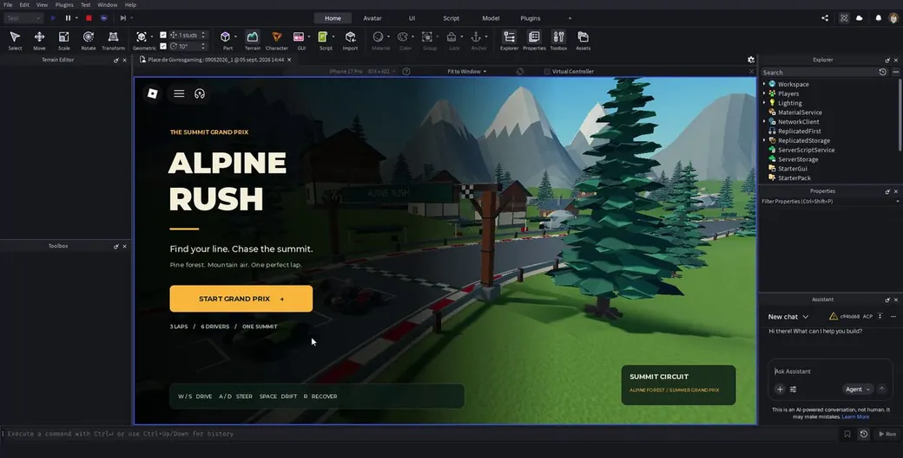</a>

**Prompt**

```text
Erstelle in Roblox Studio über Roblox MCP ein fertiges, hochwertiges Kart-Rennspiel. Erzeuge mit Blender und der prozeduralen Generierung in Three.js stimmige, detailreiche Assets. Finalisiere Meshes, UVs und gebackene Texturen in Blender und importiere sie anschließend als optimierte Roblox MeshParts mit kompatiblen PBR-Texturen. Überprüfe Maßstab, Pivot-Punkte, Materialien und Kollisionen im Spiel. Verwende das native Roblox-Rendering und Luau für das Gameplay; Three.js dient nur zur Asset-Erstellung und nicht als Laufzeitumgebung. Priorisiere eine einzige atmosphärische, vollständig ausgestaltete Rennstrecke mit direkter Steuerung und responsivem Drifting, KI-Gegnern, Checkpoints, Rundenanzeige sowie einem vollständigen Ablauf vom Countdown bis zum Ergebnisbildschirm mit Neustart. Verfeinere Beleuchtung, VFX, Audio und UI. Spiele vollständige Rennen, prüfe echte Gameplay-Screenshots und überarbeite das Projekt, bis fehlerhafte Importe, Darstellungsfehler und Gameplay-Bugs behoben sind und die Performance flüssig bleibt. Keine Platzhalter, groben Assets oder prototypischen Grafiken. Liefere das vollständig zusammengestellte, spielbare Roblox-Erlebnis – nicht nur Skripte oder exportierte Assets.
```

<details>
<summary>Original-Prompt</summary>

```text
Build a finished, polished kart racer in Roblox Studio via Roblox MCP. Create cohesive, detailed assets using Blender and Three.js procedural generation; finalize meshes, UVs, and baked textures in Blender, then import as optimized Roblox MeshParts with compatible PBR textures. Verify scale, pivots, materials, and collisions in-game. Use Roblox-native rendering and Luau gameplay; Three.js is an asset-generation tool, not the runtime. Prioritize one beautiful, fully dressed circuit with responsive driving/drifting, AI opponents, checkpoints, lap tracking, and a complete countdown-to-results loop with restart. Polish lighting, VFX, audio, and UI. Playtest full races, inspect actual gameplay screenshots, and iterate until broken imports, visual defects, and gameplay bugs are fixed while maintaining smooth performance. No placeholders, crude assets, or prototype visuals. Deliver the fully assembled, playable Roblox experience—not just scripts or exported assets.
```

</details>

[Details ansehen ↗](https://www.tripo3d.ai/de/3d-prompts/gpt-6-astra-2096219700879331665) · [Originalbeitrag](https://x.com/givros/status/2096219700879331665) · [Zurück zu den Beispielen](#all-prompts)

---

<a id="gpt-6-astra-2096213850383331489"></a>

### Interaktiver Pelikan auf einem Fahrrad

[AI Builder Club](https://x.com/aibuilderclub_) · 2026-09-05 · GPT-6 Astra · Interaktiv

<a href="https://www.tripo3d.ai/de/3d-prompts/gpt-6-astra-2096213850383331489">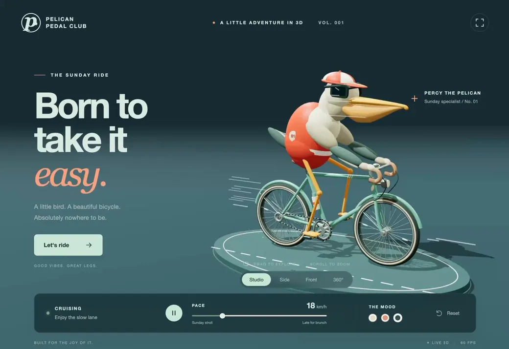</a>

**Prompt**

```text
Erstelle eine stilvolle, interaktive 3D-Szene mit einem Pelikan, der Fahrrad fährt, und stelle sie im Browser dar.
Der Pelikan soll eine rot-weiße Radfahrkappe und eine Sonnenbrille tragen. Verleihe dem Fahrrad einen mintgrünen Vintage-Rahmen und füge animierte Geschwindigkeitslinien hinzu, um die Bewegung zu betonen.
Lass mich die Szene drehen, hineinzoomen und die Fahrgeschwindigkeit anpassen. Achte besonders auf die Fahrradgeometrie, die Proportionen der Figur und eine natürliche Tretbewegung. Halte die Animation auch bei wechselnder Geschwindigkeit flüssig.
Gestalte die Seite hochwertig und bereit für eine öffentliche Demo – mit durchdachter Beleuchtung, einer stimmigen Farbpalette und übersichtlichen Steuerelementen.
Teste sie selbst im Browser und behebe vor dem Abschluss alle visuellen oder Interaktionsfehler.
```

<details>
<summary>Original-Prompt</summary>

```text
Create a stylish, interactive 3D scene of a pelican riding a bicycle, and display it in the browser.
The pelican should wear a red-and-white cycling cap and sunglasses. Give the bicycle a mint-green vintage frame, and add animated speed lines to emphasize motion.
Let me rotate the scene, zoom in, and adjust the cycling speed. Pay close attention to bicycle geometry, character proportions, and natural pedaling motion. Keep the animation smooth as the speed changes.
Make the page polished and ready for a public demo, with thoughtful lighting, a cohesive color palette, and clean controls.
Test it in the browser yourself and fix any visual or interaction bugs before finishing.
```

</details>

[Details ansehen ↗](https://www.tripo3d.ai/de/3d-prompts/gpt-6-astra-2096213850383331489) · [Originalbeitrag](https://x.com/aibuilderclub_/status/2096213850383331489) · [Zurück zu den Beispielen](#all-prompts)

---

<a id="ox-vice-drive-open-city-racer-2096206082712768897"></a>

### OX Vice Drive: Rennen in einer offenen Stadt

[DomX](https://x.com/qok_ai) · 2026-09-05 · GPT-6 Astra · Spiele

<a href="https://www.tripo3d.ai/de/3d-prompts/ox-vice-drive-open-city-racer-2096206082712768897">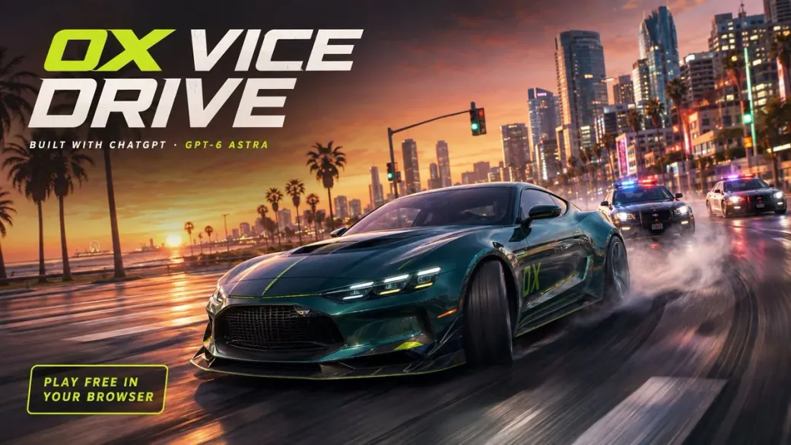</a>

*Arbeitsanweisung auf Grundlage des verlinkten Werks*

**Prompt**

```text
Baue ein offenes Browser-Stadtfahrspiel mit Verkehr, Driften und Lieferfahrten als Rennen. Entwirf eine Küstenstadt, deren Navigation Spaß macht und einen vollständigen Fahrablauf ermöglicht.
```

[Details ansehen ↗](https://www.tripo3d.ai/de/3d-prompts/ox-vice-drive-open-city-racer-2096206082712768897) · [Originalbeitrag](https://x.com/qok_ai/status/2096206082712768897) · [Zurück zu den Beispielen](#all-prompts)

---

<a id="a-playful-toddler-toy-world-2096201415051911597"></a>

### Verspielte Kleinkind-Spielzeugwelt

[AI少年](https://x.com/aehyok) · 2026-09-05 · GPT-6 Astra · Interaktiv

<a href="https://www.tripo3d.ai/de/3d-prompts/a-playful-toddler-toy-world-2096201415051911597">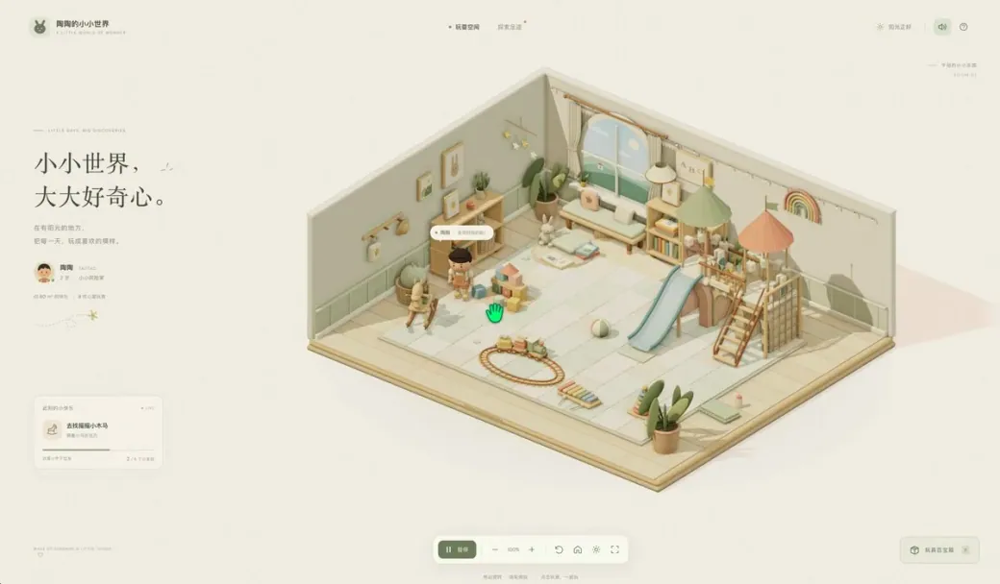</a>

*Arbeitsanweisung auf Grundlage des verlinkten Werks*

**Prompt**

```text
Baue ein warmes Three.js-Spielzimmer, in dem ein Kleinkind zwischen Spielzeugen wechselt und jedes anders animiert benutzt. Ergänze Spielmatte, Bücher, Regale, Klettergeräte sowie Orbit- und Zoomsteuerung.
```

[Details ansehen ↗](https://www.tripo3d.ai/de/3d-prompts/a-playful-toddler-toy-world-2096201415051911597) · [Originalbeitrag](https://x.com/aehyok/status/2096201415051911597) · [Zurück zu den Beispielen](#all-prompts)

---

<a id="reference-image-tugboat-assembly-2096180220839760375"></a>

### Schlepperbaugruppe nach Referenzbildern

[Alex](https://x.com/NarvisAlex) · 2026-09-05 · GPT-6 Astra · Assets

<a href="https://www.tripo3d.ai/de/3d-prompts/reference-image-tugboat-assembly-2096180220839760375">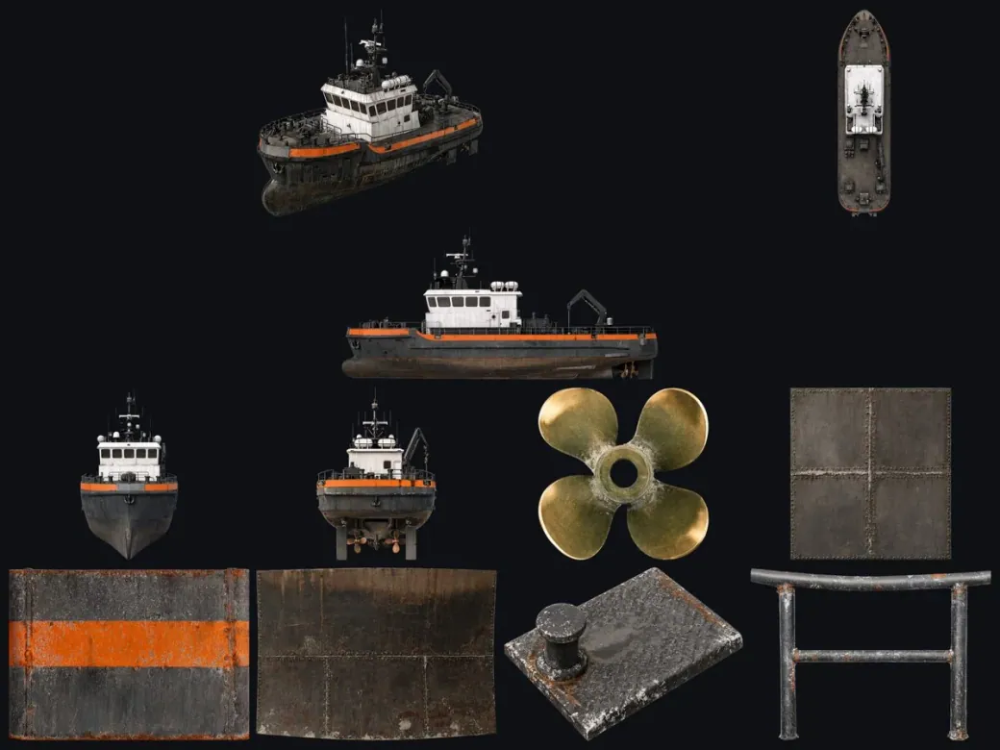</a>

*Arbeitsanweisung auf Grundlage des verlinkten Werks*

**Prompt**

```text
Rekonstruiere einen Schlepper in Blender aus Referenzbildern. Modelliere Rumpf, geneigtes Steuerhaus, Decksbeschläge und Schleppausrüstung und löse widersprüchliche Ansichten zu einem stimmigen Schiff auf.
```

[Details ansehen ↗](https://www.tripo3d.ai/de/3d-prompts/reference-image-tugboat-assembly-2096180220839760375) · [Originalbeitrag](https://x.com/NarvisAlex/status/2096180220839760375) · [Zurück zu den Beispielen](#all-prompts)

---

<a id="zubli-a-responsive-webgl-character-2096180133803561376"></a>

### Zubli: eine reaktionsfähige WebGL-Figur

[CoXis](https://x.com/coxis) · 2026-09-05 · Claude Fable 5.1 · Animation

<a href="https://www.tripo3d.ai/de/3d-prompts/zubli-a-responsive-webgl-character-2096180133803561376">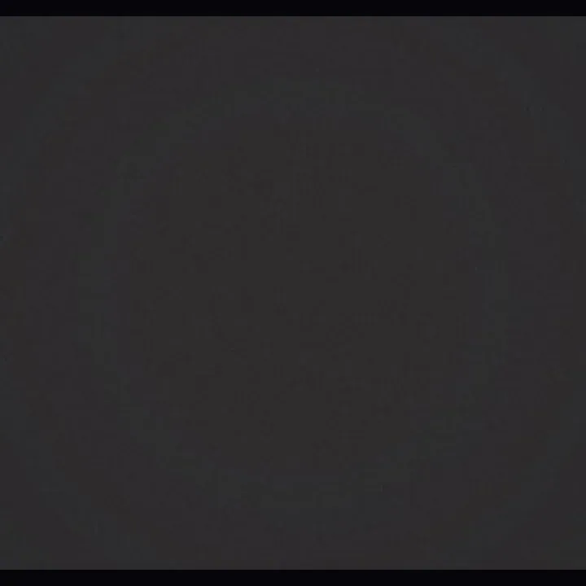</a>

*Arbeitsanweisung auf Grundlage des verlinkten Werks*

**Prompt**

```text
Verwandle sechs statische Figurenposen in eine WebGL-Figur, die atmet, blinzelt, winkt und dem Cursor folgt. Optimiere Verformung und Rendering für flüssige 60 FPS.
```

[Details ansehen ↗](https://www.tripo3d.ai/de/3d-prompts/zubli-a-responsive-webgl-character-2096180133803561376) · [Originalbeitrag](https://x.com/coxis/status/2096180133803561376) · [Zurück zu den Beispielen](#all-prompts)

---

<a id="marine-life-in-a-coffee-cup-2096174858837074198"></a>

### Meeresleben in einer Kaffeetasse

[Sagi Polaczek 🦜](https://x.com/PolaczekSagi) · 2026-09-05 · GPT-6 Astra · Szenen

<a href="https://www.tripo3d.ai/de/3d-prompts/marine-life-in-a-coffee-cup-2096174858837074198">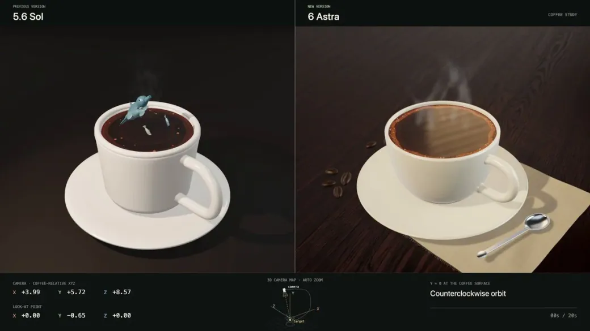</a>

*Arbeitsanweisung auf Grundlage des verlinkten Werks*

**Prompt**

```text
Erstelle ein Miniatur-Meeresökosystem in einer Kaffeetasse in Three.js. Enthülle das Wasserleben mit einer gezielten Kamera, während Tasse und kleine Größenverhältnisse klar erkennbar bleiben.
```

[Details ansehen ↗](https://www.tripo3d.ai/de/3d-prompts/marine-life-in-a-coffee-cup-2096174858837074198) · [Originalbeitrag](https://x.com/PolaczekSagi/status/2096174858837074198) · [Zurück zu den Beispielen](#all-prompts)

---


[Vollständiger Katalog](catalog.de.md) · [←](catalog.de.3.md) · **4 / 9** · [→](catalog.de.5.md)

<p align="center"><strong><a href="https://www.tripo3d.ai/de/3d-prompts?utm_source=github&amp;utm_medium=referral&amp;utm_campaign=awesome_3d_prompts&amp;utm_content=catalog_footer">Vollständiger Katalog →</a></strong></p>
