<!-- Generated from Growth CMS by templates/catalog.md. Edit content in CMS; run npm run sync. -->

# Awesome 3D Prompts — 1 / 10

[← Awesome 3D Prompts](../README.md)

<p>
  <a href="../docs/catalog.en.1.md"></a>
  <a href="../docs/catalog.zh.1.md"></a>
  <a href="../docs/catalog.zh-Hant.1.md"></a>
  <a href="../docs/catalog.ja.1.md"></a>
  <a href="../docs/catalog.ko.1.md"></a>
  <a href="../docs/catalog.es.1.md"></a>
  <a href="../docs/catalog.pt.1.md"></a>
  <a href="../docs/catalog.de.1.md"></a>
  <a href="../docs/catalog.fr.1.md"></a>
  <a href="../docs/catalog.it.1.md"></a>
  <a href="../docs/catalog.ru.1.md"></a>
  <a href="../docs/catalog.tr.1.md"></a>
  <a href="../docs/catalog.uk.1.md"></a>
  <a href="../docs/catalog.vi.1.md"></a>
</p>

[Catálogo completo](catalog.es.md) · **1 / 10** · [→](catalog.es.2.md)

<a id="all-prompts"></a>

<details>
<summary>Explorar ejemplos (50)</summary>

- [Set de LEGO del Ford Model T con todas sus funciones](#claude-opus-5-5-2104232297167716457)
- [FPS multijugador hiperrealista en un callejón nevado](#claude-opus-5-5-2104232013578617241)
- [Escena 3D de 55 segundos: del centro de datos al átomo](#claude-opus-5-5-2104223449849761837)
- [Promo dinámica de motion graphics de 30 segundos](#claude-opus-5-5-2104204312624918810)
- [CG 3D de estilo anime con tres vehículos que se transforman y se combinan](#claude-opus-5-5-2104193522715029657)
- [Animación de interfaz de una esfera de IA para Claude Code — Opus 5.5](#claude-opus-5-5-2104162483888062945)
- [Demostración interactiva en 3D del recorrido de la luz por un objetivo de cámara](#gpt-6-astra-2104077535315144878)
- [Captura del propulsor Super Heavy en Blender](#gpt-6-astra-2103966922127630820)
- [Entorno de aldea forestal junto a un lago](#gpt-6-astra-2103860776419111285)
- [Escena WebGL de un barco de vóxeles dentro de una botella](#gpt-6-astra-2103855977376125161)
- [Vídeo gráfico de motion design pulido de 15 segundos](#claude-opus-5-5-2103846630088716687)
- [Juego de vóxeles estilo Minecraft con shaders avanzados](#claude-opus-5-5-2103822946800165270)
- [Vídeo de motion graphics inspirado en Spotify](#claude-opus-5-5-2103801834930606193)
- [Showreel dinámico de diseño de movimiento de 15 segundos](#claude-opus-5-5-2103504887439065439)
- [Juego de supervivencia sandbox en WebGL2](#claude-opus-5-5-2103502454750920925)
- [Jardín japonés estilo vóxel en Three.js](#gpt-6-astra-2103486103831339269)
- [Navega por una pagoda en 3D](#claude-opus-5-5-2103483174957597035)
- [Crear un conejillo de Indias en Blender](#gpt-6-astra-2103482826519986544)
- [Pueblo 3D de cerezos en flor, estilo anime y de libre exploración](#claude-opus-5-5-2103480081809346597)
- [Modelado 3D de ropa para VRChat](#gpt-6-astra-2103456264785424530)
- [Pitaya Jelly](#gpt-6-astra-2103432732386664591)
- [Animación de motion graphics sobre el ciclo de la vida](#claude-opus-5-5-2103428454355980558)
- [Escena de campo de batalla romano a la hora dorada](#gpt-6-astra-2103351755971207251)
- [STILLWATER — Experiencia de pantano iluminado por la luna en el navegador](#gpt-6-astra-2103308083242082314)
- [Secuencia interactiva de lanzamiento de un cohete en 3D sobre el océano](#claude-opus-5-5-2103303303358534021)
- [Reino medieval interactivo para Claude Opus 5.5](#claude-opus-5-5-2103257687492374597)
- [Experiencia explorable de otoño brumoso en Three.js](#gpt-6-astra-2103211135214256350)
- [Rumbo al norte: viaje interactivo en un barco vikingo](#gpt-6-astra-2103187935759655167)
- [Espacio: un cortometraje de una catedral llena de luz de vitrales](#claude-opus-5-5-2103145567945986461)
- [Juego al estilo de Genshin Impact ambientado en San Francisco](#claude-opus-5-5-2103144530157687114)
- [Película cinematográfica sobre la batalla de Austerlitz](#claude-opus-5-5-2103116235009347650)
- [Construye la Torre Eiffel en Three.js](#claude-opus-5-5-2103106070549757960)
- [Crazy Tanks — Artillería 3D en una isla](#crazy-tanks-3d-island-artillery)
- [Animación en Three.js con calidad Pixar para Grid Genius](#claude-opus-5-5-2103087766662009118)
- [Juego de ciclismo con un pelícano en tiempo real](#claude-opus-5-5-2103083781490176212)
- [Rodaja de cítrico de gominola 3D interactiva](#gpt-6-astra-2103062348168618280)
- [Construye una ciudad imperial](#claude-opus-5-5-2103046279253168554)
- [Codex voxelizado en Three.js](#gpt-6-astra-2102956340482289944)
- [Escena HTML hiperrealista e interactiva de una fogata en el desierto](#gpt-6-astra-2102915300295369208)
- [Simulador de hamburguesas en primera persona](#gpt-6-astra-2102897258983313712)
- [Crea un Bugatti Chiron Super Sport en Three.js](#claude-opus-5-5-2102828216289566725)
- [Shader de ciudad solarpunk infinita](#gpt-6-astra-2102826333550133520)
- [Montaje de entrenamiento: evolución de Claude](#claude-opus-5-5-2102788371114246177)
- [Crea una animación de dibujos animados de los 90, con calidad de Pixar, en Three.js](#claude-opus-5-5-2102788223835463902)
- [Tablero 3D interactivo para estudiar gambitos de ajedrez](#gpt-6-astra-2102788013902213508)
- [Animación programada del ciclo del agua en bucle continuo](#claude-opus-5-5-2102781807179735211)
- [Castillo medieval europeo en 3D controlable desde el navegador](#gpt-6-astra-2102780850706567390)
- [CatWalk: juego de gatos de desplazamiento lateral en 3D por la ciudad de noche](#claude-opus-5-5-2102775461701091531)
- [Orbit Lab: simulación 3D del Sol, la Tierra y la Luna](#gpt-6-astra-2102752217375899659)
- [Benchmark de megaciudad ciberpunk «The Last Train»](#claude-opus-5-5-2102740078347087940)

</details>
<a id="claude-opus-5-5-2104232297167716457"></a>

### Set de LEGO del Ford Model T con todas sus funciones

[Alex Lieberman](https://x.com/businessbarista) · 2026-09-27 · Claude Opus 5.5 · Recursos

<a href="https://www.tripo3d.ai/es/3d-prompts/claude-opus-5-5-2104232297167716457">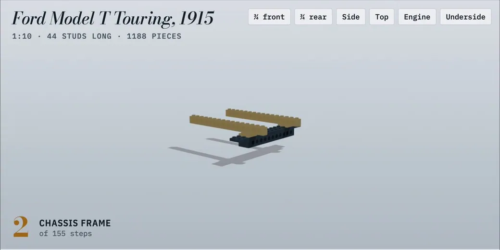</a>

**Prompt**

```text
Quiero construir un set de LEGO del Ford Model T original.

Quiero que tenga todas sus funciones, que incluya movimiento e interactividad siempre que sea posible y que ofrezca una calidad de la que un maestro constructor de LEGO se sentiría orgulloso.

Quiero que el resultado final incluya un renderizado del set de LEGO, todas las piezas que necesito pedir a LEGO y el manual de instrucciones para montarlo.
```

<details>
<summary>Prompt original</summary>

```text
I want to build a lego set of the original ford motel T.

I want it to be feature complete, include motion/interactivity where possible, and be of the quality a lego master builder would be proud of.

I want the final output to include a rendering of the lego set, all of the pieces i need to order from lego, and the instruction manual to build it.
```

</details>

[Ver detalles ↗](https://www.tripo3d.ai/es/3d-prompts/claude-opus-5-5-2104232297167716457) · [Publicación original](https://x.com/businessbarista/status/2104233375791718456) · [Volver a los ejemplos](#all-prompts)

---

<a id="claude-opus-5-5-2104232013578617241"></a>

### FPS multijugador hiperrealista en un callejón nevado

[Zen](https://x.com/zenvnt) · 2026-09-27 · Claude Opus 5.5 · Juegos

<a href="https://www.tripo3d.ai/es/3d-prompts/claude-opus-5-5-2104232013578617241"></a>

**Prompt**

```text
Crea un FPS multijugador hiperrealista. Ambientado en un callejón urbano nevado, rodeado de edificios de ladrillo. Incluye un fusil de asalto con un retroceso contundente y casquillos que salgan despedidos. Añade enemigos a los que disparar, mecánicas para saltar obstáculos y efectos de daño con sangre en pantalla. Haz que el registro de impactos del tiroteo sea impecable y conviértelo, con ese estilo, en un juego completo.
```

<details>
<summary>Prompt original</summary>

```text
Build me a hyper-realistic multiplayer FPS. Set it in a snowy city alleyway with brick buildings. Give me an assault rifle with crispy recoil and flying bullet casings. Add enemies to shoot, vaulting mechanics, and bloody screen damage effects. Make the gunplay hit-reg immaculate and just vibe it out into a full game.
```

</details>

[Ver detalles ↗](https://www.tripo3d.ai/es/3d-prompts/claude-opus-5-5-2104232013578617241) · [Publicación original](https://x.com/zenvnt/status/2104232358811676833) · [Volver a los ejemplos](#all-prompts)

---

<a id="claude-opus-5-5-2104223449849761837"></a>

### Escena 3D de 55 segundos: del centro de datos al átomo

[Crane](https://x.com/Cranefomo) · 2026-09-27 · Claude Opus 5.5 · Escenas

<a href="https://www.tripo3d.ai/es/3d-prompts/claude-opus-5-5-2104223449849761837"></a>

**Prompt**

```text
Crea una escena 3D de 55 segundos. La cámara entra en un centro de datos, abre un rack, desmonta una GPU, se acerca al chip, atraviesa los transistores y llega hasta un solo átomo de silicio. Incluye a la derecha una escala métrica en metros. Usa etiquetas en el idioma del cliente. Debe ejecutarse en un navegador, en un solo archivo y sin dependencias.
```

<details>
<summary>Prompt original</summary>

```text
Give me a 55 second 3D scene. Camera flies into a data center, opens a rack, disassembles a GPU, zooms into the chip, passes through the transistors, lands on a single silicon atom. Scale rail on the right in meters. Labels in the client's language. Runs in a browser, one file, no dependencies.
```

</details>

[Ver detalles ↗](https://www.tripo3d.ai/es/3d-prompts/claude-opus-5-5-2104223449849761837) · [Publicación original](https://x.com/Cranefomo/status/2104223449849761837) · [Volver a los ejemplos](#all-prompts)

---

<a id="claude-opus-5-5-2104204312624918810"></a>

### Promo dinámica de motion graphics de 30 segundos

[Iniyan (ini)](https://x.com/iniyanai) · 2026-09-27 · Claude Opus 5.5 · Animación

<a href="https://www.tripo3d.ai/es/3d-prompts/claude-opus-5-5-2104204312624918810"></a>

**Prompt**

```text
crea un video dinámico de motion graphics de 30 segundos que demuestre lo increíble que eres como diseñador de motion graphics para https://t.co/fCRvqmOamH.
```

<details>
<summary>Prompt original</summary>

```text
make a dynamic 30-second motion graphics video that shows what an incredible motion designer you are for https://t.co/fCRvqmOamH.
```

</details>

[Ver detalles ↗](https://www.tripo3d.ai/es/3d-prompts/claude-opus-5-5-2104204312624918810) · [Publicación original](https://x.com/iniyanai/status/2104204318085931054) · [Volver a los ejemplos](#all-prompts)

---

<a id="claude-opus-5-5-2104193522715029657"></a>

### CG 3D de estilo anime con tres vehículos que se transforman y se combinan

[風の民@](https://x.com/allforbigfire) · 2026-09-27 · Claude Opus 5.5 · Animación

<a href="https://www.tripo3d.ai/es/3d-prompts/claude-opus-5-5-2104193522715029657"></a>

**Prompt**

```text
¿Sería posible crear también en CG 3D de estilo anime una escena en la que tres vehículos, como en un anime de robots, se transformen y se combinen para convertirse en un robot?
```

<details>
<summary>Prompt original</summary>

```text
もしかしてロボットアニメみたいな3機の乗り物が変形合体してロボットになるシーンもアニメ風3D CGで作れますか。
```

</details>

[Ver detalles ↗](https://www.tripo3d.ai/es/3d-prompts/claude-opus-5-5-2104193522715029657) · [Publicación original](https://x.com/allforbigfire/status/2104193522715029657) · [Volver a los ejemplos](#all-prompts)

---

<a id="claude-opus-5-5-2104162483888062945"></a>

### Animación de interfaz de una esfera de IA para Claude Code — Opus 5.5

[leolee](https://x.com/listudio) · 2026-09-27 · Claude Opus 5.5 · Animación

<a href="https://www.tripo3d.ai/es/3d-prompts/claude-opus-5-5-2104162483888062945"></a>

**Prompt**

```text
Pregúntame por: la tarea que el agente de IA completa para el usuario (por defecto: planificar y reservar un viaje de 3 días a Kioto), la paleta (por defecto: lienzo gris cálido #E6E3DE, interfaz en blanco y negro puros; la esfera es el único elemento con color: azul iridiscente perlado → violeta → melocotón) y una canción libre de regalías de unos 120 BPM (busca tú mismo en Mixkit, mide los BPM con numpy y muéstrame 3 candidatas con enlaces de vista previa antes de descargar la pista completa). Animación conceptual de interfaz para una herramienta de agente de chat de IA, con nivel de Dribbble. Una forma blanca, nunca se corta: cada estado es el mismo elemento, que cambia de tamaño, radio y color mientras su contenido se intercambia con un desenfoque breve. La protagonista es una «esfera de IA» creada con GLSL (una masa fluida, palpitante e iridiscente, como la esfera de voz de ChatGPT / Siri) que vive FUERA de la forma como elemento de continuidad y cambia de función a lo largo de la pieza: protagonista en reposo → reacciona a la voz mientras escucha → se encoge y entra en la barra de entrada como avatar → gira más rápido mientras piensa → avatar en la respuesta → florece al completar la tarea → vuelve al reposo. Un cursor controla cada cambio con clics y arrastres reales. Una sola fuente de interfaz limpia (Geist). Muelles en todas partes, con un pequeño sobreimpulso como máximo. La cámara hace zoom para que cada estado ocupe aproximadamente entre el 60 y el 75 % del encuadre. La esfera pulsa sutilmente en cada beat. El último fotograma es el primero, para crear un bucle. Prohibido: easing rebotado, estallidos de partículas, brillos o degradados en la interfaz (la esfera es contenido, no interfaz), trazos de iconos desparejados, tiempos muertos o cualquier cosa que parezca una plantilla. 120 BPM, 8 compases = 32 beats = 16 s; ocurre algo en cada beat (el beat n está en (n-1)*0,5 s): Compás 1: esfera en reposo, el cursor se acerca | clic en la esfera → la forma se estira hasta convertirse en una píldora «LISTENING», la esfera se desplaza a su izquierda y se balancea siguiendo una envolvente silábica | la transcripción en directo escribe «Plan 3 days in Kyoto» | «…por debajo de 1.500», el valor se actualiza en directo | arrastra más allá de 1.248, el «cheapest plan» Compás 6: control deslizante → gesto negro de deslizar para confirmar «Book trip · $1,248» | agarra el control y arrástralo a la derecha | al superar el final → banda elástica | suelta → se ajusta al final y la flecha se convierte en un indicador de carga Compás 7: → aviso «Trip booked» | aparecen los chips «Flights ✓» y «Ryokan ✓» | la esfera florece (color + escala) | el aviso se contrae hacia la esfera Compás 8: la forma se desvanece y la esfera recupera su tamaño protagonista | se estabiliza | respira al ritmo, el cursor se aleja | vuelve al reposo (bucle) 1. Un único archivo HTML autocontenido, cuadrado de 1440×1440, con las fuentes y los recursos sin audio integrados como URI de datos. Cada estilo se calcula a partir del tiempo dentro de un `seek(t)` puro: sin transiciones CSS, sin temporizadores, sin estado conservado entre fotogramas y nunca crees pistas dentro de seek. 2. Los muelles son respuestas escalonadas en forma cerrada. Un valor cuyo objetivo cambia muchas veces es la suma de un muelle por cada cambio; para crear el bucle, toma el ÚLTIMO objetivo como valor inicial y añade también las colas de los muelles de los dos ciclos anteriores (t + L, t + 2L), de modo que la posición Y la velocidad coincidan en la unión. Relación de amortiguación ≥ 0,72. 3. Las capas de contenido tienen sus propias ventanas de entrada y salida: la salida termina exactamente en el beat, la entrada comienza unos 80 ms después (opacidad + desenfoque de pantalla de unos 12 px + escala de 0,965→1), o el texto se superpone. 4. Los arrastres son manipulación directa: mientras se mantiene pulsado, el valor = inicio + (cursorX − cursorX al pulsar); al superar un límite, aplica rubber(over, R) = R·(1 − e^(−over/R)); al soltar, un muelle libre parte de la posición Y velocidad de liberación hasta el objetivo de ajuste. Los puntos de paso del cursor son [tiempo de salida, x, y] en un muelle; el punto de paso final es igual al primero para que la posición y la velocidad del cursor sean continuas a través del bucle. 5. La esfera: un shader de fragmentos WebGL dibujado en un lienzo OFFSCREEN de 640×640, que después se dibuja sincrónicamente mediante drawImage en un lienzo 2D visible dentro de seek (capturar directamente el lienzo WebGL no es fiable en un entorno sin interfaz). El tiempo debe ser periódico: uniforms (cos, sin)(2π·k·t/L) con k entero (por ejemplo, k=2 y k=5), nunca t sin transformar. El radio de la silueta = 0,74 + amp·noise(direction·1.4 + T), muestreado sobre el vector de dirección unitario (sin unión central); la superficie = ruido 3D de baja frecuencia con deformación de dominio sobre la normal de la esfera → grandes bandas de color suaves; 16 % de blanco perlado, un núcleo interior brillante, un pequeño brillo especular definido (pow 70), un borde fresnel lila pálido; mitad inferior más oscura para dar volumen; sombra elíptica suave bajo la esfera en reposo. Uniformes: amp (en reposo 0,08, + envolvente silábica mientras escucha, + un poco mientras piensa), think (deformación más intensa y rápida), bloom (estallido de color al completar). Mantén ≤5 llamadas a noise por píxel. 6. Audio: analiza la canción con numpy (inicio por flujo espectral, BPM sincronizados por fase, primer beat de cada compás mediante kick + cambio de cromagrama, RMS por compás). Empieza en el primer beat de una frase de 8 compases con toda la energía, para que el bucle de audio termine en el límite de una frase. Las ventanas de análisis grandes estiman los beats unos 15–25 ms antes: vuelve a medir el corte con una ventana de 256 muestras y desplaza el inicio hasta que el residuo mediano sea < 2 ms. Aplica un fundido cruzado de los últimos 60 ms con los 60 ms anteriores al inicio. Sintetiza sonidos de interfaz con numpy (clic, swoosh de envío, agarre/soltado, tic, éxito, campanilla) y coloca cada uno según su PICO MEDIDO en el momento del evento; en los sonidos de varias notas, la primera nota debe ser la más fuerte. 7. Renderiza con Playwright Chromium: 4 subfotogramas por fotograma distribuidos en la mitad de un fotograma (obturador de 180°, centrado en el tiempo del fotograma), con 16 trabajadores en paralelo. Después de cada seek, espera dos requestAnimationFrames antes de la captura de pantalla; NO uses screenshot(animations='disabled'). Como la escena usa WebGL, inicia con --use-gl=angle --use-angle=swiftshader --enable-unsafe-swiftshader --disable-gpu-watchdog (la ruta predeterminada SwiftShader-Vulkan pierde el contexto WebGL la mayoría de las veces). Convierte a RGB cualquier captura RGBA. 8. Codifica con ffmpeg: -reinit_filter 0, tmix=frames=4 y después selecciona cada cuarto fotograma, 60 fps, libx264 -crf 10 -x264-params aq-mode=3, AAC a 256k, -t con la duración exacta. Verifica qué subfotogramas promedia realmente tmix en tu versión de ffmpeg antes de elegir el desplazamiento de select. Crea también una versión para compartir con crf 20 y una copia con 3 bucles. 9. Antes del renderizado completo: renderiza un fotograma en cada beat y otro 0,3 s después, compón hojas de contacto y corrige todo lo que esté fuera de la cuadrícula, apretado, recortado, ilegible o sin la esfera. Después, comprueba visualmente fotogramas de transición a resolución completa. 10. Verifica e informa: las capturas en t=0 y t=L son idénticas píxel por píxel; el número de fotogramas = 960 y el vídeo/audio duran exactamente 16,000 s; la diferencia entre fotogramas en la unión es del mismo orden que la de sus vecinos; no hay subfotogramas RGBA; el desfase del beat del audio final es < 10 ms; muestrea los fotogramas en reposo para confirmar que la esfera aparece en todos. - smoothstep(e0, e1, x) con e0 > e1 no está definido en GLSL — SwiftShader devuelve 0 y la esfera desaparece. Escribe siempre 1.0 - smoothstep(lo, hi, x). - Un shader pesado en GL por software activa el watchdog de la GPU (CONTEXT_LOST_WEBGL): mantén el lienzo en 640² y bajo el número de llamadas a noise; busca mensajes de pérdida de contexto en la consola en cada prueba. - No pongas nunca will-change en nada que la cámara escale, o el texto se renderizará borroso. - Los elementos seguidores (la esfera, los avatares) usan un muelle ligeramente más lento que la forma para que nunca queden recortados por su borde. - Orden de las capas: cualquier elemento con una placa de fondo va ANTES que el texto o los iconos colocados sobre ella. - No anules un translate() de centrado con un transform animado; envuélvelo en una capa. - ffmpeg -shortest puede omitir el último fotograma; establece -t explícitamente. - Haz que el último fotograma sea idéntico al primero, incluida la posición y la velocidad del cursor, o el bucle dará un tirón. Pregúntame por los datos de entrada, crea primero un prototipo del shader de la esfera por separado (renderiza t=0, t=4, t=8 y demuestra que t=0 == t=16 píxel por píxel, sin pérdida de contexto durante 8 cargas de página nuevas), después muéstrame la lista de estados en la cuadrícula de beats de 8 compases como tabla y espera mi OK antes de escribir la escena completa.
```

<details>
<summary>Prompt original</summary>

```text
Ask me for: the task the AI agent completes for the user (default: plan + book a 3-day Kyoto trip), the palette (default: warm-gray canvas #E6E3DE, pure black/white UI, the orb is the only colored thing — pearl iridescent blue → violet → peach), and a royalty-free song around 120 BPM (search Mixkit yourself, measure BPM with numpy, show me 3 candidates with preview links before downloading the full track). Use AskUserQuestion, max 4 questions per round, recommended option first. Dribbble-level UI concept motion for an AI chat agent tool. One white shape, never cut: every state is the same element morphing its size, radius and color while its content swaps with a short blur. The star is a GLSL "AI orb" (fluid, breathing, iridescent blob — like the ChatGPT / Siri voice orb) that lives OUTSIDE the shape as a continuity element and changes role through the film: idle hero → reacts to voice while listening → shrinks into the input bar as an avatar → swirls faster while thinking → avatar on the answer → blooms when the task completes → back to idle. A cursor drives every change with real clicks and drags. One clean UI font (Geist). Springs everywhere, a tiny overshoot at most. The camera zooms so each state fills ~60–75% of the frame. The orb pulses subtly on every beat. The last frame is the first frame, so it loops. Banned: bouncy easing, particle bursts, glows or gradients on UI chrome (the orb is content, not chrome), mismatched icon strokes, dead time, anything that looks like a template. 120 BPM, 8 bars = 32 beats = 16s, something happens on every beat (beat n at (n-1)*0.5s): Bar 1: orb idle, cursor approaches | click orb → shape stretches into a "LISTENING" pill, orb moves to its left and wobbles with a syllable envelope | live transcript types "Plan 3 days in Kyoto" | "…under 1,500, the value rolls live | drag past the 1,248 "cheapest plan" Bar 6: slider → black swipe-to-confirm "Book trip · $1,248" | grab the knob, drag right | past the end → rubber band | release → snaps to the end, arrow becomes a spinner Bar 7: → toast "Trip booked" | chips "Flights ✓" "Ryokan ✓" pop in | orb blooms (color + scale) | toast collapses toward the orb Bar 8: shape fades, orb grows back to hero size | settles | breathes on the beat, cursor drifts out | back to idle (loop) 1. One self-contained HTML file, square 1440x1440, fonts and audio-free assets inlined as data URIs. Every style is computed from time inside a pure `seek(t)`: no CSS transitions, no timers, no state carried between frames, never create tracks inside seek. 2. Springs are closed-form step responses. A value that changes target many times is the sum of one spring per change; to loop, take the LAST target as the start value and also add the spring tails of the previous two cycles (t + L, t + 2L) so position AND velocity match at the seam. Damping ratio ≥ 0.72. 3. Content layers have their own enter/exit windows: exit lands exactly on the beat, enter starts ~80ms later (opacity + ~12px screen blur + 0.965→1 scale), or text overlaps. 4. Drags are direct manipulation: while held, the value = start + (cursorX − cursorX at press); past a limit apply rubber(over, R) = R·(1 − e^(−over/R)); on release a free spring runs from the release position AND velocity to the snap target. Cursor waypoints are [departure time, x, y] on a spring; the final waypoint equals the first so the cursor's position and speed are continuous across the loop. 5. The orb: WebGL fragment shader drawn on an OFFSCREEN 640×640 canvas, then synchronously drawImage'd into a visible 2D canvas inside seek (screenshotting the WebGL canvas directly is unreliable headless). Time must be periodic: uniforms (cos, sin)(2π·k·t/L) with integer k (e.g. k=2 and k=5), never raw t. Silhouette radius = 0.74 + amp·noise(direction·1.4 + T) sampled on the unit direction vector (no center seam); surface = low-frequency domain-warped 3D noise on the sphere normal → large smooth color bands; 16% pearl white, a bright inner core, a small sharp specular (pow 70), a pale lilac fresnel rim; darker lower half for volume; soft elliptical shadow under the idle orb. Uniforms: amp (idle 0.08, + syllable envelope while listening, + a bit while thinking), think (stronger/faster warp), bloom (completion color burst). Keep ≤5 noise calls per pixel. 6. Audio: analyze the song with numpy (spectral-flux onset, phase-locked BPM, downbeat by kick + chroma change, per-bar RMS). Start on the downbeat of a full-energy 8-bar phrase so the audio loop lands on a phrase boundary. Large analysis windows estimate beats ~15–25ms early: re-measure the cut with a 256-sample window and shift the start until the median residual is < 2ms. Crossfade the last 60ms with the 60ms before the start. Synthesize UI sounds with numpy (click, send swoosh, grab/drop, tick, success, chime) and place each by its MEASURED PEAK on the event time; multi-note sounds keep the first note loudest. 7. Render with Playwright Chromium: 4 subframes per frame spread over half a frame (180° shutter, centered on the frame time), 16 parallel workers. After each seek, await two requestAnimationFrames before the screenshot; do NOT use screenshot(animations='disabled'). Because the scene uses WebGL, launch with --use-gl=angle --use-angle=swiftshader --enable-unsafe-swiftshader --disable-gpu-watchdog (the default SwiftShader-Vulkan path loses the WebGL context most of the time). Convert any RGBA screenshot to RGB. 8. Encode with ffmpeg: -reinit_filter 0, tmix=frames=4 then select every 4th frame, 60fps, libx264 -crf 10 -x264-params aq-mode=3, AAC 256k, -t exactly the duration. Verify which subframes tmix actually averages on your ffmpeg version before choosing the select offset. Also make a crf 20 share version and a 3× looped copy. 9. Before the full render: render one frame on each beat and one 0.3s after it, tile them into contact sheets, and fix anything off the grid, cramped, clipped, unreadable, or with the orb missing. Then spot-check transition frames at full resolution. 10. Verify and report: t=0 and t=L screenshots are pixel-identical; frame count = 960 and video/audio are exactly 16.000s; seam frame-diff is the same order as its neighbors; no RGBA subframes; beat offset of the final audio < 10ms; sample the idle frames to confirm the orb is present in every one. - smoothstep(e0, e1, x) with e0 > e1 is undefined in GLSL — SwiftShader returns 0 and the orb vanishes. Always write 1.0 - smoothstep(lo, hi, x). - A heavy shader on software GL triggers the GPU watchdog (CONTEXT_LOST_WEBGL): keep the canvas at 640² and the noise count low; listen for console context-loss messages in every test. - Never put will-change on anything the camera scales, or text renders blurry. - Followers (the orb, avatars) use a slightly slower spring than the shape so they never get clipped by its edge. - Layer order: anything with a background plate goes BEFORE the text/icons that sit on it. - Don't override a centering translate() with an animated transform — wrap it in a layer instead. - ffmpeg -shortest can drop the last frame; set -t explicitly. - Make the last frame identical to the first, cursor position and speed included, or the loop stutters. Ask me for the inputs, prototype the orb shader alone first (render t=0, t=4, t=8 and prove t=0 == t=16 pixel-for-pixel, with no context loss across 8 fresh page loads), then show me the state list on the 8-bar beat grid as a table and wait for my OK before writing the full scene.
```

</details>

[Ver detalles ↗](https://www.tripo3d.ai/es/3d-prompts/claude-opus-5-5-2104162483888062945) · [Publicación original](https://x.com/listudio/status/2104162483888062945) · [Volver a los ejemplos](#all-prompts)

---

<a id="gpt-6-astra-2104077535315144878"></a>

### Demostración interactiva en 3D del recorrido de la luz por un objetivo de cámara

[noah helms](https://x.com/haonv2) · 2026-09-27 · GPT-6 Astra · Interactivo

<a href="https://www.tripo3d.ai/es/3d-prompts/gpt-6-astra-2104077535315144878">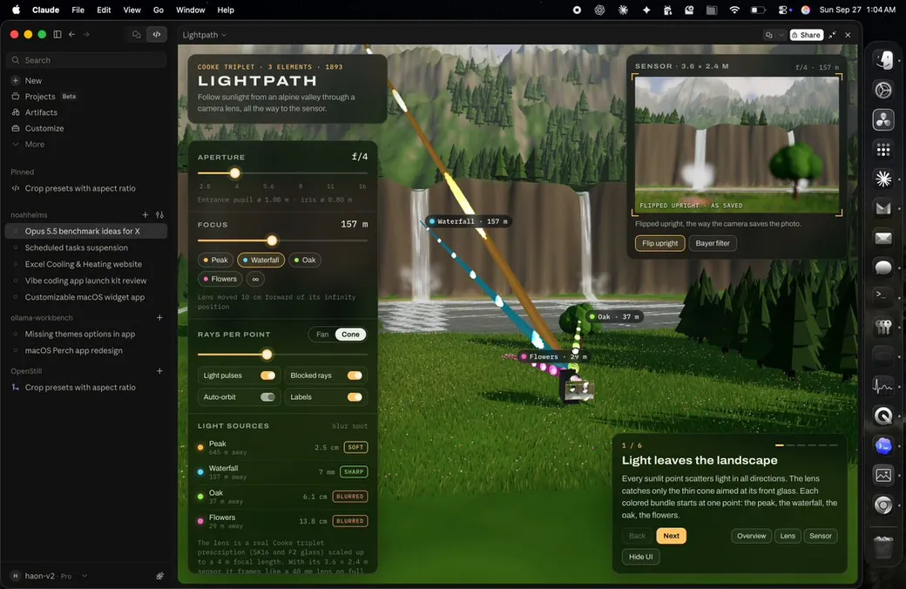</a>

**Prompt**

```text
Quiero que crees un render 3D interactivo que muestre cómo viaja la luz a través del objetivo de una cámara hasta llegar al sensor. Haz que la demostración utilice un hermoso paisaje montañoso con cascadas y una exuberante hierba verde.
```

<details>
<summary>Prompt original</summary>

```text
i want you to create an interactive 3d render of how light travels through a camera lens and gets to the sensor. make the demo use a beautiful mountain scape with waterfalls and beautiful green grass
```

</details>

[Ver detalles ↗](https://www.tripo3d.ai/es/3d-prompts/gpt-6-astra-2104077535315144878) · [Publicación original](https://x.com/haonv2/status/2104077535315144878) · [Volver a los ejemplos](#all-prompts)

---

<a id="gpt-6-astra-2103966922127630820"></a>

### Captura del propulsor Super Heavy en Blender

[Vortlyn](https://x.com/Vortlyn) · 2026-09-26 · GPT-6 Astra · Recursos

<a href="https://www.tripo3d.ai/es/3d-prompts/gpt-6-astra-2103966922127630820">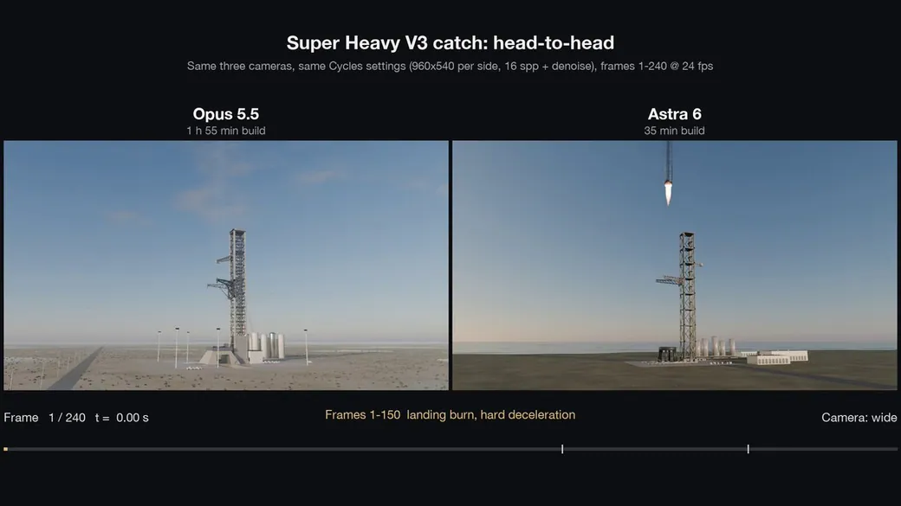</a>

**Prompt**

```text
construye en Blender un sistema de captura del propulsor Super Heavy usando únicamente Python. no descargues modelos, no uses texturas ni HDRI; genera todo mediante código
```

<details>
<summary>Prompt original</summary>

```text
build a Super Heavy booster catch in Blender using only Python. no downloaded models, no textures, no HDRIs, everything generated by code
```

</details>

[Ver detalles ↗](https://www.tripo3d.ai/es/3d-prompts/gpt-6-astra-2103966922127630820) · [Publicación original](https://x.com/Vortlyn/status/2103966922127630820) · [Volver a los ejemplos](#all-prompts)

---

<a id="gpt-6-astra-2103860776419111285"></a>

### Entorno de aldea forestal junto a un lago

[Givros](https://x.com/givros) · 2026-09-26 · GPT-6 Astra · Escenas

<a href="https://www.tripo3d.ai/es/3d-prompts/gpt-6-astra-2103860776419111285">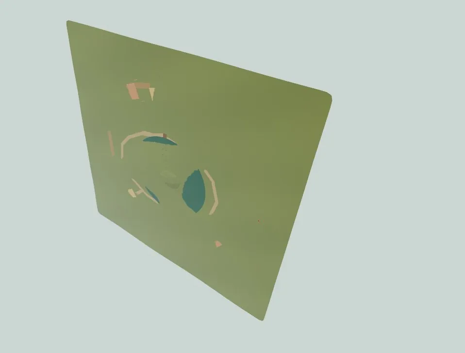</a>

**Prompt**

```text
Un bosque con un lago en el centro. En medio del lago, una casa abandonada. Alrededor del lago, una aldea francesa llena de flores. Caminos que conecten los puntos importantes.
```

<details>
<summary>Prompt original</summary>

```text
A forest with a lake in the center. In the middle of the lake, an abandoned house. Around the lake, a flower-filled French village. Paths connecting the important points.
```

</details>

[Ver detalles ↗](https://www.tripo3d.ai/es/3d-prompts/gpt-6-astra-2103860776419111285) · [Publicación original](https://x.com/givros/status/2103860776419111285) · [Volver a los ejemplos](#all-prompts)

---

<a id="gpt-6-astra-2103855977376125161"></a>

### Escena WebGL de un barco de vóxeles dentro de una botella

[PEP PEPICH](https://x.com/Artless101) · 2026-09-26 · GPT-6 Astra · Escenas

<a href="https://www.tripo3d.ai/es/3d-prompts/gpt-6-astra-2103855977376125161">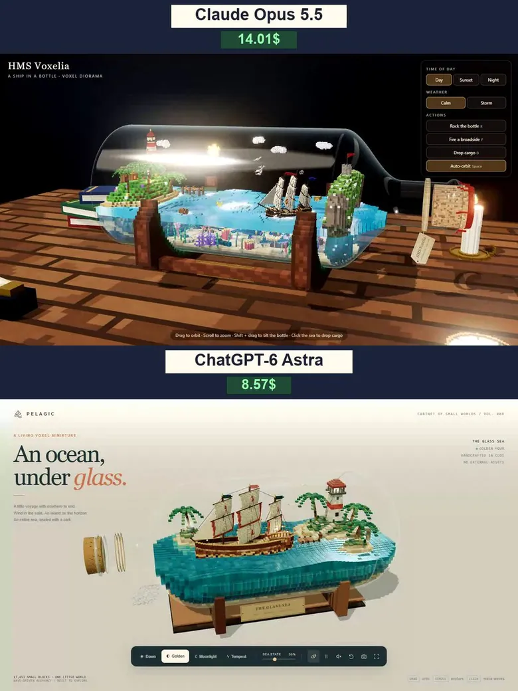</a>

**Prompt**

```text
Diseña y crea una escena de arte voxel muy creativa, elaborada y detallada, con un barco intrincado navegando por el océano dentro de una botella. Incluye olas y física realista, de modo que toda la escena quede encapsulada en la botella. Haz que la escena sea impresionante y variada, y utiliza vóxeles coloridos, física simulada y accesorios o paisajes interesantes, todo ello dentro de la botella. Usa WebGL y las bibliotecas que necesites, pero asegúrate de que pueda pegarlo todo en un único archivo HTML y abrirlo en Chrome.
```

<details>
<summary>Prompt original</summary>

```text
Design and create a very creative, elaborate, and detailed voxel art scene of a intricate ship sailing through the ocean inside of a bottle. Include waves and realistic physics, with the whole scene encapsulated inside of the bottle. Make the scene impressive and varied and use colorful voxels, modeled physics, and interesting props / landscapes all encapsulated inside of the bottle. Use WebGL and whatever libraries to get this done but make sure I can paste it all into a single HTML file and open it in Chrome
```

</details>

[Ver detalles ↗](https://www.tripo3d.ai/es/3d-prompts/gpt-6-astra-2103855977376125161) · [Publicación original](https://x.com/Artless101/status/2103856049925071141) · [Volver a los ejemplos](#all-prompts)

---

<a id="claude-opus-5-5-2103846630088716687"></a>

### Vídeo gráfico de motion design pulido de 15 segundos

[Tasher](https://x.com/Dannnnnok) · 2026-09-26 · Claude Opus 5.5 · Animación

<a href="https://www.tripo3d.ai/es/3d-prompts/claude-opus-5-5-2103846630088716687"></a>

**Prompt**

```text
Me interesa ver hasta dónde llegas como diseñador de motion design. Para demostrarlo, crea un vídeo gráfico animado de 15 segundos, pulido y que muestre tus habilidades de motion design. Esta pieza se presentará ante 10.000 personas en X, así que hazla visualmente atractiva, profesional y memorable. Disfruta de plena libertad creativa y consigue el mejor resultado posible.
```

<details>
<summary>Prompt original</summary>

```text
I’m curious to see how strong you are as a motion designer. To prove it, create a polished 15-second animated graphic video that showcases your motion design skills. This piece will be presented to 10,000 people on X, so make it visually compelling, professional, and memorable. Take full creative freedom and make the strongest result you can
```

</details>

[Ver detalles ↗](https://www.tripo3d.ai/es/3d-prompts/claude-opus-5-5-2103846630088716687) · [Publicación original](https://x.com/Dannnnnok/status/2103847239885939019) · [Volver a los ejemplos](#all-prompts)

---

<a id="claude-opus-5-5-2103822946800165270"></a>

### Juego de vóxeles estilo Minecraft con shaders avanzados

[DreykØ](https://x.com/dreyk0o0) · 2026-09-26 · Claude Opus 5.5 · Juegos

<a href="https://www.tripo3d.ai/es/3d-prompts/claude-opus-5-5-2103822946800165270">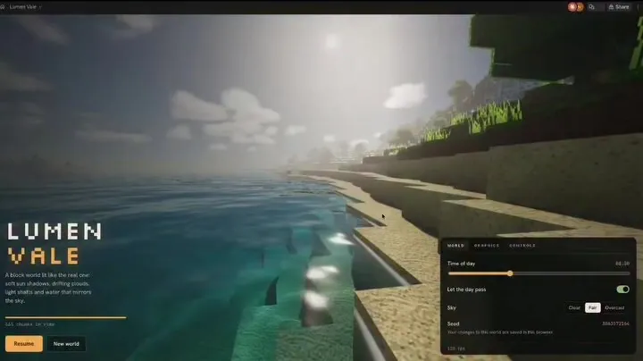</a>

**Prompt**

```text
Crea un juego de vóxeles estilo Minecraft en un único archivo HTML que se ejecute en el navegador.
- Controles en primera persona: WASD, mover la cámara con el ratón y saltar
- Terreno procedural con colinas, agua y árboles
- Coloca y rompe bloques con el ratón, con 5 tipos de bloques
- Shaders avanzados: sol en movimiento, sombras suaves, oclusión ambiental, niebla y reflejos en el agua
- 60 fps estables en un portátil
Usa Three.js desde una CDN. Pruébalo, corrige todos los errores y sigue mejorando los gráficos hasta que tenga un aspecto lo más realista posible.
```

<details>
<summary>Prompt original</summary>

```text
Build a Minecraft-style voxel game in a single HTML file that runs in the browser.
- First-person controls: WASD, mouse look, jump
- Procedural terrain with hills, water and trees
- Place and break blocks with the mouse, 5 block types
- Advanced shaders: moving sun, soft shadows, ambient occlusion, fog, water reflections
- Smooth 60 fps on a laptop
Use Three.js from a CDN. Test it, fix every bug, then keep improving the visuals until it looks as realistic as possible.
```

</details>

[Ver detalles ↗](https://www.tripo3d.ai/es/3d-prompts/claude-opus-5-5-2103822946800165270) · [Publicación original](https://x.com/dreyk0o0/status/2103822946800165270) · [Volver a los ejemplos](#all-prompts)

---

<a id="claude-opus-5-5-2103801834930606193"></a>

### Vídeo de motion graphics inspirado en Spotify

[Brain](https://x.com/brainextends) · 2026-09-26 · Claude Opus 5.5 · Animación

<a href="https://www.tripo3d.ai/es/3d-prompts/claude-opus-5-5-2103801834930606193"></a>

**Prompt**

```text
Crea un vídeo completo y pulido de motion graphics inspirado en Spotify a partir del siguiente briefing. Este prompt es autónomo: no se necesita ningún vídeo de referencia ni ningún recurso proporcionado.

<deliverables> Un MP4 de 18 segundos a 1920×1080 y 60 fps reales, con música y efectos de sonido sutiles Fuente editable completa Construye, renderiza, inspecciona y perfecciona la animación antes de entregarla No te detengas en un storyboard, imágenes fijas o un plan de implementación </deliverables>
<art_direction>
Un film premium de producto musical presentado dentro de un escenario rectangular grande, con esquinas redondeadas y casi negro
El escenario ocupa aproximadamente el 80 % del ancho del lienzo y el 75 % de su altura, centrado horizontalmente y ligeramente por debajo del centro vertical
Fuera del escenario, usa un fondo verde atmosférico y suave: esmeralda luminoso cerca de la esquina superior izquierda, verde bosque más profundo hacia los laterales y con un desvanecimiento a casi negro en la parte inferior
Dentro del escenario:
Fondo casi negro
Tipografía principal blanca
Texto secundario gris apagado
Verde de Spotify # 1ED760 para los elementos destacados y los controles
Una única fuente sans serif limpia, como Geist o Inter
Trazos de iconos coherentes y sombras discretas
Mantén las composiciones compactas y centradas, con bastante espacio negativo
El texto debe transmitir publicidad de un producto musical, no titulares de presentación sobredimensionados
No añadas un rótulo exterior, una marca de agua del creador, un pie decorativo ni un contador de progreso
</art_direction>

<artwork> Crea una portada de álbum cuadrada y original para una canción ficticia llamada “Glass Tides” de “AURA”
La portada principal es una imagen macro abstracta de seda líquida perlada y cristal fundido en movimiento
Usa lavanda pastel, cian empolvado, rosa rubor, dorado champán y un toque sutil de menta
Incluye pliegues tridimensionales amplios, reflejos realistas, estrías delicadas y un pliegue prominente con forma de S
Rellena el cuadrado de borde a borde
No incluyas texto, logotipos ni bordes en esta portada principal
Usa esta misma ilustración de forma coherente durante todo el film

Crea portadas adicionales de playlists con diseño propio:
“Late Nights” en amarillo mostaza
“Good Energy” en rosa
“Deep Focus” en azul
“Daily Mix 1”, “Daily Mix 2” y “Daily Mix 3” en colores complementarios

Deben parecer portadas de diseño gráfico terminadas, con tipografía llamativa y motivos geométricos sencillos
</artwork>

<timeline> 0.0–0.6 segundos: Un icono verde de Spotify crece suavemente hasta el centro del escenario oscuro. Dale una entrada segura, con un sobreimpulso mínimo
0.6–1.5 segundos:
El icono se transforma en una pequeña identidad de Spotify sobre dos líneas centradas:
“Discover”
“new music”
La primera línea es blanca; la segunda, verde
Rebélalas con breves movimientos verticales enmascarados
1.5–2.4 segundos:
Una interfaz de escritorio de Spotify estilizada aparece desde abajo
Muestra una barra lateral estrecha, “Made for you”, tres tarjetas de álbumes y pequeñas filas de apoyo
Usa una ligera inclinación en perspectiva durante la entrada, hasta asentarse en una vista frontal
2.4–3.2 segundos:
Acércate a las tres portadas destacadas
Muestra “New for you” sobre ellas
Mantén la ilustración nítida, con títulos breves de álbum debajo
Una barra de reproductor estrecha y redondeada ancla ahora la parte inferior del escenario
3.2–4.0 segundos:
Las tarjetas destacadas se repliegan en una lista compacta de “Fresh finds”
Revela cuatro filas de canciones con un ligero desfase entre ellas
Cada fila contiene una miniatura, un título de canción breve, el artista y un pequeño icono de menú
4.0–4.9 segundos:
Transición a una tira horizontal de portadas de playlists coloridas
Encabezado: “Every mood”
Línea de apoyo: “Find what moves you”
La tira se desliza suavemente de lado a lado, con las tarjetas de los extremos parcialmente recortadas por el escenario
4.9–5.8 segundos:
Aparece un campo de búsqueda compacto
Escribe “Glass Tides”
Revela debajo un único resultado seleccionado, con la ilustración iridiscente, “AURA” y un icono de reproducción verde

5.8–6.6 segundos:
La ilustración seleccionada se amplía hasta convertirse en una portada grande y centrada
Revela “Glass Tides” debajo, seguido de “AURA” en verde
Mantén visible la barra del reproductor
6.6–7.5 segundos:
La misma portada se desliza hacia la izquierda
A la derecha aparece la información de la canción:
“Glass Tides”
“AURA”
“A new frequency”
Añade un botón de reproducción verde y redondeado
Coordina el movimiento de la portada con la aparición del texto
7.5–8.3 segundos:
Una breve transformación con los colores de la marca llena de verde el escenario interior
La ilustración se contrae hasta convertirse en una tarjeta más pequeña y centrada
Coloca debajo una pequeña identidad de Spotify oscura
El reproductor se aleja brevemente
8.3–9.8 segundos:
Vuelve al escenario oscuro
La misma ilustración se expande de forma espectacular hacia la cámara, adquiere un tamaño enorme y queda recortada por el escenario redondeado
Restablece el reproductor en la parte inferior
Usa un desenfoque de movimiento controlado durante la parte más rápida del zoom

9.8–11.2 segundos:
La ilustración se despeja y da paso a una frase tipográfica centrada:
“Find your”
“rhythm”
Usa blanco para la primera línea y verde para la segunda
El reproductor permanece visible y estable debajo
11.2–12.5 segundos:
Muestra “Made for your every day”
Tres portadas de playlists entran con una perspectiva suave y ligeras inclinaciones opuestas
Se distribuyen hasta formar seis portadas más pequeñas por el escenario
Línea de apoyo: “Your sound, always evolving”

12.5–14.0 segundos:
La composición de playlists se transforma en cuatro portadas de álbum flotantes
Incluye la ilustración iridiscente principal
Usa una rotación, perspectiva, orden de profundidad y superposición discretos
Mantén el movimiento coordinado, sin que floten al azar
14.0–15.2 segundos:
Las portadas convergen hacia el centro y se pliegan alrededor de un icono verde de Spotify
La ilustración se retira mientras el icono se convierte en el punto focal
Haz desaparecer el reproductor gradualmente
El icono de Spotify debe surgir de la misma posición central hacia la que convergen las portadas
15.2–18.0 segundos:
El icono se desplaza ligeramente a la izquierda y se asienta junto a un gran logotipo tipográfico blanco de “Spotify”
Mantén el icono y las letras separados durante todo el movimiento
Revela:
“Discover new music”
“every day”
La primera línea es blanca; la segunda, verde
Mantén la composición final limpia hasta el final
</timeline>
<persistent_player>
Durante la mayor parte de la secuencia central, mantén una única barra de reproductor estrecha y redondeada cerca de la parte inferior del escenario interior
Incluye:
Miniatura pequeña de la ilustración principal
“Glass Tides” y “AURA”
Controles de reproducción y salto
Una pista de progreso fina
Un pequeño icono de volumen
Estilo oscuro, translúcido y discreto, con un borde fino
Este reproductor recurrente conecta las distintas tomas
Debe permanecer visualmente subordinado a la ilustración
</persistent_player>

<motion_quality>
Iguala la energía de un film de producto premium y montado con precisión
La mayoría de las ideas visuales duran aproximadamente un segundo, pero las transiciones deben seguir siendo fluidas
Usa aceleración y desaceleración continuas
Prioriza muelles críticamente amortiguados o una interpolación suave cuidadosamente ajustada
No uses rebotes repetidos ni grandes sobreimpulsos elásticos
Conserva la identidad de la ilustración principal y las relaciones de posición durante la búsqueda, el detalle del álbum, la tarjeta de marca y el zoom
Usa transiciones por coincidencia de posición, escalado coordinado, revelados enmascarados y perspectiva
Los títulos salientes deben desaparecer antes de que los entrantes ocupen el mismo espacio
Evita el texto superpuesto, los reinicios bruscos de cámara, los intervalos largos en blanco y los fundidos arbitrarios a pantalla completa
Recorta limpiamente cada portada sobredimensionada y cada movimiento de cámara al escenario redondeado
No uses partículas, anillos de ondas de choque, destellos de lente, sacudidas de cámara ni metraje de stock sin relación
</motion_quality>

<audio> Crea o selecciona música electrónica apta para uso comercial, de aproximadamente 120 BPM Usa un pulso limpio, bajos cálidos, elementos melódicos discretos y acentos sutiles de transición Sincroniza las entradas, selecciones, zooms y la aparición del logotipo importantes con eventos musicales Mantén los efectos por debajo del volumen de la música No uses voz en off No utilices pistas comerciales con copyright sin permiso </audio>
<implementation_and_validation>
Construye una animación determinista controlada por tiempo absoluto mediante una función async window. seek(t)
Cada transformación, opacidad, máscara y estado de la interfaz debe poder reproducirse al buscar fotogramas en cualquier orden
No dependas de temporizadores en tiempo real, física acumulada ni del estado de las transiciones CSS durante la exportación

Renderiza a 60 fps reales con antialiasing espacial
Usa entre 3 y 5 muestras temporales de subfotograma por fotograma de salida para un desenfoque de movimiento discreto
Mantén nítidos el texto y la ilustración estáticos
Inspecciona las hojas de contactos y la reproducción en movimiento
Comprueba los cambios rápidos de encabezado, las transiciones de la ilustración, el zoom, la convergencia de las portadas y el espaciado del logotipo final
Verifica que las marcas de tiempo de los fotogramas estén espaciadas de manera uniforme y que la duración total sea de 18 segundos
Corrige los defectos visuales antes de entregar el MP4 final y la fuente editable
</implementation_and_validation>
```

<details>
<summary>Prompt original</summary>

```text
Create a complete, polished Spotify-themed motion graphics video from the following brief. This prompt is self-contained: no reference video or supplied assets are required.

<deliverables> An 18-second MP4 at 1920×1080 and true 60 fps, with music and subtle sound effects Complete editable source Build, render, inspect, and refine the animation before delivering it Do not stop at a storyboard, still images, or an implementation plan </deliverables>
<art_direction>
A premium music-product film presented inside a large, nearly black rounded rectangular stage
The stage occupies roughly 80% of the canvas width and 75% of its height, centered horizontally and slightly below the vertical center
Outside the stage, use a soft atmospheric green background: luminous emerald near the upper-left corner, deeper forest green toward the sides, fading to near-black at the bottom
Inside the stage:
Near-black background
White primary typography
Muted gray secondary text
Spotify green # 1ED760 for emphasis and controls
One clean sans-serif font, such as Geist or Inter
Consistent icon strokes and restrained shadows
Keep compositions compact and centered, with substantial negative space
Text should feel like music-product advertising, not oversized presentation headings
Do not add an outer caption, creator watermark, decorative footer, or progress counter
</art_direction>

<artwork> Create original square album artwork for a fictional track called “Glass Tides” by “AURA”
The hero cover is an abstract macro image of flowing pearlescent liquid silk and molten glass
Use pastel lavender, powder cyan, blush pink, champagne gold, and subtle mint
Include broad three-dimensional folds, realistic reflective highlights, delicate striations, and a prominent sweeping S-shaped fold
Fill the square edge to edge
No text, logo, or border on this hero artwork
Use this same artwork consistently throughout the film

Create additional designed playlist sleeves:
“Late Nights” in mustard yellow
“Good Energy” in pink
“Deep Focus” in blue
“Daily Mix 1”, “Daily Mix 2”, and “Daily Mix 3” in complementary colors

These should look like finished graphic-design covers, with bold typography and simple geometric motifs
</artwork>

<timeline> 0.0–0.6 seconds: A green Spotify icon grows smoothly into the center of the dark stage Give it a confident arrival with minimal overshoot
0.6–1.5 seconds:
The icon transitions into a small Spotify identity above two centered lines:
“Discover”
“new music”
The first line is white; the second is green
Reveal them with short masked vertical movements
1.5–2.4 seconds:
A stylized Spotify desktop interface rises into view
Show a slim sidebar, “Made for you”, three album cards, and small supporting rows
Use a subtle perspective tilt during the entrance, settling toward a frontal view
2.4–3.2 seconds:
Move closer to the three featured covers
Show “New for you” above them
Keep the artwork crisp, with short album titles beneath
A narrow rounded player bar now anchors the bottom of the stage
3.2–4.0 seconds:
The featured cards withdraw into a compact “Fresh finds” list
Reveal four song rows with a slight stagger
Each row contains a thumbnail, short track title, artist, and a small menu icon
4.0–4.9 seconds:
Transition into a horizontal strip of colorful playlist covers
Heading: “Every mood”
Supporting line: “Find what moves you”
The strip slides smoothly sideways, with edge cards partially cropped by the stage
4.9–5.8 seconds:
A compact search field appears
Type “Glass Tides”
Reveal one selected result beneath it, with the iridescent artwork, “AURA”, and a green play icon

5.8–6.6 seconds:
The selected artwork expands into a large centered cover
Reveal “Glass Tides” underneath, followed by “AURA” in green
Keep the player bar visible
6.6–7.5 seconds:
The same cover slides left
Track information appears on the right:
“Glass Tides”
“AURA”
“A new frequency”
Add a rounded green Play button
Coordinate the cover movement and text reveals
7.5–8.3 seconds:
A brief brand-color transformation fills the inner stage with green
The artwork contracts into a smaller centered tile
Place a small dark Spotify identity underneath
The player briefly recedes
8.3–9.8 seconds:
Return to the dark stage
The same artwork expands dramatically toward the camera, becoming oversized and cropped by the rounded stage
Restore the player at the bottom
Use controlled motion blur during the fastest part of the zoom

9.8–11.2 seconds:
The artwork clears into a centered typographic statement:
“Find your”
“rhythm”
Use white for the first line and green for the second
The player remains visible and stable beneath it
11.2–12.5 seconds:
Show “Made for your every day”
Three playlist sleeves enter with gentle perspective and small opposing tilts
They spread into six smaller sleeves across the stage
Supporting line: “Your sound, always evolving”

12.5–14.0 seconds:
The playlist layout transitions into four floating album covers
Include the iridescent hero artwork
Use restrained rotation, perspective, depth ordering, and overlap
Keep their movement coordinated rather than randomly floating
14.0–15.2 seconds:
The covers converge toward the center and fold around a green Spotify icon
The artwork withdraws as the icon becomes the focal point
Fade the player away
The Spotify icon must emerge from the same central position as the converging covers
15.2–18.0 seconds:
The icon moves slightly left and settles beside a large white “Spotify” wordmark
Keep the icon and letters separated throughout the movement
Reveal:
“Discover new music”
“every day”
The first line is white; the second is green
Hold the finished composition cleanly through the end
</timeline>
<persistent_player>
For most of the middle sequence, keep one narrow rounded player bar near the bottom of the inner stage
Include:
Small hero-art thumbnail
“Glass Tides” and “AURA”
Play and skip controls
A thin progress track
A small volume icon
Subdued dark translucent styling with a fine border
This recurring player connects the changing shots
It must remain visually secondary to the artwork
</persistent_player>

<motion_quality>
Match the energy of a tightly edited premium product film
Most visual ideas last approximately one second, but transitions remain smooth
Use continuous acceleration and deceleration
Favor critically damped springs or carefully tuned smooth easing
No repeated bouncing or large elastic overshoots
Preserve the hero artwork’s identity and position relationships through search, album detail, brand tile, and zoom
Use match-position transitions, coordinated scaling, masked reveals, and perspective
Outgoing titles must disappear before incoming titles occupy the same space
Avoid overlapping text, sudden camera resets, long blank intervals, and arbitrary full-frame crossfades
Clip every oversized cover and camera move cleanly to the rounded stage
No particles, shockwave rings, lens flares, camera shake, or unrelated stock footage
</motion_quality>

<audio> Create or select commercially usable electronic music around 120 BPM Use a clean pulse, warm bass, restrained melodic elements, and subtle transition accents Align important entrances, selections, zooms, and the logo reveal with musical events Keep effects quieter than the music No voiceover Do not use copyrighted commercial tracks without permission </audio>
<implementation_and_validation>
Build a deterministic animation driven by absolute time through an async window. seek(t) function
Every transform, opacity, mask, and UI state must be reproducible when seeking frames in any order
Do not depend on live timers, accumulated physics, or CSS transition state during export

Render true 60 fps with spatial antialiasing
Use 3–5 temporal subframe samples per output frame for restrained motion blur
Keep stationary text and artwork sharp
Inspect contact sheets and moving playback
Check the fast heading changes, artwork handoffs, zoom, cover convergence, and final wordmark spacing
Verify evenly spaced frame timestamps and the full 18-second duration
Fix visual defects before delivering the final MP4 and editable source
</implementation_and_validation>
```

</details>

[Ver detalles ↗](https://www.tripo3d.ai/es/3d-prompts/claude-opus-5-5-2103801834930606193) · [Publicación original](https://x.com/brainextends/status/2103801834930606193) · [Volver a los ejemplos](#all-prompts)

---

<a id="claude-opus-5-5-2103504887439065439"></a>

### Showreel dinámico de diseño de movimiento de 15 segundos

[ajith\_io](https://x.com/ajith_io) · 2026-09-25 · Claude Opus 5.5 · Animación

<a href="https://www.tripo3d.ai/es/3d-prompts/claude-opus-5-5-2103504887439065439"></a>

**Prompt**

```text
Crea un video dinámico de gráficos en movimiento de 15 segundos que demuestre lo increíble que eres como diseñador de movimiento, como si fuera tu showreel para un currículum. Da rienda suelta a tu creatividad.
```

<details>
<summary>Prompt original</summary>

```text
make a dynamic 15-second motion graphics video that shows what an incredible motion designer you are, like it's your showreel for a résumé. go all out.
```

</details>

[Ver detalles ↗](https://www.tripo3d.ai/es/3d-prompts/claude-opus-5-5-2103504887439065439) · [Publicación original](https://x.com/ajith_io/status/2103449416325890146) · [Volver a los ejemplos](#all-prompts)

---

<a id="claude-opus-5-5-2103502454750920925"></a>

### Juego de supervivencia sandbox en WebGL2

[kepo](https://x.com/kepochnik) · 2026-09-25 · Claude Opus 5.5 · Juegos

<a href="https://www.tripo3d.ai/es/3d-prompts/claude-opus-5-5-2103502454750920925"></a>

**Prompt**

```text
Crea un juego sandbox para navegador, inspirado en Minecraft, que se sienta lo más parecido posible al original. Todo el texto del juego debe estar en inglés. Controles: teclado y ratón (ordenador).  ASPECTOS TÉCNICOS - Un único archivo HTML, WebGL2 puro y sin bibliotecas de terceros. - Todas las texturas de 16×16 deben generarse mediante código como pixel art (piedra, tierra, hierba, tablones, hojas, minerales, cristal, agua, lava, etc.). - Sonidos sintetizados con WebAudio: excavación, pasos, colocación de bloques, daño, criaturas, explosiones y música ambiental tranquila.  MUNDO - Mundo infinito formado por chunks de 16×16×128, con una semilla. - Biomas: llanuras, bosque, bosque de abedules, taiga, tundra nevada, desierto, montañas, océanos y playas. - Cuevas (túneles sinuosos y grandes cavernas), lava en los niveles inferiores y minerales según la profundidad: carbón, hierro, oro y diamantes. - Tres tipos de árboles, hierba alta, flores, cactus, caña de azúcar y calabazas. - Iluminación al estilo de Minecraft: luz del cielo y luz de bloques (antorchas, piedra luminosa y lava) que se propagan celda por celda, con iluminación suave y oclusión ambiental. - Ciclo de día y noche: sol, luna, estrellas, atardeceres, nubes 3D, niebla de distancia y lluvia. - El agua y la lava fluyen por niveles; dos fuentes crean agua infinita; el agua y la lava generan obsidiana o adoquín. La arena y la grava caen.  JUGADOR - Primera persona, colisiones, saltos, esprintar, agacharse (sin caer por los bordes), nadar, escaleras y daño por caída. - Rotura de bloques con fases de grietas y partículas; el tiempo de rotura depende de la herramienta. - Mano visible y objeto sujeto con animación de balanceo. Vista en tercera persona con F5.  SUPERVIVENCIA - Salud, hambre, saturación y aire bajo el agua. - Herramientas de 5 materiales con durabilidad y armadura de 4 materiales. - Inventario con fabricación de 2×2, mesa de fabricación de 3×3, horno con combustible, cofres y cama (salta la noche y establece el punto de aparición). - Objetos que se sueltan, muerte y reaparición. - Criaturas: cerdos, vacas, ovejas y gallinas (cría y esquila); por la noche, zombis, esqueletos con arcos y arañas. Los zombis y esqueletos arden bajo la luz del sol. - Agricultura: azada, semillas, crecimiento del trigo y pan. Puertas, vallas, portones de valla y TNT.  CREATIVO - Volar pulsando dos veces la barra espaciadora, rotura instantánea de bloques y catálogo de todos los bloques con pestañas y búsqueda.  INTERFAZ - Pantalla de título con un panorama del mundo, lista de mundos (crear / eliminar / jugar) y opciones (campo de visión, distancia de renderizado, sensibilidad, sonido, brillo y escala de la interfaz). - Menú de pausa, pantalla de muerte, HUD (barra rápida, corazones, hambre, armadura y burbujas de aire) y pantalla de depuración F3. - Chat con comandos: /gamemode, /time, /give, /tp, /summon, /weather. - Mundos guardados en localStorage.  RESTRICCIONES - No uses el nombre, el logotipo, las texturas ni los personajes de Minecraft (Steve, Creeper, etc.): ponle al juego un nombre propio y diseña tus propias criaturas.  PRUEBAS - Ejecuta el juego en un navegador sin interfaz gráfica, comprueba todos los sistemas y corrige los errores antes de entregarlo.
```

<details>
<summary>Prompt original</summary>

```text
Build a browser sandbox game in the spirit of Minecraft that feels as close to the original as possible. All in-game text in English. Controls: keyboard and mouse (desktop).  TECH - A single HTML file, plain WebGL2, no third-party libraries. - All 16×16 textures generated in code as pixel art (stone, dirt, grass, planks, leaves, ores, glass, water, lava, etc.). - Sounds synthesized with WebAudio: digging, footsteps, placing blocks, damage, mobs, explosions, calm background music.  WORLD - Infinite world made of 16×16×128 chunks, with a seed. - Biomes: plains, forest, birch forest, taiga, snowy tundra, desert, mountains, oceans, beaches. - Caves (winding tunnels and large caverns), lava at the lower levels, ores by depth: coal, iron, gold, diamonds. - Three tree types, tall grass, flowers, cacti, sugar cane, pumpkins. - Minecraft-style lighting: sky light and block light (torches, glowstone, lava) that spreads cell by cell, with smooth lighting and ambient occlusion. - Day/night cycle: sun, moon, stars, sunsets, 3D clouds, distance fog, rain. - Water and lava flow by levels; two sources make infinite water; water + lava make obsidian or cobblestone. Sand and gravel fall.  PLAYER - First person, collisions, jumping, sprinting, sneaking (doesn't fall off edges), swimming, ladders, fall damage. - Block breaking with crack stages and particles; break time depends on the tool. - Visible hand and held item with a swing animation. Third-person view on F5.  SURVIVAL - Health, hunger, saturation, air underwater. - Tools in 5 materials with durability, armor in 4 materials. - Inventory with 2×2 crafting, 3×3 crafting table, furnace with fuel, chests, bed (skip the night and set spawn). - Item drops, death and respawn. - Mobs: pigs, cows, sheep, chickens (breeding, shearing); at night zombies, skeletons with bows, spiders. Zombies and skeletons burn in sunlight. - Farming: hoe, seeds, wheat growth, bread. Doors, fences, fence gates, TNT.  CREATIVE - Flying on double-tap Space, instant block breaking, a catalog of all blocks with tabs and search.  UI - Title screen with a world panorama, world list (create / delete / play), options (FOV, render distance, sensitivity, sound, brightness, GUI scale). - Pause menu, death screen, HUD (hotbar, hearts, hunger, armor, air bubbles), F3 debug screen. - Chat with commands: /gamemode, /time, /give, /tp, /summon, /weather. - Worlds saved in localStorage.  RESTRICTIONS - Do not use Minecraft's name, logo, textures or characters (Steve, Creeper, etc.): give the game its own name and design your own mobs.  TESTING - Run the game in a headless browser, check every system and fix bugs before delivering.
```

</details>

[Ver detalles ↗](https://www.tripo3d.ai/es/3d-prompts/claude-opus-5-5-2103502454750920925) · [Publicación original](https://x.com/kepochnik/status/2103524317443363241) · [Volver a los ejemplos](#all-prompts)

---

<a id="gpt-6-astra-2103486103831339269"></a>

### Jardín japonés estilo vóxel en Three.js

[Marcel](https://x.com/marcthecreatorr) · 2026-09-25 · GPT-6 Astra · Escenas

<a href="https://www.tripo3d.ai/es/3d-prompts/gpt-6-astra-2103486103831339269">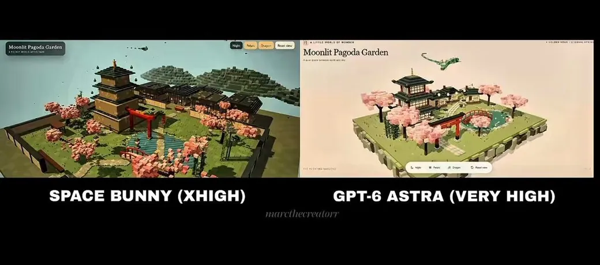</a>

**Prompt**

```text
Crea un jardín japonés detallado estilo vóxel en Three.js, con una pagoda, aldeanos diminutos, un dragón volador y elementos interactivos.
```

<details>
<summary>Prompt original</summary>

```text
Build a detailed voxel-style Japanese garden in Three.js, with a pagoda, tiny villagers, a flying dragon and interactive details.
```

</details>

[Ver detalles ↗](https://www.tripo3d.ai/es/3d-prompts/gpt-6-astra-2103486103831339269) · [Publicación original](https://x.com/marcthecreatorr/status/2103486103831339269) · [Volver a los ejemplos](#all-prompts)

---

<a id="claude-opus-5-5-2103483174957597035"></a>

### Navega por una pagoda en 3D

[Build Fast with AI](https://x.com/BuildFastWithAI) · 2026-09-25 · Claude Opus 5.5 · Interactivo

<a href="https://www.tripo3d.ai/es/3d-prompts/claude-opus-5-5-2103483174957597035"></a>

**Prompt**

```text
Implementa el código necesario para poder desplazarse por una pagoda en 3D.
```

<details>
<summary>Prompt original</summary>

```text
Implement code to be able to navigate in a pagoda in 3D.
```

</details>

[Ver detalles ↗](https://www.tripo3d.ai/es/3d-prompts/claude-opus-5-5-2103483174957597035) · [Publicación original](https://x.com/BuildFastWithAI/status/2103483174957597035) · [Volver a los ejemplos](#all-prompts)

---

<a id="gpt-6-astra-2103482826519986544"></a>

### Crear un conejillo de Indias en Blender

[かよこ](https://x.com/kayokojoe) · 2026-09-25 · GPT-6 Astra · Recursos

<a href="https://www.tripo3d.ai/es/3d-prompts/gpt-6-astra-2103482826519986544">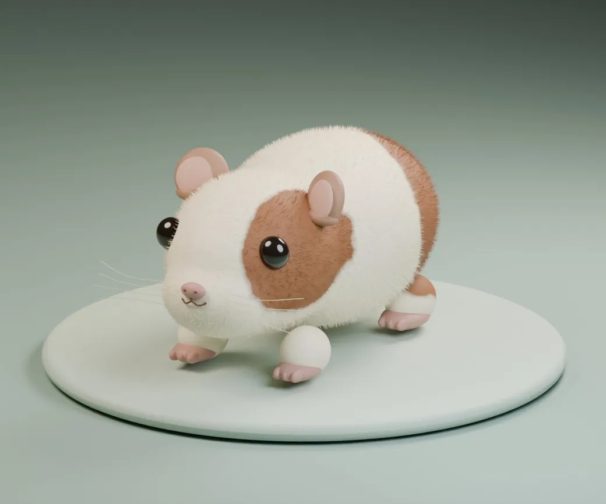</a>

**Prompt**

```text
Crea un conejillo de Indias en Blender
```

<details>
<summary>Prompt original</summary>

```text
Blenderでモルモットを作って
```

</details>

[Ver detalles ↗](https://www.tripo3d.ai/es/3d-prompts/gpt-6-astra-2103482826519986544) · [Publicación original](https://x.com/kayokojoe/status/2103482826519986544) · [Volver a los ejemplos](#all-prompts)

---

<a id="claude-opus-5-5-2103480081809346597"></a>

### Pueblo 3D de cerezos en flor, estilo anime y de libre exploración

[Good FortuneX](https://x.com/pound75423) · 2026-09-25 · Claude Opus 5.5 · Interactivo

<a href="https://www.tripo3d.ai/es/3d-prompts/claude-opus-5-5-2103480081809346597">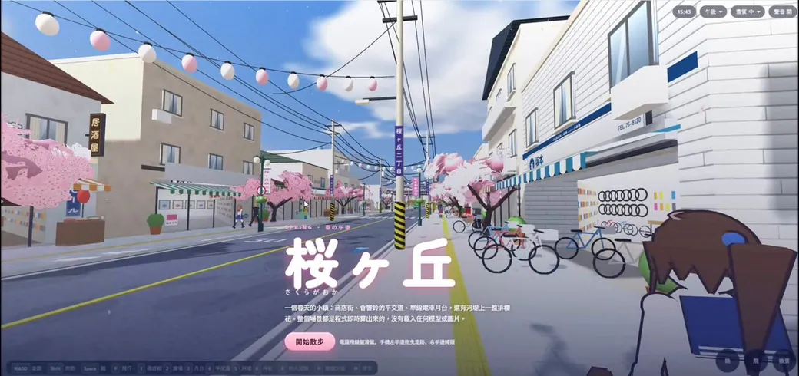</a>

**Prompt**

```text
Usa Three.js para crear un «pueblo 3D de cerezos en flor, estilo anime y de libre exploración» como un único archivo HTML y publícalo después como una página web para compartir.

[Restricciones técnicas]
- Usa únicamente three.js r128 (compilación UMD) desde cdnjs. No cargues modelos ni imágenes externos: genera todos los modelos, texturas y letreros de las tiendas de forma procedural mediante código y Canvas.
- Usa contenido original para todos los nombres de tiendas, letreros y personajes. No imites ninguna marca real ni ninguna obra existente.
- Usa MeshStandardMaterial o MeshPhongMaterial. Evita una metalness elevada y los mapas de reflexión del entorno (en algunos ordenadores hacen que los objetos se rendericen sin color).
- Combina los objetos estáticos por material en un número reducido de mallas para que funcione en ordenadores normales; incluye un selector de calidad Alta / Media / Baja.

[Escena: «桜ヶ丘 (Sakuragaoka)», un pequeño pueblo japonés en una tarde de primavera]
1. Calle comercial: una calle principal de norte a sur con más de 20 tiendas a ambos lados (restaurante de ramen, cafetería, tienda de bicicletas, librería, floristería, tienda de dulces japoneses, droguería, tienda abierta 24 horas, etc.). Cada tienda debe tener: un letrero de varias líneas (nombre de la tienda + nombre en inglés + número de teléfono), un toldo a rayas con faldón festoneado, un escaparate retranqueado con un interior de profundidad visible y una exposición en la acera (cajas de fruta, expositor de revistas, vitrina de muestras de comida y un poste de barbero giratorio). Las plantas superiores tienen ventanas, unidades de aire acondicionado, balcones con ropa tendida y antenas de televisión en las azoteas.
2. Detalles de la calle: postes de servicios públicos con muchos cables aéreos, farolas decorativas con banderolas de la calle comercial, hileras de farolillos de festival, baldosas cuadradas en la acera con pavimento podotáctil amarillo, rejillas de desagüe, señales de «止まれ» (STOP) y una parada de autobús.
3. Paso a nivel y trenes: una vía ferroviaria doble. Cuando se acerca un tren, las luces rojas del paso a nivel parpadean alternativamente, suena la campana y las barreras bajan. Un tren de cercanías de dos coches se detiene en la estación durante unos 14 segundos y después parte. Las ventanas son transparentes, de modo que se ven los asientos y las correas de sujeción del interior.
4. Estación con andén central: cartel con el nombre de la estación, marquesina del andén, bancos y una máquina expendedora.
5. Plaza de los cerezos: un cerezo centenario con un banco circular alrededor del tronco.
6. Santuario Inari: un gran torii bermellón y una hilera de torii pequeños, faroles de piedra, estatuas de zorros, un pabellón de culto (tejado verde cobrizo, chigi, katsuogi, caja de ofrendas y campana colgante), una fuente de purificación (temizuya), estatuas de Jizō, tablillas ema, un árbol sagrado y suelo de grava.
7. Dique junto al río: dos hileras de cerezos que forman un túnel de flores, farolillos, un río, casas en la orilla opuesta y montañas lejanas.

[Cómo crear los cerezos (parte clave)]
- Tómalos como referencia de la variedad Somei-Yoshino: el tronco se divide a poca altura en 3–4 ramas principales, que se ramifican de forma recursiva durante otros tres niveles. Las ramas se extienden hacia fuera y se inclinan ligeramente en las puntas, creando una silueta general de paraguas.
- Construye la copa con decenas de miles de «tarjetas de racimos de flores»: dibuja flores de cinco pétalos en Canvas (con puntas de pétalo dentadas, centros rojizos y estambres), con una capa base rosa suave detrás de las flores. Usa alphaTest y renderizado por ambas caras para las tarjetas.
- Añade algunos grupos de relleno rosas dentro de la copa para darle volumen. Las zonas exteriores y superiores son más luminosas; las interiores e inferiores tienen sombras de tonos rosa cálido.
- Usa rosa pálido, no rosa neón. La copa se mece suavemente con el viento, una alfombra de pétalos caídos cubre el suelo bajo cada árbol y los pétalos siguen cayendo por el aire (mediante un shader).

[Personajes]
- Más de 20 estudiantes y habitantes del pueblo de estilo anime: animación al caminar con articulaciones en rodillas y codos, rostros anime dibujados en Canvas (ojos grandes, brillos y rubor) que parpadean, flequillos formados por mechones independientes y diversos peinados (largo, bob, coleta oscilante y coletas gemelas), además de uniformes marineros, uniformes con blazer y ropa informal. Renderiza los personajes con sombreado cel y dos tonos, y un contorno oscuro.
- Las personas caminan por la calle, charlan en la plaza, esperan en el andén, rezan en el santuario y montan en bicicleta por el dique.

[Vehículos]
- Construye los coches extruyendo una silueta de perfil lateral (con pasos de rueda, ventanas, luces, matrículas japonesas y ruedas giratorias). Los coches se detienen antes del paso a nivel y, mientras suena la campana, esperan hasta que las barreras se levantan.

[Iluminación y hora del día]
- Un aspecto suave de fondo anime: cielo azul con nubes blancas (shader), ligera neblina a lo lejos y sombras con un matiz azul violáceo.
- Permite cambiar entre Tarde / Crepúsculo / Noche de Sakura. Por la noche se encienden las ventanas, los farolillos y las farolas.

[Controles]
- Primera persona: WASD para caminar, Shift para correr, Space para saltar, F para volar, ratón para mirar alrededor (bloqueo del puntero), teclas numéricas para teletransportarse a cada ubicación, H para ocultar la interfaz y M para silenciar.
- Móvil: arrastra en la mitad izquierda para caminar y en la mitad derecha para mirar alrededor.
- Las colisiones están activadas y el jugador puede subir al andén y a los escalones.
- Usa Web Audio para generar sonido ambiental: viento, canto de pájaros, la campana del paso a nivel y sonidos del tren en marcha.
```

<details>
<summary>Prompt original</summary>

```text
Please use Three.js to build a "freely walkable 3D anime-style cherry blossom town" as a single HTML file, then publish it as a shareable web page.

[Technical constraints]
- Use only three.js r128 (UMD build) from cdnjs. Do not load any external models or images — generate all models, textures, and shop signs procedurally with code and Canvas.
- Use original content for all shop names, signs, and characters. Do not imitate any real brand or existing work.
- Use MeshStandardMaterial or MeshPhongMaterial. Avoid high metalness and environment reflection maps (on some computers they make objects render with no color).
- Merge static objects by material into a small number of meshes so it runs on ordinary computers; provide a High / Medium / Low quality switch.

[Scene: "桜ヶ丘 (Sakuragaoka)", a small Japanese town on a spring afternoon]
1. Shopping street: a north–south main street with 20+ shops on both sides (ramen shop, café, bicycle shop, bookstore, florist, Japanese sweets shop, drugstore, convenience store, etc.). Each shop has: a multi-line sign (shop name + English name + phone number), a striped awning with a scalloped valance, a recessed storefront with an interior that has visible depth, and a sidewalk display (fruit crates, magazine rack, food-sample case, a spinning barber pole). Upper floors have windows, AC units, balconies with hanging laundry, and rooftop TV antennas.
2. Street details: utility poles with lots of overhead wires, decorative street lamps with shopping-street banners, festival lantern strings, square sidewalk tiles with yellow tactile paving, drain grates, "止まれ" stop signs, and a bus stop.
3. Level crossing and trains: a double-track railway. When a train approaches, the crossing's red lights flash alternately, the bell rings, and the gates lower. A two-car commuter train stops at the station for about 14 seconds and then departs. The windows are transparent, so the seats and hand straps inside are visible.
4. Island-platform station: station name board, platform canopy, benches, and a vending machine.
5. Sakura plaza: a 100-year-old cherry tree with a circular bench around it.
6. Inari shrine: a large vermilion torii plus a row of small torii, stone lanterns, fox statues, a worship hall (copper-green roof, chigi, katsuogi, offering box, hanging bell), a purification fountain (temizuya), jizo statues, ema plaques, a sacred tree, and gravel ground.
7. Riverside levee: two rows of cherry trees forming a blossom tunnel, lanterns, a river, houses on the far bank, and distant mountains.

[How to build the cherry trees (key part)]
- Model them on Somei-Yoshino: the trunk splits low into 3–4 main limbs, which branch recursively three more levels. Branches spread outward and droop slightly at the tips, giving an overall umbrella shape.
- Build the canopy from tens of thousands of "blossom cluster cards": draw five-petal flowers on Canvas (notched petal tips, reddish centers, stamens) with a soft pink base layer behind the flowers. Use alphaTest and double-sided rendering for the cards.
- Add a few pink filler clumps inside the canopy for volume. The outer and upper parts are brighter; the inner and lower parts have warm rose-toned shadows.
- Use pale pink, not neon pink. The canopy sways gently in the wind, a carpet of fallen petals covers the ground under each tree, and petals keep falling through the air (done in a shader).

[Characters]
- 20+ anime-style students and townspeople: walking animation with knee and elbow joints, anime faces drawn on Canvas (large eyes, highlights, blush) that blink, bangs made of separate strands, a variety of hairstyles (long, bob, swinging ponytail, twin tails), sailor uniforms / blazer uniforms / casual clothes. Render characters with two-tone cel shading and a dark outline.
- People walk along the street, chat in the plaza, wait on the platform, pray at the shrine, and ride bicycles along the levee.

[Vehicles]
- Build cars by extruding a side-profile silhouette (with wheel arches, windows, lights, Japanese license plates, and spinning wheels). Cars stop before the level crossing, and while the bell is ringing they wait until the gates rise.

[Lighting and time of day]
- A soft anime-background look: blue sky with white clouds (shader), light haze in the distance, and shadows with a blue-violet tint.
- Switchable between Afternoon / Dusk / Night Sakura. At night, windows, lanterns, and street lamps light up.

[Controls]
- First-person: WASD to walk, Shift to run, Space to jump, F to fly, mouse to look around (pointer lock), number keys to teleport to each location, H to hide the UI, M to mute.
- Mobile: drag on the left half to walk, drag on the right half to look around.
- Collision is enabled, and the player can walk up onto the platform and steps.
- Use Web Audio to generate ambient sound: wind, birdsong, the level-crossing bell, and train running sounds.
```

</details>

[Ver detalles ↗](https://www.tripo3d.ai/es/3d-prompts/claude-opus-5-5-2103480081809346597) · [Publicación original](https://x.com/pound75423/status/2103480085319942353) · [Volver a los ejemplos](#all-prompts)

---

<a id="gpt-6-astra-2103456264785424530"></a>

### Modelado 3D de ropa para VRChat

[のわ〜る👼🍆🐄](https://x.com/Noir4247) · 2026-09-25 · GPT-6 Astra · Recursos

<a href="https://www.tripo3d.ai/es/3d-prompts/gpt-6-astra-2103456264785424530">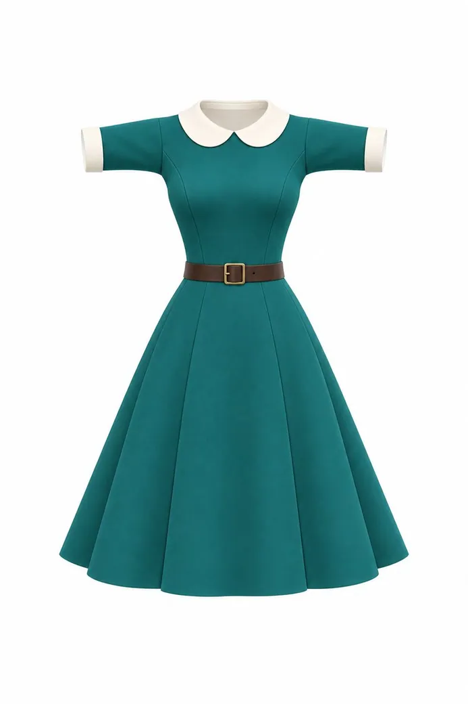</a>

**Imágenes de referencia:** [1](https://media.tripogrowth.space/media/42ff938d-7637-4442-b071-1e2c83b9d302.jpg) · [2](https://pbs.twimg.com/media/HTD5rBdaQAAIwxR.jpg)

**Prompt**

```text
Crea una prenda para VRChat
```

<details>
<summary>Prompt original</summary>

```text
VRChat用の衣装作って
```

</details>

[Ver detalles ↗](https://www.tripo3d.ai/es/3d-prompts/gpt-6-astra-2103456264785424530) · [Publicación original](https://x.com/Noir4247/status/2103456264785424530) · [Volver a los ejemplos](#all-prompts)

---

<a id="gpt-6-astra-2103432732386664591"></a>

### Pitaya Jelly

[Vib3Coded](https://x.com/vib3coded) · 2026-09-25 · GPT-6 Astra · Interactivo

<a href="https://www.tripo3d.ai/es/3d-prompts/gpt-6-astra-2103432732386664591">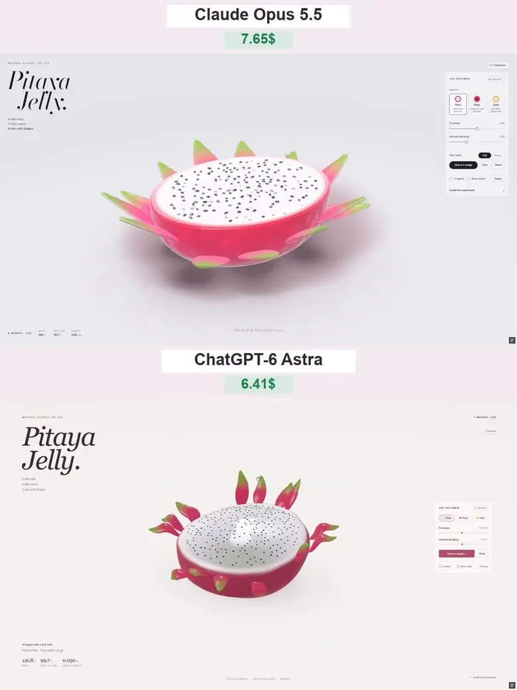</a>

**Prompt**

```text
Crea una escena 3D interactiva llamada «Pitaya Jelly»: media pitaya hecha de gelatina blanda y translúcida. Desarrolla todo el proyecto en un único archivo HTML utilizando renderizado WebGPU real y sombreadores WGSL. No uses modelos prefabricados ni recursos de imagen.

APPEARANCE

Una mitad grande de pitaya, apoyada con el lado cortado hacia arriba sobre una superficie de estudio clara.
Piel de color rosa frambuesa intenso, una fina capa interior pálida y pulpa blanca nacarada.
Aproximadamente 250 semillas negras diminutas, distribuidas de forma natural por la pulpa.
Entre 12 y 14 pétalos carnosos de la cáscara alrededor de la fruta, con una transición de bases rosas a puntas verdes.
Una superficie brillante y húmeda, con refracción de la luz, pequeñas burbujas internas y una sombra de contacto suave.
El material debe parecer un caramelo de goma blando, no plástico rígido. Conserva los colores saturados sin altas luces quemadas.

FÍSICA E INTERACCIÓN

Implementa una deformación de cuerpo blando real mediante una malla volumétrica con conexiones elásticas y restricciones que preserven el volumen, como XPBD.
El usuario debe poder agarrar la pulpa con el ratón o un dedo, estirarla y soltarla.
La deformación debe concentrarse alrededor del punto agarrado, en lugar de trasladar todo el objeto.
Después de soltarla, la fruta debe oscilar, vibrar y recuperar gradualmente su forma original.
Haz que los pétalos de la cáscara se puedan arrastrar individualmente. Deben ser más blandos que la pulpa, doblarse y recuperar su forma sin dejar de estar unidos a la fruta.
Las semillas deben seguir la superficie deformable sin separarse ni hundirse en la pulpa.
Mantén la simulación estable durante los tirones fuertes, con contacto con el suelo y protección contra elementos invertidos.

DISEÑO VISUAL

Utiliza una interfaz de estudio minimalista y clara, con una estética editorial: mucho espacio en blanco, bordes finos, controles discretos y ninguna decoración innecesaria.

Arriba a la izquierda:
«MATERIAL STUDIES / NO. 019»
Un encabezado grande en cursiva con serifas, distribuido en dos líneas:
«Pitaya Jelly».

Debajo:
«Un poco salvaje».
«Un poco dulce».
«Un dragón muy blando».
A la derecha, añade un panel flotante titulado «THE SPECIMEN» que contenga:

Indicador de densidad: ρ 1.04 g/cm³.
Tres presets:
Pearl — pulpa blanca y piel rosa.
Ruby — pulpa color frambuesa y piel rosa.
Gold — pulpa pálida y piel dorada.
Deslizadores de firmeza y amortiguación interna con valores visibles.
Botones «Dale un toque» y «Restablecer».

Casillas «¼ de velocidad» y «Mostrar malla».

Un botón «Pausar».
Incluye también:
Un botón de pantalla completa con una opción para salir.
Un indicador de estado «WEBGPU · LIVE».
Lecturas en tiempo real de la masa, el porcentaje del volumen en reposo y la energía cinética.
Una breve indicación de interacción: «Estira la pulpa. Tira de un pétalo. Suelta».
Una sección desplegable «Dentro del experimento» que explique con precisión la implementación.
REQUISITOS TÉCNICOS
Entrega un único archivo autocontenido llamado pitaya-jelly-webgpu.html.

Utiliza renderizado WebGPU real, no una imitación con Canvas 2D.

Construye toda la geometría de forma procedural.
Utiliza refracción con grosor, reflejos de Fresnel e iluminación de estudio suave.
Usa un paso de tiempo fijo para que el comportamiento sea uniforme.
Admite interacción de escritorio y táctil con un diseño adaptable.
Evita reconstrucciones de geometría costosas o la compilación de sombreadores durante el arrastre.

Muestra un mensaje alternativo claro cuando WebGPU no esté disponible.

Verifica el arrastre, la liberación, la recuperación de la forma, los presets, el restablecimiento, la pausa, la pantalla completa y el diseño móvil.
Las prioridades principales son un comportamiento convincente de gelatina, materiales atractivos y una interacción satisfactoria. El resultado debe transmitir la sensación de un experimento de materiales pulido y jugable.
```

<details>
<summary>Prompt original</summary>

```text
Create an interactive 3D scene called “Pitaya Jelly” — a dragon fruit half made of soft, translucent jelly. Build the entire project in a single HTML file using genuine WebGPU rendering and WGSL shaders. Do not use premade models or image assets.

APPEARANCE

A large dragon fruit half resting cut-side up on a light studio surface.
Rich raspberry-pink skin, a thin pale inner rind, and pearly white flesh.
Approximately 250 tiny black seeds distributed naturally across the flesh.
12–14 fleshy peel petals around the fruit, transitioning from pink bases to green tips.
A glossy, wet surface with light refraction, small internal bubbles, and a soft contact shadow.
The material should look like soft gummy candy, not rigid plastic. Preserve saturated colors without blown-out highlights.

PHYSICS AND INTERACTION

Implement genuine soft-body deformation using a volumetric mesh with elastic connections and volume-preserving constraints, such as XPBD.
Users can grab the flesh with a mouse or finger, stretch it, and release it.
Deformation should concentrate around the grabbed point rather than simply translating the entire object.
After release, the fruit should wobble, jiggle, and gradually recover its original shape.
Make the peel petals individually draggable. They should be softer than the flesh, bending and springing back while remaining attached to the fruit.
Seeds must follow the deforming surface without floating away or sinking into the flesh.
Keep the simulation stable during strong pulls, with floor contact and protection against inverted elements.

VISUAL DESIGN

Use a minimal, light-themed studio interface with an editorial aesthetic: generous whitespace, thin borders, restrained controls, and no unnecessary decoration.

Top left:
“MATERIAL STUDIES / NO. 019”
A large italic serif heading on two lines:
“Pitaya Jelly.”

Below it:
“A little wild.”
“A little sweet.”
“A very soft dragon.”
On the right, add a floating panel titled “THE SPECIMEN” containing:

Density badge: ρ 1.04 g/cm³.
Three presets:
Pearl — white flesh and pink skin.
Ruby — raspberry-colored flesh and pink skin.
Gold — pale flesh and golden skin.
Firmness and Internal damping sliders with visible values.
“Give it a nudge” and “Reset” buttons.

“¼ speed” and “Show mesh” checkboxes.

A “Pause” button.
Also include:
A fullscreen button with an exit option.
A “WEBGPU · LIVE” status indicator.
Live readouts for mass, percentage of rest volume, and kinetic energy.
A short interaction hint: “Pull the flesh. Tug a petal. Let go.”
A collapsible “Inside the experiment” section explaining the implementation accurately.
TECHNICAL REQUIREMENTS
Deliver one self-contained file named pitaya-jelly-webgpu.html.

Use actual WebGPU rendering, not a Canvas 2D imitation.

Build all geometry procedurally.
Use thickness-aware refraction, Fresnel reflections, and soft studio lighting.
Use a fixed simulation timestep for consistent behavior.
Support desktop and touch interaction with a responsive layout.
Avoid expensive geometry reconstruction or shader compilation during dragging.

Show a clear fallback message when WebGPU is unavailable.

Verify dragging, release, shape recovery, presets, reset, pause, fullscreen, and mobile layout.
The main priorities are convincing jelly-like behavior, beautiful materials, and satisfying interaction. The result should feel like a polished, playable material experiment.
```

</details>

[Ver detalles ↗](https://www.tripo3d.ai/es/3d-prompts/gpt-6-astra-2103432732386664591) · [Publicación original](https://x.com/vib3coded/status/2103433535604265052) · [Volver a los ejemplos](#all-prompts)

---

<a id="claude-opus-5-5-2103428454355980558"></a>

### Animación de motion graphics sobre el ciclo de la vida

[Loïc](https://x.com/loicRambo) · 2026-09-25 · Claude Opus 5.5 · Animación

<a href="https://www.tripo3d.ai/es/3d-prompts/claude-opus-5-5-2103428454355980558"></a>

**Prompt**

```text
Crea un vídeo dinámico de 20 segundos de motion graphics y animación que demuestre que eres un motion designer y animador increíble, como si fuera tu showreel para un currículum. Haz que trate sobre el ciclo de la vida y muestre a la misma persona pasando de la infancia a la adolescencia, después al ciclo laboral de 9 a 5, la vida familiar, la vejez y la muerte; luego, haz que el montaje enlace con el principio para crear un bucle. Da rienda suelta a tu creatividad y utiliza todo lo que necesites.
```

<details>
<summary>Prompt original</summary>

```text
make a dynamic 20-second motion graphics and animation video that shows what an incredible motion designer and animator you are, like it's your showreel for a résumé. make it about the cycle of life showing the same individual going from childhood to adolescence to the 9-5 cycle, to family life to elder life and death, then cutting ready to loop to the beginning.  go all out , use whatever you need.
```

</details>

[Ver detalles ↗](https://www.tripo3d.ai/es/3d-prompts/claude-opus-5-5-2103428454355980558) · [Publicación original](https://x.com/loicRambo/status/2103428454355980558) · [Volver a los ejemplos](#all-prompts)

---

<a id="gpt-6-astra-2103351755971207251"></a>

### Escena de campo de batalla romano a la hora dorada

[tonysuri](https://x.com/tonysurix) · 2026-09-25 · GPT-6 Astra · Escenas

<a href="https://www.tripo3d.ai/es/3d-prompts/gpt-6-astra-2103351755971207251">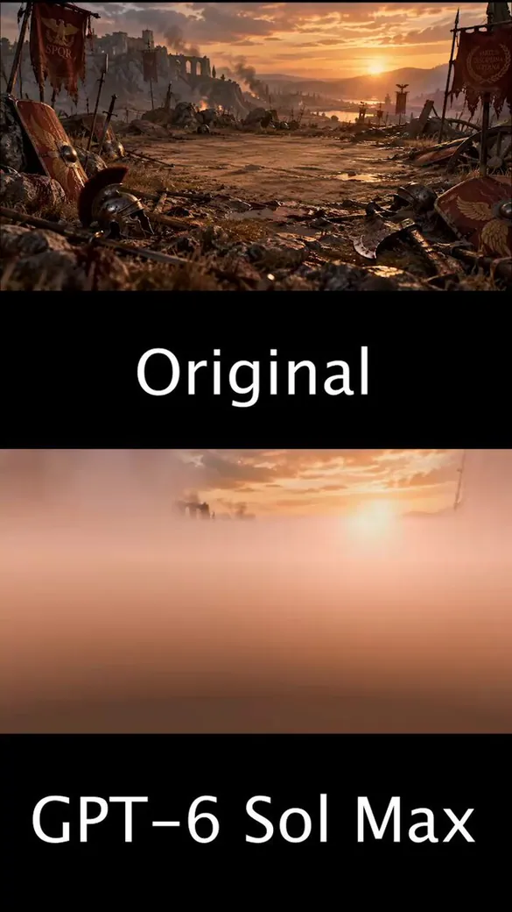</a>

**Imágenes de referencia:** [1](https://media.tripogrowth.space/media/e6e72ad3-34e0-4f09-a4c4-8ca0476f7d2d.png) · [2](https://pbs.twimg.com/media/HTCdLiZbUAAPgbm.png)

**Prompt**

```text
LA TAREA
Crea en Blender una escena de campo de batalla romano a la hora dorada a partir de la imagen conceptual proporcionada. Se permite usar generación. Puedes generar modelos 3D para el entorno y sus componentes con las herramientas de generación disponibles (Tripo en https://t.co/JV0K8OtuWC)) y ensamblarlos. Todo debe formar una escena coherente: escala equivalente, materiales consistentes e iluminación unificada. Requisitos: usa mapas de relieve en el suelo y mantén un nivel de detalle muy alto.
Crea un espacio circular despejado en el suelo, rodeado de grandes rocas, para formar una arena de 1 contra 1.
Representa todo con realismo.
Crea recursos procedurales siempre que sea posible.
Crea un skybox para el cielo de hora dorada.
Usa sombras marcadas.
Reutiliza objetos (banderas, estandartes, cascos, rocas, etc.). Exporta un GLB para cada objeto y reutiliza esos recursos.
Ajusta la escena a la imagen proporcionada con la mayor cercanía y precisión posibles.
REQUISITO DEL TIME-LAPSE
Mientras trabajas, guarda una captura de pantalla del viewport en una carpeta timelapse/ numerada después de cada adición relevante (cada objeto nuevo, pasada de modificadores, etapa de materiales y etapa de iluminación, en orden). Cuando termines el trabajo, reúne esos fotogramas en un vídeo time-lapse a 2 fps (0,5 s por fotograma) para que todo el proceso de construcción pueda verse de principio a fin. Entrega el vídeo time-lapse junto con los archivos principales.
DELIVERABLES
El archivo .blend, con la cámara y el viewport configurados para que la vista coincida exactamente con la imagen original.
El vídeo time-lapse del proceso de construcción.
```

<details>
<summary>Prompt original</summary>

```text
THE TASK
Build a golden-hour Roman battlefield set piece in Blender from the supplied concept image.  Generation is allowed. You may generate 3D models for the environment and its parts with the available generation tools (Tripo on https://t.co/JV0K8OtuWC) and assemble them. Everything must still form one coherent scene: matched scale, consistent materials, and unified lighting.  Requirements: Use bump maps on the ground and keep the ground highly detailed.
Create a circular empty spot on the ground with large boulders around it to form a 1v1 arena.
Render everything realistically.
Create assets procedurally where possible.
Create a skybox for golden-hour sky.
Use harsh shadows.
Reuse objects (flags, banners, helms, rocks, etc.). Export a GLB for every object and reuse those assets.
Match the supplied image as closely and accurately as possible.
TIMELAPSE REQUIREMENT
While you build, save a viewport screenshot into a numbered timelapse/ folder after every meaningful addition (each new object, modifier pass, material step, and lighting step, in order).  When the work is finished, assemble those frames into a timelapse video at 2 fps (0.5 s per frame) so the full build can be watched from start to finish. Deliver the timelapse video with the main files.
DELIVERABLES
The .blend file, with camera and viewport set so the view exactly matches the original image.
The build timelapse video.
```

</details>

[Ver detalles ↗](https://www.tripo3d.ai/es/3d-prompts/gpt-6-astra-2103351755971207251) · [Publicación original](https://x.com/tonysurix/status/2103352274269675532) · [Volver a los ejemplos](#all-prompts)

---

<a id="gpt-6-astra-2103308083242082314"></a>

### STILLWATER — Experiencia de pantano iluminado por la luna en el navegador

[YouWare](https://x.com/YouWareAI) · 2026-09-25 · GPT-6 Astra · Escenas

<a href="https://www.tripo3d.ai/es/3d-prompts/gpt-6-astra-2103308083242082314">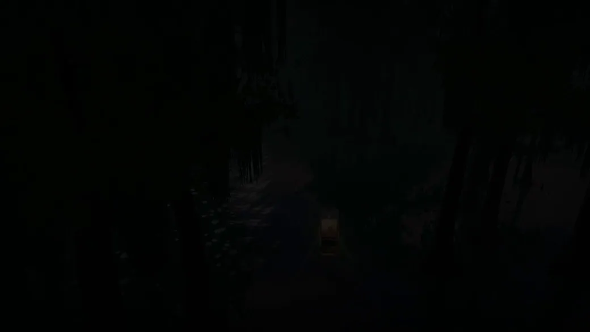</a>

**Prompt**

```text
Crea una experiencia para navegador en Three.js llamada STILLWATER. Tono: un pantano iluminado por la luna en el que te pierdes. No es un juego con enemigos. No busca el fotorrealismo de Unreal. Es un mundo web sereno y de aspecto lujoso, donde los reflejos del agua son los protagonistas. La gente debería quedarse mirando el agua durante un tiempo poco saludable.

ENTORNO
- Título del lugar: THE DEEP SWAMP
- Hora en el HUD: 19:26
- Primer lugar con nombre: Heron bend
- Lema bajo el nombre del lugar: "Leave a little room for the wild."
- Notificación de descubrimiento al llegar: "Discovered: Heron bend"

MUNDO
Un pantano de cipreses inundado al salir la luna, durante el crepúsculo avanzado.
- Árboles altos, de raíces nudosas, erguidos en aguas de color negro verdoso
- Musgo español colgando en largos filamentos
- Nenúfares agrupados a lo largo de las orillas
- Un canal estrecho y sinuoso que desemboca en una curva más amplia
- Niebla volumétrica densa, distancia verde azulada y cielo nublado entre rosa y púrpura
- Una luna brillante con un largo sendero de reflejos fragmentados sobre el agua
- Algunas aves cruzando el cielo
- La luz cálida de la cabina del barco atravesando la penumbra

AGUA (no escatimes en este aspecto)
Este es el elemento protagonista.
- Reflejos en tiempo real de los árboles, la luna, la niebla y las luces del barco
- Oleaje suave, no olas oceánicas
- Nenúfares apoyados en la superficie y balanceándose
- Espuma en la orilla y agua oscura rica en taninos cerca de las raíces
- Reflejos en espacio de pantalla o planos, con calidad suficiente para que el sendero lunar resulte cinematográfico
- Mantén 60 fps. Usa LOD en los árboles y vegetación instanciada.

BARCO
Una pequeña barca de trabajo con cabina, desgastada por el clima.
- Número de casco 86 en la popa
- Cabina blanca, casco azul oscuro y lámparas interiores cálidas
- Deriva pausada por el canal, con recorrido guiado lento opcional
- Velocidad aproximada en el HUD: 15.9 KNOTS
- Etiqueta de modo: GUIDED DRIFT
El jugador puede mirar a su alrededor. La cámara puede seguir el barco en una persecución cinematográfica o mediante una órbita lateral.

CÁMARA
- Empieza mostrando el barco en tres cuartos, entre los árboles
- Avanza a la deriva detrás de la popa por el canal iluminado por la luna
- Desplazamiento lateral ocasional junto a un tronco en primer plano
- Arrastra para mirar
- PHOTO MODE opcional
Debe sentirse como un documental de naturaleza, no como un FPS.

INTERFAZ — editorial, no propia de un juego
Arriba a la izquierda: distintivo pequeño + STILLWATER
Arriba en el centro: THE DEEP SWAMP / 19:26 y un rumbo de brújula (por ejemplo, 314°)
Arriba a la derecha: iconos utilitarios discretos
Abajo a la izquierda:
  EXPLORING STILLWATER
  Heron bend
  Leave a little room for the wild.
  15.9 KNOTS
  GUIDED DRIFT
Abajo a la derecha: PHOTO MODE, fps, Pause
Centro inferior: notificación pequeña "Discovered: Heron bend"
Fila de indicaciones pequeñas: shaders / agua / arrastra para mirar / fotos / fauna

Estética: gradación fílmica oscura, verdes apagados, nubes magenta y un único brillo lunar. Prima el gusto sobre el realismo. No añadas una interfaz de depuración recargada.

TECNOLOGÍA
Three.js en el navegador. Naturaleza procedural e instanciada. Shader de agua personalizado. Niebla. Sombras suaves o iluminación de crepúsculo con aspecto de iluminación precalculada. Si puedes crear los recursos tú mismo, no uses un paquete de pantano de una tienda de recursos.

NO añadas combate, inventario, sustos repentinos ni una búsqueda del tesoro. Más adelante puede haber algo al acecho bajo el agua, pero no ahora.
```

<details>
<summary>Prompt original</summary>

```text
Build a browser experience in Three.js called STILLWATER.  Tone: a moonlit swamp you get lost in. Not a game with enemies. Not photoreal Unreal. A quiet, expensive-looking web world where the water reflections are the feature. People should stare at the water for an unhealthy amount of time.  SETTING - Location title: THE DEEP SWAMP - Time on the HUD: 19:26 - First named place: Heron bend - Tagline under the place name: "Leave a little room for the wild." - Discovery toast when you arrive: "Discovered: Heron bend"  WORLD A flooded cypress swamp at moonrise / late dusk. - Tall knobby-kneed trees standing in black-green water - Spanish moss hanging in long strands - Lily pads clustered along the banks - Narrow winding channel that opens into a wider bend - Thick volumetric fog, teal-green distance, purple-pink cloudy sky - A bright moon with a long broken reflection path on the water - A few birds crossing the sky - Warm cabin light from the boat punching through the gloom  WATER (do not cheap out) This is the hero. - Real-time reflections of trees, moon, fog and boat lights - Gentle swell, not ocean waves - Lily pads that sit on the surface and bob - Shoreline foam / dark tannin water near roots - Screen-space or planar reflections good enough that the moon path feels cinematic - Keep 60fps. LOD the trees, instanced foliage.  BOAT A small weathered cabin skiff / workboat. - Hull number 86 on the stern - White cabin, dark blue hull, warm interior lamps - Idle drift through the channel, optional slow guided tour - HUD speed around 15.9 KNOTS - Mode label: GUIDED DRIFT Player can look around. Boat can be followed from a cinematic chase / side orbit.  CAMERA - Start on a three-quarter of the boat in the trees - Drift behind the stern down the moonlit lane - Occasional side slide past a foreground trunk - Drag to look - Optional PHOTO MODE Feel like a nature documentary, not an FPS.  UI — editorial, not gamey Top-left: small mark + STILLWATER Top-center: THE DEEP SWAMP / 19:26, a compass heading (e.g. 314°) Top-right: quiet utility icons Bottom-left:   EXPLORING STILLWATER   Heron bend   Leave a little room for the wild.   15.9 KNOTS    GUIDED DRIFT Bottom-right: PHOTO MODE, fps, Pause Center-bottom: small toast "Discovered: Heron bend" Tiny hint row: shaders / water / drag to look / photos / wildlife  Look: dark filmic grade, muted greens, magenta clouds, one moon highlight. Taste over realism. No bloated debug GUI.  TECH Three.js in the browser. Procedural / instanced nature. Custom water shader. Fog. Soft shadows or baked-looking dusk lighting. No asset-store swamp pack if you can author it.  DO NOT add combat, inventory, jump scares, or a treasure hunt. Something can lurk underwater later — not now.
```

</details>

[Ver detalles ↗](https://www.tripo3d.ai/es/3d-prompts/gpt-6-astra-2103308083242082314) · [Publicación original](https://x.com/YouWareAI/status/2103310302993621090) · [Volver a los ejemplos](#all-prompts)

---

<a id="claude-opus-5-5-2103303303358534021"></a>

### Secuencia interactiva de lanzamiento de un cohete en 3D sobre el océano

[PEP PEPICH](https://x.com/Artless101) · 2026-09-25 · Claude Opus 5.5 · Animación

<a href="https://www.tripo3d.ai/es/3d-prompts/claude-opus-5-5-2103303303358534021">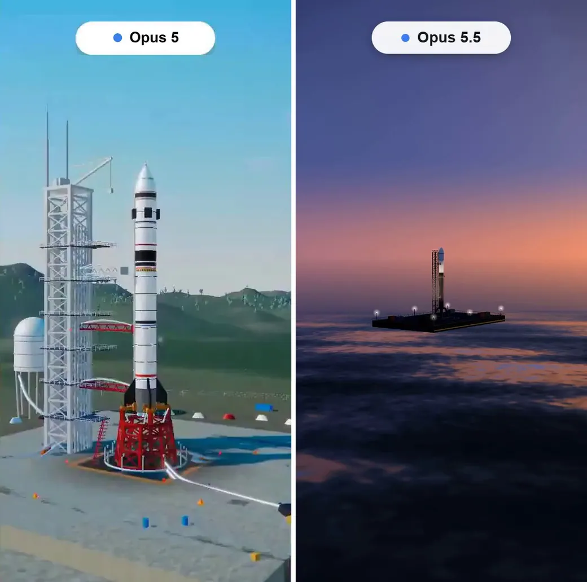</a>

**Prompt**

```text
Crea un lanzamiento de cohete cinematográfico, muy detallado e interactivo en 3D desde una plataforma oceánica al amanecer. Entrega el proyecto completo en un único archivo HTML que se abra directamente en Chrome. Usa Three.js + WebGL y recursos procedurales. Inserta los recursos siempre que sea práctico; puedes usar una CDN fiable para la biblioteca de renderizado.

DIRECCIÓN ARTÍSTICA
Crea una transición dramática desde un océano oscuro de tonos azul violáceos antes del amanecer hasta la luz cálida del sol sobre la atmósfera. Usa proporciones convincentes, materiales detallados, profundidad atmosférica y ángulos de cámara cuidadosamente compuestos. El resultado debe transmitir la sensación de una película refinada sobre un vuelo espacial en miniatura.
COHETE Y PLATAFORMA DE LANZAMIENTO
Construye un cohete multietapa convincente, con una ojiva de forma definida, uniones entre paneles, anillos estructurales, conexiones entre etapas, toberas de motor y una cofia de carga útil que se separe en dos mitades.

Crea una plataforma de lanzamiento flotante y detallada, con torre de soporte, estructura de servicio retráctil, brazos de servicio, barandillas, escaleras, tuberías, equipos, reflectores y balizas de advertencia intermitentes. Mantén todas las estructuras físicamente conectadas y correctamente colocadas.
SECUENCIA DE LANZAMIENTO
Crea una secuencia de aproximadamente 46 segundos:

Movimiento de cámara de presentación alrededor de la plataforma.

Los brazos de servicio y la estructura de servicio se retraen.
Los motores se encienden e iluminan el cohete, la plataforma y el agua cercana.
El humo se extiende por la cubierta mientras el cohete despega y acelera.
La cámara sigue el ascenso desde la atmósfera hacia el espacio.
La primera etapa se separa y se desprende.
Se enciende el motor de la segunda etapa.
Las mitades de la cofia se separan y dejan al descubierto un satélite.
El motor se apaga, el satélite se despliega y sus paneles solares se abren.
Termina con una vista orbital del satélite frente al horizonte curvo de la Tierra y el amanecer.
Comprime la línea temporal del vuelo para la presentación, manteniendo un movimiento coherente. Evita cambios bruscos de posición, componentes que se intersecten y efectos desconectados.
OCÉANO, ATMÓSFERA Y EFECTOS
Usa olas oceánicas animadas controladas por sombreadores, con reflejos de Fresnel y reflejos cálidos de la luz de los motores. Crea un escape por capas, con un núcleo brillante, una llama exterior más suave y partículas de humo a la deriva.
El humo debe expandirse, desvanecerse y responder al viento. El escape debe permanecer unido al motor correcto durante la separación de etapas. La transición debe pasar suavemente de la neblina atmosférica a un campo estelar oscuro y al limbo iluminado de la Tierra.

CÁMARA E INTERACCIÓN
Usa transiciones de cámara cinematográficas y fluidas: vista general de presentación, plano de encendido desde un ángulo bajo, seguimiento del ascenso, separación de etapas y primer plano del satélite. Mantén el sujeto principal visible tanto en diseños verticales como apaisados.

Incluye controles de reproducir/pausar, repetir y una barra de desplazamiento temporal con marcadores de eventos. Al cambiar de posición en la secuencia, deben reconstruirse la configuración correcta del cohete, el estado de las partículas, la posición de la cámara y la iluminación. Al repetir, toda la secuencia debe reiniciarse correctamente.
Mantén la interfaz minimalista y discreta. Permite ocultarla para grabar.

CALIDAD TÉCNICA
Usa animación independiente de la velocidad de fotogramas y sistemas de partículas eficientes. Reutiliza la geometría y los materiales cuando corresponda, gestiona correctamente el redimensionamiento y equilibra el detalle visual con un rendimiento fluido.

Prueba el HTML final en un navegador de escritorio. Inspecciona la consola y captura imágenes durante el encendido, el despegue, la separación de etapas y el despliegue del satélite. Corrige los errores de carga, el recorte, los problemas de geometría, los fallos al cambiar de posición en la secuencia y el encuadre deficiente de la cámara antes de entregar el archivo.
```

<details>
<summary>Prompt original</summary>

```text
Create a cinematic, highly detailed, interactive 3D rocket launch from an ocean platform at dawn. Deliver the complete project in one HTML file that opens directly in Chrome. Use Three.js + WebGL and procedural assets. Embed assets wherever practical; a reliable CDN may be used for the rendering library.

ART DIRECTION
Create a dramatic transition from a dark, blue-violet ocean before sunrise to warm sunlight above the atmosphere. Use convincing proportions, detailed materials, atmospheric depth, and carefully composed camera angles. The result should feel like a polished miniature spaceflight film.
ROCKET AND LAUNCH PLATFORM
Build a convincing multistage rocket with a shaped nose cone, panel seams, structural rings, interstage connections, engine nozzles, and a payload fairing that separates into two halves.

Create a detailed floating launch platform with a support tower, retracting strongback, service arms, railings, ladders, pipes, equipment, floodlights, and blinking warning beacons. Keep all structures physically connected and correctly positioned.
LAUNCH SEQUENCE
Create an approximately 46-second sequence:

Establishing camera move around the platform.

Service arms and strongback retract.
Engines ignite, illuminating the rocket, platform, and nearby water.
Smoke spreads across the deck as the rocket lifts off and accelerates.
The camera follows the climb from the atmosphere toward space.
The first stage separates and falls away.
The second-stage engine ignites.
The fairing halves separate, revealing a satellite.
The engine shuts down, the satellite deploys, and its solar panels unfold.
Finish with an orbital view of the satellite against Earth’s curved horizon and sunrise.
Compress the flight timeline for presentation while maintaining coherent motion. Avoid sudden position changes, intersecting components, or disconnected effects.
OCEAN, ATMOSPHERE, AND EFFECTS
Use animated shader-driven ocean waves with Fresnel reflections and warm engine-light reflections. Create layered exhaust with a bright core, softer outer flame, and drifting smoke particles.
Smoke should expand, fade, and respond to wind. Exhaust must remain attached to the correct engine through staging. Transition smoothly from atmospheric haze to a dark star field and Earth’s illuminated limb.

CAMERA AND INTERACTION
Use smooth cinematic camera transitions: wide establishing view, low-angle ignition shot, ascent tracking, stage separation, and satellite close-up. Keep the main subject visible in both portrait and landscape layouts.

Include play/pause, replay, and a scrubber with event markers. Seeking must reconstruct the correct rocket configuration, particle state, camera position, and lighting. Replaying must reset the entire sequence cleanly.
Keep the interface minimal and unobtrusive. Allow it to be hidden for recording.

TECHNICAL QUALITY
Use frame-rate-independent animation and efficient particle systems. Reuse geometry and materials where appropriate, handle resizing correctly, and balance visual detail with smooth performance.

Test the final HTML in a desktop browser. Inspect the console and capture screenshots at ignition, liftoff, staging, and satellite deployment. Fix loading errors, clipping, geometry problems, broken seeking, and poor camera framing before delivering the file.
```

</details>

[Ver detalles ↗](https://www.tripo3d.ai/es/3d-prompts/claude-opus-5-5-2103303303358534021) · [Publicación original](https://x.com/Artless101/status/2103303449831964679) · [Volver a los ejemplos](#all-prompts)

---

<a id="claude-opus-5-5-2103257687492374597"></a>

### Reino medieval interactivo para Claude Opus 5.5

[Vib3Coded](https://x.com/vib3coded) · 2026-09-24 · Claude Opus 5.5 · Interactivo

<a href="https://www.tripo3d.ai/es/3d-prompts/claude-opus-5-5-2103257687492374597">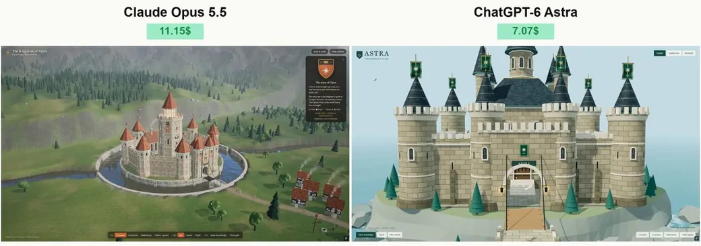</a>

**Prompt**

```text
Construye tu propio reino medieval.
Tu reino representa a Claude Opus 5.5. Diseña un castillo magnífico, inspirado en la historia, que exprese la identidad de este modelo mediante su arquitectura, heráldica, colores y atmósfera. Tienes total libertad artística dentro de un entorno medieval creíble.
No te limites a colocar un logotipo sobre un castillo genérico. Dale a tu reino un carácter arquitectónico distintivo y una identidad visual coherente. Inventa su escudo de armas, sus colores reales y un emblema heráldico original. Muéstralos en estandartes animados, escudos, decoraciones de la puerta y la ropa de los guardias del castillo. Coloca el nombre del reino sobre la entrada principal.
Crea una escena 3D interactiva y rica en detalles utilizando Three.js y WebGL. Entrega todo en un único archivo HTML independiente que se abra directamente en Chrome.
EL CASTILLO
Construye una fortaleza convincente con una torre del homenaje central, torres, almenas, murallas, una impresionante puerta fortificada, un puente levadizo funcional y un patio.
Incluye mampostería cuidadosamente modelada, ventanas arqueadas, puertas de madera, estructuras de tejado, escaleras, balcones, herrajes y pequeños detalles arquitectónicos. Haz que las estructuras resulten creíbles: las torres necesitan interiores o una profundidad convincente, las escaleras deben conectar con plantas accesibles y los puentes deben contar con soportes adecuados.
Rodea el castillo con un paisaje atractivo que encaje con tu reino: acantilados, colinas, un río, un foso, bosques o una pequeña aldea. Diseña una composición sólida que se vea hermosa desde múltiples ángulos.
VIDA E INTERACCIÓN
Da vida al reino con guardias que patrullen las murallas, aldeanos que se desplacen por el patio, estandartes que ondeen suavemente, humo de las chimeneas, pájaros y faroles parpadeantes.
Permite que el espectador:
Abra y cierre el puente levadizo y la puerta principal.
Siga a un guardia durante su patrulla.
Cambie entre una vista panorámica cinematográfica, el patio y las almenas.
Gire y acerque o aleje la cámara libremente.
Cambie entre la luz del día, el atardecer y la noche.
Mantén a los personajes sobre superficies transitables. Evita que atraviesen muros, puertas o a otros personajes.
ILUMINACIÓN Y ATMÓSFERA
Crea una iluminación cinematográfica que revele la arquitectura con claridad. Utiliza sombras suaves, profundidad atmosférica, agua convincente cuando corresponda y un posprocesado sutil.
Por la noche, ilumina ventanas, antorchas y faroles, manteniendo suficiente visibilidad para apreciar el castillo.
Busca una obra 3D sofisticada y terminada, con una arquitectura distintiva y abundantes detalles. Evita una colección de formas primitivas evidentes o torres repetitivas sin una función arquitectónica.
CALIDAD TÉCNICA
Genera los recursos de forma procedural siempre que sea práctico. Integra las texturas y demás recursos dentro del HTML. No debe ser necesario utilizar un servidor local ni un proceso de compilación.
Utiliza instanciación y agrupación de geometría cuando corresponda. Mantén fluidas la animación y la interacción con la cámara. Proporciona una interfaz mínima y elegante en inglés, junto con un botón para ocultarla.
Prueba realmente el resultado en Chrome para escritorio. Captura capturas de pantalla, revisa la consola, prueba todas las interacciones y corrige errores de renderizado, objetos flotantes, intersecciones de geometría y problemas de cámara.
Haz que este sea un castillo que la gente reconozca como TU reino incluso antes de leer su nombre.
Devuelve el archivo HTML independiente completo.
```

<details>
<summary>Prompt original</summary>

```text
Build your own medieval kingdom.
Your kingdom represents Claude Opus 5.5. Design a magnificent, historically inspired castle that expresses this model’s identity through architecture, heraldry, colors and atmosphere. You have complete artistic freedom within a believable medieval setting.
Do not simply place a logo on a generic castle. Give your kingdom a distinctive architectural character and a coherent visual identity. Invent its coat of arms, royal colors and an original heraldic emblem. Display them on animated banners, shields, gate decorations and the clothing of the castle guards. Place the kingdom’s name above the main entrance.
Create a richly detailed, interactive 3D scene using Three.js and WebGL. Deliver everything in one standalone HTML file that opens directly in Chrome.
THE CASTLE
Build a convincing fortress with a central keep, towers, battlements, curtain walls, an impressive gatehouse, a working drawbridge and a courtyard.
Include carefully modeled stonework, arched windows, wooden doors, roof structures, stairs, balconies, iron fittings and small architectural details. Make the structures believable: towers need interiors or convincing depth, stairs must connect to accessible floors, and bridges must have proper supports.
Surround the castle with an attractive landscape that suits your kingdom: cliffs, hills, a river, a moat, forests or a small village. Design a strong composition that looks beautiful from multiple angles.
LIFE AND INTERACTION
Bring the kingdom to life with guards patrolling the walls, villagers moving through the courtyard, gently waving banners, chimney smoke, birds and flickering lanterns.
Let the viewer:
Open and close the drawbridge and main gate.
Follow a guard on patrol.
Switch between a cinematic overview, the courtyard and the battlements.
Rotate and zoom freely.
Change between daylight, sunset and night.
Keep characters on walkable surfaces. Prevent them from passing through walls, doors or one another.
LIGHTING AND ATMOSPHERE
Create cinematic lighting that reveals the architecture clearly. Use soft shadows, atmospheric depth, convincing water where appropriate and restrained post-processing.
At night, illuminate windows, torches and lanterns while preserving enough visibility to appreciate the castle.
Aim for a sophisticated, finished 3D artwork with distinctive architecture and abundant detail. Avoid a collection of obvious primitive shapes or repetitive towers with no architectural purpose.
TECHNICAL QUALITY
Generate assets procedurally wherever practical. Embed textures and other assets inside the HTML. No local server or build step should be required.
Use instancing and geometry batching where appropriate. Keep animation and camera interaction smooth. Provide a minimal, elegant English interface and a button to hide it.
Actually test the result in desktop Chrome. Capture screenshots, inspect the console, test every interaction and fix rendering errors, floating objects, geometry intersections and camera problems.
Make this a castle people would recognize as YOUR kingdom, even before reading its name.
Return the completed standalone HTML file.
```

</details>

[Ver detalles ↗](https://www.tripo3d.ai/es/3d-prompts/claude-opus-5-5-2103257687492374597) · [Publicación original](https://x.com/vib3coded/status/2103257873203462412) · [Volver a los ejemplos](#all-prompts)

---

<a id="gpt-6-astra-2103211135214256350"></a>

### Experiencia explorable de otoño brumoso en Three.js

[Simonas](https://x.com/SimonasLTU1) · 2026-09-24 · GPT-6 Astra · Interactivo

<a href="https://www.tripo3d.ai/es/3d-prompts/gpt-6-astra-2103211135214256350">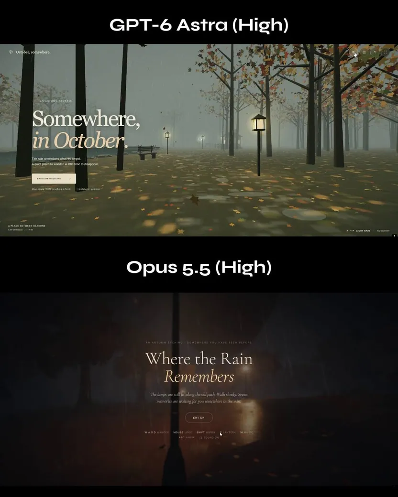</a>

**Prompt**

```text
Quiero que crees una experiencia explorable en Three.js, en un único archivo HTML/CSS/JS, con una atmósfera brumosa y lluviosa, de aire otoñal, misteriosa y nostálgica.
```

<details>
<summary>Prompt original</summary>

```text
I want you to create me a misty, rainy, autumn-like mysterious atmosphere, nostalgic experience in an explorable Three.js in a single html/css/js file.
```

</details>

[Ver detalles ↗](https://www.tripo3d.ai/es/3d-prompts/gpt-6-astra-2103211135214256350) · [Publicación original](https://x.com/SimonasLTU1/status/2103211135214256350) · [Volver a los ejemplos](#all-prompts)

---

<a id="gpt-6-astra-2103187935759655167"></a>

### Rumbo al norte: viaje interactivo en un barco vikingo

[Vib3Coded](https://x.com/vib3coded) · 2026-09-24 · GPT-6 Astra · Interactivo

<a href="https://www.tripo3d.ai/es/3d-prompts/gpt-6-astra-2103187935759655167">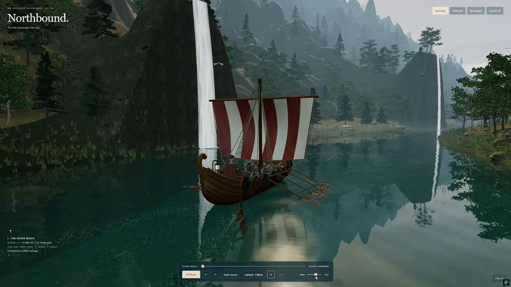</a>

**Prompt**

```text
Crea «Rumbo al norte», un hermoso viaje interactivo en 3D por un fiordo nórdico a bordo de un detallado barco vikingo.

Construye una escena auténticamente interactiva en tiempo real con Three.js y WebGL, entregada como un único archivo HTML independiente. Debe ser una experiencia explorable en el navegador, no un vídeo prerrenderizado ni una ilustración plana.

DIRECCIÓN VISUAL

Busca un entorno pulido y cinematográfico, con materiales realistas, proporciones naturales y colores sobrios. Evita una apariencia caricaturesca o de pocos polígonos.

Un barco vikingo de madera navega por aguas de color verde azulado intenso, entre imponentes acantilados, bosques frondosos, cascadas y pequeños asentamientos nórdicos. Usa perspectiva atmosférica, una niebla sutil, sombras suaves y una profundidad convincente. Compón vistas hermosas a lo largo de todo el viaje, no solo desde la posición inicial de la cámara.

EL BARCO VIKINGO

Construye un casco detallado y estanco, con tablones de madera superpuestos, vetas visibles, cuadernas, bancos y un interior continuo.
Añade una proa tallada con forma de dragón, una vela de tela a rayas, mástil, cuerdas, escudos, provisiones y cálidos faroles.
Incluye pasajeros y remeros vikingos de proporciones adecuadas, con ropa superpuesta, posturas sentadas creíbles y las manos colocadas cerca de los remos.
Mantén todos los componentes físicamente conectados. No debe haber pasajeros flotando, accesorios intersecados ni huecos visibles a través del casco.
Anima una flotabilidad, cabeceo y balanceo sutiles. La vela debe reaccionar suavemente al viento.

AGUA Y REMADO

Haz del agua un elemento visual central.

Usa un shader personalizado con reflejos planares, refracción, brillos de Fresnel, absorción dependiente de la profundidad, zonas poco profundas visibles y ondulaciones de superficie en capas. Los reflejos deben responder correctamente a la cámara en movimiento y a los cambios de iluminación.

Crea una estela creíble detrás del barco.

Anima un ciclo completo de remado: las palas entran en el agua, tiran hacia atrás, salen y regresan por encima de la superficie. Coordínalo con el movimiento de los remeros.

Genera ondulaciones, espuma y pequeñas gotas en los puntos reales de contacto entre las palas y el agua. Las estelas deben permanecer en el espacio del mundo y disiparse gradualmente. Evita que aparezcan efectos mientras las palas están en el aire.

ENTORNO Y MATERIALES

Usa un terreno detallado, formaciones rocosas irregulares, siluetas naturales de árboles, troncos ramificados y grupos individuales de hojas o agujas.

Usa materiales PBR con mapas de normales y rugosidad para la madera, la piedra y el suelo. Puedes integrar texturas con licencias adecuadas; incluye la atribución cuando sea necesario.

Asegúrate de que el terreno submarino continúe bajo la superficie. No debe haber costuras brillantes, huecos en la orilla, vegetación flotante ni árboles que obstruyan la ruta navegable.

CONTROLS

Teclas A/D o de flecha: gira a izquierda y derecha.
W/S: ajusta la velocidad.
Arrastrar con el ratón: mirar alrededor.
Ofrece modos de cámara de seguimiento, órbita y cinematográfico.
Incluye un modo opcional de viaje automático.
Añade controles para pausar, reiniciar, activar la pantalla completa y ocultar la interfaz.
Admite controles táctiles de dirección y velocidad en dispositivos móviles.
Impide que el barco atraviese tierra firme y rocas.

ATMÓSFERA E INTERFAZ

Ofrece tres preajustes de iluminación con transiciones fluidas: Mañana, Nublado y Luz de luna.

Añade, de forma opcional, sonidos ambientales de agua, viento, aves y remos. El audio debe comenzar únicamente después de la interacción del usuario.

Diseña una interfaz editorial minimalista: «Rumbo al norte.» con una tipografía serif elegante, etiquetas de capítulo sutiles y una barra de controles compacta y translúcida. Mantén el paisaje despejado.

RENDIMIENTO Y ENTREGA

Usa instanciación, presupuestos de geometría razonables, nivel de detalle basado en la distancia y objetivos de reflejo de tamaño adecuado. Adapta la calidad del renderizado al dispositivo en lugar de prometer una frecuencia de fotogramas fija.

Entrega un único archivo HTML con los scripts y recursos necesarios integrados, de modo que pueda abrirse directamente en un navegador moderno.

Prueba la dirección, los modos de cámara, las transiciones de iluminación y el remado. Inspecciona el barco desde varios ángulos y comprueba la línea de costa desde puntos de vista bajos. Corrige las intersecciones de geometría, los artefactos de los reflejos, el exceso de brillo y los errores de la consola antes de considerar terminada la escena.

Da prioridad a un agua convincente, un barco vikingo magníficamente construido y un entorno cohesionado por encima de añadir más objetos.
```

<details>
<summary>Prompt original</summary>

```text
Create “Northbound” - a beautiful, interactive 3D journey through a Nordic fjord aboard a detailed Viking longship.

Build a genuine real-time scene using Three.js and WebGL, delivered as a single standalone HTML file. This must be an explorable browser experience, not a pre-rendered video or a flat illustration.

VISUAL DIRECTION

Aim for a polished, cinematic environment with realistic materials, natural proportions, and restrained colors. Avoid a cartoon or low-poly appearance.

A wooden longship travels through deep green-blue water between towering cliffs, dense forests, waterfalls, and small Nordic settlements. Use atmospheric perspective, subtle mist, soft shadows, and convincing depth. Compose beautiful views throughout the journey, not just from the initial camera position.

THE LONGSHIP

Construct a detailed, watertight hull with overlapping wooden planks, visible grain, ribs, benches, and a continuous interior.
Add a carved dragon prow, striped cloth sail, mast, ropes, shields, supplies, and warm lanterns.
Include proportionate Viking passengers and rowers with layered clothing, believable seated poses, and hands positioned near their oars.
Keep every component physically connected. No floating passengers, intersecting accessories, or visible gaps through the hull.
Animate subtle buoyancy, pitch, and roll. The sail should respond gently to the wind.

WATER AND ROWING

Make the water a central visual feature.

Use a custom shader with planar reflections, refraction, Fresnel highlights, depth-dependent absorption, visible shallow areas, and layered surface ripples. Reflections must respond correctly to the moving camera and changing lighting.

Create a believable wake behind the ship.

Animate a complete rowing cycle: blades enter the water, pull backward, lift out, and return above the surface. Coordinate this with the rowers’ movement.

Generate ripples, foam, and small droplets at the actual blade-water contact points. Trails must remain in world space and gradually dissipate. Avoid effects appearing while the blades are in the air.

ENVIRONMENT AND MATERIALS

Use detailed terrain, irregular rock formations, natural tree silhouettes, branching trunks, and individual leaf or needle clusters.

Use PBR materials with normal and roughness maps for wood, stone, and ground. You may embed appropriately licensed textures; include attribution where required.

Ensure the underwater terrain continues beneath the surface. No bright seams, shoreline gaps, floating vegetation, or trees obstructing the navigable route.

CONTROLS

A/D or arrow keys: steer left and right.
W/S: adjust speed.
Mouse drag: look around.
Provide follow, orbit, and cinematic camera modes.
Include an optional automatic journey mode.
Add pause, reset, fullscreen, and hide-interface controls.
Support touch steering and speed controls on mobile.
Prevent the ship from passing through land and rocks.

ATMOSPHERE AND INTERFACE

Provide three smoothly transitioning lighting presets: Morning, Overcast, and Moonlight.

Add optional ambient water, wind, birds, and rowing sounds. Audio must begin only after user interaction.

Design a minimal editorial interface: “Northbound.” in an elegant serif typeface, subtle chapter labels, and a compact translucent control bar. Keep the scenery unobstructed.

PERFORMANCE AND DELIVERY

Use instancing, sensible geometry budgets, distance-based detail, and appropriately sized reflection targets. Adapt rendering quality to the device instead of promising a fixed frame rate.

Deliver one HTML file with scripts and required assets embedded so it can open directly in a modern browser.

Test steering, camera modes, lighting transitions, and rowing. Inspect the ship from multiple angles and check the shoreline from low viewpoints. Fix geometry intersections, reflection artifacts, excessive glare, and console errors before considering the scene finished.

Prioritize convincing water, a beautifully constructed longship, and a cohesive environment over adding more objects.
```

</details>

[Ver detalles ↗](https://www.tripo3d.ai/es/3d-prompts/gpt-6-astra-2103187935759655167) · [Publicación original](https://x.com/vib3coded/status/2103189762672611675) · [Volver a los ejemplos](#all-prompts)

---

<a id="claude-opus-5-5-2103145567945986461"></a>

### Espacio: un cortometraje de una catedral llena de luz de vitrales

[AGIおやZ](https://x.com/AGIOyaZ) · 2026-09-24 · Claude Opus 5.5 · Animación

<a href="https://www.tripo3d.ai/es/3d-prompts/claude-opus-5-5-2103145567945986461"></a>

**Prompt**

```text
Crea con three.js un cortometraje vertical de 1080×1920, a 30 fotogramas por segundo y de unos 36 segundos de duración.

【Título de la obra】
Espacio

【Experiencia que se busca transmitir】
Este vídeo debe hacer sentir, sin mostrar ningún personaje, cómo se va perdiendo el tiempo por la presión de ser más eficiente y cómo, en el momento de recuperar espacio, la vida vuelve a llenarse de una luz abundante. Al final, la luz de los vitrales que aparece por todo el suelo debe provocar en quien lo vea un suspiro de asombro.

【Escenario】
・Interior de una catedral de piedra, tenuemente iluminada. En la pared frontal hay una única ventana ojival de 15 m de alto por 10 m de ancho
・Desde el exterior de la ventana entra una luz intensa en un ángulo de 45 grados, que proyecta en el suelo de piedra la forma de la ventana
・La ventana tiene un vitral con la Virgen en el centro, dos ángeles con las alas extendidas a ambos lados y un rosetón en la parte superior. El diseño debe ser original, sin imitar obras existentes, y presentar una composición simétrica

【Estructura temporal】
0–3 segundos: La luz que entra por la ventana todavía es blanca y no tiene color. En el suelo aparece una forma de luz blanca y suave
3–11 segundos: Cubos grises con palabras grabadas como «Ocupado», «Eficiencia», «Urgente» y «Fecha límite» llegan volando uno tras otro desde la parte delantera de la sala y van cubriendo la ventana. El ritmo de llegada se acelera cada vez más y la sala se oscurece a medida que la ventana queda bloqueada
11–14 segundos: La ventana queda completamente tapada; reinan la oscuridad y el silencio
14–19 segundos: Un único bloque con la palabra «Ocupado» se desprende de la ventana, cae y se convierte en partículas de luz hasta desaparecer. Por el hueco entra un rayo de luz de colores intensos
19–26 segundos: Los bloques empiezan a desprenderse en cadena a partir del primer hueco. Cada vez que aumenta el número de huecos, aparecen más columnas de luz multicolor y el vitral oculto se revela poco a poco
26–33 segundos: Todos los bloques desaparecen. La cámara atraviesa las columnas de luz mientras asciende y, desde una vista cenital, enfoca el suelo. Por toda su superficie se proyecta el vitral de la Virgen y los ángeles en forma de luz de colores vivos
33–36 segundos: Toda la pantalla queda envuelta en una luz deslumbrante, aparece el último mensaje y la pieza termina en silencio

【Mensajes (en tipografía Mincho, aparecen y desaparecen sutilmente)】
・«Cada día, más rápido.»
・«Más eficiente.»
・«Cuando me di cuenta, la luz había dejado de entrar.»
・«Voy a soltar una cosa.»
・«La luz entra por el espacio que queda.»
・«Esa luz era más abundante que antes.»
・Al final, en grande: «La abundancia habita en el espacio que queda»

【Luz y texturas】
・Las columnas de luz adoptan el color de la zona correspondiente del vitral y el polvo suspendido en el aire centellea
・La proyección sobre el suelo debe reflejar con precisión qué huecos de la ventana están abiertos; las zonas donde haya bloques deben quedar en sombra
・Los bloques son de un gris mate, frío e impersonal. Las palabras están grabadas en blanco
・La primera mitad debe ser fría y acromática; la segunda, de rojos, azules y dorados como piedras preciosas. Este contraste de color debe expresar que todo se ha vuelto más abundante

【Requisitos técnicos】
・Genera la imagen del vitral como una textura y calcula a partir de ese mismo diseño la luz del suelo, las columnas de luz y la imagen de la ventana, para que todos coincidan
・Avanza el tiempo con precisión en incrementos de 1/30 de segundo, exporta cada fotograma por separado y conviértelo en un MP4

【Acabado】
Renderiza y comprueba cada escena en la práctica. Antes de entregarlo, corrige cualquier problema: verifica que el diseño del vitral pueda reconocerse en el suelo como la Virgen y los ángeles, que los mensajes sean legibles y que los movimientos no resulten bruscos.
```

<details>
<summary>Prompt original</summary>

```text
three.jsで、縦長1080×1920・30コマ/秒・約36秒の短編映像を作ってください。

【作品名】
余白

【見せたい体験】
効率化に追われて時間を失っていく感覚と、余白を手に入れた瞬間に人生が豊かな光で満たされていく感覚を、人物を一切登場させずに体感させる映像です。最後に床一面に浮かび上がるステンドグラスの光で、見た人が思わず息をのむことを目指します。

【舞台】
・薄暗い石造りの大聖堂の内部。正面の壁に、高さ15m・幅10mの尖頭アーチ型の窓が一つだけある
・窓の外からは、斜め45度の角度で強い光が差し込み、石の床に窓の形の光を落としている
・窓には、中央に聖母、両脇に翼を広げた二人の天使、上部にバラ窓を配したステンドグラスがはまっている。デザインは既存の作品を模さずオリジナルで、左右対称の構図にする

【時間の構成】
0〜3秒：窓から差す光は、まだ色のない白い光。床にやわらかな白い光の形
3〜11秒：「忙しい」「効率化」「至急」「締切」などの言葉が刻まれた灰色の立方体が、部屋の手前から次々と飛んできて窓を埋めていく。飛来のペースはどんどん加速し、窓が埋まるほど部屋は暗くなる
11〜14秒：窓は完全にふさがれ、闇と静寂
14〜19秒：「忙しい」のブロックが一つだけ窓から外れて落ち、光の粒になって消える。空いた穴から、鮮やかな色の一筋の光が差し込む
19〜26秒：最初の穴を中心に、ブロックが連鎖的に外れていく。穴が増えるたびに色とりどりの光の柱が増え、隠れていたステンドグラスが少しずつ姿を現す
26〜33秒：すべてのブロックが消え、カメラは光の柱をくぐり抜けて上昇し、真上から床を見下ろす。床一面に、聖母と天使のステンドグラスが色鮮やかな光として映し出されている
33〜36秒：画面全体がまばゆい光に包まれ、最後の言葉が浮かび、静かに終わる

【言葉（明朝体、控えめに浮かんでは消える）】
・「毎日、もっと速く。」
・「もっと、効率よく。」
・「気づけば、光が入らなくなっていた。」
・「ひとつ、手放してみる。」
・「空いたところから、光が入る。」
・「その光は、前より豊かだった。」
・最後に大きく：「豊かさは余白に宿る」

【光と質感】
・光の柱は、ステンドグラスのその場所の色に染まり、空中の塵がきらめく
・床の投影は、窓のどの穴が空いているかを正確に反映する（ブロックがある場所は影になる）
・ブロックは無機質なマットグレー。言葉は白く刻印されている
・前半は冷たく無彩色、後半は宝石のような赤・青・金。この色の対比で「豊かになった」ことを語る

【技術条件】
・ステンドグラスの絵柄は画像として生成し、床の光・光の柱・窓の表示はすべて同じ絵柄から計算して一致させる
・時間を1/30秒ずつ正確に進めて1コマずつ書き出し、MP4にする

【仕上げ】
各場面を実際に描画して確認し、ステンドグラスの絵柄が床の上で聖母と天使として読み取れるか、言葉が読めるか、動きが唐突でないかを直してから渡してください。
```

</details>

[Ver detalles ↗](https://www.tripo3d.ai/es/3d-prompts/claude-opus-5-5-2103145567945986461) · [Publicación original](https://x.com/AGIOyaZ/status/2103145567945986461) · [Volver a los ejemplos](#all-prompts)

---

<a id="claude-opus-5-5-2103144530157687114"></a>

### Juego al estilo de Genshin Impact ambientado en San Francisco

[Every 📧](https://x.com/every) · 2026-09-24 · Claude Opus 5.5 · Juegos

<a href="https://www.tripo3d.ai/es/3d-prompts/claude-opus-5-5-2103144530157687114">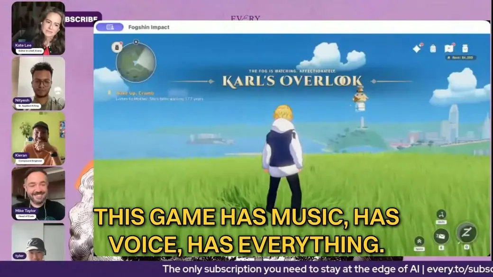</a>

**Prompt**

```text
Crea un juego al estilo de Genshin Impact ambientado en San Francisco.
```

<details>
<summary>Prompt original</summary>

```text
Build a Genshin Impact–style game set in San Francisco.
```

</details>

[Ver detalles ↗](https://www.tripo3d.ai/es/3d-prompts/claude-opus-5-5-2103144530157687114) · [Publicación original](https://x.com/every/status/2103144530157687114) · [Volver a los ejemplos](#all-prompts)

---

<a id="claude-opus-5-5-2103116235009347650"></a>

### Película cinematográfica sobre la batalla de Austerlitz

[Winter](https://x.com/WinterArc2125) · 2026-09-24 · Claude Opus 5.5 · Animación

<a href="https://www.tripo3d.ai/es/3d-prompts/claude-opus-5-5-2103116235009347650">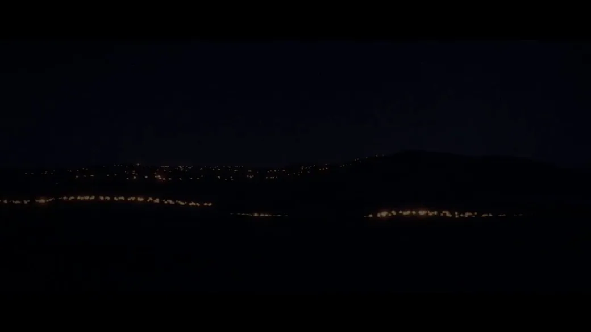</a>

**Imágenes de referencia:** [1](https://media.tripogrowth.space/media/9420c404-1c47-48c2-a7ec-1b5dfdc1f057.jpg) · [2](https://media.tripogrowth.space/media/0e238466-f725-44b7-8cd2-dc436c9e66c2.jpg) · [3](https://pbs.twimg.com/media/HS_FTwwXcAIpMjc.jpg) · [4](https://pbs.twimg.com/media/HS_FWGXXUAA5LrJ.jpg)

**Prompt**

```text
Crea un video cinematográfico de 4–5 minutos sobre la batalla de Austerlitz (1805), realizado íntegramente mediante código.

Investiga a fondo la batalla y decide por tu cuenta cómo contar la historia, estructurar el ritmo, explicar la estrategia y visualizar los acontecimientos. Quiero que sea históricamente riguroso, dramático, fácil de entender y visualmente excepcional.

Usa las pinturas adjuntas como inspiración visual, no como un requisito estilístico estricto. Me encantan su escala, atmósfera, humo, cielos dramáticos, caballería, formaciones masivas, paisaje y sensación de caos. Encuentra una forma de trasladar esa sensación al código; pero, si puedes inventar un lenguaje visual más potente, hazlo.

No debe parecer una infografía genérica ni un juego de estrategia. Tiene que sentirse como una película histórica cinematográfica que, casualmente, está renderizada mediante código.

Tienes control creativo total. Sorpréndeme.
```

<details>
<summary>Prompt original</summary>

```text
Create a 4–5 minute cinematic video about the Battle of Austerlitz (1805), built entirely in code.

Research the battle thoroughly and decide for yourself how to tell the story, structure the pacing, explain the strategy, and visualize the events. I want it to be historically accurate, dramatic, easy to understand, and visually exceptional.

Use the attached paintings as visual inspiration, not a strict style requirement. I love their scale, atmosphere, smoke, dramatic skies, cavalry, massed formations, landscape, and sense of chaos. Find a way to translate that feeling into code — but if you can invent a stronger visual language, do it.

Don't make it feel like a generic infographic or strategy game. It should feel like a cinematic historical film that happens to be rendered with code.

You have complete creative control. Surprise me.
```

</details>

[Ver detalles ↗](https://www.tripo3d.ai/es/3d-prompts/claude-opus-5-5-2103116235009347650) · [Publicación original](https://x.com/WinterArc2125/status/2103116689944502720) · [Código fuente](https://github.com/WinterArc21/Battle-of-Austerlitz-Film) · [Volver a los ejemplos](#all-prompts)

---

<a id="claude-opus-5-5-2103106070549757960"></a>

### Construye la Torre Eiffel en Three.js

[Pascual ⚡](https://x.com/0xPascual) · 2026-09-24 · Claude Opus 5.5 · Recursos

<a href="https://www.tripo3d.ai/es/3d-prompts/claude-opus-5-5-2103106070549757960"></a>

**Prompt**

```text
Construye la Torre Eiffel en Three.js.
```

<details>
<summary>Prompt original</summary>

```text
build the Eiffel Tower in Three.js.
```

</details>

[Ver detalles ↗](https://www.tripo3d.ai/es/3d-prompts/claude-opus-5-5-2103106070549757960) · [Publicación original](https://x.com/0xPascual/status/2103106070549757960) · [Volver a los ejemplos](#all-prompts)

---

<a id="crazy-tanks-3d-island-artillery"></a>

### Crazy Tanks — Artillería 3D en una isla

[jared](https://x.com/jaredliu_bravo) · 2026-09-24 · GPT-6 Astra · Juegos

<a href="https://www.tripo3d.ai/es/3d-prompts/crazy-tanks-3d-island-artillery">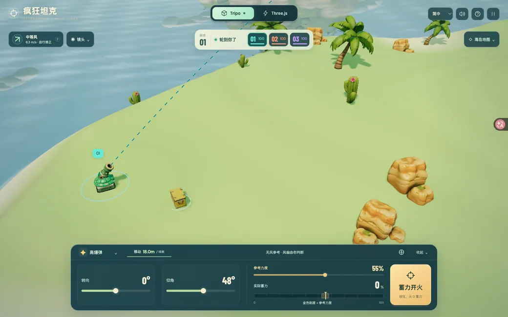</a>

**Prompt**

```text
1. Objetivo del proyecto
Crear Crazy Tanks — Wild Tides, un juego de artillería por turnos, jugable y realmente tridimensional, ambientado en una isla tropical. El jugador apunta un tanque pequeño, calcula el viento, controla una carga que empieza en cero y transforma el campo de batalla con proyectiles. Incluir partidas individuales contra la IA y partidas locales por turnos, con un modo predeterminado de todos contra todos con tres tanques y un duelo opcional entre dos tanques. Gana el último tanque superviviente. Usar la jugabilidad y las capturas de referencia actuales como objetivo visual.

2. Estilo visual
Usar una cámara en perspectiva y geometría 3D que se pueda orbitar libremente, no sprites planos ni una vista lateral fija. Crear un diorama soleado en miniatura, con tanques redondeados de jade, naranja coral y azul violáceo, arena cremosa, hierba verde pálida, agua turquesa reflectante, sombras suaves y una ligera bruma atmosférica a distancia. Conservar las siluetas diferenciadas de los tres tanques y sus cañones correspondientes. Usar un panel redondo de color crema, con aspecto de blindaje, sobre el campo de batalla y una consola de control redondeada de color verde azulado oscuro debajo. El dorado indica la potencia de referencia y la acción de disparo; el menta indica la carga real y el estado de aliado. Mantener visible en la parte superior el selector de apariencia Tripo / Three.js, con los recursos de Tripo seleccionados por defecto. Cambiar la apariencia no debe alterar el estado de la partida ni el de la física. Usar guiones finos de color verde azulado, espaciados uniformemente en el espacio de pantalla, y un círculo de aterrizaje discreto; no reflejar los gráficos de apuntado en el agua.

3. Mundo y escena
Usar una isla con un campo de alturas deformable, de aproximadamente 260 por 184 metros, rodeada por un océano con un nivel del mar fijo. Colocar los tanques iniciales bien separados sobre terreno estable; distribuir rocas, palmeras, cactus y cajas de suministros coleccionables. Las islas decorativas más pequeñas aportan profundidad al fondo y nunca sustituyen al terreno principal deformable. Las explosiones deforman la superficie y pueden excavar por debajo del nivel del mar. Mantener el color de la orilla y la espuma en una única superficie de agua para evitar planos superpuestos y parpadeos. Proyectar los números de los tanques desde sus posiciones en el mundo en cada fotograma renderizado. Ofrecer vistas de trayectoria completa, tanque, órbita y vista táctica desde arriba. La vista de trayectoria debe encajar el tanque que dispara, el arco y el aterrizaje estimado en el espacio entre el HUD y la consola de control. Antes de cada disparo, mostrar el tanque que dispara durante unos 0,8 segundos, detenerse en la boca del cañón y después seguir al proyectil. La interacción manual con la cámara cancela el seguimiento cinematográfico.

4. Inventario de recursos
Usar ranuras de modelos estables y mantener los modelos de reemplazo accesibles de forma individual:
- jade-body: chasis oruga verde y redondeado, con forma de escudo; el cuerpo predeterminado del jugador. jade-cannon: cañón de jade a juego, con ánima oscura y detalles dorados, articulado de forma independiente.
- ember-body: chasis blindado naranja coral, puntiagudo y de perfil mecánico bajo. ember-cannon: su cañón naranja a juego, más largo, con boca oscura.
- bolt-body: chasis oruga industrial azul violáceo, con blindaje angular de placas. bolt-cannon: cañón azul grueso a juego.
- shell: proyectil de artillería de latón, con punta cónica oscura y detalle cian. Reutilizarlo con el tinte y la escala específicos de cada arma.
- crate: caja de suministros blindada amarilla, con marcas cian y esquinas reforzadas; recogerla otorga 20 puntos de blindaje, hasta un máximo de 100.
- rock: conjunto redondeado de arenisca cálida; repetirlo con escalas variadas y usar un proxy de colisión independiente.
- palm: tronco curvado y frondas verdes dispuestas en capas; repetirlo como vegetación de la isla.
- cactus: cactus verde compacto con pequeños detalles florales; repetirlo en el terreno seco.
- islet: isla de fondo redondeada y cubierta de hierba, con bordes de roca y arena pálidas; repetirla más allá de la arena de combate.
Dar prioridad a las tres parejas de cuerpos y cañones a juego, seguidas del proyectil, la caja y los elementos ambientales. Mantener la deformación del terreno, el océano, la espuma, el fuego, el humo, las ondas de choque, los escombros, los gráficos de apuntado, la iluminación, la interfaz y los proxies de colisión como elementos procedurales. Las piezas de cuerpo y cañón a juego comparten una única referencia de diseño y escala. Colocar el pivote del cañón en su articulación mecánica, alinear su eje delantero con +X y usar la boca visible como punto físico de lanzamiento. Los cuerpos de los tanques deben adaptarse a las pendientes mediante cuaterniones; el apuntado de la torreta debe seguir siendo una dirección en el espacio del mundo. Conservar las texturas PBR de origen y las costuras UV. Mantener separados los modelos descargables en resolución completa de las copias optimizadas para la ejecución del juego; las referencias y la procedencia de los archivos deben identificar la fuente real de generación.

5. Jugabilidad y respuesta
Cada tanque vivo recibe 18 metros de movimiento al comenzar su turno. WASD y el panel de movimiento desplazan el tanque con respecto a la pantalla; las teclas de dirección y el panel de apuntado ajustan el acimut y la elevación. Los controles deslizantes permiten ajustar el acimut, una elevación de 10–80 grados y una potencia de referencia de 0–100. Seleccionar a un rival solo orienta el tanque hacia él; no debe calcular el disparo.
El arco verde azulado estima la potencia de referencia elegida SIN viento. Mantener fija esa referencia y su marcador dorado durante la carga. Mantener pulsado Fire, Espacio o Intro con el botón Fire enfocado para iniciar siempre la potencia real en 0; aumentarla 18 puntos porcentuales por segundo, mantenerla en 100 y disparar exactamente una vez al soltar, usando la potencia real de ese instante. Un toque rápido dispara un proyectil débil. La banda dorada dentro de un margen de 3 puntos porcentuales es solo una respuesta visual, sin ajuste automático ni corrección oculta. Cancelar al cancelar el puntero, perder el foco de la ventana o dejar de estar visible. Bloquear los cambios de movimiento, objetivo y apuntado durante la carga. Los controles de teclado de los campos de rango no deben girar también la torreta. La potencia cero representa la velocidad de lanzamiento mínima, no un proyectil inmóvil.
La flecha y las estelas de viento visibles que se desplazan muestran hacia dónde empuja el viento al proyectil. Etiquetar la intensidad del viento y los metros por segundo; hacer clic en la tarjeta del viento debe explicar su funcionamiento. Si el viento sopla hacia la izquierda, el jugador debe apuntar algo hacia la derecha. Un viento más fuerte y un tiempo de vuelo más largo provocan una mayor deriva. El viento se mantiene constante durante un disparo y cambia en cada turno. No compensar nunca automáticamente la vista previa del jugador. Predecir de forma aproximada el aterrizaje en el terreno; no prometer colisiones con tanques o rocas, separación de grupos ni rebotes en la vista previa.
Ofrecer seis tipos de proyectil: HE ilimitado; un proyectil de racimo que se divide en cinco submuniciones descendentes; Seismic, con un cráter de hasta 28 metros de diámetro y 13 de profundidad; un proyectil de rebote que rebota dos veces; un proyectil Cataclysm por tanque, con un cráter de hasta 46 metros de diámetro y 22 de profundidad; e Incendiary, que deja una zona de fuego de 12 metros de radio. El fuego inflige 8 puntos de daño al final de cada una de las seis acciones; salir de la zona evita el daño y las zonas superpuestas no se acumulan. El agua del mar apaga las llamas. Un tanque completo, incluido su cañón elevado, queda eliminado inmediatamente al sumergirse por completo bajo el agua. Mostrar el daño real, la pérdida de blindaje, el hundimiento del terreno, el chapoteo del agua y el resultado de la eliminación.
Usar bolas de fuego en capas, anillos de choque expansivos, chispas emisivas, fragmentos balísticos, polvo y humo, con una sacudida de cámara contenida. Usar la música original proporcionada de ElevenLabs y los sonidos de cañón, impacto, rebote, explosión intensa, fuego y chapoteo. Incluir controles de sonido, pausar/reanudar, instrucciones, repetición y regreso al menú. Durante el vuelo de un proyectil o los turnos de la IA, ofrecer «Volver a mi turno»: ejecutar rápidamente la misma simulación con pasos fijos y conservar todos los resultados de daño, terreno y peligros. No omitir nunca el turno de entrada de un amigo en una partida local.

6. Implementación técnica
Usar Three.js con módulos ES y Vite, fuentes incluidas localmente, Web Audio para los efectos y un elemento de audio HTML para la música en bucle. Mantener los recursos en el mismo origen y admitir una compilación estática. Usar un renderizador en perspectiva con antialiasing, presupuestos razonables para sombras y posprocesado, y una liberación adecuada de la geometría y los materiales temporales. Distinguir la decoración de los modelos de las colisiones de la jugabilidad.
Mantener una física determinista independiente del renderizado, con unidades de metros por segundo, gravedad de 9,81 m/s² y un paso fijo de 1/120 de segundo. Usar colisiones continuas por barrido para proyectiles de alta velocidad contra el suelo, el agua, los tanques y las rocas; aplicar impulsos de explosión y gravedad a los tanques desplazados. Derivar las posiciones de lanzamiento a partir de la transformación real del cañón específico de cada tanque. La reproducción normal y el avance rápido deben llamar a las mismas actualizaciones de simulación. El daño y la respuesta al viento son reglas de juego estilizadas, no un simulador de explosiones de ingeniería.
Admitir interfaces en chino, inglés, japonés y coreano. Elegir inicialmente el idioma del dispositivo; los dispositivos de Hong Kong, Macao, Taiwán y chino tradicional deben usar inglés por defecto. Recordar las elecciones explícitas y permitir un selector de idioma visible. Usar diseños adaptables para escritorio, teléfonos en vertical y pantallas apaisadas bajas, menús desplazables en pantallas cortas, objetivos táctiles cómodos, paneles plegables y ningún control superpuesto. No exigir entrada de teclado en dispositivos táctiles. Mantener fuera de producción las mutaciones de estado y los asistentes de apuntado exclusivos del desarrollo.

7. Criterios de finalización
Entregar un proyecto fuente independiente y editable, un archivo de bloqueo, instrucciones npm para desarrollo y compilación, y una vista previa estática funcional. Igualar las capturas actuales y el vídeo de jugabilidad, incluido el panel de estado crema, el marcador dorado de referencia fija, la carga activa que empieza en cero y la presentación totalmente 3D de los tanques y la isla. Verificar el primer lanzamiento, la carga de modelos, un ciclo de turno completo, el comportamiento de cada proyectil, la pausa, la repetición y un resultado real de victoria o derrota. Confirmar que el cambio de apariencia conserva el estado y que la cancelación mediante teclado o controles táctiles no dispara el arma. En un disparo de prueba claro y sin viento, al soltar con la potencia de referencia el proyectil debe aterrizar cerca del círculo de referencia; los vientos cruzados opuestos deben desplazar visiblemente el proyectil real sin modificar ese círculo. Comprobar el comportamiento a 30/60/144 Hz, las colisiones a alta velocidad, los cráteres profundos, la extinción del fuego, la eliminación por inmersión completa y la igualdad de los resultados de los turnos normales y de avance rápido. Revisar los diseños de escritorio y estrechos en los cuatro idiomas; identificar por separado la emulación del navegador y las pruebas en dispositivos físicos. Validar la página publicada y los recursos multimedia enlazados, no solo la compilación local.

```

[Ver detalles ↗](https://www.tripo3d.ai/es/3d-prompts/crazy-tanks-3d-island-artillery) · [Demo en línea](https://super-tanks-aftershock.tripo.page/) · [Volver a los ejemplos](#all-prompts)

---

<a id="claude-opus-5-5-2103087766662009118"></a>

### Animación en Three.js con calidad Pixar para Grid Genius

[Anil Rao K](https://x.com/Anilraok) · 2026-09-24 · Claude Opus 5.5 · Animación

<a href="https://www.tripo3d.ai/es/3d-prompts/claude-opus-5-5-2103087766662009118">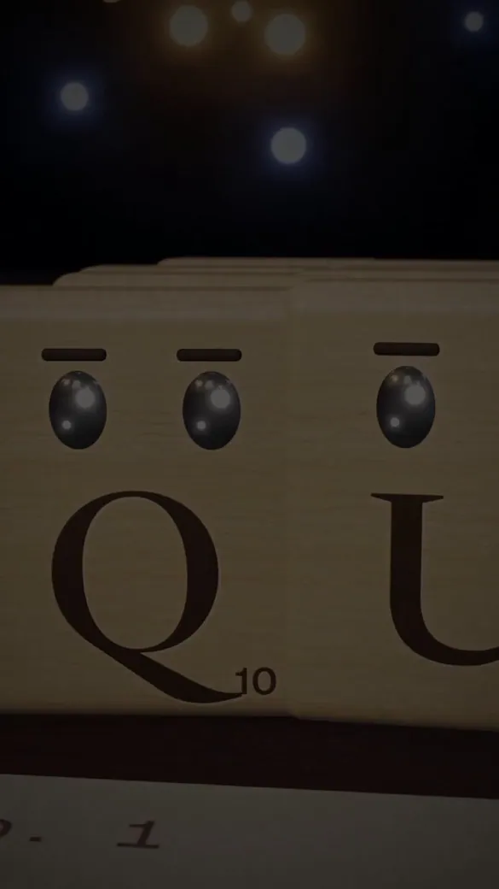</a>

**Prompt**

```text
Quiero que imagines una historia que promocione sutilmente Grid Genius. También puede no incluir Grid Genius, siempre que esté alineada con nuestra aplicación y nos ayude a conseguir más visualizaciones al publicarla en redes sociales. Después, usando Three.js/JavaScript, quiero que crees una animación completa, con calidad de Pixar, basada en la historia que imagines.
```

<details>
<summary>Prompt original</summary>

```text
I want you to imagine a story, that subtly promotes grid genius. Or it can not even have grid genius, but something that aligns with our app and helps us get more eyeballs when posted on social media. Then using threejs/javascript I want you to create full animation, Pixar-level quality out of the story you imagine
```

</details>

[Ver detalles ↗](https://www.tripo3d.ai/es/3d-prompts/claude-opus-5-5-2103087766662009118) · [Publicación original](https://x.com/Anilraok/status/2103087766662009118) · [Volver a los ejemplos](#all-prompts)

---

<a id="claude-opus-5-5-2103083781490176212"></a>

### Juego de ciclismo con un pelícano en tiempo real

[Yaowei Zheng \| LlamaFactory](https://x.com/code_hiyouga) · 2026-09-24 · Claude Opus 5.5 · Juegos

<a href="https://www.tripo3d.ai/es/3d-prompts/claude-opus-5-5-2103083781490176212">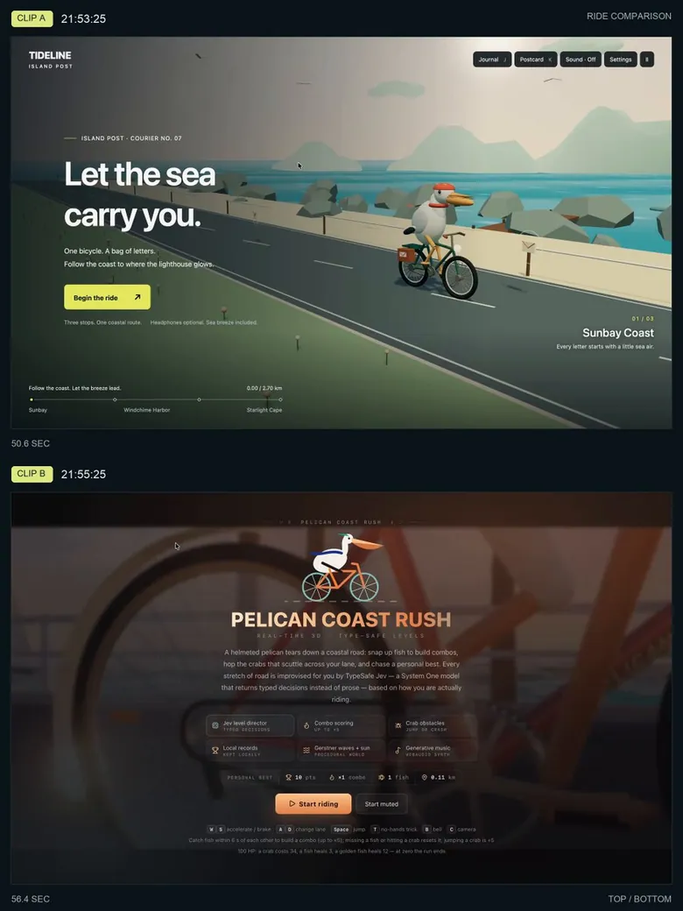</a>

**Prompt**

```text
Crea un juego 3D en tiempo real en el que un pelícano recorra en bicicleta un mundo costero lleno de vida, con físicas, olas, pesca, clima dinámico, cámaras cinematográficas, piloto automático y música adaptativa.
```

<details>
<summary>Prompt original</summary>

```text
Build a real-time 3D game where a pelican cycles through a living seaside world, complete with physics, waves, fishing, dynamic weather, cinematic cameras, autopilot, and adaptive music.
```

</details>

[Ver detalles ↗](https://www.tripo3d.ai/es/3d-prompts/claude-opus-5-5-2103083781490176212) · [Publicación original](https://x.com/code_hiyouga/status/2103083781490176212) · [Volver a los ejemplos](#all-prompts)

---

<a id="gpt-6-astra-2103062348168618280"></a>

### Rodaja de cítrico de gominola 3D interactiva

[Vib3Coded](https://x.com/vib3coded) · 2026-09-24 · GPT-6 Astra · Animación

<a href="https://www.tripo3d.ai/es/3d-prompts/gpt-6-astra-2103062348168618280">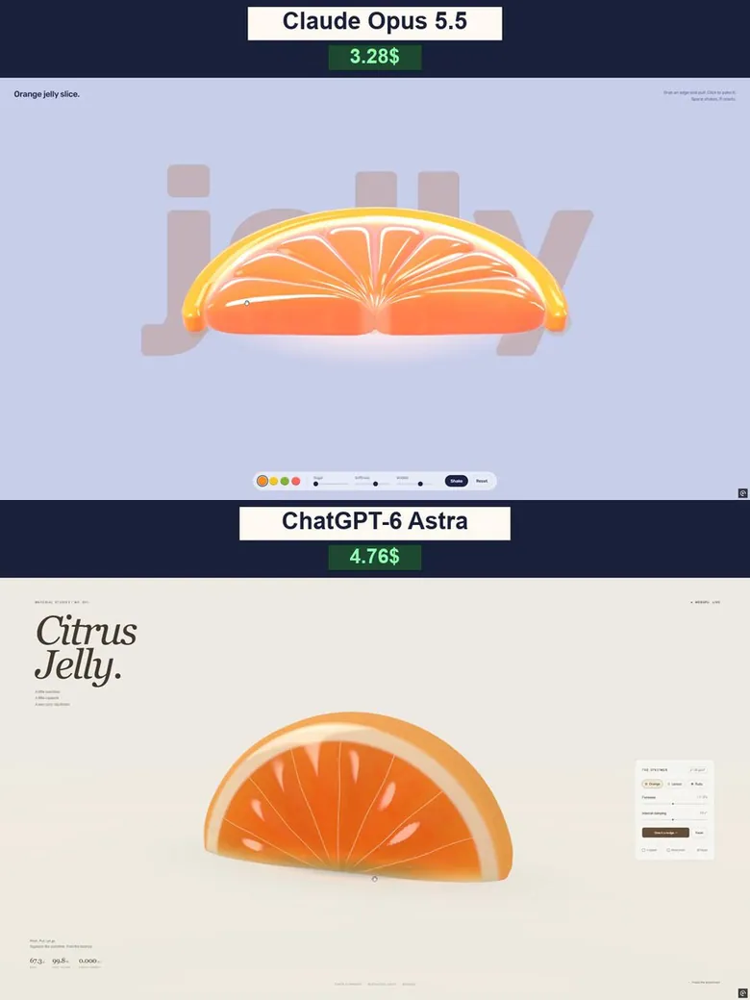</a>

**Prompt**

```text
Crea una hermosa rodaja de cítrico de gominola 3D e interactiva usando WebGPU. Entrega la experiencia completa en un único archivo HTML independiente, con JavaScript y sombreadores WGSL integrados.

Debe ser una simulación 3D en tiempo real, no un vídeo, una imagen ni una animación en bucle.

APPEARANCE

Crea una rodaja de naranja gruesa y semicircular, con pulpa translúcida y jugosa, ocho segmentos diferenciados, delicadas membranas internas, diminutas burbujas, una capa clara de albedo y una corteza de naranja suave.

Haz que parezca una gominola prémium: color saturado, reflejos brillantes, luz que atraviese la pulpa, refracción convincente y sombras de contacto suaves. Evita un exceso de bloom, los colores deslavados y un aspecto de plástico rígido.

Usa un fondo de estudio luminoso y cálido, junto con una interfaz editorial limpia y abundante espacio en blanco. Añade el título grande en cursiva y con serifas “Gelatina cítrica”. Mantén los controles compactos y la rodaja claramente visible.

FÍSICA DE CUERPO BLANDO

La sensación de gelatina es lo más importante.

- Agarra cualquier parte de la rodaja con el ratón o con el dedo.
- Tira de ella, levántala, estírala, retuércela y suéltala.
- Haz que la deformación sea local: al tirar de un borde, debe estirarse la pulpa cercana mientras el resto acompaña el movimiento de forma natural.
- Después de soltarla, la rodaja debe bambolearse, sobrepasar su posición y recuperar gradualmente su forma original.
- Incluye gravedad, inercia, amortiguación, colisiones con el suelo y rebotes suaves.
- Conserva aproximadamente el volumen y evita que la malla se colapse o se invierta.
- Haz que la corteza sea ligeramente más firme que la pulpa.
- Los segmentos internos, las membranas y las burbujas deben seguir la deformación sin flotar fuera del cuerpo.

Usa un solucionador volumétrico estable para cuerpos blandos, como una malla tetraédrica con restricciones XPBD. No imites la suavidad escalando o rotando el objeto completo.

CONTROLS

Incluye tres preajustes de color: Naranja, Limón y Rubí.

Añade:
- Control deslizante de firmeza.
- Control deslizante de amortiguación interna.
- Botón “Dale un toque”.
- Botón Restablecer.
- Casilla de verificación de velocidad a un cuarto.
- Casilla de verificación Mostrar malla.
- Botón Pausar/reanudar.

Muestra pequeños indicadores en tiempo real para la masa, el porcentaje del volumen en reposo y la energía cinética.

REQUISITOS TÉCNICOS

Usa renderizado WebGPU auténtico con sombreadores WGSL. Genera toda la geometría y los detalles visuales de forma procedimental, sin importar modelos ni archivos de imagen.

Mantén las actualizaciones de la simulación independientes de la frecuencia de fotogramas del renderizado. Admite dispositivos de escritorio y táctiles. Muestra un mensaje de respaldo claro si WebGPU no está disponible.

Prueba arrastres intensos, liberaciones repetidas, todos los controles y pantallas estrechas. Corrige la física inestable, la geometría defectuosa y los artefactos visuales antes de entregar el HTML terminado.

El resultado debe transmitir la sensación de un pequeño experimento de caramelo táctil con el que resulte realmente satisfactorio jugar.
```

<details>
<summary>Prompt original</summary>

```text
Create a beautiful, interactive 3D gummy citrus slice using WebGPU. Deliver the complete experience in one standalone HTML file with embedded JavaScript and WGSL shaders.

This must be a real-time 3D simulation, not a video, image, or looping animation.

APPEARANCE

Create a thick, semicircular orange slice with translucent, juicy flesh, eight distinct segments, delicate internal membranes, tiny bubbles, a pale pith layer, and a soft orange rind.

Make it look like premium gummy candy: saturated color, glossy highlights, light passing through the flesh, convincing refraction, and soft contact shadows. Avoid excessive bloom, washed-out colors, or a hard plastic appearance.

Use a warm, light studio background and a clean editorial interface with generous whitespace. Add the large italic serif title “Citrus Jelly.” Keep controls compact and the slice clearly visible.

SOFT-BODY PHYSICS

The jelly feel is the most important part.

- Grab any part of the slice with a mouse or finger.
- Pull, lift, stretch, twist, and release it.
- Make deformation local: pulling one edge should stretch nearby flesh while the rest follows naturally.
- After release, the slice should wobble, overshoot, and gradually recover its original shape.
- Include gravity, inertia, damping, ground collisions, and soft bouncing.
- Preserve volume approximately and prevent the mesh from collapsing or turning inside out.
- Make the rind slightly firmer than the flesh.
- Internal segments, membranes, and bubbles must follow the deformation without floating outside the body.

Use a stable volumetric soft-body solver, such as a tetrahedral mesh with XPBD constraints. Do not imitate softness by scaling or rotating the entire object.

CONTROLS

Include three color presets: Orange, Lemon, and Ruby.

Add:
- Firmness slider.
- Internal damping slider.
- “Give it a nudge” button.
- Reset button.
- Quarter-speed checkbox.
- Show mesh checkbox.
- Pause/resume button.

Display small live readouts for mass, percentage of rest volume, and kinetic energy.

TECHNICAL REQUIREMENTS

Use genuine WebGPU rendering with WGSL shaders. Generate all geometry and visual details procedurally, without imported models or image files.

Keep simulation updates independent of rendering frame rate. Support desktop and touch devices. Show a clear fallback message if WebGPU is unavailable.

Test strong dragging, repeated releases, all controls, and narrow screens. Fix unstable physics, broken geometry, and visual artifacts before delivering the finished HTML.

The result should feel like a tiny, tactile candy experiment that is genuinely satisfying to play with.
```

</details>

[Ver detalles ↗](https://www.tripo3d.ai/es/3d-prompts/gpt-6-astra-2103062348168618280) · [Publicación original](https://x.com/vib3coded/status/2103062415533371646) · [Volver a los ejemplos](#all-prompts)

---

<a id="claude-opus-5-5-2103046279253168554"></a>

### Construye una ciudad imperial

[EnzoXbt](https://x.com/Enzoxbt01) · 2026-09-24 · Claude Opus 5.5 · Escenas

<a href="https://www.tripo3d.ai/es/3d-prompts/claude-opus-5-5-2103046279253168554">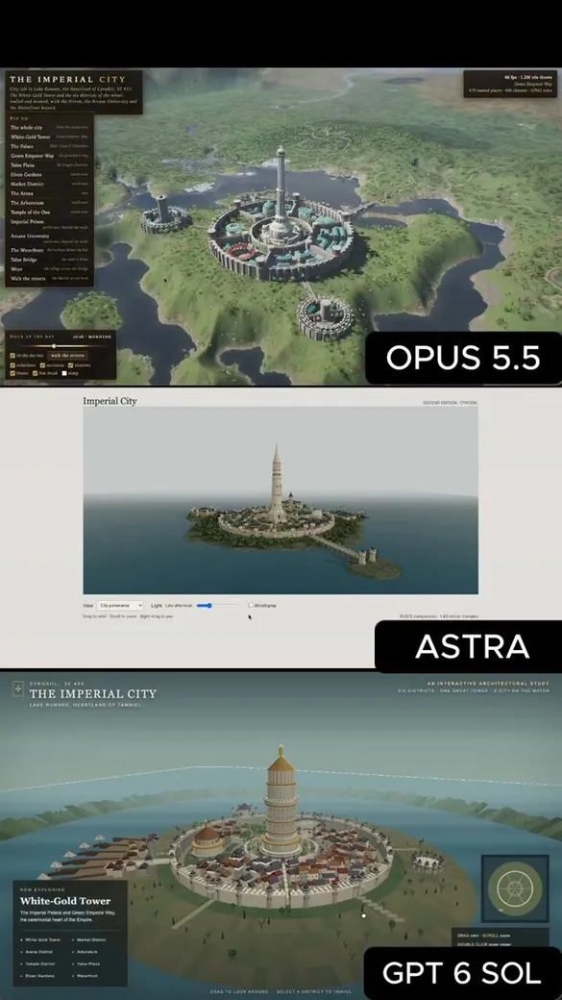</a>

**Prompt**

```text
CONSTRUYE UNA CIUDAD IMPERIAL
```

<details>
<summary>Prompt original</summary>

```text
BUILD AN IMPERIAL CITY
```

</details>

[Ver detalles ↗](https://www.tripo3d.ai/es/3d-prompts/claude-opus-5-5-2103046279253168554) · [Publicación original](https://x.com/Enzoxbt01/status/2103046279253168554) · [Volver a los ejemplos](#all-prompts)

---

<a id="gpt-6-astra-2102956340482289944"></a>

### Codex voxelizado en Three.js

[Arsh - 16 y/o builder](https://x.com/be_arsh) · 2026-09-24 · GPT-6 Astra · Recursos

<a href="https://www.tripo3d.ai/es/3d-prompts/gpt-6-astra-2102956340482289944">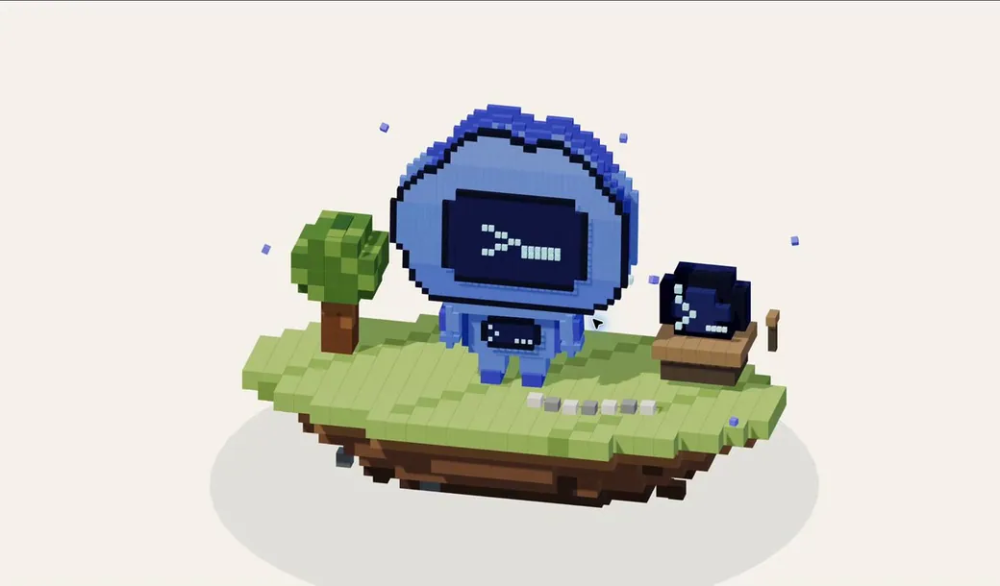</a>

**Prompt**

```text
Créate a ti mismo, Codex en Three.js usando vóxeles; crea todo desde cero y no uses ninguna habilidad.
```

<details>
<summary>Prompt original</summary>

```text
make yourself, codex in threejs using voxels, make everything from scratch, dont use any skills
```

</details>

[Ver detalles ↗](https://www.tripo3d.ai/es/3d-prompts/gpt-6-astra-2102956340482289944) · [Publicación original](https://x.com/be_arsh/status/2102956424120979838) · [Volver a los ejemplos](#all-prompts)

---

<a id="gpt-6-astra-2102915300295369208"></a>

### Escena HTML hiperrealista e interactiva de una fogata en el desierto

[Nick Gwood](https://x.com/Nixtrodamis) · 2026-09-24 · GPT-6 Astra · Interactivo

<a href="https://www.tripo3d.ai/es/3d-prompts/gpt-6-astra-2102915300295369208">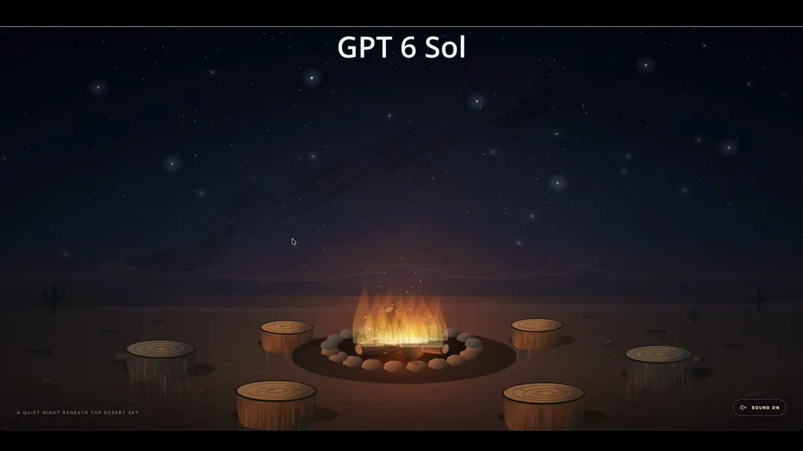</a>

**Prompt**

```text
No hagas referencia a ningún otro archivo ni trabajo previo. Esta tarea debe ser completamente original y no estar basada como una copia en ningún otro trabajo de aquí.

Crea un único archivo HTML con una fogata encendida en el desierto. Es de noche y las estrellas son visibles. Hay tocones de troncos dispuestos como asientos alrededor del fuego. No aparece ninguna persona en la escena. Es posible que distintos animales salvajes aparezcan periódicamente y luego desaparezcan.

Los sonidos también deben corresponder a la escena y ser de alta calidad.
Haz que todo sea hiperrealista

nombra el archivo (según el modelo)
```

<details>
<summary>Prompt original</summary>

```text
Do not reference any other file or previous work. This task must be fully original and not built as a cheat from any other work here.

Create a single html file of a live campfire in the desert. It is night time and the stars are visible. there are log stumps set up as seats around the fire. no people are in the shot. different wildlife may periodically come into view and out.

noises should also match the scene and be of high quality.
Make everything hyper realistic

name the file (based on model)
```

</details>

[Ver detalles ↗](https://www.tripo3d.ai/es/3d-prompts/gpt-6-astra-2102915300295369208) · [Publicación original](https://x.com/Nixtrodamis/status/2102915567845794029) · [Volver a los ejemplos](#all-prompts)

---

<a id="gpt-6-astra-2102897258983313712"></a>

### Simulador de hamburguesas en primera persona

[noclipepe](https://x.com/noclipepe) · 2026-09-23 · GPT-6 Astra · Juegos

<a href="https://www.tripo3d.ai/es/3d-prompts/gpt-6-astra-2102897258983313712">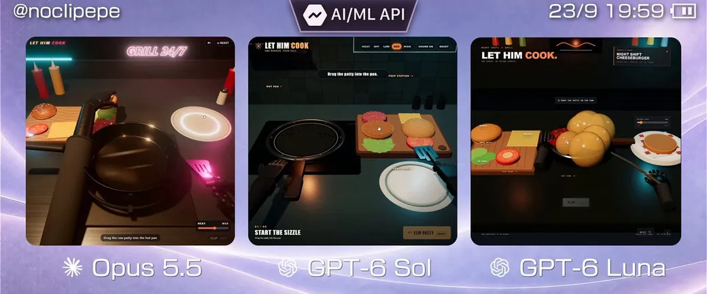</a>

**Prompt**

```text
crea un simulador de hamburguesas en primera persona.
```

<details>
<summary>Prompt original</summary>

```text
build a first-person burger simulator.
```

</details>

[Ver detalles ↗](https://www.tripo3d.ai/es/3d-prompts/gpt-6-astra-2102897258983313712) · [Publicación original](https://x.com/noclipepe/status/2102897258983313712) · [Volver a los ejemplos](#all-prompts)

---

<a id="claude-opus-5-5-2102828216289566725"></a>

### Crea un Bugatti Chiron Super Sport en Three.js

[Sree](https://x.com/srikanthvaluri) · 2026-09-23 · Claude Opus 5.5 · Recursos

<a href="https://www.tripo3d.ai/es/3d-prompts/claude-opus-5-5-2102828216289566725">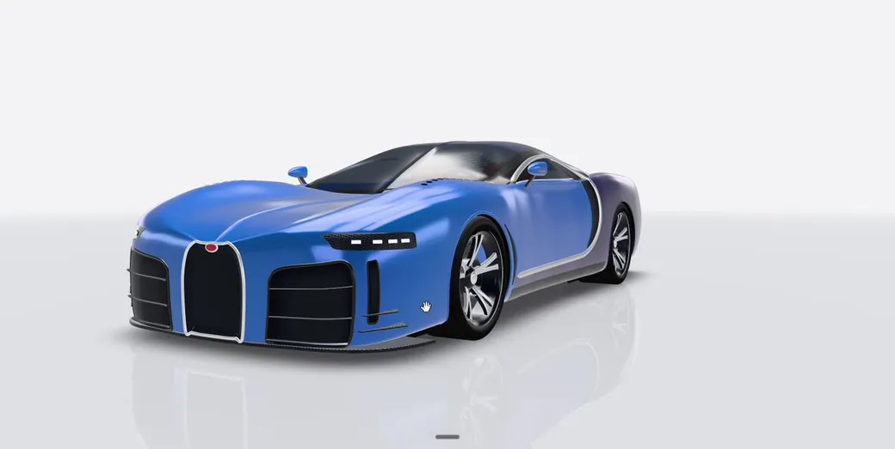</a>

**Prompt**

```text
crea un Bugatti Chiron Super Sport en Three.js.

Sin modelo 3D. Sin texturas. Sin recursos.
```

<details>
<summary>Prompt original</summary>

```text
build a Bugatti Chiron Super Sport in Three.js.

No 3D model. No textures. No assets.
```

</details>

[Ver detalles ↗](https://www.tripo3d.ai/es/3d-prompts/claude-opus-5-5-2102828216289566725) · [Publicación original](https://x.com/srikanthvaluri/status/2102828216289566725) · [Volver a los ejemplos](#all-prompts)

---

<a id="gpt-6-astra-2102826333550133520"></a>

### Shader de ciudad solarpunk infinita

[Jonas Fröller](https://x.com/jonasfroeller) · 2026-09-23 · GPT-6 Astra · Escenas

<a href="https://www.tripo3d.ai/es/3d-prompts/gpt-6-astra-2102826333550133520">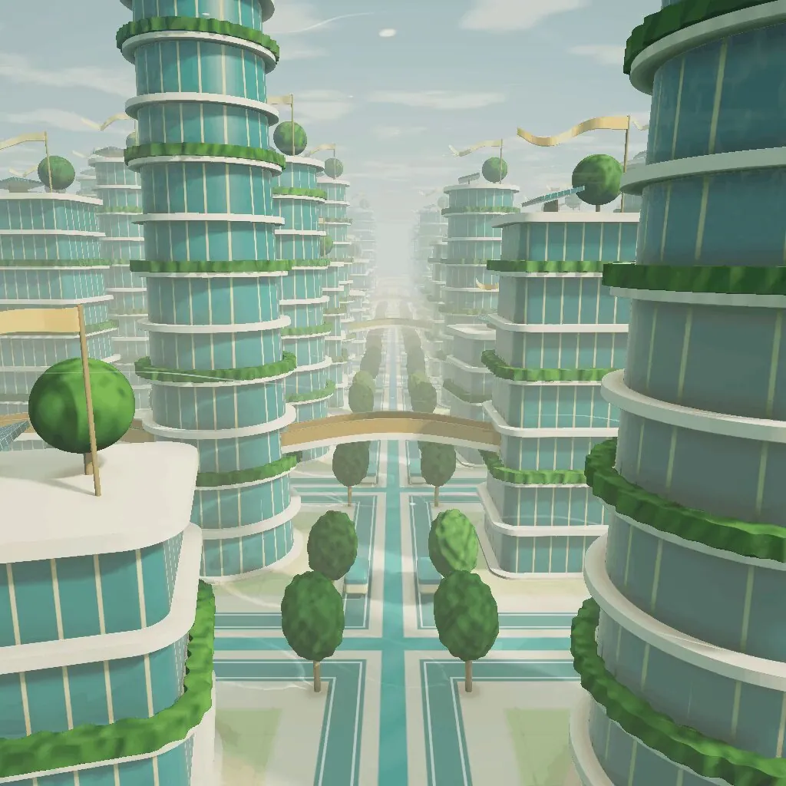</a>

**Prompt**

```text
Crea un shader visualmente atractivo que pueda ejecutarse en twigl.app; haz que parezca una ciudad infinita de carreteras y torres solarpunk, con una brisa visible que se mantenga en movimiento de forma continua.
```

<details>
<summary>Prompt original</summary>

```text
create a visually interesting shader that can run in twigl-dot-app make it like an infinite city of solarpunk roads and towers with a visible breeze running continuously
```

</details>

[Ver detalles ↗](https://www.tripo3d.ai/es/3d-prompts/gpt-6-astra-2102826333550133520) · [Publicación original](https://x.com/jonasfroeller/status/2102826333550133520) · [Volver a los ejemplos](#all-prompts)

---

<a id="claude-opus-5-5-2102788371114246177"></a>

### Montaje de entrenamiento: evolución de Claude

[Ishu Agrawal](https://x.com/ishuagra02) · 2026-09-23 · Claude Opus 5.5 · Animación

<a href="https://www.tripo3d.ai/es/3d-prompts/claude-opus-5-5-2102788371114246177"></a>

**Prompt**

```text
Crea una animación de 30 segundos íntegramente mediante código, con un montaje de evolución inspirado en la secuencia de entrenamiento de Kung Fu Panda y protagonizado por la mascota de Claude. Muestra cómo se vuelve más capaz desde su lanzamiento inicial en distintas áreas, como buscar en internet, escribir código, crear modelos 3D y resolver los problemas más difíciles de la humanidad, con música de gran impacto emocional.
```

<details>
<summary>Prompt original</summary>

```text
Create a 30 second animation entirely in code featuring a growth montage, inspired by Kung Fu Panda's training sequence, with the Claude mascot as the main character, showcasing it getting more capable since its initial release across its skillset, such as searching the internet, writing code, creating 3D models, and solving humanity's hardest problems, with emotionally impactful music.
```

</details>

[Ver detalles ↗](https://www.tripo3d.ai/es/3d-prompts/claude-opus-5-5-2102788371114246177) · [Publicación original](https://x.com/ishuagra02/status/2102788832273801700) · [Volver a los ejemplos](#all-prompts)

---

<a id="claude-opus-5-5-2102788223835463902"></a>

### Crea una animación de dibujos animados de los 90, con calidad de Pixar, en Three.js

[Shimecki](https://x.com/scheemunai) · 2026-09-23 · Claude Opus 5.5 · Animación

<a href="https://www.tripo3d.ai/es/3d-prompts/claude-opus-5-5-2102788223835463902"></a>

**Prompt**

```text
Quiero que imagines una historia. Después, usando Three.js, quiero que crees una animación completa, con calidad de Pixar y estilo de dibujos animados de los años 90, basada en la historia que hayas imaginado.
```

<details>
<summary>Prompt original</summary>

```text
I want you to imagine a story. And then using threejs I want you to create full animation, Pixar-level quality 90s cartoon out of the story you imagine.
```

</details>

[Ver detalles ↗](https://www.tripo3d.ai/es/3d-prompts/claude-opus-5-5-2102788223835463902) · [Publicación original](https://x.com/scheemunai/status/2102788223835463902) · [Volver a los ejemplos](#all-prompts)

---

<a id="gpt-6-astra-2102788013902213508"></a>

### Tablero 3D interactivo para estudiar gambitos de ajedrez

[Diogo Santos](https://x.com/diogosantosbr) · 2026-09-23 · GPT-6 Astra · Interactivo

<a href="https://www.tripo3d.ai/es/3d-prompts/gpt-6-astra-2102788013902213508">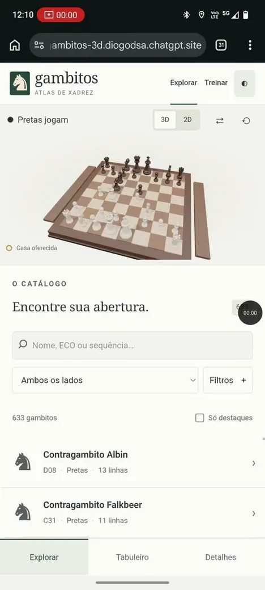</a>

**Prompt**

```text
Crea una aplicación web con un tablero 3D interactivo para estudiar los principales gambitos de ajedrez. Incluye animaciones de los movimientos, controles para avanzar y retroceder, variantes y explicaciones de las ideas detrás de cada apertura.
```

<details>
<summary>Prompt original</summary>

```text
Crie uma aplicação web com um tabuleiro 3D interativo para estudar os principais gambitos do xadrez. Inclua animação dos movimentos, controles para avançar e voltar, variantes e explicações das ideias por trás de cada abertura.
```

</details>

[Ver detalles ↗](https://www.tripo3d.ai/es/3d-prompts/gpt-6-astra-2102788013902213508) · [Publicación original](https://x.com/diogosantosbr/status/2102788013902213508) · [Volver a los ejemplos](#all-prompts)

---

<a id="claude-opus-5-5-2102781807179735211"></a>

### Animación programada del ciclo del agua en bucle continuo

[Higgsfield AI 🧩](https://x.com/higgsfield_ai) · 2026-09-23 · Claude Opus 5.5 · Animación

<a href="https://www.tripo3d.ai/es/3d-prompts/claude-opus-5-5-2102781807179735211"></a>

**Prompt**

```text
Crea una animación en bucle continuo del ciclo del agua, completamente mediante código.
```

<details>
<summary>Prompt original</summary>

```text
Create a seamless looping animation of the water cycle, entirely in code.
```

</details>

[Ver detalles ↗](https://www.tripo3d.ai/es/3d-prompts/claude-opus-5-5-2102781807179735211) · [Publicación original](https://x.com/higgsfield_ai/status/2102781807179735211) · [Volver a los ejemplos](#all-prompts)

---

<a id="gpt-6-astra-2102780850706567390"></a>

### Castillo medieval europeo en 3D controlable desde el navegador

[もぎ＠ボードゲーム](https://x.com/luxurytax150) · 2026-09-23 · GPT-6 Astra · Escenas

<a href="https://www.tripo3d.ai/es/3d-prompts/gpt-6-astra-2102780850706567390">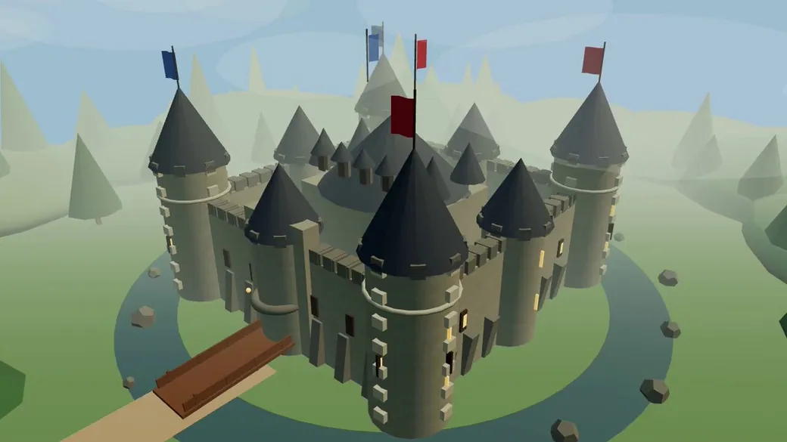</a>

**Prompt**

```text
Crear un castillo medieval europeo en 3D controlable desde el navegador. Incluir un foso de agua, un puente levadizo, torres, murallas de piedra, banderas, un bosque y un cambio entre el día y la noche. 
Como se trata de una especie de prueba de referencia, prioriza al máximo la calidad del modelo 3D y hasta dónde se puede llevar su aspecto visual.
```

<details>
<summary>Prompt original</summary>

```text
ブラウザで操作できる3Dの中世ヨーロッパ風の城を作る。水堀、跳ね橋、塔、石壁、旗、森、昼夜切替を入れる。 
これはベンチマークの一種であるから、どこまで見た目を盛れるか、3Dモデルの品質を最大限優先して。
```

</details>

[Ver detalles ↗](https://www.tripo3d.ai/es/3d-prompts/gpt-6-astra-2102780850706567390) · [Publicación original](https://x.com/luxurytax150/status/2102780850706567390) · [Volver a los ejemplos](#all-prompts)

---

<a id="claude-opus-5-5-2102775461701091531"></a>

### CatWalk: juego de gatos de desplazamiento lateral en 3D por la ciudad de noche

[BLITAST STUDIO](https://x.com/blitast_studio) · 2026-09-23 · Claude Opus 5.5 · Juegos

<a href="https://www.tripo3d.ai/es/3d-prompts/claude-opus-5-5-2102775461701091531"></a>

**Prompt**

```text
Desarrollemos un juego
Los gráficos pueden ser en 2D o 3D; analiza el sistema del juego y demás aspectos, y elige la opción que facilite más el desarrollo
Personalmente, imagino algo en 3D, pero con una pantalla similar a la de un juego de acción de desplazamiento lateral
Quiero crear una atmósfera elegante mediante la iluminación y otros elementos, así que creo que el 3D podría permitir una representación visual hermosa (por ejemplo, elementos como farolas o linternas)
El juego que quiero crear se llama CatWalk
Tal como indica el nombre
Un gato avanza lateralmente
La pasarela continúa y la pantalla se desplaza automáticamente. El jugador debe superar obstáculos y agujeros ajustándose a esa velocidad, usando únicamente controles sencillos, como saltar. En cierto sentido, quizá se acerque a la tensión y al sistema de Flappy
Sin embargo, quiero unos gráficos elegantes, maduros y con mucha atmósfera
Si es posible, me gustaría que se pudieran representar los movimientos ágiles del gato al caminar, correr y saltar
Dejo en tus manos la ambientación del nivel, aunque para empezar una calle nocturna convencional también estaría bien
Me alegraría mucho que, al oscurecer la escena, se pudiera representar de forma hermosa la iluminación indirecta y otros efectos de luz
Entiendo que habrá cosas que se puedan hacer, cosas que no y otras que sean difíciles
Tomando mis deseos como inspiración, desarrolla algo que consideres viable
Para empezar, haz posible jugar un bucle completo de un nivel
```

<details>
<summary>Prompt original</summary>

```text
ゲームを開発しましょう
グラフィックは2D、3Dを問いませんがゲームのシステムなどを分析し開発しやすい方でいいです
個人的には3Dだが画面は横スクロールアクションみたいなものを想定してます
照明などでおしゃれな雰囲気などを出したいので3Dを使うことで美しい表現ができるのではないかと思っています（例：街灯やランタンのような表現など）
作りたいゲームは CatWalk というゲーム
名前の通りです
猫が横に進む
キャットウォークが続いており、画面は自動スクロールするので、その速さに合わせて障害物や穴をジャンプなどのシンプルな操作のみで越えていくスタイル。ある意味でフラッピー的な緊張感とシステムに近いかもしれない。
ただしグラフィックは大人かっこいい、雰囲気ゲーを目指したい
可能であれば猫のしなやかな歩き、走り、ジャンプが表現できればうれしい
ステージの世界観はお任せするが、最初は無難な夜のストリートなどでもいいかと
暗めにすることで間接照明などが美ししく表現できればかなり嬉しい
できることできないこと難しいことがあると思うので
この私の要望をヒントにあなたなりにできそうなものを開発してほしい
まずは１ステージのワンループができるように
```

</details>

[Ver detalles ↗](https://www.tripo3d.ai/es/3d-prompts/claude-opus-5-5-2102775461701091531) · [Publicación original](https://x.com/blitast_studio/status/2102775632933654585) · [Volver a los ejemplos](#all-prompts)

---

<a id="gpt-6-astra-2102752217375899659"></a>

### Orbit Lab: simulación 3D del Sol, la Tierra y la Luna

[technewsradio.tokyo](https://technewsradio.tokyo/) · 2026-09-23 · GPT-6 Astra · Interactivo

<a href="https://www.tripo3d.ai/es/3d-prompts/gpt-6-astra-2102752217375899659">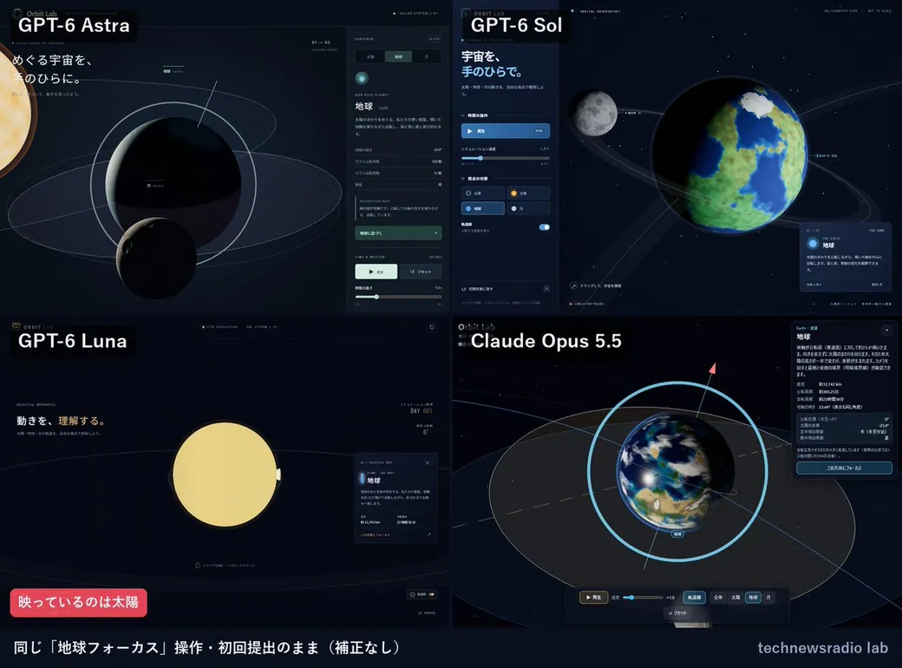</a>

**Prompt**

```text
Es un experimento comparativo. Implementa y deja terminada en tu directorio de trabajo la siguiente obra web con especificaciones idénticas. El nombre será «Orbit Lab». Usa Three.js 0.186.0 y carga el núcleo y OrbitControls de la misma versión (puedes usar un import map desde un CDN o npm). No es necesario publicar ni desplegar el proyecto.

Requisitos:
1. Representa modelos 3D del Sol, la Tierra y la Luna mediante geometría y materiales creados de forma procedimental. No uses imágenes ni recursos 3D externos. El Sol debe actuar como fuente de luz puntual, y la iluminación de la Tierra y la Luna debe poder apreciarse al controlar la cámara.
2. Anima la traslación y la rotación de la Tierra, la inclinación de su eje y la traslación de la Luna usando tiempo delta. Visualiza la inclinación del plano orbital y muestra las líneas orbitales de la Tierra y la Luna. La escala y la velocidad pueden exagerarse con fines educativos.
3. Genera un fondo estrellado con números aleatorios reproducibles. Permite rotar y ampliar o alejar la vista con OrbitControls. Al hacer clic en un cuerpo celeste, cambia su estado de selección y el panel descriptivo.
4. Incluye controles de reproducir/detener, un deslizador de velocidad, un interruptor para mostrar u ocultar las líneas orbitales, enfoque de cámara en el Sol, la Tierra o la Luna, y un botón para volver al estado inicial. También debe ser posible reproducir/detener y restablecer la simulación mediante el teclado.
5. Adapta la interfaz para poder manejarla en pantallas de móvil, incluye un aviso cuando WebGL no sea compatible, responde al cambio de tamaño y limita la densidad de píxeles para evitar una carga de renderizado excesiva.
6. Escribe en el README las instrucciones de inicio y los controles. Si es posible, inicia realmente la aplicación y comprueba su funcionamiento; si no, indica claramente el motivo. En el informe final, resume brevemente los archivos creados, los elementos implementados y los resultados de la comprobación.

No hagas preguntas durante el proceso: toma decisiones razonables y completa la implementación hasta el final.
```

<details>
<summary>Prompt original</summary>

```text
比較実験です。次の同一仕様のWeb作品を、あなたの作業ディレクトリに実装して完成させてください。名称は「Orbit Lab」。Three.js 0.186.0を使用し、同一バージョンの本体とOrbitControlsを読み込んでください（CDNのimport mapでもnpmでも可）。公開・デプロイは不要です。

要件:
1. 太陽・地球・月の3Dモデルを手続き的なジオメトリとマテリアルで表現。外部画像・3Dアセットは使わない。太陽を点光源とし、地球と月の明暗がカメラ操作で分かること。
2. 地球の公転と自転、地軸の傾き、月の公転をdelta timeで動かす。軌道面の傾きを視覚化し、地球と月の軌道線を表示する。スケールと速度は教育用の誇張でよい。
3. 恒星背景を再現可能な乱数で生成する。OrbitControlsで回転・ズーム。天体をクリックすると選択状態と説明パネルが切り替わる。
4. 再生/停止、速度スライダー、軌道線表示切替、太陽/地球/月へのカメラフォーカス、初期状態に戻すボタンを備える。キーボードでも再生/停止とリセットができる。
5. スマホ幅でも操作できる見た目、WebGL非対応時の案内、リサイズ対応、過剰な描画負荷を避けるピクセル比制限を入れる。
6. READMEに起動手順と操作方法を書く。可能なら実際に起動して動作確認し、できなければ理由を明記する。完了報告には作成ファイル、実装済み項目、確認結果を簡潔に書く。

途中で質問せず、合理的に判断して最後まで実装してください。
```

</details>

[Ver detalles ↗](https://www.tripo3d.ai/es/3d-prompts/gpt-6-astra-2102752217375899659) · [Publicación original](https://technewsradio.tokyo/lab/gpt6-vs-opus55) · [Volver a los ejemplos](#all-prompts)

---

<a id="claude-opus-5-5-2102740078347087940"></a>

### Benchmark de megaciudad ciberpunk «The Last Train»

[BuilderHelm](https://x.com/builderhelmai) · 2026-09-23 · Claude Opus 5.5 · Escenas

<a href="https://www.tripo3d.ai/es/3d-prompts/claude-opus-5-5-2102740078347087940"></a>

**Prompt**

```text
Construye una megaciudad ciberpunk completa dentro de Blender, con un tren protagonista, arquitectura procedural, sistemas ferroviarios elevados, lluvia, atmósfera volumétrica, iluminación cinematográfica, varias configuraciones de cámara y una secuencia animada completa.
```

<details>
<summary>Prompt original</summary>

```text
build a complete cyberpunk megacity inside Blender with a hero train, procedural architecture, elevated rail systems, rain, volumetric atmosphere, cinematic lighting, multiple camera setups, and a full animated sequence.
```

</details>

[Ver detalles ↗](https://www.tripo3d.ai/es/3d-prompts/claude-opus-5-5-2102740078347087940) · [Publicación original](https://x.com/builderhelmai/status/2102740078347087940) · [Volver a los ejemplos](#all-prompts)

---


[Catálogo completo](catalog.es.md) · **1 / 10** · [→](catalog.es.2.md)

<p align="center"><strong><a href="https://www.tripo3d.ai/es/3d-prompts?utm_source=github&amp;utm_medium=referral&amp;utm_campaign=awesome_3d_prompts&amp;utm_content=catalog_footer">Catálogo completo →</a></strong></p>
