<!-- Generated from Growth CMS by templates/catalog.md. Edit content in CMS; run npm run sync. -->

# Awesome 3D Prompts — 4 / 9

[← Awesome 3D Prompts](../README.md)

<p>
  <a href="../docs/catalog.en.4.md"></a>
  <a href="../docs/catalog.zh.4.md"></a>
  <a href="../docs/catalog.zh-Hant.4.md"></a>
  <a href="../docs/catalog.ja.4.md"></a>
  <a href="../docs/catalog.ko.4.md"></a>
  <a href="../docs/catalog.es.4.md"></a>
  <a href="../docs/catalog.pt.4.md"></a>
  <a href="../docs/catalog.de.4.md"></a>
  <a href="../docs/catalog.fr.4.md"></a>
  <a href="../docs/catalog.it.4.md"></a>
  <a href="../docs/catalog.ru.4.md"></a>
  <a href="../docs/catalog.tr.4.md"></a>
  <a href="../docs/catalog.uk.4.md"></a>
  <a href="../docs/catalog.vi.4.md"></a>
</p>

[Catalogo completo](catalog.it.md) · [←](catalog.it.3.md) · **4 / 9** · [→](catalog.it.5.md)

<a id="all-prompts"></a>

<details>
<summary>Esplora gli esempi (50)</summary>

- [Locomotiva a vapore attraverso la campagna](#steam-locomotive-across-the-countryside-2096577430274429157)
- [Una casa modellata da zero in Blender](#a-house-modeled-from-scratch-in-blender-2096576154337734865)
- [Avventura esplorativa The Quiet Crossing](#the-quiet-crossing-exploration-quest-2096574297703637111)
- [Albero di mango indiano in SpeedTree](#indian-mango-tree-in-speedtree-2096572429066006845)
- [Attrattore di Lorenz interattivo](#interactive-lorenz-attractor-2096572156453028193)
- [Caccia al tesoro su una spiaggia low poly](#low-poly-beach-treasure-hunt-2096570815714414844)
- [Dallo schizzo di un appartamento ai render degli interni](#apartment-sketch-to-rendered-interiors-2096566686266597754)
- [Texture e rig di un personaggio Tripo](#texture-and-rig-a-tripo-character-2096566598689783878)
- [Simulazione 3D di un’esplosione nucleare in città](#gpt-6-astra-2096562462674079868)
- [Scena di un giradischi su un tavolo](#vinyl-player-tabletop-scene-2096561346766877106)
- [Modelli Blender con effetti visivi Unity](#blender-models-with-unity-vfx-2096560142871658589)
- [Un logo 2D diventa un personaggio animato](#a-2d-logo-becomes-an-animated-character-2096559197999501724)
- [Miniatura interattiva di Seoul](#interactive-miniature-of-seoul-2096557555086725159)
- [Gioco di rally Unity giocabile su telefono](#mobile-playable-unity-rally-game-2096556692842348826)
- [Ciclo di gioco di battaglie con carte collezionabili](#trading-card-battle-game-loop-2096555856204644550)
- [Nucleo energetico interattivo a due anelli](#interactive-dual-ring-energy-core-2096551010089263181)
- [La visione del tempio di Ezechiele in 3D](#gpt-6-astra-2096547658164834788)
- [Espressioni del personaggio intercambiabili in Blender](#switchable-character-expressions-in-blender-2096525100518453342)
- [Acqua in loop con Geometry Nodes](#looping-water-with-geometry-nodes-2096521798150242631)
- [Mondo di navigazione ispirato a One Piece](#one-piece-inspired-sailing-world-2096518775042707700)
- [Una stanza personale come portfolio interattivo](#personal-room-as-an-interactive-portfolio-2096506357868642342)
- [Livello completo di rompicapo in Three.js](#complete-three-js-puzzle-level-2096505740643246231)
- [Barca YF-24 su un mare 3D tranquillo](#yf-24-boat-on-a-gentle-3d-sea-2096503275910832461)
- [Dalla pianta dell’ultimo piano a un’anteprima Blender](#top-floor-plan-to-blender-preview-2096501340889374883)
- [Villaggio low poly di Gwacheon da esplorare a piedi](#walkable-low-poly-gwacheon-village-2096490395614019793)
- [Assemblaggio e animazione di asset 3D generati](#assemble-and-animate-generated-3d-assets-2096481425050743048)
- [Wright Flyer in volo attraverso una foresta giapponese](#wright-flyer-through-a-japanese-forest-2096467585785286808)
- [Insetto procedurale che si arrampica sulle superfici](#surface-climbing-procedural-insect-2096460081982304546)
- [Ricostruzione di Lego 1999 Racers](#gpt-6-astra-2096438110095585753)
- [Appartamento giocabile ispirato a D4](#playable-d4-inspired-apartment-2096413869841473930)
- [Crea e renderizza un buco nero in Blender](#gpt-6-astra-2096391653669953761)
- [Gioco di simulazione di una rete ferroviaria](#railway-network-simulation-game-2096362653480562751)
- [Taverna con personale e ospiti attivi](#tavern-with-working-staff-and-guests-2096358854275543457)
- [Ensemble 3D giocabile con animazione sincronizzata all’audio](#gpt-6-astra-2096354461652488562)
- [Dal concept del personaggio al modello 3D riggato e al cartoon](#gpt-6-astra-2096342420543660277)
- [Esploratore orbitale del sistema solare](#orbital-solar-system-explorer-2096339041679442428)
- [Gioco di un granchio con meccaniche basate sulle azioni](#a-crab-game-with-action-driven-mechanics-2096337879173591171)
- [Ricostruzione fotorealistica e modificabile di un drago in Blender](#gpt-6-astra-2096335588727349434)
- [Scena con personaggio ispirata a Warcraft in Unity](#warcraft-inspired-character-scene-in-unity-2096308567863079420)
- [Il Terreiro do Paço di Lisbona in Blender](#lisbon-s-terreiro-do-paco-in-blender-2096298425914450021)
- [Landing page abissale bioluminescente](#bioluminescent-deep-sea-landing-page-2096269057544831175)
- [Foresta procedurale fitta in Three.js](#dense-procedural-forest-in-three-js-2096263046918197609)
- [Piazza dell’Unione di Cluj-Napoca in voxel](#cluj-napoca-union-square-in-voxels-2096262733259837681)
- [Fisica di corse nel browser con C# e WASM](#browser-racing-physics-in-c-and-wasm-2096258619574513880)
- [Una battaglia di kaiju in città](#kaiju-city-battle-2096251574918013135)
- [Una demo interattiva di Hyperloop](#interactive-hyperloop-demo-2096250748099068377)
- [Un sito di studio 3D guidato dallo scorrimento](#scroll-driven-3d-studio-website-2096245759121277132)
- [Komorebi: kayak sul fiume](#komorebi-river-kayaking-2096244208533455049)
- [Una storia di prodotto con una bottiglia rifrangente](#refractive-bottle-product-story-2096243989439713677)
- [Una macchina di capsule dei ricordi](#memory-capsule-machine-2096241295949975602)

</details>
<a id="steam-locomotive-across-the-countryside-2096577430274429157"></a>

### Locomotiva a vapore attraverso la campagna

[ダンさんブル@d三b](https://x.com/dansanburu) · 2026-09-06 · GPT-6 Astra · Animazione

<a href="https://www.tripo3d.ai/it/3d-prompts/steam-locomotive-across-the-countryside-2096577430274429157">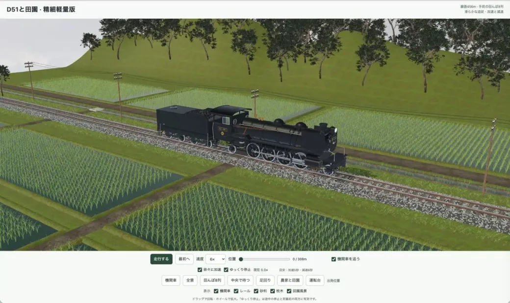</a>

*Istruzioni basate sull’opera collegata*

**Prompt**

```text
Modella una locomotiva a vapore in Three.js e animala mentre attraversa una scena di campagna. Sincronizza il movimento delle ruote con lo spostamento del treno.
```

[Vedi dettagli ↗](https://www.tripo3d.ai/it/3d-prompts/steam-locomotive-across-the-countryside-2096577430274429157) · [Post originale](https://x.com/dansanburu/status/2096577430274429157) · [Torna agli esempi](#all-prompts)

---

<a id="a-house-modeled-from-scratch-in-blender-2096576154337734865"></a>

### Una casa modellata da zero in Blender

[みずくん](https://x.com/mizkun) · 2026-09-06 · GPT-6 Astra · Scene

<a href="https://www.tripo3d.ai/it/3d-prompts/a-house-modeled-from-scratch-in-blender-2096576154337734865">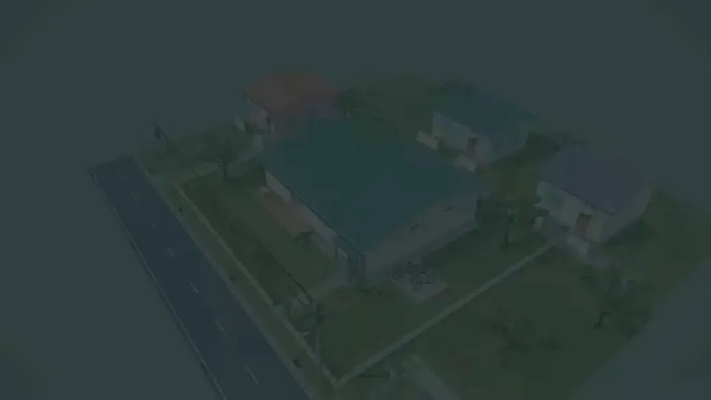</a>

*Istruzioni basate sull’opera collegata*

**Prompt**

```text
Modella una casa da zero in Blender. Mantieni la scena modificabile per poter esaminare e perfezionare l’edificio nelle iterazioni successive.
```

[Vedi dettagli ↗](https://www.tripo3d.ai/it/3d-prompts/a-house-modeled-from-scratch-in-blender-2096576154337734865) · [Post originale](https://x.com/mizkun/status/2096576154337734865) · [Torna agli esempi](#all-prompts)

---

<a id="the-quiet-crossing-exploration-quest-2096574297703637111"></a>

### Avventura esplorativa The Quiet Crossing

[MotionViz](https://x.com/Motion_Viz) · 2026-09-06 · GPT-6 Astra · Giochi

<a href="https://www.tripo3d.ai/it/3d-prompts/the-quiet-crossing-exploration-quest-2096574297703637111">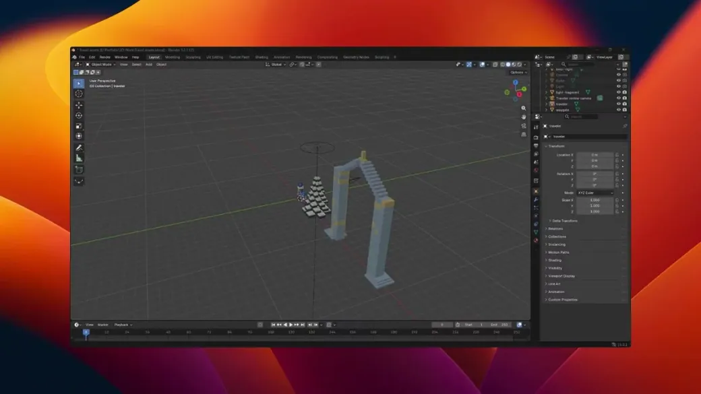</a>

*Istruzioni basate sull’opera collegata*

**Prompt**

```text
Crea un gioco di esplorazione innevato in Three.js con un personaggio Blender, pini voxel e un portale di pietra. Permetti di raccogliere sei frammenti luminosi, fai seguire il personaggio dalla camera e mostra la distanza dal portale.
```

[Vedi dettagli ↗](https://www.tripo3d.ai/it/3d-prompts/the-quiet-crossing-exploration-quest-2096574297703637111) · [Post originale](https://x.com/Motion_Viz/status/2096574297703637111) · [Torna agli esempi](#all-prompts)

---

<a id="indian-mango-tree-in-speedtree-2096572429066006845"></a>

### Albero di mango indiano in SpeedTree

[Varun Mayya](https://x.com/waitin4agi_) · 2026-09-06 · GPT-6 Astra · Asset

<a href="https://www.tripo3d.ai/it/3d-prompts/indian-mango-tree-in-speedtree-2096572429066006845">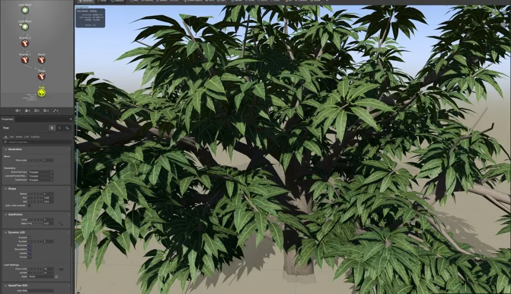</a>

*Istruzioni basate sull’opera collegata*

**Prompt**

```text
Crea un albero di mango indiano in SpeedTree per una scena Unreal con obiettivo di 60 FPS. Genera i materiali di foglie e corteccia e verificane l’aspetto prima di finalizzare l’asset.
```

[Vedi dettagli ↗](https://www.tripo3d.ai/it/3d-prompts/indian-mango-tree-in-speedtree-2096572429066006845) · [Post originale](https://x.com/waitin4agi_/status/2096572429066006845) · [Torna agli esempi](#all-prompts)

---

<a id="interactive-lorenz-attractor-2096572156453028193"></a>

### Attrattore di Lorenz interattivo

[Juy \| AI experiments](https://x.com/juyeam) · 2026-09-06 · GPT-6 Astra · Animazione

<a href="https://www.tripo3d.ai/it/3d-prompts/interactive-lorenz-attractor-2096572156453028193">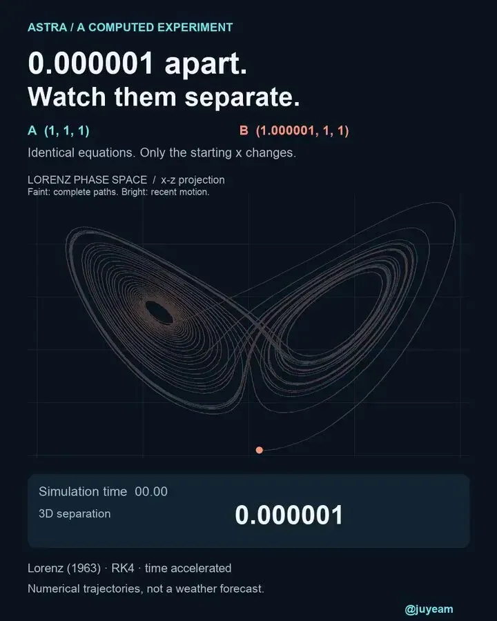</a>

*Istruzioni basate sull’opera collegata*

**Prompt**

```text
Visualizza due traiettorie del sistema di Lorenz con una differenza minima nella posizione iniziale. Consenti di modificare la differenza e scorrere il tempo, distinguendo le verifiche numeriche dalle previsioni esatte a lungo termine.
```

[Vedi dettagli ↗](https://www.tripo3d.ai/it/3d-prompts/interactive-lorenz-attractor-2096572156453028193) · [Post originale](https://x.com/juyeam/status/2096572156453028193) · [Demo](https://tiny-worlds-juyeam.juyeam.chatgpt.site/chaos) · [Torna agli esempi](#all-prompts)

---

<a id="low-poly-beach-treasure-hunt-2096570815714414844"></a>

### Caccia al tesoro su una spiaggia low poly

[空野こんこん＠個人ゲーム開発者](https://x.com/sorano_concon_g) · 2026-09-06 · GPT-6 Astra · Giochi

<a href="https://www.tripo3d.ai/it/3d-prompts/low-poly-beach-treasure-hunt-2096570815714414844">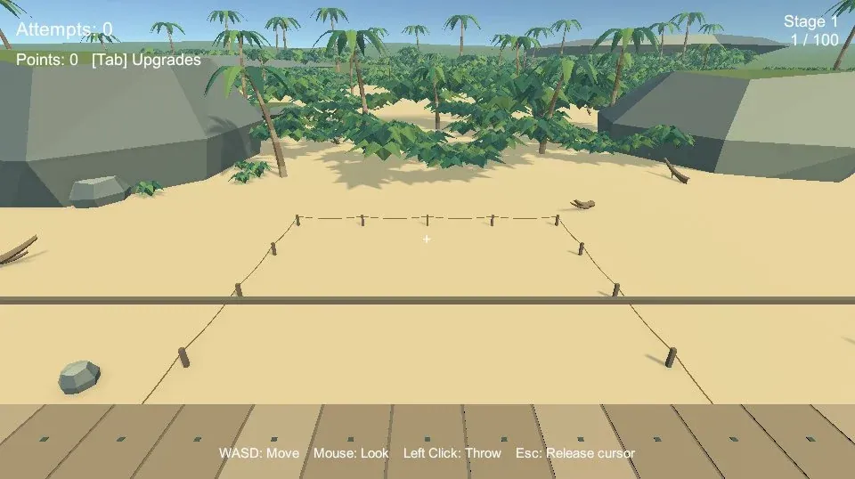</a>

*Istruzioni basate sull’opera collegata*

**Prompt**

```text
Crea in Unity una caccia al tesoro 3D giocabile su una spiaggia. Modella palme e pedane di legno low poly e imposta il ciclo principale di esplorazione e ricerca dei tesori.
```

[Vedi dettagli ↗](https://www.tripo3d.ai/it/3d-prompts/low-poly-beach-treasure-hunt-2096570815714414844) · [Post originale](https://x.com/sorano_concon_g/status/2096570815714414844) · [Torna agli esempi](#all-prompts)

---

<a id="apartment-sketch-to-rendered-interiors-2096566686266597754"></a>

### Dallo schizzo di un appartamento ai render degli interni

[Everett World](https://x.com/WorldEverett) · 2026-09-06 · GPT-6 Astra · Scene

<a href="https://www.tripo3d.ai/it/3d-prompts/apartment-sketch-to-rendered-interiors-2096566686266597754">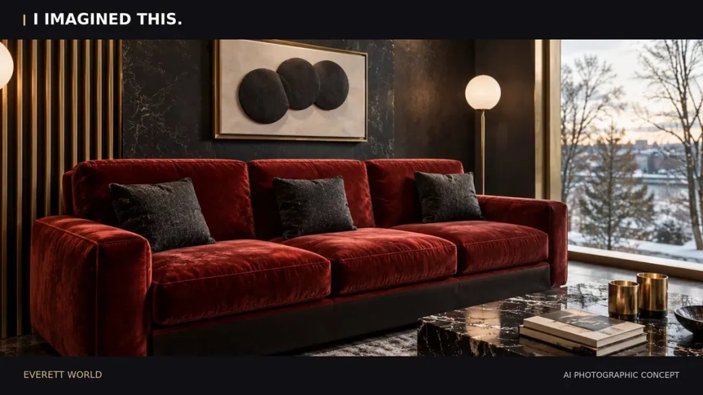</a>

*Istruzioni basate sull’opera collegata*

**Prompt**

```text
Combina immagini di riferimento di un appartamento con uno schizzo semplice della pianta per ricostruire gli interni in Blender. Consegna una scena modificabile, render delle stanze e una breve visita video montata.
```

[Vedi dettagli ↗](https://www.tripo3d.ai/it/3d-prompts/apartment-sketch-to-rendered-interiors-2096566686266597754) · [Post originale](https://x.com/WorldEverett/status/2096566686266597754) · [Torna agli esempi](#all-prompts)

---

<a id="texture-and-rig-a-tripo-character-2096566598689783878"></a>

### Texture e rig di un personaggio Tripo

[たけうちさんは縮退しました🌀](https://x.com/chimerast) · 2026-09-06 · GPT-6 Astra · Asset

<a href="https://www.tripo3d.ai/it/3d-prompts/texture-and-rig-a-tripo-character-2096566598689783878">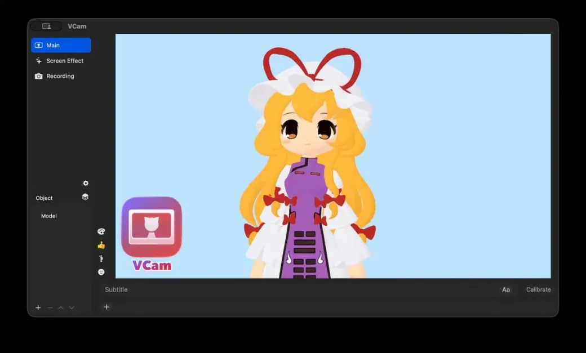</a>

*Istruzioni basate sull’opera collegata*

**Prompt**

```text
Porta un personaggio Tripo Smart Mesh in Blender. Applica le texture e crea un rig corporeo utilizzabile prima di passare alle espressioni facciali.
```

[Vedi dettagli ↗](https://www.tripo3d.ai/it/3d-prompts/texture-and-rig-a-tripo-character-2096566598689783878) · [Post originale](https://x.com/chimerast/status/2096566598689783878) · [Torna agli esempi](#all-prompts)

---

<a id="gpt-6-astra-2096562462674079868"></a>

### Simulazione 3D di un’esplosione nucleare in città

[Ashish Thakur](https://x.com/ashishthakur___) · 2026-09-06 · GPT-6 Astra · Animazione

<a href="https://www.tripo3d.ai/it/3d-prompts/gpt-6-astra-2096562462674079868">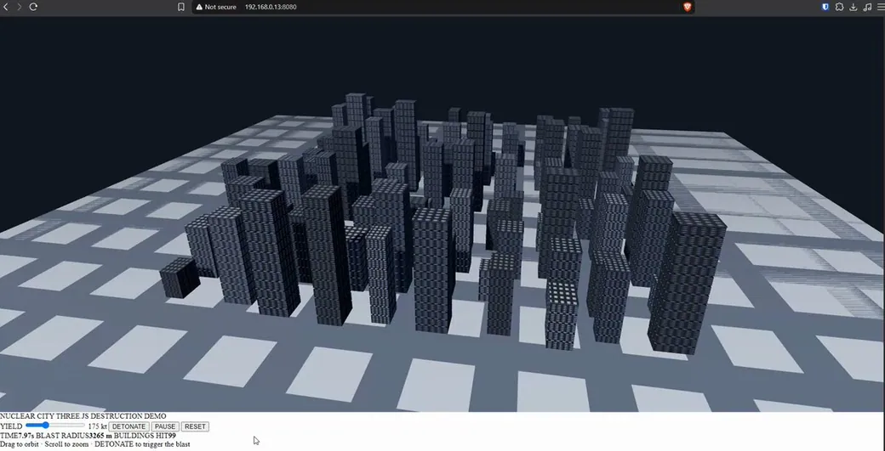</a>

**Prompt**

```text
Crea una dimostrazione di un’esplosione nucleare con una città 3D, un lampo nucleare, un’onda d’urto in espansione, una palla di fuoco, fumo ed edifici che si fratturano e crollano progressivamente quando l’onda d’urto li raggiunge
```

<details>
<summary>Prompt originale</summary>

```text
Create nuclear explosion demo with a 3D city, nuclear flash, expanding shockwave, fireball, smoke, and buildings that progressively fracture/collapse when the blast reaches them
```

</details>

[Vedi dettagli ↗](https://www.tripo3d.ai/it/3d-prompts/gpt-6-astra-2096562462674079868) · [Post originale](https://x.com/ashishthakur___/status/2096562462674079868) · [Torna agli esempi](#all-prompts)

---

<a id="vinyl-player-tabletop-scene-2096561346766877106"></a>

### Scena di un giradischi su un tavolo

[Nitesh Seram](https://x.com/niteshseram) · 2026-09-06 · GPT-6 Astra · Scene

<a href="https://www.tripo3d.ai/it/3d-prompts/vinyl-player-tabletop-scene-2096561346766877106">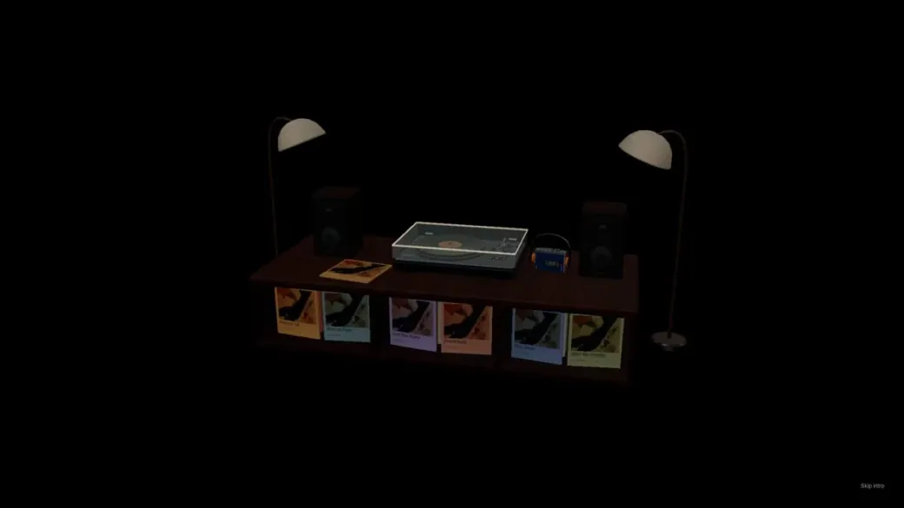</a>

*Istruzioni basate sull’opera collegata*

**Prompt**

```text
Crea una scena Three.js con un giradischi su un tavolo. Allestisci una presentazione di prodotto in cui le lampade si accendono e la camera mostra il giradischi e gli arredi circostanti.
```

[Vedi dettagli ↗](https://www.tripo3d.ai/it/3d-prompts/vinyl-player-tabletop-scene-2096561346766877106) · [Post originale](https://x.com/niteshseram/status/2096561346766877106) · [Torna agli esempi](#all-prompts)

---

<a id="blender-models-with-unity-vfx-2096560142871658589"></a>

### Modelli Blender con effetti visivi Unity

[ねぎぽよし](https://x.com/CST_negi) · 2026-09-06 · GPT-6 Astra · Scene

<a href="https://www.tripo3d.ai/it/3d-prompts/blender-models-with-unity-vfx-2096560142871658589">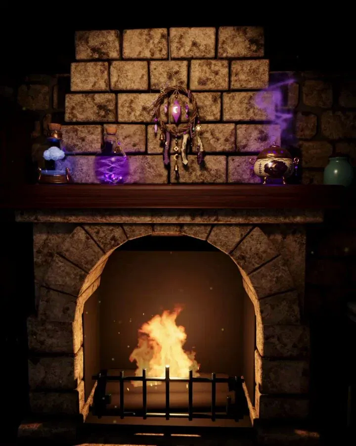</a>

*Istruzioni basate sull’opera collegata*

**Prompt**

```text
Crea i modelli della scena in Blender e importali in Unity. Aggiungi effetti con VFX Graph e illumina la scena in modo che modelli ed effetti risultino chiaramente leggibili insieme.
```

[Vedi dettagli ↗](https://www.tripo3d.ai/it/3d-prompts/blender-models-with-unity-vfx-2096560142871658589) · [Post originale](https://x.com/CST_negi/status/2096560142871658589) · [Torna agli esempi](#all-prompts)

---

<a id="a-2d-logo-becomes-an-animated-character-2096559197999501724"></a>

### Un logo 2D diventa un personaggio animato

[Anthony Riera](https://x.com/anthonyriera) · 2026-09-06 · GPT-6 Astra · Asset

<a href="https://www.tripo3d.ai/it/3d-prompts/a-2d-logo-becomes-an-animated-character-2096559197999501724">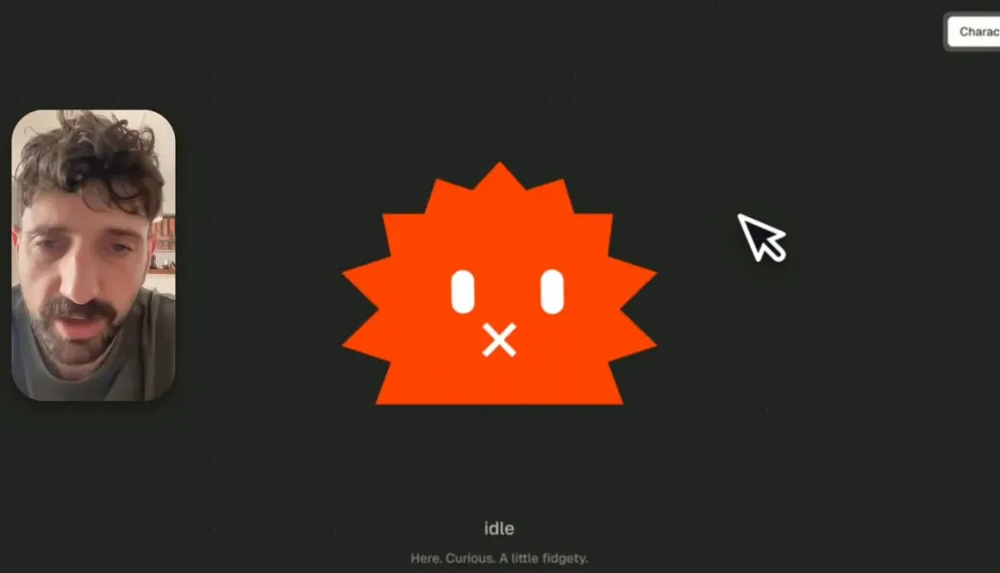</a>

*Istruzioni basate sull’opera collegata*

**Prompt**

```text
Trasforma il logo 2D del personaggio fornito in una versione 3D animata. Conservane l’identità riconoscibile mentre il personaggio acquista volume e movimento.
```

[Vedi dettagli ↗](https://www.tripo3d.ai/it/3d-prompts/a-2d-logo-becomes-an-animated-character-2096559197999501724) · [Post originale](https://x.com/anthonyriera/status/2096559197999501724) · [Torna agli esempi](#all-prompts)

---

<a id="interactive-miniature-of-seoul-2096557555086725159"></a>

### Miniatura interattiva di Seoul

[synabreu](https://x.com/synabreu) · 2026-09-06 · GPT-6 Astra · Interattivo

<a href="https://www.tripo3d.ai/it/3d-prompts/interactive-miniature-of-seoul-2096557555086725159">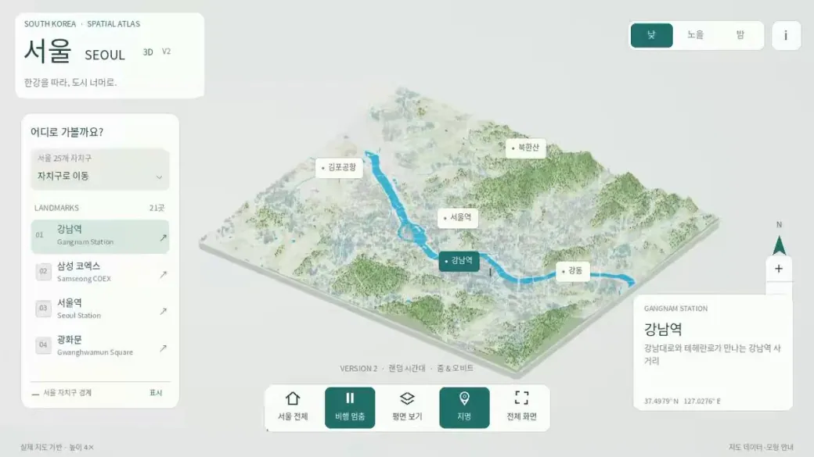</a>

*Istruzioni basate sull’opera collegata*

**Prompt**

```text
Crea una miniatura di Seoul in Three.js usando dati cartografici aperti. Aggiungi navigazione per distretto, sorvoli dei luoghi simbolo, modalità giorno e notte e controlli touch. Dichiara quali edifici sono semplificati, quali altezze sono stimate e le licenze dei dati.
```

[Vedi dettagli ↗](https://www.tripo3d.ai/it/3d-prompts/interactive-miniature-of-seoul-2096557555086725159) · [Post originale](https://x.com/synabreu/status/2096557555086725159) · [Demo](https://seoul-3d-atlas.synabreu.chatgpt.site/) · [Torna agli esempi](#all-prompts)

---

<a id="mobile-playable-unity-rally-game-2096556692842348826"></a>

### Gioco di rally Unity giocabile su telefono

[Kevin Kern](https://x.com/kevinkern) · 2026-09-06 · GPT-6 Astra · Giochi

<a href="https://www.tripo3d.ai/it/3d-prompts/mobile-playable-unity-rally-game-2096556692842348826">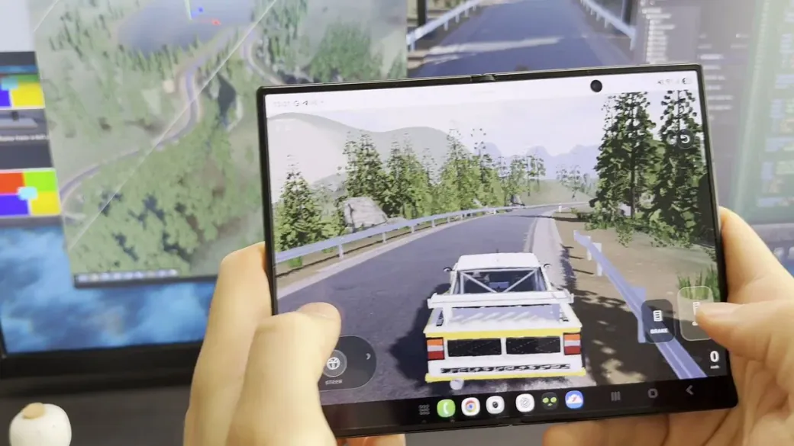</a>

*Istruzioni basate sull’opera collegata*

**Prompt**

```text
Crea un prototipo di guida rally con Codex, Blender e Unity. Prepara gli asset 3D e i controlli per provare il gioco su un telefono.
```

[Vedi dettagli ↗](https://www.tripo3d.ai/it/3d-prompts/mobile-playable-unity-rally-game-2096556692842348826) · [Post originale](https://x.com/kevinkern/status/2096556692842348826) · [Torna agli esempi](#all-prompts)

---

<a id="trading-card-battle-game-loop-2096555856204644550"></a>

### Ciclo di gioco di battaglie con carte collezionabili

[FaryaBlender3D](https://x.com/FaryaBlender3D) · 2026-09-06 · GPT-6 Astra · Giochi

<a href="https://www.tripo3d.ai/it/3d-prompts/trading-card-battle-game-loop-2096555856204644550">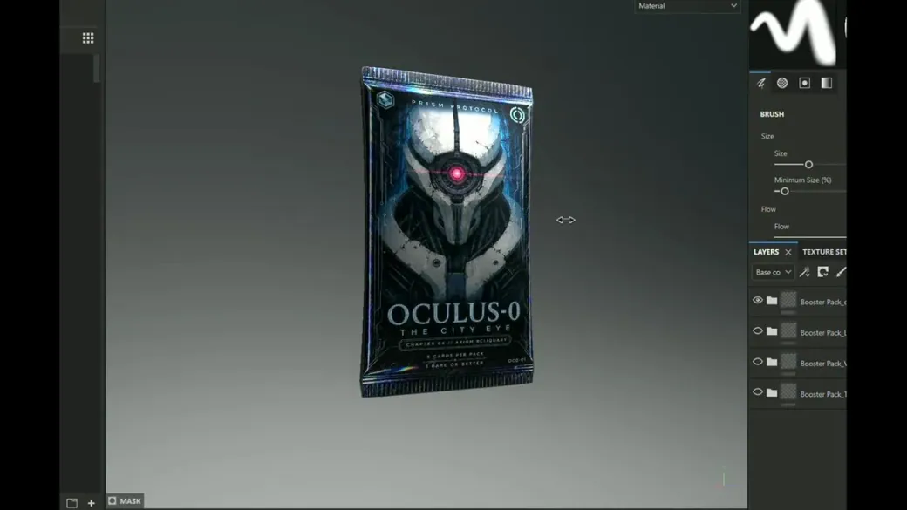</a>

*Istruzioni basate sull’opera collegata*

**Prompt**

```text
Crea un prototipo di carte collezionabili in Three.js: acquistare mazzi e buste, comporre un mazzo, entrare in un’arena e ottenere ricompense. Mantieni le mesh provvisorie sostituibili con asset definitivi.
```

[Vedi dettagli ↗](https://www.tripo3d.ai/it/3d-prompts/trading-card-battle-game-loop-2096555856204644550) · [Post originale](https://x.com/FaryaBlender3D/status/2096555856204644550) · [Torna agli esempi](#all-prompts)

---

<a id="interactive-dual-ring-energy-core-2096551010089263181"></a>

### Nucleo energetico interattivo a due anelli

[ruofeng](https://x.com/oneruofeng) · 2026-09-06 · GPT-6 Astra · Interattivo

<a href="https://www.tripo3d.ai/it/3d-prompts/interactive-dual-ring-energy-core-2096551010089263181"></a>

*Istruzioni basate sull’opera collegata*

**Prompt**

```text
Modella un nucleo energetico, due anelli e una base metallica in Blender. Esporta i materiali in un visualizzatore Three.js con controlli di rotazione, zoom, orbita automatica e pulsazione.
```

[Vedi dettagli ↗](https://www.tripo3d.ai/it/3d-prompts/interactive-dual-ring-energy-core-2096551010089263181) · [Post originale](https://x.com/oneruofeng/status/2096551010089263181) · [Codice sorgente](https://github.com/wangruofeng/orbital-core-showcase) · [Demo](https://orbital-core-showcase.wangruofeng007.workers.dev/) · [Torna agli esempi](#all-prompts)

---

<a id="gpt-6-astra-2096547658164834788"></a>

### La visione del tempio di Ezechiele in 3D

[KrixAi](https://x.com/KrixOnok) · 2026-09-06 · GPT-6 Astra · Scene

<a href="https://www.tripo3d.ai/it/3d-prompts/gpt-6-astra-2096547658164834788">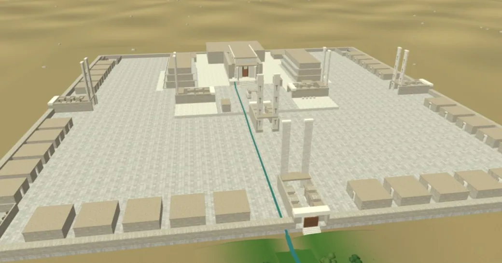</a>

**Prompt**

```text
Come apparirebbe in 3D la visione del tempio di Ezechiele?
```

<details>
<summary>Prompt originale</summary>

```text
What would Ezekiel’s temple vision look like in 3D?
```

</details>

[Vedi dettagli ↗](https://www.tripo3d.ai/it/3d-prompts/gpt-6-astra-2096547658164834788) · [Post originale](https://x.com/KrixOnok/status/2096547658164834788) · [Torna agli esempi](#all-prompts)

---

<a id="switchable-character-expressions-in-blender-2096525100518453342"></a>

### Espressioni del personaggio intercambiabili in Blender

[Nano(ナノ)](https://x.com/Dstudio_ai) · 2026-09-06 · GPT-6 Astra · Asset

<a href="https://www.tripo3d.ai/it/3d-prompts/switchable-character-expressions-in-blender-2096525100518453342">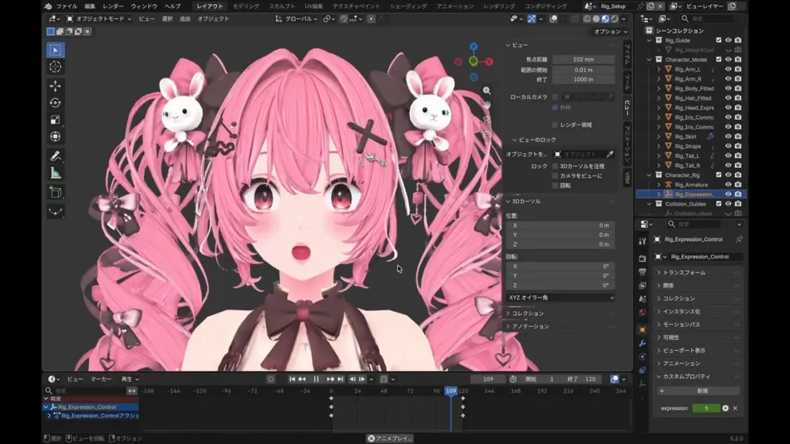</a>

*Istruzioni basate sull’opera collegata*

**Prompt**

```text
Prepara varianti delle espressioni di un personaggio Tripo in Blender prima del rigging. Allinea le mesh e passa da una all’altra senza interpolazione, riducendo le varianti inattive all’interno della testa. Non presentare il risultato come una fusione graduale delle espressioni né come compatibile con VRM.
```

[Vedi dettagli ↗](https://www.tripo3d.ai/it/3d-prompts/switchable-character-expressions-in-blender-2096525100518453342) · [Post originale](https://x.com/Dstudio_ai/status/2096525100518453342) · [Torna agli esempi](#all-prompts)

---

<a id="looping-water-with-geometry-nodes-2096521798150242631"></a>

### Acqua in loop con Geometry Nodes

[黒曜陣](https://x.com/uB95A7tobA17057) · 2026-09-06 · GPT-6 Astra · Asset

<a href="https://www.tripo3d.ai/it/3d-prompts/looping-water-with-geometry-nodes-2096521798150242631">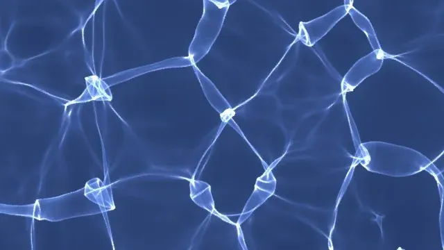</a>

*Istruzioni basate sull’opera collegata*

**Prompt**

```text
Crea un effetto periodico di superficie d’acqua con Geometry Nodes di Blender, senza baking. Mantieni modificabile la configurazione dei nodi e descrivila come un modello di superficie, non come una simulazione completa di fluidi.
```

[Vedi dettagli ↗](https://www.tripo3d.ai/it/3d-prompts/looping-water-with-geometry-nodes-2096521798150242631) · [Post originale](https://x.com/uB95A7tobA17057/status/2096521798150242631) · [Torna agli esempi](#all-prompts)

---

<a id="one-piece-inspired-sailing-world-2096518775042707700"></a>

### Mondo di navigazione ispirato a One Piece

[Yash](https://x.com/yash_yk45) · 2026-09-06 · GPT-6 Astra · Giochi

<a href="https://www.tripo3d.ai/it/3d-prompts/one-piece-inspired-sailing-world-2096518775042707700">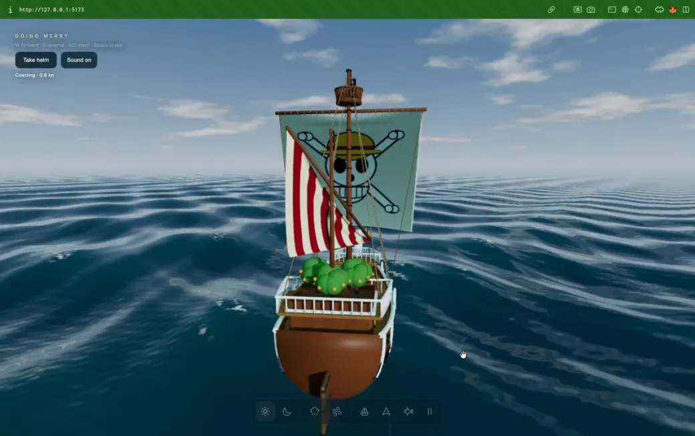</a>

*Istruzioni basate sull’opera collegata*

**Prompt**

```text
Crea un mondo di navigazione giocabile con una nave Blender e un oceano Three.js. Aggiungi meteo variabile, esplorazione subacquea, scia, schiuma, spruzzi e vele in movimento.
```

[Vedi dettagli ↗](https://www.tripo3d.ai/it/3d-prompts/one-piece-inspired-sailing-world-2096518775042707700) · [Post originale](https://x.com/yash_yk45/status/2096518775042707700) · [Demo](https://one-piece-sea-world.vercel.app/) · [Torna agli esempi](#all-prompts)

---

<a id="personal-room-as-an-interactive-portfolio-2096506357868642342"></a>

### Una stanza personale come portfolio interattivo

[Kalan ◂Ⓘ▸](https://x.com/kalanyei) · 2026-09-06 · GPT-6 Astra · Interattivo

<a href="https://www.tripo3d.ai/it/3d-prompts/personal-room-as-an-interactive-portfolio-2096506357868642342">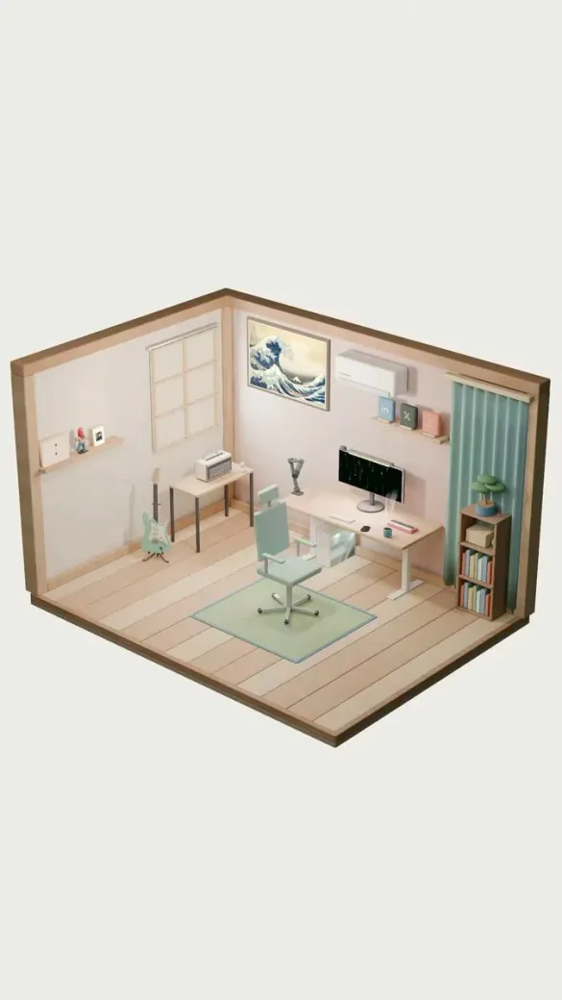</a>

*Istruzioni basate sull’opera collegata*

**Prompt**

```text
Trasforma una stanza personale in un sito interattivo di presentazione. Costruisci la scena ed esegui il bake in Blender, poi aggiungi vapore del caffè, animazione in stile Matrix e sottili effetti shader.
```

[Vedi dettagli ↗](https://www.tripo3d.ai/it/3d-prompts/personal-room-as-an-interactive-portfolio-2096506357868642342) · [Post originale](https://x.com/kalanyei/status/2096506357868642342) · [Demo](https://room.kalan.dev/) · [Torna agli esempi](#all-prompts)

---

<a id="complete-three-js-puzzle-level-2096505740643246231"></a>

### Livello completo di rompicapo in Three.js

[Steve的花园儿](https://x.com/TvWoo) · 2026-09-06 · GPT-6 Astra · Giochi

<a href="https://www.tripo3d.ai/it/3d-prompts/complete-three-js-puzzle-level-2096505740643246231">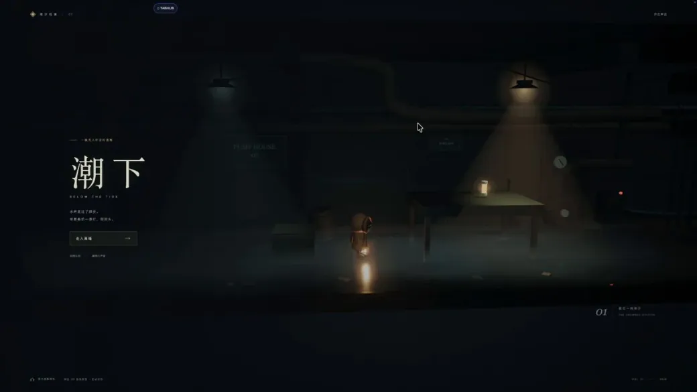</a>

*Istruzioni basate sull’opera collegata*

**Prompt**

```text
Crea un livello completo di un rompicapo 3D in Three.js, incluse le meccaniche giocabili. Integra l’audio fornito dopo aver reso funzionanti il livello e le interazioni.
```

[Vedi dettagli ↗](https://www.tripo3d.ai/it/3d-prompts/complete-three-js-puzzle-level-2096505740643246231) · [Post originale](https://x.com/TvWoo/status/2096505740643246231) · [Torna agli esempi](#all-prompts)

---

<a id="yf-24-boat-on-a-gentle-3d-sea-2096503275910832461"></a>

### Barca YF-24 su un mare 3D tranquillo

[Yohei Matsumoto](https://x.com/yhmtmt1) · 2026-09-06 · GPT-6 Astra · Asset

<a href="https://www.tripo3d.ai/it/3d-prompts/yf-24-boat-on-a-gentle-3d-sea-2096503275910832461">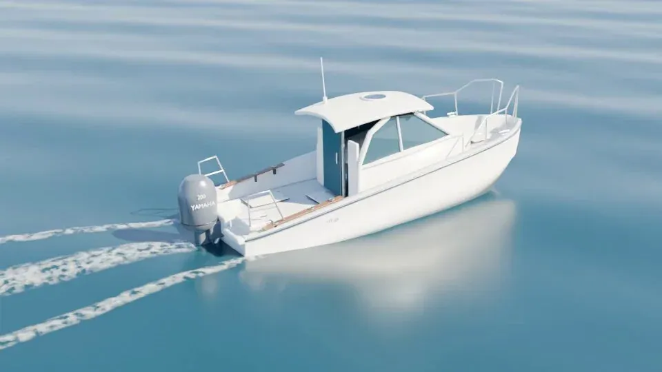</a>

*Istruzioni basate sull’opera collegata*

**Prompt**

```text
Modella una barca YF-24 in Blender e animala mentre naviga su un mare tridimensionale con vento di forza 2 sulla scala Beaufort. Usa riferimenti della barca per migliorarne la forma.
```

[Vedi dettagli ↗](https://www.tripo3d.ai/it/3d-prompts/yf-24-boat-on-a-gentle-3d-sea-2096503275910832461) · [Post originale](https://x.com/yhmtmt1/status/2096503275910832461) · [Torna agli esempi](#all-prompts)

---

<a id="top-floor-plan-to-blender-preview-2096501340889374883"></a>

### Dalla pianta dell’ultimo piano a un’anteprima Blender

[indigo](https://x.com/indigox) · 2026-09-06 · GPT-6 Astra · Scene

<a href="https://www.tripo3d.ai/it/3d-prompts/top-floor-plan-to-blender-preview-2096501340889374883">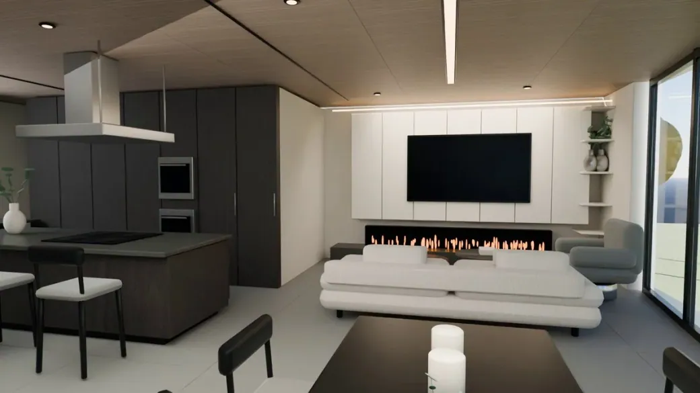</a>

*Istruzioni basate sull’opera collegata*

**Prompt**

```text
Usa la pianta dell’ultimo piano di una casa per creare una scena Blender e renderizza un’anteprima di 10 secondi con pochi campioni. Dai priorità a una disposizione spaziale chiara prima di rifinire i materiali.
```

[Vedi dettagli ↗](https://www.tripo3d.ai/it/3d-prompts/top-floor-plan-to-blender-preview-2096501340889374883) · [Post originale](https://x.com/indigox/status/2096501340889374883) · [Torna agli esempi](#all-prompts)

---

<a id="walkable-low-poly-gwacheon-village-2096490395614019793"></a>

### Villaggio low poly di Gwacheon da esplorare a piedi

[Manas Joshi](https://x.com/ManasJoshi76254) · 2026-09-06 · GPT-6 Astra · Scene

<a href="https://www.tripo3d.ai/it/3d-prompts/walkable-low-poly-gwacheon-village-2096490395614019793">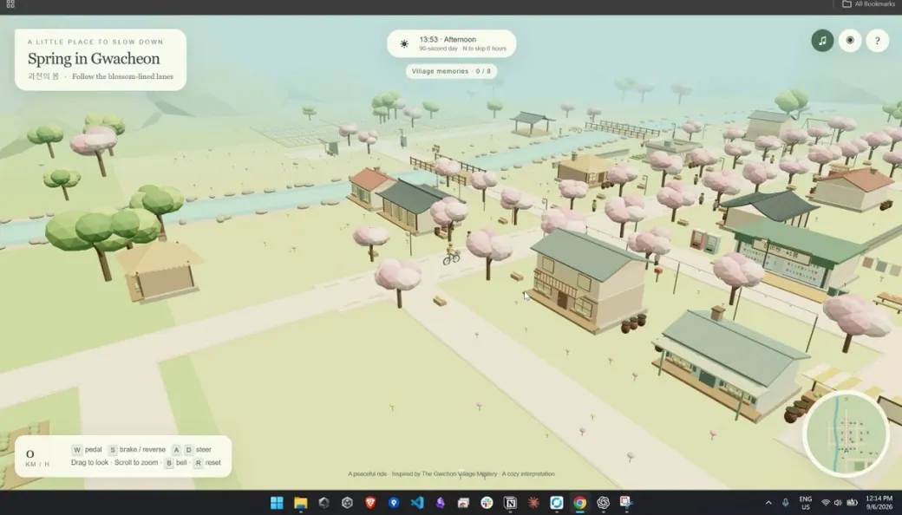</a>

*Istruzioni basate sull’opera collegata*

**Prompt**

```text
Crea in un singolo file HTML un villaggio low poly accogliente ed esplorabile ispirato a Gwacheon. Combina paesaggio 3D procedurale, atmosfera, interfaccia e interazioni.
```

[Vedi dettagli ↗](https://www.tripo3d.ai/it/3d-prompts/walkable-low-poly-gwacheon-village-2096490395614019793) · [Post originale](https://x.com/ManasJoshi76254/status/2096490395614019793) · [Torna agli esempi](#all-prompts)

---

<a id="assemble-and-animate-generated-3d-assets-2096481425050743048"></a>

### Assemblaggio e animazione di asset 3D generati

[Stefan 3D AI](https://x.com/Stefan_3D_AI) · 2026-09-06 · GPT-6 Astra · Asset

<a href="https://www.tripo3d.ai/it/3d-prompts/assemble-and-animate-generated-3d-assets-2096481425050743048">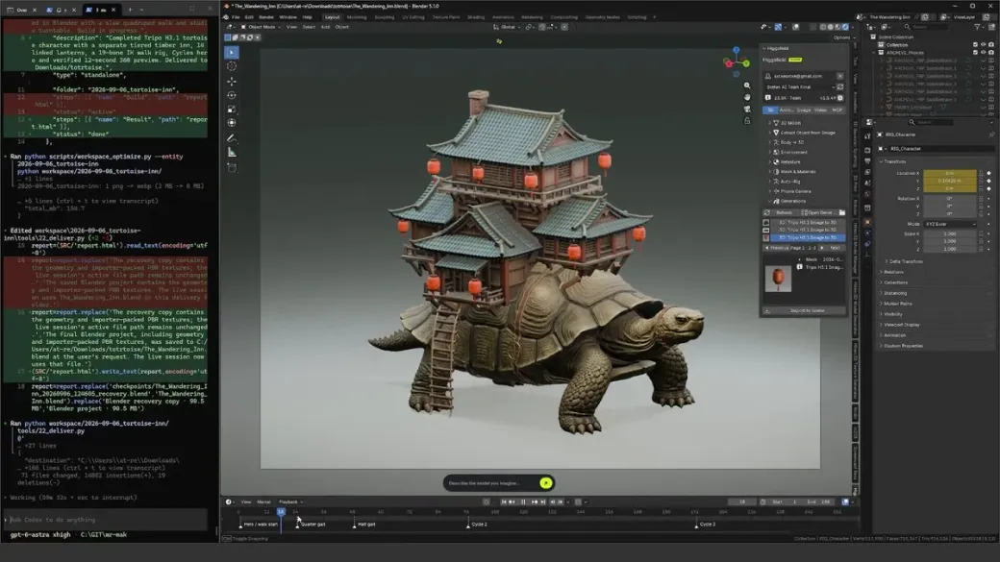</a>

*Istruzioni basate sull’opera collegata*

**Prompt**

```text
Genera asset 3D ottimizzati con Tripo P2, assemblali in Blender ed esegui rigging e animazione dei personaggi. Verifica come personaggi e scena si combinano nello spazio.
```

[Vedi dettagli ↗](https://www.tripo3d.ai/it/3d-prompts/assemble-and-animate-generated-3d-assets-2096481425050743048) · [Post originale](https://x.com/Stefan_3D_AI/status/2096481425050743048) · [Torna agli esempi](#all-prompts)

---

<a id="wright-flyer-through-a-japanese-forest-2096467585785286808"></a>

### Wright Flyer in volo attraverso una foresta giapponese

[Jared](https://x.com/jaredliu_bravo) · 2026-09-06 · GPT-6 Astra · Giochi

Remix di: [The Bugged Dev](https://x.com/thebuggeddev/status/2096467585785286808)

<a href="https://www.tripo3d.ai/it/3d-prompts/wright-flyer-through-a-japanese-forest-2096467585785286808">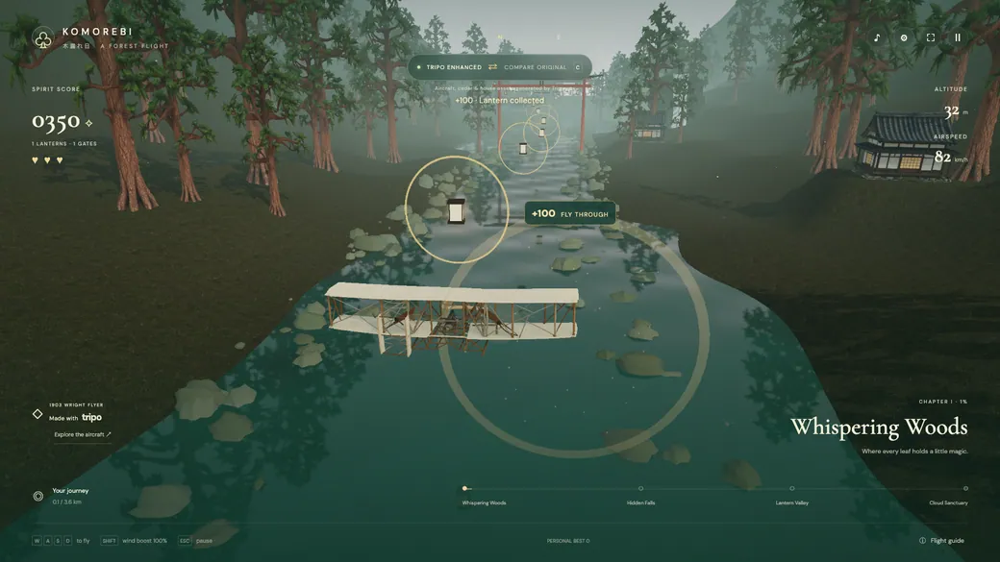</a>

**Prompt**

```text
# KOMOREBI — Un volo nella foresta

## 1. Obiettivo
Mantieni tutti i testi dell’interfaccia di gioco in inglese.
Realizza un gioco di volo completo per browser: pilota un riconoscibile Wright Flyer del 1903 lungo un fiume in una foresta giapponese, raccogli lanterne degli spiriti, attraversa portali torii e raggiungi un santuario di montagna. Usa https://komorebi-forest-flight.tripo.page/ e i riferimenti forniti per la composizione finale. Dai credito a Jared su https://x.com/jaredliu_bravo e all'ispirazione, The Bugged Dev, su https://x.com/thebuggeddev/status/2096467585785286808.

## 2. Direzione visiva
Crea una tranquilla foresta cinematografica in miniatura, con verdi profondi di cedro, acqua color teal, lino avorio caldo, legno segnato dal tempo, pietre coperte di muschio e una luce ambrata discreta. Inquadra chiaramente l'aereo con una fluida telecamera in inseguimento posteriore, lasciando visibile sopra le ali il prossimo oggetto da raccogliere. Usa luce solare morbida proveniente dall'esterno dell'inquadratura frontale, luce di riempimento ambientale, ombre di contatto, montagne nella foschia, riflessi sull'acqua, particelle sospese e un bloom discreto. Evita sovraesposizione, case sospese, bagliori troppo grandi e pareti rocciose angolari.

Usa testo bianco caldo, bordi sottili traslucidi, titoli serif nello stile di Cormorant Garamond e controlli nello stile di DM Sans. In alto a sinistra: KOMOREBI, 木漏れ日 e A FOREST FLIGHT. Posiziona la bussola e il controllo Compare in alto, i pulsanti degli strumenti in alto a destra, punteggio e cuori a sinistra, quota e velocità indicata a destra e l'avanzamento del capitolo lungo il bordo inferiore. L'invito iniziale è «Lascia che sia la foresta a trasportarti.» con «Inizia il volo». Compatta la sovrimpressione sui telefoni senza coprire l'aereo.

## 3. Mondo
Costruisci un percorso deterministico di 3.6 km, suddiviso in quattro capitoli equidistanti: Whispering Woods, Hidden Falls, Lantern Valley e Cloud Sanctuary. Carica dinamicamente o ricicla i segmenti dello scenario. Un fiume turchese dal corso dolcemente sinuoso definisce il corridoio; usa x(z) = sin(0.006z) × 19 + sin(0.017z) × 5 come curva iniziale. Posiziona aperture torii lungo la traiettoria di volo assistita, disponendovi intorno foresta, case in legno, cascate, rocce arrotondate del fiume e montagne nella foschia. Crea una terrazza per ogni ingombro delle case e incassa le fondamenta in tutti e quattro gli angoli.

## 4. Inventario degli asset
Prepara gli slot dei modelli in quest'ordine:
- `aircraft`: Wright Flyer del 1903 aperto, con due ampie ali in lino avorio, telaio sottile in legno a vista, montanti e cavi di tensione, canard anteriore e due eliche spingenti posteriori. Mantieni le eliche come parti animate separate, senza pale duplicate.
- `cedar`: tronco alto bruno-rossastro, chiome irregolari stratificate di verde intenso, rami coerenti e radici ben ancorate; riutilizzalo variando scala e rotazione.
- `minka`: legno scuro segnato dal tempo, tamponamento in intonaco, ampio tetto a falde rivestito di tegole, gronde generose, calde finestre shoji e fondazione in pietra.
- `torii`: portale torii giapponese in legno segnato dal tempo, con due montanti e un ampio architrave superiore curvo; il passaggio aperto deve corrispondere all'attuale volume di collisione.
- `lantern`: lanterna degli spiriti calda, in carta e legno; usa la stessa famiglia di modelli per gli oggetti da raccogliere ripetuti e per le luci decorative più piccole, distinguendone visibilmente i ruoli.
- `rock`: roccia arrotondata del fiume coperta di muschio, con base ben ancorata; istanziala lungo le rive senza bloccare il corridoio di volo.
Mantieni procedurali fiume, terreno, montagne, superfici delle cascate, anelli luminosi, foschia, particelle e interfaccia. Elenca ogni slot nel registro e aggiorna tutte le istanze ripetute quando cambia il relativo modello.

## 5. Volo e feedback
Dopo «Inizia il volo», procedi automaticamente in avanti. W/S o su/giù regolano la quota; A/D o destra/sinistra controllano la direzione e l'inclinazione. Shift consuma una riserva visibile di spinta del vento, che si ricarica. L'accelerazione fluida e la telecamera al seguito devono restare reattive. L'assistenza al volo predefinita riporta dolcemente l'aereo verso il fiume e la quota obiettivo quando si rilascia il comando; offri un interruttore per l'assistenza e impostazioni di qualità. Fornisci controlli touch per la direzione e la spinta. Esc mette in pausa; aiuto, impostazioni e visualizzatore dell'aereo mettono in pausa il volo e ripristinano lo stato precedente. Cancella i comandi mantenuti quando si perde il focus.

Assegna tre cuori. Ogni lanterna degli spiriti vale 100 punti e ogni attraversamento riuscito di un torii vale 250 punti, una sola volta per obiettivo. Le collisioni con terreno, rive e travi fanno perdere un cuore e concedono una breve invulnerabilità. Completa il percorso a 3.6 km con punteggio, record e possibilità di rigiocare; con zero cuori, consenti di riprovare. Salva localmente il record, con un fallback in caso di errore di archiviazione.

Le lanterne si trovano all'interno di grandi anelli dorati ovali per la raccolta, con aloni oscillanti e pulsanti e scintille. Etichetta l'obiettivo più vicino «+100 · ATTRAVERSA IN VOLO». Allinea il generoso volume di collisione con l'anello animato. Le raccolte generano un anello in espansione, particelle calde, un punteggio fluttuante e un impulso nell'HUD. Fai sfumare i portali superati prima che oscurino la telecamera in inseguimento.

## 6. Implementazione
Usa Vite, Three.js e moduli JavaScript ES, separando gestione del percorso, collisioni e punteggio, scenario, modelli, effetti e interfaccia. Includi localmente dipendenze, font e asset di runtime; distribuisci un sito statico. Usa GLTFLoader e un manifest degli asset con limiti, orientamento, provenienza e factory di fallback per ogni slot. Mantieni le collisioni indipendenti dalla forma della mesh importata. Ruota le due eliche usando il delta time; esaminale dalla telecamera in inseguimento e da un visualizzatore dell'aereo orbitabile e con zoom. Offri il download del file locale effettivo dell'aereo quando disponibile. Blender è facoltativo per separare eliche incorporate, correggere i pivot o generare una mesh più leggera se le prestazioni misurate lo richiedono.

Mantieni il baseline visivo originale. Quando esiste uno slot importato, Compare o C alterna tra quel baseline e le sostituzioni disponibili, senza navigare né reimpostare volo, telecamera, cuori, spinta, punteggio o oggetti raccolti. Blocca l'avanzamento durante la transizione, conserva l'ultimo frame completo finché la scena successiva non è pronta, quindi applica una dissolvenza incrociata di circa 650 ms. Rispetta la riduzione del movimento; impedisci i clic ripetuti e ripristina la scena precedente in caso di errore. Usa uno sfondo scuro di avvio inline, DPR limitato, un numero di particelle controllato e al massimo due varianti di scena memorizzate nella cache.

## 7. Criteri di accettazione
Consegna il codice sorgente, il lockfile, npm run dev, npm run build e l'output statico dist. Verifica un volo completo, la spinta, la raccolta di lanterne e torii, l'immunità alle collisioni, la pausa/ripresa, i controlli touch, la rigiocabilità, il visualizzatore e le importazioni indipendenti degli slot. Controlla che entrambe le direzioni di Compare preservino lo stato senza frame bianchi né aumento dell'uso delle risorse GPU. Verifica l'ancoraggio delle case, la silhouette dell'aereo, il movimento delle eliche, l'illuminazione leggibile e il recupero dai caricamenti lenti. Riporta i test effettivi e le condizioni delle prestazioni. Segui il flusso di lavoro condiviso qui sotto per la generazione degli asset e restituisci.
```

[Vedi dettagli ↗](https://www.tripo3d.ai/it/3d-prompts/wright-flyer-through-a-japanese-forest-2096467585785286808) · [Post originale](https://x.com/thebuggeddev/status/2096467585785286808) · [Demo](https://komorebi-forest-flight.tripo.page/) · [Torna agli esempi](#all-prompts)

---

<a id="surface-climbing-procedural-insect-2096460081982304546"></a>

### Insetto procedurale che si arrampica sulle superfici

[XiaoLei Liu](https://x.com/leo_xiaolei) · 2026-09-06 · GPT-6 Astra · Animazione

<a href="https://www.tripo3d.ai/it/3d-prompts/surface-climbing-procedural-insect-2096460081982304546"></a>

*Istruzioni basate sull’opera collegata*

**Prompt**

```text
Crea un insetto 3D a più zampe che cammini aderendo a superfici diverse. Coordina zampe e corpo mentre supera variazioni di altezza.
```

[Vedi dettagli ↗](https://www.tripo3d.ai/it/3d-prompts/surface-climbing-procedural-insect-2096460081982304546) · [Post originale](https://x.com/leo_xiaolei/status/2096460081982304546) · [Demo](https://threerocks.github.io/web-3d-pages/) · [Torna agli esempi](#all-prompts)

---

<a id="gpt-6-astra-2096438110095585753"></a>

### Ricostruzione di Lego 1999 Racers

[Mo Elgaraihy](https://x.com/EngMoElgaraihy) · 2026-09-06 · GPT-6 Astra · Giochi

<a href="https://www.tripo3d.ai/it/3d-prompts/gpt-6-astra-2096438110095585753">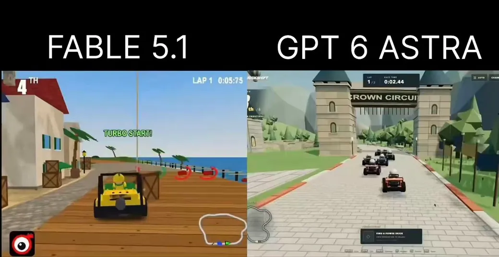</a>

**Prompt**

```text
Ricostruisci completamente il celebre gioco di corse Lego 1999 Racers.
```

<details>
<summary>Prompt originale</summary>

```text
إعادة بناء لعبة السيارات الشهيرة Lego 1999 Racers بالكامل.
```

</details>

[Vedi dettagli ↗](https://www.tripo3d.ai/it/3d-prompts/gpt-6-astra-2096438110095585753) · [Post originale](https://x.com/EngMoElgaraihy/status/2096438110095585753) · [Torna agli esempi](#all-prompts)

---

<a id="playable-d4-inspired-apartment-2096413869841473930"></a>

### Appartamento giocabile ispirato a D4

[Hidetaka SWERY SueHERO](https://x.com/Swery65) · 2026-09-06 · GPT-6 Astra · Interattivo

<a href="https://www.tripo3d.ai/it/3d-prompts/playable-d4-inspired-apartment-2096413869841473930">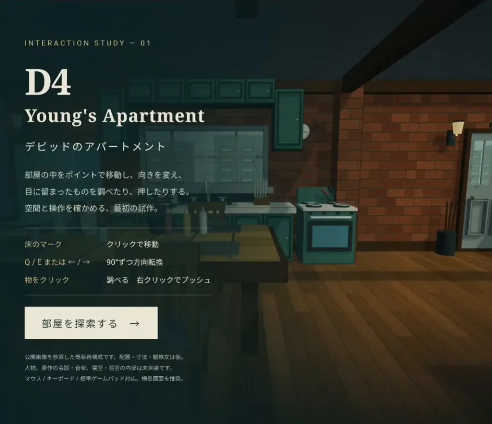</a>

*Istruzioni basate sull’opera collegata*

**Prompt**

```text
Studia l’appartamento del protagonista di D4 e ricrealo come prototipo 3D giocabile. Confronta la disposizione e le interazioni con i riferimenti, senza presumere che la ricostruzione sia esatta.
```

[Vedi dettagli ↗](https://www.tripo3d.ai/it/3d-prompts/playable-d4-inspired-apartment-2096413869841473930) · [Post originale](https://x.com/Swery65/status/2096413869841473930) · [Torna agli esempi](#all-prompts)

---

<a id="gpt-6-astra-2096391653669953761"></a>

### Crea e renderizza un buco nero in Blender

[John Kler](https://x.com/JohnKlerAI) · 2026-09-06 · GPT-6 Astra · Scene

<a href="https://www.tripo3d.ai/it/3d-prompts/gpt-6-astra-2096391653669953761">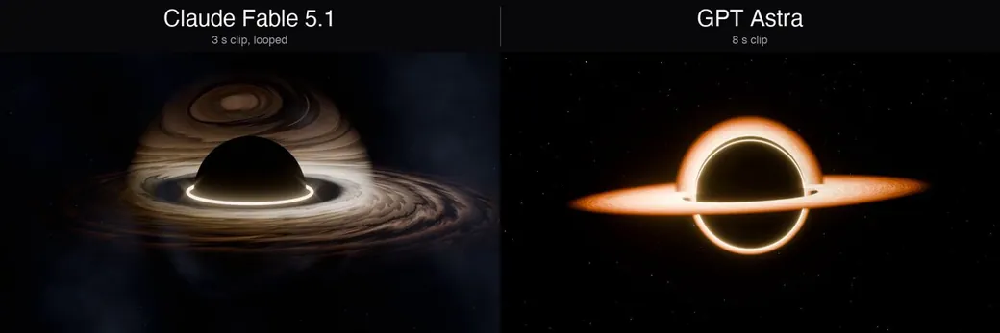</a>

**Prompt**

```text
Crea e renderizza in Blender un magnifico buco nero, simile a quello di Interstellar.
```

<details>
<summary>Prompt originale</summary>

```text
Make and render a beautiful black hole, like the one from Interstellar, in Blender.
```

</details>

[Vedi dettagli ↗](https://www.tripo3d.ai/it/3d-prompts/gpt-6-astra-2096391653669953761) · [Post originale](https://x.com/JohnKlerAI/status/2096391653669953761) · [Torna agli esempi](#all-prompts)

---

<a id="railway-network-simulation-game-2096362653480562751"></a>

### Gioco di simulazione di una rete ferroviaria

[Tom Krcha](https://x.com/tomkrcha) · 2026-09-05 · GPT-6 Astra · Animazione

<a href="https://www.tripo3d.ai/it/3d-prompts/railway-network-simulation-game-2096362653480562751">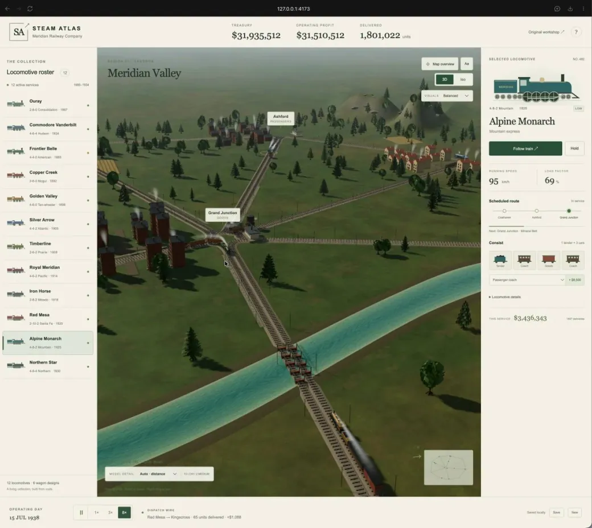</a>

*Istruzioni basate sull’opera collegata*

**Prompt**

```text
Espandi un modello di treno Three.js in una simulazione ferroviaria con città, snodi, fiumi e ponti. Aggiungi camere di inseguimento del treno, 3D libera e isometrica, oltre a effetti di fumo.
```

[Vedi dettagli ↗](https://www.tripo3d.ai/it/3d-prompts/railway-network-simulation-game-2096362653480562751) · [Post originale](https://x.com/tomkrcha/status/2096362653480562751) · [Torna agli esempi](#all-prompts)

---

<a id="tavern-with-working-staff-and-guests-2096358854275543457"></a>

### Taverna con personale e ospiti attivi

[Rogue](https://x.com/Rogue0114) · 2026-09-05 · GPT-6 Astra · Animazione

<a href="https://www.tripo3d.ai/it/3d-prompts/tavern-with-working-staff-and-guests-2096358854275543457">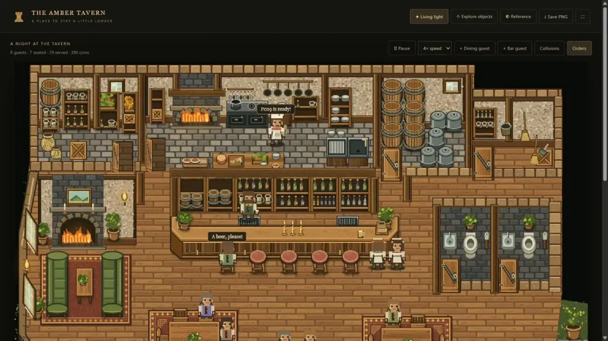</a>

*Istruzioni basate sull’opera collegata*

**Prompt**

```text
Ricrea una taverna da un’immagine di riferimento e popolala di ospiti e lavoratori. Fai ordinare cibo e bevande agli ospiti e preparare gli ordini al personale, con gestione delle collisioni e ricerca dei percorsi.
```

[Vedi dettagli ↗](https://www.tripo3d.ai/it/3d-prompts/tavern-with-working-staff-and-guests-2096358854275543457) · [Post originale](https://x.com/Rogue0114/status/2096358854275543457) · [Torna agli esempi](#all-prompts)

---

<a id="gpt-6-astra-2096354461652488562"></a>

### Ensemble 3D giocabile con animazione sincronizzata all’audio

[Generator](https://x.com/groovestreetgen) · 2026-09-05 · GPT-6 Astra · Interattivo

<a href="https://www.tripo3d.ai/it/3d-prompts/gpt-6-astra-2096354461652488562">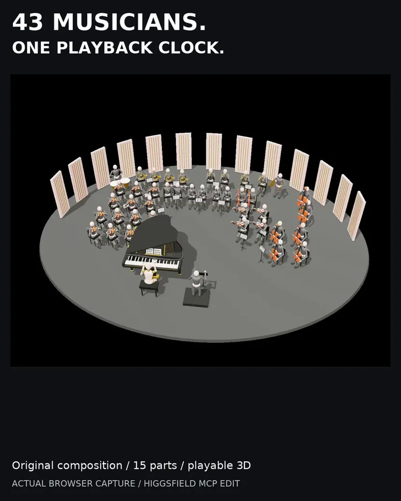</a>

**Prompt**

```text
Componi un breve brano originale e realizza un ensemble 3D giocabile. Fai dipendere l’animazione dal tempo dell’audio. Includi ricerca temporale, slow motion, controlli della telecamera, MIDI e codice sorgente.
```

<details>
<summary>Prompt originale</summary>

```text
Compose an original short piece and build a playable 3D ensemble. Drive animation from audio time. Include seeking, slow motion, camera controls, MIDI and source.
```

</details>

[Vedi dettagli ↗](https://www.tripo3d.ai/it/3d-prompts/gpt-6-astra-2096354461652488562) · [Post originale](https://x.com/groovestreetgen/status/2096354461652488562) · [Torna agli esempi](#all-prompts)

---

<a id="gpt-6-astra-2096342420543660277"></a>

### Dal concept del personaggio al modello 3D riggato e al cartoon

[Higgsfield AI 🧩](https://x.com/higgsfield_ai) · 2026-09-05 · GPT-6 Astra · Asset

<a href="https://www.tripo3d.ai/it/3d-prompts/gpt-6-astra-2096342420543660277">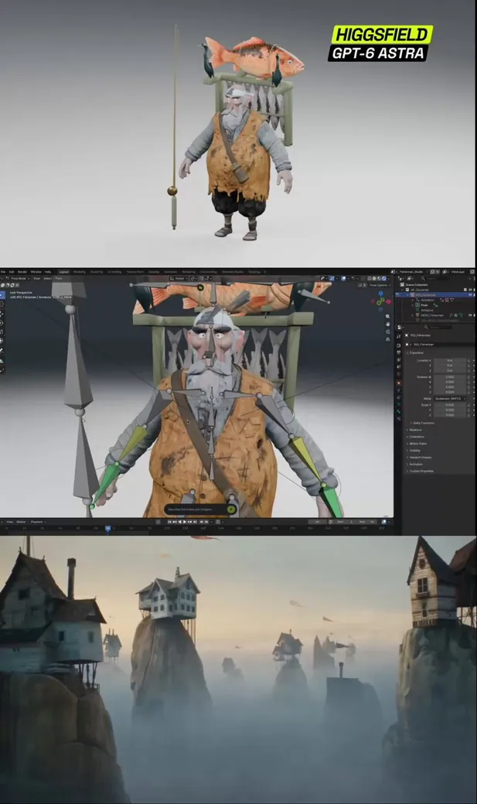</a>

**Prompt**

```text
Prendi il controllo del mio computer usando GPT-6 Astra e procedi come segue: 

1. crea un concept del personaggio con Higgsfield Soul 2.0, 

2. realizza un modello 3D texturizzato del personaggio, 

3. importalo in Blender, 

4. esegui la retopologia della mesh, 

5. crea una mappa UV, 

6. crea un rig per il personaggio, 

7. valuta quanto il modello sia pronto per la produzione, 

8. ripeti i passaggi precedenti se non sei soddisfatto dei risultati,

9. quindi trasformalo in un cartoon usando Seedance 2.5 su Higgsfield
```

<details>
<summary>Prompt originale</summary>

```text
Take control of my computer using GPT-6 Astra and do the following: 

1. design a character concept using Higgsfield Soul 2.0, 

2. build a textured 3D model of it, 

3. import it into Blender, 

4. retopologize the mesh, 

5. create a UV map, 

6. build a character rig, 

7. evaluate how production-ready the model is, 

8. redo previous steps if you're not satisfied with results,

9. and then turn it into a cartoon using Seedance 2.5 on Higgsfield
```

</details>

[Vedi dettagli ↗](https://www.tripo3d.ai/it/3d-prompts/gpt-6-astra-2096342420543660277) · [Post originale](https://x.com/higgsfield_ai/status/2096342420543660277) · [Torna agli esempi](#all-prompts)

---

<a id="orbital-solar-system-explorer-2096339041679442428"></a>

### Esploratore orbitale del sistema solare

[Andromedus](https://x.com/dzhohola) · 2026-09-05 · GPT-6 Astra · Interattivo

<a href="https://www.tripo3d.ai/it/3d-prompts/orbital-solar-system-explorer-2096339041679442428">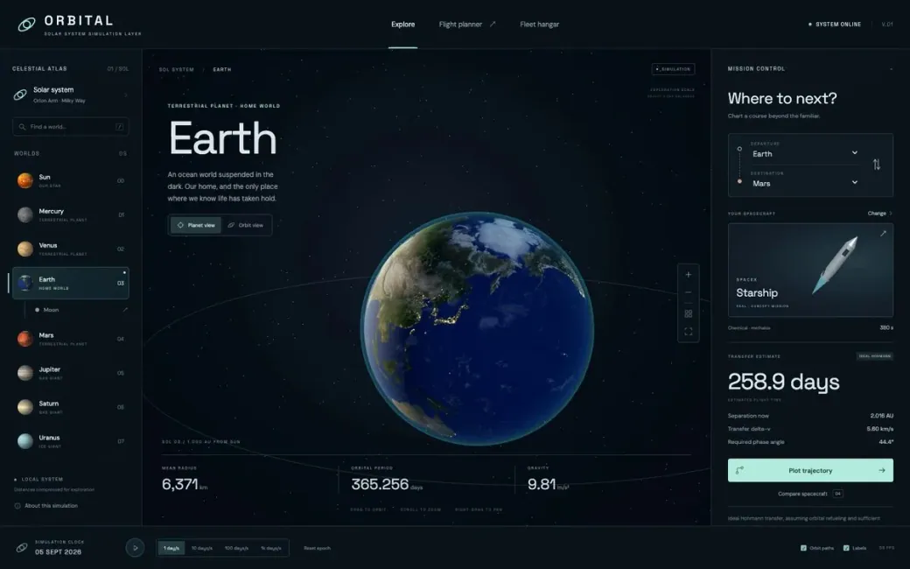</a>

*Istruzioni basate sull’opera collegata*

**Prompt**

```text
Crea un esploratore del sistema solare nel browser con Three.js, otto pianeti e venti lune. Consenti di muovere la camera e pianificare voli spaziali in modo semplificato.
```

[Vedi dettagli ↗](https://www.tripo3d.ai/it/3d-prompts/orbital-solar-system-explorer-2096339041679442428) · [Post originale](https://x.com/dzhohola/status/2096339041679442428) · [Torna agli esempi](#all-prompts)

---

<a id="a-crab-game-with-action-driven-mechanics-2096337879173591171"></a>

### Gioco di un granchio con meccaniche basate sulle azioni

[ZEUS⚡️](https://x.com/zeuuss_01) · 2026-09-05 · GPT-6 Astra · Giochi

<a href="https://www.tripo3d.ai/it/3d-prompts/a-crab-game-with-action-driven-mechanics-2096337879173591171">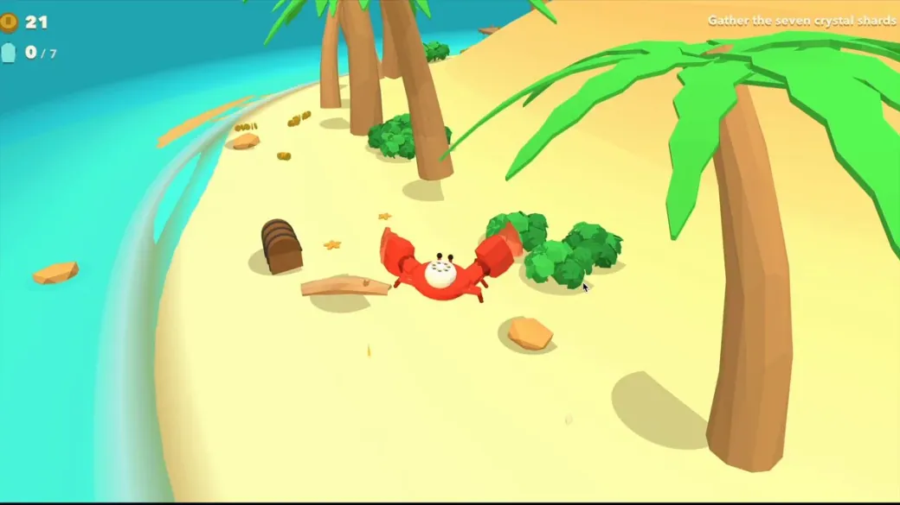</a>

*Istruzioni basate sull’opera collegata*

**Prompt**

```text
Crea un gioco di un granchio in Three.js da un brief strutturato che copra aspetto, personaggio, mondo, azioni, obiettivi, interfaccia e camera. Fai sollevare le monete e volare verso il granchio al suo passaggio; segnala i requisiti contraddittori.
```

[Vedi dettagli ↗](https://www.tripo3d.ai/it/3d-prompts/a-crab-game-with-action-driven-mechanics-2096337879173591171) · [Post originale](https://x.com/zeuuss_01/status/2096337879173591171) · [Demo](https://beach-crab-game.netlify.app/) · [Torna agli esempi](#all-prompts)

---

<a id="gpt-6-astra-2096335588727349434"></a>

### Ricostruzione fotorealistica e modificabile di un drago in Blender

[Sarang Borude](https://x.com/doomdave) · 2026-09-05 · GPT-6 Astra · Asset

<a href="https://www.tripo3d.ai/it/3d-prompts/gpt-6-astra-2096335588727349434">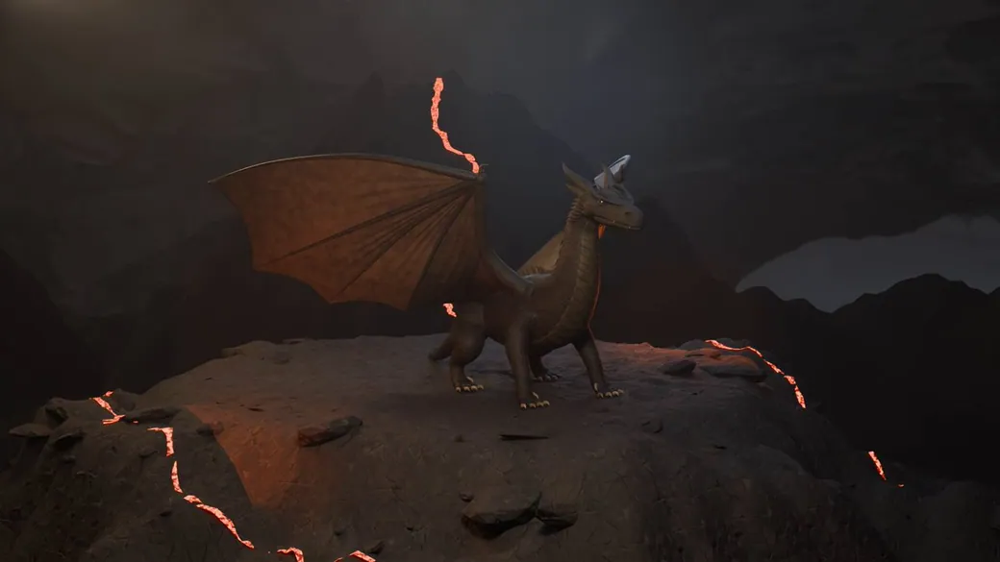</a>

**Immagini di riferimento:** [1](https://media.tripogrowth.space/media/4d0bd23e-3879-4052-9e83-5c70656c5dc5.jpg) · [2](https://pbs.twimg.com/media/HReuaRUacAAtOFF.jpg)

**Prompt**

```text
Crea in Blender una ricostruzione 3D fotorealistica e completamente modificabile del drago mostrato nella tavola di riferimento allegata.

Usa tutte le viste fornite, comprese quelle laterale, frontale, superiore e posteriore, le angolazioni della testa, i primi piani della testa e dell’occhio, i dettagli delle scaglie e delle ali, per ricostruire un unico drago coerente e anatomicamente credibile.

Segui il più fedelmente possibile il riferimento, soprattutto per:

- Proporzioni generali del corpo e silhouette
- Collo lungo e muscoloso e coda affusolata
- Quattro zampe e due grandi ali da pipistrello
- Forma della testa e della mascella
- Numero, forma e posizione delle corna
- Spine dorsali lungo collo, dorso e coda
- Motivi delle scaglie color antracite scuro e marrone terroso
- Scaglie stratificate dall’aspetto corazzato
- Occhi dorato-ambrati con pupille verticali
- Artigli, denti e membrane alari
- Aspetto antico, realistico e minaccioso

I pannelli di riferimento possono contenere piccole incoerenze. Riconciliale in una creatura di base fisicamente coerente e simmetrica, preservando l’identità visiva del drago. Usa la vista laterale per le proporzioni generali, quella frontale per larghezza e postura, quelle superiore e posteriore per ali e coda, e i primi piani per testa, occhi, scaglie e materiali delle ali.

Costruisci il drago da zero come vera geometria Blender modificabile. Non scaricare né importare un modello di drago esistente. Non usare billboard, proiezioni 2D, illusioni basate su mappe di profondità o video generati al posto della geometria.

Usa script modulari Python per Blender (`bpy`) e l’eseguibile di Blender in modalità background/headless come metodo principale di costruzione. Mantieni gli script riproducibili e conserva le versioni riuscite del file `.blend`. Usa il controllo del computer per aprire e ispezionare la scena Blender quando l’ispezione visiva è utile. Non installare né utilizzare un server MCP di Blender.

APPROCCIO ALLA MODELLAZIONE

Inizia con un blockout anatomico prima di aggiungere i dettagli. Definisci:

- Cranio, mascella e cavità oculari
- Collo, torace, gabbia toracica e bacino
- Quattro zampe anatomicamente convincenti
- Dita separate e artigli ricurvi
- Spalle delle ali integrate nel torso
- Braccia alari articolate e ossa delle dita
- Membrane alari collegate correttamente
- Coda lunga che prosegue naturalmente dal bacino
- Corna principali e spine dorsali

Evita arti aggiuntivi, corna duplicate, membrane scollegate, articolazioni spezzate, scaglie fluttuanti, intersezioni, forme sottili come carta, asimmetrie accidentali e proporzioni da giocattolo.

Dopo aver verificato il blockout, aggiungi i dettagli secondari e terziari:

- Placche stratificate su torace e collo
- Scaglie orientate secondo l’anatomia
- Arcate sopraccigliari e palpebre
- Vere aperture delle narici
- Interno della bocca, gengive e denti individuali
- Rilievi sulle corna, scheggiature e punte consumate
- Armatura delle zampe e placche delle nocche
- Tendini, pieghe, vene e cicatrici discrete sulle ali
- Spine dorsali che proseguono lungo la coda
- Sottili asimmetrie naturali

Usa la geometria per tutto ciò che influisce sulla silhouette, comprese corna, artigli, denti, scaglie principali, spine dorsali, dita delle ali e pieghe importanti delle membrane. Usa normal map, bump o displacement controllato solo per i microdettagli.

MATERIALI

Crea materiali fisicamente basati e fotorealistici.

Le scaglie devono essere prevalentemente color nero antracite, con sottili variazioni grafite e marrone terroso. Aggiungi variazioni contenute di colore, ruvidità e micro-normal. Le scaglie in rilievo, la pelle incavata e le placche corazzate devono riflettere la luce in modo diverso. Evita una lucentezza plastica uniforme e il rumore procedurale applicato indiscriminatamente.

Le membrane alari devono ricordare pelle rettiliana esposta alle intemperie. Devono apparire più sottili tra le ossa di sostegno e più spesse vicino alle articolazioni e ai bordi d’attacco. Includi vene, pieghe, tensione, cicatrici, traslucenza e variazioni di colore sottili, senza farle sembrare stoffa, gomma o carta.

Crea corna e artigli simili alla cheratina, con basi scure, punte più chiare e consumate, rilievi longitudinali e danni leggeri.

Gli occhi devono avere:

- Iride dorato-ambrata
- Pupille nere verticali
- Strutture dettagliate dell’iride
- Zone limbari scure
- Bulbi oculari tridimensionali reali
- Palpebre realistiche
- Riflessi umidi sulla cornea
- Umidità discreta lungo i bordi delle palpebre

Non rendere gli occhi emissivi né artificialmente luminosi.

ILLUMINAZIONE E AMBIENTE

Crea un ambiente cinematografico essenziale, simile al riferimento:

- Piedistallo roccioso scuro o sperone montuoso
- Montagne atmosferiche in lontananza
- Cielo nuvoloso e drammatico
- Illuminazione ambientale fredda
- Luce direzionale leggermente più calda per rivelare volto e scaglie
- Leggera foschia atmosferica
- Nessuna struttura distraente o creatura aggiuntiva

Posa il drago in una postura stabile e dominante:

- Testa sollevata e vigile
- Collo leggermente incurvato
- Ali completamente o quasi completamente spiegate
- Peso distribuito in modo credibile su tutte e quattro le zampe
- Coda appoggiata o incurvata naturalmente dietro il corpo
- Bocca chiusa o leggermente socchiusa
- Occhi rivolti verso la camera o appena oltre

VERIFICA VISIVA

Crea camere di verifica abbinate per:

- Vista laterale
- Vista frontale
- Vista superiore
- Vista posteriore
- Profili sinistro e destro della testa
- Vista hero a tre quarti
- Primo piano della testa
- Primo piano dell’occhio
- Primo piano delle scaglie
- Primo piano dell’ala

Esegui almeno tre cicli di analisi critica e correzione.

Durante ogni ciclo:

1. Esegui il render da ogni camera di verifica.
2. Confronta ogni render con il pannello di riferimento corrispondente.
3. Valuta silhouette, anatomia, proporzioni, identità della testa, corna, ali, zampe, piedi, coda, andamento delle scaglie, materiali, simmetria, intersezioni, shading e normali.
4. Produci un elenco classificato delle discrepanze.
5. Correggi i problemi visivamente più importanti.
6. Esegui nuovamente il render dalle stesse camere.
7. Conserva i confronti prima/dopo.

Non dichiarare completato il lavoro solo perché gli oggetti sono stati creati. Il completamento richiede l’ispezione dei render effettivi e la correzione dei problemi visibili.

FLYAROUND DELLA CAMERA DI 10 SECONDI

Crea un flyaround cinematografico della camera attorno al drago completato, con questi requisiti:

- Esattamente 10 secondi
- Risoluzione 1920 × 1080
- 30 fotogrammi al secondo
- Esattamente 300 fotogrammi
- Movimento continuo e fluido della camera
- Nessun taglio
- Circa un’orbita completa di 360 gradi
- Inizio da una forte composizione frontale a tre quarti
- Passaggio lungo il fianco, il retro e il fianco opposto
- Fine in una composizione che si raccordi fluidamente al fotogramma iniziale
- Aggiunta di una variazione contenuta dell’elevazione per rivelare dorso e struttura delle ali
- Drago interamente dentro l’inquadratura
- Testa e torso come principale punto focale visivo
- Interpolazione Bézier fluida
- Evita accelerazioni improvvise e rollio della camera
- Evita di attraversare ali, coda, terreno o corpo
- Usa un obiettivo prospettico naturale, senza forte distorsione grandangolare
- Mantieni la profondità di campo abbastanza discreta da lasciare leggibile il drago
- Usa un motion blur contenuto

Prima del render finale, genera un’anteprima rapida a 1080p e con pochi sample dell’intera animazione. Ispeziona l’anteprima completa e correggi inquadrature errate, collisioni della camera, silhouette poco efficaci, visuali ostruite, movimenti bruschi, difetti di shading e intersezioni visibili della geometria.

RENDER FINALE

Dopo aver completato i cicli di analisi critica e approvato l’anteprima dell’animazione:

- Esegui il render finale dell’animazione a 1920 × 1080.
- Usa Cycles con accelerazione GPU quando disponibile.
- Esegui il render a 30 fps per esattamente 300 fotogrammi.
- Usa il campionamento adattivo e il denoising.
- Esegui prima il render dei singoli fotogrammi, così da poter riprendere un render interrotto.
- Usa PNG a 16 bit o OpenEXR per i fotogrammi master.
- Assembla i fotogrammi renderizzati in un file H.264 MP4 di alta qualità.
- Non usare l’interpolazione dei fotogrammi basata sull’AI.
- Conserva i singoli fotogrammi dopo l’assemblaggio del video.

MATERIALI DA CONSEGNARE

Fornisci:

1. File `.blend` finale modificabile
2. Tutti gli script `bpy` riproducibili
3. README con istruzioni per ricostruzione e rendering
4. Report sull’analisi del riferimento e sulle ipotesi adottate
5. Confronti con il riferimento da viste abbinate
6. Confronti prima/dopo dei cicli di analisi critica
7. Render statici di alta qualità del drago completo e dei dettagli importanti
8. Sequenza completa di 300 fotogrammi
9. Video H.264 finale di 10 secondi a 1080p
10. Report di verifica della geometria e dei materiali
11. Manifest che identifichi eventuali risorse esterne dell’ambiente utilizzate e le relative licenze

CRITERI DI SUCCESSO

Il risultato è riuscito se:

- Il drago è riconoscibilmente lo stesso del riferimento.
- La sua anatomia rimane coerente da ogni angolazione.
- Testa, corna, occhi ambrati, ali, spine dorsali e scaglie scure stratificate corrispondono fedelmente al riferimento.
- Il drago è completamente tridimensionale e modificabile.
- I dettagli principali e medi sono modellati, non simulati.
- I materiali reagiscono naturalmente al movimento della camera.
- Non sono presenti intersezioni evidenti, scaglie fluttuanti, anatomia duplicata o normali danneggiate.
- Sembra una creatura fisica fotografata, non un giocattolo, una scultura, un modello procedurale generico o un normale asset per videogiochi.
- Il movimento della camera è fluido, cinematografico e dura esattamente 10 secondi.

Lavora autonomamente attraverso queste fasi. Inizia con l’analisi del riferimento e il blockout anatomico. Se incontri un’ambiguità importante che non può essere risolta dal riferimento, fai la scelta anatomicamente più plausibile, documenta l’ipotesi e continua.
```

<details>
<summary>Prompt originale</summary>

```text
Create a photorealistic, fully editable 3D reconstruction of the dragon shown in the attached reference sheet inside Blender.

Use every supplied view—including the side, front, top, back, head angles, head closeup, eye closeup, scale detail and wing detail—to reconstruct one coherent and anatomically believable dragon.

Match the reference as closely as possible, especially:

- Overall body proportions and silhouette
- Long muscular neck and tapering tail
- Four legs and two large bat-like wings
- Head and jaw shape
- Horn number, shape and placement
- Dorsal spikes along the neck, back and tail
- Dark charcoal and earthy-brown scale patterns
- Layered armor-like scales
- Golden-amber eyes with vertical pupils
- Claws, teeth and wing membranes
- Ancient, realistic and threatening appearance

The reference panels may contain small inconsistencies. Reconcile them into a physically coherent, symmetrical base creature while preserving the dragon’s visual identity. Use the side view for overall proportions, the front view for width and stance, the top and back views for wings and tail, and the closeups for the head, eyes, scales and wing materials.

Build the dragon from scratch as actual editable Blender geometry. Do not download or import an existing dragon model. Do not use billboards, 2D projections, depth-map illusions or generated video in place of geometry.

Use modular Blender Python (`bpy`) scripts and Blender’s executable in background/headless mode as the primary construction method. Keep the scripts reproducible and preserve successful versions of the `.blend` file. Use computer use to open and inspect the Blender scene whenever visual inspection is helpful. Do not install or rely on a Blender MCP server.

MODELING APPROACH

Begin with an anatomical blockout before adding detail. Establish:

- Skull, jaw and eye sockets
- Neck, chest, rib cage and pelvis
- Four anatomically convincing legs
- Separated toes and curved claws
- Wing shoulders integrated into the torso
- Articulated wing arms and finger bones
- Properly connected wing membranes
- Long tail continuing naturally from the pelvis
- Primary horns and dorsal spines

Avoid extra limbs, duplicated horns, disconnected membranes, broken joints, floating scales, intersections, paper-thin forms, accidental asymmetry and toy-like proportions.

After validating the blockout, add secondary and tertiary details:

- Layered chest and neck plates
- Directional scales that follow the anatomy
- Brow ridges and eyelids
- Real nostril openings
- Mouth interior, gums and individual teeth
- Horn ridges, chips and worn tips
- Leg armor and knuckle plates
- Wing tendons, folds, veins and restrained scars
- Dorsal spikes continuing down the tail
- Subtle natural asymmetry

Use geometry for anything affecting the silhouette, including horns, claws, teeth, major scales, dorsal spines, wing fingers and important membrane folds. Use normal maps, bump or restrained displacement only for micro-detail.

MATERIALS

Create physically based, photorealistic materials.

The scales should be predominantly charcoal-black with subtle graphite and earthy-brown variation. Add restrained color, roughness and micro-normal variation. Raised scales, recessed skin and armored plates should reflect light differently. Avoid uniform plastic shine and indiscriminate procedural noise.

The wing membranes should look like weathered reptilian leather. They should appear thinner between the supporting bones and thicker near joints and leading edges. Include subtle veins, folds, tension, scars, translucency and color variation without making them resemble cloth, rubber or paper.

Create keratin-like horns and claws with dark bases, lighter worn tips, lengthwise ridges and subtle damage.

The eyes should have:

- Golden-amber irises
- Vertical black pupils
- Detailed iris structures
- Dark limbal regions
- Proper three-dimensional eyeballs
- Realistic eyelids
- Wet corneal highlights
- Subtle moisture along the eyelid edges

Do not make the eyes emissive or artificially glowing.

LIGHTING AND ENVIRONMENT

Create a restrained cinematic environment similar to the reference:

- Dark rocky pedestal or mountain outcrop
- Distant atmospheric mountains
- Dramatic overcast sky
- Cool ambient illumination
- Subtle warmer directional light revealing the face and scales
- Light atmospheric mist
- No distracting structures or additional creatures

Pose the dragon in a stable, commanding stance:

- Head raised and alert
- Neck slightly curved
- Wings fully or nearly fully displayed
- Weight distributed credibly across all four feet
- Tail resting or curving naturally behind it
- Mouth closed or slightly parted
- Eyes directed toward or just past the camera

VISUAL VERIFICATION

Create matched validation cameras for:

- Side view
- Front view
- Top view
- Back view
- Left and right head profiles
- Three-quarter hero view
- Head closeup
- Eye closeup
- Scale closeup
- Wing closeup

Perform at least three critic-and-correction loops.

During each loop:

1. Render every validation camera.
2. Compare each render with the corresponding reference panel.
3. Evaluate silhouette, anatomy, proportions, head identity, horns, wings, legs, feet, tail, scale flow, materials, symmetry, intersections, shading and normals.
4. Produce a ranked list of discrepancies.
5. Correct the most visually important problems.
6. Rerender the same cameras.
7. Preserve before-and-after comparisons.

Do not claim completion merely because the objects were created. Completion requires inspecting the actual renders and correcting visible problems.

10-SECOND CAMERA FLYAROUND

Create a cinematic camera flyaround of the completed dragon with these requirements:

- Exactly 10 seconds
- 1920 × 1080 resolution
- 30 frames per second
- Exactly 300 frames
- Smooth continuous camera movement
- No cuts
- Approximately one complete 360-degree orbit
- Start from a strong front three-quarter composition
- Travel around the side, back and opposite side
- End in a composition that connects smoothly with the opening frame
- Add a restrained elevation change to reveal the back and wing construction
- Keep the complete dragon inside the frame
- Keep the head and torso as the main visual focus
- Use smooth Bézier interpolation
- Avoid sudden acceleration and camera roll
- Avoid clipping through the wings, tail, terrain or body
- Use a natural perspective lens without strong wide-angle distortion
- Keep depth of field subtle enough that the dragon remains readable
- Use restrained motion blur

Before the final render, generate a fast, low-sample 1080p preview of the entire animation. Inspect the complete preview and correct bad framing, camera collisions, awkward silhouettes, obstructed views, abrupt motion, shading defects and visible geometry intersections.

FINAL RENDER

After completing the critic loops and approving the animation preview:

- Render the final animation at 1920 × 1080.
- Use Cycles with GPU acceleration when available.
- Render at 30 fps for exactly 300 frames.
- Use adaptive sampling and denoising.
- Render to individual image frames first so an interrupted render can be resumed.
- Use 16-bit PNG or OpenEXR for the master frames.
- Assemble the rendered frames into a high-quality H.264 MP4.
- Do not use AI frame interpolation.
- Retain the individual frames after assembling the video.

DELIVERABLES

Provide:

1. Final editable `.blend` file
2. All reproducible `bpy` scripts
3. README with rebuild and rendering instructions
4. Reference-analysis and assumptions report
5. Matched-view reference comparisons
6. Before-and-after critic-loop comparisons
7. High-quality still renders of the complete dragon and important details
8. Complete 300-frame image sequence
9. Final 10-second 1080p H.264 video
10. Geometry and material validation report
11. A manifest identifying any permitted external environment resources and their licenses

SUCCESS CRITERIA

Success means:

- The result is recognizably the same dragon as the reference.
- Its anatomy remains coherent from every angle.
- The head, horns, amber eyes, wings, dorsal spines and dark layered scales closely match the reference.
- The dragon is fully three-dimensional and editable.
- Major and medium details are modeled rather than faked.
- Materials respond naturally as the camera moves.
- There are no obvious intersections, floating scales, duplicated anatomy or broken normals.
- It resembles a photographed physical creature rather than a toy, sculpture, generic procedural model or ordinary game asset.
- The camera movement is smooth, cinematic and exactly 10 seconds long.

Work autonomously through these stages. Begin with reference analysis and the anatomical blockout. If you encounter a major ambiguity that cannot be resolved from the reference, make the most anatomically plausible choice, document the assumption and continue.
```

</details>

[Vedi dettagli ↗](https://www.tripo3d.ai/it/3d-prompts/gpt-6-astra-2096335588727349434) · [Post originale](https://x.com/doomdave/status/2096335588727349434) · [Torna agli esempi](#all-prompts)

---

<a id="warcraft-inspired-character-scene-in-unity-2096308567863079420"></a>

### Scena con personaggio ispirata a Warcraft in Unity

[Lucca Cerf ➔ Pluma Finance](https://x.com/luccacerf) · 2026-09-05 · GPT-6 Astra · Giochi

<a href="https://www.tripo3d.ai/it/3d-prompts/warcraft-inspired-character-scene-in-unity-2096308567863079420">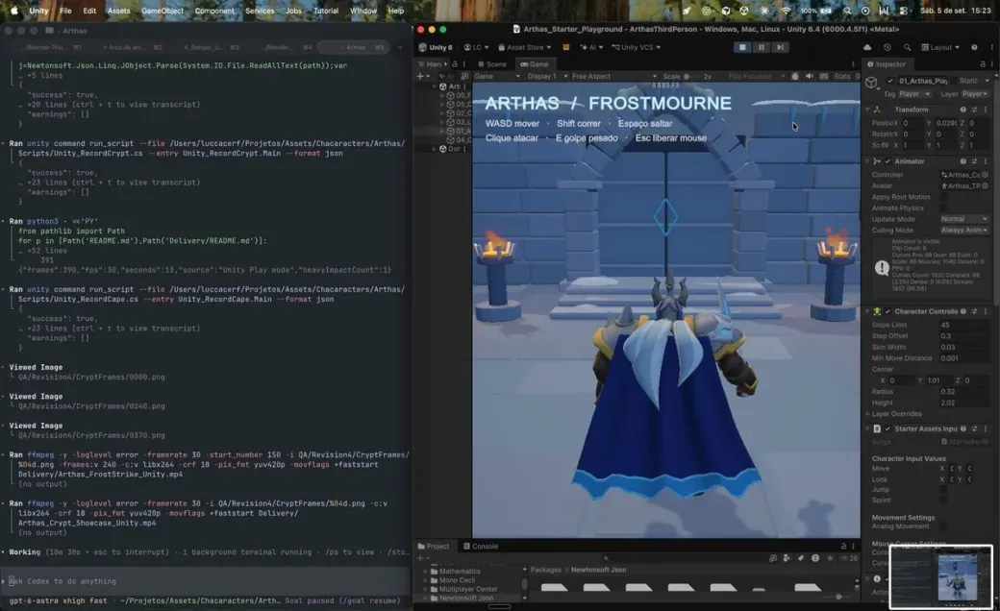</a>

*Istruzioni basate sull’opera collegata*

**Prompt**

```text
Crea una scena con personaggio ispirata a Warcraft usando Astra, Tripo P2, Blender e Unity. Genera il personaggio, preparalo in Blender e assembla una scena giocabile in Unity.
```

[Vedi dettagli ↗](https://www.tripo3d.ai/it/3d-prompts/warcraft-inspired-character-scene-in-unity-2096308567863079420) · [Post originale](https://x.com/luccacerf/status/2096308567863079420) · [Torna agli esempi](#all-prompts)

---

<a id="lisbon-s-terreiro-do-paco-in-blender-2096298425914450021"></a>

### Il Terreiro do Paço di Lisbona in Blender

[Gonçalo Canhoto 🇵🇹](https://x.com/goncalo_canhoto) · 2026-09-05 · GPT-6 Astra · Scene

<a href="https://www.tripo3d.ai/it/3d-prompts/lisbon-s-terreiro-do-paco-in-blender-2096298425914450021">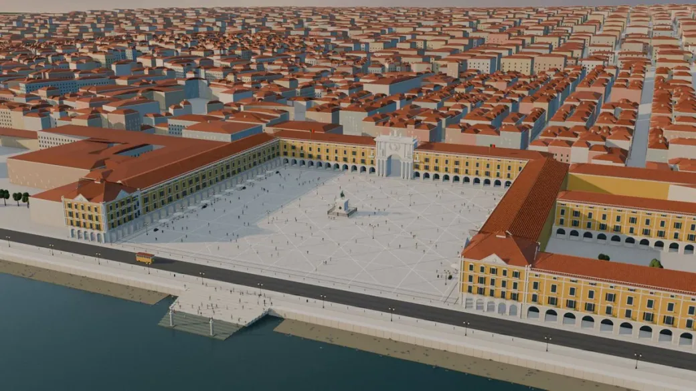</a>

*Istruzioni basate sull’opera collegata*

**Prompt**

```text
Ricrea il Terreiro do Paço di Lisbona come scena Blender modificabile. Cerca riferimenti per definire l’architettura, i materiali e l’illuminazione della piazza.
```

[Vedi dettagli ↗](https://www.tripo3d.ai/it/3d-prompts/lisbon-s-terreiro-do-paco-in-blender-2096298425914450021) · [Post originale](https://x.com/goncalo_canhoto/status/2096298425914450021) · [Torna agli esempi](#all-prompts)

---

<a id="bioluminescent-deep-sea-landing-page-2096269057544831175"></a>

### Landing page abissale bioluminescente

[Himanshu Hingorani](https://x.com/himanshubuildss) · 2026-09-05 · GPT-6 Astra · Interattivo

<a href="https://www.tripo3d.ai/it/3d-prompts/bioluminescent-deep-sea-landing-page-2096269057544831175"></a>

*Istruzioni basate sull’opera collegata*

**Prompt**

```text
Crea una landing page degli abissi con effetti d’acqua Three.js, un’interfaccia scura dall’aspetto di vetro e movimenti legati allo scorrimento. Combina l’atmosfera 3D con interazioni web chiare e adatte alle diverse dimensioni dello schermo.
```

[Vedi dettagli ↗](https://www.tripo3d.ai/it/3d-prompts/bioluminescent-deep-sea-landing-page-2096269057544831175) · [Post originale](https://x.com/himanshubuildss/status/2096269057544831175) · [Torna agli esempi](#all-prompts)

---

<a id="dense-procedural-forest-in-three-js-2096263046918197609"></a>

### Foresta procedurale fitta in Three.js

[Leon Lin](https://x.com/LexnLin) · 2026-09-05 · GPT-6 Astra · Scene

<a href="https://www.tripo3d.ai/it/3d-prompts/dense-procedural-forest-in-three-js-2096263046918197609">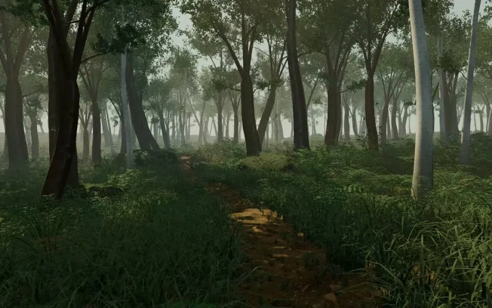</a>

*Istruzioni basate sull’opera collegata*

**Prompt**

```text
Crea una foresta dettagliata in Three.js con migliaia di alberi, erba fitta e felci. Usa shader personalizzati e una ripetizione efficiente della geometria per mantenere il dettaglio in tutta la scena.
```

[Vedi dettagli ↗](https://www.tripo3d.ai/it/3d-prompts/dense-procedural-forest-in-three-js-2096263046918197609) · [Post originale](https://x.com/LexnLin/status/2096263046918197609) · [Torna agli esempi](#all-prompts)

---

<a id="cluj-napoca-union-square-in-voxels-2096262733259837681"></a>

### Piazza dell’Unione di Cluj-Napoca in voxel

[Dan Manastireanu](https://x.com/danmana) · 2026-09-05 · GPT-6 Astra / Claude Fable 5.1 · Scene

<a href="https://www.tripo3d.ai/it/3d-prompts/cluj-napoca-union-square-in-voxels-2096262733259837681">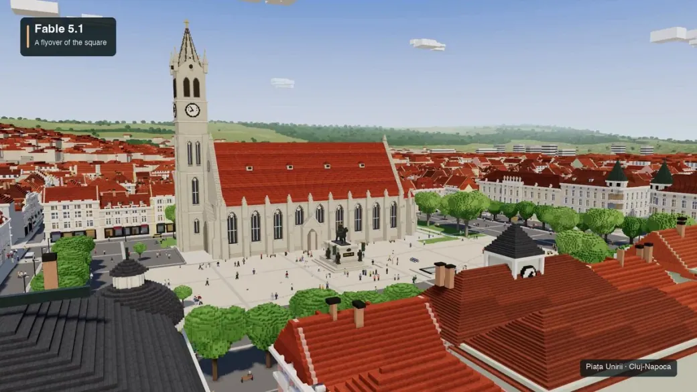</a>

*Istruzioni basate sull’opera collegata*

**Prompt**

```text
Crea un mondo voxel interattivo della Piața Unirii di Cluj-Napoca. Adatta la disposizione e i monumenti riconoscibili della piazza in una miniatura esplorabile.
```

[Vedi dettagli ↗](https://www.tripo3d.ai/it/3d-prompts/cluj-napoca-union-square-in-voxels-2096262733259837681) · [Post originale](https://x.com/danmana/status/2096262733259837681) · [Codice sorgente](https://github.com/danmana/piata-unirii) · [Demo](https://piata-unirii.vercel.app/runs/gpt-astra-xhigh-01/) · [Torna agli esempi](#all-prompts)

---

<a id="browser-racing-physics-in-c-and-wasm-2096258619574513880"></a>

### Fisica di corse nel browser con C# e WASM

[achepta](https://x.com/achepta_tm) · 2026-09-05 · GPT-6 Astra · Animazione

<a href="https://www.tripo3d.ai/it/3d-prompts/browser-racing-physics-in-c-and-wasm-2096258619574513880">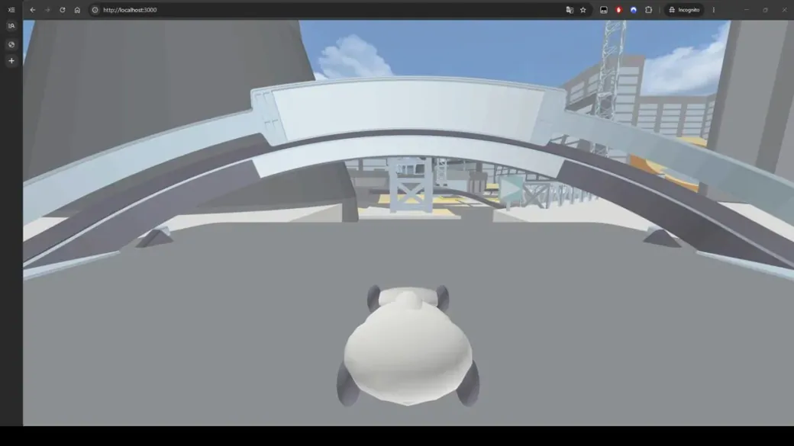</a>

*Istruzioni basate sull’opera collegata*

**Prompt**

```text
Ricrea un sistema di fisica di corse in stile Trackmania in C#, eseguilo tramite WASM e renderizza il circuito in Three.js. Usa mesh della pista con collisioni e verifica la guidabilità del veicolo.
```

[Vedi dettagli ↗](https://www.tripo3d.ai/it/3d-prompts/browser-racing-physics-in-c-and-wasm-2096258619574513880) · [Post originale](https://x.com/achepta_tm/status/2096258619574513880) · [Torna agli esempi](#all-prompts)

---

<a id="kaiju-city-battle-2096251574918013135"></a>

### Una battaglia di kaiju in città

[Majid Manzarpour](https://x.com/majidmanzarpour) · 2026-09-05 · GPT-6 Astra · Giochi

<a href="https://www.tripo3d.ai/it/3d-prompts/kaiju-city-battle-2096251574918013135">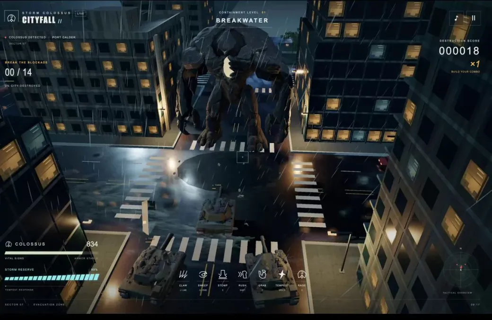</a>

*Istruzioni basate sull’opera collegata*

**Prompt**

```text
Costruisci un gioco ispirato ai kaiju in Three.js usando modelli di creature ed effetti sonori generati. Crea combattimenti leggibili su scala gigantesca e un ambiente che comunichi le dimensioni delle creature.
```

[Vedi dettagli ↗](https://www.tripo3d.ai/it/3d-prompts/kaiju-city-battle-2096251574918013135) · [Post originale](https://x.com/majidmanzarpour/status/2096251574918013135) · [Demo](https://stormcolossus.netlify.app/) · [Torna agli esempi](#all-prompts)

---

<a id="interactive-hyperloop-demo-2096250748099068377"></a>

### Una demo interattiva di Hyperloop

[Amir](https://x.com/hbanay98) · 2026-09-05 · GPT-6 Astra · Interattivo

<a href="https://www.tripo3d.ai/it/3d-prompts/interactive-hyperloop-demo-2096250748099068377">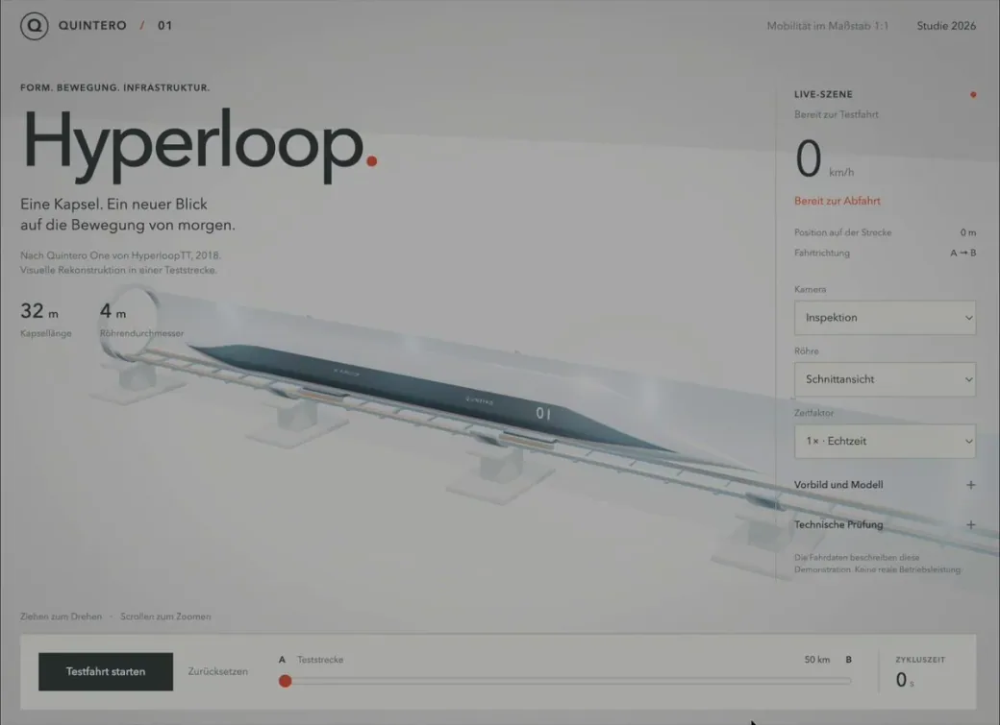</a>

*Istruzioni basate sull’opera collegata*

**Prompt**

```text
Costruisci una dimostrazione interattiva di Hyperloop in Three.js che mostri capsula di trasporto, infrastruttura tubolare e movimento nel sistema.
```

[Vedi dettagli ↗](https://www.tripo3d.ai/it/3d-prompts/interactive-hyperloop-demo-2096250748099068377) · [Post originale](https://x.com/hbanay98/status/2096250748099068377) · [Torna agli esempi](#all-prompts)

---

<a id="scroll-driven-3d-studio-website-2096245759121277132"></a>

### Un sito di studio 3D guidato dallo scorrimento

[ui.debbie](https://x.com/mx_debbiee) · 2026-09-05 · GPT-6 Astra · Interattivo

<a href="https://www.tripo3d.ai/it/3d-prompts/scroll-driven-3d-studio-website-2096245759121277132">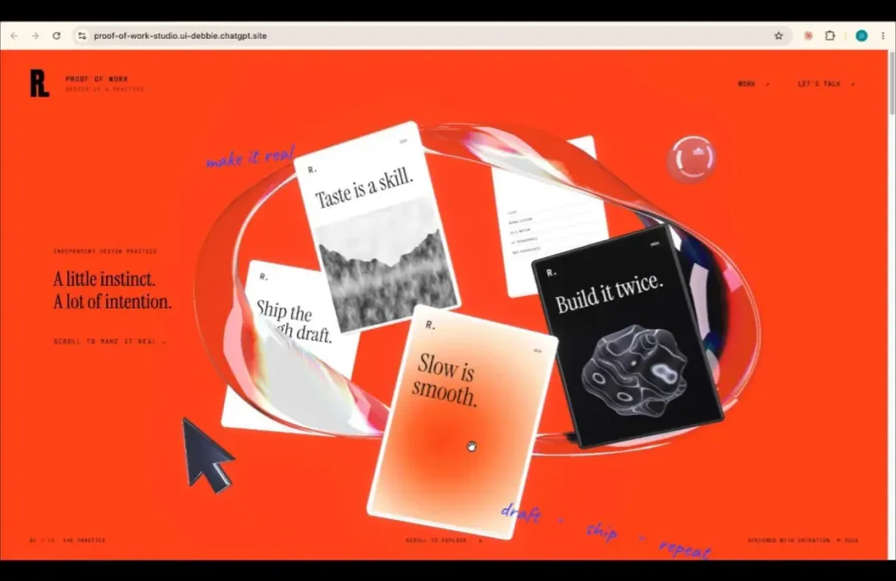</a>

*Istruzioni basate sull’opera collegata*

**Prompt**

```text
Trasforma l'immagine di riferimento fornita in una scena Three.js dentro un sito di studio con scorrimento fluido. Coordina movimento di camera, tipografia e transizioni tra sezioni.
```

[Vedi dettagli ↗](https://www.tripo3d.ai/it/3d-prompts/scroll-driven-3d-studio-website-2096245759121277132) · [Post originale](https://x.com/mx_debbiee/status/2096245759121277132) · [Torna agli esempi](#all-prompts)

---

<a id="komorebi-river-kayaking-2096244208533455049"></a>

### Komorebi: kayak sul fiume

[AJ](https://x.com/ItsmeAjayKV) · 2026-09-05 · GPT-6 Astra · Giochi

<a href="https://www.tripo3d.ai/it/3d-prompts/komorebi-river-kayaking-2096244208533455049">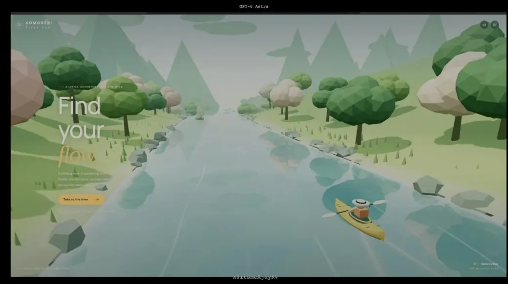</a>

*Istruzioni basate sull’opera collegata*

**Prompt**

```text
Costruisci un gioco 3D di kayak sul fiume con estetica anime. Consenti di pagaiare a sinistra e destra per evitare gli ostacoli, con acqua corrente, paesaggio, musica ed effetti sonori generati via codice.
```

[Vedi dettagli ↗](https://www.tripo3d.ai/it/3d-prompts/komorebi-river-kayaking-2096244208533455049) · [Post originale](https://x.com/ItsmeAjayKV/status/2096244208533455049) · [Torna agli esempi](#all-prompts)

---

<a id="refractive-bottle-product-story-2096243989439713677"></a>

### Una storia di prodotto con una bottiglia rifrangente

[Himanshu Hingorani](https://x.com/himanshubuildss) · 2026-09-05 · GPT-6 Astra · Interattivo

<a href="https://www.tripo3d.ai/it/3d-prompts/refractive-bottle-product-story-2096243989439713677">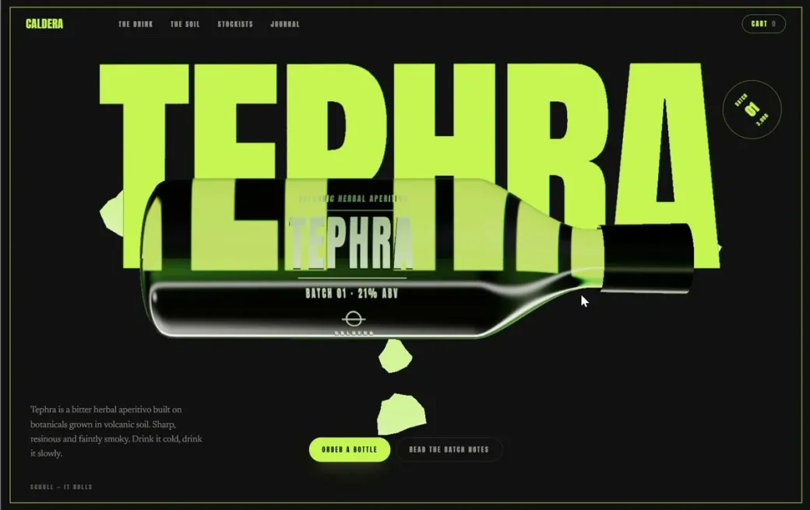</a>

*Istruzioni basate sull’opera collegata*

**Prompt**

```text
Costruisci un sito interattivo di prodotto intorno a una bottiglia di vetro WebGL fotorealistica. Usa liquido rifrangente, rotazione guidata dallo scorrimento e tipografia decisa, mantenendo le prestazioni del browser.
```

[Vedi dettagli ↗](https://www.tripo3d.ai/it/3d-prompts/refractive-bottle-product-story-2096243989439713677) · [Post originale](https://x.com/himanshubuildss/status/2096243989439713677) · [Torna agli esempi](#all-prompts)

---

<a id="memory-capsule-machine-2096241295949975602"></a>

### Una macchina di capsule dei ricordi

[Gloria Zhang](https://x.com/gloria_zwq) · 2026-09-05 · GPT-6 Astra · Interattivo

<a href="https://www.tripo3d.ai/it/3d-prompts/memory-capsule-machine-2096241295949975602">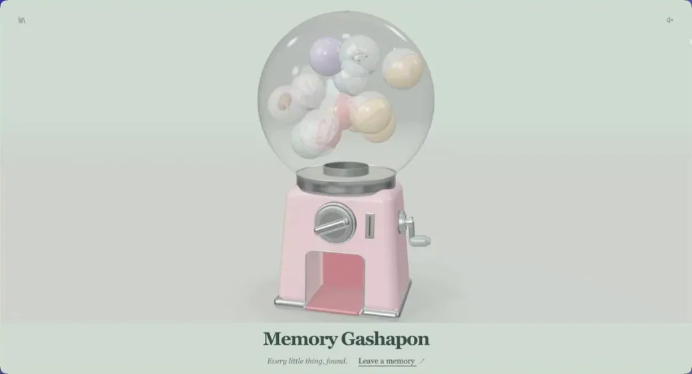</a>

*Istruzioni basate sull’opera collegata*

**Prompt**

```text
Costruisci una macchina 3D di capsule dei ricordi. Ruota una manopola per liberare un ricordo, modella il meccanismo in Blender e dai alle capsule in caduta movimento e suono credibili.
```

[Vedi dettagli ↗](https://www.tripo3d.ai/it/3d-prompts/memory-capsule-machine-2096241295949975602) · [Post originale](https://x.com/gloria_zwq/status/2096241295949975602) · [Torna agli esempi](#all-prompts)

---


[Catalogo completo](catalog.it.md) · [←](catalog.it.3.md) · **4 / 9** · [→](catalog.it.5.md)

<p align="center"><strong><a href="https://www.tripo3d.ai/it/3d-prompts?utm_source=github&amp;utm_medium=referral&amp;utm_campaign=awesome_3d_prompts&amp;utm_content=catalog_footer">Catalogo completo →</a></strong></p>
