<!-- Generated from Growth CMS by templates/catalog.md. Edit content in CMS; run npm run sync. -->

# Awesome 3D Prompts — 6 / 9

[← Awesome 3D Prompts](../README.md)

<p>
  <a href="../docs/catalog.en.6.md"></a>
  <a href="../docs/catalog.zh.6.md"></a>
  <a href="../docs/catalog.zh-Hant.6.md"></a>
  <a href="../docs/catalog.ja.6.md"></a>
  <a href="../docs/catalog.ko.6.md"></a>
  <a href="../docs/catalog.es.6.md"></a>
  <a href="../docs/catalog.pt.6.md"></a>
  <a href="../docs/catalog.de.6.md"></a>
  <a href="../docs/catalog.fr.6.md"></a>
  <a href="../docs/catalog.it.6.md"></a>
  <a href="../docs/catalog.ru.6.md"></a>
  <a href="../docs/catalog.tr.6.md"></a>
  <a href="../docs/catalog.uk.6.md"></a>
  <a href="../docs/catalog.vi.6.md"></a>
</p>

[Catalogo completo](catalog.it.md) · [←](catalog.it.5.md) · **6 / 9** · [→](catalog.it.7.md)

<a id="all-prompts"></a>

<details>
<summary>Esplora gli esempi (50)</summary>

- [Street Heat: corse e derapate nel browser](#street-heat-browser-drift-racer-2095916820431827408)
- [Un prototipo giocabile creato rapidamente](#rapid-playable-game-prototype-2095907526566990013)
- [Una camera cyberpunk in loop in Blender](#looping-cyberpunk-bedroom-in-blender-2095898303019856230)
- [Un arcade culturale che gioca da solo](#self-playing-cultural-arcade-game-2095898198413922791)
- [Dal prompt a un gioco open world](#open-world-game-from-a-prompt-2095872986477908108)
- [Una cittadina di Van Gogh in Three.js](#van-gogh-town-in-three-js-2095871735824339279)
- [Una locomotiva meccanicamente completa in Blender](#mechanically-complete-blender-locomotive-2095868420327710840)
- [La sfida di una scena Blender in trenta secondi](#thirty-second-blender-scene-challenge-2095844872171421771)
- [Una battaglia navale in Three.js in un solo turno](#single-turn-three-js-naval-war-scene-2095840435319001278)
- [Lo Studio Ovale nelle diverse presidenze](#oval-office-through-the-presidencies-2095830596069290077)
- [Dalla ricetta a un video 3D di cheesecake](#recipe-to-3d-cheesecake-film-2095829851206774987)
- [Tidal Rush: otto piloti nel browser](#tidal-rush-eight-racer-browser-game-2095819786651374023)
- [Una homepage con galassia interattiva in Three.js](#interactive-three-js-galaxy-homepage-2095806515579879457)
- [Una galassia WebGL in tempo reale per l'apertura di un lancio](#real-time-webgl-galaxy-launch-hero-2095805694603673631)
- [Passeggiare per le strade della Notte stellata](#starry-night-streets-you-can-stroll-2095805115580199372)
- [Una casa reale trasformata in una scena Blender editabile a 60 FPS](#real-house-to-editable-60-fps-blender-scene-2095777502681825541)
- [Un turbocompressore 3D interattivo in vista esplosa](#exploded-interactive-3d-turbocharger-2095776712579571725)
- [Una cittadina percorribile nata da sei dipinti di Van Gogh](#walkable-town-made-from-six-van-gogh-paintings-2095776685807346105)
- [Dal disegno di un treno a vapore a un assemblaggio modificabile in Blender](#steam-train-drawing-to-editable-blender-assembly-2095756085890310311)
- [Solace: dalla villa nel bosco a UE5](#solace-forest-villa-from-brief-to-ue5-2095752726886105375)
- [Un plastico ferroviario dell'infanzia da guidare](#driveable-childhood-train-table-2095742344293454148)
- [Un tempio nella giungla e il suo guardiano vanara gigante](#jungle-temple-and-giant-vanara-guardian-2095729606066348290)
- [Dalla pianta a una visita architettonica 3D completa](#floor-plan-to-complete-3d-walkthrough-2095725404883476661)
- [Un plastico ferroviario interattivo a voxel](#interactive-voxel-railway-table-2095719731860750613)
- [Una nave a voxel viva dentro una bottiglia](#living-voxel-ship-in-a-bottle-2095699049722581065)
- [Un oceano procedurale vivo con simulazione di tempeste](#procedural-living-ocean-and-storm-simulation-2095673885605630429)
- [Un gioco sorprendente in Three.js con una sola istruzione](#one-shot-three-js-surprise-game-2095663498101662198)
- [Il Palace of Fine Arts ricreato in Blender](#palace-of-fine-arts-blender-recreation-2095653641164329143)
- [Un acquario con un solo prompt per confrontare modelli](#single-aquarium-benchmark-2095650251902239139)
- [Un RPG con camere in prima e terza persona](#rpg-with-first-and-third-person-cameras-2095648440978174276)
- [Un gioco 3D in tempo reale con un solo prompt](#single-playable-real-time-3d-game-2095647685210669541)
- [Una USS Enterprise in CAD pronta da stampare](#printable-uss-enterprise-cad-assembly-2095641163441254676)
- [Una villa moderna in Blender](#modern-villa-scene-in-blender-2095636679264780481)
- [Uno Studio Ovale procedurale per Cycles](#procedural-oval-office-set-for-cycles-2095630197257367857)
- [Un gioco di volo spaziale in trincea in Unity](#unity-space-trench-run-game-2095630044102279312)
- [Dal progetto a Blender e Unreal per la visualizzazione architettonica](#blueprint-to-blender-to-unreal-archviz-2095624712244072551)
- [Dal testo a una città esplorabile in Unity](#text-to-explorable-unity-city-2095623452678144366)
- [Una fabbrica di biglie in Three.js](#three-js-marble-factory-2095622065390772322)
- [Uno studio di mockup 3D fotorealistici di prodotti](#photoreal-3d-product-mockup-studio-2095619319690400253)
- [Previsualizzazione cinematografica di un museo 3D](#3d-museum-cinematography-previsualization-2095616529572503593)
- [Da un annuncio Zillow a un video immobiliare 3D](#zillow-listing-to-3d-property-film-2095612137582526615)
- [Manhattan, strada per strada, in Unreal Engine](#street-by-street-manhattan-in-unreal-engine-2095609734845927525)
- [Un gioco 3D guidato a voce per principianti](#voice-directed-3d-game-for-beginners-2095608358086840647)
- [Un gioco 3D per browser con una sola istruzione](#one-shot-browser-3d-game-2095599934766764338)
- [Dalla foto di una casa a un mondo modificabile in Blender](#house-photo-to-editable-blender-world-2095598645190291775)
- [Un FPS multigiocatore 10 contro 10 ispirato a Halo](#10v10-halo-inspired-multiplayer-fps-2095598026916049024)
- [Una città esplorabile in Unity da una libreria di risorse](#asset-driven-explorable-unity-city-2095597640587374887)
- [Un prototipo interattivo curato in un solo passaggio](#one-shot-premium-interactive-prototype-2095597560253862065)
- [Un mondo in stile Minecraft in un solo passaggio](#one-shot-minecraft-style-world-2095597137849446688)
- [Un'avventura open world nel browser](#open-world-browser-adventure-2095596341422440714)

</details>
<a id="street-heat-browser-drift-racer-2095916820431827408"></a>

### Street Heat: corse e derapate nel browser

[Higgsfield AI 🧩](https://x.com/higgsfield_ai) · 2026-09-04 · GPT-6 Astra · Giochi

<a href="https://www.tripo3d.ai/it/3d-prompts/street-heat-browser-drift-racer-2095916820431827408"></a>

*Istruzioni basate sull’opera collegata*

**Prompt**

```text
Costruisci un gioco arcade completo di corse stradali nel browser da una frase. Implementa derapate appaganti, punteggio combo, bonus per gli ostacoli sfiorati, rilevamenti di velocità, nitro, traffico, HUD leggibile e un breve circuito rigiocabile.
```

[Vedi dettagli ↗](https://www.tripo3d.ai/it/3d-prompts/street-heat-browser-drift-racer-2095916820431827408) · [Post originale](https://x.com/higgsfield_ai/status/2095916820431827408) · [Torna agli esempi](#all-prompts)

---

<a id="rapid-playable-game-prototype-2095907526566990013"></a>

### Un prototipo giocabile creato rapidamente

[GLUNIVERSE™](https://x.com/gibglue) · 2026-09-04 · GPT-6 Astra · Giochi

<a href="https://www.tripo3d.ai/it/3d-prompts/rapid-playable-game-prototype-2095907526566990013"></a>

*Istruzioni basate sull’opera collegata*

**Prompt**

```text
Crea un prototipo giocabile visivamente coerente con limiti rigorosi di tempo e token. Dai priorità a un ciclo completo, comandi reattivi, riscontri chiari, prestazioni stabili e una versione per browser pronta da distribuire, più che al numero di funzioni.
```

[Vedi dettagli ↗](https://www.tripo3d.ai/it/3d-prompts/rapid-playable-game-prototype-2095907526566990013) · [Post originale](https://x.com/gibglue/status/2095907526566990013) · [Torna agli esempi](#all-prompts)

---

<a id="looping-cyberpunk-bedroom-in-blender-2095898303019856230"></a>

### Una camera cyberpunk in loop in Blender

[Coin Shot ☁️](https://x.com/CoinSh0t) · 2026-09-04 · GPT-6 Astra · Scene

<a href="https://www.tripo3d.ai/it/3d-prompts/looping-cyberpunk-bedroom-in-blender-2095898303019856230"></a>

**Prompt**

```text
Crea in Blender una camera da letto cyberpunk cinematografica affacciata di notte su una città al neon sotto la pioggia. Aggiungi cartelloni animati e rendila fotorealistica con un loop perfetto.
```

<details>
<summary>Prompt originale</summary>

```text
Create a cinematic cyberpunk bedroom in Blender overlooking a rainy neon city at night. Add animated billboards and make it photorealistic and seamlessly looped.
```

</details>

[Vedi dettagli ↗](https://www.tripo3d.ai/it/3d-prompts/looping-cyberpunk-bedroom-in-blender-2095898303019856230) · [Post originale](https://x.com/CoinSh0t/status/2095898303019856230) · [Torna agli esempi](#all-prompts)

---

<a id="self-playing-cultural-arcade-game-2095898198413922791"></a>

### Un arcade culturale che gioca da solo

[Good Morning](https://x.com/say_gm_) · 2026-09-04 · GPT-6 Astra · Giochi

<a href="https://www.tripo3d.ai/it/3d-prompts/self-playing-cultural-arcade-game-2095898198413922791"></a>

*Istruzioni basate sull’opera collegata*

**Prompt**

```text
Costruisci un gioco arcade autonomo per un paese del G7. Trasforma un riferimento culturale riconoscibile nella meccanica principale, rendi l'azione comprensibile senza comandi e aggiungi punteggio, difficoltà crescente e una rivelazione memorabile.
```

[Vedi dettagli ↗](https://www.tripo3d.ai/it/3d-prompts/self-playing-cultural-arcade-game-2095898198413922791) · [Post originale](https://x.com/say_gm_/status/2095898198413922791) · [Torna agli esempi](#all-prompts)

---

<a id="open-world-game-from-a-prompt-2095872986477908108"></a>

### Dal prompt a un gioco open world

[Ejaj AHmed 🦅](https://x.com/aeejazkhan) · 2026-09-04 · GPT-6 Astra · Giochi

<a href="https://www.tripo3d.ai/it/3d-prompts/open-world-game-from-a-prompt-2095872986477908108"></a>

*Istruzioni basate sull’opera collegata*

**Prompt**

```text
Costruisci un gioco open world da questo concetto: [premessa del mondo]. Includi tre regioni diverse, spostamenti, incontri dinamici, una semplice catena di missioni, luoghi simbolo, salvataggio e riavvio e ottimizzazione sufficiente per il browser.
```

[Vedi dettagli ↗](https://www.tripo3d.ai/it/3d-prompts/open-world-game-from-a-prompt-2095872986477908108) · [Post originale](https://x.com/aeejazkhan/status/2095872986477908108) · [Torna agli esempi](#all-prompts)

---

<a id="van-gogh-town-in-three-js-2095871735824339279"></a>

### Una cittadina di Van Gogh in Three.js

[Fede(URU) 🇺🇾](https://x.com/RealFedeURU) · 2026-09-04 · GPT-6 Astra · Scene

<a href="https://www.tripo3d.ai/it/3d-prompts/van-gogh-town-in-three-js-2095871735824339279"></a>

*Istruzioni basate sull’opera collegata*

**Prompt**

```text
Crea una cittadina percorribile in Three.js ispirata a Van Gogh. Trasforma strade dipinte, stelle, caffè e campi in spazi 3D stratificati, mantenendo vive le pennellate con shader, texture e luce animata.
```

[Vedi dettagli ↗](https://www.tripo3d.ai/it/3d-prompts/van-gogh-town-in-three-js-2095871735824339279) · [Post originale](https://x.com/RealFedeURU/status/2095871735824339279) · [Torna agli esempi](#all-prompts)

---

<a id="mechanically-complete-blender-locomotive-2095868420327710840"></a>

### Una locomotiva meccanicamente completa in Blender

[sheemamoto](https://x.com/sheemamoto) · 2026-09-04 · GPT-6 Astra · Asset

<a href="https://www.tripo3d.ai/it/3d-prompts/mechanically-complete-blender-locomotive-2095868420327710840"></a>

*Istruzioni basate sull’opera collegata*

**Prompt**

```text
Modella una locomotiva a vapore in Blender come una vera scomposizione meccanica, non come un guscio con texture. Nomina e separa assi, guide delle boccole, blocchi dei cuscinetti, tiranti, collegamenti delle sospensioni, duomo del vapore e tutti gli assemblaggi principali.
```

[Vedi dettagli ↗](https://www.tripo3d.ai/it/3d-prompts/mechanically-complete-blender-locomotive-2095868420327710840) · [Post originale](https://x.com/sheemamoto/status/2095868420327710840) · [Torna agli esempi](#all-prompts)

---

<a id="thirty-second-blender-scene-challenge-2095844872171421771"></a>

### La sfida di una scena Blender in trenta secondi

[Satyam Kumar](https://x.com/_satyam_ai) · 2026-09-04 · GPT-6 Astra · Scene

<a href="https://www.tripo3d.ai/it/3d-prompts/thirty-second-blender-scene-challenge-2095844872171421771"></a>

*Istruzioni basate sull’opera collegata*

**Prompt**

```text
Costruisci una scena Blender coerente con un limite di tempo estremo. Dai priorità a una silhouette forte, tre piani di profondità, un materiale protagonista, illuminazione cinematografica e una composizione pronta per la camera. Lascia tutti gli oggetti modificabili.
```

[Vedi dettagli ↗](https://www.tripo3d.ai/it/3d-prompts/thirty-second-blender-scene-challenge-2095844872171421771) · [Post originale](https://x.com/_satyam_ai/status/2095844872171421771) · [Torna agli esempi](#all-prompts)

---

<a id="single-turn-three-js-naval-war-scene-2095840435319001278"></a>

### Una battaglia navale in Three.js in un solo turno

[leo 🐾](https://x.com/synthwavedd) · 2026-09-04 · GPT-6 Astra · Scene

<a href="https://www.tripo3d.ai/it/3d-prompts/single-turn-three-js-naval-war-scene-2095840435319001278"></a>

*Istruzioni basate sull’opera collegata*

**Prompt**

```text
Crea una battaglia navale dettagliata in Three.js in un solo turno. Includi navi diverse, interazione fisicamente convincente con l'acqua, scie e spruzzi, azione aerea, esplosioni, illuminazione cinematografica, movimento di camera e rendering attento alle prestazioni.
```

[Vedi dettagli ↗](https://www.tripo3d.ai/it/3d-prompts/single-turn-three-js-naval-war-scene-2095840435319001278) · [Post originale](https://x.com/synthwavedd/status/2095840435319001278) · [Torna agli esempi](#all-prompts)

---

<a id="oval-office-through-the-presidencies-2095830596069290077"></a>

### Lo Studio Ovale nelle diverse presidenze

[Min Zhou](https://x.com/fMinZhou) · 2026-09-04 · Claude Fable 5.1 · Interattivo

<a href="https://www.tripo3d.ai/it/3d-prompts/oval-office-through-the-presidencies-2095830596069290077"></a>

*Istruzioni basate sull’opera collegata*

**Prompt**

```text
Costruisci un progetto interattivo in Three.js sulle trasformazioni dello Studio Ovale nelle diverse presidenze. Consenti di cambiare epoca per esaminare mobili, decorazioni e composizione della stanza.
```

[Vedi dettagli ↗](https://www.tripo3d.ai/it/3d-prompts/oval-office-through-the-presidencies-2095830596069290077) · [Post originale](https://x.com/fMinZhou/status/2095830596069290077) · [Torna agli esempi](#all-prompts)

---

<a id="recipe-to-3d-cheesecake-film-2095829851206774987"></a>

### Dalla ricetta a un video 3D di cheesecake

[سارة - تؤمن بالعدالة- Sara - believes in justice.](https://x.com/sarit69976) · 2026-09-04 · Claude Fable 5.1 · Asset

<a href="https://www.tripo3d.ai/it/3d-prompts/recipe-to-3d-cheesecake-film-2095829851206774987"></a>

*Istruzioni basate sull’opera collegata*

**Prompt**

```text
Ricostruisci una cheesecake reale come scena Three.js dalla sua ricetta. Modella separatamente i sei strati, lo stampo a cerniera e la carta forno, poi crea una presentazione di un minuto.
```

[Vedi dettagli ↗](https://www.tripo3d.ai/it/3d-prompts/recipe-to-3d-cheesecake-film-2095829851206774987) · [Post originale](https://x.com/sarit69976/status/2095829851206774987) · [Torna agli esempi](#all-prompts)

---

<a id="tidal-rush-eight-racer-browser-game-2095819786651374023"></a>

### Tidal Rush: otto piloti nel browser

[RESONANCE SCIENCE 🧬🔬](https://x.com/amazing13_13) · 2026-09-04 · GPT-6 Astra · Giochi

<a href="https://www.tripo3d.ai/it/3d-prompts/tidal-rush-eight-racer-browser-game-2095819786651374023"></a>

*Istruzioni basate sull’opera collegata*

**Prompt**

```text
Costruisci un gioco completo di corsa con kart nel browser con otto piloti, tre giri, derapate, oggetti raccoglibili, fisica reattiva, HUD chiaro, grafica accattivante e schermata dei risultati all'arrivo.
```

[Vedi dettagli ↗](https://www.tripo3d.ai/it/3d-prompts/tidal-rush-eight-racer-browser-game-2095819786651374023) · [Post originale](https://x.com/amazing13_13/status/2095819786651374023) · [Torna agli esempi](#all-prompts)

---

<a id="interactive-three-js-galaxy-homepage-2095806515579879457"></a>

### Una homepage con galassia interattiva in Three.js

[Three.js Resources](https://x.com/threejsresource) · 2026-09-04 · GPT-6 Astra · Interattivo

<a href="https://www.tripo3d.ai/it/3d-prompts/interactive-three-js-galaxy-homepage-2095806515579879457"></a>

*Istruzioni basate sull’opera collegata*

**Prompt**

```text
Crea un'apertura di pagina di lancio di alta qualità intorno a una galassia Three.js in tempo reale. Fai formare alle particelle una sagoma discreta del numero sei, rendile reattive allo scorrimento e al puntatore, preserva la leggibilità del testo e riduci gradualmente gli effetti sui dispositivi meno potenti.
```

[Vedi dettagli ↗](https://www.tripo3d.ai/it/3d-prompts/interactive-three-js-galaxy-homepage-2095806515579879457) · [Post originale](https://x.com/threejsresource/status/2095806515579879457) · [Torna agli esempi](#all-prompts)

---

<a id="real-time-webgl-galaxy-launch-hero-2095805694603673631"></a>

### Una galassia WebGL in tempo reale per l'apertura di un lancio

[Fluxora](https://x.com/Fluxora_Studios) · 2026-09-04 · GPT-6 Astra · Interattivo

<a href="https://www.tripo3d.ai/it/3d-prompts/real-time-webgl-galaxy-launch-hero-2095805694603673631"></a>

*Istruzioni basate sull’opera collegata*

**Prompt**

```text
Analizza il linguaggio visivo dell'apertura galattica fornita e ricostruiscilo con WebGL in tempo reale, non con un video. Usa particelle con profondità, polvere luminosa, risposta fluida al puntatore, spazio sobrio per la tipografia e prestazioni adattive.
```

[Vedi dettagli ↗](https://www.tripo3d.ai/it/3d-prompts/real-time-webgl-galaxy-launch-hero-2095805694603673631) · [Post originale](https://x.com/Fluxora_Studios/status/2095805694603673631) · [Torna agli esempi](#all-prompts)

---

<a id="starry-night-streets-you-can-stroll-2095805115580199372"></a>

### Passeggiare per le strade della Notte stellata

[₿IGRYAN](https://x.com/BigRyan) · 2026-09-04 · GPT-6 Astra · Scene

<a href="https://www.tripo3d.ai/it/3d-prompts/starry-night-streets-you-can-stroll-2095805115580199372"></a>

*Istruzioni basate sull’opera collegata*

**Prompt**

```text
Combina sei dipinti di Van Gogh in una cittadina esplorabile dove passeggiare per le strade della Notte stellata. Progetta passaggi naturali tra i quadri, mantieni una scala coerente e aggiungi interazioni ambientali delicate.
```

[Vedi dettagli ↗](https://www.tripo3d.ai/it/3d-prompts/starry-night-streets-you-can-stroll-2095805115580199372) · [Post originale](https://x.com/BigRyan/status/2095805115580199372) · [Torna agli esempi](#all-prompts)

---

<a id="real-house-to-editable-60-fps-blender-scene-2095777502681825541"></a>

### Una casa reale trasformata in una scena Blender editabile a 60 FPS

[Alvin Foo](https://x.com/alvinfoo) · 2026-09-04 · GPT-6 Astra · Scene

<a href="https://www.tripo3d.ai/it/3d-prompts/real-house-to-editable-60-fps-blender-scene-2095777502681825541"></a>

*Istruzioni basate sull’opera collegata*

**Prompt**

```text
Ricostruisci la casa reale fornita come una scena Blender interamente modificabile. Separa gli elementi architettonici dagli arredi, ottimizza geometria e materiali e consegna una visita renderizzata localmente che mantenga 60 FPS.
```

[Vedi dettagli ↗](https://www.tripo3d.ai/it/3d-prompts/real-house-to-editable-60-fps-blender-scene-2095777502681825541) · [Post originale](https://x.com/alvinfoo/status/2095777502681825541) · [Torna agli esempi](#all-prompts)

---

<a id="exploded-interactive-3d-turbocharger-2095776712579571725"></a>

### Un turbocompressore 3D interattivo in vista esplosa

[Feraser](https://x.com/Feraser8) · 2026-09-04 · GPT-6 Astra · Interattivo

<a href="https://www.tripo3d.ai/it/3d-prompts/exploded-interactive-3d-turbocharger-2095776712579571725"></a>

**Prompt**

```text
Costruisci un turbocompressore 3D interattivo. Separa ogni sistema funzionale. Lasciami ruotarlo, isolare le parti e vedere cosa sta facendo davvero la macchina.
```

<details>
<summary>Prompt originale</summary>

```text
Build an interactive 3D turbocharger. Separate every working system. Let me rotate it, isolate parts, and see what the machine is actually doing.
```

</details>

[Vedi dettagli ↗](https://www.tripo3d.ai/it/3d-prompts/exploded-interactive-3d-turbocharger-2095776712579571725) · [Post originale](https://x.com/Feraser8/status/2095776712579571725) · [Torna agli esempi](#all-prompts)

---

<a id="walkable-town-made-from-six-van-gogh-paintings-2095776685807346105"></a>

### Una cittadina percorribile nata da sei dipinti di Van Gogh

[Peter Gostev](https://x.com/petergostev) · 2026-09-04 · GPT-6 Astra · Scene

<a href="https://www.tripo3d.ai/it/3d-prompts/walkable-town-made-from-six-van-gogh-paintings-2095776685807346105"></a>

*Istruzioni basate sull’opera collegata*

**Prompt**

```text
Trasforma i sei dipinti di Van Gogh forniti in una cittadina Three.js coerente e percorribile. Conserva la palette e il carattere delle pennellate di ogni quadro, collegando strade, luoghi simbolo e transizioni in un mondo esplorabile.
```

[Vedi dettagli ↗](https://www.tripo3d.ai/it/3d-prompts/walkable-town-made-from-six-van-gogh-paintings-2095776685807346105) · [Post originale](https://x.com/petergostev/status/2095776685807346105) · [Demo](https://van-goghs-town.surge.sh/) · [Torna agli esempi](#all-prompts)

---

<a id="steam-train-drawing-to-editable-blender-assembly-2095756085890310311"></a>

### Dal disegno di un treno a vapore a un assemblaggio modificabile in Blender

[Tom Krcha](https://x.com/tomkrcha) · 2026-09-04 · GPT-6 Astra · Asset

<a href="https://www.tripo3d.ai/it/3d-prompts/steam-train-drawing-to-editable-blender-assembly-2095756085890310311"></a>

*Istruzioni basate sull’opera collegata*

**Prompt**

```text
Ricostruisci in Blender il disegno fornito di un treno a vapore d'epoca come un assemblaggio meccanico dettagliato. Mantieni ruote, assi, sospensioni, bielle, raccordi della caldaia e pannelli della carrozzeria come oggetti modificabili con un nome, con un livello di dettaglio regolabile.
```

[Vedi dettagli ↗](https://www.tripo3d.ai/it/3d-prompts/steam-train-drawing-to-editable-blender-assembly-2095756085890310311) · [Post originale](https://x.com/tomkrcha/status/2095756085890310311) · [Torna agli esempi](#all-prompts)

---

<a id="solace-forest-villa-from-brief-to-ue5-2095752726886105375"></a>

### Solace: dalla villa nel bosco a UE5

[SuSu\_酥酥👅](https://x.com/NFT_Chen) · 2026-09-04 · GPT-6 Astra · Scene

<a href="https://www.tripo3d.ai/it/3d-prompts/solace-forest-villa-from-brief-to-ue5-2095752726886105375"></a>

*Istruzioni basate sull’opera collegata*

**Prompt**

```text
Crea una villa moderna percorribile nel bosco chiamata Solace, con tre camere da letto, studio, cortile centrale, piscina e vegetazione circostante. Costruiscila proceduralmente in Blender, renderizza immagini nell'ora dorata ed esporta una visita in UE5 a 60 FPS.
```

[Vedi dettagli ↗](https://www.tripo3d.ai/it/3d-prompts/solace-forest-villa-from-brief-to-ue5-2095752726886105375) · [Post originale](https://x.com/NFT_Chen/status/2095752726886105375) · [Torna agli esempi](#all-prompts)

---

<a id="driveable-childhood-train-table-2095742344293454148"></a>

### Un plastico ferroviario dell'infanzia da guidare

[₿IGRYAN](https://x.com/BigRyan) · 2026-09-04 · GPT-6 Astra · Interattivo

<a href="https://www.tripo3d.ai/it/3d-prompts/driveable-childhood-train-table-2095742344293454148"></a>

*Istruzioni basate sull’opera collegata*

**Prompt**

```text
Ricostruisci un plastico ferroviario dell'infanzia come un giocattolo tattile in Three.js con binari e rotabili a voxel. Consenti di guidare i treni, cambiare gli scambi, orbitare intorno al tavolo e scoprire scene animate in miniatura.
```

[Vedi dettagli ↗](https://www.tripo3d.ai/it/3d-prompts/driveable-childhood-train-table-2095742344293454148) · [Post originale](https://x.com/BigRyan/status/2095742344293454148) · [Torna agli esempi](#all-prompts)

---

<a id="jungle-temple-and-giant-vanara-guardian-2095729606066348290"></a>

### Un tempio nella giungla e il suo guardiano vanara gigante

[Build Fast with AI](https://x.com/BuildFastWithAI) · 2026-09-04 · Claude Fable 5.1 · Animazione

<a href="https://www.tripo3d.ai/it/3d-prompts/jungle-temple-and-giant-vanara-guardian-2095729606066348290"></a>

*Istruzioni basate sull’opera collegata*

**Prompt**

```text
Crea una sequenza cinematografica ispirata al Ramayana in HTML e Three.js. Un tempio dimenticato nella giungla risveglia un colossale guardiano vanara; costruisci ambientazione, animazione e musica di sottofondo via codice.
```

[Vedi dettagli ↗](https://www.tripo3d.ai/it/3d-prompts/jungle-temple-and-giant-vanara-guardian-2095729606066348290) · [Post originale](https://x.com/BuildFastWithAI/status/2095729606066348290) · [Torna agli esempi](#all-prompts)

---

<a id="floor-plan-to-complete-3d-walkthrough-2095725404883476661"></a>

### Dalla pianta a una visita architettonica 3D completa

[AidarosGo](https://x.com/aidarosgo3) · 2026-09-04 · GPT-6 Astra · Scene

<a href="https://www.tripo3d.ai/it/3d-prompts/floor-plan-to-complete-3d-walkthrough-2095725404883476661">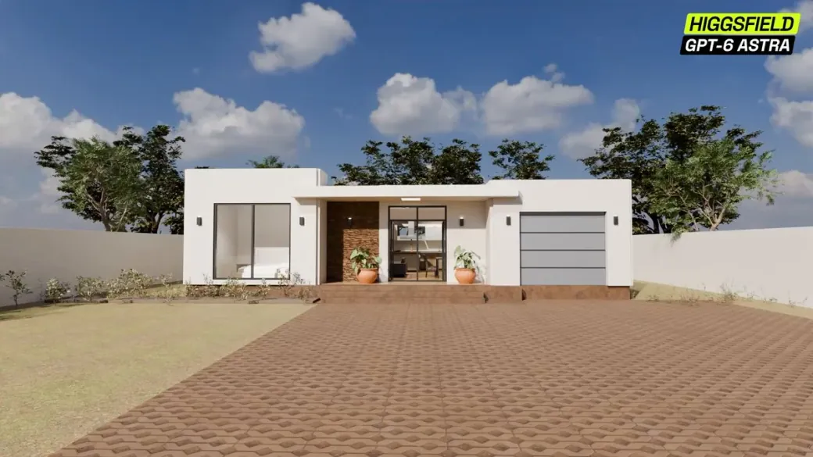</a>

*Istruzioni basate sull’opera collegata*

**Prompt**

```text
Converti la pianta fornita in una visita architettonica 3D completa. Rispetta dimensioni delle stanze e percorsi, aggiungi porte, finestre, mobili, materiali e luci, poi crea un percorso di camera che spieghi la distribuzione degli spazi.
```

[Vedi dettagli ↗](https://www.tripo3d.ai/it/3d-prompts/floor-plan-to-complete-3d-walkthrough-2095725404883476661) · [Post originale](https://x.com/aidarosgo3/status/2095725404883476661) · [Torna agli esempi](#all-prompts)

---

<a id="interactive-voxel-railway-table-2095719731860750613"></a>

### Un plastico ferroviario interattivo a voxel

[Derya Unutmaz, MD](https://x.com/DeryaTR_) · 2026-09-04 · GPT-6 Astra · Interattivo

<a href="https://www.tripo3d.ai/it/3d-prompts/interactive-voxel-railway-table-2095719731860750613"></a>

*Istruzioni basate sull’opera collegata*

**Prompt**

```text
Costruisci un plastico ferroviario dettagliato a voxel in Three.js. Consenti di avviare e fermare più treni, cambiare binario, ruotare e avvicinare la camera, esaminare cittadine in miniatura e attivare piccole animazioni ambientali.
```

[Vedi dettagli ↗](https://www.tripo3d.ai/it/3d-prompts/interactive-voxel-railway-table-2095719731860750613) · [Post originale](https://x.com/DeryaTR_/status/2095719731860750613) · [Demo](https://lindenhafen-railway.vercel.app/) · [Torna agli esempi](#all-prompts)

---

<a id="living-voxel-ship-in-a-bottle-2095699049722581065"></a>

### Una nave a voxel viva dentro una bottiglia

[Derya Unutmaz, MD](https://x.com/DeryaTR_) · 2026-09-04 · GPT-6 Astra · Scene

<a href="https://www.tripo3d.ai/it/3d-prompts/living-voxel-ship-in-a-bottle-2095699049722581065">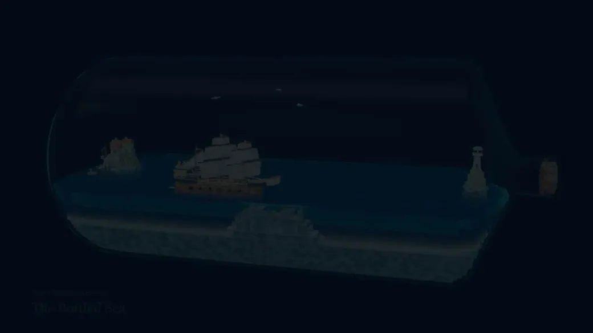</a>

*Istruzioni basate sull’opera collegata*

**Prompt**

```text
Crea una nave a voxel dettagliata del XVII secolo che navighi in una bottiglia di vetro. Simula onde e movimento della nave, aggiungi gabbiani in volo, un porto in miniatura e barriere coralline, poi realizza una sequenza cinematografica di camera e una colonna sonora tranquilla.
```

[Vedi dettagli ↗](https://www.tripo3d.ai/it/3d-prompts/living-voxel-ship-in-a-bottle-2095699049722581065) · [Post originale](https://x.com/DeryaTR_/status/2095699049722581065) · [Torna agli esempi](#all-prompts)

---

<a id="procedural-living-ocean-and-storm-simulation-2095673885605630429"></a>

### Un oceano procedurale vivo con simulazione di tempeste

[Ethan Mollick](https://x.com/emollick) · 2026-09-04 · GPT-6 Astra · Animazione

<a href="https://www.tripo3d.ai/it/3d-prompts/procedural-living-ocean-and-storm-simulation-2095673885605630429">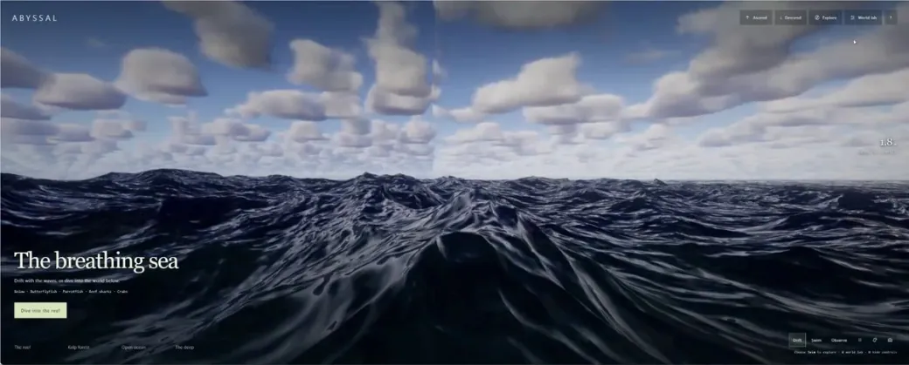</a>

*Istruzioni basate sull’opera collegata*

**Prompt**

```text
Espandi il generatore di tempeste sulla superficie oceanica fornito, in un unico file, fino a ottenere un oceano procedurale completo. Aggiungi barriere coralline, acque profonde, meteo credibile, popolazioni animali con comportamenti emergenti, interazioni dell'ecosistema e una camera che passi dalla superficie agli abissi.
```

[Vedi dettagli ↗](https://www.tripo3d.ai/it/3d-prompts/procedural-living-ocean-and-storm-simulation-2095673885605630429) · [Post originale](https://x.com/emollick/status/2095673885605630429) · [Codice sorgente](https://github.com/emollick/abyssal-living-deep) · [Demo](https://abyssal-living-deep.netlify.app/?site=reef&seed=713&light=day&surface=1) · [Torna agli esempi](#all-prompts)

---

<a id="one-shot-three-js-surprise-game-2095663498101662198"></a>

### Un gioco sorprendente in Three.js con una sola istruzione

[Prathamesh](https://x.com/pratt_builds) · 2026-09-04 · GPT-6 Astra · Giochi

<a href="https://www.tripo3d.ai/it/3d-prompts/one-shot-three-js-surprise-game-2095663498101662198">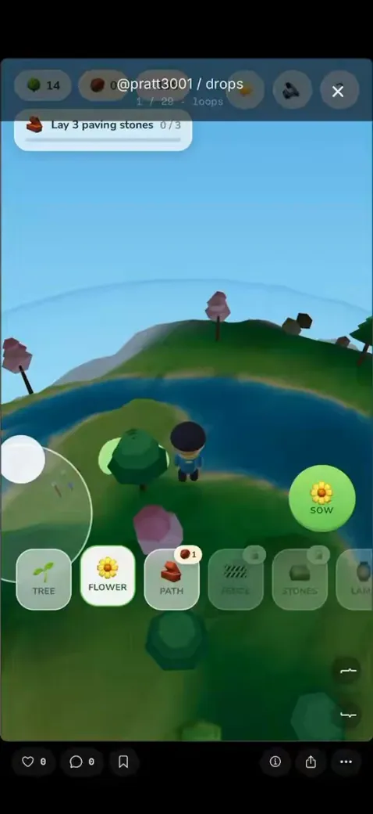</a>

*Istruzioni basate sull’opera collegata*

**Prompt**

```text
Crea in un solo passaggio un gioco originale in Three.js che meriti il titolo “Amaze”. Scegli una meccanica visiva sorprendente, insegnala in pochi secondi, costruisci una breve progressione e concludi con uno spettacolo appagante.
```

[Vedi dettagli ↗](https://www.tripo3d.ai/it/3d-prompts/one-shot-three-js-surprise-game-2095663498101662198) · [Post originale](https://x.com/pratt_builds/status/2095663498101662198) · [Torna agli esempi](#all-prompts)

---

<a id="palace-of-fine-arts-blender-recreation-2095653641164329143"></a>

### Il Palace of Fine Arts ricreato in Blender

[Sharif Shameem](https://x.com/sharifshameem) · 2026-09-03 · GPT-6 Astra · Scene

<a href="https://www.tripo3d.ai/it/3d-prompts/palace-of-fine-arts-blender-recreation-2095653641164329143">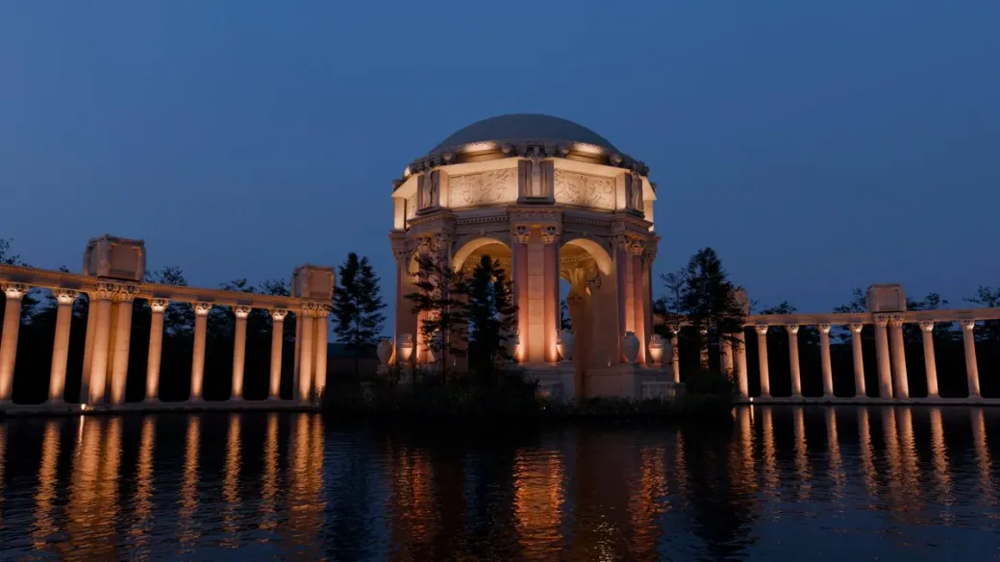</a>

*Istruzioni basate sull’opera collegata*

**Prompt**

```text
Ricrea il Palace of Fine Arts di San Francisco in Blender, con proporzioni riconoscibili della rotonda, colonnati, laguna, vegetazione, materiali invecchiati e illuminazione cinematografica che richiami l'ottimismo delle esposizioni universali.
```

[Vedi dettagli ↗](https://www.tripo3d.ai/it/3d-prompts/palace-of-fine-arts-blender-recreation-2095653641164329143) · [Post originale](https://x.com/sharifshameem/status/2095653641164329143) · [Torna agli esempi](#all-prompts)

---

<a id="single-aquarium-benchmark-2095650251902239139"></a>

### Un acquario con un solo prompt per confrontare modelli

[Tony出海](https://x.com/iamtonyzhu) · 2026-09-03 · GPT-6 Astra · Giochi

<a href="https://www.tripo3d.ai/it/3d-prompts/single-aquarium-benchmark-2095650251902239139">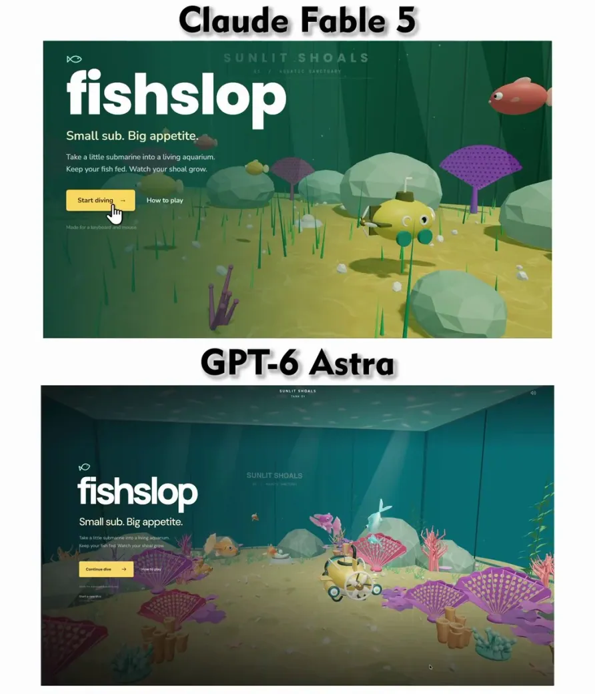</a>

*Istruzioni basate sull’opera collegata*

**Prompt**

```text
Dall'immagine di riferimento fornita, costruisci un gioco di acquario 3D con un solo prompt. Riproduci disposizione e atmosfera, aggiungi pesci vivaci, caustiche nell'acqua, controlli orbitali e un piccolo ciclo d'interazione adatto a confrontare i risultati dei modelli.
```

[Vedi dettagli ↗](https://www.tripo3d.ai/it/3d-prompts/single-aquarium-benchmark-2095650251902239139) · [Post originale](https://x.com/iamtonyzhu/status/2095650251902239139) · [Torna agli esempi](#all-prompts)

---

<a id="rpg-with-first-and-third-person-cameras-2095648440978174276"></a>

### Un RPG con camere in prima e terza persona

[Ryan Fitzpatrick](https://x.com/rfitzpatrick_io) · 2026-09-03 · Claude Fable 5.1 · Giochi

<a href="https://www.tripo3d.ai/it/3d-prompts/rpg-with-first-and-third-person-cameras-2095648440978174276">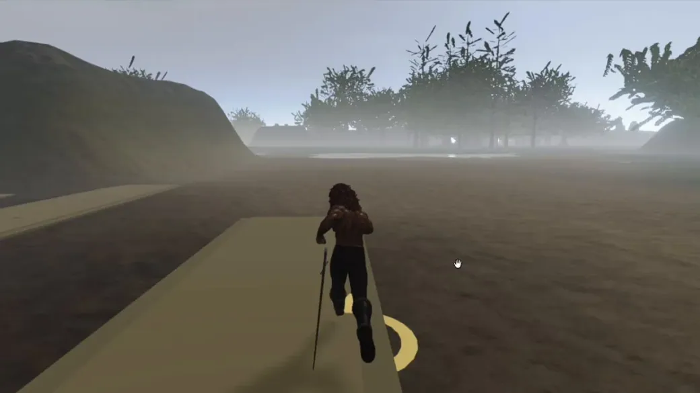</a>

*Istruzioni basate sull’opera collegata*

**Prompt**

```text
Estendi un gioco di ruolo in Three.js con camere in prima e terza persona. Preserva movimento ed esplorazione nel passaggio tra le due viste.
```

[Vedi dettagli ↗](https://www.tripo3d.ai/it/3d-prompts/rpg-with-first-and-third-person-cameras-2095648440978174276) · [Post originale](https://x.com/rfitzpatrick_io/status/2095648440978174276) · [Torna agli esempi](#all-prompts)

---

<a id="single-playable-real-time-3d-game-2095647685210669541"></a>

### Un gioco 3D in tempo reale con un solo prompt

[Higgsfield AI 🧩](https://x.com/higgsfield) · 2026-09-03 · GPT-6 Astra · Giochi

<a href="https://www.tripo3d.ai/it/3d-prompts/single-playable-real-time-3d-game-2095647685210669541"></a>

*Istruzioni basate sull’opera collegata*

**Prompt**

```text
Costruisci un gioco 3D giocabile in tempo reale da un solo prompt. Definisci una meccanica centrale compatta, un obiettivo chiaro e una breve storia, poi genera scena, personaggi, oggetti, riscontri alle azioni e stato di riavvio per poter giocare subito.
```

[Vedi dettagli ↗](https://www.tripo3d.ai/it/3d-prompts/single-playable-real-time-3d-game-2095647685210669541) · [Post originale](https://x.com/higgsfield/status/2095647685210669541) · [Torna agli esempi](#all-prompts)

---

<a id="printable-uss-enterprise-cad-assembly-2095641163441254676"></a>

### Una USS Enterprise in CAD pronta da stampare

[Derya Unutmaz, MD](https://x.com/DeryaTR_) · 2026-09-03 · GPT-6 Astra · Asset

<a href="https://www.tripo3d.ai/it/3d-prompts/printable-uss-enterprise-cad-assembly-2095641163441254676"></a>

*Istruzioni basate sull’opera collegata*

**Prompt**

```text
Progetta in CAD un omaggio originale alla USS Enterprise NCC-1701 pronto per la stampa. Includi proporzioni riconoscibili, un ponte di comando e alcuni interni, almeno 28 parti mobili funzionali, assemblaggi separati e file di fabbricazione esportabili.
```

[Vedi dettagli ↗](https://www.tripo3d.ai/it/3d-prompts/printable-uss-enterprise-cad-assembly-2095641163441254676) · [Post originale](https://x.com/DeryaTR_/status/2095641163441254676) · [Torna agli esempi](#all-prompts)

---

<a id="modern-villa-scene-in-blender-2095636679264780481"></a>

### Una villa moderna in Blender

[Karan](https://x.com/karankendre) · 2026-09-03 · GPT-6 Astra · Scene

<a href="https://www.tripo3d.ai/it/3d-prompts/modern-villa-scene-in-blender-2095636679264780481">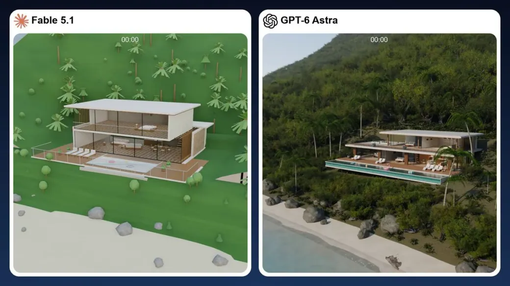</a>

*Istruzioni basate sull’opera collegata*

**Prompt**

```text
Costruisci una scena completa di una villa moderna in Blender, con architettura coerente, interni arredati, piscina a sfioro, giardino, materiali realistici e un percorso di camera cinematografico nell'ora dorata.
```

[Vedi dettagli ↗](https://www.tripo3d.ai/it/3d-prompts/modern-villa-scene-in-blender-2095636679264780481) · [Post originale](https://x.com/karankendre/status/2095636679264780481) · [Torna agli esempi](#all-prompts)

---

<a id="procedural-oval-office-set-for-cycles-2095630197257367857"></a>

### Uno Studio Ovale procedurale per Cycles

[Higgsfield AI 🧩](https://x.com/higgsfield_ai) · 2026-09-03 · GPT-6 Astra · Scene

<a href="https://www.tripo3d.ai/it/3d-prompts/procedural-oval-office-set-for-cycles-2095630197257367857">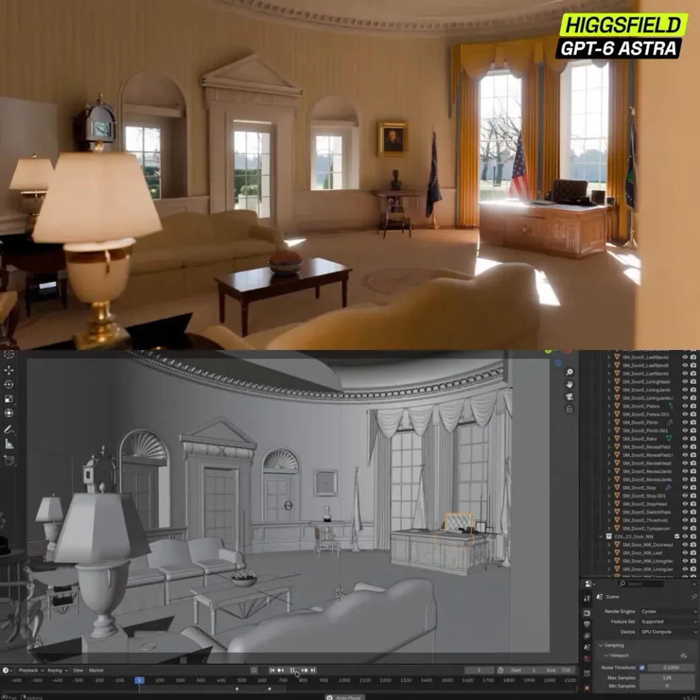</a>

*Istruzioni basate sull’opera collegata*

**Prompt**

```text
Trasforma una descrizione scenografica dello Studio Ovale in codice eseguibile. Costruisci l'ambiente in Blender con mobili, pareti, illuminazione e posizioni di camera modificabili, poi renderizza un risultato cinematografico con Cycles.
```

[Vedi dettagli ↗](https://www.tripo3d.ai/it/3d-prompts/procedural-oval-office-set-for-cycles-2095630197257367857) · [Post originale](https://x.com/higgsfield_ai/status/2095630197257367857) · [Torna agli esempi](#all-prompts)

---

<a id="unity-space-trench-run-game-2095630044102279312"></a>

### Un gioco di volo spaziale in trincea in Unity

[Ronald Mannak](https://x.com/ronaldmannak) · 2026-09-03 · GPT-6 Astra · Giochi

<a href="https://www.tripo3d.ai/it/3d-prompts/unity-space-trench-run-game-2095630044102279312">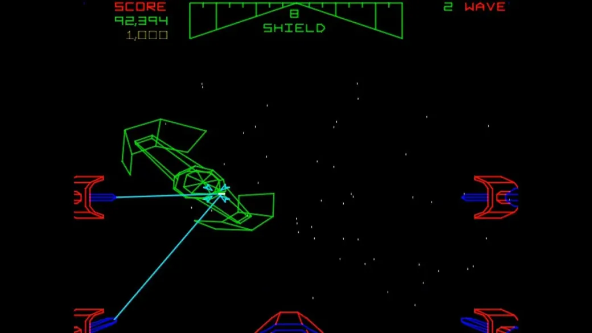</a>

*Istruzioni basate sull’opera collegata*

**Prompt**

```text
Ricrea in Unity la sensazione di una classica incursione spaziale lungo una trincea, con volo rapido a bassa quota, fuoco delle torrette, ostacoli, puntamento, pressione crescente, un obiettivo finale e una sequenza cinematografica di successo o fallimento.
```

[Vedi dettagli ↗](https://www.tripo3d.ai/it/3d-prompts/unity-space-trench-run-game-2095630044102279312) · [Post originale](https://x.com/ronaldmannak/status/2095630044102279312) · [Torna agli esempi](#all-prompts)

---

<a id="blueprint-to-blender-to-unreal-archviz-2095624712244072551"></a>

### Dal progetto a Blender e Unreal per la visualizzazione architettonica

[Linus ✦ Ekenstam](https://x.com/LinusEkenstam) · 2026-09-03 · GPT-6 Astra · Scene

<a href="https://www.tripo3d.ai/it/3d-prompts/blueprint-to-blender-to-unreal-archviz-2095624712244072551"></a>

*Istruzioni basate sull’opera collegata*

**Prompt**

```text
Parti dal disegno architettonico fornito, crea un modello preciso e modificabile in Blender e trasferiscilo in Unreal Engine come esperienza architettonica illuminata e percorribile, con scala e collisioni corrette.
```

[Vedi dettagli ↗](https://www.tripo3d.ai/it/3d-prompts/blueprint-to-blender-to-unreal-archviz-2095624712244072551) · [Post originale](https://x.com/LinusEkenstam/status/2095624712244072551) · [Torna agli esempi](#all-prompts)

---

<a id="text-to-explorable-unity-city-2095623452678144366"></a>

### Dal testo a una città esplorabile in Unity

[Md Ismail Šojal 🕷️](https://x.com/0x0SojalSec) · 2026-09-03 · GPT-6 Astra · Scene

<a href="https://www.tripo3d.ai/it/3d-prompts/text-to-explorable-unity-city-2095623452678144366">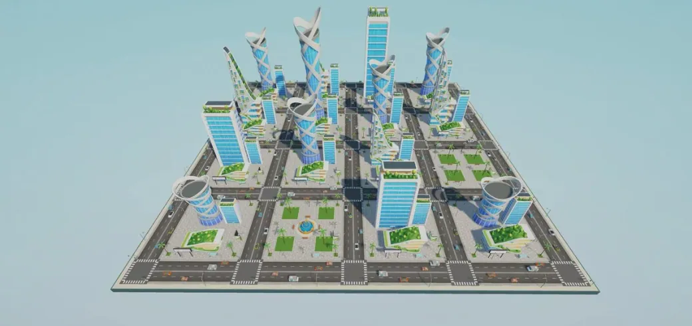</a>

*Istruzioni basate sull’opera collegata*

**Prompt**

```text
Trasforma la visione urbana fornita in un ambiente esplorabile in Unity con torri, strade, veicoli, palme e luce atmosferica. Definisci una scala credibile, navigazione, traffico in movimento e una camera fluida in prima persona.
```

[Vedi dettagli ↗](https://www.tripo3d.ai/it/3d-prompts/text-to-explorable-unity-city-2095623452678144366) · [Post originale](https://x.com/0x0SojalSec/status/2095623452678144366) · [Torna agli esempi](#all-prompts)

---

<a id="three-js-marble-factory-2095622065390772322"></a>

### Una fabbrica di biglie in Three.js

[John Kler](https://x.com/JohnKlerAI) · 2026-09-03 · Claude Fable 5.1 · Animazione

<a href="https://www.tripo3d.ai/it/3d-prompts/three-js-marble-factory-2095622065390772322">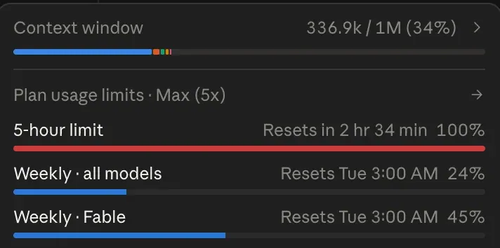</a>

*Istruzioni basate sull’opera collegata*

**Prompt**

```text
Crea una simulazione di fabbrica di biglie in Three.js con flusso produttivo chiaro, biglie in movimento e macchinari. Consenti di seguire una biglia nel processo.
```

[Vedi dettagli ↗](https://www.tripo3d.ai/it/3d-prompts/three-js-marble-factory-2095622065390772322) · [Post originale](https://x.com/JohnKlerAI/status/2095622065390772322) · [Torna agli esempi](#all-prompts)

---

<a id="photoreal-3d-product-mockup-studio-2095619319690400253"></a>

### Uno studio di mockup 3D fotorealistici di prodotti

[Josh Millgate](https://x.com/joshmillgate) · 2026-09-03 · GPT-6 Astra · Interattivo

<a href="https://www.tripo3d.ai/it/3d-prompts/photoreal-3d-product-mockup-studio-2095619319690400253">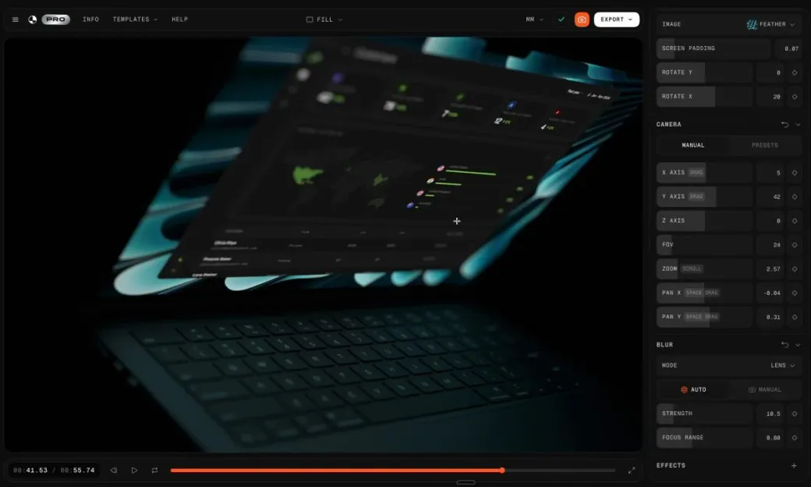</a>

*Istruzioni basate sull’opera collegata*

**Prompt**

```text
Crea uno strumento per browser che applichi le grafiche caricate a mockup 3D fotorealistici di prodotti. Supporta camera orbitale, controlli di materiali e colori, illuminazione ambientale, più prodotti ed esportazione ad alta risoluzione.
```

[Vedi dettagli ↗](https://www.tripo3d.ai/it/3d-prompts/photoreal-3d-product-mockup-studio-2095619319690400253) · [Post originale](https://x.com/joshmillgate/status/2095619319690400253) · [Torna agli esempi](#all-prompts)

---

<a id="3d-museum-cinematography-previsualization-2095616529572503593"></a>

### Previsualizzazione cinematografica di un museo 3D

[Higgsfield AI 🧩](https://x.com/higgsfield_ai) · 2026-09-03 · GPT-6 Astra · Scene

<a href="https://www.tripo3d.ai/it/3d-prompts/3d-museum-cinematography-previsualization-2095616529572503593">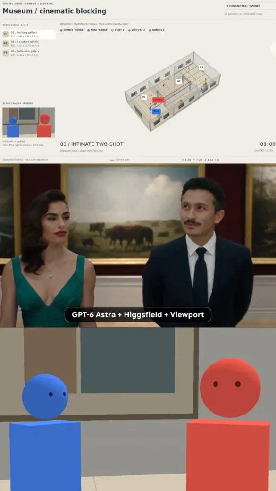</a>

*Istruzioni basate sull’opera collegata*

**Prompt**

```text
Costruisci una previsualizzazione 3D di un museo che mappi ambiente, posizioni degli attori, disposizione delle camere ed elenco delle inquadrature. Mantieni ogni allestimento nel visore fisico ed esporta guide coerenti per la successiva generazione di video.
```

[Vedi dettagli ↗](https://www.tripo3d.ai/it/3d-prompts/3d-museum-cinematography-previsualization-2095616529572503593) · [Post originale](https://x.com/higgsfield_ai/status/2095616529572503593) · [Torna agli esempi](#all-prompts)

---

<a id="zillow-listing-to-3d-property-film-2095612137582526615"></a>

### Da un annuncio Zillow a un video immobiliare 3D

[Yunfan Ye](https://x.com/realYunfanYe) · 2026-09-03 · GPT-6 Astra · Scene

<a href="https://www.tripo3d.ai/it/3d-prompts/zillow-listing-to-3d-property-film-2095612137582526615">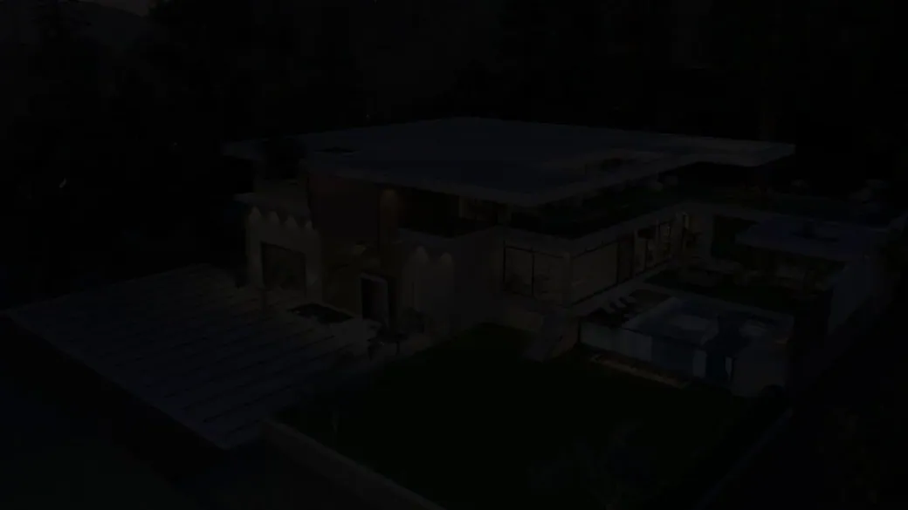</a>

*Istruzioni basate sull’opera collegata*

**Immagini di riferimento:** [1](https://media.tripogrowth.space/media/55a852d1-8c13-44dc-a152-476e4cce63ec.png) · [2](https://media.tripogrowth.space/media/a0e91ce4-fbeb-4653-b013-5f32715b7c23.png) · [3](https://pbs.twimg.com/media/HRUdPJDaUAAWdDZ.png) · [4](https://pbs.twimg.com/media/HRUdUVKbAAAkA9W.png)

**Prompt**

```text
Usa l'annuncio immobiliare fornito e tutte le sue foto per ricostruire la casa in 3D, dedurre una planimetria coerente e creare un video promozionale curato che la percorra. Segnala le geometrie incerte e correggi le discrepanze dopo la prima versione.
```

[Vedi dettagli ↗](https://www.tripo3d.ai/it/3d-prompts/zillow-listing-to-3d-property-film-2095612137582526615) · [Post originale](https://x.com/realYunfanYe/status/2095612137582526615) · [Torna agli esempi](#all-prompts)

---

<a id="street-by-street-manhattan-in-unreal-engine-2095609734845927525"></a>

### Manhattan, strada per strada, in Unreal Engine

[Matt Shumer](https://x.com/mattshumer_) · 2026-09-03 · GPT-6 Astra · Scene

<a href="https://www.tripo3d.ai/it/3d-prompts/street-by-street-manhattan-in-unreal-engine-2095609734845927525">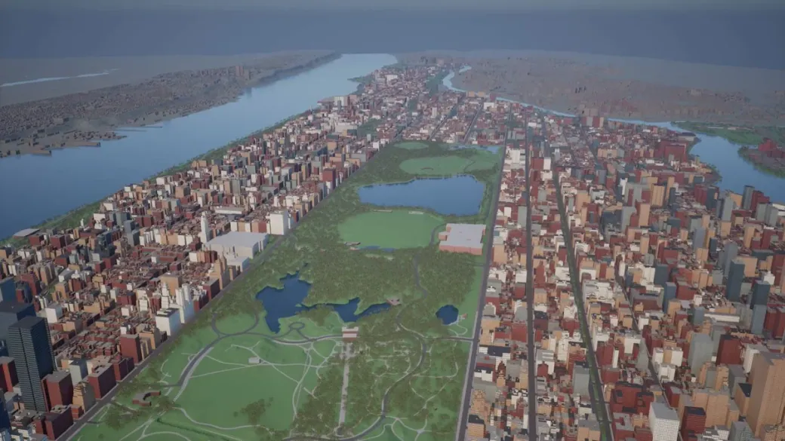</a>

*Istruzioni basate sull’opera collegata*

**Prompt**

```text
Costruisci una Manhattan esplorabile in Unreal Engine. Procedi quartiere per quartiere e strada per strada, preservando una scala riconoscibile, la rete stradale, i luoghi simbolo, il traffico e l'identità delle zone. Tieni una lista di verifica e perfeziona ogni area prima di proseguire.
```

[Vedi dettagli ↗](https://www.tripo3d.ai/it/3d-prompts/street-by-street-manhattan-in-unreal-engine-2095609734845927525) · [Post originale](https://x.com/mattshumer_/status/2095609734845927525) · [Torna agli esempi](#all-prompts)

---

<a id="voice-directed-3d-game-for-beginners-2095608358086840647"></a>

### Un gioco 3D guidato a voce per principianti

[el.cine](https://x.com/EHuanglu) · 2026-09-03 · GPT-6 Astra · Giochi

<a href="https://www.tripo3d.ai/it/3d-prompts/voice-directed-3d-game-for-beginners-2095608358086840647"></a>

*Istruzioni basate sull’opera collegata*

**Prompt**

```text
Aiutami a creare un gioco 3D. Chiedi solo le informazioni mancanti sull'obiettivo del giocatore, la direzione artistica e i comandi. Poi crea un gioco per browser che possa provare subito e continua a modificarlo seguendo brevi istruzioni vocali.
```

[Vedi dettagli ↗](https://www.tripo3d.ai/it/3d-prompts/voice-directed-3d-game-for-beginners-2095608358086840647) · [Post originale](https://x.com/EHuanglu/status/2095608358086840647) · [Torna agli esempi](#all-prompts)

---

<a id="one-shot-browser-3d-game-2095599934766764338"></a>

### Un gioco 3D per browser con una sola istruzione

[Theo - t3.gg](https://x.com/theo) · 2026-09-03 · GPT-6 Astra · Giochi

<a href="https://www.tripo3d.ai/it/3d-prompts/one-shot-browser-3d-game-2095599934766764338">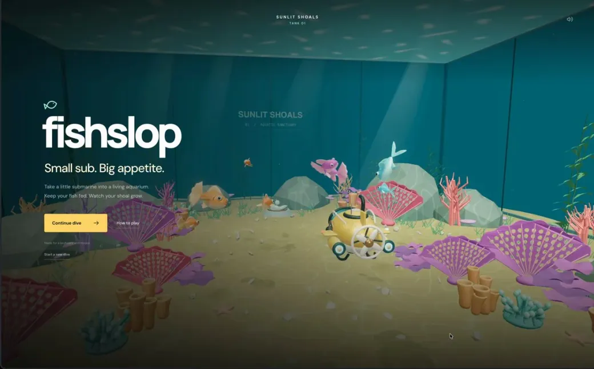</a>

*Istruzioni basate sull’opera collegata*

**Prompt**

```text
Crea un gioco 3D completo per browser in un progetto autonomo. Includi un obiettivo chiaro, comandi reattivi, livelli spazialmente coerenti, nemici o pericoli, riscontri alle azioni, punteggio, riavvio e accorgimenti per il rendimento.
```

[Vedi dettagli ↗](https://www.tripo3d.ai/it/3d-prompts/one-shot-browser-3d-game-2095599934766764338) · [Post originale](https://x.com/theo/status/2095599934766764338) · [Torna agli esempi](#all-prompts)

---

<a id="house-photo-to-editable-blender-world-2095598645190291775"></a>

### Dalla foto di una casa a un mondo modificabile in Blender

[Tom Krcha](https://x.com/tomkrcha) · 2026-09-03 · GPT-6 Astra · Scene

<a href="https://www.tripo3d.ai/it/3d-prompts/house-photo-to-editable-blender-world-2095598645190291775">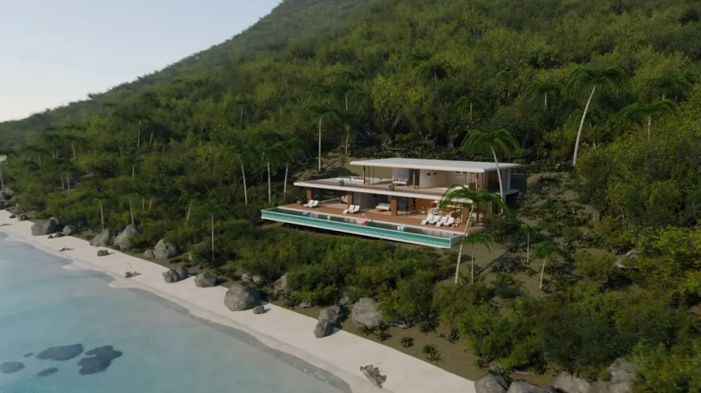</a>

*Istruzioni basate sull’opera collegata*

**Prompt**

```text
Ricostruisci la casa nell'immagine fornita come una scena Blender interamente modificabile. Modella architettura, arredi, elettrodomestici e giocattoli come oggetti separati, mantieni proporzioni plausibili e consenti una visita virtuale locale fluida a 60 FPS.
```

[Vedi dettagli ↗](https://www.tripo3d.ai/it/3d-prompts/house-photo-to-editable-blender-world-2095598645190291775) · [Post originale](https://x.com/tomkrcha/status/2095598645190291775) · [Torna agli esempi](#all-prompts)

---

<a id="10v10-halo-inspired-multiplayer-fps-2095598026916049024"></a>

### Un FPS multigiocatore 10 contro 10 ispirato a Halo

[Halfdan](https://x.com/VikiingAI) · 2026-09-03 · GPT-6 Astra · Giochi

<a href="https://www.tripo3d.ai/it/3d-prompts/10v10-halo-inspired-multiplayer-fps-2095598026916049024">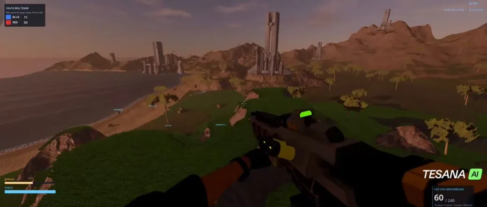</a>

*Istruzioni basate sull’opera collegata*

**Prompt**

```text
Costruisci uno sparatutto multigiocatore in arena 10 contro 10, ispirato ai classici FPS di fantascienza. Includi squadre, rientro in gioco, armi riconoscibili, scudi, oggetti raccoglibili, mappe compatte, punteggio, svolgimento della partita e gioco nel browser a bassa latenza.
```

[Vedi dettagli ↗](https://www.tripo3d.ai/it/3d-prompts/10v10-halo-inspired-multiplayer-fps-2095598026916049024) · [Post originale](https://x.com/VikiingAI/status/2095598026916049024) · [Torna agli esempi](#all-prompts)

---

<a id="asset-driven-explorable-unity-city-2095597640587374887"></a>

### Una città esplorabile in Unity da una libreria di risorse

[Chetaslua](https://x.com/chetaslua) · 2026-09-03 · GPT-6 Astra · Scene

<a href="https://www.tripo3d.ai/it/3d-prompts/asset-driven-explorable-unity-city-2095597640587374887"></a>

*Istruzioni basate sull’opera collegata*

**Prompt**

```text
Assembla una città esplorabile in Unity con la libreria di risorse fornita. Crea una rete stradale coerente, torri, veicoli, palme, illuminazione e navigazione, poi ottimizza la scena e realizza una visita stabile in prima persona.
```

[Vedi dettagli ↗](https://www.tripo3d.ai/it/3d-prompts/asset-driven-explorable-unity-city-2095597640587374887) · [Post originale](https://x.com/chetaslua/status/2095597640587374887) · [Torna agli esempi](#all-prompts)

---

<a id="one-shot-premium-interactive-prototype-2095597560253862065"></a>

### Un prototipo interattivo curato in un solo passaggio

[AJ Orbach 🐳](https://x.com/AY_Orbach) · 2026-09-03 · GPT-6 Astra · Interattivo

<a href="https://www.tripo3d.ai/it/3d-prompts/one-shot-premium-interactive-prototype-2095597560253862065"></a>

*Istruzioni basate sull’opera collegata*

**Prompt**

```text
Progetta e implementa in un solo passaggio un prototipo interattivo di alta qualità dal concetto di prodotto fornito. Scegli un sistema visivo forte, dai priorità all'azione principale, aggiungi transizioni curate e consegna una versione responsive ospitata online.
```

[Vedi dettagli ↗](https://www.tripo3d.ai/it/3d-prompts/one-shot-premium-interactive-prototype-2095597560253862065) · [Post originale](https://x.com/AY_Orbach/status/2095597560253862065) · [Torna agli esempi](#all-prompts)

---

<a id="one-shot-minecraft-style-world-2095597137849446688"></a>

### Un mondo in stile Minecraft in un solo passaggio

[Flavio Adamo](https://x.com/flavioAd) · 2026-09-03 · GPT-6 Astra · Giochi

<a href="https://www.tripo3d.ai/it/3d-prompts/one-shot-minecraft-style-world-2095597137849446688">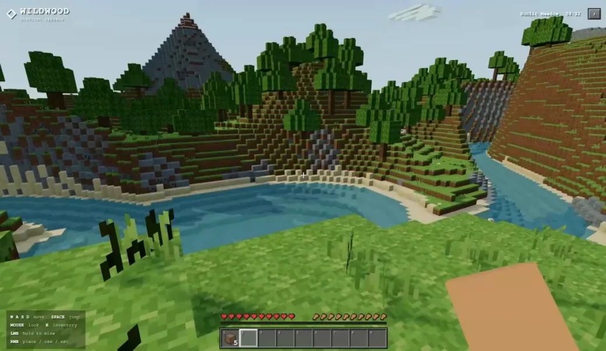</a>

*Istruzioni basate sull’opera collegata*

**Prompt**

```text
Costruisci in un solo passaggio un mondo a voxel giocabile ispirato a Minecraft, con generazione del terreno, posa e distruzione di blocchi, comandi in prima persona, inventario, illuminazione, acqua e un ciclo di sopravvivenza compatto.
```

[Vedi dettagli ↗](https://www.tripo3d.ai/it/3d-prompts/one-shot-minecraft-style-world-2095597137849446688) · [Post originale](https://x.com/flavioAd/status/2095597137849446688) · [Torna agli esempi](#all-prompts)

---

<a id="open-world-browser-adventure-2095596341422440714"></a>

### Un'avventura open world nel browser

[Peter Gostev](https://x.com/petergostev) · 2026-09-03 · GPT-6 Astra · Giochi

<a href="https://www.tripo3d.ai/it/3d-prompts/open-world-browser-adventure-2095596341422440714">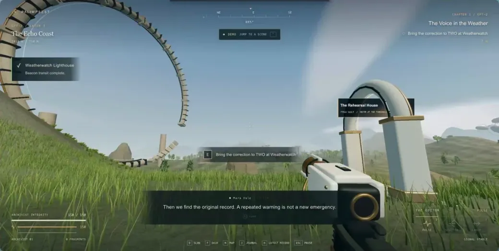</a>

*Istruzioni basate sull’opera collegata*

**Prompt**

```text
Costruisci un'avventura 3D open world con biomi collegati, spostamenti, scoperte, combattimenti leggeri, missioni, luoghi simbolo, atmosfera diurna e notturna e indicazioni sufficienti a dare uno scopo all'esplorazione.
```

[Vedi dettagli ↗](https://www.tripo3d.ai/it/3d-prompts/open-world-browser-adventure-2095596341422440714) · [Post originale](https://x.com/petergostev/status/2095596341422440714) · [Torna agli esempi](#all-prompts)

---


[Catalogo completo](catalog.it.md) · [←](catalog.it.5.md) · **6 / 9** · [→](catalog.it.7.md)

<p align="center"><strong><a href="https://www.tripo3d.ai/it/3d-prompts?utm_source=github&amp;utm_medium=referral&amp;utm_campaign=awesome_3d_prompts&amp;utm_content=catalog_footer">Catalogo completo →</a></strong></p>
