<!-- Generated from Growth CMS by templates/catalog.md. Edit content in CMS; run npm run sync. -->

# Awesome 3D Prompts — 9 / 9

[← Awesome 3D Prompts](../README.md)

<p>
  <a href="../docs/catalog.en.9.md"></a>
  <a href="../docs/catalog.zh.9.md"></a>
  <a href="../docs/catalog.zh-Hant.9.md"></a>
  <a href="../docs/catalog.ja.9.md"></a>
  <a href="../docs/catalog.ko.9.md"></a>
  <a href="../docs/catalog.es.9.md"></a>
  <a href="../docs/catalog.pt.9.md"></a>
  <a href="../docs/catalog.de.9.md"></a>
  <a href="../docs/catalog.fr.9.md"></a>
  <a href="../docs/catalog.it.9.md"></a>
  <a href="../docs/catalog.ru.9.md"></a>
  <a href="../docs/catalog.tr.9.md"></a>
  <a href="../docs/catalog.uk.9.md"></a>
  <a href="../docs/catalog.vi.9.md"></a>
</p>

[Catalogo completo](catalog.it.md) · [←](catalog.it.8.md) · **9 / 9**

<a id="all-prompts"></a>

<details>
<summary>Esplora gli esempi (17)</summary>

- [Prompt Kimi K3 per un nascondino in una sola istruzione](#one-shot-hide-and-seek-game-2080806989169307780)
- [Una richiesta di modellazione procedurale di armi Three.js per Claude Fable 5](#procedural-three-js-weapon-modeling-task-2080759312008503365)
- [Tre prompt per armi procedurali Three.js in un unico HTML](#procedural-guns-in-single-file-three-js-2080757148078768504)
- [Prompt Kimi K3 per un isolato che si trasforma in Three.js](#transforming-three-js-city-block-scene-2080724552422924382)
- [Prompt Claude Opus 5 per un ornitottero di Leonardo da Vinci in Three.js](#leonardo-da-vinci-ornithopter-in-three-js-2080720533277319587)
- [Un clone di Angry Birds con uccelli unici e più livelli](#angry-birds-style-clone-with-unique-birds-and-multiple-levels-2080624574883123541)
- [La costruzione di uno stadio di calcio 3D per confrontare Claude Fable 5 e Kimi K3](#3d-soccer-stadium-2080473039834333229)
- [Prompt Three.js per un treno maglev futuristico](#futuristic-maglev-train-in-three-js-2080454415400493332)
- [Prompt di nascondino 3D con camaleonte e robot](#chameleon-and-robot-hide-and-seek-game-2080392777515311115)
- [Prompt Claude Fable 5 per un ciliegio 3D in fiore](#3d-cherry-blossom-tree-2080178541979664741)
- [Un prompt per e-commerce, museo 3D interattivo e clone RTS](#interactive-3d-museum-and-rts-prototypes-2080050176132300960)
- [Prompt Three.js per un gioco in stile Hole.io](#hole-io-style-three-js-game-2079898758427324573)
- [Prompt Kimi K3 per un ray tracer di buco nero WebGL2 in un file](#single-file-webgl2-black-hole-raytracer-2079590483727442205)
- [Prompt di calcio a voxel Three.js per un unico HTML](#voxel-soccer-animation-in-a-single-html-file-2079553757302710442)
- [Prompt Fable 5 per modellare New York in Blender](#modeling-new-york-city-in-blender-2079387760478073087)
- [Prompt Fable 5 per un'animazione di calcio a voxel in Three.js in un file](#single-file-three-js-voxel-soccer-animation-2079198084689723560)
- [Prompt Three.js per visitare un aereo dall'interno](#three-js-airplane-walkthrough-experience-2078806166122197132)

</details>
<a id="one-shot-hide-and-seek-game-2080806989169307780"></a>

### Prompt Kimi K3 per un nascondino in una sola istruzione

[scalp](https://x.com/0x_scalp) · 2026-07-25 · Kimi K3 / Claude Fable 5 · Giochi

<a href="https://www.tripo3d.ai/it/3d-prompts/one-shot-hide-and-seek-game-2080806989169307780"></a>

**Prompt**

```text
Un nascondino in una sola istruzione: un camaleonte bianco si nasconde in una stanza disegnata a mano, dipingendosi per assomigliare al muro e sopravvivendo a tre scansioni di un robot cercatore. Percentuale di corrispondenza per differenza di pixel in tempo reale, cinque zone procedurali, suono sintetizzato, tre round con punteggio: un file HTML, nessuna libreria.
```

[Vedi dettagli ↗](https://www.tripo3d.ai/it/3d-prompts/one-shot-hide-and-seek-game-2080806989169307780) · [Post originale](https://x.com/0x_scalp/status/2080806989169307780) · [Torna agli esempi](#all-prompts)

---

<a id="procedural-three-js-weapon-modeling-task-2080759312008503365"></a>

### Una richiesta di modellazione procedurale di armi Three.js per Claude Fable 5

[aditya](https://x.com/adxtyahq) · 2026-07-24 · Claude Fable 5 · Asset

<a href="https://www.tripo3d.ai/it/3d-prompts/procedural-three-js-weapon-modeling-task-2080759312008503365">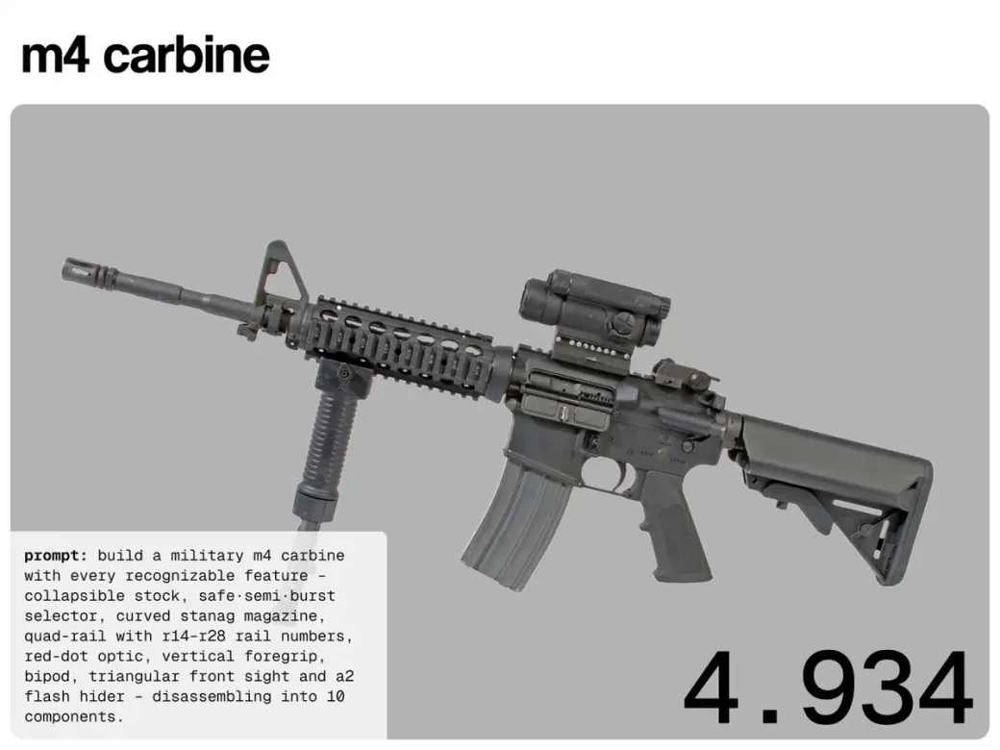</a>

**Prompt**

```text
The Hype ha confrontato Claude Opus 5, Fable 5, GPT-5.6 Sol e Kimi K3 sulle stesse richieste di ingegneria procedurale Three.js.

Ogni modello doveva costruire:
• Carabina M4
• Glock 18C
• Steyr TMP
```

[Vedi dettagli ↗](https://www.tripo3d.ai/it/3d-prompts/procedural-three-js-weapon-modeling-task-2080759312008503365) · [Post originale](https://x.com/adxtyahq/status/2080759312008503365) · [Torna agli esempi](#all-prompts)

---

<a id="procedural-guns-in-single-file-three-js-2080757148078768504"></a>

### Tre prompt per armi procedurali Three.js in un unico HTML

[thehype.](https://x.com/thehypedotnews) · 2026-07-24 · Kimi K3 · Asset

<a href="https://www.tripo3d.ai/it/3d-prompts/procedural-guns-in-single-file-three-js-2080757148078768504"></a>

**Prompt**

```text
il nostro test — 3 prompt, html in un file, @threejs, tutto procedurale, senza risorse esterne. ciascuna arma ha un piccolo pulsante di sparo (suono via web audio + fiammata + rinculo + bossolo espulso) e un comando di smontaggio che la separa in parti etichettate e la rimonta:

1. carabina m4 5,56 — calcio telescopico, selettore sicura·semiautomatico·raffica, quattro slitte con numeri di pannello r14–r28, punto rosso aimpoint, impugnatura verticale, bipiede pieghevole, spegnifiamma a2, si divide in 10 parti

2. glock 18c — pistola automatica a fuoco selettivo, aperture del compensatore 18c, marcature “glock 18c / austria 9x19”, caricatore esteso da 33 colpi; smontaggio base in carrello, canna forata, molla di recupero, fusto e caricatore

3. steyr tmp — corpo nervato in polimero, canna filettata, impugnatura verticale anteriore integrata, caricatore traslucido inclinato da 30 colpi
```

[Vedi dettagli ↗](https://www.tripo3d.ai/it/3d-prompts/procedural-guns-in-single-file-three-js-2080757148078768504) · [Post originale](https://x.com/thehypedotnews/status/2080757148078768504) · [Torna agli esempi](#all-prompts)

---

<a id="transforming-three-js-city-block-scene-2080724552422924382"></a>

### Prompt Kimi K3 per un isolato che si trasforma in Three.js

[Ali Haider](https://x.com/ggg78g89) · 2026-07-24 · Kimi K3 · Scene

<a href="https://www.tripo3d.ai/it/3d-prompts/transforming-three-js-city-block-scene-2080724552422924382">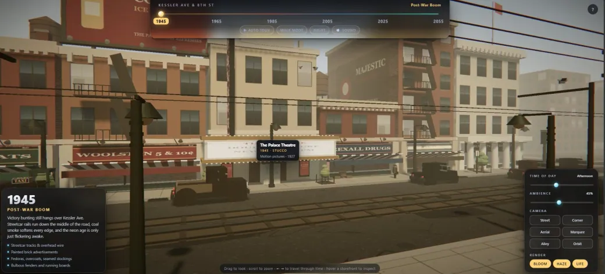</a>

**Prompt**

```text
Gli ho dato un prompt Three.js brutale: costruisci un isolato che si trasformi dal 1945 al 2055, cambiando edifici, auto, negozi, folle, illuminazione ed effetti sonori in un solo file HTML.
```

[Vedi dettagli ↗](https://www.tripo3d.ai/it/3d-prompts/transforming-three-js-city-block-scene-2080724552422924382) · [Post originale](https://x.com/ggg78g89/status/2080724552422924382) · [Torna agli esempi](#all-prompts)

---

<a id="leonardo-da-vinci-ornithopter-in-three-js-2080720533277319587"></a>

### Prompt Claude Opus 5 per un ornitottero di Leonardo da Vinci in Three.js

[Harshith](https://x.com/HarshithLucky3) · 2026-07-24 · Claude Opus 5 · Interattivo

<a href="https://www.tripo3d.ai/it/3d-prompts/leonardo-da-vinci-ornithopter-in-three-js-2080720533277319587">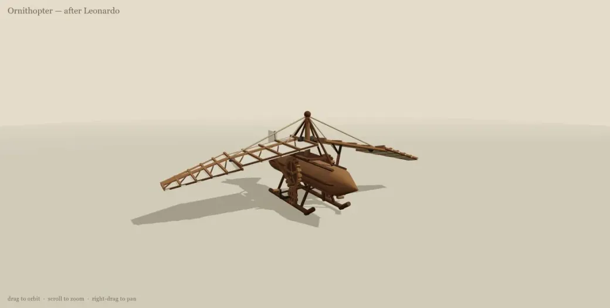</a>

**Prompt**

```text
ornitottero di leonardo da vinci in three js
```

[Vedi dettagli ↗](https://www.tripo3d.ai/it/3d-prompts/leonardo-da-vinci-ornithopter-in-three-js-2080720533277319587) · [Post originale](https://x.com/HarshithLucky3/status/2080720533277319587) · [Torna agli esempi](#all-prompts)

---

<a id="angry-birds-style-clone-with-unique-birds-and-multiple-levels-2080624574883123541"></a>

### Un clone di Angry Birds con uccelli unici e più livelli

[Build Fast with AI](https://x.com/BuildFastWithAI) · 2026-07-24 · Claude Fable 5 · Giochi

<a href="https://www.tripo3d.ai/it/3d-prompts/angry-birds-style-clone-with-unique-birds-and-multiple-levels-2080624574883123541">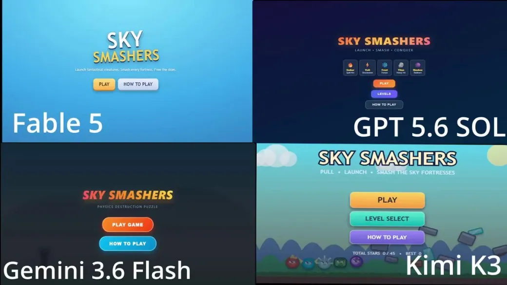</a>

**Prompt**

```text
Crea un clone di Angry Birds con uccelli unici, più livelli e meccaniche.
```

[Vedi dettagli ↗](https://www.tripo3d.ai/it/3d-prompts/angry-birds-style-clone-with-unique-birds-and-multiple-levels-2080624574883123541) · [Post originale](https://x.com/BuildFastWithAI/status/2080624574883123541) · [Torna agli esempi](#all-prompts)

---

<a id="3d-soccer-stadium-2080473039834333229"></a>

### La costruzione di uno stadio di calcio 3D per confrontare Claude Fable 5 e Kimi K3

[東大ClaudeCode研究所](https://x.com/ClaudeCode_UT) · 2026-07-24 · Kimi K3 · Scene

<a href="https://www.tripo3d.ai/it/3d-prompts/3d-soccer-stadium-2080473039834333229">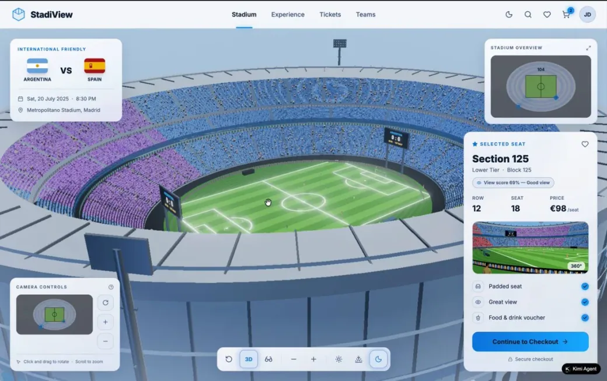</a>

**Prompt**

```text
Uno sviluppatore ha confrontato i modelli affidando la stessa richiesta: “costruisci uno stadio di calcio 3D”.
```

[Vedi dettagli ↗](https://www.tripo3d.ai/it/3d-prompts/3d-soccer-stadium-2080473039834333229) · [Post originale](https://x.com/ClaudeCode_UT/status/2080473039834333229) · [Torna agli esempi](#all-prompts)

---

<a id="futuristic-maglev-train-in-three-js-2080454415400493332"></a>

### Prompt Three.js per un treno maglev futuristico

[Pixel](https://x.com/Pixel_Neuron) · 2026-07-24 · Claude Fable 5 · Scene

<a href="https://www.tripo3d.ai/it/3d-prompts/futuristic-maglev-train-in-three-js-2080454415400493332">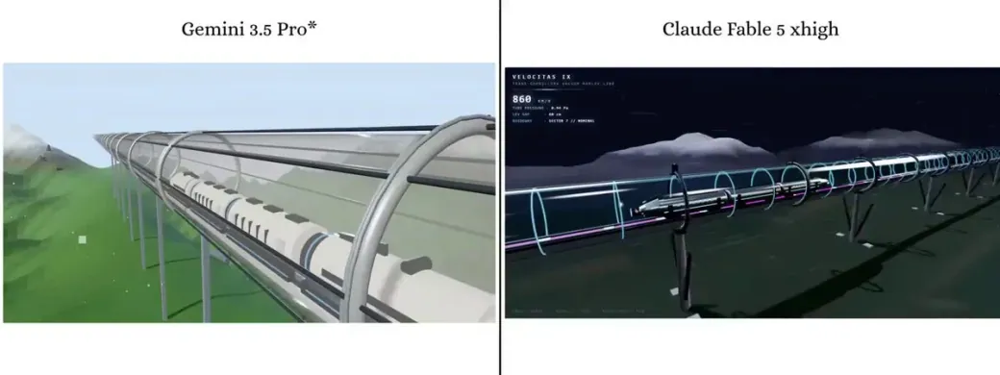</a>

**Prompt**

```text
Un treno maglev futuristico ad alta velocità che sfreccia in un tubo a vuoto di vetro trasparente.
```

[Vedi dettagli ↗](https://www.tripo3d.ai/it/3d-prompts/futuristic-maglev-train-in-three-js-2080454415400493332) · [Post originale](https://x.com/Pixel_Neuron/status/2080454415400493332) · [Torna agli esempi](#all-prompts)

---

<a id="chameleon-and-robot-hide-and-seek-game-2080392777515311115"></a>

### Prompt di nascondino 3D con camaleonte e robot

[Sonicsmart](https://x.com/sonicsmarta) · 2026-07-23 · Claude Fable 5 · Giochi

<a href="https://www.tripo3d.ai/it/3d-prompts/chameleon-and-robot-hide-and-seek-game-2080392777515311115">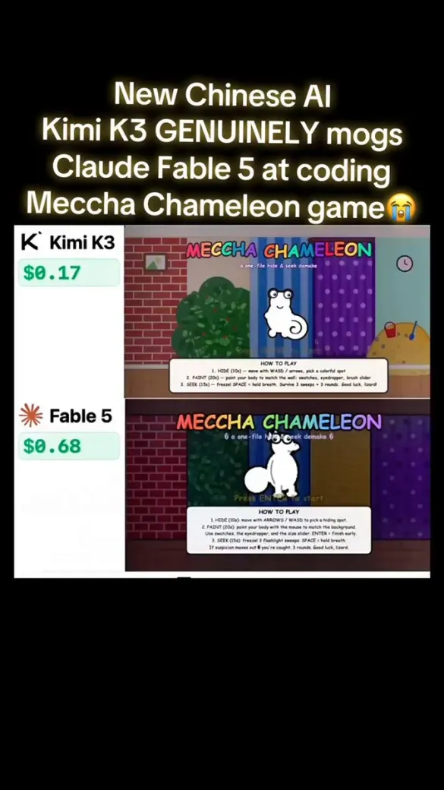</a>

**Prompt**

```text
Un prompt inviato a entrambi: un gioco di nascondino. Un camaleonte si dipinge per mimetizzarsi con il muro mentre un robot lo cerca. Un file, giocabile, con round, punteggio e percentuale di corrispondenza. Non una demo: un gioco finito.
```

[Vedi dettagli ↗](https://www.tripo3d.ai/it/3d-prompts/chameleon-and-robot-hide-and-seek-game-2080392777515311115) · [Post originale](https://x.com/sonicsmarta/status/2080392777515311115) · [Torna agli esempi](#all-prompts)

---

<a id="3d-cherry-blossom-tree-2080178541979664741"></a>

### Prompt Claude Fable 5 per un ciliegio 3D in fiore

[zhod](https://x.com/zhodonx) · 2026-07-23 · Claude Fable 5 · Asset

<a href="https://www.tripo3d.ai/it/3d-prompts/3d-cherry-blossom-tree-2080178541979664741">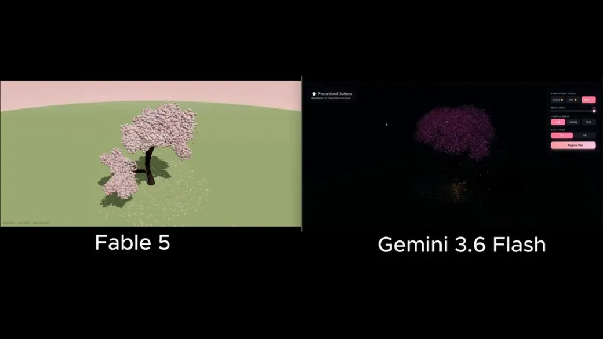</a>

**Prompt**

```text
Costruisci un ciliegio 3D in fiore; non dargli librerie di alberi pronti; il modello deve generare da sé la struttura
```

[Vedi dettagli ↗](https://www.tripo3d.ai/it/3d-prompts/3d-cherry-blossom-tree-2080178541979664741) · [Post originale](https://x.com/zhodonx/status/2080178541979664741) · [Torna agli esempi](#all-prompts)

---

<a id="interactive-3d-museum-and-rts-prototypes-2080050176132300960"></a>

### Un prompt per e-commerce, museo 3D interattivo e clone RTS

[Atlas](https://x.com/crptAtlas) · 2026-07-22 · Claude Fable 5 · Altro

<a href="https://www.tripo3d.ai/it/3d-prompts/interactive-3d-museum-and-rts-prototypes-2080050176132300960"></a>

**Prompt**

```text
Progetto 1: negozio online con 30 prodotti e 30 immagini generate
Progetto 2: museo 3D interattivo che importi quasi 1.000 dipinti reali da Wikipedia in un database
Progetto 3: un clone di Age of Empires
```

[Vedi dettagli ↗](https://www.tripo3d.ai/it/3d-prompts/interactive-3d-museum-and-rts-prototypes-2080050176132300960) · [Post originale](https://x.com/crptAtlas/status/2080050176132300960) · [Torna agli esempi](#all-prompts)

---

<a id="hole-io-style-three-js-game-2079898758427324573"></a>

### Prompt Three.js per un gioco in stile Hole.io

[FHILY👑](https://x.com/Oluwaphilemon1) · 2026-07-22 · Kimi K3 · Giochi

<a href="https://www.tripo3d.ai/it/3d-prompts/hole-io-style-three-js-game-2079898758427324573">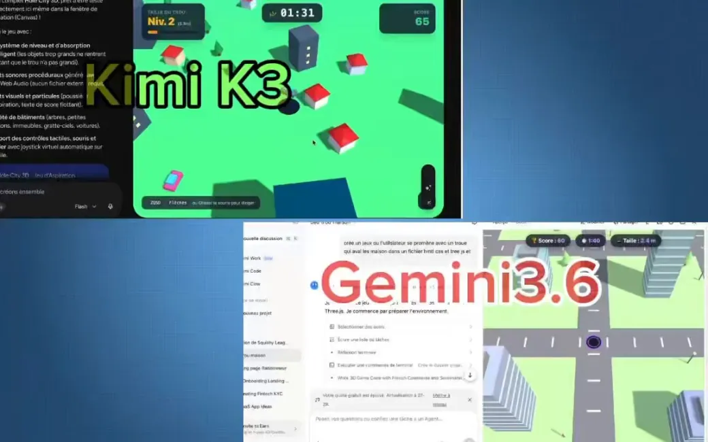</a>

**Prompt**

```text
Costruisci un gioco completo in stile Hole.io in HTML + Three.js in un solo tentativo.
```

[Vedi dettagli ↗](https://www.tripo3d.ai/it/3d-prompts/hole-io-style-three-js-game-2079898758427324573) · [Post originale](https://x.com/Oluwaphilemon1/status/2079898758427324573) · [Torna agli esempi](#all-prompts)

---

<a id="single-file-webgl2-black-hole-raytracer-2079590483727442205"></a>

### Prompt Kimi K3 per un ray tracer di buco nero WebGL2 in un file

[Harsh](https://x.com/devloper_hs) · 2026-07-21 · Kimi K3 · Animazione

<a href="https://www.tripo3d.ai/it/3d-prompts/single-file-webgl2-black-hole-raytracer-2079590483727442205">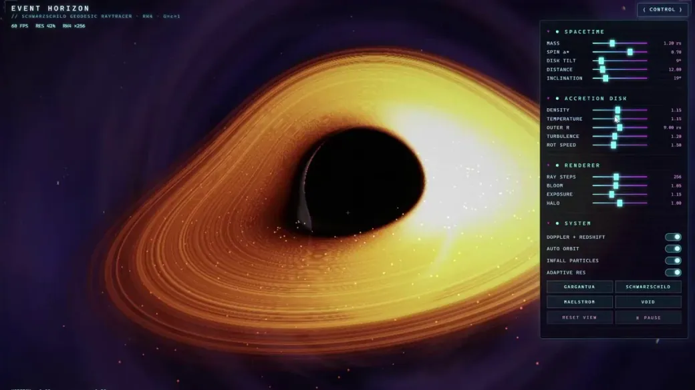</a>

**Prompt**

```text
Crea un singolo file HTML completo e autonomo, senza librerie esterne come Three.js, che implementi un ray tracer geodetico in tempo reale per un buco nero di Schwarzschild ispirato a Gargantua.

Usa WebGL2 puro con GLSL ES 3.00 in un solo fragment shader. Implementa fisica accurata: integrazione delle geodetiche nulle con un solutore Runge-Kutta del quarto ordine, orizzonte degli eventi, sfera dei fotoni, disco di accrescimento renderizzato correttamente, lente gravitazionale, intensificazione Doppler e spostamento gravitazionale verso il rosso. Punta a 60 FPS stabili.

Includi orbita e zoom di camera via mouse e un pannello cyberpunk con cursori per parametri come massa, rotazione, densità del disco e angolo di vista. Aggiungi effetti discreti di particelle per la materia in caduta e luci e ombre dinamiche.

Il risultato deve essere completo al 100%, immediatamente eseguibile in un browser moderno, senza schermi neri, NaN, errori o funzioni mancanti. Dai la massima priorità a correttezza numerica, gestione dei limiti, rigore del solutore e accuratezza fisica. Verifica e commenta nel codice le equazioni fisiche principali. Rendilo spettacolare e interattivo come una demo o un gioco di fisica di alta qualità.
```

[Vedi dettagli ↗](https://www.tripo3d.ai/it/3d-prompts/single-file-webgl2-black-hole-raytracer-2079590483727442205) · [Post originale](https://x.com/devloper_hs/status/2079590483727442205) · [Torna agli esempi](#all-prompts)

---

<a id="voxel-soccer-animation-in-a-single-html-file-2079553757302710442"></a>

### Prompt di calcio a voxel Three.js per un unico HTML

[Thành](https://x.com/Zmthanh) · 2026-07-21 · Kimi K3 · Animazione

<a href="https://www.tripo3d.ai/it/3d-prompts/voxel-soccer-animation-in-a-single-html-file-2079553757302710442">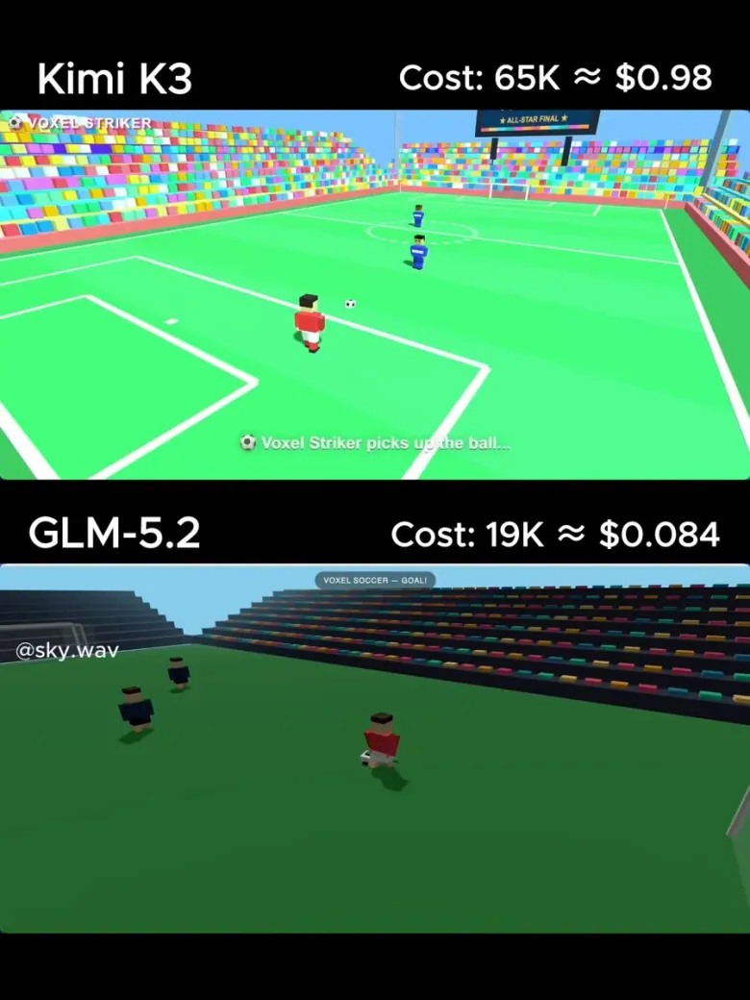</a>

**Prompt**

```text
Crea un singolo file HTML con Three.js (CDN) per una semplice animazione di calcio in stile voxel. Un giocatore a blocchi dribbla 2 difensori e segna un gol spettacolare con particelle di festeggiamento. Stadio colorato. Restituisci SOLO il codice HTML completo.
```

[Vedi dettagli ↗](https://www.tripo3d.ai/it/3d-prompts/voxel-soccer-animation-in-a-single-html-file-2079553757302710442) · [Post originale](https://x.com/Zmthanh/status/2079553757302710442) · [Torna agli esempi](#all-prompts)

---

<a id="modeling-new-york-city-in-blender-2079387760478073087"></a>

### Prompt Fable 5 per modellare New York in Blender

[Martin Puli](https://x.com/MartinPulitano) · 2026-07-21 · Claude Fable 5 · Scene

<a href="https://www.tripo3d.ai/it/3d-prompts/modeling-new-york-city-in-blender-2079387760478073087">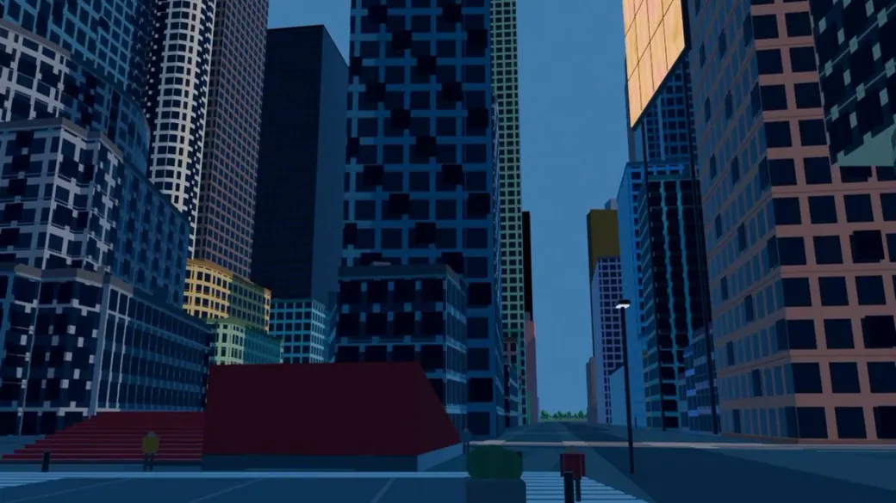</a>

**Prompt**

```text
Questa è New York. Un agente l'ha costruita da solo, con UN prompt. Non ho mosso un dito. Ancora non riesco a crederci.

Qualche giorno fa ho trovato post di persone che modellavano in Blender con GPT 5.6 Sol e non riuscivo a pensare ad altro. Dovevo provarlo con qualcosa di reale.

Ho cominciato da casa mia. È venuta malissimo: deformata, grigia, come un plastico di plastica.

Avrei potuto fermarmi. Ma ho cominciato a iterare.

Ho messo insieme agenti che cercano dati reali del luogo da mille fonti: impronte degli edifici, altezze, coordinate. Con Blender MCP + skill + librerie costruiscono il modello usando gli strumenti stessi di Blender.

Quando il sistema era pronto ho digitato un prompt: “costruisci New York”.

Mi ha restituito Manhattan. Misure reali, posizione precisa al metro, senza che toccassi un vertice.

Non mi aspettavo che, provando vari modelli, GPT 5.6 Sol battesse Fable 5 di TANTO in questo compito.

Sono passati solo pochi giorni. Sto ancora rifinendo i dettagli degli edifici. Nei video precedenti sul mio profilo si vede quanto sia migliorato da un aggiornamento all'altro.

Ora provo a coprire più area e dettaglio con un solo prompt. (Se conoscete texture e materiali in Blender, vi ascolto 🙏).

Ma a sorprendermi davvero non è il modello. È ciò che diventa possibile dopo.

Il .blend resta vivo. Con poche frasi puoi aggiungere una torre, spostare un viale o fondere città intere. Buenos Aires sopra New York. L'Obelisco nel mezzo di Times Square.

Non sto modellando una città. Sto trasformando la realtà in una bozza modificabile.

Repository + .blend nel primo commento 👇 Continuerò a pubblicare qui ogni passaggio. Se vi piace come procede, seguitemi: siamo solo all'inizio.

Quale città volete che modelli adesso?
```

[Vedi dettagli ↗](https://www.tripo3d.ai/it/3d-prompts/modeling-new-york-city-in-blender-2079387760478073087) · [Post originale](https://x.com/MartinPulitano/status/2079387760478073087) · [Torna agli esempi](#all-prompts)

---

<a id="single-file-three-js-voxel-soccer-animation-2079198084689723560"></a>

### Prompt Fable 5 per un'animazione di calcio a voxel in Three.js in un file

[Thành](https://x.com/Zmthanh) · 2026-07-20 · Claude Fable 5 · Animazione

<a href="https://www.tripo3d.ai/it/3d-prompts/single-file-three-js-voxel-soccer-animation-2079198084689723560">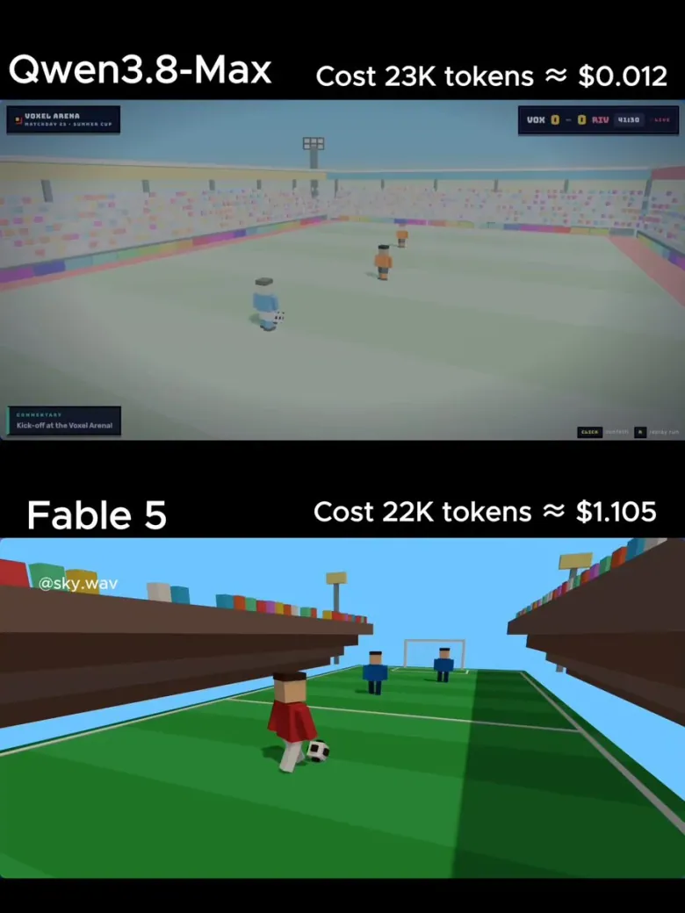</a>

**Prompt**

```text
Crea un singolo file HTML con Three.js (CDN) per una semplice animazione di calcio in stile voxel. Un giocatore a blocchi dribbla 2 difensori e segna un gol spettacolare con particelle di festeggiamento. Stadio colorato. Restituisci SOLO il codice HTML completo.
```

[Vedi dettagli ↗](https://www.tripo3d.ai/it/3d-prompts/single-file-three-js-voxel-soccer-animation-2079198084689723560) · [Post originale](https://x.com/Zmthanh/status/2079198084689723560) · [Torna agli esempi](#all-prompts)

---

<a id="three-js-airplane-walkthrough-experience-2078806166122197132"></a>

### Prompt Three.js per visitare un aereo dall'interno

[FHILY👑](https://x.com/Oluwaphilemon1) · 2026-07-19 · Claude Fable 5 · Interattivo

<a href="https://www.tripo3d.ai/it/3d-prompts/three-js-airplane-walkthrough-experience-2078806166122197132">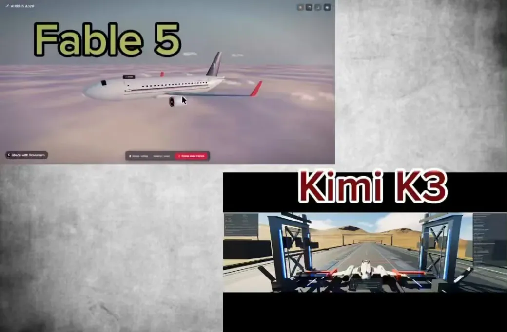</a>

**Prompt**

```text
Genera in Three.js un'esperienza che mi permetta di visualizzare un modello 3D di aereo e camminarci dentro.
```

[Vedi dettagli ↗](https://www.tripo3d.ai/it/3d-prompts/three-js-airplane-walkthrough-experience-2078806166122197132) · [Post originale](https://x.com/Oluwaphilemon1/status/2078806166122197132) · [Torna agli esempi](#all-prompts)

---


[Catalogo completo](catalog.it.md) · [←](catalog.it.8.md) · **9 / 9**

<p align="center"><strong><a href="https://www.tripo3d.ai/it/3d-prompts?utm_source=github&amp;utm_medium=referral&amp;utm_campaign=awesome_3d_prompts&amp;utm_content=catalog_footer">Catalogo completo →</a></strong></p>
