<!-- Generated from Growth CMS by templates/catalog.md. Edit content in CMS; run npm run sync. -->

# Awesome 3D Prompts — 1 / 9

[← Awesome 3D Prompts](../README.md)

<p>
  <a href="../docs/catalog.en.1.md"></a>
  <a href="../docs/catalog.zh.1.md"></a>
  <a href="../docs/catalog.zh-Hant.1.md"></a>
  <a href="../docs/catalog.ja.1.md"></a>
  <a href="../docs/catalog.ko.1.md"></a>
  <a href="../docs/catalog.es.1.md"></a>
  <a href="../docs/catalog.pt.1.md"></a>
  <a href="../docs/catalog.de.1.md"></a>
  <a href="../docs/catalog.fr.1.md"></a>
  <a href="../docs/catalog.it.1.md"></a>
  <a href="../docs/catalog.ru.1.md"></a>
  <a href="../docs/catalog.tr.1.md"></a>
  <a href="../docs/catalog.uk.1.md"></a>
  <a href="../docs/catalog.vi.1.md"></a>
</p>

[全カタログ](catalog.ja.md) · **1 / 9** · [→](catalog.ja.2.md)

<a id="all-prompts"></a>

<details>
<summary>作例を見る (50)</summary>

- [Crazy Tanks — 3Dアイランド砲撃戦](#crazy-tanks-3d-island-artillery)
- [Claudeの成長トレーニングモンタージュ](#claude-opus-5-5-2102788371114246177)
- [Three.jsでピクサー級の90年代アニメーションを制作](#claude-opus-5-5-2102788223835463902)
- [チェスのガンビットを学ぶインタラクティブ3D盤](#gpt-6-astra-2102788013902213508)
- [コードで作るシームレスな水循環アニメーション](#claude-opus-5-5-2102781807179735211)
- [ブラウザで操作できる中世ヨーロッパ風3D城](#gpt-6-astra-2102780850706567390)
- [CatWalk：夜の街を駆ける3D横スクロール猫ゲーム](#claude-opus-5-5-2102775461701091531)
- [Orbit Lab：太陽・地球・月の3Dシミュレーション](#gpt-6-astra-2102752217375899659)
- [『ラストトレイン』サイバーパンク巨大都市ベンチマーク](#claude-opus-5-5-2102740078347087940)
- [ボクセル風サッカーアニメーション](#claude-opus-5-5-2102739444256383089)
- [想像上の惑星を扱うインタラクティブなウェブサイト](#claude-opus-5-5-2102729710174196022)
- [中世の城のブラウザアニメーション](#gpt-6-astra-2102672926285713456)
- [Claude Opus 5で制作したTripo 3Dプロモーション映像](#tripo-claude-opus-5-5-paper-cut-3d-short)
- [インタラクティブなオイラー型ネオン流体シミュレーション](#claude-opus-5-5-2102565611473661963)
- [日本の桜の谷を描くインタラクティブ3D景観Webページ](#claude-opus-5-5-2102565403109085669)
- [Hundenbergの事故モデルとリアルな動画](#claude-opus-5-5-2102547809140355250)
- [画像をもとにしたハンドボールコートの360度3Dレンダリング](#claude-opus-5-5-2102544406117286004)
- [画像から作るプロシージャルなThree.js 3Dメインメニュー背景](#claude-opus-5-5-2102544196808667471)
- [自走式3Dルーブ・ゴールドバーグ・マシン](#claude-opus-5-5-2102544078927741369)
- [インタラクティブなピーターラビット風の農場動物ゲーム](#claude-opus-5-5-2102538762731565085)
- [夕暮れを航海する映画的なインタラクティブ海賊船](#claude-opus-5-5-2102533729746882985)
- [無限にプロシージャル生成されるThree.jsワールド](#claude-opus-5-5-2102529695908806728)
- [内装付きの郊外の2階建て住宅](#gpt-6-astra-2102473710724919614)
- [インタラクティブな群集避難シミュレーション](#claude-opus-5-5-2102467667978572092)
- [Battle City 3D：エンドレス戦車ディフェンス](#battle-city-3d)
- [インタラクティブな3D先史時代の島](#claude-opus-5-5-2102450239923720440)
- [Sir, We Have Orc Problems風のTDゲーム](#gpt-6-astra-2102411087002112256)
- [東京タワーの昼夜3Dシーンと動画](#gpt-6-astra-2102276620124062065)
- [バブルベイ：3D水風船バトル](#bubble-bay)
- [インタラクティブな3Dヘリコプター設計プレゼンテーション](#gpt-6-astra-2102215638311694336)
- [Spline Rush：プロシージャル生成ブラウザーレーシングゲーム](#gpt-6-astra-2102150615635816866)
- [インタラクティブな3D太陽モデルのウェブサイト](#gpt-6-astra-2102038136725377200)
- [Verdant — インタラクティブな3D恐竜アイランド](#gpt-6-astra-2101730386711634251)
- [Three.jsでWALL-Eの3Dモデルを作成](#gpt-6-astra-2101687900723106104)
- [外洋を進む帆船](#gpt-6-astra-2101616345720787130)
- [TITANIC — 最後の光](#titanic-the-last-light)
- [Waymo Jaguar I-Paceの3Dモデル](#gpt-6-astra-2101325346427842909)
- [カンフー猫の3Dアニメーションと動画制作ワークフロー](#gpt-6-astra-2101310374033428642)
- [インタラクティブな3D航空機エンジン展示](#gpt-6-astra-2101271938706685991)
- [フォトリアルな3D環境をまるごと制作](#gpt-6-astra-2101224659861590399)
- [現実の軌道物理学に基づく銀河](#gpt-6-astra-2101055500599054437)
- [Monster Block — 45秒で街を破壊せよ](#monster-block)
- [インタラクティブなIWC Schaffhausen腕時計モデル](#gpt-6-astra-2100956517633761447)
- [ODD ARMS — 奇妙な武器のサバイバルゲーム](#odd-arms)
- [フォトリアルな3Dワールドを構築](#gpt-6-astra-2100844566718926949)
- [浮遊する島々を結ぶ3D空中トラムゲーム](#gpt-6-astra-2100838090210431302)
- [Sharpaの多指ロボットハンドでペン回しの方策を学習](#gpt-6-astra-2100751369619820923)
- [CADでボディを自作](#gpt-6-astra-2100614534423540102)
- [閉鎖研究施設から脱出するブラウザー3Dゲーム](#gpt-6-astra-2100595652703199281)
- [3Dレーシングゲームを作る](#gpt-6-astra-2100526922770026874)

</details>
<a id="crazy-tanks-3d-island-artillery"></a>

### Crazy Tanks — 3Dアイランド砲撃戦

[jared](https://x.com/jaredliu_bravo) · 2026-09-24 · GPT-6 Astra · ゲーム

<a href="https://www.tripo3d.ai/ja/3d-prompts/crazy-tanks-3d-island-artillery">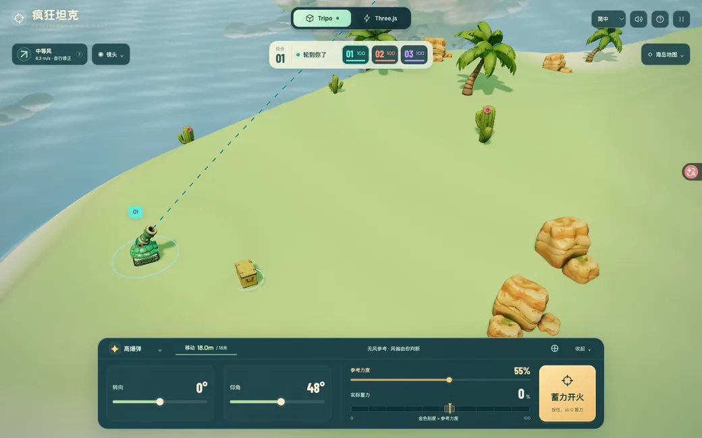</a>

**プロンプト**

```text
1. プロジェクトの目的
熱帯の島を舞台にした、プレイ可能で本格的な3Dターン制砲撃ゲーム「Crazy Tanks — Wild Tides」を制作する。プレイヤーは小型戦車を操り、風を読み、ゼロからチャージするタイミングを見極め、砲弾で戦場の地形を変形させる。AIとのソロプレイと、ローカルで交代しながら遊ぶパス＆プレイに対応し、デフォルトでは3台の戦車によるバトルロイヤル形式、任意で2台のデュエルを選べるようにする。最後まで生き残った戦車が勝者となる。現在のリファレンスゲームプレイとスクリーンショットをビジュアルの目標にする。

2. ビジュアルスタイル
パースペクティブカメラと自由に回転できる3Dジオメトリを使い、平面スプライトや固定されたサイドビューにはしない。明るい日差しのミニチュアジオラマとして、丸みを帯びた翡翠色、コーラルオレンジ、青紫色の戦車、クリーム色の砂、淡い緑の草、ターコイズ色の反射する水面、柔らかな影、遠景の薄い大気ハイズを表現する。3台の戦車はそれぞれ異なるシルエットと、対応する砲身を維持する。戦場の上にはコンパクトなクリーム色の円形／装甲パネル、下には濃いティール色の丸みを帯びたコントロールデッキを配置する。ゴールドはリファレンスのパワーと発射アクション、ミント色は実際のチャージ量と味方ステータスに使う。Tripo / Three.jsの外観切り替えを画面上部で目立たせ、初期状態ではTripoアセットを使用する。外観を切り替えても、対戦状態と物理状態は維持する。画面空間上に細く均等な間隔のティール色の破線を使い、着弾円は控えめにする。照準グラフィックを水面に反射させない。

3. ワールドとシーン
およそ260×184メートルの破壊可能なハイトフィールドの島を使用し、一定の海面高度の海で周囲を囲む。開始時の戦車は安定した地面に離して配置し、岩、ヤシ、サボテン、収集可能な補給クレートを分散させる。小さな装飾用の島は背景に奥行きを加えるためのものであり、破壊可能なメイン地形の代わりにはしない。爆発で地表を変形させ、海面より下まで掘り下げられるようにする。重なった平面によるちらつきを避けるため、海岸線の色と波の泡は1つの水面で表現する。毎フレームのレンダリング時に、ワールド座標から戦車番号を投影表示する。全軌道、戦車、オービット、戦術オーバーヘッドの各カメラビューを用意する。軌道ビューでは、発射する戦車、弧を描く軌道、推定着弾位置がHUDとコントロールデッキの間に収まるようにする。各射撃の前に約0.8秒間、発射する戦車を表示し、砲口付近で一瞬止まってから砲弾を追従する。手動でカメラを操作した場合は、シネマティックな追従をキャンセルする。

4. アセット一覧
安定したモデルスロットを使用し、差し替えモデルを個別に指定できるようにする。
- jade-body：丸みを帯びた緑色の盾型履帯ボディ。プレイヤーの初期ボディ。jade-cannon：対応する翡翠色の砲身。暗い砲腔とゴールドのアクセントを備え、独立して可動させる。
- ember-body：先端が尖ったコーラルオレンジ色の装甲ボディ。低いメカニカルなシルエット。ember-cannon：対応する、より長いオレンジ色の砲身と暗い砲口。
- bolt-body：青紫色の工業的な履帯ボディ。角張った装甲プレートを備える。bolt-cannon：対応する太い青色の砲身。
- shell：暗い先細りの弾頭とシアン色のアクセントを備えた真鍮製の砲弾。武器ごとの色味とスケールを適用して再利用する。
- crate：シアン色のマーキングと補強された角を備えた黄色い装甲補給ボックス。回収するとアーマーを20回復する（上限100）。
- rock：温かみのある丸い砂岩の塊。スケールを変えて繰り返し配置し、別のコリジョンプロキシを使用する。
- palm：曲がった幹と層状の緑の葉。島の植生として繰り返し配置する。
- cactus：小さな花のディテールを備えたコンパクトな緑色のサボテン。乾いた地形に繰り返し配置する。
- islet：淡い岩／砂の縁を持つ、丸みを帯びた草地の背景島。アリーナの外側に繰り返し配置する。
対応する3組のボディ／砲身を最優先し、次に砲弾／クレート、環境プロップを作成する。地形変形、海、泡、炎、煙、衝撃波、破片、照準グラフィック、ライティング、UI、コリジョンプロキシはプロシージャルにする。対応するボディと砲身のパーツは、1つのデザインリファレンスとスケールを共有する。砲身のピボットは機械的な接合部に置き、前方軸を+Xに合わせ、見た目の砲口を物理的な発射位置として使用する。戦車のボディはクォータニオンで斜面に沿わせ、砲塔の照準はワールド空間の方向として維持する。元データのPBRテクスチャとUVシームを保持する。フル解像度でダウンロード可能なモデルは、最適化したゲーム実行時コピーと分離する。リファレンスとファイルの出典情報には、実際の生成元を明記する。

5. ゲームプレイとフィードバック
生存している各戦車は、ターン開始時に18メートル移動できる。WASDと移動パッドは画面基準で移動し、矢印キーと照準パッドは方位角と仰角を調整する。スライダーでは方位角、10～80度の仰角、0～100のリファレンスパワーを設定する。ライバルを選択するとその方向を向くだけで、射撃解を自動計算してはならない。
ティール色の弧は、風がない場合に選択したリファレンスパワーでの軌道を予測する。チャージ中はそのリファレンス値とゴールドのマーカーを固定する。Fire、Space、Enter、またはフォーカス中のFireボタンを長押しすると、実際のパワーを毎回0から開始する。1秒あたり18パーセントポイントずつ増加させ、100で保持し、離した瞬間の実際のパワーで1回だけ発射する。素早くタップした場合は弱い射撃になる。リファレンス値の±3パーセントポイントにあるゴールドの帯は視覚的なフィードバックにのみ使い、スナップや隠れた補正は行わない。ポインターのキャンセル、ウィンドウのフォーカス喪失、表示状態の喪失時はキャンセルする。チャージ中は移動、ターゲット、照準の変更をロックする。range inputのキーボード操作で砲塔まで回転させない。パワー0は最低発射速度を意味し、砲弾が静止するわけではない。
矢印と目に見える風の流線で、風が砲弾を押す方向を示す。風力とメートル毎秒を表示し、風のカードをクリックすると説明を表示する。風が左から吹く場合、プレイヤーはやや右を狙う必要がある。風が強いほど、また飛翔時間が長いほど、横流れは大きくなる。1回の射撃中は風を一定に保ち、ターンごとに変化させる。プレイヤーのプレビューに自動補正を加えない。地形への着弾位置は概算で予測し、プレビューで戦車／岩との衝突、クラスターの分裂、跳弾を保証しない。
6種類のペイロードを用意する：無制限のHE弾、5個の子弾に分裂して降下するクラスター弾、直径最大28メートル・深さ最大13メートルのクレーターを作るSeismic、2回跳ね返る跳弾、戦車1台につき1発で直径最大46メートル・深さ最大22メートルのクレーターを作るCataclysm、半径12メートルの炎上エリアを残すIncendiary。炎上エリアは6回のアクション終了時にそれぞれ8ダメージを与える。外へ移動すればダメージを回避でき、重なったエリアの効果は累積しない。海水で炎は消える。砲身を上げた状態も含め、戦車全体が完全に水中に入ると即座に撃破する。実際のダメージ、アーマーの減少、地形の崩壊、水しぶき、撃破結果を表示する。
多層の火球、拡大する衝撃リング、発光する火花、弾道の破片、土煙、煙を使い、カメラシェイクは控えめにする。提供されたオリジナルのElevenLabs製の音楽と、砲撃、着弾、跳弾、大爆発、炎、水しぶきの効果音を使用する。サウンド切り替え、一時停止／再開、説明、リプレイ、メニューに戻る機能を含める。砲弾の飛翔中やAIターン中は「自分のターンに戻る」を選べるようにし、同じ固定ステップのシミュレーションを高速実行して、ダメージ、地形、危険エリアの結果をすべて保持する。ローカル対戦の友達の入力ターンは絶対にスキップしない。

6. 技術実装
ES modulesとViteを使用したThree.js、ローカルにバンドルしたフォント、エフェクト用のWeb Audio、ループ音楽用のHTML audio要素を使う。リソースは同一オリジンに置き、静的ビルドに対応する。アンチエイリアスを有効にしたパースペクティブレンダラーを使用し、シャドウとポストプロセスの予算を現実的に設定する。使い捨てのジオメトリ／マテリアルは適切に破棄する。モデルの装飾とゲームプレイ用のコリジョンを区別する。
レンダリングとは独立した決定論的な物理演算を行い、単位はメートル／秒、重力は9.81 m/s²、固定ステップは1/120秒とする。高速な砲弾と地面、水、戦車、岩との衝突には連続スイープ衝突判定を使い、吹き飛ばされた戦車には爆発の衝撃と重力を適用する。発射位置は実際の戦車固有の砲身トランスフォームから求める。通常再生と早送りは同じシミュレーション更新処理を呼び出す。ダメージと風の反応は、工学的な爆発シミュレーターではなく、ゲーム用にデフォルメしたルールとする。
UIは中国語、英語、日本語、韓国語に対応する。初回はデバイスの言語を使用し、香港、マカオ、台湾、繁体字中国語のデバイスでは英語を初期設定にする。明示的な選択を記憶し、表示状態の言語セレクターを用意する。デスクトップ、縦向きスマートフォン、短い横向きレイアウトに対応し、画面の短い端末ではメニューをスクロール可能にする。タッチしやすいサイズの操作ターゲット、折りたたみ可能なパネル、操作要素が重ならないレイアウトを採用する。タッチデバイスでキーボード入力を必須にしない。開発専用の状態変更処理と照準ヘルパーは本番環境から除外する。

7. 完了条件
編集可能なスタンドアロンのソースプロジェクト、ロックファイル、npmでの開発／ビルド手順、動作する静的プレビューを納品する。クリーム色のステータスパネル、固定されたゴールドのリファレンスマーカー、ゼロから始まる実チャージ、完全3Dの戦車／島の表現を含め、現在のスクリーンショットとゲームプレイ動画に合わせる。初回起動、モデルの読み込み、ターンサイクル全体、各ペイロードの挙動、一時停止、リプレイ、実際の勝敗結果を検証する。外観切り替えで状態が維持されること、キーボード／タッチ操作のキャンセルで発射されないことを確認する。風のない明確なテスト射撃では、リファレンスパワーで離すとリファレンス円の近くに着弾するようにする。逆向きの横風では、円を固定したまま実際の砲弾が目に見えて横にずれることを確認する。30/60/144 Hzでの挙動、高速衝突判定、深いクレーター、炎の消滅、完全な水没による撃破、通常再生と早送りでのターン結果の一致を確認する。4言語すべてでデスクトップと狭い画面のレイアウトを確認し、ブラウザエミュレーションと実機テストを分けて記録する。ローカルビルドだけでなく、ホスティングされたページとリンク先メディアも検証する。

```

[詳細を見る ↗](https://www.tripo3d.ai/ja/3d-prompts/crazy-tanks-3d-island-artillery) · [デモ](https://super-tanks-aftershock.tripo.page/) · [作例一覧に戻る](#all-prompts)

---

<a id="claude-opus-5-5-2102788371114246177"></a>

### Claudeの成長トレーニングモンタージュ

[Ishu Agrawal](https://x.com/ishuagra02) · 2026-09-23 · Claude Opus 5.5 · アニメーション

<a href="https://www.tripo3d.ai/ja/3d-prompts/claude-opus-5-5-2102788371114246177"></a>

**プロンプト**

```text
カンフー・パンダのトレーニングシーンに着想を得た、成長モンタージュの30秒アニメーションを、すべてコードで制作してください。主人公はClaudeのマスコットとし、初回リリース以降、インターネット検索、コードの記述、3Dモデルの制作、人類が抱える最も難しい問題の解決など、さまざまな能力を高めていく様子を描いてください。感情を揺さぶる音楽も付けてください。
```

<details>
<summary>作者の元のプロンプト</summary>

```text
Create a 30 second animation entirely in code featuring a growth montage, inspired by Kung Fu Panda's training sequence, with the Claude mascot as the main character, showcasing it getting more capable since its initial release across its skillset, such as searching the internet, writing code, creating 3D models, and solving humanity's hardest problems, with emotionally impactful music.
```

</details>

[詳細を見る ↗](https://www.tripo3d.ai/ja/3d-prompts/claude-opus-5-5-2102788371114246177) · [元の投稿](https://x.com/ishuagra02/status/2102788832273801700) · [作例一覧に戻る](#all-prompts)

---

<a id="claude-opus-5-5-2102788223835463902"></a>

### Three.jsでピクサー級の90年代アニメーションを制作

[Shimecki](https://x.com/scheemunai) · 2026-09-23 · Claude Opus 5.5 · アニメーション

<a href="https://www.tripo3d.ai/ja/3d-prompts/claude-opus-5-5-2102788223835463902"></a>

**プロンプト**

```text
ストーリーを考えてください。そしてThree.jsを使って、そのストーリーをもとに、ピクサー級のクオリティを持つ90年代風アニメーション作品をフルアニメーションで制作してください。
```

<details>
<summary>作者の元のプロンプト</summary>

```text
I want you to imagine a story. And then using threejs I want you to create full animation, Pixar-level quality 90s cartoon out of the story you imagine.
```

</details>

[詳細を見る ↗](https://www.tripo3d.ai/ja/3d-prompts/claude-opus-5-5-2102788223835463902) · [元の投稿](https://x.com/scheemunai/status/2102788223835463902) · [作例一覧に戻る](#all-prompts)

---

<a id="gpt-6-astra-2102788013902213508"></a>

### チェスのガンビットを学ぶインタラクティブ3D盤

[Diogo Santos](https://x.com/diogosantosbr) · 2026-09-23 · GPT-6 Astra · インタラクティブ

<a href="https://www.tripo3d.ai/ja/3d-prompts/gpt-6-astra-2102788013902213508">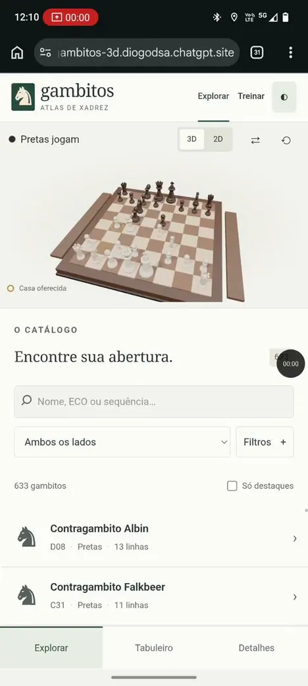</a>

**プロンプト**

```text
主要なチェスのガンビットを学べる、インタラクティブな3D盤を備えたWebアプリを作成してください。指し手のアニメーション、手順を進めたり戻したりする操作、変化手順、それぞれのオープニングの背後にある狙いを解説する機能を含めてください。
```

<details>
<summary>作者の元のプロンプト</summary>

```text
Crie uma aplicação web com um tabuleiro 3D interativo para estudar os principais gambitos do xadrez. Inclua animação dos movimentos, controles para avançar e voltar, variantes e explicações das ideias por trás de cada abertura.
```

</details>

[詳細を見る ↗](https://www.tripo3d.ai/ja/3d-prompts/gpt-6-astra-2102788013902213508) · [元の投稿](https://x.com/diogosantosbr/status/2102788013902213508) · [作例一覧に戻る](#all-prompts)

---

<a id="claude-opus-5-5-2102781807179735211"></a>

### コードで作るシームレスな水循環アニメーション

[Higgsfield AI 🧩](https://x.com/higgsfield_ai) · 2026-09-23 · Claude Opus 5.5 · アニメーション

<a href="https://www.tripo3d.ai/ja/3d-prompts/claude-opus-5-5-2102781807179735211">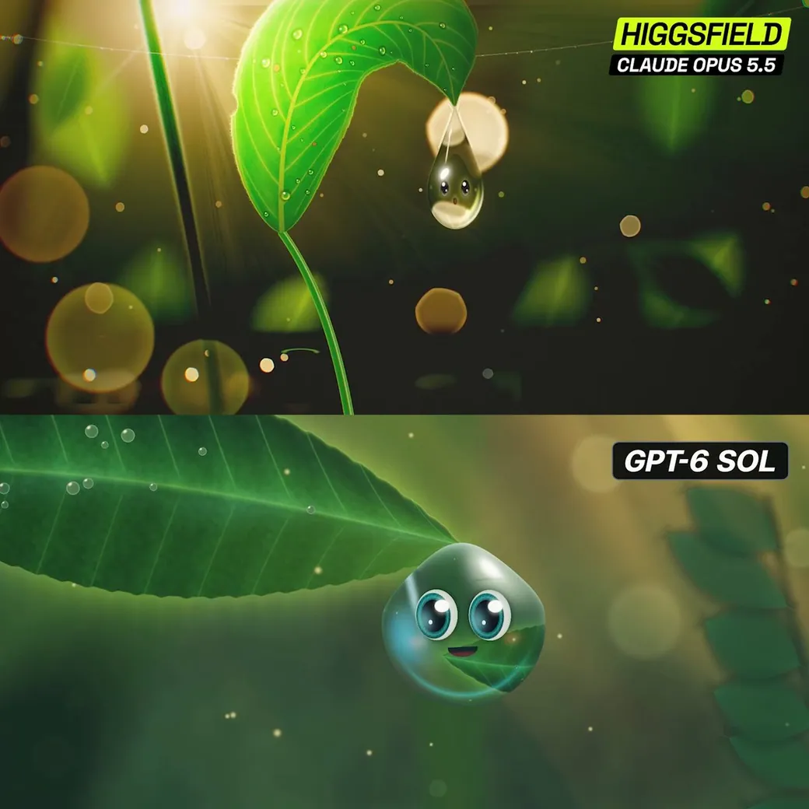</a>

**プロンプト**

```text
水循環をテーマにした、すべてコードで制作するシームレスなループアニメーションを作成してください。
```

<details>
<summary>作者の元のプロンプト</summary>

```text
Create a seamless looping animation of the water cycle, entirely in code.
```

</details>

[詳細を見る ↗](https://www.tripo3d.ai/ja/3d-prompts/claude-opus-5-5-2102781807179735211) · [元の投稿](https://x.com/higgsfield_ai/status/2102781807179735211) · [作例一覧に戻る](#all-prompts)

---

<a id="gpt-6-astra-2102780850706567390"></a>

### ブラウザで操作できる中世ヨーロッパ風3D城

[もぎ＠ボードゲーム](https://x.com/luxurytax150) · 2026-09-23 · GPT-6 Astra · シーン

<a href="https://www.tripo3d.ai/ja/3d-prompts/gpt-6-astra-2102780850706567390">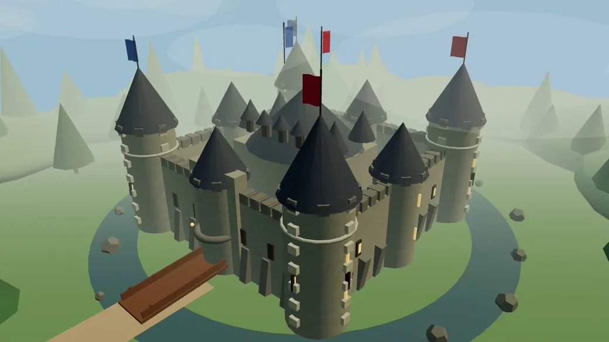</a>

**プロンプト**

```text
ブラウザで操作できる3Dの中世ヨーロッパ風の城を作る。水堀、跳ね橋、塔、石壁、旗、森、昼夜切替を入れる。 
これはベンチマークの一種であるから、どこまで見た目を盛れるか、3Dモデルの品質を最大限優先して。
```

[詳細を見る ↗](https://www.tripo3d.ai/ja/3d-prompts/gpt-6-astra-2102780850706567390) · [元の投稿](https://x.com/luxurytax150/status/2102780850706567390) · [作例一覧に戻る](#all-prompts)

---

<a id="claude-opus-5-5-2102775461701091531"></a>

### CatWalk：夜の街を駆ける3D横スクロール猫ゲーム

[BLITAST STUDIO](https://x.com/blitast_studio) · 2026-09-23 · Claude Opus 5.5 · ゲーム

<a href="https://www.tripo3d.ai/ja/3d-prompts/claude-opus-5-5-2102775461701091531">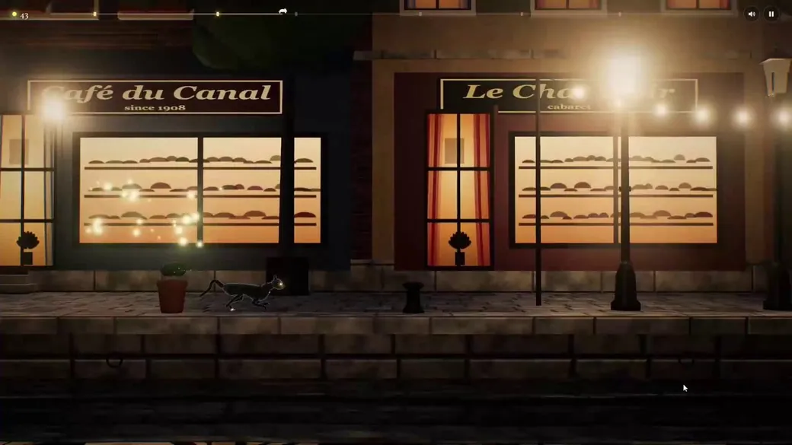</a>

**プロンプト**

```text
ゲームを開発しましょう
グラフィックは2D、3Dを問いませんがゲームのシステムなどを分析し開発しやすい方でいいです
個人的には3Dだが画面は横スクロールアクションみたいなものを想定してます
照明などでおしゃれな雰囲気などを出したいので3Dを使うことで美しい表現ができるのではないかと思っています（例：街灯やランタンのような表現など）
作りたいゲームは CatWalk というゲーム
名前の通りです
猫が横に進む
キャットウォークが続いており、画面は自動スクロールするので、その速さに合わせて障害物や穴をジャンプなどのシンプルな操作のみで越えていくスタイル。ある意味でフラッピー的な緊張感とシステムに近いかもしれない。
ただしグラフィックは大人かっこいい、雰囲気ゲーを目指したい
可能であれば猫のしなやかな歩き、走り、ジャンプが表現できればうれしい
ステージの世界観はお任せするが、最初は無難な夜のストリートなどでもいいかと
暗めにすることで間接照明などが美ししく表現できればかなり嬉しい
できることできないこと難しいことがあると思うので
この私の要望をヒントにあなたなりにできそうなものを開発してほしい
まずは１ステージのワンループができるように
```

[詳細を見る ↗](https://www.tripo3d.ai/ja/3d-prompts/claude-opus-5-5-2102775461701091531) · [元の投稿](https://x.com/blitast_studio/status/2102775632933654585) · [作例一覧に戻る](#all-prompts)

---

<a id="gpt-6-astra-2102752217375899659"></a>

### Orbit Lab：太陽・地球・月の3Dシミュレーション

[technewsradio.tokyo](https://technewsradio.tokyo/) · 2026-09-23 · GPT-6 Astra · インタラクティブ

<a href="https://www.tripo3d.ai/ja/3d-prompts/gpt-6-astra-2102752217375899659">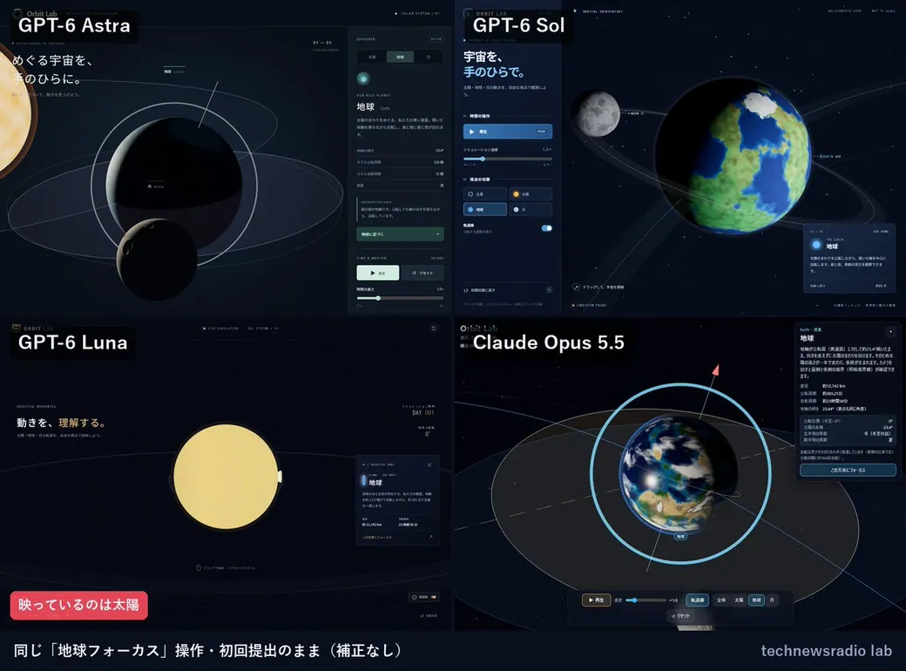</a>

**プロンプト**

```text
比較実験です。次の同一仕様のWeb作品を、あなたの作業ディレクトリに実装して完成させてください。名称は「Orbit Lab」。Three.js 0.186.0を使用し、同一バージョンの本体とOrbitControlsを読み込んでください（CDNのimport mapでもnpmでも可）。公開・デプロイは不要です。

要件:
1. 太陽・地球・月の3Dモデルを手続き的なジオメトリとマテリアルで表現。外部画像・3Dアセットは使わない。太陽を点光源とし、地球と月の明暗がカメラ操作で分かること。
2. 地球の公転と自転、地軸の傾き、月の公転をdelta timeで動かす。軌道面の傾きを視覚化し、地球と月の軌道線を表示する。スケールと速度は教育用の誇張でよい。
3. 恒星背景を再現可能な乱数で生成する。OrbitControlsで回転・ズーム。天体をクリックすると選択状態と説明パネルが切り替わる。
4. 再生/停止、速度スライダー、軌道線表示切替、太陽/地球/月へのカメラフォーカス、初期状態に戻すボタンを備える。キーボードでも再生/停止とリセットができる。
5. スマホ幅でも操作できる見た目、WebGL非対応時の案内、リサイズ対応、過剰な描画負荷を避けるピクセル比制限を入れる。
6. READMEに起動手順と操作方法を書く。可能なら実際に起動して動作確認し、できなければ理由を明記する。完了報告には作成ファイル、実装済み項目、確認結果を簡潔に書く。

途中で質問せず、合理的に判断して最後まで実装してください。
```

[詳細を見る ↗](https://www.tripo3d.ai/ja/3d-prompts/gpt-6-astra-2102752217375899659) · [元の投稿](https://technewsradio.tokyo/lab/gpt6-vs-opus55) · [作例一覧に戻る](#all-prompts)

---

<a id="claude-opus-5-5-2102740078347087940"></a>

### 『ラストトレイン』サイバーパンク巨大都市ベンチマーク

[BuilderHelm](https://x.com/builderhelmai) · 2026-09-23 · Claude Opus 5.5 · シーン

<a href="https://www.tripo3d.ai/ja/3d-prompts/claude-opus-5-5-2102740078347087940"></a>

**プロンプト**

```text
主役となる列車、プロシージャル建築、高架鉄道システム、雨、ボリューメトリックな大気、シネマティックライティング、複数のカメラセットアップ、完全なアニメーションシーケンスを備えたサイバーパンク巨大都市を、Blender内に構築してください。
```

<details>
<summary>作者の元のプロンプト</summary>

```text
build a complete cyberpunk megacity inside Blender with a hero train, procedural architecture, elevated rail systems, rain, volumetric atmosphere, cinematic lighting, multiple camera setups, and a full animated sequence.
```

</details>

[詳細を見る ↗](https://www.tripo3d.ai/ja/3d-prompts/claude-opus-5-5-2102740078347087940) · [元の投稿](https://x.com/builderhelmai/status/2102740078347087940) · [作例一覧に戻る](#all-prompts)

---

<a id="claude-opus-5-5-2102739444256383089"></a>

### ボクセル風サッカーアニメーション

[Delusionals](https://x.com/AGI_FromWalmart) · 2026-09-23 · Claude Opus 5.5 · アニメーション

<a href="https://www.tripo3d.ai/ja/3d-prompts/claude-opus-5-5-2102739444256383089"></a>

**プロンプト**

```text
Three.js（CDN）を使った、シンプルなボクセル風サッカーアニメーションを1つのHTMLファイルで作成してください。ブロック状の選手が2人のディフェンダーをドリブルでかわし、祝福のパーティクルが舞う華麗なゴールを決めます。カラフルなスタジアムの雰囲気にしてください。出力は完全なHTMLコードのみとしてください。
```

<details>
<summary>作者の元のプロンプト</summary>

```text
Create a single HTML file with Three.js (CDN) for a simple voxel-style soccer animation. A blocky player dribbles past 2 defenders and scores a spectacular goal with celebration particles. Colorful stadium look. Output ONLY the full HTML code.
```

</details>

[詳細を見る ↗](https://www.tripo3d.ai/ja/3d-prompts/claude-opus-5-5-2102739444256383089) · [元の投稿](https://x.com/AGI_FromWalmart/status/2102739444256383089) · [作例一覧に戻る](#all-prompts)

---

<a id="claude-opus-5-5-2102729710174196022"></a>

### 想像上の惑星を扱うインタラクティブなウェブサイト

[Kappaemme](https://x.com/Kappaemme1926) · 2026-09-23 · Claude Opus 5.5 · インタラクティブ

<a href="https://www.tripo3d.ai/ja/3d-prompts/claude-opus-5-5-2102729710174196022"></a>

**プロンプト**

```text
想像上の惑星をテーマにしたインタラクティブなウェブサイトを作成してください。
```

<details>
<summary>作者の元のプロンプト</summary>

```text
build an interactive website about imaginary planets.
```

</details>

[詳細を見る ↗](https://www.tripo3d.ai/ja/3d-prompts/claude-opus-5-5-2102729710174196022) · [元の投稿](https://x.com/Kappaemme1926/status/2102729710174196022) · [作例一覧に戻る](#all-prompts)

---

<a id="gpt-6-astra-2102672926285713456"></a>

### 中世の城のブラウザアニメーション

[juhapalomaki.fi](https://juhapalomaki.fi/) · 2026-09-23 · GPT-6 Astra · シーン

<a href="https://www.tripo3d.ai/ja/3d-prompts/gpt-6-astra-2102672926285713456">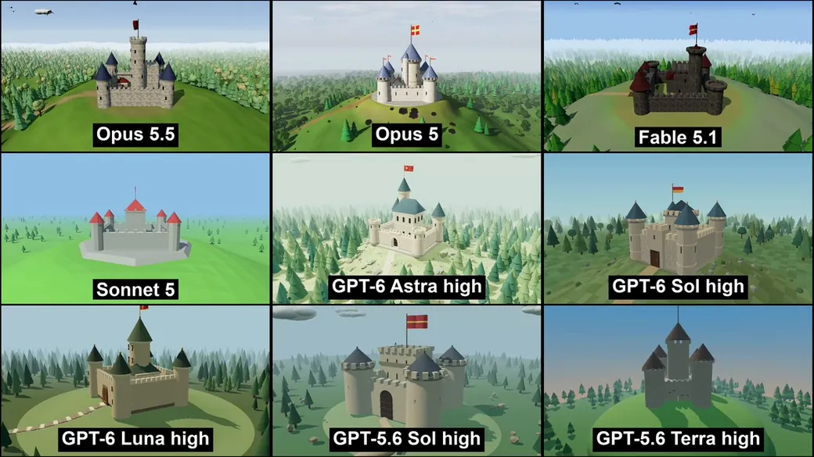</a>

**プロンプト**

```text
ブラウザだけで完全に動作する3Dアニメーションを作成してください。広大な森の中にある丘の頂上に建つ中世の城を登場させます。キーボード操作は追加せず、城をあらゆる方向から見られるように、カメラだけが城の周囲を回転するようにしてください。城の塔の頂上には、風になびく旗を設置してください。

実行すると城を表示し、ループアニメーションを開始するindex.htmlファイルを出力してください。
```

<details>
<summary>作者の元のプロンプト</summary>

```text
Create a 3d animation that runs completely in browser. The animation features a medieval castle, sitting on top of a hill that is located on large forest. Do not add any keyboard controls, just make the camera spin around the castle so that we see it from all sides. On top of the castle tower there should be a flag that waves in the wind.

The output should contain index.html file that when executed shows the castle and starts the looping animation.
```

</details>

[詳細を見る ↗](https://www.tripo3d.ai/ja/3d-prompts/gpt-6-astra-2102672926285713456) · [元の投稿](https://juhapalomaki.fi/blog/castle-model-comparison/) · [作例一覧に戻る](#all-prompts)

---

<a id="tripo-claude-opus-5-5-paper-cut-3d-short"></a>

### Claude Opus 5で制作したTripo 3Dプロモーション映像

[tripo3d](https://x.com/tripoai) · 2026-09-23 · Claude Opus 5 · アニメーション

<a href="https://www.tripo3d.ai/ja/3d-prompts/tripo-claude-opus-5-5-paper-cut-3d-short">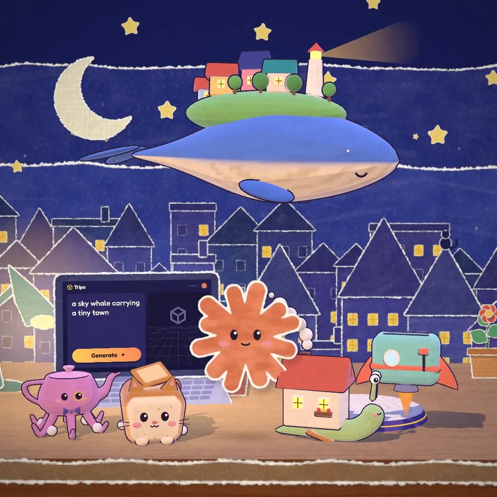</a>

**プロンプト**

```text
1. プロジェクトの目的
「Claude × Tripo」と題した、約44秒のインタラクティブなアニメーションショートを制作します。小さなオレンジ色のClaudeのスパークが手作りの紙の机に舞い降り、Tripoブランドのノートパソコンで5つの遊び心あふれるアイデアをスケッチまたは入力すると、それらの創作物が命を吹き込まれていきます。視聴者はアニメーションの再生・一時停止・シーク・リプレイ、アスペクト比の変更、サウンドの有効化、録画を行えます。これは演出されたショート作品であり、スコア、戦闘、勝利条件はありません。提供された動画とシーン構成を再現してください。

2. ビジュアルスタイル
破れたクリーム色の縁、ガッシュの粒子感、手描きの線、方眼紙のディテール、ミッドナイトブルーの空を取り入れた、レイヤー構造のペーパーカット風ジオラマにします。クレセントムーン、暖色の黄色い星、青い紙の丘、小さな町をクラフト紙の机の背後に重ねます。開いたノートパソコンを左、Claudeを中央付近、小さな円形のディスプレイ台を右に配置します。暖色のオレンジ、ライラック、ミント、バターイエロー、クリーム色のアクセントを維持します。パースカメラはワイドショットとクローズアップの間をゆっくり移動し、深度ごとに分けた平面の切り抜きでパララックスを生み出します。段階的なカートゥーン調ライティング、クールなリムライト、控えめな輪郭線、柔らかな影、最後に紙の質感とビネットのポストエフェクトを使います。最後は白いカメラフラッシュで締め、キャスト全員を写した、少し傾いてテープで留められたポラロイド写真を表示します。冒頭、各創作物の登場シーン、全員が揃うフィナーレで、参照動画のフレーミングを合わせてください。

3. シーンとストーリー
すべてのポーズとカメラを、単一の決定論的なupdate(t)から駆動し、任意のタイムスタンプへ直接シークしても、過去のフレームを再生し直さず正しいフレームが表示されるようにします。ストーリーのビートは1つの共有スケジュールで管理します。Claudeは約0.55秒に到着し、約1.7秒に着地、2.92秒にノートパソコンを起動します。パンの猫は約7.2秒、カタツムリの家は約13.85秒、トースター型ロケットは約19.8秒、ティーポットのタコは約26.1秒、空飛ぶクジラは約33.3秒に登場させます。ロケットは約21.25秒に発射し、約24.05秒に戻ります。クジラは約35～37秒に全員の上を泳ぎます。カメラフラッシュは40.5秒に発生させ、44.2秒で終了します。カメラショットを滑らかにつなぎ、イーズ付きの予備動作、スプリングによるオーバーシュート、スクワッシュ＆ストレッチ、小さな跳ね、減衰する揺れを使います。シーン間の切り替えで急にリセットされないようにしてください。

4. アセット一覧
- claude-spark：クリーム色の破れた縁を持つ、平面的なオレンジ色の12本の光線のスパーク。親しみやすい表情を持ちます。まばたきし、現在の動作を見つめ、笑顔や赤面を見せ、喜び・目が回る表情・きらめく目を使います。2本の光線を腕のように伸ばし、キーや絵、ほかのキャラクターに手を伸ばします。顔と腕の動きはプロシージャルシェーダーとして保持してください。静的な書き出しでは、このキャラクターの個性や演技を再現できません。
- cat：丸みのある体、焼き色のついたクラスト模様、小さな耳、前足、尻尾、光沢のある目、ピンクの頬、ひげを持つ、黄金色のパン型の猫。ディスプレイ台に現れ、確認のために回転し、なでられた後、机の手前に落ち着きます。
- snail：サンゴ色の屋根、煙突、光る窓、小さなフラワーボックスが付いたクリーム色の家を背負う、淡い緑色のカタツムリ。持ち上げて滑らせる間も、目の柄をはっきり分け、家を直立させ、顔が見える状態を保ちます。
- toaster：ミント色のトースターに、サンゴ色の縁取りとレバー、丸みのあるクリーム色のディテール、小さなロケットフィン、底面のノズルを備えます。オレンジ色の炎、煙のパフ、通過時のカメラ音とともに離陸し、その後戻ってきます。炎と煙は別々のエフェクトとして扱います。
- octopus：6本の柔軟な触手、注ぎ口と持ち手、陽気な表情、金色のモノクル、紫色の蝶ネクタイを持つ、ピンクとライラック色のティーポット型クリーチャー。触手、傾けるジェスチャー、小さな歩行をアニメーションさせます。触手のポーズは、剛体のティーポット本体とは分けて制御してください。
- whale：クリーム色の腹、ヒレ、表情豊かな顔を持ち、草の生えたミニチュアの町、カラフルな家々、木々、ストライプ柄の灯台を載せた、青い空のクジラ。最も大きな創作物なので、フィナーレでも目立つ位置を保ちます。灯台の光線は、別の透明エフェクトとして扱います。
- environment：机、ノートパソコン、ランプ、鉛筆立て、鉢植え、ディスプレイ台、紙でできた空と町のレイヤー、メモ、鉛筆。これらを全編で再利用します。紙の背景、ノートパソコンのUI、落書き、パーティクル、煙、光線、ポストプロセスはプロシージャルのままにします。
ワールド配置、回転・スクワッシュ、可動パーツ用に、安定したアセット識別子と個別のトランスフォームを使用します。元プロジェクトの比率と色を維持します。ポータブルGLB版では標準マテリアルと静的ポーズを使用して構いませんが、カスタムの登場シェーダー、演技、完全なアニメーションが含まれるとは主張しないでください。

5. インタラクションとフィードバック
再生・一時停止、リプレイ、経過時間と合計時間を表示するシークスライダー、1:1／16:9／9:16のアスペクト比選択、サウンド切り替え、クリーンビュー、録画を用意します。Spaceキーで再生を切り替え、Rキーでリプレイ、HキーまたはCキーでクリーンビューを切り替え、Escapeキーでコントロールを復元、Mキーでサウンドを切り替えます。左右キーで1秒単位にシークし、Shiftキーを押すと刻み幅を0.1秒にします。幅の狭いタッチスクリーンでも操作できるようにしてください。サウンドはユーザー操作の後にのみ開始し、自動再生の音声がブロックされた場合は「サウンド付きで再生」を提示します。シークやリプレイを行ったときは、正しい時刻からサウンドを再開します。最後は停止し、リプレイを提示します。
ノートパソコンには、現在の絵または入力されたアイデア、アニメーションする進行バー、完了マークを表示します。画面上のGenerate操作は作り込まれたアニメーションの一部です。元のショートではプロシージャルジオメトリを使用しており、モデル生成APIは呼び出していません。各創作物は下から上へ登場させ、最初はライラック色の粘土として現れ、その後、暖かく光るスキャンバンドで本来の色を塗り上げます。Claudeの視線と腕の動きを、これらのイベントに合わせてください。

6. 技術実装と音声
JavaScript ES modulesとThree.js r170を使用し、WebGL、カスタムシェーダー、CanvasTexture、Web Audio APIで実装します。アプリケーションとフォントは、再現可能なビルドで同一オリジンの静的リソースとしてバンドルし、実行時のCDNや非公開サービスの認証情報には依存しません。コントロールにはローカルのFredoka、手書き文字にはCaveatを使用します。3種類すべてのアスペクト比に合わせてカメラ距離とレンダーサイズを調整し、過剰なピクセル密度には上限を設けます。書き出し用アセットをページの初回ネットワークリクエストに含めないでください。
スコアとエフェクトはWeb Audioで合成します。オルゴール風のFM音色、フィルターをかけたプラックド・トライアングルのベース、マリンバ、柔らかくデチューンしたパッド、キック、クラップ／シェイカー、生成リバーブ、最終コンプレッションを使用します。小節のゼロを2.92秒のノートパソコン起動に、16小節目を40.5秒のフラッシュに合わせ、テンポは約102 BPMとします。コード進行はF–Dm–B♭–Cを繰り返します。名前を付けたストーリービートに、鉛筆、キーボード、ウーシュ、ポップ、ボイン、猫、クジラ、ロケット、シャッターのエフェクトを追加します。ロケットエンジンはカメラに対する相対的な動きを使ってパンと音色を調整します。サウンドトラックを小さなオフラインスライスでレンダリングして1つのバッファに組み立て、アクティブなオーディオクロックで映像を駆動します。クロックが停止した場合のフォールバックも用意します。録画ではキャンバスの映像とサウンドトラックを組み合わせ、ブラウザーが対応する形式で書き出します。通常の再生やブラウザー録画で、元プロジェクトの任意のローカルPythonキャプチャサーバーに依存しないでください。

7. 完了条件
編集可能なソース、固定済みの依存関係、静的ビルド、起動手順、実際に操作できるショートを納品します。8、15、22、28、36、41秒付近への直接シークを確認し、リプレイと一時停止でも決定論的な状態が維持されることを検証します。アンサンブルの構図を参照動画と比較します。音声のアンロック、ミュート、リプレイ時の同期、映像と音声の両トラックを含む実際の録画ダウンロードを確認します。正方形、横長、縦長のフレーミングと、デスクトップおよび狭い画面でのコントロールを確認します。ホストされたページを親サイトの分離されたiframe内で検証し、フォントの欠落、ブロックされたスクリプト、外部リソースのエラーがないことを確認します。再利用可能なGLBは、ジオメトリ、向き、マテリアル、バウンディングボックスが正しいことを個別に確認し、サムネイルには実際のファイルの内容を表示します。ポータブルアセットとアニメーションするシェーダー版の違いを記録します。

```

[詳細を見る ↗](https://www.tripo3d.ai/ja/3d-prompts/tripo-claude-opus-5-5-paper-cut-3d-short) · [作例一覧に戻る](#all-prompts)

---

<a id="claude-opus-5-5-2102565611473661963"></a>

### インタラクティブなオイラー型ネオン流体シミュレーション

[theailoser](https://x.com/theailoser) · 2026-09-23 · Claude Opus 5.5 · アニメーション

<a href="https://www.tripo3d.ai/ja/3d-prompts/claude-opus-5-5-2102565611473661963">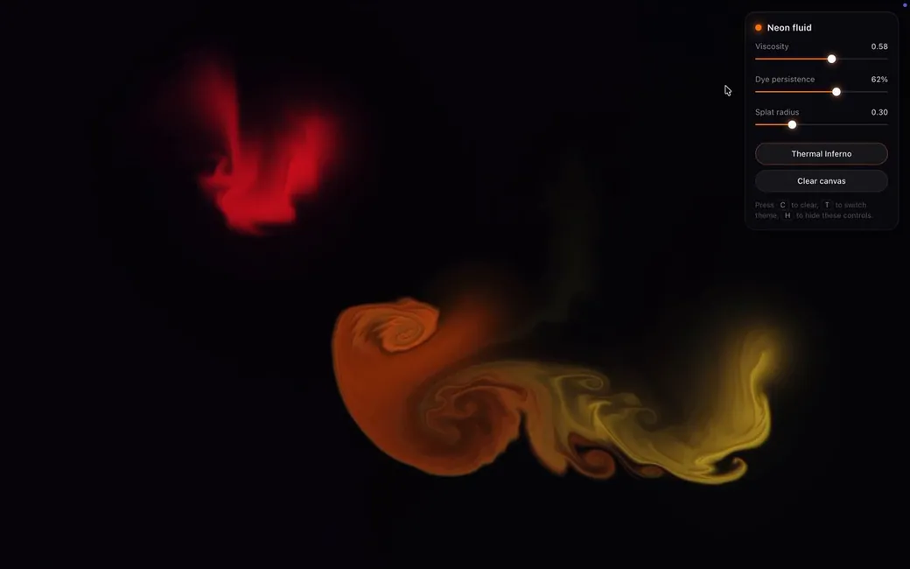</a>

**プロンプト**

```text
高性能なGPUアクセラレーション対応のインタラクティブなオイラー型ネオン流体シミュレーションを含む、完全な単一ファイルHTMLドキュメントを作成してください。

厳格な技術要件と美的要件：

1. アーキテクチャとパフォーマンス：
   - 単一ファイル：HTML、CSS、JavaScript／GLSLシェーダーをすべてインラインで記述すること。
   - 外部依存関係ゼロ：Pure WebGL 1.0または2.0を使用すること（Three.js、Pixi、外部ライブラリは禁止）。
   - GPUで計算する流体力学：シミュレーション全体を、以下の処理用カスタムフラグメントシェーダーと、ピンポン方式のFramebuffer Object（FBO）だけで実行すること：
     a) 移流（速度と色素）
     b) 発散の計算
     c) 圧力ポアソンソルバー（ヤコビ反復を1フレームあたり20～30回）
     d) 勾配の減算／速度場の射影
     e) 渦度閉じ込め（乱流の渦を加え、流体が単調でぼやけた塊になるのを防ぐ）。

2. ビジュアルの忠実度（「ネオンスモーク」の表現）：
   - 真っ黒な虚無の背景（`#050508`）。
   - 色素の注入には加算合成／ハイダイナミックレンジブレンディングを使用すること。
   - ダイナミックパレット：カーソルを素早く動かしたりタッチでドラッグしたりするたびに、高輝度のネオン色素を注入すること。色は鮮やかなサイバーカラー（エレクトリックシアン`#00F0FF`、ホットマゼンタ`#FF007F`、ディープウルトラバイオレット、輝くゴールド）を滑らかに循環させること。
   - 表示シェーダーの拡張：最終レンダーシェーダーにポストプロセスパスを直接組み込み、流体の渦巻くエッジ周辺に控えめなブルーム／グロー、トーンマッピング、色収差を適用すること。

3. インタラクション：
   - マウスとタッチ：カーソルの素早い移動やドラッグに応じて、マウス速度に比例した速度と、密度の高い発光色素を注入すること。
   - パッシブなアンビエントモーション：アイドル時には、控えめなプロシージャル・カールノイズまたは穏やかに漂う渦を生成し、キャンバスが完全に静止しないようにすること。
   - コントロール：画面の隅に、洗練された極めてミニマルなグラスモーフィズムのHUDを配置すること（非アクティブ時は自動的に非表示）：
     * 粘度スライダー
     * 色素の散逸／残留スライダー
     * スプラット半径スライダー
     * 「キャンバスをクリア」ボタン
     * カラーテーマ（サイバーパンク、サーマル・インフェルノ、生物発光ディープ）を切り替えるトグルボタン。

4. プロダクション品質の仕上げ：
   - 高DPIディスプレイと`resize`イベントを自動的に処理し、FBOテクスチャが引き伸ばされたりクリアされたりしないようにすること。
   - 浮動小数点テクスチャ対応のフォールバックチェックを適切に実装すること（`OES_texture_float`／`OES_texture_half_float`）。
   - プレースホルダーや途中で切れたコメントを一切含まない、クリーンでバグのない完全実装のコードにすること。

Chrome／Safari／Firefoxで直接実行できる、完全に内容を埋めたHTMLファイルのみを返してください。
```

<details>
<summary>作者の元のプロンプト</summary>

```text
Write a complete, single-file HTML document containing a high-performance, GPU-accelerated interactive Eulerian Neon Fluid Simulation.

Strict Technical & Aesthetic Requirements:

1. Architecture & Performance:
   - Single-file: All HTML, CSS, and JavaScript/GLSL shaders inline.
   - Zero external dependencies: Pure WebGL 1.0 or 2.0 (no Three.js, no Pixi, no external libraries).
   - GPU-Computed Fluid Dynamics: The simulation must run entirely via ping-pong Framebuffer Objects (FBOs) using custom fragment shaders for:
     a) Advection (velocity & dye)
     b) Divergence calculation
     c) Pressure Poisson solver (Jacobi iteration, 20-30 iterations per frame)
     d) Gradient subtraction / velocity projection
     e) Vorticity confinement (adds turbulent swirls and prevents the fluid from turning into dull, blurry mush).

2. Visual Fidelity (The "Neon Smoke" Look):
   - Pitch-black void background (`#050508`).
   - Additive / High-Dynamic-Range blending for dye injection.
   - Dynamic palette: Each cursor flick or touch drag injects high-luminosity neon dye that cycles smoothly through vivid cyber hues (electric cyan `#00F0FF`, hot magenta `#FF007F`, deep ultraviolet, and radiant gold).
   - Display shader enhancements: Include a post-processing pass directly in the final render shader that applies subtle bloom/glow, tone mapping, and chromatic aberration around the swirling edges of the fluid.

3. Interaction:
   - Mouse & Touch: Rapid cursor movement or dragging injects velocity proportional to mouse speed, along with dense glowing dye.
   - Passive Ambient Motion: When idle, generate subtle procedural curl noise or gentle drifting vortices so the canvas is never completely static.
   - Controls: A sleek, ultra-minimal glassmorphism HUD tucked into a corner (with auto-hide on inactivity):
     * Viscosity slider
     * Dye dissipation / persistence slider
     * Splat radius slider
     * "Clear Canvas" button
     * Toggle button to cycle color themes (Cyberpunk, Thermal Inferno, Bioluminescent Deep).

4. Production Polish:
   - Automatically handle high-DPI displays and `resize` events without stretching or clearing the FBO textures.
   - Graceful fallback check for floating-point texture support (`OES_texture_float` / `OES_texture_half_float`).
   - Clean, bug-free, fully implemented code with zero placeholders or truncated comments.

Return only the fully populated HTML file ready to run directly in Chrome/Safari/Firefox.
```

</details>

[詳細を見る ↗](https://www.tripo3d.ai/ja/3d-prompts/claude-opus-5-5-2102565611473661963) · [元の投稿](https://x.com/theailoser/status/2102565612874596411) · [作例一覧に戻る](#all-prompts)

---

<a id="claude-opus-5-5-2102565403109085669"></a>

### 日本の桜の谷を描くインタラクティブ3D景観Webページ

[宝玉](https://x.com/dotey) · 2026-09-23 · Claude Opus 5.5 · インタラクティブ

<a href="https://www.tripo3d.ai/ja/3d-prompts/claude-opus-5-5-2102565403109085669">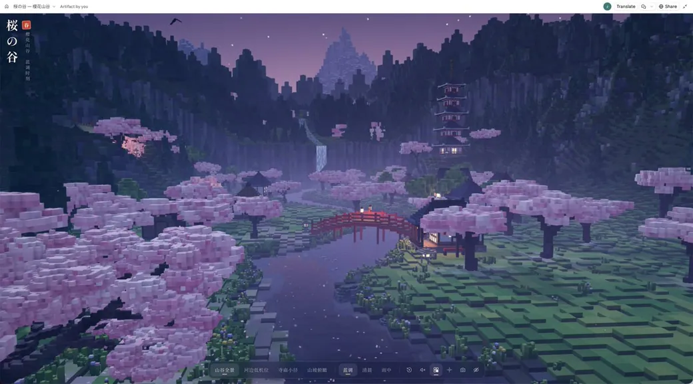</a>

**プロンプト**

```text
ブラウザ上でリアルタイムに操作できる、完成度の高い3D景観のWebページを直接制作してください。

テーマ：日本の桜の谷。
HTML、CSS、JavaScriptで実装してください。画像は生成せず、設計案だけを提示するのもやめてください。
1枚の背景画像にパララックス効果を加えて3Dに見せかけないでください。実際に動作し、歩き回れる完成品が必要です。

【1. 作品の方向性】

遠近のレイヤーがあり、ひと続きになった、完成された谷の景観にしてください。
孤立した小さな置き物や浮遊島、台座付きのジオラマでも、単なる技術デモでもありません。

スタイルは現代的で精細なボクセルアートです。
立方体形状の造形言語は保ちつつ、高解像度でアンチエイリアスが効き、光と影が繊細な画面にしてください。
レトロな低解像度のピクセル表現や、大きな積み木を積み上げたような造形、画面全体にピクセルフィルターをかける表現は避けてください。

ビジュアル品質を最優先にしてください。機能をいくつか減らしても、構図、マテリアル、ライティングを犠牲にしないでください。

【2. 参考画像の使い方】

参考画像がある場合は、まず構図のレイヤー、スケール、光、色彩の関係を理解してください。
雰囲気とビジュアル表現だけを参考にして、シーンを新たに設計してください。
建物、木々、山、道の配置をそのまま流用したり、1:1で再現したりしないでください。

参考画像はWebページの背景素材ではありません。シーン自体を実際の3Dジオメトリで構成してください。

【3. シーン構成】

初期表示の時点で、完成度が高く魅力的な画面を見せてください。
ユーザーがまずカメラを回して、見栄えのよいアングルを探す必要がないようにしてください。

ジオラマのような等角投影の俯瞰カメラではなく、パースペクティブカメラを使用してください。
画面には明確な前景・中景・遠景を設けてください。

前景：
存在感のある古い桜の木を中心に、岩、草木、石灯籠、少量の花びらを添えてください。
画面の縁を自然に縁取る構図にしつつ、川、橋、主要な建物を隠さないでください。

中景：
曲がりくねった川で視線を画面の奥へ導き、赤い木橋を川に架けてください。
集落、茶屋、神社、小道を地形に沿って配置し、建物同士を実際に行き来できる関係にしてください。
地面には起伏や水際のライン、自然な遷移を設け、平面上にモデルを均等に並べないでください。

遠景：
斜面に建つ多層塔、距離の異なる森林と山稜、さらに遠くの雪山を配置してください。
スケールの変化、遮蔽、色温度の変化、空気遠近法で距離を表現してください。
遠くの物体を単に小さくするだけでは不十分です。

すべての要素を均等に詰め込まないでください。主役と脇役、密度の変化、余白、明確な視線の焦点が必要です。

【4. 造形と画面品質】

桜の木：
幹には曲がり、分岐、根元を作り、樹冠は不規則な花の塊で構成してください。
隙間や厚みの変化、見える枝を設け、規則的な球体や立方体の塊をいくつか置いただけの形にはしないでください。

建物：
屋根には重なった瓦、せり出した軒、梁や柱、格子窓を作ってください。
建物ごとに用途、規模、高さを変え、同じ家を複製して谷全体に並べないでください。

地形：
水際には濡れた石、草むら、植生への自然な遷移を設けてください。
規則的すぎる段差、反復するストライプ、チェッカーボード模様、明らかなプロシージャル生成のグリッドは避けてください。

水面：
周囲の景物を映し、適度な波紋、深浅の変化、水際への自然なつながりを持たせてください。
可能な限り実際のシーンを反射させ、パフォーマンスのために品質を下げる場合も、見た目の信頼感を保ってください。
ちらつくノイズ、強すぎる歪み、一面の青い平面で水を表現しないでください。

ディテール：
錦鯉、花びら、ホタル、滝、遠くを飛ぶ鳥などを少量加えても構いません。
ただし、すべて雰囲気を高めるために使い、画面を雑然とさせないでください。
モデル数の多さをアピールするためだけにディテールを詰め込まないでください。

【5. 色彩と雰囲気】

デフォルトはブルーアワーにしてください。
冷たさのある谷と遠山、柔らかなピンクの桜、暖かくても白飛びしない灯籠の明かりと窓明かりを表現してください。
暖色の光は人の気配がある場所に集中させ、環境全体をオレンジ色に染めないでください。

柔らかな影、物体の接地部に生じる明暗、適切な露出を設定してください。
ブルームは控えめにし、アンチエイリアスと距離感のある薄い霧を加えてください。

白っぽく色あせた見た目、灰色がかった画面、過度な彩度、画面を覆う濃霧、白飛びしたライト、目立つジャギーは避けてください。
立方体のジオメトリはくっきり見せて構いませんが、レンダリング自体を粗雑にしないでください。

「朝」と「雨」の2種類の雰囲気も用意してください。
切り替え時には、空、環境光、霧、局所的なエフェクトも連動して変化させ、
背景色だけを変更するものにはしないでください。

【六、インタラクションとUI】

設計されたカメラアングルを4つ用意してください。
谷の全景、川辺のローアングル、寺院へ続く小径、山腹からの俯瞰。
切り替えは滑らかにし、それぞれのアングルに独自の構図上の価値を持たせてください。

基本操作：
マウスのドラッグで視点を動かし、ホイールでズームまたは前進できるようにします。タッチ画面ではドラッグとピンチズームに対応してください。
視点のリセット、UIの非表示、現在の画面の保存機能を用意してください。

追加機能（任意）：
自由探索、ゆっくりしたカメラツアー、環境音。
環境音はデフォルトでオフにし、ユーザーが明示的にクリックした後だけ再生してください。
追加機能によって、デフォルト画面の完成度を損なわないでください。

UIは控えめで洗練されたデザインにし、景観を主役にしてください。
タイトルとコントロールバーは画面の端に配置し、視覚的な焦点を遮らないようにしてください。
デスクトップでもスマートフォンでも、ボタンが画面からはみ出したり、テキストが重なったり、操作できなくなったりしないようにしてください。

【七、実装とパフォーマンス】

Three.js / WebGL、およびバージョンを固定した互換性のあるCDN依存関係を使用して構いません。
成熟したレンダリング機能を優先し、「依存関係ゼロ」にするためにエンジン全体を書き直さないでください。

自作のHTML、CSS、JavaScriptは、できるだけ1つのHTMLファイルにまとめてください。
景物はプロシージャルなジオメトリとマテリアルで生成し、外部の画像や3Dモデル素材に依存しないでください。

繰り返し配置するオブジェクトには、適切なバッチ描画またはインスタンシング描画を使用し、
サブディビジョン、シャドウ、反射、レンダリング解像度を適切に調整してください。
高画質モードと軽量モードを用意し、スマートフォンではデフォルトで軽量設定を使用してください。
ディテールを増やすために、ボクセル数を際限なく増やさないでください。

読み込み中の表示、WebGL非対応時の案内、必要なエラーハンドリングを追加してください。
サウンドが有効になっていない状態では自動再生せず、システムの「視差効果を減らす」などの設定を尊重してください。

【八、納品前の検収】

コードを書き終えたら、すぐに納品しないでください。

現在の環境がブラウザでの実行とスクリーンショット撮影に対応している場合は、まず実際にページを開き、
デフォルトのカメラ、4つの視点、雰囲気の切り替え、デスクトップとスマートフォンでのレイアウトを確認し、
そのうえでスクリーンショットを見ながら、明らかな構図、露出、遮蔽、レンダリング上の問題を修正してください。

重点的に確認する項目：
画面が真っ白または真っ黒になっていないか、読み込みに失敗していないか、コンソールエラーがないか。
メッシュの貫通、ちらつき、シャドウの縞模様、露出オーバー、水面の異常がないか。
デフォルト画面が小さな箱庭ではなく、本当に完成した景観に見えるか。
機能ボタンが実際に使えるか、モバイル画面からはみ出していないか。

検収にはブラウザのスクリーンショットを使用して構いませんが、画像生成ツールは呼び出さないでください。
完了していないテストについては正直に説明し、検証済みだと主張しないでください。

最終納品物：
1. 実際に存在し、開くことのできるHTMLファイル、または現在の環境で利用できるインタラクティブプレビュー。
2. スクリーンショットを撮影できる場合は、実際のブラウザレンダリングによるスクリーンショットを1枚添付してください。
3. 操作方法と必要な実行条件を簡潔に説明してください。

制作はそのまま完了させてください。重要でない細部については、全体に一貫性のある設計判断を自分で行い、
自力で解決できる実装上の問題を、何度も私に判断させないでください。
```

<details>
<summary>作者の元のプロンプト</summary>

```text
请直接制作一个可以在浏览器中实时交互的高完成度 3D 景观网页。

主题：日式樱花山谷。
使用 HTML、CSS、JavaScript 实现。不要生成图片，不要只给设计方案，
不要用一张背景图加视差效果冒充 3D。我要的是实际可运行、可游览的成品。

【一、作品定位】

这是一片完整、连续、有远近层次的山谷景观，
不是孤立的小摆件、悬浮岛、带底座的沙盘，也不是单纯的技术演示。

风格是现代精细体素 / voxel art：
保留立方体几何的造型语言，但画面应高分辨率、抗锯齿、光影细腻。
不要复古低分辨率像素化，不要粗大积木堆砌，不要给画面套像素滤镜。

视觉质量优先。宁可少几个功能，也不要牺牲构图、材质和光照。

【二、参考图的使用方式】

如果附有参考图，请先理解它的构图层次、尺度、光线和色彩关系。
仅借鉴氛围与视觉语言，重新设计场景，
不要照搬建筑、树木、山体和道路的位置，不要 1:1 复刻。

参考图不是网页里的背景素材。场景本身必须由真实 3D 几何构成。

【三、场景构图】

默认打开时就应呈现一幅完整、有吸引力的画面，
不需要用户先旋转镜头才能找到好看的角度。

采用透视相机，而不是沙盘式等距俯视相机。
画面有明确的前景、中景、远景：

前景：
一株有存在感的古老樱花树，配合岩石、草木、石灯笼和少量落花，
形成画面边缘的自然框景，但不能挡住河流、桥和主要建筑。

中景：
一条蜿蜒河流引导视线进入画面，红色木桥横跨河面；
村落、茶屋、神社和小径顺着地势分布，建筑之间有真实的通行关系。
地面有起伏、岸线和自然过渡，不是平面上均匀摆放模型。

远景：
山坡上的多层塔、不同距离的森林和山脊，以及远处的雪山。
用尺度变化、遮挡、冷暖变化和空气透视表现距离，
而不是仅仅把远处物体缩小。

不要把所有元素均匀铺满。需要主次、疏密、留白和清楚的视觉焦点。

【四、造型与画面质量】

樱花树：
树干有转折、分叉和根部，树冠由不规则花簇组成，
有间隙、厚薄变化和可见枝条。不要做成几个规则球体或方块团。

建筑：
屋顶有层叠瓦片、挑檐、梁柱和窗格；
不同建筑有用途、体量和高度差异，不要复制同一栋房子铺满山谷。

地形：
岸边有湿润石块、草丛和植被过渡。
避免过于规律的台阶、重复条纹、棋盘格和明显的程序生成网格。

水面：
必须能够反映周围景物，具有适度的波纹、深浅变化和岸边过渡。
尽量使用实际场景反射；需要性能降级时也应保持视觉可信。
不要用闪烁噪声、强烈扭曲或一整块蓝色平面代替水。

细节：
可以有少量锦鲤、落花、萤火虫、瀑布和远处飞鸟，
但都应服务于氛围，不能让画面显得嘈杂。
不要为了宣称模型数量而堆砌细节。

【五、色彩与氛围】

默认是蓝调时刻：
偏冷的山谷与远山，柔和的粉色樱花，温暖但不过曝的灯笼和窗光。
暖光集中在有人活动的地方，不要把整个环境染成橙色。

需要柔和阴影、物体接触处的明暗、合理的曝光、
克制的泛光、抗锯齿和有距离层次的薄雾。

避免发白、灰蒙、过度饱和、满屏浓雾、过曝灯光和明显锯齿。
方块几何可以清晰，但渲染本身不能粗糙。

另提供“清晨”和“雨中”两种氛围；
切换时应同步改变天空、环境光、雾和局部效果，
不是仅仅修改背景颜色。

【六、交互与界面】

提供四个经过设计的镜头：
山谷全景、河边低机位、寺庙小径、山坡俯瞰。
切换应平滑，每个镜头都需要有独立的构图价值。

基础交互：
鼠标拖动观察、滚轮缩放或前进，触屏支持拖动和双指缩放。
提供重置视角、隐藏界面和保存当前画面的功能。

可选增强：
自由探索、缓慢镜头巡游、环境音。
环境音默认关闭，只在用户主动点击后播放。
额外功能不能影响默认画面的完成度。

界面要克制、有设计感，以景观为主。
标题和控制条放在边缘，不遮挡视觉焦点。
桌面和手机都不能出现按钮越界、文字重叠或无法操作的问题。

【七、工程与性能】

允许使用 Three.js / WebGL，以及版本固定、互相兼容的 CDN 依赖。
优先使用成熟渲染能力，不要为了“零依赖”重写整套引擎。

自写的 HTML、CSS、JavaScript 尽量整理在一个 HTML 文件中。
景物由程序化几何和材质生成，不依赖外部图片或 3D 模型资源。

重复物体采用适合的批量或实例化绘制方式；
合理控制细分、阴影、反射和渲染分辨率。
提供高画质和轻量模式，手机默认使用较轻设置。
不要靠无限增加体素数量换取细节。

加入加载提示、WebGL 不支持时的提示和必要的错误处理。
没有开启声音时不要自动播放；尊重减少动态效果的系统偏好。

【八、交付前验收】

不要写完代码就立即交付。

如果当前环境支持浏览器运行和截图，请先实际打开页面，
检查默认镜头、四个视角、氛围切换、桌面和手机布局，
再根据截图修正明显的构图、曝光、遮挡和渲染问题。

重点检查：
是否存在空白画面、加载失败、控制台错误；
是否有穿模、闪烁、阴影条纹、过曝、水面异常；
默认画面是否真正像完整景观，而不是小型沙盘；
功能按钮是否实际可用，移动端是否越界。

可以使用浏览器截图验收，但不要调用图像生成工具。
没有完成的测试要如实说明，不要声称已经验证。

最终交付：
1. 实际存在、可以打开的 HTML 文件，或当前环境支持的交互预览。
2. 如能截图，附一张真实浏览器渲染截图。
3. 简短说明操作方式和必要的运行条件。

请直接完成制作；非关键细节自行作出一致的设计选择，
不要把可以自行解决的实现问题反复交给我决定。
```

</details>

[詳細を見る ↗](https://www.tripo3d.ai/ja/3d-prompts/claude-opus-5-5-2102565403109085669) · [元の投稿](https://x.com/dotey/status/2102565403109085669) · [作例一覧に戻る](#all-prompts)

---

<a id="claude-opus-5-5-2102547809140355250"></a>

### Hundenbergの事故モデルとリアルな動画

[AImanhasnoname](https://x.com/aimanhasnoname) · 2026-09-22 · Claude Opus 5.5 · アニメーション

<a href="https://www.tripo3d.ai/ja/3d-prompts/claude-opus-5-5-2102547809140355250">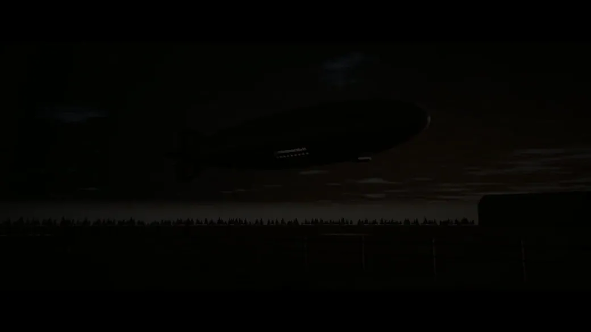</a>

**プロンプト**

```text
BlenderでHundenbergのモデルを作成し、事故のリアルな動画を作ってください。
```

<details>
<summary>作者の元のプロンプト</summary>

```text
make me a model of the Hundenberg on blender make me a realistic video of the accident.
```

</details>

[詳細を見る ↗](https://www.tripo3d.ai/ja/3d-prompts/claude-opus-5-5-2102547809140355250) · [元の投稿](https://x.com/aimanhasnoname/status/2102547809140355250) · [作例一覧に戻る](#all-prompts)

---

<a id="claude-opus-5-5-2102544406117286004"></a>

### 画像をもとにしたハンドボールコートの360度3Dレンダリング

[ハンドボール人「布施千佳純」](https://x.com/chikaidev) · 2026-09-22 · Claude Opus 5.5 · シーン

<a href="https://www.tripo3d.ai/ja/3d-prompts/claude-opus-5-5-2102544406117286004"></a>

**参照画像:** [1](https://media.tripogrowth.space/media/6a116b62-88ce-491b-b4ba-eed6d9c9f168.jpg) · [2](https://pbs.twimg.com/media/HS29xCPaYAAcMmd.jpg)

**プロンプト**

```text
画像内のハンドボールコート、ゴール、レフェリー、プレイヤー、ボールを3dレンダリングして、360度自由角度から見れるようにして。各人物の姿勢まで、また物体の色まで正確に再現して。
```

[詳細を見る ↗](https://www.tripo3d.ai/ja/3d-prompts/claude-opus-5-5-2102544406117286004) · [元の投稿](https://x.com/chikaidev/status/2102545257372213581) · [作例一覧に戻る](#all-prompts)

---

<a id="claude-opus-5-5-2102544196808667471"></a>

### 画像から作るプロシージャルなThree.js 3Dメインメニュー背景

[Majid Manzarpour](https://x.com/majidmanzarpour) · 2026-09-22 · Claude Opus 5.5 · シーン

<a href="https://www.tripo3d.ai/ja/3d-prompts/claude-opus-5-5-2102544196808667471"></a>

**参照画像:** [1](https://media.tripogrowth.space/media/de4534b1-fda8-4736-8558-09b7283f646a.jpg) · [2](https://pbs.twimg.com/media/HS28q6mWMAAxONB.jpg)

**プロンプト**

```text
この画像を完全に再現した、プロシージャル生成によるアニメーション対応のThree.js 3Dメインメニュー背景を、単一のHTMLファイルで作成してください
```

<details>
<summary>作者の元のプロンプト</summary>

```text
recreate this perfectly, fully procedural, animated, main menu background in three.js 3D single HTML file
```

</details>

[詳細を見る ↗](https://www.tripo3d.ai/ja/3d-prompts/claude-opus-5-5-2102544196808667471) · [元の投稿](https://x.com/majidmanzarpour/status/2102544198335373576) · [作例一覧に戻る](#all-prompts)

---

<a id="claude-opus-5-5-2102544078927741369"></a>

### 自走式3Dルーブ・ゴールドバーグ・マシン

[leo](https://x.com/leogao25) · 2026-09-22 · Claude Opus 5.5 · アニメーション

<a href="https://www.tripo3d.ai/ja/3d-prompts/claude-opus-5-5-2102544078927741369"></a>

**プロンプト**

```text
現在のディレクトリに、単一の自己完結型index.htmlとして、自動で動作する3Dルーブ・ゴールドバーグ・マシンを構築してください。

連鎖の順序：
1. 最上部でビー玉を放し、ジグザグ状に連なるスロープを転がり落とします。
2. ビー玉が少なくとも12個のドミノを一列に倒します。
3. 最後のドミノがシーソーを傾け、小さなボールを吊り下げられたバケツに向けて発射します。
4. バケツの重さでバケツが下がり、ロープが滑車を通ってベルを引っ張り、ベルが目に見えて揺れます。
5. 同じ動きで旗をポールの上へ引き上げます。旗が頂点に達したら完了です。

ルール：
- 物理演算は自分で実装してください。物理演算ライブラリは使用しないでください。ビー玉を放した後のあらゆる動きは、シミュレーション（剛体、衝突、拘束、ロープ／滑車）によって発生する必要があります。機械の各部品をキーフレームアニメーションやトゥイーンで動かしてはいけません。
- レンダリング用にCDNからthree.jsを読み込むことは許可します。それ以外の外部要素は使用しないでください。画像、モデル、フォントも使用禁止です。
- ユーザー入力なしで動作する必要があります。ページの読み込み時に自動開始し、アクションを追従するシネマティックカメラを使い、連鎖全体を約15～20秒で完了させてください。旗が上がった後は2秒間停止し、その後リセットして再生します。
- 決定論的に動作させてください。固定タイムステップを使用し、シード未指定の乱数は使わないでください。毎回同じ見た目になる必要があります。
- ブラウザウィンドウ全体に表示してください。1280×720で画面録画されます。
- 画面上のテキストやUIは一切表示しないでください。
- 照明、影、マテリアル、実在の装置らしさを感じさせる舞台設定を用いて、見栄えよく仕上げてください。
```

<details>
<summary>作者の元のプロンプト</summary>

```text
Build a 3D Rube Goldberg machine that runs itself, as a single self-contained index.html in the current directory.

The chain, in order:
1. A marble is released at the top and rolls down a series of zig-zag ramps.
2. It knocks over a line of at least 12 dominoes.
3. The last domino tips a seesaw, which launches a small ball into a hanging bucket.
4. The bucket's weight pulls it down; its rope runs over a pulley and yanks a bell, which visibly swings.
5. The same motion raises a flag up a pole. The flag reaching the top is the finish.

Rules:
- Write the physics yourself: no physics library. Every motion after the marble is released must come from your simulation (rigid bodies, collisions, constraints, rope/pulley). No keyframed animation or tweened motion of any machine part.
- You may load three.js from a CDN for rendering. Nothing else external: no images, models, or fonts.
- It must run with no user input: start automatically on page load, use a cinematic camera that follows the action, and complete the whole chain in about 15–20 seconds. After the flag is up, hold for 2 seconds, then reset and replay.
- Deterministic: fixed timestep and no unseeded randomness, so every run looks the same.
- Fill the browser window. It will be screen-recorded at 1280×720.
- No on-screen text or UI of any kind.
- Make it look good: lighting, shadows, materials, and a setting that makes it feel like a real contraption.
```

</details>

[詳細を見る ↗](https://www.tripo3d.ai/ja/3d-prompts/claude-opus-5-5-2102544078927741369) · [元の投稿](https://x.com/leogao25/status/2102544081863717153) · [作例一覧に戻る](#all-prompts)

---

<a id="claude-opus-5-5-2102538762731565085"></a>

### インタラクティブなピーターラビット風の農場動物ゲーム

[mblaso](https://x.com/blaso96) · 2026-09-22 · Claude Opus 5.5 · ゲーム

<a href="https://www.tripo3d.ai/ja/3d-prompts/claude-opus-5-5-2102538762731565085"></a>

**プロンプト**

```text
「ピーターラビット」のデザイン／アートスタイルで、インタラクティブな農場動物ゲームを作成する
メインメニュー＝サウンドのオン／オフ＋動物選択（馬、ブタ、ウシ、ネコ、イヌ）
Esc＝一時停止：スポーン地点／メインメニューに戻る／リセット
WASDで移動
スペースキーでジャンプし、近くにいる他の動物とインタラクト
近接検知時にインタラクションをランダムで発生させる
インタラクションでは、他の動物に声をかける（その動物の通常の鳴き声とは異なる固有の音）、「ちょん」と触れる
水場では水を飲め、干し草を食べられ、果物を食べられる。
三人称視点。ただし、カメラは動物のやや後方かつ上方にあるようにする
環境音として鳥の声を入れ、空には飛行機がランダムに現れる
舞台＝農地、納屋、家々のある農村（家の中には入れない）
目を引くのに十分なアセットを用意するが、プロダクション品質とみなされるほど作り込みすぎない。娘と15分ほど遊んで楽しむためのもの
react、svg、js、webgl、threejsなど、手触りを良くするために必要なものは何でも使う」
```

<details>
<summary>作者の元のプロンプト</summary>

```text
"Create a interactive farm animal game using the design/art style of "Peter Rabbit"
main menu = sounds on/off + animal picker (horse, pig, cow, cat, dog)
esc = pause: reset back to spawn/main menu/
wasd to move around
spacebar to jump and to interact with other animals when near
interactions are randomized upon proximity detection
interactions can be make sounds at the other animal (unique from their passive sounds) "boop them"
interactible with: water to drink, hay to eat, fruit to eat. 
3rd person but as if the camera was slightly behind the animal and above it
ambience animals are birds, airplanes in the sky (randomly)
setting= farmland, barn, farming village with houses (cant enter houses)
Enough assets to capture attention, but not enough that it needs to be deemed production grade, this is just to capture 15 minutes out of my day with my daughter and have fun
react, svg, js, webgl, threejs, whatever is necessary to make it feel "good""
```

</details>

[詳細を見る ↗](https://www.tripo3d.ai/ja/3d-prompts/claude-opus-5-5-2102538762731565085) · [元の投稿](https://x.com/blaso96/status/2102538764749037738) · [作例一覧に戻る](#all-prompts)

---

<a id="claude-opus-5-5-2102533729746882985"></a>

### 夕暮れを航海する映画的なインタラクティブ海賊船

[Vib3Coded](https://x.com/vib3coded) · 2026-09-22 · Claude Opus 5.5 · シーン

<a href="https://www.tripo3d.ai/ja/3d-prompts/claude-opus-5-5-2102533729746882985">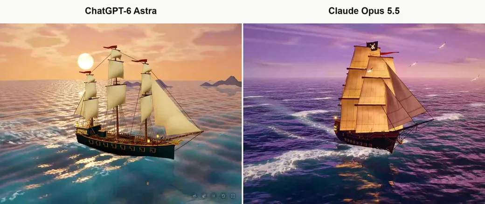</a>

**プロンプト**

```text
夕暮れのダイナミックな海を航海する、完全にインタラクティブな3D海賊船シーンをゼロから作成してください。ビジュアルスタイルはフォトリアルではなく、映画的でスタイライズされたものにしつつ、非常に豊かで精密、洗練され、視覚的にも高度な表現にしてください。船、海、空、ライティング、マテリアル、帆、リギング、大砲、細かな構造物、波しぶき、航跡、パーティクル、アニメーション、カメラワーク、構図、大気遠近、カラーグレーディングを構築してください。最終結果は、プロトタイプや技術デモ、低品質なシーンではなく、プレミアムで本格的な制作による3Dアート作品として感じられるものにしてください。完全に白紙のページから開始してください。以前のプロジェクトやシーンを再利用したり、それらに依存したりしないでください。必要に応じて、アセットや信頼できるオープンソースのアセット、ライブラリを自作または利用してかまいません。必須要件：シーン内のどこにも、いかなる種類のテキストも表示してはいけません。どの言語であっても、タイトル、名前、ロゴ、説明、クレジット、ラベル、操作説明を表示しないでください。プロジェクト全体を、ウェブブラウザで直接開ける単一の最終スタンドアロンページファイルとして納品し、可能な限りアセットをファイル内に埋め込んでください。海、船、帆、カメラはすべて、自然で滑らかにアニメーションさせてください。不自然なスローモーションや動きの鈍さは避けてください。船が本当に水上を進んでいるように感じられるものにしてください。完成形に単純なプリミティブ形状だけを使わないでください。形状を丁寧に作り込んだ船体、マスト、帆、リギング、ロープ、大砲、手すり、ランタン、甲板上の構造物、細部まで明確に見える要素を備えた、説得力のある精密な海賊船を構築してください。ライティングによって船の形状とマテリアルが明確に見えるようにしてください。豊かな夕焼けの空気感、深みのある海のシェーディング、反射、説得力のある波しぶき、船の後方と周囲に広がる精細な航跡を作成してください。ビジュアル品質とリアルタイム性能のバランスを適切に保ち、品質を明らかに犠牲にすることなく、滑らかなインタラクションとアニメーションを維持してください。最高の結果を実現するために必要な、最適なスキル、ツール、ライブラリ、技法、利用可能なアセットを自動的に使用してください。使用するテクノロジーの指定を私に求めて待たないでください。完成した結果を実際にデスクトップのウェブブラウザでテストしてください。画面のスクリーンショットを撮影し、ブラウザコンソールのエラーを確認して、見つかったすべての視覚的または技術的な問題を修正してください。これには、歪んだジオメトリ、黒い画面、アセットの読み込み失敗、壊れたアニメーション、不適切な構図、レンダリングアーティファクト、カメラの問題などが含まれます。最後に、最終ファイルが直接開いて正常に動作すること、シーンにテキストが一切含まれていないこと、実行時エラーや読み込みエラーが残っていないことを確認してください。その後は、短い返答だけでタスクを完了してください。
```

<details>
<summary>作者の元のプロンプト</summary>

```text
Create from scratch a fully interactive 3D scene of a pirate ship sailing across a dynamic ocean at sunset. The visual style should be cinematic and stylized rather than photorealistic, while still being exceptionally rich, detailed, polished, and visually sophisticated. Build the ship, ocean, sky, lighting, materials, sails, rigging, cannons, small structural details, sea foam, wake, particles, animation, camera work, composition, atmospheric depth, and color grading. The final result should feel like a premium, high-production 3D artwork, not a prototype, technical demo, or low-quality scene. Start from a completely blank page. Do not reuse or depend on any previous project or scene. You may create the assets yourself or use reliable, trusted, open-source assets and libraries when necessary. Mandatory requirements: No text of any kind may appear anywhere inside the scene. No titles, names, logos, descriptions, credits, labels, or control instructions in any language. Deliver the entire project as one final standalone page file that can be opened directly in a web browser, with assets embedded inside it as much as reasonably possible. The ocean, ship, sails, and camera must all be animated naturally and smoothly. Avoid artificial slow motion or sluggish movement. The ship should feel like it is genuinely moving through the water. Do not rely on primitive geometric shapes as the finished result. Build a visually convincing and detailed pirate ship, including a carefully shaped hull, masts, sails, rigging, ropes, cannons, railings, lanterns, deck structures, and clearly visible small-scale details. Lighting must reveal the ship's geometry and materials clearly. Create a rich sunset atmosphere, deep ocean shading, reflections, convincing sea foam, and a detailed sailing wake behind and around the vessel. Maintain a strong balance between visual quality and real-time performance, preserving smooth interaction and animation without making an obvious sacrifice in quality. Automatically use the most appropriate skills, tools, libraries, techniques, and available assets needed to achieve the best result. Do not wait for me to specify which technologies to use. Actually test the finished result in a desktop web browser. Capture visual screenshots, inspect the browser console for errors, and fix every visible or technical issue you find, including distorted geometry, black screens, failed asset loading, broken animation, poor composition, rendering artifacts, or camera problems. At the end, verify that the final file opens and works directly, that the scene contains no text whatsoever, and that there are no remaining runtime or loading errors. Then finish the task with only a brief response.
```

</details>

[詳細を見る ↗](https://www.tripo3d.ai/ja/3d-prompts/claude-opus-5-5-2102533729746882985) · [元の投稿](https://x.com/vib3coded/status/2102534606121746589) · [作例一覧に戻る](#all-prompts)

---

<a id="claude-opus-5-5-2102529695908806728"></a>

### 無限にプロシージャル生成されるThree.jsワールド

[🥔🥔🥔](https://x.com/argofowl) · 2026-09-22 · Claude Opus 5.5 · ゲーム

<a href="https://www.tripo3d.ai/ja/3d-prompts/claude-opus-5-5-2102529695908806728"></a>

**プロンプト**

```text
projectsフォルダに「endless-game」という新規プロジェクトを作成してください。ブラウザ上で動作するThree.js製の、無限にプロシージャル生成される世界を構築し、自由に歩き回って楽しめるようにしてください。エリアはすべてランダム生成とし、どれだけ長くプレイしても至る所で新しい驚きが見つかるようにします。スーパーマーケットシミュレーターのような、穏やかでリラックスでき、本当に楽しい、居心地のよい満足感のある雰囲気にしてください。ただし、スーパーマーケットを題材にしたゲームにはしないでください。歩き回るだけでも興味深い世界を作り、出会って交流できる存在や、非常に魅力的なグラフィックを盛り込んでください。プロジェクトの明確な目標を設定し、それを達成するまで作業を続け、完成してプレイとテストができる状態になったらチャイム音を鳴らしてください。
```

<details>
<summary>作者の元のプロンプト</summary>

```text
create a new project in my projects folder called "endless-game": an endless, procedurally generated world built with three.js in the browser that i can roam freely and just enjoy. every area should be randomly generated, with surprises everywhere no matter how long i play. it should feel calm, relaxing and genuinely fun, like the cozy, satisfying vibe of a supermarket simulator, but it shouldn't be a supermarket game. i want a really interesting world to walk around in, with entities i can meet and interact with, and really cool graphics. set a clear goal for the project, keep working until you reach it, and play a sound chime when it's done and ready for me to play and test.
```

</details>

[詳細を見る ↗](https://www.tripo3d.ai/ja/3d-prompts/claude-opus-5-5-2102529695908806728) · [元の投稿](https://x.com/argofowl/status/2102529695908806728) · [作例一覧に戻る](#all-prompts)

---

<a id="gpt-6-astra-2102473710724919614"></a>

### 内装付きの郊外の2階建て住宅

[Azer](https://x.com/azer0lxm) · 2026-09-22 · GPT-6 Astra · シーン

<a href="https://www.tripo3d.ai/ja/3d-prompts/gpt-6-astra-2102473710724919614"></a>

**プロンプト**

```text
こんにちは。Blenderを使って、内装などすべてを含む、できるだけ完成度の高い郊外の2階建て住宅の3Dモデルを制作してください。
```

<details>
<summary>作者の元のプロンプト</summary>

```text
Hello. Please design the best possible 3D model using Blender of a two-story suburban house, interior and everything included.
```

</details>

[詳細を見る ↗](https://www.tripo3d.ai/ja/3d-prompts/gpt-6-astra-2102473710724919614) · [元の投稿](https://x.com/azer0lxm/status/2102473781830909995) · [作例一覧に戻る](#all-prompts)

---

<a id="claude-opus-5-5-2102467667978572092"></a>

### インタラクティブな群集避難シミュレーション

[Dom](https://x.com/dominikmartn) · 2026-09-22 · Claude Opus 5.5 · アニメーション

<a href="https://www.tripo3d.ai/ja/3d-prompts/claude-opus-5-5-2102467667978572092"></a>

**プロンプト**

```text
インタラクティブな群集避難シミュレーションを作成し、どこで詰まるか確認する
```

<details>
<summary>作者の元のプロンプト</summary>

```text
build an interactive crowd evacuation sim and see where it jams
```

</details>

[詳細を見る ↗](https://www.tripo3d.ai/ja/3d-prompts/claude-opus-5-5-2102467667978572092) · [元の投稿](https://x.com/dominikmartn/status/2102467667978572092) · [作例一覧に戻る](#all-prompts)

---

<a id="battle-city-3d"></a>

### Battle City 3D：エンドレス戦車ディフェンス

[jared](https://x.com/jaredliu_bravo) · 2026-09-22 · GPT-6 Astra · ゲーム

<a href="https://www.tripo3d.ai/ja/3d-prompts/battle-city-3d"></a>

**プロンプト**

```text
1. プロジェクトの目標
1985年のファミコン名作に着想を得た、ブラウザで遊べる戦車防衛ゲーム「Battle City 3D」を制作します。プレイヤーは戦車を操縦し、20体の敵からなるウェーブを撃破して物資を集め、イーグル司令部を守ります。リファレンスメディアに示された現在のパースペクティブ3D版を再構築し、シード値に基づくエンドレスキャンペーンと、選択可能なクラシックレイアウト35種を含めます。分かりやすいアーケードのルールを維持しながら、戦車、壁、背景に本物の立体感を与えます。

2. ビジュアルスタイル
Three.jsのPerspectiveCameraを使い、視野角は60度にします。デフォルトの戦場ビューは、プレイヤーの後方かつ上方、距離約13ワールド単位、高さ0.43ラジアンに配置します。戦車の位置と、その前方の一点を滑らかに追従します。戦車が旋回してもカメラは自動回転させません。より高い戦術ビュー、手動ドラッグによるオービット、ホイールズームを用意します。移動と射撃には、マップの4つの基本方位軸を使います。オービット後は、方向キーをカメラ基準で最も近い基本方位に割り当てます。キーボード入力を斜め移動に変換してはいけません。車体の向きは射撃方向に即座に一致させ、砲弾とマズルフラッシュの高さは各モデルの実際の砲身に合わせて調整します。
接地感のある履帯付き戦車、金属製の砲塔、テラコッタ色のレンガ、暗いスチールブロック、青い水、低い草木、反射する氷を使います。プレイ可能エリアの外側にも地面を延長し、木々、廃墟、霞を配置します。暖色系の指向性ライト、ソフトシャドウ、アンビエントフィル、ACESトーンマッピングを使い、マズルフラッシュ、反動、火花、跳ねる破片は控えめに表現します。雪のステージでは地面と木々の配色を変え、工業ステージではスチールと廃墟を主体にします。
ゲーム画面は、ダークオリーブ色の司令部インターフェースで構成し、暖色の黄色を主要アクション、スコア、共有残機、残り敵アイコン、ステージ名、レーダーに使います。大きな「Tripo 3D / Three.js」モデル切り替えUIを戦場の上に配置し、選択中のモードと回転する戦車プレビューを表示します。ローカライズしたイラスト付きの物資ガイドと、効果の残り時間インジケーターを用意します。狭い画面でもプレイフィールドと必須のタッチ操作を表示できるようにします。

3. ワールドとシーン
戦場は26×26タイルのグリッドとして表現し、戦車の衝突判定に使う半幅は0.72とします。イーグルは(13,25)に配置し、破壊可能なU字型のレンガ防衛で囲みます。プレイヤーの出現位置は(9,25)と(17,25)、敵ゲートは(1,1)、(13,1)、(25,1)です。
2種類のキャンペーンを用意します。1つ目はクラシックレイアウト35種すべてと、それぞれの20体の敵ウェーブテーブルです。2つ目は、草原・雪・工業バイオームを順番に切り替える、シード値ベースのエンドレス生成です。車体全体が通れる幅の連結した通路を生成し、プレイヤーの出現位置、敵ゲート、アイテム取得地点の間に通行可能な接続を確保します。中央には位置をずらしたスチール製の遮蔽物を追加し、出現地点からイーグルへ直接射線が通るのを防ぎつつ、通りを横断できる経路は残します。開始バイオームまたはクラシックステージを選択でき、ランダムマップを再生成できるようにします。ランのシード、スコア、残機、ステージを生き残ったプレイヤーの強化状態を次のステージへ引き継ぎます。
レンガは破壊可能、スチールブロックは通常弾と戦車を遮り、水は戦車を通さず砲弾を通します。草木は敵モデルを隠し、氷はグリップを低下させます。遠景の環境は装飾として扱い、ゲームプレイの衝突判定から分離します。

4. アセット一覧
安定して個別に差し替えられる、次の3Dモデルスロットを使います。プレイヤー、敵、重戦車、イーグルを優先し、その後に物資モデル10種すべてを用意します。各アセットは最低点で接地させ、正面方向、中心、スケールを統一します。敵ごとにモデルを読み込むのではなく、テンプレートを再利用します。
- player：見分けやすい砲塔と前方を向いた砲身を持つ、からし色の履帯付き戦車。プレイヤー戦車に使用し、2Pには別のリングカラーを使います。
- enemy：小型の履帯付き敵戦車。通常型、高速型、強力型で異なる色味にして再利用します。
- heavy：標準の敵メッシュとは別の、明らかに重装甲な戦車。その上部に、4つの装甲セグメントを見える形で配置します。
- eagle：司令部の台座に立つ、金属製の黄金のイーグル像。
- pickup-star：金色の五芒星型の強化アイテム。
- pickup-helmet：一時的なシールド効果を持つ、防護用の軍用ヘルメット。
- pickup-clock：敵の動きを停止させる、見やすい時計。
- pickup-shovel：司令部を強化するシャベル。
- pickup-life：残機1つを表す小型戦車。
- pickup-grenade：活動中の敵を破壊する手榴弾。
- pickup-ammo：連射を付与する弾薬箱。
- pickup-repair：装甲を回復する修理工具箱。
- pickup-magnet：遠距離から物資を回収する馬蹄形磁石。
- pickup-boost：一時的な速度上昇を付与するエネルギーバッテリー。
- environment-building：風雨にさらされた廃アパート。Tripo P2.0、指定予算1,800トライアングル。
- environment-tree：幹が見える不規則な松。Tripo P2.0、指定予算1,100トライアングル。
- environment-bush：低い葉の茂みと草の房。Tripo P2.0、指定予算650トライアングル。
物資は、回転しながら浮遊する取得可能なモデルとして表示し、色付きリングと対応するガイド用サムネイルを付けます。建物、木、茂みを繰り返し配置する際は、共有ジオメトリとマテリアルのインスタンスを使います。建物と木の根元は接地させ、茂みの根元は少し地面に埋めて地形になじませます。雪のステージでは、上向きの面に雪を追加します。タイル壁、水、氷、砲弾メッシュ、UI、ライト、パーティクル、衝突プロキシはプロシージャルに生成します。水はワールド空間で流れる波としてアニメーションさせ、法線を変化させ、小さな表面変位を加えます。隣接タイル間でも連続して見えるようにします。Tripo版では生成モデル17種を使用し、比較版では戦車と環境をコードで構築したジオメトリに切り替えます。ルールと衝突判定は共通です。どちらもThree.jsでレンダリングします。

5. ゲームプレイとフィードバック
共有残機3つで、1人プレイとローカル2人協力プレイに対応します。1人プレイではWASDまたは矢印キーで移動し、Space/Jで射撃します。協力プレイでは、1PがWASDとSpace/J、2Pが矢印キーとEnter/Numpad 0を使います。P/Escapeで一時停止、Cでカメラ変更、1/2でモデルモードを選択します。タッチスクリーンでは方向パッドと射撃ボタンを同時に押し続けられるようにし、ポインターキャンセル時には入力を解除します。スクロールせずに、一時停止、再開、次のステージ、リトライを実行できるようにします。
プレイヤーの速度は毎秒4.2単位、ブースト中は6.3単位です。敵には通常型、高速型、強力型、重戦車があり、重戦車は4ヒットポイントを持ち、シールドなしでは最初の3発に耐えます。同時出現数は1人プレイで4体、協力プレイで6体とし、時間差をつけて出現させます。撃破時の得点は、タイプごとに100、200、300、400点です。物資を1つ取得すると500点を獲得します。敵を20体撃破するとステージクリアです。イーグルが破壊されるか、プレイヤーが誰も生き残っていない状態で共有残機が尽きると敗北です。即時リトライ、明示的な次ステージへの進行、ローカル保存されるハイスコアを用意します。
10種類の物資をすべて実装します。スターは3段階まで強化でき、順に高速弾、同時発射弾数2、スチールを破壊できる砲弾を付与します。ヘルメットは12秒間シールドを付与します。時計は9秒間敵を停止させます。シャベルは16秒間基地を強化します。ミニ戦車は残機を1つ追加します。手榴弾は活動中の敵を破壊します。弾薬は14秒間の連射を付与し、アクティブな砲弾は最大4発までにします。修理はヒットポイントを2追加しますが、上限は3です。磁石は20秒間、5単位以内に見えている物資を回収します。ブーストは12秒間持続します。物資モデルの表示時間は25秒とし、到達可能な場所に出現させます。種類に変化を持たせるため、シャッフルしたデッキを使います。磁石による回収は、固体の障害物を無視してはいけません。
ステージ開始、射撃、走行、待機の4.333秒の音声、レンガ・スチールへの着弾、敵・プレイヤーの爆発、物資の出現・取得、残機追加、装甲への被弾、氷、ポーズ、ゲームオーバーには、収録済みのNES風サンプルを使います。現在のプロジェクトでは、JustoSenka/BattleCityのOGGキュー15個、コミット3a07004ba8e53baea74ff70d2ecc22b017eb9b20を使用しています。帰属表示とリポジトリのライセンス表記を維持し、ビット単位で完全なハードウェア録音だと主張せず、収録済みのリメイク音源として説明します。ユーザー操作で音声を有効化し、サンプルの音量を調整して、イベントと音を同期させます。無関係な連続バトルBGMは追加しません。

6. 技術実装
TypeScript、Three.js 0.180.0、Vite 7を使い、分離されたpackage.jsonとロックファイルを用意します。シミュレーションはレンダリングから独立させ、120 Hzでステップ実行します。車体にはソリッドなAABBを使い、軸分離移動、境界処理、戦車同士の分離、最寄り接触点を連続的に探索する砲弾スイープを実装します。敵味方の砲弾同士の相対運動による衝突も含めます。砲弾は車体から発射し、前方へスイープさせることで、至近距離で壁をすり抜ける問題を防ぎます。氷上の加速・減速と、減衰するバウンドを伴う破片の重力を追加します。これはアーケード向けの地上物理であり、サスペンションシミュレーターではありません。
GLTFLoaderを使って、同一オリジンのGLBアセットを読み込みます。衝突プロキシはアセットのジオメトリから独立させます。現在のランタイムでは、量子化属性とWebPテクスチャ（車両・基地は1024 px、物資・環境は512 px）を使用し、ジオメトリ簡略化やWASMデコーダーは使いません。読み込みに使うワーカーは4個までに制限し、ハッシュ付きバージョンURLと、20秒タイムアウト、各レンジ最大3回試行の256 KiBレンジリクエストを使用します。コアモデル4種と音声の準備が完了したらプレイを解禁します。物資と環境のアセットはバックグラウンドで読み込み、モデルの準備ができた物資タイプだけを出現させます。モデルモードを切り替えてもゲームプレイの状態を保持します。
UIは英語、簡体字中国語、日本語、韓国語に対応します。端末の言語からデフォルトを選択しますが、zh-TW、zh-HK、zh-MO、zh-Hantの場合は英語をデフォルトにします。ユーザーが明示的に選んだ言語は保存します。キーボード、デスクトップのポインター、マルチタッチに対応し、フォーカスを失ったら一時停止します。すべてのアセット、クレジット、再現可能なスクリプトをソースプロジェクト内に置き、非公開の認証情報や実行時バックエンド依存なしで、静的なdistディレクトリを出荷します。

7. 完了基準
編集可能なソース、アセットの出典情報とライセンス表記、npmによる開発・ビルド手順、プレイ可能な静的プレビューを納品します。デフォルトのTripoシーン、モデル比較、すべてのバイオーム、4発に耐える重戦車、各物資の効果、ポーズ・再開、敗北・リトライ、ステージ進行を検証します。車体幅の接続性と安全な出現位置についてシード付きマップ1,000個をテストし、さらにクラシックマップ全種、壁抜け、斜め撃ち、戦車同士の分離、氷上の慣性、複数のヨー角でのカメラ相対入力、状態を保持したモード切り替えをテストします。ローカライズ済みUIと狭い画面での2本指操作を検証します。ただし、実機テストをエミュレーションだけで行った場合は、実機で検証したとは記載しません。実際の開始フレームと戦闘フレームをリファレンス画像・動画と比較し、モデル17種と音声キュー15個がすべて読み込まれることを確認します。既存のCMS Web Pageワークフローで公開し、保存済みCMSレコードをデプロイ完了とみなさず、最終的な公開ページを確認します。

```

[詳細を見る ↗](https://www.tripo3d.ai/ja/3d-prompts/battle-city-3d) · [デモ](https://battle-city-3d.tripo.page/) · [作例一覧に戻る](#all-prompts)

---

<a id="claude-opus-5-5-2102450239923720440"></a>

### インタラクティブな3D先史時代の島

[Vib3Coded](https://x.com/vib3coded) · 2026-09-22 · Claude Opus 5.5 · インタラクティブ

<a href="https://www.tripo3d.ai/ja/3d-prompts/claude-opus-5-5-2102450239923720440"></a>

**プロンプト**

```text
Three.jsとWebGLを使って、美しく非常に詳細で、完全にインタラクティブな3Dの先史時代の島を作成してください。Chromeで直接開ける、単一のスタンドアロンHTMLファイルですべてを提供してください。可能な限りアセットを埋め込んでください。

ビジュアルの方向性
海に囲まれ、透明な海中断面を備えた、大きく丸みのある島を構築してください。仕上がりは、豊かな植生、表情豊かな恐竜、質感に富んだマテリアル、雰囲気のあるライティング、洗練されたアニメーションを備えた、プレミアムなミニチュア世界のように感じられるものにしてください。単純なジオメトリではなく、統一感のあるスタイライズドなアートディレクションを採用してください。
ISLAND
砂浜、岩壁、密生した先史時代の森、巨大なシダ、滝、淡水の池、火山など、変化に富んだ地形を作成してください。小さな研究ステーション、木製の遊歩道、観察プラットフォーム、補給クレート、恐竜の巣も追加してください。島には、恐竜が異なるエリア間を自然に移動できる十分な広さを持たせてください。

水中断面
島の周囲に、深く丸みのある水塊を形成し、その側面から水中の景観がはっきり見えるようにしてください。テクスチャ付きの海底、岩、水草、魚、泡、そして水面下を泳ぐ緑色の海生爬虫類を含めてください。通常の陸上恐竜を水中に配置せず、潜水艦も追加しないでください。
波のアニメーション、フレネル反射、水中の光の模様、波打ち際の泡、飛沫を使用してください。透明度ソートのアーティファクトや、島と水の間に見える隙間は避けてください。

DINOSAURS
首の長い竜脚類、トリケラトプス、ステゴサウルス、大型獣脚類、小型の群れで行動する動物など、複数の特徴的な種を含めてください。頭上を旋回する翼竜も追加してください。
すべての種に、識別できる解剖学的特徴、形状の整った体、関節でつながった四肢、詳細な頭部、尾、適切な皮膚模様を与えてください。完成した恐竜を、明らかに箱形のパーツや、互いに分離した球体だけで組み立てないでください。

自然なアニメーション
関節を正しく配置した階層型スケルトンを使用してください。歩行には、明確な立脚期と遊脚期を設け、接地中は足を地面に固定し、各ステップで滑らかに持ち上げてください。歩幅を移動速度に合わせてください。

地形サンプリングと逆運動学（IK）を使い、足が地面に接するようにしてください。体重移動、体の subtle な動き、バランスの取れた尾の動き、首や頭の向きの変化、呼吸を加えてください。恐竜が浮いたり、滑ったり、地面にめり込んだり、建物、岩、木、他の恐竜をすり抜けたりすることがないようにしてください。
障害物回避と安全な経路を使用してください。種ごとに移動速度、歩容、行動パターンを変えてください。海洋生物は移動方向を向くようにしてください。

INTERACTION
ユーザーが次の操作を行えるようにしてください。

カメラを自由に回転させ、ズームし、水中断面を調べられるようにしてください。
恐竜を選択し、滑らかに移動するカメラで追跡できるようにしてください。

適切な場所に餌を置き、近くの恐竜が近づいて食べる様子を見られるようにしてください。

水を飲む、休む、鳴く、群れで移動する、といった行動を発生させられるようにしてください。

巣を探索し、幼体が孵化して出てくる様子を見られるようにしてください。
海生爬虫類が飛沫を上げながら水面に浮上する動作を発生させられるようにしてください。
昼、夕暮れ、夜を切り替えられるようにしてください。
雨、風、火山活動を調整できるようにしてください。
シミュレーションを一時停止し、シーンをリセットできるようにしてください。
すべての操作で、明確かつ目に見える反応が起きるようにしてください。インタラクションを繰り返し実行できるようにし、アニメーションが重なってキャラクターのポーズが崩れないようにしてください。
雰囲気と音声
揺れる植物、流れる雲、鳥、昆虫、雨のパーティクル、夜の暖かな研究ステーションの照明を追加してください。静かな雰囲気の音楽と環境音を含め、音楽のオン／オフ切り替えと音量スライダーが正常に機能するようにしてください。音声はユーザーが操作した後にのみ開始してください。
INTERFACE
英語ラベルを使った、コンパクトで洗練されたインターフェースにしてください。島を覆う大きなパネルは避け、シーンを主役にしてください。デスクトップとモバイルの両方に対応するレスポンシブなレイアウトにしてください。
技術的な品質
植生や小道具の繰り返し配置にはインスタンシングを使用し、効率的なジオメトリ、適切なシャドウ、控えめなポストプロセスを採用してください。ビジュアルの豊かさと、滑らかなリアルタイム性能のバランスを取ってください。
モックアップではなく、完全なシーンを構築してください。完成したHTMLをデスクトップブラウザで直接テストし、スクリーンショットとコンソールを確認し、すべてのインタラクションを実行してください。納品前に、読み込みエラー、浮遊する恐竜、足のスライディング、壊れた衝突判定、水のアーティファクト、カメラの問題を修正してください。
```

<details>
<summary>作者の元のプロンプト</summary>

```text
Create a beautiful, highly detailed, fully interactive 3D prehistoric island using Three.js and WebGL. Deliver everything in a single standalone HTML file that opens directly in Chrome. Embed assets wherever possible.

VISUAL DIRECTION
Build a large, rounded island surrounded by an ocean with a transparent underwater cross-section. The result should feel like a premium miniature world: lush vegetation, expressive dinosaurs, rich materials, atmospheric lighting, and polished animation. Use a cohesive, stylized art direction rather than basic geometric shapes.
ISLAND
Create varied terrain with beaches, rocky cliffs, dense prehistoric forests, giant ferns, a waterfall, a freshwater pond, and a volcano. Add a small research station, wooden walkways, observation platforms, supply crates, and dinosaur nests. Make the island spacious enough for dinosaurs to move naturally between distinct areas.

WATER CROSS-SECTION
The water must form a deep, rounded volume around the island, with clearly visible underwater scenery through its sides. Include a textured seabed, rocks, aquatic plants, fish, bubbles, and a green marine reptile swimming beneath the surface. Do not place ordinary land dinosaurs underwater, and do not add a submarine.
Use animated waves, Fresnel reflections, underwater light patterns, shoreline foam, and splashes. Avoid transparency sorting artifacts and visible gaps between the island and water.

DINOSAURS
Include several distinct species, such as a long-necked sauropod, Triceratops, Stegosaurus, a large theropod, and smaller herd animals. Add pterosaurs circling overhead.
Give every species recognizable anatomy, shaped bodies, articulated limbs, detailed heads, tails, and appropriate skin patterns. Avoid assembling the finished dinosaurs from obvious boxes or disconnected spheres.

NATURAL ANIMATION
Use hierarchical skeletons with correctly positioned joints. Walking must have distinct stance and swing phases: feet stay planted during contact and lift cleanly during each step. Match stride length to movement speed.

Use terrain sampling and inverse kinematics to keep feet on the ground. Add weight shifts, subtle body movement, balanced tail motion, head turns, and breathing. Dinosaurs must never float, slide, intersect the ground, or walk through buildings, rocks, trees, or each other.
Use obstacle avoidance and safe paths. Different species should have different movement speeds, gait patterns, and behaviors. Marine animals must face their direction of travel.

INTERACTION
Allow users to:

Rotate the camera freely, zoom, and inspect the underwater cross-section.
Select a dinosaur and follow it with a smoothly moving camera.

Place food in suitable locations and watch nearby dinosaurs approach and eat.

Trigger drinking, resting, calling, and herd movement.

Explore nests and watch a hatchling emerge.
Trigger a marine reptile surfacing with a splash.
Switch between daylight, sunset, and night.
Adjust rain, wind, and volcanic activity.
Pause the simulation and reset the scene.
Make every control produce a clear, visible response. Keep interactions repeatable and prevent overlapping animations from breaking character poses.
ATMOSPHERE AND AUDIO
Add moving foliage, drifting clouds, birds, insects, rain particles, and warm research-station lights at night. Include quiet atmospheric music and environmental sounds with a working music toggle and volume slider. Start audio only after user interaction.
INTERFACE
Use a compact, elegant interface with English labels. Keep the scene dominant and avoid large panels covering the island. Make the layout responsive for desktop and mobile.
TECHNICAL QUALITY
Use instancing for repeated vegetation and props, efficient geometry, appropriate shadows, and restrained post-processing. Balance visual richness with smooth real-time performance.
Build a complete scene, not a mockup. Test the final HTML directly in a desktop browser, inspect screenshots and the console, exercise every interaction, and fix loading errors, floating dinosaurs, foot sliding, broken collisions, water artifacts, and camera problems before delivery.
```

</details>

[詳細を見る ↗](https://www.tripo3d.ai/ja/3d-prompts/claude-opus-5-5-2102450239923720440) · [元の投稿](https://x.com/vib3coded/status/2102450842070569099) · [作例一覧に戻る](#all-prompts)

---

<a id="gpt-6-astra-2102411087002112256"></a>

### Sir, We Have Orc Problems風のTDゲーム

[nkz/ぴたすぽ](https://x.com/nikzu_) · 2026-09-22 · GPT-6 Astra · ゲーム

<a href="https://www.tripo3d.ai/ja/3d-prompts/gpt-6-astra-2102411087002112256"></a>

**プロンプト**

```text
Sir, we have orc problemsみたいなTDゲーム作って
```

[詳細を見る ↗](https://www.tripo3d.ai/ja/3d-prompts/gpt-6-astra-2102411087002112256) · [元の投稿](https://x.com/nikzu_/status/2102411087002112256) · [作例一覧に戻る](#all-prompts)

---

<a id="gpt-6-astra-2102276620124062065"></a>

### 東京タワーの昼夜3Dシーンと動画

[Wafffle](https://x.com/wafffle_dev) · 2026-09-22 · GPT-6 Astra · シーン

<a href="https://www.tripo3d.ai/ja/3d-prompts/gpt-6-astra-2102276620124062065"></a>

**プロンプト**

```text
東京タワーを主役にした、見応えのある3D作品とX投稿用の約30秒動画を作ってください。

あなたは制作ディレクターです。必要なサブタスクを作成し、調査・制作を依頼してください。依頼内容の具体化、進行管理、成果物の確認、修正指示、最終的な取りまとめまで任せます。

【作ってほしいもの】
地上から見上げた高さと、近づいたときの鉄骨の細かさが伝わる東京タワーです。
昼と夜の両方を用意し、昼は構造や塗装、夜はライトアップの美しさを見せてください。

「東京タワーをよく見て作っている」と感じられる作品にしたいです。塔の形だけでなく、脚の開き方、鉄骨の組み方、展望台、足元の建物など、特徴的な細部を調べて反映してください。周辺の街は、塔の大きさと場所の雰囲気が伝わる範囲に絞って構いません。

【制作の進め方】
・公式資料や写真を調査し、再現する特徴と優先順位を決める。
・その調査を基に、各サブタスクへ具体的な制作指示を出す。
・早い段階で実際の3D試写を確認し、形・構図・明るさを調整する。
・完成画像や動画をメイン自身が見て、違和感や不足を見つけ、修正を依頼する。
・細かな技術選択や撮影構成は自主的に判断して、完成まで進める。

写真や生成画像を貼った背景だけで代用せず、実際の3D形状とカメラ移動で表現してください。確認できた事実と、資料不足による推定部分は記録してください。

【動画】
約30秒。地上からの見上げ、鉄骨や展望台の近接、塔全体が分かる引きを組み合わせ、昼夜の変化も見せてください。
細かな秒割りは、完成したモデルを見て最も魅力が伝わる構成を判断してください。

【納品】
・編集可能なBlenderデータ
・X投稿用MP4動画
・昼夜の全景と細部の確認画像
・短い投稿文案
・素材の出典、再現範囲、検証結果を記したREADME
```

[詳細を見る ↗](https://www.tripo3d.ai/ja/3d-prompts/gpt-6-astra-2102276620124062065) · [元の投稿](https://x.com/wafffle_dev/status/2102276620124062065) · [作例一覧に戻る](#all-prompts)

---

<a id="bubble-bay"></a>

### バブルベイ：3D水風船バトル

[jared](https://x.com/jaredliu_bravo) · 2026-09-22 · GPT-6 Astra · ゲーム

<a href="https://www.tripo3d.ai/ja/3d-prompts/bubble-bay"></a>

**参照画像:** [1](https://media.tripogrowth.space/media/c478b28a-c7c6-4b6d-8ab5-e9814ab00549.png)

**プロンプト**

```text
Bubble Bayを、クラシックなバブルゲームでおなじみの、大きな頭と短い体、顔が露出した衣装キャラクターのスタイルを持つ、プレイ可能なThree.js製の水風船アリーナとして構築します。初期状態では詳細なTripoモデルを使用し、対戦内容を維持したまま切り替えられる、Three.jsジオメトリとの比較用スイッチを分かりやすく用意します。新キャラクターとしてLangya、Shantao、Tuanliの3人を使用します。提供された新キャラクターのコンセプト／モデル資料を参照し、シルエット、顔、色、衣装を維持してください。

Langyaは、横向きにつながった波形のトサカが1つ付いたターコイズ色のフード、オレンジ色の襟と袖口、ネイビーのショートパンツ、オレンジ色のソールが付いたターコイズ色の靴を身に着けた、活発な人間の男の子です。Shantaoは、暗いプラム色のボブヘア、両側に短い花びら飾りが3つずつ付いたピーチピンクのボンネット、ミント色のジャケット、プラム色のショートオーバーオール、淡い黄色のブーツを身に着けた、小柄な人間の女の子です。Tuanliは、幅広い洋ナシ型の体つき、クリーム色の顔周りの縁取りが付いたキャラメル色の丸いクッション帽、ティール色のショートジャケット、クリーム色の下腹部、ネイビーのブーツを持つ、ふっくらした人間の男の子です。3人とも、温かみのある肌色の子どもの顔に、シンプルな暗色の楕円形の目と小さな笑顔を備えます。新しくデザインした衣装を着た子どもたちであり、文字どおりの水生生物にしたり、以前の見覚えのあるキャラクター衣装を再利用したりしないでください。各キャラクターはTripo CLIを通じて個別に生成し、tripo-p2を明示するとともに、独立した正面画像と背面画像を使用します。その後、正しい二足歩行スケルトンとスキンをバインドします。待機、走行、ジャンプでは実際のジョイントを動かし、動作を確認して、頭部装備、靴、体のウェイトを修正し、出典情報を正確に保ってください。モーションをローカルで作成した場合は、その旨を明記します。

ローカライズ名：浪芽 / 랑야 / Langya、珊桃 / 산타오 / Shantao、团栗 / 퇀리 / Tuanli。開始時の容量／射程／速度レベル：1/1/6、1/2/5、2/1/4。上限：6/7/9、6/7/8、9/8/8。速度は0.25 + level*0.8ワールド単位／秒に変換し、タイルは2単位とします。キャラクターを選ぶと、残りの2人を異なるライバルとして割り当て、対応するプロフィールを使用します。ふっくらした見た目のシルエットにかかわらず、ゲームプレイ上の当たり判定半径は同一に保ちます。

デフォルトで15x13のPirate/Patrit14とVillage10を用意します。金色のデッキ、黄色い貨物、木箱4個、4門の大砲、中央のマストを見分けられる形で維持してください。村には、4色の住宅地区、中央道路、生け垣、積み木を配置します。パブリッシャーのマップを参考にしつつ、実行時のアートワークは自分で構築し、3D移動とAIの逃走を継続できるように必要な小さな通路の開口部を記録します。明るいマテリアル、影、海の風景、明確なカメラ追従と俯瞰表示を提供します。

1人のプレイヤーが、協力して行動する2体のAIライバルと対戦します。WASD／矢印キーで移動、Fで2.5秒間持続するバブルを設置、Spaceで実際の足場にジャンプ、Shiftでダッシュ、Q/Eで旋回、Vで視点変更、Escapeでポーズします。十字型に広がる水は障害物に沿って進み、最初のソフトブロックを破壊してバブルを連鎖させます。閉じ込め、脱出、敵の捕獲、リスポーン、捕獲数3・6・9・12（初期値6）の選択、または180秒間のスコア制、結果表示とリトライを実装します。タッチジョイスティックとアクションボタンは同時に機能させます。

Tripoで生成したピックアップアイテムを6種類使用します：風船、射程ポーション、ローラースケート、投てきグローブ、キックブーツ、救助ニードル。木箱からは85%の確率でアイテムが出現します。条件付きアイテム出現率は30/30/30/2.5/3.5/4%です。グローブで投げられる回数を3回追加し、上限は6回とします。Gで近くのバブルを遮蔽物越しに最大4タイル先まで投げ、所有者と元の導火時間を維持し、着地点を予約して軌道を表示します。飛行中に導火時間が切れたバブルは、その場に着地して爆発します。Kでバブルを、導火時間をリセットせず、障害物に当たるまで滑らせます。Xで救助ニードルを使い、初期値は1本、上限は3本とします。インベントリと使用可能な操作を明確に表示します。

中国語、英語、韓国語のUIを用意します：中国本土のIANAタイムゾーンでは中国語、韓国／北朝鮮では韓国語、それ以外（香港、マカオ、台湾を含む）では英語を選択します。手動選択は常に優先します。埋め込みテクスチャを使用した、標準の非圧縮形式で、実際にスキニングされたGLBのみを、40 MB以下かつ15万トライアングル以下でアップロードできるようにします。ボーン、ジョイント、ウェイトを検証し、静的モデルは拒否します。存在する場合は埋め込みアニメーションを使用し、クリップがなくても認識済みのヒューマノイドには基本的なジョイント動作を提供します。認識できないスケルトンにはアニメーションが必要です。リギングとアニメーションの違いを平易に説明し、90度の向き調整を用意します。処理はブラウザ内でローカルに行い、ファイルハッシュに基づいて安定したバランスの取れたステータスを割り当てます。

作成CTAには正確にhttps://studio.tripo3d.ai/?utm_source=satellite_invite&utm_medium=bubble-bay&utm_campaign=create-characterを使用します。jaredのクレジットとしてhttps://x.com/jaredliu_bravoにリンクします。

ElevenLabsの効果音を13種類統合し、正規化、短い減衰、距離／パン、同時発音数の制限、音量調整、ミュートに対応します。効果音は、設置、破裂、木箱、ピックアップ、レアアイテム、投てき、着地、トラップ、救助、ジャンプ、勝利、敗北、キックです。ElevenLabs music_v2_5でオリジナルのインストゥルメンタルトラックを2曲作成し、それぞれ90秒で、航海をテーマにした海賊マップと明るい近隣エリアに合わせます。-20 LUFSを目標とする控えめな音量に正規化し、ループ境界はクロスフェードします。音楽専用の音量調整を用意し、マップごとに曲を変更し、ポーズ時はフェードし、マスターのミュート設定に従います。元ゲームのサウンドトラックは再現しないでください。

独立したソース、依存関係、テスト、アセットの出典情報は、CMSプラットフォームのアプリ外で管理します。同一オリジンの静的リソースとMITライセンス通知をバンドルします。Ego Liteで、実際のデスクトップおよびタッチ操作、アップロードの各バリエーション、言語、表示切り替えを検証します。既存のCMS Web Page 12に紐付く不変のレビュー版を作成し、レビュー中は既存の公開リリースを維持します。正確なソース情報とアセット権利の確認が済んだ場合のみ公開し、その後、公開URL、モデルハッシュ、動作を検証します。履歴を保持し、保存済みCMSレコード、プレビュー、公開リリースを区別します。

モデルアセットは進捗を表示しながら読み込み、同時ダウンロード数は最大3、アイドルタイムアウトは30秒、試行回数は2回とします。リトライ時には、正常にダウンロードできたものを保持します。すべてのモデルの準備が完了するまでTripo／Three.jsタブ切り替え全体を非表示にし、完了後に表示します。手続き的に読み込んだプレースホルダーを、読み込み済みのTripoモデルとして表示しないでください。


スポーン地点の外側からアリーナ中央を向いて開始する、近距離のパースペクティブ追従カメラを使用します。Q/Eによる旋回、マウスドラッグによるピッチ調整、Vによる俯瞰表示を維持します。コンパクトなスコアボードを上部、モード切り替えを左上、短い通知を下部付近に配置します。マウス操作のデスクトップではジョイスティックと大きなタッチ操作ボタンを非表示にし、小さなレアアイテム操作だけを残します。狭い画面では、複数のタッチ操作を同時に行えるコンパクトなUIに対応します。ティール色の深度変化を持つアニメーション付きの波シェーダー、曲線的なヤシの木と岩がある有機的な砂の小島、控えめな木目と草のテクスチャを追加します。捕獲された各キャラクターを、サイズに応じた半透明のバブルで包み、虹色に光るフレネルリム、穏やかな浮遊、小さな泡、地面の波紋を加えます。ポーズ状態のスキン頂点が適切に収まることを確認し、救助時に浮き上がり量をリセットし、切り替えを繰り返した後のリソース破棄を確認します。水膜には高コストなシーン全体の透過パスを使用せず、狭い画面ではピクセル比を1.5に制限します。


Follow／Overviewカメラ操作とVによる切り替えを画面上に表示します。Overviewでは、＋／−ボタン、マウスホイール、2本指ピンチを使って100〜300%のズームに対応し、マップのドラッグ範囲を制限するとともに、Fit mapでリセットできるようにします。カメラやレンダリング版を切り替えても、ズーム状態と進行中の対戦を維持します。中国語、英語、韓国語で、コンパクトで重ならないレアアイテム操作を用意します。

```

[詳細を見る ↗](https://www.tripo3d.ai/ja/3d-prompts/bubble-bay) · [元の投稿](https://x.com/jaredliu_bravo/status/2102300855387205871) · [デモ](https://bubble-bay.tripo.page/) · [作例一覧に戻る](#all-prompts)

---

<a id="gpt-6-astra-2102215638311694336"></a>

### インタラクティブな3Dヘリコプター設計プレゼンテーション

[Vib3Coded](https://x.com/vib3coded) · 2026-09-22 · GPT-6 Astra · インタラクティブ

<a href="https://www.tripo3d.ai/ja/3d-prompts/gpt-6-astra-2102215638311694336"></a>

**プロンプト**

```text
Three.jsとWebGLを使用し、1つのHTMLファイルだけで、現代的なヘリコプターの詳細なインタラクティブ3Dシーンを作成してください。画像ではなく、あらゆる角度から見られる本物の3Dジオメトリを構築します。

ビジュアルスタイル:
明るいグレーのスタジオ背景、円形の展示台、ソフトシャドウ、リアルな反射を備えた、プレミアムな航空デザインのプレゼンテーション。
ヘリコプター:

H145のような軽量双発ヘリコプターを参考にした、滑らかで流線型の胴体。
白い機体に、濃紺の下面と青いアクセントストライプ。
反射を備え、窓枠のシールまで丁寧にフィットした、曲面の着色コックピットウィンドウ。
サイドドア、ハンドル、パネルの継ぎ目、リベット、搭乗ステップ、アンテナ。
エアインテーク、通気グリル、排気口を備えた2基のエンジンハウジング。
詳細なハブ、取り付け金具、ピッチコントロール用リンケージを備えた5枚ブレードのメインローター。
先細りのテールブーム、安定板、そしてハウジングを貫通する本物の開口部を備えたシュラウド付きテールローター。
構造支持部を介して胴体に取り付けられた、曲線状のランディングスキッド。
航法灯と点滅するビーコン。
すべてのコンポーネントは物理的につながっていなければなりません。パーツが宙に浮いたり、セクション間に隙間ができたり、ローターブレードが胴体にめり込んだり、ウィンドウが機体から浮いたりしないようにしてください。

インタラクション:

マウスドラッグでオービット、スクロールでズーム、タッチ操作に対応します。
両方のローターを、段階的に加速・減速しながら始動・停止します。
ローター速度を調整できます。
ホバーモード: 台から滑らかに浮上し、空中で穏やかに揺れ、無効にすると静かに着陸します。
カメラの自動オービット。
正面、側面、尾部のカメラプリセット。
カメラのリセットとフルスクリーン操作。
3種類の塗装: 氷河ブルーとホワイト、レスキューオレンジ、グラファイト。
インターフェース:

左上: 小さな「AERONAUT / OBJECT STUDIES」ラベルと、大きな「Horizon 05.」見出し。
右側: 仕様、ヘリコプターの状態、塗装の選択、ローター速度を表示するコンパクトなパネル。
下部: 操作項目とインタラクションのヒント。
控えめなタイポグラフィ、細いボーダー、ゆとりのある余白。ヘリコプターを遮らないようにしてください。
インターフェース内のすべてのテキストは英語にします。
技術要件:

ダウンロードした既成のヘリコプターモデルを使わず、ジオメトリをプロシージャルに生成します。
PBRマテリアル、スタジオ用の反射環境、ソフトシャドウを使用します。
アニメーションをフレームレートに依存しないようにします。
適切な箇所ではジオメトリとマテリアルを再利用し、パフォーマンス向上のためピクセル比を上限設定します。
デスクトップとモバイルのレイアウトに対応し、初期ビューでローター全体のスパンが見えるようにします。
可能であれば依存関係をHTMLに埋め込み、ファイルをオフラインで動作させます。
WebGLが利用できない場合は、わかりやすいフォールバックメッセージを表示します。
完成前にモデルをあらゆる方向から確認し、すべての操作をテストして、コンソールエラーがないか確認します。シルエット、構造的な接続部、グレージング、ローター機構を特に注意して確認してください。

説明だけでなく、動作するHTMLファイルを納品してください。
```

<details>
<summary>作者の元のプロンプト</summary>

```text
Create a detailed, interactive 3D scene of a modern helicopter in a single HTML file using Three.js and WebGL. Build genuine 3D geometry that can be viewed from every angle, not an image.

Visual style:
A premium aviation design presentation with a light gray studio background, a circular display platform, soft shadows, and realistic reflections.
Helicopter:

A smooth, streamlined fuselage inspired by light twin-engine helicopters such as the H145.
A white body with a dark navy underside and blue accent stripe.
Curved, tinted cockpit windows with reflections and carefully fitted window seals.
Side doors, handles, panel seams, rivets, boarding steps, and antennas.
Two engine housings with air intakes, ventilation grilles, and exhaust outlets.
A five-bladed main rotor with a detailed hub, attachment hardware, and pitch-control linkages.
A tapered tail boom, stabilizers, and a shrouded tail rotor with a genuine opening through its housing.
Curved landing skids attached to the fuselage with structural supports.
Navigation lights and a blinking beacon.
All components must connect physically. Avoid floating parts, gaps between sections, rotor blades intersecting the fuselage, or windows hovering above the body.

Interactions:

Mouse drag to orbit, scroll to zoom, and touch controls.
Start and stop both rotors with gradual acceleration and deceleration.
Adjustable rotor speed.
Hover mode: smoothly lift off the platform, gently sway in the air, and land softly when disabled.
Automatic camera orbit.
Front, side, and tail camera presets.
Reset camera and fullscreen controls.
Three liveries: glacier blue and white, rescue orange, and graphite.
Interface:

Top left: a small “AERONAUT / OBJECT STUDIES” label and a large “Horizon 05.” heading.
Right side: a compact panel with specifications, helicopter status, livery selection, and rotor speed.
Bottom: controls and interaction hints.
Restrained typography, thin borders, and generous whitespace. Keep the helicopter unobstructed.
All interface text in English.
Technical requirements:

Generate the geometry procedurally without downloading a prebuilt helicopter model.
Use PBR materials, a studio reflection environment, and soft shadows.
Make animation independent of frame rate.
Reuse geometry and materials where appropriate, and cap pixel ratio for performance.
Support desktop and mobile layouts, keeping the full rotor span visible in the initial view.
If possible, embed dependencies in the HTML so the file works offline.
Display a helpful fallback message if WebGL is unavailable.
Before finishing, inspect the model from every side, test every control, and check for console errors. Pay particular attention to the silhouette, structural connections, glazing, and rotor mechanisms.

Deliver the working HTML file, not just an explanation.
```

</details>

[詳細を見る ↗](https://www.tripo3d.ai/ja/3d-prompts/gpt-6-astra-2102215638311694336) · [元の投稿](https://x.com/vib3coded/status/2102217028052377910) · [作例一覧に戻る](#all-prompts)

---

<a id="gpt-6-astra-2102150615635816866"></a>

### Spline Rush：プロシージャル生成ブラウザーレーシングゲーム

[Maharajahu🪢](https://x.com/ToolBraidComp) · 2026-09-21 · GPT-6 Astra · ゲーム

<a href="https://www.tripo3d.ai/ja/3d-prompts/gpt-6-astra-2102150615635816866"></a>

**プロンプト**

```text
最新のThree.js（可能な限りWebGPURenderer + TSL）を使用して、完成度の高いプロダクション品質のブラウザーレーシングゲーム「Spline Rush」を構築してください。100%プロシージャル生成とし、外部のモデル、テクスチャ、音声ファイル、フォントは使用しないでください。すべてを実行時にコードで生成します。

コアゲーム
- 高低差、バンク、トンネル、ヘアピン、名称付きコーナーを備え、異なるバイオーム（海岸の日中、山の夕暮れ、砂漠の日没、雨の森、ネオンが輝く夜の都市、高速オーバル）で構成された、個性の異なる6つのトラック。
- チャンピオンシップモード（予選 + 3レース）、ゴースト付きタイムトライアル、クイックレース。
- 個性、レーシングライン、ブレーキングポイント、追い抜き、ブロックを備えた8台のAI対戦車。
- ベストラップ記録、セクタータイム、ライブイベントフィード、リプレイカメラ。
- ガレージ：クリアコート + メタリックフレーク塗装、パネルの隙間、動作するライト、アニメーションするサスペンション、ダメージ状態を備えたパラメトリックカー5台。

グラフィックス目標（Ultra、4KでRTX 5090にふさわしい品質）
レンダラー：THREE.WebGPURenderer。物理ベースのレンダリングパイプライン。
ライティング：
- レイリー散乱/Mie散乱に基づく物理ベースの空、星空、月、そして完全な昼夜サイクルを駆動する動的な太陽。
- カスケードシャドウマップ（4カスケード、安定したテクセルスナップ、高解像度）。
- 時刻に合わせて更新されるPMREMによるIBL。
- ボリューメトリックフォグ、ゴッドレイ、陽炎。
マテリアル：
- MeshPhysicalMaterial / TSLノード：クリアコート、異方性、ガラスの透過、メタリックフレーク塗装、雨に反応する濡れた路面シェーダー。
ポストプロセスチェーン（RenderPipeline / TSLまたはpostprocessingライブラリ）：
GTAOまたは高品質SSAO → SSR → ブルーム（Karis） → モーションブラー（速度情報） → DOF → ゴッドレイ → 自動露出 → カラーグレーディング + フィルムグレイン + ビネット → SMAAまたはTAA。
エフェクト：
- GPUパーティクルプール：タイヤスモーク、火花、砂ぼこり、雨のしぶき、草や砂利の巻き上げ、熱による歪み。
- 残留して徐々に薄れるスキッドマーク。
- 雨天時に変化する路面の濡れ具合と水たまりの反射。

物理演算と操作感
- 120 Hzの固定ステップシミュレーション。
- レイキャストまたはストラット式サスペンション、荷重移動、コンバインドスリップタイヤ、ABS/TC、路面タイプ（アスファルト、縁石、草地、砂利、ウェット）。
- カメラ：シネマティックなチェイス、フード視点、車載視点。動きと衝突時の揺れに対応。

AUDIO
- 完全に合成するWeb Audio：RPM/負荷に応じた多層エンジン音、風切り音、タイヤのスキール音、縁石の振動音、観客の声、動的な音楽。

品質システム
- プリセット：Low / Medium / High / Ultra。
- UltraはRTX 5090クラスのGPUを想定：4K、高品質シャドウマップ、最大パーティクル数、すべてのポストエフェクトを有効化、積極的なLODなし。
- フレーム時間が目標値を超えた場合にエフェクトを減らせるアダプティブ品質。

まずはプレイ可能な初期バージョン（1トラック、1台の車、基本的なライティング）から始め、その後、指定どおり機能を1つずつ追加・改善してください。すべてを、ローカルで実行できる単一のクリーンなHTML/JS（またはVite）プロジェクトにまとめてください。主要なシステムにはコメントを付けてください。かわいらしい見た目ではなく、高級感のある仕上がりにしてください。
```

<details>
<summary>作者の元のプロンプト</summary>

```text
Build a complete, production-quality browser racing game called Spline Rush using the latest Three.js (WebGPURenderer + TSL where possible). 100% procedural: no external models, textures, audio files or fonts. Everything generated in code at runtime.

CORE GAME
- 6 unique tracks with elevation, banking, tunnels, hairpins, named corners and distinct biomes (coastal day, mountain dusk, desert sunset, forest rain, night city neon, high-speed oval).
- Championship mode (qualifying + 3 races), Time Trial with ghosts, Quick Race.
- 8 AI opponents with personality, racing line, braking points, overtaking and defending.
- Best lap records, sector times, live event feed, replay camera.
- Garage: 5 parametric cars with clearcoat + metal-flake paint, panel gaps, working lights, animated suspension, damage states.

GRAPHICS TARGET (Ultra, worthy of RTX 5090 at 4K)
Renderer: THREE.WebGPURenderer. Physically based pipeline.
Lighting:
- Rayleigh/Mie physically based sky + starfield + moon + dynamic sun that drives a full day/night cycle.
- Cascaded shadow maps (4 cascades, stable texel snapping, high-res).
- IBL via PMREM updated with time of day.
- Volumetric fog + god rays + heat haze.
Materials:
- MeshPhysicalMaterial / TSL nodes: clearcoat, anisotropy, transmission on glass, metal-flake paint, wet-road shader that reacts to rain.
Post-processing chain (RenderPipeline / TSL or postprocessing library):
GTAO or high-quality SSAO → SSR → bloom (Karis) → motion blur (velocity) → DOF → god rays → auto-exposure → color grading + film grain + vignette → SMAA or TAA.
Effects:
- GPU particle pools: tyre smoke, sparks, dust, rain spray, grass/gravel kick-up, heat distortion.
- Skid marks that persist and fade.
- Dynamic wetness and puddle reflections when raining.

PHYSICS & FEEL
- Fixed-step 120 Hz simulation.
- Raycast or strut suspension, load transfer, combined-slip tyres, ABS/TC, surface types (asphalt, kerb, grass, gravel, wet).
- Camera: cinematic chase + hood + onboard with motion and collision shake.

AUDIO
- Fully synthesised Web Audio: multi-layer engine by RPM/load, wind, tyre screech, kerb rumble, crowd, dynamic music.

QUALITY SYSTEM
- Presets: Low / Medium / High / Ultra.
- Ultra assumes RTX 5090-class GPU: 4K, high shadow maps, max particles, all post effects on, no aggressive LOD.
- Adaptive quality that can drop effects if frame time exceeds target.

Start with a playable first version (one track, one car, basic lighting), then iterate feature-by-feature exactly as requested. Keep everything in a single clean HTML/JS (or Vite) project that runs locally. Comment major systems. Make it look expensive, not cute.
```

</details>

[詳細を見る ↗](https://www.tripo3d.ai/ja/3d-prompts/gpt-6-astra-2102150615635816866) · [元の投稿](https://x.com/ToolBraidComp/status/2102150671340327384) · [作例一覧に戻る](#all-prompts)

---

<a id="gpt-6-astra-2102038136725377200"></a>

### インタラクティブな3D太陽モデルのウェブサイト

[HIX.AI](https://x.com/HIX_AI_) · 2026-09-21 · GPT-6 Astra · インタラクティブ

<a href="https://www.tripo3d.ai/ja/3d-prompts/gpt-6-astra-2102038136725377200"></a>

**プロンプト**

```text
Three.jsを使用して、インタラクティブな3D太陽モデルのウェブサイトを制作したいです。

まず、Blenderで直接実行できるPythonスクリプトを作成し、非常にリアルな3D太陽モデルを生成してください。モデルは、球形の形状、表面テクスチャ、色、プラズマのような外観、太陽粒状斑、輝く大気など、太陽の実際の物理的・視覚的な特徴に基づくものにしてください。単純なオレンジ色の球体に見えないようにしてください。適切なマテリアル、シェーダー、テクスチャ、ライティング効果を使って、リアルな太陽の外観を表現してください。

次に、Three.jsを使ったウェブサイトの完全なコードを作成してください。太陽はメインのビジュアル領域の約80%を占めるようにしてください。ユーザーが太陽を回転させたり、視点を移動したり、ズームイン・ズームアウトしたりできるようにしてください。シーンにはリアルなライティングと発光エフェクトを取り入れ、太陽を躍動感のある立体的な表現にしてください。

太陽に近づいて表面のディテールを観察できるズームインボタンを追加してください。

太陽に関する解説と、太陽系における役割を紹介する情報コンテンツもウェブサイトに含めてください。背景全体には、リアルな宇宙の銀河・空間環境を使用してください。

さらに、太陽の内部構造をインタラクティブに表示するビューを開くボタンを追加してください。このビューには、核、放射層、対流層、光球、彩層、コロナなど、太陽の主要な層を表示してください。各層には対応するラベルと短い説明文を付けてください。理想的には、図を操作して異なる層を選択し、それぞれの情報を表示できるようにしてください。

現代的な宇宙テーマのUIを採用し、見た目にインパクトがあり、科学的な情報が充実した、完全にインタラクティブなウェブサイトにしてください。
```

<details>
<summary>作者の元のプロンプト</summary>

```text
I want to build an interactive 3D Sun model website using Three.js.

First, please write a Python script that can be run directly in Blender to create a highly realistic 3D model of the Sun. The model should be based on the Sun's real physical and visual characteristics, including its spherical shape, surface texture, color, plasma-like appearance, solar granulation, and glowing atmosphere. It should not look like a simple orange sphere. Please use appropriate materials, shaders, textures, and lighting effects to create a realistic solar appearance.

Then, write the complete website code using Three.js. The Sun should occupy approximately 80% of the main visual area. Users should be able to rotate the Sun, move the view, and zoom in and out. The scene should include realistic lighting and glowing effects to make the Sun look dynamic and three-dimensional.

Add a zoom-in button that allows users to get closer to the Sun and observe its surface details.

The website should also include informative content about the Sun and its role in the solar system. The overall background should be a realistic cosmic galaxy/space environment.

In addition, add a button that opens an interactive internal anatomy view of the Sun. This view should show the major layers of the Sun, such as the core, radiative zone, convection zone, photosphere, chromosphere, and corona. Each layer should have a corresponding label and a short text description. Ideally, users should be able to interact with the diagram and select different layers to view their information.

Please make the website visually impressive, scientifically informative, and fully interactive, with a modern space-themed UI.
```

</details>

[詳細を見る ↗](https://www.tripo3d.ai/ja/3d-prompts/gpt-6-astra-2102038136725377200) · [元の投稿](https://x.com/HIX_AI_/status/2102038474752766239) · [作例一覧に戻る](#all-prompts)

---

<a id="gpt-6-astra-2101730386711634251"></a>

### Verdant — インタラクティブな3D恐竜アイランド

[vib3coded](https://x.com/vib3coded) · 2026-09-20 · GPT-6 Astra · インタラクティブ

<a href="https://www.tripo3d.ai/ja/3d-prompts/gpt-6-astra-2101730386711634251"></a>

**プロンプト**

```text
Verdant — Three.js + WebGLで構築するインタラクティブな3Dジオラマを作成

恐竜たちが歩き回る緑豊かな島に、滝と、海生爬虫類が泳ぐ断面表示のラグーンを配置します。群れに餌を与え、赤ちゃん恐竜を孵化させ、水中へカメラを移動できます

潮位、風、時間帯を調整したり、リラックスできる音楽を流しながら熱帯の雨を降らせたりできます

すべてブラウザ上で、単一のHTMLファイルとして動作させます
```

<details>
<summary>作者の元のプロンプト</summary>

```text
create Verdant - an interactive 3D diorama built with Three.js + WebGL

A lush island with roaming dinosaurs, a waterfall, and a cutaway lagoon with a swimming marine reptile. Feed the herd, hatch a baby dinosaur, and take the camera underwater

Adjust the tide, wind, and time of day, or bring in tropical rain while relaxing music plays

Everything runs right in your browser, in a single HTML file
```

</details>

[詳細を見る ↗](https://www.tripo3d.ai/ja/3d-prompts/gpt-6-astra-2101730386711634251) · [元の投稿](https://x.com/vib3coded/status/2101570806702559235) · [作例一覧に戻る](#all-prompts)

---

<a id="gpt-6-astra-2101687900723106104"></a>

### Three.jsでWALL-Eの3Dモデルを作成

[Marcel](https://x.com/marcthecreatorr) · 2026-09-20 · GPT-6 Astra · アセット

<a href="https://www.tripo3d.ai/ja/3d-prompts/gpt-6-astra-2101687900723106104"></a>

**プロンプト**

```text
Three.jsでWALL-Eの3Dモデルを作成してください。
```

<details>
<summary>作者の元のプロンプト</summary>

```text
create a 3d model of wall-e in three.js.
```

</details>

[詳細を見る ↗](https://www.tripo3d.ai/ja/3d-prompts/gpt-6-astra-2101687900723106104) · [元の投稿](https://x.com/marcthecreatorr/status/2101687900723106104) · [作例一覧に戻る](#all-prompts)

---

<a id="gpt-6-astra-2101616345720787130"></a>

### 外洋を進む帆船

[www.aicontenders.dev](https://www.aicontenders.dev/) · 2026-09-20 · GPT-6 Astra · インタラクティブ

<a href="https://www.tripo3d.ai/ja/3d-prompts/gpt-6-astra-2101616345720787130"></a>

**プロンプト**

```text
外洋を進む小さな帆船を描いた3Dシーンを、単一のHTMLファイルで構築してください。2つの見える島を避けて進むコースと、ネイティブな操船操作を実装し、最近のモデルテストで見られた比較用の「ボートゲーム」デモに近いものにします。

機能要件：

水面は、アニメーションする波メッシュ（プロシージャルな水面シェーダー、動く波、見る角度によって変化する光の反射、ボートの後ろに残る航跡）として描画し、平坦で静的なテクスチャにはしないでください。
帆船は単純な形状（船体、マスト、風を受けて膨らむ帆）でモデル化し、水面下の動きと同期して、波に合わせて目に見えて上下に揺れ、わずかに傾くようにしてください。
シーン内の異なる位置に、はっきり区別できる2つの島を配置してください。それぞれに、簡単な地形の起伏（高まり、浜辺、必要に応じて植生）を持たせ、周囲の水面に影が落ちるようにしてください。
ボートは、2つの島を確実に避ける航路（島の輪郭をかすめたり、陸地を横切ったりしない）を進み、角度を瞬時に切り替えるのではなく、滑らかに旋回する必要があります。
カメラはわずかな遅延を伴ってボートを追従し（滑らかなカメラ追従）、真上から固定された視点ではなく、動的に追いかけている印象を与えてください。
空にはグラデーションを付け（夕焼けや昼間の青空など、選択はモデルに任せます）、水面には太陽または光の反射を入れてください。島に落ちる影と光の方向が一致している必要があります。

技術要件：

単一の.htmlファイルとし、cdnjsのthree.jsは使用可能です。その他の外部アセットやテクスチャは使用せず、水面と地形はすべてコードまたはシェーダーでプロシージャルに生成してください。
島を回り込む航路は、あらかじめ計画したパス（島の間を通るベジェ曲線など）でも、位置に応じて反応する単純な操舵でも構いませんが、陸地との衝突は一切禁止です。
アニメーションは少なくとも20秒間、ループまたは連続再生で滑らかに動作し、一般的なノートパソコンで最低30fpsを維持してください。キャンバス解像度はウィンドウサイズを上限とし、負荷の高い高DPI画面に過剰な負荷をかけないよう、devicePixelRatioは1.5以下に制限します。

主な評価基準は、水面が動く流体らしく説得力をもって見えるか（アニメーションするUVオフセットを加えたテクスチャに見えないか）、ボートが実際に波に反応しているか、そして島を避ける航路が偶然のニアミスではなく、意図的な航行として伝わるかです。
```

<details>
<summary>作者の元のプロンプト</summary>

```text
Build a single HTML file with a 3D scene showing a small sailboat moving across open water, with native steering and a course that navigates around two visible islands, similar to the comparison "boat game" demos seen in recent model tests.

Functional requirements:

A water surface rendered as an animated wave mesh (procedural water shader, moving waves, light reflections that shift with viewing angle, a wake trail behind the boat), not a flat, static texture.
A sailboat model built from simple shapes (hull, mast, sail filled by the wind), with visible bobbing and slight tilting on the waves, synchronized with the motion of the water beneath it.
Two distinct islands placed at different points in the scene, each with simple terrain shaping (a rise, a beach, optionally vegetation) and a shadow cast onto the water around it.
The boat should follow a route that genuinely avoids both islands (never clipping through their silhouette or crossing through the land), turning smoothly rather than snapping between angles.
The camera follows the boat with a slight lag (smoothed camera follow), giving the impression of a dynamic chase rather than a rigidly attached top down view.
A gradient sky (e.g. sunset or daytime blue, model's choice) with a sun or light reflection on the water, directionally consistent with the shadows on the islands.

Technical requirements:

A single .html file, three.js from cdnjs is allowed, no other external assets or textures, all water and terrain generated procedurally in code/shader.
The route around the islands can be a pre-planned path (e.g. a Bezier curve threading between the islands) or simple steering that reacts to position, model's choice, but no collision with land is allowed.
The animation must run smoothly for at least 20 seconds, looping or continuous, minimum 30fps on a typical laptop, canvas resolution capped to window size with a devicePixelRatio no higher than 1.5 to avoid overloading hidpi screens.

Judged primarily on whether the water looks convincingly like a fluid in motion (not a texture with animated UV offset), whether the boat genuinely reacts to the waves, and whether the route around the islands reads as intentional navigation rather than a random near miss.
```

</details>

[詳細を見る ↗](https://www.tripo3d.ai/ja/3d-prompts/gpt-6-astra-2101616345720787130) · [元の投稿](https://www.aicontenders.dev/c/a_TRQpq3LoNVd-M7Xy2DHg) · [作例一覧に戻る](#all-prompts)

---

<a id="titanic-the-last-light"></a>

### TITANIC — 最後の光

[jared](https://x.com/jaredliu_bravo) · 2026-09-20 · GPT-6 Astra · アニメーション

リミックス元: [notjazii / Titanic reference](https://x.com/notjazii/status/2101007819592085586)

<a href="https://www.tripo3d.ai/ja/3d-prompts/titanic-the-last-light"></a>

**プロンプト**

```text
1. プロジェクトの目的
TITANIC — THE LAST LIGHTを制作する。船の最後の夕日から、衝突、避難、沈没、そして夜明けの追悼までを描く、264秒のインタラクティブなシネマティック航海作品とする。来場者は演出された映像を鑑賞し、動き続ける3D世界を探索し、チャプターへ移動し、静止画を保存したり、完成した動画をダウンロードしたりできる。法医学的な正確性や公式な関係を主張せず、芸術的解釈として提示する。

2. ビジュアルディレクション
抑制の効いたシネマティックな配色を使用する。深い大西洋の青を背景に、暖かいクリーム色とアンバーの船灯を配し、その後は星明かりの暗い夜と、涼しげな夜明けへ移行する。2.39:1の映画的な構図によるパースペクティブシーンをレンダリングし、柔らかなブルーム、控えめなグレイン、ビネットを加える。キャラクターのポートレートと夜明けには被写界深度を使い、救難ロケットのパーティクルはシャープに保つ。海には深い青のベースカラー、ワールド空間のうねり、より細かなミップマップ済みの波紋ノーマル、フレネル反射を使用する。暖かな夕日の色は、主に反射光に与える。船体に取り付けた航跡リボンは同じ海面変位に追従させ、端部を柔らかくし、泡を途切れさせる。パノラマテクスチャは水平方向にラップし、フラクトの不連続が生じないようにして、空の垂直方向の継ぎ目や反射の筋を防ぐ。オレンジ色の浅瀬シェーディング、小さく均一な波紋、発光する円形の泡デカールは避ける。隠れて重なっている屋根上面を削除してデプスファイティングを防ぎ、ショットの距離に適したカメラのニアクリップ面を設定する。沈没中は高周波のちらつきを加えず、窓明かりを単調に暗くする。静かなセリフ体のタイトル、英語／中国語のバイリンガル操作表示、画面下部の細いタイムラインを使用する。

3. ワールド、地理、カメラ編集
269メートルの船体を用い、船首を+X方向に向け、(275, 0, 57)に氷山を固定した、単一の連続した座標系を使用する。船は前進し、96.727秒で氷山に接触して惰行停止した後、船首側と船尾側に分かれて沈む。氷山はエンディングまで残し、夜明けの構図でも見えるようにする。0、63、110、163、211、241秒から始まる6つのチャプターを維持する。

意図的に構成した23ショットを制作する。船首での抱擁は29～61秒にわたり、導入となる接近ショット、二人のクローズアップ、海に向かう背後からの視点、斜めからのポートレートで構成する。船首先端で、Roseを前、Jackをそのすぐ後ろに配置し、二人とも船首の外側を見つめるようにする。シーケンス全体を夕日のライティングで維持する。127～158秒には、救命ボートの実際のワールドトランスフォームにアタッチした3ショットを使用する。ボートデッキからの出発、乗客と吊り下げロープを近くから捉えるショット、水面への接近ショットとする。その後に、引きの避難ショット、船体の傾斜、破断、沈没のショットを続ける。夜明けには、遠くに氷山を望む生存ボートを映し、続いて控えめな追悼タイトルを表示する。

4. アセット一覧
- titanic-vessel：Blenderで269メートルの主要構造を制作する。連続したウェルデッキ、閉じた船首楼、段状のプロムナード、内部が空洞の傾斜したバフ色の煙突4本、黒い上部船体、赤い下部船体を備える。864個の舷窓には実際の円形リムを、360個の窓にはフレームを使用する。発光は実際のガラス素材に限定する。マテリアルをバッチ化し、沈没用にx=-32で分割する。マスト、リギング、ダビット、吊り索、青銅製プロペラ、舵を追加する。チーク材の扉と真鍮のディテールを備えたP2のコンパニオンウェイを生成し、正規化したうえで、制作したデッキ上に2回再利用する。GLBを組み立てる際はノードのトランスフォームを保持する。
- atlantic-iceberg：不規則で浸食された青白い氷山を1つ制作する。層状の霜、ラフネスの変化、控えめなノーマルマップ、説得力のある喫水線を備える。地理的に固定されたオブジェクトとして維持する。
- lifeboat：白い木製の船体、暗いガンネル、ベンチ、オールを備えた、White Star仕様の手こぎ救命ボートを1隻制作し、独立して動く16隻のボートにインスタンス化する。
- bow-embrace：指定された1997年の映画の衣装とポーズに着想を得た、分離した2人のキャラクターアセット。Roseは赤褐色の髪、ネイビー／アイボリーの服、柄入りのショールを身に着け、両腕を伸ばす。Jackはそのすぐ後ろに立ち、暗いコートとアイボリーのシャツを着る。H v3.1へ変換する前に、全身が明瞭に写ったリファレンス画像を生成し、それぞれの人物の頭部、首、肩、衣服の一貫性を保つ。Roseは別途用意したクローズアップのリファレンスとHの顔ディテール用ドナーで細部を調整する。目、鼻、唇、あごを位置合わせし、局所的な形状と色を連続した全身メッシュへ転送して、UVのつなぎ目をブレンドし、レタッチする。Jackは自然な肌色で、目と唇が明瞭なクリーンなポートレートを生成する。頭部全体と首の上部を保持し、Hのボディに視線とスケールを合わせ、首の下部を適合させて両方の境界ループを溶接する。顔のディテールを平坦化せず、細い首の接続部分をベイクしてレタッチする。Blenderで立ち姿と手の接触を修正する。正面、側面、背面から確認し、黒い汚れ、テクスチャの継ぎ目、穴、切断面、衣服同士の交差がないか検査する。肌と布には別々のシェーディングを設定する。自然な初期表情を保ち、身体と布の動きは控えめにする。実際に実装していない限り、顔のアニメーション用リグがあるように見せない。
- seated-womanおよびseated-man：1912年の衣服と淡いコルク製ライフジャケットを着た、別々の成人乗客モデル。膝を曲げ、手を膝の上に置いて座らせる。ボート間でジオメトリとマテリアルを共有し、配置と向きにはわずかな変化を付ける。乗船用のボートごとのインスタンス数は可逆的に設定する。

主要船体にはBlender、デッキのコンパニオンウェイ、氷山、ボート、着席した乗客にはTripo P2.0、2人の完全な主役キャラクターとクローズアップポートレートの調整にはH v3.1を使用する。海、空のブレンド、星、ライティング、煙、救難ロケット、泡、飛沫、残骸はシーンエフェクトとして扱う。圧縮テクスチャを使用した軽量なWeb用モデルバリエーションを用意し、編集用には詳細なソースアセットを保持する。Webサイトとオフライン映像の書き出しには、承認済みの最適化済み主役ペアを同じものとして使用する。

5. 再生とフィードバック
船、ボート、空、海面ノーマルに必要なアセットについて、実際の読み込み進捗を表示する。最初のシーンの準備ができたら開始ボタンを有効にし、その他のモデルと音楽の読み込みは遅延させる。必要なキャラクターまたは氷山モデルの読み込みが遅れた場合は、そのショットを黙ってスキップせず、シーン境界で停止して準備ができ次第再開する。音声はユーザー操作後に開始する。

タイムラインは、前後方向へのシークと、ゼロへリセットされない高速ドラッグに対応させる。シーク中も再生／一時停止とミュートの状態を保持し、古いオーディオクロックが要求した位置を上書きしないようにする。MP3とMP4にはバイト範囲リクエストで配信する。チャプターナビゲーションには、29秒の船首での抱擁と127秒の救命ボート降下へ直接移動する項目を含める。これらの項目では、再生状態を保持したまま演出用カメラを復元する。

探索中もワールド、船体、サウンドトラックは動き続け、カメラのオービット、ドラッグ、ズームを可能にする。視線方向をスナップさせず、船体の移動に追従する。一時停止は独立して機能させ、映像に戻ったときは現在の再生時刻を保持する。Spaceで再生／一時停止、矢印キーで10秒移動、Mでサウンド切り替え、Eで探索切り替え、Fでフルスクリーンを開く。タッチによるオービット／ピンチ操作とタイムラインのタップに対応する。

ボートは空の状態で開始する。112秒後から乗客が段階的に乗り込み、それぞれのボートが降下する前に乗船を完了する。ロープは動くダビットと実際のボートの取り付け位置の間に張り、解放後に消す。後方へシークした場合は、以前の乗客の配置とロープの状態を復元する。衝突時には、船体／カメラの振動、氷片、擦過する飛沫、鋼鉄と氷の接触音のトランジェントを同期させる。救難ロケットは、白く燃える星、短い個別の軌跡、重力、空気抵抗、薄れていく煙を使用する。沈没による乱れは、不規則で波に追従し、徐々に消えるパッチとして表現する。飛沫は船尾の実際の喫水線に沿って分布させ、遠く離れた一点の噴水から発生させない。

6. 技術実装と納品物
Vite、JavaScriptモジュール、Three.jsを使用し、時間ベースで決定論的にアニメーションさせる。カメラ／タイムライン、船体アセット、キャラクター、環境、エフェクト、シーンの準備状態を分離する。Web再生、シーク、オフラインキャプチャには同じ時間モデルを使用する。Webレンダリングは、ピクセル数、反射、シャドウの予算を明示的な範囲内に収め、より負荷の高いアンビエントオクルージョンはオフラインプロファイルに回す。長時間ブロックする起動時の事前ウォームアップなしでアセットをコンパイルおよびデコードする。スクリプト、モデル、画像、フォント、音声は同一オリジンから配信し、静的ビルドにシークレットを含めない。

オリジナルスコアと、有料のElevenLabs Foleyを使用する。Foleyには、実際の空中炸裂の位置で分割した、自然な口笛音の花火の完全なテイクを含める。上昇中の飛翔音と、余韻の crackle を伴う鋭い破裂音、鋼鉄と氷の接触音および擦過音、救命ボートのロープと水の接触音、船体のひずみ／破断音、船尾の水の変位音を用意する。ソースWAVファイルを書き出し、プロンプトと履歴IDを保持し、タイミングに合わせたキューへ編集する。発射を119、151、183秒に合わせ、空中炸裂はそれぞれ3.15秒後に発生させる。元の炸裂音のアタックを保持し、オーケストラスコアは短時間だけダッキングする。ミックスの下には、静かな海、風、エンジンのアンビエンスを保つ。公開Webサイトとダウンロード可能な映像の両方に、許諾なしで原作映画のサウンドトラックを含めない。フォールバックをサービス生成アセットとして説明するのではなく、実際のアセットと音源の出典を記録する。

3840×2160、24 fps、時間方向のサンプル3つで、6,336フレームを決定論的に書き出す。英語タイトルを焼き込み、2.39:1のレターボックス映像にする。4K H.264/AACマスターと、100 MiB未満の1080p Web版をエンコードする。どちらも再生時間は264秒、音声は48 kHzステレオとする。任意で中国語／英語字幕、オーディオマスター、編集可能なソースを保持する。プラットフォームアプリやページ単位のWorkerを追加せず、既存のCMS Web Pagesホスティングを通じて静的ビルドを公開する。

7. 受け入れ条件
オープニング、2人のキャラクターのポートレート、衝突、救難ロケット、3つすべての降下ショット、破断、船尾の消失、夜明けを確認する。244秒時点で氷山が消えないこと、海が深い青に見えること、沈没中に規則的な白いリングが発生しないこと、制作したショットでキャラクターが存在し続けること、降下中もボートのロープと乗客の位置がずれないことを確認する。モデル読み込みの遅延、前後方向へのシーク、素早いスクラブ、一時停止／ミュート、動的な探索、クローズアップへの直接移動、タッチエミュレーションをテストする。書き出した全フレームを検証し、両方の映像を完全にデコードし、実際のブラウザーからのダウンロードと納品ファイルを比較し、公開ビルドとCMSの関連付けを確認する。ブラウザーのモバイルエミュレーションと、実機スマートフォンでのテストを区別する。

```

[詳細を見る ↗](https://www.tripo3d.ai/ja/3d-prompts/titanic-the-last-light) · [デモ](https://titanic-the-last-light.tripo.page/) · [作例一覧に戻る](#all-prompts)

---

<a id="gpt-6-astra-2101325346427842909"></a>

### Waymo Jaguar I-Paceの3Dモデル

[Harshith](https://x.com/HarshithLucky3) · 2026-09-19 · GPT-6 Astra · アセット

<a href="https://www.tripo3d.ai/ja/3d-prompts/gpt-6-astra-2101325346427842909"></a>

**プロンプト**

```text
Three.jsを使ってWaymo Jaguar I-Paceの3Dモデルを作成する
```

<details>
<summary>作者の元のプロンプト</summary>

```text
3d model of Waymo Jaguar i-Pace using three js
```

</details>

[詳細を見る ↗](https://www.tripo3d.ai/ja/3d-prompts/gpt-6-astra-2101325346427842909) · [元の投稿](https://x.com/HarshithLucky3/status/2101325346427842909) · [作例一覧に戻る](#all-prompts)

---

<a id="gpt-6-astra-2101310374033428642"></a>

### カンフー猫の3Dアニメーションと動画制作ワークフロー

[PixVerse](https://x.com/PixVerse) · 2026-09-19 · GPT-6 Astra · アニメーション

<a href="https://www.tripo3d.ai/ja/3d-prompts/gpt-6-astra-2101310374033428642"></a>

**プロンプト**

```text
フォトリアルでシネマティックなワンカット、10秒、16:9、24fps、固定カメラ、カットなし。
オレンジと白のトラ猫（白い口元・胸元・足先、額に「M」の模様があるオレンジ色のトラ柄）が画面中央に正座し、カメラに正面を向けて、硬直した武術の構えを取っている。表情は平坦で stoic、興味のなさそうな半目の視線、口は閉じたまま、頭は決して動かさない。黒い鉢巻を額の低い位置で締め、結び目は後ろ。耳は鉢巻の上に突き出ている。
舞台は伝統的な日本の寺院の中庭。温かな木の柱、軒、欄干が、クリーミーなゴールデンアワーのボケへと溶け込んでいる。85mmレンズ、f/1.8、極端に浅い被写界深度、ピントは猫の目に固定。暖色の3500Kグレーディング、右前方からの柔らかなキーライト、穏やかに持ち上げたシャドウ、きめ細かなフィルムグレイン。
動作：画面左から人間の素手の腕が突き出し、強いモーションブラーを伴って猫の顔へ素早く掌底を繰り出す。猫は落ち着いて右前足を上げ、掌を受け止めて突進の勢いを殺す——叩くのではなく、ブロックする。腕が猫の顔の前を水平方向にブラーを残して横切り、続いて右側から別の手が下向きに振り下ろされる。猫はそれぞれを短く最小限の前足のブロックでそらし、胴体と頭は完全に静止したまま、視線を一度もレンズから外さない。攻撃するのは手であり、猫は純粋に反応するだけで、まったく動じない。両側から手がフェイントをかけて出入りする。猫は胸の高さで両前足を使ったボクシングガードに滑り込み、前足を丸め、肘を締めて、そのまま待つ。猫は素早くブラーの残る片前足のカウンターを繰り出し、カンフーのように空中で迫る手を捉えるが、頭は正面に固定されたまま。最後に右前足をレンズへまっすぐ突き出し、肉球をカメラに向ける。前足が画面いっぱいに広がる柔らかなピンぼけの前景になるまで突き出すが、その奥の顔は極めてシャープなままで、冷たい視線も崩さない。
動き：自然な速度。飛んでくる手と素早い前足のブロックには実際のモーションブラーを付ける。防御的で、最小限かつ無駄のない猫の動き——猫はほとんど動かず、手がすべて動いて、すべて失敗する。カメラの動きなし、ズームなし、テキストなし。
ネガティブ：余分な四肢、融合・変形した前足、余分な指、崩れた顔、毛に溶け込んだ鉢巻、プラスチックのような肌、過度な彩度、テキスト、字幕、ロゴ、透かし、カット、手ブレ、遊びや祝福を示すボディランゲージ、ハイタッチのジェスチャー。
短縮版：
黒い鉢巻を締めたオレンジと白のトラ猫が、日差しの降り注ぐ日本の寺院の中庭に座り、カメラを無表情に見つめる。85mm、f/1.8、浅い被写界深度、ゴールデンアワー、フィルムグレイン。人間の手が両側からモーションブラーを伴って猫の顔へ素早く突き出し、振り下ろされる——猫は頭をまったく動かさず、最小限の前足のブロックで各攻撃を落ち着いて受け流す。両前足のカンフーガードに入り、ブラーの残る素早いカウンターを繰り出した後、前足をレンズへ突き出し、肉球が画面いっぱいになる。固定カメラのワンカット、10秒、16:9、24fps、フォトリアル、テキストなし。
フレームからの補足：手は主に画面左から入る（下向きのチョップ＋水平スイープ）。接触するのは手首／掌であり、前足同士ではない。両前足のガードは約4.0〜5.6秒、ブラーのあるカウンターは5.6〜8秒、最後に前足をレンズへ突き出す動きは8〜10秒。Blender MCPで3Dメッシュとアニメーションを作成し、10秒・24fpsの出力をレンダリングして、Seedance 2.5を動画生成モデルとしてPixVerse CLIで超リアルなシーンに仕上げる。
エージェントの手順：Blender MCP、PixVerse CLIの認証、モデルの機能、利用可能なクレジットを確認する。有料生成にかかる見積もり費用を明示し、支出の承認を得る。プロンプトを時間ごとのビートシートに変換し、公式のBlender MCPを通じて軽量な3Dメッシュとアニメーションを構築する。動きのリファレンスMP4をレンダリングし、構図、動き、接触、再生時間、フレームレートを確認する。動画を送信する前に、外観リファレンス画像を別途生成して確認する。画像でキャラクターの同一性、スタイル、ライティングを誘導し、Blender動画で動きとタイミングを誘導する。生成後は結果をダウンロードし、技術仕様を検証し、主要フレームを確認し、差異を正直に報告して、実際のクレジット使用量を計算する。元データを保持し、モデルの切り替えや再生成を黙って行わない。
PIXVERSEの呼び出し：pixverse create image with gpt-image-2.0を使用し、確認済みのアスペクト比、1080p、高ディテールで外観リファレンスを作成する。次に、確認済みの動画モデルでpixverse create referenceを使用し、両方の --images and --videos to外観画像とBlenderの動きのリファレンスを組み合わせる。Seedance 2.5では、 --model seedance-2.5 --task-type auto、確認済みの再生時間／アスペクト比、および --quality 1080p --count 1.を使用する。送信前に現在の機能を確認し、一意の冪等性キーを使用して、pixverse task status / pixverse task waitで完了状況を追跡する。
最終出力：確認済みのアスペクト比と再生時間で完成動画を返す。目標は1080p、24fpsとし、外観リファレンス画像、Blenderの.blendプロジェクト、動きのリファレンスMP4も含める。絶対パスまたはダウンロード可能なURLを提示する。最終レポートの形式は次のとおり：動画、リファレンス画像、Blenderメッシュ＋アニメーション、チェック、ルック、使用クレジット。実際の解像度、フレームレート、フレーム数、再生時間、映像上の差異、画像／動画のクレジット費用、合計支出、残高、再生成の有無を報告する。
```

<details>
<summary>作者の元のプロンプト</summary>

```text
Photorealistic cinematic single take, 10 seconds, 16:9, 24fps, locked-off camera, no cuts.
A ginger-and-white tabby cat (white muzzle, chest and paws, orange tabby stripes with an "M" on the forehead) sits upright, dead center, facing the lens in a rigid martial-arts posture — flat, stoic, unimpressed stare, eyes half-lidded, mouth closed, head never moving. It wears a black hachimaki headband tied low across the brow, knot at the back, ears sticking up above the band.
Setting: traditional Japanese temple courtyard — warm wooden pillars, eaves and railings — melted into creamy golden-hour bokeh. 85mm lens, f/1.8, extremely shallow depth of field, focus locked on the cat's eyes. Warm 3500K grade, soft key light from front-right, gently filled shadows, fine film grain.
ACTION: a bare human arm drives in from frame left, open palm thrusting fast at the cat's face with strong motion blur; the cat calmly lifts its right front paw and parries, intercepting the palm and killing the strike's momentum — it blocks, it doesn't slap. The arm sweeps horizontally across the cat's face in a blur, then a second hand chops down from the right; the cat deflects each one with a short minimal paw block, body and head completely still, eyes never leaving the lens. The hands are the aggressors — the cat is purely reactive and unbothered. The hands feint in and out from both sides; the cat slides into a two-paw boxing guard at chest height, paws curled, elbows in, and holds it, waiting. It snaps out quick blurred single-paw counters, kung-fu style, catching the incoming hands mid-air, head still locked forward. Finally it drives its right paw straight into the lens, pink pad facing camera, until the paw fills the frame as a soft out-of-focus foreground shape — the face stays razor sharp behind it, cold stare intact.
Motion: natural speed, real motion blur on the flying hands and the fast paw blocks. Defensive, minimal, economical cat movement — it barely moves, the hands do all the work and fail. No camera movement, no zoom, no text.
NEGATIVE: extra limbs, fused/mutated paws, extra fingers, distorted face, headband merging into fur, plastic skin, oversaturated color, text, subtitles, logo, watermark, cuts, camera shake, playful/celebratory body language, high-five gesture.
SHORT VERSION:
Ginger-and-white tabby cat in a black hachimaki headband sits in a sunlit Japanese temple courtyard, deadpan stare at camera, 85mm f/1.8 shallow DOF, golden hour, film grain. Human hands chop and thrust in fast at its face from both sides in motion blur — the cat calmly parries each strike with a minimal paw block, never moving its head. It drops into a two-paw kung-fu guard, throws fast blurred counters, then drives its paw into the lens until the pad fills the frame. Locked-off single take, 10s, 16:9, 24fps, photorealistic, no text.
Catatan kecil dari frame: tangannya dominan masuk dari kiri (chop descending + sweep horizontal), kontak terjadi di wrist/palm — bukan paw-to-paw. Guard dua paw ada di ~4.0-5.6s, counter blur di 5.6-8s, finish paw ke lensa 8-10s. your job is to make 3d mashed with blender mcp and make 10s 24fps output amd render it to super realistic scene with pixverse cli using seedance 2.5 as video model generation
AGENT STEPS: Check Blender MCP, PixVerse CLI authentication, model capabilities, and available credits. Disclose estimated costs and obtain spending approval before paid generation. Turn the prompt into a timed beat sheet, build lightweight 3D meshes and animation through official Blender MCP, render a motion-reference MP4, and inspect framing, motion, contacts, duration, and frame rate. Generate and inspect a separate appearance-reference image before submitting the video. Use the image to guide identity, style, and lighting, and the Blender video to guide movement and timing. After generation, download the result, verify technical specs, inspect key frames, report deviations honestly, and calculate actual credit usage. Preserve originals; never silently switch models or regenerate.
PIXVERSE CALL: Use pixverse create image with gpt-image-2.0 to create the appearance reference at the confirmed aspect ratio, 1080p, high detail. Then use pixverse create reference with the confirmed video model, passing both --images and --videos to combine the appearance image with the Blender motion reference. For Seedance 2.5, use --model seedance-2.5 --task-type auto, the confirmed duration/aspect ratio, and --quality 1080p --count 1. Verify current capabilities before submission, use unique idempotency keys, and track completion through pixverse task status / pixverse task wait.
FINAL OUTPUT: Return the completed video at the confirmed aspect ratio and duration, targeting 1080p and 24fps, plus the appearance-reference image, Blender .blend project, and motion-reference MP4. Provide absolute local paths or downloadable URLs. Keep the final report format: Video, Gambar referensi, Blender mesh + animasi, Check, Look, and Kredit terpakai. Report actual resolution, frame rate, frame count, duration, visual deviations, image/video credit costs, total spent, remaining balance, and whether any regeneration occurred.
```

</details>

[詳細を見る ↗](https://www.tripo3d.ai/ja/3d-prompts/gpt-6-astra-2101310374033428642) · [元の投稿](https://x.com/PixVerse/status/2101310387081908606) · [作例一覧に戻る](#all-prompts)

---

<a id="gpt-6-astra-2101271938706685991"></a>

### インタラクティブな3D航空機エンジン展示

[YouWare](https://x.com/YouWareAI) · 2026-09-19 · GPT-6 Astra · インタラクティブ

<a href="https://www.tripo3d.ai/ja/3d-prompts/gpt-6-astra-2101271938706685991"></a>

**プロンプト**

```text
three.jsを使って、Webページ上に航空機エンジンの3Dインタラクティブ展示を構築してください。
Jigspaceのインタラクションデザイン思想を参考に、ほぼ1:1の高精度な復元を実現したリアルなモデルを作成し、金属、配管、ブレードなどの素材感やテクスチャのディテールを完全に保持してください。インタラクティブ機能には、段階的な分解アニメーション、コンポーネントの分解表示、クリックまたはホバーで表示されるパーツの説明と動作原理の解説を必ず含めてください。
全体として滑らかなカメラ操作と使いやすいインタラクションに対応し、エンジンの構造と動作原理をWeb上で十分に見せられる、快適な体験を実現してください。
```

<details>
<summary>作者の元のプロンプト</summary>

```text
Use three.js to build a 3D interactive display of an aircraft engine on a webpage. 
Please refer to Jigspace's interaction design philosophy to achieve a realistic model with near 1:1 high-fidelity restoration, fully preserving material and texture details such as metal, pipelines, and blades. Interactive features must include: step-by-step disassembly animation, exploded view of components, and part descriptions and principle explanations triggered by click or hover. 
Overall, it must support smooth camera control and friendly human-computer interaction, ensuring a smooth experience on the web that fully showcases the engine's structure and working principles.
```

</details>

[詳細を見る ↗](https://www.tripo3d.ai/ja/3d-prompts/gpt-6-astra-2101271938706685991) · [元の投稿](https://x.com/YouWareAI/status/2101272224435253432) · [作例一覧に戻る](#all-prompts)

---

<a id="gpt-6-astra-2101224659861590399"></a>

### フォトリアルな3D環境をまるごと制作

[Julian Goldie SEO](https://x.com/JulianGoldieSEO) · 2026-09-19 · GPT-6 Astra · シーン

<a href="https://www.tripo3d.ai/ja/3d-prompts/gpt-6-astra-2101224659861590399"></a>

**プロンプト**

```text
フォトリアルな3D環境をまるごと制作してください。あとはお任せします。
```

<details>
<summary>作者の元のプロンプト</summary>

```text
Build a complete photorealistic 3D environment. Surprise me.
```

</details>

[詳細を見る ↗](https://www.tripo3d.ai/ja/3d-prompts/gpt-6-astra-2101224659861590399) · [元の投稿](https://x.com/JulianGoldieSEO/status/2101224659861590399) · [作例一覧に戻る](#all-prompts)

---

<a id="gpt-6-astra-2101055500599054437"></a>

### 現実の軌道物理学に基づく銀河

[Argona](https://x.com/Argona0x) · 2026-09-18 · GPT-6 Astra · アニメーション

<a href="https://www.tripo3d.ai/ja/3d-prompts/gpt-6-astra-2101055500599054437"></a>

**プロンプト**

```text
現実の軌道物理学に基づく銀河、32万個の恒星、その中を飛行する1回のフライト、30秒間
```

<details>
<summary>作者の元のプロンプト</summary>

```text
a galaxy from real orbital physics, 320,000 stars, one flight through it, 30 seconds
```

</details>

[詳細を見る ↗](https://www.tripo3d.ai/ja/3d-prompts/gpt-6-astra-2101055500599054437) · [元の投稿](https://x.com/Argona0x/status/2101055500599054437) · [作例一覧に戻る](#all-prompts)

---

<a id="monster-block"></a>

### Monster Block — 45秒で街を破壊せよ

[Tony](https://x.com/abc30037274) · 2026-09-18 · GPT-6 Astra · ゲーム

<a href="https://www.tripo3d.ai/ja/3d-prompts/monster-block"></a>

**参照画像:** [1](https://media.tripogrowth.space/media/ab5439fe-bc9f-4cde-8713-20e1b0caf7a6.png) · [2](https://media.tripogrowth.space/media/94648b5c-c804-46bd-a2b1-c684b25bd848.png) · [3](https://media.tripogrowth.space/media/4405e75a-c387-44cb-b63c-d8503454b422.png)

**プロンプト**

```text
# Monster Block — 再構築仕様

## 1. プロジェクトの目標

Monster Blockというプレイ可能なブラウザゲームを制作します。プレイヤーが玩具のモンスターを選び、ミニチュア都市に入り、45秒間でできるだけ多くの建物を破壊できるようにします。移動、爪での攻撃、建物へのダメージ、車の投てき、破壊コンボでは、すぐに結果が伝わるフィードバックを出します。最後にスコア、称号、リトライ操作、友達が同じブロックで遊べるチャレンジリンクを表示します。英語と簡体字中国語のインターフェース、キーボード操作とタッチ操作に対応します。

## 2. ビジュアルスタイル

クリーム色の背景に置いた、厚みのある正方形プラットフォーム上の温かみのあるボードゲーム風ジオラマにします。ディテールを抑えたパステルカラーの建物、小さな濃いティール色の窓、淡い屋根の縁取り、幅広く落ち着いた緑がかったグレーの道路、横断歩道、丸みのある木々、小さな車、柔らかく温かい影を使います。建物のカラーパレットには、テラコッタ、マスタード、ダスティティール、ローズ、ブルーグレー、クリーム、セージを含めます。マテリアルは光沢のある金属ではなく、マットに塗装された玩具のように見せます。

フラットな真上視点ではなく、高めの3/4視点カメラを使います。基準カメラは(35, 37, 41)から開始し、(0, 0.4, 0)の方向を向けます。広い画面では視野角38度、中間サイズの画面では44度、狭い画面では51度にします。プレイ中はモンスターを滑らかに追従しつつ、近くのターゲットが見えるようにします。シーンは暖色の半球ライト、柔らかな影を落とす指向性ライト、クールなフィルライトで照らします。

大きな英語見出しには、幅が狭く太字のディスプレイ書体を使い、説明文には読みやすいサンセリフ体を使います。濃い緑のテキスト、クリーム色の面、オレンジ色のプレイ操作、黄色のTripo作成操作を組み合わせます。ホームページでは、PlayとCreate with Tripoを同じ程度に目立たせます。一時停止ダイアログでは、3体のキャラクターサムネイルと黄色の作成ボタンを配置した濃い緑のTripoカードを、枠線付きのResumeボタンの上に置きます。スマートフォンでもヘルプテキストを無理なく読めるようにします。

入力をきっかけに短く発生するエフェクトを使います。爪のスワイプ、短い建物ののけぞり、違いが分かるヒット音と破壊インパクト、広がる踏みつけリング、小さな瓦礫の飛散、スコアポップアップ、コンボの変化、控えめで方向性のあるカメラの揺れを含めます。つかんだ車は約220 msで手元まで持ち上げます。視差効果を減らす設定が有効な場合は、揺れ、瓦礫の飛散、UIの拡大縮小を取り除きつつ、スコア、ターゲット表示、破壊結果は維持します。

## 3. ワールドとシーン

破壊可能な建物16棟を4×4のグリッドに配置します。ブロック間隔は10.4とし、ブロックの中心はその間隔の-1.5、-0.5、0.5、1.5倍の位置に置き、各軸に5本の大通りを通します。プラットフォームの幅は52.6 unitsです。建物は2〜5階建てとし、平面形状、屋根のディテール、ひさしを変化させ、場合によっては小さなHOTELまたはNOODSの看板を付けます。レイアウトはシードから決定論的に生成します。

道路沿いに車を12台配置し、初期プレイ位置の近くには必ず投げられる黄色い車を1台置きます。建物区画とプラットフォームの縁に木々を配置し、四隅の街灯4基、車線マーク、中央の横断歩道を含めます。モンスターは(0, 0.2, 10.4)の見通しのよい大通りから開始し、ホームページではz=20.8を手前側の待機位置として使います。

同じブロックパラメータからは、同じ建物レイアウトを再現できなければなりません。指定がない場合は、UTC日付からブロックシードを導出します。beatパラメータで友達の目標スコアを指定します。リトライ時には選択したブロックを維持します。ランダムな瓦礫は決定論的でなくてもかまいません。

## 4. アセット一覧

安定したアセットIDを維持し、ビジュアルモデルとゲームプレイ用の衝突プロキシを分離します。

- munch: Munch / 阿猛。デフォルトの緑色の恐竜です。元の丸みを帯びた鼻先、クリーム色のお腹と角、オレンジ色の背中のトゲ、短い腕、大きな足、長い尻尾を保持します。/assets/monster-animated.glbを読み込み、高さを5.6 unitsに正規化します。静的フォールバックとして/assets/monster.glbも保持します。
- bongo: Bongo / 橘拳。大きなこぶしと幅広い体を持つ、オレンジ色の玩具ゴリラです。/assets/bongo-animated.glbを読み込み、高さを4.5 unitsに正規化します。
- bolt: Bolt / 蓝电。ずんぐりした手足と親しみやすいシルエットを持つ、青い玩具ロボットです。/assets/bolt-animated.glbを読み込み、高さを4.9 unitsに正規化します。
- 各キャラクターには対応するプレビューPNGと、待機、走行、斬撃のクリップを用意します。選択可能な3体を実際に維持し、切り替え時にはプレビューと次のラウンドで使うモデルの両方を更新します。
- city_building: 再利用可能なプロシージャル建物グループ。体力、コライダーの境界、ヒット時ののけぞり、破壊状態を個別に管理します。屋根の縁、基部、ひさしは衝突範囲に含めます。
- city_car: 再利用可能なプロシージャルの投てき可能な車。保持中、空中、破壊済みの状態を分離します。3台の車には黄色いTripoブランディングを施します。
- city_decor: プロシージャルな木々、街灯、歩道、看板、道路塗装。軽量に保ち、ジオメトリとマテリアルを再利用します。
- tripo_scenery: 屋上ロゴ彫刻1体、屋上看板2枚、ワークショップの店舗正面1か所、ブランド付きの車3台。提供されたTripoロゴとプロシージャルメッシュから構築します。これらはシーンの装飾であり、APIで追加生成するモデルやゲームプレイ用パワーアップではありません。

3体のキャラクターモデルをTripoアセットの最優先対象にします。利用可能な場合は、提供された生成済み・リギング済みのGLBを再利用します。新しいキャラクターを作る場合は、玩具風のモデルを用意し、リグへの適合性を確認してバインドし、待機・走行・斬撃アニメーションを作成し、ロスターに加える前にプロポーションを検証します。プレイヤーがラウンドを開始したときに生成APIを呼び出してはいけません。キャラクターのアップロードと、プレイヤー自身の作品の自動インポートは今回のバージョンでは対象外です。

## 5. ゲームプレイとフィードバック

移動にはWASDまたは矢印キー、連続した爪攻撃には押し続けたSpace、近くの車をつかむ操作にはE、投げる操作にはもう一度E、踏みつけにはR、一時停止にはEscapeを使えるようにします。タッチスクリーンには仮想ジョイスティックと、攻撃、つかむ／投げる、踏みつけ用の個別ボタンを用意します。一時停止時やフォーカスを失ったときは、押し続けている入力をクリアします。

以下のルールを使用します。

- 1ラウンドは45秒です。建物の体力は階数+1とし、3〜6になります。
- 爪のヒットは1ダメージで、攻撃間隔は0.42秒です。
- 踏みつけは範囲内の各建物に3ダメージを与え、クールダウンは7秒です。
- 投げた車は着弾範囲内の建物に4ダメージを与え、投てきの着弾で基本75ポイントを獲得します。
- 建物へのヒットでは現在の倍率×20ポイントを獲得します。建物を破壊すると、破壊コンボを加算した後、(180 + 建物の高さ × 50)を四捨五入した値に倍率を掛けたポイントを加算します。
- 3.5秒以内に再度破壊するとコンボが継続します。通常のヒットではこの時間枠は延長されません。倍率はmin(5, 1 + floor(combo / 2))です。
- 16棟すべてを破壊するとラウンドを終了し、残り秒数の切り上げ×100を加算します。それ以外の場合は、時間が0になった時点で終了し、それ以降のスコア加算を防ぎます。

敵、ボス戦、プレイヤーの体力、死亡ペナルティはありません。ルートの選択、車と踏みつけの効率的な使用、破壊コンボの維持がチャレンジになります。残り時間、スコア、破壊した建物数、倍率、踏みつけのクールダウンを表示します。利用できない操作も、移動を妨げずに分かるようにします。空振りと成功したヒットは、音とビジュアルフィードバックで区別します。

移動と回転は、腕や尻尾を含む各キャラクターのサンプリング済みアニメーション形状に対して判定します。小さなクリアランスを設け、建物全体の境界と照合します。モンスターは、合法な立ち位置から攻撃できなければなりません。建物が破壊された後は、その区画を通り抜けられるようにします。プレイヤーが角で閉じ込められたり、方向転換時に尻尾が無傷の建物を通り抜けたりしないようにします。

Escape、
一時停止ボタン、ウィンドウのぼかし、非表示タブでタイマーと入力を一時停止します。Resume、Retry、Homeのフローを用意します。終了時には、スコア、破壊数、最高コンボ、遊び心のある称号、同じマップへのチャレンジリンクを表示します。1080×1350のスコアカードをダウンロードできるようにし、MediaRecorderに対応している場合は、対応するMP4またはWebM形式でラウンドを録画できるようにします。利用可能な場合はネイティブ共有を使い、チャレンジリンクにはクリップボードへのフォールバックを用意します。ブラウザ上で計算したスコアを、安全な競争型リーダーボードとして提示してはいけません。
## 6. 技術実装

Three.js、TypeScript、Viteを使い、静的なdistビルドにします。ワールド生成、ルール、衝突、キャラクター、レンダリング、オーディオ、録画、アナリティクス、UIを別々のモジュールに分けます。フォントと必要なデコーダーアセットはローカルにバンドルします。繰り返し使う窓や道路標示にはインスタンシングを使い、マテリアルとジオメトリを再利用します。描画のピクセル比は1.65を上限にします。一時的なエフェクト数を制限し、完了時またはリセット時にリソースを破棄します。

GLTFLoader、スケルタルアニメーションミキサー、提供されたGLBクリップを使います。各モデルは中央に配置した接地ピボットを基準に正規化します。基準エクスポートは+X方向を向いているため、ゲームの+Z前方方向に合わせるためにビジュアルピボットをY軸周りに-90度回転させます。読み込んだモデルを表示する前に待機アニメーションを評価し、アニメーション中の足が地面付近に保たれるようにします。読み込みに失敗した場合は、表示可能なプロシージャルフォールバックを使い、失敗したことを正直に示します。非同期のキャラクター選択を保護し、古い読み込み結果が最新の選択を上書きしないようにします。

キャラクターの衝突データはレンダリング用メッシュから分離し、キャラクターやアニメーションを変更したときはサンプリング済み形状を再ベイクします。壁際で移動と回転の両方をテストします。安定したキーボード／タッチ入力、レスポンシブなダイアログ、ローカライズされたコピー、フォーカス動作、ミュート可能な音声コントロール、視差効果の軽減、WebGLの復旧動作を維持します。

Tripoの作成操作をhttps://www.tripo3d.ai/にリンクし、utm_source=monster_block、utm_medium=referral、utm_campaign=monster_block_game、および配置ごとのutm_content（header_logo、hero_create、pause_create、result_create、footer_logo）を付けます。これらの操作は別タブで開き、先にアクティブなプレイを一時停止します。Tripoは3Dアセットを作成するサービスであり、このゲームへの自動インポートを約束するものではないと説明します。

ホスティングポリシーで許可されている場合は、既存のPageviewとPostHogのイベント連携を維持します。静的ビルドでは公開ブラウザ取り込み設定のみを使用します。生成、CMS、デプロイ、個人用アナリティクスの認証情報は、ソースとビルド成果物の外部に保管します。ページへの到達、キャラクター選択、プレイ、最初の操作、ラウンド結果、リトライ、共有／書き出し、外部Tripoクリックを記録します。ただし、クリックを確認済みのサインアップや支払いとして扱ってはいけません。

## 7. 完了条件

実行可能なソース、ローカルアセット、本番用の静的ビルド、明確なインストール／起動／ビルド手順を納品します。3体すべてのキャラクター選択、時間制のラウンド全体、建物の破壊、つかむ・投げる操作、踏みつけのクールダウン、コンボの失効、一時停止／再開、リトライ、ラウンド終了時のスコア計算を検証します。元の恐竜が引き続き選択可能であること、3体すべてが建物の近くで目に見えるめり込みやスタックなしに移動・方向転換できることを確認します。

デスクトップと狭いモバイル幅で英語および中国語のレイアウトを確認します。読みやすいヘルプ文、タッチ操作、一時停止操作、結果の共有を含めます。TripoのCTAの遷移先とUTM配置値、スコアカードの書き出し、録画のフォールバック動作を検証します。デプロイ済みページと、実際のCMS iframe環境で、モデルの読み込み、入力、外部リンク、ダウンロードをテストします。ブラウザやデバイスの制限は、根拠なく普遍的な対応や計測済みの安定フレームレートを主張せず、報告します。

```

[詳細を見る ↗](https://www.tripo3d.ai/ja/3d-prompts/monster-block) · [元の投稿](https://x.com/abc30037274/status/2100636075039629796) · [デモ](https://monster-block.tripo.page/) · [作例一覧に戻る](#all-prompts)

---

<a id="gpt-6-astra-2100956517633761447"></a>

### インタラクティブなIWC Schaffhausen腕時計モデル

[YouWare](https://x.com/YouWareAI) · 2026-09-18 · GPT-6 Astra · インタラクティブ

<a href="https://www.tripo3d.ai/ja/3d-prompts/gpt-6-astra-2100956517633761447"></a>

**プロンプト**

```text
Three.jsを使って、IWC Schaffhausenの腕時計を忠実に再現した、高精細な3Dインタラクティブモデルを開発してください。要件：1）文字盤の構造は非常に精密にし、すべての機械部品を個別に描画して明確に判別できるようにすること。2）風防には、リアルな透明度・屈折・反射効果を備えたサファイアガラスのマテリアルを使用すること。3）分針と秒針には正しい針を使用し、実際の時刻の進み方に従って、自動的かつ連続的にスイープアニメーションさせること。4）腕時計を分解・再組み立てできるようにし、各部品を分離して個別に確認できるようにすること。5）全体のディテールは極めて高精細にし、実物の腕時計の構造とプロポーションに近づけること。ねじ、金属部品、その他の構成要素にはリアルなマテリアルテクスチャを適用し、精緻な仕上がりにしてください。ブラウザ上でスムーズに動作し、自然に操作できるようにしてください。
```

<details>
<summary>作者の元のプロンプト</summary>

```text
Use Three.js to develop a highly faithful 3D interactive watch model of an IWC Schaffhausen timepiece. Requirements: 1) The dial structure must be highly precise, with every mechanical component individually rendered and clearly distinguishable; 2) The watch face must use a sapphire glass material with realistic transparency, refraction, and reflection effects; 3) The minute hand and second hand must be correct hands that follow real timekeeping logic, with automatic continuous hand-sweep animation; 4) Support disassembly and reassembly of the watch, with each part able to be separated and viewed individually; 5) The overall level of detail must be extremely high, closely matching the structure and proportions of a real watch, with realistic material textures for screws, metal parts, and other components, and fine craftsmanship. Please ensure the model runs smoothly in the browser and interacts naturally.
```

</details>

[詳細を見る ↗](https://www.tripo3d.ai/ja/3d-prompts/gpt-6-astra-2100956517633761447) · [元の投稿](https://x.com/YouWareAI/status/2100958838350643553) · [作例一覧に戻る](#all-prompts)

---

<a id="odd-arms"></a>

### ODD ARMS — 奇妙な武器のサバイバルゲーム

[Deniffer](https://x.com/lumina__team) · 2026-09-18 · GPT-6 Astra · ゲーム

<a href="https://www.tripo3d.ai/ja/3d-prompts/odd-arms"></a>

**プロンプト**

```text
# ODD ARMS — あなたのアイデア。あなたのヒーロー。

## 1. 目標
ゲーム内のUIはすべて英語にします（オプションの言語切り替えで日本語を追加）。
「オートアタック・ホード」ジャンルの、3分間で完結するブラウザ向けサバイバルゲームを構築します。プレイヤーはおもちゃサイズのヒーローと、ひとクセある武器を2つ選び、職人の作業台の上で180秒間、モンスターの群れから生き残ります。武器は自動で攻撃し、プレイヤーが行うのは移動、ダッシュ、クリスタルの回収、アップグレードの選択、チャージしたノヴァの発射だけです。最大の魅力は、自分だけのヒーローや武器をTripoで作成し、GLBをダウンロードしてゲームに取り込めることです。完成形にはhttps://odd-arms.tripo.page/と提供された参考資料を使用します。Denifferのクレジットをhttps://x.com/lumina__team.

に表示します。## 2. ビジュアル方針
固定した斜め上からの三人称カメラでヒーローを追従し、ミニチュアのおもちゃのジオラマとして見せます。プレイフィールドは、薄いグリッドと「ODD ARMS」の印刷されたコーナーマークが入った濃紺のカッティングマットです。暖色の木製デスクの上に置き、デスクの縁には大きめのクラフト用品（糸巻き、装飾的な真鍮ロゼット付きの箱、革製のツールロール、真鍮のデスクランプ、木製のおもちゃの列車、おもちゃのパーツ）を並べ、実在する卓上のアリーナとして見せます。ランプ側から暖色のキーライトを当て、柔らかなアンビエントフィル、接触影、穏やかなブルームを使います。キャラクターは光沢のある、ずんぐりしたコレクタブルフィギュア風で、彩度の高い色にします。

UIは、ネイビーの文字とコーラルオレンジのアクセントを使った、クリームホワイトの角丸カードにします。見出しには太く凝縮されたディスプレイフォント（「LET'S MAKE SOME TROUBLE.」）、本文には読みやすい凝縮サンセリフ体を使います。戦闘中は、左上に体力カード、その下に連続撃破カウンター、上中央に「SURVIVE THE WEIRD」のカウントダウン、右上にウェーブ表示・サウンド・設定・Pause、右側に撃破数、下中央にレベル／XPピル、左下に3つの武器チップ（orbit／returning／shooterとレベル）、右下に操作表示とダッシュのクールダウン、その上に「Q NOVA READY!」ピルを配置します。爽快感の演出として、ダメージ数値、クリティカル、敵のスクワッシュ＆ストレッチ、ノックバック、弾けるパーティクル、軽いカメラシェイクを加えます（prefers-reduced-motionが設定されている場合はシェイクを無効にします）。

## 3. ワールド
正方形のアリーナを1つ用意し、ヒーローをX軸・Y軸ともに±23ユニット以内に制限します。カッティングマットがプレイエリア全体を占め、デスクと小道具は制限範囲の外側に背景として置きます（当たり判定はなし）。開始時は空のアリーナが、端から徐々に敵で満たされます。敵はヒーローから12〜16ユニット（最初の1秒間は8〜11ユニット）離れたリング上に出現し、ヒーローへ一直線に向かって歩きます。22秒ごとに、半径13の円周上に敵が一斉に出現するサージを発生させます。ヒーローの現在位置の下には赤い警告円を表示し（最初は28秒後、その後はmax(4.4, 9 − t/50)秒ごと）、2秒後に爆発させます。

## 4. アセット一覧
安定したモデルスロットを用意します。各スロットは必ず1つのGLBを読み込み、中央揃えにして、目標の高さへ自動スケーリングし、読み込みに失敗した場合はシンプルなプレースホルダーへフォールバックします。

ヒーロー（10体、`hero:<id>`）。それぞれシルエットが明確な、ずんぐりしたおもちゃのフィギュアです。
- `cat` Astro Cat — 白い宇宙服とガラス製ヘルメットを着たオレンジ色のトラ猫。HP 100、速度 6.8、マグネット倍率 ×1.35、ダッシュのクールダウン 2.4 s。
- `frog` Frog Fighter — 赤いボクシンググローブを着けた緑色のカエル。HP 130、速度 6.8、ダッシュダメージ 135。
- `shroom` Mushroom Hero — 小さなマントをまとった赤い傘のキノコ。HP 90、速度 7.6、ダッシュ 1.8 s。
- `capybara` Chill Capybara — 温泉でくつろぐカピバラ。HP 160、速度 5.8、マグネット倍率 ×1.15、ダッシュ 3 s、ダッシュダメージ 110。
- `ramen` Ramen Ronin — 湯気の立つラーメンどんぶりを抱えた侍。HP 105、速度 7.2、ダッシュ 2.2 s、ダッシュダメージ 120。
- `penguin` Office Penguin — シャツとネクタイ姿のペンギン。HP 80、速度 7.1、ダッシュ 1.5 s、ダッシュダメージ 75。
- `axolotl` Axolotl — ピンク色のウーパールーパー探検家。HP 85、速度 7.3、マグネット倍率 ×1.6、ダッシュダメージ 75。
- `avocado` Avo Boxer — 種をコアにしたアボカドのボクサー。HP 120、速度 6.4、ダッシュ 2.1 s、ダッシュダメージ 130。
- `robot` Clockwork Bot — ゼンマイと鍵が付いたブリキのロボット。HP 115、速度 6.2、ダッシュ 2.8 s、ダッシュダメージ 165。
- `snail` Snail Knight — 家ほど大きな殻を背負った騎士姿のカタツムリ。HP 190、速度 5.2、マグネット倍率 ×1.2、ダッシュ 3.2 s、ダッシュダメージ 120。
記載のない場合、ダッシュダメージは90です。

武器（12種、`weapon:<id>`）。攻撃スロット別に分類します。
- Orbit：`sardine` Sardine Chainsaw（魚3体、半径 2.9、ダメージ 1、速度 1.2）；`cactus` Cactus Club（クラブ2本、半径 3.3、ダメージ 1.65、速度 0.78、ヒット半径 1.25、ノックバック 1.5）；`plunger` Plunger Patrol（プランジャー4本、半径 2.25、ダメージ 0.85、速度 1.5）。
- Returning：`banana` Banana Blades（2本、ダメージ 1、速度 1.25）；`pizza` Pizza Cutter（大型ディスク1枚、ダメージ 1.5、速度 0.82、ヒット半径 1.65）；`croissant` Croissant Blades（3本、ダメージ 0.75、速度 1.45）；`boomerang` Boomerang（1個、ダメージ 1.15、速度 1.6）；`donut-disc` Donut Disc（1枚、ダメージ 1.5、速度 0.9、ヒット半径 1.3）。
- Shooter：`duck` Duck Rocket（ホーミング、範囲ダメージ 2、間隔 0.42 s）；`toaster` Angry Toaster（3発の貫通扇状弾、ダメージ 0.7）；`teapot` Raging Teapot（低速弾2発、範囲ダメージ 2.8、間隔 0.8 s）；`bubble-gun` Bubble Gun（貫通バブル2個、ダメージ 0.45、間隔 0.3 s）。
初期ロードアウトは Astro Cat、Banana Blades、Angry Toaster。最初のアップグレードでOrbit武器がアンロックされます。

敵（3種、`enemy:<id>`）。ゼンマイ仕掛けのおもちゃモンスターです。`red-chomper`（赤く丸い、噛みつくおもちゃ。基本型、基礎HP 30、速度 2.35）、`spring-rabbit`（黄色いバネ脚のウサギ。高速型、基礎HP 23、速度 3.5）、`crown-bear`（王冠をかぶった大型のパッチワークベア。タンク型、基礎HP 130、速度 1.7。60秒後から17%の確率で出現し、XPを3個ドロップ）。

シーン小道具（`prop:<id>`）：作業台、カッティングマットのフレームとコーナープレート、デスクランプ、おもちゃの列車、糸巻き、装飾的なロゼットボックス、ツールロール、おもちゃのパーツトレイ。マット、グリッド、クリスタル、弾、警告円、パーティクル、ライト、UIはプロシージャルにします。

## 5. ゲームプレイとフィードバック
フロー：Character → Loadout（returningを1つ＋shooterを1つ）→ Ready（選択した武器を装備したヒーローの3Dターンテーブルプレビュー。ドラッグで回転）→「Let's play」。オンボーディングの各ステップでは、そのカテゴリだけを表示し、説明、プレイスタイル、弱点のテキストを掲載します。最後に選んだロードアウトを記憶します。

操作：WASD／矢印キーで移動。Spaceで移動方向へダッシュ（速度 ×3.7、短時間の無敵、1回のダッシュにつき2ユニット以内の敵に1度だけダメージ）。エネルギーが100になるとQでノヴァを発射（半径 11、ダメージ 200、強力なノックバック、クリスタルを引き寄せる）。1／2／3またはクリックでアップグレードを選択。Escで一時停止。ウィンドウがフォーカスを失ったら自動的に一時停止します。モバイルでは、左にアナログ式のバーチャルジョイスティック、右にクールダウン／チャージリング付きのDashボタンとNovaボタンを配置します。マルチタッチに対応し、ジョイスティックとボタンを同時に操作できるようにします。アップグレードは縦持ちではジョイスティックの上、横持ちでは両親指の間に配置します。

ルール：敵HP = base × (1 + t/260) × 1.3。出現間隔はmax(0.18, 0.52 − 0.0016·t) s、敵数の上限は180体。接触ダメージは9（ベアは18）。被弾後は0.85 sの無敵時間を付与します。敵を1体倒すごとにエネルギーを2獲得し、クリスタルを1個ドロップします。各武器の9回目のヒットはクリティカルとなり、ダメージが×1.7になります。25キルの連続撃破で5 sのフレンジーが発動（攻撃速度 ×1.65、クールダウン 13 s）。ダメージを受けると連続撃破数はリセットされます。レベルアップに必要なXPは20、その後はround(need × 1.4 + 10)です。レベルアップしてもゲームは一時停止せず、ブロッキングしない選択カードをキューに入れます。最初のアップグレードでは3種類のOrbit武器を提示し、それ以降は次の3つから3つを提示します：Orbit overload（オービターを1個追加、最大7個、ダメージ +22%）、Another round（より高速・長時間・高威力のリターン）、Full blast（連射速度アップ、ダメージ +20%、弾数増加）、Live a little（速度 +10%、HP +30）。どの選択肢を選んでもHPを8回復します。

終了条件：180 s生き残る →「Beautifully weird. You made it.」。HPが0になる →「That was a glorious mess.」。どちらの場合も、撃破した敵の数、最高連続撃破数、生存時間を表示し、「Run it back」／「Change loadout」と、自分で作成するためのプロンプトを提示します。

自分だけのアセットを作成：ロードアウト画面、一時停止画面、リザルト画面の「Create my hero / weapon in Tripo」を選ぶと、https://studio.tripo3d.ai/を新しいタブで開きます。「Import GLB」ではローカルの.glb（≤15 MB、埋め込みテクスチャのみ、ブラウザ内で解析し、アップロードは一切しない）を読み込み、中央揃えとスケーリングを行います。選択したヒーローまたは武器の見た目だけを置き換え、ステータスは維持します。不正なファイルには明確なエラーを表示し、元のモデルを保持します。

モデル比較：ヘッダーの切り替え「Tripo3D ⇄ Simple3D (Blender)」で、すべてのヒーロー、武器、敵、小道具を、対応するシンプルなプリミティブのセットに置き換えます。プレイをリセットせず、実行中に切り替えます。切り替える前に別セット全体を読み込み、いずれかのファイルに失敗した場合は現在のセットを維持します。

## 6. 技術実装
Vite + vanilla JavaScript + Three.jsを使用し、GLTFLoader、RoomEnvironmentライティング、ACESトーンマッピングを導入します。シミュレーションは、注入可能な乱数ソースを備えた純粋な固定タイムステップのモジュールに分離し、完全なプレイをテストでシミュレートできるようにします。レンダラーは状態を読み取るだけにします。各GLBは1度だけキャッシュし、インスタンス用にクローンします。繰り返し登場する装飾にはインスタンシングまたはLODを使用します。ピクセル比の上限はモバイルで1.5とし、ウェーブが密集した場合は1まで下げます。シャドウの更新は毎秒30回以内に制限し、HUDテキストは値が変化したときだけ更新します。コリジョン（シンプルな円）とビジュアルメッシュを分離します。フォント、モデル、テクスチャは同一オリジンから配信し、ビルドを静的フォルダにします。デスクトップとスマートフォンのブラウザを対象にし、横持ちのスマートフォンとセーフエリアを含め、幅320 px以上に対応します。モデルの複雑さは画面上のサイズに応じて調整し、ポリゴン数に固定の上限は設けません。

## 7. 完了条件
- オンボーディング、勝利・敗北までのバトル、一時停止／再開、同じロードアウトでの再スタート、ロードアウト変更を含む一連のフローが動作する。
- 10体のヒーローと12種類の武器がすべて読み込まれ、上記の数値どおりに動作する。どのロードアウトでも180 sのプレイをエラーなく完了できる。
- キーボード操作とタッチ操作の両方が動作し、ジョイスティックとDashを同時に使える。
- GLBインポートで選択したヒーローまたは武器の見た目が置き換わり、不正なファイルは適切に拒否される。
- Tripo3D／Simple3Dの切り替えで、プレイ中にすべてのモデルが置き換わる。
- 開始画面、戦闘中、リザルト画面が参考資料と一致し、実行可能なソース、起動コマンド、静的な本番ビルドを提供する。

```

[詳細を見る ↗](https://www.tripo3d.ai/ja/3d-prompts/odd-arms) · [元の投稿](https://odd-arms.tripo.page/) · [デモ](https://odd-arms.tripo.page/) · [作例一覧に戻る](#all-prompts)

---

<a id="gpt-6-astra-2100844566718926949"></a>

### フォトリアルな3Dワールドを構築

[Julian Goldie SEO](https://x.com/JulianGoldieSEO) · 2026-09-18 · GPT-6 Astra · シーン

<a href="https://www.tripo3d.ai/ja/3d-prompts/gpt-6-astra-2100844566718926949"></a>

**プロンプト**

```text
フォトリアルな3Dワールドを構築してください。あとはお任せします。
```

<details>
<summary>作者の元のプロンプト</summary>

```text
Build a photorealistic 3D world. Surprise me.
```

</details>

[詳細を見る ↗](https://www.tripo3d.ai/ja/3d-prompts/gpt-6-astra-2100844566718926949) · [元の投稿](https://x.com/JulianGoldieSEO/status/2100844566718926949) · [作例一覧に戻る](#all-prompts)

---

<a id="gpt-6-astra-2100838090210431302"></a>

### 浮遊する島々を結ぶ3D空中トラムゲーム

[YouWare](https://x.com/YouWareAI) · 2026-09-18 · GPT-6 Astra · ゲーム

<a href="https://www.tripo3d.ai/ja/3d-prompts/gpt-6-astra-2100838090210431302"></a>

**プロンプト**

```text
Three.jsを使った、ブラウザですぐに遊べる単一ファイルのHTML/JS製3Dゲームを作成してください。温かみのある、ローポリながら洗練されたインディーゲーム風のスタイルで、ジブリ作品の海辺の町の雰囲気と、ゼルダのトロッコ軌道の滑らかさを組み合わせたイメージです。     
【コアゲームプレイ】プレイヤーはレトロな空中トラムを運転し、雲海と海面の上に浮かぶ島々の間を移動します。 - 線路は連続した3D鉄道路線とし、直線区間、上り坂、下り坂、高架カーブ、海を横断する長い橋を含める - 操作：Wで加速（Power）、Sでブレーキ（Brake）、左右キーで微調整または視点を切り替え - リアルタイム表示：速度（km/h）、乗車中の乗客数（例：12/16名乗車）、路面状況（Steady / Crosswind） - 乗客の快適度システム：急加速、急ブレーキ、速すぎるコーナリング、横風によって「乗り心地」が低下し、目的地に滑らかに到着するとボーナスポイント（例：到着時に+75）を獲得 - ストリーク：運転があまりにガタガタすると「Streak broken. Find your balance to rebuild your tips.」というメッセージを表示する - 駅に到着したらドアを開け、乗客が乗り降りできるようにする。ホームには乗車待ちの町人が並び、「Doors opening - Mango Tide」「Please wait…」などの字幕を表示する     【世界と駅】少なくとも2つの路線／2つの島を用意する： 1. Saltlight Terminus 2. Mango Tide 島は雲の上に浮かぶ岩の島で、赤瓦の屋根が付いた地中海・南欧風の小さな家々、灯台、桟橋、緑の木々、街灯、夜には暖かな黄色の窓明かりがある。遠くにはさらに多くの浮遊島と、周囲を巡る軌道が見える。空は夕暮れから夜へ移り変わる青紫のグラデーションで、星と厚い雲が広がり、その下には紺碧の海水がある。     【トラムの外観】レトロなトラム：濃い緑色の車体、木目調のシャーシ、曲面ガラス窓、屋根上の荷物、緑色のひさし／つる植物の装飾、車内に座るさまざまな乗客。走行中は軽く揺れ、線路を走る音を感じられるようにする（簡単な効果音や視覚的な演出で表現してよい）。     【シーン2：工房での改造】工房「Cloudworks / Oliver Cloudworks / Oliver's home island」を俯瞰のアイソメトリックビューに切り替える。プレイヤーはアップグレードポップアップのようなインターフェースで、トラムのパーツを交換できる： - Hearth leaves — 古いパーツを取り外し中 - Little Companion — トラムを準備中 進行バーと「Sit back and watch the workshop.」を表示する。改造後はトラムの外観が変化し（例：緑色の屋根、追加された荷物ラック、ランタン、つる植物）、工房から走り出す。字幕は「All aboard.」／「Next stop: the Coastal Line.」とする。     【UI】すっきりしたモダンでカジュアルなゲームUI：左上に目的地と通貨／ストリーク、画面下部に速度バーとPower／Brakeボタン、2つの駅名をつなぐ快適度進行バーを配置する。情報を詰め込みすぎず、ホラーやサイバーパンク風にはしない。     【技術要件】 - 単一ファイルまたは最小限のファイル構成、Three.jsを使用 - CatmullRomなどのカーブで線路を作り、トラムがレールに沿って進むようにする。カメラは少しレールに沿う感覚を持たせて追従させる - 加速の慣性、ブレーキによる減速、カーブ時の車体のロールを備えた、簡易的な物理表現 - モバイルでは、タップによる加速／ブレーキにも対応する - コードを読みやすくし、コメントを付け、開いたらすぐに遊べるようにする。
```

<details>
<summary>作者の元のプロンプト</summary>

```text
Create a single-file HTML/JS 3D game (Three.js) that can be played directly in the browser, with a warm, low-poly but polished indie game style, evoking the feel of a Ghibli seaside town combined with the smoothness of Zelda's mine cart tracks.     
【Core Gameplay】  The player drives a retro aerial tram, traveling between islands floating above a sea of clouds and the ocean surface.  - The track is a continuous 3D railway, featuring straight sections, uphill slopes, downhill slopes, elevated curves, and long bridges across the sea  - Controls: W to accelerate (Power), S to brake (Brake), left and right for fine-tuning or switching the view  - Real-time display: speed in km/h, number of passengers on board (e.g., 12/16 aboard), road conditions (Steady / Crosswind)  - Passenger comfort system: sudden acceleration, hard braking, taking corners too fast, and crosswinds all reduce "leg comfort"; arriving at the destination smoothly earns bonus points (e.g., +75 at arrival)  - Streak: driving too bumpily will trigger the message "Streak broken. Find your balance to rebuild your tips."  - Arrive at the station, open the doors for passengers to get on and off. On the platform, there are townsfolk queuing up, with subtitles such as "Doors opening - Mango Tide," "Please wait…"     [World and Stations]  At least two routes/two islands:  1. Saltlight Terminus  2. Mango Tide  The island is a rocky island floating above the clouds, with small Mediterranean/Southern European-style houses with red-tiled roofs, a lighthouse, a dock, green trees, streetlights, and warm yellow windows at night. In the distance, there are more floating islands and circling orbits. The sky is a blue-purple gradient from dusk to night, with stars and thick clouds, and below is azure seawater.     [Tram Exterior]  Retro tram: dark green body, wood-colored chassis, curved glass windows, roof luggage, green awning/vine decorations, and various passengers sitting inside. While moving, there is a slight swaying motion and a sense of track sounds (which can be conveyed with simple sound effects or visual cues).     [Scene 2: Workshop Modification]  Switch to the top-down isometric view of the workshop "Cloudworks / Oliver Cloudworks / Oliver's home island."  Players can swap parts for the tram, with an interface like an upgrade pop-up:  - Hearth leaves — Lifting the old part  - Little Companion — Preparing the tram  Progress bar + "Sit back and watch the workshop."  Changes to the tram's appearance after modification (e.g., green roof, added luggage rack, lanterns, vines), then it drives out of the workshop, subtitles "All aboard." / "Next stop: the Coastal Line."     [UI]  Clean modern casual game UI: destination and currency/streak in the top-left, speed bar and Power/Brake buttons at the bottom, comfort progress bar connecting the two station names. No clutter, don't make it horror or cyberpunk.     [Technical Requirements]  - Single file or minimal files, Three.js  - Use curves for the track (CatmullRom, etc.) so the tram follows the rails, camera follows with a slight rail feel  - Simple physics feel: acceleration inertia, braking deceleration, body roll when cornering  - On mobile, try to also support tap to accelerate/brake  - Readable code, with comments, playable as soon as it's opened.
```

</details>

[詳細を見る ↗](https://www.tripo3d.ai/ja/3d-prompts/gpt-6-astra-2100838090210431302) · [元の投稿](https://x.com/YouWareAI/status/2100838828433179037) · [作例一覧に戻る](#all-prompts)

---

<a id="gpt-6-astra-2100751369619820923"></a>

### Sharpaの多指ロボットハンドでペン回しの方策を学習

[AI Will](https://x.com/FinanceYF5) · 2026-09-18 · GPT-6 Astra · アニメーション

<a href="https://www.tripo3d.ai/ja/3d-prompts/gpt-6-astra-2100751369619820923"></a>

**プロンプト**

```text
多指ロボットハンドでペン回しを実行させる。Isaac Labを使って強化学習を行い、Sharpa handを採用し、ペンの3Dメッシュも自分で作成する。最終的に、学習済み方策と可視化動画を納品する。インターネットで自由に検索し、論文や必要な資料をダウンロードしてよい。
```

<details>
<summary>作者の元のプロンプト</summary>

```text
让灵巧手完成转笔。使用 Isaac Lab 进行强化学习，采用 Sharpa hand，并自行创建笔的 3D 网格。最终交付训练好的策略和可视化视频。可以自由联网搜索、下载论文及所需资料。
```

</details>

[詳細を見る ↗](https://www.tripo3d.ai/ja/3d-prompts/gpt-6-astra-2100751369619820923) · [元の投稿](https://x.com/FinanceYF5/status/2100751369619820923) · [作例一覧に戻る](#all-prompts)

---

<a id="gpt-6-astra-2100614534423540102"></a>

### CADでボディを自作

[vitalduval](https://x.com/vitalduval) · 2026-09-17 · GPT-6 Astra · アセット

<a href="https://www.tripo3d.ai/ja/3d-prompts/gpt-6-astra-2100614534423540102"></a>

**プロンプト**

```text
Astraに自分のボディをCADで設計するよう伝えました。
```

<details>
<summary>作者の元のプロンプト</summary>

```text
I told Astra to CAD itself a body.
```

</details>

[詳細を見る ↗](https://www.tripo3d.ai/ja/3d-prompts/gpt-6-astra-2100614534423540102) · [元の投稿](https://x.com/vitalduval/status/2100343136077877251) · [作例一覧に戻る](#all-prompts)

---

<a id="gpt-6-astra-2100595652703199281"></a>

### 閉鎖研究施設から脱出するブラウザー3Dゲーム

[forest.watch.impress.co.jp](https://forest.watch.impress.co.jp/) · 2026-09-17 · GPT-6 Astra · ゲーム

<a href="https://www.tripo3d.ai/ja/3d-prompts/gpt-6-astra-2100595652703199281"></a>

**プロンプト**

```text
ブラウザーで遊べる3D脱出ゲームを作ってください。閉鎖された研究施設から脱出する内容で、5～10分程度で遊べるものにしてください。鍵やスイッチなどの仕掛けを入れ、遊び方がわかり、最後までクリアできる状態にしてください。HTMLファイル1つにまとめ、ブラウザーで開くだけで遊べるようにしてください。
```

[詳細を見る ↗](https://www.tripo3d.ai/ja/3d-prompts/gpt-6-astra-2100595652703199281) · [元の投稿](https://forest.watch.impress.co.jp/docs/serial/yaaiwatch/2141084.html) · [作例一覧に戻る](#all-prompts)

---

<a id="gpt-6-astra-2100526922770026874"></a>

### 3Dレーシングゲームを作る

[たい焼き｜Claude Codeの人](https://x.com/taiyaki_ai3) · 2026-09-17 · GPT-6 Astra · ゲーム

<a href="https://www.tripo3d.ai/ja/3d-prompts/gpt-6-astra-2100526922770026874"></a>

**プロンプト**

```text
レーシングゲーム作って
```

[詳細を見る ↗](https://www.tripo3d.ai/ja/3d-prompts/gpt-6-astra-2100526922770026874) · [元の投稿](https://x.com/taiyaki_ai3/status/2100526934082105683) · [作例一覧に戻る](#all-prompts)

---


[全カタログ](catalog.ja.md) · **1 / 9** · [→](catalog.ja.2.md)

<p align="center"><strong><a href="https://www.tripo3d.ai/ja/3d-prompts?utm_source=github&amp;utm_medium=referral&amp;utm_campaign=awesome_3d_prompts&amp;utm_content=catalog_footer">全カタログ →</a></strong></p>
