<!-- Generated from Growth CMS by templates/catalog.md. Edit content in CMS; run npm run sync. -->

# Awesome 3D Prompts — 5 / 9

[← Awesome 3D Prompts](../README.md)

<p>
  <a href="../docs/catalog.en.5.md"></a>
  <a href="../docs/catalog.zh.5.md"></a>
  <a href="../docs/catalog.zh-Hant.5.md"></a>
  <a href="../docs/catalog.ja.5.md"></a>
  <a href="../docs/catalog.ko.5.md"></a>
  <a href="../docs/catalog.es.5.md"></a>
  <a href="../docs/catalog.pt.5.md"></a>
  <a href="../docs/catalog.de.5.md"></a>
  <a href="../docs/catalog.fr.5.md"></a>
  <a href="../docs/catalog.it.5.md"></a>
  <a href="../docs/catalog.ru.5.md"></a>
  <a href="../docs/catalog.tr.5.md"></a>
  <a href="../docs/catalog.uk.5.md"></a>
  <a href="../docs/catalog.vi.5.md"></a>
</p>

[전체 카탈로그](catalog.ko.md) · [←](catalog.ko.4.md) · **5 / 9** · [→](catalog.ko.6.md)

<a id="all-prompts"></a>

<details>
<summary>사례 둘러보기 (50)</summary>

- [어항에서 바다까지: 물고기 생존 게임](#gpt-6-astra-2096156244180664627)
- [배틀로얄 아레나 Dropzone](#dropzone-battle-royale-arena-2096155883122413946)
- [브라우저 비행 게임](#browser-flight-game-2096149823216898445)
- [카페 사진을 세로형 실내 투어로](#coffee-shop-photo-to-vertical-walkthrough-2096143359505269079)
- [자동 캐릭터 리그와 쿵후 동작](#automatic-character-rig-and-kung-fu-moves-2096141728487178503)
- [Blender 바이킹 캐릭터](#viking-character-in-blender-2096140378777010278)
- [Odyssey 스타일 플랫폼 모험](#odyssey-inspired-platform-adventure-2096135808243876152)
- [리깅하고 움직이는 티라노사우루스](#rigged-and-animated-t-rex-2096133339329536249)
- [32명이 움직이는 걸어 다닐 수 있는 사무실](#walkable-office-with-32-animated-people-2096131961345720477)
- [저녁빛 속 아디요기 비행 투어](#adiyogi-evening-fly-through-2096128774203171021)
- [Blender로 만드는 포뮬러 원 차량](#formula-one-car-in-blender-2096125193580113957)
- [실시간으로 가동되는 제트기 공장](#live-jet-manufacturing-plant-2096122429319852319)
- [실제로 플레이하게 만든 모바일 게임 광고](#playable-remake-of-a-mobile-game-ad-2096111709496680842)
- [일러스트에서 플레이 가능한 캐릭터로](#artwork-to-a-playable-character-2096107343268257953)
- [Blender로 만드는 아자디 타워](#azadi-tower-in-blender-2096107322536051057)
- [쑤저우 박물관 정원 워크스루](#suzhou-museum-garden-walkthrough-2096096998092841449)
- [WebGL로 살펴보는 블랙홀의 형성](#black-hole-formation-in-webgl-2096093614397170104)
- [Blender로 제작하는 미래형 오토바이와 탱크](#gpt-6-astra-2096083014845636816)
- [절차적 열차 조립체 분해 애니메이션](#exploding-procedural-train-assemblies-2096082580554777041)
- [인터랙티브 지구본 대시보드](#interactive-globe-dashboard-2096082432197837065)
- [회로도 PDF에서 PCB와 3D 보기까지](#schematic-pdf-to-pcb-and-3d-view-2096079976433082502)
- [브라우저 슈터 Astral War](#astral-war-browser-shooter-2096079660605997264)
- [콘셉트 이미지로 Astra를 활용해 투박한 3D 미니게임 만들기](#astra-3d-2096068401294929940)
- [The Legend of Astra 게임 프로토타입](#the-legend-of-astra-game-prototype-2096064140510970318)
- [Sinclair ZX Spectrum 시뮬레이터](#sinclair-zx-spectrum-simulator-2096062355692048605)
- [한 시점의 사진으로 재구성하는 전동드릴](#single-view-power-drill-reconstruction-2096059736693305794)
- [Godot로 만드는 Sonic 스타일 완성형 레벨](#sonic-inspired-godot-vertical-slice-2096056285896536086)
- [Zork를 3D 액션 어드벤처로](#zork-as-a-3d-action-adventure-2096047660662722620)
- [다리 폐쇄에 반응하는 배송망](#delivery-network-with-bridge-closures-2096042360513904742)
- [진화하는 WebGL 생태계](#evolving-webgl-ecosystem-2096040448477515874)
- [탐험할 수 있는 타지마할](#explorable-taj-mahal-2096035962824335798)
- [강연 활동을 지구본에 담은 개인 3D 포트폴리오](#personal-3d-portfolio-with-a-speaking-globe-2096023793772998704)
- [멀티플레이 FPS Gogh Strike](#gogh-strike-multiplayer-fps-2096013280519016608)
- [참고 이미지로 재현하는 TP-7 레코더](#tp-7-recorder-reference-model-2096013228090245181)
- [Tesla Model X 분해 보기](#tesla-model-x-exploded-view-2096009146248122416)
- [탱글탱글한 WebGPU 젤리](#bouncy-webgpu-jelly-2096008241104711698)
- [Roblox 애니메이션풍 아레나 격투](#anime-arena-fighter-in-roblox-2095999578419929412)
- [평면도와 연동되는 3D 둘러보기](#linked-floor-plan-and-3d-walkthrough-2095999282088378520)
- [브라우저에서 조작하는 강 장면](#interactive-browser-river-scene-2095993826569502785)
- [대성당 핵앤슬래시 아레나](#cathedral-hack-and-slash-arena-2095988972879335792)
- [기존 에셋 팩으로 Unity 도시 만들기](#gpt-6-astra-2095987508475834641)
- [인터랙티브 타이탄 과학 전시](#interactive-titan-science-exhibit-2095986941753712841)
- [새를 날리는 3D 새총 게임](#3d-slingshot-bird-game-2095981655370666076)
- [연쇄 반응하는 루브 골드버그 장치](#rube-goldberg-chain-reaction-machine-2095980885732704629)
- [낮과 밤을 전환할 수 있는 공중의 중국식 사원](#gpt-6-astra-2095978925029556561)
- [여러 레퍼런스 이미지로 제작한 리깅된 메카](#gpt-6-astra-2095975726558392570)
- [반중력 전투 레이싱](#anti-gravity-combat-racer-2095967568825582044)
- [인터랙티브 PS5 컨트롤러](#interactive-ps5-controller-2095967131573649552)
- [인터랙티브 3D 캐릭터 카드](#interactive-3d-character-cards-2095963576049832347)
- [불릿 타임 3인칭 슈터](#bullet-time-third-person-shooter-2095962376344309843)

</details>
<a id="gpt-6-astra-2096156244180664627"></a>

### 어항에서 바다까지: 물고기 생존 게임

[Ayush Vachaspati](https://x.com/AVachaspat92841) · 2026-09-05 · GPT-6 Astra · 게임

<a href="https://www.tripo3d.ai/ko/3d-prompts/gpt-6-astra-2096156244180664627">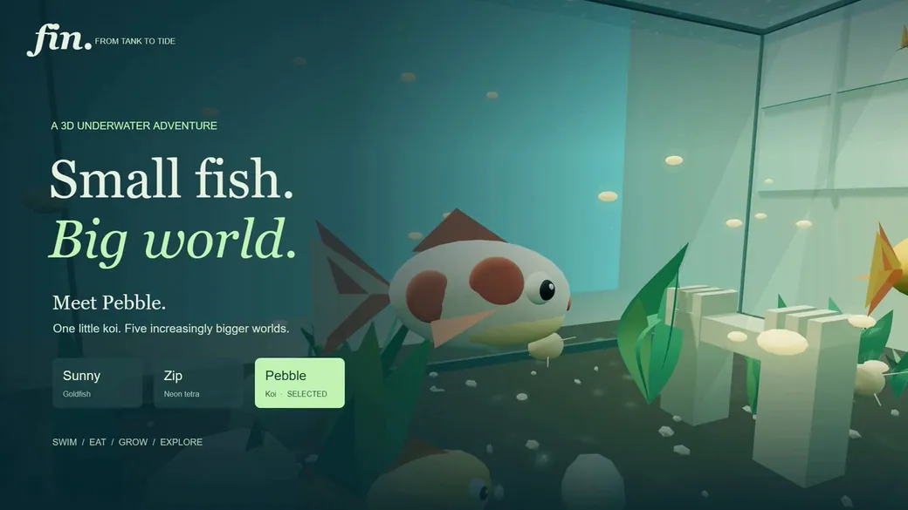</a>

**프롬프트**

```text
물고기 시뮬레이터 게임을 만들고 싶습니다. 플레이어는 물고기가 되며, 시작할 물고기를 선택할 수 있어야 합니다. 집 안의 어항에서 시작하고, 먹이 입자가 위에서 떨어지거나 곳곳에 생성됩니다. 물고기를 조종해 먹이를 찾아 먹으면 더 크게 성장합니다. 장애물이나 피해를 주는 요소도 등장해 물고기의 크기가 줄어들 수 있습니다. 레벨이 오를 때마다 더 넓은 공간으로 이동하며, 최종적으로 바다에 도달하는 방식입니다. 먹이의 종류는 계속 바뀌고, 다른 물고기와 여러 생물도 먹을 수 있습니다.
먼저 이 게임의 전체 게임플레이 루프와 레벨 디자인 등을 Markdown 파일로 정의한 다음, 로컬 브라우저에서 플레이할 수 있는 게임으로 구현해 주세요. 필요한 기술 스택을 선택해 사용하세요.
```

<details>
<summary>작성자의 원본 프롬프트</summary>

```text
I want to create a fish simulator game.. where we are a fish (which you should be able to select).. we start inside a house aquarium where food particles are falling down or spawns or whatever.. we can swim to them and eat the food to grow bigger.. and there might also be obstacles and stuff that damage us to make us smaller. then as we level up we jump into a bigger area progressively until we reach the ocean and stuff. The food we eat can kee cahnging, we can eat other fish and other creatures and all that.
First define the full gameply loop and level designs and stuff for this game into a md file and then implement into a game I can play locally on my browser. select the tech stack that is required
```

</details>

[자세히 보기 ↗](https://www.tripo3d.ai/ko/3d-prompts/gpt-6-astra-2096156244180664627) · [원본 게시물](https://x.com/AVachaspat92841/status/2096156244180664627) · [사례 목록으로](#all-prompts)

---

<a id="dropzone-battle-royale-arena-2096155883122413946"></a>

### 배틀로얄 아레나 Dropzone

[MotionViz](https://x.com/Motion_Viz) · 2026-09-05 · GPT-6 Astra · 게임

<a href="https://www.tripo3d.ai/ko/3d-prompts/dropzone-battle-royale-arena-2096155883122413946">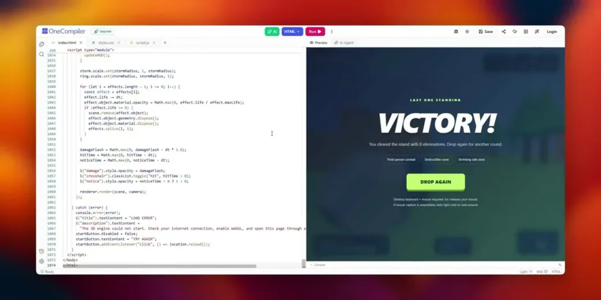</a>

*원작을 바탕으로 정리한 제작 지침*

**프롬프트**

```text
폭풍 구역, AI 적 9명, 펄스 소총, 체력, 재장전이 있는 3인칭 브라우저 배틀로얄을 만드세요. 설치 가능한 엄폐벽과 마지막까지 결판이 나는 탈락전 흐름을 포함하세요.
```

[자세히 보기 ↗](https://www.tripo3d.ai/ko/3d-prompts/dropzone-battle-royale-arena-2096155883122413946) · [원본 게시물](https://x.com/Motion_Viz/status/2096155883122413946) · [사례 목록으로](#all-prompts)

---

<a id="browser-flight-game-2096149823216898445"></a>

### 브라우저 비행 게임

[Givros](https://x.com/givros) · 2026-09-05 · GPT-6 Astra · 게임

<a href="https://www.tripo3d.ai/ko/3d-prompts/browser-flight-game-2096149823216898445">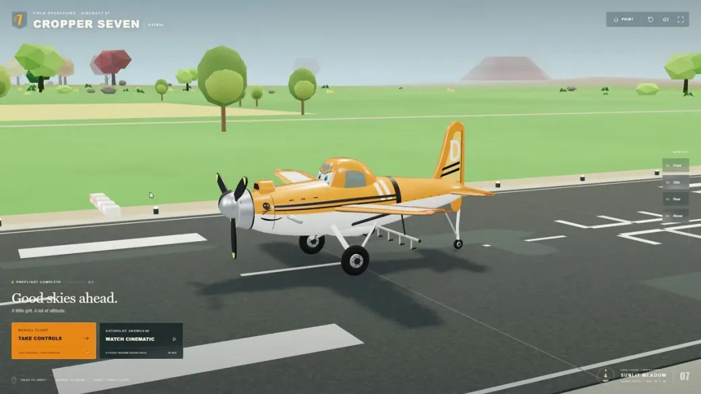</a>

*원작을 바탕으로 정리한 제작 지침*

**프롬프트**

```text
빈 프로젝트에서 완전한 브라우저 3D 비행 게임을 만드세요. 조종 가능한 비행, 이동 가능한 환경, 명확한 목표, 일관된 표현을 포함하세요.
```

[자세히 보기 ↗](https://www.tripo3d.ai/ko/3d-prompts/browser-flight-game-2096149823216898445) · [원본 게시물](https://x.com/givros/status/2096149823216898445) · [사례 목록으로](#all-prompts)

---

<a id="coffee-shop-photo-to-vertical-walkthrough-2096143359505269079"></a>

### 카페 사진을 세로형 실내 투어로

[森叔](https://x.com/harrisonitsme) · 2026-09-05 · GPT-6 Astra · 장면

<a href="https://www.tripo3d.ai/ko/3d-prompts/coffee-shop-photo-to-vertical-walkthrough-2096143359505269079">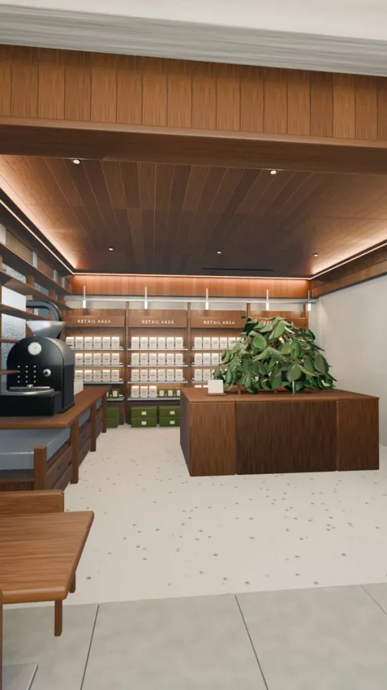</a>

*원작을 바탕으로 정리한 제작 지침*

**프롬프트**

```text
사진을 참고해 목재 천장, 띠 조명, 로스터, 선반, 식물을 갖춘 카페를 Blender에서 재구성하세요. 편집 가능한 장면과 15초 분량의 세로형 카메라 투어를 제공하세요.
```

[자세히 보기 ↗](https://www.tripo3d.ai/ko/3d-prompts/coffee-shop-photo-to-vertical-walkthrough-2096143359505269079) · [원본 게시물](https://x.com/harrisonitsme/status/2096143359505269079) · [사례 목록으로](#all-prompts)

---

<a id="automatic-character-rig-and-kung-fu-moves-2096141728487178503"></a>

### 자동 캐릭터 리그와 쿵후 동작

[The Bugged Dev](https://x.com/thebuggeddev) · 2026-09-05 · GPT-6 Astra · 애니메이션

<a href="https://www.tripo3d.ai/ko/3d-prompts/automatic-character-rig-and-kung-fu-moves-2096141728487178503">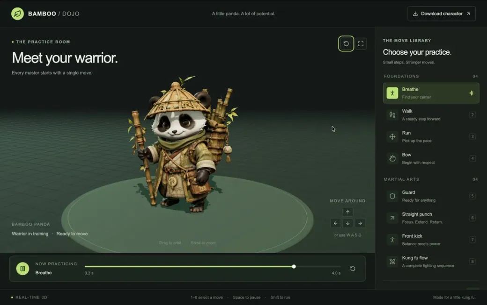</a>

*원작을 바탕으로 정리한 제작 지침*

**프롬프트**

```text
제공된 3D 캐릭터에 리그를 만들고 걷기, 달리기, 여러 쿵후 동작을 추가하세요. 애니메이션에서 관절이 깨지거나 자세가 불안정한지 살펴보세요.
```

[자세히 보기 ↗](https://www.tripo3d.ai/ko/3d-prompts/automatic-character-rig-and-kung-fu-moves-2096141728487178503) · [원본 게시물](https://x.com/thebuggeddev/status/2096141728487178503) · [사례 목록으로](#all-prompts)

---

<a id="viking-character-in-blender-2096140378777010278"></a>

### Blender 바이킹 캐릭터

[Emil](https://x.com/fre4kspace) · 2026-09-05 · GPT-6 Astra · 에셋

<a href="https://www.tripo3d.ai/ko/3d-prompts/viking-character-in-blender-2096140378777010278">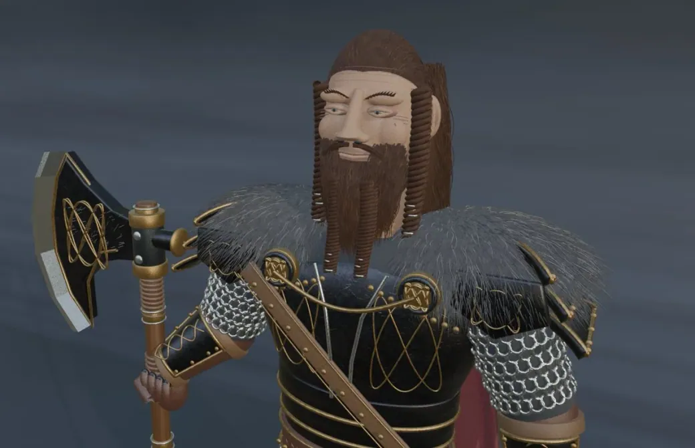</a>

*원작을 바탕으로 정리한 제작 지침*

**프롬프트**

```text
Blender에서 편집 가능한 3D 바이킹 캐릭터를 만드세요. 특징적인 의상, 얼굴 구조, 몸의 비율, 알아보기 쉬운 전시 포즈에 집중하세요.
```

[자세히 보기 ↗](https://www.tripo3d.ai/ko/3d-prompts/viking-character-in-blender-2096140378777010278) · [원본 게시물](https://x.com/fre4kspace/status/2096140378777010278) · [사례 목록으로](#all-prompts)

---

<a id="odyssey-inspired-platform-adventure-2096135808243876152"></a>

### Odyssey 스타일 플랫폼 모험

[AIHubmix](https://x.com/AiHubMix) · 2026-09-05 · GPT-6 Astra · 게임

<a href="https://www.tripo3d.ai/ko/3d-prompts/odyssey-inspired-platform-adventure-2096135808243876152">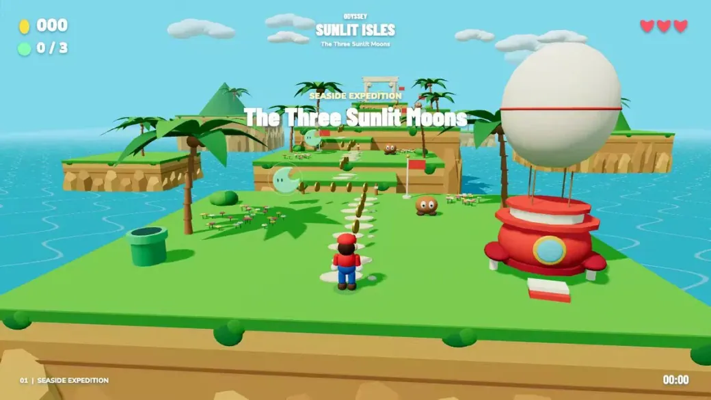</a>

*원작을 바탕으로 정리한 제작 지침*

**프롬프트**

```text
발판 8개, 수집할 달 3개, 돌아오는 모자 공격, 적, 체크포인트가 있는 Odyssey 스타일 Three.js 레벨을 만드세요. 터치 조작을 추가하고 처음부터 끝까지 플레이 테스트하세요.
```

[자세히 보기 ↗](https://www.tripo3d.ai/ko/3d-prompts/odyssey-inspired-platform-adventure-2096135808243876152) · [원본 게시물](https://x.com/AiHubMix/status/2096135808243876152) · [사례 목록으로](#all-prompts)

---

<a id="rigged-and-animated-t-rex-2096133339329536249"></a>

### 리깅하고 움직이는 티라노사우루스

[Majid Manzarpour](https://x.com/majidmanzarpour) · 2026-09-05 · GPT-6 Astra · 에셋

<a href="https://www.tripo3d.ai/ko/3d-prompts/rigged-and-animated-t-rex-2096133339329536249">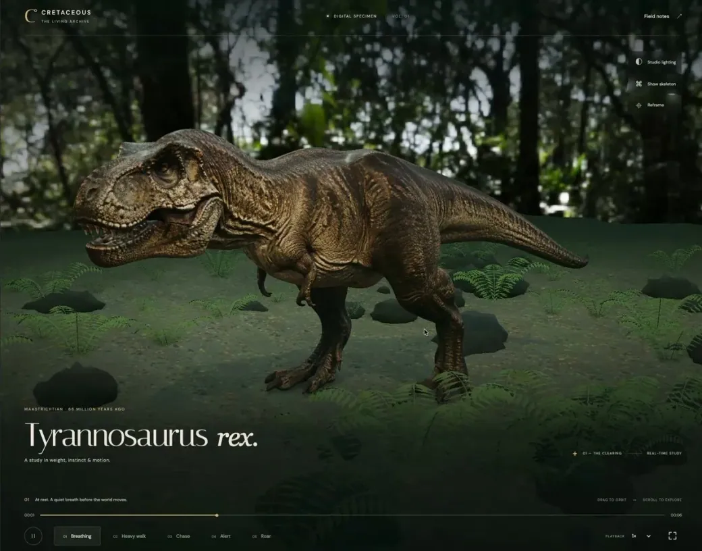</a>

*원작을 바탕으로 정리한 제작 지침*

**프롬프트**

```text
생성된 티라노사우루스 모델에 리그를 만들고 자연스러운 움직임을 추가하세요. Three.js에서 캐릭터를 렌더링하고 애니메이션이 모델을 일관되게 변형하는지 확인하세요.
```

[자세히 보기 ↗](https://www.tripo3d.ai/ko/3d-prompts/rigged-and-animated-t-rex-2096133339329536249) · [원본 게시물](https://x.com/majidmanzarpour/status/2096133339329536249) · [사례 목록으로](#all-prompts)

---

<a id="walkable-office-with-32-animated-people-2096131961345720477"></a>

### 32명이 움직이는 걸어 다닐 수 있는 사무실

[Parithosh-varma](https://x.com/demgufever82151) · 2026-09-05 · Claude Fable 5.1 · 인터랙티브

<a href="https://www.tripo3d.ai/ko/3d-prompts/walkable-office-with-32-animated-people-2096131961345720477">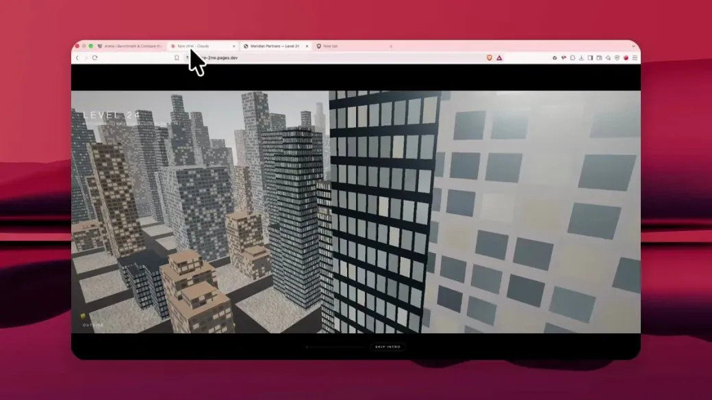</a>

*원작을 바탕으로 정리한 제작 지침*

**프롬프트**

```text
Three.js로 브라우저 사무실을 만드세요. 1인칭 이동, 방문자의 이름을 부르며 인사하는 리그 캐릭터 32명, 클릭 가능한 문, 궤도 조작, 설계도 보기를 포함하세요.
```

[자세히 보기 ↗](https://www.tripo3d.ai/ko/3d-prompts/walkable-office-with-32-animated-people-2096131961345720477) · [원본 게시물](https://x.com/demgufever82151/status/2096131961345720477) · [소스 코드](https://github.com/Parithosh-Varma/office) · [데모](https://office-2nw.pages.dev/) · [사례 목록으로](#all-prompts)

---

<a id="adiyogi-evening-fly-through-2096128774203171021"></a>

### 저녁빛 속 아디요기 비행 투어

[Adi](https://x.com/thejothiram) · 2026-09-05 · GPT-6 Astra · 장면

<a href="https://www.tripo3d.ai/ko/3d-prompts/adiyogi-evening-fly-through-2096128774203171021">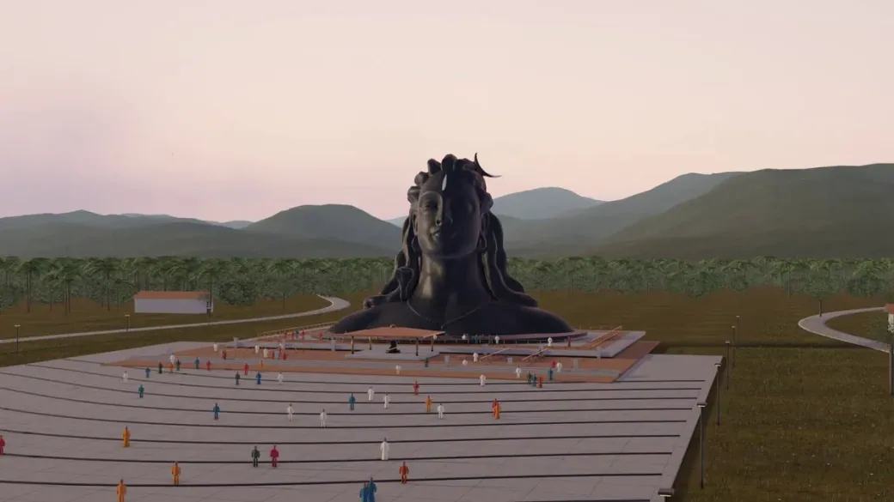</a>

*원작을 바탕으로 정리한 제작 지침*

**프롬프트**

```text
넓은 부지, 정교한 근접 장면, 따뜻한 저녁빛을 갖춘 아디요기 장면을 Blender에서 만드세요. 30초 비행 투어를 렌더링하고 편집 가능한 장면을 보관하세요.
```

[자세히 보기 ↗](https://www.tripo3d.ai/ko/3d-prompts/adiyogi-evening-fly-through-2096128774203171021) · [원본 게시물](https://x.com/thejothiram/status/2096128774203171021) · [사례 목록으로](#all-prompts)

---

<a id="formula-one-car-in-blender-2096125193580113957"></a>

### Blender로 만드는 포뮬러 원 차량

[Conor Dart](https://x.com/Conor_D_Dart) · 2026-09-05 · GPT-6 Astra · 에셋

<a href="https://www.tripo3d.ai/ko/3d-prompts/formula-one-car-in-blender-2096125193580113957">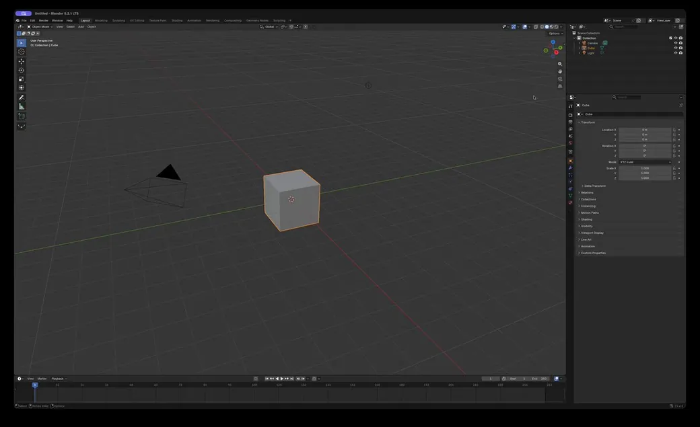</a>

*원작을 바탕으로 정리한 제작 지침*

**프롬프트**

```text
컴퓨터 조작을 사용해 Blender에서 포뮬러 원 3D 모델을 만드세요.
```

[자세히 보기 ↗](https://www.tripo3d.ai/ko/3d-prompts/formula-one-car-in-blender-2096125193580113957) · [원본 게시물](https://x.com/Conor_D_Dart/status/2096125193580113957) · [사례 목록으로](#all-prompts)

---

<a id="live-jet-manufacturing-plant-2096122429319852319"></a>

### 실시간으로 가동되는 제트기 공장

[Konstantin Saifoulline](https://x.com/konstantinsaifo) · 2026-09-05 · GPT-6 Astra · 애니메이션

<a href="https://www.tripo3d.ai/ko/3d-prompts/live-jet-manufacturing-plant-2096122429319852319">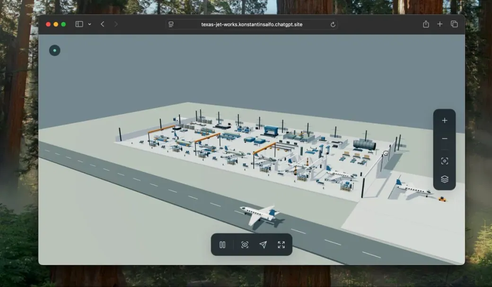</a>

*원작을 바탕으로 정리한 제작 지침*

**프롬프트**

```text
항공기 제조를 조사하고 실시간 Three.js 제트기 공장 시뮬레이션을 만드세요. 기계 사이클, 생산 작업장, 운송, 병목을 모델링하고 흐름을 테스트하세요.
```

[자세히 보기 ↗](https://www.tripo3d.ai/ko/3d-prompts/live-jet-manufacturing-plant-2096122429319852319) · [원본 게시물](https://x.com/konstantinsaifo/status/2096122429319852319) · [사례 목록으로](#all-prompts)

---

<a id="playable-remake-of-a-mobile-game-ad-2096111709496680842"></a>

### 실제로 플레이하게 만든 모바일 게임 광고

[daniel](https://x.com/buildingadlicio) · 2026-09-05 · GPT-6 Astra · 게임

<a href="https://www.tripo3d.ai/ko/3d-prompts/playable-remake-of-a-mobile-game-ad-2096111709496680842">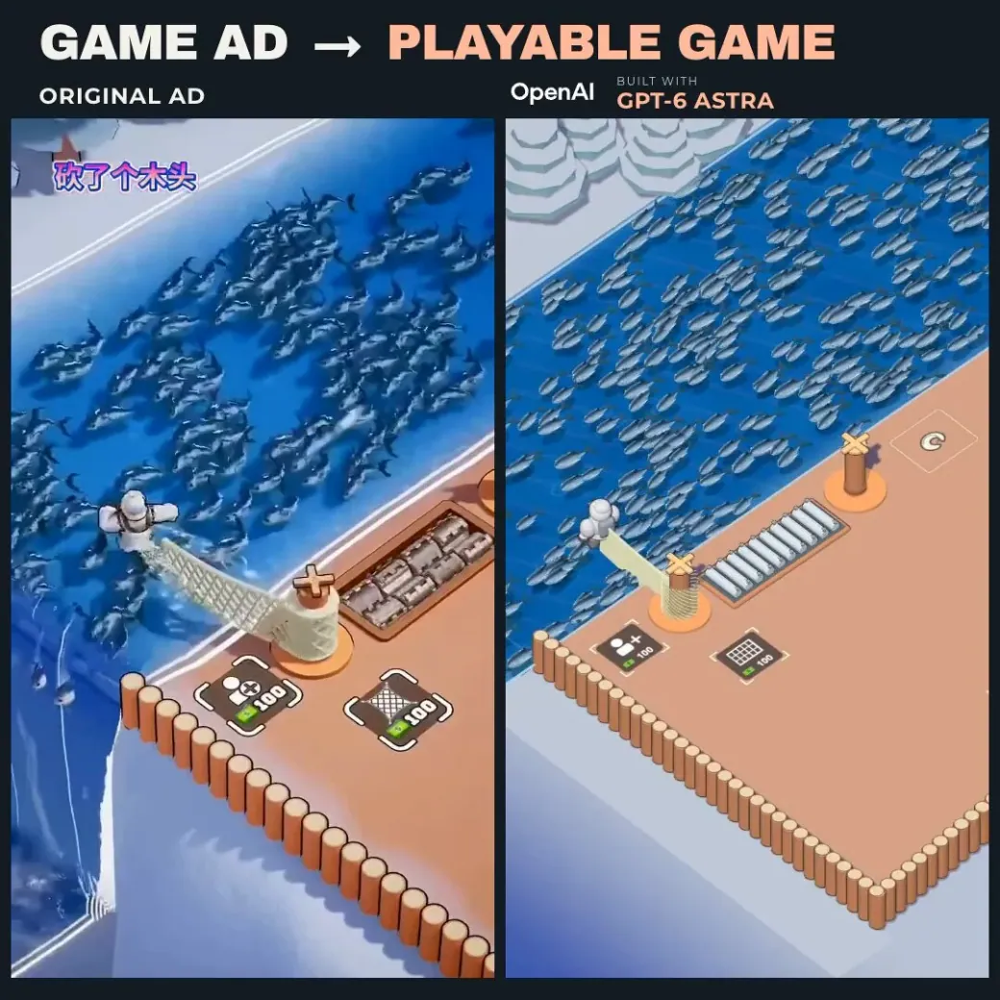</a>

*원작을 바탕으로 정리한 제작 지침*

**프롬프트**

```text
모바일 게임 광고를 참고해 플레이 가능한 브라우저 게임을 만드세요. 핵심 상호작용을 재현하고 Blender 에셋으로 광고의 시각적 콘셉트를 맞추세요.
```

[자세히 보기 ↗](https://www.tripo3d.ai/ko/3d-prompts/playable-remake-of-a-mobile-game-ad-2096111709496680842) · [원본 게시물](https://x.com/buildingadlicio/status/2096111709496680842) · [사례 목록으로](#all-prompts)

---

<a id="artwork-to-a-playable-character-2096107343268257953"></a>

### 일러스트에서 플레이 가능한 캐릭터로

[NOCTAVIA™](https://x.com/noctav1a) · 2026-09-05 · GPT-6 Astra · 에셋

<a href="https://www.tripo3d.ai/ko/3d-prompts/artwork-to-a-playable-character-2096107343268257953">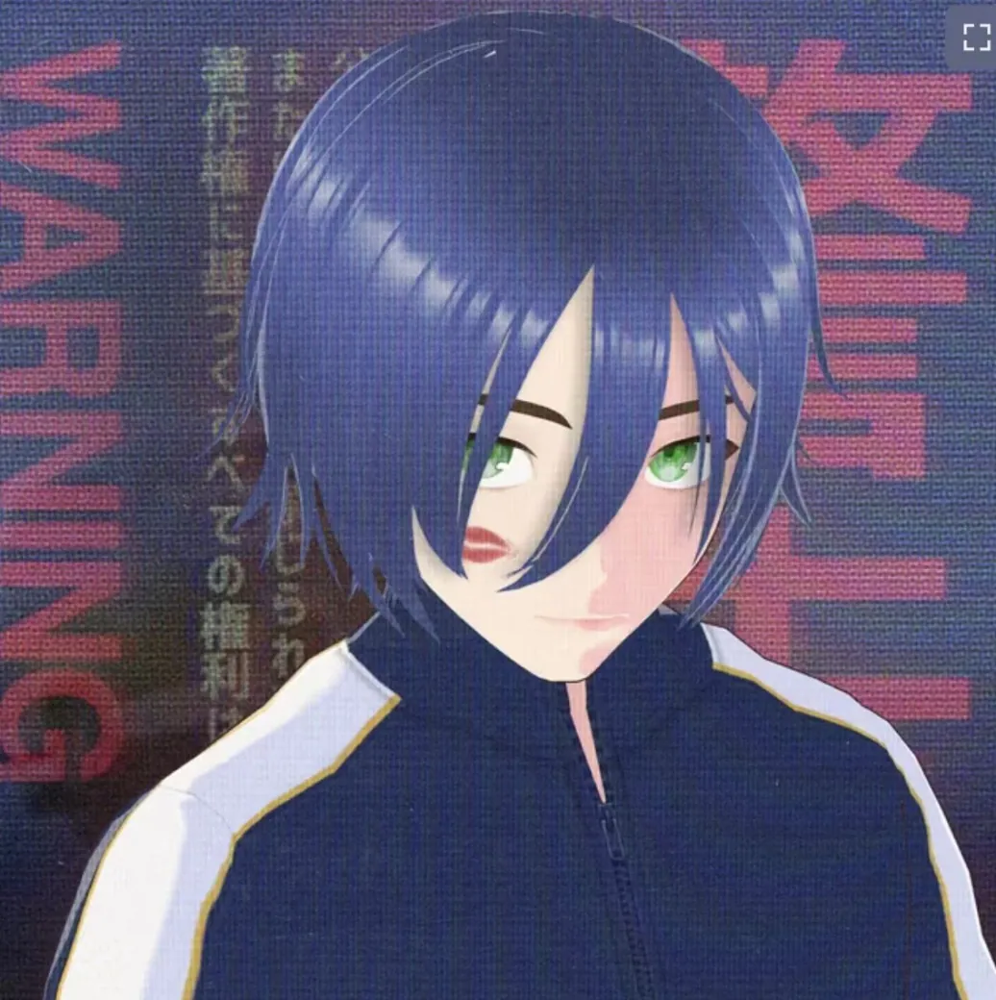</a>

*원작을 바탕으로 정리한 제작 지침*

**프롬프트**

```text
Noctavia 캐릭터 일러스트를 플레이 가능한 3D 캐릭터로 재현하세요. 디자인 언어를 유지하고 인터랙티브 전시에 적합한 완전한 모델을 만드세요.
```

[자세히 보기 ↗](https://www.tripo3d.ai/ko/3d-prompts/artwork-to-a-playable-character-2096107343268257953) · [원본 게시물](https://x.com/noctav1a/status/2096107343268257953) · [사례 목록으로](#all-prompts)

---

<a id="azadi-tower-in-blender-2096107322536051057"></a>

### Blender로 만드는 아자디 타워

[taesiri](https://x.com/taesiri) · 2026-09-05 · GPT-6 Astra · 에셋

<a href="https://www.tripo3d.ai/ko/3d-prompts/azadi-tower-in-blender-2096107322536051057">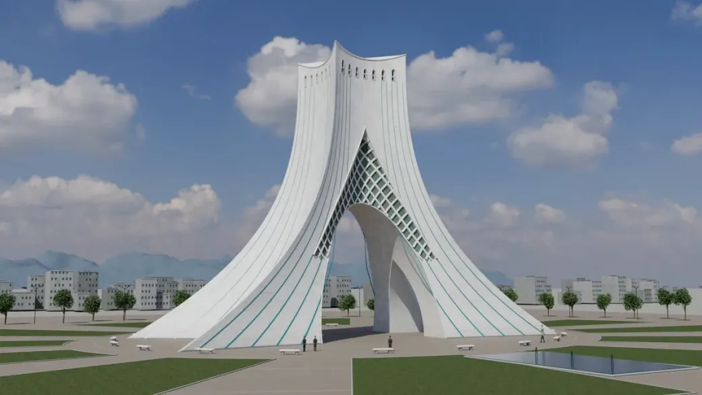</a>

*원작을 바탕으로 정리한 제작 지침*

**프롬프트**

```text
편집 가능한 Blender 아자디 타워 모델을 만드세요. 퍼지는 기단, 교차 아치, 무늬가 있는 표면, 알아볼 수 있는 비율에 집중하세요.
```

[자세히 보기 ↗](https://www.tripo3d.ai/ko/3d-prompts/azadi-tower-in-blender-2096107322536051057) · [원본 게시물](https://x.com/taesiri/status/2096107322536051057) · [사례 목록으로](#all-prompts)

---

<a id="suzhou-museum-garden-walkthrough-2096096998092841449"></a>

### 쑤저우 박물관 정원 워크스루

[amber shen](https://x.com/whosamberella) · 2026-09-05 · GPT-6 Astra · 장면

<a href="https://www.tripo3d.ai/ko/3d-prompts/suzhou-museum-garden-walkthrough-2096096998092841449">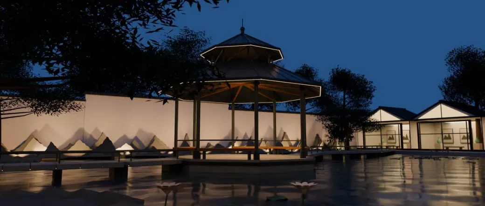</a>

*원작을 바탕으로 정리한 제작 지침*

**프롬프트**

```text
쑤저우 박물관에 관한 웹페이지를 참고해 Blender에서 정원을 재현하세요. 현대 건축과 중국 전통 조경의 관계를 유지하는 연속적인 워크스루를 만드세요.
```

[자세히 보기 ↗](https://www.tripo3d.ai/ko/3d-prompts/suzhou-museum-garden-walkthrough-2096096998092841449) · [원본 게시물](https://x.com/whosamberella/status/2096096998092841449) · [사례 목록으로](#all-prompts)

---

<a id="black-hole-formation-in-webgl-2096093614397170104"></a>

### WebGL로 살펴보는 블랙홀의 형성

[ゼン🍣🐟🇳🇿](https://x.com/zeeeeeen) · 2026-09-05 · GPT-6 Astra · 인터랙티브

<a href="https://www.tripo3d.ai/ko/3d-prompts/black-hole-formation-in-webgl-2096093614397170104">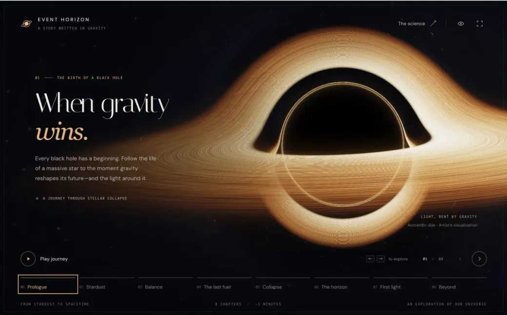</a>

*원작을 바탕으로 정리한 제작 지침*

**프롬프트**

```text
WebGL 시각화를 활용해 블랙홀의 형성을 설명하는 교육용 슬라이드쇼를 만드세요. 설명에 맞춰 움직이는 3D 장면을 보여 주세요.
```

[자세히 보기 ↗](https://www.tripo3d.ai/ko/3d-prompts/black-hole-formation-in-webgl-2096093614397170104) · [원본 게시물](https://x.com/zeeeeeen/status/2096093614397170104) · [사례 목록으로](#all-prompts)

---

<a id="gpt-6-astra-2096083014845636816"></a>

### Blender로 제작하는 미래형 오토바이와 탱크

[ステスロス@2号機](https://x.com/StelsRay2) · 2026-09-05 · GPT-6 Astra · 에셋

<a href="https://www.tripo3d.ai/ko/3d-prompts/gpt-6-astra-2096083014845636816">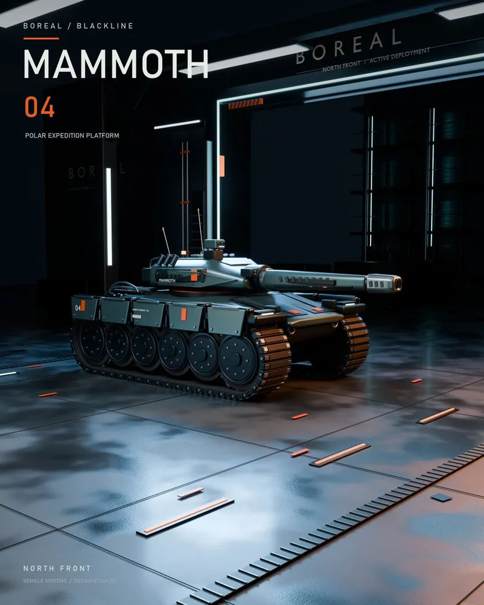</a>

**프롬프트**

```text
모델 제작 역량 평가
Blender를 사용해 미래형 오토바이와 미래형 탱크, 그리고 프레젠테이션용으로 어울리는 배경을 제작하되 디자인과 외관을 우선합니다. 여러 각도에서 스크린샷을 촬영합니다. MCP도 사용할 수 있지만, 가장 높은 품질을 낼 수 있는 워크플로를 선택합니다.
```

<details>
<summary>작성자의 원본 프롬프트</summary>

```text
モデル性能評価試験
blenderを使用してデザインや見た目重視の近未来バイク、近未来戦車、それに合う撮影用背景のモデルを作成して複数カットのスクショを撮って MCPも使えるはずだけど一番クォリティーを出せる使い方を任せる
```

</details>

[자세히 보기 ↗](https://www.tripo3d.ai/ko/3d-prompts/gpt-6-astra-2096083014845636816) · [원본 게시물](https://x.com/StelsRay2/status/2096083014845636816) · [사례 목록으로](#all-prompts)

---

<a id="exploding-procedural-train-assemblies-2096082580554777041"></a>

### 절차적 열차 조립체 분해 애니메이션

[Tom Krcha](https://x.com/tomkrcha) · 2026-09-05 · GPT-6 Astra · 애니메이션

<a href="https://www.tripo3d.ai/ko/3d-prompts/exploding-procedural-train-assemblies-2096082580554777041">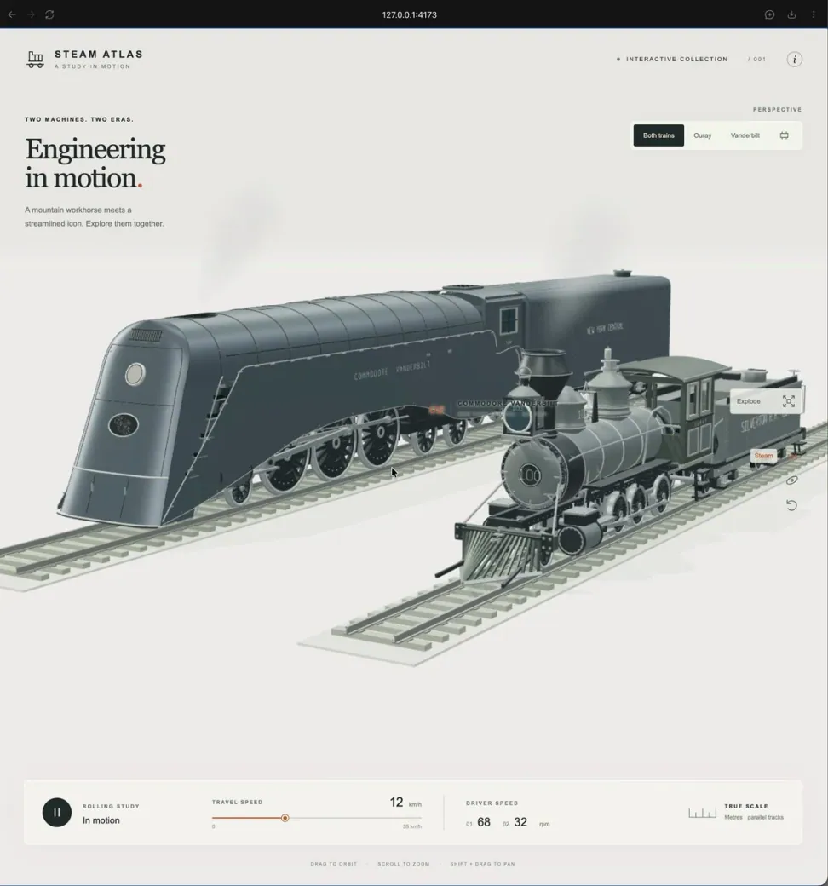</a>

*원작을 바탕으로 정리한 제작 지침*

**프롬프트**

```text
치수, 단면, 지오메트리 함수로 Three.js에서 기차 두 대를 직접 생성하세요. 바퀴를 움직이고 분해 보기와 재조립 시퀀스를 제공하세요.
```

[자세히 보기 ↗](https://www.tripo3d.ai/ko/3d-prompts/exploding-procedural-train-assemblies-2096082580554777041) · [원본 게시물](https://x.com/tomkrcha/status/2096082580554777041) · [사례 목록으로](#all-prompts)

---

<a id="interactive-globe-dashboard-2096082432197837065"></a>

### 인터랙티브 지구본 대시보드

[Kai](https://x.com/hqmank) · 2026-09-05 · GPT-6 Astra · 인터랙티브

<a href="https://www.tripo3d.ai/ko/3d-prompts/interactive-globe-dashboard-2096082432197837065">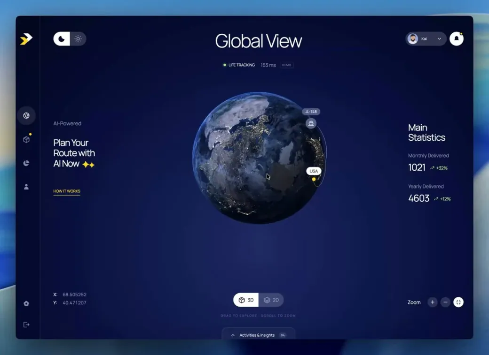</a>

*원작을 바탕으로 정리한 제작 지침*

**프롬프트**

```text
참고 이미지로 Three.js 3D 지구본 대시보드를 재구축하세요. 낮·밤 모드, 읽기 쉬운 지리 데이터, 참고 자료에 맞춰 실제 작동하는 조작 기능을 포함하세요.
```

[자세히 보기 ↗](https://www.tripo3d.ai/ko/3d-prompts/interactive-globe-dashboard-2096082432197837065) · [원본 게시물](https://x.com/hqmank/status/2096082432197837065) · [사례 목록으로](#all-prompts)

---

<a id="schematic-pdf-to-pcb-and-3d-view-2096079976433082502"></a>

### 회로도 PDF에서 PCB와 3D 보기까지

[Titlist400](https://x.com/swjtutl) · 2026-09-05 · GPT-6 Astra · 기타

<a href="https://www.tripo3d.ai/ko/3d-prompts/schematic-pdf-to-pcb-and-3d-view-2096079976433082502">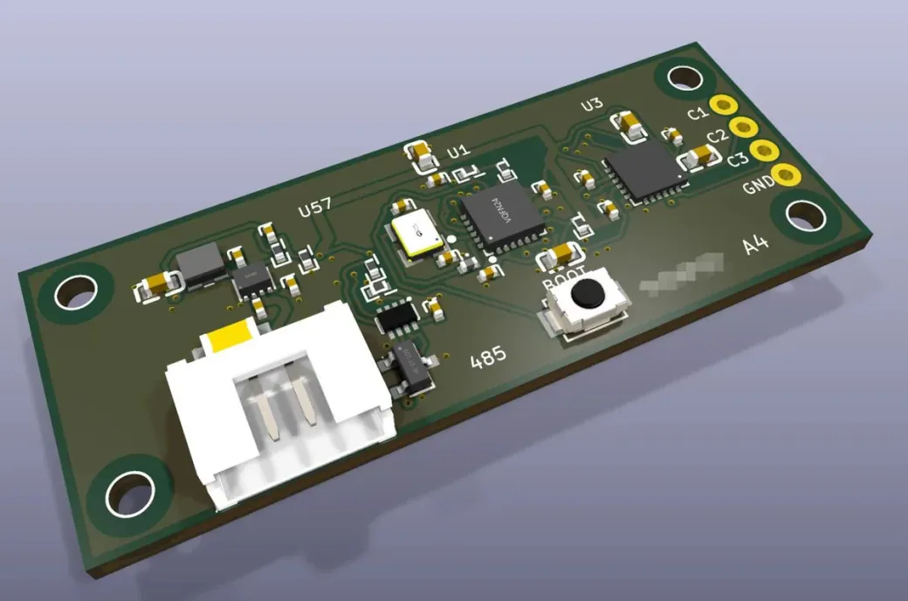</a>

*원작을 바탕으로 정리한 제작 지침*

**프롬프트**

```text
회로도 PDF로 KiCad 회로를 수정하고 50 × 20 mm 2층 PCB를 배선한 뒤 3D 조립 모델을 렌더링하세요. 부품 데이터시트를 검토하고 설계 규칙 위반을 해결하세요.
```

[자세히 보기 ↗](https://www.tripo3d.ai/ko/3d-prompts/schematic-pdf-to-pcb-and-3d-view-2096079976433082502) · [원본 게시물](https://x.com/swjtutl/status/2096079976433082502) · [사례 목록으로](#all-prompts)

---

<a id="astral-war-browser-shooter-2096079660605997264"></a>

### 브라우저 슈터 Astral War

[Rishi](https://x.com/0xRishi) · 2026-09-05 · GPT-6 Astra · 게임

<a href="https://www.tripo3d.ai/ko/3d-prompts/astral-war-browser-shooter-2096079660605997264"></a>

*원작을 바탕으로 정리한 제작 지침*

**프롬프트**

```text
World at War에서 영감을 받은 Three.js 브라우저 슈터를 만드세요. 반응이 빠른 전투, 공간 음향, 캐릭터 에셋, 경기 진행이 있는 완전한 플레이 가능 전장을 만드세요.
```

[자세히 보기 ↗](https://www.tripo3d.ai/ko/3d-prompts/astral-war-browser-shooter-2096079660605997264) · [원본 게시물](https://x.com/0xRishi/status/2096079660605997264) · [사례 목록으로](#all-prompts)

---

<a id="astra-3d-2096068401294929940"></a>

### 콘셉트 이미지로 Astra를 활용해 투박한 3D 미니게임 만들기

[陈硕KAI（耍门）](https://x.com/ChenshuoAI) · 2026-09-05 · GPT-6 Astra · 게임

<a href="https://www.tripo3d.ai/ko/3d-prompts/astra-3d-2096068401294929940"></a>

**프롬프트**

```text
슬프지만 아름다운 디스토피아 세계, 복셀 / 로우폴리 스타일, 비 내리는 밤, 옅은 안개, 젖은 지형의 반사, 차가운 푸른색 환경광 + 따뜻한 주황색 조명. 조명은 최대한 사실적이고 영화적인 느낌으로 연출하세요.
```

<details>
<summary>작성자의 원본 프롬프트</summary>

```text
悲伤但美丽的反乌托邦世界，体素 / Low Poly 风格，雨夜、薄雾、湿地反射、冷蓝色环境 + 暖橙色灯光，灯光要尽量真实、有电影感
```

</details>

[자세히 보기 ↗](https://www.tripo3d.ai/ko/3d-prompts/astra-3d-2096068401294929940) · [원본 게시물](https://x.com/ChenshuoAI/status/2096068401294929940) · [사례 목록으로](#all-prompts)

---

<a id="the-legend-of-astra-game-prototype-2096064140510970318"></a>

### The Legend of Astra 게임 프로토타입

[lofibloom](https://x.com/lofihashbloom) · 2026-09-05 · GPT-6 Astra · 게임

<a href="https://www.tripo3d.ai/ko/3d-prompts/the-legend-of-astra-game-prototype-2096064140510970318"></a>

*원작을 바탕으로 정리한 제작 지침*

**프롬프트**

```text
Blender에서 준비한 장면과 Tripo 에셋을 활용해 Unity에서 3D 어드벤처 게임 프로토타입을 만드세요. 플레이 가능한 데모에 캐릭터 애니메이션을 통합하세요.
```

[자세히 보기 ↗](https://www.tripo3d.ai/ko/3d-prompts/the-legend-of-astra-game-prototype-2096064140510970318) · [원본 게시물](https://x.com/lofihashbloom/status/2096064140510970318) · [사례 목록으로](#all-prompts)

---

<a id="sinclair-zx-spectrum-simulator-2096062355692048605"></a>

### Sinclair ZX Spectrum 시뮬레이터

[Derya Unutmaz, MD](https://x.com/DeryaTR_) · 2026-09-05 · GPT-6 Astra · 인터랙티브

<a href="https://www.tripo3d.ai/ko/3d-prompts/sinclair-zx-spectrum-simulator-2096062355692048605"></a>

*원작을 바탕으로 정리한 제작 지침*

**프롬프트**

```text
Sinclair ZX Spectrum 48K를 인터랙티브 3D 데스크톱 앱으로 재현하세요. 고무 키보드, 테이프 플레이어, 시작 화면, 플레이 가능한 게임, BASIC 프로그래밍 인터페이스를 포함하세요.
```

[자세히 보기 ↗](https://www.tripo3d.ai/ko/3d-prompts/sinclair-zx-spectrum-simulator-2096062355692048605) · [원본 게시물](https://x.com/DeryaTR_/status/2096062355692048605) · [사례 목록으로](#all-prompts)

---

<a id="single-view-power-drill-reconstruction-2096059736693305794"></a>

### 한 시점의 사진으로 재구성하는 전동드릴

[Utah teapot 🫖](https://x.com/SkyeSharkie) · 2026-09-05 · GPT-6 Astra · 에셋

<a href="https://www.tripo3d.ai/ko/3d-prompts/single-view-power-drill-reconstruction-2096059736693305794"></a>

*원작을 바탕으로 정리한 제작 지침*

**프롬프트**

```text
하나의 참고 시점으로 Blender에서 전동드릴을 재구성하세요. 본체, 손잡이, 척, 조작부를 편집 가능한 지오메트리로 만든 뒤 여러 각도에서 확인하세요.
```

[자세히 보기 ↗](https://www.tripo3d.ai/ko/3d-prompts/single-view-power-drill-reconstruction-2096059736693305794) · [원본 게시물](https://x.com/SkyeSharkie/status/2096059736693305794) · [사례 목록으로](#all-prompts)

---

<a id="sonic-inspired-godot-vertical-slice-2096056285896536086"></a>

### Godot로 만드는 Sonic 스타일 완성형 레벨

[AiBattle](https://x.com/AiBattle_) · 2026-09-05 · GPT-6 Astra · 게임

<a href="https://www.tripo3d.ai/ko/3d-prompts/sonic-inspired-godot-vertical-slice-2096056285896536086"></a>

*원작을 바탕으로 정리한 제작 지침*

**프롬프트**

```text
로컬·절차적 에셋으로 Godot에서 Sonic 스타일 3D 레벨을 완성도 있게 만드세요. 관성, 반응이 좋은 이동, 링, 루프, 그라인드 레일, 끊김 없는 열대 해안을 우선하세요.
```

[자세히 보기 ↗](https://www.tripo3d.ai/ko/3d-prompts/sonic-inspired-godot-vertical-slice-2096056285896536086) · [원본 게시물](https://x.com/AiBattle_/status/2096056285896536086) · [사례 목록으로](#all-prompts)

---

<a id="zork-as-a-3d-action-adventure-2096047660662722620"></a>

### Zork를 3D 액션 어드벤처로

[Ethan Mollick](https://x.com/emollick) · 2026-09-05 · GPT-6 Astra · 게임

<a href="https://www.tripo3d.ai/ko/3d-prompts/zork-as-a-3d-action-adventure-2096047660662722620"></a>

*원작을 바탕으로 정리한 제작 지침*

**프롬프트**

```text
고전 텍스트 어드벤처 Zork를 3D 액션 어드벤처로 바꾸세요. 줄거리와 퍼즐을 유지하고 전투 장면을 추가하며 캐릭터와 환경을 Three.js로 만드세요.
```

[자세히 보기 ↗](https://www.tripo3d.ai/ko/3d-prompts/zork-as-a-3d-action-adventure-2096047660662722620) · [원본 게시물](https://x.com/emollick/status/2096047660662722620) · [사례 목록으로](#all-prompts)

---

<a id="delivery-network-with-bridge-closures-2096042360513904742"></a>

### 다리 폐쇄에 반응하는 배송망

[AgentworkflowLab](https://x.com/AgentWorkflowLa) · 2026-09-05 · GPT-6 Astra · 애니메이션

<a href="https://www.tripo3d.ai/ko/3d-prompts/delivery-network-with-bridge-closures-2096042360513904742"></a>

*원작을 바탕으로 정리한 제작 지침*

**프롬프트**

```text
다리를 닫으면 트럭 경로가 바뀌는 3D 배송 시뮬레이션을 만드세요. 도달할 수 없는 목적지를 감지하고 경로가 다시 열리면 배송을 복구하세요.
```

[자세히 보기 ↗](https://www.tripo3d.ai/ko/3d-prompts/delivery-network-with-bridge-closures-2096042360513904742) · [원본 게시물](https://x.com/AgentWorkflowLa/status/2096042360513904742) · [사례 목록으로](#all-prompts)

---

<a id="evolving-webgl-ecosystem-2096040448477515874"></a>

### 진화하는 WebGL 생태계

[Yume\_X](https://x.com/yume_arasaki) · 2026-09-05 · GPT-6 Astra · 애니메이션

<a href="https://www.tripo3d.ai/ko/3d-prompts/evolving-webgl-ecosystem-2096040448477515874"></a>

*원작을 바탕으로 정리한 제작 지침*

**프롬프트**

```text
순수 WebGL과 GLSL로 HTML 파일 하나에 진화하는 3D 생태계를 만드세요. 돌연변이, 자연선택, 포식, 에너지 사용, 다세포 결합이 서로 작용하게 하세요.
```

[자세히 보기 ↗](https://www.tripo3d.ai/ko/3d-prompts/evolving-webgl-ecosystem-2096040448477515874) · [원본 게시물](https://x.com/yume_arasaki/status/2096040448477515874) · [사례 목록으로](#all-prompts)

---

<a id="explorable-taj-mahal-2096035962824335798"></a>

### 탐험할 수 있는 타지마할

[vikas sabbi](https://x.com/vikassabbi) · 2026-09-05 · GPT-6 Astra · 장면

<a href="https://www.tripo3d.ai/ko/3d-prompts/explorable-taj-mahal-2096035962824335798"></a>

*원작을 바탕으로 정리한 제작 지침*

**프롬프트**

```text
타지마할을 탐험 가능한 3D 장면으로 재현하세요. 특징적인 비율, 대칭 정원, 중앙 돔, 미나레트, 건물 사이의 관계를 우선하세요.
```

[자세히 보기 ↗](https://www.tripo3d.ai/ko/3d-prompts/explorable-taj-mahal-2096035962824335798) · [원본 게시물](https://x.com/vikassabbi/status/2096035962824335798) · [사례 목록으로](#all-prompts)

---

<a id="personal-3d-portfolio-with-a-speaking-globe-2096023793772998704"></a>

### 강연 활동을 지구본에 담은 개인 3D 포트폴리오

[Shivay Lamba](https://x.com/HowDevelop) · 2026-09-04 · GPT-6 Astra · 인터랙티브

<a href="https://www.tripo3d.ai/ko/3d-prompts/personal-3d-portfolio-with-a-speaking-globe-2096023793772998704"></a>

*원작을 바탕으로 정리한 제작 지침*

**프롬프트**

```text
인물 사진을 Blender 캐릭터로 바꾸고 편집 디자인형 WebGL 포트폴리오에 넣으세요. 강연 장소를 표시하는 회전 지구본을 추가하고 에셋을 웹사이트에 통합하세요.
```

[자세히 보기 ↗](https://www.tripo3d.ai/ko/3d-prompts/personal-3d-portfolio-with-a-speaking-globe-2096023793772998704) · [원본 게시물](https://x.com/HowDevelop/status/2096023793772998704) · [사례 목록으로](#all-prompts)

---

<a id="gogh-strike-multiplayer-fps-2096013280519016608"></a>

### 멀티플레이 FPS Gogh Strike

[Peter Gostev](https://x.com/petergostev) · 2026-09-04 · GPT-6 Astra · 게임

<a href="https://www.tripo3d.ai/ko/3d-prompts/gogh-strike-multiplayer-fps-2096013280519016608"></a>

*원작을 바탕으로 정리한 제작 지침*

**프롬프트**

```text
후기인상주의풍 5 대 5 1인칭 슈터를 만드세요. Blender로 렌더링한 화가 캐릭터, 명확히 구분되는 팀, 브라우저에서 완결되는 멀티플레이 경기를 포함하세요.
```

[자세히 보기 ↗](https://www.tripo3d.ai/ko/3d-prompts/gogh-strike-multiplayer-fps-2096013280519016608) · [원본 게시물](https://x.com/petergostev/status/2096013280519016608) · [소스 코드](https://github.com/petergpt/gogh-strike) · [데모](https://gogh-strike.surge.sh/) · [사례 목록으로](#all-prompts)

---

<a id="tp-7-recorder-reference-model-2096013228090245181"></a>

### 참고 이미지로 재현하는 TP-7 레코더

[Tykra](https://x.com/ty_kra_lab) · 2026-09-04 · GPT-6 Astra · 에셋

<a href="https://www.tripo3d.ai/ko/3d-prompts/tp-7-recorder-reference-model-2096013228090245181"></a>

*원작을 바탕으로 정리한 제작 지침*

**프롬프트**

```text
참고 이미지로 Teenage Engineering TP-7을 Three.js에서 재현하세요. 형태와 겉으로 보이는 조작부를 맞추고, 여러 방향에서 살펴볼 수 있는 3D 모델로 만드세요.
```

[자세히 보기 ↗](https://www.tripo3d.ai/ko/3d-prompts/tp-7-recorder-reference-model-2096013228090245181) · [원본 게시물](https://x.com/ty_kra_lab/status/2096013228090245181) · [사례 목록으로](#all-prompts)

---

<a id="tesla-model-x-exploded-view-2096009146248122416"></a>

### Tesla Model X 분해 보기

[ashe](https://x.com/ashebytes) · 2026-09-04 · GPT-6 Astra · 인터랙티브

<a href="https://www.tripo3d.ai/ko/3d-prompts/tesla-model-x-exploded-view-2096009146248122416"></a>

*원작을 바탕으로 정리한 제작 지침*

**프롬프트**

```text
Tesla Model X를 모델링된 부품으로 분리하는 3D 웹사이트를 만드세요. 방문자가 조립체를 살펴보고 차량을 인터랙티브하게 다시 조립하도록 하세요.
```

[자세히 보기 ↗](https://www.tripo3d.ai/ko/3d-prompts/tesla-model-x-exploded-view-2096009146248122416) · [원본 게시물](https://x.com/ashebytes/status/2096009146248122416) · [사례 목록으로](#all-prompts)

---

<a id="bouncy-webgpu-jelly-2096008241104711698"></a>

### 탱글탱글한 WebGPU 젤리

[Scott](https://x.com/scottstts) · 2026-09-04 · GPT-6 Astra · 애니메이션

<a href="https://www.tripo3d.ai/ko/3d-prompts/bouncy-webgpu-jelly-2096008241104711698"></a>

*원작을 바탕으로 정리한 제작 지침*

**프롬프트**

```text
Three.js와 WebGPU로 맛있어 보이는 탄력 있는 젤리를 만드세요. 조작 후 자연스럽게 변형되고 진정되게 하며 반투명 재질과 형태가 잘 보이는 조명을 사용하세요.
```

[자세히 보기 ↗](https://www.tripo3d.ai/ko/3d-prompts/bouncy-webgpu-jelly-2096008241104711698) · [원본 게시물](https://x.com/scottstts/status/2096008241104711698) · [사례 목록으로](#all-prompts)

---

<a id="anime-arena-fighter-in-roblox-2095999578419929412"></a>

### Roblox 애니메이션풍 아레나 격투

[hiraeth](https://x.com/WoahWurdz) · 2026-09-04 · GPT-6 Astra · 게임

<a href="https://www.tripo3d.ai/ko/3d-prompts/anime-arena-fighter-in-roblox-2095999578419929412"></a>

*원작을 바탕으로 정리한 제작 지침*

**프롬프트**

```text
애니메이션 크로스오버 배틀에서 영감을 받은 Roblox 아레나 격투 게임을 만드세요. Blender와 사용 가능한 에셋으로 아레나와 캐릭터를 만들고 플레이 가능한 전투 흐름을 구현하세요.
```

[자세히 보기 ↗](https://www.tripo3d.ai/ko/3d-prompts/anime-arena-fighter-in-roblox-2095999578419929412) · [원본 게시물](https://x.com/WoahWurdz/status/2095999578419929412) · [사례 목록으로](#all-prompts)

---

<a id="linked-floor-plan-and-3d-walkthrough-2095999282088378520"></a>

### 평면도와 연동되는 3D 둘러보기

[おのふみ\| AIクリエーター×個人開発](https://x.com/onofumi_AI) · 2026-09-04 · GPT-6 Astra · 장면

<a href="https://www.tripo3d.ai/ko/3d-prompts/linked-floor-plan-and-3d-walkthrough-2095999282088378520"></a>

*원작을 바탕으로 정리한 제작 지침*

**프롬프트**

```text
동일한 치수로 침실이 하나인 아파트의 평면도와 실내 둘러보기를 만드세요. 두 보기의 현재 위치를 동기화하고, 가정한 천장 높이와 마감재를 명확히 표시하세요.
```

[자세히 보기 ↗](https://www.tripo3d.ai/ko/3d-prompts/linked-floor-plan-and-3d-walkthrough-2095999282088378520) · [원본 게시물](https://x.com/onofumi_AI/status/2095999282088378520) · [사례 목록으로](#all-prompts)

---

<a id="interactive-browser-river-scene-2095993826569502785"></a>

### 브라우저에서 조작하는 강 장면

[Dan Greenheck](https://x.com/dangreenheck) · 2026-09-04 · GPT-6 Astra · 인터랙티브

<a href="https://www.tripo3d.ai/ko/3d-prompts/interactive-browser-river-scene-2095993826569502785"></a>

*원작을 바탕으로 정리한 제작 지침*

**프롬프트**

```text
브라우저에서 작동하는 인터랙티브 강 장면을 만드세요. 먼저 실시간 물 표현이 작동하는 프로토타입을 만든 뒤, 시각적 결과를 살펴보고 다듬으세요.
```

[자세히 보기 ↗](https://www.tripo3d.ai/ko/3d-prompts/interactive-browser-river-scene-2095993826569502785) · [원본 게시물](https://x.com/dangreenheck/status/2095993826569502785) · [사례 목록으로](#all-prompts)

---

<a id="cathedral-hack-and-slash-arena-2095988972879335792"></a>

### 대성당 핵앤슬래시 아레나

[Alexey Fateev](https://x.com/superalesha) · 2026-09-04 · GPT-6 Astra · 게임

<a href="https://www.tripo3d.ai/ko/3d-prompts/cathedral-hack-and-slash-arena-2095988972879335792"></a>

*원작을 바탕으로 정리한 제작 지침*

**프롬프트**

```text
죽은 별 위의 대성당을 배경으로 3인칭 Three.js 핵앤슬래시 게임을 만드세요. 약한 검 공격 콤보, 강공격, 범위 마법, 회피, 무게 중심이 느껴지는 양손 애니메이션을 포함하세요.
```

[자세히 보기 ↗](https://www.tripo3d.ai/ko/3d-prompts/cathedral-hack-and-slash-arena-2095988972879335792) · [원본 게시물](https://x.com/superalesha/status/2095988972879335792) · [소스 코드](https://github.com/alesha-pro/bench-portal) · [데모](https://alesha-pro.github.io/bench-portal/games/voidbound-choir-of-ash/) · [사례 목록으로](#all-prompts)

---

<a id="gpt-6-astra-2095987508475834641"></a>

### 기존 에셋 팩으로 Unity 도시 만들기

[Andrew Walko](https://x.com/AndrewWalko) · 2026-09-04 · GPT-6 Astra · 장면

<a href="https://www.tripo3d.ai/ko/3d-prompts/gpt-6-astra-2095987508475834641"></a>

**프롬프트**

```text
새로운 3D 도시 씬을 만들어 주세요. 높이가 서로 다른 여러 종류의 건물과 자동차를 배치하고, 대도시에 어울리는 도로와 광고판 등 다양한 요소도 추가해 주세요. 필요한 모든 에셋은 Assets/ithappy/Cartoon_City_Free 폴더에 있습니다.
```

<details>
<summary>작성자의 원본 프롬프트</summary>

```text
Build a new 3D city scene for me. I want several type of buildings (diff heights) and cars there. Also use roads, billboards and other elements that belong to a big city. Everything you need is in this folder Assets/ithappy/Cartoon_City_Free.
```

</details>

[자세히 보기 ↗](https://www.tripo3d.ai/ko/3d-prompts/gpt-6-astra-2095987508475834641) · [원본 게시물](https://x.com/AndrewWalko/status/2095987508475834641) · [사례 목록으로](#all-prompts)

---

<a id="interactive-titan-science-exhibit-2095986941753712841"></a>

### 인터랙티브 타이탄 과학 전시

[Arda Tuğsat](https://x.com/ArdaTugsat) · 2026-09-04 · GPT-6 Astra · 인터랙티브

<a href="https://www.tripo3d.ai/ko/3d-prompts/interactive-titan-science-exhibit-2095986941753712841"></a>

*원작을 바탕으로 정리한 제작 지침*

**프롬프트**

```text
토성의 가장 큰 위성 타이탄을 교육용 3D 시뮬레이션으로 만드세요. 탐험 가능한 환경과 고유한 물리적 특징을 설명하는 정보 레이어를 포함하세요.
```

[자세히 보기 ↗](https://www.tripo3d.ai/ko/3d-prompts/interactive-titan-science-exhibit-2095986941753712841) · [원본 게시물](https://x.com/ArdaTugsat/status/2095986941753712841) · [사례 목록으로](#all-prompts)

---

<a id="3d-slingshot-bird-game-2095981655370666076"></a>

### 새를 날리는 3D 새총 게임

[Max](https://x.com/MozeTech) · 2026-09-04 · GPT-6 Astra · 게임

<a href="https://www.tripo3d.ai/ko/3d-prompts/3d-slingshot-bird-game-2095981655370666076"></a>

*원작을 바탕으로 정리한 제작 지침*

**프롬프트**

```text
각기 다른 특수 능력을 가진 새 네 마리가 등장하는 3D 새총 게임을 만드세요. 조준 후 놓는 조작, 파괴 가능한 구조물, 반복 플레이 가능한 점수 흐름을 포함하세요.
```

[자세히 보기 ↗](https://www.tripo3d.ai/ko/3d-prompts/3d-slingshot-bird-game-2095981655370666076) · [원본 게시물](https://x.com/MozeTech/status/2095981655370666076) · [사례 목록으로](#all-prompts)

---

<a id="rube-goldberg-chain-reaction-machine-2095980885732704629"></a>

### 연쇄 반응하는 루브 골드버그 장치

[thehype.](https://x.com/thehypedotnews) · 2026-09-04 · GPT-6 Astra · 애니메이션

<a href="https://www.tripo3d.ai/ko/3d-prompts/rube-goldberg-chain-reaction-machine-2095980885732704629"></a>

*원작을 바탕으로 정리한 제작 지침*

**프롬프트**

```text
독립 실행 Three.js HTML 파일로 루브 골드버그 장치를 만드세요. 기계적 상호작용이 연달아 이어지다가 마지막에 버튼을 눌러 극적인 폭발을 일으키게 하세요.
```

[자세히 보기 ↗](https://www.tripo3d.ai/ko/3d-prompts/rube-goldberg-chain-reaction-machine-2095980885732704629) · [원본 게시물](https://x.com/thehypedotnews/status/2095980885732704629) · [사례 목록으로](#all-prompts)

---

<a id="gpt-6-astra-2095978925029556561"></a>

### 낮과 밤을 전환할 수 있는 공중의 중국식 사원

[Pn](https://x.com/PhilipNora7) · 2026-09-04 · GPT-6 Astra · 인터랙티브

<a href="https://www.tripo3d.ai/ko/3d-prompts/gpt-6-astra-2095978925029556561"></a>

**프롬프트**

```text
제가 모델을 얼마나 잘 만드는지 확인할 수 있도록 인터랙티브 픽셀 블록 월드를 만들어 주세요. 분홍색 벚꽃나무로 둘러싸인 중국식 사원을 원합니다. 사원과 주변 풍경 전체가 폭포와 산악 지형을 배경으로 한 독립된 공중 섬 위에 있도록 만들어 주세요. 저에게 어떤 입력도 요청하지 말고, 모든 요소를 직접 구성하면서 필요한 결정도 스스로 내려 주세요. 간단한 스위치로 낮과 밤을 전환할 수 있게 해 주세요.
```

<details>
<summary>작성자의 원본 프롬프트</summary>

```text
create an interactive pixel block world to show me how good of a model you are. I want a chinese temple surrounded by pink cherry blossom trees. The entire land should be isolated on its own floating island with waterfalls and mountain landscape surrounding the temple. Do not ask for any input from me, I want you to build this all on your own and make the decisions yourself. Make it so I can change between day and night with a simple switch
```

</details>

[자세히 보기 ↗](https://www.tripo3d.ai/ko/3d-prompts/gpt-6-astra-2095978925029556561) · [원본 게시물](https://x.com/PhilipNora7/status/2095978925029556561) · [사례 목록으로](#all-prompts)

---

<a id="gpt-6-astra-2095975726558392570"></a>

### 여러 레퍼런스 이미지로 제작한 리깅된 메카

[Vatroslav Vrbanić](https://x.com/vatro_vrbanic) · 2026-09-04 · GPT-6 Astra · 에셋

<a href="https://www.tripo3d.ai/ko/3d-prompts/gpt-6-astra-2095975726558392570"></a>

**참고 이미지:** [1](https://media.tripogrowth.space/media/22873589-2d66-4973-8375-b7064de2fd8b.jpg) · [2](https://media.tripogrowth.space/media/88e8cde8-31fe-434a-8ba6-a55407c07d1b.jpg) · [3](https://media.tripogrowth.space/media/95fbcb13-a13b-457d-a661-5a1f7a241dde.jpg) · [4](https://media.tripogrowth.space/media/1d856d20-5187-4d68-975a-d17deb70794c.jpg) · [5](https://media.tripogrowth.space/media/b3fcebb7-5d4f-4411-9f97-513e937bb106.jpg) · [6](https://pbs.twimg.com/media/HRZiKuVXoAEbNHj.jpg) · [7](https://pbs.twimg.com/media/HRZiMnvawAAAncS.jpg) · [8](https://pbs.twimg.com/media/HRZiN2DXUAUAiYY.jpg) · [9](https://pbs.twimg.com/media/HRZiPVpbIAAldqL.jpg) · [10](https://pbs.twimg.com/media/HRZiXuhWIAASW18.jpg)

**프롬프트**

```text
헤드리스 Blender 5.2.1을 사용해 다음 설계도를 바탕으로 디테일이 뛰어난 메카 3D 모델을 제작하세요: `/Users/vatro/codex-blender-headless-astra/mech-blueprint.png`. 더 자세한 참고를 위해 같은 디렉터리에서 찾을 수 있는 추가 메카 레퍼런스 이미지도 사용하세요. 설계도와 모든 레퍼런스 이미지가 AI로 생성된 것이므로 이미지마다 세부 사항이 일치하지 않을 수 있다는 점에 유의하세요. 불일치하는 세부 사항을 발견하면 창의적으로 해결하여 최종 메카 3D 모델이 일관되고 물리적으로 타당해 보이도록 하세요. 메카 3D 모델에는 리깅을 적용해야 합니다. 메카가 무기를 선보이고 전투 기동성을 보여주는 10초 분량의 애니메이션을 렌더링하여 목표 달성을 입증하세요.

조정 사항만:
설계도에 명시적으로 언급되었다는 이유만으로 설계도를 우선하지 말고, 가장 적합한 레퍼런스 이미지를 선택하세요.
```

<details>
<summary>작성자의 원본 프롬프트</summary>

```text
use headless Blender 5.2.1 to build a highly detailed 3d model of the mech based on this blueprint: `/Users/vatro/codex-blender-headless-astra/mech-blueprint.png`. use additional mech reference images which you can find inside the same directory for more detailed reference. keep in mind that the blueprint and all reference images are AI-generated, so details might be inconsistent across images. in case you detect inconsistent details, be creative and find a solution so that the resulting 3D model of the mech still looks consistent and physically correct. the 3d model of the mech should be rigged. demonstrate goal's completion by rendering a 10 seconds animation of the mech presenting it's weapons and battle agility.

only steering:
pick best suited reference images, don't favor the blueprint just because it was explicitly mentioned.
```

</details>

[자세히 보기 ↗](https://www.tripo3d.ai/ko/3d-prompts/gpt-6-astra-2095975726558392570) · [원본 게시물](https://x.com/vatro_vrbanic/status/2095975726558392570) · [사례 목록으로](#all-prompts)

---

<a id="anti-gravity-combat-racer-2095967568825582044"></a>

### 반중력 전투 레이싱

[Alexey Fateev](https://x.com/superalesha) · 2026-09-04 · GPT-6 Astra · 게임

<a href="https://www.tripo3d.ai/ko/3d-prompts/anti-gravity-combat-racer-2095967568825582044"></a>

*원작을 바탕으로 정리한 제작 지침*

**프롬프트**

```text
드리프트, 부스트, 회전할 때 기우는 카메라, 에어브레이크, 방어막 아이템이 있는 고속 Three.js 반중력 전투 레이싱을 만드세요. 외계 고가 트랙에 경량·균형형·중량 기체를 포함하세요.
```

<details>
<summary>작성자의 원본 프롬프트</summary>

```text
Make me the most insane and blast of a high-speed anti-gravity combat racer you can possibly build on ThreeJS + Web shaders bro! The most important things are blistering sense of speed, tight drifting, boost mechanics, track elevation drops, motion blur, and jaw-dropping neon shader lighting. It's an intense futuristic raceway high above a strange world where aggressive AI racers battle for first place. Must have smooth camera banking into turns, shield/weapon pickups, and punchy air-brake physics. 3 craft types: a featherlight glass-cannon speeder, an agile balanced interceptor, and a heavy armored ramming tank. This is a Wipeout / Redout style AAA arcade racer in the browser. Do it right bro, I believe in you! An unusual setting for the game, pick it yourself. Please don't read the memory, don't read anything. Start from a blank slate.
```

</details>

[자세히 보기 ↗](https://www.tripo3d.ai/ko/3d-prompts/anti-gravity-combat-racer-2095967568825582044) · [원본 게시물](https://x.com/superalesha/status/2095967568825582044) · [소스 코드](https://github.com/alesha-pro/bench-portal) · [사례 목록으로](#all-prompts)

---

<a id="interactive-ps5-controller-2095967131573649552"></a>

### 인터랙티브 PS5 컨트롤러

[bluedev](https://x.com/blueemi99) · 2026-09-04 · GPT-6 Astra · 인터랙티브

<a href="https://www.tripo3d.ai/ko/3d-prompts/interactive-ps5-controller-2095967131573649552"></a>

*원작을 바탕으로 정리한 제작 지침*

**프롬프트**

```text
Three.js로 살펴볼 수 있는 PlayStation 5 컨트롤러를 만드세요. 알아볼 수 있는 실루엣, 버튼, 트리거, 아날로그 스틱, 구별되는 표면 재질을 포함하세요.
```

[자세히 보기 ↗](https://www.tripo3d.ai/ko/3d-prompts/interactive-ps5-controller-2095967131573649552) · [원본 게시물](https://x.com/blueemi99/status/2095967131573649552) · [사례 목록으로](#all-prompts)

---

<a id="interactive-3d-character-cards-2095963576049832347"></a>

### 인터랙티브 3D 캐릭터 카드

[Rejuanul Islam](https://x.com/Rejuanul_Islam9) · 2026-09-04 · Claude Fable 5.1 · 인터랙티브

<a href="https://www.tripo3d.ai/ko/3d-prompts/interactive-3d-character-cards-2095963576049832347"></a>

*원작을 바탕으로 정리한 제작 지침*

**프롬프트**

```text
인터랙티브 3D 캐릭터 카드 인터페이스를 만드세요. 캐릭터가 포인터 움직임에 반응하게 하고 카드의 가독성과 반응형 동작을 유지하세요.
```

[자세히 보기 ↗](https://www.tripo3d.ai/ko/3d-prompts/interactive-3d-character-cards-2095963576049832347) · [원본 게시물](https://x.com/Rejuanul_Islam9/status/2095963576049832347) · [사례 목록으로](#all-prompts)

---

<a id="bullet-time-third-person-shooter-2095962376344309843"></a>

### 불릿 타임 3인칭 슈터

[Andrei](https://x.com/HangoutWHAndrei) · 2026-09-04 · GPT-6 Astra · 게임

<a href="https://www.tripo3d.ai/ko/3d-prompts/bullet-time-third-person-shooter-2095962376344309843"></a>

*원작을 바탕으로 정리한 제작 지침*

**프롬프트**

```text
Max Payne에서 영감을 받은 Three.js 3인칭 슈터를 만드세요. 슬로모션 액션, 반응이 빠른 총격전, 효과적인 추적 카메라를 갖춘 플레이 가능한 장면에 집중하세요.
```

[자세히 보기 ↗](https://www.tripo3d.ai/ko/3d-prompts/bullet-time-third-person-shooter-2095962376344309843) · [원본 게시물](https://x.com/HangoutWHAndrei/status/2095962376344309843) · [사례 목록으로](#all-prompts)

---


[전체 카탈로그](catalog.ko.md) · [←](catalog.ko.4.md) · **5 / 9** · [→](catalog.ko.6.md)

<p align="center"><strong><a href="https://www.tripo3d.ai/ko/3d-prompts?utm_source=github&amp;utm_medium=referral&amp;utm_campaign=awesome_3d_prompts&amp;utm_content=catalog_footer">전체 카탈로그 →</a></strong></p>
