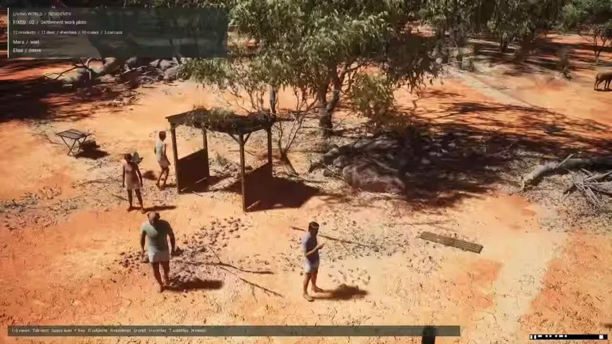

<!-- Generated from Growth CMS by templates/catalog.md. Edit content in CMS; run npm run sync. -->

# Awesome 3D Prompts — 6 / 9

[← Awesome 3D Prompts](../README.md)

<p>
  <a href="../docs/catalog.en.6.md"></a>
  <a href="../docs/catalog.zh.6.md"></a>
  <a href="../docs/catalog.zh-Hant.6.md"></a>
  <a href="../docs/catalog.ja.6.md"></a>
  <a href="../docs/catalog.ko.6.md"></a>
  <a href="../docs/catalog.es.6.md"></a>
  <a href="../docs/catalog.pt.6.md"></a>
  <a href="../docs/catalog.de.6.md"></a>
  <a href="../docs/catalog.fr.6.md"></a>
  <a href="../docs/catalog.it.6.md"></a>
  <a href="../docs/catalog.ru.6.md"></a>
  <a href="../docs/catalog.tr.6.md"></a>
  <a href="../docs/catalog.uk.6.md"></a>
  <a href="../docs/catalog.vi.6.md"></a>
</p>

[전체 카탈로그](catalog.ko.md) · [←](catalog.ko.5.md) · **6 / 9** · [→](catalog.ko.7.md)

<a id="all-prompts"></a>

<details>
<summary>사례 둘러보기 (50)</summary>

- [빠르게 만드는 플레이 가능한 게임 프로토타입](#rapid-playable-game-prototype-2095907526566990013)
- [Blender로 만드는 반복 재생 사이버펑크 침실](#looping-cyberpunk-bedroom-in-blender-2095898303019856230)
- [문화를 소재로 자동 진행되는 아케이드 게임](#self-playing-cultural-arcade-game-2095898198413922791)
- [프롬프트로 만드는 오픈월드 게임](#open-world-game-from-a-prompt-2095872986477908108)
- [Three.js로 걷는 반 고흐의 마을](#van-gogh-town-in-three-js-2095871735824339279)
- [기계 구조까지 완성한 Blender 기관차](#mechanically-complete-blender-locomotive-2095868420327710840)
- [30초 Blender 장면 제작 도전](#thirty-second-blender-scene-challenge-2095844872171421771)
- [한 번의 대화로 만드는 Three.js 해전 장면](#single-turn-three-js-naval-war-scene-2095840435319001278)
- [역대 대통령의 집무실을 둘러보기](#oval-office-through-the-presidencies-2095830596069290077)
- [레시피로 만드는 3D 치즈케이크 영상](#recipe-to-3d-cheesecake-film-2095829851206774987)
- [8명이 겨루는 브라우저 레이싱 Tidal Rush](#tidal-rush-eight-racer-browser-game-2095819786651374023)
- [인터랙티브 Three.js 은하 홈페이지](#interactive-three-js-galaxy-homepage-2095806515579879457)
- [실시간 WebGL 은하로 만든 출시 페이지 히어로](#real-time-webgl-galaxy-launch-hero-2095805694603673631)
- [직접 산책하는 ‘별이 빛나는 밤’의 거리](#starry-night-streets-you-can-stroll-2095805115580199372)
- [실제 집을 편집 가능한 60 FPS Blender 장면으로](#real-house-to-editable-60-fps-blender-scene-2095777502681825541)
- [분해하며 살펴보는 인터랙티브 3D 터보차저](#exploded-interactive-3d-turbocharger-2095776712579571725)
- [반 고흐 그림 여섯 점으로 만든 걸어 다니는 마을](#walkable-town-made-from-six-van-gogh-paintings-2095776685807346105)
- [증기기관차 도면을 편집 가능한 Blender 조립 모델로](#steam-train-drawing-to-editable-blender-assembly-2095756085890310311)
- [숲속 빌라 Solace를 기획부터 UE5까지](#solace-forest-villa-from-brief-to-ue5-2095752726886105375)
- [직접 운전하는 어린 시절 기차 테이블](#driveable-childhood-train-table-2095742344293454148)
- [정글 사원과 거대한 바나라 수호자](#jungle-temple-and-giant-vanara-guardian-2095729606066348290)
- [평면도에서 완전한 3D 워크스루로](#floor-plan-to-complete-3d-walkthrough-2095725404883476661)
- [조작할 수 있는 복셀 철도 테이블](#interactive-voxel-railway-table-2095719731860750613)
- [병 안에서 항해하는 살아 있는 복셀 범선](#living-voxel-ship-in-a-bottle-2095699049722581065)
- [살아 있는 바다와 폭풍의 절차적 시뮬레이션](#procedural-living-ocean-and-storm-simulation-2095673885605630429)
- [한 번에 놀라움을 주는 Three.js 게임](#one-shot-three-js-surprise-game-2095663498101662198)
- [Blender로 재현한 팰리스 오브 파인 아츠](#palace-of-fine-arts-blender-recreation-2095653641164329143)
- [프롬프트 하나로 비교하는 수족관 제작](#single-aquarium-benchmark-2095650251902239139)
- [1인칭·3인칭 카메라를 갖춘 RPG](#rpg-with-first-and-third-person-cameras-2095648440978174276)
- [프롬프트 하나로 플레이하는 실시간 3D 게임](#single-playable-real-time-3d-game-2095647685210669541)
- [3D 프린트 가능한 USS 엔터프라이즈 CAD 조립 모델](#printable-uss-enterprise-cad-assembly-2095641163441254676)
- [Blender로 만든 모던 빌라 장면](#modern-villa-scene-in-blender-2095636679264780481)
- [Cycles용 절차적 대통령 집무실 세트](#procedural-oval-office-set-for-cycles-2095630197257367857)
- [Unity 우주 협곡 돌파 게임](#unity-space-trench-run-game-2095630044102279312)
- [설계도에서 Blender를 거쳐 Unreal 건축 시각화로](#blueprint-to-blender-to-unreal-archviz-2095624712244072551)
- [텍스트에서 탐험 가능한 Unity 도시로](#text-to-explorable-unity-city-2095623452678144366)
- [Three.js 구슬 공장](#three-js-marble-factory-2095622065390772322)
- [사실적인 3D 제품 목업 스튜디오](#photoreal-3d-product-mockup-studio-2095619319690400253)
- [3D 박물관 촬영 프리비즈](#3d-museum-cinematography-previsualization-2095616529572503593)
- [Zillow 매물 정보로 만드는 3D 부동산 영상](#zillow-listing-to-3d-property-film-2095612137582526615)
- [Unreal Engine으로 거리마다 재현한 맨해튼](#street-by-street-manhattan-in-unreal-engine-2095609734845927525)
- [초보자가 음성으로 만드는 3D 게임](#voice-directed-3d-game-for-beginners-2095608358086840647)
- [한 번의 요청으로 만드는 브라우저 3D 게임](#one-shot-browser-3d-game-2095599934766764338)
- [집 사진을 편집 가능한 Blender 세계로](#house-photo-to-editable-blender-world-2095598645190291775)
- [Halo에서 영감을 받은 10 대 10 멀티플레이 FPS](#10v10-halo-inspired-multiplayer-fps-2095598026916049024)
- [에셋을 조립해 탐험하는 Unity 도시](#asset-driven-explorable-unity-city-2095597640587374887)
- [한 번에 만드는 고급 인터랙티브 프로토타입](#one-shot-premium-interactive-prototype-2095597560253862065)
- [한 번에 만드는 Minecraft 스타일 세계](#one-shot-minecraft-style-world-2095597137849446688)
- [브라우저 속 오픈월드 모험](#open-world-browser-adventure-2095596341422440714)
- [자율적으로 살아남는 Unreal 속 인간 사회](#surviving-society-of-autonomous-unreal-humans-2095596175705399482)

</details>
<a id="rapid-playable-game-prototype-2095907526566990013"></a>

### 빠르게 만드는 플레이 가능한 게임 프로토타입

[GLUNIVERSE™](https://x.com/gibglue) · 2026-09-04 · GPT-6 Astra · 게임

<a href="https://www.tripo3d.ai/ko/3d-prompts/rapid-playable-game-prototype-2095907526566990013"></a>

*원작을 바탕으로 정리한 제작 지침*

**프롬프트**

```text
엄격한 시간·토큰 예산 안에서 시각적으로 일관된 플레이 가능한 게임 프로토타입을 만드세요. 기능 수보다 하나의 완결된 플레이 흐름, 빠른 입력 반응, 명확한 피드백, 안정적인 성능, 공개 가능한 브라우저 빌드를 우선하세요.
```

[자세히 보기 ↗](https://www.tripo3d.ai/ko/3d-prompts/rapid-playable-game-prototype-2095907526566990013) · [원본 게시물](https://x.com/gibglue/status/2095907526566990013) · [사례 목록으로](#all-prompts)

---

<a id="looping-cyberpunk-bedroom-in-blender-2095898303019856230"></a>

### Blender로 만드는 반복 재생 사이버펑크 침실

[Coin Shot ☁️](https://x.com/CoinSh0t) · 2026-09-04 · GPT-6 Astra · 장면

<a href="https://www.tripo3d.ai/ko/3d-prompts/looping-cyberpunk-bedroom-in-blender-2095898303019856230"></a>

**프롬프트**

```text
밤에 비 내리는 네온 도시를 내려다보는 영화적인 사이버펑크 침실을 Blender로 만드세요. 움직이는 광고판을 추가하고 사실적이며 끊김 없이 반복되게 하세요.
```

<details>
<summary>작성자의 원본 프롬프트</summary>

```text
Create a cinematic cyberpunk bedroom in Blender overlooking a rainy neon city at night. Add animated billboards and make it photorealistic and seamlessly looped.
```

</details>

[자세히 보기 ↗](https://www.tripo3d.ai/ko/3d-prompts/looping-cyberpunk-bedroom-in-blender-2095898303019856230) · [원본 게시물](https://x.com/CoinSh0t/status/2095898303019856230) · [사례 목록으로](#all-prompts)

---

<a id="self-playing-cultural-arcade-game-2095898198413922791"></a>

### 문화를 소재로 자동 진행되는 아케이드 게임

[Good Morning](https://x.com/say_gm_) · 2026-09-04 · GPT-6 Astra · 게임

<a href="https://www.tripo3d.ai/ko/3d-prompts/self-playing-cultural-arcade-game-2095898198413922791"></a>

*원작을 바탕으로 정리한 제작 지침*

**프롬프트**

```text
G7 국가 하나를 소재로 자동 진행되는 아케이드 게임을 만드세요. 알아보기 쉬운 문화적 랜드마크 하나를 핵심 규칙으로 바꾸고, 입력 없이도 동작을 이해할 수 있게 하세요. 점수, 높아지는 난도, 기억에 남는 장면을 추가하세요.
```

[자세히 보기 ↗](https://www.tripo3d.ai/ko/3d-prompts/self-playing-cultural-arcade-game-2095898198413922791) · [원본 게시물](https://x.com/say_gm_/status/2095898198413922791) · [사례 목록으로](#all-prompts)

---

<a id="open-world-game-from-a-prompt-2095872986477908108"></a>

### 프롬프트로 만드는 오픈월드 게임

[Ejaj AHmed 🦅](https://x.com/aeejazkhan) · 2026-09-04 · GPT-6 Astra · 게임

<a href="https://www.tripo3d.ai/ko/3d-prompts/open-world-game-from-a-prompt-2095872986477908108"></a>

*원작을 바탕으로 정리한 제작 지침*

**프롬프트**

```text
다음 콘셉트로 오픈월드 게임을 만드세요: [세계관 설정]. 서로 다른 지역 3곳, 이동, 동적인 만남, 간단한 연속 퀘스트, 랜드마크, 저장·재시작 동작, 브라우저 실행에 충분한 최적화를 포함하세요.
```

[자세히 보기 ↗](https://www.tripo3d.ai/ko/3d-prompts/open-world-game-from-a-prompt-2095872986477908108) · [원본 게시물](https://x.com/aeejazkhan/status/2095872986477908108) · [사례 목록으로](#all-prompts)

---

<a id="van-gogh-town-in-three-js-2095871735824339279"></a>

### Three.js로 걷는 반 고흐의 마을

[Fede(URU) 🇺🇾](https://x.com/RealFedeURU) · 2026-09-04 · GPT-6 Astra · 장면

<a href="https://www.tripo3d.ai/ko/3d-prompts/van-gogh-town-in-three-js-2095871735824339279"></a>

*원작을 바탕으로 정리한 제작 지침*

**프롬프트**

```text
반 고흐에서 영감을 받은 걸어 다닐 수 있는 Three.js 마을을 만드세요. 그림 속 거리, 별, 카페, 들판을 층이 있는 3D 공간으로 바꾸고, 셰이더·텍스처·움직이는 빛으로 붓질의 느낌을 살리세요.
```

[자세히 보기 ↗](https://www.tripo3d.ai/ko/3d-prompts/van-gogh-town-in-three-js-2095871735824339279) · [원본 게시물](https://x.com/RealFedeURU/status/2095871735824339279) · [사례 목록으로](#all-prompts)

---

<a id="mechanically-complete-blender-locomotive-2095868420327710840"></a>

### 기계 구조까지 완성한 Blender 기관차

[sheemamoto](https://x.com/sheemamoto) · 2026-09-04 · GPT-6 Astra · 에셋

<a href="https://www.tripo3d.ai/ko/3d-prompts/mechanically-complete-blender-locomotive-2095868420327710840"></a>

*원작을 바탕으로 정리한 제작 지침*

**프롬프트**

```text
증기기관차를 텍스처를 입힌 껍데기가 아니라 실제 기계 구조를 분해할 수 있는 Blender 모델로 만드세요. 차축, 축상 가이드, 축상 블록, 스테이, 서스펜션 링크, 증기 돔, 모든 주요 조립 단위를 분리하고 이름을 붙이세요.
```

[자세히 보기 ↗](https://www.tripo3d.ai/ko/3d-prompts/mechanically-complete-blender-locomotive-2095868420327710840) · [원본 게시물](https://x.com/sheemamoto/status/2095868420327710840) · [사례 목록으로](#all-prompts)

---

<a id="thirty-second-blender-scene-challenge-2095844872171421771"></a>

### 30초 Blender 장면 제작 도전

[Satyam Kumar](https://x.com/_satyam_ai) · 2026-09-04 · GPT-6 Astra · 장면

<a href="https://www.tripo3d.ai/ko/3d-prompts/thirty-second-blender-scene-challenge-2095844872171421771"></a>

*원작을 바탕으로 정리한 제작 지침*

**프롬프트**

```text
극도로 짧은 제한 시간 안에 일관된 Blender 장면을 만드세요. 강한 실루엣, 3개 깊이 층, 주인공 재질 하나, 영화적인 조명, 촬영에 적합한 구도를 우선하고 모든 오브젝트를 편집 가능하게 남기세요.
```

[자세히 보기 ↗](https://www.tripo3d.ai/ko/3d-prompts/thirty-second-blender-scene-challenge-2095844872171421771) · [원본 게시물](https://x.com/_satyam_ai/status/2095844872171421771) · [사례 목록으로](#all-prompts)

---

<a id="single-turn-three-js-naval-war-scene-2095840435319001278"></a>

### 한 번의 대화로 만드는 Three.js 해전 장면

[leo 🐾](https://x.com/synthwavedd) · 2026-09-04 · GPT-6 Astra · 장면

<a href="https://www.tripo3d.ai/ko/3d-prompts/single-turn-three-js-naval-war-scene-2095840435319001278"></a>

*원작을 바탕으로 정리한 제작 지침*

**프롬프트**

```text
Three.js에서 정교한 해전을 한 번의 대화로 만드세요. 서로 구별되는 여러 함선, 물리적으로 설득력 있는 물과의 상호작용, 항적과 물보라, 공중전, 폭발, 영화적 조명, 카메라 움직임, 성능을 고려한 렌더링을 포함하세요.
```

[자세히 보기 ↗](https://www.tripo3d.ai/ko/3d-prompts/single-turn-three-js-naval-war-scene-2095840435319001278) · [원본 게시물](https://x.com/synthwavedd/status/2095840435319001278) · [사례 목록으로](#all-prompts)

---

<a id="oval-office-through-the-presidencies-2095830596069290077"></a>

### 역대 대통령의 집무실을 둘러보기

[Min Zhou](https://x.com/fMinZhou) · 2026-09-04 · Claude Fable 5.1 · 인터랙티브

<a href="https://www.tripo3d.ai/ko/3d-prompts/oval-office-through-the-presidencies-2095830596069290077"></a>

*원작을 바탕으로 정리한 제작 지침*

**프롬프트**

```text
대통령이 바뀌면서 집무실이 어떻게 달라졌는지 탐험하는 인터랙티브 Three.js 프로젝트를 만드세요. 시대를 전환하며 가구, 장식, 방 구성을 살펴볼 수 있게 하세요.
```

[자세히 보기 ↗](https://www.tripo3d.ai/ko/3d-prompts/oval-office-through-the-presidencies-2095830596069290077) · [원본 게시물](https://x.com/fMinZhou/status/2095830596069290077) · [사례 목록으로](#all-prompts)

---

<a id="recipe-to-3d-cheesecake-film-2095829851206774987"></a>

### 레시피로 만드는 3D 치즈케이크 영상

[سارة - تؤمن بالعدالة- Sara - believes in justice.](https://x.com/sarit69976) · 2026-09-04 · Claude Fable 5.1 · 에셋

<a href="https://www.tripo3d.ai/ko/3d-prompts/recipe-to-3d-cheesecake-film-2095829851206774987"></a>

*원작을 바탕으로 정리한 제작 지침*

**프롬프트**

```text
레시피를 바탕으로 실제 치즈케이크를 Three.js 장면으로 재현하세요. 여섯 층, 분리형 케이크 틀, 유산지를 각각 모델링하고 1분짜리 케이크 소개 영상을 만드세요.
```

[자세히 보기 ↗](https://www.tripo3d.ai/ko/3d-prompts/recipe-to-3d-cheesecake-film-2095829851206774987) · [원본 게시물](https://x.com/sarit69976/status/2095829851206774987) · [사례 목록으로](#all-prompts)

---

<a id="tidal-rush-eight-racer-browser-game-2095819786651374023"></a>

### 8명이 겨루는 브라우저 레이싱 Tidal Rush

[RESONANCE SCIENCE 🧬🔬](https://x.com/amazing13_13) · 2026-09-04 · GPT-6 Astra · 게임

<a href="https://www.tripo3d.ai/ko/3d-prompts/tidal-rush-eight-racer-browser-game-2095819786651374023"></a>

*원작을 바탕으로 정리한 제작 지침*

**프롬프트**

```text
레이서 8명, 3바퀴 경기, 드리프트, 수집 아이템, 반응이 좋은 물리, 명확한 HUD, 매력적인 그래픽, 결승 후 결과 화면을 갖춘 브라우저 카트 레이싱 게임을 완성하세요.
```

[자세히 보기 ↗](https://www.tripo3d.ai/ko/3d-prompts/tidal-rush-eight-racer-browser-game-2095819786651374023) · [원본 게시물](https://x.com/amazing13_13/status/2095819786651374023) · [사례 목록으로](#all-prompts)

---

<a id="interactive-three-js-galaxy-homepage-2095806515579879457"></a>

### 인터랙티브 Three.js 은하 홈페이지

[Three.js Resources](https://x.com/threejsresource) · 2026-09-04 · GPT-6 Astra · 인터랙티브

<a href="https://www.tripo3d.ai/ko/3d-prompts/interactive-three-js-galaxy-homepage-2095806515579879457"></a>

*원작을 바탕으로 정리한 제작 지침*

**프롬프트**

```text
실시간 Three.js 은하를 중심으로 고급스러운 출시 페이지 히어로를 만드세요. 입자가 은은하게 숫자 6의 실루엣을 이루고 스크롤과 포인터에 반응하게 하세요. 텍스트 가독성을 유지하고 저사양 기기에서는 효과를 자연스럽게 줄이세요.
```

[자세히 보기 ↗](https://www.tripo3d.ai/ko/3d-prompts/interactive-three-js-galaxy-homepage-2095806515579879457) · [원본 게시물](https://x.com/threejsresource/status/2095806515579879457) · [사례 목록으로](#all-prompts)

---

<a id="real-time-webgl-galaxy-launch-hero-2095805694603673631"></a>

### 실시간 WebGL 은하로 만든 출시 페이지 히어로

[Fluxora](https://x.com/Fluxora_Studios) · 2026-09-04 · GPT-6 Astra · 인터랙티브

<a href="https://www.tripo3d.ai/ko/3d-prompts/real-time-webgl-galaxy-launch-hero-2095805694603673631"></a>

*원작을 바탕으로 정리한 제작 지침*

**프롬프트**

```text
제공된 은하 히어로의 시각적 표현을 분석하고 영상이 아닌 실시간 WebGL로 재구축하세요. 깊이감 있는 입자, 빛나는 먼지, 부드러운 포인터 반응, 절제된 타이포그래피 여백, 기기 성능에 따른 조정을 활용하세요.
```

[자세히 보기 ↗](https://www.tripo3d.ai/ko/3d-prompts/real-time-webgl-galaxy-launch-hero-2095805694603673631) · [원본 게시물](https://x.com/Fluxora_Studios/status/2095805694603673631) · [사례 목록으로](#all-prompts)

---

<a id="starry-night-streets-you-can-stroll-2095805115580199372"></a>

### 직접 산책하는 ‘별이 빛나는 밤’의 거리

[₿IGRYAN](https://x.com/BigRyan) · 2026-09-04 · GPT-6 Astra · 장면

<a href="https://www.tripo3d.ai/ko/3d-prompts/starry-night-streets-you-can-stroll-2095805115580199372"></a>

*원작을 바탕으로 정리한 제작 지침*

**프롬프트**

```text
반 고흐 그림 여섯 점을 하나의 탐험 가능한 마을로 합쳐 ‘별이 빛나는 밤’의 거리를 산책할 수 있게 하세요. 그림 사이를 자연스럽게 잇는 통로, 일관된 크기, 잔잔한 환경 상호작용을 설계하세요.
```

[자세히 보기 ↗](https://www.tripo3d.ai/ko/3d-prompts/starry-night-streets-you-can-stroll-2095805115580199372) · [원본 게시물](https://x.com/BigRyan/status/2095805115580199372) · [사례 목록으로](#all-prompts)

---

<a id="real-house-to-editable-60-fps-blender-scene-2095777502681825541"></a>

### 실제 집을 편집 가능한 60 FPS Blender 장면으로

[Alvin Foo](https://x.com/alvinfoo) · 2026-09-04 · GPT-6 Astra · 장면

<a href="https://www.tripo3d.ai/ko/3d-prompts/real-house-to-editable-60-fps-blender-scene-2095777502681825541"></a>

*원작을 바탕으로 정리한 제작 지침*

**프롬프트**

```text
제공된 실제 집을 완전히 편집 가능한 Blender 장면으로 재구성하세요. 건축 요소와 가구를 분리하고 지오메트리와 재질을 최적화해 로컬 렌더링에서 60 FPS를 유지하는 워크스루를 제공하세요.
```

[자세히 보기 ↗](https://www.tripo3d.ai/ko/3d-prompts/real-house-to-editable-60-fps-blender-scene-2095777502681825541) · [원본 게시물](https://x.com/alvinfoo/status/2095777502681825541) · [사례 목록으로](#all-prompts)

---

<a id="exploded-interactive-3d-turbocharger-2095776712579571725"></a>

### 분해하며 살펴보는 인터랙티브 3D 터보차저

[Feraser](https://x.com/Feraser8) · 2026-09-04 · GPT-6 Astra · 인터랙티브

<a href="https://www.tripo3d.ai/ko/3d-prompts/exploded-interactive-3d-turbocharger-2095776712579571725"></a>

**프롬프트**

```text
인터랙티브 3D 터보차저를 만드세요. 작동하는 각 계통을 분리하세요. 회전하고 부품을 따로 살펴보며, 기계가 실제로 무엇을 하는지 볼 수 있게 해주세요.
```

<details>
<summary>작성자의 원본 프롬프트</summary>

```text
Build an interactive 3D turbocharger. Separate every working system. Let me rotate it, isolate parts, and see what the machine is actually doing.
```

</details>

[자세히 보기 ↗](https://www.tripo3d.ai/ko/3d-prompts/exploded-interactive-3d-turbocharger-2095776712579571725) · [원본 게시물](https://x.com/Feraser8/status/2095776712579571725) · [사례 목록으로](#all-prompts)

---

<a id="walkable-town-made-from-six-van-gogh-paintings-2095776685807346105"></a>

### 반 고흐 그림 여섯 점으로 만든 걸어 다니는 마을

[Peter Gostev](https://x.com/petergostev) · 2026-09-04 · GPT-6 Astra · 장면

<a href="https://www.tripo3d.ai/ko/3d-prompts/walkable-town-made-from-six-van-gogh-paintings-2095776685807346105"></a>

*원작을 바탕으로 정리한 제작 지침*

**프롬프트**

```text
제공된 반 고흐 그림 여섯 점을 하나로 이어지는 Three.js 마을로 만드세요. 각 그림의 색감과 붓질을 유지하면서 거리, 랜드마크, 장면 전환을 연결해 직접 걸으며 탐험할 수 있게 하세요.
```

[자세히 보기 ↗](https://www.tripo3d.ai/ko/3d-prompts/walkable-town-made-from-six-van-gogh-paintings-2095776685807346105) · [원본 게시물](https://x.com/petergostev/status/2095776685807346105) · [데모](https://van-goghs-town.surge.sh/) · [사례 목록으로](#all-prompts)

---

<a id="steam-train-drawing-to-editable-blender-assembly-2095756085890310311"></a>

### 증기기관차 도면을 편집 가능한 Blender 조립 모델로

[Tom Krcha](https://x.com/tomkrcha) · 2026-09-04 · GPT-6 Astra · 에셋

<a href="https://www.tripo3d.ai/ko/3d-prompts/steam-train-drawing-to-editable-blender-assembly-2095756085890310311"></a>

*원작을 바탕으로 정리한 제작 지침*

**프롬프트**

```text
제공된 옛 증기기관차 도면을 Blender에서 정교한 기계 조립 모델로 재구성하세요. 바퀴, 차축, 서스펜션, 연결봉, 보일러 부품, 차체 패널을 이름이 있는 편집 가능한 개별 오브젝트로 유지하고, 디테일 예산을 조절할 수 있게 하세요.
```

[자세히 보기 ↗](https://www.tripo3d.ai/ko/3d-prompts/steam-train-drawing-to-editable-blender-assembly-2095756085890310311) · [원본 게시물](https://x.com/tomkrcha/status/2095756085890310311) · [사례 목록으로](#all-prompts)

---

<a id="solace-forest-villa-from-brief-to-ue5-2095752726886105375"></a>

### 숲속 빌라 Solace를 기획부터 UE5까지

[SuSu\_酥酥👅](https://x.com/NFT_Chen) · 2026-09-04 · GPT-6 Astra · 장면

<a href="https://www.tripo3d.ai/ko/3d-prompts/solace-forest-villa-from-brief-to-ue5-2095752726886105375"></a>

*원작을 바탕으로 정리한 제작 지침*

**프롬프트**

```text
침실 3개, 서재, 중앙 안뜰, 수영장, 주변 숲을 갖춘 ‘Solace’라는 모던 빌라를 걸어 다닐 수 있게 만드세요. Blender에서 절차적으로 제작하고 골든아워 정지 이미지를 렌더링한 뒤 60 FPS UE5 워크스루를 내보내세요.
```

[자세히 보기 ↗](https://www.tripo3d.ai/ko/3d-prompts/solace-forest-villa-from-brief-to-ue5-2095752726886105375) · [원본 게시물](https://x.com/NFT_Chen/status/2095752726886105375) · [사례 목록으로](#all-prompts)

---

<a id="driveable-childhood-train-table-2095742344293454148"></a>

### 직접 운전하는 어린 시절 기차 테이블

[₿IGRYAN](https://x.com/BigRyan) · 2026-09-04 · GPT-6 Astra · 인터랙티브

<a href="https://www.tripo3d.ai/ko/3d-prompts/driveable-childhood-train-table-2095742344293454148"></a>

*원작을 바탕으로 정리한 제작 지침*

**프롬프트**

```text
어린 시절의 기차 테이블을 복셀 선로와 차량이 있는, 만지고 싶은 Three.js 장난감으로 재현하세요. 기차를 운전하고 분기점을 바꾸며 테이블 주변을 돌고, 움직이는 미니어처 장면을 발견하게 하세요.
```

[자세히 보기 ↗](https://www.tripo3d.ai/ko/3d-prompts/driveable-childhood-train-table-2095742344293454148) · [원본 게시물](https://x.com/BigRyan/status/2095742344293454148) · [사례 목록으로](#all-prompts)

---

<a id="jungle-temple-and-giant-vanara-guardian-2095729606066348290"></a>

### 정글 사원과 거대한 바나라 수호자

[Build Fast with AI](https://x.com/BuildFastWithAI) · 2026-09-04 · Claude Fable 5.1 · 애니메이션

<a href="https://www.tripo3d.ai/ko/3d-prompts/jungle-temple-and-giant-vanara-guardian-2095729606066348290"></a>

*원작을 바탕으로 정리한 제작 지침*

**프롬프트**

```text
HTML과 Three.js로 라마야나에서 영감을 받은 시네마틱을 만드세요. 잊힌 정글 사원에서 거대한 바나라 수호자가 깨어납니다. 배경, 애니메이션, 배경음악을 코드로 만드세요.
```

[자세히 보기 ↗](https://www.tripo3d.ai/ko/3d-prompts/jungle-temple-and-giant-vanara-guardian-2095729606066348290) · [원본 게시물](https://x.com/BuildFastWithAI/status/2095729606066348290) · [사례 목록으로](#all-prompts)

---

<a id="floor-plan-to-complete-3d-walkthrough-2095725404883476661"></a>

### 평면도에서 완전한 3D 워크스루로

[AidarosGo](https://x.com/aidarosgo3) · 2026-09-04 · GPT-6 Astra · 장면

<a href="https://www.tripo3d.ai/ko/3d-prompts/floor-plan-to-complete-3d-walkthrough-2095725404883476661"></a>

*원작을 바탕으로 정리한 제작 지침*

**프롬프트**

```text
제공된 평면도를 완전한 3D 건축 워크스루로 바꾸세요. 방의 치수와 동선을 지키고 문, 창문, 가구, 재질, 조명을 추가한 뒤 구조를 설명하는 카메라 경로를 만드세요.
```

[자세히 보기 ↗](https://www.tripo3d.ai/ko/3d-prompts/floor-plan-to-complete-3d-walkthrough-2095725404883476661) · [원본 게시물](https://x.com/aidarosgo3/status/2095725404883476661) · [사례 목록으로](#all-prompts)

---

<a id="interactive-voxel-railway-table-2095719731860750613"></a>

### 조작할 수 있는 복셀 철도 테이블

[Derya Unutmaz, MD](https://x.com/DeryaTR_) · 2026-09-04 · GPT-6 Astra · 인터랙티브

<a href="https://www.tripo3d.ai/ko/3d-prompts/interactive-voxel-railway-table-2095719731860750613"></a>

*원작을 바탕으로 정리한 제작 지침*

**프롬프트**

```text
Three.js로 정교한 복셀 철도 테이블을 만드세요. 여러 기차를 출발·정지시키고 선로를 전환하며 테이블 주변을 회전·확대하고, 작은 마을을 살펴보고 환경 애니메이션을 실행할 수 있게 하세요.
```

[자세히 보기 ↗](https://www.tripo3d.ai/ko/3d-prompts/interactive-voxel-railway-table-2095719731860750613) · [원본 게시물](https://x.com/DeryaTR_/status/2095719731860750613) · [데모](https://lindenhafen-railway.vercel.app/) · [사례 목록으로](#all-prompts)

---

<a id="living-voxel-ship-in-a-bottle-2095699049722581065"></a>

### 병 안에서 항해하는 살아 있는 복셀 범선

[Derya Unutmaz, MD](https://x.com/DeryaTR_) · 2026-09-04 · GPT-6 Astra · 장면

<a href="https://www.tripo3d.ai/ko/3d-prompts/living-voxel-ship-in-a-bottle-2095699049722581065"></a>

*원작을 바탕으로 정리한 제작 지침*

**프롬프트**

```text
유리병 안을 항해하는 정교한 17세기 복셀 범선을 만드세요. 출렁이는 파도와 배의 움직임을 시뮬레이션하고, 주위를 도는 갈매기, 작은 항구, 산호초를 추가하세요. 영화적인 카메라 시퀀스와 잔잔한 사운드트랙도 만드세요.
```

[자세히 보기 ↗](https://www.tripo3d.ai/ko/3d-prompts/living-voxel-ship-in-a-bottle-2095699049722581065) · [원본 게시물](https://x.com/DeryaTR_/status/2095699049722581065) · [사례 목록으로](#all-prompts)

---

<a id="procedural-living-ocean-and-storm-simulation-2095673885605630429"></a>

### 살아 있는 바다와 폭풍의 절차적 시뮬레이션

[Ethan Mollick](https://x.com/emollick) · 2026-09-04 · GPT-6 Astra · 애니메이션

<a href="https://www.tripo3d.ai/ko/3d-prompts/procedural-living-ocean-and-storm-simulation-2095673885605630429"></a>

*원작을 바탕으로 정리한 제작 지침*

**프롬프트**

```text
제공된 단일 파일 해수면 폭풍 생성기를 완전한 절차적 바다로 확장하세요. 산호초, 심해, 자연스러운 날씨, 창발적 행동을 보이는 동물 집단, 생태계 상호작용, 수면과 수중을 오갈 수 있는 카메라를 추가하세요.
```

[자세히 보기 ↗](https://www.tripo3d.ai/ko/3d-prompts/procedural-living-ocean-and-storm-simulation-2095673885605630429) · [원본 게시물](https://x.com/emollick/status/2095673885605630429) · [소스 코드](https://github.com/emollick/abyssal-living-deep) · [데모](https://abyssal-living-deep.netlify.app/?site=reef&seed=713&light=day&surface=1) · [사례 목록으로](#all-prompts)

---

<a id="one-shot-three-js-surprise-game-2095663498101662198"></a>

### 한 번에 놀라움을 주는 Three.js 게임

[Prathamesh](https://x.com/pratt_builds) · 2026-09-04 · GPT-6 Astra · 게임

<a href="https://www.tripo3d.ai/ko/3d-prompts/one-shot-three-js-surprise-game-2095663498101662198"></a>

*원작을 바탕으로 정리한 제작 지침*

**프롬프트**

```text
‘Amaze’라는 이름에 걸맞은 독창적인 Three.js 게임을 한 번에 만드세요. 놀라운 시각적 규칙 하나를 골라 몇 초 안에 익히게 하고, 짧은 성장 흐름과 만족스러운 볼거리로 마무리하세요.
```

[자세히 보기 ↗](https://www.tripo3d.ai/ko/3d-prompts/one-shot-three-js-surprise-game-2095663498101662198) · [원본 게시물](https://x.com/pratt_builds/status/2095663498101662198) · [사례 목록으로](#all-prompts)

---

<a id="palace-of-fine-arts-blender-recreation-2095653641164329143"></a>

### Blender로 재현한 팰리스 오브 파인 아츠

[Sharif Shameem](https://x.com/sharifshameem) · 2026-09-03 · GPT-6 Astra · 장면

<a href="https://www.tripo3d.ai/ko/3d-prompts/palace-of-fine-arts-blender-recreation-2095653641164329143"></a>

*원작을 바탕으로 정리한 제작 지침*

**프롬프트**

```text
샌프란시스코의 팰리스 오브 파인 아츠를 Blender로 재현하세요. 알아볼 수 있는 원형 건물의 비율, 열주, 연못, 식생, 세월의 흔적이 있는 재질, 만국박람회 시대의 낙관적인 영화적 조명을 표현하세요.
```

[자세히 보기 ↗](https://www.tripo3d.ai/ko/3d-prompts/palace-of-fine-arts-blender-recreation-2095653641164329143) · [원본 게시물](https://x.com/sharifshameem/status/2095653641164329143) · [사례 목록으로](#all-prompts)

---

<a id="single-aquarium-benchmark-2095650251902239139"></a>

### 프롬프트 하나로 비교하는 수족관 제작

[Tony出海](https://x.com/iamtonyzhu) · 2026-09-03 · GPT-6 Astra · 게임

<a href="https://www.tripo3d.ai/ko/3d-prompts/single-aquarium-benchmark-2095650251902239139"></a>

*원작을 바탕으로 정리한 제작 지침*

**프롬프트**

```text
제공된 참고 이미지에서 프롬프트 하나로 3D 수족관 게임을 만드세요. 배치와 분위기를 맞추고, 생동감 있는 물고기 행동, 물의 집광 무늬, 궤도 조작, 모델 결과 비교에 적합한 작은 상호작용 흐름을 추가하세요.
```

[자세히 보기 ↗](https://www.tripo3d.ai/ko/3d-prompts/single-aquarium-benchmark-2095650251902239139) · [원본 게시물](https://x.com/iamtonyzhu/status/2095650251902239139) · [사례 목록으로](#all-prompts)

---

<a id="rpg-with-first-and-third-person-cameras-2095648440978174276"></a>

### 1인칭·3인칭 카메라를 갖춘 RPG

[Ryan Fitzpatrick](https://x.com/rfitzpatrick_io) · 2026-09-03 · Claude Fable 5.1 · 게임

<a href="https://www.tripo3d.ai/ko/3d-prompts/rpg-with-first-and-third-person-cameras-2095648440978174276"></a>

*원작을 바탕으로 정리한 제작 지침*

**프롬프트**

```text
Three.js 롤플레잉 게임에 1인칭·3인칭 카메라를 추가하세요. 두 시점을 전환해도 이동과 탐험이 유지되도록 하세요.
```

[자세히 보기 ↗](https://www.tripo3d.ai/ko/3d-prompts/rpg-with-first-and-third-person-cameras-2095648440978174276) · [원본 게시물](https://x.com/rfitzpatrick_io/status/2095648440978174276) · [사례 목록으로](#all-prompts)

---

<a id="single-playable-real-time-3d-game-2095647685210669541"></a>

### 프롬프트 하나로 플레이하는 실시간 3D 게임

[Higgsfield AI 🧩](https://x.com/higgsfield) · 2026-09-03 · GPT-6 Astra · 게임

<a href="https://www.tripo3d.ai/ko/3d-prompts/single-playable-real-time-3d-game-2095647685210669541"></a>

*원작을 바탕으로 정리한 제작 지침*

**프롬프트**

```text
프롬프트 하나로 플레이 가능한 실시간 3D 게임을 만드세요. 작고 명확한 핵심 규칙, 목표, 짧은 이야기를 정하고 장면, 캐릭터, 소품, 피드백, 재시작 상태를 생성해 바로 플레이할 수 있게 하세요.
```

[자세히 보기 ↗](https://www.tripo3d.ai/ko/3d-prompts/single-playable-real-time-3d-game-2095647685210669541) · [원본 게시물](https://x.com/higgsfield/status/2095647685210669541) · [사례 목록으로](#all-prompts)

---

<a id="printable-uss-enterprise-cad-assembly-2095641163441254676"></a>

### 3D 프린트 가능한 USS 엔터프라이즈 CAD 조립 모델

[Derya Unutmaz, MD](https://x.com/DeryaTR_) · 2026-09-03 · GPT-6 Astra · 에셋

<a href="https://www.tripo3d.ai/ko/3d-prompts/printable-uss-enterprise-cad-assembly-2095641163441254676"></a>

*원작을 바탕으로 정리한 제작 지침*

**프롬프트**

```text
USS 엔터프라이즈 NCC-1701에 대한 독창적인 오마주를 CAD로 설계하고 3D 프린트가 가능하게 하세요. 특징적인 비율, 함교와 일부 내부 공간, 최소 28개의 실제 작동하는 가동 부품, 분리된 조립 단위, 제조용 파일 내보내기를 포함하세요.
```

[자세히 보기 ↗](https://www.tripo3d.ai/ko/3d-prompts/printable-uss-enterprise-cad-assembly-2095641163441254676) · [원본 게시물](https://x.com/DeryaTR_/status/2095641163441254676) · [사례 목록으로](#all-prompts)

---

<a id="modern-villa-scene-in-blender-2095636679264780481"></a>

### Blender로 만든 모던 빌라 장면

[Karan](https://x.com/karankendre) · 2026-09-03 · GPT-6 Astra · 장면

<a href="https://www.tripo3d.ai/ko/3d-prompts/modern-villa-scene-in-blender-2095636679264780481"></a>

*원작을 바탕으로 정리한 제작 지침*

**프롬프트**

```text
Blender에서 완성된 모던 빌라 장면을 만드세요. 일관된 건축 구조, 가구가 배치된 실내, 인피니티 풀, 조경, 사실적인 재질, 골든아워를 담는 영화적인 카메라 경로를 포함하세요.
```

[자세히 보기 ↗](https://www.tripo3d.ai/ko/3d-prompts/modern-villa-scene-in-blender-2095636679264780481) · [원본 게시물](https://x.com/karankendre/status/2095636679264780481) · [사례 목록으로](#all-prompts)

---

<a id="procedural-oval-office-set-for-cycles-2095630197257367857"></a>

### Cycles용 절차적 대통령 집무실 세트

[Higgsfield AI 🧩](https://x.com/higgsfield_ai) · 2026-09-03 · GPT-6 Astra · 장면

<a href="https://www.tripo3d.ai/ko/3d-prompts/procedural-oval-office-set-for-cycles-2095630197257367857"></a>

*원작을 바탕으로 정리한 제작 지침*

**프롬프트**

```text
대통령 집무실의 세트 디자인 설명을 실행 가능한 장면 코드로 바꾸세요. Blender에서 가구, 벽, 조명, 카메라 배치를 편집 가능하게 만들고 Cycles로 영화적인 결과를 렌더링하세요.
```

[자세히 보기 ↗](https://www.tripo3d.ai/ko/3d-prompts/procedural-oval-office-set-for-cycles-2095630197257367857) · [원본 게시물](https://x.com/higgsfield_ai/status/2095630197257367857) · [사례 목록으로](#all-prompts)

---

<a id="unity-space-trench-run-game-2095630044102279312"></a>

### Unity 우주 협곡 돌파 게임

[Ronald Mannak](https://x.com/ronaldmannak) · 2026-09-03 · GPT-6 Astra · 게임

<a href="https://www.tripo3d.ai/ko/3d-prompts/unity-space-trench-run-game-2095630044102279312"></a>

*원작을 바탕으로 정리한 제작 지침*

**프롬프트**

```text
고전적인 우주 트렌치 런의 감각을 Unity에서 재현하세요. 빠른 저공비행, 포탑 사격, 장애물, 조준, 점점 커지는 압박, 최종 목표, 영화적인 성공 또는 실패 시퀀스를 포함하세요.
```

[자세히 보기 ↗](https://www.tripo3d.ai/ko/3d-prompts/unity-space-trench-run-game-2095630044102279312) · [원본 게시물](https://x.com/ronaldmannak/status/2095630044102279312) · [사례 목록으로](#all-prompts)

---

<a id="blueprint-to-blender-to-unreal-archviz-2095624712244072551"></a>

### 설계도에서 Blender를 거쳐 Unreal 건축 시각화로

[Linus ✦ Ekenstam](https://x.com/LinusEkenstam) · 2026-09-03 · GPT-6 Astra · 장면

<a href="https://www.tripo3d.ai/ko/3d-prompts/blueprint-to-blender-to-unreal-archviz-2095624712244072551"></a>

*원작을 바탕으로 정리한 제작 지침*

**프롬프트**

```text
제공된 건축 설계도를 바탕으로 Blender에서 정확하고 편집 가능한 모델을 만드세요. 이를 Unreal Engine으로 옮겨 정확한 크기와 충돌 판정, 조명, 걸어 다닐 수 있는 건축 시각화 체험으로 완성하세요.
```

[자세히 보기 ↗](https://www.tripo3d.ai/ko/3d-prompts/blueprint-to-blender-to-unreal-archviz-2095624712244072551) · [원본 게시물](https://x.com/LinusEkenstam/status/2095624712244072551) · [사례 목록으로](#all-prompts)

---

<a id="text-to-explorable-unity-city-2095623452678144366"></a>

### 텍스트에서 탐험 가능한 Unity 도시로

[Md Ismail Šojal 🕷️](https://x.com/0x0SojalSec) · 2026-09-03 · GPT-6 Astra · 장면

<a href="https://www.tripo3d.ai/ko/3d-prompts/text-to-explorable-unity-city-2095623452678144366"></a>

*원작을 바탕으로 정리한 제작 지침*

**프롬프트**

```text
제공된 도시 구상을 고층 건물, 도로, 차량, 야자수, 분위기 있는 빛이 있는 탐험 가능한 Unity 환경으로 만드세요. 자연스러운 규모, 이동 경로, 교통 흐름, 부드러운 1인칭 카메라를 구현하세요.
```

[자세히 보기 ↗](https://www.tripo3d.ai/ko/3d-prompts/text-to-explorable-unity-city-2095623452678144366) · [원본 게시물](https://x.com/0x0SojalSec/status/2095623452678144366) · [사례 목록으로](#all-prompts)

---

<a id="three-js-marble-factory-2095622065390772322"></a>

### Three.js 구슬 공장

[John Kler](https://x.com/JohnKlerAI) · 2026-09-03 · Claude Fable 5.1 · 애니메이션

<a href="https://www.tripo3d.ai/ko/3d-prompts/three-js-marble-factory-2095622065390772322"></a>

*원작을 바탕으로 정리한 제작 지침*

**프롬프트**

```text
생산 흐름이 명확하고 구슬과 기계가 움직이는 Three.js 구슬 공장 시뮬레이션을 만드세요. 관람자가 구슬 하나를 따라 전체 공정을 볼 수 있게 하세요.
```

[자세히 보기 ↗](https://www.tripo3d.ai/ko/3d-prompts/three-js-marble-factory-2095622065390772322) · [원본 게시물](https://x.com/JohnKlerAI/status/2095622065390772322) · [사례 목록으로](#all-prompts)

---

<a id="photoreal-3d-product-mockup-studio-2095619319690400253"></a>

### 사실적인 3D 제품 목업 스튜디오

[Josh Millgate](https://x.com/joshmillgate) · 2026-09-03 · GPT-6 Astra · 인터랙티브

<a href="https://www.tripo3d.ai/ko/3d-prompts/photoreal-3d-product-mockup-studio-2095619319690400253"></a>

*원작을 바탕으로 정리한 제작 지침*

**프롬프트**

```text
업로드한 디자인을 사실적인 3D 제품 목업에 배치하는 브라우저 도구를 만드세요. 카메라 회전, 재질과 색상 조정, 환경 조명, 여러 제품, 고해상도 내보내기를 지원하세요.
```

[자세히 보기 ↗](https://www.tripo3d.ai/ko/3d-prompts/photoreal-3d-product-mockup-studio-2095619319690400253) · [원본 게시물](https://x.com/joshmillgate/status/2095619319690400253) · [사례 목록으로](#all-prompts)

---

<a id="3d-museum-cinematography-previsualization-2095616529572503593"></a>

### 3D 박물관 촬영 프리비즈

[Higgsfield AI 🧩](https://x.com/higgsfield_ai) · 2026-09-03 · GPT-6 Astra · 장면

<a href="https://www.tripo3d.ai/ko/3d-prompts/3d-museum-cinematography-previsualization-2095616529572503593"></a>

*원작을 바탕으로 정리한 제작 지침*

**프롬프트**

```text
장소, 출연자 위치, 카메라 배치, 숏 목록을 정리하는 3D 박물관 프리비즈를 만드세요. 모든 촬영 구성을 실제 뷰포트 안에 유지하고, 후속 영상 생성에 사용할 일관된 가이드를 내보내세요.
```

[자세히 보기 ↗](https://www.tripo3d.ai/ko/3d-prompts/3d-museum-cinematography-previsualization-2095616529572503593) · [원본 게시물](https://x.com/higgsfield_ai/status/2095616529572503593) · [사례 목록으로](#all-prompts)

---

<a id="zillow-listing-to-3d-property-film-2095612137582526615"></a>

### Zillow 매물 정보로 만드는 3D 부동산 영상

[Yunfan Ye](https://x.com/realYunfanYe) · 2026-09-03 · GPT-6 Astra · 장면

<a href="https://www.tripo3d.ai/ko/3d-prompts/zillow-listing-to-3d-property-film-2095612137582526615"></a>

*원작을 바탕으로 정리한 제작 지침*

**참고 이미지:** [1](https://media.tripogrowth.space/media/55a852d1-8c13-44dc-a152-476e4cce63ec.png) · [2](https://media.tripogrowth.space/media/a0e91ce4-fbeb-4653-b013-5f32715b7c23.png) · [3](https://pbs.twimg.com/media/HRUdPJDaUAAWdDZ.png) · [4](https://pbs.twimg.com/media/HRUdUVKbAAAkA9W.png)

**프롬프트**

```text
제공된 부동산 매물 정보와 모든 사진으로 집을 3D로 재구성하고, 일관된 평면도를 추론한 뒤 완성도 높은 홍보용 워크스루 영상을 만드세요. 불확실한 형상을 표시하고 첫 제작 후 어긋난 부분을 다듬으세요.
```

[자세히 보기 ↗](https://www.tripo3d.ai/ko/3d-prompts/zillow-listing-to-3d-property-film-2095612137582526615) · [원본 게시물](https://x.com/realYunfanYe/status/2095612137582526615) · [사례 목록으로](#all-prompts)

---

<a id="street-by-street-manhattan-in-unreal-engine-2095609734845927525"></a>

### Unreal Engine으로 거리마다 재현한 맨해튼

[Matt Shumer](https://x.com/mattshumer_) · 2026-09-03 · GPT-6 Astra · 장면

<a href="https://www.tripo3d.ai/ko/3d-prompts/street-by-street-manhattan-in-unreal-engine-2095609734845927525"></a>

*원작을 바탕으로 정리한 제작 지침*

**프롬프트**

```text
Unreal Engine에서 탐험할 수 있는 맨해튼을 만드세요. 구역별, 거리별로 작업하며 알아볼 수 있는 규모, 도로 배치, 랜드마크, 교통, 동네의 개성을 유지하세요. 평가 체크리스트를 만들고 각 구역을 다듬은 뒤 다음 구역으로 넘어가세요.
```

[자세히 보기 ↗](https://www.tripo3d.ai/ko/3d-prompts/street-by-street-manhattan-in-unreal-engine-2095609734845927525) · [원본 게시물](https://x.com/mattshumer_/status/2095609734845927525) · [사례 목록으로](#all-prompts)

---

<a id="voice-directed-3d-game-for-beginners-2095608358086840647"></a>

### 초보자가 음성으로 만드는 3D 게임

[el.cine](https://x.com/EHuanglu) · 2026-09-03 · GPT-6 Astra · 게임

<a href="https://www.tripo3d.ai/ko/3d-prompts/voice-directed-3d-game-for-beginners-2095608358086840647"></a>

*원작을 바탕으로 정리한 제작 지침*

**프롬프트**

```text
제 3D 게임 제작자 역할을 맡으세요. 빠진 플레이 목표, 미술 방향, 조작 방식만 질문한 뒤 바로 플레이할 수 있는 브라우저 게임을 만드세요. 이후 짧은 음성 지시에 따라 계속 수정하세요.
```

[자세히 보기 ↗](https://www.tripo3d.ai/ko/3d-prompts/voice-directed-3d-game-for-beginners-2095608358086840647) · [원본 게시물](https://x.com/EHuanglu/status/2095608358086840647) · [사례 목록으로](#all-prompts)

---

<a id="one-shot-browser-3d-game-2095599934766764338"></a>

### 한 번의 요청으로 만드는 브라우저 3D 게임

[Theo - t3.gg](https://x.com/theo) · 2026-09-03 · GPT-6 Astra · 게임

<a href="https://www.tripo3d.ai/ko/3d-prompts/one-shot-browser-3d-game-2095599934766764338"></a>

*원작을 바탕으로 정리한 제작 지침*

**프롬프트**

```text
하나의 독립 실행 프로젝트로 브라우저에서 작동하는 3D 게임을 완성하세요. 명확한 목표, 반응이 빠른 조작, 공간적으로 일관된 레벨, 적이나 위험 요소, 피드백, 점수, 재시작, 성능 보호 장치를 포함하세요.
```

[자세히 보기 ↗](https://www.tripo3d.ai/ko/3d-prompts/one-shot-browser-3d-game-2095599934766764338) · [원본 게시물](https://x.com/theo/status/2095599934766764338) · [사례 목록으로](#all-prompts)

---

<a id="house-photo-to-editable-blender-world-2095598645190291775"></a>

### 집 사진을 편집 가능한 Blender 세계로

[Tom Krcha](https://x.com/tomkrcha) · 2026-09-03 · GPT-6 Astra · 장면

<a href="https://www.tripo3d.ai/ko/3d-prompts/house-photo-to-editable-blender-world-2095598645190291775"></a>

*원작을 바탕으로 정리한 제작 지침*

**프롬프트**

```text
제공된 집 사진을 완전히 편집 가능한 Blender 장면으로 재구성하세요. 건물과 가구, 가전제품, 장난감을 각각 별도 오브젝트로 모델링하세요. 자연스러운 비율을 유지하고 로컬에서 부드러운 60 FPS 워크스루로 실행되게 하세요.
```

[자세히 보기 ↗](https://www.tripo3d.ai/ko/3d-prompts/house-photo-to-editable-blender-world-2095598645190291775) · [원본 게시물](https://x.com/tomkrcha/status/2095598645190291775) · [사례 목록으로](#all-prompts)

---

<a id="10v10-halo-inspired-multiplayer-fps-2095598026916049024"></a>

### Halo에서 영감을 받은 10 대 10 멀티플레이 FPS

[Halfdan](https://x.com/VikiingAI) · 2026-09-03 · GPT-6 Astra · 게임

<a href="https://www.tripo3d.ai/ko/3d-prompts/10v10-halo-inspired-multiplayer-fps-2095598026916049024"></a>

*원작을 바탕으로 정리한 제작 지침*

**프롬프트**

```text
고전 SF FPS에서 영감을 받은 10 대 10 멀티플레이 아레나 슈터를 만드세요. 팀, 부활, 구분하기 쉬운 무기, 방어막, 획득 아이템, 작은 맵, 점수, 경기 진행, 저지연 브라우저 플레이를 구현하세요.
```

[자세히 보기 ↗](https://www.tripo3d.ai/ko/3d-prompts/10v10-halo-inspired-multiplayer-fps-2095598026916049024) · [원본 게시물](https://x.com/VikiingAI/status/2095598026916049024) · [사례 목록으로](#all-prompts)

---

<a id="asset-driven-explorable-unity-city-2095597640587374887"></a>

### 에셋을 조립해 탐험하는 Unity 도시

[Chetaslua](https://x.com/chetaslua) · 2026-09-03 · GPT-6 Astra · 장면

<a href="https://www.tripo3d.ai/ko/3d-prompts/asset-driven-explorable-unity-city-2095597640587374887"></a>

*원작을 바탕으로 정리한 제작 지침*

**프롬프트**

```text
제공된 에셋 라이브러리로 탐험 가능한 Unity 도시를 조립하세요. 일관된 도로망, 고층 건물, 차량, 야자수, 조명, 이동 경로를 만들고 장면을 최적화해 안정적인 1인칭 워크스루를 제공하세요.
```

[자세히 보기 ↗](https://www.tripo3d.ai/ko/3d-prompts/asset-driven-explorable-unity-city-2095597640587374887) · [원본 게시물](https://x.com/chetaslua/status/2095597640587374887) · [사례 목록으로](#all-prompts)

---

<a id="one-shot-premium-interactive-prototype-2095597560253862065"></a>

### 한 번에 만드는 고급 인터랙티브 프로토타입

[AJ Orbach 🐳](https://x.com/AY_Orbach) · 2026-09-03 · GPT-6 Astra · 인터랙티브

<a href="https://www.tripo3d.ai/ko/3d-prompts/one-shot-premium-interactive-prototype-2095597560253862065"></a>

*원작을 바탕으로 정리한 제작 지침*

**프롬프트**

```text
제공된 제품 콘셉트로 완성도 높은 인터랙티브 프로토타입을 한 번에 설계하고 구현하세요. 뚜렷한 시각 체계를 선택하고 핵심 행동을 우선하며, 세련된 전환을 더해 호스팅된 반응형 빌드를 제공하세요.
```

[자세히 보기 ↗](https://www.tripo3d.ai/ko/3d-prompts/one-shot-premium-interactive-prototype-2095597560253862065) · [원본 게시물](https://x.com/AY_Orbach/status/2095597560253862065) · [사례 목록으로](#all-prompts)

---

<a id="one-shot-minecraft-style-world-2095597137849446688"></a>

### 한 번에 만드는 Minecraft 스타일 세계

[Flavio Adamo](https://x.com/flavioAd) · 2026-09-03 · GPT-6 Astra · 게임

<a href="https://www.tripo3d.ai/ko/3d-prompts/one-shot-minecraft-style-world-2095597137849446688"></a>

*원작을 바탕으로 정리한 제작 지침*

**프롬프트**

```text
Minecraft에서 영감을 받은 플레이 가능한 복셀 세계를 한 번에 만드세요. 지형 생성, 블록 설치와 파괴, 1인칭 조작, 인벤토리, 조명, 물, 짧고 완결된 생존 플레이 흐름을 구현하세요.
```

[자세히 보기 ↗](https://www.tripo3d.ai/ko/3d-prompts/one-shot-minecraft-style-world-2095597137849446688) · [원본 게시물](https://x.com/flavioAd/status/2095597137849446688) · [사례 목록으로](#all-prompts)

---

<a id="open-world-browser-adventure-2095596341422440714"></a>

### 브라우저 속 오픈월드 모험

[Peter Gostev](https://x.com/petergostev) · 2026-09-03 · GPT-6 Astra · 게임

<a href="https://www.tripo3d.ai/ko/3d-prompts/open-world-browser-adventure-2095596341422440714"></a>

*원작을 바탕으로 정리한 제작 지침*

**프롬프트**

```text
서로 연결된 여러 생물군계가 있는 오픈월드 3D 모험 게임을 만드세요. 이동, 발견, 가벼운 전투, 퀘스트, 랜드마크, 낮과 밤의 분위기, 목적 있는 탐험을 돕는 충분한 안내를 포함하세요.
```

[자세히 보기 ↗](https://www.tripo3d.ai/ko/3d-prompts/open-world-browser-adventure-2095596341422440714) · [원본 게시물](https://x.com/petergostev/status/2095596341422440714) · [사례 목록으로](#all-prompts)

---

<a id="surviving-society-of-autonomous-unreal-humans-2095596175705399482"></a>

### 자율적으로 살아남는 Unreal 속 인간 사회

[Matt Shumer](https://x.com/mattshumer_) · 2026-09-03 · GPT-6 Astra · 애니메이션

<a href="https://www.tripo3d.ai/ko/3d-prompts/surviving-society-of-autonomous-unreal-humans-2095596175705399482"></a>

*원작을 바탕으로 정리한 제작 지침*

**프롬프트**

```text
자율적으로 행동하는 인간 에이전트가 사는 Unreal Engine 세계를 만드세요. 각자에게 개인적인 욕구와 공동의 생존 목표를 부여하세요. 서로 소통하고 일을 나누며 거처를 지어, 플레이어가 떠나도 사회가 유지되도록 하세요.
```

[자세히 보기 ↗](https://www.tripo3d.ai/ko/3d-prompts/surviving-society-of-autonomous-unreal-humans-2095596175705399482) · [원본 게시물](https://x.com/mattshumer_/status/2095596175705399482) · [사례 목록으로](#all-prompts)

---


[전체 카탈로그](catalog.ko.md) · [←](catalog.ko.5.md) · **6 / 9** · [→](catalog.ko.7.md)

<p align="center"><strong><a href="https://www.tripo3d.ai/ko/3d-prompts?utm_source=github&amp;utm_medium=referral&amp;utm_campaign=awesome_3d_prompts&amp;utm_content=catalog_footer">전체 카탈로그 →</a></strong></p>
