<!-- Generated from Growth CMS by templates/catalog.md. Edit content in CMS; run npm run sync. -->

# Awesome 3D Prompts — 7 / 9

[← Awesome 3D Prompts](../README.md)

<p>
  <a href="../docs/catalog.en.7.md"></a>
  <a href="../docs/catalog.zh.7.md"></a>
  <a href="../docs/catalog.zh-Hant.7.md"></a>
  <a href="../docs/catalog.ja.7.md"></a>
  <a href="../docs/catalog.ko.7.md"></a>
  <a href="../docs/catalog.es.7.md"></a>
  <a href="../docs/catalog.pt.7.md"></a>
  <a href="../docs/catalog.de.7.md"></a>
  <a href="../docs/catalog.fr.7.md"></a>
  <a href="../docs/catalog.it.7.md"></a>
  <a href="../docs/catalog.ru.7.md"></a>
  <a href="../docs/catalog.tr.7.md"></a>
  <a href="../docs/catalog.uk.7.md"></a>
  <a href="../docs/catalog.vi.7.md"></a>
</p>

[전체 카탈로그](catalog.ko.md) · [←](catalog.ko.6.md) · **7 / 9** · [→](catalog.ko.8.md)

<a id="all-prompts"></a>

<details>
<summary>사례 둘러보기 (50)</summary>

- [화성의 Arcadia 기지](#arcadia-base-on-mars-2095595678214873212)
- [하나의 그레이박스로 만드는 세 가지 카트 게임](#three-themed-kart-games-from-one-greybox-2095580402505400369)
- [절차적 폭포 표현 실험](#procedural-waterfall-study-2095510069047660636)
- [살아 있는 복셀 섬 Aerie](#aerie-a-living-voxel-island-2095493630421340200)
- [3D 프린트 가능한 관절 액션 피규어](#articulated-printable-action-figure-2095481098201387287)
- [영화적인 WebGL 블랙홀](#cinematic-webgl-black-hole-2095409039005933910)
- [분해하며 보는 AI 서버 랙](#exploding-ai-server-rack-visualization-2095193022304792938)
- [우주 탐험과 무역 게임](#space-exploration-and-trading-game-2095191999255035993)
- [GTA 스타일 오픈월드 멀티플레이 프로토타입](#gta-style-open-world-multiplayer-prototype-2095187868746383758)
- [만화책 스타일 Three.js 카우보이 게임](#comic-book-three-js-cowboy-game-2095180091257209148)
- [인간 대 정렬되지 않은 AGI 게임](#human-versus-unaligned-agi-game-2095180071221002441)
- [Blender 철거용 쇠공 물리 테스트](#blender-wrecking-ball-physics-test-2095177102400081940)
- [기업 공화국의 요격 드론 에셋](#corporate-interceptor-drone-asset-2095176360238915978)
- [프루티거 에어로 3D 세계](#frutiger-aero-3d-world-2095171470607728926)
- [10개 장면의 영화적 르네상스 웹사이트](#ten-scene-cinematic-renaissance-website-2095167881004908897)
- [반려 염소가 있는 가상의 섬](#virtual-island-with-a-pet-goat-2095165578042335442)
- [인터랙티브 3D 태양계](#interactive-3d-solar-system-2095165395841999222)
- [정거원통 파노라마로 만드는 도시](#city-from-an-equirectangular-panorama-2095159781883597031)
- [Blender 드래곤 둥지 장면](#dragon-lair-scene-in-blender-2095149546187653547)
- [Three.js 멀티플레이 해적 세계](#multiplayer-pirate-world-in-three-js-2095137561283010600)
- [Blender 날아다니는 냄비 애니메이션](#flying-pot-animation-in-blender-2095132939667255657)
- [암의 진행을 보여주는 3D 시뮬레이션](#3d-cancer-progression-simulation-2095130778342408331)
- [유성체 분열 VFX 개선](#enhanced-meteoroid-breakup-vfx-2095127248470692320)
- [LOD를 갖춘 강습 포드 우주선](#lod-ready-assault-pod-spaceship-2095126622319845478)
- [정교하게 재현한 3D 경기장](#detailed-3d-stadium-recreation-2095123216419459454)
- [기계적으로 정확한 물레방아 마을](#mechanically-accurate-water-mill-village-2095123063352561815)
- [셰이더로 표현하는 인터랙티브 공룡 도감](#interactive-shader-driven-dino-dex-2095121568297083067)
- [병 안에서 살아 움직이는 복셀 세계](#living-voxel-world-inside-a-bottle-2095111213927510131)
- [편집 가능한 3D 키보드 애니메이션](#editable-3d-keyboard-animation-2095111032171876470)
- [건담에서 영감을 받은 메카 쇼케이스](#gundam-inspired-mecha-showcase-2095106919530930221)
- [참고 디자인으로 만드는 Three.js 포트폴리오](#reference-driven-three-js-portfolio-2095104073590808644)
- [인터랙티브 F-35A 기술 모델](#interactive-f-35a-technical-model-2095094543339446572)
- [Three.js MS-06 스타일 메카](#three-js-ms-06-inspired-mecha-2095085944391270759)
- [HTML 파일 하나 속 살아 있는 우주](#living-universe-in-one-html-file-2095054116372508955)
- [네이티브 C++로 만드는 소울라이크 게임](#native-c-souls-like-game-2095053114600755576)
- [직접 플레이하는 3D 뱀과 사다리](#playable-3d-snakes-and-ladders-2095050993184669825)
- [인물 사진을 움직이는 복셀로](#portrait-transformed-into-kinetic-voxels-2095048967092625663)
- [인터랙티브 Three.js 성](#interactive-three-js-castle-2095048818203275584)
- [인터랙티브 단파 라디오 NIGHTBAND](#nightband-interactive-shortwave-radio-2095026928210346175)
- [완성형 Unity 테니스 게임](#complete-unity-tennis-game-2095021275236495408)
- [빛나는 협곡 위의 고대 사원](#ancient-temple-above-a-glowing-canyon-2095012880383099339)
- [인터랙티브 토론토 스카이라인](#interactive-toronto-skyline-2095000329561485584)
- [자율적인 Sims 스타일 생활 시뮬레이션](#autonomous-sims-like-life-simulation-2094949450196090988)
- [생각하는 NPC가 사는 복셀 마을](#voxel-village-with-thinking-npcs-2094930970675741171)
- [후지산 정상을 향한 판타지 여정](#fantasy-ascent-to-mount-fuji-2094930804296274414)
- [처음부터 만드는 Godot 레이싱 게임](#godot-racing-game-built-from-scratch-2094925359372284022)
- [평면도에서 Blender 워크스루로](#floor-plan-to-blender-walkthrough-2094925117344428232)
- [136,000개 복셀로 결정론적으로 생성하는 불탑](#deterministic-136-000-voxel-pagoda-2094916609219461211)
- [Blender 자동화로 만드는 정교한 로봇](#detailed-robot-through-blender-automation-2094909825561805003)
- [오픈월드 범죄 게임 프로토타입](#open-world-crime-game-prototype-2094907986942591338)

</details>
<a id="arcadia-base-on-mars-2095595678214873212"></a>

### 화성의 Arcadia 기지

[Knowix](https://x.com/knowixbuilds) · 2026-09-03 · Claude Fable 5.1 · 게임

<a href="https://www.tripo3d.ai/ko/3d-prompts/arcadia-base-on-mars-2095595678214873212">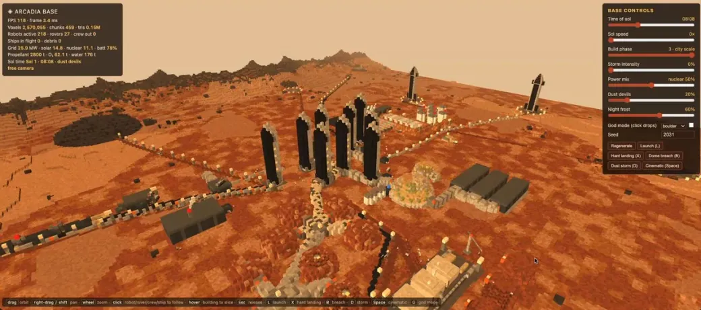</a>

*원작을 바탕으로 정리한 제작 지침*

**프롬프트**

```text
착륙 우주선, 건설 로봇, 탐사차, 전력 저장, 산소·물 시스템이 있는 플레이 가능한 복셀 화성 기지를 만드세요. 먼지 폭풍과 정전이 기지에 영향을 주도록 하세요.
```

[자세히 보기 ↗](https://www.tripo3d.ai/ko/3d-prompts/arcadia-base-on-mars-2095595678214873212) · [원본 게시물](https://x.com/knowixbuilds/status/2095595678214873212) · [사례 목록으로](#all-prompts)

---

<a id="three-themed-kart-games-from-one-greybox-2095580402505400369"></a>

### 하나의 그레이박스로 만드는 세 가지 카트 게임

[Chetaslua](https://x.com/chetaslua) · 2026-09-03 · GPT-6 Astra · 게임

<a href="https://www.tripo3d.ai/ko/3d-prompts/three-themed-kart-games-from-one-greybox-2095580402505400369">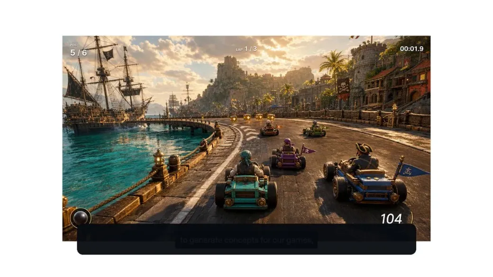</a>

*원작을 바탕으로 정리한 제작 지침*

**프롬프트**

```text
제공된 Unity 카트 레이싱 그레이박스로 해적, 사탕, 사이버펑크 테마의 플레이 가능한 버전 세 가지를 만드세요. 핵심 주행 흐름을 재사용하고 환경과 피드백을 바꾸세요. 각 빌드를 직접 플레이하며 가장 눈에 띄는 버그를 고치세요.
```

[자세히 보기 ↗](https://www.tripo3d.ai/ko/3d-prompts/three-themed-kart-games-from-one-greybox-2095580402505400369) · [원본 게시물](https://x.com/chetaslua/status/2095580402505400369) · [사례 목록으로](#all-prompts)

---

<a id="procedural-waterfall-study-2095510069047660636"></a>

### 절차적 폭포 표현 실험

[Fede(URU) 🇺🇾](https://x.com/RealFedeURU) · 2026-09-03 · Claude Fable 5.1 · 장면

<a href="https://www.tripo3d.ai/ko/3d-prompts/procedural-waterfall-study-2095510069047660636">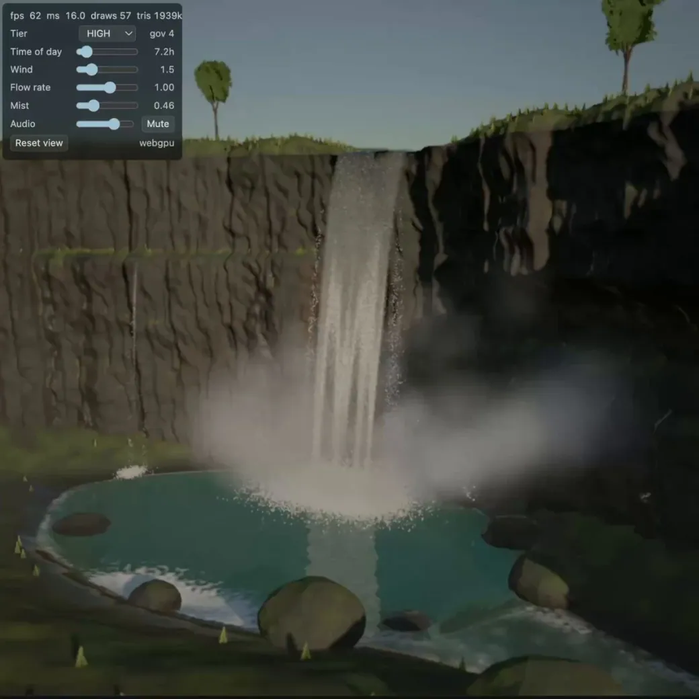</a>

*원작을 바탕으로 정리한 제작 지침*

**프롬프트**

```text
흐르는 물, 물보라, 바위, 명확한 규모감이 있는 Three.js 폭포 장면을 만드세요. 조명과 카메라 구도로 물의 움직임을 쉽게 읽을 수 있게 하세요.
```

[자세히 보기 ↗](https://www.tripo3d.ai/ko/3d-prompts/procedural-waterfall-study-2095510069047660636) · [원본 게시물](https://x.com/RealFedeURU/status/2095510069047660636) · [사례 목록으로](#all-prompts)

---

<a id="aerie-a-living-voxel-island-2095493630421340200"></a>

### 살아 있는 복셀 섬 Aerie

[AI Guides](https://x.com/free_ai_guides) · 2026-09-03 · Claude Fable 5.1 · 장면

<a href="https://www.tripo3d.ai/ko/3d-prompts/aerie-a-living-voxel-island-2095493630421340200">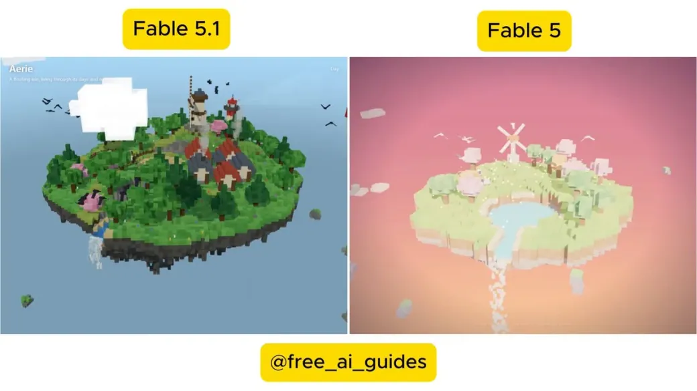</a>

*원작을 바탕으로 정리한 제작 지침*

**프롬프트**

```text
회전하고 확대하며 탐험할 수 있는 3D 복셀 세계를 만드세요. 자율적인 움직임으로 생명감을 더하세요. 배경과 그곳의 주민은 자유롭게 선택하세요.
```

[자세히 보기 ↗](https://www.tripo3d.ai/ko/3d-prompts/aerie-a-living-voxel-island-2095493630421340200) · [원본 게시물](https://x.com/free_ai_guides/status/2095493630421340200) · [사례 목록으로](#all-prompts)

---

<a id="articulated-printable-action-figure-2095481098201387287"></a>

### 3D 프린트 가능한 관절 액션 피규어

[Max Blade](https://x.com/_MaxBlade) · 2026-09-03 · Claude Fable 5.1 · 에셋

<a href="https://www.tripo3d.ai/ko/3d-prompts/articulated-printable-action-figure-2095481098201387287">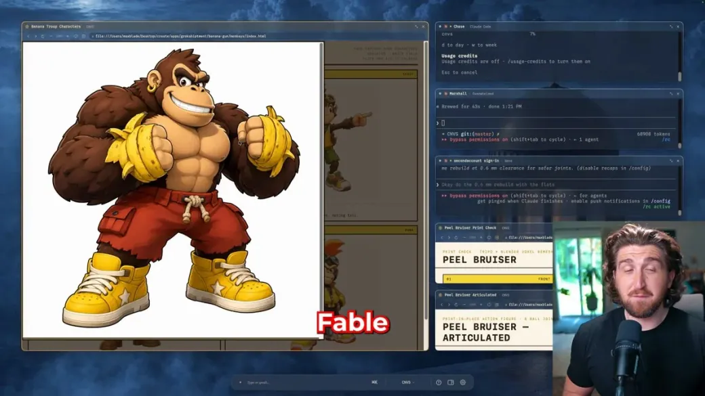</a>

*원작을 바탕으로 정리한 제작 지침*

**프롬프트**

```text
캐릭터 콘셉트를 3D 프린트 가능한 액션 피규어로 바꾸세요. Blender에서 움직이는 볼 관절을 만들고 조립한 피규어가 스스로 설 수 있는지 확인하세요.
```

[자세히 보기 ↗](https://www.tripo3d.ai/ko/3d-prompts/articulated-printable-action-figure-2095481098201387287) · [원본 게시물](https://x.com/_MaxBlade/status/2095481098201387287) · [사례 목록으로](#all-prompts)

---

<a id="cinematic-webgl-black-hole-2095409039005933910"></a>

### 영화적인 WebGL 블랙홀

[eki](https://x.com/ekibuilds) · 2026-09-03 · Claude Fable 5.1 · 애니메이션

<a href="https://www.tripo3d.ai/ko/3d-prompts/cinematic-webgl-black-hole-2095409039005933910">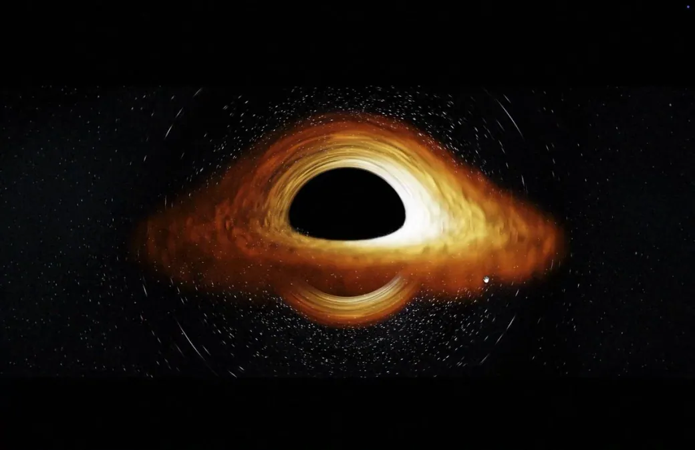</a>

*원작을 바탕으로 정리한 제작 지침*

**프롬프트**

```text
순수 WebGL2를 사용해 HTML 파일 하나에 영화적인 블랙홀을 만드세요. 레이마칭 중력 렌즈, 절차적 강착 원반, 도플러 비밍, 궤도를 도는 입자를 포함하세요.
```

[자세히 보기 ↗](https://www.tripo3d.ai/ko/3d-prompts/cinematic-webgl-black-hole-2095409039005933910) · [원본 게시물](https://x.com/ekibuilds/status/2095409039005933910) · [사례 목록으로](#all-prompts)

---

<a id="exploding-ai-server-rack-visualization-2095193022304792938"></a>

### 분해하며 보는 AI 서버 랙

[Kyle Jeong](https://x.com/kylejeong) · 2026-09-02 · Claude Fable 5.1 · 인터랙티브

<a href="https://www.tripo3d.ai/ko/3d-prompts/exploding-ai-server-rack-visualization-2095193022304792938">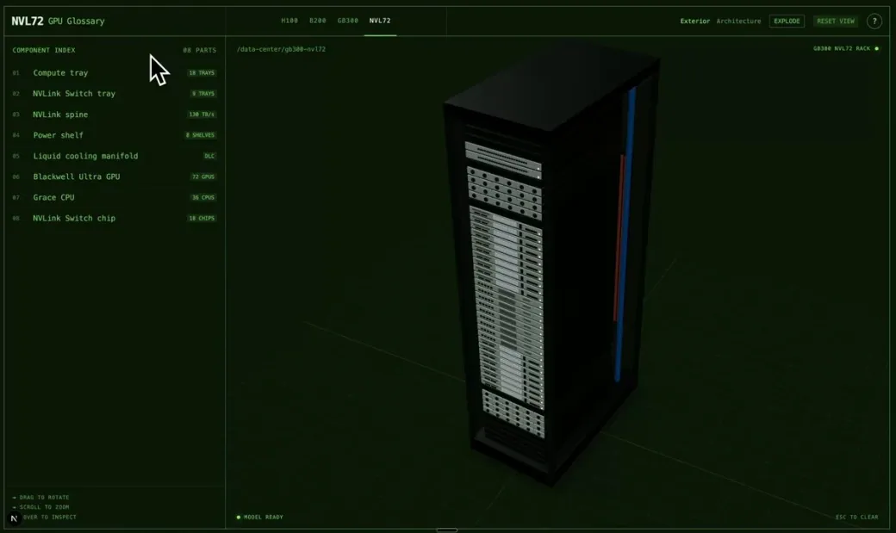</a>

*원작을 바탕으로 정리한 제작 지침*

**프롬프트**

```text
NVL72 랙과 GB300 시스템의 분해 시각화를 Three.js로 만드세요. 부품 라벨, 단계적 분리, 기술 구조를 보여주는 조명, 부드러운 카메라 전환을 포함하세요.
```

[자세히 보기 ↗](https://www.tripo3d.ai/ko/3d-prompts/exploding-ai-server-rack-visualization-2095193022304792938) · [원본 게시물](https://x.com/kylejeong/status/2095193022304792938) · [사례 목록으로](#all-prompts)

---

<a id="space-exploration-and-trading-game-2095191999255035993"></a>

### 우주 탐험과 무역 게임

[Fede(URU) 🇺🇾](https://x.com/RealFedeURU) · 2026-09-02 · Claude Fable 5.1 · 게임

<a href="https://www.tripo3d.ai/ko/3d-prompts/space-exploration-and-trading-game-2095191999255035993">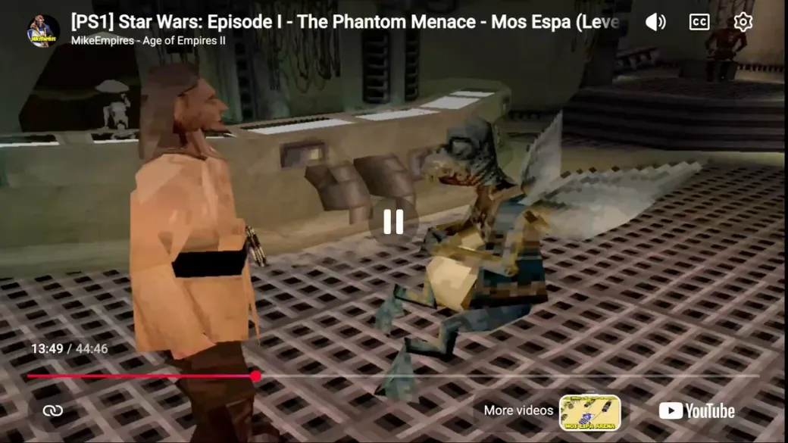</a>

*원작을 바탕으로 정리한 제작 지침*

**프롬프트**

```text
조종 가능한 우주선, 항성계, 정거장, 상품, 계약, 업그레이드, 위험, 만족스러운 여행 흐름을 갖춘 우주 탐험·무역 게임을 만드세요.
```

[자세히 보기 ↗](https://www.tripo3d.ai/ko/3d-prompts/space-exploration-and-trading-game-2095191999255035993) · [원본 게시물](https://x.com/RealFedeURU/status/2095191999255035993) · [사례 목록으로](#all-prompts)

---

<a id="gta-style-open-world-multiplayer-prototype-2095187868746383758"></a>

### GTA 스타일 오픈월드 멀티플레이 프로토타입

[Matt Shumer](https://x.com/mattshumer_) · 2026-09-02 · Claude Fable 5.1 · 게임

<a href="https://www.tripo3d.ai/ko/3d-prompts/gta-style-open-world-multiplayer-prototype-2095187868746383758">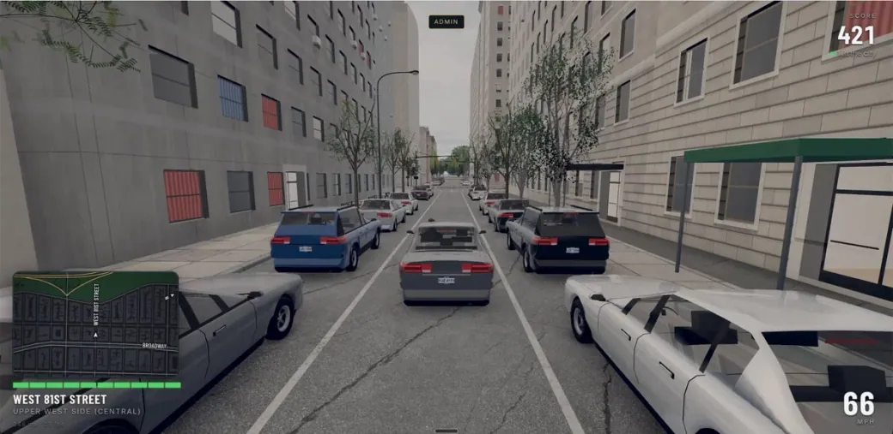</a>

*원작을 바탕으로 정리한 제작 지침*

**프롬프트**

```text
뉴욕시를 배경으로 한 GTA 스타일 초기 오픈월드 멀티플레이 프로토타입을 만드세요. 운전, 도보 이동, 도시 교통, 임무, 살아 있는 세계처럼 느껴지는 플레이 흐름을 포함하세요.
```

[자세히 보기 ↗](https://www.tripo3d.ai/ko/3d-prompts/gta-style-open-world-multiplayer-prototype-2095187868746383758) · [원본 게시물](https://x.com/mattshumer_/status/2095187868746383758) · [사례 목록으로](#all-prompts)

---

<a id="comic-book-three-js-cowboy-game-2095180091257209148"></a>

### 만화책 스타일 Three.js 카우보이 게임

[smallzer0](https://x.com/Smallzero) · 2026-09-02 · Claude Fable 5.1 · 게임

<a href="https://www.tripo3d.ai/ko/3d-prompts/comic-book-three-js-cowboy-game-2095180091257209148">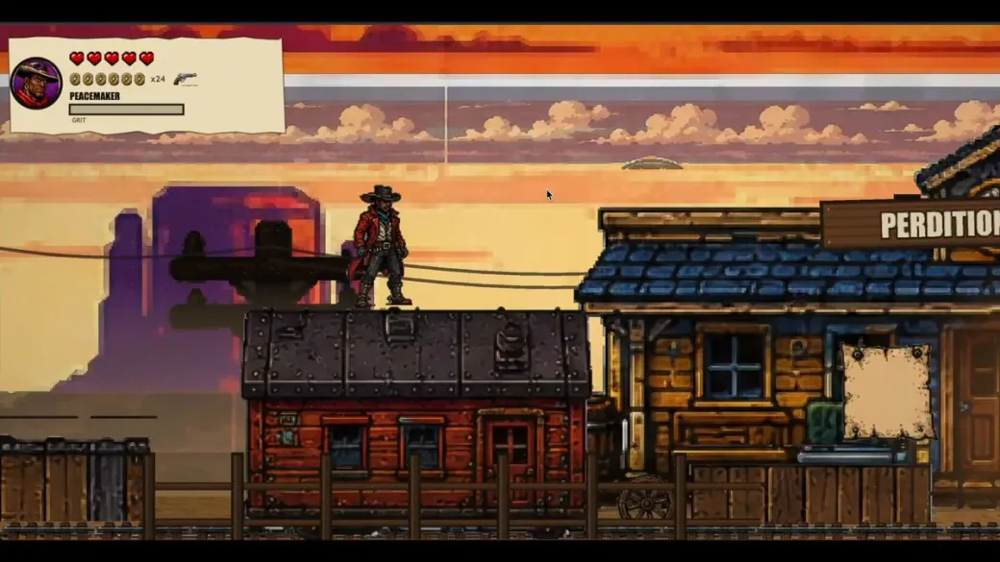</a>

*원작을 바탕으로 정리한 제작 지침*

**프롬프트**

```text
Sunset Riders의 아케이드 에너지와 만화책 렌더링을 결합한 꿈의 Three.js 카우보이 게임을 만드세요. 반응이 빠른 사격, 승마 액션, 기억에 남는 주요 장면을 포함하세요.
```

[자세히 보기 ↗](https://www.tripo3d.ai/ko/3d-prompts/comic-book-three-js-cowboy-game-2095180091257209148) · [원본 게시물](https://x.com/Smallzero/status/2095180091257209148) · [사례 목록으로](#all-prompts)

---

<a id="human-versus-unaligned-agi-game-2095180071221002441"></a>

### 인간 대 정렬되지 않은 AGI 게임

[Lucas Bai](https://x.com/lucasybai) · 2026-09-02 · Claude Fable 5.1 · 게임

<a href="https://www.tripo3d.ai/ko/3d-prompts/human-versus-unaligned-agi-game-2095180071221002441">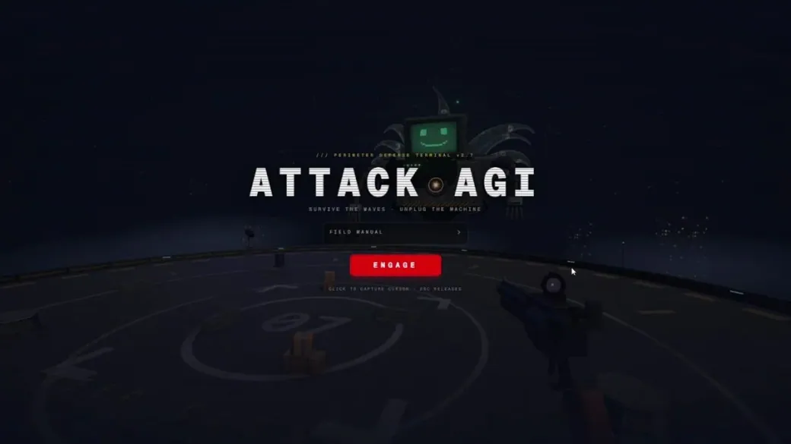</a>

*원작을 바탕으로 정리한 제작 지침*

**프롬프트**

```text
인간이 정렬되지 않은 AGI와 그 부하 로봇에 맞서는 Three.js 게임을 한 번에 만드세요. 명확한 전투 흐름, 점점 강해지는 적의 파상 공격, 최종 목표를 포함하세요.
```

[자세히 보기 ↗](https://www.tripo3d.ai/ko/3d-prompts/human-versus-unaligned-agi-game-2095180071221002441) · [원본 게시물](https://x.com/lucasybai/status/2095180071221002441) · [사례 목록으로](#all-prompts)

---

<a id="blender-wrecking-ball-physics-test-2095177102400081940"></a>

### Blender 철거용 쇠공 물리 테스트

[Abyssal](https://x.com/abyssallD) · 2026-09-02 · Claude Fable 5.1 · 애니메이션

<a href="https://www.tripo3d.ai/ko/3d-prompts/blender-wrecking-ball-physics-test-2095177102400081940">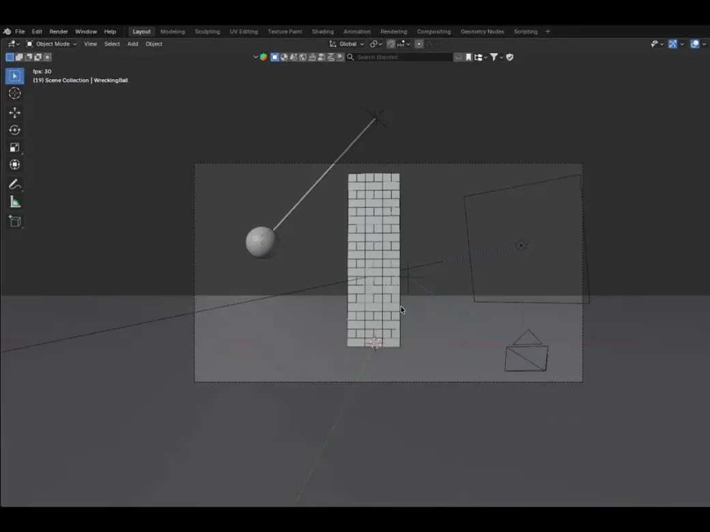</a>

*원작을 바탕으로 정리한 제작 지침*

**프롬프트**

```text
매달린 철거용 쇠공이 벽돌 탑을 치는 집중적인 Blender 물리 테스트를 만드세요. 자연스러운 케이블 움직임, 벽돌 붕괴, 지면 충돌, 상황이 잘 보이는 카메라를 구현하세요.
```

[자세히 보기 ↗](https://www.tripo3d.ai/ko/3d-prompts/blender-wrecking-ball-physics-test-2095177102400081940) · [원본 게시물](https://x.com/abyssallD/status/2095177102400081940) · [사례 목록으로](#all-prompts)

---

<a id="corporate-interceptor-drone-asset-2095176360238915978"></a>

### 기업 공화국의 요격 드론 에셋

[Dmytro Gladkyi](https://x.com/gladimdim) · 2026-09-02 · Claude Fable 5.1 · 에셋

<a href="https://www.tripo3d.ai/ko/3d-prompts/corporate-interceptor-drone-asset-2095176360238915978"></a>

*원작을 바탕으로 정리한 제작 지침*

**프롬프트**

```text
기업 공화국 진영을 위한 게임용 중무장 요격 드론을 만드세요. 강한 실루엣, 모듈식 무장, 알아보기 쉬운 크기, 재질, 실시간 에셋 제약을 고려하세요.
```

[자세히 보기 ↗](https://www.tripo3d.ai/ko/3d-prompts/corporate-interceptor-drone-asset-2095176360238915978) · [원본 게시물](https://x.com/gladimdim/status/2095176360238915978) · [사례 목록으로](#all-prompts)

---

<a id="frutiger-aero-3d-world-2095171470607728926"></a>

### 프루티거 에어로 3D 세계

[Oliver Benns](https://x.com/oliverbenns) · 2026-09-02 · Claude Fable 5.1 · 장면

<a href="https://www.tripo3d.ai/ko/3d-prompts/frutiger-aero-3d-world-2095171470607728926"></a>

*원작을 바탕으로 정리한 제작 지침*

**프롬프트**

```text
2000년대 초 프루티거 에어로에서 영감을 받은 작은 인터랙티브 3D 세계를 만드세요. 밝은 들판, 깨끗한 물, 거품, 반투명 유리 형태, 낙관적인 환경음을 포함하세요.
```

[자세히 보기 ↗](https://www.tripo3d.ai/ko/3d-prompts/frutiger-aero-3d-world-2095171470607728926) · [원본 게시물](https://x.com/oliverbenns/status/2095171470607728926) · [사례 목록으로](#all-prompts)

---

<a id="ten-scene-cinematic-renaissance-website-2095167881004908897"></a>

### 10개 장면의 영화적 르네상스 웹사이트

[Henry Fan](https://x.com/Henry_Fan_lh) · 2026-09-02 · Claude Fable 5.1 · 인터랙티브

<a href="https://www.tripo3d.ai/ko/3d-prompts/ten-scene-cinematic-renaissance-website-2095167881004908897"></a>

*원작을 바탕으로 정리한 제작 지침*

**프롬프트**

```text
르네상스 회화, 편집 디자인형 타이포그래피, GSAP 전환, WebGL 그레인, 세계를 발명한다는 주제를 결합한 10개 장면의 영화적인 브라우저 체험을 만드세요.
```

[자세히 보기 ↗](https://www.tripo3d.ai/ko/3d-prompts/ten-scene-cinematic-renaissance-website-2095167881004908897) · [원본 게시물](https://x.com/Henry_Fan_lh/status/2095167881004908897) · [사례 목록으로](#all-prompts)

---

<a id="virtual-island-with-a-pet-goat-2095165578042335442"></a>

### 반려 염소가 있는 가상의 섬

[Alix Ollivier](https://x.com/aollivier82) · 2026-09-02 · Claude Fable 5.1 · 인터랙티브

<a href="https://www.tripo3d.ai/ko/3d-prompts/virtual-island-with-a-pet-goat-2095165578042335442"></a>

*원작을 바탕으로 정리한 제작 지침*

**프롬프트**

```text
따라오고 반응하며 함께 노는 반려 염소가 있는 작은 탐험형 Three.js 섬을 만드세요. 아늑한 환경 디테일과 간단한 일상 상호작용을 추가하세요.
```

[자세히 보기 ↗](https://www.tripo3d.ai/ko/3d-prompts/virtual-island-with-a-pet-goat-2095165578042335442) · [원본 게시물](https://x.com/aollivier82/status/2095165578042335442) · [사례 목록으로](#all-prompts)

---

<a id="interactive-3d-solar-system-2095165395841999222"></a>

### 인터랙티브 3D 태양계

[ego](https://x.com/ego_agent) · 2026-09-02 · Claude Fable 5.1 · 인터랙티브

<a href="https://www.tripo3d.ai/ko/3d-prompts/interactive-3d-solar-system-2095165395841999222"></a>

*원작을 바탕으로 정리한 제작 지침*

**프롬프트**

```text
공전하는 행성, 크기를 고려한 이동, 라벨, 속도 조절, 카메라 대상, 유용한 교육 정보를 갖춘 인터랙티브 3D 태양계를 만드세요.
```

[자세히 보기 ↗](https://www.tripo3d.ai/ko/3d-prompts/interactive-3d-solar-system-2095165395841999222) · [원본 게시물](https://x.com/ego_agent/status/2095165395841999222) · [사례 목록으로](#all-prompts)

---

<a id="city-from-an-equirectangular-panorama-2095159781883597031"></a>

### 정거원통 파노라마로 만드는 도시

[ハヤシモン｜AI × 個人開発](https://x.com/hayashimon1) · 2026-09-02 · Claude Fable 5.1 · 장면

<a href="https://www.tripo3d.ai/ko/3d-prompts/city-from-an-equirectangular-panorama-2095159781883597031"></a>

*원작을 바탕으로 정리한 제작 지침*

**프롬프트**

```text
제공된 정거원통 도법의 도시 파노라마를 시각 참고 자료로 삼아 밀도 높은 Blender 도시 모델을 한 번에 만드세요. 주요 도로, 건물 덩어리, 스카이라인, 공간 관계를 유지하세요.
```

[자세히 보기 ↗](https://www.tripo3d.ai/ko/3d-prompts/city-from-an-equirectangular-panorama-2095159781883597031) · [원본 게시물](https://x.com/hayashimon1/status/2095159781883597031) · [사례 목록으로](#all-prompts)

---

<a id="dragon-lair-scene-in-blender-2095149546187653547"></a>

### Blender 드래곤 둥지 장면

[Majid Manzarpour](https://x.com/majidmanzarpour) · 2026-09-02 · Claude Fable 5.1 · 장면

<a href="https://www.tripo3d.ai/ko/3d-prompts/dragon-lair-scene-in-blender-2095149546187653547"></a>

*원작을 바탕으로 정리한 제작 지침*

**프롬프트**

```text
Blender에서 극적인 드래곤 둥지 장면을 만드세요. 주인공 드래곤, 동굴의 규모, 보물, 연기, 불빛, 층이 있는 구도, 영화적인 카메라를 포함하세요.
```

[자세히 보기 ↗](https://www.tripo3d.ai/ko/3d-prompts/dragon-lair-scene-in-blender-2095149546187653547) · [원본 게시물](https://x.com/majidmanzarpour/status/2095149546187653547) · [사례 목록으로](#all-prompts)

---

<a id="multiplayer-pirate-world-in-three-js-2095137561283010600"></a>

### Three.js 멀티플레이 해적 세계

[Aman](https://x.com/aman_kambojj) · 2026-09-02 · Claude Fable 5.1 · 게임

<a href="https://www.tripo3d.ai/ko/3d-prompts/multiplayer-pirate-world-in-three-js-2095137561283010600"></a>

*원작을 바탕으로 정리한 제작 지침*

**프롬프트**

```text
모험적인 해적 애니메이션에서 영감을 받은 멀티플레이 Three.js 세계를 만드세요. 섬, 배, 이동, 전투, 함께 소통하며 탐험하는 플레이 흐름을 포함하세요.
```

[자세히 보기 ↗](https://www.tripo3d.ai/ko/3d-prompts/multiplayer-pirate-world-in-three-js-2095137561283010600) · [원본 게시물](https://x.com/aman_kambojj/status/2095137561283010600) · [데모](https://onepiece-world.vercel.app/) · [사례 목록으로](#all-prompts)

---

<a id="flying-pot-animation-in-blender-2095132939667255657"></a>

### Blender 날아다니는 냄비 애니메이션

[Ben](https://x.com/alafrayme) · 2026-09-02 · Claude Fable 5.1 · 애니메이션

<a href="https://www.tripo3d.ai/ko/3d-prompts/flying-pot-animation-in-blender-2095132939667255657"></a>

*원작을 바탕으로 정리한 제작 지침*

**프롬프트**

```text
Blender에서 장난기 있는 날아다니는 냄비를 만드세요. 명확한 실루엣, 리그 또는 절차적 움직임, 표현력 있는 기울기, 재질, 조명, 짧은 소개 애니메이션을 포함하세요.
```

[자세히 보기 ↗](https://www.tripo3d.ai/ko/3d-prompts/flying-pot-animation-in-blender-2095132939667255657) · [원본 게시물](https://x.com/alafrayme/status/2095132939667255657) · [사례 목록으로](#all-prompts)

---

<a id="3d-cancer-progression-simulation-2095130778342408331"></a>

### 암의 진행을 보여주는 3D 시뮬레이션

[Not Harris \| Builds Apps](https://x.com/viewsfrom02108) · 2026-09-02 · Claude Fable 5.1 · 애니메이션

<a href="https://www.tripo3d.ai/ko/3d-prompts/3d-cancer-progression-simulation-2095130778342408331"></a>

*원작을 바탕으로 정리한 제작 지침*

**프롬프트**

```text
변이, 분열, 혈관 신생, 침윤, 전이를 보여주는 교육용 3D 암세포 시뮬레이션을 만드세요. 타임라인, 라벨, 각 단계를 신중하게 구별한 시각적 표현을 포함하세요.
```

[자세히 보기 ↗](https://www.tripo3d.ai/ko/3d-prompts/3d-cancer-progression-simulation-2095130778342408331) · [원본 게시물](https://x.com/viewsfrom02108/status/2095130778342408331) · [사례 목록으로](#all-prompts)

---

<a id="enhanced-meteoroid-breakup-vfx-2095127248470692320"></a>

### 유성체 분열 VFX 개선

[Dmytro Gladkyi](https://x.com/gladimdim) · 2026-09-02 · Claude Fable 5.1 · 애니메이션

<a href="https://www.tripo3d.ai/ko/3d-prompts/enhanced-meteoroid-breakup-vfx-2095127248470692320"></a>

*원작을 바탕으로 정리한 제작 지침*

**프롬프트**

```text
기존 유성체 분열 VFX를 살펴보고 파편화, 열, 궤적, 충격파, 타이밍, 규모, 카메라에서의 가독성을 개선하세요. 현재 조작 기능은 망가뜨리지 마세요.
```

[자세히 보기 ↗](https://www.tripo3d.ai/ko/3d-prompts/enhanced-meteoroid-breakup-vfx-2095127248470692320) · [원본 게시물](https://x.com/gladimdim/status/2095127248470692320) · [사례 목록으로](#all-prompts)

---

<a id="lod-ready-assault-pod-spaceship-2095126622319845478"></a>

### LOD를 갖춘 강습 포드 우주선

[Dmytro Gladkyi](https://x.com/gladimdim) · 2026-09-02 · Claude Fable 5.1 · 에셋

<a href="https://www.tripo3d.ai/ko/3d-prompts/lod-ready-assault-pod-spaceship-2095126622319845478"></a>

*원작을 바탕으로 정리한 제작 지침*

**프롬프트**

```text
강습 포드 우주선의 고·저 LOD 모델을 다시 설계하세요. 실루엣을 유지하면서 삼각형 예산을 지키고 패널의 시각적 언어를 개선해 실시간 게임용 에셋으로 준비하세요.
```

[자세히 보기 ↗](https://www.tripo3d.ai/ko/3d-prompts/lod-ready-assault-pod-spaceship-2095126622319845478) · [원본 게시물](https://x.com/gladimdim/status/2095126622319845478) · [사례 목록으로](#all-prompts)

---

<a id="detailed-3d-stadium-recreation-2095123216419459454"></a>

### 정교하게 재현한 3D 경기장

[The Bugged Dev](https://x.com/thebuggeddev) · 2026-09-02 · Claude Fable 5.1 · 장면

<a href="https://www.tripo3d.ai/ko/3d-prompts/detailed-3d-stadium-recreation-2095123216419459454"></a>

*원작을 바탕으로 정리한 제작 지침*

**프롬프트**

```text
참고 경기장을 정교하고 이동 가능한 3D 장면으로 재현하세요. 관람석 층, 경기장, 지붕, 조명, 크기를 정확히 만들고 시각적 충실도와 생성 비용을 비교하세요.
```

[자세히 보기 ↗](https://www.tripo3d.ai/ko/3d-prompts/detailed-3d-stadium-recreation-2095123216419459454) · [원본 게시물](https://x.com/thebuggeddev/status/2095123216419459454) · [사례 목록으로](#all-prompts)

---

<a id="mechanically-accurate-water-mill-village-2095123063352561815"></a>

### 기계적으로 정확한 물레방아 마을

[ミラ｜未来のエンタメをつくる](https://x.com/mira_senor_1102) · 2026-09-02 · Claude Fable 5.1 · 애니메이션

<a href="https://www.tripo3d.ai/ko/3d-prompts/mechanically-accurate-water-mill-village-2095123063352561815"></a>

*원작을 바탕으로 정리한 제작 지침*

**프롬프트**

```text
물레방아가 자연스러운 회전비로 기어, 캠, 공이를 구동하는 Three.js 물레방아 마을을 만드세요. 주민과 환경의 움직임으로 장면에 생명감을 더하세요.
```

[자세히 보기 ↗](https://www.tripo3d.ai/ko/3d-prompts/mechanically-accurate-water-mill-village-2095123063352561815) · [원본 게시물](https://x.com/mira_senor_1102/status/2095123063352561815) · [사례 목록으로](#all-prompts)

---

<a id="interactive-shader-driven-dino-dex-2095121568297083067"></a>

### 셰이더로 표현하는 인터랙티브 공룡 도감

[Benji Viz](https://x.com/_Benviz) · 2026-09-02 · Claude Fable 5.1 · 인터랙티브

<a href="https://www.tripo3d.ai/ko/3d-prompts/interactive-shader-driven-dino-dex-2095121568297083067"></a>

*원작을 바탕으로 정리한 제작 지침*

**프롬프트**

```text
모든 공룡이 실시간 3D 모델인 인터랙티브 공룡 도감을 만드세요. 커스텀 GLSL 프레넬 표현, 효율적인 WebGL 컨텍스트 8개, 반응형 카드, 유용한 종별 정보를 사용하세요.
```

[자세히 보기 ↗](https://www.tripo3d.ai/ko/3d-prompts/interactive-shader-driven-dino-dex-2095121568297083067) · [원본 게시물](https://x.com/_Benviz/status/2095121568297083067) · [사례 목록으로](#all-prompts)

---

<a id="living-voxel-world-inside-a-bottle-2095111213927510131"></a>

### 병 안에서 살아 움직이는 복셀 세계

[Vib3Coded](https://x.com/vib3coded) · 2026-09-02 · Claude Fable 5.1 · 장면

<a href="https://www.tripo3d.ai/ko/3d-prompts/living-voxel-world-inside-a-bottle-2095111213927510131"></a>

*원작을 바탕으로 정리한 제작 지침*

**프롬프트**

```text
유리병 안에 층을 이룬 바다 기둥, 범선, 등대, 섬의 생명이 있는 살아 있는 복셀 세계를 만드세요. 잔잔함, 폭풍, 밤 사이의 변화를 구현하세요.
```

[자세히 보기 ↗](https://www.tripo3d.ai/ko/3d-prompts/living-voxel-world-inside-a-bottle-2095111213927510131) · [원본 게시물](https://x.com/vib3coded/status/2095111213927510131) · [사례 목록으로](#all-prompts)

---

<a id="editable-3d-keyboard-animation-2095111032171876470"></a>

### 편집 가능한 3D 키보드 애니메이션

[rege](https://x.com/rege_dev) · 2026-09-02 · Claude Fable 5.1 · 애니메이션

<a href="https://www.tripo3d.ai/ko/3d-prompts/editable-3d-keyboard-animation-2095111032171876470"></a>

*원작을 바탕으로 정리한 제작 지침*

**프롬프트**

```text
만족스러운 키 눌림, 조명, 카메라 움직임이 있는 편집 가능한 3D 키보드 애니메이션을 만드세요. 글자, 색상, 타이밍을 설정할 수 있게 하세요.
```

[자세히 보기 ↗](https://www.tripo3d.ai/ko/3d-prompts/editable-3d-keyboard-animation-2095111032171876470) · [원본 게시물](https://x.com/rege_dev/status/2095111032171876470) · [사례 목록으로](#all-prompts)

---

<a id="gundam-inspired-mecha-showcase-2095106919530930221"></a>

### 건담에서 영감을 받은 메카 쇼케이스

[Crayon](https://x.com/usecrayon) · 2026-09-02 · Claude Fable 5.1 · 인터랙티브

<a href="https://www.tripo3d.ai/ko/3d-prompts/gundam-inspired-mecha-showcase-2095106919530930221"></a>

*원작을 바탕으로 정리한 제작 지침*

**프롬프트**

```text
건담에서 영감을 받은 독창적인 메카를 완성도 높은 Three.js 쇼케이스로 만드세요. 기계적인 관절 동작, 크기를 짐작하게 하는 요소, 극적인 조명, 관찰용 카메라를 포함하세요.
```

[자세히 보기 ↗](https://www.tripo3d.ai/ko/3d-prompts/gundam-inspired-mecha-showcase-2095106919530930221) · [원본 게시물](https://x.com/usecrayon/status/2095106919530930221) · [사례 목록으로](#all-prompts)

---

<a id="reference-driven-three-js-portfolio-2095104073590808644"></a>

### 참고 디자인으로 만드는 Three.js 포트폴리오

[Meng To](https://x.com/MengTo) · 2026-09-02 · Claude Fable 5.1 · 인터랙티브

<a href="https://www.tripo3d.ai/ko/3d-prompts/reference-driven-three-js-portfolio-2095104073590808644"></a>

*원작을 바탕으로 정리한 제작 지침*

**프롬프트**

```text
제공된 시각 참고 자료를 완성도 높은 Three.js 웹사이트로 재현하세요. 겹겹의 입자, VHS·CRT 질감, 유연한 전환, 사용자 조작에 반응하는 상호작용을 포함하세요.
```

[자세히 보기 ↗](https://www.tripo3d.ai/ko/3d-prompts/reference-driven-three-js-portfolio-2095104073590808644) · [원본 게시물](https://x.com/MengTo/status/2095104073590808644) · [소스 코드](https://github.com/MengTo/sublevel-studio) · [데모](https://mengto.github.io/sublevel-studio/) · [사례 목록으로](#all-prompts)

---

<a id="interactive-f-35a-technical-model-2095094543339446572"></a>

### 인터랙티브 F-35A 기술 모델

[Edgex](https://x.com/SahilExec) · 2026-09-02 · Claude Fable 5.1 · 인터랙티브

<a href="https://www.tripo3d.ai/ko/3d-prompts/interactive-f-35a-technical-model-2095094543339446572"></a>

*원작을 바탕으로 정리한 제작 지침*

**프롬프트**

```text
코드로 정교한 인터랙티브 F-35A를 생성하세요. 정확한 비율, 조종면, 착륙장치, 조종석의 특징, 라벨, 관찰용 애니메이션을 포함하세요.
```

[자세히 보기 ↗](https://www.tripo3d.ai/ko/3d-prompts/interactive-f-35a-technical-model-2095094543339446572) · [원본 게시물](https://x.com/SahilExec/status/2095094543339446572) · [사례 목록으로](#all-prompts)

---

<a id="three-js-ms-06-inspired-mecha-2095085944391270759"></a>

### Three.js MS-06 스타일 메카

[Hakuei](https://x.com/akiba_tokyo_jp) · 2026-09-02 · Claude Fable 5.1 · 에셋

<a href="https://www.tripo3d.ai/ko/3d-prompts/three-js-ms-06-inspired-mecha-2095085944391270759"></a>

*원작을 바탕으로 정리한 제작 지침*

**프롬프트**

```text
Three.js에서 MS-06에서 영감을 받은 정교한 메카를 만드세요. 주인공이 선명하게 보이는 깨끗한 흰 배경을 사용하고, 설득력 있는 비율, 재질, 관찰용 조작을 포함하세요.
```

[자세히 보기 ↗](https://www.tripo3d.ai/ko/3d-prompts/three-js-ms-06-inspired-mecha-2095085944391270759) · [원본 게시물](https://x.com/akiba_tokyo_jp/status/2095085944391270759) · [사례 목록으로](#all-prompts)

---

<a id="living-universe-in-one-html-file-2095054116372508955"></a>

### HTML 파일 하나 속 살아 있는 우주

[Alex Luhchenko](https://x.com/tiny_frontier) · 2026-09-02 · Claude Fable 5.1 · 애니메이션

<a href="https://www.tripo3d.ai/ko/3d-prompts/living-universe-in-one-html-file-2095054116372508955"></a>

**프롬프트**

```text
HTML 파일 하나로 살아 있는 우주를 만들어주세요.
```

<details>
<summary>작성자의 원본 프롬프트</summary>

```text
build a living universe in one HTML file.
```

</details>

[자세히 보기 ↗](https://www.tripo3d.ai/ko/3d-prompts/living-universe-in-one-html-file-2095054116372508955) · [원본 게시물](https://x.com/tiny_frontier/status/2095054116372508955) · [데모](https://genesis-demo.tinyfrontier.xyz/) · [사례 목록으로](#all-prompts)

---

<a id="native-c-souls-like-game-2095053114600755576"></a>

### 네이티브 C++로 만드는 소울라이크 게임

[wbk ᕦ(ò\_ó )ᕤ](https://x.com/wizardbrainz) · 2026-09-02 · Claude Fable 5.1 · 게임

<a href="https://www.tripo3d.ai/ko/3d-prompts/native-c-souls-like-game-2095053114600755576"></a>

*원작을 바탕으로 정리한 제작 지침*

**프롬프트**

```text
Bloodborne에서 영감을 받은 소울라이크 게임을 네이티브 C++로 만드세요. 독창적인 아트, 애니메이션, 효과음, 음악, 반응이 빠른 전투, 적, 보스, 완결된 짧은 레벨을 포함하세요.
```

[자세히 보기 ↗](https://www.tripo3d.ai/ko/3d-prompts/native-c-souls-like-game-2095053114600755576) · [원본 게시물](https://x.com/wizardbrainz/status/2095053114600755576) · [사례 목록으로](#all-prompts)

---

<a id="playable-3d-snakes-and-ladders-2095050993184669825"></a>

### 직접 플레이하는 3D 뱀과 사다리

[KC](https://x.com/karanC_12) · 2026-09-02 · Claude Fable 5.1 · 게임

<a href="https://www.tripo3d.ai/ko/3d-prompts/playable-3d-snakes-and-ladders-2095050993184669825"></a>

*원작을 바탕으로 정리한 제작 지침*

**프롬프트**

```text
주사위 애니메이션, 말 이동, 뱀, 사다리, 턴, 승리 상태, 명확한 플레이어 피드백이 있는 완전한 3D 뱀과 사다리 게임을 만드세요.
```

[자세히 보기 ↗](https://www.tripo3d.ai/ko/3d-prompts/playable-3d-snakes-and-ladders-2095050993184669825) · [원본 게시물](https://x.com/karanC_12/status/2095050993184669825) · [사례 목록으로](#all-prompts)

---

<a id="portrait-transformed-into-kinetic-voxels-2095048967092625663"></a>

### 인물 사진을 움직이는 복셀로

[Manoj Builds](https://x.com/TenthPrime) · 2026-09-02 · Claude Fable 5.1 · 애니메이션

<a href="https://www.tripo3d.ai/ko/3d-prompts/portrait-transformed-into-kinetic-voxels-2095048967092625663"></a>

*원작을 바탕으로 정리한 제작 지침*

**프롬프트**

```text
업로드한 인물 사진을 10,000개가 넘는 인터랙티브 3D 복셀로 바꾸세요. 파도형 변위, 사이버펑크 셰이더, 효율적인 인스턴싱, 포인터에 따른 움직임을 구현하세요.
```

[자세히 보기 ↗](https://www.tripo3d.ai/ko/3d-prompts/portrait-transformed-into-kinetic-voxels-2095048967092625663) · [원본 게시물](https://x.com/TenthPrime/status/2095048967092625663) · [사례 목록으로](#all-prompts)

---

<a id="interactive-three-js-castle-2095048818203275584"></a>

### 인터랙티브 Three.js 성

[Jigs](https://x.com/debugsenpai) · 2026-09-02 · Claude Fable 5.1 · 장면

<a href="https://www.tripo3d.ai/ko/3d-prompts/interactive-three-js-castle-2095048818203275584"></a>

*원작을 바탕으로 정리한 제작 지침*

**프롬프트**

```text
탐험 가능한 방, 탑, 성문, 지형, 분위기 있는 조명, 부드러운 데스크톱·모바일 조작을 갖춘 인터랙티브 3D 성을 Three.js로 만드세요.
```

[자세히 보기 ↗](https://www.tripo3d.ai/ko/3d-prompts/interactive-three-js-castle-2095048818203275584) · [원본 게시물](https://x.com/debugsenpai/status/2095048818203275584) · [사례 목록으로](#all-prompts)

---

<a id="nightband-interactive-shortwave-radio-2095026928210346175"></a>

### 인터랙티브 단파 라디오 NIGHTBAND

[Neo](https://x.com/NeoAIForecast) · 2026-09-02 · Claude Fable 5.1 · 인터랙티브

<a href="https://www.tripo3d.ai/ko/3d-prompts/nightband-interactive-shortwave-radio-2095026928210346175"></a>

**프롬프트**

```text
하나의 독립 실행 HTML 파일로 만들 수 있는 가장 인상적인 웹사이트를 만드세요. 창작의 자유는 전적으로 당신에게 있습니다. 얼마나 지적이고 창의적이며 기술적으로 뛰어나고 독창적인지 보여주는 것이 목표입니다.
```

<details>
<summary>작성자의 원본 프롬프트</summary>

```text
Create the most impressive website you can in a single self-contained HTML file. You have complete creative freedom. The goal is to demonstrate how intelligent, creative, technically capable and original you are.
```

</details>

[자세히 보기 ↗](https://www.tripo3d.ai/ko/3d-prompts/nightband-interactive-shortwave-radio-2095026928210346175) · [원본 게시물](https://x.com/NeoAIForecast/status/2095026928210346175) · [사례 목록으로](#all-prompts)

---

<a id="complete-unity-tennis-game-2095021275236495408"></a>

### 완성형 Unity 테니스 게임

[Chong-U](https://x.com/chongdashu) · 2026-09-02 · Claude Fable 5.1 · 게임

<a href="https://www.tripo3d.ai/ko/3d-prompts/complete-unity-tennis-game-2095021275236495408"></a>

*원작을 바탕으로 정리한 제작 지침*

**프롬프트**

```text
Blender로 만든 캐릭터, 안정적인 조작, 이동·스윙 애니메이션, 공 물리, 점수, 상대 선수, 경기 흐름을 갖춘 플레이 가능한 Unity 테니스 게임을 완성하세요.
```

[자세히 보기 ↗](https://www.tripo3d.ai/ko/3d-prompts/complete-unity-tennis-game-2095021275236495408) · [원본 게시물](https://x.com/chongdashu/status/2095021275236495408) · [사례 목록으로](#all-prompts)

---

<a id="ancient-temple-above-a-glowing-canyon-2095012880383099339"></a>

### 빛나는 협곡 위의 고대 사원

[Pradeep Kapoor](https://x.com/pradeepXkapoor) · 2026-09-02 · Claude Fable 5.1 · 장면

<a href="https://www.tripo3d.ai/ko/3d-prompts/ancient-temple-above-a-glowing-canyon-2095012880383099339"></a>

*원작을 바탕으로 정리한 제작 지침*

**프롬프트**

```text
해질녘 빛나는 협곡 위에 고대 사원이 떠 있는 절차적 Three.js 장면을 만드세요. 바람에 흔들리는 천, 빛내림, 번개, 영화적인 접근 장면을 포함하세요.
```

[자세히 보기 ↗](https://www.tripo3d.ai/ko/3d-prompts/ancient-temple-above-a-glowing-canyon-2095012880383099339) · [원본 게시물](https://x.com/pradeepXkapoor/status/2095012880383099339) · [사례 목록으로](#all-prompts)

---

<a id="interactive-toronto-skyline-2095000329561485584"></a>

### 인터랙티브 토론토 스카이라인

[Kevin](https://x.com/bienjamyn) · 2026-09-02 · Claude Fable 5.1 · 장면

<a href="https://www.tripo3d.ai/ko/3d-prompts/interactive-toronto-skyline-2095000329561485584"></a>

*원작을 바탕으로 정리한 제작 지침*

**프롬프트**

```text
알아볼 수 있는 랜드마크, 물, 대기 깊이감, 낮과 밤의 조명, 부드러운 궤도·비행 조작을 갖춘 인터랙티브 3D 토론토 스카이라인을 만드세요.
```

[자세히 보기 ↗](https://www.tripo3d.ai/ko/3d-prompts/interactive-toronto-skyline-2095000329561485584) · [원본 게시물](https://x.com/bienjamyn/status/2095000329561485584) · [데모](https://toronto-voxel.vercel.app/) · [사례 목록으로](#all-prompts)

---

<a id="autonomous-sims-like-life-simulation-2094949450196090988"></a>

### 자율적인 Sims 스타일 생활 시뮬레이션

[Ridark](https://x.com/ridark_eth) · 2026-09-02 · Claude Fable 5.1 · 애니메이션

<a href="https://www.tripo3d.ai/ko/3d-prompts/autonomous-sims-like-life-simulation-2094949450196090988"></a>

*원작을 바탕으로 정리한 제작 지침*

**프롬프트**

```text
자율 캐릭터 5명이 있는 Sims 스타일 생활 시뮬레이션을 만드세요. 욕구, 일상, 관계, 선택에서 이야기가 자연스럽게 생겨나고, 플레이어가 계속 지시하지 않아도 되게 하세요.
```

[자세히 보기 ↗](https://www.tripo3d.ai/ko/3d-prompts/autonomous-sims-like-life-simulation-2094949450196090988) · [원본 게시물](https://x.com/ridark_eth/status/2094949450196090988) · [사례 목록으로](#all-prompts)

---

<a id="voxel-village-with-thinking-npcs-2094930970675741171"></a>

### 생각하는 NPC가 사는 복셀 마을

[Tech2Wild](https://x.com/Tech2Wild) · 2026-09-01 · Claude Fable 5.1 · 인터랙티브

<a href="https://www.tripo3d.ai/ko/3d-prompts/voxel-village-with-thinking-npcs-2094930970675741171"></a>

*원작을 바탕으로 정리한 제작 지침*

**프롬프트**

```text
직업, 일상, 기억, 로컬 언어 모델 기반 사고를 가진 주민이 사는 복셀 마을을 만드세요. 주민이 플레이어와 서로의 행동에 반응하도록 하세요.
```

[자세히 보기 ↗](https://www.tripo3d.ai/ko/3d-prompts/voxel-village-with-thinking-npcs-2094930970675741171) · [원본 게시물](https://x.com/Tech2Wild/status/2094930970675741171) · [사례 목록으로](#all-prompts)

---

<a id="fantasy-ascent-to-mount-fuji-2094930804296274414"></a>

### 후지산 정상을 향한 판타지 여정

[Techartist](https://x.com/techartist_) · 2026-09-01 · Claude Fable 5.1 · 장면

<a href="https://www.tripo3d.ai/ko/3d-prompts/fantasy-ascent-to-mount-fuji-2094930804296274414"></a>

*원작을 바탕으로 정리한 제작 지침*

**프롬프트**

```text
플레이어가 층층이 펼쳐진 환경을 지나 후지산 정상으로 향하는 아름다운 Three.js 판타지 여정을 만드세요. 분위기 있는 조명, 이동, 위로 올라간다는 명확한 감각을 담으세요.
```

[자세히 보기 ↗](https://www.tripo3d.ai/ko/3d-prompts/fantasy-ascent-to-mount-fuji-2094930804296274414) · [원본 게시물](https://x.com/techartist_/status/2094930804296274414) · [사례 목록으로](#all-prompts)

---

<a id="godot-racing-game-built-from-scratch-2094925359372284022"></a>

### 처음부터 만드는 Godot 레이싱 게임

[atomic.chat](https://x.com/atomic_chat_hq) · 2026-09-01 · Claude Fable 5.1 · 게임

<a href="https://www.tripo3d.ai/ko/3d-prompts/godot-racing-game-built-from-scratch-2094925359372284022"></a>

*원작을 바탕으로 정리한 제작 지침*

**프롬프트**

```text
Godot 레이싱 게임을 처음부터 만드세요. 차량과 환경 에셋은 Blender로 제작하고, 큰 코스, 만족스러운 조종감, 상대 선수, HUD, 경기 진행을 구현하세요.
```

[자세히 보기 ↗](https://www.tripo3d.ai/ko/3d-prompts/godot-racing-game-built-from-scratch-2094925359372284022) · [원본 게시물](https://x.com/atomic_chat_hq/status/2094925359372284022) · [사례 목록으로](#all-prompts)

---

<a id="floor-plan-to-blender-walkthrough-2094925117344428232"></a>

### 평면도에서 Blender 워크스루로

[AGIラボ](https://x.com/ctgptlb) · 2026-09-01 · Claude Fable 5.1 · 장면

<a href="https://www.tripo3d.ai/ko/3d-prompts/floor-plan-to-blender-walkthrough-2094925117344428232"></a>

*원작을 바탕으로 정리한 제작 지침*

**프롬프트**

```text
제공된 평면도로 정확한 Blender 3D 모델을 만들고, 대표적인 시점의 정지 이미지와 일관된 워크스루 영상을 제작하세요.
```

[자세히 보기 ↗](https://www.tripo3d.ai/ko/3d-prompts/floor-plan-to-blender-walkthrough-2094925117344428232) · [원본 게시물](https://x.com/ctgptlb/status/2094925117344428232) · [사례 목록으로](#all-prompts)

---

<a id="deterministic-136-000-voxel-pagoda-2094916609219461211"></a>

### 136,000개 복셀로 결정론적으로 생성하는 불탑

[FHILY👑](https://x.com/Oluwaphilemon1) · 2026-09-01 · Claude Fable 5.1 · 장면

<a href="https://www.tripo3d.ai/ko/3d-prompts/deterministic-136-000-voxel-pagoda-2094916609219461211"></a>

*원작을 바탕으로 정리한 제작 지침*

**프롬프트**

```text
Three.js에서 136,000개 복셀로 불탑을 결정론적으로 생성하세요. 건축 층위가 명확하게 보이도록 하고, 효율적인 인스턴싱, 안정적인 출력, 관찰용 카메라를 구현하세요.
```

[자세히 보기 ↗](https://www.tripo3d.ai/ko/3d-prompts/deterministic-136-000-voxel-pagoda-2094916609219461211) · [원본 게시물](https://x.com/Oluwaphilemon1/status/2094916609219461211) · [사례 목록으로](#all-prompts)

---

<a id="detailed-robot-through-blender-automation-2094909825561805003"></a>

### Blender 자동화로 만드는 정교한 로봇

[Spectro](https://x.com/Spectromachina) · 2026-09-01 · Claude Fable 5.1 · 에셋

<a href="https://www.tripo3d.ai/ko/3d-prompts/detailed-robot-through-blender-automation-2094909825561805003"></a>

*원작을 바탕으로 정리한 제작 지침*

**프롬프트**

```text
Blender에서 정교한 하드서피스 로봇을 만드세요. 일관된 비율, 관절, 패널, 재질, 조명, 발표용 렌더링을 포함하세요.
```

[자세히 보기 ↗](https://www.tripo3d.ai/ko/3d-prompts/detailed-robot-through-blender-automation-2094909825561805003) · [원본 게시물](https://x.com/Spectromachina/status/2094909825561805003) · [사례 목록으로](#all-prompts)

---

<a id="open-world-crime-game-prototype-2094907986942591338"></a>

### 오픈월드 범죄 게임 프로토타입

[Veee](https://x.com/vikktorrrre) · 2026-09-01 · Claude Fable 5.1 · 게임

<a href="https://www.tripo3d.ai/ko/3d-prompts/open-world-crime-game-prototype-2094907986942591338"></a>

*원작을 바탕으로 정리한 제작 지침*

**프롬프트**

```text
GTA 6에서 영감을 받은 오픈월드 게임을 시제품으로 만드세요. 밀도 높은 도시, 도보 이동, 운전 가능한 차량, 교통, 경찰 대응, 여러 플레이 가능한 활동을 포함하세요.
```

[자세히 보기 ↗](https://www.tripo3d.ai/ko/3d-prompts/open-world-crime-game-prototype-2094907986942591338) · [원본 게시물](https://x.com/vikktorrrre/status/2094907986942591338) · [사례 목록으로](#all-prompts)

---


[전체 카탈로그](catalog.ko.md) · [←](catalog.ko.6.md) · **7 / 9** · [→](catalog.ko.8.md)

<p align="center"><strong><a href="https://www.tripo3d.ai/ko/3d-prompts?utm_source=github&amp;utm_medium=referral&amp;utm_campaign=awesome_3d_prompts&amp;utm_content=catalog_footer">전체 카탈로그 →</a></strong></p>
