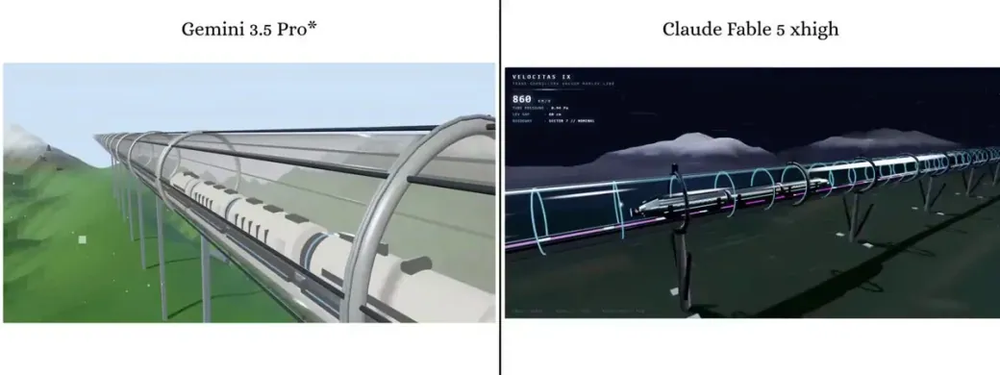
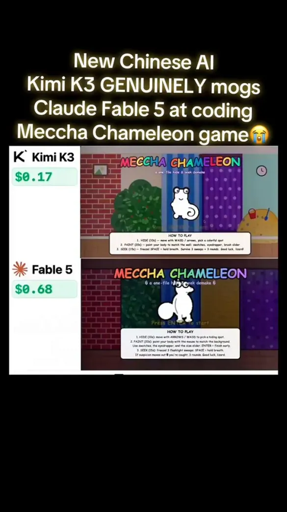
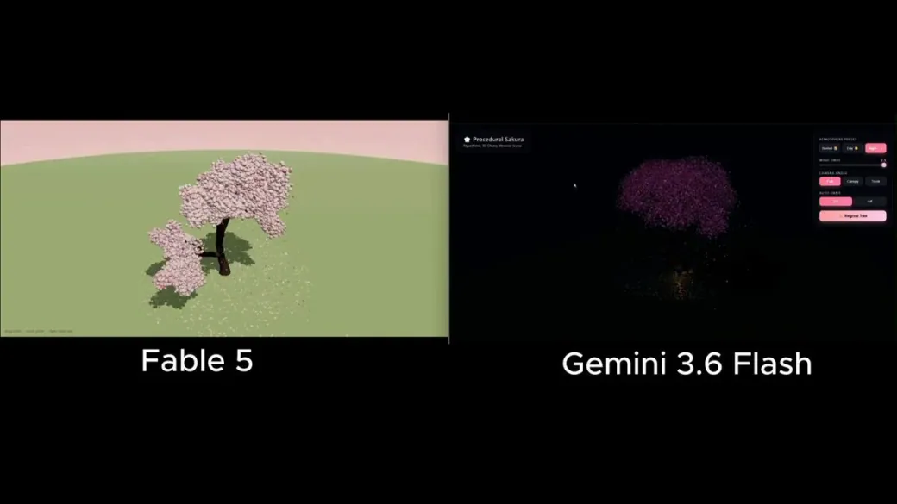
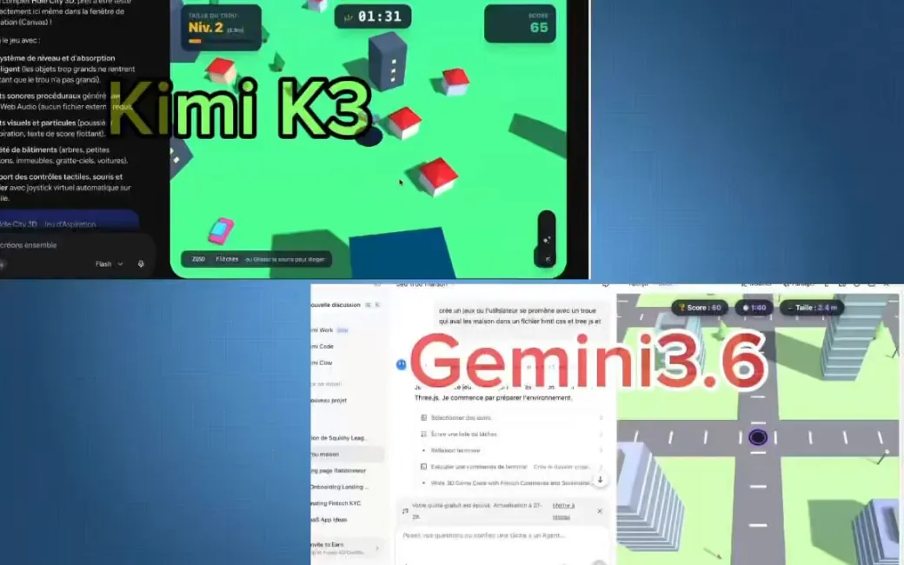
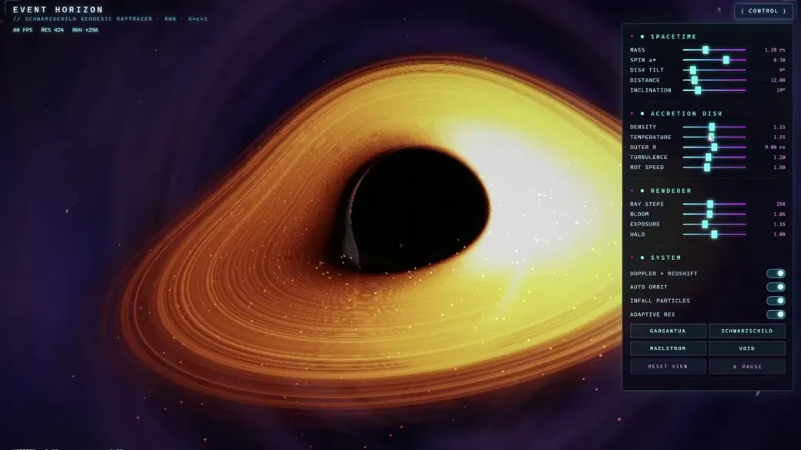
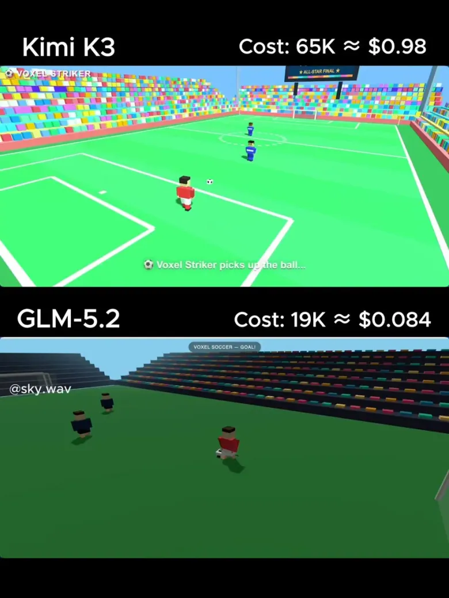
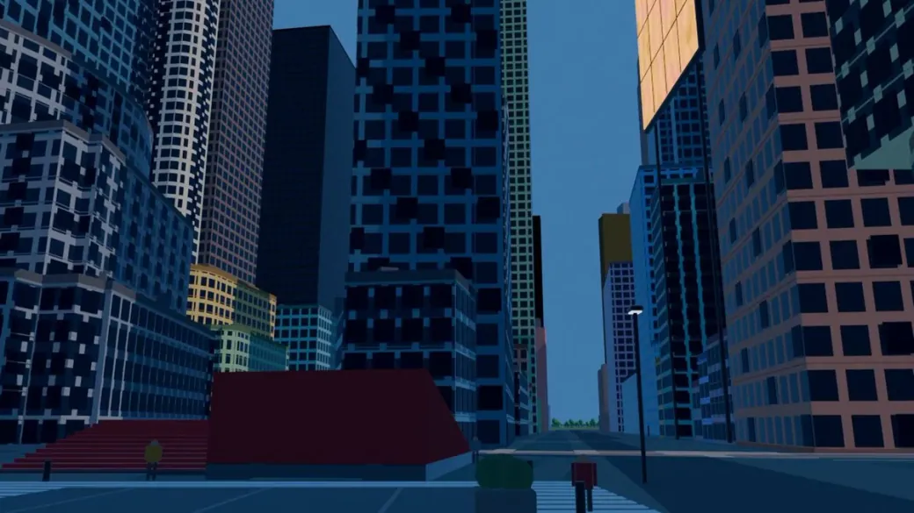
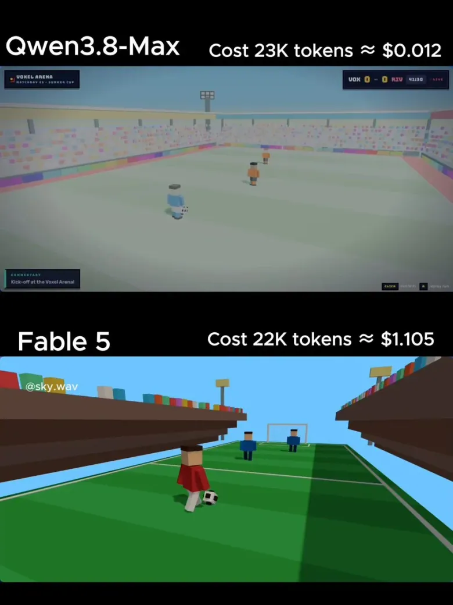
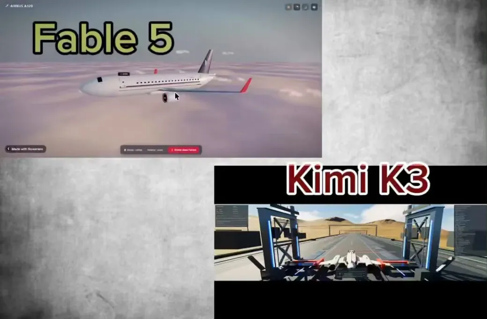

<!-- Generated from Growth CMS by templates/catalog.md. Edit content in CMS; run npm run sync. -->

# Awesome 3D Prompts — 10 / 10

[← Awesome 3D Prompts](../README.md)

<p>
  <a href="../docs/catalog.en.10.md"></a>
  <a href="../docs/catalog.zh.10.md"></a>
  <a href="../docs/catalog.zh-Hant.10.md"></a>
  <a href="../docs/catalog.ja.10.md"></a>
  <a href="../docs/catalog.ko.10.md"></a>
  <a href="../docs/catalog.es.10.md"></a>
  <a href="../docs/catalog.pt.10.md"></a>
  <a href="../docs/catalog.de.10.md"></a>
  <a href="../docs/catalog.fr.10.md"></a>
  <a href="../docs/catalog.it.10.md"></a>
  <a href="../docs/catalog.ru.10.md"></a>
  <a href="../docs/catalog.tr.10.md"></a>
  <a href="../docs/catalog.uk.10.md"></a>
  <a href="../docs/catalog.vi.10.md"></a>
</p>

[Catálogo completo](catalog.pt.md) · [←](catalog.pt.9.md) · **10 / 10**

<a id="all-prompts"></a>

<details>
<summary>Explorar exemplos (10)</summary>

- [Prompt de Three.js para uma cena de trem maglev futurista](#futuristic-maglev-train-in-three-js-2080454415400493332)
- [Prompt de esconde-esconde 3D com camaleão e robô](#chameleon-and-robot-hide-and-seek-game-2080392777515311115)
- [Prompt de Claude Fable 5 para uma cerejeira 3D em flor](#3d-cherry-blossom-tree-2080178541979664741)
- [Um prompt para loja virtual, museu 3D interativo e clone de estratégia em tempo real](#interactive-3d-museum-and-rts-prototypes-2080050176132300960)
- [Prompt de Three.js para um jogo no estilo Hole.io](#hole-io-style-three-js-game-2079898758427324573)
- [Prompt de Kimi K3 para um traçador de raios de buraco negro em WebGL2 de um arquivo](#single-file-webgl2-black-hole-raytracer-2079590483727442205)
- [Prompt de animação de futebol em voxels no Three.js para um único HTML](#voxel-soccer-animation-in-a-single-html-file-2079553757302710442)
- [Prompt de Fable 5 para modelar Nova York no Blender](#modeling-new-york-city-in-blender-2079387760478073087)
- [Prompt de Fable 5 para animação de futebol em voxels no Three.js em um arquivo](#single-file-three-js-voxel-soccer-animation-2079198084689723560)
- [Prompt de Three.js para explorar um avião por dentro](#three-js-airplane-walkthrough-experience-2078806166122197132)

</details>
<a id="futuristic-maglev-train-in-three-js-2080454415400493332"></a>

### Prompt de Three.js para uma cena de trem maglev futurista

[Pixel](https://x.com/Pixel_Neuron) · 2026-07-24 · Claude Fable 5 · Cenas

<a href="https://www.tripo3d.ai/pt/3d-prompts/futuristic-maglev-train-in-three-js-2080454415400493332"></a>

**Prompt**

```text
Um trem-bala maglev futurista em alta velocidade dentro de um tubo de vácuo de vidro transparente.
```

[Ver detalhes ↗](https://www.tripo3d.ai/pt/3d-prompts/futuristic-maglev-train-in-three-js-2080454415400493332) · [Publicação original](https://x.com/Pixel_Neuron/status/2080454415400493332) · [Voltar aos exemplos](#all-prompts)

---

<a id="chameleon-and-robot-hide-and-seek-game-2080392777515311115"></a>

### Prompt de esconde-esconde 3D com camaleão e robô

[Sonicsmart](https://x.com/sonicsmarta) · 2026-07-23 · Claude Fable 5 · Jogos

<a href="https://www.tripo3d.ai/pt/3d-prompts/chameleon-and-robot-hide-and-seek-game-2080392777515311115"></a>

**Prompt**

```text
Um prompt enviado aos dois: um jogo de esconde-esconde. Um camaleão se pinta para combinar com a parede enquanto um robô o caça. Um arquivo, jogável, com rodadas, pontuação e porcentagem de correspondência. Não uma demo: um jogo pronto.
```

[Ver detalhes ↗](https://www.tripo3d.ai/pt/3d-prompts/chameleon-and-robot-hide-and-seek-game-2080392777515311115) · [Publicação original](https://x.com/sonicsmarta/status/2080392777515311115) · [Voltar aos exemplos](#all-prompts)

---

<a id="3d-cherry-blossom-tree-2080178541979664741"></a>

### Prompt de Claude Fable 5 para uma cerejeira 3D em flor

[zhod](https://x.com/zhodonx) · 2026-07-23 · Claude Fable 5 · Recursos

<a href="https://www.tripo3d.ai/pt/3d-prompts/3d-cherry-blossom-tree-2080178541979664741"></a>

**Prompt**

```text
Construa uma cerejeira 3D em flor; não forneça bibliotecas de árvores prontas; o modelo precisa gerar a estrutura por conta própria
```

[Ver detalhes ↗](https://www.tripo3d.ai/pt/3d-prompts/3d-cherry-blossom-tree-2080178541979664741) · [Publicação original](https://x.com/zhodonx/status/2080178541979664741) · [Voltar aos exemplos](#all-prompts)

---

<a id="interactive-3d-museum-and-rts-prototypes-2080050176132300960"></a>

### Um prompt para loja virtual, museu 3D interativo e clone de estratégia em tempo real

[Atlas](https://x.com/crptAtlas) · 2026-07-22 · Claude Fable 5 · Outros

<a href="https://www.tripo3d.ai/pt/3d-prompts/interactive-3d-museum-and-rts-prototypes-2080050176132300960"></a>

**Prompt**

```text
Projeto 1: loja virtual com 30 produtos e 30 imagens geradas
Projeto 2: museu 3D interativo que importe quase 1.000 pinturas reais da Wikipedia para um banco de dados
Projeto 3: um clone de Age of Empires
```

[Ver detalhes ↗](https://www.tripo3d.ai/pt/3d-prompts/interactive-3d-museum-and-rts-prototypes-2080050176132300960) · [Publicação original](https://x.com/crptAtlas/status/2080050176132300960) · [Voltar aos exemplos](#all-prompts)

---

<a id="hole-io-style-three-js-game-2079898758427324573"></a>

### Prompt de Three.js para um jogo no estilo Hole.io

[FHILY👑](https://x.com/Oluwaphilemon1) · 2026-07-22 · Kimi K3 · Jogos

<a href="https://www.tripo3d.ai/pt/3d-prompts/hole-io-style-three-js-game-2079898758427324573"></a>

**Prompt**

```text
Construa um jogo completo no estilo Hole.io em HTML + Three.js em uma única tentativa.
```

[Ver detalhes ↗](https://www.tripo3d.ai/pt/3d-prompts/hole-io-style-three-js-game-2079898758427324573) · [Publicação original](https://x.com/Oluwaphilemon1/status/2079898758427324573) · [Voltar aos exemplos](#all-prompts)

---

<a id="single-file-webgl2-black-hole-raytracer-2079590483727442205"></a>

### Prompt de Kimi K3 para um traçador de raios de buraco negro em WebGL2 de um arquivo

[Harsh](https://x.com/devloper_hs) · 2026-07-21 · Kimi K3 · Animação

<a href="https://www.tripo3d.ai/pt/3d-prompts/single-file-webgl2-black-hole-raytracer-2079590483727442205"></a>

**Prompt**

```text
Crie um único arquivo HTML completo e autossuficiente, sem bibliotecas externas como Three.js, que implemente um traçador de raios geodésicos em tempo real para um buraco negro de Schwarzschild inspirado em Gargantua.

Use WebGL2 puro com GLSL ES 3.00 em um único fragment shader. Implemente física precisa: integração de geodésicas nulas com solucionador Runge-Kutta de quarta ordem, horizonte de eventos, esfera de fótons, disco de acreção corretamente renderizado, lente gravitacional, intensificação Doppler e desvio gravitacional para o vermelho. Busque desempenho estável de 60 FPS.

Inclua órbita e zoom de câmera controlados pelo mouse e um painel de estilo cyberpunk com controles deslizantes para parâmetros como massa, rotação, densidade do disco e ângulo de visão. Adicione efeitos sutis de partículas para a matéria em queda e iluminação e sombras dinâmicas.

O resultado deve estar 100% completo e rodar imediatamente em um navegador moderno, sem tela preta, NaNs, erros ou funções faltando. Priorize acima de tudo correção numérica, tratamento dos limites, rigor do solucionador e precisão física. Verifique e comente no código as principais equações físicas. Faça uma experiência visualmente impressionante e interativa, como uma demo ou jogo de física de alta qualidade.
```

[Ver detalhes ↗](https://www.tripo3d.ai/pt/3d-prompts/single-file-webgl2-black-hole-raytracer-2079590483727442205) · [Publicação original](https://x.com/devloper_hs/status/2079590483727442205) · [Voltar aos exemplos](#all-prompts)

---

<a id="voxel-soccer-animation-in-a-single-html-file-2079553757302710442"></a>

### Prompt de animação de futebol em voxels no Three.js para um único HTML

[Thành](https://x.com/Zmthanh) · 2026-07-21 · Kimi K3 · Animação

<a href="https://www.tripo3d.ai/pt/3d-prompts/voxel-soccer-animation-in-a-single-html-file-2079553757302710442"></a>

**Prompt**

```text
Crie um único arquivo HTML com Three.js (CDN) para uma animação simples de futebol em estilo voxel. Um jogador de blocos dribla 2 defensores e marca um gol espetacular com partículas de comemoração. Visual de estádio colorido. Retorne SOMENTE o código HTML completo.
```

[Ver detalhes ↗](https://www.tripo3d.ai/pt/3d-prompts/voxel-soccer-animation-in-a-single-html-file-2079553757302710442) · [Publicação original](https://x.com/Zmthanh/status/2079553757302710442) · [Voltar aos exemplos](#all-prompts)

---

<a id="modeling-new-york-city-in-blender-2079387760478073087"></a>

### Prompt de Fable 5 para modelar Nova York no Blender

[Martin Puli](https://x.com/MartinPulitano) · 2026-07-21 · Claude Fable 5 · Cenas

<a href="https://www.tripo3d.ai/pt/3d-prompts/modeling-new-york-city-in-blender-2079387760478073087"></a>

**Prompt**

```text
Isto é Nova York. Um agente construiu sozinho, com UM prompt. Não mexi um dedo. Ainda estou tentando assimilar.

Há alguns dias encontrei posts de pessoas modelando no Blender com GPT 5.6 Sol e não conseguia pensar em outra coisa. Precisava testar com algo real.

Comecei com a minha própria casa. Ficou horrível: deformada, cinza, parecendo uma maquete de plástico.

Eu poderia ter parado por aí. Mas comecei a iterar.

Montei agentes que buscam dados reais do lugar em mil fontes. Contornos dos prédios, alturas, coordenadas. Com Blender MCP + skills + bibliotecas, eles constroem o modelo usando as ferramentas do próprio Blender.

Quando o sistema ficou pronto, digitei um prompt: “monte Nova York”.

Ele devolveu Manhattan. Medidas reais, localização precisa ao metro, sem eu tocar em um único vértice.

O que eu não esperava é que testei vários modelos e, nisso, GPT 5.6 Sol ganha do Fable 5 por MUITO.

Isso foi em poucos dias. Ainda estou refinando o detalhe dos prédios. Se você olhar os vídeos anteriores no meu perfil, vai ver quanto melhorou de uma atualização para outra.

Agora estou tentando cobrir mais área e detalhe com um único prompt. (Se você entende de texturas e materiais no Blender, estou ouvindo 🙏).

Mas o que realmente me impressiona não é o modelo. É o que se abre depois.

O .blend continua vivo. Com poucas frases dá para adicionar uma torre, mover uma avenida ou fundir cidades inteiras. Buenos Aires sobre Nova York. O Obelisco no meio da Times Square.

Não estou modelando uma cidade. Estou transformando a realidade em um rascunho editável.

Repositório + .blend no primeiro comentário 👇 Vou continuar postando cada passo aqui. Se você gosta de acompanhar a evolução, me siga, porque estamos só começando.

Qual cidade você quer que eu modele agora?
```

[Ver detalhes ↗](https://www.tripo3d.ai/pt/3d-prompts/modeling-new-york-city-in-blender-2079387760478073087) · [Publicação original](https://x.com/MartinPulitano/status/2079387760478073087) · [Voltar aos exemplos](#all-prompts)

---

<a id="single-file-three-js-voxel-soccer-animation-2079198084689723560"></a>

### Prompt de Fable 5 para animação de futebol em voxels no Three.js em um arquivo

[Thành](https://x.com/Zmthanh) · 2026-07-20 · Claude Fable 5 · Animação

<a href="https://www.tripo3d.ai/pt/3d-prompts/single-file-three-js-voxel-soccer-animation-2079198084689723560"></a>

**Prompt**

```text
Crie um único arquivo HTML com Three.js (CDN) para uma animação simples de futebol em estilo voxel. Um jogador de blocos dribla 2 defensores e marca um gol espetacular com partículas de comemoração. Visual de estádio colorido. Retorne SOMENTE o código HTML completo.
```

[Ver detalhes ↗](https://www.tripo3d.ai/pt/3d-prompts/single-file-three-js-voxel-soccer-animation-2079198084689723560) · [Publicação original](https://x.com/Zmthanh/status/2079198084689723560) · [Voltar aos exemplos](#all-prompts)

---

<a id="three-js-airplane-walkthrough-experience-2078806166122197132"></a>

### Prompt de Three.js para explorar um avião por dentro

[FHILY👑](https://x.com/Oluwaphilemon1) · 2026-07-19 · Claude Fable 5 · Interativo

<a href="https://www.tripo3d.ai/pt/3d-prompts/three-js-airplane-walkthrough-experience-2078806166122197132"></a>

**Prompt**

```text
Gere no Three.js uma experiência que me permita visualizar um modelo 3D de avião e caminhar dentro dele.
```

[Ver detalhes ↗](https://www.tripo3d.ai/pt/3d-prompts/three-js-airplane-walkthrough-experience-2078806166122197132) · [Publicação original](https://x.com/Oluwaphilemon1/status/2078806166122197132) · [Voltar aos exemplos](#all-prompts)

---


[Catálogo completo](catalog.pt.md) · [←](catalog.pt.9.md) · **10 / 10**

<p align="center"><strong><a href="https://www.tripo3d.ai/pt/3d-prompts?utm_source=github&amp;utm_medium=referral&amp;utm_campaign=awesome_3d_prompts&amp;utm_content=catalog_footer">Catálogo completo →</a></strong></p>
