<!-- Generated from Growth CMS by templates/catalog.md. Edit content in CMS; run npm run sync. -->

# Awesome 3D Prompts — 2 / 10

[← Awesome 3D Prompts](../README.md)

<p>
  <a href="../docs/catalog.en.2.md"></a>
  <a href="../docs/catalog.zh.2.md"></a>
  <a href="../docs/catalog.zh-Hant.2.md"></a>
  <a href="../docs/catalog.ja.2.md"></a>
  <a href="../docs/catalog.ko.2.md"></a>
  <a href="../docs/catalog.es.2.md"></a>
  <a href="../docs/catalog.pt.2.md"></a>
  <a href="../docs/catalog.de.2.md"></a>
  <a href="../docs/catalog.fr.2.md"></a>
  <a href="../docs/catalog.it.2.md"></a>
  <a href="../docs/catalog.ru.2.md"></a>
  <a href="../docs/catalog.tr.2.md"></a>
  <a href="../docs/catalog.uk.2.md"></a>
  <a href="../docs/catalog.vi.2.md"></a>
</p>

[Полный каталог](catalog.ru.md) · [←](catalog.ru.1.md) · **2 / 10** · [→](catalog.ru.3.md)

<a id="all-prompts"></a>

<details>
<summary>Посмотреть примеры (50)</summary>

- [Римское поле битвы в золотой час](#gpt-6-astra-2103351755971207251)
- [STILLWATER — лунное болото в браузере](#gpt-6-astra-2103308083242082314)
- [Интерактивная 3D-сцена запуска ракеты над океаном](#claude-opus-5-5-2103303303358534021)
- [Интерактивное средневековое королевство для Claude Opus 5.5](#claude-opus-5-5-2103257687492374597)
- [Туманное осеннее исследуемое пространство на Three.js](#gpt-6-astra-2103211135214256350)
- [На север: интерактивное путешествие на драккаре](#gpt-6-astra-2103187935759655167)
- [Пустота: короткометражный фильм о соборе, наполненном светом витражей](#claude-opus-5-5-2103145567945986461)
- [Игра в стиле Genshin Impact в Сан-Франциско](#claude-opus-5-5-2103144530157687114)
- [Кинематографичный фильм о битве при Аустерлице](#claude-opus-5-5-2103116235009347650)
- [Создайте Эйфелеву башню в Three.js](#claude-opus-5-5-2103106070549757960)
- [Crazy Tanks — 3D-артиллерия на острове](#crazy-tanks-3d-island-artillery)
- [Анимация на Three.js уровня Pixar для Grid Genius](#claude-opus-5-5-2103087766662009118)
- [Игра в реальном времени: пеликан на велосипеде](#claude-opus-5-5-2103083781490176212)
- [Интерактивная 3D-долька цитруса](#gpt-6-astra-2103062348168618280)
- [Создайте имперский город](#claude-opus-5-5-2103046279253168554)
- [Воксельный Codex в Three.js](#gpt-6-astra-2102956340482289944)
- [Гиперреалистичная интерактивная HTML-сцена с костром в пустыне](#gpt-6-astra-2102915300295369208)
- [Бургерный симулятор от первого лица](#gpt-6-astra-2102897258983313712)
- [Создание Bugatti Chiron Super Sport в Three.js](#claude-opus-5-5-2102828216289566725)
- [Шейдер бесконечного соларпанк-города](#gpt-6-astra-2102826333550133520)
- [Тренировочный монтаж роста возможностей Claude](#claude-opus-5-5-2102788371114246177)
- [Создайте мультфильм в стиле 90-х с качеством уровня Pixar на Three.js](#claude-opus-5-5-2102788223835463902)
- [Интерактивная 3D-доска для изучения шахматных гамбитов](#gpt-6-astra-2102788013902213508)
- [Зацикленная анимация круговорота воды, созданная кодом](#claude-opus-5-5-2102781807179735211)
- [Средневековый европейский 3D-замок с управлением в браузере](#gpt-6-astra-2102780850706567390)
- [CatWalk: 3D-игра про кота, мчащегося по ночному городу](#claude-opus-5-5-2102775461701091531)
- [Orbit Lab: 3D-симуляция Солнца, Земли и Луны](#gpt-6-astra-2102752217375899659)
- [Бенчмарк киберпанк-мегаполиса «Последний поезд»](#claude-opus-5-5-2102740078347087940)
- [Воксельная футбольная анимация](#claude-opus-5-5-2102739444256383089)
- [Интерактивный сайт о вымышленных планетах](#claude-opus-5-5-2102729710174196022)
- [Анимация средневекового замка в браузере](#gpt-6-astra-2102672926285713456)
- [Проморолик Tripo 3D, созданный с помощью Claude Opus 5](#tripo-claude-opus-5-5-paper-cut-3d-short)
- [3D-гонка на картах в одном HTML-файле](#gpt-6-astra-2102652927177617564)
- [Интерактивная эйлерова неоновая симуляция жидкости](#claude-opus-5-5-2102565611473661963)
- [Интерактивный 3D-ландшафт японской сакурной долины](#claude-opus-5-5-2102565403109085669)
- [Модель аварии Hundenberg и реалистичное видео](#claude-opus-5-5-2102547809140355250)
- [360-градусный 3D-рендеринг гандбольной площадки по изображению](#claude-opus-5-5-2102544406117286004)
- [Процедурный 3D-фон главного меню в Three.js по изображению](#claude-opus-5-5-2102544196808667471)
- [Самозапускающаяся 3D-машина Руба Голдберга](#claude-opus-5-5-2102544078927741369)
- [Интерактивная игра о фермерских животных в стиле «Питера Кролика»](#claude-opus-5-5-2102538762731565085)
- [Кинематографичный интерактивный пиратский корабль на закате](#claude-opus-5-5-2102533729746882985)
- [Бесконечный процедурно генерируемый мир на Three.js](#claude-opus-5-5-2102529695908806728)
- [Двухэтажный пригородный дом с интерьером](#gpt-6-astra-2102473710724919614)
- [Интерактивная симуляция эвакуации толпы](#claude-opus-5-5-2102467667978572092)
- [Battle City 3D: бесконечная танковая оборона](#battle-city-3d)
- [Интерактивный 3D-остров с доисторической природой](#claude-opus-5-5-2102450239923720440)
- [TD-игра в духе Sir, We Have Orc Problems](#gpt-6-astra-2102411087002112256)
- [3D-сцена и видео с Токийской башней днём и ночью](#gpt-6-astra-2102276620124062065)
- [Bubble Bay: 3D-битва водяных шаров](#bubble-bay)
- [Интерактивная презентация дизайна 3D-вертолёта](#gpt-6-astra-2102215638311694336)

</details>
<a id="gpt-6-astra-2103351755971207251"></a>

### Римское поле битвы в золотой час

[tonysuri](https://x.com/tonysurix) · 2026-09-25 · GPT-6 Astra · Сцены

<a href="https://www.tripo3d.ai/ru/3d-prompts/gpt-6-astra-2103351755971207251"></a>

**Референсы:** [1](https://media.tripogrowth.space/media/e6e72ad3-34e0-4f09-a4c4-8ca0476f7d2d.png) · [2](https://pbs.twimg.com/media/HTCdLiZbUAAPgbm.png)

**Промпт**

```text
ЗАДАНИЕ
Создайте в Blender сцену римского поля битвы в золотой час по предоставленному концепт-арту. Генерация разрешена. Вы можете создавать 3D-модели окружения и его элементов с помощью доступных инструментов генерации (Tripo по адресу https://t.co/JV0K8OtuWC)) и собирать их в сцену. При этом всё должно выглядеть как единая цельная сцена: соблюдайте единый масштаб, согласованные материалы и целостное освещение. Требования: используйте карты рельефа для земли и сделайте её высокодетализированной.
Создайте на земле круглую свободную площадку и окружите её крупными валунами, сформировав арену для поединка один на один.
Добейтесь реалистичного рендера всей сцены.
По возможности создавайте ассеты процедурно.
Создайте скайбокс с небом в золотой час.
Используйте жёсткие тени.
Повторно используйте объекты (флаги, знамёна, шлемы, камни и т. д.). Экспортируйте каждый объект в формате GLB и повторно используйте эти ассеты.
Как можно точнее и аккуратнее сопоставьте сцену с предоставленным изображением.
ТРЕБОВАНИЕ К ТАЙМЛАПСУ
Во время работы после каждого существенного добавления сохраняйте скриншот вьюпорта в пронумерованную папку timelapse/ (после добавления каждого нового объекта, прохода с модификаторами, этапа настройки материала и этапа настройки освещения — строго по порядку). После завершения работы соберите эти кадры в видео-таймлапс с частотой 2 кадра/с (по 0,5 с на кадр), чтобы весь процесс сборки можно было просмотреть от начала до конца. Передайте видео-таймлапс вместе с основными файлами.
DELIVERABLES
Файл .blend с настроенными камерой и вьюпортом, чтобы вид в точности соответствовал исходному изображению.
Видео таймлапса процесса сборки.
```

<details>
<summary>Исходный промпт автора</summary>

```text
THE TASK
Build a golden-hour Roman battlefield set piece in Blender from the supplied concept image.  Generation is allowed. You may generate 3D models for the environment and its parts with the available generation tools (Tripo on https://t.co/JV0K8OtuWC) and assemble them. Everything must still form one coherent scene: matched scale, consistent materials, and unified lighting.  Requirements: Use bump maps on the ground and keep the ground highly detailed.
Create a circular empty spot on the ground with large boulders around it to form a 1v1 arena.
Render everything realistically.
Create assets procedurally where possible.
Create a skybox for golden-hour sky.
Use harsh shadows.
Reuse objects (flags, banners, helms, rocks, etc.). Export a GLB for every object and reuse those assets.
Match the supplied image as closely and accurately as possible.
TIMELAPSE REQUIREMENT
While you build, save a viewport screenshot into a numbered timelapse/ folder after every meaningful addition (each new object, modifier pass, material step, and lighting step, in order).  When the work is finished, assemble those frames into a timelapse video at 2 fps (0.5 s per frame) so the full build can be watched from start to finish. Deliver the timelapse video with the main files.
DELIVERABLES
The .blend file, with camera and viewport set so the view exactly matches the original image.
The build timelapse video.
```

</details>

[Подробнее ↗](https://www.tripo3d.ai/ru/3d-prompts/gpt-6-astra-2103351755971207251) · [Исходная публикация](https://x.com/tonysurix/status/2103352274269675532) · [Назад к примерам](#all-prompts)

---

<a id="gpt-6-astra-2103308083242082314"></a>

### STILLWATER — лунное болото в браузере

[YouWare](https://x.com/YouWareAI) · 2026-09-25 · GPT-6 Astra · Сцены

<a href="https://www.tripo3d.ai/ru/3d-prompts/gpt-6-astra-2103308083242082314"></a>

**Промпт**

```text
Создайте браузерный проект на Three.js под названием STILLWATER. Тон: залитое лунным светом болото, в котором легко заблудиться. Это не игра с врагами и не фотореалистичный проект на Unreal. Это тихий, дорогой на вид веб-мир, где отражения в воде — главный визуальный эффект. Игроки должны неприлично долго смотреть на воду.

СЕТТИНГ
— Название локации: THE DEEP SWAMP
— Время на HUD: 19:26
— Первое названное место: Излучина цапли
— Слоган под названием места: «Оставьте немного места дикой природе.»
— Всплывающее уведомление при прибытии: «Открыто: Излучина цапли»

МИР
Затопленное кипарисовое болото на восходе луны, в поздних сумерках.
— Высокие деревья с узловатыми корнями, стоящие в чёрно-зелёной воде
— Длинные пряди испанского мха
— Скопления кувшинок вдоль берегов
— Узкий извилистый канал, выходящий в более широкую излучину
— Густой объёмный туман, бирюзово-зелёная даль, пурпурно-розовое облачное небо
— Яркая луна с длинной прерывистой дорожкой отражения на воде
— Несколько птиц, пересекающих небо
— Тёплый свет из рубки лодки, пробивающийся сквозь сумрак

ВОДА (не экономьте на качестве)
Это главный визуальный элемент.
— Отражения деревьев, луны, тумана и огней лодки в реальном времени
— Лёгкая зыбь, а не океанские волны
— Кувшинки, лежащие на поверхности и покачивающиеся на воде
— Пена у берега и тёмная таниновая вода возле корней
— Экранные или планарные отражения такого качества, чтобы лунная дорожка выглядела кинематографично
— Сохраняйте 60 кадров/с. Используйте LOD для деревьев и инстансинг растительности.

ЛОДКА
Небольшая потёртая лодка с рубкой, типа рабочего катера.
— Номер 86 на корме
— Белая рубка, тёмно-синий корпус, тёплые лампы внутри
— Дрейф по каналу на холостом ходу, опционально — медленная экскурсия с управляемым маршрутом
— Скорость на HUD: около 15,9 УЗЛА
— Режим: УПРАВЛЯЕМЫЙ ДРЕЙФ
Игрок может осматриваться. Лодку можно показывать в кинематографичном ракурсе преследования или в боковой орбите.

КАМЕРА
— Начальный план: лодка в три четверти среди деревьев
— Дрейф за кормой по залитому лунным светом руслу
— Иногда камера скользит в сторону, проходя мимо ствола на переднем плане
— Осмотр перетаскиванием
— Опционально: ФОТОРЕЖИМ
Ощущение документального фильма о природе, а не шутера от первого лица.

ИНТЕРФЕЙС — редакционный, а не игровой
В левом верхнем углу: небольшой знак + STILLWATER
В верхней центральной части: THE DEEP SWAMP / 19:26, курс компаса (например, 314°)
В правом верхнем углу: ненавязчивые служебные иконки
В левом нижнем углу:
  ИССЛЕДУЕТЕ STILLWATER
  Излучина цапли
  Оставьте немного места дикой природе.
  15,9 УЗЛА
  УПРАВЛЯЕМЫЙ ДРЕЙФ
В правом нижнем углу: ФОТОРЕЖИМ, fps, Пауза
Внизу по центру: небольшое уведомление «Открыто: Излучина цапли»
Небольшая строка подсказок: шейдеры / вода / осмотр перетаскиванием / фотографии / дикая природа

Визуальный стиль: тёмная плёночная цветокоррекция, приглушённые зелёные оттенки, пурпурные облака, единственный лунный блик. Важнее вкус и выразительность, чем реализм. Никакого раздутого отладочного GUI.

ТЕХНОЛОГИИ
Three.js в браузере. Процедурная и инстансированная природа. Кастомный шейдер воды. Туман. Мягкие тени или освещение сумерек с видом запечённого. По возможности создайте окружение самостоятельно, не используя готовый набор болотных ассетов из магазина.

НЕ добавляйте бои, инвентарь, внезапные пугающие моменты или поиски сокровищ. Позже под водой может кто-то скрываться — но не сейчас.
```

<details>
<summary>Исходный промпт автора</summary>

```text
Build a browser experience in Three.js called STILLWATER.  Tone: a moonlit swamp you get lost in. Not a game with enemies. Not photoreal Unreal. A quiet, expensive-looking web world where the water reflections are the feature. People should stare at the water for an unhealthy amount of time.  SETTING - Location title: THE DEEP SWAMP - Time on the HUD: 19:26 - First named place: Heron bend - Tagline under the place name: "Leave a little room for the wild." - Discovery toast when you arrive: "Discovered: Heron bend"  WORLD A flooded cypress swamp at moonrise / late dusk. - Tall knobby-kneed trees standing in black-green water - Spanish moss hanging in long strands - Lily pads clustered along the banks - Narrow winding channel that opens into a wider bend - Thick volumetric fog, teal-green distance, purple-pink cloudy sky - A bright moon with a long broken reflection path on the water - A few birds crossing the sky - Warm cabin light from the boat punching through the gloom  WATER (do not cheap out) This is the hero. - Real-time reflections of trees, moon, fog and boat lights - Gentle swell, not ocean waves - Lily pads that sit on the surface and bob - Shoreline foam / dark tannin water near roots - Screen-space or planar reflections good enough that the moon path feels cinematic - Keep 60fps. LOD the trees, instanced foliage.  BOAT A small weathered cabin skiff / workboat. - Hull number 86 on the stern - White cabin, dark blue hull, warm interior lamps - Idle drift through the channel, optional slow guided tour - HUD speed around 15.9 KNOTS - Mode label: GUIDED DRIFT Player can look around. Boat can be followed from a cinematic chase / side orbit.  CAMERA - Start on a three-quarter of the boat in the trees - Drift behind the stern down the moonlit lane - Occasional side slide past a foreground trunk - Drag to look - Optional PHOTO MODE Feel like a nature documentary, not an FPS.  UI — editorial, not gamey Top-left: small mark + STILLWATER Top-center: THE DEEP SWAMP / 19:26, a compass heading (e.g. 314°) Top-right: quiet utility icons Bottom-left:   EXPLORING STILLWATER   Heron bend   Leave a little room for the wild.   15.9 KNOTS    GUIDED DRIFT Bottom-right: PHOTO MODE, fps, Pause Center-bottom: small toast "Discovered: Heron bend" Tiny hint row: shaders / water / drag to look / photos / wildlife  Look: dark filmic grade, muted greens, magenta clouds, one moon highlight. Taste over realism. No bloated debug GUI.  TECH Three.js in the browser. Procedural / instanced nature. Custom water shader. Fog. Soft shadows or baked-looking dusk lighting. No asset-store swamp pack if you can author it.  DO NOT add combat, inventory, jump scares, or a treasure hunt. Something can lurk underwater later — not now.
```

</details>

[Подробнее ↗](https://www.tripo3d.ai/ru/3d-prompts/gpt-6-astra-2103308083242082314) · [Исходная публикация](https://x.com/YouWareAI/status/2103310302993621090) · [Назад к примерам](#all-prompts)

---

<a id="claude-opus-5-5-2103303303358534021"></a>

### Интерактивная 3D-сцена запуска ракеты над океаном

[PEP PEPICH](https://x.com/Artless101) · 2026-09-25 · Claude Opus 5.5 · Анимация

<a href="https://www.tripo3d.ai/ru/3d-prompts/claude-opus-5-5-2103303303358534021"></a>

**Промпт**

```text
Создайте кинематографичную, высокодетализированную интерактивную 3D-сцену запуска ракеты со стартовой платформы в океане на рассвете. Поставьте весь проект в один HTML-файл, который напрямую открывается в Chrome. Используйте Three.js + WebGL и процедурно создаваемые ресурсы. По возможности встраивайте ресурсы в файл; для библиотеки рендеринга можно использовать надёжный CDN.

ХУДОЖЕСТВЕННОЕ НАПРАВЛЕНИЕ
Создайте драматичный переход от тёмного сине-фиолетового океана перед рассветом к тёплому солнечному свету над атмосферой. Используйте убедительные пропорции, детализированные материалы, атмосферную перспективу и тщательно выстроенные ракурсы камеры. Результат должен восприниматься как отполированный миниатюрный фильм о космическом полёте.
РАКЕТА И СТАРТОВАЯ ПЛАТФОРМА
Создайте убедительную многоступенчатую ракету с оформленным носовым обтекателем, швами панелей, силовыми кольцами, межступенчатыми соединениями, соплами двигателей и головным обтекателем, который разделяется на две половины.

Создайте детализированную плавучую стартовую платформу с опорной башней, убираемой монтажной фермой, сервисными рычагами, ограждениями, лестницами, трубами, оборудованием, прожекторами и мигающими сигнальными маяками. Все конструкции должны быть физически соединены и правильно расположены.
ПОСЛЕДОВАТЕЛЬНОСТЬ ЗАПУСКА
Создайте последовательность продолжительностью примерно 46 секунд:

Начальный облёт камеры вокруг платформы.

Сервисные рычаги и монтажная ферма убираются.
Двигатели запускаются, освещая ракету, платформу и ближайшую воду.
Дым распространяется по палубе, пока ракета отрывается от платформы и набирает скорость.
Камера сопровождает подъём ракеты из атмосферы в космос.
Первая ступень отделяется и отлетает.
Запускается двигатель второй ступени.
Половины обтекателя расходятся, открывая спутник.
Двигатель выключается, спутник отделяется, а его солнечные панели раскрываются.
Завершите сцену орбитальным видом на спутник на фоне изогнутого горизонта Земли и рассвета.
Сожмите временную шкалу полёта для презентации, сохранив согласованность движения. Избегайте резких скачков положения, пересечения компонентов и несвязанных эффектов.
ОКЕАН, АТМОСФЕРА И ЭФФЕКТЫ
Используйте анимированные волны океана на основе шейдеров с отражениями Френеля и тёплыми отражениями света от двигателей. Создайте многослойный выхлоп: яркое ядро, более мягкое внешнее пламя и дрейфующие частицы дыма.
Дым должен расширяться, рассеиваться и реагировать на ветер. Выхлоп на всех этапах должен оставаться прикреплённым к соответствующему двигателю. Плавно переходите от атмосферной дымки к тёмному звёздному небу и освещённому краю Земли.

КАМЕРА И ВЗАИМОДЕЙСТВИЕ
Используйте плавные кинематографичные переходы камеры: общий начальный план, ракурс снизу в момент запуска, сопровождение подъёма, разделение ступеней и крупный план спутника. Главный объект должен оставаться видимым как в портретной, так и в альбомной ориентации.

Добавьте кнопки воспроизведения и паузы, повторный запуск и ползунок перемотки с маркерами событий. Переход к любой позиции должен восстанавливать корректную конфигурацию ракеты, состояние частиц, положение камеры и освещение. Повторное воспроизведение должно полностью и корректно сбрасывать последовательность.
Интерфейс должен быть минимальным и ненавязчивым. Предусмотрите возможность скрыть его для записи.

ТЕХНИЧЕСКОЕ КАЧЕСТВО
Используйте анимацию, независимую от частоты кадров, и эффективные системы частиц. По возможности переиспользуйте геометрию и материалы, корректно обрабатывайте изменение размеров окна и находите баланс между визуальной детализацией и плавной производительностью.

Проверьте итоговый HTML в браузере на компьютере. Просмотрите консоль и сделайте скриншоты в моменты запуска двигателей, отрыва от платформы, разделения ступеней и развёртывания спутника. Перед передачей файла исправьте ошибки загрузки, обрезание объектов, проблемы с геометрией, неисправную перемотку и неудачную композицию кадра.
```

<details>
<summary>Исходный промпт автора</summary>

```text
Create a cinematic, highly detailed, interactive 3D rocket launch from an ocean platform at dawn. Deliver the complete project in one HTML file that opens directly in Chrome. Use Three.js + WebGL and procedural assets. Embed assets wherever practical; a reliable CDN may be used for the rendering library.

ART DIRECTION
Create a dramatic transition from a dark, blue-violet ocean before sunrise to warm sunlight above the atmosphere. Use convincing proportions, detailed materials, atmospheric depth, and carefully composed camera angles. The result should feel like a polished miniature spaceflight film.
ROCKET AND LAUNCH PLATFORM
Build a convincing multistage rocket with a shaped nose cone, panel seams, structural rings, interstage connections, engine nozzles, and a payload fairing that separates into two halves.

Create a detailed floating launch platform with a support tower, retracting strongback, service arms, railings, ladders, pipes, equipment, floodlights, and blinking warning beacons. Keep all structures physically connected and correctly positioned.
LAUNCH SEQUENCE
Create an approximately 46-second sequence:

Establishing camera move around the platform.

Service arms and strongback retract.
Engines ignite, illuminating the rocket, platform, and nearby water.
Smoke spreads across the deck as the rocket lifts off and accelerates.
The camera follows the climb from the atmosphere toward space.
The first stage separates and falls away.
The second-stage engine ignites.
The fairing halves separate, revealing a satellite.
The engine shuts down, the satellite deploys, and its solar panels unfold.
Finish with an orbital view of the satellite against Earth’s curved horizon and sunrise.
Compress the flight timeline for presentation while maintaining coherent motion. Avoid sudden position changes, intersecting components, or disconnected effects.
OCEAN, ATMOSPHERE, AND EFFECTS
Use animated shader-driven ocean waves with Fresnel reflections and warm engine-light reflections. Create layered exhaust with a bright core, softer outer flame, and drifting smoke particles.
Smoke should expand, fade, and respond to wind. Exhaust must remain attached to the correct engine through staging. Transition smoothly from atmospheric haze to a dark star field and Earth’s illuminated limb.

CAMERA AND INTERACTION
Use smooth cinematic camera transitions: wide establishing view, low-angle ignition shot, ascent tracking, stage separation, and satellite close-up. Keep the main subject visible in both portrait and landscape layouts.

Include play/pause, replay, and a scrubber with event markers. Seeking must reconstruct the correct rocket configuration, particle state, camera position, and lighting. Replaying must reset the entire sequence cleanly.
Keep the interface minimal and unobtrusive. Allow it to be hidden for recording.

TECHNICAL QUALITY
Use frame-rate-independent animation and efficient particle systems. Reuse geometry and materials where appropriate, handle resizing correctly, and balance visual detail with smooth performance.

Test the final HTML in a desktop browser. Inspect the console and capture screenshots at ignition, liftoff, staging, and satellite deployment. Fix loading errors, clipping, geometry problems, broken seeking, and poor camera framing before delivering the file.
```

</details>

[Подробнее ↗](https://www.tripo3d.ai/ru/3d-prompts/claude-opus-5-5-2103303303358534021) · [Исходная публикация](https://x.com/Artless101/status/2103303449831964679) · [Назад к примерам](#all-prompts)

---

<a id="claude-opus-5-5-2103257687492374597"></a>

### Интерактивное средневековое королевство для Claude Opus 5.5

[Vib3Coded](https://x.com/vib3coded) · 2026-09-24 · Claude Opus 5.5 · Интерактив

<a href="https://www.tripo3d.ai/ru/3d-prompts/claude-opus-5-5-2103257687492374597"></a>

**Промпт**

```text
Создайте собственное средневековое королевство.
Ваше королевство представляет Claude Opus 5.5. Спроектируйте великолепный замок, вдохновлённый историей, который выражает индивидуальность этой модели через архитектуру, геральдику, цвета и атмосферу. Вы полностью свободны в художественном выборе, но сеттинг должен оставаться правдоподобным для Средневековья.
Не ограничивайтесь размещением логотипа на типовом замке. Придайте королевству distinctive архитектурный характер и цельный визуальный образ. Придумайте герб, королевские цвета и оригинальную геральдическую эмблему. Разместите их на анимированных знамёнах, щитах, украшениях ворот и одежде замковой стражи. Поместите название королевства над главным входом.
Создайте насыщенную деталями интерактивную 3D-сцену с использованием Three.js и WebGL. Всё должно находиться в одном автономном HTML-файле, который можно напрямую открыть в Chrome.
ЗАМОК
Постройте убедительную крепость с центральной цитаделью, башнями, зубчатыми стенами, куртинными стенами, внушительными надвратными сооружениями, работающим подъёмным мостом и внутренним двором.
Добавьте тщательно смоделированную каменную кладку, арочные окна, деревянные двери, конструкции крыш, лестницы, балконы, железные элементы и небольшие архитектурные детали. Сделайте сооружения правдоподобными: у башен должны быть интерьеры или убедительная глубина, лестницы должны вести на доступные этажи, а мосты — иметь надёжные опоры.
Окружите замок привлекательным ландшафтом, соответствующим вашему королевству: скалами, холмами, рекой, рвом, лесами или небольшой деревней. Выстройте выразительную композицию, которая красиво выглядит с разных ракурсов.
ЖИЗНЬ И ВЗАИМОДЕЙСТВИЕ
Оживите королевство: пусть стражники патрулируют стены, жители проходят через внутренний двор, знамёна слегка развеваются, из труб идёт дым, летают птицы, а фонари мерцают.
Дайте зрителю возможность:
Открывать и закрывать подъёмный мост и главные ворота.
Следовать за патрулирующим стражником.
Переключаться между кинематографичным общим видом, внутренним двором и крепостными стенами.
Свободно вращать камеру и масштабировать изображение.
Переключаться между дневным светом, закатом и ночью.
Перемещайте персонажей только по доступным для ходьбы поверхностям. Не допускайте, чтобы они проходили сквозь стены, двери или друг друга.
ОСВЕЩЕНИЕ И АТМОСФЕРА
Создайте кинематографичное освещение, которое чётко раскрывает архитектуру. Используйте мягкие тени, атмосферную глубину, правдоподобную воду там, где это уместно, и сдержанную постобработку.
Ночью подсветите окна, факелы и фонари, сохранив достаточную видимость, чтобы замок оставался хорошо различимым.
Стремитесь к сложной, законченной 3D-работе с самобытной архитектурой и множеством деталей. Избегайте набора очевидных примитивов или повторяющихся башен, лишённых архитектурного назначения.
ТЕХНИЧЕСКОЕ КАЧЕСТВО
По возможности создавайте ассеты процедурно. Встраивайте текстуры и другие ресурсы непосредственно в HTML. Локальный сервер и этап сборки не должны требоваться.
Где уместно, используйте инстансинг и объединение геометрии. Обеспечьте плавную анимацию и удобное управление камерой. Добавьте минималистичный элегантный интерфейс на английском языке и кнопку для его скрытия.
Фактически протестируйте результат в Chrome для компьютера. Сделайте скриншоты, проверьте консоль, протестируйте все взаимодействия и исправьте ошибки рендеринга, парящие объекты, пересечения геометрии и проблемы с камерой.
Сделайте замок таким, чтобы люди узнавали в нём ИМЕННО ваше королевство ещё до того, как прочитают его название.
Верните готовый автономный HTML-файл.
```

<details>
<summary>Исходный промпт автора</summary>

```text
Build your own medieval kingdom.
Your kingdom represents Claude Opus 5.5. Design a magnificent, historically inspired castle that expresses this model’s identity through architecture, heraldry, colors and atmosphere. You have complete artistic freedom within a believable medieval setting.
Do not simply place a logo on a generic castle. Give your kingdom a distinctive architectural character and a coherent visual identity. Invent its coat of arms, royal colors and an original heraldic emblem. Display them on animated banners, shields, gate decorations and the clothing of the castle guards. Place the kingdom’s name above the main entrance.
Create a richly detailed, interactive 3D scene using Three.js and WebGL. Deliver everything in one standalone HTML file that opens directly in Chrome.
THE CASTLE
Build a convincing fortress with a central keep, towers, battlements, curtain walls, an impressive gatehouse, a working drawbridge and a courtyard.
Include carefully modeled stonework, arched windows, wooden doors, roof structures, stairs, balconies, iron fittings and small architectural details. Make the structures believable: towers need interiors or convincing depth, stairs must connect to accessible floors, and bridges must have proper supports.
Surround the castle with an attractive landscape that suits your kingdom: cliffs, hills, a river, a moat, forests or a small village. Design a strong composition that looks beautiful from multiple angles.
LIFE AND INTERACTION
Bring the kingdom to life with guards patrolling the walls, villagers moving through the courtyard, gently waving banners, chimney smoke, birds and flickering lanterns.
Let the viewer:
Open and close the drawbridge and main gate.
Follow a guard on patrol.
Switch between a cinematic overview, the courtyard and the battlements.
Rotate and zoom freely.
Change between daylight, sunset and night.
Keep characters on walkable surfaces. Prevent them from passing through walls, doors or one another.
LIGHTING AND ATMOSPHERE
Create cinematic lighting that reveals the architecture clearly. Use soft shadows, atmospheric depth, convincing water where appropriate and restrained post-processing.
At night, illuminate windows, torches and lanterns while preserving enough visibility to appreciate the castle.
Aim for a sophisticated, finished 3D artwork with distinctive architecture and abundant detail. Avoid a collection of obvious primitive shapes or repetitive towers with no architectural purpose.
TECHNICAL QUALITY
Generate assets procedurally wherever practical. Embed textures and other assets inside the HTML. No local server or build step should be required.
Use instancing and geometry batching where appropriate. Keep animation and camera interaction smooth. Provide a minimal, elegant English interface and a button to hide it.
Actually test the result in desktop Chrome. Capture screenshots, inspect the console, test every interaction and fix rendering errors, floating objects, geometry intersections and camera problems.
Make this a castle people would recognize as YOUR kingdom, even before reading its name.
Return the completed standalone HTML file.
```

</details>

[Подробнее ↗](https://www.tripo3d.ai/ru/3d-prompts/claude-opus-5-5-2103257687492374597) · [Исходная публикация](https://x.com/vib3coded/status/2103257873203462412) · [Назад к примерам](#all-prompts)

---

<a id="gpt-6-astra-2103211135214256350"></a>

### Туманное осеннее исследуемое пространство на Three.js

[Simonas](https://x.com/SimonasLTU1) · 2026-09-24 · GPT-6 Astra · Интерактив

<a href="https://www.tripo3d.ai/ru/3d-prompts/gpt-6-astra-2103211135214256350"></a>

**Промпт**

```text
Создай туманную, дождливую, осеннюю и загадочную атмосферу с ностальгическим настроением — исследуемое пространство на Three.js в одном HTML/CSS/JS-файле.
```

<details>
<summary>Исходный промпт автора</summary>

```text
I want you to create me a misty, rainy, autumn-like mysterious atmosphere, nostalgic experience in an explorable Three.js in a single html/css/js file.
```

</details>

[Подробнее ↗](https://www.tripo3d.ai/ru/3d-prompts/gpt-6-astra-2103211135214256350) · [Исходная публикация](https://x.com/SimonasLTU1/status/2103211135214256350) · [Назад к примерам](#all-prompts)

---

<a id="gpt-6-astra-2103187935759655167"></a>

### На север: интерактивное путешествие на драккаре

[Vib3Coded](https://x.com/vib3coded) · 2026-09-24 · GPT-6 Astra · Интерактив

<a href="https://www.tripo3d.ai/ru/3d-prompts/gpt-6-astra-2103187935759655167"></a>

**Промпт**

```text
Создайте «Northbound» — красивое интерактивное 3D-путешествие по северному фьорду на борту детально проработанного викингского драккара.

Создайте полноценную сцену, работающую в реальном времени, с использованием Three.js и WebGL и поставляемую в виде одного автономного HTML-файла. Это должен быть исследуемый браузерный опыт, а не предварительно отрендеренное видео или плоская иллюстрация.

ВИЗУАЛЬНОЕ НАПРАВЛЕНИЕ

Стремитесь к качественной кинематографичной среде с реалистичными материалами, естественными пропорциями и сдержанной цветовой палитрой. Избегайте мультяшного или низкополигонального вида.

Деревянный драккар плывёт по глубоким зелёно-синим водам между отвесными скалами, густыми лесами, водопадами и небольшими северными поселениями. Используйте атмосферную перспективу, лёгкий туман, мягкие тени и убедительную глубину сцены. На протяжении всего путешествия создавайте красивые ракурсы, а не только один вид из исходного положения камеры.

ДРАККАР

Смоделируйте детальный герметичный корпус с перекрывающимися деревянными досками, видимой текстурой древесины, шпангоутами, скамьями и непрерывным внутренним пространством.
Добавьте резную драконью носовую часть, полосатый тканевый парус, мачту, канаты, щиты, припасы и тёплые фонари.
Добавьте соразмерных викингов-пассажиров и гребцов в многослойной одежде, с естественными сидячими позами и руками, расположенными рядом с вёслами.
Все компоненты должны быть физически соединены. Не допускайте парящих пассажиров, пересечений аксессуаров и видимых просветов сквозь корпус.
Добавьте лёгкую анимацию плавучести, продольной и поперечной качки. Парус должен мягко реагировать на ветер.

ВОДА И ГРЕБЛЯ

Сделайте воду центральным визуальным элементом.

Используйте собственный шейдер с плоскими отражениями, преломлением, бликами Френеля, поглощением света в зависимости от глубины, видимыми мелководными участками и многослойной рябью на поверхности. Отражения должны корректно реагировать на движение камеры и изменение освещения.

Создайте убедительный кильватерный след за кораблём.

Анимируйте полный цикл гребка: лопасти входят в воду, отводятся назад, выходят из воды и возвращаются над поверхностью. Синхронизируйте это движение с движениями гребцов.

Создавайте рябь, пену и мелкие брызги в точках фактического контакта лопастей с водой. Следы должны оставаться в мировом пространстве и постепенно затухать. Не допускайте появления эффектов, когда лопасти находятся в воздухе.

ОКРУЖЕНИЕ И МАТЕРИАЛЫ

Используйте детализированный рельеф, неровные скальные образования, естественные силуэты деревьев, ветвящиеся стволы и отдельные кластеры листьев или хвои.

Используйте PBR-материалы с картами нормалей и шероховатости для дерева, камня и грунта. Допускается встраивать текстуры с соответствующей лицензией; при необходимости указывайте атрибуцию.

Подводный рельеф должен продолжаться под поверхностью воды. Не допускайте ярких швов, разрывов береговой линии, парящей растительности и деревьев, перекрывающих судоходный маршрут.

CONTROLS

A/D или клавиши со стрелками: поворот влево и вправо.
W/S: регулировка скорости.
Перетаскивание мышью: осмотр по сторонам.
Добавьте режимы сопровождения, орбитальной камеры и кинематографичной камеры.
Предусмотрите опциональный режим автоматического путешествия.
Добавьте кнопки паузы, сброса, полноэкранного режима и скрытия интерфейса.
На мобильных устройствах поддержите сенсорное управление рулением и скоростью.
Не позволяйте кораблю проходить сквозь сушу и скалы.

АТМОСФЕРА И ИНТЕРФЕЙС

Предусмотрите три режима освещения с плавным переходом: «Утро», «Пасмурно» и «Лунный свет».

Добавьте опциональные звуки воды, ветра, птиц и гребли. Аудио должно запускаться только после взаимодействия с пользователем.

Создайте минималистичный редакционный интерфейс: надпись «Northbound.» элегантным шрифтом с засечками, ненавязчивые обозначения глав и компактную полупрозрачную панель управления. Не закрывайте пейзаж.

ПРОИЗВОДИТЕЛЬНОСТЬ И ПУБЛИКАЦИЯ

Используйте инстансинг, разумный бюджет геометрии, детализацию в зависимости от расстояния и отражающие буферы подходящего размера. Адаптируйте качество рендеринга к устройству, не обещая фиксированную частоту кадров.

Поставьте один HTML-файл со встроенными скриптами и необходимыми ресурсами, чтобы его можно было открыть напрямую в современном браузере.

Проверьте руление, режимы камеры, переходы между режимами освещения и греблю. Осмотрите корабль с разных ракурсов и проверьте береговую линию с низких точек обзора. До завершения работы исправьте пересечения геометрии, артефакты отражений, чрезмерные блики и ошибки в консоли.

Отдайте приоритет убедительной воде, прекрасно сконструированному драккару и цельному окружению, а не добавлению новых объектов.
```

<details>
<summary>Исходный промпт автора</summary>

```text
Create “Northbound” - a beautiful, interactive 3D journey through a Nordic fjord aboard a detailed Viking longship.

Build a genuine real-time scene using Three.js and WebGL, delivered as a single standalone HTML file. This must be an explorable browser experience, not a pre-rendered video or a flat illustration.

VISUAL DIRECTION

Aim for a polished, cinematic environment with realistic materials, natural proportions, and restrained colors. Avoid a cartoon or low-poly appearance.

A wooden longship travels through deep green-blue water between towering cliffs, dense forests, waterfalls, and small Nordic settlements. Use atmospheric perspective, subtle mist, soft shadows, and convincing depth. Compose beautiful views throughout the journey, not just from the initial camera position.

THE LONGSHIP

Construct a detailed, watertight hull with overlapping wooden planks, visible grain, ribs, benches, and a continuous interior.
Add a carved dragon prow, striped cloth sail, mast, ropes, shields, supplies, and warm lanterns.
Include proportionate Viking passengers and rowers with layered clothing, believable seated poses, and hands positioned near their oars.
Keep every component physically connected. No floating passengers, intersecting accessories, or visible gaps through the hull.
Animate subtle buoyancy, pitch, and roll. The sail should respond gently to the wind.

WATER AND ROWING

Make the water a central visual feature.

Use a custom shader with planar reflections, refraction, Fresnel highlights, depth-dependent absorption, visible shallow areas, and layered surface ripples. Reflections must respond correctly to the moving camera and changing lighting.

Create a believable wake behind the ship.

Animate a complete rowing cycle: blades enter the water, pull backward, lift out, and return above the surface. Coordinate this with the rowers’ movement.

Generate ripples, foam, and small droplets at the actual blade-water contact points. Trails must remain in world space and gradually dissipate. Avoid effects appearing while the blades are in the air.

ENVIRONMENT AND MATERIALS

Use detailed terrain, irregular rock formations, natural tree silhouettes, branching trunks, and individual leaf or needle clusters.

Use PBR materials with normal and roughness maps for wood, stone, and ground. You may embed appropriately licensed textures; include attribution where required.

Ensure the underwater terrain continues beneath the surface. No bright seams, shoreline gaps, floating vegetation, or trees obstructing the navigable route.

CONTROLS

A/D or arrow keys: steer left and right.
W/S: adjust speed.
Mouse drag: look around.
Provide follow, orbit, and cinematic camera modes.
Include an optional automatic journey mode.
Add pause, reset, fullscreen, and hide-interface controls.
Support touch steering and speed controls on mobile.
Prevent the ship from passing through land and rocks.

ATMOSPHERE AND INTERFACE

Provide three smoothly transitioning lighting presets: Morning, Overcast, and Moonlight.

Add optional ambient water, wind, birds, and rowing sounds. Audio must begin only after user interaction.

Design a minimal editorial interface: “Northbound.” in an elegant serif typeface, subtle chapter labels, and a compact translucent control bar. Keep the scenery unobstructed.

PERFORMANCE AND DELIVERY

Use instancing, sensible geometry budgets, distance-based detail, and appropriately sized reflection targets. Adapt rendering quality to the device instead of promising a fixed frame rate.

Deliver one HTML file with scripts and required assets embedded so it can open directly in a modern browser.

Test steering, camera modes, lighting transitions, and rowing. Inspect the ship from multiple angles and check the shoreline from low viewpoints. Fix geometry intersections, reflection artifacts, excessive glare, and console errors before considering the scene finished.

Prioritize convincing water, a beautifully constructed longship, and a cohesive environment over adding more objects.
```

</details>

[Подробнее ↗](https://www.tripo3d.ai/ru/3d-prompts/gpt-6-astra-2103187935759655167) · [Исходная публикация](https://x.com/vib3coded/status/2103189762672611675) · [Назад к примерам](#all-prompts)

---

<a id="claude-opus-5-5-2103145567945986461"></a>

### Пустота: короткометражный фильм о соборе, наполненном светом витражей

[AGIおやZ](https://x.com/AGIOyaZ) · 2026-09-24 · Claude Opus 5.5 · Анимация

<a href="https://www.tripo3d.ai/ru/3d-prompts/claude-opus-5-5-2103145567945986461"></a>

**Промпт**

```text
Создайте в three.js короткометражный фильм в портретной ориентации 1080×1920, 30 кадров/с, продолжительностью около 36 секунд. 

【Название作品】
Пустота

【Желаемый эффект】
Это видео должно без единого персонажа передать ощущение, как из-за постоянной гонки за эффективностью мы теряем время, а в момент обретения свободного пространства жизнь наполняется богатым светом. В финале свет витража, проступающий на всём полу, должен заставить зрителя невольно затаить дыхание.

【Сцена】
・Интерьер погружённого в полумрак каменного собора. На дальней стене находится только одно окно в форме стрельчатой арки высотой 15 м и шириной 10 м
・Снаружи через окно под углом 45 градусов падает яркий свет, отбрасывая на каменный пол световое пятно в форме окна
・В окно вставлен витраж: в центре — Дева Мария, по обеим сторонам — два ангела с расправленными крыльями, в верхней части — роза. Дизайн должен быть оригинальным, не копировать существующие произведения и иметь симметричную композицию

【Временная структура】
0–3 секунды: свет, проникающий через окно, пока ещё бесцветный и белый. На полу — мягкое белое световое пятно
3–11 секунд: серые кубы с выгравированными словами «Занят», «Оптимизация», «Срочно», «Дедлайн» и другими подобными выражениями один за другим влетают с переднего плана и заполняют окно. Темп их появления постоянно ускоряется, а по мере заполнения окна помещение погружается во тьму
11–14 секунд: окно полностью закрыто, вокруг царят тьма и тишина
14–19 секунд: только один блок со словом «Занят» отделяется от окна и падает вниз, превращаясь в частицы света и исчезая. Через образовавшееся отверстие пробивается яркий луч насыщенного цвета
19–26 секунд: начиная с первого отверстия блоки один за другим отделяются от окна. С каждым новым отверстием становится больше разноцветных световых столбов, а скрытый витраж постепенно открывается взгляду
26–33 секунды: все блоки исчезают, камера проходит сквозь световые столбы и поднимается, чтобы посмотреть на пол строго сверху. Весь пол покрыт проекцией витража с Девой Марией и ангелами, сияющей яркими цветами
33–36 секунд: весь экран окутывает ослепительный свет, появляется финальная фраза, и видео тихо завершается

【Текстовые фразы (сдержанно появляются и исчезают, шрифт минcho)】
・«Каждый день — ещё быстрее.»
・«Ещё эффективнее.»
・«И вдруг я заметил: свет больше не проникает внутрь.»
・«Попробую отпустить хотя бы что-то одно.»
・«Свет проникает туда, где освободилось место.»
・«И этот свет оказался богаче прежнего.»
・В финале крупно: «Изобилие рождается в свободном пространстве»

【Свет и материалы】
・Световые столбы окрашены в цвет соответствующего участка витража, а взвешенная в воздухе пыль мерцает
・Проекция на полу должна точно отражать, какие отверстия в окне открыты: участки, закрытые блоками, остаются в тени
・Блоки выполнены из матового серого материала с безликим индустриальным видом. Надписи выгравированы белым цветом
・В первой половине преобладают холодные ахроматические тона, во второй — похожие на драгоценные камни красный, синий и золотой. Этот контраст должен передавать ощущение обретённого изобилия

【Технические условия】
・Изображение витража сгенерируйте как текстуру, а свет на полу, световые столбы и изображение в окне рассчитайте на основе одного и того же изображения, чтобы они полностью совпадали
・Точно продвигайте время с шагом 1/30 секунды, экспортируйте каждый кадр отдельно и соберите их в MP4

【Финальная проверка】
Отрендерьте и проверьте каждую сцену в реальном виде. Перед передачей исправьте результат, если на проекции пола нельзя распознать Деву Марию и ангелов, если текст плохо читается или движения выглядят резкими и неестественными.
```

<details>
<summary>Исходный промпт автора</summary>

```text
three.jsで、縦長1080×1920・30コマ/秒・約36秒の短編映像を作ってください。

【作品名】
余白

【見せたい体験】
効率化に追われて時間を失っていく感覚と、余白を手に入れた瞬間に人生が豊かな光で満たされていく感覚を、人物を一切登場させずに体感させる映像です。最後に床一面に浮かび上がるステンドグラスの光で、見た人が思わず息をのむことを目指します。

【舞台】
・薄暗い石造りの大聖堂の内部。正面の壁に、高さ15m・幅10mの尖頭アーチ型の窓が一つだけある
・窓の外からは、斜め45度の角度で強い光が差し込み、石の床に窓の形の光を落としている
・窓には、中央に聖母、両脇に翼を広げた二人の天使、上部にバラ窓を配したステンドグラスがはまっている。デザインは既存の作品を模さずオリジナルで、左右対称の構図にする

【時間の構成】
0〜3秒：窓から差す光は、まだ色のない白い光。床にやわらかな白い光の形
3〜11秒：「忙しい」「効率化」「至急」「締切」などの言葉が刻まれた灰色の立方体が、部屋の手前から次々と飛んできて窓を埋めていく。飛来のペースはどんどん加速し、窓が埋まるほど部屋は暗くなる
11〜14秒：窓は完全にふさがれ、闇と静寂
14〜19秒：「忙しい」のブロックが一つだけ窓から外れて落ち、光の粒になって消える。空いた穴から、鮮やかな色の一筋の光が差し込む
19〜26秒：最初の穴を中心に、ブロックが連鎖的に外れていく。穴が増えるたびに色とりどりの光の柱が増え、隠れていたステンドグラスが少しずつ姿を現す
26〜33秒：すべてのブロックが消え、カメラは光の柱をくぐり抜けて上昇し、真上から床を見下ろす。床一面に、聖母と天使のステンドグラスが色鮮やかな光として映し出されている
33〜36秒：画面全体がまばゆい光に包まれ、最後の言葉が浮かび、静かに終わる

【言葉（明朝体、控えめに浮かんでは消える）】
・「毎日、もっと速く。」
・「もっと、効率よく。」
・「気づけば、光が入らなくなっていた。」
・「ひとつ、手放してみる。」
・「空いたところから、光が入る。」
・「その光は、前より豊かだった。」
・最後に大きく：「豊かさは余白に宿る」

【光と質感】
・光の柱は、ステンドグラスのその場所の色に染まり、空中の塵がきらめく
・床の投影は、窓のどの穴が空いているかを正確に反映する（ブロックがある場所は影になる）
・ブロックは無機質なマットグレー。言葉は白く刻印されている
・前半は冷たく無彩色、後半は宝石のような赤・青・金。この色の対比で「豊かになった」ことを語る

【技術条件】
・ステンドグラスの絵柄は画像として生成し、床の光・光の柱・窓の表示はすべて同じ絵柄から計算して一致させる
・時間を1/30秒ずつ正確に進めて1コマずつ書き出し、MP4にする

【仕上げ】
各場面を実際に描画して確認し、ステンドグラスの絵柄が床の上で聖母と天使として読み取れるか、言葉が読めるか、動きが唐突でないかを直してから渡してください。
```

</details>

[Подробнее ↗](https://www.tripo3d.ai/ru/3d-prompts/claude-opus-5-5-2103145567945986461) · [Исходная публикация](https://x.com/AGIOyaZ/status/2103145567945986461) · [Назад к примерам](#all-prompts)

---

<a id="claude-opus-5-5-2103144530157687114"></a>

### Игра в стиле Genshin Impact в Сан-Франциско

[Every 📧](https://x.com/every) · 2026-09-24 · Claude Opus 5.5 · Игры

<a href="https://www.tripo3d.ai/ru/3d-prompts/claude-opus-5-5-2103144530157687114"></a>

**Промпт**

```text
Создай игру в стиле Genshin Impact, действие которой происходит в Сан-Франциско.
```

<details>
<summary>Исходный промпт автора</summary>

```text
Build a Genshin Impact–style game set in San Francisco.
```

</details>

[Подробнее ↗](https://www.tripo3d.ai/ru/3d-prompts/claude-opus-5-5-2103144530157687114) · [Исходная публикация](https://x.com/every/status/2103144530157687114) · [Назад к примерам](#all-prompts)

---

<a id="claude-opus-5-5-2103116235009347650"></a>

### Кинематографичный фильм о битве при Аустерлице

[Winter](https://x.com/WinterArc2125) · 2026-09-24 · Claude Opus 5.5 · Анимация

<a href="https://www.tripo3d.ai/ru/3d-prompts/claude-opus-5-5-2103116235009347650"></a>

**Референсы:** [1](https://media.tripogrowth.space/media/9420c404-1c47-48c2-a7ec-1b5dfdc1f057.jpg) · [2](https://media.tripogrowth.space/media/0e238466-f725-44b7-8cd2-dc436c9e66c2.jpg) · [3](https://pbs.twimg.com/media/HS_FTwwXcAIpMjc.jpg) · [4](https://pbs.twimg.com/media/HS_FWGXXUAA5LrJ.jpg)

**Промпт**

```text
Создайте 4–5-минутное кинематографичное видео о битве при Аустерлице (1805), полностью созданное средствами кода.

Тщательно изучите битву и самостоятельно решите, как рассказать эту историю, выстроить темп повествования, объяснить стратегию и визуализировать события. Видео должно быть исторически достоверным, драматичным, понятным и визуально впечатляющим.

Используйте приложенные картины как источник визуального вдохновения, а не как обязательное стилевое требование. Мне нравятся их масштаб, атмосфера, дым, драматичное небо, кавалерия, плотные боевые построения, ландшафт и ощущение хаоса. Найдите способ передать это настроение средствами кода — но если сможете придумать более выразительный визуальный язык, используйте его.

Видео не должно напоминать типичную инфографику или стратегическую игру. Это должен быть кинематографичный исторический фильм, который лишь создан с помощью кода.

У вас полная творческая свобода. Удивите меня.
```

<details>
<summary>Исходный промпт автора</summary>

```text
Create a 4–5 minute cinematic video about the Battle of Austerlitz (1805), built entirely in code.

Research the battle thoroughly and decide for yourself how to tell the story, structure the pacing, explain the strategy, and visualize the events. I want it to be historically accurate, dramatic, easy to understand, and visually exceptional.

Use the attached paintings as visual inspiration, not a strict style requirement. I love their scale, atmosphere, smoke, dramatic skies, cavalry, massed formations, landscape, and sense of chaos. Find a way to translate that feeling into code — but if you can invent a stronger visual language, do it.

Don't make it feel like a generic infographic or strategy game. It should feel like a cinematic historical film that happens to be rendered with code.

You have complete creative control. Surprise me.
```

</details>

[Подробнее ↗](https://www.tripo3d.ai/ru/3d-prompts/claude-opus-5-5-2103116235009347650) · [Исходная публикация](https://x.com/WinterArc2125/status/2103116689944502720) · [Исходный код](https://github.com/WinterArc21/Battle-of-Austerlitz-Film) · [Назад к примерам](#all-prompts)

---

<a id="claude-opus-5-5-2103106070549757960"></a>

### Создайте Эйфелеву башню в Three.js

[Pascual ⚡](https://x.com/0xPascual) · 2026-09-24 · Claude Opus 5.5 · 3D-ассеты

<a href="https://www.tripo3d.ai/ru/3d-prompts/claude-opus-5-5-2103106070549757960"></a>

**Промпт**

```text
создайте Эйфелеву башню в Three.js.
```

<details>
<summary>Исходный промпт автора</summary>

```text
build the Eiffel Tower in Three.js.
```

</details>

[Подробнее ↗](https://www.tripo3d.ai/ru/3d-prompts/claude-opus-5-5-2103106070549757960) · [Исходная публикация](https://x.com/0xPascual/status/2103106070549757960) · [Назад к примерам](#all-prompts)

---

<a id="crazy-tanks-3d-island-artillery"></a>

### Crazy Tanks — 3D-артиллерия на острове

[jared](https://x.com/jaredliu_bravo) · 2026-09-24 · GPT-6 Astra · Игры

<a href="https://www.tripo3d.ai/ru/3d-prompts/crazy-tanks-3d-island-artillery"></a>

**Промпт**

```text
1. Цель проекта
Создайте Crazy Tanks — Wild Tides: полноценную играбельную пошаговую артиллерийскую игру с действительно трёхмерным миром на тропическом острове. Игрок управляет небольшим танком, учитывает ветер, заряжает выстрел с нуля и меняет рельеф поля боя с помощью снарядов. Поддержите одиночную игру против ИИ и локальную игру в режиме передачи хода, по умолчанию — бой «каждый за себя» для трёх танков, а также опциональную дуэль двух танков. Побеждает последний уцелевший танк. Используйте текущий референсный игровой процесс и скриншоты как визуальный ориентир.

2. Визуальный стиль
Используйте перспективную камеру и свободно вращаемую 3D-геометрию, а не плоские спрайты или фиксированный вид сбоку. Создайте солнечную миниатюрную диораму с округлыми танками нефритового, кораллово-оранжевого и сине-фиолетового цветов, кремовым песком, светло-зелёной травой, бирюзовой отражающей водой, мягкими тенями и лёгкой атмосферной дымкой вдали. Сохраните различимые силуэты трёх танков и соответствующие им стволы. Разместите над полем боя компактную круглую кремовую панель статуса/брони, а под ним — тёмно-бирюзовую округлую панель управления. Золотым цветом обозначайте референсную мощность и действие выстрела; мятным — фактический заряд и дружественный статус. Переключатель внешнего вида Tripo / Three.js должен быть заметен в верхней части интерфейса; по умолчанию используются ассеты Tripo. Переключение внешнего вида не должно менять состояние матча и физики. Используйте тонкие равномерно расположенные бирюзовые штрихи в экранных координатах и ненавязчивый круг предполагаемой точки приземления; не отражайте графику прицеливания в воде.

3. Мир и сцена
Используйте разрушаемый остров на основе height field размером примерно 260 × 184 м, окружённый океаном с фиксированным уровнем воды. Разместите стартовые танки далеко друг от друга на устойчивом грунте; распределите камни, пальмы, кактусы и собираемые ящики с припасами. Небольшие декоративные острова создают глубину фона и никогда не заменяют основной разрушаемый рельеф. Взрывы деформируют поверхность и могут создавать углубления ниже уровня моря. Объедините цвет береговой линии и пену на одной поверхности воды, чтобы избежать пересекающихся плоскостей и мерцания. Проецируйте номера танков из мировых координат каждый отрисованный кадр. Предусмотрите общий вид траектории, вид на танк, орбитальный вид и тактический вид сверху. В режиме траектории танк, дуга полёта и расчётная точка приземления должны помещаться в пространстве между HUD и панелью управления. Перед каждым выстрелом показывайте стреляющий танк примерно 0,8 секунды, задерживайте камеру у дульного среза, затем следуйте за снарядом. Ручное управление камерой отменяет кинематическое сопровождение.

4. Список ассетов
Используйте стабильные слоты моделей и сохраняйте возможность обращаться к каждой заменяемой модели отдельно:
- jade-body: округлый зелёный гусеничный корпус, напоминающий щит; корпус игрока по умолчанию. jade-cannon: соответствующий нефритовый ствол с тёмным каналом и золотыми акцентами, независимо артикулируемый.
- ember-body: заострённый кораллово-оранжевый бронированный корпус с низким механическим профилем. ember-cannon: его удлинённый оранжевый ствол с тёмным дульным срезом.
- bolt-body: сине-фиолетовый промышленный гусеничный корпус с угловатой плитной бронёй. bolt-cannon: соответствующий толстый синий ствол.
- shell: латунный артиллерийский снаряд с тёмным заострённым наконечником и голубым акцентом. Повторно используйте его с оттенком и масштабом, зависящими от оружия.
- crate: жёлтый бронированный ящик с припасами, голубой маркировкой и усиленными углами; подбор восстанавливает 20 единиц брони, максимум — 100.
- rock: округлая группа камней из тёплого песчаника; используйте с разным масштабом и отдельным прокси-коллайдером.
- palm: изогнутый ствол и ярусы зелёных пальмовых листьев; повторяйте как островную растительность.
- cactus: компактный зелёный кактус с небольшими цветочными деталями; повторяйте на сухом грунте.
- islet: округлый покрытый травой островок на фоне со светлыми каменными/песчаными краями; повторяйте за пределами арены.
В первую очередь создайте три пары соответствующих корпусов и стволов, затем снаряд и ящик, а после — элементы окружения. Деформация рельефа, океан, пена, огонь, дым, ударные волны, обломки, графика прицеливания, освещение, UI и прокси-коллайдеры должны быть процедурными. Соответствующие детали корпуса и ствола используют единый дизайн-референс и масштаб. Разместите pivot ствола в его механическом шарнире, направьте его продольную ось по +X и используйте видимый дульный срез как физическую точку запуска. Корпуса танков должны выравниваться по склонам с помощью кватернионов; направление наведения башни остаётся заданным в мировом пространстве. Сохраните исходные PBR-текстуры и UV-швы. Полноразмерные модели для скачивания храните отдельно от оптимизированных копий для игрового рантайма; ссылки и сведения о происхождении файлов должны указывать фактический источник генерации.

5. Игровой процесс и обратная связь
В начале своего хода каждый живой танк получает 18 м перемещения. WASD и панель перемещения работают относительно экрана; клавиши со стрелками и панель прицеливания изменяют азимут и угол возвышения. Ползунки задают азимут, угол возвышения от 10 до 80 градусов и референсную мощность от 0 до 100. Выбор противника только разворачивает танк к нему и не должен автоматически рассчитывать выстрел.
Бирюзовая дуга оценивает выбранную референсную мощность без учёта ветра. Сохраняйте эту референсную дугу и её золотой маркер неподвижными во время зарядки. Удержание кнопки Fire, клавиши Space или Enter при фокусе на кнопке Fire запускает фактический заряд с 0 каждый раз; увеличивайте его на 18 процентных пунктов в секунду, удерживайте на 100 и выполняйте ровно один выстрел при отпускании, используя фактическую мощность в этот момент. Быстрое нажатие создаёт слабый выстрел. Золотая полоса в пределах 3 процентных пунктов служит только визуальной обратной связью: не используйте привязку к значению или скрытую коррекцию. Отменяйте зарядку при отмене указателя, потере фокуса окна или видимости. Во время зарядки блокируйте перемещение, смену цели и изменение прицеливания. Клавиатурное управление range-input не должно одновременно поворачивать башню. Нулевая мощность означает минимальную скорость запуска, а не неподвижный снаряд.
Стрелка и видимые движущиеся полосы ветра показывают направление его воздействия на снаряд. Подписывайте силу ветра и скорость в метрах в секунду; по нажатию на карточку ветра показывайте пояснение. Если ветер дует влево, игрок должен целиться немного правее. Чем сильнее ветер и дольше полёт, тем заметнее снос. Во время выстрела ветер остаётся постоянным и меняется с каждым ходом. Не компенсируйте ветер автоматически в превью игрока. Приблизительно прогнозируйте точку приземления на рельеф; не обещайте в превью столкновения с танками или камнями, разделение кластерного снаряда или рикошеты.
Предусмотрите шесть типов боеприпасов: неограниченные фугасные снаряды; кластерный снаряд, разделяющийся на пять суббоеприпасов, летящих вниз; Seismic — с воронкой до 28 м в диаметре и 13 м глубиной; рикошетный снаряд, дважды отскакивающий от поверхности; по одному Cataclysm на танк, с воронкой до 46 м в диаметре и 22 м глубиной; и Incendiary, оставляющий зону огня радиусом 12 м. Огонь наносит 8 единиц урона в конце каждого из шести действий; выход из зоны позволяет избежать урона, а перекрывающиеся зоны не суммируются. Морская вода тушит пламя. Танк целиком, включая поднятый ствол, полностью погружённый в воду, немедленно уничтожается. Показывайте фактический урон, потерю брони, обрушение рельефа, всплеск воды и результат уничтожения.
Используйте многослойные огненные шары, расширяющиеся ударные кольца, светящиеся искры, баллистические фрагменты, пыль и дым с умеренной тряской камеры. Используйте предоставленные оригинальные музыку и звуки ElevenLabs: выстрелы из пушек, удары, рикошеты, мощные взрывы, огонь и всплески. Добавьте переключатель звука, паузу/продолжение, инструкции, повтор и возврат в меню. Во время полёта снаряда или хода ИИ предлагайте действие Back to my turn: быстро запускайте ту же симуляцию с фиксированным шагом и сохраняйте все результаты урона, изменения рельефа и опасных зон. Никогда не пропускайте ход локального игрока.

6. Техническая реализация
Используйте Three.js с ES-модулями и Vite, локально подключённые шрифты, Web Audio для эффектов и HTML audio-элемент для зацикленной музыки. Храните ресурсы в рамках одного origin и поддерживайте статическую сборку. Используйте перспективный рендерер с антиалиасингом, практичными бюджетами на тени и постобработку, а также корректно освобождайте временную геометрию и материалы. Разделяйте декоративные детали моделей и игровые коллайдеры.
Физика должна быть детерминированной и независимой от рендеринга: используйте единицы метр/секунду, гравитацию 9,81 м/с² и фиксированный шаг 1/120 секунды. Для высокоскоростных снарядов применяйте непрерывные swept-коллизии с землёй, водой, танками и камнями; применяйте к отброшенным танкам импульсы взрыва и гравитацию. Выводите позиции запуска из фактического трансформа ствола конкретного танка. Обычное воспроизведение и ускоренная перемотка должны вызывать одни и те же обновления симуляции. Урон и реакция на ветер — стилизованные игровые правила, а не инженерный симулятор взрыва.
Поддержите интерфейс на китайском, английском, японском и корейском языках. При первом запуске выбирайте язык устройства; для устройств из Гонконга, Макао и Тайваня, а также устройств с традиционным китайским языком по умолчанию используйте английский. Запоминайте явный выбор пользователя и предоставьте заметный переключатель языка. Поддержите адаптивные макеты для компьютеров, портретной ориентации телефона и коротких альбомных экранов, прокручиваемые меню для невысоких экранов, удобные сенсорные цели, сворачиваемые панели и отсутствие перекрывающихся элементов управления. На сенсорных устройствах не требуйте клавиатурный ввод. Не включайте мутацию состояния и вспомогательные функции прицеливания, предназначенные только для разработки, в продакшен-сборку.

7. Критерии завершения
Предоставьте редактируемый автономный исходный проект, lockfile, инструкции npm для разработки/сборки и рабочее статическое превью. Соответствуйте текущим скриншотам и видео игрового процесса, включая кремовую панель статуса, неподвижный золотой референсный маркер, фактический заряд с началом от нуля и полностью 3D-представление танков и острова. Проверьте первый запуск, загрузку моделей, полный цикл хода, поведение каждого типа боеприпасов, паузу, повтор и реальные результаты победы/поражения. Убедитесь, что переключение внешнего вида сохраняет состояние, а отмена с клавиатуры/сенсорного ввода не приводит к выстрелу. В тестовом выстреле без ветра отпускание на референсной мощности должно приводить к приземлению рядом с референсным кругом; встречный боковой ветер должен заметно смещать фактический снаряд, оставляя этот круг неизменным. Проверьте работу на частотах 30/60/144 Гц, высокоскоростные коллизии, глубокие воронки, завершение горения, уничтожение при полном погружении и равенство результатов хода в обычном и ускоренном режимах. Проверьте настольные и узкие макеты на всех четырёх языках; отдельно укажите эмуляцию браузера и тестирование на физических устройствах. Проверьте размещённую страницу и связанные медиафайлы, а не только локальную сборку.

```

[Подробнее ↗](https://www.tripo3d.ai/ru/3d-prompts/crazy-tanks-3d-island-artillery) · [Демо](https://super-tanks-aftershock.tripo.page/) · [Назад к примерам](#all-prompts)

---

<a id="claude-opus-5-5-2103087766662009118"></a>

### Анимация на Three.js уровня Pixar для Grid Genius

[Anil Rao K](https://x.com/Anilraok) · 2026-09-24 · Claude Opus 5.5 · Анимация

<a href="https://www.tripo3d.ai/ru/3d-prompts/claude-opus-5-5-2103087766662009118"></a>

**Промпт**

```text
Я хочу, чтобы вы придумали историю, которая ненавязчиво продвигает Grid Genius. Впрочем, Grid Genius может в ней вообще не упоминаться — главное, чтобы история соответствовала нашему приложению и помогла привлечь больше внимания в соцсетях. Затем с помощью Three.js и JavaScript создайте по этой истории полноценную анимацию кинематографического качества, сравнимого с Pixar.
```

<details>
<summary>Исходный промпт автора</summary>

```text
I want you to imagine a story, that subtly promotes grid genius. Or it can not even have grid genius, but something that aligns with our app and helps us get more eyeballs when posted on social media. Then using threejs/javascript I want you to create full animation, Pixar-level quality out of the story you imagine
```

</details>

[Подробнее ↗](https://www.tripo3d.ai/ru/3d-prompts/claude-opus-5-5-2103087766662009118) · [Исходная публикация](https://x.com/Anilraok/status/2103087766662009118) · [Назад к примерам](#all-prompts)

---

<a id="claude-opus-5-5-2103083781490176212"></a>

### Игра в реальном времени: пеликан на велосипеде

[Yaowei Zheng \| LlamaFactory](https://x.com/code_hiyouga) · 2026-09-24 · Claude Opus 5.5 · Игры

<a href="https://www.tripo3d.ai/ru/3d-prompts/claude-opus-5-5-2103083781490176212"></a>

**Промпт**

```text
Создайте 3D-игру в реальном времени, в которой пеликан катается на велосипеде по живому прибрежному миру с физикой, волнами, рыбалкой, динамической погодой, кинематографичными камерами, автопилотом и адаптивной музыкой.
```

<details>
<summary>Исходный промпт автора</summary>

```text
Build a real-time 3D game where a pelican cycles through a living seaside world, complete with physics, waves, fishing, dynamic weather, cinematic cameras, autopilot, and adaptive music.
```

</details>

[Подробнее ↗](https://www.tripo3d.ai/ru/3d-prompts/claude-opus-5-5-2103083781490176212) · [Исходная публикация](https://x.com/code_hiyouga/status/2103083781490176212) · [Назад к примерам](#all-prompts)

---

<a id="gpt-6-astra-2103062348168618280"></a>

### Интерактивная 3D-долька цитруса

[Vib3Coded](https://x.com/vib3coded) · 2026-09-24 · GPT-6 Astra · Анимация

<a href="https://www.tripo3d.ai/ru/3d-prompts/gpt-6-astra-2103062348168618280"></a>

**Промпт**

```text
Создай красивую интерактивную 3D-дольку цитруса из мармелада с помощью WebGPU. Реализуй весь проект в одном автономном HTML-файле со встроенными JavaScript и WGSL-шейдерами.

Это должна быть настоящая 3D-симуляция в реальном времени, а не видео, изображение или зацикленная анимация.

APPEARANCE

Создай толстую полукруглую дольку апельсина с полупрозрачной сочной мякотью, восемью отдельными сегментами, тонкими внутренними мембранами, крошечными пузырьками, светлым слоем альбедо и мягкой оранжевой кожурой.

Сделай её похожей на премиальную мармеладную конфету: насыщенный цвет, глянцевые блики, просвечивание мякоти, убедительную рефракцию и мягкие контактные тени. Не используй чрезмерное свечение, выцветшие цвета или жёсткий пластиковый вид.

Используй тёплый светлый студийный фон и чистый редакционный интерфейс с большим количеством свободного пространства. Добавь крупный курсивный заголовок с засечками «Citrus Jelly». Элементы управления должны быть компактными, а долька — хорошо видна.

ФИЗИКА МЯГКОГО ТЕЛА

Ощущение желе — важнейшая часть проекта.

- Захватывай мышью или пальцем любую часть дольки.
- Тяни, поднимай, растягивай, скручивай и отпускай её.
- Сделай деформацию локальной: при растягивании одного края соседняя мякоть должна растягиваться, а остальная часть — естественно следовать за движением.
- После отпускания долька должна покачиваться, проскальзывать за положением равновесия и постепенно возвращаться к исходной форме.
- Добавь гравитацию, инерцию, демпфирование, столкновения с поверхностью и мягкие отскоки.
- Примерно сохраняй объём и не допускай схлопывания сетки или выворачивания объекта наизнанку.
- Сделай кожуру немного плотнее мякоти.
- Внутренние сегменты, мембраны и пузырьки должны следовать деформации и не выходить за пределы тела.

Используй устойчивый объёмный решатель для мягкого тела, например тетраэдральную сетку с ограничениями XPBD. Не имитируй мягкость масштабированием или вращением всего объекта целиком.

CONTROLS

Добавь три цветовых пресета: Orange, Lemon и Ruby.

Добавь:
- Ползунок плотности.
- Ползунок внутреннего демпфирования.
- Кнопку «Слегка толкнуть».
- Кнопку сброса.
- Флажок замедления до четверти скорости.
- Флажок отображения сетки.
- Кнопку паузы и возобновления.

Выводи небольшие показатели в реальном времени: массу, процент от исходного объёма и кинетическую энергию.

ТЕХНИЧЕСКИЕ ТРЕБОВАНИЯ

Используй настоящий рендеринг WebGPU с WGSL-шейдерами. Генерируй всю геометрию и визуальные детали процедурно, без импортируемых моделей и файлов изображений.

Обновление симуляции не должно зависеть от частоты кадров рендеринга. Обеспечь поддержку компьютеров и устройств с сенсорным экраном. Если WebGPU недоступен, показывай понятное сообщение об этом.

Проверь сильное перетаскивание, многократные отпускания, все элементы управления и узкие экраны. Перед сдачей готового HTML-файла исправь нестабильную физику, ошибки геометрии и визуальные артефакты.

Результат должен восприниматься как маленький тактильный эксперимент с конфетой, с которым действительно приятно взаимодействовать.
```

<details>
<summary>Исходный промпт автора</summary>

```text
Create a beautiful, interactive 3D gummy citrus slice using WebGPU. Deliver the complete experience in one standalone HTML file with embedded JavaScript and WGSL shaders.

This must be a real-time 3D simulation, not a video, image, or looping animation.

APPEARANCE

Create a thick, semicircular orange slice with translucent, juicy flesh, eight distinct segments, delicate internal membranes, tiny bubbles, a pale pith layer, and a soft orange rind.

Make it look like premium gummy candy: saturated color, glossy highlights, light passing through the flesh, convincing refraction, and soft contact shadows. Avoid excessive bloom, washed-out colors, or a hard plastic appearance.

Use a warm, light studio background and a clean editorial interface with generous whitespace. Add the large italic serif title “Citrus Jelly.” Keep controls compact and the slice clearly visible.

SOFT-BODY PHYSICS

The jelly feel is the most important part.

- Grab any part of the slice with a mouse or finger.
- Pull, lift, stretch, twist, and release it.
- Make deformation local: pulling one edge should stretch nearby flesh while the rest follows naturally.
- After release, the slice should wobble, overshoot, and gradually recover its original shape.
- Include gravity, inertia, damping, ground collisions, and soft bouncing.
- Preserve volume approximately and prevent the mesh from collapsing or turning inside out.
- Make the rind slightly firmer than the flesh.
- Internal segments, membranes, and bubbles must follow the deformation without floating outside the body.

Use a stable volumetric soft-body solver, such as a tetrahedral mesh with XPBD constraints. Do not imitate softness by scaling or rotating the entire object.

CONTROLS

Include three color presets: Orange, Lemon, and Ruby.

Add:
- Firmness slider.
- Internal damping slider.
- “Give it a nudge” button.
- Reset button.
- Quarter-speed checkbox.
- Show mesh checkbox.
- Pause/resume button.

Display small live readouts for mass, percentage of rest volume, and kinetic energy.

TECHNICAL REQUIREMENTS

Use genuine WebGPU rendering with WGSL shaders. Generate all geometry and visual details procedurally, without imported models or image files.

Keep simulation updates independent of rendering frame rate. Support desktop and touch devices. Show a clear fallback message if WebGPU is unavailable.

Test strong dragging, repeated releases, all controls, and narrow screens. Fix unstable physics, broken geometry, and visual artifacts before delivering the finished HTML.

The result should feel like a tiny, tactile candy experiment that is genuinely satisfying to play with.
```

</details>

[Подробнее ↗](https://www.tripo3d.ai/ru/3d-prompts/gpt-6-astra-2103062348168618280) · [Исходная публикация](https://x.com/vib3coded/status/2103062415533371646) · [Назад к примерам](#all-prompts)

---

<a id="claude-opus-5-5-2103046279253168554"></a>

### Создайте имперский город

[EnzoXbt](https://x.com/Enzoxbt01) · 2026-09-24 · Claude Opus 5.5 · Сцены

<a href="https://www.tripo3d.ai/ru/3d-prompts/claude-opus-5-5-2103046279253168554"></a>

**Промпт**

```text
СОЗДАЙТЕ ИМПЕРСКИЙ ГОРОД
```

<details>
<summary>Исходный промпт автора</summary>

```text
BUILD AN IMPERIAL CITY
```

</details>

[Подробнее ↗](https://www.tripo3d.ai/ru/3d-prompts/claude-opus-5-5-2103046279253168554) · [Исходная публикация](https://x.com/Enzoxbt01/status/2103046279253168554) · [Назад к примерам](#all-prompts)

---

<a id="gpt-6-astra-2102956340482289944"></a>

### Воксельный Codex в Three.js

[Arsh - 16 y/o builder](https://x.com/be_arsh) · 2026-09-24 · GPT-6 Astra · 3D-ассеты

<a href="https://www.tripo3d.ai/ru/3d-prompts/gpt-6-astra-2102956340482289944"></a>

**Промпт**

```text
создай Codex в Three.js с использованием вокселей, сделай всё с нуля, не используй навыки
```

<details>
<summary>Исходный промпт автора</summary>

```text
make yourself, codex in threejs using voxels, make everything from scratch, dont use any skills
```

</details>

[Подробнее ↗](https://www.tripo3d.ai/ru/3d-prompts/gpt-6-astra-2102956340482289944) · [Исходная публикация](https://x.com/be_arsh/status/2102956424120979838) · [Назад к примерам](#all-prompts)

---

<a id="gpt-6-astra-2102915300295369208"></a>

### Гиперреалистичная интерактивная HTML-сцена с костром в пустыне

[Nick Gwood](https://x.com/Nixtrodamis) · 2026-09-24 · GPT-6 Astra · Интерактив

<a href="https://www.tripo3d.ai/ru/3d-prompts/gpt-6-astra-2102915300295369208"></a>

**Промпт**

```text
Не ссылайтесь на другие файлы или предыдущие работы. Эта задача должна быть полностью оригинальной и не должна быть создана как обходной вариант на основе какой-либо другой работы здесь.

Создайте один HTML-файл с горящим костром в пустыне. Сейчас ночь, и на небе видны звёзды. Вокруг костра установлены пни, используемые как сиденья. В кадре не должно быть людей. Разные дикие животные могут время от времени появляться в поле зрения и уходить из него.

Звуки также должны соответствовать сцене и быть высококачественными.
Сделайте всё гиперреалистичным

назовите файл (на основе модели)
```

<details>
<summary>Исходный промпт автора</summary>

```text
Do not reference any other file or previous work. This task must be fully original and not built as a cheat from any other work here.

Create a single html file of a live campfire in the desert. It is night time and the stars are visible. there are log stumps set up as seats around the fire. no people are in the shot. different wildlife may periodically come into view and out.

noises should also match the scene and be of high quality.
Make everything hyper realistic

name the file (based on model)
```

</details>

[Подробнее ↗](https://www.tripo3d.ai/ru/3d-prompts/gpt-6-astra-2102915300295369208) · [Исходная публикация](https://x.com/Nixtrodamis/status/2102915567845794029) · [Назад к примерам](#all-prompts)

---

<a id="gpt-6-astra-2102897258983313712"></a>

### Бургерный симулятор от первого лица

[noclipepe](https://x.com/noclipepe) · 2026-09-23 · GPT-6 Astra · Игры

<a href="https://www.tripo3d.ai/ru/3d-prompts/gpt-6-astra-2102897258983313712"></a>

**Промпт**

```text
создай симулятор приготовления бургеров от первого лица.
```

<details>
<summary>Исходный промпт автора</summary>

```text
build a first-person burger simulator.
```

</details>

[Подробнее ↗](https://www.tripo3d.ai/ru/3d-prompts/gpt-6-astra-2102897258983313712) · [Исходная публикация](https://x.com/noclipepe/status/2102897258983313712) · [Назад к примерам](#all-prompts)

---

<a id="claude-opus-5-5-2102828216289566725"></a>

### Создание Bugatti Chiron Super Sport в Three.js

[Sree](https://x.com/srikanthvaluri) · 2026-09-23 · Claude Opus 5.5 · 3D-ассеты

<a href="https://www.tripo3d.ai/ru/3d-prompts/claude-opus-5-5-2102828216289566725"></a>

**Промпт**

```text
создай Bugatti Chiron Super Sport в Three.js.

Без 3D-модели. Без текстур. Без ассетов.
```

<details>
<summary>Исходный промпт автора</summary>

```text
build a Bugatti Chiron Super Sport in Three.js.

No 3D model. No textures. No assets.
```

</details>

[Подробнее ↗](https://www.tripo3d.ai/ru/3d-prompts/claude-opus-5-5-2102828216289566725) · [Исходная публикация](https://x.com/srikanthvaluri/status/2102828216289566725) · [Назад к примерам](#all-prompts)

---

<a id="gpt-6-astra-2102826333550133520"></a>

### Шейдер бесконечного соларпанк-города

[Jonas Fröller](https://x.com/jonasfroeller) · 2026-09-23 · GPT-6 Astra · Сцены

<a href="https://www.tripo3d.ai/ru/3d-prompts/gpt-6-astra-2102826333550133520"></a>

**Промпт**

```text
создай визуально интересный шейдер, который можно запустить в twigl.app; изобрази бесконечный город с соларпанк-дорогами и башнями, а также непрерывно движущийся и заметный эффект лёгкого ветра
```

<details>
<summary>Исходный промпт автора</summary>

```text
create a visually interesting shader that can run in twigl-dot-app make it like an infinite city of solarpunk roads and towers with a visible breeze running continuously
```

</details>

[Подробнее ↗](https://www.tripo3d.ai/ru/3d-prompts/gpt-6-astra-2102826333550133520) · [Исходная публикация](https://x.com/jonasfroeller/status/2102826333550133520) · [Назад к примерам](#all-prompts)

---

<a id="claude-opus-5-5-2102788371114246177"></a>

### Тренировочный монтаж роста возможностей Claude

[Ishu Agrawal](https://x.com/ishuagra02) · 2026-09-23 · Claude Opus 5.5 · Анимация

<a href="https://www.tripo3d.ai/ru/3d-prompts/claude-opus-5-5-2102788371114246177"></a>

**Промпт**

```text
Создай 30-секундную анимацию, полностью сгенерированную кодом: монтаж роста возможностей в духе тренировочной сцены из «Кунг-фу Панды», где главным персонажем выступает маскот Claude. Покажи, как с момента своего первого выпуска он становится всё более способным в разных задачах: ищет информацию в интернете, пишет код, создаёт 3D-модели и решает сложнейшие проблемы человечества. Добавь эмоционально насыщенную музыку.
```

<details>
<summary>Исходный промпт автора</summary>

```text
Create a 30 second animation entirely in code featuring a growth montage, inspired by Kung Fu Panda's training sequence, with the Claude mascot as the main character, showcasing it getting more capable since its initial release across its skillset, such as searching the internet, writing code, creating 3D models, and solving humanity's hardest problems, with emotionally impactful music.
```

</details>

[Подробнее ↗](https://www.tripo3d.ai/ru/3d-prompts/claude-opus-5-5-2102788371114246177) · [Исходная публикация](https://x.com/ishuagra02/status/2102788832273801700) · [Назад к примерам](#all-prompts)

---

<a id="claude-opus-5-5-2102788223835463902"></a>

### Создайте мультфильм в стиле 90-х с качеством уровня Pixar на Three.js

[Shimecki](https://x.com/scheemunai) · 2026-09-23 · Claude Opus 5.5 · Анимация

<a href="https://www.tripo3d.ai/ru/3d-prompts/claude-opus-5-5-2102788223835463902"></a>

**Промпт**

```text
Придумай историю. Затем с помощью Three.js создай по этой истории полноценную анимацию в стиле мультфильмов 90-х с качеством уровня Pixar.
```

<details>
<summary>Исходный промпт автора</summary>

```text
I want you to imagine a story. And then using threejs I want you to create full animation, Pixar-level quality 90s cartoon out of the story you imagine.
```

</details>

[Подробнее ↗](https://www.tripo3d.ai/ru/3d-prompts/claude-opus-5-5-2102788223835463902) · [Исходная публикация](https://x.com/scheemunai/status/2102788223835463902) · [Назад к примерам](#all-prompts)

---

<a id="gpt-6-astra-2102788013902213508"></a>

### Интерактивная 3D-доска для изучения шахматных гамбитов

[Diogo Santos](https://x.com/diogosantosbr) · 2026-09-23 · GPT-6 Astra · Интерактив

<a href="https://www.tripo3d.ai/ru/3d-prompts/gpt-6-astra-2102788013902213508"></a>

**Промпт**

```text
Создайте веб-приложение с интерактивной 3D-шахматной доской для изучения основных шахматных гамбитов. Добавьте анимацию ходов, элементы управления для перехода вперёд и назад, варианты и объяснения идей, лежащих в основе каждого дебюта.
```

<details>
<summary>Исходный промпт автора</summary>

```text
Crie uma aplicação web com um tabuleiro 3D interativo para estudar os principais gambitos do xadrez. Inclua animação dos movimentos, controles para avançar e voltar, variantes e explicações das ideias por trás de cada abertura.
```

</details>

[Подробнее ↗](https://www.tripo3d.ai/ru/3d-prompts/gpt-6-astra-2102788013902213508) · [Исходная публикация](https://x.com/diogosantosbr/status/2102788013902213508) · [Назад к примерам](#all-prompts)

---

<a id="claude-opus-5-5-2102781807179735211"></a>

### Зацикленная анимация круговорота воды, созданная кодом

[Higgsfield AI 🧩](https://x.com/higgsfield_ai) · 2026-09-23 · Claude Opus 5.5 · Анимация

<a href="https://www.tripo3d.ai/ru/3d-prompts/claude-opus-5-5-2102781807179735211"></a>

**Промпт**

```text
Создайте бесшовную зацикленную анимацию круговорота воды, полностью написанную в коде.
```

<details>
<summary>Исходный промпт автора</summary>

```text
Create a seamless looping animation of the water cycle, entirely in code.
```

</details>

[Подробнее ↗](https://www.tripo3d.ai/ru/3d-prompts/claude-opus-5-5-2102781807179735211) · [Исходная публикация](https://x.com/higgsfield_ai/status/2102781807179735211) · [Назад к примерам](#all-prompts)

---

<a id="gpt-6-astra-2102780850706567390"></a>

### Средневековый европейский 3D-замок с управлением в браузере

[もぎ＠ボードゲーム](https://x.com/luxurytax150) · 2026-09-23 · GPT-6 Astra · Сцены

<a href="https://www.tripo3d.ai/ru/3d-prompts/gpt-6-astra-2102780850706567390"></a>

**Промпт**

```text
Создай 3D-замок в средневековом европейском стиле с управлением в браузере. Добавь ров с водой, подъёмный мост, башни, каменные стены, флаги и лес, а также переключение между днём и ночью. 
Это своего рода бенчмарк, поэтому максимально проработай визуальную часть и отдай приоритет качеству 3D-модели.
```

<details>
<summary>Исходный промпт автора</summary>

```text
ブラウザで操作できる3Dの中世ヨーロッパ風の城を作る。水堀、跳ね橋、塔、石壁、旗、森、昼夜切替を入れる。 
これはベンチマークの一種であるから、どこまで見た目を盛れるか、3Dモデルの品質を最大限優先して。
```

</details>

[Подробнее ↗](https://www.tripo3d.ai/ru/3d-prompts/gpt-6-astra-2102780850706567390) · [Исходная публикация](https://x.com/luxurytax150/status/2102780850706567390) · [Назад к примерам](#all-prompts)

---

<a id="claude-opus-5-5-2102775461701091531"></a>

### CatWalk: 3D-игра про кота, мчащегося по ночному городу

[BLITAST STUDIO](https://x.com/blitast_studio) · 2026-09-23 · Claude Opus 5.5 · Игры

<a href="https://www.tripo3d.ai/ru/3d-prompts/claude-opus-5-5-2102775461701091531"></a>

**Промпт**

```text
Давайте разработаем игру
Графика может быть 2D или 3D — выберите вариант, который будет проще реализовать с учётом анализа игровой системы и других аспектов
Лично я представляю её в 3D, но по структуре это должно быть что-то вроде сайд-скроллера с экшеном
Я думаю, что 3D позволит добиться красивой визуальной подачи и стильной атмосферы за счёт освещения и других эффектов — например, уличных фонарей и ламп
Игра, которую я хочу сделать, называется CatWalk
Название говорит само за себя
Кот движется вправо
Путь в виде подиума продолжается, а экран прокручивается автоматически, поэтому игрок должен в нужный момент простыми действиями, например прыжком, преодолевать препятствия и провалы, подстраиваясь под скорость прокрутки. По напряжению и механике это может быть чем-то похоже на Flappy Bird.
При этом графика должна быть стильной, взрослой и эффектной, с упором на атмосферу
Было бы здорово, если бы удалось передать плавную пластику кота при ходьбе, беге и прыжках
Мир уровня оставляю на ваше усмотрение, но для начала подойдёт что-нибудь нейтральное, например ночная улица
Будет особенно здорово, если за счёт затемнённой палитры удастся красиво показать рассеянное и акцентное освещение
Понимаю, что есть вещи, которые можно сделать, нельзя сделать или сложно реализовать
Поэтому, опираясь на мои пожелания, разработайте то, что, на ваш взгляд, вам по силам
Для начала сделайте один полностью проходимый цикл одного уровня
```

<details>
<summary>Исходный промпт автора</summary>

```text
ゲームを開発しましょう
グラフィックは2D、3Dを問いませんがゲームのシステムなどを分析し開発しやすい方でいいです
個人的には3Dだが画面は横スクロールアクションみたいなものを想定してます
照明などでおしゃれな雰囲気などを出したいので3Dを使うことで美しい表現ができるのではないかと思っています（例：街灯やランタンのような表現など）
作りたいゲームは CatWalk というゲーム
名前の通りです
猫が横に進む
キャットウォークが続いており、画面は自動スクロールするので、その速さに合わせて障害物や穴をジャンプなどのシンプルな操作のみで越えていくスタイル。ある意味でフラッピー的な緊張感とシステムに近いかもしれない。
ただしグラフィックは大人かっこいい、雰囲気ゲーを目指したい
可能であれば猫のしなやかな歩き、走り、ジャンプが表現できればうれしい
ステージの世界観はお任せするが、最初は無難な夜のストリートなどでもいいかと
暗めにすることで間接照明などが美ししく表現できればかなり嬉しい
できることできないこと難しいことがあると思うので
この私の要望をヒントにあなたなりにできそうなものを開発してほしい
まずは１ステージのワンループができるように
```

</details>

[Подробнее ↗](https://www.tripo3d.ai/ru/3d-prompts/claude-opus-5-5-2102775461701091531) · [Исходная публикация](https://x.com/blitast_studio/status/2102775632933654585) · [Назад к примерам](#all-prompts)

---

<a id="gpt-6-astra-2102752217375899659"></a>

### Orbit Lab: 3D-симуляция Солнца, Земли и Луны

[technewsradio.tokyo](https://technewsradio.tokyo/) · 2026-09-23 · GPT-6 Astra · Интерактив

<a href="https://www.tripo3d.ai/ru/3d-prompts/gpt-6-astra-2102752217375899659"></a>

**Промпт**

```text
Это сравнительный эксперимент. Реализуйте и доведите до готовности в рабочем каталоге следующий веб-проект с единой спецификацией. Название — «Orbit Lab». Используйте Three.js 0.186.0 и подключите ядро и OrbitControls той же версии (через CDN import map или npm). Публиковать и развёртывать проект не требуется.

Требования:
1. Представьте 3D-модели Солнца, Земли и Луны с помощью процедурной геометрии и материалов. Не используйте внешние изображения и 3D-ассеты. Солнце должно быть точечным источником света, чтобы при управлении камерой были видны освещённые и затенённые стороны Земли и Луны.
2. Реализуйте движение Земли по орбите и её вращение вокруг оси, наклон земной оси и движение Луны по орбите с использованием delta time. Визуализируйте наклон орбитальных плоскостей и отображайте линии орбит Земли и Луны. Масштаб и скорость могут быть условно увеличены в образовательных целях.
3. Сгенерируйте звёздный фон с помощью воспроизводимого генератора случайных чисел. Реализуйте вращение и масштабирование через OrbitControls. При клике на небесное тело должны меняться его состояние выбора и информационная панель.
4. Добавьте запуск и остановку анимации, слайдер скорости, переключатель отображения орбит, фокусировку камеры на Солнце, Земле и Луне, а также кнопку возврата к исходному состоянию. Запуск/остановка и сброс должны работать и с клавиатуры.
5. Обеспечьте удобное управление на экранах смартфонов, сообщение при отсутствии поддержки WebGL, обработку изменения размера окна и ограничение pixel ratio, чтобы избежать чрезмерной нагрузки на рендеринг.
6. Запишите в README инструкции по запуску и управлению. По возможности запустите проект и проверьте его работу; если это невозможно, укажите причину. В отчёте о завершении кратко перечислите созданные файлы, реализованные функции и результаты проверки.

Не задавайте вопросов в процессе: самостоятельно принимайте обоснованные решения и доведите реализацию до конца.
```

<details>
<summary>Исходный промпт автора</summary>

```text
比較実験です。次の同一仕様のWeb作品を、あなたの作業ディレクトリに実装して完成させてください。名称は「Orbit Lab」。Three.js 0.186.0を使用し、同一バージョンの本体とOrbitControlsを読み込んでください（CDNのimport mapでもnpmでも可）。公開・デプロイは不要です。

要件:
1. 太陽・地球・月の3Dモデルを手続き的なジオメトリとマテリアルで表現。外部画像・3Dアセットは使わない。太陽を点光源とし、地球と月の明暗がカメラ操作で分かること。
2. 地球の公転と自転、地軸の傾き、月の公転をdelta timeで動かす。軌道面の傾きを視覚化し、地球と月の軌道線を表示する。スケールと速度は教育用の誇張でよい。
3. 恒星背景を再現可能な乱数で生成する。OrbitControlsで回転・ズーム。天体をクリックすると選択状態と説明パネルが切り替わる。
4. 再生/停止、速度スライダー、軌道線表示切替、太陽/地球/月へのカメラフォーカス、初期状態に戻すボタンを備える。キーボードでも再生/停止とリセットができる。
5. スマホ幅でも操作できる見た目、WebGL非対応時の案内、リサイズ対応、過剰な描画負荷を避けるピクセル比制限を入れる。
6. READMEに起動手順と操作方法を書く。可能なら実際に起動して動作確認し、できなければ理由を明記する。完了報告には作成ファイル、実装済み項目、確認結果を簡潔に書く。

途中で質問せず、合理的に判断して最後まで実装してください。
```

</details>

[Подробнее ↗](https://www.tripo3d.ai/ru/3d-prompts/gpt-6-astra-2102752217375899659) · [Исходная публикация](https://technewsradio.tokyo/lab/gpt6-vs-opus55) · [Назад к примерам](#all-prompts)

---

<a id="claude-opus-5-5-2102740078347087940"></a>

### Бенчмарк киберпанк-мегаполиса «Последний поезд»

[BuilderHelm](https://x.com/builderhelmai) · 2026-09-23 · Claude Opus 5.5 · Сцены

<a href="https://www.tripo3d.ai/ru/3d-prompts/claude-opus-5-5-2102740078347087940"></a>

**Промпт**

```text
создай в Blender полноценный киберпанк-мегаполис с поездом-героем, процедурной архитектурой, надземной железнодорожной системой, дождём, объёмной атмосферой, кинематографичным освещением, несколькими вариантами камер и полноценной анимированной сценой.
```

<details>
<summary>Исходный промпт автора</summary>

```text
build a complete cyberpunk megacity inside Blender with a hero train, procedural architecture, elevated rail systems, rain, volumetric atmosphere, cinematic lighting, multiple camera setups, and a full animated sequence.
```

</details>

[Подробнее ↗](https://www.tripo3d.ai/ru/3d-prompts/claude-opus-5-5-2102740078347087940) · [Исходная публикация](https://x.com/builderhelmai/status/2102740078347087940) · [Назад к примерам](#all-prompts)

---

<a id="claude-opus-5-5-2102739444256383089"></a>

### Воксельная футбольная анимация

[Delusionals](https://x.com/AGI_FromWalmart) · 2026-09-23 · Claude Opus 5.5 · Анимация

<a href="https://www.tripo3d.ai/ru/3d-prompts/claude-opus-5-5-2102739444256383089"></a>

**Промпт**

```text
Создайте один HTML-файл с Three.js (CDN) для простой футбольной анимации в воксельном стиле. Блочный игрок обводит 2 защитников и забивает эффектный гол, после чего появляются праздничные частицы. Красочный вид стадиона. Выведите ТОЛЬКО полный HTML-код.
```

<details>
<summary>Исходный промпт автора</summary>

```text
Create a single HTML file with Three.js (CDN) for a simple voxel-style soccer animation. A blocky player dribbles past 2 defenders and scores a spectacular goal with celebration particles. Colorful stadium look. Output ONLY the full HTML code.
```

</details>

[Подробнее ↗](https://www.tripo3d.ai/ru/3d-prompts/claude-opus-5-5-2102739444256383089) · [Исходная публикация](https://x.com/AGI_FromWalmart/status/2102739444256383089) · [Назад к примерам](#all-prompts)

---

<a id="claude-opus-5-5-2102729710174196022"></a>

### Интерактивный сайт о вымышленных планетах

[Kappaemme](https://x.com/Kappaemme1926) · 2026-09-23 · Claude Opus 5.5 · Интерактив

<a href="https://www.tripo3d.ai/ru/3d-prompts/claude-opus-5-5-2102729710174196022"></a>

**Промпт**

```text
создай интерактивный сайт о вымышленных планетах.
```

<details>
<summary>Исходный промпт автора</summary>

```text
build an interactive website about imaginary planets.
```

</details>

[Подробнее ↗](https://www.tripo3d.ai/ru/3d-prompts/claude-opus-5-5-2102729710174196022) · [Исходная публикация](https://x.com/Kappaemme1926/status/2102729710174196022) · [Назад к примерам](#all-prompts)

---

<a id="gpt-6-astra-2102672926285713456"></a>

### Анимация средневекового замка в браузере

[juhapalomaki.fi](https://juhapalomaki.fi/) · 2026-09-23 · GPT-6 Astra · Сцены

<a href="https://www.tripo3d.ai/ru/3d-prompts/gpt-6-astra-2102672926285713456">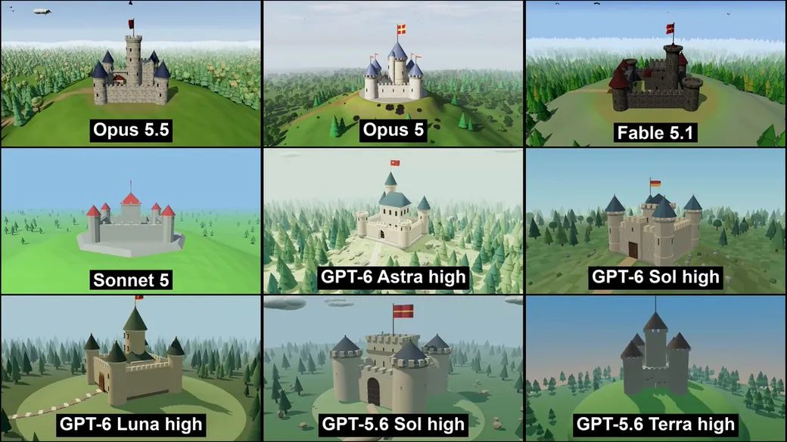</a>

**Промпт**

```text
Создай 3D-анимацию, которая полностью работает в браузере. В сцене должен быть средневековый замок на вершине холма, расположенного среди большого леса. Не добавляй управление с клавиатуры — камера должна вращаться вокруг замка, чтобы мы увидели его со всех сторон. На вершине башни замка установи флаг, развевающийся на ветру.

В результате должен быть файл index.html, который при запуске отображает замок и запускает зацикленную анимацию.
```

<details>
<summary>Исходный промпт автора</summary>

```text
Create a 3d animation that runs completely in browser. The animation features a medieval castle, sitting on top of a hill that is located on large forest. Do not add any keyboard controls, just make the camera spin around the castle so that we see it from all sides. On top of the castle tower there should be a flag that waves in the wind.

The output should contain index.html file that when executed shows the castle and starts the looping animation.
```

</details>

[Подробнее ↗](https://www.tripo3d.ai/ru/3d-prompts/gpt-6-astra-2102672926285713456) · [Исходная публикация](https://juhapalomaki.fi/blog/castle-model-comparison/) · [Назад к примерам](#all-prompts)

---

<a id="tripo-claude-opus-5-5-paper-cut-3d-short"></a>

### Проморолик Tripo 3D, созданный с помощью Claude Opus 5

[tripo3d](https://x.com/tripoai) · 2026-09-23 · Claude Opus 5 · Анимация

<a href="https://www.tripo3d.ai/ru/3d-prompts/tripo-claude-opus-5-5-paper-cut-3d-short">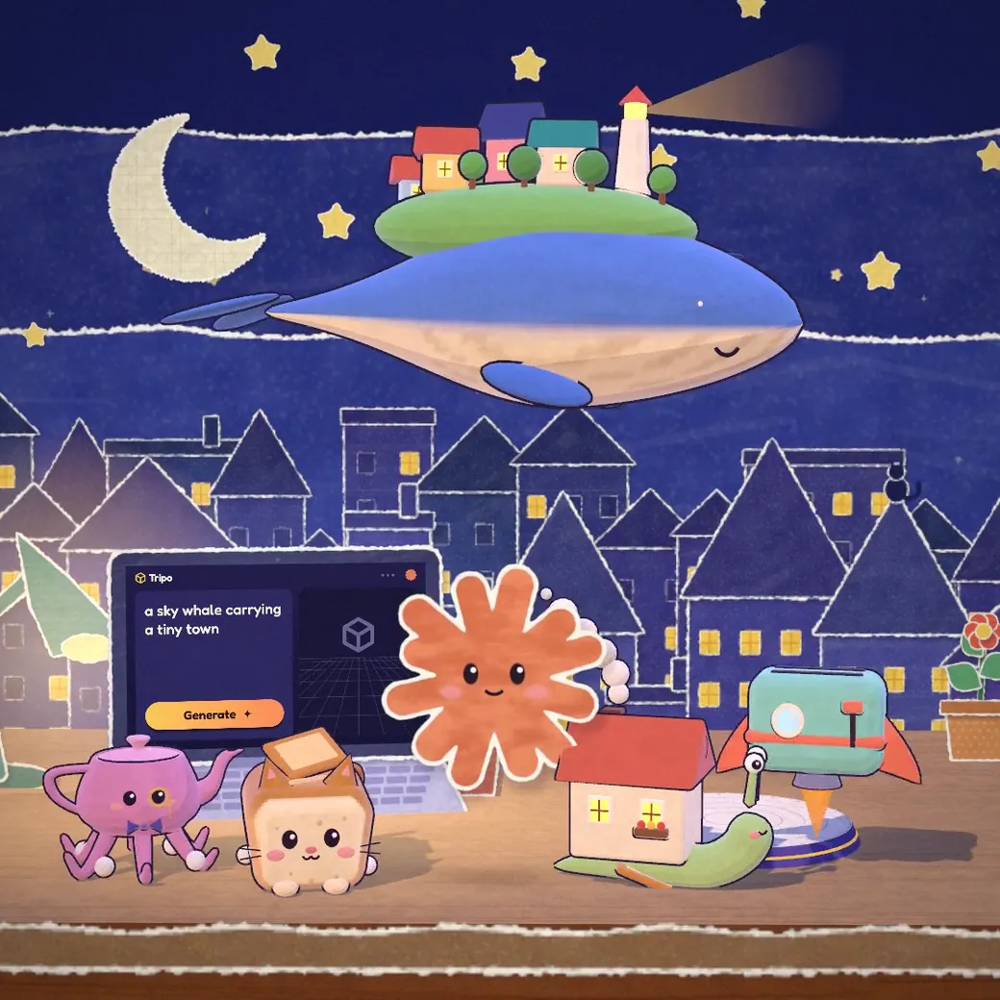</a>

**Промпт**

```text
1. Цель проекта
Создайте интерактивную анимационную короткометражку длительностью около 44 секунд под названием «Claude × Tripo». Маленькая оранжевая искра Claude приземляется на письменный стол из бумаги ручной работы, набрасывает или печатает пять забавных идей на ноутбуке с логотипом Tripo и встречает оживающих персонажей. Зритель может смотреть, ставить видео на паузу, перематывать, пересматривать, менять соотношение сторон, включать звук и записывать анимацию. Это постановочная короткометражка без музыкальной партитуры, боёв и условий победы. Воспроизведите предоставленное видео и композицию сцены.

2. Визуальный стиль
Используйте многослойную диораму в стиле паперкрафт: рваные кремовые края, фактуру гуаши, каракули, детали клетчатой бумаги и тёмно-синее ночное небо. Разместите за столом из крафт-бумаги серп луны, тёплые жёлтые звёзды, бумажные синие холмы и небольшой городок. Открытый ноутбук поставьте слева, Claude — ближе к центру, а небольшую круглую демонстрационную платформу — справа. Сохраните тёплые оранжевые, сиреневые, мятные, масляно-жёлтые и кремовые акценты. Перспективная камера плавно переходит от общих планов к крупным; плоские вырезанные элементы, разделённые по глубине, создают параллакс. Используйте ступенчатое мультяшное освещение, холодный контровой свет, сдержанные контуры, мягкие тени и финальный проход с зерном бумаги и виньетированием. Завершите сцену белой вспышкой камеры и слегка наклонённой фотографией Polaroid, приклеенной скотчем и показывающей всех персонажей. Сопоставьте с референсом кадрирование в начале, при каждом появлении нового персонажа и в финальной общей сцене.

3. Сцена и сюжет
Управляйте всеми позами и движениями камеры из одной детерминированной функции update(t), чтобы переход к любой временной отметке сразу давал правильный кадр без воспроизведения предыдущих кадров. Названия сюжетных битов храните в общем расписании. Claude появляется примерно на 0,55 секунде, приземляется примерно на 1,7 секунде и пробуждает ноутбук на 2,92 секунды. Кот-батон появляется примерно на 7,2 секунды, домик-улитка — на 13,85 секунды, ракета-тостер — на 19,8 секунды, осьминог-чайник — на 26,1 секунды, а небесный кит — на 33,3 секунды. Ракета стартует примерно на 21,25 секунды и возвращается примерно на 24,05 секунды. Кит проплывает над всеми персонажами примерно на 35–37-й секунде. Вспышка камеры происходит на 40,5 секунды; завершите анимацию на 44,2 секунды. Смешивайте планы камеры и используйте плавное упреждение, пружинящий перелёт, сжатие и растяжение, небольшие подпрыгивания и затухающие колебания. Избегайте резких сбросов при переходе между сценами.

4. Список ассетов
- claude-spark: плоская оранжевая искра с двенадцатью лучами, рваной кремовой окантовкой и дружелюбным анимированным лицом. Она моргает, смотрит на текущее действие, улыбается, краснеет и меняет выражение глаз на радостное, головокружённое и искрящееся. Два луча вытягиваются в руки, которые дотягиваются до клавиш, рисунков и других персонажей. Сохраните лицо и поведение рук как процедурный шейдер; статичный экспорт не передаёт индивидуальность и актёрскую игру этого персонажа.
- cat: кот в форме золотистого батона с округлым телом, отметинами запечённой корочки, маленькими ушами, лапками, хвостом, блестящими глазами, розовыми щеками и усами. Он появляется на демонстрационной платформе, поворачивается для осмотра, получает поглаживание и устраивается в передней части стола.
- snail: бледно-зелёная улитка, несущая кремовый домик с коралловой крышей, трубой, светящимися окнами и маленьким цветочным ящиком. Сохраняйте раздельными щупальца с глазами; домик должен оставаться вертикальным, а лицо — видимым во время подъёма и скольжения.
- toaster: мятный тостер с коралловой отделкой и рычагом, округлыми кремовыми деталями, маленькими ракетными стабилизаторами и соплом снизу. Он взлетает с оранжевым пламенем и клубами дыма, сопровождаемый звуком пролёта камеры, а затем возвращается. Пламя и дым должны оставаться отдельными эффектами.
- octopus: розово-сиреневое существо в форме чайника с шестью гибкими щупальцами, носиком и ручкой, жизнерадостным лицом, золотым моноклем и фиолетовым галстуком-бабочкой. Анимируйте щупальца, жест наклона и небольшую прогулку. Позиционирование щупалец должно быть независимым от жёсткого корпуса чайника.
- whale: синий небесный кит с кремовым брюхом, плавниками и выразительным лицом, несущий миниатюрный городок с травой, разноцветными домиками, деревьями и полосатым маяком. Это самое крупное создание, оно должно оставаться заметным в финале. Луч маяка — отдельный прозрачный эффект.
- environment: стол, ноутбук, лампа, стакан для карандашей, растение в горшке, демонстрационная платформа, слои бумажного неба и городка, заметки и карандаш. Используйте их повторно на протяжении всей сцены. Бумажные фоны, интерфейс ноутбука, дудлы, частицы, дым, световые лучи и постобработка остаются процедурными.
Сохраняйте стабильные идентификаторы ассетов и отдельные трансформации для размещения в мире, вращения/сжатия и сочленённых частей. Сохраните пропорции и цвета исходного проекта. Переносимые версии в GLB могут использовать стандартные материалы и статичную позу; не утверждайте, что в них есть пользовательский шейдер появления, актёрская игра или полная анимация.

5. Взаимодействие и обратная связь
Добавьте воспроизведение/паузу, повтор, ползунок перемотки с отображением прошедшего и общего времени, варианты соотношения сторон 1:1 / 16:9 / 9:16, переключатель звука, чистый режим и запись. Пробел переключает воспроизведение; R запускает повтор; H или C переключают чистый режим; Escape возвращает элементы управления; M переключает звук; стрелки влево/вправо перематывают на одну секунду, а Shift уменьшает шаг до 0,1 секунды. Сделайте элементы управления удобными для узкого сенсорного экрана. Звук должен запускаться только после жеста пользователя; если автовоспроизведение звука заблокировано, предложите «Воспроизвести со звуком». Перемотка и повтор должны запускать звук с правильного момента. В конце остановите воспроизведение и предложите повтор.
На экране ноутбука отображаются текущий рисунок или напечатанная идея, анимированный индикатор выполнения и отметка завершения. Действие Generate на экране является частью постановочной анимации: существующая короткометражка использует процедурную геометрию и не вызывает API генерации моделей. Показывайте каждое создание снизу вверх: сначала оно выглядит как сиреневая глина, затем окрашивается в свой цвет тёплой светящейся полосой сканирования. Синхронизируйте взгляд и движения рук Claude с этими событиями.

6. Техническая реализация и звук
Используйте модули JavaScript ES и Three.js r170 с WebGL, пользовательскими шейдерами, CanvasTexture и Web Audio API. Соберите приложение и шрифты как статические ресурсы одного источника с воспроизводимой сборкой; не используйте CDN во время выполнения и учётные данные приватных сервисов. Для элементов управления подключите локальный Fredoka, а для рукописного текста — Caveat. Адаптируйте расстояние до камеры и размер рендера под все три соотношения сторон, ограничьте чрезмерную плотность пикселей и исключите экспортируемые файлы из первоначальных сетевых запросов страницы.
Синтезируйте музыку и эффекты средствами Web Audio. Используйте FM-тембр скрипичной музыкальной шкатулки, бас на щипковом треугольном сигнале с фильтрацией, маримбу, мягкий расстроенный пэд, бочку, хлопок/шейкер, генерируемую реверберацию и финальную компрессию. Совместите начало первого такта с пробуждением ноутбука на 2,92 секунды, а шестнадцатый такт — со вспышкой на 40,5 секунды; темп должен составлять примерно 102 BPM, последовательность аккордов — F–Dm–B-flat–C. Добавьте звуки карандаша, клавиатуры, пролёта, хлопка, пружины, кота, кита, ракеты и затвора в названных сюжетных битах. Панорамируйте и формируйте звук двигателя ракеты с учётом движения относительно камеры. Рендерьте саундтрек небольшими офлайн-фрагментами и соберите их в один буфер; активные аудиочасы должны управлять изображением, а при зависании используйте резервный механизм. Запись должна объединять видео с canvas и саундтрек, экспортируя формат, поддерживаемый браузером. Не полагайтесь на дополнительный локальный сервер захвата Python из исходного проекта при обычном воспроизведении или записи в браузере.

7. Критерии готовности
Предоставьте редактируемый исходный код, зафиксированные зависимости, статическую сборку, инструкции по запуску и работоспособную короткометражку. Проверьте прямую перемотку к моментам около 8, 15, 22, 28, 36 и 41 секунды; при повторе и паузе детерминированное состояние должно сохраняться. Сравните композицию общей сцены с референсным видео. Проверьте разблокировку звука, отключение звука, синхронизацию повтора и фактическую загрузку записи с обеими дорожками. Проверьте квадратное, альбомное и портретное кадрирование, а также элементы управления на компьютере и узком экране. Проверьте размещённую страницу внутри изолированного iframe родительского сайта: не должно быть отсутствующих шрифтов, заблокированных скриптов или ошибок внешних ресурсов. Отдельно проверьте повторно используемые GLB на корректность геометрии, ориентации, материалов и ограничивающего контейнера; на обложках должны быть изображены фактические файлы. Задокументируйте все различия между переносимыми ассетами и версией с анимированным шейдером.

```

[Подробнее ↗](https://www.tripo3d.ai/ru/3d-prompts/tripo-claude-opus-5-5-paper-cut-3d-short) · [Назад к примерам](#all-prompts)

---

<a id="gpt-6-astra-2102652927177617564"></a>

### 3D-гонка на картах в одном HTML-файле

[Anshul](https://x.com/realanshull) · 2026-09-23 · GPT-6 Astra · Игры

<a href="https://www.tripo3d.ai/ru/3d-prompts/gpt-6-astra-2102652927177617564">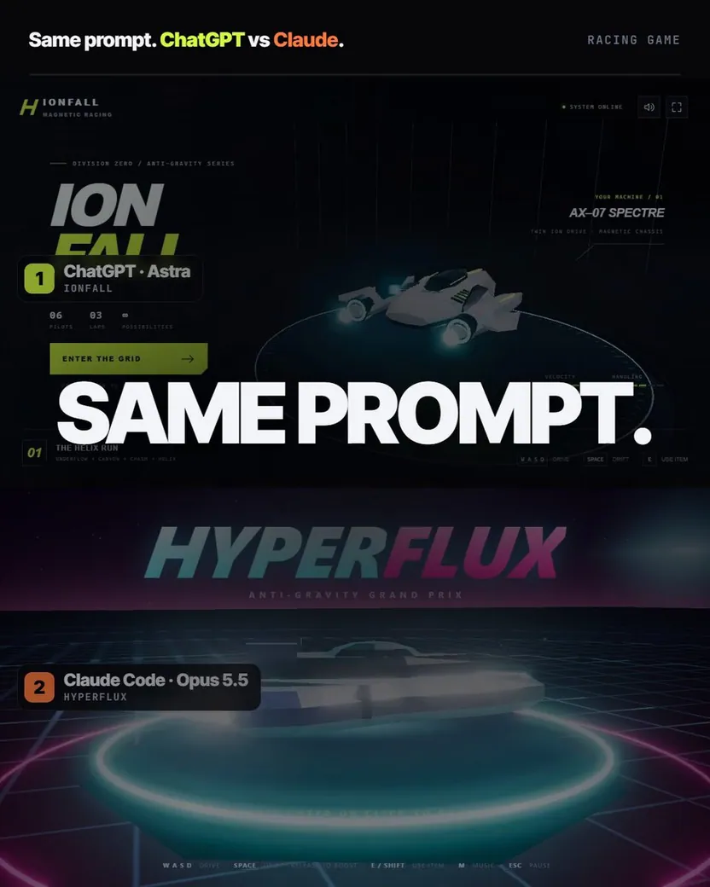</a>

**Промпт**

```text
создай 3D-гонку на картах в одном HTML-файле.
```

<details>
<summary>Исходный промпт автора</summary>

```text
build a 3D kart racer in a single HTML file.
```

</details>

[Подробнее ↗](https://www.tripo3d.ai/ru/3d-prompts/gpt-6-astra-2102652927177617564) · [Исходная публикация](https://x.com/realanshull/status/2102652927177617564) · [Назад к примерам](#all-prompts)

---

<a id="claude-opus-5-5-2102565611473661963"></a>

### Интерактивная эйлерова неоновая симуляция жидкости

[theailoser](https://x.com/theailoser) · 2026-09-23 · Claude Opus 5.5 · Анимация

<a href="https://www.tripo3d.ai/ru/3d-prompts/claude-opus-5-5-2102565611473661963">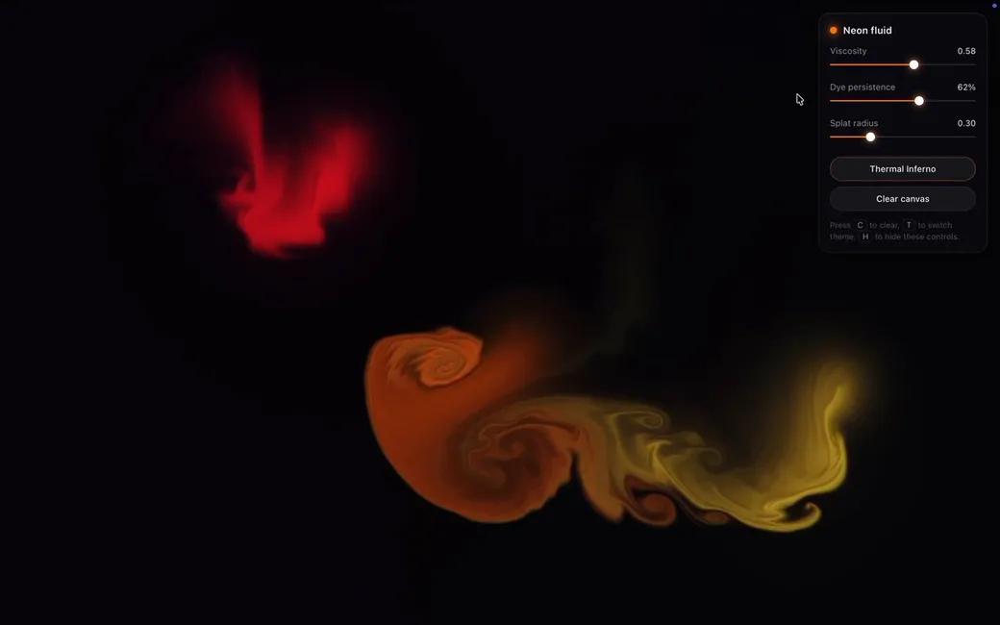</a>

**Промпт**

```text
Создайте полный HTML-документ в одном файле, содержащий высокопроизводительную интерактивную эйлерову симуляцию неоновой жидкости с ускорением на GPU.

Строгие технические и визуальные требования:

1. Архитектура и производительность:
   — Один файл: весь HTML, CSS и JavaScript/GLSL-шейдеры должны быть встроены в документ.
   — Ноль внешних зависимостей: только чистый WebGL 1.0 или 2.0 (без Three.js, Pixi и сторонних библиотек).
   — Расчёт гидродинамики на GPU: симуляция должна полностью выполняться через чередующиеся объекты кадрового буфера (FBO) с пользовательскими фрагментными шейдерами для:
     a) Адвекции (скорости и красителя)
     b) Расчёта дивергенции
     c) Решателя уравнения Пуассона для давления (итерации Якоби, 20–30 итераций за кадр)
     d) Вычитания градиента / проекции скорости
     e) Удержания завихренности (добавляет турбулентные вихри и не даёт жидкости превратиться в тусклую размытую массу).

2. Визуальная выразительность (эффект «неонового дыма»):
   — Фон — абсолютно чёрное пространство (`#050508`).
   — Для инъекции красителя используйте аддитивное смешивание и расширенный динамический диапазон.
   — Динамическая палитра: каждое резкое движение курсора или перетаскивание пальцем должно добавлять яркий неоновый краситель, плавно меняющийся между насыщенными киберпанковыми оттенками (электрический циан `#00F0FF`, яркая маджента `#FF007F`, глубокий ультрафиолет и сияющее золото).
   — Улучшения шейдера отображения: добавьте прямо в финальный шейдер рендера постобработку с лёгким свечением/bloom, тональным отображением и хроматической аберрацией по краям закручивающейся жидкости.

3. Взаимодействие:
   — Мышь и сенсорный ввод: быстрое движение курсора или перетаскивание должно добавлять скорость, пропорциональную скорости движения мыши, а также плотный светящийся краситель.
   — Пассивное фоновое движение: в состоянии покоя генерируйте лёгкий процедурный curl noise или плавно дрейфующие вихри, чтобы холст никогда не оставался полностью статичным.
   — Управление: компактный ультраминималистичный стекломорфный HUD, скрытый в углу и автоматически исчезающий при бездействии:
     * Ползунок вязкости
     * Ползунок диссипации / сохранения красителя
     * Ползунок радиуса импульса
     * Кнопка «Очистить холст»
     * Кнопка переключения цветовых тем (Cyberpunk, Thermal Inferno, Bioluminescent Deep).

4. Финальная полировка:
   — Автоматически поддерживайте дисплеи с высокой плотностью пикселей и обрабатывайте события `resize` без растягивания или очистки текстур FBO.
   — Предусмотрите корректную проверку поддержки текстур с плавающей точкой (`OES_texture_float` / `OES_texture_half_float`).
   — Предоставьте чистый, полностью реализованный код без ошибок, заглушек и оборванных комментариев.

Верните только полностью заполненный HTML-файл, готовый к непосредственному запуску в Chrome/Safari/Firefox.
```

<details>
<summary>Исходный промпт автора</summary>

```text
Write a complete, single-file HTML document containing a high-performance, GPU-accelerated interactive Eulerian Neon Fluid Simulation.

Strict Technical & Aesthetic Requirements:

1. Architecture & Performance:
   - Single-file: All HTML, CSS, and JavaScript/GLSL shaders inline.
   - Zero external dependencies: Pure WebGL 1.0 or 2.0 (no Three.js, no Pixi, no external libraries).
   - GPU-Computed Fluid Dynamics: The simulation must run entirely via ping-pong Framebuffer Objects (FBOs) using custom fragment shaders for:
     a) Advection (velocity & dye)
     b) Divergence calculation
     c) Pressure Poisson solver (Jacobi iteration, 20-30 iterations per frame)
     d) Gradient subtraction / velocity projection
     e) Vorticity confinement (adds turbulent swirls and prevents the fluid from turning into dull, blurry mush).

2. Visual Fidelity (The "Neon Smoke" Look):
   - Pitch-black void background (`#050508`).
   - Additive / High-Dynamic-Range blending for dye injection.
   - Dynamic palette: Each cursor flick or touch drag injects high-luminosity neon dye that cycles smoothly through vivid cyber hues (electric cyan `#00F0FF`, hot magenta `#FF007F`, deep ultraviolet, and radiant gold).
   - Display shader enhancements: Include a post-processing pass directly in the final render shader that applies subtle bloom/glow, tone mapping, and chromatic aberration around the swirling edges of the fluid.

3. Interaction:
   - Mouse & Touch: Rapid cursor movement or dragging injects velocity proportional to mouse speed, along with dense glowing dye.
   - Passive Ambient Motion: When idle, generate subtle procedural curl noise or gentle drifting vortices so the canvas is never completely static.
   - Controls: A sleek, ultra-minimal glassmorphism HUD tucked into a corner (with auto-hide on inactivity):
     * Viscosity slider
     * Dye dissipation / persistence slider
     * Splat radius slider
     * "Clear Canvas" button
     * Toggle button to cycle color themes (Cyberpunk, Thermal Inferno, Bioluminescent Deep).

4. Production Polish:
   - Automatically handle high-DPI displays and `resize` events without stretching or clearing the FBO textures.
   - Graceful fallback check for floating-point texture support (`OES_texture_float` / `OES_texture_half_float`).
   - Clean, bug-free, fully implemented code with zero placeholders or truncated comments.

Return only the fully populated HTML file ready to run directly in Chrome/Safari/Firefox.
```

</details>

[Подробнее ↗](https://www.tripo3d.ai/ru/3d-prompts/claude-opus-5-5-2102565611473661963) · [Исходная публикация](https://x.com/theailoser/status/2102565612874596411) · [Назад к примерам](#all-prompts)

---

<a id="claude-opus-5-5-2102565403109085669"></a>

### Интерактивный 3D-ландшафт японской сакурной долины

[宝玉](https://x.com/dotey) · 2026-09-23 · Claude Opus 5.5 · Интерактив

<a href="https://www.tripo3d.ai/ru/3d-prompts/claude-opus-5-5-2102565403109085669">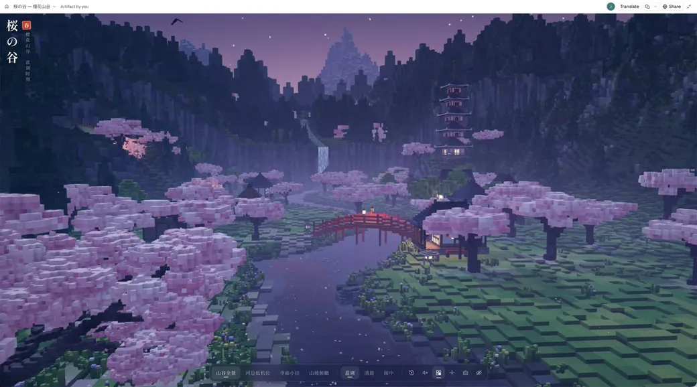</a>

**Промпт**

```text
Создай полноценную, качественно проработанную веб-страницу с 3D-ландшафтом, с которым можно взаимодействовать в браузере в реальном времени.

Тема: японская сакурная долина.
Используй HTML, CSS и JavaScript. Не создавай изображения и не ограничивайся дизайн-концепцией.
Не выдавай одну фоновую картинку с эффектом параллакса за 3D. Мне нужен реально работающий, пригодный для исследования готовый результат.

【1. Концепция проекта】

Это цельный, непрерывный ландшафт долины с глубиной и планами разной удалённости,
а не набор отдельных небольших объектов, парящий остров, диорама на подставке или просто техническая демонстрация.

Стиль — современный детализированный voxel art:
сохрани выразительный язык кубической геометрии, но сделай изображение высокодетализированным, сглаженным, с тонкой проработкой света и теней.
Не используй ретро-пикселизацию в низком разрешении, крупные грубые нагромождения блоков или пиксельный фильтр поверх изображения.

Визуальное качество важнее всего. Лучше отказаться от нескольких функций, чем жертвовать композицией, материалами и освещением.

【2. Использование референсов】

Если приложены референсы, сначала изучи их композиционные планы, масштаб, освещение и соотношение цветов.
Используй только атмосферу и визуальный язык, а сцену спроектируй заново.
Не копируй расположение зданий, деревьев, гор и дорог и не воспроизводи референс в масштабе 1:1.

Референс не является фоновым материалом для веб-страницы. Сама сцена должна быть построена из настоящей 3D-геометрии.

【3. Композиция сцены】

При открытии страницы сразу показывай цельный, привлекательный кадр,
чтобы пользователю не приходилось сначала вращать камеру в поисках удачного ракурса.

Используй перспективную камеру, а не изометрическую камеру с видом сверху, как в диораме.
В кадре должны быть чётко выражены передний, средний и дальний планы:

Передний план:
выразительное старое дерево сакуры, дополненное камнями, травой, растительностью, каменным фонарём и небольшим количеством опавших лепестков;
они образуют естественное обрамление по краям кадра, но не закрывают реку, мост и основные здания.

Средний план:
извилистая река ведёт взгляд в глубину кадра, а красный деревянный мост перекинут через неё;
деревня, чайный домик, святилище и тропинки распределены по рельефу, между зданиями предусмотрены реалистичные проходы.
Поверхность земли должна быть рельефной, с береговой линией и естественными переходами, а не с равномерно расставленными моделями на плоской поверхности.

Дальний план:
многоярусная пагода на склоне, леса на разном расстоянии, горные хребты и заснеженные вершины вдали.
Передавай расстояние изменением масштаба, перекрытиями, контрастом холодных и тёплых оттенков и воздушной перспективой,
а не простым уменьшением удалённых объектов.

Не заполняй все элементы равномерно. Нужны иерархия, ритм плотных и разреженных зон, свободное пространство и чёткий визуальный фокус.

【4. Форма и качество изображения】

Дерево сакуры:
ствол должен изгибаться, ветвиться и переходить в корни, а крона — состоять из неровных скоплений цветов
с просветами, различной толщиной и видимыми ветвями. Не превращай её в несколько правильных сфер или кубических комков.

Архитектура:
на крышах должны быть уложенные ярусами черепичные ряды, свесы, балки, колонны и переплёты окон;
разные здания должны отличаться назначением, объёмом и высотой — не заполняй долину копиями одного и того же дома.

Рельеф:
у берега добавь влажные камни, травяные заросли и постепенный переход к растительности.
Избегай слишком правильных ступеней, повторяющихся полос, шахматного рисунка и явно заметной процедурной сетки.

Вода:
водная поверхность должна отражать окружающий ландшафт, иметь умеренную рябь, изменения глубины и естественный переход у берегов.
По возможности используй отражения реальной сцены; даже при снижении качества ради производительности вода должна оставаться визуально правдоподобной.
Не заменяй воду мерцающим шумом, сильными искажениями или сплошной синей плоскостью.

Детали:
можно добавить немного карпов кои, опавших лепестков, светлячков, водопадов и птиц вдали,
но все они должны работать на атмосферу и не перегружать кадр.
Не нагромождай детали только ради демонстрации количества моделей.

【5. Цвет и атмосфера】

По умолчанию — режим синего часа:
холодные долина и дальние горы, мягкие розовые цветы сакуры, тёплый, но не пересвеченный свет фонарей и окон.
Тёплый свет должен быть сосредоточен в местах присутствия людей, а не окрашивать всю сцену в оранжевый цвет.

Используй мягкие тени, контактное затенение в местах соприкосновения объектов, корректную экспозицию,
сдержанный bloom, сглаживание и лёгкую туманную дымку с ощутимой глубиной.

Избегай выбеленного изображения, серой дымки, чрезмерной насыщенности, густого тумана на весь экран, пересвеченных источников света и заметных лесенок.
Кубическая геометрия может быть хорошо различима, но сам рендеринг не должен выглядеть грубо.

Добавь также два режима атмосферы — «Утро» и «Дождь»;
при переключении должны одновременно меняться небо, окружающее освещение, туман и локальные эффекты,
а не только цвет фона.

【6. Управление и интерфейс】

Предусмотри четыре продуманных ракурса:
панорама долины, низкая камера у реки, тропа к храму и вид на долину со склона сверху.
Переключение должно быть плавным, а каждый ракурс — иметь самостоятельную композиционную ценность.

Базовое управление:
перетаскивание мышью для осмотра, прокрутка колеса для приближения или движения вперёд; на сенсорных экранах — перетаскивание и масштабирование двумя пальцами.
Добавь сброс ракурса, скрытие интерфейса и сохранение текущего кадра.

Дополнительные возможности:
свободное исследование, медленный пролёт камеры и звуки окружения.
Звуки окружения по умолчанию отключены и включаются только после явного нажатия пользователя.
Дополнительные функции не должны ухудшать качество исходного кадра.

Интерфейс должен быть сдержанным и продуманным, с главным акцентом на ландшафте.
Размести заголовок и панель управления у краёв экрана, чтобы они не закрывали визуальный фокус.
На компьютере и телефоне кнопки не должны выходить за границы, текст не должен перекрываться, а элементы управления должны оставаться работоспособными.

【7. Разработка и производительность】

Разрешается использовать Three.js / WebGL и зафиксированные, совместимые между собой зависимости CDN.
Отдавай приоритет зрелым возможностям рендеринга, не переписывай целиком движок ради «нулевых зависимостей».

По возможности собери собственные HTML, CSS и JavaScript в одном HTML-файле.
Создавай объекты сцены процедурной геометрией и материалами, не используя внешние изображения или ресурсы 3D-моделей.

Для повторяющихся объектов используй подходящий батчинг или инстансинг;
разумно контролируй детализацию, тени, отражения и разрешение рендеринга.
Предусмотри режимы высокого качества и облегчённый режим; на телефонах по умолчанию используй более лёгкие настройки.
Не наращивай бесконечно количество вокселей ради дополнительных деталей.

Добавь индикатор загрузки, сообщение об отсутствии поддержки WebGL и необходимую обработку ошибок.
Не запускай звук автоматически, если он не включён; учитывай системную настройку уменьшения анимации.

【8. Проверка перед сдачей】

Не сдавай результат сразу после написания кода.

Если текущая среда поддерживает запуск браузера и создание скриншотов, сначала открой страницу и проверь
исходный ракурс, все четыре вида, переключение атмосферных режимов, а также компоновку на компьютере и телефоне,
после чего по скриншотам исправь очевидные проблемы композиции, экспозиции, перекрытий и рендеринга.

Особое внимание удели проверке:
нет ли пустого экрана, ошибок загрузки и ошибок в консоли;
нет ли пересечений геометрии, мерцания, полос на тенях, пересветов и проблем с водой;
действительно ли исходный кадр выглядит как цельный ландшафт, а не маленькая диорама;
работают ли кнопки и не выходит ли интерфейс за границы на мобильных устройствах.

Для проверки можно использовать скриншоты из браузера, но не вызывай инструменты генерации изображений.
Если какие-либо тесты не выполнены, честно сообщи об этом и не утверждай, что они пройдены.

Итоговый результат:
1. Фактически существующий HTML-файл, который можно открыть, либо интерактивный предпросмотр, поддерживаемый текущей средой.
2. Если доступно создание скриншотов, приложи один настоящий скриншот рендеринга в браузере.
3. Кратко опиши управление и необходимые условия запуска.

Сразу приступай к созданию; для второстепенных деталей самостоятельно принимай согласованные решения,
не перекладывай на меня снова и снова вопросы реализации, которые можешь решить сам.
```

<details>
<summary>Исходный промпт автора</summary>

```text
请直接制作一个可以在浏览器中实时交互的高完成度 3D 景观网页。

主题：日式樱花山谷。
使用 HTML、CSS、JavaScript 实现。不要生成图片，不要只给设计方案，
不要用一张背景图加视差效果冒充 3D。我要的是实际可运行、可游览的成品。

【一、作品定位】

这是一片完整、连续、有远近层次的山谷景观，
不是孤立的小摆件、悬浮岛、带底座的沙盘，也不是单纯的技术演示。

风格是现代精细体素 / voxel art：
保留立方体几何的造型语言，但画面应高分辨率、抗锯齿、光影细腻。
不要复古低分辨率像素化，不要粗大积木堆砌，不要给画面套像素滤镜。

视觉质量优先。宁可少几个功能，也不要牺牲构图、材质和光照。

【二、参考图的使用方式】

如果附有参考图，请先理解它的构图层次、尺度、光线和色彩关系。
仅借鉴氛围与视觉语言，重新设计场景，
不要照搬建筑、树木、山体和道路的位置，不要 1:1 复刻。

参考图不是网页里的背景素材。场景本身必须由真实 3D 几何构成。

【三、场景构图】

默认打开时就应呈现一幅完整、有吸引力的画面，
不需要用户先旋转镜头才能找到好看的角度。

采用透视相机，而不是沙盘式等距俯视相机。
画面有明确的前景、中景、远景：

前景：
一株有存在感的古老樱花树，配合岩石、草木、石灯笼和少量落花，
形成画面边缘的自然框景，但不能挡住河流、桥和主要建筑。

中景：
一条蜿蜒河流引导视线进入画面，红色木桥横跨河面；
村落、茶屋、神社和小径顺着地势分布，建筑之间有真实的通行关系。
地面有起伏、岸线和自然过渡，不是平面上均匀摆放模型。

远景：
山坡上的多层塔、不同距离的森林和山脊，以及远处的雪山。
用尺度变化、遮挡、冷暖变化和空气透视表现距离，
而不是仅仅把远处物体缩小。

不要把所有元素均匀铺满。需要主次、疏密、留白和清楚的视觉焦点。

【四、造型与画面质量】

樱花树：
树干有转折、分叉和根部，树冠由不规则花簇组成，
有间隙、厚薄变化和可见枝条。不要做成几个规则球体或方块团。

建筑：
屋顶有层叠瓦片、挑檐、梁柱和窗格；
不同建筑有用途、体量和高度差异，不要复制同一栋房子铺满山谷。

地形：
岸边有湿润石块、草丛和植被过渡。
避免过于规律的台阶、重复条纹、棋盘格和明显的程序生成网格。

水面：
必须能够反映周围景物，具有适度的波纹、深浅变化和岸边过渡。
尽量使用实际场景反射；需要性能降级时也应保持视觉可信。
不要用闪烁噪声、强烈扭曲或一整块蓝色平面代替水。

细节：
可以有少量锦鲤、落花、萤火虫、瀑布和远处飞鸟，
但都应服务于氛围，不能让画面显得嘈杂。
不要为了宣称模型数量而堆砌细节。

【五、色彩与氛围】

默认是蓝调时刻：
偏冷的山谷与远山，柔和的粉色樱花，温暖但不过曝的灯笼和窗光。
暖光集中在有人活动的地方，不要把整个环境染成橙色。

需要柔和阴影、物体接触处的明暗、合理的曝光、
克制的泛光、抗锯齿和有距离层次的薄雾。

避免发白、灰蒙、过度饱和、满屏浓雾、过曝灯光和明显锯齿。
方块几何可以清晰，但渲染本身不能粗糙。

另提供“清晨”和“雨中”两种氛围；
切换时应同步改变天空、环境光、雾和局部效果，
不是仅仅修改背景颜色。

【六、交互与界面】

提供四个经过设计的镜头：
山谷全景、河边低机位、寺庙小径、山坡俯瞰。
切换应平滑，每个镜头都需要有独立的构图价值。

基础交互：
鼠标拖动观察、滚轮缩放或前进，触屏支持拖动和双指缩放。
提供重置视角、隐藏界面和保存当前画面的功能。

可选增强：
自由探索、缓慢镜头巡游、环境音。
环境音默认关闭，只在用户主动点击后播放。
额外功能不能影响默认画面的完成度。

界面要克制、有设计感，以景观为主。
标题和控制条放在边缘，不遮挡视觉焦点。
桌面和手机都不能出现按钮越界、文字重叠或无法操作的问题。

【七、工程与性能】

允许使用 Three.js / WebGL，以及版本固定、互相兼容的 CDN 依赖。
优先使用成熟渲染能力，不要为了“零依赖”重写整套引擎。

自写的 HTML、CSS、JavaScript 尽量整理在一个 HTML 文件中。
景物由程序化几何和材质生成，不依赖外部图片或 3D 模型资源。

重复物体采用适合的批量或实例化绘制方式；
合理控制细分、阴影、反射和渲染分辨率。
提供高画质和轻量模式，手机默认使用较轻设置。
不要靠无限增加体素数量换取细节。

加入加载提示、WebGL 不支持时的提示和必要的错误处理。
没有开启声音时不要自动播放；尊重减少动态效果的系统偏好。

【八、交付前验收】

不要写完代码就立即交付。

如果当前环境支持浏览器运行和截图，请先实际打开页面，
检查默认镜头、四个视角、氛围切换、桌面和手机布局，
再根据截图修正明显的构图、曝光、遮挡和渲染问题。

重点检查：
是否存在空白画面、加载失败、控制台错误；
是否有穿模、闪烁、阴影条纹、过曝、水面异常；
默认画面是否真正像完整景观，而不是小型沙盘；
功能按钮是否实际可用，移动端是否越界。

可以使用浏览器截图验收，但不要调用图像生成工具。
没有完成的测试要如实说明，不要声称已经验证。

最终交付：
1. 实际存在、可以打开的 HTML 文件，或当前环境支持的交互预览。
2. 如能截图，附一张真实浏览器渲染截图。
3. 简短说明操作方式和必要的运行条件。

请直接完成制作；非关键细节自行作出一致的设计选择，
不要把可以自行解决的实现问题反复交给我决定。
```

</details>

[Подробнее ↗](https://www.tripo3d.ai/ru/3d-prompts/claude-opus-5-5-2102565403109085669) · [Исходная публикация](https://x.com/dotey/status/2102565403109085669) · [Назад к примерам](#all-prompts)

---

<a id="claude-opus-5-5-2102547809140355250"></a>

### Модель аварии Hundenberg и реалистичное видео

[AImanhasnoname](https://x.com/aimanhasnoname) · 2026-09-22 · Claude Opus 5.5 · Анимация

<a href="https://www.tripo3d.ai/ru/3d-prompts/claude-opus-5-5-2102547809140355250">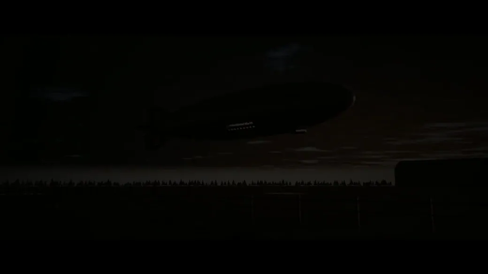</a>

**Промпт**

```text
Создай для меня модель Hundenberg в Blender и реалистичное видео аварии.
```

<details>
<summary>Исходный промпт автора</summary>

```text
make me a model of the Hundenberg on blender make me a realistic video of the accident.
```

</details>

[Подробнее ↗](https://www.tripo3d.ai/ru/3d-prompts/claude-opus-5-5-2102547809140355250) · [Исходная публикация](https://x.com/aimanhasnoname/status/2102547809140355250) · [Назад к примерам](#all-prompts)

---

<a id="claude-opus-5-5-2102544406117286004"></a>

### 360-градусный 3D-рендеринг гандбольной площадки по изображению

[ハンドボール人「布施千佳純」](https://x.com/chikaidev) · 2026-09-22 · Claude Opus 5.5 · Сцены

<a href="https://www.tripo3d.ai/ru/3d-prompts/claude-opus-5-5-2102544406117286004">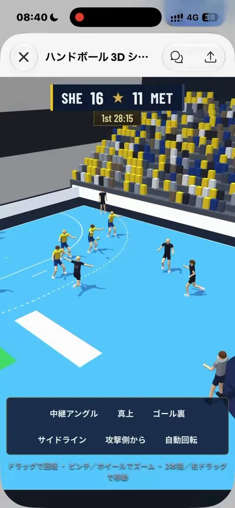</a>

**Референсы:** [1](https://media.tripogrowth.space/media/6a116b62-88ce-491b-b4ba-eed6d9c9f168.jpg) · [2](https://pbs.twimg.com/media/HS29xCPaYAAcMmd.jpg)

**Промпт**

```text
Отрендери в 3D изображённые на картинке гандбольную площадку, ворота, судью, игроков и мяч, чтобы сцену можно было свободно рассматривать под любым углом на все 360 градусов. Точно воспроизведи позы каждого человека и цвета всех объектов.
```

<details>
<summary>Исходный промпт автора</summary>

```text
画像内のハンドボールコート、ゴール、レフェリー、プレイヤー、ボールを3dレンダリングして、360度自由角度から見れるようにして。各人物の姿勢まで、また物体の色まで正確に再現して。
```

</details>

[Подробнее ↗](https://www.tripo3d.ai/ru/3d-prompts/claude-opus-5-5-2102544406117286004) · [Исходная публикация](https://x.com/chikaidev/status/2102545257372213581) · [Назад к примерам](#all-prompts)

---

<a id="claude-opus-5-5-2102544196808667471"></a>

### Процедурный 3D-фон главного меню в Three.js по изображению

[Majid Manzarpour](https://x.com/majidmanzarpour) · 2026-09-22 · Claude Opus 5.5 · Сцены

<a href="https://www.tripo3d.ai/ru/3d-prompts/claude-opus-5-5-2102544196808667471">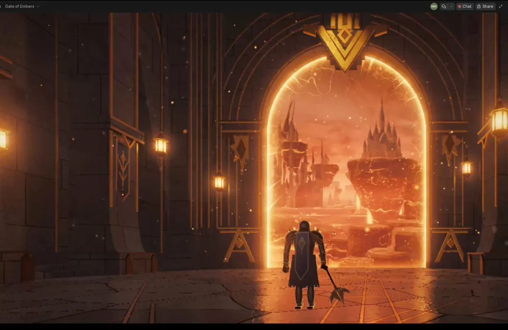</a>

**Референсы:** [1](https://media.tripogrowth.space/media/de4534b1-fda8-4736-8558-09b7283f646a.jpg) · [2](https://pbs.twimg.com/media/HS28q6mWMAAxONB.jpg)

**Промпт**

```text
идеально воссоздай этот полностью процедурный анимированный 3D-фон главного меню в Three.js в одном HTML-файле
```

<details>
<summary>Исходный промпт автора</summary>

```text
recreate this perfectly, fully procedural, animated, main menu background in three.js 3D single HTML file
```

</details>

[Подробнее ↗](https://www.tripo3d.ai/ru/3d-prompts/claude-opus-5-5-2102544196808667471) · [Исходная публикация](https://x.com/majidmanzarpour/status/2102544198335373576) · [Назад к примерам](#all-prompts)

---

<a id="claude-opus-5-5-2102544078927741369"></a>

### Самозапускающаяся 3D-машина Руба Голдберга

[leo](https://x.com/leogao25) · 2026-09-22 · Claude Opus 5.5 · Анимация

<a href="https://www.tripo3d.ai/ru/3d-prompts/claude-opus-5-5-2102544078927741369">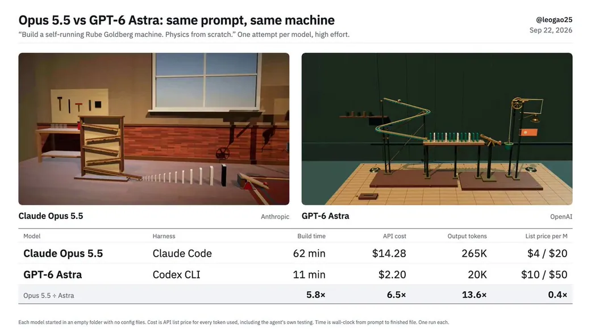</a>

**Промпт**

```text
Создай самозапускающуюся 3D-машину Руба Голдберга в виде одного автономного файла index.html в текущем каталоге.

Цепочка должна работать в следующем порядке:
1. В верхней точке отпускается шарик, который скатывается по нескольким зигзагообразным рампам.
2. Он опрокидывает ряд из как минимум 12 домино.
3. Последняя костяшка домино наклоняет качели, которые запускают небольшой шарик в подвесное ведро.
4. Под весом ведро опускается; его верёвка проходит через блок и дёргает колокол, который должен заметно раскачиваться.
5. Это же движение поднимает флаг по флагштоку. Завершением служит момент, когда флаг достигает вершины.

Правила:
- Напиши физику самостоятельно, без физических библиотек. Всякое движение после запуска шарика должно происходить благодаря твоей симуляции: твёрдые тела, столкновения, ограничения, верёвка и блок. Никакой заранее заданной покадровой анимации или интерполированного движения деталей машины.
- Для рендеринга можно загрузить three.js из CDN. Ничего другого извне использовать нельзя: никаких изображений, моделей или шрифтов.
- Всё должно работать без участия пользователя: автоматически запускаться при загрузке страницы, использовать кинематографичную камеру, следующую за действием, и полностью проходить всю цепочку примерно за 15–20 секунд. После подъёма флага выжди 2 секунды, затем сбрось состояние и запусти воспроизведение заново.
- Детерминированность: используй фиксированный шаг по времени и неинициализированную случайность не применяй, чтобы каждый запуск выглядел одинаково.
- Заполняй всё окно браузера. Запись экрана будет выполняться в разрешении 1280×720.
- Никакого текста на экране и интерфейса любого вида.
- Сделай сцену привлекательной: используй освещение, тени, материалы и окружение, чтобы конструкция выглядела как настоящий механизм.
```

<details>
<summary>Исходный промпт автора</summary>

```text
Build a 3D Rube Goldberg machine that runs itself, as a single self-contained index.html in the current directory.

The chain, in order:
1. A marble is released at the top and rolls down a series of zig-zag ramps.
2. It knocks over a line of at least 12 dominoes.
3. The last domino tips a seesaw, which launches a small ball into a hanging bucket.
4. The bucket's weight pulls it down; its rope runs over a pulley and yanks a bell, which visibly swings.
5. The same motion raises a flag up a pole. The flag reaching the top is the finish.

Rules:
- Write the physics yourself: no physics library. Every motion after the marble is released must come from your simulation (rigid bodies, collisions, constraints, rope/pulley). No keyframed animation or tweened motion of any machine part.
- You may load three.js from a CDN for rendering. Nothing else external: no images, models, or fonts.
- It must run with no user input: start automatically on page load, use a cinematic camera that follows the action, and complete the whole chain in about 15–20 seconds. After the flag is up, hold for 2 seconds, then reset and replay.
- Deterministic: fixed timestep and no unseeded randomness, so every run looks the same.
- Fill the browser window. It will be screen-recorded at 1280×720.
- No on-screen text or UI of any kind.
- Make it look good: lighting, shadows, materials, and a setting that makes it feel like a real contraption.
```

</details>

[Подробнее ↗](https://www.tripo3d.ai/ru/3d-prompts/claude-opus-5-5-2102544078927741369) · [Исходная публикация](https://x.com/leogao25/status/2102544081863717153) · [Назад к примерам](#all-prompts)

---

<a id="claude-opus-5-5-2102538762731565085"></a>

### Интерактивная игра о фермерских животных в стиле «Питера Кролика»

[mblaso](https://x.com/blaso96) · 2026-09-22 · Claude Opus 5.5 · Игры

<a href="https://www.tripo3d.ai/ru/3d-prompts/claude-opus-5-5-2102538762731565085"></a>

**Промпт**

```text
"Создай интерактивную игру о фермерских животных в стиле «Питера Кролика»
главное меню = звуки вкл./выкл. + выбор животного (лошадь, свинья, корова, кошка, собака)
Esc = пауза: сброс до точки появления/возврат в главное меню/
перемещение с помощью WASD
пробел — прыжок и взаимодействие с другими животными, когда они находятся рядом
взаимодействия случайно выбираются при обнаружении близости
взаимодействия могут включать звуки в адрес другого животного (уникальные, отличающиеся от его пассивных звуков), «потыкать его носом»
можно взаимодействовать с водой, чтобы попить, сеном, чтобы поесть, и фруктами, чтобы поесть. 
вид от третьего лица, камера расположена немного позади животного и выше него
живые элементы окружения: птицы и самолёты в небе (появляются случайным образом)
место действия = фермерские угодья, амбар, фермерская деревня с домами (в дома нельзя войти)
Добавь достаточно ассетов, чтобы игра привлекала внимание, но не настолько много, чтобы она требовала производственного качества: это всего лишь способ провести 15 минут с дочерью и весело провести время
react, svg, js, webgl, threejs — используй всё необходимое, чтобы игра ощущалась «хорошо»"
```

<details>
<summary>Исходный промпт автора</summary>

```text
"Create a interactive farm animal game using the design/art style of "Peter Rabbit"
main menu = sounds on/off + animal picker (horse, pig, cow, cat, dog)
esc = pause: reset back to spawn/main menu/
wasd to move around
spacebar to jump and to interact with other animals when near
interactions are randomized upon proximity detection
interactions can be make sounds at the other animal (unique from their passive sounds) "boop them"
interactible with: water to drink, hay to eat, fruit to eat. 
3rd person but as if the camera was slightly behind the animal and above it
ambience animals are birds, airplanes in the sky (randomly)
setting= farmland, barn, farming village with houses (cant enter houses)
Enough assets to capture attention, but not enough that it needs to be deemed production grade, this is just to capture 15 minutes out of my day with my daughter and have fun
react, svg, js, webgl, threejs, whatever is necessary to make it feel "good""
```

</details>

[Подробнее ↗](https://www.tripo3d.ai/ru/3d-prompts/claude-opus-5-5-2102538762731565085) · [Исходная публикация](https://x.com/blaso96/status/2102538764749037738) · [Назад к примерам](#all-prompts)

---

<a id="claude-opus-5-5-2102533729746882985"></a>

### Кинематографичный интерактивный пиратский корабль на закате

[Vib3Coded](https://x.com/vib3coded) · 2026-09-22 · Claude Opus 5.5 · Сцены

<a href="https://www.tripo3d.ai/ru/3d-prompts/claude-opus-5-5-2102533729746882985"></a>

**Промпт**

```text
Создай с нуля полностью интерактивную 3D-сцену с пиратским кораблём, который плывёт по динамичному океану на закате. Визуальный стиль должен быть кинематографичным и стилизованным, а не фотореалистичным, но при этом исключительно насыщенным, детализированным, отполированным и визуально продуманным. Создай корабль, океан, небо, освещение, материалы, паруса, такелаж, пушки, мелкие конструктивные детали, морскую пену, кильватерный след, частицы, анимацию, работу камеры, композицию, атмосферную перспективу и цветокоррекцию. Итог должен выглядеть как премиальная 3D-работа высокого production-уровня, а не прототип, техническая демонстрация или низкокачественная сцена. Начни с полностью пустой страницы. Не переиспользуй предыдущий проект или сцену и не опирайся на них. При необходимости можешь самостоятельно создать ассеты либо использовать надёжные проверенные ассеты и библиотеки с открытым исходным кодом. Обязательные требования: внутри сцены нигде не должно появляться никаких текстов. Запрещены заголовки, имена, логотипы, описания, титры, подписи и инструкции по управлению на любом языке. Представь весь проект в виде одного итогового автономного файла страницы, который можно напрямую открыть в веб-браузере; по возможности размести ассеты внутри него. Океан, корабль, паруса и камера должны двигаться естественно и плавно. Избегай искусственного замедленного режима и вялого движения. Должно ощущаться, что корабль действительно движется по воде. Не используй примитивные геометрические формы в качестве готового результата. Создай визуально убедительный детализированный пиратский корабль с тщательно сформированным корпусом, мачтами, парусами, такелажем, канатами, пушками, поручнями, фонарями, надпалубными конструкциями и хорошо заметными мелкими деталями. Освещение должно чётко раскрывать геометрию и материалы корабля. Создай насыщенную атмосферу заката, глубокие оттенки океана, отражения, убедительную морскую пену и детализированный кильватерный след позади судна и вокруг него. Соблюдай баланс между визуальным качеством и производительностью в реальном времени: сохрани плавное взаимодействие и анимацию, не допуская явного ухудшения качества. Автоматически используй наиболее подходящие навыки, инструменты, библиотеки, методы и доступные ассеты, необходимые для достижения наилучшего результата. Не жди, пока я укажу, какие технологии использовать. Обязательно протестируй готовый результат в веб-браузере на компьютере. Сделай визуальные скриншоты, проверь консоль браузера на наличие ошибок и исправь все обнаруженные визуальные и технические проблемы, включая искажённую геометрию, чёрный экран, ошибки загрузки ассетов, неработающую анимацию, неудачную композицию, артефакты рендеринга и проблемы с камерой. В конце убедись, что итоговый файл открывается и работает напрямую, в сцене вообще нет текста и не осталось ошибок выполнения или загрузки. После этого заверши задачу только кратким ответом.
```

<details>
<summary>Исходный промпт автора</summary>

```text
Create from scratch a fully interactive 3D scene of a pirate ship sailing across a dynamic ocean at sunset. The visual style should be cinematic and stylized rather than photorealistic, while still being exceptionally rich, detailed, polished, and visually sophisticated. Build the ship, ocean, sky, lighting, materials, sails, rigging, cannons, small structural details, sea foam, wake, particles, animation, camera work, composition, atmospheric depth, and color grading. The final result should feel like a premium, high-production 3D artwork, not a prototype, technical demo, or low-quality scene. Start from a completely blank page. Do not reuse or depend on any previous project or scene. You may create the assets yourself or use reliable, trusted, open-source assets and libraries when necessary. Mandatory requirements: No text of any kind may appear anywhere inside the scene. No titles, names, logos, descriptions, credits, labels, or control instructions in any language. Deliver the entire project as one final standalone page file that can be opened directly in a web browser, with assets embedded inside it as much as reasonably possible. The ocean, ship, sails, and camera must all be animated naturally and smoothly. Avoid artificial slow motion or sluggish movement. The ship should feel like it is genuinely moving through the water. Do not rely on primitive geometric shapes as the finished result. Build a visually convincing and detailed pirate ship, including a carefully shaped hull, masts, sails, rigging, ropes, cannons, railings, lanterns, deck structures, and clearly visible small-scale details. Lighting must reveal the ship's geometry and materials clearly. Create a rich sunset atmosphere, deep ocean shading, reflections, convincing sea foam, and a detailed sailing wake behind and around the vessel. Maintain a strong balance between visual quality and real-time performance, preserving smooth interaction and animation without making an obvious sacrifice in quality. Automatically use the most appropriate skills, tools, libraries, techniques, and available assets needed to achieve the best result. Do not wait for me to specify which technologies to use. Actually test the finished result in a desktop web browser. Capture visual screenshots, inspect the browser console for errors, and fix every visible or technical issue you find, including distorted geometry, black screens, failed asset loading, broken animation, poor composition, rendering artifacts, or camera problems. At the end, verify that the final file opens and works directly, that the scene contains no text whatsoever, and that there are no remaining runtime or loading errors. Then finish the task with only a brief response.
```

</details>

[Подробнее ↗](https://www.tripo3d.ai/ru/3d-prompts/claude-opus-5-5-2102533729746882985) · [Исходная публикация](https://x.com/vib3coded/status/2102534606121746589) · [Назад к примерам](#all-prompts)

---

<a id="claude-opus-5-5-2102529695908806728"></a>

### Бесконечный процедурно генерируемый мир на Three.js

[🥔🥔🥔](https://x.com/argofowl) · 2026-09-22 · Claude Opus 5.5 · Игры

<a href="https://www.tripo3d.ai/ru/3d-prompts/claude-opus-5-5-2102529695908806728">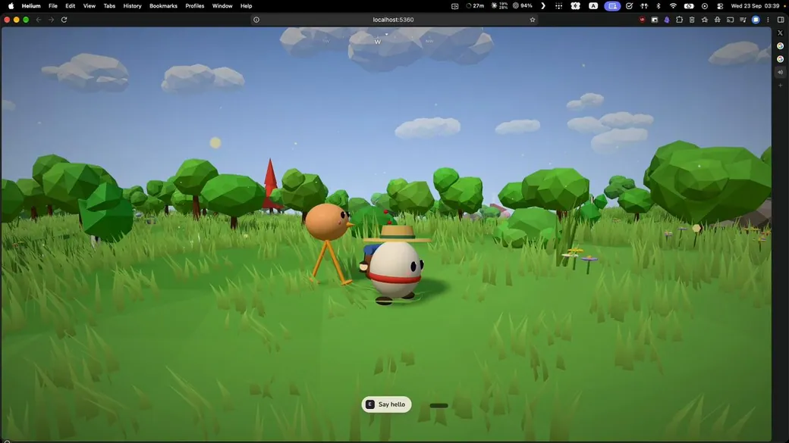</a>

**Промпт**

```text
создай в папке моих проектов новый проект под названием "endless-game": бесконечный процедурно генерируемый мир на Three.js, работающий в браузере, который я смогу свободно исследовать и просто получать удовольствие от игры. Каждая область должна генерироваться случайным образом, а неожиданные находки должны встречаться повсюду, сколько бы я ни играл. Атмосфера должна быть спокойной, расслабляющей и по-настоящему увлекательной — с уютным и приятным ощущением, как в симуляторе супермаркета, но это не должна быть игра про супермаркет. Я хочу действительно интересный мир для прогулок, с сущностями, которых можно встретить и с которыми можно взаимодействовать, а также с очень эффектной графикой. Определи для проекта чёткую цель и продолжай работу, пока не достигнешь её. Когда проект будет готов для запуска, игры и тестирования, воспроизведи звуковой сигнал.
```

<details>
<summary>Исходный промпт автора</summary>

```text
create a new project in my projects folder called "endless-game": an endless, procedurally generated world built with three.js in the browser that i can roam freely and just enjoy. every area should be randomly generated, with surprises everywhere no matter how long i play. it should feel calm, relaxing and genuinely fun, like the cozy, satisfying vibe of a supermarket simulator, but it shouldn't be a supermarket game. i want a really interesting world to walk around in, with entities i can meet and interact with, and really cool graphics. set a clear goal for the project, keep working until you reach it, and play a sound chime when it's done and ready for me to play and test.
```

</details>

[Подробнее ↗](https://www.tripo3d.ai/ru/3d-prompts/claude-opus-5-5-2102529695908806728) · [Исходная публикация](https://x.com/argofowl/status/2102529695908806728) · [Назад к примерам](#all-prompts)

---

<a id="gpt-6-astra-2102473710724919614"></a>

### Двухэтажный пригородный дом с интерьером

[Azer](https://x.com/azer0lxm) · 2026-09-22 · GPT-6 Astra · Сцены

<a href="https://www.tripo3d.ai/ru/3d-prompts/gpt-6-astra-2102473710724919614">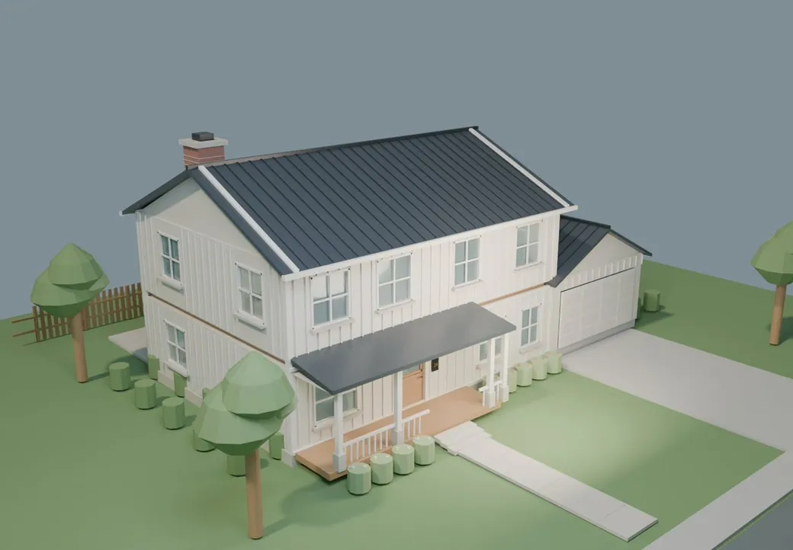</a>

**Промпт**

```text
Здравствуйте. Пожалуйста, создайте в Blender максимально качественную 3D-модель двухэтажного пригородного дома, включая интерьер и все детали.
```

<details>
<summary>Исходный промпт автора</summary>

```text
Hello. Please design the best possible 3D model using Blender of a two-story suburban house, interior and everything included.
```

</details>

[Подробнее ↗](https://www.tripo3d.ai/ru/3d-prompts/gpt-6-astra-2102473710724919614) · [Исходная публикация](https://x.com/azer0lxm/status/2102473781830909995) · [Назад к примерам](#all-prompts)

---

<a id="claude-opus-5-5-2102467667978572092"></a>

### Интерактивная симуляция эвакуации толпы

[Dom](https://x.com/dominikmartn) · 2026-09-22 · Claude Opus 5.5 · Анимация

<a href="https://www.tripo3d.ai/ru/3d-prompts/claude-opus-5-5-2102467667978572092">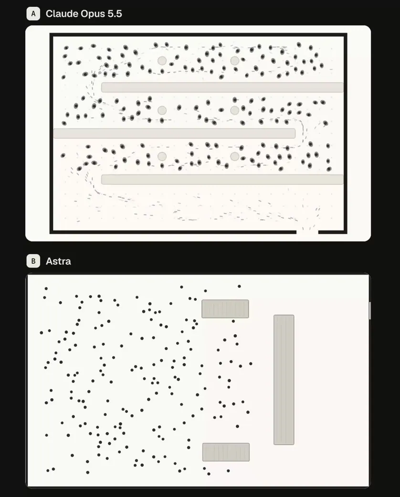</a>

**Промпт**

```text
создай интерактивную симуляцию эвакуации толпы и покажи, где образуются заторы
```

<details>
<summary>Исходный промпт автора</summary>

```text
build an interactive crowd evacuation sim and see where it jams
```

</details>

[Подробнее ↗](https://www.tripo3d.ai/ru/3d-prompts/claude-opus-5-5-2102467667978572092) · [Исходная публикация](https://x.com/dominikmartn/status/2102467667978572092) · [Назад к примерам](#all-prompts)

---

<a id="battle-city-3d"></a>

### Battle City 3D: бесконечная танковая оборона

[jared](https://x.com/jaredliu_bravo) · 2026-09-22 · GPT-6 Astra · Игры

<a href="https://www.tripo3d.ai/ru/3d-prompts/battle-city-3d">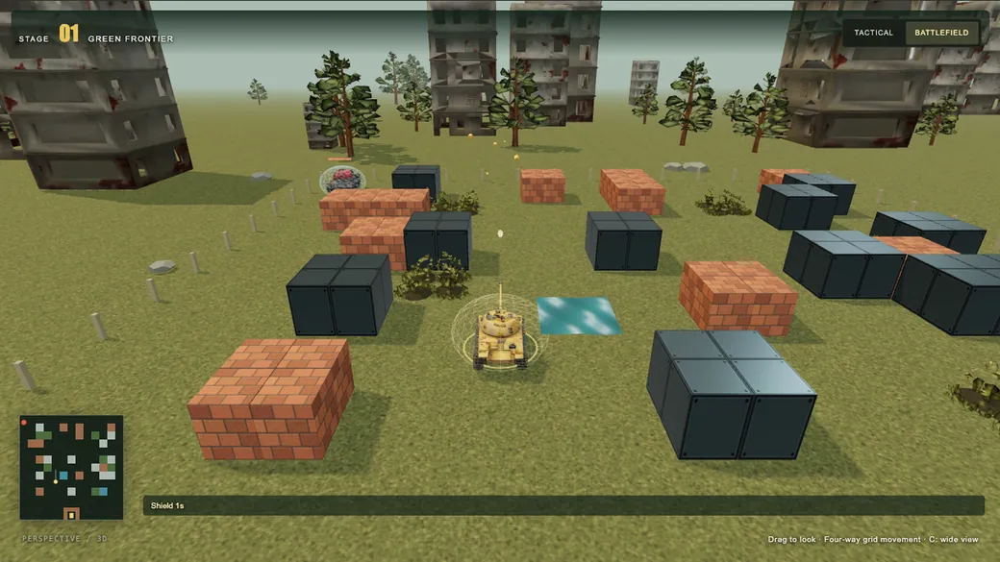</a>

**Промпт**

```text
1. Цель проекта
Создать Battle City 3D — браузерную игру про защиту от танков, вдохновлённую классикой для Famicom 1985 года. Игрок управляет танком, уничтожает волну из 20 противников, собирает припасы и защищает штаб с орлом. Воссоздать текущую перспективную 3D-версию, показанную в референсных материалах, включая бесконечную кампанию с фиксируемым seed и 35 доступных классических карт. Сохранить понятные аркадные правила, добавив танкам, стенам и окружению настоящую глубину.

2. Визуальный стиль
Использовать в Three.js PerspectiveCamera с углом обзора 60 градусов. Камера по умолчанию располагается позади и выше игрока — примерно в 13 мировых единицах от него, на высоте 0,43 радиана. Плавно следить за позицией танка и точкой перед ним; не поворачивать камеру автоматически при развороте танка. Предусмотреть более высокий тактический ракурс, ручное вращение перетаскиванием и масштабирование колёсиком. Для движения и стрельбы использовать четыре основные оси карты. После вращения камеры сопоставлять клавиши направления с ближайшим кардинальным направлением относительно камеры; никогда не преобразовывать клавиатурный ввод в диагональное движение. Сразу выставлять направление корпуса в соответствии с направлением выстрела и калибровать высоту снаряда и вспышки у дульного среза по фактической пушке каждой модели.
Использовать приземлённые гусеничные танки, металлические башни, терракотовые кирпичи, тёмные стальные блоки, синюю воду, низкую растительность и отражающий лёд. Продолжить землю за пределами игровой зоны деревьями, разрушенными зданиями и дымкой. Использовать тёплый направленный свет, мягкие тени, заполняющий окружающий свет, тональное отображение ACES и сдержанные эффекты вспышек, отдачи, искр и отскакивающих обломков. На снежных уровнях менять палитру земли и деревьев; на промышленных этапах отдавать предпочтение стали и разрушенным зданиям.
Оформить игру в тёмно-оливковом стиле командного интерфейса, используя тёплый жёлтый цвет для основных действий, а также отображая счёт, общий запас жизней, значки оставшихся противников, название этапа и радар. Разместить над полем боя крупный переключатель моделей Tripo 3D / Three.js, показывающий выбранный режим и вращающийся предпросмотр танка. Добавить локализованную иллюстрированную памятку по припасам и индикаторы временных эффектов. На узких экранах сохранять видимыми игровое поле и основные сенсорные элементы управления.

3. Мир и сцены
Представить поле боя в виде сетки 26 × 26 тайлов, используя половину ширины танка для коллизий, равную 0,72. Разместить орла в точке (13,25), окружив его разрушаемой кирпичной обороной U-образной формы. Точки появления игроков: (9,25) и (17,25); ворота противников: (1,1), (13,1) и (25,1).
Предусмотреть две кампании: все 35 классических карт с таблицами волн по 20 противников и бесконечный генератор на основе seed, циклически переключающий биомы — луга, снег и промышленную зону. Генерировать связанные коридоры, достаточно широкие для полного корпуса танка, с проходимыми соединениями между точками появления игроков, воротами противников и местами появления припасов. Добавить смещённые центральные стальные укрытия, чтобы исключить прямую линию огня от точки появления к орлу, сохранив при этом проходы между улицами. Разрешить выбирать начальный биом или классический этап и заново генерировать случайную карту. Переносить seed прохождения, счёт, жизни и улучшения выживших игроков на следующий этап.
Кирпичи должны разрушаться; стальные блоки останавливают обычные снаряды и танки; вода блокирует танки, но пропускает снаряды; растительность скрывает модели противников; лёд снижает сцепление. Дальний фон должен оставаться декоративным и не участвовать в игровых коллизиях.

4. Каталог ассетов
Использовать следующие стабильные слоты 3D-моделей, которые можно заменять независимо друг от друга. В первую очередь подготовить модели игрока, противника, тяжёлого танка и орла, затем все десять моделей припасов. Устанавливать каждый ассет на землю по самой нижней точке и нормализовать его ориентацию, центр и масштаб. Вместо загрузки отдельной модели для каждого противника использовать шаблоны.
- player: горчично-жёлтый гусеничный танк с хорошо читаемой башней и пушкой, направленной вперёд; используется для танков игроков, при этом для второго игрока применяется отдельный цвет кольца.
- enemy: компактный гусеничный танк противника, переиспользуемый с разными оттенками для обычного, быстрого и мощного вариантов.
- heavy: заметно более тяжёлый бронированный танк, отдельная от стандартного противника сетка, с четырьмя видимыми сегментами брони над корпусом.
- eagle: металлическая золотая статуя орла на постаменте штаба.
- pickup-star: золотая пятиконечная звезда улучшения.
- pickup-helmet: защитная военная каска для временного щита.
- pickup-clock: хорошо читаемые часы для остановки движения противников.
- pickup-shovel: лопата для укрепления штаба.
- pickup-life: миниатюрный танк, обозначающий одну дополнительную жизнь.
- pickup-grenade: ручная граната для уничтожения активных противников.
- pickup-ammo: ящик с боеприпасами для скорострельности.
- pickup-repair: ремонтный ящик для восстановления брони.
- pickup-magnet: подковообразный магнит для сбора припасов на расстоянии.
- pickup-boost: энергетическая батарея для временного ускорения.
- environment-building: обветшавший разрушенный многоквартирный дом, Tripo P2.0, целевой бюджет — 1 800 треугольников.
- environment-tree: неровная сосна с видимым стволом, Tripo P2.0, целевой бюджет — 1 100 треугольников.
- environment-bush: низкий лиственный куст с пучками травы, Tripo P2.0, целевой бюджет — 650 треугольников.
Отображать припасы как вращающиеся парящие модели для подбора, с цветными кольцами и соответствующими миниатюрами в памятке. Для повторяющихся зданий, деревьев и кустов использовать общие экземпляры геометрии и материалов. Прижать корни здания и дерева к земле; слегка заглубить основание куста, чтобы он естественно сливался с ландшафтом. На снежных этапах добавить снег на поверхностях, обращённых вверх. Стены тайлов, воду, лёд, меши снарядов, UI, источники света, частицы и прокси коллизий создавать процедурно. Анимировать воду волнами, текущими в мировом пространстве, с меняющимися нормалями и небольшим смещением поверхности, непрерывным на соседних тайлах. Версия Tripo использует 17 сгенерированных моделей; в сравнительной версии и танки, и окружение заменяются геометрией, созданной кодом, при сохранении тех же правил и коллизий. Обе версии рендерятся с помощью Three.js.

5. Игровой процесс и обратная связь
Поддержать одиночную игру и локальный кооператив для двух игроков с общим запасом из трёх жизней. В одиночном режиме использовать WASD или клавиши со стрелками, а для стрельбы — Space/J. В кооперативе первый игрок использует WASD и Space/J, второй — клавиши со стрелками и Enter/Numpad 0. Клавиша P/Escape ставит игру на паузу; C меняет камеру; 1/2 выбирает режим моделей. На сенсорных экранах разрешить одновременно удерживать крестовину и кнопку стрельбы, снимать ввод при отмене указателя и предоставлять действия паузы, продолжения, перехода на следующий этап и повтора без прокрутки страницы.
Скорость игрока — 4,2 единицы в секунду или 6,3 с ускорением. Противники бывают обычными, быстрыми, мощными и тяжёлыми; у тяжёлых танков четыре единицы здоровья, и они переживают первые три попадания без щита. За уничтожение противника каждого типа начислять 100, 200, 300 или 400 очков; за любой подобранный припас — 500 очков. Этап завершается после уничтожения 20 противников. Поражение наступает при уничтожении орла или исчерпании общего запаса жизней, если ни одного игрока не осталось в живых. Предусмотреть немедленный повтор, явный переход на следующий этап и локальное сохранение лучшего результата.
Реализовать все десять припасов: звезда повышает уровень до третьего (более быстрые снаряды, два снаряда одновременно, затем снаряды, разрушающие сталь); каска создаёт щит на 12 секунд; часы останавливают противников на 9 секунд; лопата укрепляет базу на 16 секунд; мини-танк добавляет одну жизнь; граната уничтожает активных противников; боеприпасы дают 14 секунд скорострельности, максимум до четырёх активных снарядов; ремонт добавляет две единицы здоровья, но не более трёх; магнит в течение 20 секунд собирает видимые припасы в радиусе пяти единиц; ускорение длится 12 секунд. Модели припасов существуют 25 секунд и появляются в достижимых местах; перемешиваемая колода меняет их типы. Магнит не должен собирать припасы через твёрдые препятствия.
Использовать собранные сэмплы в стиле NES для вступления этапа длительностью 4,333 секунды, выстрелов, движения и простоя, ударов по кирпичу и стали, взрывов противников и игроков, появления и подбора припасов, дополнительной жизни, попадания по броне, льда, паузы и окончания игры. В текущем проекте используются 15 OGG-треков из JustoSenka/BattleCity, commit 3a07004ba8e53baea74ff70d2ecc22b017eb9b20. Сохранить указание авторства и уведомление о лицензии репозитория; описывать их как собранные аудиоматериалы для ремейка, не утверждая, что это побитовая запись оригинального оборудования. Разблокировать звук жестом пользователя, откалибровать громкость сэмплов, добавить регулировку громкости и отключение звука, а также синхронизировать звуки с событиями. Не добавлять постороннюю непрерывную боевую музыку.

6. Техническая реализация
Использовать TypeScript, Three.js 0.180.0 и Vite 7, с изолированными package.json и lockfile. Отделить симуляцию от рендеринга и выполнять её с частотой 120 Гц. Использовать AABB корпусов, разделённое по осям движение, обработку границ и разведение танков, а также непрерывную проверку ближайшего контакта при движении снарядов, включая коллизию между встречными снарядами с учётом относительного движения. Снаряды должны начинать движение от корпуса и проверять путь вперёд, чтобы предотвратить прохождение сквозь стены при стрельбе в упор. Добавить ускорение и торможение на льду, а также гравитацию с затухающими отскоками обломков. Это аркадная физика наземного движения, а не симулятор подвески.
Загружать GLB-ассеты одного источника через GLTFLoader. Прокси коллизий должны быть независимы от геометрии ассетов. Текущий рантайм использует квантизированные атрибуты и текстуры WebP (1024 px для техники и базы; 512 px для припасов и окружения), без упрощения геометрии и WASM-декодера. Ограничить загрузку четырьмя воркерами, использовать URL с версией на основе хеша и диапазоны по 256 KiB с тайм-аутом 20 секунд и максимум тремя попытками для каждого диапазона. Разрешать начало игры после готовности четырёх основных моделей и аудио; припасы и ассеты окружения загружать в фоне и создавать только те типы припасов, чьи модели уже готовы. Переключение режима моделей должно сохранять состояние игры.
Предусмотреть UI на английском, упрощённом китайском, японском и корейском языках. Выбирать язык по умолчанию на основе языка устройства, кроме zh-TW, zh-HK, zh-MO и zh-Hant, для которых по умолчанию используется английский; явно выбранный язык сохранять. Поддержать клавиатуру, указатель на компьютере и мультитач, а при потере фокуса ставить игру на паузу. Хранить все ассеты, сведения об авторстве и воспроизводимые скрипты локально в исходном проекте и поставлять статическую директорию dist без приватных учётных данных и зависимости от серверной части во время выполнения.

7. Критерии готовности
Поставить редактируемый исходный код, сведения о происхождении ассетов и уведомления о лицензиях, рабочий процесс npm для разработки и сборки, а также доступный для игры статический предпросмотр. Проверить сцену Tripo по умолчанию, сравнение моделей, все биомы, тяжёлый танк, выдерживающий четыре попадания, каждый эффект припасов, паузу и продолжение, поражение и повтор, а также переход между этапами. Протестировать 1 000 карт с фиксированным seed на связность с учётом ширины корпуса и безопасные точки появления, а также все классические карты, прохождение сквозь стены, диагональные выстрелы, разведение танков, инерцию на льду, ввод относительно камеры при нескольких значениях рыскания и переключение режимов с сохранением состояния. Проверить локализованный UI и управление двумя пальцами на узких экранах, не заявляя о тестировании на физических устройствах, если использовалась только эмуляция. Сопоставить реальные стартовые и боевые кадры с референсными изображениями и видео; убедиться, что все 17 моделей и 15 аудиотреков загружаются. Опубликовать проект через существующий рабочий процесс CMS Web Page и проверить итоговую публичную страницу, а не считать сохранённую запись CMS завершённым развёртыванием.

```

[Подробнее ↗](https://www.tripo3d.ai/ru/3d-prompts/battle-city-3d) · [Демо](https://battle-city-3d.tripo.page/) · [Назад к примерам](#all-prompts)

---

<a id="claude-opus-5-5-2102450239923720440"></a>

### Интерактивный 3D-остров с доисторической природой

[Vib3Coded](https://x.com/vib3coded) · 2026-09-22 · Claude Opus 5.5 · Интерактив

<a href="https://www.tripo3d.ai/ru/3d-prompts/claude-opus-5-5-2102450239923720440"></a>

**Промпт**

```text
Создайте красивый, высокодетализированный, полностью интерактивный 3D-остров с доисторической природой на Three.js и WebGL. Всё должно быть реализовано в одном автономном HTML-файле, который открывается напрямую в Chrome. По возможности встраивайте ресурсы в файл.

ВИЗУАЛЬНОЕ НАПРАВЛЕНИЕ
Создайте большой остров с плавными округлыми формами, окружённый океаном с прозрачным подводным сечением. Сцена должна восприниматься как премиальный миниатюрный мир: пышная растительность, выразительные динозавры, богатые материалы, атмосферное освещение и тщательно проработанная анимация. Используйте цельный стилизованный художественный стиль, а не простые геометрические примитивы.
ISLAND
Создайте разнообразный рельеф: пляжи, скалистые утёсы, густые доисторические леса, гигантские папоротники, водопад, пресноводный пруд и вулкан. Добавьте небольшую исследовательскую станцию, деревянные настилы, смотровые площадки, ящики с припасами и гнёзда динозавров. Остров должен быть достаточно просторным, чтобы динозавры могли естественно перемещаться между разными зонами.

ПОДВОДНОЕ СЕЧЕНИЕ
Вода должна образовывать вокруг острова глубокий объём с плавными округлыми формами, сквозь боковые поверхности которого хорошо просматривается подводный мир. Добавьте текстурированное морское дно, камни, водные растения, рыб, пузырьки и зелёную морскую рептилию, плавающую под поверхностью. Не размещайте под водой обычных наземных динозавров и не добавляйте подводную лодку.
Используйте анимированные волны, отражения Френеля, световые узоры под водой, пену у берега и брызги. Не допускайте артефактов сортировки прозрачности и видимых зазоров между островом и водой.

DINOSAURS
Добавьте несколько отчётливо различающихся видов: длинношеего завропода, трицератопса, стегозавра, крупного теропода и небольших стадных животных. Пусть над островом кружат птерозавры.
У каждого вида должна быть узнаваемая анатомия, объёмное тело, сочленённые конечности, детализированная голова, хвост и характерный рисунок кожи. Не собирайте готовых динозавров из очевидных коробок или разрозненных сфер.

ЕСТЕСТВЕННАЯ АНИМАЦИЯ
Используйте иерархические скелеты с правильно расположенными суставами. В ходьбе должны отчётливо различаться фазы опоры и переноса: во время контакта стопы остаются на месте, а при каждом шаге плавно отрываются от земли. Согласуйте длину шага со скоростью движения.

Используйте выборку высоты рельефа и обратную кинематику, чтобы стопы сохраняли контакт с землёй. Добавьте перенос веса, лёгкие движения корпуса, уравновешивающие движения хвоста, повороты головы и дыхание. Динозавры не должны парить, скользить, проваливаться в землю, пересекаться с ней или проходить сквозь здания, камни, деревья и друг друга.
Используйте избегание препятствий и безопасные маршруты. У разных видов должны быть разные скорости движения, схемы походки и поведение. Морские животные должны быть обращены в сторону движения.

INTERACTION
Дайте пользователям возможность:

Свободно вращать камеру, приближать и отдалять изображение, а также рассматривать подводное сечение.
Выбирать динозавра и плавно следить за ним камерой.

Размещать еду в подходящих местах и наблюдать, как ближайшие динозавры подходят к ней и едят.

Запускать питьё, отдых, призыв и перемещение стада.

Исследовать гнёзда и наблюдать, как из яйца вылупляется детёныш.
Запускать всплытие морской рептилии с брызгами.
Переключаться между дневным светом, закатом и ночью.
Настраивать дождь, ветер и вулканическую активность.
Приостанавливать симуляцию и сбрасывать сцену.
Каждое управление должно давать чёткий визуальный отклик. Взаимодействия должны запускаться повторно, а одновременные анимации не должны нарушать позы персонажей.
АТМОСФЕРА И ЗВУК
Добавьте движущуюся растительность, плывущие облака, птиц, насекомых, частицы дождя и тёплое освещение исследовательской станции в ночное время. Включите тихую атмосферную музыку и звуки окружающей среды, а также работающие переключатель музыки и ползунок громкости. Запускайте звук только после взаимодействия пользователя.
INTERFACE
Используйте компактный элегантный интерфейс с подписями на английском языке. Сцена должна занимать основное пространство; не закрывайте остров большими панелями. Адаптируйте компоновку для компьютеров и мобильных устройств.
ТЕХНИЧЕСКОЕ КАЧЕСТВО
Используйте инстансинг для повторяющейся растительности и объектов, оптимизированную геометрию, подходящие тени и умеренное постобрабатывание. Сочетайте визуальную насыщенность с плавной производительностью в реальном времени.
Создайте полноценную сцену, а не макет. Протестируйте готовый HTML напрямую в браузере на компьютере, проверьте скриншоты и консоль, испытайте все взаимодействия и до передачи исправьте ошибки загрузки, парящих динозавров, скольжение стоп, неработающие столкновения, артефакты воды и проблемы с камерой.
```

<details>
<summary>Исходный промпт автора</summary>

```text
Create a beautiful, highly detailed, fully interactive 3D prehistoric island using Three.js and WebGL. Deliver everything in a single standalone HTML file that opens directly in Chrome. Embed assets wherever possible.

VISUAL DIRECTION
Build a large, rounded island surrounded by an ocean with a transparent underwater cross-section. The result should feel like a premium miniature world: lush vegetation, expressive dinosaurs, rich materials, atmospheric lighting, and polished animation. Use a cohesive, stylized art direction rather than basic geometric shapes.
ISLAND
Create varied terrain with beaches, rocky cliffs, dense prehistoric forests, giant ferns, a waterfall, a freshwater pond, and a volcano. Add a small research station, wooden walkways, observation platforms, supply crates, and dinosaur nests. Make the island spacious enough for dinosaurs to move naturally between distinct areas.

WATER CROSS-SECTION
The water must form a deep, rounded volume around the island, with clearly visible underwater scenery through its sides. Include a textured seabed, rocks, aquatic plants, fish, bubbles, and a green marine reptile swimming beneath the surface. Do not place ordinary land dinosaurs underwater, and do not add a submarine.
Use animated waves, Fresnel reflections, underwater light patterns, shoreline foam, and splashes. Avoid transparency sorting artifacts and visible gaps between the island and water.

DINOSAURS
Include several distinct species, such as a long-necked sauropod, Triceratops, Stegosaurus, a large theropod, and smaller herd animals. Add pterosaurs circling overhead.
Give every species recognizable anatomy, shaped bodies, articulated limbs, detailed heads, tails, and appropriate skin patterns. Avoid assembling the finished dinosaurs from obvious boxes or disconnected spheres.

NATURAL ANIMATION
Use hierarchical skeletons with correctly positioned joints. Walking must have distinct stance and swing phases: feet stay planted during contact and lift cleanly during each step. Match stride length to movement speed.

Use terrain sampling and inverse kinematics to keep feet on the ground. Add weight shifts, subtle body movement, balanced tail motion, head turns, and breathing. Dinosaurs must never float, slide, intersect the ground, or walk through buildings, rocks, trees, or each other.
Use obstacle avoidance and safe paths. Different species should have different movement speeds, gait patterns, and behaviors. Marine animals must face their direction of travel.

INTERACTION
Allow users to:

Rotate the camera freely, zoom, and inspect the underwater cross-section.
Select a dinosaur and follow it with a smoothly moving camera.

Place food in suitable locations and watch nearby dinosaurs approach and eat.

Trigger drinking, resting, calling, and herd movement.

Explore nests and watch a hatchling emerge.
Trigger a marine reptile surfacing with a splash.
Switch between daylight, sunset, and night.
Adjust rain, wind, and volcanic activity.
Pause the simulation and reset the scene.
Make every control produce a clear, visible response. Keep interactions repeatable and prevent overlapping animations from breaking character poses.
ATMOSPHERE AND AUDIO
Add moving foliage, drifting clouds, birds, insects, rain particles, and warm research-station lights at night. Include quiet atmospheric music and environmental sounds with a working music toggle and volume slider. Start audio only after user interaction.
INTERFACE
Use a compact, elegant interface with English labels. Keep the scene dominant and avoid large panels covering the island. Make the layout responsive for desktop and mobile.
TECHNICAL QUALITY
Use instancing for repeated vegetation and props, efficient geometry, appropriate shadows, and restrained post-processing. Balance visual richness with smooth real-time performance.
Build a complete scene, not a mockup. Test the final HTML directly in a desktop browser, inspect screenshots and the console, exercise every interaction, and fix loading errors, floating dinosaurs, foot sliding, broken collisions, water artifacts, and camera problems before delivery.
```

</details>

[Подробнее ↗](https://www.tripo3d.ai/ru/3d-prompts/claude-opus-5-5-2102450239923720440) · [Исходная публикация](https://x.com/vib3coded/status/2102450842070569099) · [Назад к примерам](#all-prompts)

---

<a id="gpt-6-astra-2102411087002112256"></a>

### TD-игра в духе Sir, We Have Orc Problems

[nkz/ぴたすぽ](https://x.com/nikzu_) · 2026-09-22 · GPT-6 Astra · Игры

<a href="https://www.tripo3d.ai/ru/3d-prompts/gpt-6-astra-2102411087002112256">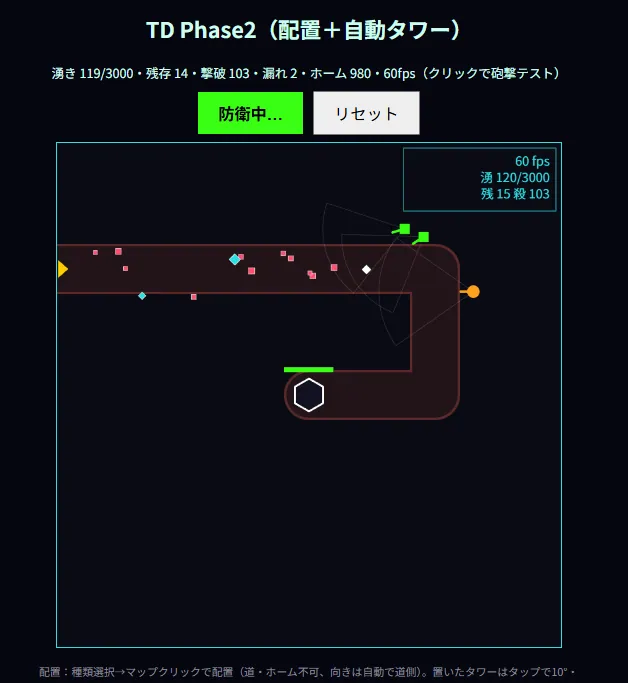</a>

**Промпт**

```text
Сделай TD-игру вроде Sir, We Have Orc Problems
```

<details>
<summary>Исходный промпт автора</summary>

```text
Sir, we have orc problemsみたいなTDゲーム作って
```

</details>

[Подробнее ↗](https://www.tripo3d.ai/ru/3d-prompts/gpt-6-astra-2102411087002112256) · [Исходная публикация](https://x.com/nikzu_/status/2102411087002112256) · [Назад к примерам](#all-prompts)

---

<a id="gpt-6-astra-2102276620124062065"></a>

### 3D-сцена и видео с Токийской башней днём и ночью

[Wafffle](https://x.com/wafffle_dev) · 2026-09-22 · GPT-6 Astra · Сцены

<a href="https://www.tripo3d.ai/ru/3d-prompts/gpt-6-astra-2102276620124062065">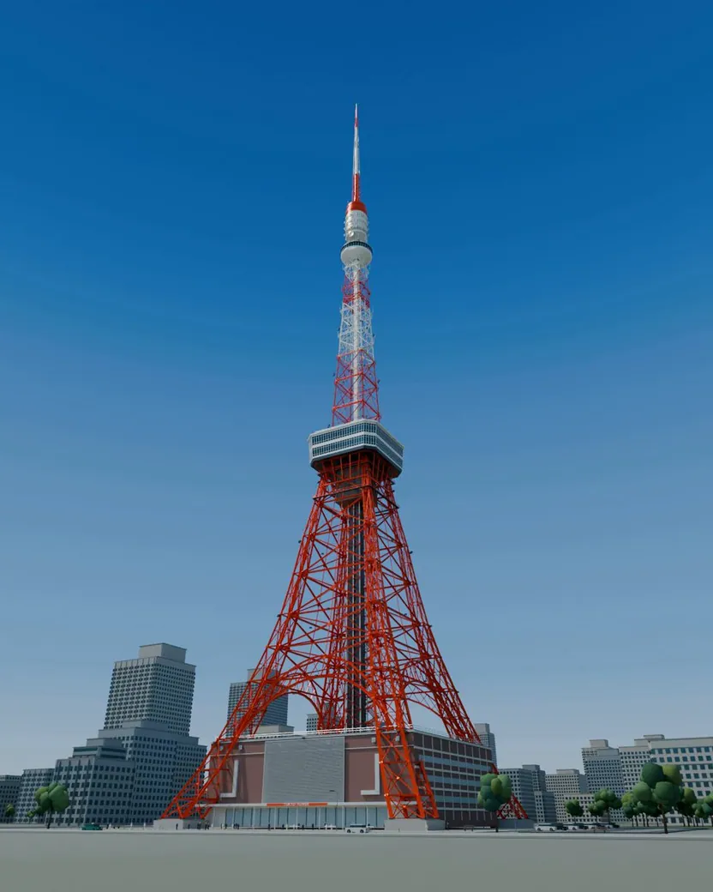</a>

**Промпт**

```text
Создайте впечатляющую 3D-работу с Токийской башней в главной роли и видео продолжительностью около 30 секунд для публикации в X. 

Вы — постановочный директор проекта. Сформируйте необходимые подзадачи и поручите провести исследование и制作. Возьмите на себя конкретизацию задания, управление процессом, проверку результатов, постановку задач на доработку и финальную сборку материалов.

【Что нужно создать】
Токийскую башню, снятую с земли снизу вверх так, чтобы ощущались её высота и тонкие детали стального каркаса при приближении.
Подготовьте дневную и ночную версии: днём покажите конструкцию и окраску, а ночью — красоту подсветки.

Работа должна создавать впечатление, что Токийскую башню внимательно изучили и тщательно воссоздали. Исследуйте и отразите не только общий силуэт, но и характерные детали: разведение опор, устройство стального каркаса, смотровые площадки, здания у основания и другие особенности. Окружающий город можно ограничить тем объёмом, который позволяет передать масштаб башни и атмосферу её расположения.

【Порядок работы】
・Изучите официальные материалы и фотографии, определите, какие особенности нужно воссоздать, и расставьте приоритеты.
・На основе исследования выдайте каждой подзадаче конкретные указания по созданию материалов.
・На раннем этапе проверьте реальный 3D-превью-рендер и скорректируйте форму, композицию и яркость.
・Самостоятельно просмотрите готовые изображения и видео, выявите несоответствия и недостающие элементы, затем запросите доработки.
・Самостоятельно принимайте решения по техническим деталям и постановке съёмки, доведя работу до завершения.

Не заменяйте сцену фоном с фотографией или сгенерированным изображением: используйте реальные 3D-формы и движение камеры. Зафиксируйте подтверждённые факты и части, восстановленные предположительно из-за недостатка материалов.

【Видео】
Продолжительность — около 30 секунд. Объедините съёмку снизу вверх с земли, крупные планы стального каркаса и смотровых площадок, а также общий план, на котором читается вся башня; покажите переход от дня к ночи.
Точную разбивку по секундам определите по готовой модели, выбрав композицию, которая лучше всего передаёт её привлекательность.

【Что передать】
・Редактируемый файл Blender
・MP4-видео для публикации в X
・Изображения для проверки общих планов и деталей днём и ночью
・Короткий вариант текста для публикации
・README с указанием источников материалов, степени воссоздания и результатов проверки
```

<details>
<summary>Исходный промпт автора</summary>

```text
東京タワーを主役にした、見応えのある3D作品とX投稿用の約30秒動画を作ってください。

あなたは制作ディレクターです。必要なサブタスクを作成し、調査・制作を依頼してください。依頼内容の具体化、進行管理、成果物の確認、修正指示、最終的な取りまとめまで任せます。

【作ってほしいもの】
地上から見上げた高さと、近づいたときの鉄骨の細かさが伝わる東京タワーです。
昼と夜の両方を用意し、昼は構造や塗装、夜はライトアップの美しさを見せてください。

「東京タワーをよく見て作っている」と感じられる作品にしたいです。塔の形だけでなく、脚の開き方、鉄骨の組み方、展望台、足元の建物など、特徴的な細部を調べて反映してください。周辺の街は、塔の大きさと場所の雰囲気が伝わる範囲に絞って構いません。

【制作の進め方】
・公式資料や写真を調査し、再現する特徴と優先順位を決める。
・その調査を基に、各サブタスクへ具体的な制作指示を出す。
・早い段階で実際の3D試写を確認し、形・構図・明るさを調整する。
・完成画像や動画をメイン自身が見て、違和感や不足を見つけ、修正を依頼する。
・細かな技術選択や撮影構成は自主的に判断して、完成まで進める。

写真や生成画像を貼った背景だけで代用せず、実際の3D形状とカメラ移動で表現してください。確認できた事実と、資料不足による推定部分は記録してください。

【動画】
約30秒。地上からの見上げ、鉄骨や展望台の近接、塔全体が分かる引きを組み合わせ、昼夜の変化も見せてください。
細かな秒割りは、完成したモデルを見て最も魅力が伝わる構成を判断してください。

【納品】
・編集可能なBlenderデータ
・X投稿用MP4動画
・昼夜の全景と細部の確認画像
・短い投稿文案
・素材の出典、再現範囲、検証結果を記したREADME
```

</details>

[Подробнее ↗](https://www.tripo3d.ai/ru/3d-prompts/gpt-6-astra-2102276620124062065) · [Исходная публикация](https://x.com/wafffle_dev/status/2102276620124062065) · [Назад к примерам](#all-prompts)

---

<a id="bubble-bay"></a>

### Bubble Bay: 3D-битва водяных шаров

[jared](https://x.com/jaredliu_bravo) · 2026-09-22 · GPT-6 Astra · Игры

<a href="https://www.tripo3d.ai/ru/3d-prompts/bubble-bay">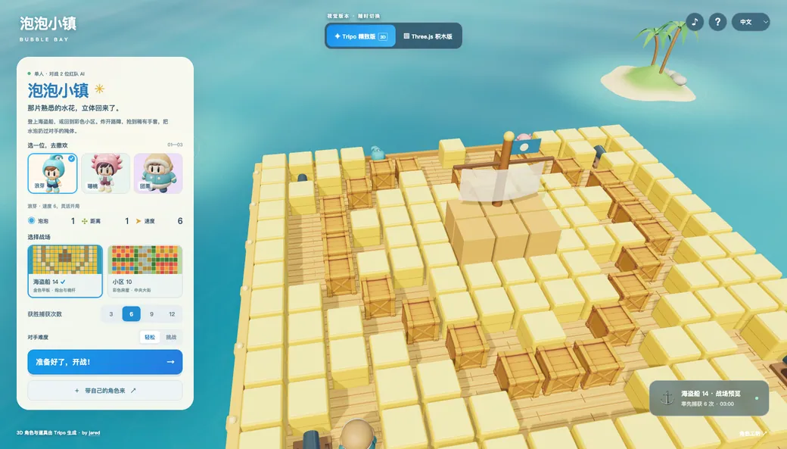</a>

**Референсы:** [1](https://media.tripogrowth.space/media/c478b28a-c7c6-4b6d-8ab5-e9814ab00549.png)

**Промпт**

```text
Создайте Bubble Bay — игровую арену на Three.js с водяными шарами, выполненную в знакомом стиле классических bubble-игр: персонажи в костюмах с большими головами, короткими телами и открытыми лицами. По умолчанию используйте детализированные модели Tripo и добавьте очевидный переключатель сравнения геометрии Three.js, который сохраняет тот же матч. Используйте трёх новых персонажей: Langya, Shantao и Tuanli. Следуйте предоставленным концептам и референсам моделей новых персонажей, сохраняя их силуэты, лица, цвета и костюмы.

Langya — живой мальчик с бирюзовым капюшоном и единым боковым гребнем в форме волны, оранжевыми воротником и манжетами, тёмно-синими шортами и бирюзовыми туфлями с оранжевой подошвой. Shantao — маленькая девочка с тёмно-сливовым каре, персиково-розовым чепцом и тремя короткими украшениями в форме лепестков с каждой стороны, мятной курткой, коротким сливовым полукомбинезоном и светло-жёлтыми сапогами. Tuanli — пухлый мальчик с широким грушевидным телом, карамельной круглой мягкой шапочкой с кремовой окантовкой лица, короткой бирюзовой курткой, кремовой нижней частью живота и тёмно-синими сапогами. У всех тёплые детские лица телесного цвета с простыми тёмными овальными глазами и крошечными улыбками. Это дети в новых костюмах; не превращайте их в буквальных водных существ и не используйте повторно узнаваемые костюмы прежних персонажей. Сгенерируйте каждого отдельно через Tripo CLI с явным указанием tripo-p2 и независимыми изображениями спереди и сзади, затем привяжите корректные двуногие скелеты и скин. Анимации покоя, бега и прыжка должны управлять реальными суставами; проверьте движения, исправьте веса головных уборов, обуви и тела и сохраняйте точные сведения о происхождении ассетов. Если анимации созданы локально, укажите это.

Локализованные имена: 浪芽 / 랑야 / Langya, 珊桃 / 산타오 / Shantao, 团栗 / 퇀리 / Tuanli. Начальные уровни вместимости/дальности/скорости: 1/1/6, 1/2/5, 2/1/4; максимальные значения: 6/7/9, 6/7/8, 9/8/8. Переводите скорость в 0.25 + уровень*0.8 мировых единиц в секунду; размер клетки — 2 единицы. При выборе персонажа назначайте двух остальных уникальными соперниками с соответствующими профилями. Радиус попадания в игре должен оставаться одинаковым независимо от пухлого визуального силуэта.

По умолчанию предложите Pirate/Patrit14 размером 15x13 и Village10. Сохраните узнаваемые золотую палубу, жёлтый груз, деревянные ящики, четыре пушки и центральную мачту; в деревне должны быть четыре цветных жилых района, центральная дорога, живые изгороди и игрушечные блоки. Используйте карты издателя как референс, создавайте графику для рантайма самостоятельно и документируйте небольшие проходы, необходимые для непрерывного перемещения в 3D и побега ИИ. Добавьте яркие материалы, тени, океанское окружение, понятное сопровождение камерой и обзорный режим.

Один игрок сражается с двумя сообщающимися соперниками под управлением ИИ. Перемещение — WASD/стрелки, F устанавливает шар-пузырь на 2,5 секунды, Space прыгает на реальные платформы, Shift выполняет рывок, Q/E вращают камеру, V меняет вид, Escape ставит игру на паузу. Вода распространяется крестом, учитывает препятствия, разрушает первый мягкий блок и соединяет пузыри в цепную реакцию. Реализуйте пленение, спасение, захваты врагами, возрождение, выбор цели матча: 3, 6, 9 или 12 захватов (по умолчанию 6), либо подсчёт очков за 180 секунд, экран результата и повторный запуск. Виртуальный джойстик и кнопки действий должны работать одновременно.

Используйте шесть сгенерированных Tripo усилителей: воздушный шар, зелье дальности, роликовый конёк, перчатку для броска, ботинок для пинка и спасательную иглу. Ящики должны выпадать с предметом в 85% случаев. Условные веса предметов: 30/30/30/2.5/3.5/4 процента. Перчатка добавляет три броска, максимум — шесть. G бросает ближайший пузырь максимум на четыре клетки поверх укрытий, сохраняя его владельца и исходное время запала, резервируя место приземления и отображая траекторию. Если пузырь заканчивает время запала в полёте, он приземляется и взрывается. K скользит пузырями до столкновения с препятствием, не сбрасывая запал. X использует спасательную иглу: начальное количество — одна, максимум — три. Наглядно показывайте инвентарь и доступные действия.

Интерфейс на китайском, английском и корейском языках: часовые пояса IANA материкового Китая выбирают китайский язык, Корея и Северная Корея — корейский, все остальные регионы, включая Гонконг, Макао и Тайвань, — английский. Ручной выбор всегда имеет приоритет. Разрешайте загружать только действительно скинированные GLB-файлы со встроенными текстурами, стандартным несжатым форматом, размером до 40 МБ и максимум 150 тыс. треугольников. Проверяйте кости, суставы и веса, отклоняйте статичные модели, используйте встроенные анимации, если они есть, и добавляйте базовое движение суставов для распознанных гуманоидов без клипов. Для нераспознанных скелетов требуются анимации. Понятно объясняйте разницу между риггингом и анимацией, добавьте корректировку ориентации на 90 градусов, выполняйте обработку локально в браузере и назначайте стабильные сбалансированные характеристики на основе хеша файла.

Используйте в CTA создания ровно https://studio.tripo3d.ai/?utm_source=satellite_invite&utm_medium=bubble-bay&utm_campaign=create-character. Укажите авторство jared, добавив ссылку на https://x.com/jaredliu_bravo .

Интегрируйте 13 звуковых эффектов ElevenLabs с нормализацией, коротким затуханием, учётом расстояния и панорамированием, ограничением полифонии, регулировкой громкости и отключением звука: установка, взрыв, ящик, усилитель, редкий предмет, бросок, приземление, пленение, спасение, прыжок, победа, поражение, пинок. Создайте два оригинальных инструментальных трека с помощью ElevenLabs music_v2_5, по 90 секунд каждый, в стилистике пиратской морской карты и солнечного жилого района. Нормализуйте их до сдержанной цели -20 LUFS и сделайте кроссфейд на границах зацикливания. Добавьте отдельную регулировку громкости музыки, меняйте треки в зависимости от карты, плавно убавляйте звук на паузе и учитывайте общий mute. Не воспроизводите оригинальный саундтрек игры.

Храните независимый исходный код, зависимости, тесты и сведения о происхождении ассетов за пределами приложений CMS-платформы. Соберите статические ресурсы с тем же источником и уведомлениями MIT. Проверьте реальный игровой процесс на компьютере и сенсорных устройствах, варианты загрузки, языки и визуальное переключение в Ego Lite. Создайте неизменяемую версию для проверки, прикреплённую к существующей CMS Web Page 12; сохраняйте текущую опубликованную версию, пока проверка не завершена. Публикуйте только после достоверной проверки исходного кода и прав на ассеты, затем проверьте публичный URL, хеши моделей и поведение. Сохраняйте историю и различайте сохранённые записи CMS, предварительные просмотры и публичные релизы.

Загружайте ассеты моделей с видимым индикатором прогресса, одновременно не более трёх загрузок, с тайм-аутом простоя 30 секунд и двумя попытками. Успешные загрузки сохраняйте при повторной попытке. Скрывайте весь переключатель вкладок Tripo / Three.js, пока все модели не будут готовы, а затем показывайте его. Не помечайте процедурные заглушки загрузки как загруженные модели Tripo.


Используйте близкую перспективную камеру сопровождения, которая начинает за пределами точки появления и направлена к центру арены. Сохраните вращение камеры через Q/E, наклон перетаскиванием мыши и обзор через V. Разместите компактный счёт на верхней панели, переключатель режима — в левом верхнем углу, а краткие уведомления — внизу. На компьютерах с мышью скрывайте джойстик и крупные сенсорные кнопки, оставляя небольшие элементы управления редкими предметами; на узких экранах поддерживайте компактные одновременные сенсорные действия. Добавьте анимированный шейдер волн с бирюзовой вариативностью глубины, органичные песчаные островки с изогнутыми пальмами и камнями, ненавязчивые текстуры древесных волокон и травы. Окружайте каждого пойманного персонажа полупрозрачным пузырём подходящего размера с переливающейся кромкой Fresnel, мягким плаванием, мелкими пузырьками и рябью на земле. Проверьте, что вершины скина в позе совпадают с моделью, сбрасывайте подъём после спасения и проверяйте освобождение ресурсов после многократного переключения. Не используйте затратные проходы общего transmission-рендеринга для водной мембраны; ограничьте плотность пикселей на узких экранах значением 1.5.


Добавьте видимые элементы управления Follow / Overview и переключение через V. В режиме Overview поддерживайте масштабирование от 100 до 300 процентов с помощью кнопок +/−, колеса мыши и жеста сведения/разведения двумя пальцами; ограничьте перетаскивание карты её границами и добавьте сброс Fit map. Сохраняйте масштаб и текущий матч при переключении камеры или версии рендеринга. Разместите компактные элементы управления редкими предметами без перекрытий на китайском, английском и корейском языках.

```

[Подробнее ↗](https://www.tripo3d.ai/ru/3d-prompts/bubble-bay) · [Исходная публикация](https://x.com/jaredliu_bravo/status/2102300855387205871) · [Демо](https://bubble-bay.tripo.page/) · [Назад к примерам](#all-prompts)

---

<a id="gpt-6-astra-2102215638311694336"></a>

### Интерактивная презентация дизайна 3D-вертолёта

[Vib3Coded](https://x.com/vib3coded) · 2026-09-22 · GPT-6 Astra · Интерактив

<a href="https://www.tripo3d.ai/ru/3d-prompts/gpt-6-astra-2102215638311694336">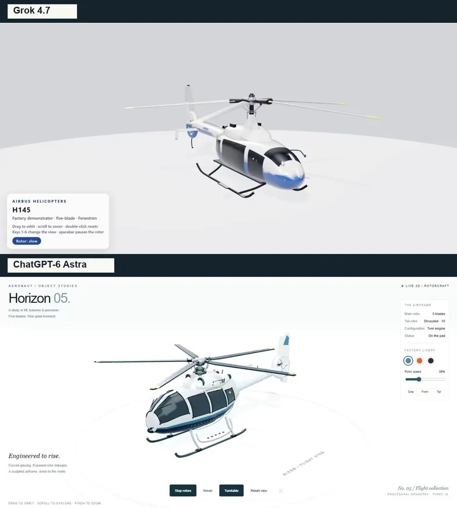</a>

**Промпт**

```text
Создайте детализированную интерактивную 3D-сцену современного вертолёта в одном HTML-файле с использованием Three.js и WebGL. Постройте настоящую 3D-геометрию, которую можно рассматривать со всех сторон, а не изображение.

Визуальный стиль:
Премиальная презентация авиационного дизайна на светло-сером студийном фоне, с круглой демонстрационной платформой, мягкими тенями и реалистичными отражениями.
Вертолёт:

Плавный обтекаемый фюзеляж в духе лёгких двухмоторных вертолётов, таких как H145.
Белый корпус с тёмно-синей нижней частью и синей акцентной полосой.
Изогнутые тонированные стёкла кабины с отражениями и аккуратно подогнанными уплотнителями.
Боковые двери, ручки, швы панелей, заклёпки, подножки для посадки и антенны.
Два корпуса двигателей с воздухозаборниками, вентиляционными решётками и выхлопными отверстиями.
Пятилопастный несущий винт с детализированной втулкой, крепёжными элементами и тягами управления шагом.
Сужающаяся хвостовая балка, стабилизаторы и рулевой винт в обтекателе с настоящим сквозным отверстием в корпусе.
Изогнутые лыжи шасси, прикреплённые к фюзеляжу с помощью силовых стоек.
Навигационные огни и мигающий проблесковый маяк.
Все компоненты должны быть физически соединены. Не допускайте парящих деталей, зазоров между секциями, пересечения лопастей с фюзеляжем или нависающих над корпусом стёкол.

Взаимодействие:

Вращение сцены перетаскиванием мышью, масштабирование колёсиком и сенсорное управление.
Запуск и остановка обоих роторов с плавным разгоном и замедлением.
Регулировка скорости вращения роторов.
Режим зависания: плавный отрыв от платформы, лёгкое покачивание в воздухе и мягкая посадка при отключении режима.
Автоматическое вращение камеры вокруг объекта.
Предустановки камеры: вид спереди, сбоку и с хвоста.
Кнопки сброса камеры и полноэкранного режима.
Три варианта окраски: ледниково-синяя с белым, спасательная оранжевая и графитовая.
Интерфейс:

Слева вверху: небольшая надпись «AERONAUT / OBJECT STUDIES» и крупный заголовок «Horizon 05.».
Справа: компактная панель с характеристиками, состоянием вертолёта, выбором окраски и скоростью вращения роторов.
Внизу: элементы управления и подсказки по взаимодействию.
Сдержанная типографика, тонкие границы и много свободного пространства. Не закрывайте вертолёт элементами интерфейса.
Весь текст интерфейса должен быть на английском языке.
Технические требования:

Генерируйте геометрию процедурно, не загружая готовую модель вертолёта.
Используйте PBR-материалы, студийное окружение для отражений и мягкие тени.
Сделайте анимацию независимой от частоты кадров.
По возможности переиспользуйте геометрию и материалы, а для повышения производительности ограничьте pixel ratio.
Поддерживайте компоновку для компьютеров и мобильных устройств; в начальном ракурсе весь размах роторов должен оставаться видимым.
По возможности встройте зависимости в HTML, чтобы файл работал без подключения к интернету.
Если WebGL недоступен, выводите понятное сообщение с описанием проблемы.
Перед завершением осмотрите модель со всех сторон, протестируйте каждый элемент управления и проверьте консоль на наличие ошибок. Особое внимание уделите силуэту, структурным соединениям, остеклению и механизмам роторов.

Передайте рабочий HTML-файл, а не только объяснение.
```

<details>
<summary>Исходный промпт автора</summary>

```text
Create a detailed, interactive 3D scene of a modern helicopter in a single HTML file using Three.js and WebGL. Build genuine 3D geometry that can be viewed from every angle, not an image.

Visual style:
A premium aviation design presentation with a light gray studio background, a circular display platform, soft shadows, and realistic reflections.
Helicopter:

A smooth, streamlined fuselage inspired by light twin-engine helicopters such as the H145.
A white body with a dark navy underside and blue accent stripe.
Curved, tinted cockpit windows with reflections and carefully fitted window seals.
Side doors, handles, panel seams, rivets, boarding steps, and antennas.
Two engine housings with air intakes, ventilation grilles, and exhaust outlets.
A five-bladed main rotor with a detailed hub, attachment hardware, and pitch-control linkages.
A tapered tail boom, stabilizers, and a shrouded tail rotor with a genuine opening through its housing.
Curved landing skids attached to the fuselage with structural supports.
Navigation lights and a blinking beacon.
All components must connect physically. Avoid floating parts, gaps between sections, rotor blades intersecting the fuselage, or windows hovering above the body.

Interactions:

Mouse drag to orbit, scroll to zoom, and touch controls.
Start and stop both rotors with gradual acceleration and deceleration.
Adjustable rotor speed.
Hover mode: smoothly lift off the platform, gently sway in the air, and land softly when disabled.
Automatic camera orbit.
Front, side, and tail camera presets.
Reset camera and fullscreen controls.
Three liveries: glacier blue and white, rescue orange, and graphite.
Interface:

Top left: a small “AERONAUT / OBJECT STUDIES” label and a large “Horizon 05.” heading.
Right side: a compact panel with specifications, helicopter status, livery selection, and rotor speed.
Bottom: controls and interaction hints.
Restrained typography, thin borders, and generous whitespace. Keep the helicopter unobstructed.
All interface text in English.
Technical requirements:

Generate the geometry procedurally without downloading a prebuilt helicopter model.
Use PBR materials, a studio reflection environment, and soft shadows.
Make animation independent of frame rate.
Reuse geometry and materials where appropriate, and cap pixel ratio for performance.
Support desktop and mobile layouts, keeping the full rotor span visible in the initial view.
If possible, embed dependencies in the HTML so the file works offline.
Display a helpful fallback message if WebGL is unavailable.
Before finishing, inspect the model from every side, test every control, and check for console errors. Pay particular attention to the silhouette, structural connections, glazing, and rotor mechanisms.

Deliver the working HTML file, not just an explanation.
```

</details>

[Подробнее ↗](https://www.tripo3d.ai/ru/3d-prompts/gpt-6-astra-2102215638311694336) · [Исходная публикация](https://x.com/vib3coded/status/2102217028052377910) · [Назад к примерам](#all-prompts)

---


[Полный каталог](catalog.ru.md) · [←](catalog.ru.1.md) · **2 / 10** · [→](catalog.ru.3.md)

<p align="center"><strong><a href="https://www.tripo3d.ai/ru/3d-prompts?utm_source=github&amp;utm_medium=referral&amp;utm_campaign=awesome_3d_prompts&amp;utm_content=catalog_footer">Полный каталог →</a></strong></p>
