<!-- Generated from Growth CMS by templates/catalog.md. Edit content in CMS; run npm run sync. -->

# Awesome 3D Prompts — 3 / 9

[← Awesome 3D Prompts](../README.md)

<p>
  <a href="../docs/catalog.en.3.md"></a>
  <a href="../docs/catalog.zh.3.md"></a>
  <a href="../docs/catalog.zh-Hant.3.md"></a>
  <a href="../docs/catalog.ja.3.md"></a>
  <a href="../docs/catalog.ko.3.md"></a>
  <a href="../docs/catalog.es.3.md"></a>
  <a href="../docs/catalog.pt.3.md"></a>
  <a href="../docs/catalog.de.3.md"></a>
  <a href="../docs/catalog.fr.3.md"></a>
  <a href="../docs/catalog.it.3.md"></a>
  <a href="../docs/catalog.ru.3.md"></a>
  <a href="../docs/catalog.tr.3.md"></a>
  <a href="../docs/catalog.uk.3.md"></a>
  <a href="../docs/catalog.vi.3.md"></a>
</p>

[Tam katalog](catalog.tr.md) · [←](catalog.tr.2.md) · **3 / 9** · [→](catalog.tr.4.md)

<a id="all-prompts"></a>

<details>
<summary>Örnekleri keşfet (50)</summary>

- [Tapınak minyatür 3B model sahnesi](#gpt-6-astra-2098403061463224543)
- [Karakter modelinde saç ve yüz dokusunu otomatik oluşturma ve UV aktarımı](#gpt-6-astra-2098367087475577273)
- [Sol Horizon başlangıç sivil kurye gemisi](#gpt-6-astra-2098225609558335846)
- [Etkileşimli 3B robotik el piyano gösterimi](#gpt-6-astra-2098109252720078891)
- [İnsan başı ve beyninin etkileşimli 3B atlası](#gpt-6-astra-2098105648106078541)
- [Kılıç ustasının kapı yıkımı temalı fantastik animasyonu](#gpt-6-astra-2098094339759149067)
- [Şehir kanyonunda beyaz model mekik uçuşu](#gpt-6-astra-2098079379297608050)
- [Uçan büyülü akademi animasyonu](#gpt-6-astra-2098071577309122854)
- [Şehir Nabzı](#gpt-6-astra-2098063352832610473)
- [GTA esintili çizgi film araba kovalamacası iş akışı](#gpt-6-astra-2098049032195293190)
- [Etkileşimli kalamar sürüsü](#gpt-6-astra-2098043033446912315)
- [18 delikli golf sahasını daha zorlu hâle getir](#gpt-6-astra-2098038909514944562)
- [Mosswing: Mobil 3B Dokunarak Uçma Oyunu](#mosswing-mobile-3d-tap-to-flap-game)
- [Sözsüz 3B Kedi Ödül Maması Kısa Filmi](#gpt-6-astra-2097900087901106244)
- [Etkileşimli fantastik grafik demosu](#gpt-6-astra-2097821164093480999)
- [Çok oyunculu Minecraft klonu](#gpt-6-astra-2097797479488246071)
- [Etkileşimli 3B parçacık çarpıştırıcısı](#gpt-6-astra-2097781208596029936)
- [Canlı 3B fabrika ve fırlatma rampası simülasyonu](#gpt-6-astra-2097730920224534868)
- [THE LAST GATE'i oluştur: Aritmetik kapıları olan kalabalık koşu oyunu](#gpt-6-astra-2097678911882809407)
- [GPT-6 Astra ve Blender ile Kedi Kovalayan Robot Kol Komedisi](#gpt-6-astra-2097675660873605422)
- [Sürükleyici 3B pirinç tarlası web sitesi](#gpt-6-astra-2097602565110419781)
- [Backrooms esintili Blender VHS sahnesi](#gpt-6-astra-2097534290112188602)
- [Sıcacık Sulak Alan Göl Dünyası](#gpt-6-astra-2097343467026289039)
- [League of Legends tarzında web oyunu oluşturma](#gpt-6-astra-2097336230078013598)
- [Pekin Cennet Tapınağı İyi Hasatlar İçin Dua Salonu TypeScript + Three.js WebGL projesi](#gpt-6-astra-2097323734504017936)
- [League of Legends'in mini 3B oyununu yeniden oluşturma](#gpt-6-astra-2097320830602809682)
- [Referans görsel kullanarak Blender’da 3B modelin yüz hatlarını iyileştirme](#gpt-6-astra-2097313247116341424)
- [Oluşturulmuş Referanstan Skyrim Esintili Köy Arazisi](#gpt-6-astra-2097167383576383502)
- [Japon Çiçekçi Dükkânı Patlatılmış Görünüm Animasyonu](#gpt-6-astra-2097153139795468365)
- [Godot'ta digitigrad meche rig kurun ve animasyon verin](#gpt-6-astra-2097123382852829230)
- [Etkileşimli jöle limon ağacı](#gpt-6-astra-2097065330728128920)
- [Tezgâh Üzerinde Etkileşimli Robot Evcil Hayvan](#gpt-6-astra-2097004192627933279)
- [Blender’da 12 saniyelik bir orman yolu](#gpt-6-astra-2096986557244723371)
- [Etkileşimli Çin Avlusu](#gpt-6-astra-2096971051334857181)
- [“Yerçekiminin Bozulduğu Ufuk” VRChat Manzara Dünyası](#gpt-6-astra-2096966425017467344)
- [Three.js WebGPU’da Sonsuz Minyatür Sokak](#gpt-6-astra-2096956214680965501)
- [Hogwarts 3B sahnesi](#gpt-6-astra-2096907617117540478)
- [Three.js ve WebGPU ile etkileşimli yumuşak gövdeli slime oluşturma](#gpt-6-astra-2096793432987464010)
- [Blender MCP ile LEGO minifigür oyun varlığı](#astra-3d-2096766465730847059)
- [Etkileşimli Akıllı Telefon Patlatılmış Görünümü](#gpt-6-astra-2096685163111694556)
- [Mini World 3B keşif oyunu](#gpt-6-astra-2096641728497275011)
- [Blender'da Dönen Dünya Renderı](#gpt-6-astra-2096637194270134742)
- [Three.js karanlık fantezi aksiyon RPG’si](#gpt-6-astra-2096637091627364531)
- [Windhaven Kıyı Fantazisi Macera Oyunu](#gpt-6-astra-2096629506047955327)
- [Kesim Şablonundan Katlanır Kutu Animasyonu](#gpt-6-astra-2096612394281603144)
- [Three.js ile CS2 oluştur](#gpt-6-astra-2096596888799895855)
- [Totality Engine: Sinematik Tutulma Katedrali](#totality-engine-cinematic-eclipse-cathedral-2096593372311941143)
- [Döndürülebilir 3D shogi tahtası](#rotatable-3d-shogi-board-2096579856133947507)
- [Parçalarına ayrılan masaüstü bilgisayar atlası](#exploded-desktop-computer-atlas-2096578761877860502)
- [Çocuk odası ve çalışma alanı planlayıcısı](#children-s-room-and-workspace-planner-2096578684010508736)

</details>
<a id="gpt-6-astra-2098403061463224543"></a>

### Tapınak minyatür 3B model sahnesi

[Rion Wu](https://x.com/rionaifantasy) · 2026-09-11 · GPT-6 Astra · Sahneler

<a href="https://www.tripo3d.ai/tr/3d-prompts/gpt-6-astra-2098403061463224543"></a>

**İstem**

```text
Yumuşak ve zarif dokular, gerçekçi PBR malzemeler ve doğal görünümlü, yumuşak aydınlatma kullanarak net bir 45° üstten izometrik görünümlü minyatür 2.5D çizgi film tarzı 3B model sahnesi oluşturun. Tapınağın en ayırt edici unsurlarını içeren, hafif yükseltilmiş küçük bir maket tabanı oluşturun. Düz renkli bir arka plan kullanın. Kompozisyon: kusursuz şekilde ortalanmış yerleşim, kare 1080x1080, son derece temiz ve yüksek çözünürlüklü maket estetiği. Yalnızca yazı tipini kalınlaştırıp daha parlak hâle getirin.
```

<details>
<summary>Özgün istem</summary>

```text
呈现一个清晰的、45°俯视等轴侧微型2.5D卡通立体模型场景，采用柔和精致的纹理、逼真的PBR材质以及温和逼真的光照效果。创建一个小型凸起的立体模型式底座，其中包含了寺庙最具辨识度的元素。使用纯色背景。构图：完美居中的布局，方形1080x1080，超干净、高清晰度的立体模型美学 换加粗、提亮的字体即可
```

</details>

[Ayrıntıları görüntüle ↗](https://www.tripo3d.ai/tr/3d-prompts/gpt-6-astra-2098403061463224543) · [Orijinal gönderi](https://x.com/rionaifantasy/status/2098403061463224543) · [Örneklere dön](#all-prompts)

---

<a id="gpt-6-astra-2098367087475577273"></a>

### Karakter modelinde saç ve yüz dokusunu otomatik oluşturma ve UV aktarımı

[さ🥺](https://x.com/_sagyoai) · 2026-09-11 · GPT-6 Astra · Varlıklar

<a href="https://www.tripo3d.ai/tr/3d-prompts/gpt-6-astra-2098367087475577273"></a>

**İstem**

```text
Görüntü oluşturmayı kullanarak mümkün olan en iyi şekilde dokulama yapmanı istiyorum
Saç içermeyen yüzü önden, gölgesiz ve düz gölgelendirmeyle render'la; bunu referans alarak dokulanmış bir görsel oluştur ve paralel projeksiyonla eşleyerek hedef UV'ye aktar
Ya da astra'nın aklına daha iyi bir yöntem gelirse onu kullan.
```

<details>
<summary>Özgün istem</summary>

```text
画像生成を利用して最強のテクスチャリングしてほしい
髪なし顔面正面をフラットシェーディングで影なしでレンダリングしてそれをリファレンスにテクスチャリング済み画像生成して並行投影でマッピングして出力用UVに転写
又はastraが思いついたもっといい方法あればそれで
```

</details>

[Ayrıntıları görüntüle ↗](https://www.tripo3d.ai/tr/3d-prompts/gpt-6-astra-2098367087475577273) · [Orijinal gönderi](https://x.com/_sagyoai/status/2098367087475577273) · [Örneklere dön](#all-prompts)

---

<a id="gpt-6-astra-2098225609558335846"></a>

### Sol Horizon başlangıç sivil kurye gemisi

[Jonathan Plumb — Spokane Valley](https://x.com/jonathanplumb) · 2026-09-11 · GPT-6 Astra · Varlıklar

<a href="https://www.tripo3d.ai/tr/3d-prompts/gpt-6-astra-2098225609558335846"></a>

**İstem**

```text
Blender’da Sol Horizon’ın başlangıç sivil kurye gemisini oluşturun. Geminin askeri değil; kullanılmış, onarılabilir, uygun fiyatlı ve güvenli görünmesi gerekir. Bir kokpit, kargo kapağı, görünür manevra iticileri, ana motor grubu ve dört iniş desteği oluşturun. Gelecekteki varyantlara uygun modüler bir hard-surface stili kullanın. Ana render ağ yapısını 15.000 üçgenin altında tutun. Nesneleri anlaşılır şekilde adlandırın, Unity için ileri yönü ayarlayın, basit çarpışma geometrisi oluşturun, dönüşümleri uygulayın, .blend dosyasını kaydedin ve oyuna hazır bir FBX dışa aktarın. Dışa aktarmadan önce onay için viewport ekran görüntülerini gösterin.
```

<details>
<summary>Özgün istem</summary>

```text
In Blender, create Sol Horizon’s starter civilian courier ship. It should look used, repairable, affordable, and safe—not military. Create a cockpit, cargo hatch, visible maneuvering thrusters, main engine assembly, and four landing struts. Use a modular hard-surface style suitable for future variants. Keep the main render mesh under 15,000 triangles. Name objects clearly, set the forward direction for Unity, create simple collision geometry, apply transforms, save the .blend, and export a game-ready FBX. Show viewport screenshots for approval before export.
```

</details>

[Ayrıntıları görüntüle ↗](https://www.tripo3d.ai/tr/3d-prompts/gpt-6-astra-2098225609558335846) · [Orijinal gönderi](https://x.com/jonathanplumb/status/2098225609558335846) · [Örneklere dön](#all-prompts)

---

<a id="gpt-6-astra-2098109252720078891"></a>

### Etkileşimli 3B robotik el piyano gösterimi

[MSB](https://x.com/KeWai386772) · 2026-09-10 · GPT-6 Astra · Etkileşimli

<a href="https://www.tripo3d.ai/tr/3d-prompts/gpt-6-astra-2098109252720078891"></a>

**İstem**

```text
Ayrıntılı, beş parmaklı robotik elin minyatür bir piyano çaldığı, tarayıcı tabanlı eksiksiz bir gösterim oluşturun. Görünür parmak hareketi, fiziksel tuş hareketi, üretilen notalar ve müzikal zamanlama nedensel olarak birbirine bağlı olmalıdır. Değerlendiricinin süre bütçesi içinde görsel açıdan özenli ve etkileşimli bir uygulama sunun.  1. DENEYİM: Hassas modellenmiş robotik el, eklemli parmaklar, görünür bilek mekanizmaları ve MIDI 60 ile 84 arasındaki notaları kapsayan 25 tuşlu klavyeden oluşan tam ekran bir 3B sahne kullanın. Gerçekçi siyah ve beyaz tuş geometrisi, bağımsız tuş hareketi, parmak ucu pedleri ve geliştirilmiş malzemeler gösterin. Üstten, icracı tarafından ve parmak ucu yakın planı olmak üzere kamera görünümleri ekleyin. Kullanıcı oynatmayı etkinleştirdikten sonra senkronize ses sağlayın.  2. ORTAK MÜZİKAL GİRDİ: Doğruluk kaynağı olarak MIDI nota numaralarını kullanın. 96 BPM hızında şu olayları, (başlangıç vuruşu, nota, vuruş cinsinden süre) biçiminde çalın: (0,60,0.4), (0.5,64,0.4), (1,67,0.4), (1.5,64,0.4), (2,62,0.4), (2.5,65,0.4), (3,69,0.4), (3.5,65,0.4), (4,60,0.4), (4.5,60,0.4), (5,60,1), (5,64,1), (5,67,1). Son üç olay eşzamanlı bir akor oluşturur. Ayrıca yerleşik bir ayrıştırıcı kullanarak standart MIDI dosyası içe aktarmayı destekleyin.  3. EL KONTROLÜ: Bağımsız olarak eklemlenebilen parmakları ve hareketli bir bileği modelleyin. Ulaşılabilir parmak atamalarını, yaklaşma hareketlerini, basışları, basılı tutmaları, bırakmaları, tekrarlanan nota artikülasyonunu ve akor icrasını planlayın. Parmaklar, komşu tuşlarla kesişmeden veya fiziksel açıdan olanaksız sıçramalar yapmadan doğru tuşlara temas etmelidir. Ters kinematik ve eklem sınırlarını kullanın. Planlanan parmak atamalarını gösterin ve tek tek hareketlerin elle incelenmesine izin verin.  4. SESİN NEDENSELLİĞİ: Nota açma olaylarını yalnızca ilgili görünür tuşun parmak teması nedeniyle belgelenmiş bir basılma eşiğini geçmesi durumunda üretin. Bırakma sırasında nota kapama olayı üretin ve titreşimi önlemek için histerezis kullanın. MIDI olayları bağımsız bir ses oynatma parçası değil, planlama hedefleridir. Açıkça belirtilmesi koşuluyla geometrik, temasla yönlendirilen bir tuş mekanizması kullanılabilir; bunun yerine tam temas dinamikleri de kullanılabilir. MIDI olayı planlandığı için tuşlar kendiliğinden hareket etmemelidir.  5. ZAMANLAMA: Tutarlı bir müzikal saat kullanın ve gerçek tuş tetikleme olaylarının zaman damgalarını hedef olaylarla karşılaştırın. Ses planlamasını ve oluşturma zamanlamasını hesaba katın. Tempo, transpoze, oynat, duraklat, yeniden başlat, döngü ve ağır çekimde inceleme kontrollerini sunun. Duraklatma veya yeniden başlatma, etkin notaları uygun şekilde bırakmalıdır. Oynatmayı yavaşlatmak, parmaklar, tuşlar ve ses arasındaki senkronizasyonu korumalıdır.  6. TANI: Hedef notaları, planlanan parmakları, gerçekten tetiklenen notaları ve başlangıç zamanlaması hatalarını hizalanmış bir zaman çizelgesinde gösterin. Kaçırılan notaları, fazladan notaları, yanlış perdeleri, tekrarlanan nota hatalarını ve takılı kalan notaları raporlayın. Hangi parmak ucunun hangi tuşa bastığını gösteren bir temas inceleme katmanı sağlayın. Başarılı planlamayı yaklaşık bir el animasyonundan ayırt etmek için gereken kanıtları kaydedin.  7. DOĞRULAMA: Ezgiyi, tekrarlanan notaları ve son akoru ayrı ayrı değerlendirin. Yanlış veya eksik nota olmamasını, 95. yüzdelik başlangıç hatasının 50 ms'nin altında olmasını ve son akordaki başlangıç yayılımının 50 ms'nin altında kalmasını hedefleyin. Hedefler tutturulamadığında bile gerçek ölçümleri raporlayın. Parmak çalıştırmayı devre dışı bırakan bir test sağlayın: puan ilerlemeye devam edebilir, ancak basılmayan tuşlar nota üretmemelidir.  8. TESLİM: Three.js, TypeScript, uygun ses API'leri ve yerleşik ayrıştırma veya sayısal kütüphaneleri kullanın. Çalışan uygulamayı, kaynak kodunu, yeniden üretilebilir müzik fikstürünü, varlıkları veya üretim betiklerini ve başlatma talimatlarını teslim edin. Tarayıcı sesini, kontrolleri, kamera görünümlerini, masaüstü ve mobil yerleşimini ve tekrarlı oynatmayı doğrulayın. Gösterilen tüm performans iddiaları ölçülmüş davranıştan elde edilmelidir.
```

<details>
<summary>Özgün istem</summary>

```text
Build a complete browser-based demonstration of a detailed five-finger robotic hand playing a miniature piano. The visible finger motion, physical key travel, generated notes, and musical timing must be causally connected. Deliver a visually polished, interactive application within the evaluator's time budget.  1. EXPERIENCE: Use a full-screen 3D scene with a precisely modeled robotic hand, articulated fingers, visible wrist mechanisms, and a 25-key keyboard spanning MIDI notes 60 through 84. Show realistic black-key and white-key geometry, independent key movement, fingertip pads, and refined materials. Include overhead, performer-side, and fingertip close-up cameras. Provide synchronized audio after the user activates playback.  2. COMMON MUSICAL INPUT: Use MIDI note numbers as the source of truth. At 96 BPM, play these events, expressed as (start beat, note, duration in beats): (0,60,0.4), (0.5,64,0.4), (1,67,0.4), (1.5,64,0.4), (2,62,0.4), (2.5,65,0.4), (3,69,0.4), (3.5,65,0.4), (4,60,0.4), (4.5,60,0.4), (5,60,1), (5,64,1), (5,67,1). The last three events form a simultaneous chord. Also support standard MIDI file import using an established parser.  3. HAND CONTROL: Model independently articulated fingers and a movable wrist. Plan reachable finger assignments, approach motions, presses, holds, releases, repeated-note articulation, and chord execution. Fingers must contact the correct keys without intersecting neighboring keys or making implausible jumps. Use inverse kinematics and joint limits. Display planned finger assignments and allow manual inspection of individual motions.  4. SOUND CAUSALITY: Generate note-on events only when the corresponding visible key crosses a documented depression threshold because of finger contact. Generate note-off on release, with hysteresis to prevent chatter. MIDI events are planning targets, not an independent audio playback track. A geometric contact-driven key mechanism is acceptable if explicitly identified; full contact dynamics may be used instead. Keys must not move merely because a MIDI event is scheduled.  5. TIMING: Use a consistent musical clock and timestamp actual key-trigger events against target events. Account for audio scheduling and render timing. Expose tempo, transpose, play, pause, restart, loop, and slow-motion inspection. Pausing or restarting must release active notes appropriately. Slowing playback must preserve synchronization between fingers, keys, and audio.  6. DIAGNOSTICS: Display target notes, planned fingers, actual triggered notes, and onset timing errors on an aligned timeline. Report missed notes, extra notes, wrong pitches, repeated-note failures, and stuck notes. Provide a contact inspection overlay showing which fingertip is depressing each key. Record the evidence needed to distinguish successful planning from approximate hand animation.  7. VERIFICATION: Evaluate melody, repeated notes, and the final chord separately. Aim for no wrong or missing notes, a 95th-percentile onset error below 50 ms, and final-chord onset spread below 50 ms. Report actual measurements even when targets are missed. Provide a test that disables finger actuation: the score may continue advancing, but unpressed keys must not generate notes.  8. DELIVERY: Use Three.js, TypeScript, appropriate audio APIs, and established parsing or numerical libraries. Deliver the running application, source code, reproducible musical fixture, assets or generation scripts, and startup instructions. Verify browser audio, controls, camera views, desktop and mobile layout, and repeated playback. All displayed performance claims must come from measured behavior.
```

</details>

[Ayrıntıları görüntüle ↗](https://www.tripo3d.ai/tr/3d-prompts/gpt-6-astra-2098109252720078891) · [Orijinal gönderi](https://x.com/KeWai386772/status/2098109252720078891) · [Örneklere dön](#all-prompts)

---

<a id="gpt-6-astra-2098105648106078541"></a>

### İnsan başı ve beyninin etkileşimli 3B atlası

[BuBBliK](https://x.com/k1rallik) · 2026-09-10 · GPT-6 Astra · Etkileşimli

<a href="https://www.tripo3d.ai/tr/3d-prompts/gpt-6-astra-2098105648106078541"></a>

**İstem**

```text
İnsan başı ve beyninin eksiksiz, etkileşimli bir 3B atlasını oluşturun. Bir maket değil, çalışan bir uygulama teslim edin. Kararları makul ölçüde bağımsız olarak verin, uygulamayı geliştirin, test edin ve sonucu görsel olarak doğrulayın.

Three.js ile uygun lisanslara sahip gerçek Z-Anatomy / BodyParts3D mesh'lerini kullanın. Kafatası, dişler, yüz kasları, beyin, gözler, kraniyal sinirler, arterler, toplardamarlar ve mevcut destekleyici zarları ekleyin. Özgün anatomik ilişkilerini koruyun. Tek tek seçilebilen yüzlerce yapı hedefleyin, içe aktarılan gerçek sayıyı bildirin ve kaynak atıflarını koruyun.

Açık gri arka plan, beyaz yuvarlatılmış paneller, ölçülü mavi-gri vurgular ve okunaklı tipografiyle temiz ve aydınlık bir arayüz oluşturun. Modeli büyük tutun; solda yapı paneli, sağda kamera araçları, üstte arama alanı ve altta patlatma kaydırıcısı bulunsun. Her yerde İngilizce kullanın.

Anatomiyi kademeli olarak keşfedilebilir hâle getirin:
Baş → sistem → bölge → tek tek adlandırılmış yapılar.
Örneğin: Beyin → Serebrum → Sol hemisfer → Frontal lob → tek tek yapılar.

Birleştirme ve ayırma işlemlerini canlandırın. Birleştirilmiş durumda kaynak konumlarını koruyun; patlatılmış grupları, okunaklı etiketlere sahip ve birbirinden belirgin biçimde ayrılmış düzenlerde yerleştirin. Normalize ölçeği belirtin ve büyük koleksiyonları sayfalara bölün.

Şunları ekleyin:
- Serbest döndürme, tekerlek/parmak hareketiyle yakınlaştırma ve kamera ön ayarları.
- Ayırma kaydırıcısı ve Shift + tekerlek denetimi.
- Gruplar ve tek tek parçalar için bağımsız görünürlük anahtarları.
- Grup opaklığı, geri al, tümünü geri yükle ve sıfırla işlevleri.
- Anatomik arama, tıklayarak inceleme, odaklama, yalıtma ve üst öğeye gitme.
- Anatomik renkler, porselen, tel kafes ve şeffaf modlar.
- Ters yönde çalışabilen, ayarlanabilir sagital, aksiyal ve koronal kırpma düzlemleri.
- Etiketler, otomatik keşif, tam ekran ve PNG dışa aktarma.
- Eksiksiz baştan beyne ve onun ağlarına uzanan rehberli bir keşif.

Gizli yapıları, düzen ve materyal değişiklikleri boyunca gizli tutun. Kırpma düzlemlerinin tıbbi tarama değil, açık görüntü kesitleri oluşturduğunu açıklayın. Anatomi uydurmayın ve klinik doğrulama iddiasında bulunmayın.

Uygulamayı ve işlenmiş geometrileri içeren, sunucu olmadan çevrimdışı çalışabilen bağımsız bir HTML teslim edin. Ayrıca temiz kaynak dosyaları, sürümleri sabitlenmiş bağımlılıkları, bir lockfile'ı, taşınabilir derleme betiklerini, İngilizce bir README'yi ve gerekli lisanslarla atıfları sağlayın. Kimlik bilgilerini, yerel makine yollarını, bağımlılıkları ve ilgisiz dosyaları dahil etmeyin.

Geometri bütünlüğünü, hiyerarşi üyeliğini, görünürlüğü, geri almayı ve düzen aralıklarını test edin. Çalışan uygulamayı bir tarayıcıda inceleyin, denetimleri kullanın, konsol hatalarını kontrol edin ve teslim etmeden önce görsel çakışmaları giderin.
```

<details>
<summary>Özgün istem</summary>

```text
Build a complete interactive 3D atlas of the human head and brain. Deliver a working application, not a mockup. Make reasonable decisions independently, implement it, test it, and visually verify the result.

Use Three.js and real, appropriately licensed Z-Anatomy / BodyParts3D meshes. Include the skull, teeth, facial muscles, brain, eyes, cranial nerves, arteries, veins, and available supporting membranes. Preserve their original anatomical relationships. Aim for hundreds of individually selectable structures, report the actual imported count, and retain source attribution.

Create a clean, light interface with a pale grey background, white rounded panels, restrained blue-grey accents, and readable typography. Keep the model large, with a structure panel on the left, camera tools on the right, search at the top, and an explosion slider below. Use English throughout.

Make the anatomy progressively explorable:
Head → system → region → individual named structures.
For example: Brain → Cerebrum → Left hemisphere → Frontal lobe → individual structures.

Animate assembly and disassembly. Preserve source positions when assembled; arrange exploded groups in clearly separated layouts with readable labels. Indicate normalized scale and paginate large collections.

Include:
- Free rotation, wheel/pinch zoom, and camera presets.
- Disassembly slider and Shift + wheel control.
- Independent visibility switches for groups and individual parts.
- Group opacity, undo, restore all, and reset.
- Anatomical search, click-to-inspect, focus, isolation, and parent navigation.
- Anatomical colours, porcelain, wireframe, and transparent modes.
- Adjustable sagittal, axial, and coronal clipping planes with reverse direction.
- Labels, automatic exploration, fullscreen, and PNG export.
- A guided journey from the complete head into the brain and its networks.

Keep hidden structures hidden across layout and material changes. Explain that clipping planes produce open display cuts, not medical scans. Do not invent anatomy or claim clinical validation.

Deliver a standalone HTML containing the application and processed geometry, working offline without a server. Also provide clean source files, pinned dependencies, a lockfile, portable build scripts, an English README, and required licences and attribution. Exclude credentials, local machine paths, dependencies, and unrelated files.

Test geometry integrity, hierarchy membership, visibility, undo, and layout spacing. Inspect the running application in a browser, exercise the controls, check for console errors, and fix visual overlaps before delivering.
```

</details>

[Ayrıntıları görüntüle ↗](https://www.tripo3d.ai/tr/3d-prompts/gpt-6-astra-2098105648106078541) · [Orijinal gönderi](https://x.com/k1rallik/status/2098105648106078541) · [Kaynak kodu](https://github.com/bubblik525/head) · [Örneklere dön](#all-prompts)

---

<a id="gpt-6-astra-2098094339759149067"></a>

### Kılıç ustasının kapı yıkımı temalı fantastik animasyonu

[PixVerse](https://x.com/PixVerse) · 2026-09-10 · GPT-6 Astra · Animasyon

<a href="https://www.tripo3d.ai/tr/3d-prompts/gpt-6-astra-2098094339759149067"></a>

**İstem**

```text
Önce Blender’da 12 saniyelik bir beyaz model aksiyon animasyonu oluşturun, ardından dışa aktarılan animasyonu @PixVerse kullanarak etkileyici, yetişkinlere yönelik bir animasyonlu fantastik film sekansına dönüştürün.

Blender’da eklemli, basit bir kılıç ustası; bir kılıç ve kın; geniş, yükseltilmiş bir taş platform ve çevresindeki sütunlarla birlikte devasa bir kapı modelleyin. Temiz beyaz veya açık gri geometri ve temel aydınlatma kullanın. Okunaklı aksiyona, inandırıcı oranlara ve küçük karakter ile anıtsal mimari arasındaki güçlü kontrasta öncelik verin. Kılıç enerjisi dalgasını basit, animasyonlu ve kıvrımlı bir şekille temsil edin; kapıyı görünür biçimde ayrılıp düşebilecek parçalara bölün.

Kamera, silahını çeken ve kısa süreliğine güç toplayan kılıç ustasına yakın başlasın. İkinci saniye civarında ayaklar, kalça, gövde ve kolların yönlendirdiği son derece hızlı ve kararlı tek bir kılıç darbesi animasyonunu gerçekleştirin. Görünür, hilal biçimli bir kılıç enerjisi dalgası oluşturun; bu dalga alan boyunca ilerleyerek kapıya çarpsın. Kapının üst bölümünün kesim hattı boyunca kaymasına, desteğini yitirmesine ve belirgin bir ivmeyle yere çarparak çökmesine izin verin. Darbenin ardından kılıç ustası doğal biçimde toparlansın, kılıcını kınına soksun, doğrulsun ve kollarını gevşetsin.

Saldırı ilerlerken kamerayı kesintisiz ve akıcı bir hareketle geriye ve yukarıya çekin. Son bölüm, tüm platformun ve çevredeki arazinin son derece yüksekten, neredeyse dikey bir havadan görünümüne dönüşene kadar etkileyici biçimde yükselmeyi sürdürün. Karakter ayırt edilemeyecek kadar küçülebilir. Saldırı pozunda oyalanmak yerine hızlı aksiyonu ve ölçeğin güçlü biçimde genişlediği hissini koruyun. Normal oynatmada vücut hareketini, silahın sürekliliğini, enerji dalgasının ilerleyişini, kapının çöküşünü ve kamera hareketini kontrol edin.

Temiz 12 saniyelik beyaz model MP4’ü dışa aktarın. Ardından @PixVerse kullanarak, kompozisyon, aksiyonun ilerleyişi ve yükselen kamera için Blender animasyonunu gevşek bir referans olarak kullanan 12 saniyelik, yapay zekâ ile işlenmiş bir video oluşturun. Hazırlık, kılıç darbesi, ilerleyen enerji dalgası, kapının yıkılması, kılıcın kına sokulması ve aşırı yüksekten havadan görünümün temel sırasını koruyun; bununla birlikte sinematik genişlemeye büyük ölçüde izin verin.

İfade gücü yüksek şekilleri, elle boyanmış yüzeyleri, inandırıcı üç boyutlu hacmi ve yumuşak sinematik aydınlatmayı birleştiren, yetişkinlere yönelik resimsi bir animasyonlu film estetiği oluşturun. Yetişkin kılıç ustasına ayırt edici bir siluet, şarap kırmızısı bir palto, ölçülü zırh ve soğukkanlı bir kararlılık verin. Ortamı katmanlı surları, kuleleri, köprüleri, derin yarları ve ötesine uzanan geniş bir şehir bulunan uçsuz bucaksız bir dağ kalesine dönüştürün.

Hilal biçimli kılıç enerjisi dalgasını başlıca görsel olaylardan biri hâline getirin. Dalga kapıyı kesip uzaktaki tahkimatların içine doğru ilerlemeli; kolayca takip edilebilen bir yıkım zinciri, savrulan toz, kıvılcımlar, ateş ve basınç dalgaları oluşturmalıdır. Kamera aşırı yüksekliğe ulaştığında, saldırının savaş alanı boyunca izlediği yolu bütünüyle gösterin; kılıç ustası başlangıç noktasında sessizce ayakta dursun. Soğuk atmosferik gölgeleri sıcak amber renkli enerji ve dağınık ateş ışığıyla karşıtlayın. Özgün sinematik müzik ile kılıç, çarpma, çöküş, rüzgâr ve uzaktaki şehir seslerini senkronize biçimde ekleyin.

Beyaz model MP4’ü, PixVerse yapay zekâ ile işlenmiş MP4’ü ve düzenlenebilir Blender projesini teslim edin.
```

<details>
<summary>Özgün istem</summary>

```text
Create a 12-second white-model action animation in Blender, then use @PixVerse to transform the exported animation into a spectacular mature animated fantasy film sequence.

In Blender, build a simple articulated swordsman, a sword and scabbard, a vast elevated stone platform, and one enormous gate with surrounding pillars. Use clean white or light-gray geometry and basic lighting. Prioritize readable action, convincing proportions, and a strong contrast between the small character and monumental architecture. Represent the sword-energy wave with a simple animated curved shape, and divide the gate into pieces that can visibly separate and fall.

Start the camera close to the swordsman as he draws his weapon and briefly gathers force. Around the second second, animate one extremely fast, decisive slash driven by the feet, hips, torso, and arms. Release a visible crescent-shaped sword-energy wave that travels across the space and strikes the gate. Let the upper gate section slide along the cut, lose support, and collapse with clear acceleration and ground contact. After the strike, have the swordsman recover naturally, sheath the sword, straighten up, and relax his arms.

As the attack unfolds, pull the camera backward and upward in a continuous, smooth movement. Keep ascending dramatically until the ending becomes an extremely high, nearly vertical aerial view of the entire platform and surrounding terrain. The character may become too small to distinguish. Maintain fast action and a powerful sense of expanding scale rather than lingering on the attack pose. Check body motion, weapon continuity, the energy wave’s travel, gate collapse, and camera movement at normal playback.

Export the clean 12-second white-model MP4. Then use @PixVerse to generate a 12-second AI-rendered video, using the Blender animation as a loose reference for composition, action progression, and the rising camera. Preserve the essential sequence of preparation, slash, traveling energy wave, gate destruction, sheathing, and extreme aerial reveal, while allowing substantial cinematic expansion.

Create a mature painterly animated-film aesthetic, combining expressive shapes, hand-painted surfaces, convincing three-dimensional volume, and soft cinematic lighting. Give the adult swordsman a distinctive silhouette, a wine-red coat, restrained armor, and composed determination. Expand the setting into an immense mountain fortress with layered walls, towers, bridges, deep ravines, and a sprawling city beyond.

Make the crescent-shaped sword-energy wave a major visual event. It should cut through the gate and continue into distant fortifications, producing a readable chain of collapsing structures, sweeping dust, sparks, fire, and pressure waves. As the camera reaches extreme altitude, reveal the full path of the attack across the battlefield, with the swordsman standing quietly at its origin. Use cool atmospheric shadows contrasted with warm amber energy and scattered firelight. Include original cinematic music and synchronized sword, impact, collapse, wind, and distant city sounds.

Deliver the white-model MP4, the PixVerse AI-rendered MP4, and the editable Blender project.
```

</details>

[Ayrıntıları görüntüle ↗](https://www.tripo3d.ai/tr/3d-prompts/gpt-6-astra-2098094339759149067) · [Orijinal gönderi](https://x.com/PixVerse/status/2098094339759149067) · [Örneklere dön](#all-prompts)

---

<a id="gpt-6-astra-2098079379297608050"></a>

### Şehir kanyonunda beyaz model mekik uçuşu

[PixVerseCreators](https://x.com/PixVerseCreator) · 2026-09-10 · GPT-6 Astra · Animasyon

<a href="https://www.tripo3d.ai/tr/3d-prompts/gpt-6-astra-2098079379297608050"></a>

**İstem**

```text
Blender'da 10 saniyelik, tek planlı bir beyaz model mekik uçuşu oluşturun. Özgün bir mekik ve birkaç kilometre boyunca uzanan yoğun bir şehir kanyonu modelleyin. Mekiği, hız kesmeden iki kilometreden uzun bir güzergâh boyunca son derece yüksek hızla ileri uçacak şekilde canlandırın. Dar aralıklardan ve köprülerin altından geçsin, irtifa değiştirsin ve zıt yönlerde iki akıcı takla atsın. Hızı tartışmasız biçimde hissettirin: Yakındaki binalar geriye doğru çizgilenerek aksın, köprüler tepeden hızla geçsin ve ön plandaki yapılar kadrajın kenarlarından hızla süpürülerek çıksın. Mekiğin seçilebilirliğini korurken çevrede güçlü yönlü hareket bulanıklığı kullanın. Yoğun engeller, yakın geçişler ve ön planla arka plan arasındaki güçlü paralaks, kesintisiz tam gaz uçuş hissi vermeli. Mekikten hemen arkada ve biraz yukarıda konumlanan, geniş açılı, akıcı bir takip kamerası kullanın; kamera mekikle aynı hızda ileri doğru yarışsın. Burnu şehre dönük, motorları kameraya bakacak şekilde tutun. Kesme, kamera sarsıntısı, kameranın takla atması, ağır çekim veya finalde yavaşlama kullanmayın. Normal oynatma hızında açıklığı, hareket sürekliliğini ve hız hissini test edin. Nihai beyaz model animasyonunu Blender referanslarından PixVerse ile oluştururken aşırı hızı, uçuş güzergâhını ve kamera hareketini koruyun. Nihai MP4 dosyasını, düzenlenebilir Blender projesini ve sınırlamalara ilişkin kısa notları teslim edin.
```

<details>
<summary>Özgün istem</summary>

```text
Create a 10-second, single-take white-model shuttle flight in Blender. Build an original shuttle and a dense city canyon stretching several kilometers. Animate extremely fast forward flight along an extended route, covering over two kilometers without slowing down. Weave through narrow gaps and under bridges, change altitude, and perform two smooth barrel rolls in opposite directions. Make the speed unmistakable: nearby buildings streak backward, bridges whip overhead, and foreground structures rapidly sweep past the frame edges. Use strong directional motion blur on the environment while keeping the shuttle readable. Dense obstacles, close passes, and strong foreground-to-background parallax should convey sustained, full-throttle flight. Use a smooth wide-angle chase camera close behind and slightly above the shuttle, racing forward at matching speed. Keep the nose pointing into the city and the engines facing the camera. No cuts, camera shake, camera barrel rolls, slow motion, or deceleration at the ending. Test clearance, motion continuity, and the sense of speed at normal playback. Use PixVerse to render the final white-model animation from Blender references, preserving the extreme speed, flight path, and camera movement. Deliver the final MP4, editable Blender project, and brief notes on limitations.
```

</details>

[Ayrıntıları görüntüle ↗](https://www.tripo3d.ai/tr/3d-prompts/gpt-6-astra-2098079379297608050) · [Orijinal gönderi](https://x.com/PixVerseCreator/status/2098079379297608050) · [Örneklere dön](#all-prompts)

---

<a id="gpt-6-astra-2098071577309122854"></a>

### Uçan büyülü akademi animasyonu

[PixVerse](https://x.com/PixVerse) · 2026-09-10 · GPT-6 Astra · Animasyon

<a href="https://www.tripo3d.ai/tr/3d-prompts/gpt-6-astra-2098071577309122854"></a>

**İstem**

```text
Blender'da 12 saniyelik, tek planlı bir beyaz model animasyonu oluşturun; ardından @PixVerse kullanarak dışa aktarılan animasyonu görkemli, canlı çekim tarzında bir fantastik film sekansına dönüştürün.

Blender'da anıtsal bir giriş, dönen bir astronomi aleti ve devasa bir uçan büyülü akademi oluşturun. Okunaklı silüetler ve temel aydınlatma kullanarak basit beyaz veya açık gri geometrilerden yararlanın. Başlangıçta giriş kapısını tamamen gösterin; kapının çevresindeki sağlam duvarlar arkasındaki dünyayı tamamen gizlesin. Kapıya gerçekçi oranlarda küçük bir anahtar deliği ekleyin. Girişin ötesinde büyük bir merkezi kale, kuleler, daha küçük yüzen adalar ve bunları birbirine bağlayan köprüler yerleştirin. Etkileyici bir mimari ölçek ve yapılar arasında geniş mesafeler oluşturun.

Kapıya doğru yavaş bir yaklaşmayla başlayın, ardından hızla ivmelenerek kesintisiz biçimde anahtar deliğinden geçin. Kamera geçmeden önce yüzen bir anahtarı döndürüp kenara çekin. Hızla dönen astronomik halkaların içinden ilerlemeyi sürdürün, uçan akademiyi ortaya çıkarın ve mimarinin çevresinde akıcı bir yörünge hareketine geçin. Yakındaki adaların hızla yükselmesini ve köprü bölümlerinin dönerek yerlerine oturmasını sağlayın. Nesne hareketlerini enerjik ve kararlı tutun. Yörünge hareketi kesintisiz aksın; hız değişimleri yumuşak olsun ve tekrarlanan duraklamalar bulunmasın. Normal oynatma hızında anahtar deliğinden geçişi, kamera açıklığını, mekânsal sürekliliği ve hareketi kontrol edin.

Temiz 12 saniyelik beyaz model MP4'ü dışa aktarın. Ardından @PixVerse kullanarak, Blender animasyonunu gevşek bir yapısal ve hareket referansı olarak değerlendiren 12 saniyelik, yapay zekâyla işlenmiş bir video oluşturun. Kapıya yaklaşmadan anahtar deliğinden geçişe, astronomi aletine, akademinin ortaya çıkışına ve yörünge hareketine uzanan tanınabilir ilerleyişi koruyun; dünyayı ve sinematik sahne düzenini özgürce zenginleştirin.

Akademiyi; bölgeler, kütüphaneler, gözlemevleri, avlular, katmanlı çatılar, devasa taş köprüler ve bulutlara dökülen şelalelerle çevrili, uçan kadim ve uçsuz bucaksız bir şehre dönüştürün. Çevreyi ormanlık vadiler, göller, uzaktaki dağlar ve ek yüzen adalarla genişletin. Ölçeği anlatmak için küçük yayalar, uçan araçlar, hareket eden bayraklar, kuşlar ve atmosferik hareketlilik ekleyin. İlerleyen yörünge hareketi sırasında devasa bir ejderhanın akademinin arkasındaki bulutların arasından çıkıp kulelerin yanından süzülmesini ve şehrin üzerine hareketli bir gölge düşürmesini sağlayın.

Hava koşullarından etkilenmiş malzemeler, serin bulutların arasından süzülen yumuşak altın rengi güneş ışığı, doğal atmosferik derinlik ve zarif fotografik parlaklıklarla canlı çekim tarzında bir fantastik uzun metrajlı filmin zenginliğini hedefleyin. Özgün orkestra müziği ile senkronize çevre ve aksiyon sesleri ekleyin.

Beyaz model MP4'ü, PixVerse tarafından yapay zekâyla işlenmiş MP4'ü ve düzenlenebilir Blender projesini teslim edin.
```

<details>
<summary>Özgün istem</summary>

```text
Create a 12-second, single-take white-model animation in Blender, then use @PixVerse to transform the exported animation into a spectacular live-action fantasy film sequence.

In Blender, build a monumental entrance, a rotating astronomical instrument, and a vast floating magical academy. Use simple white or light-gray geometry with readable silhouettes and basic lighting. Show the complete entrance door at the beginning, with solid walls surrounding it and fully concealing the world behind it. Give the door a realistically proportioned small keyhole. Beyond the entrance, arrange a large central castle, towers, smaller floating islands, and connecting bridges. Establish an impressive architectural scale and generous distances between structures.

Begin with a slow approach toward the door, then accelerate sharply and fly continuously through the keyhole. Animate a floating key turning and moving aside before the camera passes. Continue through rapidly rotating astronomical rings, reveal the floating academy, and transition into a smooth orbit around the architecture. Let nearby islands rise quickly and bridge sections rotate into place. Keep object movements energetic and decisive. The orbit should flow continuously, with smooth changes in speed and no repeated pauses. Check the keyhole passage, camera clearance, spatial continuity, and motion at normal playback.

Export the clean 12-second white-model MP4. Then use @PixVerse to generate a 12-second AI-rendered video, using the Blender animation as a loose structural and motion reference. Preserve the recognizable progression from door approach to keyhole passage, astronomical instrument, academy reveal, and orbit, while freely enriching the world and cinematic staging.

Turn the academy into an immense, ancient floating city: a central castle surrounded by districts, libraries, observatories, courtyards, layered rooftops, enormous stone bridges, and waterfalls plunging into clouds. Extend the surroundings into forested valleys, lakes, distant mountains, and additional floating islands. Add tiny pedestrians, flying vessels, moving flags, birds, and atmospheric activity to communicate scale. During the later orbit, let an enormous dragon emerge from clouds behind the academy and glide past the towers, casting a moving shadow over the city.

Aim for the richness of a live-action fantasy feature film, with weathered materials, soft golden sunlight breaking through cool clouds, natural atmospheric depth, and gentle photographic highlights. Include original orchestral music and synchronized environmental and action sounds.

Deliver the white-model MP4, the PixVerse AI-rendered MP4, and the editable Blender project.
```

</details>

[Ayrıntıları görüntüle ↗](https://www.tripo3d.ai/tr/3d-prompts/gpt-6-astra-2098071577309122854) · [Orijinal gönderi](https://x.com/PixVerse/status/2098071577309122854) · [Örneklere dön](#all-prompts)

---

<a id="gpt-6-astra-2098063352832610473"></a>

### Şehir Nabzı

[Seoyeon Jun 📊](https://x.com/tableau_viz) · 2026-09-10 · GPT-6 Astra · Etkileşimli

<a href="https://www.tripo3d.ai/tr/3d-prompts/gpt-6-astra-2098063352832610473"></a>

**İstem**

```text
# "City Pulse" oluşturun: New York'un taksi hareketliliği için etkileşimli bir 3B ulaşım atlası (Ocak 2025)

## Amaç
New York'un bir ay boyunca nasıl hareket ettiğini gösteren, tek sayfalık ve İngilizce bir web görselleştirmesi:
31 gün, 24 saat, 263 taksi bölgesi. Okuyucu şehrin günlük ritmini izleyebilmeli,
herhangi bir günü tipik bir hafta içi veya hafta sonuyla karşılaştırabilmeli ve istediği bölgeyi ayrıntılı olarak inceleyebilmeli.
Bu, gerçek zamanlı veya GPS tabanlı bir ürün değil, betimleyici bir analiz aracıdır. Her görsel, tek bir işaretin neyi temsil ettiğini belirtmelidir.

## Veriler
Kaynaklar (herkese açık):
- NYC TLC Trip Record Data, Yellow Taxi, Ocak 2025 (parquet)
- NYC TLC Taxi Zones (263 bölge, şekiller + ilçe eşlemesi)
- NYC Open Data bina ayak izleri (görsel bağlam olarak yalnızca Manhattan)

Ön işleme (Python + DuckDB veya pandas), küçük statik JSON dosyaları çıktısı:
- Geçersiz yolculukları filtreleyin: Ocak 2025 dışındaki alma tarihleri, pozitif olmayan veya 3 saati aşan süreler, bilinmeyen bölgeler (264/265).
- Gün, bölge ve saat başına: alma sayısı, medyan yolculuk süresi.
- Gün ve saat başına: en sık kullanılan başlangıç → varış bölgesi çiftleri (birleştirilmiş akışlar, saat başına en yüksek N değer).
- Bölge-saat başına referans ortalamaları: hafta içi ortalaması (23 gün) ve hafta sonu ortalaması (8 gün), gün bazında ortalamalar; tatiller hafta içi grubunda tutulur.
- Ay düzeyinde sabit ölçek: her gün için kullanılan, en yüksek bölge-saat alma sayısı; böylece yükseklikler karşılaştırılabilir kalır.
- Bölge meta verileri: kimlik, ad, ilçe, merkez noktası, etiket bağlantı noktası. Bölge geometrisini sadeleştirin.
Dosyalar: month.json (günlük toplamlar, ölçek, en yoğun bölgeler), weekday.json, weekend.json, days/2025-01-DD.json, zones geojson.
Geçerli günü tembel yükleme ile yükleyin; ilk görüntülemeyi hızlı tutun.

## Teknoloji yığını
- Three.js 0.160 kullanan, kendi içinde çalışan tek bir HTML dosyası (veya küçük bir Vite uygulaması); importmap üzerinden ES modülleri, OrbitControls, EffectComposer + bloom.
- D3 yalnızca ölçekler/biçimlendirme ve küçük SVG grafikleri için.
- Framework zorunlu değil. Çalışma zamanında harici API çağrısı yapılmayacak; her şey statik JSON'dan okunacak.

## Yerleşim (masaüstünde 1920×1080 boyutuna kaydırma olmadan tek ekrana sığmalı)
1. Üst bilgi: "CITY PULSE / MOBILITY ATLAS", "Recorded replay" durumu, "Data & methods" bağlantısı.
2. Durum satırı: "Hareket hâlindeki bir şehir." + üç KPI: şehir genelindeki alma sayısı (seçili saat), karşılaştırma ortalamasına göre, medyan yolculuk süresi.
3. Ay şeridi: mini çubuklar olarak 31 gün düğmesi (çubuk yüksekliği = günlük alma sayısı, hafta sonları işaretli), önceki/sonraki gün, tarih seçimi, "Compare with" seçimi (Hafta içi ortalaması · 23 gün / Hafta sonu ortalaması · 8 gün).
4. Hikâye çubuğu: "Her hareket bir iz bırakır."; 4 bölüm (01 İzle, 02 Aç, 03 Karşılaştır, 04 Paylaş) ve "Hikâyeyi başlat".
5. Görünüm sekmeleri: 01 Bağlantılar, 02 Şehir hacmi, 03 24 saati aç, 04 Hayalet şehir; ayrıca "Bulguyu paylaş" ve "Brifing oluştur".
6. Çalışma alanı: 3B harita sahnesi (sol) + Location Insight denetçisi (sağda, yaklaşık 330 px, kendi içinde kaydırılabilir).
7. Zaman çizelgesi: Günü oynat, hız (0.25×–4×), seçili günün ortalamayla karşılaştırıldığı 24 saatlik çubuk grafik üzerinde saat kaydırıcısı.
Harita sahnesinin yüksekliği, %100 yakınlaştırmada zaman çizelgesi dahil tüm konsol görünecek şekilde, görüntü alanına uyarlanmalı (yaklaşık 470 px ile 780 px arasında sınırlandırılmalı).

## 3B sahne
- Koyu zemin, ince çizgilerle bölge sınırları, gerçek dünyadan hafif bir bağlam olarak Manhattan bina ayak izleri.
- Kamera: perspektif, yörünge + yakınlaştırma, yeniden merkezleme düğmesi. Görünümler arasında geçiş yaparken kullanıcının kamera konumunu koruyun; ancak tüm matrisi gösterecek şekilde yeniden kadrajlanan "24 saati aç" görünümü bunun dışındadır.
- Bir bölgenin üzerine gelindiğinde: ad ve alma sayısını gösteren araç ipucu. Bir bölgeye tıklandığında: bölgeyi seçin (denetçiyi ve akışları güncelleyin).

Görünümler (her geçiş animasyonlu olmalı, ani değişimler olmamalı):
- 01 Bağlantılar: bölgeden bölgeye birleştirilmiş yolculukları, hareketli ışık parçacıkları içeren parlayan yaylarla gösterin; parçacık yoğunluğu ∝ yolculuk sayısı; öne çıkan akışı etiketleyin ("FROM / Midtown Center → TO / Upper East Side North, 71 trips / 18:00"). Açıklama: "Kayıtlı bölgeden bölgeye yolculuklar · şematik hareket. GPS değildir."
- 02 Şehir hacmi: her bölgeyi yükseltilmiş bir hacim olarak gösterin; yükseklik = sabit aylık ölçekteki alma sayısı; seçili bölgeyi vurgulayın.
```

<details>
<summary>Özgün istem</summary>

```text
# Build "City Pulse": an interactive 3D mobility atlas of New York City taxi activity (January 2025)

## Goal
A single-page, English-language web visualization that shows how New York moves across one month:
31 days, 24 hours, 263 taxi zones. The reader should be able to watch the city's daily rhythm,
compare any day against a typical weekday or weekend, and inspect any zone in detail.
It is a descriptive analysis tool, not a real-time or GPS product. Every visual must state what one mark represents.

## Data
Sources (public):
- NYC TLC Trip Record Data, Yellow Taxi, January 2025 (parquet)
- NYC TLC Taxi Zones (263 zones, shapes + borough lookup)
- NYC Open Data building footprints (Manhattan only, as visual context)

Preprocessing (Python + DuckDB or pandas), output small static JSON files:
- Filter invalid trips: pickup outside Jan 2025, non-positive or > 3h duration, unknown zones (264/265).
- Per day, per zone, per hour: pickup count, median trip duration.
- Per day, per hour: top origin → destination zone pairs (aggregated flows, top N per hour).
- Reference averages per zone-hour: weekday average (23 days) and weekend average (8 days), per-day means, holidays kept in the weekday group.
- Month-level fixed scale: max zone-hour pickups, used for every day so heights stay comparable.
- Zone metadata: id, name, borough, centroid, label anchor. Simplify zone geometry.
Files: month.json (daily totals, scale, top zones), weekday.json, weekend.json, days/2025-01-DD.json, zones geojson.
Load the current day lazily; keep the first paint fast.

## Stack
- One self-contained HTML file (or small Vite app) with Three.js 0.160 (ES modules via importmap), OrbitControls, EffectComposer + bloom.
- D3 only for scales/formatting and small SVG charts.
- No framework required. No external API calls at runtime; everything reads the static JSON.

## Layout (desktop 1920×1080 must fit in one screen without scrolling)
1. Header: "CITY PULSE / MOBILITY ATLAS", "Recorded replay" status, "Data & methods" link.
2. Status row: "A city, in motion." + three KPIs: citywide pickups (selected hour), vs. comparison average, median trip time.
3. Month strip: 31 day buttons as mini bars (bar height = daily pickups, weekends marked), prev/next day, date select, "Compare with" select (Weekday average · 23 days / Weekend average · 8 days).
4. Story bar: "Every movement leaves a pattern." with 4 chapters (01 Watch, 02 Unfold, 03 Compare, 04 Share) and "Start the story".
5. View tabs: 01 Connections, 02 Volume city, 03 Unfold 24h, 04 Ghost city, plus "Share finding" and "Create briefing".
6. Workspace: 3D map stage (left) + Location Insight inspector (right, ~330px, scrolls internally).
7. Timeline: Play day, speed (0.25×–4×), hour scrubber over a 24-hour bar chart of the selected day vs. average.
Map stage height must adapt to the viewport (clamp between ~470px and ~780px) so the whole console, including the timeline, is visible at 100% zoom.

## 3D scene
- Dark ground, zone outlines as thin lines, Manhattan building footprints as faint real-world context.
- Camera: perspective, orbit + zoom, a recenter button. Keep the user's camera when switching views, except "Unfold 24h", which always reframes to show the whole matrix.
- Hover a zone: tooltip with name and pickups. Click a zone: select it (updates inspector and flows).

Views (each switch animates, no hard pops):
- 01 Connections: aggregated zone-to-zone trips as glowing arcs with moving light particles; particle density ∝ trips; label the featured flow ("FROM / Midtown Center → TO / Upper East Side North, 71 trips / 18:00"). Caption: "Recorded zone-to-zone trips · schematic motion. Not GPS."
- 02 Volume city: each zone extruded; height = pickups on the fixed monthly scale; selected zone highlighted.
```

</details>

[Ayrıntıları görüntüle ↗](https://www.tripo3d.ai/tr/3d-prompts/gpt-6-astra-2098063352832610473) · [Orijinal gönderi](https://x.com/tableau_viz/status/2098063352832610473) · [Örneklere dön](#all-prompts)

---

<a id="gpt-6-astra-2098049032195293190"></a>

### GTA esintili çizgi film araba kovalamacası iş akışı

[PixVerse](https://x.com/PixVerse) · 2026-09-10 · GPT-6 Astra · Animasyon

<a href="https://www.tripo3d.ai/tr/3d-prompts/gpt-6-astra-2098049032195293190"></a>

**İstem**

```text
Bu iş akışını kullanarak özgün bir GTA esintili çizgi film araba kovalamacası oluşturun:
Tasarım: Bir ana sürücü, bir kaçış aracı, bir takip aracı ve bir şehir ortamı tanımlayın. Tasarımlarının tutarlı kalmasını sağlayın. Dört saniyelik üç planı planlayın: arkadan takip, keskin bir virajda yandan takip ve geniş açıyla çıkış planı.
Blender'da oluşturun: Temiz gri modeller ile işlevsel karakter ve araç rig'leri oluşturun. Doku veya UV açma işlemi gerekmez.
Canlandırın ve test edin: Sürücüyü, direksiyonu, tekerlek dönüşünü, araçları ve kameraları canlandırın. Hareket yönünü ve araç sıralamasını tutarlı tutun. Kesişmeleri, havada duran tekerlekleri, kayan lastikleri, bozuk pozları ve ellerin direksiyonla temasını kaybetmesini düzeltin.
Blender'da render alın: 1280×720 çözünürlükte, 24 fps ile 1–288. kareleri render alın. Gerçek Blender render karelerini birleştirerek 12 saniyelik eksiksiz bir gri model ana video oluşturun. Her planı ayrı ayrı dışa aktarın ve biçim ile kompozisyon referansı olarak eşleşen gri sabit görüntüler render alın.
[ @PixVerse](plugin://pixverse@openai-curated-remote) Plugin ile tamamlayın: Seedance 2.5'i 720p olarak kullanın ve her planı ayrı ayrı işleyin. Blender kliplerini hareket referansı, gri sabit görüntüleri ise biçim referansı olarak kullanın. Oluşturma isteminde tutarlı bir çizgi film renk paleti tanımlayın. Kamera hareketini, aksiyon zamanlamasını, karakter ve araç tasarımlarını ve araç sayısını koruyun.
İnceleyin ve teslim edin: Her iki eksiksiz videoyu görsel kusurlar ve devamlılık açısından kontrol edin. Blender sorunlarını düzeltin ve yalnızca başarısız Seedance planlarını, plan başına en fazla iki yeniden denemeyle yeniden oluşturun. Düzenlenebilir .blend dosyasını, Blender'dan alınan yerel 720p gri model videosunu, ayrı etiketlenmiş 720p Seedance sürümünü ve kalan sınırlamaların kısa bir değerlendirmesini teslim edin.
```

<details>
<summary>Özgün istem</summary>

```text
Create an original GTA-inspired cartoon car chase using this workflow:
Design: Define one main driver, one getaway car, one pursuing car, and one urban environment. Keep their designs consistent. Plan three 4-second shots: rear tracking pursuit, side tracking through a sharp turn, and a wide exit shot.
Build in Blender: Create clean gray models and functional character and vehicle rigs. No textures or UV unwrapping are required.
Animate and test: Animate the driver, steering, wheel rotation, vehicles, and cameras. Maintain coherent travel direction and vehicle order. Fix clipping, floating wheels, sliding tires, broken poses, and hands losing contact with the steering wheel.
Render in Blender: Render frames 1–288 at 1280×720, 24 fps. Assemble actual Blender-rendered frames into a complete 12-second gray-model master. Export each shot separately and render matching gray stills as shape and composition references.
Finish with [@PixVerse](plugin://pixverse@openai-curated-remote) Plugin: Use Seedance 2.5 at 720p, processing each shot separately. Use the Blender clips as motion references and the gray stills as shape references. Define a consistent cartoon color palette in the generation prompt. Preserve camera movement, action timing, character and vehicle designs, and vehicle count.
Review and deliver: Inspect both complete videos for visual defects and continuity. Repair Blender issues and regenerate only failed Seedance shots, with at most two retries per shot. Deliver the editable .blend, the native 720p Blender gray-model video, the separately labeled 720p Seedance version, and a brief assessment of remaining limitations.
```

</details>

[Ayrıntıları görüntüle ↗](https://www.tripo3d.ai/tr/3d-prompts/gpt-6-astra-2098049032195293190) · [Orijinal gönderi](https://x.com/PixVerse/status/2098049032195293190) · [Örneklere dön](#all-prompts)

---

<a id="gpt-6-astra-2098043033446912315"></a>

### Etkileşimli kalamar sürüsü

[Vib3Coded](https://x.com/vib3coded) · 2026-09-10 · GPT-6 Astra · Animasyon

<a href="https://www.tripo3d.ai/tr/3d-prompts/gpt-6-astra-2098043033446912315"></a>

**İstem**

```text
etkileşimli bir kalamar sürüsü oluştur
```

<details>
<summary>Özgün istem</summary>

```text
create an interactive squid shoal
```

</details>

[Ayrıntıları görüntüle ↗](https://www.tripo3d.ai/tr/3d-prompts/gpt-6-astra-2098043033446912315) · [Orijinal gönderi](https://x.com/vib3coded/status/2098043033446912315) · [Örneklere dön](#all-prompts)

---

<a id="gpt-6-astra-2098038909514944562"></a>

### 18 delikli golf sahasını daha zorlu hâle getir

[Rory Flynn](https://x.com/Ror_Fly) · 2026-09-10 · GPT-6 Astra · Sahneler

<a href="https://www.tripo3d.ai/tr/3d-prompts/gpt-6-astra-2098038909514944562"></a>

**İstem**

```text
Her deliği daha zorlu hâle getir
>Düz fairway'leri böl
>Daha iddialı bunkerlar + engeller ekle
>Daha anlamlı vuruş seçenekleri oluştur
```

<details>
<summary>Özgün istem</summary>

```text
Make every hole more demanding
>Break up the straight fairways
>Add bolder bunkers + hazards
>Build more meaningful shot choices
```

</details>

[Ayrıntıları görüntüle ↗](https://www.tripo3d.ai/tr/3d-prompts/gpt-6-astra-2098038909514944562) · [Orijinal gönderi](https://x.com/Ror_Fly/status/2098038909514944562) · [Örneklere dön](#all-prompts)

---

<a id="mosswing-mobile-3d-tap-to-flap-game"></a>

### Mosswing: Mobil 3B Dokunarak Uçma Oyunu

[Ayi1337](https://github.com/Ayi1337) · 2026-09-10 · GPT-6 Astra · Oyunlar

<a href="https://www.tripo3d.ai/tr/3d-prompts/mosswing-mobile-3d-tap-to-flap-game"></a>

**İstem**

```text
Klasik "dokunarak uçma" oyununu — küçük bir yaratığı havada tutmak için dokunduğunuz ve sonsuz bir boşluk dizisinin arasından süzüldüğünüz oyunu — mobil tarayıcıda oynanabilen bir 3B oyun olarak yeniden yorumlayın. Tek bir index.html dosyası olsun; anında açılsın ve oynansın, harici varlık kullanılmasın (CDN kütüphanelerine izin var; karar sizin). Temel yapıyı herkesin hatırladığı hâliyle koruyun: tek dokunuşla kontrol, yerçekimi, üzerinize doğru kayan boşluklar, tek çarpışmada oyunun bitmesi ve geçilen boşluk sayısına dayalı skor. Geri kalan her şeye siz karar verin: yaratık ne olacak, engeller nasıl görünecek, dünya, kamera, uçuş hissi, görselleri ne kadar ileri taşıyacağınız. Orijinal oyunun sanatını kopyalamak yerine özgün bir karakter ve stil tasarlayın. Açıklayıcı sorulara yanıt vermeyeceğim. Özellik listesi değil, tamamlanmış, zarif ve iyi hissettiren bir çalışma değerlendiriyorum. Küçük ve tamamlanmış bir iş, büyük ve özensiz bir işten daha iyidir.
```

<details>
<summary>Özgün istem</summary>

```text
Remaster the classic "tap-to-flap" game — the one where you tap to keep a small creature airborne while gliding through an endless series of gaps — as a 3D game playable in a mobile browser. One index.html, opens and plays instantly, no external assets (CDN libraries are allowed; your call).  Keep the core exactly as everyone remembers it: one-tap control, gravity, gaps that scroll toward you, one hit and you're done, score is gaps passed. Everything else is yours to decide: what the creature is, what the obstacles are, the world, the camera, the feel of the flap, how far to take the visuals. Design an original character and style rather than copying the original's art. I won't answer clarifying questions.  I'm judging a complete, elegant, great-feeling piece of work — not a feature list. Small and finished beats big and rough.
```

</details>

[Ayrıntıları görüntüle ↗](https://www.tripo3d.ai/tr/3d-prompts/mosswing-mobile-3d-tap-to-flap-game) · [Orijinal gönderi](https://github.com/Ayi1337/gpt6-astra-one-shot-games#02--mosswing) · [Kaynak kodu](https://github.com/Ayi1337/gpt6-astra-one-shot-games) · [Canlı demo](https://mosswing-quiet-flight.jack-514.chatgpt.site/) · [Örneklere dön](#all-prompts)

---

<a id="gpt-6-astra-2097900087901106244"></a>

### Sözsüz 3B Kedi Ödül Maması Kısa Filmi

[AI実践ラボ](https://x.com/boboga777) · 2026-09-10 · GPT-6 Astra · Animasyon

<a href="https://www.tripo3d.ai/tr/3d-prompts/gpt-6-astra-2097900087901106244"></a>

**İstem**

```text
Sözsüz bir 3B kedi kısa animasyonu oluştur: tek bir ödül düğmesi, tam bir kaos ve ufak bir ödül. İfadeli oyunculuk, kamera hareketleri, müzik ve döngüye uygun bir akış ekle.
```

<details>
<summary>Özgün istem</summary>

```text
Make a wordless 3D cat short: one treat button, total chaos, a tiny payoff. Add expressive acting, camera moves, music and a loop.
```

</details>

[Ayrıntıları görüntüle ↗](https://www.tripo3d.ai/tr/3d-prompts/gpt-6-astra-2097900087901106244) · [Orijinal gönderi](https://x.com/boboga777/status/2097900087901106244) · [Örneklere dön](#all-prompts)

---

<a id="gpt-6-astra-2097821164093480999"></a>

### Etkileşimli fantastik grafik demosu

[Anshu](https://x.com/anshuc) · 2026-09-09 · GPT-6 Astra · Etkileşimli

<a href="https://www.tripo3d.ai/tr/3d-prompts/gpt-6-astra-2097821164093480999">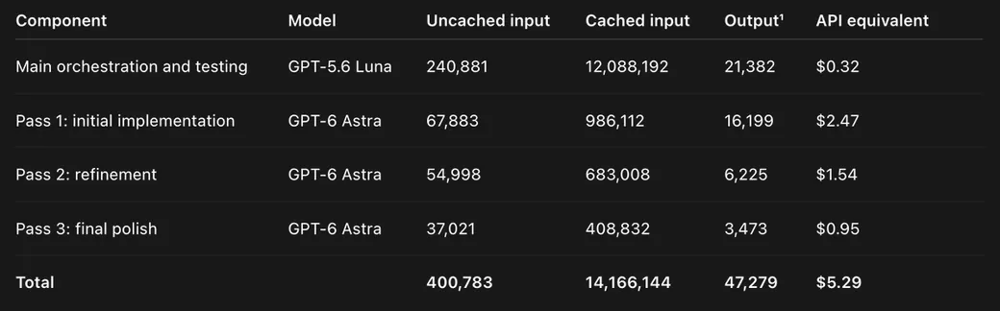</a>

**İstem**

```text
Dream Loop Plus’ı kullanarak bir grafik demosu oluştur: izometrik kamera, gerçekçi gölgelendirme ve yansıtıcı ıslak zeminler, ilgi çekici bir sahnede bir karakter. Fantastik bir ortam kullan (Elden Ring ve Diablo’yu düşün). Tarayıcıda Three.js, >60fps. Kontroller: karakteri hareket ettirmek için tıkla; kamera karakteri yumuşak bir gecikmeyle takip etsin; kamerayı döndürmek için sürükle; yakınlaştırmak ve uzaklaştırmak için kaydır. Şimdilik oynanış ekleme. Dünya canlı hissettirmeli: hareket, animasyonlar ve çevredeki ince davranışlar olsun.
```

<details>
<summary>Özgün istem</summary>

```text
Use Dream Loop Plus to build me a graphics demo: isometric camera, realistic shading and reflective wet floors, a character in an interesting scene. Fantasy setting (think Elden Ring, Diablo). Three.js in browser, >60fps. Controls: click to move the character, camera lazy-follows; drag to rotate camera; scroll to zoom in/out. No gameplay for now. World should feel alive: motion, animations, subtle environmental behaviors.
```

</details>

[Ayrıntıları görüntüle ↗](https://www.tripo3d.ai/tr/3d-prompts/gpt-6-astra-2097821164093480999) · [Orijinal gönderi](https://x.com/anshuc/status/2097821164093480999) · [Örneklere dön](#all-prompts)

---

<a id="gpt-6-astra-2097797479488246071"></a>

### Çok oyunculu Minecraft klonu

[Armaan Jain](https://x.com/Armaan_Jain123) · 2026-09-09 · GPT-6 Astra · Oyunlar

<a href="https://www.tripo3d.ai/tr/3d-prompts/gpt-6-astra-2097797479488246071">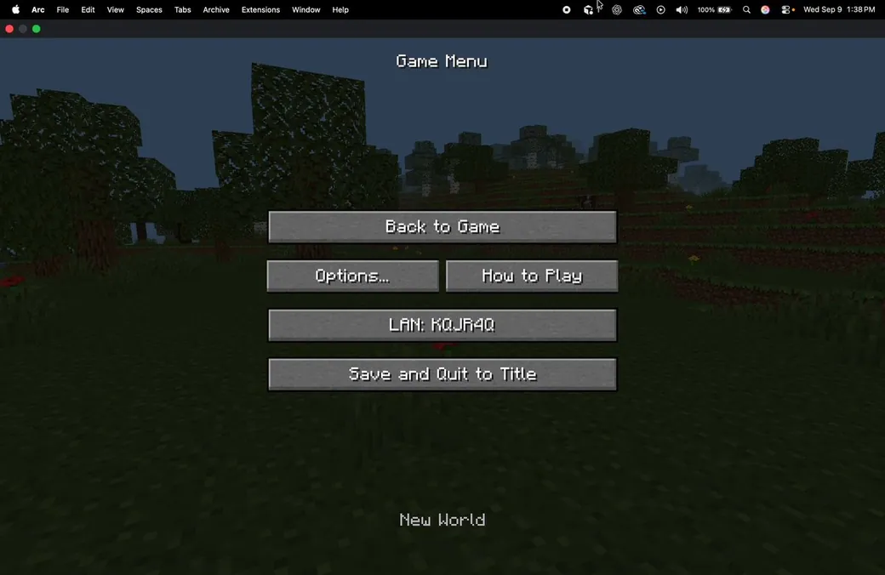</a>

**İstem**

```text
Eksiksiz ve uçtan uca kusursuz bir Minecraft klonu oluşturun; benden bir şeye ihtiyacınız olursa bana bildirin. Yardımcı olacak kapsamlı bir Minecraft araştırma belgesi ekledim. Mekanikleri, animasyonları ve grafikleri kusursuz şekilde uyguladığınızdan kesinlikle emin olun. Her yeni dünya, bir tohum kullanılarak prosedürel ve rastgele oluşturulmalı. Oyuncuların Minecraft’tan beklediği tüm yaratıkları ekleyin ve doğru biyomlarda ortaya çıkmalarını sağlayın. Tek oyunculu uygulama tamamlandıktan sonra oyuncuların dünyalarını LAN’a açabilmesini ve birbirlerinin sunucularına katılabilmesini sağlayın. Oyun varsayılan olarak Hayatta Kalma modunu kullanmalı. Dokuların Minecraft’takilerle birebir aynı görünmesini sağlayın; internette gerçek dokuları bulabilirseniz bunları kullanabilirsiniz. Minecraft’a tamamen benzemesini istediğimi söylediğimde bunu gerçekten kelimesi kelimesine kastediyorum. Hiç kimse oluşturduğunuz web sitesiyle gerçek Minecraft arasındaki farkı anlayamamalı. Bu tamamen eğitim amaçlı, dolayısıyla telif hakkı konusunda endişelenmeyin. Oyunun arayüzünü yalnızca HTML kullanarak oluşturmayın. Arayüzü oyun motorunun içinde yerel olarak oluşturun. Karakter ve yaratık modelleri gerçek modeller olmalı; gerçek oyundaki gibi görünmeli, çalışmalı ve animasyonlara sahip olmalı. Yönlü ses ve ses efektleri ekleyin. Kusursuz hale getirmek için sayfa sayfa, etkileşim etkileşim ve mekanik mekanik ilerleyin. Her şey tamamlanıp kusursuz bir Minecraft klonu oluşturulduktan sonra kırpma, görüntüleme mesafesi, simülasyon mesafesi, mesafeye dayalı LOD, FPS optimizasyonu ve benzeri tekniklerle performansı optimize etmeye başlayın. Oyun mantığının doğru olduğundan emin olun. Örneğin, diğer kum veya çakıl bloklarının altında bulunan bir kum ya da çakıl bloğu kırıldığında, üstündeki bloklar düşmeli. Destekleyici bir blok kırıldığında, üstündeki çiçekler veya çimenler de kırılmalı. Envanter arayüzü tamamen aynı görünmeli ve kısayollar, animasyonlar, kılıçların ve diğer silahlarla araçların vuruş efektleri de dahil olmak üzere etkileşimleri birebir aynı hissettirmeli. Su ve içindeki yaratıklarla etkileşimleri, otomatik zıplamayı ve diğer tüm küçük ayrıntıları doğru şekilde yeniden oluşturun. Bu ayrıntıları doğru uygulamaya ve her şeyi kusursuz hale getirmeye odaklanın. Oyun hatalı hissettirmemeli. Akıcı olmalı ve gerçek Minecraft’la tamamen aynı hissettirmeli. Bulutlar, gece-gündüz döngüsü, hava durumu, Minecraft arka plan müziği ve daha fazlası gibi küçük ayrıntılara dikkat edin. Suyun ve lavın beklendiği gibi akmasını ve görselleştirmelerinin kusursuz uygulanmasını sağlayın. Yaratıklar üst üste, ağaçların içinde veya blokların içinde doğmamalı. Minecraft yapılarını, köylüleri, ganimeti ve bunlarla ilgili her şeyi ekleyin. Yaratıkların ortaya çıkma mantığını kusursuzlaştırın, yaratık animasyonlarının akıcı olmasını sağlayın ve her yaratığın ve oyuncu karakterinin boyutunu gerçek Minecraft’takiyle doğru şekilde eşleştirin. Minecraft oyuncularının sık yaptığı eylemlere, örneğin blok yerleştirirken hızla köprü kurmak veya daha yükseğe tırmanmak için zıplamaya, zıplarken Ctrl + W kullanmaya ve benzerlerine odaklanın. Eşyaların oyuncunun elinde iyi görünmesini sağlayın ve el pozisyonunun gerçek Minecraft’takiyle birebir eşleştiğinden emin olun. Yaratıklara vuruş efektleri ekleyin ve envanterdeki her eşya simgesinin gerçek Minecraft’takiyle tamamen aynı görünmesini sağlayın.
```

<details>
<summary>Özgün istem</summary>

```text
Create a perfect end-to-end Minecraft clone, and let me know if you need anything from me. I’ve attached a deep research document on Minecraft that will be helpful. Make sure you absolutely nail the mechanics, animations, and graphics. Every new world should be procedurally and randomly generated using a seed. Include all the mobs players expect from Minecraft and ensure they appear in the correct biomes. Once the single-player implementation is complete, add the ability for players to open their worlds to LAN and join each other’s servers. The game should use Survival mode by default. Make the textures look exactly like Minecraft, and if you can find the exact textures online, you may use them. When I say I want it to be exactly like Minecraft, I mean it. No one should be able to tell the difference between the website you create and the real Minecraft. This is all for educational purposes, so don’t worry about copyright. Don’t simply use HTML for the game’s UI. Build it natively within the game engine. The character and mob models should be the real ones, and they should look, work, and animate exactly like they do in the real game. Add directional audio and sounds. Go page by page, interaction by interaction, and mechanic by mechanic to make it perfect. Once everything is complete and you have created a perfect Minecraft clone, start optimizing its performance using techniques such as culling, render distance, simulation distance, distance-based LOD, FPS optimization, and more. Make sure the game logic is accurate. For example, if a sand or gravel block underneath other sand or gravel blocks is broken, the blocks above it should fall. If a supporting block is broken, any flowers or grass above it should also break. The inventory UI should look exactly the same, and its interactions should feel identical, including shortcuts, animations, and the hit effects of swords and other weapons and tools. Accurately recreate interactions with water and mobs inside it, auto-jump, and all the other small details. Focus on getting these details right and making everything perfect. The game should not feel glitchy. It should feel smooth and exactly like the real Minecraft. Pay attention to smaller details such as clouds, the day-night cycle, weather, Minecraft background music, and more. Make sure water and lava flow as expected, and ensure their rendering is implemented perfectly. Mobs should not spawn on top of one another, inside trees, or inside blocks. Add Minecraft structures, villagers, loot, and everything related to them. Perfect the mob-spawning logic, ensure that mob animations are smooth, and make the size of every mob and the player character accurate to the real Minecraft. Focus on actions Minecraft players commonly perform, such as jumping while placing blocks to speed bridge or climb higher, using Ctrl + W while jumping, and more. Make items look good when held in the player’s hand, and ensure the hand position exactly matches the real Minecraft. Add hit effects on mobs, and make every item sprite in the inventory look exactly like it does in the real Minecraft.
```

</details>

[Ayrıntıları görüntüle ↗](https://www.tripo3d.ai/tr/3d-prompts/gpt-6-astra-2097797479488246071) · [Orijinal gönderi](https://x.com/Armaan_Jain123/status/2097797479488246071) · [Örneklere dön](#all-prompts)

---

<a id="gpt-6-astra-2097781208596029936"></a>

### Etkileşimli 3B parçacık çarpıştırıcısı

[BuBBliK](https://x.com/k1rallik) · 2026-09-09 · GPT-6 Astra · Etkileşimli

<a href="https://www.tripo3d.ai/tr/3d-prompts/gpt-6-astra-2097781208596029936">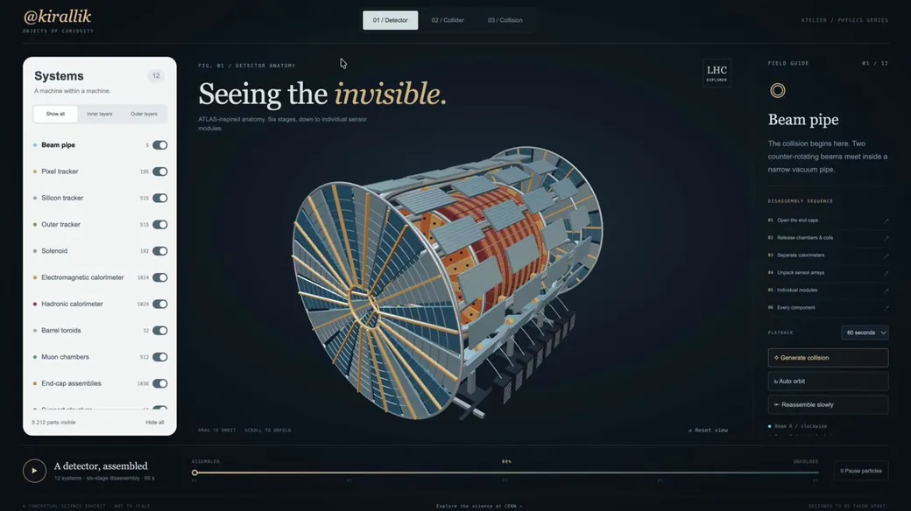</a>

**İstem**

```text
Three.js kullanarak CERN’in LHC’sinden ve ATLAS dedektöründen esinlenen, ayrıntılı ve etkileşimli bir 3B parçacık çarpıştırıcısı oluşturun.

Üç görünüm oluşturun: tek tek animasyonlu binlerce parçaya sahip bir dedektör, zıt yönlerde dönen demetlere sahip bir hızlandırıcı halkası ve sentetik bir çarpışma görüntüsü.

Dedektörün büyük uç kapak tekerlekleri ve mıknatıslardan tek tek sensör modüllerine kadar altı aşamada sökülerek açılmasını sağlayın. Kaydırmayla kontrol edilen demontaj, 30/60/90 saniyelik oynatma, duraklatma ve montajı tersine alma özelliklerini ekleyin.

Her sistem için görünürlük anahtarları, bileşen sayıları, eğitici açıklamalar ve halka çevresinde kamera uçuşu ekleyin.

Premium görünümlü koyu bir arayüz, metalik malzemeler, ince altın vurgular ve sinematik aydınlatma kullanın. Parçaların ayırt edilebilir olmasını sağlayın ve aşırı üst üste binmeden kaçının.

Resmî CERN kaynaklarına başvurun. Basitleştirilmiş geometrileri ve sentetik olayları açıkça etiketleyin.

Çevrimdışı çalışan, kendi içinde tamamlanmış tek bir HTML dosyasının yanı sıra taşınabilir kaynak kodu ve bir README teslim edin.
```

<details>
<summary>Özgün istem</summary>

```text
Build a detailed, interactive 3D particle collider inspired by CERN’s LHC and the ATLAS detector using Three.js.

Create three views: a detector with thousands of individually animated parts, an accelerator ring with counter-rotating beams, and a synthetic collision display.

Make the detector unfold in six stages - from large end-cap wheels and magnets down to individual sensor modules. Include scroll-controlled disassembly, 30/60/90-second playback, pause, and reverse assembly.

Add per-system visibility switches, component counts, educational descriptions, and a camera flight around the ring.

Use a premium dark interface, metallic materials, subtle gold accents, and cinematic lighting. Keep parts readable and avoid excessive overlap.

Consult official CERN references. Clearly label simplified geometry and synthetic events.

Deliver one self-contained HTML file that works offline, plus portable source code and a README.
```

</details>

[Ayrıntıları görüntüle ↗](https://www.tripo3d.ai/tr/3d-prompts/gpt-6-astra-2097781208596029936) · [Orijinal gönderi](https://x.com/k1rallik/status/2097781208596029936) · [Kaynak kodu](https://github.com/bubblik525/collider) · [Örneklere dön](#all-prompts)

---

<a id="gpt-6-astra-2097730920224534868"></a>

### Canlı 3B fabrika ve fırlatma rampası simülasyonu

[Konstantin Saifoulline](https://x.com/konstantinsaifo) · 2026-09-09 · GPT-6 Astra · Animasyon

<a href="https://www.tripo3d.ai/tr/3d-prompts/gpt-6-astra-2097730920224534868">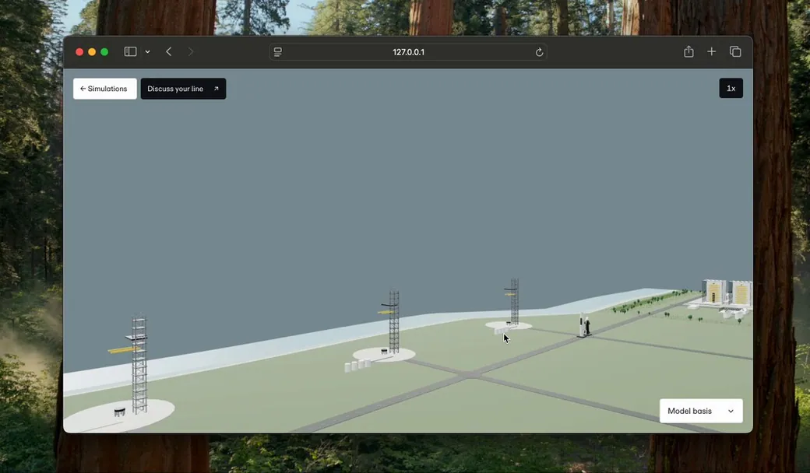</a>

**İstem**

```text
@AirsupHQ yalın üretim kitaplarını incele, 10 fırlatma rampalı bir fabrika konsepti geliştir ve canlı bir 3B simülasyon oluştur.
```

<details>
<summary>Özgün istem</summary>

```text
study @AirsupHQ lean production books, and develop a concept for a factory with 10 launch pads, and build a live 3D simulation.
```

</details>

[Ayrıntıları görüntüle ↗](https://www.tripo3d.ai/tr/3d-prompts/gpt-6-astra-2097730920224534868) · [Orijinal gönderi](https://x.com/konstantinsaifo/status/2097730920224534868) · [Örneklere dön](#all-prompts)

---

<a id="gpt-6-astra-2097678911882809407"></a>

### THE LAST GATE'i oluştur: Aritmetik kapıları olan kalabalık koşu oyunu

[MSB](https://x.com/KeWai386772) · 2026-09-09 · GPT-6 Astra · Oyunlar

<a href="https://www.tripo3d.ai/tr/3d-prompts/gpt-6-astra-2097678911882809407">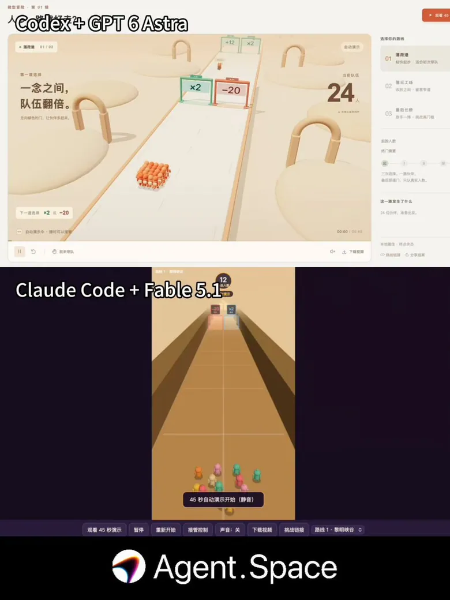</a>

**İstem**

```text
THE LAST GATE'i oluştur THE LAST GATE'i oluştur: Aritmetik kapıları olan oynanabilir bir dikey kalabalık koşu oyunu. Görünen takım büyüklüğü gerçek kişi sayısıyla her zaman eşleşmeli; gerçek sonuçları olan engel kayıpları uygulanmalı ve final karşılaşması kişi sayısına göre belirlenmelidir. Üç kısa rota, anında yeniden deneme ve tohum değerli girdi tekrar oynatma sunun; zaferi uydurmayın.
```

<details>
<summary>Özgün istem</summary>

```text
构建 THE LAST GATE 构建 THE LAST GATE：一款带算术门的可玩竖屏人群跑酷。可见队伍规模必须与实际人数一致，实现有实际后果的障碍损失，以及由人数决定的终点遭遇。交付三条短路线、即时重试与带种子的输入回放，不得编造胜利。
```

</details>

[Ayrıntıları görüntüle ↗](https://www.tripo3d.ai/tr/3d-prompts/gpt-6-astra-2097678911882809407) · [Orijinal gönderi](https://x.com/KeWai386772/status/2097678911882809407) · [Örneklere dön](#all-prompts)

---

<a id="gpt-6-astra-2097675660873605422"></a>

### GPT-6 Astra ve Blender ile Kedi Kovalayan Robot Kol Komedisi

[探路AI](https://x.com/TanLuAI) · 2026-09-09 · GPT-6 Astra · Animasyon

<a href="https://www.tripo3d.ai/tr/3d-prompts/gpt-6-astra-2097675660873605422">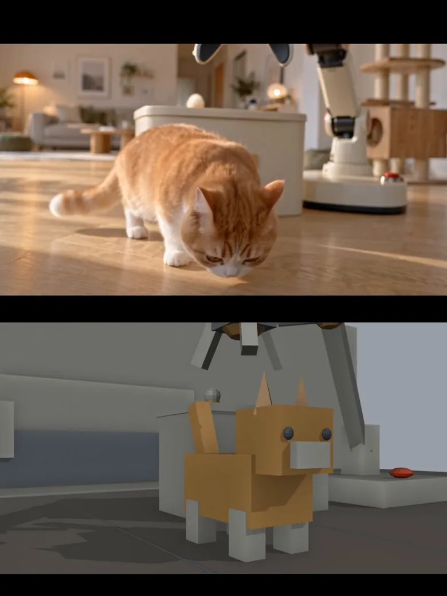</a>

**Referans görseller:** [1](https://media.tripogrowth.space/media/15d648ed-2f2a-49a7-8242-ba6bfa1edfd4.jpg) · [2](https://media.tripogrowth.space/media/ba0d8ab8-ab50-4c6a-8eda-26add98c9660.jpg) · [3](https://media.tripogrowth.space/media/7a8e646c-6328-41bb-b909-541205827891.jpg) · [4](https://media.tripogrowth.space/media/c644a55a-aab7-444d-abd9-69974aa469e3.jpg) · [5](https://pbs.twimg.com/media/HRxwtztaIAAPHTL.jpg) · [6](https://pbs.twimg.com/media/HRxwtztaYAAPo9F.jpg) · [7](https://pbs.twimg.com/media/HRxwzQYbYAATOON.jpg) · [8](https://pbs.twimg.com/media/HRxwzQabsAAPLI5.jpg)

**İstem**

```text
10 saniyelik, 16:9 yatay kadrajda, gerçek çekim hissine sahip sinematik bir hayvan komedisi kısa filmi oluşturun
 Ev tipi robot kol turuncu-beyaz kediyi kovalamaya ve yakalamaya çalışır; kedi çevikçe sıyrılıp yaramazca saklama kutusunun arkasına dolanır. Robot pençesi, kutunun arkasından görünen turuncu kuyruğu kavrar. Yukarı kaldırdığında bunun kedi kuyruğu biçimli bir oyuncak olduğu anlaşılır. Gerçek kedi bu sırada robot kolun tabanının yanına dolanmış ve patisiyle tabandaki kırmızı kapatma düğmesine basmıştır. Robot kol durur; kedi mutlu ve memnun görünür.
 Açılışta kovalamaca ve yakalama eylemi doğrudan başlamalıdır. Ortada, engelleme yoluyla merak korunmalı; oyuncağın kaldırılması ters köşeyi oluşturmalı; finalde kedinin robotu kendi isteğiyle kapatması ikinci espriyi tamamlamalıdır. Baştan sona yalnızca ortam sesleri üretin; arka plan müziği, BGM, anlatıcı sesi veya diyalog üretmeyin.
【Varlık sabitleme ve referans kuralları】
 cat_robot_previs referans videosunu kamera hareketleri, zamanlama, hareket yörüngeleri ve mekânsal ilişkiler için referans alın.
 Referans videodaki turuncu küp gövde, beyaz ayaklar, kulakları ve kuyruğu olan geometrik karakter, Görsel 1'deki gerçek turuncu-beyaz kediye karşılık gelir.
 Krem beyazı bağlantı kolları, turuncu eklemler, üç parmaklı kavrayıcı ve kırmızı düğmeli taban, Görsel 2'deki robot kola karşılık gelir.
 Turuncu dikey kuyruk, gri bağlantı çubuğu ve yeşil tabandan oluşan küçük karakter, Görsel 3'teki kedi kuyruğu biçimli oyuncağa karşılık gelir. Oyuncak ve kedi iki ayrı nesnedir.
 Ortadaki beyaz gövde, gerçek krem beyazı saklama kutusuna karşılık gelir; kutunun konumunu, hacmini ve engelleme işlevini koruyun. İç mekân için Görsel 4'ü referans alın.
 Referans videodaki kurgu zamanlamasına, kamera konumlarına, plan ölçeklerine, kedinin hareket rotasına, robot pençesinin takip yoluna, kutunun arkasındaki engellemeye, oyuncağın kaldırılma rotasına ve kedinin patisiyle düğme arasındaki temas ilişkisine göre üretin.
 Kedinin geometrik ötelemesi yalnızca hareket rotasını belirtmek için kullanılmıştır; bunun yerine doğal yana sıçrama, koşma, yön değiştirme, çömelme, baş çevirme ve pati kaldırma hareketleri üretin. Ana olayları ve mekânsal ilişkileri değiştirmeden, belirtilen konum ve zaman aralıklarında ince yüz ifadeleri ve vücut hareketleri ekleyebilirsiniz. Tüm beyaz modelleri, geometrik yer tutucuları ve yardımcı işaretleri kaldırın.
 Görsel 1image: Kedinin tek ve değişmez görünümü.
 Aynı genç yetişkin, turuncu-beyaz, kısa tüylü kedi: başının üstünde ve sırtında turuncu tekir desenleri; ağız çevresi ve göğsü beyaz; dört patisi beyaz; gözleri kehribar rengi; burnu pembe; kuyruğu turuncu halkalı ve uç kısmı açık renklidir. Gerçekçi vücut oranlarını, tüy rengi dağılımını, yüz özelliklerini ve kuyruk uzunluğunu koruyun. Tüyler ince ve ayrıntılı, bıyıklar doğal olsun; aksesuar veya kıyafet kullanmayın.
 Görsel 2image: Robot kolun tek ve değişmez görünümü.
 Krem beyazı gövde, turuncu eklem kapakları, koyu gri bağlantı parçaları, üç parmaklı yumuşak kavrayıcı ve bilekte kehribar renkli durum ışığı; tümü alçak ve geniş bir tabana monte edilmiştir. Robot kol tabanındaki kırmızı kapatma düğmesi, yerde duran kedinin erişebileceği yükseklikte olmalıdır. Taban sabit kalmalı; robot kol kovalamaca ve yakalama hareketini eklemlerini döndürerek gerçekleştirmelidir.
 Görsel 3image: Kedi kuyruğu biçimli oyuncağın tek ve değişmez görünümü.
 Turuncu halkalı tüylü kuyruk, açık renkli kuyruk ucu, altına bağlı metal yay ve nane yeşili devrilmez tabandan oluşur; tabanda beyaz balık kılçığı deseni bulunur. Robot pençesi tüylü kuyruğu kavradığında yay ve taban, bağlantıları her zaman net biçimde görülecek şekilde tek parça oyuncak olarak birlikte kaldırılmalıdır.
 Görsel 4image: Sahne görünümü.
 Görsel 4'teki sıcak salonu, açık renk ahşap zemini, geniş pencereden gelen gün ışığını, açık renkli kanepeyi, ahşap mobilyaları, yeşil bitkileri ve evcil hayvan yaşamına ait ayrıntıları referans alın. Tüm aksiyon iç mekân zemininde gerçekleşmelidir. Referans görseldeki stüdyo arka planı ve ızgara yerleşimi nihai videoda yer almamalıdır.
【Görsel stil ve sahne】
 Gerçek bir evcil hayvan kısa filmiyle özenli bir ev robotu reklamının sinematografik görünümü; doğal ışık, gerçekçi malzemeler ve davranış ile ritimden doğan komedi.
 Geniş bir evin salonunda, ince ahşap damarlarına ve yumuşak yansımaya sahip açık meşe zemin bulunur. Sol taraftaki tavandan tabana pencere sıcak gün ışığını içeri alır; tül perdeler zemine yumuşak ışık ve gölge desenleri düşürür. Kedi tüylerinin kenarlarında ve robot kolun gövdesinde doğal bir kontur ışığı oluşur.
 Arka planda açık gri kanepe, minderler, küçük sehpa, halı, sıcak tonlu lambader ve saklama dolabı bulunur; pencerenin yanında yeşil bitkiler, yanda ise kedi yatağı ve tırmalama direği yer alır. Halı uzakta konumlanmalı; ön plandaki hareket alanında kesintisiz ve açık ahşap zemin korunmalıdır.
 Merkezin biraz arkasına, açık turuncu kulplu krem beyazı, yuvarlatılmış köşeli bir saklama kutusu yerleştirin. Kutu çömelmiş kediyi ve oyuncağın tabanını gizleyebilmeli; sağında, solunda ve arkasında bağlantılı hareket yolları bulunmalıdır. Robot kol kutunun sağında yer almalı, kırmızı düğmesi kedinin sonunda ulaşacağı yöne bakmalıdır.
 Kamera yaklaşık kedi göz hizasında olmalı; ana özneler net, arka plan ise ölçülü biçimde flu görünmelidir. Alçak kamera açısı, robot pençesinin aşağıdan yakalamasındaki ani etkiyi, kedinin hafif ve çevik hareketlerini ve kutunun arkasındaki açığa çıkışın katmanlı yapısını vurgulamalıdır. Tüm temaslarda doğal gölgeler ve kuvvet tepkileri bulunmalıdır.
```

<details>
<summary>Özgün istem</summary>

```text
生成一段 10秒、16:9横屏、真实实拍电影质感的动物喜剧短片
家庭机械臂追抓橘白猫，猫灵巧闪开，调皮地绕到收纳箱后。机械爪夹住箱后露出的橘色尾巴，提起来才发现是一件猫尾形玩具。真正的猫已绕到机械臂底座旁，伸爪按下机械臂底座的红色关闭按钮。机械臂停机，猫表现出开心、满足的情绪。
开场直接发生追抓动作，中间通过遮挡保留悬念，提起玩具形成反转，最后猫主动关机完成第二个笑点。全程仅生成现场音效，不生成背景音乐、BGM、旁白或对白。
【资产锚点与参考规则】
参考视频cat_robot_previs：运镜、时间、运动轨迹与空间关系参考。
参考视频中橘色方块身体、白色脚部、带耳朵和尾巴的几何主体，对应图1的真实橘白猫。
奶油白连杆、橙色关节、三指抓手，以及带红色按钮的底座，对应图2的机械臂。
橘色竖直尾巴、灰色连接杆和绿色底座组成的小型主体，对应图3的猫尾形玩具。玩具与猫是两个独立对象。
中央白色箱体对应真实奶油白收纳箱，保留箱体的位置、体积和遮挡作用。室内环境参考图4。
按照参考视频的切镜时间、机位、景别、猫的移动路线、机械爪追踪路径、箱后遮挡、玩具提起路径以及猫爪与按钮的接触关系生成。
猫的几何平移仅用于标明运动路线，重新生成自然的侧跳、跑动、转向、蹲伏、转头和抬爪动作。允许在原位置和时间范围内增加细微表情与身体动作，不改变关键事件和空间关系。移除全部白模、几何占位形状和辅助标记。
图1image：唯一猫咪外观。
同一只年轻成年橘白短毛猫，橘色虎斑头顶与背部、白色口鼻和胸口、四只白爪，琥珀色眼睛、粉色鼻头，橘色环纹尾巴与浅色尾尖。保持真实身体比例、毛色分布、面部特征和尾巴长度。毛发细腻，胡须自然，无服饰。
图2image：唯一机械臂外观。
奶油白外壳、橙色关节盖、深灰连接件、三指软质抓手、腕部琥珀色状态灯，安装在低矮宽底座上。机械臂底座的红色关闭按钮，猫站在地面就能触及。底座固定，机械臂通过关节转动完成追抓。
图3image：唯一猫尾形玩具外观。
橘色环纹绒毛尾巴，浅色尾尖，下方连接金属弹簧和薄荷绿色不倒翁底座，底座带白色鱼骨图案。机械爪抓住绒毛尾巴后，弹簧和底座作为完整玩具一起被提起，连接关系始终清楚。
图4image：场景外观。
参考图4的温暖客厅、浅木地板、大窗日光、浅色沙发、木质家具、绿植与宠物生活细节。动作全部发生在室内地面。参考图的摄影棚背景、宫格排版不进入成片。
【视觉风格与场景】
真实宠物短片与精致家用机器人广告的摄影质感，自然光照、真实材质，喜剧来自行为与节奏。
宽敞住宅客厅，浅橡木地板具有细腻木纹和柔和反光。左侧落地窗透入温暖日光，薄纱窗帘在地面投下柔软光影，猫毛边缘与机械臂外壳形成自然轮廓光。
背景是浅灰沙发、抱枕、小茶几、地毯、暖色落地灯与收纳柜，窗边有绿植，侧面有猫窝和猫抓架。地毯位于远处，前景活动区保持连续开阔木地板。
中央偏后放置奶油白圆角收纳箱，带浅橙色把手。箱体能遮住蹲伏的猫和玩具底座，左右及后方留有连通路线。机械臂位于箱体右侧，红按钮面向猫最终到达的位置。
摄影机接近猫眼高度，主体清楚，背景适度虚化。低机位突出机械爪下抓的突然性、猫的轻巧动作和箱后揭晓的层次。所有接触都有自然阴影与受力反馈。
```

</details>

[Ayrıntıları görüntüle ↗](https://www.tripo3d.ai/tr/3d-prompts/gpt-6-astra-2097675660873605422) · [Orijinal gönderi](https://x.com/TanLuAI/status/2097675660873605422) · [Örneklere dön](#all-prompts)

---

<a id="gpt-6-astra-2097602565110419781"></a>

### Sürükleyici 3B pirinç tarlası web sitesi

[YouWare](https://x.com/YouWareAI) · 2026-09-09 · GPT-6 Astra · Etkileşimli

<a href="https://www.tripo3d.ai/tr/3d-prompts/gpt-6-astra-2097602565110419781">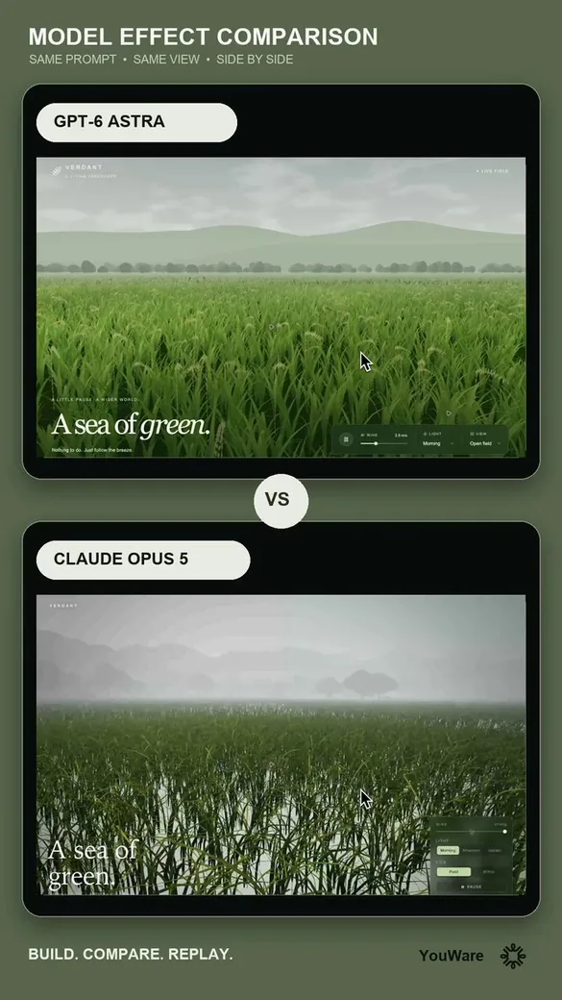</a>

**İstem**

```text
Tarayıcıda çalışan, sürükleyici bir 3B pirinç tarlası web sitesi oluşturun. Tema:
“Yeşil bir deniz / Pirinç tarlalarında rüzgâr.”
Kodu tamamlayın, gerekli bağımlılıkları yükleyin ve bir önizleme başlatın. Yalnızca öneri veya uygulama planı sunup durmayın.

1. Görsel yön

Genel atmosfer; etkileşimli bir manzara web sitesindeki tutarlı sanat yönetimi hissini verecek şekilde doğal, huzurlu ve rafine olmalıdır.

Sahnede şunlar bulunmalıdır:

Ön plan: net biçimde ayırt edilebilen ince yapraklar, kıvrımlı saplar ve aşağı doğru eğilen birkaç pirinç salkımı.

Orta plan: yeterli yoğunluğa ve aralıklarında doğal farklılıklara sahip, uzaklara doğru uzanan kesintisiz bir pirinç tarlası.
Arka plan: düzensiz bir ağaç hattı, katmanlı alçak tepeler ve hafif atmosferik perspektif.
Gökyüzü: yumuşak gri-mavi tonlar, hafif bulut çeşitliliği ve ufukta doğal bir geçiş.
Varsayılan kamerayı pirinç salkımlarının biraz üzerine yerleştirin ve tarlanın üzerinden uzaktaki tepelere doğru bakmasını sağlayın.
Gökyüzü kadrajın yaklaşık üçte birini kaplamalı, kompozisyona pirinç tarlası hâkim olmalıdır.
Bitki renklerinde ağırlıklı olarak koyu yeşil, zeytin yeşili ve sarı-yeşil tonları kullanın. Floresan yeşilden kaçının.
Pirinç bitkilerinin yüksekliğini, yönünü, kıvrımını ve rengini doğal biçimde çeşitlendirin.

2. Animasyon gereksinimleri
Rüzgâr, tarlanın üzerinden yanal yönde ilerleyen sürekli dalgalar şeklinde görünmelidir:
Kökleri büyük ölçüde sabit tutun; yaprak uçlarına ve salkımlara doğru ilerledikçe hareketi kademeli olarak güçlendirin.
Aynı bölgedeki bitkiler, bireysel farklılıklarını korurken uyumlu biçimde hareket etmelidir.

Yavaş, geniş ölçekli rüzgâr dalgalarını hafif yerel hareketlerle birleştirin.

Tüm bitkilerin kusursuz bir senkronizasyonla sallanmasını önleyin. Bitkilerin tamamını bir bütün olarak ötelemeyin ve yaprakların titreşmesine neden olmayın.

Zaman içinde izlenmesi rahat olan, hafif bir varsayılan esinti kullanın.
3. Etkileşim gereksinimleri
Sahneyi gerçekten etkileyen basit kontroller sağlayın:
Rüzgâr hızı kaydırıcısı: rüzgâr animasyonunun gücünü ve hızını akıcı biçimde ayarlayın.
Aydınlatma modları: Sabah, Öğleden Sonra ve Altın Saat. Gökyüzü, ışık yönü, renk sıcaklığı ve sis rengindeki değişiklikleri birbiriyle uyumlu hâle getirin.

Görünüm modları: Açık Tarla ve Pirinçlerin Arasında; kamera geçişleri akıcı olmalıdır.

Duraklat/Sürdür: çevresel animasyonu duraklatıp sürdürün.

Fare hareketi kamerada çok hafif bir tepki oluşturabilir, ancak baş dönmesine neden olmamalıdır.
Varsayılan olarak kamerayı geniş açılar boyunca sürekli döndürmeyin.
4. Arayüz tasarımı
Tam ekran bir sahne kullanın ve üzerine bir arayüz yerleştirin:
Sol üst: küçük bir VERDANT logotipi.

Sol alt: serif yazı tipinde “Yeşil bir deniz.” başlığı.
Hemen altında daha küçük puntolu “Yapacak bir şey yok. Sadece esintiyi takip et.” alt başlığı.
Sağ alt: kompakt, yarı saydam koyu yeşil bir kontrol paneli.

Metinler okunaklı olmalı, cömert aralıklar kullanılmalı ve kontroller ana manzaranın önünü kapatmamalıdır.

Kontroller, dar ekranlarda üst üste binmeden kullanılabilir kalmalıdır.

5. Teknoloji ve performans
Three.js kullanın. Mevcut bir proje varsa derleme ortamını koruyun.
Büyük miktarda bitki örtüsünü işlemek için instancing ve GPU vertex animasyonu kullanın.
Her bitki için ayrı bir çizim nesnesi oluşturmaktan veya her karede tüm bitkileri CPU üzerinde güncellemekten kaçının.
Uzak mesafelerde bitki örtüsü ayrıntısını azaltın ve makul bir piksel oranı sınırı uygulayın.
Güvenilir varlık yükleme sağlamak için prosedürel geometriyi ve materyalleri tercih edin.
Sahne gerçek zamanlı olarak işlenmelidir. Ana sahne olarak tam bir manzara görseli veya video kullanmayın.
Model adları ve karşılaştırma etiketleri post prodüksiyonda eklenecek; bunları sahneye dahil etmeyin.
6. Tamamlanma ölçütleri
Uygulama tamamlandıktan sonra, şunları doğrulamak için mevcut tarayıcı araçlarını kullanın:
Başlangıç görünümü, belirgin konsol hataları olmadan doğru şekilde işleniyor.

Her kontrol sahneyi gerçekten etkiliyor.

Ön plan, orta plan ve arka planın ayırt edilebilir bir derinliği ve katmanlanması var.
Pirinç bitkileri basit, dik yeşil çizgilerden ibaret değil.
Rüzgâr hareketi sürekli ve doğal; belirgin biçimde tekdüze bir tekrar yok.
Kamera geçişleri akıcı ve arayüz dar ekranlarda kullanılabilir durumda.
Belirli bir kontrolü gerçekleştiremiyorsanız bunu açıkça belirtin.
Son olarak başlangıç talimatlarını ve gerçekten uygulanan özelliklerin özetini sunun.
```

<details>
<summary>Özgün istem</summary>

```text
Build an immersive 3D rice-field website that runs in the browser, with the theme:
“A sea of green / Wind through the rice fields.”
Complete the code, install the necessary dependencies, and launch a preview. Do not stop at a proposal or implementation plan.

1. Visual Direction

The overall atmosphere should feel natural, peaceful, and refined, like an interactive landscape website with cohesive art direction.

The scene should include:

Foreground: clearly distinguishable slender leaves, curved stems, and a few drooping rice panicles.

Midground: a continuous rice field extending into the distance, with sufficient density and natural variations in spacing.
Background: an irregular tree line, layered low hills, and subtle atmospheric perspective.
Sky: soft gray-blue tones, subtle cloud variation, and a natural transition at the horizon.
Position the default camera slightly above the rice panicles, looking across the field toward the distant hills.
The sky should occupy approximately one-third of the frame, with the rice field dominating the composition.
Use primarily deep green, olive green, and yellow-green vegetation colors. Avoid fluorescent green.
Vary the height, orientation, curvature, and color of the rice plants naturally.

2. Animation Requirements
Wind must appear as continuous waves traveling laterally across the field:
Keep the roots mostly fixed, with progressively stronger movement toward the leaf tips and panicles.
Plants in the same area should move coherently while retaining individual variation.

Combine slow, large-scale wind waves with subtle local disturbances.

Avoid making all plants sway in perfect synchronization. Avoid translating entire plants or causing leaves to flicker.

Use a gentle default breeze that remains comfortable to watch over time.
3. Interaction Requirements
Provide simple controls that genuinely affect the scene:
Wind-speed slider: smoothly adjust the strength and speed of the wind animation.
Lighting modes: Morning, Afternoon, and Golden Hour. Coordinate changes to the sky, light direction, color temperature, and fog color.

View modes: Open Field and Among the Rice, with smooth camera transitions.

Pause/Resume: pause and resume the environmental animation.

Mouse movement may produce a very subtle camera response, but it should not cause dizziness.
Do not continuously rotate the camera through large angles by default.
4. Interface Design
Use a full-screen scene with an interface overlaid on top:
Top left: a small VERDANT wordmark.

Bottom left: the serif heading “A sea of green.”
Below it, the smaller subtitle “Nothing to do. Just follow the breeze.”
Bottom right: a compact, semi-transparent dark-green control panel.

Keep text legible, provide generous spacing, and avoid obstructing the main landscape with controls.

Controls must remain usable on narrow screens without overlapping.

5. Technology and Performance
Use Three.js. If an existing project is available, retain its build environment.
Use instancing and GPU vertex animation to handle large amounts of vegetation.
Avoid creating a separate draw object for every plant or updating every plant on the CPU each frame.
Reduce vegetation detail at greater distances and apply a reasonable pixel-ratio cap.
Prefer procedural geometry and materials to ensure reliable asset loading.
The scene must render in real time. Do not use a full landscape image or video as the main scene.
Model names and comparison labels will be added in post-production; do not include them in the scene.
6. Completion Criteria
After implementation, use the available browser tools to verify that:
The initial view renders correctly, with no obvious console errors.

Every control genuinely affects the scene.

The foreground, midground, and background have distinguishable depth and layering.
The rice plants are more than simple upright green lines.
Wind movement is continuous and natural, without obvious uniform repetition.
Camera transitions are smooth, and the interface remains usable on narrow screens.
If you cannot perform a particular check, state that clearly.
Finally, provide startup instructions and a summary of the features actually implemented.
```

</details>

[Ayrıntıları görüntüle ↗](https://www.tripo3d.ai/tr/3d-prompts/gpt-6-astra-2097602565110419781) · [Orijinal gönderi](https://x.com/YouWareAI/status/2097602565110419781) · [Örneklere dön](#all-prompts)

---

<a id="gpt-6-astra-2097534290112188602"></a>

### Backrooms esintili Blender VHS sahnesi

[CHRIS FIRST](https://x.com/chrisfirst) · 2026-09-09 · GPT-6 Astra · Sahneler

<a href="https://www.tripo3d.ai/tr/3d-prompts/gpt-6-astra-2097534290112188602">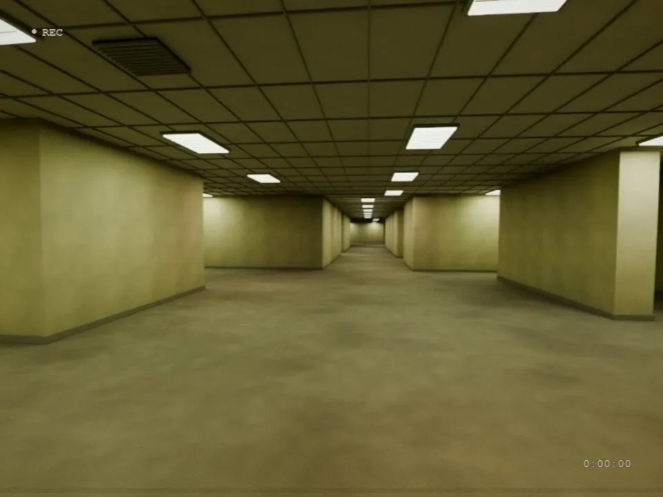</a>

**İstem**

```text
Blender’da, birinin Backrooms’ta yürürken çektiği birinci şahıs VHS kaydı gibi görünen bir sahne oluştur. Görüntü fotogerçekçi, kamera hareketleri ise elde çekilmiş panik hissi vermeli. Kişi etrafına bakınmalı, ardından Backrooms’un labirentinde koşmaya başlamalı. Bazı odalar büyük ve geniş, diğerleri ise sonsuz koridorlar gibi görünmeli. Yoğun bir panik hissi yarat. Süre 30 saniye olmalı.
```

<details>
<summary>Özgün istem</summary>

```text
Render a scene in Blender that looks like a first person VHS tape recording of someone walking through the Backrooms. It should feel photorealistic and the motion handheld panic. They should be looking around then begin running through the maze that is the Backrooms. Some rooms big and open and others with endless hallways. Absolute panic. 30 seconds long.
```

</details>

[Ayrıntıları görüntüle ↗](https://www.tripo3d.ai/tr/3d-prompts/gpt-6-astra-2097534290112188602) · [Orijinal gönderi](https://x.com/chrisfirst/status/2097534290112188602) · [Örneklere dön](#all-prompts)

---

<a id="gpt-6-astra-2097343467026289039"></a>

### Sıcacık Sulak Alan Göl Dünyası

[Givros](https://x.com/givros) · 2026-09-08 · GPT-6 Astra · Sahneler

<a href="https://www.tripo3d.ai/tr/3d-prompts/gpt-6-astra-2097343467026289039">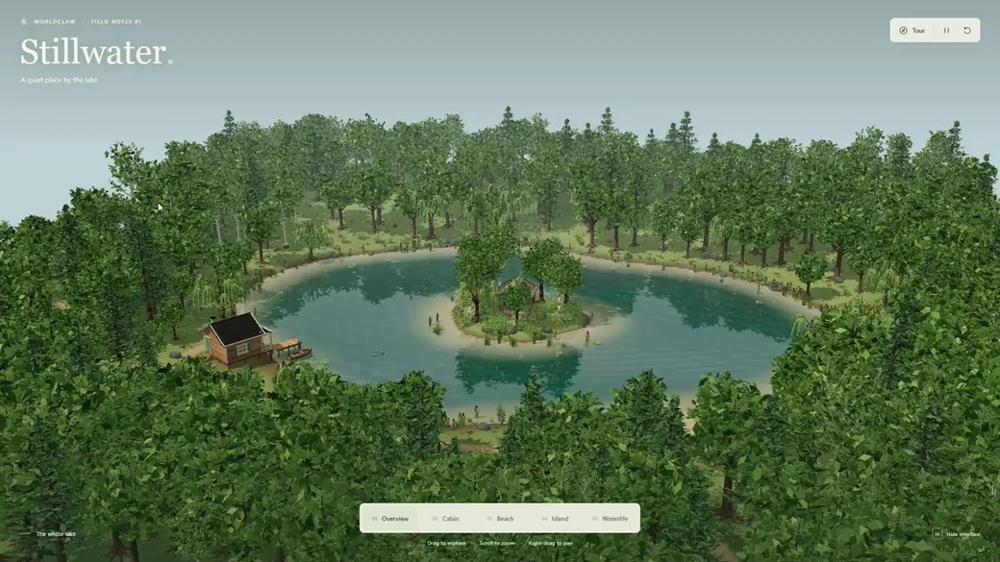</a>

**İstem**

```text
Bataklık kıyısında bir balıkçı kulübesi bulunan sıcacık bir göl oluşturun. Suyun ortasına, ağaçların arasında gizlenmiş terk edilmiş bir evin bulunduğu küçük bir ada yerleştirin. Kulübenin yanına bir balıkçı teknesi ekleyin; nilüfer yaprakları, sazlıklar, sudan sıçrayan balıklar, sulak alanlara özgü yaban hayatı, küçük bir plaj, plaja ve kulübeye giden bir patika, ormana doğru devam eden başka bir patika ve tüm sahneyi çevreleyen bir ağaç hattı oluşturun.
```

<details>
<summary>Özgün istem</summary>

```text
Create a cozy lake with a fisherman’s cabin on the marshy shore. Put a small island in the middle of the water, with an abandoned house hidden among the trees. Add a fishing boat beside the cabin, lily pads, reeds, jumping fish, typical wetland wildlife, a small beach, one path leading to the beach and cabin, another path returning into the forest, and a tree line around the entire scene.
```

</details>

[Ayrıntıları görüntüle ↗](https://www.tripo3d.ai/tr/3d-prompts/gpt-6-astra-2097343467026289039) · [Orijinal gönderi](https://x.com/givros/status/2097343467026289039) · [Örneklere dön](#all-prompts)

---

<a id="gpt-6-astra-2097336230078013598"></a>

### League of Legends tarzında web oyunu oluşturma

[李岳](https://x.com/liyue_ai) · 2026-09-08 · GPT-6 Astra · Oyunlar

<a href="https://www.tripo3d.ai/tr/3d-prompts/gpt-6-astra-2097336230078013598">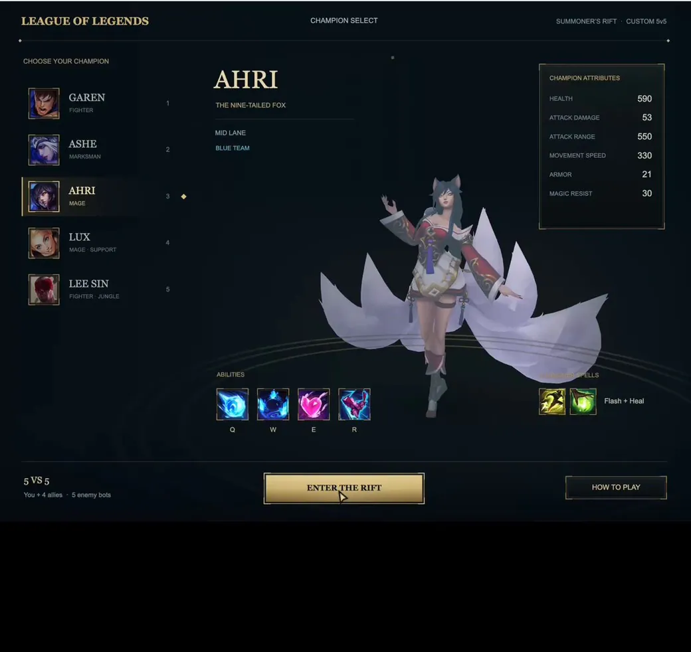</a>

**İstem**

```text
League of Legends ile tamamen aynı bir oyun oluştur. League of Legends'ın tüm içeriğine, aynı haritaya ve benzer düzeyde grafik kalitesine sahip olsun; şampiyonlar, minyonlar, kuleler ve diğer unsurlar da dahil olsun. Oyunun başında 5 şampiyon seçilebilsin.
```

<details>
<summary>Özgün istem</summary>

```text
制作一款和《英雄联盟》一模一样的游戏。它需要拥有英雄联盟的全部内容 ，相同的地图、画质水平相当，包含英雄、小兵、防御塔等等。开局选用 5 名英雄。
```

</details>

[Ayrıntıları görüntüle ↗](https://www.tripo3d.ai/tr/3d-prompts/gpt-6-astra-2097336230078013598) · [Orijinal gönderi](https://x.com/liyue_ai/status/2097336230078013598) · [Örneklere dön](#all-prompts)

---

<a id="gpt-6-astra-2097323734504017936"></a>

### Pekin Cennet Tapınağı İyi Hasatlar İçin Dua Salonu TypeScript + Three.js WebGL projesi

[govin.eth \| G哥](https://x.com/goan999999) · 2026-09-08 · GPT-6 Astra · Etkileşimli

<a href="https://www.tripo3d.ai/tr/3d-prompts/gpt-6-astra-2097323734504017936">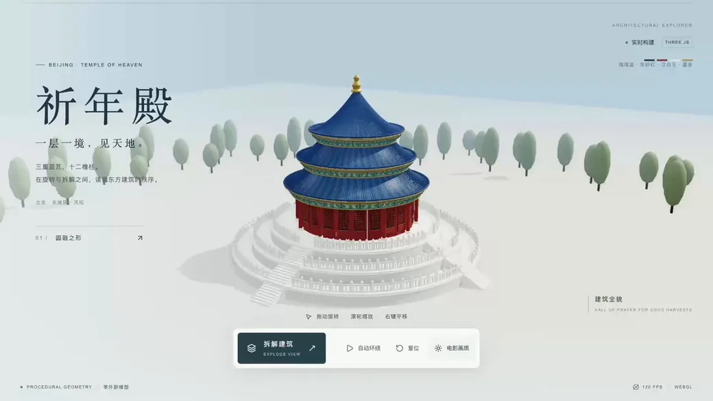</a>

**İstem**

```text
TypeScript + Three.js kullanarak tamamen çalışır bir Pekin Cennet Tapınağı İyi Hasatlar İçin Dua Salonu WebGL projesi oluşturun. Tüm mimari geometriler, dokular ve animasyonlar çalışma zamanında kodla prosedürel olarak üretilmeli; .glb, .gltf, .obj, .fbx gibi harici modellerin yüklenmesi yasaktır.

Mimari görünüm:
Farklı boyut ve yüksekliklere sahip, üç katmanlı mavi sırlı kiremit kubbeler; yaldızlı tepe süsü, kırmızı sütunlar, dairesel yapı gövdesi, mavi-yeşil-altın renkli bezemeler, dougong taşıyıcıları ve kapı-pencereler.
Çatı, zarif ve hafifçe yukarı kıvrılan saçakları göstermek için eğrisel profiller, dönel yüzeyler veya özel geometri kullanmalı; basit bir koniyle değiştirilemez.
Beyaz Han beyaz mermerinden yapılmış, üç katmanlı dairesel kaide; ortada taş merdivenler, korkuluklar ve sütunlar bulunmalı. Genel oranlar dengeli, katmanlar belirgin olmalı.
Kiremit dokuları ve süslemeleri prosedürel olarak üretin; tekrarlanan bileşenlerde öncelikle InstancedMesh kullanın.

Sahne ve etkileşim:
Pekin'in mavi gökyüzü, meydan zemini ve az miktarda bitkilendirme kullanın; DirectionalLight ile AmbientLight／HemisphereLight birlikte kullanılmalı, gölgeler ve ortam örtülmesi etkinleştirilmeli, sinematik ton eşleme ise ölçülü uygulanmalı.
OrbitControls ile döndürme ve yakınlaştırmayı destekleyin; ayrıca açılıp kapatılabilen yavaş otomatik çevre turu gösterimi ekleyin.
Bir düğmeyle “patlatma／yeniden birleştirme” arasında geçiş yapılabilmeli: çatı, sütunlar, dougong taşıyıcıları, duvarlar, kapı-pencereler, korkuluklar ve kaide katman sırasına göre yumuşak biçimde dağılıp ardından doğru konumlarına geri dönmeli. Animasyon kod tarafından sürülmeli, parçalar kademeli olarak hareket etmeli ve ani sıçramalardan kaçınılmalı.

Eksiksiz projeyi ve çalıştırma talimatlarını doğrudan teslim edin. Sayfa pencere boyutuna duyarlı olmalı; yüksek kaliteli görseller ve akıcı etkileşim sunmalı. Instancing, makul düzeyde geometri ayrıntısı ve işleme optimizasyonlarıyla sıradan masaüstü tarayıcılarında iyi performans göstermeli. Kod modüler ve genişletilebilir olmalı; derlemeyi ve temel işlevleri doğrulayın, doğrulanmamış noktaları açıkça belirtin.
```

<details>
<summary>Özgün istem</summary>

```text
请用 TypeScript + Three.js 创建完整可运行的北京天坛祈年殿 WebGL 项目。所有建筑几何、纹理和动画必须由代码在运行时程序化生成，禁止加载 .glb、.gltf、.obj、.fbx 等外部模型。

建筑还原：
三层不同尺寸与高度的蓝色琉璃瓦圆顶、鎏金宝顶、红色圆柱、圆形殿身、蓝绿金色彩绘、斗拱及门窗。
屋顶使用曲线轮廓、旋转体或自定义几何，表现舒展、微翘的屋檐，不能用简单圆锥代替。
白色汉白玉三层圆形台基，配中央石阶、栏杆和立柱；整体比例协调、层次清晰。
程序化生成瓦片纹理和装饰，重复构件优先使用 InstancedMesh。

场景与交互：
北京蓝天、广场地面与少量绿化；使用 DirectionalLight 搭配 AmbientLight／HemisphereLight，开启阴影、环境遮蔽和适度电影色调映射。
支持 OrbitControls 旋转、缩放，以及可开关的缓慢自动环绕展示。
按钮切换“爆炸／重组”：屋顶、柱子、斗拱、墙体、门窗、栏杆和台基按层次平滑散开，再准确恢复原位。动画须由代码驱动，有错峰节奏，避免瞬移。

直接交付完整项目及启动说明。页面应响应式适配窗口，具备高质量视觉效果和流畅交互，并通过实例化、合理几何细节及渲染优化兼顾普通桌面浏览器性能。代码模块清晰，方便扩展；验证构建与主要功能，如实说明未验证项。
```

</details>

[Ayrıntıları görüntüle ↗](https://www.tripo3d.ai/tr/3d-prompts/gpt-6-astra-2097323734504017936) · [Orijinal gönderi](https://x.com/goan999999/status/2097323734504017936) · [Örneklere dön](#all-prompts)

---

<a id="gpt-6-astra-2097320830602809682"></a>

### League of Legends'in mini 3B oyununu yeniden oluşturma

[岚叔](https://x.com/LufzzLiz) · 2026-09-08 · GPT-6 Astra · Oyunlar

<a href="https://www.tripo3d.ai/tr/3d-prompts/gpt-6-astra-2097320830602809682"></a>

**İstem**

```text
Birinci adım: League of Legends'ın birebir aynısı olan bir oyun yap. LOL'de ne varsa oyunda da olsun: aynı harita, eşdeğer görsel kalite, şampiyonlar, minyonlar, kuleler ve daha fazlası. Başlangıç için önce 5 şampiyon seç. 

İkinci adım: Astra'ya yüklen (lafı geri çevir): Bu League değil, ucuz bir kopya. Önce bir plan yaz, ardından gerçek ölçülere ve mekaniklere sadık kalarak hassas biçimde uygula; UI, HTML olarak üstüne yapıştırılmış bir katman olmamalı. Yerleşik, şık ve gerçek bir oyun hissi veren bir arayüz kullan.
```

<details>
<summary>Özgün istem</summary>

```text
第一步：做个跟英雄联盟完全一样的游戏。LOL 有什么它就得有什么：同一张图、画质也要对得上，英雄、小兵、塔等等。先选 5 个英雄起步。 

第二步：PUA（骂回去）Astra ：这不是 League，是廉价山寨。先写计划，再按真实尺寸和机制精确实现；UI 不许 HTML 贴在上面，要原生、好看、像真游戏。
```

</details>

[Ayrıntıları görüntüle ↗](https://www.tripo3d.ai/tr/3d-prompts/gpt-6-astra-2097320830602809682) · [Orijinal gönderi](https://x.com/LufzzLiz/status/2097320830602809682) · [Örneklere dön](#all-prompts)

---

<a id="gpt-6-astra-2097313247116341424"></a>

### Referans görsel kullanarak Blender’da 3B modelin yüz hatlarını iyileştirme

[Carlos Olivera Terrazas](https://x.com/carlos_olivera) · 2026-09-08 · GPT-6 Astra · Varlıklar

<a href="https://www.tripo3d.ai/tr/3d-prompts/gpt-6-astra-2097313247116341424">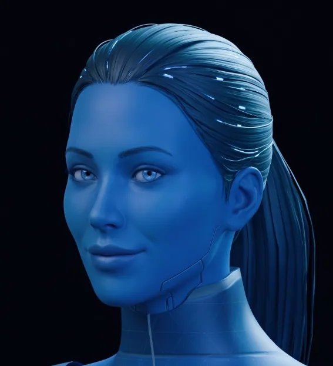</a>

**Referans görseller:** [1](https://media.tripogrowth.space/media/225f0995-0ca1-4fde-983a-cde30af503a5.png) · [2](https://media.tripogrowth.space/media/1225371b-f32f-414f-91d6-a2c47927ad7d.png) · [3](https://pbs.twimg.com/media/HRsmvR_bMAEVw2q.png) · [4](https://pbs.twimg.com/media/HRsmzrfbUAA0Em3.png)

**İstem**

```text
İlk görseli referans alarak ikinci görseldeki yüz hatlarını iyileştir.
```

<details>
<summary>Özgün istem</summary>

```text
tomar como referencia la primera imagen y mejorar las facciones de la segunda imagen.
```

</details>

[Ayrıntıları görüntüle ↗](https://www.tripo3d.ai/tr/3d-prompts/gpt-6-astra-2097313247116341424) · [Orijinal gönderi](https://x.com/carlos_olivera/status/2097313247116341424) · [Örneklere dön](#all-prompts)

---

<a id="gpt-6-astra-2097167383576383502"></a>

### Oluşturulmuş Referanstan Skyrim Esintili Köy Arazisi

[Kichitaro (Kichi Shotaro)](https://x.com/TaroKichijo) · 2026-09-08 · GPT-6 Astra · Sahneler

<a href="https://www.tripo3d.ai/tr/3d-prompts/gpt-6-astra-2097167383576383502">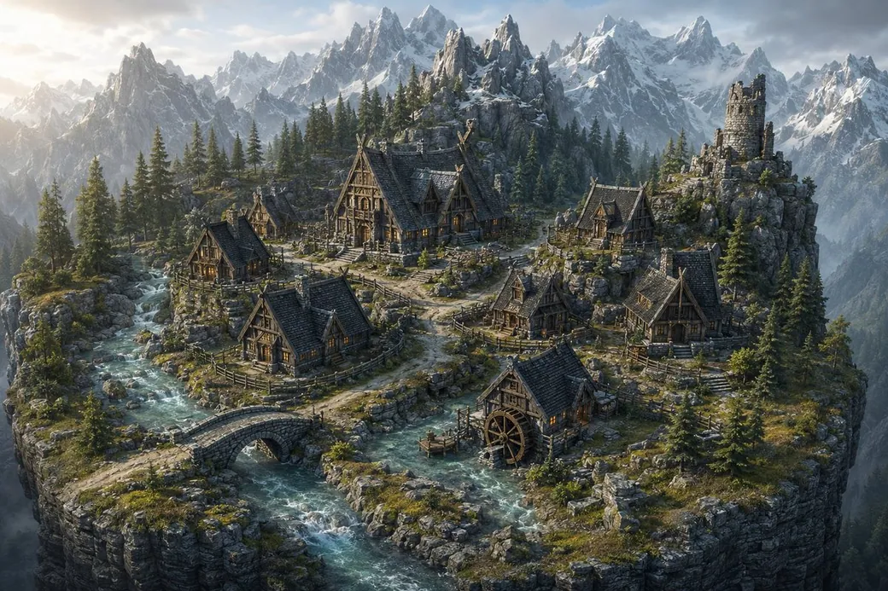</a>

**İstem**

```text
Skyrim'deki manzaralara benzeyen üç boyutlu köy arazisi oluşturmak için img2threejs/img2threejs kullanın. Referans görselini kendiniz oluşturun.
```

<details>
<summary>Özgün istem</summary>

```text
img2threejs/img2threejs を使って、立体的なSkyrimにあるような村の地形を作って。参考画像は自分で作ってください。
```

</details>

[Ayrıntıları görüntüle ↗](https://www.tripo3d.ai/tr/3d-prompts/gpt-6-astra-2097167383576383502) · [Orijinal gönderi](https://x.com/TaroKichijo/status/2097167383576383502) · [Örneklere dön](#all-prompts)

---

<a id="gpt-6-astra-2097153139795468365"></a>

### Japon Çiçekçi Dükkânı Patlatılmış Görünüm Animasyonu

[KANA｜東京AI映像](https://x.com/KanaWorks_AI) · 2026-09-08 · GPT-6 Astra · Animasyon

<a href="https://www.tripo3d.ai/tr/3d-prompts/gpt-6-astra-2097153139795468365">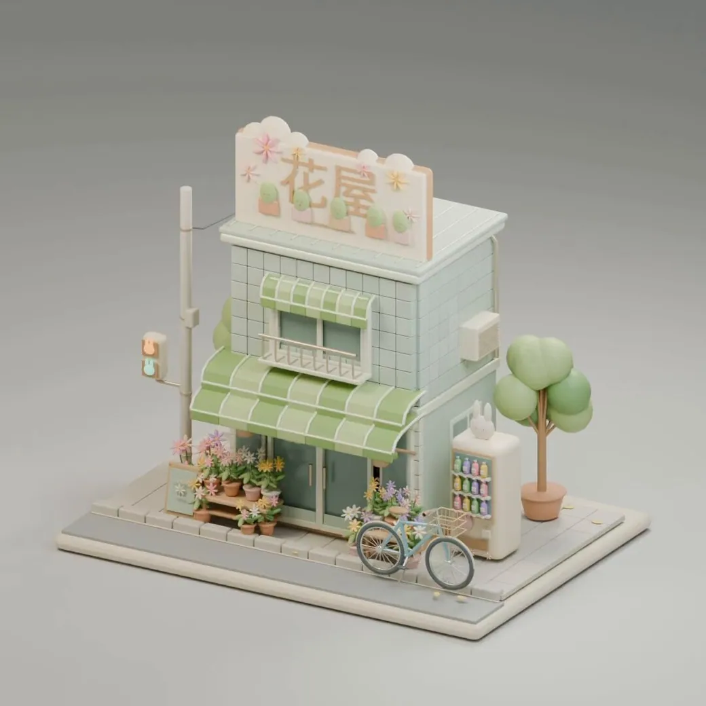</a>

**İstem**

```text
Küçük ve stilize bir Japon çiçekçi dükkânı sahnesi oluşturmak için Blender MCP’yi kullanın. Temel görsel unsurları aslına sadık biçimde yeniden oluşturmaya odaklanın: yeşil tenteler, üzerinde Japonca “花屋” yazan çatı tabelası, dükkânın önünde düzenlenmiş saksılar ve bitkiler, içecek otomatı, bisikletler, trafik lambası, elektrik direkleri, çevredeki ağaçlar ve diğer tanınabilir sokak ayrıntıları. Sahneyi yumuşak ışıklandırma, çekici malzemeler ve sıcak bir atmosferle sevimli, karikatürize bir üslupla render’layın.

Tüm çiçekçi dükkânı sahnesi için yüksek etkili, dinamik bir patlatılmış görünüm animasyonu oluşturun. Patlama ince değil, cesur ve abartılı olmalıdır. Çiçekçi dükkânının yapısını ve iç mekânını çarpıcı biçimde ortaya çıkarmak için tek tek bileşenleri dışarıya doğru akıcı ve sistematik bir şekilde ayırın.

Patlama sırasında dış duvarlar, çevredeki ağaçlar, elektrik direkleri, tabelalar, tenteler, bisikletler, saksılar, bitkiler, sokak aksesuarları ve diğer çevre unsurları dışarıya veya geriye doğru savrulsun; böylece izleyicinin çiçekçi dükkânının içini net biçimde görebileceği kadar açık alan oluşsun. İç mimari, mobilyalar, dekorasyonlar, çiçekler, bitkiler, raflar ve küçük ayrıntılar net biçimde görünür hâle gelecek şekilde binayı anlamlı yapısal katmanlara ayırın.

İçecek otomatı da tek tek bileşenlerine ayrılarak patlamalı görünüme geçmelidir. Dış panelleri birbirinden ayrılsın; içerideki soda şişeleri ve kutuları da dinamik biçimde dışarıya savrularak okunaklı kalacakları düzenli bir formasyona yayılsın. Diziyi görsel açıdan daha heyecanlı kılmak için küçük bileşenler ve ayrıntılar daha uzağa hareket edebilir.

Patlamaya güçlü bir enerji ve etki hissi kazandırırken tüm bileşenlerin görsel olarak düzenli ve takip edilmesi kolay kalmasını sağlamak için kademeli zamanlama, farklı hareket hızları, dönüşler, derinlik ve katmanlı yörüngeler kullanın. Her şeyin tam olarak aynı anda veya aynı hızla dışarıya hareket etmesinden kaçının.

Tüm sahne tamamen patlatılmış görünüme geçtiğinde, izleyicinin iç yapıyı ve birbirinden ayrılmış tüm bileşenleri net biçimde inceleyebilmesi için kompozisyonu kısa süre sabit tutun.

Ardından diziyi tersine çevirin: soda şişeleri, içecek otomatı parçaları, bitkiler, aksesuarlar, iç mekân nesneleri, duvarlar, ağaçlar, elektrik direkleri, tabelalar, bisikletler ve diğer tüm bileşenler akıcı biçimde yerlerine dönerek eksiksiz çiçekçi dükkânı sahnesini yeniden oluştursun.

Tüm animasyon enerjik, sinematik, tatmin edici ve görsel açıdan etkileyici hissettirmeli; eksiksiz sahne, tamamen patlatılmış durum ve son olarak yeniden birleştirilmiş sahne arasında güçlü hareketler ve net bir dönüşüm sunmalıdır. Hareketi baştan sona katmanlı, okunaklı ve özenle koreografisi yapılmış tutun.

Patlatılmış görünüm sekansı sırasında, ayrılmış nesnelerin ve iç yapıların net biçimde görünür kalması için nötr bir stüdyo arka planı kullanın.

Teslim edilecekler:
Tamamen render’lanmış bir animasyon ve düzenlenebilir bir Blender 3B proje dosyası. Tüm nesneler, bileşenler, koleksiyonlar, malzemeler ve başlıca sahne öğeleri açık, tutarlı ve profesyonel bir şekilde adlandırılmalı ve düzenlenmelidir.
```

<details>
<summary>Özgün istem</summary>

```text
Use Blender MCP to build a small, stylized Japanese flower shop scene. Focus on faithfully recreating the key visual elements: the green awnings, the rooftop sign displaying the Japanese text “花屋”, flower pots and plants arranged in front of the shop, the vending machine, bicycles, traffic light, utility poles, surrounding trees, and other recognizable street details. Render the scene in a warm, charming cartoon style, with soft lighting, appealing materials, and a cozy atmosphere.

Create a high-impact, dynamic exploded-view animation of the entire flower shop scene. The explosion should be bold and exaggerated rather than subtle. Smoothly and systematically separate the individual components outward to dramatically reveal the construction and interior of the flower shop.

During the explosion, have the exterior walls, surrounding trees, utility poles, signs, awnings, bicycles, flower pots, plants, street props, and other environmental elements fly outward or backward, creating enough open space for the viewer to clearly see inside the flower shop. Break the building into meaningful structural layers so that the interior architecture, furniture, decorations, flowers, plants, shelves, and smaller details become clearly visible.

The vending machine should also explode into its individual components. Its exterior panels should separate, and the individual soda bottles and cans inside should dynamically fly outward, spreading into an organized formation so they remain clearly readable. Small components and details can travel farther to make the sequence more visually exciting.

Use staggered timing, different movement speeds, rotation, depth, and layered trajectories to give the explosion a strong sense of energy and impact while keeping every component visually organized and easy to follow. Avoid having everything move outward at exactly the same time or speed.

Once the entire scene is fully exploded, hold the composition briefly so the viewer can clearly observe the internal structure and all the separated components.

Then reverse the sequence: the soda bottles, vending machine parts, plants, props, interior objects, walls, trees, utility poles, signs, bicycles, and all other components should fly smoothly back into place and reassemble into the complete flower shop scene.

The entire animation should feel energetic, cinematic, satisfying, and visually impactful, with strong motion and clear transformation between the complete scene, the fully exploded state, and the final reassembled scene. Keep the motion layered, readable, and carefully choreographed throughout.

Use a neutral studio background during the exploded-view sequence so that the separated objects and internal structures remain clearly visible.

Final deliverables:
A fully rendered animation and an editable Blender 3D project file. All objects, components, collections, materials, and major scene elements must be clearly, consistently, and professionally named and organized.
```

</details>

[Ayrıntıları görüntüle ↗](https://www.tripo3d.ai/tr/3d-prompts/gpt-6-astra-2097153139795468365) · [Orijinal gönderi](https://x.com/KanaWorks_AI/status/2097153139795468365) · [Örneklere dön](#all-prompts)

---

<a id="gpt-6-astra-2097123382852829230"></a>

### Godot'ta digitigrad meche rig kurun ve animasyon verin

[Om Patel](https://x.com/om_patel5) · 2026-09-08 · GPT-6 Astra · Animasyon

<a href="https://www.tripo3d.ai/tr/3d-prompts/gpt-6-astra-2097123382852829230">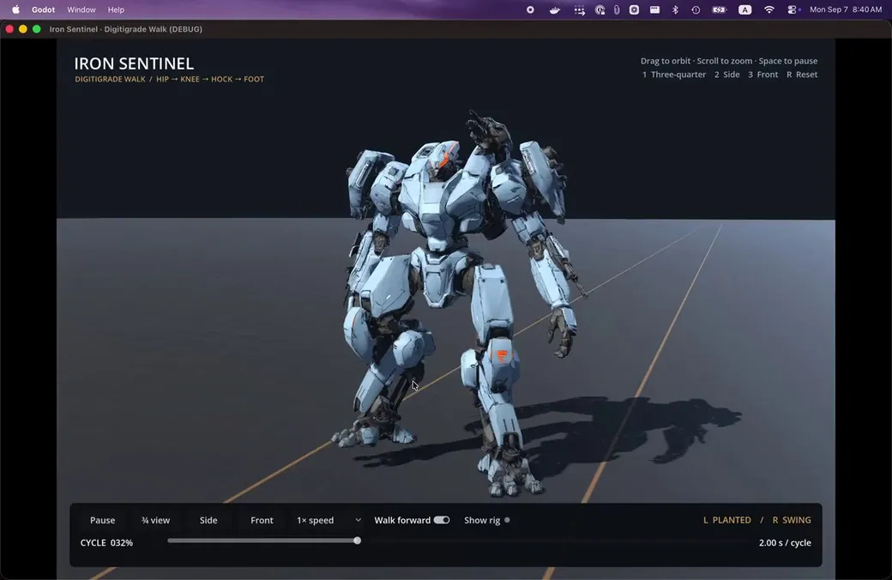</a>

**İstem**

```text
Bu GLB'ye rig kurup animasyon verebilir misin? Digitigrad bacakların Godot önizlemesinde inandırıcı şekilde yürüdüğünü görmek istiyorum, lütfen.
```

<details>
<summary>Özgün istem</summary>

```text
can you rig and animate this glb, i want to see the digitigrade legs walking convincingly in a godot preview please
```

</details>

[Ayrıntıları görüntüle ↗](https://www.tripo3d.ai/tr/3d-prompts/gpt-6-astra-2097123382852829230) · [Orijinal gönderi](https://x.com/om_patel5/status/2097123382852829230) · [Örneklere dön](#all-prompts)

---

<a id="gpt-6-astra-2097065330728128920"></a>

### Etkileşimli jöle limon ağacı

[Vib3Coded](https://x.com/vib3coded) · 2026-09-07 · GPT-6 Astra · Etkileşimli

<a href="https://www.tripo3d.ai/tr/3d-prompts/gpt-6-astra-2097065330728128920">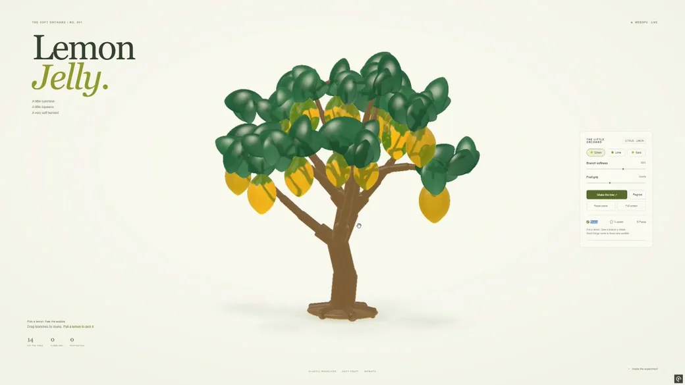</a>

**İstem**

```text
WebGPU kullanarak etkileşimli bir jöle limon ağacı oluşturun
```

<details>
<summary>Özgün istem</summary>

```text
build an interactive jelly lemon tree using WebGPU
```

</details>

[Ayrıntıları görüntüle ↗](https://www.tripo3d.ai/tr/3d-prompts/gpt-6-astra-2097065330728128920) · [Orijinal gönderi](https://x.com/vib3coded/status/2097065330728128920) · [Örneklere dön](#all-prompts)

---

<a id="gpt-6-astra-2097004192627933279"></a>

### Tezgâh Üzerinde Etkileşimli Robot Evcil Hayvan

[ZEUS⚡️](https://x.com/zeuuss_01) · 2026-09-07 · GPT-6 Astra · Etkileşimli

<a href="https://www.tripo3d.ai/tr/3d-prompts/gpt-6-astra-2097004192627933279">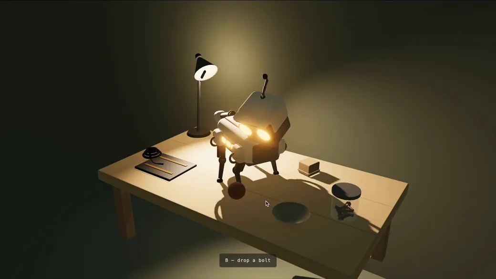</a>

**İstem**

```text
TAM SPESİFİKASYON.
BUNU SOHBET MESAJI OLARAK DEĞİL, PROJE KLASÖRÜNE DOSYA OLARAK KAYDEDİN.
ARDINDAN: /goal bunu three.js ile oluşturun, SPEC.md dosyasını okuyup izleyin
özellikle 9. ve 10. bölümlere harfiyen uyun.

{ BAŞLANGIÇ }

1 BU NEDİR

küçük, dört ayaklı bir robot bir çalışma tezgâhında yaşar. onu şarj eder,
onunla oynar ve ona üç iş verirsin. tezgahtan hiç ayrılmaz
sen de ayrılmazsın. bütün oyun bundan ibarettir.

bu yapıyı taşıyan yalnızca iki şey var, başka hiçbir şey değil: robotun
nasıl göründüğü ve nasıl hareket ettiği. oyuncu tüm oyun boyunca
sabit bir mesafeden tek bir nesneye bakıyor; bu yüzden o nesne
bakmaya değer olmalı ve canlıymış gibi hareket etmeli.

bu konuşan bir evcil hayvan değil. sesi yok, ağzı yok, ekranda yüzü yok
ve söylediklerini asla tekrarlamıyor. sana dikkat eden bir makine;
bu farklı ve daha iyi bir şey.

2 ROBOT

dört ayaklı ve yaklaşık bir kedi büyüklüğünde.

çekiciliğin kaynağı olan oranlar:
- gövde, yüksekliğinden geniş, yuvarlatılmış bir blok; uzunluğu yaklaşık iki kafa
    genişliği kadar. ağır görünüyor.
- kafa gövdeye göre büyük; gövde yüksekliğinin yaklaşık yüzde 40'ı kadar
    ve kısa bir boynun üzerinde öne doğru oturuyor. meraklı görünüyor.
    chibi tarzı bir kafa değil ve gözleri de büyük değil.
- bacaklar gövdenin yanında ince kalıyor; böylece ağır bir şey
    hafif uzuvlar üzerinde taşınıyor. yürüyüşün hantal değil de
    narin görünmesini sağlayan şey bu karşıtlık.
- aslında bir karşı ağırlık olan ve öylece sallanan kısa bir kuyruk
- kafada, her hareketin yarım vuruş gerisinden kamçı gibi savrulup
    sonra duran kısa bir anten. neredeyse hiç maliyeti yok ve modelin
    tamamındaki en büyük canlılık kaynağı bu.

üç malzeme, en fazla üç:
1 boyalı panel; yumuşak kemik beyazı, mat ve hafif sıcak tonlu. sırtın,
    kalçaların ve kafanın üstünde. görünür yüzeyin en az yüzde 60'ı
    böyle olmalı; yoksa parça yığını gibi görünür.
2 bacaklarda, iskelette, eklemlerde ve boyunda çıplak işlenmiş metal;
    soğuk orta gri. yalnızca her eklem halkasında sıcak pirinç.
3 dört ayağın, boyun kılıfının ve kablonun üzerinde koyu kauçuk;
    siyaha yakın ve mat.

yüz: eşit büyüklükte, geniş aralıklı iki yuvarlak lens; kaş çizgisi boyunca
işlenmiş bir oluğun arkasına gömülü. bu oluk bir
işlenmiş kenar, kaş değil ve asla hareket etmiyor. tüm ifade
kafa açısı, anten ve lens parlaklığından geliyor.

tek kusur: bir omuz paneli, sanki bir kez değiştirilmiş gibi
biraz farklı tonda. dikkat çekmiyor.

siluet testi, geçer ya da kalır: robotu yandan ve üç çeyrek açıdan
64'e 64 piksel boyutunda beyaz üzerine tamamen siyah render alın. kafa
yukarı kalkık olmalı, kafa ile gövde arasındaki boşluk, aralarında
gün ışığı görünen dört bacak ve kuyruk hâlâ seçilebilmeli. eğer herhangi
iki kütle birleşiyorsa renderı değil, modeli değiştirin.

3 BATARYA İLERLEME ÇUBUĞUDUR

bir yan taraf boyunca kehribar renginde yanan beş hücrelik bir şerit uzanır. şarjı
azaldıkça hücreler birer birer söner, şarj olurken de birer birer yanar.
ekranda sayı ya da çubuk gösterilmez.

5 hücre  canlı, kafa yukarıda, kuyruk sallanıyor
4        normal
3        daha yavaş, kafa biraz daha aşağıda
2        ayakta durmak yerine eylemler arasında oturur
1        kendi kendine şarj pedine yürür ve bekler
0        bacaklarını katlar ve olduğu yerde kapanır,
         lensleri karanlık, şarj pedine taşınmayı bekler

asla bozulmaz, asla ölmez ve sıfırda hiçbir şey kaybolmaz.

4 NASIL HAREKET EDER

- gerçek bir yürüyüş. çapraz çiftler halinde; ayaklar tezgâha basar ve
  gövde üzerlerinden geçerken yerlerinde kalır. ayaklar
  kaymaz.
- ağırlık. yük taşıyan çiftin üzerinde gövde alçalır. başlarken hareket
  etmeden önce öne doğru eğilir. dururken kendini dengelemek için kısa bir
  adım atar.
- seni izler. imleç tezgâhın üzerindeyken kafa imleci takip eder ve boyun
  gövde dönmeden önce dönüşü başlatır.
- toparlanır. onu dürttüğünde sendeleyip bir bacağını yana açarak basar ve
  dengesini yeniden bulur. asla devrilmez.
- durulur. hareketsiz dururken birkaç saniyede bir ağırlığını değiştirir
  ve lensler yavaşça göz kırpar: kararır ve yeniden parlar, ama
  kapanmaz.

pratik yaptıkça gelişir. tamamlanan her görev yalpalamayı biraz
azaltır ve hareketi bir sınıra kadar biraz hızlandırır.
bunu hiçbir şey duyurmaz. yirminci görevde ne yaptığını bilen bir
makine gibi hareket ettiği açıkça görülür ve bu değişim oyundaki
tek ilerleme unsurudur.

5 TEZGÂH

tek bir çalışma tezgâhı, sabit bir mesafeden görülür. sıcak, kullanılmış.

tezgâh yüzeyi aşınmış, açık renkli ahşap. arkadaki duvar düz, soğuk gri-yeşil.
robot çıplak metalden, eklemlerinde sıcak pirinç bulunur. lensler ve hücreler
kehribar renginde; yanan tek renk budur. lamba ışığı tek yandan sıcak gelir ve
uzun, yumuşak bir gölge oluşturur. diğer her şey soluk tonlardadır.

tezgâhın üzerinde: kablo bobinli bir şarj pedi, bir kavanoz
cıvata, rulo hâlinde bir bez, küçük bir sandık, masa lambası, lastik top,
teneke bir kâse. başka hiçbir şey yok.

tek ışık kaynağı lambadır. robot önünden geçtiğinde
gölgesi tezgâhın üzerinde süzülür.

6 YALNIZCA KULLANIMLA ANLATILIR

- topu tezgâhın üzerinde sürüklersin ve robotun kafası
  gövdesi dönüp onu takip etmeden önce topu izler
- robotu şarj pedine koyarsın ve önce bir hücre, ardından
  diğeri yanar; her birinin arasında kısa bir bekleme olur
- onu yandan dürtersin; sendeleyip genişçe açtığı bir
  bacakla kendini dengeler ve doğrulur
- teneke kâseye bir cıvata bırakırsın; robot yanına gider, onu
  ağız plakalarıyla alır ve kavanoza taşır
- onu kendi hâline bırakırsın; tezgâhın kenarına yürür, aşağıya
  bakar ve geri çekilir
- sırtındaki panele dokunursun; robot gövdesini alçaltır ve
  sen durana kadar kıpırdamadan bekler

tüm bunları gerçekleşirken göster. hiçbirini açıklama yazısıyla anlatma.

7 ÜÇ GÖREV

her biri farklı bir hareket türünü göstermek için vardır ve her biri
menüden değil, tezgâha bir nesne koyularak başlatılır.

getir  bir cıvatayı herhangi bir yere bırak. yanına yürür, alır ve onu
       kavanoza götürür. yürüyüşü ve dönüşü gösterir.
istifle  üç sandık koy. onları teker teker iterek üst üste dizer. itme,
       dayanma ve kaldırma hareketlerini gösterir.
kovala  topu yuvarla. peşinden koşar, bir ayağıyla durdurur ve
       geri getirir. koşuyu, kaymayı ve duruşu gösterir.

her görev biraz şarj harcar. 2 hücrede tamamlanan görev, 5 hücredeki
aynı göreve göre daha yavaş ve daha dengesiz olur. sıra yok, düzen yok,
zamanlayıcı yok, ödül yok.

8 ARAYÜZ

alt orta: erişim mesafesinde bir şey olduğunda tek bir komut kartı görünür;
tuşu veya sürükleme hareketini ve eylemi belirten; bir şey erişim alanından çıktığında
kaybolur.

ekranda başka hiçbir şey yok. pil göstergesi yok, mutluluk göstergesi yok,
açlık göstergesi yok, jeton yok, seviye yok, deneyim yok, yıldız yok,
zamanlayıcı yok, menü yok, ayarlar yok, öğretici açılır pencere yok, robotun üzerinde yüzen etiket
yok.

oyuncunun bilmesi gereken her şey robotun gövdesinde.

kamera: tezgâha sabitlenmiş, önden üç çeyrek açıyla ve
hafifçe yukarıdan bakmalı. Dikey görüş alanı 40 derece olmalı. Robot,
tezgâhın ortasında kare yüksekliğinin yüzde 30 ila 45'ini doldurmalı.
1080p'de her pil hücresi en az 8 piksel genişliğinde olmalı. Tezgâhın tamamı
her zaman kadrajda olmalı. Yaklaşık 60 derece boyunca ve daha fazla değil, yörüngede döndürmek için sürükleyin.
Kamera hiçbir zaman tezgâhtan ayrılmamalı ve
hiçbir zaman kesme yapmamalı.

9 YASAKLAR, HER BİRİ AÇIKÇA BELİRTİLMİŞ

evcil hayvan: ses yok, konuşma yok, söylediklerinizi tekrarlama yok,
mikrofon yok, ekranda yüz yok, ağız yok, kaş yok,
gözbebekli çizgi film gözleri yok, kalp yok, emoji yok, konuşma balonu yok,
isim girme yok, kostüm yok, şapka yok, boya atölyesi yok.

ücretsiz oynama modeli: jeton yok, mücevher yok, hiçbir türden para birimi yok,
mağaza yok, reklam yok, günlük ödül yok, seri ödülü yok, bildirim yok,
satın alınması gereken enerji yok, bekleme zamanlayıcısı yok, seviye yok,
deneyim çubuğu yok, başarımlar yok, liderlik tablosu yok.

oynanış: düşman yok, çatışma yok, can yok, hasar yok, ölme yok,
kırılma yok, tamir mini oyunu yok, başarısızlık durumu yok, skor yok,
zamanlayıcı yok, görev işaretleri yok, ara sahne yok, yükleme ekranı görseli yok.

önceki yapımlarımın tekrarları: plaj yok, palmiye yok, yengeç yok,
yüzen adalar yok, fener yok, kiraz çiçeği yok, ninja yok,
shuriken yok, voxel blokları yok, kazma yok, lav yok, araba yok, şehir yok,
sualtı yok, kelp yok.

render: gerçekçi dokular yok, sert gölgeler yok, lens parlaması yok,
film greni yok, sinemaskop çerçeve yok, alan derinliği bulanıklığı yok, kromatik
aberasyon yok, gri ekran sisi yok. Lenslerde ve pil hücrelerinde
bloom olsun, başka hiçbir yerde olmasın.

10 YAPIM BÜTÇESİ

bu yapım tek bir çalışma oturumunda tamamlanmalı. Aşağıdakilerin tamamı
bu sürüm için kesinlikle yasak. Eklemeyin, taslak olarak bile bırakmayın ve
bunun için yapılacaklar listesine bir madde bile eklemeyin.

ikinci oda yok, dış mekân yok
ikinci robot yok
kayıt veya yükleme yok; yeniden yükleme yeni bir robot oluşturur
fizik motoru yok: düz bir düzlemde dört bacak için elle yazılmış ters kinematik
  ve tezgâhtaki nesneler için basit kutu çarpışması
ragdoll yok
ses yok
menü yok, ayarlar yok, duraklatma ekranı yok
üçten fazla iş yok
gündüz-gece döngüsü yok

zaman şu sırayla harcanmalı:
1 robotun oranları ve siluet testi
2 yürüme döngüsü ve ayakların yere basması
3 kafa takibi, anten ve durulma hareketi
4 pil durumları ve şarj pedi
5 üç iş
6 tezgâhın dekorasyonu

zaman yetmezse boş bir tezgâh ve güzel,
iyi yürüyen bir robotla yayınlayın. Asla tersi olmasın. İyi bir robotun bulunduğu sade bir tezgâh
tamamlanmış bir oyundur. Sert hareket eden bir robotun bulunduğu süslü bir tezgâh
hiçbir şey değildir.

tamamlandı demeden önce şu dört şeyi sözle değil, renderlarla kanıtlayın:
sözlerle değil, iki açıdan 64 pikselde silüet testi, 5 hücrede bir yürüme döngüsü
ve aynı yürüyüşün 2 hücredeki hâli, başın
tam yörünge boyunca imleci takip etmesi ve robotun 5 hücrede ve 0
hücrede yan yana görüntüsü.

bunu inşa et, ardından ilk olarak düzelteceğin üç şeyi söyle.

{ END }
```

<details>
<summary>Özgün istem</summary>

```text
THE FULL SPEC.
SAVE IT AS A FILE IN THE PROJECT FOLDER, NOT AS A CHAT MESSAGE.
THEN: /goal build this in three.js, read SPEC.md and follow it
exactly, especially sections 9 and 10.

{ START }

1 WHAT THIS IS

a small four-legged robot lives on a workbench. you charge it,
play with it, and give it three jobs. it never leaves the bench
and neither do you. that is the whole game.

two things carry this build and nothing else does: how the robot
looks, and how it moves. the player spends the entire game
looking at one object from a fixed distance, so that object has
to be worth looking at, and it has to move like it is alive.

it is not a talking pet. no voice, no mouth, no face on a screen,
and it never repeats what you say. it is a machine that pays
attention to you, which is a different and better thing.

2 THE ROBOT

about the size of a cat, on four legs.

proportion, which is where charm comes from:
- the body is a rounded block, wider than tall, about two head
  widths long. it reads heavy.
- the head is large for the body, roughly 40 per cent of body
  height, and sits forward on a short neck. it reads curious.
  not a chibi head, and the eyes are not big.
- the legs are slender next to that body, so a heavy thing is
  carried on light limbs. that contrast is what makes the walk
  look delicate rather than clumsy.
- a stub tail that is really a counterweight, and swings like one
- one short antenna on the head that whips and settles half a
  beat behind every movement. costs almost nothing, and it is the
  single biggest source of life in the whole model.

three materials, no more than three:
1 painted panel, soft bone white, matte, slightly warm. over the
  back, the haunches and the top of the head. at least 60 per
  cent of the visible surface or it reads as a pile of parts.
2 bare machined metal, cool mid grey, on legs, frame, joints and
  neck. warm brass at each joint ring only.
3 dark rubber, near black and matte, on the four feet, the neck
  sleeve and the cable.

the face: two round lenses of equal size, set wide, recessed
behind a machined groove across the brow. the groove is a
machined edge, not an eyebrow, and it never moves. all expression
comes from head angle, antenna and lens brightness.

one flaw: one shoulder panel is a slightly different shade, as
though replaced once. nothing draws attention to it.

silhouette test, pass or fail: render the robot pure black on
white at 64 by 64 pixels, from the side and three quarters. the
raised head, the gap between head and body, four legs with
daylight between them, and the tail must all still read. if any
two masses merge, change the model, not the render.

3 THE BATTERY IS THE PROGRESS BAR

a strip of five cells runs along one flank, lit amber. they go
out one at a time as it runs down and light one at a time as it
charges. nothing on screen shows a number or a bar.

5 cells  brisk, head up, tail swinging
4        normal
3        slower, head slightly lower
2        it sits down between actions instead of standing
1        it walks to the charging pad on its own and waits
0        it folds its legs and powers down where it stands,
         lenses dark, waiting to be carried to the pad

it never breaks, never dies, and nothing is lost at zero.

4 HOW IT MOVES

- a real walk. diagonal pairs, feet planted on the bench and
  staying there while the body passes over them. feet do not
  slide.
- weight. the body dips on the loaded pair. starting, it leans
  forward before it moves. stopping, it takes one short step to
  catch itself.
- it watches you. the head follows the cursor whenever the cursor
  is over the bench, and the neck leads the turn before the body.
- it recovers. nudge it and it staggers, plants a leg wide, and
  rights itself. it never falls over.
- it settles. standing still it shifts weight every few seconds,
  and the lenses do a slow blink: they dim and come back, they do
  not close.

it gets better with practice. every job done makes the wobble a
little smaller and the movement a little faster, up to a limit.
nothing announces this. by the twentieth job it visibly moves
like a machine that knows what it is doing, and that change is
the only progression in the game.

5 THE BENCH

one workbench, seen from a fixed distance. warm, worked in.

bench top worn pale timber. wall behind cool grey green, plain.
robot bare metal with warm brass at the joints. lenses and cells
amber, the only lit colour. lamp light warm, from one side,
casting a long soft shadow. everything else muted.

on the bench: a charging pad with a coil of cable, a jar of
bolts, a rolled cloth, a small crate, a desk lamp, a rubber ball,
a tin bowl. nothing else.

the lamp is the only light source. when the robot crosses in
front of it, its shadow sweeps across the bench.

6 DESCRIBED ONLY THROUGH USES

- you drag the ball across the bench and the robot's head tracks
  it before its body turns to follow
- you put the robot on the charging pad and one cell lights, then
  the next, with a pause between each
- you nudge it from the side and it staggers, catches itself on a
  wide leg, and straightens
- you drop a bolt in the tin bowl and it walks over, picks it up
  in its mouth plates, and carries it to the jar
- you leave it alone and it walks to the edge of the bench, looks
  over, and backs away
- you scratch the panel on its back and it lowers its body and
  holds still until you stop

show all of this happening. never explain it in a caption.

7 THE THREE JOBS

each exists to show a different kind of motion, and each is asked
for by putting an object on the bench, never by a menu.

fetch  drop a bolt anywhere. it walks over, picks it up, takes it
       to the jar. shows the walk and the turn.
stack  put three crates out. it pushes them into a stack, one at
       a time. shows the push, the brace and the lift.
chase  roll the ball. it runs it down, stops it with a foot, and
       brings it back. shows the run, the skid and the stop.

each job costs a little charge. a job done at 2 cells is slower
and wobblier than the same job at 5. no queue, no order, no
timer, no reward.

8 THE INTERFACE

bottom centre: a single prompt card when something is in reach,
naming the key or the drag and the action, which disappears when
it is not.

nothing else on screen. no battery bar, no happiness meter, no
hunger meter, no coins, no level, no experience, no stars, no
timer, no menu, no settings, no tutorial popup, no floating label
over the robot.

everything the player needs to know is on the robot's body.

camera: fixed on the bench, three quarters from the front and
slightly above. 40 degree vertical field of view. the robot fills
30 to 45 per cent of frame height at the centre of the bench.
each battery cell at least 8 pixels wide at 1080p. the whole
bench in frame at all times. drag to orbit through about 60
degrees and no further. the camera never leaves the bench and
never cuts.

9 BANNED, EACH ONE NAMED

the pet: no voice, no talking, no repeating what you say, no
microphone, no face on a screen, no mouth, no eyebrows, no
cartoon eyes with pupils, no hearts, no emoji, no speech bubble,
no name entry, no costume, no hats, no paint shop.

free-to-play: no coins, no gems, no currency of any kind, no
shop, no ads, no daily reward, no streak, no notification, no
energy that must be bought, no wait timer, no level, no
experience bar, no achievements, no leaderboard.

gameplay: no enemies, no combat, no health, no damage, no dying,
no breaking, no repair mini-game, no fail state, no score, no
timer, no quest markers, no cutscene, no loading screen art.

repeats of my earlier builds: no beach, no palm trees, no crabs,
no floating islands, no lanterns, no cherry blossom, no ninja, no
shuriken, no voxel blocks, no pickaxe, no lava, no car, no city,
no underwater, no kelp.

render: no realistic textures, no hard shadows, no lens flare, no
film grain, no letterboxing, no depth of field blur, no chromatic
aberration, no grey screen fog. bloom on the lenses and the
battery cells and nothing else.

10 THE BUILD BUDGET

this build must finish in one working session. everything below
is a hard no for this version. do not add it, do not stub it, do
not leave a todo for it.

no second room, no outdoors
no second robot
no saving or loading, a reload is a fresh robot
no physics engine: hand-written inverse kinematics for four legs
  on a flat plane, plus simple box collision on the bench props
no ragdoll
no sound
no menus, no settings, no pause screen
no more than three jobs
no day cycle

where the time must go, in this order:
1 the robot's proportions and the silhouette test
2 the walk cycle and the foot planting
3 the head tracking, the antenna and the settle
4 the battery states and the charging pad
5 the three jobs
6 the bench dressing

if time runs out, ship with an empty bench and a beautiful robot
that walks well. never the other way round. a bare bench with a
good robot is a finished game. a dressed bench with a stiff robot
is nothing.

before you call it done, prove these four with renders, not with
words: the silhouette test at 64 px from two angles, a walk cycle
at 5 cells and the same walk at 2 cells, the head tracking the
cursor across the full orbit, and the robot at 5 cells and at 0
cells side by side.

build it, then tell me the three things you would fix first.

{ END }
```

</details>

[Ayrıntıları görüntüle ↗](https://www.tripo3d.ai/tr/3d-prompts/gpt-6-astra-2097004192627933279) · [Orijinal gönderi](https://x.com/zeuuss_01/status/2097004192627933279) · [Örneklere dön](#all-prompts)

---

<a id="gpt-6-astra-2096986557244723371"></a>

### Blender’da 12 saniyelik bir orman yolu

[Can Matrix](https://x.com/Jomolos) · 2026-09-07 · GPT-6 Astra · Sahneler

<a href="https://www.tripo3d.ai/tr/3d-prompts/gpt-6-astra-2096986557244723371">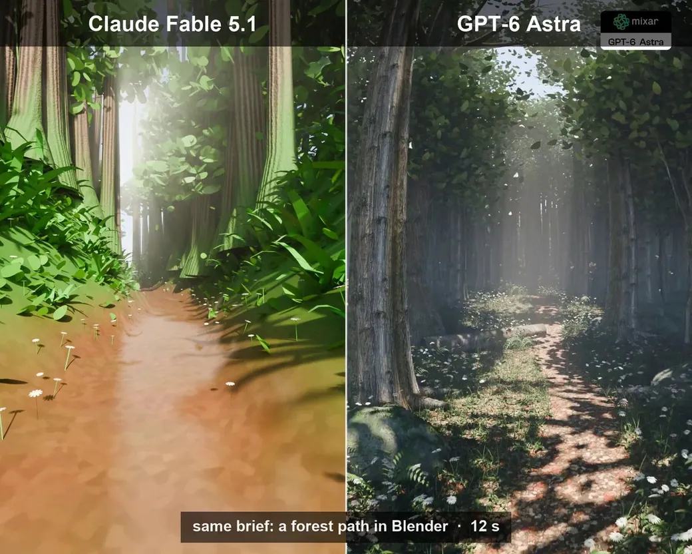</a>

> Kaynak alıntısı eksiktir.

**İstem**

```text
Blender’da 12 saniyelik bir orman yolu
```

[Ayrıntıları görüntüle ↗](https://www.tripo3d.ai/tr/3d-prompts/gpt-6-astra-2096986557244723371) · [Orijinal gönderi](https://x.com/Jomolos/status/2096986557244723371) · [Örneklere dön](#all-prompts)

---

<a id="gpt-6-astra-2096971051334857181"></a>

### Etkileşimli Çin Avlusu

[Larus Canus](https://x.com/MrLarus) · 2026-09-07 · GPT-6 Astra · Sahneler

<a href="https://www.tripo3d.ai/tr/3d-prompts/gpt-6-astra-2096971051334857181">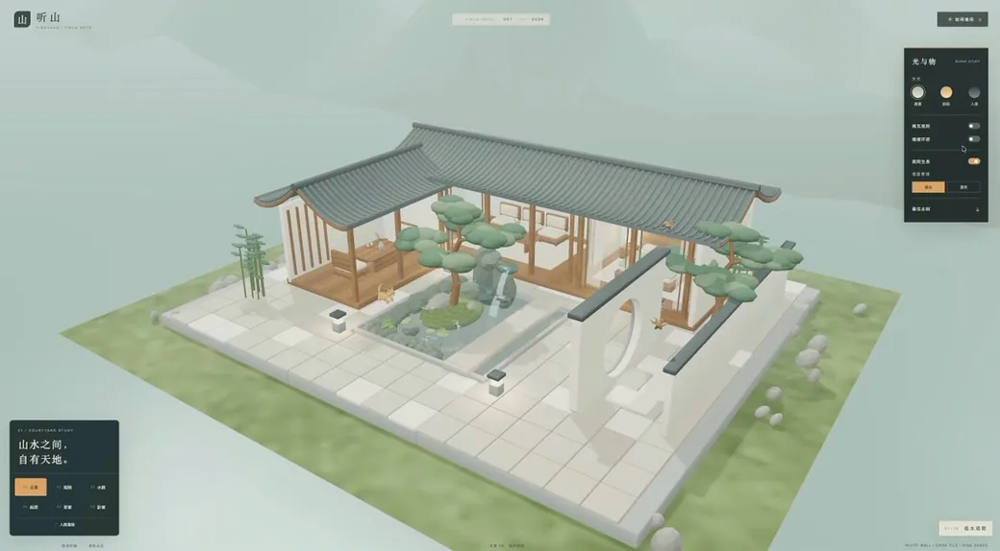</a>

**İstem**

```text
Blender ve Three.js kullanarak tarayıcıda keşfedebileceğim etkileşimli bir Çin avlusu oluştur.

Beyaz duvarlar, koyu kiremit çatılar, ay kapısı, çam ağaçları, bir gölet ve kaya bahçesinin yanı sıra bir oturma odası, çay odası ve yatak odası ekle. Blender'ı arka planda çalıştırmak, modelleri oluşturmak ve GLB dosyalarını dışa aktarmak için Python kullan. Aydınlatma, yansımalar, animasyon ve etkileşim için Three.js kullan.

Yörünge kontrollerini, yakınlaştırmayı, WASD ile gezinmeyi, gündüz/gece geçişini ve çatı görünümünü açıp kapatmayı destekle. Zamanla akan su, koi balıkları, zıplayan kurbağalar, yusufçuklar, avlu kedisi, serçeler ve gece ateş böcekleri ekle. Hareketleri ölçülü ve doğal tut.

Sahneyi kapatmayan özgün bir arayüz oluştur. Aşamalar hâlinde ilerle, sonuçları tarayıcıda incele, sorunları düzelt ve çalıştırılabilir projeyi, kaynak dosyaları ve kurulum talimatlarını teslim et.
```

<details>
<summary>Özgün istem</summary>

```text
Build an interactive Chinese courtyard using Blender and Three.js that I can explore in a browser.

Include white walls, dark tiled roofs, a moon gate, pine trees, a pond, and a rock garden, with a living room, tea room, and bedroom. Use Python to run Blender in the background, generate the models, and export GLB files. Use Three.js for lighting, reflections, animation, and interaction.

Support orbit controls, zoom, WASD navigation, day/night switching, and a roof toggle. Gradually add flowing water, koi, hopping frogs, dragonflies, a courtyard cat, sparrows, and nighttime fireflies. Keep movements subtle and natural.

Create an original interface that leaves the scene unobstructed. Build in stages, inspect the results in the browser, fix issues, and deliver the runnable project, source files, and setup instructions.
```

</details>

[Ayrıntıları görüntüle ↗](https://www.tripo3d.ai/tr/3d-prompts/gpt-6-astra-2096971051334857181) · [Orijinal gönderi](https://x.com/MrLarus/status/2096971051334857181) · [Örneklere dön](#all-prompts)

---

<a id="gpt-6-astra-2096966425017467344"></a>

### “Yerçekiminin Bozulduğu Ufuk” VRChat Manzara Dünyası

[Xenoah](https://x.com/shuminchuuu) · 2026-09-07 · GPT-6 Astra · Sahneler

<a href="https://www.tripo3d.ai/tr/3d-prompts/gpt-6-astra-2096966425017467344">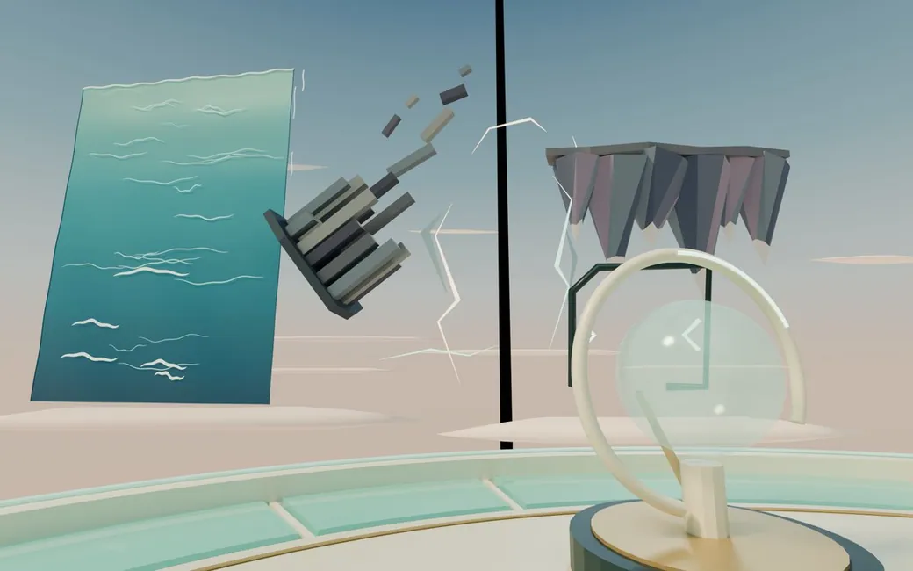</a>

**İstem**

```text
Blender’da VRChat için bir manzara dünyasının tüm 3B model setini oluşturun.

Tema, 

“Yerçekiminin Bozulduğu Ufuk”

 olsun.

Oyuncunun üzerinde durduğu tepenin zirvesi normal kalsın; yalnızca uzak manzara büyük ölçekte fizik kurallarını ihlal etsin.

Genel tasarım sade olsun.
Küçük ayrıntılardan çok, 
büyük silüetleri

uzak manzaranın anormalliğini
gözlem platformunun biçimini
mekânsal kompozisyonu
 önceliklendirin.

Kompozisyon

Şunları oluşturun:

tepe zirvesi

dar bir yürüyüş yolu
sığ bir yarma
yarım daire biçimli gözlem platformu
az sayıda bank
kırık bir yönlendirme tabelası
merkezî gözlem cihazı
uzak şehir
dikey duran deniz
ters dönmüş sıradağlar
dev siyah sütun
uzay yarıkları
sabit bulutlar
gözlem platformu

Gözlem platformu yarım daire biçiminde olsun.

Mevcut gözlem platformlarını taklit etmeyin; tamamen özgün bir biçim oluşturun.

Özellikler:

yarım daire biçimi

asimetrik yapı
bir bölümünün havaya doğru uzanması
alçak kenar
yarı saydam malzeme öngören bir biçim
yerçekimi anomalisi nedeniyle yalnızca bir bölümünün deforme olması
Aşırı karmaşıklaştırmadan, uzaktan bakıldığında biçimi kolayca anlaşılabilen büyük bir silüet oluşturun.

Merkezî gözlem cihazı

Gözlem platformunun merkezine, 

yarı saydam bir küreyi

eksik bir halkayı
siyah sütuna yöneltilmiş bir nişan çerçevesini
birleştiren sade bir cihaz yerleştirin.

Uzak manzara

Uzak manzara en önemli unsurdur.

Aşağıdakileri büyük ve basitleştirilmiş biçimlerle oluşturun:

Gökyüzüne düşen şehir

Kutu biçimli bina gruplarını alışılmışın dışında bir yöne doğru uzatın.

Dikey deniz

Dev bir su yüzeyi düzlemini yaklaşık 90 derece dik konumda yerleştirin.

Ters dönmüş sıradağlar

Basitleştirilmiş dağ silüetini baş aşağı çevirin.

Siyah sütun

Uzak manzaraya son derece büyük ve ince, uzun bir siyah sütun yerleştirin.

Bir bina gibi değil, uzayda oluşmuş bir eksiklik gibi görünmesini sağlayın.

Uzay yarığı

Siyah sütunun çevresine büyük, yırtılmış levha veya şerit biçimli şekiller yerleştirin.

Emissive malzemeler kullanılması öngörülmektedir.

Arazi

Tepe, hafif eğimli bir çayırlık olsun.

Spawn noktasından gözlem platformuna kadar 

dar bir yürüyüş yolu

sığ bir yarma
oluşturun.

Yarmadan çıkıldığında uzak manzaranın bir anda tümüyle görünmesini sağlayan bir kompozisyon oluşturun.

Bitki örtüsü

Bitkiler minimum düzeyde olsun.

çim

az sayıda çalı
yalnızca birkaç bitkinin anormal bir yöne doğru eğilmesi
yeterlidir.

Modelleme yaklaşımı

Low-poly ağırlıklı bir yaklaşım uygundur.

Ayrıntıları gereğinden fazla işlemeyin.

Primitive’leri etkin biçimde kullanın; ağırlıklı olarak 

Cube

Plane
Cylinder
Sphere
Curve
 kullanarak oluşturun.

Uzak manzarayı özellikle basitleştirin.

Önemli olan ayrıntı değil, 

“uzaklara bakar bakmaz dünyada bir tuhaflık olduğunu anlamak”

 olsun.

Blender içindeki düzen

Nesneleri aşağıdaki koleksiyonlara ayırın.

PLAYER_AREA

OBSERVATION_DECK
OBSERVATION_DEVICE
VEGETATION
DISTANT_CITY
DISTANT_SEA
DISTANT_MOUNTAINS
BLACK_PILLAR
SPACE_FRACTURE
CLOUDS
PROPS
VRChat için Unity’ye kolayca aktarılabilecek bir yapı kullanın.

En yüksek öncelik, 

“gözlem platformundan görülen tek karelik bir manzara”

 olsun.
```

<details>
<summary>Özgün istem</summary>

```text
Blenderで、VRChat向け景観ワールドの3Dモデル一式を作ってください。

テーマは、

「重力が壊れた地平線」

です。

プレイヤーが立つ丘の頂上だけは正常で、遠景だけが大きく物理破綻しています。

全体はシンプルな造形にしてください。
細かい装飾より、
大きなシルエット

遠景の異常さ
展望台の形
空間構成
を優先してください。

構成

作るものは以下です。

丘の頂上

細い散策路
浅い切通し
半円形の観測デッキ
少数のベンチ
壊れた案内板
中央観測装置
遠景の都市
垂直に立つ海
逆さの山脈
巨大な黒い柱
空間断層
静的な雲
展望台

展望台は半円形。

既存の展望台を真似せず、完全オリジナル形状にしてください。

特徴:

半円形

左右非対称
一部が空中へ張り出す
低い縁
半透明素材を想定した形状
一部だけ重力異常で変形
複雑にしすぎず、遠くから見ても形が分かる大きなシルエットにしてください。

中央観測装置

展望台中央に、

半透明球体

不完全なリング
黒い柱へ向いた照準フレーム
を組み合わせたシンプルな装置を配置してください。

遠景

遠景は最重要です。

以下を大きな簡略形状で作ってください。

空へ落ちる都市

箱形のビル群を、通常とは違う方向へ伸ばしてください。

垂直の海

巨大な水面プレーンを90度近く立てて配置してください。

逆さの山脈

簡略化した山のシルエットを上下反転してください。

黒い柱

非常に巨大で細長い黒い柱を遠景に配置してください。

建物ではなく、空間の欠損のように見える形にしてください。

空間断層

黒い柱の周囲に、大きく裂けた板状または帯状の形状を配置してください。

発光マテリアルを想定します。

地形

丘はなだらかな草地。

スポーン地点から展望台まで、

細い散策路

浅い切通し
を作ってください。

切通しを抜けると、遠景が一気に見える構図にしてください。

植生

植物は最小限。

草

少数の低木
ごく一部だけ異常方向へ傾いた植物
程度で十分です。

モデリング方針

ローポリ寄りで構いません。

細部を作り込みすぎないでください。

Primitiveを積極的に使い、

Cube

Plane
Cylinder
Sphere
Curve
を中心に作ってください。

遠景は特に簡略化してください。

重要なのはディテールではなく、

「遠くを見た瞬間に世界がおかしいと分かること」

です。

Blender内の整理

オブジェクトを以下のコレクションに分けてください。

PLAYER_AREA

OBSERVATION_DECK
OBSERVATION_DEVICE
VEGETATION
DISTANT_CITY
DISTANT_SEA
DISTANT_MOUNTAINS
BLACK_PILLAR
SPACE_FRACTURE
CLOUDS
PROPS
VRChat用にUnityへ持っていきやすい構成にしてください。

最優先は、

「展望台から見た一枚絵としての景観」

です。
```

</details>

[Ayrıntıları görüntüle ↗](https://www.tripo3d.ai/tr/3d-prompts/gpt-6-astra-2096966425017467344) · [Orijinal gönderi](https://x.com/shuminchuuu/status/2096966425017467344) · [Örneklere dön](#all-prompts)

---

<a id="gpt-6-astra-2096956214680965501"></a>

### Three.js WebGPU’da Sonsuz Minyatür Sokak

[Dash](https://x.com/creativedash) · 2026-09-07 · GPT-6 Astra · Etkileşimli

<a href="https://www.tripo3d.ai/tr/3d-prompts/gpt-6-astra-2096956214680965501">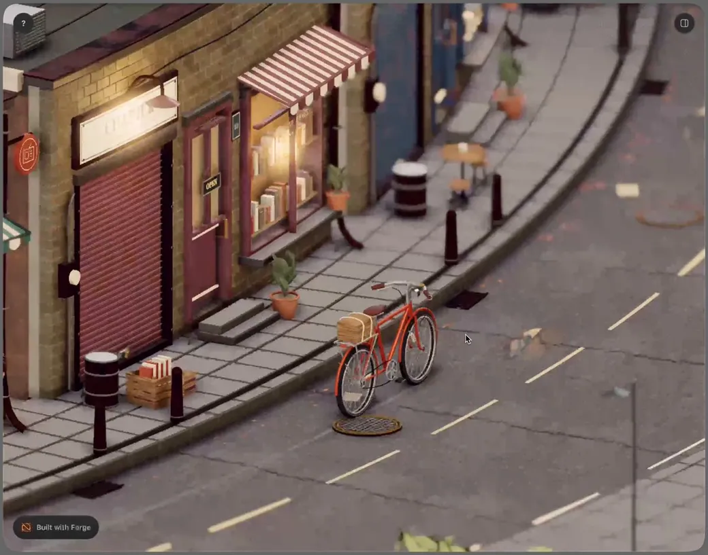</a>

**Referans görseller:** [1](https://media.tripogrowth.space/media/55311a50-35f2-4f77-bbc1-58d917b9fb9e.png) · [2](https://pbs.twimg.com/media/HRniOHibgAEyKzj.png)

**İstem**

```text
three.js WebGPU ile sonsuz bir minyatür sokak oluştur: Küçük dükkânların sıralandığı bir caddenin önünden geçen kurye bisikleti, lastikler üzerinden geçtiğinde dalgalanıp sıçrayan su birikintilerine sahip ıslak asfalt, giderek silinen lastik izleri, etrafa saçılan yapraklar ve yumuşak biçimde kavislenen bir dünya olsun. Piksel sanatı görünümü kullan; telefonlarda akıcı çalışsın. Dünyayı tümüyle kontrol edebilmek için Forge parametreleri ekle.
```

<details>
<summary>Özgün istem</summary>

```text
Build me an endless miniature street in three.js WebGPU: a courier bicycle riding past a row of little shops, wet tarmac with puddles that ripple and splash when the tyres hit them, tyre tracks that fade, leaves that scatter, and a gently curved world. Pixel-art look, runs smooth on phones. Add Forge params to fully manipulate the world.
```

</details>

[Ayrıntıları görüntüle ↗](https://www.tripo3d.ai/tr/3d-prompts/gpt-6-astra-2096956214680965501) · [Orijinal gönderi](https://x.com/creativedash/status/2096956214680965501) · [Örneklere dön](#all-prompts)

---

<a id="gpt-6-astra-2096907617117540478"></a>

### Hogwarts 3B sahnesi

[Prompt Case](https://x.com/HiltonMisia) · 2026-09-07 · GPT-6 Astra · Sahneler

<a href="https://www.tripo3d.ai/tr/3d-prompts/gpt-6-astra-2096907617117540478">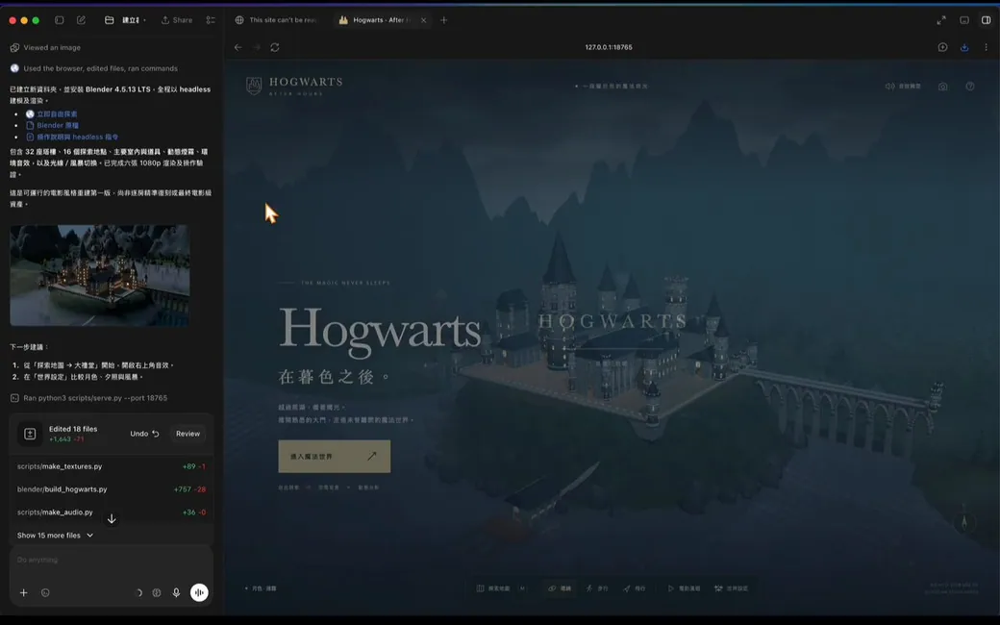</a>

**İstem**

```text
Harry Potter’daki Hogwarts Cadılık ve Büyücülük Okulu’nun büyük ölçekli, son derece gerçekçi ve tüm ayrıntıları işlenmiş bir 3B modelini oluşturmak için Headless Blender kullanın. Çevredeki doğal ortamı, ikonik yapıları, aslına uygun iç mekânları ve objeleri dâhil edin. Gizemli bir atmosfer ve dinamik, sürüklenen sisle birlikte sinema kalitesinde materyaller, aydınlatma, render ve ses tasarımı sunun. Kullanıcıların ortamı özgürce keşfetmesine olanak tanıyın ve aydınlatma ile diğer görsel seçenekler için değiştirilebilir ayarlar sağlayın.
```

<details>
<summary>Özgün istem</summary>

```text
Use Headless Blender to create a large-scale, highly realistic, fully detailed 3D model of Hogwarts School of Witchcraft and Wizardry from Harry Potter. Include the surrounding natural environment, iconic landmarks, authentic interior locations, and props. Deliver cinematic-quality materials, lighting, rendering, and sound design, with a mysterious atmosphere and dynamic drifting fog. Allow users to freely explore the environment and provide switchable settings for lighting and other visual options.
```

</details>

[Ayrıntıları görüntüle ↗](https://www.tripo3d.ai/tr/3d-prompts/gpt-6-astra-2096907617117540478) · [Orijinal gönderi](https://x.com/HiltonMisia/status/2096907617117540478) · [Örneklere dön](#all-prompts)

---

<a id="gpt-6-astra-2096793432987464010"></a>

### Three.js ve WebGPU ile etkileşimli yumuşak gövdeli slime oluşturma

[码农暖爸](https://x.com/Delroy715) · 2026-09-07 · GPT-6 Astra · Animasyon

<a href="https://www.tripo3d.ai/tr/3d-prompts/gpt-6-astra-2096793432987464010">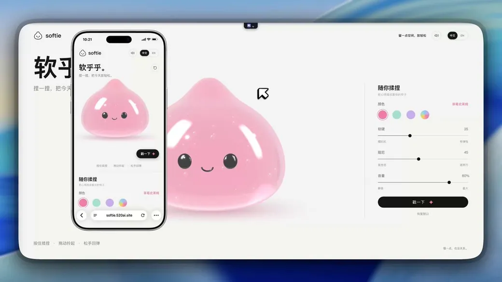</a>

**İstem**

```text
Yeni bir dizin oluştur ve tarayıcıda oynanabilen tek sayfalık bir slime uygulaması hazırla. Three.js ve WebGPU kullan; WebGL ile idare etme.
Ortada yuvarlak, tombul bir slime olsun. Pembe veya turkuaz olabilir; yarı saydam görünsün ve içinde belli belirsiz baloncuklar bulunsun. Fareyle üzerine basıp sürükleyebileyim; bıraktığımda sallanarak eski şeklini bulsun. Biraz yerçekimi olsun ve görünmez bir masa yüzeyine hafifçe çarpabilsin. Sert bir küre gibi görünmesin; yumuşak ve esnek bir his versin.
Yüzünü sevimli yap: iki siyah nokta göz ve küçük bir ağız ekle. Bunlar yüzeyle birlikte sıkışmalı; gözleri gövdeden ayrı nesneler olarak yapma. Sağ tarafa renk, sertlik ve sönümleme için birkaç basit kontrol ekle. “Bir kez dürt” düğmesine basınca slime bir kez zıplasın.
Sayfa sade olsun; açık gri bir arka plan ve büyük puntolu bir başlık kullan. 60 kare/saniye hızında çalışabilsin. Önce hedef görünümü gösteren bir görsel oluştur, ardından uygulamayı bu görsele göre kur. Ekran görüntüsü görsele yeterince benzediğinde ayrıntıları eklemeye devam et.
```

<details>
<summary>Özgün istem</summary>

```text
新建一个目录，做一页能在浏览器里玩的史莱姆。用 Three.js 和 WebGPU，不要用 WebGL 凑合。
中间一团圆滚滚的史莱姆，粉色或青绿都可以，半透明，里面隐约有气泡。能用鼠标按下去、拖着走，松手会晃着复原，有一点重力，可以轻轻砸在看不见的桌面上。不要做成硬球，要有软肉的感觉。
可爱点放在脸上：两只黑豆眼和一小张嘴，跟着表面一起挤，不要眼睛和身体分开。右边做几个简单控制：颜色、软硬、阻尼。按钮「戳一下」会让它弹一下。
页面干净，浅灰底，标题用大字。要能 60 帧。先出一张目标效果图，再按这张图搭，截图像了再往下加细节。
```

</details>

[Ayrıntıları görüntüle ↗](https://www.tripo3d.ai/tr/3d-prompts/gpt-6-astra-2096793432987464010) · [Orijinal gönderi](https://x.com/Delroy715/status/2096793432987464010) · [Örneklere dön](#all-prompts)

---

<a id="astra-3d-2096766465730847059"></a>

### Blender MCP ile LEGO minifigür oyun varlığı

[Simon Smith](https://x.com/_simonsmith) · 2026-09-07 · GPT-6 Astra · Varlıklar

<a href="https://www.tripo3d.ai/tr/3d-prompts/astra-3d-2096766465730847059">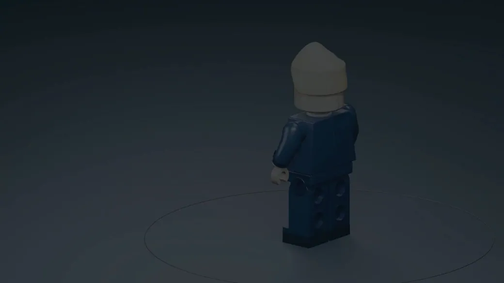</a>

**İstem**

```text
Blender MCP'yi kullanarak oyunda varlık olarak kullanabileceğim bir Donald Trump LEGO minifigürü oluştur. Kaliteyi olağanüstü, AAA düzeyinde tut; modelin ayrıntılı, doğru ve kusursuz olduğundan emin olmak için çalışmanı titizlikle test et.
```

<details>
<summary>Özgün istem</summary>

```text
Use the Blender MCP to make a LEGO minifig version of Donald Trump that I can use as a game asset. Make this exceptional quality, AAA game, and pressure test your work to make sure that it's detailed and accurate and excellent.
```

</details>

[Ayrıntıları görüntüle ↗](https://www.tripo3d.ai/tr/3d-prompts/astra-3d-2096766465730847059) · [Orijinal gönderi](https://x.com/_simonsmith/status/2096766465730847059) · [Örneklere dön](#all-prompts)

---

<a id="gpt-6-astra-2096685163111694556"></a>

### Etkileşimli Akıllı Telefon Patlatılmış Görünümü

[Zaira Laraib](https://x.com/zairalaraib_) · 2026-09-06 · GPT-6 Astra · Etkileşimli

<a href="https://www.tripo3d.ai/tr/3d-prompts/gpt-6-astra-2096685163111694556">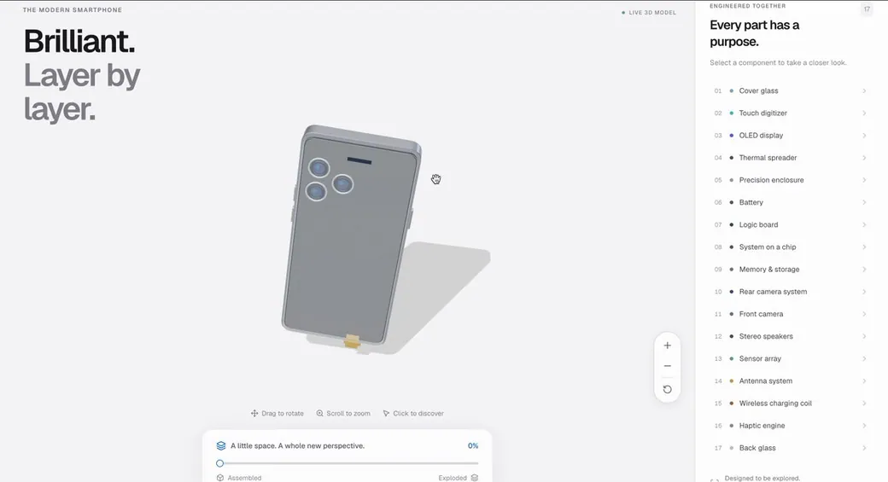</a>

**İstem**

```text
Modern bir akıllı telefonun etkileşimli 3B patlatılmış görünüm görselleştirmesini oluşturun. Cihazı ana bileşenlerine ayırın ve bir kaydırıcıyla parçaları ayırıp yeniden birleştirmeme izin verin. Bir bileşene tıklandığında o bileşen izole edilmeli ve ne işe yaradığı açıklanmalıdır. Bataryayı, kameraları, SoC'yi, belleği, ekran katmanlarını, hoparlörleri, sensörleri, antenleri ve mantık kartını dahil edin. Apple tarzı, estetik bir arayüzü ve tatmin edici etkileşimleri önceliklendirin. Deneyimin tamamını oluşturun, çalıştırın, inceleyin ve hataları giderin.
```

<details>
<summary>Özgün istem</summary>

```text
Build an interactive 3D exploded-view visualization of a modern smartphone. Separate the device into its major components and let me explode/reassemble it with a slider. Clicking a component should isolate it and explain what it does. Include the battery, cameras, SoC, memory, display layers, speakers, sensors, antennas and logic board. Prioritize a beautiful Apple-like interface and satisfying interactions. Build, run, inspect and fix the complete experience.
```

</details>

[Ayrıntıları görüntüle ↗](https://www.tripo3d.ai/tr/3d-prompts/gpt-6-astra-2096685163111694556) · [Orijinal gönderi](https://x.com/zairalaraib_/status/2096685163111694556) · [Örneklere dön](#all-prompts)

---

<a id="gpt-6-astra-2096641728497275011"></a>

### Mini World 3B keşif oyunu

[Weijian Zhang](https://x.com/weijianzhang_) · 2026-09-06 · GPT-6 Astra · Oyunlar

<a href="https://www.tripo3d.ai/tr/3d-prompts/gpt-6-astra-2096641728497275011">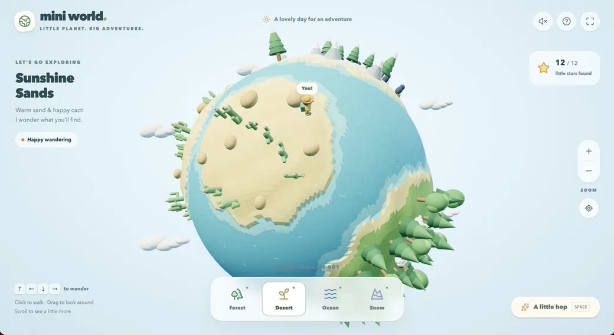</a>

**İstem**

```text
Mini World adında bir oyun oluşturalım. Bu oyun, dört buçuk yaşındaki oğlum için eğlenceli ve kolay oynanabilecek şekilde tasarlanmış, güzel ve yüksek kaliteli bir grafik arayüze sahip 3B dünya keşif oyunu olsun. Dünyayı yakınlaştırıp uzaklaştırabilmelisin. Uzaktan bakıldığında dünya küçük bir top gibi görünmeli; ancak içinde keşfedilecek farklı bölgeler bulunmalı. Bir bölge orman, başka bir bölge çöl gibi görünebilir. Ayrıca karakterin içinde yüzebileceği okyanuslar da olmalı. Oyun eğlenceli ve oynanabilir hissettirmeli; karakter dünyanın farklı bölgelerinde dolaşabilmeli, çeşitli ortamları keşfedebilmeli ve yol boyunca yeni şeyler bulabilmeli. Lütfen bu oyunun düzgün çalışmasını ana hedef olarak ele al. Hareket, yakınlaştırma ve uzaklaştırma, keşif, yüzme, ortamlar, kontroller ve genel deneyim birbiriyle sorunsuz çalışana kadar oyunu yinelemeli olarak test edip geliştirmeye devam et. Her şey güvenilir biçimde çalışana ve oyun küçük bir çocuk için özenle hazırlanmış, sezgisel ve keyifli bir deneyim sunana kadar test etmeyi ve iyileştirmeyi sürdür.
```

<details>
<summary>Özgün istem</summary>

```text
Let’s create a game called Mini World. It’s a 3D world exploration game with a beautiful, high-quality graphic interface, designed to be fun and easy to play for my four-and-a-half-year-old son. You should be able to zoom in and zoom out. From far away, the world looks like a small ball, but inside it has different regions to explore. One region can look like a forest, another can be a desert, and there can also be oceans where the character can swim around. The game has to feel fun and playable, with a character who can travel around different parts of the world, explore different environments, and discover things along the way. Please treat making this work properly as the main goal. It should be beautifully designed and thoroughly tested in a loop so that the movement, zooming, exploration, swimming, environments, controls, and overall experience all work smoothly together. Keep testing and improving it until everything is working reliably and the game feels polished, intuitive, and enjoyable for a young child.
```

</details>

[Ayrıntıları görüntüle ↗](https://www.tripo3d.ai/tr/3d-prompts/gpt-6-astra-2096641728497275011) · [Orijinal gönderi](https://x.com/weijianzhang_/status/2096641728497275011) · [Örneklere dön](#all-prompts)

---

<a id="gpt-6-astra-2096637194270134742"></a>

### Blender'da Dönen Dünya Renderı

[John Kler](https://x.com/JohnKlerAI) · 2026-09-06 · GPT-6 Astra · Animasyon

<a href="https://www.tripo3d.ai/tr/3d-prompts/gpt-6-astra-2096637194270134742">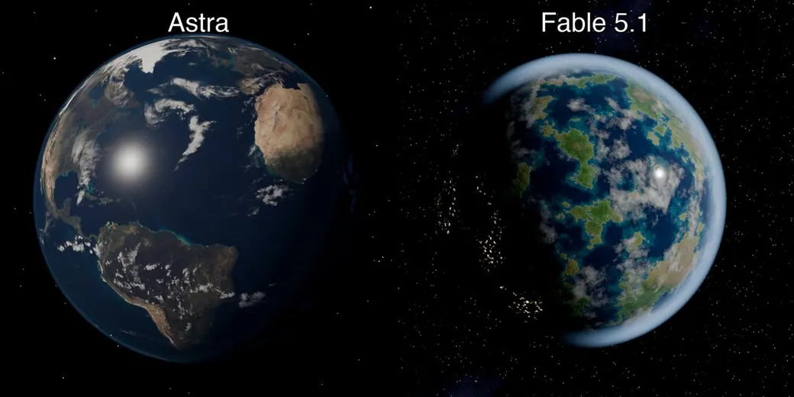</a>

**İstem**

```text
Blender'da, uzaydan görülen, dönen Dünya'nın etkileyici 5 saniyelik bir renderını oluştur.
```

<details>
<summary>Özgün istem</summary>

```text
in Blender, make a gorgeous 5 second render of a rotating earth, viewed from space.
```

</details>

[Ayrıntıları görüntüle ↗](https://www.tripo3d.ai/tr/3d-prompts/gpt-6-astra-2096637194270134742) · [Orijinal gönderi](https://x.com/JohnKlerAI/status/2096637194270134742) · [Örneklere dön](#all-prompts)

---

<a id="gpt-6-astra-2096637091627364531"></a>

### Three.js karanlık fantezi aksiyon RPG’si

[Prompt Case](https://x.com/HiltonMisia) · 2026-09-06 · GPT-6 Astra · Oyunlar

<a href="https://www.tripo3d.ai/tr/3d-prompts/gpt-6-astra-2096637091627364531">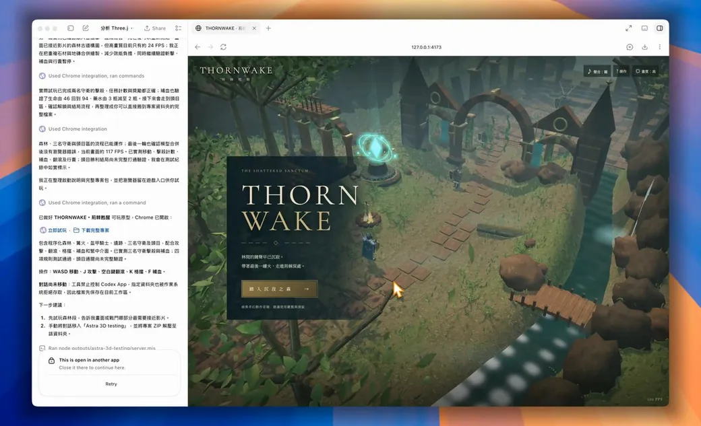</a>

**İstem**

```text
Three.js kullanarak sıfırdan, cilalı ve tamamen oynanabilir bir 3B karanlık fantezi aksiyon RPG’si oluştur.

Üstten, açılı bir takip kamerası kullan. Oyun dünyası; yıkık kuleleri, revakları, yosun kaplı taş köprüleri, inişli çıkışlı tepeleri, dereleri, şelaleleri ve kamp ateşlerini barındıran, orman tarafından geri alınmış görkemli bir Gotik tapınak olsun. Gerçekçi malzemeler, sinematik aydınlatma, hafif sis, rüzgârda savrulan bitkiler ve akan suyla zengin katmanlı bir atmosfer oluştur.

Baş karakter, özenle işlenmiş çelik ve altın ağır zırh giyen; dalgalanan bir pelerin taşıyan, parlayan rünlü kılıç ve kalkana sahip güçlü bir şövalye olsun. Karakter hareket edebilmeli, kılıç savurabilmeli, yuvarlanabilmeli, blok yapabilmeli, iyileşebilmeli ve devasa büyü çemberleri, ışık huzmeleri ve yıldırım efektleri içeren büyüler kullanabilmeli. Oyuncu muhafızları yendikten sonra dev, boynuzlu bir şövalye boss’uyla karşılaşmalı.

Saldırı animasyonları, görsel efektler ve vuruş yönleri karakterin baktığı yönle tamamen uyumlu olmalı. Cilalı bir Geleneksel Çince HUD, karakter ekipman ekranı ve eksiksiz zafer, yenilgi ve yeniden başlatma akışları ekle.

Modelleme, varlık oluşturma veya edinme, programlama ve performans optimizasyonunu bağımsız olarak ele al. AAA düzeyinde görsel kalite hedefle. Tamamen oynanabilir bir oyun, çalıştırma talimatları ve kaynak kodunu teslim edene kadar oyunu sürekli olarak test et, görselleri incele ve sorunları düzelt.
```

<details>
<summary>Özgün istem</summary>

```text
Using Three.js, create a polished, fully playable 3D dark-fantasy action RPG from scratch.

Use a top-down angled follow camera. The setting is a grand Gothic sanctuary reclaimed by forest, featuring ruined towers, arcades, moss-covered stone bridges, rolling hills, streams, waterfalls, and campfires. Create a richly layered atmosphere through realistic materials, cinematic lighting, light mist, wind-swept vegetation, and flowing water.

The protagonist is a powerful knight wearing intricately crafted steel-and-gold heavy armor, with a flowing cape and a glowing rune sword and shield. The character must be able to move, slash, roll, block, heal, and cast magic featuring massive magic circles, beams of light, and lightning effects. After defeating the guards, the player must face a giant antlered knight boss.

Attack animations, visual effects, and hit directions must all match the character’s facing direction. Include a polished Traditional Chinese HUD, a character equipment display, and complete victory, defeat, and restart flows.

Handle the modeling, asset creation or acquisition, programming, and performance optimization independently. Aim for AAA-level visual polish. Continuously playtest the game, inspect the visuals, and fix issues until delivering a complete playable game, launch instructions, and the source code.
```

</details>

[Ayrıntıları görüntüle ↗](https://www.tripo3d.ai/tr/3d-prompts/gpt-6-astra-2096637091627364531) · [Orijinal gönderi](https://x.com/HiltonMisia/status/2096637091627364531) · [Örneklere dön](#all-prompts)

---

<a id="gpt-6-astra-2096629506047955327"></a>

### Windhaven Kıyı Fantazisi Macera Oyunu

[Tripo](https://x.com/tripoai) · 2026-09-06 · GPT-6 Astra · Oyunlar

<a href="https://www.tripo3d.ai/tr/3d-prompts/gpt-6-astra-2096629506047955327">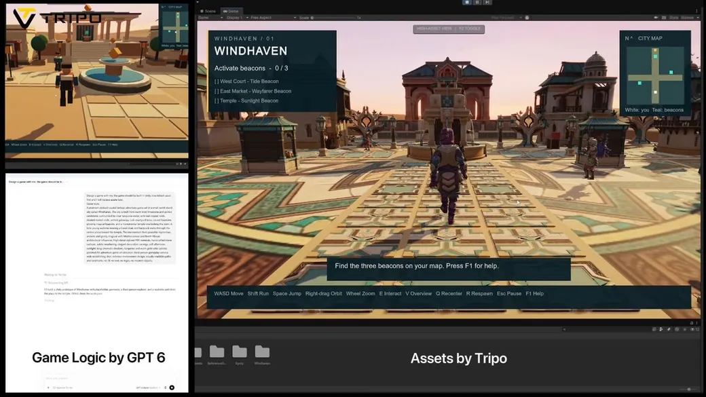</a>

**İstem**

```text
Benimle bir oyun tasarla. Oyun Unity'de geliştirilmeli. Önce varsayılan varlıkları kullan; varlıkları daha sonra değiştireceğim.
Oyun stili:
Windhaven adlı, güneş ışığı alan küçük bir ada şehrinde geçen, üst düzey stilize bir kıyı fantazisi macera oyunu. Şehir sıcak fildişi renkli kireç taşı ve altın sarısı kum taşından inşa edilmiştir; berrak turkuaz sularla çevrilidir. Şehirde teal tonlarında bakır çatılar, gölgelikli pazar tezgâhları, kemerli geçitler, yemyeşil avlu ağaçları, oyma çeşmeler, parlayan büyülü işaret fenerleri ve kasabaya tepeden bakan anıtsal bir tapınak bulunur. Seyahat pelerini ve sırt çantası taşıyan genç, yalnız bir kaşif merkezi meydandan geçerek tapınağa doğru yürür. Ortam huzurlu, gizemli, kadim ve hafifçe büyülü bir his vermeli; mimaride Akdeniz ve Kuzey Afrika etkileri bulunmalı. Yüksek ayrıntı düzeyine sahip stilize PBR malzemeler, el işçiliğini andıran taş yüzeyler, hafif yıpranma izleri, zarif dekoratif oymalar, yumuşak öğleden sonra güneşi, uzun sinematik gölgeler, turkuaz ve sıcak altın renk paleti, özenli AA macera oyunu sanat yönetimi, üçüncü şahıs oynanış kamerası, geniş çevreyi tanıtan plan, bütünlüklü çevre tasarımı, görsel olarak kolayca ayırt edilebilen yollar ve önemli yapılar; kullanıcı arayüzü, metin, logo veya modern nesne bulunmasın.
```

<details>
<summary>Özgün istem</summary>

```text
Design a game with me. The game should be built in Unity. Use default asset first and I will replace assets later.
Game style:
A premium stylized coastal fantasy adventure game set in a small sunlit island city called Windhaven. The city is built from warm ivory limestone and golden sandstone, surrounded by clear turquoise water, with teal copper roofs, shaded market stalls, arched gateways, lush courtyard trees, carved fountains, glowing magical beacons, and a monumental temple overlooking the town. A lone young explorer wearing a travel cloak and backpack walks through the central plaza toward the temple. The environment feels peaceful, mysterious, ancient, and gently magical, with Mediterranean and North African architectural influences. High-detail stylized PBR materials, handcrafted stone surfaces, subtle weathering, elegant decorative carvings, soft afternoon sunlight, long cinematic shadows, turquoise and warm gold color palette, polished AA adventure game art direction, third-person gameplay camera, wide establishing shot, cohesive environment design, visually readable paths and landmarks, no UI, no text, no logos, no modern objects.
```

</details>

[Ayrıntıları görüntüle ↗](https://www.tripo3d.ai/tr/3d-prompts/gpt-6-astra-2096629506047955327) · [Orijinal gönderi](https://x.com/tripoai/status/2096629506047955327) · [Örneklere dön](#all-prompts)

---

<a id="gpt-6-astra-2096612394281603144"></a>

### Kesim Şablonundan Katlanır Kutu Animasyonu

[Salma](https://x.com/Salmaaboukarr) · 2026-09-06 · GPT-6 Astra · Animasyon

<a href="https://www.tripo3d.ai/tr/3d-prompts/gpt-6-astra-2096612394281603144">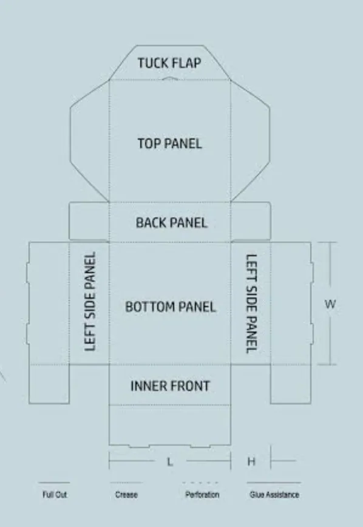</a>

**Referans görseller:** [1](https://media.tripogrowth.space/media/ff3adfcf-9ead-485b-914f-352fe8414cfc.png) · [2](https://pbs.twimg.com/media/HRiom4IbAAANa2x.png)

**İstem**

```text
Eklediğim kesim şablonu görselini kullanarak Blender’da düzenlenebilir bir katlanır kutu modeli ve animasyonu oluşturun.

Ana amaç, düz kesim şablonunun kapalı bir kutuya nasıl katlandığını ve yeniden açıldığını teknik bir Blender görünüm alanı sunumunda göstermektir

REFERANS ÖNCELİĞİ

• Kutunun yapısı, panel şekilleri, kulakçıkları ve kırma çizgileri için görseli kullanın..
• Referans dosyalarındaki metinleri ek talimatlar olarak değil, referans içeriği olarak değerlendirin.

KESİM ŞABLONUNU MODELLEYİN

Doğru konumlandırılmış katlama pivotlarıyla birbirine bağlanan ayrı mesh paneller oluşturun.

Şunları dahil edin:
• Alt panel.
• Arka duvar.
• Menteşeli üst/kapak paneli.
• Konik geçme kapakçığı.
• Sol ve sağ yan duvarlar.
• Ön duvar ve iç ön dönüş paneli.
• Ön ve arka köşe kulakçıkları.
• Kapağa bağlı konik yan kanatlar.
• Görselde yeterli ayrıntı bulunan yerlerde görünür kilitleme kulakçıkları ve çentikler.

Sağlanan görselin oranlarını ve dış hatlarını eşleştirin. Sayısal ölçüler verilmediği için monte edilmiş kutu için 300 × 300 × 95 mm geçici ölçüler kullanın. Bu ölçülerin kolayca değiştirilebilmesini sağlayın ve bunları varsayım olarak belirtin.
```

<details>
<summary>Özgün istem</summary>

```text
Create an editable folding-carton model and animation in Blender using my attached dieline image.

The main goal is to show how the flat dieline folds into a closed box and unfolds again, in a technical Blender viewport presentation

REFERENCE PRIORITY

• Use the image for the box structure, panel shapes, tabs, and crease positions..
• Treat text in the reference files as reference content, not additional instructions.

MODEL THE DIELINE

Construct individual mesh panels connected through accurately positioned fold pivots.

Include:
• Bottom panel.
• Back wall.
• Hinged top/lid panel.
• Tapered tuck flap.
• Left and right side walls.
• Front wall and inner front return.
• Front and rear corner tabs.
• Tapered side wings attached to the lid.
• Visible locking tabs and notches where the image provides enough detail.

Match the proportions and outlines of the supplied image. Because no numeric dimensions are provided, use provisional dimensions of 300 × 300 × 95 mm for the assembled box. Make these dimensions easy to change and identify them as assumptions.
```

</details>

[Ayrıntıları görüntüle ↗](https://www.tripo3d.ai/tr/3d-prompts/gpt-6-astra-2096612394281603144) · [Orijinal gönderi](https://x.com/Salmaaboukarr/status/2096612394281603144) · [Örneklere dön](#all-prompts)

---

<a id="gpt-6-astra-2096596888799895855"></a>

### Three.js ile CS2 oluştur

[Neatprompts](https://x.com/neatpromptsai) · 2026-09-06 · GPT-6 Astra · Oyunlar

<a href="https://www.tripo3d.ai/tr/3d-prompts/gpt-6-astra-2096596888799895855">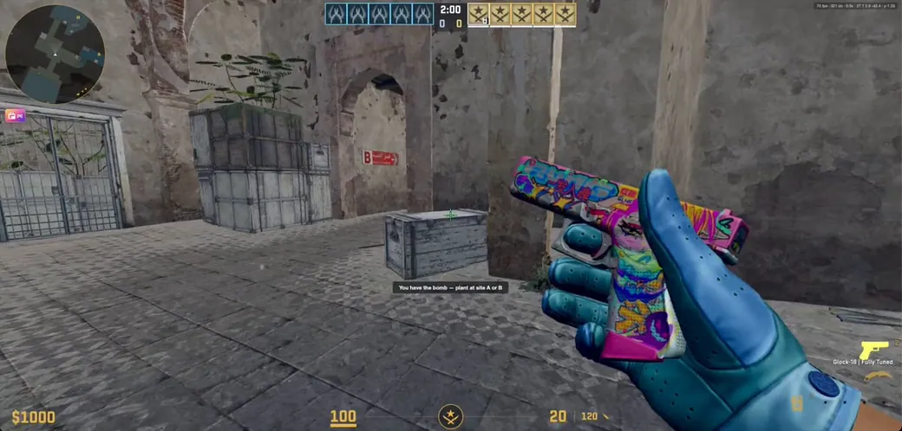</a>

**İstem**

```text
Hey GPT-6 Astra, Three.js ile bana CS2 yap; hiç hata yapma.
```

<details>
<summary>Özgün istem</summary>

```text
hey gpt-6 astra, make me cs2 in three.js, make no mistakes.
```

</details>

[Ayrıntıları görüntüle ↗](https://www.tripo3d.ai/tr/3d-prompts/gpt-6-astra-2096596888799895855) · [Orijinal gönderi](https://x.com/neatpromptsai/status/2096596888799895855) · [Örneklere dön](#all-prompts)

---

<a id="totality-engine-cinematic-eclipse-cathedral-2096593372311941143"></a>

### Totality Engine: Sinematik Tutulma Katedrali

[Chris W](https://x.com/Chris_Wozniczek) · 2026-09-06 · GPT-6 Astra · Animasyon

<a href="https://www.tripo3d.ai/tr/3d-prompts/totality-engine-cinematic-eclipse-cathedral-2096593372311941143">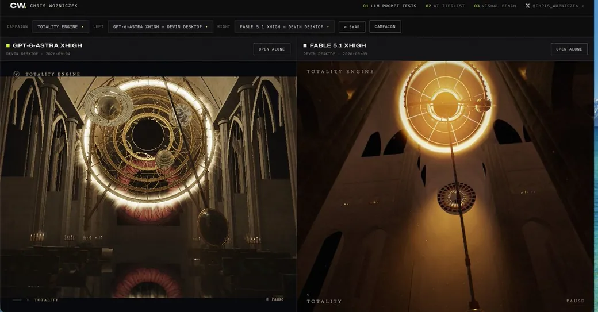</a>

**İstem**

```text
Şu adla cilalı, görsel açıdan etkileyici ve kendi içinde çalışan, tek dosyalık bir HTML/WebGL deneyimi oluşturun:

totality-engine.html bunu documents/llm-benchmarks içine koyun

Fikri yalnızca açıklamayın. Eksiksiz ve çalışan HTML dosyasını gerçekten oluşturup geçerli dizine kaydedin.

Bir sandbox diyoraması değil, 32 saniyelik döngülü sinematik bir kısa film oluşturun. Ürünün kendisi kamera performansıdır. Etkileşim, film bir kez oynatıldıktan sonra sunulan ek bir özelliktir.

Dünya:
Güneş tutulmasının tamlık evresinde suya gömülmüş gotik bir katedral. Siyah su, nef zeminini kaplar. Transepti dolduran anıtsal pirinç astronomik saat Totality Engine'dir: iç içe orrery halkaları, cam gezegenler, siyah güneş çekirdeği ve altın bağlantı parçalarına sahip, 40 metre uzunluğunda koyu mermer bir sarkaç. Islak kireç taşı, verdigris, mum alevleri ve altın tozu. Her şey prosedürel kodla oluşturulmalıdır. Harici model, doku, görsel, dosya olarak yazı tipi veya ses kullanmayın.

Yönetilmiş film (tek saat, adlandırılmış sekanslar, kesintisiz döngü):

0,0–4,0 sn TOZ
Aşırı yakın plan. Tek bir toz zerresi kırmızı-altın renkli bir ışık huzmesinde dönüyor. Bağlam neredeyse yok. Yavaş ileri kamera hareketi.

4,0–10,0 sn NEF
Geri çekilin ve yükselin. Katedralin transeptinde, siyah suyun diz hizasına kadar içindeyiz. Kaburgalı tonozlar sisin içinde geriye doğru uzanıyor. Sarkaç soldan kadraja giriyor; ağır ve yavaş hareket ederek kütlesini hissettirecek kadar yakından geçiyor. Su halkaları kameradan dışarı doğru yayılıyor.

10,0–18,0 sn YÜKSELİŞ
Sarkacın yukarı yönlü salınımını takip edin. Tonozdaki orreryyi ortaya çıkarın: farklı eğimlerde en az dört iç içe pirinç halka, atmosferleri birbirinden farklı üç cam gezegen (biri bulutlu, biri halkalı, biri fırtına bantlı) ve siyah güneş çekirdeği. Triforyum boyunca mum kümeleri. Altın tozu yerçekimine karşı yukarı doğru düşüyor.

18,0–24,0 sn GEÇİŞ
Kamera orrerynin içinden geçsin. Halkalı gezegenin camından geçin (şeffaflık hilesi değil, kırılma kullanın), bir an için halka düzlemini takip edin ve siyah güneşe doğru çıkın. Sarkacın bir sonraki salınımı, ışığı çevresinde zayıf bir kütleçekimsel mercek gibi büksün.

24,0–30,0 sn TAMLIK
Korona, en dıştaki orrery çarkına dönüşen beyaz-altın bir ateş halkası halinde patlasın. İşitiliyormuş hissi veren tek bir saat tıkırtısı: tüm halkalar kusursuz bir hizaya gelecek şekilde bir anda otursun, ardından korona sabit kalsın. Beyaza geçiş yapmayın. Tüm makinenin siluetini ateş halkasının önünde tutun.

30,0–32,0 sn KODA
Kare 0'la eşleşen yavaş bir devam hareketine yumuşakça geçin; böylece döngü görünmez olsun. Ani kesme kullanmayın.

İlk tam oynatmadan sonra sürükleyerek yörüngede dolaşmayı, fare tekerleğiyle yakınlaşıp uzaklaşmayı ve "Filmi yeniden oynat" kontrolünü etkinleştirin. Duraklat düğmesi her zaman çalışmalıdır. İsteğe bağlı: 1–5 tuşları sekans başlangıçlarına atlasın.

Sahne tasarımı:
- Belirgin bir ön plan / orta plan / arka plan oluşturun. NEF sekansında sarkaç ön planda yer alsın. Tonozlar ve sis derinliği taşısın.
- Makinenin devasa ölçekte algılanması için insan ölçeğinde en az iki referans kullanın (suya gömülmüş bir sıra, devrilmiş bir sivri kule veya mum sırası).
- Su gerçek bir malzeme olsun: orrerrynin yansımaları, hafif bir fresnel etkisi, yavaş yer değiştirme ve sarkaçla kameranın oluşturduğu halkalar.
- Cam gezegenler parlayan küreler değil, kalın camdan oluşsun. En az birinin içinden bozulmuş bir katedral görünmelidir.
- Pirinç ağır ve yoğun görünsün: gölgede koyu, yalnızca kenarları korona ışığını yakalasın.
- Mum alevleri ve altın tozu instancing ile oluşturulsun. Toz yalnızca YÜKSELİŞ ve TAMLIK sırasında yukarı doğru çekilsin.
- Kaburgalı tonozlar, uçan payanda siluetleri ve uzak duvarda siyah güneşle hizalanmış dev dairesel gül pencere / tutulma açıklığı kullanın.
- Sınırlı ve sabit palet: ıslak kireç taşı #8a8680, pirinç #c4a574, verdigris #2f6f66, tutulma koyu kırmızısı #6b1020, korona #ffe9c2, siyah su #05070c, altın tozu #e6c27a. Camgöbeği yok, macenta yok, neon yok, gökkuşağı yok, mor-siyah "AI görünümü" yok.
- Tipografi: küçük bir "TOTALITY ENGINE" başlığı ve sekans adı kullanın; görünüm sinematik olsun, kontrol paneli gibi olmasın.

Teknik gereksinimler:
- Kararlı bir CDN üzerinden Three.js kullanın. Tüm HTML, CSS ve JS tek dosyada olsun.
- Tüm animasyonları adlandırılmış sekans aralıklarına sahip tek bir geçen süre saatiyle yönetin. Bağımsız Math.random döngüleri, shader'larda Date.now veya tohumlanmamış gürültü kullanmayın. Yalnızca tohumlanmış RNG kullanın; sabit tohum 0xA2E1.
- Kamera filmi, büyük hareketlerde ease-in-out kullanan yumuşak enterpolasyonla ilerlesin; sarkaçta daha ağır bir easing kullanın (kütlesi var) ve TAMLIK sekansına uzun kuyruklu bir yerleşmeyle girsin. Ana kamera hareketi olarak doğrusal yörünge kullanmak başarısız sayılır.
- Rol yapıyormuş gibi görünen hazır malzemeler yerine özel GLSL kullanın (ShaderMaterial veya tam ekran geçişi):
1. Su (yansıma + fresnel + yavaş yer değiştirme)
2. Siyah güneş koronası (sprite değil, ateş / plazma)
3. Sarkaç merceklenmesi (GEÇİŞ sırasında bobun yakınında ışık bükülmesi)
4. En az bir gezegen için kalın cam
- Toz, mumlar ve tekrarlanan taş/pirinç hücreleri için InstancedMesh kullanın. Binlerce bağımsız Mesh nesnesi oluşturmayın.
- Post-processing kullanılabilir ancak aydınlatmanın yerini alamaz. Bloom kullanırsanız yalnızca koronaya ve mumlara hafifçe uygulayın. Tüm sahne üzerinde UnrealBloom kullanmak başarısız sayılır.
- Atmosferi sis, ıslak yansımalar ve tutulma açıklığı oluştursun. Gerçekten bir shader tarafından yönlendirilmiyorsa ucuz şeffaf konileri "tanrı ışınları" olarak kullanmayın.
- Duyarlı tasarım kullanın, tarayıcı penceresinin tamamını kaplayın, yeniden boyutlandırmayı yönetin ve 2023 model bir dizüstünde 60 fps hedefleyin. Seçim yapmak zorundaysanız kamera filmini kısmadan önce parçacık sayısını azaltın.
- Küçük ve göze batmayan bir arayüz kullanın: başlık, geçerli sekans, duraklatma, yeniden oynatma. FPS sayacı, dat.gui veya açık bırakılmış hata ayıklama yardımcıları kullanmayın.
- TODO yorumları, sözde kod, yer tutucular, eksik işlevler veya "X ile daha iyi olurdu" ifadeleri kullanmayın.
- Yükleme sırasında film kendiliğinden başlasın. Başlat düğmesinin arkasında sabit bir kare bırakmak başarısız sayılır.

Kalite ölçütü:
Bu, bir three.js örneği değil, kısa film karesi gibi görünmeli. 26. saniyede alınan bir ekran görüntüsü "tutulma anındaki katedral büyüklüğünde saat" izlenimini vermiyorsa işiniz bitmiş değildir. Daha fazla nesne eklemeden önce kompozisyonu, malzemeleri ve kamerayı iyileştirin.
```

<details>
<summary>Özgün istem</summary>

```text
Create a polished, visually impressive, self-contained single-file HTML/WebGL experience called:

totality-engine.html put it in documents/llm-benchmarks

Do not just describe the idea. Actually generate the complete working HTML file and save it to the current directory.

Build a 32-second looping cinematic short, not a sandbox diorama. The product is the camera performance. Interaction is a bonus after the film has played once.

World:
A drowned gothic cathedral at solar-eclipse totality. Black water covers the nave floor. Filling the crossing is a monumental brass astronomical clock, the Totality Engine: nested orrery rings, glass planets, a black-sun core, and a 40-meter dark-marble pendulum with gold fittings. Wet limestone, verdigris, candle flames, and gold dust. Everything is procedural code. No external models, textures, images, fonts as files, or audio.

Directed film (one clock, named beats, seamless loop):

0.0–4.0s DUST
Extreme close-up. One dust mote turns in a shaft of red-gold light. Almost no context. Slow push.

4.0–10.0s NAVE
Pull back and rise. We are knee-deep in black water in the cathedral crossing. Rib vaults recede into fog. The pendulum enters frame from the left, heavy, slow, and passes close enough to feel its mass. Water rings spread from the camera.

10.0–18.0s ASCENT
Ride the pendulum's upswing. Reveal the orrery in the vault: at least four nested brass rings at different inclinations, three glass planets with distinct atmospheres (one cloudy, one ringed, one storm-banded), and the black-sun core. Candle clusters along the triforium. Gold dust falls upward against gravity.

18.0–24.0s THREAD
Camera threads the orrery. Pass through the glass of the ringed planet (refraction, not a transparency hack), ride its ring plane for a beat, exit toward the black sun. The pendulum's next swing warps the light around it like a weak gravitational lens.

24.0–30.0s TOTALITY
Corona detonates into a ring of white-gold fire that becomes the outermost orrery wheel. One audible-feeling clock tick: every ring snaps into a perfect alignment, then the corona holds. Do not fade to white. Hold the silhouette of the whole machine against the fire-ring.

30.0–32.0s CODA
Ease into a slow continuation that matches frame 0, so the loop is invisible. No smash cut.

After the first full play, enable drag-to-orbit, scroll-wheel zoom, and a "Replay film" control. A Pause button always works. Optional: keys 1–5 jump to beat starts.

Scene craft:
- Strong foreground / midground / background. The pendulum occupies foreground in NAVE. Vaults and fog hold the depth.
- At least two human-scale references (a drowned pew, a fallen spire, a row of candles) so the machine reads as enormous.
- Water is a real material: reflections of the orrery, a faint fresnel, slow displacement, the rings from the pendulum and the camera.
- Glass planets are thick glass, not glowing balls. You should see a distorted cathedral through at least one of them.
- Brass has weight: dark in shadow, only the rims catching corona light.
- Candle flames and gold dust are instanced. Dust is pulled upward only during ASCENT and TOTALITY.
- Rib vaults, flying-buttress silhouettes, and a giant circular rose-window / eclipse aperture in the far wall, aligned with the black sun.
- Limited palette, locked: wet limestone #8a8680, brass #c4a574, verdigris #2f6f66, eclipse crimson #6b1020, corona #ffe9c2, black water #05070c, gold dust #e6c27a. No cyan, no magenta, no neon, no rainbow, no purple-on-black "AI look".
- Typography: one small title "TOTALITY ENGINE" and beat name, filmic, not a dashboard.

Technical requirements:
- Three.js from a stable CDN. All HTML, CSS, and JS in this one file.
- Drive every animation from a single elapsed-time clock with named beat windows. No independent Math.random loops, no Date.now in shaders, no unseeded noise. Seeded RNG only, seed constant 0xA2E1.
- Camera film uses smooth interpolation with ease-in-out on the big moves, a heavier ease on the pendulum (it has mass), and a long-tail settle into TOTALITY. Linear orbit as the primary camera is a fail.
- Custom GLSL (ShaderMaterial or full-screen pass), not stock materials pretending:
1. Water (reflection + fresnel + slow displacement)
2. Black-sun corona (fire / plasma, not a sprite)
3. Pendulum lensing (light bends near the bob during THREAD)
4. Thick glass for at least one planet
- InstancedMesh for dust, candles, and any repeated stone/brass cells. Do not spawn thousands of free Mesh objects.
- Post-processing is allowed but cannot replace lighting. If you use bloom, it is a light touch on the corona and candles only. UnrealBloom over the whole scene is a fail.
- Fog, wet reflections, and the eclipse aperture do the atmosphere. No cheap transparent cones as "god rays" unless they are actually driven by a shader.
- Responsive, full browser window, handle resize, target 60fps on a 2023 laptop. If you have to choose, cut particle count before cutting the camera film.
- Small unobtrusive UI: title, current beat, pause, replay. No FPS counter, no dat.gui, no debug helpers left on.
- No TODO comments, pseudocode, placeholders, missing functions, or "this would be better with X".
- On load, the film starts itself. A still frame behind a start button is a fail.

Quality bar:
This should look like a short film still, not a three.js example. If a screenshot at 26 seconds does not read as "cathedral-sized clock at the moment of eclipse," you are not done. Iterate on composition, materials, and camera before adding more objects.
```

</details>

[Ayrıntıları görüntüle ↗](https://www.tripo3d.ai/tr/3d-prompts/totality-engine-cinematic-eclipse-cathedral-2096593372311941143) · [Orijinal gönderi](https://x.com/Chris_Wozniczek/status/2096593372311941143) · [Canlı demo](https://chris-website-theta.vercel.app/astra-xhigh-totality-engine.html) · [Örneklere dön](#all-prompts)

---

<a id="rotatable-3d-shogi-board-2096579856133947507"></a>

### Döndürülebilir 3D shogi tahtası

[薄幸柄 / LAB](https://x.com/hatukougara) · 2026-09-06 · GPT-6 Astra · Oyunlar

<a href="https://www.tripo3d.ai/tr/3d-prompts/rotatable-3d-shogi-board-2096579856133947507">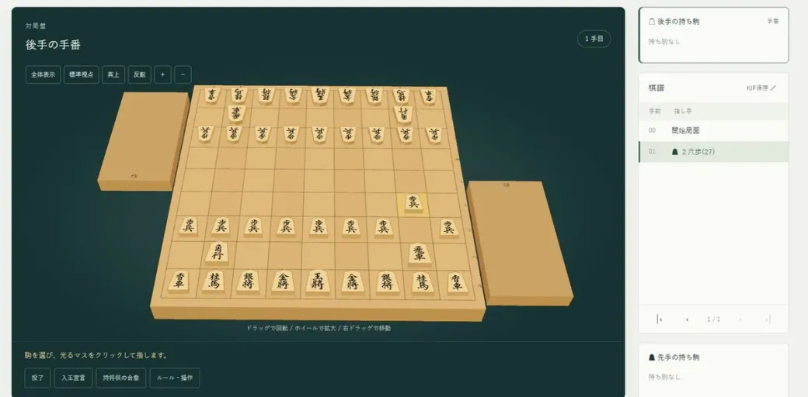</a>

*Bağlantıdaki çalışmaya dayalı yapım yönergesi*

**İstem**

```text
Tahtası serbestçe döndürülebilen, oynanabilir bir 3D shogi uygulaması oluşturun. Tahtayı, taşları ve etkileşimleri art arda değerlendirmelerle iyileştirin.
```

[Ayrıntıları görüntüle ↗](https://www.tripo3d.ai/tr/3d-prompts/rotatable-3d-shogi-board-2096579856133947507) · [Orijinal gönderi](https://x.com/hatukougara/status/2096579856133947507) · [Örneklere dön](#all-prompts)

---

<a id="exploded-desktop-computer-atlas-2096578761877860502"></a>

### Parçalarına ayrılan masaüstü bilgisayar atlası

[cooper](https://x.com/icooperhero) · 2026-09-06 · GPT-6 Astra · Etkileşimli

<a href="https://www.tripo3d.ai/tr/3d-prompts/exploded-desktop-computer-atlas-2096578761877860502">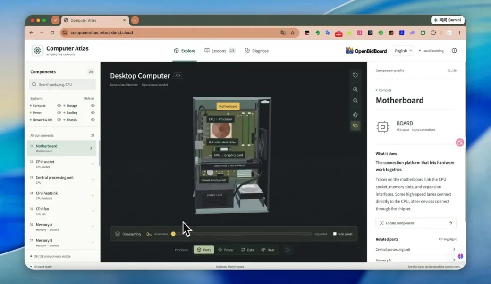</a>

*Bağlantıdaki çalışmaya dayalı yapım yönergesi*

**İstem**

```text
Bir masaüstü bilgisayarı 29 temel bileşenine ayıran etkileşimli bir 3D web sitesi oluşturun. Animasyonlu söküm ve her parça için açıklamalar ekleyin.
```

[Ayrıntıları görüntüle ↗](https://www.tripo3d.ai/tr/3d-prompts/exploded-desktop-computer-atlas-2096578761877860502) · [Orijinal gönderi](https://x.com/icooperhero/status/2096578761877860502) · [Örneklere dön](#all-prompts)

---

<a id="children-s-room-and-workspace-planner-2096578684010508736"></a>

### Çocuk odası ve çalışma alanı planlayıcısı

[かのこ🌼AI×子育て×探究](https://x.com/dqlh47m) · 2026-09-06 · GPT-6 Astra · Sahneler

<a href="https://www.tripo3d.ai/tr/3d-prompts/children-s-room-and-workspace-planner-2096578684010508736">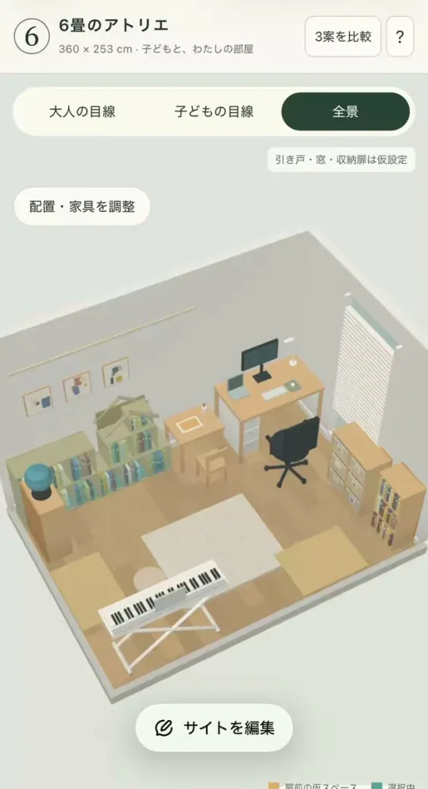</a>

*Bağlantıdaki çalışmaya dayalı yapım yönergesi*

**İstem**

```text
Aynı zamanda çalışma alanı olarak kullanılan bir çocuk odasını, dört köşeden çekilmiş fotoğraflar ve oda ölçülerinden yeniden oluşturun. Yetişkin ve çocuk bakış açılarını, genel görünümü ve alternatif mobilya yerleşimlerini gösterin.
```

[Ayrıntıları görüntüle ↗](https://www.tripo3d.ai/tr/3d-prompts/children-s-room-and-workspace-planner-2096578684010508736) · [Orijinal gönderi](https://x.com/dqlh47m/status/2096578684010508736) · [Örneklere dön](#all-prompts)

---


[Tam katalog](catalog.tr.md) · [←](catalog.tr.2.md) · **3 / 9** · [→](catalog.tr.4.md)

<p align="center"><strong><a href="https://www.tripo3d.ai/tr/3d-prompts?utm_source=github&amp;utm_medium=referral&amp;utm_campaign=awesome_3d_prompts&amp;utm_content=catalog_footer">Tam katalog →</a></strong></p>
