<!-- Generated from Growth CMS by templates/catalog.md. Edit content in CMS; run npm run sync. -->

# Awesome 3D Prompts — 3 / 10

[← Awesome 3D Prompts](../README.md)

<p>
  <a href="../docs/catalog.en.3.md"></a>
  <a href="../docs/catalog.zh.3.md"></a>
  <a href="../docs/catalog.zh-Hant.3.md"></a>
  <a href="../docs/catalog.ja.3.md"></a>
  <a href="../docs/catalog.ko.3.md"></a>
  <a href="../docs/catalog.es.3.md"></a>
  <a href="../docs/catalog.pt.3.md"></a>
  <a href="../docs/catalog.de.3.md"></a>
  <a href="../docs/catalog.fr.3.md"></a>
  <a href="../docs/catalog.it.3.md"></a>
  <a href="../docs/catalog.ru.3.md"></a>
  <a href="../docs/catalog.tr.3.md"></a>
  <a href="../docs/catalog.uk.3.md"></a>
  <a href="../docs/catalog.vi.3.md"></a>
</p>

[Tam katalog](catalog.tr.md) · [←](catalog.tr.2.md) · **3 / 10** · [→](catalog.tr.4.md)

<a id="all-prompts"></a>

<details>
<summary>Örnekleri keşfet (50)</summary>

- [Spline Rush prosedürel tarayıcı yarış oyunu](#gpt-6-astra-2102150615635816866)
- [Etkileşimli 3B Güneş modeli web sitesi](#gpt-6-astra-2102038136725377200)
- [Verdant — etkileşimli 3B dinozor adası](#gpt-6-astra-2101730386711634251)
- [Three.js'te WALL-E için 3B model oluşturun](#gpt-6-astra-2101687900723106104)
- [Açık Denizde Yelkenli Tekne](#gpt-6-astra-2101616345720787130)
- [TITANIC — Son Işık](#titanic-the-last-light)
- [Waymo Jaguar I-Pace 3B modeli](#gpt-6-astra-2101325346427842909)
- [Catfu dövüş sanatları kedisi için 3B animasyon ve video iş akışı](#gpt-6-astra-2101310374033428642)
- [Etkileşimli 3B uçak motoru gösterimi](#gpt-6-astra-2101271938706685991)
- [Eksiksiz Fotogerçekçi 3B Ortam](#gpt-6-astra-2101224659861590399)
- [Gerçek yörünge fiziğiyle galaksi](#gpt-6-astra-2101055500599054437)
- [Monster Block — Şehri 45 Saniyede Yerle Bir Et](#monster-block)
- [Etkileşimli IWC Schaffhausen Saat Modeli](#gpt-6-astra-2100956517633761447)
- [ODD ARMS — Tuhaf Silahlarla Hayatta Kalma Oyunu](#odd-arms)
- [Fotogerçekçi bir 3B dünya oluşturun](#gpt-6-astra-2100844566718926949)
- [Yüzen adalar arasında 3B hava tramvayı oyunu](#gpt-6-astra-2100838090210431302)
- [Sharpa becerikli eliyle kalem çevirme politikası eğitimi](#gpt-6-astra-2100751369619820923)
- [CAD ile kendi gövdesi](#gpt-6-astra-2100614534423540102)
- [Kapatılmış Araştırma Tesisinden Kaçış: Tarayıcıda 3B Oyun](#gpt-6-astra-2100595652703199281)
- [3B Yarış Oyunu Oluştur](#gpt-6-astra-2100526922770026874)
- [Korkuluğa bakım zinciri ekle](#gpt-6-astra-2100519026720231698)
- [Etkileşimli voxel şövalyesi ve kamp ateşi sahnesi](#gpt-6-astra-2100350159540596760)
- [İzometrik fantezi grafik demosu](#gpt-6-astra-2100271998618177864)
- [AKARI: Nagoya Çatı Alevi Bayrak Yarışı](#akari-nagoya-rooftop-flame-relay)
- [Kiklop’un Adası](#cyclops-island-threejs-game)
- [Yeraltı İstasyonunda AAA CGI Doğaüstü Dövüş Kısa Filmi](#gpt-6-astra-2100233407108137349)
- [Fayans seçenekleriyle interaktif daire turu](#gpt-6-astra-2100222426705453318)
- [PC için Splatoon geliştirme ve grafiklerin yeniden oluşturulması](#gpt-6-astra-2100193512373592313)
- [Hareketli mobilyalara sahip etkileşimli 3B oda sahnesi](#gpt-6-astra-2100139076816916977)
- [Referans görsellerden hareketli 3B ortam ve oyun karakteri oluşturma](#gpt-6-astra-2099850719839109597)
- [Erişilebilir prosedürel uzay keşif oyunu](#gpt-6-astra-2099785223827259515)
- [Apple tarzı 3B kalp ve gülümseyen emoji](#gpt-6-astra-2099750376530657300)
- [Etkileşimli 3B organizma sinir sistemi paneli](#gpt-6-astra-2099719427990134984)
- [Kaçan teknelerin bulunduğu etkileşimli volkanik ada](#gpt-6-astra-2099643231659012553)
- [Bir otel koridoru sahnesi oluştur](#gpt-6-astra-2099588840419651890)
- [Savaşçı Devin Üzerine Tırmanıp Çenesine Vuruyor](#gpt-6-astra-2099519801139908951)
- [Çok yüksek gökdelenlerle dolu 3B dünya](#gpt-6-astra-2099487024256589970)
- [200 poligonun altında kozalaklı ağaç modeli](#gpt-6-astra-2099472264270102705)
- [Etkileşimli 3B Samuray Ormanı Sahnesi](#gpt-6-astra-2099450933067612421)
- [Oynanabilir 3B Engel Parkuru](#gpt-6-astra-2099419671481249851)
- [Çarpışma Önlemeli Otonom Model Demiryolu](#gpt-6-astra-2099362575339372780)
- [Peach’s Castle’ı 3B olarak yeniden tasarla](#gpt-6-astra-2099359786865402019)
- [Etkileşimli 3B Anatomi Gezgini](#gpt-6-astra-2099206962344800541)
- [Tarayıcıda oynanabilir 3B kıyı bölümü](#gpt-6-astra-2099172061092381027)
- [Başsız kıyafet modelinde UV açılımı ve 4K yeniden bake](#gpt-6-astra-2098980384260456813)
- [Kendi kendine katlanan 3B origami animasyonu](#gpt-6-astra-2098909584996057283)
- [Çernobil Atlası](#gpt-6-astra-2098841316591346006)
- [Kinetik Kum Masası Simülasyonu](#gpt-6-astra-2098831830002851846)
- [1893 Chicago Dünya Fuarı'nın 3B rekonstrüksiyonu](#gpt-6-astra-2098795017955418202)
- [Bağlantı parçalarıyla birleştirilen parçalı 3D baskı çerçeve](#gpt-6-astra-2098774359926297011)

</details>
<a id="gpt-6-astra-2102150615635816866"></a>

### Spline Rush prosedürel tarayıcı yarış oyunu

[Maharajahu🪢](https://x.com/ToolBraidComp) · 2026-09-21 · GPT-6 Astra · Oyunlar

<a href="https://www.tripo3d.ai/tr/3d-prompts/gpt-6-astra-2102150615635816866">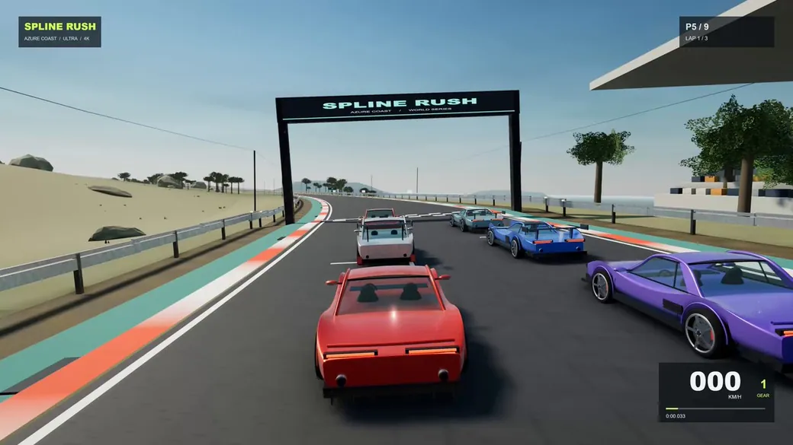</a>

**İstem**

```text
En yeni Three.js’i (mümkün olduğunda WebGPURenderer + TSL) kullanarak Spline Rush adlı eksiksiz, prodüksiyon kalitesinde bir tarayıcı yarış oyunu oluştur. %100 prosedürel olsun: harici model, doku, ses dosyası veya yazı tipi kullanma. Her şeyi çalışma zamanında kodla üret.

ANA OYUN
- Yükselti, eğimli virajlar, tüneller, keskin virajlar, adlandırılmış virajlar ve birbirinden farklı biyomlar (sahil gündüzü, dağ alacakaranlığı, çöl gün batımı, yağmurlu orman, gece neon şehir, yüksek hızlı oval) içeren 6 benzersiz pist.
- Şampiyona modu (sıralama turları + 3 yarış), hayalet araçlarla Zamana Karşı ve Hızlı Yarış.
- Kişiliğe, yarış çizgisine ve fren noktalarına sahip; sollama ve savunma yapabilen 8 yapay zekâ rakibi.
- En iyi tur rekorları, sektör süreleri, canlı etkinlik akışı ve tekrar kamerası.
- Garaj: vernik kaplamalı ve metalik pullu boyaya, belirgin panel aralıklarına, çalışan ışıklara, animasyonlu süspansiyona ve hasar durumlarına sahip 5 parametrik araç.

GRAFİK HEDEFİ (Ultra, 4K’da RTX 5090’a yakışır)
Renderer: THREE.WebGPURenderer. Fizik tabanlı işleme hattı.
Aydınlatma:
- Tam gün/gece döngüsünü yöneten, fizik tabanlı Rayleigh/Mie gökyüzü + yıldız alanı + ay + dinamik güneş.
- Kademeli gölge haritaları (4 kademe, kararlı texel snapping, yüksek çözünürlük).
- Günün saatine göre güncellenen PMREM üzerinden IBL.
- Hacimsel sis + ışık huzmeleri + ısı titreşimi.
Malzemeler:
- MeshPhysicalMaterial / TSL düğümleri: vernik kaplama, anizotropi, camda transmisyon, metalik pullu boya, yağmura tepki veren ıslak yol shader’ı.
Son işleme zinciri (RenderPipeline / TSL veya postprocessing kütüphanesi):
GTAO veya yüksek kaliteli SSAO → SSR → bloom (Karis) → hareket bulanıklığı (hız) → DOF → ışık huzmeleri → otomatik pozlama → renk derecelendirme + film grenı + vinyet → SMAA veya TAA.
Efektler:
- GPU parçacık havuzları: lastik dumanı, kıvılcımlar, toz, yağmur serpintisi, savrulan çim/çakıl, ısı bozulması.
- Kalıcı olan ve zamanla silikleşen patinaj izleri.
- Yağmur yağdığında dinamik ıslaklık ve su birikintisi yansımaları.

FİZİK VE HİS
- Sabit adımlı 120 Hz simülasyon.
- Raycast veya payandalı süspansiyon, yük transferi, birleşik kayma lastikleri, ABS/TC, yüzey türleri (asfalt, kerb, çim, çakıl, ıslak).
- Kamera: hareket ve çarpışma sarsıntılı sinematik takip + kaput + araç içi görünümler.

AUDIO
- Tamamen sentezlenmiş Web Audio: RPM/yüke göre çok katmanlı motor sesi, rüzgâr, lastik cayırtısı, kerb titreşimi, seyirci sesleri ve dinamik müzik.

KALİTE SİSTEMİ
- Ön ayarlar: Low / Medium / High / Ultra.
- Ultra, RTX 5090 sınıfı GPU varsayar: 4K, yüksek çözünürlüklü gölge haritaları, maksimum parçacık sayısı, tüm son işleme efektleri açık, agresif LOD yok.
- Kare süresi hedefi aşarsa efektleri azaltabilen uyarlanabilir kalite.

Oynanabilir bir ilk sürümle (tek pist, tek araç, temel aydınlatma) başla; ardından özellikleri tam olarak istendiği sırayla, tek tek ekleyerek geliştir. Her şeyi yerel olarak çalışan tek ve temiz bir HTML/JS (veya Vite) projesinde tut. Ana sistemleri yorumlarla açıkla. Sevimli değil, pahalı ve üst düzey görünsün.
```

<details>
<summary>Özgün istem</summary>

```text
Build a complete, production-quality browser racing game called Spline Rush using the latest Three.js (WebGPURenderer + TSL where possible). 100% procedural: no external models, textures, audio files or fonts. Everything generated in code at runtime.

CORE GAME
- 6 unique tracks with elevation, banking, tunnels, hairpins, named corners and distinct biomes (coastal day, mountain dusk, desert sunset, forest rain, night city neon, high-speed oval).
- Championship mode (qualifying + 3 races), Time Trial with ghosts, Quick Race.
- 8 AI opponents with personality, racing line, braking points, overtaking and defending.
- Best lap records, sector times, live event feed, replay camera.
- Garage: 5 parametric cars with clearcoat + metal-flake paint, panel gaps, working lights, animated suspension, damage states.

GRAPHICS TARGET (Ultra, worthy of RTX 5090 at 4K)
Renderer: THREE.WebGPURenderer. Physically based pipeline.
Lighting:
- Rayleigh/Mie physically based sky + starfield + moon + dynamic sun that drives a full day/night cycle.
- Cascaded shadow maps (4 cascades, stable texel snapping, high-res).
- IBL via PMREM updated with time of day.
- Volumetric fog + god rays + heat haze.
Materials:
- MeshPhysicalMaterial / TSL nodes: clearcoat, anisotropy, transmission on glass, metal-flake paint, wet-road shader that reacts to rain.
Post-processing chain (RenderPipeline / TSL or postprocessing library):
GTAO or high-quality SSAO → SSR → bloom (Karis) → motion blur (velocity) → DOF → god rays → auto-exposure → color grading + film grain + vignette → SMAA or TAA.
Effects:
- GPU particle pools: tyre smoke, sparks, dust, rain spray, grass/gravel kick-up, heat distortion.
- Skid marks that persist and fade.
- Dynamic wetness and puddle reflections when raining.

PHYSICS & FEEL
- Fixed-step 120 Hz simulation.
- Raycast or strut suspension, load transfer, combined-slip tyres, ABS/TC, surface types (asphalt, kerb, grass, gravel, wet).
- Camera: cinematic chase + hood + onboard with motion and collision shake.

AUDIO
- Fully synthesised Web Audio: multi-layer engine by RPM/load, wind, tyre screech, kerb rumble, crowd, dynamic music.

QUALITY SYSTEM
- Presets: Low / Medium / High / Ultra.
- Ultra assumes RTX 5090-class GPU: 4K, high shadow maps, max particles, all post effects on, no aggressive LOD.
- Adaptive quality that can drop effects if frame time exceeds target.

Start with a playable first version (one track, one car, basic lighting), then iterate feature-by-feature exactly as requested. Keep everything in a single clean HTML/JS (or Vite) project that runs locally. Comment major systems. Make it look expensive, not cute.
```

</details>

[Ayrıntıları görüntüle ↗](https://www.tripo3d.ai/tr/3d-prompts/gpt-6-astra-2102150615635816866) · [Orijinal gönderi](https://x.com/ToolBraidComp/status/2102150671340327384) · [Örneklere dön](#all-prompts)

---

<a id="gpt-6-astra-2102038136725377200"></a>

### Etkileşimli 3B Güneş modeli web sitesi

[HIX.AI](https://x.com/HIX_AI_) · 2026-09-21 · GPT-6 Astra · Etkileşimli

<a href="https://www.tripo3d.ai/tr/3d-prompts/gpt-6-astra-2102038136725377200">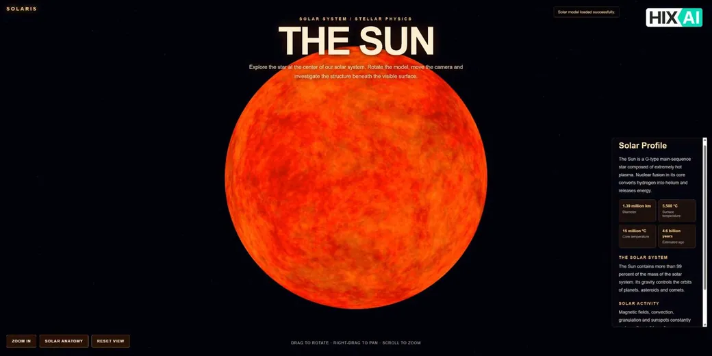</a>

**İstem**

```text
Three.js kullanarak etkileşimli bir 3B Güneş modeli web sitesi oluşturmak istiyorum.

Öncelikle, doğrudan Blender'da çalıştırılabilecek ve son derece gerçekçi bir 3B Güneş modeli oluşturacak bir Python betiği yazın. Model; küresel şekli, yüzey dokusu, rengi, plazmayı andıran görünümü, Güneş granülasyonu ve parlayan atmosferi dahil olmak üzere Güneş'in gerçek fiziksel ve görsel özelliklerini temel almalıdır. Basit bir turuncu küre gibi görünmemelidir. Gerçekçi bir Güneş görünümü oluşturmak için uygun malzemeler, shader'lar, dokular ve ışıklandırma efektleri kullanın.

Ardından Three.js kullanarak web sitesinin eksiksiz kodunu yazın. Güneş, ana görsel alanın yaklaşık %80'ini kaplamalıdır. Kullanıcılar Güneş'i döndürebilmeli, görünümü hareket ettirebilmeli ve yakınlaştırıp uzaklaştırabilmelidir. Sahne, Güneş'in dinamik ve üç boyutlu görünmesini sağlamak için gerçekçi ışıklandırma ve parlama efektleri içermelidir.

Kullanıcıların Güneş'e yaklaşarak yüzey ayrıntılarını inceleyebilmesini sağlayan bir yakınlaştırma düğmesi ekleyin.

Web sitesinde ayrıca Güneş ve Güneş sistemindeki rolü hakkında bilgilendirici içerikler bulunmalıdır. Genel arka plan, gerçekçi bir kozmik galaksi/uzay ortamı olmalıdır.

Buna ek olarak, Güneş'in etkileşimli iç yapı görünümünü açan bir düğme ekleyin. Bu görünümde çekirdek, ışınım bölgesi, taşınım bölgesi, fotosfer, kromosfer ve korona gibi Güneş'in başlıca katmanları gösterilmelidir. Her katmanın kendine ait bir etiketi ve kısa bir açıklaması olmalıdır. İdeal olarak kullanıcılar diyagramla etkileşime girebilmeli ve bilgilerini görüntülemek için farklı katmanları seçebilmelidir.

Web sitesini görsel açıdan etkileyici, bilimsel açıdan bilgilendirici ve tamamen etkileşimli; arayüzünü ise modern, uzay temalı olacak şekilde hazırlayın.
```

<details>
<summary>Özgün istem</summary>

```text
I want to build an interactive 3D Sun model website using Three.js.

First, please write a Python script that can be run directly in Blender to create a highly realistic 3D model of the Sun. The model should be based on the Sun's real physical and visual characteristics, including its spherical shape, surface texture, color, plasma-like appearance, solar granulation, and glowing atmosphere. It should not look like a simple orange sphere. Please use appropriate materials, shaders, textures, and lighting effects to create a realistic solar appearance.

Then, write the complete website code using Three.js. The Sun should occupy approximately 80% of the main visual area. Users should be able to rotate the Sun, move the view, and zoom in and out. The scene should include realistic lighting and glowing effects to make the Sun look dynamic and three-dimensional.

Add a zoom-in button that allows users to get closer to the Sun and observe its surface details.

The website should also include informative content about the Sun and its role in the solar system. The overall background should be a realistic cosmic galaxy/space environment.

In addition, add a button that opens an interactive internal anatomy view of the Sun. This view should show the major layers of the Sun, such as the core, radiative zone, convection zone, photosphere, chromosphere, and corona. Each layer should have a corresponding label and a short text description. Ideally, users should be able to interact with the diagram and select different layers to view their information.

Please make the website visually impressive, scientifically informative, and fully interactive, with a modern space-themed UI.
```

</details>

[Ayrıntıları görüntüle ↗](https://www.tripo3d.ai/tr/3d-prompts/gpt-6-astra-2102038136725377200) · [Orijinal gönderi](https://x.com/HIX_AI_/status/2102038474752766239) · [Örneklere dön](#all-prompts)

---

<a id="gpt-6-astra-2101730386711634251"></a>

### Verdant — etkileşimli 3B dinozor adası

[vib3coded](https://x.com/vib3coded) · 2026-09-20 · GPT-6 Astra · Etkileşimli

<a href="https://www.tripo3d.ai/tr/3d-prompts/gpt-6-astra-2101730386711634251">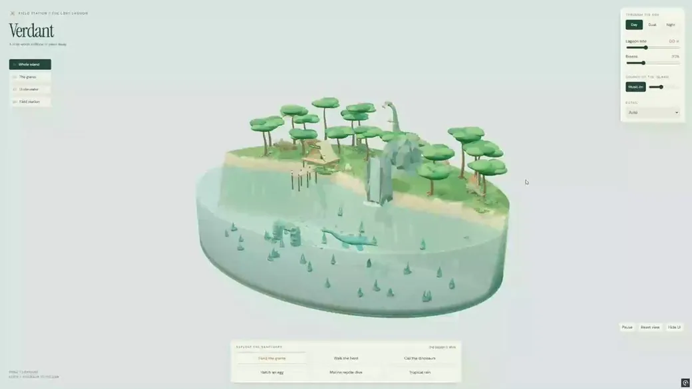</a>

**İstem**

```text
Verdant'ı oluşturun — Three.js + WebGL ile hazırlanmış etkileşimli bir 3B diorama

Gezinen dinozorların, bir şelalenin ve içinde yüzen bir deniz sürüngeninin bulunduğu kesitli bir lagünün yer aldığı yemyeşil bir ada. Sürüyü besleyin, bir yavru dinozorun yumurtadan çıkmasını sağlayın ve kamerayı suyun altına indirin

Gelgiti, rüzgârı ve günün saatini ayarlayın ya da dinlendirici müzik çalarken tropik yağmur başlatın

Her şey doğrudan tarayıcınızda, tek bir HTML dosyasında çalışır
```

<details>
<summary>Özgün istem</summary>

```text
create Verdant - an interactive 3D diorama built with Three.js + WebGL

A lush island with roaming dinosaurs, a waterfall, and a cutaway lagoon with a swimming marine reptile. Feed the herd, hatch a baby dinosaur, and take the camera underwater

Adjust the tide, wind, and time of day, or bring in tropical rain while relaxing music plays

Everything runs right in your browser, in a single HTML file
```

</details>

[Ayrıntıları görüntüle ↗](https://www.tripo3d.ai/tr/3d-prompts/gpt-6-astra-2101730386711634251) · [Orijinal gönderi](https://x.com/vib3coded/status/2101570806702559235) · [Örneklere dön](#all-prompts)

---

<a id="gpt-6-astra-2101687900723106104"></a>

### Three.js'te WALL-E için 3B model oluşturun

[Marcel](https://x.com/marcthecreatorr) · 2026-09-20 · GPT-6 Astra · Varlıklar

<a href="https://www.tripo3d.ai/tr/3d-prompts/gpt-6-astra-2101687900723106104">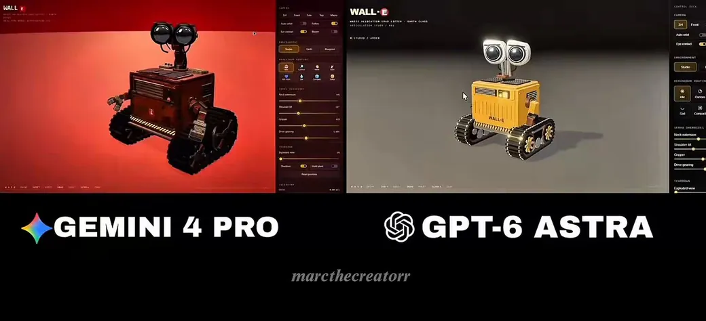</a>

**İstem**

```text
Three.js'te WALL-E için 3B model oluşturun.
```

<details>
<summary>Özgün istem</summary>

```text
create a 3d model of wall-e in three.js.
```

</details>

[Ayrıntıları görüntüle ↗](https://www.tripo3d.ai/tr/3d-prompts/gpt-6-astra-2101687900723106104) · [Orijinal gönderi](https://x.com/marcthecreatorr/status/2101687900723106104) · [Örneklere dön](#all-prompts)

---

<a id="gpt-6-astra-2101616345720787130"></a>

### Açık Denizde Yelkenli Tekne

[www.aicontenders.dev](https://www.aicontenders.dev/) · 2026-09-20 · GPT-6 Astra · Etkileşimli

<a href="https://www.tripo3d.ai/tr/3d-prompts/gpt-6-astra-2101616345720787130">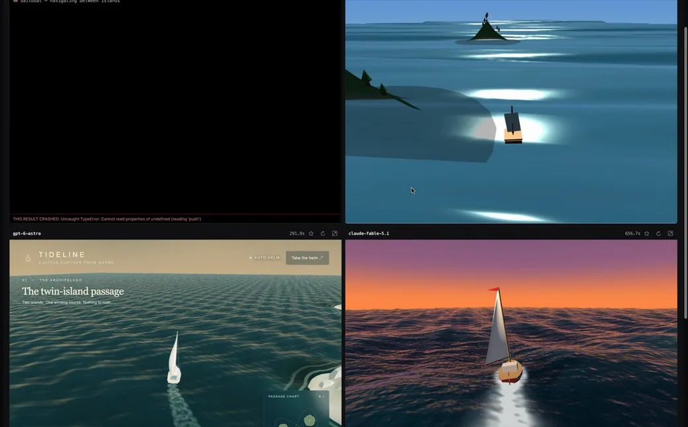</a>

**İstem**

```text
Açık denizde ilerleyen küçük bir yelkenli teknenin gösterildiği 3B sahne için tek bir HTML dosyası oluşturun. Tekne, son model testlerinde görülen karşılaştırma amaçlı "boat game" demolarına benzer şekilde doğal dümen kontrolüne sahip olmalı ve sahnede görünen iki adanın çevresinden geçen bir rota izlemelidir.

İşlevsel gereksinimler:

Düz ve statik bir doku yerine, animasyonlu dalga ağı olarak oluşturulmuş bir su yüzeyi kullanın (prosedürel su shader'ı, hareketli dalgalar, bakış açısına göre değişen ışık yansımaları ve teknenin arkasında iz bırakan köpüklü su).
Basit şekillerden (gövde, direk, rüzgârla şişen yelken) oluşturulmuş bir yelkenli tekne modeli kullanın. Tekne, altındaki suyun hareketiyle senkronize olacak şekilde dalgaların üzerinde görünür biçimde sallanmalı ve hafifçe yatmalıdır.
Sahnede farklı noktalara yerleştirilmiş, birbirinden belirgin iki ada bulunmalıdır. Her adada basit arazi şekillendirmesi (yükselti, plaj ve isteğe bağlı bitki örtüsü) ile adanın çevresindeki suya düşen bir gölge bulunmalıdır.
Tekne, her iki adadan da gerçekten kaçınan bir rota izlemelidir (siluetlerinin içinden geçmemeli veya karayı kesmemelidir). Açıların birdenbire değiştirilmesi yerine yumuşak dönüşler yapmalıdır.
Kamera, tekneyi hafif bir gecikmeyle takip etmelidir (yumuşatılmış kamera takibi). Böylece tepeden bakan, tekneye sabitlenmiş bir görünüm yerine dinamik bir takip hissi vermelidir.
Adalardaki gölgelerle yön açısından tutarlı olacak şekilde, gökyüzünde bir renk geçişi (ör. gün batımı veya gündüz mavisi; seçimi modele bırakılmıştır) ve su üzerinde güneş ya da ışık yansıması bulunmalıdır.

Teknik gereksinimler:

Tek bir .html dosyası kullanılmalıdır. cdnjs üzerinden three.js kullanılabilir; başka harici varlık veya doku kullanılamaz. Su ve arazi, kod/shader içinde tamamen prosedürel olarak oluşturulmalıdır.
Adaların çevresindeki rota önceden planlanmış bir yol (ör. adaların arasından geçen bir Bézier eğrisi) veya konuma tepki veren basit bir dümenleme sistemi olabilir; seçim modele bırakılmıştır, ancak karayla çarpışmaya izin verilmez.
Animasyon en az 20 saniye boyunca akıcı biçimde çalışmalı; döngüsel veya sürekli olabilir. Tipik bir dizüstü bilgisayarda en az 30 FPS sunmalı, aşırı yüklemeyi önlemek için canvas çözünürlüğü pencere boyutuyla sınırlandırılmalı ve devicePixelRatio 1.5'i aşmamalıdır.

Değerlendirmede öncelikle suyun, animasyonlu UV ofsetine sahip bir doku gibi değil, hareket hâlindeki akışkan bir madde gibi inandırıcı görünmesine; teknenin dalgalara gerçekten tepki vermesine ve adaların çevresindeki rotanın rastgele bir kıl payı geçişi yerine bilinçli bir navigasyon olarak algılanmasına bakılacaktır.
```

<details>
<summary>Özgün istem</summary>

```text
Build a single HTML file with a 3D scene showing a small sailboat moving across open water, with native steering and a course that navigates around two visible islands, similar to the comparison "boat game" demos seen in recent model tests.

Functional requirements:

A water surface rendered as an animated wave mesh (procedural water shader, moving waves, light reflections that shift with viewing angle, a wake trail behind the boat), not a flat, static texture.
A sailboat model built from simple shapes (hull, mast, sail filled by the wind), with visible bobbing and slight tilting on the waves, synchronized with the motion of the water beneath it.
Two distinct islands placed at different points in the scene, each with simple terrain shaping (a rise, a beach, optionally vegetation) and a shadow cast onto the water around it.
The boat should follow a route that genuinely avoids both islands (never clipping through their silhouette or crossing through the land), turning smoothly rather than snapping between angles.
The camera follows the boat with a slight lag (smoothed camera follow), giving the impression of a dynamic chase rather than a rigidly attached top down view.
A gradient sky (e.g. sunset or daytime blue, model's choice) with a sun or light reflection on the water, directionally consistent with the shadows on the islands.

Technical requirements:

A single .html file, three.js from cdnjs is allowed, no other external assets or textures, all water and terrain generated procedurally in code/shader.
The route around the islands can be a pre-planned path (e.g. a Bezier curve threading between the islands) or simple steering that reacts to position, model's choice, but no collision with land is allowed.
The animation must run smoothly for at least 20 seconds, looping or continuous, minimum 30fps on a typical laptop, canvas resolution capped to window size with a devicePixelRatio no higher than 1.5 to avoid overloading hidpi screens.

Judged primarily on whether the water looks convincingly like a fluid in motion (not a texture with animated UV offset), whether the boat genuinely reacts to the waves, and whether the route around the islands reads as intentional navigation rather than a random near miss.
```

</details>

[Ayrıntıları görüntüle ↗](https://www.tripo3d.ai/tr/3d-prompts/gpt-6-astra-2101616345720787130) · [Orijinal gönderi](https://www.aicontenders.dev/c/a_TRQpq3LoNVd-M7Xy2DHg) · [Örneklere dön](#all-prompts)

---

<a id="titanic-the-last-light"></a>

### TITANIC — Son Işık

[jared](https://x.com/jaredliu_bravo) · 2026-09-20 · GPT-6 Astra · Animasyon

Uyarlama kaynağı: [notjazii / Titanic reference](https://x.com/notjazii/status/2101007819592085586)

<a href="https://www.tripo3d.ai/tr/3d-prompts/titanic-the-last-light">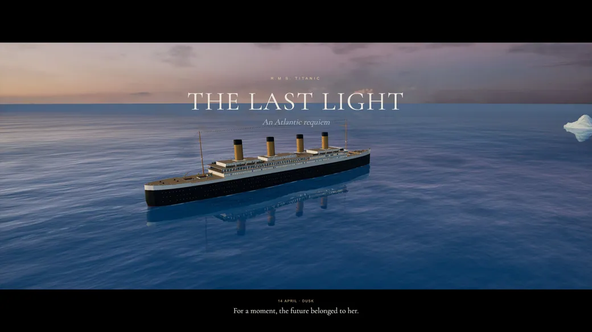</a>

**İstem**

```text
1. Proje amacı
TITANIC — THE LAST LIGHT’ı oluşturun: geminin son gün batımından çarpışma, tahliye ve batışa, oradan da şafak anıtına uzanan 264 saniyelik etkileşimli bir sinematik yolculuk. Ziyaretçiler yönetmen kurgulu bir film izleyebilmeli, hareketli 3B dünyayı keşfedebilmeli, bir bölüme atlayabilmeli, tek bir kareyi kaydedebilmeli veya filmin tamamını indirebilmeli. Bunu adli doğruluk ya da resmî bağlantı iddiasında bulunmadan, sanatsal bir yorum olarak sunun.

2. Görsel yön
Sade ve ölçülü bir sinematik palet kullanın: derin Atlantik mavisine karşı sıcak krem ve amber gemi ışıkları; ardından karanlık, yıldızlarla aydınlanan gece ve soğuk şafak. Sahneyi perspektif olarak, 2.39:1 film kompozisyonuyla, yumuşak bloom, hafif gren ve vignette kullanarak render edin. Karakter portrelerinde ve şafak sahnesinde alan derinliğinden yararlanın; imdat roketlerinin parçacıklarını ise keskin tutun. Okyanusa koyu mavi bir gövde rengi, dünya uzayında dalgalanmalar, daha küçük mipmap’lenmiş ripple normal’ları ve Fresnel yansımaları verin; sıcak gün batımı rengi esas olarak yansıyan ışıkta görülmeli. Aynı okyanus deformasyonunu izleyen, gövdeye bağlı wake şeritleri kullanın; uçları yumuşak, köpükleri kesintili olsun. Dikey gökyüzü dikişlerini ve yansıyan çizgileri önlemek için panorama dokularını yatayda, fract kesintisi oluşturmayacak şekilde sarın. Turuncu sığ su gölgelendirmesinden, tekdüze küçük dalgalanmalardan ve parlayan dairesel köpük decal’lerinden kaçının. Derinlik çakışmasını önlemek için gizli, üst üste binen çatı üst yüzeylerini kaldırın; kamera için çekim mesafesine uygun bir near plane kullanın. Batış sırasında pencere ışığını yüksek frekanslı titreşim eklemek yerine monoton biçimde kısın. Sade bir serif başlık, iki dilli İngilizce/Çince kontroller ve alt kısım boyunca dar bir zaman çizelgesi kullanın.

3. Dünya, coğrafya ve kamera kurgusu
269 metre uzunluğundaki gemi, pruva +X yönüne bakacak ve buzdağı (275, 0, 57) konumuna sabitlenecek şekilde tek ve kesintisiz bir koordinat sistemi kullanın. Gemi ilerlesin, buzdağına 96.727 saniyede temas etsin, süzülerek dursun ve ardından baş ile kıç bölümleri ayrı ayrı batacak şekilde suya gömülsün. Buzdağını final boyunca sahnede tutun ve şafak kompozisyonunda görünür kılın. 0, 63, 110, 163, 211 ve 241. saniyelerde başlayan altı bölümü koruyun.

23 bilinçli şekilde tasarlanmış çekim oluşturun. Pruva kucaklaşması 29–61. saniyeler arasında sürsün: genel yaklaşma, yakın çift portre, denize doğru arkadan bakış ve eğik portreden oluşsun. Rose’u önde, Jack’i onun arkasında, pruvanın uç kısmında konumlandırın; ikisi de pruvanın üzerinden dışarıya bakıyor olsun. Sekans boyunca gün batımı ışığını koruyun. 127–158. saniyeler arasında, bir filikanın gerçek dünya dönüşümüne bağlı üç çekim kullanın: filika güvertesinden ayrılış, yolcuların ve askı halatlarının daha yakın görünümü ve suya yaklaşma. Ardından geniş tahliye, yana yatma, kırılma ve batış çekimlerini kullanın. Şafakta, uzakta buzdağı görünürken hayatta kalan filikaları gösterin ve ardından ölçülü bir anıt başlığı kullanın.

4. Varlık envanteri
- titanic-vessel: 269 metrelik ana yapıyı Blender’da; kesintisiz well deck’ler, kapalı forecastle, katmanlı gezinti güverteleri, içi boş ve geriye eğimli dört buff funnel, siyah üst gövde ve kırmızı alt gövdeyle oluşturun. 864 lomboz ve çerçeveleri için gerçek dairesel kenarlar kullanın. Emission’ı gerçek cam malzemeleriyle sınırlayın. Malzemeleri toplu işleyin ve batış için x=-32 konumundan ayırın. Direkleri, rigging’i, davit’leri, halatları, bronz pervaneleri ve dümeni ekleyin. Tik kapılar ve pirinç ayrıntılara sahip bir P2 companionway üretin, normalize edin ve hazırlanmış güvertede iki kez yeniden kullanın. GLB’yi birleştirirken düğüm dönüşümlerini koruyun.
- atlantic-iceberg: katmanlı kırağıya, değişken roughness değerlerine, ölçülü bir normal map’e ve inandırıcı bir su çizgisine sahip, düzensiz ve aşınmış tek bir mavi-beyaz buzdağı. Sabit bir coğrafi nesne olarak kalır.
- lifeboat: beyaz ahşap gövdeye, koyu küpeşteye, oturaklara ve küreklere sahip tek bir White Star kürekli filika; bağımsız hareket eden on altı filikada instanced olarak kullanılır.
- bow-embrace: talep edilen 1997 filmindeki kostüm ve pozdan esinlenen, izole edilmiş çift karakter varlığı: Rose’un kızıl-kahverengi saçları, lacivert/fildişi kıyafetleri ve desenli şalı, kolları açık; hemen arkasında koyu renk palto ve fildişi gömlek giyen Jack. H v3.1’e dönüştürmeden önce temiz, tam figür referans görselleri üretin; her figürün baş, boyun, omuz ve kıyafet bütünlüğünü koruyun. Rose’u ayrı bir yakın plan referansı ve H yüz ayrıntısı donörüyle iyileştirin: gözleri, burnu, dudakları ve çeneyi hizalayın; yerel biçim ve rengi kesintisiz tam figür mesh’ine aktarın; UV geçişini harmanlayıp rötuşlayın. Jack için doğal ten rengine, belirgin gözlere ve dudaklara sahip temiz bir portre üretin. Başın ve üst boynun tamamını koruyun, bakış yönünü ve ölçeği H gövdesine uydurun, alt boynu yüzeye oturtun ve iki sınır loop’unu weld edin. Yüz ayrıntısını düzleştirmeden dar boyun geçişini bake edip rötuşlayın. Duruşu ve ellerin temasını Blender’da düzeltin. Koyu lekeleri, doku dikişlerini, delikleri, kesilmiş kenarları ve giysi kesişmelerini önden, yandan ve arkadan inceleyin. Ten ve kumaş için ayrı shading kullanın. Doğal temel ifadeleri, ölçülü beden ve kumaş hareketleriyle koruyun; gerçekten uygulanmadıysa yüz animasyonu rig’i varmış izlenimi vermeyin.
- seated-woman ve seated-man: 1912 kıyafetleri ve açık renk mantar can yelekleri giyen, dizleri bükülü ve elleri kucaklarında oturan ayrı yetişkin yolcu modelleri. Geometri ve malzemeleri filikalar arasında paylaşın; yerleşim ve yönelimleri hafifçe çeşitlendirin. Binme işlemi için filika başına geri alınabilir instance sayıları kullanın.

Ana gemi için Blender’ı, güverte companionway’i, buzdağı, filikalar ve oturan yolcular için Tripo P2.0’ı, iki eksiksiz başrol figürü ve yakın plan portre iyileştirmeleri için H v3.1’i kullanın. Okyanusu, gökyüzü geçişini, yıldızları, ışıklandırmayı, dumanı, imdat roketlerini, köpüğü, su serpintisini ve enkazı sahne efektleri olarak tutun. Sıkıştırılmış dokulara sahip daha hafif web modeli varyantları sağlayın; ayrıntılı kaynak varlıklarını düzenleme için koruyun. Web sitesi ve çevrimdışı film dışa aktarımı için aynı onaylanmış optimize başrol çiftini kullanın.

5. Oynatma ve geri bildirim
Temel gemi, filika, gökyüzü ve deniz normal varlıkları için gerçek yükleme ilerlemesini gösterin. İlk sahne hazır olduğunda açılış düğmesini etkinleştirin; diğer modelleri ve müziği erteleyin. Gerekli bir karakter veya buzdağı modeli gecikirse çekimi sessizce atlamak yerine sahne sınırında bekleyin ve hazır olduğunda devam edin. Ses, kullanıcı etkileşiminden sonra başlasın.

Zaman çizelgesi, sıfıra dönmeden ileri/geri aramayı ve hızlı sürüklemeleri desteklemeli. Arama sırasında oynat/duraklat ve sessize alma durumunu koruyun; eski ses saatinin istenen konumun üzerine yazmasına izin vermeyin. MP3 ve MP4 için byte range sunun. Bölüm gezintisinde 29. saniyedeki pruva kucaklaşmasına ve 127. saniyedeki filika indirme anına doğrudan girişler bulunmalı; bunlar oynatma durumunu korurken yönetmenin kamerasını geri yüklemeli.

Keşif sırasında dünya, gemi ve film müziği devam ederken yörünge, sürükleme ve yakınlaştırmaya izin verin. Görüş yönünü sabitlemeden geminin çevirisini takip edin. Duraklatma bağımsız kalmalı; filme dönüldüğünde mevcut zaman korunmalı. Space oynatır/duraklatır, ok tuşları on saniye atlar, M sesi açıp kapatır, E keşfi açıp kapatır ve F tam ekranı açar. Dokunmatik yörünge/sıkıştırarak yakınlaştırma ve zaman çizelgesine dokunmayı destekleyin.

Filikalar boş başlar. Yolcular 112. saniyeden sonra kademeli gruplar hâlinde binsin ve her filika aşağı inmeden önce işlemi tamamlasın. Halatlar hareketli davit’ler ile gerçek filika bağlantı noktaları arasında uzansın, bırakma sonrasında kaybolsun. Geriye doğru arama, önceki doluluk ve halat durumlarını geri yüklemeli. Çarpışma; gövde/kamera titreşimini, buz parçalarını, sürtünme serpintisini ve çelik/buz ses geçişini eşgüdümlemeli. İmdat roketlerinde beyaz yanan yıldızlar, kısa ve ayrı izler, yerçekimi, sürükleme ve giderek kaybolan duman kullanın. Batışın oluşturduğu hareketlenmeler, düzensiz ve dalgayı izleyen, kademeli olarak azalan lekeler olmalı; su serpintisini uzak bir noktasal çeşmeden değil, kıçın gerçek su çizgisi boyunca dağıtın.

6. Teknik uygulama ve teslimatlar
Vite, JavaScript modülleri ve Three.js ile deterministik, zamana dayalı animasyon kullanın. Kamera/zaman çizelgesini, gemi varlıklarını, karakterleri, çevreyi, efektleri ve sahne hazırlığını birbirinden ayırın. Web oynatımı, arama ve çevrimdışı yakalama için aynı zaman modelini paylaşın. Web render’ını açıkça belirlenmiş piksel, yansıma ve gölge bütçesi içinde tutun; daha ağır ambient occlusion’ı çevrimdışı profile erteleyin. Uzun süre engelleyen bir başlangıç ön ısıtması yapmadan varlıkları derleyip decode edin. Script’leri, modelleri, görselleri, fontları ve sesleri aynı origin üzerinden sunun; gizli bilgileri statik build’in dışında tutun.

Özgün bir müzik ve ücretli ElevenLabs Foley kullanın: gerçek airburst noktasından ikiye ayrılmış, yükselen uçuş ile keskin patlama ve çıtırtılı kuyruktan oluşan eksiksiz doğal ıslıklı havai fişek kaydı; çelik/buz teması ve sürtünmesi; filika halatları ve su teması; gövde gerilimi/kırılması; kıçın suyu yerinden oynatması. Kaynak WAV dosyalarını dışa aktarın, prompt’ları/geçmiş kimliklerini koruyun ve bunları zamanlanmış cue’lara dönüştürün. Fırlatmaları 119, 151 ve 183. saniyelere, havai fişek patlamalarını ise 3.15 saniye sonrasına hizalayın. Orijinal patlama atağını koruyun ve orkestra müziğinin sesini kısa süreliğine duck edin. Mix’in altında sakin deniz, rüzgâr ve motor ambiyansını koruyun. Referans filmin müzikleri, hem herkese açık web sitesi hem de indirilebilir film için izin alınmadan dahil edilmemeli. Bir fallback’i servis tarafından üretilmiş varlık gibi tanımlamak yerine gerçek varlık ve ses kaynaklarını belgeleyin.

3840×2160 çözünürlükte, 24 fps, üç zamansal örneklemeli, toplam 6.336 kareden oluşan deterministik bir dışa aktarım sağlayın; İngilizce başlıkları görüntüye gömün ve 2.39:1 letterbox görüntü kullanın. 4K H.264/AAC master ile 100 MiB’ın altında bir 1080p web sürümü kodlayın; her ikisi de 48 kHz stereo sesle 264 saniye uzunluğunda olsun. İsteğe bağlı Çince/İngilizce altyazıları, ses master’ını ve düzenlenebilir kaynağı koruyun. Statik build’i mevcut CMS Web Pages barındırması üzerinden yayınlayın; bir platform uygulaması veya sayfa başına Worker eklemeyin.

7. Kabul kriterleri
Açılışı, her iki karakter portresini, çarpışmayı, imdat roketlerini, üç indirme çekiminin tamamını, kırılmayı, kıçın kaybolmasını ve şafağı inceleyin. Buzdağının 244. saniyede kaybolmadığını, denizin derin mavi göründüğünü, batışta düzenli beyaz halkalar bulunmadığını, karakterlerin hazırlanmış çekimlerinde kaldığını ve filika halatlarıyla yolcuların indirme boyunca hizalı olduğunu kontrol edin. Gecikmeli model yüklemeyi, ileri/geri aramayı, hızlı scrub işlemini, duraklatma/sessize almayı, dinamik keşfi, doğrudan yakın plan girişlerini ve dokunmatik emülasyonu test edin. Dışa aktarılan her kareyi doğrulayın, her iki filmi eksiksiz decode edin, gerçek tarayıcı indirmesini teslim edilen dosyayla karşılaştırın ve herkese açık build’i ve CMS bağlantısını doğrulayın. Tarayıcıdaki mobil emülasyonu fiziksel telefonda yapılan testten ayırın.

```

[Ayrıntıları görüntüle ↗](https://www.tripo3d.ai/tr/3d-prompts/titanic-the-last-light) · [Canlı demo](https://titanic-the-last-light.tripo.page/) · [Örneklere dön](#all-prompts)

---

<a id="gpt-6-astra-2101325346427842909"></a>

### Waymo Jaguar I-Pace 3B modeli

[Harshith](https://x.com/HarshithLucky3) · 2026-09-19 · GPT-6 Astra · Varlıklar

<a href="https://www.tripo3d.ai/tr/3d-prompts/gpt-6-astra-2101325346427842909">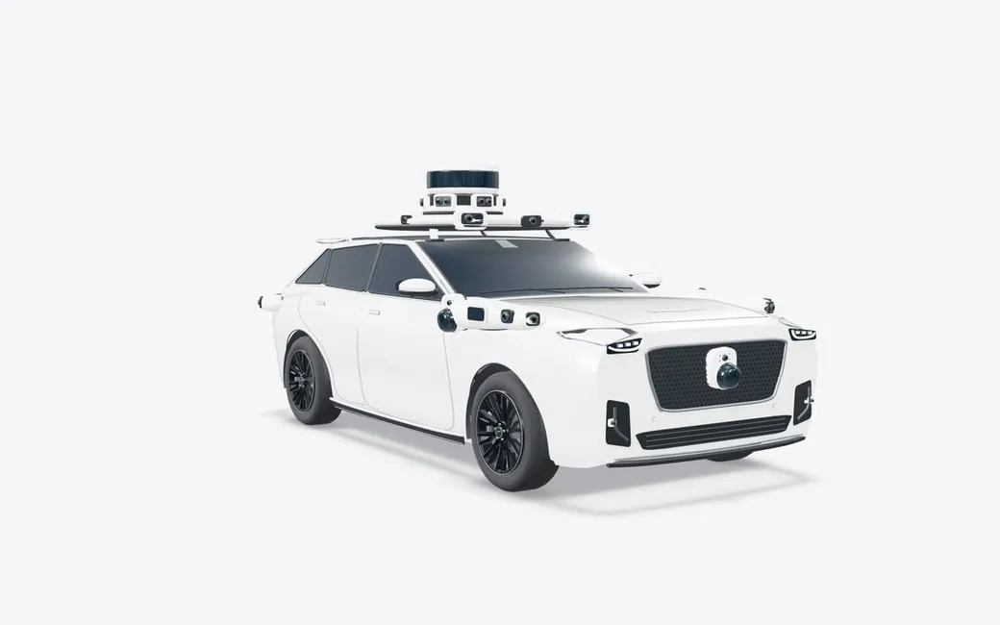</a>

**İstem**

```text
Three.js kullanarak Waymo Jaguar I-Pace 3B modeli
```

<details>
<summary>Özgün istem</summary>

```text
3d model of Waymo Jaguar i-Pace using three js
```

</details>

[Ayrıntıları görüntüle ↗](https://www.tripo3d.ai/tr/3d-prompts/gpt-6-astra-2101325346427842909) · [Orijinal gönderi](https://x.com/HarshithLucky3/status/2101325346427842909) · [Örneklere dön](#all-prompts)

---

<a id="gpt-6-astra-2101310374033428642"></a>

### Catfu dövüş sanatları kedisi için 3B animasyon ve video iş akışı

[PixVerse](https://x.com/PixVerse) · 2026-09-19 · GPT-6 Astra · Animasyon

<a href="https://www.tripo3d.ai/tr/3d-prompts/gpt-6-astra-2101310374033428642">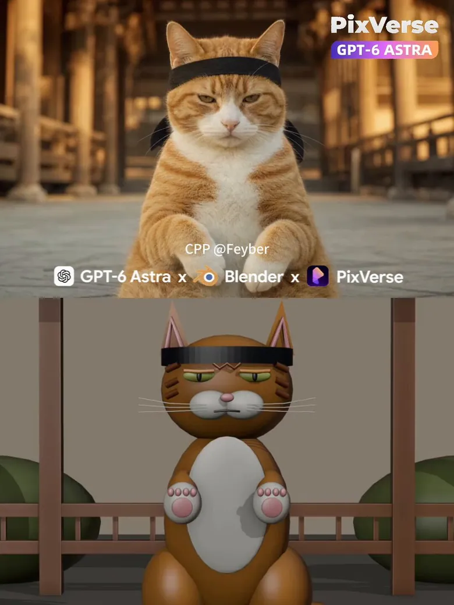</a>

**İstem**

```text
Fotogerçekçi sinematik tek plan, 10 saniye, 16:9, 24 fps, sabit kamera, kesme yok.
Turuncu-beyaz bir tekir kedi (beyaz burun çevresi, göğüs ve patiler; alnında “M” bulunan turuncu tekir çizgileri) tam ortada, objektife dönük ve dik oturur; katı bir dövüş sanatları duruşu vardır — bakışları düz, soğukkanlı ve kayıtsız; gözleri yarı kısık, ağzı kapalı, başı hiç hareket etmez. Alnın alt kısmından bağlanmış siyah bir hachimaki bandı takar; düğüm arkadadır ve kulakları bandın üstünden dikilir.
Mekân: geleneksel bir Japon tapınağı avlusu — sıcak ahşap sütunlar, saçaklar ve korkuluklar — krem tonlu altın saat bokeh’ine eriyerek karışır. 85 mm lens, f/1.8, son derece sığ alan derinliği, odak kedinin gözlerine kilitli. Sıcak 3500K renk düzenlemesi, ön sağdan yumuşak ana ışık, hafifçe doldurulmuş gölgeler, ince film grenleri.
EYLEM: çıplak bir insan kolu kadrajın solundan hızla girer; açık avuç içi güçlü hareket bulanıklığıyla kedinin yüzüne doğru uzanır. Kedi sakince sağ ön patisini kaldırıp avuç içine müdahale ederek hamlenin ivmesini keser — tokat atmaz, bloklar. Kol kedinin yüzünün önünden yatay biçimde bulanık geçer; ardından sağdan ikinci bir el aşağı doğru kesme hareketi yapar. Kedi, gövdesini ve başını tamamen sabit tutarak, gözlerini objektiften hiç ayırmadan her birini kısa ve minimal pati bloklarıyla savuşturur. Saldıran ellerdir — kedi ise tamamen tepkisel ve aldırışsızdır. Eller iki yandan içeri girip çıkarak şaşırtma hamleleri yapar; kedi göğüs hizasında iki patili boks gardına geçer, patilerini kıvırır, dirseklerini içeri alır ve bekleyerek bu pozisyonu korur. Ardından hızlı, bulanık tek patili karşı hamleler yapar; kung-fu tarzında gelen elleri havada yakalar, başı hâlâ karşıya kilitlidir. Son olarak sağ patisini doğrudan objektife doğru uzatır; pembe pati yastığı kameraya dönüktür ve kadrajı yumuşak, odak dışı bir ön plan şekli olarak doldurana kadar ilerler — arkasındaki yüz jilet gibi nettir, soğuk bakış bozulmaz.
Hareket: doğal hız, uçan ellerde ve hızlı pati bloklarında gerçek hareket bulanıklığı. Savunmacı, minimal ve ekonomik kedi hareketleri — kedi neredeyse hiç hareket etmez; bütün işi eller yapar ve başarısız olur. Kamera hareketi yok, zoom yok, metin yok.
NEGATİF: fazladan uzuvlar, birleşmiş veya mutasyona uğramış patiler, fazladan parmaklar, bozulmuş yüz, kürkle birleşen saç bandı, plastik görünümlü cilt, aşırı doygun renkler, metin, altyazı, logo, filigran, kesmeler, kamera sarsıntısı, oyuncu veya kutlama amaçlı beden dili, çak hareketi.
KISA SÜRÜM:
Siyah hachimaki bandı takan turuncu-beyaz tekir kedi, güneş alan bir Japon tapınağı avlusunda oturur ve kameraya ifadesiz bir bakış atar; 85 mm f/1.8, sığ alan derinliği, altın saat, film grenleri. İnsan elleri iki yandan hareket bulanıklığıyla hızla yüzüne doğru kesme ve itme hamleleri yapar — kedi sakince her darbeyi minimal bir pati bloğuyla savuşturur, başını hiç oynatmaz. İki patili kung-fu gardına geçer, hızlı ve bulanık karşı hamleler yapar, ardından pati yastığı kadrajı doldurana kadar patisini objektife doğru uzatır. Sabit kameralı tek plan, 10 sn, 16:9, 24 fps, fotogerçekçi, metin yok.
Kareden küçük bir not: eller ağırlıklı olarak soldan giriyor (aşağı yönlü kesme + yatay süpürme); temas bilek/avuç içinde gerçekleşiyor — pati patiye değil. İki patili gard yaklaşık 4,0–5,6 sn arasında, bulanık karşı hamleler 5,6–8 sn arasında, patiyle lense bitiriş 8–10 sn arasında. Blender MCP ile 3B modeli oluşturup 10 sn, 24 fps çıktı alın ve bunu Seedance 2.5 video modeliyle PixVerse CLI kullanarak süper gerçekçi bir sahneye dönüştürüp işleyin
AJAN ADIMLARI: Blender MCP’yi, PixVerse CLI kimlik doğrulamasını, model yeteneklerini ve kullanılabilir kredileri kontrol edin. Tahmini maliyetleri açıklayın ve ücretli üretimden önce harcama onayı alın. İstemi zaman kodlu bir aksiyon planına dönüştürün, resmî Blender MCP üzerinden hafif 3B ağlar ve animasyon oluşturun, bir hareket referansı MP4’ü dışa aktarın ve kadrajı, hareketi, temas noktalarını, süreyi ve kare hızını inceleyin. Videoyu göndermeden önce ayrı bir görünüm referansı görseli üretip inceleyin. Kimlik, stil ve ışıklandırmayı yönlendirmek için bu görseli; hareket ve zamanlamayı yönlendirmek için Blender videosunu kullanın. Üretimden sonra sonucu indirin, teknik özellikleri doğrulayın, ana kareleri inceleyin, sapmaları dürüstçe raporlayın ve gerçek kredi kullanımını hesaplayın. Orijinalleri koruyun; modelleri hiçbir zaman sessizce değiştirmeyin veya yeniden üretim yapmayın.
PIXVERSE ÇAĞRISI: Onaylanan en-boy oranında, 1080p ve yüksek ayrıntı düzeyinde görünüm referansı oluşturmak için gpt-image-2.0 ile pixverse create image kullanın. Ardından, onaylanan video modelini kullanarak ve her ikisini de ileterek pixverse create reference komutunu çalıştırın --images and --videos togörünüm görselini Blender hareket referansıyla birleştirin. Seedance 2.5 için --model seedance-2.5 --task-type auto, onaylanan süre/en-boy oranını ve --quality 1080p --count 1.kullanın. Göndermeden önce mevcut yetenekleri doğrulayın, benzersiz idempotency anahtarları kullanın ve tamamlanma durumunu pixverse task status / pixverse task wait üzerinden takip edin.
SON ÇIKTI: Onaylanan en-boy oranı ve sürede, 1080p ve 24 fps hedefiyle tamamlanan videoyu; ayrıca görünüm referansı görselini, Blender .blend projesini ve hareket referansı MP4’ünü teslim edin. Mutlak yerel yollar veya indirilebilir URL’ler sağlayın. Son rapor biçimini koruyun: Video, Referans görseli, Blender ağı + animasyon, Kontrol, Görünüm ve Kullanılan krediler. Gerçek çözünürlüğü, kare hızını, kare sayısını, süreyi, görsel sapmaları, görsel/video kredi maliyetlerini, toplam harcamayı, kalan bakiyeyi ve yeniden üretim yapılıp yapılmadığını raporlayın.
```

<details>
<summary>Özgün istem</summary>

```text
Photorealistic cinematic single take, 10 seconds, 16:9, 24fps, locked-off camera, no cuts.
A ginger-and-white tabby cat (white muzzle, chest and paws, orange tabby stripes with an "M" on the forehead) sits upright, dead center, facing the lens in a rigid martial-arts posture — flat, stoic, unimpressed stare, eyes half-lidded, mouth closed, head never moving. It wears a black hachimaki headband tied low across the brow, knot at the back, ears sticking up above the band.
Setting: traditional Japanese temple courtyard — warm wooden pillars, eaves and railings — melted into creamy golden-hour bokeh. 85mm lens, f/1.8, extremely shallow depth of field, focus locked on the cat's eyes. Warm 3500K grade, soft key light from front-right, gently filled shadows, fine film grain.
ACTION: a bare human arm drives in from frame left, open palm thrusting fast at the cat's face with strong motion blur; the cat calmly lifts its right front paw and parries, intercepting the palm and killing the strike's momentum — it blocks, it doesn't slap. The arm sweeps horizontally across the cat's face in a blur, then a second hand chops down from the right; the cat deflects each one with a short minimal paw block, body and head completely still, eyes never leaving the lens. The hands are the aggressors — the cat is purely reactive and unbothered. The hands feint in and out from both sides; the cat slides into a two-paw boxing guard at chest height, paws curled, elbows in, and holds it, waiting. It snaps out quick blurred single-paw counters, kung-fu style, catching the incoming hands mid-air, head still locked forward. Finally it drives its right paw straight into the lens, pink pad facing camera, until the paw fills the frame as a soft out-of-focus foreground shape — the face stays razor sharp behind it, cold stare intact.
Motion: natural speed, real motion blur on the flying hands and the fast paw blocks. Defensive, minimal, economical cat movement — it barely moves, the hands do all the work and fail. No camera movement, no zoom, no text.
NEGATIVE: extra limbs, fused/mutated paws, extra fingers, distorted face, headband merging into fur, plastic skin, oversaturated color, text, subtitles, logo, watermark, cuts, camera shake, playful/celebratory body language, high-five gesture.
SHORT VERSION:
Ginger-and-white tabby cat in a black hachimaki headband sits in a sunlit Japanese temple courtyard, deadpan stare at camera, 85mm f/1.8 shallow DOF, golden hour, film grain. Human hands chop and thrust in fast at its face from both sides in motion blur — the cat calmly parries each strike with a minimal paw block, never moving its head. It drops into a two-paw kung-fu guard, throws fast blurred counters, then drives its paw into the lens until the pad fills the frame. Locked-off single take, 10s, 16:9, 24fps, photorealistic, no text.
Catatan kecil dari frame: tangannya dominan masuk dari kiri (chop descending + sweep horizontal), kontak terjadi di wrist/palm — bukan paw-to-paw. Guard dua paw ada di ~4.0-5.6s, counter blur di 5.6-8s, finish paw ke lensa 8-10s. your job is to make 3d mashed with blender mcp and make 10s 24fps output amd render it to super realistic scene with pixverse cli using seedance 2.5 as video model generation
AGENT STEPS: Check Blender MCP, PixVerse CLI authentication, model capabilities, and available credits. Disclose estimated costs and obtain spending approval before paid generation. Turn the prompt into a timed beat sheet, build lightweight 3D meshes and animation through official Blender MCP, render a motion-reference MP4, and inspect framing, motion, contacts, duration, and frame rate. Generate and inspect a separate appearance-reference image before submitting the video. Use the image to guide identity, style, and lighting, and the Blender video to guide movement and timing. After generation, download the result, verify technical specs, inspect key frames, report deviations honestly, and calculate actual credit usage. Preserve originals; never silently switch models or regenerate.
PIXVERSE CALL: Use pixverse create image with gpt-image-2.0 to create the appearance reference at the confirmed aspect ratio, 1080p, high detail. Then use pixverse create reference with the confirmed video model, passing both --images and --videos to combine the appearance image with the Blender motion reference. For Seedance 2.5, use --model seedance-2.5 --task-type auto, the confirmed duration/aspect ratio, and --quality 1080p --count 1. Verify current capabilities before submission, use unique idempotency keys, and track completion through pixverse task status / pixverse task wait.
FINAL OUTPUT: Return the completed video at the confirmed aspect ratio and duration, targeting 1080p and 24fps, plus the appearance-reference image, Blender .blend project, and motion-reference MP4. Provide absolute local paths or downloadable URLs. Keep the final report format: Video, Gambar referensi, Blender mesh + animasi, Check, Look, and Kredit terpakai. Report actual resolution, frame rate, frame count, duration, visual deviations, image/video credit costs, total spent, remaining balance, and whether any regeneration occurred.
```

</details>

[Ayrıntıları görüntüle ↗](https://www.tripo3d.ai/tr/3d-prompts/gpt-6-astra-2101310374033428642) · [Orijinal gönderi](https://x.com/PixVerse/status/2101310387081908606) · [Örneklere dön](#all-prompts)

---

<a id="gpt-6-astra-2101271938706685991"></a>

### Etkileşimli 3B uçak motoru gösterimi

[YouWare](https://x.com/YouWareAI) · 2026-09-19 · GPT-6 Astra · Etkileşimli

<a href="https://www.tripo3d.ai/tr/3d-prompts/gpt-6-astra-2101271938706685991">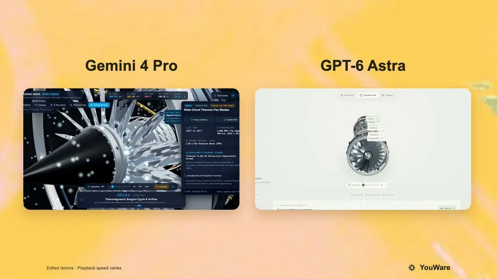</a>

**İstem**

```text
Bir web sayfasında uçak motorunun etkileşimli 3B gösterimini oluşturmak için three.js kullanın. 
Gerçeğe yakın, neredeyse 1:1 ölçekte yüksek doğruluklu bir model oluşturmak için Jigspace'in etkileşim tasarımı felsefesini temel alın; metal, boru hatları ve kanatlar gibi malzeme ve doku ayrıntılarını eksiksiz koruyun. Etkileşimli özellikler şunları mutlaka içermeli: adım adım sökme animasyonu, bileşenlerin patlatılmış görünümü ve tıklamayla veya üzerine gelindiğinde açılan parça açıklamaları ile çalışma prensibi bilgileri. 
Genel olarak akıcı kamera kontrolünü ve kullanıcı dostu insan-bilgisayar etkileşimini desteklemeli; web üzerinde sorunsuz bir deneyim sunarak motorun yapısını ve çalışma prensiplerini eksiksiz biçimde sergilemelidir.
```

<details>
<summary>Özgün istem</summary>

```text
Use three.js to build a 3D interactive display of an aircraft engine on a webpage. 
Please refer to Jigspace's interaction design philosophy to achieve a realistic model with near 1:1 high-fidelity restoration, fully preserving material and texture details such as metal, pipelines, and blades. Interactive features must include: step-by-step disassembly animation, exploded view of components, and part descriptions and principle explanations triggered by click or hover. 
Overall, it must support smooth camera control and friendly human-computer interaction, ensuring a smooth experience on the web that fully showcases the engine's structure and working principles.
```

</details>

[Ayrıntıları görüntüle ↗](https://www.tripo3d.ai/tr/3d-prompts/gpt-6-astra-2101271938706685991) · [Orijinal gönderi](https://x.com/YouWareAI/status/2101272224435253432) · [Örneklere dön](#all-prompts)

---

<a id="gpt-6-astra-2101224659861590399"></a>

### Eksiksiz Fotogerçekçi 3B Ortam

[Julian Goldie SEO](https://x.com/JulianGoldieSEO) · 2026-09-19 · GPT-6 Astra · Sahneler

<a href="https://www.tripo3d.ai/tr/3d-prompts/gpt-6-astra-2101224659861590399">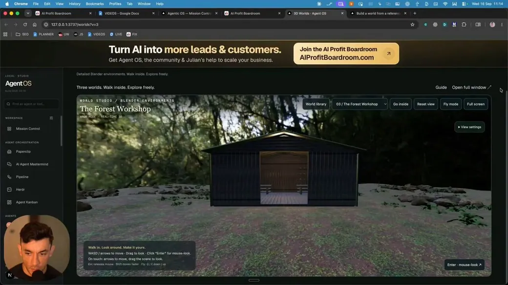</a>

**İstem**

```text
Eksiksiz, fotogerçekçi bir 3B ortam oluştur. Beni şaşırt.
```

<details>
<summary>Özgün istem</summary>

```text
Build a complete photorealistic 3D environment. Surprise me.
```

</details>

[Ayrıntıları görüntüle ↗](https://www.tripo3d.ai/tr/3d-prompts/gpt-6-astra-2101224659861590399) · [Orijinal gönderi](https://x.com/JulianGoldieSEO/status/2101224659861590399) · [Örneklere dön](#all-prompts)

---

<a id="gpt-6-astra-2101055500599054437"></a>

### Gerçek yörünge fiziğiyle galaksi

[Argona](https://x.com/Argona0x) · 2026-09-18 · GPT-6 Astra · Animasyon

<a href="https://www.tripo3d.ai/tr/3d-prompts/gpt-6-astra-2101055500599054437">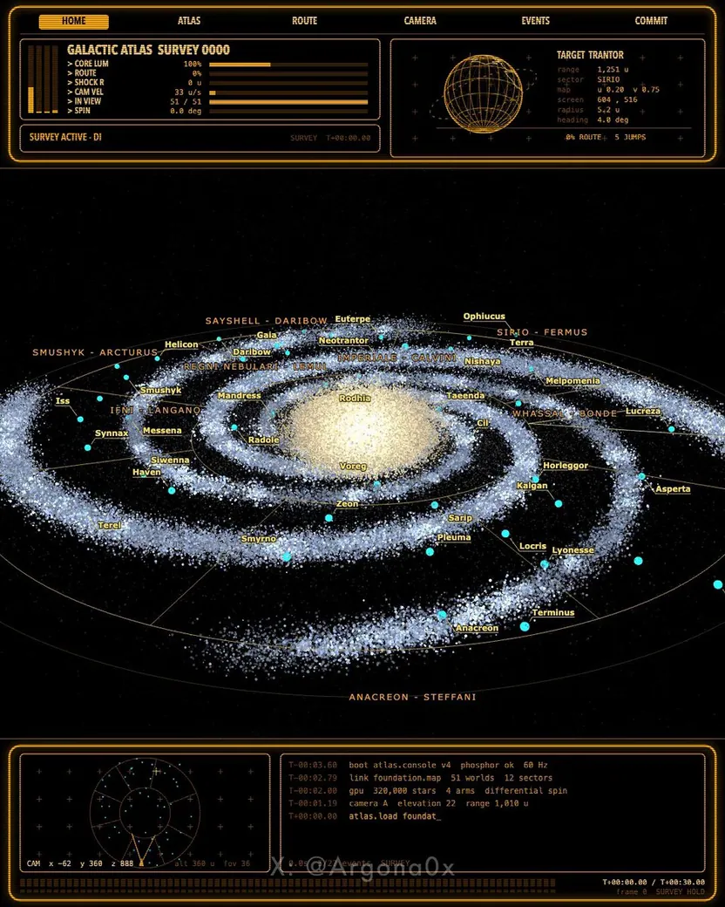</a>

**İstem**

```text
gerçek yörünge fiziğiyle oluşturulmuş bir galaksi, 320.000 yıldız, içinde 30 saniyelik bir uçuş
```

<details>
<summary>Özgün istem</summary>

```text
a galaxy from real orbital physics, 320,000 stars, one flight through it, 30 seconds
```

</details>

[Ayrıntıları görüntüle ↗](https://www.tripo3d.ai/tr/3d-prompts/gpt-6-astra-2101055500599054437) · [Orijinal gönderi](https://x.com/Argona0x/status/2101055500599054437) · [Örneklere dön](#all-prompts)

---

<a id="monster-block"></a>

### Monster Block — Şehri 45 Saniyede Yerle Bir Et

[Tony](https://x.com/abc30037274) · 2026-09-18 · GPT-6 Astra · Oyunlar

<a href="https://www.tripo3d.ai/tr/3d-prompts/monster-block">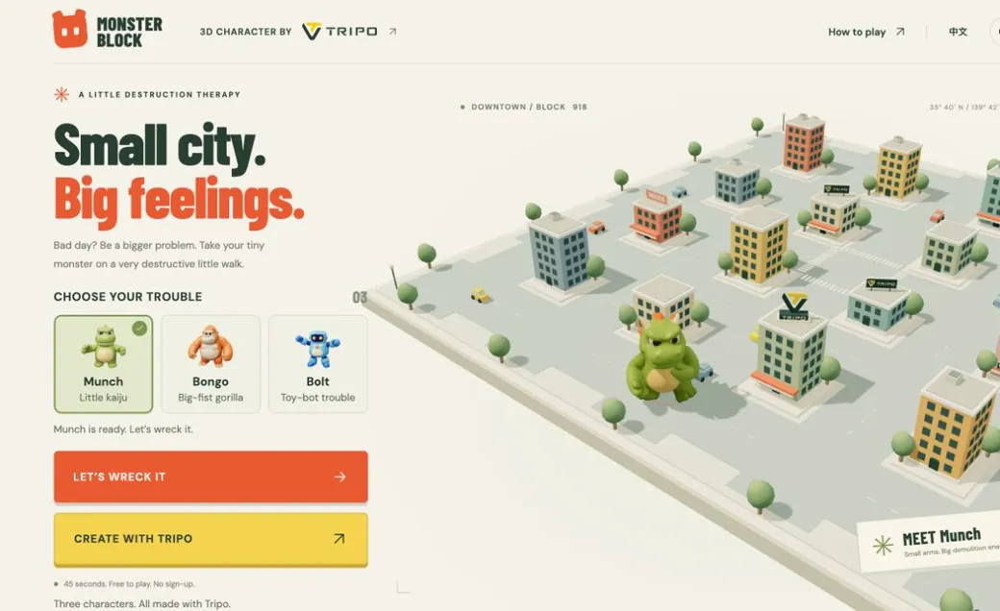</a>

**Referans görseller:** [1](https://media.tripogrowth.space/media/ab5439fe-bc9f-4cde-8713-20e1b0caf7a6.png) · [2](https://media.tripogrowth.space/media/94648b5c-c804-46bd-a2b1-c684b25bd848.png) · [3](https://media.tripogrowth.space/media/4405e75a-c387-44cb-b63c-d8503454b422.png)

**İstem**

```text
# Monster Block — yeniden oluşturma spesifikasyonu

## 1. Proje hedefi

Monster Block adlı, tarayıcıda oynanabilen bir oyun oluştur. Oyuncunun oyuncak bir canavar seçmesine, minyatür bir şehre girmesine ve 45 saniye içinde mümkün olduğunca çok binayı yok etmesine olanak tanı. Hareket etmek, binalara pençeyle saldırmak, arabaları fırlatmak ve yıkımları zincirlemek anında geri bildirim üretmeli. Oyunu skor, bir unvan, yeniden deneme eylemi ve bir arkadaşın aynı blokta oynayabilmesini sağlayan bir meydan okuma bağlantısıyla bitir. İngilizce ve Basitleştirilmiş Çince arayüzlerin yanı sıra klavye ve dokunmatik ekran kontrolleri sun.

## 2. Görsel stil

Krem rengi bir arka planın önünde, kalın kare bir platform üzerinde sıcak bir masaüstü dioraması oluştur. Az detaylı pastel binalar, küçük koyu teal pencereler, açık renkli çatı kenarları, geniş ve mat yeşil-gri yollar, yaya geçitleri, yuvarlak ağaçlar, küçük arabalar ve sıcak yumuşak gölgeler kullan. Bina paletinde kiremit, hardal, tozlu teal, gül kurusu, mavi-gri, krem ve adaçayı tonları yer alsın. Malzemeler parlak metalden çok mat boyanmış oyuncaklar gibi görünmeli.

Düz üstten bakan bir kamera yerine, yüksek üç çeyrek perspektifli bir kamera kullan. Referans kamera (35, 37, 41) konumundan başlar, (0, 0.4, 0) noktasına bakar ve geniş ekranlarda 38 derece, orta genişlikteki ekranlarda 44 derece, dar ekranlarda 51 derece görüş alanı kullanır. Oyun sırasında canavarı yumuşak biçimde takip ederken yakındaki hedefleri görünür tut. Sahneyi sıcak bir yarımküre ışığı, yumuşak gölgeler oluşturan yönlü bir ışık ve soğuk bir dolgu ışığıyla aydınlat.

Büyük İngilizce başlıklar için yoğun ve kalın bir display yazı tipi, talimatlar içinse okunaklı bir sans-serif kullan. Koyu yeşil metni, krem yüzeyleri, turuncu oyun eylemlerini ve sarı Tripo oluşturma eylemlerini bir araya getir. Ana sayfada Play ile Create with Tripo eylemlerini eşit derecede öne çıkar. Duraklatma iletişim kutusunda, çerçeveli Resume düğmesinin üstüne üç karakter küçük resmi ve sarı bir oluşturma düğmesi içeren koyu yeşil bir Tripo kartı yerleştir. Yardım metnini telefonlarda rahatça okunabilecek boyutta tut.

Kısa ve girdilerle tetiklenen efektler kullan: pençe savurmaları, binaların kısa süreli geri tepmesi, belirgin vuruş ve yıkım darbeleri, genişleyen ezme halkaları, küçük moloz patlamaları, skor bildirimleri, combo değişimleri ve ölçülü, yönlü kamera sarsıntısı. Tutulan bir arabayı yaklaşık 220 ms içinde elin içine kaldır. Azaltılmış hareket tercihine uyarak sarsıntıyı, moloz patlamalarını ve arayüz ölçeklendirmesini kaldır; skorları, hedef göstergelerini ve yıkım sonuçlarını koru.

## 3. Dünya ve sahne

4'e 4'lük bir ızgaraya 16 yıkılabilir bina yerleştir. Blok aralığı olarak 10.4 kullan; blok merkezleri bu aralığın -1.5, -0.5, 0.5 ve 1.5 katlarında olsun ve her eksen boyunca beş cadde bulunsun. Platformun genişliği 52.6 birimdir. Binalar iki ila beş katlı olsun; farklı taban şekilleri, çatı detayları, ara sıra tenteler ve küçük HOTEL veya NOODS tabelaları kullan. Yerleşimi bir seed'den deterministik olarak oluştur.

Yollar boyunca 12 araba ve başlangıç oyun konumunun yakınına kesinlikle fırlatılabilir bir sarı araba yerleştir. Bina parsellerinin ve platform kenarlarının çevresine ağaçlar, dört köşe lambası, şerit işaretleri ve merkezi bir yaya geçidi ekle. Canavarı (0, 0.2, 10.4) konumunda açık bir caddede başlat; ana sayfa için z=20.8 konumunda ön planda bir bekleme konumu kullan.

Aynı blok parametresi, aynı bina yerleşimini yeniden üretmeli. Parametre yoksa blok seed'ini UTC tarihinden türet. Bir beat parametresi arkadaşın hedef skorunu sağlar. Yeniden denerken seçili bloğu koru. Rastgele molozların deterministik olması gerekmez.

## 4. Varlık envanteri

Kararlı varlık kimliklerini koru ve görsel modelleri oyun içi çarpışma proxy'lerinden ayrı tut.

- munch: Munch / 阿猛, varsayılan yeşil dinozor. Özgün yuvarlak burun yapısını, krem rengi karnını ve boynuzlarını, turuncu sırt dikenlerini, kısa kollarını, büyük ayaklarını ve uzun kuyruğunu koru. /assets/monster-animated.glb dosyasını yükle ve yüksekliğini 5.6 birime normalize et. /assets/monster.glb dosyasını statik yedek olarak koru.
- bongo: Bongo / 橘拳, aşırı büyük yumruklara ve geniş bir gövdeye sahip turuncu oyuncak goril. /assets/bongo-animated.glb dosyasını yükle ve yüksekliğini 4.5 birime normalize et.
- bolt: Bolt / 蓝电, kalın uzuvlara ve sevimli bir silüete sahip mavi oyuncak robot. /assets/bolt-animated.glb dosyasını yükle ve yüksekliğini 4.9 birime normalize et.
- Her karakterin eşleşen bir önizleme PNG'si ile bekleme, koşma ve savurma klipleri vardır. Seçilebilir üç gerçek karakteri koru; karakter değiştirildiğinde hem önizleme hem de sonraki turda kullanılacak model güncellenmeli.
- city_building: Sağlık, collider sınırları, vuruş geri tepmesi ve yıkım durumu ayrı ayrı izlenen, prosedürel ve yeniden kullanılabilir bina grupları. Çatı kenarları, tabanlar ve tenteler çarpışma hacmine dahildir.
- city_car: Prosedürel olarak oluşturulan, yeniden kullanılabilir ve fırlatılabilir arabalar. Elde tutulan, havadaki ve yok edilmiş durumları ayrı tut. Üç arabada sarı Tripo markası bulunur.
- city_decor: Prosedürel ağaçlar, lambalar, kaldırımlar, tabelalar ve yol boyaları. Bu varlıkları hafif tut, geometriyi ve malzemeleri yeniden kullan.
- tripo_scenery: Bir çatı logo heykeli, iki çatı tabelası, bir atölye dükkân cephesi ve markalı üç araba. Bunları sağlanan Tripo logosundan ve prosedürel mesh'lerden oluştur. Bunlar ek API ile oluşturulmuş modeller veya oynanış güçlendirmeleri değil, sahne dekorasyonlarıdır.

Üç karakter modeli öncelikli Tripo varlıklarıdır. Sağlandığında oluşturulmuş ve rig'lenmiş GLB'leri yeniden kullan. Yeni bir karakter için eşleşen oyuncak tarzı bir model oluştur, rig uygunluğunu kontrol et, rig'le, bekleme/koşma/savurma animasyonlarını oluştur ve kadroya eklemeden önce oranlarını doğrula. Oyuncu bir tura başladığında oluşturma API'lerini çağırma. Karakter yüklemeleri ve oyuncunun kendi oluşturduğu varlıkların otomatik içe aktarılması bu sürümün kapsamı dışındadır.

## 5. Oynanış ve geri bildirim

Hareket için WASD veya ok tuşlarını, tekrarlanan pençe saldırıları için basılı tutulan Space tuşunu, yakındaki bir arabayı tutup fırlatmak için E ve ardından tekrar E tuşunu, ezme saldırısı için R ve duraklatmak için Escape tuşunu destekle. Dokunmatik ekranlarda sanal joystick ile ayrı saldırı, tut/fırlat ve ezme düğmeleri sun. Duraklatıldığında veya odak kaybedildiğinde basılı girdileri temizle.

Şu kuralları kullan:

- Bir tur 45 saniye sürer. Binaların canı kat sayısı artı birdir; bu da 3–6 can verir.
- Pençe vuruşu 1 hasar verir ve saldırı aralığı 0.42 saniyedir.
- Ezme saldırısı menzil içindeki her binaya 3 hasar verir ve bekleme süresi 7 saniyedir.
- Fırlatılan araba çarpma alanındaki binalara 4 hasar verir ve çarpma için 75 temel puan kazandırır.
- Binaya isabet ettirmek, mevcut çarpanla çarpılmış 20 puan kazandırır. Bir yıkım, yıkım kombosu artırıldıktan sonra, çarpanla çarpılmış round(180 + bina yüksekliği × 50) puan ekler.
- 3.5 saniye içinde yeniden yıkım yapmak komboyu sürdürür. Sıradan vuruşlar bu süreyi uzatmaz. Çarpan min(5, 1 + floor(combo / 2)) değeridir.
- 16 binanın tamamını temizlemek turu bitirir ve ceil(kalan saniye) × 100 puan kazandırır. Aksi durumda süre sıfıra ulaştığında turu bitir ve daha fazla skor kazanılmasını engelle.

Düşman, boss savaşı, oyuncu canı veya ölüm cezası yoktur. Meydan okuma; rota seçmek, arabaları ve ezme saldırılarını verimli kullanmak ve yıkım kombosunu sürdürmektir. Kalan süreyi, skoru, yok edilen bina sayısını, çarpanı ve ezme saldırısının bekleme süresini göster. Kullanılamayan eylemleri hareketi engellemeden anlaşılır kıl. Boşa savrulan bir pençeyi başarılı bir vuruştan ses ve görsel geri bildirimle ayırt et.

Hareket ve dönüşleri, kollar ve kuyruk da dahil olmak üzere her karakterin örneklenmiş animasyon ayak iziyle çakışmaya göre çöz. Tam bina sınırlarını küçük bir açıklık payıyla kontrol et. Canavar, geçerli bir duruş konumundan saldırabilmeli. Binası yıkıldıktan sonra oyuncunun bir parselin içinden geçmesine izin ver. Oyuncuyu köşelerde sıkıştırmaktan veya dönüş sırasında kuyruğun sağlam bir binanın içinden geçmesinden kaçın.

Escape tuşuna, duraklatma düğmesine, pencere odağının kaybolmasına ve gizli sekmelere geçişe tepki olarak zamanlayıcıyı ve girdileri duraklat. Resume, Retry ve Home akışlarını sun. Oyunu skor, yıkım sayısı, en iyi combo, eğlenceli bir unvan ve aynı haritada bir meydan okuma bağlantısıyla bitir. İndirilebilir 1080'e 1350 boyutunda bir skor kartı sun; MediaRecorder desteklendiğinde tur kaydını desteklenen MP4 veya WebM formatında oluştur. Kullanılabildiğinde yerel paylaşımı, meydan okuma bağlantıları içinse pano yedeğini kullan. Tarayıcı tarafından hesaplanan bir skoru hiçbir zaman güvenli bir rekabetçi liderlik tablosu gibi sunma.

## 6. Teknik uygulama

Statik dist build içeren Three.js, TypeScript ve Vite kullan. Dünya oluşturma, kurallar, çarpışma, karakterler, render, ses, kayıt, analitik ve arayüzü ayrı modüllerde tut. Fontları ve gerekli decoder varlıklarını yerel olarak paketle. Tekrarlanan pencereler ve yol işaretleri için instancing kullan; malzemeleri ve geometriyi yeniden kullan. Render piksel oranını 1.65 ile sınırla. Geçici efektleri sınırlandır ve tamamlandıklarında veya sıfırlandıklarında kaynaklarını serbest bırak.

GLTFLoader, skeletal animation mixer'lar ve sağlanan GLB kliplerini kullan. Her modeli merkezlenmiş bir zemin pivotu etrafında normalize et. Referans dışa aktarımı +X yönüne bakar; görsel pivotu Y ekseni etrafında -90 derece döndürerek oyunun +Z ileri yönüyle hizala. Yüklenen modeli göstermeden önce bekleme animasyonunu değerlendir ve animasyonlu ayakları zemine yakın tut. Yükleme başarısız olursa görünür bir prosedürel yedek sun; hatayı dürüstçe belirt. Daha eski bir yüklemenin en son seçimin yerini almasını önlemek için asenkron karakter seçimini güvenli hâle getir.

Karakter çarpışma verilerini render mesh'lerinden bağımsız tut ve karakter veya animasyon değiştirildiğinde örneklenmiş ayak izlerini yeniden oluştur. Duvarların yakınında hem öteleme hem de dönüşü test et. Kararlı klavye/dokunmatik girişini, duyarlı iletişim kutularını, yerelleştirilmiş metinleri, odak davranışını, sessiz ses kontrollerini, azaltılmış hareketi ve WebGL kurtarma davranışını koru.

Tripo oluşturma eylemlerini https://www.tripo3d.ai/ adresine bağla; utm_source=monster_block, utm_medium=referral, utm_campaign=monster_block_game ve yerleşime özel bir utm_content kullan: header_logo, hero_create, pause_create, result_create veya footer_logo. Bu eylemleri ayrı bir sekmede aç ve önce etkin oyunu duraklat. Tripo'nun 3B varlıklar oluşturduğunu açıkla; bu oyuna otomatik içe aktarma sözü verme.

Hosting politikasının izin verdiği durumlarda mevcut Pageview ve PostHog etkinlik entegrasyonunu koru. Statik build'de yalnızca herkese açık tarayıcı veri alım yapılandırmasını kullan. Oluşturma, CMS, dağıtım ve kişisel analitik kimlik bilgilerini kaynak kodunun ve build çıktılarının dışında tut. Sayfaya giriş, karakter seçimi, oyun, ilk eylemler, tur sonuçları, yeniden deneme, paylaşım/dışa aktarma ve Tripo dış bağlantı tıklamalarını kaydet; tıklamaları doğrulanmış kayıtlara veya ödemelere eşdeğer sayma.

## 7. Tamamlanma ölçütleri

Çalıştırılabilir kaynak kodu, yerel varlıkları, üretime hazır statik build'i ve açık kurulum/başlatma/build talimatlarını teslim et. Üç karakterin tüm seçimlerini, süreli bir turun tamamını, bina yıkımını, tutup fırlatmayı, ezme bekleme süresini, combo'nun sona ermesini, duraklatma/devam etme, yeniden deneme ve tur sonu skorlamasını doğrula. Özgün dinozorun seçilebilir kalmasını ve üç karakterin de binaların yakınında görünür biçimde iç içe geçmeden veya takılmadan hareket edip dönebilmesini doğrula.

Okunabilir yardım metinleri, dokunmatik kontroller, duraklatma eylemleri ve sonuç paylaşımı dahil olmak üzere masaüstü ve dar mobil genişliklerde İngilizce ve Çince yerleşimleri kontrol et. Tripo CTA hedeflerini ve UTM yerleşim değerlerini, skor kartı dışa aktarımını ve kayıt yedeği davranışını doğrula. Dağıtılmış sayfayı ve gerçek CMS iframe ortamını model yükleme, giriş, harici bağlantılar ve indirmeler açısından test et. Evrensel destek iddiasında bulunmak veya kanıt olmadan ölçülmüş sabit kare hızını garanti etmek yerine tarayıcı ya da cihaz sınırlamalarını bildir.

```

[Ayrıntıları görüntüle ↗](https://www.tripo3d.ai/tr/3d-prompts/monster-block) · [Orijinal gönderi](https://x.com/abc30037274/status/2100636075039629796) · [Canlı demo](https://monster-block.tripo.page/) · [Örneklere dön](#all-prompts)

---

<a id="gpt-6-astra-2100956517633761447"></a>

### Etkileşimli IWC Schaffhausen Saat Modeli

[YouWare](https://x.com/YouWareAI) · 2026-09-18 · GPT-6 Astra · Etkileşimli

<a href="https://www.tripo3d.ai/tr/3d-prompts/gpt-6-astra-2100956517633761447">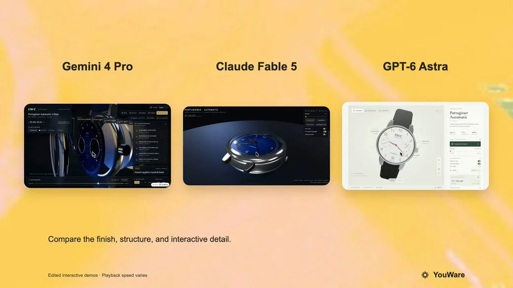</a>

**İstem**

```text
IWC Schaffhausen saatinin son derece aslına sadık, etkileşimli bir 3B modelini geliştirmek için Three.js kullanın. Gereksinimler: 1) Kadran yapısı son derece hassas olmalı; her mekanik bileşen ayrı ayrı modellenmeli ve net biçimde ayırt edilebilmelidir; 2) Saat kadranında, gerçekçi saydamlık, kırılma ve yansıma efektlerine sahip safir cam malzemesi kullanılmalıdır; 3) Akrep ve saniye ibreleri doğru ibreler olmalı ve gerçek zaman işleyişini takip etmelidir; ibreler otomatik ve kesintisiz biçimde hareket etmelidir; 4) Saatin sökülüp yeniden birleştirilmesi desteklenmeli; her parça ayrılarak tek başına görüntülenebilmelidir; 5) Genel ayrıntı düzeyi son derece yüksek olmalı, gerçek bir saatin yapısı ve oranlarıyla yakından örtüşmeli; vidalar, metal parçalar ve diğer bileşenler için gerçekçi malzeme dokuları ve ince işçilik sunulmalıdır. Modelin tarayıcıda akıcı çalıştığından ve doğal biçimde etkileşim kurulabildiğinden emin olun.
```

<details>
<summary>Özgün istem</summary>

```text
Use Three.js to develop a highly faithful 3D interactive watch model of an IWC Schaffhausen timepiece. Requirements: 1) The dial structure must be highly precise, with every mechanical component individually rendered and clearly distinguishable; 2) The watch face must use a sapphire glass material with realistic transparency, refraction, and reflection effects; 3) The minute hand and second hand must be correct hands that follow real timekeeping logic, with automatic continuous hand-sweep animation; 4) Support disassembly and reassembly of the watch, with each part able to be separated and viewed individually; 5) The overall level of detail must be extremely high, closely matching the structure and proportions of a real watch, with realistic material textures for screws, metal parts, and other components, and fine craftsmanship. Please ensure the model runs smoothly in the browser and interacts naturally.
```

</details>

[Ayrıntıları görüntüle ↗](https://www.tripo3d.ai/tr/3d-prompts/gpt-6-astra-2100956517633761447) · [Orijinal gönderi](https://x.com/YouWareAI/status/2100958838350643553) · [Örneklere dön](#all-prompts)

---

<a id="odd-arms"></a>

### ODD ARMS — Tuhaf Silahlarla Hayatta Kalma Oyunu

[Deniffer](https://x.com/lumina__team) · 2026-09-18 · GPT-6 Astra · Oyunlar

<a href="https://www.tripo3d.ai/tr/3d-prompts/odd-arms">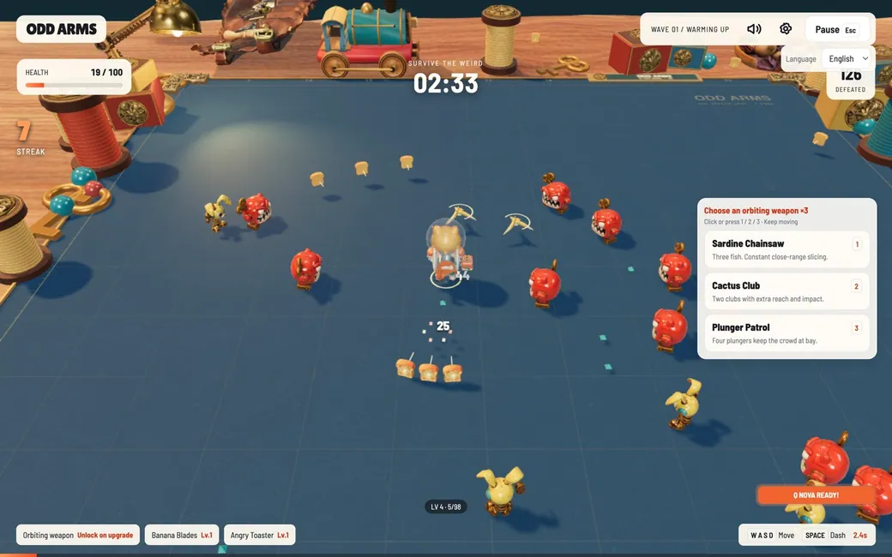</a>

**İstem**

```text
# ODD ARMS — Fikrin. Kahramanın.

## 1. Amaç
Tüm oyun arayüzünü İngilizce tutun (isteğe bağlı dil seçeneği olarak Japonca ekleyin).
"Otomatik saldırılı sürü" türünde, tarayıcıda çalışan eksiksiz ve üç dakikalık bir hayatta kalma oyunu oluşturun: Oyuncu, oyuncak boyutunda bir kahraman ile iki son derece tuhaf silah seçer ve bir zanaatkârın çalışma tezgâhında 180 saniye boyunca canavar sürülerine karşı hayatta kalır. Silahlar otomatik saldırır; oyuncu yalnızca hareket eder, atılır, kristalleri toplar, geliştirmeler seçer ve şarjlı bir nova ateşler. Oyunun kişisel yönü şudur: Oyuncular Tripo'da kendi kahramanlarını veya silahlarını oluşturabilir, GLB dosyasını indirip oyuna aktarabilir. Nihai sonuç için https://odd-arms.tripo.page/ ve sağlanan referansları kullanın. Deniffer'a şu adresten kredi verin: https://x.com/lumina__team.

## 2. Görsel yön
Oyunu, kahramanı takip eden sabit, dörtte üç açıdan yukarıdan görünümlü bir kamerayla gösterilen minyatür bir oyuncak diorama olarak tasarlayın. Oyun alanı, üzerinde silik bir ızgara ve basılı "ODD ARMS" köşe işaretleri bulunan lacivert bir kesim matıdır; bu mat sıcak tonlu ahşap bir çalışma masasının üzerindedir. Masa kenarları, arenanın gerçek bir masaüstü gibi görünmesi için büyük boyutlu el işi aksesuarlarıyla (iplik makaraları, süslü pirinç rozetli kutular, deri alet çantası, pirinç masa lambası, ahşap oyuncak tren, oyuncak parçaları) doldurulmalıdır. Lambanın bulunduğu taraftan sıcak bir ana ışık, yumuşak ortam dolgu ışığı, temas gölgeleri ve hafif bloom kullanın; karakterler parlak, iri hatlı ve doygun renkli koleksiyon figürleri tarzında olsun.

Arayüz: lacivert metinli, krem-beyaz yuvarlatılmış kartlar ve mercan-turuncu vurgu rengi kullanın. Başlıklarda ağır, daraltılmış bir ekran yazı tipi ("LET'S MAKE SOME TROUBLE."), gövde metninde ise temiz ve daraltılmış bir sans yazı tipi kullanın. Savaş sırasında: sol üstte can kartı, altında seri sayacı, üst merkezde "SURVIVE THE WEIRD" geri sayımı, sağ üstte dalga etiketi + ses + ayarlar + Duraklat, sağda yenilen düşman sayısı, alt merkezde seviye/XP rozeti, sol altta üç silah etiketi (yörüngeli / geri dönen / atıcı ve seviyeleri), sağ altta kontroller + atılma bekleme süresi ve bunların üstünde "Q NOVA READY!" rozeti yer alsın. Oyunsallık hissi için: hasar sayıları, kritik vuruşlar, squash-and-stretch efektli düşmanlar, geri savurma, parçacık patlamaları ve hafif kamera sarsıntısı kullanın (prefers-reduced-motion ayarlıysa sarsıntıyı devre dışı bırakın).

## 3. Dünya
Kare biçimli tek bir arena oluşturun; kahramanı her iki eksende de ±23 birim içinde tutun. Kesim matı oyun alanını doldursun; masa ve aksesuarlar yalnızca dekor olarak, bu sınırın dışında yer alsın (çarpışma olmasın). Arena başlangıçta boştur ve kenarlardan dolmaya başlar: Düşmanlar kahramandan 12–16 birim uzaklıktaki bir çember üzerinde (ilk saniyede 8–11 birim uzaklıkta) doğar ve doğruca kahramana yürür. Her 22 saniyede bir, 13 yarıçapında tam bir düşman çemberi oluşturan bir saldırı dalgası başlar. Kahramanın o anki konumunun altında kırmızı uyarı çemberleri belirir (ilki 28. saniyede, ardından her max(4.4, 9 − t/50) saniyede bir) ve 2 saniye sonra patlar.

## 4. Varlık envanteri
Kararlı model yuvaları hazırlayın; her yuva tek bir GLB yüklemeli, model ortalanmalı, hedef yüksekliğe otomatik ölçeklenmeli ve yükleme başarısız olursa basit bir yer tutucuya dönmelidir.

Kahramanlar (10 adet, `hero:<id>`), her biri kendine özgü silüete sahip iri hatlı oyuncak figürler:
- `cat` Astro Cat — beyaz uzay giysisi ve cam kask giymiş turuncu tekir kedi. HP 100, hız 6.8, mıknatıs ×1.35, atılma bekleme süresi 2.4 s.
- `frog` Frog Fighter — kırmızı boks eldivenli yeşil kurbağa. HP 130, hız 6.8, atılma hasarı 135.
- `shroom` Mushroom Hero — küçük pelerinli, kırmızı şapkalı mantar. HP 90, hız 7.6, atılma süresi 1.8 s.
- `capybara` Chill Capybara — kaplıcada dinlenen kapibara. HP 160, hız 5.8, mıknatıs ×1.15, atılma süresi 3 s, atılma hasarı 110.
- `ramen` Ramen Ronin — buharı tüten ramen kâsesini taşıyan samuray. HP 105, hız 7.2, atılma süresi 2.2 s, atılma hasarı 120.
- `penguin` Office Penguin — gömlek ve kravat giymiş penguen. HP 80, hız 7.1, atılma süresi 1.5 s, atılma hasarı 75.
- `axolotl` Axolotl — pembe aksolotl kâşif. HP 85, hız 7.3, mıknatıs ×1.6, atılma hasarı 75.
- `avocado` Avo Boxer — çekirdek gövdeli avokado boksör. HP 120, hız 6.4, atılma süresi 2.1 s, atılma hasarı 130.
- `robot` Clockwork Bot — anahtarlı, kurmalı teneke robot. HP 115, hız 6.2, atılma süresi 2.8 s, atılma hasarı 165.
- `snail` Snail Knight — ev büyüklüğündeki kabuğunu taşıyan şövalye salyangoz. HP 190, hız 5.2, mıknatıs ×1.2, atılma süresi 3.2 s, atılma hasarı 120.
Listelenmediği durumlarda varsayılan atılma hasarı 90'dır.

Saldırı yuvalarına göre gruplandırılmış silahlar (12 adet, `weapon:<id>`):
- Yörüngeli: `sardine` Sardine Chainsaw (3 balık, yarıçap 2.9, hasar 1, hız 1.2); `cactus` Cactus Club (2 sopa, yarıçap 3.3, hasar 1.65, hız 0.78, vuruş yarıçapı 1.25, geri savurma 1.5); `plunger` Plunger Patrol (4 lavabo pompası, yarıçap 2.25, hasar 0.85, hız 1.5).
- Geri dönen: `banana` Banana Blades (2 adet, hasar 1, hız 1.25); `pizza` Pizza Cutter (1 büyük disk, hasar 1.5, hız 0.82, vuruş yarıçapı 1.65); `croissant` Croissant Blades (3 adet, hasar 0.75, hız 1.45); `boomerang` Boomerang (1 adet, hasar 1.15, hız 1.6); `donut-disc` Donut Disc (1 adet, hasar 1.5, hız 0.9, vuruş yarıçapı 1.3).
- Atıcı: `duck` Duck Rocket (hedef takipli, alan etkisi 2, aralık 0.42 s); `toaster` Angry Toaster (3 atışlı delici yelpaze, hasar 0.7); `teapot` Raging Teapot (2 yavaş atış, alan etkisi 2.8, aralık 0.8 s); `bubble-gun` Bubble Gun (2 delici baloncuk, hasar 0.45, aralık 0.3 s).
Varsayılan ekipman: Astro Cat, Banana Blades, Angry Toaster; yörüngeli silah ilk geliştirmede açılır.

Düşmanlar (3 adet, `enemy:<id>`), kurmalı oyuncak canavarlar: `red-chomper` (kırmızı, yuvarlak ve ısıran oyuncak; temel tür, temel 30 HP, hız 2.35), `spring-rabbit` (sarı, yay bacaklı tavşan; hızlı, temel 23 HP, hız 3.5), `crown-bear` (taç takan büyük yamalı ayı; tank, temel 130 HP, hız 1.7, 60. saniyeden sonra %17 olasılıkla görünür, 3 XP bırakır).

Sahne aksesuarları (`prop:<id>`): çalışma masası, kesim matı çerçevesi ve köşe plakaları, masa lambası, oyuncak tren, iplik makaraları, süslü rozetli kutular, alet çantası, oyuncak parça tepsisi. Matı, ızgarayı, kristalleri, mermileri, uyarı çemberlerini, parçacıkları, ışıkları ve arayüzü prosedürel olarak oluşturun.

## 5. Oynanış ve geri bildirim
Akış: Karakter → Ekipman (bir geri dönen + bir atıcı) → Hazır (seçilen silahlarla kahramanın 3B döner tabla önizlemesi; döndürmek için sürükleyin) → "Let's play". Her tanıtım adımında yalnızca ilgili kategori; açıklama, oyun tarzı ve zayıflık metni gösterilir. Son ekipman seçimini hatırlayın.

Kontroller: Hareket etmek için WASD/ok tuşları; Space, hareket yönünde atılmayı sağlar (hız ×3.7, kısa süreli dokunulmazlık, her atılmada 2 birim içindeki düşmanlara bir kez hasar); enerji 100 olduğunda nova ateşlemek için Q (yarıçap 11, 200 hasar, güçlü geri savurma, kristalleri kendine çeker); geliştirmeleri seçmek için 1/2/3 veya tıklama; duraklatmak için Esc; pencere odağı kaybolduğunda otomatik duraklatma. Mobil: solda analog sanal joystick, sağda bekleme/şarj halkalarına sahip Atılma ve Nova düğmeleri, joystick ile düğmelerin birlikte çalışmasını sağlayan çoklu dokunma; geliştirmeler dikey ekranda joystick'in üstünde, yatay ekranda iki başparmağın arasında yer alır.

Kurallar: düşman HP'si = base × (1 + t/260) × 1.3. Doğma aralığı max(0.18, 0.52 − 0.0016·t) s, sınır 180 düşman. Temas hasarı 9'dur (ayıdan 18); isabetten sonra 0.85 s dokunulmazlık verilir. Her öldürme 2 enerji ekler ve bir kristal düşürür; her silahın 9. vuruşu ×1.7 kritik hasar verir. 25 öldürmelik seri, 5 s süren bir çılgınlık başlatır (saldırı hızı ×1.65, bekleme süresi 13 s); hasar almak seriyi sıfırlar. Seviye atlamak için XP: 20, ardından round(need × 1.4 + 10). Seviye atlamalar oyunu asla duraklatmaz: engelleyici olmayan seçim kartları olarak kuyruğa alınır. İlk geliştirme üç yörüngeli silahı sunar; sonrasında şu seçeneklerden üçünü sunun: Orbit overload (+1 yörünge silahı, en fazla 7, +%22 hasar), Another round (daha hızlı, daha uzun ve daha güçlü geri dönüşler), Full blast (daha hızlı ateş, +%20 hasar, daha fazla mermi), Live a little (+%10 hız, +30 HP). Her seçim 8 HP iyileştirir.

Bitiş: 180 s hayatta kalın → "Beautifully weird. You made it."; HP 0 → "That was a glorious mess." Her iki sonuç ekranında da yenilen düşman sayısı, en iyi seri ve hayatta kalınan süre ile Run it back / Change loadout seçenekleri ve kendi kahramanını oluşturma istemi gösterilir.

Kendin oluştur: Ekipman, duraklatma ve sonuç ekranlarında bulunan "Create my hero / weapon in Tripo" seçeneği, yeni bir sekmede https://studio.tripo3d.ai/ açar; "Import GLB" yerel bir .glb dosyası yükler (≤15 MB, yalnızca gömülü dokular, tarayıcıda ayrıştırılır, hiçbir zaman yüklenmez), dosyayı ortalar ve ölçeklendirir, ardından seçilen kahraman veya silahın yalnızca görünümünü değiştirirken istatistiklerini korur. Geçersiz dosyalar için anlaşılır hata mesajları gösterin ve özgün modeli koruyun.

Modelleri karşılaştırın: üst bilgideki "Tripo3D ⇄ Simple3D (Blender)" anahtarı, her kahramanı, silahı, düşmanı ve aksesuarı eşleşen basit ilkel şekillerden oluşan setle değiştirir; oyun devam ederken ilerleme sıfırlanmaz. Değiştirmeden önce alternatif setin tamamını yükleyin; herhangi bir dosya yüklenemezse mevcut seti koruyun.

## 6. Teknik uygulama
GLTFLoader, RoomEnvironment aydınlatması ve ACES ton eşleme kullanan Vite + vanilla JavaScript + Three.js kullanın. Simülasyonu, testlerde tüm oyunların simüle edilebilmesi için dışarıdan rastgelelik kaynağı alabilen, saf ve sabit zaman adımlı bir modülde tutun; renderer yalnızca durumu okusun. Her GLB'yi bir kez önbelleğe alın ve örnekler için klonlayın; tekrarlanan süslemelerde instancing veya LOD kullanın. Piksel oranını sınırlayın (mobilde 1.5, yoğun dalgalarda 1'e düşürün), gölgeleri saniyede en fazla 30 kez yenileyin ve HUD metnini yalnızca değerler değiştiğinde güncelleyin. Çarpışmayı (basit çemberler) görsel mesh'lerden ayırın. Yazı tiplerini, modelleri ve dokuları derlemede statik bir klasör kullanılabilmesi için aynı origin üzerinden paketleyin. Masaüstü ve telefon tarayıcılarını, yatay telefonlar ve güvenli alanlar dâhil olmak üzere 320 px ve üzeri genişliklerde hedefleyin. Model karmaşıklığı ekrandaki boyuta göre belirlenmelidir; sabit bir poligon sınırı koymayın.

## 7. Tamamlanma ölçütleri
- Eksiksiz akış çalışır: tanıtım, kazanma ve kaybetmeyle sonuçlanan savaş, duraklatma/devam ettirme, aynı ekipmanla yeniden başlatma ve ekipman değiştirme.
- 10 kahramanın ve 12 silahın tamamı yüklenir ve yukarıdaki değerlere göre davranır; herhangi bir ekipmanla 180 s'lik oyun hatasız tamamlanır.
- Joystick ile Atılma'nın aynı anda kullanılması da dâhil olmak üzere klavye ve dokunmatik kontrollerin ikisi de çalışır.
- GLB içe aktarma seçilen kahramanın veya silahın görünümünü değiştirir ve hatalı dosyaları sorunsuz biçimde reddeder.
- Tripo3D / Simple3D anahtarı, oyun sırasında tüm modelleri değiştirir.
- Açılış, savaş ortası ve sonuç ekranları referanslarla eşleşir; çalıştırılabilir kaynak kodu, başlatma komutunu ve statik production build'i sağlayın.

```

[Ayrıntıları görüntüle ↗](https://www.tripo3d.ai/tr/3d-prompts/odd-arms) · [Orijinal gönderi](https://odd-arms.tripo.page/) · [Canlı demo](https://odd-arms.tripo.page/) · [Örneklere dön](#all-prompts)

---

<a id="gpt-6-astra-2100844566718926949"></a>

### Fotogerçekçi bir 3B dünya oluşturun

[Julian Goldie SEO](https://x.com/JulianGoldieSEO) · 2026-09-18 · GPT-6 Astra · Sahneler

<a href="https://www.tripo3d.ai/tr/3d-prompts/gpt-6-astra-2100844566718926949"></a>

**İstem**

```text
Fotogerçekçi bir 3B dünya oluşturun. Beni şaşırtın.
```

<details>
<summary>Özgün istem</summary>

```text
Build a photorealistic 3D world. Surprise me.
```

</details>

[Ayrıntıları görüntüle ↗](https://www.tripo3d.ai/tr/3d-prompts/gpt-6-astra-2100844566718926949) · [Orijinal gönderi](https://x.com/JulianGoldieSEO/status/2100844566718926949) · [Örneklere dön](#all-prompts)

---

<a id="gpt-6-astra-2100838090210431302"></a>

### Yüzen adalar arasında 3B hava tramvayı oyunu

[YouWare](https://x.com/YouWareAI) · 2026-09-18 · GPT-6 Astra · Oyunlar

<a href="https://www.tripo3d.ai/tr/3d-prompts/gpt-6-astra-2100838090210431302">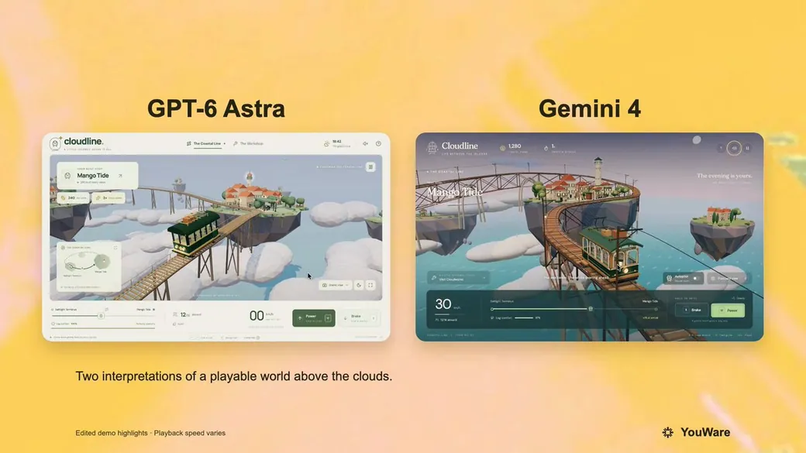</a>

**İstem**

```text
Tarayıcıda doğrudan oynanabilen, tek dosyalı bir HTML/JS 3B oyun (Three.js) oluştur. Sıcak, düşük poligonlu ama özenle hazırlanmış bir bağımsız oyun tarzı kullan; Ghibli tarzı bir sahil kasabasının atmosferini, Zelda'nın maden vagonu raylarının akıcılığıyla birleştirsin.     
【Temel Oynanış】  Oyuncu, bulut denizi ile okyanus yüzeyinin üzerinde yüzen adalar arasında ilerleyen retro bir hava tramvayını kullanır.  - Ray, düz bölümler, yokuş yukarı ve aşağı eğimler, yükseltilmiş virajlar ve denizin üzerinden geçen uzun köprüler içeren kesintisiz bir 3B demiryolu olsun  - Kontroller: Hızlanmak (Power) için W, fren yapmak (Brake) için S, hassas ayar yapmak veya görünümü değiştirmek için sol ve sağ yön tuşları  - Gerçek zamanlı gösterim: km/sa cinsinden hız, tramvaydaki yolcu sayısı (ör. 12/16 yolcu), yol koşulları (Sabit / Yan rüzgâr)  - Yolcu konforu sistemi: ani hızlanma, sert frenleme, virajlara fazla hızlı girme ve yan rüzgâr, "bacak konforunu" azaltır; varış noktasına sarsıntısız ulaşmak bonus puan kazandırır (ör. varışta +75)  - Seri: Fazla sarsıntılı sürüş, "Seri bozuldu. Bahşişlerini yeniden kazanmak için dengenizi bulun." mesajını tetikler.  - İstasyona varınca yolcuların binip inebilmesi için kapıları aç. Peronda, "Kapılar açılıyor - Mango Tide", "Lütfen bekleyin…" gibi altyazılar eşliğinde sıraya girmiş kasaba halkı bulunur.     [Dünya ve İstasyonlar]  En az iki rota/iki ada:  1. Saltlight Terminus  2. Mango Tide  Ada, bulutların üzerinde yüzen kayalık bir adadır. Kırmızı kiremit çatılı, küçük Akdeniz/Güney Avrupa tarzı evler; bir deniz feneri, iskele, yeşil ağaçlar, sokak lambaları ve geceleri parlayan sıcak sarı pencereler bulunur. Uzakta daha fazla yüzen ada ve çevresinde dönen yörüngeler görülür. Gökyüzü alacakaranlıktan geceye uzanan mavi-mor bir geçişe sahiptir; yıldızlar ve yoğun bulutlar vardır, aşağıda ise masmavi deniz suyu uzanır.     [Tramvay Dış Görünümü]  Retro tramvay: koyu yeşil gövde, ahşap renkli şasi, kavisli cam pencereler, çatıda bagaj, yeşil tente/sarmaşık süslemeleri ve içeride oturan çeşitli yolcular. Hareket ederken hafifçe sallansın ve ray sesleri hissi versin (basit ses efektleri veya görsel ipuçlarıyla aktarılabilir).     [Sahne 2: Atölye Modifikasyonu]  Atölye "Cloudworks / Oliver Cloudworks / Oliver's home island" için yukarıdan izometrik görünüme geç.  Oyuncular, yükseltme penceresine benzer bir arayüzle tramvay parçalarını değiştirebilsin:  - Hearth leaves — Eski parça çıkarılıyor  - Little Companion — Tramvay hazırlanıyor  İlerleme çubuğu + "Arkanıza yaslanın ve atölyeyi izleyin."  Modifikasyondan sonra tramvayın görünümünde değişiklikler göster (ör. yeşil çatı, eklenen bagaj rafı, fenerler, sarmaşıklar); ardından tramvay atölyeden çıksın ve "Herkes binsin." / "Sıradaki durak: Coastal Line." altyazıları görünsün.     [Arayüz]  Temiz ve modern, gündelik oyun tarzında bir arayüz kullan: varış noktası ile para/seri göstergesi sol üstte; hız çubuğu ve Power/Brake düğmeleri altta; konfor ilerleme çubuğu iki istasyon adını birbirine bağlasın. Karmaşaya yer verme; korku veya siberpunk tarzına kaçma.     [Teknik Gereksinimler]  - Tek dosya veya minimum sayıda dosya, Three.js  - Raylar için eğriler (CatmullRom vb.) kullan; böylece tramvay rayları takip etsin ve kamera hafif ray hissi verecek şekilde tramvayı izlesin  - Basit bir fizik hissi: hızlanma ataleti, frenleme yavaşlaması, virajlarda gövde yatışı  - Mobilde, hızlanma/frenleme için dokunmayı da desteklemeyi dene  - Okunabilir, yorum satırları içeren kod; dosya açılır açılmaz oynanabilsin.
```

<details>
<summary>Özgün istem</summary>

```text
Create a single-file HTML/JS 3D game (Three.js) that can be played directly in the browser, with a warm, low-poly but polished indie game style, evoking the feel of a Ghibli seaside town combined with the smoothness of Zelda's mine cart tracks.     
【Core Gameplay】  The player drives a retro aerial tram, traveling between islands floating above a sea of clouds and the ocean surface.  - The track is a continuous 3D railway, featuring straight sections, uphill slopes, downhill slopes, elevated curves, and long bridges across the sea  - Controls: W to accelerate (Power), S to brake (Brake), left and right for fine-tuning or switching the view  - Real-time display: speed in km/h, number of passengers on board (e.g., 12/16 aboard), road conditions (Steady / Crosswind)  - Passenger comfort system: sudden acceleration, hard braking, taking corners too fast, and crosswinds all reduce "leg comfort"; arriving at the destination smoothly earns bonus points (e.g., +75 at arrival)  - Streak: driving too bumpily will trigger the message "Streak broken. Find your balance to rebuild your tips."  - Arrive at the station, open the doors for passengers to get on and off. On the platform, there are townsfolk queuing up, with subtitles such as "Doors opening - Mango Tide," "Please wait…"     [World and Stations]  At least two routes/two islands:  1. Saltlight Terminus  2. Mango Tide  The island is a rocky island floating above the clouds, with small Mediterranean/Southern European-style houses with red-tiled roofs, a lighthouse, a dock, green trees, streetlights, and warm yellow windows at night. In the distance, there are more floating islands and circling orbits. The sky is a blue-purple gradient from dusk to night, with stars and thick clouds, and below is azure seawater.     [Tram Exterior]  Retro tram: dark green body, wood-colored chassis, curved glass windows, roof luggage, green awning/vine decorations, and various passengers sitting inside. While moving, there is a slight swaying motion and a sense of track sounds (which can be conveyed with simple sound effects or visual cues).     [Scene 2: Workshop Modification]  Switch to the top-down isometric view of the workshop "Cloudworks / Oliver Cloudworks / Oliver's home island."  Players can swap parts for the tram, with an interface like an upgrade pop-up:  - Hearth leaves — Lifting the old part  - Little Companion — Preparing the tram  Progress bar + "Sit back and watch the workshop."  Changes to the tram's appearance after modification (e.g., green roof, added luggage rack, lanterns, vines), then it drives out of the workshop, subtitles "All aboard." / "Next stop: the Coastal Line."     [UI]  Clean modern casual game UI: destination and currency/streak in the top-left, speed bar and Power/Brake buttons at the bottom, comfort progress bar connecting the two station names. No clutter, don't make it horror or cyberpunk.     [Technical Requirements]  - Single file or minimal files, Three.js  - Use curves for the track (CatmullRom, etc.) so the tram follows the rails, camera follows with a slight rail feel  - Simple physics feel: acceleration inertia, braking deceleration, body roll when cornering  - On mobile, try to also support tap to accelerate/brake  - Readable code, with comments, playable as soon as it's opened.
```

</details>

[Ayrıntıları görüntüle ↗](https://www.tripo3d.ai/tr/3d-prompts/gpt-6-astra-2100838090210431302) · [Orijinal gönderi](https://x.com/YouWareAI/status/2100838828433179037) · [Örneklere dön](#all-prompts)

---

<a id="gpt-6-astra-2100751369619820923"></a>

### Sharpa becerikli eliyle kalem çevirme politikası eğitimi

[AI Will](https://x.com/FinanceYF5) · 2026-09-18 · GPT-6 Astra · Animasyon

<a href="https://www.tripo3d.ai/tr/3d-prompts/gpt-6-astra-2100751369619820923">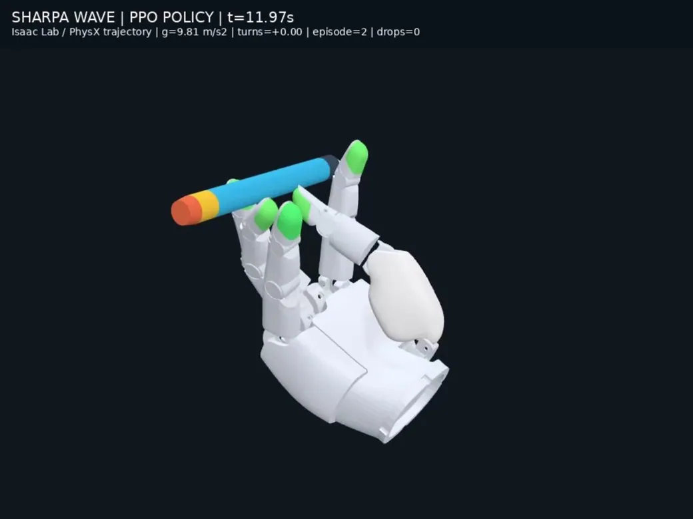</a>

**İstem**

```text
Becerikli elin kalem çevirmesini sağlayın. Pekiştirmeli öğrenme için Isaac Lab kullanın ve Sharpa hand modelini tercih edin; kalemin 3B ağını da kendiniz oluşturun. Son olarak eğitilmiş politikayı ve görselleştirme videosunu teslim edin. İnternette özgürce arama yapabilir, makaleleri ve gerekli materyalleri indirerek kullanabilirsiniz.
```

<details>
<summary>Özgün istem</summary>

```text
让灵巧手完成转笔。使用 Isaac Lab 进行强化学习，采用 Sharpa hand，并自行创建笔的 3D 网格。最终交付训练好的策略和可视化视频。可以自由联网搜索、下载论文及所需资料。
```

</details>

[Ayrıntıları görüntüle ↗](https://www.tripo3d.ai/tr/3d-prompts/gpt-6-astra-2100751369619820923) · [Orijinal gönderi](https://x.com/FinanceYF5/status/2100751369619820923) · [Örneklere dön](#all-prompts)

---

<a id="gpt-6-astra-2100614534423540102"></a>

### CAD ile kendi gövdesi

[vitalduval](https://x.com/vitalduval) · 2026-09-17 · GPT-6 Astra · Varlıklar

<a href="https://www.tripo3d.ai/tr/3d-prompts/gpt-6-astra-2100614534423540102">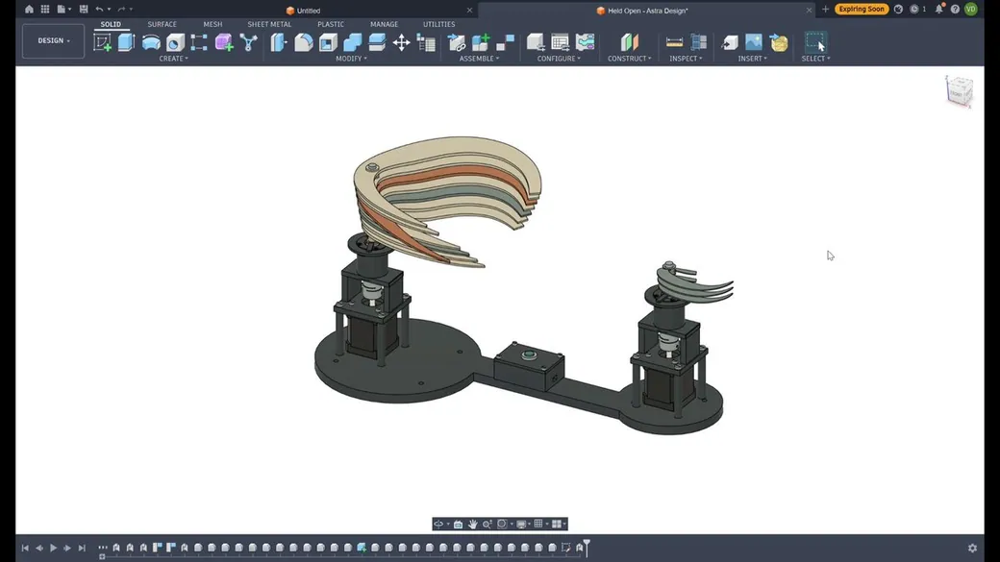</a>

**İstem**

```text
Astra'ya kendi gövdesini CAD ile tasarlamasını söyledim.
```

<details>
<summary>Özgün istem</summary>

```text
I told Astra to CAD itself a body.
```

</details>

[Ayrıntıları görüntüle ↗](https://www.tripo3d.ai/tr/3d-prompts/gpt-6-astra-2100614534423540102) · [Orijinal gönderi](https://x.com/vitalduval/status/2100343136077877251) · [Örneklere dön](#all-prompts)

---

<a id="gpt-6-astra-2100595652703199281"></a>

### Kapatılmış Araştırma Tesisinden Kaçış: Tarayıcıda 3B Oyun

[forest.watch.impress.co.jp](https://forest.watch.impress.co.jp/) · 2026-09-17 · GPT-6 Astra · Oyunlar

<a href="https://www.tripo3d.ai/tr/3d-prompts/gpt-6-astra-2100595652703199281">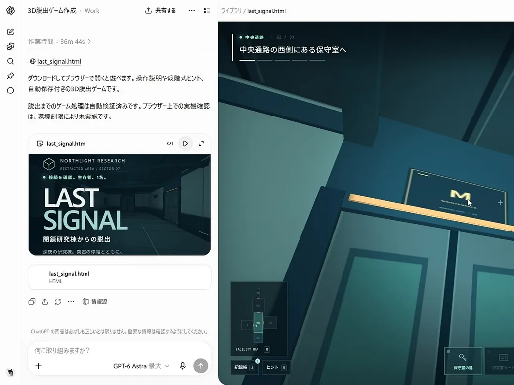</a>

**İstem**

```text
Tarayıcıda oynanabilen bir 3B kaçış oyunu oluşturun. Konusu, kapatılmış bir araştırma tesisinden kaçış olsun ve yaklaşık 5–10 dakikada oynanabilsin. Anahtarlar ve düğmeler gibi mekanizmalar ekleyin; oynanışın kolay anlaşılmasını ve oyunun sonuna kadar tamamlanabilmesini sağlayın. Her şeyi tek bir HTML dosyasında toplayın; oyun, dosya tarayıcıda açıldığında doğrudan oynanabilsin.
```

<details>
<summary>Özgün istem</summary>

```text
ブラウザーで遊べる3D脱出ゲームを作ってください。閉鎖された研究施設から脱出する内容で、5～10分程度で遊べるものにしてください。鍵やスイッチなどの仕掛けを入れ、遊び方がわかり、最後までクリアできる状態にしてください。HTMLファイル1つにまとめ、ブラウザーで開くだけで遊べるようにしてください。
```

</details>

[Ayrıntıları görüntüle ↗](https://www.tripo3d.ai/tr/3d-prompts/gpt-6-astra-2100595652703199281) · [Orijinal gönderi](https://forest.watch.impress.co.jp/docs/serial/yaaiwatch/2141084.html) · [Örneklere dön](#all-prompts)

---

<a id="gpt-6-astra-2100526922770026874"></a>

### 3B Yarış Oyunu Oluştur

[たい焼き｜Claude Codeの人](https://x.com/taiyaki_ai3) · 2026-09-17 · GPT-6 Astra · Oyunlar

<a href="https://www.tripo3d.ai/tr/3d-prompts/gpt-6-astra-2100526922770026874">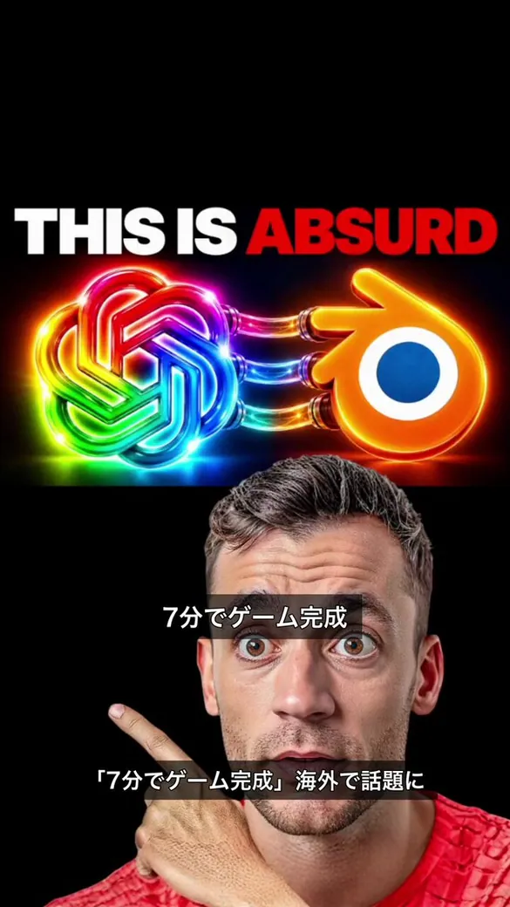</a>

**İstem**

```text
Bir yarış oyunu oluştur
```

<details>
<summary>Özgün istem</summary>

```text
レーシングゲーム作って
```

</details>

[Ayrıntıları görüntüle ↗](https://www.tripo3d.ai/tr/3d-prompts/gpt-6-astra-2100526922770026874) · [Orijinal gönderi](https://x.com/taiyaki_ai3/status/2100526934082105683) · [Örneklere dön](#all-prompts)

---

<a id="gpt-6-astra-2100519026720231698"></a>

### Korkuluğa bakım zinciri ekle

[きのした](https://x.com/ujiden_type0) · 2026-09-17 · GPT-6 Astra · Varlıklar

<a href="https://www.tripo3d.ai/tr/3d-prompts/gpt-6-astra-2100519026720231698">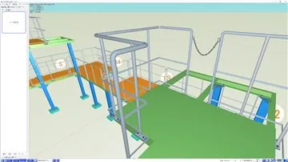</a>

**İstem**

```text
Korkuluğa bakım zinciri ekle!
```

<details>
<summary>Özgün istem</summary>

```text
手摺にメンテ用のチェーン付けて！
```

</details>

[Ayrıntıları görüntüle ↗](https://www.tripo3d.ai/tr/3d-prompts/gpt-6-astra-2100519026720231698) · [Orijinal gönderi](https://x.com/ujiden_type0/status/2100519026720231698) · [Örneklere dön](#all-prompts)

---

<a id="gpt-6-astra-2100350159540596760"></a>

### Etkileşimli voxel şövalyesi ve kamp ateşi sahnesi

[Vib3Coded](https://x.com/vib3coded) · 2026-09-16 · GPT-6 Astra · Etkileşimli

<a href="https://www.tripo3d.ai/tr/3d-prompts/gpt-6-astra-2100350159540596760">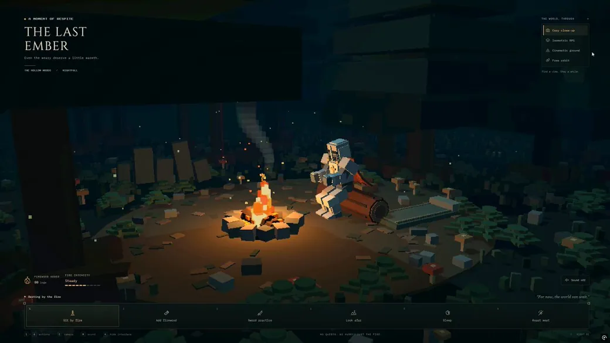</a>

**Referans görseller:** [1](https://media.tripogrowth.space/media/8cbcd267-6a33-4c3e-8599-29ffdb729f3b.jpg) · [2](https://pbs.twimg.com/media/HSXxvD0XcAEG8Jg.jpg)

**İstem**

```text
Kıdemli Yaratıcı WebGL ve Three.js Geliştiricisisiniz. Göreviniz, yalnızca Three.js + WebGL kullanarak tamamen tek başına çalışan bir HTML dosyası (index.html) içinde eksiksiz, üretime hazır ve etkileşimli bir 3B sahne oluşturmaktır

### 1. Görsel Tema ve Sanat Yönetimi

- Atmosfer: Derin bir gece ormanı, sıcak ışık saçan rahat bir kamp ateşi ve kamp alanında dinlenen, yorgun ve yalnız bir şövalye (Dark Souls şenlik ateşi / klasik retro RPG estetiği).
- Estetik: 3B Piksel Sanatı / Voxel / Low-Poly estetiği.
- Gölgelendirme ve Görüntü Sonrası İşleme: Gerçekçi bir 16 bit/32 bit retro görünüm elde etmek için Three.js görüntü sonrası işleme özelliklerini (RenderPixelatedPass veya eşdeğer düşük çözünürlüklü pikselleştirme/dithering efekti) entegre edin.

### 2. Sahne Geometrisi ve Varlıklar (%100 Prosedürel — Harici .gltf/.obj Dosyası Yok)

Tüm varlıklar, dosyanın CORS sorunları olmadan yerel olarak çalışabilmesi için Three.js geometrik ilkel öğeleri (BoxGeometry, CylinderGeometry vb.) ve temel materyaller kullanılarak prosedürel biçimde oluşturulmalıdır.

1. Orman Ortamı:

   - Zemin: Prosedürel voxel taşları, mantarlar ve low-poly bitki örtüsü içeren, stilize edilmiş karanlık arazi.
   - Ağaçlar: Açıklığı çevreleyerek derinlik ve kuşatılmışlık hissi oluşturacak prosedürel çam/ladin veya blok görünümlü taçlı ağaçlar.
   - Gökyüzü ve Işıklandırma: Titreşen voxel yıldızlara sahip, gece yarısı tonlarında koyu bir gökyüzü ve yumuşak gölgeler oluşturan soğuk ay ışığı DirectionalLight.
   - Derinlik: Ufuk çizgisini atmosferle harmanlamak için koyu atmosferik renge sahip THREE.FogExp2.

2. Kamp Ateşi:

   - Kor halindeki kütükleri ve prosedürel köz parçacıklarını çevreleyen taş çember.
   - Ateş Sistemi: Yukarı doğru yükselen animasyonlu pikselli parçacıklar (Points veya titreşen voxel ağları).
   - Dinamik Işıklandırma: Sürekli ve doğal bir titreşim mantığına (Math.sin, noise veya sözde rastgele değişimler kullanarak) sahip, sıcak turuncu-kırmızı bir PointLight.

3. Şövalye:

   - Baş, gövde, üst/alt kollar, bacaklar, pelerin ve kılıç için gruplardan oluşan hiyerarşik sahne grafiği; voxel biçimli ilkel öğeler kullanılarak oluşturulmalıdır.
   - Görsel ayrıntılar: Yarık açıklıklı miğfer, göğüs zırhı, omuz zırhları, eldiven zırhları ve kın/kılıç.
   - Temiz prosedürel dönüş animasyonları için pivot noktaları eklemlerde (omuzlar, dirsekler, kalçalar, dizler) doğru hizalanmalıdır.

### 3. Etkileşimli Şövalye Durum Makinesi

Aşağıdaki seçilebilir durumlar için oluşturma döngüsü içinde lineer enterpolasyon (lerp) veya trigonometrik eğriler kullanarak akıcı prosedürel animasyonlar uygulayın:

- Ateşin Yanında Otur (Varsayılan Boşta): Bağdaş kurarak veya çömelerek oturur, hafif nefes alma döngüleri gerçekleştirir ve ellerini alevlerin yanında ısıtır.
- Odun Ekle: Şövalye ayağa kalkar, bir kütük alır ve ateşin üzerine atar. Ateş görünür biçimde alevlenir, ışık yarıçapını geçici olarak genişletir ve bir kıvılcım patlaması yayar.
- Kılıç Talimi: Ayağa kalkar, kılıcını çeker, temiz bir 3 parçalı saldırı/savunma rutini gerçekleştirir ve savaş gardına geri döner.
- Uzağa Bak: Açıklığın kenarına yürür, kılıcını yere saplar ve pelerin sallanırken karanlığa doğru bakar.
- Uyu: Ateşin yanında bir yatağın üzerine uzanır; miğferinden yüzen, animasyonlu pikselli “Z z z” parçacıkları yükselir.
- Et Kızart: Yiyecek takılı bir çubuğu alevin üzerinde tutar; hafif prosedürel duman/buhar parçacıkları yayar.

### 4. Kamera Sistemi

Konum ve hedefi yumuşak geçiş enterpolasyonuyla (lerp) değiştiren ön ayarlı kamera geçişleri sunun:

- Sıcak Yakın Plan: Şövalyeye ve ateş ışığına odaklanan orta plan.
- İzometrik RPG: Açıklığın klasik, yüksekten 45 derecelik taktik görünümü.
- Sinematik Zemin: Yıldızlı gökyüzü ve çam ağaçlarının taçları önünde şövalyeye aşağıdan yukarı bakan, alçak açılı dramatik çekim.
- Serbest Yörünge: Etkileşimli inceleme için standart OrbitControls'a kesintisiz geçiş.

### 5. Kullanıcı Arayüzü ve Ses

- Arayüz Stili: Yarı saydam koyu paneller, pikselli kenarlıklar ve gömülü bir Google Font (ör. 'Press Start 2P') kullanan retro 8 bit/16 bit RPG HUD düzeni.
- Alt Panel: Her şövalye durumunu tetikleyen etkileşimli eylem düğmeleri.
- Sağ Üst Panel: Kamera açısı değiştirme düğmeleri.
- Odun Sayacı: Eklenen kütükleri ve mevcut ateş yoğunluğunu takip eder.
- Ses (Web Audio API): Prosedürel olarak sentezlenmiş ateş çıtırtısı ve gece esintisi/cırcır böceği ambiyansı; sesi açma/kapatma düğmesiyle birlikte.

### 6. Teknik Özellikler

- Tek ve kendi içinde çalışan index.html dosyası.
- CDN üzerinden yüklenen ES Modules kullanın (https://t.co/W8o3SZwkCj veya unpkg).
- Modüler, iyi yorumlanmış kod yapısı (initScene, buildEnvironment, buildKnight, buildCampfire, setupUI, setupAudio, animate).
- Kamera en-boy oranını ve pikselleştirme geçişinin çözünürlüğünü güncelleyen pencere yeniden boyutlandırma işleyicisiyle tamamen duyarlı yapı.
```

<details>
<summary>Özgün istem</summary>

```text
You are a Senior Creative WebGL & Three.js Developer. Your task is to build a complete, production-ready, interactive 3D scene contained entirely within a single standalone HTML file (index.html) using Three.js + webgl

### 1. Visual Theme & Art Direction

- Atmosphere: Deep night forest, cozy glowing campfire, solitary weary knight resting at the campsite (Dark Souls bonfire / classic retro RPG aesthetic).
- Aesthetic: 3D Pixel Art / Voxel / Low-Poly aesthetic.
- Shading & Post-Processing: Integrate Three.js post-processing (RenderPixelatedPass or an equivalent low-resolution pixelation/dithering effect) to achieve an authentic 16-bit/32-bit retro look.

### 2. Scene Geometry & Assets (100% Procedural — No External .gltf/.obj Files)

All assets must be constructed procedurally using Three.js geometric primitives (BoxGeometry, CylinderGeometry, etc.) and basic materials so the file runs locally without CORS issues.

1. Forest Environment:

   - Ground: Dark stylized terrain with procedural voxel stones, mushrooms, and low-poly foliage.
   - Trees: Procedural pine/spruce or blocky canopy trees surrounding the clearing to create depth and seclusion.
   - Sky & Lighting: Deep midnight sky with flickering voxel stars and a cool moonlight DirectionalLight casting soft shadows.
   - Depth: THREE.FogExp2 with a dark atmospheric color to blend the horizon.

2. Campfire:

   - Stone circle surrounding smoldering logs and procedural ember embers.
   - Fire System: Animated pixelated particles (Points or pulsing voxel meshes) rising upward.
   - Dynamic Lighting: Warm orange-red PointLight with continuous, natural flicker logic (using Math.sin, noise, or pseudo-random variations).

3. The Knight:

   - Hierarchical scene graph (groups for head, torso, upper/lower arms, legs, cape, and sword) built from voxelized primitives.
   - Visual details: Slotted helmet, chest armor, pauldrons, gauntlets, and a sheath/sword.
   - Pivot points must be aligned correctly at joints (shoulders, elbows, hips, knees) for clean procedural rotation animations.

### 3. Interactive Knight State Machine

Implement smooth procedural animations using linear interpolation (lerp) or trigonometric curves inside the render loop for the following selectable states:

- Sit by Fire (Default Idle): Sits cross-legged or crouched, subtle breathing cycles, warming hands near the flames.
- Add Firewood: Knight stands up, retrieves a log, and tosses it onto the fire. The fire visibly flares up, expands its light radius temporarily, and emits a burst of sparks.
- Sword Practice: Stands up, draws the sword, executes a clean 3-part attack/parry routine, and returns to a combat guard stance.
- Look into the Distance: Walks to the edge of the clearing, plants the sword into the ground, and stares out into the dark while the cape sways.
- Sleep: Lies down on a bedroll beside the fire; floating animated pixel "Z z z" particles rise from the helmet.
- Roast Meat: Holds a stick with food over the flame; emits subtle procedural smoke/steam particles.

### 4. Camera System

Provide preset camera switches with smooth transition interpolation (lerping position and target):

- Cozy Close-up: Medium shot focusing on the knight and the firelight.
- Isometric RPG: Classic high 45-degree tactical overview of the clearing.
- Cinematic Ground: Low-angle dramatic shot looking upward at the knight against the starry sky and pine canopies.
- Free Orbit: Seamless switch to standard OrbitControls for interactive inspection.

### 5. UI & Audio

- UI Style: Retro 8-bit/16-bit RPG HUD layout using semi-transparent dark frames with pixelated borders and an embedded Google Font (e.g., 'Press Start 2P').
- Bottom Panel: Interactive action buttons triggering each knight state.
- Top-Right Panel: Camera angle switcher buttons.
- Firewood Counter: Tracks logs added and current fire intensity.
- Sound (Web Audio API): Procedurally synthesized fire crackle and ambient night breeze/crickets, with a mute/unmute toggle button.

### 6. Technical Specifications

- Single, self-contained index.html file.
- Use ES Modules loaded via CDN (https://t.co/W8o3SZwkCj or unpkg).
- Modular, well-commented code structure (initScene, buildEnvironment, buildKnight, buildCampfire, setupUI, setupAudio, animate).
- Fully responsive window resize handler updating camera aspect ratio and pixelation pass resolution.
```

</details>

[Ayrıntıları görüntüle ↗](https://www.tripo3d.ai/tr/3d-prompts/gpt-6-astra-2100350159540596760) · [Orijinal gönderi](https://x.com/vib3coded/status/2100350602316558428) · [Örneklere dön](#all-prompts)

---

<a id="gpt-6-astra-2100271998618177864"></a>

### İzometrik fantezi grafik demosu

[Anshu Chimala](https://x.com/anshuc) · 2026-09-16 · GPT-6 Astra · Etkileşimli

<a href="https://www.tripo3d.ai/tr/3d-prompts/gpt-6-astra-2100271998618177864">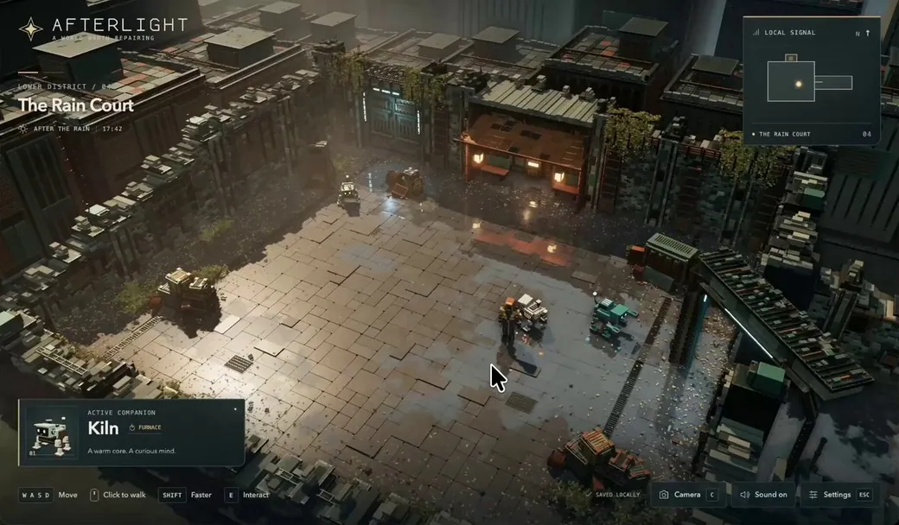</a>

**İstem**

```text
Bana bir grafik demosu oluştur: izometrik kamera, gerçekçi gölgelendirmeye ve yansıtıcı ıslak zeminlere sahip voxel esintili sanat tarzı ve ilgi çekici bir sahnede bir karakter. Fantezi ortamı (Elden Ring veya Diablo'yu düşün). Tarayıcıda Three.js kullan, 60 FPS'nin üzerinde çalışsın. Varlıkları indirme. Süre sınırı 1 saat. Kontroller: Karakteri hareket ettirmek için tıkla; kamera karakteri yumuşak bir şekilde takip etsin. Kamerayı döndürmek için sürükle; yakınlaştırmak ve uzaklaştırmak için kaydır. Şimdilik oynanış olmasın. Dünya canlı hissettirmeli: hareketler, animasyonlar ve çevrenin ince tepkileri olsun. Oyuncunun çevresindeki alan geniş görünmeli, ancak hareket yalnızca sınırlı bir bölgede mümkün olmalı. Sanatı benimle teyit etmene veya soru sormana gerek yok, hemen başla!
```

<details>
<summary>Özgün istem</summary>

```text
Build me a graphics demo: isometric camera, voxel-ish art style with realistic shading and reflective wet floors, a character in an interesting scene. Fantasy setting (think Elden Ring, Diablo). Three.js in browser, >60fps. Don't download assets. Time limit of 1 hour. Controls: click to move the character, camera lazy-follows; drag to rotate camera; scroll to zoom in/out. No gameplay for now. World should feel alive: motion, animations, subtle environmental behaviors. Area around player should look expansive, but only allow movement in a limited space. No need to confirm the art with me or ask questions, just go!
```

</details>

[Ayrıntıları görüntüle ↗](https://www.tripo3d.ai/tr/3d-prompts/gpt-6-astra-2100271998618177864) · [Orijinal gönderi](https://github.com/achimala/dream-loop) · [Kaynak kodu](https://github.com/achimala/dream-loop) · [Örneklere dön](#all-prompts)

---

<a id="akari-nagoya-rooftop-flame-relay"></a>

### AKARI: Nagoya Çatı Alevi Bayrak Yarışı

[Jared](https://growthengineer.space/) · 2026-09-16 · GPT-6 Astra · Oyunlar

<a href="https://www.tripo3d.ai/tr/3d-prompts/akari-nagoya-rooftop-flame-relay">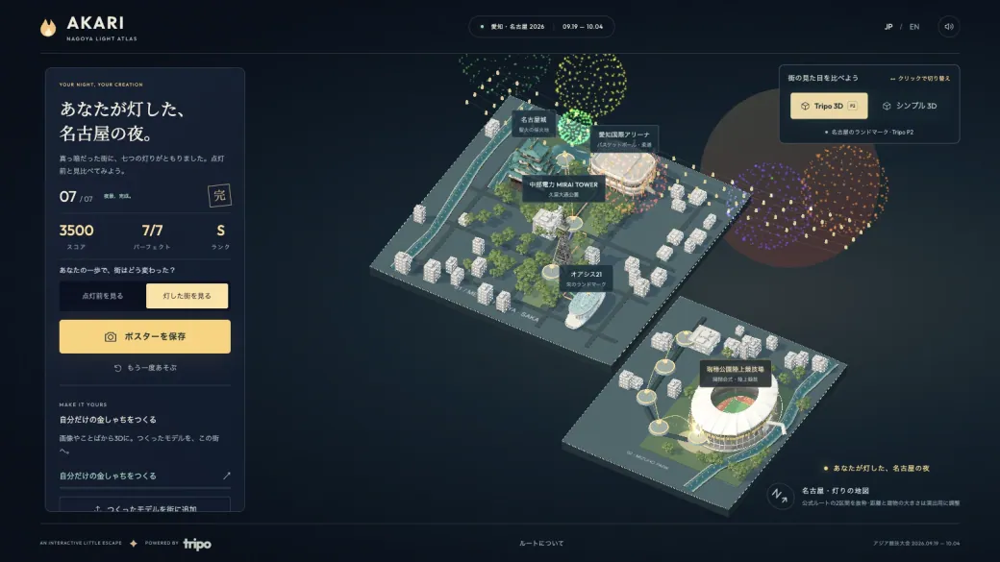</a>

**İstem**

```text
# AKARI — Nagoya Işık Atlası

## 1. Amaç
Aichi–Nagoya Asya Oyunları öncesinde, 19 Eylül–4 Ekim 2026 tarihleri arasında, soyut bir alevin zamanlamalı yedi sıçrayış yaparak minyatür Nagoya’yı aydınlattığı, Japonca odaklı eksiksiz bir tarayıcı oyunu oluşturun. https://akari-nagoya-rooftop-relay.tripo.page/ adresindeki mevcut iki haritalı açılış sürümünü ve sağlanan görsel referansları eşleştirin. Önceki genel çatı sahnesi hedef değildir.

## 2. Görsel yön
Yükseltilmiş, dörtte üç atlas görünümü; gece yarısı laciverti arka plan; sıcak fildişi Japonca serif başlıklar; ince altın çizgiler ve ölçülü gren kullanın. Masaüstünde sol üçte birlik alanı açılış davetine ayırın ve sağda yükseltilmiş iki harita döşemesini çerçeveleyin; telefonlarda haritayı kontrollerin üzerine yeniden yerleştirin. Sönük, desatüre binalar ve teal su yollarıyla başlayın. Başarı; yeşilleri, turkuaz bakır çatıları, sıcak pencereleri ve altın rota ışıklarını geri getirir. Alevi ve bir sonraki hedefi kolayca okunur tutun. Yumuşak gölgeler, atmosferik derinlik ve kontrollü bloom kullanın; beyaz parlamadan kaçının. Referansta görünen Japonca açılış başlığını, önemli yapı etiketlerini ve ince editoryal üstbilgi/altbilgiyi eşleştirin.

## 3. Dünya
Daha büyük kuzeybatı döşemesi Meijo Parkı, Nagoya Kalesi, Aichi International Arena, Hisaya-odori Parkı, MIRAI TOWER ve Oasis 21’i kapsar. Güneydoğu döşemesi Şehir Müzesi’ni, Mizuho-dori’yi, Mizuho Parkı’nı ve atletizm stadyumunu kapsar; Yamazaki Nehri stadyumun doğusundadır. Alçak modern mahalleler, park ağaçları, yol işaretleri, nehir kıyıları ve sıcak ışık armatürleri ekleyin; kale mimarisini yalnızca kaleye ayırın.

Bölüm 1: Meijo Parkı → Sotobori/Hisaya-odori → Hisaya-odori Parkı → Oasis 21, üç sıçrayış. Şehir Müzesi’ne geçişi açıkça işaretlenmiş ve oynanamaz bir bölüm geçişi olarak tasarlayın. Bölüm 2: Şehir Müzesi → Mizuho-dori → Mizuho Undojo Nishi → Mizuho Parkı yönü → Güney Meydanı, dört sıçrayış. Geçişi hiçbir zaman kesintisiz bir cadde olarak çizmeyin veya sıçrayış sayısına dahil etmeyin. İlerlemeyi ikinci bölümde kaydedin. Haritalar farklı ölçekler kullanır; oynanış için mesafeler sıkıştırılmıştır. Bunu, 22 Ağustos ve 16 Eylül 2026 tarihli tarihsel meşale rölesi tarihleriyle birlikte About bölümünde kısaca açıklayın; bunlar yaklaşan etkinlik davetleri değildir. https://www.aichi-nagoya2026.org/ja/torch-relay/ ve https://www.nagoyajo.city.nagoya.jp/guide/kinshachi/. kaynaklarını belirtin. Resmî maskot veya amblem yerine özgün süslemeler ve soyut bir alev kullanın.

## 4. Varlık envanteri
Bu sabit yedek varlık yuvalarını öncelik sırasıyla kullanın; her iki görsel modda da aynı yerleşimi ve çarpışma proxy’lerini koruyun:
- `shachi`: kaplan başını andıran başı, kıvrımlı pullu sazan gövdesi ve yukarı doğru kıvrılan kuyruğu olan, antika görünümlü cilalı altın çatı süslemesi; kalede tekrarlayın.
- `castle`: fildişi renkli, Nagoya’dan esinlenen kale yapısı; koyu ahşap, kademeli turkuaz kırma ve beşik çatılar, taş temel.
- `mizuho`: geniş oval atletizm stadyumu; açık renkli, merkezi boş çatısı ve ritmik taşıyıcıları olsun; koşu pistini ve yeşil sahayı merkezden görünür tutun.
- `arena`: park ekseninin kuzeyinde, geniş çatılı ve sıcak dikey cephe kanatçıklı alçak çağdaş arena.
- `tower`: kutu biçimli seyir platformu ve anteni olan, ince gümüş kafesli gözlem kulesi.
- `oasis`: ince, açık renkli taşıyıcılar üzerinde uzanan oval turkuaz cam/su kanopisi.
- `midrise`: ölçülü, modern bir Japon mahallesi binası; basit müze kütlesi de dahil olmak üzere farklı yükseklik ve yönelimlerde yeniden kullanın.
- `tree`: kahverengi gövdeli ve katmanlı yeşil taçlı, kompakt olgun park ağacı; her iki döşemede de örnekleyerek kullanın.
Araziyi, yolları, suyu, pist işaretlerini, sıçrayış işaretlerini, soyut alevi, ışık izlerini, havai fişekleri ve kullanıcı arayüzünü prosedürel üretin. Her model eksiksiz ve yalıtılmış bir nesne olmalı; açık geçişleri ve stadyumun merkezini koruyun. Tekrarlanan arka plan varlıkları da dahil olmak üzere listelenen her yuvayı takip edin.

## 5. Oynanış ve ödül
Şarj etmek için işaretçiyi/dokunmayı veya Space tuşunu basılı tutun; bir sonraki işarete doğru otomatik sıçramak için bırakın. Deterministik delta-time fiziği kullanın: mesafe = 1.8 + 7 × charge, charge 0 ile 1 arasında gidip gelir ve yay, enterpolasyonlu yüksekliğe 4 × t × (1 − t) × 3.6 ekler. Şarj döngüsünün her yöndeki süresini yaklaşık 1.42 saniyeden 0.92 saniyeye hızlandırın. Yörüngeyi, yeşil güvenli bölgeyi ve altın kusursuz bölgeyi aynı hesaplamadan türetin: hata ≤0.36 ise kusursuz; ≤1.15 ise güvenli kabul edilir ve ilk iki sıçrayış için 0.28 ek tolerans tanınır.

Güvenli iniş 100 puan verir; kusursuz iniş, arka arkaya gelen çarpanla 200 × puan verir ve çarpan ×4 ile sınırlıdır. 2.35 saniye içinde yapılan hızlı takip 50 puan ekler; güvenli inişten, bölüm geçişinden veya 3.4 saniye beklemeden sonra komboyu sıfırlayın. Her başarı, bölge boyunca bir ışık dalgası gönderir, pencereleri aydınlatır ve fenerler ekler. Yedi adımlık ilerlemeyi, puanı, komboyu ve rekoru gösterin. Iskalamalar hızlıca yeniden başlatılır; geçişten sonra bölüm kontrol noktasını geri yükleyin. Duraklatma, yeniden başlatma, gizli sekmeden kurtarma ve etkileşim sonrasında isteğe bağlı ses sağlayın.

Son sıçrayıştan sonra, 4.6 saniyelik geri çekilme animasyonuyla iki aydınlatılmış haritayı da gösterin ve havai fişekleri sınırlı tutun. Yedi kusursuz iniş için S, dört veya daha fazlası için A, diğer durumlarda B derecesini gösterin. Yeniden oynatma, aynı kamerayla önce/sonra şehir görünümleri ve başlık, tarihler, puan ve bağımsız proje kredisini içeren gerçek 1800×1200 PNG poster ekleyin.

## 6. Uygulama
Vite, TypeScript ve Three.js kullanın; coğrafyayı, saf fizik/puanlamayı, sahneyi, efektleri, model kayıt sistemini, Japonca/İngilizce yerelleştirmeyi ve kullanıcı arayüzünü birbirinden ayırın. Prompt dili ne olursa olsun Japonca varsayılan dil olarak kalmalı; dil değişikliğini kalıcı hâle getirin. Yazı tiplerini ve varlıkları yerel olarak paketleyin. GLTFLoader ve yuva başına normalleştirme kullanın; geçersiz bir içe aktarma sonrasında çalışan son modeli koruyun. Basit ve içe aktarılan görselleri karşılaştırırken puanı, kontrol noktasını, kamerayı ve aydınlatmayı koruyun. Ağaçları/binaları örnekleyin, uyumlu statik geometrileri birleştirin, DPR’yi sınırlayın ve parçacık sayısını kontrol altında tutun. Bir modeli yalnızca üçgen hedefini aştığı için reddetmek yerine gerçek kare süresini ve model karmaşıklığını değerlendirin. Blender’ı yalnızca dönen bir varlıkta mesh temizliği, pivot onarımı veya stadyum merkezinin açılması gerektiğinde kullanın; özgün dosyasını koruyun.

## 7. Kabul kriterleri
Çalıştırılabilir kaynak kodu, lockfile, geliştirme/derleme komutlarını ve statik derlemeyi teslim edin. Her iki bölümdeki yedi sıçrayışı, geçiş/kontrol noktası kurtarmayı, ıskalama/yeniden denemeyi, puanlamayı, dokunmatik girdiyi, duraklatmayı, Japonca/İngilizce dil tercihi kalıcılığını, tüm yuva yedeklerini ve gerçek poster dışa aktarmayı doğrulayın. Sabitlenmiş açılış ve final ekran görüntülerini mevcut iki haritalı referansla karşılaştırın. Ölçülen performansı ve gerçekten gerçekleştirilen testleri raporlayın. Aşağıdaki ortak iş akışı, model üretimini ve teslimini yönetir.
```

[Ayrıntıları görüntüle ↗](https://www.tripo3d.ai/tr/3d-prompts/akari-nagoya-rooftop-flame-relay) · [Örneklere dön](#all-prompts)

---

<a id="cyclops-island-threejs-game"></a>

### Kiklop’un Adası

[Jared](https://x.com/jaredliu_bravo) · 2026-09-16 · GPT-6 Astra · Oyunlar

Uyarlama kaynağı: [Jason Chew](https://x.com/jasoncjs_/status/2099414001851449430)

<a href="https://www.tripo3d.ai/tr/3d-prompts/cyclops-island-threejs-game">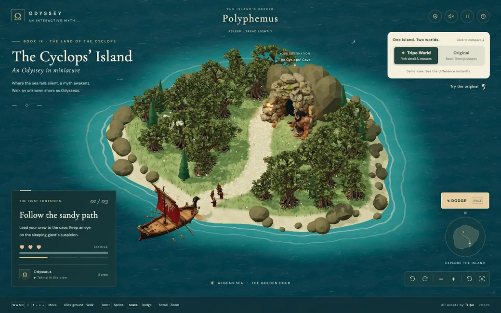</a>

**İstem**

```text
# ODYSSEY — Kiklop’un Adası

## 1. Amaç
Odyssey’nin IX. kitabından ilham alan, baştan sona oynanabilir izometrik bir kaçış oyunu oluşturun. Odysseus olarak üç mürettebat üyesine mağara erzaklarını çalmaları, peşinize düşüp size saldıran Polyphemus’tan sağ kurtulmaları ve bir Yunan gemisine binerek kaçmaları için liderlik edin. Tüm oyun arayüzü İngilizce olmalı. https://cyclops-island.tripo.page/ ve sağlanan referansları kullanın; Jared’ın katkı bilgisini ve Jason Chew’in Odyssey adası konseptinden alınan ilhamı koruyun.

## 2. Görsel yön
Derin teal renkli Ege Denizi’nde, yaklaşık 25 dünya birimi genişliğinde, zengin dokulu bir Akdeniz masaüstü adası kompoze edin. (19,31,34) civarında ortografik, üç çeyrek açıya sahip bir kamera kullanın. Sıcak kireç taşı, adaçayı yeşili zeytin ağaçları, terakota kumaş, bronz zırh ve krem rengi parşömen kullanın. ACES ton eşleme, sıcak yönlü gölgeler, atmosferik derinlik, ölçülü bloom, vignette ve gren uygulayın. Tehlike işaretleri efektlerin altında da okunaklı kalmalı.

Yerel Cormorant Garamond tarzı serif başlıklar ve DM Sans tarzı arayüz kullanın. Sol üstte bir Ω mührü, ODYSSEY / AN INTERACTIVE MYTH, BOOK IX ve The Cyclops’ Island metinleri yer alsın. Sağ üstte belirgin bir krem rengi karşılaştırma kartında “One island. Two worlds.” yazısı ile Tripo World ve Original kontrolleri bulunsun. Sol altta görev aşamasını, üç kalbi, dayanıklılığı ve mürettebat sayısını gösterin. Üstte boss durumunu, altında küçük bir pusula/minimap’i, görünür kamera kontrollerini ve kısa giriş ipuçlarını gösterin. Telefonlarda dekoratif metinleri kompakt tutun; görev, boss, karşılaştırma ve Dodge kontrollerini ayrı sunun.

## 3. Dünya
Dolambaçlı, açık kum renkli bir yol güneydeki iniş plajından kuzeye doğru ilerleyerek zeytinliklerin arasından bir kireç taşı mağarasına ulaşır. Dev, mağaranın yakınında uyur; Odysseus ve mürettebat güney yolunda başlar. İskele yakınında, güneybatıya kırmızı yelkenli ahşap bir gemi yerleştirin. Kıyıyı düzensiz kayalar, çimenler, servi ağaçları ve turkuaz sığlıklarla çevreleyin. Deniz dalgalanmalarını, kıyı köpüklerini, ağaçları, ateş ışığını, kuşları ve geminin sallanmasını canlandırın. Kamera döndürüldüğünde okyanus hareketi doğru kalmalı.

## 4. Varlık envanteri
Değiştirme yuvalarını şu sırayla hazırlayın:
- `odysseus`: sakallı Yunan maceracı; kızıl sorguçlu bronz Korint miğferi, yıpranmış göğüs zırhı, fildişi tunik, terakota pelerin, sandaletler, küçük kalkan ve kınına sokulmuş kılıç. Üç mürettebat üyesi için bağımsız iskeletler ve animasyon aşamalarıyla yeniden kullanın.
- `polyphemus`: tam olarak tek bir merkezi gözü olan güçlü dev; bronzlaşmış zeytin teni, kıvırcık koyu saç ve sakal, kürk/deri peştamal, kalın çıplak ayaklar ve tahta sopa; nötr, rigging’e uygun pozda tam vücut.
- `ship`: dar, koyu ceviz gövdeli; yükseltilmiş pruva, bronz koçbaşı, direk, terakota kırmızısı yelken, halat donanımı ve yan kürekler. Su veya sergileme kaidesi olmasın.
- `olive`: budaklı gri-kahverengi gövde, yayılan kökler ve düzensiz adaçayı yeşili taç; yaklaşık 25 kez yeniden kullanın.
- `cave`: gerçekten açık bir geçidi olan, geniş ve bağımsız duran, yıpranmış kireç taşından kemer; iri kayalar ve seyrek yosunlar. Karanlık iç kısmı ayrı oluşturun.
- `cypress`: yoğun koyu yeşil yapraklı, ince ve konik Akdeniz ağacı.
- `boulder`: düzensiz, sıcak kireç taşından kıyı kayası; farklı ölçek ve dönüşlerle yeniden kullanın.
Araziyi, yolu, suyu, çimleri, erzak işaretlerini, çatışma telegraph’larını, parçacıkları ve arayüzü prosedürel tutun. Görünümünü değiştirirken her yuvayı takip edin ve oynanış haritasını koruyun.

## 5. Kaçış karşılaşması
Kameraya göre WASD/ok tuşlarını ve tıklayarak/dokunarak hareket etmeyi, yarıçapı dikkate alan A* navigasyonuyla kullanın. Mürettebat gevşek bir formasyonda takip etsin; oyuncu ve dev, farklı boyutlarına uygun şekilde araziye, sınırlara ve engellere uysun. Shift sprint yapar, Space veya büyük dokunmatik düğme Dodge gerçekleştirir, E yakındaki erzakları alır, P oyunu duraklatır, Q/R kamerayı döndürür ve F kahramanı takip eder. Sürükleme/pan, sağ tuşla sürükleme/döndürme, kaydırma/zoom ve dokunmatik kıstırma hareketlerini destekleyin. Takip sırasında tıklayarak hareket ettirme, dayanıklılık elverdiği sürece sprint yapar.

Aşama 1: mağaraya yaklaşın; yakınlık ve gürültülü sprint şüpheyi artırır ve devi uyandırabilir. Aşama 2: erzakları yalnızca yakından ve her zaman devi uyandıracak şekilde toplayın. Aşama 3: mürettebat gemiye binerken, yaklaşık 2,7 birimlik işaretli iskele yarıçapının içinde, (-0.8,8.7) yakınında toplam 11 saniye hayatta kalın; bölgeden çıkmak ilerlemeyi duraklatır.

Üç can ve 100 dayanıklılık verin. Başlangıç hızları: yürüme 2.35, sprint 4.15 ve dev koşusu saniyede 3.4 birim. Dev saldırmadan önce 3.6 birimlik menzile kadar kovalamalıdır. Uyuma, uyanma, kovalama, saldırı hazırlığı, darbe, toparlanma ve terminal durumlarını kullanın. Ground Breaker, 1.12 saniyelik saldırı hazırlığının başlangıcında oyuncunun konumunu sabitler, yarıçapı 2.45 olan bir daire gösterir ve bir kez vurur; hedef oyuncuyu takip etmemelidir. Her üçüncü yere vuruşta, açıkça işaretlenmiş, genişleyen ve güçlendirilmiş bir şok dalgası yayılsın; hasar hareket eden halkanın kenarına göre uygulansın.

Dodge yaklaşık 0.34 saniye sürer, 24 dayanıklılığa mal olur ve 1.25 saniyelik bekleme süresine sahiptir; kısa süreli hasar bağışıklığı ve geçerli zemine sabitleme içermelidir. Sprint dayanıklılığı tüketir; dinlenmek dayanıklılığı yeniler. Darbeler geri savrulmaya, hasar geri bildirimine ve geçici bağışıklığa neden olur. Yenilgi, tüm aktörleri, zamanlayıcıları, efektleri ve görev durumunu sıfırlar. Kaçış, hasarı durdurur ve yeniden oynatma özetini açar. Duraklatma; simülasyonu, animasyonu ve efektleri dondurur. Gemiye binmeyi, güçlendirilmiş bir saldırı da dahil olmak üzere, birkaç Dodge gerektirecek şekilde ayarlayın.

## 6. Uygulama ve animasyon
Dünya, navigasyon, karşılaşma, aktörler, efektler, ses ve arayüz için Vite, Three.js ve JavaScript ES modüllerini kullanın. Tüm çalışma zamanı varlıklarını statik derlemede yerel olarak paketleyin. Başlangıçtaki eklemli modeller yürümeli/koşmalı, uyumalı/uyanmalı, Dodge yapmalı ve saldırıya hazırlanıp vurduğunu görünür biçimde göstermelidir. Skin’li değiştirmelerde AnimationMixer, gerçek klip adları, kısa crossfade’ler ve ayrı mürettebat iskeletleri için SkeletonUtils.clone kullanın. Kök hareketinin iki kez uygulanmasını ve ayak kaymasını önleyin. Devin aşağı yönlü saldırısını oynanıştaki darbeyle senkronize edin; statik import’lar animasyonlu olarak raporlanmamalıdır. Gerektiğinde çalışan bir eklemli fallback bulundurun. Blender’ı yalnızca gerekli rig, pivot, klip veya mesh onarımları için kullanın.

Turuncu/altın telegraph’ları, darbe flaşını, zemin çatlaklarını, tozu, kıvılcımları, düşen kaya parçalarını, genişleyen halkaları, kısa süreli ışığı ve kamera sarsıntısını senkronize edin. Dodge izleri ve isteğe bağlı, hareketle etkinleştirilen sentezlenmiş ses ekleyin. Efektleri havuzlayın, çevre öğelerini instance olarak oluşturun ve kare süresini ölçün. Import’ları ayakları/kökleri zemine oturtulmuş ve çarpışma proxy’leri değiştirilmemiş şekilde normalize edin. Compare; konumları, görevi, canı, dayanıklılığı, kamerayı ve animasyon durumunu korur; başarısız import’lar çalışan modelleri korur. Göze batmayan bir Change hero kontrolü ve yuva başına durum gösteren yerel model import’u ekleyin.

## 7. Kabul kriterleri
Kaynak kodu, lockfile’ı, npm geliştirme/derleme komutlarını ve statik çıktıyı teslim edin. Engel navigasyonunu, erken uyanmayı, yakından toplamayı, saldırıdan önce kovalamayı, kilitli hedefleri, zamanlamalı saldırıları, Dodge bağışıklığını, şok dalgası kenarı hasarını, yenilgi/sıfırlamayı ve başarılı bir kaçışı doğrulayın. Mürettebat animasyonlarının bağımsızlığını, tüm yuva fallback’lerini, durum koruyan karşılaştırmayı, masaüstü/mobil yerleşimini ve yükleme hatalarını kontrol edin. Sabitlenmiş ekran görüntülerini referansla karşılaştırın ve gerçek performansı raporlayın. Model oluşturma için aşağıdaki ortak iş akışını kullanın ve döndürün.
```

<details>
<summary>Özgün istem</summary>

```text
Build an interactive browser experience based on Homer’s Odyssey - The Cyclops’ Island.

Create a polished isometric pixel-art 3D diorama of a small Greek island surrounded by animated ocean. Include a sandy shore, dense forest, rocky cliffs, a large cave, Odysseus and his crew, the Cyclops, and their ship offshore.

Make it feel like a small playable game:

Control Odysseus with WASD or arrow keys
Click the ground to walk
Drag to pan the camera
Scroll to zoom
Add subtle water, tree, character, and environmental animation
Add camera rotate, zoom, reset-view, and pause controls
Use collision so the player cannot walk through rocks, trees, or water

Add a dark literary UI panel in the bottom-left:

“Lead Odysseus along the sandy path to the cave.”
Show the current character and movement state below it.
Art direction: detailed 1990s isometric strategy/RPG pixel art, muted Mediterranean colors, textured terrain, warm parchment typography, subtle grain, and premium game UI. It should look like an old illustrated map brought to life.
Make the whole experience fill the browser window and work immediately. Do not make a mockup. Build the complete interactive experience.
```

</details>

[Ayrıntıları görüntüle ↗](https://www.tripo3d.ai/tr/3d-prompts/cyclops-island-threejs-game) · [Orijinal gönderi](https://x.com/jaredliu_bravo) · [Canlı demo](https://cyclops-island.tripo.page/) · [Örneklere dön](#all-prompts)

---

<a id="gpt-6-astra-2100233407108137349"></a>

### Yeraltı İstasyonunda AAA CGI Doğaüstü Dövüş Kısa Filmi

[MadMax](https://x.com/MadMax_Series) · 2026-09-16 · GPT-6 Astra · Animasyon

<a href="https://www.tripo3d.ai/tr/3d-prompts/gpt-6-astra-2100233407108137349">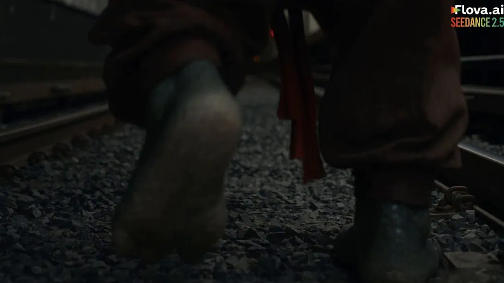</a>

**İstem**

```text
Tüm karakterler, arka plandaki kalabalık ve istasyon ortamı, dijital olarak belirgin biçimde yontulmuş üst düzey AAA fantastik oyun CG görünümünde olmalı. Karakter yakın planlarında, yüksek kaliteli oyun karakteri yüzü, net örgü saç tutamları ve stilize gerçekçi cilt korunmalı; görüntü gerçek oyunculara, cosplay'e, sıradan gameplay'e, 2D animasyona veya cel shading'e dönüşmemeli. Modern yeraltı istasyonundaki doğaüstü dövüş korunmalı; ortam ortaçağ kalesine, karlı dağlara veya boks ringine dönüşmemeli. Renk paleti düşük doygunluklu soğuk camgöbeği-gri, koyu kömür siyahı, camgöbeği-gri pullu deri ve soğuk beyaz ışık şeritlerinden oluşmalı. Sarı korkuluklar, kırmızı sinyal lambaları, bronz gözlük çerçevesi, bakır oksidi yeşili omuz zırhı ve koyu kızıl kuşak, sınırlı vurgu renkleri oluşturmalı. Gözlerin bal rengi altın parıltısı ve sütuna vurulduğu andaki kısa mor ışık yalnızca ilgili anlarda görünmeli; tüm görüntü mor renge boyanmamalı. Ortam: geniş ve loş bir yeraltı metro istasyonu; merkezde aşağıda kalan ray bölgesi, raylar ve çakıl taşları, iki yanda raylardan yüksekte platformlar. Platform kenarlarında cam-metal güvenlik bariyerleri ve sarı dikey çerçeveler bulunmalı. Zeminde sarı güvenlik şeritleri, gri karo yüzeyler ve drenaj ızgaraları olmalı. Kalın beyaz yuvarlak sütunlar alçak tavanı desteklemeli; üstte kesintisiz soğuk beyaz uzun ışık şeritleri ve yuvarlak lambalar, uzakta ise derinliğe uzanan küçük kırmızı sinyal lambaları bulunmalı. Platformlarda sıradan, farklı tonlarda montlar giyen onlarca yetişkin yolcu, sütunların yanında veya bariyerlerin arkasında dağınık halde durmalı. Dövüşten ürktüklerinde geriye çekilmeli, büzülmeli ve kollarını koruyucu biçimde kaldırmalılar; her zaman arka plan kalabalığı olarak kalmalı, dövüşe katılmamalı, başrole dönüşmemeli ve aynı yüzleri tekrarlamamalılar. Tren gelmemeli; tabelalarda yalnızca bulanık geometrik renk blokları bulunmalı, okunabilir yazı olmamalı. İki ana dövüşçü sabit kalmalı: A, gözlük takan savaşçı, A'dan daha uzun ve geniş, kaslı yapılı, iki ayak üzerinde yürüyen insansı bir canavar olan B ile dövüşen; uzun, ince ve atletik yapılı yetişkin bir erkek olmalı. A'nın sıcak koyu kahverengi teni, belirgin elmacık kemikleri ve çene hattı bulunmalı; siyah, başa yapışık kısa örgü saçları ensede kısa bir örgü düğümü halinde toplanmalı. Alnına sabitlenmiş dar bronz çerçeveli, duman grisi açılır-kapanır bir gözlük siperliği bulunmalı; normalde gözleri kapatmalı, burun köprüsünün altı ve ağız bölgesi görünür kalmalı. Gri-mavi, kolsuz ve üst üste binen yakalı bir dövüş üstü, koyu kahverengi kuşak, kömür siyahı bol pantolon ve koyu kahverengi bilekli botlar giymeli. İki ön kolu gri kumaş şeritlerle sarılı olmalı; parmakları açıkta kalmalı ve elleri her zaman boş olmalı. Pelerin, elde silah veya okunabilir amblem bulunmamalı. İfadesi sakin, hareketleri çevik ve kararlı olmalı. Yalnızca belirtilen planda sağ eliyle kısa süreliğine gözlük siperliğinin kenarını kaldırarak parlak bal rengi altın bir gözü göstermeli; ardından siperlik gözlerini yeniden kapatacak konuma indirilmeli. Bu, alına sabitlenmiş aynı fiziksel gözlük ekipmanı olmalı; kumaş şeritlere dönüşmemeli ve kaybolmamalı. B, A'dan daha uzun ve geniş, kaslı yapılı iki ayaklı insansı bir canavar olmalı. Kalın koyu camgöbeği-gri pullar geniş göğsünü, sırtını ve uzuvlarını kaplamalı; karın bölgesinde daha ince ve sık gri-camgöbeği pullar bulunmalı. Geniş ve yassı kertenkele başı, kısa küt bir burnu, güçlü çeneleri, iki koyu kehribar rengi gözü ve kısa kalın dişleri olmalı. Başında insan saçı, maske veya dal benzeri çıkıntılar bulunmamalı. B'nin kendi sol omzundan sol ön koluna kadar kalın bakır oksidi yeşili doğal zırh plakaları gelişmiş olmalı; sol omzun üst kenarında kısa ve küt kemik yüzgeçlerinden oluşan bir sıra sabit durmalı. Sağ kolunda daha açık gri-camgöbeği tonunda kalın pullar bulunmalı; sol ve sağ taraf kesinlikle yer değiştirmemeli. Kemik yüzgeçleri ve zırh plakaları vücudun parçası olmalı; omzunda çiçek bulunmamalı. Koyu kahverengi bol kesim geniş paçalı dövüş pantolonu, koyu kızıl kumaş kuşak ve aşağı sarkan iki dar kuşak ucu giymeli. Ayak bilekleri koyu kahverengi kumaşla sarılı olmalı; ayakları geniş ve pullu olmalı, duvara dayanmayı açıkça gösterecek belirgin tabanlara sahip olmalı. Kuyruk, kanat, fazladan kol, uzun boynuz, kılıç, mızrak, kalkan veya elde tutulan herhangi bir aksesuar bulunmamalı. B, normal bir istasyona girebilecek boyutta kalmalı; A ve yolcularla oranı sabit olmalı, gökdelen büyüklüğünde bir deve dönüşmemeli. 0.00–3.70 saniye: İlk karede dövüş başlamış olmalı. Raylara yakın alçak açıdaki kısa planda B'nin hızla adımlayarak yaklaştığı görülür; hemen ardından A'nın arkasından orta plana kesilir. B önden hücum eder, bacağını kaldırıp kalçasını döndürerek baş hizasında yatay bir dönerek tekme savurur. A dizlerini kırıp başını alçaltır ve gövdesini yana yatırır; tekme siyah kısa örgülerinin üzerinden geçer. B ayağını yere basıp geri döner, A da hemen doğrulur. Belirgin Dutch angle kullanılan ray hizasındaki alçak konumlu geniş ikili plana kesilir. A dizini kaldırıp yüksek bir yatay tekme savurur; B başını ve omuzlarını alçaltarak kaçar, A bacağını geri çekip destek ayağının üzerine iner. Kamera A'nın omuz arkasına dönerek yakın takip planına geçer. B art arda savurduğu yumruklarla saldırır; A kısa mesafeli baş kaçırmalar, omuz düşürmeler ve dönüşlerle yumrukların yüzünün yanından sıyrılmasını sağlar. A, rakibinin saldırmasını beklerken aynı yerde tekrarlanan yumruk savurmamalı. Tavan ışık şeritleri kamera hareketiyle savrulup yönlü hareket izleri oluşturmalı; bedenlerin uzamsal ilişkisi net kalmalı. 3.70–6.40 saniye: B'nin açık gri-camgöbeği sağ yumruğu yeniden A'nın önüne uzanır. A avucunu açarak el bileğini ve ön kolunu yakalar; temas noktası görünür olmalı. Kamera A'nın sakin yan yüzüne yaklaşır, ardından A ayaklarını çevirip kalçasını ve omzunu döndürürken hızla alçak açıdan tam vücut görünümüne dolanır. A aynı sağ kolu tutmaya devam eder; B'yi destek noktasından kaldırıp vücudunun yan üst tarafı boyunca savurur. B'nin iki ayağı da yerden kesilir; koyu kızıl kuşağı ve geniş pantolonu atalet nedeniyle geriden gelir. Savruluşun en yüksek noktasında yalnızca çok kısa bir ultra slow motion kullanılır, ardından hız normale döner. A dönüşünü tamamlayıp elini bırakır; B aynı yay boyunca başı aşağıda, ayakları yukarıda takla atarak düşer. Omuzları ve sırtı ray zeminiyle temas ettiğinde çakıl taşları ve toz temas noktasından dışarı saçılır. Alçak kamera düşüşü takip edip kısa süreli sarsılır. B yuvarlanarak üst gövdesini destekler ve dört uzvu da eksiksiz kalır; kol kopması, temassız telekinetik fırlatma veya havadan yeniden ayağa kalkma olmamalı. 6.40–9.20 saniye: B alçak konumda toparlanırken A çoktan zemini itip sıçrayarak yaklaşmış olmalı. Kamera B'nin arkasından yukarı bakar; A havada kalçasını döndürüp bacaklarını açar. Sıçrayışın en yüksek noktası kısa süreliğine yavaşlar, ardından A alçalırken yatay uçan tekmeyle B'nin baş ve omuzlarına bastırır. B iki kolunu kaldırıp karşılar ve darbenin etkisiyle yana savrulur. A yere basar basmaz saldırıyı sürdürür; yere indikten sonra durup beklememeli. Kamera A'nın alçalışını ve yandan dolanmasını izleyerek hızla yaklaşır; hafif eğimli omuz üstü ve yüz yakın planları dönüşümlü oluşur. A, B'nin geri savurduğu kolundan sıyrılır, gövdeye kısa bir yumruk atar, ardından açık avucuyla yüzünün yanına temas edip B'nin başını yana iter. Temastan sonra baş ve boyun ancak hareket yönünde dönmeli. Avuç, yüz ve ön kol birbirine birleşmemeli. B'nin sol omuz kemik yüzgeçleri, aynı taraftaki omuz zırhı ve gövdeyle birlikte dönmeli. 9.20–11.20 saniye: A, yüzün yanına uyguladığı itişin ardından dönerek bacağını toplar ve hemen ileri doğru güçlü bir yan tekme savurur. Ayakkabı tabanı B'nin karnından alt göğsüne kadar olan bölgeye temas eder. B'nin gövdesi önce katlanır, ardından iki ayağı yerden kesilir ve platforma doğru yan üst yönde uçar. Kamera onu platform kenarının üzerinden geçerken takip eder. B'nin üst sırtı ve omzu beyaz yuvarlak sütuna çarpar; sütun yüzeyi temas noktasından dışa doğru çatlar, açık renk parçalar ve toz dökülür. B sütun boyunca platform zeminine geri iner. A bacağını topladıktan sonra ray bölgesinden aynı platforma sıçrayarak yaklaşır. Kesmeden sonra aynı sütunun yanında devam eden konumda görünür; başka bir istasyona ışınlanmamalı. Yolcular iki yana kaçar. Sütun hasar görür ancak bütünüyle devrilmez. 11.20–12.80 saniye: B'nin çarpma sonrası yüz yakın planına kesilir. B başını kaldırıp A'yı bulmak için yüzünü çevirir; sol omuzundaki bakır oksidi yeşili zırh plakaları ve kısa kemik yüzgeçleri hâlâ yerinde olmalı. Hızla aynı sütunun iki yanını gösteren yakın plana geçilir: B sağ ön planda, A sütunun yanında sol arka plandadır. A hafifçe sırıtır ancak konuşmaz. Sağ eliyle bronz çerçeveli gözlük siperliğinin kenarını kaldırır ve parlak bal rengi altın bir gözü B'ye doğrudan gösterir; bu çok kısa sürer. Sağ eliyle siperliği indirip gözlerini yeniden kapatır, aynı anda kaçınmaya hazırlanır. Önceki diyaloğa ait uzun bir duraksama veya konuşma ağız hareketi olmamalı. 12.80–13.80 saniye: B omzunu çevirip açık gri-camgöbeği sağ yumruğuyla A'nın bulunduğu yere saldırır. A, yumruk ulaşmadan önce hızla yana kayıp sütunun arkasından çıkar. Yumruk sağlam beyaz sütuna çarptığı anda yoğun, sıkı bir mor enerji parlaması patlar; çatlaklar uzar, parçacıklar aşağı dökülür ve kısa mor ışık hemen söner. Yakın planda önce yumruğun sütun yüzeyine bastırdığı görülür, ardından hızla geniş plana geçilir: B ıskalamış, A ise çoktan yana dolanmıştır. Sütun, daha önce hasar gören aynı sütun olarak kalmalı. A mor dumanına dönüşmemeli ve yumruk vücudun içinden geçmemeli. 13.80–16.00 saniye: Alçak konumlu, eğimli geniş planda A sütunun ön yanında bedenini alçaltır ve kısa bir çağırma el hareketi yapar. B dönüp saldırarak yaklaşır. A yerden iterek havalanır ve kesintisiz tek bir geriye takla tamamlar: önce geriye doğru yatar, iki ayağını başının üzerinden yukarı geçirir, ardından karnını toplayıp ters dönük aşamadan geçer ve B'nin yatay savurduğu kolundan kaçar. Kamera vücutla birlikte yukarı doğru eğilir; ters dönük aşamada kısa süreli yavaşlama kullanılır, arka plandaki ışık şeritleri eğik biçimde akıp geçer. A aynı dönüşü sürdürür, iki ayağı vücudunun altına geri gelir ve B'nin yan arkasındaki platform boşluğuna iner. Dizlerini bükerek iniş kuvvetini emer; giysi uçları ve ense örgüsü ataletle aşağı salınır. Arka plandaki yolcular korkuyla kaçışır ancak ek saldırganlara dönüşmez. A savrulmaz ve havada süreyi uzatmak için art arda takla atmaz. 16.00–18.50 saniye: A daha yeni doğrulmuşken B dönüp yetişir ve A'nın başının yanına geniş bir savurma yumruğu gönderir. A önce geriye yatar, sonra alçalır; B'nin açık gri-camgöbeği sağ kolu başının üzerinden geçer. A iki eliyle aynı ön kolu kontrol eder, rakibin vücudunun ön tarafına adım atar ve sırtını dönerek ağırlık merkezini alçaltır. A, B'nin kolunu kendi omzunun üzerinden geçirir ve B'nin hâlâ ileri doğru taşıdığı momentumu kullanarak tek bir omuz üstü atış gerçekleştirir. B'nin kalçası dayanak noktasının üzerinden döner, iki ayağı yerden kesilir ve sırt tarafı platform karolarına düşer; kırık karolar ve toz zemin boyunca yayılır. Kamera omuz hizasındaki yakın plandan alçak orta-geniş plana geri çekilerek dönüşü ve düşüşü eksiksiz gösterir. A ayakta kalır ve B'nin düşmesine izin vererek elini bırakır. B hemen dönüp destek alır ve bacaklarını bükerek ayağa kalkar. A ona dönüp baskıyı sürdürür; ayağa kalkma hareketi yaklaşıp saldırıyla kesintisiz birleşmeli, ayakta diyalog söylenen uzun bir duraksama olmamalı. 18.50–20.65 saniye: B yakın dövüş mesafesine geri hücum eder. A önce davranıp yüzün yanına kısa bir düz yumruk atar, geri çektiği eliyle göğsünü korur, ardından bedenini alçaltıp karın ve kaburgalara saldırır. B darbelerden birini kolunu kaldırarak karşılar ve ağır koluyla yatay bir karşı saldırı savurur. A göğüs ve omuzlarının iç tarafına sokulup başını alçaltarak kaçar, geri çekilen yumruğu ön koluyla savuşturur, ardından çene ve üst göğse kısa, sıkı yumruklarla temas eder. Kamera iki dövüşçünün omuzları çevresinde hızlı ve küçük hareketlerle dolanır. Baş ve gövde yalnızca gerçek temasın ardından geri sekmeli. Bu bölüm art arda saldırı, savuşturma ve karşı saldırı olarak gösterilmeli; tarafların boşluğa sırayla yumruk savurduğu, birbirine tepki vermediği veya iki yumruğun sürekli birbirine yapıştığı bir dövüş olmamalı. 20.65–21.85 saniye: Doğrudan üstten kuş bakışı plana geçilir. İkilinin aynı küçük karo bölgesinin çevresinde döndüğü net biçimde görülür. A'nın siyah kısa örgüsü ve bronz gözlük çerçevesi ile B'nin sol omzundaki bakır oksidi yeşili zırh plakaları ve koyu kızıl kuşağı sabit ayırt edici özellikler olmalı. B'nin geniş savrulan kolu A'nın yanından geçer; A omuzlarını küçültüp kolun iç tarafına girer, sağ ve sol ayaklarını sırayla değiştirir, bir eliyle rakibin ön kolunu iter, diğer yumruğunu göğüs ve karın bölgesine geçirir, ardından B'nin dönüşüne uyum sağlamak için elini geri çeker. Zemindeki düşmüş karolar ve drenaj ızgarası yerinde kalmalı. Üstten plan yakın dövüş rotasını göstermeli; yedek bir dövüşçü veya üçüncü bir dövüşçü eklenmemeli. 21.85–24.00 saniye: B'nin omzunun üzerinden çekilen sıkı yakın plana dönülür. A, kısa ve keskin üst-alt seviye dönüşümlü yumruk serisini sürdürürken B'nin yukarıdan dolaşan kolundan başını kaçırır. Kumaşla sarılı ön kollar ile gri-camgöbeği kalın pullu yumruk kolu kesişir ancak sınırları net kalır. Kamera A'nın yumruğunu hızla itişini takip eder; iki güçlü temas noktasına yalnızca birkaç karelik siyah-beyaz yüksek kontrastlı pozlama parlaması ve hacimsel darbe silueti eklenir, ardından görüntü hemen önceki soğuk camgöbeği-gri AAA CGI görünümüne döner. Çizgi romana, yazıya veya 2D illüstrasyona kesilmemeli. Son düz yumruk B'nin karnına açıkça bastırır; karın içeri doğru sıkışır, üst gövde öne katlanır ve B'nin yukarıdan savurduğu kolu gövdenin ilerleme yönünü kaybeder. A'nın ayak tabanları sağlam kalır; güç bacaklardan, kalçadan ve omuzdan yumruğa aktarılır. Yumruk vücudu delip geçmemeli. 24.00–28.00 saniye: Aynı karın darbesinin sonucu kesintisiz sürer. B'nin iki ayağı yerden kesilip geriye doğru savrulur. Kamera platform kenarına alçak ve yakın konumda, istasyonun uzun ekseni boyunca yüksek hızla takip eder; beyaz sütunların, sarı çerçevelerin, cam bariyer panellerinin ve şaşkın kalabalığın yanından art arda geçer. Hız nedeniyle arka plan çizgileri uzar; B'nin camgöbeği-gri pullu gövdesi, koyu kahverengi pantolonu, koyu kızıl kuşağı ve sol omuzundaki bakır oksidi yeşili zırh plakaları her zaman ayırt edilebilir kalmalı. Uzun eksenli geniş plan, sütunların ön planda hızla geçmesiyle yapılan kesmeler ve aşağıdan yukarı bakan yakın planlarla B'nin atalet içinde döndüğü, dengesini toparlamak için kollarını uzattığı gösterilir; savrulan parçalar aynı uçuş yönünde rayların üzerinden geçer. B daha sonra platform kenarındaki cam-metal güvenlik bariyerinin bir bölümünü kırarak aşar. Cam vücuduyla temas ettikten sonra parçalanır, metal çerçeve bükülür ve B açıklıktan ray bölgesine doğru ilerlemeyi sürdürür. Kamera ray tarafındaki duvar yönünü gösteren geniş plana kesilir. Bu, önceki karın darbesinin neden olduğu kesintisiz uçuş olmalı; ekran dışından ek tekme, ikinci bir fırlatma veya yolcuların savrulması eklenmemeli. A her sütunun arkasında kopyalanmamalı. 28.00–30.00 saniye: Sabit yandan orta-geniş plan. Koyu gri dikey ray duvarı görüntünün solunda, karşı platform ve bariyerlerin arkasındaki yolcular sağ arka planda, uzun ışık şeritleri istasyonun derinliğini göstermeli. B havada dönerek duvara ayakları önde yaklaşır. İki ayağının tabanları dikey duvara açıkça temas eder; dizlerini büküp karnını çekerek kompakt bir kıvrılma oluşturur. Ayaklarının altında az miktarda duvar tozu sıyrılır. Ardından ultra slow motion içinde dizlerini yavaşça açar, gövdesini dışa doğru çevirir ve bedeni giderek yataya yaklaşır. Ayak tabanları duvara basmaya devam etmeli; koyu kızıl kuşak, geniş pantolon ve küçük parçacıklar hareketini sürdürerek temas, sıkışma ve güç biriktirmenin kesintisiz sürecini göstermeli. Bu hareket sırta duvara çarpma, havada donma veya yatay duran bir zeminde ayakta durma gibi görünmemeli. 30.00 saniyede video, B'nin iki ayağı duvara basılı ve gövdesi dışa doğru açılmış halde hâlâ hareket ettiği bir karede sona ermeli. Tam bir duvardan iterek karşı saldırı, yere iniş, ölüm veya kazanan-kaybeden sonucu eklenmemeli; siyaha kesme, kararma veya kapanış kartı olmamalı. Ritim ve süreklilik: Hızlı takip, yakın mesafe kaçışları, fırlatma ve atışlar, taklalar, uçan tekmeler, sütuna çarpma, üstten çekilen kısa yumruklaşma ve platformlar arası yer değiştirme sırası korunmalı; gözlem süreleri ve önceki diyalog duraksamaları kısaltılmalı. Yalnızca savruluşun en yüksek noktası, havadaki kaçış ve son duvara basma aşaması kısmi ağır çekimde gösterilmeli; son aşamada açıkça ultra slow motion kullanılmalı. Normal saldırı ve savunma yüksek hızda akıcı olmalı; tüm video ağır çekime alınmamalı ve süreyi doldurmak için dondurulmuş kare kullanılmamalı. A'nın siyah kısa örgüsü, koyu kahverengi teni, bronz çerçeveli gözlük siperliği, gri-mavi kolsuz üstü ve kumaşla sarılı ön kolları korunmalı; gözü gösteren hareketten önce ve sonra siperliğin durumu net olmalı. B'nin sol tarafındaki bakır oksidi yeşili zırh plakaları ve kısa kemik yüzgeçleri, sağ taraftaki gri-camgöbeği kalın pullu kolu, geniş kertenkele başı, koyu kahverengi pantolonu ve koyu kızıl kuşağı korunmalı. Kemik yüzgeçleri düşmemeli, taraf değiştirmemeli veya silaha dönüşmemeli. Yere düşen kişi önce zeminle temas etmeli, sonra kendini destekleyerek toparlanmalı. Aktif sıçramalarda önce yerden itme görülmeli; darbeyle uçuşlarda önce temas gerçekleşmeli; duvarda frenlemede önce ayak tabanları temas etmeli, ardından dizler bükülmeli. Tüm hareketler ağırlığı, ataleti ve yönü korumalı. Arka plan kalabalığı doğal kaçınma hareketlerini sürdürmeli ve ana dövüşçülerle net bir mekânsal ayrım korumalı; birbirlerine birleşmemeli veya aniden yumruk ve tekme yollarına girmemeliler. Hasarlı sütun yüzeyi, yere düşen karolar ve kırılmış bariyer panelleri sonraki planlarda hasarlı durumlarını korumalı. Ek silah, çoklu uzuv, kan püskürmesi veya parçalanma olmamalı. Arka plan müziği kesinlikle yasaktır: videonun hiçbir anında arka plan müziği, film müziği, müzik kanalı, melodi, ritmik perküsyon, koro, şarkı, müzikal sürekli ses veya tonal atmosfer tabanı oluşturulamaz. Yalnızca görüntüyle senkronize ve fiziksel olarak sahneye ait diegetik seslere izin verilir: yeraltı istasyonundaki havalandırma ve mekân yankısı, ayak sesleri ve zeminde sürtünme, kumaş ile koyu kızıl kuşağın savrulma sesleri, yumruk ve tekmelerin hava yarma sesi, gerçek temasların tok darbeleri, sözsüz nefesler ve kısa acı inlemeleri, çakıl taşlarının yuvarlanması, betonun çatlaması, camın kırılması, metal bariyer çerçevesinin bükülmesi, yolcuların geri çekilen ayak sesleri, kısa mor ışık temasının melodik olmayan elektrik çatırdaması ve son olarak ayak tabanlarının duvara sürtünmesi ile duvar tozunun dökülmesi. Diyalog, anlatıcı sesi, anlaşılır bağırış sözcükleri, şarkı veya altyazı olmamalı. Müzik olmayan boşlukları nabız sesleri, orkestra vuruşları, melodik ses tasarımı veya ritmik ses efektleriyle doldurmayın; art arda yumrukları, ayak seslerini veya kırılan cam seslerini davul ritmine dönüştürmeyin, havalandırma sesini müzikal bir sürekli sese uzatmayın. Herhangi bir arka plan müziği veya film müziği oluşması başarısızlık olarak değerlendirilir. music=0; no_music=1; strict_no_music=1; audio=diegetic_only; başlık, okunabilir istasyon adı, logo, interface, oynatıcı kontrolleri veya watermark bulunmamalı.
```

<details>
<summary>Özgün istem</summary>

```text
全部角色、背景群众与车站环境统一使用明显经过数字雕刻的高级AAA奇幻游戏CG外观，人物近景必须保持精修游戏角色脸、清楚的编辫发束与风格化写实皮肤，不变成真人演员、cosplay、普通gameplay、2D动画或赛璐璐。保留现代地下车站中的超自然格斗场景，不改成中世纪城堡、雪山或拳击擂台。色彩为低饱和冷青灰、深炭黑、青灰鳞皮与冷白灯带，少量黄色护栏、红色信号灯、青铜护目框、铜锈绿肩甲和赭红腰带形成局部色彩；眼睛的蜂蜜金光与击柱时的短紫光只出现在对应瞬间，不全片染成紫色。环境：宽阔而昏暗的地下铁路站，中央下沉轨道区、钢轨与碎石，两侧高出轨道的站台；站台边缘是玻璃金属屏蔽栏与黄色竖向边框，地面有黄色安全带、灰色砖面、排水格栅，粗大白色圆柱支撑低天花板，顶部连续冷白长灯带与圆形灯、远处小红信号灯延伸至深处。站台有数十名穿普通深浅外套的成年乘客，分散在柱旁或栏后，受战斗惊动后退、缩身和抬臂保护，始终为背景群众，不参与格斗、不变成主角、不复制相同面孔。没有列车驶入，标牌只保留模糊几何色块，无可读文字。两名主战者固定：A护目武者为高挑精瘦运动体型成年男性，暖深棕肤色、清楚的颧骨与下颌，黑色贴头短辫在脑后束成短辫结；前额固定一副窄青铜框烟灰色可掀护目罩，平时遮住双眼，鼻梁下方与嘴部露出。穿灰蓝色无袖交叠领战斗上衣、深褐束腰带、炭黑长裤和深棕低帮靴；双前臂缠灰色布带，双手手指外露，始终空手，无披风、手持武器或可读徽章。表情从容，动作敏捷而果断；仅在指定镜头用右手短暂抬起护目罩边缘，露出一只明亮蜂蜜金色眼睛，随后护目罩放回遮眼位置；这是同一件固定在前额的实体护目装备，不变成布条，不消失。B鳞脊斗兽为比A更高、更宽厚的肌肉型双足人形异兽，深青灰色粗鳞覆盖宽厚胸背与四肢，腹部为较细密的灰青鳞片；宽扁的蜥蜴状头部、短钝吻、厚颌、两只深琥珀眼睛和短粗牙齿，头部没有人类头发、面具或树枝状突起。B自身左肩至左前臂生长厚实的铜锈绿色天然甲片，左肩上缘固定一排短而钝的骨鳍；右臂保留较浅灰青色粗鳞，左右绝不互换，骨鳍与甲片属于身体，肩上没有花朵。穿暗棕色宽松阔腿战裤、赭红色织物腰带与两条垂下的窄带尾，脚踝缠深褐布，脚掌宽大有鳞，保持适合抵墙的清楚脚底；没有尾巴、翅膀、额外手臂、长角、剑、枪、盾牌或手持道具。B是能进入正常车站的高大异兽，保持与A及乘客的稳定比例，不膨胀成高楼巨人。0.00–3.70秒：第一帧便进入交锋。贴近轨道的低机位短镜头看见B快速踏步逼近，随即切A背后中景，B从前方冲来，抬腿转髋，横扫一记头部高度的旋踢；A屈膝低头并侧倾上身，踢腿从黑色短辫上方掠过，B落脚转回，A随即起身。切明显Dutch angle的轨道低位双人宽景，A提膝接一记高位横踢，B降低头肩避过，A收腿落回支撑脚。镜头回到A肩后近距离跟拍，B追上一组连续摆臂拳击，A以短距离偏头、沉肩和转身让拳从脸旁擦过，不原地反复摆拳等对方出招；天花板灯带随镜头甩动形成方向性拖影，身体关系保持清楚。3.70–6.40秒：B的浅灰青色右拳再次伸到A面前，A张掌截住其手腕与前臂，接触位置可见；摄影机贴近A从容的侧脸，然后随他转脚、旋髋和转肩迅速绕至低位全身视角。A保持抓住同一条右臂，将B拉离支撑、沿身体侧上方甩起，B双脚离地，赭红腰带和宽裤随惯性滞后。甩起最高处只有极短ultra slow motion，随即恢复高速；A完成转体后松手，B沿原弧线头下脚上翻落，肩背接触轨道地面，碎石与灰尘从接触处迸出。低机位摄影机追随翻落并短促震动，B顺势滚动、撑起上身，保持四肢完整；不是断臂、无接触念力投掷或凭空重新站起。6.40–9.20秒：B仍在低位恢复，A已经蹬地跃近，镜头从B身后仰拍A在半空转髋展腿，跳跃最高点短暂放慢，然后下落时以横向飞踢压向B头肩；B抬起双臂迎挡并被压得偏转，A落脚后立刻跟进，不落地站着等待。摄影机随A下落和绕侧迅速拉近，形成略倾斜的肩上与面部交替近景；A闪过B回扫的手臂，用短拳击向躯干，再以一记张掌接触脸侧把B的头推偏，接触后头颈才顺方向转动。手掌、脸与前臂不能融合，B左肩骨鳍随同一侧肩甲和躯干转动。9.20–11.20秒：A借脸侧推压后的空间转体收腿，随即向前送出有力侧踹，鞋底接触B腹部至下胸；B躯干先折起、双脚随后离地，沿侧上方飞向站台。镜头跟着他掠过站台边缘，B上背和肩撞上白色圆柱，柱面由接触点向外开裂，浅色碎片和粉尘落下，B沿柱面回落到站台地面。A收腿后从轨道区跃上同一站台追近，切镜后出现在该柱旁的连续位置，不瞬移到另一个车站；乘客向两侧躲开，柱子受损但不整体倒塌。11.20–12.80秒：切B受撞后的脸部近景，它抬头、转脸寻找A，左肩铜锈绿甲片与短骨鳍仍在；迅速转为同柱两侧的近景构图，B占右前景，A在柱旁左后景，轻微冷笑但不说话。A用右手抬起青铜框护目罩边缘，露出一只明亮蜂蜜金色眼睛，直视B，停留很短；他用右手放下护目罩使其重新遮住双眼，身体同时准备避让，不留下原本对白的停顿或说话口型。12.80–13.80秒：B转肩挥出浅灰青色右拳打向A所在位置，A在拳头到达前迅速侧移绕出柱后；拳头击中实体白柱，接触瞬间爆出紧凑紫色能量闪光，裂缝延伸，碎屑向下掉，短紫光立刻消散。近景先看拳面压入柱面，再快速拉宽显露B打空而A已经绕到侧方，柱子仍是先前那根受损柱，不把A变成紫色烟雾，也不让拳穿过人体。13.80–16.00秒：低位倾斜宽景，A在柱子侧前方压低身体、抬手作一个短促招引手势，B转身扑来。A蹬地腾空完成一次连续后空翻，先仰身、双脚向上越过头顶，再收腹转过倒置阶段，躲过B横扫的手臂；镜头随身体向上倾转，在倒置阶段短暂放慢，灯带沿背景倾斜掠过。A继续同一次翻转，双脚回到身体下方，落在B侧后的站台空地，屈膝吸收落地力量，衣角与脑后短辫随惯性回落；背景乘客惊惧闪避，不被当成额外攻击者，A没有被打飞，也不在半空反复翻跟头拖时。16.00–18.50秒：A刚站起，B便转身追上，一记宽幅摆臂打向A头侧；A先后仰再下潜，让B的浅灰青色右臂从头顶横过，双手顺势控制那条前臂，踏入对方身体前侧并转背降低重心。A把B的手臂带过自己肩上，利用B仍向前的动量完成一次过肩摔；B的髋部翻过支点，双脚离地，背侧落在站台砖面，碎砖和粉尘沿地面散开。镜头从贴肩近景退到低位中广景，完整交代翻转与落地，A保持站立，松手让B落下。B立即翻身支撑并屈腿起身，A转向它继续施压，把起身与追近接起来，不保留站着说台词的长停顿。18.50–20.65秒：B冲回贴身距离，A抢先用短直拳击向脸侧，回手护住胸前，随后压低身体打向腹肋；B抬臂挡住其中一击并以粗重手臂横扫反击，A贴近其胸肩内侧低头避开，抬前臂拨开回收的拳，再以紧凑短拳接触下颌与上胸。镜头绕两人肩侧高速小幅移动，头部与身体在实际接触后才出现回弹；以一组连续进攻、挡拨和回击完成这一段，不拍成轮流挥空拳、互不反应或双拳持续贴在一起。20.65–21.85秒：直接切正上方俯拍，清楚看见两人围绕同一小片地砖转动，A的黑色短辫与青铜护目框、B左肩铜锈绿甲片与赭红腰带是固定辨识点；B宽幅手臂从A身侧扫过，A缩肩钻入手臂内侧，左右脚依次换位，一手拨开对方前臂，另一只拳打入胸腹，再收手随B的转体调整位置。地面的落砖与排水格栅保持原位，俯拍展示近身攻防路线，不增加一个替身或第三名格斗者。21.85–24.00秒：切回越过B肩部的紧近景，A继续一组短促上、下段交替拳击并侧头闪开B从上方绕来的手臂，缠布前臂与灰青粗鳞拳臂交错但边界清楚。镜头追随A的拳头急推，在两处强接触点加入仅数帧的黑白高反差曝光闪变与立体冲击轮廓，立即回到原来的冷青灰AAA CGI，不切成漫画、文字或2D插画。最后一记直拳明确压中B腹部，腹部向内压缩、上身折起，B上方挥来的手臂随躯干失去前进方向；A脚底稳住，力量由腿、髋、肩传到拳面，拳头不穿透身体。24.00–28.00秒：紧接同一记腹部重击的后果，B双脚离地向后飞出，镜头低贴站台边缘沿车站长轴高速追踪，连续掠过白柱、黄色边框、玻璃栏板和惊愕的人群；背景线条因速度拖长，B的青灰鳞躯、暗棕裤、赭红腰带与左肩铜锈绿甲片始终能辨认。通过长轴宽景、柱子擦过前景的快速切镜和从下方仰看的近景，展示B在惯性中翻转、伸臂试图恢复平衡，带起的碎片沿同一飞行方向掠过轨道。B随后撞破站台边缘一段玻璃金属屏蔽栏，玻璃在身体接触后碎开、金属框弯折，他越过破口继续进入轨道区，切至轨道侧壁方向的宽景；这仍是上一记腹部重击引起的连续飞行，不新增画外踢击、第二次发射或击飞乘客，A不会复制到每根柱子后方。28.00–30.00秒：固定侧向中广景，深灰垂直轨道墙在画面左侧，对面站台和栏后乘客在右后方，长灯带指向车站深处。B在空中转到脚先朝墙，双脚脚掌明确接触垂直墙面，屈膝收腹形成紧凑蜷曲，脚下擦出少量墙灰，随后在ultra slow motion中缓缓伸膝、躯干向外转开，身体逐渐接近水平；脚掌仍抵住墙面，赭红腰带、宽裤与小碎片持续运动，体现接触、压缩和蓄力的连续过程，不是背部撞墙、悬空冻结或站在横倒的地面。30.00秒结束在B仍以双脚抵墙、身体向外展开的活画面，不添加完整蹬墙反扑、落地、死亡或胜负结局，无黑屏、无淡出、无片尾卡。节奏与连续性：保留快速追击、贴身闪避、投摔、空翻、飞踢、击柱、俯拍短打和跨站台位移的动作顺序，缩短观察与原对白停顿；只有甩起最高处、空中闪避和最终抵墙阶段使用局部慢动作，最终明确ultra slow motion，正常攻防必须高速流畅，不全局慢放，不用定格补足时长。A的黑色短辫、深棕肤色、青铜框护目罩、灰蓝无袖上衣与缠布前臂保持，露眼动作前后护目罩状态明确；B的左侧铜锈绿甲片与短骨鳍、右侧灰青粗鳞臂、蜥蜴状宽头、暗棕裤与赭红带保持，骨鳍不掉落、不换边、不变武器。被击倒者先接触地面再恢复支撑，主动跳跃先蹬地，受击飞行先有接触，墙面制动先脚掌接触再屈膝，所有运动保留重量、惯性与方向。背景群众持续作不同的自然避让动作，和主战者保持清楚空间，不融合、不突然穿进拳脚路径；受损柱面、落砖和破碎栏板在后续镜头保持破坏状态。无额外兵器、无多肢、无喷血、无肢解。严格禁止背景音乐：全片任何时段均不得生成背景音乐、电影配乐、音乐音轨、旋律、节奏性打击乐、合唱、歌曲、音乐性持续音或音调性氛围铺底。仅允许与画面同步且物理上属于场景的画内声（diegetic audio）：地下站内通风与空间回响、鞋底踩踏和擦地、衣料与赭红腰带甩动、拳脚破风、实际接触的闷击、非语言呼吸和短促痛哼、碎石翻滚、混凝土开裂、玻璃碎裂、金属栏框弯折、乘客后退脚步、短暂紫光接触的非旋律电裂声，以及最后脚掌抵墙摩擦和墙灰落下。无对白、无旁白、无可懂喊词、无歌曲、无字幕；不得用脉冲声、管弦乐重击、旋律化音效设计或节奏性音效填补没有音乐的空缺，不把连拳、脚步或碎玻璃声编排成鼓点，不把通风声延伸成音乐性持续音。出现任何背景音乐或配乐即判定为不合格。music=0; no_music=1; strict_no_music=1; audio=diegetic_only; 无标题、可读站名、logo、interface、播放器控件或watermark。
```

</details>

[Ayrıntıları görüntüle ↗](https://www.tripo3d.ai/tr/3d-prompts/gpt-6-astra-2100233407108137349) · [Orijinal gönderi](https://x.com/MadMax_Series/status/2100233407108137349) · [Örneklere dön](#all-prompts)

---

<a id="gpt-6-astra-2100222426705453318"></a>

### Fayans seçenekleriyle interaktif daire turu

[Shimecki](https://x.com/scheemunai) · 2026-09-16 · GPT-6 Astra · Etkileşimli

<a href="https://www.tripo3d.ai/tr/3d-prompts/gpt-6-astra-2100222426705453318">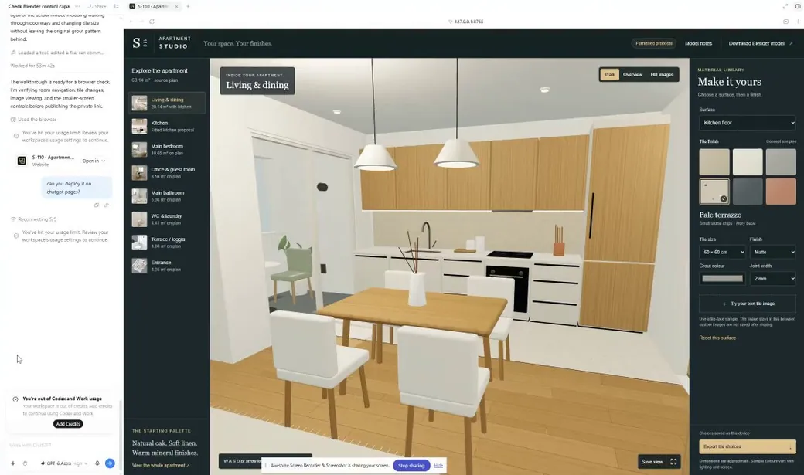</a>

**İstem**

```text
Blender’da tamamen gerçekçi, yüksek çözünürlüklü bir 3B render modeli oluşturmanı, ardından daire içinde dolaşabilmem ve fayans seçeneklerini belirleyebilmem için interaktif bir web deneyimi geliştirmeni istiyorum.
```

<details>
<summary>Özgün istem</summary>

```text
I want you to build a completely realistic HD 3D render model in blender, then build interactive web experience so I can walk within the apartment, and choose tile options.
```

</details>

[Ayrıntıları görüntüle ↗](https://www.tripo3d.ai/tr/3d-prompts/gpt-6-astra-2100222426705453318) · [Orijinal gönderi](https://x.com/scheemunai/status/2100222426705453318) · [Örneklere dön](#all-prompts)

---

<a id="gpt-6-astra-2100193512373592313"></a>

### PC için Splatoon geliştirme ve grafiklerin yeniden oluşturulması

[basio](https://x.com/basio39) · 2026-09-16 · GPT-6 Astra · Oyunlar

<a href="https://www.tripo3d.ai/tr/3d-prompts/gpt-6-astra-2100193512373592313">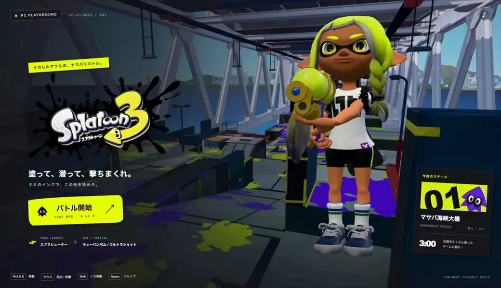</a>

**İstem**

```text
/goal PC için Splatoon geliştirin. Grafikleri birebir yeniden oluşturun.
```

<details>
<summary>Özgün istem</summary>

```text
/goal PC版スプラトゥーンを開発してください。グラフィックは完全に再現してください。
```

</details>

[Ayrıntıları görüntüle ↗](https://www.tripo3d.ai/tr/3d-prompts/gpt-6-astra-2100193512373592313) · [Orijinal gönderi](https://x.com/basio39/status/2100194321987461503) · [Örneklere dön](#all-prompts)

---

<a id="gpt-6-astra-2100139076816916977"></a>

### Hareketli mobilyalara sahip etkileşimli 3B oda sahnesi

[Wentao Zhu](https://x.com/walterzhu8) · 2026-09-16 · GPT-6 Astra · Sahneler

<a href="https://www.tripo3d.ai/tr/3d-prompts/gpt-6-astra-2100139076816916977">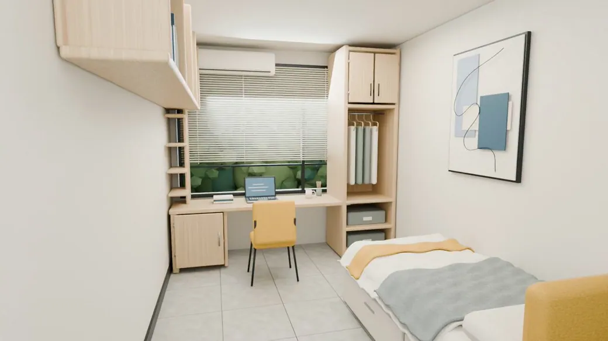</a>

**Referans görseller:** [1](https://media.tripogrowth.space/media/2bee2240-1d9e-488c-aa10-f8882e7b5bb1.png) · [2](https://pbs.twimg.com/media/HSUxfRaWEAAxime.png)

**İstem**

```text
Sağladığım oda fotoğrafını temel alarak Blender MCP ile etkileşimli bir 3B sahne oluşturun ve bunu demo videosu olarak işleyin. Hareketli nesneleri (menteşeler, kapılar ve çekmeceler) dahil edin ve bu efektleri göstermek için amaca uygun kamera hareketleri kullanın.
```

<details>
<summary>Özgün istem</summary>

```text
Given the room photo I provided, use Blender MCP to build an interactive 3D scene and render it into a demo video. Include articulated object motion (hinges, doors, drawers) and use sensible camera moves to show these effects.
```

</details>

[Ayrıntıları görüntüle ↗](https://www.tripo3d.ai/tr/3d-prompts/gpt-6-astra-2100139076816916977) · [Orijinal gönderi](https://x.com/walterzhu8/status/2100139076816916977) · [Örneklere dön](#all-prompts)

---

<a id="gpt-6-astra-2099850719839109597"></a>

### Referans görsellerden hareketli 3B ortam ve oyun karakteri oluşturma

[妖精アーヤ](https://x.com/aiehon_aya) · 2026-09-15 · GPT-6 Astra · Sahneler

<a href="https://www.tripo3d.ai/tr/3d-prompts/gpt-6-astra-2099850719839109597">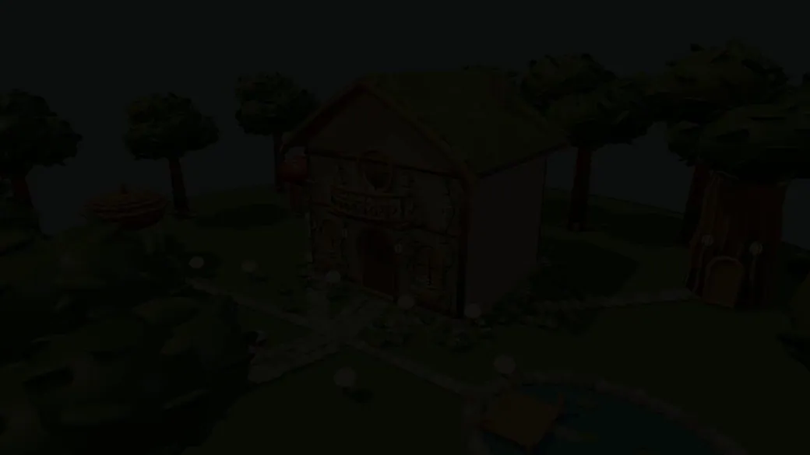</a>

**Referans görseller:** [1](https://media.tripogrowth.space/media/fe8fc9c7-78f7-4702-9ec7-8f1625869a2d.jpg) · [2](https://media.tripogrowth.space/media/aafd4fd9-d485-42ad-b945-ef1056c16867.jpg) · [3](https://pbs.twimg.com/media/HSQqHw5a4AARmX8.jpg) · [4](https://pbs.twimg.com/media/HSQqHxEaEAAeRLp.jpg)

**İstem**

```text
【Önceden hazırlamanız gerekenler】
・Oluşturmak istediğiniz dünya tasarımına ait referans görseller (dış görünüm, odalar vb.)
・Karakterin kanonik görselleri (üç görünüş çizimi vb.)
　※Görseller olmadan yeniden oluşturulamaz. Lütfen ekleyin

【Prompt】
Eklediğiniz görsellere dayanarak dünya tasarımınızı ve karakterinizi, gerçekten hareket ettirilebilen bir 3B ortam ve oyun karakteri olarak profesyonel kalitede tasarlayacağım.

① Ekli görselleri inceleyerek evin ve karakterin şekillerini, renklerini ve tasarım ayrıntılarını kontrol edin
　↓
② Görsellerden Tripo ile 3B model oluşturun (aynı en-boy oranına sahip ön, arka ve yan tam boy olmak üzere üç görsel kullanın)
　↓
③ Blender'a aktararak parçaların yerleşimini ve boyutunu ayarlayın
　↓
④ Otomatik rig kurun; karakterin kişiliğine uygun yürüme, sallanma ve benzeri hareketler ekleyin
　↓
⑤ Ücretli varlık kullanımı gibi karar vermekte zorlanılan bir durum varsa ilerlemeden önce bana danışın
　↓
⑥ Yapılan işleri, karşılaşılan sorunları ve varlıkların konumunu, başka bir yapay zekâ tarafından okunduğunda da yeniden uygulanabilecek ayrıntı düzeyinde kayda geçirin
```

<details>
<summary>Özgün istem</summary>

```text
【先に用意するもの】
・作りたい世界観の参考画像（外観・部屋など）
・キャラクターの正典画像（三面図など）
　※画像がないと再現できません。添付してねん

【プロンプト】
添付した画像をもとに私の世界観とキャラクターを実際に動かせる3D空間とゲームのキャラをプロクオリティでデザインします。

① 添付画像を見て、家・キャラクターの形状/色/意匠を確認する
　↓
② Tripoで画像から3Dモデルを生成する（正面、背面、サイドの全身の３枚を同じアスペクト比で）
　↓
③ Blenderに読み込みパーツの配置・サイズを調整する
　↓
④ 自動リグを設定し歩く・揺れる等キャラクターの個性にあう動きをつける
　↓
⑤ 判断に迷う分岐（有料アセットを使う等）があれば進める前に私に確認する
　↓
⑥ 作業内容・詰まった点・素材の場所を別のAIが読んでも再現できるレベルで記録に残す
```

</details>

[Ayrıntıları görüntüle ↗](https://www.tripo3d.ai/tr/3d-prompts/gpt-6-astra-2099850719839109597) · [Orijinal gönderi](https://x.com/aiehon_aya/status/2099850721646784894) · [Örneklere dön](#all-prompts)

---

<a id="gpt-6-astra-2099785223827259515"></a>

### Erişilebilir prosedürel uzay keşif oyunu

[developers.openai.com](https://developers.openai.com/) · 2026-09-15 · GPT-6 Astra · Oyunlar

<a href="https://www.tripo3d.ai/tr/3d-prompts/gpt-6-astra-2099785223827259515">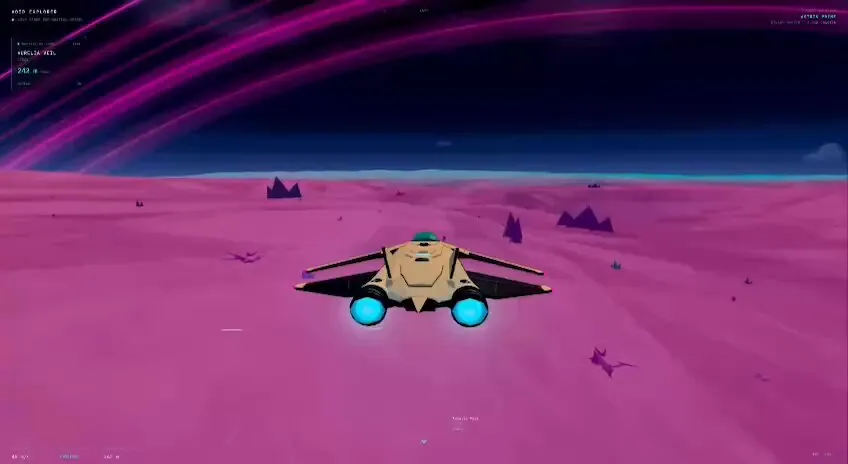</a>

**İstem**

```text
Görebildiğim her yere ulaşılabilmeli. Mesafeleri gerçek ölçeklerinde koru; seyahati ise ölçek ve hız sayesinde uygulanabilir hâle getir. Uzaydan bir gezegenin atmosferine girip yüzeye kadar uçabilmek istiyorum. Gezegenler Dünya kadar büyük olabilir; bu nedenle prosedürel araziye ve parça tabanlı bir render sistemine ihtiyacımız olacak.
```

<details>
<summary>Özgün istem</summary>

```text
Everything I can see should be reachable. Keep the distances real, then make travel work through scale and speed. I want to fly from space into a planet’s atmosphere and down to the ground. Planets can be as large as Earth, so we’ll need procedural terrain and a chunked renderer.
```

</details>

[Ayrıntıları görüntüle ↗](https://www.tripo3d.ai/tr/3d-prompts/gpt-6-astra-2099785223827259515) · [Orijinal gönderi](https://developers.openai.com/blog/how-to-build-games-with-astra) · [Örneklere dön](#all-prompts)

---

<a id="gpt-6-astra-2099750376530657300"></a>

### Apple tarzı 3B kalp ve gülümseyen emoji

[Sharon Riley](https://x.com/Just_sharon7) · 2026-09-15 · GPT-6 Astra · Varlıklar

<a href="https://www.tripo3d.ai/tr/3d-prompts/gpt-6-astra-2099750376530657300">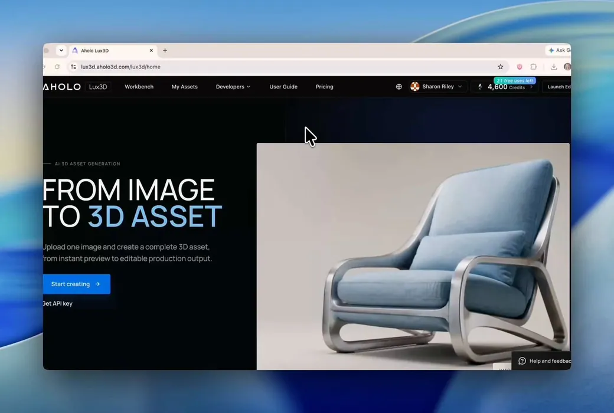</a>

**İstem**

```text
Apple tarzı 3B kalp emojisi ve gülümseyen emoji
```

<details>
<summary>Özgün istem</summary>

```text
3D Apple style heart emoji and smiling emoji
```

</details>

[Ayrıntıları görüntüle ↗](https://www.tripo3d.ai/tr/3d-prompts/gpt-6-astra-2099750376530657300) · [Orijinal gönderi](https://x.com/Just_sharon7/status/2099751278234767673) · [Örneklere dön](#all-prompts)

---

<a id="gpt-6-astra-2099719427990134984"></a>

### Etkileşimli 3B organizma sinir sistemi paneli

[AiMind](https://x.com/AIMind_Ai) · 2026-09-15 · GPT-6 Astra · Etkileşimli

<a href="https://www.tripo3d.ai/tr/3d-prompts/gpt-6-astra-2099719427990134984">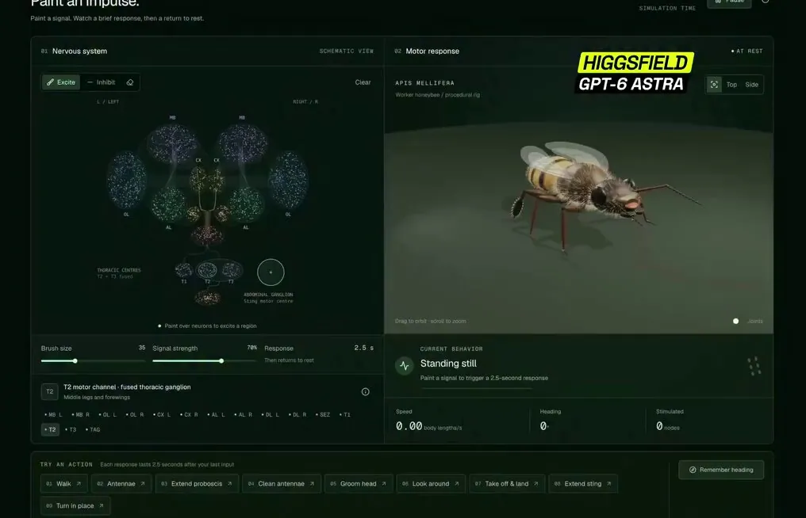</a>

**İstem**

```text
Etkileşimli panel. Sol: [organism] için şematik sinir sistemi ve tıklanabilir bölgeler. Sağ: prosedürel rigging uygulanmış 3B [organism]. Bir bölgeye tıklamak, 2,5 saniyelik bir motor tepkisini tetikler. Koyu arayüz; hız ve yön için telemetri.
```

<details>
<summary>Özgün istem</summary>

```text
Interactive panel. Left: schematic nervous system of [organism], clickable regions. Right: procedurally rigged 3D [organism]. Clicking a region triggers a 2.5 second motor response. Dark UI, telemetry for speed and heading.
```

</details>

[Ayrıntıları görüntüle ↗](https://www.tripo3d.ai/tr/3d-prompts/gpt-6-astra-2099719427990134984) · [Orijinal gönderi](https://x.com/AIMind_Ai/status/2099719427990134984) · [Örneklere dön](#all-prompts)

---

<a id="gpt-6-astra-2099643231659012553"></a>

### Kaçan teknelerin bulunduğu etkileşimli volkanik ada

[Wësche](https://x.com/WescheNex1q) · 2026-09-14 · GPT-6 Astra · Etkileşimli

<a href="https://www.tripo3d.ai/tr/3d-prompts/gpt-6-astra-2099643231659012553">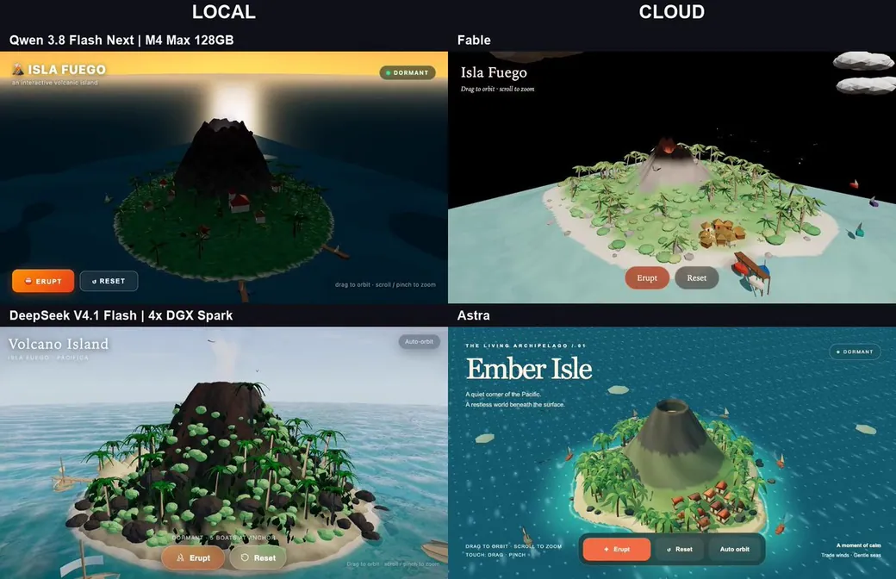</a>

**İstem**

```text
Akışkan lavlar ve kaçan tekneler içeren etkileşimli bir volkanik ada oluştur.
```

<details>
<summary>Özgün istem</summary>

```text
build an interactive volcanic island with flowing lava and boats that flee.
```

</details>

[Ayrıntıları görüntüle ↗](https://www.tripo3d.ai/tr/3d-prompts/gpt-6-astra-2099643231659012553) · [Orijinal gönderi](https://x.com/WescheNex1q/status/2099643231659012553) · [Örneklere dön](#all-prompts)

---

<a id="gpt-6-astra-2099588840419651890"></a>

### Bir otel koridoru sahnesi oluştur

[West Lord](https://x.com/MyWestLord) · 2026-09-14 · GPT-6 Astra · Sahneler

<a href="https://www.tripo3d.ai/tr/3d-prompts/gpt-6-astra-2099588840419651890">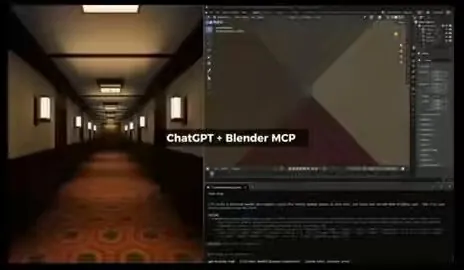</a>

**İstem**

```text
otel koridoru sahnesi oluştur
```

<details>
<summary>Özgün istem</summary>

```text
create hotel corridor scene
```

</details>

[Ayrıntıları görüntüle ↗](https://www.tripo3d.ai/tr/3d-prompts/gpt-6-astra-2099588840419651890) · [Orijinal gönderi](https://x.com/MyWestLord/status/2099588840419651890) · [Örneklere dön](#all-prompts)

---

<a id="gpt-6-astra-2099519801139908951"></a>

### Savaşçı Devin Üzerine Tırmanıp Çenesine Vuruyor

[MadMax](https://x.com/MadMax_Series) · 2026-09-14 · GPT-6 Astra · Animasyon

<a href="https://www.tripo3d.ai/tr/3d-prompts/gpt-6-astra-2099519801139908951">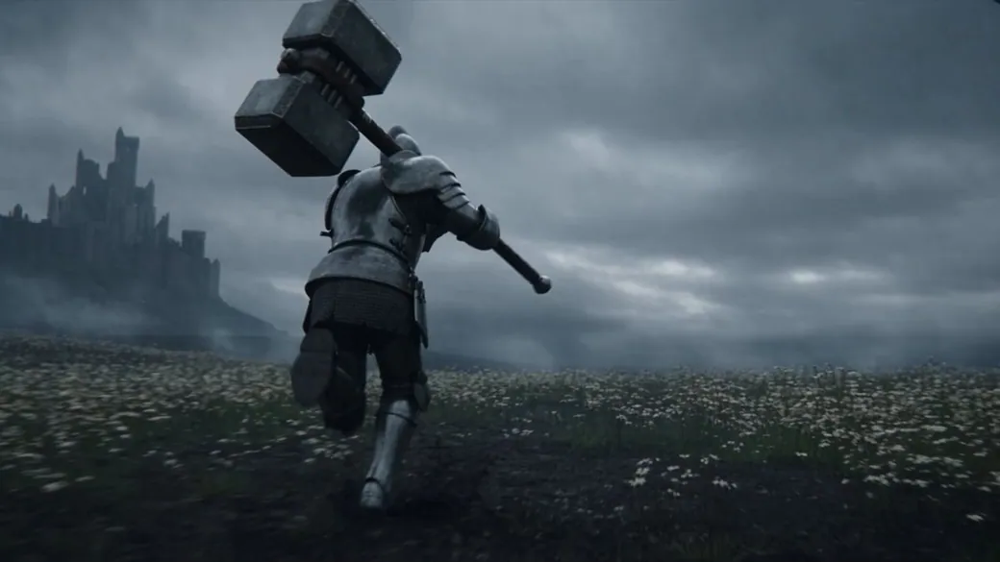</a>

**İstem**

```text
KARAKTER KAYDI:
Yalnızca bir yetişkin erkek dağ savaşçısı.
Kompakt, geniş yapılı ve son derece güçlü bir fiziğe sahip. Orta Çağ fantezi tarzında, özgün koyu silah metali renginde plaka zırh giyiyor: tamamen kapalı sivri miğfer, katmanlı omuz plakaları, eklemli kol korumaları, ağır eldivenler, takviyeli göğüs zırhı, deri bel panelleri, koyu renk pantolon, çelik baldır zırhları ve ağır zırhlı botlar. Zırhı fırtınadan dolayı yıpranmış, çizilmiş ve ıslak.
Tam olarak bir adet devasa, iki elle kullanılan savaş çekici taşıyor. Çekicin uzun, takviyeli koyu metal bir sapı ve ağır, simetrik, dikdörtgen bir başı var. Silahın uzunluğu, şekli ve ağırlığı boyunca değişmiyor. Savaşçı atlayış, tırmanış ve vuruş sırasında çekici iki eliyle kontrol ediyor.
Savaşçının boyunun otuz katından daha uzun, tam olarak bir adet devasa organik insansı dev. Muazzam kaslı omuzları, son derece uzun kolları, insanı andıran dev elleri, kaba kömür grisi derisi, görünür gözenekleri ve yara izleri, çıkık kaşları, geniş burnu, güçlü çenesi ve uzun, dolaşık siyah saçları var. Organik ve canlı bir titan; heykel, robot, makine veya taştan golem değil.
Başka savaşçı, dev veya arka plan ordusu olmasın.
ÇEVRE:
Şiddetli mavi-gri gök gürültülü fırtınanın altındaki, rüzgâra açık bir yüksek plato savaş alanı. Engebeli zemin koyu ıslak toprak, ezilmiş çimen ve binlerce küçük soluk çiçekle kaplı. Güçlü rüzgâr çimenleri ve çiçekleri düzensiz dalgalar hâlinde eğer.
Uzakta, ekranın solundaki bir tepede yıkık bir Orta Çağ kalesi duruyor. Kırık kuleler, alçaktan süzülen sisin arasından hâlâ görünür. Şimşek, kaleyi ve fırtına bulutlarını aralıklı olarak aydınlatır.
Dev, savaş alanının ekranın sağ tarafındaki bölümünü kaplıyor. Savaşçı ön planda, merkezde başlar ve deve doğru koşar. Her kesitte bu coğrafyayı ve ekran yönünü koru.
KRONOLOJİK AKIŞ VE KAMERA:
0.00–3.30 — DEVE DOĞRU HÜCUM
Zırhlı savaşçının hemen arkasından, ona yakın, alçak bir takip çekimiyle başla; savaşçı ıslak arazide devasa deve doğru güçlü biçimde koşsun.
Savaş çekicini iki eliyle vücudunun önünde yatay olarak taşıyor. Ağır çekiç başı ekranın sağında kalırken sapın alt kısmı ekranın soluna uzanıyor. Botları her adımda ıslak zemini bastırıyor; toprak, ezilmiş çiçekler ve damlacıklar yalnızca fiziksel temasın ardından geriye savruluyor.
Devin bacakları ve devasa sağ eli kadrajın sağ üst tarafından giriyor. Dev eğilip açık elini hücum eden savaşçıya doğru uzatıyor; amacı onu yerden kepçeler gibi almak.
Parmaklar inandırıcı eklemler ve ağırlıkla bağımsız hareket ediyor. Dev, savaşçıyı anında yakalamıyor veya ışınlamıyor.
Kamera hareketi alçak, hızlı ve akıcı kalmalı; ölçek farkının aşırılığını vurgulamalı. Yıkık kale uzaktaki ekranın sol ufkunda görünür kalmalı.
3.30–5.80 — DEVİN ELİNE SIÇRAMA
Devin açık eli savaşçının yolunu alçaktan süpürerek geçerken savaşçı sağ botunu sağlam biçimde yere basar. Dizi bükülür, kalçaları alçalır ve arka bacağı yukarı doğru itiş sağlar.
Tek ve güçlü bir ileri sıçrayış yapar.
Devden ayrılmış parmakların önünde yükselirken kontrollü sinematik ağır çekim kullan. Bacakları hafifçe altına çekilir; denge için iki eliyle aynı savaş çekicini omuzlarının üzerinde kaldırır.
Savaşçı iki botuyla devin orta ve yüzük parmaklarının sırtına iner. Net fiziksel temas göster: botlar deriye dokunur, dizler darbeyi emer, devin eti hafifçe sıkışır ve savaşçının zırhı inişe tepki verir.
Dev elini yüzüne doğru kaldırmaya başlar. Savaşçı boşlukta süzülmez veya asılı kalmaz.
Savaşçının altından yukarı doğru ilerleyen, devasa elin arka planı doldurduğu dramatik bir alçak açı vinç çekimi kullan.
5.80–9.00 — KOL BOYUNCA KOŞU
Hızlı, doğal aksiyona dön.
Dev kolunu kaldırırken savaşçı parmaklardan elin sırtına, oradan da bileğe koşar. Adımları doğru sırayla değişir ve hareket eden engebeli yüzeyi görünür biçimde kavrar.
Dev bileğini döndürerek onu sarsıp düşürmeye çalışır. Savaşçı ağırlık merkezini alçaltır, duruşunu genişletir ve kol sabitlenene kadar çekici gövdesine yakın tutar.
Ardından devin ön kolu boyunca dirseğe doğru hızlanır. Her adım kolun değişen açısını izler; botları derinin üzerinde kaymaz.
Kamera onun yanında ve biraz altında ilerleyerek devin kolunun uzunluğu boyunca yükselir. Kolun yakın bölümleri ön plandan hızla geçerken devin başı ve uzaktaki kale daha yavaş hareket eder; böylece güçlü bir paralaks ve ölçek hissi oluşur.
9.00–12.00 — OMUZA TIRMANIŞ
Savaşçı, dik bir açıyla devin omzuna yükselen üst kola ulaşır.
Bir ön kolunu ve savaş çekicinin sapını kaldıraç için doğal bir kas çıkıntısına takar, sağ botunu basar, bacağından güç alarak iter ve tek bağlantılı bir tırmanma hareketiyle omzun üzerine çıkar.
Dev başını ona doğru çevirir. Gözü savaşçıyı takip eder, kaşları gerilir ve çenesi derin, sözsüz bir kükremeyle açılır. Başının dönüşüyle saçları ve derisi hareket eder.
Savaşçı gerçek el ve bot temasıyla omza bağlı kalır. Devin boynunun tabanına doğru üst omuz boyunca çapraz tırmanır.
Savaşçının tamamını, savaş çekicini ve devin yüz profilini aynı kadrajda okunabilir tutan yakın, yandan takip çekimi kullan.
12.00–15.00 — ÇENEYE TAM GÜÇLÜ ÇEKİÇ DARBESİ
Savaşçı, boynunun yakınındaki eğimli omuzda dengeli bir konuma ulaşır.
Sol botunu öne basar, sağ botunu arkasında destek olarak konumlandırır. İki ayağı da devin derisine görünür biçimde basar. Kalçalarını hedeften uzağa döndürür ve savaş çekicini iki eliyle geriye çeker.
Darbe öncesindeki hazırlığın tamamını göster:
ayaklar basar → dizler bükülür → kalçalar yüklenir → gövde döner → omuzlar çekici geriye alır → kollar ağır çekiç başını başlangıç konumuna yönlendirir.
13.00 saniyede savaşçı, devin çenesine doğru tek ve eksiksiz bir yatay iki elli savuruş yapar.
Güç, bacaklarından kalçalarına, gövdesine, omuzlarına ve kollarına kesintisiz biçimde aktarılır. Çekiç başı tek ve kesintisiz, net bir yay izler. Savuruş tamamlanmadan konum atlamaz veya yüze dokunmaz.
14.00 saniyede belirleyici temas için açıkça ultra ağır çekime geç.
Dikdörtgen çekiç başı, sap veya tutacakla değil, geniş darbe yüzüyle devin alt çenesinin yanına vurur. Derinin ve yanak dokusunun darbe çevresinde sıkışmasını, devin çenesinin yana kaymasını, gevşek saçların dışa savrulmasını ve yağmur, toz ile deri parçacıklarının radyal biçimde patlamasını göster.
Savaşçının kolları ani yavaşlamaya karşı koyar. Omuzları geri savrulurken bedeni kontrollü bir devam hareketini sürdürür.
Kan, açıkta kalan doku, vahşet veya parçalanma olmasın.
15.00–17.30 — DEVİN GERİ TEPMESİ VE SAVAŞÇININ DÜŞÜŞÜ
Hemen doğal hıza dön.
Devin başı darbenin etkisiyle yana doğru savrulur. Üst gövdesi geri teper ve darbe alan omzu keskin biçimde aşağı iner. Bu ani aşağı hareket savaşçının ayağının altındaki desteği kaldırır ve onu devden uzağa fırlatır.
Savaşçı aynı savaş çekicini iki eliyle tutmaya devam ederek savaş alanına doğru düşer. Havada süzülmez veya ek bir sıçrayış yapmaz.
Zemin seviyesinde yandan bir görünüme kes. Önce botları temas eder, dizleri momentumun etkisiyle çöker ve bir omzunun üzerinden bir kez yuvarlanır. Çekiç başı yanında toprağa çarparak sığ bir hendek açar; ıslak toprak ve soluk çiçekleri dışa savurur.
Devin kocaman yüzü, dengesini yeniden kazanmaya çalışırken kadrajın sağ üst bölümüne iner. Savaşçıyı ezmez veya onunla kesişmez.
17.30–20.00 — TOPARLANMA VE SON KARŞILAŞMA
Savaşçı yuvarlanmasını alçak diz çökme pozisyonunda durdurur.
Savaş çekicinin başını toprağa saplar, sapı iki eliyle kavrar ve destek olarak kullanıp istikrarlı biçimde tek dizinin üzerine doğrulur. Ardından çekici yerden çıkarır ve sapı hazırlanmış savunma duruşunda omuzlarının önünde yatay biçimde tutar.
Dev, darbeden dolayı çenesi gözle görülür biçimde morarmış ama hâlâ bilinçli ve tehditkâr hâlde, devasa başını ona doğru indirir. Nefesi çimleri, çiçekleri, sisi ve savaşçının zırhındaki gevşek deri panellerini hareket ettirir.
Savaşçı kısa ve kararlı bir an boyunca hareketsiz kalır; nefesi ve zırhı ince, doğal hareketini sürdürür.
Bir yıldırım ekranın solundaki yıkık kaleyi aydınlatır, iki figürün siluetini belirginleştirir ve aralarındaki muazzam ölçek farkını doğrular.
Tam olarak 20.00 saniyede alçak ve geniş bir kompozisyonda bitir: çiçeklerle kaplı ön planda savaşçı diz çökmüş, savaş çekici hazır; devin yüzü onun üzerinde yükseliyor ve uzaktaki kale fırtınanın içinden görünüyor.
Karartmayla bitirme. Donmuş kare, başlık veya bitiş kartı olmasın.
AKSİYON-FİZİK KİLİDİ:
Her aksiyon okunabilir fiziksel nedenselliğe uymalı:
Koşu: ayak teması → ağırlık aktarımı → arka bacak itişi → sonraki adım.
Sıçrama: basan ayak → dizlerin bükülmesi → bacakların açılması → havadaki yörünge → iniş teması → dizlerin darbeyi emmesi.
Tırmanış: el veya silah desteği → basan bot → vücut ağırlığı aktarımı → yukarı çekiş.
Çekiç darbesi: dengeli ayaklar → kalçaların yüklenmesi → gövde dönüşü → omuz itişi → kesintisiz çekiç yolu → çekiç yüzünün geniş darbe teması → direnç → devam hareketi.
Düşüş: devin geri tepmesinin neden olduğu denge kaybı → yerçekimiyle aşağı iniş → bot teması → dizlerin çökmesi → omuz üzerinden yuvarlanma → toparlanma.
Savaşçı zemin, el, kol veya omuz arasında asla ışınlanmaz. Dev, doğrudan fiziksel temas veya görünür bir kuvvet olmadan savaşçıyı asla hareket ettirmez.
HAREKET HIZI KURALLARI:
0.00–3.30: hızlı, doğal koşu hızı.
3.30–5.80: sıçrama ve iniş için kontrollü sinematik ağır çekim.
5.80–13.90: doğal ve hızlı aksiyon.
13.90–15.00: yalnızca çekicin son yaklaşması, teması ve hemen gerçekleşen deformasyonu için açıkça ultra ağır çekim.
15.00–20.00: doğal hıza net biçimde dön.
Genel ağır çekim uygulama. Ağır çekimdeki karakterlerin havada süzülmesine izin verme.
IŞIKLANDIRMA VE RENK:
Soğuk çelik mavisi, kömür grisi ve desatüre gümüş tonlarında fırtına renk düzenini koru. Yıldırım kısa süreli, soğuk beyaz yönlü aydınlatma sağlar. Islak zırhta dar gümüş yansımalar oluşurken devin koyu derisi ayrıntılı ve okunabilir kalır.
Soluk çiçekler, sahneyi renkli hâle getirmeden ölçülü bir sıcak fildişi kontrastı sağlar. Uzak kalenin çevresindeki yoğun atmosferik sisi koru. Yıldırım pozlamasındaki değişimler kısa olmalı; karakter anatomisini silmemeli veya eksik aksiyonları gizlememeli.
SES:
Yalnızca senkronize diegetik çevre ve aksiyon ses efektleri kullan. Arka plan müziği veya müzik kesinlikle olmasın.
Fırtına rüzgârı, uzaktan gök gürültüsü, zırh hareketleri, ağır koşu ayak sesleri, yerinden oynayan toprak, eğilen çimenler, devin sözsüz nefesi ve kükremesi, elinin yarattığı hava akımı, savaşçının sıçrayışı, botların deriye teması, tırmanış darbeleri, savaş çekicinin hareketi, tek ve derin metalik çekiç darbesi, devin geri tepmesi, düşüşteki hava sesi, zırhın toprağa çarpması, çekiç başının yere vurması ve yakındaki son yıldırım çatlamasını ekle.
Diyalog, anlatım, konuşulan sözcükler, ilahiler, şarkı sözleri veya anlaşılır herhangi bir dil olmasın.
SÜREKLİLİK VE HATA ÖNLEME:
Baştan sona tam olarak bir savaşçı, bir dev ve bir savaş çekici olsun.
Savaşçı deve bir kez tırmansın ve tam olarak bir belirleyici çekiç darbesi gerçekleştirsin.
Savaş çekici asla çoğalmaz, boyut değiştirmez, havada süzülmez, bedenlerden birinin içinden geçmez veya görünür bir hareket olmadan el değiştirmez.
Dev her çekimde aynı organik insansı yaratık olarak kalır. Robotik özellikler, taşa dönüşüm, çoğaltılmış eller, fazladan parmaklar veya değişen yüz olmasın.
Savaşçının zırhını, miğferini, oranlarını ve hasarını baştan sona koru.
Tırmanış coğrafyasının fiziksel olarak mümkün kalması için devin sağ elinden sağ koluna ve omzuna uzanan rotayı koru.
Birleşmiş eller, fazladan uzuvlar, ters eklemler, kayan botlar, kesişen bedenler, ışınlanma veya desteksiz havada süzülme olmasın.
Tam savuruşun ardından devin çenesine görünür biçimde temas etmesi gereken parça, sap değil, çekicin geniş başıdır.
Kan, vahşet, açıkta kalan doku, ezilmiş insan bedeni veya parçalanma olmasın.
Canlı çekim görünümü, tanınabilir seri karakterleri, altyazılar, açıklama yazıları, logolar, kullanıcı arayüzü, oynatma katmanları, kalıcı siyah bantlar veya filigranlar olmasın.
Herhangi bir arka plan müziği veya müzik, başarısız üretim sayılır.
music=0; no_music=1; strict_no_music=1; audio=diegetic_only.
```

<details>
<summary>Özgün istem</summary>

```text
CHARACTER REGISTRY:
Exactly one adult male mountain warrior.
He has a compact, broad and extremely powerful build. He wears an original dark gunmetal suit of medieval fantasy plate armor: enclosed pointed helmet, layered shoulder plates, articulated arm protection, heavy gauntlets, reinforced breastplate, leather waist panels, dark trousers, steel greaves and heavy armored boots. His armor is weathered, scratched and wet from the storm.
He carries exactly one enormous two-handed warhammer. It has one long reinforced dark-metal shaft and one heavy symmetrical rectangular hammer head. The weapon remains the same length, shape and weight throughout. He controls it with both hands during jumps, climbing and striking.
Exactly one colossal organic humanoid giant, more than thirty times the warrior’s height. It has immense muscular shoulders, extremely long arms, huge humanlike hands, coarse charcoal-gray skin, visible pores and scars, a heavy brow, broad nose, powerful jaw and long tangled black hair. It is an organic living titan—not a statue, robot, machine or stone golem.
No additional warriors, giants or background armies.
ENVIRONMENT:
A windswept highland battlefield beneath a violent blue-gray thunderstorm. The uneven ground is covered with dark wet soil, flattened grass and thousands of small pale flowers. Strong wind bends the grass and flowers in irregular waves.
A ruined medieval fortress stands on a distant hill at screen-left. Broken towers remain visible through low drifting fog. Lightning intermittently illuminates the fortress and storm clouds.
The giant occupies the battlefield’s screen-right side. The warrior begins in the center foreground, running toward the giant. Preserve this geography and screen direction throughout every cut.
CHRONOLOGICAL ACTION AND CAMERA:
0.00–3.30 — CHARGE TOWARD THE GIANT
Begin immediately with a low rear tracking shot, close behind the armored warrior as he runs powerfully through the wet field toward the colossal giant.
He carries the warhammer horizontally across his body with both hands. The heavy hammer head remains toward screen-right while the lower shaft extends toward screen-left. His boots compress the wet ground with every step, throwing soil, crushed flowers and droplets backward only after physical contact.
The giant’s legs and enormous right hand enter from the upper-right side of the frame. The giant bends down and extends its open hand toward the charging warrior, intending to scoop him from the ground.
The fingers move independently with believable joints and weight. The giant does not instantly grab or teleport the warrior.
Camera movement remains low, fast and smooth, emphasizing the extreme difference in scale. The ruined fortress stays visible on the distant screen-left horizon.
3.30–5.80 — LEAP ONTO THE GIANT’S HAND
As the giant’s open hand sweeps low across the warrior’s path, the warrior plants his right boot firmly into the ground. His knee compresses, hips lower and rear leg drives upward.
He performs one powerful forward jump.
Use controlled cinematic slow motion as he rises in front of the giant’s separated fingers. His legs tuck slightly beneath him while both hands raise the same warhammer above his shoulders for balance.
The warrior lands with both boots on the back of the giant’s middle and ring fingers. Show clear physical contact: boots touch skin, knees absorb impact, the giant’s flesh compresses slightly and the warrior’s armor reacts to the landing.
The giant begins lifting its hand toward its face. The warrior does not float or hang in empty air.
Use a dramatic low-angle crane that travels upward beneath the warrior, with the enormous hand filling the background.
5.80–9.00 — RUNNING UP THE ARM
Return to fast natural action.
As the giant raises its arm, the warrior runs from the fingers across the back of the hand and onto the wrist. His footfalls alternate correctly and visibly grip the uneven moving surface.
The giant rotates its wrist and attempts to shake him loose. The warrior lowers his center of gravity, widens his stance and keeps the hammer close to his torso until the arm stabilizes.
He then accelerates along the giant’s forearm toward the elbow. Each step follows the arm’s changing angle; his boots do not slide through the skin.
Camera tracks beside and slightly below him, rising along the length of the giant’s arm. Near parts of the arm cross the foreground quickly while the giant’s head and distant fortress move more slowly, creating powerful parallax and scale.
9.00–12.00 — CLIMB TO THE SHOULDER
The warrior reaches the upper arm as it rises steeply toward the giant’s shoulder.
He hooks one forearm and the warhammer shaft against a natural ridge of muscle for leverage, plants his right boot, pushes through his leg and pulls himself onto the shoulder in one connected climbing action.
The giant turns its head toward him. Its eye tracks the warrior, its brow tightens and its jaw opens in a deep nonverbal roar. Hair and skin move from the rotation of its head.
The warrior remains attached to the shoulder through real hand and boot contact. He climbs diagonally across the upper shoulder toward the base of the giant’s neck.
Use a close side-tracking shot that keeps the complete warrior, warhammer and giant’s facial profile readable in the same frame.
12.00–15.00 — FULL HAMMER STRIKE TO THE JAW
The warrior reaches a stable position on the giant’s sloped shoulder near its neck.
He plants his left boot forward and braces his right boot behind it. Both feet visibly press against the giant’s skin. He rotates his hips away from the target and draws the warhammer backward with both hands.
Show the complete preparation before impact:
feet plant → knees compress → hips load → torso rotates → shoulders draw the hammer backward → arms guide the heavy hammer head into its starting position.
At 13.00 seconds, the warrior releases one complete horizontal two-handed swing toward the giant’s jaw.
The power travels continuously from his legs through his hips, torso, shoulders and arms. The hammer head follows one clear uninterrupted arc. It does not jump positions or touch the face before the swing is complete.
At 14.00 seconds, enter explicit ultra slow motion for the decisive contact.
The rectangular hammer head strikes the side of the giant’s lower jaw with its broad striking face—not the shaft or handle. Show skin and cheek tissue compressing around the impact, the giant’s jaw shifting sideways, loose hair whipping outward and a radial burst of rain, dust and skin debris.
The warrior’s arms resist the sudden deceleration. His shoulders recoil while his body continues through a controlled follow-through.
No blood, exposed tissue, gore or dismemberment.
15.00–17.30 — GIANT RECOIL AND WARRIOR FALL
Return immediately to natural speed.
The giant’s head snaps sideways from the impact. Its upper body recoils and the struck shoulder drops sharply. This sudden downward movement removes the warrior’s footing and throws him away from the giant.
The warrior falls toward the battlefield while retaining the same warhammer with both hands. He does not float or perform an additional jump.
Cut to a ground-level side view. His boots contact first, his knees collapse under the momentum and he rolls once across one shoulder. The hammer head strikes the soil beside him and digs a shallow trench, throwing wet earth and pale flowers outward.
The giant’s huge face descends into the upper-right portion of the frame as it struggles to regain balance. It does not crush or intersect the warrior.
17.30–20.00 — RECOVERY AND FINAL STANDOFF
The warrior stops his roll in a low kneeling position.
He plants the warhammer head into the soil, grips the shaft with both hands and uses it as support to rise steadily to one knee. He then pulls the hammer free and brings the shaft horizontally across his shoulders in a prepared defensive posture.
The giant lowers its enormous head toward him, jaw visibly bruised from the strike but still conscious and threatening. Its breath disturbs the grass, flowers, fog and loose leather panels on the warrior’s armor.
The warrior remains motionless only for a brief determined beat while his breathing and armor retain subtle natural movement.
A lightning strike illuminates the ruined fortress at screen-left, outlining both figures and confirming their immense difference in scale.
End exactly at 20.00 seconds on a low wide composition: the warrior kneeling in the flower-covered foreground with the warhammer ready, the giant’s face looming above him and the distant fortress visible through the storm.
Do not fade to black. No freeze frame, title or end card.
ACTION-PHYSICS LOCK:
Every action must follow readable physical causality:
Running: foot contact → weight transfer → rear-leg push → next step.
Jump: planted foot → knee compression → leg extension → airborne trajectory → landing contact → knee absorption.
Climbing: hand or weapon support → planted boot → body-weight transfer → upward pull.
Hammer strike: stable feet → hip loading → torso rotation → shoulder drive → continuous hammer path → broad hammer-face contact → resistance → follow-through.
Fall: lost footing caused by the giant’s recoil → gravity-driven descent → boot contact → knee collapse → shoulder roll → recovery.
The warrior never teleports between the ground, hand, arm or shoulder. The giant never moves the warrior without direct physical contact or a visible force.
MOTION-SPEED RULES:
0.00–3.30: fast natural running speed.
3.30–5.80: controlled cinematic slow motion for the jump and landing.
5.80–13.90: natural fast action.
13.90–15.00: explicit ultra slow motion only for the hammer’s final approach, contact and immediate deformation.
15.00–20.00: clear return to natural speed.
Do not apply global slow motion. Do not allow slow-motion characters to hover.
LIGHTING AND COLOR:
Maintain a cold steel-blue, charcoal-gray and desaturated silver storm grade. Lightning provides brief cold-white directional illumination. Wet armor receives narrow silver highlights, while the giant’s dark skin remains detailed and readable.
The pale flowers provide restrained warm ivory contrast without making the scene colorful. Preserve deep atmospheric fog around the distant fortress. Lightning exposure changes must be brief and must not erase character anatomy or hide missing actions.
AUDIO:
Only synchronized diegetic environmental and action sound effects. Absolutely no background music or score.
Include storm wind, distant thunder, armor movement, heavy running footfalls, disturbed soil, bending grass, the giant’s nonverbal breathing and roar, the rush of its hand, the warrior’s jump, boots contacting skin, climbing impacts, warhammer movement, one deep metallic hammer impact, the giant’s recoil, falling air, armor striking soil, the hammer head hitting the ground and a final nearby lightning crack.
No dialogue, narration, spoken words, chants, lyrics or intelligible language.
CONTINUITY AND FAILURE PREVENTION:
Exactly one warrior, one giant and one warhammer throughout.
The warrior climbs the giant once and performs exactly one decisive hammer strike.
The warhammer never duplicates, changes size, floats, bends, passes through either body or switches hands without visible motion.
The giant remains the same organic humanoid creature in every shot. No robotic features, stone transformation, duplicated hands, extra fingers or changing face.
Preserve the warrior’s armor, helmet, proportions and damage throughout.
Preserve the giant’s right-hand-to-right-arm-to-shoulder route so the climbing geography remains physically possible.
No fused hands, extra limbs, reversed joints, sliding boots, intersecting bodies, teleportation or unsupported hovering.
The hammer’s broad head—not its shaft—must visibly contact the giant’s jaw after the complete swing.
No blood, gore, exposed tissue, crushed human body or dismemberment.
No live-action appearance, recognizable franchise characters, subtitles, captions, logos, UI, playback overlays, permanent black bars or watermarks.
Any background music or musical score is a failed generation.
music=0; no_music=1; strict_no_music=1; audio=diegetic_only.
```

</details>

[Ayrıntıları görüntüle ↗](https://www.tripo3d.ai/tr/3d-prompts/gpt-6-astra-2099519801139908951) · [Orijinal gönderi](https://x.com/MadMax_Series/status/2099519801139908951) · [Örneklere dön](#all-prompts)

---

<a id="gpt-6-astra-2099487024256589970"></a>

### Çok yüksek gökdelenlerle dolu 3B dünya

[Bilal Arshad](https://x.com/MohdBilalArshad) · 2026-09-14 · GPT-6 Astra · Sahneler

<a href="https://www.tripo3d.ai/tr/3d-prompts/gpt-6-astra-2099487024256589970">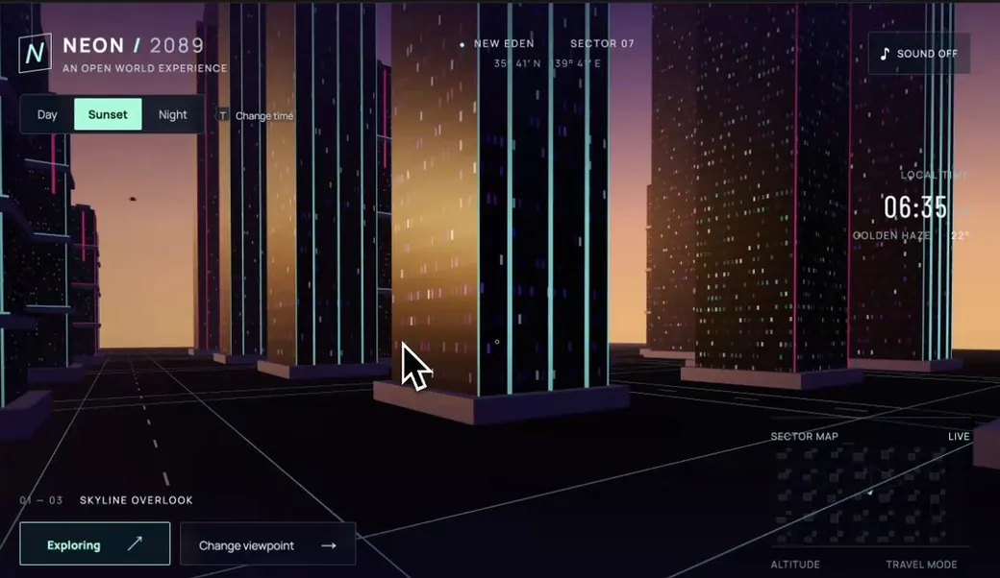</a>

**İstem**

```text
Çok yüksek gökdelenlerle dolu bir 3B dünya oluştur
```

<details>
<summary>Özgün istem</summary>

```text
build a 3D world full of very high skyscrapers
```

</details>

[Ayrıntıları görüntüle ↗](https://www.tripo3d.ai/tr/3d-prompts/gpt-6-astra-2099487024256589970) · [Orijinal gönderi](https://x.com/MohdBilalArshad/status/2099487024256589970) · [Örneklere dön](#all-prompts)

---

<a id="gpt-6-astra-2099472264270102705"></a>

### 200 poligonun altında kozalaklı ağaç modeli

[わたもす / ゲーム制作](https://x.com/Watamos827) · 2026-09-14 · GPT-6 Astra · Varlıklar

<a href="https://www.tripo3d.ai/tr/3d-prompts/gpt-6-astra-2099472264270102705">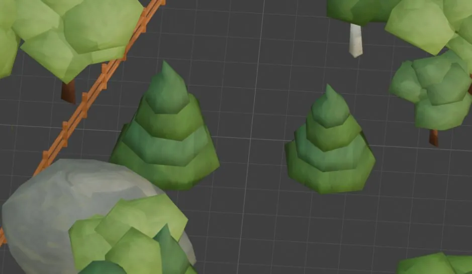</a>

**İstem**

```text
200 poligondan az sayıda poligon kullanarak bir kozalaklı ağaç oluşturabilir misin?
```

<details>
<summary>Özgün istem</summary>

```text
200ポリゴン以下で針葉樹を作ってみてくれませんか？
```

</details>

[Ayrıntıları görüntüle ↗](https://www.tripo3d.ai/tr/3d-prompts/gpt-6-astra-2099472264270102705) · [Orijinal gönderi](https://x.com/Watamos827/status/2099472264270102705) · [Örneklere dön](#all-prompts)

---

<a id="gpt-6-astra-2099450933067612421"></a>

### Etkileşimli 3B Samuray Ormanı Sahnesi

[Jaynit Makwana](https://x.com/JaynitMakwana) · 2026-09-14 · GPT-6 Astra · Etkileşimli

<a href="https://www.tripo3d.ai/tr/3d-prompts/gpt-6-astra-2099450933067612421">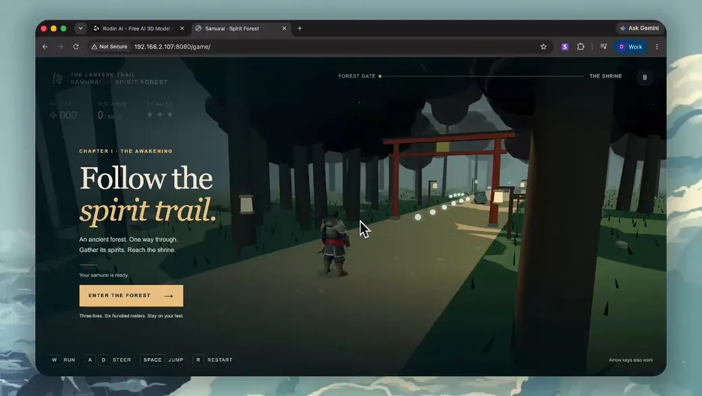</a>

**İstem**

```text
Kamera kontrolleri, sinematik aydınlatma ve çevresel ayrıntılar içeren, ormanda bir samurayın yer aldığı etkileşimli bir 3B sahne oluşturun. Sunum sade ve temiz olsun.
```

<details>
<summary>Özgün istem</summary>

```text
Build an interactive 3D scene featuring a samurai in a forest, with camera controls, cinematic lighting, environmental details, and a clean presentation.
```

</details>

[Ayrıntıları görüntüle ↗](https://www.tripo3d.ai/tr/3d-prompts/gpt-6-astra-2099450933067612421) · [Orijinal gönderi](https://x.com/JaynitMakwana/status/2099450933067612421) · [Örneklere dön](#all-prompts)

---

<a id="gpt-6-astra-2099419671481249851"></a>

### Oynanabilir 3B Engel Parkuru

[Dhaval Makwana](https://x.com/heyDhavall) · 2026-09-14 · GPT-6 Astra · Oyunlar

<a href="https://www.tripo3d.ai/tr/3d-prompts/gpt-6-astra-2099419671481249851">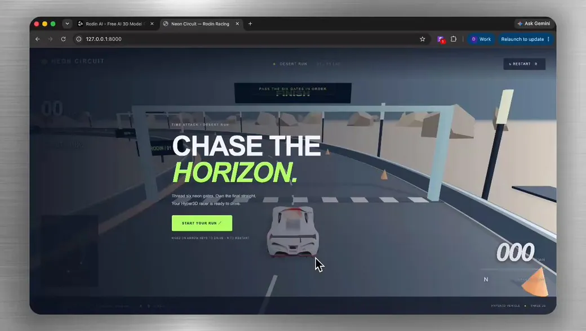</a>

**İstem**

```text
Karakter, hareketli engeller, toplanabilir nesneler ve basit bir hedef alanı içeren küçük bir 3B engel parkuru.
```

<details>
<summary>Özgün istem</summary>

```text
A small 3D obstacle course with a character, moving barriers, collectible objects, and a simple goal area.
```

</details>

[Ayrıntıları görüntüle ↗](https://www.tripo3d.ai/tr/3d-prompts/gpt-6-astra-2099419671481249851) · [Orijinal gönderi](https://x.com/heyDhavall/status/2099419671481249851) · [Örneklere dön](#all-prompts)

---

<a id="gpt-6-astra-2099362575339372780"></a>

### Çarpışma Önlemeli Otonom Model Demiryolu

[AI Guides](https://x.com/free_ai_guides) · 2026-09-14 · GPT-6 Astra · Animasyon

<a href="https://www.tripo3d.ai/tr/3d-prompts/gpt-6-astra-2099362575339372780">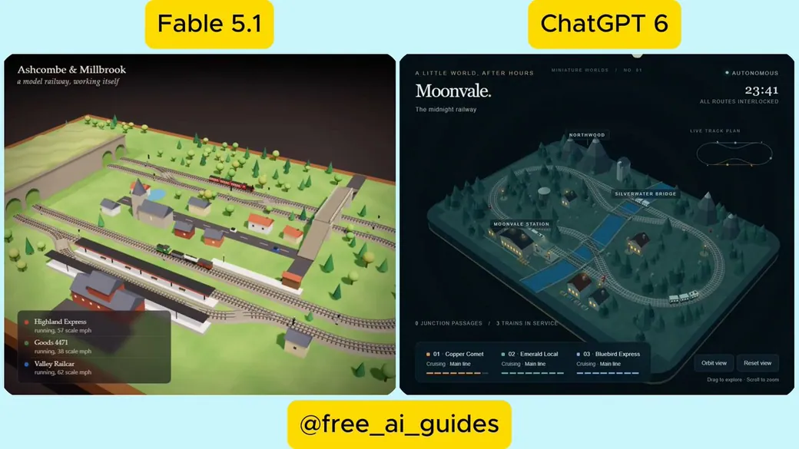</a>

**İstem**

```text
Ortak bir hat düzeninde aynı anda çalışan en az üç tren içeren bir model demiryolu oluştur. Hat düzeninde makaslar ve sinyaller bulunsun. Trenler, hiç çarpışmamaları için kullanıcıdan herhangi bir girdi almadan kendi kendilerine hat değiştirmeli ve sinyallerde durmalı. Hat düzeni, ortam ve her şeyin görünümü sana kalmış. Tasarımla ilgili tüm kararları sen ver: stil, renkler, atmosfer, çevre, kamera, ayrıntı düzeyi ve tüm ek dokunuşlar. Bana hiçbir soru sorma; tüm seçimleri kendin yap ve tek seferde mümkün olan en etkileyici sürümü oluştur. Teknik gereksinimler: Tek bir bağımsız HTML dosyası kullan; harici model, görsel, ses veya herhangi bir türde varlık URL’si kullanma (CDN’den yüklenen bir JavaScript kütüphanesi kullanılabilir). Sayfa yüklendiği anda, tıklama gerektirmeden kendiliğinden çalışmaya başlamalı ve konsol hatası olmadan akıcı biçimde çalışmalıdır.
```

<details>
<summary>Özgün istem</summary>

```text
Build a model railway with at least three trains running at the same time on a shared track layout that includes junctions and signals. The trains must switch tracks and stop at signals on their own so they never collide, without any input from the user. The layout, the setting, and the look of everything are up to you. Everything about the design is your decision: style, colors, mood, environment, camera, level of detail, and any extra touches. Do not ask me any questions, make every choice yourself and build the most impressive version you can in a single attempt. Technical requirements: one single self-contained HTML file, no external models, images, sounds, or asset URLs of any kind (a JavaScript library from a CDN is fine). It must start running on its own the moment it loads, with no clicks needed, and run smoothly with no console errors.
```

</details>

[Ayrıntıları görüntüle ↗](https://www.tripo3d.ai/tr/3d-prompts/gpt-6-astra-2099362575339372780) · [Orijinal gönderi](https://x.com/free_ai_guides/status/2099362575339372780) · [Örneklere dön](#all-prompts)

---

<a id="gpt-6-astra-2099359786865402019"></a>

### Peach’s Castle’ı 3B olarak yeniden tasarla

[Romain Huet](https://x.com/romainhuet) · 2026-09-14 · GPT-6 Astra · Sahneler

<a href="https://www.tripo3d.ai/tr/3d-prompts/gpt-6-astra-2099359786865402019">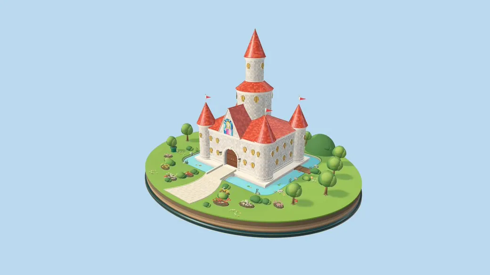</a>

**İstem**

```text
Peach’s Castle’ı 3B olarak yeniden tasarla ve havadan geçiş videosu oluştur.
```

<details>
<summary>Özgün istem</summary>

```text
reimagine Peach’s Castle in 3D and create a fly-by video.
```

</details>

[Ayrıntıları görüntüle ↗](https://www.tripo3d.ai/tr/3d-prompts/gpt-6-astra-2099359786865402019) · [Orijinal gönderi](https://x.com/romainhuet/status/2099359786865402019) · [Örneklere dön](#all-prompts)

---

<a id="gpt-6-astra-2099206962344800541"></a>

### Etkileşimli 3B Anatomi Gezgini

[BuBBliK](https://x.com/k1rallik) · 2026-09-13 · GPT-6 Astra · Etkileşimli

<a href="https://www.tripo3d.ai/tr/3d-prompts/gpt-6-astra-2099206962344800541">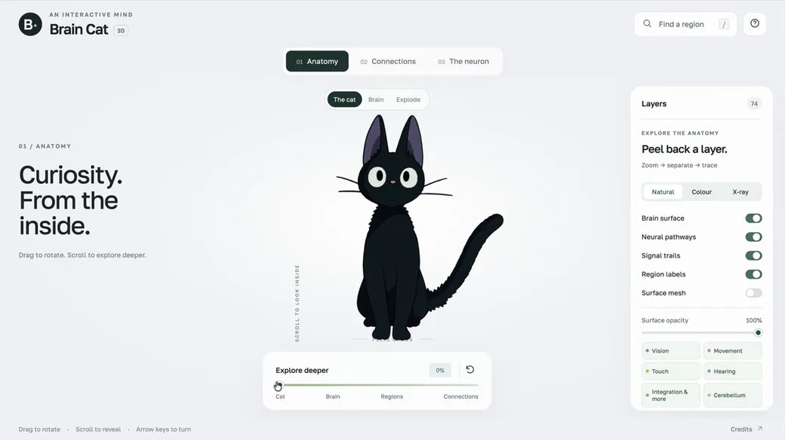</a>

**İstem**

```text
Herkese açık bilimsel veri kümelerini kullanarak etkileyici ve etkileşimli bir 3B anatomi gezgini oluştur. Dış görünümle başla; ben yakınlaştırdıkça bu görünüm kademeli olarak şeffaflaşsın ve alttaki anatomiyi ortaya çıkarsın.

Modeli döndürmeme, yapıları ayırmama, etiketli bölgeleri seçmeme ve bir yan panelden katmanları açıp kapatmama izin ver. Anatomi, bağlantılar ve tek tek hücreler için ayrı sekmeler ekle; animasyonlu sinyaller ve ayarlanabilir kontroller sun.

Yumuşak aydınlatma, akıcı geçişler, sade renkler ve çok az metin kullanan modern, minimalist bir arayüz tasarla. Oklar ve kısa bir görsel eğitim ekle. Masaüstü ve mobil cihazlarda çalışmasını sağla.

Mümkün olan yerlerde gerçek anatomik geometri kullan, kaynaklara atıfta bulun ve bilimsel verilerle açıklama amaçlı animasyonları açıkça birbirinden ayır. Çalışan bir web sitesi oluştur.
```

<details>
<summary>Özgün istem</summary>

```text
Build a beautiful, interactive 3D anatomy explorer using publicly available scientific datasets. Start with an external view that gradually becomes transparent as I zoom in, revealing the anatomy underneath.

Let me rotate the model, separate structures, select labeled regions, and toggle layers from a side panel. Add separate tabs for anatomy, connections, and individual cells, with animated signals and adjustable controls.

Use a modern, minimal interface with soft lighting, smooth transitions, subtle colors, and very little text. Include arrows and a short visual tutorial. Make it work on desktop and mobile.

Use real anatomical geometry where available, cite the sources, and clearly distinguish scientific data from illustrative animations. Build a working website.
```

</details>

[Ayrıntıları görüntüle ↗](https://www.tripo3d.ai/tr/3d-prompts/gpt-6-astra-2099206962344800541) · [Orijinal gönderi](https://x.com/k1rallik/status/2099206962344800541) · [Kaynak kodu](https://github.com/bubblik525/cat_brain_anatomy) · [Örneklere dön](#all-prompts)

---

<a id="gpt-6-astra-2099172061092381027"></a>

### Tarayıcıda oynanabilir 3B kıyı bölümü

[Lummox](https://x.com/Lummox_eth) · 2026-09-13 · GPT-6 Astra · Oyunlar

<a href="https://www.tripo3d.ai/tr/3d-prompts/gpt-6-astra-2099172061092381027">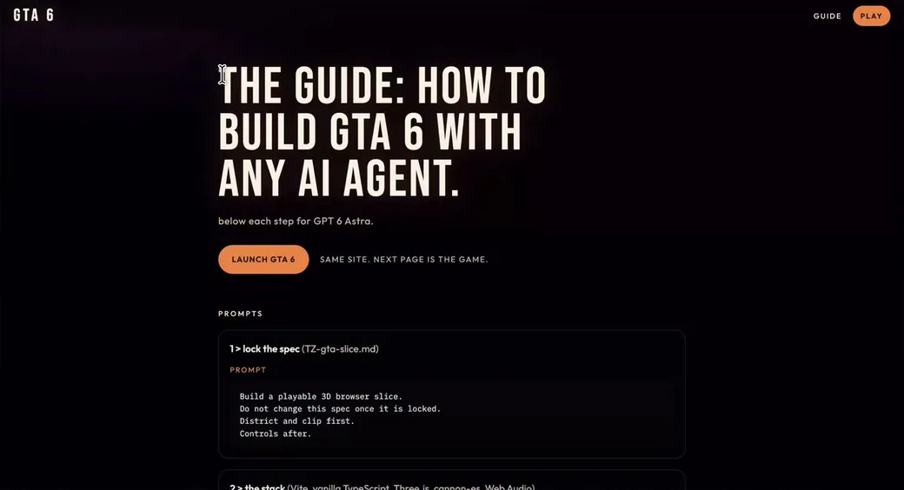</a>

**İstem**

```text
> spesifikasyonu kilitle (TZ-gta-slice.md)

prompt: "Oynanabilir bir 3B tarayıcı bölümü oluştur. Bu spesifikasyonu kilitledikten sonra değiştirme. Önce bölge ve klip. Kontroller daha sonra."

> teknoloji yığını (Vite, vanilla TypeScript, Three.js, cannon-es, Web Audio)

prompt: "Teknoloji yığını sabit. Vite. vanilla TypeScript. Three.js. cannon-es. Web Audio. Tek bir tarayıcı URL'si."

> kadraj (su üzerinde gün batımı, ıslak asfalt, palmiyeler)

prompt: "Tek bir kıyı bölgesi. Su üzerinde gün batımı. Islak asfalt. Palmiyeler. Kadrajı poligon sayısına değil, ışığa ve kameraya göre oluştur. Varsayılan gri ışık kullanma. Çıplak küpler kullanma."

> üçlü (tek sahne, tek araç, yaklaşık 20 saniye)

prompt: "Üç kişiyi tek bir sahnede tut. Konuşsunlar. Ardından tek bir araca binsinler. Yaklaşık 20 saniye. Ekstra seçenekler yerine kaliteye öncelik ver."

> kesme (15–20 saniye, akıcılığı koru)

prompt: "Gecikme olursa klibi 15–20 saniyeye kısalt. Akıcılığı koru. Kare hızı düşerse ışığı değil, yayaları azalt."

> ses (insan sesleri, repliklerin altında pad, araç uğultusu)

prompt: "Sesler robot gibi değil, insan gibi duyulmalı. Repliklerin altında alçak seviyeli bir pad olsun; repliklerin üzerine çıkmasın. Oturduklarında testere sesi değil, düşük frekanslı bir araç uğultusu duyulsun. Radyo paraziti olmasın."
```

<details>
<summary>Özgün istem</summary>

```text
> lock the spec (TZ-gta-slice.md)

prompt: "Build a playable 3D browser slice. Do not change this spec once it is locked. District and clip first. Controls after."

> the stack (Vite, vanilla TypeScript, Three.js, cannon-es, Web Audio)

prompt: "Stack is fixed. Vite. vanilla TypeScript. Three.js. cannon-es. Web Audio. One browser URL."

> the frame (sunset over the water, wet asphalt, palms)

prompt: "One shore district. Sunset over the water. Wet asphalt. Palms. Hold the frame on light and camera, not poly count. No default gray light. No naked cubes."

> the three (one scene, one car, about 20 seconds)

prompt: "Keep the three in one scene. They talk. Then they sit in one car. About 20 seconds. Quality over extra switches."

> the cut (15 to 20 seconds, keep it smooth)

prompt: "If it lags, cut the clip to 15 to 20 seconds. Keep it smooth. If the frame drops, cut pedestrians, not the light."

> the sound (human voices, pad under the lines, car rumble)

prompt: "Voices must sound human, not robot. Quiet pad under the lines, never over them. When they sit, low car rumble, not a saw. No radio hiss."
```

</details>

[Ayrıntıları görüntüle ↗](https://www.tripo3d.ai/tr/3d-prompts/gpt-6-astra-2099172061092381027) · [Orijinal gönderi](https://x.com/Lummox_eth/status/2099172061092381027) · [Örneklere dön](#all-prompts)

---

<a id="gpt-6-astra-2098980384260456813"></a>

### Başsız kıyafet modelinde UV açılımı ve 4K yeniden bake

[さ🥺](https://x.com/_sagyoai) · 2026-09-13 · GPT-6 Astra · Varlıklar

<a href="https://www.tripo3d.ai/tr/3d-prompts/gpt-6-astra-2098980384260456813">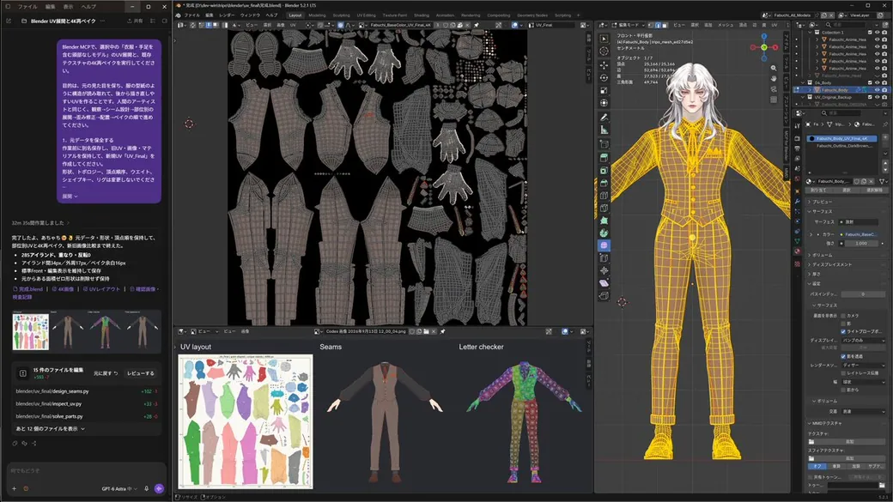</a>

**İstem**

```text
Blender MCP ile seçili “kıyafet ve el-ayakları içeren başsız modelin” UV açılımını ve mevcut dokuların 4K yeniden bake işlemini gerçekleştirin.

Amaç, modelin özgün görünümünü koruyarak kıyafet kalıbı gibi yapısı kolayca anlaşılabilen ve sonradan yeniden çizilebilen bir UV düzeni oluşturmaktır. İnsan bir sanatçı gibi gözlem → dikiş tasarımı → parça bazında açılım → bozulma düzeltme → yerleşim → bake sırasını izleyin.

1. Özgün verileri koruyun
Çalışmaya başlamadan önce dosyayı farklı bir adla kaydedin, eski UV’leri, görselleri ve materyalleri koruyun ve yeni bir UV seti olan “UV\_Final” oluşturun.
Geometriyi, topolojiyi, vertex sırasını, ağırlıkları, shape key’leri ve rig’i değiştirmeyin.

2. Modeli inceleyip dikişleri tasarlayın
Kıyafetin parça yapısını ve gerçek dikişlerini anlamak için her yönden özgün doku görünümünü ve tel kafes görünümünü kontrol edin.
Kıyafeti gövde, kol, yaka gibi kalıp parçalarının yapısını izleyerek açın; yan dikişler ve kolların iç kısımları gibi bölgelerden yararlanın. Ciltte ve el-ayaklarda dikişleri iç taraf veya yan yüzey gibi daha az görünür yerlere yerleştirin ve parmak aralarına kadar doğal biçimde açılabilecek bir yapı oluşturun.
Kırışıklıkları veya baskıları dikişlerle karıştırmayın ve gereksiz, küçük parçalara bölünmüş adacıklar oluşturmayın.

3. Parçaları ayrı ayrı açın ve bozulmaları düzeltin
Tüm modeli tek seferde işlemek yerine parçaları ayrı ayrı Unwrap edin.
UV\_Final’i referans alan yazılı bir checker dokusu ve Stretch görünümüyle esneme, sıkışma, burulma, ters dönme ve üst üste binme durumlarını kontrol edin.
Sorunun nedenine göre dikiş ekleyin veya kaldırın; ardından Pin, Relax gibi araçlarla düzenleyip yeniden kontrol edin. Aynı otomatik açılımı tekrar tekrar uygulamakla yetinmeyin; iyileştirilmiş parçaları koruyun.
Smart UV Project ile tüm modeli otomatik olarak parçalara ayırmayı nihai sonuç olarak kullanmayın.

4. Kumaş yönünü, texel yoğunluğunu ve yerleşimi düzenleyin
Kıyafette her parçanın kumaş yönünü temel alarak ana dikey yönü UV’nin V yönüyle hizalayın. Eğri kalıp parçalarını zorla dikdörtgene dönüştürmeyin.
Gerçek ölçülere göre texel yoğunluğunu eşitleyin ve sağ-sol eşleşmesinin anlaşılabileceği bir yönde düzenleyin.
Ardından yönü ve göreli ölçeği koruyarak 0–1 alanına yerleştirin. Sağ ve sol parçaları üst üste bindirmeyin veya keyfi şekilde döndürmeyin.
4K bake için başlangıç ölçütü olarak 16 px bake payı, adacıklar arasında en az 32 px ve görüntünün dış kenarlarından en az 16 px boşluk kullanın.

5. Eski UV’den yeni UV’ye 4K bake yapın
Özgün doku referansını eski UV’ye açıkça sabitleyin; hedef UV olarak UV\_Final’i kullanıp dokuyu 4096×4096 boyutunda yeni bir görsele aktarın.
Her materyalde bake hedefi görsel düğümünü etkinleştirin; deneme bake’inden sonra asıl bake işlemini gerçekleştirin.
Base Color için yalnızca Diffuse’un Color kanalını veya Emit’i kullanın; yeni ışık, gölge ya da AO bake etmeyin. Özgün görselde çizilmiş gölgelendirmeyi koruyun.
Saydamlık gibi mevcut haritaları da gerektiğinde aktarın; tangent normal haritasını yalnızca renk aktarımı olarak değil, yeni UV düzenini temel alarak yeniden bake edin.

6. Yeni ve eski sonuçları karşılaştırarak tamamlanmayı doğrulayın
Yeni UV’yi ve bake edilmiş görselleri uygulayın; tüm modeli ve ayrıntıları, özgünle aynı görüntüleme koşullarında karşılaştırın.
Desenlerin konumunu, rengini, saydamlığını ve dikişlerin sürekliliğini kontrol edin; UV’deki ezilmeleri, üst üste binmeleri ve açılmamış bölgeleri, ayrıca bake işlemindeki siyah noktaları, boşlukları ve bulanık taşmaları düzeltin.
Tamamlanma kararını “kaç kez açılım yapıldığına” göre değil, kontrol sonuçlarına göre verin.

Tamamlanmış .blend dosyasını, 4K görseli, UV yerleşimini ve dikiş, checker ile nihai görünüm kontrol görsellerini kaydedin; başlıca düzeltmeleri kısaca raporlayın.
Yalnızca planı açıklamakla yetinmeyin; görselleri gerçekten kontrol ederek çalışmayı tamamlayın.
```

<details>
<summary>Özgün istem</summary>

```text
Blender MCPで、選択中の「衣服・手足を含む頭部なしモデル」のUV展開と、既存テクスチャの4K再ベイクを実行してください。

目的は、元の見た目を保ち、服の型紙のように構造が読み取れて、後から描き直しやすいUVを作ることです。人間のアーティストと同じく、観察→シーム設計→部位別の展開→歪み修正→配置→ベイクの順で進めてください。

1．元データを保全する
作業前に別名保存し、旧UV・画像・マテリアルを保持して、新規UV「UV\_Final」を作成してください。
形状、トポロジー、頂点順序、ウエイト、シェイプキー、リグは変更しないでください。

2．モデルを観察してシームを設計する
元テクスチャ表示とワイヤー表示で各方向を確認し、衣服のパーツ構成と実際の縫い目を把握してください。
服は身頃・袖・襟などの型紙構成に沿い、脇線や袖の内側などを利用して切り開きます。肌や手足は内側・側面など目立ちにくい位置にシームを置き、指の股まで無理なく開ける構成にしてください。
シワやプリントを縫い目と誤認せず、不要な細切れアイランドを作らないでください。

3．部位ごとに展開し、歪みを修正する
全体を一括処理せず、部位ごとにUnwrapしてください。
UV\_Finalを参照する文字入りチェッカーとStretch表示で、伸び・圧縮・ねじれ・反転・重なりを確認してください。
問題の原因に応じてシームを追加・解除し、PinやRelaxなどで調整して再確認します。同じ自動展開を繰り返すだけで済ませず、改善済みの部位は保持してください。
Smart UV Projectによる全体の自動細分化を完成品にしないでください。

4．布目・密度・配置を整える
服は各パーツの布目を基準に、基本の縦方向をUVのV方向へ揃えてください。曲線のある型紙まで無理に長方形へ変形しないでください。
実寸に対するテクセル密度を揃え、左右の対応が分かる向きに整えます。
その後、向きと相対スケールを維持して0〜1領域へパッキングしてください。左右の重ね合わせや勝手な回転は禁止です。
4Kでベイク余白16px、アイランド間32px以上、画像外周16px以上を初期基準にしてください。

5．旧UVから新UVへ4Kベイクする
元テクスチャの参照を旧UVに明示的に固定し、UV\_Finalをベイク先として、4096×4096の新規画像へ転写してください。
各マテリアルでベイク先画像ノードをアクティブにし、試し焼き後に本番ベイクします。
ベースカラーはDiffuseのColorのみ、またはEmitを使用し、新たな照明・影・AOを焼き込まないでください。元画像に描かれた陰影は保持してください。
透過などの既存マップも必要に応じて転写し、タンジェント法線は単なる色転写ではなく新UV基準で再ベイクしてください。

6．新旧比較で完成を確認する
新UVとベイク画像を適用し、元と同じ表示条件で全身と細部を比較してください。
柄の位置、色、透過、シームの連続性を確認し、UVの潰れ・重なり・展開漏れ、ベイクの黒点・抜け・にじみを修正してください。
「何回展開したか」ではなく、検査結果を基準に完成を判断してください。

完成.blend、4K画像、UVレイアウト、シーム・チェッカー・完成外観の確認画像を保存し、主な修正内容を簡潔に報告してください。
計画の説明だけで終わらず、実際の画像を確認しながら作業を完了してください。
```

</details>

[Ayrıntıları görüntüle ↗](https://www.tripo3d.ai/tr/3d-prompts/gpt-6-astra-2098980384260456813) · [Orijinal gönderi](https://x.com/_sagyoai/status/2098980384260456813) · [Örneklere dön](#all-prompts)

---

<a id="gpt-6-astra-2098909584996057283"></a>

### Kendi kendine katlanan 3B origami animasyonu

[AI Guides](https://x.com/free_ai_guides) · 2026-09-12 · GPT-6 Astra · Animasyon

<a href="https://www.tripo3d.ai/tr/3d-prompts/gpt-6-astra-2098909584996057283">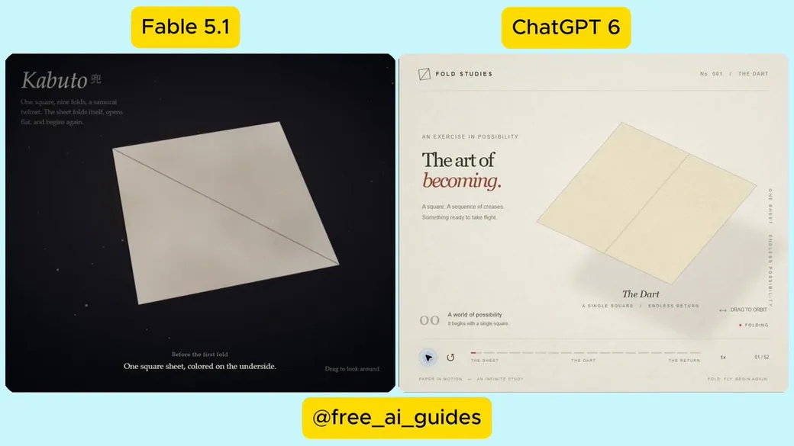</a>

**İstem**

```text
3B bir origami animasyonu oluştur. Düz kare bir kâğıt, her katlamanın kâğıtta gerçek bir kırışma ve dönme hareketi olarak gösterildiği, adım adım tanınabilir bir origami figürüne dönüşmeli; ardından yeniden düz hâline açılmalı ve bu döngü tekrarlanmalı. Dönüşeceği figürü ve tüm sunum biçimini sen belirle.

Tasarımın her unsuru senin kararın: stil, renkler, atmosfer, ortam, kamera, ayrıntı düzeyi ve ek dokunuşlar. Bana soru sorma; tüm seçimleri kendin yap ve tek seferde mümkün olan en etkileyici sürümü oluştur.

Teknik gereksinimler: Tek ve kendi içinde çalışan bir HTML dosyası kullan; harici model, görsel, ses veya herhangi bir türde varlık URL'si kullanma (CDN'den alınan bir JavaScript kütüphanesi kullanılabilir). Sayfa yüklendiği anda tıklama gerektirmeden kendiliğinden çalışmaya başlamalı ve konsol hatası olmadan akıcı biçimde çalışmalı.
```

<details>
<summary>Özgün istem</summary>

```text
Build a 3D origami animation. A flat square sheet must fold itself step by step into a recognizable origami figure, with each fold shown as an actual crease and rotation of the paper, then unfold back to flat and repeat. The figure it becomes and how the whole thing is presented are up to you.

Everything about the design is your decision: style, colors, mood, environment, camera, level of detail, and any extra touches. Do not ask me any questions, make every choice yourself and build the most impressive version you can in a single attempt.

Technical requirements: one single self-contained HTML file, no external models, images, sounds, or asset URLs of any kind (a JavaScript library from a CDN is fine). It must start running on its own the moment it loads, with no clicks needed, and run smoothly with no console errors.
```

</details>

[Ayrıntıları görüntüle ↗](https://www.tripo3d.ai/tr/3d-prompts/gpt-6-astra-2098909584996057283) · [Orijinal gönderi](https://x.com/free_ai_guides/status/2098909584996057283) · [Örneklere dön](#all-prompts)

---

<a id="gpt-6-astra-2098841316591346006"></a>

### Çernobil Atlası

[BuBBliK](https://x.com/k1rallik) · 2026-09-12 · GPT-6 Astra · Etkileşimli

<a href="https://www.tripo3d.ai/tr/3d-prompts/gpt-6-astra-2098841316591346006">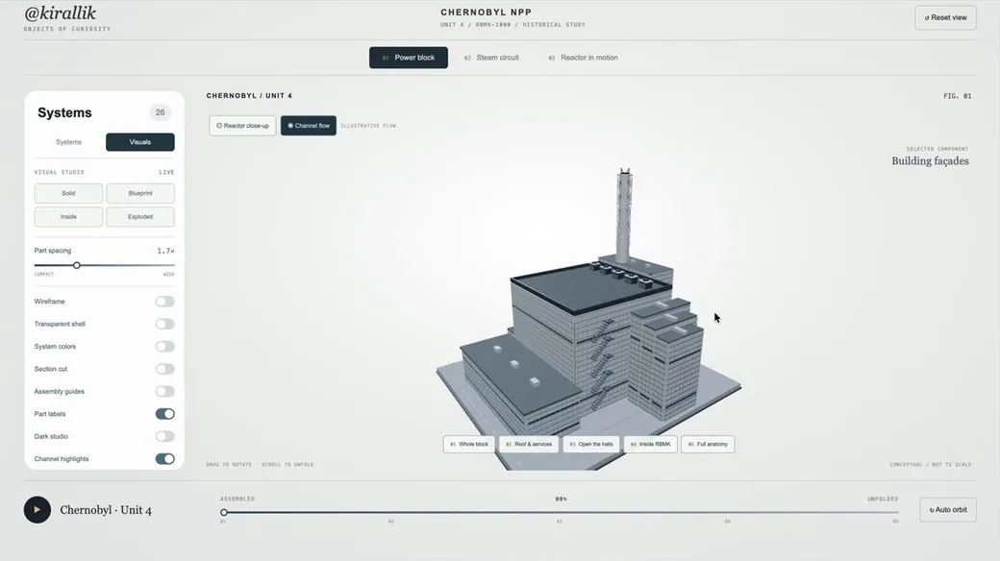</a>

**İstem**

```text
Three.js kullanarak "Çernobil Atlası" adlı, üst düzey etkileşimli bir 3B sergi oluşturun.

Kamuya açık kaynaklardan yararlanarak Çernobil nükleer santralinin ve RBMK reaktörünün sağlam durumunu araştırın. Binaları, kafes tipi bacayı, türbin salonunu, grafit yığınını, yakıt kanallarını, koruyucu yapıları, ayırıcı tamburları, pompaları ve boruları modelleyin.

Üç sekme oluşturun:
— Güç Ünitesi: kaydırma ve sürgü kullanılarak katman katman ayrıştırılabilen ayrıntılı bir model.
— Buhar Devresi: reaktörü, türbini, yoğuşturucuyu ve pompaları birbirine bağlayan animasyonlu bir diyagram.
— Hareketli Reaktör: hareket eden su ve buhar, dönen makineler ve oynatma kontrolleri içeren kesitli bir 3B görünüm.

Sistemlerin görünürlüğünü bağımsız olarak açıp kapatma, parçalar arasındaki mesafeyi ayarlama, tel kafes ve saydamlık seçenekleri, kesit alma ve kısa etiketler ekleyin. Tamamen ayrıştırılmış durumda bile her katmanın kolayca incelenebilmesini ve kameranın serbestçe döndürülebilmesini sağlayın.

Kaynak kodunu ve bağımsız çalışabilen bir HTML dosyasını teslim edin. Tüm kontrolleri test edin. Çalışmayı, mühendislik açısından birebir bir kopya değil, eğitim amaçlı bir yorumlama olarak sunun.
```

<details>
<summary>Özgün istem</summary>

```text
Build "Chernobyl Atlas," a premium interactive 3D exhibit using Three.js.

Research the intact Chernobyl power plant and RBMK reactor using public references. Model the buildings, lattice chimney, turbine hall, graphite stack, fuel channels, shielding, separator drums, pumps, and pipes.

Create three tabs:
— Power Block: a detailed model that disassembles layer by layer using scroll and a slider.
— Steam Circuit: an animated diagram connecting the reactor, turbine, condenser, and pumps.
— Reactor in Motion: a 3D cutaway with moving water and steam, spinning machinery, and playback controls.

Add independent system visibility toggles, adjustable part spacing, wireframe, transparency, section cuts, and short labels. Keep every layer easy to inspect and the camera freely rotatable, even at full disassembly.

Deliver the source and a standalone HTML file. Test all controls. Present it as an educational interpretation, not an exact engineering replica.
```

</details>

[Ayrıntıları görüntüle ↗](https://www.tripo3d.ai/tr/3d-prompts/gpt-6-astra-2098841316591346006) · [Orijinal gönderi](https://x.com/k1rallik/status/2098841316591346006) · [Kaynak kodu](https://github.com/bubblik525/Chernobyl_Atlas) · [Örneklere dön](#all-prompts)

---

<a id="gpt-6-astra-2098831830002851846"></a>

### Kinetik Kum Masası Simülasyonu

[AI Guides](https://x.com/free_ai_guides) · 2026-09-12 · GPT-6 Astra · Animasyon

<a href="https://www.tripo3d.ai/tr/3d-prompts/gpt-6-astra-2098831830002851846">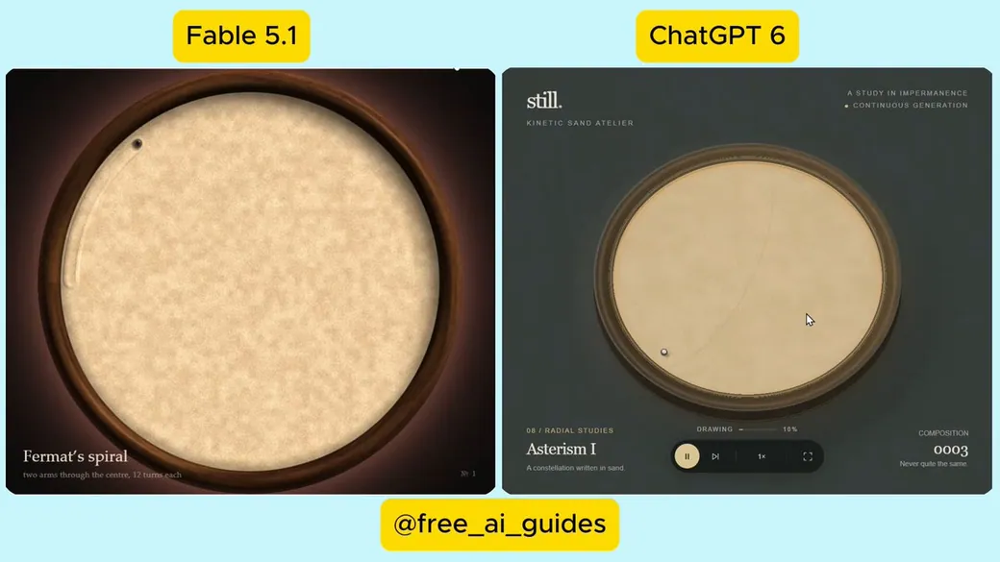</a>

**İstem**

```text
Kinetik kum masası simülasyonu oluştur. Bir top kum yatağının üzerinde hareket ederek görünür bir iz bırakmalı, eksiksiz geometrik desenler çizmeli, ardından kumu düzleştirip otomatik olarak yeni ve farklı bir desene başlamalıdır. Tekrarlamadan çok sayıda farklı desen arasında geçiş yapmalıdır. Görünüm ve desenlerle ilgili her şeyi sen seç.

Tasarımın her kararını sen ver: stil, renkler, atmosfer, ortam, kamera, ayrıntı düzeyi ve diğer ek dokunuşlar. Bana hiçbir soru sorma; tüm seçimleri kendin yap ve tek denemede mümkün olan en etkileyici sürümü oluştur.

Teknik gereksinimler: Harici model, görsel, ses veya herhangi bir varlık URL’si içermeyen, tamamen kendi içinde çalışan tek bir HTML dosyası kullan (CDN üzerinden alınan bir JavaScript kütüphanesi kullanılabilir). Sayfa yüklendiği anda, tıklama gerektirmeden kendi kendine çalışmaya başlamalı ve konsol hatası vermeden akıcı biçimde çalışmalıdır.
```

<details>
<summary>Özgün istem</summary>

```text
Build a kinetic sand table simulation. A ball must move through a bed of sand, leaving a visible trail, drawing complete geometric patterns, then smoothing the sand and starting a new and different pattern automatically. It must cycle through many different patterns without repeating. Everything about the look and the patterns is your choice.

Everything about the design is your decision: style, colors, mood, environment, camera, level of detail, and any extra touches. Do not ask me any questions, make every choice yourself and build the most impressive version you can in a single attempt.

Technical requirements: one single self-contained HTML file, no external models, images, sounds, or asset URLs of any kind (a JavaScript library from a CDN is fine). It must start running on its own the moment it loads, with no clicks needed, and run smoothly with no console errors.
```

</details>

[Ayrıntıları görüntüle ↗](https://www.tripo3d.ai/tr/3d-prompts/gpt-6-astra-2098831830002851846) · [Orijinal gönderi](https://x.com/free_ai_guides/status/2098831830002851846) · [Örneklere dön](#all-prompts)

---

<a id="gpt-6-astra-2098795017955418202"></a>

### 1893 Chicago Dünya Fuarı'nın 3B rekonstrüksiyonu

[Dan Elton](https://x.com/moreisdifferent) · 2026-09-12 · GPT-6 Astra · Sahneler

<a href="https://www.tripo3d.ai/tr/3d-prompts/gpt-6-astra-2098795017955418202">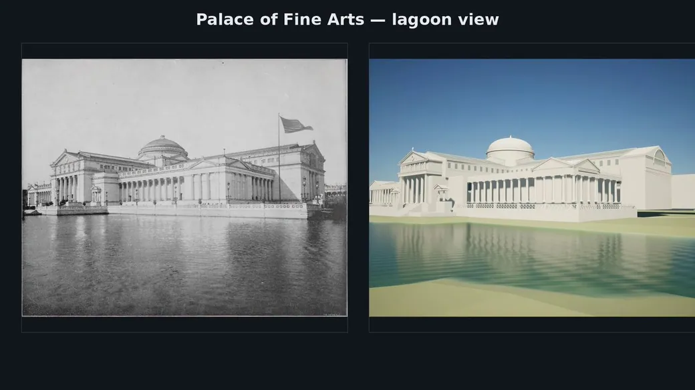</a>

**İstem**

```text
Fuarla ilgili 2.000 tarihî fotoğrafı ve referans bilgilerini indirin; elde edilen tüm bilgileri kullanarak Blender'da 3B bir rekonstrüksiyon oluşturun.
```

<details>
<summary>Özgün istem</summary>

```text
download 2,000 historical photographs and reference information around the fair and use all the information obtained to create a 3D reconstruction in Blender.
```

</details>

[Ayrıntıları görüntüle ↗](https://www.tripo3d.ai/tr/3d-prompts/gpt-6-astra-2098795017955418202) · [Orijinal gönderi](https://x.com/moreisdifferent/status/2098795017955418202) · [Örneklere dön](#all-prompts)

---

<a id="gpt-6-astra-2098774359926297011"></a>

### Bağlantı parçalarıyla birleştirilen parçalı 3D baskı çerçeve

[wada](https://x.com/wada) · 2026-09-12 · GPT-6 Astra · Varlıklar

<a href="https://www.tripo3d.ai/tr/3d-prompts/gpt-6-astra-2098774359926297011">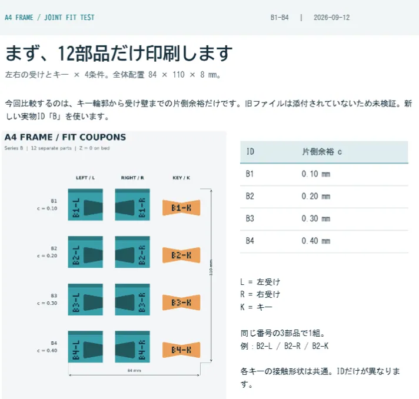</a>

**İstem**

```text
3D yazıcıyla bir çerçeve basmak istiyorum ama yazıcım küçük; parçaları birleştirerek tamamlayabileceğim bir model olsun. Biraz sıradan olmasın, bağlantı parçalarıyla birleştirilsin.
```

<details>
<summary>Özgün istem</summary>

```text
3Dプリンターで額縁印刷したい、でも3Dプリンターちっちゃいから部品を繋いで完成させるやつがいい、なんか面白くないから継手で
```

</details>

[Ayrıntıları görüntüle ↗](https://www.tripo3d.ai/tr/3d-prompts/gpt-6-astra-2098774359926297011) · [Orijinal gönderi](https://x.com/wada/status/2098774359926297011) · [Örneklere dön](#all-prompts)

---


[Tam katalog](catalog.tr.md) · [←](catalog.tr.2.md) · **3 / 10** · [→](catalog.tr.4.md)

<p align="center"><strong><a href="https://www.tripo3d.ai/tr/3d-prompts?utm_source=github&amp;utm_medium=referral&amp;utm_campaign=awesome_3d_prompts&amp;utm_content=catalog_footer">Tam katalog →</a></strong></p>
