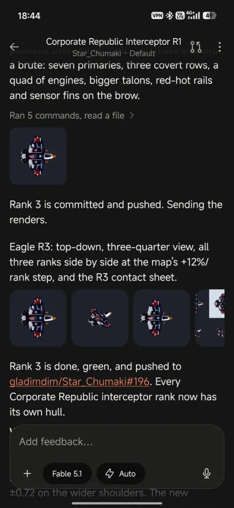
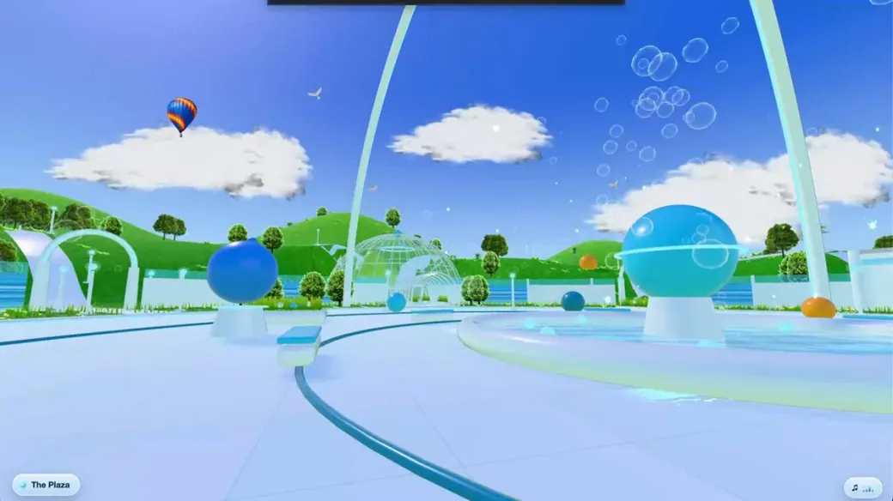
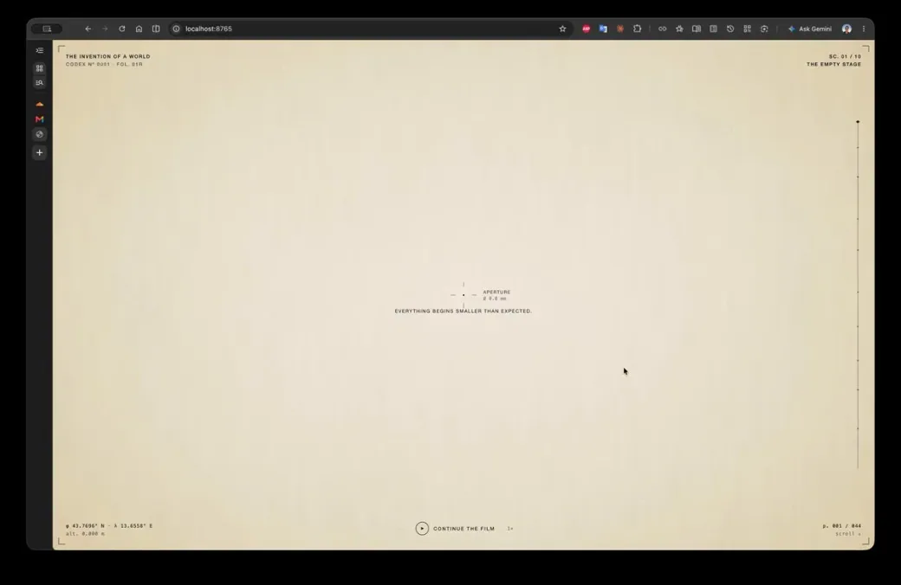
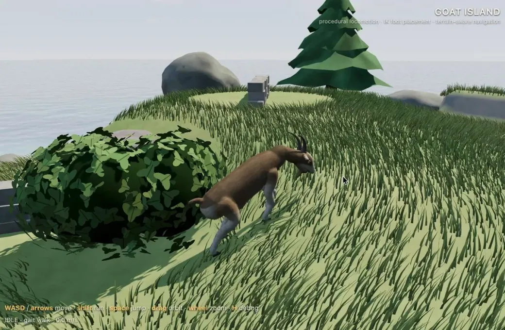
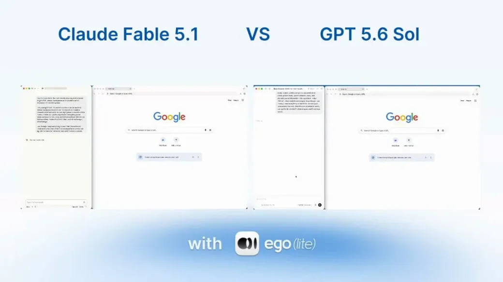
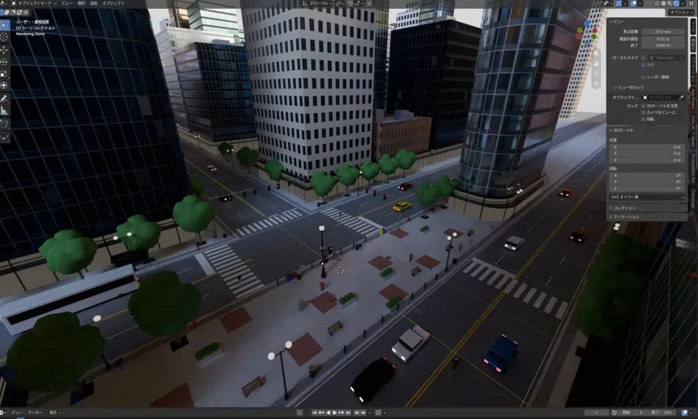
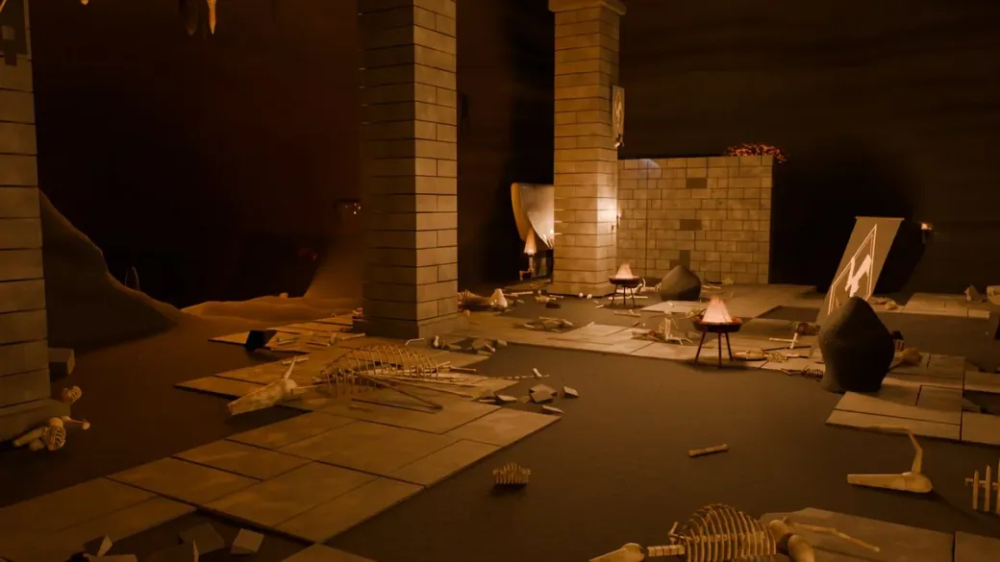
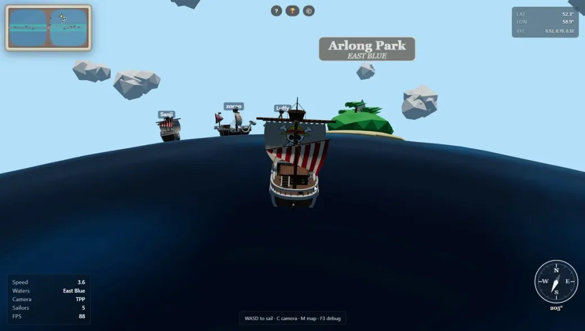

<!-- Generated from Growth CMS by templates/catalog.md. Edit content in CMS; run npm run sync. -->

# Awesome 3D Prompts — 7 / 9

[← Awesome 3D Prompts](../README.md)

<p>
  <a href="../docs/catalog.en.7.md"></a>
  <a href="../docs/catalog.zh.7.md"></a>
  <a href="../docs/catalog.zh-Hant.7.md"></a>
  <a href="../docs/catalog.ja.7.md"></a>
  <a href="../docs/catalog.ko.7.md"></a>
  <a href="../docs/catalog.es.7.md"></a>
  <a href="../docs/catalog.pt.7.md"></a>
  <a href="../docs/catalog.de.7.md"></a>
  <a href="../docs/catalog.fr.7.md"></a>
  <a href="../docs/catalog.it.7.md"></a>
  <a href="../docs/catalog.ru.7.md"></a>
  <a href="../docs/catalog.tr.7.md"></a>
  <a href="../docs/catalog.uk.7.md"></a>
  <a href="../docs/catalog.vi.7.md"></a>
</p>

[Tam katalog](catalog.tr.md) · [←](catalog.tr.6.md) · **7 / 9** · [→](catalog.tr.8.md)

<a id="all-prompts"></a>

<details>
<summary>Örnekleri keşfet (50)</summary>

- [Kurumsal önleme dronu varlığı](#corporate-interceptor-drone-asset-2095176360238915978)
- [Frutiger Aero 3B dünyası](#frutiger-aero-3d-world-2095171470607728926)
- [On sahnelik sinematik Rönesans sitesi](#ten-scene-cinematic-renaissance-website-2095167881004908897)
- [Evcil keçili sanal ada](#virtual-island-with-a-pet-goat-2095165578042335442)
- [Etkileşimli 3B Güneş Sistemi](#interactive-3d-solar-system-2095165395841999222)
- [Eşdikdörtgensel panoramadan şehir](#city-from-an-equirectangular-panorama-2095159781883597031)
- [Blender'da ejderha ini sahnesi](#dragon-lair-scene-in-blender-2095149546187653547)
- [Three.js'de çok oyunculu korsan dünyası](#multiplayer-pirate-world-in-three-js-2095137561283010600)
- [Blender'da uçan tencere animasyonu](#flying-pot-animation-in-blender-2095132939667255657)
- [3B kanser ilerleme simülasyonu](#3d-cancer-progression-simulation-2095130778342408331)
- [Geliştirilmiş meteor parçalanma efektleri](#enhanced-meteoroid-breakup-vfx-2095127248470692320)
- [Ayrıntı seviyeleri hazır saldırı kapsülü uzay gemisi](#lod-ready-assault-pod-spaceship-2095126622319845478)
- [Ayrıntılı 3B stadyum yeniden yapımı](#detailed-3d-stadium-recreation-2095123216419459454)
- [Mekanik olarak doğru su değirmeni köyü](#mechanically-accurate-water-mill-village-2095123063352561815)
- [Gölgelendiricili etkileşimli Dino-dex](#interactive-shader-driven-dino-dex-2095121568297083067)
- [Şişenin içinde yaşayan voksel dünya](#living-voxel-world-inside-a-bottle-2095111213927510131)
- [Düzenlenebilir 3B klavye animasyonu](#editable-3d-keyboard-animation-2095111032171876470)
- [Gundam'dan esinlenen mecha sergisi](#gundam-inspired-mecha-showcase-2095106919530930221)
- [Referansla şekillenen Three.js portföyü](#reference-driven-three-js-portfolio-2095104073590808644)
- [Etkileşimli F-35A teknik modeli](#interactive-f-35a-technical-model-2095094543339446572)
- [Three.js'de MS-06 esintili mecha](#three-js-ms-06-inspired-mecha-2095085944391270759)
- [Tek HTML dosyasında yaşayan evren](#living-universe-in-one-html-file-2095054116372508955)
- [Yerel C++ soulslike oyunu](#native-c-souls-like-game-2095053114600755576)
- [Oynanabilir 3B Yılanlar ve Merdivenler](#playable-3d-snakes-and-ladders-2095050993184669825)
- [Hareketli voksellere dönüşen portre](#portrait-transformed-into-kinetic-voxels-2095048967092625663)
- [Etkileşimli Three.js kalesi](#interactive-three-js-castle-2095048818203275584)
- [NIGHTBAND etkileşimli kısa dalga radyo](#nightband-interactive-shortwave-radio-2095026928210346175)
- [Eksiksiz Unity tenis oyunu](#complete-unity-tennis-game-2095021275236495408)
- [Işıldayan kanyon üzerinde antik tapınak](#ancient-temple-above-a-glowing-canyon-2095012880383099339)
- [Etkileşimli Toronto silüeti](#interactive-toronto-skyline-2095000329561485584)
- [The Sims tarzı otonom yaşam simülasyonu](#autonomous-sims-like-life-simulation-2094949450196090988)
- [Düşünen NPC'lerle voksel köy](#voxel-village-with-thinking-npcs-2094930970675741171)
- [Fuji Dağı'na fantastik tırmanış](#fantasy-ascent-to-mount-fuji-2094930804296274414)
- [Sıfırdan Godot yarış oyunu](#godot-racing-game-built-from-scratch-2094925359372284022)
- [Kat planından Blender gezintisine](#floor-plan-to-blender-walkthrough-2094925117344428232)
- [136.000 vokselli deterministik pagoda](#deterministic-136-000-voxel-pagoda-2094916609219461211)
- [Blender otomasyonuyla ayrıntılı robot](#detailed-robot-through-blender-automation-2094909825561805003)
- [Açık dünya suç oyunu prototipi](#open-world-crime-game-prototype-2094907986942591338)
- [Mini Militia tarzı tarayıcı oyunu](#mini-militia-style-browser-game-2094900523900219725)
- [Birinci şahıs yağmurlu okyanus oyun alanı](#rainy-first-person-ocean-sandbox-2094900247000654222)
- [Uçan voksel ada](#floating-voxel-island-2094899802588713418)
- [Yaşayan voksel Orta Çağ krallığı](#living-voxel-medieval-kingdom-2094899477626720403)
- [Dokulu 3B varlık üretim iş akışı](#textured-3d-asset-production-workflow-2094896750234378508)
- [Üç kompakt fizik oyunu fikri](#three-compact-physics-game-concepts-2094895071304839400)
- [Three.js'de AAA kalitesinde kart yarışı](#aaa-kart-racing-game-in-three-js-2094894312370692443)
- [Tek istemle Three.js havaalanı simülasyonu](#one-shot-three-js-airport-simulation-2094893572617044439)
- [Pagodalı uçan Japon şehri](#floating-japanese-pagoda-city-2094886088963690607)
- [Three.js'de Airbus H145](#airbus-h145-in-three-js-2094882571083735351)
- [Birinci Dünya Savaşı voksel simülatörü](#world-war-i-voxel-simulator-2094881469155914170)
- [Özel adada fütüristik malikâne](#futuristic-private-island-mansion-2094879208304685524)

</details>
<a id="corporate-interceptor-drone-asset-2095176360238915978"></a>

### Kurumsal önleme dronu varlığı

[Dmytro Gladkyi](https://x.com/gladimdim) · 2026-09-02 · Claude Fable 5.1 · Varlıklar

<a href="https://www.tripo3d.ai/tr/3d-prompts/corporate-interceptor-drone-asset-2095176360238915978"></a>

*Bağlantıdaki çalışmaya dayalı yapım yönergesi*

**İstem**

```text
Kurumsal cumhuriyet grubuna ait, oyuna hazır ağır bir önleme dronu oluştur. Güçlü silüet, modüler silahlar, anlaşılır ölçek ve malzemeler kullan; gerçek zamanlı varlık sınırlarına uy.
```

[Ayrıntıları görüntüle ↗](https://www.tripo3d.ai/tr/3d-prompts/corporate-interceptor-drone-asset-2095176360238915978) · [Orijinal gönderi](https://x.com/gladimdim/status/2095176360238915978) · [Örneklere dön](#all-prompts)

---

<a id="frutiger-aero-3d-world-2095171470607728926"></a>

### Frutiger Aero 3B dünyası

[Oliver Benns](https://x.com/oliverbenns) · 2026-09-02 · Claude Fable 5.1 · Sahneler

<a href="https://www.tripo3d.ai/tr/3d-prompts/frutiger-aero-3d-world-2095171470607728926"></a>

*Bağlantıdaki çalışmaya dayalı yapım yönergesi*

**İstem**

```text
2000'lerin başındaki Frutiger Aero'dan esinlenen küçük etkileşimli 3B dünya oluştur. Aydınlık çayırlar, temiz su, baloncuklar, yarı saydam cam şekiller ve iyimser ortam sesi kullan.
```

[Ayrıntıları görüntüle ↗](https://www.tripo3d.ai/tr/3d-prompts/frutiger-aero-3d-world-2095171470607728926) · [Orijinal gönderi](https://x.com/oliverbenns/status/2095171470607728926) · [Örneklere dön](#all-prompts)

---

<a id="ten-scene-cinematic-renaissance-website-2095167881004908897"></a>

### On sahnelik sinematik Rönesans sitesi

[Henry Fan](https://x.com/Henry_Fan_lh) · 2026-09-02 · Claude Fable 5.1 · Etkileşimli

<a href="https://www.tripo3d.ai/tr/3d-prompts/ten-scene-cinematic-renaissance-website-2095167881004908897"></a>

*Bağlantıdaki çalışmaya dayalı yapım yönergesi*

**İstem**

```text
Rönesans resmi, editoryal tipografi, GSAP geçişleri, WebGL gren efekti ve dünya icat etme temasını birleştiren on sahnelik sinematik tarayıcı deneyimi oluştur.
```

[Ayrıntıları görüntüle ↗](https://www.tripo3d.ai/tr/3d-prompts/ten-scene-cinematic-renaissance-website-2095167881004908897) · [Orijinal gönderi](https://x.com/Henry_Fan_lh/status/2095167881004908897) · [Örneklere dön](#all-prompts)

---

<a id="virtual-island-with-a-pet-goat-2095165578042335442"></a>

### Evcil keçili sanal ada

[Alix Ollivier](https://x.com/aollivier82) · 2026-09-02 · Claude Fable 5.1 · Etkileşimli

<a href="https://www.tripo3d.ai/tr/3d-prompts/virtual-island-with-a-pet-goat-2095165578042335442"></a>

*Bağlantıdaki çalışmaya dayalı yapım yönergesi*

**İstem**

```text
Takip eden, tepki veren ve oynayan bir evcil keçisi olan küçük, keşfedilebilir Three.js adası yap. Sıcak çevre detayları ve basit günlük etkileşimler ekle.
```

[Ayrıntıları görüntüle ↗](https://www.tripo3d.ai/tr/3d-prompts/virtual-island-with-a-pet-goat-2095165578042335442) · [Orijinal gönderi](https://x.com/aollivier82/status/2095165578042335442) · [Örneklere dön](#all-prompts)

---

<a id="interactive-3d-solar-system-2095165395841999222"></a>

### Etkileşimli 3B Güneş Sistemi

[ego](https://x.com/ego_agent) · 2026-09-02 · Claude Fable 5.1 · Etkileşimli

<a href="https://www.tripo3d.ai/tr/3d-prompts/interactive-3d-solar-system-2095165395841999222"></a>

*Bağlantıdaki çalışmaya dayalı yapım yönergesi*

**İstem**

```text
Yörüngedeki gezegenler, ölçeğe duyarlı gezinme, etiketler, hız kontrolleri, kamera hedefleri ve faydalı eğitici ayrıntılarla etkileşimli 3B Güneş Sistemi oluştur.
```

[Ayrıntıları görüntüle ↗](https://www.tripo3d.ai/tr/3d-prompts/interactive-3d-solar-system-2095165395841999222) · [Orijinal gönderi](https://x.com/ego_agent/status/2095165395841999222) · [Örneklere dön](#all-prompts)

---

<a id="city-from-an-equirectangular-panorama-2095159781883597031"></a>

### Eşdikdörtgensel panoramadan şehir

[ハヤシモン｜AI × 個人開発](https://x.com/hayashimon1) · 2026-09-02 · Claude Fable 5.1 · Sahneler

<a href="https://www.tripo3d.ai/tr/3d-prompts/city-from-an-equirectangular-panorama-2095159781883597031"></a>

*Bağlantıdaki çalışmaya dayalı yapım yönergesi*

**İstem**

```text
Verilen eşdikdörtgensel şehir panoramasını referans alarak Blender'da tek seferde yoğun şehir modeli oluştur. Ana yolları, kütleleri, silüeti ve mekânsal ilişkileri koru.
```

[Ayrıntıları görüntüle ↗](https://www.tripo3d.ai/tr/3d-prompts/city-from-an-equirectangular-panorama-2095159781883597031) · [Orijinal gönderi](https://x.com/hayashimon1/status/2095159781883597031) · [Örneklere dön](#all-prompts)

---

<a id="dragon-lair-scene-in-blender-2095149546187653547"></a>

### Blender'da ejderha ini sahnesi

[Majid Manzarpour](https://x.com/majidmanzarpour) · 2026-09-02 · Claude Fable 5.1 · Sahneler

<a href="https://www.tripo3d.ai/tr/3d-prompts/dragon-lair-scene-in-blender-2095149546187653547"></a>

*Bağlantıdaki çalışmaya dayalı yapım yönergesi*

**İstem**

```text
Blender'da ana odakta ejderha, büyük mağara hissi, hazine, duman, ateş ışığı, katmanlı kompozisyon ve sinematik kamerayla dramatik bir ejderha ini oluştur.
```

[Ayrıntıları görüntüle ↗](https://www.tripo3d.ai/tr/3d-prompts/dragon-lair-scene-in-blender-2095149546187653547) · [Orijinal gönderi](https://x.com/majidmanzarpour/status/2095149546187653547) · [Örneklere dön](#all-prompts)

---

<a id="multiplayer-pirate-world-in-three-js-2095137561283010600"></a>

### Three.js'de çok oyunculu korsan dünyası

[Aman](https://x.com/aman_kambojj) · 2026-09-02 · Claude Fable 5.1 · Oyunlar

<a href="https://www.tripo3d.ai/tr/3d-prompts/multiplayer-pirate-world-in-three-js-2095137561283010600"></a>

*Bağlantıdaki çalışmaya dayalı yapım yönergesi*

**İstem**

```text
Maceralı korsan animelerinden esinlenen, adalar, gemiler, dolaşım, savaş ve sosyal keşif döngüsü içeren çok oyunculu Three.js dünyası kur.
```

[Ayrıntıları görüntüle ↗](https://www.tripo3d.ai/tr/3d-prompts/multiplayer-pirate-world-in-three-js-2095137561283010600) · [Orijinal gönderi](https://x.com/aman_kambojj/status/2095137561283010600) · [Canlı demo](https://onepiece-world.vercel.app/) · [Örneklere dön](#all-prompts)

---

<a id="flying-pot-animation-in-blender-2095132939667255657"></a>

### Blender'da uçan tencere animasyonu

[Ben](https://x.com/alafrayme) · 2026-09-02 · Claude Fable 5.1 · Animasyon

<a href="https://www.tripo3d.ai/tr/3d-prompts/flying-pot-animation-in-blender-2095132939667255657"></a>

*Bağlantıdaki çalışmaya dayalı yapım yönergesi*

**İstem**

```text
Blender'da eğlenceli bir uçan tencere oluştur. Anlaşılır silüet, iskelet veya prosedürel hareket, ifadeli yatışlar, malzemeler, ışık ve kısa sunum animasyonu ekle.
```

[Ayrıntıları görüntüle ↗](https://www.tripo3d.ai/tr/3d-prompts/flying-pot-animation-in-blender-2095132939667255657) · [Orijinal gönderi](https://x.com/alafrayme/status/2095132939667255657) · [Örneklere dön](#all-prompts)

---

<a id="3d-cancer-progression-simulation-2095130778342408331"></a>

### 3B kanser ilerleme simülasyonu

[Not Harris \| Builds Apps](https://x.com/viewsfrom02108) · 2026-09-02 · Claude Fable 5.1 · Animasyon

<a href="https://www.tripo3d.ai/tr/3d-prompts/3d-cancer-progression-simulation-2095130778342408331"></a>

*Bağlantıdaki çalışmaya dayalı yapım yönergesi*

**İstem**

```text
Mutasyon, bölünme, anjiyogenez, yayılma ve metastazı gösteren eğitici bir 3B kanser hücresi simülasyonu yap. Zaman çizelgesi, etiketler ve aşamalar arasında dikkatli görsel ayrım kullan.
```

[Ayrıntıları görüntüle ↗](https://www.tripo3d.ai/tr/3d-prompts/3d-cancer-progression-simulation-2095130778342408331) · [Orijinal gönderi](https://x.com/viewsfrom02108/status/2095130778342408331) · [Örneklere dön](#all-prompts)

---

<a id="enhanced-meteoroid-breakup-vfx-2095127248470692320"></a>

### Geliştirilmiş meteor parçalanma efektleri

[Dmytro Gladkyi](https://x.com/gladimdim) · 2026-09-02 · Claude Fable 5.1 · Animasyon

<a href="https://www.tripo3d.ai/tr/3d-prompts/enhanced-meteoroid-breakup-vfx-2095127248470692320"></a>

*Bağlantıdaki çalışmaya dayalı yapım yönergesi*

**İstem**

```text
Mevcut meteoroid parçalanma efektlerini incele. Kontrolleri bozmadan parçalanma, ısı, izler, şok dalgası, zamanlama, ölçek ve kameradan anlaşılabilirliği iyileştir.
```

[Ayrıntıları görüntüle ↗](https://www.tripo3d.ai/tr/3d-prompts/enhanced-meteoroid-breakup-vfx-2095127248470692320) · [Orijinal gönderi](https://x.com/gladimdim/status/2095127248470692320) · [Örneklere dön](#all-prompts)

---

<a id="lod-ready-assault-pod-spaceship-2095126622319845478"></a>

### Ayrıntı seviyeleri hazır saldırı kapsülü uzay gemisi

[Dmytro Gladkyi](https://x.com/gladimdim) · 2026-09-02 · Claude Fable 5.1 · Varlıklar

<a href="https://www.tripo3d.ai/tr/3d-prompts/lod-ready-assault-pod-spaceship-2095126622319845478"></a>

*Bağlantıdaki çalışmaya dayalı yapım yönergesi*

**İstem**

```text
Saldırı kapsülü uzay gemisinin yüksek ve düşük LOD modellerini yeniden tasarla. Silüeti korurken üçgen bütçelerine uy, panel dilini geliştir ve varlığı gerçek zamanlı oyuna hazırla.
```

[Ayrıntıları görüntüle ↗](https://www.tripo3d.ai/tr/3d-prompts/lod-ready-assault-pod-spaceship-2095126622319845478) · [Orijinal gönderi](https://x.com/gladimdim/status/2095126622319845478) · [Örneklere dön](#all-prompts)

---

<a id="detailed-3d-stadium-recreation-2095123216419459454"></a>

### Ayrıntılı 3B stadyum yeniden yapımı

[The Bugged Dev](https://x.com/thebuggeddev) · 2026-09-02 · Claude Fable 5.1 · Sahneler

<a href="https://www.tripo3d.ai/tr/3d-prompts/detailed-3d-stadium-recreation-2095123216419459454"></a>

*Bağlantıdaki çalışmaya dayalı yapım yönergesi*

**İstem**

```text
Referans stadyumu doğru tribün katları, saha, çatı, ışık ve ölçekle ayrıntılı, gezilebilir bir 3B sahne olarak yeniden oluştur. Ardından görsel doğruluğu ve üretim maliyetini karşılaştır.
```

[Ayrıntıları görüntüle ↗](https://www.tripo3d.ai/tr/3d-prompts/detailed-3d-stadium-recreation-2095123216419459454) · [Orijinal gönderi](https://x.com/thebuggeddev/status/2095123216419459454) · [Örneklere dön](#all-prompts)

---

<a id="mechanically-accurate-water-mill-village-2095123063352561815"></a>

### Mekanik olarak doğru su değirmeni köyü

[ミラ｜未来のエンタメをつくる](https://x.com/mira_senor_1102) · 2026-09-02 · Claude Fable 5.1 · Animasyon

<a href="https://www.tripo3d.ai/tr/3d-prompts/mechanically-accurate-water-mill-village-2095123063352561815"></a>

*Bağlantıdaki çalışmaya dayalı yapım yönergesi*

**İstem**

```text
Three.js'de su çarkının dişlileri, kamı ve tokmakları inandırıcı oranlarla çalıştırdığı işleyen bir değirmen köyü kur. Köylüler ve çevresel hareket sahneyi canlı hissettirsin.
```

[Ayrıntıları görüntüle ↗](https://www.tripo3d.ai/tr/3d-prompts/mechanically-accurate-water-mill-village-2095123063352561815) · [Orijinal gönderi](https://x.com/mira_senor_1102/status/2095123063352561815) · [Örneklere dön](#all-prompts)

---

<a id="interactive-shader-driven-dino-dex-2095121568297083067"></a>

### Gölgelendiricili etkileşimli Dino-dex

[Benji Viz](https://x.com/_Benviz) · 2026-09-02 · Claude Fable 5.1 · Etkileşimli

<a href="https://www.tripo3d.ai/tr/3d-prompts/interactive-shader-driven-dino-dex-2095121568297083067"></a>

*Bağlantıdaki çalışmaya dayalı yapım yönergesi*

**İstem**

```text
Her dinozorun canlı bir 3B model olduğu etkileşimli Dino-dex oluştur. Özel GLSL Fresnel efekti, sekiz verimli WebGL bağlamı, uyumlu kartlar ve bilgilendirici tür ayrıntıları kullan.
```

[Ayrıntıları görüntüle ↗](https://www.tripo3d.ai/tr/3d-prompts/interactive-shader-driven-dino-dex-2095121568297083067) · [Orijinal gönderi](https://x.com/_Benviz/status/2095121568297083067) · [Örneklere dön](#all-prompts)

---

<a id="living-voxel-world-inside-a-bottle-2095111213927510131"></a>

### Şişenin içinde yaşayan voksel dünya

[Vib3Coded](https://x.com/vib3coded) · 2026-09-02 · Claude Fable 5.1 · Sahneler

<a href="https://www.tripo3d.ai/tr/3d-prompts/living-voxel-world-inside-a-bottle-2095111213927510131"></a>

*Bağlantıdaki çalışmaya dayalı yapım yönergesi*

**İstem**

```text
Cam şişede katmanlı okyanus sütunları, yelkenli, deniz feneri, ada yaşamı ve sakinlik, fırtına, gece geçişleri içeren yaşayan bir voksel dünya oluştur.
```

[Ayrıntıları görüntüle ↗](https://www.tripo3d.ai/tr/3d-prompts/living-voxel-world-inside-a-bottle-2095111213927510131) · [Orijinal gönderi](https://x.com/vib3coded/status/2095111213927510131) · [Örneklere dön](#all-prompts)

---

<a id="editable-3d-keyboard-animation-2095111032171876470"></a>

### Düzenlenebilir 3B klavye animasyonu

[rege](https://x.com/rege_dev) · 2026-09-02 · Claude Fable 5.1 · Animasyon

<a href="https://www.tripo3d.ai/tr/3d-prompts/editable-3d-keyboard-animation-2095111032171876470"></a>

*Bağlantıdaki çalışmaya dayalı yapım yönergesi*

**İstem**

```text
Tatmin edici tuş hareketi, ışık, kamera hareketi ve ayarlanabilir etiketler, renkler ve zamanlamalar içeren düzenlenebilir bir 3B klavye animasyonu oluştur.
```

[Ayrıntıları görüntüle ↗](https://www.tripo3d.ai/tr/3d-prompts/editable-3d-keyboard-animation-2095111032171876470) · [Orijinal gönderi](https://x.com/rege_dev/status/2095111032171876470) · [Örneklere dön](#all-prompts)

---

<a id="gundam-inspired-mecha-showcase-2095106919530930221"></a>

### Gundam'dan esinlenen mecha sergisi

[Crayon](https://x.com/usecrayon) · 2026-09-02 · Claude Fable 5.1 · Etkileşimli

<a href="https://www.tripo3d.ai/tr/3d-prompts/gundam-inspired-mecha-showcase-2095106919530930221"></a>

*Bağlantıdaki çalışmaya dayalı yapım yönergesi*

**İstem**

```text
Three.js'de özgün, Gundam esintili mechaların özenli bir sergisini oluştur. Mekanik eklemler, ölçek ipuçları, dramatik ışık ve inceleme kamerası ekle.
```

[Ayrıntıları görüntüle ↗](https://www.tripo3d.ai/tr/3d-prompts/gundam-inspired-mecha-showcase-2095106919530930221) · [Orijinal gönderi](https://x.com/usecrayon/status/2095106919530930221) · [Örneklere dön](#all-prompts)

---

<a id="reference-driven-three-js-portfolio-2095104073590808644"></a>

### Referansla şekillenen Three.js portföyü

[Meng To](https://x.com/MengTo) · 2026-09-02 · Claude Fable 5.1 · Etkileşimli

<a href="https://www.tripo3d.ai/tr/3d-prompts/reference-driven-three-js-portfolio-2095104073590808644"></a>

*Bağlantıdaki çalışmaya dayalı yapım yönergesi*

**İstem**

```text
Verilen görsel referansı katmanlı parçacıklar, VHS ve CRT dokusu, akıcı geçişler ve ekranlara uyumlu etkileşim içeren özenli bir Three.js sitesine dönüştür.
```

[Ayrıntıları görüntüle ↗](https://www.tripo3d.ai/tr/3d-prompts/reference-driven-three-js-portfolio-2095104073590808644) · [Orijinal gönderi](https://x.com/MengTo/status/2095104073590808644) · [Kaynak kodu](https://github.com/MengTo/sublevel-studio) · [Canlı demo](https://mengto.github.io/sublevel-studio/) · [Örneklere dön](#all-prompts)

---

<a id="interactive-f-35a-technical-model-2095094543339446572"></a>

### Etkileşimli F-35A teknik modeli

[Edgex](https://x.com/SahilExec) · 2026-09-02 · Claude Fable 5.1 · Etkileşimli

<a href="https://www.tripo3d.ai/tr/3d-prompts/interactive-f-35a-technical-model-2095094543339446572"></a>

*Bağlantıdaki çalışmaya dayalı yapım yönergesi*

**İstem**

```text
Kodla ayrıntılı, etkileşimli bir F-35A üret. Doğru oranlar, kumanda yüzeyleri, iniş takımı, kokpit ayrıntıları, etiketler ve inceleme animasyonları ekle.
```

[Ayrıntıları görüntüle ↗](https://www.tripo3d.ai/tr/3d-prompts/interactive-f-35a-technical-model-2095094543339446572) · [Orijinal gönderi](https://x.com/SahilExec/status/2095094543339446572) · [Örneklere dön](#all-prompts)

---

<a id="three-js-ms-06-inspired-mecha-2095085944391270759"></a>

### Three.js'de MS-06 esintili mecha

[Hakuei](https://x.com/akiba_tokyo_jp) · 2026-09-02 · Claude Fable 5.1 · Varlıklar

<a href="https://www.tripo3d.ai/tr/3d-prompts/three-js-ms-06-inspired-mecha-2095085944391270759"></a>

*Bağlantıdaki çalışmaya dayalı yapım yönergesi*

**İstem**

```text
Ana nesnenin açıkça göründüğü temiz beyaz arka planda, inandırıcı oranlar, malzemeler ve inceleme kontrolleriyle Three.js'de ayrıntılı MS-06 esintili mecha oluştur.
```

[Ayrıntıları görüntüle ↗](https://www.tripo3d.ai/tr/3d-prompts/three-js-ms-06-inspired-mecha-2095085944391270759) · [Orijinal gönderi](https://x.com/akiba_tokyo_jp/status/2095085944391270759) · [Örneklere dön](#all-prompts)

---

<a id="living-universe-in-one-html-file-2095054116372508955"></a>

### Tek HTML dosyasında yaşayan evren

[Alex Luhchenko](https://x.com/tiny_frontier) · 2026-09-02 · Claude Fable 5.1 · Animasyon

<a href="https://www.tripo3d.ai/tr/3d-prompts/living-universe-in-one-html-file-2095054116372508955"></a>

**İstem**

```text
tek HTML dosyasında yaşayan bir evren oluştur.
```

<details>
<summary>Özgün istem</summary>

```text
build a living universe in one HTML file.
```

</details>

[Ayrıntıları görüntüle ↗](https://www.tripo3d.ai/tr/3d-prompts/living-universe-in-one-html-file-2095054116372508955) · [Orijinal gönderi](https://x.com/tiny_frontier/status/2095054116372508955) · [Canlı demo](https://genesis-demo.tinyfrontier.xyz/) · [Örneklere dön](#all-prompts)

---

<a id="native-c-souls-like-game-2095053114600755576"></a>

### Yerel C++ soulslike oyunu

[wbk ᕦ(ò\_ó )ᕤ](https://x.com/wizardbrainz) · 2026-09-02 · Claude Fable 5.1 · Oyunlar

<a href="https://www.tripo3d.ai/tr/3d-prompts/native-c-souls-like-game-2095053114600755576"></a>

*Bağlantıdaki çalışmaya dayalı yapım yönergesi*

**İstem**

```text
Yerel C++ ile Bloodborne'dan esinlenen bir soulslike oyun oluştur. Özgün sanat, animasyon, ses ve müzik, hızlı tepki veren savaş, düşmanlar, bölüm sonu canavarı ve kısa ama eksiksiz bir bölüm ekle.
```

[Ayrıntıları görüntüle ↗](https://www.tripo3d.ai/tr/3d-prompts/native-c-souls-like-game-2095053114600755576) · [Orijinal gönderi](https://x.com/wizardbrainz/status/2095053114600755576) · [Örneklere dön](#all-prompts)

---

<a id="playable-3d-snakes-and-ladders-2095050993184669825"></a>

### Oynanabilir 3B Yılanlar ve Merdivenler

[KC](https://x.com/karanC_12) · 2026-09-02 · Claude Fable 5.1 · Oyunlar

<a href="https://www.tripo3d.ai/tr/3d-prompts/playable-3d-snakes-and-ladders-2095050993184669825"></a>

*Bağlantıdaki çalışmaya dayalı yapım yönergesi*

**İstem**

```text
Zar animasyonu, tahtada hareket, yılanlar, merdivenler, sıralar, kazanma durumu ve açık oyuncu geri bildirimi olan eksiksiz bir 3B Yılanlar ve Merdivenler oyunu oluştur.
```

[Ayrıntıları görüntüle ↗](https://www.tripo3d.ai/tr/3d-prompts/playable-3d-snakes-and-ladders-2095050993184669825) · [Orijinal gönderi](https://x.com/karanC_12/status/2095050993184669825) · [Örneklere dön](#all-prompts)

---

<a id="portrait-transformed-into-kinetic-voxels-2095048967092625663"></a>

### Hareketli voksellere dönüşen portre

[Manoj Builds](https://x.com/TenthPrime) · 2026-09-02 · Claude Fable 5.1 · Animasyon

<a href="https://www.tripo3d.ai/tr/3d-prompts/portrait-transformed-into-kinetic-voxels-2095048967092625663"></a>

*Bağlantıdaki çalışmaya dayalı yapım yönergesi*

**İstem**

```text
Yüklenen portreyi dalga yer değiştirmesi, siberpunk gölgelendiriciler, verimli örnekleme ve imleçle hareket içeren 10.000'den fazla etkileşimli 3B voksele dönüştür.
```

[Ayrıntıları görüntüle ↗](https://www.tripo3d.ai/tr/3d-prompts/portrait-transformed-into-kinetic-voxels-2095048967092625663) · [Orijinal gönderi](https://x.com/TenthPrime/status/2095048967092625663) · [Örneklere dön](#all-prompts)

---

<a id="interactive-three-js-castle-2095048818203275584"></a>

### Etkileşimli Three.js kalesi

[Jigs](https://x.com/debugsenpai) · 2026-09-02 · Claude Fable 5.1 · Sahneler

<a href="https://www.tripo3d.ai/tr/3d-prompts/interactive-three-js-castle-2095048818203275584"></a>

*Bağlantıdaki çalışmaya dayalı yapım yönergesi*

**İstem**

```text
Keşfedilebilir odalar, kuleler, kapılar, arazi, atmosferik ışık ve masaüstü ile mobilde akıcı kontrollerle etkileşimli bir Three.js 3B kalesi oluştur.
```

[Ayrıntıları görüntüle ↗](https://www.tripo3d.ai/tr/3d-prompts/interactive-three-js-castle-2095048818203275584) · [Orijinal gönderi](https://x.com/debugsenpai/status/2095048818203275584) · [Örneklere dön](#all-prompts)

---

<a id="nightband-interactive-shortwave-radio-2095026928210346175"></a>

### NIGHTBAND etkileşimli kısa dalga radyo

[Neo](https://x.com/NeoAIForecast) · 2026-09-02 · Claude Fable 5.1 · Etkileşimli

<a href="https://www.tripo3d.ai/tr/3d-prompts/nightband-interactive-shortwave-radio-2095026928210346175"></a>

**İstem**

```text
Kendi kendine yeterli tek bir HTML dosyasında yapabileceğin en etkileyici siteyi oluştur. Tam yaratıcı özgürlüğün var. Amaç ne kadar zeki, yaratıcı, teknik açıdan yetenekli ve özgün olduğunu göstermek.
```

<details>
<summary>Özgün istem</summary>

```text
Create the most impressive website you can in a single self-contained HTML file. You have complete creative freedom. The goal is to demonstrate how intelligent, creative, technically capable and original you are.
```

</details>

[Ayrıntıları görüntüle ↗](https://www.tripo3d.ai/tr/3d-prompts/nightband-interactive-shortwave-radio-2095026928210346175) · [Orijinal gönderi](https://x.com/NeoAIForecast/status/2095026928210346175) · [Örneklere dön](#all-prompts)

---

<a id="complete-unity-tennis-game-2095021275236495408"></a>

### Eksiksiz Unity tenis oyunu

[Chong-U](https://x.com/chongdashu) · 2026-09-02 · Claude Fable 5.1 · Oyunlar

<a href="https://www.tripo3d.ai/tr/3d-prompts/complete-unity-tennis-game-2095021275236495408"></a>

*Bağlantıdaki çalışmaya dayalı yapım yönergesi*

**İstem**

```text
Blender'da hazırlanmış karakterler, güvenilir kontroller, hareket ve vuruş animasyonları, top fiziği, puanlama, rakipler ve maç akışıyla oynanabilir Unity tenis oyununu tamamla.
```

[Ayrıntıları görüntüle ↗](https://www.tripo3d.ai/tr/3d-prompts/complete-unity-tennis-game-2095021275236495408) · [Orijinal gönderi](https://x.com/chongdashu/status/2095021275236495408) · [Örneklere dön](#all-prompts)

---

<a id="ancient-temple-above-a-glowing-canyon-2095012880383099339"></a>

### Işıldayan kanyon üzerinde antik tapınak

[Pradeep Kapoor](https://x.com/pradeepXkapoor) · 2026-09-02 · Claude Fable 5.1 · Sahneler

<a href="https://www.tripo3d.ai/tr/3d-prompts/ancient-temple-above-a-glowing-canyon-2095012880383099339"></a>

*Bağlantıdaki çalışmaya dayalı yapım yönergesi*

**İstem**

```text
Alacakaranlıkta ışıldayan kanyon üzerinde süzülen antik tapınağı prosedürel Three.js sahnesi olarak oluştur. Rüzgârda kumaşlar, ışık huzmeleri, yıldırımlar ve sinematik yaklaşma ekle.
```

[Ayrıntıları görüntüle ↗](https://www.tripo3d.ai/tr/3d-prompts/ancient-temple-above-a-glowing-canyon-2095012880383099339) · [Orijinal gönderi](https://x.com/pradeepXkapoor/status/2095012880383099339) · [Örneklere dön](#all-prompts)

---

<a id="interactive-toronto-skyline-2095000329561485584"></a>

### Etkileşimli Toronto silüeti

[Kevin](https://x.com/bienjamyn) · 2026-09-02 · Claude Fable 5.1 · Sahneler

<a href="https://www.tripo3d.ai/tr/3d-prompts/interactive-toronto-skyline-2095000329561485584"></a>

*Bağlantıdaki çalışmaya dayalı yapım yönergesi*

**İstem**

```text
Tanınabilir simgeler, su, atmosferik derinlik, gündüzden geceye ışık ve akıcı yörünge ve uçuş kontrolleriyle etkileşimli bir 3B Toronto silüeti oluştur.
```

[Ayrıntıları görüntüle ↗](https://www.tripo3d.ai/tr/3d-prompts/interactive-toronto-skyline-2095000329561485584) · [Orijinal gönderi](https://x.com/bienjamyn/status/2095000329561485584) · [Canlı demo](https://toronto-voxel.vercel.app/) · [Örneklere dön](#all-prompts)

---

<a id="autonomous-sims-like-life-simulation-2094949450196090988"></a>

### The Sims tarzı otonom yaşam simülasyonu

[Ridark](https://x.com/ridark_eth) · 2026-09-02 · Claude Fable 5.1 · Animasyon

<a href="https://www.tripo3d.ai/tr/3d-prompts/autonomous-sims-like-life-simulation-2094949450196090988"></a>

*Bağlantıdaki çalışmaya dayalı yapım yönergesi*

**İstem**

```text
İhtiyaçları, rutinleri, ilişkileri ve kararları oyuncunun sürekli müdahalesi olmadan kendiliğinden hikâyeler oluşturan beş otonom karakterle The Sims tarzı yaşam simülasyonu yap.
```

[Ayrıntıları görüntüle ↗](https://www.tripo3d.ai/tr/3d-prompts/autonomous-sims-like-life-simulation-2094949450196090988) · [Orijinal gönderi](https://x.com/ridark_eth/status/2094949450196090988) · [Örneklere dön](#all-prompts)

---

<a id="voxel-village-with-thinking-npcs-2094930970675741171"></a>

### Düşünen NPC'lerle voksel köy

[Tech2Wild](https://x.com/Tech2Wild) · 2026-09-01 · Claude Fable 5.1 · Etkileşimli

<a href="https://www.tripo3d.ai/tr/3d-prompts/voxel-village-with-thinking-npcs-2094930970675741171"></a>

*Bağlantıdaki çalışmaya dayalı yapım yönergesi*

**İstem**

```text
Sakinlerinin işi, rutini, hafızası ve yerel dil modeli beyinleri olan bir voksel köy oluştur. Oyuncuya ve birbirlerine tepki verebilsinler.
```

[Ayrıntıları görüntüle ↗](https://www.tripo3d.ai/tr/3d-prompts/voxel-village-with-thinking-npcs-2094930970675741171) · [Orijinal gönderi](https://x.com/Tech2Wild/status/2094930970675741171) · [Örneklere dön](#all-prompts)

---

<a id="fantasy-ascent-to-mount-fuji-2094930804296274414"></a>

### Fuji Dağı'na fantastik tırmanış

[Techartist](https://x.com/techartist_) · 2026-09-01 · Claude Fable 5.1 · Sahneler

<a href="https://www.tripo3d.ai/tr/3d-prompts/fantasy-ascent-to-mount-fuji-2094930804296274414"></a>

*Bağlantıdaki çalışmaya dayalı yapım yönergesi*

**İstem**

```text
Oyuncuyu katmanlı ortamlardan Fuji Dağı zirvesine götüren güzel bir Three.js fantastik yolculuğu oluştur. Atmosferik ışık, dolaşım ve açık bir yükseliş hissi ver.
```

[Ayrıntıları görüntüle ↗](https://www.tripo3d.ai/tr/3d-prompts/fantasy-ascent-to-mount-fuji-2094930804296274414) · [Orijinal gönderi](https://x.com/techartist_/status/2094930804296274414) · [Örneklere dön](#all-prompts)

---

<a id="godot-racing-game-built-from-scratch-2094925359372284022"></a>

### Sıfırdan Godot yarış oyunu

[atomic.chat](https://x.com/atomic_chat_hq) · 2026-09-01 · Claude Fable 5.1 · Oyunlar

<a href="https://www.tripo3d.ai/tr/3d-prompts/godot-racing-game-built-from-scratch-2094925359372284022"></a>

*Bağlantıdaki çalışmaya dayalı yapım yönergesi*

**İstem**

```text
Sıfırdan bir Godot yarış oyunu yap. Araç ve çevre varlıkları için Blender kullan; geniş parkur, tatmin edici sürüş, rakipler, HUD ve yarış akışı uygula.
```

[Ayrıntıları görüntüle ↗](https://www.tripo3d.ai/tr/3d-prompts/godot-racing-game-built-from-scratch-2094925359372284022) · [Orijinal gönderi](https://x.com/atomic_chat_hq/status/2094925359372284022) · [Örneklere dön](#all-prompts)

---

<a id="floor-plan-to-blender-walkthrough-2094925117344428232"></a>

### Kat planından Blender gezintisine

[AGIラボ](https://x.com/ctgptlb) · 2026-09-01 · Claude Fable 5.1 · Sahneler

<a href="https://www.tripo3d.ai/tr/3d-prompts/floor-plan-to-blender-walkthrough-2094925117344428232"></a>

*Bağlantıdaki çalışmaya dayalı yapım yönergesi*

**İstem**

```text
Verilen kat planından doğru bir Blender 3B modeli oluştur, temsilî sabit görüntüler render et ve tutarlı bir gezinti videosu üret.
```

[Ayrıntıları görüntüle ↗](https://www.tripo3d.ai/tr/3d-prompts/floor-plan-to-blender-walkthrough-2094925117344428232) · [Orijinal gönderi](https://x.com/ctgptlb/status/2094925117344428232) · [Örneklere dön](#all-prompts)

---

<a id="deterministic-136-000-voxel-pagoda-2094916609219461211"></a>

### 136.000 vokselli deterministik pagoda

[FHILY👑](https://x.com/Oluwaphilemon1) · 2026-09-01 · Claude Fable 5.1 · Sahneler

<a href="https://www.tripo3d.ai/tr/3d-prompts/deterministic-136-000-voxel-pagoda-2094916609219461211"></a>

*Bağlantıdaki çalışmaya dayalı yapım yönergesi*

**İstem**

```text
Three.js'de anlaşılır mimari katmanları, verimli örneklemesi, kararlı çıktısı ve inceleme kamerası olan 136.000 vokselli deterministik bir pagoda üret.
```

[Ayrıntıları görüntüle ↗](https://www.tripo3d.ai/tr/3d-prompts/deterministic-136-000-voxel-pagoda-2094916609219461211) · [Orijinal gönderi](https://x.com/Oluwaphilemon1/status/2094916609219461211) · [Örneklere dön](#all-prompts)

---

<a id="detailed-robot-through-blender-automation-2094909825561805003"></a>

### Blender otomasyonuyla ayrıntılı robot

[Spectro](https://x.com/Spectromachina) · 2026-09-01 · Claude Fable 5.1 · Varlıklar

<a href="https://www.tripo3d.ai/tr/3d-prompts/detailed-robot-through-blender-automation-2094909825561805003"></a>

*Bağlantıdaki çalışmaya dayalı yapım yönergesi*

**İstem**

```text
Blender'da tutarlı oranları, eklemleri, panelleri, malzemeleri, ışığı ve sunum render'ı olan ayrıntılı bir sert yüzey robotu oluştur.
```

[Ayrıntıları görüntüle ↗](https://www.tripo3d.ai/tr/3d-prompts/detailed-robot-through-blender-automation-2094909825561805003) · [Orijinal gönderi](https://x.com/Spectromachina/status/2094909825561805003) · [Örneklere dön](#all-prompts)

---

<a id="open-world-crime-game-prototype-2094907986942591338"></a>

### Açık dünya suç oyunu prototipi

[Veee](https://x.com/vikktorrrre) · 2026-09-01 · Claude Fable 5.1 · Oyunlar

<a href="https://www.tripo3d.ai/tr/3d-prompts/open-world-crime-game-prototype-2094907986942591338"></a>

*Bağlantıdaki çalışmaya dayalı yapım yönergesi*

**İstem**

```text
GTA 6'dan esinlenen, yoğun şehir, yaya dolaşımı, sürülebilir araçlar, trafik, polis tepkisi ve çeşitli oynanabilir etkinlikler içeren açık dünya prototipi hazırla.
```

[Ayrıntıları görüntüle ↗](https://www.tripo3d.ai/tr/3d-prompts/open-world-crime-game-prototype-2094907986942591338) · [Orijinal gönderi](https://x.com/vikktorrrre/status/2094907986942591338) · [Örneklere dön](#all-prompts)

---

<a id="mini-militia-style-browser-game-2094900523900219725"></a>

### Mini Militia tarzı tarayıcı oyunu

[Md Ismail Šojal 🕷️](https://x.com/0x0SojalSec) · 2026-09-01 · Claude Fable 5.1 · Oyunlar

<a href="https://www.tripo3d.ai/tr/3d-prompts/mini-militia-style-browser-game-2094900523900219725"></a>

*Bağlantıdaki çalışmaya dayalı yapım yönergesi*

**İstem**

```text
Tepkili hareket, nişan alma, silahlar, kompakt arenalar, botlar ve anlık vuruş ve hasar geri bildirimi olan Mini Militia tarzı aksiyon oyunu yap.
```

[Ayrıntıları görüntüle ↗](https://www.tripo3d.ai/tr/3d-prompts/mini-militia-style-browser-game-2094900523900219725) · [Orijinal gönderi](https://x.com/0x0SojalSec/status/2094900523900219725) · [Örneklere dön](#all-prompts)

---

<a id="rainy-first-person-ocean-sandbox-2094900247000654222"></a>

### Birinci şahıs yağmurlu okyanus oyun alanı

[Tim Jayas](https://x.com/TimJayas) · 2026-09-01 · Claude Fable 5.1 · Sahneler

<a href="https://www.tripo3d.ai/tr/3d-prompts/rainy-first-person-ocean-sandbox-2094900247000654222"></a>

*Bağlantıdaki çalışmaya dayalı yapım yönergesi*

**İstem**

```text
Dalgalar, yağmur damlaları ve atmosferik ışıkla birinci şahıs 3B okyanus oyun alanı oluştur. İzleyici sürükleyici bir kamerayla suyu keşfedebilsin.
```

[Ayrıntıları görüntüle ↗](https://www.tripo3d.ai/tr/3d-prompts/rainy-first-person-ocean-sandbox-2094900247000654222) · [Orijinal gönderi](https://x.com/TimJayas/status/2094900247000654222) · [Örneklere dön](#all-prompts)

---

<a id="floating-voxel-island-2094899802588713418"></a>

### Uçan voksel ada

[Loktar 🇺🇸](https://x.com/loktar00) · 2026-09-01 · Claude Fable 5.1 · Sahneler

<a href="https://www.tripo3d.ai/tr/3d-prompts/floating-voxel-island-2094899802588713418"></a>

*Bağlantıdaki çalışmaya dayalı yapım yönergesi*

**İstem**

```text
Anlaşılır arazi katmanları, bitki örtüsü, su, yapılar, çevresel hareket ve tüm sahnenin çevresinde dönüp incelemeye izin veren kamera ile uçan voksel ada oluştur.
```

[Ayrıntıları görüntüle ↗](https://www.tripo3d.ai/tr/3d-prompts/floating-voxel-island-2094899802588713418) · [Orijinal gönderi](https://x.com/loktar00/status/2094899802588713418) · [Örneklere dön](#all-prompts)

---

<a id="living-voxel-medieval-kingdom-2094899477626720403"></a>

### Yaşayan voksel Orta Çağ krallığı

[Knowix](https://x.com/knowixbuilds) · 2026-09-01 · Claude Fable 5.1 · Animasyon

<a href="https://www.tripo3d.ai/tr/3d-prompts/living-voxel-medieval-kingdom-2094899477626720403"></a>

*Bağlantıdaki çalışmaya dayalı yapım yönergesi*

**İstem**

```text
Binlerce asker, çalışan köylüler, kuşatma sistemleri, yıkılabilir yapılar ve savaşın yönünü değiştirebilen bir ejderhayla büyük bir voksel Orta Çağ krallığı oluştur.
```

[Ayrıntıları görüntüle ↗](https://www.tripo3d.ai/tr/3d-prompts/living-voxel-medieval-kingdom-2094899477626720403) · [Orijinal gönderi](https://x.com/knowixbuilds/status/2094899477626720403) · [Örneklere dön](#all-prompts)

---

<a id="textured-3d-asset-production-workflow-2094896750234378508"></a>

### Dokulu 3B varlık üretim iş akışı

[Matt](https://x.com/MrCollison) · 2026-09-01 · Claude Fable 5.1 · Varlıklar

<a href="https://www.tripo3d.ai/tr/3d-prompts/textured-3d-asset-production-workflow-2094896750234378508"></a>

*Bağlantıdaki çalışmaya dayalı yapım yönergesi*

**İstem**

```text
Referans görüntüyü temiz bir 3B varlığa dönüştür. Blender'da normalleri ve malzemeleri düzelt, ardından Substance Painter'da üretime hazır dokular oluştur.
```

[Ayrıntıları görüntüle ↗](https://www.tripo3d.ai/tr/3d-prompts/textured-3d-asset-production-workflow-2094896750234378508) · [Orijinal gönderi](https://x.com/MrCollison/status/2094896750234378508) · [Örneklere dön](#all-prompts)

---

<a id="three-compact-physics-game-concepts-2094895071304839400"></a>

### Üç kompakt fizik oyunu fikri

[Atomic Agent](https://x.com/atomicagent_io) · 2026-09-01 · Claude Fable 5.1 · Oyunlar

<a href="https://www.tripo3d.ai/tr/3d-prompts/three-compact-physics-game-concepts-2094895071304839400"></a>

*Bağlantıdaki çalışmaya dayalı yapım yönergesi*

**İstem**

```text
Üç özenli mini oyun yap: yapışkan topla engel parkuru, nehirde sörf yapan kapibara ve konveyörde hamur işi atlatma oyunu. Her birinin girdisi, puanı ve kaybetme koşulu açık olsun.
```

[Ayrıntıları görüntüle ↗](https://www.tripo3d.ai/tr/3d-prompts/three-compact-physics-game-concepts-2094895071304839400) · [Orijinal gönderi](https://x.com/atomicagent_io/status/2094895071304839400) · [Örneklere dön](#all-prompts)

---

<a id="aaa-kart-racing-game-in-three-js-2094894312370692443"></a>

### Three.js'de AAA kalitesinde kart yarışı

[Jared](https://growthengineer.space/) · 2026-09-01 · Claude Fable 5.1 · Oyunlar

Uyarlama kaynağı: [BridgeMind](https://x.com/bridgemindai/status/2094894312370692443)

<a href="https://www.tripo3d.ai/tr/3d-prompts/aaa-kart-racing-game-in-three-js-2094894312370692443"></a>

*Bağlantıdaki çalışmaya dayalı yapım yönergesi*

**İstem**

```text
Three.js'de özenli sürüşü, karakterli pistleri, rakipleri, nesneleri, arayüzü, sesi ve eksiksiz oynanabilir yarış döngüsü olan AAA kalitesinde bir kart yarışı oluştur.
```

[Ayrıntıları görüntüle ↗](https://www.tripo3d.ai/tr/3d-prompts/aaa-kart-racing-game-in-three-js-2094894312370692443) · [Orijinal gönderi](https://x.com/bridgemindai/status/2094894312370692443) · [Kaynak kodu](https://github.com/bridge-mind/turbo-kart-rush) · [Canlı demo](https://bridge-mind.github.io/turbo-kart-rush/) · [Örneklere dön](#all-prompts)

---

<a id="one-shot-three-js-airport-simulation-2094893572617044439"></a>

### Tek istemle Three.js havaalanı simülasyonu

[Alex - i do YouTube](https://x.com/AlexYTScaling) · 2026-09-01 · Claude Fable 5.1 · Animasyon

<a href="https://www.tripo3d.ai/tr/3d-prompts/one-shot-three-js-airport-simulation-2094893572617044439"></a>

*Bağlantıdaki çalışmaya dayalı yapım yönergesi*

**İstem**

```text
Pistler, terminaller, taksi ve kalkış yapan uçaklar, yer araçları, saate göre ışık ve genel görünüm kamerasıyla tek seferde bir Three.js havaalanı simülasyonu oluştur.
```

[Ayrıntıları görüntüle ↗](https://www.tripo3d.ai/tr/3d-prompts/one-shot-three-js-airport-simulation-2094893572617044439) · [Orijinal gönderi](https://x.com/AlexYTScaling/status/2094893572617044439) · [Örneklere dön](#all-prompts)

---

<a id="floating-japanese-pagoda-city-2094886088963690607"></a>

### Pagodalı uçan Japon şehri

[Vib3Coded](https://x.com/vib3coded) · 2026-09-01 · Claude Fable 5.1 · Sahneler

<a href="https://www.tripo3d.ai/tr/3d-prompts/floating-japanese-pagoda-city-2094886088963690607"></a>

*Bağlantıdaki çalışmaya dayalı yapım yönergesi*

**İstem**

```text
Ayrıntılı bir pagoda etrafında katmanlı adalar, köprüler, sis, fener ışıkları ve sinematik uçuş kontrolleri bulunan etkileşimli, uçan Japon şehri oluştur.
```

[Ayrıntıları görüntüle ↗](https://www.tripo3d.ai/tr/3d-prompts/floating-japanese-pagoda-city-2094886088963690607) · [Orijinal gönderi](https://x.com/vib3coded/status/2094886088963690607) · [Örneklere dön](#all-prompts)

---

<a id="airbus-h145-in-three-js-2094882571083735351"></a>

### Three.js'de Airbus H145

[Harshith](https://x.com/HarshithLucky3) · 2026-09-01 · Claude Fable 5.1 · Varlıklar

<a href="https://www.tripo3d.ai/tr/3d-prompts/airbus-h145-in-three-js-2094882571083735351"></a>

*Bağlantıdaki çalışmaya dayalı yapım yönergesi*

**İstem**

```text
Three.js'de Airbus H145 helikopterinin 3B modelini oluştur. Kabini, iniş kızakları ve rotor düzeneği tanınabilir ve incelenebilir olsun.
```

[Ayrıntıları görüntüle ↗](https://www.tripo3d.ai/tr/3d-prompts/airbus-h145-in-three-js-2094882571083735351) · [Orijinal gönderi](https://x.com/HarshithLucky3/status/2094882571083735351) · [Örneklere dön](#all-prompts)

---

<a id="world-war-i-voxel-simulator-2094881469155914170"></a>

### Birinci Dünya Savaşı voksel simülatörü

[Tech2Wild](https://x.com/Tech2Wild) · 2026-09-01 · Claude Fable 5.1 · Animasyon

<a href="https://www.tripo3d.ai/tr/3d-prompts/world-war-i-voxel-simulator-2094881469155914170"></a>

*Bağlantıdaki çalışmaya dayalı yapım yönergesi*

**İstem**

```text
Siperler, askerler, araçlar, topçu, yıkım ve anlaşılır taktik kamera içeren Birinci Dünya Savaşı voksel savaş alanı simülatörü oluştur.
```

[Ayrıntıları görüntüle ↗](https://www.tripo3d.ai/tr/3d-prompts/world-war-i-voxel-simulator-2094881469155914170) · [Orijinal gönderi](https://x.com/Tech2Wild/status/2094881469155914170) · [Örneklere dön](#all-prompts)

---

<a id="futuristic-private-island-mansion-2094879208304685524"></a>

### Özel adada fütüristik malikâne

[AI/ML API](https://x.com/aimlapi) · 2026-09-01 · Claude Fable 5.1 · Sahneler

<a href="https://www.tripo3d.ai/tr/3d-prompts/futuristic-private-island-mansion-2094879208304685524"></a>

*Bağlantıdaki çalışmaya dayalı yapım yönergesi*

**İstem**

```text
Özel bir adada keşfedilebilir fütüristik malikâne tasarla. Sinematik kamera hareketleri, kaliteli malzemeler ve çevresel hikâye anlatımıyla birbirine bağlı beş Three.js sahnesi üzerinden sun.
```

[Ayrıntıları görüntüle ↗](https://www.tripo3d.ai/tr/3d-prompts/futuristic-private-island-mansion-2094879208304685524) · [Orijinal gönderi](https://x.com/aimlapi/status/2094879208304685524) · [Örneklere dön](#all-prompts)

---


[Tam katalog](catalog.tr.md) · [←](catalog.tr.6.md) · **7 / 9** · [→](catalog.tr.8.md)

<p align="center"><strong><a href="https://www.tripo3d.ai/tr/3d-prompts?utm_source=github&amp;utm_medium=referral&amp;utm_campaign=awesome_3d_prompts&amp;utm_content=catalog_footer">Tam katalog →</a></strong></p>
