<!-- Generated from Growth CMS by templates/catalog.md. Edit content in CMS; run npm run sync. -->

# Awesome 3D Prompts — 2 / 9

[← Awesome 3D Prompts](../README.md)

<p>
  <a href="../docs/catalog.en.2.md"></a>
  <a href="../docs/catalog.zh.2.md"></a>
  <a href="../docs/catalog.zh-Hant.2.md"></a>
  <a href="../docs/catalog.ja.2.md"></a>
  <a href="../docs/catalog.ko.2.md"></a>
  <a href="../docs/catalog.es.2.md"></a>
  <a href="../docs/catalog.pt.2.md"></a>
  <a href="../docs/catalog.de.2.md"></a>
  <a href="../docs/catalog.fr.2.md"></a>
  <a href="../docs/catalog.it.2.md"></a>
  <a href="../docs/catalog.ru.2.md"></a>
  <a href="../docs/catalog.tr.2.md"></a>
  <a href="../docs/catalog.uk.2.md"></a>
  <a href="../docs/catalog.vi.2.md"></a>
</p>

[Повний каталог](catalog.uk.md) · [←](catalog.uk.1.md) · **2 / 9** · [→](catalog.uk.3.md)

<a id="all-prompts"></a>

<details>
<summary>Переглянути приклади (50)</summary>

- [Нескінченний процедурно згенерований світ на Three.js](#claude-opus-5-5-2102529695908806728)
- [Двоповерховий заміський будинок з інтер’єром](#gpt-6-astra-2102473710724919614)
- [Інтерактивна симуляція евакуації натовпу](#claude-opus-5-5-2102467667978572092)
- [Battle City 3D: нескінченна танкова оборона](#battle-city-3d)
- [Інтерактивний 3D-острів доісторичної епохи](#claude-opus-5-5-2102450239923720440)
- [TD-гра на кшталт Sir, We Have Orc Problems](#gpt-6-astra-2102411087002112256)
- [3D-сцена й відео з Токійською вежею вдень і вночі](#gpt-6-astra-2102276620124062065)
- [Bubble Bay: 3D-битва на водяних кульках](#bubble-bay)
- [Інтерактивна 3D-презентація дизайну гелікоптера](#gpt-6-astra-2102215638311694336)
- [Процедурна браузерна гоночна гра Spline Rush](#gpt-6-astra-2102150615635816866)
- [Інтерактивний вебсайт із 3D-моделлю Сонця](#gpt-6-astra-2102038136725377200)
- [Verdant — інтерактивний 3D-острів динозаврів](#gpt-6-astra-2101730386711634251)
- [Створіть 3D-модель WALL-E у Three.js](#gpt-6-astra-2101687900723106104)
- [Вітрильник у відкритому морі](#gpt-6-astra-2101616345720787130)
- [TITANIC — Останнє світло](#titanic-the-last-light)
- [3D-модель Waymo Jaguar I-Pace](#gpt-6-astra-2101325346427842909)
- [Робочий процес створення 3D-анімації та відео про кота-майстра бойових мистецтв](#gpt-6-astra-2101310374033428642)
- [Інтерактивна 3D-візуалізація авіаційного двигуна](#gpt-6-astra-2101271938706685991)
- [Завершене фотореалістичне 3D-середовище](#gpt-6-astra-2101224659861590399)
- [Галактика на основі реальної орбітальної фізики](#gpt-6-astra-2101055500599054437)
- [Monster Block — 45 секунд, щоб рознести місто](#monster-block)
- [Інтерактивна модель годинника IWC Schaffhausen](#gpt-6-astra-2100956517633761447)
- [ODD ARMS — Гра на виживання з дивною зброєю](#odd-arms)
- [Створіть фотореалістичний 3D-світ](#gpt-6-astra-2100844566718926949)
- [3D-гра про повітряний трамвай між плавучими островами](#gpt-6-astra-2100838090210431302)
- [Навчання стратегії обертання ручки за допомогою Dexterous Hand Sharpa](#gpt-6-astra-2100751369619820923)
- [Astra сама створює собі тіло в CAD](#gpt-6-astra-2100614534423540102)
- [3D-гра в браузері: втеча із закритого дослідницького комплексу](#gpt-6-astra-2100595652703199281)
- [Створення 3D-гоночної гри](#gpt-6-astra-2100526922770026874)
- [Додати ланцюг для технічного обслуговування до поручня](#gpt-6-astra-2100519026720231698)
- [Інтерактивна воксельна сцена з лицарем і багаттям](#gpt-6-astra-2100350159540596760)
- [Демонстрація ізометричної фентезійної графіки](#gpt-6-astra-2100271998618177864)
- [AKARI: Вогняна естафета на дахах Наґої](#akari-nagoya-rooftop-flame-relay)
- [Острів циклопа](#cyclops-island-threejs-game)
- [AAA CGI-ролик про надприродний бій у підземній станції](#gpt-6-astra-2100233407108137349)
- [Інтерактивний тур квартирою з варіантами плитки](#gpt-6-astra-2100222426705453318)
- [Розроблення ПК-версії Splatoon і відтворення графіки](#gpt-6-astra-2100193512373592313)
- [Інтерактивна 3D-сцена кімнати з рухомими меблями](#gpt-6-astra-2100139076816916977)
- [Створення рухомого 3D-простору та ігрового персонажа за референсними зображеннями](#gpt-6-astra-2099850719839109597)
- [Процедурна космічна гра з повністю доступним світом](#gpt-6-astra-2099785223827259515)
- [3D-серце в стилі Apple та усміхнене емодзі](#gpt-6-astra-2099750376530657300)
- [Інтерактивна 3D-панель нервової системи організму](#gpt-6-astra-2099719427990134984)
- [Інтерактивний вулканічний острів із човнами, що тікають](#gpt-6-astra-2099643231659012553)
- [Створіть сцену готельного коридору](#gpt-6-astra-2099588840419651890)
- [Воїн видирається на велетня й б’є його в щелепу](#gpt-6-astra-2099519801139908951)
- [3D-світ із дуже високими хмарочосами](#gpt-6-astra-2099487024256589970)
- [Модель хвойного дерева до 200 полігонів](#gpt-6-astra-2099472264270102705)
- [Інтерактивна 3D-сцена із самураєм у лісі](#gpt-6-astra-2099450933067612421)
- [Ігрова 3D-смуга перешкод](#gpt-6-astra-2099419671481249851)
- [Автономна модельна залізниця із запобіганням зіткненням](#gpt-6-astra-2099362575339372780)

</details>
<a id="claude-opus-5-5-2102529695908806728"></a>

### Нескінченний процедурно згенерований світ на Three.js

[🥔🥔🥔](https://x.com/argofowl) · 2026-09-22 · Claude Opus 5.5 · Ігри

<a href="https://www.tripo3d.ai/uk/3d-prompts/claude-opus-5-5-2102529695908806728">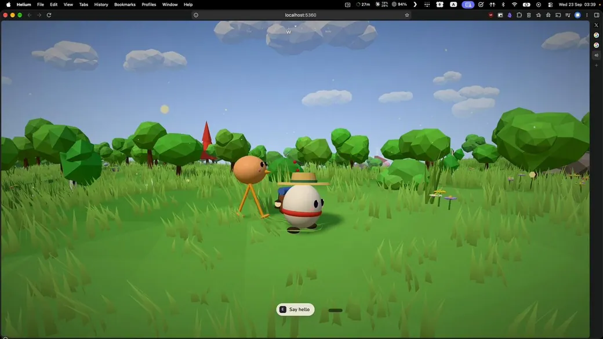</a>

**Промпт**

```text
створи новий проєкт у моїй папці projects під назвою «endless-game»: нескінченний процедурно згенерований світ на three.js у браузері, який я зможу вільно досліджувати й просто насолоджуватися ним. Кожна ділянка має генеруватися випадково, а сюрпризи повинні траплятися всюди, незалежно від того, як довго я граю. Світ має бути спокійним, розслаблювальним і по-справжньому цікавим — із затишною, приємною атмосферою, як у supermarket simulator, але це не має бути гра про супермаркет. Я хочу справді захопливий світ для прогулянок, зі сутностями, яких можна зустрічати та з якими можна взаємодіяти, а також із чудовою графікою. Визнач чітку мету проєкту, продовжуй працювати, доки не досягнеш її, а коли все буде готове для моєї гри й тестування, відтвори звуковий сигнал.
```

<details>
<summary>Оригінальний промпт автора</summary>

```text
create a new project in my projects folder called "endless-game": an endless, procedurally generated world built with three.js in the browser that i can roam freely and just enjoy. every area should be randomly generated, with surprises everywhere no matter how long i play. it should feel calm, relaxing and genuinely fun, like the cozy, satisfying vibe of a supermarket simulator, but it shouldn't be a supermarket game. i want a really interesting world to walk around in, with entities i can meet and interact with, and really cool graphics. set a clear goal for the project, keep working until you reach it, and play a sound chime when it's done and ready for me to play and test.
```

</details>

[Докладніше ↗](https://www.tripo3d.ai/uk/3d-prompts/claude-opus-5-5-2102529695908806728) · [Оригінальний допис](https://x.com/argofowl/status/2102529695908806728) · [Назад до прикладів](#all-prompts)

---

<a id="gpt-6-astra-2102473710724919614"></a>

### Двоповерховий заміський будинок з інтер’єром

[Azer](https://x.com/azer0lxm) · 2026-09-22 · GPT-6 Astra · Сцени

<a href="https://www.tripo3d.ai/uk/3d-prompts/gpt-6-astra-2102473710724919614">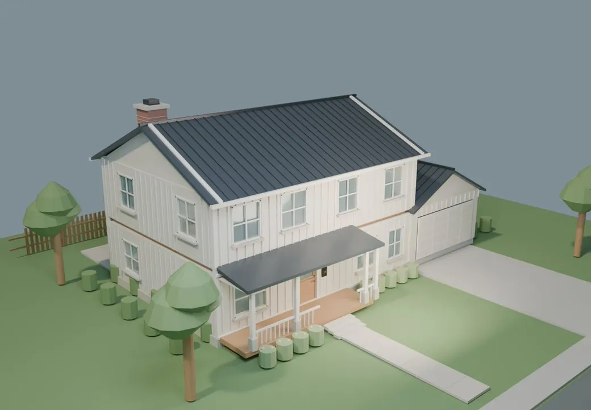</a>

**Промпт**

```text
Вітаю. Будь ласка, створіть у Blender якомога якіснішу 3D-модель двоповерхового заміського будинку з повністю змодельованим інтер’єром.
```

<details>
<summary>Оригінальний промпт автора</summary>

```text
Hello. Please design the best possible 3D model using Blender of a two-story suburban house, interior and everything included.
```

</details>

[Докладніше ↗](https://www.tripo3d.ai/uk/3d-prompts/gpt-6-astra-2102473710724919614) · [Оригінальний допис](https://x.com/azer0lxm/status/2102473781830909995) · [Назад до прикладів](#all-prompts)

---

<a id="claude-opus-5-5-2102467667978572092"></a>

### Інтерактивна симуляція евакуації натовпу

[Dom](https://x.com/dominikmartn) · 2026-09-22 · Claude Opus 5.5 · Анімація

<a href="https://www.tripo3d.ai/uk/3d-prompts/claude-opus-5-5-2102467667978572092"></a>

**Промпт**

```text
створити інтерактивну симуляцію евакуації натовпу й визначити, де виникають затори
```

<details>
<summary>Оригінальний промпт автора</summary>

```text
build an interactive crowd evacuation sim and see where it jams
```

</details>

[Докладніше ↗](https://www.tripo3d.ai/uk/3d-prompts/claude-opus-5-5-2102467667978572092) · [Оригінальний допис](https://x.com/dominikmartn/status/2102467667978572092) · [Назад до прикладів](#all-prompts)

---

<a id="battle-city-3d"></a>

### Battle City 3D: нескінченна танкова оборона

[jared](https://x.com/jaredliu_bravo) · 2026-09-22 · GPT-6 Astra · Ігри

<a href="https://www.tripo3d.ai/uk/3d-prompts/battle-city-3d">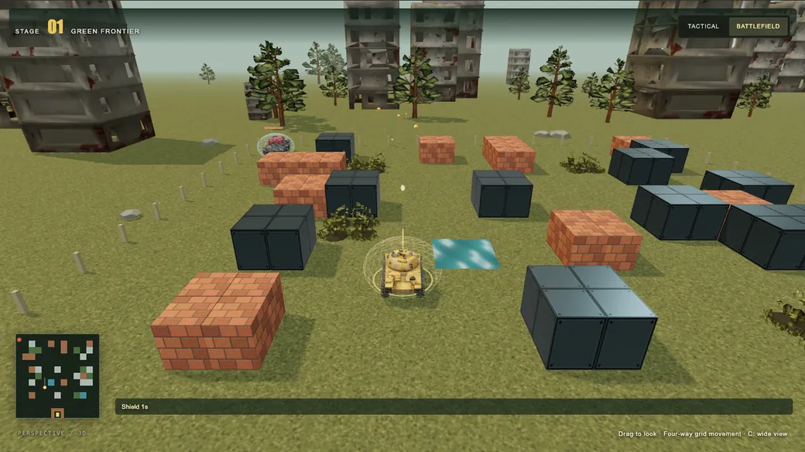</a>

**Промпт**

```text
1. Мета проєкту
Створіть Battle City 3D — браузерну гру про захист бази танками, натхненну класичною грою для Famicom 1985 року. Гравець керує танком, знищує хвилю з 20 ворогів, збирає припаси й захищає штаб із орлом. Відтворіть поточну перспективну 3D-версію, показану в референсних матеріалах, включно з нескінченною кампанією на основі seed і 35 класичними схемами на вибір. Збережіть зрозумілі аркадні правила, але надайте танкам, стінам і декораціям справжньої глибини.

2. Візуальний стиль
Використовуйте PerspectiveCamera у Three.js із кутом огляду 60 градусів. Стандартна камера поля бою розташована позаду й над гравцем, приблизно за 13 світових одиниць, на висоті 0,43 радіана. Плавно стежте за позицією танка й точкою перед ним; камера не повинна автоматично повертатися під час розвороту танка. Додайте вищу тактичну точку огляду, ручне орбітальне обертання перетягуванням і масштабування колесом миші. Для руху та стрільби використовуйте чотири основні осі мапи. Після орбітального обертання зіставляйте клавіші напрямку з найближчим основним напрямком відносно камери; ніколи не перетворюйте натискання клавіш на рух по діагоналі. Напрямок корпуса негайно узгоджуйте з напрямком пострілу, а висоту снаряда й дульного спалаху калібруйте відповідно до реальної гармати кожної моделі.
Використовуйте приземлені гусеничні танки, металеві башти, теракотову цеглу, темні сталеві блоки, блакитну воду, невисоку рослинність і відбивний лід. Продовжуйте землю за межами ігрової зони — до дерев, зруйнованих будівель і серпанку. Використовуйте тепле спрямоване освітлення, м’які тіні, заповнювальне освітлення, тонмапінг ACES і стримані дульні спалахи, віддачу, іскри та уламки, що відскакують. У снігових сценах змінюйте палітру землі й дерев; на промислових етапах надавайте перевагу сталі та зруйнованим будівлям.
Оформіть гру в темно-оливковому командному інтерфейсі з тепло-жовтою основною дією, рахунком, спільним запасом життів, піктограмами ворогів, що залишилися, назвою етапу та радаром. Розмістіть великий перемикач моделей Tripo 3D / Three.js над полем бою; він має показувати вибраний режим і обертальний попередній перегляд танка. Додайте локалізований ілюстрований довідник припасів та індикатори ефектів із таймером. На вузьких екранах залишайте видимими ігрове поле й основні сенсорні елементи керування.

3. Світ і сцени
Представте поле бою у вигляді сітки 26 на 26 тайлів, із напівшириною колізії танка 0,72. Розмістіть орла в точці (13,25), оточивши його U-подібною обороною з руйнівної цегли. Точки появи гравців: (9,25) і (17,25); ворота ворогів: (1,1), (13,1) і (25,1).
Передбачте дві кампанії: усі 35 класичних схем із таблицями хвиль по 20 ворогів і нескінченний генератор на основі seed, що циклічно змінює біоми — трав'яний, сніговий і промисловий. Генеруйте з'єднані коридори, достатньо широкі для всього корпуса, із прохідними сполученнями між точками появи гравців, воротами ворогів і місцями появи припасів. Додайте зміщене центральне сталеве укриття, щоб перекрити пряму лінію вогню від точки появи до орла, але зберегти доступ між вулицями. Дозвольте вибирати початковий біом або класичний етап і повторно генерувати випадкову мапу. Переносьте seed проходження, рахунок, життя та покращення гравців, які вижили, на наступний етап.
Цегла руйнується; сталеві блоки зупиняють звичайні снаряди й танки; вода блокує танки, але пропускає снаряди; рослинність приховує моделі ворогів; лід зменшує зчеплення. Віддалене оточення має бути декоративним і не впливати на ігрові колізії.

4. Перелік ресурсів
Використовуйте ці стабільні слоти 3D-моделей, які можна замінювати незалежно. Спочатку підготуйте моделі гравця, ворога, важкого танка й орла, а потім усі десять моделей припасів. Розміщуйте кожен ресурс на землі за його найнижчою точкою та нормалізуйте його орієнтацію, центр і масштаб. Повторно використовуйте шаблони, а не завантажуйте окрему модель для кожного ворога.
- player: гусеничний танк гірчично-жовтого кольору з добре помітною баштою та гарматою, спрямованою вперед; використовується танками гравців, для другого гравця має окремий колір кільця.
- enemy: компактний гусеничний танк ворога, який повторно використовується з різними відтінками для базового, швидкого та потужного варіантів.
- heavy: помітно важчий броньований танк, окрема від стандартного ворога сітка, над якою видно чотири сегменти броні.
- eagle: металева золота статуя орла на постаменті штабу.
- pickup-star: золота п'ятикутна зірка-покращення.
- pickup-helmet: захисна військова каска для тимчасового щита.
- pickup-clock: добре помітний годинник, що заморожує рух ворогів.
- pickup-shovel: лопата для укріплення штабу.
- pickup-life: мініатюрний танк, що представляє одне додаткове життя.
- pickup-grenade: ручна граната для знищення активних ворогів.
- pickup-ammo: ящик із боєприпасами для скорострільності.
- pickup-repair: ремонтний ящик для відновлення броні.
- pickup-magnet: підковоподібний магніт для збору припасів на відстані.
- pickup-boost: енергетична батарея для тимчасового прискорення.
- environment-building: обвітрена зруйнована багатоповерхівка, Tripo P2.0, заданий бюджет — 1 800 трикутників.
- environment-tree: нерегулярна сосна з видимим стовбуром, Tripo P2.0, заданий бюджет — 1 100 трикутників.
- environment-bush: невисокий листяний кущ із пучками трави, Tripo P2.0, заданий бюджет — 650 трикутників.
Показуйте припаси як обертові завислі колекційні моделі з кольоровими кільцями та відповідними мініатюрами в довіднику. Для повторюваних будівель, дерев і кущів використовуйте спільну геометрію та екземпляри матеріалів. Осаджуйте корені будівель і дерев на землю; основу куща трохи заглиблюйте, щоб вона зливалася з рельєфом. На снігових етапах додайте сніг на поверхні, повернуті вгору. Стіни тайлів, вода, лід, сітки снарядів, інтерфейс, джерела світла, частинки та проксі колізій мають бути процедурними. Анімуйте воду за допомогою хвиль, що рухаються у світовому просторі, змінюють нормалі та злегка зміщують поверхню; анімація має бути безперервною між сусідніми тайлами. Версія Tripo використовує 17 згенерованих моделей; у версії для порівняння і танки, і оточення замінюються геометрією, побудованою кодом, із тими самими правилами та колізіями. Обидві версії рендеряться за допомогою Three.js.

5. Ігровий процес і зворотний зв'язок
Підтримуйте одиночну гру та локальний кооператив для двох гравців зі спільним запасом із трьох життів. В одиночній грі використовуйте WASD або клавіші зі стрілками, а для стрільби — Space/J. У кооперативі перший гравець використовує WASD і Space/J; другий — клавіші зі стрілками та Enter/Numpad 0. P/Escape ставить гру на паузу; C змінює камеру; 1/2 вибирає режим моделей. На сенсорних екранах дозвольте одночасно утримувати напрямну панель і кнопку стрільби, скасовуйте введення після скасування вказівника та надайте дії паузи, продовження, переходу на наступний етап і повторної спроби без прокручування сторінки.
Швидкість гравця — 4,2 одиниці на секунду або 6,3 з прискоренням. Вороги бувають базового, швидкого, потужного й важкого типів; важкі танки мають чотири очки міцності й переживають перші три удари без щита. За знищення типу нараховуйте 100, 200, 300 або 400 очок; за кожне зібране припасування — 500 очок. Етап завершується після знищення 20 ворогів. Поразка настає, якщо орла знищено або спільний запас життів вичерпано й не залишилося жодного живого гравця. Додайте негайну повторну спробу, явний перехід на наступний етап і найкращий рахунок, збережений локально.
Реалізуйте всі десять припасів: зірка підвищує рівень до третього (швидші снаряди, два снаряди одночасно, потім снаряди, що пробивають сталь); каска створює щит на 12 секунд; годинник заморожує ворогів на 9 секунд; лопата укріплює базу на 16 секунд; мінітанк додає одне життя; граната знищує активних ворогів; боєприпаси дають 14 секунд скорострільності з можливістю мати до чотирьох активних снарядів; ремонт додає два очки міцності, але не більше трьох; магніт збирає видимі припаси в радіусі п'яти одиниць протягом 20 секунд; прискорення триває 12 секунд. Моделі припасів існують 25 секунд і з'являються в досяжних місцях; використовуйте перемішувану колоду, щоб урізноманітнити їхні типи. Магніт має враховувати тверді перешкоди.
Використовуйте зібрані семпли в стилі NES для вступу до етапу тривалістю 4,333 секунди, стрільби, руху та простою, ударів по цеглі й сталі, вибухів ворогів і гравця, появи та збору припасів, додаткового життя, удару по броні, льоду, паузи й завершення гри. Поточний проєкт використовує 15 звукових сигналів OGG від JustoSenka/BattleCity, commit 3a07004ba8e53baea74ff70d2ecc22b017eb9b20. Збережіть зазначення авторства та повідомлення про ліцензію репозиторію; описуйте їх як зібраний звук ремейку, не стверджуючи, що це побітова апаратна копія. Розблокуйте звук після жесту користувача, відкалібруйте гучність семплів, додайте регулювання гучності й вимкнення звуку та синхронізуйте звуки з подіями. Не додавайте сторонню безперервну музику бою.

6. Технічна реалізація
Використовуйте TypeScript, Three.js 0.180.0 і Vite 7, із відокремленими package.json та lockfile. Симуляція має бути незалежною від рендерингу й виконуватися з частотою 120 Гц. Використовуйте AABB корпуса, розділяйте рух за осями, обробляйте межі та розведення танків, а також безперервно перевіряйте проходження снарядів до найближчого контакту, включно з колізіями зустрічних снарядів із відносним рухом. Снаряди мають починати рух із корпуса й перевіряти траєкторію вперед, щоб запобігати проходженню крізь стіни впритул. Додайте прискорення та гальмування на льоду, а також гравітацію із загасаючими відскоками уламків. Це аркадна фізика поверхні, а не симулятор підвіски.
Завантажуйте GLB-ресурси з того самого джерела через GLTFLoader. Проксі колізій мають бути незалежними від геометрії ресурсів. Поточний runtime використовує квантизовані атрибути й текстури WebP (1024 пікселі для техніки та бази; 512 пікселів для припасів і оточення), без спрощення геометрії та декодера WASM. Обмежте завантаження чотирма воркерами, використовуйте URL із версією на основі хешу та діапазони по 256 KiB із тайм-аутом 20 секунд і максимум трьома спробами для кожного діапазону. Дозволяйте починати гру після готовності чотирьох основних моделей і звуку; припаси та ресурси оточення завантажуйте у фоновому режимі й створюйте лише ті типи припасів, моделі яких уже готові. Перемикання режиму моделей має зберігати стан гри.
Надайте інтерфейс англійською, спрощеною китайською, японською та корейською мовами. Вибирайте стандартну мову за мовою пристрою, але для zh-TW, zh-HK, zh-MO і zh-Hant використовуйте англійську; явно вибрані мови зберігайте. Підтримуйте клавіатуру, вказівник на комп'ютері та мультитач, а під час втрати фокуса ставте гру на паузу. Зберігайте всі ресурси, відомості про авторство й відтворювані скрипти локально у вихідному проєкті та постачайте статичний каталог dist без приватних облікових даних і залежності від runtime-бекенду.

7. Критерії завершення
Постачте редагований вихідний код, відомості про походження ресурсів і повідомлення про ліцензії, робочий процес npm для розробки та збірки, а також працездатний статичний попередній перегляд. Перевірте стандартну сцену Tripo, порівняння моделей, усі біоми, важкий танк, який витримує чотири удари, кожен ефект припасів, паузу й продовження, поразку та повторну спробу, а також перехід між етапами. Протестуйте 1 000 мап на основі seed щодо зв'язності для ширини корпуса та безпечних точок появи, а також усі класичні мапи, проходження крізь стіни, діагональні постріли, розведення танків, інерцію на льоду, введення відносно камери за кількох кутів повороту та перемикання режимів зі збереженням стану. Перевірте локалізований інтерфейс і керування двома пальцями на вузьких екранах, не заявляючи про тестування на фізичних пристроях, якщо використовувалася лише емуляція. Порівняйте фактичні стартові та бойові кадри з референсними зображеннями й відео; підтвердьте завантаження всіх 17 моделей і 15 звукових сигналів. Опублікуйте гру через наявний робочий процес CMS Web Page і перевірте фінальну публічну сторінку, а не вважайте збережений запис CMS завершеним розгортанням.

```

[Докладніше ↗](https://www.tripo3d.ai/uk/3d-prompts/battle-city-3d) · [Демо](https://battle-city-3d.tripo.page/) · [Назад до прикладів](#all-prompts)

---

<a id="claude-opus-5-5-2102450239923720440"></a>

### Інтерактивний 3D-острів доісторичної епохи

[Vib3Coded](https://x.com/vib3coded) · 2026-09-22 · Claude Opus 5.5 · Інтерактив

<a href="https://www.tripo3d.ai/uk/3d-prompts/claude-opus-5-5-2102450239923720440"></a>

**Промпт**

```text
Створіть красивий, надзвичайно деталізований, повністю інтерактивний 3D-острів доісторичної епохи за допомогою Three.js і WebGL. Реалізуйте все в одному окремому HTML-файлі, який безпосередньо відкривається в Chrome. За можливості вбудуйте ресурси у файл.

ВІЗУАЛЬНИЙ НАПРЯМ
Створіть великий округлий острів, оточений океаном із прозорим підводним розрізом. Результат має нагадувати преміальний мініатюрний світ: буйна рослинність, виразні динозаври, багаті матеріали, атмосферне освітлення та відшліфована анімація. Використовуйте цілісний стилізований художній напрям, а не прості геометричні фігури.
ISLAND
Створіть різноманітний рельєф із пляжами, скелястими урвищами, густими доісторичними лісами, гігантськими папоротями, водоспадом, прісноводною водоймою та вулканом. Додайте невелику дослідницьку станцію, дерев’яні настили, оглядові майданчики, ящики з припасами та гнізда динозаврів. Острів має бути достатньо просторим, щоб динозаври могли природно переміщатися між окремими зонами.

ПІДВОДНИЙ РОЗРІЗ
Вода має утворювати глибокий округлий об’єм навколо острова, крізь бокові стінки якого добре проглядається підводний світ. Додайте текстуроване морське дно, каміння, водні рослини, риб, бульбашки та зелену морську рептилію, що плаває під поверхнею. Не розміщуйте звичайних наземних динозаврів під водою й не додавайте підводний човен.
Використовуйте анімовані хвилі, відбиття Френеля, підводні світлові візерунки, піну біля берега та бризки. Уникайте артефактів сортування прозорості й видимих проміжків між островом і водою.

DINOSAURS
Додайте кілька виразних видів, зокрема довгошию завроподу, трицератопса, стегозавра, великого теропода та дрібніших стадних тварин. Над островом мають кружляти птерозаври.
Надайте кожному виду впізнавану анатомію, сформоване тіло, рухомі кінцівки, деталізовані голови й хвости, а також характерні для нього візерунки шкіри. Не складайте готових динозаврів із очевидних коробок або роз’єднаних сфер.

ПРИРОДНА АНІМАЦІЯ
Використовуйте ієрархічні скелети з правильно розташованими суглобами. Хода має чітко розрізняти фази опори та перенесення ноги: під час контакту стопи залишаються на місці, а під час кожного кроку чисто відриваються від землі. Узгодьте довжину кроку зі швидкістю руху.

Використовуйте семплювання рельєфу та зворотну кінематику, щоб стопи залишалися на землі. Додайте перенесення ваги, ледь помітні рухи тіла, врівноважений рух хвоста, повороти голови та дихання. Динозаври не повинні зависати в повітрі, ковзати, перетинатися із землею або проходити крізь будівлі, каміння, дерева чи одне одного.
Реалізуйте обхід перешкод і безпечні маршрути. Різні види мають відрізнятися швидкістю руху, схемами ходи та поведінкою. Морські тварини мають бути повернуті в напрямку руху.

INTERACTION
Дозвольте користувачам:

Вільно обертати камеру, наближати й віддаляти зображення та оглядати підводний розріз.
Вибирати динозавра й стежити за ним за допомогою плавного руху камери.

Розміщувати їжу у відповідних місцях і спостерігати, як найближчі динозаври підходять до неї та їдять.

Запускати пиття, відпочинок, поклики та переміщення стада.

Досліджувати гнізда й спостерігати, як із них вилуплюється дитинча.
Запускати спливання морської рептилії з бризками.
Перемикатися між денним світлом, заходом сонця та ніччю.
Налаштовувати дощ, вітер і вулканічну активність.
Ставити симуляцію на паузу та скидати сцену.
Кожна команда має спричиняти чітку видиму реакцію. Зробіть взаємодії повторюваними й не допускайте, щоб анімації, які накладаються одна на одну, руйнували пози персонажів.
АТМОСФЕРА Й АУДІО
Додайте рухомі рослини, хмари, що пливуть, птахів, комах, частинки дощу та тепле нічне освітлення дослідницької станції. Додайте тиху атмосферну музику й звуки довкілля, а також робочий перемикач музики та повзунок гучності. Відтворюйте аудіо лише після взаємодії з користувачем.
INTERFACE
Використовуйте компактний, елегантний інтерфейс з англомовними написами. Сцена має залишатися головним елементом; не закривайте острів великими панелями. Зробіть компонування адаптивним для комп’ютерів і мобільних пристроїв.
ТЕХНІЧНА ЯКІСТЬ
Використовуйте інстансинг для повторюваної рослинності та об’єктів, ефективну геометрію, доречні тіні й стриману постобробку. Збалансуйте візуальне багатство зі стабільною продуктивністю в реальному часі.
Створіть повноцінну сцену, а не макет. Безпосередньо протестуйте готовий HTML у браузері на комп’ютері, перевірте знімки екрана й консоль, випробуйте всі взаємодії та до передачі виправте помилки завантаження, динозаврів, що зависають у повітрі, ковзання стоп, зламані зіткнення, артефакти води й проблеми з камерою.
```

<details>
<summary>Оригінальний промпт автора</summary>

```text
Create a beautiful, highly detailed, fully interactive 3D prehistoric island using Three.js and WebGL. Deliver everything in a single standalone HTML file that opens directly in Chrome. Embed assets wherever possible.

VISUAL DIRECTION
Build a large, rounded island surrounded by an ocean with a transparent underwater cross-section. The result should feel like a premium miniature world: lush vegetation, expressive dinosaurs, rich materials, atmospheric lighting, and polished animation. Use a cohesive, stylized art direction rather than basic geometric shapes.
ISLAND
Create varied terrain with beaches, rocky cliffs, dense prehistoric forests, giant ferns, a waterfall, a freshwater pond, and a volcano. Add a small research station, wooden walkways, observation platforms, supply crates, and dinosaur nests. Make the island spacious enough for dinosaurs to move naturally between distinct areas.

WATER CROSS-SECTION
The water must form a deep, rounded volume around the island, with clearly visible underwater scenery through its sides. Include a textured seabed, rocks, aquatic plants, fish, bubbles, and a green marine reptile swimming beneath the surface. Do not place ordinary land dinosaurs underwater, and do not add a submarine.
Use animated waves, Fresnel reflections, underwater light patterns, shoreline foam, and splashes. Avoid transparency sorting artifacts and visible gaps between the island and water.

DINOSAURS
Include several distinct species, such as a long-necked sauropod, Triceratops, Stegosaurus, a large theropod, and smaller herd animals. Add pterosaurs circling overhead.
Give every species recognizable anatomy, shaped bodies, articulated limbs, detailed heads, tails, and appropriate skin patterns. Avoid assembling the finished dinosaurs from obvious boxes or disconnected spheres.

NATURAL ANIMATION
Use hierarchical skeletons with correctly positioned joints. Walking must have distinct stance and swing phases: feet stay planted during contact and lift cleanly during each step. Match stride length to movement speed.

Use terrain sampling and inverse kinematics to keep feet on the ground. Add weight shifts, subtle body movement, balanced tail motion, head turns, and breathing. Dinosaurs must never float, slide, intersect the ground, or walk through buildings, rocks, trees, or each other.
Use obstacle avoidance and safe paths. Different species should have different movement speeds, gait patterns, and behaviors. Marine animals must face their direction of travel.

INTERACTION
Allow users to:

Rotate the camera freely, zoom, and inspect the underwater cross-section.
Select a dinosaur and follow it with a smoothly moving camera.

Place food in suitable locations and watch nearby dinosaurs approach and eat.

Trigger drinking, resting, calling, and herd movement.

Explore nests and watch a hatchling emerge.
Trigger a marine reptile surfacing with a splash.
Switch between daylight, sunset, and night.
Adjust rain, wind, and volcanic activity.
Pause the simulation and reset the scene.
Make every control produce a clear, visible response. Keep interactions repeatable and prevent overlapping animations from breaking character poses.
ATMOSPHERE AND AUDIO
Add moving foliage, drifting clouds, birds, insects, rain particles, and warm research-station lights at night. Include quiet atmospheric music and environmental sounds with a working music toggle and volume slider. Start audio only after user interaction.
INTERFACE
Use a compact, elegant interface with English labels. Keep the scene dominant and avoid large panels covering the island. Make the layout responsive for desktop and mobile.
TECHNICAL QUALITY
Use instancing for repeated vegetation and props, efficient geometry, appropriate shadows, and restrained post-processing. Balance visual richness with smooth real-time performance.
Build a complete scene, not a mockup. Test the final HTML directly in a desktop browser, inspect screenshots and the console, exercise every interaction, and fix loading errors, floating dinosaurs, foot sliding, broken collisions, water artifacts, and camera problems before delivery.
```

</details>

[Докладніше ↗](https://www.tripo3d.ai/uk/3d-prompts/claude-opus-5-5-2102450239923720440) · [Оригінальний допис](https://x.com/vib3coded/status/2102450842070569099) · [Назад до прикладів](#all-prompts)

---

<a id="gpt-6-astra-2102411087002112256"></a>

### TD-гра на кшталт Sir, We Have Orc Problems

[nkz/ぴたすぽ](https://x.com/nikzu_) · 2026-09-22 · GPT-6 Astra · Ігри

<a href="https://www.tripo3d.ai/uk/3d-prompts/gpt-6-astra-2102411087002112256">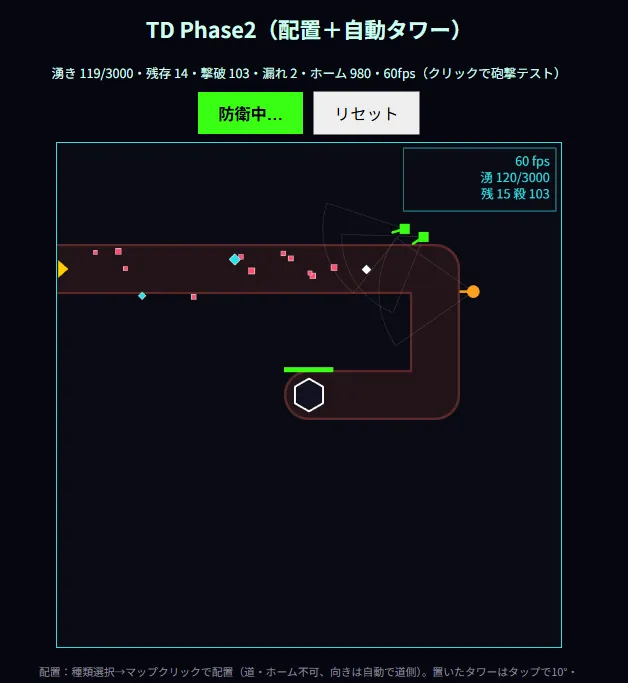</a>

**Промпт**

```text
Створи TD-гру на кшталт Sir, we have orc problems
```

<details>
<summary>Оригінальний промпт автора</summary>

```text
Sir, we have orc problemsみたいなTDゲーム作って
```

</details>

[Докладніше ↗](https://www.tripo3d.ai/uk/3d-prompts/gpt-6-astra-2102411087002112256) · [Оригінальний допис](https://x.com/nikzu_/status/2102411087002112256) · [Назад до прикладів](#all-prompts)

---

<a id="gpt-6-astra-2102276620124062065"></a>

### 3D-сцена й відео з Токійською вежею вдень і вночі

[Wafffle](https://x.com/wafffle_dev) · 2026-09-22 · GPT-6 Astra · Сцени

<a href="https://www.tripo3d.ai/uk/3d-prompts/gpt-6-astra-2102276620124062065">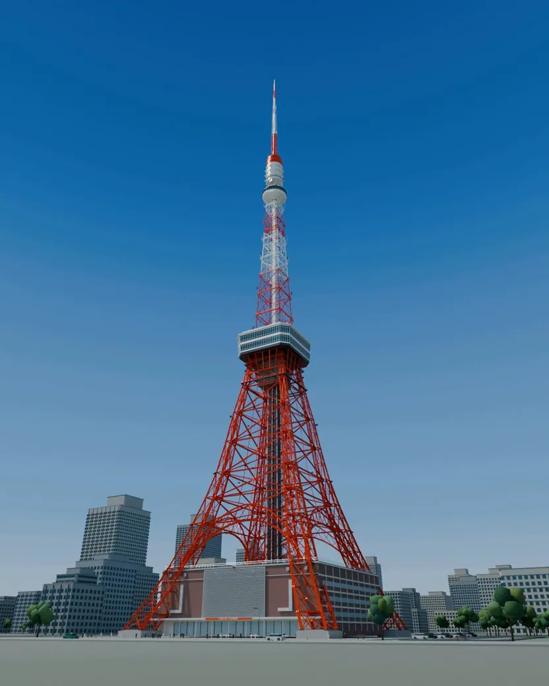</a>

**Промпт**

```text
Створіть видовищну 3D-роботу з Токійською вежею в головній ролі та відео тривалістю близько 30 секунд для публікації на X. 

Ви — режисер виробництва. Створюйте потрібні підзавдання й доручайте дослідження та виготовлення. Візьміть на себе конкретизацію завдання, керування процесом, перевірку результатів, постановку правок і фінальне зведення всіх матеріалів.

【Що потрібно створити】
Токійську вежу, у якій відчуваються її висота в ракурсі знизу вгору та тонкість сталевої конструкції під час наближення.
Підготуйте денну й нічну версії: удень покажіть конструкцію та фарбування, а вночі — красу підсвічування.

Потрібно, щоб робота створювала враження: «Токійську вежу уважно вивчили й відтворили». Дослідіть і відобразіть не лише форму вежі, а й характерні деталі: розбіжність опор, спосіб складання сталевої конструкції, оглядові майданчики, будівлі біля основи тощо. Навколишнє місто можна обмежити масштабом, достатнім для передавання розміру вежі та атмосфери місця.

【Процес роботи】
・Дослідіть офіційні матеріали та фотографії, визначте, які особливості відтворювати, і розставте пріоритети.
・На основі дослідження дайте кожному підзавданню конкретні вказівки щодо створення.
・На ранньому етапі перевірте тестовий перегляд реальної 3D-сцени, а потім скоригуйте форму, композицію та освітлення.
・Особисто перегляньте готові зображення й відео, знайдіть невідповідності або недопрацювання та доручіть внести правки.
・Самостійно ухвалюйте рішення щодо дрібних технічних деталей і побудови зйомки та доведіть роботу до завершення.

Не замінюйте сцену фоном із фотографією чи згенерованим зображенням: використовуйте реальну 3D-геометрію та рух камери. Зафіксуйте підтверджені факти й окремо зазначте елементи, визначені приблизно через брак матеріалів.

【Відео】
Близько 30 секунд. Поєднайте ракурс знизу вгору, крупні плани сталевої конструкції та оглядових майданчиків, а також віддалений план, на якому видно всю вежу; покажіть і зміну дня та ночі.
Точний розподіл за секундами визначте після перегляду готової моделі, обравши композицію, яка найкраще передає її привабливість.

【Матеріали для здачі】
・Редаговані дані Blender
・MP4-відео для публікації на X
・Контрольні зображення загального вигляду та деталей удень і вночі
・Короткий варіант тексту для публікації
・README із зазначенням джерел матеріалів, меж відтворення та результатів перевірки
```

<details>
<summary>Оригінальний промпт автора</summary>

```text
東京タワーを主役にした、見応えのある3D作品とX投稿用の約30秒動画を作ってください。

あなたは制作ディレクターです。必要なサブタスクを作成し、調査・制作を依頼してください。依頼内容の具体化、進行管理、成果物の確認、修正指示、最終的な取りまとめまで任せます。

【作ってほしいもの】
地上から見上げた高さと、近づいたときの鉄骨の細かさが伝わる東京タワーです。
昼と夜の両方を用意し、昼は構造や塗装、夜はライトアップの美しさを見せてください。

「東京タワーをよく見て作っている」と感じられる作品にしたいです。塔の形だけでなく、脚の開き方、鉄骨の組み方、展望台、足元の建物など、特徴的な細部を調べて反映してください。周辺の街は、塔の大きさと場所の雰囲気が伝わる範囲に絞って構いません。

【制作の進め方】
・公式資料や写真を調査し、再現する特徴と優先順位を決める。
・その調査を基に、各サブタスクへ具体的な制作指示を出す。
・早い段階で実際の3D試写を確認し、形・構図・明るさを調整する。
・完成画像や動画をメイン自身が見て、違和感や不足を見つけ、修正を依頼する。
・細かな技術選択や撮影構成は自主的に判断して、完成まで進める。

写真や生成画像を貼った背景だけで代用せず、実際の3D形状とカメラ移動で表現してください。確認できた事実と、資料不足による推定部分は記録してください。

【動画】
約30秒。地上からの見上げ、鉄骨や展望台の近接、塔全体が分かる引きを組み合わせ、昼夜の変化も見せてください。
細かな秒割りは、完成したモデルを見て最も魅力が伝わる構成を判断してください。

【納品】
・編集可能なBlenderデータ
・X投稿用MP4動画
・昼夜の全景と細部の確認画像
・短い投稿文案
・素材の出典、再現範囲、検証結果を記したREADME
```

</details>

[Докладніше ↗](https://www.tripo3d.ai/uk/3d-prompts/gpt-6-astra-2102276620124062065) · [Оригінальний допис](https://x.com/wafffle_dev/status/2102276620124062065) · [Назад до прикладів](#all-prompts)

---

<a id="bubble-bay"></a>

### Bubble Bay: 3D-битва на водяних кульках

[jared](https://x.com/jaredliu_bravo) · 2026-09-22 · GPT-6 Astra · Ігри

<a href="https://www.tripo3d.ai/uk/3d-prompts/bubble-bay">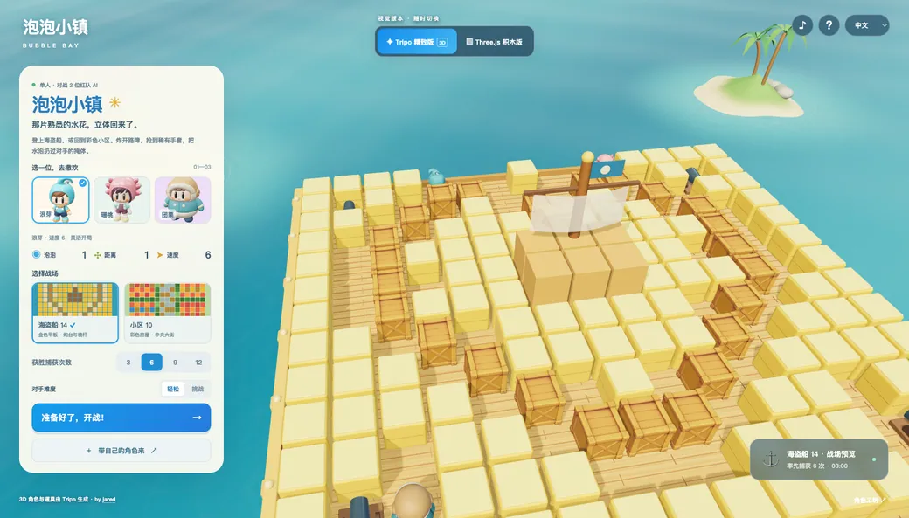</a>

**Референси:** [1](https://media.tripogrowth.space/media/c478b28a-c7c6-4b6d-8ab5-e9814ab00549.png)

**Промпт**

```text
Створіть Bubble Bay — ігрову арену на водяних кульках у Three.js, зі знайомим стилем класичних bubble-ігор: персонажі в костюмах із великими головами, короткими тілами та відкритими обличчями. За замовчуванням використовуйте деталізовані моделі Tripo і додайте очевидний перемикач порівняння геометрії Three.js, який не перериває матч. Використайте трьох нових персонажів: Langya, Shantao і Tuanli. Дотримуйтеся наданих концептів і референсів моделей нових персонажів, зберігаючи їхні силуети, обличчя, кольори й костюми.

Langya — жвавий хлопчик із бірюзовим каптуром і єдиним цілісним боковим гребенем-хвилею, помаранчевим комірцем і манжетами, темно-синіми шортами та бірюзовими черевиками з помаранчевою підошвою. Shantao — маленька дівчинка з темно-сливовим бобом, персиково-рожевим чепчиком із трьома короткими пелюстковими прикрасами з кожного боку, м'ятною курткою, сливовим коротким комбінезоном і світло-жовтими чобітками. Tuanli — пухкенький хлопчик із широким грушоподібним тілом, карамельною круглою м'якою шапкою з кремовою облямівкою навколо обличчя, бірюзовою короткою курткою, кремовою нижньою частиною живота й темно-синіми черевиками. У всіх теплі дитячі обличчя тілесного кольору, прості темні овальні очі та маленькі усмішки. Це діти в щойно розроблених костюмах; не перетворюйте їх на буквальних водних істот і не повторюйте впізнавані костюми попередніх персонажів. Створюйте кожного персонажа окремо через Tripo CLI з явним tripo-p2 і незалежними зображеннями спереду та ззаду, а потім прив'яжіть коректні двоногі скелети й скін. Анімації спокою, бігу та стрибка мають керувати реальними суглобами; перевірте рух, виправте ваги для головних уборів, взуття й тіла та точно вкажіть походження ресурсів. Якщо анімації створено локально, позначте їх як такі.

Локалізовані назви: 浪芽 / 랑야 / Langya, 珊桃 / 산타오 / Shantao, 团栗 / 퇀리 / Tuanli. Початкові рівні місткості/дальності/швидкості: 1/1/6, 1/2/5, 2/1/4; максимальні значення: 6/7/9, 6/7/8, 9/8/8. Перетворюйте швидкість на 0.25 + level*0.8 світових одиниць за секунду; одна плитка дорівнює 2 одиницям. Вибір персонажа призначає двох інших окремими суперниками з відповідними профілями. Незалежно від пухкенького візуального силуету зберігайте однаковий радіус ігрового влучання.

За замовчуванням додайте Pirate/Patrit14 розміром 15x13 і Village10. Збережіть упізнавані золотий борт, жовтий вантаж, дерев'яні ящики, чотири гармати й центральну щоглу; село має чотири кольорові житлові райони, центральну дорогу, живоплоти та іграшкові блоки. Використовуйте карти видавця як референс, самостійно створюйте графіку для виконання та задокументуйте невеликі проходи, необхідні для безперервного 3D-руху й втечі ШІ. Додайте яскраві матеріали, тіні, океанське оточення, чіткий супровід камерою та оглядову камеру.

Один гравець протистоїть двом скоординованим суперникам під керуванням ШІ. WASD/стрілки відповідають за рух, F розміщує бульбашку на 2.5 секунди, Space стрибає на справжні платформи, Shift виконує ривок, Q/E обертають камеру, V змінює режим огляду, а Escape ставить гру на паузу. Хрестоподібна хвиля води обходить перешкоди, руйнує перший м'який блок і запускає ланцюгову реакцію бульбашок. Реалізуйте потрапляння в пастку, втечу, захоплення ворогів, відродження, вибір цілі на 3, 6, 9 або 12 захоплень (за замовчуванням — 6) або підрахунок очок протягом 180 секунд, екран результатів і повторну спробу. Віртуальний джойстик і кнопки дій мають працювати одночасно.

Використайте шість згенерованих Tripo підсилювачів: повітряну кульку, зілля дальності, роликовий ковзан, рукавичку для кидання, черевик для удару та голку порятунку. Ящики випадають із предметом у 85% випадків. Умовні ваги предметів: 30/30/30/2.5/3.5/4 відсотка. Рукавички додають три кидки, максимум — шість. G кидає сусідню бульбашку на відстань до чотирьох плиток поверх укриттів, зберігаючи її власника й початковий таймер запобіжника, резервуючи місце приземлення та показуючи траєкторію. Якщо бульбашка завершує політ до завершення таймера, вона приземляється й вибухає. K ковзає бульбашками, доки їх не зупинить перешкода, не скидаючи таймер. X використовує голку порятунку: початковий запас — одна, максимум — три. Чітко показуйте інвентар і доступні керування.

Інтерфейс китайською, англійською та корейською мовами: для часових поясів IANA материкового Китаю вибирайте китайську, для Кореї та Північної Кореї — корейську, для всіх інших, зокрема Гонконгу, Макао й Тайваню, — англійську. Ручний вибір завжди має пріоритет. Дозволяйте завантажувати лише GLB із вбудованими текстурами, стандартним нестисненим форматом і справжнім скінінгом, обсягом до 40 MB і з не більш як 150k трикутників. Перевіряйте кістки, суглоби та ваги, відхиляйте статичні моделі, використовуйте вбудовані анімації, якщо вони є, і забезпечуйте базовий рух суглобів для розпізнаних гуманоїдів без кліпів. Для нерозпізнаних скелетів потрібні анімації. Простими словами поясніть різницю між ригінгом та анімацією, додайте коригування орієнтації на 90 градусів, виконуйте обробку локально в браузері та призначайте стабільні збалансовані характеристики за хешем файлу.

Для CTA створення використовуйте рівно https://studio.tripo3d.ai/?utm_source=satellite_invite&utm_medium=bubble-bay&utm_campaign=create-character. Укажіть авторство jared із посиланням на https://x.com/jaredliu_bravo.

Інтегруйте 13 звукових ефектів ElevenLabs із нормалізацією, коротким загасанням, урахуванням відстані та панорамування, обмеженнями поліфонії, регулюванням гучності й вимкненням звуку: розміщення, вибух, ящик, підсилювач, рідкісний предмет, кидок, приземлення, пастка, порятунок, стрибок, перемога, поразка, удар. Створіть два оригінальні інструментальні треки за допомогою ElevenLabs music_v2_5, по 90 секунд кожен, що відповідають морській піратській карті та сонячному району. Нормалізуйте їх до стриманої цілі -20 LUFS і зробіть перехресне затухання на межах циклу. Додайте для музики окреме регулювання гучності, змінюйте треки залежно від карти, робіть затухання під час паузи й дотримуйтеся загального вимкнення звуку. Не відтворюйте оригінальний саундтрек гри.

Зберігайте незалежні вихідні файли, залежності, тести та походження ресурсів поза застосунками CMS-платформи. Додавайте статичні ресурси з тим самим джерелом і повідомленнями про ліцензію MIT. Перевіряйте фактичний ігровий процес на комп'ютерах і сенсорних пристроях, варіанти завантаження, мови та візуальне перемикання в Ego Lite. Створіть незмінну версію для перевірки, прикріплену до наявної CMS Web Page 12; зберігайте чинний опублікований реліз, доки перевірка не завершена. Публікуйте лише після правдивого зазначення вихідних матеріалів і перевірки прав на ресурси, а потім перевірте публічну URL-адресу, хеші моделей і поведінку. Зберігайте історію та розрізняйте збережені записи CMS, попередні перегляди й публічні релізи.

Завантажуйте ресурси моделей із видимим індикатором прогресу, одночасно не більше трьох завантажень, із 30-секундним тайм-аутом бездіяльності та двома спробами. Під час повторної спроби зберігайте успішно завантажені ресурси. Повністю приховуйте перемикач вкладок Tripo / Three.js, доки всі моделі не будуть готові, а потім показуйте його. Не позначайте процедурні заповнювачі завантаження як завантажені моделі Tripo.


Використовуйте перспективну камеру ближнього супроводу, яка починає рух за межами зони появи й спрямована до центру арени. Збережіть обертання Q/E, нахил перетягуванням мишею та огляд V. Компактне табло розмістіть угорі, перемикач режимів — у верхньому лівому куті, а короткі сповіщення — унизу. На комп'ютерах із мишею приховуйте джойстик і великі сенсорні кнопки дій, залишаючи невеликі елементи керування рідкісними предметами; на вузьких екранах підтримуйте компактні одночасні сенсорні дії. Додайте анімований шейдер хвиль із бірюзовою варіацією глибини, органічні піщані острівці з вигнутими пальмами й камінням, ненав'язливі текстури деревини та трави. Оточуйте кожного персонажа в пастці напівпрозорою бульбашкою відповідного розміру з райдужною облямівкою Fresnel, легким плаванням, маленькими бульбашками та ряб'ю на землі. Перевіряйте відповідність вершин скіна позі, скидайте підйом під час порятунку та контролюйте вивільнення ресурсів після багаторазового перемикання. Уникайте дорогих загальносценових проходів transmission для водної оболонки; обмежте коефіцієнт пікселів на вузьких екранах значенням 1.5.


Додайте видимі елементи керування камерами Follow / Overview і перемикання V. У режимі Overview підтримуйте масштабування від 100 до 300 відсотків за допомогою кнопок +/−, коліщатка миші та жесту зведення двома пальцями, обмежене перетягування карти й скидання Fit map. Під час перемикання камери або версій рендерингу зберігайте масштаб і поточний матч. Залиште компактні елементи керування рідкісними предметами без перекриття китайською, англійською та корейською мовами.

```

[Докладніше ↗](https://www.tripo3d.ai/uk/3d-prompts/bubble-bay) · [Оригінальний допис](https://x.com/jaredliu_bravo/status/2102300855387205871) · [Демо](https://bubble-bay.tripo.page/) · [Назад до прикладів](#all-prompts)

---

<a id="gpt-6-astra-2102215638311694336"></a>

### Інтерактивна 3D-презентація дизайну гелікоптера

[Vib3Coded](https://x.com/vib3coded) · 2026-09-22 · GPT-6 Astra · Інтерактив

<a href="https://www.tripo3d.ai/uk/3d-prompts/gpt-6-astra-2102215638311694336">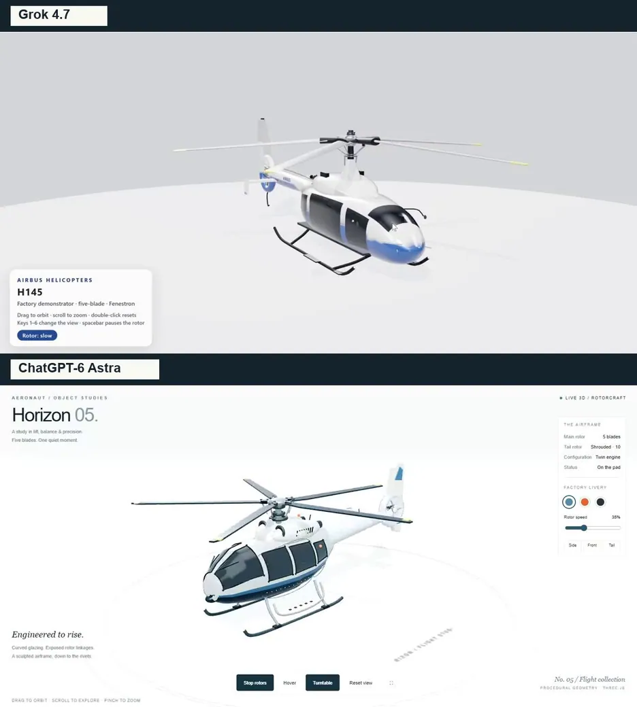</a>

**Промпт**

```text
Створіть деталізовану інтерактивну 3D-сцену сучасного гелікоптера в одному HTML-файлі за допомогою Three.js і WebGL. Побудуйте справжню 3D-геометрію, яку можна розглядати з усіх боків, а не зображення.

Візуальний стиль:
Преміальна презентація авіаційного дизайну зі світло-сірим студійним тлом, круглою демонстраційною платформою, м’якими тінями та реалістичними відбиттями.
Гелікоптер:

Плавний обтічний фюзеляж, натхненний легкими двомоторними гелікоптерами на кшталт H145.
Білий корпус із темно-синьою нижньою частиною та синьою акцентною смугою.
Вигнуті тоновані вікна кабіни пілотів із відбиттями та ретельно підігнаними ущільнювачами.
Бічні двері, ручки, стики панелей, заклепки, сходинки для посадки та антени.
Два кожухи двигунів із повітрозабірниками, вентиляційними решітками та вихлопними отворами.
П’ятилопатевий несний гвинт із деталізованою втулкою, кріпильними елементами та тягами керування кроком.
Звужувана хвостова балка, стабілізатори та кермовий гвинт у кожусі зі справжнім отвором усередині кожуха.
Вигнуті лижі шасі, прикріплені до фюзеляжу за допомогою силових опор.
Навігаційні вогні та миготливий проблисковий маяк.
Усі компоненти мають бути фізично з’єднані. Не допускайте деталей, що зависають у повітрі, проміжків між секціями, перетину лопатей із фюзеляжем або вікон, що не прилягають до корпусу.

Взаємодія:

Перетягування мишею для обертання огляду, прокручування для масштабування та сенсорне керування.
Запускайте й зупиняйте обидва ротори з поступовим прискоренням і сповільненням.
Регульована швидкість обертання ротора.
Режим зависання: плавний відрив від платформи, легке погойдування в повітрі та м’яка посадка після вимкнення режиму.
Автоматичне обертання камери навколо об’єкта.
Попередні ракурси камери спереду, збоку та з боку хвоста.
Кнопки скидання камери та повноекранного режиму.
Три схеми фарбування: льодовиково-синя з білим, рятувальна помаранчева та графітова.
Інтерфейс:

Угорі ліворуч: невелика мітка “AERONAUT / OBJECT STUDIES” і великий заголовок “Horizon 05.”.
Праворуч: компактна панель із технічними характеристиками, станом гелікоптера, вибором схеми фарбування та швидкістю обертання ротора.
Унизу: елементи керування та підказки щодо взаємодії.
Стримана типографіка, тонкі рамки та багато вільного простору. Не перекривайте гелікоптер елементами інтерфейсу.
Увесь текст інтерфейсу має бути англійською.
Технічні вимоги:

Генеруйте геометрію процедурно, не завантажуючи готову 3D-модель гелікоптера.
Використовуйте PBR-матеріали, студійне середовище для відбиттів і м’які тіні.
Зробіть анімацію незалежною від частоти кадрів.
За можливості повторно використовуйте геометрію та матеріали й обмежте коефіцієнт пікселів для підвищення продуктивності.
Підтримуйте компонування для настільних і мобільних пристроїв, щоб у початковому ракурсі було видно весь розмах лопатей ротора.
Якщо можливо, вбудуйте залежності в HTML, щоб файл працював офлайн.
Якщо WebGL недоступний, відображайте зрозуміле повідомлення з поясненням.
Перед завершенням огляньте модель з усіх боків, перевірте кожен елемент керування та переконайтеся, що в консолі немає помилок. Особливу увагу приділіть силуету, конструктивним з’єднанням, склінню та механізмам ротора.

Надайте робочий HTML-файл, а не лише пояснення.
```

<details>
<summary>Оригінальний промпт автора</summary>

```text
Create a detailed, interactive 3D scene of a modern helicopter in a single HTML file using Three.js and WebGL. Build genuine 3D geometry that can be viewed from every angle, not an image.

Visual style:
A premium aviation design presentation with a light gray studio background, a circular display platform, soft shadows, and realistic reflections.
Helicopter:

A smooth, streamlined fuselage inspired by light twin-engine helicopters such as the H145.
A white body with a dark navy underside and blue accent stripe.
Curved, tinted cockpit windows with reflections and carefully fitted window seals.
Side doors, handles, panel seams, rivets, boarding steps, and antennas.
Two engine housings with air intakes, ventilation grilles, and exhaust outlets.
A five-bladed main rotor with a detailed hub, attachment hardware, and pitch-control linkages.
A tapered tail boom, stabilizers, and a shrouded tail rotor with a genuine opening through its housing.
Curved landing skids attached to the fuselage with structural supports.
Navigation lights and a blinking beacon.
All components must connect physically. Avoid floating parts, gaps between sections, rotor blades intersecting the fuselage, or windows hovering above the body.

Interactions:

Mouse drag to orbit, scroll to zoom, and touch controls.
Start and stop both rotors with gradual acceleration and deceleration.
Adjustable rotor speed.
Hover mode: smoothly lift off the platform, gently sway in the air, and land softly when disabled.
Automatic camera orbit.
Front, side, and tail camera presets.
Reset camera and fullscreen controls.
Three liveries: glacier blue and white, rescue orange, and graphite.
Interface:

Top left: a small “AERONAUT / OBJECT STUDIES” label and a large “Horizon 05.” heading.
Right side: a compact panel with specifications, helicopter status, livery selection, and rotor speed.
Bottom: controls and interaction hints.
Restrained typography, thin borders, and generous whitespace. Keep the helicopter unobstructed.
All interface text in English.
Technical requirements:

Generate the geometry procedurally without downloading a prebuilt helicopter model.
Use PBR materials, a studio reflection environment, and soft shadows.
Make animation independent of frame rate.
Reuse geometry and materials where appropriate, and cap pixel ratio for performance.
Support desktop and mobile layouts, keeping the full rotor span visible in the initial view.
If possible, embed dependencies in the HTML so the file works offline.
Display a helpful fallback message if WebGL is unavailable.
Before finishing, inspect the model from every side, test every control, and check for console errors. Pay particular attention to the silhouette, structural connections, glazing, and rotor mechanisms.

Deliver the working HTML file, not just an explanation.
```

</details>

[Докладніше ↗](https://www.tripo3d.ai/uk/3d-prompts/gpt-6-astra-2102215638311694336) · [Оригінальний допис](https://x.com/vib3coded/status/2102217028052377910) · [Назад до прикладів](#all-prompts)

---

<a id="gpt-6-astra-2102150615635816866"></a>

### Процедурна браузерна гоночна гра Spline Rush

[Maharajahu🪢](https://x.com/ToolBraidComp) · 2026-09-21 · GPT-6 Astra · Ігри

<a href="https://www.tripo3d.ai/uk/3d-prompts/gpt-6-astra-2102150615635816866">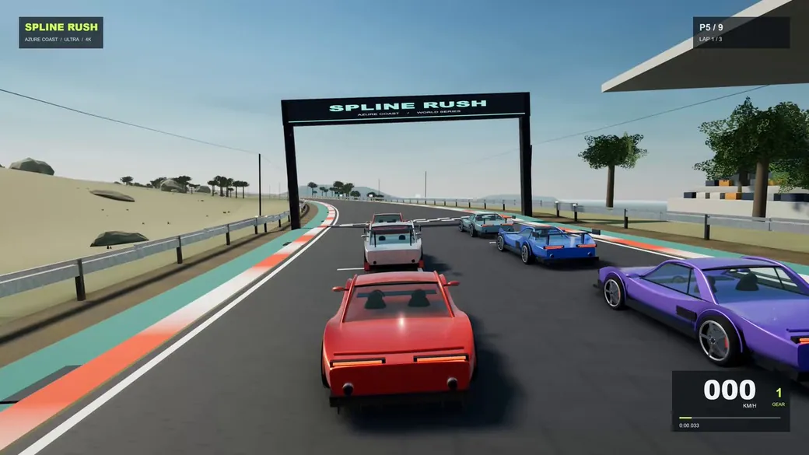</a>

**Промпт**

```text
Створіть завершену браузерну гоночну гру виробничої якості під назвою Spline Rush, використовуючи найновішу версію Three.js (де можливо — WebGPURenderer + TSL). 100% процедурна генерація: жодних зовнішніх моделей, текстур, аудіофайлів або шрифтів. Усе генерується програмно під час виконання.

ОСНОВА ГРИ
- 6 унікальних трас із перепадами висоти, віражами з нахилом, тунелями, шпильками, названими поворотами та різними біомами (узбережжя вдень, гори в сутінках, пустеля на заході сонця, ліс під дощем, нічне місто з неоновим освітленням, швидкісний овал).
- Режим чемпіонату (кваліфікація + 3 перегони), заїзд на час із примарами, швидкий заїзд.
- 8 суперників зі ШІ з власними характерами, оптимальною траєкторією, точками гальмування, обгонами та блокуванням.
- Рекорди найкращих кіл, час на секторах, стрічка подій у реальному часі, камера повторів.
- Гараж: 5 параметричних автомобілів із лакованим покриттям і фарбою з металевими пластівцями, зазорами між панелями, робочими фарами, анімованою підвіскою та станами пошкодження.

ГРАФІЧНА ЦІЛЬ (Ultra, рівень RTX 5090 у 4K)
Рендерер: THREE.WebGPURenderer. Фізично коректний конвеєр рендерингу.
Освітлення:
- Фізично коректне небо за моделями Релея/Мі, зоряне поле, місяць і динамічне сонце, що керує повним циклом дня й ночі.
- Каскадні карти тіней (4 каскади, стабільне прив’язування до піксельної сітки, висока роздільна здатність).
- IBL через PMREM, що оновлюється залежно від часу доби.
- Об’ємний туман, промені світла та марево від спеки.
Матеріали:
- Вузли MeshPhysicalMaterial / TSL: лакове покриття, анізотропія, пропускання світла склом, фарба з металевими пластівцями, шейдер мокрої дороги, що реагує на дощ.
Ланцюжок постобробки (RenderPipeline / TSL або бібліотека постобробки):
GTAO або високоякісний SSAO → SSR → bloom (Karis) → розмиття в русі (velocity) → DOF → промені світла → автоматична експозиція → кольорокорекція + кінозерно + віньєтка → SMAA або TAA.
Ефекти:
- Пули частинок на GPU: дим із-під шин, іскри, пил, бризки дощу, викидання трави/гравію, теплова дисторсія.
- Сліди заносів, що зберігаються та поступово зникають.
- Динамічна вологість і відбиття в калюжах під час дощу.

ФІЗИКА ТА ВІДЧУТТЯ
- Симуляція з фіксованим кроком 120 Гц.
- Підвіска на основі raycast або стійок, перерозподіл навантаження, шини з комбінованим ковзанням, ABS/TC, типи поверхонь (асфальт, поребрик, трава, гравій, мокра поверхня).
- Камера: кінематографічна камера переслідування, камера з капота та бортова камера з ефектами руху й тряскою під час зіткнень.

AUDIO
- Повністю синтезоване Web Audio: багатошаровий звук двигуна залежно від обертів і навантаження, вітер, вереск шин, гуркіт на поребрику, шум натовпу, динамічна музика.

СИСТЕМА ЯКОСТІ
- Пресети: Low / Medium / High / Ultra.
- Ultra розрахований на графічний процесор рівня RTX 5090: 4K, карти тіней високої роздільної здатності, максимальна кількість частинок, усі ефекти постобробки ввімкнено, без агресивного LOD.
- Адаптивна якість, яка може вимикати ефекти, якщо час кадру перевищує цільове значення.

Почніть із першої іграбельної версії (одна траса, один автомобіль, базове освітлення), а потім послідовно додавайте функції — саме в запитаному порядку. Зберігайте все в одному чистому проєкті HTML/JS (або Vite), який запускається локально. Додайте коментарі до основних систем. Гра має виглядати дорого, а не мило.
```

<details>
<summary>Оригінальний промпт автора</summary>

```text
Build a complete, production-quality browser racing game called Spline Rush using the latest Three.js (WebGPURenderer + TSL where possible). 100% procedural: no external models, textures, audio files or fonts. Everything generated in code at runtime.

CORE GAME
- 6 unique tracks with elevation, banking, tunnels, hairpins, named corners and distinct biomes (coastal day, mountain dusk, desert sunset, forest rain, night city neon, high-speed oval).
- Championship mode (qualifying + 3 races), Time Trial with ghosts, Quick Race.
- 8 AI opponents with personality, racing line, braking points, overtaking and defending.
- Best lap records, sector times, live event feed, replay camera.
- Garage: 5 parametric cars with clearcoat + metal-flake paint, panel gaps, working lights, animated suspension, damage states.

GRAPHICS TARGET (Ultra, worthy of RTX 5090 at 4K)
Renderer: THREE.WebGPURenderer. Physically based pipeline.
Lighting:
- Rayleigh/Mie physically based sky + starfield + moon + dynamic sun that drives a full day/night cycle.
- Cascaded shadow maps (4 cascades, stable texel snapping, high-res).
- IBL via PMREM updated with time of day.
- Volumetric fog + god rays + heat haze.
Materials:
- MeshPhysicalMaterial / TSL nodes: clearcoat, anisotropy, transmission on glass, metal-flake paint, wet-road shader that reacts to rain.
Post-processing chain (RenderPipeline / TSL or postprocessing library):
GTAO or high-quality SSAO → SSR → bloom (Karis) → motion blur (velocity) → DOF → god rays → auto-exposure → color grading + film grain + vignette → SMAA or TAA.
Effects:
- GPU particle pools: tyre smoke, sparks, dust, rain spray, grass/gravel kick-up, heat distortion.
- Skid marks that persist and fade.
- Dynamic wetness and puddle reflections when raining.

PHYSICS & FEEL
- Fixed-step 120 Hz simulation.
- Raycast or strut suspension, load transfer, combined-slip tyres, ABS/TC, surface types (asphalt, kerb, grass, gravel, wet).
- Camera: cinematic chase + hood + onboard with motion and collision shake.

AUDIO
- Fully synthesised Web Audio: multi-layer engine by RPM/load, wind, tyre screech, kerb rumble, crowd, dynamic music.

QUALITY SYSTEM
- Presets: Low / Medium / High / Ultra.
- Ultra assumes RTX 5090-class GPU: 4K, high shadow maps, max particles, all post effects on, no aggressive LOD.
- Adaptive quality that can drop effects if frame time exceeds target.

Start with a playable first version (one track, one car, basic lighting), then iterate feature-by-feature exactly as requested. Keep everything in a single clean HTML/JS (or Vite) project that runs locally. Comment major systems. Make it look expensive, not cute.
```

</details>

[Докладніше ↗](https://www.tripo3d.ai/uk/3d-prompts/gpt-6-astra-2102150615635816866) · [Оригінальний допис](https://x.com/ToolBraidComp/status/2102150671340327384) · [Назад до прикладів](#all-prompts)

---

<a id="gpt-6-astra-2102038136725377200"></a>

### Інтерактивний вебсайт із 3D-моделлю Сонця

[HIX.AI](https://x.com/HIX_AI_) · 2026-09-21 · GPT-6 Astra · Інтерактив

<a href="https://www.tripo3d.ai/uk/3d-prompts/gpt-6-astra-2102038136725377200">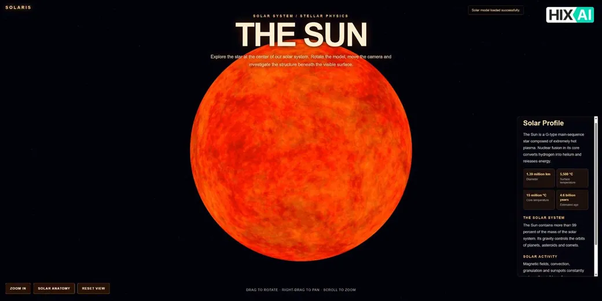</a>

**Промпт**

```text
Я хочу створити вебсайт з інтерактивною 3D-моделлю Сонця на Three.js.

Спочатку напишіть скрипт Python, який можна безпосередньо запустити в Blender для створення високореалістичної 3D-моделі Сонця. Модель має ґрунтуватися на реальних фізичних і візуальних характеристиках Сонця, зокрема на його сферичній формі, текстурі поверхні, кольорі, плазмоподібному вигляді, сонячній грануляції та сяйній атмосфері. Вона не повинна виглядати як проста помаранчева куля. Використайте відповідні матеріали, шейдери, текстури та ефекти освітлення, щоб відтворити реалістичний вигляд Сонця.

Потім напишіть повний код вебсайту з використанням Three.js. Сонце має займати приблизно 80% основної візуальної області. Користувачі повинні мати змогу обертати Сонце, переміщувати огляд і наближати та віддаляти зображення. Сцена має містити реалістичне освітлення та ефекти сяйва, щоб Сонце виглядало динамічним і тривимірним.

Додайте кнопку наближення, яка дає змогу користувачам підступити ближче до Сонця й розглянути деталі його поверхні.

На сайті також має бути інформативний матеріал про Сонце та його роль у Сонячній системі. Загальне тло має бути реалістичним космічним середовищем — галактикою або відкритим космосом.

Крім того, додайте кнопку, яка відкриває інтерактивний режим внутрішньої будови Сонця. У цьому режимі мають бути показані основні шари Сонця: ядро, зона променистого перенесення, конвективна зона, фотосфера, хромосфера та корона. Кожен шар має бути позначений відповідною назвою та супроводжуватися коротким текстовим описом. Бажано, щоб користувачі могли взаємодіяти зі схемою та вибирати різні шари, щоб переглядати інформацію про них.

Зробіть вебсайт візуально вражаючим, науково інформативним і повністю інтерактивним, із сучасним інтерфейсом у космічній тематиці.
```

<details>
<summary>Оригінальний промпт автора</summary>

```text
I want to build an interactive 3D Sun model website using Three.js.

First, please write a Python script that can be run directly in Blender to create a highly realistic 3D model of the Sun. The model should be based on the Sun's real physical and visual characteristics, including its spherical shape, surface texture, color, plasma-like appearance, solar granulation, and glowing atmosphere. It should not look like a simple orange sphere. Please use appropriate materials, shaders, textures, and lighting effects to create a realistic solar appearance.

Then, write the complete website code using Three.js. The Sun should occupy approximately 80% of the main visual area. Users should be able to rotate the Sun, move the view, and zoom in and out. The scene should include realistic lighting and glowing effects to make the Sun look dynamic and three-dimensional.

Add a zoom-in button that allows users to get closer to the Sun and observe its surface details.

The website should also include informative content about the Sun and its role in the solar system. The overall background should be a realistic cosmic galaxy/space environment.

In addition, add a button that opens an interactive internal anatomy view of the Sun. This view should show the major layers of the Sun, such as the core, radiative zone, convection zone, photosphere, chromosphere, and corona. Each layer should have a corresponding label and a short text description. Ideally, users should be able to interact with the diagram and select different layers to view their information.

Please make the website visually impressive, scientifically informative, and fully interactive, with a modern space-themed UI.
```

</details>

[Докладніше ↗](https://www.tripo3d.ai/uk/3d-prompts/gpt-6-astra-2102038136725377200) · [Оригінальний допис](https://x.com/HIX_AI_/status/2102038474752766239) · [Назад до прикладів](#all-prompts)

---

<a id="gpt-6-astra-2101730386711634251"></a>

### Verdant — інтерактивний 3D-острів динозаврів

[vib3coded](https://x.com/vib3coded) · 2026-09-20 · GPT-6 Astra · Інтерактив

<a href="https://www.tripo3d.ai/uk/3d-prompts/gpt-6-astra-2101730386711634251">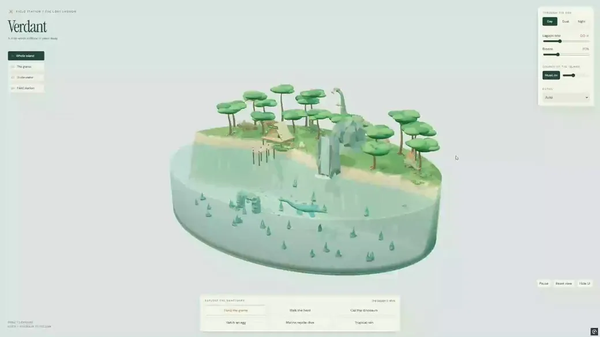</a>

**Промпт**

```text
створи Verdant — інтерактивну 3D-діораму, створену на Three.js + WebGL

Пишний острів із динозаврами, що вільно пересуваються, водоспадом і лагуною з відкритою підводною частиною, де плаває морська рептилія. Годуй стадо, вилуплюй дитинча динозавра та занурюй камеру під воду

Налаштовуй припливи, вітер і час доби або додавай тропічний дощ, слухаючи спокійну музику

Усе працює безпосередньо у браузері, в одному HTML-файлі
```

<details>
<summary>Оригінальний промпт автора</summary>

```text
create Verdant - an interactive 3D diorama built with Three.js + WebGL

A lush island with roaming dinosaurs, a waterfall, and a cutaway lagoon with a swimming marine reptile. Feed the herd, hatch a baby dinosaur, and take the camera underwater

Adjust the tide, wind, and time of day, or bring in tropical rain while relaxing music plays

Everything runs right in your browser, in a single HTML file
```

</details>

[Докладніше ↗](https://www.tripo3d.ai/uk/3d-prompts/gpt-6-astra-2101730386711634251) · [Оригінальний допис](https://x.com/vib3coded/status/2101570806702559235) · [Назад до прикладів](#all-prompts)

---

<a id="gpt-6-astra-2101687900723106104"></a>

### Створіть 3D-модель WALL-E у Three.js

[Marcel](https://x.com/marcthecreatorr) · 2026-09-20 · GPT-6 Astra · Асети

<a href="https://www.tripo3d.ai/uk/3d-prompts/gpt-6-astra-2101687900723106104">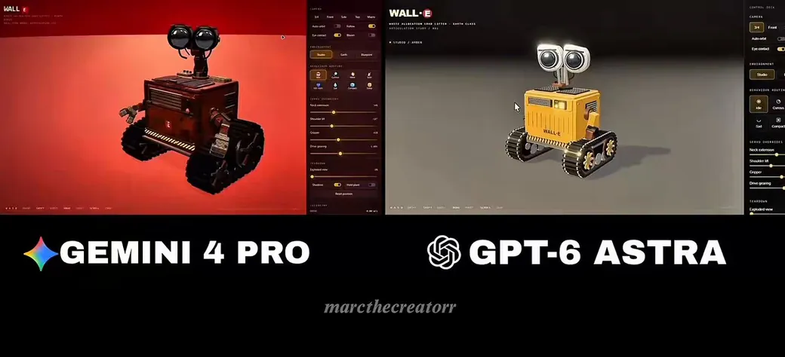</a>

**Промпт**

```text
створіть 3D-модель WALL-E у Three.js.
```

<details>
<summary>Оригінальний промпт автора</summary>

```text
create a 3d model of wall-e in three.js.
```

</details>

[Докладніше ↗](https://www.tripo3d.ai/uk/3d-prompts/gpt-6-astra-2101687900723106104) · [Оригінальний допис](https://x.com/marcthecreatorr/status/2101687900723106104) · [Назад до прикладів](#all-prompts)

---

<a id="gpt-6-astra-2101616345720787130"></a>

### Вітрильник у відкритому морі

[www.aicontenders.dev](https://www.aicontenders.dev/) · 2026-09-20 · GPT-6 Astra · Інтерактив

<a href="https://www.tripo3d.ai/uk/3d-prompts/gpt-6-astra-2101616345720787130">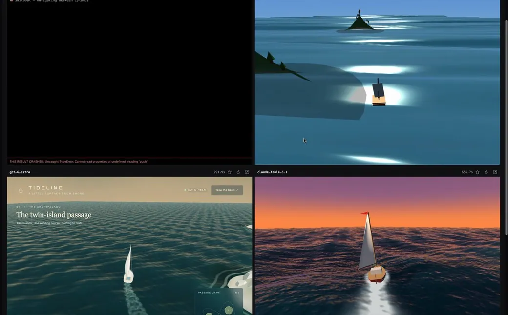</a>

**Промпт**

```text
Створіть один HTML-файл із 3D-сценою, де невеликий вітрильник рухається відкритою водою, має власне керування й прокладає курс в обхід двох видимих островів — подібно до демонстрацій «гри з човном», які нещодавно показували в тестах моделей.

Функціональні вимоги:

Водна поверхня, відтворена як анімована сітка хвиль (процедурний шейдер води, рухомі хвилі, світлові відблиски, що змінюються залежно від кута огляду, і слід за човном), а не пласка статична текстура.
Модель вітрильника, створена з простих форм (корпус, щогла, вітрило, напнуте вітром), із помітним погойдуванням і легким нахилянням на хвилях, синхронізованими з рухом води під ним.
Два окремі острови, розташовані в різних місцях сцени, кожен із простим рельєфом (підвищення, пляж, за бажанням — рослинність) і тінню, що падає на воду навколо нього.
Човен має рухатися маршрутом, який справді обходить обидва острови (не перетинаючи їхні контури й не проходячи крізь суходіл), і плавно повертати, а не миттєво перемикатися між кутами.
Камера стежить за човном із невеликою затримкою (згладжене стеження камери), створюючи відчуття динамічної погоні, а не жорстко прикріпленого вигляду зверху.
Градієнтне небо (наприклад, захід сонця або денне блакитне небо — на вибір моделі) із сонцем або відбиттям світла на воді, напрямок якого узгоджується з тінями на островах.

Технічні вимоги:

Один файл .html; дозволено використовувати three.js із cdnjs, але жодних інших зовнішніх ресурсів чи текстур. Уся вода й рельєф мають генеруватися процедурно в коді або шейдері.
Маршрут навколо островів може бути заздалегідь спланованим (наприклад, кривою Безьє, що проходить між островами) або реалізованим через просте керування, яке реагує на положення, — на вибір моделі, але зіткнення із суходолом заборонене.
Анімація має плавно працювати щонайменше 20 секунд, циклічно або безперервно, із частотою не менше 30 кадрів/с на типовому ноутбуці. Роздільну здатність полотна слід обмежити розміром вікна, а devicePixelRatio — значенням не вище 1.5, щоб не перевантажувати екрани з високою щільністю пікселів.

Оцінювання передусім ґрунтується на тому, чи виглядає вода переконливо як рідина в русі (а не як текстура з анімованим зміщенням UV), чи справді човен реагує на хвилі та чи сприймається маршрут навколо островів як продумана навігація, а не випадкове оминання перешкоди.
```

<details>
<summary>Оригінальний промпт автора</summary>

```text
Build a single HTML file with a 3D scene showing a small sailboat moving across open water, with native steering and a course that navigates around two visible islands, similar to the comparison "boat game" demos seen in recent model tests.

Functional requirements:

A water surface rendered as an animated wave mesh (procedural water shader, moving waves, light reflections that shift with viewing angle, a wake trail behind the boat), not a flat, static texture.
A sailboat model built from simple shapes (hull, mast, sail filled by the wind), with visible bobbing and slight tilting on the waves, synchronized with the motion of the water beneath it.
Two distinct islands placed at different points in the scene, each with simple terrain shaping (a rise, a beach, optionally vegetation) and a shadow cast onto the water around it.
The boat should follow a route that genuinely avoids both islands (never clipping through their silhouette or crossing through the land), turning smoothly rather than snapping between angles.
The camera follows the boat with a slight lag (smoothed camera follow), giving the impression of a dynamic chase rather than a rigidly attached top down view.
A gradient sky (e.g. sunset or daytime blue, model's choice) with a sun or light reflection on the water, directionally consistent with the shadows on the islands.

Technical requirements:

A single .html file, three.js from cdnjs is allowed, no other external assets or textures, all water and terrain generated procedurally in code/shader.
The route around the islands can be a pre-planned path (e.g. a Bezier curve threading between the islands) or simple steering that reacts to position, model's choice, but no collision with land is allowed.
The animation must run smoothly for at least 20 seconds, looping or continuous, minimum 30fps on a typical laptop, canvas resolution capped to window size with a devicePixelRatio no higher than 1.5 to avoid overloading hidpi screens.

Judged primarily on whether the water looks convincingly like a fluid in motion (not a texture with animated UV offset), whether the boat genuinely reacts to the waves, and whether the route around the islands reads as intentional navigation rather than a random near miss.
```

</details>

[Докладніше ↗](https://www.tripo3d.ai/uk/3d-prompts/gpt-6-astra-2101616345720787130) · [Оригінальний допис](https://www.aicontenders.dev/c/a_TRQpq3LoNVd-M7Xy2DHg) · [Назад до прикладів](#all-prompts)

---

<a id="titanic-the-last-light"></a>

### TITANIC — Останнє світло

[jared](https://x.com/jaredliu_bravo) · 2026-09-20 · GPT-6 Astra · Анімація

Ремікс роботи: [notjazii / Titanic reference](https://x.com/notjazii/status/2101007819592085586)

<a href="https://www.tripo3d.ai/uk/3d-prompts/titanic-the-last-light">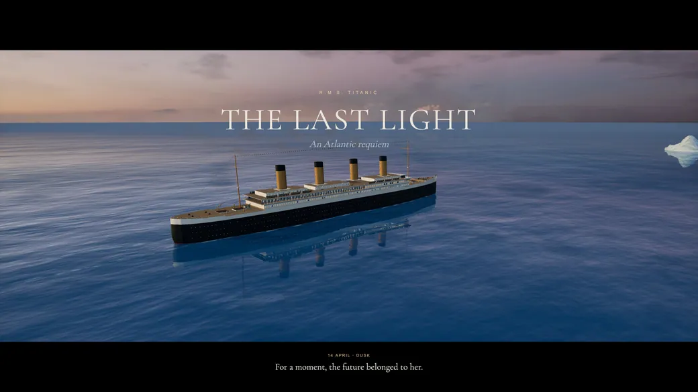</a>

**Промпт**

```text
1. Мета проєкту
Створити TITANIC — THE LAST LIGHT: інтерактивну кінематографічну подорож тривалістю 264 секунди — від останнього заходу сонця над кораблем через зіткнення, евакуацію та затоплення до меморіалу на світанку. Відвідувачі переглядають режисерський фільм, досліджують рухомий 3D-світ, переходять до потрібного розділу, зберігають кадр або завантажують повний фільм. Подавати проєкт як художню інтерпретацію, не заявляючи про криміналістичну точність чи офіційний зв’язок.

2. Візуальний напрям
Використовувати стриману кінематографічну палітру: тепле кремове й бурштинове світло на кораблі на тлі глибокого атлантичного синього, потім темна зоряна ніч і холодний світанок. Рендерити перспективну сцену в кінокомпозиції 2.39:1, із м’яким сяйвом, делікатним зерном і віньєтуванням. Використовувати глибину різкості для портретів персонажів і світанкових кадрів, але залишати частинки сигнальних ракет різкими. Надати океану насичений синій базовий колір, хвилі у світових координатах, дрібніші mipmapped-нормалі ряби та відбиття Френеля; теплий колір заходу має переважно з’являтися у відбитому світлі. Використовувати стрічки кильватерного сліду, прикріплені до корпусу й узгоджені з тією самою деформацією океану, з м’якими краями та переривчастою піною. Горизонтально зациклювати панорамні текстури без розриву fract, щоб запобігти вертикальним швам на небі та смугам у відбиттях. Уникати помаранчевого затінення мілкої води, дрібної рівномірної ряби та сяйливих круглих декалей піни. Видалити приховані верхні грані даху, що перекриваються, щоб запобігти мерехтінню глибин; використовувати ближню площину камери, відповідну відстані до об’єкта. Під час затоплення рівномірно зменшувати яскравість світла у вікнах, а не додавати високочастотне мерехтіння. Використовувати стриманий заголовок із засічками, двомовні елементи керування англійською/китайською та вузьку часову шкалу вздовж нижнього краю.

3. Редагування світу, географії та камери
Використовувати єдину безперервну систему координат із судном завдовжки 269 метрів, носом у напрямку +X та айсбергом, зафіксованим у точці (275, 0, 57). Судно рухається вперед, контактує з айсбергом на 96.727 секунди, за інерцією зупиняється, а потім затоплюється окремо носовою та кормовою частинами. Айсберг має залишатися в кадрі до самого завершення й бути видимим у світанковій композиції. Зберегти шість розділів, що починаються на 0, 63, 110, 163, 211 і 241 секунді.

Побудувати 23 продумані кадри. Сцена обіймів на носі триває з 29 до 61 секунди: загальний установчий підхід, крупний подвійний портрет, ракурс зі спини в бік моря та косий портрет. Розмістити Роуз попереду, а Джека — позаду неї на самому носі; обидва дивляться назовні, за борт. Протягом усієї послідовності зберігати освітлення заходу сонця. У проміжку 127–158 секунд використати три кадри, прив’язані до фактичного світового трансформу шлюпки: відхід від шлюпкової палуби, ближчий план пасажирів і підвісних канатів, підхід до води. Далі показати загальні плани евакуації, крен, розлам і затоплення. На світанку показати шлюпки, що вціліли, з айсбергом удалині, а потім — стриманий меморіальний заголовок.

4. Перелік ресурсів
- titanic-vessel: побудувати в Blender основну конструкцію завдовжки 269 метрів із безперервними відкритими палубами, закритим баком, багатошаровими прогулянковими палубами, чотирма порожнистими нахиленими трубами кольору баф, чорним верхнім і червоним нижнім корпусом. Використати справжні круглі обідки для 864 ілюмінаторів і рами для 360 вікон. Обмежити емісію матеріалами справжнього скління. Згрупувати матеріали й розділити модель по x=-32 для затоплення. Додати щогли, такелаж, шлюпбалки, талеві канати, бронзові гвинти та кермо. Створити P2 companionway із дверима з тикового дерева та латунними деталями, нормалізувати його й двічі повторно використати на авторській палубі. Під час складання GLB зберегти трансформи вузлів.
- atlantic-iceberg: один нерегулярний еродований синьо-білий айсберг із багатошаровим інеєм, варіаціями шорсткості, приглушеною картою нормалей і переконливою ватерлінією. Він залишається нерухомим географічним об’єктом.
- lifeboat: одна веслова шлюпка White Star із білим дерев’яним корпусом, темним планширом, лавами та веслами; інстанціювати її в шістнадцяти шлюпках, що рухаються незалежно.
- bow-embrace: ізольований ресурс із двома персонажами, натхнений костюмами й позою із запитаного фільму 1997 року: Роуз із каштаново-рудим волоссям, у темно-синьому та кольору слонової кістки, із візерунчастою шаллю, з розпростертими руками; Джек одразу позаду в темному пальті та сорочці кольору слонової кістки. Перед конвертацією в H v3.1 створити чисті повнофігурні референсні зображення, зберігаючи узгодженість голови, шиї, плечей та одягу кожної фігури. Доопрацювати Роуз за окремим референсом крупного плану й донорським зображенням із деталізацією обличчя H: зіставити очі, ніс, губи й підборіддя, перенести локальні форму та колір на безперервну повнофігурну сітку, а перехід на UV розтушувати й відретушувати. Для Джека створити чистий портрет із природним кольором шкіри та чітко промальованими очима й губами. Зберегти всю голову та верхню частину шиї, узгодити напрямок погляду й масштаб із тілом H, припасувати нижню частину шиї та зварити обидві крайові петлі. Запекти й відретушувати вузький перехід шиї, не втрачаючи деталізацію обличчя. Виправити позу та контакт рук у Blender. Перевірити передній, бічний і задній ракурси на темні плями, шви текстур, отвори, обрізані краї та перетини одягу. Використати окреме затінення для шкіри й тканини. Зберегти природні базові вирази обличчя зі стриманим рухом тіла й одягу; не створювати враження наявності ригу facial animation, якщо його справді не реалізовано.
- seated-woman і seated-man: окремі моделі дорослих пасажирів в одязі 1912 року та світлих коркових рятувальних жилетах; вони сидять зі зігнутими колінами, поклавши руки на коліна. Спільно використовувати геометрію й матеріали в усіх шлюпках; трохи варіювати розміщення та орієнтацію. Для посадки застосовувати зворотно сумісну кількість інстанцій у кожній шлюпці.

Використовувати Blender для основного судна, Tripo P2.0 — для палубного companionway, айсберга, шлюпок і сидячих пасажирів, а H v3.1 — для двох повноцінних головних персонажів і доопрацювання портретів крупним планом. Океан, змішування неба, зорі, освітлення, дим, сигнальні ракети, піна, бризки та уламки залишити ефектами сцени. Надати полегшені веб-варіанти моделей зі стисненими текстурами, зберігши деталізовані вихідні ресурси для редагування. Для вебсайту й офлайн-експорту фільму використовувати ту саму затверджену оптимізовану пару головних персонажів.

5. Відтворення та зворотний зв’язок
Показувати реальний прогрес завантаження основних ресурсів корабля, шлюпок, неба й нормалей моря. Активувати кнопку початку, щойно готова перша сцена; інші моделі та музику завантажувати відкладено. Якщо потрібна модель персонажа чи айсберга затримується, призупиняти відтворення на межі її сцени й продовжувати після готовності, а не мовчки пропускати кадр. Аудіо починається після взаємодії користувача.

Часова шкала має підтримувати перемотування вперед і назад та швидке перетягування без скидання на нуль. Під час перемотування зберігати стани відтворення/паузи та вимкнення звуку; не дозволяти старому аудіотакту перезаписувати запитану позицію. Обслуговувати діапазони байтів для MP3 і MP4. Навігація розділами має містити прямі переходи до обіймів на носі на 29 секунді та спускання шлюпок на 127 секунді; ці переходи відновлюють режисерську камеру, зберігаючи стан відтворення.

Дослідження має дозволяти обертання, перетягування та масштабування, поки світ, судно й саундтрек продовжують рух. Стежити за переміщенням судна без ривка або прив’язки напрямку огляду. Пауза має працювати незалежно; повернення до фільму зберігає поточний час. Пробіл запускає/призупиняє відтворення, стрілки перемотують на десять секунд, M перемикає звук, E перемикає режим дослідження, а F відкриває повноекранний режим. Підтримувати обертання й масштабування жестами та натискання на часову шкалу.

Шлюпки починають порожніми. Пасажири сідають організованими групами після 112 секунди й завершують посадку до спускання кожної шлюпки. Канати проходять між рухомими шлюпбалками та фактичними точками кріплення шлюпки, а після відчеплення зникають. Перемотування назад відновлює попередню зайнятість місць і стани канатів. Зіткнення має синхронізувати вібрацію корпусу/камери, крижану крихту, бризки від ковзання та короткий звуковий імпульс контакту сталі з льодом. Сигнальні ракети мають бути білими палаючими зорями з короткими індивідуальними слідами, гравітацією, опором і димом, що згасає. Збурення під час затоплення мають бути нерегулярними плямами, що повторюють рух хвиль і поступово затухають; розподіляти бризки вздовж справжньої ватерлінії корми, ніколи не створювати їх віддаленим точковим фонтаном.

6. Технічна реалізація та результати
Використовувати Vite, модулі JavaScript і Three.js із детермінованою анімацією, прив’язаною до часу. Розділити камеру/часову шкалу, ресурси судна, персонажів, оточення, ефекти та готовність сцен. Для вебвідтворення, перемотування й офлайн-запису використовувати єдину часову модель. Обмежити вебрендеринг чітко визначеним бюджетом пікселів, відбиттів і тіней; важче затінення навколишнього середовища відкласти для офлайн-профілю. Компілювати й декодувати ресурси без тривалого блокувального попереднього прогрівання під час запуску. Розміщувати скрипти, моделі, зображення, шрифти й аудіо на одному origin та не зберігати секрети у статичній збірці.

Використовувати оригінальну музику та платний Foley від ElevenLabs: повний природний запис свисту феєрверку, розділений у фактичній точці вибуху на висхідний політ і різкий вибух із потріскувальним хвостом, а також звуки контакту й ковзання сталі по льоду, канатів шлюпок і контакту з водою, напруження/розлому корпусу та переміщення води кормою. Експортувати вихідні WAV-файли, зберігати промпти й ID історії та змонтувати їх у синхронізовані звукові cues. Узгодити запуски на 119, 151 і 183 секунді, а вибухи — через 3.15 секунди після них. Зберегти оригінальну атаку вибуху й на короткий час приглушити оркестрову музику. Під міксом залишити тихі атмосферні звуки моря, вітру та двигуна. Саундтрек референсного фільму не включати без дозволу ні на публічному вебсайті, ні у фільмі для завантаження. Документувати фактичні джерела ресурсів і звуків, а не описувати резервний варіант як ресурс, згенерований сервісом.

Надати детермінований експорт із 6,336 кадрів у роздільності 3840×2160, 24 кадри/с і трьома часовими семплами, з англійськими заголовками, вбудованими в зображення, та зображенням у форматі 2.39:1 із кінематографічними чорними смугами. Закодувати майстер-файл 4K H.264/AAC і вебверсію 1080p розміром до 100 MiB; обидві мають тривати 264 секунди й містити стереозвук 48 кГц. Зберегти опційні китайські/англійські субтитри, майстер аудіо та редаговані вихідні матеріали. Опублікувати статичну збірку через наявний хостинг CMS Web Pages, не додаючи застосунок платформи чи Worker для окремої сторінки.

7. Приймання
Перевірити початок, обидва портрети персонажів, зіткнення, сигнальні ракети, усі три кадри спускання шлюпок, розлам, зникнення корми та світанок. Переконатися, що айсберг не зникає на 244 секунді, море має вигляд насичено синього, під час затоплення немає регулярних білих кілець, персонажі присутні у своїх авторських кадрах, а канати й пасажири шлюпок залишаються вирівняними протягом усього спускання. Протестувати відкладене завантаження моделей, перемотування вперед/назад, швидке прокручування, паузу/вимкнення звуку, динамічне дослідження, прямі переходи до крупних планів і емуляцію сенсорного керування. Перевірити кожен експортований кадр, повністю декодувати обидва фільми, порівняти фактичне завантаження з браузера з переданим файлом, а також перевірити публічну збірку та її зв’язок із CMS. Розрізняти мобільну емуляцію в браузері та тестування на фізичному телефоні.

```

[Докладніше ↗](https://www.tripo3d.ai/uk/3d-prompts/titanic-the-last-light) · [Демо](https://titanic-the-last-light.tripo.page/) · [Назад до прикладів](#all-prompts)

---

<a id="gpt-6-astra-2101325346427842909"></a>

### 3D-модель Waymo Jaguar I-Pace

[Harshith](https://x.com/HarshithLucky3) · 2026-09-19 · GPT-6 Astra · Асети

<a href="https://www.tripo3d.ai/uk/3d-prompts/gpt-6-astra-2101325346427842909">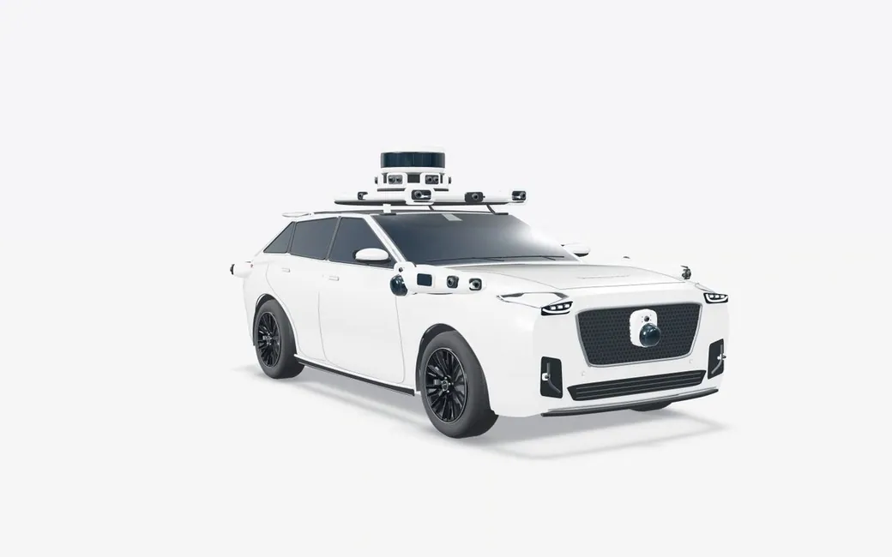</a>

**Промпт**

```text
3D-модель Waymo Jaguar I-Pace за допомогою Three.js
```

<details>
<summary>Оригінальний промпт автора</summary>

```text
3d model of Waymo Jaguar i-Pace using three js
```

</details>

[Докладніше ↗](https://www.tripo3d.ai/uk/3d-prompts/gpt-6-astra-2101325346427842909) · [Оригінальний допис](https://x.com/HarshithLucky3/status/2101325346427842909) · [Назад до прикладів](#all-prompts)

---

<a id="gpt-6-astra-2101310374033428642"></a>

### Робочий процес створення 3D-анімації та відео про кота-майстра бойових мистецтв

[PixVerse](https://x.com/PixVerse) · 2026-09-19 · GPT-6 Astra · Анімація

<a href="https://www.tripo3d.ai/uk/3d-prompts/gpt-6-astra-2101310374033428642">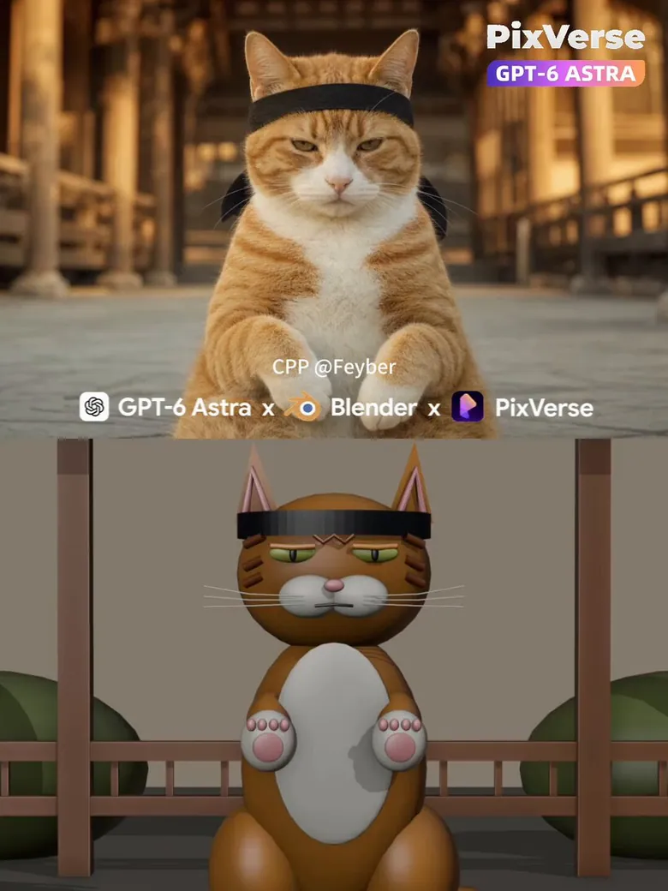</a>

**Промпт**

```text
Фотореалістичний кінематографічний одинарний дубль, 10 секунд, 16:9, 24 кадри/с, нерухома камера, без монтажних склеювань.
Рудо-білий смугастий кіт (біла мордочка, груди й лапи, руді смуги табі з літерою «M» на лобі) сидить рівно по центру, обличчям до об’єктива, у жорсткій позі бойового мистецтва — плаский, незворушний, байдужий погляд, очі напівприкриті, рот закритий, голова нерухома. На ньому чорна пов’язка хацимакі, низько зав’язана на лобі, з вузлом ззаду; вуха стирчать над пов’язкою.
Місце дії: традиційний двір японського храму — теплі дерев’яні стовпи, карнизи й перила — розмиті в кремове боке золотої години. Об’єктив 85 мм, f/1.8, надзвичайно мала глибина різкості, фокус зафіксовано на очах кота. Тепла кольорокорекція 3500K, м’яке ключове світло спереду праворуч, делікатно заповнені тіні, дрібне кінозерно.
ДІЯ: оголена людська рука стрімко влітає з лівого краю кадру, розкрита долоня швидко спрямовується в морду кота, із сильним розмиттям у русі; кіт спокійно піднімає праву передню лапу й парирує, перехоплюючи долоню та гасячи імпульс удару — він блокує, а не б’є лапою. Рука горизонтально проходить перед мордою кота в розмитті, потім друга рука рубає згори праворуч; кіт відбиває кожну атаку коротким мінімальним блоком лапою, тулуб і голова залишаються повністю нерухомими, погляд не відривається від об’єктива. Агресорами є руки — кіт лише реагує й залишається незворушним. Руки роблять фінти, з’являючись і зникаючи з обох боків; кіт переходить у боксерську стійку з двома лапами на рівні грудей, лапи зігнуті, лікті притиснуті, і завмирає в очікуванні. Він різко виконує швидкі розмиті контратаки однією лапою, у стилі кунг-фу перехоплюючи руки в повітрі, не змінюючи положення голови. Нарешті він різко спрямовує праву лапу просто в об’єктив, рожевою подушечкою до камери, доки лапа не заповнює кадр м’якою розфокусованою формою на передньому плані; позаду неї морда залишається надзвичайно різкою, а холодний погляд не змінюється.
Рух: природна швидкість, справжнє розмиття в русі для рук, що летять, і швидких блоків лапами. Захисні, мінімальні, економні рухи кота — він майже не рухається, усю роботу виконують руки, але зазнають невдачі. Камера нерухома, без наближення, без тексту.
НЕГАТИВНИЙ ПРОМПТ: зайві кінцівки, зрощені/мутовані лапи, зайві пальці, спотворена морда, пов’язка, що зливається з хутром, пластикова шкіра, перенасичені кольори, текст, субтитри, логотип, водяний знак, монтажні склеювання, тремтіння камери, грайлива/святкова мова тіла, жест «дай п’ять».
КОРОТКА ВЕРСІЯ:
Рудо-білий смугастий кіт у чорній пов’язці хацимакі сидить у сонячному дворі японського храму й байдуже дивиться в камеру; об’єктив 85 мм, f/1.8, мала ГР, золота година, кінозерно. Людські руки швидко рубають і простягаються до його морди з обох боків, розмиваючись у русі; кіт спокійно парирує кожен удар мінімальним блоком лапою, не рухаючи головою. Він переходить у стійку кунг-фу з двома лапами, виконує швидкі розмиті контратаки, а потім спрямовує лапу в об’єктив, доки подушечка не заповнює кадр. Нерухома камера, одинарний дубль, 10 с, 16:9, 24 кадри/с, фотореалістично, без тексту.
Невелика примітка за кадрами: руки переважно входять зліва (рух рубання згори вниз + горизонтальний замах), контакт відбувається із зап’ястям/долонею — не лапа до лапи. Стійка з двома лапами — приблизно на 4,0–5,6 с, розмиті контратаки — на 5,6–8 с, фінальний рух лапою до об’єктива — на 8–10 с. Ваше завдання — створити 3D-сітки за допомогою Blender MCP, зробити 10-секундний результат із частотою 24 кадри/с і відрендерити надреалістичну сцену через PixVerse CLI, використовуючи Seedance 2.5 як модель генерації відео
КРОКИ АГЕНТА: Перевірити Blender MCP, автентифікацію PixVerse CLI, можливості моделей і доступні кредити. Повідомити орієнтовну вартість і отримати дозвіл на витрати перед платною генерацією. Перетворити промпт на розкадровку з таймінгом, створити легковагові 3D-сітки й анімацію через офіційний Blender MCP, відрендерити MP4 із референсом руху та перевірити кадрування, рух, контакти, тривалість і частоту кадрів. Окремо згенерувати й перевірити зображення-референс зовнішнього вигляду перед надсиланням запиту на відео. Використати зображення для керування ідентичністю, стилем та освітленням, а відео з Blender — для керування рухом і таймінгом. Після генерації завантажити результат, перевірити технічні характеристики, переглянути ключові кадри, чесно повідомити про відхилення та підрахувати фактичне використання кредитів. Зберегти оригінали; ніколи непомітно не перемикати моделі й не запускати повторну генерацію.
ВИКЛИК PIXVERSE: Використати pixverse create image with gpt-image-2.0, щоб створити референс зовнішнього вигляду в підтвердженому співвідношенні сторін, у 1080p, з високою деталізацією. Потім використати pixverse create reference із підтвердженою відеомоделлю, передавши обидва --images and --videos to поєднати зображення зовнішнього вигляду з референсом руху з Blender. Для Seedance 2.5 використати --model seedance-2.5 --task-type auto, підтверджену тривалість/співвідношення сторін і --quality 1080p --count 1. Перед надсиланням запиту перевірити поточні можливості, використовувати унікальні ключі ідемпотентності та відстежувати виконання через pixverse task status / pixverse task wait.
ФІНАЛЬНИЙ РЕЗУЛЬТАТ: Повернути готове відео в підтвердженому співвідношенні сторін і з підтвердженою тривалістю, орієнтуючись на 1080p і 24 кадри/с, а також зображення-референс зовнішнього вигляду, проєкт Blender .blend і MP4 із референсом руху. Надати абсолютні локальні шляхи або URL для завантаження. Зберегти такий формат фінального звіту: Відео, Зображення-референс, Сітка + анімація Blender, Перевірка, Вигляд і Використані кредити. Вказати фактичну роздільну здатність, частоту кадрів, кількість кадрів, тривалість, візуальні відхилення, вартість кредитів для зображення/відео, загальні витрати, залишок балансу та інформацію про те, чи виконувалася повторна генерація.
```

<details>
<summary>Оригінальний промпт автора</summary>

```text
Photorealistic cinematic single take, 10 seconds, 16:9, 24fps, locked-off camera, no cuts.
A ginger-and-white tabby cat (white muzzle, chest and paws, orange tabby stripes with an "M" on the forehead) sits upright, dead center, facing the lens in a rigid martial-arts posture — flat, stoic, unimpressed stare, eyes half-lidded, mouth closed, head never moving. It wears a black hachimaki headband tied low across the brow, knot at the back, ears sticking up above the band.
Setting: traditional Japanese temple courtyard — warm wooden pillars, eaves and railings — melted into creamy golden-hour bokeh. 85mm lens, f/1.8, extremely shallow depth of field, focus locked on the cat's eyes. Warm 3500K grade, soft key light from front-right, gently filled shadows, fine film grain.
ACTION: a bare human arm drives in from frame left, open palm thrusting fast at the cat's face with strong motion blur; the cat calmly lifts its right front paw and parries, intercepting the palm and killing the strike's momentum — it blocks, it doesn't slap. The arm sweeps horizontally across the cat's face in a blur, then a second hand chops down from the right; the cat deflects each one with a short minimal paw block, body and head completely still, eyes never leaving the lens. The hands are the aggressors — the cat is purely reactive and unbothered. The hands feint in and out from both sides; the cat slides into a two-paw boxing guard at chest height, paws curled, elbows in, and holds it, waiting. It snaps out quick blurred single-paw counters, kung-fu style, catching the incoming hands mid-air, head still locked forward. Finally it drives its right paw straight into the lens, pink pad facing camera, until the paw fills the frame as a soft out-of-focus foreground shape — the face stays razor sharp behind it, cold stare intact.
Motion: natural speed, real motion blur on the flying hands and the fast paw blocks. Defensive, minimal, economical cat movement — it barely moves, the hands do all the work and fail. No camera movement, no zoom, no text.
NEGATIVE: extra limbs, fused/mutated paws, extra fingers, distorted face, headband merging into fur, plastic skin, oversaturated color, text, subtitles, logo, watermark, cuts, camera shake, playful/celebratory body language, high-five gesture.
SHORT VERSION:
Ginger-and-white tabby cat in a black hachimaki headband sits in a sunlit Japanese temple courtyard, deadpan stare at camera, 85mm f/1.8 shallow DOF, golden hour, film grain. Human hands chop and thrust in fast at its face from both sides in motion blur — the cat calmly parries each strike with a minimal paw block, never moving its head. It drops into a two-paw kung-fu guard, throws fast blurred counters, then drives its paw into the lens until the pad fills the frame. Locked-off single take, 10s, 16:9, 24fps, photorealistic, no text.
Catatan kecil dari frame: tangannya dominan masuk dari kiri (chop descending + sweep horizontal), kontak terjadi di wrist/palm — bukan paw-to-paw. Guard dua paw ada di ~4.0-5.6s, counter blur di 5.6-8s, finish paw ke lensa 8-10s. your job is to make 3d mashed with blender mcp and make 10s 24fps output amd render it to super realistic scene with pixverse cli using seedance 2.5 as video model generation
AGENT STEPS: Check Blender MCP, PixVerse CLI authentication, model capabilities, and available credits. Disclose estimated costs and obtain spending approval before paid generation. Turn the prompt into a timed beat sheet, build lightweight 3D meshes and animation through official Blender MCP, render a motion-reference MP4, and inspect framing, motion, contacts, duration, and frame rate. Generate and inspect a separate appearance-reference image before submitting the video. Use the image to guide identity, style, and lighting, and the Blender video to guide movement and timing. After generation, download the result, verify technical specs, inspect key frames, report deviations honestly, and calculate actual credit usage. Preserve originals; never silently switch models or regenerate.
PIXVERSE CALL: Use pixverse create image with gpt-image-2.0 to create the appearance reference at the confirmed aspect ratio, 1080p, high detail. Then use pixverse create reference with the confirmed video model, passing both --images and --videos to combine the appearance image with the Blender motion reference. For Seedance 2.5, use --model seedance-2.5 --task-type auto, the confirmed duration/aspect ratio, and --quality 1080p --count 1. Verify current capabilities before submission, use unique idempotency keys, and track completion through pixverse task status / pixverse task wait.
FINAL OUTPUT: Return the completed video at the confirmed aspect ratio and duration, targeting 1080p and 24fps, plus the appearance-reference image, Blender .blend project, and motion-reference MP4. Provide absolute local paths or downloadable URLs. Keep the final report format: Video, Gambar referensi, Blender mesh + animasi, Check, Look, and Kredit terpakai. Report actual resolution, frame rate, frame count, duration, visual deviations, image/video credit costs, total spent, remaining balance, and whether any regeneration occurred.
```

</details>

[Докладніше ↗](https://www.tripo3d.ai/uk/3d-prompts/gpt-6-astra-2101310374033428642) · [Оригінальний допис](https://x.com/PixVerse/status/2101310387081908606) · [Назад до прикладів](#all-prompts)

---

<a id="gpt-6-astra-2101271938706685991"></a>

### Інтерактивна 3D-візуалізація авіаційного двигуна

[YouWare](https://x.com/YouWareAI) · 2026-09-19 · GPT-6 Astra · Інтерактив

<a href="https://www.tripo3d.ai/uk/3d-prompts/gpt-6-astra-2101271938706685991">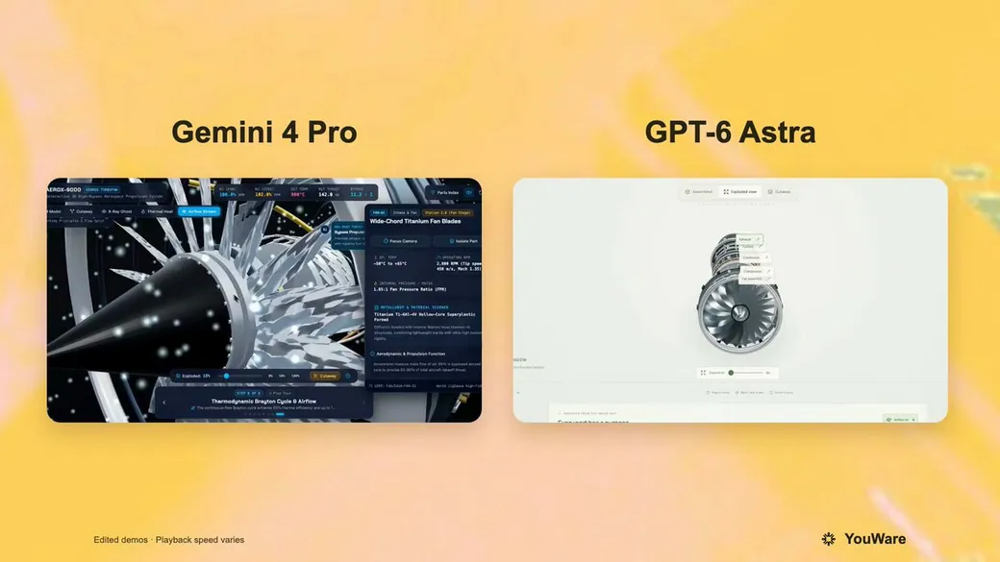</a>

**Промпт**

```text
Використайте three.js, щоб створити на вебсторінці інтерактивну 3D-візуалізацію авіаційного двигуна. 
Будь ласка, орієнтуйтеся на філософію дизайну взаємодії Jigspace, щоб створити реалістичну модель із майже повним відтворенням у масштабі 1:1 та максимально точно зберегти властивості матеріалів і деталі текстур, зокрема металу, трубопроводів і лопатей. Інтерактивні функції мають охоплювати: покрокову анімацію розбирання, вибухову проєкцію компонентів, а також описи деталей і пояснення принципів роботи, що з’являються після натискання або наведення курсора. 
Загалом візуалізація має забезпечувати плавне керування камерою та зручну взаємодію з користувачем, гарантуючи комфортну роботу у вебсередовищі й повною мірою демонструючи будову та принцип роботи двигуна.
```

<details>
<summary>Оригінальний промпт автора</summary>

```text
Use three.js to build a 3D interactive display of an aircraft engine on a webpage. 
Please refer to Jigspace's interaction design philosophy to achieve a realistic model with near 1:1 high-fidelity restoration, fully preserving material and texture details such as metal, pipelines, and blades. Interactive features must include: step-by-step disassembly animation, exploded view of components, and part descriptions and principle explanations triggered by click or hover. 
Overall, it must support smooth camera control and friendly human-computer interaction, ensuring a smooth experience on the web that fully showcases the engine's structure and working principles.
```

</details>

[Докладніше ↗](https://www.tripo3d.ai/uk/3d-prompts/gpt-6-astra-2101271938706685991) · [Оригінальний допис](https://x.com/YouWareAI/status/2101272224435253432) · [Назад до прикладів](#all-prompts)

---

<a id="gpt-6-astra-2101224659861590399"></a>

### Завершене фотореалістичне 3D-середовище

[Julian Goldie SEO](https://x.com/JulianGoldieSEO) · 2026-09-19 · GPT-6 Astra · Сцени

<a href="https://www.tripo3d.ai/uk/3d-prompts/gpt-6-astra-2101224659861590399">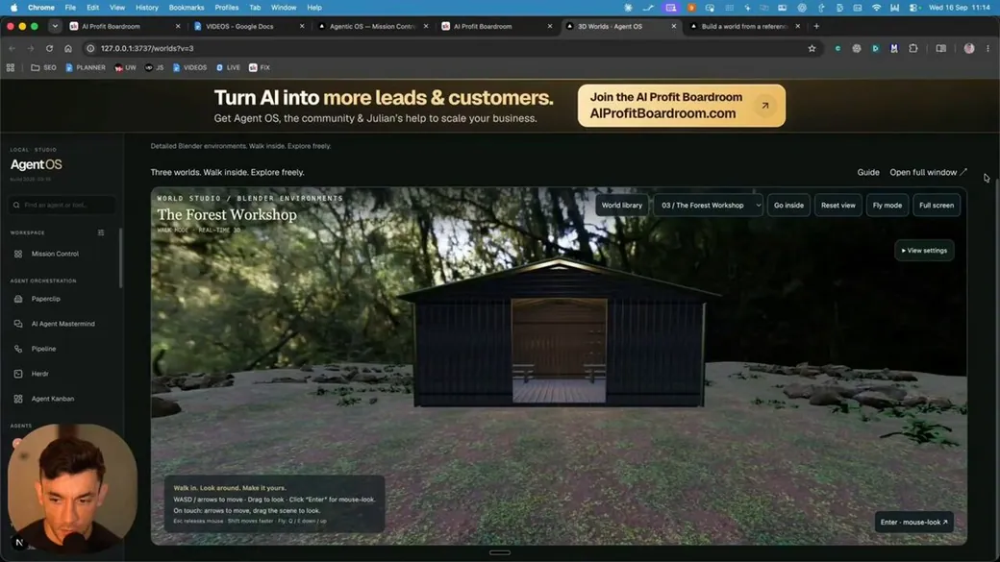</a>

**Промпт**

```text
Створіть завершене фотореалістичне 3D-середовище. Здивуйте мене.
```

<details>
<summary>Оригінальний промпт автора</summary>

```text
Build a complete photorealistic 3D environment. Surprise me.
```

</details>

[Докладніше ↗](https://www.tripo3d.ai/uk/3d-prompts/gpt-6-astra-2101224659861590399) · [Оригінальний допис](https://x.com/JulianGoldieSEO/status/2101224659861590399) · [Назад до прикладів](#all-prompts)

---

<a id="gpt-6-astra-2101055500599054437"></a>

### Галактика на основі реальної орбітальної фізики

[Argona](https://x.com/Argona0x) · 2026-09-18 · GPT-6 Astra · Анімація

<a href="https://www.tripo3d.ai/uk/3d-prompts/gpt-6-astra-2101055500599054437">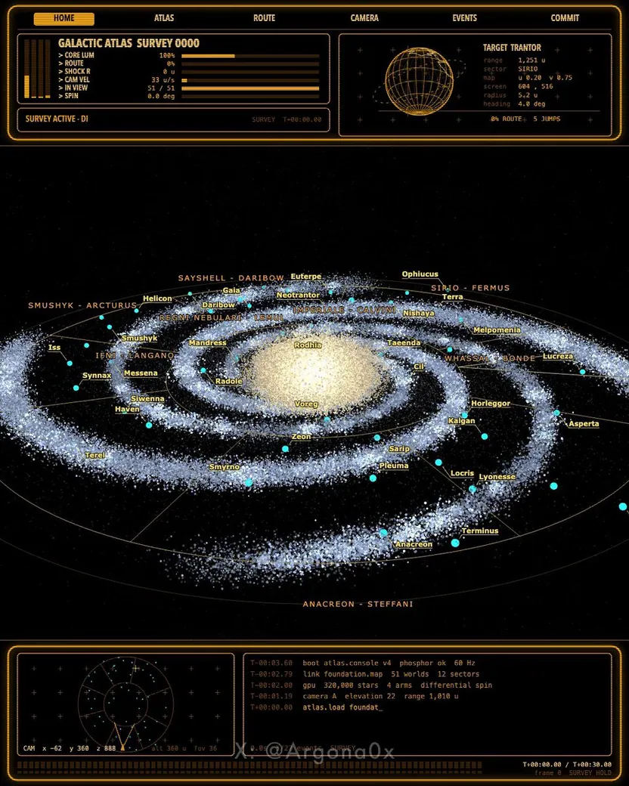</a>

**Промпт**

```text
галактика на основі реальної орбітальної фізики, 320 000 зірок, один політ крізь неї, 30 секунд
```

<details>
<summary>Оригінальний промпт автора</summary>

```text
a galaxy from real orbital physics, 320,000 stars, one flight through it, 30 seconds
```

</details>

[Докладніше ↗](https://www.tripo3d.ai/uk/3d-prompts/gpt-6-astra-2101055500599054437) · [Оригінальний допис](https://x.com/Argona0x/status/2101055500599054437) · [Назад до прикладів](#all-prompts)

---

<a id="monster-block"></a>

### Monster Block — 45 секунд, щоб рознести місто

[Tony](https://x.com/abc30037274) · 2026-09-18 · GPT-6 Astra · Ігри

<a href="https://www.tripo3d.ai/uk/3d-prompts/monster-block">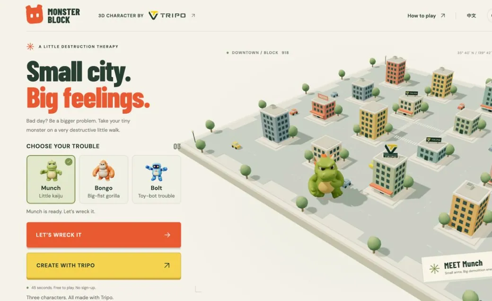</a>

**Референси:** [1](https://media.tripogrowth.space/media/ab5439fe-bc9f-4cde-8713-20e1b0caf7a6.png) · [2](https://media.tripogrowth.space/media/94648b5c-c804-46bd-a2b1-c684b25bd848.png) · [3](https://media.tripogrowth.space/media/4405e75a-c387-44cb-b63c-d8503454b422.png)

**Промпт**

```text
# Monster Block — специфікація відтворення

## 1. Мета проєкту

Створіть браузерну гру Monster Block, у яку можна грати. Гравець обирає іграшкового монстра, потрапляє до мініатюрного міста й за 45 секунд руйнує якомога більше будівель. Переміщення, удари кігтями по будівлях, жбурляння автомобілів і ланцюжки руйнувань мають одразу супроводжуватися зрозумілим зворотним зв’язком. Завершення раунду має показувати рахунок, титул, дію повторної спроби та посилання на випробування, за яким друг зможе зіграти на тій самій мапі. Додайте інтерфейси англійською та спрощеною китайською мовами, а також керування клавіатурою й дотиками.

## 2. Візуальний стиль

Створіть теплу настільну діораму на товстій квадратній платформі на тлі кремового кольору. Використовуйте малодеталізовані пастельні будівлі, маленькі вікна темного бірюзового кольору, світлі краї дахів, широкі дороги приглушеного зелено-сірого кольору, пішохідні переходи «зебра», округлі дерева, крихітні автомобілі та м’які теплі тіні. Палітра будівель охоплює теракотовий, гірчичний, припилений бірюзовий, рожевий, синьо-сірий, кремовий і шавлієвий кольори. Матеріали мають нагадувати матові розфарбовані іграшки, а не блискучий метал.

Використовуйте камеру з високої перспективи у три чверті, а не пласку камеру згори. Еталонна камера розташована в точці (35, 37, 41), дивиться в напрямку (0, 0.4, 0) і використовує кут огляду 38 градусів на широких екранах, 44 градуси на проміжних екранах і 51 градус на вузьких екранах. Під час гри плавно стежте за монстром, залишаючи найближчі цілі в полі зору. Освітлюйте сцену теплим напівсферичним світлом, м’яким спрямованим світлом із тінями та холодним заповнювальним світлом.

Для великих англомовних заголовків використовуйте вузький жирний акцидентний шрифт, а для інструкцій — читабельний шрифт без зарубок. Поєднуйте темно-зелений текст, кремові поверхні, помаранчеві дії гри та жовті дії створення в Tripo. На головній сторінці кнопки Play і Create with Tripo мають бути однаково помітними. У діалозі паузи розмістіть темно-зелену картку Tripo з трьома мініатюрами персонажів і жовтою кнопкою створення над контурною кнопкою Resume. Текст довідки має залишатися зручним для читання на телефонах.

Використовуйте короткі ефекти, що запускаються введенням: помахи кігтями, короткий відскок будівлі після удару, виразні ефекти влучання та руйнування, кільця від удару об землю, невеликі спалахи уламків, спливні повідомлення з балами, зміни комбо та стриманий спрямований поштовх камери. Піднятий автомобіль має опинятися в руці приблизно за 220 мс. За ввімкненого режиму зменшення анімації приберіть тремтіння, спалахи уламків і масштабування інтерфейсу, але збережіть рахунок, позначення цілей і результати руйнування.

## 3. Світ і сцена

Розмістіть 16 будівель, які можна зруйнувати, у сітці 4 × 4. Використовуйте відстань між кварталами 10.4, а центри кварталів розташуйте на відстанях -1.5, -0.5, 0.5 і 1.5 відносно цього кроку; уздовж кожної осі прокладіть п’ять проспектів. Ширина платформи — 52.6 одиниці. Будівлі мають від двох до п’яти поверхів, різні форми плану, деталі дахів, подекуди навіси та невеликі вивіски HOTEL або NOODS. Генеруйте компонування детерміновано на основі seed.

Розмістіть уздовж доріг 12 автомобілів і один гарантовано доступний для жбурляння жовтий автомобіль біля початкової ігрової позиції. Додайте дерева навколо ділянок із будівлями та по краях платформи, чотири кутові ліхтарі, дорожню розмітку й центральний перехід. Розмістіть монстра на вільному проспекті в точці (0, 0.2, 10.4); для головної сторінки використовуйте передній простій у точці z=20.8.

Один і той самий параметр block має відтворювати те саме компонування будівель. Якщо його не задано, виводьте seed блоку з дати за UTC. Параметр beat задає цільовий рахунок друга. Під час повторної спроби зберігайте вибраний блок. Випадкові уламки не обов’язково мають бути детермінованими.

## 4. Перелік ресурсів

Підтримуйте стабільні ID ресурсів і відокремлюйте візуальні моделі від проксі-об’єктів ігрових колізій.

- munch: Munch / 阿猛, зелений динозавр за замовчуванням. Збережіть початкову округлу морду, кремове черево й роги, помаранчеві шипи на спині, короткі лапи, великі ступні та довгий хвіст. Завантажуйте /assets/monster-animated.glb і нормалізуйте його висоту до 5.6 одиниці. Залиште /assets/monster.glb як статичний запасний варіант.
- bongo: Bongo / 橘拳, помаранчева іграшкова горила з непропорційно великими кулаками та широким тулубом. Завантажуйте /assets/bongo-animated.glb і нормалізуйте його висоту до 4.5 одиниці.
- bolt: Bolt / 蓝电, синій іграшковий робот із масивними кінцівками та дружнім силуетом. Завантажуйте /assets/bolt-animated.glb і нормалізуйте його висоту до 4.9 одиниці.
- Кожен персонаж має відповідний PNG-файл попереднього перегляду та кліпи idle, run і slash. Збережіть усіх трьох доступних для вибору персонажів; перемикання має оновлювати і попередній перегляд, і модель, яку буде використано в наступному раунді.
- city_building: процедурні багаторазово використовувані групи будівель із окремим відстеженням здоров’я, меж колайдера, відскоку після удару та стану руйнування. Краї дахів, основи й навіси належать до колізійного об’єму.
- city_car: процедурні багаторазово використовувані автомобілі, які можна жбурляти. Окремо зберігайте стани автомобіля в руці, у повітрі та після руйнування. Три автомобілі мають жовтий брендинг Tripo.
- city_decor: процедурні дерева, ліхтарі, тротуари, вивіски та дорожня розмітка. Зробіть цей ресурс легким, повторно використовуйте геометрію та матеріали.
- tripo_scenery: одна скульптура з логотипом на даху, дві вивіски на дахах, фасад майстерні та три брендовані автомобілі. Створіть їх із наданого логотипа Tripo та процедурних сіток. Це декорації сцени, а не додаткові моделі, згенеровані через API, і не бонуси в грі.

Три моделі персонажів — пріоритетні ресурси Tripo. За можливості повторно використовуйте надані згенеровані GLB-файли з ригом. Для нового персонажа згенеруйте відповідну іграшкову модель, перевірте придатність до ригінгу, прив’яжіть скелет, створіть анімації idle, run і slash та перевірте пропорції, перш ніж додавати його до складу персонажів. Не викликайте API генерації, коли гравець починає раунд. Завантаження персонажів і автоматичний імпорт власних творінь гравця не входять до цієї версії.

## 5. Ігровий процес і зворотний зв’язок

Підтримуйте клавіші WASD або клавіші зі стрілками для переміщення, утримання Space для повторних атак кігтями, E для захоплення найближчого автомобіля та повторне натискання E для жбурляння, R для удару об землю й Escape для паузи. На сенсорних екранах додайте віртуальний джойстик і окремі кнопки атаки, захоплення/жбурляння та удару об землю. Під час паузи або втрати фокуса скидайте утримувані команди.

Використовуйте такі правила:

- Раунд триває 45 секунд. Здоров’я будівлі дорівнює кількості поверхів плюс один, тобто становить 3–6 одиниць.
- Удар кігтями завдає 1 одиниці шкоди; інтервал між атаками — 0.42 секунди.
- Удар об землю завдає 3 одиниці шкоди кожній будівлі в зоні дії; час відновлення — 7 секунд.
- Жбурляний автомобіль завдає будівлям у зоні удару 4 одиниці шкоди та приносить 75 базових балів за влучання.
- За влучання по будівлі нараховується 20 балів, помножених на поточний множник. За руйнування після збільшення комбо руйнувань нараховується round(180 + building height × 50), помножене на множник.
- Повторне руйнування протягом 3.5 секунди продовжує комбо. Звичайні влучання не продовжують це вікно. Множник дорівнює min(5, 1 + floor(combo / 2)).
- Знищення всіх 16 будівель завершує раунд і додає ceil(seconds remaining) × 100. В іншому разі раунд завершується, коли час досягає нуля, після чого нові бали не нараховуються.

У грі немає ворогів, битв із босами, здоров’я гравця чи штрафів за смерть. Виклик полягає у виборі маршруту, ефективному використанні автомобілів і ударів об землю та підтриманні комбо руйнувань. Показуйте час, що залишився, рахунок, кількість зруйнованих будівель, множник і час відновлення удару об землю. Зробіть недоступні дії зрозумілими, не блокуючи переміщення. Розрізняйте порожній замах і вдале влучання за допомогою звукового та візуального зворотного зв’язку.

Розраховуйте переміщення й обертання з урахуванням вибіркової анімованої габаритної форми кожного персонажа, зокрема лап і хвоста. Перевіряйте зіткнення з повними межами будівель, залишаючи невеликий зазор. Монстр має мати змогу атакувати з допустимої позиції стояння. Дозвольте проходити через ділянку після руйнування будівлі. Не допускайте затискання гравця в кутах і проходження хвоста крізь неушкоджену будівлю під час повороту.

Призупиняйте таймер і введення клавішею Escape, кнопкою паузи, під час втрати фокуса вікном і приховування вкладки. Передбачте сценарії Resume, Retry і Home. Завершуйте раунд показом рахунку, кількості руйнувань, найкращого комбо, жартівливого титулу та посилання на випробування на тій самій мапі. Додайте можливість завантажити картку з рахунком розміром 1080 × 1350 і, якщо підтримується MediaRecorder, запис раунду у форматі MP4 або WebM, який підтримується системою. Використовуйте нативний механізм поширення, якщо він доступний, а для посилань на випробування передбачте запасний варіант із буфером обміну. Ніколи не подавайте рахунок, обчислений браузером, як захищений конкурентний рейтинг.

## 6. Технічна реалізація

Використовуйте Three.js, TypeScript і Vite зі статичною збіркою dist. Розділіть генерацію світу, правила, колізії, персонажів, рендеринг, аудіо, запис, аналітику та інтерфейс на окремі модулі. Зберігайте шрифти й необхідні ресурси декодерів локально. Використовуйте інстансинг для повторюваних вікон і дорожньої розмітки, а також повторно використовуйте матеріали й геометрію. Обмежте коефіцієнт піксельного співвідношення рендера значенням 1.65. Обмежуйте тимчасові ефекти та звільняйте їхні ресурси після завершення або скидання.

Використовуйте GLTFLoader, мікшери скелетної анімації та надані кліпи GLB. Нормалізуйте кожну модель відносно центрального опорного півота на землі. Еталонний експорт спрямований уздовж +X; поверніть візуальний півот на -90 градусів навколо Y, щоб вирівняти його з напрямком уперед +Z у грі. Обчислюйте idle перед показом завантаженої моделі та тримайте анімовані ступні біля землі. У разі помилки завантаження використовуйте видимий процедурний запасний варіант; чесно повідомляйте про помилку. Захистіть асинхронний вибір персонажа, щоб старіше завантаження не могло замінити останній вибір.

Зберігайте дані колізій персонажа окремо від сіток для рендера та повторно випікайте вибіркові габаритні форми під час зміни персонажа або анімацій. Перевіряйте і переміщення, і обертання біля стін. Зберігайте стабільне керування клавіатурою й дотиками, адаптивні діалоги, локалізований текст, поведінку фокуса, вимкнення аудіо, режим зменшення анімації та відновлення WebGL.

Пов’язуйте дії створення в Tripo з https://www.tripo3d.ai/, використовуючи utm_source=monster_block, utm_medium=referral, utm_campaign=monster_block_game і специфічне для розміщення значення utm_content: header_logo, hero_create, pause_create, result_create або footer_logo. Відкривайте ці дії в окремій вкладці й спочатку призупиняйте активну гру. Пояснюйте, що Tripo створює 3D-ресурси; не обіцяйте автоматичного імпорту в цю гру.

Зберігайте наявну інтеграцію подій Pageview і PostHog, якщо це дозволяє політика хостингу. У статичній збірці використовуйте лише загальнодоступну конфігурацію приймання даних у браузері. Облікові дані для генерації, CMS, розгортання та персональної аналітики мають залишатися поза вихідним кодом і артефактами збірки. Записуйте вхід на сторінку, вибір персонажа, початок гри, перші дії, результати раунду, повторні спроби, поширення/експорт і вихідні кліки Tripo, але не вважайте кліки підтвердженими реєстраціями чи платежами.

## 7. Критерії готовності

Постачте придатний до запуску вихідний код, локальні ресурси, статичну production-збірку та зрозумілі інструкції зі встановлення, запуску й збірки. Перевірте вибір усіх трьох персонажів, повний раунд із таймером, руйнування будівель, захоплення й жбурляння, час відновлення удару об землю, завершення комбо, паузу/продовження, повторну спробу та підрахунок результатів наприкінці раунду. Переконайтеся, що початковий динозавр залишається доступним для вибору, а всі троє персонажів можуть переміщатися й повертатися біля будівель без видимого проникнення в геометрію чи застрягання.

Перевірте компонування англійською та китайською мовами на настільних і вузьких мобільних екранах, зокрема читабельність довідки, сенсорне керування, дії паузи та поширення результатів. Перевірте адреси CTA Tripo, значення UTM і місця їх розміщення, експорт картки з рахунком та запасний сценарій запису. Протестуйте розгорнуту сторінку й фактичне середовище iframe CMS: завантаження моделей, введення, зовнішні посилання та завантаження файлів. Повідомляйте про обмеження браузерів або пристроїв, не заявляйте про універсальну підтримку чи стабільну частоту кадрів без підтверджених вимірювань.

```

[Докладніше ↗](https://www.tripo3d.ai/uk/3d-prompts/monster-block) · [Оригінальний допис](https://x.com/abc30037274/status/2100636075039629796) · [Демо](https://monster-block.tripo.page/) · [Назад до прикладів](#all-prompts)

---

<a id="gpt-6-astra-2100956517633761447"></a>

### Інтерактивна модель годинника IWC Schaffhausen

[YouWare](https://x.com/YouWareAI) · 2026-09-18 · GPT-6 Astra · Інтерактив

<a href="https://www.tripo3d.ai/uk/3d-prompts/gpt-6-astra-2100956517633761447">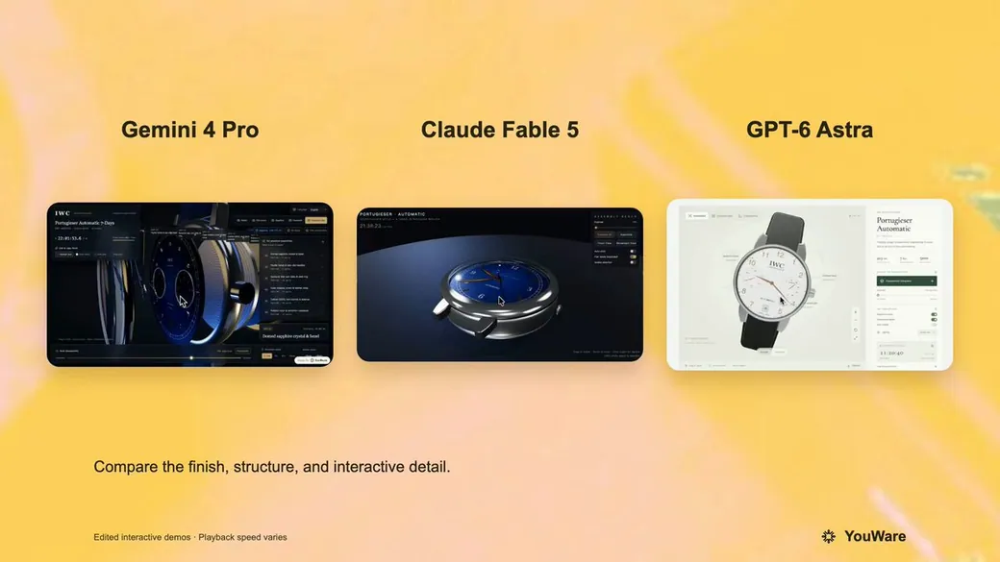</a>

**Промпт**

```text
За допомогою Three.js розробіть максимально точну інтерактивну 3D-модель годинника IWC Schaffhausen. Вимоги: 1) структура циферблата має бути надзвичайно точною: кожен механічний компонент потрібно відтворити окремо, щоб його можна було чітко розрізнити; 2) для скла годинника використайте матеріал сапфірового скла з реалістичною прозорістю, заломленням і відбиттями; 3) хвилинна та секундна стрілки мають правильно показувати час відповідно до логіки реального годинникового механізму, з автоматичною анімацією плавного безперервного ходу; 4) передбачте розбирання та повторне складання годинника, щоб кожну деталь можна було відокремити й розглядати окремо; 5) загальний рівень деталізації має бути надзвичайно високим і якнайточніше відповідати будові та пропорціям справжнього годинника. Використайте реалістичні текстури матеріалів для гвинтів, металевих деталей та інших компонентів, а також ретельно опрацьоване виконання. Переконайтеся, що модель плавно працює в браузері та природно реагує на взаємодію.
```

<details>
<summary>Оригінальний промпт автора</summary>

```text
Use Three.js to develop a highly faithful 3D interactive watch model of an IWC Schaffhausen timepiece. Requirements: 1) The dial structure must be highly precise, with every mechanical component individually rendered and clearly distinguishable; 2) The watch face must use a sapphire glass material with realistic transparency, refraction, and reflection effects; 3) The minute hand and second hand must be correct hands that follow real timekeeping logic, with automatic continuous hand-sweep animation; 4) Support disassembly and reassembly of the watch, with each part able to be separated and viewed individually; 5) The overall level of detail must be extremely high, closely matching the structure and proportions of a real watch, with realistic material textures for screws, metal parts, and other components, and fine craftsmanship. Please ensure the model runs smoothly in the browser and interacts naturally.
```

</details>

[Докладніше ↗](https://www.tripo3d.ai/uk/3d-prompts/gpt-6-astra-2100956517633761447) · [Оригінальний допис](https://x.com/YouWareAI/status/2100958838350643553) · [Назад до прикладів](#all-prompts)

---

<a id="odd-arms"></a>

### ODD ARMS — Гра на виживання з дивною зброєю

[Deniffer](https://x.com/lumina__team) · 2026-09-18 · GPT-6 Astra · Ігри

<a href="https://www.tripo3d.ai/uk/3d-prompts/odd-arms">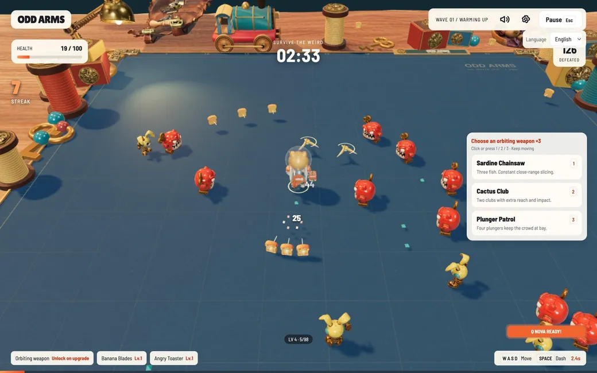</a>

**Промпт**

```text
# ODD ARMS — Твоя ідея. Твій герой.

## 1. Мета
Увесь ігровий інтерфейс має бути англійською (додайте японську як необов’язкову мову перемикача).
Створіть завершену браузерну гру на виживання тривалістю три хвилини в жанрі «орда з автоатакою»: гравець обирає іграшкового героя та дві напрочуд дивні зброї, а потім виживає 180 секунд серед роїв монстрів на верстаку майстра. Зброя атакує автоматично; гравець лише рухається, робить ривок, збирає кристали, обирає покращення та запускає заряджену нову. Головна особливість — персоналізація: гравці можуть створити власного героя або зброю в Tripo, завантажити GLB і додати його до гри. Для фінального результату використайте https://odd-arms.tripo.page/ та надані референси. Автор: Deniffer — https://x.com/lumina__team.

## 2. Візуальний напрям
Подавайте гру як мініатюрну іграшкову діораму, показану з фіксованої тричвертної камери зверху, що стежить за героєм. Ігрове поле — темно-синій килимок для різання з ледь помітною сіткою та надрукованими кутовими позначками «ODD ARMS», покладений на стіл із теплої деревини. Край столу заповнений великогабаритним реквізитом для рукоділля (котушки ниток, оздоблені латунними розетками коробки, шкіряний рулон для інструментів, латунна настільна лампа, дерев’яний іграшковий потяг, іграшкові деталі), щоб арена сприймалася як справжня поверхня столу. Використовуйте тепле ключове світло з боку лампи, м’яке заповнювальне освітлення, контактні тіні та делікатне свічення; персонажі мають бути глянцевими, масивними, у стилі колекційних фігурок із насиченими кольорами.

Інтерфейс: кремово-білі картки із заокругленими кутами, темно-синім текстом і коралово-помаранчевим акцентом; для заголовків — важкий вузький дисплейний шрифт («LET'S MAKE SOME TROUBLE.»), для основного тексту — чистий вузький гротеск. Під час бою: картка здоров’я у верхньому лівому куті, лічильник серії під нею, зворотний відлік «SURVIVE THE WEIRD» угорі по центру, позначка хвилі + звук + налаштування + Pause у верхньому правому куті, лічильник переможених праворуч, індикатор рівня/досвіду внизу по центру, три комірки зброї (орбітальна / поворотна / стрілецька з рівнями) внизу ліворуч, керування + час відновлення ривка внизу праворуч, індикатор «Q NOVA READY!» над ним. Додайте ефекти: числа шкоди, критичні удари, squash-and-stretch для ворогів, відкидання, частинки-спалахи, легке тремтіння камери (вимикайте тремтіння, якщо встановлено prefers-reduced-motion).

## 3. Світ
Одна квадратна арена; обмежте героя діапазоном ±23 одиниці за обома осями. Килимок для різання заповнює ігрову область; стіл і реквізит розташовані за межами обмеження й слугують лише декораціями (без колізій). Спочатку арена порожня, а вороги заповнюють її з країв: вони з’являються на кільці за 12–16 одиниць від героя (за 8–11 у першу секунду) і прямують просто до нього. Кожні 22 секунди навала створює повне коло ворогів на радіусі 13. Червоні попереджувальні кола з’являються під поточною позицією героя (перше на 28-й секунді, потім кожні max(4.4, 9 − t/50) с) і вибухають через 2 с.

## 4. Перелік ресурсів
Підготуйте стабільні слоти моделей; кожен слот має завантажувати один GLB, центрувати його, автоматично масштабувати до потрібної висоти та використовувати простий заповнювач, якщо завантаження не вдалося.

Герої (10, `hero:<id>`), кожен — масивна іграшкова фігурка з виразним силуетом:
- `cat` Astro Cat — рудий смугастий кіт у білому скафандрі та скляному шоломі. HP 100, швидкість 6.8, магніт ×1.35, час відновлення ривка 2.4 с.
- `frog` Frog Fighter — зелена жаба в червоних боксерських рукавичках. HP 130, швидкість 6.8, шкода від ривка 135.
- `shroom` Mushroom Hero — гриб із червоним капелюшком і маленькою накидкою. HP 90, швидкість 7.6, ривок 1.8 с.
- `capybara` Chill Capybara — розслаблена капібара з гарячого джерела. HP 160, швидкість 5.8, магніт ×1.15, ривок 3 с, шкода від ривка 110.
- `ramen` Ramen Ronin — самурай із мискою гарячого рамену. HP 105, швидкість 7.2, ривок 2.2 с, шкода від ривка 120.
- `penguin` Office Penguin — пінгвін у сорочці та краватці. HP 80, швидкість 7.1, ривок 1.5 с, шкода від ривка 75.
- `axolotl` Axolotl — рожевий аксолотль-мандрівник. HP 85, швидкість 7.3, магніт ×1.6, шкода від ривка 75.
- `avocado` Avo Boxer — боксер-авокадо з кісточкою всередині. HP 120, швидкість 6.4, ривок 2.1 с, шкода від ривка 130.
- `robot` Clockwork Bot — заводний бляшаний робот із ключиком. HP 115, швидкість 6.2, ривок 2.8 с, шкода від ривка 165.
- `snail` Snail Knight — лицар-равлик із мушлею завбільшки з будиночок. HP 190, швидкість 5.2, магніт ×1.2, ривок 3.2 с, шкода від ривка 120.
Типова шкода від ривка — 90, якщо інше не вказано.

Зброя (12, `weapon:<id>`), згрупована за слотами атак:
- Орбітальна: `sardine` Sardine Chainsaw (3 рибини, радіус 2.9, шкода 1, швидкість 1.2); `cactus` Cactus Club (2 булави, радіус 3.3, шкода 1.65, швидкість 0.78, радіус влучання 1.25, відкидання 1.5); `plunger` Plunger Patrol (4 вантузи, радіус 2.25, шкода 0.85, швидкість 1.5).
- Поворотна: `banana` Banana Blades (2, шкода 1, швидкість 1.25); `pizza` Pizza Cutter (1 великий диск, шкода 1.5, швидкість 0.82, радіус влучання 1.65); `croissant` Croissant Blades (3, шкода 0.75, швидкість 1.45); `boomerang` Boomerang (1, шкода 1.15, швидкість 1.6); `donut-disc` Donut Disc (1, шкода 1.5, швидкість 0.9, радіус влучання 1.3).
- Стрілецька: `duck` Duck Rocket (з наведенням, зона ураження 2, інтервал 0.42 с); `toaster` Angry Toaster (пронизувальна черга з 3 пострілів віялом, шкода 0.7); `teapot` Raging Teapot (2 повільні постріли, зона ураження 2.8, інтервал 0.8 с); `bubble-gun` Bubble Gun (2 пронизувальні бульбашки, шкода 0.45, інтервал 0.3 с).
Початкове спорядження: Astro Cat, Banana Blades, Angry Toaster; орбітальна зброя відкривається під час першого покращення.

Вороги (3, `enemy:<id>`), заводні іграшкові монстри: `red-chomper` (червона кругла іграшка, що кусається, звичайний, базові 30 HP, швидкість 2.35), `spring-rabbit` (жовтий кролик на пружинних лапках, швидкий, базові 23 HP, швидкість 3.5), `crown-bear` (великий клаптиковий ведмідь із короною, танк, базові 130 HP, швидкість 1.7, з’являється після 60 с із часткою 17%, випадає 3 XP).

Реквізит сцени (`prop:<id>`): верстак, рамка та кутові пластини килимка для різання, настільна лампа, іграшковий потяг, котушки ниток, оздоблені коробки з розетками, рулон для інструментів, лоток з іграшковими деталями. Килимок, сітку, кристали, снаряди, попереджувальні кола, частинки, освітлення та інтерфейс створюйте процедурно.

## 5. Ігровий процес і зворотний зв’язок
Послідовність: Персонаж → Спорядження (одна поворотна + одна стрілецька зброя) → Готово (тривимірний перегляд героя з обраною зброєю на обертовому стенді, перетягуванням можна обертати модель) → «Let's play». На кожному кроці знайомства показуйте лише відповідну категорію, її опис, стиль гри та слабкість. Запам’ятовуйте останнє спорядження.

Керування: WASD/стрілки — рух; Space — ривок у напрямку руху (швидкість ×3.7, коротка невразливість, шкода ворогам у радіусі 2 одиниць один раз за ривок); Q — запускає нову, коли енергія дорівнює 100 (радіус 11, шкода 200, сильне відкидання, притягує кристали); 1/2/3 або клацання — вибір покращення; Esc — пауза; автоматична пауза, коли вікно втрачає фокус. На мобільних пристроях: ліворуч — віртуальний аналоговий джойстик, праворуч — кнопки Dash і Nova з кільцями часу відновлення/заряду, мультитач, щоб джойстик і кнопки працювали одночасно; у книжковій орієнтації покращення розташовані над джойстиком, у альбомній — між великими пальцями.

Правила: HP ворога = base × (1 + t/260) × 1.3. Інтервал появи max(0.18, 0.52 − 0.0016·t) с, максимум 180 ворогів. Контактна шкода — 9 (18 від ведмедя), після влучання 0.85 с невразливості. За кожне вбивство гравець отримує 2 енергії та кристал; кожне 9-те влучання кожної зброї стає критичним із множником ×1.7. Серія з 25 убивств запускає 5-секундне шаленство (швидкість атаки ×1.65, час відновлення 13 с); отримання шкоди скидає серію. Досвід для переходу на рівень: 20, потім round(need × 1.4 + 10). Підвищення рівня ніколи не ставить гру на паузу: вони додаються в чергу як картки вибору, що не блокують гру. Перше покращення пропонує три види орбітальної зброї; надалі пропонуйте три з таких варіантів: Orbit overload (+1 орбітальний елемент, максимум 7, +22% шкоди), Another round (швидші, довші та потужніші повернення), Full blast (швидша стрільба, +20% шкоди, більше снарядів), Live a little (+10% швидкості, +30 HP). Кожен вибір відновлює 8 HP.

Завершення: вижити 180 с → «Beautifully weird. You made it.»; HP 0 → «That was a glorious mess.» В обох випадках покажіть кількість переможених ворогів, найкращу серію та час виживання, а також кнопки Run it back / Change loadout і запрошення створити власний об’єкт.

Зробіть гру своєю: на екранах спорядження, паузи та результатів пункт «Create my hero / weapon in Tripo» відкриває https://studio.tripo3d.ai/ у новій вкладці; «Import GLB» завантажує локальний .glb (≤15 MB, лише вбудовані текстури, обробка в браузері, файл ніколи не завантажується на сервер), центрує та масштабує його й замінює лише вигляд обраного героя або зброї, зберігаючи його характеристики. Показуйте зрозумілі помилки для недійсних файлів і залишайте оригінальну модель.

Порівняння моделей: перемикач у заголовку «Tripo3D ⇄ Simple3D (Blender)» замінює кожного героя, зброю, ворога та елемент реквізиту на відповідний набір простих примітивів без скидання поточного забігу. Завантажте весь альтернативний набір до перемикання; якщо будь-який файл не завантажиться, залиште поточний набір.

## 6. Технічна реалізація
Vite + ванільний JavaScript + Three.js із GLTFLoader, освітленням RoomEnvironment і тональним відображенням ACES. Симуляція має працювати в окремому модулі з фіксованим кроком і змінним джерелом випадковості, щоб повні забіги можна було відтворювати в тестах; рендерер лише читає стан. Кешуйте кожен GLB один раз і клон做уйте його для екземплярів; для повторюваних орнаментів використовуйте інстансинг або LOD. Обмежте співвідношення пікселів (1.5 на мобільних пристроях, знижуйте до 1 під час щільних хвиль), оновлюйте тіні не частіше ніж 30 разів на секунду, а текст HUD — лише коли значення змінюються. Відокремте колізії (прості кола) від візуальних сіток. Шрифти, моделі та текстури мають надходити з того самого джерела, щоб збірка була статичною папкою. Орієнтуйтеся на браузери комп’ютерів і телефонів із шириною від 320 px, зокрема телефони в альбомній орієнтації та безпечні області. Складність моделей має відповідати їхньому розміру на екрані; жорсткого ліміту полігонів немає.

## 7. Готово, коли
- Повний цикл працює: знайомство, бій до перемоги й поразки, пауза/продовження, перезапуск із тим самим спорядженням, зміна спорядження.
- Усі 10 героїв і 12 видів зброї завантажуються та працюють відповідно до наведених числових параметрів; 180-секундний забіг із будь-яким спорядженням завершується без помилок.
- Керування клавіатурою й дотиком працює, зокрема джойстик і Dash одночасно.
- Імпорт GLB замінює вигляд обраного героя або зброї та коректно відхиляє пошкоджені файли.
- Перемикач Tripo3D / Simple3D замінює всі моделі під час забігу.
- Початковий екран, екрани під час бою та результати відповідають референсам; надайте вихідний код, який можна запустити, команду запуску та статичну production-збірку.

```

[Докладніше ↗](https://www.tripo3d.ai/uk/3d-prompts/odd-arms) · [Оригінальний допис](https://odd-arms.tripo.page/) · [Демо](https://odd-arms.tripo.page/) · [Назад до прикладів](#all-prompts)

---

<a id="gpt-6-astra-2100844566718926949"></a>

### Створіть фотореалістичний 3D-світ

[Julian Goldie SEO](https://x.com/JulianGoldieSEO) · 2026-09-18 · GPT-6 Astra · Сцени

<a href="https://www.tripo3d.ai/uk/3d-prompts/gpt-6-astra-2100844566718926949"></a>

**Промпт**

```text
Створіть фотореалістичний 3D-світ. Здивуйте мене.
```

<details>
<summary>Оригінальний промпт автора</summary>

```text
Build a photorealistic 3D world. Surprise me.
```

</details>

[Докладніше ↗](https://www.tripo3d.ai/uk/3d-prompts/gpt-6-astra-2100844566718926949) · [Оригінальний допис](https://x.com/JulianGoldieSEO/status/2100844566718926949) · [Назад до прикладів](#all-prompts)

---

<a id="gpt-6-astra-2100838090210431302"></a>

### 3D-гра про повітряний трамвай між плавучими островами

[YouWare](https://x.com/YouWareAI) · 2026-09-18 · GPT-6 Astra · Ігри

<a href="https://www.tripo3d.ai/uk/3d-prompts/gpt-6-astra-2100838090210431302">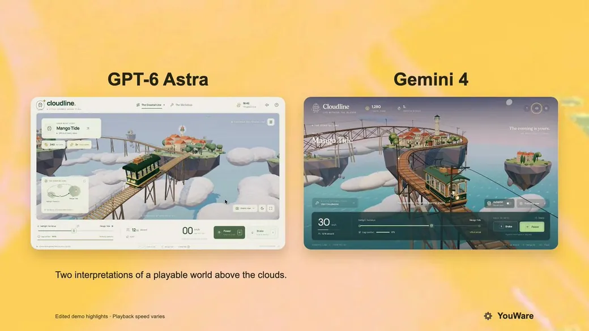</a>

**Промпт**

```text
Створіть 3D-гру в одному файлі HTML/JS (Three.js), у яку можна грати безпосередньо в браузері. Стиль має бути теплим, низькополігональним, але доведеним до рівня якісної інді-гри — з атмосферою приморського містечка Ghibli та плавністю шахтарських колій із Zelda.     
【Основний ігровий процес】  Гравець керує ретротрамваєм, що курсує між островами, які ширяють над морем хмар і поверхнею океану.  - Колія являє собою безперервну 3D-залізницю з прямими ділянками, підйомами, спусками, піднятою криволінійною колією та довгими мостами над морем  - Керування: W — прискорення (Power), S — гальмування (Brake), ліворуч і праворуч — для точного коригування або перемикання ракурсу  - Відображення в реальному часі: швидкість у км/год, кількість пасажирів у салоні (наприклад, 12/16 пасажирів), стан колії (Steady / Crosswind)  - Система комфорту пасажирів: різке прискорення, екстрене гальмування, надто швидке проходження поворотів і боковий вітер знижують «комфорт ніг»; плавне прибуття до пункту призначення приносить бонусні очки (наприклад, +75 за прибуття)  - Серія: надто тряска їзда викликає повідомлення «Серію перервано. Знайдіть баланс, щоб знову отримувати чайові.»  - Прибувши на станцію, відкривайте двері, щоб пасажири могли зайти й вийти. На платформі містяни стоять у черзі, а субтитри показують репліки на кшталт «Двері відчиняються — Mango Tide», «Будь ласка, зачекайте…»     [Світ і станції]  Щонайменше два маршрути/два острови:  1. Saltlight Terminus  2. Mango Tide  Острів — кам’янистий, він ширяє над хмарами. На ньому розташовані невеликі будинки в середземноморському/південноєвропейському стилі з черепичними дахами, маяк, причал, зелені дерева, вуличні ліхтарі та тепле жовте світло у вікнах уночі. Вдалині видніються інші плавучі острови й орбіти, що обертаються навколо них. Небо переходить від синьо-фіолетового градієнта сутінків до ночі; на ньому сяють зорі та пливуть густі хмари, а внизу розкинулося блакитне море.     [Зовнішній вигляд трамвая]  Ретро-трамвай: темно-зелений кузов, дерев’яного кольору шасі, вигнуті скляні вікна, багаж на даху, зелені навіси/оздоблення з виноградною лозою та різні пасажири всередині. Під час руху трамвай злегка погойдується, а звук колії передається простими звуковими ефектами або візуальними підказками.     [Сцена 2: Модифікація в майстерні]  Перемкніться на ізометричний вид майстерні зверху — «Cloudworks / Oliver Cloudworks / рідний острів Олівера».  Гравці можуть замінювати деталі трамвая через інтерфейс на кшталт спливного вікна покращень:  - Hearth leaves — знімаємо стару деталь  - Little Companion — готуємо трамвай  Індикатор виконання + «Сядьте зручніше й спостерігайте за роботою майстерні.»  Після модифікації зовнішній вигляд трамвая змінюється (наприклад, з’являється зелений дах, додатковий багажник, ліхтарі, лоза), після чого він виїжджає з майстерні. Субтитри: «Усі на борт.» / «Наступна зупинка: Прибережна лінія.»     [Інтерфейс]  Чистий сучасний інтерфейс невимушеної гри: пункт призначення та валюта/серія у верхньому лівому куті, шкала швидкості й кнопки Power/Brake унизу, шкала прогресу комфорту, що з’єднує назви двох станцій. Без зайвих елементів; не перетворюйте гру на горор чи кіберпанк.     [Технічні вимоги]  - Один файл або мінімальна кількість файлів, Three.js  - Використовуйте криві для колії (CatmullRom тощо), щоб трамвай рухався рейками; камера має слідувати за ним із легким ефектом руху вздовж колії  - Відчуття простої фізики: інерція під час розгону, уповільнення під час гальмування, нахил кузова на поворотах  - На мобільних пристроях також спробуйте реалізувати керування дотиками для прискорення/гальмування  - Код має бути зрозумілим, містити коментарі, а гра — запускатися одразу після відкриття.
```

<details>
<summary>Оригінальний промпт автора</summary>

```text
Create a single-file HTML/JS 3D game (Three.js) that can be played directly in the browser, with a warm, low-poly but polished indie game style, evoking the feel of a Ghibli seaside town combined with the smoothness of Zelda's mine cart tracks.     
【Core Gameplay】  The player drives a retro aerial tram, traveling between islands floating above a sea of clouds and the ocean surface.  - The track is a continuous 3D railway, featuring straight sections, uphill slopes, downhill slopes, elevated curves, and long bridges across the sea  - Controls: W to accelerate (Power), S to brake (Brake), left and right for fine-tuning or switching the view  - Real-time display: speed in km/h, number of passengers on board (e.g., 12/16 aboard), road conditions (Steady / Crosswind)  - Passenger comfort system: sudden acceleration, hard braking, taking corners too fast, and crosswinds all reduce "leg comfort"; arriving at the destination smoothly earns bonus points (e.g., +75 at arrival)  - Streak: driving too bumpily will trigger the message "Streak broken. Find your balance to rebuild your tips."  - Arrive at the station, open the doors for passengers to get on and off. On the platform, there are townsfolk queuing up, with subtitles such as "Doors opening - Mango Tide," "Please wait…"     [World and Stations]  At least two routes/two islands:  1. Saltlight Terminus  2. Mango Tide  The island is a rocky island floating above the clouds, with small Mediterranean/Southern European-style houses with red-tiled roofs, a lighthouse, a dock, green trees, streetlights, and warm yellow windows at night. In the distance, there are more floating islands and circling orbits. The sky is a blue-purple gradient from dusk to night, with stars and thick clouds, and below is azure seawater.     [Tram Exterior]  Retro tram: dark green body, wood-colored chassis, curved glass windows, roof luggage, green awning/vine decorations, and various passengers sitting inside. While moving, there is a slight swaying motion and a sense of track sounds (which can be conveyed with simple sound effects or visual cues).     [Scene 2: Workshop Modification]  Switch to the top-down isometric view of the workshop "Cloudworks / Oliver Cloudworks / Oliver's home island."  Players can swap parts for the tram, with an interface like an upgrade pop-up:  - Hearth leaves — Lifting the old part  - Little Companion — Preparing the tram  Progress bar + "Sit back and watch the workshop."  Changes to the tram's appearance after modification (e.g., green roof, added luggage rack, lanterns, vines), then it drives out of the workshop, subtitles "All aboard." / "Next stop: the Coastal Line."     [UI]  Clean modern casual game UI: destination and currency/streak in the top-left, speed bar and Power/Brake buttons at the bottom, comfort progress bar connecting the two station names. No clutter, don't make it horror or cyberpunk.     [Technical Requirements]  - Single file or minimal files, Three.js  - Use curves for the track (CatmullRom, etc.) so the tram follows the rails, camera follows with a slight rail feel  - Simple physics feel: acceleration inertia, braking deceleration, body roll when cornering  - On mobile, try to also support tap to accelerate/brake  - Readable code, with comments, playable as soon as it's opened.
```

</details>

[Докладніше ↗](https://www.tripo3d.ai/uk/3d-prompts/gpt-6-astra-2100838090210431302) · [Оригінальний допис](https://x.com/YouWareAI/status/2100838828433179037) · [Назад до прикладів](#all-prompts)

---

<a id="gpt-6-astra-2100751369619820923"></a>

### Навчання стратегії обертання ручки за допомогою Dexterous Hand Sharpa

[AI Will](https://x.com/FinanceYF5) · 2026-09-18 · GPT-6 Astra · Анімація

<a href="https://www.tripo3d.ai/uk/3d-prompts/gpt-6-astra-2100751369619820923">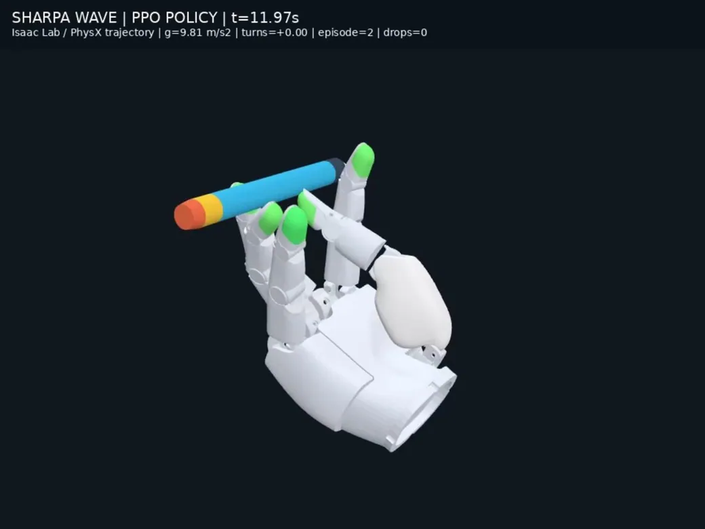</a>

**Промпт**

```text
Навчіть роботизовану кисть обертати ручку. Використовуйте Isaac Lab для підкріплювального навчання та Sharpa hand, а 3D-сітку ручки створіть самостійно. Підсумкові результати мають містити навчену стратегію й відео з візуалізацією. Можна вільно шукати інформацію в інтернеті, завантажувати наукові статті та всі необхідні матеріали.
```

<details>
<summary>Оригінальний промпт автора</summary>

```text
让灵巧手完成转笔。使用 Isaac Lab 进行强化学习，采用 Sharpa hand，并自行创建笔的 3D 网格。最终交付训练好的策略和可视化视频。可以自由联网搜索、下载论文及所需资料。
```

</details>

[Докладніше ↗](https://www.tripo3d.ai/uk/3d-prompts/gpt-6-astra-2100751369619820923) · [Оригінальний допис](https://x.com/FinanceYF5/status/2100751369619820923) · [Назад до прикладів](#all-prompts)

---

<a id="gpt-6-astra-2100614534423540102"></a>

### Astra сама створює собі тіло в CAD

[vitalduval](https://x.com/vitalduval) · 2026-09-17 · GPT-6 Astra · Асети

<a href="https://www.tripo3d.ai/uk/3d-prompts/gpt-6-astra-2100614534423540102">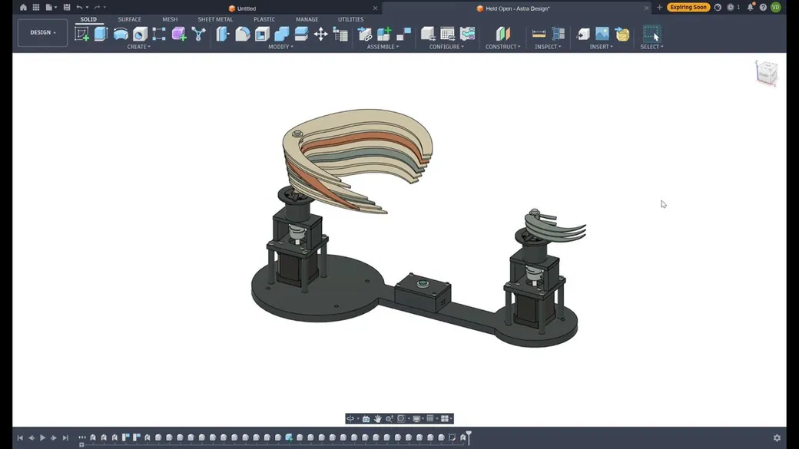</a>

**Промпт**

```text
Я попросив Astra змоделювати собі тіло в CAD.
```

<details>
<summary>Оригінальний промпт автора</summary>

```text
I told Astra to CAD itself a body.
```

</details>

[Докладніше ↗](https://www.tripo3d.ai/uk/3d-prompts/gpt-6-astra-2100614534423540102) · [Оригінальний допис](https://x.com/vitalduval/status/2100343136077877251) · [Назад до прикладів](#all-prompts)

---

<a id="gpt-6-astra-2100595652703199281"></a>

### 3D-гра в браузері: втеча із закритого дослідницького комплексу

[forest.watch.impress.co.jp](https://forest.watch.impress.co.jp/) · 2026-09-17 · GPT-6 Astra · Ігри

<a href="https://www.tripo3d.ai/uk/3d-prompts/gpt-6-astra-2100595652703199281">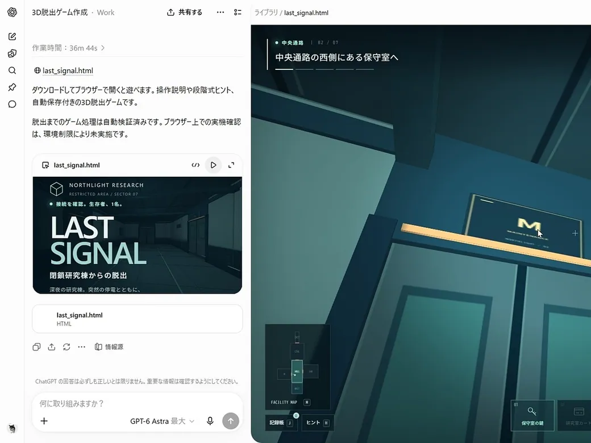</a>

**Промпт**

```text
Створіть 3D-гру в браузері про втечу із закритого дослідницького комплексу. Розрахуйте проходження приблизно на 5–10 хвилин. Додайте механізми з ключами, перемикачами та іншими інтерактивними елементами; зробіть керування зрозумілим і забезпечте можливість пройти гру до кінця. Об’єднайте все в один HTML-файл, щоб у гру можна було грати, просто відкривши його в браузері.
```

<details>
<summary>Оригінальний промпт автора</summary>

```text
ブラウザーで遊べる3D脱出ゲームを作ってください。閉鎖された研究施設から脱出する内容で、5～10分程度で遊べるものにしてください。鍵やスイッチなどの仕掛けを入れ、遊び方がわかり、最後までクリアできる状態にしてください。HTMLファイル1つにまとめ、ブラウザーで開くだけで遊べるようにしてください。
```

</details>

[Докладніше ↗](https://www.tripo3d.ai/uk/3d-prompts/gpt-6-astra-2100595652703199281) · [Оригінальний допис](https://forest.watch.impress.co.jp/docs/serial/yaaiwatch/2141084.html) · [Назад до прикладів](#all-prompts)

---

<a id="gpt-6-astra-2100526922770026874"></a>

### Створення 3D-гоночної гри

[たい焼き｜Claude Codeの人](https://x.com/taiyaki_ai3) · 2026-09-17 · GPT-6 Astra · Ігри

<a href="https://www.tripo3d.ai/uk/3d-prompts/gpt-6-astra-2100526922770026874">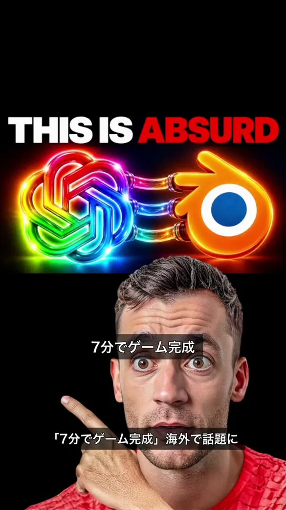</a>

**Промпт**

```text
Створи гоночну гру
```

<details>
<summary>Оригінальний промпт автора</summary>

```text
レーシングゲーム作って
```

</details>

[Докладніше ↗](https://www.tripo3d.ai/uk/3d-prompts/gpt-6-astra-2100526922770026874) · [Оригінальний допис](https://x.com/taiyaki_ai3/status/2100526934082105683) · [Назад до прикладів](#all-prompts)

---

<a id="gpt-6-astra-2100519026720231698"></a>

### Додати ланцюг для технічного обслуговування до поручня

[きのした](https://x.com/ujiden_type0) · 2026-09-17 · GPT-6 Astra · Асети

<a href="https://www.tripo3d.ai/uk/3d-prompts/gpt-6-astra-2100519026720231698">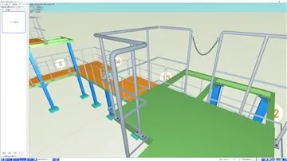</a>

**Промпт**

```text
Додай до поручня ланцюг для технічного обслуговування!
```

<details>
<summary>Оригінальний промпт автора</summary>

```text
手摺にメンテ用のチェーン付けて！
```

</details>

[Докладніше ↗](https://www.tripo3d.ai/uk/3d-prompts/gpt-6-astra-2100519026720231698) · [Оригінальний допис](https://x.com/ujiden_type0/status/2100519026720231698) · [Назад до прикладів](#all-prompts)

---

<a id="gpt-6-astra-2100350159540596760"></a>

### Інтерактивна воксельна сцена з лицарем і багаттям

[Vib3Coded](https://x.com/vib3coded) · 2026-09-16 · GPT-6 Astra · Інтерактив

<a href="https://www.tripo3d.ai/uk/3d-prompts/gpt-6-astra-2100350159540596760">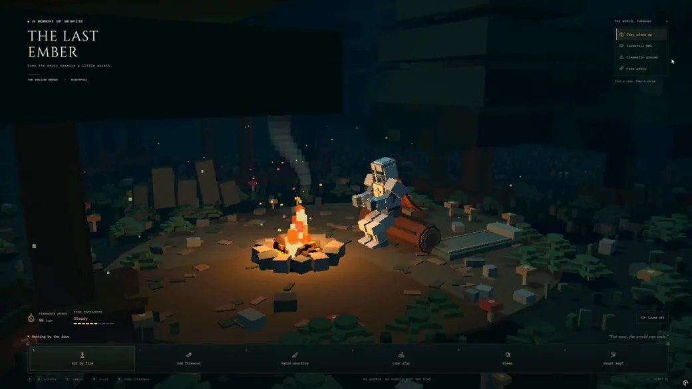</a>

**Референси:** [1](https://media.tripogrowth.space/media/8cbcd267-6a33-4c3e-8599-29ffdb729f3b.jpg) · [2](https://pbs.twimg.com/media/HSXxvD0XcAEG8Jg.jpg)

**Промпт**

```text
Ви — старший розробник креативних WebGL- і Three.js-проєктів. Ваше завдання — створити повну, готову до використання інтерактивну 3D-сцену, цілком розміщену в одному автономному HTML-файлі (index.html) із використанням Three.js + WebGL

### 1. Візуальна тема й художній напрям

- Атмосфера: глибока ніч у лісі, затишне сяйво багаття, самотній втомлений лицар, який відпочиває в таборі (естетика багаття Dark Souls / класичної ретро-RPG).
- Стиль: 3D-піксель-арт / воксельний / low-poly.
- Шейдинг і постобробка: інтегруйте постобробку Three.js (RenderPixelatedPass або еквівалентний ефект пікселізації/дизерингу з низькою роздільною здатністю), щоб отримати автентичний ретро-вигляд у стилі 16-/32-бітних ігор.

### 2. Геометрія сцени й ресурси (100% процедурно — без зовнішніх файлів .gltf/.obj)

Усі ресурси потрібно створювати процедурно за допомогою геометричних примітивів Three.js (BoxGeometry, CylinderGeometry тощо) і базових матеріалів, щоб файл запускався локально без проблем із CORS.

1. Лісове оточення:

   - Земля: темний стилізований ландшафт із процедурними воксельними каменями, грибами та low-poly-рослинністю.
   - Дерева: процедурні сосни/ялини або блокові дерева з кронами, що оточують галявину та створюють відчуття глибини й усамітнення.
   - Небо й освітлення: глибоке опівнічне небо з мерехтливими воксельними зорями та холодне місячне світло DirectionalLight, що відкидає м’які тіні.
   - Глибина: THREE.FogExp2 із темним атмосферним кольором для злиття горизонту з оточенням.

2. Багаття:

   - Кам’яне кільце навколо жаринних колод і процедурних іскор.
   - Система вогню: анімовані піксельні частинки (Points або воксельні сіти з пульсацією), що підіймаються вгору.
   - Динамічне освітлення: тепле оранжево-червоне PointLight із безперервним природним мерехтінням (за допомогою Math.sin, шуму або псевдовипадкових варіацій).

3. Лицар:

   - Ієрархічний граф сцени (групи для голови, тулуба, верхньої та нижньої частин рук, ніг, плаща й меча), створений із вокселізованих примітивів.
   - Візуальні деталі: шолом із прорізами, нагрудна броня, наплічники, рукавиці та піхви/меч.
   - Точки обертання мають бути правильно вирівняні в місцях з’єднання (плечі, лікті, стегна, коліна) для коректних процедурних анімацій обертання.

### 3. Машина станів інтерактивного лицаря

Реалізуйте плавні процедурні анімації за допомогою лінійної інтерполяції (lerp) або тригонометричних кривих у циклі рендерингу для наведених нижче станів, які можна вибирати:

- Сидіти біля багаття (типовий режим очікування): сидить, схрестивши ноги або навпочіпки, ледь помітно дихає та гріє руки біля полум’я.
- Додати дрова: лицар підводиться, бере колоду й кидає її у вогонь. Полум’я помітно спалахує, радіус освітлення тимчасово збільшується, а в повітря злітає феєрверк іскор.
- Вправи з мечем: підводиться, вихоплює меч, виконує чітку триетапну комбінацію атаки та парирування й повертається у бойову стійку.
- Дивитися вдалину: підходить до краю галявини, встромляє меч у землю й дивиться в темряву, поки плащ коливається на вітрі.
- Сон: лягає на спальник біля багаття; над шоломом здіймаються анімовані піксельні частинки «Z z z».
- Смажити м’ясо: тримає над полум’ям палицю з їжею; навколо здіймаються ледь помітні процедурні частинки диму/пари.

### 4. Система камер

Додайте перемикання між пресетами камери з плавною інтерполяцією переходу (інтерполюйте положення й ціль):

- Затишний крупний план: середній план із фокусом на лицарі та світлі багаття.
- Ізометрична RPG: класичний тактичний огляд галявини згори під кутом 45°.
- Кінематографічний ракурс із землі: драматичний план із нижнього ракурсу, де лицар височіє на тлі зоряного неба та соснових крон.
- Вільне обертання: плавне перемикання на стандартний OrbitControls для інтерактивного огляду.

### 5. Інтерфейс і звук

- Стиль інтерфейсу: ретро-HUD у стилі 8-/16-бітної RPG — напівпрозорі темні панелі з піксельними рамками та підключеним шрифтом Google (наприклад, 'Press Start 2P').
- Нижня панель: інтерактивні кнопки дій, що запускають кожен стан лицаря.
- Панель у правому верхньому куті: кнопки перемикання ракурсів камери.
- Лічильник дров: відстежує кількість доданих колод і поточну інтенсивність вогню.
- Звук (Web Audio API): процедурно синтезовані потріскування вогню та атмосферні звуки нічного вітру/цвіркунів, а також кнопка вимкнення/увімкнення звуку.

### 6. Технічні характеристики

- Один автономний файл index.html.
- Використовуйте ES Modules, завантажені через CDN (https://t.co/W8o3SZwkCj або unpkg).
- Модульна, добре прокоментована структура коду (initScene, buildEnvironment, buildKnight, buildCampfire, setupUI, setupAudio, animate).
- Повністю адаптивний обробник зміни розміру вікна, який оновлює співвідношення сторін камери та роздільну здатність проходу пікселізації.
```

<details>
<summary>Оригінальний промпт автора</summary>

```text
You are a Senior Creative WebGL & Three.js Developer. Your task is to build a complete, production-ready, interactive 3D scene contained entirely within a single standalone HTML file (index.html) using Three.js + webgl

### 1. Visual Theme & Art Direction

- Atmosphere: Deep night forest, cozy glowing campfire, solitary weary knight resting at the campsite (Dark Souls bonfire / classic retro RPG aesthetic).
- Aesthetic: 3D Pixel Art / Voxel / Low-Poly aesthetic.
- Shading & Post-Processing: Integrate Three.js post-processing (RenderPixelatedPass or an equivalent low-resolution pixelation/dithering effect) to achieve an authentic 16-bit/32-bit retro look.

### 2. Scene Geometry & Assets (100% Procedural — No External .gltf/.obj Files)

All assets must be constructed procedurally using Three.js geometric primitives (BoxGeometry, CylinderGeometry, etc.) and basic materials so the file runs locally without CORS issues.

1. Forest Environment:

   - Ground: Dark stylized terrain with procedural voxel stones, mushrooms, and low-poly foliage.
   - Trees: Procedural pine/spruce or blocky canopy trees surrounding the clearing to create depth and seclusion.
   - Sky & Lighting: Deep midnight sky with flickering voxel stars and a cool moonlight DirectionalLight casting soft shadows.
   - Depth: THREE.FogExp2 with a dark atmospheric color to blend the horizon.

2. Campfire:

   - Stone circle surrounding smoldering logs and procedural ember embers.
   - Fire System: Animated pixelated particles (Points or pulsing voxel meshes) rising upward.
   - Dynamic Lighting: Warm orange-red PointLight with continuous, natural flicker logic (using Math.sin, noise, or pseudo-random variations).

3. The Knight:

   - Hierarchical scene graph (groups for head, torso, upper/lower arms, legs, cape, and sword) built from voxelized primitives.
   - Visual details: Slotted helmet, chest armor, pauldrons, gauntlets, and a sheath/sword.
   - Pivot points must be aligned correctly at joints (shoulders, elbows, hips, knees) for clean procedural rotation animations.

### 3. Interactive Knight State Machine

Implement smooth procedural animations using linear interpolation (lerp) or trigonometric curves inside the render loop for the following selectable states:

- Sit by Fire (Default Idle): Sits cross-legged or crouched, subtle breathing cycles, warming hands near the flames.
- Add Firewood: Knight stands up, retrieves a log, and tosses it onto the fire. The fire visibly flares up, expands its light radius temporarily, and emits a burst of sparks.
- Sword Practice: Stands up, draws the sword, executes a clean 3-part attack/parry routine, and returns to a combat guard stance.
- Look into the Distance: Walks to the edge of the clearing, plants the sword into the ground, and stares out into the dark while the cape sways.
- Sleep: Lies down on a bedroll beside the fire; floating animated pixel "Z z z" particles rise from the helmet.
- Roast Meat: Holds a stick with food over the flame; emits subtle procedural smoke/steam particles.

### 4. Camera System

Provide preset camera switches with smooth transition interpolation (lerping position and target):

- Cozy Close-up: Medium shot focusing on the knight and the firelight.
- Isometric RPG: Classic high 45-degree tactical overview of the clearing.
- Cinematic Ground: Low-angle dramatic shot looking upward at the knight against the starry sky and pine canopies.
- Free Orbit: Seamless switch to standard OrbitControls for interactive inspection.

### 5. UI & Audio

- UI Style: Retro 8-bit/16-bit RPG HUD layout using semi-transparent dark frames with pixelated borders and an embedded Google Font (e.g., 'Press Start 2P').
- Bottom Panel: Interactive action buttons triggering each knight state.
- Top-Right Panel: Camera angle switcher buttons.
- Firewood Counter: Tracks logs added and current fire intensity.
- Sound (Web Audio API): Procedurally synthesized fire crackle and ambient night breeze/crickets, with a mute/unmute toggle button.

### 6. Technical Specifications

- Single, self-contained index.html file.
- Use ES Modules loaded via CDN (https://t.co/W8o3SZwkCj or unpkg).
- Modular, well-commented code structure (initScene, buildEnvironment, buildKnight, buildCampfire, setupUI, setupAudio, animate).
- Fully responsive window resize handler updating camera aspect ratio and pixelation pass resolution.
```

</details>

[Докладніше ↗](https://www.tripo3d.ai/uk/3d-prompts/gpt-6-astra-2100350159540596760) · [Оригінальний допис](https://x.com/vib3coded/status/2100350602316558428) · [Назад до прикладів](#all-prompts)

---

<a id="gpt-6-astra-2100271998618177864"></a>

### Демонстрація ізометричної фентезійної графіки

[Anshu Chimala](https://x.com/anshuc) · 2026-09-16 · GPT-6 Astra · Інтерактив

<a href="https://www.tripo3d.ai/uk/3d-prompts/gpt-6-astra-2100271998618177864">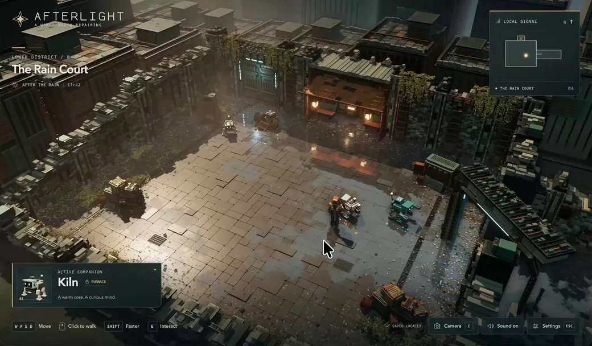</a>

**Промпт**

```text
Створи для мене демонстрацію графіки: ізометрична камера, дещо воксельний художній стиль із реалістичним затіненням і мокрою підлогою з відбиттями, персонаж у цікавій сцені. Фентезійний сетинг (щось на кшталт Elden Ring або Diablo). Three.js у браузері, понад 60 кадрів/с. Не завантажуй сторонні ресурси. На виконання є 1 година. Керування: клацанням переміщуй персонажа, камера плавно слідує за ним; перетягуванням обертай камеру; прокручуванням наближай або віддаляй зображення. Поки що без ігрового процесу. Світ має здаватися живим: рух, анімації, ледь помітні реакції довкілля. Простір навколо гравця має виглядати масштабним, але переміщення дозволь лише в обмеженій зоні. Не потрібно узгоджувати зі мною художній стиль чи ставити запитання — просто починай!
```

<details>
<summary>Оригінальний промпт автора</summary>

```text
Build me a graphics demo: isometric camera, voxel-ish art style with realistic shading and reflective wet floors, a character in an interesting scene. Fantasy setting (think Elden Ring, Diablo). Three.js in browser, >60fps. Don't download assets. Time limit of 1 hour. Controls: click to move the character, camera lazy-follows; drag to rotate camera; scroll to zoom in/out. No gameplay for now. World should feel alive: motion, animations, subtle environmental behaviors. Area around player should look expansive, but only allow movement in a limited space. No need to confirm the art with me or ask questions, just go!
```

</details>

[Докладніше ↗](https://www.tripo3d.ai/uk/3d-prompts/gpt-6-astra-2100271998618177864) · [Оригінальний допис](https://github.com/achimala/dream-loop) · [Вихідний код](https://github.com/achimala/dream-loop) · [Назад до прикладів](#all-prompts)

---

<a id="akari-nagoya-rooftop-flame-relay"></a>

### AKARI: Вогняна естафета на дахах Наґої

[Jared](https://growthengineer.space/) · 2026-09-16 · GPT-6 Astra · Ігри

<a href="https://www.tripo3d.ai/uk/3d-prompts/akari-nagoya-rooftop-flame-relay">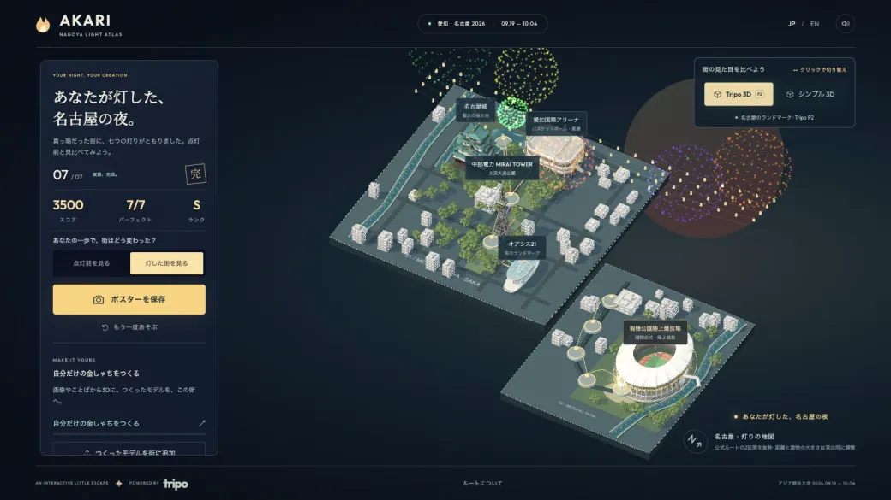</a>

**Промпт**

```text
# AKARI — Атлас вогнів Наґої

## 1. Мета
Створіть повноцінну японськомовну гру для браузера, у якій абстрактне полум’я здійснює сім стрибків за заданим часом і підсвічує мініатюрну Наґою напередодні Азійських ігор Айті—Наґоя, що відбудуться 19 вересня — 4 жовтня 2026 року. Відтворіть поточне початкове видання із двома мапами за адресою https://akari-nagoya-rooftop-relay.tripo.page/ і наданими візуальними референсами. Попередня загальна сцена з дахами не є цільовою.

## 2. Візуальний напрям
Використайте піднятий атласний ракурс у три чверті, темно-синій опівнічний фон, теплі заголовки японською з кольору слонової кістки, тонкі золоті лінії та стриману зернистість. На десктопі залиште ліву третину для вступного запрошення, а праворуч розмістіть дві підняті плитки мапи; на телефонах перемістіть мапу над елементами керування. Починайте з тьмяних, ненасичених будівель і бірюзових водних шляхів. Після успішного проходження повертайте зелені кольори, бірюзові мідні дахи, тепле світло у вікнах і золоті маршрутні вогні. Полум’я та наступна ціль мають залишатися добре помітними. Використовуйте м’які тіні, атмосферну перспективу та контрольований bloom; уникайте білого засвічення. Відтворіть японський вступний заголовок, підписи пам’яток і тонкий редакційний хедер/футер, видимі на референсі.

## 3. Світ
Більша північно-західна плитка охоплює парк Мейдзьо, замок Наґоя, міжнародну арену Айті, парк Хісая-одорі, MIRAI TOWER та Oasis 21. Південно-східна плитка охоплює міський музей, Мідзухо-odori, парк Мідзухо та його легкоатлетичний стадіон, а річка Ямадзакі розташована на схід від стадіону. Додайте невисокі сучасні квартали, паркові дерева, дорожню розмітку, береги річки та теплі світильники; архітектуру замку використовуйте лише для замку.

Розділ 1: парк Мейдзьо → Сотоборі/Хісая-одорі → парк Хісая-одорі → Oasis 21, три стрибки. Зробіть чітко позначений, неігровий перехід до міського музею. Розділ 2: міський музей → Мідзухо-одori → Mizuho Undojo Nishi → у напрямку парку Мідзухо → Південна площа, чотири стрибки. Ніколи не малюйте перехід як безперервну вулицю й не зараховуйте його як стрибок. Зберігайте прогрес на початку другого розділу. Мапи мають різний масштаб, а відстані стискаються для ігрового процесу. Коротко поясніть це в розділі «Про гру» разом з історичними датами естафети — 22 серпня та 16 вересня 2026 року; це не запрошення на майбутню подію. Додайте посилання на https://www.aichi-nagoya2026.org/ja/torch-relay/ і https://www.nagoyajo.city.nagoya.jp/guide/kinshachi/. Використовуйте оригінальні орнаменти й абстрактне полум’я замість офіційного талісмана чи емблеми.

## 4. Перелік ресурсів
Використовуйте ці стабільні слоти заміни в порядку пріоритету; в обох візуальних режимах зберігайте однакові компонування та проксі-колізії:
- `shachi`: антикварний орнамент для даху з полірованого золота, з головою, схожою на тигрову, вигнутим тілом коропа з лускою та хвостом, закрученим догори; повторіть його на замку.
- `castle`: світла фортеця в стилі Наґої, темне дерево, бірюзові шатрові та щипцеві дахи зі східчастою формою, кам’яний фундамент.
- `mizuho`: широкий овальний легкоатлетичний стадіон, світлий дах із відкритим центром і ритмічно розташованими опорами; бігову доріжку та зелене поле в центрі має бути видно.
- `arena`: невисока сучасна арена з широким дахом і теплими вертикальними ламелями фасаду, на північ від осі парку.
- `tower`: струнка срібляста ґратчаста оглядова вежа з коробчастим оглядовим майданчиком та антеною.
- `oasis`: витягнутий овальний бірюзовий скляний/водний навіс на тонких світлих опорах.
- `midrise`: стримана сучасна японська житлова будівля; використовуйте її повторно, змінюючи висоту й орієнтацію, зокрема для простого об’єму музею.
- `tree`: компактне зріле паркове дерево з коричневим стовбуром і багатошаровою зеленою кроною; інстансуйте його на обох плитках.
Рельєф, дороги, воду, розмітку доріжок, маркери стрибків, абстрактне полум’я, світлові сліди, феєрверки та UI створюйте процедурно. Кожна модель має бути повністю ізольованим об’єктом; зберігайте відкриті проходи та центр стадіону. Відстежуйте кожен перелічений слот, зокрема повторювані фонові ресурси.

## 5. Ігровий процес і нагороди
Утримуйте вказівник/дотик або Space, щоб зарядити стрибок; відпустіть, щоб автоматично стрибнути до наступного маркера. Використовуйте детерміновану фізику з delta-time: distance = 1.8 + 7 × charge, charge відбивається в межах від 0 до 1, а дуга додає до інтерпольованої висоти 4 × t × (1 − t) × 3.6. Цикл заряджання прискорюється приблизно з 1.42 до 0.92 секунди на один напрямок. Траєкторію, зелену безпечну зону та золоту ідеальну зону обчислюйте за однією формулою: похибка ≤0.36 означає ідеальне приземлення; ≤1.15 — безпечне, із додатковим допуском 0.28 для перших двох стрибків.

Безпечне приземлення дає 100 очок; ідеальне — 200 × поточний множник, максимум ×4. Швидке наступне введення протягом 2.35 секунди додає 50 очок; скидайте комбо після безпечного приземлення, переходу між розділами або 3.4 секунди очікування. Кожен успіх запускає світлову хвилю районом, засвічує вікна й додає ліхтарі. Показуйте прогрес із семи кроків, рахунок, комбо та найкращий результат. Після промаху швидко починайте спробу знову; після переходу відновлюйте контрольну точку розділу. Додайте паузу, перезапуск, відновлення після прихованої вкладки та необов’язковий звук після взаємодії.

Після фінального стрибка покажіть обидві освітлені мапи з віддаленням камери протягом 4.6 секунди та феєрверками в заданих межах. Присвоюйте ранг S за сім ідеальних приземлень, A — за чотири або більше, в інших випадках B. Додайте повторне проходження, порівняння міста до та після з тієї самої камери, а також справжній постер PNG розміром 1800×1200 із назвою, датами, рахунком і зазначенням авторства незалежного проєкту.

## 6. Реалізація
Використовуйте Vite, TypeScript і Three.js; розділіть географію, чисту фізику/підрахунок очок, сцену, ефекти, реєстр моделей, локалізацію японською/англійською та UI. Японська має залишатися мовою за замовчуванням незалежно від мови запиту; зберігайте вибір мови. Постачайте шрифти й ресурси локально в бандлі. Використовуйте GLTFLoader і нормалізацію для кожного слота; після некоректного імпорту залишайте останню робочу модель. Під час порівняння простих та імпортованих візуальних режимів зберігайте рахунок, контрольну точку, камеру й освітлення. Інстансуйте дерева/будівлі, об’єднуйте сумісну статичну геометрію, обмежуйте DPR і кількість частинок. Оцінюйте фактичний час кадру та складність моделі, а не відхиляйте модель лише через перевищення цільової кількості трикутників. Використовуйте Blender лише тоді, коли отриманий ресурс потребує очищення сітки, виправлення pivot або відкритого центру стадіону; зберігайте його оригінальний файл.

## 7. Критерії приймання
Надайте робочий вихідний код, lockfile, команди розробки/збирання та статичну збірку. Перевірте сім стрибків в обох розділах, відновлення після переходу й контрольної точки, промах/повторну спробу, підрахунок очок, сенсорне керування, паузу, збереження японської/англійської мови, усі резервні варіанти слотів і фактичний експорт постера. Порівняйте скриншоти стабілізованих вступної та фінальної сцен із поточним референсом із двома мапами. Зазначте виміряну продуктивність і тести, які справді було виконано. Наведений далі спільний робочий процес регулює генерацію та повернення моделей.
```

[Докладніше ↗](https://www.tripo3d.ai/uk/3d-prompts/akari-nagoya-rooftop-flame-relay) · [Назад до прикладів](#all-prompts)

---

<a id="cyclops-island-threejs-game"></a>

### Острів циклопа

[Jared](https://x.com/jaredliu_bravo) · 2026-09-16 · GPT-6 Astra · Ігри

Ремікс роботи: [Jason Chew](https://x.com/jasoncjs_/status/2099414001851449430)

<a href="https://www.tripo3d.ai/uk/3d-prompts/cyclops-island-threejs-game">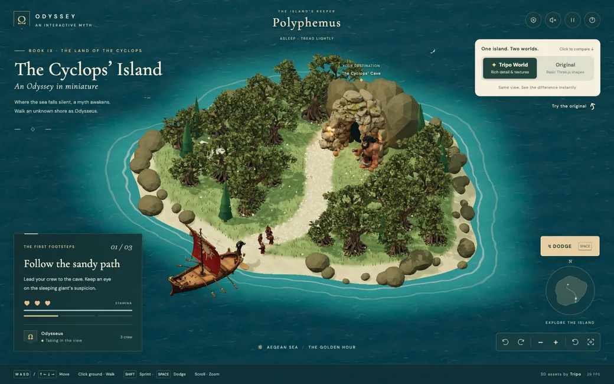</a>

**Промпт**

```text
# ОДІССЕЯ — Острів циклопа

## 1. Мета
Створіть повноцінну ізометричну гру про втечу за мотивами IX книги «Одіссеї». Гравець втілює Одіссея, який веде трьох членів екіпажу: викрадає припаси з печери, виживає під час переслідування й ударів Поліфема та тікає на грецькому кораблі. Увесь інтерфейс гри має бути англійською. Використайте https://cyclops-island.tripo.page/ і надані референси; збережіть зазначення авторства Джареда та натхнення концептом острова з «Одіссеї» Джейсона Чу.

## 2. Візуальний напрям
Створіть острів у вигляді багато текстурованої середземноморської настільної сцени завширшки близько 25 світових одиниць, посеред глибокого бірюзово-синього Егейського моря. Використайте ортографічну камеру під кутом у три чверті, приблизно в точці (19,31,34), теплий вапняк, шавлієво-зелені оливи, теракотову тканину, бронзові обладунки та кремовий пергамент. Застосуйте тонмапінг ACES, теплі спрямовані тіні, атмосферну перспективу, стриманий bloom, віньєтування та зернистість. Маркери небезпеки мають залишатися читабельними крізь усі ефекти.

Для заголовків використайте локальні шрифти із засічками на кшталт Cormorant Garamond, а для інтерфейсу — шрифт на кшталт DM Sans. Угорі ліворуч розмістіть печатку Ω, написи ODYSSEY / AN INTERACTIVE MYTH, BOOK IX і The Cyclops’ Island. Угорі праворуч розмістіть помітну кремову картку порівняння з текстом «One island. Two worlds.» та перемикачами Tripo World і Original. Унизу ліворуч покажіть етап місії, три серця, витривалість і кількість членів екіпажу. Над картою виведіть стан боса, під нею — невеликий компас/мінікарту, а також видимі елементи керування камерою та короткі підказки щодо введення. На телефонах використовуйте компактні декоративні написи й окремі елементи керування місією, босом, порівнянням і Dodge.

## 3. Світ
Звивиста стежка зі світлого піску веде на північ від південного пляжу висадки через оливкові гаї до вапнякової печери. Велетень спить біля печери; Одіссей та екіпаж починають рух південною стежкою. Поставте дерев’яний корабель із червоними вітрилами на південному заході, біля причалу. Оточіть узбережжя нерегулярними валунами, травою, кипарисами й бірюзовим мілководдям. Анімуйте брижі на морі, прибережну піну, дерева, світло вогню, птахів і погойдування корабля. Рух океану має залишатися коректним під час обертання камери.

## 4. Перелік ресурсів
Підготуйте слоти для заміни в такому порядку:
- `odysseus`: бородатий грецький шукач пригод, бронзовий коринфський шолом із багряним гребенем, потертий нагрудний обладунок, туніка кольору слонової кістки, теракотовий плащ, сандалі, невеликий щит і меч у піхвах. Повторно використайте модель для трьох членів екіпажу з незалежними скелетами та фазами анімації.
- `polyphemus`: кремезний велетень із рівно одним центральним оком, засмаглою оливковою шкірою, кучерявим темним волоссям і бородою, хутряною або шкіряною пов’язкою на стегнах, великими босими ступнями та дерев’яною палицею; повнорозмірна модель у нейтральній позі, придатній для ригінгу.
- `ship`: вузький корпус із темного горіха, піднятий ніс, бронзовий таран, щогла, теракотово-червоне вітрило, мотузковий такелаж і бічні весла; без води та демонстраційної підставки.
- `olive`: вузлуватий сіро-коричневий стовбур, розлогі корені й нерегулярна шавлієва крона; повторно використайте приблизно 25 разів.
- `cave`: широка окремо змодельована арка з потертій вапнякової породи зі справді відкритим проходом, масивним камінням і рідким мохом; темний інтер’єр створіть окремо.
- `cypress`: струнке звужене середземноморське дерево з густим темно-зеленим листям.
- `boulder`: нерегулярна прибережна скеля з теплого вапняку; повторно використовуйте її зі змінними масштабом і обертанням.
Залиште рельєф, стежку, воду, траву, маркери припасів, бойові телеграфи, частинки та інтерфейс процедурними. Відстежуйте кожен слот і зберігайте ігрову карту під час заміни вигляду ресурсів.

## 5. Сутичка під час втечі
Використайте WASD/стрілки, орієнтовані відносно камери, а також переміщення за кліком/дотиком із навігацією A* з урахуванням радіуса. Екіпаж має вільно слідувати за гравцем; гравець і велетень повинні враховувати рельєф, межі та перешкоди відповідно до своїх розмірів. Shift активує спринт, Space або велика сенсорна кнопка — ухилення, E — підбирання найближчих припасів, P — паузу, Q/R — обертання, а F — стеження за героєм. Підтримайте перетягування/панорамування, обертання перетягуванням правою кнопкою, прокручування/масштабування та жестове масштабування двома пальцями. Під час переслідування переміщення за кліком переходить у спринт, доки вистачає витривалості.

Етап 1: наблизьтеся до печери; близькість і гучний спринт підвищують підозру та можуть розбудити велетня. Етап 2: збирайте припаси лише на близькій відстані — це щоразу пробуджує його. Етап 3: перебувайте в межах позначеного радіуса причалу, приблизно 2,7 одиниці, біля (-0.8,8.7) протягом 11 секунд сумарного часу, поки екіпаж сідає на корабель; вихід із зони призупиняє прогрес.

Дайте гравцеві три одиниці здоров’я та 100 одиниць витривалості. Початкові швидкості: ходьба — 2.35, спринт — 4.15, біг велетня — 3.4 одиниці на секунду. Велетень має наблизитися до гравця на відстань 3.6 одиниці, перш ніж атакувати. Використайте стани сну, пробудження, переслідування, підготовки удару, влучання, відновлення та завершення. Ground Breaker фіксує позицію гравця на початку підготовки тривалістю 1.12 секунди, показує коло радіусом 2.45 і завдає одного удару; ціль не повинна слідувати за гравцем. Кожен третій удар випускає чітко позначену заряджену ударну хвилю, що розширюється; шкода визначається рухомим краєм кільця.

Ухилення триває близько 0.34 секунди, витрачає 24 одиниці витривалості, має перезаряджання 1.25 секунди, коротку невразливість і обмеження переміщення в межах придатної поверхні. Спринт виснажує витривалість, відпочинок її відновлює. Влучання спричиняють відкидання, реакцію на біль і тимчасову невразливість. Поразка скидає всіх персонажів, таймери, ефекти та стан місії. Втеча припиняє отримання шкоди й відкриває підсумок повторного проходження. Пауза заморожує симуляцію, анімацію та ефекти. Налаштуйте посадку на корабель так, щоб вона вимагала кількох ухилень, зокрема від зарядженої атаки.

## 6. Реалізація та анімація
Використайте Vite, Three.js і JavaScript ES-модулі для світу, навігації, сутички, персонажів, ефектів, аудіо та інтерфейсу. Усі ресурси, потрібні під час виконання, мають бути локально вбудовані у статичну збірку. Початкові скелетні моделі повинні ходити/бігати, спати/прокидатися, ухилятися та помітно готуватися до удару й завдавати його. Для замінених моделей зі скінінгом використовуйте AnimationMixer, фактичні назви кліпів, короткі перехресні переходи та SkeletonUtils.clone для окремих скелетів членів екіпажу. Не допускайте подвоєння кореневого руху та ковзання стоп. Синхронізуйте рух униз під час удару велетня з ігровим моментом влучання; статичні імпорти не повинні позначатися як анімовані. За потреби зберігайте працездатну скелетну резервну модель. Blender використовуйте лише для необхідного ремонту рига, pivot, кліпів або сітки.

Синхронізуйте помаранчеві/золоті телеграфи, спалах від удару, тріщини на землі, пил, іскри, уламки каміння, що падають, кільця, які розширюються, короткочасне світло та тремтіння камери. Додайте сліди від ухилення й опційне синтезоване аудіо, що активується жестами. Використовуйте пулінг ефектів, інстансинг декорацій і вимірюйте час кадру. Нормалізуйте імпорти, вирівнюючи стопи/корені по поверхні та не змінюючи проксі-колізії. Порівняння має зберігати позиції, місію, здоров’я, витривалість, стан камери й анімації; якщо імпорт не вдався, залишайте працездатні моделі. Додайте непомітний елемент керування Change hero та локальний імпорт моделей зі статусом для кожного слота.

## 7. Критерії приймання
Передайте вихідний код, lockfile, npm-команди для розробки/збірки та статичний результат. Перевірте навігацію між перешкодами, раннє пробудження, збирання на близькій відстані, переслідування перед атакою, фіксацію цілей, удари за таймером, невразливість під час ухилення, шкоду від краю ударної хвилі, поразку/скидання та успішну втечу. Перевірте незалежну анімацію екіпажу, резервні моделі для всіх слотів, збереження стану під час порівняння, компонування для комп’ютерів і мобільних пристроїв та помилки завантаження. Порівняйте стабілізовані скриншоти з референсом і повідомте фактичну продуктивність. Використайте наведений нижче спільний робочий процес для генерації моделей і поверніть результат.
```

<details>
<summary>Оригінальний промпт автора</summary>

```text
Build an interactive browser experience based on Homer’s Odyssey - The Cyclops’ Island.

Create a polished isometric pixel-art 3D diorama of a small Greek island surrounded by animated ocean. Include a sandy shore, dense forest, rocky cliffs, a large cave, Odysseus and his crew, the Cyclops, and their ship offshore.

Make it feel like a small playable game:

Control Odysseus with WASD or arrow keys
Click the ground to walk
Drag to pan the camera
Scroll to zoom
Add subtle water, tree, character, and environmental animation
Add camera rotate, zoom, reset-view, and pause controls
Use collision so the player cannot walk through rocks, trees, or water

Add a dark literary UI panel in the bottom-left:

“Lead Odysseus along the sandy path to the cave.”
Show the current character and movement state below it.
Art direction: detailed 1990s isometric strategy/RPG pixel art, muted Mediterranean colors, textured terrain, warm parchment typography, subtle grain, and premium game UI. It should look like an old illustrated map brought to life.
Make the whole experience fill the browser window and work immediately. Do not make a mockup. Build the complete interactive experience.
```

</details>

[Докладніше ↗](https://www.tripo3d.ai/uk/3d-prompts/cyclops-island-threejs-game) · [Оригінальний допис](https://x.com/jaredliu_bravo) · [Демо](https://cyclops-island.tripo.page/) · [Назад до прикладів](#all-prompts)

---

<a id="gpt-6-astra-2100233407108137349"></a>

### AAA CGI-ролик про надприродний бій у підземній станції

[MadMax](https://x.com/MadMax_Series) · 2026-09-16 · GPT-6 Astra · Анімація

<a href="https://www.tripo3d.ai/uk/3d-prompts/gpt-6-astra-2100233407108137349">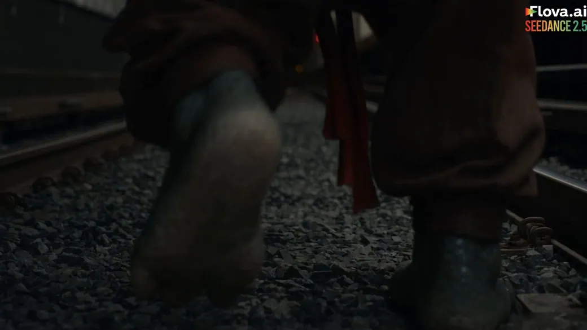</a>

**Промпт**

```text
Усі персонажі, фонові пасажири та середовище станції мають єдиний виразний вигляд високобюджетної AAA-фентезійної ігрової CG-графіки з цифровим скульптингом. У крупних планах обличчя персонажів повинні зберігати вигляд ретельно опрацьованих ігрових моделей, чіткі пасма заплетеного волосся та стилізовану реалістичну шкіру; вони не мають перетворюватися на акторів, косплей, звичайний gameplay, 2D-анімацію чи цел-шейдинг. Зберегти сцену надприродного бою в сучасній підземній станції, не перетворювати її на середньовічний замок, засніжені гори чи боксерський ринг. Палітра: малонасичені холодні синьо-сірі тони, глибокий вугільно-чорний, синьо-сіра луската шкіра та холодно-білі світлові смуги; невеликі акценти створюють жовті поручні, червоні сигнальні вогні, бронзова оправа окулярів, зелено-мідні наплічники та вохристо-червоний пояс. Медово-золотий блиск очей і короткий фіолетовий спалах під час удару об колону з’являються лише у відповідні миті; не забарвлювати весь ролик у фіолетовий. Середовище: широка, тьмяно освітлена підземна залізнична станція з центральною заглибленою колійною зоною, рейками й щебенем та платформами, що піднімаються по обидва боки колій. Краї платформ огороджені скляними металевими захисними панелями з жовтими вертикальними рамами; на підлозі — жовті лінії безпеки, сіра плитка й дренажні решітки. Низьку стелю підтримують масивні білі круглі колони; угорі безперервні холодно-білі довгі світлові смуги й круглі лампи, а вдалині до глибини станції тягнуться маленькі червоні сигнальні вогні. На платформі — кілька десятків дорослих пасажирів у звичайних темних і світлих куртках, розосереджених біля колон або за огородженнями. Злякавшись бою, вони відступають, пригинаються та прикриваються руками, але весь час залишаються фоновими пасажирами: не вступають у бій, не перетворюються на головних героїв і не мають однакових облич. Потяг не прибуває. На покажчиках залишаються лише розмиті геометричні кольорові блоки, без читабельного тексту.

Двоє основних бійців незмінні. A, воїн в окулярах, — високий, худорлявий, спортивно складений дорослий чоловік із теплою темно-коричневою шкірою, чіткими вилицями та лінією щелепи. Чорні короткі косички, пригладжені до голови, зібрані на потилиці в короткий вузол. На лобі постійно закріплені вузька бронзова оправа та димчасті відкидні захисні окуляри: зазвичай вони закривають очі, залишаючи відкритими ніс нижче перенісся та рот. На ньому сіро-синя безрукавна бойова куртка із запахом, темно-коричневий пояс, вугільно-чорні штани та темно-коричневі черевики з низькими берцями. Обидва передпліччя обмотані сірими тканинними бинтами, пальці відкриті; руки завжди порожні — без плаща, зброї в руках чи читабельних емблем. Вираз обличчя спокійний, рухи швидкі й рішучі. Лише в зазначеному кадрі він правою рукою на мить піднімає край окулярів, відкриваючи одне яскраве медово-золоте око, після чого повертає окуляри на місце, щоб вони знову закрили очі. Це той самий фізичний елемент спорядження, постійно закріплений на лобі; він не перетворюється на тканинну пов’язку й не зникає.

B, звір із лускатим хребтом, — вищий за A, ширший і масивніший, м’язистий двоногий гуманоїдний звір. Груба темна синьо-сіра луска вкриває його широкі груди, спину та кінцівки; на животі луска дрібніша й сіро-синя. Широка пласка голова ящіркоподібної форми, коротка тупа морда, масивна щелепа, двоє темно-бурштинових очей і короткі товсті зуби. На голові немає людського волосся, маски чи наростів, схожих на гілки. Від лівого плеча B до лівого передпліччя ростуть масивні природні пластини зелено-мідного кольору; уздовж верхнього краю лівого плеча нерухомо закріплений ряд коротких тупих кістяних плавців. Права рука залишається вкритою грубою лускою світлішого сіро-синього кольору; лівий і правий боки ніколи не міняються місцями. Кістяні плавці та панцирні пластини є частиною тіла, на плечі немає квітів. На ньому темно-коричневі вільні широкі штани, вохристо-червоний тканинний пояс із двома вузькими кінцями, що звисають, а щиколотки обмотані темно-коричневою тканиною. Стопи широкі, вкриті лускою, з чітко видимою підошвою, придатною для упору в стіну. Немає хвоста, крил, додаткових рук, довгих рогів, меча, списа, щита чи предметів у руках. B — високий звір, здатний перебувати у звичайній станції; він зберігає стабільні пропорції щодо A та пасажирів і не роздувається до розміру хмарочоса.

0.00–3.70 секунди: зіткнення починається вже в першому кадрі. Короткий низький план біля колій показує, як B швидко наближається кроками; одразу після цього — середній план за спиною A: B мчить спереду, піднімає ногу й розвертає стегна, виконуючи боковий круговий удар ногою на рівні голови. A згинає коліна, опускає голову й нахиляє корпус убік; нога просвистує над його чорними короткими косичками. B приземляється й повертається, A одразу випрямляється. Перехід до широкого двопланового кадру знизу біля колій із виразним Dutch angle: A піднімає коліно й завдає високого бокового удару ногою, B опускає голову та плечі, ухиляючись, а A прибирає ногу й повертає її на опорну стопу. Камера повертається в близький план із-за плеча A та стежить за ним: B наздоганяє його серією безперервних ударів руками. A коротко відхиляє голову, опускає плече й розвертається, змушуючи кулаки ковзати повз обличчя; він не стоїть на місці, знову й знову розмахуючи руками в очікуванні атаки. Світлові смуги на стелі розмазуються в напрямку руху під час швидкого руху камери, просторові взаємозв’язки тіл залишаються чіткими.

3.70–6.40 секунди: правий кулак B зі світлішою сіро-синьою лускою знову опиняється перед A. A розкриває долоню, перехоплює зап’ястя та передпліччя; місце контакту має бути добре видно. Камера наближається до спокійного профілю A, потім разом із його кроком, обертанням стегон і плечей швидко переходить у низький повнофігурний ракурс. A не відпускає ту саму праву руку, зриває B з опори й підкидає його дугою вгору вздовж боку тіла. Обидві стопи B відриваються від підлоги, вохристо-червоний пояс і широкі штани відстають за інерцією. У найвищій точці підкидання — лише дуже короткий ultra slow motion, після чого швидкість одразу відновлюється. Завершивши обертання, A відпускає B; той перекидається по початковій дузі головою вниз, приземляючись плечем і спиною на поверхню колій. Від місця контакту розлітаються щебінь і пил. Низька камера стежить за падінням і коротко здригається. B за інерцією перекочується та підводить верхню частину тулуба, усі кінцівки залишаються цілими; це не відривання руки, не кидок силою без контакту й не раптове підведення з повітря.

6.40–9.20 секунди: B ще відновлюється внизу, а A уже відштовхується від землі й стрибком наближається. Камера з-за спини B знімає знизу, як A у повітрі розвертає стегна та випрямляє ногу; у найвищій точці стрибка рух на коротку мить сповільнюється. Під час спуску A спрямовує боковий летючий удар у голову й плечі B. B піднімає обидві руки для захисту, і сила удару відхиляє його; A приземляється й одразу продовжує атаку, не зупиняючись чекати. Камера рухається разом зі спуском A та швидко обходить його збоку, чергуючи трохи нахилені крупні плани через плече та обличчя. A ухиляється від зворотного замаху B, коротким кулаком б’є в тулуб, а потім розкритою долонею торкається боку обличчя й відштовхує голову B убік. Голова та шия повертаються у відповідному напрямку лише після контакту. Долоня, обличчя й передпліччя не зливаються; кістяні плавці на лівому плечі B рухаються разом із панцирною пластиною та тулубом того самого боку.

9.20–11.20 секунди: використавши простір після поштовху в обличчя, A розвертається, прибирає ногу й одразу завдає потужного бокового удару стопою вперед. Підошва влучає в живіт і нижню частину грудей B. Спершу тулуб B згинається, потім обидві стопи відриваються від землі, і він летить по діагоналі вгору до платформи. Камера стежить, як він пролітає над краєм платформи; верхня частина спини та плече B врізаються в білу круглу колону. Від місця контакту колона розтріскується назовні, сиплються світлі уламки й пил, а B сповзає по колоні на підлогу платформи. Після удару A прибирає ногу, вистрибує з колійної зони на ту саму платформу й наздоганяє B. Після монтажного переходу він з’являється в безперервній позиції біля цієї самої колони, не телепортується на іншу станцію. Пасажири розбігаються в обидва боки; колона пошкоджена, але не падає повністю.

11.20–12.80 секунди: крупний план обличчя B після удару. Він піднімає голову й повертає її, шукаючи A; зелено-мідні пластини та короткі кістяні плавці на лівому плечі залишаються на місці. Швидкий перехід до композиції крупного плану по обидва боки тієї самої колони: B займає правий передній план, A — лівий задній біля колони, з легкою холодною усмішкою, але без слів. A правою рукою піднімає край бронзових захисних окулярів, відкриває одне яскраве медово-золоте око й коротко дивиться прямо на B. Потім правою рукою опускає окуляри, знову закриваючи очі, і водночас готується ухилитися. Не залишати паузи для початкової репліки чи артикуляції мовлення.

12.80–13.80 секунди: B розвертає плече та завдає правим кулаком зі світлою сіро-синьою лускою удару в місце, де стоїть A. Ще до того, як кулак досягає цілі, A швидко зміщується вбік і обходить колону. Кулак влучає в справжню білу колону; у момент контакту спалахує компактна фіолетова енергія, тріщини розходяться далі, вниз сиплеться крихта, а короткий фіолетовий спалах одразу згасає. Спершу крупний план показує, як кулак втискається в поверхню колони, потім камера швидко від’їжджає, відкриваючи B, який промахнувся, тоді як A вже обійшов колону збоку. Це та сама пошкоджена колона, не перетворювати A на фіолетовий дим і не дозволяти кулаку проходити крізь тіло.

13.80–16.00 секунди: низький широкий нахилений план. A пригинається попереду збоку від колони та коротким жестом підманює B рукою. B розвертається й кидається вперед. A відштовхується від землі та виконує один безперервний переворот назад у повітрі: спершу відхиляє тулуб, обидві стопи проходять над головою, потім він підбирає живіт і проходить перевернуту фазу, ухиляючись від горизонтального замаху руки B. Камера нахиляється вгору разом із тілом; у перевернутій фазі рух на мить сповільнюється, а світлові смуги похило проносяться тлом. A продовжує той самий переворот, повертає стопи під тулуб і приземляється на вільну ділянку платформи позаду B. Він згинає коліна, поглинаючи силу приземлення; краї одягу й короткі косички на потилиці опускаються за інерцією. Фонові пасажири перелякано розступаються, але не перетворюються на додаткових нападників. A не відлітає від удару й не повторює сальто в повітрі, штучно розтягуючи тривалість.

16.00–18.50 секунди: щойно A підводиться, B розвертається й наздоганяє його широким замахом у бік голови. A спершу відхиляється назад, потім пірнає вниз, і світло-сіра луската права рука B проходить над його головою. Обома руками A контролює це передпліччя, заходить перед тулубом супротивника та розвертається спиною, знижуючи центр ваги. Він проводить руку B через своє плече й, використовуючи інерцію руху B уперед, виконує кидок через плече. Стегна B перевертаються через точку опори, обидві стопи відриваються від землі, а спина падає на плитку платформи; уламки плитки та пил розсипаються по підлозі. Камера відходить від близького плану біля плеча до низького середньо-широкого, чітко показуючи переворот і приземлення. A залишається стояти й відпускає B, дозволяючи йому впасти. B одразу перевертається, спирається руками, згинає ноги й підводиться. A повертається до нього та продовжує тиснути, поєднуючи підйом із наближенням; не залишати довгої паузи, у якій персонажі стоять і говорять.

18.50–20.65 секунди: B знову кидається на близьку дистанцію. A випереджає його коротким прямим ударом у бік обличчя, повертає руку для захисту грудей, а потім, пригнувшись, б’є в живіт і ребра. B піднімає руку, блокуючи один з ударів, і відповідає важким широким замахом. A, тримаючись близько до внутрішнього боку грудей і плеча B, опускає голову та ухиляється, передпліччям відводить руку під час її повернення, а потім завдає серію коротких щільних ударів у підборіддя й верхню частину грудей. Камера швидко переміщується невеликими дугами навколо плечей обох бійців. Голова й тіло відскакують лише після фактичного контакту. Уся сцена має бути однією безперервною серією атак, блоків, відведень і контрударів, а не чергуванням ударів навмання, байдужою реакцією чи постійно зчепленими кулаками.

20.65–21.85 секунди: прямий перехід до чіткої зйомки строго згори. Добре видно, як обидва бійці рухаються навколо тієї самої невеликої ділянки плитки. Чорні короткі косички та бронзова оправа A, зелено-мідні пластини лівого плеча B і його вохристо-червоний пояс залишаються сталими впізнаваними ознаками. Широка рука B проходить замахом збоку від A; A втягує плече, прослизає під руку, по черзі змінює положення лівої та правої стоп, однією рукою відводить передпліччя супротивника, іншою б’є в груди й живіт, потім прибирає руку й коригує позицію разом із розворотом B. Уламки плитки на підлозі та дренажна решітка залишаються на своїх місцях. Верхній ракурс показує траєкторії ближнього бою; не додавати дублера чи третього бійця.

21.85–24.00 секунди: повернення до дуже близького плану через плече B. A продовжує серію коротких ударів у верхній і нижній рівні, чергуючи їх, та відхиляє голову від руки B, що заходить згори. Обмотане тканиною передпліччя A та груба сіро-синя луската рука B перехрещуються, але їхні межі чіткі. Камера різко стежить за кулаком A. У двох точках сильного контакту додати лише на кілька кадрів чорно-білий висококонтрастний спалах експозиції та об’ємний контур удару, після чого негайно повернутися до початкової холодної синьо-сірої AAA CG-графіки. Не переходити до коміксу, тексту чи 2D-ілюстрації. Останній прямий удар чітко втискається в живіт B: живіт стискається всередину, верхня частина тулуба згинається, а рука B, замахнута згори, втрачає напрямок руху разом із тулубом. A міцно стоїть на стопах, сила проходить від ніг через стегна й плече до кулака; кулак не проходить крізь тіло.

24.00–28.00 секунди: одразу показати наслідок того самого сильного удару в живіт. Обидві стопи B відриваються від землі, і він відлітає назад. Камера низько проходить уздовж краю платформи, швидко стежачи вздовж поздовжньої осі станції; у безперервному русі проминають білі колони, жовті рами, скляні панелі огородження та перелякані люди. Лінії тла видовжуються від швидкості. Сіро-синє лускате тіло B, темно-коричневі штани, вохристо-червоний пояс і зелено-мідні пластини лівого плеча залишаються впізнаваними. Через довгі осьові широкі плани, швидкі монтажні переходи з колонами, що проносяться перед об’єктивом, і крупні плани знизу показати, як B перевертається за інерцією та витягує руки, намагаючись відновити рівновагу. Уламки, що злітають, рухаються в тому самому напрямку польоту над коліями. Потім B пробиває ділянку скляно-металевого захисного огородження на краю платформи. Скло розлітається після контакту з тілом, металева рама згинається, і B через пролом продовжує рух у колійну зону. Перехід до широкого плану в напрямку бокової стіни колії. Це й далі безперервний політ, спричинений попереднім ударом у живіт: не додавати удару ногою за кадром, другого запуску чи відкидання пасажирів. A не має дублюватися за кожною колоною.

28.00–30.00 секунди: фіксований бічний середньо-широкий план. Темно-сіра вертикальна стіна колії розташована ліворуч у кадрі, платформа навпроти та пасажири за огородженням — праворуч позаду, а довгі світлові смуги спрямовують погляд у глибину станції. У повітрі B розвертається так, щоб ноги були спрямовані до стіни. Обидві підошви чітко торкаються вертикальної поверхні; він згинає коліна й підбирає живіт, утворюючи компактну скручену позу, під стопами стирається трохи стінного пилу. Потім в ultra slow motion повільно випрямляє коліна та розвертає тулуб назовні, поступово наближаючи тіло до горизонтального положення. Підошви й далі впираються в стіну, вохристо-червоний пояс, широкі штани та дрібні уламки продовжують рухатися, підкреслюючи безперервний процес контакту, стискання й накопичення сили. Це не удар спиною об стіну, не зависання в повітрі й не стояння на горизонтально перекинутій поверхні.

Ролик завершується на 30.00 секунді живим кадром, у якому B усе ще впирається обома стопами в стіну, а його тіло розгортається назовні. Не додавати повного відштовхування від стіни з контратакою, приземлення, смерті чи визначеного переможця. Без чорного екрана, затемнення чи фінальної заставки.

Ритм і безперервність: зберегти послідовність швидкої погоні, ухилень на близькій дистанції, кидків, переворотів назад, летючих ударів ногою, удару об колону, коротких атак у верхньому ракурсі та переміщення через платформу. Скоротити спостереження й паузи для початкових реплік. Лише найвища точка підкидання, ухилення в повітрі та фінальна фаза упору в стіну використовують локальне сповільнення; фінальну фазу чітко позначити як ultra slow motion. Звичайний бій має бути швидким і плавним, без глобального slow motion і без стоп-кадрів для штучного збільшення тривалості. Чорні короткі косички A, темно-коричнева шкіра, бронзова оправа окулярів, сіро-синя безрукавна куртка та обмотані тканиною передпліччя мають зберігатися; стан окулярів до й після моменту відкриття ока має бути однозначним. Зелено-мідні пластини та короткі кістяні плавці з лівого боку B, груба сіро-синя луска на правій руці, широка ящіркоподібна голова, темно-коричневі штани та вохристо-червоний пояс мають зберігатися. Кістяні плавці не відпадають, не переходять на інший бік і не перетворюються на зброю. Той, кого збили з ніг, спершу контактує із землею, а потім відновлює опору; той, хто стрибає, спершу відштовхується від землі; польоту після удару передує контакт; під час гальмування об стіну спершу контактують підошви, а потім згинаються коліна. Усі рухи мають зберігати вагу, інерцію та напрямок. Фонові пасажири постійно виконують різні природні рухи ухилення й зберігають чітку просторову відстань від головних бійців; вони не зливаються з ними й раптово не потрапляють на траєкторії ударів. Пошкоджена поверхня колони, уламки плитки та розбите огородження зберігають стан руйнування в наступних кадрах. Без додаткової зброї, без багатьох кінцівок, без крові та розчленування.

Суворо заборонена фонова музика: у будь-який момент ролика не генерувати фонову музику, кіномузику, музичні треки, мелодії, ритмічну ударну перкусію, хор, пісні, музичні протяжні звуки чи тональну атмосферну підкладку. Дозволені лише синхронні із зображенням і фізично належні сцені внутрішньокадрові звуки (diegetic audio): вентиляція та просторова луна підземної станції, кроки й тертя підошов об підлогу, шелест одягу та рух вохристо-червоного пояса, свист кулаків і ніг у повітрі, глухі удари під час фактичного контакту, невербальне дихання й короткі стогони від болю, перекочування щебеню, розтріскування бетону, розбиття скла, згинання металевої рами огородження, кроки пасажирів під час відступу, короткий немелодійний електричний тріск під час контакту з фіолетовим спалахом, а в кінці — тертя підошов об стіну та осипання стінного пилу. Без діалогів, закадрового голосу, зрозумілих вигуків, пісень і субтитрів. Не використовувати імпульсні звуки, оркестрові удари, мелодійний звуковий дизайн чи ритмічні ефекти, щоб заповнювати відсутність музики; не перетворювати серії ударів, кроки чи звук розбитого скла на барабанний ритм і не розтягувати звук вентиляції в музичний протяжний фон. Поява будь-якої фонової музики чи музичного супроводу означає невідповідність вимогам. music=0; no_music=1; strict_no_music=1; audio=diegetic_only; Без заголовків, читабельних назв станцій, logo, interface, елементів керування програвачем чи watermark.
```

<details>
<summary>Оригінальний промпт автора</summary>

```text
全部角色、背景群众与车站环境统一使用明显经过数字雕刻的高级AAA奇幻游戏CG外观，人物近景必须保持精修游戏角色脸、清楚的编辫发束与风格化写实皮肤，不变成真人演员、cosplay、普通gameplay、2D动画或赛璐璐。保留现代地下车站中的超自然格斗场景，不改成中世纪城堡、雪山或拳击擂台。色彩为低饱和冷青灰、深炭黑、青灰鳞皮与冷白灯带，少量黄色护栏、红色信号灯、青铜护目框、铜锈绿肩甲和赭红腰带形成局部色彩；眼睛的蜂蜜金光与击柱时的短紫光只出现在对应瞬间，不全片染成紫色。环境：宽阔而昏暗的地下铁路站，中央下沉轨道区、钢轨与碎石，两侧高出轨道的站台；站台边缘是玻璃金属屏蔽栏与黄色竖向边框，地面有黄色安全带、灰色砖面、排水格栅，粗大白色圆柱支撑低天花板，顶部连续冷白长灯带与圆形灯、远处小红信号灯延伸至深处。站台有数十名穿普通深浅外套的成年乘客，分散在柱旁或栏后，受战斗惊动后退、缩身和抬臂保护，始终为背景群众，不参与格斗、不变成主角、不复制相同面孔。没有列车驶入，标牌只保留模糊几何色块，无可读文字。两名主战者固定：A护目武者为高挑精瘦运动体型成年男性，暖深棕肤色、清楚的颧骨与下颌，黑色贴头短辫在脑后束成短辫结；前额固定一副窄青铜框烟灰色可掀护目罩，平时遮住双眼，鼻梁下方与嘴部露出。穿灰蓝色无袖交叠领战斗上衣、深褐束腰带、炭黑长裤和深棕低帮靴；双前臂缠灰色布带，双手手指外露，始终空手，无披风、手持武器或可读徽章。表情从容，动作敏捷而果断；仅在指定镜头用右手短暂抬起护目罩边缘，露出一只明亮蜂蜜金色眼睛，随后护目罩放回遮眼位置；这是同一件固定在前额的实体护目装备，不变成布条，不消失。B鳞脊斗兽为比A更高、更宽厚的肌肉型双足人形异兽，深青灰色粗鳞覆盖宽厚胸背与四肢，腹部为较细密的灰青鳞片；宽扁的蜥蜴状头部、短钝吻、厚颌、两只深琥珀眼睛和短粗牙齿，头部没有人类头发、面具或树枝状突起。B自身左肩至左前臂生长厚实的铜锈绿色天然甲片，左肩上缘固定一排短而钝的骨鳍；右臂保留较浅灰青色粗鳞，左右绝不互换，骨鳍与甲片属于身体，肩上没有花朵。穿暗棕色宽松阔腿战裤、赭红色织物腰带与两条垂下的窄带尾，脚踝缠深褐布，脚掌宽大有鳞，保持适合抵墙的清楚脚底；没有尾巴、翅膀、额外手臂、长角、剑、枪、盾牌或手持道具。B是能进入正常车站的高大异兽，保持与A及乘客的稳定比例，不膨胀成高楼巨人。0.00–3.70秒：第一帧便进入交锋。贴近轨道的低机位短镜头看见B快速踏步逼近，随即切A背后中景，B从前方冲来，抬腿转髋，横扫一记头部高度的旋踢；A屈膝低头并侧倾上身，踢腿从黑色短辫上方掠过，B落脚转回，A随即起身。切明显Dutch angle的轨道低位双人宽景，A提膝接一记高位横踢，B降低头肩避过，A收腿落回支撑脚。镜头回到A肩后近距离跟拍，B追上一组连续摆臂拳击，A以短距离偏头、沉肩和转身让拳从脸旁擦过，不原地反复摆拳等对方出招；天花板灯带随镜头甩动形成方向性拖影，身体关系保持清楚。3.70–6.40秒：B的浅灰青色右拳再次伸到A面前，A张掌截住其手腕与前臂，接触位置可见；摄影机贴近A从容的侧脸，然后随他转脚、旋髋和转肩迅速绕至低位全身视角。A保持抓住同一条右臂，将B拉离支撑、沿身体侧上方甩起，B双脚离地，赭红腰带和宽裤随惯性滞后。甩起最高处只有极短ultra slow motion，随即恢复高速；A完成转体后松手，B沿原弧线头下脚上翻落，肩背接触轨道地面，碎石与灰尘从接触处迸出。低机位摄影机追随翻落并短促震动，B顺势滚动、撑起上身，保持四肢完整；不是断臂、无接触念力投掷或凭空重新站起。6.40–9.20秒：B仍在低位恢复，A已经蹬地跃近，镜头从B身后仰拍A在半空转髋展腿，跳跃最高点短暂放慢，然后下落时以横向飞踢压向B头肩；B抬起双臂迎挡并被压得偏转，A落脚后立刻跟进，不落地站着等待。摄影机随A下落和绕侧迅速拉近，形成略倾斜的肩上与面部交替近景；A闪过B回扫的手臂，用短拳击向躯干，再以一记张掌接触脸侧把B的头推偏，接触后头颈才顺方向转动。手掌、脸与前臂不能融合，B左肩骨鳍随同一侧肩甲和躯干转动。9.20–11.20秒：A借脸侧推压后的空间转体收腿，随即向前送出有力侧踹，鞋底接触B腹部至下胸；B躯干先折起、双脚随后离地，沿侧上方飞向站台。镜头跟着他掠过站台边缘，B上背和肩撞上白色圆柱，柱面由接触点向外开裂，浅色碎片和粉尘落下，B沿柱面回落到站台地面。A收腿后从轨道区跃上同一站台追近，切镜后出现在该柱旁的连续位置，不瞬移到另一个车站；乘客向两侧躲开，柱子受损但不整体倒塌。11.20–12.80秒：切B受撞后的脸部近景，它抬头、转脸寻找A，左肩铜锈绿甲片与短骨鳍仍在；迅速转为同柱两侧的近景构图，B占右前景，A在柱旁左后景，轻微冷笑但不说话。A用右手抬起青铜框护目罩边缘，露出一只明亮蜂蜜金色眼睛，直视B，停留很短；他用右手放下护目罩使其重新遮住双眼，身体同时准备避让，不留下原本对白的停顿或说话口型。12.80–13.80秒：B转肩挥出浅灰青色右拳打向A所在位置，A在拳头到达前迅速侧移绕出柱后；拳头击中实体白柱，接触瞬间爆出紧凑紫色能量闪光，裂缝延伸，碎屑向下掉，短紫光立刻消散。近景先看拳面压入柱面，再快速拉宽显露B打空而A已经绕到侧方，柱子仍是先前那根受损柱，不把A变成紫色烟雾，也不让拳穿过人体。13.80–16.00秒：低位倾斜宽景，A在柱子侧前方压低身体、抬手作一个短促招引手势，B转身扑来。A蹬地腾空完成一次连续后空翻，先仰身、双脚向上越过头顶，再收腹转过倒置阶段，躲过B横扫的手臂；镜头随身体向上倾转，在倒置阶段短暂放慢，灯带沿背景倾斜掠过。A继续同一次翻转，双脚回到身体下方，落在B侧后的站台空地，屈膝吸收落地力量，衣角与脑后短辫随惯性回落；背景乘客惊惧闪避，不被当成额外攻击者，A没有被打飞，也不在半空反复翻跟头拖时。16.00–18.50秒：A刚站起，B便转身追上，一记宽幅摆臂打向A头侧；A先后仰再下潜，让B的浅灰青色右臂从头顶横过，双手顺势控制那条前臂，踏入对方身体前侧并转背降低重心。A把B的手臂带过自己肩上，利用B仍向前的动量完成一次过肩摔；B的髋部翻过支点，双脚离地，背侧落在站台砖面，碎砖和粉尘沿地面散开。镜头从贴肩近景退到低位中广景，完整交代翻转与落地，A保持站立，松手让B落下。B立即翻身支撑并屈腿起身，A转向它继续施压，把起身与追近接起来，不保留站着说台词的长停顿。18.50–20.65秒：B冲回贴身距离，A抢先用短直拳击向脸侧，回手护住胸前，随后压低身体打向腹肋；B抬臂挡住其中一击并以粗重手臂横扫反击，A贴近其胸肩内侧低头避开，抬前臂拨开回收的拳，再以紧凑短拳接触下颌与上胸。镜头绕两人肩侧高速小幅移动，头部与身体在实际接触后才出现回弹；以一组连续进攻、挡拨和回击完成这一段，不拍成轮流挥空拳、互不反应或双拳持续贴在一起。20.65–21.85秒：直接切正上方俯拍，清楚看见两人围绕同一小片地砖转动，A的黑色短辫与青铜护目框、B左肩铜锈绿甲片与赭红腰带是固定辨识点；B宽幅手臂从A身侧扫过，A缩肩钻入手臂内侧，左右脚依次换位，一手拨开对方前臂，另一只拳打入胸腹，再收手随B的转体调整位置。地面的落砖与排水格栅保持原位，俯拍展示近身攻防路线，不增加一个替身或第三名格斗者。21.85–24.00秒：切回越过B肩部的紧近景，A继续一组短促上、下段交替拳击并侧头闪开B从上方绕来的手臂，缠布前臂与灰青粗鳞拳臂交错但边界清楚。镜头追随A的拳头急推，在两处强接触点加入仅数帧的黑白高反差曝光闪变与立体冲击轮廓，立即回到原来的冷青灰AAA CGI，不切成漫画、文字或2D插画。最后一记直拳明确压中B腹部，腹部向内压缩、上身折起，B上方挥来的手臂随躯干失去前进方向；A脚底稳住，力量由腿、髋、肩传到拳面，拳头不穿透身体。24.00–28.00秒：紧接同一记腹部重击的后果，B双脚离地向后飞出，镜头低贴站台边缘沿车站长轴高速追踪，连续掠过白柱、黄色边框、玻璃栏板和惊愕的人群；背景线条因速度拖长，B的青灰鳞躯、暗棕裤、赭红腰带与左肩铜锈绿甲片始终能辨认。通过长轴宽景、柱子擦过前景的快速切镜和从下方仰看的近景，展示B在惯性中翻转、伸臂试图恢复平衡，带起的碎片沿同一飞行方向掠过轨道。B随后撞破站台边缘一段玻璃金属屏蔽栏，玻璃在身体接触后碎开、金属框弯折，他越过破口继续进入轨道区，切至轨道侧壁方向的宽景；这仍是上一记腹部重击引起的连续飞行，不新增画外踢击、第二次发射或击飞乘客，A不会复制到每根柱子后方。28.00–30.00秒：固定侧向中广景，深灰垂直轨道墙在画面左侧，对面站台和栏后乘客在右后方，长灯带指向车站深处。B在空中转到脚先朝墙，双脚脚掌明确接触垂直墙面，屈膝收腹形成紧凑蜷曲，脚下擦出少量墙灰，随后在ultra slow motion中缓缓伸膝、躯干向外转开，身体逐渐接近水平；脚掌仍抵住墙面，赭红腰带、宽裤与小碎片持续运动，体现接触、压缩和蓄力的连续过程，不是背部撞墙、悬空冻结或站在横倒的地面。30.00秒结束在B仍以双脚抵墙、身体向外展开的活画面，不添加完整蹬墙反扑、落地、死亡或胜负结局，无黑屏、无淡出、无片尾卡。节奏与连续性：保留快速追击、贴身闪避、投摔、空翻、飞踢、击柱、俯拍短打和跨站台位移的动作顺序，缩短观察与原对白停顿；只有甩起最高处、空中闪避和最终抵墙阶段使用局部慢动作，最终明确ultra slow motion，正常攻防必须高速流畅，不全局慢放，不用定格补足时长。A的黑色短辫、深棕肤色、青铜框护目罩、灰蓝无袖上衣与缠布前臂保持，露眼动作前后护目罩状态明确；B的左侧铜锈绿甲片与短骨鳍、右侧灰青粗鳞臂、蜥蜴状宽头、暗棕裤与赭红带保持，骨鳍不掉落、不换边、不变武器。被击倒者先接触地面再恢复支撑，主动跳跃先蹬地，受击飞行先有接触，墙面制动先脚掌接触再屈膝，所有运动保留重量、惯性与方向。背景群众持续作不同的自然避让动作，和主战者保持清楚空间，不融合、不突然穿进拳脚路径；受损柱面、落砖和破碎栏板在后续镜头保持破坏状态。无额外兵器、无多肢、无喷血、无肢解。严格禁止背景音乐：全片任何时段均不得生成背景音乐、电影配乐、音乐音轨、旋律、节奏性打击乐、合唱、歌曲、音乐性持续音或音调性氛围铺底。仅允许与画面同步且物理上属于场景的画内声（diegetic audio）：地下站内通风与空间回响、鞋底踩踏和擦地、衣料与赭红腰带甩动、拳脚破风、实际接触的闷击、非语言呼吸和短促痛哼、碎石翻滚、混凝土开裂、玻璃碎裂、金属栏框弯折、乘客后退脚步、短暂紫光接触的非旋律电裂声，以及最后脚掌抵墙摩擦和墙灰落下。无对白、无旁白、无可懂喊词、无歌曲、无字幕；不得用脉冲声、管弦乐重击、旋律化音效设计或节奏性音效填补没有音乐的空缺，不把连拳、脚步或碎玻璃声编排成鼓点，不把通风声延伸成音乐性持续音。出现任何背景音乐或配乐即判定为不合格。music=0; no_music=1; strict_no_music=1; audio=diegetic_only; 无标题、可读站名、logo、interface、播放器控件或watermark。
```

</details>

[Докладніше ↗](https://www.tripo3d.ai/uk/3d-prompts/gpt-6-astra-2100233407108137349) · [Оригінальний допис](https://x.com/MadMax_Series/status/2100233407108137349) · [Назад до прикладів](#all-prompts)

---

<a id="gpt-6-astra-2100222426705453318"></a>

### Інтерактивний тур квартирою з варіантами плитки

[Shimecki](https://x.com/scheemunai) · 2026-09-16 · GPT-6 Astra · Інтерактив

<a href="https://www.tripo3d.ai/uk/3d-prompts/gpt-6-astra-2100222426705453318">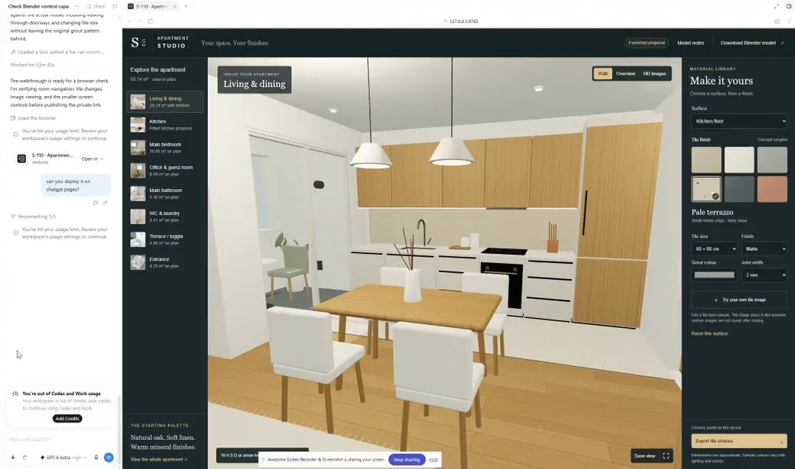</a>

**Промпт**

```text
Я хочу, щоб ви створили повністю реалістичну HD-модель для 3D-візуалізації квартири в Blender, а потім розробили інтерактивний вебдосвід, у якому я зможу переміщатися квартирою та обирати варіанти плитки.
```

<details>
<summary>Оригінальний промпт автора</summary>

```text
I want you to build a completely realistic HD 3D render model in blender, then build interactive web experience so I can walk within the apartment, and choose tile options.
```

</details>

[Докладніше ↗](https://www.tripo3d.ai/uk/3d-prompts/gpt-6-astra-2100222426705453318) · [Оригінальний допис](https://x.com/scheemunai/status/2100222426705453318) · [Назад до прикладів](#all-prompts)

---

<a id="gpt-6-astra-2100193512373592313"></a>

### Розроблення ПК-версії Splatoon і відтворення графіки

[basio](https://x.com/basio39) · 2026-09-16 · GPT-6 Astra · Ігри

<a href="https://www.tripo3d.ai/uk/3d-prompts/gpt-6-astra-2100193512373592313">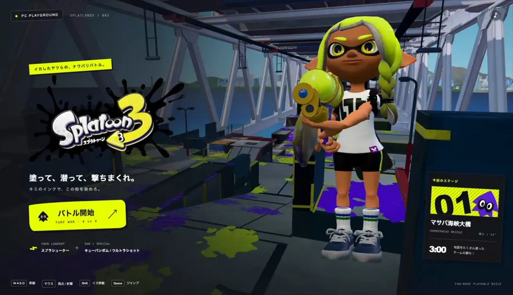</a>

**Промпт**

```text
/goal Розробіть ПК-версію Splatoon. Повністю відтворіть графіку.
```

<details>
<summary>Оригінальний промпт автора</summary>

```text
/goal PC版スプラトゥーンを開発してください。グラフィックは完全に再現してください。
```

</details>

[Докладніше ↗](https://www.tripo3d.ai/uk/3d-prompts/gpt-6-astra-2100193512373592313) · [Оригінальний допис](https://x.com/basio39/status/2100194321987461503) · [Назад до прикладів](#all-prompts)

---

<a id="gpt-6-astra-2100139076816916977"></a>

### Інтерактивна 3D-сцена кімнати з рухомими меблями

[Wentao Zhu](https://x.com/walterzhu8) · 2026-09-16 · GPT-6 Astra · Сцени

<a href="https://www.tripo3d.ai/uk/3d-prompts/gpt-6-astra-2100139076816916977">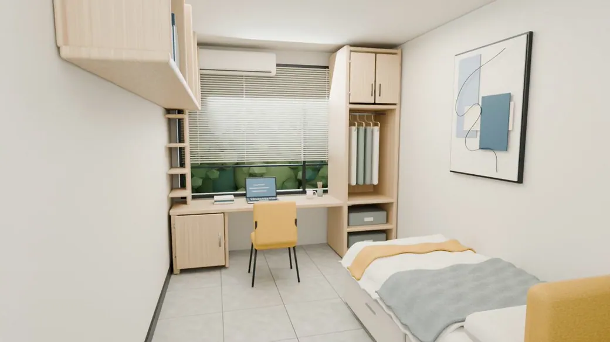</a>

**Референси:** [1](https://media.tripogrowth.space/media/2bee2240-1d9e-488c-aa10-f8882e7b5bb1.png) · [2](https://pbs.twimg.com/media/HSUxfRaWEAAxime.png)

**Промпт**

```text
Використовуючи надану мною фотографію кімнати, створіть за допомогою Blender MCP інтерактивну 3D-сцену та візуалізуйте її в демонстраційне відео. Додайте рухомі елементи (шарніри, дверцята, шухляди) і використайте продумані рухи камери, щоб показати ці ефекти.
```

<details>
<summary>Оригінальний промпт автора</summary>

```text
Given the room photo I provided, use Blender MCP to build an interactive 3D scene and render it into a demo video. Include articulated object motion (hinges, doors, drawers) and use sensible camera moves to show these effects.
```

</details>

[Докладніше ↗](https://www.tripo3d.ai/uk/3d-prompts/gpt-6-astra-2100139076816916977) · [Оригінальний допис](https://x.com/walterzhu8/status/2100139076816916977) · [Назад до прикладів](#all-prompts)

---

<a id="gpt-6-astra-2099850719839109597"></a>

### Створення рухомого 3D-простору та ігрового персонажа за референсними зображеннями

[妖精アーヤ](https://x.com/aiehon_aya) · 2026-09-15 · GPT-6 Astra · Сцени

<a href="https://www.tripo3d.ai/uk/3d-prompts/gpt-6-astra-2099850719839109597">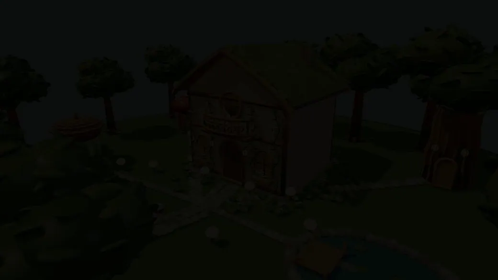</a>

**Референси:** [1](https://media.tripogrowth.space/media/fe8fc9c7-78f7-4702-9ec7-8f1625869a2d.jpg) · [2](https://media.tripogrowth.space/media/aafd4fd9-d485-42ad-b945-ef1056c16867.jpg) · [3](https://pbs.twimg.com/media/HSQqHw5a4AARmX8.jpg) · [4](https://pbs.twimg.com/media/HSQqHxEaEAAeRLp.jpg)

**Промпт**

```text
【Підготуйте заздалегідь】
・Референсні зображення потрібного світу (зовнішній вигляд, кімнати тощо)
・Канонічні зображення персонажа (наприклад, вигляд у трьох проєкціях)
　※Без зображень відтворити результат неможливо. Обов’язково прикріпіть їх

【Промпт】
На основі прикріплених зображень я створю професійно опрацьований 3D-простір і персонажа для гри, якими можна буде керувати, зберігши мій задум світу та образ персонажа.

① Переглянути прикріплені зображення та перевірити форму, кольори й декоративні елементи будинку та персонажа
　↓
② Згенерувати 3D-моделі із зображень у Tripo (три повнорозмірні зображення персонажа — спереду, ззаду та збоку — з однаковим співвідношенням сторін)
　↓
③ Імпортувати моделі в Blender і налаштувати розташування та розміри частин
　↓
④ Налаштувати автоматичний ригінг і додати рухи, що відповідають характеру персонажа, наприклад ходьбу та похитування
　↓
⑤ Якщо виникнуть варіанти, що потребують рішення (наприклад, використання платного асета), перш ніж продовжувати, узгодити їх зі мною
　↓
⑥ Документувати виконану роботу, проблемні місця та розташування матеріалів так докладно, щоб інший ШІ міг відтворити процес
```

<details>
<summary>Оригінальний промпт автора</summary>

```text
【先に用意するもの】
・作りたい世界観の参考画像（外観・部屋など）
・キャラクターの正典画像（三面図など）
　※画像がないと再現できません。添付してねん

【プロンプト】
添付した画像をもとに私の世界観とキャラクターを実際に動かせる3D空間とゲームのキャラをプロクオリティでデザインします。

① 添付画像を見て、家・キャラクターの形状/色/意匠を確認する
　↓
② Tripoで画像から3Dモデルを生成する（正面、背面、サイドの全身の３枚を同じアスペクト比で）
　↓
③ Blenderに読み込みパーツの配置・サイズを調整する
　↓
④ 自動リグを設定し歩く・揺れる等キャラクターの個性にあう動きをつける
　↓
⑤ 判断に迷う分岐（有料アセットを使う等）があれば進める前に私に確認する
　↓
⑥ 作業内容・詰まった点・素材の場所を別のAIが読んでも再現できるレベルで記録に残す
```

</details>

[Докладніше ↗](https://www.tripo3d.ai/uk/3d-prompts/gpt-6-astra-2099850719839109597) · [Оригінальний допис](https://x.com/aiehon_aya/status/2099850721646784894) · [Назад до прикладів](#all-prompts)

---

<a id="gpt-6-astra-2099785223827259515"></a>

### Процедурна космічна гра з повністю доступним світом

[developers.openai.com](https://developers.openai.com/) · 2026-09-15 · GPT-6 Astra · Ігри

<a href="https://www.tripo3d.ai/uk/3d-prompts/gpt-6-astra-2099785223827259515">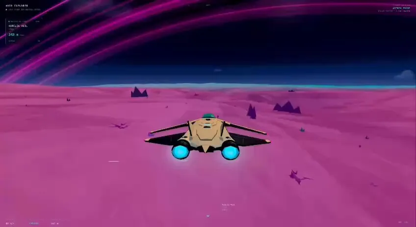</a>

**Промпт**

```text
Усе, що я бачу, має бути доступним для досягнення. Збережімо реальні відстані, а подорож зробімо практичною завдяки масштабу й швидкості. Я хочу летіти з космосу крізь атмосферу планети й спускатися до поверхні. Планети можуть бути розміром із Землю, тож нам знадобляться процедурно згенерований ландшафт і рендерер, що працює за чанками.
```

<details>
<summary>Оригінальний промпт автора</summary>

```text
Everything I can see should be reachable. Keep the distances real, then make travel work through scale and speed. I want to fly from space into a planet’s atmosphere and down to the ground. Planets can be as large as Earth, so we’ll need procedural terrain and a chunked renderer.
```

</details>

[Докладніше ↗](https://www.tripo3d.ai/uk/3d-prompts/gpt-6-astra-2099785223827259515) · [Оригінальний допис](https://developers.openai.com/blog/how-to-build-games-with-astra) · [Назад до прикладів](#all-prompts)

---

<a id="gpt-6-astra-2099750376530657300"></a>

### 3D-серце в стилі Apple та усміхнене емодзі

[Sharon Riley](https://x.com/Just_sharon7) · 2026-09-15 · GPT-6 Astra · Асети

<a href="https://www.tripo3d.ai/uk/3d-prompts/gpt-6-astra-2099750376530657300">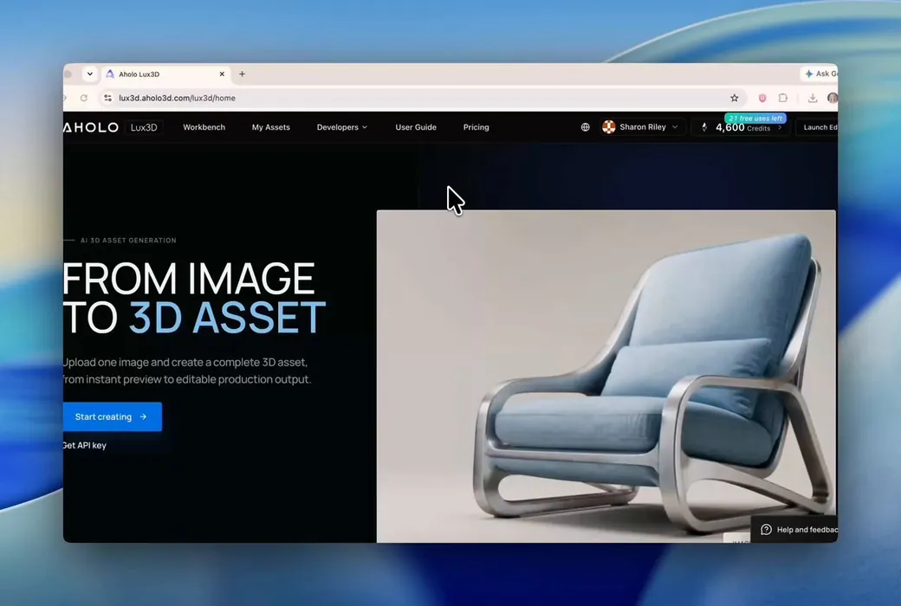</a>

**Промпт**

```text
3D-емодзі-серце та усміхнене емодзі в стилі Apple
```

<details>
<summary>Оригінальний промпт автора</summary>

```text
3D Apple style heart emoji and smiling emoji
```

</details>

[Докладніше ↗](https://www.tripo3d.ai/uk/3d-prompts/gpt-6-astra-2099750376530657300) · [Оригінальний допис](https://x.com/Just_sharon7/status/2099751278234767673) · [Назад до прикладів](#all-prompts)

---

<a id="gpt-6-astra-2099719427990134984"></a>

### Інтерактивна 3D-панель нервової системи організму

[AiMind](https://x.com/AIMind_Ai) · 2026-09-15 · GPT-6 Astra · Інтерактив

<a href="https://www.tripo3d.ai/uk/3d-prompts/gpt-6-astra-2099719427990134984">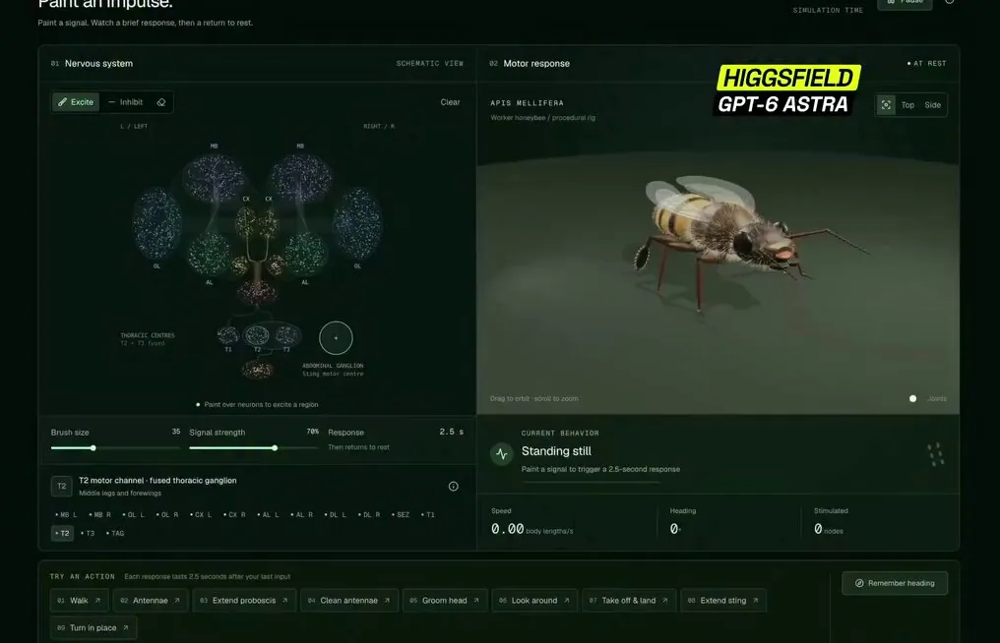</a>

**Промпт**

```text
Інтерактивна панель. Ліворуч — схематичне зображення нервової системи [organism] із клікабельними ділянками. Праворуч — 3D-модель [organism] із процедурним ригінгом. Натискання на ділянку запускає рухову реакцію тривалістю 2,5 секунди. Темний інтерфейс, телеметрія швидкості та курсу.
```

<details>
<summary>Оригінальний промпт автора</summary>

```text
Interactive panel. Left: schematic nervous system of [organism], clickable regions. Right: procedurally rigged 3D [organism]. Clicking a region triggers a 2.5 second motor response. Dark UI, telemetry for speed and heading.
```

</details>

[Докладніше ↗](https://www.tripo3d.ai/uk/3d-prompts/gpt-6-astra-2099719427990134984) · [Оригінальний допис](https://x.com/AIMind_Ai/status/2099719427990134984) · [Назад до прикладів](#all-prompts)

---

<a id="gpt-6-astra-2099643231659012553"></a>

### Інтерактивний вулканічний острів із човнами, що тікають

[Wësche](https://x.com/WescheNex1q) · 2026-09-14 · GPT-6 Astra · Інтерактив

<a href="https://www.tripo3d.ai/uk/3d-prompts/gpt-6-astra-2099643231659012553">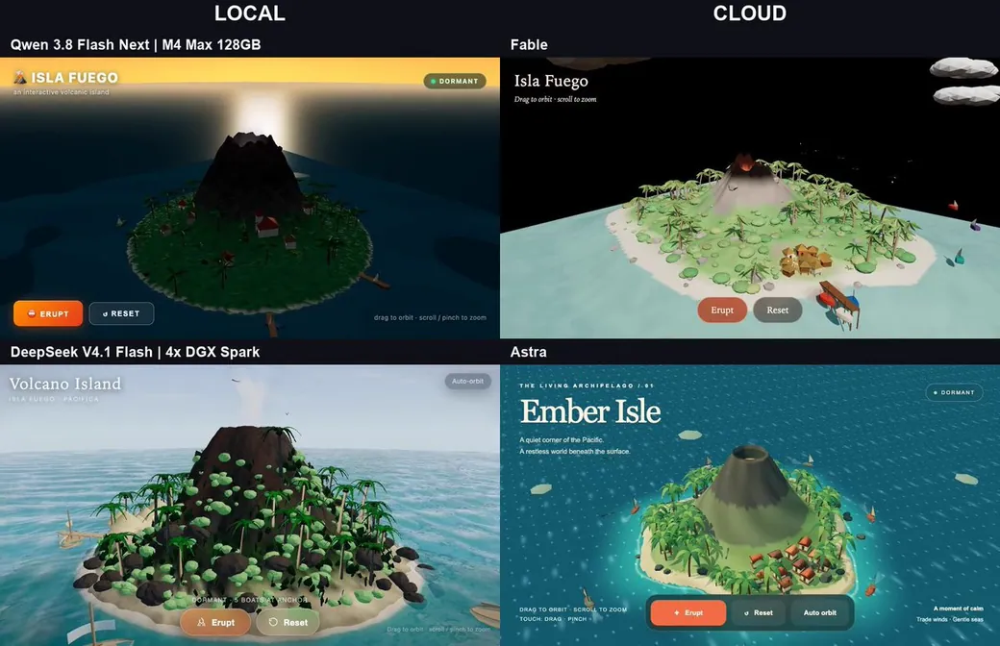</a>

**Промпт**

```text
створи інтерактивний вулканічний острів із потоками лави та човнами, що тікають.
```

<details>
<summary>Оригінальний промпт автора</summary>

```text
build an interactive volcanic island with flowing lava and boats that flee.
```

</details>

[Докладніше ↗](https://www.tripo3d.ai/uk/3d-prompts/gpt-6-astra-2099643231659012553) · [Оригінальний допис](https://x.com/WescheNex1q/status/2099643231659012553) · [Назад до прикладів](#all-prompts)

---

<a id="gpt-6-astra-2099588840419651890"></a>

### Створіть сцену готельного коридору

[West Lord](https://x.com/MyWestLord) · 2026-09-14 · GPT-6 Astra · Сцени

<a href="https://www.tripo3d.ai/uk/3d-prompts/gpt-6-astra-2099588840419651890">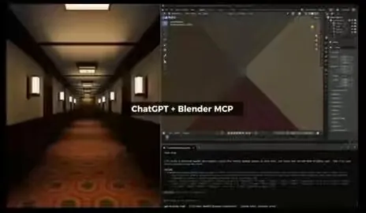</a>

**Промпт**

```text
створи сцену готельного коридору
```

<details>
<summary>Оригінальний промпт автора</summary>

```text
create hotel corridor scene
```

</details>

[Докладніше ↗](https://www.tripo3d.ai/uk/3d-prompts/gpt-6-astra-2099588840419651890) · [Оригінальний допис](https://x.com/MyWestLord/status/2099588840419651890) · [Назад до прикладів](#all-prompts)

---

<a id="gpt-6-astra-2099519801139908951"></a>

### Воїн видирається на велетня й б’є його в щелепу

[MadMax](https://x.com/MadMax_Series) · 2026-09-14 · GPT-6 Astra · Анімація

<a href="https://www.tripo3d.ai/uk/3d-prompts/gpt-6-astra-2099519801139908951">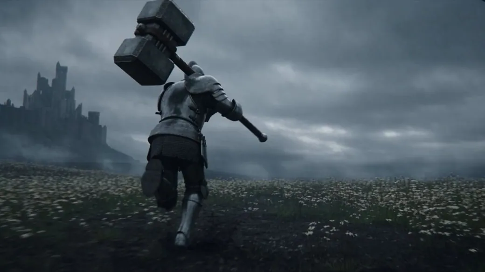</a>

**Промпт**

```text
РЕЄСТР ПЕРСОНАЖІВ:
Рівно один дорослий чоловік — гірський воїн.
Він має компактну, широку й надзвичайно могутню статуру. На ньому оригінальний темний середньовічний фентезійний латний обладунок кольору гарматного металу: закритий загострений шолом, багатошарові наплічники, шарнірний захист рук, важкі рукавиці, посилений нагрудник, шкіряні панелі на поясі, темні штани, сталеві поножі та важкі броньовані чоботи. Його обладунок потертий, подряпаний і мокрий від грози.
Він несе рівно один величезний дворучний бойовий молот. Він має одне довге посилене держално з темного металу та одну важку симетричну прямокутну бойову головку. Зброя зберігає ту саму довжину, форму й вагу протягом усієї сцени. Під час стрибків, лазіння та удару він тримає її обома руками.
Рівно один колосальний органічний гуманоїдний велетень, більш ніж у тридцять разів вищий за воїна. У нього величезні м’язисті плечі, надзвичайно довгі руки, гігантські людиноподібні кисті, груба вугільно-сіра шкіра з видимими порами та шрамами, важкі надбрівні дуги, широкий ніс, потужна щелепа й довге скуйовджене чорне волосся. Це органічний живий титан — не статуя, робот, машина чи кам’яний голем.
Жодних додаткових воїнів, велетнів або армій на задньому плані.
СЕРЕДОВИЩЕ:
Поле бою у вітряному високогір’ї під бурхливою синьо-сірою грозою. Нерівна земля вкрита темним мокрим ґрунтом, прим’ятою травою та тисячами дрібних блідо-жовтих квітів. Сильний вітер згинає траву й квіти нерегулярними хвилями.
На далекому пагорбі ліворуч у кадрі стоїть зруйнована середньовічна фортеця. Крізь низький серпанок видно рештки веж. Блискавки час від часу освітлюють фортецю та грозові хмари.
Велетень займає праву частину поля бою в кадрі. Воїн починає рух у центрі переднього плану й біжить до велетня. Зберігайте цю географію та напрямки в кадрі під час кожної склейки.
ХРОНОЛОГІЯ ДІЙ І КАМЕРА:
0.00–3.30 — РИВОК ДО ВЕЛЕТНЯ
Одразу почніть із низького трекінгового плану ззаду, знятого зблизька просто за спиною закутого в броню воїна, який потужно біжить мокрим полем до колосального велетня.
Він тримає бойовий молот горизонтально перед собою обома руками. Важка головка молота залишається праворуч у кадрі, а нижня частина держака тягнеться ліворуч. Його чоботи стискають мокру землю з кожним кроком, викидаючи ґрунт, розчавлені квіти й краплі назад лише після фізичного контакту.
Ноги велетня та його величезна права кисть входять у кадр із верхнього правого боку. Велетень нахиляється й простягає відкриту долоню до воїна, який мчить, маючи намір підхопити його із землі.
Пальці рухаються незалежно, із правдоподібною роботою суглобів і відчутною вагою. Велетень не хапає воїна миттєво й не телепортує його.
Камера рухається низько, швидко й плавно, підкреслюючи величезну різницю в масштабі. Зруйнована фортеця залишається видимою на далекому лівому горизонті в кадрі.
3.30–5.80 — СТРИБОК НА РУКУ ВЕЛЕТНЯ
Коли відкрита долоня велетня низько проходить траєкторією воїна, воїн твердо ставить правий чобіт на землю. Його коліно стискається, стегна опускаються, а задня нога штовхає тіло вгору.
Він виконує один потужний стрибок уперед.
Застосуйте контрольоване кінематографічне сповільнення, коли він підіймається перед розведеними пальцями велетня. Його ноги злегка підтягуються під тулуб, а обидві руки підіймають той самий бойовий молот над плечима для рівноваги.
Воїн приземляється обома чоботами на тильну поверхню середнього та безіменного пальців велетня. Покажіть чіткий фізичний контакт: чоботи торкаються шкіри, коліна амортизують удар, плоть велетня злегка стискається, а обладунок воїна реагує на приземлення.
Велетень починає піднімати руку до обличчя. Воїн не зависає й не висить у порожньому повітрі.
Застосуйте ефектний нижній ракурс із крановим рухом, який підіймається під воїном, тоді як величезна кисть заповнює задній план.
5.80–9.00 — БІГ УГОРУ РУКОЮ
Поверніться до швидкої природної дії.
Коли велетень підіймає руку, воїн біжить від пальців по тильній поверхні кисті до зап’ястка. Його кроки правильно й помітно чергуються та чіпко втримуються на нерівній рухомій поверхні.
Велетень обертає зап’ясток і намагається струсити його. Воїн опускає центр ваги, розширює стійку й тримає молот близько до тулуба, доки рука не стабілізується.
Потім він пришвидшується вздовж передпліччя велетня до ліктя. Кожен крок відповідає зміні кута руки; його чоботи не ковзають крізь шкіру.
Камера рухається поруч і трохи нижче за нього, підіймаючись уздовж руки велетня. Ближні частини руки швидко перетинають передній план, тоді як голова велетня й далека фортеця рухаються повільніше, створюючи виразний паралакс і відчуття масштабу.
9.00–12.00 — ПІДЙОМ НА ПЛЕЧЕ
Воїн досягає верхньої частини руки, яка круто підіймається до плеча велетня.
Він чіпляється одним передпліччям і держаком бойового молота за природний м’язовий виступ для опори, ставить правий чобіт, відштовхується ногою й одним цілісним рухом підтягується на плече.
Велетень повертає до нього голову. Його око стежить за воїном, надбрівна дуга напружується, а щелепа розкривається в глибокому невербальному ревінні. Волосся та шкіра рухаються разом із поворотом голови.
Воїн залишається прикріпленим до плеча завдяки реальному контакту рук і чобіт. Він діагонально перебирається верхньою частиною плеча до основи шиї велетня.
Використайте крупний боковий трекінговий план, у якому повністю видно воїна, бойовий молот і профіль обличчя велетня в одному кадрі.
12.00–15.00 — ПОВНИЙ УДАР МОЛОТОМ У ЩЕЛЕПУ
Воїн займає стійке положення на похилому плечі велетня біля його шиї.
Він виставляє лівий чобіт уперед, а правий ставить позаду. Обидві стопи помітно притискаються до шкіри велетня. Він розвертає стегна від цілі й відводить бойовий молот назад обома руками.
Покажіть повну підготовку до удару:
стопи фіксуються → коліна стискаються → стегна навантажуються → тулуб обертається → плечі відводять молот назад → руки спрямовують важку головку молота у вихідне положення.
На 13.00 секунді воїн виконує один повний горизонтальний дворучний замах у напрямку щелепи велетня.
Сила безперервно передається від ніг через стегна, тулуб, плечі та руки. Головка молота рухається однією чіткою безперервною дугою. Вона не змінює положення стрибком і не торкається обличчя до завершення замаху.
На 14.00 секунді перейдіть до виразного надповільного руху для вирішального контакту.
Прямокутна головка молота вдаряє широкою ударною поверхнею в бік нижньої щелепи велетня — не держаком і не руків’ям. Покажіть, як шкіра й тканини щоки стискаються навколо місця удару, щелепа зміщується вбік, розпущене волосся розлітається, а дощ, пил і частинки шкіри радіально розлітаються від точки контакту.
Руки воїна протидіють раптовому гальмуванню. Його плечі відкидаються назад, а тіло продовжує рух у контрольованому завершенні замаху.
Без крові, оголених тканин, кривавих сцен або розчленування.
15.00–17.30 — ВІДДАЧА ВЕЛЕТНЯ І ПАДІННЯ ВОЇНА
Негайно поверніться до природної швидкості.
Голова велетня різко відхиляється вбік від удару. Його верхня частина тулуба відкидається назад, а вражене плече різко опускається. Цей раптовий рух униз позбавляє воїна опори й відкидає його від велетня.
Воїн падає до поля бою, утримуючи той самий бойовий молот обома руками. Він не зависає й не виконує додаткового стрибка.
Перейдіть до бічного ракурсу на рівні землі. Першими торкаються землі його чоботи, коліна підламуються від інерції, і він один раз перекочується через плече. Головка молота вдаряється об ґрунт поруч із ним і прорізає неглибоку борозну, розкидаючи мокру землю та бліді квіти.
Величезне обличчя велетня опускається у верхню праву частину кадру, поки він намагається відновити рівновагу. Він не розчавлює воїна й не перетинається з ним.
17.30–20.00 — ВІДНОВЛЕННЯ І ФІНАЛЬНЕ ПРОТИСТОЯННЯ
Воїн зупиняє перекочування в низькому положенні на одному коліні.
Він встромляє головку бойового молота в ґрунт, обома руками стискає держак і використовує його як опору, щоб плавно підвестися на одне коліно. Потім витягає молот і розташовує держак горизонтально поперек плечей у готовій оборонній стійці.
Велетень опускає до нього свою величезну голову; його щелепа помітно забита від удару, але він залишається при свідомості й загрозливим. Його подих ворушить траву, квіти, туман і вільні шкіряні панелі на обладунку воїна.
Воїн залишається нерухомим лише протягом короткої рішучої миті, а його дихання й обладунок зберігають ледь помітний природний рух.
Удар блискавки освітлює зруйновану фортецю ліворуч у кадрі, окреслюючи обидві постаті й підтверджуючи величезну різницю в масштабі.
Завершіть рівно на 20.00 секунді низькою широкою композицією: воїн стоїть на коліні на вкритому квітами передньому плані, тримаючи напоготові бойовий молот; над ним нависає обличчя велетня, а далеку фортецю видно крізь грозу.
Не робіть затемнення до чорного. Без стоп-кадру, заголовка чи фінальної заставки.
ФІКСАЦІЯ ФІЗИКИ ДІЇ:
Кожна дія має підпорядковуватися зрозумілій фізичній причинно-наслідковості:
Біг: контакт стопи → перенесення ваги → поштовх задньою ногою → наступний крок.
Стрибок: опорна стопа → стискання коліна → розгинання ноги → траєкторія в повітрі → контакт під час приземлення → амортизація колінами.
Лазіння: опора на руку або зброю → опорний чобіт → перенесення ваги тіла → підтягування вгору.
Удар молотом: стійкі стопи → навантаження стегон → обертання тулуба → поштовх плечем → безперервна траєкторія молота → контакт широкою ударною поверхнею → опір → завершення замаху.
Падіння: втрата опори, спричинена віддачею велетня → спуск під дією сили тяжіння → контакт чобіт із землею → підгинання колін → перекочування через плече → відновлення.
Воїн ніколи не телепортується між землею, кистю, рукою та плечем. Велетень ніколи не переміщує воїна без прямого фізичного контакту або видимої сили.
ПРАВИЛА ШВИДКОСТІ РУХУ:
0.00–3.30: швидкий природний темп бігу.
3.30–5.80: контрольоване кінематографічне сповільнення для стрибка й приземлення.
5.80–13.90: природна швидка дія.
13.90–15.00: виразне надповільне відтворення лише для фінального наближення молота, контакту й безпосередньої деформації.
15.00–20.00: чітке повернення до природної швидкості.
Не застосовуйте глобальне сповільнення. Не дозволяйте персонажам у сповільненій зйомці зависати.
ОСВІТЛЕННЯ Й КОЛІР:
Зберігайте холодну сталево-синю, вугільно-сіру та ненасичену сріблясту кольорокорекцію грози. Блискавка забезпечує короткочасне холодно-біле спрямоване освітлення. Мокрий обладунок отримує вузькі сріблясті відблиски, а темна шкіра велетня залишається деталізованою та добре видимою.
Бліді квіти створюють стриманий теплий відтінок слонової кістки, не роблячи сцену барвистою. Зберігайте глибокий атмосферний туман навколо далекої фортеці. Зміни експозиції від блискавок мають бути короткими й не повинні стирати анатомію персонажів або приховувати пропущені дії.
АУДІО:
Лише синхронізовані дієгетичні звуки довкілля та дії. Абсолютно без фонової музики чи музичного супроводу.
Додайте грозовий вітер, далекий грім, рух обладунку, важкі удари ніг під час бігу, потривожений ґрунт, шелестіння трави, невербальне дихання й ревіння велетня, свист руху його руки, стрибок воїна, контакт чобіт зі шкірою, удари під час лазіння, рух бойового молота, один глибокий металевий удар молота, віддачу велетня, шум падіння в повітрі, удар обладунку об землю, удар головки молота об землю та фінальний близький тріск блискавки.
Без діалогів, оповіді, вимовлених слів, скандувань, текстів пісень або зрозумілої мови.
БЕЗПЕРЕРВНІСТЬ І ЗАПОБІГАННЯ ПОМИЛКАМ:
Протягом усієї сцени рівно один воїн, один велетень і один бойовий молот.
Воїн один раз видирається на велетня й виконує рівно один вирішальний удар молотом.
Бойовий молот ніколи не дублюється, не змінює розмір, не зависає, не згинається, не проходить крізь жодне тіло й не переходить з руки в руку без видимого руху.
Велетень залишається тією самою органічною гуманоїдною істотою в кожному кадрі. Жодних роботизованих рис, перетворення на камінь, дубльованих кистей, додаткових пальців або змін обличчя.
Зберігайте обладунок, шолом, пропорції та пошкодження воїна протягом усієї сцени.
Зберігайте маршрут від правої кисті велетня через праву руку до плеча, щоб географія лазіння залишалася фізично можливою.
Без злитих кистей, зайвих кінцівок, вивернутих суглобів, ковзання чобіт, перетину тіл, телепортації або зависання без опори.
Широка головка молота, а не держак, має бути помітно в контакті зі щелепою велетня після завершення замаху.
Без крові, кривавих сцен, оголених тканин, розчавленого людського тіла або розчленування.
Без вигляду ігрового кіно, впізнаваних персонажів франшиз, субтитрів, написів, логотипів, інтерфейсу, накладок програвача, постійних чорних смуг або водяних знаків.
Будь-яка фонова музика чи музичний супровід означає невдалу генерацію.
music=0; no_music=1; strict_no_music=1; audio=diegetic_only.
```

<details>
<summary>Оригінальний промпт автора</summary>

```text
CHARACTER REGISTRY:
Exactly one adult male mountain warrior.
He has a compact, broad and extremely powerful build. He wears an original dark gunmetal suit of medieval fantasy plate armor: enclosed pointed helmet, layered shoulder plates, articulated arm protection, heavy gauntlets, reinforced breastplate, leather waist panels, dark trousers, steel greaves and heavy armored boots. His armor is weathered, scratched and wet from the storm.
He carries exactly one enormous two-handed warhammer. It has one long reinforced dark-metal shaft and one heavy symmetrical rectangular hammer head. The weapon remains the same length, shape and weight throughout. He controls it with both hands during jumps, climbing and striking.
Exactly one colossal organic humanoid giant, more than thirty times the warrior’s height. It has immense muscular shoulders, extremely long arms, huge humanlike hands, coarse charcoal-gray skin, visible pores and scars, a heavy brow, broad nose, powerful jaw and long tangled black hair. It is an organic living titan—not a statue, robot, machine or stone golem.
No additional warriors, giants or background armies.
ENVIRONMENT:
A windswept highland battlefield beneath a violent blue-gray thunderstorm. The uneven ground is covered with dark wet soil, flattened grass and thousands of small pale flowers. Strong wind bends the grass and flowers in irregular waves.
A ruined medieval fortress stands on a distant hill at screen-left. Broken towers remain visible through low drifting fog. Lightning intermittently illuminates the fortress and storm clouds.
The giant occupies the battlefield’s screen-right side. The warrior begins in the center foreground, running toward the giant. Preserve this geography and screen direction throughout every cut.
CHRONOLOGICAL ACTION AND CAMERA:
0.00–3.30 — CHARGE TOWARD THE GIANT
Begin immediately with a low rear tracking shot, close behind the armored warrior as he runs powerfully through the wet field toward the colossal giant.
He carries the warhammer horizontally across his body with both hands. The heavy hammer head remains toward screen-right while the lower shaft extends toward screen-left. His boots compress the wet ground with every step, throwing soil, crushed flowers and droplets backward only after physical contact.
The giant’s legs and enormous right hand enter from the upper-right side of the frame. The giant bends down and extends its open hand toward the charging warrior, intending to scoop him from the ground.
The fingers move independently with believable joints and weight. The giant does not instantly grab or teleport the warrior.
Camera movement remains low, fast and smooth, emphasizing the extreme difference in scale. The ruined fortress stays visible on the distant screen-left horizon.
3.30–5.80 — LEAP ONTO THE GIANT’S HAND
As the giant’s open hand sweeps low across the warrior’s path, the warrior plants his right boot firmly into the ground. His knee compresses, hips lower and rear leg drives upward.
He performs one powerful forward jump.
Use controlled cinematic slow motion as he rises in front of the giant’s separated fingers. His legs tuck slightly beneath him while both hands raise the same warhammer above his shoulders for balance.
The warrior lands with both boots on the back of the giant’s middle and ring fingers. Show clear physical contact: boots touch skin, knees absorb impact, the giant’s flesh compresses slightly and the warrior’s armor reacts to the landing.
The giant begins lifting its hand toward its face. The warrior does not float or hang in empty air.
Use a dramatic low-angle crane that travels upward beneath the warrior, with the enormous hand filling the background.
5.80–9.00 — RUNNING UP THE ARM
Return to fast natural action.
As the giant raises its arm, the warrior runs from the fingers across the back of the hand and onto the wrist. His footfalls alternate correctly and visibly grip the uneven moving surface.
The giant rotates its wrist and attempts to shake him loose. The warrior lowers his center of gravity, widens his stance and keeps the hammer close to his torso until the arm stabilizes.
He then accelerates along the giant’s forearm toward the elbow. Each step follows the arm’s changing angle; his boots do not slide through the skin.
Camera tracks beside and slightly below him, rising along the length of the giant’s arm. Near parts of the arm cross the foreground quickly while the giant’s head and distant fortress move more slowly, creating powerful parallax and scale.
9.00–12.00 — CLIMB TO THE SHOULDER
The warrior reaches the upper arm as it rises steeply toward the giant’s shoulder.
He hooks one forearm and the warhammer shaft against a natural ridge of muscle for leverage, plants his right boot, pushes through his leg and pulls himself onto the shoulder in one connected climbing action.
The giant turns its head toward him. Its eye tracks the warrior, its brow tightens and its jaw opens in a deep nonverbal roar. Hair and skin move from the rotation of its head.
The warrior remains attached to the shoulder through real hand and boot contact. He climbs diagonally across the upper shoulder toward the base of the giant’s neck.
Use a close side-tracking shot that keeps the complete warrior, warhammer and giant’s facial profile readable in the same frame.
12.00–15.00 — FULL HAMMER STRIKE TO THE JAW
The warrior reaches a stable position on the giant’s sloped shoulder near its neck.
He plants his left boot forward and braces his right boot behind it. Both feet visibly press against the giant’s skin. He rotates his hips away from the target and draws the warhammer backward with both hands.
Show the complete preparation before impact:
feet plant → knees compress → hips load → torso rotates → shoulders draw the hammer backward → arms guide the heavy hammer head into its starting position.
At 13.00 seconds, the warrior releases one complete horizontal two-handed swing toward the giant’s jaw.
The power travels continuously from his legs through his hips, torso, shoulders and arms. The hammer head follows one clear uninterrupted arc. It does not jump positions or touch the face before the swing is complete.
At 14.00 seconds, enter explicit ultra slow motion for the decisive contact.
The rectangular hammer head strikes the side of the giant’s lower jaw with its broad striking face—not the shaft or handle. Show skin and cheek tissue compressing around the impact, the giant’s jaw shifting sideways, loose hair whipping outward and a radial burst of rain, dust and skin debris.
The warrior’s arms resist the sudden deceleration. His shoulders recoil while his body continues through a controlled follow-through.
No blood, exposed tissue, gore or dismemberment.
15.00–17.30 — GIANT RECOIL AND WARRIOR FALL
Return immediately to natural speed.
The giant’s head snaps sideways from the impact. Its upper body recoils and the struck shoulder drops sharply. This sudden downward movement removes the warrior’s footing and throws him away from the giant.
The warrior falls toward the battlefield while retaining the same warhammer with both hands. He does not float or perform an additional jump.
Cut to a ground-level side view. His boots contact first, his knees collapse under the momentum and he rolls once across one shoulder. The hammer head strikes the soil beside him and digs a shallow trench, throwing wet earth and pale flowers outward.
The giant’s huge face descends into the upper-right portion of the frame as it struggles to regain balance. It does not crush or intersect the warrior.
17.30–20.00 — RECOVERY AND FINAL STANDOFF
The warrior stops his roll in a low kneeling position.
He plants the warhammer head into the soil, grips the shaft with both hands and uses it as support to rise steadily to one knee. He then pulls the hammer free and brings the shaft horizontally across his shoulders in a prepared defensive posture.
The giant lowers its enormous head toward him, jaw visibly bruised from the strike but still conscious and threatening. Its breath disturbs the grass, flowers, fog and loose leather panels on the warrior’s armor.
The warrior remains motionless only for a brief determined beat while his breathing and armor retain subtle natural movement.
A lightning strike illuminates the ruined fortress at screen-left, outlining both figures and confirming their immense difference in scale.
End exactly at 20.00 seconds on a low wide composition: the warrior kneeling in the flower-covered foreground with the warhammer ready, the giant’s face looming above him and the distant fortress visible through the storm.
Do not fade to black. No freeze frame, title or end card.
ACTION-PHYSICS LOCK:
Every action must follow readable physical causality:
Running: foot contact → weight transfer → rear-leg push → next step.
Jump: planted foot → knee compression → leg extension → airborne trajectory → landing contact → knee absorption.
Climbing: hand or weapon support → planted boot → body-weight transfer → upward pull.
Hammer strike: stable feet → hip loading → torso rotation → shoulder drive → continuous hammer path → broad hammer-face contact → resistance → follow-through.
Fall: lost footing caused by the giant’s recoil → gravity-driven descent → boot contact → knee collapse → shoulder roll → recovery.
The warrior never teleports between the ground, hand, arm or shoulder. The giant never moves the warrior without direct physical contact or a visible force.
MOTION-SPEED RULES:
0.00–3.30: fast natural running speed.
3.30–5.80: controlled cinematic slow motion for the jump and landing.
5.80–13.90: natural fast action.
13.90–15.00: explicit ultra slow motion only for the hammer’s final approach, contact and immediate deformation.
15.00–20.00: clear return to natural speed.
Do not apply global slow motion. Do not allow slow-motion characters to hover.
LIGHTING AND COLOR:
Maintain a cold steel-blue, charcoal-gray and desaturated silver storm grade. Lightning provides brief cold-white directional illumination. Wet armor receives narrow silver highlights, while the giant’s dark skin remains detailed and readable.
The pale flowers provide restrained warm ivory contrast without making the scene colorful. Preserve deep atmospheric fog around the distant fortress. Lightning exposure changes must be brief and must not erase character anatomy or hide missing actions.
AUDIO:
Only synchronized diegetic environmental and action sound effects. Absolutely no background music or score.
Include storm wind, distant thunder, armor movement, heavy running footfalls, disturbed soil, bending grass, the giant’s nonverbal breathing and roar, the rush of its hand, the warrior’s jump, boots contacting skin, climbing impacts, warhammer movement, one deep metallic hammer impact, the giant’s recoil, falling air, armor striking soil, the hammer head hitting the ground and a final nearby lightning crack.
No dialogue, narration, spoken words, chants, lyrics or intelligible language.
CONTINUITY AND FAILURE PREVENTION:
Exactly one warrior, one giant and one warhammer throughout.
The warrior climbs the giant once and performs exactly one decisive hammer strike.
The warhammer never duplicates, changes size, floats, bends, passes through either body or switches hands without visible motion.
The giant remains the same organic humanoid creature in every shot. No robotic features, stone transformation, duplicated hands, extra fingers or changing face.
Preserve the warrior’s armor, helmet, proportions and damage throughout.
Preserve the giant’s right-hand-to-right-arm-to-shoulder route so the climbing geography remains physically possible.
No fused hands, extra limbs, reversed joints, sliding boots, intersecting bodies, teleportation or unsupported hovering.
The hammer’s broad head—not its shaft—must visibly contact the giant’s jaw after the complete swing.
No blood, gore, exposed tissue, crushed human body or dismemberment.
No live-action appearance, recognizable franchise characters, subtitles, captions, logos, UI, playback overlays, permanent black bars or watermarks.
Any background music or musical score is a failed generation.
music=0; no_music=1; strict_no_music=1; audio=diegetic_only.
```

</details>

[Докладніше ↗](https://www.tripo3d.ai/uk/3d-prompts/gpt-6-astra-2099519801139908951) · [Оригінальний допис](https://x.com/MadMax_Series/status/2099519801139908951) · [Назад до прикладів](#all-prompts)

---

<a id="gpt-6-astra-2099487024256589970"></a>

### 3D-світ із дуже високими хмарочосами

[Bilal Arshad](https://x.com/MohdBilalArshad) · 2026-09-14 · GPT-6 Astra · Сцени

<a href="https://www.tripo3d.ai/uk/3d-prompts/gpt-6-astra-2099487024256589970">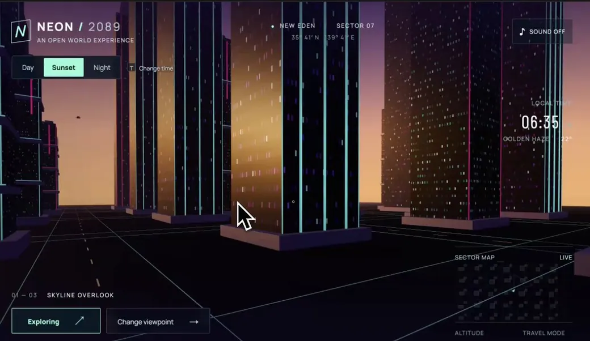</a>

**Промпт**

```text
створити 3D-світ із дуже високими хмарочосами
```

<details>
<summary>Оригінальний промпт автора</summary>

```text
build a 3D world full of very high skyscrapers
```

</details>

[Докладніше ↗](https://www.tripo3d.ai/uk/3d-prompts/gpt-6-astra-2099487024256589970) · [Оригінальний допис](https://x.com/MohdBilalArshad/status/2099487024256589970) · [Назад до прикладів](#all-prompts)

---

<a id="gpt-6-astra-2099472264270102705"></a>

### Модель хвойного дерева до 200 полігонів

[わたもす / ゲーム制作](https://x.com/Watamos827) · 2026-09-14 · GPT-6 Astra · Асети

<a href="https://www.tripo3d.ai/uk/3d-prompts/gpt-6-astra-2099472264270102705">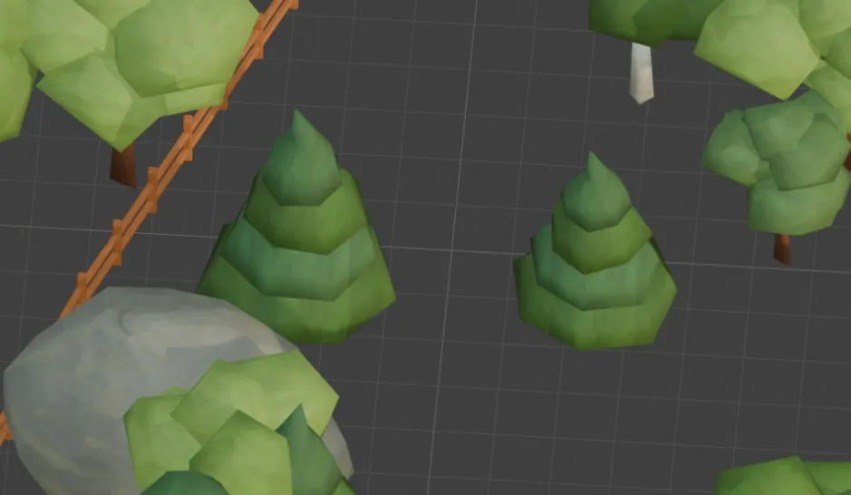</a>

**Промпт**

```text
Чи не могли б ви створити хвойне дерево не більш як із 200 полігонів?
```

<details>
<summary>Оригінальний промпт автора</summary>

```text
200ポリゴン以下で針葉樹を作ってみてくれませんか？
```

</details>

[Докладніше ↗](https://www.tripo3d.ai/uk/3d-prompts/gpt-6-astra-2099472264270102705) · [Оригінальний допис](https://x.com/Watamos827/status/2099472264270102705) · [Назад до прикладів](#all-prompts)

---

<a id="gpt-6-astra-2099450933067612421"></a>

### Інтерактивна 3D-сцена із самураєм у лісі

[Jaynit Makwana](https://x.com/JaynitMakwana) · 2026-09-14 · GPT-6 Astra · Інтерактив

<a href="https://www.tripo3d.ai/uk/3d-prompts/gpt-6-astra-2099450933067612421">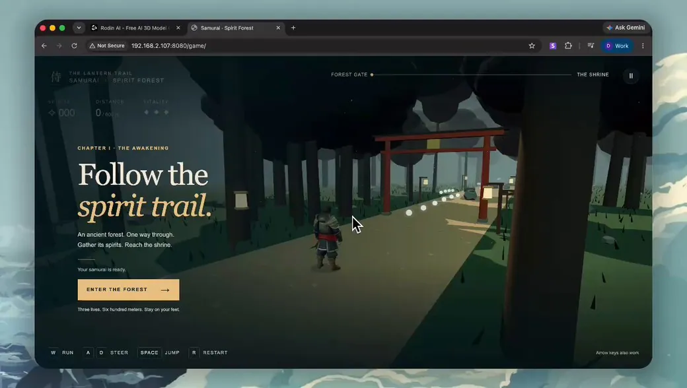</a>

**Промпт**

```text
Створіть інтерактивну 3D-сцену із самураєм у лісі, додавши керування камерою, кінематографічне освітлення, деталізоване оточення та лаконічну подачу.
```

<details>
<summary>Оригінальний промпт автора</summary>

```text
Build an interactive 3D scene featuring a samurai in a forest, with camera controls, cinematic lighting, environmental details, and a clean presentation.
```

</details>

[Докладніше ↗](https://www.tripo3d.ai/uk/3d-prompts/gpt-6-astra-2099450933067612421) · [Оригінальний допис](https://x.com/JaynitMakwana/status/2099450933067612421) · [Назад до прикладів](#all-prompts)

---

<a id="gpt-6-astra-2099419671481249851"></a>

### Ігрова 3D-смуга перешкод

[Dhaval Makwana](https://x.com/heyDhavall) · 2026-09-14 · GPT-6 Astra · Ігри

<a href="https://www.tripo3d.ai/uk/3d-prompts/gpt-6-astra-2099419671481249851">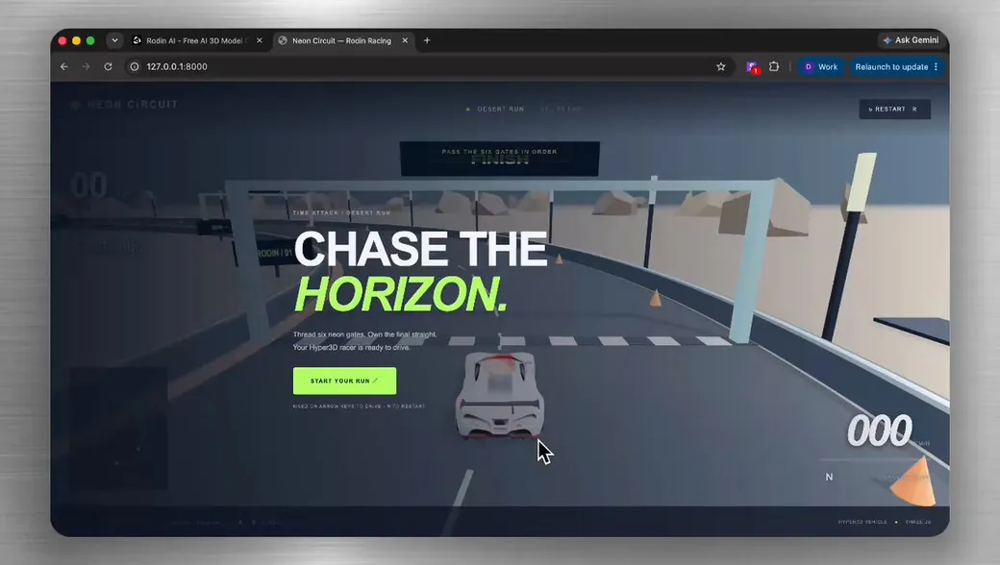</a>

**Промпт**

```text
Невелика 3D-смуга перешкод із персонажем, рухомими бар’єрами, предметами для збору та простою фінішною зоною.
```

<details>
<summary>Оригінальний промпт автора</summary>

```text
A small 3D obstacle course with a character, moving barriers, collectible objects, and a simple goal area.
```

</details>

[Докладніше ↗](https://www.tripo3d.ai/uk/3d-prompts/gpt-6-astra-2099419671481249851) · [Оригінальний допис](https://x.com/heyDhavall/status/2099419671481249851) · [Назад до прикладів](#all-prompts)

---

<a id="gpt-6-astra-2099362575339372780"></a>

### Автономна модельна залізниця із запобіганням зіткненням

[AI Guides](https://x.com/free_ai_guides) · 2026-09-14 · GPT-6 Astra · Анімація

<a href="https://www.tripo3d.ai/uk/3d-prompts/gpt-6-astra-2099362575339372780">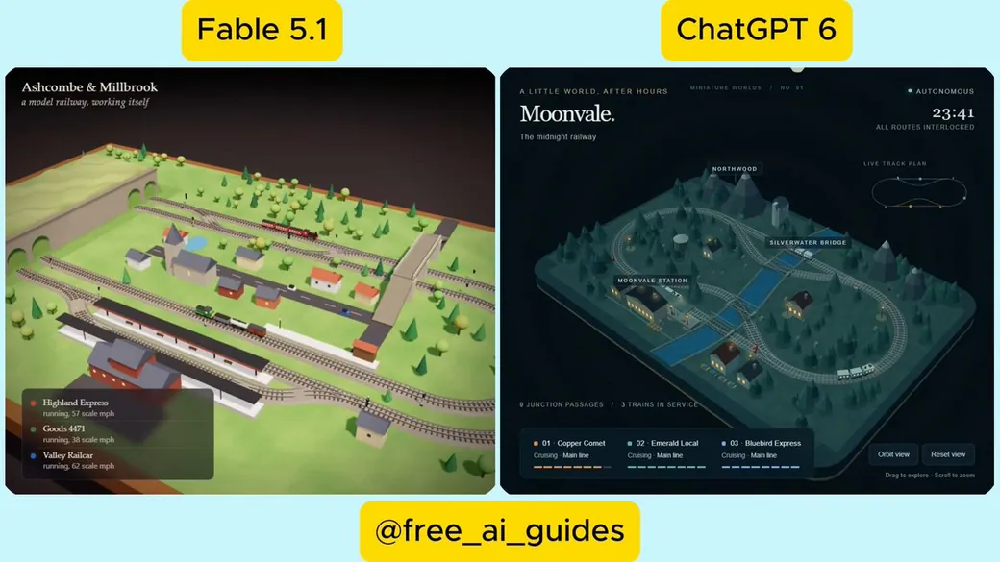</a>

**Промпт**

```text
Створіть модельну залізницю, на спільній схемі колій якої одночасно рухаються щонайменше три потяги; схема має містити стрілки та сигнали. Потяги повинні самостійно перемикати колії й зупинятися перед сигналами, щоб ніколи не зіткнутися, без будь-якого введення від користувача. Схема, оточення та вигляд усіх елементів — на ваш розсуд. Усі дизайнерські рішення приймайте самостійно: стиль, кольори, настрій, оточення, камеру, рівень деталізації та будь-які додаткові ефекти. Не ставте мені запитань, самостійно зробіть усі вибори й за одну спробу створіть найефектнішу версію. Технічні вимоги: один самодостатній HTML-файл, без зовнішніх моделей, зображень, звуків і URL-адрес ресурсів будь-якого типу (дозволено JavaScript-бібліотеку з CDN). Симуляція має запускатися автоматично одразу після завантаження, без потреби в кліках, і працювати плавно, без помилок у консолі.
```

<details>
<summary>Оригінальний промпт автора</summary>

```text
Build a model railway with at least three trains running at the same time on a shared track layout that includes junctions and signals. The trains must switch tracks and stop at signals on their own so they never collide, without any input from the user. The layout, the setting, and the look of everything are up to you. Everything about the design is your decision: style, colors, mood, environment, camera, level of detail, and any extra touches. Do not ask me any questions, make every choice yourself and build the most impressive version you can in a single attempt. Technical requirements: one single self-contained HTML file, no external models, images, sounds, or asset URLs of any kind (a JavaScript library from a CDN is fine). It must start running on its own the moment it loads, with no clicks needed, and run smoothly with no console errors.
```

</details>

[Докладніше ↗](https://www.tripo3d.ai/uk/3d-prompts/gpt-6-astra-2099362575339372780) · [Оригінальний допис](https://x.com/free_ai_guides/status/2099362575339372780) · [Назад до прикладів](#all-prompts)

---


[Повний каталог](catalog.uk.md) · [←](catalog.uk.1.md) · **2 / 9** · [→](catalog.uk.3.md)

<p align="center"><strong><a href="https://www.tripo3d.ai/uk/3d-prompts?utm_source=github&amp;utm_medium=referral&amp;utm_campaign=awesome_3d_prompts&amp;utm_content=catalog_footer">Повний каталог →</a></strong></p>
