<!-- Generated from Growth CMS by templates/catalog.md. Edit content in CMS; run npm run sync. -->

# Awesome 3D Prompts — 8 / 9

[← Awesome 3D Prompts](../README.md)

<p>
  <a href="../docs/catalog.en.8.md"></a>
  <a href="../docs/catalog.zh.8.md"></a>
  <a href="../docs/catalog.zh-Hant.8.md"></a>
  <a href="../docs/catalog.ja.8.md"></a>
  <a href="../docs/catalog.ko.8.md"></a>
  <a href="../docs/catalog.es.8.md"></a>
  <a href="../docs/catalog.pt.8.md"></a>
  <a href="../docs/catalog.de.8.md"></a>
  <a href="../docs/catalog.fr.8.md"></a>
  <a href="../docs/catalog.it.8.md"></a>
  <a href="../docs/catalog.ru.8.md"></a>
  <a href="../docs/catalog.tr.8.md"></a>
  <a href="../docs/catalog.uk.8.md"></a>
  <a href="../docs/catalog.vi.8.md"></a>
</p>

[Повний каталог](catalog.uk.md) · [←](catalog.uk.7.md) · **8 / 9** · [→](catalog.uk.9.md)

<a id="all-prompts"></a>

<details>
<summary>Переглянути приклади (50)</summary>

- [Повноцінні 3D-«Змії та драбини»](#playable-3d-snakes-and-ladders-2095050993184669825)
- [Портрет із рухомих вокселів](#portrait-transformed-into-kinetic-voxels-2095048967092625663)
- [Інтерактивний замок на Three.js](#interactive-three-js-castle-2095048818203275584)
- [NIGHTBAND — інтерактивний короткохвильовий приймач](#nightband-interactive-shortwave-radio-2095026928210346175)
- [Повноцінний теніс у Unity](#complete-unity-tennis-game-2095021275236495408)
- [Давній храм над сяйливим каньйоном](#ancient-temple-above-a-glowing-canyon-2095012880383099339)
- [Інтерактивна панорама Торонто](#interactive-toronto-skyline-2095000329561485584)
- [Автономна симуляція життя в дусі The Sims](#autonomous-sims-like-life-simulation-2094949450196090988)
- [Воксельне село з NPC, які мислять](#voxel-village-with-thinking-npcs-2094930970675741171)
- [Фантастичне сходження на Фудзі](#fantasy-ascent-to-mount-fuji-2094930804296274414)
- [Перегонова гра на Godot з нуля](#godot-racing-game-built-from-scratch-2094925359372284022)
- [З плану поверху в прогулянку Blender](#floor-plan-to-blender-walkthrough-2094925117344428232)
- [Детермінована пагода зі 136 000 вокселів](#deterministic-136-000-voxel-pagoda-2094916609219461211)
- [Докладний робот через автоматизацію Blender](#detailed-robot-through-blender-automation-2094909825561805003)
- [Прототип кримінальної гри з відкритим світом](#open-world-crime-game-prototype-2094907986942591338)
- [Браузерна гра в стилі Mini Militia](#mini-militia-style-browser-game-2094900523900219725)
- [Океанська пісочниця від першої особи під дощем](#rainy-first-person-ocean-sandbox-2094900247000654222)
- [Летючий воксельний острів](#floating-voxel-island-2094899802588713418)
- [Живе воксельне середньовічне королівство](#living-voxel-medieval-kingdom-2094899477626720403)
- [Процес створення текстурованого 3D-асета](#textured-3d-asset-production-workflow-2094896750234378508)
- [Три невеликі фізичні мініігри](#three-compact-physics-game-concepts-2094895071304839400)
- [Картингові перегони AAA-рівня на Three.js](#aaa-kart-racing-game-in-three-js-2094894312370692443)
- [Симуляція аеропорту на Three.js за один запит](#one-shot-three-js-airport-simulation-2094893572617044439)
- [Летюче японське місто з пагодою](#floating-japanese-pagoda-city-2094886088963690607)
- [Airbus H145 на Three.js](#airbus-h145-in-three-js-2094882571083735351)
- [Воксельний симулятор Першої світової](#world-war-i-voxel-simulator-2094881469155914170)
- [Футуристичний маєток на приватному острові](#futuristic-private-island-mansion-2094879208304685524)
- [Процедурно згенерований світ на Three.js](#procedurally-generated-three-js-world-2094873862315843910)
- [Інтерактивні сигнали 3D-мозку](#interactive-3d-human-brain-signals-2094873080590225728)
- [Фотореалістичний краєвид на Three.js](#photorealistic-three-js-landscape-2094871858206191667)
- [Шутер проти орд ворогів із WebGL-шейдерами](#aaa-horde-shooter-with-webgl-shaders-2094869490165039243)
- [Гра-катастрофа на «Титаніку»](#playable-titanic-disaster-game-2094867850355679617)
- [Мережева гра про виживання серед динозаврів](#multiplayer-dinosaur-survival-game-2094866225960493189)
- [Гра на Three.js за десять хвилин із доопрацюванням](#ten-minute-three-js-game-then-refined-2094855905678446777)
- [Скляний мозок: демонстрація можливостей](#glass-brain-capability-demo-2094853472864682360)
- [Процедурний воксельний замок](#procedural-voxel-castle-showcase-2093690427849191855)
- [Промпт складання позашляховика 4×4 у стилі Jeep в Blender](#jeep-style-4x4-assembly-in-blender-2082845759452463405)
- [Промпти 3D-фізики руйнувань для самодостатніх HTML-сцен](#3d-destruction-physics-in-self-contained-html-2082832042702561372)
- [Набір промптів Claude Opus 5 для креслення меха](#mech-robot-blueprint-set-2082760534500188606)
- [Промпт гри в стилі Need for Speed на Godot](#need-for-speed-style-godot-game-2082714235373584582)
- [Промпт Kimi K3 для 3D-симуляції акваріума, що тріскається](#cracking-aquarium-3d-simulation-2082528683747873194)
- [Промпт бойової гри для Kimi K3](#playable-combat-game-2082507403598373134)
- [Промпт Kimi K3: гра 1 на 1 у стилі League of Legends в одному HTML-файлі](#league-of-legends-style-1v1-game-in-one-html-file-2082474707727581564)
- [Промпт Claude Opus 5 для однофайлової 3D-візуалізації Сонця](#single-file-3d-sun-visualizer-2082461416049525077)
- [Промпт 3D-кімнати з комп’ютером для однофайлового Three.js](#explorable-3d-room-with-computer-workstation-2082451081733591520)
- [Промпт Claude Opus 5 для неевклідових дверей-порталу в Unreal Engine 5](#non-euclidean-door-portal-in-unreal-engine-5-2082436347113951333)
- [Простий FPS-промпт для гри на Three.js](#simple-first-person-shooter-in-three-js-2082242351372599770)
- [Промпт Claude Opus 5 для FPS у стилі CS2 і Battlefield](#cs2-and-battlefield-style-fps-2082241827298557966)
- [Промпт Claude Opus 5 для AAA-шутера](#aaa-shooter-game-2082180453889712318)
- [Ігровий сайд-скролер темного фентезі в одному HTML-файлі](#playable-dark-fantasy-side-scroller-in-a-single-html-file-2082096376763060575)

</details>
<a id="playable-3d-snakes-and-ladders-2095050993184669825"></a>

### Повноцінні 3D-«Змії та драбини»

[KC](https://x.com/karanC_12) · 2026-09-02 · Claude Fable 5.1 · Ігри

<a href="https://www.tripo3d.ai/uk/3d-prompts/playable-3d-snakes-and-ladders-2095050993184669825"></a>

*Технічне завдання на основі роботи за посиланням*

**Промпт**

```text
Створи повноцінну 3D-гру «Змії та драбини»: анімація кубика, рух полем, змії, драбини, чергування ходів, перемога та зрозумілий зворотний зв’язок для гравця.
```

[Докладніше ↗](https://www.tripo3d.ai/uk/3d-prompts/playable-3d-snakes-and-ladders-2095050993184669825) · [Оригінальний допис](https://x.com/karanC_12/status/2095050993184669825) · [Назад до прикладів](#all-prompts)

---

<a id="portrait-transformed-into-kinetic-voxels-2095048967092625663"></a>

### Портрет із рухомих вокселів

[Manoj Builds](https://x.com/TenthPrime) · 2026-09-02 · Claude Fable 5.1 · Анімація

<a href="https://www.tripo3d.ai/uk/3d-prompts/portrait-transformed-into-kinetic-voxels-2095048967092625663"></a>

*Технічне завдання на основі роботи за посиланням*

**Промпт**

```text
Перетвори завантажений портрет на понад 10 000 інтерактивних 3D-вокселів. Додай хвильові зміщення, кіберпанкові шейдери, ефективний інстансинг і рух у відповідь на вказівник.
```

[Докладніше ↗](https://www.tripo3d.ai/uk/3d-prompts/portrait-transformed-into-kinetic-voxels-2095048967092625663) · [Оригінальний допис](https://x.com/TenthPrime/status/2095048967092625663) · [Назад до прикладів](#all-prompts)

---

<a id="interactive-three-js-castle-2095048818203275584"></a>

### Інтерактивний замок на Three.js

[Jigs](https://x.com/debugsenpai) · 2026-09-02 · Claude Fable 5.1 · Сцени

<a href="https://www.tripo3d.ai/uk/3d-prompts/interactive-three-js-castle-2095048818203275584"></a>

*Технічне завдання на основі роботи за посиланням*

**Промпт**

```text
Створи інтерактивний 3D-замок на Three.js із кімнатами для дослідження, вежами, воротами, рельєфом, атмосферним світлом і плавним керуванням на комп’ютерах та мобільних пристроях.
```

[Докладніше ↗](https://www.tripo3d.ai/uk/3d-prompts/interactive-three-js-castle-2095048818203275584) · [Оригінальний допис](https://x.com/debugsenpai/status/2095048818203275584) · [Назад до прикладів](#all-prompts)

---

<a id="nightband-interactive-shortwave-radio-2095026928210346175"></a>

### NIGHTBAND — інтерактивний короткохвильовий приймач

[Neo](https://x.com/NeoAIForecast) · 2026-09-02 · Claude Fable 5.1 · Інтерактив

<a href="https://www.tripo3d.ai/uk/3d-prompts/nightband-interactive-shortwave-radio-2095026928210346175"></a>

**Промпт**

```text
Створи найвражаючіший сайт, на який здатен, в одному самодостатньому HTML-файлі. Маєш повну творчу свободу. Мета — продемонструвати свій інтелект, креативність, технічні можливості й оригінальність.
```

<details>
<summary>Оригінальний промпт автора</summary>

```text
Create the most impressive website you can in a single self-contained HTML file. You have complete creative freedom. The goal is to demonstrate how intelligent, creative, technically capable and original you are.
```

</details>

[Докладніше ↗](https://www.tripo3d.ai/uk/3d-prompts/nightband-interactive-shortwave-radio-2095026928210346175) · [Оригінальний допис](https://x.com/NeoAIForecast/status/2095026928210346175) · [Назад до прикладів](#all-prompts)

---

<a id="complete-unity-tennis-game-2095021275236495408"></a>

### Повноцінний теніс у Unity

[Chong-U](https://x.com/chongdashu) · 2026-09-02 · Claude Fable 5.1 · Ігри

<a href="https://www.tripo3d.ai/uk/3d-prompts/complete-unity-tennis-game-2095021275236495408"></a>

*Технічне завдання на основі роботи за посиланням*

**Промпт**

```text
Заверши тенісну гру в Unity: персонажі з Blender, надійне керування, анімації пересування й ударів, фізика м’яча, підрахунок очок, суперники та повний перебіг матчу.
```

[Докладніше ↗](https://www.tripo3d.ai/uk/3d-prompts/complete-unity-tennis-game-2095021275236495408) · [Оригінальний допис](https://x.com/chongdashu/status/2095021275236495408) · [Назад до прикладів](#all-prompts)

---

<a id="ancient-temple-above-a-glowing-canyon-2095012880383099339"></a>

### Давній храм над сяйливим каньйоном

[Pradeep Kapoor](https://x.com/pradeepXkapoor) · 2026-09-02 · Claude Fable 5.1 · Сцени

<a href="https://www.tripo3d.ai/uk/3d-prompts/ancient-temple-above-a-glowing-canyon-2095012880383099339"></a>

*Технічне завдання на основі роботи за посиланням*

**Промпт**

```text
Створи процедурну сцену Three.js із давнім храмом, що ширяє над сяйливим каньйоном у сутінках. Додай тканину на вітрі, об’ємні промені світла, блискавки й кінематографічне наближення.
```

[Докладніше ↗](https://www.tripo3d.ai/uk/3d-prompts/ancient-temple-above-a-glowing-canyon-2095012880383099339) · [Оригінальний допис](https://x.com/pradeepXkapoor/status/2095012880383099339) · [Назад до прикладів](#all-prompts)

---

<a id="interactive-toronto-skyline-2095000329561485584"></a>

### Інтерактивна панорама Торонто

[Kevin](https://x.com/bienjamyn) · 2026-09-02 · Claude Fable 5.1 · Сцени

<a href="https://www.tripo3d.ai/uk/3d-prompts/interactive-toronto-skyline-2095000329561485584"></a>

*Технічне завдання на основі роботи за посиланням*

**Промпт**

```text
Створи інтерактивну 3D-панораму Торонто з упізнаваними пам’ятками, водою, атмосферною глибиною, зміною денного й нічного світла та плавним керуванням обльотом і прольотом.
```

[Докладніше ↗](https://www.tripo3d.ai/uk/3d-prompts/interactive-toronto-skyline-2095000329561485584) · [Оригінальний допис](https://x.com/bienjamyn/status/2095000329561485584) · [Демо](https://toronto-voxel.vercel.app/) · [Назад до прикладів](#all-prompts)

---

<a id="autonomous-sims-like-life-simulation-2094949450196090988"></a>

### Автономна симуляція життя в дусі The Sims

[Ridark](https://x.com/ridark_eth) · 2026-09-02 · Claude Fable 5.1 · Анімація

<a href="https://www.tripo3d.ai/uk/3d-prompts/autonomous-sims-like-life-simulation-2094949450196090988"></a>

*Технічне завдання на основі роботи за посиланням*

**Промпт**

```text
Створи симуляцію життя в дусі The Sims із п’ятьма автономними персонажами. Нехай їхні потреби, розпорядок, стосунки й рішення породжують історії без постійного втручання гравця.
```

[Докладніше ↗](https://www.tripo3d.ai/uk/3d-prompts/autonomous-sims-like-life-simulation-2094949450196090988) · [Оригінальний допис](https://x.com/ridark_eth/status/2094949450196090988) · [Назад до прикладів](#all-prompts)

---

<a id="voxel-village-with-thinking-npcs-2094930970675741171"></a>

### Воксельне село з NPC, які мислять

[Tech2Wild](https://x.com/Tech2Wild) · 2026-09-01 · Claude Fable 5.1 · Інтерактив

<a href="https://www.tripo3d.ai/uk/3d-prompts/voxel-village-with-thinking-npcs-2094930970675741171"></a>

*Технічне завдання на основі роботи за посиланням*

**Промпт**

```text
Створи воксельне село, де жителі мають роботу, розпорядок, пам’ять та інтелект на основі локальних мовних моделей, щоб реагувати на гравця й одне на одного.
```

[Докладніше ↗](https://www.tripo3d.ai/uk/3d-prompts/voxel-village-with-thinking-npcs-2094930970675741171) · [Оригінальний допис](https://x.com/Tech2Wild/status/2094930970675741171) · [Назад до прикладів](#all-prompts)

---

<a id="fantasy-ascent-to-mount-fuji-2094930804296274414"></a>

### Фантастичне сходження на Фудзі

[Techartist](https://x.com/techartist_) · 2026-09-01 · Claude Fable 5.1 · Сцени

<a href="https://www.tripo3d.ai/uk/3d-prompts/fantasy-ascent-to-mount-fuji-2094930804296274414"></a>

*Технічне завдання на основі роботи за посиланням*

**Промпт**

```text
Створи красиву фантастичну мандрівку на Three.js, що веде гравця через багатошарові місцевості до вершини Фудзі. Додай атмосферне світло, пересування та виразне відчуття підйому.
```

[Докладніше ↗](https://www.tripo3d.ai/uk/3d-prompts/fantasy-ascent-to-mount-fuji-2094930804296274414) · [Оригінальний допис](https://x.com/techartist_/status/2094930804296274414) · [Назад до прикладів](#all-prompts)

---

<a id="godot-racing-game-built-from-scratch-2094925359372284022"></a>

### Перегонова гра на Godot з нуля

[atomic.chat](https://x.com/atomic_chat_hq) · 2026-09-01 · Claude Fable 5.1 · Ігри

<a href="https://www.tripo3d.ai/uk/3d-prompts/godot-racing-game-built-from-scratch-2094925359372284022"></a>

*Технічне завдання на основі роботи за посиланням*

**Промпт**

```text
Створи перегонову гру на Godot з нуля. Використай Blender для транспорту й оточення та реалізуй велику трасу, приємне керування, суперників, HUD і повний перебіг перегонів.
```

[Докладніше ↗](https://www.tripo3d.ai/uk/3d-prompts/godot-racing-game-built-from-scratch-2094925359372284022) · [Оригінальний допис](https://x.com/atomic_chat_hq/status/2094925359372284022) · [Назад до прикладів](#all-prompts)

---

<a id="floor-plan-to-blender-walkthrough-2094925117344428232"></a>

### З плану поверху в прогулянку Blender

[AGIラボ](https://x.com/ctgptlb) · 2026-09-01 · Claude Fable 5.1 · Сцени

<a href="https://www.tripo3d.ai/uk/3d-prompts/floor-plan-to-blender-walkthrough-2094925117344428232"></a>

*Технічне завдання на основі роботи за посиланням*

**Промпт**

```text
Використай наданий план поверху, щоб створити точну 3D-модель у Blender. Відрендери набір показових кадрів і підготуй узгоджену відеопрогулянку.
```

[Докладніше ↗](https://www.tripo3d.ai/uk/3d-prompts/floor-plan-to-blender-walkthrough-2094925117344428232) · [Оригінальний допис](https://x.com/ctgptlb/status/2094925117344428232) · [Назад до прикладів](#all-prompts)

---

<a id="deterministic-136-000-voxel-pagoda-2094916609219461211"></a>

### Детермінована пагода зі 136 000 вокселів

[FHILY👑](https://x.com/Oluwaphilemon1) · 2026-09-01 · Claude Fable 5.1 · Сцени

<a href="https://www.tripo3d.ai/uk/3d-prompts/deterministic-136-000-voxel-pagoda-2094916609219461211"></a>

*Технічне завдання на основі роботи за посиланням*

**Промпт**

```text
Згенеруй детерміновану пагоду зі 136 000 вокселів на Three.js із виразними архітектурними ярусами, ефективним інстансингом, стабільним результатом і камерою для огляду.
```

[Докладніше ↗](https://www.tripo3d.ai/uk/3d-prompts/deterministic-136-000-voxel-pagoda-2094916609219461211) · [Оригінальний допис](https://x.com/Oluwaphilemon1/status/2094916609219461211) · [Назад до прикладів](#all-prompts)

---

<a id="detailed-robot-through-blender-automation-2094909825561805003"></a>

### Докладний робот через автоматизацію Blender

[Spectro](https://x.com/Spectromachina) · 2026-09-01 · Claude Fable 5.1 · Асети

<a href="https://www.tripo3d.ai/uk/3d-prompts/detailed-robot-through-blender-automation-2094909825561805003"></a>

*Технічне завдання на основі роботи за посиланням*

**Промпт**

```text
Створи докладного hard-surface робота в Blender: узгоджені пропорції, суглоби, панелі, матеріали, освітлення та презентаційний рендер.
```

[Докладніше ↗](https://www.tripo3d.ai/uk/3d-prompts/detailed-robot-through-blender-automation-2094909825561805003) · [Оригінальний допис](https://x.com/Spectromachina/status/2094909825561805003) · [Назад до прикладів](#all-prompts)

---

<a id="open-world-crime-game-prototype-2094907986942591338"></a>

### Прототип кримінальної гри з відкритим світом

[Veee](https://x.com/vikktorrrre) · 2026-09-01 · Claude Fable 5.1 · Ігри

<a href="https://www.tripo3d.ai/uk/3d-prompts/open-world-crime-game-prototype-2094907986942591338"></a>

*Технічне завдання на основі роботи за посиланням*

**Промпт**

```text
Створи прототип гри з відкритим світом у дусі GTA 6: щільне місто, пересування пішки, керовані автомобілі, транспорт, реакція поліції та кілька ігрових занять.
```

[Докладніше ↗](https://www.tripo3d.ai/uk/3d-prompts/open-world-crime-game-prototype-2094907986942591338) · [Оригінальний допис](https://x.com/vikktorrrre/status/2094907986942591338) · [Назад до прикладів](#all-prompts)

---

<a id="mini-militia-style-browser-game-2094900523900219725"></a>

### Браузерна гра в стилі Mini Militia

[Md Ismail Šojal 🕷️](https://x.com/0x0SojalSec) · 2026-09-01 · Claude Fable 5.1 · Ігри

<a href="https://www.tripo3d.ai/uk/3d-prompts/mini-militia-style-browser-game-2094900523900219725"></a>

*Технічне завдання на основі роботи за посиланням*

**Промпт**

```text
Створи екшен у стилі Mini Militia з чутливим пересуванням, прицілюванням, зброєю, компактними аренами, ботами та миттєвим відгуком про влучання й пошкодження.
```

[Докладніше ↗](https://www.tripo3d.ai/uk/3d-prompts/mini-militia-style-browser-game-2094900523900219725) · [Оригінальний допис](https://x.com/0x0SojalSec/status/2094900523900219725) · [Назад до прикладів](#all-prompts)

---

<a id="rainy-first-person-ocean-sandbox-2094900247000654222"></a>

### Океанська пісочниця від першої особи під дощем

[Tim Jayas](https://x.com/TimJayas) · 2026-09-01 · Claude Fable 5.1 · Сцени

<a href="https://www.tripo3d.ai/uk/3d-prompts/rainy-first-person-ocean-sandbox-2094900247000654222"></a>

*Технічне завдання на основі роботи за посиланням*

**Промпт**

```text
Створи 3D-пісочницю океану від першої особи з хвилями, краплями дощу й атмосферним світлом. Дай глядачеві досліджувати воду через камеру з відчуттям присутності.
```

[Докладніше ↗](https://www.tripo3d.ai/uk/3d-prompts/rainy-first-person-ocean-sandbox-2094900247000654222) · [Оригінальний допис](https://x.com/TimJayas/status/2094900247000654222) · [Назад до прикладів](#all-prompts)

---

<a id="floating-voxel-island-2094899802588713418"></a>

### Летючий воксельний острів

[Loktar 🇺🇸](https://x.com/loktar00) · 2026-09-01 · Claude Fable 5.1 · Сцени

<a href="https://www.tripo3d.ai/uk/3d-prompts/floating-voxel-island-2094899802588713418"></a>

*Технічне завдання на основі роботи за посиланням*

**Промпт**

```text
Створи летючий воксельний острів із виразними шарами рельєфу, рослинністю, водою, спорудами, фоновим рухом і камерою для кругового огляду всієї сцени.
```

[Докладніше ↗](https://www.tripo3d.ai/uk/3d-prompts/floating-voxel-island-2094899802588713418) · [Оригінальний допис](https://x.com/loktar00/status/2094899802588713418) · [Назад до прикладів](#all-prompts)

---

<a id="living-voxel-medieval-kingdom-2094899477626720403"></a>

### Живе воксельне середньовічне королівство

[Knowix](https://x.com/knowixbuilds) · 2026-09-01 · Claude Fable 5.1 · Анімація

<a href="https://www.tripo3d.ai/uk/3d-prompts/living-voxel-medieval-kingdom-2094899477626720403"></a>

*Технічне завдання на основі роботи за посиланням*

**Промпт**

```text
Створи велике воксельне середньовічне королівство з тисячами солдатів, працьовитими жителями, облоговими системами, руйнованими спорудами й драконом, здатним змінити перебіг битви.
```

[Докладніше ↗](https://www.tripo3d.ai/uk/3d-prompts/living-voxel-medieval-kingdom-2094899477626720403) · [Оригінальний допис](https://x.com/knowixbuilds/status/2094899477626720403) · [Назад до прикладів](#all-prompts)

---

<a id="textured-3d-asset-production-workflow-2094896750234378508"></a>

### Процес створення текстурованого 3D-асета

[Matt](https://x.com/MrCollison) · 2026-09-01 · Claude Fable 5.1 · Асети

<a href="https://www.tripo3d.ai/uk/3d-prompts/textured-3d-asset-production-workflow-2094896750234378508"></a>

*Технічне завдання на основі роботи за посиланням*

**Промпт**

```text
Перетвори референс на охайний 3D-асет, виправ нормалі й матеріали в Blender, потім створи готові до використання текстури в Substance Painter.
```

[Докладніше ↗](https://www.tripo3d.ai/uk/3d-prompts/textured-3d-asset-production-workflow-2094896750234378508) · [Оригінальний допис](https://x.com/MrCollison/status/2094896750234378508) · [Назад до прикладів](#all-prompts)

---

<a id="three-compact-physics-game-concepts-2094895071304839400"></a>

### Три невеликі фізичні мініігри

[Atomic Agent](https://x.com/atomicagent_io) · 2026-09-01 · Claude Fable 5.1 · Ігри

<a href="https://www.tripo3d.ai/uk/3d-prompts/three-compact-physics-game-concepts-2094895071304839400"></a>

*Технічне завдання на основі роботи за посиланням*

**Промпт**

```text
Створи три якісні мініігри: смугу перешкод для липкої кульки, річковий серфінг із капібарою та ухиляння від пельменів на конвеєрі. Кожна має мати зрозуміле керування, очки й умову програшу.
```

[Докладніше ↗](https://www.tripo3d.ai/uk/3d-prompts/three-compact-physics-game-concepts-2094895071304839400) · [Оригінальний допис](https://x.com/atomicagent_io/status/2094895071304839400) · [Назад до прикладів](#all-prompts)

---

<a id="aaa-kart-racing-game-in-three-js-2094894312370692443"></a>

### Картингові перегони AAA-рівня на Three.js

[Jared](https://growthengineer.space/) · 2026-09-01 · Claude Fable 5.1 · Ігри

Ремікс роботи: [BridgeMind](https://x.com/bridgemindai/status/2094894312370692443)

<a href="https://www.tripo3d.ai/uk/3d-prompts/aaa-kart-racing-game-in-three-js-2094894312370692443"></a>

*Технічне завдання на основі роботи за посиланням*

**Промпт**

```text
Створи картингову гру AAA-рівня на Three.js із відшліфованим водінням, виразними трасами, суперниками, предметами, інтерфейсом, звуком і повноцінним ігровим циклом перегонів.
```

[Докладніше ↗](https://www.tripo3d.ai/uk/3d-prompts/aaa-kart-racing-game-in-three-js-2094894312370692443) · [Оригінальний допис](https://x.com/bridgemindai/status/2094894312370692443) · [Вихідний код](https://github.com/bridge-mind/turbo-kart-rush) · [Демо](https://bridge-mind.github.io/turbo-kart-rush/) · [Назад до прикладів](#all-prompts)

---

<a id="one-shot-three-js-airport-simulation-2094893572617044439"></a>

### Симуляція аеропорту на Three.js за один запит

[Alex - i do YouTube](https://x.com/AlexYTScaling) · 2026-09-01 · Claude Fable 5.1 · Анімація

<a href="https://www.tripo3d.ai/uk/3d-prompts/one-shot-three-js-airport-simulation-2094893572617044439"></a>

*Технічне завдання на основі роботи за посиланням*

**Промпт**

```text
Створи за один запит симуляцію аеропорту на Three.js: злітно-посадкові смуги, термінали, руління і зліт літаків, наземний транспорт, освітлення в різний час доби й оглядова камера.
```

[Докладніше ↗](https://www.tripo3d.ai/uk/3d-prompts/one-shot-three-js-airport-simulation-2094893572617044439) · [Оригінальний допис](https://x.com/AlexYTScaling/status/2094893572617044439) · [Назад до прикладів](#all-prompts)

---

<a id="floating-japanese-pagoda-city-2094886088963690607"></a>

### Летюче японське місто з пагодою

[Vib3Coded](https://x.com/vib3coded) · 2026-09-01 · Claude Fable 5.1 · Сцени

<a href="https://www.tripo3d.ai/uk/3d-prompts/floating-japanese-pagoda-city-2094886088963690607"></a>

*Технічне завдання на основі роботи за посиланням*

**Промпт**

```text
Створи інтерактивне летюче японське місто навколо багато оздобленої пагоди: острови на різній висоті, мости, туман, світло ліхтарів і кінематографічне керування польотом.
```

[Докладніше ↗](https://www.tripo3d.ai/uk/3d-prompts/floating-japanese-pagoda-city-2094886088963690607) · [Оригінальний допис](https://x.com/vib3coded/status/2094886088963690607) · [Назад до прикладів](#all-prompts)

---

<a id="airbus-h145-in-three-js-2094882571083735351"></a>

### Airbus H145 на Three.js

[Harshith](https://x.com/HarshithLucky3) · 2026-09-01 · Claude Fable 5.1 · Асети

<a href="https://www.tripo3d.ai/uk/3d-prompts/airbus-h145-in-three-js-2094882571083735351"></a>

*Технічне завдання на основі роботи за посиланням*

**Промпт**

```text
Створи 3D-модель гелікоптера Airbus H145 на Three.js. Зроби кабіну, посадкові полози й гвинтову збірку впізнаваними та зручними для огляду.
```

[Докладніше ↗](https://www.tripo3d.ai/uk/3d-prompts/airbus-h145-in-three-js-2094882571083735351) · [Оригінальний допис](https://x.com/HarshithLucky3/status/2094882571083735351) · [Назад до прикладів](#all-prompts)

---

<a id="world-war-i-voxel-simulator-2094881469155914170"></a>

### Воксельний симулятор Першої світової

[Tech2Wild](https://x.com/Tech2Wild) · 2026-09-01 · Claude Fable 5.1 · Анімація

<a href="https://www.tripo3d.ai/uk/3d-prompts/world-war-i-voxel-simulator-2094881469155914170"></a>

*Технічне завдання на основі роботи за посиланням*

**Промпт**

```text
Створи воксельний симулятор поля бою Першої світової війни з окопами, солдатами, технікою, артилерією, руйнуваннями та зручною тактичною камерою.
```

[Докладніше ↗](https://www.tripo3d.ai/uk/3d-prompts/world-war-i-voxel-simulator-2094881469155914170) · [Оригінальний допис](https://x.com/Tech2Wild/status/2094881469155914170) · [Назад до прикладів](#all-prompts)

---

<a id="futuristic-private-island-mansion-2094879208304685524"></a>

### Футуристичний маєток на приватному острові

[AI/ML API](https://x.com/aimlapi) · 2026-09-01 · Claude Fable 5.1 · Сцени

<a href="https://www.tripo3d.ai/uk/3d-prompts/futuristic-private-island-mansion-2094879208304685524"></a>

*Технічне завдання на основі роботи за посиланням*

**Промпт**

```text
Спроєктуй футуристичний маєток на приватному острові, доступний для дослідження через п’ять пов’язаних сцен Three.js. Додай кінематографічний рух камери, якісні матеріали й розповідь через деталі оточення.
```

[Докладніше ↗](https://www.tripo3d.ai/uk/3d-prompts/futuristic-private-island-mansion-2094879208304685524) · [Оригінальний допис](https://x.com/aimlapi/status/2094879208304685524) · [Назад до прикладів](#all-prompts)

---

<a id="procedurally-generated-three-js-world-2094873862315843910"></a>

### Процедурно згенерований світ на Three.js

[Swarogan](https://x.com/swarogan) · 2026-09-01 · Claude Fable 5.1 · Сцени

<a href="https://www.tripo3d.ai/uk/3d-prompts/procedurally-generated-three-js-world-2094873862315843910"></a>

*Технічне завдання на основі роботи за посиланням*

**Промпт**

```text
Створи за одним промптом процедурний світ на Three.js із різноманітним рельєфом, біомами, цікавими місцями, фоновим життям і плавним керуванням дослідженням.
```

[Докладніше ↗](https://www.tripo3d.ai/uk/3d-prompts/procedurally-generated-three-js-world-2094873862315843910) · [Оригінальний допис](https://x.com/swarogan/status/2094873862315843910) · [Назад до прикладів](#all-prompts)

---

<a id="interactive-3d-human-brain-signals-2094873080590225728"></a>

### Інтерактивні сигнали 3D-мозку

[Greg](https://x.com/GregFeingold) · 2026-09-01 · Claude Fable 5.1 · Інтерактив

<a href="https://www.tripo3d.ai/uk/3d-prompts/interactive-3d-human-brain-signals-2094873080590225728"></a>

*Технічне завдання на основі роботи за посиланням*

**Промпт**

```text
Створи інтерактивний 3D-мозок людини з упізнаваними звивинами кори. Анімуй сигнал, схожий на речення, що рухається між ділянками мозку, використовуючи візуалізацію в дусі ЕЕГ або МЕГ.
```

[Докладніше ↗](https://www.tripo3d.ai/uk/3d-prompts/interactive-3d-human-brain-signals-2094873080590225728) · [Оригінальний допис](https://x.com/GregFeingold/status/2094873080590225728) · [Назад до прикладів](#all-prompts)

---

<a id="photorealistic-three-js-landscape-2094871858206191667"></a>

### Фотореалістичний краєвид на Three.js

[Alix Ollivier](https://x.com/aollivier82) · 2026-09-01 · Claude Fable 5.1 · Сцени

<a href="https://www.tripo3d.ai/uk/3d-prompts/photorealistic-three-js-landscape-2094871858206191667"></a>

*Технічне завдання на основі роботи за посиланням*

**Промпт**

```text
Створи фотореалістичний краєвид на Three.js із переконливим рельєфом, рослинністю, небом, водою, глибиною та світлом. Проклади маршрут камери, що природно розкриває оточення.
```

[Докладніше ↗](https://www.tripo3d.ai/uk/3d-prompts/photorealistic-three-js-landscape-2094871858206191667) · [Оригінальний допис](https://x.com/aollivier82/status/2094871858206191667) · [Назад до прикладів](#all-prompts)

---

<a id="aaa-horde-shooter-with-webgl-shaders-2094869490165039243"></a>

### Шутер проти орд ворогів із WebGL-шейдерами

[Alexey Fateev](https://x.com/superalesha) · 2026-09-01 · Claude Fable 5.1 · Ігри

<a href="https://www.tripo3d.ai/uk/3d-prompts/aaa-horde-shooter-with-webgl-shaders-2094869490165039243"></a>

**Промпт**

```text
Зроби мені найбожевільніший і найдрайвовіший шутер, який тільки можеш, на ThreeJS + вебшейдерах, друже! Найважливіше — стрільба, динаміка, віддача, графіка, відчуття влучання й поводження зі зброєю. Це красиво оформлена арена, куди вороги пруть ордами. Додай прицілювання через приціл, інерцію й вагу зброї, а також штурмову гвинтівку, дробовик і марксманську гвинтівку.
```

<details>
<summary>Оригінальний промпт автора</summary>

```text
Make me the most insane and blast of a shooter you can possibly build on ThreeJS + Web shaders bro! The most important things are shooting, dynamics, recoil, graphics, hit impact, gunplay. It is a beautifully designed arena where enemies swarm in hordes. Include ADS aiming, weapon inertia and weight, plus an assault rifle, shotgun and marksman rifle.
```

</details>

[Докладніше ↗](https://www.tripo3d.ai/uk/3d-prompts/aaa-horde-shooter-with-webgl-shaders-2094869490165039243) · [Оригінальний допис](https://x.com/superalesha/status/2094869490165039243) · [Вихідний код](https://github.com/alesha-pro/bench-portal) · [Демо](https://alesha-pro.github.io/bench-portal/games/onslaught-fable-5.1/) · [Назад до прикладів](#all-prompts)

---

<a id="playable-titanic-disaster-game-2094867850355679617"></a>

### Гра-катастрофа на «Титаніку»

[Veee](https://x.com/vikktorrrre) · 2026-09-01 · Claude Fable 5.1 · Ігри

<a href="https://www.tripo3d.ai/uk/3d-prompts/playable-titanic-disaster-game-2094867850355679617"></a>

*Технічне завдання на основі роботи за посиланням*

**Промпт**

```text
Створи кінематографічну гру про «Титанік», де гравець пересувається кораблем, виконує завдання й намагається уникнути айсберга. Керування має бути зрозумілим, а небезпека — наростати.
```

[Докладніше ↗](https://www.tripo3d.ai/uk/3d-prompts/playable-titanic-disaster-game-2094867850355679617) · [Оригінальний допис](https://x.com/vikktorrrre/status/2094867850355679617) · [Демо](https://rms-titanic-1912.netlify.app/) · [Назад до прикладів](#all-prompts)

---

<a id="multiplayer-dinosaur-survival-game-2094866225960493189"></a>

### Мережева гра про виживання серед динозаврів

[S](https://x.com/Rubzem) · 2026-09-01 · Claude Fable 5.1 · Ігри

<a href="https://www.tripo3d.ai/uk/3d-prompts/multiplayer-dinosaur-survival-game-2094866225960493189"></a>

*Технічне завдання на основі роботи за посиланням*

**Промпт**

```text
Створи багатокористувацьку гру на виживання з полюванням, приготуванням їжі, ремеслом, будівництвом бази, небезпечними динозаврами та системою розвитку, що заохочує гравців досліджувати світ.
```

[Докладніше ↗](https://www.tripo3d.ai/uk/3d-prompts/multiplayer-dinosaur-survival-game-2094866225960493189) · [Оригінальний допис](https://x.com/Rubzem/status/2094866225960493189) · [Назад до прикладів](#all-prompts)

---

<a id="ten-minute-three-js-game-then-refined-2094855905678446777"></a>

### Гра на Three.js за десять хвилин із доопрацюванням

[Andrei](https://x.com/HangoutWHAndrei) · 2026-09-01 · Claude Fable 5.1 · Ігри

<a href="https://www.tripo3d.ai/uk/3d-prompts/ten-minute-three-js-game-then-refined-2094855905678446777"></a>

*Технічне завдання на основі роботи за посиланням*

**Промпт**

```text
Створи невелику гру на Three.js за десять хвилин: чітка мета, чутливе керування, добре помітні небезпеки та повні стани перемоги й поразки. Потім перевір ігровий результат і наступними правками вдоскональ графіку, темп і зворотний зв’язок.
```

[Докладніше ↗](https://www.tripo3d.ai/uk/3d-prompts/ten-minute-three-js-game-then-refined-2094855905678446777) · [Оригінальний допис](https://x.com/HangoutWHAndrei/status/2094855905678446777) · [Назад до прикладів](#all-prompts)

---

<a id="glass-brain-capability-demo-2094853472864682360"></a>

### Скляний мозок: демонстрація можливостей

[Not Harris \| Builds Apps](https://x.com/viewsfrom02108) · 2026-09-01 · Claude Fable 5.1 · Інтерактив

<a href="https://www.tripo3d.ai/uk/3d-prompts/glass-brain-capability-demo-2094853472864682360"></a>

**Промпт**

```text
зроби демонстрацію своїх можливостей на Three.js.
```

<details>
<summary>Оригінальний промпт автора</summary>

```text
make a Three.js demo of your capabilities.
```

</details>

[Докладніше ↗](https://www.tripo3d.ai/uk/3d-prompts/glass-brain-capability-demo-2094853472864682360) · [Оригінальний допис](https://x.com/viewsfrom02108/status/2094853472864682360) · [Назад до прикладів](#all-prompts)

---

<a id="procedural-voxel-castle-showcase-2093690427849191855"></a>

### Процедурний воксельний замок

[Hakm](https://x.com/hakmgpt) · 2026-08-29 · GPT-6 Astra · Сцени

<a href="https://www.tripo3d.ai/uk/3d-prompts/procedural-voxel-castle-showcase-2093690427849191855">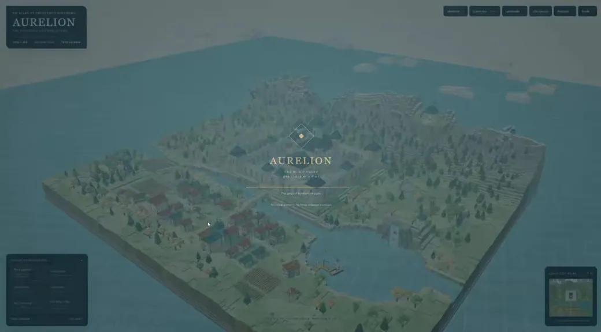</a>

*Технічне завдання на основі роботи за посиланням*

**Промпт**

```text
Згенеруй великий воксельний замок із чіткими лініями оборони, вежами, мурами, воротами, дворами й навколишнім рельєфом. Використай інстансинг, орбітальну камеру, змінне світло та детерміноване генерування, щоб результат був стабільним і зручним для огляду.
```

[Докладніше ↗](https://www.tripo3d.ai/uk/3d-prompts/procedural-voxel-castle-showcase-2093690427849191855) · [Оригінальний допис](https://x.com/hakmgpt/status/2093690427849191855) · [Назад до прикладів](#all-prompts)

---

<a id="jeep-style-4x4-assembly-in-blender-2082845759452463405"></a>

### Промпт складання позашляховика 4×4 у стилі Jeep в Blender

[slash1s](https://x.com/slash1sol) · 2026-07-30 · Claude Opus 5 / Claude Fable 5 · Асети

<a href="https://www.tripo3d.ai/uk/3d-prompts/jeep-style-4x4-assembly-in-blender-2082845759452463405">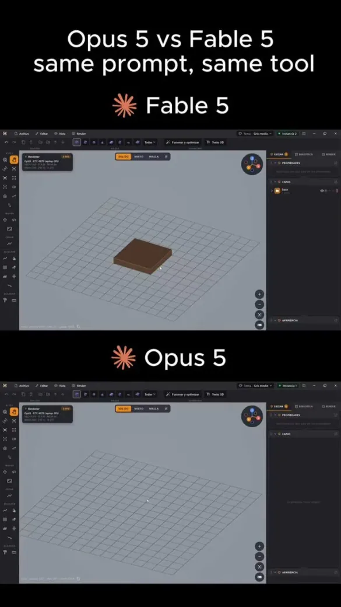</a>

**Промпт**

```text
Спроєктуй позашляховик 4×4 у стилі Jeep і збери його в Blender деталь за деталлю, без ручного моделювання
```

[Докладніше ↗](https://www.tripo3d.ai/uk/3d-prompts/jeep-style-4x4-assembly-in-blender-2082845759452463405) · [Оригінальний допис](https://x.com/slash1sol/status/2082845759452463405) · [Назад до прикладів](#all-prompts)

---

<a id="3d-destruction-physics-in-self-contained-html-2082832042702561372"></a>

### Промпти 3D-фізики руйнувань для самодостатніх HTML-сцен

[FHILY👑](https://x.com/Oluwaphilemon1) · 2026-07-30 · Kimi K3 · Анімація

<a href="https://www.tripo3d.ai/uk/3d-prompts/3d-destruction-physics-in-self-contained-html-2082832042702561372">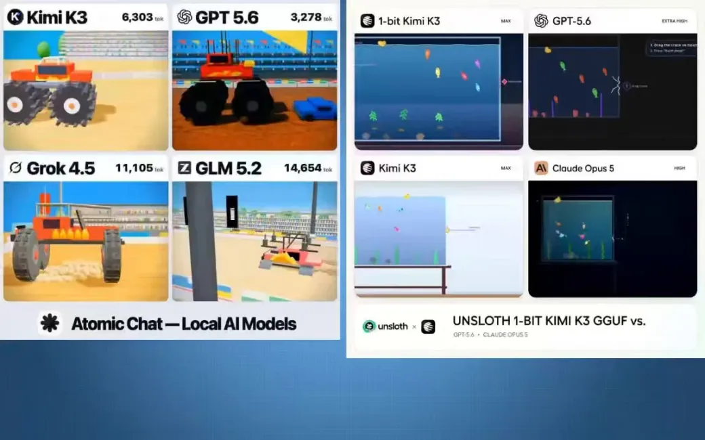</a>

**Промпт**

```text
Монстр-трак чавить ряд автомобілів
Два автомобілі перестрибують каньйон і стикаються лоб у лоб у повітрі
Велетенське ковадло розплющує автомобілі один за одним
```

[Докладніше ↗](https://www.tripo3d.ai/uk/3d-prompts/3d-destruction-physics-in-self-contained-html-2082832042702561372) · [Оригінальний допис](https://x.com/Oluwaphilemon1/status/2082832042702561372) · [Назад до прикладів](#all-prompts)

---

<a id="mech-robot-blueprint-set-2082760534500188606"></a>

### Набір промптів Claude Opus 5 для креслення меха

[Spectro](https://x.com/Spectromachina) · 2026-07-30 · Claude Opus 5 · Асети

<a href="https://www.tripo3d.ai/uk/3d-prompts/mech-robot-blueprint-set-2082760534500188606">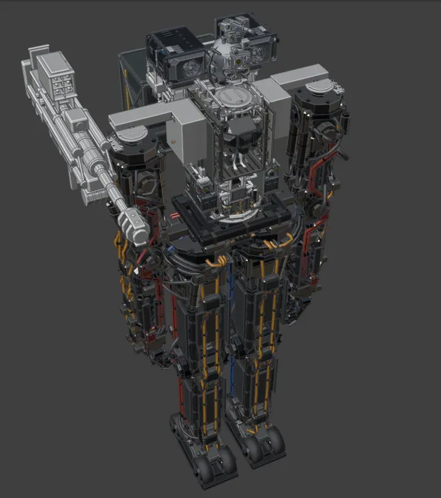</a>

**Промпт**

```text
Ділюся промптами, якими я з Claude OPUS 5 + Blender створював креслення меха РОЗМІРОМ ІЗ GUNDAM, використовуючи справжню математику й фізику:

«подумаймо над будовою меха: по суті він має 2 турбовальні двигуни, електромотори й гідропривід, ще допоміжну силову установку, можливо, пневматику. потужні акумулятори допоможуть трохи рухатися за інерцією, якщо все піде шкереберть. думаю поставити 2 двигуни на плечі, сервісними панелями назовні для обслуговування. до речі, ще раз подивися на системи меха — тепер фізично створюватимемо їх усі. буде круто; підключи агента й перебудуй торс, залишивши багато місця посередині для кабіни та спального модуля».

«а якщо дати йому колеса на стопах з електромоторами? вони могли б значно допомагати пересуванню».

«признач агента, щоб він узяв ці параметри й спроєктував ноги зі справжніми дротами до приводів та іншого».

«гаразд, додай нові glb у сцену».

«боже, це до біса шалено. друже, добре, швидко покажи приховані частини».

«додай низькополігональній голові справжні камери FLIR + NV і кулемет CROWS M2 зразка 1980–1990-х».

«це… прекрасно… T_T».

«треба налаштувати риг скелета ніг, щоб анімація дотримувалася обмежень; це також необхідно для розрахунку сил та іншого».

«нічого, я все одно більшість не розумію, лол».
«отже, створені двигуни, трансмісію й ноги збережи для подальшого використання — раптом знадобляться деінде. а тепер доручи агенту руки й кисті».

«також правильно спроєктуй тазовий механізм під ноги».

«я уявляю з’єднання ТАЗА та ГРУДЕЙ таким, що передає обертальний момент».

«нехай агент створить ручну напівавтоматичну гвинтівку за системою bofors, щоб робот мав швидку напівавтоматичну гармату-піу-піу».

«хочу саме 40 мм; зроби точну, але низькополігональну, щоб оцінити, чи краще вона працює як пістолет або напівавтоматична гвинтівка».

«зроби обидві, а потім варіант із гарматою abrams і напівавтоматичним механізмом».
«створи затвор і пружину як у гвинтівки».

«щодо кабіни: думаю прибрати декоративні дроти й зробити справжню проводку o-O що скажеш».

«рішення: справжня проводка, але прокладена наче диким звіром».

«додай цю 120-мм гармату».

«СТВОРИ РИГ і анімуй роботу 120-мм гармати».

«тут потрібен ВЕЛИКИЙ броньований люк, щоб сидіння ПІДНІМАЛОСЯ, пілот міг озиратися й керувати мехом із цього положення. ще 4 телескопічні оглядові прилади всередині кабіни повинні мати відповідні виходи зверху, інакше це безглуздо».
«продовжуй риг і анімацію 120-мм гармати та керування люком; паузу я натиснув випадково».

«щодо силової установки: живіт — добре місце, але розташування двигунів не подобається. думаю підняти їх вище та зробити справжню ферменну конструкцію для підтримки торса й плечей… вирішуй сам, як хочеш зробити груди? вхід у нас через верхній люк, тому передню частину грудей можна будувати…».

«а зовнішня оболонка може бути тонким алюмінієм або навіть вуглеволокном, байдуже, головне — крутий вигляд. мабуть, NCT підійде для броні? не знаю, вирішуй сам. пізніше додамо деталі, щоб це чудовисько виглядало бодай трохи пристойно… словом, збирай команду й починай будувати».

«знайшов тут інвертор PT125, який висить без діла, і не розумію, де він має стояти».
```

[Докладніше ↗](https://www.tripo3d.ai/uk/3d-prompts/mech-robot-blueprint-set-2082760534500188606) · [Оригінальний допис](https://x.com/Spectromachina/status/2082760534500188606) · [Назад до прикладів](#all-prompts)

---

<a id="need-for-speed-style-godot-game-2082714235373584582"></a>

### Промпт гри в стилі Need for Speed на Godot

[FHILY👑](https://x.com/Oluwaphilemon1) · 2026-07-30 · Kimi K3 · Ігри

<a href="https://www.tripo3d.ai/uk/3d-prompts/need-for-speed-style-godot-game-2082714235373584582">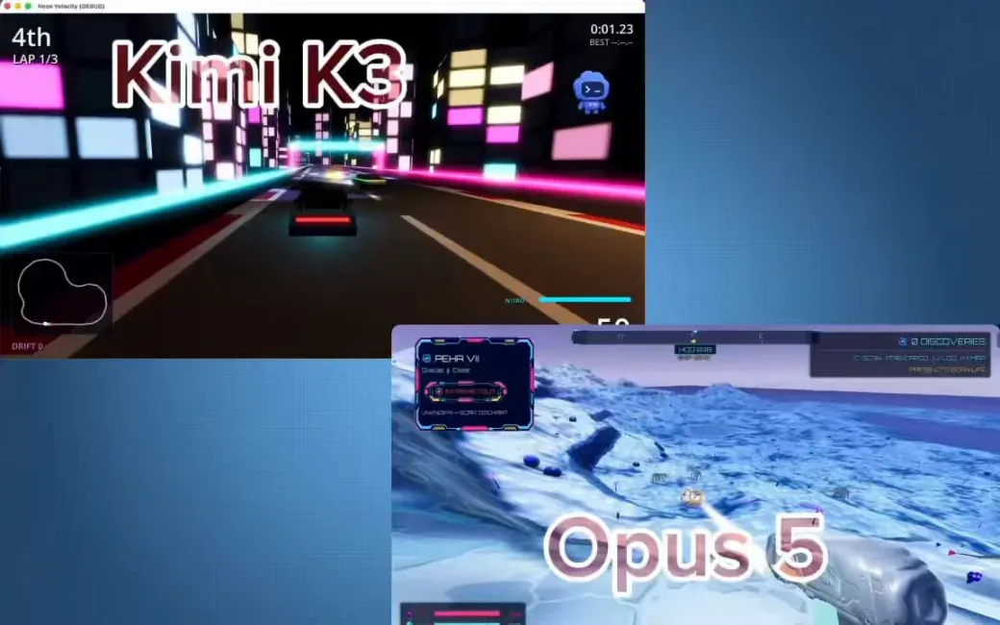</a>

**Промпт**

```text
Зроби мені гру в стилі NFS.
```

[Докладніше ↗](https://www.tripo3d.ai/uk/3d-prompts/need-for-speed-style-godot-game-2082714235373584582) · [Оригінальний допис](https://x.com/Oluwaphilemon1/status/2082714235373584582) · [Назад до прикладів](#all-prompts)

---

<a id="cracking-aquarium-3d-simulation-2082528683747873194"></a>

### Промпт Kimi K3 для 3D-симуляції акваріума, що тріскається

[Unsloth AI](https://x.com/UnslothAI) · 2026-07-29 · Kimi K3 · Анімація

<a href="https://www.tripo3d.ai/uk/3d-prompts/cracking-aquarium-3d-simulation-2082528683747873194">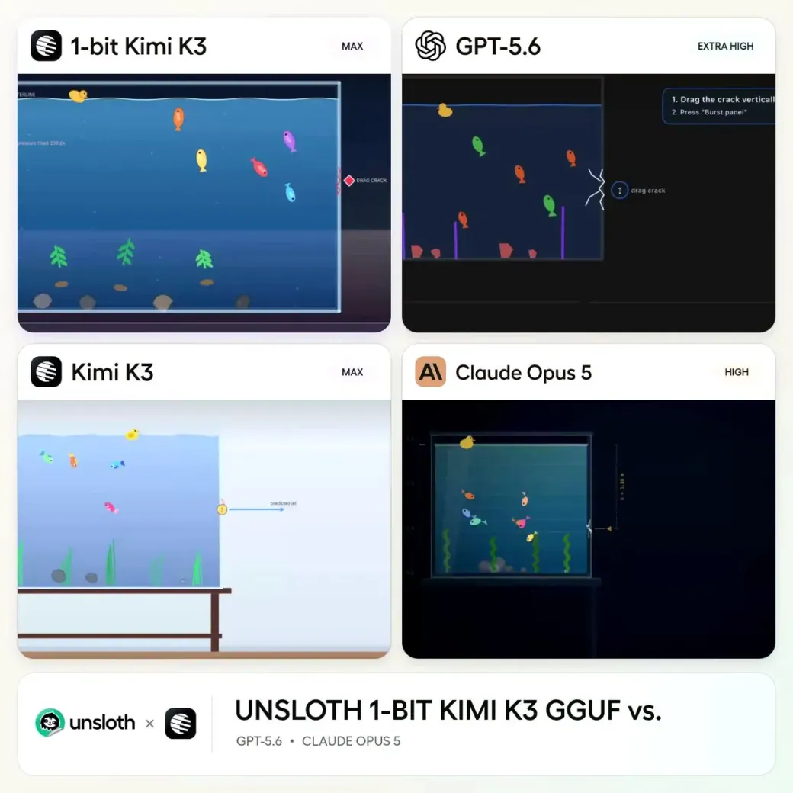</a>

**Промпт**

```text
Створи скляний акваріум, на бічній стінці якого з’являється помітна тріщина, а потім стінка лопається.
```

[Докладніше ↗](https://www.tripo3d.ai/uk/3d-prompts/cracking-aquarium-3d-simulation-2082528683747873194) · [Оригінальний допис](https://x.com/UnslothAI/status/2082528683747873194) · [Назад до прикладів](#all-prompts)

---

<a id="playable-combat-game-2082507403598373134"></a>

### Промпт бойової гри для Kimi K3

[Darshal Jaitwar](https://x.com/darshal_) · 2026-07-29 · Kimi K3 · Ігри

<a href="https://www.tripo3d.ai/uk/3d-prompts/playable-combat-game-2082507403598373134">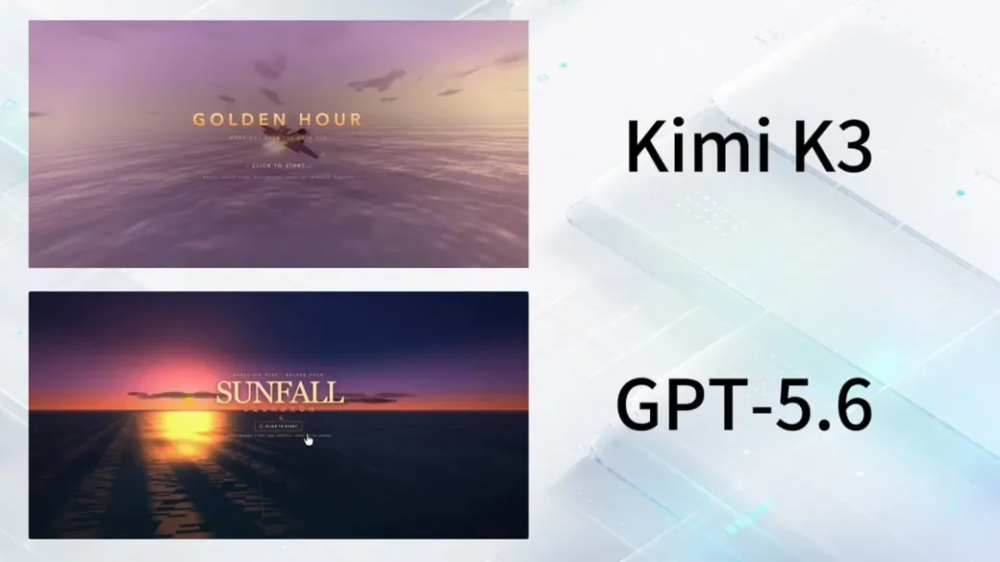</a>

**Промпт**

```text
створи бойову гру, у яку можна грати
```

[Докладніше ↗](https://www.tripo3d.ai/uk/3d-prompts/playable-combat-game-2082507403598373134) · [Оригінальний допис](https://x.com/darshal_/status/2082507403598373134) · [Назад до прикладів](#all-prompts)

---

<a id="league-of-legends-style-1v1-game-in-one-html-file-2082474707727581564"></a>

### Промпт Kimi K3: гра 1 на 1 у стилі League of Legends в одному HTML-файлі

[Fokki](https://x.com/0x_fokki) · 2026-07-29 · Kimi K3 · Ігри

<a href="https://www.tripo3d.ai/uk/3d-prompts/league-of-legends-style-1v1-game-in-one-html-file-2082474707727581564"></a>

**Промпт**

```text
Я ДАВ KIMI K3 І GPT-5.6 ОДНАКОВИЙ ПРОМПТ У VERDENT: СТВОРИ РОБОЧУ ГРУ 1 НА 1 У СТИЛІ LEAGUE OF LEGENDS В ОДНОМУ HTML-ФАЙЛІ.

обидві моделі зробили гру. я відкрив їх поруч і зіграв у кожну.

між запусками я змінив лише одне — модель у випадному списку на https://t.co/ItoGlnpiXi https://t.co/3PYQVli1zm
```

[Докладніше ↗](https://www.tripo3d.ai/uk/3d-prompts/league-of-legends-style-1v1-game-in-one-html-file-2082474707727581564) · [Оригінальний допис](https://x.com/0x_fokki/status/2082474707727581564) · [Назад до прикладів](#all-prompts)

---

<a id="single-file-3d-sun-visualizer-2082461416049525077"></a>

### Промпт Claude Opus 5 для однофайлової 3D-візуалізації Сонця

[AlysisAI](https://x.com/AlysisAI) · 2026-07-29 · Claude Opus 5 / Kimi K3 · Інтерактив

<a href="https://www.tripo3d.ai/uk/3d-prompts/single-file-3d-sun-visualizer-2082461416049525077">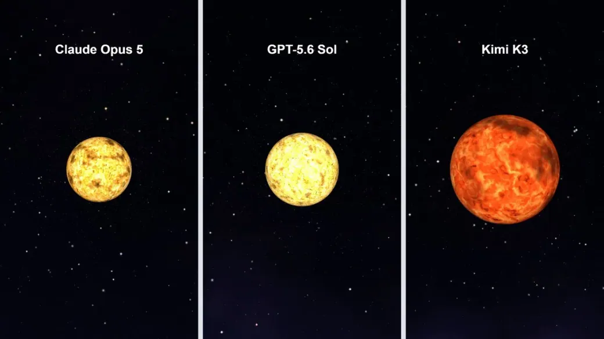</a>

**Промпт**

```text
Створи 3D-візуалізацію Сонця, що обертається в космосі. Один HTML-файл.
```

[Докладніше ↗](https://www.tripo3d.ai/uk/3d-prompts/single-file-3d-sun-visualizer-2082461416049525077) · [Оригінальний допис](https://x.com/AlysisAI/status/2082461416049525077) · [Назад до прикладів](#all-prompts)

---

<a id="explorable-3d-room-with-computer-workstation-2082451081733591520"></a>

### Промпт 3D-кімнати з комп’ютером для однофайлового Three.js

[thehype.](https://x.com/thehypedotnews) · 2026-07-29 · Kimi K3 · Сцени

<a href="https://www.tripo3d.ai/uk/3d-prompts/explorable-3d-room-with-computer-workstation-2082451081733591520">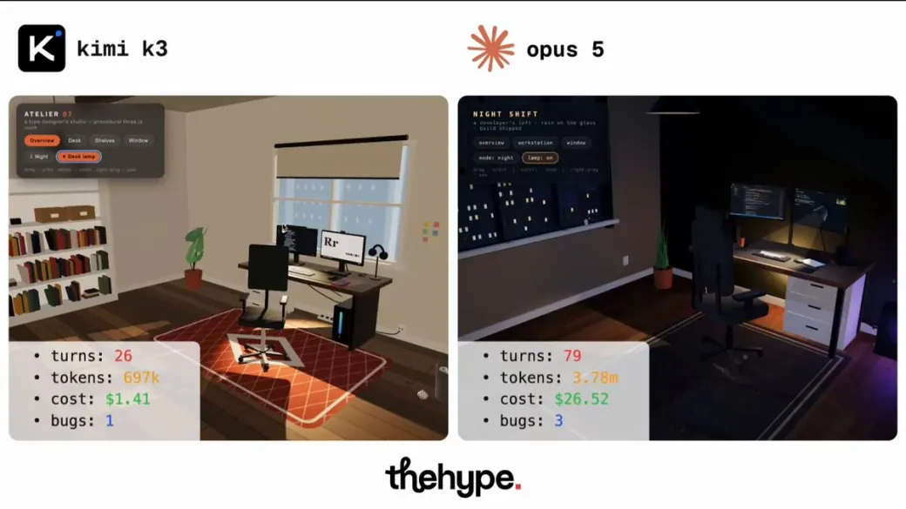</a>

**Промпт**

```text
створи 3d-кімнату для дослідження навколо комп’ютерного робочого місця; один самодостатній html-файл, Three.js через importmap, лише процедурна геометрія, без мешів, без текстур-зображень, без заданого планування чи стилю. «ти дизайнер. здивуй мене»
```

[Докладніше ↗](https://www.tripo3d.ai/uk/3d-prompts/explorable-3d-room-with-computer-workstation-2082451081733591520) · [Оригінальний допис](https://x.com/thehypedotnews/status/2082451081733591520) · [Назад до прикладів](#all-prompts)

---

<a id="non-euclidean-door-portal-in-unreal-engine-5-2082436347113951333"></a>

### Промпт Claude Opus 5 для неевклідових дверей-порталу в Unreal Engine 5

[Ombrage](https://x.com/ombrageplays) · 2026-07-29 · Claude Opus 5 · Сцени

<a href="https://www.tripo3d.ai/uk/3d-prompts/non-euclidean-door-portal-in-unreal-engine-5-2082436347113951333">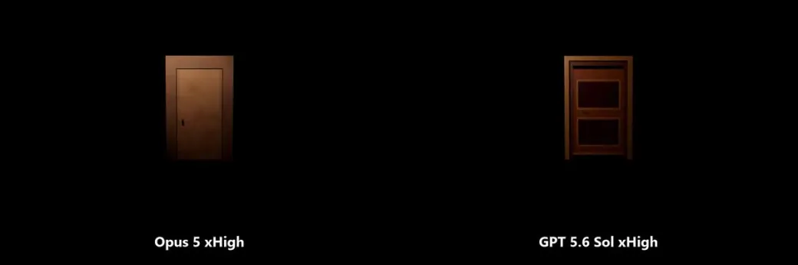</a>

**Промпт**

```text
«Двері стоять самі в порожнечі: нічого довкола й нічого позаду. Вони відчиняються в клас, розташований деінде на рівні. Проходиш прямо крізь них — без склейок, затемнень, завантажень чи будь-чого, що відчувається як телепортація. Має працювати з обох боків і під кожним кутом».
```

[Докладніше ↗](https://www.tripo3d.ai/uk/3d-prompts/non-euclidean-door-portal-in-unreal-engine-5-2082436347113951333) · [Оригінальний допис](https://x.com/ombrageplays/status/2082436347113951333) · [Назад до прикладів](#all-prompts)

---

<a id="simple-first-person-shooter-in-three-js-2082242351372599770"></a>

### Простий FPS-промпт для гри на Three.js

[Code With Antonio](https://x.com/codewithantonio) · 2026-07-28 · Kimi K3 · Ігри

<a href="https://www.tripo3d.ai/uk/3d-prompts/simple-first-person-shooter-in-three-js-2082242351372599770">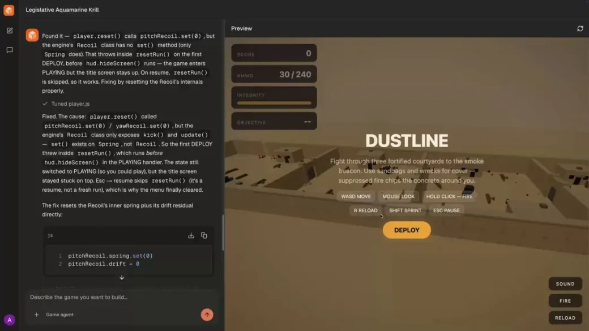</a>

**Промпт**

```text
Створи мені FPS
```

[Докладніше ↗](https://www.tripo3d.ai/uk/3d-prompts/simple-first-person-shooter-in-three-js-2082242351372599770) · [Оригінальний допис](https://x.com/codewithantonio/status/2082242351372599770) · [Назад до прикладів](#all-prompts)

---

<a id="cs2-and-battlefield-style-fps-2082241827298557966"></a>

### Промпт Claude Opus 5 для FPS у стилі CS2 і Battlefield

[Anatoli Kopadze](https://x.com/AnatoliKopadze) · 2026-07-28 · Claude Opus 5 · Ігри

<a href="https://www.tripo3d.ai/uk/3d-prompts/cs2-and-battlefield-style-fps-2082241827298557966">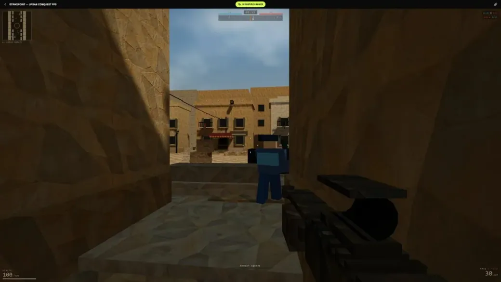</a>

**Промпт**

```text
спробуй зробити шутер від першої особи, що поєднує CS2 і Battlefield.
```

[Докладніше ↗](https://www.tripo3d.ai/uk/3d-prompts/cs2-and-battlefield-style-fps-2082241827298557966) · [Оригінальний допис](https://x.com/AnatoliKopadze/status/2082241827298557966) · [Назад до прикладів](#all-prompts)

---

<a id="aaa-shooter-game-2082180453889712318"></a>

### Промпт Claude Opus 5 для AAA-шутера

[Garry Yuan](https://x.com/ziqinyuan) · 2026-07-28 · Claude Opus 5 · Ігри

<a href="https://www.tripo3d.ai/uk/3d-prompts/aaa-shooter-game-2082180453889712318">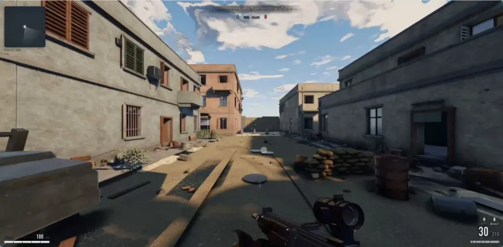</a>

**Промпт**

```text
Нещодавно гра в стилі Call of Duty, створена Claude Opus 5, стала вірусною. Автор стверджує, що отримав її лише одним промптом. Багато хто сумнівався, тож він відкрив код і промпт.

Я думав, що промпт буде дуже складним, але це виявилися лише кілька сотень слів. Ключове в ньому — цикл.

Ось промпт:

«Я хочу, щоб ти розробив шутер від першої особи на рівні останньої Call of Duty. Він має бути бездоганним, із приголомшливо красивою графікою; від текстур до фізичних ефектів — усе, що можна уявити, має відповідати AAA-рівню.

Створи кількох субагентів і доручи кожному окремі деталі, щоб довести гру до досконалості. Використовуй /loop для кожного проєкту та незалежного субагента для візуальної перевірки відповідності AAA. Цей перевіряльник має бути вкрай суворим; якщо результат не досягає AAA-рівня, перевірку слід продовжувати.

Не зупиняйся, доки кожен субагент після порівняння з Call of Duty не буде цілковито вражений якістю графіки. Він має вміти зіставити дві гри поруч навіть без погляду на візуал і сказати, яка краща. Виконай роботу на ThreeJS. /loop до досконалості. Створи кількох субагентів і використовуй UltraCode для оптимізації».
```

[Докладніше ↗](https://www.tripo3d.ai/uk/3d-prompts/aaa-shooter-game-2082180453889712318) · [Оригінальний допис](https://x.com/ziqinyuan/status/2082180453889712318) · [Назад до прикладів](#all-prompts)

---

<a id="playable-dark-fantasy-side-scroller-in-a-single-html-file-2082096376763060575"></a>

### Ігровий сайд-скролер темного фентезі в одному HTML-файлі

[slash1s](https://x.com/slash1sol) · 2026-07-28 · Claude Fable 5 · Ігри

<a href="https://www.tripo3d.ai/uk/3d-prompts/playable-dark-fantasy-side-scroller-in-a-single-html-file-2082096376763060575">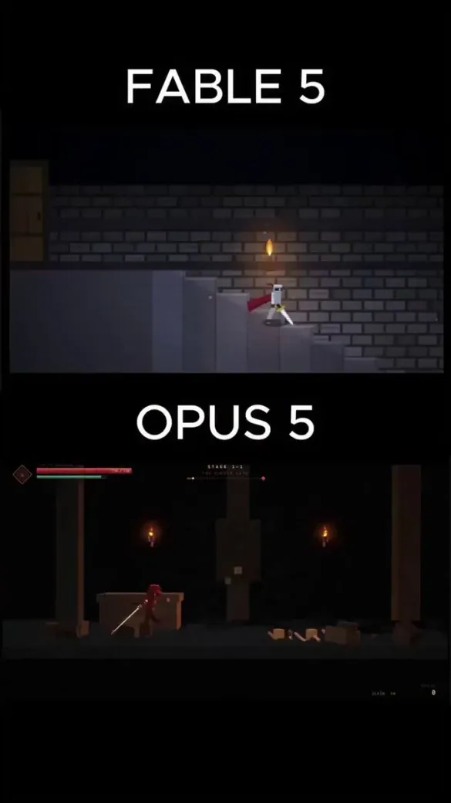</a>

**Промпт**

```text
В одному HTML-файлі створи ігровий сайд-скролер у жанрі темного фентезі.
```

[Докладніше ↗](https://www.tripo3d.ai/uk/3d-prompts/playable-dark-fantasy-side-scroller-in-a-single-html-file-2082096376763060575) · [Оригінальний допис](https://x.com/slash1sol/status/2082096376763060575) · [Назад до прикладів](#all-prompts)

---


[Повний каталог](catalog.uk.md) · [←](catalog.uk.7.md) · **8 / 9** · [→](catalog.uk.9.md)

<p align="center"><strong><a href="https://www.tripo3d.ai/uk/3d-prompts?utm_source=github&amp;utm_medium=referral&amp;utm_campaign=awesome_3d_prompts&amp;utm_content=catalog_footer">Повний каталог →</a></strong></p>
