<!-- Generated from Growth CMS by templates/catalog.md. Edit content in CMS; run npm run sync. -->

# Awesome 3D Prompts — 2 / 9

[← Awesome 3D Prompts](../README.md)

<p>
  <a href="../docs/catalog.en.2.md"></a>
  <a href="../docs/catalog.zh.2.md"></a>
  <a href="../docs/catalog.zh-Hant.2.md"></a>
  <a href="../docs/catalog.ja.2.md"></a>
  <a href="../docs/catalog.ko.2.md"></a>
  <a href="../docs/catalog.es.2.md"></a>
  <a href="../docs/catalog.pt.2.md"></a>
  <a href="../docs/catalog.de.2.md"></a>
  <a href="../docs/catalog.fr.2.md"></a>
  <a href="../docs/catalog.it.2.md"></a>
  <a href="../docs/catalog.ru.2.md"></a>
  <a href="../docs/catalog.tr.2.md"></a>
  <a href="../docs/catalog.uk.2.md"></a>
  <a href="../docs/catalog.vi.2.md"></a>
</p>

[Danh mục đầy đủ](catalog.vi.md) · [←](catalog.vi.1.md) · **2 / 9** · [→](catalog.vi.3.md)

<a id="all-prompts"></a>

<details>
<summary>Khám phá ví dụ (50)</summary>

- [Thêm xích bảo trì vào lan can](#gpt-6-astra-2100519026720231698)
- [Cảnh lửa trại voxel tương tác với hiệp sĩ](#gpt-6-astra-2100350159540596760)
- [Demo đồ họa fantasy isometric](#gpt-6-astra-2100271998618177864)
- [AKARI: Tiếp lửa trên những sân thượng Nagoya](#akari-nagoya-rooftop-flame-relay)
- [Hòn đảo của Cyclops](#cyclops-island-threejs-game)
- [Phim ngắn CGI AAA: Đấu võ siêu nhiên trong ga tàu điện ngầm](#gpt-6-astra-2100233407108137349)
- [Tham quan căn hộ tương tác với các tùy chọn gạch lát](#gpt-6-astra-2100222426705453318)
- [Phát triển Splatoon bản PC và tái hiện đồ họa](#gpt-6-astra-2100193512373592313)
- [Cảnh phòng 3D tương tác với nội thất có cơ cấu chuyển động](#gpt-6-astra-2100139076816916977)
- [Tạo không gian 3D có thể điều khiển và nhân vật game từ ảnh tham khảo](#gpt-6-astra-2099850719839109597)
- [Game khám phá không gian tạo sinh với mọi điểm đến đều có thể tiếp cận](#gpt-6-astra-2099785223827259515)
- [Trái tim và emoji mặt cười phong cách Apple 3D](#gpt-6-astra-2099750376530657300)
- [Bảng điều khiển hệ thần kinh tương tác của sinh vật 3D](#gpt-6-astra-2099719427990134984)
- [Đảo núi lửa tương tác với những chiếc thuyền tháo chạy](#gpt-6-astra-2099643231659012553)
- [Tạo cảnh hành lang khách sạn](#gpt-6-astra-2099588840419651890)
- [Chiến binh trèo lên người khổng lồ và giáng búa vào hàm](#gpt-6-astra-2099519801139908951)
- [Thế giới 3D với những tòa nhà chọc trời cao vút](#gpt-6-astra-2099487024256589970)
- [Mô hình cây lá kim dưới 200 polygon](#gpt-6-astra-2099472264270102705)
- [Cảnh rừng Samurai 3D tương tác](#gpt-6-astra-2099450933067612421)
- [Màn vượt chướng ngại vật 3D có thể chơi](#gpt-6-astra-2099419671481249851)
- [Đường sắt mô hình tự động tránh va chạm](#gpt-6-astra-2099362575339372780)
- [Tái hiện Lâu đài Peach trong 3D](#gpt-6-astra-2099359786865402019)
- [Trình khám phá giải phẫu 3D tương tác](#gpt-6-astra-2099206962344800541)
- [Phân cảnh 3D khu ven biển có thể chơi trên trình duyệt](#gpt-6-astra-2099172061092381027)
- [Triển khai UV và bake lại 4K cho mô hình quần áo không có đầu](#gpt-6-astra-2098980384260456813)
- [Hoạt ảnh origami 3D tự gấp](#gpt-6-astra-2098909584996057283)
- [Atlas Chernobyl](#gpt-6-astra-2098841316591346006)
- [Mô phỏng bàn cát động lực](#gpt-6-astra-2098831830002851846)
- [Tái dựng 3D Hội chợ Thế giới Chicago năm 1893](#gpt-6-astra-2098795017955418202)
- [Khung ảnh in 3D dạng lắp ghép có khớp nối](#gpt-6-astra-2098774359926297011)
- [Trò chơi bay Skybound trên trình duyệt](#gpt-6-astra-2098739181510164652)
- [DEVICE: Game giải đố 3D chân thực sử dụng chính smartphone](#gpt-6-astra-2098715488369152087)
- [Video trình diễn dựng 3D “Thiền cảnh · Cổ tự”](#gpt-6-astra-2098697876155076820)
- [Dựng mô hình cầu Brooklyn và thử nghiệm xe tăng đi qua từ cả hai hướng](#gpt-6-astra-2098650336521064759)
- [Hồ cá koi 3D tương tác](#gpt-6-astra-2098492771170722032)
- [Mô hình bé gái chơi robot](#gpt-6-astra-2098406473273663992)
- [Cảnh mô hình thu nhỏ 3D dạng lập thể của ngôi đền](#gpt-6-astra-2098403061463224543)
- [Tự động tạo và chuyển texture tóc, khuôn mặt cho model nhân vật](#gpt-6-astra-2098367087475577273)
- [Tàu vận chuyển dân dụng cơ bản Sol Horizon](#gpt-6-astra-2098225609558335846)
- [Trình diễn piano tương tác với bàn tay robot 3D](#gpt-6-astra-2098109252720078891)
- [Atlas 3D tương tác về đầu và não người](#gpt-6-astra-2098105648106078541)
- [Hoạt hình giả tưởng kiếm sĩ phá hủy cổng thành](#gpt-6-astra-2098094339759149067)
- [Tàu con thoi mô hình trắng bay qua hẻm núi đô thị](#gpt-6-astra-2098079379297608050)
- [Hoạt ảnh học viện phép thuật bay lơ lửng](#gpt-6-astra-2098071577309122854)
- [Nhịp đập thành phố](#gpt-6-astra-2098063352832610473)
- [Quy trình dựng cảnh rượt đuổi ô tô hoạt hình lấy cảm hứng từ GTA](#gpt-6-astra-2098049032195293190)
- [Đàn mực tương tác](#gpt-6-astra-2098043033446912315)
- [Tăng độ thử thách cho sân golf 18 hố](#gpt-6-astra-2098038909514944562)
- [Mosswing: Game 3D mobile chạm để vỗ cánh](#mosswing-mobile-3d-tap-to-flap-game)
- [Video ngắn 3D không lời: Mèo và nút thưởng](#gpt-6-astra-2097900087901106244)

</details>
<a id="gpt-6-astra-2100519026720231698"></a>

### Thêm xích bảo trì vào lan can

[きのした](https://x.com/ujiden_type0) · 2026-09-17 · GPT-6 Astra · Tài nguyên 3D

<a href="https://www.tripo3d.ai/vi/3d-prompts/gpt-6-astra-2100519026720231698"></a>

**Prompt**

```text
Thêm xích bảo trì vào lan can nhé!
```

<details>
<summary>Prompt gốc</summary>

```text
手摺にメンテ用のチェーン付けて！
```

</details>

[Xem chi tiết ↗](https://www.tripo3d.ai/vi/3d-prompts/gpt-6-astra-2100519026720231698) · [Bài đăng gốc](https://x.com/ujiden_type0/status/2100519026720231698) · [Về danh sách ví dụ](#all-prompts)

---

<a id="gpt-6-astra-2100350159540596760"></a>

### Cảnh lửa trại voxel tương tác với hiệp sĩ

[Vib3Coded](https://x.com/vib3coded) · 2026-09-16 · GPT-6 Astra · Tương tác

<a href="https://www.tripo3d.ai/vi/3d-prompts/gpt-6-astra-2100350159540596760"></a>

**Ảnh tham chiếu:** [1](https://media.tripogrowth.space/media/8cbcd267-6a33-4c3e-8599-29ffdb729f3b.jpg) · [2](https://pbs.twimg.com/media/HSXxvD0XcAEG8Jg.jpg)

**Prompt**

```text
Bạn là Nhà phát triển WebGL & Three.js Sáng tạo Cấp cao. Nhiệm vụ của bạn là xây dựng một cảnh 3D tương tác hoàn chỉnh, sẵn sàng cho môi trường production, nằm hoàn toàn trong một tệp HTML độc lập duy nhất (index.html), sử dụng Three.js + webgl

### 1. Chủ đề hình ảnh & Định hướng nghệ thuật

- Không khí: Khu rừng đêm sâu thẳm, lửa trại ấm áp phát sáng, một hiệp sĩ đơn độc mệt mỏi đang nghỉ bên khu cắm trại (thẩm mỹ lửa trại Dark Souls / RPG retro kinh điển).
- Thẩm mỹ: Pixel Art 3D / Voxel / Low-Poly.
- Đổ bóng & Hậu kỳ: Tích hợp tính năng hậu kỳ của Three.js (RenderPixelatedPass hoặc hiệu ứng tạo điểm ảnh/làm nhiễu ở độ phân giải thấp tương đương) để đạt diện mạo retro 16-bit/32-bit chân thực.

### 2. Hình học cảnh & Tài nguyên (100% tạo thủ tục — Không dùng tệp .gltf/.obj bên ngoài)

Tất cả tài nguyên phải được dựng bằng thủ tục, sử dụng các hình học nguyên thủy của Three.js (BoxGeometry, CylinderGeometry, v.v.) và vật liệu cơ bản để tệp có thể chạy cục bộ mà không gặp vấn đề CORS.

1. Môi trường rừng:

   - Mặt đất: Địa hình cách điệu tối màu với đá voxel, nấm và thảm thực vật low-poly được tạo thủ tục.
   - Cây cối: Các cây thông/vân sam hoặc cây có tán hình khối được tạo thủ tục, bao quanh khoảng trống để tạo chiều sâu và cảm giác biệt lập.
   - Bầu trời & Ánh sáng: Bầu trời nửa đêm sâu thẳm với các ngôi sao voxel nhấp nháy và DirectionalLight ánh trăng lạnh tạo bóng mềm.
   - Chiều sâu: THREE.FogExp2 với màu khí quyển tối để hòa trộn đường chân trời.

2. Lửa trại:

   - Vòng đá bao quanh các khúc gỗ đang âm ỉ cháy và các hạt than hồng được tạo thủ tục.
   - Hệ thống lửa: Các hạt điểm ảnh động (Points hoặc mesh voxel dao động) bay lên trên.
   - Ánh sáng động: PointLight màu cam-đỏ ấm với logic nhấp nháy liên tục, tự nhiên (sử dụng Math.sin, nhiễu hoặc các biến thể giả ngẫu nhiên).

3. Hiệp sĩ:

   - Cây phân cấp của cảnh (các group cho đầu, thân, cánh tay trên/dưới, chân, áo choàng và kiếm) được dựng từ các hình nguyên thủy voxel hóa.
   - Chi tiết hình ảnh: Mũ trụ có khe, giáp ngực, giáp vai, bao tay giáp và bao kiếm/kiếm.
   - Các điểm pivot phải được căn chỉnh chính xác tại các khớp (vai, khuỷu tay, hông, đầu gối) để chuyển động xoay tạo thủ tục mượt mà.

### 3. Máy trạng thái tương tác của hiệp sĩ

Triển khai các animation tạo thủ tục mượt mà bằng phép nội suy tuyến tính (lerp) hoặc các đường cong lượng giác bên trong vòng lặp render cho những trạng thái có thể chọn sau:

- Ngồi bên lửa (Nghỉ mặc định): Ngồi xếp bằng hoặc ngồi xổm, thở nhẹ theo chu kỳ, sưởi tay gần ngọn lửa.
- Thêm củi: Hiệp sĩ đứng dậy, lấy một khúc gỗ rồi ném vào lửa. Ngọn lửa bùng lên rõ rệt, bán kính chiếu sáng tạm thời mở rộng và phát ra một loạt tia lửa.
- Luyện kiếm: Đứng dậy, rút kiếm, thực hiện một chuỗi tấn công/đỡ đòn gồm 3 phần gọn gàng rồi trở về tư thế thủ chiến.
- Nhìn về phía xa: Đi đến rìa khoảng trống, cắm kiếm xuống đất và nhìn chằm chằm vào bóng tối trong khi áo choàng lay động.
- Ngủ: Nằm xuống tấm đệm ngủ cạnh lửa; các hạt điểm ảnh "Z z z" động bay lên từ mũ trụ.
- Nướng thịt: Cầm một que xiên thức ăn trên ngọn lửa; phát ra các hạt khói/hơi nước tạo thủ tục nhẹ.

### 4. Hệ thống camera

Cung cấp các chế độ camera thiết lập sẵn với chuyển tiếp nội suy mượt mà (lerp vị trí và điểm đích):

- Cận cảnh ấm cúng: Khung hình trung, tập trung vào hiệp sĩ và ánh lửa.
- RPG đẳng phối: Góc nhìn chiến thuật cao 45 độ kinh điển bao quát khoảng trống.
- Điện ảnh mặt đất: Góc máy thấp đầy kịch tính, hướng lên hiệp sĩ giữa bầu trời sao và các tán thông.
- Xoay tự do: Chuyển liền mạch sang OrbitControls tiêu chuẩn để quan sát tương tác.

### 5. UI & Âm thanh

- Phong cách UI: Bố cục HUD RPG retro 8-bit/16-bit, sử dụng các khung tối bán trong suốt với viền điểm ảnh và Google Font được nhúng (ví dụ: 'Press Start 2P').
- Bảng điều khiển dưới: Các nút hành động tương tác, kích hoạt từng trạng thái của hiệp sĩ.
- Bảng phía trên bên phải: Các nút chuyển góc camera.
- Bộ đếm củi: Theo dõi số khúc gỗ đã thêm và cường độ lửa hiện tại.
- Âm thanh (Web Audio API): Tiếng lửa tí tách và gió đêm/dế kêu môi trường được tổng hợp bằng thủ tục, kèm một nút bật/tắt tiếng.

### 6. Thông số kỹ thuật

- Một tệp index.html độc lập, tự chứa.
- Sử dụng ES Modules được tải qua CDN (https://t.co/W8o3SZwkCj hoặc unpkg).
- Cấu trúc mã dạng module, có chú thích đầy đủ (initScene, buildEnvironment, buildKnight, buildCampfire, setupUI, setupAudio, animate).
- Hoàn toàn đáp ứng kích thước cửa sổ, với trình xử lý thay đổi kích thước cập nhật tỷ lệ khung hình camera và độ phân giải của lớp tạo điểm ảnh.
```

<details>
<summary>Prompt gốc</summary>

```text
You are a Senior Creative WebGL & Three.js Developer. Your task is to build a complete, production-ready, interactive 3D scene contained entirely within a single standalone HTML file (index.html) using Three.js + webgl

### 1. Visual Theme & Art Direction

- Atmosphere: Deep night forest, cozy glowing campfire, solitary weary knight resting at the campsite (Dark Souls bonfire / classic retro RPG aesthetic).
- Aesthetic: 3D Pixel Art / Voxel / Low-Poly aesthetic.
- Shading & Post-Processing: Integrate Three.js post-processing (RenderPixelatedPass or an equivalent low-resolution pixelation/dithering effect) to achieve an authentic 16-bit/32-bit retro look.

### 2. Scene Geometry & Assets (100% Procedural — No External .gltf/.obj Files)

All assets must be constructed procedurally using Three.js geometric primitives (BoxGeometry, CylinderGeometry, etc.) and basic materials so the file runs locally without CORS issues.

1. Forest Environment:

   - Ground: Dark stylized terrain with procedural voxel stones, mushrooms, and low-poly foliage.
   - Trees: Procedural pine/spruce or blocky canopy trees surrounding the clearing to create depth and seclusion.
   - Sky & Lighting: Deep midnight sky with flickering voxel stars and a cool moonlight DirectionalLight casting soft shadows.
   - Depth: THREE.FogExp2 with a dark atmospheric color to blend the horizon.

2. Campfire:

   - Stone circle surrounding smoldering logs and procedural ember embers.
   - Fire System: Animated pixelated particles (Points or pulsing voxel meshes) rising upward.
   - Dynamic Lighting: Warm orange-red PointLight with continuous, natural flicker logic (using Math.sin, noise, or pseudo-random variations).

3. The Knight:

   - Hierarchical scene graph (groups for head, torso, upper/lower arms, legs, cape, and sword) built from voxelized primitives.
   - Visual details: Slotted helmet, chest armor, pauldrons, gauntlets, and a sheath/sword.
   - Pivot points must be aligned correctly at joints (shoulders, elbows, hips, knees) for clean procedural rotation animations.

### 3. Interactive Knight State Machine

Implement smooth procedural animations using linear interpolation (lerp) or trigonometric curves inside the render loop for the following selectable states:

- Sit by Fire (Default Idle): Sits cross-legged or crouched, subtle breathing cycles, warming hands near the flames.
- Add Firewood: Knight stands up, retrieves a log, and tosses it onto the fire. The fire visibly flares up, expands its light radius temporarily, and emits a burst of sparks.
- Sword Practice: Stands up, draws the sword, executes a clean 3-part attack/parry routine, and returns to a combat guard stance.
- Look into the Distance: Walks to the edge of the clearing, plants the sword into the ground, and stares out into the dark while the cape sways.
- Sleep: Lies down on a bedroll beside the fire; floating animated pixel "Z z z" particles rise from the helmet.
- Roast Meat: Holds a stick with food over the flame; emits subtle procedural smoke/steam particles.

### 4. Camera System

Provide preset camera switches with smooth transition interpolation (lerping position and target):

- Cozy Close-up: Medium shot focusing on the knight and the firelight.
- Isometric RPG: Classic high 45-degree tactical overview of the clearing.
- Cinematic Ground: Low-angle dramatic shot looking upward at the knight against the starry sky and pine canopies.
- Free Orbit: Seamless switch to standard OrbitControls for interactive inspection.

### 5. UI & Audio

- UI Style: Retro 8-bit/16-bit RPG HUD layout using semi-transparent dark frames with pixelated borders and an embedded Google Font (e.g., 'Press Start 2P').
- Bottom Panel: Interactive action buttons triggering each knight state.
- Top-Right Panel: Camera angle switcher buttons.
- Firewood Counter: Tracks logs added and current fire intensity.
- Sound (Web Audio API): Procedurally synthesized fire crackle and ambient night breeze/crickets, with a mute/unmute toggle button.

### 6. Technical Specifications

- Single, self-contained index.html file.
- Use ES Modules loaded via CDN (https://t.co/W8o3SZwkCj or unpkg).
- Modular, well-commented code structure (initScene, buildEnvironment, buildKnight, buildCampfire, setupUI, setupAudio, animate).
- Fully responsive window resize handler updating camera aspect ratio and pixelation pass resolution.
```

</details>

[Xem chi tiết ↗](https://www.tripo3d.ai/vi/3d-prompts/gpt-6-astra-2100350159540596760) · [Bài đăng gốc](https://x.com/vib3coded/status/2100350602316558428) · [Về danh sách ví dụ](#all-prompts)

---

<a id="gpt-6-astra-2100271998618177864"></a>

### Demo đồ họa fantasy isometric

[Anshu Chimala](https://x.com/anshuc) · 2026-09-16 · GPT-6 Astra · Tương tác

<a href="https://www.tripo3d.ai/vi/3d-prompts/gpt-6-astra-2100271998618177864"></a>

**Prompt**

```text
Hãy tạo một demo đồ họa: camera isometric, phong cách nghệ thuật kiểu voxel với đổ bóng chân thực và sàn ướt phản chiếu, cùng một nhân vật trong một khung cảnh thú vị. Bối cảnh fantasy (hãy hình dung Elden Ring, Diablo). Sử dụng Three.js trong trình duyệt, đạt >60fps. Không tải asset xuống. Giới hạn thời gian 1 giờ. Điều khiển: nhấp để di chuyển nhân vật, camera tự động bám theo với độ trễ; kéo để xoay camera; cuộn để phóng to/thu nhỏ. Hiện chưa cần gameplay. Thế giới cần có cảm giác sống động: chuyển động, hoạt ảnh và các hành vi môi trường tinh tế. Khu vực xung quanh người chơi nên trông rộng lớn, nhưng chỉ cho phép di chuyển trong một không gian giới hạn. Không cần xác nhận phần mỹ thuật với tôi hay đặt câu hỏi, cứ bắt tay thực hiện!
```

<details>
<summary>Prompt gốc</summary>

```text
Build me a graphics demo: isometric camera, voxel-ish art style with realistic shading and reflective wet floors, a character in an interesting scene. Fantasy setting (think Elden Ring, Diablo). Three.js in browser, >60fps. Don't download assets. Time limit of 1 hour. Controls: click to move the character, camera lazy-follows; drag to rotate camera; scroll to zoom in/out. No gameplay for now. World should feel alive: motion, animations, subtle environmental behaviors. Area around player should look expansive, but only allow movement in a limited space. No need to confirm the art with me or ask questions, just go!
```

</details>

[Xem chi tiết ↗](https://www.tripo3d.ai/vi/3d-prompts/gpt-6-astra-2100271998618177864) · [Bài đăng gốc](https://github.com/achimala/dream-loop) · [Mã nguồn](https://github.com/achimala/dream-loop) · [Về danh sách ví dụ](#all-prompts)

---

<a id="akari-nagoya-rooftop-flame-relay"></a>

### AKARI: Tiếp lửa trên những sân thượng Nagoya

[Jared](https://growthengineer.space/) · 2026-09-16 · GPT-6 Astra · Trò chơi

<a href="https://www.tripo3d.ai/vi/3d-prompts/akari-nagoya-rooftop-flame-relay"></a>

**Prompt**

```text
# AKARI — Bản đồ ánh sáng Nagoya

## 1. Mục tiêu
Xây dựng một game trình duyệt hoàn chỉnh, ưu tiên tiếng Nhật, trong đó một ngọn lửa trừu tượng thực hiện bảy cú nhảy theo thời gian, thắp sáng Nagoya thu nhỏ trước Đại hội Thể thao châu Á Aichi–Nagoya, diễn ra từ ngày 19 tháng 9 đến ngày 4 tháng 10 năm 2026. Bám sát phiên bản mở đầu hiện tại gồm hai bản đồ tại https://akari-nagoya-rooftop-relay.tripo.page/ và các hình ảnh tham chiếu được cung cấp. Cảnh sân thượng chung chung trước đây không phải mục tiêu.

## 2. Định hướng hình ảnh
Sử dụng góc nhìn bản đồ ba phần tư từ trên cao, nền xanh navy nửa đêm, tiêu đề serif tiếng Nhật màu trắng ngà ấm, đường nét vàng mảnh và hiệu ứng nhiễu tiết chế. Trên máy tính, dành một phần ba bên trái cho lời mời mở đầu và đặt hai ô bản đồ nâng cao ở bên phải; trên điện thoại, bố cục lại để bản đồ nằm phía trên các nút điều khiển. Bắt đầu với các tòa nhà tối, giảm bão hòa và những tuyến đường thủy màu xanh teal. Khi hoàn thành, khôi phục màu xanh lá, mái đồng xanh ngọc lam, ô cửa sổ ấm và đèn chỉ đường màu vàng. Giữ ngọn lửa và mục tiêu tiếp theo luôn dễ nhìn. Dùng bóng mềm, chiều sâu khí quyển và bloom có kiểm soát; tránh vùng lóe trắng. Bám sát tiêu đề mở đầu tiếng Nhật, nhãn địa danh và phần đầu/cuối trang biên tập mảnh xuất hiện trong hình tham chiếu.

## 3. Thế giới
Ô bản đồ lớn hơn ở phía tây bắc bao phủ Công viên Meijo, Lâu đài Nagoya, Nhà thi đấu Quốc tế Aichi, Công viên Hisaya-odori, MIRAI TOWER và Oasis 21. Ô phía đông nam bao phủ Bảo tàng Thành phố, Mizuho-dori, Công viên Mizuho và sân vận động của công viên, với sông Yamazaki ở phía đông sân vận động. Thêm các khu dân cư hiện đại thấp tầng, cây trong công viên, vạch đường, bờ sông và đèn chiếu sáng ấm; chỉ dùng kiến trúc lâu đài cho khu vực lâu đài.

Chương 1: Công viên Meijo → Sotobori/Hisaya-odori → Công viên Hisaya-odori → Oasis 21, gồm ba cú nhảy. Tạo điểm chuyển chương có biển chỉ dẫn rõ ràng, không thể chơi, đến Bảo tàng Thành phố. Chương 2: Bảo tàng Thành phố → Mizuho-dori → Mizuho Undojo Nishi → hướng về Công viên Mizuho → Quảng trường phía Nam, gồm bốn cú nhảy. Không bao giờ thể hiện điểm chuyển như một con phố liền mạch hoặc tính nó là một cú nhảy. Lưu tiến trình tại chương thứ hai. Hai bản đồ dùng tỉ lệ khác nhau, với khoảng cách được nén để phù hợp với lối chơi. Giải thích ngắn gọn điều này trong phần Giới thiệu, cùng với các ngày diễn ra rước đuốc lịch sử là 22 tháng 8 và 16 tháng 9 năm 2026; đây không phải lời mời tham dự sự kiện sắp tới. Trích dẫn https://www.aichi-nagoya2026.org/ja/torch-relay/ và https://www.nagoyajo.city.nagoya.jp/guide/kinshachi/. Sử dụng họa tiết nguyên bản và ngọn lửa trừu tượng thay cho linh vật hoặc biểu tượng chính thức.

## 4. Danh mục tài sản
Sử dụng các ô thay thế ổn định sau theo thứ tự ưu tiên; giữ nguyên bố cục và proxy va chạm ở cả hai chế độ hình ảnh:
- `shachi`: vật trang trí mái bằng vàng đánh bóng cổ điển, có đầu giống hổ, thân cá chép phủ vảy uốn cong và đuôi cuộn hướng lên; lặp lại trên lâu đài.
- `castle`: tòa tháp kiểu Nagoya màu trắng ngà, khung gỗ tối, mái hông và mái đầu hồi xếp tầng màu xanh ngọc lam, nền đá.
- `mizuho`: sân vận động thể thao hình bầu dục rộng, mái nhạt màu với phần trung tâm mở và các trụ đỡ nhịp nhàng; giữ đường chạy và sân cỏ nhìn thấy qua phần trung tâm.
- `arena`: nhà thi đấu đương đại thấp tầng, mái rộng và các vây mặt đứng dọc màu ấm, nằm phía bắc trục công viên.
- `tower`: tháp quan sát dạng lưới bạc mảnh, có sàn hình hộp và ăng-ten.
- `oasis`: mái che bằng kính/nước màu xanh ngọc lam, hình bầu dục kéo dài, đặt trên các trụ mảnh màu nhạt.
- `midrise`: tòa nhà khu dân cư Nhật Bản hiện đại, tiết chế; tái sử dụng với chiều cao và hướng khác nhau, bao gồm cả khối tích bảo tàng đơn giản.
- `tree`: cây trưởng thành nhỏ gọn trong công viên, thân nâu và tán xanh nhiều lớp; bố trí lặp lại trên cả hai ô bản đồ.
Giữ địa hình, đường sá, mặt nước, vạch sân, điểm đánh dấu cú nhảy, ngọn lửa trừu tượng, vệt sáng, pháo hoa và UI ở dạng procedural. Mỗi mô hình phải là một đối tượng hoàn chỉnh, tách biệt; giữ các lối đi thông thoáng và phần trung tâm sân vận động. Theo dõi mọi ô đã liệt kê, kể cả các tài sản nền được lặp lại.

## 5. Lối chơi và phần thưởng
Giữ con trỏ/chạm hoặc phím Space để nạp lực; thả ra để tự động nhảy về phía điểm đánh dấu tiếp theo. Sử dụng vật lý delta-time xác định: khoảng cách = 1.8 + 7 × charge, charge phản xạ trong khoảng từ 0 đến 1, còn độ vồng cộng thêm 4 × t × (1 − t) × 3.6 vào độ cao nội suy. Chu kỳ nạp lực tăng tốc từ khoảng 1.42 xuống 0.92 giây cho mỗi chiều. Tính quỹ đạo, vùng an toàn màu xanh lá và vùng hoàn hảo màu vàng từ cùng một phép tính: sai số ≤0.36 là hoàn hảo; ≤1.15 là an toàn, với mức dung sai thêm 0.28 cho hai cú nhảy đầu tiên.

Tiếp đất an toàn được 100 điểm; tiếp đất hoàn hảo được 200 × hệ số liên tiếp, tối đa ×4. Thao tác nối tiếp đúng lúc trong vòng 2.35 giây cộng thêm 50 điểm; đặt lại combo sau một lần tiếp đất an toàn, khi chuyển chương hoặc sau 3.4 giây chờ. Mỗi lần thành công sẽ truyền một làn sóng ánh sáng qua khu vực, thắp sáng các ô cửa sổ và thêm đèn lồng. Hiển thị tiến trình bảy bước, điểm số, combo và thành tích cao nhất. Khi trượt, khởi động lại nhanh; sau khi chuyển chương, khôi phục checkpoint của chương. Cung cấp các chức năng tạm dừng, chơi lại, khôi phục khi chuyển sang tab ẩn và âm thanh tùy chọn sau khi có tương tác.

Sau cú nhảy cuối, hiển thị cả hai bản đồ đã được thắp sáng bằng hiệu ứng lùi camera trong 4.6 giây và pháo hoa trong giới hạn. Hiển thị hạng S khi có bảy lần tiếp đất hoàn hảo, hạng A khi có từ bốn lần trở lên, nếu không thì hạng B. Bao gồm chơi lại, góc camera giống nhau để so sánh thành phố trước/sau và poster PNG thực 1800×1200 với tiêu đề, ngày tháng, điểm số và ghi công dự án độc lập.

## 6. Triển khai
Sử dụng Vite, TypeScript và Three.js; tách riêng dữ liệu địa lý, vật lý/tính điểm thuần, scene, hiệu ứng, registry mô hình, bản địa hóa tiếng Nhật/tiếng Anh và UI. Tiếng Nhật luôn là ngôn ngữ mặc định bất kể ngôn ngữ của prompt; lưu lại lựa chọn chuyển ngôn ngữ. Đóng gói font và tài sản cục bộ. Sử dụng GLTFLoader và chuẩn hóa theo từng ô; giữ lại mô hình hoạt động cuối cùng nếu lần import không hợp lệ. Giữ nguyên điểm số, checkpoint, camera và ánh sáng khi so sánh hình ảnh đơn giản với hình ảnh import. Instance hóa cây/tòa nhà, gộp hình học tĩnh tương thích, giới hạn DPR và số lượng particle. Đánh giá thời gian render thực tế và độ phức tạp của mô hình thay vì từ chối mô hình chỉ vì vượt mục tiêu số tam giác. Chỉ dùng Blender nếu tài sản trả về cần dọn lưới, sửa pivot hoặc mở phần trung tâm sân vận động; giữ nguyên tệp gốc.

## 7. Tiêu chí nghiệm thu
Bàn giao mã nguồn có thể chạy, lockfile, các lệnh phát triển/build và bản build tĩnh. Xác minh bảy cú nhảy qua cả hai chương, chuyển chương/khôi phục checkpoint, trượt/thử lại, tính điểm, thao tác chạm, tạm dừng, lưu lựa chọn tiếng Nhật/tiếng Anh, toàn bộ phương án dự phòng của các ô và việc xuất poster thực tế. So sánh ảnh chụp màn hình mở đầu và kết thúc sau khi ổn định với bản tham chiếu hai bản đồ hiện tại. Báo cáo hiệu năng đo được và các bài kiểm thử đã thực sự thực hiện. Quy trình làm việc dùng chung sau đây chi phối việc tạo và trả về mô hình.
```

[Xem chi tiết ↗](https://www.tripo3d.ai/vi/3d-prompts/akari-nagoya-rooftop-flame-relay) · [Về danh sách ví dụ](#all-prompts)

---

<a id="cyclops-island-threejs-game"></a>

### Hòn đảo của Cyclops

[Jared](https://x.com/jaredliu_bravo) · 2026-09-16 · GPT-6 Astra · Trò chơi

Phỏng theo: [Jason Chew](https://x.com/jasoncjs_/status/2099414001851449430)

<a href="https://www.tripo3d.ai/vi/3d-prompts/cyclops-island-threejs-game"></a>

**Prompt**

```text
# ODYSSEY — Hòn đảo Cyclops

## 1. Mục tiêu
Xây dựng một game phiêu lưu trốn thoát isometric hoàn chỉnh, lấy cảm hứng từ Quyển IX của Odyssey. Trong vai Odysseus, dẫn ba thành viên thủy thủ đoàn lấy trộm vật tư trong hang, sống sót trước sự truy đuổi và tấn công của Polyphemus, rồi trốn thoát trên một con tàu Hy Lạp. Toàn bộ UI trong game dùng tiếng Anh. Sử dụng https://cyclops-island.tripo.page/ và các tài liệu tham khảo được cung cấp; giữ nguyên phần ghi công Jared và nguồn cảm hứng từ ý tưởng hòn đảo Odyssey của Jason Chew.

## 2. Định hướng hình ảnh
Dựng một hòn đảo Địa Trung Hải dạng mô hình bàn với nhiều chi tiết kết cấu bề mặt, rộng khoảng 25 đơn vị thế giới, nằm giữa vùng biển Aegean xanh teal đậm. Sử dụng camera orthographic góc ba phần tư, đặt gần tọa độ (19,31,34), cùng đá vôi ấm màu, cây ô liu xanh xô thơm, vải màu đất nung, giáp đồng và giấy da màu kem. Áp dụng tone mapping ACES, bóng đổ định hướng ấm, chiều sâu khí quyển, bloom tiết chế, vignette và grain. Đảm bảo các dấu hiệu nguy hiểm vẫn dễ đọc bên dưới hiệu ứng.

Dùng tiêu đề serif phong cách Cormorant Garamond và UI phong cách DM Sans theo ngôn ngữ địa phương. Góc trên bên trái: một huy hiệu Ω, ODYSSEY / AN INTERACTIVE MYTH, BOOK IX và The Cyclops’ Island. Một thẻ so sánh màu kem nổi bật ở góc trên bên phải hiển thị “Một hòn đảo. Hai thế giới.” cùng các điều khiển Tripo World và Original. Góc dưới bên trái: giai đoạn nhiệm vụ, ba tim, thể lực và số thành viên thủy thủ đoàn. Hiển thị trạng thái boss ở phía trên, một la bàn/minimap nhỏ bên dưới, các điều khiển camera rõ ràng và gợi ý phím ngắn gọn. Trên điện thoại, dùng nội dung trang trí ngắn gọn cùng các điều khiển riêng cho nhiệm vụ, boss, so sánh và Né.

## 3. Thế giới
Một con đường cát nhạt uốn lượn dẫn về phía bắc từ bãi biển cập bờ ở phía nam, xuyên qua các lùm ô liu đến một hang đá vôi. Người khổng lồ ngủ gần hang; Odysseus và thủy thủ đoàn bắt đầu trên con đường phía nam. Đặt một con tàu gỗ buồm đỏ ở phía tây nam, cạnh cầu tàu. Bao quanh bờ biển bằng các tảng đá cuội bất quy tắc, cỏ, cây bách và vùng nước nông màu ngọc lam. Tạo chuyển động cho gợn sóng, bọt ven bờ, cây cối, ánh lửa, chim và con tàu nhấp nhô. Chuyển động đại dương phải luôn chính xác khi camera xoay.

## 4. Danh mục tài sản
Chuẩn bị các vị trí thay thế theo thứ tự sau:
- `odysseus`: nhà thám hiểm Hy Lạp có râu, đội mũ giáp Corinth bằng đồng với chùm lông đỏ thẫm, giáp ngực sờn cũ, áo dài màu ngà, áo choàng đất nung, dép, khiên nhỏ và kiếm tra vỏ. Dùng lại cho ba thành viên thủy thủ đoàn với skeleton và các pha animation độc lập.
- `polyphemus`: người khổng lồ lực lưỡng với chính xác một con mắt ở chính giữa, da ô liu rám nắng, tóc và râu xoăn sẫm màu, khố lông/da, bàn chân trần lớn và một cây chùy gỗ; toàn thân ở tư thế trung tính, phù hợp để rig.
- `ship`: thân tàu gỗ óc chó sẫm màu, hẹp, mũi tàu nâng cao, ram đồng, cột buồm, buồm đỏ đất nung, dây rigging và mái chèo hai bên; không có nước hoặc đế trưng bày.
- `olive`: thân cây nâu xám sần sùi, rễ lan rộng và tán cây xanh xô thơm bất quy tắc; dùng lại khoảng 25 lần.
- `cave`: vòm đá vôi phong hóa màu ấm, độc lập và rộng, với lối đi thực sự thông suốt, đá tảng lớn và rêu thưa; dựng phần nội thất tối riêng biệt.
- `cypress`: cây Địa Trung Hải thân mảnh, thuôn dần, tán lá xanh đậm dày.
- `boulder`: đá ven biển bằng đá vôi màu ấm, hình dạng bất quy tắc; dùng lại với nhiều tỷ lệ và góc xoay khác nhau.
Giữ địa hình, đường đi, nước, cỏ, dấu hiệu vật tư, telegraph chiến đấu, hạt hiệu ứng và UI ở dạng procedural. Theo dõi từng vị trí và giữ nguyên bản đồ gameplay trong khi thay đổi diện mạo.

## 5. Chạm trán trốn thoát
Sử dụng WASD/phím mũi tên theo hướng camera và cơ chế nhấp/chạm để di chuyển với điều hướng A* có xét bán kính. Thủy thủ đoàn bám theo tương đối lỏng; người chơi và người khổng lồ phải tôn trọng địa hình, ranh giới và chướng ngại vật theo kích thước riêng. Shift để chạy nước rút, Space hoặc nút cảm ứng lớn để né, E để nhặt vật tư gần đó, P để tạm dừng, Q/R để xoay và F để bám theo nhân vật chính. Hỗ trợ kéo/pan, kéo chuột phải/xoay, cuộn/thu phóng và chụm hai ngón tay. Trong lúc bị truy đuổi, nhấp để di chuyển sẽ chạy nước rút khi còn đủ thể lực.

Giai đoạn 1: tiến đến hang; khoảng cách gần và việc chạy nước rút gây tiếng động sẽ làm tăng cảnh giác, đồng thời có thể đánh thức người khổng lồ. Giai đoạn 2: chỉ thu thập vật tư ở cự ly gần và thao tác này luôn đánh thức hắn. Giai đoạn 3: sống sót trong bán kính cầu tàu được đánh dấu, khoảng 2.7 đơn vị, gần (-0.8,8.7) trong tổng cộng 11 giây, trong khi thủy thủ đoàn lên tàu; rời khỏi vùng này sẽ tạm dừng tiến độ.

Cấp ba điểm sinh lực và 100 thể lực. Tốc độ ban đầu: đi bộ 2.35, chạy nước rút 4.15 và người khổng lồ chạy 3.4 đơn vị/giây. Người khổng lồ phải truy đuổi đến phạm vi 3.6 đơn vị trước khi tấn công. Sử dụng các trạng thái ngủ, thức dậy, truy đuổi, lấy đà, va chạm, hồi phục và kết thúc. Ground Breaker khóa vị trí người chơi khi bắt đầu pha lấy đà kéo dài 1.12 giây, hiển thị vòng tròn bán kính 2.45 và đánh một lần; mục tiêu không được bám theo người chơi. Mỗi cú nện thứ ba phát ra một shockwave tích điện đang mở rộng, được đánh dấu rõ ràng; sát thương áp dụng theo mép vòng đang di chuyển.

Động tác né kéo dài khoảng 0.34 giây, tốn 24 thể lực, có thời gian hồi 1.25 giây, thời gian miễn nhiễm ngắn và giới hạn trong vùng mặt đất hợp lệ. Chạy nước rút làm tiêu hao thể lực; nghỉ ngơi sẽ hồi thể lực. Đòn đánh gây hất lùi, phản hồi trúng đòn và miễn nhiễm tạm thời. Khi bị đánh bại, đặt lại tất cả actor, bộ đếm thời gian, hiệu ứng và trạng thái nhiệm vụ. Trốn thoát sẽ ngăn sát thương và mở phần tóm tắt chơi lại. Tạm dừng sẽ đóng băng mô phỏng, animation và hiệu ứng. Điều chỉnh việc lên tàu để yêu cầu nhiều lần né, bao gồm cả một đòn tấn công tích điện.

## 6. Triển khai và animation
Sử dụng Vite, Three.js và các ES module JavaScript cho thế giới, điều hướng, chạm trán, actor, hiệu ứng, âm thanh và UI. Đóng gói toàn bộ tài sản runtime cục bộ trong bản build tĩnh. Các model có khớp nối ban đầu phải có thể đi/chạy, ngủ/thức dậy, né và thể hiện rõ động tác lấy đà/đánh. Với các model skinned thay thế, sử dụng AnimationMixer, tên clip thực tế, crossfade ngắn và SkeletonUtils.clone cho skeleton riêng của từng thành viên thủy thủ đoàn. Ngăn chuyển động gốc bị nhân đôi và hiện tượng trượt chân. Đồng bộ đòn đánh hướng xuống của người khổng lồ với thời điểm va chạm gameplay; không báo các static import là animation. Duy trì fallback có khớp nối hoạt động được khi cần. Chỉ dùng Blender cho các sửa chữa rig, pivot, clip hoặc mesh bắt buộc.

Đồng bộ telegraph màu cam/vàng, flash va chạm, vết nứt mặt đất, bụi, tia lửa, mảnh đá rơi, vòng tròn mở rộng, ánh sáng chớp ngắn và rung camera. Thêm vệt khi né và âm thanh tổng hợp tùy chọn được kích hoạt bằng cử chỉ. Pool các hiệu ứng, instance hóa cảnh vật và đo thời gian mỗi frame. Chuẩn hóa model import với chân/gốc đặt đúng mặt đất và các proxy va chạm không thay đổi. Tính năng so sánh phải giữ nguyên vị trí, nhiệm vụ, sinh lực, thể lực, camera và trạng thái animation; import lỗi phải giữ lại model đang hoạt động. Thêm điều khiển Change hero kín đáo và tính năng import model cục bộ kèm trạng thái theo từng vị trí.

## 7. Tiêu chí nghiệm thu
Bàn giao mã nguồn, lockfile, lệnh npm phát triển/build và đầu ra tĩnh. Kiểm tra điều hướng qua chướng ngại vật, đánh thức sớm, thu thập ở cự ly gần, truy đuổi trước khi tấn công, khóa mục tiêu, đòn đánh theo thời gian, miễn nhiễm khi né, sát thương theo mép shockwave, đánh bại/đặt lại và trốn thoát thành công. Kiểm tra animation độc lập của thủy thủ đoàn, fallback của mọi vị trí, tính năng so sánh giữ nguyên trạng thái, bố cục desktop/mobile và lỗi tải. So sánh các ảnh chụp màn hình sau khi ổn định với tài liệu tham khảo và báo cáo hiệu năng thực tế. Sử dụng quy trình dùng chung bên dưới để tạo model và trả về.
```

<details>
<summary>Prompt gốc</summary>

```text
Build an interactive browser experience based on Homer’s Odyssey - The Cyclops’ Island.

Create a polished isometric pixel-art 3D diorama of a small Greek island surrounded by animated ocean. Include a sandy shore, dense forest, rocky cliffs, a large cave, Odysseus and his crew, the Cyclops, and their ship offshore.

Make it feel like a small playable game:

Control Odysseus with WASD or arrow keys
Click the ground to walk
Drag to pan the camera
Scroll to zoom
Add subtle water, tree, character, and environmental animation
Add camera rotate, zoom, reset-view, and pause controls
Use collision so the player cannot walk through rocks, trees, or water

Add a dark literary UI panel in the bottom-left:

“Lead Odysseus along the sandy path to the cave.”
Show the current character and movement state below it.
Art direction: detailed 1990s isometric strategy/RPG pixel art, muted Mediterranean colors, textured terrain, warm parchment typography, subtle grain, and premium game UI. It should look like an old illustrated map brought to life.
Make the whole experience fill the browser window and work immediately. Do not make a mockup. Build the complete interactive experience.
```

</details>

[Xem chi tiết ↗](https://www.tripo3d.ai/vi/3d-prompts/cyclops-island-threejs-game) · [Bài đăng gốc](https://x.com/jaredliu_bravo) · [Bản demo](https://cyclops-island.tripo.page/) · [Về danh sách ví dụ](#all-prompts)

---

<a id="gpt-6-astra-2100233407108137349"></a>

### Phim ngắn CGI AAA: Đấu võ siêu nhiên trong ga tàu điện ngầm

[MadMax](https://x.com/MadMax_Series) · 2026-09-16 · GPT-6 Astra · Hoạt ảnh

<a href="https://www.tripo3d.ai/vi/3d-prompts/gpt-6-astra-2100233407108137349"></a>

**Prompt**

```text
Tất cả nhân vật, đám đông phía sau và môi trường nhà ga đều phải có diện mạo CG game fantasy AAA cao cấp, rõ nét như được điêu khắc kỹ thuật số. Cận cảnh nhân vật phải giữ khuôn mặt nhân vật game được trau chuốt, các lọn tóc tết rõ ràng và làn da hiện thực cách điệu; không biến thành diễn viên người thật, cosplay, gameplay thông thường, hoạt hình 2D hay cel-shading. Giữ bối cảnh cận chiến siêu nhiên trong ga tàu điện ngầm hiện đại, không chuyển thành lâu đài thời Trung cổ, núi tuyết hay sàn đấu quyền anh. Bảng màu gồm xanh xám lạnh ít bão hòa, đen than, da vảy xanh xám và dải đèn trắng lạnh; một lượng nhỏ lan can vàng, đèn tín hiệu đỏ, gọng kính bảo hộ đồng bronze, giáp vai xanh đồng và đai màu đỏ đất tạo điểm nhấn cục bộ. Ánh vàng mật ong trong mắt và tia sáng tím ngắn khi va vào cột chỉ xuất hiện đúng khoảnh khắc tương ứng, không phủ tím toàn bộ phim.
Môi trường: ga tàu điện ngầm rộng nhưng tối, khu đường ray hạ thấp ở trung tâm với ray thép và đá dăm, hai sân ga cao hơn ở hai bên; mép sân ga có hàng rào chắn bằng kính và kim loại với khung dọc màu vàng, sàn có dải an toàn màu vàng, gạch xám và song thoát nước; các cột tròn lớn màu trắng đỡ trần thấp, bên trên là những dải đèn dài trắng lạnh nối tiếp cùng đèn tròn, các đèn tín hiệu đỏ nhỏ ở xa kéo dài vào chiều sâu. Trên sân ga có vài chục hành khách trưởng thành mặc áo khoác sáng tối thông thường, đứng rải rác cạnh cột hoặc sau hàng rào. Khi bị trận chiến làm giật mình, họ lùi lại, co người và giơ tay che chắn, nhưng luôn chỉ là đám đông nền: không tham gia giao chiến, không biến thành nhân vật chính và không lặp lại cùng một khuôn mặt. Không có tàu chạy vào. Biển báo chỉ giữ các mảng hình học mờ, không có chữ đọc được.
Hai đấu thủ chính được cố định như sau: A, chiến binh đeo kính bảo hộ, là nam trưởng thành cao, người gọn và săn chắc, da nâu sẫm ấm, gò má và đường hàm rõ. Tóc tết ngắn màu đen ôm sát đầu, buộc thành một nút tóc ngắn phía sau. Trên trán cố định một kính bảo hộ lật lên được, gọng đồng bronze hẹp, màu xám khói; bình thường kính che mắt, chỉ để lộ phần dưới sống mũi và miệng. Mặc áo chiến đấu không tay màu xám xanh với cổ đan chéo, đai nâu sẫm, quần dài đen than và bốt cổ thấp nâu sẫm; hai cẳng tay quấn băng vải xám, các ngón tay lộ ra. Luôn tay không, không áo choàng, vũ khí cầm tay hay huy hiệu đọc được. Biểu cảm điềm tĩnh, chuyển động nhanh và dứt khoát. Chỉ trong cảnh được chỉ định, A dùng tay phải nâng nhanh mép kính bảo hộ, để lộ một mắt vàng mật ong sáng rực, rồi hạ kính về vị trí che mắt; đây là cùng một món trang bị kính bảo hộ vật lý cố định trên trán, không biến thành dải vải và không biến mất.
B, quái thú đấu sĩ có sống lưng phủ vảy, là sinh vật hình người đi bằng hai chân, cao hơn và to khỏe hơn A. Các lớp vảy thô màu xanh xám đậm phủ ngực, lưng rộng và tứ chi; bụng có vảy xanh xám mịn hơn. Đầu bè rộng như thằn lằn, mõm ngắn tù, hàm dày, hai mắt hổ phách sẫm và răng ngắn chắc; đầu không có tóc người, mặt nạ hay phần nhô ra như cành cây. Từ vai trái đến cẳng tay trái của B mọc các mảng giáp tự nhiên dày màu xanh đồng; mép trên vai trái cố định một hàng vây xương ngắn và tù. Cánh tay phải vẫn phủ vảy thô xanh xám nhạt hơn; tuyệt đối không đảo trái phải. Vây xương và mảng giáp là một phần cơ thể, trên vai không có hoa. Mặc quần chiến đấu ống rộng màu nâu sẫm, đai vải đỏ đất với hai dải đuôi hẹp buông xuống; mắt cá chân quấn vải nâu sẫm, bàn chân rộng phủ vảy, giữ rõ lòng bàn chân để có thể chống vào tường. Không có đuôi, cánh, tay phụ, sừng dài, kiếm, súng, khiên hay đạo cụ cầm tay. B là quái thú cao lớn nhưng vẫn có thể xuất hiện trong một nhà ga bình thường, giữ tỷ lệ ổn định với A và hành khách, không phình to thành người khổng lồ cao như tòa nhà.
0,00–3,70 giây: Khung hình đầu tiên đã bước vào giao chiến. Một góc máy thấp ngắn sát đường ray cho thấy B nhanh chóng bước tới áp sát, rồi cắt sang trung cảnh sau lưng A khi B lao tới từ phía trước, nâng chân xoay hông tung cú đá vòng ngang ở độ cao đầu. A khuỵu gối, cúi đầu và nghiêng thân sang bên, để chân đá sượt qua phía trên nút tóc đen ngắn; B đặt chân xuống rồi xoay trở lại, A lập tức đứng lên. Cắt sang toàn cảnh đôi ở góc thấp trên đường ray với Dutch angle rõ rệt. A nâng gối tung một cú đá ngang cao, B hạ đầu và vai tránh qua, A thu chân rồi đặt lại chân trụ. Máy quay trở về cận cảnh bám theo từ sau vai A. B đuổi kịp bằng một chuỗi đấm vung liên tiếp; A dùng những cú né đầu cự ly ngắn, hạ vai và xoay người để nắm đấm sượt qua mặt, không đứng yên lặp lại động tác vung tay chờ đối thủ ra đòn. Dải đèn trần tạo vệt nhòe định hướng khi máy quay quét theo, đồng thời vẫn giữ rõ quan hệ vị trí giữa hai cơ thể.
3,70–6,40 giây: Nắm đấm phải xanh xám nhạt của B lại vươn tới trước mặt A. A xòe bàn tay chặn cổ tay và cẳng tay của B, phải nhìn rõ điểm tiếp xúc. Máy quay áp sát khuôn mặt điềm tĩnh của A, rồi theo chuyển động bước chân, xoay hông và xoay vai của anh nhanh chóng vòng xuống góc nhìn toàn thân thấp. A vẫn nắm cùng cánh tay phải đó, kéo B mất điểm trụ rồi hất lên dọc phía trên bên hông cơ thể; cả hai chân B rời mặt đất, đai đỏ đất và quần rộng trễ theo quán tính. Chỉ ở điểm cao nhất của cú hất mới dùng ultra slow motion trong thời gian cực ngắn, sau đó lập tức trở lại tốc độ cao. A hoàn tất vòng xoay rồi buông tay. B lộn rơi theo đúng cung ban đầu, đầu hướng xuống chân hướng lên, vai và lưng chạm mặt đường ray, đá dăm và bụi bắn ra từ điểm tiếp xúc. Máy quay góc thấp bám theo cú rơi và rung ngắn; B lăn theo đà, chống thân ngồi dậy, giữ nguyên tứ chi. Không có cảnh gãy tay, ném bằng telekinesis không tiếp xúc hay tự nhiên đứng dậy từ hư không.
6,40–9,20 giây: B vẫn đang hồi phục ở vị trí thấp thì A đã đạp đất lao tới. Máy quay từ sau lưng B ngước lên, thấy A xoay hông duỗi chân giữa không trung; tại điểm nhảy cao nhất, chuyển động chậm lại trong chốc lát, rồi khi hạ xuống A dùng cú đá bay ngang ép vào đầu và vai B. B giơ cả hai tay đỡ đòn và bị ép lệch người. A vừa tiếp đất đã lập tức áp sát, không đứng chờ. Máy quay theo đà hạ xuống của A rồi nhanh chóng vòng sang bên, tạo chuỗi cận cảnh hơi nghiêng ở góc qua vai và trên mặt. A né cánh tay quét ngược của B, tung một cú đấm ngắn vào thân, rồi dùng bàn tay mở chạm vào bên mặt đẩy lệch đầu B; chỉ sau khi tiếp xúc, đầu và cổ B mới xoay theo hướng bị đẩy. Bàn tay, khuôn mặt và cẳng tay không được hòa lẫn. Vây xương trên vai trái B phải chuyển động cùng mảng giáp vai và thân người cùng bên.
9,20–11,20 giây: Tận dụng khoảng trống sau cú đẩy bên mặt, A xoay người thu chân rồi lập tức tung một cú đá ngang mạnh về phía trước. Đế giày chạm vào bụng đến phần ngực dưới của B. Thân B gập lại trước, hai chân sau đó mới rời mặt đất, bay chếch lên phía sân ga. Máy quay bám theo B lướt qua mép sân ga. Lưng trên và vai B đập vào cột trắng, bề mặt cột nứt tỏa ra từ điểm tiếp xúc, mảnh vụn nhạt màu và bụi rơi xuống. B trượt dọc cột rồi rơi xuống sàn sân ga. A thu chân, nhảy từ khu đường ray lên đúng sân ga đó để đuổi theo. Sau khi cắt cảnh, A xuất hiện cạnh đúng chiếc cột ấy ở vị trí liên tục, không dịch chuyển tức thời sang một nhà ga khác. Hành khách né sang hai bên. Cột bị hư hại nhưng không đổ sập toàn bộ.
11,20–12,80 giây: Cắt sang cận cảnh khuôn mặt B sau cú va chạm. B ngẩng đầu, xoay mặt tìm A; mảng giáp xanh đồng và vây xương ngắn trên vai trái vẫn còn nguyên. Nhanh chóng chuyển sang bố cục cận cảnh hai bên cùng một cột: B ở tiền cảnh bên phải, A ở hậu cảnh bên trái cạnh cột, hơi mỉm cười lạnh nhưng không nói. A dùng tay phải nâng mép kính bảo hộ gọng đồng, để lộ một mắt vàng mật ong sáng rực nhìn thẳng vào B trong thời gian rất ngắn. Anh dùng tay phải hạ kính xuống che lại cả hai mắt, đồng thời chuẩn bị né tránh; không để lại khoảng dừng như chờ lời thoại hay khẩu hình nói.
12,80–13,80 giây: B xoay vai vung nắm đấm phải xanh xám nhạt về vị trí của A. Trước khi nắm đấm chạm tới, A nhanh chóng dịch sang bên và vòng ra sau cột. Nắm đấm đập vào cột trắng rắn; đúng khoảnh khắc tiếp xúc, một tia chớp năng lượng màu tím gọn bùng lên, vết nứt lan rộng, mảnh vụn rơi xuống, tia tím ngắn lập tức tan biến. Cận cảnh đầu tiên cho thấy nắm đấm ép vào bề mặt cột, sau đó nhanh chóng kéo rộng để lộ B đánh hụt và A đã vòng sang bên. Cột vẫn là chiếc cột bị hư hại từ trước. Không biến A thành khói tím và không để nắm đấm xuyên qua cơ thể.
13,80–16,00 giây: Toàn cảnh thấp hơi nghiêng. A hạ thấp người ở phía trước bên cạnh cột, giơ tay làm một động tác ngoắc gọi ngắn. B xoay người lao tới. A đạp đất bật lên thực hiện một cú lộn ngược liên tục: ngửa người trước, hai chân vút qua đầu, rồi co bụng xoay qua giai đoạn đảo ngược để né cánh tay quét ngang của B. Máy quay nghiêng lên theo cơ thể; chuyển động chậm lại trong chốc lát ở giai đoạn đảo ngược, các dải đèn lướt xiên qua nền. A tiếp tục cùng một vòng lộn, đưa hai chân trở lại phía dưới cơ thể và đáp xuống khoảng trống trên sân ga phía sau B, khuỵu gối hấp thụ lực. Vạt áo và nút tóc ngắn phía sau đầu rơi xuống theo quán tính. Hành khách phía sau hoảng sợ né tránh, không bị biến thành kẻ tấn công bổ sung. A không bị đánh bay và không lộn nhiều vòng trên không để kéo dài thời lượng.
16,00–18,50 giây: Ngay khi A vừa đứng lên, B đã xoay người đuổi tới, tung một cú vung tay rộng vào bên đầu A. A ngửa người trước rồi hạ thấp xuống, để cánh tay phải xanh xám nhạt của B quét ngang qua đầu. Hai tay A thuận đà khống chế cẳng tay đó, bước vào phía trước thân B rồi xoay lưng và hạ trọng tâm. A kéo cánh tay B qua vai mình, tận dụng quán tính đang lao tới của B để hoàn thành một cú quật qua vai. Hông B lộn qua điểm tựa, hai chân rời đất, mặt lưng rơi xuống nền gạch sân ga, gạch vỡ và bụi tản dọc mặt sàn. Máy quay lùi từ cận cảnh sát vai ra trung toàn cảnh thấp, thể hiện trọn vẹn chuyển động lộn và cú rơi. A vẫn đứng, buông tay để B rơi xuống. B lập tức lăn người chống dậy rồi co chân đứng lên. A xoay về phía B và tiếp tục gây áp lực, nối liền động tác đứng dậy với pha áp sát, không giữ khoảng dừng dài để đứng nói lời thoại.
18,50–20,65 giây: B lao trở lại cự ly cận chiến. A ra đòn trước bằng một cú đấm thẳng ngắn vào bên mặt, tay rút về che trước ngực, sau đó hạ thấp người đánh vào bụng và sườn. B giơ tay chặn một đòn rồi phản công bằng cánh tay nặng quét ngang. A áp sát phía trong ngực và vai B, cúi đầu né qua, dùng cẳng tay gạt nắm đấm đang thu về, rồi tung các cú đấm ngắn gọn chạm vào cằm và ngực trên. Máy quay di chuyển nhanh với biên độ nhỏ quanh vai hai người. Đầu và thân chỉ bật ngược sau khi thực sự tiếp xúc. Hoàn thành đoạn này bằng một chuỗi tấn công, đỡ gạt và phản đòn liên tục; không quay thành cảnh hai bên lần lượt vung nắm đấm hụt, không phản ứng với nhau hoặc giữ hai nắm đấm dính vào nhau.
20,65–21,85 giây: Cắt thẳng sang góc nhìn từ trên xuống. Phải thấy rõ hai người xoay quanh cùng một mảng gạch sàn nhỏ. Nút tóc đen và gọng kính đồng của A, mảng giáp xanh đồng trên vai trái và đai đỏ đất của B là các điểm nhận diện cố định. Cánh tay vung rộng của B quét qua bên người A. A co vai luồn vào phía trong cánh tay, lần lượt đổi chân trái phải, một tay gạt cẳng tay đối phương, tay kia đấm vào ngực bụng rồi thu về, điều chỉnh vị trí theo vòng xoay của B. Gạch vỡ rơi và song thoát nước trên sàn giữ nguyên vị trí. Góc quay từ trên xuống thể hiện đường đi của pha công thủ cự ly gần, không thêm thế thân hay đấu thủ thứ ba.
21,85–24,00 giây: Cắt về cận cảnh sát qua vai B. A tiếp tục chuỗi đấm ngắn luân phiên vào phần trên và phần dưới, đồng thời nghiêng đầu né cánh tay B vòng xuống từ phía trên. Cẳng tay quấn băng và cánh tay phủ vảy thô xanh xám đan chéo nhau nhưng ranh giới phải rõ. Máy quay bám theo nắm đấm của A đẩy nhanh về phía trước. Tại hai điểm va chạm mạnh, thêm hiệu ứng lóe phơi sáng tương phản đen trắng và đường nét xung kích lập thể chỉ trong vài khung hình, rồi lập tức trở về hình ảnh CG AAA xanh xám lạnh ban đầu; không chuyển thành truyện tranh, chữ hay minh họa 2D. Cú đấm thẳng cuối cùng phải đập rõ vào bụng B, bụng lõm vào, thân trên gập xuống và cánh tay đang vung từ phía trên mất hướng tiến theo thân người. Bàn chân A trụ vững, lực truyền từ chân, hông và vai đến mặt nắm đấm; nắm đấm không xuyên qua cơ thể.
24,00–28,00 giây: Nối ngay hậu quả của cú đánh mạnh vào bụng. Hai chân B rời mặt đất và bay ngược. Máy quay thấp sát mép sân ga, truy đuổi tốc độ cao dọc trục dài của nhà ga, liên tục lướt qua các cột trắng, khung vàng, vách kính và đám đông kinh ngạc. Các đường nét nền kéo dài vì tốc độ, trong khi cơ thể phủ vảy xanh xám, quần nâu sẫm, đai đỏ đất và mảng giáp xanh đồng trên vai trái của B luôn nhận diện được. Dùng toàn cảnh theo trục dài, các cú cắt nhanh khi cột lướt qua tiền cảnh và cận cảnh ngước từ bên dưới để thể hiện B lộn giữa quán tính, vươn tay cố lấy lại thăng bằng; mảnh vụn bị cuốn theo cùng hướng bay qua đường ray. Sau đó B đâm vỡ một đoạn hàng rào chắn kính-kim loại ở mép sân ga. Kính vỡ sau khi cơ thể tiếp xúc, khung kim loại cong lại, B tiếp tục bay qua khoảng vỡ vào khu đường ray. Cắt sang toàn cảnh theo hướng vách đường ray. Đây vẫn là quãng bay liên tục do cú đánh bụng trước đó gây ra; không thêm cú đá ngoài khung hình, lần phóng thứ hai hay việc hất văng hành khách. A không nhân bản phía sau từng chiếc cột.
28,00–30,00 giây: Toàn cảnh trung cố định từ bên hông. Bức tường đường ray thẳng đứng màu xám đậm nằm bên trái khung hình; sân ga đối diện và hành khách phía sau hàng rào ở hậu cảnh bên phải; dải đèn dài hướng vào chiều sâu nhà ga. B xoay trên không để hai chân hướng về tường. Lòng cả hai bàn chân phải tiếp xúc rõ với mặt tường thẳng đứng. B khuỵu gối, co bụng tạo thành tư thế cuộn gọn; dưới chân có một ít bụi tường bị cọ ra. Sau đó trong ultra slow motion, B từ từ duỗi gối và xoay thân ra ngoài, cơ thể dần tiến gần tư thế nằm ngang. Lòng bàn chân vẫn chống trên tường; đai đỏ đất, quần rộng và các mảnh vụn nhỏ tiếp tục chuyển động, thể hiện liên tục quá trình tiếp xúc, nén lực và tích lực. Không phải lưng đập vào tường, treo lơ lửng bất động hay đứng trên mặt đất bị đổ ngang. Video kết thúc ở giây 30, khi B vẫn chống cả hai chân lên tường và cơ thể đang mở ra trong một khung hình sống động. Không thêm pha bật tường phản công hoàn chỉnh, tiếp đất, tử vong hay kết quả thắng thua; không màn hình đen, không fade-out và không thẻ kết phim.
Nhịp độ và tính liên tục: Giữ đúng thứ tự truy đuổi nhanh, né tránh cự ly gần, quật ngã, lộn trên không, đá bay, đập vào cột, đòn ngắn từ góc nhìn trên xuống và di chuyển băng qua sân ga; rút ngắn thời gian quan sát và khoảng dừng của lời thoại gốc. Chỉ dùng slow motion cục bộ ở điểm cao nhất của cú hất, pha né trên không và giai đoạn cuối chống tường; giai đoạn cuối phải ghi rõ ultra slow motion. Các pha công thủ thông thường phải nhanh và mượt, không slow motion toàn phim, không dùng khung hình đóng băng để kéo đủ thời lượng. Giữ nguyên nút tóc đen, da nâu sẫm, kính bảo hộ gọng đồng, áo không tay xám xanh và cẳng tay quấn băng của A; trạng thái kính trước và sau động tác lộ mắt phải rõ ràng. Giữ nguyên mảng giáp xanh đồng và vây xương ngắn bên trái, cánh tay phải phủ vảy xanh xám, đầu rộng như thằn lằn, quần nâu sẫm và đai đỏ đất của B; vây xương không rơi, không đổi bên và không biến thành vũ khí. Nhân vật bị đánh ngã phải tiếp xúc mặt đất trước khi lấy lại điểm trụ; nhân vật chủ động nhảy phải đạp đất trước; quãng bay do bị đánh phải có tiếp xúc trước; phanh trên tường phải bắt đầu bằng lòng bàn chân tiếp xúc rồi mới khuỵu gối. Mọi chuyển động phải giữ trọng lượng, quán tính và hướng. Đám đông phía sau liên tục thực hiện các động tác né tránh tự nhiên khác nhau và giữ khoảng cách rõ với hai đấu thủ; không hòa lẫn hoặc đột ngột bước vào đường đi của đòn đánh. Bề mặt cột bị hư hại, gạch rơi và hàng rào vỡ phải tiếp tục giữ trạng thái phá hủy trong các cảnh sau. Không thêm vũ khí, chi thừa, máu phun hay phân thân.
Nghiêm cấm nhạc nền: ở mọi thời điểm trong video không được tạo nhạc nền, nhạc phim, track nhạc, giai điệu, bộ gõ có nhịp, hợp xướng, bài hát, âm thanh kéo dài mang tính âm nhạc hay lớp âm thanh nền có cao độ. Chỉ cho phép âm thanh diegetic đồng bộ với hình ảnh và thuộc về vật lý của bối cảnh: tiếng thông gió và tiếng vọng không gian trong ga, tiếng đế giày bước và ma sát trên sàn, tiếng vải và đai đỏ đất vung theo chuyển động, tiếng nắm đấm và cú đá xé gió, tiếng va đập trầm do tiếp xúc thực tế, hơi thở phi ngôn ngữ và tiếng rên đau ngắn, đá dăm lăn, bê tông nứt, kính vỡ, khung hàng rào kim loại cong, bước chân hành khách lùi lại, tiếng điện nứt không giai điệu khi tia tím tiếp xúc trong thời gian ngắn, cùng tiếng lòng bàn chân ma sát với tường và bụi tường rơi ở cảnh cuối. Không lời thoại, không thuyết minh, không tiếng hét có từ ngữ hiểu được, không bài hát, không phụ đề. Không dùng tiếng xung, tiếng nhạc giao hưởng nhấn mạnh, thiết kế âm thanh có giai điệu hay hiệu ứng âm thanh theo nhịp để lấp khoảng trống không có nhạc; không sắp tiếng liên hoàn, bước chân hay kính vỡ thành nhịp trống và không kéo dài tiếng thông gió thành lớp âm thanh mang tính âm nhạc. Chỉ cần xuất hiện bất kỳ nhạc nền hay nhạc phim nào là không đạt. music=0; no_music=1; strict_no_music=1; audio=diegetic_only; không tiêu đề, tên ga đọc được, logo, interface, điều khiển trình phát hay watermark.
```

<details>
<summary>Prompt gốc</summary>

```text
全部角色、背景群众与车站环境统一使用明显经过数字雕刻的高级AAA奇幻游戏CG外观，人物近景必须保持精修游戏角色脸、清楚的编辫发束与风格化写实皮肤，不变成真人演员、cosplay、普通gameplay、2D动画或赛璐璐。保留现代地下车站中的超自然格斗场景，不改成中世纪城堡、雪山或拳击擂台。色彩为低饱和冷青灰、深炭黑、青灰鳞皮与冷白灯带，少量黄色护栏、红色信号灯、青铜护目框、铜锈绿肩甲和赭红腰带形成局部色彩；眼睛的蜂蜜金光与击柱时的短紫光只出现在对应瞬间，不全片染成紫色。环境：宽阔而昏暗的地下铁路站，中央下沉轨道区、钢轨与碎石，两侧高出轨道的站台；站台边缘是玻璃金属屏蔽栏与黄色竖向边框，地面有黄色安全带、灰色砖面、排水格栅，粗大白色圆柱支撑低天花板，顶部连续冷白长灯带与圆形灯、远处小红信号灯延伸至深处。站台有数十名穿普通深浅外套的成年乘客，分散在柱旁或栏后，受战斗惊动后退、缩身和抬臂保护，始终为背景群众，不参与格斗、不变成主角、不复制相同面孔。没有列车驶入，标牌只保留模糊几何色块，无可读文字。两名主战者固定：A护目武者为高挑精瘦运动体型成年男性，暖深棕肤色、清楚的颧骨与下颌，黑色贴头短辫在脑后束成短辫结；前额固定一副窄青铜框烟灰色可掀护目罩，平时遮住双眼，鼻梁下方与嘴部露出。穿灰蓝色无袖交叠领战斗上衣、深褐束腰带、炭黑长裤和深棕低帮靴；双前臂缠灰色布带，双手手指外露，始终空手，无披风、手持武器或可读徽章。表情从容，动作敏捷而果断；仅在指定镜头用右手短暂抬起护目罩边缘，露出一只明亮蜂蜜金色眼睛，随后护目罩放回遮眼位置；这是同一件固定在前额的实体护目装备，不变成布条，不消失。B鳞脊斗兽为比A更高、更宽厚的肌肉型双足人形异兽，深青灰色粗鳞覆盖宽厚胸背与四肢，腹部为较细密的灰青鳞片；宽扁的蜥蜴状头部、短钝吻、厚颌、两只深琥珀眼睛和短粗牙齿，头部没有人类头发、面具或树枝状突起。B自身左肩至左前臂生长厚实的铜锈绿色天然甲片，左肩上缘固定一排短而钝的骨鳍；右臂保留较浅灰青色粗鳞，左右绝不互换，骨鳍与甲片属于身体，肩上没有花朵。穿暗棕色宽松阔腿战裤、赭红色织物腰带与两条垂下的窄带尾，脚踝缠深褐布，脚掌宽大有鳞，保持适合抵墙的清楚脚底；没有尾巴、翅膀、额外手臂、长角、剑、枪、盾牌或手持道具。B是能进入正常车站的高大异兽，保持与A及乘客的稳定比例，不膨胀成高楼巨人。0.00–3.70秒：第一帧便进入交锋。贴近轨道的低机位短镜头看见B快速踏步逼近，随即切A背后中景，B从前方冲来，抬腿转髋，横扫一记头部高度的旋踢；A屈膝低头并侧倾上身，踢腿从黑色短辫上方掠过，B落脚转回，A随即起身。切明显Dutch angle的轨道低位双人宽景，A提膝接一记高位横踢，B降低头肩避过，A收腿落回支撑脚。镜头回到A肩后近距离跟拍，B追上一组连续摆臂拳击，A以短距离偏头、沉肩和转身让拳从脸旁擦过，不原地反复摆拳等对方出招；天花板灯带随镜头甩动形成方向性拖影，身体关系保持清楚。3.70–6.40秒：B的浅灰青色右拳再次伸到A面前，A张掌截住其手腕与前臂，接触位置可见；摄影机贴近A从容的侧脸，然后随他转脚、旋髋和转肩迅速绕至低位全身视角。A保持抓住同一条右臂，将B拉离支撑、沿身体侧上方甩起，B双脚离地，赭红腰带和宽裤随惯性滞后。甩起最高处只有极短ultra slow motion，随即恢复高速；A完成转体后松手，B沿原弧线头下脚上翻落，肩背接触轨道地面，碎石与灰尘从接触处迸出。低机位摄影机追随翻落并短促震动，B顺势滚动、撑起上身，保持四肢完整；不是断臂、无接触念力投掷或凭空重新站起。6.40–9.20秒：B仍在低位恢复，A已经蹬地跃近，镜头从B身后仰拍A在半空转髋展腿，跳跃最高点短暂放慢，然后下落时以横向飞踢压向B头肩；B抬起双臂迎挡并被压得偏转，A落脚后立刻跟进，不落地站着等待。摄影机随A下落和绕侧迅速拉近，形成略倾斜的肩上与面部交替近景；A闪过B回扫的手臂，用短拳击向躯干，再以一记张掌接触脸侧把B的头推偏，接触后头颈才顺方向转动。手掌、脸与前臂不能融合，B左肩骨鳍随同一侧肩甲和躯干转动。9.20–11.20秒：A借脸侧推压后的空间转体收腿，随即向前送出有力侧踹，鞋底接触B腹部至下胸；B躯干先折起、双脚随后离地，沿侧上方飞向站台。镜头跟着他掠过站台边缘，B上背和肩撞上白色圆柱，柱面由接触点向外开裂，浅色碎片和粉尘落下，B沿柱面回落到站台地面。A收腿后从轨道区跃上同一站台追近，切镜后出现在该柱旁的连续位置，不瞬移到另一个车站；乘客向两侧躲开，柱子受损但不整体倒塌。11.20–12.80秒：切B受撞后的脸部近景，它抬头、转脸寻找A，左肩铜锈绿甲片与短骨鳍仍在；迅速转为同柱两侧的近景构图，B占右前景，A在柱旁左后景，轻微冷笑但不说话。A用右手抬起青铜框护目罩边缘，露出一只明亮蜂蜜金色眼睛，直视B，停留很短；他用右手放下护目罩使其重新遮住双眼，身体同时准备避让，不留下原本对白的停顿或说话口型。12.80–13.80秒：B转肩挥出浅灰青色右拳打向A所在位置，A在拳头到达前迅速侧移绕出柱后；拳头击中实体白柱，接触瞬间爆出紧凑紫色能量闪光，裂缝延伸，碎屑向下掉，短紫光立刻消散。近景先看拳面压入柱面，再快速拉宽显露B打空而A已经绕到侧方，柱子仍是先前那根受损柱，不把A变成紫色烟雾，也不让拳穿过人体。13.80–16.00秒：低位倾斜宽景，A在柱子侧前方压低身体、抬手作一个短促招引手势，B转身扑来。A蹬地腾空完成一次连续后空翻，先仰身、双脚向上越过头顶，再收腹转过倒置阶段，躲过B横扫的手臂；镜头随身体向上倾转，在倒置阶段短暂放慢，灯带沿背景倾斜掠过。A继续同一次翻转，双脚回到身体下方，落在B侧后的站台空地，屈膝吸收落地力量，衣角与脑后短辫随惯性回落；背景乘客惊惧闪避，不被当成额外攻击者，A没有被打飞，也不在半空反复翻跟头拖时。16.00–18.50秒：A刚站起，B便转身追上，一记宽幅摆臂打向A头侧；A先后仰再下潜，让B的浅灰青色右臂从头顶横过，双手顺势控制那条前臂，踏入对方身体前侧并转背降低重心。A把B的手臂带过自己肩上，利用B仍向前的动量完成一次过肩摔；B的髋部翻过支点，双脚离地，背侧落在站台砖面，碎砖和粉尘沿地面散开。镜头从贴肩近景退到低位中广景，完整交代翻转与落地，A保持站立，松手让B落下。B立即翻身支撑并屈腿起身，A转向它继续施压，把起身与追近接起来，不保留站着说台词的长停顿。18.50–20.65秒：B冲回贴身距离，A抢先用短直拳击向脸侧，回手护住胸前，随后压低身体打向腹肋；B抬臂挡住其中一击并以粗重手臂横扫反击，A贴近其胸肩内侧低头避开，抬前臂拨开回收的拳，再以紧凑短拳接触下颌与上胸。镜头绕两人肩侧高速小幅移动，头部与身体在实际接触后才出现回弹；以一组连续进攻、挡拨和回击完成这一段，不拍成轮流挥空拳、互不反应或双拳持续贴在一起。20.65–21.85秒：直接切正上方俯拍，清楚看见两人围绕同一小片地砖转动，A的黑色短辫与青铜护目框、B左肩铜锈绿甲片与赭红腰带是固定辨识点；B宽幅手臂从A身侧扫过，A缩肩钻入手臂内侧，左右脚依次换位，一手拨开对方前臂，另一只拳打入胸腹，再收手随B的转体调整位置。地面的落砖与排水格栅保持原位，俯拍展示近身攻防路线，不增加一个替身或第三名格斗者。21.85–24.00秒：切回越过B肩部的紧近景，A继续一组短促上、下段交替拳击并侧头闪开B从上方绕来的手臂，缠布前臂与灰青粗鳞拳臂交错但边界清楚。镜头追随A的拳头急推，在两处强接触点加入仅数帧的黑白高反差曝光闪变与立体冲击轮廓，立即回到原来的冷青灰AAA CGI，不切成漫画、文字或2D插画。最后一记直拳明确压中B腹部，腹部向内压缩、上身折起，B上方挥来的手臂随躯干失去前进方向；A脚底稳住，力量由腿、髋、肩传到拳面，拳头不穿透身体。24.00–28.00秒：紧接同一记腹部重击的后果，B双脚离地向后飞出，镜头低贴站台边缘沿车站长轴高速追踪，连续掠过白柱、黄色边框、玻璃栏板和惊愕的人群；背景线条因速度拖长，B的青灰鳞躯、暗棕裤、赭红腰带与左肩铜锈绿甲片始终能辨认。通过长轴宽景、柱子擦过前景的快速切镜和从下方仰看的近景，展示B在惯性中翻转、伸臂试图恢复平衡，带起的碎片沿同一飞行方向掠过轨道。B随后撞破站台边缘一段玻璃金属屏蔽栏，玻璃在身体接触后碎开、金属框弯折，他越过破口继续进入轨道区，切至轨道侧壁方向的宽景；这仍是上一记腹部重击引起的连续飞行，不新增画外踢击、第二次发射或击飞乘客，A不会复制到每根柱子后方。28.00–30.00秒：固定侧向中广景，深灰垂直轨道墙在画面左侧，对面站台和栏后乘客在右后方，长灯带指向车站深处。B在空中转到脚先朝墙，双脚脚掌明确接触垂直墙面，屈膝收腹形成紧凑蜷曲，脚下擦出少量墙灰，随后在ultra slow motion中缓缓伸膝、躯干向外转开，身体逐渐接近水平；脚掌仍抵住墙面，赭红腰带、宽裤与小碎片持续运动，体现接触、压缩和蓄力的连续过程，不是背部撞墙、悬空冻结或站在横倒的地面。30.00秒结束在B仍以双脚抵墙、身体向外展开的活画面，不添加完整蹬墙反扑、落地、死亡或胜负结局，无黑屏、无淡出、无片尾卡。节奏与连续性：保留快速追击、贴身闪避、投摔、空翻、飞踢、击柱、俯拍短打和跨站台位移的动作顺序，缩短观察与原对白停顿；只有甩起最高处、空中闪避和最终抵墙阶段使用局部慢动作，最终明确ultra slow motion，正常攻防必须高速流畅，不全局慢放，不用定格补足时长。A的黑色短辫、深棕肤色、青铜框护目罩、灰蓝无袖上衣与缠布前臂保持，露眼动作前后护目罩状态明确；B的左侧铜锈绿甲片与短骨鳍、右侧灰青粗鳞臂、蜥蜴状宽头、暗棕裤与赭红带保持，骨鳍不掉落、不换边、不变武器。被击倒者先接触地面再恢复支撑，主动跳跃先蹬地，受击飞行先有接触，墙面制动先脚掌接触再屈膝，所有运动保留重量、惯性与方向。背景群众持续作不同的自然避让动作，和主战者保持清楚空间，不融合、不突然穿进拳脚路径；受损柱面、落砖和破碎栏板在后续镜头保持破坏状态。无额外兵器、无多肢、无喷血、无肢解。严格禁止背景音乐：全片任何时段均不得生成背景音乐、电影配乐、音乐音轨、旋律、节奏性打击乐、合唱、歌曲、音乐性持续音或音调性氛围铺底。仅允许与画面同步且物理上属于场景的画内声（diegetic audio）：地下站内通风与空间回响、鞋底踩踏和擦地、衣料与赭红腰带甩动、拳脚破风、实际接触的闷击、非语言呼吸和短促痛哼、碎石翻滚、混凝土开裂、玻璃碎裂、金属栏框弯折、乘客后退脚步、短暂紫光接触的非旋律电裂声，以及最后脚掌抵墙摩擦和墙灰落下。无对白、无旁白、无可懂喊词、无歌曲、无字幕；不得用脉冲声、管弦乐重击、旋律化音效设计或节奏性音效填补没有音乐的空缺，不把连拳、脚步或碎玻璃声编排成鼓点，不把通风声延伸成音乐性持续音。出现任何背景音乐或配乐即判定为不合格。music=0; no_music=1; strict_no_music=1; audio=diegetic_only; 无标题、可读站名、logo、interface、播放器控件或watermark。
```

</details>

[Xem chi tiết ↗](https://www.tripo3d.ai/vi/3d-prompts/gpt-6-astra-2100233407108137349) · [Bài đăng gốc](https://x.com/MadMax_Series/status/2100233407108137349) · [Về danh sách ví dụ](#all-prompts)

---

<a id="gpt-6-astra-2100222426705453318"></a>

### Tham quan căn hộ tương tác với các tùy chọn gạch lát

[Shimecki](https://x.com/scheemunai) · 2026-09-16 · GPT-6 Astra · Tương tác

<a href="https://www.tripo3d.ai/vi/3d-prompts/gpt-6-astra-2100222426705453318"></a>

**Prompt**

```text
Tôi muốn bạn dựng một mô hình render 3D HD cực kỳ chân thực của căn hộ bằng Blender, sau đó xây dựng một trải nghiệm web tương tác để tôi có thể đi lại trong căn hộ và chọn các tùy chọn gạch lát.
```

<details>
<summary>Prompt gốc</summary>

```text
I want you to build a completely realistic HD 3D render model in blender, then build interactive web experience so I can walk within the apartment, and choose tile options.
```

</details>

[Xem chi tiết ↗](https://www.tripo3d.ai/vi/3d-prompts/gpt-6-astra-2100222426705453318) · [Bài đăng gốc](https://x.com/scheemunai/status/2100222426705453318) · [Về danh sách ví dụ](#all-prompts)

---

<a id="gpt-6-astra-2100193512373592313"></a>

### Phát triển Splatoon bản PC và tái hiện đồ họa

[basio](https://x.com/basio39) · 2026-09-16 · GPT-6 Astra · Trò chơi

<a href="https://www.tripo3d.ai/vi/3d-prompts/gpt-6-astra-2100193512373592313"></a>

**Prompt**

```text
/goal Hãy phát triển Splatoon bản PC. Hãy tái hiện đồ họa một cách hoàn chỉnh.
```

<details>
<summary>Prompt gốc</summary>

```text
/goal PC版スプラトゥーンを開発してください。グラフィックは完全に再現してください。
```

</details>

[Xem chi tiết ↗](https://www.tripo3d.ai/vi/3d-prompts/gpt-6-astra-2100193512373592313) · [Bài đăng gốc](https://x.com/basio39/status/2100194321987461503) · [Về danh sách ví dụ](#all-prompts)

---

<a id="gpt-6-astra-2100139076816916977"></a>

### Cảnh phòng 3D tương tác với nội thất có cơ cấu chuyển động

[Wentao Zhu](https://x.com/walterzhu8) · 2026-09-16 · GPT-6 Astra · Bối cảnh

<a href="https://www.tripo3d.ai/vi/3d-prompts/gpt-6-astra-2100139076816916977"></a>

**Ảnh tham chiếu:** [1](https://media.tripogrowth.space/media/2bee2240-1d9e-488c-aa10-f8882e7b5bb1.png) · [2](https://pbs.twimg.com/media/HSUxfRaWEAAxime.png)

**Prompt**

```text
Dựa trên ảnh phòng tôi đã cung cấp, hãy sử dụng Blender MCP để dựng một cảnh 3D tương tác và kết xuất thành video demo. Bao gồm chuyển động của các bộ phận có khớp (bản lề, cửa, ngăn kéo) và sử dụng các chuyển động camera hợp lý để thể hiện rõ những hiệu ứng này.
```

<details>
<summary>Prompt gốc</summary>

```text
Given the room photo I provided, use Blender MCP to build an interactive 3D scene and render it into a demo video. Include articulated object motion (hinges, doors, drawers) and use sensible camera moves to show these effects.
```

</details>

[Xem chi tiết ↗](https://www.tripo3d.ai/vi/3d-prompts/gpt-6-astra-2100139076816916977) · [Bài đăng gốc](https://x.com/walterzhu8/status/2100139076816916977) · [Về danh sách ví dụ](#all-prompts)

---

<a id="gpt-6-astra-2099850719839109597"></a>

### Tạo không gian 3D có thể điều khiển và nhân vật game từ ảnh tham khảo

[妖精アーヤ](https://x.com/aiehon_aya) · 2026-09-15 · GPT-6 Astra · Bối cảnh

<a href="https://www.tripo3d.ai/vi/3d-prompts/gpt-6-astra-2099850719839109597"></a>

**Ảnh tham chiếu:** [1](https://media.tripogrowth.space/media/fe8fc9c7-78f7-4702-9ec7-8f1625869a2d.jpg) · [2](https://media.tripogrowth.space/media/aafd4fd9-d485-42ad-b945-ef1056c16867.jpg) · [3](https://pbs.twimg.com/media/HSQqHw5a4AARmX8.jpg) · [4](https://pbs.twimg.com/media/HSQqHxEaEAAeRLp.jpg)

**Prompt**

```text
【Chuẩn bị trước】
・Ảnh tham khảo về thế giới bạn muốn tạo (ngoại thất, phòng ốc, v.v.)
・Ảnh chuẩn của nhân vật (chẳng hạn như bản vẽ ba góc)
　※Không có ảnh thì không thể tái hiện. Hãy đính kèm ảnh nhé

【Prompt】
Dựa trên các ảnh đã đính kèm, hãy thiết kế thế giới của tôi và nhân vật game thành một không gian 3D có thể điều khiển, với chất lượng chuyên nghiệp.

① Xem các ảnh đính kèm để kiểm tra hình dạng, màu sắc và họa tiết của ngôi nhà và nhân vật
　↓
② Dùng Tripo để tạo mô hình 3D từ ảnh (ba ảnh toàn thân gồm mặt trước, mặt sau và mặt bên, với cùng một tỷ lệ khung hình)
　↓
③ Nhập vào Blender, điều chỉnh vị trí và kích thước các bộ phận
　↓
④ Thiết lập rig tự động, rồi thêm các chuyển động phù hợp với cá tính của nhân vật như đi bộ, đung đưa, v.v.
　↓
⑤ Nếu có điểm cần quyết định (chẳng hạn như sử dụng asset trả phí), hãy hỏi ý kiến tôi trước khi tiếp tục
　↓
⑥ Ghi chép nội dung công việc, các điểm bị vướng và vị trí tài nguyên ở mức chi tiết để một AI khác cũng có thể đọc và tái hiện quy trình
```

<details>
<summary>Prompt gốc</summary>

```text
【先に用意するもの】
・作りたい世界観の参考画像（外観・部屋など）
・キャラクターの正典画像（三面図など）
　※画像がないと再現できません。添付してねん

【プロンプト】
添付した画像をもとに私の世界観とキャラクターを実際に動かせる3D空間とゲームのキャラをプロクオリティでデザインします。

① 添付画像を見て、家・キャラクターの形状/色/意匠を確認する
　↓
② Tripoで画像から3Dモデルを生成する（正面、背面、サイドの全身の３枚を同じアスペクト比で）
　↓
③ Blenderに読み込みパーツの配置・サイズを調整する
　↓
④ 自動リグを設定し歩く・揺れる等キャラクターの個性にあう動きをつける
　↓
⑤ 判断に迷う分岐（有料アセットを使う等）があれば進める前に私に確認する
　↓
⑥ 作業内容・詰まった点・素材の場所を別のAIが読んでも再現できるレベルで記録に残す
```

</details>

[Xem chi tiết ↗](https://www.tripo3d.ai/vi/3d-prompts/gpt-6-astra-2099850719839109597) · [Bài đăng gốc](https://x.com/aiehon_aya/status/2099850721646784894) · [Về danh sách ví dụ](#all-prompts)

---

<a id="gpt-6-astra-2099785223827259515"></a>

### Game khám phá không gian tạo sinh với mọi điểm đến đều có thể tiếp cận

[developers.openai.com](https://developers.openai.com/) · 2026-09-15 · GPT-6 Astra · Trò chơi

<a href="https://www.tripo3d.ai/vi/3d-prompts/gpt-6-astra-2099785223827259515"></a>

**Prompt**

```text
Mọi thứ tôi nhìn thấy đều phải có thể đi tới. Hãy giữ khoảng cách theo quy mô thực, sau đó khiến việc di chuyển trở nên khả thi nhờ quy mô và tốc độ. Tôi muốn bay từ ngoài không gian, xuyên vào khí quyển của một hành tinh rồi xuống mặt đất. Các hành tinh có thể lớn ngang Trái Đất, vì vậy chúng ta sẽ cần địa hình tạo sinh và trình kết xuất theo chunk.
```

<details>
<summary>Prompt gốc</summary>

```text
Everything I can see should be reachable. Keep the distances real, then make travel work through scale and speed. I want to fly from space into a planet’s atmosphere and down to the ground. Planets can be as large as Earth, so we’ll need procedural terrain and a chunked renderer.
```

</details>

[Xem chi tiết ↗](https://www.tripo3d.ai/vi/3d-prompts/gpt-6-astra-2099785223827259515) · [Bài đăng gốc](https://developers.openai.com/blog/how-to-build-games-with-astra) · [Về danh sách ví dụ](#all-prompts)

---

<a id="gpt-6-astra-2099750376530657300"></a>

### Trái tim và emoji mặt cười phong cách Apple 3D

[Sharon Riley](https://x.com/Just_sharon7) · 2026-09-15 · GPT-6 Astra · Tài nguyên 3D

<a href="https://www.tripo3d.ai/vi/3d-prompts/gpt-6-astra-2099750376530657300"></a>

**Prompt**

```text
Emoji trái tim và emoji mặt cười phong cách Apple 3D
```

<details>
<summary>Prompt gốc</summary>

```text
3D Apple style heart emoji and smiling emoji
```

</details>

[Xem chi tiết ↗](https://www.tripo3d.ai/vi/3d-prompts/gpt-6-astra-2099750376530657300) · [Bài đăng gốc](https://x.com/Just_sharon7/status/2099751278234767673) · [Về danh sách ví dụ](#all-prompts)

---

<a id="gpt-6-astra-2099719427990134984"></a>

### Bảng điều khiển hệ thần kinh tương tác của sinh vật 3D

[AiMind](https://x.com/AIMind_Ai) · 2026-09-15 · GPT-6 Astra · Tương tác

<a href="https://www.tripo3d.ai/vi/3d-prompts/gpt-6-astra-2099719427990134984"></a>

**Prompt**

```text
Bảng điều khiển tương tác. Bên trái: sơ đồ hệ thần kinh của [organism], gồm các vùng có thể nhấp. Bên phải: sinh vật 3D [organism] được rigging procedural. Nhấp vào một vùng sẽ kích hoạt phản ứng vận động kéo dài 2,5 giây. Giao diện tối, hiển thị dữ liệu telemetry về tốc độ và hướng di chuyển.
```

<details>
<summary>Prompt gốc</summary>

```text
Interactive panel. Left: schematic nervous system of [organism], clickable regions. Right: procedurally rigged 3D [organism]. Clicking a region triggers a 2.5 second motor response. Dark UI, telemetry for speed and heading.
```

</details>

[Xem chi tiết ↗](https://www.tripo3d.ai/vi/3d-prompts/gpt-6-astra-2099719427990134984) · [Bài đăng gốc](https://x.com/AIMind_Ai/status/2099719427990134984) · [Về danh sách ví dụ](#all-prompts)

---

<a id="gpt-6-astra-2099643231659012553"></a>

### Đảo núi lửa tương tác với những chiếc thuyền tháo chạy

[Wësche](https://x.com/WescheNex1q) · 2026-09-14 · GPT-6 Astra · Tương tác

<a href="https://www.tripo3d.ai/vi/3d-prompts/gpt-6-astra-2099643231659012553"></a>

**Prompt**

```text
xây dựng một hòn đảo núi lửa tương tác với dòng dung nham chảy và những chiếc thuyền tháo chạy.
```

<details>
<summary>Prompt gốc</summary>

```text
build an interactive volcanic island with flowing lava and boats that flee.
```

</details>

[Xem chi tiết ↗](https://www.tripo3d.ai/vi/3d-prompts/gpt-6-astra-2099643231659012553) · [Bài đăng gốc](https://x.com/WescheNex1q/status/2099643231659012553) · [Về danh sách ví dụ](#all-prompts)

---

<a id="gpt-6-astra-2099588840419651890"></a>

### Tạo cảnh hành lang khách sạn

[West Lord](https://x.com/MyWestLord) · 2026-09-14 · GPT-6 Astra · Bối cảnh

<a href="https://www.tripo3d.ai/vi/3d-prompts/gpt-6-astra-2099588840419651890"></a>

**Prompt**

```text
tạo cảnh hành lang khách sạn
```

<details>
<summary>Prompt gốc</summary>

```text
create hotel corridor scene
```

</details>

[Xem chi tiết ↗](https://www.tripo3d.ai/vi/3d-prompts/gpt-6-astra-2099588840419651890) · [Bài đăng gốc](https://x.com/MyWestLord/status/2099588840419651890) · [Về danh sách ví dụ](#all-prompts)

---

<a id="gpt-6-astra-2099519801139908951"></a>

### Chiến binh trèo lên người khổng lồ và giáng búa vào hàm

[MadMax](https://x.com/MadMax_Series) · 2026-09-14 · GPT-6 Astra · Hoạt ảnh

<a href="https://www.tripo3d.ai/vi/3d-prompts/gpt-6-astra-2099519801139908951"></a>

**Prompt**

```text
DANH MỤC NHÂN VẬT:
Chính xác một chiến binh miền núi nam trưởng thành.
Anh có thân hình chắc gọn, vai rộng và cực kỳ mạnh mẽ. Anh mặc một bộ giáp tấm fantasy trung cổ màu kim loại súng tối nguyên bản: mũ trùm kín có chóp nhọn, giáp vai nhiều lớp, giáp tay khớp nối, găng tay giáp nặng, giáp ngực gia cố, các mảng thắt lưng bằng da, quần tối màu, ủng giáp thép và bốt giáp nặng. Bộ giáp bị phong hóa, trầy xước và ướt sũng vì bão.
Anh mang chính xác một chiếc búa chiến khổng lồ dùng bằng hai tay. Búa có một cán kim loại tối màu dài được gia cố và một đầu búa hình chữ nhật nặng, đối xứng. Vũ khí giữ nguyên chiều dài, hình dạng và trọng lượng trong suốt cảnh. Anh điều khiển búa bằng cả hai tay khi nhảy, trèo và tấn công.
Chính xác một người khổng lồ hình người hữu cơ khổng lồ, cao hơn chiến binh trên ba mươi lần. Hắn có đôi vai cơ bắp đồ sộ, hai cánh tay cực dài, đôi bàn tay khổng lồ giống tay người, làn da xám than thô ráp với lỗ chân lông và sẹo rõ ràng, trán nặng, mũi rộng, quai hàm mạnh mẽ và mái tóc đen dài rối tung. Đây là một titan hữu cơ còn sống—không phải tượng, robot, máy móc hay golem đá.
Không có chiến binh, người khổng lồ hoặc đội quân nào khác ở hậu cảnh.
MÔI TRƯỜNG:
Một chiến trường cao nguyên lộng gió dưới cơn giông xanh xám dữ dội. Mặt đất gồ ghề phủ đầy đất tối ẩm, cỏ bị giẫm rạp và hàng nghìn bông hoa nhỏ màu nhạt. Gió mạnh uốn cong cỏ và hoa thành những làn sóng không đều.
Một pháo đài trung cổ đổ nát nằm trên ngọn đồi xa ở phía trái khung hình. Những tòa tháp vỡ vẫn hiện rõ qua lớp sương mù trôi thấp. Chớp thỉnh thoảng soi sáng pháo đài và các đám mây bão.
Người khổng lồ chiếm phía phải khung hình của chiến trường. Chiến binh bắt đầu ở trung tâm tiền cảnh, chạy về phía người khổng lồ. Giữ nguyên vị trí địa lý và hướng màn hình này trong mọi lần cắt cảnh.
DIỄN BIẾN HÀNH ĐỘNG VÀ MÁY QUAY THEO TRÌNH TỰ THỜI GIAN:
0.00–3.30 — LAO VỀ PHÍA NGƯỜI KHỔNG LỒ
Mở cảnh ngay bằng một cú máy bám đuôi thấp, áp sát phía sau chiến binh mặc giáp khi anh mạnh mẽ chạy qua cánh đồng ướt về phía người khổng lồ khổng lồ.
Anh cầm búa chiến nằm ngang trước người bằng cả hai tay. Đầu búa nặng luôn hướng về phía phải khung hình, trong khi phần cán dưới kéo dài về phía trái. Bốt của anh nén mặt đất ướt sau mỗi bước, chỉ hất đất, hoa bị nghiền nát và giọt nước ra phía sau sau khi có tiếp xúc vật lý.
Chân và bàn tay phải khổng lồ của người khổng lồ tiến vào từ phía trên bên phải khung hình. Người khổng lồ cúi xuống và đưa bàn tay mở về phía chiến binh đang lao tới, định hốt anh khỏi mặt đất.
Các ngón tay chuyển động độc lập với khớp nối và trọng lượng hợp lý. Người khổng lồ không lập tức chộp lấy hoặc dịch chuyển tức thời chiến binh.
Chuyển động máy quay vẫn thấp, nhanh và mượt, nhấn mạnh chênh lệch kích thước cực lớn. Pháo đài đổ nát vẫn hiện rõ trên đường chân trời xa ở phía trái khung hình.
3.30–5.80 — NHẢY LÊN BÀN TAY NGƯỜI KHỔNG LỒ
Khi bàn tay mở của người khổng lồ quét thấp ngang đường chạy, chiến binh đạp mạnh bốt phải xuống đất. Đầu gối khuỵu xuống, hông hạ thấp và chân sau đẩy người bật lên.
Anh thực hiện một cú nhảy mạnh về phía trước.
Dùng chuyển động chậm điện ảnh có kiểm soát khi anh bay lên phía trước những ngón tay tách rời của người khổng lồ. Hai chân hơi co bên dưới, trong khi cả hai tay nâng cùng chiếc búa chiến lên trên vai để giữ thăng bằng.
Chiến binh tiếp đất bằng cả hai bốt trên mặt sau của ngón giữa và ngón áp út của người khổng lồ. Thể hiện rõ tiếp xúc vật lý: bốt chạm da, đầu gối hấp thụ lực, thịt của người khổng lồ hơi lõm xuống và bộ giáp của chiến binh phản ứng với cú đáp.
Người khổng lồ bắt đầu nâng bàn tay về phía mặt. Chiến binh không lơ lửng hay treo giữa không trung.
Dùng một cú cẩu máy quay góc thấp đầy kịch tính, di chuyển lên phía dưới chiến binh, với bàn tay khổng lồ lấp đầy hậu cảnh.
5.80–9.00 — CHẠY LÊN CÁNH TAY
Trở lại nhịp hành động tự nhiên, nhanh.
Khi người khổng lồ nâng cánh tay, chiến binh chạy từ các ngón tay băng qua mu bàn tay rồi lên cổ tay. Bước chân luân phiên chính xác và nhìn thấy rõ, bám vào bề mặt chuyển động gồ ghề.
Người khổng lồ xoay cổ tay, cố hất anh ra. Chiến binh hạ thấp trọng tâm, dang rộng thế đứng và giữ búa sát thân cho đến khi cánh tay ổn định.
Sau đó anh tăng tốc dọc theo cẳng tay người khổng lồ về phía khuỷu. Mỗi bước bám theo góc thay đổi của cánh tay; bốt không trượt xuyên qua da.
Máy quay bám theo bên cạnh và hơi thấp hơn anh, nâng dần theo chiều dài cánh tay người khổng lồ. Những phần cánh tay ở gần lướt nhanh qua tiền cảnh, trong khi đầu người khổng lồ và pháo đài xa chuyển động chậm hơn, tạo hiệu ứng thị sai và cảm giác về quy mô mạnh mẽ.
9.00–12.00 — TRÈO LÊN VAI
Chiến binh tới phần bắp tay khi cánh tay vươn dốc lên vai người khổng lồ.
Anh móc một cẳng tay và cán búa chiến vào một gờ cơ tự nhiên để lấy đòn bẩy, đặt bốt phải xuống, dồn lực qua chân rồi tự kéo người lên vai trong một động tác trèo liền mạch.
Người khổng lồ quay đầu về phía anh. Mắt hắn dõi theo chiến binh, lông mày siết lại và hàm há ra trong một tiếng gầm sâu không lời. Tóc và da chuyển động theo vòng xoay của đầu.
Chiến binh vẫn bám trên vai nhờ tiếp xúc thật giữa tay và bốt. Anh trèo chéo qua phần vai trên về phía gốc cổ người khổng lồ.
Dùng một cú máy bám ngang cận cảnh, giữ trọn chiến binh, búa chiến và góc nghiêng khuôn mặt người khổng lồ dễ nhận diện trong cùng một khung hình.
12.00–15.00 — GIÁNG BÚA TOÀN LỰC VÀO HÀM
Chiến binh tới một vị trí vững trên bờ vai dốc của người khổng lồ, gần cổ.
Anh đặt bốt trái về phía trước và chống bốt phải phía sau. Cả hai bàn chân nhìn rõ đang ép vào da người khổng lồ. Anh xoay hông ra xa mục tiêu và kéo búa chiến về sau bằng cả hai tay.
Thể hiện đầy đủ quá trình chuẩn bị trước va chạm:
đặt chân → đầu gối khuỵu → dồn lực vào hông → xoay thân → vai kéo búa về sau → cánh tay đưa đầu búa nặng vào vị trí bắt đầu.
Ở giây 13.00, chiến binh tung một cú vung ngang hoàn chỉnh bằng hai tay về phía hàm người khổng lồ.
Lực truyền liên tục từ chân qua hông, thân, vai rồi cánh tay. Đầu búa đi theo một cung vung rõ ràng, không gián đoạn. Nó không nhảy vị trí hoặc chạm vào mặt trước khi cú vung hoàn tất.
Ở giây 14.00, chuyển sang chuyển động siêu chậm rõ rệt cho khoảnh khắc va chạm quyết định.
Mặt đánh rộng của đầu búa hình chữ nhật giáng vào bên hàm dưới của người khổng lồ—không phải cán hay tay cầm. Thể hiện da và mô má bị ép quanh điểm va chạm, hàm người khổng lồ lệch sang bên, tóc rời tung ra ngoài và một luồng tỏa tròn gồm mưa, bụi cùng mảnh da bắn ra.
Cánh tay chiến binh chống lại lực giảm tốc đột ngột. Vai anh giật lùi trong khi cơ thể tiếp tục theo đà kết thúc cú vung có kiểm soát.
Không có máu, mô lộ ra, cảnh bạo lực đẫm máu hoặc chặt lìa cơ thể.
15.00–17.30 — NGƯỜI KHỔNG LỒ LẢO ĐẢO VÀ CHIẾN BINH NGÃ
Lập tức trở về tốc độ tự nhiên.
Đầu người khổng lồ giật sang một bên do va chạm. Thân trên hắn giật lùi và vai bị đánh rơi mạnh xuống. Chuyển động đột ngột này làm chiến binh mất điểm tựa và hất anh văng khỏi người khổng lồ.
Chiến binh ngã về phía chiến trường nhưng vẫn giữ nguyên chiếc búa chiến bằng cả hai tay. Anh không lơ lửng hoặc thực hiện thêm một cú nhảy.
Cắt sang góc nhìn ngang ở tầm mặt đất. Bốt chạm đất trước, đầu gối khuỵu xuống theo quán tính và anh lăn một vòng qua một bên vai. Đầu búa đập xuống đất bên cạnh rồi cày thành một rãnh nông, hất đất ướt và hoa nhạt ra ngoài.
Khuôn mặt khổng lồ của người khổng lồ hạ xuống phần trên bên phải khung hình khi hắn cố lấy lại thăng bằng. Hắn không nghiền nát hoặc giao cắt với chiến binh.
17.30–20.00 — HỒI PHỤC VÀ ĐỐI ĐẦU LẦN CUỐI
Chiến binh dừng cú lăn ở tư thế quỳ thấp.
Anh cắm đầu búa vào đất, nắm cán bằng cả hai tay và dùng nó làm điểm tựa để từ từ đứng lên một gối. Sau đó anh rút búa ra và đưa cán nằm ngang qua vai trong tư thế phòng thủ sẵn sàng.
Người khổng lồ hạ cái đầu khổng lồ về phía anh, hàm hiện rõ vết bầm do cú đánh nhưng vẫn tỉnh táo và đầy đe dọa. Hơi thở của hắn làm cỏ, hoa, sương mù và các mảng da lỏng trên giáp chiến binh lay động.
Chiến binh chỉ đứng yên trong một nhịp quyết tâm ngắn ngủi, trong khi hơi thở và bộ giáp vẫn giữ chuyển động tự nhiên tinh tế.
Một tia sét soi sáng pháo đài đổ nát ở phía trái khung hình, viền sáng cả hai nhân vật và khẳng định chênh lệch kích thước khổng lồ giữa họ.
Kết thúc chính xác ở giây 20.00 bằng bố cục rộng góc thấp: chiến binh quỳ trong tiền cảnh phủ đầy hoa, sẵn sàng với búa chiến; khuôn mặt người khổng lồ lơ lửng phía trên anh và pháo đài xa hiện ra qua cơn bão.
Không chuyển dần sang màn hình đen. Không khung hình đóng băng, tiêu đề hoặc thẻ kết thúc.
KHÓA VẬT LÝ HÀNH ĐỘNG:
Mọi hành động phải tuân theo quan hệ nhân quả vật lý có thể quan sát rõ:
Chạy: bàn chân chạm đất → chuyển trọng lượng → chân sau đẩy → bước tiếp theo.
Nhảy: chân trụ → đầu gối nén xuống → duỗi chân → quỹ đạo trên không → tiếp xúc khi tiếp đất → đầu gối hấp thụ lực.
Trèo: tay hoặc vũ khí làm điểm tựa → bốt trụ → chuyển trọng lượng cơ thể → kéo người lên.
Đánh búa: chân vững → dồn lực vào hông → xoay thân → đẩy bằng vai → đường đi liên tục của búa → mặt búa rộng tiếp xúc → chống lực → kết thúc cú vung.
Ngã: mất điểm tựa do người khổng lồ giật lùi → hạ xuống do trọng lực → bốt chạm đất → đầu gối khuỵu → lăn qua vai → hồi phục.
Chiến binh không bao giờ dịch chuyển tức thời giữa mặt đất, bàn tay, cánh tay hoặc vai. Người khổng lồ không bao giờ di chuyển chiến binh nếu không có tiếp xúc vật lý trực tiếp hoặc lực tác động nhìn thấy rõ.
QUY TẮC TỐC ĐỘ CHUYỂN ĐỘNG:
0.00–3.30: tốc độ chạy nhanh tự nhiên.
3.30–5.80: chuyển động chậm điện ảnh có kiểm soát cho cú nhảy và tiếp đất.
5.80–13.90: hành động nhanh tự nhiên.
13.90–15.00: chỉ dùng chuyển động siêu chậm rõ rệt cho pha tiếp cận cuối, va chạm và biến dạng tức thời của búa.
15.00–20.00: trở lại rõ ràng với tốc độ tự nhiên.
Không áp dụng chuyển động chậm cho toàn cảnh. Không để nhân vật chuyển động chậm lơ lửng.
ÁNH SÁNG VÀ MÀU SẮC:
Duy trì tông bão xanh thép lạnh, xám than và bạc khử bão hòa. Chớp tạo ánh sáng định hướng trắng lạnh trong thời gian ngắn. Giáp ướt nhận các điểm sáng bạc hẹp, trong khi làn da tối của người khổng lồ vẫn có chi tiết và dễ đọc.
Những bông hoa nhạt tạo độ tương phản ngà ấm vừa phải mà không khiến cảnh trở nên sặc sỡ. Giữ lớp sương mù khí quyển dày quanh pháo đài xa. Thay đổi phơi sáng do chớp phải ngắn và không được xóa cấu trúc cơ thể nhân vật hoặc che giấu hành động bị thiếu.
ÂM THANH:
Chỉ sử dụng hiệu ứng âm thanh môi trường và hành động đồng bộ, có nguồn phát trong cảnh. Tuyệt đối không có nhạc nền hoặc nhạc phim.
Bao gồm tiếng gió bão, sấm ở xa, chuyển động của giáp, tiếng bước chân nặng, đất bị xới, cỏ lay, tiếng thở và tiếng gầm không lời của người khổng lồ, tiếng bàn tay quét trong không khí, cú nhảy của chiến binh, bốt chạm da, tiếng va chạm khi trèo, chuyển động của búa chiến, một tiếng va chạm kim loại trầm của búa, cú giật lùi của người khổng lồ, tiếng không khí khi rơi, giáp đập xuống đất, đầu búa chạm mặt đất và tiếng sét nổ gần ở cuối cảnh.
Không có hội thoại, lời thuyết minh, lời nói, tiếng tụng, ca từ hoặc ngôn ngữ có thể hiểu được.
TÍNH LIÊN TỤC VÀ NGĂN LỖI:
Chính xác một chiến binh, một người khổng lồ và một búa chiến trong suốt cảnh.
Chiến binh chỉ trèo lên người khổng lồ một lần và thực hiện chính xác một cú giáng búa quyết định.
Búa chiến không bao giờ nhân bản, thay đổi kích thước, lơ lửng, cong, xuyên qua cơ thể nào hoặc đổi tay mà không có chuyển động nhìn thấy rõ.
Người khổng lồ vẫn là cùng một sinh vật hình người hữu cơ trong mọi cảnh quay. Không có đặc điểm robot, biến đổi thành đá, bàn tay nhân đôi, ngón tay thừa hoặc khuôn mặt thay đổi.
Giữ nguyên bộ giáp, mũ, tỷ lệ cơ thể và hư hại của chiến binh trong suốt cảnh.
Giữ nguyên tuyến đường từ bàn tay phải đến cánh tay phải rồi vai phải của người khổng lồ để địa lý trèo vẫn khả thi về mặt vật lý.
Không có bàn tay dính liền, chi thừa, khớp đảo ngược, bốt trượt, cơ thể giao cắt, dịch chuyển tức thời hoặc lơ lửng không có điểm tựa.
Đầu búa rộng—không phải cán—phải nhìn thấy rõ đang chạm vào hàm người khổng lồ sau khi cú vung hoàn tất.
Không có máu, cảnh bạo lực đẫm máu, mô lộ ra, cơ thể người bị nghiền nát hoặc chặt lìa.
Không có vẻ ngoài live-action, nhân vật nhượng quyền dễ nhận diện, phụ đề, chú thích, logo, giao diện người dùng, lớp phủ phát video, dải đen cố định hoặc watermark.
Mọi nhạc nền hoặc nhạc phim đều khiến lần tạo bị xem là thất bại.
music=0; no_music=1; strict_no_music=1; audio=diegetic_only.
```

<details>
<summary>Prompt gốc</summary>

```text
CHARACTER REGISTRY:
Exactly one adult male mountain warrior.
He has a compact, broad and extremely powerful build. He wears an original dark gunmetal suit of medieval fantasy plate armor: enclosed pointed helmet, layered shoulder plates, articulated arm protection, heavy gauntlets, reinforced breastplate, leather waist panels, dark trousers, steel greaves and heavy armored boots. His armor is weathered, scratched and wet from the storm.
He carries exactly one enormous two-handed warhammer. It has one long reinforced dark-metal shaft and one heavy symmetrical rectangular hammer head. The weapon remains the same length, shape and weight throughout. He controls it with both hands during jumps, climbing and striking.
Exactly one colossal organic humanoid giant, more than thirty times the warrior’s height. It has immense muscular shoulders, extremely long arms, huge humanlike hands, coarse charcoal-gray skin, visible pores and scars, a heavy brow, broad nose, powerful jaw and long tangled black hair. It is an organic living titan—not a statue, robot, machine or stone golem.
No additional warriors, giants or background armies.
ENVIRONMENT:
A windswept highland battlefield beneath a violent blue-gray thunderstorm. The uneven ground is covered with dark wet soil, flattened grass and thousands of small pale flowers. Strong wind bends the grass and flowers in irregular waves.
A ruined medieval fortress stands on a distant hill at screen-left. Broken towers remain visible through low drifting fog. Lightning intermittently illuminates the fortress and storm clouds.
The giant occupies the battlefield’s screen-right side. The warrior begins in the center foreground, running toward the giant. Preserve this geography and screen direction throughout every cut.
CHRONOLOGICAL ACTION AND CAMERA:
0.00–3.30 — CHARGE TOWARD THE GIANT
Begin immediately with a low rear tracking shot, close behind the armored warrior as he runs powerfully through the wet field toward the colossal giant.
He carries the warhammer horizontally across his body with both hands. The heavy hammer head remains toward screen-right while the lower shaft extends toward screen-left. His boots compress the wet ground with every step, throwing soil, crushed flowers and droplets backward only after physical contact.
The giant’s legs and enormous right hand enter from the upper-right side of the frame. The giant bends down and extends its open hand toward the charging warrior, intending to scoop him from the ground.
The fingers move independently with believable joints and weight. The giant does not instantly grab or teleport the warrior.
Camera movement remains low, fast and smooth, emphasizing the extreme difference in scale. The ruined fortress stays visible on the distant screen-left horizon.
3.30–5.80 — LEAP ONTO THE GIANT’S HAND
As the giant’s open hand sweeps low across the warrior’s path, the warrior plants his right boot firmly into the ground. His knee compresses, hips lower and rear leg drives upward.
He performs one powerful forward jump.
Use controlled cinematic slow motion as he rises in front of the giant’s separated fingers. His legs tuck slightly beneath him while both hands raise the same warhammer above his shoulders for balance.
The warrior lands with both boots on the back of the giant’s middle and ring fingers. Show clear physical contact: boots touch skin, knees absorb impact, the giant’s flesh compresses slightly and the warrior’s armor reacts to the landing.
The giant begins lifting its hand toward its face. The warrior does not float or hang in empty air.
Use a dramatic low-angle crane that travels upward beneath the warrior, with the enormous hand filling the background.
5.80–9.00 — RUNNING UP THE ARM
Return to fast natural action.
As the giant raises its arm, the warrior runs from the fingers across the back of the hand and onto the wrist. His footfalls alternate correctly and visibly grip the uneven moving surface.
The giant rotates its wrist and attempts to shake him loose. The warrior lowers his center of gravity, widens his stance and keeps the hammer close to his torso until the arm stabilizes.
He then accelerates along the giant’s forearm toward the elbow. Each step follows the arm’s changing angle; his boots do not slide through the skin.
Camera tracks beside and slightly below him, rising along the length of the giant’s arm. Near parts of the arm cross the foreground quickly while the giant’s head and distant fortress move more slowly, creating powerful parallax and scale.
9.00–12.00 — CLIMB TO THE SHOULDER
The warrior reaches the upper arm as it rises steeply toward the giant’s shoulder.
He hooks one forearm and the warhammer shaft against a natural ridge of muscle for leverage, plants his right boot, pushes through his leg and pulls himself onto the shoulder in one connected climbing action.
The giant turns its head toward him. Its eye tracks the warrior, its brow tightens and its jaw opens in a deep nonverbal roar. Hair and skin move from the rotation of its head.
The warrior remains attached to the shoulder through real hand and boot contact. He climbs diagonally across the upper shoulder toward the base of the giant’s neck.
Use a close side-tracking shot that keeps the complete warrior, warhammer and giant’s facial profile readable in the same frame.
12.00–15.00 — FULL HAMMER STRIKE TO THE JAW
The warrior reaches a stable position on the giant’s sloped shoulder near its neck.
He plants his left boot forward and braces his right boot behind it. Both feet visibly press against the giant’s skin. He rotates his hips away from the target and draws the warhammer backward with both hands.
Show the complete preparation before impact:
feet plant → knees compress → hips load → torso rotates → shoulders draw the hammer backward → arms guide the heavy hammer head into its starting position.
At 13.00 seconds, the warrior releases one complete horizontal two-handed swing toward the giant’s jaw.
The power travels continuously from his legs through his hips, torso, shoulders and arms. The hammer head follows one clear uninterrupted arc. It does not jump positions or touch the face before the swing is complete.
At 14.00 seconds, enter explicit ultra slow motion for the decisive contact.
The rectangular hammer head strikes the side of the giant’s lower jaw with its broad striking face—not the shaft or handle. Show skin and cheek tissue compressing around the impact, the giant’s jaw shifting sideways, loose hair whipping outward and a radial burst of rain, dust and skin debris.
The warrior’s arms resist the sudden deceleration. His shoulders recoil while his body continues through a controlled follow-through.
No blood, exposed tissue, gore or dismemberment.
15.00–17.30 — GIANT RECOIL AND WARRIOR FALL
Return immediately to natural speed.
The giant’s head snaps sideways from the impact. Its upper body recoils and the struck shoulder drops sharply. This sudden downward movement removes the warrior’s footing and throws him away from the giant.
The warrior falls toward the battlefield while retaining the same warhammer with both hands. He does not float or perform an additional jump.
Cut to a ground-level side view. His boots contact first, his knees collapse under the momentum and he rolls once across one shoulder. The hammer head strikes the soil beside him and digs a shallow trench, throwing wet earth and pale flowers outward.
The giant’s huge face descends into the upper-right portion of the frame as it struggles to regain balance. It does not crush or intersect the warrior.
17.30–20.00 — RECOVERY AND FINAL STANDOFF
The warrior stops his roll in a low kneeling position.
He plants the warhammer head into the soil, grips the shaft with both hands and uses it as support to rise steadily to one knee. He then pulls the hammer free and brings the shaft horizontally across his shoulders in a prepared defensive posture.
The giant lowers its enormous head toward him, jaw visibly bruised from the strike but still conscious and threatening. Its breath disturbs the grass, flowers, fog and loose leather panels on the warrior’s armor.
The warrior remains motionless only for a brief determined beat while his breathing and armor retain subtle natural movement.
A lightning strike illuminates the ruined fortress at screen-left, outlining both figures and confirming their immense difference in scale.
End exactly at 20.00 seconds on a low wide composition: the warrior kneeling in the flower-covered foreground with the warhammer ready, the giant’s face looming above him and the distant fortress visible through the storm.
Do not fade to black. No freeze frame, title or end card.
ACTION-PHYSICS LOCK:
Every action must follow readable physical causality:
Running: foot contact → weight transfer → rear-leg push → next step.
Jump: planted foot → knee compression → leg extension → airborne trajectory → landing contact → knee absorption.
Climbing: hand or weapon support → planted boot → body-weight transfer → upward pull.
Hammer strike: stable feet → hip loading → torso rotation → shoulder drive → continuous hammer path → broad hammer-face contact → resistance → follow-through.
Fall: lost footing caused by the giant’s recoil → gravity-driven descent → boot contact → knee collapse → shoulder roll → recovery.
The warrior never teleports between the ground, hand, arm or shoulder. The giant never moves the warrior without direct physical contact or a visible force.
MOTION-SPEED RULES:
0.00–3.30: fast natural running speed.
3.30–5.80: controlled cinematic slow motion for the jump and landing.
5.80–13.90: natural fast action.
13.90–15.00: explicit ultra slow motion only for the hammer’s final approach, contact and immediate deformation.
15.00–20.00: clear return to natural speed.
Do not apply global slow motion. Do not allow slow-motion characters to hover.
LIGHTING AND COLOR:
Maintain a cold steel-blue, charcoal-gray and desaturated silver storm grade. Lightning provides brief cold-white directional illumination. Wet armor receives narrow silver highlights, while the giant’s dark skin remains detailed and readable.
The pale flowers provide restrained warm ivory contrast without making the scene colorful. Preserve deep atmospheric fog around the distant fortress. Lightning exposure changes must be brief and must not erase character anatomy or hide missing actions.
AUDIO:
Only synchronized diegetic environmental and action sound effects. Absolutely no background music or score.
Include storm wind, distant thunder, armor movement, heavy running footfalls, disturbed soil, bending grass, the giant’s nonverbal breathing and roar, the rush of its hand, the warrior’s jump, boots contacting skin, climbing impacts, warhammer movement, one deep metallic hammer impact, the giant’s recoil, falling air, armor striking soil, the hammer head hitting the ground and a final nearby lightning crack.
No dialogue, narration, spoken words, chants, lyrics or intelligible language.
CONTINUITY AND FAILURE PREVENTION:
Exactly one warrior, one giant and one warhammer throughout.
The warrior climbs the giant once and performs exactly one decisive hammer strike.
The warhammer never duplicates, changes size, floats, bends, passes through either body or switches hands without visible motion.
The giant remains the same organic humanoid creature in every shot. No robotic features, stone transformation, duplicated hands, extra fingers or changing face.
Preserve the warrior’s armor, helmet, proportions and damage throughout.
Preserve the giant’s right-hand-to-right-arm-to-shoulder route so the climbing geography remains physically possible.
No fused hands, extra limbs, reversed joints, sliding boots, intersecting bodies, teleportation or unsupported hovering.
The hammer’s broad head—not its shaft—must visibly contact the giant’s jaw after the complete swing.
No blood, gore, exposed tissue, crushed human body or dismemberment.
No live-action appearance, recognizable franchise characters, subtitles, captions, logos, UI, playback overlays, permanent black bars or watermarks.
Any background music or musical score is a failed generation.
music=0; no_music=1; strict_no_music=1; audio=diegetic_only.
```

</details>

[Xem chi tiết ↗](https://www.tripo3d.ai/vi/3d-prompts/gpt-6-astra-2099519801139908951) · [Bài đăng gốc](https://x.com/MadMax_Series/status/2099519801139908951) · [Về danh sách ví dụ](#all-prompts)

---

<a id="gpt-6-astra-2099487024256589970"></a>

### Thế giới 3D với những tòa nhà chọc trời cao vút

[Bilal Arshad](https://x.com/MohdBilalArshad) · 2026-09-14 · GPT-6 Astra · Bối cảnh

<a href="https://www.tripo3d.ai/vi/3d-prompts/gpt-6-astra-2099487024256589970"></a>

**Prompt**

```text
xây dựng một thế giới 3D với những tòa nhà chọc trời cao vút
```

<details>
<summary>Prompt gốc</summary>

```text
build a 3D world full of very high skyscrapers
```

</details>

[Xem chi tiết ↗](https://www.tripo3d.ai/vi/3d-prompts/gpt-6-astra-2099487024256589970) · [Bài đăng gốc](https://x.com/MohdBilalArshad/status/2099487024256589970) · [Về danh sách ví dụ](#all-prompts)

---

<a id="gpt-6-astra-2099472264270102705"></a>

### Mô hình cây lá kim dưới 200 polygon

[わたもす / ゲーム制作](https://x.com/Watamos827) · 2026-09-14 · GPT-6 Astra · Tài nguyên 3D

<a href="https://www.tripo3d.ai/vi/3d-prompts/gpt-6-astra-2099472264270102705"></a>

**Prompt**

```text
Bạn có thể thử tạo một cây lá kim với không quá 200 polygon không?
```

<details>
<summary>Prompt gốc</summary>

```text
200ポリゴン以下で針葉樹を作ってみてくれませんか？
```

</details>

[Xem chi tiết ↗](https://www.tripo3d.ai/vi/3d-prompts/gpt-6-astra-2099472264270102705) · [Bài đăng gốc](https://x.com/Watamos827/status/2099472264270102705) · [Về danh sách ví dụ](#all-prompts)

---

<a id="gpt-6-astra-2099450933067612421"></a>

### Cảnh rừng Samurai 3D tương tác

[Jaynit Makwana](https://x.com/JaynitMakwana) · 2026-09-14 · GPT-6 Astra · Tương tác

<a href="https://www.tripo3d.ai/vi/3d-prompts/gpt-6-astra-2099450933067612421"></a>

**Prompt**

```text
Xây dựng một cảnh 3D tương tác với samurai trong rừng, có điều khiển camera, ánh sáng điện ảnh, các chi tiết môi trường và cách trình bày gọn gàng.
```

<details>
<summary>Prompt gốc</summary>

```text
Build an interactive 3D scene featuring a samurai in a forest, with camera controls, cinematic lighting, environmental details, and a clean presentation.
```

</details>

[Xem chi tiết ↗](https://www.tripo3d.ai/vi/3d-prompts/gpt-6-astra-2099450933067612421) · [Bài đăng gốc](https://x.com/JaynitMakwana/status/2099450933067612421) · [Về danh sách ví dụ](#all-prompts)

---

<a id="gpt-6-astra-2099419671481249851"></a>

### Màn vượt chướng ngại vật 3D có thể chơi

[Dhaval Makwana](https://x.com/heyDhavall) · 2026-09-14 · GPT-6 Astra · Trò chơi

<a href="https://www.tripo3d.ai/vi/3d-prompts/gpt-6-astra-2099419671481249851"></a>

**Prompt**

```text
Một màn vượt chướng ngại vật 3D nhỏ với một nhân vật, các chướng ngại vật di động, vật phẩm thu thập và một khu vực đích đơn giản.
```

<details>
<summary>Prompt gốc</summary>

```text
A small 3D obstacle course with a character, moving barriers, collectible objects, and a simple goal area.
```

</details>

[Xem chi tiết ↗](https://www.tripo3d.ai/vi/3d-prompts/gpt-6-astra-2099419671481249851) · [Bài đăng gốc](https://x.com/heyDhavall/status/2099419671481249851) · [Về danh sách ví dụ](#all-prompts)

---

<a id="gpt-6-astra-2099362575339372780"></a>

### Đường sắt mô hình tự động tránh va chạm

[AI Guides](https://x.com/free_ai_guides) · 2026-09-14 · GPT-6 Astra · Hoạt ảnh

<a href="https://www.tripo3d.ai/vi/3d-prompts/gpt-6-astra-2099362575339372780"></a>

**Prompt**

```text
Xây dựng một hệ thống đường sắt mô hình với ít nhất ba đoàn tàu chạy đồng thời trên một bố cục đường ray dùng chung, có các nút giao và tín hiệu. Các đoàn tàu phải tự chuyển tuyến và dừng trước tín hiệu để không bao giờ va chạm, không cần bất kỳ thao tác nào từ người dùng. Bạn tự quyết định bố cục, bối cảnh và diện mạo của mọi thứ. Mọi yếu tố thiết kế đều do bạn lựa chọn: phong cách, màu sắc, không khí, môi trường, camera, mức độ chi tiết và mọi điểm nhấn bổ sung. Không đặt câu hỏi cho tôi; hãy tự đưa ra mọi quyết định và xây dựng phiên bản ấn tượng nhất có thể chỉ trong một lần thử. Yêu cầu kỹ thuật: chỉ sử dụng một tệp HTML độc lập duy nhất, không dùng mô hình, hình ảnh, âm thanh hoặc URL tài nguyên bên ngoài dưới bất kỳ hình thức nào (cho phép dùng thư viện JavaScript từ CDN). Tệp phải tự chạy ngay khi tải, không cần nhấp chuột, hoạt động mượt mà và không có lỗi trong console.
```

<details>
<summary>Prompt gốc</summary>

```text
Build a model railway with at least three trains running at the same time on a shared track layout that includes junctions and signals. The trains must switch tracks and stop at signals on their own so they never collide, without any input from the user. The layout, the setting, and the look of everything are up to you. Everything about the design is your decision: style, colors, mood, environment, camera, level of detail, and any extra touches. Do not ask me any questions, make every choice yourself and build the most impressive version you can in a single attempt. Technical requirements: one single self-contained HTML file, no external models, images, sounds, or asset URLs of any kind (a JavaScript library from a CDN is fine). It must start running on its own the moment it loads, with no clicks needed, and run smoothly with no console errors.
```

</details>

[Xem chi tiết ↗](https://www.tripo3d.ai/vi/3d-prompts/gpt-6-astra-2099362575339372780) · [Bài đăng gốc](https://x.com/free_ai_guides/status/2099362575339372780) · [Về danh sách ví dụ](#all-prompts)

---

<a id="gpt-6-astra-2099359786865402019"></a>

### Tái hiện Lâu đài Peach trong 3D

[Romain Huet](https://x.com/romainhuet) · 2026-09-14 · GPT-6 Astra · Bối cảnh

<a href="https://www.tripo3d.ai/vi/3d-prompts/gpt-6-astra-2099359786865402019">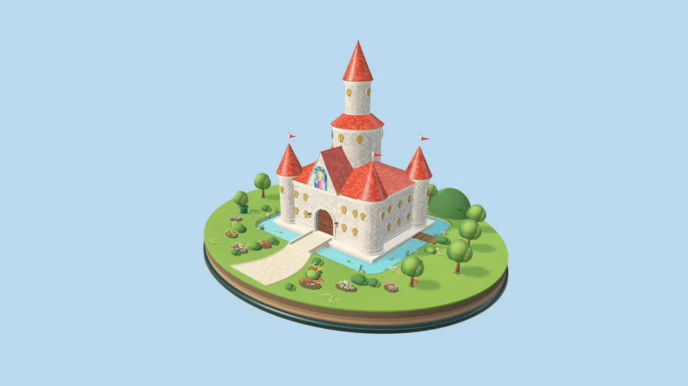</a>

**Prompt**

```text
tái hiện Lâu đài Peach trong 3D và tạo video bay qua.
```

<details>
<summary>Prompt gốc</summary>

```text
reimagine Peach’s Castle in 3D and create a fly-by video.
```

</details>

[Xem chi tiết ↗](https://www.tripo3d.ai/vi/3d-prompts/gpt-6-astra-2099359786865402019) · [Bài đăng gốc](https://x.com/romainhuet/status/2099359786865402019) · [Về danh sách ví dụ](#all-prompts)

---

<a id="gpt-6-astra-2099206962344800541"></a>

### Trình khám phá giải phẫu 3D tương tác

[BuBBliK](https://x.com/k1rallik) · 2026-09-13 · GPT-6 Astra · Tương tác

<a href="https://www.tripo3d.ai/vi/3d-prompts/gpt-6-astra-2099206962344800541">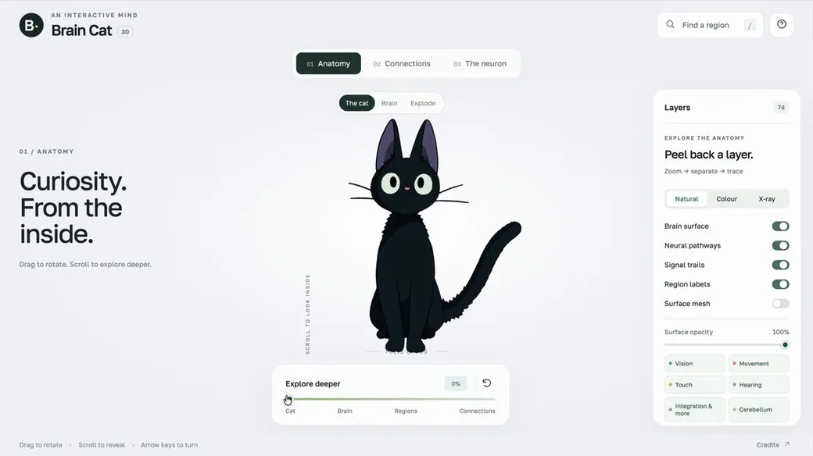</a>

**Prompt**

```text
Xây dựng một trình khám phá giải phẫu 3D tương tác, đẹp mắt, sử dụng các bộ dữ liệu khoa học công khai. Bắt đầu với góc nhìn bên ngoài, sau đó dần trở nên trong suốt khi tôi phóng to để hiển thị phần giải phẫu bên dưới.

Cho phép tôi xoay mô hình, tách riêng các cấu trúc, chọn các vùng được gắn nhãn và bật/tắt các lớp từ bảng điều khiển bên. Thêm các tab riêng cho giải phẫu, kết nối và từng tế bào, kèm tín hiệu động cùng các tùy chỉnh có thể điều chỉnh.

Sử dụng giao diện hiện đại, tối giản với ánh sáng dịu, màu sắc tinh tế, chuyển cảnh mượt mà và rất ít chữ. Thêm mũi tên cùng một hướng dẫn trực quan ngắn. Đảm bảo hoạt động tốt trên máy tính và thiết bị di động.

Sử dụng hình học giải phẫu thực tế khi có thể, trích dẫn các nguồn và phân biệt rõ dữ liệu khoa học với hoạt ảnh minh họa. Xây dựng một website hoạt động hoàn chỉnh.
```

<details>
<summary>Prompt gốc</summary>

```text
Build a beautiful, interactive 3D anatomy explorer using publicly available scientific datasets. Start with an external view that gradually becomes transparent as I zoom in, revealing the anatomy underneath.

Let me rotate the model, separate structures, select labeled regions, and toggle layers from a side panel. Add separate tabs for anatomy, connections, and individual cells, with animated signals and adjustable controls.

Use a modern, minimal interface with soft lighting, smooth transitions, subtle colors, and very little text. Include arrows and a short visual tutorial. Make it work on desktop and mobile.

Use real anatomical geometry where available, cite the sources, and clearly distinguish scientific data from illustrative animations. Build a working website.
```

</details>

[Xem chi tiết ↗](https://www.tripo3d.ai/vi/3d-prompts/gpt-6-astra-2099206962344800541) · [Bài đăng gốc](https://x.com/k1rallik/status/2099206962344800541) · [Mã nguồn](https://github.com/bubblik525/cat_brain_anatomy) · [Về danh sách ví dụ](#all-prompts)

---

<a id="gpt-6-astra-2099172061092381027"></a>

### Phân cảnh 3D khu ven biển có thể chơi trên trình duyệt

[Lummox](https://x.com/Lummox_eth) · 2026-09-13 · GPT-6 Astra · Trò chơi

<a href="https://www.tripo3d.ai/vi/3d-prompts/gpt-6-astra-2099172061092381027">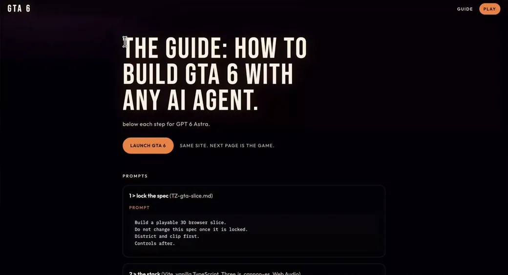</a>

**Prompt**

```text
> khóa đặc tả (TZ-gta-slice.md)

prompt: "Xây dựng một phân cảnh 3D có thể chơi trên trình duyệt. Không thay đổi đặc tả này sau khi đã khóa. Ưu tiên khu vực và đoạn cảnh trước. Bổ sung điều khiển sau."

> stack (Vite, TypeScript thuần, Three.js, cannon-es, Web Audio)

prompt: "Stack đã được cố định. Vite. TypeScript thuần. Three.js. cannon-es. Web Audio. Một URL trên trình duyệt."

> khung hình (hoàng hôn trên mặt nước, mặt đường nhựa ướt, hàng cọ)

prompt: "Một khu ven biển. Hoàng hôn trên mặt nước. Mặt đường nhựa ướt. Hàng cọ. Tập trung khung hình vào ánh sáng và camera, không phải số lượng polygon. Không dùng ánh sáng xám mặc định. Không để các khối hộp trơ trọi."

> ba người (một cảnh, một ô tô, khoảng 20 giây)

prompt: "Giữ cả ba người trong cùng một cảnh. Họ trò chuyện. Sau đó họ ngồi vào cùng một chiếc ô tô. Khoảng 20 giây. Ưu tiên chất lượng thay vì thêm công tắc."

> cắt cảnh (15 đến 20 giây, giữ chuyển động mượt mà)

prompt: "Nếu bị giật, rút ngắn đoạn cảnh xuống còn 15 đến 20 giây. Giữ chuyển động mượt mà. Nếu tụt khung hình, cắt bớt người đi bộ, không cắt ánh sáng."

> âm thanh (giọng người, pad nền dưới lời thoại, tiếng động cơ ô tô)

prompt: "Giọng nói phải giống người thật, không phải robot. Đặt pad âm thanh nhẹ dưới lời thoại, tuyệt đối không lấn át lời thoại. Khi họ ngồi vào xe, thêm tiếng động cơ ô tô trầm, không dùng âm thanh chói như tiếng cưa. Không có tiếng xì radio."
```

<details>
<summary>Prompt gốc</summary>

```text
> lock the spec (TZ-gta-slice.md)

prompt: "Build a playable 3D browser slice. Do not change this spec once it is locked. District and clip first. Controls after."

> the stack (Vite, vanilla TypeScript, Three.js, cannon-es, Web Audio)

prompt: "Stack is fixed. Vite. vanilla TypeScript. Three.js. cannon-es. Web Audio. One browser URL."

> the frame (sunset over the water, wet asphalt, palms)

prompt: "One shore district. Sunset over the water. Wet asphalt. Palms. Hold the frame on light and camera, not poly count. No default gray light. No naked cubes."

> the three (one scene, one car, about 20 seconds)

prompt: "Keep the three in one scene. They talk. Then they sit in one car. About 20 seconds. Quality over extra switches."

> the cut (15 to 20 seconds, keep it smooth)

prompt: "If it lags, cut the clip to 15 to 20 seconds. Keep it smooth. If the frame drops, cut pedestrians, not the light."

> the sound (human voices, pad under the lines, car rumble)

prompt: "Voices must sound human, not robot. Quiet pad under the lines, never over them. When they sit, low car rumble, not a saw. No radio hiss."
```

</details>

[Xem chi tiết ↗](https://www.tripo3d.ai/vi/3d-prompts/gpt-6-astra-2099172061092381027) · [Bài đăng gốc](https://x.com/Lummox_eth/status/2099172061092381027) · [Về danh sách ví dụ](#all-prompts)

---

<a id="gpt-6-astra-2098980384260456813"></a>

### Triển khai UV và bake lại 4K cho mô hình quần áo không có đầu

[さ🥺](https://x.com/_sagyoai) · 2026-09-13 · GPT-6 Astra · Tài nguyên 3D

<a href="https://www.tripo3d.ai/vi/3d-prompts/gpt-6-astra-2098980384260456813">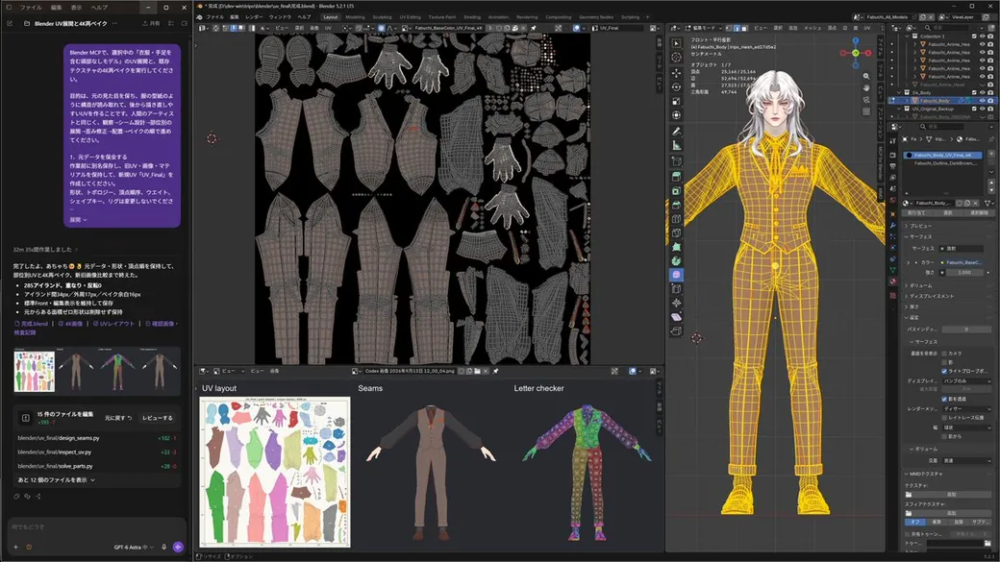</a>

**Prompt**

```text
Trong Blender MCP, hãy thực hiện triển khai UV cho “mô hình không có đầu, bao gồm quần áo và tay chân” đang được chọn, đồng thời bake lại kết cấu hiện có ở độ phân giải 4K. 

Mục tiêu là giữ nguyên diện mạo ban đầu và tạo UV có cấu trúc dễ đọc như rập may của quần áo, đồng thời thuận tiện cho việc vẽ lại về sau. Hãy thực hiện theo trình tự như một nghệ sĩ con người: quan sát → thiết kế seam → triển khai theo từng bộ phận → chỉnh biến dạng → sắp xếp → bake.

1. Bảo toàn dữ liệu gốc
Trước khi bắt đầu, hãy lưu thành tệp mới, giữ lại UV, hình ảnh và vật liệu cũ, đồng thời tạo UV mới có tên “UV\_Final”.
Không được thay đổi hình dạng, topology, thứ tự đỉnh, weight, shape key hoặc rig.

2. Quan sát mô hình và thiết kế seam
Kiểm tra mọi hướng bằng chế độ hiển thị kết cấu gốc và wireframe để nắm được cấu trúc các bộ phận quần áo cũng như đường may thực tế.
Với quần áo, hãy mở seam theo cấu trúc rập may của thân áo, tay áo, cổ áo và các bộ phận tương tự, tận dụng đường sườn hoặc mặt trong tay áo. Với da và tay chân, đặt seam ở những vị trí ít замет thấy như mặt trong hoặc mặt bên, đồng thời mở phần giữa các ngón tay một cách tự nhiên, không gây biến dạng.
Không nhầm nếp nhăn hoặc hình in với đường may, và không tạo các island nhỏ bị chia vụn không cần thiết.

3. Triển khai theo từng bộ phận và chỉnh biến dạng
Không xử lý toàn bộ mô hình cùng lúc; hãy Unwrap theo từng bộ phận.
Dùng checker có chữ tham chiếu đến UV\_Final cùng chế độ hiển thị Stretch để kiểm tra độ kéo giãn, co nén, xoắn, lật và chồng lấp.
Tùy theo nguyên nhân, hãy thêm hoặc gỡ seam, điều chỉnh bằng Pin, Relax và các công cụ tương tự, rồi kiểm tra lại. Không chỉ lặp lại cùng một thao tác triển khai tự động; hãy giữ nguyên các bộ phận đã được cải thiện.
Không dùng Smart UV Project để tự động chia nhỏ toàn bộ mô hình rồi coi đó là sản phẩm hoàn thiện.

4. Căn chỉnh hướng sợi vải, mật độ và bố cục
Đối với quần áo, hãy căn hướng dọc cơ bản theo hướng sợi vải của từng bộ phận vào hướng V của UV. Không cố ép những phần rập có đường cong thành hình chữ nhật.
Đồng nhất mật độ texel theo kích thước thực, đồng thời sắp xếp hướng sao cho dễ nhận biết các phần đối xứng trái và phải.
Sau đó, đóng gói vào vùng 0–1 trong khi giữ nguyên hướng và tỷ lệ tương đối. Không được tự ý xoay hoặc chồng UV đối xứng trái phải lên nhau.
Làm mốc ban đầu cho ảnh 4K: lề bake 16px, khoảng cách giữa các island từ 32px trở lên và khoảng cách từ island đến mép ảnh từ 16px trở lên.

5. Bake 4K từ UV cũ sang UV mới
Cố định rõ nguồn tham chiếu của kết cấu gốc vào UV cũ, dùng UV\_Final làm UV đích và chuyển dữ liệu sang ảnh mới kích thước 4096×4096.
Trong từng vật liệu, hãy kích hoạt node ảnh đích để bake, thực hiện bake thử trước rồi mới bake chính thức.
Với base color, chỉ sử dụng Color của Diffuse hoặc Emit; không bake thêm ánh sáng, bóng hoặc AO mới. Giữ nguyên phần đổ bóng đã được vẽ trong ảnh gốc.
Nếu cần, hãy chuyển cả các map hiện có như alpha; với normal map tangent, hãy bake lại theo UV mới thay vì chỉ chuyển màu đơn thuần.

6. Đối chiếu cũ và mới để xác nhận hoàn thiện
Áp dụng UV mới và ảnh đã bake, sau đó so sánh toàn thân cùng các chi tiết ở cùng điều kiện hiển thị như bản gốc.
Kiểm tra vị trí họa tiết, màu sắc, độ trong suốt và tính liên tục của seam; sửa các lỗi UV bị ép, chồng lấp hoặc chưa được triển khai, cũng như các điểm đen, vùng mất dữ liệu và hiện tượng lem do bake.
Đánh giá mức độ hoàn thiện dựa trên kết quả kiểm tra, không dựa vào “đã triển khai bao nhiêu lần”.

Hãy lưu tệp hoàn thiện.blend, ảnh 4K, bố cục UV và các ảnh kiểm tra seam, checker cùng diện mạo hoàn thiện; sau đó báo cáo ngắn gọn những nội dung đã chỉnh sửa chính.
Không dừng lại ở việc giải thích kế hoạch; hãy vừa kiểm tra hình ảnh thực tế vừa hoàn tất công việc.
```

<details>
<summary>Prompt gốc</summary>

```text
Blender MCPで、選択中の「衣服・手足を含む頭部なしモデル」のUV展開と、既存テクスチャの4K再ベイクを実行してください。

目的は、元の見た目を保ち、服の型紙のように構造が読み取れて、後から描き直しやすいUVを作ることです。人間のアーティストと同じく、観察→シーム設計→部位別の展開→歪み修正→配置→ベイクの順で進めてください。

1．元データを保全する
作業前に別名保存し、旧UV・画像・マテリアルを保持して、新規UV「UV\_Final」を作成してください。
形状、トポロジー、頂点順序、ウエイト、シェイプキー、リグは変更しないでください。

2．モデルを観察してシームを設計する
元テクスチャ表示とワイヤー表示で各方向を確認し、衣服のパーツ構成と実際の縫い目を把握してください。
服は身頃・袖・襟などの型紙構成に沿い、脇線や袖の内側などを利用して切り開きます。肌や手足は内側・側面など目立ちにくい位置にシームを置き、指の股まで無理なく開ける構成にしてください。
シワやプリントを縫い目と誤認せず、不要な細切れアイランドを作らないでください。

3．部位ごとに展開し、歪みを修正する
全体を一括処理せず、部位ごとにUnwrapしてください。
UV\_Finalを参照する文字入りチェッカーとStretch表示で、伸び・圧縮・ねじれ・反転・重なりを確認してください。
問題の原因に応じてシームを追加・解除し、PinやRelaxなどで調整して再確認します。同じ自動展開を繰り返すだけで済ませず、改善済みの部位は保持してください。
Smart UV Projectによる全体の自動細分化を完成品にしないでください。

4．布目・密度・配置を整える
服は各パーツの布目を基準に、基本の縦方向をUVのV方向へ揃えてください。曲線のある型紙まで無理に長方形へ変形しないでください。
実寸に対するテクセル密度を揃え、左右の対応が分かる向きに整えます。
その後、向きと相対スケールを維持して0〜1領域へパッキングしてください。左右の重ね合わせや勝手な回転は禁止です。
4Kでベイク余白16px、アイランド間32px以上、画像外周16px以上を初期基準にしてください。

5．旧UVから新UVへ4Kベイクする
元テクスチャの参照を旧UVに明示的に固定し、UV\_Finalをベイク先として、4096×4096の新規画像へ転写してください。
各マテリアルでベイク先画像ノードをアクティブにし、試し焼き後に本番ベイクします。
ベースカラーはDiffuseのColorのみ、またはEmitを使用し、新たな照明・影・AOを焼き込まないでください。元画像に描かれた陰影は保持してください。
透過などの既存マップも必要に応じて転写し、タンジェント法線は単なる色転写ではなく新UV基準で再ベイクしてください。

6．新旧比較で完成を確認する
新UVとベイク画像を適用し、元と同じ表示条件で全身と細部を比較してください。
柄の位置、色、透過、シームの連続性を確認し、UVの潰れ・重なり・展開漏れ、ベイクの黒点・抜け・にじみを修正してください。
「何回展開したか」ではなく、検査結果を基準に完成を判断してください。

完成.blend、4K画像、UVレイアウト、シーム・チェッカー・完成外観の確認画像を保存し、主な修正内容を簡潔に報告してください。
計画の説明だけで終わらず、実際の画像を確認しながら作業を完了してください。
```

</details>

[Xem chi tiết ↗](https://www.tripo3d.ai/vi/3d-prompts/gpt-6-astra-2098980384260456813) · [Bài đăng gốc](https://x.com/_sagyoai/status/2098980384260456813) · [Về danh sách ví dụ](#all-prompts)

---

<a id="gpt-6-astra-2098909584996057283"></a>

### Hoạt ảnh origami 3D tự gấp

[AI Guides](https://x.com/free_ai_guides) · 2026-09-12 · GPT-6 Astra · Hoạt ảnh

<a href="https://www.tripo3d.ai/vi/3d-prompts/gpt-6-astra-2098909584996057283">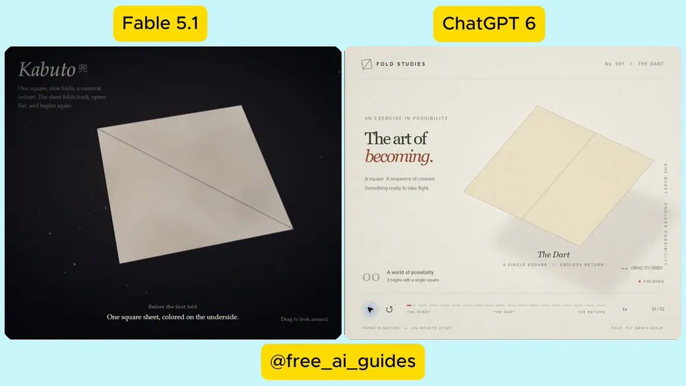</a>

**Prompt**

```text
Tạo một hoạt ảnh origami 3D. Một tờ giấy hình vuông phẳng phải tự gấp từng bước thành một hình origami dễ nhận biết, trong đó mỗi nếp gấp được thể hiện bằng chuyển động gấp và xoay thực tế của tờ giấy, sau đó mở phẳng trở lại và lặp lại. Bạn tự quyết định hình origami và cách trình bày toàn bộ cảnh.

Mọi yếu tố thiết kế đều do bạn quyết định: phong cách, màu sắc, không khí, môi trường, camera, mức độ chi tiết và mọi điểm nhấn bổ sung. Không hỏi tôi bất kỳ câu nào; hãy tự đưa ra mọi lựa chọn và xây dựng phiên bản ấn tượng nhất trong một lần thực hiện duy nhất.

Yêu cầu kỹ thuật: chỉ sử dụng một tệp HTML tự chứa duy nhất, không dùng mô hình, hình ảnh, âm thanh hoặc URL tài nguyên bên ngoài dưới bất kỳ hình thức nào (cho phép dùng thư viện JavaScript từ CDN). Tệp phải tự bắt đầu chạy ngay khi tải, không cần nhấp chuột, hoạt động mượt mà và không có lỗi trong console.
```

<details>
<summary>Prompt gốc</summary>

```text
Build a 3D origami animation. A flat square sheet must fold itself step by step into a recognizable origami figure, with each fold shown as an actual crease and rotation of the paper, then unfold back to flat and repeat. The figure it becomes and how the whole thing is presented are up to you.

Everything about the design is your decision: style, colors, mood, environment, camera, level of detail, and any extra touches. Do not ask me any questions, make every choice yourself and build the most impressive version you can in a single attempt.

Technical requirements: one single self-contained HTML file, no external models, images, sounds, or asset URLs of any kind (a JavaScript library from a CDN is fine). It must start running on its own the moment it loads, with no clicks needed, and run smoothly with no console errors.
```

</details>

[Xem chi tiết ↗](https://www.tripo3d.ai/vi/3d-prompts/gpt-6-astra-2098909584996057283) · [Bài đăng gốc](https://x.com/free_ai_guides/status/2098909584996057283) · [Về danh sách ví dụ](#all-prompts)

---

<a id="gpt-6-astra-2098841316591346006"></a>

### Atlas Chernobyl

[BuBBliK](https://x.com/k1rallik) · 2026-09-12 · GPT-6 Astra · Tương tác

<a href="https://www.tripo3d.ai/vi/3d-prompts/gpt-6-astra-2098841316591346006">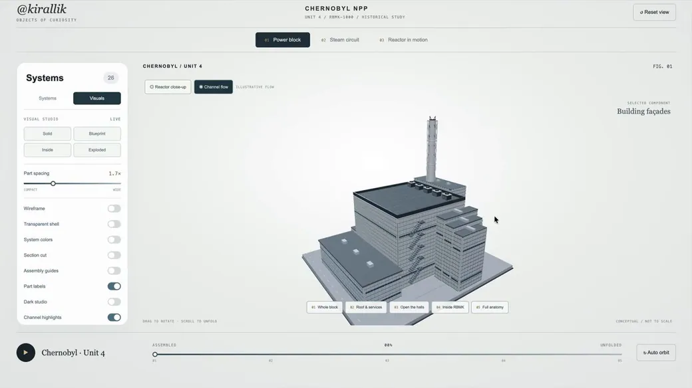</a>

**Prompt**

```text
Xây dựng "Atlas Chernobyl", một triển lãm 3D tương tác cao cấp bằng Three.js.

Nghiên cứu nhà máy điện Chernobyl và lò phản ứng RBMK còn nguyên trạng dựa trên các tài liệu công khai. Dựng mô hình các tòa nhà, ống khói dạng giàn, gian nhà tuabin, khối graphite, kênh nhiên liệu, lớp che chắn, tang tách hơi, máy bơm và đường ống.

Tạo ba tab:
— Khối nhà máy điện: mô hình chi tiết có thể tháo rời từng lớp bằng thao tác cuộn và thanh trượt.
— Mạch hơi: sơ đồ có hoạt ảnh kết nối lò phản ứng, tuabin, bình ngưng và máy bơm.
— Lò phản ứng chuyển động: mặt cắt 3D với nước và hơi chuyển động, máy móc quay cùng các nút điều khiển phát lại.

Thêm các nút bật/tắt hiển thị độc lập cho từng hệ thống, điều chỉnh khoảng cách giữa các bộ phận, chế độ lưới, độ trong suốt, mặt cắt và nhãn ngắn. Đảm bảo mọi lớp đều dễ kiểm tra và camera có thể xoay tự do, kể cả khi mô hình đã được tháo rời hoàn toàn.

Cung cấp mã nguồn và một tệp HTML độc lập. Kiểm thử tất cả điều khiển. Trình bày đây là một diễn giải phục vụ giáo dục, không phải bản sao kỹ thuật chính xác.
```

<details>
<summary>Prompt gốc</summary>

```text
Build "Chernobyl Atlas," a premium interactive 3D exhibit using Three.js.

Research the intact Chernobyl power plant and RBMK reactor using public references. Model the buildings, lattice chimney, turbine hall, graphite stack, fuel channels, shielding, separator drums, pumps, and pipes.

Create three tabs:
— Power Block: a detailed model that disassembles layer by layer using scroll and a slider.
— Steam Circuit: an animated diagram connecting the reactor, turbine, condenser, and pumps.
— Reactor in Motion: a 3D cutaway with moving water and steam, spinning machinery, and playback controls.

Add independent system visibility toggles, adjustable part spacing, wireframe, transparency, section cuts, and short labels. Keep every layer easy to inspect and the camera freely rotatable, even at full disassembly.

Deliver the source and a standalone HTML file. Test all controls. Present it as an educational interpretation, not an exact engineering replica.
```

</details>

[Xem chi tiết ↗](https://www.tripo3d.ai/vi/3d-prompts/gpt-6-astra-2098841316591346006) · [Bài đăng gốc](https://x.com/k1rallik/status/2098841316591346006) · [Mã nguồn](https://github.com/bubblik525/Chernobyl_Atlas) · [Về danh sách ví dụ](#all-prompts)

---

<a id="gpt-6-astra-2098831830002851846"></a>

### Mô phỏng bàn cát động lực

[AI Guides](https://x.com/free_ai_guides) · 2026-09-12 · GPT-6 Astra · Hoạt ảnh

<a href="https://www.tripo3d.ai/vi/3d-prompts/gpt-6-astra-2098831830002851846">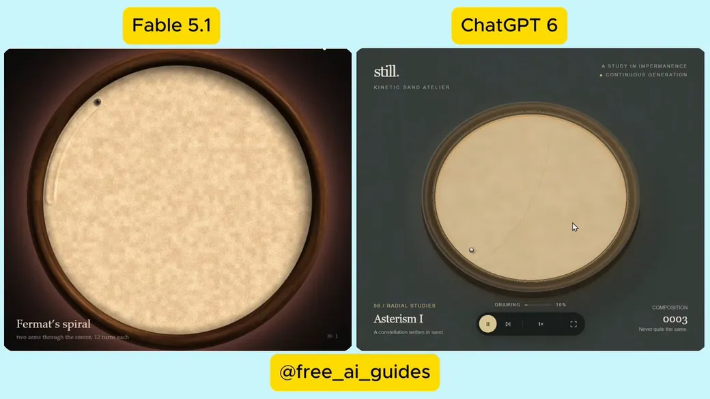</a>

**Prompt**

```text
Xây dựng một mô phỏng bàn cát động lực. Một quả bóng phải di chuyển qua lớp cát, để lại dấu vết rõ ràng, vẽ các hoa văn hình học hoàn chỉnh, sau đó làm phẳng cát và tự động bắt đầu một hoa văn mới, khác biệt. Mô phỏng phải lần lượt chạy qua nhiều hoa văn khác nhau mà không lặp lại. Bạn được toàn quyền lựa chọn giao diện và hoa văn.

Mọi quyết định về thiết kế đều do bạn lựa chọn: phong cách, màu sắc, không khí, môi trường, camera, mức độ chi tiết và mọi điểm nhấn bổ sung. Không hỏi tôi bất kỳ câu nào; hãy tự đưa ra mọi lựa chọn và xây dựng phiên bản ấn tượng nhất có thể chỉ trong một lần thực hiện.

Yêu cầu kỹ thuật: chỉ sử dụng một tệp HTML độc lập, không dùng model, hình ảnh, âm thanh hoặc URL tài nguyên bên ngoài dưới bất kỳ hình thức nào (có thể dùng thư viện JavaScript từ CDN). Mô phỏng phải tự bắt đầu chạy ngay khi tải, không cần nhấp chuột, đồng thời hoạt động mượt mà và không có lỗi trong console.
```

<details>
<summary>Prompt gốc</summary>

```text
Build a kinetic sand table simulation. A ball must move through a bed of sand, leaving a visible trail, drawing complete geometric patterns, then smoothing the sand and starting a new and different pattern automatically. It must cycle through many different patterns without repeating. Everything about the look and the patterns is your choice.

Everything about the design is your decision: style, colors, mood, environment, camera, level of detail, and any extra touches. Do not ask me any questions, make every choice yourself and build the most impressive version you can in a single attempt.

Technical requirements: one single self-contained HTML file, no external models, images, sounds, or asset URLs of any kind (a JavaScript library from a CDN is fine). It must start running on its own the moment it loads, with no clicks needed, and run smoothly with no console errors.
```

</details>

[Xem chi tiết ↗](https://www.tripo3d.ai/vi/3d-prompts/gpt-6-astra-2098831830002851846) · [Bài đăng gốc](https://x.com/free_ai_guides/status/2098831830002851846) · [Về danh sách ví dụ](#all-prompts)

---

<a id="gpt-6-astra-2098795017955418202"></a>

### Tái dựng 3D Hội chợ Thế giới Chicago năm 1893

[Dan Elton](https://x.com/moreisdifferent) · 2026-09-12 · GPT-6 Astra · Bối cảnh

<a href="https://www.tripo3d.ai/vi/3d-prompts/gpt-6-astra-2098795017955418202">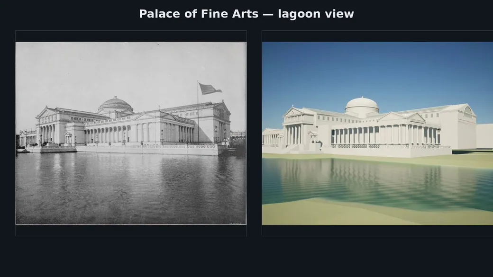</a>

**Prompt**

```text
Tải xuống 2.000 bức ảnh lịch sử và tư liệu tham khảo về hội chợ, rồi sử dụng toàn bộ thông tin thu thập được để tạo bản tái dựng 3D trong Blender.
```

<details>
<summary>Prompt gốc</summary>

```text
download 2,000 historical photographs and reference information around the fair and use all the information obtained to create a 3D reconstruction in Blender.
```

</details>

[Xem chi tiết ↗](https://www.tripo3d.ai/vi/3d-prompts/gpt-6-astra-2098795017955418202) · [Bài đăng gốc](https://x.com/moreisdifferent/status/2098795017955418202) · [Về danh sách ví dụ](#all-prompts)

---

<a id="gpt-6-astra-2098774359926297011"></a>

### Khung ảnh in 3D dạng lắp ghép có khớp nối

[wada](https://x.com/wada) · 2026-09-12 · GPT-6 Astra · Tài nguyên 3D

<a href="https://www.tripo3d.ai/vi/3d-prompts/gpt-6-astra-2098774359926297011">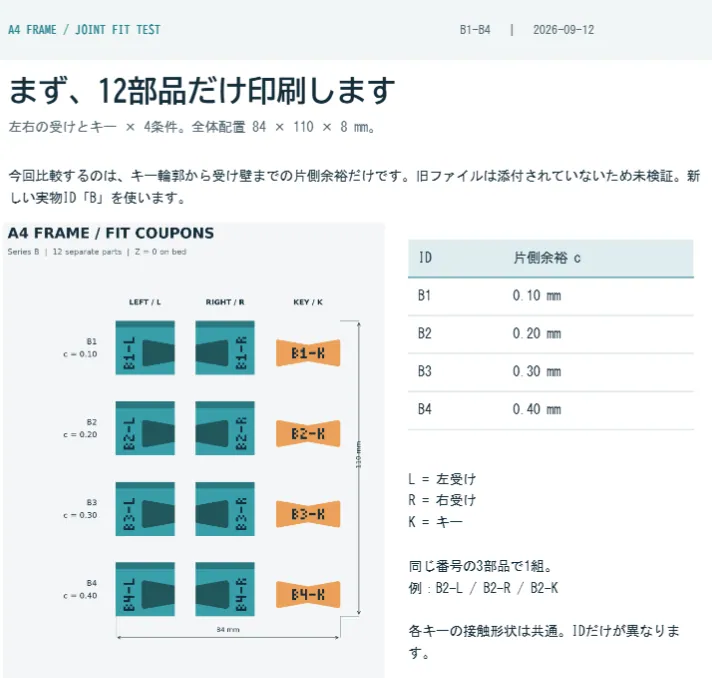</a>

**Prompt**

```text
Tôi muốn in khung ảnh bằng máy in 3D, nhưng máy in khá nhỏ nên cần thiết kế dạng nhiều bộ phận nối lại để hoàn thiện. Nối trực tiếp thì hơi nhàm, hãy dùng khớp nối thú vị hơn.
```

<details>
<summary>Prompt gốc</summary>

```text
3Dプリンターで額縁印刷したい、でも3Dプリンターちっちゃいから部品を繋いで完成させるやつがいい、なんか面白くないから継手で
```

</details>

[Xem chi tiết ↗](https://www.tripo3d.ai/vi/3d-prompts/gpt-6-astra-2098774359926297011) · [Bài đăng gốc](https://x.com/wada/status/2098774359926297011) · [Về danh sách ví dụ](#all-prompts)

---

<a id="gpt-6-astra-2098739181510164652"></a>

### Trò chơi bay Skybound trên trình duyệt

[Aakash Kanojiya](https://x.com/Kanojiyaaakash1) · 2026-09-12 · GPT-6 Astra · Trò chơi

<a href="https://www.tripo3d.ai/vi/3d-prompts/gpt-6-astra-2098739181510164652">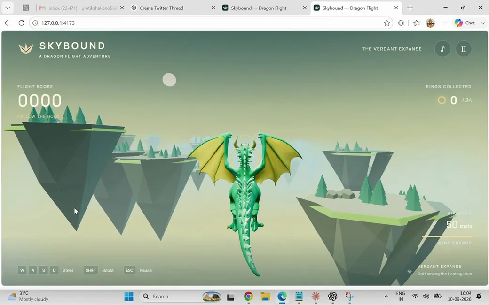</a>

**Prompt**

```text
Xây dựng một trò chơi bay trên trình duyệt có tên Skybound bằng Three.js. Người chơi điều khiển một con rồng bay qua một khu vực đầy các hòn đảo lơ lửng và thu thập vòng để ghi điểm. Bạn sẽ cần một mô hình rồng 3D — sử dụng Hyper3D Rodin MCP để tạo mô hình này.
```

<details>
<summary>Prompt gốc</summary>

```text
Build a browser flight game called Skybound using Three.js. The player pilots a dragon through a field of floating islands, collecting rings for score. You'll need a 3D dragon model - use the Hyper3D Rodin MCP to generate it.
```

</details>

[Xem chi tiết ↗](https://www.tripo3d.ai/vi/3d-prompts/gpt-6-astra-2098739181510164652) · [Bài đăng gốc](https://x.com/Kanojiyaaakash1/status/2098739181510164652) · [Về danh sách ví dụ](#all-prompts)

---

<a id="gpt-6-astra-2098715488369152087"></a>

### DEVICE: Game giải đố 3D chân thực sử dụng chính smartphone

[ひまねこ](https://x.com/00Nekonet) · 2026-09-12 · GPT-6 Astra · Trò chơi

<a href="https://www.tripo3d.ai/vi/3d-prompts/gpt-6-astra-2098715488369152087">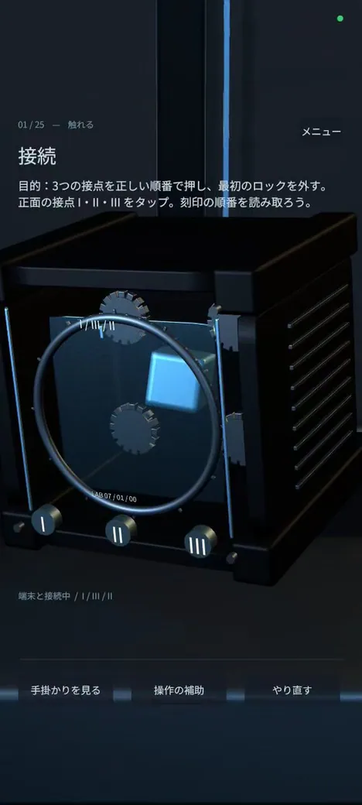</a>

**Prompt**

```text
Hãy đồng thời đảm nhiệm vai trò giám đốc game, nhà thiết kế game, kỹ sư Unity, họa sĩ 3D, nhà thiết kế UI/UX, technical artist, nhà thiết kế âm thanh và phụ trách QA cho dự án này.

Dựa trên các thông số kỹ thuật dưới đây, hãy tạo một game phiêu lưu giải đố 3D chất lượng cao, hoàn thiện và thực sự có thể chơi trên smartphone—not chỉ dừng ở phần ý tưởng.

Đừng chỉ đưa ra các ý tưởng rồi kết thúc giữa chừng.
Đừng chỉ tạo tài liệu đặc tả rồi kết thúc.
Trong phạm vi có thể, hãy tạo đầy đủ project, mã nguồn, scene, UI, vật liệu, logic game, hệ thống điều khiển âm thanh, xử lý cảm biến, hệ thống lưu game và cả các bài kiểm thử thực tế.

Nếu có điểm chưa rõ, trừ khi tồn tại mâu thuẫn nghiêm trọng, đừng đặt câu hỏi mà hãy tự đưa ra lựa chọn phù hợp nhất để game hấp dẫn và đạt chất lượng cao, rồi tiếp tục triển khai.

Tổng quan dự án

Tên tạm thời:

DEVICE

Thể loại:

Game phiêu lưu giải đố 3D chân thực, tương tác trực tiếp với smartphone

Nền tảng:

Ưu tiên Android.
Thiết kế cấu trúc sao cho có thể hỗ trợ iOS trong phạm vi khả thi.

Màn hình:

Màn hình dọc 9:16

Điều khiển:

Về cơ bản, game có thể chơi bằng một tay.
Tuy nhiên, một số câu đố yêu cầu thao tác vật lý với chính smartphone, chẳng hạn như nhấc lên, nghiêng, xoay, úp xuống, lắc hoặc giữ yên thiết bị.

Điểm đặc trưng lớn nhất của game

Đây không phải là một “game chơi trên điện thoại”.

Hãy biến chính chiếc điện thoại thông minh thành một thiết bị giải đố.

Không thể hoàn thành game chỉ bằng cách chạm vào màn hình.

Sử dụng các cảm biến, camera, micro, rung, loa, hướng của thiết bị, trạng thái sạc và những tính năng khác có sẵn trên điện thoại thông minh như các quy luật vật lý trong thế giới game.

Tuy nhiên, không biến game thành một tập hợp trình diễn cảm biến đơn thuần.

Thiết kế để mọi tính năng kết nối tự nhiên trong cùng một thế giới quan và một hệ thống game thống nhất.

Thế giới quan

Người chơi phát hiện một thiết bị hình lập phương màu đen bí ẩn mang tên “DEVICE” trong một cơ sở nghiên cứu không rõ danh tính.

Khối lập phương kết nối với điện thoại thông minh và cảm nhận trạng thái của chiếc điện thoại trong thế giới thực.

Khi người chơi nghiêng điện thoại thông minh, trọng lực bên trong DEVICE sẽ thay đổi.

Khi xoay thiết bị, toàn bộ không gian cũng xoay theo.

Ánh sáng, màu sắc, âm thanh, phương hướng và chuyển động trong thế giới thực tràn vào bên trong DEVICE.

Ở giai đoạn đầu, DEVICE có vẻ chỉ là một thiết bị thí nghiệm, nhưng càng tiến triển, phía DEVICE càng bắt đầu nhận thức được sự tồn tại của người chơi.

Về cuối game,

“người chơi đang điều khiển điện thoại thông minh”

Hãy đưa vào một meta-puzzle tận dụng chính mối quan hệ này.

Không biến tác phẩm thành game kinh dị.
Có thể giữ lại cảm giác rờn rợn, công nghệ chưa được biết đến và sự thần bí, nhưng trọng tâm phải là trí tò mò cùng niềm vui khám phá.

Chất lượng hình ảnh

Hạng mục quan trọng nhất.

Tạo hình ảnh 3D chân thực nhất có thể trên smartphone.

Cấm sử dụng hình ảnh CG rẻ tiền kiểu game mobile.

Cấm phong cách hoạt hình.

Cấm cảm giác low-poly.

Ngoài UI, hạn chế tối đa việc để lại các tài sản tạm dạng phẳng.

Khi sử dụng Unity, lấy URP được tối ưu cho hiệu năng di động làm nền tảng,

・Vật liệu PBR
・Biểu diễn Metallic / Roughness
・Normal Map
・Ambient Occlusion
・Reflection Probe
・Light Probe
・Bóng đổ chất lượng cao
・Bóng đổ mềm
・Bloom
・Color Grading
・Hiệu ứng Screen Space
・Ánh sáng có cảm giác thể tích
・Chỉ sử dụng Depth of Field ở những vị trí cần thiết
・Kính dựa trên vật lý
・Kim loại
・Sàn ướt
・Vết xước
・Dấu vân tay
・Bụi
・Các gờ lồi lõm siêu nhỏ trên bề mặt
・Vật liệu phát sáng
・Độ phản xạ
・Âm thanh môi trường

và kết hợp chúng.

Bối cảnh là một cơ sở nghiên cứu tương lai tối tăm nhưng sang trọng.

Tập trung vào kim loại đen, kính, bê tông, các đường phát sáng màu trắng, máy móc chính xác, linh kiện thủy lực và những vật liệu tương tự.

Không để bối cảnh chìm trong bóng tối hoàn toàn; hãy đảm bảo các vật thể quan trọng vẫn được nhận diện nhờ ánh sáng tự nhiên.

Vì DEVICE là biểu tượng của trò chơi, hãy tạo thiết bị này với chất lượng cực kỳ cao.

Thiết bị DEVICE:

Một khối lập phương kích thước khoảng 20–30 cm, cấu thành từ kim loại đen và kính.

Mỗi mặt có một cấu trúc máy móc khác nhau.

Các mối nối cực kỳ tinh xảo.

Một lượng nhỏ ánh sáng trắng hoặc trắng xanh rò rỉ ra từ bên trong.

Cấu trúc bên trong biến dạng, xoay và mở ra một cách chân thực khi người chơi thao tác.

Tạo chuyển động cơ học có cảm giác bấm nảy rõ ràng.

Màn hình chơi cơ bản

DEVICE nằm ở chính giữa màn hình dọc.

Người chơi kéo DEVICE để xoay và kiểm tra từng mặt.

Xung quanh là một cơ sở nghiên cứu.

Góc quay mang tính điện ảnh nhưng không làm ảnh hưởng đến khả năng điều khiển.

Giao diện cơ bản được tối giản.

Không hiển thị hàng loạt nút liên tục.

Ưu tiên cảm giác đang chạm và thao tác trực tiếp trên chính DEVICE.

Hệ thống cốt lõi

Tích hợp các thao tác dưới đây thành hệ thống đầu vào trong cùng một thế giới game, không tách chúng thành những minigame độc lập.

1. Cảm ứng

Chạm
Chạm hai lần
Nhấn giữ
Kéo
Vuốt
Chụm hai ngón tay
Hai ngón tay
Ba ngón tay
Chạm đồng thời ở nhiều vị trí

để có thể sử dụng.

Trực tiếp chạm và thao tác với các nút, cần gạt, vòng xoay, núm vặn và các bộ phận tương tự trên DEVICE.

2. Con quay hồi chuyển

Liên kết độ nghiêng của điện thoại với trọng lực bên trong DEVICE.

Ví dụ:

Chỉ bằng cách nghiêng thiết bị, đưa viên bi kim loại bên trong đến đích.

Nghiêng chất lỏng để chất lỏng tiếp xúc với điện cực.

Điều chỉnh góc của tia sáng.

3. Cảm biến gia tốc

Lắc thiết bị.

Dừng đột ngột.

Phát hiện chuyển động giống như gõ nhẹ.

Tuy nhiên, không yêu cầu người chơi lắc thiết bị quá mạnh.

Có tính đến yếu tố an toàn.

4. Hướng thiết bị

Dọc
Ngang
Ngửa mặt
Úp mặt

v.v. vào trò chơi.

Tạo các sự kiện chỉ xảy ra khi người chơi úp điện thoại xuống bàn.

5. Camera

Đưa màu sắc của thế giới thực vào trò chơi.

Khi người chơi dùng camera để quay các vật thể màu đỏ, xanh dương, xanh lá câyなど, phân tích màu đại diện ở khu vực xung quanh trung tâm màn hình và truyền màu đó đến DEVICE dưới dạng năng lượng.

Không gửi hình ảnh lên máy chủ.

Ưu tiên xử lý trực tiếp trên thiết bị trong khả năng tối đa.

Chuẩn bị thao tác thay thế trong trường hợp không thể sử dụng camera.

6. Microphone

Âm lượng
Thời lượng
Đặc tính tần số cơ bản

v.v.

Ví dụ:

Thổi hơi
Phát ra tiếng
Vỗ tay
Giữ yên lặng trong một khoảng thời gian nhất định

v.v.

Không bắt buộc phải sử dụng nhận dạng giọng nói.

Không lưu dữ liệu ghi âm.

7. Phản hồi xúc giác / Rung

Cực kỳ quan trọng.

Tạo các màn chơi truyền đạt thông tin không hiển thị trên màn hình chỉ bằng rung.

Ví dụ:

Khoảng cách giữa các lần rung ngắn dần khi tiến gần mục tiêu.

Các mẫu rung khác nhau ở bên trái và bên phải.

Mật mã bằng các nhịp rung ngắn và dài.

Chuẩn bị cách hiển thị thay thế cho thiết bị đã tắt rung.

8. Loa

Tận dụng cảm nhận phương hướng của âm thanh trong không gian 3D.

Không bắt buộc phải dùng tai nghe.

Sử dụng cao độ, chu kỳ, định vị trái phải và các yếu tố tương tự làm thông tin giải đố.

9. Độ sáng

Nếu có thể, sử dụng cảm biến ánh sáng môi trường.

Với thiết bị không hỗ trợ, cân nhắc phương án thay thế dựa trên độ sáng của camera hoặc các chỉ số tương tự.

Cơ chế chỉ xuất hiện khi đưa thiết bị vào nơi tối.

Cơ chế sạc pin khi đưa thiết bị vào nơi sáng.

10. La bàn

Lấy hướng trên các thiết bị được hỗ trợ.

Tạo các câu đố yêu cầu người chơi hướng điện thoại về phía bắc, phía nam hoặc một hướng cụ thể.

Nếu thiết bị không có cảm biến, hãy chuyển sang câu đố thay thế.

11. Trạng thái sạc

Nếu có thể nhận biết thời điểm thiết bị bắt đầu sạc,

Thêm hiệu ứng cho thấy điện được truyền vào DEVICE khi người chơi thực sự cắm cáp sạc.

Tuy nhiên, luôn phải có cách hoàn thành thay thế cho những người dùng không thể thực hiện thao tác này.

12. Pin

Nếu có thể lấy mức pin, hãy sử dụng thông tin này cho các sự kiện đặc biệt.

Không được thiết kế để người chơi không thể hoàn thành do mức pin.

13. Thời gian

Có thể sử dụng thời gian hiện tại cho các câu đố hoặc hiệu ứng đặc biệt.

Không được thiết kế để chỉ có thể hoàn thành vào một thời điểm cụ thể.

Không bắt người chơi phải chờ.

Thiết kế câu đố

Thay vì ngay từ đầu sản xuất hàng loạt 100 câu đố sơ sài,

trước tiên hãy tạo khoảng 20–30 màn chơi có độ hoàn thiện cực cao.

Mỗi màn phải mang đến một phát hiện khác nhau.

Cấm các màn lặp lại cùng một thao tác chỉ bằng cách thay đổi con số.

Chương 1: TOUCH

Giúp người chơi hiểu luật chơi thông qua các thao tác chạm là chính.

Chạm vào DEVICE.
Xoay.
Nhấn.
Kéo.
Mở.

Chương 2: GRAVITY

Tích hợp con quay hồi chuyển và gia tốc kế.

Thế giới vật lý bên trong DEVICE đồng bộ với tư thế của điện thoại thông minh ngoài đời thực.

Chương 3: SENSE

Camera
Micrô
Ánh sáng
Âm thanh
Rung

được tích hợp.

Chương 4: OUTSIDE

Câu đố yêu cầu người chơi chú ý đến bên ngoài màn hình.

Úp điện thoại xuống.
Giữ yên.
Căn chỉnh hướng.
Thu thập màu sắc xung quanh.

Chương 5: DEVICE

Kết hợp các quy tắc đã học cho đến lúc này.

Các chỉ dẫn hiển thị trên màn hình không phải lúc nào cũng đúng.

Ví dụ:

Trên màn hình

SHAKE

được hiển thị.

Tuy nhiên, lắc thiết bị sẽ khiến bạn thất bại.

Đáp án là giữ thiết bị hoàn toàn đứng yên.

Trong một câu đố khác,

MORE LIGHT

được hiển thị.

Tăng độ sáng màn hình cũng không có tác dụng.

Đưa ánh sáng từ thế giới thực vào camera để hoàn thành.

Ở màn chơi cuối,

Chạm
Hướng thiết bị
Con quay hồi chuyển
Rung
Âm thanh
Tín hiệu đầu vào từ thế giới thực

để tạo thành một câu đố lớn kết hợp nhiều yếu tố như vậy.

Các màn chơi tiêu biểu bắt buộc phải triển khai

“MÊ CUNG TRONG BÓNG TỐI”

Màn hình gần như tối hoàn toàn.

Người chơi không thể nhìn thấy vị trí của mình.

Nghiêng điện thoại thông minh để di chuyển một quả cầu vô hình.

Càng đến gần lối ra, rung càng mạnh và nhanh hơn.

Cuối cùng, người chơi hoàn thành màn chơi chỉ bằng cảm nhận rung.

Trong phần cài đặt hỗ trợ tiếp cận, có thể bật thêm tính năng hỗ trợ bằng âm thanh.

“DON'T LOOK”

DEVICE xuất hiện trên màn hình,

DON'T LOOK

được hiển thị.

Người chơi úp điện thoại xuống.

Khi phát hiện Face Down, âm thanh cơ khí phát ra từ bên trong DEVICE trong lúc người chơi không thể nhìn thấy.

Sau vài giây, khi lật điện thoại lên, DEVICE đã biến hình.

“STEAL COLOR”

Bên trong DEVICE có một lõi năng lượng không màu.

Dùng camera để quét các màu trong thế giới thực như đỏ, xanh dương và xanh lá.

Màu đã quét sẽ chảy vào bên trong DEVICE dưới dạng năng lượng lỏng theo thời gian thực.

「GIỮ YÊN」

DEVICE đang rung dữ dội.

Ban đầu, người chơi sẽ muốn lắc điện thoại.

Nhưng đáp án đúng là giữ thiết bị hoàn toàn đứng yên.

Khi gia tốc duy trì dưới ngưỡng trong một khoảng thời gian nhất định, thiết bị sẽ ổn định và mở ra.

「NĂNG LƯỢNG」

DEVICE dừng hoàn toàn.

Trên các thiết bị được hỗ trợ, khi bắt đầu sạc điện thoại, dòng điện sẽ truyền vào DEVICE.

Các dây dẫn kim loại lần lượt phát sáng, rồi cơ cấu bên trong khởi động lại.

Cũng cần chuẩn bị thao tác thay thế.

Mô phỏng vật lý bên trong DEVICE

Tích cực sử dụng mô phỏng vật lý.

Bi kim loại
Chất lỏng
Trọng lực
Nam châm
Bánh răng
Ray
Tấm phản xạ
Tia laser
Vòng xoay
Xi lanh
Piston
Cơ chế khóa
Kính
Điện cực
Cáp

v.v.

Tuy nhiên, không để hệ thống trở nên thiếu ổn định vì phó mặc mọi thứ cho mô phỏng vật lý.

Đối với các câu đố quan trọng, hãy sử dụng mô phỏng vật lý được kiểm soát để đảm bảo tính tái lập.

Hiệu ứng trình diễn

Khi giải đúng câu đố, không chỉ hiển thị dòng chữ “CLEAR” đơn giản.

Bản thân DEVICE sẽ biến dạng để phản hồi kết quả.

Mở khóa
Bánh răng xoay
Phát sáng bên trong
Tách các tấm kim loại
Chất lỏng di chuyển bên trong kính
Triển khai cánh tay máy

kết hợp các yếu tố này.

Ngay khi giải đúng,

“cảm giác như chính mình đã vận hành một cỗ máy chính xác khổng lồ”

Tạo hiệu ứng mang lại cảm giác thỏa mãn đó.

Âm thanh

Cực kỳ quan trọng.

Không chỉ phát BGM liên tục.

tiếng điều hòa của cơ sở nghiên cứu
tiếng máy móc vọng lại từ xa
tiếng servo bên trong DEVICE
tiếng kim loại lách cách
tiếng kính
tiếng điện
tiếng từ trường
âm tần số thấp
độ rung

Phân lớp các âm thanh này.

Âm thanh sẽ thay đổi tùy vào vị trí chạm trên DEVICE.

Khi dùng tai nghe, tăng cường cảm giác định vị âm thanh.

UI

Tích hợp tối đa vào thế giới game.

Không xếp hàng loạt nút mang phong cách game mobile giá rẻ.

Menu:

CONTINUE
CHAPTERS
SETTINGS
ACCESSIBILITY
CREDITS

mức độ.

Thể hiện gợi ý trong lúc giải đố qua các thiết bị hiển thị bên trong DEVICE hoặc chữ được chiếu.

Hệ thống gợi ý

Không hiển thị ngay đáp án khi người chơi bị mắc kẹt.

Gợi ý 1:
Vị trí cần chú ý.

Gợi ý 2:
Tính năng của điện thoại cần sử dụng.

Gợi ý 3:
Gần như là lời giải.

gồm 3 cấp độ.

Khả năng tiếp cận

Đặc biệt quan trọng vì trò chơi sử dụng nhiều tính năng cảm biến.

Triển khai các nội dung sau.

Cho phép chuyển rung thành âm thanh hoặc hiển thị trên màn hình.

Bổ sung hỗ trợ trực quan cho các câu đố âm thanh.

Bổ sung hỗ trợ cho người khiếm thị màu trong các câu đố màu sắc.

Không yêu cầu thao tác mạnh với thiết bị.

Loại bỏ yêu cầu phải lắc điện thoại thông minh mạnh.

Cung cấp câu đố thay thế khi không thể sử dụng camera, micrô hoặc la bàn.

Không để trò chơi bị kẹt tiến trình ngay cả khi quyền truy cập một số cảm biến bị từ chối.

Quyền riêng tư

Không gửi hình ảnh từ camera, âm thanh từ micrô, thông tin vị trí và các dữ liệu tương tự đến máy chủ bên ngoài.

Không bắt buộc GPS để tiếp tục tiến trình trò chơi.

Giải thích lý do và yêu cầu các quyền cần thiết ngay trước khi sử dụng.

Không yêu cầu các quyền không cần thiết.

Cấu trúc kỹ thuật

Nếu có thể, sử dụng Unity 6 và C#.

URP dành cho thiết bị di động.

Mô-đun hóa dự án.

Tối thiểu, xây dựng cấu trúc gồm các thành phần sau.

SensorManager
PuzzleManager
GameStateManager
AudioManager
HapticsManager
PermissionManager
SaveManager
AccessibilityManager
DeviceCapabilityManager

Không gọi trực tiếp liên tục từng chức năng của điện thoại thông minh từ mã Puzzle.

Trừu tượng hóa thông qua SensorManager và các lớp tương tự,

cảm biến trên thiết bị thật
đầu vào giả lập dành cho trình chỉnh sửa
cơ chế dự phòng cho các thiết bị không được hỗ trợ

cho phép chuyển đổi giữa các chế độ này.

Gỡ lỗi cảm biến

để có thể phát triển ngay cả trong Unity Editor,

Developer Sensor Panel

Triển khai.

Bằng thanh trượt và nút bấm,

Độ nghiêng thiết bị
Gia tốc
Ngửa / úp
Âm lượng micro
Ánh sáng môi trường
La bàn
Bật/tắt sạc
Pin
Sự kiện rung
Màu đại diện từ camera

Cho phép mô phỏng các đầu vào như...

Cho phép kiểm thử các câu đố chính mà không cần kết nối thiết bị thật.

Lưu

Tiến trình chương
Màn chơi đã hoàn thành
Trạng thái sử dụng gợi ý
Cài đặt
Trợ năng
Vật phẩm sưu tầm

Lưu lại.

Cho phép tạm dừng an toàn ngay cả giữa màn chơi.

Hiệu năng

Không để đồ họa chân thực đến mức game không thể vận hành.

Đặt mục tiêu cấu hình có thể chơi được trên các thiết bị Android tầm trung phổ biến.

LOD
Occlusion Culling
GPU Instancing
Nén texture
Baking ánh sáng
Reflection Probe
Đèn thời gian thực chỉ trong phạm vi cần thiết
Object Pool
Giảm Draw Call

và các kỹ thuật tương tự.

cài đặt Quality thành

LOW
MEDIUM
HIGH
ULTRA

chia thành.

Đảm bảo chất lượng hiển thị ở mức rất cao trên các thiết bị hiệu năng cao.

Điều kiện hoàn thành

Không chỉ là một prototype,

Màn hình tiêu đề
Phần mở đầu
Hướng dẫn
Nhiều chương
Nhiều màn chơi
Tương tác từ cảm biến
Hiệu ứng 3D
Âm thanh
Cài đặt
Khả năng tiếp cận
Lưu game
Chọn màn chơi
Phần kết

đến phần kết, hướng tới trạng thái có thể trải nghiệm trọn vẹn như một trò chơi.

Nếu có thể, hãy tạo bản build Android thực tế.

Ngay cả khi không thể tạo APK/AAB do hạn chế của môi trường build,

vẫn hoàn thiện dự án ở trạng thái đầy đủ để có thể mở bằng Unity và build ngay.

Định hướng khi đưa ra quyết định trong quá trình phát triển

Không chuyển sang 2D hoặc giao diện đơn giản chỉ vì cách đó dễ hơn.

Không lược bỏ các cơ chế cốt lõi của game để «tiết kiệm thời gian».

Với những phần không thể chuẩn bị bằng tài nguyên bên ngoài, hãy tự tạo hoặc tạo bằng quy trình thủ tục trong phạm vi tối đa có thể.

Ngay cả khi cần dùng vật thể tạm, cũng không biến toàn bộ game thành một tập hợp vật thể tạm.

Đặc biệt,

DEVICE
cơ sở nghiên cứu
thiết bị giải đố chính
ánh sáng
vật liệu
hiệu ứng khi giải đúng

sẽ được hoàn thiện với chất lượng cao.

Quy trình thực hiện

Trước tiên, chốt thiết kế tổng thể trong thời gian ngắn.

Sau đó, thay vì tiếp tục giải thích, hãy bắt tay vào sản xuất.

1. Tạo dự án
2. Cảnh 3D cơ bản
3. Tạo DEVICE
4. Thao tác cơ bản
5. Trừu tượng hóa cảm biến
6. Khung hệ thống giải đố
7. Triển khai các câu đố tiêu biểu
8. Xây dựng chương
9. UI
10. Âm thanh
11. Hiệu ứng trình bày
12. Lưu dữ liệu
13. Khả năng tiếp cận
14. Tối ưu hóa
15. Kiểm thử
16. Sửa lỗi
17. Build

Tiến hành theo thứ tự trên.

Ngay cả khi một phần gặp lỗi, không dừng toàn bộ quá trình; hãy dùng phương án thay thế để tối đa hóa mức độ hoàn thiện.

Sản phẩm cuối cùng

Cuối cùng, để lại các thành phần sau.

・Dự án game hoàn chỉnh
・Mã nguồn chính
・Cảnh game
・Mô hình 3D và vật liệu
・UI
・Thiết lập âm thanh
・Hệ thống cảm biến
・Hệ thống giải đố
・Hệ thống lưu game
・Thiết lập bản build
・README
・Quy trình kiểm thử trên thiết bị Android thực tế
・Danh sách các tính năng smartphone được sử dụng
・Cơ chế fallback trên các thiết bị không được hỗ trợ
・Danh sách vấn đề đã biết

Không được chỉ giải thích rồi kết thúc mà không tạo ra sản phẩm.

Ưu tiên cao nhất là:

1. Tính thú vị
2. Tận dụng đặc trưng riêng của smartphone
3. Tính chân thực của thế giới 3D
4. Cảm giác đang chạm và tương tác với DEVICE
5. Tính hợp lý và thuyết phục của các câu đố
6. Hoạt động thực tế

theo thứ tự đó.

Không phải là một tác phẩm “bổ sung tính năng cảm biến vào một game smartphone có sẵn”,

mà hãy hoàn thiện một tác phẩm khiến người chơi cảm thấy phần cứng smartphone tồn tại là để phục vụ riêng cho game này.

Từ đây, đừng dừng lại ở phần mô tả ý tưởng mà hãy bắt đầu quá trình sản xuất thực tế.

Ngoài ra, hãy bổ sung đầy đủ những phần có thể trau chuốt hơn hoặc những yếu tố giúp game thú vị hơn theo nội dung trên, đồng thời xây dựng phần 3D chân thực
```

<details>
<summary>Prompt gốc</summary>

```text
あなたはこのプロジェクトのゲームディレクター、ゲームデザイナー、Unityエンジニア、3Dアーティスト、UI/UXデザイナー、テクニカルアーティスト、サウンドデザイナー、QA担当を兼任してください。

以下の仕様をもとに、企画だけではなく、実際にプレイ可能な完成度の高いスマートフォン向け3Dパズルゲームを制作してください。

途中でアイデア案だけを提示して終了しないでください。
仕様書だけを作って終了しないでください。
可能な限り実際のプロジェクト、コード、シーン、UI、マテリアル、ゲームロジック、サウンド制御、センサー処理、セーブ処理、テストまで作成してください。

不明点については、重大な矛盾がない限り質問せず、ゲームとして最も面白く、高品質になる判断を自分で行い、そのまま制作を進めてください。

プロジェクト概要

仮タイトル：

DEVICE

ジャンル：

フォトリアル3D・スマートフォン体感型パズルアドベンチャー

プラットフォーム：

Androidを最優先。
可能な範囲でiOSにも対応できる構造にする。

画面：

縦画面 9:16

操作：

基本的に片手でも操作可能。
しかし、一部のパズルではスマートフォンそのものを持ち上げる、傾ける、回転させる、伏せる、振る、静止させるなどの物理的操作を使用する。

ゲームの最大の特徴

これは「スマホで遊ぶゲーム」ではない。

スマートフォン本体そのものをパズル装置として使用するゲームにする。

画面タッチだけではクリアできない。

スマートフォンに搭載されているセンサー、カメラ、マイク、振動、スピーカー、端末方向、充電状態などをゲーム世界の物理法則として利用する。

ただし、単なるセンサー機能のデモ集にはしない。

すべての機能が同じ世界観、同じゲームシステムの中で自然につながるように設計する。

世界観

プレイヤーは正体不明の研究施設で、謎の黒い立方体型装置「DEVICE」を発見する。

立方体はスマートフォンと接続され、現実世界にあるスマートフォンの状態を感知する。

プレイヤーがスマートフォンを傾けるとDEVICE内部の重力が変化する。

端末を回転させると空間そのものが回転する。

現実の光、色、音、方向、動きなどがDEVICE内部へ流れ込む。

序盤では単なる実験装置に見えるが、ゲームが進行するほどDEVICE側もプレイヤーの存在を認識し始める。

後半では、

「プレイヤーがスマートフォンを操作している」

という関係そのものを利用したメタパズルを入れる。

ホラー作品にはしない。
不気味さ、未知の技術、神秘性はあってよいが、中心は知的好奇心と発見の楽しさにする。

ビジュアル品質

最重要項目。

スマートフォン向けで可能な限りフォトリアルな3D表現にする。

安っぽいスマホゲーム風CGは禁止。

カートゥーン調は禁止。

ローポリ感は禁止。

UI以外に平面的な仮素材を極力残さない。

Unityを使用する場合はモバイル性能を考慮したURPを基本としながら、

・PBRマテリアル
・Metallic / Roughness表現
・Normal Map
・Ambient Occlusion
・Reflection Probe
・Light Probe
・高品質シャドウ
・ソフトシャドウ
・Bloom
・Color Grading
・Screen Space表現
・Volumetric感のある光
・Depth of Fieldは必要箇所のみ
・物理ベースのガラス
・金属
・濡れた床
・傷
・指紋
・埃
・微細な表面凹凸
・発光素材
・反射
・環境音

などを組み合わせる。

舞台は暗く高級感のある未来研究施設。

黒い金属、ガラス、コンクリート、白い発光ライン、精密機械、油圧部品などを中心にする。

完全な暗闇にはせず、重要なオブジェクトが自然な光で認識できるようにする。

DEVICEはゲームの象徴になるため、極めて高品質に作る。

DEVICE本体：

黒い金属とガラスで構成された20〜30cm程度の立方体。

面ごとに機械構造が異なる。

継ぎ目が非常に精密。

内部からわずかに白または青白い光が漏れる。

プレイヤー操作によって内部構造が物理的に変形・回転・展開する。

クリック感のある機械アニメーションを持たせる。

基本ゲーム画面

縦画面中央にDEVICEが存在する。

プレイヤーはDEVICEをドラッグして回転させ、各面を調べる。

周囲は研究施設。

カメラは映画的だが操作性を損なわない。

基本UIは最低限。

常時大量のボタンを表示しない。

DEVICEそのものを触って操作している感覚を優先する。

中核システム

以下を独立したミニゲームにせず、同一ゲーム世界の入力システムとして統合する。

1. タッチ

タップ
ダブルタップ
長押し
ドラッグ
スワイプ
ピンチ
2本指
3本指
複数箇所同時押し

を使用可能にする。

DEVICEのボタン、レバー、回転リング、ダイヤルなどを直接触って操作する。

2. ジャイロ

スマートフォンの傾きとDEVICE内部の重力を連動させる。

例：

内部に存在する金属球を傾きだけでゴールへ運ぶ。

液体を傾けて電極に接触させる。

光線の角度を調整する。

3. 加速度センサー

端末を振る。

急停止させる。

軽く叩くような動きを検出する。

ただし過度に激しく端末を振らせない。

安全性を考慮する。

4. 端末方向

Portrait
Landscape
Face Up
Face Down

などをゲームへ反映。

スマートフォンを机に伏せることで初めて発生するイベントを用意する。

5. カメラ

現実世界の色をゲームへ取り込む。

プレイヤーがカメラで赤、青、緑などの対象物を映すと、画面中央周辺の代表色を解析してDEVICEへエネルギーとして送る。

画像そのものをサーバーへ送信しない。

可能な限り端末内処理にする。

カメラを使えない場合の代替操作も用意する。

6. マイク

音量
継続時間
簡単な周波数特性

などを利用する。

例：

息を吹く
声を出す
拍手
一定時間静かにする

など。

音声認識を必須にしない。

録音データを保存しない。

7. ハプティクス / 振動

非常に重要。

画面に表示されない情報を振動だけで伝えるステージを作る。

例：

対象物に近づくほど振動間隔が短くなる。

左右で異なるパターン。

短・長の振動を使った暗号。

振動OFF端末向け代替表示も用意する。

8. スピーカー

立体的な音の方向感を利用。

イヤホン必須にはしない。

音程、周期、左右定位などをパズル情報として使う。

9. 明るさ

可能であれば環境光センサーを使用。

利用できない端末ではカメラ輝度などによる代替を検討する。

暗い場所にすると現れる仕掛け。

明るい場所にすると充電される仕掛け。

10. コンパス

対応端末では方角を取得。

スマートフォンを北、南、特定方向に向けるパズルを作る。

センサーがない場合は代替問題へ切り替える。

11. 充電状態

端末が充電開始されたことを取得できる場合、

実際に充電ケーブルを接続することでDEVICEへ電力が供給される演出を入れる。

ただしこの操作ができないユーザー用に代替クリア方法を必ず持たせる。

12. バッテリー

バッテリー残量を取得可能なら特殊イベントに利用する。

残量によってクリア不能になる設計は禁止。

13. 時刻

現在時刻を特殊パズルや演出に利用可能。

特定時間でしかクリアできない設計は禁止。

待ち時間を強制しない。

パズル設計

最初から100問の薄い問題を量産するのではなく、

まず完成度の非常に高い20〜30ステージ程度を作成する。

すべて異なる発見があること。

同じ操作を数字だけ変えて繰り返すステージは禁止。

チャプター1：TOUCH

タッチ操作を中心にゲームルールを理解させる。

DEVICEを触る。
回す。
押す。
引く。
開く。

チャプター2：GRAVITY

ジャイロと加速度を導入。

DEVICE内部の物理世界と現実のスマートフォンの姿勢が同期する。

チャプター3：SENSE

カメラ
マイク
光
音
振動

を導入。

チャプター4：OUTSIDE

プレイヤーが画面外に注意を向ける問題。

スマホを伏せる。
静止させる。
方向を合わせる。
周囲の色を取得する。

チャプター5：DEVICE

それまで学んだルールを組み合わせる。

画面に表示された命令が必ず正しいとは限らなくなる。

例：

画面に

SHAKE

と表示される。

しかし端末を振ると失敗する。

正解は完全に静止させること。

別の問題では

MORE LIGHT

と表示。

画面輝度を上げても反応しない。

現実世界の光をカメラへ入れることでクリア。

最終ステージでは、

タッチ
端末方向
ジャイロ
振動
音
現実世界の入力

など複数要素を組み合わせた大型パズルにする。

必ず実装してほしい代表ステージ

「暗闇の迷路」

画面がほぼ完全に暗くなる。

プレイヤーには位置が見えない。

スマートフォンを傾けて見えない球体を移動。

出口に近づくほど振動が強く、速くなる。

最終的に振動感覚だけでゴールする。

アクセシビリティ設定では音による補助も有効化できる。

「DON'T LOOK」

DEVICEが画面上に、

DON'T LOOK

と表示。

プレイヤーがスマートフォンを伏せる。

Face Downを検出すると、見えない間にDEVICE内部から機械音が発生。

数秒後に戻すとDEVICEが変形している。

「STEAL COLOR」

DEVICE内部に色のないエネルギーコアが存在。

カメラで現実の赤、青、緑などを読み取る。

読み取った色がリアルタイムに液体エネルギーとしてDEVICE内部へ流れ込む。

「STAY STILL」

DEVICEが激しく振動している。

プレイヤーは最初スマホを振りたくなる。

しかし正解は端末を完全に静止。

一定時間、加速度が閾値以下になると装置が安定して開く。

「POWER」

DEVICEが完全停止。

対応端末ではスマートフォンを充電開始するとDEVICEへ電気が流れる。

金属配線が順番に発光し、内部機構が再起動。

代替操作も用意する。

DEVICE内部の物理表現

物理演算を積極的に使う。

金属球
液体
重力
磁石
ギア
レール
反射板
レーザー
回転リング
シリンダー
ピストン
ロック機構
ガラス
電極
ケーブル

などを用意。

ただし「物理演算任せで不安定」にはしない。

重要なパズルでは制御された物理処理を使用し、再現性を持たせる。

演出

パズル正解時に単純な「CLEAR」の文字だけを出さない。

DEVICEそのものが変形して回答を返す。

ロック解除
歯車回転
内部発光
金属パネル分離
ガラス内部の液体移動
機械アーム展開

などを組み合わせる。

正解した瞬間に、

「自分が巨大な精密装置を動かした」

という満足感が出る演出にする。

サウンド

非常に重要。

BGMを鳴らし続けるだけにしない。

研究施設の空調音
遠くの機械音
DEVICE内部のサーボ音
金属クリック
ガラス
電気
磁気
低周波
振動

などをレイヤー化。

DEVICEを触った場所によって音が変わる。

イヤホン使用時は定位感を強化する。

UI

極力ゲーム世界へ統合する。

安いモバイルゲーム風のボタンを並べない。

メニュー：

CONTINUE
CHAPTERS
SETTINGS
ACCESSIBILITY
CREDITS

程度。

パズル中のヒントはDEVICE内部の表示装置や投影文字として表現。

ヒントシステム

プレイヤーが詰まっても即答を表示しない。

ヒント1：
注目すべき場所。

ヒント2：
使用するスマホ機能。

ヒント3：
ほぼ解法。

の3段階。

アクセシビリティ

センサー機能を多用するゲームなので特に重要。

以下を実装する。

振動を音または画面表示へ変換できる。

音パズルに視覚補助。

色パズルに色覚補助。

強い端末操作を要求しない。

スマートフォンを激しく振る必要をなくす。

カメラ・マイク・コンパスが利用できない場合の代替パズル。

一部センサーにアクセス拒否された場合でもゲーム進行不能にしない。

プライバシー

カメラ画像、マイク音声、位置情報などを外部サーバーへ送信しない。

ゲーム進行にGPSは必須にしない。

必要な権限は使用直前に理由を説明して要求。

不要な権限を要求しない。

技術構成

可能ならUnity 6系 + C#を使用。

モバイル向けURP。

プロジェクトをモジュール化。

最低限以下の構造を持たせる。

SensorManager
PuzzleManager
GameStateManager
AudioManager
HapticsManager
PermissionManager
SaveManager
AccessibilityManager
DeviceCapabilityManager

各スマートフォン機能をPuzzleコードから直接呼びまくらない。

SensorManagerなどを介して抽象化し、

実機センサー
エディタ用疑似入力
未対応端末用フォールバック

を切り替え可能にする。

センサーのデバッグ

Unity Editor上でも開発できるよう、

Developer Sensor Panel

を実装。

スライダーやボタンで、

端末傾き
加速度
Face Up / Face Down
マイク音量
環境光
コンパス
充電ON/OFF
バッテリー
振動イベント
カメラ代表色

などを疑似入力できるようにする。

実機を接続しなくても主要パズルをテスト可能にする。

セーブ

チャプター進行
クリア済みステージ
ヒント使用状況
設定
アクセシビリティ
収集要素

を保存。

ステージ途中でも安全に中断できるようにする。

パフォーマンス

フォトリアルを理由に動作不能にしない。

代表的なミドルクラスAndroid端末でもプレイ可能な構成を目標にする。

LOD
Occlusion Culling
GPU Instancing
Texture圧縮
ライトベイク
Reflection Probe
必要な範囲だけリアルタイムライト
オブジェクトプール
Draw Call削減

などを使用。

Quality設定を、

LOW
MEDIUM
HIGH
ULTRA

に分ける。

高性能端末ではかなり高品質な表示になるようにする。

完成条件

単なるプロトタイプではなく、

タイトル画面
導入
チュートリアル
複数チャプター
複数ステージ
センサー入力
3D演出
サウンド
設定
アクセシビリティ
セーブ
ステージ選択
エンディング

までゲームとして一通り体験できる状態を目指す。

可能なら実際にAndroidビルドを生成する。

ビルド環境の制約でAPK/AABを生成できない場合でも、

Unityで開けばそのままビルドできる完全なプロジェクト状態まで仕上げる。

制作中の判断方針

「簡単だから」という理由で2Dや簡易UIへ変更しない。

「時間短縮」のためにゲームの中心となる仕組みを削除しない。

外部素材が用意できない部分は、可能な限り自作またはプロシージャル生成する。

プレースホルダーが必要な場合も、ゲーム全体をプレースホルダーだらけにしない。

特に、

DEVICE
研究施設
主要パズル装置
ライティング
マテリアル
正解演出

は高品質に仕上げる。

作業手順

まず短時間で全体設計を確定する。

その後は説明を続けるのではなく制作へ移る。

1. プロジェクト作成
2. 基本3Dシーン
3. DEVICE制作
4. 基本操作
5. センサー抽象化
6. パズルフレームワーク
7. 代表パズル実装
8. チャプター構築
9. UI
10. サウンド
11. 演出
12. セーブ
13. アクセシビリティ
14. 最適化
15. テスト
16. 修正
17. ビルド

の順で進行。

一部が失敗しても作業全体を停止せず、代替手段を使って完成度を最大化する。

最終成果物

最終的に以下を残す。

・完全なゲームプロジェクト
・主要ソースコード
・ゲームシーン
・3Dモデルおよびマテリアル
・UI
・サウンド設定
・センサーシステム
・パズルシステム
・セーブシステム
・ビルド設定
・README
・Android実機テスト手順
・使用しているスマホ機能一覧
・未対応端末でのフォールバック仕様
・既知の問題一覧

成果物を作らず説明だけして終了することは禁止。

最優先順位は、

1. 面白いこと
2. スマートフォンならではであること
3. 3D世界のリアリティ
4. DEVICEを触っている感覚
5. パズルとして納得できること
6. 実際に動作すること

とする。

「既存のスマホゲームにセンサー機能を追加した作品」ではなく、

このゲームのためにスマートフォンというハードウェアが存在しているように感じる作品を完成させてください。

ここから企画説明だけで止まらず、実際の制作を開始してください。

また、上記内容でもっとブラッシュアップできる部分や面白くなる要素はしっかり入れ、3Dはリアルに作成
```

</details>

[Xem chi tiết ↗](https://www.tripo3d.ai/vi/3d-prompts/gpt-6-astra-2098715488369152087) · [Bài đăng gốc](https://x.com/00Nekonet/status/2098715488369152087) · [Về danh sách ví dụ](#all-prompts)

---

<a id="gpt-6-astra-2098697876155076820"></a>

### Video trình diễn dựng 3D “Thiền cảnh · Cổ tự”

[火山哥🕊️](https://x.com/huoshan007) · 2026-09-12 · GPT-6 Astra · Hoạt ảnh

<a href="https://www.tripo3d.ai/vi/3d-prompts/gpt-6-astra-2098697876155076820">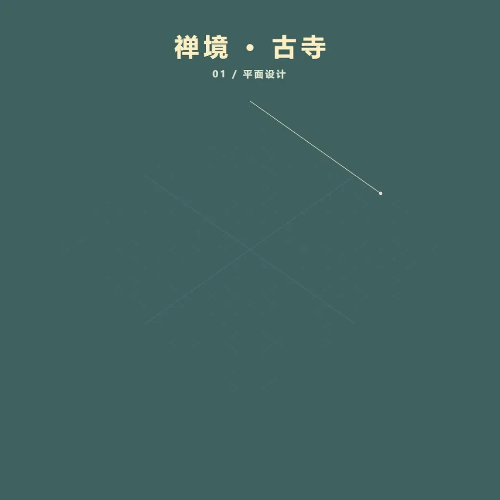</a>

**Prompt**

```text
Hãy trực tiếp tạo một video trình diễn 3D hoàn chỉnh về toàn bộ quá trình xây dựng “Thiền cảnh · Cổ tự”, từ thiết kế đến thành phẩm, và xuất dưới dạng MP4 hoàn chỉnh.

Yêu cầu hình ảnh:
khung hình vuông 1080×1080, góc nhìn chính diện trực giao từ trên cao 45°, mô hình hoạt hình 2.5D thu nhỏ dạng立体, đặt chính giữa hoàn hảo. Sử dụng đế đá sáng màu nhô cao, nền xanh ngọc đồng nhất, kết cấu bề mặt mềm mại và tinh tế, vật liệu PBR cùng ánh sáng chân thực, dịu nhẹ.

Cảnh bao gồm:
ngôi chùa Trung Hoa mái hiên kép, mái ngói lưu ly cong vút ở góc, mái xanh ngọc, nóc mái màu vàng, cột son đỏ, cửa sổ và cửa ra vào dạng song, cổng tam quan, lầu chuông, lư hương, đèn đá, sân lát đá, cây thông, cây hoa màu hồng và hồ sen.

Tiêu đề “Thiền cảnh · Cổ tự” ở phía trên, sử dụng phông chữ tiếng Trung màu trắng ngà ấm, in đậm và tăng độ sáng.

Quy trình video, tổng thời lượng 64 giây:
0–8 giây: vẽ từng nét bố cục mặt bằng.
8–15 giây: đế và các khối cơ bản của công trình dựng lên.
15–24 giây: tạo các chi tiết như cột, tường, cửa ra vào và cửa sổ.
24–32 giây: dựng mái hiên kép, ngói và các góc mái cong vút.
32–41 giây: thêm cổng tam quan, sân, cây cối và các chi tiết cảnh quan.
41–49 giây: lần lượt áp màu và vật liệu PBR cho mô hình trắng.
49–54 giây: điều chỉnh ánh sáng, phản chiếu và bóng đổ mềm.
54–64 giây: thành phẩm hoàn chỉnh xoay quanh chậm rãi, kèm cánh hoa rơi nhẹ, khói hương và gợn nước.

Sử dụng hình học 3D chân thực, liên tục trình bày quá trình dựng trong cùng một khung hình. Chỉ hiển thị tên giai đoạn ngắn gọn, không tạo các trang thuyết minh kiểu PowerPoint và không thêm lời dẫn.

Hãy dùng Three.js để tạo cảnh và hoạt ảnh, kết xuất từng khung hình rồi dùng FFmpeg xuất MP4 H.264 ở 30fps; đồng thời kiểm tra khả năng phát đầy đủ, thứ tự các giai đoạn, độ hoàn chỉnh của mô hình và hiện tượng khung hình đen.
```

<details>
<summary>Prompt gốc</summary>

```text
请直接制作一支“禅境·古寺”从设计到成品全过程的3D演示视频，并交付完整MP4。

画面要求：
1080×1080方形，45°俯视正交视角，微型2.5D卡通立体模型，完美居中。采用凸起的浅色石质底座、纯青绿色背景、柔和精致纹理、PBR材质和温和真实光照。

场景包含：
中式重檐寺庙、翘角琉璃瓦、青绿色屋顶、金色屋脊、朱红立柱、格栅门窗、山门、钟亭、香炉、石灯、石板庭院、松树、粉色花树与荷花池。

顶部标题为“禅境·古寺”，使用加粗、提亮的暖白色中文字体。

视频流程，共64秒：
0–8秒：逐笔绘制平面布局。
8–15秒：底座与建筑基础体块升起。
15–24秒：生成立柱、墙体、门窗等细节。
24–32秒：制作重檐、瓦片与翘角。
32–41秒：加入山门、庭院、树木和配景。
41–49秒：白模逐步赋予颜色与PBR材质。
49–54秒：调整光照、反射与柔和阴影。
54–64秒：完整成品缓慢环绕，伴随轻微落花、香烟与水波。

使用真实三维几何，在同一画面中连续展示构建过程。只显示简短阶段名，不做PPT式讲解页，不加旁白。

请用Three.js生成场景与动画，逐帧渲染后用FFmpeg导出30fps的H.264 MP4，并检查完整播放、阶段顺序、模型完整性和黑帧。
```

</details>

[Xem chi tiết ↗](https://www.tripo3d.ai/vi/3d-prompts/gpt-6-astra-2098697876155076820) · [Bài đăng gốc](https://x.com/huoshan007/status/2098697876155076820) · [Về danh sách ví dụ](#all-prompts)

---

<a id="gpt-6-astra-2098650336521064759"></a>

### Dựng mô hình cầu Brooklyn và thử nghiệm xe tăng đi qua từ cả hai hướng

[Higgsfield](https://x.com/higgsfield_ai) · 2026-09-12 · GPT-6 Astra · Khác

<a href="https://www.tripo3d.ai/vi/3d-prompts/gpt-6-astra-2098650336521064759">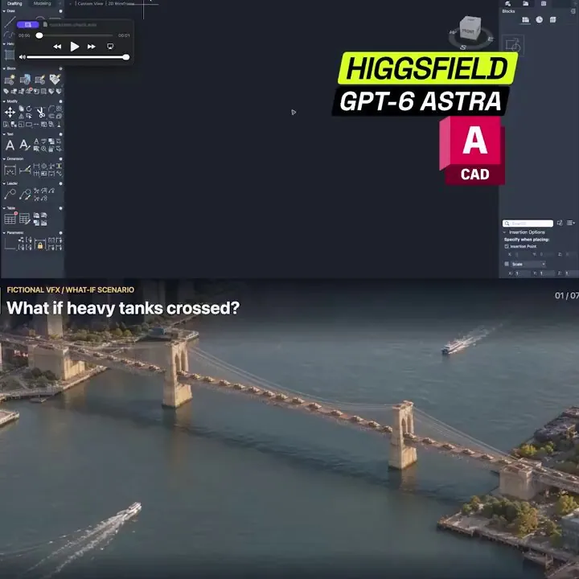</a>

**Prompt**

```text
Dựng mô hình cầu Brooklyn và thử nghiệm xe tăng đi qua từ cả hai hướng.
```

<details>
<summary>Prompt gốc</summary>

```text
Model the Brooklyn Bridge and test tanks crossing from both directions.
```

</details>

[Xem chi tiết ↗](https://www.tripo3d.ai/vi/3d-prompts/gpt-6-astra-2098650336521064759) · [Bài đăng gốc](https://x.com/higgsfield_ai/status/2098244976027312474) · [Về danh sách ví dụ](#all-prompts)

---

<a id="gpt-6-astra-2098492771170722032"></a>

### Hồ cá koi 3D tương tác

[Vib3Coded](https://x.com/vib3coded) · 2026-09-11 · GPT-6 Astra · Tương tác

<a href="https://www.tripo3d.ai/vi/3d-prompts/gpt-6-astra-2098492771170722032">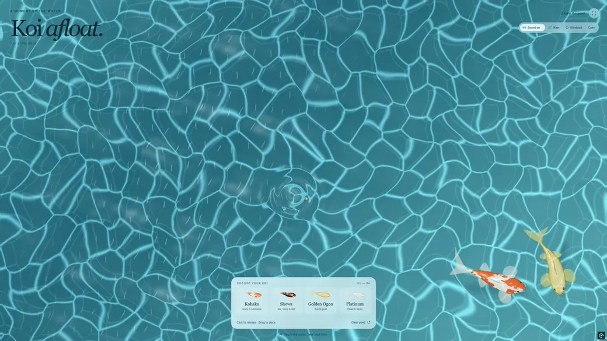</a>

**Prompt**

```text
Xây dựng một hồ cá koi 3D tương tác, đẹp mắt và hiển thị toàn màn hình bằng Three.js + WebGL. Sử dụng góc nhìn từ trên xuống, mặt nước xanh ngọc trong, ánh nắng, hiệu ứng caustics động trên đáy hồ và cảm giác chiều sâu chân thực.

Đặt một bảng chọn trong suốt, tinh tế ở phía dưới với bốn giống cá koi: Kohaku, Showa, Golden Ogon và Platinum. Nhấp vào thẻ để thả cá đó vào hồ. Kéo cá từ thẻ cho phép người dùng chọn chính xác vị trí thả cá.

Tạo cảm giác thỏa mãn cho mỗi lần cá chạm mặt nước: nước bắn tung tóe kèm giọt nước, mặt nước lõm xuống trong chốc lát rồi các vòng gợn lan rộng. Sau đó, cá phải lặn xuống dưới mặt nước. Sử dụng khúc xạ và các dấu hiệu chiều sâu để cá koi trông rõ ràng như đang ở dưới nước.

Tạo cá koi 3D chi tiết với mắt, vảy, vây và đuôi mềm mại. Hoạt ảnh của thân, đuôi và vây phải phối hợp nhịp nhàng. Mỗi con cá tự thay đổi hướng và tốc độ, chuyển hướng mượt mà khi đến gần ranh giới, đồng thời tránh các cá khác.

Cho phép người dùng chạm và kéo trên mặt nước để tạo gợn sóng. Thêm mưa và một xoáy nước có thể di chuyển, với dòng chảy ảnh hưởng đến cá. Bao gồm các tùy chọn Calm, Clear pond và một nút điều khiển để ẩn giao diện khi quay màn hình.

Sử dụng Web Audio để tạo âm thanh nước bắn khi cá chạm hồ, những giọt âm thanh du dương nhẹ, tiếng nước êm dịu khi cá bơi, tiếng mưa và âm thanh xoáy nước. Bật âm thanh bằng nút Sound, giảm âm lượng mượt mà khi tắt tiếng và tạm dừng âm thanh khi tab trình duyệt bị ẩn.

Giữ tất cả nhãn và nút bằng tiếng Anh. Thiết kế bố cục thích ứng cho thiết bị di động. Tối ưu quá trình kết xuất và hoạt ảnh để hoạt động mượt mà với vài chục con cá.

Cung cấp một website hoàn chỉnh, hoạt động ổn định, có hình ảnh trau chuốt và các tương tác đầy đủ chức năng.
```

<details>
<summary>Prompt gốc</summary>

```text
Build a beautiful, full-screen interactive koi pond using Three.js + WebGL. Use a top-down view with clear turquoise water, sunlight, animated caustics on the pond floor, and a convincing sense of depth.

Place an elegant translucent selection panel at the bottom with four koi varieties: Kohaku, Showa, Golden Ogon, and Platinum. Clicking a card releases that fish into the pond. Dragging a fish from its card lets the user choose exactly where to drop it.

Make each landing feel satisfying: a splash with droplets, a brief depression in the water surface, and expanding ripples. The fish should then dive beneath the surface. Use refraction and depth cues so the koi clearly look submerged.

Create detailed 3D koi with eyes, scales, fins, and flowing tails. Animate their bodies, tails, and fins together. Each fish should independently change direction and speed, turn smoothly near boundaries, and avoid other fish.

Let users touch and drag across the water to create ripples. Add rain and a movable whirlpool whose current affects the fish. Include Calm, Clear pond, and a control to hide the interface for screen recording.

Use Web Audio to create landing splashes, soft musical droplets, gentle swimming water sounds, rain, and a whirlpool sound. Enable audio through a Sound button, fade it smoothly when muted, and pause it when the browser tab is hidden.

Keep all labels and buttons in English. Make the layout responsive for mobile. Optimize rendering and animation for smooth performance with several dozen fish.

Deliver a complete, working website with polished visuals and functional interactions.
```

</details>

[Xem chi tiết ↗](https://www.tripo3d.ai/vi/3d-prompts/gpt-6-astra-2098492771170722032) · [Bài đăng gốc](https://x.com/vib3coded/status/2098492771170722032) · [Về danh sách ví dụ](#all-prompts)

---

<a id="gpt-6-astra-2098406473273663992"></a>

### Mô hình bé gái chơi robot

[𝟡𝟜 ᴾᴸᴬʸᶠᴼᴿᴳᴱ](https://x.com/94vanAI) · 2026-09-11 · GPT-6 Astra · Tài nguyên 3D

<a href="https://www.tripo3d.ai/vi/3d-prompts/gpt-6-astra-2098406473273663992">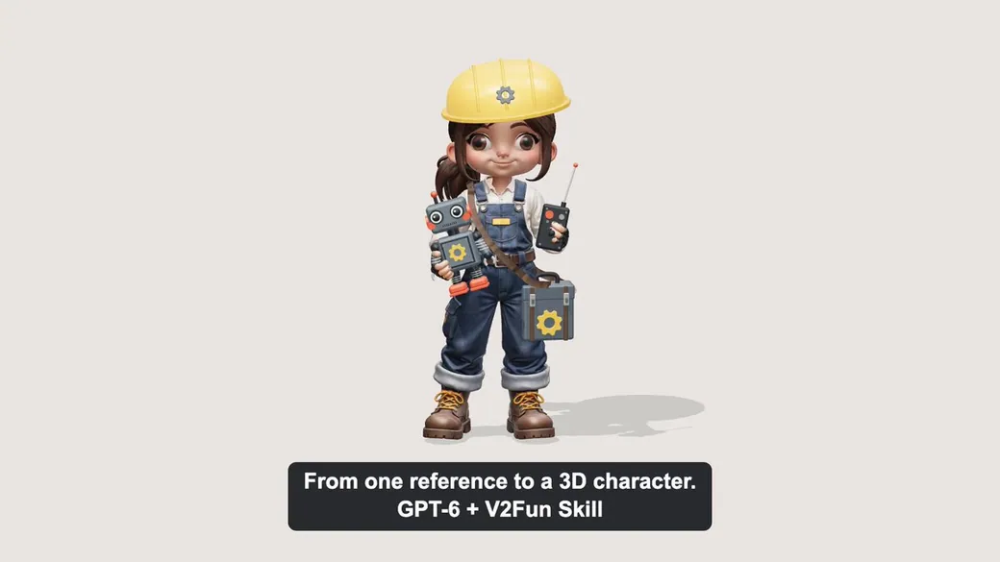</a>

**Prompt**

```text
Mô hình bé gái chơi robot được lắp ráp hoàn chỉnh, đội mũ công nhân nhỏ, một tay cầm robot bằng sắt tây, tay còn lại cầm bộ điều khiển từ xa, bên hông đeo hộp dụng cụ sửa chữa. Tất cả phụ kiện được lắp đầy đủ, tạo dáng đứng, nền trắng tinh, ánh sáng studio chuyên nghiệp, phong cách trưng bày mô hình anime 3D độ chi tiết cao. ar3:4
```

<details>
<summary>Prompt gốc</summary>

```text
一尊完全组合的玩机器人的小女孩手办，头带工人用的小帽子，一手持一个铁皮做的机器人，一手持一个遥控器，腰间系着一个维修箱子。所有配件完整合体呈站姿，纯白色背景，工作室专业灯光，高精 3D 动漫手办展示风格。ar3:4
```

</details>

[Xem chi tiết ↗](https://www.tripo3d.ai/vi/3d-prompts/gpt-6-astra-2098406473273663992) · [Bài đăng gốc](https://x.com/94vanAI/status/2098406473273663992) · [Về danh sách ví dụ](#all-prompts)

---

<a id="gpt-6-astra-2098403061463224543"></a>

### Cảnh mô hình thu nhỏ 3D dạng lập thể của ngôi đền

[Rion Wu](https://x.com/rionaifantasy) · 2026-09-11 · GPT-6 Astra · Bối cảnh

<a href="https://www.tripo3d.ai/vi/3d-prompts/gpt-6-astra-2098403061463224543">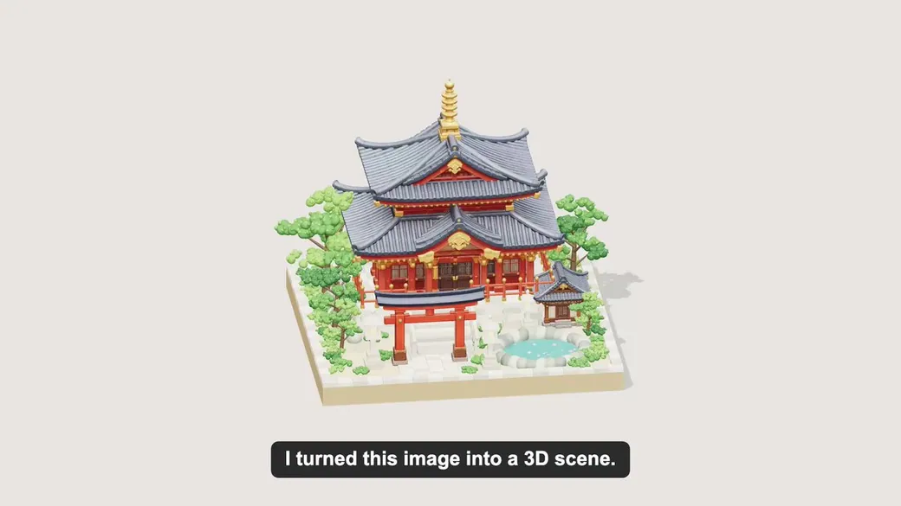</a>

**Prompt**

```text
Tạo một cảnh mô hình thu nhỏ 2.5D dạng lập thể, phong cách hoạt hình, với góc nhìn đẳng cự từ trên xuống 45°. Sử dụng kết cấu bề mặt mềm mại, tinh tế, vật liệu PBR chân thực và ánh sáng dịu, tự nhiên. Tạo một đế mô hình nhỏ dạng khối nổi, chứa những yếu tố đặc trưng dễ nhận biết nhất của ngôi đền. Dùng nền đơn sắc. Bố cục: căn giữa hoàn hảo, hình vuông 1080x1080, thể hiện phong cách mô hình lập thể siêu sạch và độ phân giải cao; chỉ cần thay bằng phông chữ đậm, sáng hơn.
```

<details>
<summary>Prompt gốc</summary>

```text
呈现一个清晰的、45°俯视等轴侧微型2.5D卡通立体模型场景，采用柔和精致的纹理、逼真的PBR材质以及温和逼真的光照效果。创建一个小型凸起的立体模型式底座，其中包含了寺庙最具辨识度的元素。使用纯色背景。构图：完美居中的布局，方形1080x1080，超干净、高清晰度的立体模型美学 换加粗、提亮的字体即可
```

</details>

[Xem chi tiết ↗](https://www.tripo3d.ai/vi/3d-prompts/gpt-6-astra-2098403061463224543) · [Bài đăng gốc](https://x.com/rionaifantasy/status/2098403061463224543) · [Về danh sách ví dụ](#all-prompts)

---

<a id="gpt-6-astra-2098367087475577273"></a>

### Tự động tạo và chuyển texture tóc, khuôn mặt cho model nhân vật

[さ🥺](https://x.com/_sagyoai) · 2026-09-11 · GPT-6 Astra · Tài nguyên 3D

<a href="https://www.tripo3d.ai/vi/3d-prompts/gpt-6-astra-2098367087475577273">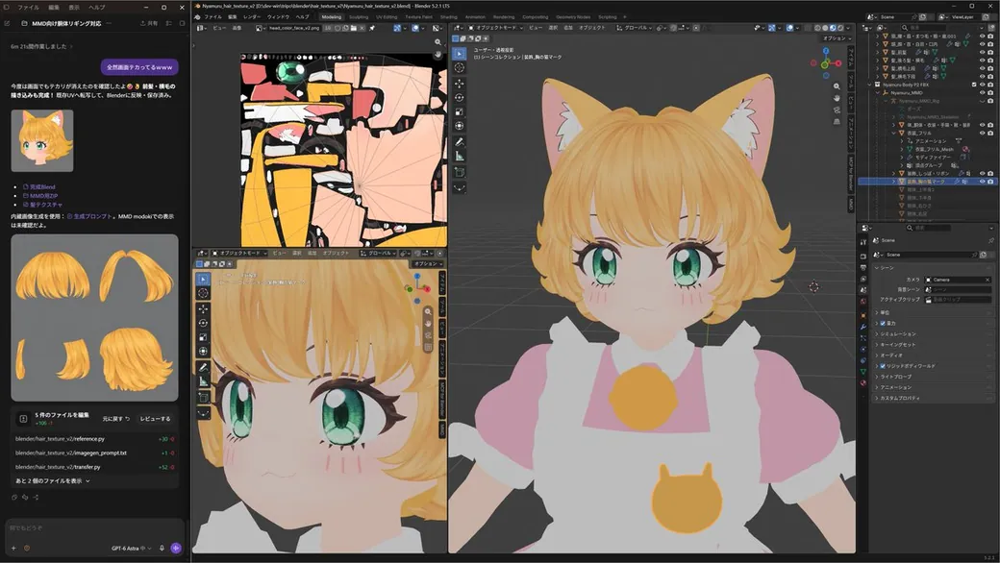</a>

**Prompt**

```text
Hãy sử dụng tính năng tạo ảnh để texture chất lượng cao nhất
Render chính diện khuôn mặt không tóc với flat shading, không có bóng, rồi dùng ảnh đó làm tham chiếu để tạo ảnh đã texture và ánh xạ bằng phép chiếu song song, sau đó chuyển sang UV đầu ra
Nếu astra nghĩ ra cách nào tốt hơn thì hãy dùng cách đó
```

<details>
<summary>Prompt gốc</summary>

```text
画像生成を利用して最強のテクスチャリングしてほしい
髪なし顔面正面をフラットシェーディングで影なしでレンダリングしてそれをリファレンスにテクスチャリング済み画像生成して並行投影でマッピングして出力用UVに転写
又はastraが思いついたもっといい方法あればそれで
```

</details>

[Xem chi tiết ↗](https://www.tripo3d.ai/vi/3d-prompts/gpt-6-astra-2098367087475577273) · [Bài đăng gốc](https://x.com/_sagyoai/status/2098367087475577273) · [Về danh sách ví dụ](#all-prompts)

---

<a id="gpt-6-astra-2098225609558335846"></a>

### Tàu vận chuyển dân dụng cơ bản Sol Horizon

[Jonathan Plumb — Spokane Valley](https://x.com/jonathanplumb) · 2026-09-11 · GPT-6 Astra · Tài nguyên 3D

<a href="https://www.tripo3d.ai/vi/3d-prompts/gpt-6-astra-2098225609558335846">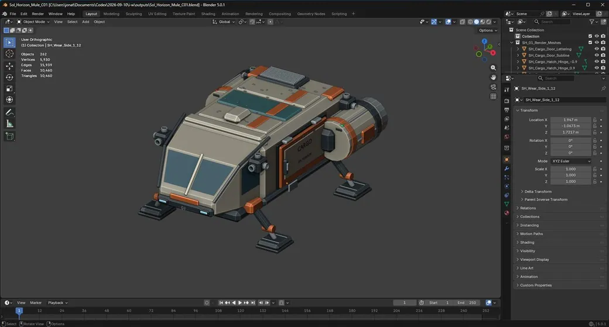</a>

**Prompt**

```text
Trong Blender, hãy tạo tàu vận chuyển dân dụng cơ bản của Sol Horizon. Tàu cần mang vẻ ngoài đã qua sử dụng, dễ sửa chữa, có giá phải chăng và an toàn—không mang tính quân sự. Tạo buồng lái, cửa khoang hàng, các động cơ đẩy điều hướng lộ thiên, cụm động cơ chính và bốn càng đáp. Sử dụng phong cách hard-surface dạng mô-đun để phù hợp cho các biến thể trong tương lai. Giữ lưới kết xuất chính dưới 15.000 tam giác. Đặt tên đối tượng rõ ràng, thiết lập hướng phía trước cho Unity, tạo hình học va chạm đơn giản, áp dụng các phép biến đổi, lưu tệp .blend và xuất FBX sẵn sàng cho game. Hiển thị ảnh chụp màn hình viewport để duyệt trước khi xuất.
```

<details>
<summary>Prompt gốc</summary>

```text
In Blender, create Sol Horizon’s starter civilian courier ship. It should look used, repairable, affordable, and safe—not military. Create a cockpit, cargo hatch, visible maneuvering thrusters, main engine assembly, and four landing struts. Use a modular hard-surface style suitable for future variants. Keep the main render mesh under 15,000 triangles. Name objects clearly, set the forward direction for Unity, create simple collision geometry, apply transforms, save the .blend, and export a game-ready FBX. Show viewport screenshots for approval before export.
```

</details>

[Xem chi tiết ↗](https://www.tripo3d.ai/vi/3d-prompts/gpt-6-astra-2098225609558335846) · [Bài đăng gốc](https://x.com/jonathanplumb/status/2098225609558335846) · [Về danh sách ví dụ](#all-prompts)

---

<a id="gpt-6-astra-2098109252720078891"></a>

### Trình diễn piano tương tác với bàn tay robot 3D

[MSB](https://x.com/KeWai386772) · 2026-09-10 · GPT-6 Astra · Tương tác

<a href="https://www.tripo3d.ai/vi/3d-prompts/gpt-6-astra-2098109252720078891">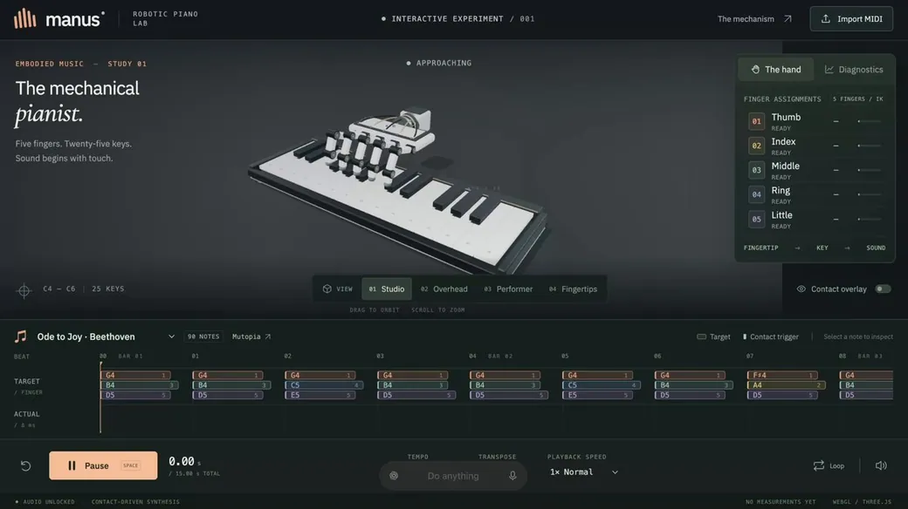</a>

**Prompt**

```text
Xây dựng một bản trình diễn hoàn chỉnh trên trình duyệt, trong đó bàn tay robot năm ngón được mô hình hóa chi tiết chơi một cây piano thu nhỏ. Chuyển động ngón tay hiển thị, hành trình phím, nốt được tạo và nhịp điệu phải được liên kết với nhau theo quan hệ nhân quả. Tạo một ứng dụng tương tác được trau chuốt về mặt hình ảnh trong thời gian đánh giá cho phép.

1. TRẢI NGHIỆM: Sử dụng cảnh 3D toàn màn hình với bàn tay robot được mô hình hóa chính xác, các ngón tay có khớp nối, cơ cấu cổ tay hiển thị rõ và bàn phím 25 phím bao phủ các nốt MIDI từ 60 đến 84. Thể hiện hình học chân thực của phím đen và phím trắng, chuyển động độc lập của từng phím, đệm đầu ngón tay và vật liệu được hoàn thiện kỹ lưỡng. Bao gồm camera từ trên cao, phía người chơi và cận cảnh đầu ngón tay. Cung cấp âm thanh đồng bộ sau khi người dùng kích hoạt phát lại.

2. ĐẦU VÀO ÂM NHẠC CHUNG: Sử dụng số nốt MIDI làm nguồn dữ liệu chuẩn duy nhất. Ở 96 BPM, phát các sự kiện sau, biểu diễn dưới dạng (nhịp bắt đầu, nốt, thời lượng tính bằng nhịp): (0,60,0.4), (0.5,64,0.4), (1,67,0.4), (1.5,64,0.4), (2,62,0.4), (2.5,65,0.4), (3,69,0.4), (3.5,65,0.4), (4,60,0.4), (4.5,60,0.4), (5,60,1), (5,64,1), (5,67,1). Ba sự kiện cuối tạo thành một hợp âm đồng thời. Đồng thời hỗ trợ nhập tệp MIDI tiêu chuẩn bằng một trình phân tích cú pháp đã được sử dụng rộng rãi.

3. ĐIỀU KHIỂN BÀN TAY: Mô hình hóa các ngón tay có khớp nối độc lập và cổ tay có thể chuyển động. Lập kế hoạch phân công ngón tay có thể với tới, chuyển động tiếp cận, thao tác nhấn, giữ, nhả, diễn đạt nốt lặp và thực hiện hợp âm. Ngón tay phải tiếp xúc đúng phím mà không giao cắt với các phím lân cận hoặc tạo ra những cú nhảy thiếu thực tế. Sử dụng động học ngược và giới hạn khớp. Hiển thị phân công ngón tay đã lập kế hoạch và cho phép kiểm tra thủ công từng chuyển động.

4. QUAN HỆ NHÂN QUẢ CỦA ÂM THANH: Chỉ tạo sự kiện note-on khi phím tương ứng đang hiển thị vượt qua ngưỡng nhấn đã được ghi rõ do tiếp xúc với ngón tay. Tạo note-off khi nhả phím, kèm độ trễ hysteresis để ngăn hiện tượng rung chuyển trạng thái. Sự kiện MIDI là mục tiêu lập kế hoạch, không phải một luồng phát âm thanh độc lập. Có thể sử dụng cơ chế phím dựa trên tiếp xúc hình học nếu cơ chế này được nêu rõ; cũng có thể sử dụng đầy đủ động lực học tiếp xúc. Phím không được di chuyển chỉ vì một sự kiện MIDI đã được lên lịch.

5. NHỊP ĐIỆU: Sử dụng một đồng hồ âm nhạc nhất quán và gắn dấu thời gian cho các sự kiện kích hoạt phím thực tế để đối chiếu với sự kiện mục tiêu. Tính đến việc lập lịch âm thanh và thời điểm kết xuất. Cho phép điều chỉnh tempo, chuyển giọng, phát, tạm dừng, khởi động lại, lặp và kiểm tra chuyển động chậm. Khi tạm dừng hoặc khởi động lại, phải nhả các nốt đang hoạt động đúng cách. Khi làm chậm phát lại, phải duy trì đồng bộ giữa ngón tay, phím và âm thanh.

6. CHẨN ĐOÁN: Hiển thị các nốt mục tiêu, ngón tay đã lập kế hoạch, nốt thực tế được kích hoạt và sai số thời điểm bắt đầu trên một dòng thời gian thẳng hàng. Báo cáo nốt bị bỏ sót, nốt thừa, cao độ sai, lỗi khi diễn đạt nốt lặp và nốt bị kẹt. Cung cấp lớp phủ kiểm tra tiếp xúc, cho biết đầu ngón tay nào đang nhấn từng phím. Ghi lại các bằng chứng cần thiết để phân biệt kế hoạch thành công với hoạt ảnh bàn tay mang tính ước lệ.

7. XÁC MINH: Đánh giá riêng giai điệu, các nốt lặp và hợp âm cuối. Mục tiêu là không có nốt sai hoặc bị thiếu, sai số thời điểm bắt đầu ở phân vị 95 dưới 50 ms và độ phân tán thời điểm bắt đầu của hợp âm cuối dưới 50 ms. Báo cáo số đo thực tế ngay cả khi không đạt mục tiêu. Cung cấp một bài kiểm tra vô hiệu hóa việc tác động bằng ngón tay: điểm số có thể tiếp tục tăng, nhưng các phím không được nhấn không được tạo ra nốt.

8. BÀN GIAO: Sử dụng Three.js, TypeScript, các API âm thanh phù hợp và những thư viện phân tích cú pháp hoặc tính toán số đã được sử dụng rộng rãi. Bàn giao ứng dụng đang chạy, mã nguồn, bộ dữ liệu âm nhạc có thể tái lập, tài sản hoặc tập lệnh tạo tài sản và hướng dẫn khởi động. Xác minh âm thanh trên trình duyệt, các điều khiển, góc nhìn camera, bố cục trên máy tính và thiết bị di động cũng như khả năng phát lại nhiều lần. Mọi tuyên bố về hiệu suất được hiển thị phải bắt nguồn từ hành vi đã đo lường.
```

<details>
<summary>Prompt gốc</summary>

```text
Build a complete browser-based demonstration of a detailed five-finger robotic hand playing a miniature piano. The visible finger motion, physical key travel, generated notes, and musical timing must be causally connected. Deliver a visually polished, interactive application within the evaluator's time budget.  1. EXPERIENCE: Use a full-screen 3D scene with a precisely modeled robotic hand, articulated fingers, visible wrist mechanisms, and a 25-key keyboard spanning MIDI notes 60 through 84. Show realistic black-key and white-key geometry, independent key movement, fingertip pads, and refined materials. Include overhead, performer-side, and fingertip close-up cameras. Provide synchronized audio after the user activates playback.  2. COMMON MUSICAL INPUT: Use MIDI note numbers as the source of truth. At 96 BPM, play these events, expressed as (start beat, note, duration in beats): (0,60,0.4), (0.5,64,0.4), (1,67,0.4), (1.5,64,0.4), (2,62,0.4), (2.5,65,0.4), (3,69,0.4), (3.5,65,0.4), (4,60,0.4), (4.5,60,0.4), (5,60,1), (5,64,1), (5,67,1). The last three events form a simultaneous chord. Also support standard MIDI file import using an established parser.  3. HAND CONTROL: Model independently articulated fingers and a movable wrist. Plan reachable finger assignments, approach motions, presses, holds, releases, repeated-note articulation, and chord execution. Fingers must contact the correct keys without intersecting neighboring keys or making implausible jumps. Use inverse kinematics and joint limits. Display planned finger assignments and allow manual inspection of individual motions.  4. SOUND CAUSALITY: Generate note-on events only when the corresponding visible key crosses a documented depression threshold because of finger contact. Generate note-off on release, with hysteresis to prevent chatter. MIDI events are planning targets, not an independent audio playback track. A geometric contact-driven key mechanism is acceptable if explicitly identified; full contact dynamics may be used instead. Keys must not move merely because a MIDI event is scheduled.  5. TIMING: Use a consistent musical clock and timestamp actual key-trigger events against target events. Account for audio scheduling and render timing. Expose tempo, transpose, play, pause, restart, loop, and slow-motion inspection. Pausing or restarting must release active notes appropriately. Slowing playback must preserve synchronization between fingers, keys, and audio.  6. DIAGNOSTICS: Display target notes, planned fingers, actual triggered notes, and onset timing errors on an aligned timeline. Report missed notes, extra notes, wrong pitches, repeated-note failures, and stuck notes. Provide a contact inspection overlay showing which fingertip is depressing each key. Record the evidence needed to distinguish successful planning from approximate hand animation.  7. VERIFICATION: Evaluate melody, repeated notes, and the final chord separately. Aim for no wrong or missing notes, a 95th-percentile onset error below 50 ms, and final-chord onset spread below 50 ms. Report actual measurements even when targets are missed. Provide a test that disables finger actuation: the score may continue advancing, but unpressed keys must not generate notes.  8. DELIVERY: Use Three.js, TypeScript, appropriate audio APIs, and established parsing or numerical libraries. Deliver the running application, source code, reproducible musical fixture, assets or generation scripts, and startup instructions. Verify browser audio, controls, camera views, desktop and mobile layout, and repeated playback. All displayed performance claims must come from measured behavior.
```

</details>

[Xem chi tiết ↗](https://www.tripo3d.ai/vi/3d-prompts/gpt-6-astra-2098109252720078891) · [Bài đăng gốc](https://x.com/KeWai386772/status/2098109252720078891) · [Về danh sách ví dụ](#all-prompts)

---

<a id="gpt-6-astra-2098105648106078541"></a>

### Atlas 3D tương tác về đầu và não người

[BuBBliK](https://x.com/k1rallik) · 2026-09-10 · GPT-6 Astra · Tương tác

<a href="https://www.tripo3d.ai/vi/3d-prompts/gpt-6-astra-2098105648106078541">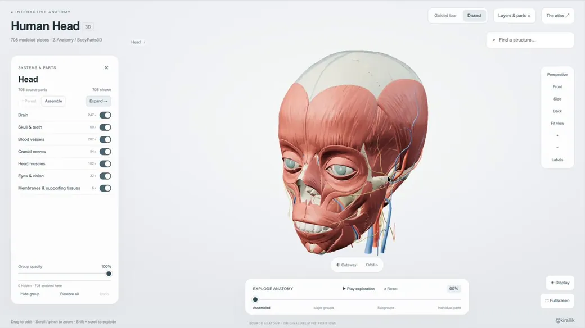</a>

**Prompt**

```text
Xây dựng một atlas 3D tương tác hoàn chỉnh về đầu và não người. Bàn giao một ứng dụng hoạt động được, không phải bản mô phỏng. Tự đưa ra các quyết định hợp lý, triển khai, kiểm thử và kiểm tra trực quan kết quả.

Sử dụng Three.js cùng các mô hình lưới Z-Anatomy / BodyParts3D thực tế, có giấy phép phù hợp. Bao gồm hộp sọ, răng, cơ mặt, não, mắt, dây thần kinh sọ, động mạch, tĩnh mạch và các màng hỗ trợ hiện có. Giữ nguyên mối quan hệ giải phẫu ban đầu giữa chúng. Hướng đến hàng trăm cấu trúc có thể chọn riêng lẻ, báo cáo số lượng thực tế đã nhập và giữ thông tin ghi công nguồn.

Tạo giao diện sáng, gọn với nền xám nhạt, các bảng màu trắng bo góc, điểm nhấn xanh xám tiết chế và kiểu chữ dễ đọc. Giữ mô hình ở kích thước lớn, đặt bảng cấu trúc bên trái, công cụ camera bên phải, ô tìm kiếm ở phía trên và thanh trượt tách lớp bên dưới. Sử dụng tiếng Anh xuyên suốt.

Cho phép khám phá giải phẫu theo từng cấp độ:
Đầu → hệ cơ quan → vùng → cấu trúc riêng lẻ có tên.
Ví dụ: Brain → Cerebrum → Left hemisphere → Frontal lobe → các cấu trúc riêng lẻ.

Tạo hiệu ứng chuyển động khi lắp ráp và tháo rời. Giữ nguyên vị trí nguồn khi lắp ráp; sắp xếp các nhóm đã tách thành bố cục cách biệt rõ ràng, kèm nhãn dễ đọc. Hiển thị tỷ lệ chuẩn hóa và phân trang các bộ sưu tập lớn.

Bao gồm:
- Xoay tự do, thu phóng bằng con lăn/chụm hai ngón và các thiết lập camera có sẵn.
- Thanh trượt tháo rời và điều khiển Shift + con lăn.
- Công tắc hiển thị độc lập cho từng nhóm và từng bộ phận.
- Độ mờ theo nhóm, hoàn tác, khôi phục tất cả và đặt lại.
- Tìm kiếm giải phẫu, nhấp để kiểm tra, lấy nét, cô lập và điều hướng về cấp cha.
- Chế độ màu giải phẫu, sứ, khung dây và trong suốt.
- Mặt phẳng cắt đứng dọc, ngang và trán có thể điều chỉnh, kèm đảo chiều.
- Nhãn, khám phá tự động, toàn màn hình và xuất PNG.
- Hành trình có hướng dẫn từ toàn bộ phần đầu đến não và các mạng lưới của não.

Giữ các cấu trúc đang ẩn ở trạng thái ẩn khi thay đổi bố cục và vật liệu. Giải thích rằng mặt phẳng cắt tạo ra các mặt cắt hiển thị mở, không phải ảnh quét y khoa. Không tự tạo thêm chi tiết giải phẫu hoặc tuyên bố ứng dụng đã được kiểm định lâm sàng.

Bàn giao một tệp HTML độc lập chứa ứng dụng và hình học đã xử lý, có thể hoạt động ngoại tuyến mà không cần máy chủ. Đồng thời cung cấp các tệp nguồn gọn sạch, các dependency được ghim phiên bản, lockfile, script build di động, README bằng tiếng Anh cùng các giấy phép và thông tin ghi công bắt buộc. Loại trừ thông tin xác thực, đường dẫn máy cục bộ, dependency và các tệp không liên quan.

Kiểm thử tính toàn vẹn của hình học, quan hệ thành viên trong hệ phân cấp, trạng thái hiển thị, thao tác hoàn tác và khoảng cách bố cục. Mở ứng dụng đang chạy trong trình duyệt, sử dụng thử các điều khiển, kiểm tra lỗi trong console và khắc phục các thành phần bị chồng lấn trước khi bàn giao.
```

<details>
<summary>Prompt gốc</summary>

```text
Build a complete interactive 3D atlas of the human head and brain. Deliver a working application, not a mockup. Make reasonable decisions independently, implement it, test it, and visually verify the result.

Use Three.js and real, appropriately licensed Z-Anatomy / BodyParts3D meshes. Include the skull, teeth, facial muscles, brain, eyes, cranial nerves, arteries, veins, and available supporting membranes. Preserve their original anatomical relationships. Aim for hundreds of individually selectable structures, report the actual imported count, and retain source attribution.

Create a clean, light interface with a pale grey background, white rounded panels, restrained blue-grey accents, and readable typography. Keep the model large, with a structure panel on the left, camera tools on the right, search at the top, and an explosion slider below. Use English throughout.

Make the anatomy progressively explorable:
Head → system → region → individual named structures.
For example: Brain → Cerebrum → Left hemisphere → Frontal lobe → individual structures.

Animate assembly and disassembly. Preserve source positions when assembled; arrange exploded groups in clearly separated layouts with readable labels. Indicate normalized scale and paginate large collections.

Include:
- Free rotation, wheel/pinch zoom, and camera presets.
- Disassembly slider and Shift + wheel control.
- Independent visibility switches for groups and individual parts.
- Group opacity, undo, restore all, and reset.
- Anatomical search, click-to-inspect, focus, isolation, and parent navigation.
- Anatomical colours, porcelain, wireframe, and transparent modes.
- Adjustable sagittal, axial, and coronal clipping planes with reverse direction.
- Labels, automatic exploration, fullscreen, and PNG export.
- A guided journey from the complete head into the brain and its networks.

Keep hidden structures hidden across layout and material changes. Explain that clipping planes produce open display cuts, not medical scans. Do not invent anatomy or claim clinical validation.

Deliver a standalone HTML containing the application and processed geometry, working offline without a server. Also provide clean source files, pinned dependencies, a lockfile, portable build scripts, an English README, and required licences and attribution. Exclude credentials, local machine paths, dependencies, and unrelated files.

Test geometry integrity, hierarchy membership, visibility, undo, and layout spacing. Inspect the running application in a browser, exercise the controls, check for console errors, and fix visual overlaps before delivering.
```

</details>

[Xem chi tiết ↗](https://www.tripo3d.ai/vi/3d-prompts/gpt-6-astra-2098105648106078541) · [Bài đăng gốc](https://x.com/k1rallik/status/2098105648106078541) · [Mã nguồn](https://github.com/bubblik525/head) · [Về danh sách ví dụ](#all-prompts)

---

<a id="gpt-6-astra-2098094339759149067"></a>

### Hoạt hình giả tưởng kiếm sĩ phá hủy cổng thành

[PixVerse](https://x.com/PixVerse) · 2026-09-10 · GPT-6 Astra · Hoạt ảnh

<a href="https://www.tripo3d.ai/vi/3d-prompts/gpt-6-astra-2098094339759149067">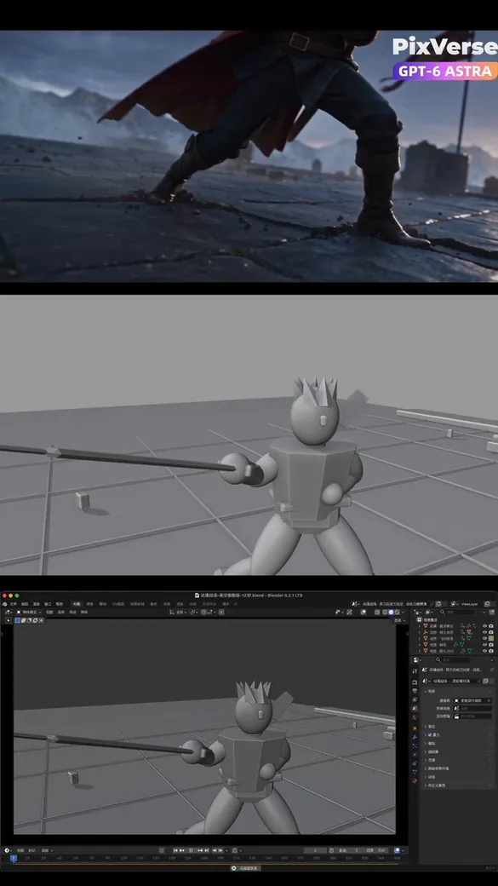</a>

**Prompt**

```text
Tạo một hoạt hình hành động mô hình trắng dài 12 giây trong Blender, sau đó dùng @PixVerse để chuyển hoạt hình đã xuất thành một phân cảnh phim hoạt hình giả tưởng hoành tráng, mang sắc thái trưởng thành.

Trong Blender, dựng một kiếm sĩ có khớp chuyển động đơn giản, một thanh kiếm và bao kiếm, một nền đá rộng nằm trên cao, cùng một cổng thành khổng lồ với các trụ bao quanh. Sử dụng hình học màu trắng hoặc xám nhạt, kết hợp với ánh sáng cơ bản. Ưu tiên chuyển động dễ đọc, tỷ lệ thuyết phục và sự tương phản mạnh giữa nhân vật nhỏ bé với kiến trúc đồ sộ. Thể hiện sóng năng lượng từ kiếm bằng một hình cong được hoạt ảnh đơn giản, đồng thời chia cổng thành nhiều mảnh để chúng có thể tách rời và rơi xuống rõ ràng.

Bắt đầu với máy quay ở gần kiếm sĩ khi anh ta rút vũ khí và nhanh chóng dồn lực. Khoảng giây thứ hai, tạo một nhát chém cực nhanh và dứt khoát, với lực phát động từ bàn chân, hông, thân mình và cánh tay. Phóng ra một sóng năng lượng hình lưỡi liềm dễ thấy, di chuyển xuyên không gian và đánh trúng cổng thành. Để phần cổng phía trên trượt theo đường chém, mất điểm tựa rồi sụp đổ với gia tốc và khoảnh khắc chạm đất rõ ràng. Sau đòn đánh, cho kiếm sĩ hồi thế tự nhiên, tra kiếm, đứng thẳng và thả lỏng hai tay.

Khi đòn tấn công diễn ra, kéo máy quay lùi ra sau và nâng dần lên trong một chuyển động liên tục, mượt mà. Tiếp tục nâng cao đầy ấn tượng cho đến khi khung hình kết thúc bằng góc nhìn từ trên không cực cao, gần như thẳng đứng, bao quát toàn bộ nền đá và địa hình xung quanh. Nhân vật có thể trở nên quá nhỏ để phân biệt. Duy trì nhịp hành động nhanh và cảm giác quy mô mở rộng mạnh mẽ, thay vì dừng lâu ở tư thế ra đòn. Kiểm tra chuyển động cơ thể, tính liên tục của vũ khí, đường di chuyển của sóng năng lượng, sự sụp đổ của cổng và chuyển động máy quay ở tốc độ phát bình thường.

Xuất video MP4 mô hình trắng sạch, dài 12 giây. Sau đó dùng @PixVerse để tạo video AI dài 12 giây, sử dụng hoạt hình Blender làm tham chiếu tương đối cho bố cục, diễn tiến hành động và chuyển động máy quay đi lên. Giữ nguyên trình tự cốt lõi gồm chuẩn bị, chém, sóng năng lượng di chuyển, phá hủy cổng, tra kiếm và cú lộ cảnh từ trên không cực cao, đồng thời cho phép mở rộng đáng kể về mặt điện ảnh.

Tạo thẩm mỹ phim hoạt hình giả tưởng giàu chất hội họa, kết hợp hình khối biểu cảm, bề mặt vẽ tay, thể tích ba chiều thuyết phục và ánh sáng điện ảnh dịu. Tạo cho kiếm sĩ trưởng thành một dáng hình đặc trưng, áo khoác đỏ rượu vang, giáp tiết chế và vẻ quyết tâm điềm tĩnh. Mở rộng bối cảnh thành một pháo đài núi rộng lớn với tường thành nhiều lớp, tháp, cầu, khe vực sâu và một thành phố trải dài ở phía xa.

Biến sóng năng lượng hình lưỡi liềm từ kiếm thành một sự kiện thị giác chủ đạo. Sóng năng lượng phải chém xuyên qua cổng rồi tiếp tục lao vào các công sự ở xa, tạo ra một chuỗi công trình sụp đổ dễ theo dõi, bụi cuộn mạnh, tia lửa, lửa và sóng xung kích. Khi máy quay đạt độ cao cực lớn, hé lộ toàn bộ đường đi của đòn đánh trên chiến trường, với kiếm sĩ lặng lẽ đứng tại điểm khởi phát. Sử dụng bóng khí quyển lạnh tương phản với năng lượng hổ phách ấm và ánh lửa rải rác. Thêm nhạc điện ảnh nguyên bản cùng âm thanh đồng bộ của kiếm, va chạm, sụp đổ, gió và thành phố vọng từ xa.

Bàn giao video MP4 mô hình trắng, video MP4 do PixVerse kết xuất bằng AI và dự án Blender có thể chỉnh sửa.
```

<details>
<summary>Prompt gốc</summary>

```text
Create a 12-second white-model action animation in Blender, then use @PixVerse to transform the exported animation into a spectacular mature animated fantasy film sequence.

In Blender, build a simple articulated swordsman, a sword and scabbard, a vast elevated stone platform, and one enormous gate with surrounding pillars. Use clean white or light-gray geometry and basic lighting. Prioritize readable action, convincing proportions, and a strong contrast between the small character and monumental architecture. Represent the sword-energy wave with a simple animated curved shape, and divide the gate into pieces that can visibly separate and fall.

Start the camera close to the swordsman as he draws his weapon and briefly gathers force. Around the second second, animate one extremely fast, decisive slash driven by the feet, hips, torso, and arms. Release a visible crescent-shaped sword-energy wave that travels across the space and strikes the gate. Let the upper gate section slide along the cut, lose support, and collapse with clear acceleration and ground contact. After the strike, have the swordsman recover naturally, sheath the sword, straighten up, and relax his arms.

As the attack unfolds, pull the camera backward and upward in a continuous, smooth movement. Keep ascending dramatically until the ending becomes an extremely high, nearly vertical aerial view of the entire platform and surrounding terrain. The character may become too small to distinguish. Maintain fast action and a powerful sense of expanding scale rather than lingering on the attack pose. Check body motion, weapon continuity, the energy wave’s travel, gate collapse, and camera movement at normal playback.

Export the clean 12-second white-model MP4. Then use @PixVerse to generate a 12-second AI-rendered video, using the Blender animation as a loose reference for composition, action progression, and the rising camera. Preserve the essential sequence of preparation, slash, traveling energy wave, gate destruction, sheathing, and extreme aerial reveal, while allowing substantial cinematic expansion.

Create a mature painterly animated-film aesthetic, combining expressive shapes, hand-painted surfaces, convincing three-dimensional volume, and soft cinematic lighting. Give the adult swordsman a distinctive silhouette, a wine-red coat, restrained armor, and composed determination. Expand the setting into an immense mountain fortress with layered walls, towers, bridges, deep ravines, and a sprawling city beyond.

Make the crescent-shaped sword-energy wave a major visual event. It should cut through the gate and continue into distant fortifications, producing a readable chain of collapsing structures, sweeping dust, sparks, fire, and pressure waves. As the camera reaches extreme altitude, reveal the full path of the attack across the battlefield, with the swordsman standing quietly at its origin. Use cool atmospheric shadows contrasted with warm amber energy and scattered firelight. Include original cinematic music and synchronized sword, impact, collapse, wind, and distant city sounds.

Deliver the white-model MP4, the PixVerse AI-rendered MP4, and the editable Blender project.
```

</details>

[Xem chi tiết ↗](https://www.tripo3d.ai/vi/3d-prompts/gpt-6-astra-2098094339759149067) · [Bài đăng gốc](https://x.com/PixVerse/status/2098094339759149067) · [Về danh sách ví dụ](#all-prompts)

---

<a id="gpt-6-astra-2098079379297608050"></a>

### Tàu con thoi mô hình trắng bay qua hẻm núi đô thị

[PixVerseCreators](https://x.com/PixVerseCreator) · 2026-09-10 · GPT-6 Astra · Hoạt ảnh

<a href="https://www.tripo3d.ai/vi/3d-prompts/gpt-6-astra-2098079379297608050">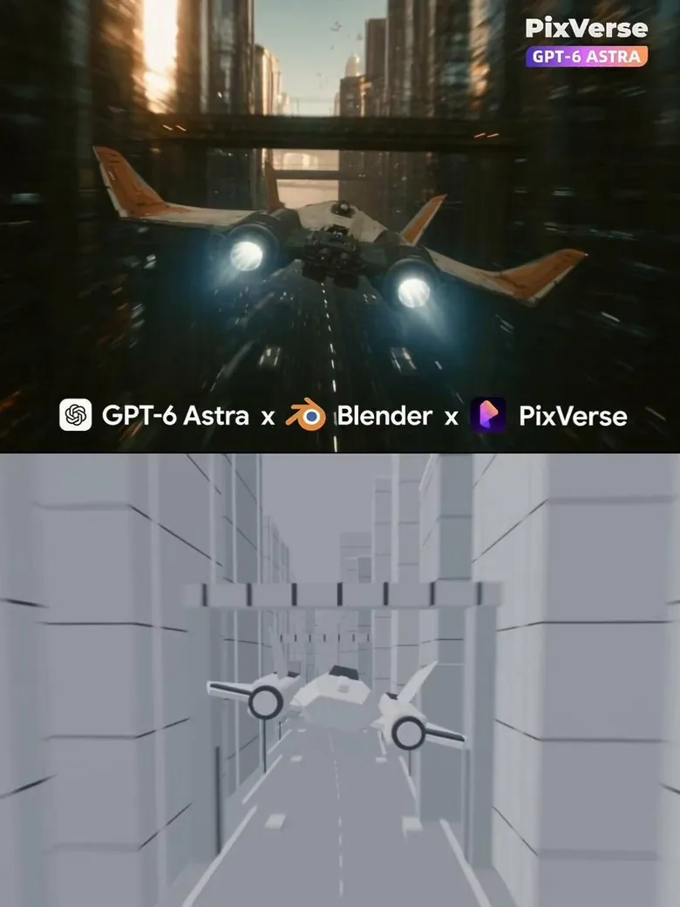</a>

**Prompt**

```text
Tạo một cảnh tàu con thoi mô hình trắng bay trong 10 giây, quay một mạch, bằng Blender. Dựng một tàu con thoi nguyên bản và một hẻm núi đô thị dày đặc kéo dài vài kilômét. Hoạt ảnh hóa chuyến bay thẳng về phía trước với tốc độ cực cao dọc theo một lộ trình dài, vượt qua hơn hai kilômét mà không giảm tốc. Luồn qua các khoảng hẹp và bay dưới cầu, thay đổi độ cao, đồng thời thực hiện hai vòng lộn ngang mượt theo hai hướng ngược nhau. Làm cho tốc độ trở nên không thể nhầm lẫn: các tòa nhà gần đó kéo vệt ra phía sau, cầu vụt qua phía trên và các công trình tiền cảnh nhanh chóng quét khỏi mép khung hình. Sử dụng nhòe chuyển động định hướng mạnh cho môi trường nhưng vẫn giữ tàu con thoi rõ nét. Chướng ngại vật dày đặc, các pha lướt sát và hiệu ứng thị sai mạnh từ tiền cảnh đến hậu cảnh phải truyền tải cảm giác bay hết tốc lực liên tục. Dùng camera bám đuổi góc rộng, chuyển động mượt, đặt gần phía sau và hơi cao hơn tàu con thoi, lao về phía trước với tốc độ tương đương. Giữ mũi tàu hướng vào thành phố và động cơ hướng về phía camera. Không cắt cảnh, không rung camera, không lộn ngang bằng camera, không quay chậm và không giảm tốc ở đoạn kết. Kiểm tra khoảng hở, tính liên tục của chuyển động và cảm giác tốc độ ở tốc độ phát bình thường. Dùng PixVerse để kết xuất hoạt ảnh mô hình trắng cuối cùng từ các tham chiếu Blender, giữ nguyên tốc độ cực cao, đường bay và chuyển động camera. Bàn giao tệp MP4 cuối cùng, dự án Blender có thể chỉnh sửa và ghi chú ngắn về các hạn chế.
```

<details>
<summary>Prompt gốc</summary>

```text
Create a 10-second, single-take white-model shuttle flight in Blender. Build an original shuttle and a dense city canyon stretching several kilometers. Animate extremely fast forward flight along an extended route, covering over two kilometers without slowing down. Weave through narrow gaps and under bridges, change altitude, and perform two smooth barrel rolls in opposite directions. Make the speed unmistakable: nearby buildings streak backward, bridges whip overhead, and foreground structures rapidly sweep past the frame edges. Use strong directional motion blur on the environment while keeping the shuttle readable. Dense obstacles, close passes, and strong foreground-to-background parallax should convey sustained, full-throttle flight. Use a smooth wide-angle chase camera close behind and slightly above the shuttle, racing forward at matching speed. Keep the nose pointing into the city and the engines facing the camera. No cuts, camera shake, camera barrel rolls, slow motion, or deceleration at the ending. Test clearance, motion continuity, and the sense of speed at normal playback. Use PixVerse to render the final white-model animation from Blender references, preserving the extreme speed, flight path, and camera movement. Deliver the final MP4, editable Blender project, and brief notes on limitations.
```

</details>

[Xem chi tiết ↗](https://www.tripo3d.ai/vi/3d-prompts/gpt-6-astra-2098079379297608050) · [Bài đăng gốc](https://x.com/PixVerseCreator/status/2098079379297608050) · [Về danh sách ví dụ](#all-prompts)

---

<a id="gpt-6-astra-2098071577309122854"></a>

### Hoạt ảnh học viện phép thuật bay lơ lửng

[PixVerse](https://x.com/PixVerse) · 2026-09-10 · GPT-6 Astra · Hoạt ảnh

<a href="https://www.tripo3d.ai/vi/3d-prompts/gpt-6-astra-2098071577309122854">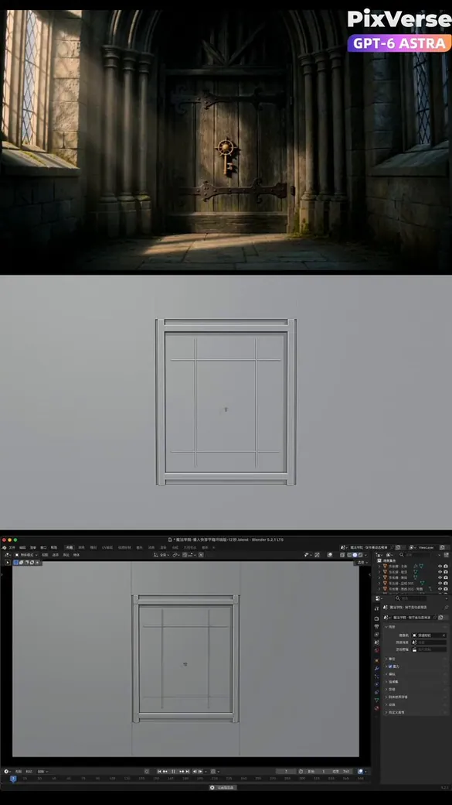</a>

**Prompt**

```text
Tạo một hoạt ảnh mô hình trắng dài 12 giây, quay bằng một cú máy liên tục trong Blender, sau đó dùng @PixVerse để biến hoạt ảnh đã xuất thành một phân cảnh phim fantasy người đóng ngoạn mục.

Trong Blender, dựng một cổng vào đồ sộ, một khí cụ thiên văn xoay và một học viện phép thuật bay lơ lửng rộng lớn. Sử dụng hình học đơn giản màu trắng hoặc xám nhạt, với silhouette dễ nhận biết và ánh sáng cơ bản. Khi bắt đầu, hiển thị toàn bộ cánh cửa ra vào, với những bức tường kiên cố bao quanh và che kín hoàn toàn thế giới phía sau. Tạo một lỗ khóa nhỏ với tỷ lệ chân thực. Phía bên kia cổng vào, bố trí một lâu đài lớn ở trung tâm, các tòa tháp, những đảo bay nhỏ hơn và các cây cầu kết nối. Làm nổi bật quy mô kiến trúc ấn tượng cùng khoảng cách rộng rãi giữa các công trình.

Bắt đầu bằng chuyển động tiến chậm về phía cánh cửa, sau đó tăng tốc mạnh và bay liên tục xuyên qua lỗ khóa. Tạo hoạt ảnh cho một chiếc chìa khóa bay lơ lửng, xoay rồi dịch sang một bên trước khi camera đi qua. Tiếp tục bay qua các vòng thiên văn xoay nhanh, hé lộ học viện bay lơ lửng, rồi chuyển thành một vòng orbit mượt quanh quần thể kiến trúc. Để các đảo gần đó nhanh chóng nâng lên và các đoạn cầu xoay vào đúng vị trí. Giữ cho chuyển động của vật thể mạnh mẽ và dứt khoát. Vòng orbit phải diễn ra liên tục, thay đổi tốc độ mượt mà và không lặp lại các khoảng dừng. Kiểm tra lối đi qua lỗ khóa, khoảng hở của camera, tính liên tục không gian và chuyển động ở tốc độ phát bình thường.

Xuất video MP4 mô hình trắng dài 12 giây, không có tạp chất. Sau đó dùng @PixVerse để tạo video AI dài 12 giây, sử dụng hoạt ảnh Blender làm tham chiếu tương đối về cấu trúc và chuyển động. Giữ lại diễn tiến dễ nhận biết từ cảnh tiến đến cánh cửa, đi qua lỗ khóa, xuất hiện khí cụ thiên văn, hé lộ học viện và chuyển sang orbit; đồng thời tự do làm phong phú thế giới và cách dàn dựng điện ảnh.

Biến học viện thành một thành phố bay lơ lửng cổ đại, khổng lồ: một lâu đài trung tâm bao quanh bởi các khu phố, thư viện, đài quan sát, sân trong, những tầng mái xếp lớp, các cây cầu đá khổng lồ và thác nước đổ xuống mây. Mở rộng khung cảnh xung quanh với các thung lũng phủ rừng, hồ nước, núi non phía xa và thêm nhiều đảo bay. Thêm những người đi bộ nhỏ bé, tàu bay, cờ chuyển động, chim chóc và các hoạt động trong không khí để thể hiện quy mô. Trong đoạn orbit về sau, để một con rồng khổng lồ xuất hiện từ những đám mây phía sau học viện và lướt qua các tòa tháp, tạo bóng đổ chuyển động phủ lên thành phố.

Hướng đến độ phong phú như một bộ phim fantasy người đóng quy mô lớn, với vật liệu phong hóa, ánh nắng vàng dịu xuyên qua những đám mây lạnh màu, chiều sâu không khí tự nhiên và các điểm sáng nhiếp ảnh nhẹ nhàng. Thêm nhạc giao hưởng nguyên bản cùng âm thanh môi trường và âm thanh hành động được đồng bộ.

Bàn giao video MP4 mô hình trắng, video MP4 do PixVerse kết xuất bằng AI và dự án Blender có thể chỉnh sửa.
```

<details>
<summary>Prompt gốc</summary>

```text
Create a 12-second, single-take white-model animation in Blender, then use @PixVerse to transform the exported animation into a spectacular live-action fantasy film sequence.

In Blender, build a monumental entrance, a rotating astronomical instrument, and a vast floating magical academy. Use simple white or light-gray geometry with readable silhouettes and basic lighting. Show the complete entrance door at the beginning, with solid walls surrounding it and fully concealing the world behind it. Give the door a realistically proportioned small keyhole. Beyond the entrance, arrange a large central castle, towers, smaller floating islands, and connecting bridges. Establish an impressive architectural scale and generous distances between structures.

Begin with a slow approach toward the door, then accelerate sharply and fly continuously through the keyhole. Animate a floating key turning and moving aside before the camera passes. Continue through rapidly rotating astronomical rings, reveal the floating academy, and transition into a smooth orbit around the architecture. Let nearby islands rise quickly and bridge sections rotate into place. Keep object movements energetic and decisive. The orbit should flow continuously, with smooth changes in speed and no repeated pauses. Check the keyhole passage, camera clearance, spatial continuity, and motion at normal playback.

Export the clean 12-second white-model MP4. Then use @PixVerse to generate a 12-second AI-rendered video, using the Blender animation as a loose structural and motion reference. Preserve the recognizable progression from door approach to keyhole passage, astronomical instrument, academy reveal, and orbit, while freely enriching the world and cinematic staging.

Turn the academy into an immense, ancient floating city: a central castle surrounded by districts, libraries, observatories, courtyards, layered rooftops, enormous stone bridges, and waterfalls plunging into clouds. Extend the surroundings into forested valleys, lakes, distant mountains, and additional floating islands. Add tiny pedestrians, flying vessels, moving flags, birds, and atmospheric activity to communicate scale. During the later orbit, let an enormous dragon emerge from clouds behind the academy and glide past the towers, casting a moving shadow over the city.

Aim for the richness of a live-action fantasy feature film, with weathered materials, soft golden sunlight breaking through cool clouds, natural atmospheric depth, and gentle photographic highlights. Include original orchestral music and synchronized environmental and action sounds.

Deliver the white-model MP4, the PixVerse AI-rendered MP4, and the editable Blender project.
```

</details>

[Xem chi tiết ↗](https://www.tripo3d.ai/vi/3d-prompts/gpt-6-astra-2098071577309122854) · [Bài đăng gốc](https://x.com/PixVerse/status/2098071577309122854) · [Về danh sách ví dụ](#all-prompts)

---

<a id="gpt-6-astra-2098063352832610473"></a>

### Nhịp đập thành phố

[Seoyeon Jun 📊](https://x.com/tableau_viz) · 2026-09-10 · GPT-6 Astra · Tương tác

<a href="https://www.tripo3d.ai/vi/3d-prompts/gpt-6-astra-2098063352832610473">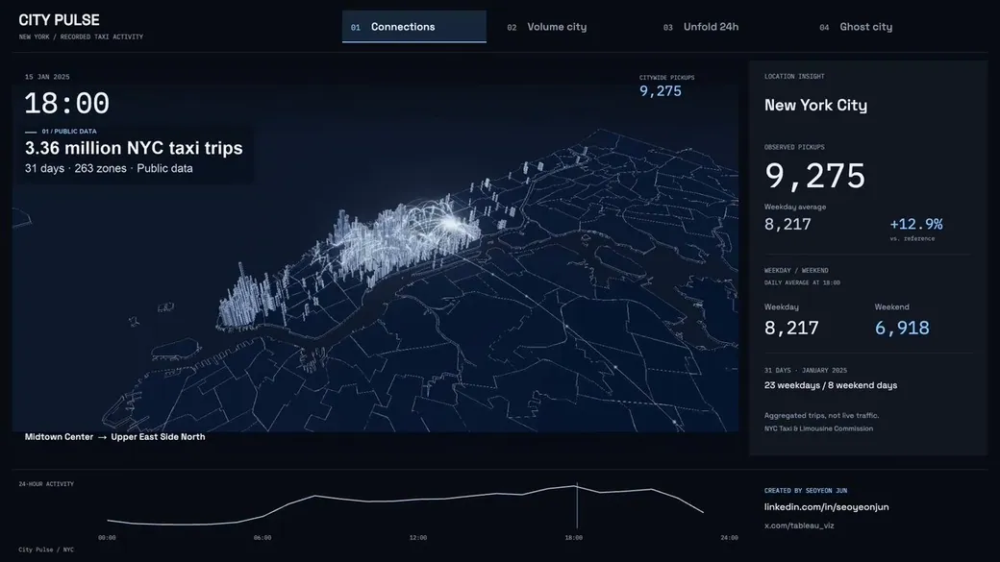</a>

**Prompt**

```text
# Xây dựng "Nhịp đập thành phố": bản đồ dữ liệu 3D tương tác về hoạt động taxi tại Thành phố New York (tháng 1 năm 2025)

## Mục tiêu
Một hình thức trực quan hóa web một trang bằng tiếng Anh, cho thấy nhịp chuyển động của New York trong một tháng:
31 ngày, 24 giờ, 263 khu vực taxi. Người xem có thể theo dõi nhịp sinh hoạt hằng ngày của thành phố,
so sánh bất kỳ ngày nào với một ngày thường hoặc cuối tuần điển hình, đồng thời xem chi tiết từng khu vực.
Đây là công cụ phân tích mô tả, không phải sản phẩm thời gian thực hay GPS. Mọi hình ảnh trực quan phải nêu rõ một dấu hiệu đại diện cho điều gì.

## Dữ liệu
Nguồn (công khai):
- Dữ liệu chuyến đi NYC TLC, Taxi vàng, tháng 1 năm 2025 (parquet)
- Khu vực taxi NYC TLC (263 khu vực, hình dạng + tra cứu quận)
- Dấu chân tòa nhà từ NYC Open Data (chỉ Manhattan, dùng làm bối cảnh trực quan)

Tiền xử lý (Python + DuckDB hoặc pandas), xuất ra các tệp JSON tĩnh có dung lượng nhỏ:
- Lọc các chuyến đi không hợp lệ: đón khách ngoài tháng 1 năm 2025, thời lượng không dương hoặc dài hơn 3 giờ, khu vực không xác định (264/265).
- Theo từng ngày, khu vực và giờ: số lượt đón khách, thời lượng chuyến đi trung vị.
- Theo từng ngày và giờ: các cặp khu vực điểm đi → điểm đến hàng đầu (luồng đã tổng hợp, lấy N cặp hàng đầu mỗi giờ).
- Mức trung bình tham chiếu theo khu vực-giờ: trung bình ngày thường (23 ngày) và cuối tuần (8 ngày), tính trung bình theo ngày; các ngày lễ vẫn được xếp vào nhóm ngày thường.
- Thang đo cố định cho cả tháng: số lượt đón khách cao nhất theo khu vực-giờ, dùng cho mọi ngày để chiều cao luôn có thể so sánh.
- Siêu dữ liệu khu vực: id, tên, quận, tâm khu vực, điểm neo nhãn. Đơn giản hóa hình học khu vực.
Tệp: month.json (tổng theo ngày, thang đo, các khu vực hàng đầu), weekday.json, weekend.json, days/2025-01-DD.json, geojson khu vực.
Tải dữ liệu của ngày hiện tại theo kiểu trì hoãn; ưu tiên hiển thị lần đầu nhanh.

## Công nghệ
- Một tệp HTML độc lập (hoặc ứng dụng Vite nhỏ) với Three.js 0.160 (ES modules qua importmap), OrbitControls, EffectComposer + bloom.
- Chỉ dùng D3 cho thang đo, định dạng và các biểu đồ SVG nhỏ.
- Không bắt buộc dùng framework. Không gọi API bên ngoài khi chạy; mọi dữ liệu đều đọc từ JSON tĩnh.

## Bố cục (màn hình desktop 1920×1080 phải hiển thị vừa một màn hình, không cần cuộn)
1. Tiêu đề: "CITY PULSE / MOBILITY ATLAS", trạng thái "Phát lại dữ liệu", liên kết "Dữ liệu & phương pháp".
2. Hàng trạng thái: "Một thành phố đang chuyển động." + ba KPI: số lượt đón khách toàn thành phố (giờ được chọn), so với mức trung bình đối chiếu, thời lượng chuyến đi trung vị.
3. Dải tháng: 31 nút ngày dạng thanh mini (chiều cao thanh = số lượt đón khách trong ngày, đánh dấu cuối tuần), nút ngày trước/ngày sau, chọn ngày, lựa chọn "So sánh với" (Trung bình ngày thường · 23 ngày / Trung bình cuối tuần · 8 ngày).
4. Thanh câu chuyện: "Mọi chuyển động đều để lại một mô thức." với 4 chương (01 Theo dõi, 02 Mở ra, 03 So sánh, 04 Chia sẻ) và nút "Bắt đầu câu chuyện".
5. Tab chế độ xem: 01 Kết nối, 02 Khối lượng thành phố, 03 Mở 24 giờ, 04 Thành phố bóng ma, cùng với "Chia sẻ phát hiện" và "Tạo bản tóm tắt".
6. Khu vực làm việc: sân khấu bản đồ 3D (bên trái) + bảng kiểm tra Thông tin địa điểm (bên phải, khoảng 330px, cuộn nội bộ).
7. Dòng thời gian: Phát ngày, tốc độ (0.25×–4×), thanh tua theo giờ đặt trên biểu đồ thanh 24 giờ của ngày được chọn so với mức trung bình.
Chiều cao sân khấu bản đồ phải thích ứng với khung nhìn (giới hạn trong khoảng ~470px đến ~780px) để toàn bộ bảng điều khiển, bao gồm dòng thời gian, hiển thị được ở mức thu phóng 100%.

## Cảnh 3D
- Mặt nền tối, đường viền khu vực là các đường mảnh, dấu chân tòa nhà Manhattan là bối cảnh thực tế mờ.
- Camera: phối cảnh, xoay quanh + thu phóng, có nút căn giữa lại. Giữ nguyên camera của người dùng khi chuyển chế độ xem, ngoại trừ "Mở 24 giờ", chế độ này luôn căn lại khung để hiển thị toàn bộ ma trận.
- Rê chuột lên một khu vực: hiển thị tooltip với tên và số lượt đón khách. Nhấp vào một khu vực: chọn khu vực đó (cập nhật bảng kiểm tra và các luồng).

Các chế độ xem (mỗi lần chuyển đều có hoạt ảnh, không chuyển cảnh đột ngột):
- 01 Kết nối: các chuyến đi giữa các khu vực đã tổng hợp được hiển thị dưới dạng cung phát sáng với các hạt sáng chuyển động; mật độ hạt ∝ số chuyến đi; gắn nhãn cho luồng nổi bật ("TỪ / Midtown Center → ĐẾN / Upper East Side North, 71 chuyến / 18:00"). Chú thích: "Chuyến đi giữa các khu vực đã ghi nhận · chuyển động sơ đồ. Không phải GPS."
- 02 Khối lượng thành phố: đùn từng khu vực; chiều cao = số lượt đón khách theo thang đo cố định của tháng; khu vực được chọn được làm nổi bật.
```

<details>
<summary>Prompt gốc</summary>

```text
# Build "City Pulse": an interactive 3D mobility atlas of New York City taxi activity (January 2025)

## Goal
A single-page, English-language web visualization that shows how New York moves across one month:
31 days, 24 hours, 263 taxi zones. The reader should be able to watch the city's daily rhythm,
compare any day against a typical weekday or weekend, and inspect any zone in detail.
It is a descriptive analysis tool, not a real-time or GPS product. Every visual must state what one mark represents.

## Data
Sources (public):
- NYC TLC Trip Record Data, Yellow Taxi, January 2025 (parquet)
- NYC TLC Taxi Zones (263 zones, shapes + borough lookup)
- NYC Open Data building footprints (Manhattan only, as visual context)

Preprocessing (Python + DuckDB or pandas), output small static JSON files:
- Filter invalid trips: pickup outside Jan 2025, non-positive or > 3h duration, unknown zones (264/265).
- Per day, per zone, per hour: pickup count, median trip duration.
- Per day, per hour: top origin → destination zone pairs (aggregated flows, top N per hour).
- Reference averages per zone-hour: weekday average (23 days) and weekend average (8 days), per-day means, holidays kept in the weekday group.
- Month-level fixed scale: max zone-hour pickups, used for every day so heights stay comparable.
- Zone metadata: id, name, borough, centroid, label anchor. Simplify zone geometry.
Files: month.json (daily totals, scale, top zones), weekday.json, weekend.json, days/2025-01-DD.json, zones geojson.
Load the current day lazily; keep the first paint fast.

## Stack
- One self-contained HTML file (or small Vite app) with Three.js 0.160 (ES modules via importmap), OrbitControls, EffectComposer + bloom.
- D3 only for scales/formatting and small SVG charts.
- No framework required. No external API calls at runtime; everything reads the static JSON.

## Layout (desktop 1920×1080 must fit in one screen without scrolling)
1. Header: "CITY PULSE / MOBILITY ATLAS", "Recorded replay" status, "Data & methods" link.
2. Status row: "A city, in motion." + three KPIs: citywide pickups (selected hour), vs. comparison average, median trip time.
3. Month strip: 31 day buttons as mini bars (bar height = daily pickups, weekends marked), prev/next day, date select, "Compare with" select (Weekday average · 23 days / Weekend average · 8 days).
4. Story bar: "Every movement leaves a pattern." with 4 chapters (01 Watch, 02 Unfold, 03 Compare, 04 Share) and "Start the story".
5. View tabs: 01 Connections, 02 Volume city, 03 Unfold 24h, 04 Ghost city, plus "Share finding" and "Create briefing".
6. Workspace: 3D map stage (left) + Location Insight inspector (right, ~330px, scrolls internally).
7. Timeline: Play day, speed (0.25×–4×), hour scrubber over a 24-hour bar chart of the selected day vs. average.
Map stage height must adapt to the viewport (clamp between ~470px and ~780px) so the whole console, including the timeline, is visible at 100% zoom.

## 3D scene
- Dark ground, zone outlines as thin lines, Manhattan building footprints as faint real-world context.
- Camera: perspective, orbit + zoom, a recenter button. Keep the user's camera when switching views, except "Unfold 24h", which always reframes to show the whole matrix.
- Hover a zone: tooltip with name and pickups. Click a zone: select it (updates inspector and flows).

Views (each switch animates, no hard pops):
- 01 Connections: aggregated zone-to-zone trips as glowing arcs with moving light particles; particle density ∝ trips; label the featured flow ("FROM / Midtown Center → TO / Upper East Side North, 71 trips / 18:00"). Caption: "Recorded zone-to-zone trips · schematic motion. Not GPS."
- 02 Volume city: each zone extruded; height = pickups on the fixed monthly scale; selected zone highlighted.
```

</details>

[Xem chi tiết ↗](https://www.tripo3d.ai/vi/3d-prompts/gpt-6-astra-2098063352832610473) · [Bài đăng gốc](https://x.com/tableau_viz/status/2098063352832610473) · [Về danh sách ví dụ](#all-prompts)

---

<a id="gpt-6-astra-2098049032195293190"></a>

### Quy trình dựng cảnh rượt đuổi ô tô hoạt hình lấy cảm hứng từ GTA

[PixVerse](https://x.com/PixVerse) · 2026-09-10 · GPT-6 Astra · Hoạt ảnh

<a href="https://www.tripo3d.ai/vi/3d-prompts/gpt-6-astra-2098049032195293190">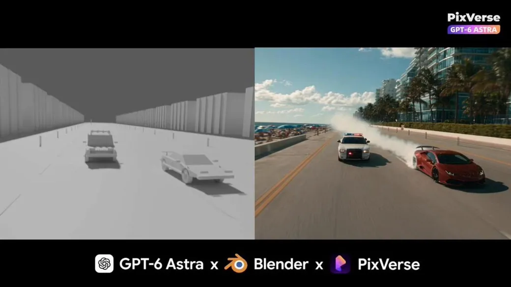</a>

**Prompt**

```text
Tạo một cảnh rượt đuổi ô tô hoạt hình nguyên bản lấy cảm hứng từ GTA bằng quy trình này:
Thiết kế: Xác định một tài xế chính, một ô tô chạy trốn, một ô tô truy đuổi và một môi trường đô thị. Giữ thiết kế của các đối tượng nhất quán. Lên kế hoạch cho ba cảnh quay dài 4 giây: cảnh truy đuổi bám theo từ phía sau, cảnh bám theo từ bên hông khi qua một khúc cua gấp và cảnh toàn rộng khi thoát khỏi khu vực.
Dựng trong Blender: Tạo mô hình màu xám gọn gàng cùng rig nhân vật và phương tiện có thể hoạt động. Không cần tạo kết cấu bề mặt hoặc mở UV.
Diễn hoạt và kiểm tra: Diễn hoạt tài xế, thao tác đánh lái, chuyển động quay của bánh xe, các phương tiện và camera. Duy trì hướng di chuyển cũng như thứ tự các phương tiện nhất quán. Sửa các lỗi xuyên mesh, bánh xe bị lơ lửng, lốp trượt, tư thế bị hỏng và tình trạng tay mất tiếp xúc với vô lăng.
Render trong Blender: Render các khung hình 1–288 ở độ phân giải 1280×720, 24 fps. Ghép các khung hình thực sự được render từ Blender thành video master mô hình màu xám hoàn chỉnh dài 12 giây. Xuất riêng từng cảnh quay và render các khung hình tĩnh màu xám tương ứng để làm tham chiếu hình dạng và bố cục.
Hoàn thiện bằng plugin [@PixVerse](plugin://pixverse@openai-curated-remote): Sử dụng Seedance 2.5 ở 720p, xử lý riêng từng cảnh quay. Dùng các đoạn clip từ Blender làm tham chiếu chuyển động và các khung hình tĩnh màu xám làm tham chiếu hình dạng. Xác định một bảng màu hoạt hình nhất quán trong prompt tạo ảnh. Giữ nguyên chuyển động camera, nhịp điệu hành động, thiết kế nhân vật và phương tiện, cũng như số lượng phương tiện.
Kiểm tra và bàn giao: Kiểm tra cả hai video hoàn chỉnh để phát hiện lỗi hình ảnh và vấn đề liên tục. Sửa các lỗi trong Blender và chỉ tạo lại những cảnh Seedance bị lỗi, tối đa hai lần thử lại cho mỗi cảnh. Bàn giao tệp .blend có thể chỉnh sửa, video mô hình màu xám 720p gốc từ Blender, phiên bản Seedance 720p có nhãn riêng cho từng cảnh và bản đánh giá ngắn về những hạn chế còn lại.
```

<details>
<summary>Prompt gốc</summary>

```text
Create an original GTA-inspired cartoon car chase using this workflow:
Design: Define one main driver, one getaway car, one pursuing car, and one urban environment. Keep their designs consistent. Plan three 4-second shots: rear tracking pursuit, side tracking through a sharp turn, and a wide exit shot.
Build in Blender: Create clean gray models and functional character and vehicle rigs. No textures or UV unwrapping are required.
Animate and test: Animate the driver, steering, wheel rotation, vehicles, and cameras. Maintain coherent travel direction and vehicle order. Fix clipping, floating wheels, sliding tires, broken poses, and hands losing contact with the steering wheel.
Render in Blender: Render frames 1–288 at 1280×720, 24 fps. Assemble actual Blender-rendered frames into a complete 12-second gray-model master. Export each shot separately and render matching gray stills as shape and composition references.
Finish with [@PixVerse](plugin://pixverse@openai-curated-remote) Plugin: Use Seedance 2.5 at 720p, processing each shot separately. Use the Blender clips as motion references and the gray stills as shape references. Define a consistent cartoon color palette in the generation prompt. Preserve camera movement, action timing, character and vehicle designs, and vehicle count.
Review and deliver: Inspect both complete videos for visual defects and continuity. Repair Blender issues and regenerate only failed Seedance shots, with at most two retries per shot. Deliver the editable .blend, the native 720p Blender gray-model video, the separately labeled 720p Seedance version, and a brief assessment of remaining limitations.
```

</details>

[Xem chi tiết ↗](https://www.tripo3d.ai/vi/3d-prompts/gpt-6-astra-2098049032195293190) · [Bài đăng gốc](https://x.com/PixVerse/status/2098049032195293190) · [Về danh sách ví dụ](#all-prompts)

---

<a id="gpt-6-astra-2098043033446912315"></a>

### Đàn mực tương tác

[Vib3Coded](https://x.com/vib3coded) · 2026-09-10 · GPT-6 Astra · Hoạt ảnh

<a href="https://www.tripo3d.ai/vi/3d-prompts/gpt-6-astra-2098043033446912315">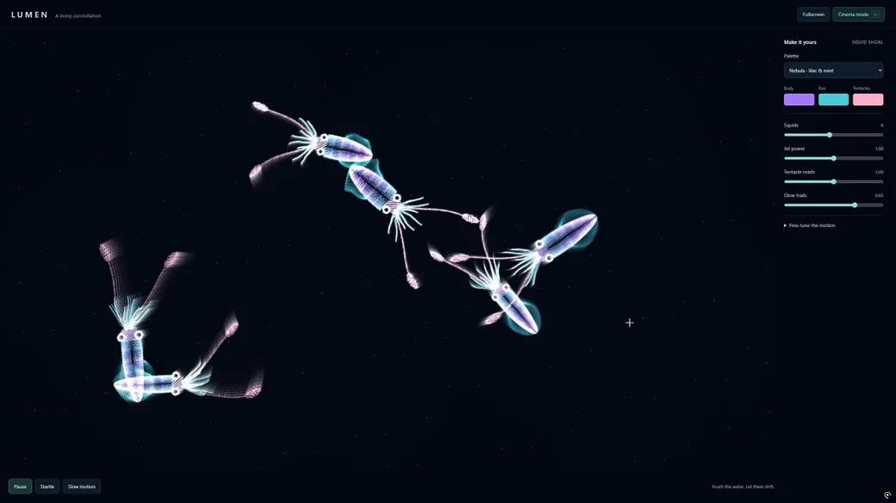</a>

**Prompt**

```text
tạo một đàn mực tương tác
```

<details>
<summary>Prompt gốc</summary>

```text
create an interactive squid shoal
```

</details>

[Xem chi tiết ↗](https://www.tripo3d.ai/vi/3d-prompts/gpt-6-astra-2098043033446912315) · [Bài đăng gốc](https://x.com/vib3coded/status/2098043033446912315) · [Về danh sách ví dụ](#all-prompts)

---

<a id="gpt-6-astra-2098038909514944562"></a>

### Tăng độ thử thách cho sân golf 18 hố

[Rory Flynn](https://x.com/Ror_Fly) · 2026-09-10 · GPT-6 Astra · Bối cảnh

<a href="https://www.tripo3d.ai/vi/3d-prompts/gpt-6-astra-2098038909514944562">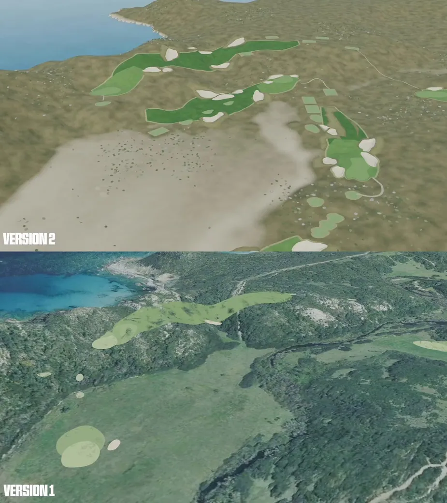</a>

**Prompt**

```text
Tăng độ thử thách cho mọi hố
>Chia cắt các fairway thẳng
>Thêm hố cát và chướng ngại vật táo bạo hơn
>Tạo thêm nhiều lựa chọn đánh bóng có ý nghĩa
```

<details>
<summary>Prompt gốc</summary>

```text
Make every hole more demanding
>Break up the straight fairways
>Add bolder bunkers + hazards
>Build more meaningful shot choices
```

</details>

[Xem chi tiết ↗](https://www.tripo3d.ai/vi/3d-prompts/gpt-6-astra-2098038909514944562) · [Bài đăng gốc](https://x.com/Ror_Fly/status/2098038909514944562) · [Về danh sách ví dụ](#all-prompts)

---

<a id="mosswing-mobile-3d-tap-to-flap-game"></a>

### Mosswing: Game 3D mobile chạm để vỗ cánh

[Ayi1337](https://github.com/Ayi1337) · 2026-09-10 · GPT-6 Astra · Trò chơi

<a href="https://www.tripo3d.ai/vi/3d-prompts/mosswing-mobile-3d-tap-to-flap-game">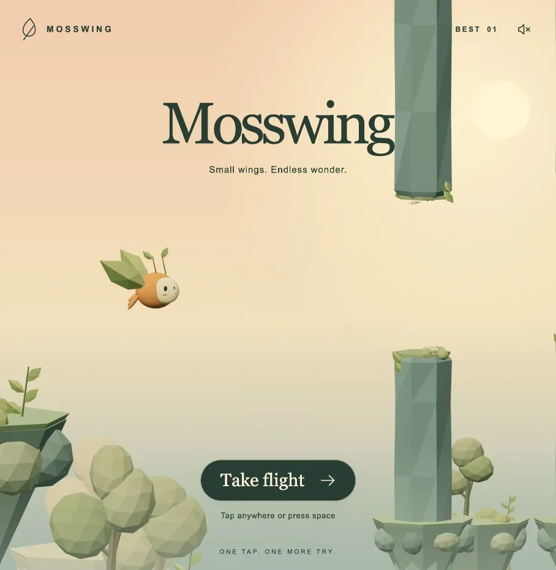</a>

**Prompt**

```text
Làm mới game kinh điển “chạm để vỗ cánh” — game mà bạn chạm để giữ một sinh vật nhỏ bay trên không khi lướt qua chuỗi khoảng trống bất tận — thành một game 3D có thể chơi trên trình duyệt di động. Chỉ cần một index.html, mở lên là chơi ngay, không dùng tài nguyên bên ngoài (được phép dùng thư viện CDN; tùy bạn quyết định). Giữ nguyên cốt lõi như mọi người vẫn nhớ: điều khiển một chạm, trọng lực, các khoảng trống cuộn về phía người chơi, va chạm một lần là kết thúc, điểm số tính theo số khoảng trống đã vượt qua. Mọi yếu tố khác tùy bạn quyết định: sinh vật là gì, chướng ngại vật ra sao, thế giới, camera, cảm giác khi vỗ cánh và mức độ đầu tư cho phần hình ảnh. Hãy thiết kế một nhân vật và phong cách nguyên bản thay vì sao chép hình ảnh của bản gốc. Tôi sẽ không trả lời câu hỏi làm rõ. Tôi đánh giá một sản phẩm hoàn chỉnh, tinh tế và tạo cảm giác chơi tốt — không phải một danh sách tính năng. Nhỏ nhưng hoàn thiện vẫn tốt hơn lớn mà sơ sài.
```

<details>
<summary>Prompt gốc</summary>

```text
Remaster the classic "tap-to-flap" game — the one where you tap to keep a small creature airborne while gliding through an endless series of gaps — as a 3D game playable in a mobile browser. One index.html, opens and plays instantly, no external assets (CDN libraries are allowed; your call).  Keep the core exactly as everyone remembers it: one-tap control, gravity, gaps that scroll toward you, one hit and you're done, score is gaps passed. Everything else is yours to decide: what the creature is, what the obstacles are, the world, the camera, the feel of the flap, how far to take the visuals. Design an original character and style rather than copying the original's art. I won't answer clarifying questions.  I'm judging a complete, elegant, great-feeling piece of work — not a feature list. Small and finished beats big and rough.
```

</details>

[Xem chi tiết ↗](https://www.tripo3d.ai/vi/3d-prompts/mosswing-mobile-3d-tap-to-flap-game) · [Bài đăng gốc](https://github.com/Ayi1337/gpt6-astra-one-shot-games#02--mosswing) · [Mã nguồn](https://github.com/Ayi1337/gpt6-astra-one-shot-games) · [Bản demo](https://mosswing-quiet-flight.jack-514.chatgpt.site/) · [Về danh sách ví dụ](#all-prompts)

---

<a id="gpt-6-astra-2097900087901106244"></a>

### Video ngắn 3D không lời: Mèo và nút thưởng

[AI実践ラボ](https://x.com/boboga777) · 2026-09-10 · GPT-6 Astra · Hoạt ảnh

<a href="https://www.tripo3d.ai/vi/3d-prompts/gpt-6-astra-2097900087901106244">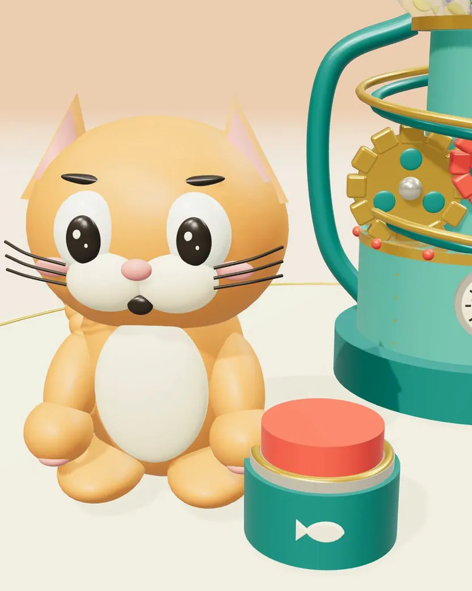</a>

**Prompt**

```text
Tạo một video ngắn 3D không lời về một chú mèo: chỉ một nút thưởng, hỗn loạn tột độ và một cú chốt nho nhỏ. Thêm diễn xuất giàu biểu cảm, chuyển động máy quay, âm nhạc và vòng lặp.
```

<details>
<summary>Prompt gốc</summary>

```text
Make a wordless 3D cat short: one treat button, total chaos, a tiny payoff. Add expressive acting, camera moves, music and a loop.
```

</details>

[Xem chi tiết ↗](https://www.tripo3d.ai/vi/3d-prompts/gpt-6-astra-2097900087901106244) · [Bài đăng gốc](https://x.com/boboga777/status/2097900087901106244) · [Về danh sách ví dụ](#all-prompts)

---


[Danh mục đầy đủ](catalog.vi.md) · [←](catalog.vi.1.md) · **2 / 9** · [→](catalog.vi.3.md)

<p align="center"><strong><a href="https://www.tripo3d.ai/vi/3d-prompts?utm_source=github&amp;utm_medium=referral&amp;utm_campaign=awesome_3d_prompts&amp;utm_content=catalog_footer">Danh mục đầy đủ →</a></strong></p>
