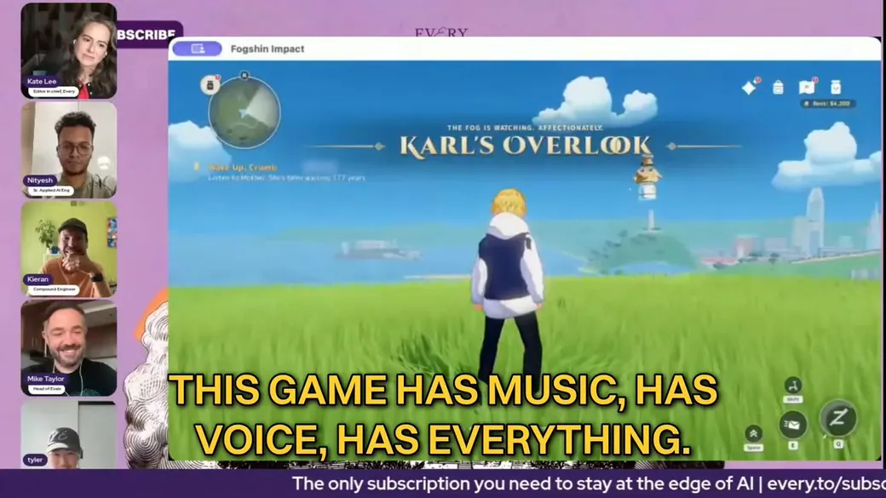
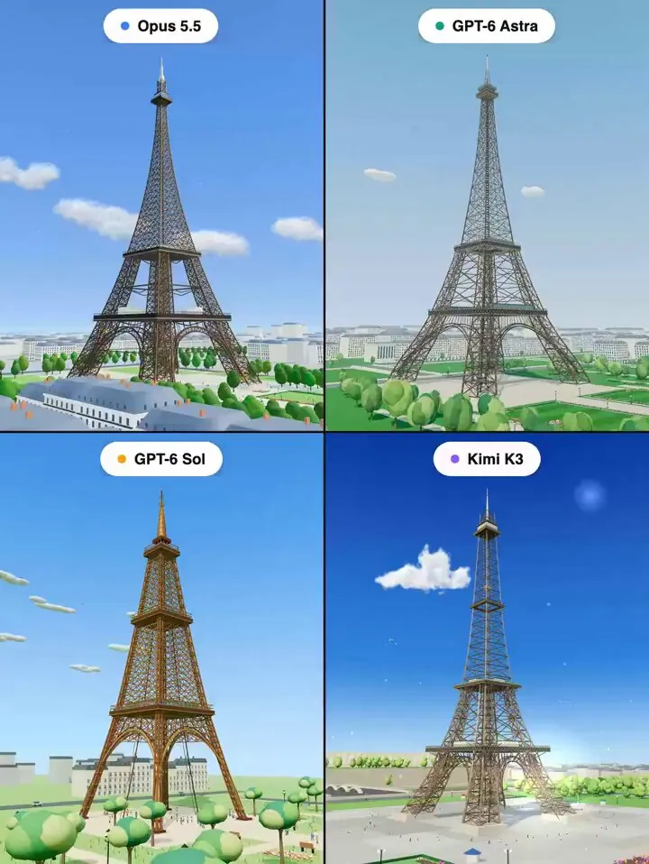
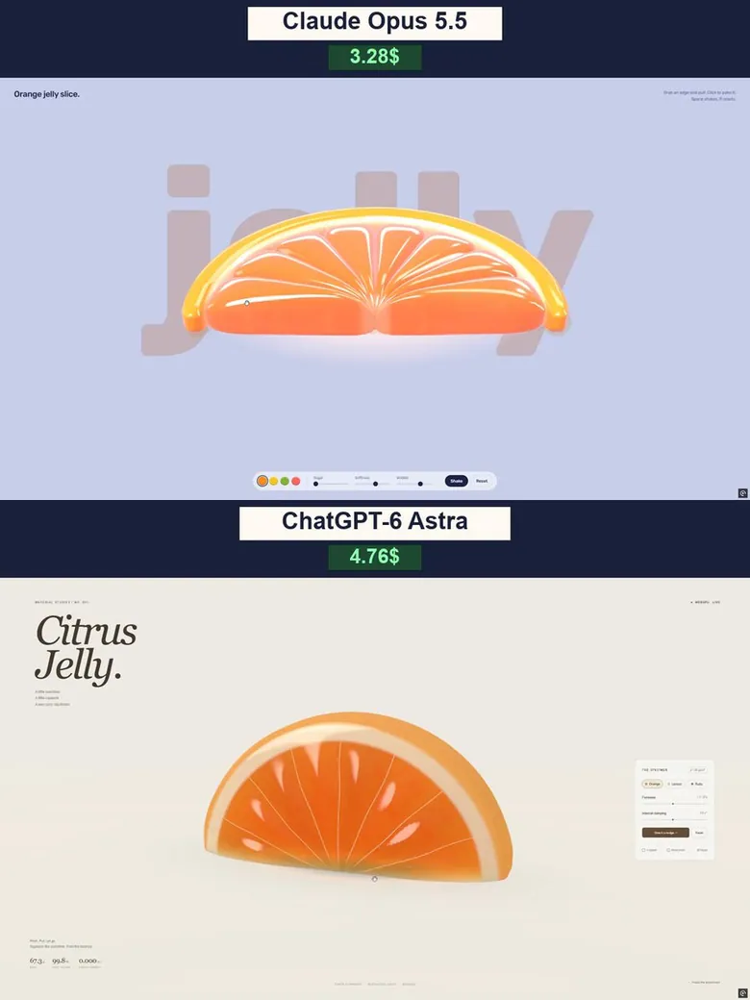
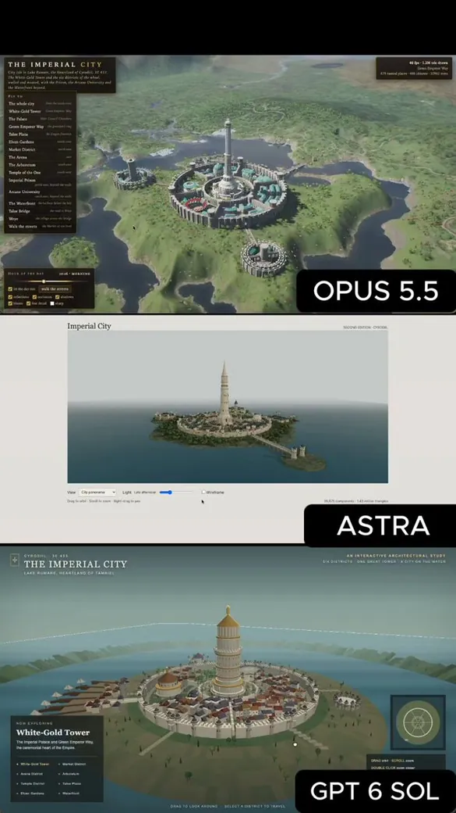
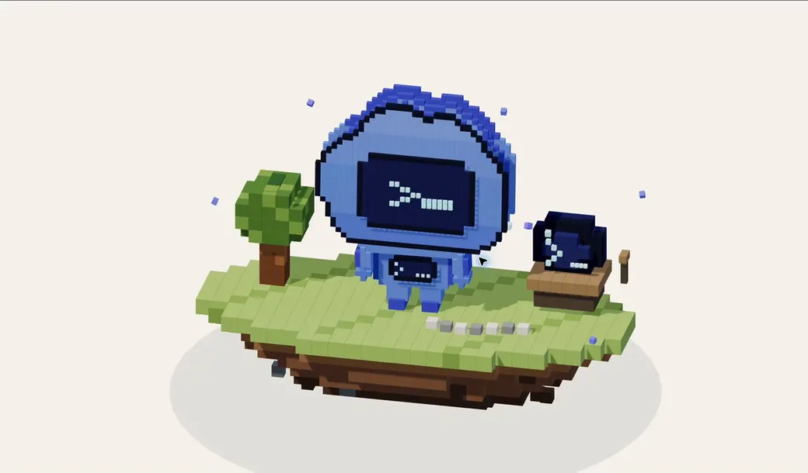
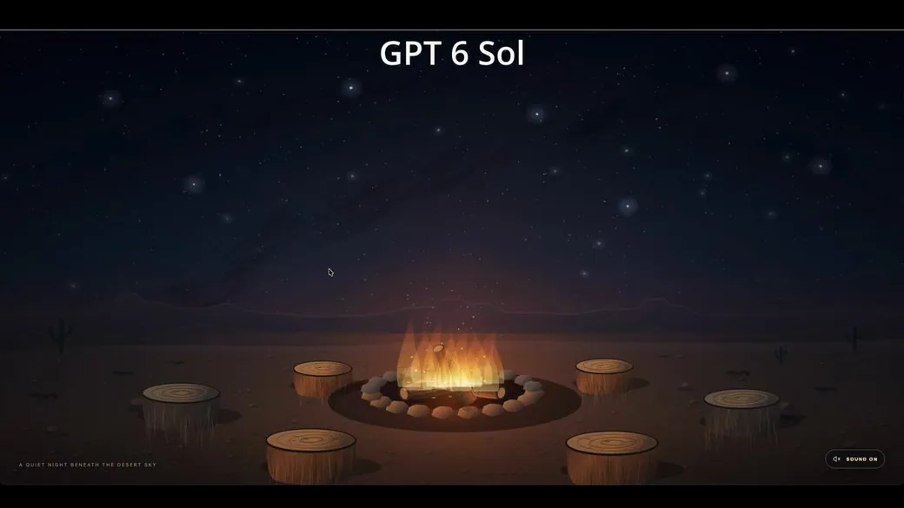
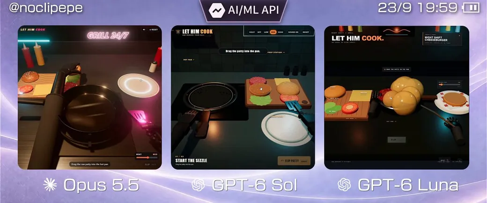
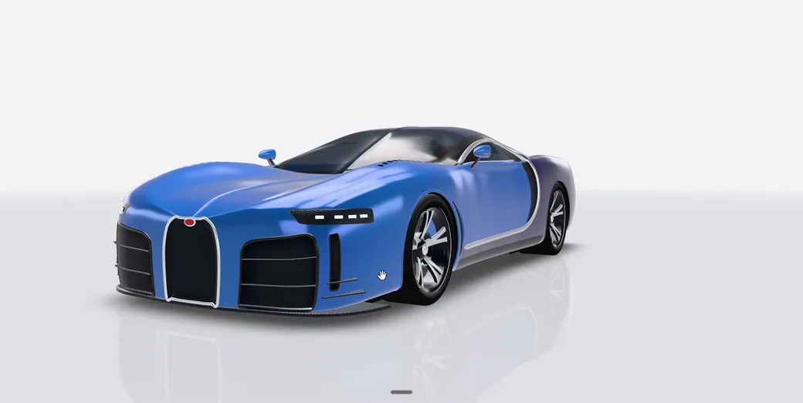
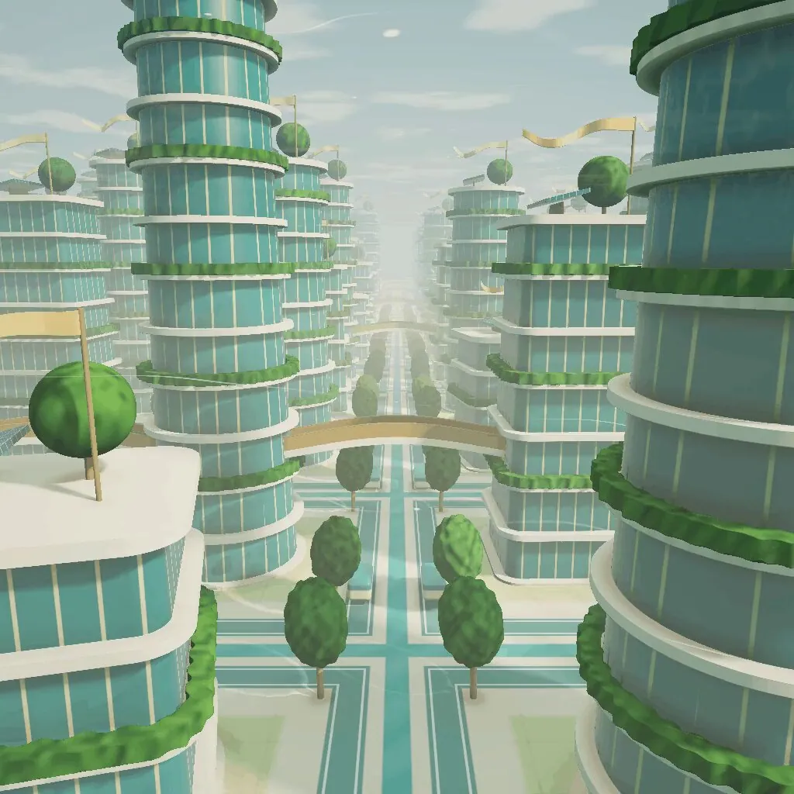
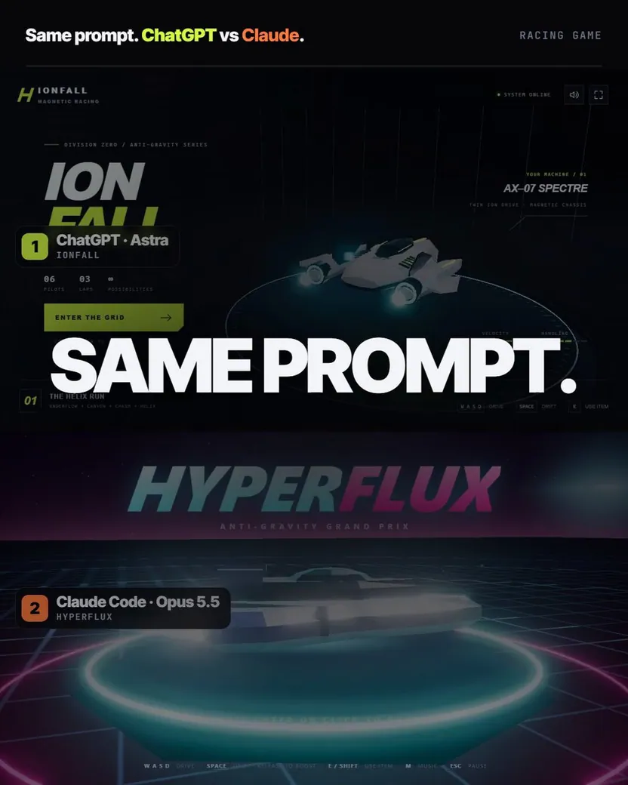

<!-- Generated from Growth CMS by templates/catalog.md. Edit content in CMS; run npm run sync. -->

# Awesome 3D Prompts — 1 / 9

[← Awesome 3D Prompts](../README.md)

<p>
  <a href="../docs/catalog.en.1.md"></a>
  <a href="../docs/catalog.zh.1.md"></a>
  <a href="../docs/catalog.zh-Hant.1.md"></a>
  <a href="../docs/catalog.ja.1.md"></a>
  <a href="../docs/catalog.ko.1.md"></a>
  <a href="../docs/catalog.es.1.md"></a>
  <a href="../docs/catalog.pt.1.md"></a>
  <a href="../docs/catalog.de.1.md"></a>
  <a href="../docs/catalog.fr.1.md"></a>
  <a href="../docs/catalog.it.1.md"></a>
  <a href="../docs/catalog.ru.1.md"></a>
  <a href="../docs/catalog.tr.1.md"></a>
  <a href="../docs/catalog.uk.1.md"></a>
  <a href="../docs/catalog.vi.1.md"></a>
</p>

[完整目錄](catalog.zh-Hant.md) · **1 / 9** · [→](catalog.zh-Hant.2.md)

<a id="all-prompts"></a>

<details>
<summary>瀏覽案例 (50)</summary>

- [留白：充滿彩繪玻璃光芒的大教堂短片](#claude-opus-5-5-2103145567945986461)
- [《原神》風格的舊金山背景遊戲](#claude-opus-5-5-2103144530157687114)
- [奧斯特里茲戰役電影](#claude-opus-5-5-2103116235009347650)
- [使用 Three.js 建立艾菲爾鐵塔](#claude-opus-5-5-2103106070549757960)
- [Crazy Tanks — 3D 島嶼火砲戰](#crazy-tanks-3d-island-artillery)
- [Grid Genius 的 Pixar 級 Three.js 動畫](#claude-opus-5-5-2103087766662009118)
- [即時 3D 鵜鶘騎車遊戲](#claude-opus-5-5-2103083781490176212)
- [互動式 3D 果凍柑橘切片](#gpt-6-astra-2103062348168618280)
- [打造帝國城市](#claude-opus-5-5-2103046279253168554)
- [使用 Three.js 製作體素 Codex](#gpt-6-astra-2102956340482289944)
- [超寫實互動式沙漠營火 HTML 場景](#gpt-6-astra-2102915300295369208)
- [第一人稱漢堡模擬器](#gpt-6-astra-2102897258983313712)
- [使用 Three.js 建立 Bugatti Chiron Super Sport](#claude-opus-5-5-2102828216289566725)
- [無限太陽朋克城市著色器](#gpt-6-astra-2102826333550133520)
- [Claude 成長訓練蒙太奇](#claude-opus-5-5-2102788371114246177)
- [使用 Three.js 製作皮克斯等級的 90 年代卡通動畫](#claude-opus-5-5-2102788223835463902)
- [用於研究西洋棋棄兵的互動式 3D 棋盤](#gpt-6-astra-2102788013902213508)
- [無縫程式碼水循環動畫](#claude-opus-5-5-2102781807179735211)
- [可在瀏覽器中操作的中世紀歐洲風 3D 城堡](#gpt-6-astra-2102780850706567390)
- [CatWalk：奔馳於夜街的 3D 橫向捲軸貓咪遊戲](#claude-opus-5-5-2102775461701091531)
- [Orbit Lab：太陽、地球與月的 3D 模擬](#gpt-6-astra-2102752217375899659)
- [《末班列車》賽博龐克巨型都市基準測試](#claude-opus-5-5-2102740078347087940)
- [體素風格足球動畫](#claude-opus-5-5-2102739444256383089)
- [虛構行星互動網站](#claude-opus-5-5-2102729710174196022)
- [中世紀城堡瀏覽器動畫](#gpt-6-astra-2102672926285713456)
- [使用 Claude Opus 5 製作的 Tripo 3D 宣傳影片](#tripo-claude-opus-5-5-paper-cut-3d-short)
- [單一 HTML 檔案中的 3D 卡丁車競速遊戲](#gpt-6-astra-2102652927177617564)
- [互動式歐拉霓虹流體模擬](#claude-opus-5-5-2102565611473661963)
- [日式櫻花山谷互動式 3D 景觀網頁](#claude-opus-5-5-2102565403109085669)
- [Hundenberg 事故模型與逼真影片](#claude-opus-5-5-2102547809140355250)
- [以圖片為基礎的手球場 360 度 3D 渲染](#claude-opus-5-5-2102544406117286004)
- [從影像打造程序化 Three.js 3D 主選單背景](#claude-opus-5-5-2102544196808667471)
- [自動運行的 3D 魯布・戈德堡機械](#claude-opus-5-5-2102544078927741369)
- [互動式彼得兔風格農場動物遊戲](#claude-opus-5-5-2102538762731565085)
- [電影感互動式夕陽海盜船](#claude-opus-5-5-2102533729746882985)
- [無限程序生成的 Three.js 世界](#claude-opus-5-5-2102529695908806728)
- [含室內空間的兩層樓郊區住宅](#gpt-6-astra-2102473710724919614)
- [互動式人群疏散模擬](#claude-opus-5-5-2102467667978572092)
- [Battle City 3D：無盡坦克防禦](#battle-city-3d)
- [互動式 3D 史前島嶼](#claude-opus-5-5-2102450239923720440)
- [《Sir, We Have Orc Problems》風格的塔防遊戲](#gpt-6-astra-2102411087002112256)
- [東京鐵塔的日夜 3D 場景與影片](#gpt-6-astra-2102276620124062065)
- [泡泡小鎮：3D 水球大戰](#bubble-bay)
- [互動式 3D 直升機設計展示](#gpt-6-astra-2102215638311694336)
- [Spline Rush 程序化瀏覽器賽車遊戲](#gpt-6-astra-2102150615635816866)
- [互動式 3D 太陽模型網站](#gpt-6-astra-2102038136725377200)
- [Verdant — 互動式 3D 恐龍島](#gpt-6-astra-2101730386711634251)
- [在 Three.js 中建立 WALL-E 3D 模型](#gpt-6-astra-2101687900723106104)
- [開闊水域上的帆船](#gpt-6-astra-2101616345720787130)
- [TITANIC — 最後的光](#titanic-the-last-light)

</details>
<a id="claude-opus-5-5-2103145567945986461"></a>

### 留白：充滿彩繪玻璃光芒的大教堂短片

[AGIおやZ](https://x.com/AGIOyaZ) · 2026-09-24 · Claude Opus 5.5 · 動畫

<a href="https://www.tripo3d.ai/zh-Hant/3d-prompts/claude-opus-5-5-2103145567945986461"></a>

**提示詞**

```text
請使用 three.js 製作一部直式 1080×1920、每秒 30 幀、約 36 秒的短片。

【作品名稱】
留白

【希望帶來的體驗】
這是一部完全不出現人物的影片，讓觀眾感受到被效率化追著跑、逐漸失去時間的感覺，以及在獲得留白的瞬間，人生被豐饒光芒填滿的感覺。最後，彩繪玻璃的光在整片地板上浮現，目標是讓觀眾不禁屏息。

【場景】
・昏暗的石造大教堂內部。正面牆上只有一扇高 15 公尺、寬 10 公尺的尖頂拱窗
・強光從窗外以 45 度斜角照入，在石地板上投射出窗戶形狀的光影
・窗戶嵌有彩繪玻璃，中央是聖母，兩側是展開雙翼的兩位天使，上方配置玫瑰窗。設計必須原創，不模仿任何既有作品，並採用左右對稱的構圖

【時間結構】
0～3 秒：從窗戶照入的光仍是沒有色彩的白光。地板上形成柔和的白色光影
3～11 秒：刻著「忙碌」、「效率化」、「急件」、「截止期限」等字樣的灰色立方體，從房間前方接連飛來，逐漸填滿窗戶。飛來的速度不斷加快，窗戶被填滿的同時，房間也越來越暗
11～14 秒：窗戶完全被堵住，只剩黑暗與寂靜
14～19 秒：只有一個刻著「忙碌」的方塊從窗戶脫落，墜下後化為光粒消失。鮮豔色彩的一道光從露出的缺口照入
19～26 秒：以第一個缺口為中心，方塊接連脫落。每增加一個缺口，五彩繽紛的光柱也隨之增加，原本被遮住的彩繪玻璃逐漸顯現
26～33 秒：所有方塊消失後，鏡頭穿過光柱向上升起，從正上方俯瞰地板。聖母與天使的彩繪玻璃圖樣，以色彩鮮明的光映照在整片地板上
33～36 秒：整個畫面被耀眼光芒包圍，最後一句話浮現後，靜靜結束

【文字（明朝體，低調地浮現又消失）】
・「每天，再快一點。」
・「再有效率一點。」
・「回過神來，光已經照不進來了。」
・「試著放下一件事。」
・「光會從空出來的地方照進來。」
・「那道光，比以前更加豐饒。」
・最後以大字顯示：「豐饒，棲息於留白之中」

【光線與質感】
・光柱會染上彩繪玻璃對應位置的色彩，空氣中的塵埃閃閃發光
・地板上的投影必須精確反映窗戶目前有哪些缺口（有方塊遮住的地方就形成陰影）
・方塊呈無機質的霧面灰色，文字以白色刻印其上
・前半段採冷色、無彩色調，後半段則使用寶石般的紅、藍、金色。透過這樣的色彩對比，傳達「變得更加豐饒」的感受

【技術條件】
・將彩繪玻璃圖樣生成为影像，地板上的光、光柱與窗戶顯示都必須從同一個圖樣計算，確保彼此一致
・時間必須以 1/30 秒為單位精確推進，逐格輸出，再製成 MP4

【收尾】
請實際渲染並檢查每個場景，確認彩繪玻璃圖樣投射在地板上時，能辨識出聖母與天使、文字清晰可讀，且動作不會顯得突兀；修正完成後再交付。
```

<details>
<summary>作者原始提示詞</summary>

```text
three.jsで、縦長1080×1920・30コマ/秒・約36秒の短編映像を作ってください。

【作品名】
余白

【見せたい体験】
効率化に追われて時間を失っていく感覚と、余白を手に入れた瞬間に人生が豊かな光で満たされていく感覚を、人物を一切登場させずに体感させる映像です。最後に床一面に浮かび上がるステンドグラスの光で、見た人が思わず息をのむことを目指します。

【舞台】
・薄暗い石造りの大聖堂の内部。正面の壁に、高さ15m・幅10mの尖頭アーチ型の窓が一つだけある
・窓の外からは、斜め45度の角度で強い光が差し込み、石の床に窓の形の光を落としている
・窓には、中央に聖母、両脇に翼を広げた二人の天使、上部にバラ窓を配したステンドグラスがはまっている。デザインは既存の作品を模さずオリジナルで、左右対称の構図にする

【時間の構成】
0〜3秒：窓から差す光は、まだ色のない白い光。床にやわらかな白い光の形
3〜11秒：「忙しい」「効率化」「至急」「締切」などの言葉が刻まれた灰色の立方体が、部屋の手前から次々と飛んできて窓を埋めていく。飛来のペースはどんどん加速し、窓が埋まるほど部屋は暗くなる
11〜14秒：窓は完全にふさがれ、闇と静寂
14〜19秒：「忙しい」のブロックが一つだけ窓から外れて落ち、光の粒になって消える。空いた穴から、鮮やかな色の一筋の光が差し込む
19〜26秒：最初の穴を中心に、ブロックが連鎖的に外れていく。穴が増えるたびに色とりどりの光の柱が増え、隠れていたステンドグラスが少しずつ姿を現す
26〜33秒：すべてのブロックが消え、カメラは光の柱をくぐり抜けて上昇し、真上から床を見下ろす。床一面に、聖母と天使のステンドグラスが色鮮やかな光として映し出されている
33〜36秒：画面全体がまばゆい光に包まれ、最後の言葉が浮かび、静かに終わる

【言葉（明朝体、控えめに浮かんでは消える）】
・「毎日、もっと速く。」
・「もっと、効率よく。」
・「気づけば、光が入らなくなっていた。」
・「ひとつ、手放してみる。」
・「空いたところから、光が入る。」
・「その光は、前より豊かだった。」
・最後に大きく：「豊かさは余白に宿る」

【光と質感】
・光の柱は、ステンドグラスのその場所の色に染まり、空中の塵がきらめく
・床の投影は、窓のどの穴が空いているかを正確に反映する（ブロックがある場所は影になる）
・ブロックは無機質なマットグレー。言葉は白く刻印されている
・前半は冷たく無彩色、後半は宝石のような赤・青・金。この色の対比で「豊かになった」ことを語る

【技術条件】
・ステンドグラスの絵柄は画像として生成し、床の光・光の柱・窓の表示はすべて同じ絵柄から計算して一致させる
・時間を1/30秒ずつ正確に進めて1コマずつ書き出し、MP4にする

【仕上げ】
各場面を実際に描画して確認し、ステンドグラスの絵柄が床の上で聖母と天使として読み取れるか、言葉が読めるか、動きが唐突でないかを直してから渡してください。
```

</details>

[查看詳情 ↗](https://www.tripo3d.ai/zh-Hant/3d-prompts/claude-opus-5-5-2103145567945986461) · [查看原文](https://x.com/AGIOyaZ/status/2103145567945986461) · [返回案例導覽](#all-prompts)

---

<a id="claude-opus-5-5-2103144530157687114"></a>

### 《原神》風格的舊金山背景遊戲

[Every 📧](https://x.com/every) · 2026-09-24 · Claude Opus 5.5 · 遊戲

<a href="https://www.tripo3d.ai/zh-Hant/3d-prompts/claude-opus-5-5-2103144530157687114"></a>

**提示詞**

```text
打造一款以舊金山為背景、採《原神》風格的遊戲。
```

<details>
<summary>作者原始提示詞</summary>

```text
Build a Genshin Impact–style game set in San Francisco.
```

</details>

[查看詳情 ↗](https://www.tripo3d.ai/zh-Hant/3d-prompts/claude-opus-5-5-2103144530157687114) · [查看原文](https://x.com/every/status/2103144530157687114) · [返回案例導覽](#all-prompts)

---

<a id="claude-opus-5-5-2103116235009347650"></a>

### 奧斯特里茲戰役電影

[Winter](https://x.com/WinterArc2125) · 2026-09-24 · Claude Opus 5.5 · 動畫

<a href="https://www.tripo3d.ai/zh-Hant/3d-prompts/claude-opus-5-5-2103116235009347650"></a>

**參考圖片:** [1](https://media.tripogrowth.space/media/9420c404-1c47-48c2-a7ec-1b5dfdc1f057.jpg) · [2](https://media.tripogrowth.space/media/0e238466-f725-44b7-8cd2-dc436c9e66c2.jpg) · [3](https://pbs.twimg.com/media/HS_FTwwXcAIpMjc.jpg) · [4](https://pbs.twimg.com/media/HS_FWGXXUAA5LrJ.jpg)

**提示詞**

```text
製作一部以 1805 年奧斯特里茲戰役為主題、長 4–5 分鐘的電影感影片，完全以程式碼打造。

徹底研究這場戰役，並自行決定如何講述故事、安排節奏、解釋戰略，以及呈現事件。我希望作品符合史實、戲劇性十足、易於理解，並具備卓越的視覺表現。

將隨附畫作作為視覺靈感，而非嚴格的風格要求。我喜歡其中的磅礴規模、氛圍、煙霧、戲劇性的天空、騎兵、密集陣形、地景，以及混亂感。想辦法將這種感受轉化為程式碼——但如果你能創造出更強烈的視覺語言，就放手去做。

不要讓它看起來像一般的資訊圖表或策略遊戲。它應該是一部電影感十足的歷史電影，只是恰好以程式碼算繪而成。

完全由你掌握創作方向。給我一個驚喜。
```

<details>
<summary>作者原始提示詞</summary>

```text
Create a 4–5 minute cinematic video about the Battle of Austerlitz (1805), built entirely in code.

Research the battle thoroughly and decide for yourself how to tell the story, structure the pacing, explain the strategy, and visualize the events. I want it to be historically accurate, dramatic, easy to understand, and visually exceptional.

Use the attached paintings as visual inspiration, not a strict style requirement. I love their scale, atmosphere, smoke, dramatic skies, cavalry, massed formations, landscape, and sense of chaos. Find a way to translate that feeling into code — but if you can invent a stronger visual language, do it.

Don't make it feel like a generic infographic or strategy game. It should feel like a cinematic historical film that happens to be rendered with code.

You have complete creative control. Surprise me.
```

</details>

[查看詳情 ↗](https://www.tripo3d.ai/zh-Hant/3d-prompts/claude-opus-5-5-2103116235009347650) · [查看原文](https://x.com/WinterArc2125/status/2103116689944502720) · [專案原始碼](https://github.com/WinterArc21/Battle-of-Austerlitz-Film) · [返回案例導覽](#all-prompts)

---

<a id="claude-opus-5-5-2103106070549757960"></a>

### 使用 Three.js 建立艾菲爾鐵塔

[Pascual ⚡](https://x.com/0xPascual) · 2026-09-24 · Claude Opus 5.5 · 資產

<a href="https://www.tripo3d.ai/zh-Hant/3d-prompts/claude-opus-5-5-2103106070549757960"></a>

**提示詞**

```text
在 Three.js 中建立艾菲爾鐵塔。
```

<details>
<summary>作者原始提示詞</summary>

```text
build the Eiffel Tower in Three.js.
```

</details>

[查看詳情 ↗](https://www.tripo3d.ai/zh-Hant/3d-prompts/claude-opus-5-5-2103106070549757960) · [查看原文](https://x.com/0xPascual/status/2103106070549757960) · [返回案例導覽](#all-prompts)

---

<a id="crazy-tanks-3d-island-artillery"></a>

### Crazy Tanks — 3D 島嶼火砲戰

[jared](https://x.com/jaredliu_bravo) · 2026-09-24 · GPT-6 Astra · 遊戲

<a href="https://www.tripo3d.ai/zh-Hant/3d-prompts/crazy-tanks-3d-island-artillery"></a>

**提示詞**

```text
1. 專案目標
打造 Crazy Tanks — Wild Tides：一款可遊玩的真正 3D 回合制火砲遊戲，場景位於熱帶島嶼。玩家操控小型坦克、判讀風向、將蓄力從零開始計時，並以砲彈重新塑造戰場。支援單人對抗 AI 與本地輪流遊玩；預設為三輛坦克的大亂鬥，另提供兩輛坦克的決鬥模式。最後存活的坦克獲勝。以目前的參考遊戲畫面與截圖作為視覺目標。

2. 視覺風格
使用透視攝影機與可自由環繞的 3D 幾何，不要使用平面精靈圖或固定側視角。打造陽光明媚的迷你模型場景，包含圓潤的翡翠綠、珊瑚橙與藍紫色坦克、奶油色沙地、淡綠草地、具反射效果的藍綠色水面、柔和陰影，以及淡淡的大氣遠景霧。保留三輛坦克各自鮮明的輪廓與相配的砲管。在戰場上方使用緊湊的奶油色圓形／裝甲面板，下方使用深青綠色圓角控制面板。金色代表參考火力與開火操作；薄荷綠代表實際蓄力與友軍狀態。讓頂部醒目顯示 Tripo / Three.js 外觀切換，預設使用 Tripo 資產。切換外觀時必須保留對戰與物理狀態。使用細而間距均勻的青綠色螢幕空間虛線，以及簡潔克制的落點圓圈；不要讓瞄準圖像反射在水面上。

3. 世界與場景
使用約 260 × 184 公尺的可破壞高度場島嶼，周圍是固定海平面的海洋。將起始坦克分散放置在穩固地面上；配置岩石、棕櫚樹、仙人掌與可收集的補給箱。較小的裝飾性島嶼只用來增加背景景深，絕不能取代可破壞的主要地形。爆炸會使地表變形，也可能挖掘至海平面以下。讓海岸顏色與泡沫位於同一個水面上，以避免重疊平面與閃爍。每個渲染影格都從世界座標位置投射坦克編號。提供完整彈道、坦克、環繞與戰術俯視鏡頭。彈道視角必須將開火坦克、彈道弧線與預估落點容納在 HUD 與控制面板之間的空間內。每次射擊前，先顯示開火坦克約 0.8 秒，在砲口處稍作停留，再跟隨投射物。手動操作攝影機會取消電影式跟隨。

4. 資產清單
使用穩定的模型插槽，並讓替換模型可個別尋址：
- jade-body：圓潤、如盾牌般的綠色履帶車體；玩家的預設車體。jade-cannon：相配的翡翠色砲管，帶有深色砲膛與金色點綴，可獨立進行骨架綁定。
- ember-body：珊瑚橙色、前端尖銳的裝甲車體，機械輪廓低矮。ember-cannon：相配的較長橙色砲管與深色砲口。
- bolt-body：藍紫色工業風履帶車體，採用有稜角的裝甲板。bolt-cannon：相配的粗厚藍色砲管。
- shell：黃銅色火砲砲彈，帶有深色錐形彈頭與青藍色點綴。重複使用此模型，並依武器套用專屬色調與縮放。
- crate：黃色裝甲補給箱，帶有青藍色標記與加固邊角；收集後恢復 20 點裝甲，最高為 100。
- rock：溫暖色調的圓潤砂岩群；以不同縮放重複使用，並使用獨立的碰撞代理。
- palm：彎曲樹幹與層疊的綠色葉片；重複作為島嶼植被。
- cactus：帶有小型花朵細節的緊湊綠色仙人掌；重複配置於乾燥地形。
- islet：圓潤的草地背景島嶼，邊緣為淡色岩石／沙地；重複放置於競技場之外。
優先製作三組相配的車體／砲管，其次是砲彈／補給箱與環境道具。地形變形、海洋、泡沫、火焰、煙霧、衝擊波、碎屑、瞄準圖像、光照、UI 與碰撞代理都維持程式程序化生成。相配的車體與砲管共用同一份設計參考與縮放比例。將砲管樞軸放在機械接點，讓其前進軸對齊 +X，並以可見砲口作為實際發射點。坦克車體使用四元數貼合斜坡；砲塔瞄準維持為世界空間方向。保留來源 PBR 貼圖與 UV 接縫。將完整解析度的可下載模型與最佳化的遊戲執行版本分開；參考資料與檔案來源資訊必須標明實際生成來源。

5. 遊戲玩法與回饋
每輛存活坦克在回合開始時獲得 18 公尺的移動距離。WASD 與移動控制板依螢幕方向移動；方向鍵與瞄準控制板調整方位角與仰角。滑桿提供方位角、10–80 度仰角，以及 0–100 的參考火力。選取對手只會讓砲塔朝向對方；不得替玩家解算射擊。
青綠色弧線會在無風條件下估算所選參考火力。蓄力期間固定保留此參考值與金色標記。按住 Fire、Space，或聚焦在 Fire 按鈕時按住 Enter，每次都要讓實際火力從 0 開始；每秒增加 18 個百分點，達到 100 後維持不變，並在放開時以當下的實際火力恰好開火一次。快速點按會發射低威力砲彈。參考值上下 3 個百分點內的金色區段僅供視覺回饋，不得自動吸附或進行隱藏修正。指標取消、視窗失焦或失去可見度時取消蓄力。蓄力期間鎖定移動、目標與瞄準變更。範圍輸入的鍵盤控制不得同時轉動砲塔。零火力代表最低發射速度，不代表砲彈靜止不動。
箭頭與可見的飄移風痕顯示風力推動砲彈的方向。標示風力強度與每秒公尺數；點擊風力卡片可查看說明。風向左吹時，玩家應略微向右瞄準。風力越強、滯空時間越長，飄移越明顯。單次射擊期間風力保持不變，並在每個回合變更。絕不要自動補償玩家的預覽。僅近似預測地形落點；不要在預覽中保證會與坦克／岩石碰撞、分裂成群或發生反彈。
提供六種彈藥：無限 HE 高爆彈；會分裂成五枚下降子彈藥的集束彈；可形成最寬 28 公尺、最深 13 公尺彈坑的 Seismic 地震彈；會反彈兩次的反彈彈；每輛坦克每場一枚、可形成最寬 46 公尺、最深 22 公尺彈坑的 Cataclysm 災變彈；以及留下半徑 12 公尺火區的 Incendiary 燃燒彈。火焰在六次行動結束時各造成 8 點傷害；移出火區即可避免傷害，重疊火區不會疊加。海水會熄滅火焰。整輛坦克（包括抬起的砲管）完全沒入水面以下時，立即淘汰。顯示實際傷害、裝甲損失、地形塌陷、水花與淘汰結果。
使用分層火球、擴張的衝擊環、自發光火花、彈道碎片、塵土與煙霧，並搭配克制的鏡頭震動。使用提供的原始 ElevenLabs 音樂，以及火砲、撞擊、反彈、強力爆炸、火焰與水花音效。加入音效切換、暫停／繼續、說明、重播與返回選單功能。在投射物飛行或 AI 回合期間，提供「回到我的回合」：快速執行相同的固定步長模擬，並保留所有傷害、地形與危害結果。絕不能跳過本地好友的輸入回合。

6. 技術實作
使用搭配 ES modules 與 Vite 的 Three.js、本地封裝字型、以 Web Audio 處理音效，並以 HTML audio 元素循環播放音樂。資源維持在同源環境，並支援靜態建置。使用具抗鋸齒的透視渲染器，妥善分配陰影與後製效能預算，並正確釋放暫時性幾何與材質。區分模型裝飾與遊戲碰撞。
維持獨立於渲染的決定性物理，使用公尺／秒單位、重力 9.81 m/s²，以及 1/120 秒固定步長。對高速投射物與地面、水面、坦克及岩石之間的碰撞，使用連續掃掠碰撞；對被位移的坦克套用爆炸衝量與重力。從坦克專屬的實際砲管變換推導發射位置。一般播放與快轉都必須呼叫相同的模擬更新。傷害與風力反應是風格化的遊戲規則，不是工程用爆炸模擬器。
支援中文、英文、日文與韓文 UI。初次使用時依裝置語言選擇；香港、澳門、台灣與使用繁體中文的裝置預設為英文。記住使用者明確選擇的語言，並提供可見的語言選擇器。支援響應式桌面、直向手機與短版橫向版面；短螢幕選單可捲動，觸控目標尺寸舒適，面板可收合，控制項不得重疊。觸控裝置不得要求鍵盤輸入。將僅供開發使用的狀態變更與瞄準輔助程式排除在正式版本之外。

7. 完成標準
交付可編輯的獨立原始碼專案、lockfile、npm 開發／建置指示，以及可運作的靜態預覽。符合目前的截圖與遊戲影片，包括奶油色狀態面板、固定的金色參考標記、從零開始的即時蓄力，以及完整 3D 的坦克／島嶼呈現。驗證首次啟動、模型載入、完整回合循環、每種彈藥的行為、暫停、重播，以及實際的勝負結果。確認切換外觀能保留狀態，鍵盤／觸控取消操作不會誤觸發射擊。在清楚的無風測試射擊中，以參考火力放開應落在接近參考圓圈的位置；相反方向的側風必須明顯使實際砲彈偏移，同時維持該圓圈不變。檢查 30/60/144 Hz 表現、高速碰撞、深層彈坑、火焰消退、完全浸水淘汰，以及一般／快轉回合結果的一致性。在四種語言中檢查桌面與窄版面；將瀏覽器模擬與實體裝置測試分開辨識。驗證託管頁面與連結媒體，而不只檢查本機建置。

```

[查看詳情 ↗](https://www.tripo3d.ai/zh-Hant/3d-prompts/crazy-tanks-3d-island-artillery) · [線上展示](https://super-tanks-aftershock.tripo.page/) · [返回案例導覽](#all-prompts)

---

<a id="claude-opus-5-5-2103087766662009118"></a>

### Grid Genius 的 Pixar 級 Three.js 動畫

[Anil Rao K](https://x.com/Anilraok) · 2026-09-24 · Claude Opus 5.5 · 動畫

<a href="https://www.tripo3d.ai/zh-Hant/3d-prompts/claude-opus-5-5-2103087766662009118"></a>

**提示詞**

```text
我希望你構思一個能巧妙推廣 Grid Genius 的故事。或者故事中甚至不必出現 Grid Genius，但內容應與我們的應用程式定位一致，並協助我們發布到社群媒體時獲得更多關注。接著，請使用 Three.js／JavaScript，根據你構思的故事製作一部完整、具備 Pixar 級品質的動畫
```

<details>
<summary>作者原始提示詞</summary>

```text
I want you to imagine a story, that subtly promotes grid genius. Or it can not even have grid genius, but something that aligns with our app and helps us get more eyeballs when posted on social media. Then using threejs/javascript I want you to create full animation, Pixar-level quality out of the story you imagine
```

</details>

[查看詳情 ↗](https://www.tripo3d.ai/zh-Hant/3d-prompts/claude-opus-5-5-2103087766662009118) · [查看原文](https://x.com/Anilraok/status/2103087766662009118) · [返回案例導覽](#all-prompts)

---

<a id="claude-opus-5-5-2103083781490176212"></a>

### 即時 3D 鵜鶘騎車遊戲

[Yaowei Zheng \| LlamaFactory](https://x.com/code_hiyouga) · 2026-09-24 · Claude Opus 5.5 · 遊戲

<a href="https://www.tripo3d.ai/zh-Hant/3d-prompts/claude-opus-5-5-2103083781490176212"></a>

**提示詞**

```text
打造一款即時 3D 遊戲，讓鵜鶘騎著自行車穿越生動的海濱世界，完整呈現物理效果、海浪、釣魚、動態天氣、電影式鏡頭、自動駕駛與自適應音樂。
```

<details>
<summary>作者原始提示詞</summary>

```text
Build a real-time 3D game where a pelican cycles through a living seaside world, complete with physics, waves, fishing, dynamic weather, cinematic cameras, autopilot, and adaptive music.
```

</details>

[查看詳情 ↗](https://www.tripo3d.ai/zh-Hant/3d-prompts/claude-opus-5-5-2103083781490176212) · [查看原文](https://x.com/code_hiyouga/status/2103083781490176212) · [返回案例導覽](#all-prompts)

---

<a id="gpt-6-astra-2103062348168618280"></a>

### 互動式 3D 果凍柑橘切片

[Vib3Coded](https://x.com/vib3coded) · 2026-09-24 · GPT-6 Astra · 動畫

<a href="https://www.tripo3d.ai/zh-Hant/3d-prompts/gpt-6-astra-2103062348168618280"></a>

**提示詞**

```text
使用 WebGPU 製作精美、可互動的 3D 果凍柑橘切片。將完整體驗放在單一獨立 HTML 檔案中，內嵌 JavaScript 與 WGSL 著色器。

這必須是真正的即時 3D 模擬，而不是影片、圖片或循環動畫。

APPEARANCE

製作一片厚實的半圓形橙子切片，具有半透明、多汁的果肉、八個清楚分隔的瓣片、細緻的內部膜、微小氣泡、淡色白膜層，以及柔軟的橙色果皮。

讓它呈現高級果凍糖果的質感：高飽和色彩、亮澤高光、光線穿透果肉、逼真的折射，以及柔和的接觸陰影。避免過度泛光、色彩泛白或堅硬的塑膠外觀。

使用溫暖明亮的工作室背景，以及留白充足、簡潔俐落的編輯風介面。加入大型斜體襯線標題「柑橘果凍」。控制項保持精簡，並確保切片清楚可見。

軟體物理

果凍般的柔軟手感是最重要的部分。

- 使用滑鼠或手指抓住切片的任意部位。
- 拉動、提起、拉伸、扭轉，然後放開。
- 讓變形具有局部性：拉動一側時，附近的果肉應被拉伸，其餘部分則自然跟隨。
- 放開後，切片應先晃動並略微回彈，然後逐漸恢復原本形狀。
- 加入重力、慣性、阻尼、與地面碰撞及柔軟彈跳。
- 大致維持體積，避免網格塌陷或翻轉到內外顛倒。
- 讓果皮比果肉稍微硬一些。
- 內部瓣片、薄膜與氣泡必須隨變形一起移動，不得飄浮到本體外。

使用穩定的體積式軟體求解器，例如搭配 XPBD 約束的四面體網格。不要透過縮放或旋轉整個物件來模擬柔軟感。

CONTROLS

加入三種色彩預設：橙子、檸檬與紅寶石。

加入：
- 紮實度滑桿。
- 內部阻尼滑桿。
- 「推它一下」按鈕。
- 重設按鈕。
- 四分之一速核取方塊。
- 顯示網格核取方塊。
- 暫停／繼續按鈕。

顯示質量、靜止體積百分比與動能的小型即時讀值。

技術要求

使用真正的 WebGPU 搭配 WGSL 著色器進行渲染。所有幾何與視覺細節都必須以程序式方式產生，不得匯入模型或圖片檔案。

讓模擬更新獨立於渲染影格率。支援桌面裝置與觸控裝置。若無法使用 WebGPU，請顯示清楚的替代提示訊息。

測試大力拖曳、連續多次放開、所有控制項及窄螢幕顯示。交付完成的 HTML 前，修正不穩定的物理效果、損壞的幾何結構與視覺瑕疵。

成品應該像一個小巧、可觸摸互動的糖果實驗，讓人玩起來確實感到滿足。
```

<details>
<summary>作者原始提示詞</summary>

```text
Create a beautiful, interactive 3D gummy citrus slice using WebGPU. Deliver the complete experience in one standalone HTML file with embedded JavaScript and WGSL shaders.

This must be a real-time 3D simulation, not a video, image, or looping animation.

APPEARANCE

Create a thick, semicircular orange slice with translucent, juicy flesh, eight distinct segments, delicate internal membranes, tiny bubbles, a pale pith layer, and a soft orange rind.

Make it look like premium gummy candy: saturated color, glossy highlights, light passing through the flesh, convincing refraction, and soft contact shadows. Avoid excessive bloom, washed-out colors, or a hard plastic appearance.

Use a warm, light studio background and a clean editorial interface with generous whitespace. Add the large italic serif title “Citrus Jelly.” Keep controls compact and the slice clearly visible.

SOFT-BODY PHYSICS

The jelly feel is the most important part.

- Grab any part of the slice with a mouse or finger.
- Pull, lift, stretch, twist, and release it.
- Make deformation local: pulling one edge should stretch nearby flesh while the rest follows naturally.
- After release, the slice should wobble, overshoot, and gradually recover its original shape.
- Include gravity, inertia, damping, ground collisions, and soft bouncing.
- Preserve volume approximately and prevent the mesh from collapsing or turning inside out.
- Make the rind slightly firmer than the flesh.
- Internal segments, membranes, and bubbles must follow the deformation without floating outside the body.

Use a stable volumetric soft-body solver, such as a tetrahedral mesh with XPBD constraints. Do not imitate softness by scaling or rotating the entire object.

CONTROLS

Include three color presets: Orange, Lemon, and Ruby.

Add:
- Firmness slider.
- Internal damping slider.
- “Give it a nudge” button.
- Reset button.
- Quarter-speed checkbox.
- Show mesh checkbox.
- Pause/resume button.

Display small live readouts for mass, percentage of rest volume, and kinetic energy.

TECHNICAL REQUIREMENTS

Use genuine WebGPU rendering with WGSL shaders. Generate all geometry and visual details procedurally, without imported models or image files.

Keep simulation updates independent of rendering frame rate. Support desktop and touch devices. Show a clear fallback message if WebGPU is unavailable.

Test strong dragging, repeated releases, all controls, and narrow screens. Fix unstable physics, broken geometry, and visual artifacts before delivering the finished HTML.

The result should feel like a tiny, tactile candy experiment that is genuinely satisfying to play with.
```

</details>

[查看詳情 ↗](https://www.tripo3d.ai/zh-Hant/3d-prompts/gpt-6-astra-2103062348168618280) · [查看原文](https://x.com/vib3coded/status/2103062415533371646) · [返回案例導覽](#all-prompts)

---

<a id="claude-opus-5-5-2103046279253168554"></a>

### 打造帝國城市

[EnzoXbt](https://x.com/Enzoxbt01) · 2026-09-24 · Claude Opus 5.5 · 場景

<a href="https://www.tripo3d.ai/zh-Hant/3d-prompts/claude-opus-5-5-2103046279253168554"></a>

**提示詞**

```text
打造帝國城市
```

<details>
<summary>作者原始提示詞</summary>

```text
BUILD AN IMPERIAL CITY
```

</details>

[查看詳情 ↗](https://www.tripo3d.ai/zh-Hant/3d-prompts/claude-opus-5-5-2103046279253168554) · [查看原文](https://x.com/Enzoxbt01/status/2103046279253168554) · [返回案例導覽](#all-prompts)

---

<a id="gpt-6-astra-2102956340482289944"></a>

### 使用 Three.js 製作體素 Codex

[Arsh - 16 y/o builder](https://x.com/be_arsh) · 2026-09-24 · GPT-6 Astra · 資產

<a href="https://www.tripo3d.ai/zh-Hant/3d-prompts/gpt-6-astra-2102956340482289944"></a>

**提示詞**

```text
自行製作使用體素呈現的 Three.js Codex，所有內容都從零開始製作，不要使用任何技能
```

<details>
<summary>作者原始提示詞</summary>

```text
make yourself, codex in threejs using voxels, make everything from scratch, dont use any skills
```

</details>

[查看詳情 ↗](https://www.tripo3d.ai/zh-Hant/3d-prompts/gpt-6-astra-2102956340482289944) · [查看原文](https://x.com/be_arsh/status/2102956424120979838) · [返回案例導覽](#all-prompts)

---

<a id="gpt-6-astra-2102915300295369208"></a>

### 超寫實互動式沙漠營火 HTML 場景

[Nick Gwood](https://x.com/Nixtrodamis) · 2026-09-24 · GPT-6 Astra · 互動

<a href="https://www.tripo3d.ai/zh-Hant/3d-prompts/gpt-6-astra-2102915300295369208"></a>

**提示詞**

```text
不得參照任何其他檔案或先前作品。此任務必須完全原創，不得取巧挪用這裡的任何其他作品。

建立一個單一 HTML 檔案，呈現沙漠中的真實營火。現在是夜晚，可以看見星星。營火周圍擺放著木樁座椅。畫面中不得出現任何人。不同的野生動物可能會不時進入或離開畫面。

音效也應符合場景，並具備高品質。
讓所有內容都達到超寫實效果

命名檔案（依模型命名）
```

<details>
<summary>作者原始提示詞</summary>

```text
Do not reference any other file or previous work. This task must be fully original and not built as a cheat from any other work here.

Create a single html file of a live campfire in the desert. It is night time and the stars are visible. there are log stumps set up as seats around the fire. no people are in the shot. different wildlife may periodically come into view and out.

noises should also match the scene and be of high quality.
Make everything hyper realistic

name the file (based on model)
```

</details>

[查看詳情 ↗](https://www.tripo3d.ai/zh-Hant/3d-prompts/gpt-6-astra-2102915300295369208) · [查看原文](https://x.com/Nixtrodamis/status/2102915567845794029) · [返回案例導覽](#all-prompts)

---

<a id="gpt-6-astra-2102897258983313712"></a>

### 第一人稱漢堡模擬器

[noclipepe](https://x.com/noclipepe) · 2026-09-23 · GPT-6 Astra · 遊戲

<a href="https://www.tripo3d.ai/zh-Hant/3d-prompts/gpt-6-astra-2102897258983313712"></a>

**提示詞**

```text
建立一款第一人稱漢堡模擬器。
```

<details>
<summary>作者原始提示詞</summary>

```text
build a first-person burger simulator.
```

</details>

[查看詳情 ↗](https://www.tripo3d.ai/zh-Hant/3d-prompts/gpt-6-astra-2102897258983313712) · [查看原文](https://x.com/noclipepe/status/2102897258983313712) · [返回案例導覽](#all-prompts)

---

<a id="claude-opus-5-5-2102828216289566725"></a>

### 使用 Three.js 建立 Bugatti Chiron Super Sport

[Sree](https://x.com/srikanthvaluri) · 2026-09-23 · Claude Opus 5.5 · 資產

<a href="https://www.tripo3d.ai/zh-Hant/3d-prompts/claude-opus-5-5-2102828216289566725"></a>

**提示詞**

```text
使用 Three.js 建立 Bugatti Chiron Super Sport。

不要使用 3D 模型。不要使用貼圖。不要使用素材。
```

<details>
<summary>作者原始提示詞</summary>

```text
build a Bugatti Chiron Super Sport in Three.js.

No 3D model. No textures. No assets.
```

</details>

[查看詳情 ↗](https://www.tripo3d.ai/zh-Hant/3d-prompts/claude-opus-5-5-2102828216289566725) · [查看原文](https://x.com/srikanthvaluri/status/2102828216289566725) · [返回案例導覽](#all-prompts)

---

<a id="gpt-6-astra-2102826333550133520"></a>

### 無限太陽朋克城市著色器

[Jonas Fröller](https://x.com/jonasfroeller) · 2026-09-23 · GPT-6 Astra · 場景

<a href="https://www.tripo3d.ai/zh-Hant/3d-prompts/gpt-6-astra-2102826333550133520"></a>

**提示詞**

```text
建立可在 twigl.app 執行、具有視覺吸引力的著色器，呈現由太陽朋克道路與高塔構成的無限城市，並持續顯示可見的微風效果
```

<details>
<summary>作者原始提示詞</summary>

```text
create a visually interesting shader that can run in twigl-dot-app make it like an infinite city of solarpunk roads and towers with a visible breeze running continuously
```

</details>

[查看詳情 ↗](https://www.tripo3d.ai/zh-Hant/3d-prompts/gpt-6-astra-2102826333550133520) · [查看原文](https://x.com/jonasfroeller/status/2102826333550133520) · [返回案例導覽](#all-prompts)

---

<a id="claude-opus-5-5-2102788371114246177"></a>

### Claude 成長訓練蒙太奇

[Ishu Agrawal](https://x.com/ishuagra02) · 2026-09-23 · Claude Opus 5.5 · 動畫

<a href="https://www.tripo3d.ai/zh-Hant/3d-prompts/claude-opus-5-5-2102788371114246177"></a>

**提示詞**

```text
完全以程式碼製作一段 30 秒動畫，呈現受《功夫熊貓》訓練橋段啟發的成長蒙太奇，並以 Claude 吉祥物為主角，展示它自首次發布以來在各項技能上的能力提升，例如搜尋網路、撰寫程式碼、建立 3D 模型，以及解決人類最棘手的問題，搭配富有情感張力的音樂。
```

<details>
<summary>作者原始提示詞</summary>

```text
Create a 30 second animation entirely in code featuring a growth montage, inspired by Kung Fu Panda's training sequence, with the Claude mascot as the main character, showcasing it getting more capable since its initial release across its skillset, such as searching the internet, writing code, creating 3D models, and solving humanity's hardest problems, with emotionally impactful music.
```

</details>

[查看詳情 ↗](https://www.tripo3d.ai/zh-Hant/3d-prompts/claude-opus-5-5-2102788371114246177) · [查看原文](https://x.com/ishuagra02/status/2102788832273801700) · [返回案例導覽](#all-prompts)

---

<a id="claude-opus-5-5-2102788223835463902"></a>

### 使用 Three.js 製作皮克斯等級的 90 年代卡通動畫

[Shimecki](https://x.com/scheemunai) · 2026-09-23 · Claude Opus 5.5 · 動畫

<a href="https://www.tripo3d.ai/zh-Hant/3d-prompts/claude-opus-5-5-2102788223835463902"></a>

**提示詞**

```text
我希望你先發想一個故事，接著使用 Three.js，將你構思的故事製作成一部完整動畫，呈現皮克斯等級品質的 90 年代卡通風格。
```

<details>
<summary>作者原始提示詞</summary>

```text
I want you to imagine a story. And then using threejs I want you to create full animation, Pixar-level quality 90s cartoon out of the story you imagine.
```

</details>

[查看詳情 ↗](https://www.tripo3d.ai/zh-Hant/3d-prompts/claude-opus-5-5-2102788223835463902) · [查看原文](https://x.com/scheemunai/status/2102788223835463902) · [返回案例導覽](#all-prompts)

---

<a id="gpt-6-astra-2102788013902213508"></a>

### 用於研究西洋棋棄兵的互動式 3D 棋盤

[Diogo Santos](https://x.com/diogosantosbr) · 2026-09-23 · GPT-6 Astra · 互動

<a href="https://www.tripo3d.ai/zh-Hant/3d-prompts/gpt-6-astra-2102788013902213508"></a>

**提示詞**

```text
建立一個搭載互動式 3D 棋盤的網頁應用程式，用來研究西洋棋的主要棄兵。加入棋步動畫、前進與返回控制項、開局變化，以及每種開局背後理念的說明。
```

<details>
<summary>作者原始提示詞</summary>

```text
Crie uma aplicação web com um tabuleiro 3D interativo para estudar os principais gambitos do xadrez. Inclua animação dos movimentos, controles para avançar e voltar, variantes e explicações das ideias por trás de cada abertura.
```

</details>

[查看詳情 ↗](https://www.tripo3d.ai/zh-Hant/3d-prompts/gpt-6-astra-2102788013902213508) · [查看原文](https://x.com/diogosantosbr/status/2102788013902213508) · [返回案例導覽](#all-prompts)

---

<a id="claude-opus-5-5-2102781807179735211"></a>

### 無縫程式碼水循環動畫

[Higgsfield AI 🧩](https://x.com/higgsfield_ai) · 2026-09-23 · Claude Opus 5.5 · 動畫

<a href="https://www.tripo3d.ai/zh-Hant/3d-prompts/claude-opus-5-5-2102781807179735211"></a>

**提示詞**

```text
建立一個完全以程式碼製作的水循環無縫循環動畫。
```

<details>
<summary>作者原始提示詞</summary>

```text
Create a seamless looping animation of the water cycle, entirely in code.
```

</details>

[查看詳情 ↗](https://www.tripo3d.ai/zh-Hant/3d-prompts/claude-opus-5-5-2102781807179735211) · [查看原文](https://x.com/higgsfield_ai/status/2102781807179735211) · [返回案例導覽](#all-prompts)

---

<a id="gpt-6-astra-2102780850706567390"></a>

### 可在瀏覽器中操作的中世紀歐洲風 3D 城堡

[もぎ＠ボードゲーム](https://x.com/luxurytax150) · 2026-09-23 · GPT-6 Astra · 場景

<a href="https://www.tripo3d.ai/zh-Hant/3d-prompts/gpt-6-astra-2102780850706567390"></a>

**提示詞**

```text
製作一座可在瀏覽器中操作的 3D 中世紀歐洲風城堡，加入護城河、吊橋、塔樓、石牆、旗幟、森林與日夜切換功能。
這是一種基準測試，因此請盡可能提升視覺呈現，將 3D 模型的品質放在最高優先順序。
```

<details>
<summary>作者原始提示詞</summary>

```text
ブラウザで操作できる3Dの中世ヨーロッパ風の城を作る。水堀、跳ね橋、塔、石壁、旗、森、昼夜切替を入れる。 
これはベンチマークの一種であるから、どこまで見た目を盛れるか、3Dモデルの品質を最大限優先して。
```

</details>

[查看詳情 ↗](https://www.tripo3d.ai/zh-Hant/3d-prompts/gpt-6-astra-2102780850706567390) · [查看原文](https://x.com/luxurytax150/status/2102780850706567390) · [返回案例導覽](#all-prompts)

---

<a id="claude-opus-5-5-2102775461701091531"></a>

### CatWalk：奔馳於夜街的 3D 橫向捲軸貓咪遊戲

[BLITAST STUDIO](https://x.com/blitast_studio) · 2026-09-23 · Claude Opus 5.5 · 遊戲

<a href="https://www.tripo3d.ai/zh-Hant/3d-prompts/claude-opus-5-5-2102775461701091531"></a>

**提示詞**

```text
讓我們開發一款遊戲吧
圖像表現不限 2D 或 3D，請分析遊戲系統等要素，選擇較容易開發的方向即可
個人傾向採用 3D，但畫面預想是類似橫向捲軸動作遊戲的形式
我想透過照明等設計營造時髦的氛圍，因此覺得使用 3D 應該能呈現更漂亮的效果（例如街燈或燈籠等表現）
我想製作的遊戲名為 CatWalk
顧名思義
讓貓咪向側面前進
貓步道會不斷延伸，畫面也會自動捲動，因此玩家只需配合捲動速度，以跳躍等簡單操作越過障礙物與缺口。某種程度上，緊張感與系統可能接近《Flappy Bird》。
不過圖像表現希望走成熟、帥氣且重視氛圍的風格
如果可以呈現貓咪柔韌優雅的走路、奔跑與跳躍動作，就再好不過了
關卡的世界觀交給你決定，但一開始採用普通的夜晚街景之類的場景也可以
如果透過較暗的整體色調，讓間接照明等效果呈現得更漂亮，我會非常開心
我知道應該會有能做、不能做，以及難度較高的部分
請以我的需求為靈感，開發出你認為可行的作品
首先請做到能完成一個關卡的一輪遊玩
```

<details>
<summary>作者原始提示詞</summary>

```text
ゲームを開発しましょう
グラフィックは2D、3Dを問いませんがゲームのシステムなどを分析し開発しやすい方でいいです
個人的には3Dだが画面は横スクロールアクションみたいなものを想定してます
照明などでおしゃれな雰囲気などを出したいので3Dを使うことで美しい表現ができるのではないかと思っています（例：街灯やランタンのような表現など）
作りたいゲームは CatWalk というゲーム
名前の通りです
猫が横に進む
キャットウォークが続いており、画面は自動スクロールするので、その速さに合わせて障害物や穴をジャンプなどのシンプルな操作のみで越えていくスタイル。ある意味でフラッピー的な緊張感とシステムに近いかもしれない。
ただしグラフィックは大人かっこいい、雰囲気ゲーを目指したい
可能であれば猫のしなやかな歩き、走り、ジャンプが表現できればうれしい
ステージの世界観はお任せするが、最初は無難な夜のストリートなどでもいいかと
暗めにすることで間接照明などが美ししく表現できればかなり嬉しい
できることできないこと難しいことがあると思うので
この私の要望をヒントにあなたなりにできそうなものを開発してほしい
まずは１ステージのワンループができるように
```

</details>

[查看詳情 ↗](https://www.tripo3d.ai/zh-Hant/3d-prompts/claude-opus-5-5-2102775461701091531) · [查看原文](https://x.com/blitast_studio/status/2102775632933654585) · [返回案例導覽](#all-prompts)

---

<a id="gpt-6-astra-2102752217375899659"></a>

### Orbit Lab：太陽、地球與月的 3D 模擬

[technewsradio.tokyo](https://technewsradio.tokyo/) · 2026-09-23 · GPT-6 Astra · 互動

<a href="https://www.tripo3d.ai/zh-Hant/3d-prompts/gpt-6-astra-2102752217375899659"></a>

**提示詞**

```text
這是比較實驗。請依照以下相同規格，在你的工作目錄中實作並完成這個 Web 作品。名稱為「Orbit Lab」。請使用 Three.js 0.186.0，並載入相同版本的核心套件與 OrbitControls（可使用 CDN 的 import map 或 npm）。不需要公開或部署。

需求：
1. 使用程序化幾何體與材質呈現太陽、地球與月球的 3D 模型。不得使用外部圖片或 3D 資產。以太陽作為點光源，並確保透過相機操作可以辨識地球與月球的明暗。
2. 使用 delta time 驅動地球公轉與自轉、地軸傾角，以及月球公轉。以視覺方式呈現軌道面的傾角，並顯示地球與月球的軌道線。比例與速度可為教育用途而誇大。
3. 使用可重現的亂數生成恆星背景。使用 OrbitControls 進行旋轉與縮放。點擊天體時，切換選取狀態與說明面板。
4. 提供播放／停止、速度滑桿、顯示／隱藏軌道線、將相機聚焦至太陽／地球／月球，以及返回初始狀態的按鈕。也要能使用鍵盤播放／停止與重設。
5. 提供適合手機寬度操作的介面、WebGL 不受支援時的提示、回應式調整大小，以及限制像素比以避免過高的繪圖負載。
6. 在 README 中撰寫啟動步驟與操作方式。如果可以，請實際啟動並確認運作；若無法執行，請明確說明原因。完成報告請簡要列出建立的檔案、已實作項目與確認結果。

請勿在過程中提問，請自行做出合理判斷並完成實作。
```

<details>
<summary>作者原始提示詞</summary>

```text
比較実験です。次の同一仕様のWeb作品を、あなたの作業ディレクトリに実装して完成させてください。名称は「Orbit Lab」。Three.js 0.186.0を使用し、同一バージョンの本体とOrbitControlsを読み込んでください（CDNのimport mapでもnpmでも可）。公開・デプロイは不要です。

要件:
1. 太陽・地球・月の3Dモデルを手続き的なジオメトリとマテリアルで表現。外部画像・3Dアセットは使わない。太陽を点光源とし、地球と月の明暗がカメラ操作で分かること。
2. 地球の公転と自転、地軸の傾き、月の公転をdelta timeで動かす。軌道面の傾きを視覚化し、地球と月の軌道線を表示する。スケールと速度は教育用の誇張でよい。
3. 恒星背景を再現可能な乱数で生成する。OrbitControlsで回転・ズーム。天体をクリックすると選択状態と説明パネルが切り替わる。
4. 再生/停止、速度スライダー、軌道線表示切替、太陽/地球/月へのカメラフォーカス、初期状態に戻すボタンを備える。キーボードでも再生/停止とリセットができる。
5. スマホ幅でも操作できる見た目、WebGL非対応時の案内、リサイズ対応、過剰な描画負荷を避けるピクセル比制限を入れる。
6. READMEに起動手順と操作方法を書く。可能なら実際に起動して動作確認し、できなければ理由を明記する。完了報告には作成ファイル、実装済み項目、確認結果を簡潔に書く。

途中で質問せず、合理的に判断して最後まで実装してください。
```

</details>

[查看詳情 ↗](https://www.tripo3d.ai/zh-Hant/3d-prompts/gpt-6-astra-2102752217375899659) · [查看原文](https://technewsradio.tokyo/lab/gpt6-vs-opus55) · [返回案例導覽](#all-prompts)

---

<a id="claude-opus-5-5-2102740078347087940"></a>

### 《末班列車》賽博龐克巨型都市基準測試

[BuilderHelm](https://x.com/builderhelmai) · 2026-09-23 · Claude Opus 5.5 · 場景

<a href="https://www.tripo3d.ai/zh-Hant/3d-prompts/claude-opus-5-5-2102740078347087940"></a>

**提示詞**

```text
在 Blender 中打造完整的賽博龐克巨型都市，包含主角列車、程序化建築、高架鐵路系統、雨景、體積式大氣效果、電影感燈光、多組攝影機配置，以及完整的動畫序列。
```

<details>
<summary>作者原始提示詞</summary>

```text
build a complete cyberpunk megacity inside Blender with a hero train, procedural architecture, elevated rail systems, rain, volumetric atmosphere, cinematic lighting, multiple camera setups, and a full animated sequence.
```

</details>

[查看詳情 ↗](https://www.tripo3d.ai/zh-Hant/3d-prompts/claude-opus-5-5-2102740078347087940) · [查看原文](https://x.com/builderhelmai/status/2102740078347087940) · [返回案例導覽](#all-prompts)

---

<a id="claude-opus-5-5-2102739444256383089"></a>

### 體素風格足球動畫

[Delusionals](https://x.com/AGI_FromWalmart) · 2026-09-23 · Claude Opus 5.5 · 動畫

<a href="https://www.tripo3d.ai/zh-Hant/3d-prompts/claude-opus-5-5-2102739444256383089"></a>

**提示詞**

```text
使用 Three.js（CDN）建立單一 HTML 檔案，製作簡單的體素風格足球動畫。一名方塊風格球員帶球突破 2 名防守球員，並以精彩射門得分，同時產生慶祝粒子效果。呈現繽紛的球場風格。僅輸出完整的 HTML 程式碼。
```

<details>
<summary>作者原始提示詞</summary>

```text
Create a single HTML file with Three.js (CDN) for a simple voxel-style soccer animation. A blocky player dribbles past 2 defenders and scores a spectacular goal with celebration particles. Colorful stadium look. Output ONLY the full HTML code.
```

</details>

[查看詳情 ↗](https://www.tripo3d.ai/zh-Hant/3d-prompts/claude-opus-5-5-2102739444256383089) · [查看原文](https://x.com/AGI_FromWalmart/status/2102739444256383089) · [返回案例導覽](#all-prompts)

---

<a id="claude-opus-5-5-2102729710174196022"></a>

### 虛構行星互動網站

[Kappaemme](https://x.com/Kappaemme1926) · 2026-09-23 · Claude Opus 5.5 · 互動

<a href="https://www.tripo3d.ai/zh-Hant/3d-prompts/claude-opus-5-5-2102729710174196022"></a>

**提示詞**

```text
建立一個介紹虛構行星的互動網站。
```

<details>
<summary>作者原始提示詞</summary>

```text
build an interactive website about imaginary planets.
```

</details>

[查看詳情 ↗](https://www.tripo3d.ai/zh-Hant/3d-prompts/claude-opus-5-5-2102729710174196022) · [查看原文](https://x.com/Kappaemme1926/status/2102729710174196022) · [返回案例導覽](#all-prompts)

---

<a id="gpt-6-astra-2102672926285713456"></a>

### 中世紀城堡瀏覽器動畫

[juhapalomaki.fi](https://juhapalomaki.fi/) · 2026-09-23 · GPT-6 Astra · 場景

<a href="https://www.tripo3d.ai/zh-Hant/3d-prompts/gpt-6-astra-2102672926285713456"></a>

**提示詞**

```text
建立一個完全在瀏覽器中執行的 3D 動畫。動畫內容是一座中世紀城堡，坐落在大片森林中的山丘頂端。不要加入任何鍵盤控制，只要讓攝影機環繞城堡旋轉，呈現城堡的各個面向。城堡塔樓頂端應有一面隨風飄揚的旗幟。

輸出內容應包含 index.html 檔案；執行該檔案時，會顯示城堡並開始循環動畫。
```

<details>
<summary>作者原始提示詞</summary>

```text
Create a 3d animation that runs completely in browser. The animation features a medieval castle, sitting on top of a hill that is located on large forest. Do not add any keyboard controls, just make the camera spin around the castle so that we see it from all sides. On top of the castle tower there should be a flag that waves in the wind.

The output should contain index.html file that when executed shows the castle and starts the looping animation.
```

</details>

[查看詳情 ↗](https://www.tripo3d.ai/zh-Hant/3d-prompts/gpt-6-astra-2102672926285713456) · [查看原文](https://juhapalomaki.fi/blog/castle-model-comparison/) · [返回案例導覽](#all-prompts)

---

<a id="tripo-claude-opus-5-5-paper-cut-3d-short"></a>

### 使用 Claude Opus 5 製作的 Tripo 3D 宣傳影片

[tripo3d](https://x.com/tripoai) · 2026-09-23 · Claude Opus 5 · 動畫

<a href="https://www.tripo3d.ai/zh-Hant/3d-prompts/tripo-claude-opus-5-5-paper-cut-3d-short"></a>

**提示詞**

```text
1. 專案目標
製作一部約 44 秒、可互動的動畫短片，片名為「Claude × Tripo」。一顆小小的橘色 Claude 火花降落在手工紙藝桌面上，透過 Tripo 品牌筆電畫出或輸入五個俏皮點子，並與這些逐一活起來的創作相遇。觀眾可以觀看、暫停、拖曳時間軸、重播、變更長寬比、開啟聲音或錄製動畫。這是一部經過編排的短片，不包含配樂、戰鬥或勝利條件。重現提供的影片與場景構圖。

2. 視覺風格
使用分層紙雕立體模型，呈現帶有撕裂奶油色邊緣、粉彩顆粒、塗鴉、方格紙細節與午夜藍天空的質感。在牛皮紙桌面後方，分層放置新月、暖黃色星星、藍色紙山丘與小城鎮。將開啟的筆電放在左側，Claude 靠近中央，右側則放置小型圓形展示台。維持暖橘色、淡紫色、薄荷綠、奶油黃與奶油色的點綴。透視攝影機在廣角鏡頭與特寫之間平順移動；以深度分離的平面紙雕切片創造視差。使用階梯式卡通光影、冷色輪廓光、克制的外框、柔和陰影，以及最後的紙張顆粒／暈映後製效果。結尾以白色相機閃光收尾，並顯示一張略微傾斜、以膠帶貼住的全員拍立得照片。開場、每次創作揭示與群像結尾，都要符合參考畫面的構圖。

3. 場景與故事
讓所有姿勢與攝影機狀態都由單一確定性的 update(t) 驅動，使直接跳轉至任何時間戳時，都能在不重播先前畫面的情況下產生正確影格。將故事節點命名並統一編排在同一份時間表中。Claude 約在 0.55 秒時抵達、約在 1.7 秒時降落，並在 2.92 秒時喚醒筆電。約在 7.2 秒揭示麵包貓、13.85 秒揭示蝸牛小屋、19.8 秒揭示烤麵包機火箭、26.1 秒揭示茶壺章魚，以及 33.3 秒揭示天空鯨魚。火箭約在 21.25 秒升空，並在 24.05 秒返回。鯨魚在約 35–37 秒時於全員上方游過。相機閃光在 40.5 秒出現，並於 44.2 秒結束。混合各個鏡頭，加入經過緩動的預備動作、彈簧式過衝、擠壓／拉伸、小幅跳躍與逐漸衰減的晃動。場景切換時避免突然重設。

4. 資產清單
- claude-spark：扁平的橘色十二射線火花，帶有奶油色撕裂邊緣與友善的動畫表情。它會眨眼、看向目前的動作、微笑、臉紅，並使用開心、暈眩與閃亮眼睛。兩道射線會伸展成手臂，伸向按鍵、圖畫與其他角色。將它的臉部與手臂行為保留為程序式著色器；靜態匯出無法呈現這個角色的個性或演出。
- cat：金黃色麵包造型貓咪，圓潤身體帶有烘烤麵包皮紋、尖耳朵、腳掌、尾巴、明亮眼睛、粉紅臉頰與鬍鬚。它會出現在展示台上供人旋轉查看，接受拍拍後，安穩地待在桌面前方。
- snail：淡綠色蝸牛，背著一間奶油色小屋；小屋有珊瑚色屋頂、煙囪、發光窗戶與小花箱。抬升與滑動期間，保持眼柄清楚分離、房屋直立且臉部可見。
- toaster：薄荷綠烤麵包機，帶有珊瑚色飾邊與拉桿、圓潤的奶油色細節、小型火箭翼與底部噴嘴。它會伴隨橘色火焰與煙霧軌跡升空，掠過攝影機時發出聲音，之後返回。火焰與煙霧必須維持為分離的效果。
- octopus：粉紅／淡紫色茶壺生物，帶有六條柔軟觸手、壺嘴與壺柄、開朗表情、金色單片眼鏡和紫色蝴蝶結。為觸手、傾斜動作與小步行走製作動畫。觸手的姿勢必須與僵硬的茶壺身體區分開來。
- whale：藍色天空鯨魚，帶有奶油色腹部、鰭與富有表情的臉，身上承載一座有草地的迷你城鎮、彩色小屋、樹木與條紋燈塔。它是最大型的創作，結尾時必須保持醒目。燈塔光束是獨立的透明效果。
- environment：桌面、筆電、檯燈、筆筒、盆栽、展示台、紙張天空／城鎮分層、筆記與鉛筆。全片重複使用這些元素。紙張背景、筆電介面、塗鴉、粒子、煙霧、光束與後製效果維持為程序式內容。
維持穩定的資產識別碼，並為世界座標配置、自轉／擠壓與可關節部件分別設定變換。保留來源專案的比例與色彩。可攜式 GLB 版本可以使用標準材質與靜態姿勢；不要宣稱其中包含自訂揭示著色器、角色演出或完整動畫。

5. 互動與回饋
提供播放／暫停、重播、帶有已播放／總時長的拖曳時間軸、1:1／16:9／9:16 長寬比選項、聲音切換、純淨檢視與錄製功能。空白鍵切換播放；R 鍵重播；H 或 C 鍵切換純淨檢視；Escape 鍵恢復控制項；M 鍵切換聲音；左右方向鍵以一秒為單位跳轉，按住 Shift 則將步進縮小至 0.1 秒。讓控制項在狹窄的觸控螢幕上也能使用。聲音只能在使用者手勢後開始；當自動播放音訊遭封鎖時，提供「播放聲音」選項。拖曳時間軸與重播時，聲音必須從正確時間重新開始。結尾時停止播放並提供重播。
筆電會顯示目前的圖畫或輸入的點子、動畫進度列與完成標記。畫面上的 Generate 動作是預先製作的動畫內容：現有短片使用程序式幾何，並不呼叫模型生成 API。每個創作都要由下往上揭示，起初呈現淡紫色黏土質感，再以暖色發光掃描帶填入其色彩。讓 Claude 的視線與手臂動作配合這些事件。

6. 技術實作與音訊
使用 JavaScript ES modules 與 Three.js r170，搭配 WebGL、自訂著色器、CanvasTexture 和 Web Audio API。將應用程式與字型以可重現建置打包為同源靜態資源；不可使用執行階段 CDN 或私人服務憑證。控制項使用本機 Fredoka，手寫文字使用 Caveat。針對三種長寬比調整攝影機距離與渲染尺寸，限制過高的像素密度，並讓匯出檔案排除在頁面初始網路請求之外。
使用 Web Audio 合成配樂與音效。加入音樂盒 FM 音色、經濾波的撥奏三角波低音、木琴、柔和的失諧 Pad、底鼓、拍手／沙鈴、生成式混響與最終壓縮。讓第 0 小節對齊筆電在 2.92 秒時喚醒，第 16 小節對齊 40.5 秒時的閃光，速度約為 102 BPM；循環使用 F–Dm–B-flat–C。按照命名的故事節點加入鉛筆、鍵盤、呼嘯、啵聲、彈簧聲、貓、鯨魚、火箭與快門音效。依據火箭相對攝影機的移動，對引擎聲進行聲像定位與音色塑形。在離線狀態下分小片段渲染音軌，再組合成單一緩衝區；由作用中的音訊時鐘驅動畫面，並在時鐘停滯時提供備援機制。錄製功能應將畫布影片與音軌合併，並匯出瀏覽器支援的格式。一般播放或瀏覽器錄製不可依賴來源專案選用的本機 Python 擷取伺服器。

7. 完成標準
交付可編輯的原始碼、固定版本的相依套件、靜態建置、啟動說明與可正常使用的短片。驗證直接跳轉至約 8、15、22、28、36 與 41 秒時的畫面；重播與暫停必須保留確定性的狀態。將群像構圖與參考影片進行比對。確認音訊解鎖、靜音、重播同步，以及確實能下載包含兩條音軌的錄製檔。檢查正方形、橫向與直向構圖，以及桌面與窄螢幕控制項。在父網站的隔離 iframe 中驗證託管頁面，確認沒有遺失字型、遭封鎖的指令碼或外部資源錯誤。獨立檢查可重複使用的 GLB，確認幾何、方向、材質與邊界框正確；其封面必須呈現實際檔案內容。記錄可攜式資產與動畫著色器版本之間的任何差異。

```

[查看詳情 ↗](https://www.tripo3d.ai/zh-Hant/3d-prompts/tripo-claude-opus-5-5-paper-cut-3d-short) · [返回案例導覽](#all-prompts)

---

<a id="gpt-6-astra-2102652927177617564"></a>

### 單一 HTML 檔案中的 3D 卡丁車競速遊戲

[Anshul](https://x.com/realanshull) · 2026-09-23 · GPT-6 Astra · 遊戲

<a href="https://www.tripo3d.ai/zh-Hant/3d-prompts/gpt-6-astra-2102652927177617564"></a>

**提示詞**

```text
在單一 HTML 檔案中製作一款 3D 卡丁車競速遊戲。
```

<details>
<summary>作者原始提示詞</summary>

```text
build a 3D kart racer in a single HTML file.
```

</details>

[查看詳情 ↗](https://www.tripo3d.ai/zh-Hant/3d-prompts/gpt-6-astra-2102652927177617564) · [查看原文](https://x.com/realanshull/status/2102652927177617564) · [返回案例導覽](#all-prompts)

---

<a id="claude-opus-5-5-2102565611473661963"></a>

### 互動式歐拉霓虹流體模擬

[theailoser](https://x.com/theailoser) · 2026-09-23 · Claude Opus 5.5 · 動畫

<a href="https://www.tripo3d.ai/zh-Hant/3d-prompts/claude-opus-5-5-2102565611473661963"></a>

**提示詞**

```text
撰寫一份完整的單一檔案 HTML 文件，其中包含高效能、GPU 加速的互動式歐拉霓虹流體模擬。

嚴格的技術與美學要求：

1. 架構與效能：
   - 單一檔案：所有 HTML、CSS，以及 JavaScript／GLSL 著色器都必須內嵌。
   - 零外部依賴：使用純 WebGL 1.0 或 2.0（不得使用 Three.js、Pixi 或任何外部函式庫）。
   - GPU 計算流體力學：模擬必須完全透過乒乓式影格緩衝物件（FBO）執行，並使用自訂片段著色器處理：
     a) 平流（速度與染料）
     b) 散度計算
     c) 壓力 Poisson 求解器（Jacobi 迭代，每影格 20–30 次）
     d) 梯度扣除／速度投影
     e) 渦度侷限（加入湍流漩渦，並避免流體變成單調、模糊的糊狀效果）。

2. 視覺擬真度（「霓虹煙霧」效果）：
   - 漆黑的虛空背景（`#050508`）。
   - 為染料注入加入加成式／高動態範圍混合。
   - 動態色盤：每次游標快速揮動或觸控拖曳，都會注入高亮度的霓虹染料，並在鮮明的賽博色調之間平順循環（電光青 `#00F0FF`、熾熱洋紅 `#FF007F`、深紫外，以及耀眼金色）。
   - 顯示著色器強化：直接在最終渲染著色器中加入後製處理階段，針對流體旋動邊緣套用細緻的泛光／光暈、色調映射與色差效果。

3. 互動：
   - 滑鼠與觸控：快速移動游標或拖曳時，依滑鼠速度注入相應的速度，並加入密集的發光染料。
   - 被動環境動態：閒置時產生細緻的程序式旋渦雜訊或緩慢漂移的漩渦，讓畫布不會完全靜止。
   - 控制項：在角落放置俐落、極簡的玻璃擬態 HUD（閒置時自動隱藏）：
     * 黏度滑桿
     * 染料耗散／持續性滑桿
     * 噴濺半徑滑桿
     * 「清除畫布」按鈕
     * 循環切換色彩主題的切換按鈕（賽博龐克、熱能煉獄、生物發光深海）。

4. 產品級打磨：
   - 自動處理高 DPI 顯示器與 `resize` 事件，避免拉伸或清除 FBO 貼圖。
   - 為浮點數貼圖支援加入妥善的備援檢查（`OES_texture_float`／`OES_texture_half_float`）。
   - 程式碼必須乾淨、無錯誤且完整實作，不得包含任何佔位內容或截斷的註解。

只輸出完整填充、可直接在 Chrome／Safari／Firefox 中執行的 HTML 檔案。
```

<details>
<summary>作者原始提示詞</summary>

```text
Write a complete, single-file HTML document containing a high-performance, GPU-accelerated interactive Eulerian Neon Fluid Simulation.

Strict Technical & Aesthetic Requirements:

1. Architecture & Performance:
   - Single-file: All HTML, CSS, and JavaScript/GLSL shaders inline.
   - Zero external dependencies: Pure WebGL 1.0 or 2.0 (no Three.js, no Pixi, no external libraries).
   - GPU-Computed Fluid Dynamics: The simulation must run entirely via ping-pong Framebuffer Objects (FBOs) using custom fragment shaders for:
     a) Advection (velocity & dye)
     b) Divergence calculation
     c) Pressure Poisson solver (Jacobi iteration, 20-30 iterations per frame)
     d) Gradient subtraction / velocity projection
     e) Vorticity confinement (adds turbulent swirls and prevents the fluid from turning into dull, blurry mush).

2. Visual Fidelity (The "Neon Smoke" Look):
   - Pitch-black void background (`#050508`).
   - Additive / High-Dynamic-Range blending for dye injection.
   - Dynamic palette: Each cursor flick or touch drag injects high-luminosity neon dye that cycles smoothly through vivid cyber hues (electric cyan `#00F0FF`, hot magenta `#FF007F`, deep ultraviolet, and radiant gold).
   - Display shader enhancements: Include a post-processing pass directly in the final render shader that applies subtle bloom/glow, tone mapping, and chromatic aberration around the swirling edges of the fluid.

3. Interaction:
   - Mouse & Touch: Rapid cursor movement or dragging injects velocity proportional to mouse speed, along with dense glowing dye.
   - Passive Ambient Motion: When idle, generate subtle procedural curl noise or gentle drifting vortices so the canvas is never completely static.
   - Controls: A sleek, ultra-minimal glassmorphism HUD tucked into a corner (with auto-hide on inactivity):
     * Viscosity slider
     * Dye dissipation / persistence slider
     * Splat radius slider
     * "Clear Canvas" button
     * Toggle button to cycle color themes (Cyberpunk, Thermal Inferno, Bioluminescent Deep).

4. Production Polish:
   - Automatically handle high-DPI displays and `resize` events without stretching or clearing the FBO textures.
   - Graceful fallback check for floating-point texture support (`OES_texture_float` / `OES_texture_half_float`).
   - Clean, bug-free, fully implemented code with zero placeholders or truncated comments.

Return only the fully populated HTML file ready to run directly in Chrome/Safari/Firefox.
```

</details>

[查看詳情 ↗](https://www.tripo3d.ai/zh-Hant/3d-prompts/claude-opus-5-5-2102565611473661963) · [查看原文](https://x.com/theailoser/status/2102565612874596411) · [返回案例導覽](#all-prompts)

---

<a id="claude-opus-5-5-2102565403109085669"></a>

### 日式櫻花山谷互動式 3D 景觀網頁

[宝玉](https://x.com/dotey) · 2026-09-23 · Claude Opus 5.5 · 互動

<a href="https://www.tripo3d.ai/zh-Hant/3d-prompts/claude-opus-5-5-2102565403109085669"></a>

**提示詞**

```text
請直接製作一個可在瀏覽器中即時互動的高完成度 3D 景觀網頁。

主題：日式櫻花山谷。
使用 HTML、CSS、JavaScript 實作。不要生成圖片，不要只提供設計方案，
不要用一張背景圖加上視差效果冒充 3D。我要的是實際可執行、可探索的完成品。

【一、作品定位】

這是一片完整、連續、具有遠近層次的山谷景觀，
不是孤立的小擺件、浮空島、帶底座的沙盤，也不是單純的技術展示。

風格為現代精緻體素／voxel art：
保留立方體幾何的造型語言，但畫面應具備高解析度、抗鋸齒與細膩的光影。
不要做成復古低解析度像素風，不要用粗大的積木堆砌，也不要在畫面上套用像素濾鏡。

視覺品質優先。寧可少幾個功能，也不要犧牲構圖、材質與光照。

【二、參考圖的使用方式】

如果附有參考圖，請先理解其構圖層次、尺度、光線與色彩關係。
僅借鑑氛圍與視覺語言，重新設計場景，
不要照搬建築、樹木、山體與道路的位置，不要 1:1 複製。

參考圖不是網頁中的背景素材。場景本身必須由真正的 3D 幾何構成。

【三、場景構圖】

預設開啟時就應呈現一幅完整、吸引人的畫面，
不需要使用者先旋轉鏡頭才能找到好看的角度。

採用透視相機，而不是沙盤式等距俯視相機。
畫面要有明確的前景、中景與遠景：

前景：
一株具有存在感的古老櫻花樹，搭配岩石、草木、石燈籠與少量落花，
形成畫面邊緣的自然框景，但不能擋住河流、橋樑與主要建築。

中景：
一條蜿蜒的河流引導視線深入畫面，紅色木橋橫跨河面；
村落、茶屋、神社與小徑順著地勢分布，建築之間要有真實的通行關係。
地面要有起伏、岸線與自然的地形過渡，不是將模型均勻擺放在平面上。

遠景：
山坡上的多層塔、不同距離的森林與山脊，以及遠處的雪山。
透過尺度變化、遮擋、冷暖變化與空氣透視來呈現距離，
而不是只把遠處的物體縮小。

不要把所有元素均勻鋪滿。需要有主次、疏密、留白與清楚的視覺焦點。

【四、造型與畫面品質】

櫻花樹：
樹幹要有轉折、分岔與根部，樹冠由不規則的花簇組成，
要有間隙、厚薄變化與可見的枝條。不要做成幾個規則球體或方塊團。

建築：
屋頂要有層疊瓦片、挑簷、樑柱與窗櫺；
不同建築要有各自的用途、體量與高度差異，不要用同一棟房子複製鋪滿山谷。

地形：
岸邊要有濕潤的石塊、草叢與植被的自然過渡。
避免過於規律的階梯、重複條紋、棋盤格與明顯的程序化生成網格。

水面：
必須能反射周圍景物，具有適度的波紋、深淺變化與岸邊過渡。
盡量使用場景的實際反射；需要降低效能時，也應維持視覺上的可信度。
不要用閃爍雜訊、強烈扭曲或整片藍色平面來代替水面。

細節：
可以加入少量錦鯉、落花、螢火蟲、瀑布與遠處飛鳥，
但都應服務於氛圍，不能讓畫面顯得雜亂。
不要為了宣稱模型數量而堆砌細節。

【五、色彩與氛圍】

預設為藍調時刻：
偏冷的山谷與遠山、柔和的粉色櫻花，以及溫暖但不過曝的燈籠光與窗光。
暖光集中在人員活動的區域，不要把整個環境染成橘色。

需要柔和的陰影、物體接觸處的明暗變化、合理的曝光、
克制的泛光、抗鋸齒，以及具有距離層次的薄霧。

避免發白、灰濛、過度飽和、滿版濃霧、過曝燈光與明顯鋸齒。
方塊幾何可以清晰，但渲染本身不能粗糙。

另外提供「清晨」與「雨中」兩種氛圍；
切換時應同步改變天空、環境光、霧氣與局部效果，
不能只修改背景顏色。

【六、互動與介面】

提供四個經過設計的鏡頭：
山谷全景、河畔低機位、寺廟小徑與山坡俯瞰。
切換時應平順，每個鏡頭都需要有獨立的構圖價值。

基本互動：
用滑鼠拖曳觀察、滾輪縮放或前進；觸控螢幕支援拖曳與雙指縮放。
提供重設視角、隱藏介面與儲存目前畫面的功能。

可選的增強功能：
自由探索、緩慢鏡頭巡遊與環境音。
環境音預設關閉，只在使用者主動點擊後播放。
額外功能不能影響預設畫面的完成度。

介面要克制且具設計感，以景觀為主。
標題與控制列放在邊緣，不要遮擋視覺焦點。
桌機與手機上都不能出現按鈕超出畫面、文字重疊或無法操作的問題。

【七、工程與效能】

允許使用 Three.js／WebGL，以及版本固定且彼此相容的 CDN 依賴。
優先使用成熟的渲染能力，不要為了「零依賴」而重寫整套引擎。

自行撰寫的 HTML、CSS、JavaScript 盡量整理在單一 HTML 檔案中。
景物由程序化幾何與材質生成，不依賴外部圖片或 3D 模型資源。

重複物件採用適合的批次或實例化繪製方式；
合理控制細分、陰影、反射與渲染解析度。
提供高畫質與輕量模式，手機預設使用較輕量的設定。
不要靠無限增加體素數量來換取細節。

加入載入提示、WebGL 不支援時的提示與必要的錯誤處理。
未開啟聲音時不要自動播放；尊重系統的減少動態效果偏好。

【八、交付前驗收】

不要寫完程式碼就立即交付。

如果目前環境支援在瀏覽器中執行與截圖，請先實際開啟頁面，
檢查預設鏡頭、四個視角、氛圍切換，以及桌機與手機版面，
再根據截圖修正明顯的構圖、曝光、遮擋與渲染問題。

重點檢查：
是否存在空白畫面、載入失敗或主控台錯誤；
是否有穿模、閃爍、陰影條紋、過曝或水面異常；
預設畫面是否真正像完整景觀，而不是小型沙盤；
功能按鈕是否確實可用，行動版是否超出畫面。

可以使用瀏覽器截圖進行驗收，但不要呼叫圖像生成工具。
未完成的測試要如實說明，不要宣稱已完成驗證。

最終交付：
1. 實際存在且可以開啟的 HTML 檔案，或目前環境支援的互動式預覽。
2. 如果可以截圖，附上一張真實瀏覽器渲染截圖。
3. 簡短說明操作方式與必要的執行條件。

請直接完成製作；非關鍵細節自行做出一致的設計決策，
不要把可以自行解決的實作問題反覆交給我決定。
```

<details>
<summary>作者原始提示詞</summary>

```text
请直接制作一个可以在浏览器中实时交互的高完成度 3D 景观网页。

主题：日式樱花山谷。
使用 HTML、CSS、JavaScript 实现。不要生成图片，不要只给设计方案，
不要用一张背景图加视差效果冒充 3D。我要的是实际可运行、可游览的成品。

【一、作品定位】

这是一片完整、连续、有远近层次的山谷景观，
不是孤立的小摆件、悬浮岛、带底座的沙盘，也不是单纯的技术演示。

风格是现代精细体素 / voxel art：
保留立方体几何的造型语言，但画面应高分辨率、抗锯齿、光影细腻。
不要复古低分辨率像素化，不要粗大积木堆砌，不要给画面套像素滤镜。

视觉质量优先。宁可少几个功能，也不要牺牲构图、材质和光照。

【二、参考图的使用方式】

如果附有参考图，请先理解它的构图层次、尺度、光线和色彩关系。
仅借鉴氛围与视觉语言，重新设计场景，
不要照搬建筑、树木、山体和道路的位置，不要 1:1 复刻。

参考图不是网页里的背景素材。场景本身必须由真实 3D 几何构成。

【三、场景构图】

默认打开时就应呈现一幅完整、有吸引力的画面，
不需要用户先旋转镜头才能找到好看的角度。

采用透视相机，而不是沙盘式等距俯视相机。
画面有明确的前景、中景、远景：

前景：
一株有存在感的古老樱花树，配合岩石、草木、石灯笼和少量落花，
形成画面边缘的自然框景，但不能挡住河流、桥和主要建筑。

中景：
一条蜿蜒河流引导视线进入画面，红色木桥横跨河面；
村落、茶屋、神社和小径顺着地势分布，建筑之间有真实的通行关系。
地面有起伏、岸线和自然过渡，不是平面上均匀摆放模型。

远景：
山坡上的多层塔、不同距离的森林和山脊，以及远处的雪山。
用尺度变化、遮挡、冷暖变化和空气透视表现距离，
而不是仅仅把远处物体缩小。

不要把所有元素均匀铺满。需要主次、疏密、留白和清楚的视觉焦点。

【四、造型与画面质量】

樱花树：
树干有转折、分叉和根部，树冠由不规则花簇组成，
有间隙、厚薄变化和可见枝条。不要做成几个规则球体或方块团。

建筑：
屋顶有层叠瓦片、挑檐、梁柱和窗格；
不同建筑有用途、体量和高度差异，不要复制同一栋房子铺满山谷。

地形：
岸边有湿润石块、草丛和植被过渡。
避免过于规律的台阶、重复条纹、棋盘格和明显的程序生成网格。

水面：
必须能够反映周围景物，具有适度的波纹、深浅变化和岸边过渡。
尽量使用实际场景反射；需要性能降级时也应保持视觉可信。
不要用闪烁噪声、强烈扭曲或一整块蓝色平面代替水。

细节：
可以有少量锦鲤、落花、萤火虫、瀑布和远处飞鸟，
但都应服务于氛围，不能让画面显得嘈杂。
不要为了宣称模型数量而堆砌细节。

【五、色彩与氛围】

默认是蓝调时刻：
偏冷的山谷与远山，柔和的粉色樱花，温暖但不过曝的灯笼和窗光。
暖光集中在有人活动的地方，不要把整个环境染成橙色。

需要柔和阴影、物体接触处的明暗、合理的曝光、
克制的泛光、抗锯齿和有距离层次的薄雾。

避免发白、灰蒙、过度饱和、满屏浓雾、过曝灯光和明显锯齿。
方块几何可以清晰，但渲染本身不能粗糙。

另提供“清晨”和“雨中”两种氛围；
切换时应同步改变天空、环境光、雾和局部效果，
不是仅仅修改背景颜色。

【六、交互与界面】

提供四个经过设计的镜头：
山谷全景、河边低机位、寺庙小径、山坡俯瞰。
切换应平滑，每个镜头都需要有独立的构图价值。

基础交互：
鼠标拖动观察、滚轮缩放或前进，触屏支持拖动和双指缩放。
提供重置视角、隐藏界面和保存当前画面的功能。

可选增强：
自由探索、缓慢镜头巡游、环境音。
环境音默认关闭，只在用户主动点击后播放。
额外功能不能影响默认画面的完成度。

界面要克制、有设计感，以景观为主。
标题和控制条放在边缘，不遮挡视觉焦点。
桌面和手机都不能出现按钮越界、文字重叠或无法操作的问题。

【七、工程与性能】

允许使用 Three.js / WebGL，以及版本固定、互相兼容的 CDN 依赖。
优先使用成熟渲染能力，不要为了“零依赖”重写整套引擎。

自写的 HTML、CSS、JavaScript 尽量整理在一个 HTML 文件中。
景物由程序化几何和材质生成，不依赖外部图片或 3D 模型资源。

重复物体采用适合的批量或实例化绘制方式；
合理控制细分、阴影、反射和渲染分辨率。
提供高画质和轻量模式，手机默认使用较轻设置。
不要靠无限增加体素数量换取细节。

加入加载提示、WebGL 不支持时的提示和必要的错误处理。
没有开启声音时不要自动播放；尊重减少动态效果的系统偏好。

【八、交付前验收】

不要写完代码就立即交付。

如果当前环境支持浏览器运行和截图，请先实际打开页面，
检查默认镜头、四个视角、氛围切换、桌面和手机布局，
再根据截图修正明显的构图、曝光、遮挡和渲染问题。

重点检查：
是否存在空白画面、加载失败、控制台错误；
是否有穿模、闪烁、阴影条纹、过曝、水面异常；
默认画面是否真正像完整景观，而不是小型沙盘；
功能按钮是否实际可用，移动端是否越界。

可以使用浏览器截图验收，但不要调用图像生成工具。
没有完成的测试要如实说明，不要声称已经验证。

最终交付：
1. 实际存在、可以打开的 HTML 文件，或当前环境支持的交互预览。
2. 如能截图，附一张真实浏览器渲染截图。
3. 简短说明操作方式和必要的运行条件。

请直接完成制作；非关键细节自行作出一致的设计选择，
不要把可以自行解决的实现问题反复交给我决定。
```

</details>

[查看詳情 ↗](https://www.tripo3d.ai/zh-Hant/3d-prompts/claude-opus-5-5-2102565403109085669) · [查看原文](https://x.com/dotey/status/2102565403109085669) · [返回案例導覽](#all-prompts)

---

<a id="claude-opus-5-5-2102547809140355250"></a>

### Hundenberg 事故模型與逼真影片

[AImanhasnoname](https://x.com/aimanhasnoname) · 2026-09-22 · Claude Opus 5.5 · 動畫

<a href="https://www.tripo3d.ai/zh-Hant/3d-prompts/claude-opus-5-5-2102547809140355250"></a>

**提示詞**

```text
請在 Blender 中製作 Hundenberg 的模型，並製作一段逼真的事故影片。
```

<details>
<summary>作者原始提示詞</summary>

```text
make me a model of the Hundenberg on blender make me a realistic video of the accident.
```

</details>

[查看詳情 ↗](https://www.tripo3d.ai/zh-Hant/3d-prompts/claude-opus-5-5-2102547809140355250) · [查看原文](https://x.com/aimanhasnoname/status/2102547809140355250) · [返回案例導覽](#all-prompts)

---

<a id="claude-opus-5-5-2102544406117286004"></a>

### 以圖片為基礎的手球場 360 度 3D 渲染

[ハンドボール人「布施千佳純」](https://x.com/chikaidev) · 2026-09-22 · Claude Opus 5.5 · 場景

<a href="https://www.tripo3d.ai/zh-Hant/3d-prompts/claude-opus-5-5-2102544406117286004"></a>

**參考圖片:** [1](https://media.tripogrowth.space/media/6a116b62-88ce-491b-b4ba-eed6d9c9f168.jpg) · [2](https://pbs.twimg.com/media/HS29xCPaYAAcMmd.jpg)

**提示詞**

```text
將圖片中的手球場、球門、裁判、選手與球進行 3D 渲染，讓人可以從 360 度自由角度觀看。請精準重現每位人物的姿勢，以及物體的色彩。
```

<details>
<summary>作者原始提示詞</summary>

```text
画像内のハンドボールコート、ゴール、レフェリー、プレイヤー、ボールを3dレンダリングして、360度自由角度から見れるようにして。各人物の姿勢まで、また物体の色まで正確に再現して。
```

</details>

[查看詳情 ↗](https://www.tripo3d.ai/zh-Hant/3d-prompts/claude-opus-5-5-2102544406117286004) · [查看原文](https://x.com/chikaidev/status/2102545257372213581) · [返回案例導覽](#all-prompts)

---

<a id="claude-opus-5-5-2102544196808667471"></a>

### 從影像打造程序化 Three.js 3D 主選單背景

[Majid Manzarpour](https://x.com/majidmanzarpour) · 2026-09-22 · Claude Opus 5.5 · 場景

<a href="https://www.tripo3d.ai/zh-Hant/3d-prompts/claude-opus-5-5-2102544196808667471"></a>

**參考圖片:** [1](https://media.tripogrowth.space/media/de4534b1-fda8-4736-8558-09b7283f646a.jpg) · [2](https://pbs.twimg.com/media/HS28q6mWMAAxONB.jpg)

**提示詞**

```text
在單一 HTML 檔案中，以 Three.js 3D 完美重現這個完全程序化、具動畫效果的主選單背景
```

<details>
<summary>作者原始提示詞</summary>

```text
recreate this perfectly, fully procedural, animated, main menu background in three.js 3D single HTML file
```

</details>

[查看詳情 ↗](https://www.tripo3d.ai/zh-Hant/3d-prompts/claude-opus-5-5-2102544196808667471) · [查看原文](https://x.com/majidmanzarpour/status/2102544198335373576) · [返回案例導覽](#all-prompts)

---

<a id="claude-opus-5-5-2102544078927741369"></a>

### 自動運行的 3D 魯布・戈德堡機械

[leo](https://x.com/leogao25) · 2026-09-22 · Claude Opus 5.5 · 動畫

<a href="https://www.tripo3d.ai/zh-Hant/3d-prompts/claude-opus-5-5-2102544078927741369"></a>

**提示詞**

```text
在目前目錄中，將一台會自行運轉的 3D 魯布・戈德堡機械建立為單一且自包含的 index.html。

連鎖流程依序如下：
1. 從頂端釋放一顆彈珠，讓它沿著一連串的鋸齒形斜坡滾下。
2. 彈珠撞倒一排至少 12 塊骨牌。
3. 最後一塊骨牌壓下翹翹板，將一顆小球彈進懸掛的桶子。
4. 桶子的重量將它向下拉；桶子的繩索繞過滑輪並猛拉一口鐘，使鐘明顯地擺動。
5. 同一個動作會將旗幟沿著旗桿升起。旗幟升至頂端即為完成。

規則：
- 自行撰寫物理系統：不得使用物理函式庫。彈珠釋放後的所有運動都必須來自你的模擬（剛體、碰撞、約束、繩索／滑輪）。機械的任何部件都不得使用關鍵影格動畫或補間動畫來驅動運動。
- 可從 CDN 載入 three.js 以進行渲染。不得使用其他外部資源：不可使用圖片、模型或字型。
- 不得需要使用者輸入：頁面載入時自動開始，使用跟隨動作的電影感攝影機，並在約 15–20 秒內完成整個連鎖流程。旗幟升起後停留 2 秒，接著重設並重新播放。
- 具確定性：使用固定時間步長，且不得使用未設種子的隨機性，讓每次執行看起來都一樣。
- 填滿瀏覽器視窗。畫面會以 1280×720 進行螢幕錄影。
- 不得顯示任何螢幕文字或任何形式的使用者介面。
- 打造良好的視覺效果：加入燈光、陰影、材質，以及能讓整體感覺像真實機械裝置的場景。
```

<details>
<summary>作者原始提示詞</summary>

```text
Build a 3D Rube Goldberg machine that runs itself, as a single self-contained index.html in the current directory.

The chain, in order:
1. A marble is released at the top and rolls down a series of zig-zag ramps.
2. It knocks over a line of at least 12 dominoes.
3. The last domino tips a seesaw, which launches a small ball into a hanging bucket.
4. The bucket's weight pulls it down; its rope runs over a pulley and yanks a bell, which visibly swings.
5. The same motion raises a flag up a pole. The flag reaching the top is the finish.

Rules:
- Write the physics yourself: no physics library. Every motion after the marble is released must come from your simulation (rigid bodies, collisions, constraints, rope/pulley). No keyframed animation or tweened motion of any machine part.
- You may load three.js from a CDN for rendering. Nothing else external: no images, models, or fonts.
- It must run with no user input: start automatically on page load, use a cinematic camera that follows the action, and complete the whole chain in about 15–20 seconds. After the flag is up, hold for 2 seconds, then reset and replay.
- Deterministic: fixed timestep and no unseeded randomness, so every run looks the same.
- Fill the browser window. It will be screen-recorded at 1280×720.
- No on-screen text or UI of any kind.
- Make it look good: lighting, shadows, materials, and a setting that makes it feel like a real contraption.
```

</details>

[查看詳情 ↗](https://www.tripo3d.ai/zh-Hant/3d-prompts/claude-opus-5-5-2102544078927741369) · [查看原文](https://x.com/leogao25/status/2102544081863717153) · [返回案例導覽](#all-prompts)

---

<a id="claude-opus-5-5-2102538762731565085"></a>

### 互動式彼得兔風格農場動物遊戲

[mblaso](https://x.com/blaso96) · 2026-09-22 · Claude Opus 5.5 · 遊戲

<a href="https://www.tripo3d.ai/zh-Hant/3d-prompts/claude-opus-5-5-2102538762731565085"></a>

**提示詞**

```text
「使用《彼得兔》的設計／美術風格，建立一款互動式農場動物遊戲」
主選單＝音效開／關＋動物選擇器（馬、豬、牛、貓、狗）
Esc＝暫停：重設並返回出生點／主選單／
使用 WASD 四處移動
按空白鍵跳躍；靠近其他動物時可與牠們互動
偵測到接近時，隨機觸發互動
互動可以是對其他動物發出聲音（不同於牠們平時的被動叫聲），或「輕碰牠們」
可互動的物件：飲水、吃乾草、吃水果。
第三人稱視角，但鏡頭要稍微位於動物後方並高於動物
環境中的動物包括鳥類；天空中會隨機出現飛機
場景＝農田、穀倉，以及有房屋的農村（不能進入房屋）
準備足以吸引注意力的資產，但不必多到被視為正式製作等級；這只是想在一天中抽出 15 分鐘，和女兒一起玩得開心
React、SVG、JS、WebGL、Three.js，凡是能讓遊戲感覺「好玩」所需的一切」
```

<details>
<summary>作者原始提示詞</summary>

```text
"Create a interactive farm animal game using the design/art style of "Peter Rabbit"
main menu = sounds on/off + animal picker (horse, pig, cow, cat, dog)
esc = pause: reset back to spawn/main menu/
wasd to move around
spacebar to jump and to interact with other animals when near
interactions are randomized upon proximity detection
interactions can be make sounds at the other animal (unique from their passive sounds) "boop them"
interactible with: water to drink, hay to eat, fruit to eat. 
3rd person but as if the camera was slightly behind the animal and above it
ambience animals are birds, airplanes in the sky (randomly)
setting= farmland, barn, farming village with houses (cant enter houses)
Enough assets to capture attention, but not enough that it needs to be deemed production grade, this is just to capture 15 minutes out of my day with my daughter and have fun
react, svg, js, webgl, threejs, whatever is necessary to make it feel "good""
```

</details>

[查看詳情 ↗](https://www.tripo3d.ai/zh-Hant/3d-prompts/claude-opus-5-5-2102538762731565085) · [查看原文](https://x.com/blaso96/status/2102538764749037738) · [返回案例導覽](#all-prompts)

---

<a id="claude-opus-5-5-2102533729746882985"></a>

### 電影感互動式夕陽海盜船

[Vib3Coded](https://x.com/vib3coded) · 2026-09-22 · Claude Opus 5.5 · 場景

<a href="https://www.tripo3d.ai/zh-Hant/3d-prompts/claude-opus-5-5-2102533729746882985"></a>

**提示詞**

```text
從零開始建立一個完全可互動的 3D 海盜船場景，呈現海盜船在夕陽下穿越動態海面的情景。視覺風格應具電影感與風格化特色，而非追求寫實，但仍須極其豐富、細緻、精緻且具高度視覺質感。製作船體、海面、天空、燈光、材質、船帆、骨架綁定、火砲、細小結構細節、海沫、尾流、粒子、動畫、鏡頭運動、構圖、空氣透視與色彩分級。最終成果應呈現高級、高製作水準的 3D 藝術作品，而不是原型、技術展示或低品質場景。從完全空白的頁面開始。不要重複使用或依賴任何先前的專案或場景。必要時，可以自行製作資產，或使用可靠、值得信賴的開源資產與函式庫。強制要求：場景內任何位置都不得出現任何形式的文字。不得出現任何語言的標題、名稱、標誌、描述、製作人員名單、標籤或操作說明。將整個專案交付為一個最終的獨立頁面檔案，可直接在網頁瀏覽器中開啟，並在合理可行的範圍內將資產嵌入其中。海面、船隻、船帆與鏡頭都必須自然且流暢地動態呈現。避免人為的慢動作或遲滯的移動。船隻應讓人感覺確實正在水中航行。不要以原始幾何形狀作為最終成果。製作具視覺說服力且細節豐富的海盜船，包括經過仔細塑形的船體、桅杆、船帆、骨架綁定、繩索、火砲、欄杆、提燈、甲板結構，以及清楚可見的小尺度細節。燈光必須清楚呈現船隻的幾何結構與材質。營造豐富的夕陽氛圍、深邃的海面明暗、反射、可信的海沫，以及船隻後方與周圍細節豐富的航行尾流。在視覺品質與即時效能之間維持良好平衡，確保互動與動畫流暢，不要為了效能而明顯犧牲品質。自動運用達成最佳成果所需的適當技能、工具、函式庫、技術與可用資產。不要等我指定要使用哪些技術。實際在桌面網頁瀏覽器中測試完成的成果。擷取視覺畫面、檢查瀏覽器主控台是否有錯誤，並修正你發現的每一項可見或技術問題，包括變形的幾何結構、黑畫面、資產載入失敗、動畫故障、構圖不佳、渲染瑕疵或鏡頭問題。最後，確認最終檔案能直接開啟並正常運作、場景完全不含任何文字，且不再有任何執行階段或載入錯誤。接著僅以簡短回覆結束任務。
```

<details>
<summary>作者原始提示詞</summary>

```text
Create from scratch a fully interactive 3D scene of a pirate ship sailing across a dynamic ocean at sunset. The visual style should be cinematic and stylized rather than photorealistic, while still being exceptionally rich, detailed, polished, and visually sophisticated. Build the ship, ocean, sky, lighting, materials, sails, rigging, cannons, small structural details, sea foam, wake, particles, animation, camera work, composition, atmospheric depth, and color grading. The final result should feel like a premium, high-production 3D artwork, not a prototype, technical demo, or low-quality scene. Start from a completely blank page. Do not reuse or depend on any previous project or scene. You may create the assets yourself or use reliable, trusted, open-source assets and libraries when necessary. Mandatory requirements: No text of any kind may appear anywhere inside the scene. No titles, names, logos, descriptions, credits, labels, or control instructions in any language. Deliver the entire project as one final standalone page file that can be opened directly in a web browser, with assets embedded inside it as much as reasonably possible. The ocean, ship, sails, and camera must all be animated naturally and smoothly. Avoid artificial slow motion or sluggish movement. The ship should feel like it is genuinely moving through the water. Do not rely on primitive geometric shapes as the finished result. Build a visually convincing and detailed pirate ship, including a carefully shaped hull, masts, sails, rigging, ropes, cannons, railings, lanterns, deck structures, and clearly visible small-scale details. Lighting must reveal the ship's geometry and materials clearly. Create a rich sunset atmosphere, deep ocean shading, reflections, convincing sea foam, and a detailed sailing wake behind and around the vessel. Maintain a strong balance between visual quality and real-time performance, preserving smooth interaction and animation without making an obvious sacrifice in quality. Automatically use the most appropriate skills, tools, libraries, techniques, and available assets needed to achieve the best result. Do not wait for me to specify which technologies to use. Actually test the finished result in a desktop web browser. Capture visual screenshots, inspect the browser console for errors, and fix every visible or technical issue you find, including distorted geometry, black screens, failed asset loading, broken animation, poor composition, rendering artifacts, or camera problems. At the end, verify that the final file opens and works directly, that the scene contains no text whatsoever, and that there are no remaining runtime or loading errors. Then finish the task with only a brief response.
```

</details>

[查看詳情 ↗](https://www.tripo3d.ai/zh-Hant/3d-prompts/claude-opus-5-5-2102533729746882985) · [查看原文](https://x.com/vib3coded/status/2102534606121746589) · [返回案例導覽](#all-prompts)

---

<a id="claude-opus-5-5-2102529695908806728"></a>

### 無限程序生成的 Three.js 世界

[🥔🥔🥔](https://x.com/argofowl) · 2026-09-22 · Claude Opus 5.5 · 遊戲

<a href="https://www.tripo3d.ai/zh-Hant/3d-prompts/claude-opus-5-5-2102529695908806728"></a>

**提示詞**

```text
在我的專案資料夾中建立一個名為 "endless-game" 的新專案：使用 three.js 在瀏覽器中打造一個無限且程序生成的世界，讓我可以自由探索，單純享受其中。每個區域都應該隨機生成，無論我玩多久，四處都要不斷出現驚喜。整體氛圍應該寧靜、放鬆而且真正有趣，帶有超市模擬器那種溫馨、療癒又令人滿足的感覺，但不應該做成超市遊戲。我想要一個真正有意思、可以四處漫遊的世界，裡面有我能遇見並互動的實體，以及非常酷的畫面。為這個專案設定一個明確的目標，持續完成工作直到達成目標，完成並準備好讓我遊玩和測試時，播放一聲提示音。
```

<details>
<summary>作者原始提示詞</summary>

```text
create a new project in my projects folder called "endless-game": an endless, procedurally generated world built with three.js in the browser that i can roam freely and just enjoy. every area should be randomly generated, with surprises everywhere no matter how long i play. it should feel calm, relaxing and genuinely fun, like the cozy, satisfying vibe of a supermarket simulator, but it shouldn't be a supermarket game. i want a really interesting world to walk around in, with entities i can meet and interact with, and really cool graphics. set a clear goal for the project, keep working until you reach it, and play a sound chime when it's done and ready for me to play and test.
```

</details>

[查看詳情 ↗](https://www.tripo3d.ai/zh-Hant/3d-prompts/claude-opus-5-5-2102529695908806728) · [查看原文](https://x.com/argofowl/status/2102529695908806728) · [返回案例導覽](#all-prompts)

---

<a id="gpt-6-astra-2102473710724919614"></a>

### 含室內空間的兩層樓郊區住宅

[Azer](https://x.com/azer0lxm) · 2026-09-22 · GPT-6 Astra · 場景

<a href="https://www.tripo3d.ai/zh-Hant/3d-prompts/gpt-6-astra-2102473710724919614"></a>

**提示詞**

```text
你好，請使用 Blender 設計出最完善的兩層樓郊區住宅 3D 模型，並包含完整室內空間及所有細節。
```

<details>
<summary>作者原始提示詞</summary>

```text
Hello. Please design the best possible 3D model using Blender of a two-story suburban house, interior and everything included.
```

</details>

[查看詳情 ↗](https://www.tripo3d.ai/zh-Hant/3d-prompts/gpt-6-astra-2102473710724919614) · [查看原文](https://x.com/azer0lxm/status/2102473781830909995) · [返回案例導覽](#all-prompts)

---

<a id="claude-opus-5-5-2102467667978572092"></a>

### 互動式人群疏散模擬

[Dom](https://x.com/dominikmartn) · 2026-09-22 · Claude Opus 5.5 · 動畫

<a href="https://www.tripo3d.ai/zh-Hant/3d-prompts/claude-opus-5-5-2102467667978572092"></a>

**提示詞**

```text
建立互動式人群疏散模擬，看看哪些地方會發生壅塞
```

<details>
<summary>作者原始提示詞</summary>

```text
build an interactive crowd evacuation sim and see where it jams
```

</details>

[查看詳情 ↗](https://www.tripo3d.ai/zh-Hant/3d-prompts/claude-opus-5-5-2102467667978572092) · [查看原文](https://x.com/dominikmartn/status/2102467667978572092) · [返回案例導覽](#all-prompts)

---

<a id="battle-city-3d"></a>

### Battle City 3D：無盡坦克防禦

[jared](https://x.com/jaredliu_bravo) · 2026-09-22 · GPT-6 Astra · 遊戲

<a href="https://www.tripo3d.ai/zh-Hant/3d-prompts/battle-city-3d"></a>

**提示詞**

```text
1. 專案目標
打造《Battle City 3D》：一款以 1985 年 Famicom 經典作品為靈感的瀏覽器坦克防禦遊戲。玩家駕駛坦克，摧毀一波 20 輛敵軍、收集補給並保護老鷹總部。重現參考媒體中目前所示的透視 3D 版本，包括可無限遊玩的種子戰役，以及 35 張可選的經典地圖。保留清楚易懂的街機規則，同時讓坦克、牆壁與場景具備真實的立體深度。

2. 視覺風格
使用 Three.js PerspectiveCamera，視野角度為 60 度。預設戰場視角位於玩家後上方，距離約 13 個世界單位，高度為 0.43 弧度。平滑跟隨坦克位置及其前方的一個目標點；坦克轉向時，絕不自動旋轉鏡頭。提供較高的戰術視角、手動拖曳環繞視角與滾輪縮放。移動與射擊使用地圖的四個基本方向軸。環繞視角後，將方向鍵對應至相對於鏡頭最近的基本方向；絕不將鍵盤輸入轉換為斜向移動。讓車體朝向立即與射擊方向一致，並根據每個模型的實際砲管位置校準砲彈與砲口閃光的高度。
使用貼地的履帶式坦克、金屬砲塔、陶土磚、深色鋼塊、藍色水面、低矮植被與反光冰面。將地面延伸到可玩區域之外，銜接樹林、毀損建築與霧霾。使用溫暖的定向光、柔和陰影、環境補光、ACES 色調映射，以及克制的砲口閃光、後座力、火花與彈跳碎屑。下雪時改變地面與樹木的色彩配置；工業關卡則以鋼材與毀損建築為主。
以深橄欖色指揮介面框住遊戲，顯示暖黃色的主要操作、分數、共用生命數、剩餘敵人圖示、關卡名稱與雷達。將大型 Tripo 3D / Three.js 模型切換控制置於戰場上方，顯示目前選取的模式與旋轉中的坦克預覽。使用在地化的插畫式補給指南與限時效果指示器。在窄螢幕上維持遊戲區域與必要的觸控控制可見。

3. 世界與場景
將戰場表示為 26×26 的圖塊網格，坦克碰撞半寬為 0.72。將老鷹放置於 (13,25)，周圍以可破壞的 U 形磚牆防禦。玩家出生點為 (9,25) 與 (17,25)；敵軍入口為 (1,1)、(13,1) 與 (25,1)。
提供兩種戰役：包含全部 35 張經典地圖及其 20 名敵人的波次表，以及以種子為基礎、循環生成草地、雪地與工業生態系的無限模式。生成足以容納完整車體寬度的連通走廊，確保玩家出生點、敵軍入口與拾取物位置之間都有可通行的連接。加入交錯配置的中央鋼製掩體，避免出生點到老鷹之間形成直接射擊線，同時保留跨街通道。允許選擇起始生態系或經典關卡，並重新擲骰生成隨機地圖。將本局種子、分數、生命數與存活玩家的升級內容帶入下一關。
磚塊可破壞；鋼塊能擋住普通砲彈與坦克；水面會阻擋坦克，但允許砲彈穿越；植被會遮蔽敵方模型；冰面會降低抓地力。讓遠景環境僅作裝飾，與遊戲碰撞分離。

4. 資產清單
使用以下穩定且可獨立替換的 3D 模型插槽。優先製作玩家、敵軍、重型坦克與老鷹，接著製作全部十種補給模型。讓每個資產以最低點貼地，並統一朝向、中心點與縮放比例。重複使用範本，不要為每個敵人個別載入模型。
- player：芥末黃色履帶坦克，具備清楚易讀的砲塔與前置砲管；供玩家坦克使用，第二名玩家另以獨立的環色區分。
- enemy：緊湊型履帶敵軍坦克，透過不同色調區分基本型、快速型與強力型，並重複使用此模型。
- heavy：外觀明顯更厚重的裝甲坦克，使用獨立於標準敵軍模型的網格，並在上方顯示四個可見的裝甲段。
- eagle：總部基座上的金色金屬老鷹雕像。
- pickup-star：金色五角升級星。
- pickup-helmet：用於暫時護盾的防護軍用頭盔。
- pickup-clock：用於凍結敵軍移動的清晰易讀時鐘。
- pickup-shovel：用於加固總部的鏟子。
- pickup-life：代表額外一條生命的迷你坦克。
- pickup-grenade：用於摧毀現存敵軍的手榴彈。
- pickup-ammo：用於快速射擊的彈藥箱。
- pickup-repair：用於修復裝甲的維修工具箱。
- pickup-magnet：用於遠距離收集拾取物的馬蹄形磁鐵。
- pickup-boost：用於暫時提升速度的能量電池。
- environment-building：一棟風化的毀損公寓大樓，Tripo P2.0，指定預算為 1,800 個三角形。
- environment-tree：可見樹幹的不規則松樹，Tripo P2.0，指定預算為 1,100 個三角形。
- environment-bush：低矮的闊葉灌木與草叢，Tripo P2.0，指定預算為 650 個三角形。
將補給顯示為旋轉、懸浮的可收集模型，搭配彩色環圈與相符的指南縮圖。以共用的幾何與材質實例渲染重複出現的建築、樹木與灌木。讓建築與樹木的根部貼地；將灌木底部略微埋入，以融入地形。在雪地關卡中，於朝上的表面添加積雪。讓圖塊牆壁、水面、冰面、砲彈網格、UI、燈光、粒子與碰撞代理物件維持程式生成。讓水面以世界空間流動波浪呈現動畫，持續變化法線並產生些微表面位移，且在相鄰圖塊之間保持連續。Tripo 版本使用 17 個生成模型；比較版本則將坦克與環境都切換為程式建立的幾何體，並使用相同的規則與碰撞。兩者皆以 Three.js 渲染。

5. 遊戲玩法與回饋
支援單人遊玩與本地雙人合作，共用三條生命的生命池。單人使用 WASD 或方向鍵移動，Space/J 開火。合作模式中，玩家一使用 WASD 與 Space/J；玩家二使用方向鍵與 Enter/Numpad 0。P/Escape 可暫停；C 切換鏡頭；1/2 選擇模型模式。在觸控螢幕上，允許同時按住方向鍵盤與開火按鈕；指標取消時釋放輸入，並在不需捲動的情況下提供暫停、繼續、下一關與重試操作。
玩家速度為每秒 4.2 個單位，使用加速時為 6.3。敵人包括基本型、快速型、強力型與重型；重型坦克有四點生命值，未受護盾保護時可承受前三次命中。擊殺各類型敵人分別獲得 100、200、300 或 400 分；收集任一補給可獲得 500 分。擊敗 20 名敵人後通關。老鷹被摧毀，或共用生命耗盡且沒有存活玩家時即告失敗。提供立即重試、明確的下一關流程，以及儲存在本機的最高分。
實作全部十種補給：星星可升級三個等級（更快的砲彈、同時發射兩枚砲彈，最後是可破壞鋼塊的砲彈）；頭盔提供 12 秒護盾；時鐘將敵人凍結 9 秒；鏟子加固基地 16 秒；迷你坦克增加一條生命；手榴彈摧毀現存敵人；彈藥提供 14 秒快速射擊，最多同時存在四枚砲彈；維修增加兩點生命值，上限為三點；磁鐵在 20 秒內收集五個單位範圍內可見的補給；加速效果持續 12 秒。補給模型持續 25 秒，並出現在可抵達的位置；使用洗牌牌組改變補給類型。磁鐵收集必須遵守實體障礙物。
使用收集到的 NES 風格音效，涵蓋 4.333 秒的關卡開場、射擊、駕駛與待機、磚塊／鋼塊碰撞、敵軍／玩家爆炸、補給出現與收集、獲得額外生命、裝甲受擊、冰面、暫停與遊戲結束。目前專案使用 JustoSenka/BattleCity 的 15 段 OGG 音效，commit 3a07004ba8e53baea74ff70d2ecc22b017eb9b20。保留其作者標示與儲存庫授權聲明；描述為收集自重製版的音效，不得聲稱是位元完美的硬體擷取。透過使用者手勢解鎖音訊，校準各音效增益，提供音量／靜音控制，並讓音效與事件同步。不要加入無關的持續戰鬥音樂。

6. 技術實作
使用 TypeScript、Three.js 0.180.0 與 Vite 7，並提供獨立的 package.json 與 lockfile。讓模擬與渲染相互獨立，以 120 Hz 執行模擬步進。使用實體車體 AABB、分軸移動、邊界與坦克分離，以及持續性的最近接觸點砲彈掃掠，並納入敵我砲彈之間的相對運動碰撞。砲彈從車體生成並向前掃掠，以避免近距離射擊時穿過牆壁。加入冰面加減速，以及帶有阻尼彈跳的碎屑重力。這些是街機式地面物理，不是懸吊模擬器。
透過 GLTFLoader 載入同源 GLB 資產。讓碰撞代理物件獨立於資產幾何。現有執行環境使用量化屬性與 WebP 貼圖（載具／基地為 1024 px；補給與環境為 512 px），不進行幾何簡化，也不使用 WASM 解碼器。載入限制為四個 worker，使用雜湊版本化 URL，以及 256 KiB 的範圍請求；每個範圍請求逾時 20 秒，最多嘗試三次。四個核心模型與音訊準備完成後即可解鎖遊玩；在背景載入補給與環境資產，且只生成模型已準備好的補給類型。切換模型模式時保留遊戲狀態。
提供英文、簡體中文、日文與韓文 UI。依裝置語言選擇預設語言，但 zh-TW、zh-HK、zh-MO 與 zh-Hant 預設使用英文；明確選取的語言需持續保存。支援鍵盤、桌面指標與多點觸控，並在失去焦點時暫停。所有資產、製作人員名單與可重現腳本都應保留在來源專案中；發佈不含私人憑證且不依賴執行期後端的靜態 dist 目錄。

7. 完成標準
交付可編輯原始碼、資產來源與授權聲明、npm 開發／建置流程，以及可遊玩的靜態預覽。驗證預設 Tripo 場景、模型比較、所有生態系、重型坦克承受四次命中、每種補給效果、暫停／繼續、失敗／重試與關卡進度。測試 1,000 張種子地圖的車體寬度連通性與安全出生點，以及所有經典地圖、穿牆、斜向射擊、坦克分離、冰面動量、不同偏航角下的鏡頭相對輸入，還有保留狀態的模式切換。驗證在地化 UI 與窄螢幕雙指控制；若僅使用模擬測試，不得宣稱已在實體裝置上測試。將實際開場與戰鬥畫面和參考圖片／影片進行比對；確認全部 17 個模型與 15 段音效皆能載入。透過既有的 CMS Web Page 工作流程發佈，並驗證最終公開頁面，不要將已儲存的 CMS 紀錄視為部署完成。

```

[查看詳情 ↗](https://www.tripo3d.ai/zh-Hant/3d-prompts/battle-city-3d) · [線上展示](https://battle-city-3d.tripo.page/) · [返回案例導覽](#all-prompts)

---

<a id="claude-opus-5-5-2102450239923720440"></a>

### 互動式 3D 史前島嶼

[Vib3Coded](https://x.com/vib3coded) · 2026-09-22 · Claude Opus 5.5 · 互動

<a href="https://www.tripo3d.ai/zh-Hant/3d-prompts/claude-opus-5-5-2102450239923720440"></a>

**提示詞**

```text
使用 Three.js 和 WebGL，建立一座精美、高度細緻且完全互動的 3D 史前島嶼。所有內容都必須放在單一獨立 HTML 檔案中，直接以 Chrome 開啟即可執行。盡可能將資產嵌入檔案。

視覺方向
建立一座大型圓潤島嶼，四周環繞海洋，並透過透明的水下剖面呈現水下景觀。整體應具有高級微縮世界的質感：繁茂植被、富有表情的恐龍、豐富的材質、具氛圍感的光照，以及精緻流暢的動畫。採用一致且風格化的美術方向，不要只使用基本幾何形狀。
ISLAND
打造多樣化地形，包括沙灘、岩石峭壁、茂密的史前森林、巨型蕨類、瀑布、淡水池塘和火山。加入小型研究站、木製步道、觀景平台、補給箱和恐龍巢穴。島嶼的空間要足夠寬敞，讓恐龍能在不同區域之間自然移動。

水下剖面
水體必須在島嶼周圍形成深邃、圓潤的立體體積，並能透過側面清楚看見水下景觀。加入帶有貼圖的海床、岩石、水生植物、魚群、氣泡，以及一隻在水面下游動的綠色海生爬蟲類。不要把一般的陸生恐龍放在水下，也不要加入潛水艇。
使用會動的波浪、菲涅耳反射、水下光影、岸邊泡沫和濺水效果。避免透明度排序瑕疵，以及島嶼與水體之間出現明顯縫隙。

DINOSAURS
加入數種外觀明顯不同的物種，例如長頸蜥腳類、三角龍、劍龍、大型獸腳類和較小型的群居動物。加入在上空盤旋的翼龍。
讓每個物種都具備可辨識的解剖結構、經過塑形的身體、具關節結構的四肢、細緻的頭部、尾巴，以及符合物種特徵的皮膚紋理。避免用一眼可見的方塊或互不相連的球體組裝完成的恐龍。

自然動畫
使用階層式骨架，並正確配置關節位置。行走時必須清楚區分支撐相與擺動相：腳在接觸地面期間要保持踩穩，每一步抬腳時都要乾淨俐落。步幅必須配合移動速度。

使用地形取樣和反向運動學，讓腳部保持貼地。加入重心轉移、細微的身體動作、平衡的尾巴擺動、轉頭和呼吸。恐龍絕不能漂浮、滑步、穿入地面，或穿過建築物、岩石、樹木和彼此。
使用障礙物迴避和安全路徑。不同物種應具備不同的移動速度、步態模式和行為。海洋動物必須朝向前進的方向。

INTERACTION
允許使用者：

自由旋轉鏡頭、縮放，並檢視水下剖面。
選取一隻恐龍，並讓鏡頭平順地跟隨牠移動。

將食物放在合適的位置，觀察附近的恐龍靠近並進食。

觸發飲水、休息、鳴叫和群體移動。

探索巢穴，觀看幼體孵化出巢。
觸發海生爬蟲類濺起水花浮出水面的動作。
在白天、日落和夜晚之間切換。
調整降雨、風勢和火山活動。
暫停模擬並重設場景。
每個控制項都必須產生清楚、可見的回應。互動必須能重複執行，並避免重疊動畫導致角色姿勢錯亂。
氛圍與音效
加入隨風擺動的植被、飄動的雲朵、鳥類、昆蟲、雨滴粒子，以及夜晚研究站散發的溫暖燈光。加入安靜的氛圍音樂和環境音效，並提供可正常運作的音樂切換開關與音量滑桿。只有在使用者互動後才開始播放音訊。
INTERFACE
使用精簡、優雅且帶有英文標籤的介面。讓場景保持主導地位，避免大型面板遮住島嶼。版面配置必須適應桌面和行動裝置。
技術品質
針對重複出現的植被和道具使用實例化，採用高效率的幾何結構、合適的陰影和適度的後製處理。在豐富的視覺效果與流暢的即時效能之間取得平衡。
建立完整場景，而不是示意模型。直接在桌面瀏覽器中測試最終 HTML，檢查畫面截圖和主控台，逐一操作所有互動功能，並在交付前修正載入錯誤、恐龍漂浮、腳步滑動、碰撞失效、水體瑕疵和鏡頭問題。
```

<details>
<summary>作者原始提示詞</summary>

```text
Create a beautiful, highly detailed, fully interactive 3D prehistoric island using Three.js and WebGL. Deliver everything in a single standalone HTML file that opens directly in Chrome. Embed assets wherever possible.

VISUAL DIRECTION
Build a large, rounded island surrounded by an ocean with a transparent underwater cross-section. The result should feel like a premium miniature world: lush vegetation, expressive dinosaurs, rich materials, atmospheric lighting, and polished animation. Use a cohesive, stylized art direction rather than basic geometric shapes.
ISLAND
Create varied terrain with beaches, rocky cliffs, dense prehistoric forests, giant ferns, a waterfall, a freshwater pond, and a volcano. Add a small research station, wooden walkways, observation platforms, supply crates, and dinosaur nests. Make the island spacious enough for dinosaurs to move naturally between distinct areas.

WATER CROSS-SECTION
The water must form a deep, rounded volume around the island, with clearly visible underwater scenery through its sides. Include a textured seabed, rocks, aquatic plants, fish, bubbles, and a green marine reptile swimming beneath the surface. Do not place ordinary land dinosaurs underwater, and do not add a submarine.
Use animated waves, Fresnel reflections, underwater light patterns, shoreline foam, and splashes. Avoid transparency sorting artifacts and visible gaps between the island and water.

DINOSAURS
Include several distinct species, such as a long-necked sauropod, Triceratops, Stegosaurus, a large theropod, and smaller herd animals. Add pterosaurs circling overhead.
Give every species recognizable anatomy, shaped bodies, articulated limbs, detailed heads, tails, and appropriate skin patterns. Avoid assembling the finished dinosaurs from obvious boxes or disconnected spheres.

NATURAL ANIMATION
Use hierarchical skeletons with correctly positioned joints. Walking must have distinct stance and swing phases: feet stay planted during contact and lift cleanly during each step. Match stride length to movement speed.

Use terrain sampling and inverse kinematics to keep feet on the ground. Add weight shifts, subtle body movement, balanced tail motion, head turns, and breathing. Dinosaurs must never float, slide, intersect the ground, or walk through buildings, rocks, trees, or each other.
Use obstacle avoidance and safe paths. Different species should have different movement speeds, gait patterns, and behaviors. Marine animals must face their direction of travel.

INTERACTION
Allow users to:

Rotate the camera freely, zoom, and inspect the underwater cross-section.
Select a dinosaur and follow it with a smoothly moving camera.

Place food in suitable locations and watch nearby dinosaurs approach and eat.

Trigger drinking, resting, calling, and herd movement.

Explore nests and watch a hatchling emerge.
Trigger a marine reptile surfacing with a splash.
Switch between daylight, sunset, and night.
Adjust rain, wind, and volcanic activity.
Pause the simulation and reset the scene.
Make every control produce a clear, visible response. Keep interactions repeatable and prevent overlapping animations from breaking character poses.
ATMOSPHERE AND AUDIO
Add moving foliage, drifting clouds, birds, insects, rain particles, and warm research-station lights at night. Include quiet atmospheric music and environmental sounds with a working music toggle and volume slider. Start audio only after user interaction.
INTERFACE
Use a compact, elegant interface with English labels. Keep the scene dominant and avoid large panels covering the island. Make the layout responsive for desktop and mobile.
TECHNICAL QUALITY
Use instancing for repeated vegetation and props, efficient geometry, appropriate shadows, and restrained post-processing. Balance visual richness with smooth real-time performance.
Build a complete scene, not a mockup. Test the final HTML directly in a desktop browser, inspect screenshots and the console, exercise every interaction, and fix loading errors, floating dinosaurs, foot sliding, broken collisions, water artifacts, and camera problems before delivery.
```

</details>

[查看詳情 ↗](https://www.tripo3d.ai/zh-Hant/3d-prompts/claude-opus-5-5-2102450239923720440) · [查看原文](https://x.com/vib3coded/status/2102450842070569099) · [返回案例導覽](#all-prompts)

---

<a id="gpt-6-astra-2102411087002112256"></a>

### 《Sir, We Have Orc Problems》風格的塔防遊戲

[nkz/ぴたすぽ](https://x.com/nikzu_) · 2026-09-22 · GPT-6 Astra · 遊戲

<a href="https://www.tripo3d.ai/zh-Hant/3d-prompts/gpt-6-astra-2102411087002112256"></a>

**提示詞**

```text
製作一款像《Sir, We Have Orc Problems》的塔防遊戲
```

<details>
<summary>作者原始提示詞</summary>

```text
Sir, we have orc problemsみたいなTDゲーム作って
```

</details>

[查看詳情 ↗](https://www.tripo3d.ai/zh-Hant/3d-prompts/gpt-6-astra-2102411087002112256) · [查看原文](https://x.com/nikzu_/status/2102411087002112256) · [返回案例導覽](#all-prompts)

---

<a id="gpt-6-astra-2102276620124062065"></a>

### 東京鐵塔的日夜 3D 場景與影片

[Wafffle](https://x.com/wafffle_dev) · 2026-09-22 · GPT-6 Astra · 場景

<a href="https://www.tripo3d.ai/zh-Hant/3d-prompts/gpt-6-astra-2102276620124062065"></a>

**提示詞**

```text
請製作一件以東京鐵塔為主角、具有視覺吸引力的 3D 作品，以及一支供 X 貼文使用的約 30 秒影片。

你是製作總監。請建立必要的子任務並委託調查與製作工作。從具體化需求、管理進度、確認成果、提出修改指示，到最後彙整全部交由你負責。

【希望製作的內容】
製作一座東京鐵塔，既能傳達從地面仰望時的高度，也能在靠近時看見鐵骨結構的細節。
請同時準備白天與夜晚的版本：白天展現結構與塗裝，夜晚呈現燈光亮化之美。

希望作品能讓人感覺「確實仔細觀察過東京鐵塔後製作」。請不要只重現塔的外形，也要調查並呈現塔腳的展開方式、鐵骨的組構方式、展望台、塔腳周邊建築等具有代表性的細節。周邊街景只要呈現出鐵塔的尺度與所在地氛圍即可，不必過度擴大範圍。

【製作流程】
・調查官方資料與照片，決定要重現的特色及其優先順序。
・根據調查結果，為各個子任務下達具體的製作指示。
・在早期階段確認實際的 3D 預覽，並調整形體、構圖與亮度。
・由主控者親自檢視完成的圖片與影片，找出不自然之處或不足，並提出修改要求。
・自行判斷細節的技術選擇與拍攝構成，持續推進至完成。

請勿只用貼上照片或生成圖片的背景代替，務必以實際的 3D 幾何形體與鏡頭移動來呈現。請記錄已確認的事實，以及因資料不足而採用推定的部分。

【影片】
約 30 秒。請結合從地面仰望、近距離拍攝鐵骨與展望台，以及能看清整座鐵塔的遠景鏡頭，並呈現日夜變化。
細節秒數分配請在查看完成的模型後，自行判斷最能傳達其魅力的構成。

【交付內容】
・可編輯的 Blender 檔案
・X 貼文用 MP4 影片
・日夜全景與細節的檢視用圖片
・簡短的貼文文案
・記載素材來源、重現範圍與驗證結果的 README
```

<details>
<summary>作者原始提示詞</summary>

```text
東京タワーを主役にした、見応えのある3D作品とX投稿用の約30秒動画を作ってください。

あなたは制作ディレクターです。必要なサブタスクを作成し、調査・制作を依頼してください。依頼内容の具体化、進行管理、成果物の確認、修正指示、最終的な取りまとめまで任せます。

【作ってほしいもの】
地上から見上げた高さと、近づいたときの鉄骨の細かさが伝わる東京タワーです。
昼と夜の両方を用意し、昼は構造や塗装、夜はライトアップの美しさを見せてください。

「東京タワーをよく見て作っている」と感じられる作品にしたいです。塔の形だけでなく、脚の開き方、鉄骨の組み方、展望台、足元の建物など、特徴的な細部を調べて反映してください。周辺の街は、塔の大きさと場所の雰囲気が伝わる範囲に絞って構いません。

【制作の進め方】
・公式資料や写真を調査し、再現する特徴と優先順位を決める。
・その調査を基に、各サブタスクへ具体的な制作指示を出す。
・早い段階で実際の3D試写を確認し、形・構図・明るさを調整する。
・完成画像や動画をメイン自身が見て、違和感や不足を見つけ、修正を依頼する。
・細かな技術選択や撮影構成は自主的に判断して、完成まで進める。

写真や生成画像を貼った背景だけで代用せず、実際の3D形状とカメラ移動で表現してください。確認できた事実と、資料不足による推定部分は記録してください。

【動画】
約30秒。地上からの見上げ、鉄骨や展望台の近接、塔全体が分かる引きを組み合わせ、昼夜の変化も見せてください。
細かな秒割りは、完成したモデルを見て最も魅力が伝わる構成を判断してください。

【納品】
・編集可能なBlenderデータ
・X投稿用MP4動画
・昼夜の全景と細部の確認画像
・短い投稿文案
・素材の出典、再現範囲、検証結果を記したREADME
```

</details>

[查看詳情 ↗](https://www.tripo3d.ai/zh-Hant/3d-prompts/gpt-6-astra-2102276620124062065) · [查看原文](https://x.com/wafffle_dev/status/2102276620124062065) · [返回案例導覽](#all-prompts)

---

<a id="bubble-bay"></a>

### 泡泡小鎮：3D 水球大戰

[jared](https://x.com/jaredliu_bravo) · 2026-09-22 · GPT-6 Astra · 遊戲

<a href="https://www.tripo3d.ai/zh-Hant/3d-prompts/bubble-bay"></a>

**參考圖片:** [1](https://media.tripogrowth.space/media/c478b28a-c7c6-4b6d-8ab5-e9814ab00549.png)

**提示詞**

```text
打造 Bubble Bay：一座可遊玩的 Three.js 水球競技場，採用經典泡泡遊戲熟悉的大頭短身、露臉服裝角色風格。預設使用細節豐富的 Tripo 模型，並提供明顯的 Three.js 幾何比較切換功能，且切換時保留同一場對戰。使用三名新角色：浪芽、珊桃與團栗。依照提供的新角色概念圖與模型參考製作，保留其輪廓、臉部、色彩與服裝。

浪芽是活潑的人類男孩，戴著一頂土耳其藍兜帽，帽上有一條連成一體、向側面延伸的波浪形冠飾；穿著橘色衣領與袖口、海軍藍短褲，以及鞋底為橘色的土耳其藍鞋子。珊桃是嬌小的人類女孩，留著深李紫色短鮑伯髮，戴著蜜桃粉色軟帽，兩側各有三個短花瓣裝飾；穿著薄荷綠外套、李紫色短吊帶褲，以及淡黃色靴子。團栗是圓滾滾的人類男孩，身形寬闊、呈梨形；戴著焦糖色圓形軟墊帽，帽沿以奶油色包覆臉部；穿著藍綠色短外套、奶油色下腹部服裝，以及海軍藍靴子。三人都呈現溫暖膚色的孩童臉孔，搭配簡單的深色橢圓眼睛與小小的微笑。他們是穿著全新設計服裝的孩子；不要把他們變成真正的水生生物，也不要重複使用先前可辨識的角色服裝。透過 Tripo CLI 分別生成每名角色，明確使用 tripo-p2，並為每名角色提供獨立的正面與背面圖像；接著綁定有效的雙足骨架與蒙皮。待機、跑步與跳躍都必須驅動實際骨節；檢查動作，修正頭飾、鞋子與身體的權重，並維持準確的來源資訊。若動作是本地製作，請明確標示為本地製作。

本地化名稱：浪芽 / 랑야 / Langya、珊桃 / 산타오 / Shantao、团栗 / 퇀리 / Tuanli。初始容量／射程／速度等級：1/1/6、1/2/5、2/1/4；上限：6/7/9、6/7/8、9/8/8。將速度換算為每秒 0.25 + 等級*0.8 個世界單位；每個方格為 2 個單位。選擇一名角色後，將另外兩名角色指定為具獨立身分且能力檔案相符的對手。無論角色外觀多麼圓胖，實際遊戲的受擊半徑都必須一致。

預設提供 15×13 的 Pirate／Patrit14 與 Village10 地圖。保留可辨識的金色甲板、黃色貨物、木箱、四門大砲與中央桅杆；村莊則包含四個不同色彩的住宅區、中央道路、樹籬與玩具積木。以發行商地圖作為參考，自行建構執行時期的美術內容，並記錄為了維持 3D 連續移動與 AI 逃脫所需的小型路徑開口。提供明亮的材質、陰影、海洋景觀，以及清楚的鏡頭跟隨與全景視圖。

一名玩家對抗兩名合作型 AI 對手。使用 WASD／方向鍵移動，F 放置持續 2.5 秒的水泡，Space 跳上真正的平台，Shift 短衝，Q／E 旋轉鏡頭，V 切換視角，Escape 暫停。十字形水流會遵循障礙物，擊破第一個可破壞方塊，並串聯水泡。實作困住、逃脫、敵方捕獲、重生，以及可選的 3、6、9 或 12 次捕獲目標（預設 6 次），或 180 秒計分制；提供結果畫面與重試功能。觸控搖桿與動作按鈕必須能同時運作。

使用六種生成的 Tripo 道具：氣球、射程藥水、溜冰鞋、投擲手套、踢擊靴與救援針。木箱有 85% 機率掉落道具。條件式道具權重為 30/30/30/2.5/3.5/4%。手套增加三次投擲次數，上限為六次。G 可將附近的水泡越過掩體投擲至最遠四格之外，保留水泡的持有者與原始引信時間，預留落點並顯示拋物線。飛行中的水泡若引信耗盡，會在落地時爆炸。K 可讓水泡滑行，直到受到阻擋為止，且不重設引信時間。X 使用救援針，初始為一根，上限為三根。清楚顯示道具欄與可用控制。

提供中文、英文與韓文介面：中國大陸的 IANA 時區選擇中文，韓國／北韓選擇韓文，其他地區（包括香港、澳門與臺灣）選擇英文。手動選擇永遠優先。僅允許上傳內嵌貼圖、標準未壓縮、確實具備蒙皮的 GLB，大小上限為 40 MB、三角形上限為 150k。驗證骨骼、骨節與權重，拒絕靜態模型；若模型包含動畫，使用其內嵌動畫；對沒有動畫片段但可辨識為人形的模型提供基本骨節動作。無法辨識的骨架必須具備動畫。清楚說明骨架綁定與動畫的差異，提供 90 度方向調整，在瀏覽器本機處理，並依檔案雜湊指派穩定且平衡的能力值。

建立 CTA 時務必使用 https://studio.tripo3d.ai/?utm_source=satellite_invite&utm_medium=bubble-bay&utm_campaign=create-character。將 jared 標示為製作者，連結至 https://x.com/jaredliu_bravo。

整合 13 種 ElevenLabs 音效，提供正規化、短衰減、距離／聲像、複音數量上限、音量與靜音控制：放置、爆裂、木箱、道具、稀有道具、投擲、落地、困住、救援、跳躍、勝利、失敗、踢擊。使用 ElevenLabs music_v2_5 製作兩首原創器樂曲，每首 90 秒，分別配合航海風格的海盜地圖與晴朗的鄰里場景。將音樂正規化至克制的 -20 LUFS 目標值，並在循環邊界進行交叉淡化。讓音樂擁有獨立音量控制，依地圖切換曲目，暫停時淡出，並遵循主音量靜音設定。不要重現原遊戲配樂。

將獨立的原始碼、相依套件、測試與資產來源資訊置於 CMS 平台應用程式之外。將同源靜態資源與 MIT 授權聲明打包。於 Ego Lite 中驗證實際的桌面與觸控遊玩、上傳變體、語言與視覺切換。建立不可變更的審查版本，附加至現有的 CMS Web Page 12；審查期間保留現有的正式上線版本。只有在原始碼與資產權利取得真實且完整的清理確認後才可發布，接著驗證公開 URL、模型雜湊與運作行為。保留歷程，並區分已儲存的 CMS 紀錄、預覽與公開版本。

載入模型資產時顯示明確的進度資訊，同時最多下載三個資產，閒置逾時時間為 30 秒，並嘗試兩次。重試時保留已成功完成的下載。直到所有模型就緒前，隱藏整個 Tripo／Three.js 分頁切換；完成後再顯示。不要將程序化載入中的佔位模型標示為已載入的 Tripo 模型。


使用近距離透視跟隨鏡頭，起始位置在出生點外側，朝向競技場中央。保留 Q／E 旋轉鏡頭、滑鼠拖曳俯仰與 V 全景視圖。頂端放置精簡的記分板，左上方放置模式切換，底部附近顯示簡短通知。在滑鼠桌面裝置上隱藏搖桿與大型觸控操作按鈕，但保留小型稀有道具控制；在窄螢幕上支援精簡且可同時操作的觸控控制。加入具備藍綠色深度變化的動畫波浪著色器、有機造型的沙質小島與彎曲棕櫚樹和岩石、細緻的木紋與草地貼圖。讓每名受困角色都包覆在符合角色尺寸的半透明水泡中，水泡具有虹彩 Fresnel 邊緣、輕柔漂浮效果、小氣泡與地面漣漪。確認姿勢下的蒙皮頂點貼合模型，救援時重設抬升效果，並檢查反覆切換後的資源釋放。避免對整個場景套用昂貴的水膜全域折射處理；窄螢幕的像素比上限設為 1.5。


提供清楚可見的「跟隨／全景」鏡頭控制項與 V 切換功能。在全景視圖中，支援使用 +／− 按鈕、滑鼠滾輪與雙指捏合，將畫面縮放至 100%～300%；地圖拖曳需受邊界限制，並提供「適合地圖」重設功能。切換鏡頭或算繪版本時，保留縮放狀態與進行中的對戰。以中文、英文與韓文提供精簡、不重疊的稀有道具控制項。

```

[查看詳情 ↗](https://www.tripo3d.ai/zh-Hant/3d-prompts/bubble-bay) · [查看原文](https://x.com/jaredliu_bravo/status/2102300855387205871) · [線上展示](https://bubble-bay.tripo.page/) · [返回案例導覽](#all-prompts)

---

<a id="gpt-6-astra-2102215638311694336"></a>

### 互動式 3D 直升機設計展示

[Vib3Coded](https://x.com/vib3coded) · 2026-09-22 · GPT-6 Astra · 互動

<a href="https://www.tripo3d.ai/zh-Hant/3d-prompts/gpt-6-astra-2102215638311694336"></a>

**提示詞**

```text
使用 Three.js 與 WebGL，在單一 HTML 檔案中建立一個細節豐富的現代直升機互動式 3D 場景。請製作可從各個角度觀看的真實 3D 幾何，而非圖片。

視覺風格：
高端航空設計展示，搭配淺灰色攝影棚背景、圓形展示平台、柔和陰影與逼真反射。
直升機：

流暢、流線型的機身，設計靈感來自 H145 等輕型雙發動機直升機。
白色機身，深海軍藍色下腹部與藍色點綴條紋。
弧形深色駕駛艙窗，具有反射效果，並精確貼合窗框密封條。
側門、把手、面板接縫、鉚釘、登機踏板與天線。
兩個發動機艙，配備進氣口、通風格柵與排氣口。
五葉片主旋翼，具備細節豐富的旋翼轂、連接硬體與螺距控制連桿。
逐漸收窄的尾樑、水平安定面，以及帶有整流罩的尾旋翼；其外罩必須有真實貫穿的開口。
透過結構支架連接至機身的弧形滑橇式起落架。
導航燈與閃爍信標燈。
所有元件都必須以實體方式連接。避免零件懸浮、區段之間出現間隙、旋翼葉片穿入機身，或窗戶懸浮在機身上方。

互動功能：

拖曳滑鼠旋轉視角、滾動滑鼠滾輪縮放，並支援觸控操作。
以漸進式加速與減速啟動及停止兩個旋翼。
可調整旋翼速度。
懸停模式：平順地從平台升空，在空中輕柔搖擺，停用時柔和降落。
自動旋轉攝影機視角。
正面、側面與尾部攝影機預設視角。
重設攝影機與全螢幕控制項。
三種塗裝：冰川藍與白色、救援橘，以及石墨色。
介面：

左上方：小型「AERONAUT / OBJECT STUDIES」標籤，以及大型「Horizon 05.」標題。
右側：精簡面板，顯示規格、直升機狀態、塗裝選擇與旋翼速度。
底部：控制項與互動提示。
採用克制的字體設計、細邊框與寬裕留白。保持直升機不受遮擋。
所有介面文字皆使用英文。
技術需求：

以程序式方式產生幾何，不得下載預先製作的直升機模型。
使用 PBR 材質、攝影棚反射環境與柔和陰影。
讓動畫不受影格率影響。
在適當情況下重複使用幾何與材質，並限制像素比以提升效能。
支援桌面與行動版面配置，並確保初始視角能看見完整旋翼跨度。
若可行，請將相依項目嵌入 HTML，讓檔案能離線運作。
WebGL 無法使用時，顯示有用的替代訊息。
完成前，請從各個側面檢視模型、測試每項控制功能，並檢查主控台錯誤。特別注意輪廓、結構連接、玻璃窗與旋翼機構。

請交付可運作的 HTML 檔案，而不只是說明。
```

<details>
<summary>作者原始提示詞</summary>

```text
Create a detailed, interactive 3D scene of a modern helicopter in a single HTML file using Three.js and WebGL. Build genuine 3D geometry that can be viewed from every angle, not an image.

Visual style:
A premium aviation design presentation with a light gray studio background, a circular display platform, soft shadows, and realistic reflections.
Helicopter:

A smooth, streamlined fuselage inspired by light twin-engine helicopters such as the H145.
A white body with a dark navy underside and blue accent stripe.
Curved, tinted cockpit windows with reflections and carefully fitted window seals.
Side doors, handles, panel seams, rivets, boarding steps, and antennas.
Two engine housings with air intakes, ventilation grilles, and exhaust outlets.
A five-bladed main rotor with a detailed hub, attachment hardware, and pitch-control linkages.
A tapered tail boom, stabilizers, and a shrouded tail rotor with a genuine opening through its housing.
Curved landing skids attached to the fuselage with structural supports.
Navigation lights and a blinking beacon.
All components must connect physically. Avoid floating parts, gaps between sections, rotor blades intersecting the fuselage, or windows hovering above the body.

Interactions:

Mouse drag to orbit, scroll to zoom, and touch controls.
Start and stop both rotors with gradual acceleration and deceleration.
Adjustable rotor speed.
Hover mode: smoothly lift off the platform, gently sway in the air, and land softly when disabled.
Automatic camera orbit.
Front, side, and tail camera presets.
Reset camera and fullscreen controls.
Three liveries: glacier blue and white, rescue orange, and graphite.
Interface:

Top left: a small “AERONAUT / OBJECT STUDIES” label and a large “Horizon 05.” heading.
Right side: a compact panel with specifications, helicopter status, livery selection, and rotor speed.
Bottom: controls and interaction hints.
Restrained typography, thin borders, and generous whitespace. Keep the helicopter unobstructed.
All interface text in English.
Technical requirements:

Generate the geometry procedurally without downloading a prebuilt helicopter model.
Use PBR materials, a studio reflection environment, and soft shadows.
Make animation independent of frame rate.
Reuse geometry and materials where appropriate, and cap pixel ratio for performance.
Support desktop and mobile layouts, keeping the full rotor span visible in the initial view.
If possible, embed dependencies in the HTML so the file works offline.
Display a helpful fallback message if WebGL is unavailable.
Before finishing, inspect the model from every side, test every control, and check for console errors. Pay particular attention to the silhouette, structural connections, glazing, and rotor mechanisms.

Deliver the working HTML file, not just an explanation.
```

</details>

[查看詳情 ↗](https://www.tripo3d.ai/zh-Hant/3d-prompts/gpt-6-astra-2102215638311694336) · [查看原文](https://x.com/vib3coded/status/2102217028052377910) · [返回案例導覽](#all-prompts)

---

<a id="gpt-6-astra-2102150615635816866"></a>

### Spline Rush 程序化瀏覽器賽車遊戲

[Maharajahu🪢](https://x.com/ToolBraidComp) · 2026-09-21 · GPT-6 Astra · 遊戲

<a href="https://www.tripo3d.ai/zh-Hant/3d-prompts/gpt-6-astra-2102150615635816866"></a>

**提示詞**

```text
使用最新版本的 Three.js（盡可能採用 WebGPURenderer + TSL），打造完整且達到製作品質的瀏覽器賽車遊戲 Spline Rush。100% 程序化：不使用外部模型、貼圖、音訊檔案或字型，所有內容都在執行時透過程式產生。

核心遊戲
- 6 條獨特賽道，包含高低起伏、傾斜彎、隧道、髮夾彎、具名彎道，以及各具特色的生態環境（海岸白天、山區黃昏、沙漠日落、森林雨景、霓虹夜城、高速橢圓賽道）。
- 冠軍賽模式（排位賽 + 3 場正賽）、計時賽（含幽靈車）與快速賽。
- 8 名具備個性、賽車線、煞車點、超車與防守行為的 AI 對手。
- 最佳單圈紀錄、分段時間、即時賽事資訊與重播鏡頭。
- 車庫：5 款參數化車輛，具備透明漆 + 金屬漆效果、車身鈑金間隙、可運作車燈、動態懸吊與損傷狀態。

畫質目標（Ultra，配得上 4K RTX 5090）
渲染器：THREE.WebGPURenderer。基於物理的渲染管線。
光照：
- 基於物理的 Rayleigh/Mie 天空 + 星空 + 月亮 + 動態太陽，驅動完整的日夜循環。
- 級聯陰影貼圖（4 層級聯、穩定的紋素對齊、高解析度）。
- 透過 PMREM 實現 IBL，並隨時間與日照更新。
- 體積霧 + 光柱 + 熱浪。
材質：
- MeshPhysicalMaterial / TSL 節點：透明漆、各向異性、玻璃透射、金屬漆，以及會對降雨產生反應的濕地路面著色器。
後製處理鏈（RenderPipeline / TSL 或 postprocessing 函式庫）：
GTAO 或高品質 SSAO → SSR → bloom（Karis）→ 動態模糊（速度）→ DOF → 光柱 → 自動曝光 → 色彩分級 + 顆粒 + 暗角 → SMAA 或 TAA。
效果：
- GPU 粒子池：輪胎煙霧、火花、塵土、雨霧噴濺、草屑／碎石飛濺、熱扭曲。
- 可持續存在並逐漸淡出的煞車痕。
- 下雨時的動態濕潤效果與水窪反射。

物理與操控感
- 固定步長 120 Hz 模擬。
- 光線投射或支柱式懸吊、載重轉移、複合滑移輪胎、ABS／TC，以及不同路面類型（柏油、路緣石、草地、碎石、濕地）。
- 鏡頭：電影感追逐鏡頭 + 引擎蓋視角 + 車內視角，並具備動態晃動與碰撞震動。

AUDIO
- 完整透過 Web Audio 合成：依 RPM／負載分層的引擎聲、風聲、輪胎尖叫聲、路緣石震動聲、觀眾聲與動態音樂。

品質系統
- 預設：Low／Medium／High／Ultra。
- Ultra 以 RTX 5090 等級 GPU 為基準：4K、高解析度陰影貼圖、最大粒子數量、開啟所有後製效果，且不採用過於激進的 LOD。
- 自適應畫質：當影格時間超過目標時，可降低效果。

先從可遊玩的第一版開始（1 條賽道、1 輛車、基礎光照），接著完全按照要求逐項加入功能並反覆迭代。將所有內容維持在單一、整潔的 HTML／JS（或 Vite）專案中，確保能在本機執行。為主要系統加上註解。整體視覺要有高級感，而不是可愛風。
```

<details>
<summary>作者原始提示詞</summary>

```text
Build a complete, production-quality browser racing game called Spline Rush using the latest Three.js (WebGPURenderer + TSL where possible). 100% procedural: no external models, textures, audio files or fonts. Everything generated in code at runtime.

CORE GAME
- 6 unique tracks with elevation, banking, tunnels, hairpins, named corners and distinct biomes (coastal day, mountain dusk, desert sunset, forest rain, night city neon, high-speed oval).
- Championship mode (qualifying + 3 races), Time Trial with ghosts, Quick Race.
- 8 AI opponents with personality, racing line, braking points, overtaking and defending.
- Best lap records, sector times, live event feed, replay camera.
- Garage: 5 parametric cars with clearcoat + metal-flake paint, panel gaps, working lights, animated suspension, damage states.

GRAPHICS TARGET (Ultra, worthy of RTX 5090 at 4K)
Renderer: THREE.WebGPURenderer. Physically based pipeline.
Lighting:
- Rayleigh/Mie physically based sky + starfield + moon + dynamic sun that drives a full day/night cycle.
- Cascaded shadow maps (4 cascades, stable texel snapping, high-res).
- IBL via PMREM updated with time of day.
- Volumetric fog + god rays + heat haze.
Materials:
- MeshPhysicalMaterial / TSL nodes: clearcoat, anisotropy, transmission on glass, metal-flake paint, wet-road shader that reacts to rain.
Post-processing chain (RenderPipeline / TSL or postprocessing library):
GTAO or high-quality SSAO → SSR → bloom (Karis) → motion blur (velocity) → DOF → god rays → auto-exposure → color grading + film grain + vignette → SMAA or TAA.
Effects:
- GPU particle pools: tyre smoke, sparks, dust, rain spray, grass/gravel kick-up, heat distortion.
- Skid marks that persist and fade.
- Dynamic wetness and puddle reflections when raining.

PHYSICS & FEEL
- Fixed-step 120 Hz simulation.
- Raycast or strut suspension, load transfer, combined-slip tyres, ABS/TC, surface types (asphalt, kerb, grass, gravel, wet).
- Camera: cinematic chase + hood + onboard with motion and collision shake.

AUDIO
- Fully synthesised Web Audio: multi-layer engine by RPM/load, wind, tyre screech, kerb rumble, crowd, dynamic music.

QUALITY SYSTEM
- Presets: Low / Medium / High / Ultra.
- Ultra assumes RTX 5090-class GPU: 4K, high shadow maps, max particles, all post effects on, no aggressive LOD.
- Adaptive quality that can drop effects if frame time exceeds target.

Start with a playable first version (one track, one car, basic lighting), then iterate feature-by-feature exactly as requested. Keep everything in a single clean HTML/JS (or Vite) project that runs locally. Comment major systems. Make it look expensive, not cute.
```

</details>

[查看詳情 ↗](https://www.tripo3d.ai/zh-Hant/3d-prompts/gpt-6-astra-2102150615635816866) · [查看原文](https://x.com/ToolBraidComp/status/2102150671340327384) · [返回案例導覽](#all-prompts)

---

<a id="gpt-6-astra-2102038136725377200"></a>

### 互動式 3D 太陽模型網站

[HIX.AI](https://x.com/HIX_AI_) · 2026-09-21 · GPT-6 Astra · 互動

<a href="https://www.tripo3d.ai/zh-Hant/3d-prompts/gpt-6-astra-2102038136725377200"></a>

**提示詞**

```text
我想使用 Three.js 建立一個互動式 3D 太陽模型網站。

首先，請撰寫一個可直接在 Blender 中執行的 Python 腳本，用來建立高度逼真的 3D 太陽模型。模型應以太陽真實的物理與視覺特徵為基礎，包括球形外觀、表面貼圖、色彩、類似電漿的外觀、太陽米粒組織，以及發光大氣層。模型不應看起來只是單純的橘色球體。請使用適當的材質、著色器、貼圖與光照效果，打造逼真的太陽外觀。

接著，使用 Three.js 撰寫完整的網站程式碼。太陽應約佔主要視覺區域的 80%。使用者應能旋轉太陽、平移視角，以及放大和縮小。場景應加入逼真的光照與發光效果，讓太陽呈現動態且具立體感的外觀。

加入縮放按鈕，讓使用者能靠近太陽並觀察其表面細節。

網站也應包含介紹太陽及其在太陽系中作用的資訊。整體背景應採用逼真的宇宙星系／太空環境。

此外，加入一個按鈕，用來開啟太陽內部結構的互動式剖面檢視。此檢視應展示太陽的主要層次，例如核心、輻射區、對流區、光球、色球和日冕。每個層次都應有相應的標籤與簡短文字說明。理想情況下，使用者應能與圖表互動，選取不同層次來查看相關資訊。

請讓網站具備令人印象深刻的視覺效果、豐富的科學資訊與完整的互動功能，並採用現代化的太空主題使用者介面。
```

<details>
<summary>作者原始提示詞</summary>

```text
I want to build an interactive 3D Sun model website using Three.js.

First, please write a Python script that can be run directly in Blender to create a highly realistic 3D model of the Sun. The model should be based on the Sun's real physical and visual characteristics, including its spherical shape, surface texture, color, plasma-like appearance, solar granulation, and glowing atmosphere. It should not look like a simple orange sphere. Please use appropriate materials, shaders, textures, and lighting effects to create a realistic solar appearance.

Then, write the complete website code using Three.js. The Sun should occupy approximately 80% of the main visual area. Users should be able to rotate the Sun, move the view, and zoom in and out. The scene should include realistic lighting and glowing effects to make the Sun look dynamic and three-dimensional.

Add a zoom-in button that allows users to get closer to the Sun and observe its surface details.

The website should also include informative content about the Sun and its role in the solar system. The overall background should be a realistic cosmic galaxy/space environment.

In addition, add a button that opens an interactive internal anatomy view of the Sun. This view should show the major layers of the Sun, such as the core, radiative zone, convection zone, photosphere, chromosphere, and corona. Each layer should have a corresponding label and a short text description. Ideally, users should be able to interact with the diagram and select different layers to view their information.

Please make the website visually impressive, scientifically informative, and fully interactive, with a modern space-themed UI.
```

</details>

[查看詳情 ↗](https://www.tripo3d.ai/zh-Hant/3d-prompts/gpt-6-astra-2102038136725377200) · [查看原文](https://x.com/HIX_AI_/status/2102038474752766239) · [返回案例導覽](#all-prompts)

---

<a id="gpt-6-astra-2101730386711634251"></a>

### Verdant — 互動式 3D 恐龍島

[vib3coded](https://x.com/vib3coded) · 2026-09-20 · GPT-6 Astra · 互動

<a href="https://www.tripo3d.ai/zh-Hant/3d-prompts/gpt-6-astra-2101730386711634251"></a>

**提示詞**

```text
建立 Verdant——使用 Three.js + WebGL 製作的互動式 3D 場景模型

一座生機盎然的島嶼，島上有漫遊的恐龍、瀑布，以及能看見剖面的潟湖，還有一隻在水中游泳的海生爬蟲類。餵食恐龍群、孵化幼年恐龍，並將鏡頭帶入水下

調整潮汐、風勢與一天中的時間，或在播放輕鬆音樂時降下熱帶雨

所有內容都能直接在瀏覽器中執行，並整合在單一 HTML 檔案內
```

<details>
<summary>作者原始提示詞</summary>

```text
create Verdant - an interactive 3D diorama built with Three.js + WebGL

A lush island with roaming dinosaurs, a waterfall, and a cutaway lagoon with a swimming marine reptile. Feed the herd, hatch a baby dinosaur, and take the camera underwater

Adjust the tide, wind, and time of day, or bring in tropical rain while relaxing music plays

Everything runs right in your browser, in a single HTML file
```

</details>

[查看詳情 ↗](https://www.tripo3d.ai/zh-Hant/3d-prompts/gpt-6-astra-2101730386711634251) · [查看原文](https://x.com/vib3coded/status/2101570806702559235) · [返回案例導覽](#all-prompts)

---

<a id="gpt-6-astra-2101687900723106104"></a>

### 在 Three.js 中建立 WALL-E 3D 模型

[Marcel](https://x.com/marcthecreatorr) · 2026-09-20 · GPT-6 Astra · 資產

<a href="https://www.tripo3d.ai/zh-Hant/3d-prompts/gpt-6-astra-2101687900723106104"></a>

**提示詞**

```text
在 three.js 中建立 WALL-E 3D 模型。
```

<details>
<summary>作者原始提示詞</summary>

```text
create a 3d model of wall-e in three.js.
```

</details>

[查看詳情 ↗](https://www.tripo3d.ai/zh-Hant/3d-prompts/gpt-6-astra-2101687900723106104) · [查看原文](https://x.com/marcthecreatorr/status/2101687900723106104) · [返回案例導覽](#all-prompts)

---

<a id="gpt-6-astra-2101616345720787130"></a>

### 開闊水域上的帆船

[www.aicontenders.dev](https://www.aicontenders.dev/) · 2026-09-20 · GPT-6 Astra · 互動

<a href="https://www.tripo3d.ai/zh-Hant/3d-prompts/gpt-6-astra-2101616345720787130"></a>

**提示詞**

```text
建立一個單一 HTML 檔案，製作一個 3D 場景，呈現小型帆船在開闊水域上航行；帆船具備基本操控功能，航線會繞過場景中兩座清楚可見的島嶼，風格類似近期模型測試中常見的比較用「船隻遊戲」示範。

功能需求：

水面必須以動畫波浪網格呈現（程序化水體著色器、移動中的波浪、會隨觀看角度改變的光線反射，以及船後的航跡），不可使用平坦、靜止的貼圖。
帆船模型以簡單幾何形狀製作（船身、桅杆、受風鼓起的船帆），並在波浪上呈現明顯的上下晃動與輕微傾斜，且要與下方水面的運動同步。
在場景中不同位置放置兩座具明顯差異的島嶼；每座島嶼都應具備簡單的地形塑形（隆起地形、沙灘，以及可選的植被），並在周圍水面投下陰影。
帆船應沿著確實避開兩座島嶼的路線航行（不可穿過島嶼輪廓或越過陸地），轉向要平順，不可在不同角度之間突然跳轉。
鏡頭跟隨帆船時應帶有些微延遲（平滑的鏡頭跟隨），營造動態追逐的感覺，而不是僵硬貼附的俯視鏡頭。
加入漸層天空（例如夕陽或日間藍天，由模型自行選擇），並在水面呈現太陽光或光線反射，其方向必須與島嶼上的陰影一致。

技術需求：

使用單一 .html 檔案；可從 cdnjs 載入 three.js，不得使用其他外部資產或貼圖；所有水面與地形都必須在程式碼或著色器中程序化生成。
繞行島嶼的路線可以是預先規劃的路徑（例如穿過兩座島嶼之間的貝茲曲線），也可以是根據位置做出反應的簡單操控，由模型自行選擇，但不得與陸地發生碰撞。
動畫必須至少連續順暢執行 20 秒，可採循環或持續播放；在一般筆記型電腦上最低維持 30fps。畫布解析度上限為視窗大小，devicePixelRatio 不得高於 1.5，以避免過度耗用高 DPI 螢幕的效能。

評判重點主要包括：水面是否具有令人信服的流體運動效果（而非僅套用動畫 UV 偏移的貼圖）、帆船是否確實會回應波浪，以及繞行島嶼的路線是否呈現出有意識的航行，而不是隨機地差點撞上。
```

<details>
<summary>作者原始提示詞</summary>

```text
Build a single HTML file with a 3D scene showing a small sailboat moving across open water, with native steering and a course that navigates around two visible islands, similar to the comparison "boat game" demos seen in recent model tests.

Functional requirements:

A water surface rendered as an animated wave mesh (procedural water shader, moving waves, light reflections that shift with viewing angle, a wake trail behind the boat), not a flat, static texture.
A sailboat model built from simple shapes (hull, mast, sail filled by the wind), with visible bobbing and slight tilting on the waves, synchronized with the motion of the water beneath it.
Two distinct islands placed at different points in the scene, each with simple terrain shaping (a rise, a beach, optionally vegetation) and a shadow cast onto the water around it.
The boat should follow a route that genuinely avoids both islands (never clipping through their silhouette or crossing through the land), turning smoothly rather than snapping between angles.
The camera follows the boat with a slight lag (smoothed camera follow), giving the impression of a dynamic chase rather than a rigidly attached top down view.
A gradient sky (e.g. sunset or daytime blue, model's choice) with a sun or light reflection on the water, directionally consistent with the shadows on the islands.

Technical requirements:

A single .html file, three.js from cdnjs is allowed, no other external assets or textures, all water and terrain generated procedurally in code/shader.
The route around the islands can be a pre-planned path (e.g. a Bezier curve threading between the islands) or simple steering that reacts to position, model's choice, but no collision with land is allowed.
The animation must run smoothly for at least 20 seconds, looping or continuous, minimum 30fps on a typical laptop, canvas resolution capped to window size with a devicePixelRatio no higher than 1.5 to avoid overloading hidpi screens.

Judged primarily on whether the water looks convincingly like a fluid in motion (not a texture with animated UV offset), whether the boat genuinely reacts to the waves, and whether the route around the islands reads as intentional navigation rather than a random near miss.
```

</details>

[查看詳情 ↗](https://www.tripo3d.ai/zh-Hant/3d-prompts/gpt-6-astra-2101616345720787130) · [查看原文](https://www.aicontenders.dev/c/a_TRQpq3LoNVd-M7Xy2DHg) · [返回案例導覽](#all-prompts)

---

<a id="titanic-the-last-light"></a>

### TITANIC — 最後的光

[jared](https://x.com/jaredliu_bravo) · 2026-09-20 · GPT-6 Astra · 動畫

改編自: [notjazii / Titanic reference](https://x.com/notjazii/status/2101007819592085586)

<a href="https://www.tripo3d.ai/zh-Hant/3d-prompts/titanic-the-last-light"></a>

**提示詞**

```text
1. 專案目標
打造《TITANIC — THE LAST LIGHT》：一段 264 秒的互動電影之旅，從船隻最後一次日落，經歷撞擊、撤離與沉沒，直到黎明紀念。訪客可以觀看導演剪輯的影片、探索持續運行的 3D 世界、跳轉至指定章節、儲存靜態畫面或下載完整電影。將作品呈現為藝術詮釋，不宣稱具備法證準確性，也不暗示與官方有所關聯。

2. 視覺方向
採用克制的電影感色盤：以深邃的大西洋藍襯托溫暖的奶油色與琥珀色船燈，接著轉入繁星點綴的暗夜與冷色調黎明。以透視場景呈現 2.39:1 電影構圖，加入柔和泛光、細微顆粒與暈影。角色肖像與黎明場景使用景深，同時讓求救火箭的粒子保持銳利。海洋主體使用深藍色，加入世界空間的起伏、較細小且使用 mipmap 的波紋法線，以及 Fresnel 反射；溫暖的夕陽色彩主要應出現在反射光中。使用附著於船身、遵循相同海面位移的尾流帶，末端柔和並帶有斷續泡沫。水平環繞全景貼圖時，不要產生 fract 不連續，以避免天空出現垂直接縫與反射條紋。避免橘色的淺水著色、細小且均勻的波紋，以及發光的圓形泡沫貼花。移除隱藏且互相重疊的屋頂頂面，以防止深度衝突；依鏡頭距離設定適當的相機近裁切面。沉沒期間，讓窗光單調地變暗，不要加入高頻閃爍。使用安靜的襯線標題、英中雙語控制項，以及沿畫面底部排列的窄版時間軸。

3. 世界、地理與鏡頭剪輯
使用單一連續座標系，船體長 269 公尺、船艏朝向 +X，並將冰山固定在 (275, 0, 57)。船隻前進，在 96.727 秒與冰山接觸，滑行至停止，接著分以前段與後段沉沒。讓冰山持續存在至結尾，並在黎明構圖中保持可見。保留六個章節，起始時間分別為 0、63、110、163、211 與 241 秒。

精心安排 23 個鏡頭。船艏相擁場景涵蓋 29–61 秒：包含建立鏡頭式的接近、雙人近距離肖像、從兩人身後朝向海面的視角，以及斜角肖像。將 Rose 放在前方、Jack 放在她身後的船艏最前端，兩人都面向船艏外側。整段維持夕陽光線。127–158 秒使用三個附著於救生艇實際世界變換的鏡頭：從登艇甲板出發、較近距離拍攝乘客與吊索，以及接近水面的畫面。接著安排廣角撤離、船身傾斜、斷裂與沉沒鏡頭。黎明時呈現遠處可見冰山的倖存救生艇，接著顯示克制的紀念標題。

4. 資產清單
- titanic-vessel：在 Blender 中建置長 269 公尺的主要船體結構，包含連續的露天甲板、封閉式艏樓、多層散步甲板、四座中空且向後傾斜的淺黃色煙囪、黑色上船體與紅色下船體。864 個舷窗使用真正的圓形邊框，360 扇窗戶使用窗框。僅限實際玻璃材質使用自發光。批次處理材質，並在 x=-32 處切分以供沉沒使用。加入桅杆、骨架綁定、吊艇架、吊索、青銅螺旋槳與舵。製作一個帶有柚木門與黃銅細節的 P2 走道樓梯，將其標準化後，在已製作的甲板上重複使用兩次。組裝 GLB 時保留節點變換。
- atlantic-iceberg：一座形狀不規則、經侵蝕的藍白色冰山，具備分層霜面、粗糙度變化、低調的法線貼圖與可信的水線。它是固定不動的地理物件。
- lifeboat：一艘 White Star 划槳救生艇，具備白色木製艇殼、深色舷緣、長椅與槳；以實例化方式套用至 16 艘可獨立移動的船艇。
- bow-embrace：一個獨立的雙角色資產，靈感來自指定的 1997 年電影服裝與姿勢：Rose 留著赤褐色頭髮，穿著海軍藍／象牙白服裝與圖樣披肩，雙臂伸展；Jack 緊貼在她身後，穿著深色外套與象牙白襯衫。在轉換至 H v3.1 前，先產生乾淨的全身參考圖，確保每個角色的頭部、頸部、肩膀與服裝保持一致。為 Rose 另製近距離參考圖與 H 臉部細節供體：對齊眼睛、鼻子、嘴唇與下巴，將局部形狀與色彩轉移至連續的全身網格，並混合、修整 UV 接縫過渡。Jack 則產生一張膚色自然、眼睛與嘴唇輪廓清晰的乾淨肖像。保留完整頭部與上頸部，將視線與比例調整至 H 身體，貼合下頸部並焊接兩個邊界迴圈。在不抹平臉部細節的前提下烘焙並修整狹窄的頸部過渡。於 Blender 中修正站姿與手部接觸。檢查正面、側面與背面視圖，確認沒有深色污痕、貼圖接縫、孔洞、切邊與服裝穿插。為皮膚與布料使用分離的著色。保留自然的基礎表情，讓身體與布料僅有克制的動作；除非確實實作，否則不要暗示具備臉部動畫骨架。
- seated-woman 與 seated-man：分開的成年乘客模型，穿著 1912 年服裝與淺色軟木救生衣，屈膝坐著，雙手放在腿上。在各艘船之間共用幾何與材質；略微變化位置與朝向。使用可逆的每艘船實例數量，支援登艇。

主要船體使用 Blender，甲板走道樓梯、冰山、船艇與坐姿乘客使用 Tripo P2.0，兩個完整主角與近距離肖像修整使用 H v3.1。海洋、天空混合、星星、光線、煙霧、求救火箭、泡沫、飛濺與碎屑皆作為場景特效保留。提供使用壓縮貼圖的輕量網頁模型變體，同時保留詳細的來源資產以供編輯。網站與離線電影輸出使用同一組已核准並最佳化的主角雙人模型。

5. 播放與回饋
顯示船隻、船艇、天空與海面法線等必要資產的實際載入進度。第一個場景就緒後啟用開場按鈕；其他模型與音樂延後載入。若必要的角色或冰山模型延遲，應在其場景邊界暫停，待資產就緒後繼續，而不是無聲跳過該鏡頭。音訊在使用者互動後才開始。

時間軸必須支援向前／向後跳轉與快速拖曳，且不得重設為零。跳轉時保留播放／暫停與靜音狀態；不要讓舊的音訊時鐘覆寫要求的位置。為 MP3 與 MP4 提供位元組範圍傳輸。章節導覽包含 29 秒船艏相擁與 127 秒救生艇下放的直接入口；這些入口會恢復導演鏡頭，同時保留播放狀態。

探索模式允許環繞、拖曳與縮放，同時世界、船隻與配樂持續運行。跟隨船隻平移，但不要讓觀看方向發生吸附跳轉。暫停狀態保持獨立；返回電影時保留目前時間。空白鍵播放／暫停，方向鍵跳轉十秒，M 切換聲音，E 切換探索模式，F 開啟全螢幕。支援觸控環繞／雙指縮放與點按時間軸。

船艇開始時保持空無一人。112 秒後乘客分批登艇，並在各艘船下沉前完成登艇。吊索連接移動中的吊艇架與船艇實際連接點，釋放後消失。向後跳轉時恢復較早的乘客配置與吊索狀態。撞擊必須協調船體／鏡頭震動、冰屑、刮擦水花，以及鋼鐵／冰塊接觸的短促聲響。求救火箭使用白色燃燒星體、短而獨立的尾跡、重力、阻力與逐漸消散的煙霧。沉沒擾動是不規則且跟隨波浪的區塊，逐漸衰減；沿船艉真正的水線分布水花，絕不可從遠端單點噴泉產生。

6. 技術實作與交付內容
使用 Vite、JavaScript 模組與 Three.js，製作具備確定性的時間制動畫。分離相機／時間軸、船體資產、角色、環境、特效與場景就緒管理。網頁播放、跳轉與離線擷取共用相同的時間模型。將網頁渲染限制在明確的像素、反射與陰影預算內；較高負載的環境光遮蔽延後至離線設定檔。編譯與解碼資產時，不要進行長時間阻塞式啟動預熱。腳本、模型、圖片、字型與音訊皆託管於相同來源，並將機密排除在靜態建置之外。

使用原創配樂與付費 ElevenLabs Foley：一段完整、自然的口哨煙火音檔，依實際空爆點切分為上升飛行段，以及帶有劈啪餘音的俐落爆響；另包含鋼鐵／冰塊接觸與刮擦、救生艇吊索與水面接觸、船體應力／斷裂，以及船艉排水聲。輸出來源 WAV 檔，保留提示詞／歷史記錄 ID，並剪輯成具備時間點的提示音。將發射時間對齊至 119、151 與 183 秒，空爆分別晚 3.15 秒發生。保留原始爆響的起始衝擊，並短暫壓低管弦配樂。混音中持續加入安靜的海聲、風聲與引擎環境音。未獲授權時，不得將參考電影配樂納入公開網站與可下載電影。記錄實際的資產與聲音來源，不要將備援方案描述為服務產生的資產。

提供具備確定性的輸出：6,336 個影格，解析度 3840×2160、24 fps，使用三個時間採樣、燒錄英文標題與 2.39:1 加黑邊畫面。編碼 4K H.264/AAC 母片，以及容量低於 100 MiB 的 1080p 網頁版；兩者皆長 264 秒，並使用 48 kHz 立體聲音訊。保留可選的中／英文字幕、音訊母帶與可編輯來源。透過現有的 CMS Web Pages 託管發布靜態建置，不新增平台應用程式或每頁 Worker。

7. 驗收
檢查開場、兩個角色肖像、撞擊、求救火箭、全部三個下放鏡頭、斷裂、船艉消失與黎明場景。確認冰山在 244 秒時沒有消失、海水呈現深藍色、沉沒過程沒有規律的白色圓環、角色持續出現在其製作指定的鏡頭中，且船艇吊索／乘客在整個下放過程中保持對齊。測試模型延遲載入、向前／向後跳轉、快速拖曳、暫停／靜音、動態探索、直接進入近距離鏡頭，以及觸控模擬。驗證每個輸出影格、完整解碼兩部影片，比對瀏覽器實際下載的檔案與交付檔案，並確認公開建置與 CMS 關聯。區分瀏覽器行動裝置模擬與實體手機測試。

```

[查看詳情 ↗](https://www.tripo3d.ai/zh-Hant/3d-prompts/titanic-the-last-light) · [線上展示](https://titanic-the-last-light.tripo.page/) · [返回案例導覽](#all-prompts)

---


[完整目錄](catalog.zh-Hant.md) · **1 / 9** · [→](catalog.zh-Hant.2.md)

<p align="center"><strong><a href="https://www.tripo3d.ai/zh-Hant/3d-prompts?utm_source=github&amp;utm_medium=referral&amp;utm_campaign=awesome_3d_prompts&amp;utm_content=catalog_footer">完整目錄 →</a></strong></p>
