<!-- Generated from Growth CMS by templates/catalog.md. Edit content in CMS; run npm run sync. -->

# Awesome 3D Prompts — 8 / 9

[← Awesome 3D Prompts](../README.md)

<p>
  <a href="../docs/catalog.en.8.md"></a>
  <a href="../docs/catalog.zh.8.md"></a>
  <a href="../docs/catalog.zh-Hant.8.md"></a>
  <a href="../docs/catalog.ja.8.md"></a>
  <a href="../docs/catalog.ko.8.md"></a>
  <a href="../docs/catalog.es.8.md"></a>
  <a href="../docs/catalog.pt.8.md"></a>
  <a href="../docs/catalog.de.8.md"></a>
  <a href="../docs/catalog.fr.8.md"></a>
  <a href="../docs/catalog.it.8.md"></a>
  <a href="../docs/catalog.ru.8.md"></a>
  <a href="../docs/catalog.tr.8.md"></a>
  <a href="../docs/catalog.uk.8.md"></a>
  <a href="../docs/catalog.vi.8.md"></a>
</p>

[完整目錄](catalog.zh-Hant.md) · [←](catalog.zh-Hant.7.md) · **8 / 9** · [→](catalog.zh-Hant.9.md)

<a id="all-prompts"></a>

<details>
<summary>瀏覽案例 (50)</summary>

- [Mini Militia 風格瀏覽器遊戲](#mini-militia-style-browser-game-2094900523900219725)
- [雨中第一人稱海洋沙盒](#rainy-first-person-ocean-sandbox-2094900247000654222)
- [懸浮體素島嶼](#floating-voxel-island-2094899802588713418)
- [鮮活的體素中世紀王國](#living-voxel-medieval-kingdom-2094899477626720403)
- [帶紋理的 3D 資產生產流程](#textured-3d-asset-production-workflow-2094896750234378508)
- [三款緊湊物理小遊戲](#three-compact-physics-game-concepts-2094895071304839400)
- [Three.js AAA 卡丁車競速遊戲](#aaa-kart-racing-game-in-three-js-2094894312370692443)
- [一次生成的 Three.js 機場模擬](#one-shot-three-js-airport-simulation-2094893572617044439)
- [懸浮日本寶塔城市](#floating-japanese-pagoda-city-2094886088963690607)
- [Three.js 空客 H145 直升機](#airbus-h145-in-three-js-2094882571083735351)
- [第一次世界大戰體素模擬器](#world-war-i-voxel-simulator-2094881469155914170)
- [未來私人島嶼豪宅](#futuristic-private-island-mansion-2094879208304685524)
- [程式化生成的 Three.js 世界](#procedurally-generated-three-js-world-2094873862315843910)
- [互動式 3D 人腦訊號](#interactive-3d-human-brain-signals-2094873080590225728)
- [照片級 Three.js 自然景觀](#photorealistic-three-js-landscape-2094871858206191667)
- [帶 WebGL Shader 的 AAA 屍潮射擊遊戲](#aaa-horde-shooter-with-webgl-shaders-2094869490165039243)
- [可玩的泰坦尼克災難遊戲](#playable-titanic-disaster-game-2094867850355679617)
- [多人恐龍生存遊戲](#multiplayer-dinosaur-survival-game-2094866225960493189)
- [十分鐘生成並繼續完善 Three.js 遊戲](#ten-minute-three-js-game-then-refined-2094855905678446777)
- [玻璃大腦能力演示](#glass-brain-capability-demo-2094853472864682360)
- [程式化體素城堡展示](#procedural-voxel-castle-showcase-2093690427849191855)
- [用於 Blender 組裝 Jeep 風格 4x4 的提示詞](#jeep-style-4x4-assembly-in-blender-2082845759452463405)
- [用於獨立 HTML 場景的 3D 破壞物理提示詞](#3d-destruction-physics-in-self-contained-html-2082832042702561372)
- [Claude Opus 5 機甲機器人藍圖提示集](#mech-robot-blueprint-set-2082760534500188606)
- [Need for Speed 風格 Godot 遊戲提示詞](#need-for-speed-style-godot-game-2082714235373584582)
- [Kimi K3 玻璃水族箱開裂爆裂 3D 模擬提示詞](#cracking-aquarium-3d-simulation-2082528683747873194)
- [Kimi K3 的可玩戰鬥遊戲提示詞](#playable-combat-game-2082507403598373134)
- [Kimi K3 的《英雄聯盟》風格 1v1 單頁 HTML 遊戲提示詞](#league-of-legends-style-1v1-game-in-one-html-file-2082474707727581564)
- [適用於 Claude Opus 5 的單檔案 3D 太陽視覺化提示詞](#single-file-3d-sun-visualizer-2082461416049525077)
- [圍繞電腦工作站的 3D 房間提示詞，用於單檔案 Three.js 建置](#explorable-3d-room-with-computer-workstation-2082451081733591520)
- [Claude Opus 5 的非歐幾里得門傳送門提示](#non-euclidean-door-portal-in-unreal-engine-5-2082436347113951333)
- [用於 Three.js 遊戲建置的簡單 FPS 提示詞](#simple-first-person-shooter-in-three-js-2082242351372599770)
- [用於 Claude Opus 5 的 CS2 與 Battlefield 風格第一人稱射擊遊戲提示詞](#cs2-and-battlefield-style-fps-2082241827298557966)
- [Claude Opus 5 AAA 射擊遊戲提示詞](#aaa-shooter-game-2082180453889712318)
- [在單個 HTML 檔案中製作可玩的黑暗奇幻橫版卷軸遊戲](#playable-dark-fantasy-side-scroller-in-a-single-html-file-2082096376763060575)
- [Claude Opus 5 開發 3D MMO 的工作流程](#development-workflow-for-a-3d-mmo-2082035844836450334)
- [製作一個可玩的 Chrome 恐龍游戲](#make-a-playable-chrome-dino-game-2081867025140650236)
- [用於逼真直升機射擊遊戲的 Kimi K3 提示詞](#realistic-helicopter-shooter-game-2081791572115435765)
- [用於 Subway Surfers 風格遊戲的 Kimi K3 提示詞](#subway-surfers-style-game-2081766198082220514)
- [用於受 Counter-Strike 啟發的 Three.js FPS 的 Claude Opus 5 提示詞](#counter-strike-inspired-three-js-fps-2081607528790856068)
- [Claude Fable 5 的無限 Three.js 紙帶機提示詞](#infinite-three-js-paper-machine-2081533777340506251)
- [Claude Opus 5 的互動式 3D 機械手模擬提示詞](#interactive-3d-robotic-hand-simulation-2081475055536820506)
- [為 3D 配置器新增 Vespa 125 的提示詞](#vespa-125-3d-configurator-2081439705506435440)
- [超寫實 3D 飛行模擬器提示詞](#ultra-realistic-3d-flight-simulator-2081403842256605254)
- [使用 Claude Opus 5 建置 3D Minecraft 復刻的提示詞](#build-a-3d-minecraft-clone-2081305039159620085)
- [3D Flappy Bird 遊戲提示詞](#3d-flappy-bird-game-2081260140117045275)
- [越南叢林直升機電影級動畫提示詞](#cinematic-vietnam-jungle-helicopter-animation-2081200833656451322)
- [果凍叢林：3D 平台跳躍遊戲](#jelly-jungle-3d-browser-game-2081024333120733188)
- [用於可探索日本郊區街道的 Three.js 提示詞，採用手繪動漫風格](#explorable-anime-style-japanese-street-2080834581247435102)
- [使用 Kimi K3 建置的瀏覽器版《反恐精英》風格遊戲](#counter-strike-inspired-browser-game-2080821527365218759)

</details>
<a id="mini-militia-style-browser-game-2094900523900219725"></a>

### Mini Militia 風格瀏覽器遊戲

[Md Ismail Šojal 🕷️](https://x.com/0x0SojalSec) · 2026-09-01 · Claude Fable 5.1 · 遊戲

<a href="https://www.tripo3d.ai/zh-Hant/3d-prompts/mini-militia-style-browser-game-2094900523900219725"></a>

*根據原作品整理的創作說明*

**提示詞**

```text
建立 Mini Militia 風格動作遊戲，包含靈敏移動、瞄準、武器、緊湊競技場、機器人和即時命中與傷害回饋。
```

[查看詳情 ↗](https://www.tripo3d.ai/zh-Hant/3d-prompts/mini-militia-style-browser-game-2094900523900219725) · [查看原文](https://x.com/0x0SojalSec/status/2094900523900219725) · [返回案例導覽](#all-prompts)

---

<a id="rainy-first-person-ocean-sandbox-2094900247000654222"></a>

### 雨中第一人稱海洋沙盒

[Tim Jayas](https://x.com/TimJayas) · 2026-09-01 · Claude Fable 5.1 · 場景

<a href="https://www.tripo3d.ai/zh-Hant/3d-prompts/rainy-first-person-ocean-sandbox-2094900247000654222"></a>

*根據原作品整理的創作說明*

**提示詞**

```text
建置第一人稱 3D 海洋沙盒，加入波浪、雨滴和環境光，讓使用者從沉浸式鏡頭探索水面。
```

[查看詳情 ↗](https://www.tripo3d.ai/zh-Hant/3d-prompts/rainy-first-person-ocean-sandbox-2094900247000654222) · [查看原文](https://x.com/TimJayas/status/2094900247000654222) · [返回案例導覽](#all-prompts)

---

<a id="floating-voxel-island-2094899802588713418"></a>

### 懸浮體素島嶼

[Loktar 🇺🇸](https://x.com/loktar00) · 2026-09-01 · Claude Fable 5.1 · 場景

<a href="https://www.tripo3d.ai/zh-Hant/3d-prompts/floating-voxel-island-2094899802588713418"></a>

*根據原作品整理的創作說明*

**提示詞**

```text
建置一座懸浮體素島嶼，包含清晰地形層級、植被、水體、建築、環境動態和可環繞檢視全景的鏡頭。
```

[查看詳情 ↗](https://www.tripo3d.ai/zh-Hant/3d-prompts/floating-voxel-island-2094899802588713418) · [查看原文](https://x.com/loktar00/status/2094899802588713418) · [返回案例導覽](#all-prompts)

---

<a id="living-voxel-medieval-kingdom-2094899477626720403"></a>

### 鮮活的體素中世紀王國

[Knowix](https://x.com/knowixbuilds) · 2026-09-01 · Claude Fable 5.1 · 動畫

<a href="https://www.tripo3d.ai/zh-Hant/3d-prompts/living-voxel-medieval-kingdom-2094899477626720403"></a>

*根據原作品整理的創作說明*

**提示詞**

```text
建置一個大型體素中世紀王國，包含數千士兵、會工作的村民、攻城系統、可破壞建築，以及能改變戰局的巨龍。
```

[查看詳情 ↗](https://www.tripo3d.ai/zh-Hant/3d-prompts/living-voxel-medieval-kingdom-2094899477626720403) · [查看原文](https://x.com/knowixbuilds/status/2094899477626720403) · [返回案例導覽](#all-prompts)

---

<a id="textured-3d-asset-production-workflow-2094896750234378508"></a>

### 帶紋理的 3D 資產生產流程

[Matt](https://x.com/MrCollison) · 2026-09-01 · Claude Fable 5.1 · 資產

<a href="https://www.tripo3d.ai/zh-Hant/3d-prompts/textured-3d-asset-production-workflow-2094896750234378508"></a>

*根據原作品整理的創作說明*

**提示詞**

```text
把參考圖轉成乾淨的 3D 資產，在 Blender 中修正法線和材質，再用 Substance Painter 製作可用於生產的紋理。
```

[查看詳情 ↗](https://www.tripo3d.ai/zh-Hant/3d-prompts/textured-3d-asset-production-workflow-2094896750234378508) · [查看原文](https://x.com/MrCollison/status/2094896750234378508) · [返回案例導覽](#all-prompts)

---

<a id="three-compact-physics-game-concepts-2094895071304839400"></a>

### 三款緊湊物理小遊戲

[Atomic Agent](https://x.com/atomicagent_io) · 2026-09-01 · Claude Fable 5.1 · 遊戲

<a href="https://www.tripo3d.ai/zh-Hant/3d-prompts/three-compact-physics-game-concepts-2094895071304839400"></a>

*根據原作品整理的創作說明*

**提示詞**

```text
建置三款精緻小遊戲：黏性球障礙挑戰、水豚衝浪和餃子傳送帶躲避。每款都要有清晰輸入、計分與失敗狀態。
```

[查看詳情 ↗](https://www.tripo3d.ai/zh-Hant/3d-prompts/three-compact-physics-game-concepts-2094895071304839400) · [查看原文](https://x.com/atomicagent_io/status/2094895071304839400) · [返回案例導覽](#all-prompts)

---

<a id="aaa-kart-racing-game-in-three-js-2094894312370692443"></a>

### Three.js AAA 卡丁車競速遊戲

[Jared](https://growthengineer.space/) · 2026-09-01 · Claude Fable 5.1 · 遊戲

改編自: [BridgeMind](https://x.com/bridgemindai/status/2094894312370692443)

<a href="https://www.tripo3d.ai/zh-Hant/3d-prompts/aaa-kart-racing-game-in-three-js-2094894312370692443"></a>

*根據原作品整理的創作說明*

**提示詞**

```text
使用 Three.js 建置 AAA 質感的卡丁車競速遊戲，包含精細駕駛手感、表現力賽道、對手、道具、UI、音效與完整可玩比賽迴圈。
```

[查看詳情 ↗](https://www.tripo3d.ai/zh-Hant/3d-prompts/aaa-kart-racing-game-in-three-js-2094894312370692443) · [查看原文](https://x.com/bridgemindai/status/2094894312370692443) · [專案原始碼](https://github.com/bridge-mind/turbo-kart-rush) · [線上展示](https://bridge-mind.github.io/turbo-kart-rush/) · [返回案例導覽](#all-prompts)

---

<a id="one-shot-three-js-airport-simulation-2094893572617044439"></a>

### 一次生成的 Three.js 機場模擬

[Alex - i do YouTube](https://x.com/AlexYTScaling) · 2026-09-01 · Claude Fable 5.1 · 動畫

<a href="https://www.tripo3d.ai/zh-Hant/3d-prompts/one-shot-three-js-airport-simulation-2094893572617044439"></a>

*根據原作品整理的創作說明*

**提示詞**

```text
一次建置完整的 Three.js 機場模擬，包含跑道、航站樓、飛機滑行與起飛、地勤車輛、晝夜燈光和總覽鏡頭。
```

[查看詳情 ↗](https://www.tripo3d.ai/zh-Hant/3d-prompts/one-shot-three-js-airport-simulation-2094893572617044439) · [查看原文](https://x.com/AlexYTScaling/status/2094893572617044439) · [返回案例導覽](#all-prompts)

---

<a id="floating-japanese-pagoda-city-2094886088963690607"></a>

### 懸浮日本寶塔城市

[Vib3Coded](https://x.com/vib3coded) · 2026-09-01 · Claude Fable 5.1 · 場景

<a href="https://www.tripo3d.ai/zh-Hant/3d-prompts/floating-japanese-pagoda-city-2094886088963690607"></a>

*根據原作品整理的創作說明*

**提示詞**

```text
建立一座以高細節寶塔為中心的互動式懸浮日本城市，包含分層島嶼、橋樑、霧氣、燈籠光與電影感飛行控制。
```

[查看詳情 ↗](https://www.tripo3d.ai/zh-Hant/3d-prompts/floating-japanese-pagoda-city-2094886088963690607) · [查看原文](https://x.com/vib3coded/status/2094886088963690607) · [返回案例導覽](#all-prompts)

---

<a id="airbus-h145-in-three-js-2094882571083735351"></a>

### Three.js 空客 H145 直升機

[Harshith](https://x.com/HarshithLucky3) · 2026-09-01 · Claude Fable 5.1 · 資產

<a href="https://www.tripo3d.ai/zh-Hant/3d-prompts/airbus-h145-in-three-js-2094882571083735351"></a>

*根據原作品整理的創作說明*

**提示詞**

```text
使用 Three.js 建立空客 H145 直升機，讓座艙、滑橇與旋翼元件清晰可辨並可檢視。
```

[查看詳情 ↗](https://www.tripo3d.ai/zh-Hant/3d-prompts/airbus-h145-in-three-js-2094882571083735351) · [查看原文](https://x.com/HarshithLucky3/status/2094882571083735351) · [返回案例導覽](#all-prompts)

---

<a id="world-war-i-voxel-simulator-2094881469155914170"></a>

### 第一次世界大戰體素模擬器

[Tech2Wild](https://x.com/Tech2Wild) · 2026-09-01 · Claude Fable 5.1 · 動畫

<a href="https://www.tripo3d.ai/zh-Hant/3d-prompts/world-war-i-voxel-simulator-2094881469155914170"></a>

*根據原作品整理的創作說明*

**提示詞**

```text
建立一款第一次世界大戰體素戰場模擬器，包含戰壕、士兵、載具、火炮、破壞效果和清晰的戰術鏡頭。
```

[查看詳情 ↗](https://www.tripo3d.ai/zh-Hant/3d-prompts/world-war-i-voxel-simulator-2094881469155914170) · [查看原文](https://x.com/Tech2Wild/status/2094881469155914170) · [返回案例導覽](#all-prompts)

---

<a id="futuristic-private-island-mansion-2094879208304685524"></a>

### 未來私人島嶼豪宅

[AI/ML API](https://x.com/aimlapi) · 2026-09-01 · Claude Fable 5.1 · 場景

<a href="https://www.tripo3d.ai/zh-Hant/3d-prompts/futuristic-private-island-mansion-2094879208304685524"></a>

*根據原作品整理的創作說明*

**提示詞**

```text
設計一座可探索的未來私人島嶼豪宅，透過五個相連的 Three.js 場景呈現，並加入電影感鏡頭、高階材質與環境敘事。
```

[查看詳情 ↗](https://www.tripo3d.ai/zh-Hant/3d-prompts/futuristic-private-island-mansion-2094879208304685524) · [查看原文](https://x.com/aimlapi/status/2094879208304685524) · [返回案例導覽](#all-prompts)

---

<a id="procedurally-generated-three-js-world-2094873862315843910"></a>

### 程式化生成的 Three.js 世界

[Swarogan](https://x.com/swarogan) · 2026-09-01 · Claude Fable 5.1 · 場景

<a href="https://www.tripo3d.ai/zh-Hant/3d-prompts/procedurally-generated-three-js-world-2094873862315843910"></a>

*根據原作品整理的創作說明*

**提示詞**

```text
透過一條提示詞建立程式化生成的 Three.js 世界，包含多樣地形、生物群落、興趣點、環境生命和流暢探索控制。
```

[查看詳情 ↗](https://www.tripo3d.ai/zh-Hant/3d-prompts/procedurally-generated-three-js-world-2094873862315843910) · [查看原文](https://x.com/swarogan/status/2094873862315843910) · [返回案例導覽](#all-prompts)

---

<a id="interactive-3d-human-brain-signals-2094873080590225728"></a>

### 互動式 3D 人腦訊號

[Greg](https://x.com/GregFeingold) · 2026-09-01 · Claude Fable 5.1 · 互動

<a href="https://www.tripo3d.ai/zh-Hant/3d-prompts/interactive-3d-human-brain-signals-2094873080590225728"></a>

*根據原作品整理的創作說明*

**提示詞**

```text
建置帶有可辨識皮層溝回的互動式 3D 人腦，並用受 EEG 或 MEG 啟發的視覺形式展示類似句子的訊號在腦區間傳播。
```

[查看詳情 ↗](https://www.tripo3d.ai/zh-Hant/3d-prompts/interactive-3d-human-brain-signals-2094873080590225728) · [查看原文](https://x.com/GregFeingold/status/2094873080590225728) · [返回案例導覽](#all-prompts)

---

<a id="photorealistic-three-js-landscape-2094871858206191667"></a>

### 照片級 Three.js 自然景觀

[Alix Ollivier](https://x.com/aollivier82) · 2026-09-01 · Claude Fable 5.1 · 場景

<a href="https://www.tripo3d.ai/zh-Hant/3d-prompts/photorealistic-three-js-landscape-2094871858206191667"></a>

*根據原作品整理的創作說明*

**提示詞**

```text
建立照片級 Three.js 自然景觀，細化地形、植被、天空、水體、縱深與燈光，並設計自然揭示環境的鏡頭路徑。
```

[查看詳情 ↗](https://www.tripo3d.ai/zh-Hant/3d-prompts/photorealistic-three-js-landscape-2094871858206191667) · [查看原文](https://x.com/aollivier82/status/2094871858206191667) · [返回案例導覽](#all-prompts)

---

<a id="aaa-horde-shooter-with-webgl-shaders-2094869490165039243"></a>

### 帶 WebGL Shader 的 AAA 屍潮射擊遊戲

[Alexey Fateev](https://x.com/superalesha) · 2026-09-01 · Claude Fable 5.1 · 遊戲

<a href="https://www.tripo3d.ai/zh-Hant/3d-prompts/aaa-horde-shooter-with-webgl-shaders-2094869490165039243"></a>

**提示詞**

```text
用 Three.js 與 Web Shader 做一款極具衝擊力的射擊遊戲。重點打磨射擊、動態、後坐力、畫面、命中回饋與槍感；在精心設計的競技場中迎戰屍潮，支援 ADS、武器慣性與重量，並提供突擊步槍、霰彈槍和精準步槍。
```

<details>
<summary>作者原始提示詞</summary>

```text
Make me the most insane and blast of a shooter you can possibly build on ThreeJS + Web shaders bro! The most important things are shooting, dynamics, recoil, graphics, hit impact, gunplay. It is a beautifully designed arena where enemies swarm in hordes. Include ADS aiming, weapon inertia and weight, plus an assault rifle, shotgun and marksman rifle.
```

</details>

[查看詳情 ↗](https://www.tripo3d.ai/zh-Hant/3d-prompts/aaa-horde-shooter-with-webgl-shaders-2094869490165039243) · [查看原文](https://x.com/superalesha/status/2094869490165039243) · [專案原始碼](https://github.com/alesha-pro/bench-portal) · [線上展示](https://alesha-pro.github.io/bench-portal/games/onslaught-fable-5.1/) · [返回案例導覽](#all-prompts)

---

<a id="playable-titanic-disaster-game-2094867850355679617"></a>

### 可玩的泰坦尼克災難遊戲

[Veee](https://x.com/vikktorrrre) · 2026-09-01 · Claude Fable 5.1 · 遊戲

<a href="https://www.tripo3d.ai/zh-Hant/3d-prompts/playable-titanic-disaster-game-2094867850355679617"></a>

*根據原作品整理的創作說明*

**提示詞**

```text
建置一款電影感泰坦尼克號遊戲：玩家可以探索船體、完成任務並嘗試避開冰山，具有清晰控制和不斷升級的危險。
```

[查看詳情 ↗](https://www.tripo3d.ai/zh-Hant/3d-prompts/playable-titanic-disaster-game-2094867850355679617) · [查看原文](https://x.com/vikktorrrre/status/2094867850355679617) · [線上展示](https://rms-titanic-1912.netlify.app/) · [返回案例導覽](#all-prompts)

---

<a id="multiplayer-dinosaur-survival-game-2094866225960493189"></a>

### 多人恐龍生存遊戲

[S](https://x.com/Rubzem) · 2026-09-01 · Claude Fable 5.1 · 遊戲

<a href="https://www.tripo3d.ai/zh-Hant/3d-prompts/multiplayer-dinosaur-survival-game-2094866225960493189"></a>

*根據原作品整理的創作說明*

**提示詞**

```text
建立一款多人荒野生存遊戲，包含狩獵、烹飪、製作、基地建設、危險恐龍與持續探索的成長迴圈。
```

[查看詳情 ↗](https://www.tripo3d.ai/zh-Hant/3d-prompts/multiplayer-dinosaur-survival-game-2094866225960493189) · [查看原文](https://x.com/Rubzem/status/2094866225960493189) · [返回案例導覽](#all-prompts)

---

<a id="ten-minute-three-js-game-then-refined-2094855905678446777"></a>

### 十分鐘生成並繼續完善 Three.js 遊戲

[Andrei](https://x.com/HangoutWHAndrei) · 2026-09-01 · Claude Fable 5.1 · 遊戲

<a href="https://www.tripo3d.ai/zh-Hant/3d-prompts/ten-minute-three-js-game-then-refined-2094855905678446777"></a>

*根據原作品整理的創作說明*

**提示詞**

```text
在十分鐘內建立一個小型 Three.js 遊戲，包含明確目標、靈敏控制、清晰危險物和完整成敗狀態。試玩後，再透過後續修改完善視覺、節奏與回饋。
```

[查看詳情 ↗](https://www.tripo3d.ai/zh-Hant/3d-prompts/ten-minute-three-js-game-then-refined-2094855905678446777) · [查看原文](https://x.com/HangoutWHAndrei/status/2094855905678446777) · [返回案例導覽](#all-prompts)

---

<a id="glass-brain-capability-demo-2094853472864682360"></a>

### 玻璃大腦能力演示

[Not Harris \| Builds Apps](https://x.com/viewsfrom02108) · 2026-09-01 · Claude Fable 5.1 · 互動

<a href="https://www.tripo3d.ai/zh-Hant/3d-prompts/glass-brain-capability-demo-2094853472864682360"></a>

**提示詞**

```text
用 Three.js 做一個展示你能力的 Demo。
```

<details>
<summary>作者原始提示詞</summary>

```text
make a Three.js demo of your capabilities.
```

</details>

[查看詳情 ↗](https://www.tripo3d.ai/zh-Hant/3d-prompts/glass-brain-capability-demo-2094853472864682360) · [查看原文](https://x.com/viewsfrom02108/status/2094853472864682360) · [返回案例導覽](#all-prompts)

---

<a id="procedural-voxel-castle-showcase-2093690427849191855"></a>

### 程式化體素城堡展示

[Hakm](https://x.com/hakmgpt) · 2026-08-29 · GPT-6 Astra · 場景

<a href="https://www.tripo3d.ai/zh-Hant/3d-prompts/procedural-voxel-castle-showcase-2093690427849191855"></a>

*根據原作品整理的創作說明*

**提示詞**

```text
生成大型體素城堡，清晰表現防禦層級、塔樓、城牆、城門、庭院與周邊地形。使用例項化、環繞鏡頭、變化光照和確定性生成，讓結果穩定且可檢視。
```

[查看詳情 ↗](https://www.tripo3d.ai/zh-Hant/3d-prompts/procedural-voxel-castle-showcase-2093690427849191855) · [查看原文](https://x.com/hakmgpt/status/2093690427849191855) · [返回案例導覽](#all-prompts)

---

<a id="jeep-style-4x4-assembly-in-blender-2082845759452463405"></a>

### 用於 Blender 組裝 Jeep 風格 4x4 的提示詞

[slash1s](https://x.com/slash1sol) · 2026-07-30 · Claude Opus 5 / Claude Fable 5 · 資產

<a href="https://www.tripo3d.ai/zh-Hant/3d-prompts/jeep-style-4x4-assembly-in-blender-2082845759452463405"></a>

**提示詞**

```text
設計一輛 Jeep 風格的 4x4，並在 Blender 中逐部件組裝，不進行任何手工建模
```

[查看詳情 ↗](https://www.tripo3d.ai/zh-Hant/3d-prompts/jeep-style-4x4-assembly-in-blender-2082845759452463405) · [查看原文](https://x.com/slash1sol/status/2082845759452463405) · [返回案例導覽](#all-prompts)

---

<a id="3d-destruction-physics-in-self-contained-html-2082832042702561372"></a>

### 用於獨立 HTML 場景的 3D 破壞物理提示詞

[FHILY👑](https://x.com/Oluwaphilemon1) · 2026-07-30 · Kimi K3 · 動畫

<a href="https://www.tripo3d.ai/zh-Hant/3d-prompts/3d-destruction-physics-in-self-contained-html-2082832042702561372"></a>

**提示詞**

```text
一輛怪獸卡車碾過一排汽車
兩輛汽車飛躍峽谷，並在空中迎頭相撞
一把巨大的鐵砧逐個壓扁汽車
```

[查看詳情 ↗](https://www.tripo3d.ai/zh-Hant/3d-prompts/3d-destruction-physics-in-self-contained-html-2082832042702561372) · [查看原文](https://x.com/Oluwaphilemon1/status/2082832042702561372) · [返回案例導覽](#all-prompts)

---

<a id="mech-robot-blueprint-set-2082760534500188606"></a>

### Claude Opus 5 機甲機器人藍圖提示集

[Spectro](https://x.com/Spectromachina) · 2026-07-30 · Claude Opus 5 · 資產

<a href="https://www.tripo3d.ai/zh-Hant/3d-prompts/mech-robot-blueprint-set-2082760534500188606"></a>

**提示詞**

```text
分享一下我用 Claude OPUS 5 + Blender 建立一臺 GUNDAM 尺寸機甲機器人藍圖時使用的提示，基於真實數學和物理：

"讓我們來考慮機甲的設計，本質上它有 2 臺渦輪軸發動機，並由電動馬達 + 液壓動力驅動，它還有一個輔助動力裝置，或許也有氣動系統；它有強力電池，在情況變糟時能讓它稍微滑行一下。我在想把這 2 臺發動機放在機甲的肩部，服務面板朝外，這樣我們就可以對它進行維護。順便再看一遍機甲的系統，然後我們就要把所有系統都物理化地建立出來。這會很棒，給你安排一個代理來幫你做這件事，然後重建軀幹部分，但在中間留出一個大空間給駕駛艙 + 睡眠艙。"

"如果我們給它的腳裝上由電動馬達驅動的輪子呢？這樣大多數時候應該能輔助移動。"

"分配一個代理來讀取這些指標並建立腿部設計，把真實的電線接入執行器之類的東西。"

"好，把新的 glb 模型注入場景。"

"天啊，這也太瘋狂了。夥計，快把其他部分先顯示出來。"

"給那個低多邊形頭部加上真正的 FLIR + NV 攝像頭，以及一把 1980/1990 年代的 CROWS M2 機槍。"

"它……太美了……T_T"

"我們必須給腿部骨架做繫結，這樣如果我給它做動畫，它就會遵守約束，而且這對計算力等也很必要。"

"沒事，我反正也不太懂哈哈，"
"好，所以你已經做好的那些東西，比如發動機、動力傳動系統和腿部，把這些部分儲存好以便以後使用，萬一我們能在其他地方重複使用它們。話雖如此，指示一個代理去建置手臂和手。"

"另外，正確設計髖部機構以適配腿部。"

"在我看來，PELVIS 和 CHEST 之間的關節具有圓形扭矩。"

"找一個代理，使用 bofors 系統建立一把手持半自動步槍，這樣機器人就有些快速射擊的半自動砰砰武器了。"

"我想要 40mm 的，真的做一個出來，準確但保持低多邊形，這樣我們就能測量它是更適合作為手槍還是半自動步槍。"

"兩種都做，然後再做一個像 abrams 加農炮但帶半自動機制的版本。"
"建立一個像步槍那樣的槍栓和彈簧。"

"好，所以我在想，駕駛艙裡把所有裝飾性的線纜之類都去掉，真正做真實佈線 o-O 你怎麼看"

"方案：做真實佈線，但像一頭野蠻動物那樣佈線。"

"注入 120mm 加農炮那個東西。"

"給 120mm 加農炮的運作做繫結和動畫。"

"我想在這裡加一個裝甲大艙門，這樣我們就能讓座椅升起，讓駕駛員能從那個位置看到周圍並駕駛機甲，而且駕駛艙內的 4 個伸縮式觀察窗在頂部也需要有對應的終點，這樣才合理。"
"繼續給 120mm 做繫結和動畫，還有艙門命令，剛才是誤觸暫停。"

"好，所以動力裝置，我覺得腹部是個不錯的位置，不過我不喜歡發動機現在的位置，我覺得我們應該把它們放到現有位置的上方，並用真實的桁架結構來支撐軀幹和肩部……看你怎麼決定，你想怎麼做胸部？我們要做艙門入口，這樣前胸就可以建出來……"

"好，外殼可以用厚鋁甚至碳纖維，我無所謂，但必須看起來很酷，我猜 NCT 可以作為裝甲嗎？不知道，你來決定，我們之後還得加一些東西讓這個怪物看起來沒那麼難以接受……總之，帶上你的團隊開始建造。"

"我發現這個 inverter PT125 到處漂著，我不知道它應該放在哪。"
```

[查看詳情 ↗](https://www.tripo3d.ai/zh-Hant/3d-prompts/mech-robot-blueprint-set-2082760534500188606) · [查看原文](https://x.com/Spectromachina/status/2082760534500188606) · [返回案例導覽](#all-prompts)

---

<a id="need-for-speed-style-godot-game-2082714235373584582"></a>

### Need for Speed 風格 Godot 遊戲提示詞

[FHILY👑](https://x.com/Oluwaphilemon1) · 2026-07-30 · Kimi K3 · 遊戲

<a href="https://www.tripo3d.ai/zh-Hant/3d-prompts/need-for-speed-style-godot-game-2082714235373584582"></a>

**提示詞**

```text
給我做一個 NFS 型別的遊戲。
```

[查看詳情 ↗](https://www.tripo3d.ai/zh-Hant/3d-prompts/need-for-speed-style-godot-game-2082714235373584582) · [查看原文](https://x.com/Oluwaphilemon1/status/2082714235373584582) · [返回案例導覽](#all-prompts)

---

<a id="cracking-aquarium-3d-simulation-2082528683747873194"></a>

### Kimi K3 玻璃水族箱開裂爆裂 3D 模擬提示詞

[Unsloth AI](https://x.com/UnslothAI) · 2026-07-29 · Kimi K3 · 動畫

<a href="https://www.tripo3d.ai/zh-Hant/3d-prompts/cracking-aquarium-3d-simulation-2082528683747873194"></a>

**提示詞**

```text
建立一個玻璃水族箱，其側板先出現可見裂紋，然後破裂。
```

[查看詳情 ↗](https://www.tripo3d.ai/zh-Hant/3d-prompts/cracking-aquarium-3d-simulation-2082528683747873194) · [查看原文](https://x.com/UnslothAI/status/2082528683747873194) · [返回案例導覽](#all-prompts)

---

<a id="playable-combat-game-2082507403598373134"></a>

### Kimi K3 的可玩戰鬥遊戲提示詞

[Darshal Jaitwar](https://x.com/darshal_) · 2026-07-29 · Kimi K3 · 遊戲

<a href="https://www.tripo3d.ai/zh-Hant/3d-prompts/playable-combat-game-2082507403598373134"></a>

**提示詞**

```text
建置一個可玩的戰鬥遊戲
```

[查看詳情 ↗](https://www.tripo3d.ai/zh-Hant/3d-prompts/playable-combat-game-2082507403598373134) · [查看原文](https://x.com/darshal_/status/2082507403598373134) · [返回案例導覽](#all-prompts)

---

<a id="league-of-legends-style-1v1-game-in-one-html-file-2082474707727581564"></a>

### Kimi K3 的《英雄聯盟》風格 1v1 單頁 HTML 遊戲提示詞

[Fokki](https://x.com/0x_fokki) · 2026-07-29 · Kimi K3 · 遊戲

<a href="https://www.tripo3d.ai/zh-Hant/3d-prompts/league-of-legends-style-1v1-game-in-one-html-file-2082474707727581564"></a>

**提示詞**

```text
我在 Verdent 上給 Kimi K3 和 GPT-5.6 輸入了同一個提示詞：在一個 HTML 檔案裡建置一個可玩的英雄聯盟風格 1v1。

兩者都生成了一個遊戲。我把它們並排開啟逐個玩了一遍。

我在兩次執行之間只改了一個東西：https://t.co/ItoGlnpiXi https://t.co/3PYQVli1zm 下拉選單裡的模型
```

[查看詳情 ↗](https://www.tripo3d.ai/zh-Hant/3d-prompts/league-of-legends-style-1v1-game-in-one-html-file-2082474707727581564) · [查看原文](https://x.com/0x_fokki/status/2082474707727581564) · [返回案例導覽](#all-prompts)

---

<a id="single-file-3d-sun-visualizer-2082461416049525077"></a>

### 適用於 Claude Opus 5 的單檔案 3D 太陽視覺化提示詞

[AlysisAI](https://x.com/AlysisAI) · 2026-07-29 · Claude Opus 5 / Kimi K3 · 互動

<a href="https://www.tripo3d.ai/zh-Hant/3d-prompts/single-file-3d-sun-visualizer-2082461416049525077"></a>

**提示詞**

```text
建置一個在太空中旋轉的 3D 太陽視覺化器。一個 HTML 檔案。
```

[查看詳情 ↗](https://www.tripo3d.ai/zh-Hant/3d-prompts/single-file-3d-sun-visualizer-2082461416049525077) · [查看原文](https://x.com/AlysisAI/status/2082461416049525077) · [返回案例導覽](#all-prompts)

---

<a id="explorable-3d-room-with-computer-workstation-2082451081733591520"></a>

### 圍繞電腦工作站的 3D 房間提示詞，用於單檔案 Three.js 建置

[thehype.](https://x.com/thehypedotnews) · 2026-07-29 · Kimi K3 · 場景

<a href="https://www.tripo3d.ai/zh-Hant/3d-prompts/explorable-3d-room-with-computer-workstation-2082451081733591520"></a>

**提示詞**

```text
建置一個圍繞電腦工作站的可探索 3D 房間，單個自包含 HTML 檔案，使用透過 importmap 引入的 Three.js，僅用程式化幾何，不要網格，不要影象紋理，不指定佈局或風格。“你是設計師。給我驚喜”
```

[查看詳情 ↗](https://www.tripo3d.ai/zh-Hant/3d-prompts/explorable-3d-room-with-computer-workstation-2082451081733591520) · [查看原文](https://x.com/thehypedotnews/status/2082451081733591520) · [返回案例導覽](#all-prompts)

---

<a id="non-euclidean-door-portal-in-unreal-engine-5-2082436347113951333"></a>

### Claude Opus 5 的非歐幾里得門傳送門提示

[Ombrage](https://x.com/ombrageplays) · 2026-07-29 · Claude Opus 5 · 場景

<a href="https://www.tripo3d.ai/zh-Hant/3d-prompts/non-euclidean-door-portal-in-unreal-engine-5-2082436347113951333"></a>

**提示詞**

```text
"一扇孤零零地立在虛空中的門，周圍什麼都沒有，身後也什麼都沒有，它開啟後通向關卡中別處的一間教室。直接走過去——不要切換、淡出、載入介面，或者任何會讓人感覺在傳送的東西。它必須能從兩側、從各個角度正常工作。"
```

[查看詳情 ↗](https://www.tripo3d.ai/zh-Hant/3d-prompts/non-euclidean-door-portal-in-unreal-engine-5-2082436347113951333) · [查看原文](https://x.com/ombrageplays/status/2082436347113951333) · [返回案例導覽](#all-prompts)

---

<a id="simple-first-person-shooter-in-three-js-2082242351372599770"></a>

### 用於 Three.js 遊戲建置的簡單 FPS 提示詞

[Code With Antonio](https://x.com/codewithantonio) · 2026-07-28 · Kimi K3 · 遊戲

<a href="https://www.tripo3d.ai/zh-Hant/3d-prompts/simple-first-person-shooter-in-three-js-2082242351372599770"></a>

**提示詞**

```text
幫我做一個 FPS
```

[查看詳情 ↗](https://www.tripo3d.ai/zh-Hant/3d-prompts/simple-first-person-shooter-in-three-js-2082242351372599770) · [查看原文](https://x.com/codewithantonio/status/2082242351372599770) · [返回案例導覽](#all-prompts)

---

<a id="cs2-and-battlefield-style-fps-2082241827298557966"></a>

### 用於 Claude Opus 5 的 CS2 與 Battlefield 風格第一人稱射擊遊戲提示詞

[Anatoli Kopadze](https://x.com/AnatoliKopadze) · 2026-07-28 · Claude Opus 5 · 遊戲

<a href="https://www.tripo3d.ai/zh-Hant/3d-prompts/cs2-and-battlefield-style-fps-2082241827298557966"></a>

**提示詞**

```text
嘗試製作一款結合 CS2 和 Battlefield 的第一人稱射擊遊戲。
```

[查看詳情 ↗](https://www.tripo3d.ai/zh-Hant/3d-prompts/cs2-and-battlefield-style-fps-2082241827298557966) · [查看原文](https://x.com/AnatoliKopadze/status/2082241827298557966) · [返回案例導覽](#all-prompts)

---

<a id="aaa-shooter-game-2082180453889712318"></a>

### Claude Opus 5 AAA 射擊遊戲提示詞

[Garry Yuan](https://x.com/ziqinyuan) · 2026-07-28 · Claude Opus 5 · 遊戲

<a href="https://www.tripo3d.ai/zh-Hant/3d-prompts/aaa-shooter-game-2082180453889712318"></a>

**提示詞**

```text
最近，Claude Opus 5 建立的《使命召喚》遊戲開始在網上走紅，作者聲稱只用了一個提示就實現了。很多人對此持懷疑態度，而作者已經直接開源了程式碼和提示。

我原本以為這個提示會非常複雜，但結果只有短短幾百個字。關鍵在於其中的迴圈。

以下是提示：

"我希望你開發一款能達到最新《使命召喚》水平的第一人稱射擊遊戲。它必須完美無缺，擁有令人驚歎的美麗畫面，從紋理到物理效果——你能想到的所有元素都必須達到 AAA 級質量。

你需要建立多個子代理，讓每個子代理分別處理每一個細節，以確保遊戲達到完美。你應該對每個專案使用 /loop，並讓一個獨立子代理進行視覺檢查，以確保其達到 AAA 級標準。這個獨立子代理必須非常嚴格；如果沒有達到 AAA 級標準，它就應該繼續檢查。

在每個子代理與《使命召喚》遊戲對比後，都不要停止，直到它們都對遊戲畫面質量驚歎不已。即使不看畫面，它也應該能夠將兩款遊戲並排比較，並指出哪一款更好。使用 ThreeJS 完成這項工作。/loop 直到遊戲達到完美。建立多個子代理，並使用 UltraCode 進行最佳化。"
```

[查看詳情 ↗](https://www.tripo3d.ai/zh-Hant/3d-prompts/aaa-shooter-game-2082180453889712318) · [查看原文](https://x.com/ziqinyuan/status/2082180453889712318) · [返回案例導覽](#all-prompts)

---

<a id="playable-dark-fantasy-side-scroller-in-a-single-html-file-2082096376763060575"></a>

### 在單個 HTML 檔案中製作可玩的黑暗奇幻橫版卷軸遊戲

[slash1s](https://x.com/slash1sol) · 2026-07-28 · Claude Fable 5 · 遊戲

<a href="https://www.tripo3d.ai/zh-Hant/3d-prompts/playable-dark-fantasy-side-scroller-in-a-single-html-file-2082096376763060575"></a>

**提示詞**

```text
在一個 HTML 檔案中，建立一個可玩的黑暗奇幻橫版卷軸遊戲。
```

[查看詳情 ↗](https://www.tripo3d.ai/zh-Hant/3d-prompts/playable-dark-fantasy-side-scroller-in-a-single-html-file-2082096376763060575) · [查看原文](https://x.com/slash1sol/status/2082096376763060575) · [返回案例導覽](#all-prompts)

---

<a id="development-workflow-for-a-3d-mmo-2082035844836450334"></a>

### Claude Opus 5 開發 3D MMO 的工作流程

[Vibe Coding Thailand](https://x.com/vibecodingth) · 2026-07-28 · Claude Opus 5 · 遊戲

<a href="https://www.tripo3d.ai/zh-Hant/3d-prompts/development-workflow-for-a-3d-mmo-2082035844836450334"></a>

**提示詞**

```text
幾乎所有程式碼都是用 Claude Opus 5 寫的。

但我想說，讓它能持續推進、迭代上千輪的，不是提示詞有多厲害。
而是把家裡整理好，讓 AI 能找到東西，而不用讀完整個專案。

1. 手冊放在程式碼旁邊，不是堆在一處
   每個資料夾都有自己的手冊檔案（常用工作方式 + 遇到過的坑）
   然後在該資料夾裡開啟會話時它會自動載入
   碰到怪物相關的工作就不需要為地圖手冊付費
   每次開始工作前都要讀取的上下文，從大約 ~76,000 token 降到 ~10,000

2. 用工具強制規則，不靠紀律
   我讓它寫指令碼：如果遇到迴圈匯入回到原處，建置就會失敗
   使用時直接寫顏色數字，而不是隻在一處給它命名
   不要指望 AI 記住規則。讓它在提交時出錯要好得多。

3. 讓 TypeScript 來提醒
   新增技能但還沒做特效 = 編譯不過
   新增怪物但還沒做模型 = 編譯不過
   不會忘，因為它不允許你忘。

4. 把內容做成表格
   加怪物、加技能、加物品 = 只加一行，不用去改系統
   AI 處理“加一行”要比“去改五個必須保持一致的地方”準確得多

5. 有效的提示詞是告訴它判定標準，不是告訴它步驟
   例如“普通怪必須在 2 到 5 秒內死亡”
   “每張地圖至少要能走到 97% 的區域”
   “遊戲裡的物品沒有任何一件掉率低於 3%”
   然後把這些寫成測試
   當你告訴它什麼是好的，它就會自己找路，而且它自己也知道是否已經完成。

簡短總結：先在結構和測試上投入，再把精力放到提示詞上。

如果有問題，或者想讓我展開某個部分，歡迎留言。
```

<details>
<summary>作者原始提示詞</summary>

```text
โค้ดเกือบทั้งหมดเขียนด้วย Claude Opus 5 ครับ

แต่อยากบอกว่าสิ่งที่ทำให้มันไปต่อได้ iterate loop เป็นพันรอบ ไม่ใช่ prompt เก่งนะครับ
มันคือการจัดบ้านให้ AI หาของเจอ โดยไม่ต้องอ่านทั้งโปรเจกต์

1. คู่มืออยู่ข้างโค้ด ไม่ใช่กองไว้ที่เดียว
   ทุกโฟลเดอร์มีไฟล์คู่มือของตัวเอง (วิธีทำงานที่ทำบ่อย + กับดักที่เคยเจอ)
   แล้วมันโหลดเองตอนเปิด session ในโฟลเดอร์นั้น
   งานที่แตะมอนเลยไม่ต้องจ่ายค่าคู่มือแมพ
   บริบทที่ต้องอ่านก่อนเริ่มงานทุกครั้ง จากใหญ่ประมาณ ~76,000 token เหลือ ~10,000

2. กฎบังคับด้วยเครื่อง ไม่ใช่ด้วยวินัย
   ผมให้มันเขียน script ที่ build พัง เลยถ้าเจอ import วนกลับที่เดิม
   เขียนเลขสีตรงจุดใช้งานแทนที่จะตั้งชื่อไว้ที่เดียว
   อย่าหวังว่า AI จะจำกฎได้ครับ ทำให้มันพังตอน commit ดีกว่าเยอะ

3. ให้ TypeScript เป็นคนเตือน
   เพิ่มสกิลใหม่แล้วยังไม่ได้ทำเอฟเฟกต์ = คอมไพล์ไม่ผ่าน
   เพิ่มมอนใหม่แล้วยังไม่ได้ปั้นโมเดล = คอมไพล์ไม่ผ่าน
   ลืมไม่ได้ เพราะมันไม่ยอมให้ลืม

4. ทำ content ให้เป็นตาราง
   เพิ่มมอน เพิ่มสกิล เพิ่มของ = เพิ่มแถวเดียว ไม่ต้องไปแก้ระบบ
   AI ทำงานกับ "เพิ่มแถว" ได้แม่นกว่า "ไปแก้ห้าที่ให้สอดคล้องกัน" เยอะมาก

5. prompt ที่ได้ผลคือบอกเกณฑ์ตัดสิน ไม่ใช่บอกขั้นตอน
   เช่น "มอนธรรมดาต้องตายใน 2 ถึง 5 วินาที"
   "ทุกแมพต้องเดินไปถึงได้อย่างน้อย 97% ของพื้นที่"
   "ของในเกมห้ามมีชิ้นไหนดรอปต่ำกว่า 3%"
   แล้วเขียนพวกนี้เป็นเทสไว้
   พอบอกไปว่าอะไรคือดี มันหาทางไปเอง แล้วมันรู้ตัวเองด้วยว่าทำสำเร็จหรือยัง

สรุปสั้น ๆ คือ ลงแรงกับโครงสร้างและเทสก่อน แล้วค่อยไปลงแรงกับ prompt ครับ

ใครมีคำถามหรืออยากให้ลงรายละเอียดตรงไหนเพิ่ม คอมเมนต์ไว้ได้เลยครับ
```

</details>

[查看詳情 ↗](https://www.tripo3d.ai/zh-Hant/3d-prompts/development-workflow-for-a-3d-mmo-2082035844836450334) · [查看原文](https://x.com/vibecodingth/status/2082035844836450334) · [返回案例導覽](#all-prompts)

---

<a id="make-a-playable-chrome-dino-game-2081867025140650236"></a>

### 製作一個可玩的 Chrome 恐龍游戲

[Kai](https://x.com/unseenmars_) · 2026-07-27 · Kimi K3 · 遊戲

<a href="https://www.tripo3d.ai/zh-Hant/3d-prompts/make-a-playable-chrome-dino-game-2081867025140650236">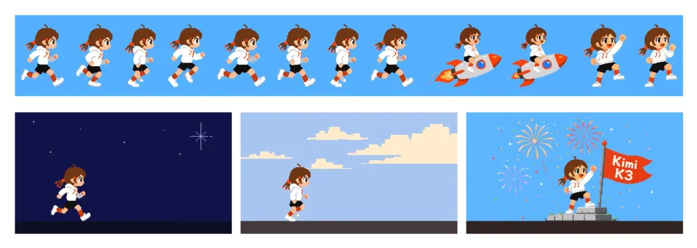</a>

**提示詞**

```text
製作一個可玩的 Chrome 恐龍跑酷遊戲。
```

[查看詳情 ↗](https://www.tripo3d.ai/zh-Hant/3d-prompts/make-a-playable-chrome-dino-game-2081867025140650236) · [查看原文](https://x.com/unseenmars_/status/2081867025140650236) · [返回案例導覽](#all-prompts)

---

<a id="realistic-helicopter-shooter-game-2081791572115435765"></a>

### 用於逼真直升機射擊遊戲的 Kimi K3 提示詞

[karti](https://x.com/Abobsterina) · 2026-07-27 · Kimi K3 · 遊戲

<a href="https://www.tripo3d.ai/zh-Hant/3d-prompts/realistic-helicopter-shooter-game-2081791572115435765">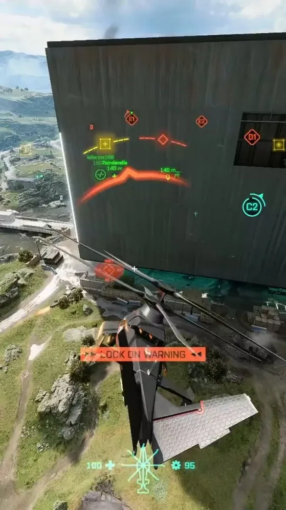</a>

**提示詞**

```text
幫我製作一個逼真的直升機射擊遊戲。
```

[查看詳情 ↗](https://www.tripo3d.ai/zh-Hant/3d-prompts/realistic-helicopter-shooter-game-2081791572115435765) · [查看原文](https://x.com/Abobsterina/status/2081791572115435765) · [返回案例導覽](#all-prompts)

---

<a id="subway-surfers-style-game-2081766198082220514"></a>

### 用於 Subway Surfers 風格遊戲的 Kimi K3 提示詞

[Arindam Majumder 𝕏](https://x.com/Arindam_1729) · 2026-07-27 · Kimi K3 · 遊戲

<a href="https://www.tripo3d.ai/zh-Hant/3d-prompts/subway-surfers-style-game-2081766198082220514">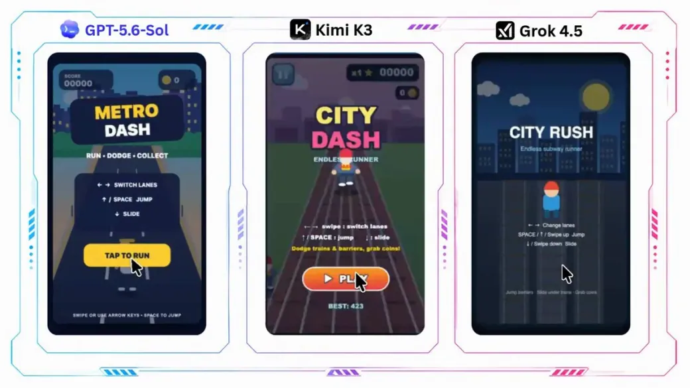</a>

**提示詞**

```text
製作一個 Subway Surfers 遊戲
```

[查看詳情 ↗](https://www.tripo3d.ai/zh-Hant/3d-prompts/subway-surfers-style-game-2081766198082220514) · [查看原文](https://x.com/Arindam_1729/status/2081766198082220514) · [返回案例導覽](#all-prompts)

---

<a id="counter-strike-inspired-three-js-fps-2081607528790856068"></a>

### 用於受 Counter-Strike 啟發的 Three.js FPS 的 Claude Opus 5 提示詞

[Build Fast with AI](https://x.com/BuildFastWithAI) · 2026-07-27 · Claude Opus 5 · 遊戲

<a href="https://www.tripo3d.ai/zh-Hant/3d-prompts/counter-strike-inspired-three-js-fps-2081607528790856068">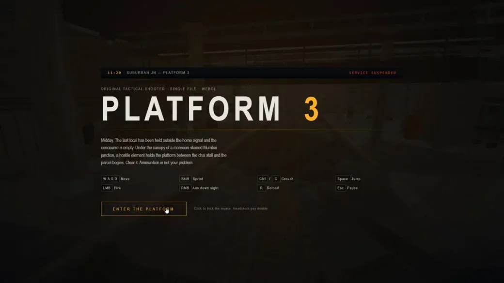</a>

**提示詞**

```text
一款受 Counter-Strike 啟發、設定在火車站中的戰術 FPS。three.js，單個 HTML 檔案，全部原創素材。
```

[查看詳情 ↗](https://www.tripo3d.ai/zh-Hant/3d-prompts/counter-strike-inspired-three-js-fps-2081607528790856068) · [查看原文](https://x.com/BuildFastWithAI/status/2081607528790856068) · [返回案例導覽](#all-prompts)

---

<a id="infinite-three-js-paper-machine-2081533777340506251"></a>

### Claude Fable 5 的無限 Three.js 紙帶機提示詞

[0xMarioNawfal](https://x.com/RoundtableSpace) · 2026-07-27 · Claude Fable 5 · 互動

<a href="https://www.tripo3d.ai/zh-Hant/3d-prompts/infinite-three-js-paper-machine-2081533777340506251">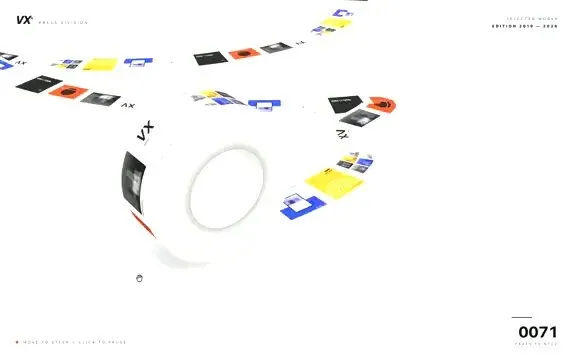</a>

**提示詞**

```text
用單個提示詞建置一個無限的 Three.js 紙帶機。將靜態的 Pinterest 概念轉換為一個可執行的 3D Web 應用。應用應渲染一條無限滾動的紙帶，並在其表面實時持續列印動態圖片。
```

[查看詳情 ↗](https://www.tripo3d.ai/zh-Hant/3d-prompts/infinite-three-js-paper-machine-2081533777340506251) · [查看原文](https://x.com/RoundtableSpace/status/2081533777340506251) · [返回案例導覽](#all-prompts)

---

<a id="interactive-3d-robotic-hand-simulation-2081475055536820506"></a>

### Claude Opus 5 的互動式 3D 機械手模擬提示詞

[Thomas Walker](https://x.com/ThomasMWWalker) · 2026-07-26 · Claude Opus 5 · 動畫

<a href="https://www.tripo3d.ai/zh-Hant/3d-prompts/interactive-3d-robotic-hand-simulation-2081475055536820506"></a>

**提示詞**

```text
我讓 9 種模型/推理配置使用同一個一次性提示詞：建置一個互動式 3D 機械手模擬。
```

[查看詳情 ↗](https://www.tripo3d.ai/zh-Hant/3d-prompts/interactive-3d-robotic-hand-simulation-2081475055536820506) · [查看原文](https://x.com/ThomasMWWalker/status/2081475055536820506) · [返回案例導覽](#all-prompts)

---

<a id="vespa-125-3d-configurator-2081439705506435440"></a>

### 為 3D 配置器新增 Vespa 125 的提示詞

[Raf Lorenz](https://x.com/rafintheloop) · 2026-07-26 · Claude Fable 5 · 互動

<a href="https://www.tripo3d.ai/zh-Hant/3d-prompts/vespa-125-3d-configurator-2081439705506435440"></a>

**提示詞**

```text
將一輛 Vespa 125 新增到我的 3D 配置器中，端到端完成。
```

[查看詳情 ↗](https://www.tripo3d.ai/zh-Hant/3d-prompts/vespa-125-3d-configurator-2081439705506435440) · [查看原文](https://x.com/rafintheloop/status/2081439705506435440) · [返回案例導覽](#all-prompts)

---

<a id="ultra-realistic-3d-flight-simulator-2081403842256605254"></a>

### 超寫實 3D 飛行模擬器提示詞

[noclipepe](https://x.com/noclipepe) · 2026-07-26 · Claude Fable 5 · 動畫

<a href="https://www.tripo3d.ai/zh-Hant/3d-prompts/ultra-realistic-3d-flight-simulator-2081403842256605254">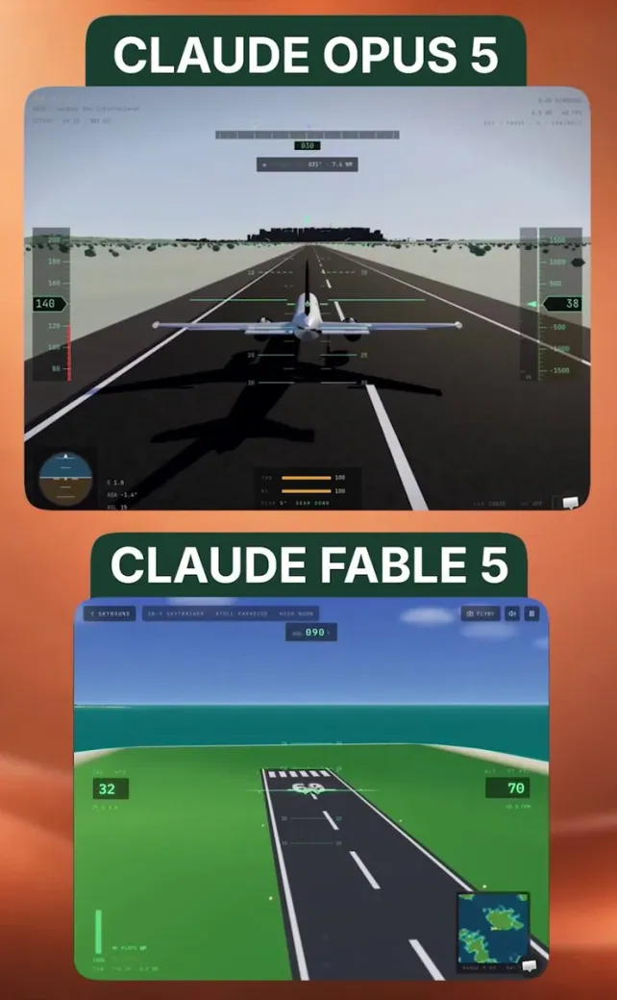</a>

**提示詞**

```text
建置一個超逼真的 3D 飛行模擬器。
```

[查看詳情 ↗](https://www.tripo3d.ai/zh-Hant/3d-prompts/ultra-realistic-3d-flight-simulator-2081403842256605254) · [查看原文](https://x.com/noclipepe/status/2081403842256605254) · [返回案例導覽](#all-prompts)

---

<a id="build-a-3d-minecraft-clone-2081305039159620085"></a>

### 使用 Claude Opus 5 建置 3D Minecraft 復刻的提示詞

[OpenBuilder](https://x.com/BuilderGuest) · 2026-07-26 · Claude Opus 5 · 遊戲

<a href="https://www.tripo3d.ai/zh-Hant/3d-prompts/build-a-3d-minecraft-clone-2081305039159620085">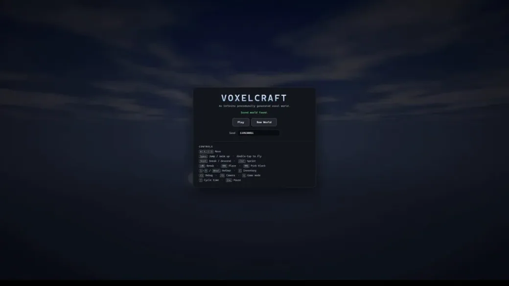</a>

**提示詞**

```text
CLAUDE OPUS 5 用一個簡單提示在 30 分鐘內建置一個 minecraft 復刻："Create a full fledged 3D minecraft clone"
```

[查看詳情 ↗](https://www.tripo3d.ai/zh-Hant/3d-prompts/build-a-3d-minecraft-clone-2081305039159620085) · [查看原文](https://x.com/BuilderGuest/status/2081305039159620085) · [返回案例導覽](#all-prompts)

---

<a id="3d-flappy-bird-game-2081260140117045275"></a>

### 3D Flappy Bird 遊戲提示詞

[SrijibBose](https://x.com/SrijibBose) · 2026-07-26 · Claude Fable 5 / Claude Opus 5 · 遊戲

<a href="https://www.tripo3d.ai/zh-Hant/3d-prompts/3d-flappy-bird-game-2081260140117045275">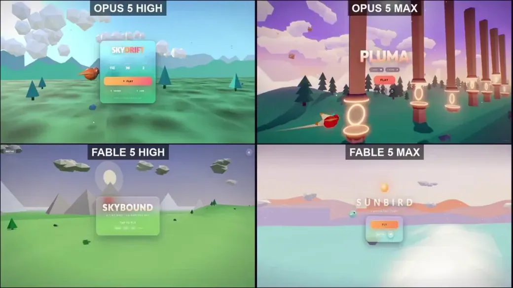</a>

**提示詞**

```text
建置一個 3D Flappy Bird 遊戲。
```

[查看詳情 ↗](https://www.tripo3d.ai/zh-Hant/3d-prompts/3d-flappy-bird-game-2081260140117045275) · [查看原文](https://x.com/SrijibBose/status/2081260140117045275) · [返回案例導覽](#all-prompts)

---

<a id="cinematic-vietnam-jungle-helicopter-animation-2081200833656451322"></a>

### 越南叢林直升機電影級動畫提示詞

[Kirill](https://x.com/kirillk_web3) · 2026-07-26 · Claude Fable 5 · 動畫

<a href="https://www.tripo3d.ai/zh-Hant/3d-prompts/cinematic-vietnam-jungle-helicopter-animation-2081200833656451322">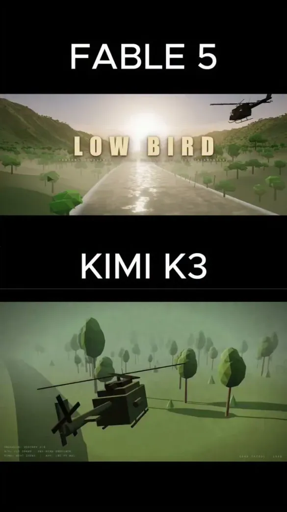</a>

**提示詞**

```text
一段電影級 3D 動畫，描繪一架軍用直升機在戰爭期間飛越越南叢林。
```

[查看詳情 ↗](https://www.tripo3d.ai/zh-Hant/3d-prompts/cinematic-vietnam-jungle-helicopter-animation-2081200833656451322) · [查看原文](https://x.com/kirillk_web3/status/2081200833656451322) · [返回案例導覽](#all-prompts)

---

<a id="jelly-jungle-3d-browser-game-2081024333120733188"></a>

### 果凍叢林：3D 平台跳躍遊戲

[Jared](https://x.com/jaredliu_bravo) · 2026-07-25 · GPT-6 Astra · 遊戲

改編自: [aditya](https://x.com/adxtyahq)

<a href="https://www.tripo3d.ai/zh-Hant/3d-prompts/jelly-jungle-3d-browser-game-2081024333120733188">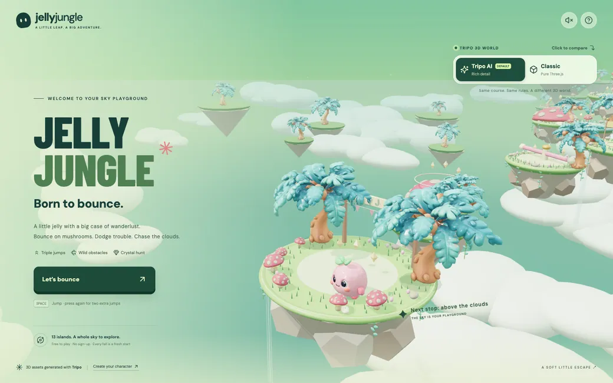</a>

**提示詞**

```text
# Jelly Jungle — 雲端之上的冒險

## 1. 目標
製作一款完整的第三人稱平台遊戲：一隻長著薄荷色嫩芽的粉紅果凍，透過三段跳與彈簧蘑菇穿越 13 座浮空島嶼。使用 https://jelly-jungle.tripo.page/ 及提供的參考資料，完成關卡、構圖與最終視覺風格。這是 Jared 參考 aditya 在 Jelly Jungle 發表的作品、重新製作的版本，網址為 https://x.com/adxtyahq/status/2081024333120733188.。所有遊戲 UI 維持英文。

## 2. 視覺方向
打造柔和、雕塑玩具般的世界：薄荷色、鼠尾草綠、奶油色、湖水綠、珊瑚粉與暖金色。使用覆有圓潤草皮邊緣的厚實島嶼、不規則暖灰色岩石底部、垂掛藤蔓、花朵、鵝卵石、小蘑菇、偶爾出現的瀑布，以及淡色雲海。加入柔和陰影、輕柔霧氣、細微環境反射、呼吸／擠壓與伸展動畫、搖曳的樹木和旋轉水晶。岩石須低於落地平面，植被不得遮擋下一個落點。

在桌面寬度下，預留左側 35–40% 放置堆疊排列的 JELLY／JUNGLE 標題與 CTA；將起始島嶼置於畫面偏右中央，讓關卡向右上方延伸。使用接近 (13,20,25) 的透視攝影機，目標點為 (-5,1.5,-5)，垂直視野約 40°，再依參考圖調整。在 390px 手機畫面上，將果凍與島嶼重新構圖並置於標題上方，不要直接裁切桌面版畫面。遊玩時從角色後方跟隨，偏移量約為 (0,8.8,15.3)，視線看向前方約 5.8 個單位的位置。維持穩定的地平線與實用的地面陰影。

使用在地的 Barlow Condensed 風格展示字體、DM Sans 風格的控制項、森林綠按鈕與柔和霧面面板。開場文案：「Born to bounce.」與「Let’s bounce」。在上方顯示功能按鈕，遊玩時顯示精簡的跑酷 HUD，下方放置三段式跳躍計量條，並提供醒目的 Classic／Tripo AI 比較切換。觸控搖桿、Jump、HUD 與頁尾必須彼此分離。

## 3. 關卡
使用以下基準配置。前進方向為負 Z；y 為落地高度，r 為碰撞半徑。加入起始旗幟與暖金色終點傳送門。

| 島嶼 | x | z | y | r | 類型／名稱 |
| --- | --- | --- | --- | --- | --- |
| 01 | 0 | 0 | 1.2 | 5.4 | 起點／First Leap |
| 02 | 0 | -10 | 1.6 | 3.1 | 普通／Easy Does It |
| 03 | -4 | -19 | 2.0 | 3.1 | 彈簧／Mushroom Launch |
| 04 | 2 | -29 | 3.2 | 3.6 | 旋轉／Candy Spinner |
| 05 | 7 | -39 | 3.8 | 4.0 | 檢查點／Cloud Camp |
| 06 | 1 | -49 | 4.1 | 3.1 | 移動／Wandering Island |
| 07 | -6 | -59 | 4.7 | 3.2 | 彈簧／Bounce Again |
| 08 | -1 | -71 | 5.8 | 3.8 | 旋轉／Double Trouble |
| 09 | 7 | -82 | 6.5 | 4.0 | 檢查點／Starlight Camp |
| 10 | 4 | -92 | 7.1 | 3.0 | 崩塌／Keep Moving |
| 11 | -3 | -102 | 7.7 | 3.2 | 移動／Cloud Crossing |
| 12 | -7 | -113 | 8.2 | 3.3 | 彈簧／One Last Bounce |
| 13 | 0 | -127 | 10.0 | 5.0 | 終點／Above the Clouds |

## 4. 資產清單
依序準備三組替換資產：
- `jelly`：圓潤糖果粉色軟乙烯基角色，擁有小手小腳、大型深色橢圓眼睛與高光、紅潤臉頰、小巧微笑，以及薄荷色雙葉嫩芽；保持臉部清晰可見，高度接近 1.65 個單位。
- `mushroom`：寬大的珊瑚粉穹頂，帶有凸起的象牙色斑點、奶油色菌褶與短而粗的菌柄；所有彈簧蘑菇都重複使用此模型，並提供寬大且穩定的傘蓋。
- `tree`：彎曲的桃棕色樹幹、超大的圓潤湖水綠／薄荷色棕櫚葉，以及成簇的小桃色果實；在整個關卡中重複使用。
島嶼、雲朵、藤蔓、花朵、小岩石、瀑布水幕、水晶、旗幟、旋轉器與傳送門維持程序化生成。這些元素用來定義關卡與特效，不列為額外的生成模型任務。將每個模型置於未縮放的包裝節點中；腳部／樹幹底部位於區域 y=0。以數值和視覺兩種方式對齊蘑菇傘蓋與碰撞表面。兩種模式使用相同的碰撞器。

## 5. 物理與回饋
使用固定的 1/120 秒步長、接近 22 units/s² 的重力、接近 8.8 units/s 的移動速度、靈敏的地面加速度，以及較柔和的空中轉向。將對角線輸入正規化。WASD／方向鍵用於移動；每次新的 Space 按鍵都會跳躍。在落地前準許恰好三次跳躍：初始向上速度約 9.2，兩次空中跳躍約 8.5。按住按鍵不得重複觸發跳躍。落地後恢復全部三次跳躍。彈簧蘑菇以約 16 的速度將角色彈起，恢復跳躍次數，並在重新觸發冷卻期間播放壓縮／回彈動畫。

旋轉平台會帶動站在上面的角色；低矮的旋轉糖果棒只有在碰撞區段接觸且垂直方向重疊時才會造成擊退。跳躍可以越過它們。角色受擊後提供約 1.7 秒的無敵時間。移動島嶼在水平方向以約 2.6 個單位來回擺動，並依位移帶動站在上面的角色。崩塌島嶼在落地 1.5 秒後開始搖晃並消失，約 4 秒後恢復；隱藏平台不得產生碰撞。

第 05 與第 09 座島嶼上的檢查點，會在角色墜落後恢復位置、速度與跳躍次數，同時保留已收集的水晶並增加墜落次數。按下 R 可手動返回，不增加墜落懲罰。每座島嶼放置三顆水晶，共 39 顆；每顆只能收集一次，並提供音效、粒子與 HUD 回饋。抵達最終島嶼時只完成一次遊戲；水晶為選擇性收集項目。顯示時間、水晶數量、島嶼編號與進度；完成時顯示時間、墜落次數與星星：收集 ≥30 顆得三顆星，≥18 顆得兩顆星，否則得一顆星。儲存最佳時間並提供重玩功能。不加入生命值或戰鬥。

提供支援指標捕捉的觸控搖桿與大型 Jump 按鈕；每次點按最多消耗一次跳躍。清除已取消或持續按住的輸入。加入說明與暫停對話框、隱藏分頁後的復原機制、不阻塞遊戲的回饋，以及預設靜音且可選用的 Web Audio。重新開始時重置所有遊戲流程、收藏品與平台狀態。

## 6. 實作
使用 Vite、Three.js 與原生 JavaScript／HTML／CSS，並分成物理／關卡、世界／資產註冊表、適配、輸入／UI 與音訊模組。將相依套件、字體與資產在本機打包。GLTFLoader 匯入自包含模型；替換前先驗證有限邊界、可見幾何與內嵌資源。載入失敗時保留目前模型，避免過時的非同步載入結果生效，並釋放被取代的資源。如有需要，可選用 Blender 進行網格清理或樞軸修正。

Classic 使用三種程序化變體；匯入模式使用可用的替換資產，並回報其實際狀態。切換模式或匯入資產時，保留位置、速度、跳躍次數、時間、水晶與檢查點，不重新載入。對重複的靜態場景進行實例化或合併，將 DPR 控制在約 1.5，並限制特效數量。在實際攝影機視角下測量繪製呼叫、三角形數量與幀時間；優先減少遠處裝飾。

## 7. 驗收
交付完整原始碼、lockfile、精確的開發／建置指令與靜態輸出。驗證三次全新的跳躍且不得出現第四次跳躍、彈簧對齊、移動平台承載、掃掠器接觸、崩塌／恢復、檢查點、獨立收集物、暫停／重新開始與完成流程。透過實際輸入與物理系統完成全部 13 座島嶼；傳送角色不能證明關卡可抵達。檢查鍵盤與觸控、兩種美術模式、每條匯入／重置／失敗路徑，以及狀態保留。比較桌面版／手機版穩定後的開場與遊玩畫面，檢查溢位與載入錯誤，並回報實際效能條件。遵循下方的共用資產工作流程。
```

[查看詳情 ↗](https://www.tripo3d.ai/zh-Hant/3d-prompts/jelly-jungle-3d-browser-game-2081024333120733188) · [查看原文](https://x.com/adxtyahq/status/2081024333120733188) · [線上展示](https://jelly-jungle.tripo.page/) · [返回案例導覽](#all-prompts)

---

<a id="explorable-anime-style-japanese-street-2080834581247435102"></a>

### 用於可探索日本郊區街道的 Three.js 提示詞，採用手繪動漫風格

[GMI Cloud](https://x.com/gmi_cloud) · 2026-07-25 · Claude Fable 5 · 場景

<a href="https://www.tripo3d.ai/zh-Hant/3d-prompts/explorable-anime-style-japanese-street-2080834581247435102">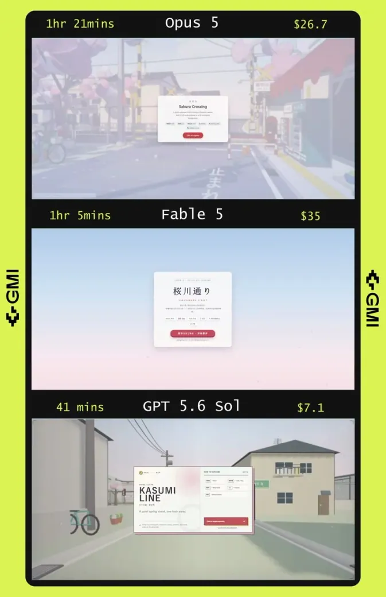</a>

**提示詞**

```text
在 Three.js 中建置一條可探索的日本郊區街道，完整 3D 渲染，呈現為手繪動漫背景
```

[查看詳情 ↗](https://www.tripo3d.ai/zh-Hant/3d-prompts/explorable-anime-style-japanese-street-2080834581247435102) · [查看原文](https://x.com/gmi_cloud/status/2080834581247435102) · [返回案例導覽](#all-prompts)

---

<a id="counter-strike-inspired-browser-game-2080821527365218759"></a>

### 使用 Kimi K3 建置的瀏覽器版《反恐精英》風格遊戲

[FHILY👑](https://x.com/Oluwaphilemon1) · 2026-07-25 · Kimi K3 · 遊戲

<a href="https://www.tripo3d.ai/zh-Hant/3d-prompts/counter-strike-inspired-browser-game-2080821527365218759">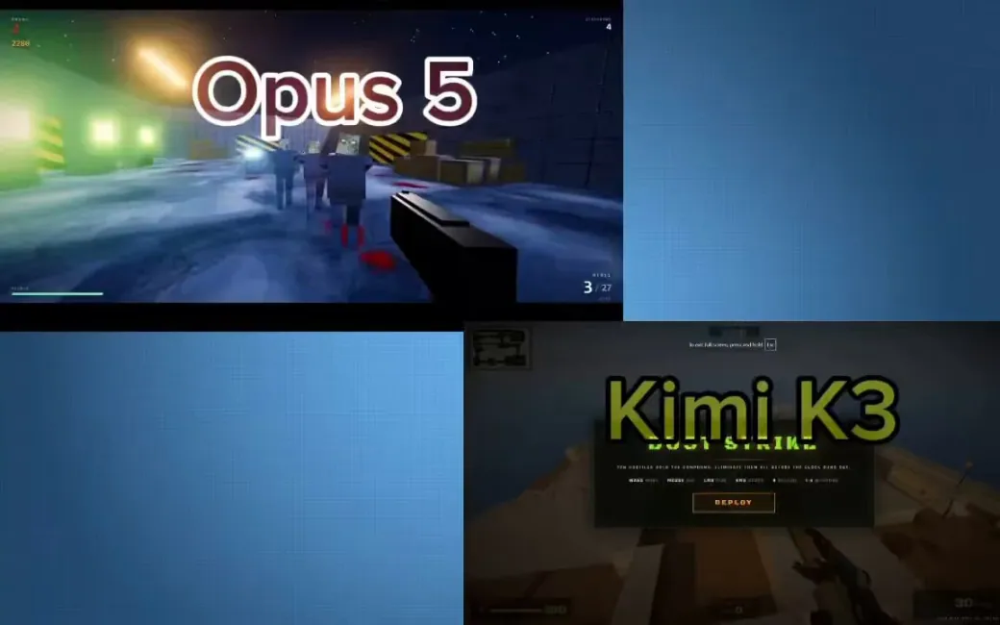</a>

**提示詞**

```text
用 Kimi K3 在瀏覽器裡做了一個受《反恐精英》啟發的遊戲。

一個 HTML 檔案。超過 3700 行程式碼。無需建置步驟。

它包含：

🔫 受 Dust2 啟發的佈局，帶有隧道、貓道和 A 長 
🎯 AK、帶瞄準鏡的 AWP、MP5、刀和換彈機制 
🤖 10 個 AI 機器人，會巡邏、對槍聲做出反應，並推進到你的位置 
💥 爆頭、擊殺資訊，以及 2 分鐘的回合系統 
🔊 完全程式化音訊，沒有任何音效檔案 
🌐 使用 Three.js 和 PBR 材質建置，完全在瀏覽器中執行
```

[查看詳情 ↗](https://www.tripo3d.ai/zh-Hant/3d-prompts/counter-strike-inspired-browser-game-2080821527365218759) · [查看原文](https://x.com/Oluwaphilemon1/status/2080821527365218759) · [返回案例導覽](#all-prompts)

---


[完整目錄](catalog.zh-Hant.md) · [←](catalog.zh-Hant.7.md) · **8 / 9** · [→](catalog.zh-Hant.9.md)

<p align="center"><strong><a href="https://www.tripo3d.ai/zh-Hant/3d-prompts?utm_source=github&amp;utm_medium=referral&amp;utm_campaign=awesome_3d_prompts&amp;utm_content=catalog_footer">完整目錄 →</a></strong></p>
