<!-- Generated from Growth CMS by templates/catalog.md. Edit content in CMS; run npm run sync. -->

# Awesome 3D Prompts — 9 / 10

[← Awesome 3D Prompts](../README.md)

<p>
  <a href="../docs/catalog.en.9.md"></a>
  <a href="../docs/catalog.zh.9.md"></a>
  <a href="../docs/catalog.zh-Hant.9.md"></a>
  <a href="../docs/catalog.ja.9.md"></a>
  <a href="../docs/catalog.ko.9.md"></a>
  <a href="../docs/catalog.es.9.md"></a>
  <a href="../docs/catalog.pt.9.md"></a>
  <a href="../docs/catalog.de.9.md"></a>
  <a href="../docs/catalog.fr.9.md"></a>
  <a href="../docs/catalog.it.9.md"></a>
  <a href="../docs/catalog.ru.9.md"></a>
  <a href="../docs/catalog.tr.9.md"></a>
  <a href="../docs/catalog.uk.9.md"></a>
  <a href="../docs/catalog.vi.9.md"></a>
</p>

[完整目錄](catalog.zh-Hant.md) · [←](catalog.zh-Hant.8.md) · **9 / 10** · [→](catalog.zh-Hant.10.md)

<a id="all-prompts"></a>

<details>
<summary>瀏覽案例 (50)</summary>

- [高達風機甲展示](#gundam-inspired-mecha-showcase-2095106919530930221)
- [參考圖驅動的 Three.js 作品集](#reference-driven-three-js-portfolio-2095104073590808644)
- [互動式 F-35A 技術模型](#interactive-f-35a-technical-model-2095094543339446572)
- [Three.js MS-06 風格機甲](#three-js-ms-06-inspired-mecha-2095085944391270759)
- [單 HTML 檔案中的鮮活宇宙](#living-universe-in-one-html-file-2095054116372508955)
- [原生 C++ 類魂遊戲](#native-c-souls-like-game-2095053114600755576)
- [可玩的 3D 蛇梯棋](#playable-3d-snakes-and-ladders-2095050993184669825)
- [肖像轉動態體素](#portrait-transformed-into-kinetic-voxels-2095048967092625663)
- [互動式 Three.js 城堡](#interactive-three-js-castle-2095048818203275584)
- [NIGHTBAND 互動式短波電臺](#nightband-interactive-shortwave-radio-2095026928210346175)
- [完整 Unity 網球遊戲](#complete-unity-tennis-game-2095021275236495408)
- [發光峽谷上方的古代神廟](#ancient-temple-above-a-glowing-canyon-2095012880383099339)
- [互動式多倫多天際線](#interactive-toronto-skyline-2095000329561485584)
- [自主執行的模擬人生式系統](#autonomous-sims-like-life-simulation-2094949450196090988)
- [擁有思考型 NPC 的體素村莊](#voxel-village-with-thinking-npcs-2094930970675741171)
- [幻想風富士山登頂之旅](#fantasy-ascent-to-mount-fuji-2094930804296274414)
- [從零建置 Godot 賽車遊戲](#godot-racing-game-built-from-scratch-2094925359372284022)
- [平面圖轉 Blender 漫遊](#floor-plan-to-blender-walkthrough-2094925117344428232)
- [確定性 13.6 萬體素寶塔](#deterministic-136-000-voxel-pagoda-2094916609219461211)
- [透過 Blender 自動化建置高細節機器人](#detailed-robot-through-blender-automation-2094909825561805003)
- [開放世界犯罪遊戲原型](#open-world-crime-game-prototype-2094907986942591338)
- [Mini Militia 風格瀏覽器遊戲](#mini-militia-style-browser-game-2094900523900219725)
- [雨中第一人稱海洋沙盒](#rainy-first-person-ocean-sandbox-2094900247000654222)
- [懸浮體素島嶼](#floating-voxel-island-2094899802588713418)
- [鮮活的體素中世紀王國](#living-voxel-medieval-kingdom-2094899477626720403)
- [帶紋理的 3D 資產生產流程](#textured-3d-asset-production-workflow-2094896750234378508)
- [三款緊湊物理小遊戲](#three-compact-physics-game-concepts-2094895071304839400)
- [Three.js AAA 卡丁車競速遊戲](#aaa-kart-racing-game-in-three-js-2094894312370692443)
- [一次生成的 Three.js 機場模擬](#one-shot-three-js-airport-simulation-2094893572617044439)
- [懸浮日本寶塔城市](#floating-japanese-pagoda-city-2094886088963690607)
- [Three.js 空客 H145 直升機](#airbus-h145-in-three-js-2094882571083735351)
- [第一次世界大戰體素模擬器](#world-war-i-voxel-simulator-2094881469155914170)
- [未來私人島嶼豪宅](#futuristic-private-island-mansion-2094879208304685524)
- [程式化生成的 Three.js 世界](#procedurally-generated-three-js-world-2094873862315843910)
- [互動式 3D 人腦訊號](#interactive-3d-human-brain-signals-2094873080590225728)
- [照片級 Three.js 自然景觀](#photorealistic-three-js-landscape-2094871858206191667)
- [帶 WebGL Shader 的 AAA 屍潮射擊遊戲](#aaa-horde-shooter-with-webgl-shaders-2094869490165039243)
- [可玩的泰坦尼克災難遊戲](#playable-titanic-disaster-game-2094867850355679617)
- [多人恐龍生存遊戲](#multiplayer-dinosaur-survival-game-2094866225960493189)
- [十分鐘生成並繼續完善 Three.js 遊戲](#ten-minute-three-js-game-then-refined-2094855905678446777)
- [玻璃大腦能力演示](#glass-brain-capability-demo-2094853472864682360)
- [程式化體素城堡展示](#procedural-voxel-castle-showcase-2093690427849191855)
- [用於 Blender 組裝 Jeep 風格 4x4 的提示詞](#jeep-style-4x4-assembly-in-blender-2082845759452463405)
- [用於獨立 HTML 場景的 3D 破壞物理提示詞](#3d-destruction-physics-in-self-contained-html-2082832042702561372)
- [Claude Opus 5 機甲機器人藍圖提示集](#mech-robot-blueprint-set-2082760534500188606)
- [Need for Speed 風格 Godot 遊戲提示詞](#need-for-speed-style-godot-game-2082714235373584582)
- [Kimi K3 玻璃水族箱開裂爆裂 3D 模擬提示詞](#cracking-aquarium-3d-simulation-2082528683747873194)
- [Kimi K3 的可玩戰鬥遊戲提示詞](#playable-combat-game-2082507403598373134)
- [Kimi K3 的《英雄聯盟》風格 1v1 單頁 HTML 遊戲提示詞](#league-of-legends-style-1v1-game-in-one-html-file-2082474707727581564)
- [適用於 Claude Opus 5 的單檔案 3D 太陽視覺化提示詞](#single-file-3d-sun-visualizer-2082461416049525077)

</details>
<a id="gundam-inspired-mecha-showcase-2095106919530930221"></a>

### 高達風機甲展示

[Crayon](https://x.com/usecrayon) · 2026-09-02 · Claude Fable 5.1 · 互動

<a href="https://www.tripo3d.ai/zh-Hant/3d-prompts/gundam-inspired-mecha-showcase-2095106919530930221">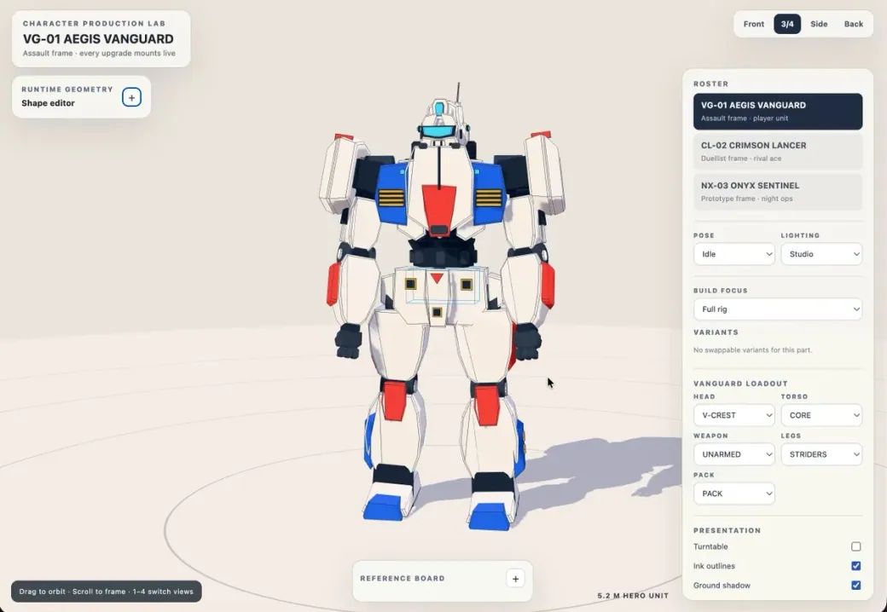</a>

*根據原作品整理的創作說明*

**提示詞**

```text
建立精緻的 Three.js 原創高達風機甲展示，包含機械關節、尺度參照、戲劇化燈光與檢視鏡頭。
```

[查看詳情 ↗](https://www.tripo3d.ai/zh-Hant/3d-prompts/gundam-inspired-mecha-showcase-2095106919530930221) · [查看原文](https://x.com/usecrayon/status/2095106919530930221) · [返回案例導覽](#all-prompts)

---

<a id="reference-driven-three-js-portfolio-2095104073590808644"></a>

### 參考圖驅動的 Three.js 作品集

[Meng To](https://x.com/MengTo) · 2026-09-02 · Claude Fable 5.1 · 互動

<a href="https://www.tripo3d.ai/zh-Hant/3d-prompts/reference-driven-three-js-portfolio-2095104073590808644">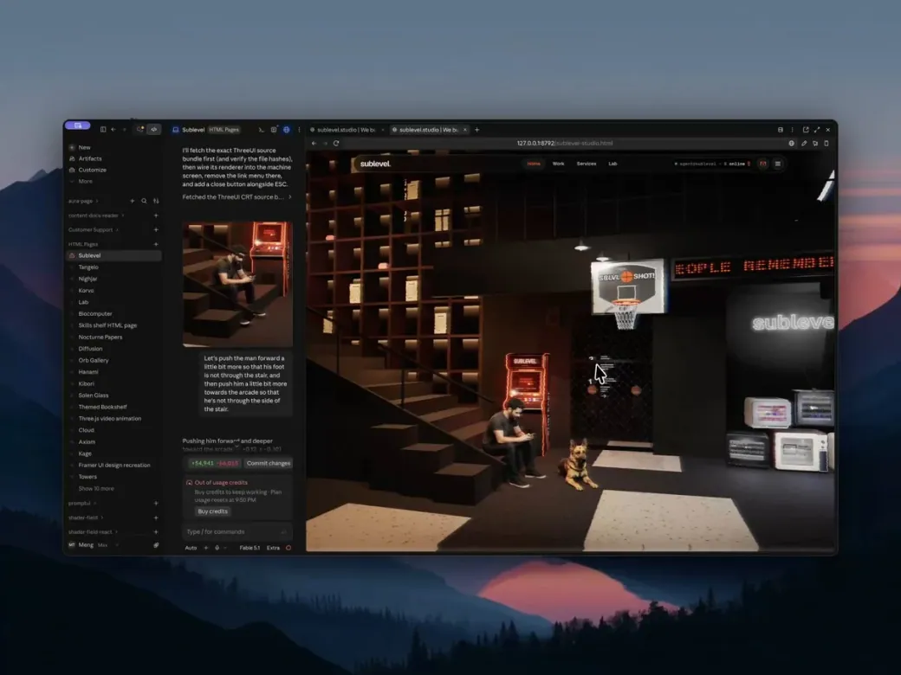</a>

*根據原作品整理的創作說明*

**提示詞**

```text
把給定視覺參考重建為精緻的 Three.js 網站，加入分層粒子、VHS 與 CRT 質感、流暢轉場和響應式互動。
```

[查看詳情 ↗](https://www.tripo3d.ai/zh-Hant/3d-prompts/reference-driven-three-js-portfolio-2095104073590808644) · [查看原文](https://x.com/MengTo/status/2095104073590808644) · [專案原始碼](https://github.com/MengTo/sublevel-studio) · [線上展示](https://mengto.github.io/sublevel-studio/) · [返回案例導覽](#all-prompts)

---

<a id="interactive-f-35a-technical-model-2095094543339446572"></a>

### 互動式 F-35A 技術模型

[Edgex](https://x.com/SahilExec) · 2026-09-02 · Claude Fable 5.1 · 互動

<a href="https://www.tripo3d.ai/zh-Hant/3d-prompts/interactive-f-35a-technical-model-2095094543339446572">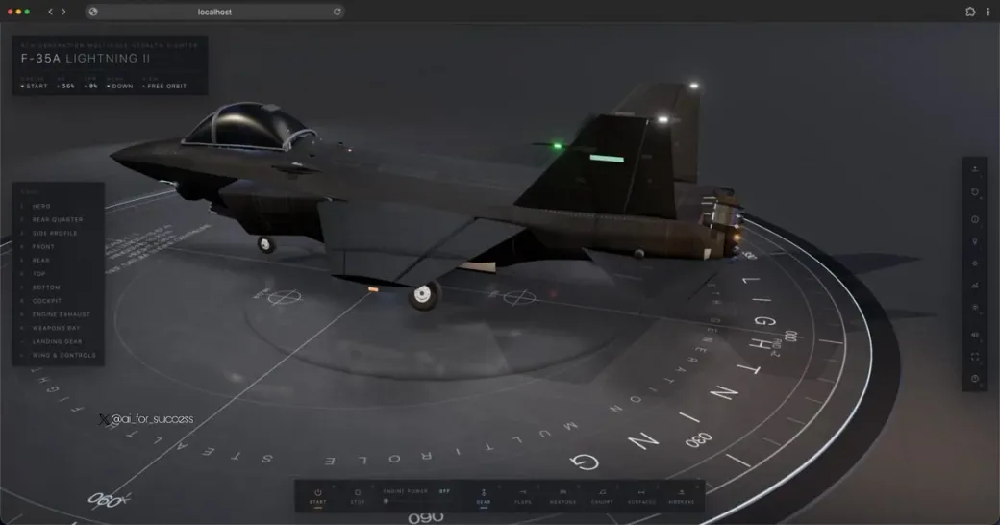</a>

*根據原作品整理的創作說明*

**提示詞**

```text
透過程式碼生成高細節互動式 F-35A，準確處理比例、控制面、起落架、座艙提示、標籤和檢視動畫。
```

[查看詳情 ↗](https://www.tripo3d.ai/zh-Hant/3d-prompts/interactive-f-35a-technical-model-2095094543339446572) · [查看原文](https://x.com/SahilExec/status/2095094543339446572) · [返回案例導覽](#all-prompts)

---

<a id="three-js-ms-06-inspired-mecha-2095085944391270759"></a>

### Three.js MS-06 風格機甲

[Hakuei](https://x.com/akiba_tokyo_jp) · 2026-09-02 · Claude Fable 5.1 · 資產

<a href="https://www.tripo3d.ai/zh-Hant/3d-prompts/three-js-ms-06-inspired-mecha-2095085944391270759">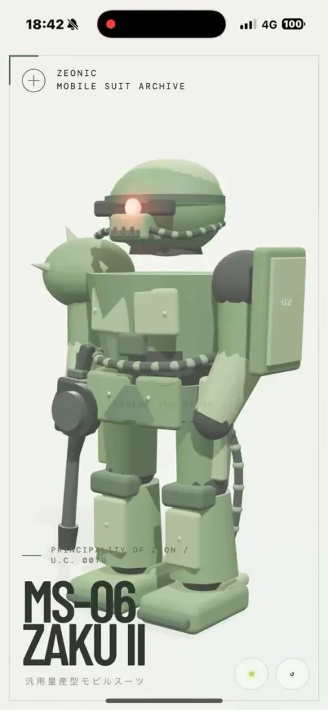</a>

*根據原作品整理的創作說明*

**提示詞**

```text
在乾淨白色背景上用 Three.js 建立高細節 MS-06 風格機甲，確保主體清晰，並完善比例、材質與檢視控制。
```

[查看詳情 ↗](https://www.tripo3d.ai/zh-Hant/3d-prompts/three-js-ms-06-inspired-mecha-2095085944391270759) · [查看原文](https://x.com/akiba_tokyo_jp/status/2095085944391270759) · [返回案例導覽](#all-prompts)

---

<a id="living-universe-in-one-html-file-2095054116372508955"></a>

### 單 HTML 檔案中的鮮活宇宙

[Alex Luhchenko](https://x.com/tiny_frontier) · 2026-09-02 · Claude Fable 5.1 · 動畫

<a href="https://www.tripo3d.ai/zh-Hant/3d-prompts/living-universe-in-one-html-file-2095054116372508955">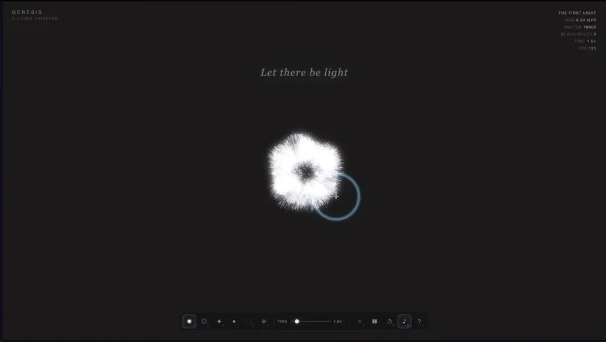</a>

**提示詞**

```text
在一個 HTML 檔案中建置一個鮮活宇宙。
```

<details>
<summary>作者原始提示詞</summary>

```text
build a living universe in one HTML file.
```

</details>

[查看詳情 ↗](https://www.tripo3d.ai/zh-Hant/3d-prompts/living-universe-in-one-html-file-2095054116372508955) · [查看原文](https://x.com/tiny_frontier/status/2095054116372508955) · [線上展示](https://genesis-demo.tinyfrontier.xyz/) · [返回案例導覽](#all-prompts)

---

<a id="native-c-souls-like-game-2095053114600755576"></a>

### 原生 C++ 類魂遊戲

[wbk ᕦ(ò\_ó )ᕤ](https://x.com/wizardbrainz) · 2026-09-02 · Claude Fable 5.1 · 遊戲

<a href="https://www.tripo3d.ai/zh-Hant/3d-prompts/native-c-souls-like-game-2095053114600755576">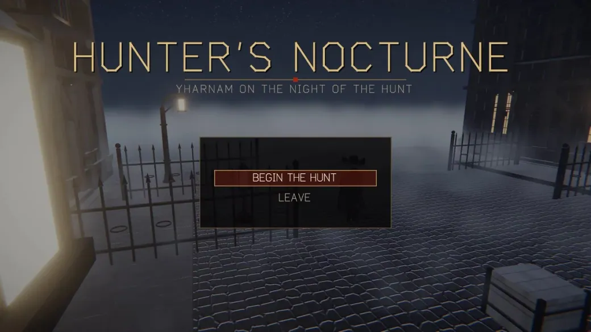</a>

*根據原作品整理的創作說明*

**提示詞**

```text
使用原生 C++ 建立受 Bloodborne 啟發的類魂遊戲，包含原創美術、動畫、音效和音樂，以及響應靈敏的戰鬥、敵人、Boss 與完整短關卡。
```

[查看詳情 ↗](https://www.tripo3d.ai/zh-Hant/3d-prompts/native-c-souls-like-game-2095053114600755576) · [查看原文](https://x.com/wizardbrainz/status/2095053114600755576) · [返回案例導覽](#all-prompts)

---

<a id="playable-3d-snakes-and-ladders-2095050993184669825"></a>

### 可玩的 3D 蛇梯棋

[KC](https://x.com/karanC_12) · 2026-09-02 · Claude Fable 5.1 · 遊戲

<a href="https://www.tripo3d.ai/zh-Hant/3d-prompts/playable-3d-snakes-and-ladders-2095050993184669825">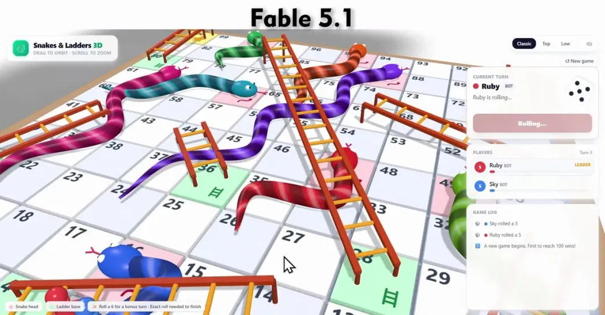</a>

*根據原作品整理的創作說明*

**提示詞**

```text
建置完整可玩的 3D 蛇梯棋，包含骰子動畫、棋盤移動、蛇與梯子、回合、勝利狀態和清晰玩家回饋。
```

[查看詳情 ↗](https://www.tripo3d.ai/zh-Hant/3d-prompts/playable-3d-snakes-and-ladders-2095050993184669825) · [查看原文](https://x.com/karanC_12/status/2095050993184669825) · [返回案例導覽](#all-prompts)

---

<a id="portrait-transformed-into-kinetic-voxels-2095048967092625663"></a>

### 肖像轉動態體素

[Manoj Builds](https://x.com/TenthPrime) · 2026-09-02 · Claude Fable 5.1 · 動畫

<a href="https://www.tripo3d.ai/zh-Hant/3d-prompts/portrait-transformed-into-kinetic-voxels-2095048967092625663">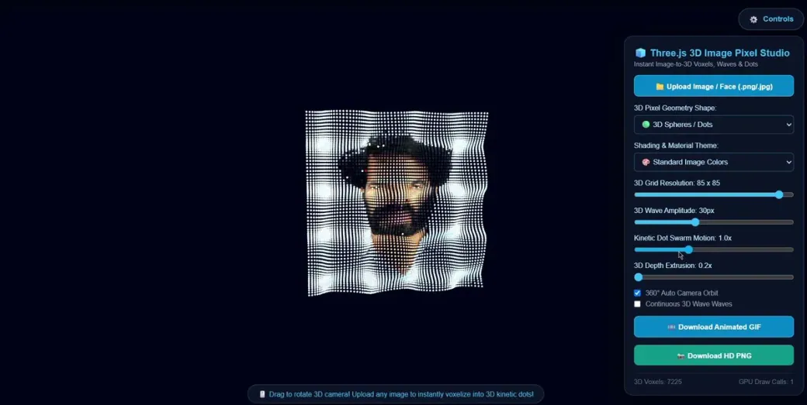</a>

*根據原作品整理的創作說明*

**提示詞**

```text
把上傳肖像轉成超過一萬個可互動 3D 體素，加入波浪位移、賽博朋克 Shader、高效例項化和指標驅動運動。
```

[查看詳情 ↗](https://www.tripo3d.ai/zh-Hant/3d-prompts/portrait-transformed-into-kinetic-voxels-2095048967092625663) · [查看原文](https://x.com/TenthPrime/status/2095048967092625663) · [返回案例導覽](#all-prompts)

---

<a id="interactive-three-js-castle-2095048818203275584"></a>

### 互動式 Three.js 城堡

[Jigs](https://x.com/debugsenpai) · 2026-09-02 · Claude Fable 5.1 · 場景

<a href="https://www.tripo3d.ai/zh-Hant/3d-prompts/interactive-three-js-castle-2095048818203275584">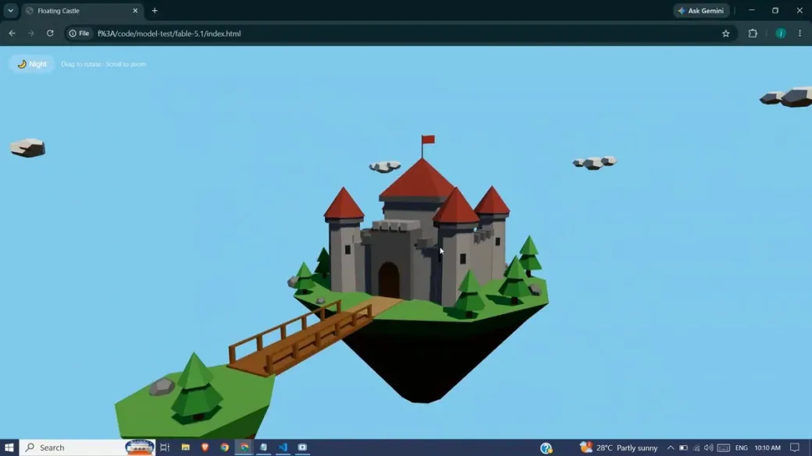</a>

*根據原作品整理的創作說明*

**提示詞**

```text
使用 Three.js 建置互動式 3D 城堡，包含可探索房間、塔樓、城門、地形、氛圍燈光以及流暢的桌面和移動端控制。
```

[查看詳情 ↗](https://www.tripo3d.ai/zh-Hant/3d-prompts/interactive-three-js-castle-2095048818203275584) · [查看原文](https://x.com/debugsenpai/status/2095048818203275584) · [返回案例導覽](#all-prompts)

---

<a id="nightband-interactive-shortwave-radio-2095026928210346175"></a>

### NIGHTBAND 互動式短波電臺

[Neo](https://x.com/NeoAIForecast) · 2026-09-02 · Claude Fable 5.1 · 互動

<a href="https://www.tripo3d.ai/zh-Hant/3d-prompts/nightband-interactive-shortwave-radio-2095026928210346175">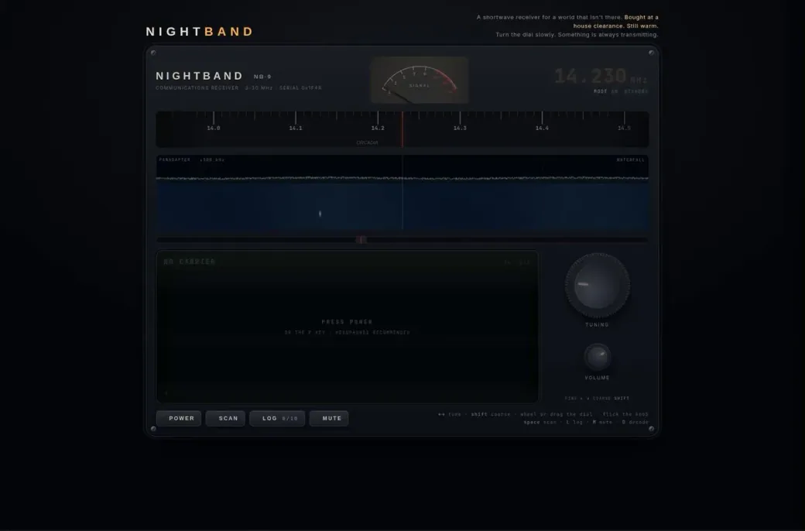</a>

**提示詞**

```text
在單個自包含 HTML 檔案中建立你能做出的最令人印象深刻的網站。你擁有完全的創作自由，目標是展示智慧、創意、技術能力與原創性。
```

<details>
<summary>作者原始提示詞</summary>

```text
Create the most impressive website you can in a single self-contained HTML file. You have complete creative freedom. The goal is to demonstrate how intelligent, creative, technically capable and original you are.
```

</details>

[查看詳情 ↗](https://www.tripo3d.ai/zh-Hant/3d-prompts/nightband-interactive-shortwave-radio-2095026928210346175) · [查看原文](https://x.com/NeoAIForecast/status/2095026928210346175) · [返回案例導覽](#all-prompts)

---

<a id="complete-unity-tennis-game-2095021275236495408"></a>

### 完整 Unity 網球遊戲

[Chong-U](https://x.com/chongdashu) · 2026-09-02 · Claude Fable 5.1 · 遊戲

<a href="https://www.tripo3d.ai/zh-Hant/3d-prompts/complete-unity-tennis-game-2095021275236495408">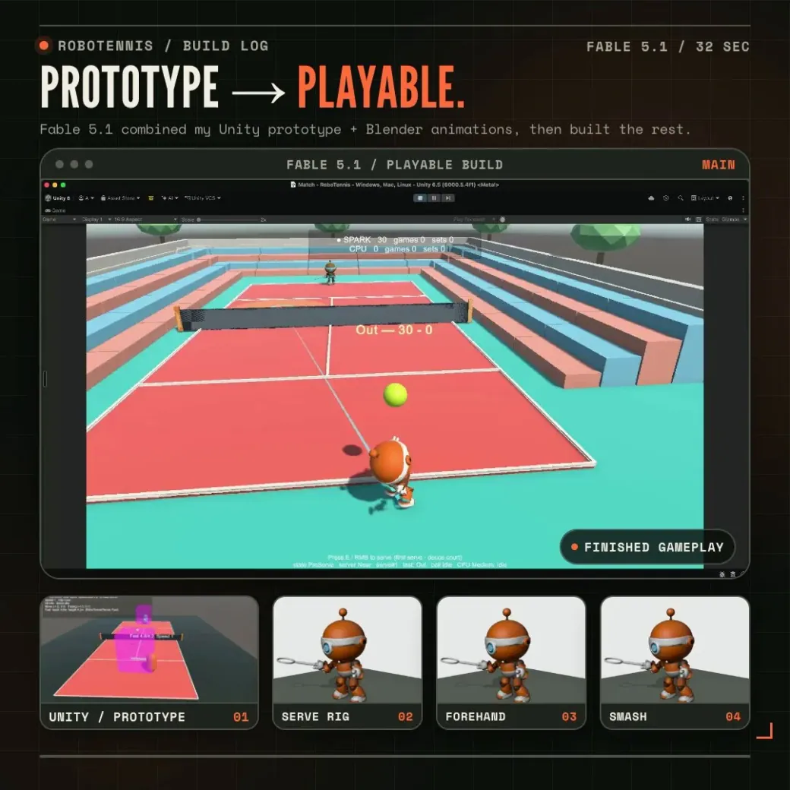</a>

*根據原作品整理的創作說明*

**提示詞**

```text
完成一款可玩的 Unity 網球遊戲，使用 Blender 製作角色，並實現可靠控制、移動與揮拍動畫、球體物理、計分、對手和比賽流程。
```

[查看詳情 ↗](https://www.tripo3d.ai/zh-Hant/3d-prompts/complete-unity-tennis-game-2095021275236495408) · [查看原文](https://x.com/chongdashu/status/2095021275236495408) · [返回案例導覽](#all-prompts)

---

<a id="ancient-temple-above-a-glowing-canyon-2095012880383099339"></a>

### 發光峽谷上方的古代神廟

[Pradeep Kapoor](https://x.com/pradeepXkapoor) · 2026-09-02 · Claude Fable 5.1 · 場景

<a href="https://www.tripo3d.ai/zh-Hant/3d-prompts/ancient-temple-above-a-glowing-canyon-2095012880383099339">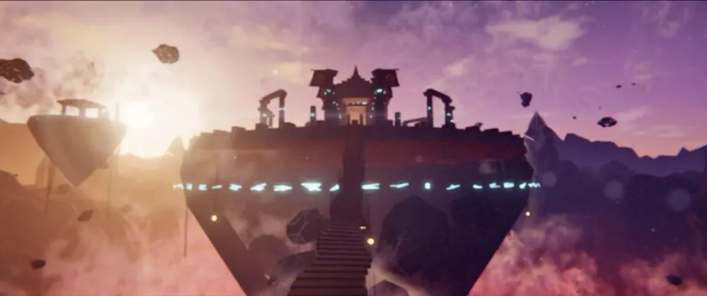</a>

*根據原作品整理的創作說明*

**提示詞**

```text
建立程式化 Three.js 場景：黃昏時分，一座古代神廟懸浮在發光峽谷上方，加入風中布料、體積光、閃電和電影感接近鏡頭。
```

[查看詳情 ↗](https://www.tripo3d.ai/zh-Hant/3d-prompts/ancient-temple-above-a-glowing-canyon-2095012880383099339) · [查看原文](https://x.com/pradeepXkapoor/status/2095012880383099339) · [返回案例導覽](#all-prompts)

---

<a id="interactive-toronto-skyline-2095000329561485584"></a>

### 互動式多倫多天際線

[Kevin](https://x.com/bienjamyn) · 2026-09-02 · Claude Fable 5.1 · 場景

<a href="https://www.tripo3d.ai/zh-Hant/3d-prompts/interactive-toronto-skyline-2095000329561485584"></a>

*根據原作品整理的創作說明*

**提示詞**

```text
建置互動式 3D 多倫多天際線，還原標誌性建築、水體與大氣縱深，並加入晝夜燈光和流暢環繞與飛行控制。
```

[查看詳情 ↗](https://www.tripo3d.ai/zh-Hant/3d-prompts/interactive-toronto-skyline-2095000329561485584) · [查看原文](https://x.com/bienjamyn/status/2095000329561485584) · [線上展示](https://toronto-voxel.vercel.app/) · [返回案例導覽](#all-prompts)

---

<a id="autonomous-sims-like-life-simulation-2094949450196090988"></a>

### 自主執行的模擬人生式系統

[Ridark](https://x.com/ridark_eth) · 2026-09-02 · Claude Fable 5.1 · 動畫

<a href="https://www.tripo3d.ai/zh-Hant/3d-prompts/autonomous-sims-like-life-simulation-2094949450196090988"></a>

*根據原作品整理的創作說明*

**提示詞**

```text
建置模擬人生式生活模擬，包含五個自主角色，讓需求、日常、關係與決策在無需持續操作的情況下產生湧現故事。
```

[查看詳情 ↗](https://www.tripo3d.ai/zh-Hant/3d-prompts/autonomous-sims-like-life-simulation-2094949450196090988) · [查看原文](https://x.com/ridark_eth/status/2094949450196090988) · [返回案例導覽](#all-prompts)

---

<a id="voxel-village-with-thinking-npcs-2094930970675741171"></a>

### 擁有思考型 NPC 的體素村莊

[Tech2Wild](https://x.com/Tech2Wild) · 2026-09-01 · Claude Fable 5.1 · 互動

<a href="https://www.tripo3d.ai/zh-Hant/3d-prompts/voxel-village-with-thinking-npcs-2094930970675741171"></a>

*根據原作品整理的創作說明*

**提示詞**

```text
建置一個體素村莊，讓居民擁有職業、日常、記憶和本地語言模型大腦，從而能對玩家及彼此作出反應。
```

[查看詳情 ↗](https://www.tripo3d.ai/zh-Hant/3d-prompts/voxel-village-with-thinking-npcs-2094930970675741171) · [查看原文](https://x.com/Tech2Wild/status/2094930970675741171) · [返回案例導覽](#all-prompts)

---

<a id="fantasy-ascent-to-mount-fuji-2094930804296274414"></a>

### 幻想風富士山登頂之旅

[Techartist](https://x.com/techartist_) · 2026-09-01 · Claude Fable 5.1 · 場景

<a href="https://www.tripo3d.ai/zh-Hant/3d-prompts/fantasy-ascent-to-mount-fuji-2094930804296274414"></a>

*根據原作品整理的創作說明*

**提示詞**

```text
建立一段通往富士山頂的 Three.js 幻想旅程，透過分層環境、氛圍燈光、移動機制和明確的登高感組織體驗。
```

[查看詳情 ↗](https://www.tripo3d.ai/zh-Hant/3d-prompts/fantasy-ascent-to-mount-fuji-2094930804296274414) · [查看原文](https://x.com/techartist_/status/2094930804296274414) · [返回案例導覽](#all-prompts)

---

<a id="godot-racing-game-built-from-scratch-2094925359372284022"></a>

### 從零建置 Godot 賽車遊戲

[atomic.chat](https://x.com/atomic_chat_hq) · 2026-09-01 · Claude Fable 5.1 · 遊戲

<a href="https://www.tripo3d.ai/zh-Hant/3d-prompts/godot-racing-game-built-from-scratch-2094925359372284022"></a>

*根據原作品整理的創作說明*

**提示詞**

```text
從零建置 Godot 賽車遊戲，用 Blender 製作載具與環境資產，並實現大型賽道、令人滿意的操控、對手、HUD 與比賽流程。
```

[查看詳情 ↗](https://www.tripo3d.ai/zh-Hant/3d-prompts/godot-racing-game-built-from-scratch-2094925359372284022) · [查看原文](https://x.com/atomic_chat_hq/status/2094925359372284022) · [返回案例導覽](#all-prompts)

---

<a id="floor-plan-to-blender-walkthrough-2094925117344428232"></a>

### 平面圖轉 Blender 漫遊

[AGIラボ](https://x.com/ctgptlb) · 2026-09-01 · Claude Fable 5.1 · 場景

<a href="https://www.tripo3d.ai/zh-Hant/3d-prompts/floor-plan-to-blender-walkthrough-2094925117344428232"></a>

*根據原作品整理的創作說明*

**提示詞**

```text
根據給定平面圖建立準確的 Blender 3D 模型，渲染一組代表性靜幀，並製作連貫的室內漫遊影片。
```

[查看詳情 ↗](https://www.tripo3d.ai/zh-Hant/3d-prompts/floor-plan-to-blender-walkthrough-2094925117344428232) · [查看原文](https://x.com/ctgptlb/status/2094925117344428232) · [返回案例導覽](#all-prompts)

---

<a id="deterministic-136-000-voxel-pagoda-2094916609219461211"></a>

### 確定性 13.6 萬體素寶塔

[FHILY👑](https://x.com/Oluwaphilemon1) · 2026-09-01 · Claude Fable 5.1 · 場景

<a href="https://www.tripo3d.ai/zh-Hant/3d-prompts/deterministic-136-000-voxel-pagoda-2094916609219461211"></a>

*根據原作品整理的創作說明*

**提示詞**

```text
用 Three.js 生成確定性的 13.6 萬體素寶塔，確保建築層級清晰、例項化高效、輸出穩定，並提供檢視鏡頭。
```

[查看詳情 ↗](https://www.tripo3d.ai/zh-Hant/3d-prompts/deterministic-136-000-voxel-pagoda-2094916609219461211) · [查看原文](https://x.com/Oluwaphilemon1/status/2094916609219461211) · [返回案例導覽](#all-prompts)

---

<a id="detailed-robot-through-blender-automation-2094909825561805003"></a>

### 透過 Blender 自動化建置高細節機器人

[Spectro](https://x.com/Spectromachina) · 2026-09-01 · Claude Fable 5.1 · 資產

<a href="https://www.tripo3d.ai/zh-Hant/3d-prompts/detailed-robot-through-blender-automation-2094909825561805003"></a>

*根據原作品整理的創作說明*

**提示詞**

```text
在 Blender 中建置高細節硬表面機器人，確保比例、關節、面板、材質與燈光協調，並完成展示渲染。
```

[查看詳情 ↗](https://www.tripo3d.ai/zh-Hant/3d-prompts/detailed-robot-through-blender-automation-2094909825561805003) · [查看原文](https://x.com/Spectromachina/status/2094909825561805003) · [返回案例導覽](#all-prompts)

---

<a id="open-world-crime-game-prototype-2094907986942591338"></a>

### 開放世界犯罪遊戲原型

[Veee](https://x.com/vikktorrrre) · 2026-09-01 · Claude Fable 5.1 · 遊戲

<a href="https://www.tripo3d.ai/zh-Hant/3d-prompts/open-world-crime-game-prototype-2094907986942591338"></a>

*根據原作品整理的創作說明*

**提示詞**

```text
原型化一款受 GTA 6 啟發的開放世界遊戲，包含密集城市、步行探索、可駕駛載具、交通、警察響應與多種可玩活動。
```

[查看詳情 ↗](https://www.tripo3d.ai/zh-Hant/3d-prompts/open-world-crime-game-prototype-2094907986942591338) · [查看原文](https://x.com/vikktorrrre/status/2094907986942591338) · [返回案例導覽](#all-prompts)

---

<a id="mini-militia-style-browser-game-2094900523900219725"></a>

### Mini Militia 風格瀏覽器遊戲

[Md Ismail Šojal 🕷️](https://x.com/0x0SojalSec) · 2026-09-01 · Claude Fable 5.1 · 遊戲

<a href="https://www.tripo3d.ai/zh-Hant/3d-prompts/mini-militia-style-browser-game-2094900523900219725"></a>

*根據原作品整理的創作說明*

**提示詞**

```text
建立 Mini Militia 風格動作遊戲，包含靈敏移動、瞄準、武器、緊湊競技場、機器人和即時命中與傷害回饋。
```

[查看詳情 ↗](https://www.tripo3d.ai/zh-Hant/3d-prompts/mini-militia-style-browser-game-2094900523900219725) · [查看原文](https://x.com/0x0SojalSec/status/2094900523900219725) · [返回案例導覽](#all-prompts)

---

<a id="rainy-first-person-ocean-sandbox-2094900247000654222"></a>

### 雨中第一人稱海洋沙盒

[Tim Jayas](https://x.com/TimJayas) · 2026-09-01 · Claude Fable 5.1 · 場景

<a href="https://www.tripo3d.ai/zh-Hant/3d-prompts/rainy-first-person-ocean-sandbox-2094900247000654222"></a>

*根據原作品整理的創作說明*

**提示詞**

```text
建置第一人稱 3D 海洋沙盒，加入波浪、雨滴和環境光，讓使用者從沉浸式鏡頭探索水面。
```

[查看詳情 ↗](https://www.tripo3d.ai/zh-Hant/3d-prompts/rainy-first-person-ocean-sandbox-2094900247000654222) · [查看原文](https://x.com/TimJayas/status/2094900247000654222) · [返回案例導覽](#all-prompts)

---

<a id="floating-voxel-island-2094899802588713418"></a>

### 懸浮體素島嶼

[Loktar 🇺🇸](https://x.com/loktar00) · 2026-09-01 · Claude Fable 5.1 · 場景

<a href="https://www.tripo3d.ai/zh-Hant/3d-prompts/floating-voxel-island-2094899802588713418"></a>

*根據原作品整理的創作說明*

**提示詞**

```text
建置一座懸浮體素島嶼，包含清晰地形層級、植被、水體、建築、環境動態和可環繞檢視全景的鏡頭。
```

[查看詳情 ↗](https://www.tripo3d.ai/zh-Hant/3d-prompts/floating-voxel-island-2094899802588713418) · [查看原文](https://x.com/loktar00/status/2094899802588713418) · [返回案例導覽](#all-prompts)

---

<a id="living-voxel-medieval-kingdom-2094899477626720403"></a>

### 鮮活的體素中世紀王國

[Knowix](https://x.com/knowixbuilds) · 2026-09-01 · Claude Fable 5.1 · 動畫

<a href="https://www.tripo3d.ai/zh-Hant/3d-prompts/living-voxel-medieval-kingdom-2094899477626720403"></a>

*根據原作品整理的創作說明*

**提示詞**

```text
建置一個大型體素中世紀王國，包含數千士兵、會工作的村民、攻城系統、可破壞建築，以及能改變戰局的巨龍。
```

[查看詳情 ↗](https://www.tripo3d.ai/zh-Hant/3d-prompts/living-voxel-medieval-kingdom-2094899477626720403) · [查看原文](https://x.com/knowixbuilds/status/2094899477626720403) · [返回案例導覽](#all-prompts)

---

<a id="textured-3d-asset-production-workflow-2094896750234378508"></a>

### 帶紋理的 3D 資產生產流程

[Matt](https://x.com/MrCollison) · 2026-09-01 · Claude Fable 5.1 · 資產

<a href="https://www.tripo3d.ai/zh-Hant/3d-prompts/textured-3d-asset-production-workflow-2094896750234378508"></a>

*根據原作品整理的創作說明*

**提示詞**

```text
把參考圖轉成乾淨的 3D 資產，在 Blender 中修正法線和材質，再用 Substance Painter 製作可用於生產的紋理。
```

[查看詳情 ↗](https://www.tripo3d.ai/zh-Hant/3d-prompts/textured-3d-asset-production-workflow-2094896750234378508) · [查看原文](https://x.com/MrCollison/status/2094896750234378508) · [返回案例導覽](#all-prompts)

---

<a id="three-compact-physics-game-concepts-2094895071304839400"></a>

### 三款緊湊物理小遊戲

[Atomic Agent](https://x.com/atomicagent_io) · 2026-09-01 · Claude Fable 5.1 · 遊戲

<a href="https://www.tripo3d.ai/zh-Hant/3d-prompts/three-compact-physics-game-concepts-2094895071304839400"></a>

*根據原作品整理的創作說明*

**提示詞**

```text
建置三款精緻小遊戲：黏性球障礙挑戰、水豚衝浪和餃子傳送帶躲避。每款都要有清晰輸入、計分與失敗狀態。
```

[查看詳情 ↗](https://www.tripo3d.ai/zh-Hant/3d-prompts/three-compact-physics-game-concepts-2094895071304839400) · [查看原文](https://x.com/atomicagent_io/status/2094895071304839400) · [返回案例導覽](#all-prompts)

---

<a id="aaa-kart-racing-game-in-three-js-2094894312370692443"></a>

### Three.js AAA 卡丁車競速遊戲

[Jared](https://growthengineer.space/) · 2026-09-01 · Claude Fable 5.1 · 遊戲

改編自: [BridgeMind](https://x.com/bridgemindai/status/2094894312370692443)

<a href="https://www.tripo3d.ai/zh-Hant/3d-prompts/aaa-kart-racing-game-in-three-js-2094894312370692443"></a>

*根據原作品整理的創作說明*

**提示詞**

```text
使用 Three.js 建置 AAA 質感的卡丁車競速遊戲，包含精細駕駛手感、表現力賽道、對手、道具、UI、音效與完整可玩比賽迴圈。
```

[查看詳情 ↗](https://www.tripo3d.ai/zh-Hant/3d-prompts/aaa-kart-racing-game-in-three-js-2094894312370692443) · [查看原文](https://x.com/bridgemindai/status/2094894312370692443) · [專案原始碼](https://github.com/bridge-mind/turbo-kart-rush) · [線上展示](https://bridge-mind.github.io/turbo-kart-rush/) · [返回案例導覽](#all-prompts)

---

<a id="one-shot-three-js-airport-simulation-2094893572617044439"></a>

### 一次生成的 Three.js 機場模擬

[Alex - i do YouTube](https://x.com/AlexYTScaling) · 2026-09-01 · Claude Fable 5.1 · 動畫

<a href="https://www.tripo3d.ai/zh-Hant/3d-prompts/one-shot-three-js-airport-simulation-2094893572617044439"></a>

*根據原作品整理的創作說明*

**提示詞**

```text
一次建置完整的 Three.js 機場模擬，包含跑道、航站樓、飛機滑行與起飛、地勤車輛、晝夜燈光和總覽鏡頭。
```

[查看詳情 ↗](https://www.tripo3d.ai/zh-Hant/3d-prompts/one-shot-three-js-airport-simulation-2094893572617044439) · [查看原文](https://x.com/AlexYTScaling/status/2094893572617044439) · [返回案例導覽](#all-prompts)

---

<a id="floating-japanese-pagoda-city-2094886088963690607"></a>

### 懸浮日本寶塔城市

[Vib3Coded](https://x.com/vib3coded) · 2026-09-01 · Claude Fable 5.1 · 場景

<a href="https://www.tripo3d.ai/zh-Hant/3d-prompts/floating-japanese-pagoda-city-2094886088963690607"></a>

*根據原作品整理的創作說明*

**提示詞**

```text
建立一座以高細節寶塔為中心的互動式懸浮日本城市，包含分層島嶼、橋樑、霧氣、燈籠光與電影感飛行控制。
```

[查看詳情 ↗](https://www.tripo3d.ai/zh-Hant/3d-prompts/floating-japanese-pagoda-city-2094886088963690607) · [查看原文](https://x.com/vib3coded/status/2094886088963690607) · [返回案例導覽](#all-prompts)

---

<a id="airbus-h145-in-three-js-2094882571083735351"></a>

### Three.js 空客 H145 直升機

[Harshith](https://x.com/HarshithLucky3) · 2026-09-01 · Claude Fable 5.1 · 資產

<a href="https://www.tripo3d.ai/zh-Hant/3d-prompts/airbus-h145-in-three-js-2094882571083735351"></a>

*根據原作品整理的創作說明*

**提示詞**

```text
使用 Three.js 建立空客 H145 直升機，讓座艙、滑橇與旋翼元件清晰可辨並可檢視。
```

[查看詳情 ↗](https://www.tripo3d.ai/zh-Hant/3d-prompts/airbus-h145-in-three-js-2094882571083735351) · [查看原文](https://x.com/HarshithLucky3/status/2094882571083735351) · [返回案例導覽](#all-prompts)

---

<a id="world-war-i-voxel-simulator-2094881469155914170"></a>

### 第一次世界大戰體素模擬器

[Tech2Wild](https://x.com/Tech2Wild) · 2026-09-01 · Claude Fable 5.1 · 動畫

<a href="https://www.tripo3d.ai/zh-Hant/3d-prompts/world-war-i-voxel-simulator-2094881469155914170"></a>

*根據原作品整理的創作說明*

**提示詞**

```text
建立一款第一次世界大戰體素戰場模擬器，包含戰壕、士兵、載具、火炮、破壞效果和清晰的戰術鏡頭。
```

[查看詳情 ↗](https://www.tripo3d.ai/zh-Hant/3d-prompts/world-war-i-voxel-simulator-2094881469155914170) · [查看原文](https://x.com/Tech2Wild/status/2094881469155914170) · [返回案例導覽](#all-prompts)

---

<a id="futuristic-private-island-mansion-2094879208304685524"></a>

### 未來私人島嶼豪宅

[AI/ML API](https://x.com/aimlapi) · 2026-09-01 · Claude Fable 5.1 · 場景

<a href="https://www.tripo3d.ai/zh-Hant/3d-prompts/futuristic-private-island-mansion-2094879208304685524"></a>

*根據原作品整理的創作說明*

**提示詞**

```text
設計一座可探索的未來私人島嶼豪宅，透過五個相連的 Three.js 場景呈現，並加入電影感鏡頭、高階材質與環境敘事。
```

[查看詳情 ↗](https://www.tripo3d.ai/zh-Hant/3d-prompts/futuristic-private-island-mansion-2094879208304685524) · [查看原文](https://x.com/aimlapi/status/2094879208304685524) · [返回案例導覽](#all-prompts)

---

<a id="procedurally-generated-three-js-world-2094873862315843910"></a>

### 程式化生成的 Three.js 世界

[Swarogan](https://x.com/swarogan) · 2026-09-01 · Claude Fable 5.1 · 場景

<a href="https://www.tripo3d.ai/zh-Hant/3d-prompts/procedurally-generated-three-js-world-2094873862315843910"></a>

*根據原作品整理的創作說明*

**提示詞**

```text
透過一條提示詞建立程式化生成的 Three.js 世界，包含多樣地形、生物群落、興趣點、環境生命和流暢探索控制。
```

[查看詳情 ↗](https://www.tripo3d.ai/zh-Hant/3d-prompts/procedurally-generated-three-js-world-2094873862315843910) · [查看原文](https://x.com/swarogan/status/2094873862315843910) · [返回案例導覽](#all-prompts)

---

<a id="interactive-3d-human-brain-signals-2094873080590225728"></a>

### 互動式 3D 人腦訊號

[Greg](https://x.com/GregFeingold) · 2026-09-01 · Claude Fable 5.1 · 互動

<a href="https://www.tripo3d.ai/zh-Hant/3d-prompts/interactive-3d-human-brain-signals-2094873080590225728"></a>

*根據原作品整理的創作說明*

**提示詞**

```text
建置帶有可辨識皮層溝回的互動式 3D 人腦，並用受 EEG 或 MEG 啟發的視覺形式展示類似句子的訊號在腦區間傳播。
```

[查看詳情 ↗](https://www.tripo3d.ai/zh-Hant/3d-prompts/interactive-3d-human-brain-signals-2094873080590225728) · [查看原文](https://x.com/GregFeingold/status/2094873080590225728) · [返回案例導覽](#all-prompts)

---

<a id="photorealistic-three-js-landscape-2094871858206191667"></a>

### 照片級 Three.js 自然景觀

[Alix Ollivier](https://x.com/aollivier82) · 2026-09-01 · Claude Fable 5.1 · 場景

<a href="https://www.tripo3d.ai/zh-Hant/3d-prompts/photorealistic-three-js-landscape-2094871858206191667"></a>

*根據原作品整理的創作說明*

**提示詞**

```text
建立照片級 Three.js 自然景觀，細化地形、植被、天空、水體、縱深與燈光，並設計自然揭示環境的鏡頭路徑。
```

[查看詳情 ↗](https://www.tripo3d.ai/zh-Hant/3d-prompts/photorealistic-three-js-landscape-2094871858206191667) · [查看原文](https://x.com/aollivier82/status/2094871858206191667) · [返回案例導覽](#all-prompts)

---

<a id="aaa-horde-shooter-with-webgl-shaders-2094869490165039243"></a>

### 帶 WebGL Shader 的 AAA 屍潮射擊遊戲

[Alexey Fateev](https://x.com/superalesha) · 2026-09-01 · Claude Fable 5.1 · 遊戲

<a href="https://www.tripo3d.ai/zh-Hant/3d-prompts/aaa-horde-shooter-with-webgl-shaders-2094869490165039243"></a>

**提示詞**

```text
用 Three.js 與 Web Shader 做一款極具衝擊力的射擊遊戲。重點打磨射擊、動態、後坐力、畫面、命中回饋與槍感；在精心設計的競技場中迎戰屍潮，支援 ADS、武器慣性與重量，並提供突擊步槍、霰彈槍和精準步槍。
```

<details>
<summary>作者原始提示詞</summary>

```text
Make me the most insane and blast of a shooter you can possibly build on ThreeJS + Web shaders bro! The most important things are shooting, dynamics, recoil, graphics, hit impact, gunplay. It is a beautifully designed arena where enemies swarm in hordes. Include ADS aiming, weapon inertia and weight, plus an assault rifle, shotgun and marksman rifle.
```

</details>

[查看詳情 ↗](https://www.tripo3d.ai/zh-Hant/3d-prompts/aaa-horde-shooter-with-webgl-shaders-2094869490165039243) · [查看原文](https://x.com/superalesha/status/2094869490165039243) · [專案原始碼](https://github.com/alesha-pro/bench-portal) · [線上展示](https://alesha-pro.github.io/bench-portal/games/onslaught-fable-5.1/) · [返回案例導覽](#all-prompts)

---

<a id="playable-titanic-disaster-game-2094867850355679617"></a>

### 可玩的泰坦尼克災難遊戲

[Veee](https://x.com/vikktorrrre) · 2026-09-01 · Claude Fable 5.1 · 遊戲

<a href="https://www.tripo3d.ai/zh-Hant/3d-prompts/playable-titanic-disaster-game-2094867850355679617"></a>

*根據原作品整理的創作說明*

**提示詞**

```text
建置一款電影感泰坦尼克號遊戲：玩家可以探索船體、完成任務並嘗試避開冰山，具有清晰控制和不斷升級的危險。
```

[查看詳情 ↗](https://www.tripo3d.ai/zh-Hant/3d-prompts/playable-titanic-disaster-game-2094867850355679617) · [查看原文](https://x.com/vikktorrrre/status/2094867850355679617) · [線上展示](https://rms-titanic-1912.netlify.app/) · [返回案例導覽](#all-prompts)

---

<a id="multiplayer-dinosaur-survival-game-2094866225960493189"></a>

### 多人恐龍生存遊戲

[S](https://x.com/Rubzem) · 2026-09-01 · Claude Fable 5.1 · 遊戲

<a href="https://www.tripo3d.ai/zh-Hant/3d-prompts/multiplayer-dinosaur-survival-game-2094866225960493189"></a>

*根據原作品整理的創作說明*

**提示詞**

```text
建立一款多人荒野生存遊戲，包含狩獵、烹飪、製作、基地建設、危險恐龍與持續探索的成長迴圈。
```

[查看詳情 ↗](https://www.tripo3d.ai/zh-Hant/3d-prompts/multiplayer-dinosaur-survival-game-2094866225960493189) · [查看原文](https://x.com/Rubzem/status/2094866225960493189) · [返回案例導覽](#all-prompts)

---

<a id="ten-minute-three-js-game-then-refined-2094855905678446777"></a>

### 十分鐘生成並繼續完善 Three.js 遊戲

[Andrei](https://x.com/HangoutWHAndrei) · 2026-09-01 · Claude Fable 5.1 · 遊戲

<a href="https://www.tripo3d.ai/zh-Hant/3d-prompts/ten-minute-three-js-game-then-refined-2094855905678446777"></a>

*根據原作品整理的創作說明*

**提示詞**

```text
在十分鐘內建立一個小型 Three.js 遊戲，包含明確目標、靈敏控制、清晰危險物和完整成敗狀態。試玩後，再透過後續修改完善視覺、節奏與回饋。
```

[查看詳情 ↗](https://www.tripo3d.ai/zh-Hant/3d-prompts/ten-minute-three-js-game-then-refined-2094855905678446777) · [查看原文](https://x.com/HangoutWHAndrei/status/2094855905678446777) · [返回案例導覽](#all-prompts)

---

<a id="glass-brain-capability-demo-2094853472864682360"></a>

### 玻璃大腦能力演示

[Not Harris \| Builds Apps](https://x.com/viewsfrom02108) · 2026-09-01 · Claude Fable 5.1 · 互動

<a href="https://www.tripo3d.ai/zh-Hant/3d-prompts/glass-brain-capability-demo-2094853472864682360"></a>

**提示詞**

```text
用 Three.js 做一個展示你能力的 Demo。
```

<details>
<summary>作者原始提示詞</summary>

```text
make a Three.js demo of your capabilities.
```

</details>

[查看詳情 ↗](https://www.tripo3d.ai/zh-Hant/3d-prompts/glass-brain-capability-demo-2094853472864682360) · [查看原文](https://x.com/viewsfrom02108/status/2094853472864682360) · [返回案例導覽](#all-prompts)

---

<a id="procedural-voxel-castle-showcase-2093690427849191855"></a>

### 程式化體素城堡展示

[Hakm](https://x.com/hakmgpt) · 2026-08-29 · GPT-6 Astra · 場景

<a href="https://www.tripo3d.ai/zh-Hant/3d-prompts/procedural-voxel-castle-showcase-2093690427849191855"></a>

*根據原作品整理的創作說明*

**提示詞**

```text
生成大型體素城堡，清晰表現防禦層級、塔樓、城牆、城門、庭院與周邊地形。使用例項化、環繞鏡頭、變化光照和確定性生成，讓結果穩定且可檢視。
```

[查看詳情 ↗](https://www.tripo3d.ai/zh-Hant/3d-prompts/procedural-voxel-castle-showcase-2093690427849191855) · [查看原文](https://x.com/hakmgpt/status/2093690427849191855) · [返回案例導覽](#all-prompts)

---

<a id="jeep-style-4x4-assembly-in-blender-2082845759452463405"></a>

### 用於 Blender 組裝 Jeep 風格 4x4 的提示詞

[slash1s](https://x.com/slash1sol) · 2026-07-30 · Claude Opus 5 / Claude Fable 5 · 資產

<a href="https://www.tripo3d.ai/zh-Hant/3d-prompts/jeep-style-4x4-assembly-in-blender-2082845759452463405"></a>

**提示詞**

```text
設計一輛 Jeep 風格的 4x4，並在 Blender 中逐部件組裝，不進行任何手工建模
```

[查看詳情 ↗](https://www.tripo3d.ai/zh-Hant/3d-prompts/jeep-style-4x4-assembly-in-blender-2082845759452463405) · [查看原文](https://x.com/slash1sol/status/2082845759452463405) · [返回案例導覽](#all-prompts)

---

<a id="3d-destruction-physics-in-self-contained-html-2082832042702561372"></a>

### 用於獨立 HTML 場景的 3D 破壞物理提示詞

[FHILY👑](https://x.com/Oluwaphilemon1) · 2026-07-30 · Kimi K3 · 動畫

<a href="https://www.tripo3d.ai/zh-Hant/3d-prompts/3d-destruction-physics-in-self-contained-html-2082832042702561372"></a>

**提示詞**

```text
一輛怪獸卡車碾過一排汽車
兩輛汽車飛躍峽谷，並在空中迎頭相撞
一把巨大的鐵砧逐個壓扁汽車
```

[查看詳情 ↗](https://www.tripo3d.ai/zh-Hant/3d-prompts/3d-destruction-physics-in-self-contained-html-2082832042702561372) · [查看原文](https://x.com/Oluwaphilemon1/status/2082832042702561372) · [返回案例導覽](#all-prompts)

---

<a id="mech-robot-blueprint-set-2082760534500188606"></a>

### Claude Opus 5 機甲機器人藍圖提示集

[Spectro](https://x.com/Spectromachina) · 2026-07-30 · Claude Opus 5 · 資產

<a href="https://www.tripo3d.ai/zh-Hant/3d-prompts/mech-robot-blueprint-set-2082760534500188606"></a>

**提示詞**

```text
分享一下我用 Claude OPUS 5 + Blender 建立一臺 GUNDAM 尺寸機甲機器人藍圖時使用的提示，基於真實數學和物理：

"讓我們來考慮機甲的設計，本質上它有 2 臺渦輪軸發動機，並由電動馬達 + 液壓動力驅動，它還有一個輔助動力裝置，或許也有氣動系統；它有強力電池，在情況變糟時能讓它稍微滑行一下。我在想把這 2 臺發動機放在機甲的肩部，服務面板朝外，這樣我們就可以對它進行維護。順便再看一遍機甲的系統，然後我們就要把所有系統都物理化地建立出來。這會很棒，給你安排一個代理來幫你做這件事，然後重建軀幹部分，但在中間留出一個大空間給駕駛艙 + 睡眠艙。"

"如果我們給它的腳裝上由電動馬達驅動的輪子呢？這樣大多數時候應該能輔助移動。"

"分配一個代理來讀取這些指標並建立腿部設計，把真實的電線接入執行器之類的東西。"

"好，把新的 glb 模型注入場景。"

"天啊，這也太瘋狂了。夥計，快把其他部分先顯示出來。"

"給那個低多邊形頭部加上真正的 FLIR + NV 攝像頭，以及一把 1980/1990 年代的 CROWS M2 機槍。"

"它……太美了……T_T"

"我們必須給腿部骨架做繫結，這樣如果我給它做動畫，它就會遵守約束，而且這對計算力等也很必要。"

"沒事，我反正也不太懂哈哈，"
"好，所以你已經做好的那些東西，比如發動機、動力傳動系統和腿部，把這些部分儲存好以便以後使用，萬一我們能在其他地方重複使用它們。話雖如此，指示一個代理去建置手臂和手。"

"另外，正確設計髖部機構以適配腿部。"

"在我看來，PELVIS 和 CHEST 之間的關節具有圓形扭矩。"

"找一個代理，使用 bofors 系統建立一把手持半自動步槍，這樣機器人就有些快速射擊的半自動砰砰武器了。"

"我想要 40mm 的，真的做一個出來，準確但保持低多邊形，這樣我們就能測量它是更適合作為手槍還是半自動步槍。"

"兩種都做，然後再做一個像 abrams 加農炮但帶半自動機制的版本。"
"建立一個像步槍那樣的槍栓和彈簧。"

"好，所以我在想，駕駛艙裡把所有裝飾性的線纜之類都去掉，真正做真實佈線 o-O 你怎麼看"

"方案：做真實佈線，但像一頭野蠻動物那樣佈線。"

"注入 120mm 加農炮那個東西。"

"給 120mm 加農炮的運作做繫結和動畫。"

"我想在這裡加一個裝甲大艙門，這樣我們就能讓座椅升起，讓駕駛員能從那個位置看到周圍並駕駛機甲，而且駕駛艙內的 4 個伸縮式觀察窗在頂部也需要有對應的終點，這樣才合理。"
"繼續給 120mm 做繫結和動畫，還有艙門命令，剛才是誤觸暫停。"

"好，所以動力裝置，我覺得腹部是個不錯的位置，不過我不喜歡發動機現在的位置，我覺得我們應該把它們放到現有位置的上方，並用真實的桁架結構來支撐軀幹和肩部……看你怎麼決定，你想怎麼做胸部？我們要做艙門入口，這樣前胸就可以建出來……"

"好，外殼可以用厚鋁甚至碳纖維，我無所謂，但必須看起來很酷，我猜 NCT 可以作為裝甲嗎？不知道，你來決定，我們之後還得加一些東西讓這個怪物看起來沒那麼難以接受……總之，帶上你的團隊開始建造。"

"我發現這個 inverter PT125 到處漂著，我不知道它應該放在哪。"
```

[查看詳情 ↗](https://www.tripo3d.ai/zh-Hant/3d-prompts/mech-robot-blueprint-set-2082760534500188606) · [查看原文](https://x.com/Spectromachina/status/2082760534500188606) · [返回案例導覽](#all-prompts)

---

<a id="need-for-speed-style-godot-game-2082714235373584582"></a>

### Need for Speed 風格 Godot 遊戲提示詞

[FHILY👑](https://x.com/Oluwaphilemon1) · 2026-07-30 · Kimi K3 · 遊戲

<a href="https://www.tripo3d.ai/zh-Hant/3d-prompts/need-for-speed-style-godot-game-2082714235373584582"></a>

**提示詞**

```text
給我做一個 NFS 型別的遊戲。
```

[查看詳情 ↗](https://www.tripo3d.ai/zh-Hant/3d-prompts/need-for-speed-style-godot-game-2082714235373584582) · [查看原文](https://x.com/Oluwaphilemon1/status/2082714235373584582) · [返回案例導覽](#all-prompts)

---

<a id="cracking-aquarium-3d-simulation-2082528683747873194"></a>

### Kimi K3 玻璃水族箱開裂爆裂 3D 模擬提示詞

[Unsloth AI](https://x.com/UnslothAI) · 2026-07-29 · Kimi K3 · 動畫

<a href="https://www.tripo3d.ai/zh-Hant/3d-prompts/cracking-aquarium-3d-simulation-2082528683747873194"></a>

**提示詞**

```text
建立一個玻璃水族箱，其側板先出現可見裂紋，然後破裂。
```

[查看詳情 ↗](https://www.tripo3d.ai/zh-Hant/3d-prompts/cracking-aquarium-3d-simulation-2082528683747873194) · [查看原文](https://x.com/UnslothAI/status/2082528683747873194) · [返回案例導覽](#all-prompts)

---

<a id="playable-combat-game-2082507403598373134"></a>

### Kimi K3 的可玩戰鬥遊戲提示詞

[Darshal Jaitwar](https://x.com/darshal_) · 2026-07-29 · Kimi K3 · 遊戲

<a href="https://www.tripo3d.ai/zh-Hant/3d-prompts/playable-combat-game-2082507403598373134"></a>

**提示詞**

```text
建置一個可玩的戰鬥遊戲
```

[查看詳情 ↗](https://www.tripo3d.ai/zh-Hant/3d-prompts/playable-combat-game-2082507403598373134) · [查看原文](https://x.com/darshal_/status/2082507403598373134) · [返回案例導覽](#all-prompts)

---

<a id="league-of-legends-style-1v1-game-in-one-html-file-2082474707727581564"></a>

### Kimi K3 的《英雄聯盟》風格 1v1 單頁 HTML 遊戲提示詞

[Fokki](https://x.com/0x_fokki) · 2026-07-29 · Kimi K3 · 遊戲

<a href="https://www.tripo3d.ai/zh-Hant/3d-prompts/league-of-legends-style-1v1-game-in-one-html-file-2082474707727581564"></a>

**提示詞**

```text
我在 Verdent 上給 Kimi K3 和 GPT-5.6 輸入了同一個提示詞：在一個 HTML 檔案裡建置一個可玩的英雄聯盟風格 1v1。

兩者都生成了一個遊戲。我把它們並排開啟逐個玩了一遍。

我在兩次執行之間只改了一個東西：https://t.co/ItoGlnpiXi https://t.co/3PYQVli1zm 下拉選單裡的模型
```

[查看詳情 ↗](https://www.tripo3d.ai/zh-Hant/3d-prompts/league-of-legends-style-1v1-game-in-one-html-file-2082474707727581564) · [查看原文](https://x.com/0x_fokki/status/2082474707727581564) · [返回案例導覽](#all-prompts)

---

<a id="single-file-3d-sun-visualizer-2082461416049525077"></a>

### 適用於 Claude Opus 5 的單檔案 3D 太陽視覺化提示詞

[AlysisAI](https://x.com/AlysisAI) · 2026-07-29 · Claude Opus 5 / Kimi K3 · 互動

<a href="https://www.tripo3d.ai/zh-Hant/3d-prompts/single-file-3d-sun-visualizer-2082461416049525077"></a>

**提示詞**

```text
建置一個在太空中旋轉的 3D 太陽視覺化器。一個 HTML 檔案。
```

[查看詳情 ↗](https://www.tripo3d.ai/zh-Hant/3d-prompts/single-file-3d-sun-visualizer-2082461416049525077) · [查看原文](https://x.com/AlysisAI/status/2082461416049525077) · [返回案例導覽](#all-prompts)

---


[完整目錄](catalog.zh-Hant.md) · [←](catalog.zh-Hant.8.md) · **9 / 10** · [→](catalog.zh-Hant.10.md)

<p align="center"><strong><a href="https://www.tripo3d.ai/zh-Hant/3d-prompts?utm_source=github&amp;utm_medium=referral&amp;utm_campaign=awesome_3d_prompts&amp;utm_content=catalog_footer">完整目錄 →</a></strong></p>
