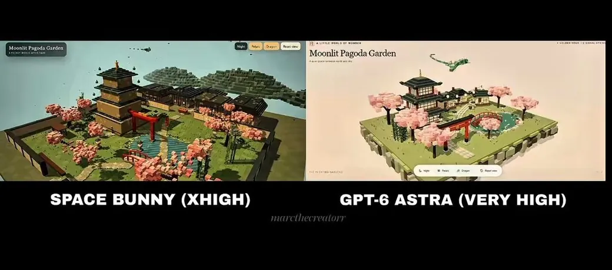
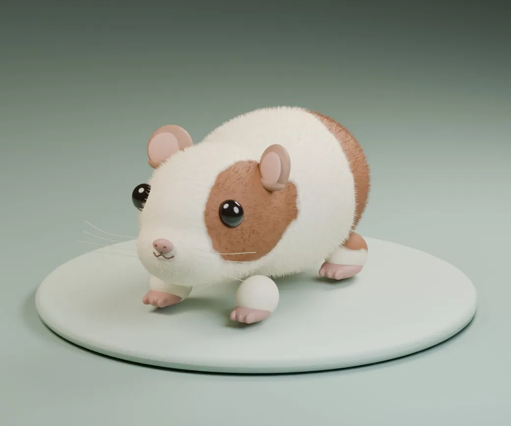
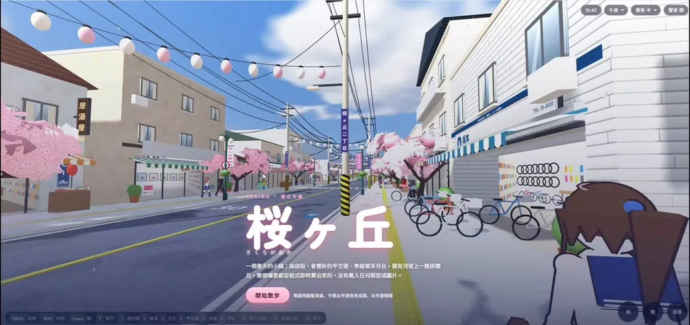
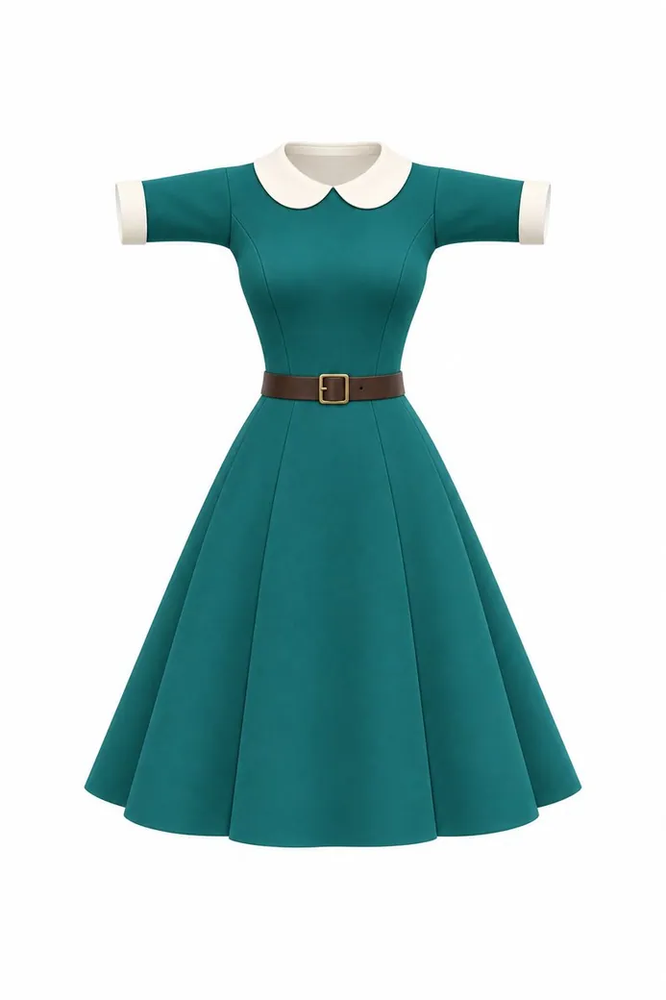
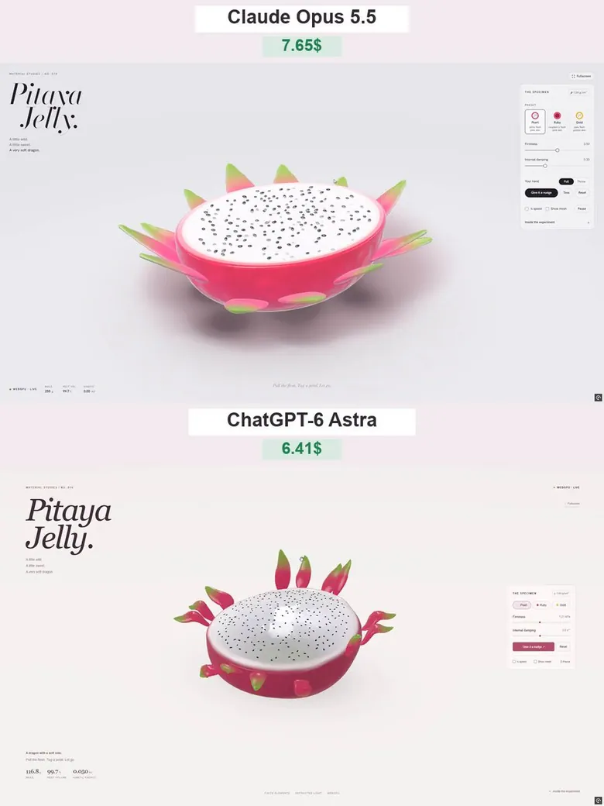
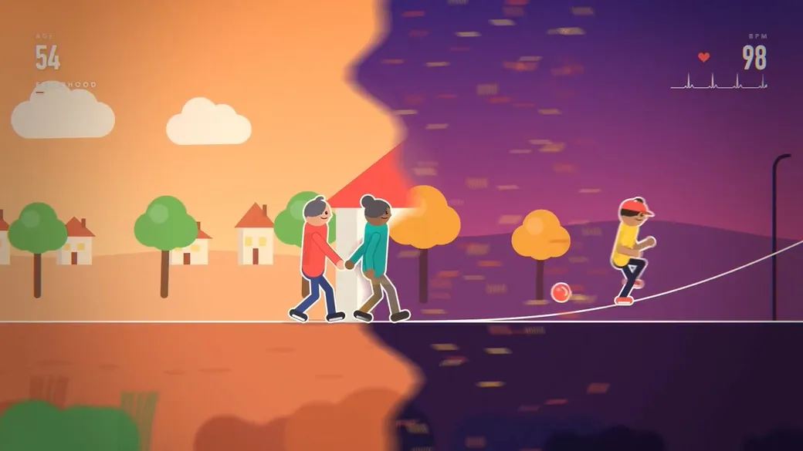
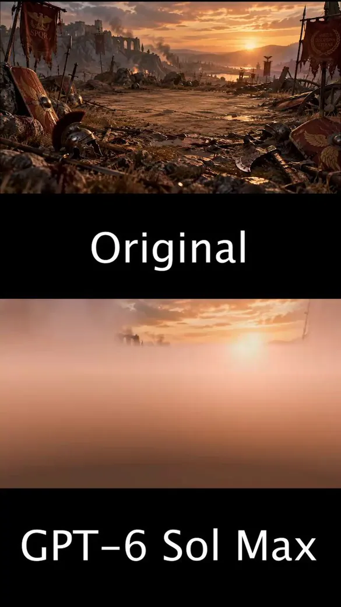
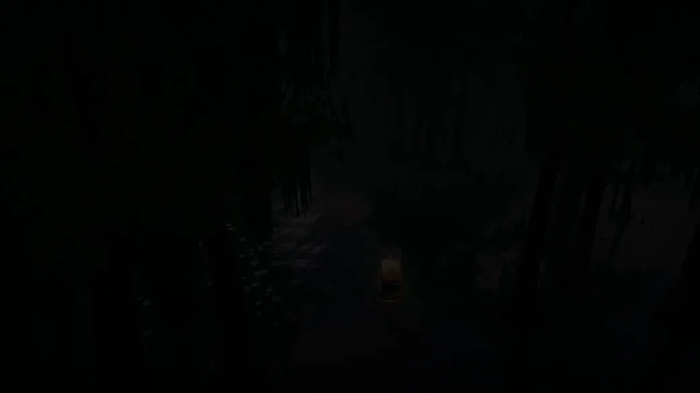
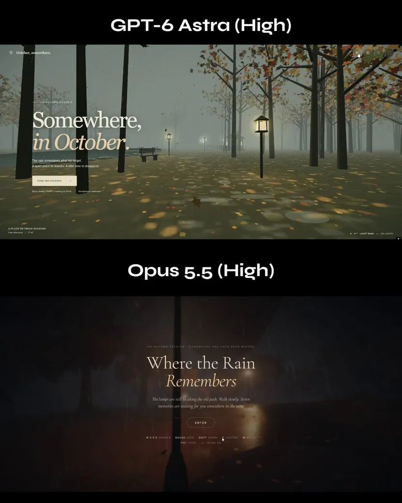
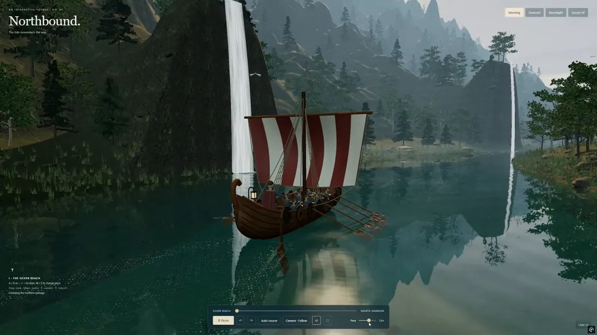

<!-- Generated from Growth CMS by templates/catalog.md. Edit content in CMS; run npm run sync. -->

# Awesome 3D Prompts — 1 / 9

[← Awesome 3D Prompts](../README.zh-CN.md)

<p>
  <a href="../docs/catalog.en.1.md"></a>
  <a href="../docs/catalog.zh.1.md"></a>
  <a href="../docs/catalog.zh-Hant.1.md"></a>
  <a href="../docs/catalog.ja.1.md"></a>
  <a href="../docs/catalog.ko.1.md"></a>
  <a href="../docs/catalog.es.1.md"></a>
  <a href="../docs/catalog.pt.1.md"></a>
  <a href="../docs/catalog.de.1.md"></a>
  <a href="../docs/catalog.fr.1.md"></a>
  <a href="../docs/catalog.it.1.md"></a>
  <a href="../docs/catalog.ru.1.md"></a>
  <a href="../docs/catalog.tr.1.md"></a>
  <a href="../docs/catalog.uk.1.md"></a>
  <a href="../docs/catalog.vi.1.md"></a>
</p>

[完整目录](catalog.zh.md) · **1 / 9** · [→](catalog.zh.2.md)

<a id="all-prompts"></a>

<details>
<summary>浏览案例 (50)</summary>

- [动态 15 秒动效作品集短片](#claude-opus-5-5-2103504887439065439)
- [WebGL2 沙盒生存游戏](#claude-opus-5-5-2103502454750920925)
- [Three.js 体素风日式庭园](#gpt-6-astra-2103486103831339269)
- [探索三维宝塔](#claude-opus-5-5-2103483174957597035)
- [在 Blender 中制作豚鼠](#gpt-6-astra-2103482826519986544)
- [可自由行走的动漫风樱花小镇 3D 场景](#claude-opus-5-5-2103480081809346597)
- [VRChat 服装 3D 建模](#gpt-6-astra-2103456264785424530)
- [火龙果果冻](#gpt-6-astra-2103432732386664591)
- [生命循环动态设计动画](#claude-opus-5-5-2103428454355980558)
- [黄金时刻的罗马战场场景](#gpt-6-astra-2103351755971207251)
- [STILLWATER — 月夜沼泽浏览器体验](#gpt-6-astra-2103308083242082314)
- [交互式 3D 海上火箭发射序列](#claude-opus-5-5-2103303303358534021)
- [Claude Opus 5.5 的互动中世纪王国](#claude-opus-5-5-2103257687492374597)
- [雾霭秋日可探索 Three.js 体验](#gpt-6-astra-2103211135214256350)
- [北行：互动维京长船之旅](#gpt-6-astra-2103187935759655167)
- [留白：充满彩色玻璃光线的大教堂短片](#claude-opus-5-5-2103145567945986461)
- [Genshin Impact 风格的旧金山背景游戏](#claude-opus-5-5-2103144530157687114)
- [电影化呈现：奥斯特里茨战役](#claude-opus-5-5-2103116235009347650)
- [使用 Three.js 构建埃菲尔铁塔](#claude-opus-5-5-2103106070549757960)
- [疯狂坦克——3D 岛屿炮战](#crazy-tanks-3d-island-artillery)
- [Grid Genius 的皮克斯级 Three.js 动画](#claude-opus-5-5-2103087766662009118)
- [实时鹈鹕骑行游戏](#claude-opus-5-5-2103083781490176212)
- [可交互的 3D 软糖柑橘切片](#gpt-6-astra-2103062348168618280)
- [打造一座帝国城市](#claude-opus-5-5-2103046279253168554)
- [使用 Three.js 制作体素版 Codex](#gpt-6-astra-2102956340482289944)
- [超写实动态沙漠篝火 HTML 场景](#gpt-6-astra-2102915300295369208)
- [第一人称汉堡制作模拟器](#gpt-6-astra-2102897258983313712)
- [在 Three.js 中构建布加迪 Chiron Super Sport](#claude-opus-5-5-2102828216289566725)
- [无限太阳朋克城市着色器](#gpt-6-astra-2102826333550133520)
- [Claude 成长训练蒙太奇](#claude-opus-5-5-2102788371114246177)
- [使用 Three.js 制作皮克斯级别的 90 年代卡通动画](#claude-opus-5-5-2102788223835463902)
- [用于学习国际象棋弃兵的互动式 3D 棋盘](#gpt-6-astra-2102788013902213508)
- [无缝循环的代码水循环动画](#claude-opus-5-5-2102781807179735211)
- [可在浏览器中操作的中世纪欧洲风格 3D 城堡](#gpt-6-astra-2102780850706567390)
- [CatWalk：奔跑在夜色街头的 3D 横版猫咪游戏](#claude-opus-5-5-2102775461701091531)
- [Orbit Lab：太阳、地球与月球 3D 模拟](#gpt-6-astra-2102752217375899659)
- [《末班列车》赛博朋克巨型城市基准项目](#claude-opus-5-5-2102740078347087940)
- [体素风足球动画](#claude-opus-5-5-2102739444256383089)
- [虚构行星互动网站](#claude-opus-5-5-2102729710174196022)
- [中世纪城堡浏览器动画](#gpt-6-astra-2102672926285713456)
- [使用 Claude Opus 5 制作的 Tripo 3D 宣传片](#tripo-claude-opus-5-5-paper-cut-3d-short)
- [单个 HTML 文件中的 3D 卡丁车竞速游戏](#gpt-6-astra-2102652927177617564)
- [交互式欧拉霓虹流体模拟](#claude-opus-5-5-2102565611473661963)
- [日式樱花山谷交互式 3D 景观网页](#claude-opus-5-5-2102565403109085669)
- [Hundenberg 事故模型与逼真视频](#claude-opus-5-5-2102547809140355250)
- [基于图片的手球场 360° 3D 渲染](#claude-opus-5-5-2102544406117286004)
- [根据图片制作程序化 Three.js 3D 主菜单背景](#claude-opus-5-5-2102544196808667471)
- [自动运行的 3D 鲁布·戈德堡机械装置](#claude-opus-5-5-2102544078927741369)
- [彼得兔风格的互动农场动物游戏](#claude-opus-5-5-2102538762731565085)
- [日落时分的电影感互动海盗船](#claude-opus-5-5-2102533729746882985)

</details>
<a id="claude-opus-5-5-2103504887439065439"></a>

### 动态 15 秒动效作品集短片

[ajith\_io](https://x.com/ajith_io) · 2026-09-25 · Claude Opus 5.5 · 动画

<a href="https://www.tripo3d.ai/zh/3d-prompts/claude-opus-5-5-2103504887439065439"></a>

**提示词**

```text
制作一支充满动感的 15 秒动态图形视频，展现你作为顶尖动效设计师的非凡实力，就像用于简历的个人作品集短片。尽情发挥，做到极致。
```

<details>
<summary>作者原始提示词</summary>

```text
make a dynamic 15-second motion graphics video that shows what an incredible motion designer you are, like it's your showreel for a résumé. go all out.
```

</details>

[查看详情 ↗](https://www.tripo3d.ai/zh/3d-prompts/claude-opus-5-5-2103504887439065439) · [查看原帖](https://x.com/ajith_io/status/2103449416325890146) · [返回案例导航](#all-prompts)

---

<a id="claude-opus-5-5-2103502454750920925"></a>

### WebGL2 沙盒生存游戏

[kepo](https://x.com/kepochnik) · 2026-09-25 · Claude Opus 5.5 · 游戏

<a href="https://www.tripo3d.ai/zh/3d-prompts/claude-opus-5-5-2103502454750920925"></a>

**提示词**

```text
制作一款浏览器沙盒游戏，整体体验参考 Minecraft，并尽可能贴近原作。游戏内所有文本均使用英文。操作方式：键盘和鼠标（桌面端）。  技术 - 单个 HTML 文件，使用原生 WebGL2，不使用第三方库。- 所有 16×16 纹理均通过代码以像素画形式生成（石头、泥土、草、木板、树叶、矿石、玻璃、水、熔岩等）。- 使用 WebAudio 合成声音：挖掘、脚步、放置方块、受伤、生物、爆炸以及舒缓的背景音乐。  世界 - 由 16×16×128 区块组成的无限世界，并支持设置种子。- 生物群系：平原、森林、桦木森林、针叶林、积雪苔原、沙漠、山地、海洋、海滩。- 洞穴（蜿蜒隧道和大型洞窟）、低层熔岩，以及按深度分布的矿石：煤、铁、金、钻石。- 三种树木、 tall grass、花朵、仙人掌、甘蔗、南瓜。- Minecraft 风格的光照：天空光和方块光（火把、荧石、熔岩）逐格扩散，并支持平滑光照和环境光遮蔽。- 昼夜循环：太阳、月亮、星星、日落、3D 云朵、距离雾、降雨。- 水和熔岩按液面高度流动；两个水源可形成无限水；水与熔岩接触后生成黑曜石或圆石。沙子和沙砾会下落。  玩家 - 第一人称视角，碰撞、跳跃、疾跑、潜行（不会从边缘掉落）、游泳、梯子、跌落伤害。- 方块破坏包含裂纹阶段和粒子效果；破坏时间取决于工具。- 显示手部和手持物品，并带有挥动动画。按 F5 切换第三人称视角。  生存 - 生命值、饥饿值、饱和度、水下氧气值。- 五种材料制成的工具，并带有耐久度；四种材料制成的盔甲。- 背包，包含 2×2 合成、3×3 工作台合成、使用燃料的熔炉、箱子和床（跳过夜晚并设置出生点）。- 物品掉落、死亡和重生。- 生物：猪、牛、羊、鸡（繁殖、剪羊毛）；夜间出现僵尸、使用弓箭的骷髅和蜘蛛。僵尸和骷髅在阳光下会燃烧。- 农业：锄头、种子、小麦生长、面包。门、栅栏、栅栏门、TNT。  创造 - 连按两次空格键飞行，瞬间破坏方块，包含所有方块的目录，并支持分页和搜索。  界面 - 带世界全景背景的标题界面、世界列表（创建/删除/游玩）、选项（视野角度、渲染距离、灵敏度、音量、亮度、界面缩放）。- 暂停菜单、死亡界面、HUD（快捷栏、生命值、饥饿值、护甲、氧气气泡）、F3 调试界面。- 支持命令的聊天：/gamemode、/time、/give、/tp、/summon、/weather。- 世界保存到 localStorage。  限制 - 不得使用 Minecraft 的名称、Logo、纹理或角色（Steve、Creeper 等）；为游戏取一个独立的名称，并自行设计生物。  测试 - 在无头浏览器中运行游戏，检查每个系统，并在交付前修复所有错误。
```

<details>
<summary>作者原始提示词</summary>

```text
Build a browser sandbox game in the spirit of Minecraft that feels as close to the original as possible. All in-game text in English. Controls: keyboard and mouse (desktop).  TECH - A single HTML file, plain WebGL2, no third-party libraries. - All 16×16 textures generated in code as pixel art (stone, dirt, grass, planks, leaves, ores, glass, water, lava, etc.). - Sounds synthesized with WebAudio: digging, footsteps, placing blocks, damage, mobs, explosions, calm background music.  WORLD - Infinite world made of 16×16×128 chunks, with a seed. - Biomes: plains, forest, birch forest, taiga, snowy tundra, desert, mountains, oceans, beaches. - Caves (winding tunnels and large caverns), lava at the lower levels, ores by depth: coal, iron, gold, diamonds. - Three tree types, tall grass, flowers, cacti, sugar cane, pumpkins. - Minecraft-style lighting: sky light and block light (torches, glowstone, lava) that spreads cell by cell, with smooth lighting and ambient occlusion. - Day/night cycle: sun, moon, stars, sunsets, 3D clouds, distance fog, rain. - Water and lava flow by levels; two sources make infinite water; water + lava make obsidian or cobblestone. Sand and gravel fall.  PLAYER - First person, collisions, jumping, sprinting, sneaking (doesn't fall off edges), swimming, ladders, fall damage. - Block breaking with crack stages and particles; break time depends on the tool. - Visible hand and held item with a swing animation. Third-person view on F5.  SURVIVAL - Health, hunger, saturation, air underwater. - Tools in 5 materials with durability, armor in 4 materials. - Inventory with 2×2 crafting, 3×3 crafting table, furnace with fuel, chests, bed (skip the night and set spawn). - Item drops, death and respawn. - Mobs: pigs, cows, sheep, chickens (breeding, shearing); at night zombies, skeletons with bows, spiders. Zombies and skeletons burn in sunlight. - Farming: hoe, seeds, wheat growth, bread. Doors, fences, fence gates, TNT.  CREATIVE - Flying on double-tap Space, instant block breaking, a catalog of all blocks with tabs and search.  UI - Title screen with a world panorama, world list (create / delete / play), options (FOV, render distance, sensitivity, sound, brightness, GUI scale). - Pause menu, death screen, HUD (hotbar, hearts, hunger, armor, air bubbles), F3 debug screen. - Chat with commands: /gamemode, /time, /give, /tp, /summon, /weather. - Worlds saved in localStorage.  RESTRICTIONS - Do not use Minecraft's name, logo, textures or characters (Steve, Creeper, etc.): give the game its own name and design your own mobs.  TESTING - Run the game in a headless browser, check every system and fix bugs before delivering.
```

</details>

[查看详情 ↗](https://www.tripo3d.ai/zh/3d-prompts/claude-opus-5-5-2103502454750920925) · [查看原帖](https://x.com/kepochnik/status/2103524317443363241) · [返回案例导航](#all-prompts)

---

<a id="gpt-6-astra-2103486103831339269"></a>

### Three.js 体素风日式庭园

[Marcel](https://x.com/marcthecreatorr) · 2026-09-25 · GPT-6 Astra · 场景

<a href="https://www.tripo3d.ai/zh/3d-prompts/gpt-6-astra-2103486103831339269"></a>

**提示词**

```text
使用 Three.js 构建一个细节丰富的体素风日式庭园，包含一座宝塔、微型村民、一条飞行中的巨龙，以及可交互的细节。
```

<details>
<summary>作者原始提示词</summary>

```text
Build a detailed voxel-style Japanese garden in Three.js, with a pagoda, tiny villagers, a flying dragon and interactive details.
```

</details>

[查看详情 ↗](https://www.tripo3d.ai/zh/3d-prompts/gpt-6-astra-2103486103831339269) · [查看原帖](https://x.com/marcthecreatorr/status/2103486103831339269) · [返回案例导航](#all-prompts)

---

<a id="claude-opus-5-5-2103483174957597035"></a>

### 探索三维宝塔

[Build Fast with AI](https://x.com/BuildFastWithAI) · 2026-09-25 · Claude Opus 5.5 · 互动

<a href="https://www.tripo3d.ai/zh/3d-prompts/claude-opus-5-5-2103483174957597035"></a>

**提示词**

```text
编写代码，实现三维宝塔内的导航功能。
```

<details>
<summary>作者原始提示词</summary>

```text
Implement code to be able to navigate in a pagoda in 3D.
```

</details>

[查看详情 ↗](https://www.tripo3d.ai/zh/3d-prompts/claude-opus-5-5-2103483174957597035) · [查看原帖](https://x.com/BuildFastWithAI/status/2103483174957597035) · [返回案例导航](#all-prompts)

---

<a id="gpt-6-astra-2103482826519986544"></a>

### 在 Blender 中制作豚鼠

[かよこ](https://x.com/kayokojoe) · 2026-09-25 · GPT-6 Astra · 资产

<a href="https://www.tripo3d.ai/zh/3d-prompts/gpt-6-astra-2103482826519986544"></a>

**提示词**

```text
在 Blender 中制作一只豚鼠
```

<details>
<summary>作者原始提示词</summary>

```text
Blenderでモルモットを作って
```

</details>

[查看详情 ↗](https://www.tripo3d.ai/zh/3d-prompts/gpt-6-astra-2103482826519986544) · [查看原帖](https://x.com/kayokojoe/status/2103482826519986544) · [返回案例导航](#all-prompts)

---

<a id="claude-opus-5-5-2103480081809346597"></a>

### 可自由行走的动漫风樱花小镇 3D 场景

[Good FortuneX](https://x.com/pound75423) · 2026-09-25 · Claude Opus 5.5 · 互动

<a href="https://www.tripo3d.ai/zh/3d-prompts/claude-opus-5-5-2103480081809346597"></a>

**提示词**

```text
请使用 Three.js 构建一个“可自由行走的动漫风樱花小镇 3D 场景”，输出为单个 HTML 文件，然后发布为可分享的网页。

[技术限制]
- 只能使用 cdnjs 提供的 three.js r128（UMD 构建版本）。不得加载任何外部模型或图片——所有模型、纹理和店铺招牌都必须通过代码和 Canvas 程序化生成。
- 所有店名、招牌和角色均使用原创内容。不得模仿任何真实品牌或现有作品。
- 使用 MeshStandardMaterial 或 MeshPhongMaterial。避免使用高金属度和环境反射贴图（在部分电脑上，这些设置会导致物体渲染时失去颜色）。
- 按材质合并静态物体，减少网格数量，使其能在普通电脑上流畅运行；提供高 / 中 / 低画质切换。

[场景：“桜ヶ丘 (Sakuragaoka)”，春日下午的一座日本小镇]
1. 商店街：一条南北向主街道，两侧分布 20 多家店铺（拉面店、咖啡馆、自行车店、书店、花店、和果子店、药妆店、便利店等）。每家店铺都应具备：多行招牌（店名 + 英文名 + 电话号码）、带波浪裙边的条纹遮阳篷、向内凹进且具有明显纵深的店面，以及人行道展示物（水果箱、杂志架、食品模型展示柜、旋转理发店灯柱）。楼上有窗户、空调外机、晾晒衣物的阳台和屋顶电视天线。
2. 街道细节：布满架空电线的电线杆、悬挂商店街横幅的装饰路灯、节庆灯笼串、带黄色盲道的方形人行道砖、排水沟盖、写有“止まれ”的停车标志，以及公交车站。
3. 道口与列车：双线铁路。列车驶近时，道口红灯交替闪烁，警铃响起，栏杆落下。一列两节编组的通勤列车在车站停靠约 14 秒后驶离。车窗为透明材质，可以看到车内座椅和吊环。
4. 岛式站台车站：车站名牌、站台雨棚、长椅和自动售货机。
5. 樱花广场：一棵树龄 100 年的樱花树，树干周围设有环形长椅。
6. 稻荷神社：一座大型朱红色鸟居和一列小型鸟居、石灯笼、狐狸雕像、拜殿（铜绿色屋顶、千木、胜男木、赛钱箱和悬挂式铃铛）、手水舍、地藏像、绘马、神木，以及砂砾地面。
7. 河堤：两排樱花树形成樱花隧道，配有灯笼；远处有河流、对岸民居和山脉。

[樱花树制作方法（重点部分）]
- 以染井吉野樱为参考：树干较低处分成 3–4 根主枝，主枝再递归分叉三层。枝条向外伸展，末端略微下垂，整体呈伞状。
- 使用数万个“花簇卡片”制作树冠：在 Canvas 上绘制五瓣花朵（花瓣尖端带缺口、红色花心和雄蕊），并在花朵后方添加柔和的粉色底层。对卡片使用 alphaTest，并启用双面渲染。
- 在树冠内部添加一些粉色填充花团，增强体积感。外侧和上部更明亮，内部和下部带有温暖的玫红色阴影。
- 使用淡粉色，不要使用荧光粉。树冠随风轻轻摆动，每棵树下的地面都铺满落花，空中还要持续飘落花瓣（通过着色器实现）。

[角色]
- 制作 20 多名动漫风学生和居民：行走动画要包含膝部和肘部关节；在 Canvas 上绘制会眨眼的动漫脸部（大眼睛、高光、腮红）；刘海由独立发束组成；发型多样，包括长发、波波头、甩动马尾和双马尾；服装包括水手服、西装制服和便装。角色使用双色赛璐珞着色，并带深色描边。
- 人们会沿街行走、在广场聊天、在站台等车、在神社参拜，以及沿河堤骑自行车。

[车辆]
- 通过拉伸侧面轮廓来制作汽车模型（包括轮拱、车窗、车灯、日本车牌和旋转车轮）。汽车会在铁路道口前停车，警铃响起期间一直等待，直到栏杆升起。

[光照与时间段]
- 采用柔和的动漫背景风格：蓝天白云（通过着色器实现）、远处的淡淡雾气，以及带蓝紫色调的阴影。
- 可在“下午 / 黄昏 / 夜樱”之间切换。夜间，窗户、灯笼和街灯会亮起。

[控制方式]
- 第一人称：WASD 移动，Shift 奔跑，Space 跳跃，F 飞行，鼠标环顾四周（指针锁定），数字键传送到各个地点，H 隐藏界面，M 静音。
- 移动端：在屏幕左半边拖动以移动，在右半边拖动以环顾四周。
- 启用碰撞检测，玩家可以走上站台和台阶。
- 使用 Web Audio 生成环境音效：风声、鸟鸣、铁路道口警铃声和列车行驶声。
```

<details>
<summary>作者原始提示词</summary>

```text
Please use Three.js to build a "freely walkable 3D anime-style cherry blossom town" as a single HTML file, then publish it as a shareable web page.

[Technical constraints]
- Use only three.js r128 (UMD build) from cdnjs. Do not load any external models or images — generate all models, textures, and shop signs procedurally with code and Canvas.
- Use original content for all shop names, signs, and characters. Do not imitate any real brand or existing work.
- Use MeshStandardMaterial or MeshPhongMaterial. Avoid high metalness and environment reflection maps (on some computers they make objects render with no color).
- Merge static objects by material into a small number of meshes so it runs on ordinary computers; provide a High / Medium / Low quality switch.

[Scene: "桜ヶ丘 (Sakuragaoka)", a small Japanese town on a spring afternoon]
1. Shopping street: a north–south main street with 20+ shops on both sides (ramen shop, café, bicycle shop, bookstore, florist, Japanese sweets shop, drugstore, convenience store, etc.). Each shop has: a multi-line sign (shop name + English name + phone number), a striped awning with a scalloped valance, a recessed storefront with an interior that has visible depth, and a sidewalk display (fruit crates, magazine rack, food-sample case, a spinning barber pole). Upper floors have windows, AC units, balconies with hanging laundry, and rooftop TV antennas.
2. Street details: utility poles with lots of overhead wires, decorative street lamps with shopping-street banners, festival lantern strings, square sidewalk tiles with yellow tactile paving, drain grates, "止まれ" stop signs, and a bus stop.
3. Level crossing and trains: a double-track railway. When a train approaches, the crossing's red lights flash alternately, the bell rings, and the gates lower. A two-car commuter train stops at the station for about 14 seconds and then departs. The windows are transparent, so the seats and hand straps inside are visible.
4. Island-platform station: station name board, platform canopy, benches, and a vending machine.
5. Sakura plaza: a 100-year-old cherry tree with a circular bench around it.
6. Inari shrine: a large vermilion torii plus a row of small torii, stone lanterns, fox statues, a worship hall (copper-green roof, chigi, katsuogi, offering box, hanging bell), a purification fountain (temizuya), jizo statues, ema plaques, a sacred tree, and gravel ground.
7. Riverside levee: two rows of cherry trees forming a blossom tunnel, lanterns, a river, houses on the far bank, and distant mountains.

[How to build the cherry trees (key part)]
- Model them on Somei-Yoshino: the trunk splits low into 3–4 main limbs, which branch recursively three more levels. Branches spread outward and droop slightly at the tips, giving an overall umbrella shape.
- Build the canopy from tens of thousands of "blossom cluster cards": draw five-petal flowers on Canvas (notched petal tips, reddish centers, stamens) with a soft pink base layer behind the flowers. Use alphaTest and double-sided rendering for the cards.
- Add a few pink filler clumps inside the canopy for volume. The outer and upper parts are brighter; the inner and lower parts have warm rose-toned shadows.
- Use pale pink, not neon pink. The canopy sways gently in the wind, a carpet of fallen petals covers the ground under each tree, and petals keep falling through the air (done in a shader).

[Characters]
- 20+ anime-style students and townspeople: walking animation with knee and elbow joints, anime faces drawn on Canvas (large eyes, highlights, blush) that blink, bangs made of separate strands, a variety of hairstyles (long, bob, swinging ponytail, twin tails), sailor uniforms / blazer uniforms / casual clothes. Render characters with two-tone cel shading and a dark outline.
- People walk along the street, chat in the plaza, wait on the platform, pray at the shrine, and ride bicycles along the levee.

[Vehicles]
- Build cars by extruding a side-profile silhouette (with wheel arches, windows, lights, Japanese license plates, and spinning wheels). Cars stop before the level crossing, and while the bell is ringing they wait until the gates rise.

[Lighting and time of day]
- A soft anime-background look: blue sky with white clouds (shader), light haze in the distance, and shadows with a blue-violet tint.
- Switchable between Afternoon / Dusk / Night Sakura. At night, windows, lanterns, and street lamps light up.

[Controls]
- First-person: WASD to walk, Shift to run, Space to jump, F to fly, mouse to look around (pointer lock), number keys to teleport to each location, H to hide the UI, M to mute.
- Mobile: drag on the left half to walk, drag on the right half to look around.
- Collision is enabled, and the player can walk up onto the platform and steps.
- Use Web Audio to generate ambient sound: wind, birdsong, the level-crossing bell, and train running sounds.
```

</details>

[查看详情 ↗](https://www.tripo3d.ai/zh/3d-prompts/claude-opus-5-5-2103480081809346597) · [查看原帖](https://x.com/pound75423/status/2103480085319942353) · [返回案例导航](#all-prompts)

---

<a id="gpt-6-astra-2103456264785424530"></a>

### VRChat 服装 3D 建模

[のわ〜る👼🍆🐄](https://x.com/Noir4247) · 2026-09-25 · GPT-6 Astra · 资产

<a href="https://www.tripo3d.ai/zh/3d-prompts/gpt-6-astra-2103456264785424530"></a>

**参考图片:** [1](https://media.tripogrowth.space/media/42ff938d-7637-4442-b071-1e2c83b9d302.jpg) · [2](https://pbs.twimg.com/media/HTD5rBdaQAAIwxR.jpg)

**提示词**

```text
制作 VRChat 服装
```

<details>
<summary>作者原始提示词</summary>

```text
VRChat用の衣装作って
```

</details>

[查看详情 ↗](https://www.tripo3d.ai/zh/3d-prompts/gpt-6-astra-2103456264785424530) · [查看原帖](https://x.com/Noir4247/status/2103456264785424530) · [返回案例导航](#all-prompts)

---

<a id="gpt-6-astra-2103432732386664591"></a>

### 火龙果果冻

[Vib3Coded](https://x.com/vib3coded) · 2026-09-25 · GPT-6 Astra · 互动

<a href="https://www.tripo3d.ai/zh/3d-prompts/gpt-6-astra-2103432732386664591"></a>

**提示词**

```text
创建一个名为“火龙果果冻”的交互式 3D 场景：一个由柔软半透明果冻制成的半个火龙果。使用真实的 WebGPU 渲染和 WGSL 着色器，在单个 HTML 文件中完成整个项目。不要使用预制模型或图像素材。

APPEARANCE

将一个切面朝上放置在明亮工作室台面上的大型半个火龙果。
果皮呈浓郁的覆盆子粉色，带有一圈薄薄的浅色内果皮，以及珍珠般的白色果肉。
果肉上自然分布约 250 颗微小黑色种子。
果实周围有 12–14 片肉质果皮花瓣，从粉色根部渐变为绿色尖端。
表面光泽湿润，带有光线折射、细小内部气泡和柔和的接触阴影。
材质应呈现柔软软糖般的质感，而不是坚硬塑料。保留高饱和色彩，避免高光过曝。

物理与交互

使用带有弹性连接和保持体积约束的体积网格，实现真实的软体形变，例如 XPBD。
用户可以用鼠标或手指抓住果肉，拉伸后松开。
形变应集中在抓取点附近，而不是简单地平移整个物体。
松开后，果实应摇摆、抖动，并逐渐恢复原始形状。
让果皮花瓣可以单独拖拽。它们应比果肉更柔软，在保持与果实连接的同时弯曲并弹回。
种子必须跟随形变表面移动，不能飘离或陷入果肉。
在强力拉拽时保持模拟稳定，并处理与地面的接触，防止元素翻转。

视觉设计

使用简约明亮的工作室风格界面，并采用编辑设计美学：留白充足、边框纤细、控件克制，不添加多余装饰。

左上角：
“材质研究 / 编号 019”
使用大号斜体衬线字体，分两行显示标题：
“火龙果果冻。”

下方显示：
“有一点野。”
“有一点甜。”
“一条非常柔软的龙。”
右侧添加一个名为“标本”的浮动面板，其中包含：

密度标签：ρ 1.04 g/cm³。
三个预设：
珍珠——白色果肉和粉色果皮。
红宝石——覆盆子色果肉和粉色果皮。
黄金——浅色果肉和金色果皮。
“硬度”和“内部阻尼”滑块，并显示当前数值。
“轻轻推一下”和“重置”按钮。

“¼ 倍速”和“显示网格”复选框。

“暂停”按钮。
同时包括：
带退出全屏选项的全屏按钮。
“WEBGPU · 实时”状态指示器。
实时显示质量、静止体积百分比和动能。
简短的交互提示：“拉一拉果肉。拽一下花瓣。松手。”
可折叠的“实验内部”部分，准确说明实现方式。
技术要求
交付一个名为 pitaya-jelly-webgpu.html 的自包含文件。

使用真实的 WebGPU 渲染，而不是模拟 Canvas 2D。

所有几何体都必须程序化生成。
使用考虑厚度的折射、菲涅耳反射和柔和的工作室光照。
使用固定的模拟时间步长，确保行为一致。
支持桌面端和触控交互，并采用响应式布局。
拖拽过程中避免昂贵的几何体重建或着色器编译。

WebGPU 不可用时显示清晰的回退提示。

验证拖拽、松开、形状恢复、预设、重置、暂停、全屏和移动端布局。
首要目标是呈现令人信服的果冻般行为、精美的材质和令人满足的交互。最终效果应像一款经过精心打磨、可玩的材质实验。
```

<details>
<summary>作者原始提示词</summary>

```text
Create an interactive 3D scene called “Pitaya Jelly” — a dragon fruit half made of soft, translucent jelly. Build the entire project in a single HTML file using genuine WebGPU rendering and WGSL shaders. Do not use premade models or image assets.

APPEARANCE

A large dragon fruit half resting cut-side up on a light studio surface.
Rich raspberry-pink skin, a thin pale inner rind, and pearly white flesh.
Approximately 250 tiny black seeds distributed naturally across the flesh.
12–14 fleshy peel petals around the fruit, transitioning from pink bases to green tips.
A glossy, wet surface with light refraction, small internal bubbles, and a soft contact shadow.
The material should look like soft gummy candy, not rigid plastic. Preserve saturated colors without blown-out highlights.

PHYSICS AND INTERACTION

Implement genuine soft-body deformation using a volumetric mesh with elastic connections and volume-preserving constraints, such as XPBD.
Users can grab the flesh with a mouse or finger, stretch it, and release it.
Deformation should concentrate around the grabbed point rather than simply translating the entire object.
After release, the fruit should wobble, jiggle, and gradually recover its original shape.
Make the peel petals individually draggable. They should be softer than the flesh, bending and springing back while remaining attached to the fruit.
Seeds must follow the deforming surface without floating away or sinking into the flesh.
Keep the simulation stable during strong pulls, with floor contact and protection against inverted elements.

VISUAL DESIGN

Use a minimal, light-themed studio interface with an editorial aesthetic: generous whitespace, thin borders, restrained controls, and no unnecessary decoration.

Top left:
“MATERIAL STUDIES / NO. 019”
A large italic serif heading on two lines:
“Pitaya Jelly.”

Below it:
“A little wild.”
“A little sweet.”
“A very soft dragon.”
On the right, add a floating panel titled “THE SPECIMEN” containing:

Density badge: ρ 1.04 g/cm³.
Three presets:
Pearl — white flesh and pink skin.
Ruby — raspberry-colored flesh and pink skin.
Gold — pale flesh and golden skin.
Firmness and Internal damping sliders with visible values.
“Give it a nudge” and “Reset” buttons.

“¼ speed” and “Show mesh” checkboxes.

A “Pause” button.
Also include:
A fullscreen button with an exit option.
A “WEBGPU · LIVE” status indicator.
Live readouts for mass, percentage of rest volume, and kinetic energy.
A short interaction hint: “Pull the flesh. Tug a petal. Let go.”
A collapsible “Inside the experiment” section explaining the implementation accurately.
TECHNICAL REQUIREMENTS
Deliver one self-contained file named pitaya-jelly-webgpu.html.

Use actual WebGPU rendering, not a Canvas 2D imitation.

Build all geometry procedurally.
Use thickness-aware refraction, Fresnel reflections, and soft studio lighting.
Use a fixed simulation timestep for consistent behavior.
Support desktop and touch interaction with a responsive layout.
Avoid expensive geometry reconstruction or shader compilation during dragging.

Show a clear fallback message when WebGPU is unavailable.

Verify dragging, release, shape recovery, presets, reset, pause, fullscreen, and mobile layout.
The main priorities are convincing jelly-like behavior, beautiful materials, and satisfying interaction. The result should feel like a polished, playable material experiment.
```

</details>

[查看详情 ↗](https://www.tripo3d.ai/zh/3d-prompts/gpt-6-astra-2103432732386664591) · [查看原帖](https://x.com/vib3coded/status/2103433535604265052) · [返回案例导航](#all-prompts)

---

<a id="claude-opus-5-5-2103428454355980558"></a>

### 生命循环动态设计动画

[Loïc](https://x.com/loicRambo) · 2026-09-25 · Claude Opus 5.5 · 动画

<a href="https://www.tripo3d.ai/zh/3d-prompts/claude-opus-5-5-2103428454355980558"></a>

**提示词**

```text
制作一支充满动感、时长 20 秒的动态设计与动画视频，展现你作为出色动态设计师和动画师的创作实力，就像用于简历的作品展示片。主题围绕生命循环展开，表现同一个人从童年到青春期，再到朝九晚五的生活、家庭生活、老年生活，最终走向死亡，然后在结尾衔接回开头，形成可循环播放的效果。放开手脚，尽情发挥，所需的一切手段都可以使用。
```

<details>
<summary>作者原始提示词</summary>

```text
make a dynamic 20-second motion graphics and animation video that shows what an incredible motion designer and animator you are, like it's your showreel for a résumé. make it about the cycle of life showing the same individual going from childhood to adolescence to the 9-5 cycle, to family life to elder life and death, then cutting ready to loop to the beginning.  go all out , use whatever you need.
```

</details>

[查看详情 ↗](https://www.tripo3d.ai/zh/3d-prompts/claude-opus-5-5-2103428454355980558) · [查看原帖](https://x.com/loicRambo/status/2103428454355980558) · [返回案例导航](#all-prompts)

---

<a id="gpt-6-astra-2103351755971207251"></a>

### 黄金时刻的罗马战场场景

[tonysuri](https://x.com/tonysurix) · 2026-09-25 · GPT-6 Astra · 场景

<a href="https://www.tripo3d.ai/zh/3d-prompts/gpt-6-astra-2103351755971207251"></a>

**参考图片:** [1](https://media.tripogrowth.space/media/e6e72ad3-34e0-4f09-a4c4-8ca0476f7d2d.png) · [2](https://pbs.twimg.com/media/HTCdLiZbUAAPgbm.png)

**提示词**

```text
任务
在 Blender 中根据提供的概念图，制作一个黄金时刻的罗马战场场景。允许使用生成工具。你可以使用可用的生成工具为环境及其组成部分生成 3D 模型（Tripo，位于 https://t.co/JV0K8OtuWC)），然后进行组装。最终所有内容必须构成一个统一的场景：比例匹配、材质一致、灯光统一。要求：为地面使用凹凸贴图，并确保地面细节丰富。
在地面上创建一片圆形空地，并在周围摆放大型巨石，形成 1v1 竞技场。
以写实效果渲染全部内容。
尽可能使用程序化方式创建资产。
创建黄金时刻天空的天空盒。
使用强烈阴影。
复用物体（旗帜、横幅、头盔、岩石等）。为每个物体导出一个 GLB，并复用这些资产。
尽可能准确、贴近地匹配提供的图像。
延时视频要求
制作过程中，每完成一项有意义的新增内容（按顺序记录每个新物体、修改器处理、材质步骤和灯光步骤），就将视口截图保存到编号的 timelapse/ 文件夹中。完成全部工作后，以 2 fps（每帧 0.5 秒）将这些帧合成为延时视频，以便从头到尾观看完整的制作过程。将延时视频与主要文件一同交付。
DELIVERABLES
交付 .blend 文件，并设置好相机和视口，使画面与原始图像完全一致。
制作过程延时视频。
```

<details>
<summary>作者原始提示词</summary>

```text
THE TASK
Build a golden-hour Roman battlefield set piece in Blender from the supplied concept image.  Generation is allowed. You may generate 3D models for the environment and its parts with the available generation tools (Tripo on https://t.co/JV0K8OtuWC) and assemble them. Everything must still form one coherent scene: matched scale, consistent materials, and unified lighting.  Requirements: Use bump maps on the ground and keep the ground highly detailed.
Create a circular empty spot on the ground with large boulders around it to form a 1v1 arena.
Render everything realistically.
Create assets procedurally where possible.
Create a skybox for golden-hour sky.
Use harsh shadows.
Reuse objects (flags, banners, helms, rocks, etc.). Export a GLB for every object and reuse those assets.
Match the supplied image as closely and accurately as possible.
TIMELAPSE REQUIREMENT
While you build, save a viewport screenshot into a numbered timelapse/ folder after every meaningful addition (each new object, modifier pass, material step, and lighting step, in order).  When the work is finished, assemble those frames into a timelapse video at 2 fps (0.5 s per frame) so the full build can be watched from start to finish. Deliver the timelapse video with the main files.
DELIVERABLES
The .blend file, with camera and viewport set so the view exactly matches the original image.
The build timelapse video.
```

</details>

[查看详情 ↗](https://www.tripo3d.ai/zh/3d-prompts/gpt-6-astra-2103351755971207251) · [查看原帖](https://x.com/tonysurix/status/2103352274269675532) · [返回案例导航](#all-prompts)

---

<a id="gpt-6-astra-2103308083242082314"></a>

### STILLWATER — 月夜沼泽浏览器体验

[YouWare](https://x.com/YouWareAI) · 2026-09-25 · GPT-6 Astra · 场景

<a href="https://www.tripo3d.ai/zh/3d-prompts/gpt-6-astra-2103308083242082314"></a>

**提示词**

```text
使用 Three.js 构建一个名为 STILLWATER 的浏览器体验。基调：一片让人迷失其中的月夜沼泽。不要做成有敌人的游戏，也不要做成虚幻引擎式的照片级写实作品。打造一个安静、精致而昂贵感十足的网页世界，让水面倒影成为绝对主角。让人盯着水面看上很久，甚至久到有些不太健康。  场景设置 - 地点标题：深沼泽 - HUD 时间：19:26 - 第一个地点名称：苍鹭湾 - 地名下方的标语：“给荒野留一点余地。” - 抵达时显示的发现提示：“已发现：苍鹭湾”  世界：月升时分／暮色将尽的洪水柏树沼泽。 - 高大、膝状根节突出的树木伫立在黑绿色水面中 - 西班牙苔藓成缕垂挂 - 睡莲叶沿岸成簇分布 - 狭窄蜿蜒的水道汇入更宽的弯道 - 浓厚的体积雾，远处呈青绿色，天空是紫粉色的云层 - 明亮的月亮在水面投下绵延、断续的倒影 - 几只飞鸟掠过天空 - 小艇温暖的舱内灯光穿透幽暗  水面（不要敷衍）这是整个体验的核心。 - 实时反射树木、月亮、雾气和船灯 - 轻柔的涌动，不要做成海浪 - 睡莲叶贴在水面上并随波轻轻摇摆 - 岸线泡沫／树根附近的深色单宁水 - 使用屏幕空间反射或平面反射，确保月光倒影具有电影感 - 保持 60fps。对树木使用 LOD，对植被使用实例化。  小艇：一艘小型、饱经风霜的带舱小艇／工作船。 - 船尾编号 86 - 白色船舱、深蓝色船身、温暖的内部灯光 - 沿水道闲适漂流，可选缓慢引导游览 - HUD 速度约为 15.9 节 - 模式标签：引导漂流 玩家可以环顾四周。小艇可以采用电影感的追逐视角或侧方环绕视角进行跟拍。  摄像机 - 从树丛中以四分之三视角开始，看到小艇 - 漂到船尾后方，沿着月光照亮的水道前进 - 偶尔从前景树干旁侧滑经过 - 拖拽查看 - 可选摄影模式 要有自然纪录片的感觉，而不是第一人称射击游戏。  UI——有编辑感，不要像游戏界面 左上：小型标记 + STILLWATER 顶部居中：深沼泽／19:26，以及罗盘朝向（例如 314°） 右上：低调的功能图标 左下：   探索 STILLWATER   苍鹭湾   给荒野留一点余地。   15.9 节    引导漂流 右下：摄影模式、fps、暂停 底部居中：小型提示“已发现：苍鹭湾” 小型提示栏：着色器／水面／拖拽查看／照片／野生动物  画面风格：深沉的电影感调色，低饱和绿色，品红色云层，以及一处月光高光。重视审美，不必追求写实。不要堆满调试 GUI。  技术：在浏览器中使用 Three.js。程序化／实例化自然环境。自定义水面着色器。雾效。柔和阴影或仿佛烘焙出的暮色光照。如果可以自行制作，就不要使用资源商店里的沼泽素材包。  不要加入战斗、物品栏、惊吓桥段或寻宝任务。之后可以让某种东西潜伏在水下——但现在不要。
```

<details>
<summary>作者原始提示词</summary>

```text
Build a browser experience in Three.js called STILLWATER.  Tone: a moonlit swamp you get lost in. Not a game with enemies. Not photoreal Unreal. A quiet, expensive-looking web world where the water reflections are the feature. People should stare at the water for an unhealthy amount of time.  SETTING - Location title: THE DEEP SWAMP - Time on the HUD: 19:26 - First named place: Heron bend - Tagline under the place name: "Leave a little room for the wild." - Discovery toast when you arrive: "Discovered: Heron bend"  WORLD A flooded cypress swamp at moonrise / late dusk. - Tall knobby-kneed trees standing in black-green water - Spanish moss hanging in long strands - Lily pads clustered along the banks - Narrow winding channel that opens into a wider bend - Thick volumetric fog, teal-green distance, purple-pink cloudy sky - A bright moon with a long broken reflection path on the water - A few birds crossing the sky - Warm cabin light from the boat punching through the gloom  WATER (do not cheap out) This is the hero. - Real-time reflections of trees, moon, fog and boat lights - Gentle swell, not ocean waves - Lily pads that sit on the surface and bob - Shoreline foam / dark tannin water near roots - Screen-space or planar reflections good enough that the moon path feels cinematic - Keep 60fps. LOD the trees, instanced foliage.  BOAT A small weathered cabin skiff / workboat. - Hull number 86 on the stern - White cabin, dark blue hull, warm interior lamps - Idle drift through the channel, optional slow guided tour - HUD speed around 15.9 KNOTS - Mode label: GUIDED DRIFT Player can look around. Boat can be followed from a cinematic chase / side orbit.  CAMERA - Start on a three-quarter of the boat in the trees - Drift behind the stern down the moonlit lane - Occasional side slide past a foreground trunk - Drag to look - Optional PHOTO MODE Feel like a nature documentary, not an FPS.  UI — editorial, not gamey Top-left: small mark + STILLWATER Top-center: THE DEEP SWAMP / 19:26, a compass heading (e.g. 314°) Top-right: quiet utility icons Bottom-left:   EXPLORING STILLWATER   Heron bend   Leave a little room for the wild.   15.9 KNOTS    GUIDED DRIFT Bottom-right: PHOTO MODE, fps, Pause Center-bottom: small toast "Discovered: Heron bend" Tiny hint row: shaders / water / drag to look / photos / wildlife  Look: dark filmic grade, muted greens, magenta clouds, one moon highlight. Taste over realism. No bloated debug GUI.  TECH Three.js in the browser. Procedural / instanced nature. Custom water shader. Fog. Soft shadows or baked-looking dusk lighting. No asset-store swamp pack if you can author it.  DO NOT add combat, inventory, jump scares, or a treasure hunt. Something can lurk underwater later — not now.
```

</details>

[查看详情 ↗](https://www.tripo3d.ai/zh/3d-prompts/gpt-6-astra-2103308083242082314) · [查看原帖](https://x.com/YouWareAI/status/2103310302993621090) · [返回案例导航](#all-prompts)

---

<a id="claude-opus-5-5-2103303303358534021"></a>

### 交互式 3D 海上火箭发射序列

[PEP PEPICH](https://x.com/Artless101) · 2026-09-25 · Claude Opus 5.5 · 动画

<a href="https://www.tripo3d.ai/zh/3d-prompts/claude-opus-5-5-2103303303358534021"></a>

**提示词**

```text
创建一个电影感十足、细节丰富且可交互的 3D 火箭发射场景：黎明时分，火箭从海上平台升空。将完整项目交付为一个可直接在 Chrome 中打开的 HTML 文件。使用 Three.js + WebGL 和程序化生成的资产。可行时将资产嵌入文件；渲染库可以使用稳定的 CDN。

艺术指导
营造从日出前深邃的蓝紫色海面，到大气层上方温暖阳光下的戏剧性转场。使用可信的比例、细致的材质、具有大气纵深的效果，以及经过精心构图的镜头角度。最终效果应如同一部经过精心打磨的微型航天电影。
火箭与发射平台
制作一枚可信的多级火箭，包括造型明确的锥形头部、面板接缝、结构环、级间连接、发动机喷口，以及可分成两半的有效载荷整流罩。

创建一个细节丰富的浮式发射平台，配备支撑塔、可收回的固定架、服务臂、栏杆、梯子、管道、设备、泛光灯和闪烁的警示灯。确保所有结构在物理上相互连接，位置关系正确。
发射序列
创建一个约 46 秒的序列：

镜头环绕平台进行开场展示。

服务臂和固定架收回。
发动机点火，照亮火箭、平台及附近海面。
火箭升空并加速时，烟雾在甲板上扩散。
镜头跟随火箭从大气层向太空爬升。
第一级分离并坠落。
第二级发动机点火。
整流罩分成两半并分离，露出卫星。
发动机关闭，卫星释放，太阳能板展开。
最后以卫星在轨道上的画面收尾，背景为弧形地球地平线与日出。
为展示效果压缩飞行时间线，同时保持运动连贯。避免位置突然变化、部件相互穿插或特效彼此脱离。
海洋、大气与特效
使用由动画着色器驱动的海浪，加入菲涅耳反射和温暖的发动机灯光反射。制作分层尾焰，包括明亮核心、较柔和的外围火焰和飘散的烟雾粒子。
烟雾应扩散、淡出，并对风产生响应。分级过程中，尾焰必须始终连接到正确的发动机。平滑地从大气薄雾过渡到深色星空和被阳光照亮的地球边缘。

镜头与交互
使用平滑的电影感镜头转场：广角开场镜头、低角度点火镜头、上升跟拍、级间分离，以及卫星特写。确保主体在竖屏和横屏布局中都清晰可见。

加入播放/暂停、重播，以及带事件标记的时间轴拖动条。跳转时必须重建正确的火箭配置、粒子状态、镜头位置和灯光状态。重播时必须彻底、干净地重置整个序列。
保持界面简洁、不喧宾夺主，并允许在录制时将其隐藏。

技术质量
使用与帧率无关的动画和高效的粒子系统。在适当情况下复用几何体和材质，正确处理窗口尺寸变化，并在视觉细节与流畅性能之间取得平衡。

在桌面浏览器中测试最终 HTML。检查控制台，并分别截取点火、升空、级间分离和卫星部署时的画面。在交付文件前，修复加载错误、裁剪问题、几何体问题、时间轴跳转故障和糟糕的镜头构图。
```

<details>
<summary>作者原始提示词</summary>

```text
Create a cinematic, highly detailed, interactive 3D rocket launch from an ocean platform at dawn. Deliver the complete project in one HTML file that opens directly in Chrome. Use Three.js + WebGL and procedural assets. Embed assets wherever practical; a reliable CDN may be used for the rendering library.

ART DIRECTION
Create a dramatic transition from a dark, blue-violet ocean before sunrise to warm sunlight above the atmosphere. Use convincing proportions, detailed materials, atmospheric depth, and carefully composed camera angles. The result should feel like a polished miniature spaceflight film.
ROCKET AND LAUNCH PLATFORM
Build a convincing multistage rocket with a shaped nose cone, panel seams, structural rings, interstage connections, engine nozzles, and a payload fairing that separates into two halves.

Create a detailed floating launch platform with a support tower, retracting strongback, service arms, railings, ladders, pipes, equipment, floodlights, and blinking warning beacons. Keep all structures physically connected and correctly positioned.
LAUNCH SEQUENCE
Create an approximately 46-second sequence:

Establishing camera move around the platform.

Service arms and strongback retract.
Engines ignite, illuminating the rocket, platform, and nearby water.
Smoke spreads across the deck as the rocket lifts off and accelerates.
The camera follows the climb from the atmosphere toward space.
The first stage separates and falls away.
The second-stage engine ignites.
The fairing halves separate, revealing a satellite.
The engine shuts down, the satellite deploys, and its solar panels unfold.
Finish with an orbital view of the satellite against Earth’s curved horizon and sunrise.
Compress the flight timeline for presentation while maintaining coherent motion. Avoid sudden position changes, intersecting components, or disconnected effects.
OCEAN, ATMOSPHERE, AND EFFECTS
Use animated shader-driven ocean waves with Fresnel reflections and warm engine-light reflections. Create layered exhaust with a bright core, softer outer flame, and drifting smoke particles.
Smoke should expand, fade, and respond to wind. Exhaust must remain attached to the correct engine through staging. Transition smoothly from atmospheric haze to a dark star field and Earth’s illuminated limb.

CAMERA AND INTERACTION
Use smooth cinematic camera transitions: wide establishing view, low-angle ignition shot, ascent tracking, stage separation, and satellite close-up. Keep the main subject visible in both portrait and landscape layouts.

Include play/pause, replay, and a scrubber with event markers. Seeking must reconstruct the correct rocket configuration, particle state, camera position, and lighting. Replaying must reset the entire sequence cleanly.
Keep the interface minimal and unobtrusive. Allow it to be hidden for recording.

TECHNICAL QUALITY
Use frame-rate-independent animation and efficient particle systems. Reuse geometry and materials where appropriate, handle resizing correctly, and balance visual detail with smooth performance.

Test the final HTML in a desktop browser. Inspect the console and capture screenshots at ignition, liftoff, staging, and satellite deployment. Fix loading errors, clipping, geometry problems, broken seeking, and poor camera framing before delivering the file.
```

</details>

[查看详情 ↗](https://www.tripo3d.ai/zh/3d-prompts/claude-opus-5-5-2103303303358534021) · [查看原帖](https://x.com/Artless101/status/2103303449831964679) · [返回案例导航](#all-prompts)

---

<a id="claude-opus-5-5-2103257687492374597"></a>

### Claude Opus 5.5 的互动中世纪王国

[Vib3Coded](https://x.com/vib3coded) · 2026-09-24 · Claude Opus 5.5 · 互动

<a href="https://www.tripo3d.ai/zh/3d-prompts/claude-opus-5-5-2103257687492374597"></a>

**提示词**

```text
打造属于你自己的中世纪王国。
你的王国代表 Claude Opus 5.5。设计一座宏伟且富有历史感的城堡，通过建筑风格、纹章、色彩与氛围展现该模型的特质。在可信的中世纪环境中，你拥有完整的艺术创作自由。
不要只是在普通城堡上放置一个徽标。赋予你的王国鲜明的建筑风格和统一的视觉识别。为它设计独特的盾徽、王室色彩和原创纹章图案，并将这些元素展示在动态飘动的旗帜、盾牌、城门装饰以及城堡卫兵的服装上。在主入口上方展示王国名称。
使用 Three.js 和 WebGL 创建细节丰富、可交互的 3D 场景。将所有内容放在一个可直接用 Chrome 打开的独立 HTML 文件中。
城堡
打造一座令人信服的要塞，包含中央主堡、塔楼、雉堞、城墙、气势恢宏的门楼、可正常运作的吊桥和庭院。
细致制作石砌结构、拱形窗、木门、屋顶结构、楼梯、阳台、铁制构件和各种小型建筑细节。让建筑结构符合真实逻辑：塔楼需要有内部空间或足够可信的纵深，楼梯必须连接可进入的楼层，桥梁必须具备合理的支撑结构。
用适合你王国的优美景观环绕城堡，例如悬崖、丘陵、河流、护城河、森林或小村庄。从多个角度观看时，都要保持出色的构图和美感。
生机与互动
让王国充满生机：卫兵沿城墙巡逻，村民穿行于庭院，旗帜轻轻飘动，烟囱升起烟雾，鸟儿飞过，灯笼明暗闪烁。
让观众能够：
打开和关闭吊桥及主城门。
跟随一名巡逻卫兵。
在电影感总览、庭院和城垛视角之间切换。
自由旋转和缩放视角。
在白天、日落和夜晚之间切换。
让角色始终处于可行走的表面上。防止角色穿过墙壁、门或彼此。
灯光与氛围
打造能够清晰展现建筑结构的电影感灯光。使用柔和阴影、富有氛围感的景深、可信的水体效果（适用时）以及克制的后期处理。
夜间点亮窗户、火炬和灯笼，同时保留足够的可见度，让观众能够欣赏城堡。
以制作精良、完成度高的 3D 艺术作品为目标，展现独特的建筑风格和丰富细节。避免使用一堆显眼的基础几何体，也不要堆砌缺乏建筑功能的重复塔楼。
技术质量
在可行的情况下尽量程序化生成资源。将纹理和其他资源嵌入 HTML 文件中。不应需要本地服务器或构建步骤。
在适当情况下使用实例化和几何体批处理。确保动画和摄像机交互流畅。提供简洁、优雅的英文界面，并加入隐藏界面的按钮。
务必在桌面版 Chrome 中实际测试结果。截取屏幕截图、检查控制台、测试每一项交互，并修复渲染错误、悬浮物体、几何体穿插和摄像机问题。
让这座城堡在观众读到名称之前，就能被认出是“你的”王国。
返回完成后的独立 HTML 文件。
```

<details>
<summary>作者原始提示词</summary>

```text
Build your own medieval kingdom.
Your kingdom represents Claude Opus 5.5. Design a magnificent, historically inspired castle that expresses this model’s identity through architecture, heraldry, colors and atmosphere. You have complete artistic freedom within a believable medieval setting.
Do not simply place a logo on a generic castle. Give your kingdom a distinctive architectural character and a coherent visual identity. Invent its coat of arms, royal colors and an original heraldic emblem. Display them on animated banners, shields, gate decorations and the clothing of the castle guards. Place the kingdom’s name above the main entrance.
Create a richly detailed, interactive 3D scene using Three.js and WebGL. Deliver everything in one standalone HTML file that opens directly in Chrome.
THE CASTLE
Build a convincing fortress with a central keep, towers, battlements, curtain walls, an impressive gatehouse, a working drawbridge and a courtyard.
Include carefully modeled stonework, arched windows, wooden doors, roof structures, stairs, balconies, iron fittings and small architectural details. Make the structures believable: towers need interiors or convincing depth, stairs must connect to accessible floors, and bridges must have proper supports.
Surround the castle with an attractive landscape that suits your kingdom: cliffs, hills, a river, a moat, forests or a small village. Design a strong composition that looks beautiful from multiple angles.
LIFE AND INTERACTION
Bring the kingdom to life with guards patrolling the walls, villagers moving through the courtyard, gently waving banners, chimney smoke, birds and flickering lanterns.
Let the viewer:
Open and close the drawbridge and main gate.
Follow a guard on patrol.
Switch between a cinematic overview, the courtyard and the battlements.
Rotate and zoom freely.
Change between daylight, sunset and night.
Keep characters on walkable surfaces. Prevent them from passing through walls, doors or one another.
LIGHTING AND ATMOSPHERE
Create cinematic lighting that reveals the architecture clearly. Use soft shadows, atmospheric depth, convincing water where appropriate and restrained post-processing.
At night, illuminate windows, torches and lanterns while preserving enough visibility to appreciate the castle.
Aim for a sophisticated, finished 3D artwork with distinctive architecture and abundant detail. Avoid a collection of obvious primitive shapes or repetitive towers with no architectural purpose.
TECHNICAL QUALITY
Generate assets procedurally wherever practical. Embed textures and other assets inside the HTML. No local server or build step should be required.
Use instancing and geometry batching where appropriate. Keep animation and camera interaction smooth. Provide a minimal, elegant English interface and a button to hide it.
Actually test the result in desktop Chrome. Capture screenshots, inspect the console, test every interaction and fix rendering errors, floating objects, geometry intersections and camera problems.
Make this a castle people would recognize as YOUR kingdom, even before reading its name.
Return the completed standalone HTML file.
```

</details>

[查看详情 ↗](https://www.tripo3d.ai/zh/3d-prompts/claude-opus-5-5-2103257687492374597) · [查看原帖](https://x.com/vib3coded/status/2103257873203462412) · [返回案例导航](#all-prompts)

---

<a id="gpt-6-astra-2103211135214256350"></a>

### 雾霭秋日可探索 Three.js 体验

[Simonas](https://x.com/SimonasLTU1) · 2026-09-24 · GPT-6 Astra · 互动

<a href="https://www.tripo3d.ai/zh/3d-prompts/gpt-6-astra-2103211135214256350"></a>

**提示词**

```text
请创建一个雾霭、雨天、秋日般的神秘怀旧体验，使用 Three.js 构建为可探索场景，并整合在单个 HTML/CSS/JS 文件中。
```

<details>
<summary>作者原始提示词</summary>

```text
I want you to create me a misty, rainy, autumn-like mysterious atmosphere, nostalgic experience in an explorable Three.js in a single html/css/js file.
```

</details>

[查看详情 ↗](https://www.tripo3d.ai/zh/3d-prompts/gpt-6-astra-2103211135214256350) · [查看原帖](https://x.com/SimonasLTU1/status/2103211135214256350) · [返回案例导航](#all-prompts)

---

<a id="gpt-6-astra-2103187935759655167"></a>

### 北行：互动维京长船之旅

[Vib3Coded](https://x.com/vib3coded) · 2026-09-24 · GPT-6 Astra · 互动

<a href="https://www.tripo3d.ai/zh/3d-prompts/gpt-6-astra-2103187935759655167"></a>

**提示词**

```text
创建“北行”——乘坐一艘细节丰富的维京长船，开启穿越北欧峡湾的精美互动 3D 旅程。

使用 Three.js 和 WebGL 构建真正的实时场景，并以单个独立 HTML 文件交付。这必须是可在浏览器中探索的体验，而不是预渲染视频或平面插画。

视觉方向

打造精致、具有电影感的环境，使用逼真的材质、自然的比例和克制的配色。避免卡通风格或低多边形外观。

一艘木制长船穿行于深绿与蓝色交织的水面，在高耸的悬崖、茂密的森林、瀑布和小型北欧聚落之间航行。使用大气透视、细微薄雾、柔和阴影和可信的景深效果。在整个旅程中持续构图出优美景观，而不只是设计初始镜头位置的画面。

长船

制作细节丰富且不漏水的船体，包含相互搭接的木板、清晰可见的木纹、肋骨、长凳和连续的内部结构。
添加雕刻龙首、条纹布帆、桅杆、绳索、盾牌、补给品和温暖的灯笼。
加入比例合理的维京乘客和桨手，为他们设计层次丰富的服装、可信的坐姿，以及靠近船桨的手部位置。
确保每个部件都与船体实体连接。不得出现悬浮的乘客、相互穿插的配件，或能从船体看见的缝隙。
制作细微的浮力、俯仰和横摇动画。船帆应随风轻柔摆动。

水面与划桨

让水面成为核心视觉元素。

使用自定义着色器，实现平面反射、折射、菲涅耳高光、随深度变化的吸收效果、清晰可见的浅水区域和分层表面波纹。反射必须正确响应移动中的摄像机和不断变化的光照。

在船后制作可信的航迹。

制作完整的划桨循环动画：桨叶入水、向后划动、抬出水面，再回到水面上方。让这一过程与桨手的动作保持协调。

在桨叶实际接触水面的位置生成波纹、泡沫和细小水滴。水痕必须保留在世界空间中，并逐渐消散。避免桨叶悬空时出现这些效果。

环境与材质

使用细节丰富的地形、不规则岩层、自然的树木轮廓、分叉树干，以及独立的叶簇或针叶簇。

为木材、石头和地面使用带法线贴图与粗糙度贴图的 PBR 材质。可以嵌入许可适当的纹理；如有要求，请注明来源。

确保水下地形在水面下方连续延伸。不得出现明亮接缝、岸线缺口、悬浮植被，或阻挡可航行路线的树木。

CONTROLS

A/D 或方向键：向左、向右转向。
W/S：调节速度。
鼠标拖拽：环顾四周。
提供跟随、环绕和电影感镜头模式。
加入可选的自动航行模式。
添加暂停、重置、全屏和隐藏界面控件。
在移动设备上支持触控转向和速度控制。
防止船只穿过陆地和岩石。

氛围与界面

提供三种可平滑过渡的光照预设：清晨、阴天和月光。

加入可选的环境水声、风声、鸟鸣和划桨声。音频只能在用户交互后开始播放。

设计简约的编辑风格界面：使用优雅的衬线字体显示“Northbound.”，搭配低调的章节标签和紧凑的半透明控制栏。避免遮挡景色。

性能与交付

使用实例化、合理的几何体预算、基于距离的细节层级，以及尺寸适当的反射目标。根据设备调整渲染质量，而不是承诺固定帧率。

交付一个包含内嵌脚本和所需资源的 HTML 文件，使其能够直接在现代浏览器中打开。

测试转向、镜头模式、光照过渡和划桨效果。从多个角度检查船只，并从较低视角检查岸线。在认为场景完成前，修复几何体穿插、反射瑕疵、过度眩光和控制台错误。

优先确保水面效果可信、长船构造精美、环境协调统一，而不是一味增加更多物体。
```

<details>
<summary>作者原始提示词</summary>

```text
Create “Northbound” - a beautiful, interactive 3D journey through a Nordic fjord aboard a detailed Viking longship.

Build a genuine real-time scene using Three.js and WebGL, delivered as a single standalone HTML file. This must be an explorable browser experience, not a pre-rendered video or a flat illustration.

VISUAL DIRECTION

Aim for a polished, cinematic environment with realistic materials, natural proportions, and restrained colors. Avoid a cartoon or low-poly appearance.

A wooden longship travels through deep green-blue water between towering cliffs, dense forests, waterfalls, and small Nordic settlements. Use atmospheric perspective, subtle mist, soft shadows, and convincing depth. Compose beautiful views throughout the journey, not just from the initial camera position.

THE LONGSHIP

Construct a detailed, watertight hull with overlapping wooden planks, visible grain, ribs, benches, and a continuous interior.
Add a carved dragon prow, striped cloth sail, mast, ropes, shields, supplies, and warm lanterns.
Include proportionate Viking passengers and rowers with layered clothing, believable seated poses, and hands positioned near their oars.
Keep every component physically connected. No floating passengers, intersecting accessories, or visible gaps through the hull.
Animate subtle buoyancy, pitch, and roll. The sail should respond gently to the wind.

WATER AND ROWING

Make the water a central visual feature.

Use a custom shader with planar reflections, refraction, Fresnel highlights, depth-dependent absorption, visible shallow areas, and layered surface ripples. Reflections must respond correctly to the moving camera and changing lighting.

Create a believable wake behind the ship.

Animate a complete rowing cycle: blades enter the water, pull backward, lift out, and return above the surface. Coordinate this with the rowers’ movement.

Generate ripples, foam, and small droplets at the actual blade-water contact points. Trails must remain in world space and gradually dissipate. Avoid effects appearing while the blades are in the air.

ENVIRONMENT AND MATERIALS

Use detailed terrain, irregular rock formations, natural tree silhouettes, branching trunks, and individual leaf or needle clusters.

Use PBR materials with normal and roughness maps for wood, stone, and ground. You may embed appropriately licensed textures; include attribution where required.

Ensure the underwater terrain continues beneath the surface. No bright seams, shoreline gaps, floating vegetation, or trees obstructing the navigable route.

CONTROLS

A/D or arrow keys: steer left and right.
W/S: adjust speed.
Mouse drag: look around.
Provide follow, orbit, and cinematic camera modes.
Include an optional automatic journey mode.
Add pause, reset, fullscreen, and hide-interface controls.
Support touch steering and speed controls on mobile.
Prevent the ship from passing through land and rocks.

ATMOSPHERE AND INTERFACE

Provide three smoothly transitioning lighting presets: Morning, Overcast, and Moonlight.

Add optional ambient water, wind, birds, and rowing sounds. Audio must begin only after user interaction.

Design a minimal editorial interface: “Northbound.” in an elegant serif typeface, subtle chapter labels, and a compact translucent control bar. Keep the scenery unobstructed.

PERFORMANCE AND DELIVERY

Use instancing, sensible geometry budgets, distance-based detail, and appropriately sized reflection targets. Adapt rendering quality to the device instead of promising a fixed frame rate.

Deliver one HTML file with scripts and required assets embedded so it can open directly in a modern browser.

Test steering, camera modes, lighting transitions, and rowing. Inspect the ship from multiple angles and check the shoreline from low viewpoints. Fix geometry intersections, reflection artifacts, excessive glare, and console errors before considering the scene finished.

Prioritize convincing water, a beautifully constructed longship, and a cohesive environment over adding more objects.
```

</details>

[查看详情 ↗](https://www.tripo3d.ai/zh/3d-prompts/gpt-6-astra-2103187935759655167) · [查看原帖](https://x.com/vib3coded/status/2103189762672611675) · [返回案例导航](#all-prompts)

---

<a id="claude-opus-5-5-2103145567945986461"></a>

### 留白：充满彩色玻璃光线的大教堂短片

[AGIおやZ](https://x.com/AGIOyaZ) · 2026-09-24 · Claude Opus 5.5 · 动画

<a href="https://www.tripo3d.ai/zh/3d-prompts/claude-opus-5-5-2103145567945986461"></a>

**提示词**

```text
请使用 three.js 制作一部竖屏 1080×1920、30 帧/秒、时长约36秒的短片。

【作品名】
留白

【希望呈现的体验】
这是一部让观众在完全没有人物出现的情况下，切身感受到被效率化追赶、不断失去时间的压迫感，以及获得留白的瞬间，人生被丰沛光芒填满的感受的影像。最后，地面上铺满彩色玻璃映出的光影，目标是让观众不由得屏住呼吸。

【场景】
・昏暗的石造大教堂内部。正面墙上只有一扇高15米、宽10米的尖拱形窗户
・强光从窗外以45度斜角射入，在石质地面上投下窗户形状的光影
・窗户安装彩色玻璃，中央为圣母，两侧为展开双翼的两位天使，上方设有玫瑰窗。设计必须原创，不得仿制现有作品，并采用左右对称构图

【时间结构】
0～3秒：从窗户射入的光线仍是没有色彩的白光。地面上出现柔和的白色光影
3～11秒：刻有“忙碌”“效率化”“紧急”“截止日期”等词语的灰色立方体，从房间前方接连飞来，逐渐填满窗户。飞来的速度不断加快，窗户被填得越满，房间就越暗
11～14秒：窗户被完全堵住，只剩黑暗与寂静
14～19秒：只有一个刻着“忙碌”的方块从窗户上脱落，坠下后化为光粒消失。一束鲜艳的彩色光线从空出的缺口射入
19～26秒：以第一个缺口为中心，方块接连脱落。缺口每增加一个，彩色光柱也随之增多，被遮挡的彩色玻璃逐渐显露出来
26～33秒：所有方块消失，镜头穿过光柱向上升起，从正上方俯视地面。整片地面上映出圣母与天使彩色玻璃般绚丽多彩的光影
33～36秒：整个画面被耀眼的光芒包围，最后一句话浮现，随后安静地结束

【文字（明朝体，低调地浮现后消失）】
・“每天，再快一点。”
・“再高效一点。”
・“回过神时，光已经照不进来了。”
・“试着放下一个吧。”
・“光会从空出来的地方照进来。”
・“那道光，比从前更加丰盈。”
・最后大字显示：“丰盛，栖居于留白之中”

【光线与质感】
・光柱染上彩色玻璃对应区域的色彩，空中的尘埃闪闪发光
・地面投影必须准确反映窗户当前打开的缺口（有方块的位置应呈现阴影）
・方块采用没有质感的哑光灰色，文字以白色刻印其上
・前半段使用冰冷的无彩色调，后半段使用宝石般的红、蓝、金色。通过色彩对比传达“变得更加丰盛”的感觉

【技术条件】
・将彩色玻璃图案生成为图像，并基于同一图案计算地面光影、光柱和窗户显示内容，确保三者一致
・让时间以1/30秒为步进精确推进，逐帧导出并制作成MP4

【收尾】
请实际渲染并检查每个场景，确认彩色玻璃图案投射到地面后仍能辨认出圣母与天使、文字清晰可读、动作衔接不突兀，修正后再交付。
```

<details>
<summary>作者原始提示词</summary>

```text
three.jsで、縦長1080×1920・30コマ/秒・約36秒の短編映像を作ってください。

【作品名】
余白

【見せたい体験】
効率化に追われて時間を失っていく感覚と、余白を手に入れた瞬間に人生が豊かな光で満たされていく感覚を、人物を一切登場させずに体感させる映像です。最後に床一面に浮かび上がるステンドグラスの光で、見た人が思わず息をのむことを目指します。

【舞台】
・薄暗い石造りの大聖堂の内部。正面の壁に、高さ15m・幅10mの尖頭アーチ型の窓が一つだけある
・窓の外からは、斜め45度の角度で強い光が差し込み、石の床に窓の形の光を落としている
・窓には、中央に聖母、両脇に翼を広げた二人の天使、上部にバラ窓を配したステンドグラスがはまっている。デザインは既存の作品を模さずオリジナルで、左右対称の構図にする

【時間の構成】
0〜3秒：窓から差す光は、まだ色のない白い光。床にやわらかな白い光の形
3〜11秒：「忙しい」「効率化」「至急」「締切」などの言葉が刻まれた灰色の立方体が、部屋の手前から次々と飛んできて窓を埋めていく。飛来のペースはどんどん加速し、窓が埋まるほど部屋は暗くなる
11〜14秒：窓は完全にふさがれ、闇と静寂
14〜19秒：「忙しい」のブロックが一つだけ窓から外れて落ち、光の粒になって消える。空いた穴から、鮮やかな色の一筋の光が差し込む
19〜26秒：最初の穴を中心に、ブロックが連鎖的に外れていく。穴が増えるたびに色とりどりの光の柱が増え、隠れていたステンドグラスが少しずつ姿を現す
26〜33秒：すべてのブロックが消え、カメラは光の柱をくぐり抜けて上昇し、真上から床を見下ろす。床一面に、聖母と天使のステンドグラスが色鮮やかな光として映し出されている
33〜36秒：画面全体がまばゆい光に包まれ、最後の言葉が浮かび、静かに終わる

【言葉（明朝体、控えめに浮かんでは消える）】
・「毎日、もっと速く。」
・「もっと、効率よく。」
・「気づけば、光が入らなくなっていた。」
・「ひとつ、手放してみる。」
・「空いたところから、光が入る。」
・「その光は、前より豊かだった。」
・最後に大きく：「豊かさは余白に宿る」

【光と質感】
・光の柱は、ステンドグラスのその場所の色に染まり、空中の塵がきらめく
・床の投影は、窓のどの穴が空いているかを正確に反映する（ブロックがある場所は影になる）
・ブロックは無機質なマットグレー。言葉は白く刻印されている
・前半は冷たく無彩色、後半は宝石のような赤・青・金。この色の対比で「豊かになった」ことを語る

【技術条件】
・ステンドグラスの絵柄は画像として生成し、床の光・光の柱・窓の表示はすべて同じ絵柄から計算して一致させる
・時間を1/30秒ずつ正確に進めて1コマずつ書き出し、MP4にする

【仕上げ】
各場面を実際に描画して確認し、ステンドグラスの絵柄が床の上で聖母と天使として読み取れるか、言葉が読めるか、動きが唐突でないかを直してから渡してください。
```

</details>

[查看详情 ↗](https://www.tripo3d.ai/zh/3d-prompts/claude-opus-5-5-2103145567945986461) · [查看原帖](https://x.com/AGIOyaZ/status/2103145567945986461) · [返回案例导航](#all-prompts)

---

<a id="claude-opus-5-5-2103144530157687114"></a>

### Genshin Impact 风格的旧金山背景游戏

[Every 📧](https://x.com/every) · 2026-09-24 · Claude Opus 5.5 · 游戏

<a href="https://www.tripo3d.ai/zh/3d-prompts/claude-opus-5-5-2103144530157687114"></a>

**提示词**

```text
构建一款以旧金山为背景的 Genshin Impact 风格游戏。
```

<details>
<summary>作者原始提示词</summary>

```text
Build a Genshin Impact–style game set in San Francisco.
```

</details>

[查看详情 ↗](https://www.tripo3d.ai/zh/3d-prompts/claude-opus-5-5-2103144530157687114) · [查看原帖](https://x.com/every/status/2103144530157687114) · [返回案例导航](#all-prompts)

---

<a id="claude-opus-5-5-2103116235009347650"></a>

### 电影化呈现：奥斯特里茨战役

[Winter](https://x.com/WinterArc2125) · 2026-09-24 · Claude Opus 5.5 · 动画

<a href="https://www.tripo3d.ai/zh/3d-prompts/claude-opus-5-5-2103116235009347650"></a>

**参考图片:** [1](https://media.tripogrowth.space/media/9420c404-1c47-48c2-a7ec-1b5dfdc1f057.jpg) · [2](https://media.tripogrowth.space/media/0e238466-f725-44b7-8cd2-dc436c9e66c2.jpg) · [3](https://pbs.twimg.com/media/HS_FTwwXcAIpMjc.jpg) · [4](https://pbs.twimg.com/media/HS_FWGXXUAA5LrJ.jpg)

**提示词**

```text
制作一部关于 1805 年奥斯特里茨战役、时长 4–5 分钟的电影化视频，完全通过代码生成。

深入研究这场战役，自行决定如何讲述故事、安排节奏、解释战略并呈现事件。我希望作品符合史实、充满戏剧性、易于理解，并在视觉上出类拔萃。

将所附画作作为视觉灵感，而不是必须遵循的严格风格。我很喜欢其中的规模感、氛围、烟雾、戏剧化天空、骑兵、密集军阵、地景以及混乱感。设法将这种感受转化为代码中的视觉效果——但如果你能创造出更出色的视觉语言，就放手去做。

不要让它看起来像普通的信息图或策略游戏。它应该是一部电影化的历史影片，只是恰好通过代码渲染完成。

创作方向完全由你掌控。给我一个惊喜。
```

<details>
<summary>作者原始提示词</summary>

```text
Create a 4–5 minute cinematic video about the Battle of Austerlitz (1805), built entirely in code.

Research the battle thoroughly and decide for yourself how to tell the story, structure the pacing, explain the strategy, and visualize the events. I want it to be historically accurate, dramatic, easy to understand, and visually exceptional.

Use the attached paintings as visual inspiration, not a strict style requirement. I love their scale, atmosphere, smoke, dramatic skies, cavalry, massed formations, landscape, and sense of chaos. Find a way to translate that feeling into code — but if you can invent a stronger visual language, do it.

Don't make it feel like a generic infographic or strategy game. It should feel like a cinematic historical film that happens to be rendered with code.

You have complete creative control. Surprise me.
```

</details>

[查看详情 ↗](https://www.tripo3d.ai/zh/3d-prompts/claude-opus-5-5-2103116235009347650) · [查看原帖](https://x.com/WinterArc2125/status/2103116689944502720) · [项目源码](https://github.com/WinterArc21/Battle-of-Austerlitz-Film) · [返回案例导航](#all-prompts)

---

<a id="claude-opus-5-5-2103106070549757960"></a>

### 使用 Three.js 构建埃菲尔铁塔

[Pascual ⚡](https://x.com/0xPascual) · 2026-09-24 · Claude Opus 5.5 · 资产

<a href="https://www.tripo3d.ai/zh/3d-prompts/claude-opus-5-5-2103106070549757960"></a>

**提示词**

```text
使用 Three.js 构建埃菲尔铁塔。
```

<details>
<summary>作者原始提示词</summary>

```text
build the Eiffel Tower in Three.js.
```

</details>

[查看详情 ↗](https://www.tripo3d.ai/zh/3d-prompts/claude-opus-5-5-2103106070549757960) · [查看原帖](https://x.com/0xPascual/status/2103106070549757960) · [返回案例导航](#all-prompts)

---

<a id="crazy-tanks-3d-island-artillery"></a>

### 疯狂坦克——3D 岛屿炮战

[jared](https://x.com/jaredliu_bravo) · 2026-09-24 · GPT-6 Astra · 游戏

<a href="https://www.tripo3d.ai/zh/3d-prompts/crazy-tanks-3d-island-artillery"></a>

**提示词**

```text
1. 项目目标
构建《疯狂坦克——狂野潮汐》：一款可玩的、真正立体的热带岛屿回合制炮战游戏。玩家操控一辆小型坦克，瞄准、判断风向，从零开始控制蓄力，并用炮弹重塑战场。支持单人对战 AI 和本地轮流游玩，默认提供三辆坦克混战，并可选两辆坦克决斗。最后存活的坦克获胜。以当前参考玩法和截图作为视觉目标。

2. 视觉风格
使用透视相机和可自由环绕的 3D 几何体，不要使用扁平精灵或固定侧视角。打造阳光明媚的微缩景观：圆润的玉绿色、珊瑚橙和蓝紫色坦克，奶油色沙地，浅绿色草地，具有反射效果的青绿色水面，柔和阴影，以及淡淡的远景大气雾。保留三辆坦克各自鲜明的轮廓和匹配的炮管。在战场上方放置紧凑的奶油色圆形/装甲状态面板，下方放置深青绿色圆角控制面板。金色表示参考威力和开火操作；薄荷绿表示实际蓄力值和友方状态。将 Tripo / Three.js 外观切换开关醒目地置于顶部，默认使用 Tripo 资产。切换外观时必须保留对局和物理状态。使用细窄、间距均匀的青绿色屏幕空间短划线，以及克制的落点圆圈；瞄准图形不得映射到水面上。

3. 世界与场景
使用一座约 260 × 184 米、可破坏高度场岛屿，四周环绕固定海平面的海洋。将初始坦克分散放置在相距较远的稳定地面上，并布置岩石、棕榈树、仙人掌和可收集的补给箱。较小的装饰岛屿用于增强背景纵深，不得替代可破坏的主地形。爆炸会使地表变形，并可挖掘至海平面以下。将岸线颜色和泡沫放在同一水面上，避免平面重叠和闪烁。每个渲染帧都根据世界坐标投射坦克编号。提供完整弹道、坦克、环绕和战术俯视视角。弹道视角必须将开火坦克、弹道弧线和预计落点完整放入 HUD 与控制面板之间的空间。每次射击前，显示开火坦克约 0.8 秒，在炮口处短暂停留，然后跟随炮弹。手动操作相机会取消电影式跟随。

4. 资产清单
使用稳定的模型槽位，并确保替换模型可单独寻址：
- jade-body：圆润的绿色盾牌形履带式车体；玩家默认车体。jade-cannon：匹配的玉绿色炮管，带深色炮膛和金色装饰，可独立进行骨骼/部件旋转。
- ember-body：珊瑚橙色尖头装甲车体，机械结构低矮。ember-cannon：与之匹配的较长橙色炮管和深色炮口。
- bolt-body：蓝紫色工业风履带式车体，带棱角分明的装甲板。bolt-cannon：匹配的粗壮蓝色炮管。
- shell：黄铜色炮弹，带深色锥形弹头和青色装饰。根据武器类型复用，并调整颜色和尺寸。
- crate：黄色装甲补给箱，带青色标记和加固边角；收集后恢复 20 点装甲，最高不超过 100。
- rock：暖色圆润砂岩簇；以不同尺寸重复使用，并使用独立的碰撞代理。
- palm：弯曲树干和层叠的绿色棕榈叶；作为岛屿植被重复使用。
- cactus：带小型花朵细节的紧凑型绿色仙人掌；在干燥地形上重复使用。
- islet：圆润的背景草地小岛，边缘为浅色岩石/沙地；在竞技场之外重复布置。
优先制作三组匹配的车体/炮管，其次是炮弹/补给箱和环境道具。地形变形、海洋、泡沫、火焰、烟雾、冲击波、碎片、瞄准图形、光照、UI 和碰撞代理均使用程序化方案。匹配的车体和炮管部件共享同一设计参考和比例。将炮管枢轴放在机械连接处，使其前向轴对齐 +X，并将可见炮口作为实际发射点。坦克车体使用四元数贴合坡面；炮塔瞄准保持为世界空间方向。保留源 PBR 纹理和 UV 接缝。将全分辨率可下载模型与优化后的游戏运行时副本分开；参考资料和文件来源信息必须标明实际生成来源。

5. 玩法与反馈
每辆存活的坦克在回合开始时获得 18 米移动距离。WASD 和移动方向键盘相对于屏幕方向移动；方向键和瞄准方向键盘调整方位角与俯仰角。滑块用于设置方位角、10–80 度的俯仰角以及 0–100 的参考威力。选择对手只会让炮塔朝向对方，不得替玩家计算射击方案。
青绿色弧线在无风条件下估算所选参考威力。蓄力期间保持该参考值及其金色标记固定不变。按住 Fire、空格键或聚焦后的 Fire 按钮上的 Enter 键，每次都从 0 开始进行实际蓄力；每秒增加 18 个百分点，达到 100 后保持不变，并在松开时严格按照当刻的实际威力开火一次。快速轻触会发射低威力炮弹。参考值上下 3 个百分点以内的金色区域仅用于视觉反馈，不得吸附或进行隐藏修正。指针取消、窗口失焦或页面不可见时取消蓄力。蓄力期间锁定移动、目标和瞄准变更。范围输入控件的键盘操作不得同时转动炮塔。零威力代表最低发射速度，而不是静止的炮弹。
箭头和可见的漂移风线表示风推动炮弹的方向。标注风力和米/秒数值；点击风力卡片可查看说明。向左吹的风意味着玩家应略微向右瞄准。风力越强、滞空时间越长，漂移越明显。一次射击过程中风向和风力保持不变，每回合更换。绝不得自动修正玩家预览。大致预测炮弹落在地形上的位置；预览中不要承诺坦克/岩石碰撞、子弹簇分裂或反弹结果。
提供六种弹药：无限高爆弹；分裂为五枚下坠子弹的集束弹；地震弹，可造成最大直径 28 米、深度 13 米的弹坑；可反弹两次的反弹弹；每辆坦克每局一枚的灾变弹，可造成最大直径 46 米、深度 22 米的弹坑；以及留下半径 12 米火焰区域的燃烧弹。火焰区域在六个行动结束时各造成 8 点伤害；离开区域即可避免伤害，重叠区域不会叠加。海水会熄灭火焰。整辆坦克（包括抬起的炮管）完全没入水下时立即被淘汰。显示实际伤害、装甲损失、地形塌陷、水花和淘汰结果。
使用分层火球、扩张的冲击环、发光火花、弹道碎片、尘土和烟雾，并搭配克制的镜头震动。使用提供的 ElevenLabs 原创音乐，以及炮声、撞击声、反弹声、重爆炸声、火焰声和水花声。包含声音开关、暂停/继续、说明、重玩和返回菜单功能。在炮弹飞行或 AI 回合期间，提供“回到我的回合”：快速运行相同的定步长模拟，并保留所有伤害、地形和危险区域结果。绝不得跳过本地好友的输入回合。

6. 技术实现
使用 Three.js、ES modules 和 Vite，使用本地打包字体、Web Audio 处理音效，并使用 HTML audio 元素循环播放音乐。资源保持同源，并支持静态构建。使用带抗锯齿的透视渲染器，合理控制阴影和后处理开销，并正确释放临时几何体/材质。区分模型装饰与游戏碰撞体。
保持物理模拟独立于渲染，并使用米/秒单位、9.81 m/s² 重力和 1/120 秒固定步长。针对高速炮弹与地面、水面、坦克和岩石的碰撞，使用连续扫掠碰撞；对被冲击波推动的坦克施加爆炸冲量和重力。根据实际坦克专属炮管变换计算发射位置。正常播放和快进必须调用相同的模拟更新。伤害和风力响应属于风格化游戏规则，而非工程级爆炸模拟器。
支持中文、英文、日文和韩文 UI。首次启动时根据设备语言选择；香港、澳门、台湾及使用繁体中文的设备默认使用英文。记住用户的明确选择，并提供可见的语言选择器。适配桌面端、竖屏手机和短横屏布局；短屏菜单可滚动，触控目标尺寸舒适，面板可折叠，控件不得重叠。触控设备不得要求键盘输入。开发专用的状态修改和瞄准辅助代码不得进入生产环境。

7. 完成标准
交付可编辑的独立源项目、lockfile、npm 开发/构建说明和可运行的静态预览。匹配当前截图和游戏视频，包括奶油色状态面板、固定的金色参考标记、从零开始的实时蓄力，以及完整的 3D 坦克/岛屿呈现。验证首次启动、模型加载、完整回合循环、每种弹药的行为、暂停、重玩和真实的胜负结果。确认切换外观会保留状态，键盘/触控取消操作不会误触发开火。在明确的无风测试射击中，以参考威力松开后，炮弹应落在参考圆圈附近；相反方向的侧风必须明显改变实际炮弹的位置，同时保持该圆圈不变。检查 30/60/144 Hz 下的表现、高速碰撞、深弹坑、火焰消退、完全浸没淘汰，以及正常/快进回合结果是否一致。检查四种语言下的桌面端和窄屏布局；将浏览器模拟与实体设备测试分别记录。验证托管页面和关联媒体，而不仅是本地构建。

```

[查看详情 ↗](https://www.tripo3d.ai/zh/3d-prompts/crazy-tanks-3d-island-artillery) · [在线演示](https://super-tanks-aftershock.tripo.page/) · [返回案例导航](#all-prompts)

---

<a id="claude-opus-5-5-2103087766662009118"></a>

### Grid Genius 的皮克斯级 Three.js 动画

[Anil Rao K](https://x.com/Anilraok) · 2026-09-24 · Claude Opus 5.5 · 动画

<a href="https://www.tripo3d.ai/zh/3d-prompts/claude-opus-5-5-2103087766662009118"></a>

**提示词**

```text
我希望你构思一个能够巧妙推广 Grid Genius 的故事。故事甚至可以完全不出现 Grid Genius，但需要与我们的应用理念一致，并且发布到社交媒体后能帮助我们获得更多关注。然后，请使用 Three.js/JavaScript，根据你构思的故事制作一部完整的动画，达到皮克斯级别的质量。
```

<details>
<summary>作者原始提示词</summary>

```text
I want you to imagine a story, that subtly promotes grid genius. Or it can not even have grid genius, but something that aligns with our app and helps us get more eyeballs when posted on social media. Then using threejs/javascript I want you to create full animation, Pixar-level quality out of the story you imagine
```

</details>

[查看详情 ↗](https://www.tripo3d.ai/zh/3d-prompts/claude-opus-5-5-2103087766662009118) · [查看原帖](https://x.com/Anilraok/status/2103087766662009118) · [返回案例导航](#all-prompts)

---

<a id="claude-opus-5-5-2103083781490176212"></a>

### 实时鹈鹕骑行游戏

[Yaowei Zheng \| LlamaFactory](https://x.com/code_hiyouga) · 2026-09-24 · Claude Opus 5.5 · 游戏

<a href="https://www.tripo3d.ai/zh/3d-prompts/claude-opus-5-5-2103083781490176212"></a>

**提示词**

```text
构建一款实时 3D 游戏：玩家操控一只鹈鹕骑车穿行于充满生机的海滨世界，游戏需包含物理效果、海浪、钓鱼、动态天气、电影化镜头、自动驾驶和自适应音乐。
```

<details>
<summary>作者原始提示词</summary>

```text
Build a real-time 3D game where a pelican cycles through a living seaside world, complete with physics, waves, fishing, dynamic weather, cinematic cameras, autopilot, and adaptive music.
```

</details>

[查看详情 ↗](https://www.tripo3d.ai/zh/3d-prompts/claude-opus-5-5-2103083781490176212) · [查看原帖](https://x.com/code_hiyouga/status/2103083781490176212) · [返回案例导航](#all-prompts)

---

<a id="gpt-6-astra-2103062348168618280"></a>

### 可交互的 3D 软糖柑橘切片

[Vib3Coded](https://x.com/vib3coded) · 2026-09-24 · GPT-6 Astra · 动画

<a href="https://www.tripo3d.ai/zh/3d-prompts/gpt-6-astra-2103062348168618280"></a>

**提示词**

```text
使用 WebGPU 创建一个精美、可交互的 3D 软糖柑橘切片。将完整体验交付为一个独立的 HTML 文件，其中嵌入 JavaScript 和 WGSL 着色器。

这必须是真正的实时 3D 模拟，不能是视频、图片或循环动画。

APPEARANCE

创建一片厚实的半圆形橙子切片，包含半透明多汁的果肉、八个清晰可辨的瓣状分区、精细的内部薄膜、微小气泡、浅色果瓤层和柔软的橙色果皮。

让它呈现高级软糖的质感：色彩饱和、带有光泽高光，光线能够穿过果肉，并具有可信的折射效果和柔和的接触阴影。避免过度泛光、颜色发白或呈现坚硬的塑料质感。

使用温暖明亮的工作室背景，以及留白充足、整洁的编辑风格界面。添加大号斜体衬线字体标题“Citrus Jelly”。控制项要紧凑，同时确保切片清晰可见。

软体物理

果冻般的触感是最重要的部分。

- 用鼠标或手指抓住切片的任意部位。
- 拖拽、提起、拉伸、扭转，然后松开。
- 让形变具有局部性：拉动一侧边缘时，附近的果肉应被拉伸，其余部分自然跟随。
- 松开后，切片应发生晃动和过冲，并逐渐恢复原始形状。
- 加入重力、惯性、阻尼、与地面的碰撞以及柔和的弹跳效果。
- 近似保持体积，防止网格塌陷或翻转到内部。
- 让果皮比果肉略硬一些。
- 内部瓣状分区、薄膜和气泡必须跟随形变，不能漂浮到主体外部。

使用稳定的体积软体求解器，例如采用四面体网格和 XPBD 约束。不要通过缩放或旋转整个物体来伪造柔软效果。

CONTROLS

加入三种配色预设：橙子、柠檬和红宝石。

添加：
- 硬度滑块。
- 内部阻尼滑块。
- “轻推一下”按钮。
- 重置按钮。
- 四分之一速度复选框。
- 显示网格复选框。
- 暂停/继续按钮。

显示质量、静止体积百分比和动能的小型实时读数。

技术要求

使用真正的 WebGPU 进行渲染，并使用 WGSL 着色器。所有几何体和视觉细节都必须通过程序化方式生成，不得导入模型或图片文件。

让模拟更新独立于渲染帧率。支持桌面设备和触控设备。如果 WebGPU 不可用，请显示清晰的回退提示。

测试强力拖拽、反复松开、所有控制项以及窄屏显示。交付最终 HTML 前，修复不稳定的物理效果、损坏的几何体和视觉瑕疵。

最终效果应像一个小巧、可触摸操作的糖果实验，真正让人爱不释手。
```

<details>
<summary>作者原始提示词</summary>

```text
Create a beautiful, interactive 3D gummy citrus slice using WebGPU. Deliver the complete experience in one standalone HTML file with embedded JavaScript and WGSL shaders.

This must be a real-time 3D simulation, not a video, image, or looping animation.

APPEARANCE

Create a thick, semicircular orange slice with translucent, juicy flesh, eight distinct segments, delicate internal membranes, tiny bubbles, a pale pith layer, and a soft orange rind.

Make it look like premium gummy candy: saturated color, glossy highlights, light passing through the flesh, convincing refraction, and soft contact shadows. Avoid excessive bloom, washed-out colors, or a hard plastic appearance.

Use a warm, light studio background and a clean editorial interface with generous whitespace. Add the large italic serif title “Citrus Jelly.” Keep controls compact and the slice clearly visible.

SOFT-BODY PHYSICS

The jelly feel is the most important part.

- Grab any part of the slice with a mouse or finger.
- Pull, lift, stretch, twist, and release it.
- Make deformation local: pulling one edge should stretch nearby flesh while the rest follows naturally.
- After release, the slice should wobble, overshoot, and gradually recover its original shape.
- Include gravity, inertia, damping, ground collisions, and soft bouncing.
- Preserve volume approximately and prevent the mesh from collapsing or turning inside out.
- Make the rind slightly firmer than the flesh.
- Internal segments, membranes, and bubbles must follow the deformation without floating outside the body.

Use a stable volumetric soft-body solver, such as a tetrahedral mesh with XPBD constraints. Do not imitate softness by scaling or rotating the entire object.

CONTROLS

Include three color presets: Orange, Lemon, and Ruby.

Add:
- Firmness slider.
- Internal damping slider.
- “Give it a nudge” button.
- Reset button.
- Quarter-speed checkbox.
- Show mesh checkbox.
- Pause/resume button.

Display small live readouts for mass, percentage of rest volume, and kinetic energy.

TECHNICAL REQUIREMENTS

Use genuine WebGPU rendering with WGSL shaders. Generate all geometry and visual details procedurally, without imported models or image files.

Keep simulation updates independent of rendering frame rate. Support desktop and touch devices. Show a clear fallback message if WebGPU is unavailable.

Test strong dragging, repeated releases, all controls, and narrow screens. Fix unstable physics, broken geometry, and visual artifacts before delivering the finished HTML.

The result should feel like a tiny, tactile candy experiment that is genuinely satisfying to play with.
```

</details>

[查看详情 ↗](https://www.tripo3d.ai/zh/3d-prompts/gpt-6-astra-2103062348168618280) · [查看原帖](https://x.com/vib3coded/status/2103062415533371646) · [返回案例导航](#all-prompts)

---

<a id="claude-opus-5-5-2103046279253168554"></a>

### 打造一座帝国城市

[EnzoXbt](https://x.com/Enzoxbt01) · 2026-09-24 · Claude Opus 5.5 · 场景

<a href="https://www.tripo3d.ai/zh/3d-prompts/claude-opus-5-5-2103046279253168554"></a>

**提示词**

```text
打造一座帝国城市
```

<details>
<summary>作者原始提示词</summary>

```text
BUILD AN IMPERIAL CITY
```

</details>

[查看详情 ↗](https://www.tripo3d.ai/zh/3d-prompts/claude-opus-5-5-2103046279253168554) · [查看原帖](https://x.com/Enzoxbt01/status/2103046279253168554) · [返回案例导航](#all-prompts)

---

<a id="gpt-6-astra-2102956340482289944"></a>

### 使用 Three.js 制作体素版 Codex

[Arsh - 16 y/o builder](https://x.com/be_arsh) · 2026-09-24 · GPT-6 Astra · 资产

<a href="https://www.tripo3d.ai/zh/3d-prompts/gpt-6-astra-2102956340482289944"></a>

**提示词**

```text
使用体素在 Three.js 中制作 Codex，全部从零开始，不使用任何技能
```

<details>
<summary>作者原始提示词</summary>

```text
make yourself, codex in threejs using voxels, make everything from scratch, dont use any skills
```

</details>

[查看详情 ↗](https://www.tripo3d.ai/zh/3d-prompts/gpt-6-astra-2102956340482289944) · [查看原帖](https://x.com/be_arsh/status/2102956424120979838) · [返回案例导航](#all-prompts)

---

<a id="gpt-6-astra-2102915300295369208"></a>

### 超写实动态沙漠篝火 HTML 场景

[Nick Gwood](https://x.com/Nixtrodamis) · 2026-09-24 · GPT-6 Astra · 互动

<a href="https://www.tripo3d.ai/zh/3d-prompts/gpt-6-astra-2102915300295369208"></a>

**提示词**

```text
不要引用任何其他文件或之前的作品。此任务必须完全原创，不得借鉴此处的任何其他作品来投机取巧。

创建一个单独的 HTML 文件，呈现沙漠中的动态篝火。现在是夜晚，星星清晰可见。篝火周围摆放着用原木树桩制成的座椅。画面中不得出现人物。不同的野生动物可能会不时进入或离开画面。

声音也应与场景相匹配，并具备高品质。
让所有内容都达到超写实效果

根据模型命名文件
```

<details>
<summary>作者原始提示词</summary>

```text
Do not reference any other file or previous work. This task must be fully original and not built as a cheat from any other work here.

Create a single html file of a live campfire in the desert. It is night time and the stars are visible. there are log stumps set up as seats around the fire. no people are in the shot. different wildlife may periodically come into view and out.

noises should also match the scene and be of high quality.
Make everything hyper realistic

name the file (based on model)
```

</details>

[查看详情 ↗](https://www.tripo3d.ai/zh/3d-prompts/gpt-6-astra-2102915300295369208) · [查看原帖](https://x.com/Nixtrodamis/status/2102915567845794029) · [返回案例导航](#all-prompts)

---

<a id="gpt-6-astra-2102897258983313712"></a>

### 第一人称汉堡制作模拟器

[noclipepe](https://x.com/noclipepe) · 2026-09-23 · GPT-6 Astra · 游戏

<a href="https://www.tripo3d.ai/zh/3d-prompts/gpt-6-astra-2102897258983313712"></a>

**提示词**

```text
制作一款第一人称汉堡制作模拟器。
```

<details>
<summary>作者原始提示词</summary>

```text
build a first-person burger simulator.
```

</details>

[查看详情 ↗](https://www.tripo3d.ai/zh/3d-prompts/gpt-6-astra-2102897258983313712) · [查看原帖](https://x.com/noclipepe/status/2102897258983313712) · [返回案例导航](#all-prompts)

---

<a id="claude-opus-5-5-2102828216289566725"></a>

### 在 Three.js 中构建布加迪 Chiron Super Sport

[Sree](https://x.com/srikanthvaluri) · 2026-09-23 · Claude Opus 5.5 · 资产

<a href="https://www.tripo3d.ai/zh/3d-prompts/claude-opus-5-5-2102828216289566725"></a>

**提示词**

```text
在 Three.js 中构建布加迪 Chiron Super Sport。

不使用 3D 模型。不使用纹理。不使用资源。
```

<details>
<summary>作者原始提示词</summary>

```text
build a Bugatti Chiron Super Sport in Three.js.

No 3D model. No textures. No assets.
```

</details>

[查看详情 ↗](https://www.tripo3d.ai/zh/3d-prompts/claude-opus-5-5-2102828216289566725) · [查看原帖](https://x.com/srikanthvaluri/status/2102828216289566725) · [返回案例导航](#all-prompts)

---

<a id="gpt-6-astra-2102826333550133520"></a>

### 无限太阳朋克城市着色器

[Jonas Fröller](https://x.com/jonasfroeller) · 2026-09-23 · GPT-6 Astra · 场景

<a href="https://www.tripo3d.ai/zh/3d-prompts/gpt-6-astra-2102826333550133520"></a>

**提示词**

```text
创建一个可在 twigl.app 中运行、视觉效果富有趣味的着色器：将场景设计为由太阳朋克风格道路与高塔构成的无限城市，并持续呈现清晰可见的微风效果
```

<details>
<summary>作者原始提示词</summary>

```text
create a visually interesting shader that can run in twigl-dot-app make it like an infinite city of solarpunk roads and towers with a visible breeze running continuously
```

</details>

[查看详情 ↗](https://www.tripo3d.ai/zh/3d-prompts/gpt-6-astra-2102826333550133520) · [查看原帖](https://x.com/jonasfroeller/status/2102826333550133520) · [返回案例导航](#all-prompts)

---

<a id="claude-opus-5-5-2102788371114246177"></a>

### Claude 成长训练蒙太奇

[Ishu Agrawal](https://x.com/ishuagra02) · 2026-09-23 · Claude Opus 5.5 · 动画

<a href="https://www.tripo3d.ai/zh/3d-prompts/claude-opus-5-5-2102788371114246177"></a>

**提示词**

```text
完全使用代码创建一段 30 秒动画，呈现一场成长训练蒙太奇。以《功夫熊猫》的训练片段为灵感，让 Claude 吉祥物担任主角，展示它自首次发布以来能力不断提升，涵盖互联网搜索、编写代码、创建 3D 模型以及解决人类最棘手的问题，并配以富有情感冲击力的音乐。
```

<details>
<summary>作者原始提示词</summary>

```text
Create a 30 second animation entirely in code featuring a growth montage, inspired by Kung Fu Panda's training sequence, with the Claude mascot as the main character, showcasing it getting more capable since its initial release across its skillset, such as searching the internet, writing code, creating 3D models, and solving humanity's hardest problems, with emotionally impactful music.
```

</details>

[查看详情 ↗](https://www.tripo3d.ai/zh/3d-prompts/claude-opus-5-5-2102788371114246177) · [查看原帖](https://x.com/ishuagra02/status/2102788832273801700) · [返回案例导航](#all-prompts)

---

<a id="claude-opus-5-5-2102788223835463902"></a>

### 使用 Three.js 制作皮克斯级别的 90 年代卡通动画

[Shimecki](https://x.com/scheemunai) · 2026-09-23 · Claude Opus 5.5 · 动画

<a href="https://www.tripo3d.ai/zh/3d-prompts/claude-opus-5-5-2102788223835463902"></a>

**提示词**

```text
我希望你构思一个故事，然后使用 Three.js，根据你构思的故事制作一部完整动画，呈现皮克斯级别的 90 年代卡通品质。
```

<details>
<summary>作者原始提示词</summary>

```text
I want you to imagine a story. And then using threejs I want you to create full animation, Pixar-level quality 90s cartoon out of the story you imagine.
```

</details>

[查看详情 ↗](https://www.tripo3d.ai/zh/3d-prompts/claude-opus-5-5-2102788223835463902) · [查看原帖](https://x.com/scheemunai/status/2102788223835463902) · [返回案例导航](#all-prompts)

---

<a id="gpt-6-astra-2102788013902213508"></a>

### 用于学习国际象棋弃兵的互动式 3D 棋盘

[Diogo Santos](https://x.com/diogosantosbr) · 2026-09-23 · GPT-6 Astra · 互动

<a href="https://www.tripo3d.ai/zh/3d-prompts/gpt-6-astra-2102788013902213508"></a>

**提示词**

```text
创建一个带有互动式 3D 棋盘的 Web 应用，用于学习国际象棋中的主要弃兵开局。加入走法动画、前进和后退控制、变化分支，以及对每种开局背后思路的讲解。
```

<details>
<summary>作者原始提示词</summary>

```text
Crie uma aplicação web com um tabuleiro 3D interativo para estudar os principais gambitos do xadrez. Inclua animação dos movimentos, controles para avançar e voltar, variantes e explicações das ideias por trás de cada abertura.
```

</details>

[查看详情 ↗](https://www.tripo3d.ai/zh/3d-prompts/gpt-6-astra-2102788013902213508) · [查看原帖](https://x.com/diogosantosbr/status/2102788013902213508) · [返回案例导航](#all-prompts)

---

<a id="claude-opus-5-5-2102781807179735211"></a>

### 无缝循环的代码水循环动画

[Higgsfield AI 🧩](https://x.com/higgsfield_ai) · 2026-09-23 · Claude Opus 5.5 · 动画

<a href="https://www.tripo3d.ai/zh/3d-prompts/claude-opus-5-5-2102781807179735211"></a>

**提示词**

```text
创建一个完全通过代码实现的水循环无缝循环动画。
```

<details>
<summary>作者原始提示词</summary>

```text
Create a seamless looping animation of the water cycle, entirely in code.
```

</details>

[查看详情 ↗](https://www.tripo3d.ai/zh/3d-prompts/claude-opus-5-5-2102781807179735211) · [查看原帖](https://x.com/higgsfield_ai/status/2102781807179735211) · [返回案例导航](#all-prompts)

---

<a id="gpt-6-astra-2102780850706567390"></a>

### 可在浏览器中操作的中世纪欧洲风格 3D 城堡

[もぎ＠ボードゲーム](https://x.com/luxurytax150) · 2026-09-23 · GPT-6 Astra · 场景

<a href="https://www.tripo3d.ai/zh/3d-prompts/gpt-6-astra-2102780850706567390"></a>

**提示词**

```text
制作一座可在浏览器中操作的中世纪欧洲风格 3D 城堡。加入护城河、吊桥、塔楼、石墙、旗帜、森林和昼夜切换。 
这是一个基准测试，因此请尽可能丰富视觉效果，最大限度优先保证 3D 模型的品质。
```

<details>
<summary>作者原始提示词</summary>

```text
ブラウザで操作できる3Dの中世ヨーロッパ風の城を作る。水堀、跳ね橋、塔、石壁、旗、森、昼夜切替を入れる。 
これはベンチマークの一種であるから、どこまで見た目を盛れるか、3Dモデルの品質を最大限優先して。
```

</details>

[查看详情 ↗](https://www.tripo3d.ai/zh/3d-prompts/gpt-6-astra-2102780850706567390) · [查看原帖](https://x.com/luxurytax150/status/2102780850706567390) · [返回案例导航](#all-prompts)

---

<a id="claude-opus-5-5-2102775461701091531"></a>

### CatWalk：奔跑在夜色街头的 3D 横版猫咪游戏

[BLITAST STUDIO](https://x.com/blitast_studio) · 2026-09-23 · Claude Opus 5.5 · 游戏

<a href="https://www.tripo3d.ai/zh/3d-prompts/claude-opus-5-5-2102775461701091531"></a>

**提示词**

```text
开始开发这款游戏吧
图形表现不限定使用 2D 还是 3D，请分析游戏系统等内容，选择更易于开发的方案即可
我个人倾向于 3D，但希望画面呈现横版动作游戏的感觉
我想通过照明等效果营造时尚的氛围，因此认为使用 3D 应该能实现更出色的画面表现（例如街灯或灯笼等效果）
我想制作的游戏名为 CatWalk
顾名思义
猫咪向侧面前进
猫步走台不断延伸，画面会自动滚动，玩家需要跟上滚动速度，仅通过跳跃等简单操作越过障碍物和缺口。这种玩法在紧张感和系统机制上，或许有些接近《Flappy Bird》。
不过，我希望画面成熟、酷帅，打造一款注重氛围的游戏
如果可以表现出猫咪柔韧优雅的行走、奔跑和跳跃动作，就再好不过了
关卡世界观由你决定，起初采用普通的夜晚街头之类的场景也可以
如果整体调暗一些，能够更好地表现间接照明等效果，我会非常满意
我知道有些内容可以实现，有些不行，也有些比较困难
请以我的这些需求为参考，开发出你认为可行的方案
首先实现一个关卡完整游玩一轮
```

<details>
<summary>作者原始提示词</summary>

```text
ゲームを開発しましょう
グラフィックは2D、3Dを問いませんがゲームのシステムなどを分析し開発しやすい方でいいです
個人的には3Dだが画面は横スクロールアクションみたいなものを想定してます
照明などでおしゃれな雰囲気などを出したいので3Dを使うことで美しい表現ができるのではないかと思っています（例：街灯やランタンのような表現など）
作りたいゲームは CatWalk というゲーム
名前の通りです
猫が横に進む
キャットウォークが続いており、画面は自動スクロールするので、その速さに合わせて障害物や穴をジャンプなどのシンプルな操作のみで越えていくスタイル。ある意味でフラッピー的な緊張感とシステムに近いかもしれない。
ただしグラフィックは大人かっこいい、雰囲気ゲーを目指したい
可能であれば猫のしなやかな歩き、走り、ジャンプが表現できればうれしい
ステージの世界観はお任せするが、最初は無難な夜のストリートなどでもいいかと
暗めにすることで間接照明などが美ししく表現できればかなり嬉しい
できることできないこと難しいことがあると思うので
この私の要望をヒントにあなたなりにできそうなものを開発してほしい
まずは１ステージのワンループができるように
```

</details>

[查看详情 ↗](https://www.tripo3d.ai/zh/3d-prompts/claude-opus-5-5-2102775461701091531) · [查看原帖](https://x.com/blitast_studio/status/2102775632933654585) · [返回案例导航](#all-prompts)

---

<a id="gpt-6-astra-2102752217375899659"></a>

### Orbit Lab：太阳、地球与月球 3D 模拟

[technewsradio.tokyo](https://technewsradio.tokyo/) · 2026-09-23 · GPT-6 Astra · 互动

<a href="https://www.tripo3d.ai/zh/3d-prompts/gpt-6-astra-2102752217375899659"></a>

**提示词**

```text
这是一次对比实验。请在你的工作目录中实现并完成以下规格完全相同的 Web 应用。名称为“Orbit Lab”。使用 Three.js 0.186.0，并加载相同版本的核心库和 OrbitControls（可以使用 CDN import map，也可以使用 npm）。无需发布或部署。

要求：
1. 使用程序化几何体和材质表现太阳、地球和月球的 3D 模型。不要使用外部图片或 3D 资源。将太阳设置为点光源，确保通过镜头操作可以看出地球和月球的明暗变化。
2. 使用 delta time 驱动地球公转与自转、地轴倾斜以及月球公转。将轨道面的倾角可视化，并显示地球和月球的轨道线。比例和速度可以为了教学效果进行夸张处理。
3. 使用可复现的随机数生成恒星背景。使用 OrbitControls 实现旋转和缩放。点击天体后，切换其选中状态和说明面板。
4. 提供播放/暂停、速度滑块、轨道线显示切换、聚焦太阳/地球/月球的镜头功能，以及恢复初始状态的按钮。也应支持使用键盘播放/暂停和重置。
5. 确保在手机屏幕宽度下也能操作，加入 WebGL 不受支持时的提示、窗口大小变化适配，以及限制像素比以避免过高的渲染负载。
6. 在 README 中写明启动步骤和操作方法。如有可能，请实际启动并确认运行情况；如果无法启动，请明确说明原因。在完成报告中简要列出创建的文件、已实现的功能和确认结果。

无需中途提问，请合理判断并完成全部实现。
```

<details>
<summary>作者原始提示词</summary>

```text
比較実験です。次の同一仕様のWeb作品を、あなたの作業ディレクトリに実装して完成させてください。名称は「Orbit Lab」。Three.js 0.186.0を使用し、同一バージョンの本体とOrbitControlsを読み込んでください（CDNのimport mapでもnpmでも可）。公開・デプロイは不要です。

要件:
1. 太陽・地球・月の3Dモデルを手続き的なジオメトリとマテリアルで表現。外部画像・3Dアセットは使わない。太陽を点光源とし、地球と月の明暗がカメラ操作で分かること。
2. 地球の公転と自転、地軸の傾き、月の公転をdelta timeで動かす。軌道面の傾きを視覚化し、地球と月の軌道線を表示する。スケールと速度は教育用の誇張でよい。
3. 恒星背景を再現可能な乱数で生成する。OrbitControlsで回転・ズーム。天体をクリックすると選択状態と説明パネルが切り替わる。
4. 再生/停止、速度スライダー、軌道線表示切替、太陽/地球/月へのカメラフォーカス、初期状態に戻すボタンを備える。キーボードでも再生/停止とリセットができる。
5. スマホ幅でも操作できる見た目、WebGL非対応時の案内、リサイズ対応、過剰な描画負荷を避けるピクセル比制限を入れる。
6. READMEに起動手順と操作方法を書く。可能なら実際に起動して動作確認し、できなければ理由を明記する。完了報告には作成ファイル、実装済み項目、確認結果を簡潔に書く。

途中で質問せず、合理的に判断して最後まで実装してください。
```

</details>

[查看详情 ↗](https://www.tripo3d.ai/zh/3d-prompts/gpt-6-astra-2102752217375899659) · [查看原帖](https://technewsradio.tokyo/lab/gpt6-vs-opus55) · [返回案例导航](#all-prompts)

---

<a id="claude-opus-5-5-2102740078347087940"></a>

### 《末班列车》赛博朋克巨型城市基准项目

[BuilderHelm](https://x.com/builderhelmai) · 2026-09-23 · Claude Opus 5.5 · 场景

<a href="https://www.tripo3d.ai/zh/3d-prompts/claude-opus-5-5-2102740078347087940"></a>

**提示词**

```text
在 Blender 中构建一座完整的赛博朋克巨型城市，包括主角列车、程序化建筑、高架轨道系统、雨景、体积氛围、电影感灯光、多组摄像机设置，以及一段完整的动画序列。
```

<details>
<summary>作者原始提示词</summary>

```text
build a complete cyberpunk megacity inside Blender with a hero train, procedural architecture, elevated rail systems, rain, volumetric atmosphere, cinematic lighting, multiple camera setups, and a full animated sequence.
```

</details>

[查看详情 ↗](https://www.tripo3d.ai/zh/3d-prompts/claude-opus-5-5-2102740078347087940) · [查看原帖](https://x.com/builderhelmai/status/2102740078347087940) · [返回案例导航](#all-prompts)

---

<a id="claude-opus-5-5-2102739444256383089"></a>

### 体素风足球动画

[Delusionals](https://x.com/AGI_FromWalmart) · 2026-09-23 · Claude Opus 5.5 · 动画

<a href="https://www.tripo3d.ai/zh/3d-prompts/claude-opus-5-5-2102739444256383089"></a>

**提示词**

```text
使用 Three.js（CDN）创建一个单独的 HTML 文件，实现简单的体素风足球动画。一名方块风格球员带球突破 2 名防守球员，以精彩进球得分，并触发庆祝粒子效果。整体呈现色彩缤纷的体育场风格。仅输出完整的 HTML 代码。
```

<details>
<summary>作者原始提示词</summary>

```text
Create a single HTML file with Three.js (CDN) for a simple voxel-style soccer animation. A blocky player dribbles past 2 defenders and scores a spectacular goal with celebration particles. Colorful stadium look. Output ONLY the full HTML code.
```

</details>

[查看详情 ↗](https://www.tripo3d.ai/zh/3d-prompts/claude-opus-5-5-2102739444256383089) · [查看原帖](https://x.com/AGI_FromWalmart/status/2102739444256383089) · [返回案例导航](#all-prompts)

---

<a id="claude-opus-5-5-2102729710174196022"></a>

### 虚构行星互动网站

[Kappaemme](https://x.com/Kappaemme1926) · 2026-09-23 · Claude Opus 5.5 · 互动

<a href="https://www.tripo3d.ai/zh/3d-prompts/claude-opus-5-5-2102729710174196022"></a>

**提示词**

```text
构建一个关于虚构行星的互动网站。
```

<details>
<summary>作者原始提示词</summary>

```text
build an interactive website about imaginary planets.
```

</details>

[查看详情 ↗](https://www.tripo3d.ai/zh/3d-prompts/claude-opus-5-5-2102729710174196022) · [查看原帖](https://x.com/Kappaemme1926/status/2102729710174196022) · [返回案例导航](#all-prompts)

---

<a id="gpt-6-astra-2102672926285713456"></a>

### 中世纪城堡浏览器动画

[juhapalomaki.fi](https://juhapalomaki.fi/) · 2026-09-23 · GPT-6 Astra · 场景

<a href="https://www.tripo3d.ai/zh/3d-prompts/gpt-6-astra-2102672926285713456"></a>

**提示词**

```text
创建一个完全在浏览器中运行的 3D 动画。动画场景为一座中世纪城堡，城堡坐落在一片广袤森林中的山顶上。不要添加任何键盘控制，只需让镜头围绕城堡旋转，使我们能够从各个角度看到城堡。城堡塔楼顶部应有一面随风飘动的旗帜。

输出应包含一个 index.html 文件，执行该文件后显示城堡并开始循环播放动画。
```

<details>
<summary>作者原始提示词</summary>

```text
Create a 3d animation that runs completely in browser. The animation features a medieval castle, sitting on top of a hill that is located on large forest. Do not add any keyboard controls, just make the camera spin around the castle so that we see it from all sides. On top of the castle tower there should be a flag that waves in the wind.

The output should contain index.html file that when executed shows the castle and starts the looping animation.
```

</details>

[查看详情 ↗](https://www.tripo3d.ai/zh/3d-prompts/gpt-6-astra-2102672926285713456) · [查看原帖](https://juhapalomaki.fi/blog/castle-model-comparison/) · [返回案例导航](#all-prompts)

---

<a id="tripo-claude-opus-5-5-paper-cut-3d-short"></a>

### 使用 Claude Opus 5 制作的 Tripo 3D 宣传片

[tripo3d](https://x.com/tripoai) · 2026-09-23 · Claude Opus 5 · 动画

<a href="https://www.tripo3d.ai/zh/3d-prompts/tripo-claude-opus-5-5-paper-cut-3d-short"></a>

**提示词**

```text
1. 项目目标
制作一部约 44 秒、可交互的动画短片，标题为“Claude × Tripo”。一颗橙色的小 Claude 火花落在手工纸艺书桌上，在 Tripo 品牌笔记本电脑中绘制或输入五个有趣的想法，并见证这些创作逐一获得生命。观众可以观看、暂停、拖动进度、重播、切换画面比例、开启声音或录制动画。这是一部经过编排的短片，不包含配乐、战斗或胜负条件。复现所提供的视频和场景构图。

2. 视觉风格
使用层叠式纸艺立体场景，呈现撕纸质感的奶油色边缘、油画棒颗粒、涂鸦、方格纸细节和午夜蓝天空。在牛皮纸书桌后方叠放弦月、暖黄色星星、蓝色纸艺山丘和一座小镇。将打开的笔记本电脑放在左侧，Claude 放在中央附近，右侧放置一个小型圆形展示台。保持暖橙色、淡紫色、薄荷绿、奶油黄和奶油色点缀。使用透视摄像机，在远景和特写之间平缓移动；通过按深度分层的平面剪纸元素制造视差。采用分层的卡通光照、冷色轮廓光、克制的描边、柔和阴影，并在最后添加纸张颗粒和暗角效果。结尾使用白色相机闪光，随后出现一张略微倾斜、用胶带贴住的宝丽来照片，展示全体角色。开场、每次创作揭示以及全员登场结尾的构图都要匹配参考画面。

3. 场景与故事
让所有姿态和摄像机状态都由单一的确定性 update(t) 驱动，从而直接跳转到任意时间戳时，无需重放之前的画面就能得到正确帧。在一份共享时间表中定义所有故事节点。Claude 约在 0.55 秒时出现，约在 1.7 秒时落地，并在 2.92 秒时唤醒笔记本电脑。约在 7.2 秒揭示面包猫，13.85 秒揭示蜗牛小屋，19.8 秒揭示烤面包机火箭，26.1 秒揭示茶壶章鱼，33.3 秒揭示天空鲸鱼。火箭约在 21.25 秒发射，并在 24.05 秒返回。鲸鱼在约 35–37 秒时游过全员上方。相机闪光发生在 40.5 秒，44.2 秒结束。平滑衔接镜头，并使用缓动式预备动作、弹簧式过冲、挤压与拉伸、小幅跳跃和逐渐衰减的摇摆。切换场景时避免突然重置。

4. 资产列表
- claude-spark：一个扁平的橙色十二射线火花，带奶油色撕纸边缘和友好的动画表情。它会眨眼、看向当前动作、微笑、脸红，并切换开心、眩晕和闪光眼睛。两条射线会伸展成手臂，触碰按键、图画和其他角色。将其面部和手臂行为保留为程序化着色器；静态导出无法体现这个角色的身份特征或表演效果。
- cat：一个金色面包形猫咪，身体圆润，带烘烤焦痕、小耳朵、爪子、尾巴、亮晶晶的眼睛、粉色脸颊和胡须。它出现在展示台上，旋转供人查看，接受抚摸，最后在书桌前方安定下来。
- snail：一只淡绿色蜗牛，背着一座奶油色小屋；小屋带珊瑚色屋顶、烟囱、发光窗户和迷你花箱。抬起和滑动过程中，要保持眼柄清晰可辨、房屋直立且面部可见。
- toaster：一台薄荷绿色烤面包机，带珊瑚色饰边和拉杆、圆润的奶油色细节、小型火箭翼以及底部喷口。它伴随橙色火焰、喷气 puff 轨迹和掠过摄像机的音效升空，随后返回。火焰和烟雾必须作为独立效果处理。
- octopus：一个粉色与淡紫色相间的茶壶生物，带六条柔韧触手、壶嘴和把手、欢快的表情、金色单片眼镜和紫色领结。为触手制作动画，加入倾斜动作和小步行走。触手姿态要与僵硬的茶壶主体分开控制。
- whale：一条蓝色天空鲸鱼，带奶油色腹部、鳍和富有表情的面孔，背着一座长满青草的迷你小镇，以及彩色小屋、树木和条纹灯塔。它是体型最大的创作，必须在结尾全员登场时保持突出。灯塔光束作为独立的透明效果处理。
- environment：书桌、笔记本电脑、台灯、铅笔杯、盆栽、展示台、纸艺天空与小镇层、便签和铅笔。全程重复使用这些元素。纸张背景、笔记本电脑界面、涂鸦、粒子、烟雾、光束和后期处理都保持为程序化效果。
保持稳定的资产标识符，并分别为世界空间摆放、自转/挤压以及可活动部件设置独立变换。保留源项目的比例和配色。便携式 GLB 版本可以使用标准材质和静态姿势；不要声称其中包含自定义揭示着色器、角色表演或完整动画。

5. 交互与反馈
提供播放/暂停、重播、带已用时长/总时长的进度条、1:1 / 16:9 / 9:16 画面比例选项、声音开关、纯净视图和录制功能。空格键切换播放；R 键重播；H 键或 C 键切换纯净视图；Escape 键恢复控件；M 键切换声音；左右方向键按 1 秒跳转，Shift 键将步长缩短至 0.1 秒。确保控件在窄屏触摸设备上也易于使用。声音只能在用户手势后启动；浏览器阻止自动播放音频时，提供“带声音播放”选项。拖动进度和重播时，要从正确时间点重新启动声音。结束时停止播放并提供重播选项。
笔记本电脑显示当前绘制或输入的想法、动画进度条和完成标记。屏幕上的 Generate 操作属于预先编排好的动画：现有短片使用程序化几何体，并不会调用模型生成 API。每个创作都从底部向上揭示，最初呈淡紫色黏土质感，随后用暖色发光扫描带为其填充颜色。让 Claude 的视线和手臂动作与这些事件同步。

6. 技术实现与音频
使用 JavaScript ES 模块和基于 WebGL 的 Three.js r170、自定义着色器、CanvasTexture 以及 Web Audio API。将应用和字体打包为同源静态资源，并采用可复现构建；不得使用运行时 CDN 或私有服务凭据。控件使用本地 Fredoka 字体，手写文本使用 Caveat 字体。适配三种画面比例下的摄像机距离和渲染尺寸，限制过高的像素密度，并将导出资源排除在页面初始网络请求之外。
使用 Web Audio 合成配乐和音效。配乐包含音乐盒 FM 音色、经滤波的拨弦三角波贝斯、木琴、轻柔的失谐铺底、底鼓、拍手/沙锤、生成式混响和最终压缩。让第 0 小节与笔记本电脑在 2.92 秒唤醒的时间点对齐，让第 16 小节与 40.5 秒的闪光对齐，速度约为 102 BPM；循环和弦为 F–Dm–B-flat–C。在指定故事节点加入铅笔、键盘、呼啸、啵声、弹簧声、猫、鲸鱼、火箭和快门音效。根据火箭相对于摄像机的运动为引擎声进行声像定位和塑形。将配乐分成较小的离线片段渲染后组装成一个缓冲区；由活动音频时钟驱动画面，并在音频时钟卡顿时提供回退机制。录制时应将画布视频与配乐合并，并导出浏览器支持的格式。正常播放或浏览器录制不得依赖源项目中可选的本地 Python 捕获服务器。

7. 完成标准
交付可编辑源文件、固定版本的依赖、静态构建、启动说明和可用的短片。验证在 8、15、22、28、36 和 41 秒附近直接跳转；重播和暂停必须保持确定性状态。将全员登场构图与参考视频进行比对。确认音频解锁、静音、重播同步，以及包含两条轨道的实际录制下载。检查正方形、横屏和竖屏构图，以及桌面端和窄屏控件。在父站点的隔离 iframe 中验证托管页面，确保没有缺失字体、被阻止的脚本或外部资源错误。独立检查可复用 GLB 的几何体、朝向、材质和包围盒是否正确；其封面必须展示实际文件。记录便携式资产与动画着色器版本之间的所有差异。

```

[查看详情 ↗](https://www.tripo3d.ai/zh/3d-prompts/tripo-claude-opus-5-5-paper-cut-3d-short) · [返回案例导航](#all-prompts)

---

<a id="gpt-6-astra-2102652927177617564"></a>

### 单个 HTML 文件中的 3D 卡丁车竞速游戏

[Anshul](https://x.com/realanshull) · 2026-09-23 · GPT-6 Astra · 游戏

<a href="https://www.tripo3d.ai/zh/3d-prompts/gpt-6-astra-2102652927177617564"></a>

**提示词**

```text
在单个 HTML 文件中制作一款 3D 卡丁车竞速游戏。
```

<details>
<summary>作者原始提示词</summary>

```text
build a 3D kart racer in a single HTML file.
```

</details>

[查看详情 ↗](https://www.tripo3d.ai/zh/3d-prompts/gpt-6-astra-2102652927177617564) · [查看原帖](https://x.com/realanshull/status/2102652927177617564) · [返回案例导航](#all-prompts)

---

<a id="claude-opus-5-5-2102565611473661963"></a>

### 交互式欧拉霓虹流体模拟

[theailoser](https://x.com/theailoser) · 2026-09-23 · Claude Opus 5.5 · 动画

<a href="https://www.tripo3d.ai/zh/3d-prompts/claude-opus-5-5-2102565611473661963"></a>

**提示词**

```text
编写一个完整的单文件 HTML 文档，其中包含高性能、GPU 加速的交互式欧拉霓虹流体模拟。

严格的技术与美术要求：

1. 架构与性能：
   - 单文件：所有 HTML、CSS 以及 JavaScript/GLSL 着色器均须内联。
   - 零外部依赖：使用纯 WebGL 1.0 或 2.0（不得使用 Three.js、Pixi 或其他外部库）。
   - GPU 流体动力学计算：模拟必须完全通过乒乓式帧缓冲对象（FBO）运行，并使用自定义片元着色器实现：
     a) 平流（速度与染料）
     b) 散度计算
     c) 压力泊松求解器（雅可比迭代，每帧迭代 20–30 次）
     d) 梯度减法 / 速度投影
     e) 涡量约束（增加湍流旋涡，防止流体变成沉闷、模糊的一团）。

2. 视觉效果（“霓虹烟雾”风格）：
   - 漆黑如墨的虚空背景（`#050508`）。
   - 为染料注入启用加法 / 高动态范围混合。
   - 动态调色板：每次光标快速划动或触摸拖拽都要注入高亮度霓虹染料，并在鲜艳的赛博色调之间平滑循环（电光青 `#00F0FF`、炽热洋红 `#FF007F`、深紫外和 radiant gold）。
   - 显示着色器增强：在最终渲染着色器中直接加入后处理阶段，为流体翻涌的边缘应用细微的泛光、色调映射和色差效果。

3. 交互：
   - 鼠标与触摸：快速移动光标或拖拽时，注入与鼠标速度成正比的速度，同时注入高密度发光染料。
   - 被动环境运动：闲置时生成细微的程序化卷曲噪声或缓慢漂移的涡旋，使画布不会完全静止。
   - 控件：在角落放置简洁利落、极简至上的玻璃拟态 HUD（无操作时自动隐藏）：
     * 黏度滑块
     * 染料耗散 / 持久度滑块
     * 喷溅半径滑块
     * “清空画布”按钮
     * 用于循环切换配色主题的按钮（赛博朋克、热能炼狱、生物荧光深海）。

4. 生产级打磨：
   - 自动处理高 DPI 显示屏和 `resize` 事件，不得拉伸画面或清空 FBO 纹理。
   - 优雅地检测浮点纹理支持情况（`OES_texture_float` / `OES_texture_half_float`）。
   - 代码整洁、无错误且完整实现，不得包含任何占位内容或截断的注释。

只返回完整填充、可直接在 Chrome/Safari/Firefox 中运行的 HTML 文件。
```

<details>
<summary>作者原始提示词</summary>

```text
Write a complete, single-file HTML document containing a high-performance, GPU-accelerated interactive Eulerian Neon Fluid Simulation.

Strict Technical & Aesthetic Requirements:

1. Architecture & Performance:
   - Single-file: All HTML, CSS, and JavaScript/GLSL shaders inline.
   - Zero external dependencies: Pure WebGL 1.0 or 2.0 (no Three.js, no Pixi, no external libraries).
   - GPU-Computed Fluid Dynamics: The simulation must run entirely via ping-pong Framebuffer Objects (FBOs) using custom fragment shaders for:
     a) Advection (velocity & dye)
     b) Divergence calculation
     c) Pressure Poisson solver (Jacobi iteration, 20-30 iterations per frame)
     d) Gradient subtraction / velocity projection
     e) Vorticity confinement (adds turbulent swirls and prevents the fluid from turning into dull, blurry mush).

2. Visual Fidelity (The "Neon Smoke" Look):
   - Pitch-black void background (`#050508`).
   - Additive / High-Dynamic-Range blending for dye injection.
   - Dynamic palette: Each cursor flick or touch drag injects high-luminosity neon dye that cycles smoothly through vivid cyber hues (electric cyan `#00F0FF`, hot magenta `#FF007F`, deep ultraviolet, and radiant gold).
   - Display shader enhancements: Include a post-processing pass directly in the final render shader that applies subtle bloom/glow, tone mapping, and chromatic aberration around the swirling edges of the fluid.

3. Interaction:
   - Mouse & Touch: Rapid cursor movement or dragging injects velocity proportional to mouse speed, along with dense glowing dye.
   - Passive Ambient Motion: When idle, generate subtle procedural curl noise or gentle drifting vortices so the canvas is never completely static.
   - Controls: A sleek, ultra-minimal glassmorphism HUD tucked into a corner (with auto-hide on inactivity):
     * Viscosity slider
     * Dye dissipation / persistence slider
     * Splat radius slider
     * "Clear Canvas" button
     * Toggle button to cycle color themes (Cyberpunk, Thermal Inferno, Bioluminescent Deep).

4. Production Polish:
   - Automatically handle high-DPI displays and `resize` events without stretching or clearing the FBO textures.
   - Graceful fallback check for floating-point texture support (`OES_texture_float` / `OES_texture_half_float`).
   - Clean, bug-free, fully implemented code with zero placeholders or truncated comments.

Return only the fully populated HTML file ready to run directly in Chrome/Safari/Firefox.
```

</details>

[查看详情 ↗](https://www.tripo3d.ai/zh/3d-prompts/claude-opus-5-5-2102565611473661963) · [查看原帖](https://x.com/theailoser/status/2102565612874596411) · [返回案例导航](#all-prompts)

---

<a id="claude-opus-5-5-2102565403109085669"></a>

### 日式樱花山谷交互式 3D 景观网页

[宝玉](https://x.com/dotey) · 2026-09-23 · Claude Opus 5.5 · 互动

<a href="https://www.tripo3d.ai/zh/3d-prompts/claude-opus-5-5-2102565403109085669"></a>

**提示词**

```text
请直接制作一个可以在浏览器中实时交互的高完成度 3D 景观网页。

主题：日式樱花山谷。
使用 HTML、CSS、JavaScript 实现。不要生成图片，不要只给设计方案，
不要用一张背景图加视差效果冒充 3D。我要的是实际可运行、可游览的成品。

【一、作品定位】

这是一片完整、连续、有远近层次的山谷景观，
不是孤立的小摆件、悬浮岛、带底座的沙盘，也不是单纯的技术演示。

风格是现代精细体素 / voxel art：
保留立方体几何的造型语言，但画面应高分辨率、抗锯齿、光影细腻。
不要复古低分辨率像素化，不要粗大积木堆砌，不要给画面套像素滤镜。

视觉质量优先。宁可少几个功能，也不要牺牲构图、材质和光照。

【二、参考图的使用方式】

如果附有参考图，请先理解它的构图层次、尺度、光线和色彩关系。
仅借鉴氛围与视觉语言，重新设计场景，
不要照搬建筑、树木、山体和道路的位置，不要 1:1 复刻。

参考图不是网页里的背景素材。场景本身必须由真实 3D 几何构成。

【三、场景构图】

默认打开时就应呈现一幅完整、有吸引力的画面，
不需要用户先旋转镜头才能找到好看的角度。

采用透视相机，而不是沙盘式等距俯视相机。
画面有明确的前景、中景、远景：

前景：
一株有存在感的古老樱花树，配合岩石、草木、石灯笼和少量落花，
形成画面边缘的自然框景，但不能挡住河流、桥和主要建筑。

中景：
一条蜿蜒河流引导视线进入画面，红色木桥横跨河面；
村落、茶屋、神社和小径顺着地势分布，建筑之间有真实的通行关系。
地面有起伏、岸线和自然过渡，不是平面上均匀摆放模型。

远景：
山坡上的多层塔、不同距离的森林和山脊，以及远处的雪山。
用尺度变化、遮挡、冷暖变化和空气透视表现距离，
而不是仅仅把远处物体缩小。

不要把所有元素均匀铺满。需要主次、疏密、留白和清楚的视觉焦点。

【四、造型与画面质量】

樱花树：
树干有转折、分叉和根部，树冠由不规则花簇组成，
有间隙、厚薄变化和可见枝条。不要做成几个规则球体或方块团。

建筑：
屋顶有层叠瓦片、挑檐、梁柱和窗格；
不同建筑有用途、体量和高度差异，不要复制同一栋房子铺满山谷。

地形：
岸边有湿润石块、草丛和植被过渡。
避免过于规律的台阶、重复条纹、棋盘格和明显的程序生成网格。

水面：
必须能够反映周围景物，具有适度的波纹、深浅变化和岸边过渡。
尽量使用实际场景反射；需要性能降级时也应保持视觉可信。
不要用闪烁噪声、强烈扭曲或一整块蓝色平面代替水。

细节：
可以有少量锦鲤、落花、萤火虫、瀑布和远处飞鸟，
但都应服务于氛围，不能让画面显得嘈杂。
不要为了宣称模型数量而堆砌细节。

【五、色彩与氛围】

默认是蓝调时刻：
偏冷的山谷与远山，柔和的粉色樱花，温暖但不过曝的灯笼和窗光。
暖光集中在有人活动的地方，不要把整个环境染成橙色。

需要柔和阴影、物体接触处的明暗、合理的曝光、
克制的泛光、抗锯齿和有距离层次的薄雾。

避免发白、灰蒙、过度饱和、满屏浓雾、过曝灯光和明显锯齿。
方块几何可以清晰，但渲染本身不能粗糙。

另提供“清晨”和“雨中”两种氛围；
切换时应同步改变天空、环境光、雾和局部效果，
不是仅仅修改背景颜色。

【六、交互与界面】

提供四个经过设计的镜头：
山谷全景、河边低机位、寺庙小径、山坡俯瞰。
切换应平滑，每个镜头都需要有独立的构图价值。

基础交互：
鼠标拖动观察、滚轮缩放或前进，触屏支持拖动和双指缩放。
提供重置视角、隐藏界面和保存当前画面的功能。

可选增强：
自由探索、缓慢镜头巡游、环境音。
环境音默认关闭，只在用户主动点击后播放。
额外功能不能影响默认画面的完成度。

界面要克制、有设计感，以景观为主。
标题和控制条放在边缘，不遮挡视觉焦点。
桌面和手机都不能出现按钮越界、文字重叠或无法操作的问题。

【七、工程与性能】

允许使用 Three.js / WebGL，以及版本固定、互相兼容的 CDN 依赖。
优先使用成熟渲染能力，不要为了“零依赖”重写整套引擎。

自写的 HTML、CSS、JavaScript 尽量整理在一个 HTML 文件中。
景物由程序化几何和材质生成，不依赖外部图片或 3D 模型资源。

重复物体采用适合的批量或实例化绘制方式；
合理控制细分、阴影、反射和渲染分辨率。
提供高画质和轻量模式，手机默认使用较轻设置。
不要靠无限增加体素数量换取细节。

加入加载提示、WebGL 不支持时的提示和必要的错误处理。
没有开启声音时不要自动播放；尊重减少动态效果的系统偏好。

【八、交付前验收】

不要写完代码就立即交付。

如果当前环境支持浏览器运行和截图，请先实际打开页面，
检查默认镜头、四个视角、氛围切换、桌面和手机布局，
再根据截图修正明显的构图、曝光、遮挡和渲染问题。

重点检查：
是否存在空白画面、加载失败、控制台错误；
是否有穿模、闪烁、阴影条纹、过曝、水面异常；
默认画面是否真正像完整景观，而不是小型沙盘；
功能按钮是否实际可用，移动端是否越界。

可以使用浏览器截图验收，但不要调用图像生成工具。
没有完成的测试要如实说明，不要声称已经验证。

最终交付：
1. 实际存在、可以打开的 HTML 文件，或当前环境支持的交互预览。
2. 如能截图，附一张真实浏览器渲染截图。
3. 简短说明操作方式和必要的运行条件。

请直接完成制作；非关键细节自行作出一致的设计选择，
不要把可以自行解决的实现问题反复交给我决定。
```

[查看详情 ↗](https://www.tripo3d.ai/zh/3d-prompts/claude-opus-5-5-2102565403109085669) · [查看原帖](https://x.com/dotey/status/2102565403109085669) · [返回案例导航](#all-prompts)

---

<a id="claude-opus-5-5-2102547809140355250"></a>

### Hundenberg 事故模型与逼真视频

[AImanhasnoname](https://x.com/aimanhasnoname) · 2026-09-22 · Claude Opus 5.5 · 动画

<a href="https://www.tripo3d.ai/zh/3d-prompts/claude-opus-5-5-2102547809140355250"></a>

**提示词**

```text
在 Blender 中制作 Hundenberg 的模型，并生成一段逼真的事故视频。
```

<details>
<summary>作者原始提示词</summary>

```text
make me a model of the Hundenberg on blender make me a realistic video of the accident.
```

</details>

[查看详情 ↗](https://www.tripo3d.ai/zh/3d-prompts/claude-opus-5-5-2102547809140355250) · [查看原帖](https://x.com/aimanhasnoname/status/2102547809140355250) · [返回案例导航](#all-prompts)

---

<a id="claude-opus-5-5-2102544406117286004"></a>

### 基于图片的手球场 360° 3D 渲染

[ハンドボール人「布施千佳純」](https://x.com/chikaidev) · 2026-09-22 · Claude Opus 5.5 · 场景

<a href="https://www.tripo3d.ai/zh/3d-prompts/claude-opus-5-5-2102544406117286004"></a>

**参考图片:** [1](https://media.tripogrowth.space/media/6a116b62-88ce-491b-b4ba-eed6d9c9f168.jpg) · [2](https://pbs.twimg.com/media/HS29xCPaYAAcMmd.jpg)

**提示词**

```text
将图片中的手球场、球门、裁判、球员和手球进行 3D 渲染，使其支持 360°自由视角查看。请准确还原每个人物的姿势以及各物体的颜色。
```

<details>
<summary>作者原始提示词</summary>

```text
画像内のハンドボールコート、ゴール、レフェリー、プレイヤー、ボールを3dレンダリングして、360度自由角度から見れるようにして。各人物の姿勢まで、また物体の色まで正確に再現して。
```

</details>

[查看详情 ↗](https://www.tripo3d.ai/zh/3d-prompts/claude-opus-5-5-2102544406117286004) · [查看原帖](https://x.com/chikaidev/status/2102545257372213581) · [返回案例导航](#all-prompts)

---

<a id="claude-opus-5-5-2102544196808667471"></a>

### 根据图片制作程序化 Three.js 3D 主菜单背景

[Majid Manzarpour](https://x.com/majidmanzarpour) · 2026-09-22 · Claude Opus 5.5 · 场景

<a href="https://www.tripo3d.ai/zh/3d-prompts/claude-opus-5-5-2102544196808667471"></a>

**参考图片:** [1](https://media.tripogrowth.space/media/de4534b1-fda8-4736-8558-09b7283f646a.jpg) · [2](https://pbs.twimg.com/media/HS28q6mWMAAxONB.jpg)

**提示词**

```text
在单个 HTML 文件中，使用 Three.js 3D 完美重现这个完全程序化、带动画的主菜单背景
```

<details>
<summary>作者原始提示词</summary>

```text
recreate this perfectly, fully procedural, animated, main menu background in three.js 3D single HTML file
```

</details>

[查看详情 ↗](https://www.tripo3d.ai/zh/3d-prompts/claude-opus-5-5-2102544196808667471) · [查看原帖](https://x.com/majidmanzarpour/status/2102544198335373576) · [返回案例导航](#all-prompts)

---

<a id="claude-opus-5-5-2102544078927741369"></a>

### 自动运行的 3D 鲁布·戈德堡机械装置

[leo](https://x.com/leogao25) · 2026-09-22 · Claude Opus 5.5 · 动画

<a href="https://www.tripo3d.ai/zh/3d-prompts/claude-opus-5-5-2102544078927741369"></a>

**提示词**

```text
在当前目录中创建一台会自动运行的 3D 鲁布·戈德堡机械装置，所有内容放在一个自包含的 index.html 文件中。

链式触发顺序如下：
1. 从顶部释放一颗弹珠，让它沿一系列之字形斜坡滚下。
2. 弹珠撞倒一排至少 12 块多米诺骨牌。
3. 最后一块多米诺骨牌压下跷跷板，将一颗小球弹入悬挂的桶中。
4. 桶的重量将其向下拉；桶绳绕过滑轮并猛地拉动一口铃，铃要有明显的摆动。
5. 同一动作将旗帜沿旗杆升起。旗帜升到顶端即为完成。

规则：
- 物理系统必须自行编写：不得使用物理库。弹珠释放后，所有运动都必须来自你的模拟系统（刚体、碰撞、约束、绳索/滑轮）。机械装置的任何部件都不得使用关键帧动画或补间动画驱动运动。
- 可以从 CDN 加载 three.js 用于渲染。不得使用其他外部资源：不能加载图片、模型或字体。
- 必须无需用户输入即可运行：页面加载时自动开始，使用跟随动作的电影级镜头，并在约 15–20 秒内完成整个链式流程。旗帜升起后保持 2 秒，然后重置并重新播放。
- 确定性：使用固定时间步长，禁止使用未设定种子的随机数，确保每次运行的效果完全一致。
- 填满浏览器窗口。视频将以 1280×720 分辨率录制。
- 屏幕上不得显示任何文字或任何形式的 UI。
- 注重视觉效果：加入灯光、阴影、材质，并设计一个让装置看起来真实可信的场景。
```

<details>
<summary>作者原始提示词</summary>

```text
Build a 3D Rube Goldberg machine that runs itself, as a single self-contained index.html in the current directory.

The chain, in order:
1. A marble is released at the top and rolls down a series of zig-zag ramps.
2. It knocks over a line of at least 12 dominoes.
3. The last domino tips a seesaw, which launches a small ball into a hanging bucket.
4. The bucket's weight pulls it down; its rope runs over a pulley and yanks a bell, which visibly swings.
5. The same motion raises a flag up a pole. The flag reaching the top is the finish.

Rules:
- Write the physics yourself: no physics library. Every motion after the marble is released must come from your simulation (rigid bodies, collisions, constraints, rope/pulley). No keyframed animation or tweened motion of any machine part.
- You may load three.js from a CDN for rendering. Nothing else external: no images, models, or fonts.
- It must run with no user input: start automatically on page load, use a cinematic camera that follows the action, and complete the whole chain in about 15–20 seconds. After the flag is up, hold for 2 seconds, then reset and replay.
- Deterministic: fixed timestep and no unseeded randomness, so every run looks the same.
- Fill the browser window. It will be screen-recorded at 1280×720.
- No on-screen text or UI of any kind.
- Make it look good: lighting, shadows, materials, and a setting that makes it feel like a real contraption.
```

</details>

[查看详情 ↗](https://www.tripo3d.ai/zh/3d-prompts/claude-opus-5-5-2102544078927741369) · [查看原帖](https://x.com/leogao25/status/2102544081863717153) · [返回案例导航](#all-prompts)

---

<a id="claude-opus-5-5-2102538762731565085"></a>

### 彼得兔风格的互动农场动物游戏

[mblaso](https://x.com/blaso96) · 2026-09-22 · Claude Opus 5.5 · 游戏

<a href="https://www.tripo3d.ai/zh/3d-prompts/claude-opus-5-5-2102538762731565085"></a>

**提示词**

```text
"使用“彼得兔”的设计和美术风格，制作一款互动农场动物游戏
主菜单 = 声音开/关 + 动物选择器（马、猪、牛、猫、狗）
Esc = 暂停：重置回出生点/主菜单/
使用 WASD 移动
按空格键跳跃；靠近其他动物时可与它们互动
检测到距离接近后，随机触发互动
互动可以是对另一只动物发出声音（不同于它们平时发出的声音），也可以“轻轻碰它们”
可互动对象：水（饮用）、干草（食用）、水果（食用）。
第三人称视角，但镜头应略微位于动物后方并高于动物
环境中的动物包括鸟类；天空中随机出现飞机
场景 = 农田、谷仓，以及有房屋的农业村庄（无法进入房屋）
准备足够的资产来吸引注意力，但不必达到生产级别；这只是为了每天抽出 15 分钟和女儿一起玩得开心
使用 react、svg、js、webgl、threejs，以及一切必要的技术，让整体体验感觉“不错”"
```

<details>
<summary>作者原始提示词</summary>

```text
"Create a interactive farm animal game using the design/art style of "Peter Rabbit"
main menu = sounds on/off + animal picker (horse, pig, cow, cat, dog)
esc = pause: reset back to spawn/main menu/
wasd to move around
spacebar to jump and to interact with other animals when near
interactions are randomized upon proximity detection
interactions can be make sounds at the other animal (unique from their passive sounds) "boop them"
interactible with: water to drink, hay to eat, fruit to eat. 
3rd person but as if the camera was slightly behind the animal and above it
ambience animals are birds, airplanes in the sky (randomly)
setting= farmland, barn, farming village with houses (cant enter houses)
Enough assets to capture attention, but not enough that it needs to be deemed production grade, this is just to capture 15 minutes out of my day with my daughter and have fun
react, svg, js, webgl, threejs, whatever is necessary to make it feel "good""
```

</details>

[查看详情 ↗](https://www.tripo3d.ai/zh/3d-prompts/claude-opus-5-5-2102538762731565085) · [查看原帖](https://x.com/blaso96/status/2102538764749037738) · [返回案例导航](#all-prompts)

---

<a id="claude-opus-5-5-2102533729746882985"></a>

### 日落时分的电影感互动海盗船

[Vib3Coded](https://x.com/vib3coded) · 2026-09-22 · Claude Opus 5.5 · 场景

<a href="https://www.tripo3d.ai/zh/3d-prompts/claude-opus-5-5-2102533729746882985"></a>

**提示词**

```text
从零开始创建一个完全可交互的 3D 场景：一艘海盗船在日落时分的动态海面上航行。视觉风格应具有电影感和风格化特征，而非追求写实，同时还要极其丰富、细致、精致且具备成熟的视觉表现力。构建船体、海洋、天空、灯光、材质、帆、索具、火炮、结构细节、海浪泡沫、航迹、粒子、动画、镜头语言、构图、景深氛围和色彩分级。最终效果应像高端、高制作规格的 3D 艺术作品，而不是原型、技术演示或低质量场景。从完全空白的页面开始。不得复用或依赖任何既有项目或场景。必要时，可以自行制作资源，或使用可靠、可信的开源资源和库。强制要求：场景中的任何位置都不得出现任何形式的文字。不得出现标题、名称、徽标、描述、署名、标签或任何语言的控制说明。将整个项目交付为一个最终的独立页面文件，可直接在网页浏览器中打开，并在合理可行的范围内将资源嵌入其中。海洋、船只、帆和摄像机都必须自然、流畅地进行动画。避免人为的慢动作或迟滞的移动。船只应让人真实感受到它正在水面上航行。最终结果不得依赖基础几何体。制作一个视觉上可信且细节丰富的海盗船，包括经过精心塑造的船体、桅杆、帆、索具、绳索、火炮、栏杆、提灯、甲板结构，以及清晰可见的微小细节。灯光必须清楚展现船只的几何结构和材质。营造浓郁的日落氛围、深邃的海洋阴影、反射效果、可信的海浪泡沫，以及船只后方和周围细致的航行尾流。在视觉质量与实时性能之间保持良好平衡，在不明显牺牲质量的前提下，确保交互和动画流畅。自动使用实现最佳效果所需的最合适技能、工具、库、技术和可用资源。不要等待我指定应使用哪些技术。完成后，务必在桌面网页浏览器中实际测试。截取视觉截图，检查浏览器控制台中的错误，并修复发现的所有视觉或技术问题，包括几何体变形、黑屏、资源加载失败、动画失效、构图不佳、渲染瑕疵或摄像机问题。最后，确认最终文件可以直接打开并正常运行，场景中完全没有任何文字，并且不再存在运行时错误或加载错误。然后仅用简短回复结束任务。
```

<details>
<summary>作者原始提示词</summary>

```text
Create from scratch a fully interactive 3D scene of a pirate ship sailing across a dynamic ocean at sunset. The visual style should be cinematic and stylized rather than photorealistic, while still being exceptionally rich, detailed, polished, and visually sophisticated. Build the ship, ocean, sky, lighting, materials, sails, rigging, cannons, small structural details, sea foam, wake, particles, animation, camera work, composition, atmospheric depth, and color grading. The final result should feel like a premium, high-production 3D artwork, not a prototype, technical demo, or low-quality scene. Start from a completely blank page. Do not reuse or depend on any previous project or scene. You may create the assets yourself or use reliable, trusted, open-source assets and libraries when necessary. Mandatory requirements: No text of any kind may appear anywhere inside the scene. No titles, names, logos, descriptions, credits, labels, or control instructions in any language. Deliver the entire project as one final standalone page file that can be opened directly in a web browser, with assets embedded inside it as much as reasonably possible. The ocean, ship, sails, and camera must all be animated naturally and smoothly. Avoid artificial slow motion or sluggish movement. The ship should feel like it is genuinely moving through the water. Do not rely on primitive geometric shapes as the finished result. Build a visually convincing and detailed pirate ship, including a carefully shaped hull, masts, sails, rigging, ropes, cannons, railings, lanterns, deck structures, and clearly visible small-scale details. Lighting must reveal the ship's geometry and materials clearly. Create a rich sunset atmosphere, deep ocean shading, reflections, convincing sea foam, and a detailed sailing wake behind and around the vessel. Maintain a strong balance between visual quality and real-time performance, preserving smooth interaction and animation without making an obvious sacrifice in quality. Automatically use the most appropriate skills, tools, libraries, techniques, and available assets needed to achieve the best result. Do not wait for me to specify which technologies to use. Actually test the finished result in a desktop web browser. Capture visual screenshots, inspect the browser console for errors, and fix every visible or technical issue you find, including distorted geometry, black screens, failed asset loading, broken animation, poor composition, rendering artifacts, or camera problems. At the end, verify that the final file opens and works directly, that the scene contains no text whatsoever, and that there are no remaining runtime or loading errors. Then finish the task with only a brief response.
```

</details>

[查看详情 ↗](https://www.tripo3d.ai/zh/3d-prompts/claude-opus-5-5-2102533729746882985) · [查看原帖](https://x.com/vib3coded/status/2102534606121746589) · [返回案例导航](#all-prompts)

---


[完整目录](catalog.zh.md) · **1 / 9** · [→](catalog.zh.2.md)

<p align="center"><strong><a href="https://www.tripo3d.ai/zh/3d-prompts?utm_source=github&amp;utm_medium=referral&amp;utm_campaign=awesome_3d_prompts&amp;utm_content=catalog_footer">查看全部 447 条案例与在线演示 →</a></strong></p>
