<!-- Generated from Growth CMS by templates/catalog.md. Edit content in CMS; run npm run sync. -->

# Awesome 3D Prompts — 6 / 9

[← Awesome 3D Prompts](../README.zh-CN.md)

<p>
  <a href="../docs/catalog.en.6.md"></a>
  <a href="../docs/catalog.zh.6.md"></a>
  <a href="../docs/catalog.zh-Hant.6.md"></a>
  <a href="../docs/catalog.ja.6.md"></a>
  <a href="../docs/catalog.ko.6.md"></a>
  <a href="../docs/catalog.es.6.md"></a>
  <a href="../docs/catalog.pt.6.md"></a>
  <a href="../docs/catalog.de.6.md"></a>
  <a href="../docs/catalog.fr.6.md"></a>
  <a href="../docs/catalog.it.6.md"></a>
  <a href="../docs/catalog.ru.6.md"></a>
  <a href="../docs/catalog.tr.6.md"></a>
  <a href="../docs/catalog.uk.6.md"></a>
  <a href="../docs/catalog.vi.6.md"></a>
</p>

[完整目录](catalog.zh.md) · [←](catalog.zh.5.md) · **6 / 9** · [→](catalog.zh.7.md)

<a id="all-prompts"></a>

<details>
<summary>浏览案例 (50)</summary>

- [Astral War 浏览器射击游戏](#astral-war-browser-shooter-2096079660605997264)
- [用概念图驱动 Astra 制作粗糙的 3D 小游戏](#astra-3d-2096068401294929940)
- [Astra 传说游戏原型](#the-legend-of-astra-game-prototype-2096064140510970318)
- [Sinclair ZX Spectrum 模拟器](#sinclair-zx-spectrum-simulator-2096062355692048605)
- [单视图电钻重建](#single-view-power-drill-reconstruction-2096059736693305794)
- [索尼克风格 Godot 游戏切片](#sonic-inspired-godot-vertical-slice-2096056285896536086)
- [Zork 转 3D 动作冒险](#zork-as-a-3d-action-adventure-2096047660662722620)
- [可关闭桥梁的配送网络](#delivery-network-with-bridge-closures-2096042360513904742)
- [演化中的 WebGL 生态系统](#evolving-webgl-ecosystem-2096040448477515874)
- [可探索的泰姬陵](#explorable-taj-mahal-2096035962824335798)
- [带演讲地球仪的个人 3D 作品集](#personal-3d-portfolio-with-a-speaking-globe-2096023793772998704)
- [Gogh Strike 多人射击](#gogh-strike-multiplayer-fps-2096013280519016608)
- [TP-7 录音机参考建模](#tp-7-recorder-reference-model-2096013228090245181)
- [特斯拉 Model X 爆炸视图](#tesla-model-x-exploded-view-2096009146248122416)
- [可点击弹跳的 WebGPU 果冻](#bouncy-webgpu-jelly-2096008241104711698)
- [Roblox 动漫竞技格斗](#anime-arena-fighter-in-roblox-2095999578419929412)
- [平面图与 3D 漫游联动](#linked-floor-plan-and-3d-walkthrough-2095999282088378520)
- [浏览器交互式河流场景](#interactive-browser-river-scene-2095993826569502785)
- [大教堂动作战斗场](#cathedral-hack-and-slash-arena-2095988972879335792)
- [用现有资产包搭建 Unity 城市场景](#gpt-6-astra-2095987508475834641)
- [土卫六互动科学展览](#interactive-titan-science-exhibit-2095986941753712841)
- [3D 弹弓小鸟游戏](#3d-slingshot-bird-game-2095981655370666076)
- [鲁布·戈德堡连锁机械](#rube-goldberg-chain-reaction-machine-2095980885732704629)
- [可切换昼夜的浮空中式寺庙](#gpt-6-astra-2095978925029556561)
- [多视图参考机甲建模与骨骼绑定](#gpt-6-astra-2095975726558392570)
- [反重力战斗赛车](#anti-gravity-combat-racer-2095967568825582044)
- [可交互的 PS5 手柄](#interactive-ps5-controller-2095967131573649552)
- [交互式 3D 角色卡片](#interactive-3d-character-cards-2095963576049832347)
- [子弹时间第三人称射击](#bullet-time-third-person-shooter-2095962376344309843)
- [Street Heat 浏览器漂移赛车](#street-heat-browser-drift-racer-2095916820431827408)
- [快速可玩游戏原型](#rapid-playable-game-prototype-2095907526566990013)
- [Blender 循环赛博朋克卧室](#looping-cyberpunk-bedroom-in-blender-2095898303019856230)
- [自动游玩的国家文化街机游戏](#self-playing-cultural-arcade-game-2095898198413922791)
- [提示词生成开放世界游戏](#open-world-game-from-a-prompt-2095872986477908108)
- [Three.js 梵高小镇](#van-gogh-town-in-three-js-2095871735824339279)
- [机械结构完整的 Blender 机车](#mechanically-complete-blender-locomotive-2095868420327710840)
- [30 秒 Blender 场景挑战](#thirty-second-blender-scene-challenge-2095844872171421771)
- [单轮 Three.js 海战场景](#single-turn-three-js-naval-war-scene-2095840435319001278)
- [历任总统时期的椭圆形办公室](#oval-office-through-the-presidencies-2095830596069290077)
- [食谱转 3D 芝士蛋糕影片](#recipe-to-3d-cheesecake-film-2095829851206774987)
- [Tidal Rush 八人卡丁车游戏](#tidal-rush-eight-racer-browser-game-2095819786651374023)
- [交互式 Three.js 星系首页](#interactive-three-js-galaxy-homepage-2095806515579879457)
- [实时 WebGL 星系首屏](#real-time-webgl-galaxy-launch-hero-2095805694603673631)
- [可漫步的星月夜街道](#starry-night-streets-you-can-stroll-2095805115580199372)
- [真实住宅转 60 FPS 可编辑 Blender 场景](#real-house-to-editable-60-fps-blender-scene-2095777502681825541)
- [可拆解交互式 3D 涡轮增压器](#exploded-interactive-3d-turbocharger-2095776712579571725)
- [六幅梵高画作组成的可漫游小镇](#walkable-town-made-from-six-van-gogh-paintings-2095776685807346105)
- [蒸汽火车图纸转 Blender 装配体](#steam-train-drawing-to-editable-blender-assembly-2095756085890310311)
- [Solace 森林别墅从 Brief 到 UE5](#solace-forest-villa-from-brief-to-ue5-2095752726886105375)
- [可驾驶的童年火车沙盘](#driveable-childhood-train-table-2095742344293454148)

</details>
<a id="astral-war-browser-shooter-2096079660605997264"></a>

### Astral War 浏览器射击游戏

[Rishi](https://x.com/0xRishi) · 2026-09-05 · GPT-6 Astra · 游戏

<a href="https://www.tripo3d.ai/zh/3d-prompts/astral-war-browser-shooter-2096079660605997264">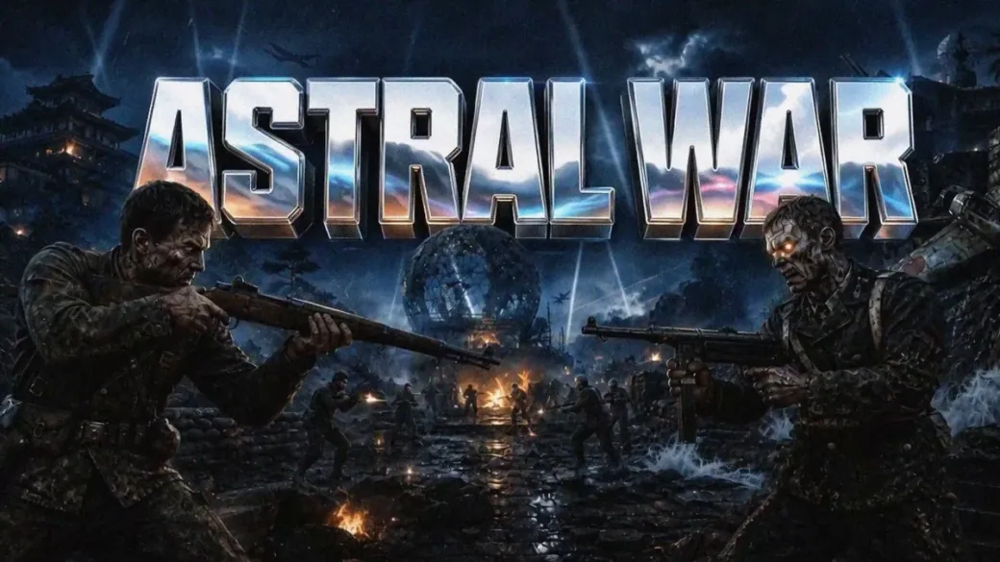</a>

*基于原作品整理的创作说明*

**提示词**

```text
用 Three.js 构建受战争世界启发的浏览器射击游戏，提供完整可玩战场、灵敏战斗、空间音效、角色资产与比赛流程。
```

[查看详情 ↗](https://www.tripo3d.ai/zh/3d-prompts/astral-war-browser-shooter-2096079660605997264) · [查看原帖](https://x.com/0xRishi/status/2096079660605997264) · [返回案例导航](#all-prompts)

---

<a id="astra-3d-2096068401294929940"></a>

### 用概念图驱动 Astra 制作粗糙的 3D 小游戏

[陈硕KAI（耍门）](https://x.com/ChenshuoAI) · 2026-09-05 · GPT-6 Astra · 游戏

<a href="https://www.tripo3d.ai/zh/3d-prompts/astra-3d-2096068401294929940">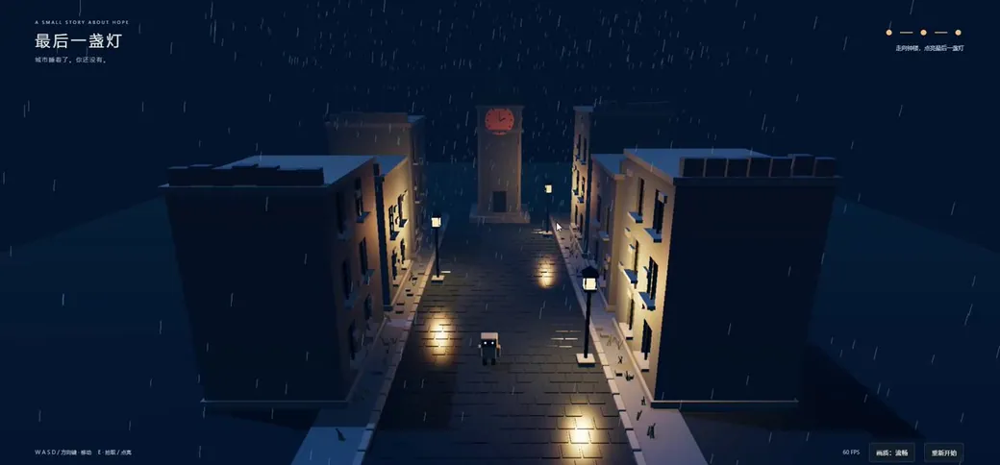</a>

**提示词**

```text
悲伤但美丽的反乌托邦世界，体素 / Low Poly 风格，雨夜、薄雾、湿地反射、冷蓝色环境 + 暖橙色灯光，灯光要尽量真实、有电影感
```

[查看详情 ↗](https://www.tripo3d.ai/zh/3d-prompts/astra-3d-2096068401294929940) · [查看原帖](https://x.com/ChenshuoAI/status/2096068401294929940) · [返回案例导航](#all-prompts)

---

<a id="the-legend-of-astra-game-prototype-2096064140510970318"></a>

### Astra 传说游戏原型

[lofibloom](https://x.com/lofihashbloom) · 2026-09-05 · GPT-6 Astra · 游戏

<a href="https://www.tripo3d.ai/zh/3d-prompts/the-legend-of-astra-game-prototype-2096064140510970318">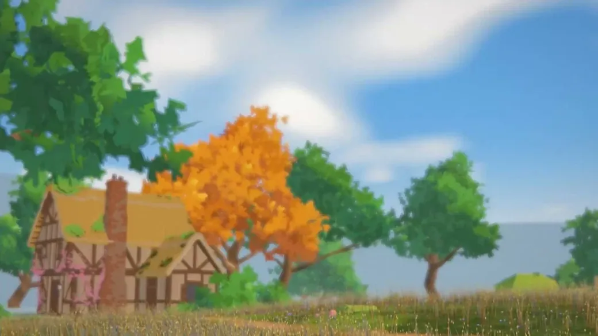</a>

*基于原作品整理的创作说明*

**提示词**

```text
在 Unity 中制作 3D 冒险游戏原型，使用经 Blender 整理的场景和 Tripo 资产，并把角色动画接入可玩的演示。
```

[查看详情 ↗](https://www.tripo3d.ai/zh/3d-prompts/the-legend-of-astra-game-prototype-2096064140510970318) · [查看原帖](https://x.com/lofihashbloom/status/2096064140510970318) · [返回案例导航](#all-prompts)

---

<a id="sinclair-zx-spectrum-simulator-2096062355692048605"></a>

### Sinclair ZX Spectrum 模拟器

[Derya Unutmaz, MD](https://x.com/DeryaTR_) · 2026-09-05 · GPT-6 Astra · 互动

<a href="https://www.tripo3d.ai/zh/3d-prompts/sinclair-zx-spectrum-simulator-2096062355692048605">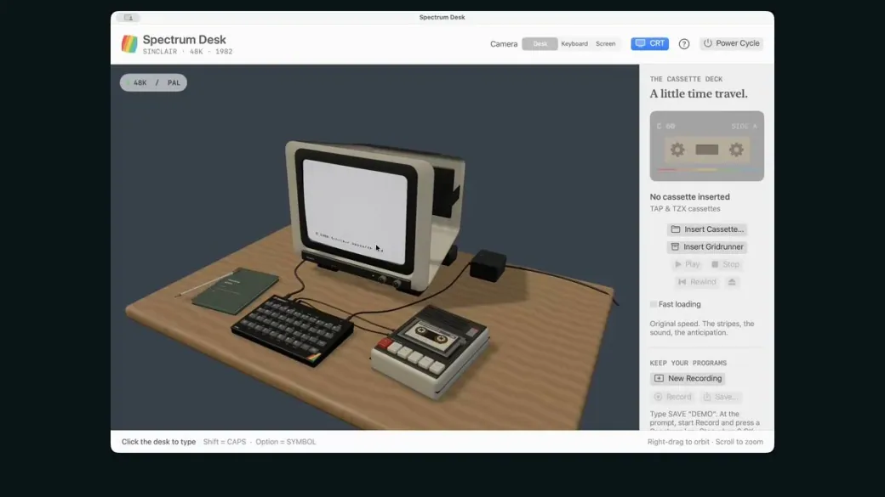</a>

*基于原作品整理的创作说明*

**提示词**

```text
将 Sinclair ZX Spectrum 48K 重建为交互式 3D 桌面应用，包含橡胶键盘、磁带机、开机界面、可玩游戏与 BASIC 编程界面。
```

[查看详情 ↗](https://www.tripo3d.ai/zh/3d-prompts/sinclair-zx-spectrum-simulator-2096062355692048605) · [查看原帖](https://x.com/DeryaTR_/status/2096062355692048605) · [返回案例导航](#all-prompts)

---

<a id="single-view-power-drill-reconstruction-2096059736693305794"></a>

### 单视图电钻重建

[Utah teapot 🫖](https://x.com/SkyeSharkie) · 2026-09-05 · GPT-6 Astra · 资产

<a href="https://www.tripo3d.ai/zh/3d-prompts/single-view-power-drill-reconstruction-2096059736693305794">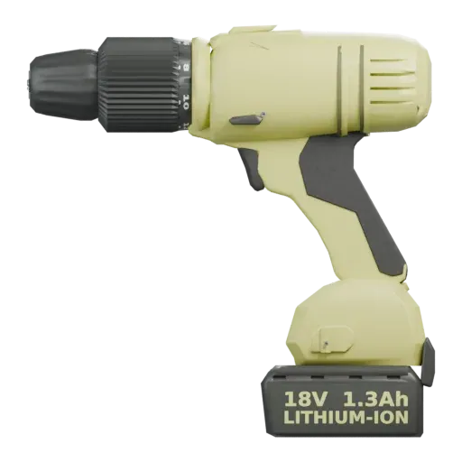</a>

*基于原作品整理的创作说明*

**提示词**

```text
根据单张参考图在 Blender 中重建电钻，将外壳、握柄、夹头与控制件做成可编辑几何体，并从多个角度检视。
```

[查看详情 ↗](https://www.tripo3d.ai/zh/3d-prompts/single-view-power-drill-reconstruction-2096059736693305794) · [查看原帖](https://x.com/SkyeSharkie/status/2096059736693305794) · [返回案例导航](#all-prompts)

---

<a id="sonic-inspired-godot-vertical-slice-2096056285896536086"></a>

### 索尼克风格 Godot 游戏切片

[AiBattle](https://x.com/AiBattle_) · 2026-09-05 · GPT-6 Astra · 游戏

<a href="https://www.tripo3d.ai/zh/3d-prompts/sonic-inspired-godot-vertical-slice-2096056285896536086">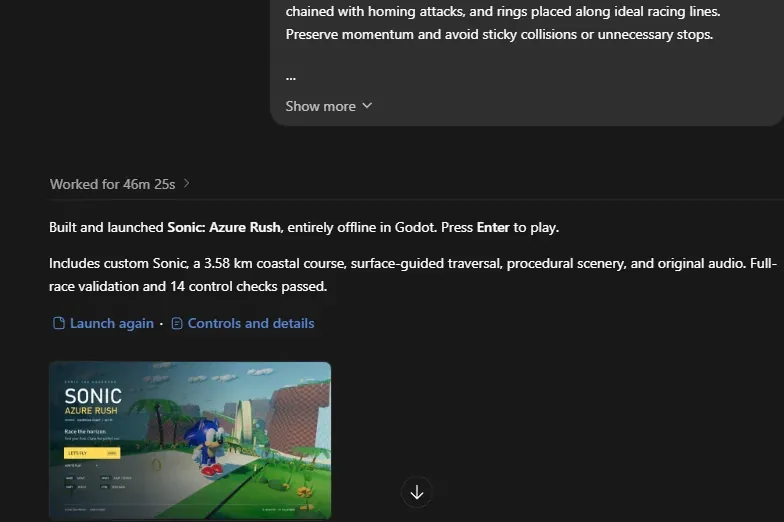</a>

*基于原作品整理的创作说明*

**提示词**

```text
利用本地和程序化资产在 Godot 中创建精致索尼克风格 3D 关卡，优先完善惯性、灵敏移动、圆环、回环、滑轨与连贯热带海岸。
```

[查看详情 ↗](https://www.tripo3d.ai/zh/3d-prompts/sonic-inspired-godot-vertical-slice-2096056285896536086) · [查看原帖](https://x.com/AiBattle_/status/2096056285896536086) · [返回案例导航](#all-prompts)

---

<a id="zork-as-a-3d-action-adventure-2096047660662722620"></a>

### Zork 转 3D 动作冒险

[Ethan Mollick](https://x.com/emollick) · 2026-09-05 · GPT-6 Astra · 游戏

<a href="https://www.tripo3d.ai/zh/3d-prompts/zork-as-a-3d-action-adventure-2096047660662722620">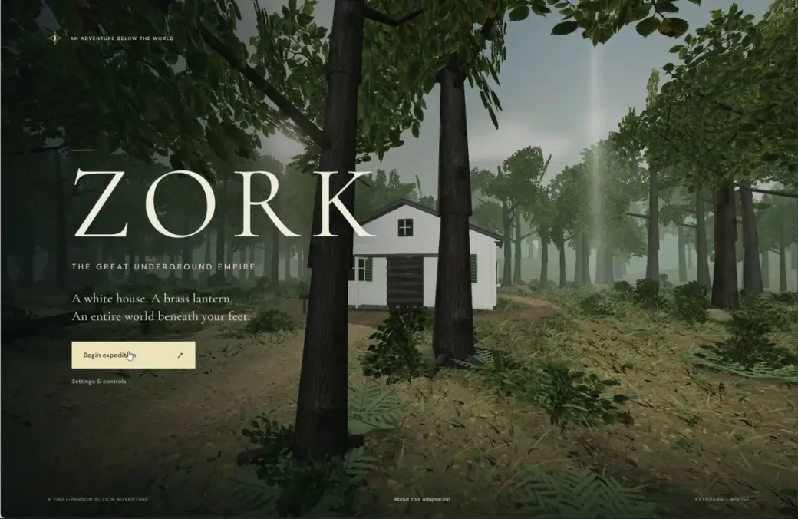</a>

*基于原作品整理的创作说明*

**提示词**

```text
将经典文字冒险 Zork 制作为 3D 动作冒险，保留故事和谜题，增加战斗，并用 Three.js 创建角色和环境。
```

[查看详情 ↗](https://www.tripo3d.ai/zh/3d-prompts/zork-as-a-3d-action-adventure-2096047660662722620) · [查看原帖](https://x.com/emollick/status/2096047660662722620) · [返回案例导航](#all-prompts)

---

<a id="delivery-network-with-bridge-closures-2096042360513904742"></a>

### 可关闭桥梁的配送网络

[AgentworkflowLab](https://x.com/AgentWorkflowLa) · 2026-09-05 · GPT-6 Astra · 动画

<a href="https://www.tripo3d.ai/zh/3d-prompts/delivery-network-with-bridge-closures-2096042360513904742">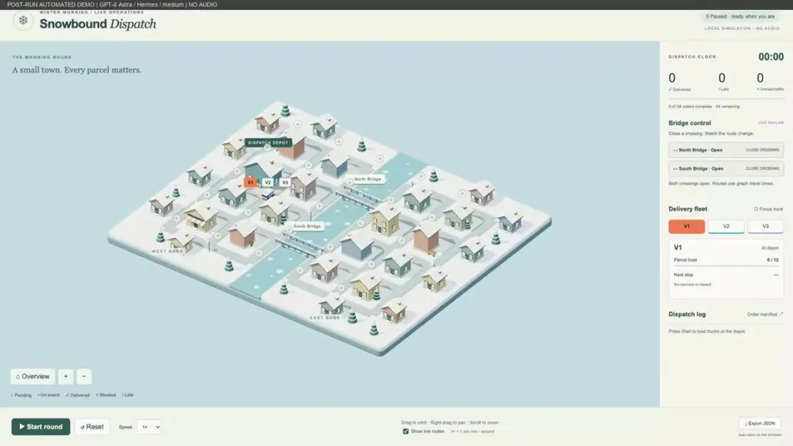</a>

*基于原作品整理的创作说明*

**提示词**

```text
构建 3D 配送模拟，让关闭桥梁改变卡车路线，识别无法到达的目的地，并在路线恢复时重新配送。
```

[查看详情 ↗](https://www.tripo3d.ai/zh/3d-prompts/delivery-network-with-bridge-closures-2096042360513904742) · [查看原帖](https://x.com/AgentWorkflowLa/status/2096042360513904742) · [返回案例导航](#all-prompts)

---

<a id="evolving-webgl-ecosystem-2096040448477515874"></a>

### 演化中的 WebGL 生态系统

[Yume\_X](https://x.com/yume_arasaki) · 2026-09-05 · GPT-6 Astra · 动画

<a href="https://www.tripo3d.ai/zh/3d-prompts/evolving-webgl-ecosystem-2096040448477515874">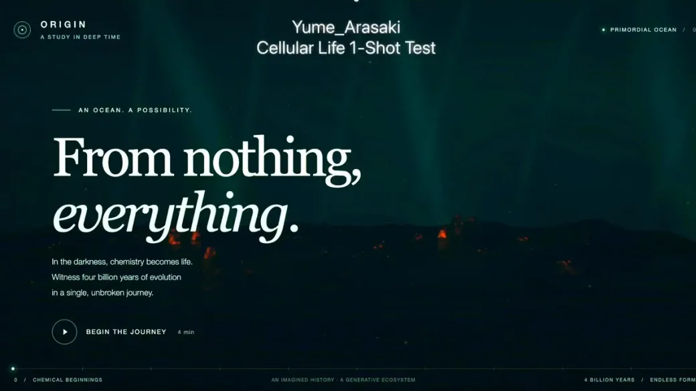</a>

*基于原作品整理的创作说明*

**提示词**

```text
在单个 HTML 文件中用原生 WebGL 和 GLSL 创建 3D 演化生态，让突变、自然选择、捕食、能量使用与多细胞结合互相作用。
```

[查看详情 ↗](https://www.tripo3d.ai/zh/3d-prompts/evolving-webgl-ecosystem-2096040448477515874) · [查看原帖](https://x.com/yume_arasaki/status/2096040448477515874) · [返回案例导航](#all-prompts)

---

<a id="explorable-taj-mahal-2096035962824335798"></a>

### 可探索的泰姬陵

[vikas sabbi](https://x.com/vikassabbi) · 2026-09-05 · GPT-6 Astra · 场景

<a href="https://www.tripo3d.ai/zh/3d-prompts/explorable-taj-mahal-2096035962824335798">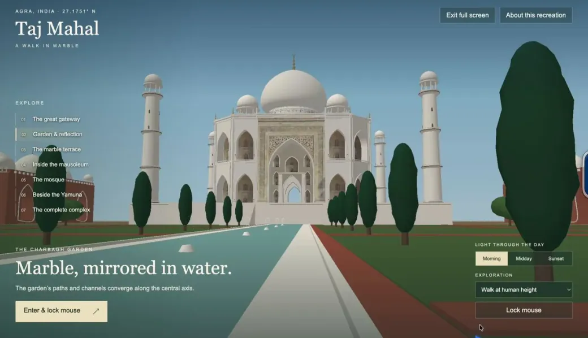</a>

*基于原作品整理的创作说明*

**提示词**

```text
将泰姬陵重建为可探索的 3D 场景，优先还原比例、对称花园、中央穹顶、宣礼塔及建筑之间的关系。
```

[查看详情 ↗](https://www.tripo3d.ai/zh/3d-prompts/explorable-taj-mahal-2096035962824335798) · [查看原帖](https://x.com/vikassabbi/status/2096035962824335798) · [返回案例导航](#all-prompts)

---

<a id="personal-3d-portfolio-with-a-speaking-globe-2096023793772998704"></a>

### 带演讲地球仪的个人 3D 作品集

[Shivay Lamba](https://x.com/HowDevelop) · 2026-09-04 · GPT-6 Astra · 互动

<a href="https://www.tripo3d.ai/zh/3d-prompts/personal-3d-portfolio-with-a-speaking-globe-2096023793772998704">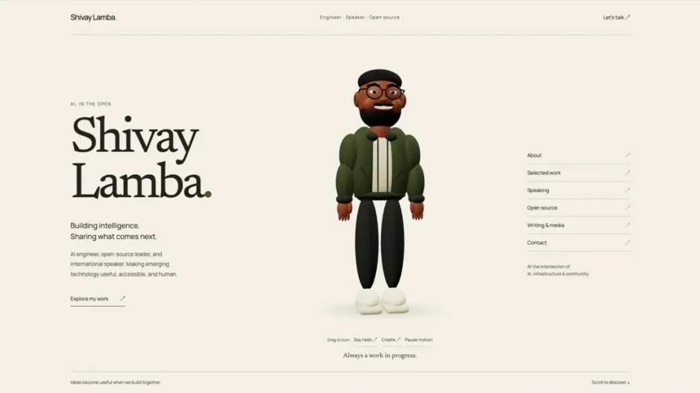</a>

*基于原作品整理的创作说明*

**提示词**

```text
将肖像转成 Blender 角色并放入编辑式 WebGL 作品集，加入标出演讲活动的旋转地球仪并整合网站资产。
```

[查看详情 ↗](https://www.tripo3d.ai/zh/3d-prompts/personal-3d-portfolio-with-a-speaking-globe-2096023793772998704) · [查看原帖](https://x.com/HowDevelop/status/2096023793772998704) · [返回案例导航](#all-prompts)

---

<a id="gogh-strike-multiplayer-fps-2096013280519016608"></a>

### Gogh Strike 多人射击

[Peter Gostev](https://x.com/petergostev) · 2026-09-04 · GPT-6 Astra · 游戏

<a href="https://www.tripo3d.ai/zh/3d-prompts/gogh-strike-multiplayer-fps-2096013280519016608">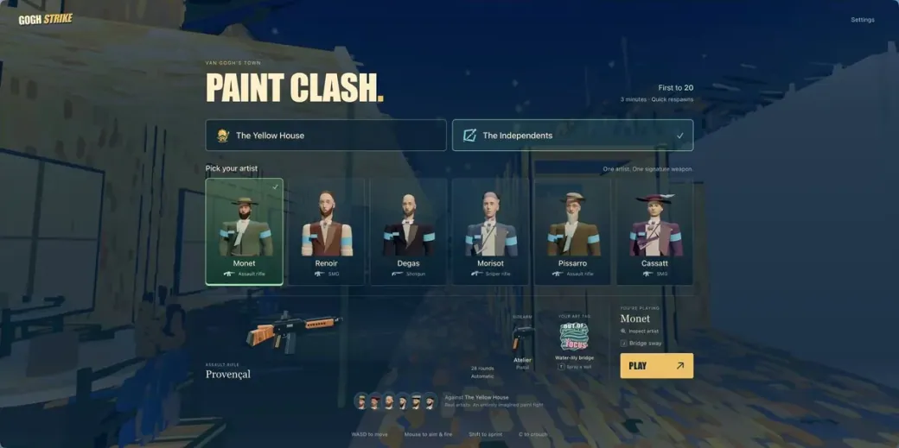</a>

*基于原作品整理的创作说明*

**提示词**

```text
创建后印象派风格的 5 对 5 第一人称射击游戏，包含 Blender 渲染艺术家角色、清晰队伍和完整浏览器多人比赛。
```

[查看详情 ↗](https://www.tripo3d.ai/zh/3d-prompts/gogh-strike-multiplayer-fps-2096013280519016608) · [查看原帖](https://x.com/petergostev/status/2096013280519016608) · [项目源码](https://github.com/petergpt/gogh-strike) · [在线演示](https://gogh-strike.surge.sh/) · [返回案例导航](#all-prompts)

---

<a id="tp-7-recorder-reference-model-2096013228090245181"></a>

### TP-7 录音机参考建模

[Tykra](https://x.com/ty_kra_lab) · 2026-09-04 · GPT-6 Astra · 资产

<a href="https://www.tripo3d.ai/zh/3d-prompts/tp-7-recorder-reference-model-2096013228090245181">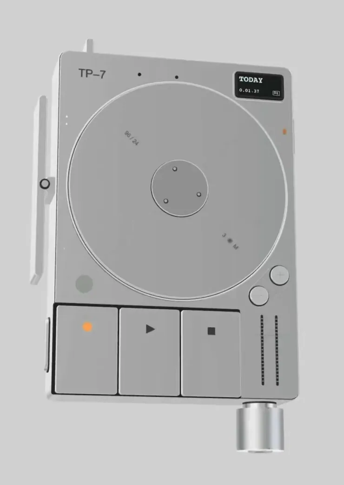</a>

*基于原作品整理的创作说明*

**提示词**

```text
根据参考图片，在 Three.js 中重建 Teenage Engineering TP-7，制作可查看的 3D 模型，还原外形与可见控件。
```

[查看详情 ↗](https://www.tripo3d.ai/zh/3d-prompts/tp-7-recorder-reference-model-2096013228090245181) · [查看原帖](https://x.com/ty_kra_lab/status/2096013228090245181) · [返回案例导航](#all-prompts)

---

<a id="tesla-model-x-exploded-view-2096009146248122416"></a>

### 特斯拉 Model X 爆炸视图

[ashe](https://x.com/ashebytes) · 2026-09-04 · GPT-6 Astra · 互动

<a href="https://www.tripo3d.ai/zh/3d-prompts/tesla-model-x-exploded-view-2096009146248122416">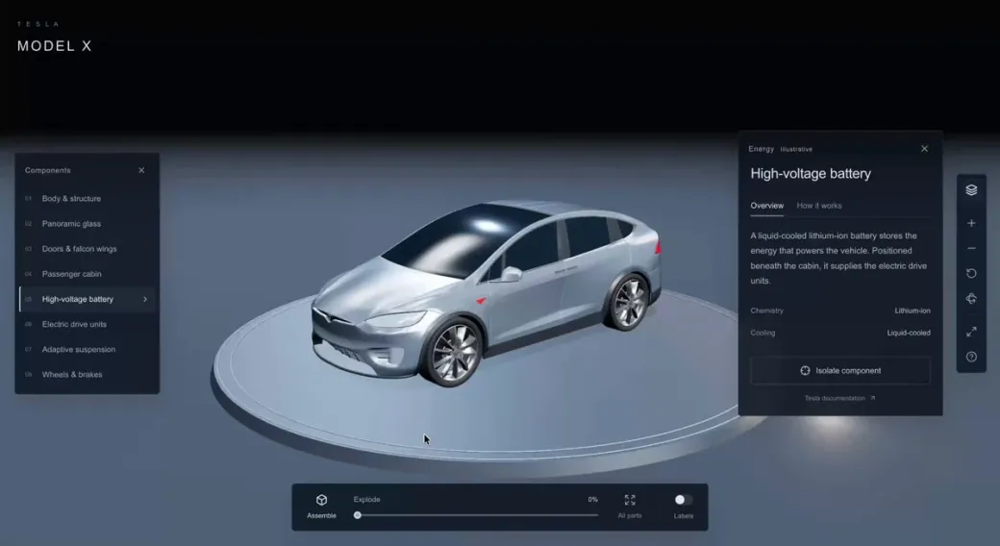</a>

*基于原作品整理的创作说明*

**提示词**

```text
创建将特斯拉 Model X 拆解为建模组件的 3D 网站，让访客交互检视组件并重新组装车辆。
```

[查看详情 ↗](https://www.tripo3d.ai/zh/3d-prompts/tesla-model-x-exploded-view-2096009146248122416) · [查看原帖](https://x.com/ashebytes/status/2096009146248122416) · [返回案例导航](#all-prompts)

---

<a id="bouncy-webgpu-jelly-2096008241104711698"></a>

### 可点击弹跳的 WebGPU 果冻

[Scott](https://x.com/scottstts) · 2026-09-04 · GPT-6 Astra · 动画

<a href="https://www.tripo3d.ai/zh/3d-prompts/bouncy-webgpu-jelly-2096008241104711698">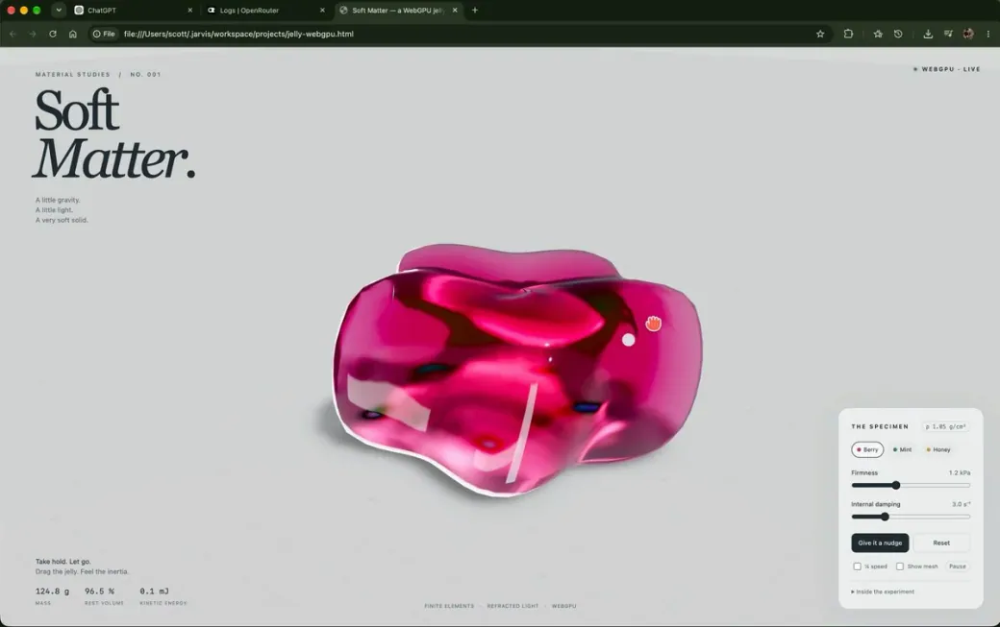</a>

*基于原作品整理的创作说明*

**提示词**

```text
用 Three.js 和 WebGPU 制作诱人的弹跳果冻，让它在交互后自然变形与回弹，配合半透明材质和清晰灯光。
```

[查看详情 ↗](https://www.tripo3d.ai/zh/3d-prompts/bouncy-webgpu-jelly-2096008241104711698) · [查看原帖](https://x.com/scottstts/status/2096008241104711698) · [返回案例导航](#all-prompts)

---

<a id="anime-arena-fighter-in-roblox-2095999578419929412"></a>

### Roblox 动漫竞技格斗

[hiraeth](https://x.com/WoahWurdz) · 2026-09-04 · GPT-6 Astra · 游戏

<a href="https://www.tripo3d.ai/zh/3d-prompts/anime-arena-fighter-in-roblox-2095999578419929412">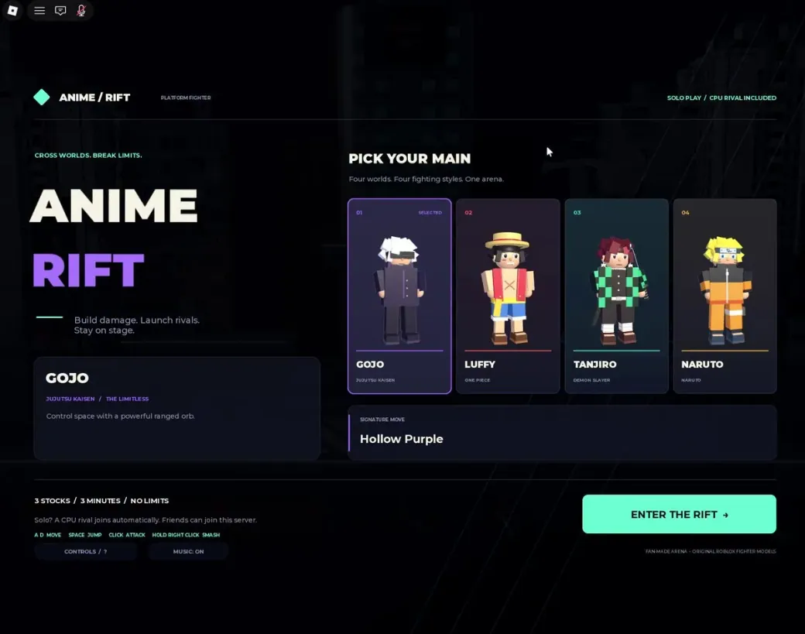</a>

*基于原作品整理的创作说明*

**提示词**

```text
创建受动漫跨界战斗启发的 Roblox 竞技格斗，利用 Blender 和可用资产制作场地与角色，实现可玩的战斗循环。
```

[查看详情 ↗](https://www.tripo3d.ai/zh/3d-prompts/anime-arena-fighter-in-roblox-2095999578419929412) · [查看原帖](https://x.com/WoahWurdz/status/2095999578419929412) · [返回案例导航](#all-prompts)

---

<a id="linked-floor-plan-and-3d-walkthrough-2095999282088378520"></a>

### 平面图与 3D 漫游联动

[おのふみ\| AIクリエーター×個人開発](https://x.com/onofumi_AI) · 2026-09-04 · GPT-6 Astra · 场景

<a href="https://www.tripo3d.ai/zh/3d-prompts/linked-floor-plan-and-3d-walkthrough-2095999282088378520">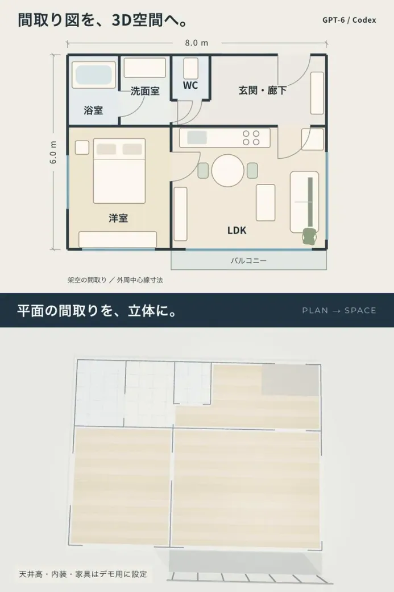</a>

*基于原作品整理的创作说明*

**提示词**

```text
用同一组尺寸数据制作一居室的平面图和 3D 漫游，让两种视图中的当前位置同步，并清楚标注假设的层高与装修材质。
```

[查看详情 ↗](https://www.tripo3d.ai/zh/3d-prompts/linked-floor-plan-and-3d-walkthrough-2095999282088378520) · [查看原帖](https://x.com/onofumi_AI/status/2095999282088378520) · [返回案例导航](#all-prompts)

---

<a id="interactive-browser-river-scene-2095993826569502785"></a>

### 浏览器交互式河流场景

[Dan Greenheck](https://x.com/dangreenheck) · 2026-09-04 · GPT-6 Astra · 互动

<a href="https://www.tripo3d.ai/zh/3d-prompts/interactive-browser-river-scene-2095993826569502785">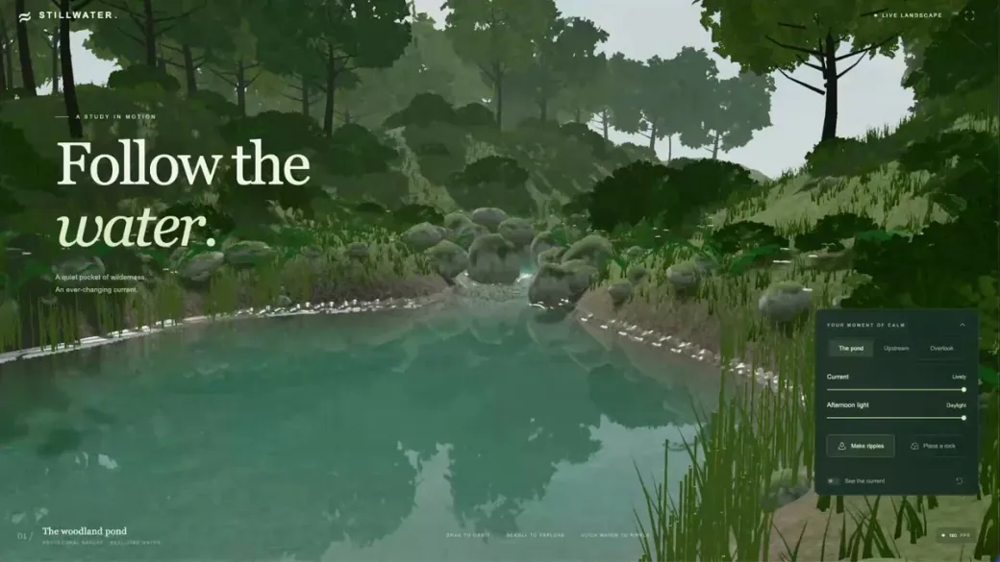</a>

*基于原作品整理的创作说明*

**提示词**

```text
制作在浏览器中运行的交互式河流场景，先完成实时水面原型，再检查并细化视觉效果。
```

[查看详情 ↗](https://www.tripo3d.ai/zh/3d-prompts/interactive-browser-river-scene-2095993826569502785) · [查看原帖](https://x.com/dangreenheck/status/2095993826569502785) · [返回案例导航](#all-prompts)

---

<a id="cathedral-hack-and-slash-arena-2095988972879335792"></a>

### 大教堂动作战斗场

[Alexey Fateev](https://x.com/superalesha) · 2026-09-04 · GPT-6 Astra · 游戏

<a href="https://www.tripo3d.ai/zh/3d-prompts/cathedral-hack-and-slash-arena-2095988972879335792">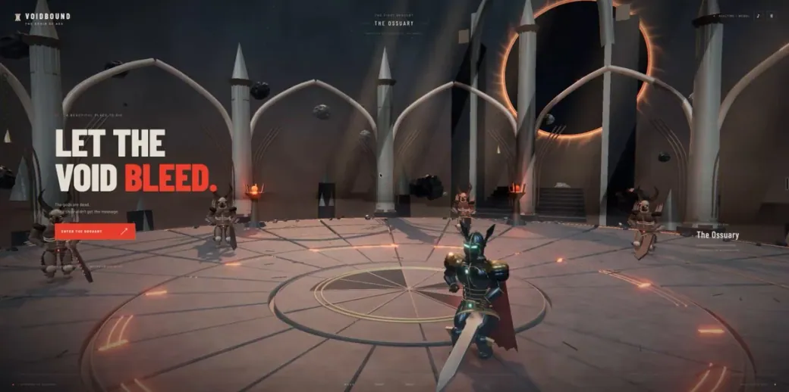</a>

*基于原作品整理的创作说明*

**提示词**

```text
在死星上方的大教堂中构建第三人称 Three.js 动作游戏，包含轻剑连击、重攻击、范围魔法、闪避和脚步落地的双手动画。
```

[查看详情 ↗](https://www.tripo3d.ai/zh/3d-prompts/cathedral-hack-and-slash-arena-2095988972879335792) · [查看原帖](https://x.com/superalesha/status/2095988972879335792) · [项目源码](https://github.com/alesha-pro/bench-portal) · [在线演示](https://alesha-pro.github.io/bench-portal/games/voidbound-choir-of-ash/) · [返回案例导航](#all-prompts)

---

<a id="gpt-6-astra-2095987508475834641"></a>

### 用现有资产包搭建 Unity 城市场景

[Andrew Walko](https://x.com/AndrewWalko) · 2026-09-04 · GPT-6 Astra · 场景

<a href="https://www.tripo3d.ai/zh/3d-prompts/gpt-6-astra-2095987508475834641">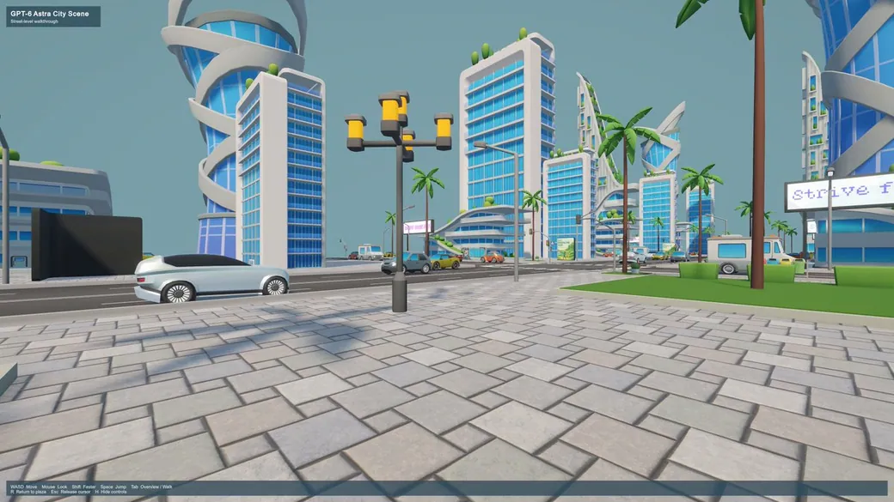</a>

**提示词**

```text
为我创建一个新的 3D 城市场景。我希望场景中有多种类型、不同高度的建筑和汽车，同时使用道路、广告牌以及属于大城市的其他元素。所需资源都在此文件夹中：Assets/ithappy/Cartoon_City_Free。
```

<details>
<summary>作者原始提示词</summary>

```text
Build a new 3D city scene for me. I want several type of buildings (diff heights) and cars there. Also use roads, billboards and other elements that belong to a big city. Everything you need is in this folder Assets/ithappy/Cartoon_City_Free.
```

</details>

[查看详情 ↗](https://www.tripo3d.ai/zh/3d-prompts/gpt-6-astra-2095987508475834641) · [查看原帖](https://x.com/AndrewWalko/status/2095987508475834641) · [返回案例导航](#all-prompts)

---

<a id="interactive-titan-science-exhibit-2095986941753712841"></a>

### 土卫六互动科学展览

[Arda Tuğsat](https://x.com/ArdaTugsat) · 2026-09-04 · GPT-6 Astra · 互动

<a href="https://www.tripo3d.ai/zh/3d-prompts/interactive-titan-science-exhibit-2095986941753712841">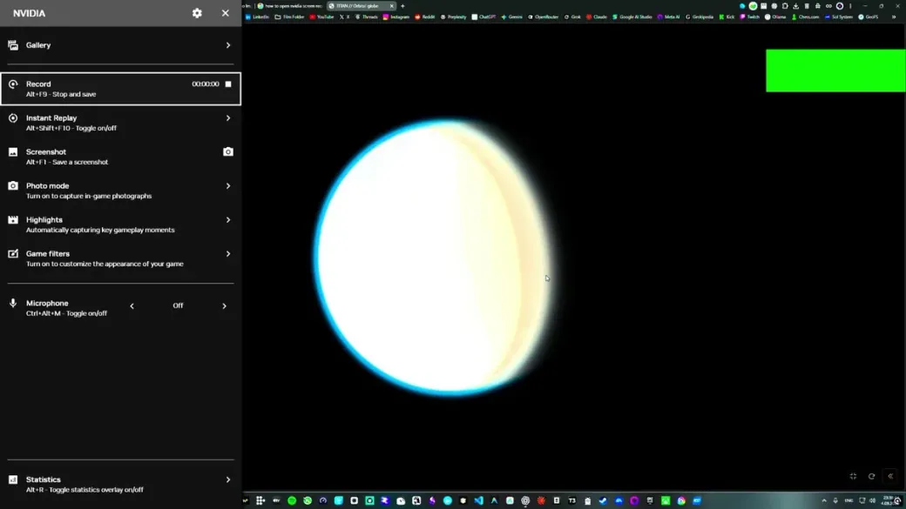</a>

*基于原作品整理的创作说明*

**提示词**

```text
创建土星最大卫星土卫六的教育型 3D 模拟，提供可探索环境及解释其独特物理特征的信息层。
```

[查看详情 ↗](https://www.tripo3d.ai/zh/3d-prompts/interactive-titan-science-exhibit-2095986941753712841) · [查看原帖](https://x.com/ArdaTugsat/status/2095986941753712841) · [返回案例导航](#all-prompts)

---

<a id="3d-slingshot-bird-game-2095981655370666076"></a>

### 3D 弹弓小鸟游戏

[Max](https://x.com/MozeTech) · 2026-09-04 · GPT-6 Astra · 游戏

<a href="https://www.tripo3d.ai/zh/3d-prompts/3d-slingshot-bird-game-2095981655370666076">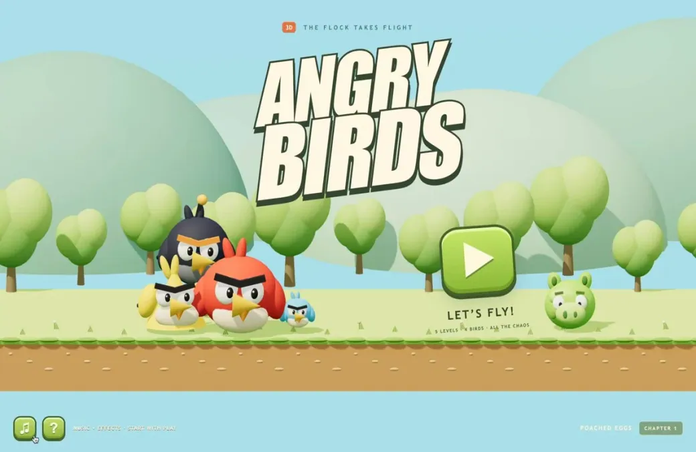</a>

*基于原作品整理的创作说明*

**提示词**

```text
制作 3D 弹弓游戏，包含四种具有不同技能的小鸟、瞄准释放操作、可破坏结构与可重玩的计分循环。
```

[查看详情 ↗](https://www.tripo3d.ai/zh/3d-prompts/3d-slingshot-bird-game-2095981655370666076) · [查看原帖](https://x.com/MozeTech/status/2095981655370666076) · [返回案例导航](#all-prompts)

---

<a id="rube-goldberg-chain-reaction-machine-2095980885732704629"></a>

### 鲁布·戈德堡连锁机械

[thehype.](https://x.com/thehypedotnews) · 2026-09-04 · GPT-6 Astra · 动画

<a href="https://www.tripo3d.ai/zh/3d-prompts/rube-goldberg-chain-reaction-machine-2095980885732704629">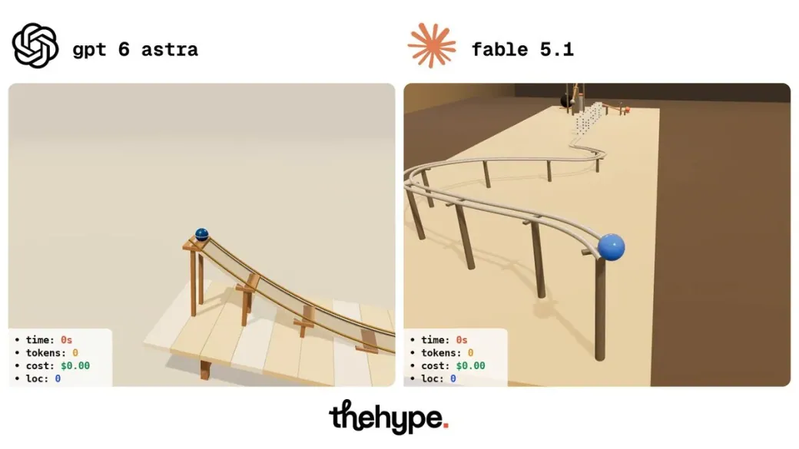</a>

*基于原作品整理的创作说明*

**提示词**

```text
在独立 Three.js HTML 文件中创建鲁布·戈德堡机械，通过一连串机械互动最终按下按钮并触发戏剧化爆炸。
```

[查看详情 ↗](https://www.tripo3d.ai/zh/3d-prompts/rube-goldberg-chain-reaction-machine-2095980885732704629) · [查看原帖](https://x.com/thehypedotnews/status/2095980885732704629) · [返回案例导航](#all-prompts)

---

<a id="gpt-6-astra-2095978925029556561"></a>

### 可切换昼夜的浮空中式寺庙

[Pn](https://x.com/PhilipNora7) · 2026-09-04 · GPT-6 Astra · 互动

<a href="https://www.tripo3d.ai/zh/3d-prompts/gpt-6-astra-2095978925029556561">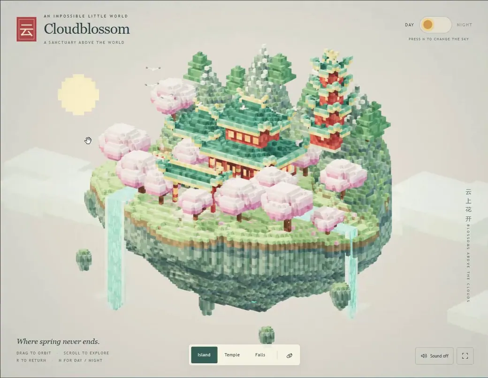</a>

**提示词**

```text
创建一个可交互的像素方块世界，让我看看你的建模能力。我想要一座被粉色樱花树环绕的中式寺庙。整片土地应独立坐落在一座浮空岛上，寺庙周围环绕着瀑布和山地景观。不要向我询问任何输入，我希望你完全自主完成构建并自行做出决定。加入一个简单的开关，让我可以在白天和夜晚之间切换。
```

<details>
<summary>作者原始提示词</summary>

```text
create an interactive pixel block world to show me how good of a model you are. I want a chinese temple surrounded by pink cherry blossom trees. The entire land should be isolated on its own floating island with waterfalls and mountain landscape surrounding the temple. Do not ask for any input from me, I want you to build this all on your own and make the decisions yourself. Make it so I can change between day and night with a simple switch
```

</details>

[查看详情 ↗](https://www.tripo3d.ai/zh/3d-prompts/gpt-6-astra-2095978925029556561) · [查看原帖](https://x.com/PhilipNora7/status/2095978925029556561) · [返回案例导航](#all-prompts)

---

<a id="gpt-6-astra-2095975726558392570"></a>

### 多视图参考机甲建模与骨骼绑定

[Vatroslav Vrbanić](https://x.com/vatro_vrbanic) · 2026-09-04 · GPT-6 Astra · 资产

<a href="https://www.tripo3d.ai/zh/3d-prompts/gpt-6-astra-2095975726558392570">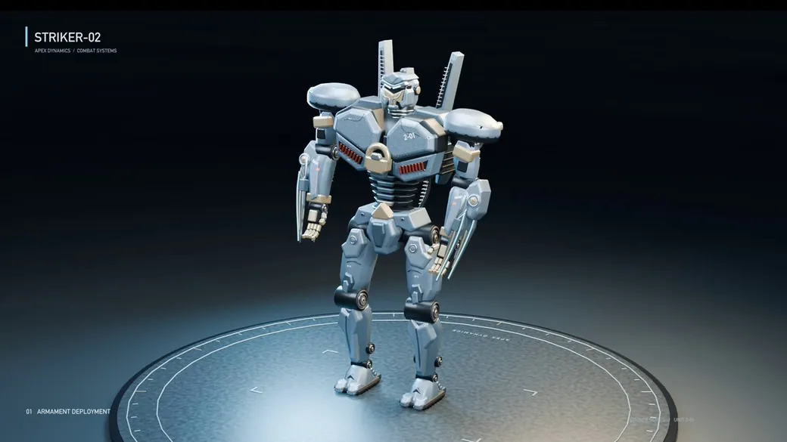</a>

**参考图片:** [1](https://media.tripogrowth.space/media/22873589-2d66-4973-8375-b7064de2fd8b.jpg) · [2](https://media.tripogrowth.space/media/88e8cde8-31fe-434a-8ba6-a55407c07d1b.jpg) · [3](https://media.tripogrowth.space/media/95fbcb13-a13b-457d-a661-5a1f7a241dde.jpg) · [4](https://media.tripogrowth.space/media/1d856d20-5187-4d68-975a-d17deb70794c.jpg) · [5](https://media.tripogrowth.space/media/b3fcebb7-5d4f-4411-9f97-513e937bb106.jpg) · [6](https://pbs.twimg.com/media/HRZiKuVXoAEbNHj.jpg) · [7](https://pbs.twimg.com/media/HRZiMnvawAAAncS.jpg) · [8](https://pbs.twimg.com/media/HRZiN2DXUAUAiYY.jpg) · [9](https://pbs.twimg.com/media/HRZiPVpbIAAldqL.jpg) · [10](https://pbs.twimg.com/media/HRZiXuhWIAASW18.jpg)

**提示词**

```text
使用无界面模式的 Blender 5.2.1，根据这张蓝图制作高精度机甲 3D 模型：`/Users/vatro/codex-blender-headless-astra/mech-blueprint.png`。使用同一目录中的其他机甲参考图获取更详细的参考信息。请注意，蓝图和所有参考图均由 AI 生成，因此不同图像中的细节可能存在不一致。如果发现细节不一致，请发挥创意并找到解决方案，确保最终的机甲 3D 模型外观统一且符合物理规律。机甲 3D 模型应完成骨骼绑定。通过渲染一段 10 秒的动画来展示目标完成情况：机甲展示武器并演示战斗机动性。

仅控制：
选择最合适的参考图，不要仅因蓝图被明确提及就优先使用它。
```

<details>
<summary>作者原始提示词</summary>

```text
use headless Blender 5.2.1 to build a highly detailed 3d model of the mech based on this blueprint: `/Users/vatro/codex-blender-headless-astra/mech-blueprint.png`. use additional mech reference images which you can find inside the same directory for more detailed reference. keep in mind that the blueprint and all reference images are AI-generated, so details might be inconsistent across images. in case you detect inconsistent details, be creative and find a solution so that the resulting 3D model of the mech still looks consistent and physically correct. the 3d model of the mech should be rigged. demonstrate goal's completion by rendering a 10 seconds animation of the mech presenting it's weapons and battle agility.

only steering:
pick best suited reference images, don't favor the blueprint just because it was explicitly mentioned.
```

</details>

[查看详情 ↗](https://www.tripo3d.ai/zh/3d-prompts/gpt-6-astra-2095975726558392570) · [查看原帖](https://x.com/vatro_vrbanic/status/2095975726558392570) · [返回案例导航](#all-prompts)

---

<a id="anti-gravity-combat-racer-2095967568825582044"></a>

### 反重力战斗赛车

[Alexey Fateev](https://x.com/superalesha) · 2026-09-04 · GPT-6 Astra · 游戏

<a href="https://www.tripo3d.ai/zh/3d-prompts/anti-gravity-combat-racer-2095967568825582044">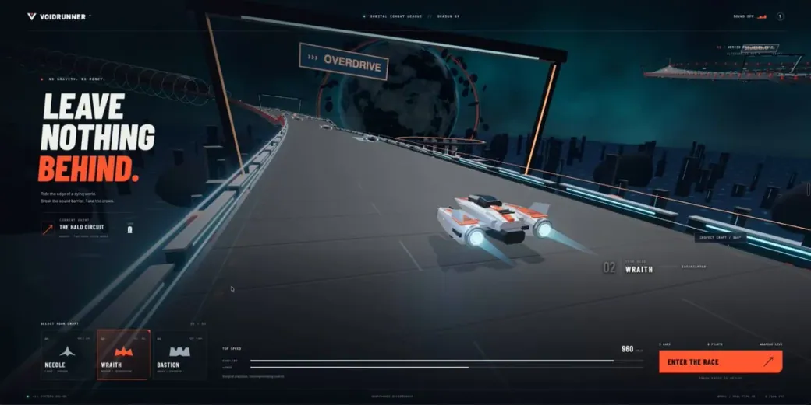</a>

*基于原作品整理的创作说明*

**提示词**

```text
用 Three.js 构建高速反重力战斗竞速，加入漂移、加速、倾斜镜头、空气制动和护盾道具，在外星高架赛道提供轻型、均衡和重型飞行器。
```

<details>
<summary>作者原始提示词</summary>

```text
Make me the most insane and blast of a high-speed anti-gravity combat racer you can possibly build on ThreeJS + Web shaders bro! The most important things are blistering sense of speed, tight drifting, boost mechanics, track elevation drops, motion blur, and jaw-dropping neon shader lighting. It's an intense futuristic raceway high above a strange world where aggressive AI racers battle for first place. Must have smooth camera banking into turns, shield/weapon pickups, and punchy air-brake physics. 3 craft types: a featherlight glass-cannon speeder, an agile balanced interceptor, and a heavy armored ramming tank. This is a Wipeout / Redout style AAA arcade racer in the browser. Do it right bro, I believe in you! An unusual setting for the game, pick it yourself. Please don't read the memory, don't read anything. Start from a blank slate.
```

</details>

[查看详情 ↗](https://www.tripo3d.ai/zh/3d-prompts/anti-gravity-combat-racer-2095967568825582044) · [查看原帖](https://x.com/superalesha/status/2095967568825582044) · [项目源码](https://github.com/alesha-pro/bench-portal) · [返回案例导航](#all-prompts)

---

<a id="interactive-ps5-controller-2095967131573649552"></a>

### 可交互的 PS5 手柄

[bluedev](https://x.com/blueemi99) · 2026-09-04 · GPT-6 Astra · 互动

<a href="https://www.tripo3d.ai/zh/3d-prompts/interactive-ps5-controller-2095967131573649552"></a>

*基于原作品整理的创作说明*

**提示词**

```text
在 Three.js 中创建可检视的 PS5 手柄，还原轮廓、按键、扳机、摇杆与不同表面材质。
```

[查看详情 ↗](https://www.tripo3d.ai/zh/3d-prompts/interactive-ps5-controller-2095967131573649552) · [查看原帖](https://x.com/blueemi99/status/2095967131573649552) · [返回案例导航](#all-prompts)

---

<a id="interactive-3d-character-cards-2095963576049832347"></a>

### 交互式 3D 角色卡片

[Rejuanul Islam](https://x.com/Rejuanul_Islam9) · 2026-09-04 · Claude Fable 5.1 · 互动

<a href="https://www.tripo3d.ai/zh/3d-prompts/interactive-3d-character-cards-2095963576049832347">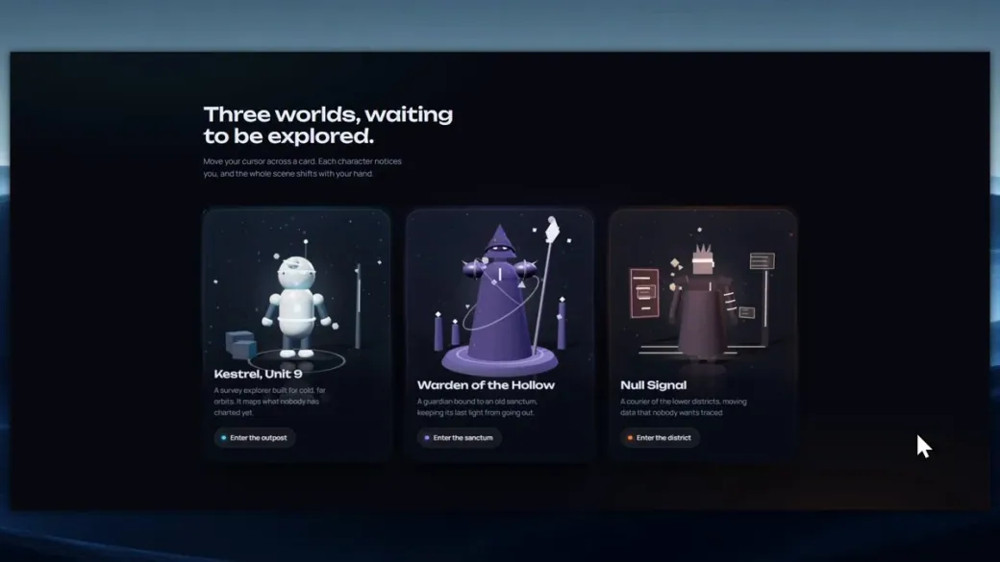</a>

*基于原作品整理的创作说明*

**提示词**

```text
构建交互式 3D 角色卡片界面，让角色响应指针移动，同时保证卡片清晰和响应式布局。
```

[查看详情 ↗](https://www.tripo3d.ai/zh/3d-prompts/interactive-3d-character-cards-2095963576049832347) · [查看原帖](https://x.com/Rejuanul_Islam9/status/2095963576049832347) · [返回案例导航](#all-prompts)

---

<a id="bullet-time-third-person-shooter-2095962376344309843"></a>

### 子弹时间第三人称射击

[Andrei](https://x.com/HangoutWHAndrei) · 2026-09-04 · GPT-6 Astra · 游戏

<a href="https://www.tripo3d.ai/zh/3d-prompts/bullet-time-third-person-shooter-2095962376344309843">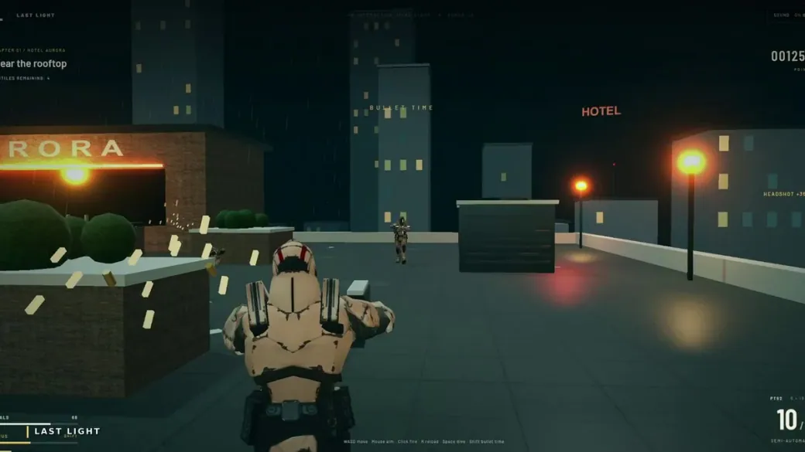</a>

*基于原作品整理的创作说明*

**提示词**

```text
构建受马克思佩恩启发的 Three.js 第三人称射击游戏，重点实现慢动作、灵敏枪战及有效的跟随镜头。
```

[查看详情 ↗](https://www.tripo3d.ai/zh/3d-prompts/bullet-time-third-person-shooter-2095962376344309843) · [查看原帖](https://x.com/HangoutWHAndrei/status/2095962376344309843) · [返回案例导航](#all-prompts)

---

<a id="street-heat-browser-drift-racer-2095916820431827408"></a>

### Street Heat 浏览器漂移赛车

[Higgsfield AI 🧩](https://x.com/higgsfield_ai) · 2026-09-04 · GPT-6 Astra · 游戏

<a href="https://www.tripo3d.ai/zh/3d-prompts/street-heat-browser-drift-racer-2095916820431827408">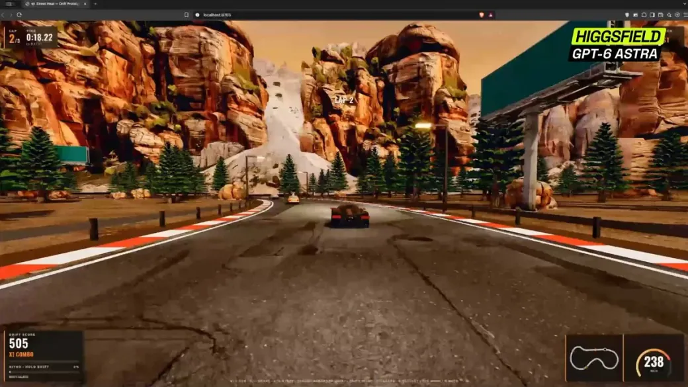</a>

*基于原作品整理的创作说明*

**提示词**

```text
根据一句话在浏览器中构建完整街机街头赛车。实现爽快漂移物理、连击计分、擦肩奖励、测速点、氮气、交通、清晰 HUD 和可重复游玩的短赛道。
```

[查看详情 ↗](https://www.tripo3d.ai/zh/3d-prompts/street-heat-browser-drift-racer-2095916820431827408) · [查看原帖](https://x.com/higgsfield_ai/status/2095916820431827408) · [返回案例导航](#all-prompts)

---

<a id="rapid-playable-game-prototype-2095907526566990013"></a>

### 快速可玩游戏原型

[GLUNIVERSE™](https://x.com/gibglue) · 2026-09-04 · GPT-6 Astra · 游戏

<a href="https://www.tripo3d.ai/zh/3d-prompts/rapid-playable-game-prototype-2095907526566990013">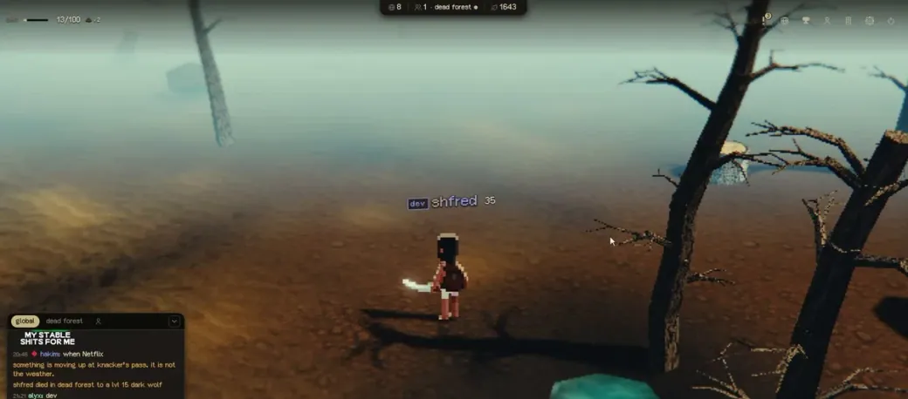</a>

*基于原作品整理的创作说明*

**提示词**

```text
在严格时间与 Token 预算下创建视觉连贯的可玩游戏原型。优先保证一个完整循环、灵敏输入、清晰反馈、稳定性能和可交付浏览器版本，而不是堆功能数量。
```

[查看详情 ↗](https://www.tripo3d.ai/zh/3d-prompts/rapid-playable-game-prototype-2095907526566990013) · [查看原帖](https://x.com/gibglue/status/2095907526566990013) · [返回案例导航](#all-prompts)

---

<a id="looping-cyberpunk-bedroom-in-blender-2095898303019856230"></a>

### Blender 循环赛博朋克卧室

[Coin Shot ☁️](https://x.com/CoinSh0t) · 2026-09-04 · GPT-6 Astra · 场景

<a href="https://www.tripo3d.ai/zh/3d-prompts/looping-cyberpunk-bedroom-in-blender-2095898303019856230">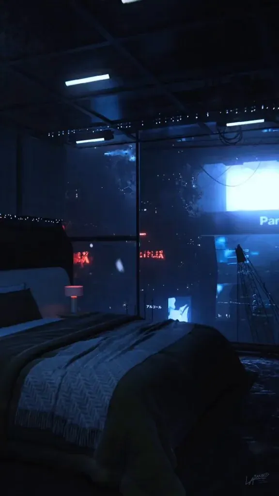</a>

**提示词**

```text
在 Blender 中创建一个电影感赛博朋克卧室，俯瞰雨夜霓虹城市。加入动态广告牌，让画面达到照片级并实现无缝循环。
```

<details>
<summary>作者原始提示词</summary>

```text
Create a cinematic cyberpunk bedroom in Blender overlooking a rainy neon city at night. Add animated billboards and make it photorealistic and seamlessly looped.
```

</details>

[查看详情 ↗](https://www.tripo3d.ai/zh/3d-prompts/looping-cyberpunk-bedroom-in-blender-2095898303019856230) · [查看原帖](https://x.com/CoinSh0t/status/2095898303019856230) · [返回案例导航](#all-prompts)

---

<a id="self-playing-cultural-arcade-game-2095898198413922791"></a>

### 自动游玩的国家文化街机游戏

[Good Morning](https://x.com/say_gm_) · 2026-09-04 · GPT-6 Astra · 游戏

<a href="https://www.tripo3d.ai/zh/3d-prompts/self-playing-cultural-arcade-game-2095898198413922791">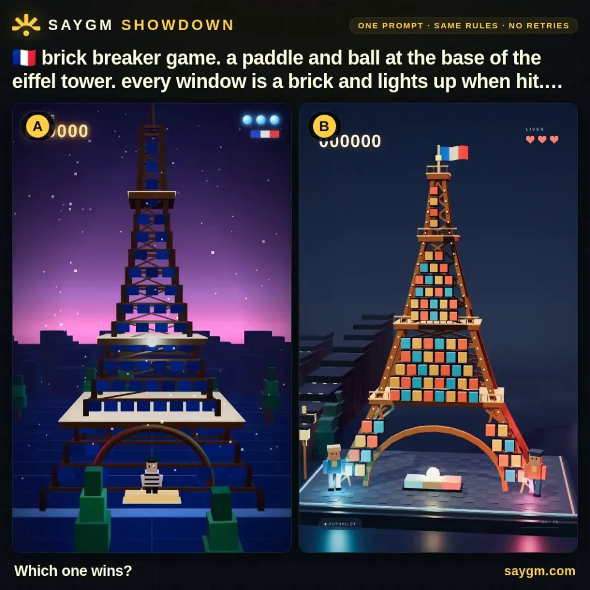</a>

*基于原作品整理的创作说明*

**提示词**

```text
为一个 G7 国家构建自动游玩的街机游戏。把一个可辨识文化地标转成核心机制，让无人操作时也能看懂玩法，并加入计分、升级挑战和记忆点揭晓。
```

[查看详情 ↗](https://www.tripo3d.ai/zh/3d-prompts/self-playing-cultural-arcade-game-2095898198413922791) · [查看原帖](https://x.com/say_gm_/status/2095898198413922791) · [返回案例导航](#all-prompts)

---

<a id="open-world-game-from-a-prompt-2095872986477908108"></a>

### 提示词生成开放世界游戏

[Ejaj AHmed 🦅](https://x.com/aeejazkhan) · 2026-09-04 · GPT-6 Astra · 游戏

<a href="https://www.tripo3d.ai/zh/3d-prompts/open-world-game-from-a-prompt-2095872986477908108">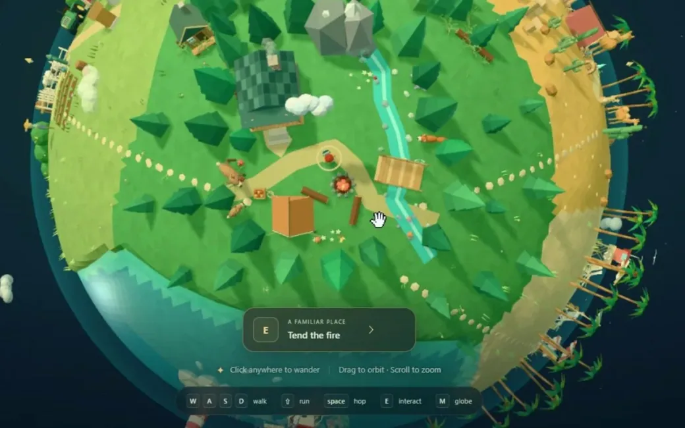</a>

*基于原作品整理的创作说明*

**提示词**

```text
根据这个概念构建开放世界游戏：[世界设定]。包含三个不同区域、移动、动态遭遇、简单任务链、地标、保存与重开，并做足优化以在浏览器运行。
```

[查看详情 ↗](https://www.tripo3d.ai/zh/3d-prompts/open-world-game-from-a-prompt-2095872986477908108) · [查看原帖](https://x.com/aeejazkhan/status/2095872986477908108) · [返回案例导航](#all-prompts)

---

<a id="van-gogh-town-in-three-js-2095871735824339279"></a>

### Three.js 梵高小镇

[Fede(URU) 🇺🇾](https://x.com/RealFedeURU) · 2026-09-04 · GPT-6 Astra · 场景

<a href="https://www.tripo3d.ai/zh/3d-prompts/van-gogh-town-in-three-js-2095871735824339279">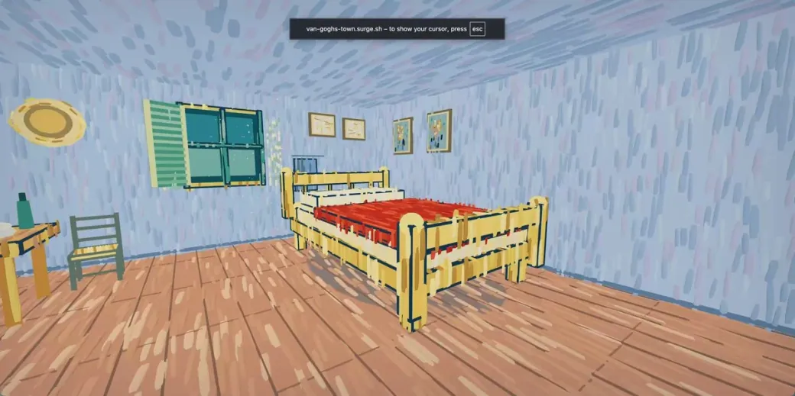</a>

*基于原作品整理的创作说明*

**提示词**

```text
创建受梵高启发的可漫游 Three.js 小镇。把画中的街道、星空、咖啡馆与田野转为分层 3D 空间，并通过 Shader、纹理和动态灯光保留笔触生命力。
```

[查看详情 ↗](https://www.tripo3d.ai/zh/3d-prompts/van-gogh-town-in-three-js-2095871735824339279) · [查看原帖](https://x.com/RealFedeURU/status/2095871735824339279) · [返回案例导航](#all-prompts)

---

<a id="mechanically-complete-blender-locomotive-2095868420327710840"></a>

### 机械结构完整的 Blender 机车

[sheemamoto](https://x.com/sheemamoto) · 2026-09-04 · GPT-6 Astra · 资产

<a href="https://www.tripo3d.ai/zh/3d-prompts/mechanically-complete-blender-locomotive-2095868420327710840">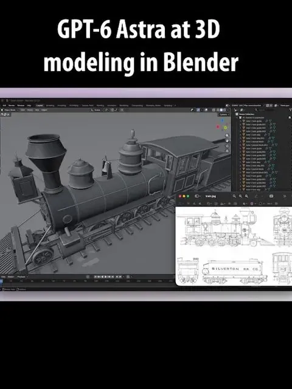</a>

*基于原作品整理的创作说明*

**提示词**

```text
在 Blender 中把蒸汽机车建成真正的机械分解体，而不是贴图外壳。命名并分离车轴、轴箱导轨、轴颈座、拉杆、悬挂连杆、蒸汽穹顶和各主要装配件。
```

[查看详情 ↗](https://www.tripo3d.ai/zh/3d-prompts/mechanically-complete-blender-locomotive-2095868420327710840) · [查看原帖](https://x.com/sheemamoto/status/2095868420327710840) · [返回案例导航](#all-prompts)

---

<a id="thirty-second-blender-scene-challenge-2095844872171421771"></a>

### 30 秒 Blender 场景挑战

[Satyam Kumar](https://x.com/_satyam_ai) · 2026-09-04 · GPT-6 Astra · 场景

<a href="https://www.tripo3d.ai/zh/3d-prompts/thirty-second-blender-scene-challenge-2095844872171421771">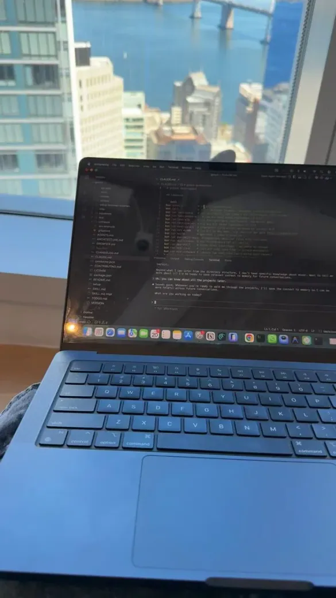</a>

*基于原作品整理的创作说明*

**提示词**

```text
在极限时间内构建连贯 Blender 场景。优先保证鲜明轮廓、三层景深、一个主角材质、电影灯光和可直接出图的构图，并保持所有对象可编辑。
```

[查看详情 ↗](https://www.tripo3d.ai/zh/3d-prompts/thirty-second-blender-scene-challenge-2095844872171421771) · [查看原帖](https://x.com/_satyam_ai/status/2095844872171421771) · [返回案例导航](#all-prompts)

---

<a id="single-turn-three-js-naval-war-scene-2095840435319001278"></a>

### 单轮 Three.js 海战场景

[leo 🐾](https://x.com/synthwavedd) · 2026-09-04 · GPT-6 Astra · 场景

<a href="https://www.tripo3d.ai/zh/3d-prompts/single-turn-three-js-naval-war-scene-2095840435319001278">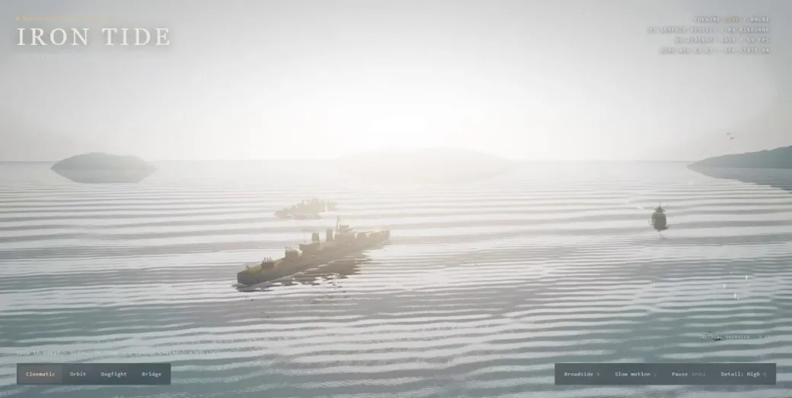</a>

*基于原作品整理的创作说明*

**提示词**

```text
单轮创建高细节 Three.js 海战场景，包含多种不同舰船、可信水体交互、尾流与飞沫、空中行动、爆炸、电影灯光、镜头运动和兼顾性能的渲染。
```

[查看详情 ↗](https://www.tripo3d.ai/zh/3d-prompts/single-turn-three-js-naval-war-scene-2095840435319001278) · [查看原帖](https://x.com/synthwavedd/status/2095840435319001278) · [返回案例导航](#all-prompts)

---

<a id="oval-office-through-the-presidencies-2095830596069290077"></a>

### 历任总统时期的椭圆形办公室

[Min Zhou](https://x.com/fMinZhou) · 2026-09-04 · Claude Fable 5.1 · 互动

<a href="https://www.tripo3d.ai/zh/3d-prompts/oval-office-through-the-presidencies-2095830596069290077">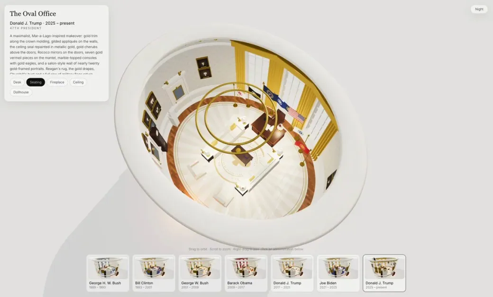</a>

*基于原作品整理的创作说明*

**提示词**

```text
创建交互式 Three.js 项目，探索不同总统时期的椭圆形办公室，切换时期观察家具、装饰与布局。
```

[查看详情 ↗](https://www.tripo3d.ai/zh/3d-prompts/oval-office-through-the-presidencies-2095830596069290077) · [查看原帖](https://x.com/fMinZhou/status/2095830596069290077) · [返回案例导航](#all-prompts)

---

<a id="recipe-to-3d-cheesecake-film-2095829851206774987"></a>

### 食谱转 3D 芝士蛋糕影片

[سارة - تؤمن بالعدالة- Sara - believes in justice.](https://x.com/sarit69976) · 2026-09-04 · Claude Fable 5.1 · 资产

<a href="https://www.tripo3d.ai/zh/3d-prompts/recipe-to-3d-cheesecake-film-2095829851206774987"></a>

*基于原作品整理的创作说明*

**提示词**

```text
根据真实食谱用 Three.js 重建芝士蛋糕，分别建模六层结构、活底模具与烘焙纸，制作一分钟展示影片。
```

[查看详情 ↗](https://www.tripo3d.ai/zh/3d-prompts/recipe-to-3d-cheesecake-film-2095829851206774987) · [查看原帖](https://x.com/sarit69976/status/2095829851206774987) · [返回案例导航](#all-prompts)

---

<a id="tidal-rush-eight-racer-browser-game-2095819786651374023"></a>

### Tidal Rush 八人卡丁车游戏

[RESONANCE SCIENCE 🧬🔬](https://x.com/amazing13_13) · 2026-09-04 · GPT-6 Astra · 游戏

<a href="https://www.tripo3d.ai/zh/3d-prompts/tidal-rush-eight-racer-browser-game-2095819786651374023">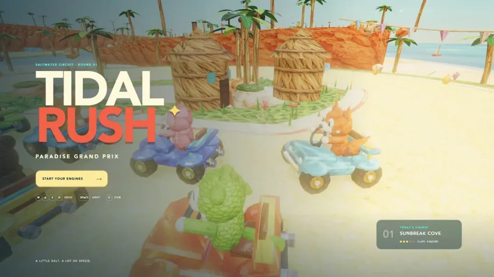</a>

*基于原作品整理的创作说明*

**提示词**

```text
构建完整浏览器卡丁车游戏，包含 8 名车手、3 圈比赛、漂移、可拾取道具、灵敏物理、清晰 HUD、精致画面和终点结果页。
```

[查看详情 ↗](https://www.tripo3d.ai/zh/3d-prompts/tidal-rush-eight-racer-browser-game-2095819786651374023) · [查看原帖](https://x.com/amazing13_13/status/2095819786651374023) · [返回案例导航](#all-prompts)

---

<a id="interactive-three-js-galaxy-homepage-2095806515579879457"></a>

### 交互式 Three.js 星系首页

[Three.js Resources](https://x.com/threejsresource) · 2026-09-04 · GPT-6 Astra · 互动

<a href="https://www.tripo3d.ai/zh/3d-prompts/interactive-three-js-galaxy-homepage-2095806515579879457">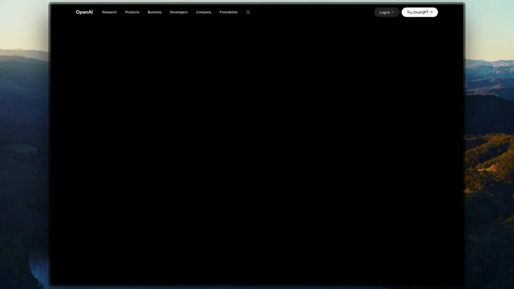</a>

*基于原作品整理的创作说明*

**提示词**

```text
围绕实时 Three.js 星系创建高级发布页首屏。让粒子形成隐约的数字 6 轮廓，响应滚动和指针，同时保证文字可读，并在低性能设备优雅降级。
```

[查看详情 ↗](https://www.tripo3d.ai/zh/3d-prompts/interactive-three-js-galaxy-homepage-2095806515579879457) · [查看原帖](https://x.com/threejsresource/status/2095806515579879457) · [返回案例导航](#all-prompts)

---

<a id="real-time-webgl-galaxy-launch-hero-2095805694603673631"></a>

### 实时 WebGL 星系首屏

[Fluxora](https://x.com/Fluxora_Studios) · 2026-09-04 · GPT-6 Astra · 互动

<a href="https://www.tripo3d.ai/zh/3d-prompts/real-time-webgl-galaxy-launch-hero-2095805694603673631">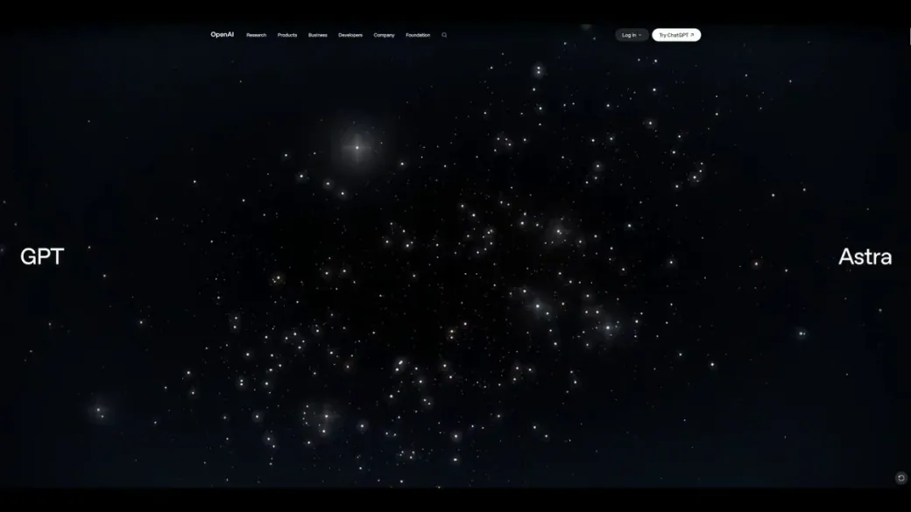</a>

*基于原作品整理的创作说明*

**提示词**

```text
分析给定星系首屏的视觉语言，并用实时 WebGL 而不是视频重建。使用具有景深的粒子、发光尘埃、流畅指针响应、克制的排版留白与自适应性能。
```

[查看详情 ↗](https://www.tripo3d.ai/zh/3d-prompts/real-time-webgl-galaxy-launch-hero-2095805694603673631) · [查看原帖](https://x.com/Fluxora_Studios/status/2095805694603673631) · [返回案例导航](#all-prompts)

---

<a id="starry-night-streets-you-can-stroll-2095805115580199372"></a>

### 可漫步的星月夜街道

[₿IGRYAN](https://x.com/BigRyan) · 2026-09-04 · GPT-6 Astra · 场景

<a href="https://www.tripo3d.ai/zh/3d-prompts/starry-night-streets-you-can-stroll-2095805115580199372">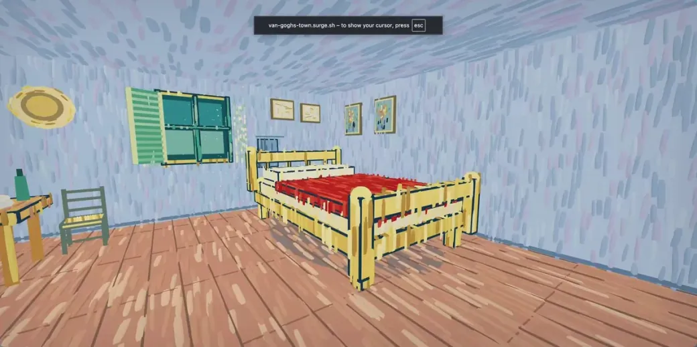</a>

*基于原作品整理的创作说明*

**提示词**

```text
把六幅梵高画作组合成一座可探索小镇，让访客能漫步在《星月夜》的街道中。为画作之间设计自然入口，保持尺度连贯，并加入轻柔环境互动。
```

[查看详情 ↗](https://www.tripo3d.ai/zh/3d-prompts/starry-night-streets-you-can-stroll-2095805115580199372) · [查看原帖](https://x.com/BigRyan/status/2095805115580199372) · [返回案例导航](#all-prompts)

---

<a id="real-house-to-editable-60-fps-blender-scene-2095777502681825541"></a>

### 真实住宅转 60 FPS 可编辑 Blender 场景

[Alvin Foo](https://x.com/alvinfoo) · 2026-09-04 · GPT-6 Astra · 场景

<a href="https://www.tripo3d.ai/zh/3d-prompts/real-house-to-editable-60-fps-blender-scene-2095777502681825541">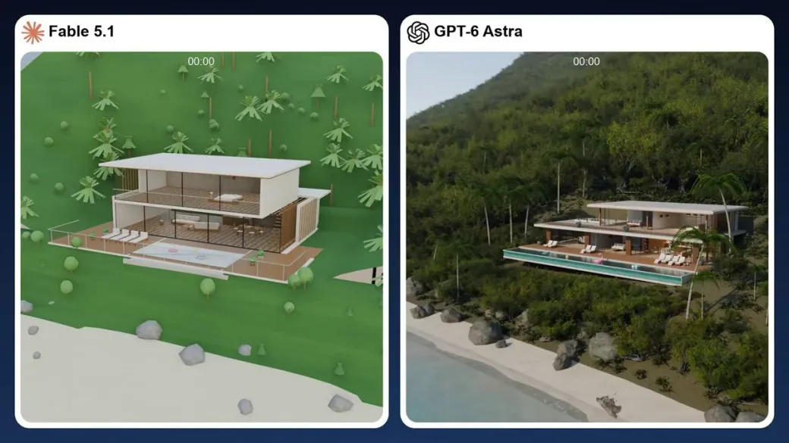</a>

*基于原作品整理的创作说明*

**提示词**

```text
把给定真实住宅重建为完全可编辑的 Blender 场景。分离建筑与家具元素，优化几何和材质，并交付可在本地稳定 60 FPS 渲染的漫游。
```

[查看详情 ↗](https://www.tripo3d.ai/zh/3d-prompts/real-house-to-editable-60-fps-blender-scene-2095777502681825541) · [查看原帖](https://x.com/alvinfoo/status/2095777502681825541) · [返回案例导航](#all-prompts)

---

<a id="exploded-interactive-3d-turbocharger-2095776712579571725"></a>

### 可拆解交互式 3D 涡轮增压器

[Feraser](https://x.com/Feraser8) · 2026-09-04 · GPT-6 Astra · 互动

<a href="https://www.tripo3d.ai/zh/3d-prompts/exploded-interactive-3d-turbocharger-2095776712579571725">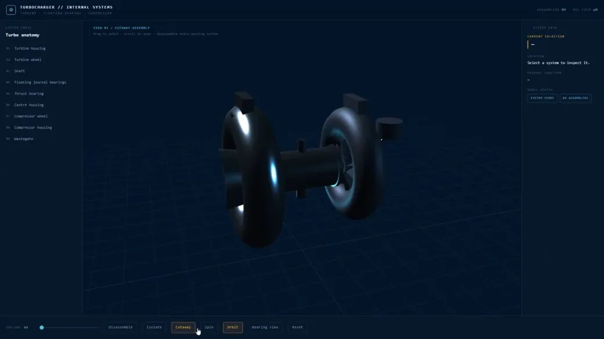</a>

**提示词**

```text
构建一个交互式 3D 涡轮增压器。拆分所有工作系统，让我能够旋转、隔离部件，并看清机器实际如何运作。
```

<details>
<summary>作者原始提示词</summary>

```text
Build an interactive 3D turbocharger. Separate every working system. Let me rotate it, isolate parts, and see what the machine is actually doing.
```

</details>

[查看详情 ↗](https://www.tripo3d.ai/zh/3d-prompts/exploded-interactive-3d-turbocharger-2095776712579571725) · [查看原帖](https://x.com/Feraser8/status/2095776712579571725) · [返回案例导航](#all-prompts)

---

<a id="walkable-town-made-from-six-van-gogh-paintings-2095776685807346105"></a>

### 六幅梵高画作组成的可漫游小镇

[Peter Gostev](https://x.com/petergostev) · 2026-09-04 · GPT-6 Astra · 场景

<a href="https://www.tripo3d.ai/zh/3d-prompts/walkable-town-made-from-six-van-gogh-paintings-2095776685807346105"></a>

*基于原作品整理的创作说明*

**提示词**

```text
把六幅给定梵高画作融合成一个连贯、可漫游的 Three.js 小镇。保留每幅画的色板与笔触气质，同时用街道、地标与转场将其连接为可探索世界。
```

[查看详情 ↗](https://www.tripo3d.ai/zh/3d-prompts/walkable-town-made-from-six-van-gogh-paintings-2095776685807346105) · [查看原帖](https://x.com/petergostev/status/2095776685807346105) · [在线演示](https://van-goghs-town.surge.sh/) · [返回案例导航](#all-prompts)

---

<a id="steam-train-drawing-to-editable-blender-assembly-2095756085890310311"></a>

### 蒸汽火车图纸转 Blender 装配体

[Tom Krcha](https://x.com/tomkrcha) · 2026-09-04 · GPT-6 Astra · 资产

<a href="https://www.tripo3d.ai/zh/3d-prompts/steam-train-drawing-to-editable-blender-assembly-2095756085890310311">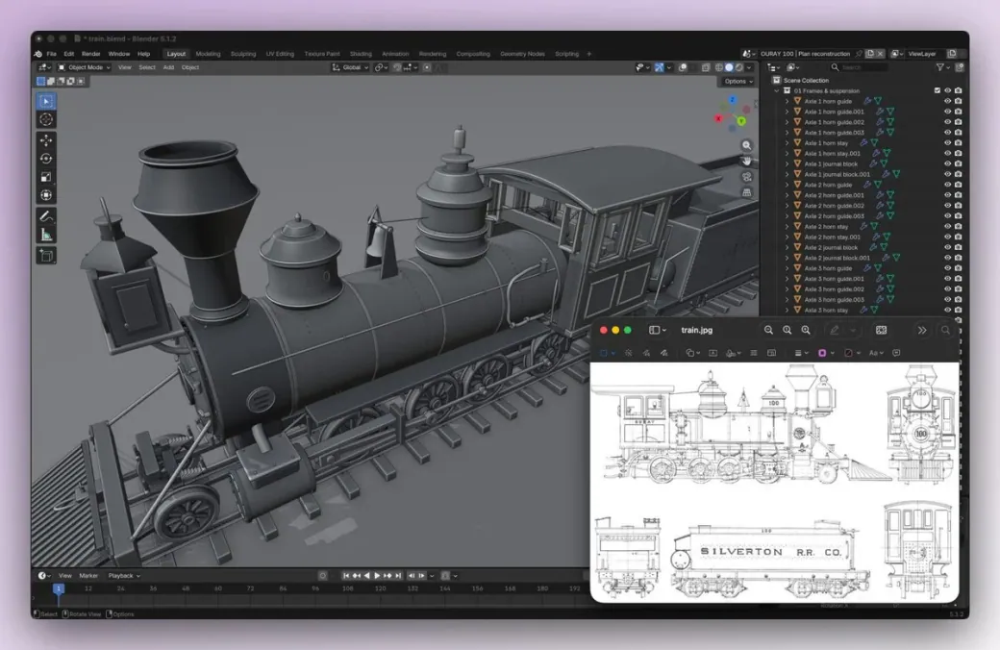</a>

*基于原作品整理的创作说明*

**提示词**

```text
把给定复古蒸汽火车图纸在 Blender 中重建为高细节机械装配体。车轮、车轴、悬挂、连杆、锅炉配件与车身面板都要成为命名清晰、可编辑的对象，并允许控制细节预算。
```

[查看详情 ↗](https://www.tripo3d.ai/zh/3d-prompts/steam-train-drawing-to-editable-blender-assembly-2095756085890310311) · [查看原帖](https://x.com/tomkrcha/status/2095756085890310311) · [返回案例导航](#all-prompts)

---

<a id="solace-forest-villa-from-brief-to-ue5-2095752726886105375"></a>

### Solace 森林别墅从 Brief 到 UE5

[SuSu\_酥酥👅](https://x.com/NFT_Chen) · 2026-09-04 · GPT-6 Astra · 场景

<a href="https://www.tripo3d.ai/zh/3d-prompts/solace-forest-villa-from-brief-to-ue5-2095752726886105375">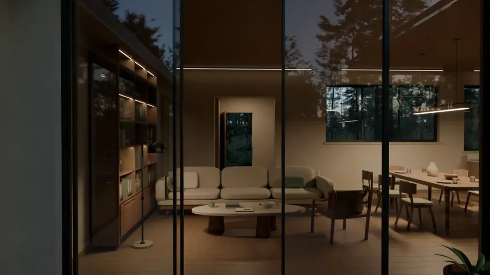</a>

*基于原作品整理的创作说明*

**提示词**

```text
创建名为 Solace 的可漫游现代森林别墅，包含三间卧室、办公室、中央庭院、泳池和周边林地。在 Blender 中程序化构建，输出黄金时刻静帧，再导出 60 FPS 的 UE5 漫游。
```

[查看详情 ↗](https://www.tripo3d.ai/zh/3d-prompts/solace-forest-villa-from-brief-to-ue5-2095752726886105375) · [查看原帖](https://x.com/NFT_Chen/status/2095752726886105375) · [返回案例导航](#all-prompts)

---

<a id="driveable-childhood-train-table-2095742344293454148"></a>

### 可驾驶的童年火车沙盘

[₿IGRYAN](https://x.com/BigRyan) · 2026-09-04 · GPT-6 Astra · 互动

<a href="https://www.tripo3d.ai/zh/3d-prompts/driveable-childhood-train-table-2095742344293454148"></a>

*基于原作品整理的创作说明*

**提示词**

```text
把童年火车沙盘重建为具有触感的 Three.js 玩具，使用体素轨道与车辆。允许玩家驾驶火车、切换岔道、环绕查看沙盘并发现动态微缩场景。
```

[查看详情 ↗](https://www.tripo3d.ai/zh/3d-prompts/driveable-childhood-train-table-2095742344293454148) · [查看原帖](https://x.com/BigRyan/status/2095742344293454148) · [返回案例导航](#all-prompts)

---


[完整目录](catalog.zh.md) · [←](catalog.zh.5.md) · **6 / 9** · [→](catalog.zh.7.md)

<p align="center"><strong><a href="https://www.tripo3d.ai/zh/3d-prompts?utm_source=github&amp;utm_medium=referral&amp;utm_campaign=awesome_3d_prompts&amp;utm_content=catalog_footer">查看全部 447 条案例与在线演示 →</a></strong></p>
