<!-- Generated from Growth CMS by templates/catalog.md. Edit content in CMS; run npm run sync. -->

# Awesome 3D Prompts — 8 / 9

[← Awesome 3D Prompts](../README.zh-CN.md)

<p>
  <a href="../docs/catalog.en.8.md"></a>
  <a href="../docs/catalog.zh.8.md"></a>
  <a href="../docs/catalog.zh-Hant.8.md"></a>
  <a href="../docs/catalog.ja.8.md"></a>
  <a href="../docs/catalog.ko.8.md"></a>
  <a href="../docs/catalog.es.8.md"></a>
  <a href="../docs/catalog.pt.8.md"></a>
  <a href="../docs/catalog.de.8.md"></a>
  <a href="../docs/catalog.fr.8.md"></a>
  <a href="../docs/catalog.it.8.md"></a>
  <a href="../docs/catalog.ru.8.md"></a>
  <a href="../docs/catalog.tr.8.md"></a>
  <a href="../docs/catalog.uk.8.md"></a>
  <a href="../docs/catalog.vi.8.md"></a>
</p>

[完整目录](catalog.zh.md) · [←](catalog.zh.7.md) · **8 / 9** · [→](catalog.zh.9.md)

<a id="all-prompts"></a>

<details>
<summary>浏览案例 (50)</summary>

- [Blender 飞行锅动画](#flying-pot-animation-in-blender-2095132939667255657)
- [3D 癌细胞演进模拟](#3d-cancer-progression-simulation-2095130778342408331)
- [增强流星体解体特效](#enhanced-meteoroid-breakup-vfx-2095127248470692320)
- [支持 LOD 的突击舱飞船](#lod-ready-assault-pod-spaceship-2095126622319845478)
- [高细节 3D 体育场复刻](#detailed-3d-stadium-recreation-2095123216419459454)
- [机械准确的水车村庄](#mechanically-accurate-water-mill-village-2095123063352561815)
- [Shader 驱动的交互式恐龙图鉴](#interactive-shader-driven-dino-dex-2095121568297083067)
- [玻璃瓶中的鲜活体素世界](#living-voxel-world-inside-a-bottle-2095111213927510131)
- [可编辑的 3D 键盘动画](#editable-3d-keyboard-animation-2095111032171876470)
- [高达风机甲展示](#gundam-inspired-mecha-showcase-2095106919530930221)
- [参考图驱动的 Three.js 作品集](#reference-driven-three-js-portfolio-2095104073590808644)
- [交互式 F-35A 技术模型](#interactive-f-35a-technical-model-2095094543339446572)
- [Three.js MS-06 风格机甲](#three-js-ms-06-inspired-mecha-2095085944391270759)
- [单 HTML 文件中的鲜活宇宙](#living-universe-in-one-html-file-2095054116372508955)
- [原生 C++ 类魂游戏](#native-c-souls-like-game-2095053114600755576)
- [可玩的 3D 蛇梯棋](#playable-3d-snakes-and-ladders-2095050993184669825)
- [肖像转动态体素](#portrait-transformed-into-kinetic-voxels-2095048967092625663)
- [交互式 Three.js 城堡](#interactive-three-js-castle-2095048818203275584)
- [NIGHTBAND 交互式短波电台](#nightband-interactive-shortwave-radio-2095026928210346175)
- [完整 Unity 网球游戏](#complete-unity-tennis-game-2095021275236495408)
- [发光峡谷上方的古代神庙](#ancient-temple-above-a-glowing-canyon-2095012880383099339)
- [交互式多伦多天际线](#interactive-toronto-skyline-2095000329561485584)
- [自主运行的模拟人生式系统](#autonomous-sims-like-life-simulation-2094949450196090988)
- [拥有思考型 NPC 的体素村庄](#voxel-village-with-thinking-npcs-2094930970675741171)
- [幻想风富士山登顶之旅](#fantasy-ascent-to-mount-fuji-2094930804296274414)
- [从零构建 Godot 赛车游戏](#godot-racing-game-built-from-scratch-2094925359372284022)
- [平面图转 Blender 漫游](#floor-plan-to-blender-walkthrough-2094925117344428232)
- [确定性 13.6 万体素宝塔](#deterministic-136-000-voxel-pagoda-2094916609219461211)
- [通过 Blender 自动化构建高细节机器人](#detailed-robot-through-blender-automation-2094909825561805003)
- [开放世界犯罪游戏原型](#open-world-crime-game-prototype-2094907986942591338)
- [Mini Militia 风格浏览器游戏](#mini-militia-style-browser-game-2094900523900219725)
- [雨中第一人称海洋沙盒](#rainy-first-person-ocean-sandbox-2094900247000654222)
- [悬浮体素岛屿](#floating-voxel-island-2094899802588713418)
- [鲜活的体素中世纪王国](#living-voxel-medieval-kingdom-2094899477626720403)
- [带纹理的 3D 资产生产流程](#textured-3d-asset-production-workflow-2094896750234378508)
- [三款紧凑物理小游戏](#three-compact-physics-game-concepts-2094895071304839400)
- [Three.js AAA 卡丁车竞速游戏](#aaa-kart-racing-game-in-three-js-2094894312370692443)
- [一次生成的 Three.js 机场模拟](#one-shot-three-js-airport-simulation-2094893572617044439)
- [悬浮日本宝塔城市](#floating-japanese-pagoda-city-2094886088963690607)
- [Three.js 空客 H145 直升机](#airbus-h145-in-three-js-2094882571083735351)
- [第一次世界大战体素模拟器](#world-war-i-voxel-simulator-2094881469155914170)
- [未来私人岛屿豪宅](#futuristic-private-island-mansion-2094879208304685524)
- [程序化生成的 Three.js 世界](#procedurally-generated-three-js-world-2094873862315843910)
- [交互式 3D 人脑信号](#interactive-3d-human-brain-signals-2094873080590225728)
- [照片级 Three.js 自然景观](#photorealistic-three-js-landscape-2094871858206191667)
- [带 WebGL Shader 的 AAA 尸潮射击游戏](#aaa-horde-shooter-with-webgl-shaders-2094869490165039243)
- [可玩的泰坦尼克灾难游戏](#playable-titanic-disaster-game-2094867850355679617)
- [多人恐龙生存游戏](#multiplayer-dinosaur-survival-game-2094866225960493189)
- [十分钟生成并继续完善 Three.js 游戏](#ten-minute-three-js-game-then-refined-2094855905678446777)
- [玻璃大脑能力演示](#glass-brain-capability-demo-2094853472864682360)

</details>
<a id="flying-pot-animation-in-blender-2095132939667255657"></a>

### Blender 飞行锅动画

[Ben](https://x.com/alafrayme) · 2026-09-02 · Claude Fable 5.1 · 动画

<a href="https://www.tripo3d.ai/zh/3d-prompts/flying-pot-animation-in-blender-2095132939667255657">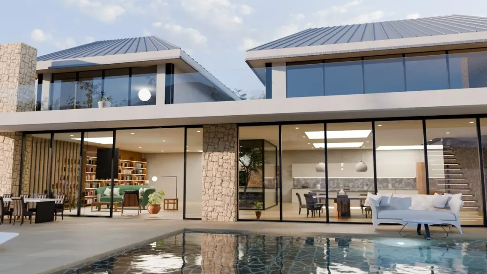</a>

*基于原作品整理的创作说明*

**提示词**

```text
在 Blender 中创建会飞的趣味烹饪锅，确保轮廓清晰，并加入绑定或程序化运动、富有表现力的倾斜、材质、灯光与短展示动画。
```

[查看详情 ↗](https://www.tripo3d.ai/zh/3d-prompts/flying-pot-animation-in-blender-2095132939667255657) · [查看原帖](https://x.com/alafrayme/status/2095132939667255657) · [返回案例导航](#all-prompts)

---

<a id="3d-cancer-progression-simulation-2095130778342408331"></a>

### 3D 癌细胞演进模拟

[Not Harris \| Builds Apps](https://x.com/viewsfrom02108) · 2026-09-02 · Claude Fable 5.1 · 动画

<a href="https://www.tripo3d.ai/zh/3d-prompts/3d-cancer-progression-simulation-2095130778342408331">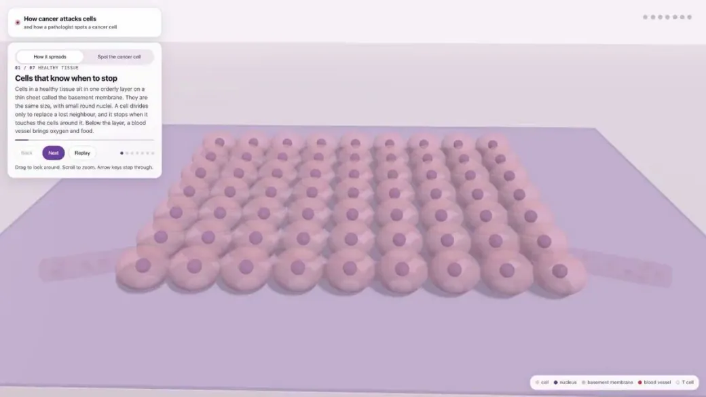</a>

*基于原作品整理的创作说明*

**提示词**

```text
构建教育型 3D 癌细胞模拟，展示突变、分裂、血管生成、侵袭与转移，并用时间轴、标签和清晰视觉差异区分阶段。
```

[查看详情 ↗](https://www.tripo3d.ai/zh/3d-prompts/3d-cancer-progression-simulation-2095130778342408331) · [查看原帖](https://x.com/viewsfrom02108/status/2095130778342408331) · [返回案例导航](#all-prompts)

---

<a id="enhanced-meteoroid-breakup-vfx-2095127248470692320"></a>

### 增强流星体解体特效

[Dmytro Gladkyi](https://x.com/gladimdim) · 2026-09-02 · Claude Fable 5.1 · 动画

<a href="https://www.tripo3d.ai/zh/3d-prompts/enhanced-meteoroid-breakup-vfx-2095127248470692320">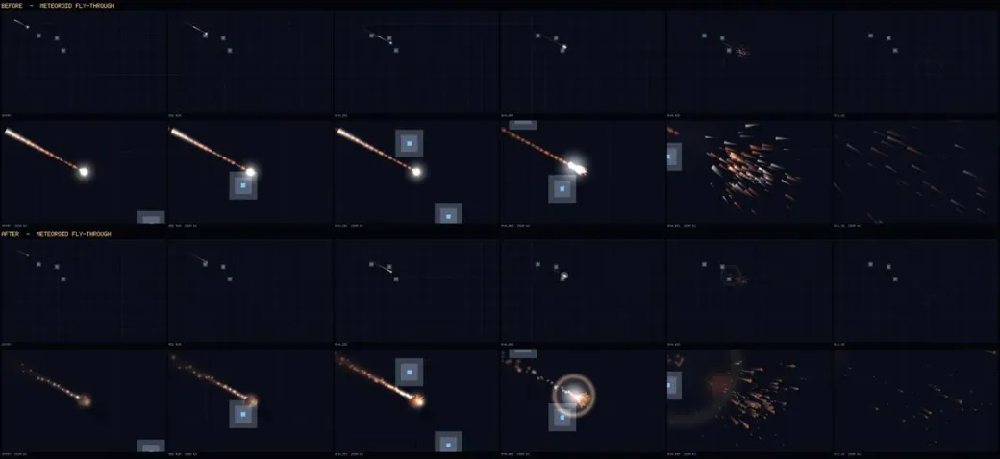</a>

*基于原作品整理的创作说明*

**提示词**

```text
检查现有流星体解体特效，在不破坏当前控制的前提下，改进碎裂、热量、尾迹、冲击波、时间节奏、尺度与镜头可读性。
```

[查看详情 ↗](https://www.tripo3d.ai/zh/3d-prompts/enhanced-meteoroid-breakup-vfx-2095127248470692320) · [查看原帖](https://x.com/gladimdim/status/2095127248470692320) · [返回案例导航](#all-prompts)

---

<a id="lod-ready-assault-pod-spaceship-2095126622319845478"></a>

### 支持 LOD 的突击舱飞船

[Dmytro Gladkyi](https://x.com/gladimdim) · 2026-09-02 · Claude Fable 5.1 · 资产

<a href="https://www.tripo3d.ai/zh/3d-prompts/lod-ready-assault-pod-spaceship-2095126622319845478">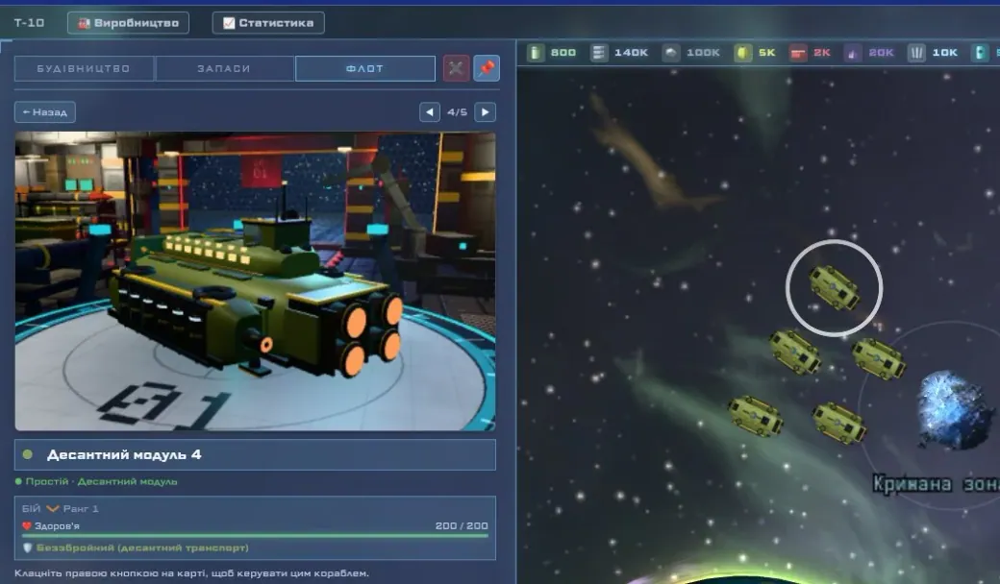</a>

*基于原作品整理的创作说明*

**提示词**

```text
为突击舱飞船重新设计高低 LOD 模型，在满足三角面预算的同时保留轮廓、改进面板语言，并让资产适合实时游戏。
```

[查看详情 ↗](https://www.tripo3d.ai/zh/3d-prompts/lod-ready-assault-pod-spaceship-2095126622319845478) · [查看原帖](https://x.com/gladimdim/status/2095126622319845478) · [返回案例导航](#all-prompts)

---

<a id="detailed-3d-stadium-recreation-2095123216419459454"></a>

### 高细节 3D 体育场复刻

[The Bugged Dev](https://x.com/thebuggeddev) · 2026-09-02 · Claude Fable 5.1 · 场景

<a href="https://www.tripo3d.ai/zh/3d-prompts/detailed-3d-stadium-recreation-2095123216419459454">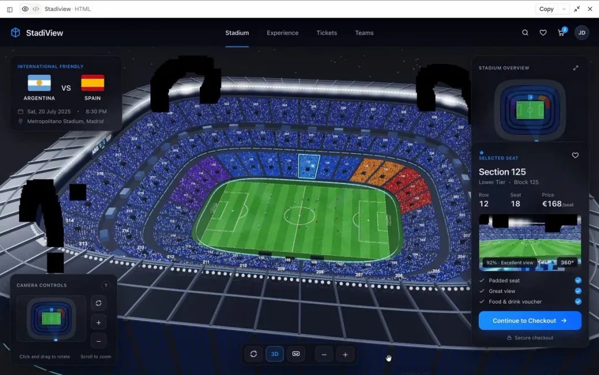</a>

*基于原作品整理的创作说明*

**提示词**

```text
把参考体育场复刻为高细节、可导航的 3D 场景，准确还原看台层级、球场、屋顶、灯光和尺度，并比较视觉保真度与生成成本。
```

[查看详情 ↗](https://www.tripo3d.ai/zh/3d-prompts/detailed-3d-stadium-recreation-2095123216419459454) · [查看原帖](https://x.com/thebuggeddev/status/2095123216419459454) · [返回案例导航](#all-prompts)

---

<a id="mechanically-accurate-water-mill-village-2095123063352561815"></a>

### 机械准确的水车村庄

[ミラ｜未来のエンタメをつくる](https://x.com/mira_senor_1102) · 2026-09-02 · Claude Fable 5.1 · 动画

<a href="https://www.tripo3d.ai/zh/3d-prompts/mechanically-accurate-water-mill-village-2095123063352561815">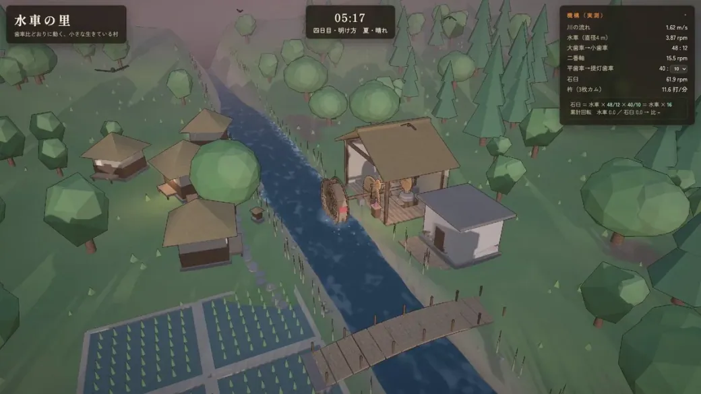</a>

*基于原作品整理的创作说明*

**提示词**

```text
构建可运行的 Three.js 水车村庄，让水轮以可信传动比驱动齿轮、凸轮和舂杵，并通过村民与环境动态让场景鲜活。
```

[查看详情 ↗](https://www.tripo3d.ai/zh/3d-prompts/mechanically-accurate-water-mill-village-2095123063352561815) · [查看原帖](https://x.com/mira_senor_1102/status/2095123063352561815) · [返回案例导航](#all-prompts)

---

<a id="interactive-shader-driven-dino-dex-2095121568297083067"></a>

### Shader 驱动的交互式恐龙图鉴

[Benji Viz](https://x.com/_Benviz) · 2026-09-02 · Claude Fable 5.1 · 互动

<a href="https://www.tripo3d.ai/zh/3d-prompts/interactive-shader-driven-dino-dex-2095121568297083067"></a>

*基于原作品整理的创作说明*

**提示词**

```text
创建交互式恐龙图鉴，每种恐龙都是实时 3D 模型，并使用自定义 GLSL 菲涅尔效果、八个高效 WebGL 上下文、响应式卡片和物种信息。
```

[查看详情 ↗](https://www.tripo3d.ai/zh/3d-prompts/interactive-shader-driven-dino-dex-2095121568297083067) · [查看原帖](https://x.com/_Benviz/status/2095121568297083067) · [返回案例导航](#all-prompts)

---

<a id="living-voxel-world-inside-a-bottle-2095111213927510131"></a>

### 玻璃瓶中的鲜活体素世界

[Vib3Coded](https://x.com/vib3coded) · 2026-09-02 · Claude Fable 5.1 · 场景

<a href="https://www.tripo3d.ai/zh/3d-prompts/living-voxel-world-inside-a-bottle-2095111213927510131">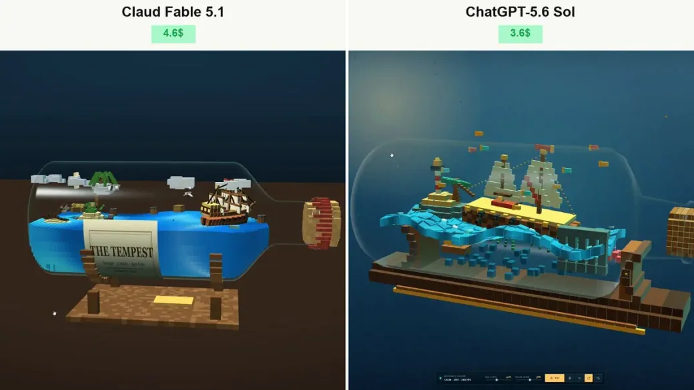</a>

*基于原作品整理的创作说明*

**提示词**

```text
在玻璃瓶中创建一个鲜活体素世界，包含分层海洋、帆船、灯塔、岛屿生活，以及晴朗、暴风雨和夜晚之间的变化。
```

[查看详情 ↗](https://www.tripo3d.ai/zh/3d-prompts/living-voxel-world-inside-a-bottle-2095111213927510131) · [查看原帖](https://x.com/vib3coded/status/2095111213927510131) · [返回案例导航](#all-prompts)

---

<a id="editable-3d-keyboard-animation-2095111032171876470"></a>

### 可编辑的 3D 键盘动画

[rege](https://x.com/rege_dev) · 2026-09-02 · Claude Fable 5.1 · 动画

<a href="https://www.tripo3d.ai/zh/3d-prompts/editable-3d-keyboard-animation-2095111032171876470">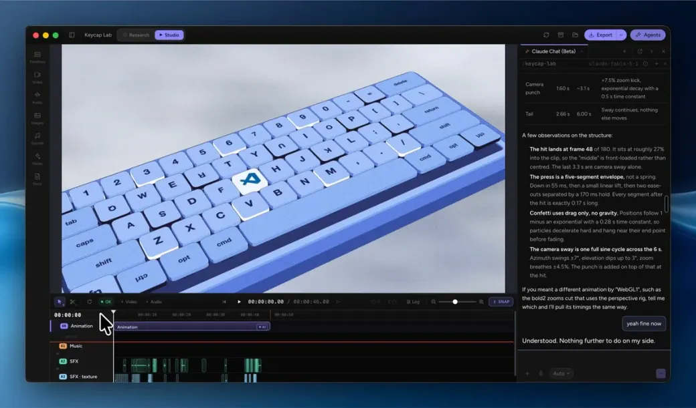</a>

*基于原作品整理的创作说明*

**提示词**

```text
创建可编辑的 3D 键盘动画，细化按键行程、灯光与镜头运动，并允许配置标签、颜色和时间。
```

[查看详情 ↗](https://www.tripo3d.ai/zh/3d-prompts/editable-3d-keyboard-animation-2095111032171876470) · [查看原帖](https://x.com/rege_dev/status/2095111032171876470) · [返回案例导航](#all-prompts)

---

<a id="gundam-inspired-mecha-showcase-2095106919530930221"></a>

### 高达风机甲展示

[Crayon](https://x.com/usecrayon) · 2026-09-02 · Claude Fable 5.1 · 互动

<a href="https://www.tripo3d.ai/zh/3d-prompts/gundam-inspired-mecha-showcase-2095106919530930221">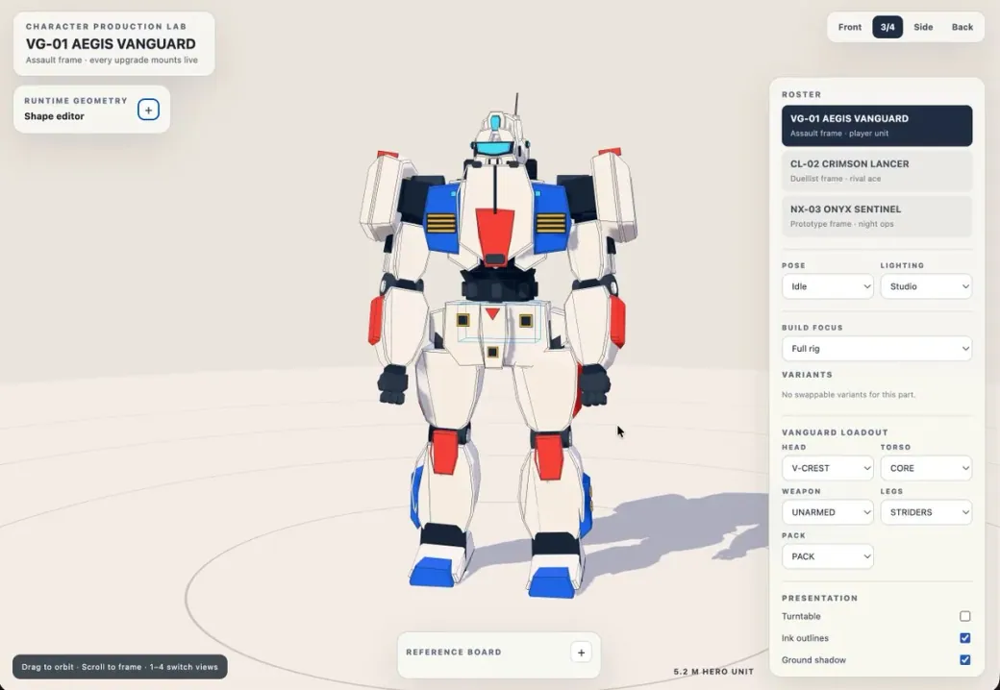</a>

*基于原作品整理的创作说明*

**提示词**

```text
创建精致的 Three.js 原创高达风机甲展示，包含机械关节、尺度参照、戏剧化灯光与检视镜头。
```

[查看详情 ↗](https://www.tripo3d.ai/zh/3d-prompts/gundam-inspired-mecha-showcase-2095106919530930221) · [查看原帖](https://x.com/usecrayon/status/2095106919530930221) · [返回案例导航](#all-prompts)

---

<a id="reference-driven-three-js-portfolio-2095104073590808644"></a>

### 参考图驱动的 Three.js 作品集

[Meng To](https://x.com/MengTo) · 2026-09-02 · Claude Fable 5.1 · 互动

<a href="https://www.tripo3d.ai/zh/3d-prompts/reference-driven-three-js-portfolio-2095104073590808644">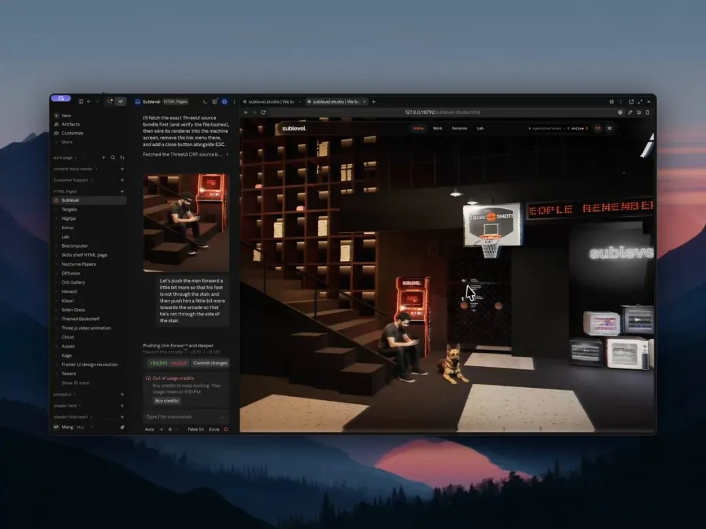</a>

*基于原作品整理的创作说明*

**提示词**

```text
把给定视觉参考重建为精致的 Three.js 网站，加入分层粒子、VHS 与 CRT 质感、流畅转场和响应式交互。
```

[查看详情 ↗](https://www.tripo3d.ai/zh/3d-prompts/reference-driven-three-js-portfolio-2095104073590808644) · [查看原帖](https://x.com/MengTo/status/2095104073590808644) · [项目源码](https://github.com/MengTo/sublevel-studio) · [在线演示](https://mengto.github.io/sublevel-studio/) · [返回案例导航](#all-prompts)

---

<a id="interactive-f-35a-technical-model-2095094543339446572"></a>

### 交互式 F-35A 技术模型

[Edgex](https://x.com/SahilExec) · 2026-09-02 · Claude Fable 5.1 · 互动

<a href="https://www.tripo3d.ai/zh/3d-prompts/interactive-f-35a-technical-model-2095094543339446572">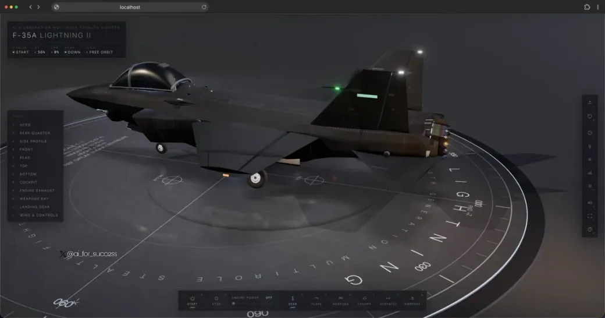</a>

*基于原作品整理的创作说明*

**提示词**

```text
通过代码生成高细节交互式 F-35A，准确处理比例、控制面、起落架、座舱提示、标签和检视动画。
```

[查看详情 ↗](https://www.tripo3d.ai/zh/3d-prompts/interactive-f-35a-technical-model-2095094543339446572) · [查看原帖](https://x.com/SahilExec/status/2095094543339446572) · [返回案例导航](#all-prompts)

---

<a id="three-js-ms-06-inspired-mecha-2095085944391270759"></a>

### Three.js MS-06 风格机甲

[Hakuei](https://x.com/akiba_tokyo_jp) · 2026-09-02 · Claude Fable 5.1 · 资产

<a href="https://www.tripo3d.ai/zh/3d-prompts/three-js-ms-06-inspired-mecha-2095085944391270759">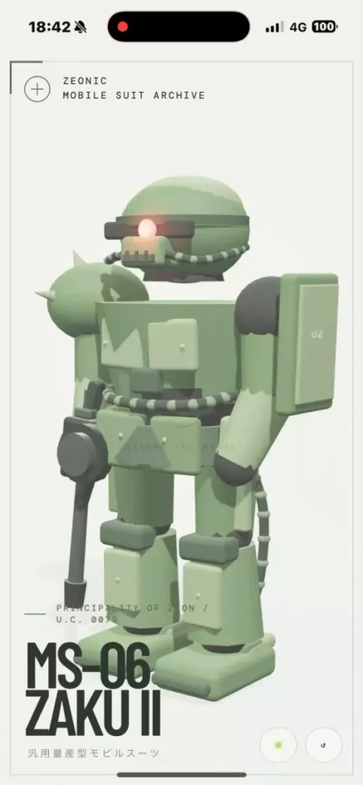</a>

*基于原作品整理的创作说明*

**提示词**

```text
在干净白色背景上用 Three.js 创建高细节 MS-06 风格机甲，确保主体清晰，并完善比例、材质与检视控制。
```

[查看详情 ↗](https://www.tripo3d.ai/zh/3d-prompts/three-js-ms-06-inspired-mecha-2095085944391270759) · [查看原帖](https://x.com/akiba_tokyo_jp/status/2095085944391270759) · [返回案例导航](#all-prompts)

---

<a id="living-universe-in-one-html-file-2095054116372508955"></a>

### 单 HTML 文件中的鲜活宇宙

[Alex Luhchenko](https://x.com/tiny_frontier) · 2026-09-02 · Claude Fable 5.1 · 动画

<a href="https://www.tripo3d.ai/zh/3d-prompts/living-universe-in-one-html-file-2095054116372508955">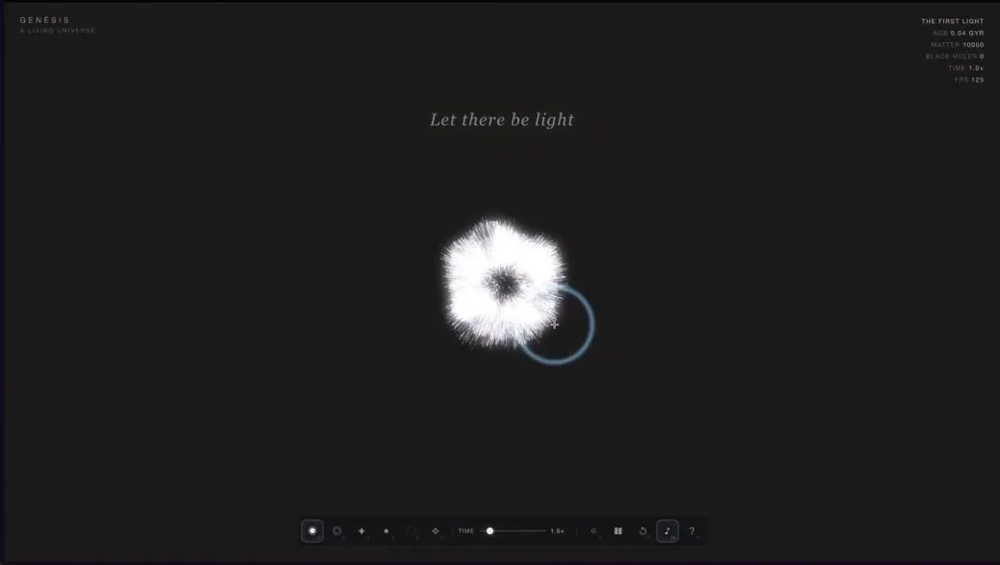</a>

**提示词**

```text
在一个 HTML 文件中构建一个鲜活宇宙。
```

<details>
<summary>作者原始提示词</summary>

```text
build a living universe in one HTML file.
```

</details>

[查看详情 ↗](https://www.tripo3d.ai/zh/3d-prompts/living-universe-in-one-html-file-2095054116372508955) · [查看原帖](https://x.com/tiny_frontier/status/2095054116372508955) · [在线演示](https://genesis-demo.tinyfrontier.xyz/) · [返回案例导航](#all-prompts)

---

<a id="native-c-souls-like-game-2095053114600755576"></a>

### 原生 C++ 类魂游戏

[wbk ᕦ(ò\_ó )ᕤ](https://x.com/wizardbrainz) · 2026-09-02 · Claude Fable 5.1 · 游戏

<a href="https://www.tripo3d.ai/zh/3d-prompts/native-c-souls-like-game-2095053114600755576">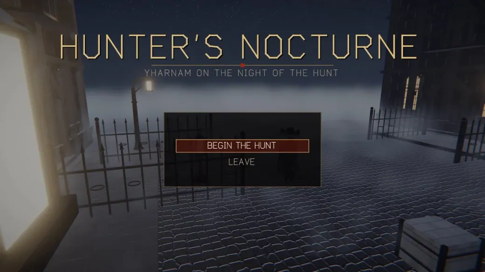</a>

*基于原作品整理的创作说明*

**提示词**

```text
使用原生 C++ 创建受 Bloodborne 启发的类魂游戏，包含原创美术、动画、音效和音乐，以及响应灵敏的战斗、敌人、Boss 与完整短关卡。
```

[查看详情 ↗](https://www.tripo3d.ai/zh/3d-prompts/native-c-souls-like-game-2095053114600755576) · [查看原帖](https://x.com/wizardbrainz/status/2095053114600755576) · [返回案例导航](#all-prompts)

---

<a id="playable-3d-snakes-and-ladders-2095050993184669825"></a>

### 可玩的 3D 蛇梯棋

[KC](https://x.com/karanC_12) · 2026-09-02 · Claude Fable 5.1 · 游戏

<a href="https://www.tripo3d.ai/zh/3d-prompts/playable-3d-snakes-and-ladders-2095050993184669825">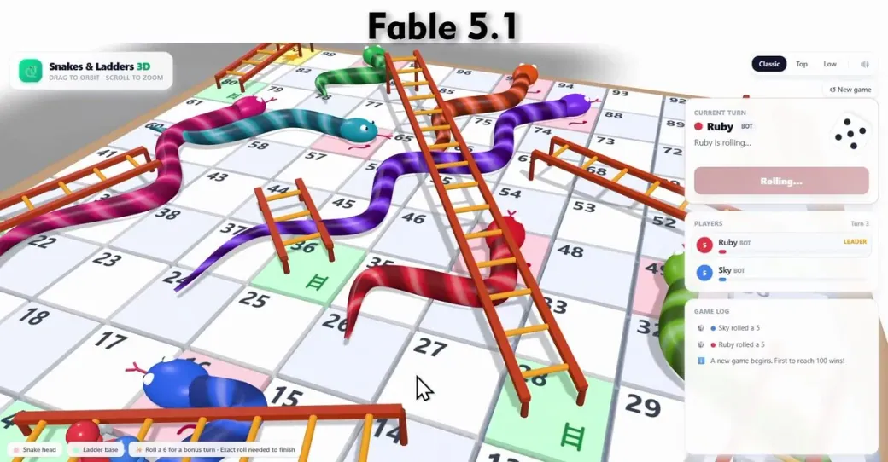</a>

*基于原作品整理的创作说明*

**提示词**

```text
构建完整可玩的 3D 蛇梯棋，包含骰子动画、棋盘移动、蛇与梯子、回合、胜利状态和清晰玩家反馈。
```

[查看详情 ↗](https://www.tripo3d.ai/zh/3d-prompts/playable-3d-snakes-and-ladders-2095050993184669825) · [查看原帖](https://x.com/karanC_12/status/2095050993184669825) · [返回案例导航](#all-prompts)

---

<a id="portrait-transformed-into-kinetic-voxels-2095048967092625663"></a>

### 肖像转动态体素

[Manoj Builds](https://x.com/TenthPrime) · 2026-09-02 · Claude Fable 5.1 · 动画

<a href="https://www.tripo3d.ai/zh/3d-prompts/portrait-transformed-into-kinetic-voxels-2095048967092625663">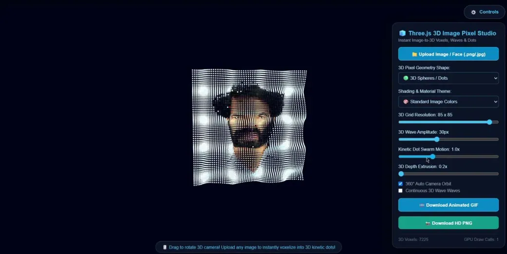</a>

*基于原作品整理的创作说明*

**提示词**

```text
把上传肖像转成超过一万个可交互 3D 体素，加入波浪位移、赛博朋克 Shader、高效实例化和指针驱动运动。
```

[查看详情 ↗](https://www.tripo3d.ai/zh/3d-prompts/portrait-transformed-into-kinetic-voxels-2095048967092625663) · [查看原帖](https://x.com/TenthPrime/status/2095048967092625663) · [返回案例导航](#all-prompts)

---

<a id="interactive-three-js-castle-2095048818203275584"></a>

### 交互式 Three.js 城堡

[Jigs](https://x.com/debugsenpai) · 2026-09-02 · Claude Fable 5.1 · 场景

<a href="https://www.tripo3d.ai/zh/3d-prompts/interactive-three-js-castle-2095048818203275584">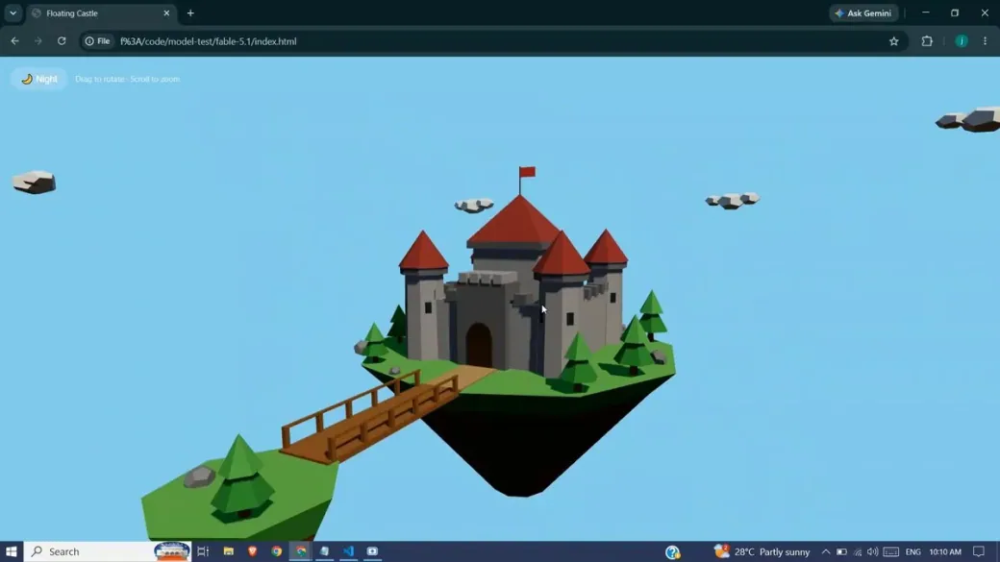</a>

*基于原作品整理的创作说明*

**提示词**

```text
使用 Three.js 构建交互式 3D 城堡，包含可探索房间、塔楼、城门、地形、氛围灯光以及流畅的桌面和移动端控制。
```

[查看详情 ↗](https://www.tripo3d.ai/zh/3d-prompts/interactive-three-js-castle-2095048818203275584) · [查看原帖](https://x.com/debugsenpai/status/2095048818203275584) · [返回案例导航](#all-prompts)

---

<a id="nightband-interactive-shortwave-radio-2095026928210346175"></a>

### NIGHTBAND 交互式短波电台

[Neo](https://x.com/NeoAIForecast) · 2026-09-02 · Claude Fable 5.1 · 互动

<a href="https://www.tripo3d.ai/zh/3d-prompts/nightband-interactive-shortwave-radio-2095026928210346175">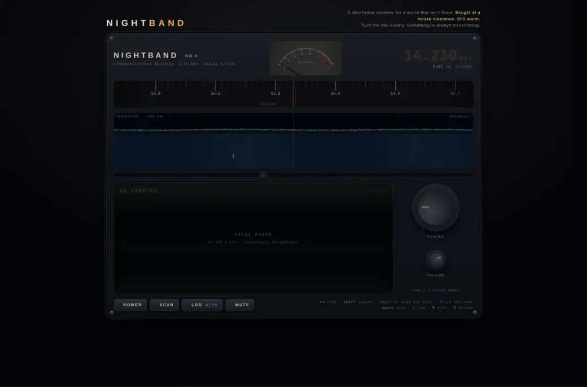</a>

**提示词**

```text
在单个自包含 HTML 文件中创建你能做出的最令人印象深刻的网站。你拥有完全的创作自由，目标是展示智能、创意、技术能力与原创性。
```

<details>
<summary>作者原始提示词</summary>

```text
Create the most impressive website you can in a single self-contained HTML file. You have complete creative freedom. The goal is to demonstrate how intelligent, creative, technically capable and original you are.
```

</details>

[查看详情 ↗](https://www.tripo3d.ai/zh/3d-prompts/nightband-interactive-shortwave-radio-2095026928210346175) · [查看原帖](https://x.com/NeoAIForecast/status/2095026928210346175) · [返回案例导航](#all-prompts)

---

<a id="complete-unity-tennis-game-2095021275236495408"></a>

### 完整 Unity 网球游戏

[Chong-U](https://x.com/chongdashu) · 2026-09-02 · Claude Fable 5.1 · 游戏

<a href="https://www.tripo3d.ai/zh/3d-prompts/complete-unity-tennis-game-2095021275236495408">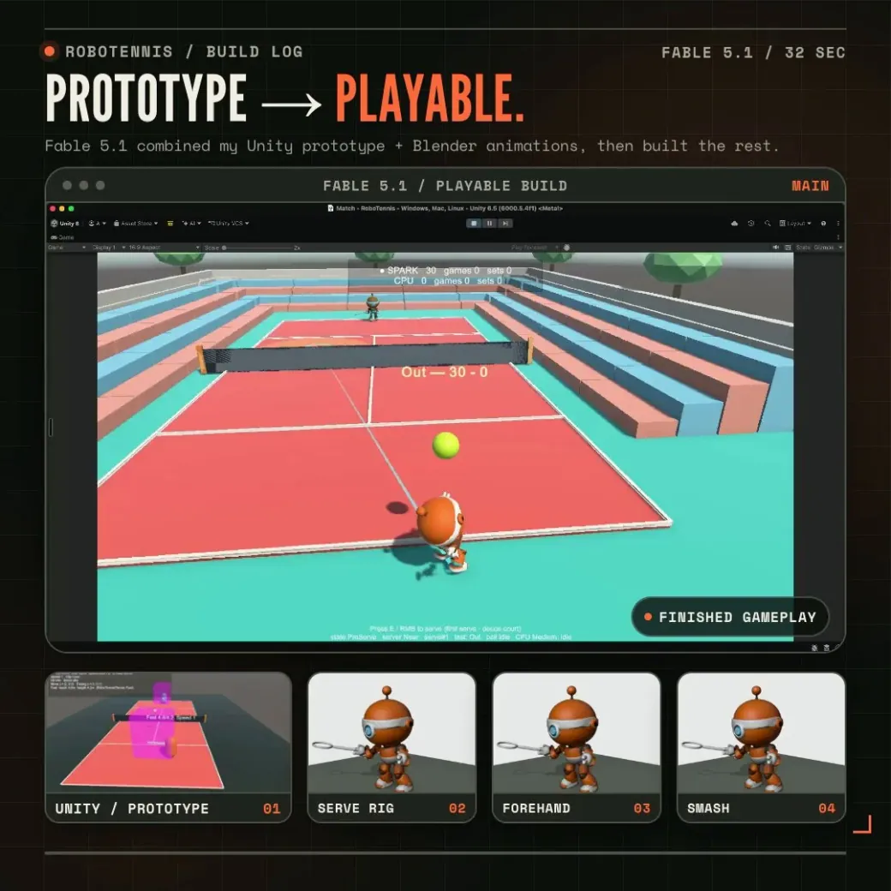</a>

*基于原作品整理的创作说明*

**提示词**

```text
完成一款可玩的 Unity 网球游戏，使用 Blender 制作角色，并实现可靠控制、移动与挥拍动画、球体物理、计分、对手和比赛流程。
```

[查看详情 ↗](https://www.tripo3d.ai/zh/3d-prompts/complete-unity-tennis-game-2095021275236495408) · [查看原帖](https://x.com/chongdashu/status/2095021275236495408) · [返回案例导航](#all-prompts)

---

<a id="ancient-temple-above-a-glowing-canyon-2095012880383099339"></a>

### 发光峡谷上方的古代神庙

[Pradeep Kapoor](https://x.com/pradeepXkapoor) · 2026-09-02 · Claude Fable 5.1 · 场景

<a href="https://www.tripo3d.ai/zh/3d-prompts/ancient-temple-above-a-glowing-canyon-2095012880383099339">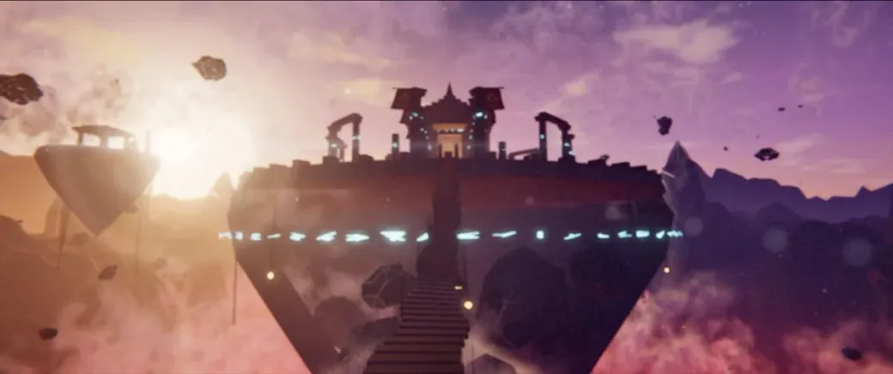</a>

*基于原作品整理的创作说明*

**提示词**

```text
创建程序化 Three.js 场景：黄昏时分，一座古代神庙悬浮在发光峡谷上方，加入风中布料、体积光、闪电和电影感接近镜头。
```

[查看详情 ↗](https://www.tripo3d.ai/zh/3d-prompts/ancient-temple-above-a-glowing-canyon-2095012880383099339) · [查看原帖](https://x.com/pradeepXkapoor/status/2095012880383099339) · [返回案例导航](#all-prompts)

---

<a id="interactive-toronto-skyline-2095000329561485584"></a>

### 交互式多伦多天际线

[Kevin](https://x.com/bienjamyn) · 2026-09-02 · Claude Fable 5.1 · 场景

<a href="https://www.tripo3d.ai/zh/3d-prompts/interactive-toronto-skyline-2095000329561485584">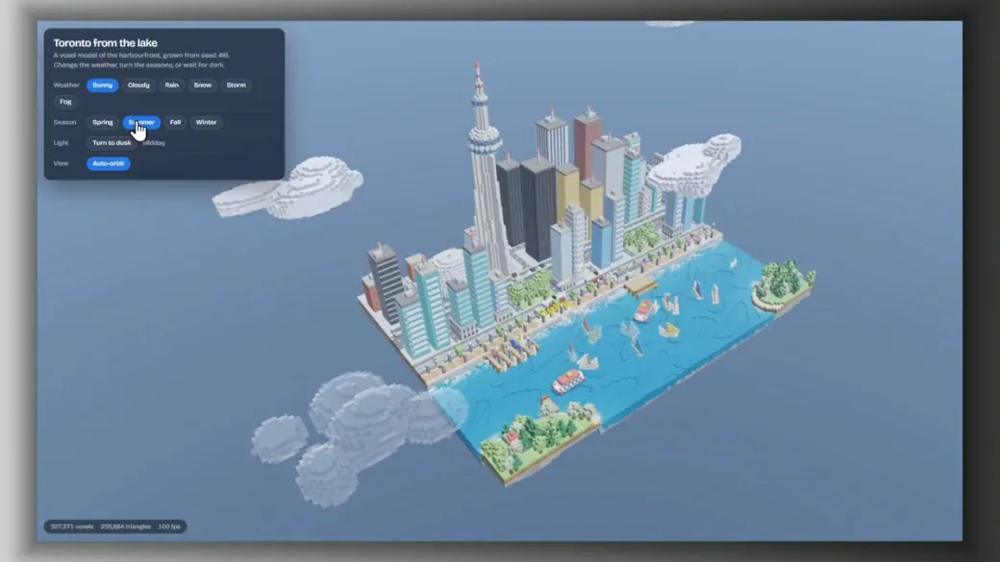</a>

*基于原作品整理的创作说明*

**提示词**

```text
构建交互式 3D 多伦多天际线，还原标志性建筑、水体与大气纵深，并加入昼夜灯光和流畅环绕与飞行控制。
```

[查看详情 ↗](https://www.tripo3d.ai/zh/3d-prompts/interactive-toronto-skyline-2095000329561485584) · [查看原帖](https://x.com/bienjamyn/status/2095000329561485584) · [在线演示](https://toronto-voxel.vercel.app/) · [返回案例导航](#all-prompts)

---

<a id="autonomous-sims-like-life-simulation-2094949450196090988"></a>

### 自主运行的模拟人生式系统

[Ridark](https://x.com/ridark_eth) · 2026-09-02 · Claude Fable 5.1 · 动画

<a href="https://www.tripo3d.ai/zh/3d-prompts/autonomous-sims-like-life-simulation-2094949450196090988">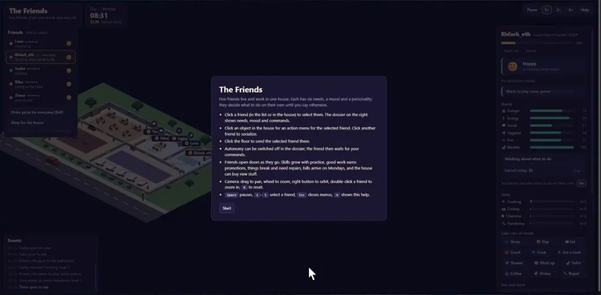</a>

*基于原作品整理的创作说明*

**提示词**

```text
构建模拟人生式生活模拟，包含五个自主角色，让需求、日常、关系与决策在无需持续操作的情况下产生涌现故事。
```

[查看详情 ↗](https://www.tripo3d.ai/zh/3d-prompts/autonomous-sims-like-life-simulation-2094949450196090988) · [查看原帖](https://x.com/ridark_eth/status/2094949450196090988) · [返回案例导航](#all-prompts)

---

<a id="voxel-village-with-thinking-npcs-2094930970675741171"></a>

### 拥有思考型 NPC 的体素村庄

[Tech2Wild](https://x.com/Tech2Wild) · 2026-09-01 · Claude Fable 5.1 · 互动

<a href="https://www.tripo3d.ai/zh/3d-prompts/voxel-village-with-thinking-npcs-2094930970675741171">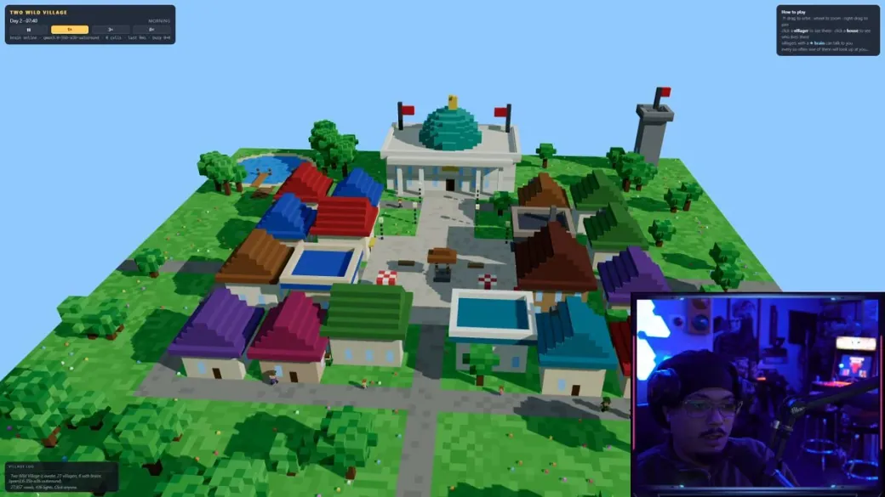</a>

*基于原作品整理的创作说明*

**提示词**

```text
构建一个体素村庄，让居民拥有职业、日常、记忆和本地语言模型大脑，从而能对玩家及彼此作出反应。
```

[查看详情 ↗](https://www.tripo3d.ai/zh/3d-prompts/voxel-village-with-thinking-npcs-2094930970675741171) · [查看原帖](https://x.com/Tech2Wild/status/2094930970675741171) · [返回案例导航](#all-prompts)

---

<a id="fantasy-ascent-to-mount-fuji-2094930804296274414"></a>

### 幻想风富士山登顶之旅

[Techartist](https://x.com/techartist_) · 2026-09-01 · Claude Fable 5.1 · 场景

<a href="https://www.tripo3d.ai/zh/3d-prompts/fantasy-ascent-to-mount-fuji-2094930804296274414">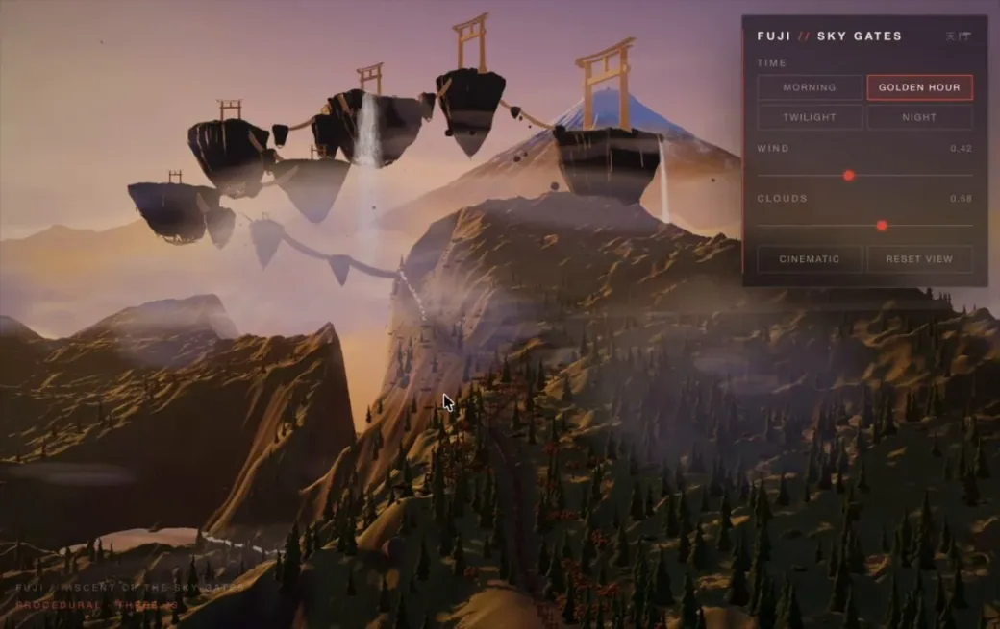</a>

*基于原作品整理的创作说明*

**提示词**

```text
创建一段通往富士山顶的 Three.js 幻想旅程，通过分层环境、氛围灯光、移动机制和明确的登高感组织体验。
```

[查看详情 ↗](https://www.tripo3d.ai/zh/3d-prompts/fantasy-ascent-to-mount-fuji-2094930804296274414) · [查看原帖](https://x.com/techartist_/status/2094930804296274414) · [返回案例导航](#all-prompts)

---

<a id="godot-racing-game-built-from-scratch-2094925359372284022"></a>

### 从零构建 Godot 赛车游戏

[atomic.chat](https://x.com/atomic_chat_hq) · 2026-09-01 · Claude Fable 5.1 · 游戏

<a href="https://www.tripo3d.ai/zh/3d-prompts/godot-racing-game-built-from-scratch-2094925359372284022">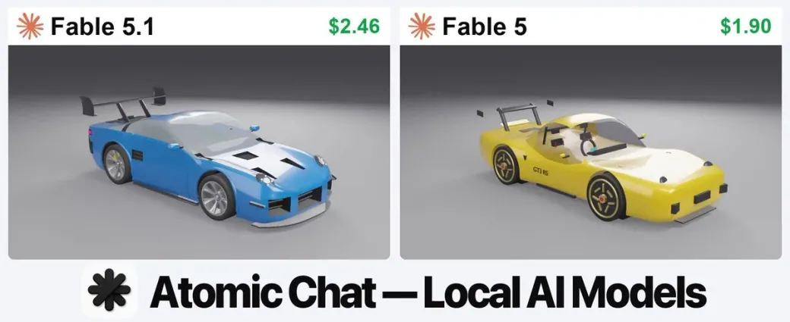</a>

*基于原作品整理的创作说明*

**提示词**

```text
从零构建 Godot 赛车游戏，用 Blender 制作载具与环境资产，并实现大型赛道、令人满意的操控、对手、HUD 与比赛流程。
```

[查看详情 ↗](https://www.tripo3d.ai/zh/3d-prompts/godot-racing-game-built-from-scratch-2094925359372284022) · [查看原帖](https://x.com/atomic_chat_hq/status/2094925359372284022) · [返回案例导航](#all-prompts)

---

<a id="floor-plan-to-blender-walkthrough-2094925117344428232"></a>

### 平面图转 Blender 漫游

[AGIラボ](https://x.com/ctgptlb) · 2026-09-01 · Claude Fable 5.1 · 场景

<a href="https://www.tripo3d.ai/zh/3d-prompts/floor-plan-to-blender-walkthrough-2094925117344428232">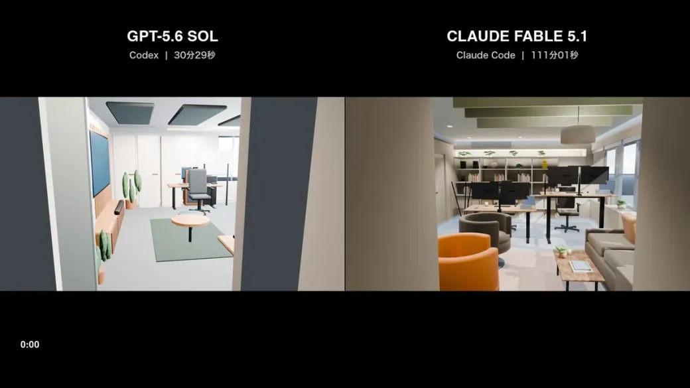</a>

*基于原作品整理的创作说明*

**提示词**

```text
根据给定平面图创建准确的 Blender 3D 模型，渲染一组代表性静帧，并制作连贯的室内漫游视频。
```

[查看详情 ↗](https://www.tripo3d.ai/zh/3d-prompts/floor-plan-to-blender-walkthrough-2094925117344428232) · [查看原帖](https://x.com/ctgptlb/status/2094925117344428232) · [返回案例导航](#all-prompts)

---

<a id="deterministic-136-000-voxel-pagoda-2094916609219461211"></a>

### 确定性 13.6 万体素宝塔

[FHILY👑](https://x.com/Oluwaphilemon1) · 2026-09-01 · Claude Fable 5.1 · 场景

<a href="https://www.tripo3d.ai/zh/3d-prompts/deterministic-136-000-voxel-pagoda-2094916609219461211">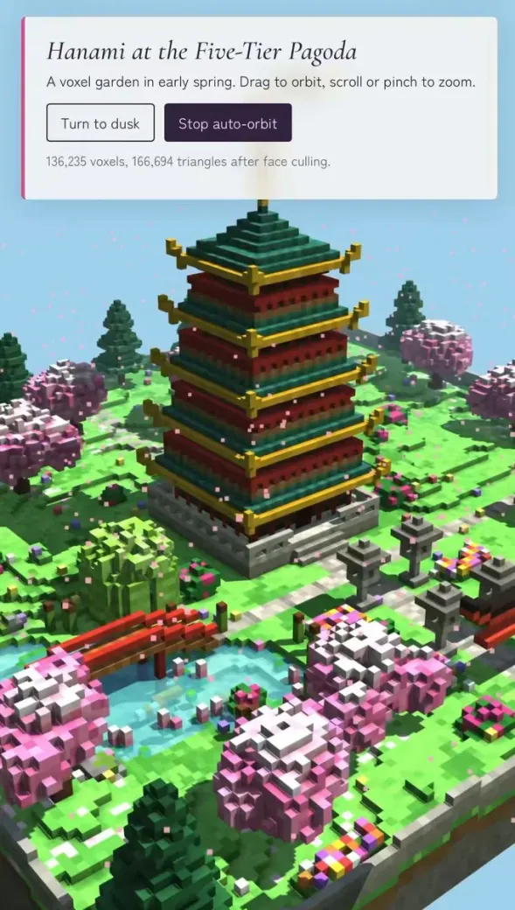</a>

*基于原作品整理的创作说明*

**提示词**

```text
用 Three.js 生成确定性的 13.6 万体素宝塔，确保建筑层级清晰、实例化高效、输出稳定，并提供检视镜头。
```

[查看详情 ↗](https://www.tripo3d.ai/zh/3d-prompts/deterministic-136-000-voxel-pagoda-2094916609219461211) · [查看原帖](https://x.com/Oluwaphilemon1/status/2094916609219461211) · [返回案例导航](#all-prompts)

---

<a id="detailed-robot-through-blender-automation-2094909825561805003"></a>

### 通过 Blender 自动化构建高细节机器人

[Spectro](https://x.com/Spectromachina) · 2026-09-01 · Claude Fable 5.1 · 资产

<a href="https://www.tripo3d.ai/zh/3d-prompts/detailed-robot-through-blender-automation-2094909825561805003">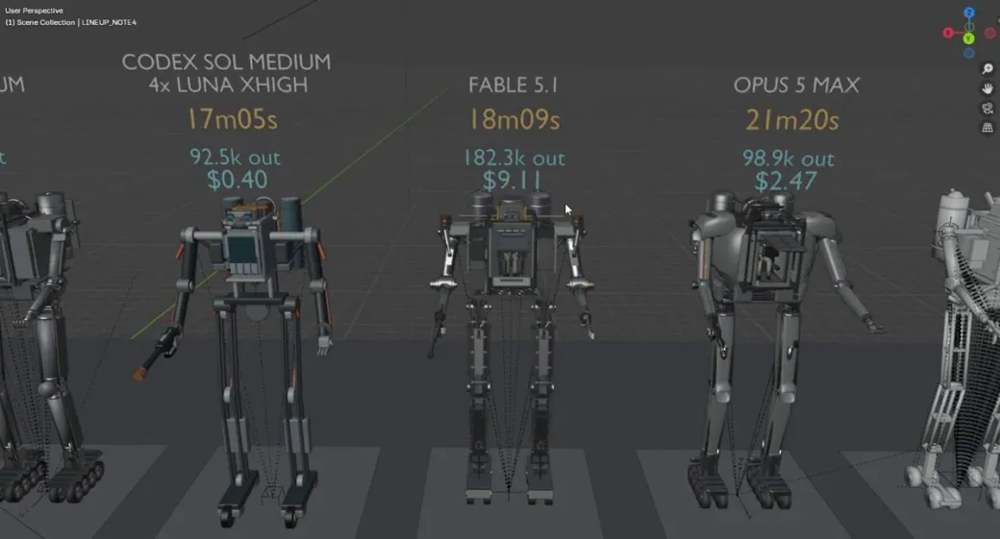</a>

*基于原作品整理的创作说明*

**提示词**

```text
在 Blender 中构建高细节硬表面机器人，确保比例、关节、面板、材质与灯光协调，并完成展示渲染。
```

[查看详情 ↗](https://www.tripo3d.ai/zh/3d-prompts/detailed-robot-through-blender-automation-2094909825561805003) · [查看原帖](https://x.com/Spectromachina/status/2094909825561805003) · [返回案例导航](#all-prompts)

---

<a id="open-world-crime-game-prototype-2094907986942591338"></a>

### 开放世界犯罪游戏原型

[Veee](https://x.com/vikktorrrre) · 2026-09-01 · Claude Fable 5.1 · 游戏

<a href="https://www.tripo3d.ai/zh/3d-prompts/open-world-crime-game-prototype-2094907986942591338">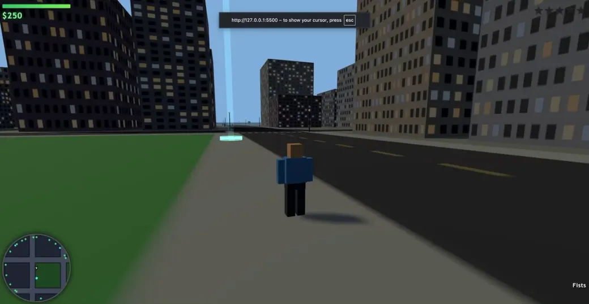</a>

*基于原作品整理的创作说明*

**提示词**

```text
原型化一款受 GTA 6 启发的开放世界游戏，包含密集城市、步行探索、可驾驶载具、交通、警察响应与多种可玩活动。
```

[查看详情 ↗](https://www.tripo3d.ai/zh/3d-prompts/open-world-crime-game-prototype-2094907986942591338) · [查看原帖](https://x.com/vikktorrrre/status/2094907986942591338) · [返回案例导航](#all-prompts)

---

<a id="mini-militia-style-browser-game-2094900523900219725"></a>

### Mini Militia 风格浏览器游戏

[Md Ismail Šojal 🕷️](https://x.com/0x0SojalSec) · 2026-09-01 · Claude Fable 5.1 · 游戏

<a href="https://www.tripo3d.ai/zh/3d-prompts/mini-militia-style-browser-game-2094900523900219725">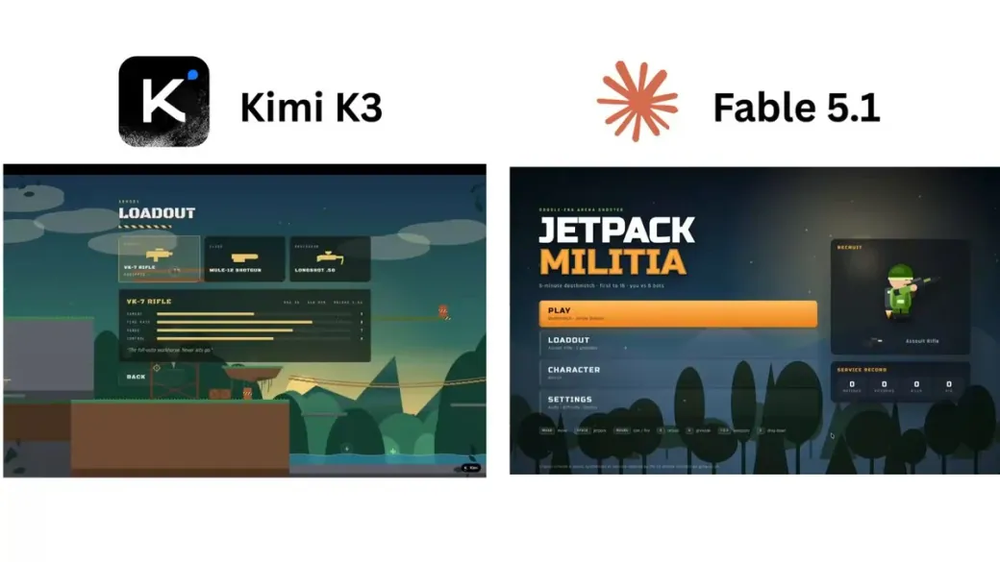</a>

*基于原作品整理的创作说明*

**提示词**

```text
创建 Mini Militia 风格动作游戏，包含灵敏移动、瞄准、武器、紧凑竞技场、机器人和即时命中与伤害反馈。
```

[查看详情 ↗](https://www.tripo3d.ai/zh/3d-prompts/mini-militia-style-browser-game-2094900523900219725) · [查看原帖](https://x.com/0x0SojalSec/status/2094900523900219725) · [返回案例导航](#all-prompts)

---

<a id="rainy-first-person-ocean-sandbox-2094900247000654222"></a>

### 雨中第一人称海洋沙盒

[Tim Jayas](https://x.com/TimJayas) · 2026-09-01 · Claude Fable 5.1 · 场景

<a href="https://www.tripo3d.ai/zh/3d-prompts/rainy-first-person-ocean-sandbox-2094900247000654222">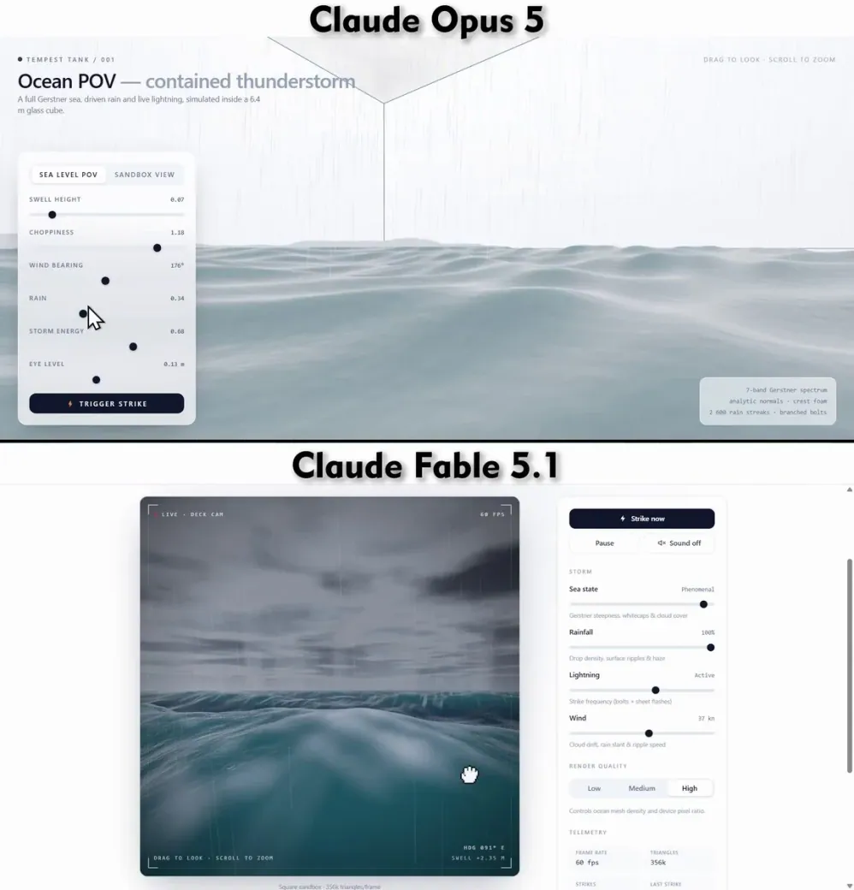</a>

*基于原作品整理的创作说明*

**提示词**

```text
构建第一人称 3D 海洋沙盒，加入波浪、雨滴和环境光，让用户从沉浸式镜头探索水面。
```

[查看详情 ↗](https://www.tripo3d.ai/zh/3d-prompts/rainy-first-person-ocean-sandbox-2094900247000654222) · [查看原帖](https://x.com/TimJayas/status/2094900247000654222) · [返回案例导航](#all-prompts)

---

<a id="floating-voxel-island-2094899802588713418"></a>

### 悬浮体素岛屿

[Loktar 🇺🇸](https://x.com/loktar00) · 2026-09-01 · Claude Fable 5.1 · 场景

<a href="https://www.tripo3d.ai/zh/3d-prompts/floating-voxel-island-2094899802588713418">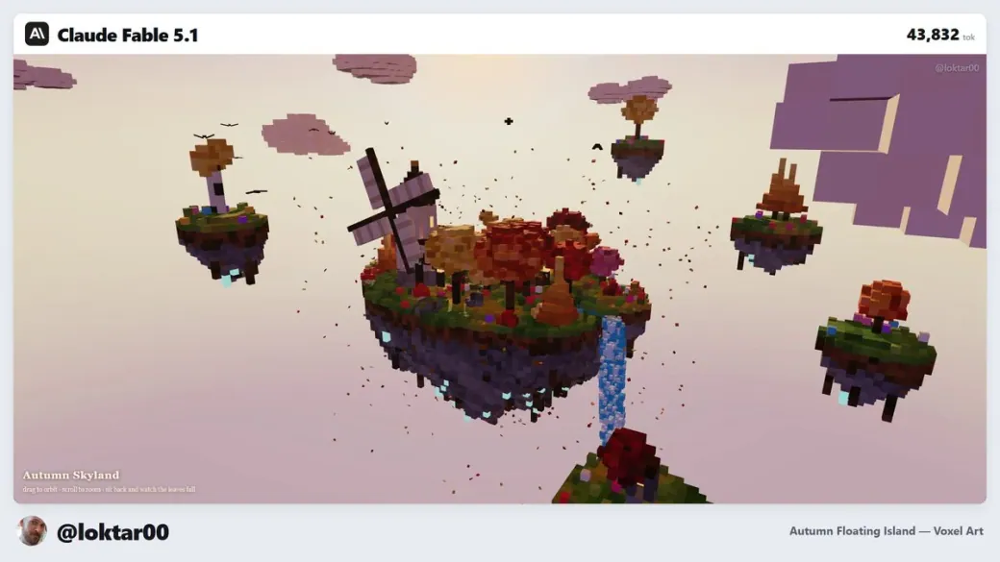</a>

*基于原作品整理的创作说明*

**提示词**

```text
构建一座悬浮体素岛屿，包含清晰地形层级、植被、水体、建筑、环境动态和可环绕查看全景的镜头。
```

[查看详情 ↗](https://www.tripo3d.ai/zh/3d-prompts/floating-voxel-island-2094899802588713418) · [查看原帖](https://x.com/loktar00/status/2094899802588713418) · [返回案例导航](#all-prompts)

---

<a id="living-voxel-medieval-kingdom-2094899477626720403"></a>

### 鲜活的体素中世纪王国

[Knowix](https://x.com/knowixbuilds) · 2026-09-01 · Claude Fable 5.1 · 动画

<a href="https://www.tripo3d.ai/zh/3d-prompts/living-voxel-medieval-kingdom-2094899477626720403"></a>

*基于原作品整理的创作说明*

**提示词**

```text
构建一个大型体素中世纪王国，包含数千士兵、会工作的村民、攻城系统、可破坏建筑，以及能改变战局的巨龙。
```

[查看详情 ↗](https://www.tripo3d.ai/zh/3d-prompts/living-voxel-medieval-kingdom-2094899477626720403) · [查看原帖](https://x.com/knowixbuilds/status/2094899477626720403) · [返回案例导航](#all-prompts)

---

<a id="textured-3d-asset-production-workflow-2094896750234378508"></a>

### 带纹理的 3D 资产生产流程

[Matt](https://x.com/MrCollison) · 2026-09-01 · Claude Fable 5.1 · 资产

<a href="https://www.tripo3d.ai/zh/3d-prompts/textured-3d-asset-production-workflow-2094896750234378508">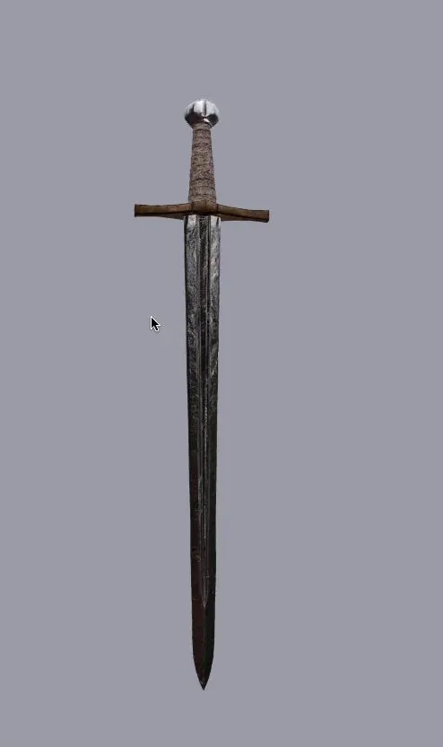</a>

*基于原作品整理的创作说明*

**提示词**

```text
把参考图转成干净的 3D 资产，在 Blender 中修正法线和材质，再用 Substance Painter 制作可用于生产的纹理。
```

[查看详情 ↗](https://www.tripo3d.ai/zh/3d-prompts/textured-3d-asset-production-workflow-2094896750234378508) · [查看原帖](https://x.com/MrCollison/status/2094896750234378508) · [返回案例导航](#all-prompts)

---

<a id="three-compact-physics-game-concepts-2094895071304839400"></a>

### 三款紧凑物理小游戏

[Atomic Agent](https://x.com/atomicagent_io) · 2026-09-01 · Claude Fable 5.1 · 游戏

<a href="https://www.tripo3d.ai/zh/3d-prompts/three-compact-physics-game-concepts-2094895071304839400">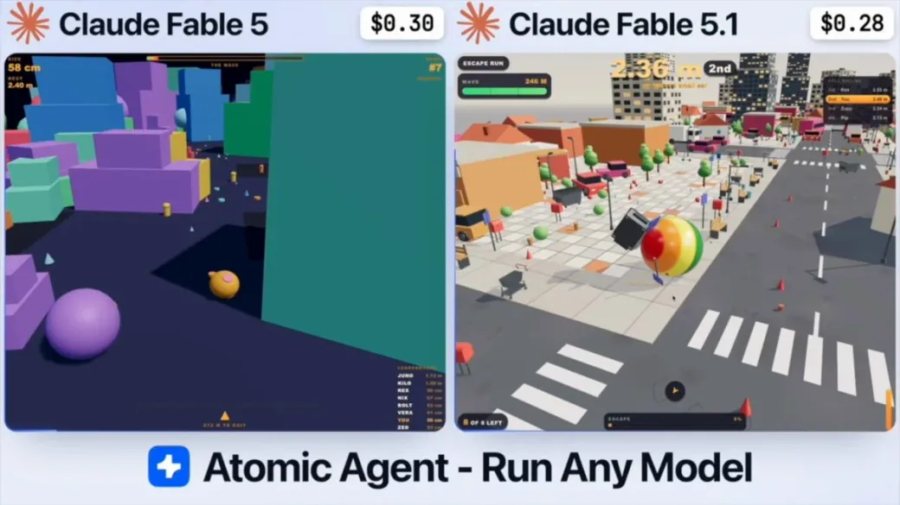</a>

*基于原作品整理的创作说明*

**提示词**

```text
构建三款精致小游戏：黏性球障碍挑战、水豚冲浪和饺子传送带躲避。每款都要有清晰输入、计分与失败状态。
```

[查看详情 ↗](https://www.tripo3d.ai/zh/3d-prompts/three-compact-physics-game-concepts-2094895071304839400) · [查看原帖](https://x.com/atomicagent_io/status/2094895071304839400) · [返回案例导航](#all-prompts)

---

<a id="aaa-kart-racing-game-in-three-js-2094894312370692443"></a>

### Three.js AAA 卡丁车竞速游戏

[Jared](https://growthengineer.space/) · 2026-09-01 · Claude Fable 5.1 · 游戏

改编自: [BridgeMind](https://x.com/bridgemindai/status/2094894312370692443)

<a href="https://www.tripo3d.ai/zh/3d-prompts/aaa-kart-racing-game-in-three-js-2094894312370692443">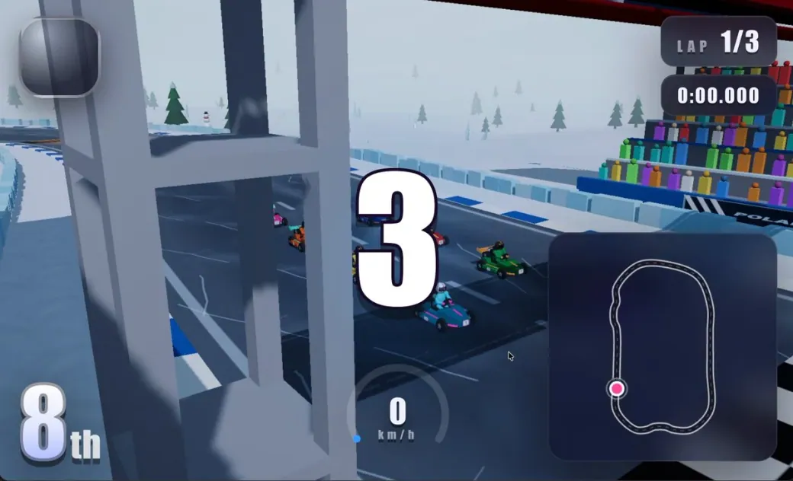</a>

*基于原作品整理的创作说明*

**提示词**

```text
使用 Three.js 构建 AAA 质感的卡丁车竞速游戏，包含精细驾驶手感、表现力赛道、对手、道具、UI、音效与完整可玩比赛循环。
```

[查看详情 ↗](https://www.tripo3d.ai/zh/3d-prompts/aaa-kart-racing-game-in-three-js-2094894312370692443) · [查看原帖](https://x.com/bridgemindai/status/2094894312370692443) · [项目源码](https://github.com/bridge-mind/turbo-kart-rush) · [在线演示](https://bridge-mind.github.io/turbo-kart-rush/) · [返回案例导航](#all-prompts)

---

<a id="one-shot-three-js-airport-simulation-2094893572617044439"></a>

### 一次生成的 Three.js 机场模拟

[Alex - i do YouTube](https://x.com/AlexYTScaling) · 2026-09-01 · Claude Fable 5.1 · 动画

<a href="https://www.tripo3d.ai/zh/3d-prompts/one-shot-three-js-airport-simulation-2094893572617044439">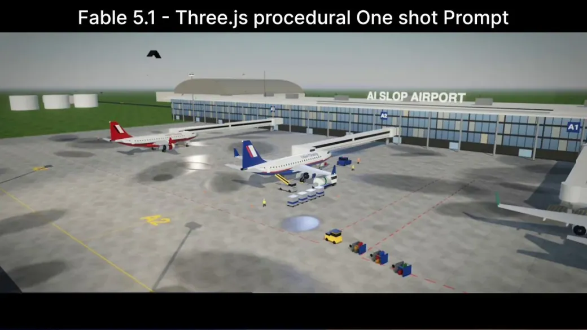</a>

*基于原作品整理的创作说明*

**提示词**

```text
一次构建完整的 Three.js 机场模拟，包含跑道、航站楼、飞机滑行与起飞、地勤车辆、昼夜灯光和总览镜头。
```

[查看详情 ↗](https://www.tripo3d.ai/zh/3d-prompts/one-shot-three-js-airport-simulation-2094893572617044439) · [查看原帖](https://x.com/AlexYTScaling/status/2094893572617044439) · [返回案例导航](#all-prompts)

---

<a id="floating-japanese-pagoda-city-2094886088963690607"></a>

### 悬浮日本宝塔城市

[Vib3Coded](https://x.com/vib3coded) · 2026-09-01 · Claude Fable 5.1 · 场景

<a href="https://www.tripo3d.ai/zh/3d-prompts/floating-japanese-pagoda-city-2094886088963690607">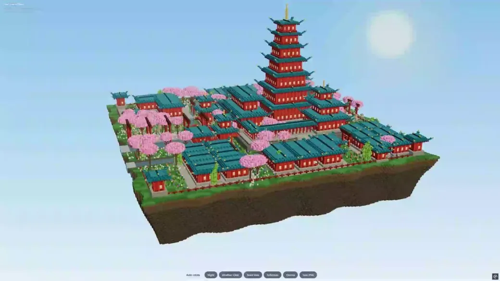</a>

*基于原作品整理的创作说明*

**提示词**

```text
创建一座以高细节宝塔为中心的交互式悬浮日本城市，包含分层岛屿、桥梁、雾气、灯笼光与电影感飞行控制。
```

[查看详情 ↗](https://www.tripo3d.ai/zh/3d-prompts/floating-japanese-pagoda-city-2094886088963690607) · [查看原帖](https://x.com/vib3coded/status/2094886088963690607) · [返回案例导航](#all-prompts)

---

<a id="airbus-h145-in-three-js-2094882571083735351"></a>

### Three.js 空客 H145 直升机

[Harshith](https://x.com/HarshithLucky3) · 2026-09-01 · Claude Fable 5.1 · 资产

<a href="https://www.tripo3d.ai/zh/3d-prompts/airbus-h145-in-three-js-2094882571083735351">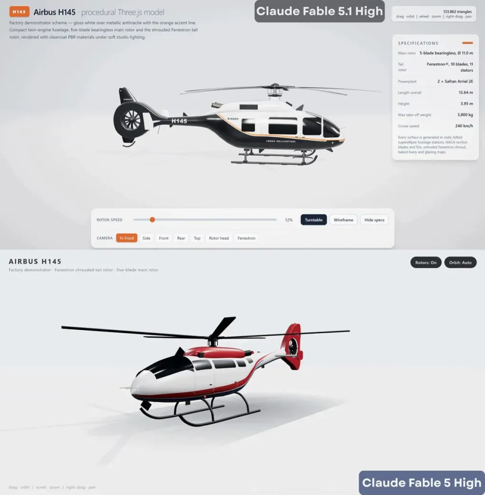</a>

*基于原作品整理的创作说明*

**提示词**

```text
使用 Three.js 创建空客 H145 直升机，让座舱、滑橇与旋翼组件清晰可辨并可检视。
```

[查看详情 ↗](https://www.tripo3d.ai/zh/3d-prompts/airbus-h145-in-three-js-2094882571083735351) · [查看原帖](https://x.com/HarshithLucky3/status/2094882571083735351) · [返回案例导航](#all-prompts)

---

<a id="world-war-i-voxel-simulator-2094881469155914170"></a>

### 第一次世界大战体素模拟器

[Tech2Wild](https://x.com/Tech2Wild) · 2026-09-01 · Claude Fable 5.1 · 动画

<a href="https://www.tripo3d.ai/zh/3d-prompts/world-war-i-voxel-simulator-2094881469155914170">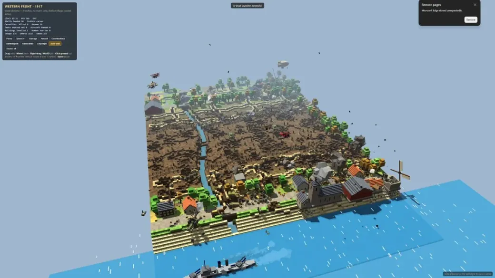</a>

*基于原作品整理的创作说明*

**提示词**

```text
创建一款第一次世界大战体素战场模拟器，包含战壕、士兵、载具、火炮、破坏效果和清晰的战术镜头。
```

[查看详情 ↗](https://www.tripo3d.ai/zh/3d-prompts/world-war-i-voxel-simulator-2094881469155914170) · [查看原帖](https://x.com/Tech2Wild/status/2094881469155914170) · [返回案例导航](#all-prompts)

---

<a id="futuristic-private-island-mansion-2094879208304685524"></a>

### 未来私人岛屿豪宅

[AI/ML API](https://x.com/aimlapi) · 2026-09-01 · Claude Fable 5.1 · 场景

<a href="https://www.tripo3d.ai/zh/3d-prompts/futuristic-private-island-mansion-2094879208304685524">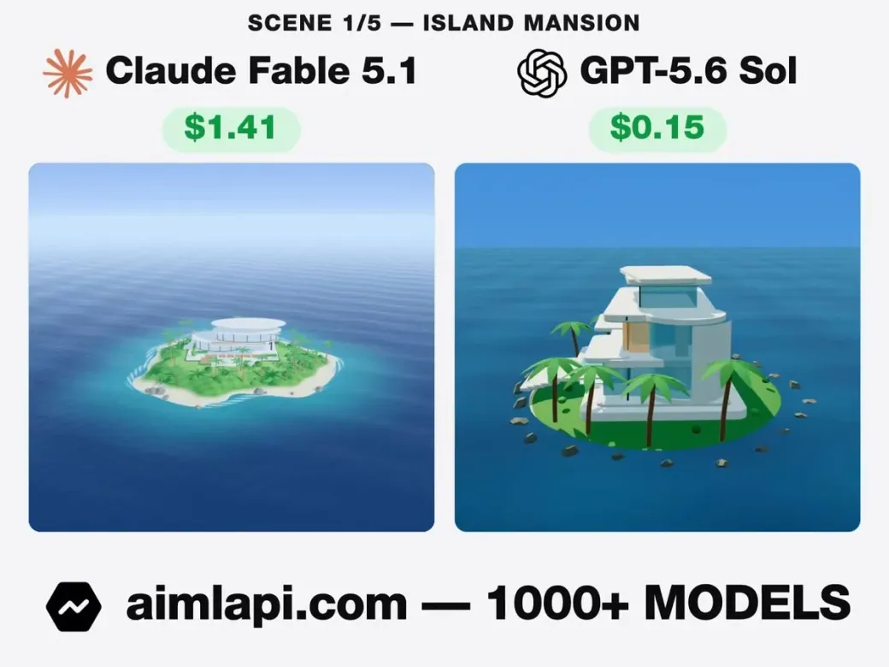</a>

*基于原作品整理的创作说明*

**提示词**

```text
设计一座可探索的未来私人岛屿豪宅，通过五个相连的 Three.js 场景呈现，并加入电影感镜头、高级材质与环境叙事。
```

[查看详情 ↗](https://www.tripo3d.ai/zh/3d-prompts/futuristic-private-island-mansion-2094879208304685524) · [查看原帖](https://x.com/aimlapi/status/2094879208304685524) · [返回案例导航](#all-prompts)

---

<a id="procedurally-generated-three-js-world-2094873862315843910"></a>

### 程序化生成的 Three.js 世界

[Swarogan](https://x.com/swarogan) · 2026-09-01 · Claude Fable 5.1 · 场景

<a href="https://www.tripo3d.ai/zh/3d-prompts/procedurally-generated-three-js-world-2094873862315843910">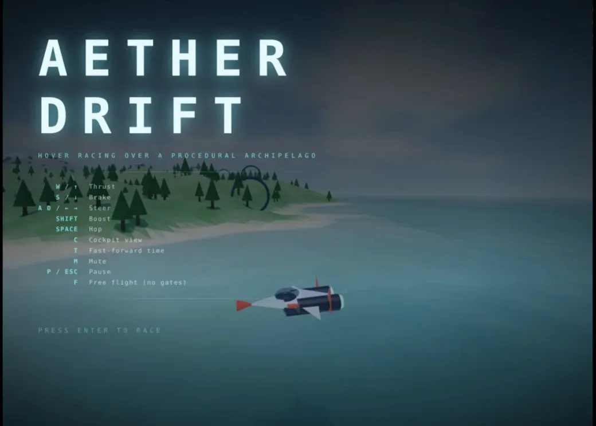</a>

*基于原作品整理的创作说明*

**提示词**

```text
通过一条提示词创建程序化生成的 Three.js 世界，包含多样地形、生物群落、兴趣点、环境生命和流畅探索控制。
```

[查看详情 ↗](https://www.tripo3d.ai/zh/3d-prompts/procedurally-generated-three-js-world-2094873862315843910) · [查看原帖](https://x.com/swarogan/status/2094873862315843910) · [返回案例导航](#all-prompts)

---

<a id="interactive-3d-human-brain-signals-2094873080590225728"></a>

### 交互式 3D 人脑信号

[Greg](https://x.com/GregFeingold) · 2026-09-01 · Claude Fable 5.1 · 互动

<a href="https://www.tripo3d.ai/zh/3d-prompts/interactive-3d-human-brain-signals-2094873080590225728">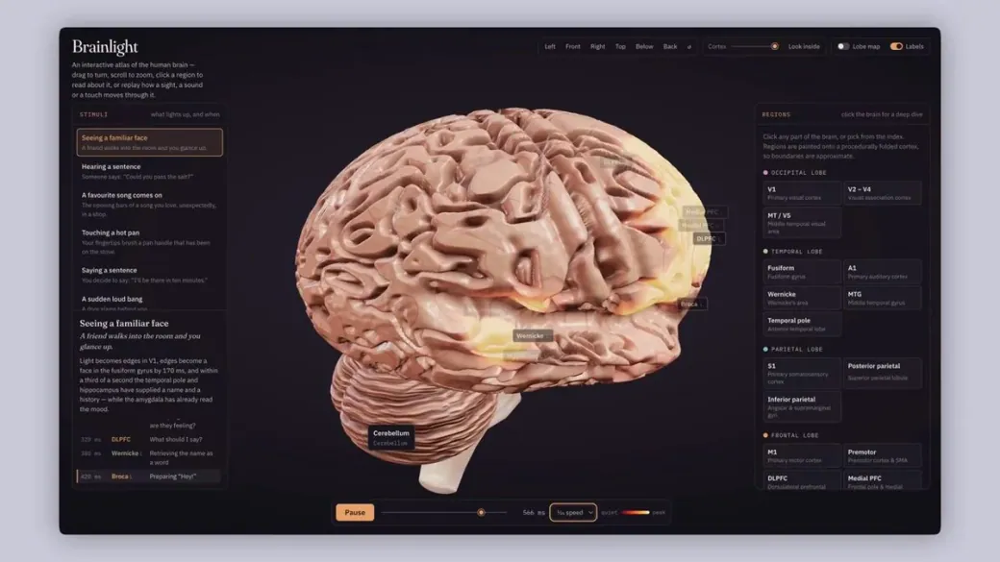</a>

*基于原作品整理的创作说明*

**提示词**

```text
构建带有可辨识皮层沟回的交互式 3D 人脑，并用受 EEG 或 MEG 启发的视觉形式展示类似句子的信号在脑区间传播。
```

[查看详情 ↗](https://www.tripo3d.ai/zh/3d-prompts/interactive-3d-human-brain-signals-2094873080590225728) · [查看原帖](https://x.com/GregFeingold/status/2094873080590225728) · [返回案例导航](#all-prompts)

---

<a id="photorealistic-three-js-landscape-2094871858206191667"></a>

### 照片级 Three.js 自然景观

[Alix Ollivier](https://x.com/aollivier82) · 2026-09-01 · Claude Fable 5.1 · 场景

<a href="https://www.tripo3d.ai/zh/3d-prompts/photorealistic-three-js-landscape-2094871858206191667">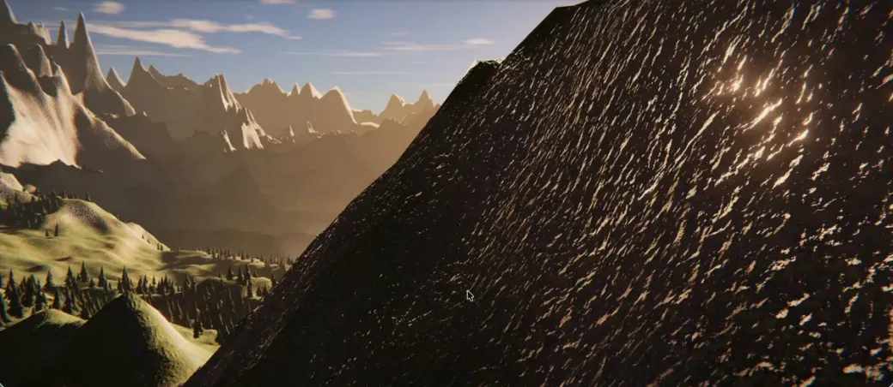</a>

*基于原作品整理的创作说明*

**提示词**

```text
创建照片级 Three.js 自然景观，细化地形、植被、天空、水体、纵深与灯光，并设计自然揭示环境的镜头路径。
```

[查看详情 ↗](https://www.tripo3d.ai/zh/3d-prompts/photorealistic-three-js-landscape-2094871858206191667) · [查看原帖](https://x.com/aollivier82/status/2094871858206191667) · [返回案例导航](#all-prompts)

---

<a id="aaa-horde-shooter-with-webgl-shaders-2094869490165039243"></a>

### 带 WebGL Shader 的 AAA 尸潮射击游戏

[Alexey Fateev](https://x.com/superalesha) · 2026-09-01 · Claude Fable 5.1 · 游戏

<a href="https://www.tripo3d.ai/zh/3d-prompts/aaa-horde-shooter-with-webgl-shaders-2094869490165039243">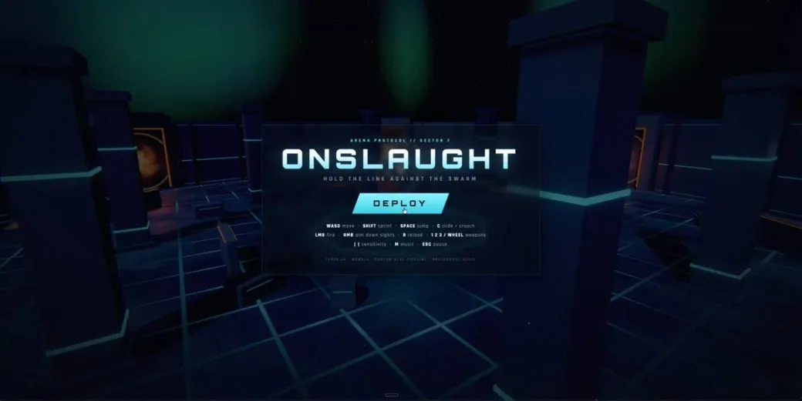</a>

**提示词**

```text
用 Three.js 与 Web Shader 做一款极具冲击力的射击游戏。重点打磨射击、动态、后坐力、画面、命中反馈与枪感；在精心设计的竞技场中迎战尸潮，支持 ADS、武器惯性与重量，并提供突击步枪、霰弹枪和精准步枪。
```

<details>
<summary>作者原始提示词</summary>

```text
Make me the most insane and blast of a shooter you can possibly build on ThreeJS + Web shaders bro! The most important things are shooting, dynamics, recoil, graphics, hit impact, gunplay. It is a beautifully designed arena where enemies swarm in hordes. Include ADS aiming, weapon inertia and weight, plus an assault rifle, shotgun and marksman rifle.
```

</details>

[查看详情 ↗](https://www.tripo3d.ai/zh/3d-prompts/aaa-horde-shooter-with-webgl-shaders-2094869490165039243) · [查看原帖](https://x.com/superalesha/status/2094869490165039243) · [项目源码](https://github.com/alesha-pro/bench-portal) · [在线演示](https://alesha-pro.github.io/bench-portal/games/onslaught-fable-5.1/) · [返回案例导航](#all-prompts)

---

<a id="playable-titanic-disaster-game-2094867850355679617"></a>

### 可玩的泰坦尼克灾难游戏

[Veee](https://x.com/vikktorrrre) · 2026-09-01 · Claude Fable 5.1 · 游戏

<a href="https://www.tripo3d.ai/zh/3d-prompts/playable-titanic-disaster-game-2094867850355679617">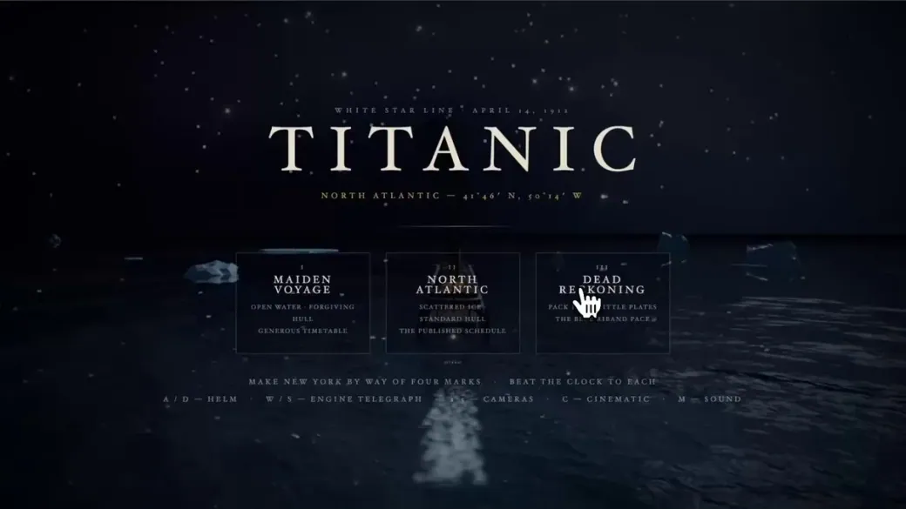</a>

*基于原作品整理的创作说明*

**提示词**

```text
构建一款电影感泰坦尼克号游戏：玩家可以探索船体、完成任务并尝试避开冰山，具有清晰控制和不断升级的危险。
```

[查看详情 ↗](https://www.tripo3d.ai/zh/3d-prompts/playable-titanic-disaster-game-2094867850355679617) · [查看原帖](https://x.com/vikktorrrre/status/2094867850355679617) · [在线演示](https://rms-titanic-1912.netlify.app/) · [返回案例导航](#all-prompts)

---

<a id="multiplayer-dinosaur-survival-game-2094866225960493189"></a>

### 多人恐龙生存游戏

[S](https://x.com/Rubzem) · 2026-09-01 · Claude Fable 5.1 · 游戏

<a href="https://www.tripo3d.ai/zh/3d-prompts/multiplayer-dinosaur-survival-game-2094866225960493189">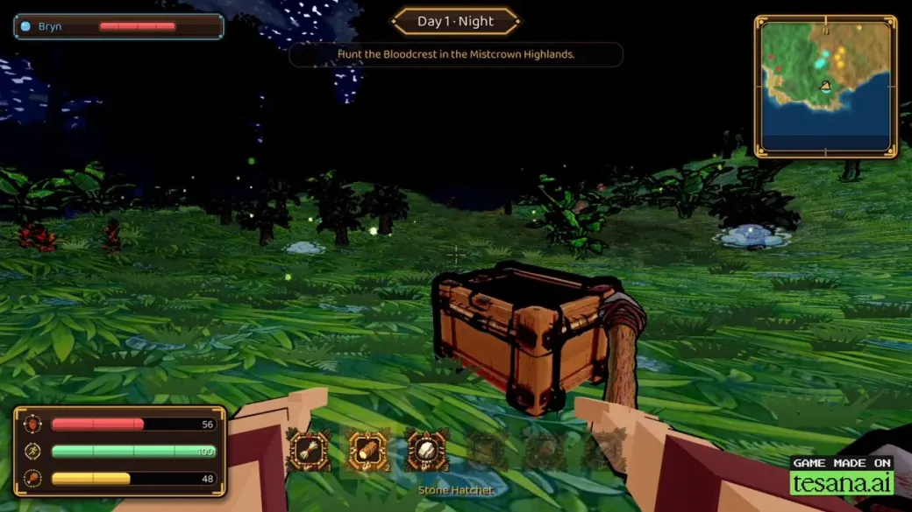</a>

*基于原作品整理的创作说明*

**提示词**

```text
创建一款多人荒野生存游戏，包含狩猎、烹饪、制作、基地建设、危险恐龙与持续探索的成长循环。
```

[查看详情 ↗](https://www.tripo3d.ai/zh/3d-prompts/multiplayer-dinosaur-survival-game-2094866225960493189) · [查看原帖](https://x.com/Rubzem/status/2094866225960493189) · [返回案例导航](#all-prompts)

---

<a id="ten-minute-three-js-game-then-refined-2094855905678446777"></a>

### 十分钟生成并继续完善 Three.js 游戏

[Andrei](https://x.com/HangoutWHAndrei) · 2026-09-01 · Claude Fable 5.1 · 游戏

<a href="https://www.tripo3d.ai/zh/3d-prompts/ten-minute-three-js-game-then-refined-2094855905678446777">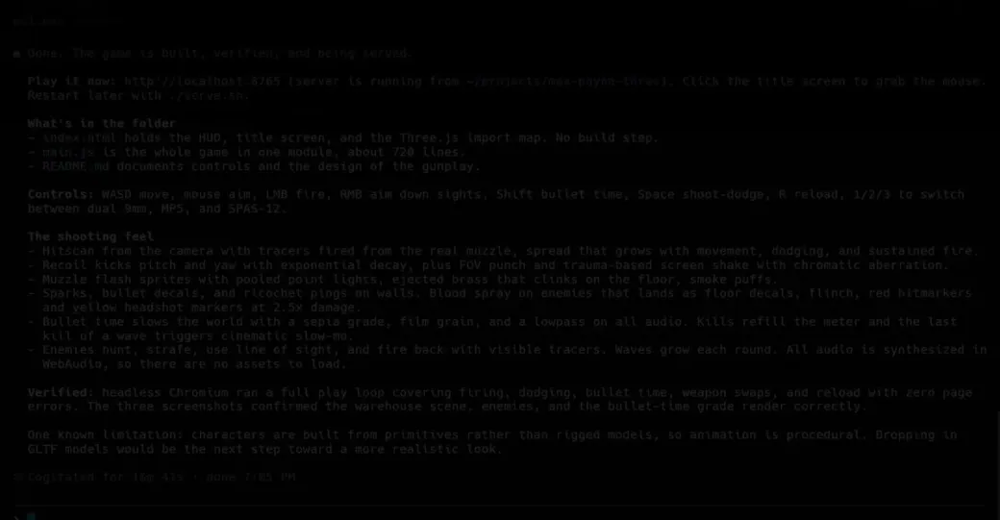</a>

*基于原作品整理的创作说明*

**提示词**

```text
在十分钟内创建一个小型 Three.js 游戏，包含明确目标、灵敏控制、清晰危险物和完整成败状态。试玩后，再通过后续修改完善视觉、节奏与反馈。
```

[查看详情 ↗](https://www.tripo3d.ai/zh/3d-prompts/ten-minute-three-js-game-then-refined-2094855905678446777) · [查看原帖](https://x.com/HangoutWHAndrei/status/2094855905678446777) · [返回案例导航](#all-prompts)

---

<a id="glass-brain-capability-demo-2094853472864682360"></a>

### 玻璃大脑能力演示

[Not Harris \| Builds Apps](https://x.com/viewsfrom02108) · 2026-09-01 · Claude Fable 5.1 · 互动

<a href="https://www.tripo3d.ai/zh/3d-prompts/glass-brain-capability-demo-2094853472864682360">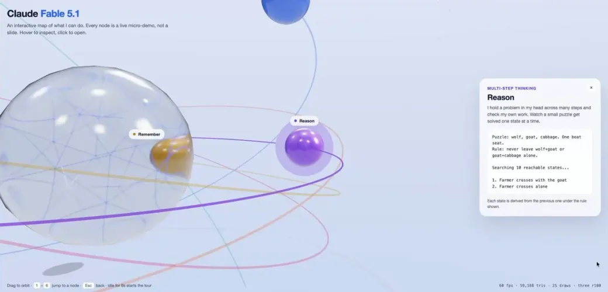</a>

**提示词**

```text
用 Three.js 做一个展示你能力的 Demo。
```

<details>
<summary>作者原始提示词</summary>

```text
make a Three.js demo of your capabilities.
```

</details>

[查看详情 ↗](https://www.tripo3d.ai/zh/3d-prompts/glass-brain-capability-demo-2094853472864682360) · [查看原帖](https://x.com/viewsfrom02108/status/2094853472864682360) · [返回案例导航](#all-prompts)

---


[完整目录](catalog.zh.md) · [←](catalog.zh.7.md) · **8 / 9** · [→](catalog.zh.9.md)

<p align="center"><strong><a href="https://www.tripo3d.ai/zh/3d-prompts?utm_source=github&amp;utm_medium=referral&amp;utm_campaign=awesome_3d_prompts&amp;utm_content=catalog_footer">查看全部 447 条案例与在线演示 →</a></strong></p>
