<!-- Generated from Growth CMS by templates/catalog.md. Edit content in CMS; run npm run sync. -->

# Awesome 3D Prompts — 9 / 10

[← Awesome 3D Prompts](../README.zh-CN.md)

<p>
  <a href="../docs/catalog.en.9.md"></a>
  <a href="../docs/catalog.zh.9.md"></a>
  <a href="../docs/catalog.zh-Hant.9.md"></a>
  <a href="../docs/catalog.ja.9.md"></a>
  <a href="../docs/catalog.ko.9.md"></a>
  <a href="../docs/catalog.es.9.md"></a>
  <a href="../docs/catalog.pt.9.md"></a>
  <a href="../docs/catalog.de.9.md"></a>
  <a href="../docs/catalog.fr.9.md"></a>
  <a href="../docs/catalog.it.9.md"></a>
  <a href="../docs/catalog.ru.9.md"></a>
  <a href="../docs/catalog.tr.9.md"></a>
  <a href="../docs/catalog.uk.9.md"></a>
  <a href="../docs/catalog.vi.9.md"></a>
</p>

[完整目录](catalog.zh.md) · [←](catalog.zh.8.md) · **9 / 10** · [→](catalog.zh.10.md)

<a id="all-prompts"></a>

<details>
<summary>浏览案例 (50)</summary>

- [交互式多伦多天际线](#interactive-toronto-skyline-2095000329561485584)
- [自主运行的模拟人生式系统](#autonomous-sims-like-life-simulation-2094949450196090988)
- [拥有思考型 NPC 的体素村庄](#voxel-village-with-thinking-npcs-2094930970675741171)
- [幻想风富士山登顶之旅](#fantasy-ascent-to-mount-fuji-2094930804296274414)
- [从零构建 Godot 赛车游戏](#godot-racing-game-built-from-scratch-2094925359372284022)
- [平面图转 Blender 漫游](#floor-plan-to-blender-walkthrough-2094925117344428232)
- [确定性 13.6 万体素宝塔](#deterministic-136-000-voxel-pagoda-2094916609219461211)
- [通过 Blender 自动化构建高细节机器人](#detailed-robot-through-blender-automation-2094909825561805003)
- [开放世界犯罪游戏原型](#open-world-crime-game-prototype-2094907986942591338)
- [Mini Militia 风格浏览器游戏](#mini-militia-style-browser-game-2094900523900219725)
- [雨中第一人称海洋沙盒](#rainy-first-person-ocean-sandbox-2094900247000654222)
- [悬浮体素岛屿](#floating-voxel-island-2094899802588713418)
- [鲜活的体素中世纪王国](#living-voxel-medieval-kingdom-2094899477626720403)
- [带纹理的 3D 资产生产流程](#textured-3d-asset-production-workflow-2094896750234378508)
- [三款紧凑物理小游戏](#three-compact-physics-game-concepts-2094895071304839400)
- [Three.js AAA 卡丁车竞速游戏](#aaa-kart-racing-game-in-three-js-2094894312370692443)
- [一次生成的 Three.js 机场模拟](#one-shot-three-js-airport-simulation-2094893572617044439)
- [悬浮日本宝塔城市](#floating-japanese-pagoda-city-2094886088963690607)
- [Three.js 空客 H145 直升机](#airbus-h145-in-three-js-2094882571083735351)
- [第一次世界大战体素模拟器](#world-war-i-voxel-simulator-2094881469155914170)
- [未来私人岛屿豪宅](#futuristic-private-island-mansion-2094879208304685524)
- [程序化生成的 Three.js 世界](#procedurally-generated-three-js-world-2094873862315843910)
- [交互式 3D 人脑信号](#interactive-3d-human-brain-signals-2094873080590225728)
- [照片级 Three.js 自然景观](#photorealistic-three-js-landscape-2094871858206191667)
- [带 WebGL Shader 的 AAA 尸潮射击游戏](#aaa-horde-shooter-with-webgl-shaders-2094869490165039243)
- [可玩的泰坦尼克灾难游戏](#playable-titanic-disaster-game-2094867850355679617)
- [多人恐龙生存游戏](#multiplayer-dinosaur-survival-game-2094866225960493189)
- [十分钟生成并继续完善 Three.js 游戏](#ten-minute-three-js-game-then-refined-2094855905678446777)
- [玻璃大脑能力演示](#glass-brain-capability-demo-2094853472864682360)
- [程序化体素城堡展示](#procedural-voxel-castle-showcase-2093690427849191855)
- [用于 Blender 组装 Jeep 风格 4x4 的提示词](#jeep-style-4x4-assembly-in-blender-2082845759452463405)
- [用于独立 HTML 场景的 3D 破坏物理提示词](#3d-destruction-physics-in-self-contained-html-2082832042702561372)
- [Claude Opus 5 机甲机器人蓝图提示集](#mech-robot-blueprint-set-2082760534500188606)
- [Need for Speed 风格 Godot 游戏提示词](#need-for-speed-style-godot-game-2082714235373584582)
- [Kimi K3 玻璃水族箱开裂爆裂 3D 仿真提示词](#cracking-aquarium-3d-simulation-2082528683747873194)
- [Kimi K3 的可玩战斗游戏提示词](#playable-combat-game-2082507403598373134)
- [Kimi K3 的《英雄联盟》风格 1v1 单页 HTML 游戏提示词](#league-of-legends-style-1v1-game-in-one-html-file-2082474707727581564)
- [适用于 Claude Opus 5 的单文件 3D 太阳可视化提示词](#single-file-3d-sun-visualizer-2082461416049525077)
- [围绕电脑工作站的 3D 房间提示词，用于单文件 Three.js 构建](#explorable-3d-room-with-computer-workstation-2082451081733591520)
- [Claude Opus 5 的非欧几里得门传送门提示](#non-euclidean-door-portal-in-unreal-engine-5-2082436347113951333)
- [用于 Three.js 游戏构建的简单 FPS 提示词](#simple-first-person-shooter-in-three-js-2082242351372599770)
- [用于 Claude Opus 5 的 CS2 与 Battlefield 风格第一人称射击游戏提示词](#cs2-and-battlefield-style-fps-2082241827298557966)
- [Claude Opus 5 AAA 射击游戏提示词](#aaa-shooter-game-2082180453889712318)
- [在单个 HTML 文件中制作可玩的黑暗奇幻横版卷轴游戏](#playable-dark-fantasy-side-scroller-in-a-single-html-file-2082096376763060575)
- [Claude Opus 5 开发 3D MMO 的工作流程](#development-workflow-for-a-3d-mmo-2082035844836450334)
- [制作一个可玩的 Chrome 恐龙游戏](#make-a-playable-chrome-dino-game-2081867025140650236)
- [用于逼真直升机射击游戏的 Kimi K3 提示词](#realistic-helicopter-shooter-game-2081791572115435765)
- [用于 Subway Surfers 风格游戏的 Kimi K3 提示词](#subway-surfers-style-game-2081766198082220514)
- [用于受 Counter-Strike 启发的 Three.js FPS 的 Claude Opus 5 提示词](#counter-strike-inspired-three-js-fps-2081607528790856068)
- [Claude Fable 5 的无限 Three.js 纸带机提示词](#infinite-three-js-paper-machine-2081533777340506251)

</details>
<a id="interactive-toronto-skyline-2095000329561485584"></a>

### 交互式多伦多天际线

[Kevin](https://x.com/bienjamyn) · 2026-09-02 · Claude Fable 5.1 · 场景

<a href="https://www.tripo3d.ai/zh/3d-prompts/interactive-toronto-skyline-2095000329561485584">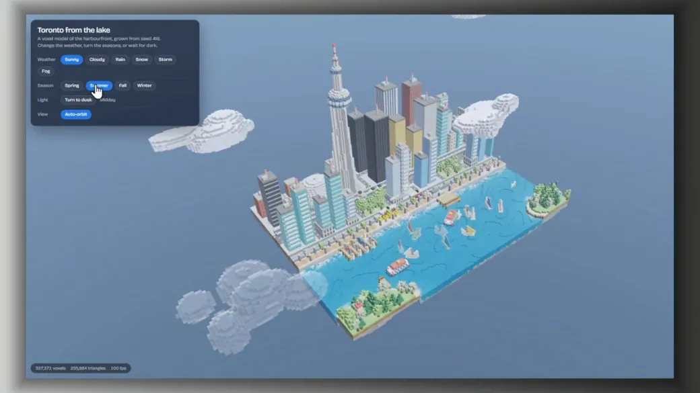</a>

*基于原作品整理的创作说明*

**提示词**

```text
构建交互式 3D 多伦多天际线，还原标志性建筑、水体与大气纵深，并加入昼夜灯光和流畅环绕与飞行控制。
```

[查看详情 ↗](https://www.tripo3d.ai/zh/3d-prompts/interactive-toronto-skyline-2095000329561485584) · [查看原帖](https://x.com/bienjamyn/status/2095000329561485584) · [在线演示](https://toronto-voxel.vercel.app/) · [返回案例导航](#all-prompts)

---

<a id="autonomous-sims-like-life-simulation-2094949450196090988"></a>

### 自主运行的模拟人生式系统

[Ridark](https://x.com/ridark_eth) · 2026-09-02 · Claude Fable 5.1 · 动画

<a href="https://www.tripo3d.ai/zh/3d-prompts/autonomous-sims-like-life-simulation-2094949450196090988">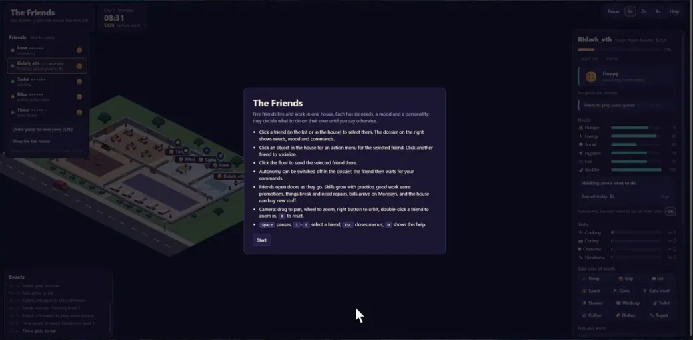</a>

*基于原作品整理的创作说明*

**提示词**

```text
构建模拟人生式生活模拟，包含五个自主角色，让需求、日常、关系与决策在无需持续操作的情况下产生涌现故事。
```

[查看详情 ↗](https://www.tripo3d.ai/zh/3d-prompts/autonomous-sims-like-life-simulation-2094949450196090988) · [查看原帖](https://x.com/ridark_eth/status/2094949450196090988) · [返回案例导航](#all-prompts)

---

<a id="voxel-village-with-thinking-npcs-2094930970675741171"></a>

### 拥有思考型 NPC 的体素村庄

[Tech2Wild](https://x.com/Tech2Wild) · 2026-09-01 · Claude Fable 5.1 · 互动

<a href="https://www.tripo3d.ai/zh/3d-prompts/voxel-village-with-thinking-npcs-2094930970675741171">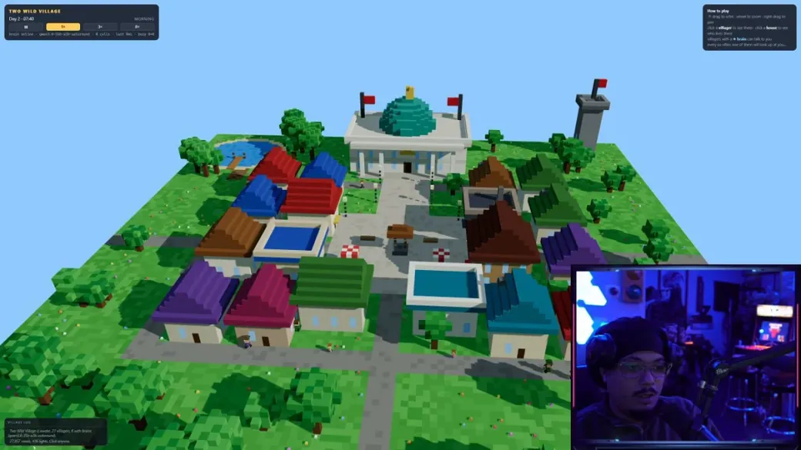</a>

*基于原作品整理的创作说明*

**提示词**

```text
构建一个体素村庄，让居民拥有职业、日常、记忆和本地语言模型大脑，从而能对玩家及彼此作出反应。
```

[查看详情 ↗](https://www.tripo3d.ai/zh/3d-prompts/voxel-village-with-thinking-npcs-2094930970675741171) · [查看原帖](https://x.com/Tech2Wild/status/2094930970675741171) · [返回案例导航](#all-prompts)

---

<a id="fantasy-ascent-to-mount-fuji-2094930804296274414"></a>

### 幻想风富士山登顶之旅

[Techartist](https://x.com/techartist_) · 2026-09-01 · Claude Fable 5.1 · 场景

<a href="https://www.tripo3d.ai/zh/3d-prompts/fantasy-ascent-to-mount-fuji-2094930804296274414">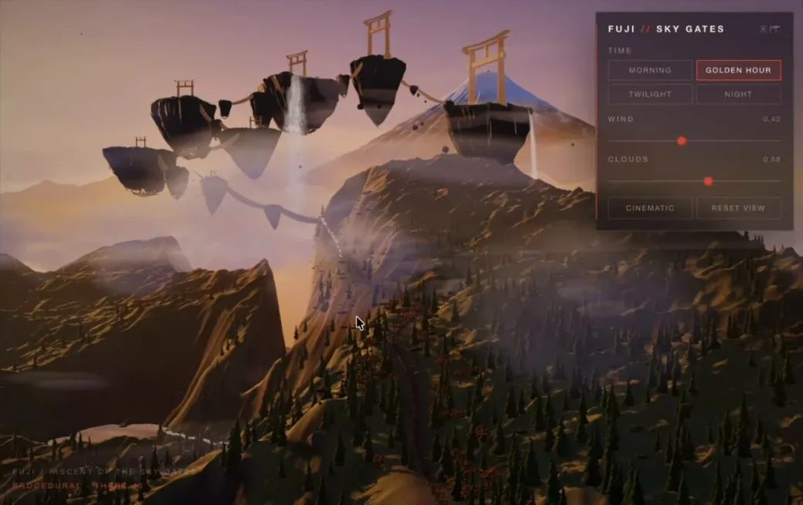</a>

*基于原作品整理的创作说明*

**提示词**

```text
创建一段通往富士山顶的 Three.js 幻想旅程，通过分层环境、氛围灯光、移动机制和明确的登高感组织体验。
```

[查看详情 ↗](https://www.tripo3d.ai/zh/3d-prompts/fantasy-ascent-to-mount-fuji-2094930804296274414) · [查看原帖](https://x.com/techartist_/status/2094930804296274414) · [返回案例导航](#all-prompts)

---

<a id="godot-racing-game-built-from-scratch-2094925359372284022"></a>

### 从零构建 Godot 赛车游戏

[atomic.chat](https://x.com/atomic_chat_hq) · 2026-09-01 · Claude Fable 5.1 · 游戏

<a href="https://www.tripo3d.ai/zh/3d-prompts/godot-racing-game-built-from-scratch-2094925359372284022">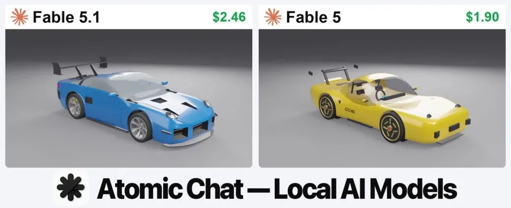</a>

*基于原作品整理的创作说明*

**提示词**

```text
从零构建 Godot 赛车游戏，用 Blender 制作载具与环境资产，并实现大型赛道、令人满意的操控、对手、HUD 与比赛流程。
```

[查看详情 ↗](https://www.tripo3d.ai/zh/3d-prompts/godot-racing-game-built-from-scratch-2094925359372284022) · [查看原帖](https://x.com/atomic_chat_hq/status/2094925359372284022) · [返回案例导航](#all-prompts)

---

<a id="floor-plan-to-blender-walkthrough-2094925117344428232"></a>

### 平面图转 Blender 漫游

[AGIラボ](https://x.com/ctgptlb) · 2026-09-01 · Claude Fable 5.1 · 场景

<a href="https://www.tripo3d.ai/zh/3d-prompts/floor-plan-to-blender-walkthrough-2094925117344428232">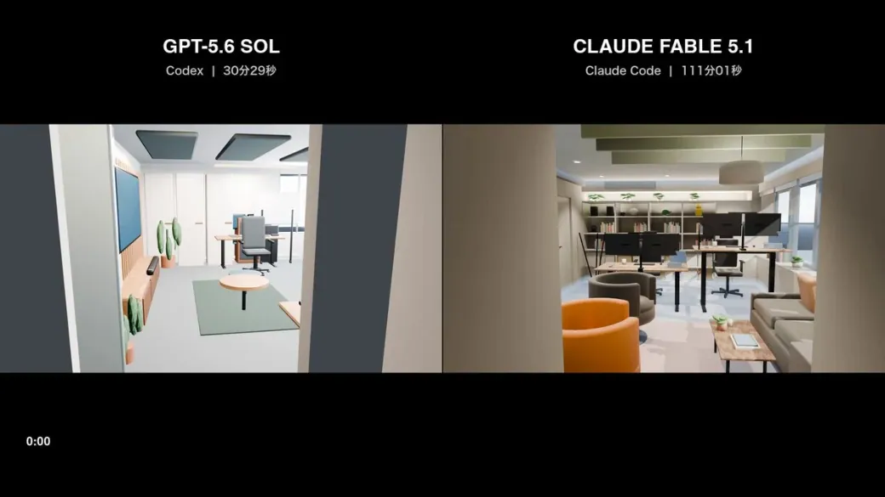</a>

*基于原作品整理的创作说明*

**提示词**

```text
根据给定平面图创建准确的 Blender 3D 模型，渲染一组代表性静帧，并制作连贯的室内漫游视频。
```

[查看详情 ↗](https://www.tripo3d.ai/zh/3d-prompts/floor-plan-to-blender-walkthrough-2094925117344428232) · [查看原帖](https://x.com/ctgptlb/status/2094925117344428232) · [返回案例导航](#all-prompts)

---

<a id="deterministic-136-000-voxel-pagoda-2094916609219461211"></a>

### 确定性 13.6 万体素宝塔

[FHILY👑](https://x.com/Oluwaphilemon1) · 2026-09-01 · Claude Fable 5.1 · 场景

<a href="https://www.tripo3d.ai/zh/3d-prompts/deterministic-136-000-voxel-pagoda-2094916609219461211"></a>

*基于原作品整理的创作说明*

**提示词**

```text
用 Three.js 生成确定性的 13.6 万体素宝塔，确保建筑层级清晰、实例化高效、输出稳定，并提供检视镜头。
```

[查看详情 ↗](https://www.tripo3d.ai/zh/3d-prompts/deterministic-136-000-voxel-pagoda-2094916609219461211) · [查看原帖](https://x.com/Oluwaphilemon1/status/2094916609219461211) · [返回案例导航](#all-prompts)

---

<a id="detailed-robot-through-blender-automation-2094909825561805003"></a>

### 通过 Blender 自动化构建高细节机器人

[Spectro](https://x.com/Spectromachina) · 2026-09-01 · Claude Fable 5.1 · 资产

<a href="https://www.tripo3d.ai/zh/3d-prompts/detailed-robot-through-blender-automation-2094909825561805003">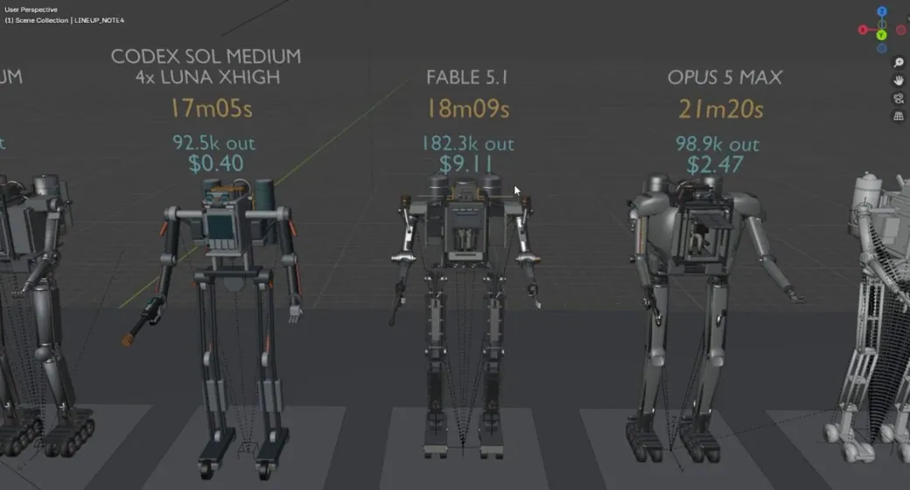</a>

*基于原作品整理的创作说明*

**提示词**

```text
在 Blender 中构建高细节硬表面机器人，确保比例、关节、面板、材质与灯光协调，并完成展示渲染。
```

[查看详情 ↗](https://www.tripo3d.ai/zh/3d-prompts/detailed-robot-through-blender-automation-2094909825561805003) · [查看原帖](https://x.com/Spectromachina/status/2094909825561805003) · [返回案例导航](#all-prompts)

---

<a id="open-world-crime-game-prototype-2094907986942591338"></a>

### 开放世界犯罪游戏原型

[Veee](https://x.com/vikktorrrre) · 2026-09-01 · Claude Fable 5.1 · 游戏

<a href="https://www.tripo3d.ai/zh/3d-prompts/open-world-crime-game-prototype-2094907986942591338">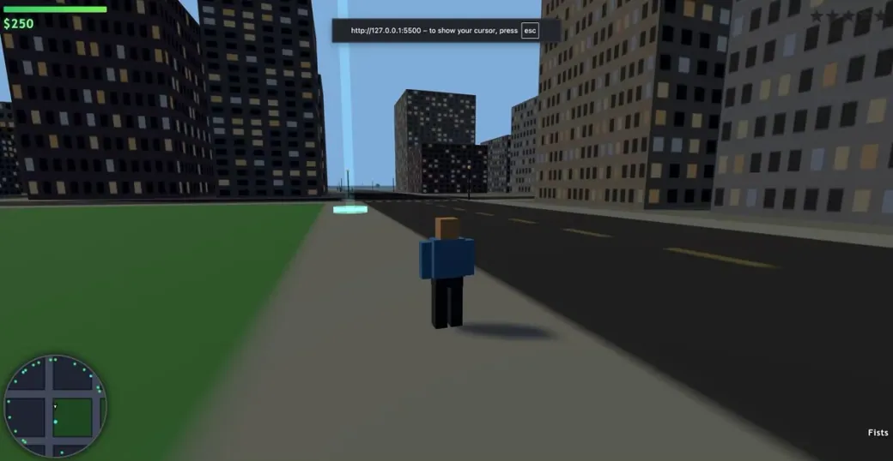</a>

*基于原作品整理的创作说明*

**提示词**

```text
原型化一款受 GTA 6 启发的开放世界游戏，包含密集城市、步行探索、可驾驶载具、交通、警察响应与多种可玩活动。
```

[查看详情 ↗](https://www.tripo3d.ai/zh/3d-prompts/open-world-crime-game-prototype-2094907986942591338) · [查看原帖](https://x.com/vikktorrrre/status/2094907986942591338) · [返回案例导航](#all-prompts)

---

<a id="mini-militia-style-browser-game-2094900523900219725"></a>

### Mini Militia 风格浏览器游戏

[Md Ismail Šojal 🕷️](https://x.com/0x0SojalSec) · 2026-09-01 · Claude Fable 5.1 · 游戏

<a href="https://www.tripo3d.ai/zh/3d-prompts/mini-militia-style-browser-game-2094900523900219725">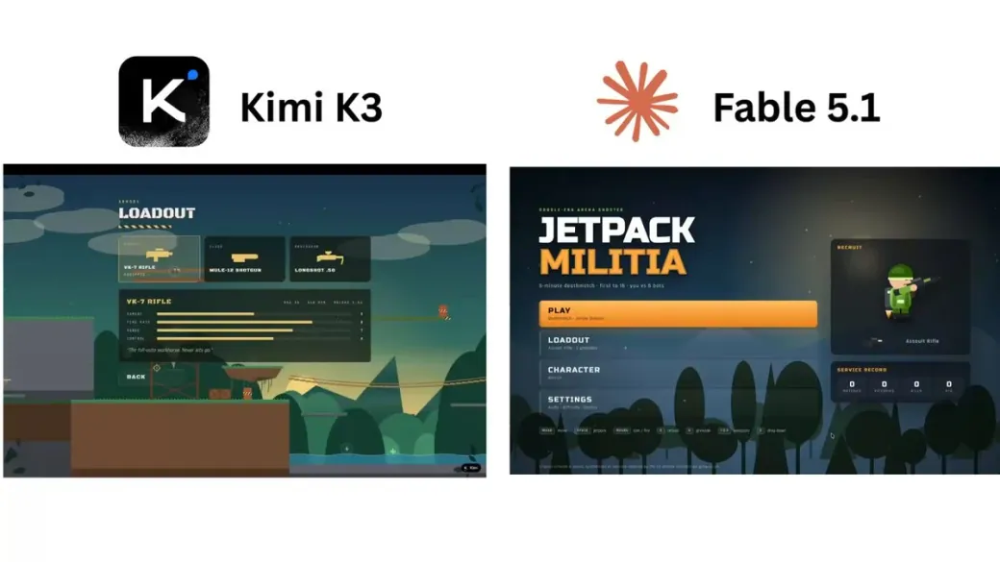</a>

*基于原作品整理的创作说明*

**提示词**

```text
创建 Mini Militia 风格动作游戏，包含灵敏移动、瞄准、武器、紧凑竞技场、机器人和即时命中与伤害反馈。
```

[查看详情 ↗](https://www.tripo3d.ai/zh/3d-prompts/mini-militia-style-browser-game-2094900523900219725) · [查看原帖](https://x.com/0x0SojalSec/status/2094900523900219725) · [返回案例导航](#all-prompts)

---

<a id="rainy-first-person-ocean-sandbox-2094900247000654222"></a>

### 雨中第一人称海洋沙盒

[Tim Jayas](https://x.com/TimJayas) · 2026-09-01 · Claude Fable 5.1 · 场景

<a href="https://www.tripo3d.ai/zh/3d-prompts/rainy-first-person-ocean-sandbox-2094900247000654222">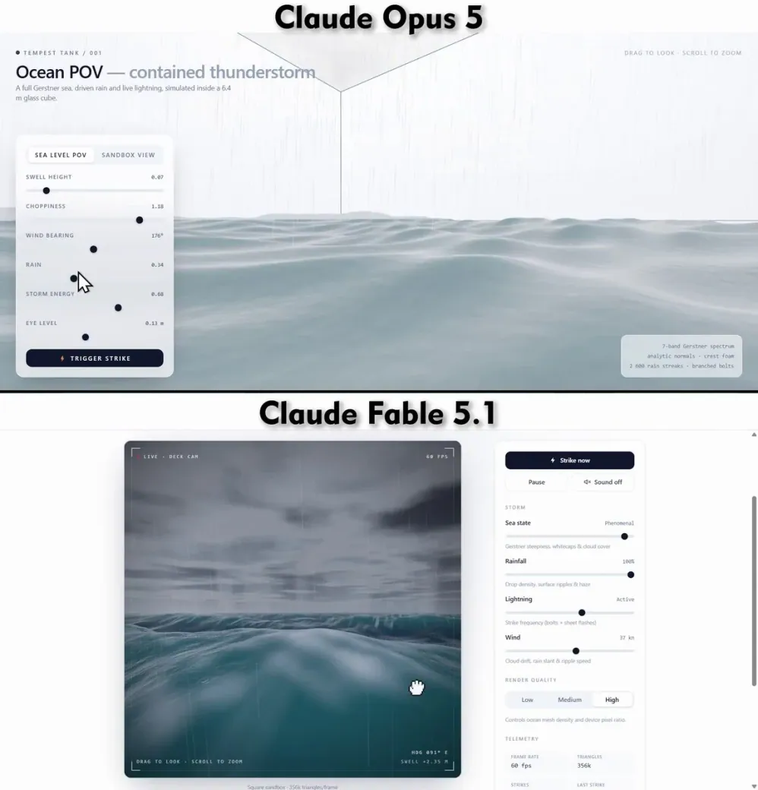</a>

*基于原作品整理的创作说明*

**提示词**

```text
构建第一人称 3D 海洋沙盒，加入波浪、雨滴和环境光，让用户从沉浸式镜头探索水面。
```

[查看详情 ↗](https://www.tripo3d.ai/zh/3d-prompts/rainy-first-person-ocean-sandbox-2094900247000654222) · [查看原帖](https://x.com/TimJayas/status/2094900247000654222) · [返回案例导航](#all-prompts)

---

<a id="floating-voxel-island-2094899802588713418"></a>

### 悬浮体素岛屿

[Loktar 🇺🇸](https://x.com/loktar00) · 2026-09-01 · Claude Fable 5.1 · 场景

<a href="https://www.tripo3d.ai/zh/3d-prompts/floating-voxel-island-2094899802588713418">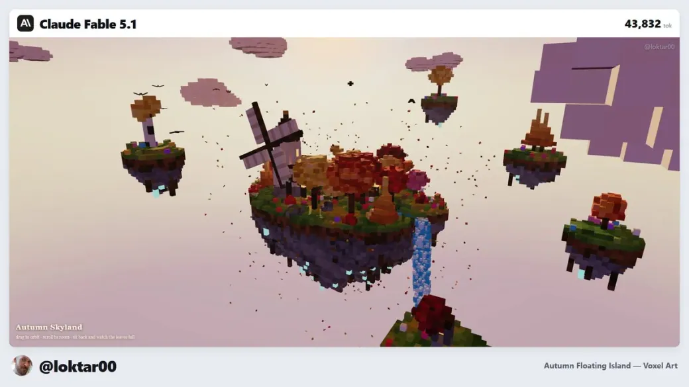</a>

*基于原作品整理的创作说明*

**提示词**

```text
构建一座悬浮体素岛屿，包含清晰地形层级、植被、水体、建筑、环境动态和可环绕查看全景的镜头。
```

[查看详情 ↗](https://www.tripo3d.ai/zh/3d-prompts/floating-voxel-island-2094899802588713418) · [查看原帖](https://x.com/loktar00/status/2094899802588713418) · [返回案例导航](#all-prompts)

---

<a id="living-voxel-medieval-kingdom-2094899477626720403"></a>

### 鲜活的体素中世纪王国

[Knowix](https://x.com/knowixbuilds) · 2026-09-01 · Claude Fable 5.1 · 动画

<a href="https://www.tripo3d.ai/zh/3d-prompts/living-voxel-medieval-kingdom-2094899477626720403"></a>

*基于原作品整理的创作说明*

**提示词**

```text
构建一个大型体素中世纪王国，包含数千士兵、会工作的村民、攻城系统、可破坏建筑，以及能改变战局的巨龙。
```

[查看详情 ↗](https://www.tripo3d.ai/zh/3d-prompts/living-voxel-medieval-kingdom-2094899477626720403) · [查看原帖](https://x.com/knowixbuilds/status/2094899477626720403) · [返回案例导航](#all-prompts)

---

<a id="textured-3d-asset-production-workflow-2094896750234378508"></a>

### 带纹理的 3D 资产生产流程

[Matt](https://x.com/MrCollison) · 2026-09-01 · Claude Fable 5.1 · 资产

<a href="https://www.tripo3d.ai/zh/3d-prompts/textured-3d-asset-production-workflow-2094896750234378508">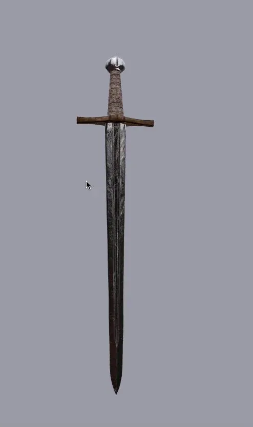</a>

*基于原作品整理的创作说明*

**提示词**

```text
把参考图转成干净的 3D 资产，在 Blender 中修正法线和材质，再用 Substance Painter 制作可用于生产的纹理。
```

[查看详情 ↗](https://www.tripo3d.ai/zh/3d-prompts/textured-3d-asset-production-workflow-2094896750234378508) · [查看原帖](https://x.com/MrCollison/status/2094896750234378508) · [返回案例导航](#all-prompts)

---

<a id="three-compact-physics-game-concepts-2094895071304839400"></a>

### 三款紧凑物理小游戏

[Atomic Agent](https://x.com/atomicagent_io) · 2026-09-01 · Claude Fable 5.1 · 游戏

<a href="https://www.tripo3d.ai/zh/3d-prompts/three-compact-physics-game-concepts-2094895071304839400">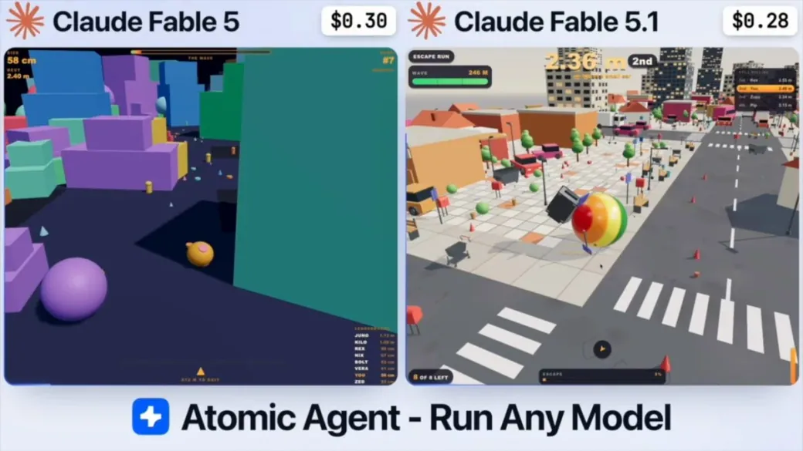</a>

*基于原作品整理的创作说明*

**提示词**

```text
构建三款精致小游戏：黏性球障碍挑战、水豚冲浪和饺子传送带躲避。每款都要有清晰输入、计分与失败状态。
```

[查看详情 ↗](https://www.tripo3d.ai/zh/3d-prompts/three-compact-physics-game-concepts-2094895071304839400) · [查看原帖](https://x.com/atomicagent_io/status/2094895071304839400) · [返回案例导航](#all-prompts)

---

<a id="aaa-kart-racing-game-in-three-js-2094894312370692443"></a>

### Three.js AAA 卡丁车竞速游戏

[Jared](https://growthengineer.space/) · 2026-09-01 · Claude Fable 5.1 · 游戏

改编自: [BridgeMind](https://x.com/bridgemindai/status/2094894312370692443)

<a href="https://www.tripo3d.ai/zh/3d-prompts/aaa-kart-racing-game-in-three-js-2094894312370692443">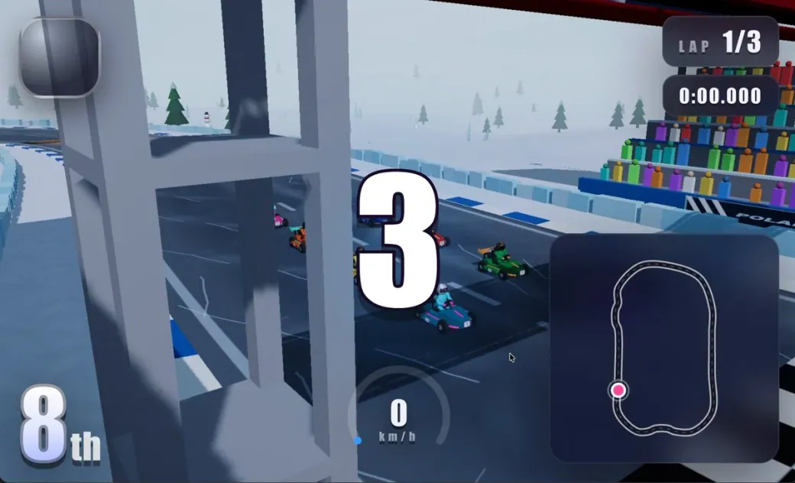</a>

*基于原作品整理的创作说明*

**提示词**

```text
使用 Three.js 构建 AAA 质感的卡丁车竞速游戏，包含精细驾驶手感、表现力赛道、对手、道具、UI、音效与完整可玩比赛循环。
```

[查看详情 ↗](https://www.tripo3d.ai/zh/3d-prompts/aaa-kart-racing-game-in-three-js-2094894312370692443) · [查看原帖](https://x.com/bridgemindai/status/2094894312370692443) · [项目源码](https://github.com/bridge-mind/turbo-kart-rush) · [在线演示](https://bridge-mind.github.io/turbo-kart-rush/) · [返回案例导航](#all-prompts)

---

<a id="one-shot-three-js-airport-simulation-2094893572617044439"></a>

### 一次生成的 Three.js 机场模拟

[Alex - i do YouTube](https://x.com/AlexYTScaling) · 2026-09-01 · Claude Fable 5.1 · 动画

<a href="https://www.tripo3d.ai/zh/3d-prompts/one-shot-three-js-airport-simulation-2094893572617044439">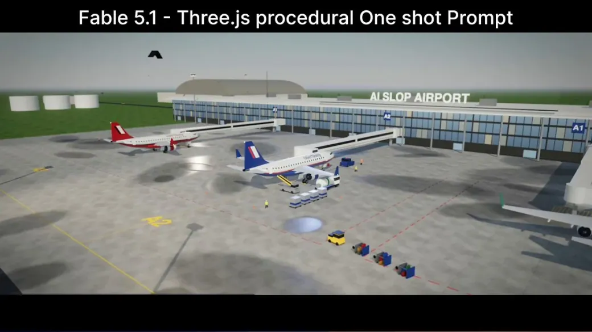</a>

*基于原作品整理的创作说明*

**提示词**

```text
一次构建完整的 Three.js 机场模拟，包含跑道、航站楼、飞机滑行与起飞、地勤车辆、昼夜灯光和总览镜头。
```

[查看详情 ↗](https://www.tripo3d.ai/zh/3d-prompts/one-shot-three-js-airport-simulation-2094893572617044439) · [查看原帖](https://x.com/AlexYTScaling/status/2094893572617044439) · [返回案例导航](#all-prompts)

---

<a id="floating-japanese-pagoda-city-2094886088963690607"></a>

### 悬浮日本宝塔城市

[Vib3Coded](https://x.com/vib3coded) · 2026-09-01 · Claude Fable 5.1 · 场景

<a href="https://www.tripo3d.ai/zh/3d-prompts/floating-japanese-pagoda-city-2094886088963690607">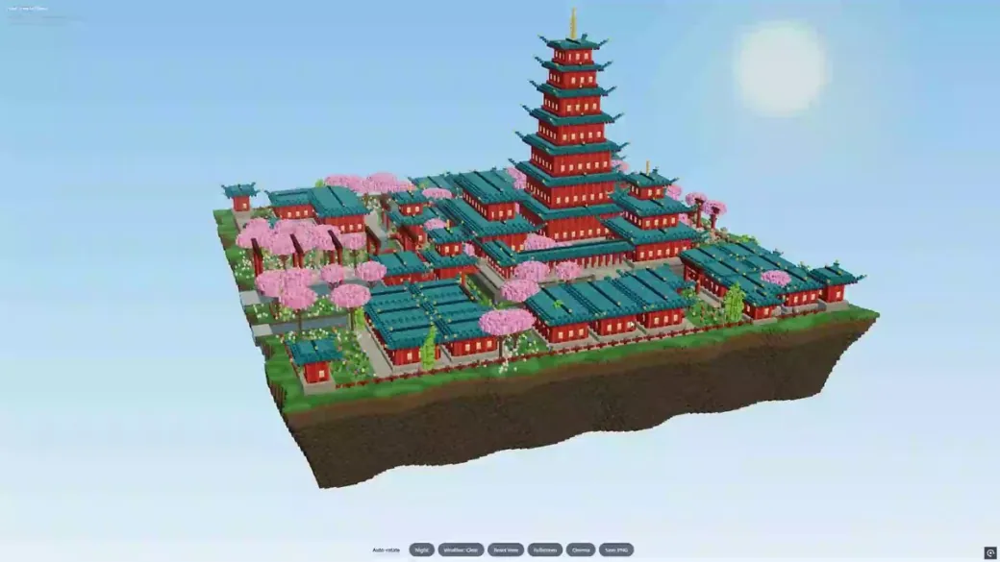</a>

*基于原作品整理的创作说明*

**提示词**

```text
创建一座以高细节宝塔为中心的交互式悬浮日本城市，包含分层岛屿、桥梁、雾气、灯笼光与电影感飞行控制。
```

[查看详情 ↗](https://www.tripo3d.ai/zh/3d-prompts/floating-japanese-pagoda-city-2094886088963690607) · [查看原帖](https://x.com/vib3coded/status/2094886088963690607) · [返回案例导航](#all-prompts)

---

<a id="airbus-h145-in-three-js-2094882571083735351"></a>

### Three.js 空客 H145 直升机

[Harshith](https://x.com/HarshithLucky3) · 2026-09-01 · Claude Fable 5.1 · 资产

<a href="https://www.tripo3d.ai/zh/3d-prompts/airbus-h145-in-three-js-2094882571083735351">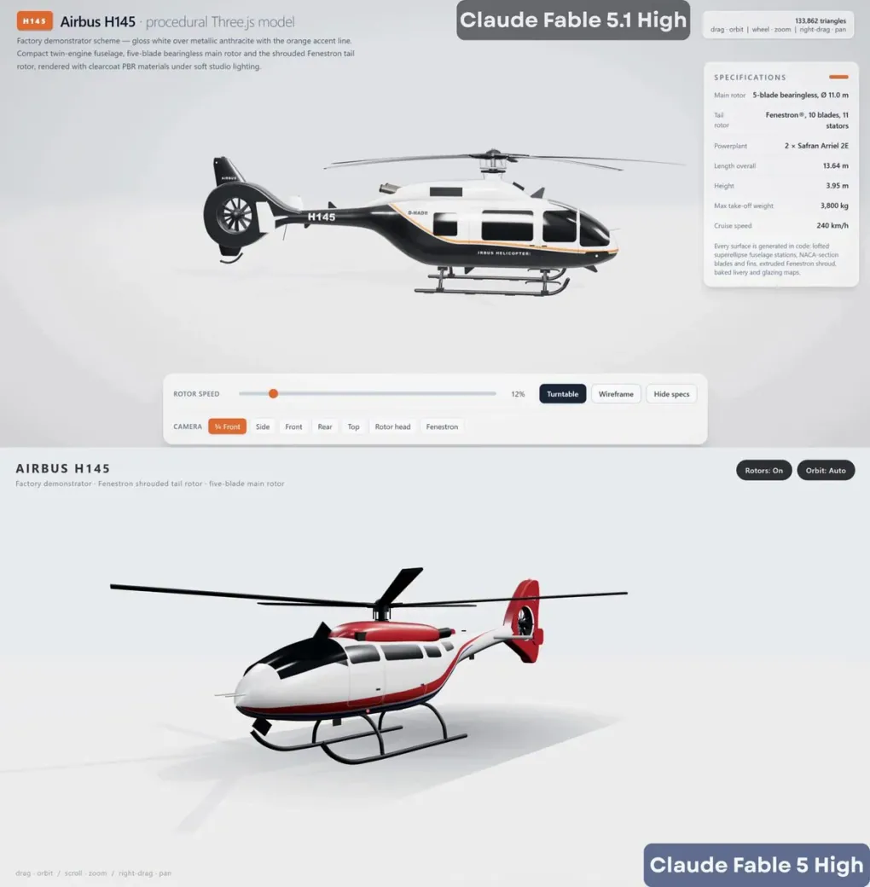</a>

*基于原作品整理的创作说明*

**提示词**

```text
使用 Three.js 创建空客 H145 直升机，让座舱、滑橇与旋翼组件清晰可辨并可检视。
```

[查看详情 ↗](https://www.tripo3d.ai/zh/3d-prompts/airbus-h145-in-three-js-2094882571083735351) · [查看原帖](https://x.com/HarshithLucky3/status/2094882571083735351) · [返回案例导航](#all-prompts)

---

<a id="world-war-i-voxel-simulator-2094881469155914170"></a>

### 第一次世界大战体素模拟器

[Tech2Wild](https://x.com/Tech2Wild) · 2026-09-01 · Claude Fable 5.1 · 动画

<a href="https://www.tripo3d.ai/zh/3d-prompts/world-war-i-voxel-simulator-2094881469155914170">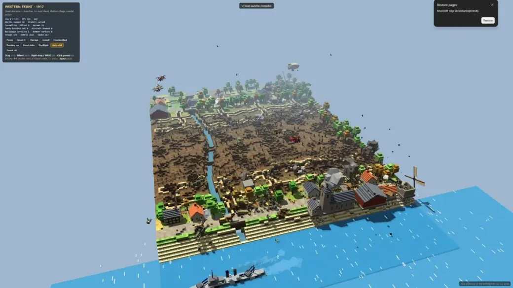</a>

*基于原作品整理的创作说明*

**提示词**

```text
创建一款第一次世界大战体素战场模拟器，包含战壕、士兵、载具、火炮、破坏效果和清晰的战术镜头。
```

[查看详情 ↗](https://www.tripo3d.ai/zh/3d-prompts/world-war-i-voxel-simulator-2094881469155914170) · [查看原帖](https://x.com/Tech2Wild/status/2094881469155914170) · [返回案例导航](#all-prompts)

---

<a id="futuristic-private-island-mansion-2094879208304685524"></a>

### 未来私人岛屿豪宅

[AI/ML API](https://x.com/aimlapi) · 2026-09-01 · Claude Fable 5.1 · 场景

<a href="https://www.tripo3d.ai/zh/3d-prompts/futuristic-private-island-mansion-2094879208304685524">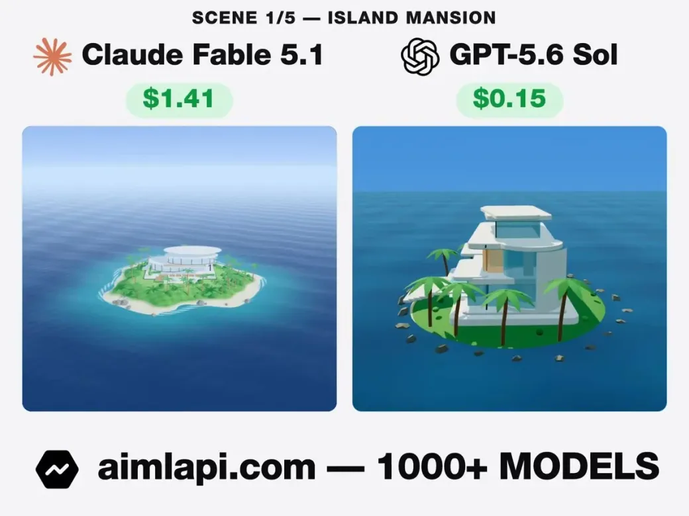</a>

*基于原作品整理的创作说明*

**提示词**

```text
设计一座可探索的未来私人岛屿豪宅，通过五个相连的 Three.js 场景呈现，并加入电影感镜头、高级材质与环境叙事。
```

[查看详情 ↗](https://www.tripo3d.ai/zh/3d-prompts/futuristic-private-island-mansion-2094879208304685524) · [查看原帖](https://x.com/aimlapi/status/2094879208304685524) · [返回案例导航](#all-prompts)

---

<a id="procedurally-generated-three-js-world-2094873862315843910"></a>

### 程序化生成的 Three.js 世界

[Swarogan](https://x.com/swarogan) · 2026-09-01 · Claude Fable 5.1 · 场景

<a href="https://www.tripo3d.ai/zh/3d-prompts/procedurally-generated-three-js-world-2094873862315843910">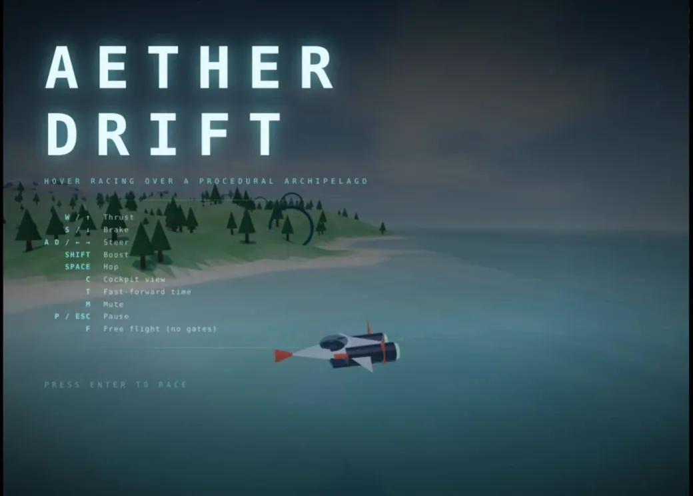</a>

*基于原作品整理的创作说明*

**提示词**

```text
通过一条提示词创建程序化生成的 Three.js 世界，包含多样地形、生物群落、兴趣点、环境生命和流畅探索控制。
```

[查看详情 ↗](https://www.tripo3d.ai/zh/3d-prompts/procedurally-generated-three-js-world-2094873862315843910) · [查看原帖](https://x.com/swarogan/status/2094873862315843910) · [返回案例导航](#all-prompts)

---

<a id="interactive-3d-human-brain-signals-2094873080590225728"></a>

### 交互式 3D 人脑信号

[Greg](https://x.com/GregFeingold) · 2026-09-01 · Claude Fable 5.1 · 互动

<a href="https://www.tripo3d.ai/zh/3d-prompts/interactive-3d-human-brain-signals-2094873080590225728">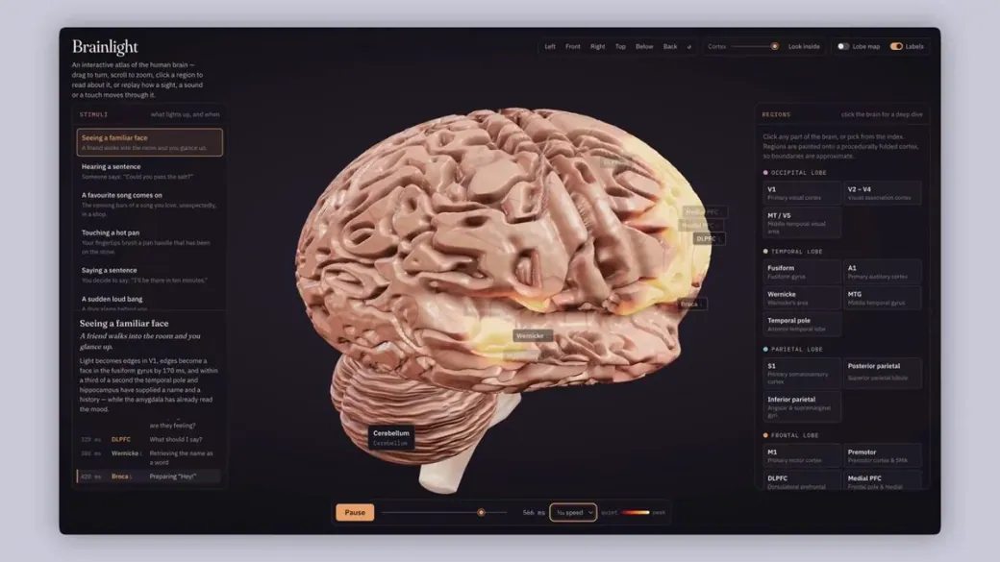</a>

*基于原作品整理的创作说明*

**提示词**

```text
构建带有可辨识皮层沟回的交互式 3D 人脑，并用受 EEG 或 MEG 启发的视觉形式展示类似句子的信号在脑区间传播。
```

[查看详情 ↗](https://www.tripo3d.ai/zh/3d-prompts/interactive-3d-human-brain-signals-2094873080590225728) · [查看原帖](https://x.com/GregFeingold/status/2094873080590225728) · [返回案例导航](#all-prompts)

---

<a id="photorealistic-three-js-landscape-2094871858206191667"></a>

### 照片级 Three.js 自然景观

[Alix Ollivier](https://x.com/aollivier82) · 2026-09-01 · Claude Fable 5.1 · 场景

<a href="https://www.tripo3d.ai/zh/3d-prompts/photorealistic-three-js-landscape-2094871858206191667">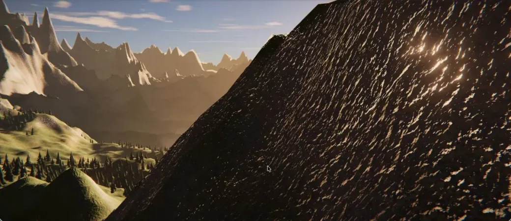</a>

*基于原作品整理的创作说明*

**提示词**

```text
创建照片级 Three.js 自然景观，细化地形、植被、天空、水体、纵深与灯光，并设计自然揭示环境的镜头路径。
```

[查看详情 ↗](https://www.tripo3d.ai/zh/3d-prompts/photorealistic-three-js-landscape-2094871858206191667) · [查看原帖](https://x.com/aollivier82/status/2094871858206191667) · [返回案例导航](#all-prompts)

---

<a id="aaa-horde-shooter-with-webgl-shaders-2094869490165039243"></a>

### 带 WebGL Shader 的 AAA 尸潮射击游戏

[Alexey Fateev](https://x.com/superalesha) · 2026-09-01 · Claude Fable 5.1 · 游戏

<a href="https://www.tripo3d.ai/zh/3d-prompts/aaa-horde-shooter-with-webgl-shaders-2094869490165039243">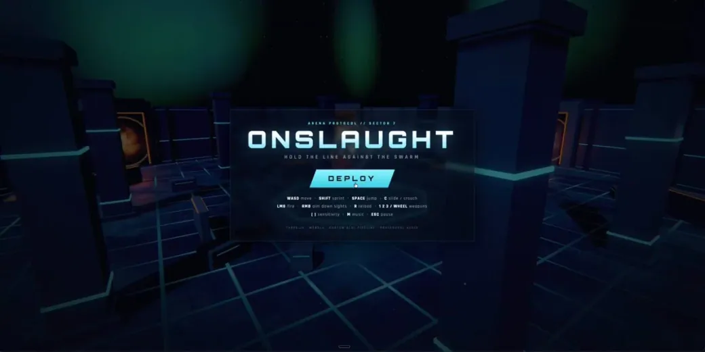</a>

**提示词**

```text
用 Three.js 与 Web Shader 做一款极具冲击力的射击游戏。重点打磨射击、动态、后坐力、画面、命中反馈与枪感；在精心设计的竞技场中迎战尸潮，支持 ADS、武器惯性与重量，并提供突击步枪、霰弹枪和精准步枪。
```

<details>
<summary>作者原始提示词</summary>

```text
Make me the most insane and blast of a shooter you can possibly build on ThreeJS + Web shaders bro! The most important things are shooting, dynamics, recoil, graphics, hit impact, gunplay. It is a beautifully designed arena where enemies swarm in hordes. Include ADS aiming, weapon inertia and weight, plus an assault rifle, shotgun and marksman rifle.
```

</details>

[查看详情 ↗](https://www.tripo3d.ai/zh/3d-prompts/aaa-horde-shooter-with-webgl-shaders-2094869490165039243) · [查看原帖](https://x.com/superalesha/status/2094869490165039243) · [项目源码](https://github.com/alesha-pro/bench-portal) · [在线演示](https://alesha-pro.github.io/bench-portal/games/onslaught-fable-5.1/) · [返回案例导航](#all-prompts)

---

<a id="playable-titanic-disaster-game-2094867850355679617"></a>

### 可玩的泰坦尼克灾难游戏

[Veee](https://x.com/vikktorrrre) · 2026-09-01 · Claude Fable 5.1 · 游戏

<a href="https://www.tripo3d.ai/zh/3d-prompts/playable-titanic-disaster-game-2094867850355679617">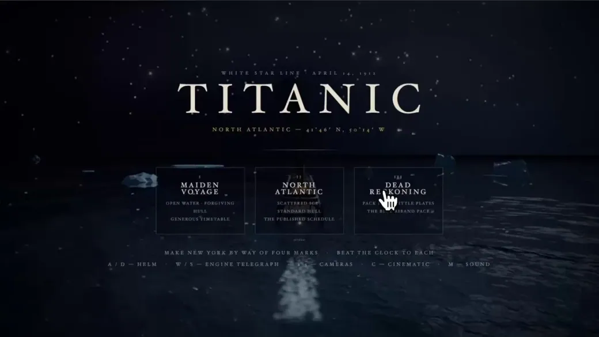</a>

*基于原作品整理的创作说明*

**提示词**

```text
构建一款电影感泰坦尼克号游戏：玩家可以探索船体、完成任务并尝试避开冰山，具有清晰控制和不断升级的危险。
```

[查看详情 ↗](https://www.tripo3d.ai/zh/3d-prompts/playable-titanic-disaster-game-2094867850355679617) · [查看原帖](https://x.com/vikktorrrre/status/2094867850355679617) · [在线演示](https://rms-titanic-1912.netlify.app/) · [返回案例导航](#all-prompts)

---

<a id="multiplayer-dinosaur-survival-game-2094866225960493189"></a>

### 多人恐龙生存游戏

[S](https://x.com/Rubzem) · 2026-09-01 · Claude Fable 5.1 · 游戏

<a href="https://www.tripo3d.ai/zh/3d-prompts/multiplayer-dinosaur-survival-game-2094866225960493189">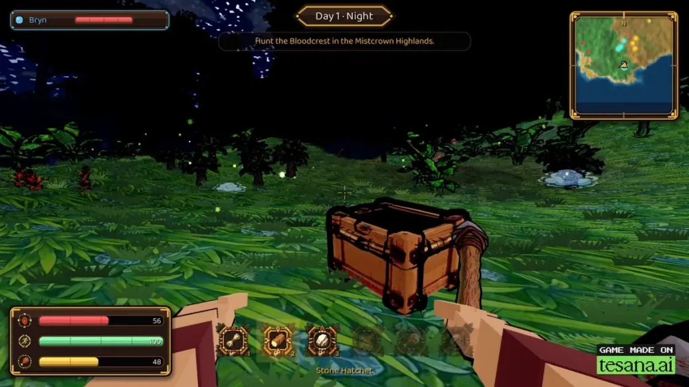</a>

*基于原作品整理的创作说明*

**提示词**

```text
创建一款多人荒野生存游戏，包含狩猎、烹饪、制作、基地建设、危险恐龙与持续探索的成长循环。
```

[查看详情 ↗](https://www.tripo3d.ai/zh/3d-prompts/multiplayer-dinosaur-survival-game-2094866225960493189) · [查看原帖](https://x.com/Rubzem/status/2094866225960493189) · [返回案例导航](#all-prompts)

---

<a id="ten-minute-three-js-game-then-refined-2094855905678446777"></a>

### 十分钟生成并继续完善 Three.js 游戏

[Andrei](https://x.com/HangoutWHAndrei) · 2026-09-01 · Claude Fable 5.1 · 游戏

<a href="https://www.tripo3d.ai/zh/3d-prompts/ten-minute-three-js-game-then-refined-2094855905678446777">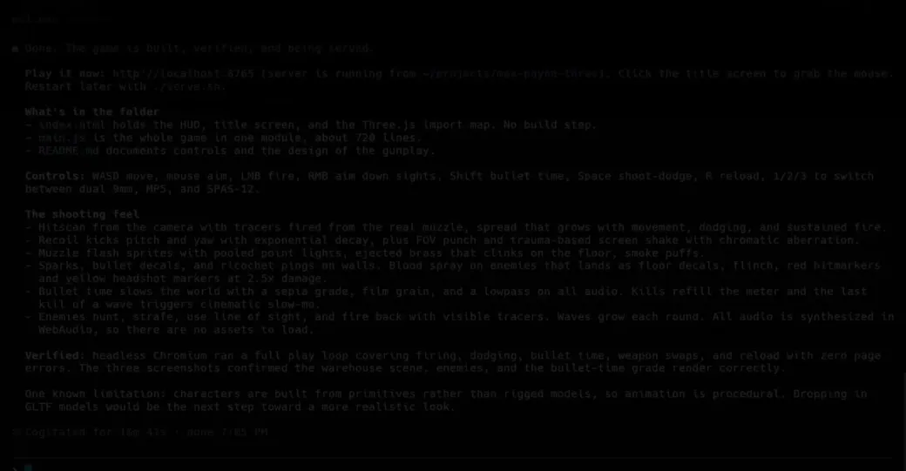</a>

*基于原作品整理的创作说明*

**提示词**

```text
在十分钟内创建一个小型 Three.js 游戏，包含明确目标、灵敏控制、清晰危险物和完整成败状态。试玩后，再通过后续修改完善视觉、节奏与反馈。
```

[查看详情 ↗](https://www.tripo3d.ai/zh/3d-prompts/ten-minute-three-js-game-then-refined-2094855905678446777) · [查看原帖](https://x.com/HangoutWHAndrei/status/2094855905678446777) · [返回案例导航](#all-prompts)

---

<a id="glass-brain-capability-demo-2094853472864682360"></a>

### 玻璃大脑能力演示

[Not Harris \| Builds Apps](https://x.com/viewsfrom02108) · 2026-09-01 · Claude Fable 5.1 · 互动

<a href="https://www.tripo3d.ai/zh/3d-prompts/glass-brain-capability-demo-2094853472864682360">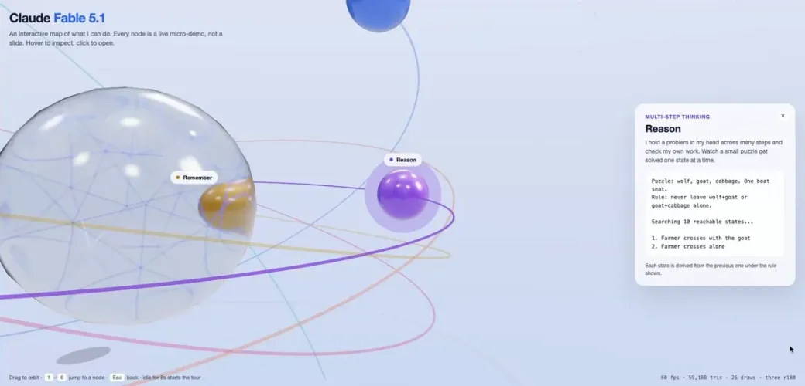</a>

**提示词**

```text
用 Three.js 做一个展示你能力的 Demo。
```

<details>
<summary>作者原始提示词</summary>

```text
make a Three.js demo of your capabilities.
```

</details>

[查看详情 ↗](https://www.tripo3d.ai/zh/3d-prompts/glass-brain-capability-demo-2094853472864682360) · [查看原帖](https://x.com/viewsfrom02108/status/2094853472864682360) · [返回案例导航](#all-prompts)

---

<a id="procedural-voxel-castle-showcase-2093690427849191855"></a>

### 程序化体素城堡展示

[Hakm](https://x.com/hakmgpt) · 2026-08-29 · GPT-6 Astra · 场景

<a href="https://www.tripo3d.ai/zh/3d-prompts/procedural-voxel-castle-showcase-2093690427849191855">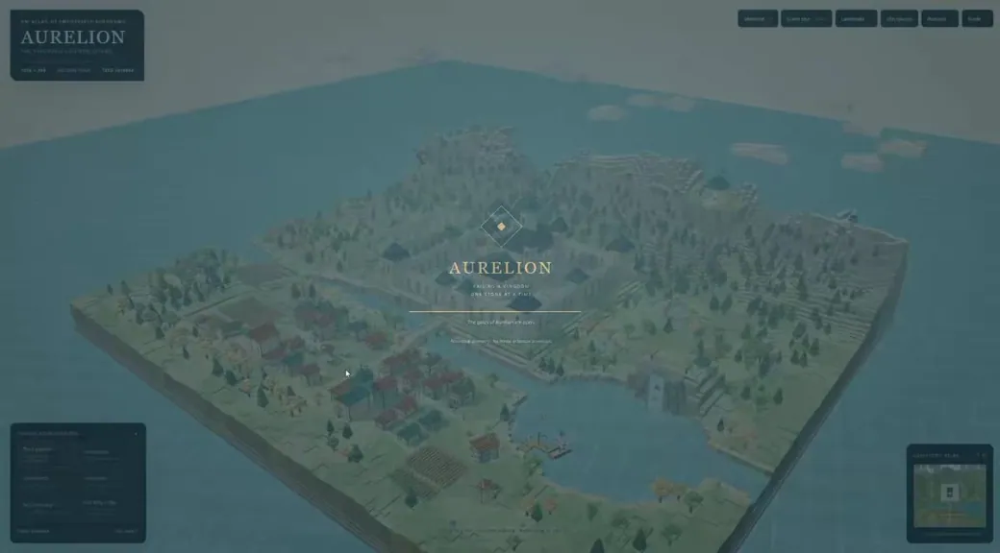</a>

*基于原作品整理的创作说明*

**提示词**

```text
生成大型体素城堡，清晰表现防御层级、塔楼、城墙、城门、庭院与周边地形。使用实例化、环绕镜头、变化光照和确定性生成，让结果稳定且可检视。
```

[查看详情 ↗](https://www.tripo3d.ai/zh/3d-prompts/procedural-voxel-castle-showcase-2093690427849191855) · [查看原帖](https://x.com/hakmgpt/status/2093690427849191855) · [返回案例导航](#all-prompts)

---

<a id="jeep-style-4x4-assembly-in-blender-2082845759452463405"></a>

### 用于 Blender 组装 Jeep 风格 4x4 的提示词

[slash1s](https://x.com/slash1sol) · 2026-07-30 · Claude Opus 5 / Claude Fable 5 · 资产

<a href="https://www.tripo3d.ai/zh/3d-prompts/jeep-style-4x4-assembly-in-blender-2082845759452463405">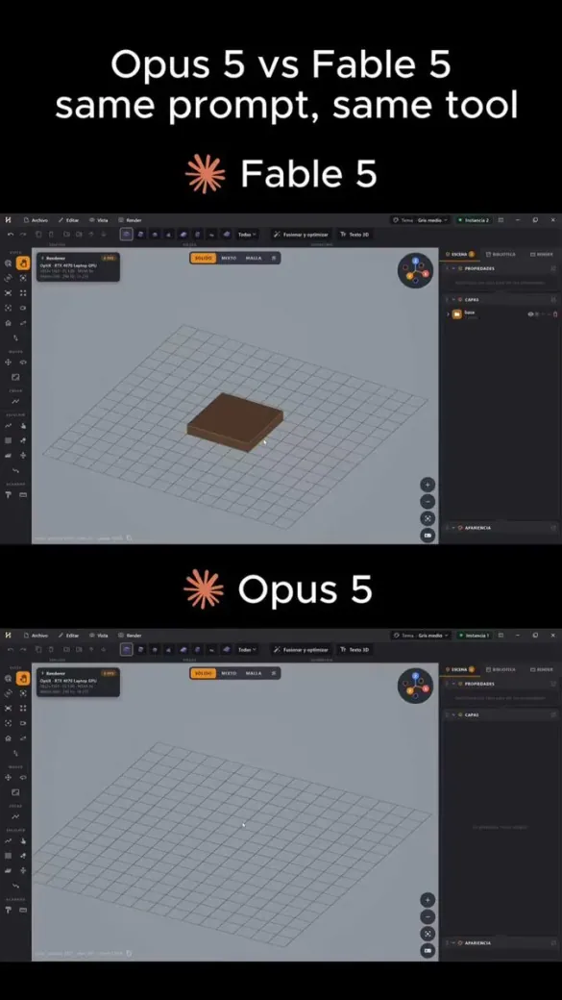</a>

**提示词**

```text
设计一辆 Jeep 风格的 4x4，并在 Blender 中逐部件组装，不进行任何手工建模
```

[查看详情 ↗](https://www.tripo3d.ai/zh/3d-prompts/jeep-style-4x4-assembly-in-blender-2082845759452463405) · [查看原帖](https://x.com/slash1sol/status/2082845759452463405) · [返回案例导航](#all-prompts)

---

<a id="3d-destruction-physics-in-self-contained-html-2082832042702561372"></a>

### 用于独立 HTML 场景的 3D 破坏物理提示词

[FHILY👑](https://x.com/Oluwaphilemon1) · 2026-07-30 · Kimi K3 · 动画

<a href="https://www.tripo3d.ai/zh/3d-prompts/3d-destruction-physics-in-self-contained-html-2082832042702561372">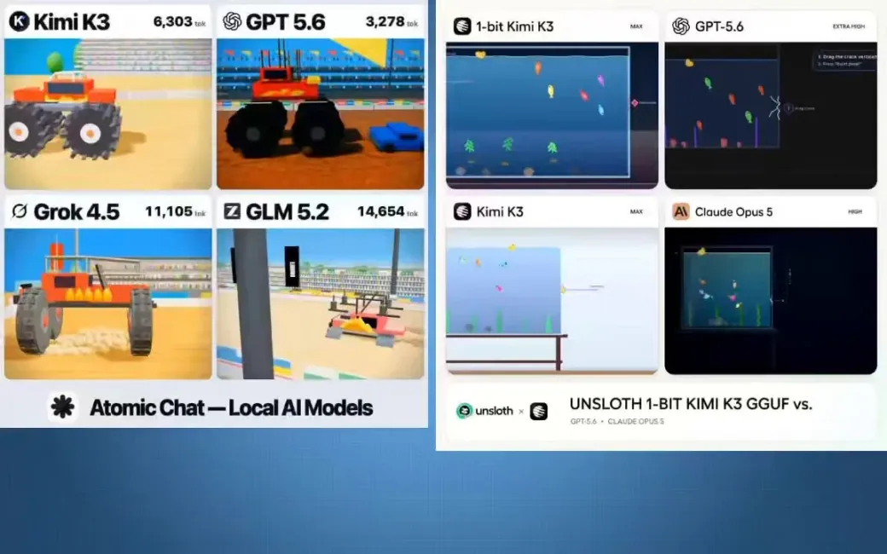</a>

**提示词**

```text
一辆怪兽卡车碾过一排汽车
两辆汽车飞跃峡谷，并在空中迎头相撞
一把巨大的铁砧逐个压扁汽车
```

[查看详情 ↗](https://www.tripo3d.ai/zh/3d-prompts/3d-destruction-physics-in-self-contained-html-2082832042702561372) · [查看原帖](https://x.com/Oluwaphilemon1/status/2082832042702561372) · [返回案例导航](#all-prompts)

---

<a id="mech-robot-blueprint-set-2082760534500188606"></a>

### Claude Opus 5 机甲机器人蓝图提示集

[Spectro](https://x.com/Spectromachina) · 2026-07-30 · Claude Opus 5 · 资产

<a href="https://www.tripo3d.ai/zh/3d-prompts/mech-robot-blueprint-set-2082760534500188606">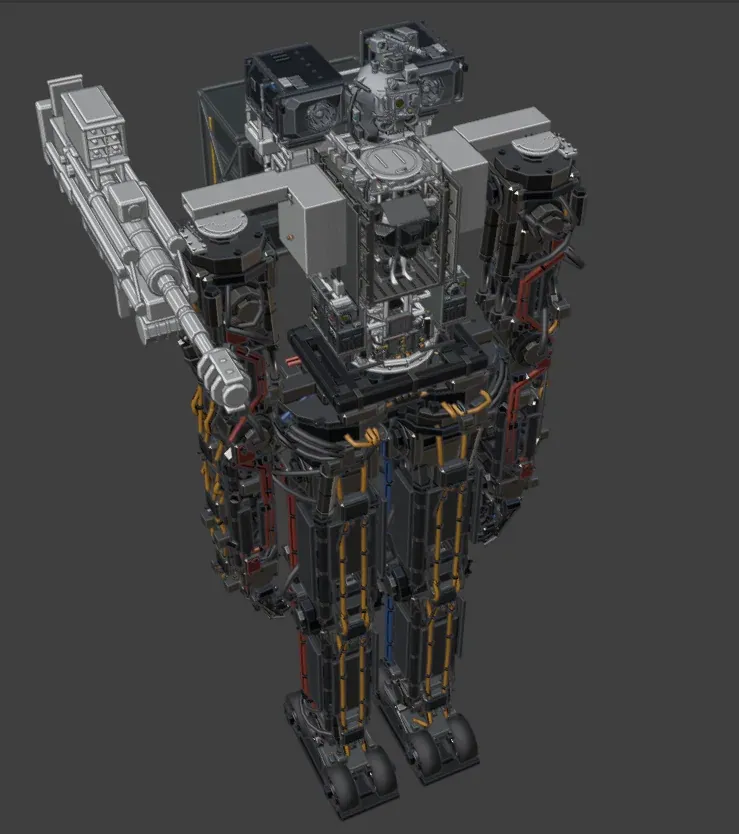</a>

**提示词**

```text
分享一下我用 Claude OPUS 5 + Blender 创建一台 GUNDAM 尺寸机甲机器人蓝图时使用的提示，基于真实数学和物理：

"让我们来考虑机甲的设计，本质上它有 2 台涡轮轴发动机，并由电动马达 + 液压动力驱动，它还有一个辅助动力装置，或许也有气动系统；它有强力电池，在情况变糟时能让它稍微滑行一下。我在想把这 2 台发动机放在机甲的肩部，服务面板朝外，这样我们就可以对它进行维护。顺便再看一遍机甲的系统，然后我们就要把所有系统都物理化地创建出来。这会很棒，给你安排一个代理来帮你做这件事，然后重建躯干部分，但在中间留出一个大空间给驾驶舱 + 睡眠舱。"

"如果我们给它的脚装上由电动马达驱动的轮子呢？这样大多数时候应该能辅助移动。"

"分配一个代理来读取这些指标并创建腿部设计，把真实的电线接入执行器之类的东西。"

"好，把新的 glb 模型注入场景。"

"天啊，这也太疯狂了。伙计，快把其他部分先显示出来。"

"给那个低多边形头部加上真正的 FLIR + NV 摄像头，以及一把 1980/1990 年代的 CROWS M2 机枪。"

"它……太美了……T_T"

"我们必须给腿部骨架做绑定，这样如果我给它做动画，它就会遵守约束，而且这对计算力等也很必要。"

"没事，我反正也不太懂哈哈，"
"好，所以你已经做好的那些东西，比如发动机、动力传动系统和腿部，把这些部分保存好以便以后使用，万一我们能在其他地方复用它们。话虽如此，指示一个代理去构建手臂和手。"

"另外，正确设计髋部机构以适配腿部。"

"在我看来，PELVIS 和 CHEST 之间的关节具有圆形扭矩。"

"找一个代理，使用 bofors 系统创建一把手持半自动步枪，这样机器人就有些快速射击的半自动砰砰武器了。"

"我想要 40mm 的，真的做一个出来，准确但保持低多边形，这样我们就能测量它是更适合作为手枪还是半自动步枪。"

"两种都做，然后再做一个像 abrams 加农炮但带半自动机制的版本。"
"创建一个像步枪那样的枪栓和弹簧。"

"好，所以我在想，驾驶舱里把所有装饰性的线缆之类都去掉，真正做真实布线 o-O 你怎么看"

"方案：做真实布线，但像一头野蛮动物那样布线。"

"注入 120mm 加农炮那个东西。"

"给 120mm 加农炮的运作做绑定和动画。"

"我想在这里加一个装甲大舱门，这样我们就能让座椅升起，让驾驶员能从那个位置看到周围并驾驶机甲，而且驾驶舱内的 4 个伸缩式观察窗在顶部也需要有对应的终点，这样才合理。"
"继续给 120mm 做绑定和动画，还有舱门命令，刚才是误触暂停。"

"好，所以动力装置，我觉得腹部是个不错的位置，不过我不喜欢发动机现在的位置，我觉得我们应该把它们放到现有位置的上方，并用真实的桁架结构来支撑躯干和肩部……看你怎么决定，你想怎么做胸部？我们要做舱门入口，这样前胸就可以建出来……"

"好，外壳可以用厚铝甚至碳纤维，我无所谓，但必须看起来很酷，我猜 NCT 可以作为装甲吗？不知道，你来决定，我们之后还得加一些东西让这个怪物看起来没那么难以接受……总之，带上你的团队开始建造。"

"我发现这个 inverter PT125 到处漂着，我不知道它应该放在哪。"
```

[查看详情 ↗](https://www.tripo3d.ai/zh/3d-prompts/mech-robot-blueprint-set-2082760534500188606) · [查看原帖](https://x.com/Spectromachina/status/2082760534500188606) · [返回案例导航](#all-prompts)

---

<a id="need-for-speed-style-godot-game-2082714235373584582"></a>

### Need for Speed 风格 Godot 游戏提示词

[FHILY👑](https://x.com/Oluwaphilemon1) · 2026-07-30 · Kimi K3 · 游戏

<a href="https://www.tripo3d.ai/zh/3d-prompts/need-for-speed-style-godot-game-2082714235373584582">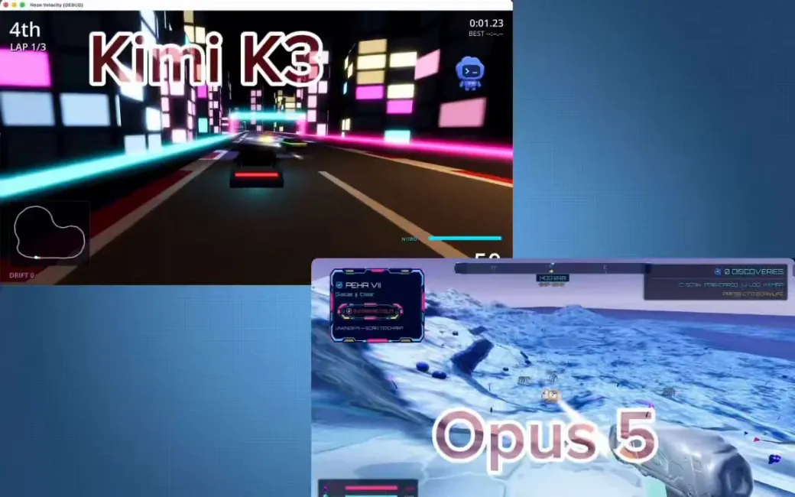</a>

**提示词**

```text
给我做一个 NFS 类型的游戏。
```

[查看详情 ↗](https://www.tripo3d.ai/zh/3d-prompts/need-for-speed-style-godot-game-2082714235373584582) · [查看原帖](https://x.com/Oluwaphilemon1/status/2082714235373584582) · [返回案例导航](#all-prompts)

---

<a id="cracking-aquarium-3d-simulation-2082528683747873194"></a>

### Kimi K3 玻璃水族箱开裂爆裂 3D 仿真提示词

[Unsloth AI](https://x.com/UnslothAI) · 2026-07-29 · Kimi K3 · 动画

<a href="https://www.tripo3d.ai/zh/3d-prompts/cracking-aquarium-3d-simulation-2082528683747873194">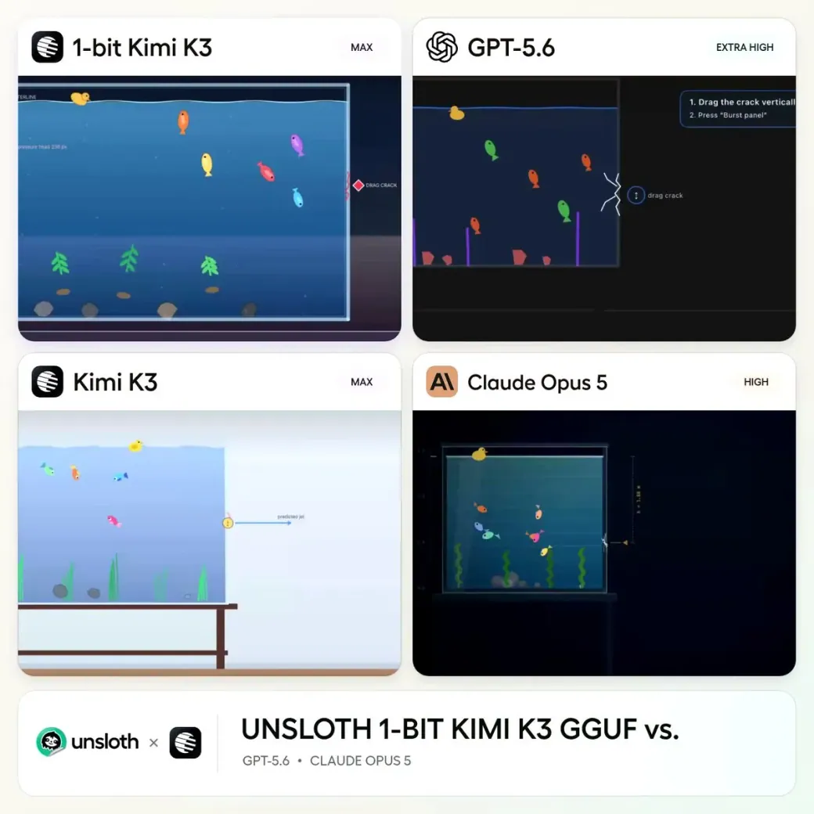</a>

**提示词**

```text
创建一个玻璃水族箱，其侧板先出现可见裂纹，然后破裂。
```

[查看详情 ↗](https://www.tripo3d.ai/zh/3d-prompts/cracking-aquarium-3d-simulation-2082528683747873194) · [查看原帖](https://x.com/UnslothAI/status/2082528683747873194) · [返回案例导航](#all-prompts)

---

<a id="playable-combat-game-2082507403598373134"></a>

### Kimi K3 的可玩战斗游戏提示词

[Darshal Jaitwar](https://x.com/darshal_) · 2026-07-29 · Kimi K3 · 游戏

<a href="https://www.tripo3d.ai/zh/3d-prompts/playable-combat-game-2082507403598373134">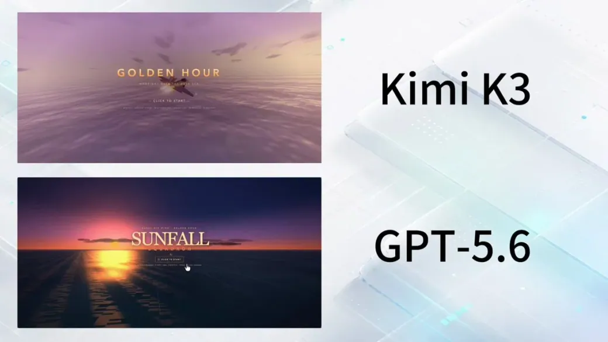</a>

**提示词**

```text
构建一个可玩的战斗游戏
```

[查看详情 ↗](https://www.tripo3d.ai/zh/3d-prompts/playable-combat-game-2082507403598373134) · [查看原帖](https://x.com/darshal_/status/2082507403598373134) · [返回案例导航](#all-prompts)

---

<a id="league-of-legends-style-1v1-game-in-one-html-file-2082474707727581564"></a>

### Kimi K3 的《英雄联盟》风格 1v1 单页 HTML 游戏提示词

[Fokki](https://x.com/0x_fokki) · 2026-07-29 · Kimi K3 · 游戏

<a href="https://www.tripo3d.ai/zh/3d-prompts/league-of-legends-style-1v1-game-in-one-html-file-2082474707727581564"></a>

**提示词**

```text
我在 Verdent 上给 Kimi K3 和 GPT-5.6 输入了同一个提示词：在一个 HTML 文件里构建一个可玩的英雄联盟风格 1v1。

两者都生成了一个游戏。我把它们并排打开逐个玩了一遍。

我在两次运行之间只改了一个东西：https://t.co/ItoGlnpiXi https://t.co/3PYQVli1zm 下拉菜单里的模型
```

[查看详情 ↗](https://www.tripo3d.ai/zh/3d-prompts/league-of-legends-style-1v1-game-in-one-html-file-2082474707727581564) · [查看原帖](https://x.com/0x_fokki/status/2082474707727581564) · [返回案例导航](#all-prompts)

---

<a id="single-file-3d-sun-visualizer-2082461416049525077"></a>

### 适用于 Claude Opus 5 的单文件 3D 太阳可视化提示词

[AlysisAI](https://x.com/AlysisAI) · 2026-07-29 · Claude Opus 5 / Kimi K3 · 互动

<a href="https://www.tripo3d.ai/zh/3d-prompts/single-file-3d-sun-visualizer-2082461416049525077">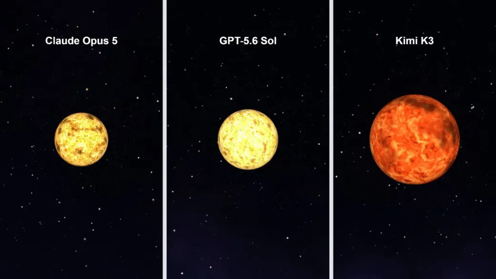</a>

**提示词**

```text
构建一个在太空中旋转的 3D 太阳可视化器。一个 HTML 文件。
```

[查看详情 ↗](https://www.tripo3d.ai/zh/3d-prompts/single-file-3d-sun-visualizer-2082461416049525077) · [查看原帖](https://x.com/AlysisAI/status/2082461416049525077) · [返回案例导航](#all-prompts)

---

<a id="explorable-3d-room-with-computer-workstation-2082451081733591520"></a>

### 围绕电脑工作站的 3D 房间提示词，用于单文件 Three.js 构建

[thehype.](https://x.com/thehypedotnews) · 2026-07-29 · Kimi K3 · 场景

<a href="https://www.tripo3d.ai/zh/3d-prompts/explorable-3d-room-with-computer-workstation-2082451081733591520">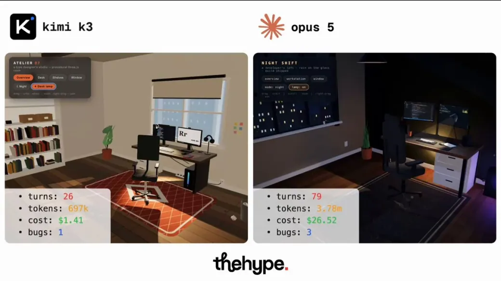</a>

**提示词**

```text
构建一个围绕电脑工作站的可探索 3D 房间，单个自包含 HTML 文件，使用通过 importmap 引入的 Three.js，仅用程序化几何，不要网格，不要图像纹理，不指定布局或风格。“你是设计师。给我惊喜”
```

[查看详情 ↗](https://www.tripo3d.ai/zh/3d-prompts/explorable-3d-room-with-computer-workstation-2082451081733591520) · [查看原帖](https://x.com/thehypedotnews/status/2082451081733591520) · [返回案例导航](#all-prompts)

---

<a id="non-euclidean-door-portal-in-unreal-engine-5-2082436347113951333"></a>

### Claude Opus 5 的非欧几里得门传送门提示

[Ombrage](https://x.com/ombrageplays) · 2026-07-29 · Claude Opus 5 · 场景

<a href="https://www.tripo3d.ai/zh/3d-prompts/non-euclidean-door-portal-in-unreal-engine-5-2082436347113951333">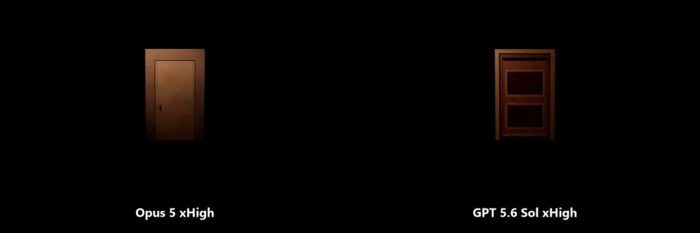</a>

**提示词**

```text
"一扇孤零零地立在虚空中的门，周围什么都没有，身后也什么都没有，它打开后通向关卡中别处的一间教室。直接走过去——不要切换、淡出、加载界面，或者任何会让人感觉在传送的东西。它必须能从两侧、从各个角度正常工作。"
```

[查看详情 ↗](https://www.tripo3d.ai/zh/3d-prompts/non-euclidean-door-portal-in-unreal-engine-5-2082436347113951333) · [查看原帖](https://x.com/ombrageplays/status/2082436347113951333) · [返回案例导航](#all-prompts)

---

<a id="simple-first-person-shooter-in-three-js-2082242351372599770"></a>

### 用于 Three.js 游戏构建的简单 FPS 提示词

[Code With Antonio](https://x.com/codewithantonio) · 2026-07-28 · Kimi K3 · 游戏

<a href="https://www.tripo3d.ai/zh/3d-prompts/simple-first-person-shooter-in-three-js-2082242351372599770">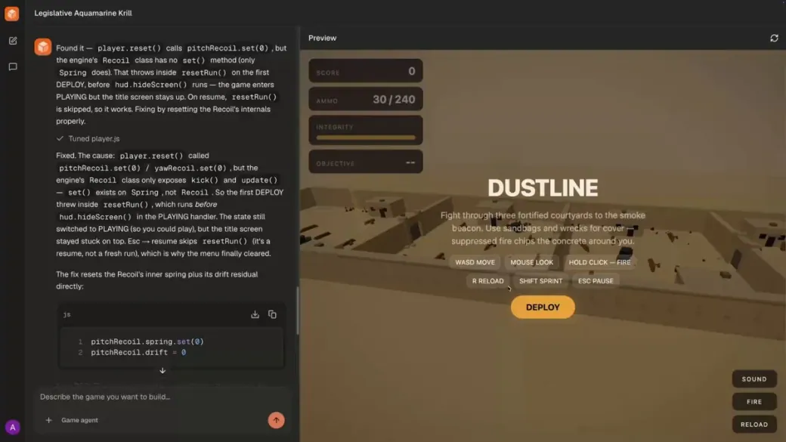</a>

**提示词**

```text
帮我做一个 FPS
```

[查看详情 ↗](https://www.tripo3d.ai/zh/3d-prompts/simple-first-person-shooter-in-three-js-2082242351372599770) · [查看原帖](https://x.com/codewithantonio/status/2082242351372599770) · [返回案例导航](#all-prompts)

---

<a id="cs2-and-battlefield-style-fps-2082241827298557966"></a>

### 用于 Claude Opus 5 的 CS2 与 Battlefield 风格第一人称射击游戏提示词

[Anatoli Kopadze](https://x.com/AnatoliKopadze) · 2026-07-28 · Claude Opus 5 · 游戏

<a href="https://www.tripo3d.ai/zh/3d-prompts/cs2-and-battlefield-style-fps-2082241827298557966">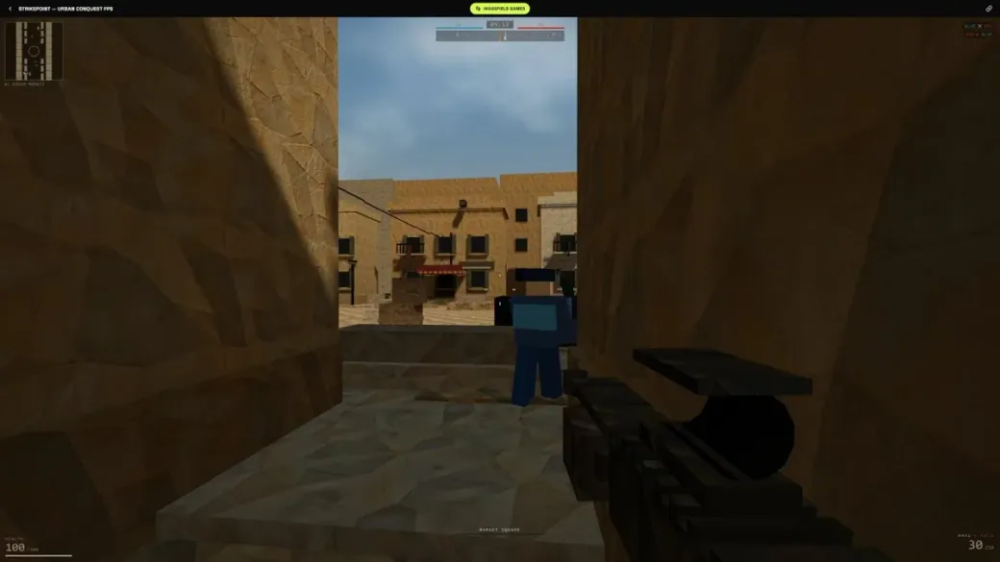</a>

**提示词**

```text
尝试制作一款结合 CS2 和 Battlefield 的第一人称射击游戏。
```

[查看详情 ↗](https://www.tripo3d.ai/zh/3d-prompts/cs2-and-battlefield-style-fps-2082241827298557966) · [查看原帖](https://x.com/AnatoliKopadze/status/2082241827298557966) · [返回案例导航](#all-prompts)

---

<a id="aaa-shooter-game-2082180453889712318"></a>

### Claude Opus 5 AAA 射击游戏提示词

[Garry Yuan](https://x.com/ziqinyuan) · 2026-07-28 · Claude Opus 5 · 游戏

<a href="https://www.tripo3d.ai/zh/3d-prompts/aaa-shooter-game-2082180453889712318">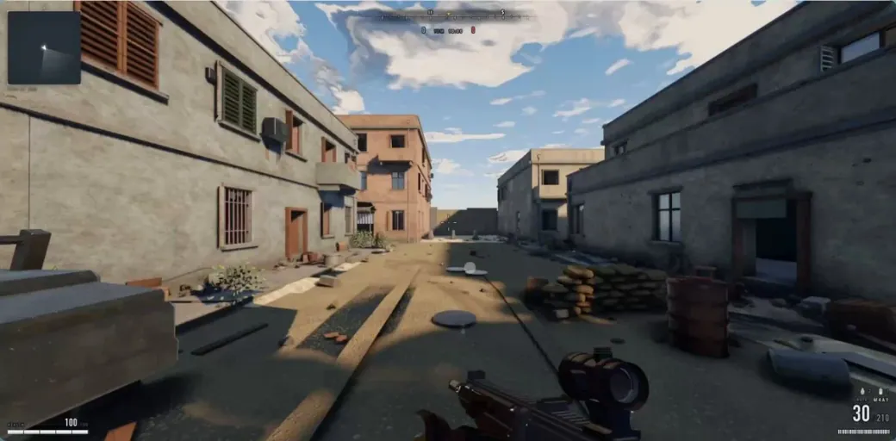</a>

**提示词**

```text
最近，Claude Opus 5 创建的《使命召唤》游戏开始在网上走红，作者声称只用了一个提示就实现了。很多人对此持怀疑态度，而作者已经直接开源了代码和提示。

我原本以为这个提示会非常复杂，但结果只有短短几百个字。关键在于其中的循环。

以下是提示：

"我希望你开发一款能达到最新《使命召唤》水平的第一人称射击游戏。它必须完美无缺，拥有令人惊叹的美丽画面，从纹理到物理效果——你能想到的所有元素都必须达到 AAA 级质量。

你需要创建多个子代理，让每个子代理分别处理每一个细节，以确保游戏达到完美。你应该对每个项目使用 /loop，并让一个独立子代理进行视觉检查，以确保其达到 AAA 级标准。这个独立子代理必须非常严格；如果没有达到 AAA 级标准，它就应该继续检查。

在每个子代理与《使命召唤》游戏对比后，都不要停止，直到它们都对游戏画面质量惊叹不已。即使不看画面，它也应该能够将两款游戏并排比较，并指出哪一款更好。使用 ThreeJS 完成这项工作。/loop 直到游戏达到完美。创建多个子代理，并使用 UltraCode 进行优化。"
```

[查看详情 ↗](https://www.tripo3d.ai/zh/3d-prompts/aaa-shooter-game-2082180453889712318) · [查看原帖](https://x.com/ziqinyuan/status/2082180453889712318) · [返回案例导航](#all-prompts)

---

<a id="playable-dark-fantasy-side-scroller-in-a-single-html-file-2082096376763060575"></a>

### 在单个 HTML 文件中制作可玩的黑暗奇幻横版卷轴游戏

[slash1s](https://x.com/slash1sol) · 2026-07-28 · Claude Fable 5 · 游戏

<a href="https://www.tripo3d.ai/zh/3d-prompts/playable-dark-fantasy-side-scroller-in-a-single-html-file-2082096376763060575">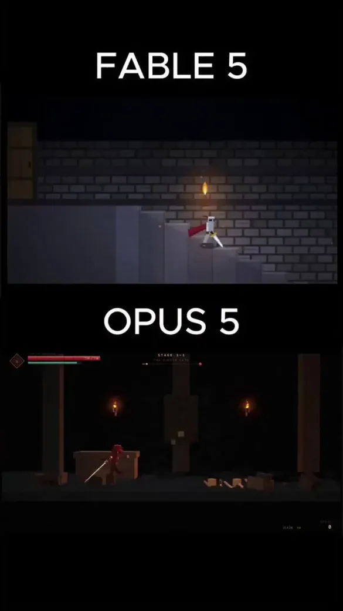</a>

**提示词**

```text
在一个 HTML 文件中，创建一个可玩的黑暗奇幻横版卷轴游戏。
```

[查看详情 ↗](https://www.tripo3d.ai/zh/3d-prompts/playable-dark-fantasy-side-scroller-in-a-single-html-file-2082096376763060575) · [查看原帖](https://x.com/slash1sol/status/2082096376763060575) · [返回案例导航](#all-prompts)

---

<a id="development-workflow-for-a-3d-mmo-2082035844836450334"></a>

### Claude Opus 5 开发 3D MMO 的工作流程

[Vibe Coding Thailand](https://x.com/vibecodingth) · 2026-07-28 · Claude Opus 5 · 游戏

<a href="https://www.tripo3d.ai/zh/3d-prompts/development-workflow-for-a-3d-mmo-2082035844836450334"></a>

**提示词**

```text
几乎所有代码都是用 Claude Opus 5 写的。

但我想说，让它能持续推进、迭代上千轮的，不是提示词有多厉害。
而是把家里整理好，让 AI 能找到东西，而不用读完整个项目。

1. 手册放在代码旁边，不是堆在一处
   每个文件夹都有自己的手册文件（常用工作方式 + 遇到过的坑）
   然后在该文件夹里开启会话时它会自动加载
   碰到怪物相关的工作就不需要为地图手册付费
   每次开始工作前都要读取的上下文，从大约 ~76,000 token 降到 ~10,000

2. 用工具强制规则，不靠纪律
   我让它写脚本：如果遇到循环导入回到原处，构建就会失败
   使用时直接写颜色数字，而不是只在一处给它命名
   不要指望 AI 记住规则。让它在提交时出错要好得多。

3. 让 TypeScript 来提醒
   新增技能但还没做特效 = 编译不过
   新增怪物但还没做模型 = 编译不过
   不会忘，因为它不允许你忘。

4. 把内容做成表格
   加怪物、加技能、加物品 = 只加一行，不用去改系统
   AI 处理“加一行”要比“去改五个必须保持一致的地方”准确得多

5. 有效的提示词是告诉它判定标准，不是告诉它步骤
   例如“普通怪必须在 2 到 5 秒内死亡”
   “每张地图至少要能走到 97% 的区域”
   “游戏里的物品没有任何一件掉率低于 3%”
   然后把这些写成测试
   当你告诉它什么是好的，它就会自己找路，而且它自己也知道是否已经完成。

简短总结：先在结构和测试上投入，再把精力放到提示词上。

如果有问题，或者想让我展开某个部分，欢迎留言。
```

<details>
<summary>作者原始提示词</summary>

```text
โค้ดเกือบทั้งหมดเขียนด้วย Claude Opus 5 ครับ

แต่อยากบอกว่าสิ่งที่ทำให้มันไปต่อได้ iterate loop เป็นพันรอบ ไม่ใช่ prompt เก่งนะครับ
มันคือการจัดบ้านให้ AI หาของเจอ โดยไม่ต้องอ่านทั้งโปรเจกต์

1. คู่มืออยู่ข้างโค้ด ไม่ใช่กองไว้ที่เดียว
   ทุกโฟลเดอร์มีไฟล์คู่มือของตัวเอง (วิธีทำงานที่ทำบ่อย + กับดักที่เคยเจอ)
   แล้วมันโหลดเองตอนเปิด session ในโฟลเดอร์นั้น
   งานที่แตะมอนเลยไม่ต้องจ่ายค่าคู่มือแมพ
   บริบทที่ต้องอ่านก่อนเริ่มงานทุกครั้ง จากใหญ่ประมาณ ~76,000 token เหลือ ~10,000

2. กฎบังคับด้วยเครื่อง ไม่ใช่ด้วยวินัย
   ผมให้มันเขียน script ที่ build พัง เลยถ้าเจอ import วนกลับที่เดิม
   เขียนเลขสีตรงจุดใช้งานแทนที่จะตั้งชื่อไว้ที่เดียว
   อย่าหวังว่า AI จะจำกฎได้ครับ ทำให้มันพังตอน commit ดีกว่าเยอะ

3. ให้ TypeScript เป็นคนเตือน
   เพิ่มสกิลใหม่แล้วยังไม่ได้ทำเอฟเฟกต์ = คอมไพล์ไม่ผ่าน
   เพิ่มมอนใหม่แล้วยังไม่ได้ปั้นโมเดล = คอมไพล์ไม่ผ่าน
   ลืมไม่ได้ เพราะมันไม่ยอมให้ลืม

4. ทำ content ให้เป็นตาราง
   เพิ่มมอน เพิ่มสกิล เพิ่มของ = เพิ่มแถวเดียว ไม่ต้องไปแก้ระบบ
   AI ทำงานกับ "เพิ่มแถว" ได้แม่นกว่า "ไปแก้ห้าที่ให้สอดคล้องกัน" เยอะมาก

5. prompt ที่ได้ผลคือบอกเกณฑ์ตัดสิน ไม่ใช่บอกขั้นตอน
   เช่น "มอนธรรมดาต้องตายใน 2 ถึง 5 วินาที"
   "ทุกแมพต้องเดินไปถึงได้อย่างน้อย 97% ของพื้นที่"
   "ของในเกมห้ามมีชิ้นไหนดรอปต่ำกว่า 3%"
   แล้วเขียนพวกนี้เป็นเทสไว้
   พอบอกไปว่าอะไรคือดี มันหาทางไปเอง แล้วมันรู้ตัวเองด้วยว่าทำสำเร็จหรือยัง

สรุปสั้น ๆ คือ ลงแรงกับโครงสร้างและเทสก่อน แล้วค่อยไปลงแรงกับ prompt ครับ

ใครมีคำถามหรืออยากให้ลงรายละเอียดตรงไหนเพิ่ม คอมเมนต์ไว้ได้เลยครับ
```

</details>

[查看详情 ↗](https://www.tripo3d.ai/zh/3d-prompts/development-workflow-for-a-3d-mmo-2082035844836450334) · [查看原帖](https://x.com/vibecodingth/status/2082035844836450334) · [返回案例导航](#all-prompts)

---

<a id="make-a-playable-chrome-dino-game-2081867025140650236"></a>

### 制作一个可玩的 Chrome 恐龙游戏

[Kai](https://x.com/unseenmars_) · 2026-07-27 · Kimi K3 · 游戏

<a href="https://www.tripo3d.ai/zh/3d-prompts/make-a-playable-chrome-dino-game-2081867025140650236">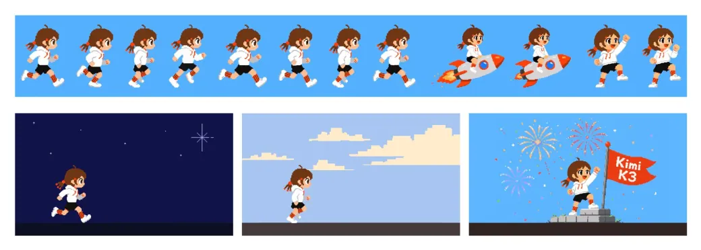</a>

**提示词**

```text
制作一个可玩的 Chrome 恐龙跑酷游戏。
```

[查看详情 ↗](https://www.tripo3d.ai/zh/3d-prompts/make-a-playable-chrome-dino-game-2081867025140650236) · [查看原帖](https://x.com/unseenmars_/status/2081867025140650236) · [返回案例导航](#all-prompts)

---

<a id="realistic-helicopter-shooter-game-2081791572115435765"></a>

### 用于逼真直升机射击游戏的 Kimi K3 提示词

[karti](https://x.com/Abobsterina) · 2026-07-27 · Kimi K3 · 游戏

<a href="https://www.tripo3d.ai/zh/3d-prompts/realistic-helicopter-shooter-game-2081791572115435765">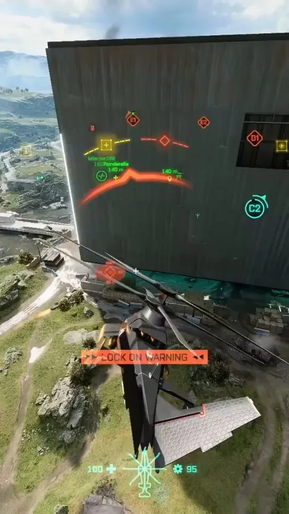</a>

**提示词**

```text
帮我制作一个逼真的直升机射击游戏。
```

[查看详情 ↗](https://www.tripo3d.ai/zh/3d-prompts/realistic-helicopter-shooter-game-2081791572115435765) · [查看原帖](https://x.com/Abobsterina/status/2081791572115435765) · [返回案例导航](#all-prompts)

---

<a id="subway-surfers-style-game-2081766198082220514"></a>

### 用于 Subway Surfers 风格游戏的 Kimi K3 提示词

[Arindam Majumder 𝕏](https://x.com/Arindam_1729) · 2026-07-27 · Kimi K3 · 游戏

<a href="https://www.tripo3d.ai/zh/3d-prompts/subway-surfers-style-game-2081766198082220514">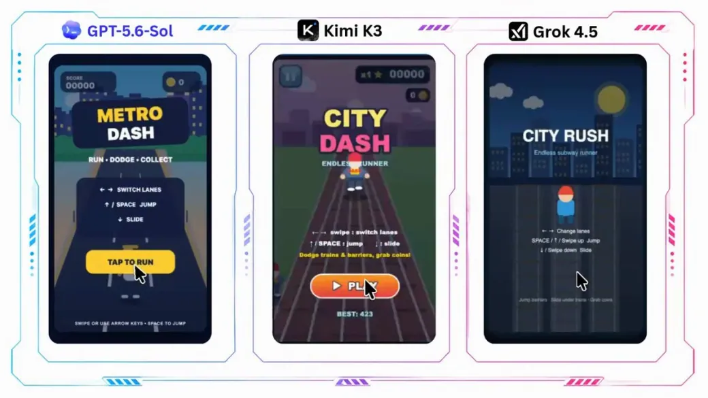</a>

**提示词**

```text
制作一个 Subway Surfers 游戏
```

[查看详情 ↗](https://www.tripo3d.ai/zh/3d-prompts/subway-surfers-style-game-2081766198082220514) · [查看原帖](https://x.com/Arindam_1729/status/2081766198082220514) · [返回案例导航](#all-prompts)

---

<a id="counter-strike-inspired-three-js-fps-2081607528790856068"></a>

### 用于受 Counter-Strike 启发的 Three.js FPS 的 Claude Opus 5 提示词

[Build Fast with AI](https://x.com/BuildFastWithAI) · 2026-07-27 · Claude Opus 5 · 游戏

<a href="https://www.tripo3d.ai/zh/3d-prompts/counter-strike-inspired-three-js-fps-2081607528790856068">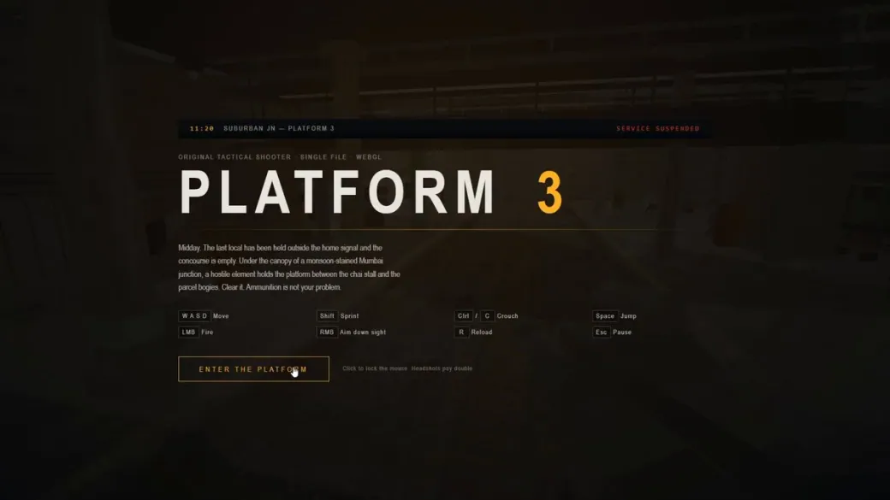</a>

**提示词**

```text
一款受 Counter-Strike 启发、设定在火车站中的战术 FPS。three.js，单个 HTML 文件，全部原创素材。
```

[查看详情 ↗](https://www.tripo3d.ai/zh/3d-prompts/counter-strike-inspired-three-js-fps-2081607528790856068) · [查看原帖](https://x.com/BuildFastWithAI/status/2081607528790856068) · [返回案例导航](#all-prompts)

---

<a id="infinite-three-js-paper-machine-2081533777340506251"></a>

### Claude Fable 5 的无限 Three.js 纸带机提示词

[0xMarioNawfal](https://x.com/RoundtableSpace) · 2026-07-27 · Claude Fable 5 · 互动

<a href="https://www.tripo3d.ai/zh/3d-prompts/infinite-three-js-paper-machine-2081533777340506251">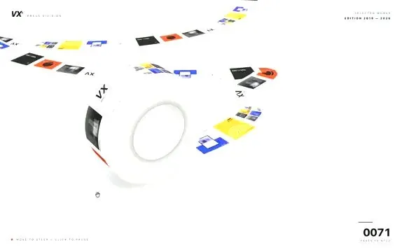</a>

**提示词**

```text
用单个提示词构建一个无限的 Three.js 纸带机。将静态的 Pinterest 概念转换为一个可运行的 3D Web 应用。应用应渲染一条无限滚动的纸带，并在其表面实时持续打印动态图片。
```

[查看详情 ↗](https://www.tripo3d.ai/zh/3d-prompts/infinite-three-js-paper-machine-2081533777340506251) · [查看原帖](https://x.com/RoundtableSpace/status/2081533777340506251) · [返回案例导航](#all-prompts)

---


[完整目录](catalog.zh.md) · [←](catalog.zh.8.md) · **9 / 10** · [→](catalog.zh.10.md)

<p align="center"><strong><a href="https://www.tripo3d.ai/zh/3d-prompts?utm_source=github&amp;utm_medium=referral&amp;utm_campaign=awesome_3d_prompts&amp;utm_content=catalog_footer">查看全部 476 条案例与在线演示 →</a></strong></p>
